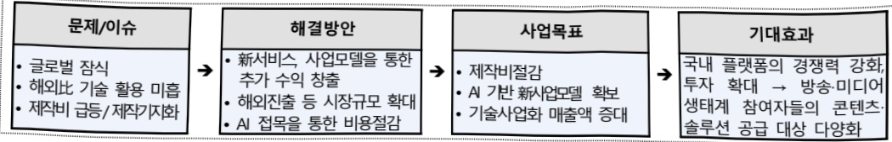
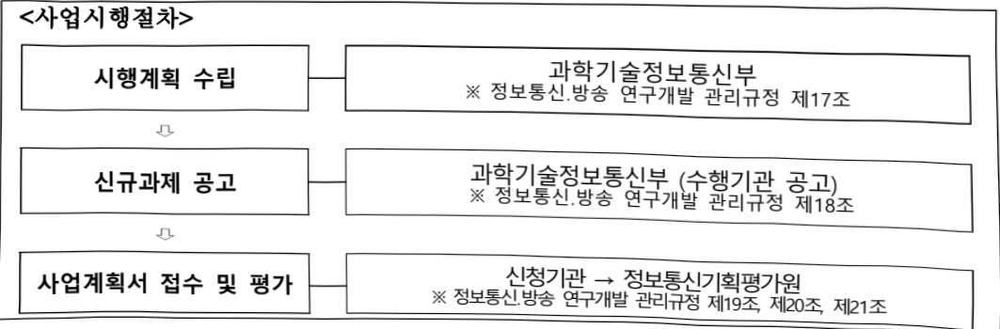
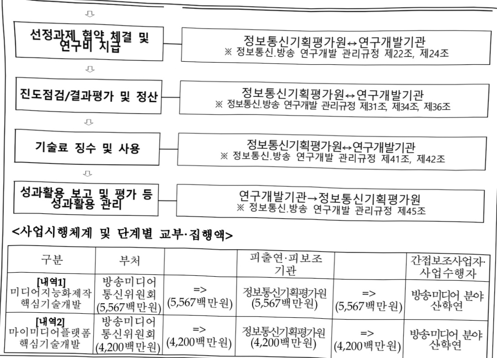
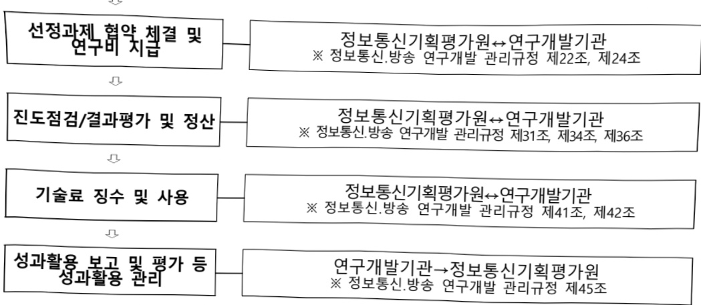

# 디지털미디어이노베이션기술개발(R&D)

**해당 페이지**: PDF 3247 ~ 3253 쪽 해당

**부처**: 방송미디어통신위원회
**분야**: 문화 및 관광
**회계유형**: 일반회계
**2026 확정예산**: 9767.0 백만원
**전년대비 증감률**: None%
**AI 도메인**: 문화/콘텐츠

---

### 가. 예산 총괄표

(단위: 백만원, %)

<table border=1 style='margin: auto; word-wrap: break-word;'><tr><td rowspan="2">사업명</td><td rowspan="2">2024년 결산</td><td colspan="2">2025년 예산</td><td colspan="2">2026년 예산</td><td rowspan="2">증감(B-A)</td><td rowspan="2">(B-A)/A</td></tr><tr><td style='text-align: center; word-wrap: break-word;'>본예산</td><td style='text-align: center; word-wrap: break-word;'>추경(A)</td><td style='text-align: center; word-wrap: break-word;'>요구안</td><td style='text-align: center; word-wrap: break-word;'>본예산(B)</td></tr><tr><td style='text-align: center; word-wrap: break-word;'>디지털마다아닌배이션기술개발(R&amp;D)</td><td style='text-align: center; word-wrap: break-word;'>-</td><td style='text-align: center; word-wrap: break-word;'>-</td><td style='text-align: center; word-wrap: break-word;'>-</td><td style='text-align: center; word-wrap: break-word;'>9,767</td><td style='text-align: center; word-wrap: break-word;'>9,767</td><td style='text-align: center; word-wrap: break-word;'>9,767</td><td style='text-align: center; word-wrap: break-word;'>순증</td></tr></table>

□ 기능별(내역사업별) 예산 내역

(단위:백만원)

<table border=1 style='margin: auto; word-wrap: break-word;'><tr><td rowspan="2"></td><td colspan="5">2024</td><td colspan="5">2025</td><td rowspan="2">2026예산</td></tr><tr><td style='text-align: center; word-wrap: break-word;'>예산의(추경)</td><td style='text-align: center; word-wrap: break-word;'>예산현액</td><td style='text-align: center; word-wrap: break-word;'>집행액</td><td style='text-align: center; word-wrap: break-word;'>이월액</td><td style='text-align: center; word-wrap: break-word;'>불용액</td><td style='text-align: center; word-wrap: break-word;'>예산의(추경)</td><td style='text-align: center; word-wrap: break-word;'>예산현액</td><td style='text-align: center; word-wrap: break-word;'>집행액</td><td style='text-align: center; word-wrap: break-word;'>이월액</td><td style='text-align: center; word-wrap: break-word;'>불용액</td></tr><tr><td style='text-align: center; word-wrap: break-word;'>○ 기능별 분류(함께)</td><td style='text-align: center; word-wrap: break-word;'>-</td><td style='text-align: center; word-wrap: break-word;'>-</td><td style='text-align: center; word-wrap: break-word;'>-</td><td style='text-align: center; word-wrap: break-word;'>-</td><td style='text-align: center; word-wrap: break-word;'>-</td><td style='text-align: center; word-wrap: break-word;'>-</td><td style='text-align: center; word-wrap: break-word;'>-</td><td style='text-align: center; word-wrap: break-word;'>-</td><td style='text-align: center; word-wrap: break-word;'>-</td><td style='text-align: center; word-wrap: break-word;'>-</td><td style='text-align: center; word-wrap: break-word;'>9,767</td></tr><tr><td rowspan="2">• 미디어지능화제작핵심기술개발• 마이미디어플랫폼핵심기술개발</td><td style='text-align: center; word-wrap: break-word;'>-</td><td style='text-align: center; word-wrap: break-word;'>-</td><td style='text-align: center; word-wrap: break-word;'>-</td><td style='text-align: center; word-wrap: break-word;'>-</td><td style='text-align: center; word-wrap: break-word;'>-</td><td style='text-align: center; word-wrap: break-word;'>-</td><td style='text-align: center; word-wrap: break-word;'>-</td><td style='text-align: center; word-wrap: break-word;'>-</td><td style='text-align: center; word-wrap: break-word;'>-</td><td style='text-align: center; word-wrap: break-word;'>-</td><td style='text-align: center; word-wrap: break-word;'>5,567</td></tr><tr><td style='text-align: center; word-wrap: break-word;'>-</td><td style='text-align: center; word-wrap: break-word;'>-</td><td style='text-align: center; word-wrap: break-word;'>-</td><td style='text-align: center; word-wrap: break-word;'>-</td><td style='text-align: center; word-wrap: break-word;'>-</td><td style='text-align: center; word-wrap: break-word;'>-</td><td style='text-align: center; word-wrap: break-word;'>-</td><td style='text-align: center; word-wrap: break-word;'>-</td><td style='text-align: center; word-wrap: break-word;'>-</td><td style='text-align: center; word-wrap: break-word;'>-</td><td style='text-align: center; word-wrap: break-word;'>4,200</td></tr></table>

### 나. 사업설명자료

## 1 ) 사업목적·내용

- (디지털미디어이노베이션기술개발) 방송미디어의 이용행태 변화(OTT, 개인맞춤 등)와 AI·디지털 접목 수요에 대응하기 위해 방송미디어 산업 혁신 및 기술경쟁력 확보

<table border=1 style='margin: auto; word-wrap: break-word;'><tr><td style='text-align: center; word-wrap: break-word;'>구분</td><td colspan="2">내역사업별 목표</td></tr><tr><td rowspan="3">내역 1 미디어지능 회제작핵심 기술개발</td><td colspan="2">■(미디어 제작 효율화) 미디어 제작에 AI 기술을 활용하여 제작혁신(제작비↓, 제작품질↑)을 통한 제작비 인플레이션 대응 및 손쉬운 제작을 통한 시장참여자 확대</td></tr><tr><td style='text-align: center; word-wrap: break-word;'>As-is</td><td style='text-align: center; word-wrap: break-word;'>To-be</td></tr><tr><td style='text-align: center; word-wrap: break-word;'>·미디어·콘텐츠 제작비 인플레이션 심화 ·글로벌 진출(대상국 시청각 규제)에 따른 재편집 ·몰입·입체형 콘텐츠 확산(구글·삼성의 스마트안경)</td><td style='text-align: center; word-wrap: break-word;'>→·AI 기반 영상편집 디지털휴먼 생성, 특수효과(VFX) 생성·합성 ➤ 제작비 감소 ·맥락을 유지한 프롬프트·음향, 입체미디어 생성 ➤ 제작품질·표현력 향상</td></tr><tr><td style='text-align: center; word-wrap: break-word;'>내역 2 마이미디어 플랫폼핵심</td><td colspan="2">■(개인화 미디어 서비스 확보) 개인화를 지향하는 신규 방송·미디어 서비스 발굴로 플랫폼의 기술 경쟁력과 시장규모 확대</td></tr></table>

---

<table border=1 style='margin: auto; word-wrap: break-word;'><tr><td rowspan="3">기술개발</td><td style='text-align: center; word-wrap: break-word;'>As-is</td><td rowspan="2">To-be</td></tr><tr><td rowspan="2">· 해외 사업자 대비 디지털 기술 활용 미흡, 자본 경쟁 심화로 국내 플랫폼 악화 지속</td></tr><tr><td style='text-align: center; word-wrap: break-word;'>↔ 초개인화 미디어 AI모델, AI기반 광고 생성·유통 ▶미디어 추천 서비스 등 플랫폼 경쟁력 향상 ※ (예) 임원서비스인 Spotify의 경우 추천알고리즘으로 1위 기업 도약</td></tr></table>

## 2 ) 사업개요

## ☐ 사업근거 및 추진경위

① 법령상 근거 및 조항 적시

- 방송통신발전기본법 제16조(방송통신기술의 진흥 등)

제16조(방송통신기술의 진흥 등) 과학기술정보통신부장관 또는 방송미디어통신위원회는 방송통신기술의 진흥을 통한 방송통신서비스 발전을 위하여 다음 각 호의 시책을 수립·시행하여야 한다.

1. 방송통신과 관련된 기술수준의 조사, 기술의 연구개발, 개발기술의 평가 및 활용에 관한 사항

2. 방송통신 기술협력, 기술지도 및 기술이전에 관한 사항

3. 방송통신기술의 표준화 및 새로운 방송통신기술의 도입 등에 관한 사항

4. 방송통신 기술정보의 원활한 유통을 위한 사항

5. 방송통신기술의 국제협력에 관한 사항

6. 그 밖에 방송통신기술의 진흥에 관한 사항

## ② 추진경위

- '24. 1~3월 : 부처 고유임무 R&D 사업에 대한 예타 수요 제출

- '24. 4월 : 부처고유임무형 예타사업 후보 결정 통보

- '24. 4월~12월 : 사업기획

- '24. 11월 : '24년도 제3차 국가연구개발사업 예비타당성조사 대상선정 통보

- '24. 12월~'25. 6월 : 예비타당성조사 대응 조사통과(시행)

- '25. 8월 : 123대 국정과제 108_디지털·미디어 산업 경쟁력 강화 지원,

21_지역·산업 전반의 AX 대전환

## 주요내용

① 사업규모

- 총사업비 : 방미통위 727.66억원

- 사업기간 : '26 ~ '30(5년간)*

*동 사업은 부처고유임무형(프로그램형) 사업으로, "계속사업"으로 추진 예정(사업종료 전 평가를 통해 기간 연장)

- 최근 5년 간 투입된 사업비

<table border=1 style='margin: auto; word-wrap: break-word;'><tr><td style='text-align: center; word-wrap: break-word;'>吋</td><td style='text-align: center; word-wrap: break-word;'>2022</td><td style='text-align: center; word-wrap: break-word;'>2023</td><td style='text-align: center; word-wrap: break-word;'>2024</td><td style='text-align: center; word-wrap: break-word;'>2025</td><td style='text-align: center; word-wrap: break-word;'>2026</td></tr><tr><td style='text-align: center; word-wrap: break-word;'>사업비</td><td style='text-align: center; word-wrap: break-word;'>-</td><td style='text-align: center; word-wrap: break-word;'>-</td><td style='text-align: center; word-wrap: break-word;'>-</td><td style='text-align: center; word-wrap: break-word;'>-</td><td style='text-align: center; word-wrap: break-word;'>9,767</td></tr></table>

---

② 사업추진체계

- 사업시행방법 : 출연

- 사업시행주체 : 정보통신기획평가원

- 사업 수혜자 : 방송미디어 분야 산·학·연 등

- 보조, 융자, 출연, 출자 등의 경우 보조·융자 등 지원 비율 및 법적근거

<table border=1 style='margin: auto; word-wrap: break-word;'><tr><td style='text-align: center; word-wrap: break-word;'>내역사업명</td><td style='text-align: center; word-wrap: break-word;'>구분</td><td style='text-align: center; word-wrap: break-word;'>피보조·피출연 등 기관명</td><td style='text-align: center; word-wrap: break-word;'>지원 금액 (2026예산)</td><td style='text-align: center; word-wrap: break-word;'>지원 비율(%)</td><td style='text-align: center; word-wrap: break-word;'>보조율 법적근거 (해당 조항)</td></tr><tr><td style='text-align: center; word-wrap: break-word;'>디지털미디어이노베이션기술개발</td><td style='text-align: center; word-wrap: break-word;'>출연</td><td style='text-align: center; word-wrap: break-word;'>정보통신기획평가원</td><td style='text-align: center; word-wrap: break-word;'>9,767</td><td style='text-align: center; word-wrap: break-word;'>100</td><td style='text-align: center; word-wrap: break-word;'>정보통신 진흥 및 융합 활성화 등에 관한 특별법 제32조, 정보통신·방송 연구개발 관리규정 제12조(전문기관)</td></tr></table>

## 3 ) 2026년도 예산 산출 근거

□ 디지털미디어이노베이션기술개발(R&D): (2025) 0백만원 → (2026 예산안) 9,767백만원, 순증

① 미디어지능화제작핵심기술개발 : (2025) 0백만원 → (2026 예산안) 5,567백만원, 순증

- (요구) 글로벌OIT 경쟁, 제작비 급등에 따른 AI 제작·편집 제작비 절감 수요 등 변화한 방송·미디어 환경을 고려한 신규과제 등 추진

- (산출) (신규) 1,233.3백만원 × 9개월/12개월 × 4개 과제 = 3,700백만원

(이관) 1,867백만원 × 12개월/12개월 × 1개 과제 = 1,867백만원

② 마이미디어플랫폼핵심기술개발 : (2025) 0백만원 → (2026 예산안) 4,200백만원, 순증

- (요구) 개인맞춤 서비스, 다양화된 미디어플랫폼 등 변화한 방송·미디어 환경을 고려하여 신규과제 등 추진

- (산출) (신규) 1,400백만원 × 9개월/12개월 × 4개 과제 = 4,200백만원

2025년도 예산 및 2026년도 예산안 산출 세부내역 비교

<table border=1 style='margin: auto; word-wrap: break-word;'><tr><td colspan="2">2025년</td><td colspan="2">2026년 예산안</td></tr><tr><td style='text-align: center; word-wrap: break-word;'>예산</td><td style='text-align: center; word-wrap: break-word;'>산출내역</td><td style='text-align: center; word-wrap: break-word;'>예산</td><td style='text-align: center; word-wrap: break-word;'>산출내역</td></tr><tr><td style='text-align: center; word-wrap: break-word;'>0</td><td style='text-align: center; word-wrap: break-word;'>-</td><td style='text-align: center; word-wrap: break-word;'>9,767</td><td style='text-align: center; word-wrap: break-word;'>☐ 연구개발활동비등(360-05): 9,767백만원
- (내역1) 미디어지능화제작핵심기술개발: 5,567
- (신규) 1,233.3백만원×9개월/12개월×4개과제=3,700백만원
- (계속) 1,867백만원×12개월/12개월×1개과제=1,867백만원
- (내역2) 마이미디어플랫폼핵심기술개발: 4,200
- (신규) 1,400백만원×9개월/12개월×4개과제=4,200백만원</td></tr></table>

---

## 4 ) 사업효과

☐ 사업영향, 산출물 성과지표 등

① 2022~2026년도 성과계획서 상 성과지표 및 최근 5년간 성과 달성도

<table border=1 style='margin: auto; word-wrap: break-word;'><tr><td style='text-align: center; word-wrap: break-word;'>성과지표</td><td style='text-align: center; word-wrap: break-word;'>구분</td><td style='text-align: center; word-wrap: break-word;'>2022</td><td style='text-align: center; word-wrap: break-word;'>2023</td><td style='text-align: center; word-wrap: break-word;'>2024</td><td style='text-align: center; word-wrap: break-word;'>2025</td><td style='text-align: center; word-wrap: break-word;'>2026</td><td style='text-align: center; word-wrap: break-word;'>2026 목표치산출근거</td><td style='text-align: center; word-wrap: break-word;'>측정산식(또는 측정방법)</td><td style='text-align: center; word-wrap: break-word;'>자료수집방법(또는 자료출처)</td></tr><tr><td rowspan="3">[내역1]제작비용 절감(단위: % )</td><td style='text-align: center; word-wrap: break-word;'>목표</td><td style='text-align: center; word-wrap: break-word;'>-</td><td style='text-align: center; word-wrap: break-word;'>-</td><td style='text-align: center; word-wrap: break-word;'>-</td><td style='text-align: center; word-wrap: break-word;'>-</td><td style='text-align: center; word-wrap: break-word;'>신규</td><td rowspan="2">° 방송콘텐츠 제작과정에서 디지털-AI 기술이 필수 채택되도록 초기 목표치(0~10%)를 설정하고, 5년 후 20% 절감을 목표로 설정</td><td rowspan="2">① 비용 절감 전/후 자료 비교의 경우 : 산식 = (1-(반영후 비용/기준비용))*100</td><td rowspan="3">과제수행기관별도 조사</td></tr><tr><td style='text-align: center; word-wrap: break-word;'>실적</td><td style='text-align: center; word-wrap: break-word;'>-</td><td style='text-align: center; word-wrap: break-word;'>-</td><td style='text-align: center; word-wrap: break-word;'>-</td><td style='text-align: center; word-wrap: break-word;'>-</td><td style='text-align: center; word-wrap: break-word;'>-</td></tr><tr><td style='text-align: center; word-wrap: break-word;'>달성도</td><td style='text-align: center; word-wrap: break-word;'>-</td><td style='text-align: center; word-wrap: break-word;'>-</td><td style='text-align: center; word-wrap: break-word;'>-</td><td style='text-align: center; word-wrap: break-word;'>-</td><td style='text-align: center; word-wrap: break-word;'>-</td><td style='text-align: center; word-wrap: break-word;'>*디지털-AI 기반 방송콘텐츠 제작 프로세스 전환이 유도되도록 도전적 성과목표 설정</td><td style='text-align: center; word-wrap: break-word;'>② 같은 예산으로 제작된 방송콘텐츠의 수가 다를 경우 제시(기준 : 동일한 예산 기준) : 산식 = (1-(기존 건수/반영 후 건수))*100</td></tr><tr><td rowspan="3">[내역2]신규방송미디어서비스 발굴(단위: 개 )</td><td style='text-align: center; word-wrap: break-word;'>목표</td><td style='text-align: center; word-wrap: break-word;'>-</td><td style='text-align: center; word-wrap: break-word;'>-</td><td style='text-align: center; word-wrap: break-word;'>-</td><td style='text-align: center; word-wrap: break-word;'>-</td><td style='text-align: center; word-wrap: break-word;'>신규</td><td rowspan="3">° 내역사업 2의 8개 과제를 활용하여 신규 빌개발 성과 발굴</td><td rowspan="3">° BM 특허 출원 건수(5년간 14건)</td><td rowspan="3">과제수행기관별도 조사</td></tr><tr><td style='text-align: center; word-wrap: break-word;'>실적</td><td style='text-align: center; word-wrap: break-word;'>-</td><td style='text-align: center; word-wrap: break-word;'>-</td><td style='text-align: center; word-wrap: break-word;'>-</td><td style='text-align: center; word-wrap: break-word;'>-</td><td style='text-align: center; word-wrap: break-word;'>-</td></tr><tr><td style='text-align: center; word-wrap: break-word;'>달성도</td><td style='text-align: center; word-wrap: break-word;'>-</td><td style='text-align: center; word-wrap: break-word;'>-</td><td style='text-align: center; word-wrap: break-word;'>-</td><td style='text-align: center; word-wrap: break-word;'>-</td><td style='text-align: center; word-wrap: break-word;'>-</td></tr></table>

※ 전략계획서 작성 전 사업(신규사업)으로 향후 전략계획서 작성에 따라 확정

② 성과지표 이외의 연도별 사업추진 경과 및 실적 : 해당없음(신규)

③ 향후(2026년도 이후) 기대효과

- (방송·미디어 손주기 AI 전환) 방송·미디어 생태계 참여자들의 미디어 제작·서비스

핵심기술 확보를 지원하여 산업의 AX혁신 지원

## < 동 사업을 통한 AX 혁신 수혜자 >

<table border=1 style='margin: auto; word-wrap: break-word;'><tr><td style='text-align: center; word-wrap: break-word;'>구분(유형)</td><td style='text-align: center; word-wrap: break-word;'>수혜자 효과</td></tr><tr><td style='text-align: center; word-wrap: break-word;'>미디어테크기업</td><td style='text-align: center; word-wrap: break-word;'>AI 기반더빙, 추천 등 방송·미디어 기획·제작·소비 전반의 AI 솔루션·SW 개발 공급</td></tr><tr><td style='text-align: center; word-wrap: break-word;'>미디어·콘텐츠 제작사</td><td style='text-align: center; word-wrap: break-word;'>특수효과, 영상 생성·편집 등에 AI를 접목하여 미디어·콘텐츠 제작 비용 절감</td></tr><tr><td style='text-align: center; word-wrap: break-word;'>OTT, FAST사</td><td style='text-align: center; word-wrap: break-word;'>AI 기반 미디어·콘텐츠 기획·추천, 지능적 스트리밍, 더빙(해외 재유통 등)을 통해 추가수익 창출</td></tr><tr><td style='text-align: center; word-wrap: break-word;'>방송사업자(지상파, 유료방송 등)</td><td style='text-align: center; word-wrap: break-word;'>AI PPL, 어드레서블광고와 같이 AI·데이터를 활용한 효율적 광고 게재 서비스 도입 등</td></tr><tr><td style='text-align: center; word-wrap: break-word;'>광고사(광고대행사, 미디어랩사 등)</td><td style='text-align: center; word-wrap: break-word;'>신매체 광고(OTT, FAST), 신유형 광고(AI PPL, 맞춤형 광고 등) 확산을 통한 시장규모 확대</td></tr><tr><td style='text-align: center; word-wrap: break-word;'>단말기제조사(스마트TV 등)</td><td style='text-align: center; word-wrap: break-word;'>스마트TV 기반 &quot;K-FAST 채널&quot;, 몰입·입체형 콘텐츠 제공 기기 확산 등 판로확대</td></tr></table>

- (지속가능한 생태계) “AI 기술혁신을 통한 방송·미디어 플랫폼의 추가 수익창출(新서비스, 해외진출) → 콘텐츠·서비스 투자 확대 → 국내 산업 경쟁력 강화, 글로벌 의존도 감소“처럼 기술혁신을 통한 선순환 추진

---

## <방송·미디어산업 기술혁신을 통한 선순환 체계 >

## 5 ) 타당성조사 및 예비타당성조사 시행여부 및 결과 요지

□ 예비타당성조사 시행(결과 : 통과)

<table border=1 style='margin: auto; word-wrap: break-word;'><tr><td style='text-align: center; word-wrap: break-word;'>예비타당성 조사 결과</td><td style='text-align: center; word-wrap: break-word;'>ㅇ개요 - 제목 : 2024년도 예비타당성조사보고서 디지털미디어 이노베이션 기술개발사업(2025.8) - 작성자 : 한국과학기술기획평가원(KISTEP) ㅇ 주요의견 - 과기정통부 고유업무에 부합하는 사업으로 부처고유임무형 R&amp;D사업에 적정, 검토결과 국비 기준 사업원안(1,181억원) 대비 7.1% 감소한 1,097억원을 적정규모로 조사 - 예비타당성조사 대안의 과학기술적·정책적·경제적 타당성에 대한 종합평가(AHP) 결과, ‘사업시행’을 최종결론으로 도출, 동사업의 비용저감 효과를 살펴보면, 예비타당성조사 연구진 검토안은 비용절감(92.38억원)의 경제성을 확보한 것으로 판단 ㅇ 평가결과 : 0.739(AHP) / 시행 - 총사업비 1,363억원(국비 1,097억원)</td></tr></table>

## 6 ) 총사업비 대상사업 정보

(단위: 억원)

<table border=1 style='margin: auto; word-wrap: break-word;'><tr><td style='text-align: center; word-wrap: break-word;'>연도</td><td style='text-align: center; word-wrap: break-word;'>사업기간</td><td style='text-align: center; word-wrap: break-word;'>2022까지 기투자액</td><td style='text-align: center; word-wrap: break-word;'>2023</td><td style='text-align: center; word-wrap: break-word;'>2024</td><td style='text-align: center; word-wrap: break-word;'>2025</td><td style='text-align: center; word-wrap: break-word;'>2026</td><td style='text-align: center; word-wrap: break-word;'>2027이후 투자계획</td><td style='text-align: center; word-wrap: break-word;'>계</td></tr><tr><td style='text-align: center; word-wrap: break-word;'>사업비</td><td style='text-align: center; word-wrap: break-word;'>&#x27;26~&#x27;30</td><td style='text-align: center; word-wrap: break-word;'>-</td><td style='text-align: center; word-wrap: break-word;'>-</td><td style='text-align: center; word-wrap: break-word;'>-</td><td style='text-align: center; word-wrap: break-word;'>-</td><td style='text-align: center; word-wrap: break-word;'>97.67</td><td style='text-align: center; word-wrap: break-word;'>630</td><td style='text-align: center; word-wrap: break-word;'>727.67</td></tr></table>

## 7 ) 사업 집행절차

---

<table border=1 style='margin: auto; word-wrap: break-word;'><tr><td style='text-align: center; word-wrap: break-word;'>구분</td><td style='text-align: center; word-wrap: break-word;'>부처</td><td style='text-align: center; word-wrap: break-word;'></td><td style='text-align: center; word-wrap: break-word;'>피출연·피보조기관</td><td style='text-align: center; word-wrap: break-word;'></td><td style='text-align: center; word-wrap: break-word;'>간접보조사업자사업수행자</td></tr><tr><td style='text-align: center; word-wrap: break-word;'>[내역1]미디어지능화제작핵심기술개발</td><td style='text-align: center; word-wrap: break-word;'>방송미디어통신위원회(5,567백만원)</td><td style='text-align: center; word-wrap: break-word;'>=&gt;(5,567백만원)</td><td style='text-align: center; word-wrap: break-word;'>정보통신기획평가원(5,567백만원)</td><td style='text-align: center; word-wrap: break-word;'>=&gt;(5,567백만원)</td><td style='text-align: center; word-wrap: break-word;'>방송미디어 분야산학연</td></tr><tr><td style='text-align: center; word-wrap: break-word;'>[내역2]마이미디어플랫폼핵심기술개발</td><td style='text-align: center; word-wrap: break-word;'>방송미디어통신위원회(4,200백만원)</td><td style='text-align: center; word-wrap: break-word;'>=&gt;(4,200백만원)</td><td style='text-align: center; word-wrap: break-word;'>정보통신기획평가원(4,200백만원)</td><td style='text-align: center; word-wrap: break-word;'>=&gt;(4,200백만원)</td><td style='text-align: center; word-wrap: break-word;'>방송미디어 분야산학연</td></tr></table>

## 8 ) 각종 평가 : 해당없음

### 다. 최근 4년간 결산내역

## 1 ) 결산표

☐ 부처 결산내역

(단위: 백만원, %)

<table border=1 style='margin: auto; word-wrap: break-word;'><tr><td rowspan="2">연도</td><td colspan="3">예산액</td><td rowspan="2">예산현액(A)</td><td rowspan="2">집행액(B)</td><td rowspan="2">집행률(B/A)</td><td rowspan="2">다음연도이월액</td><td rowspan="2">불용액</td></tr><tr><td style='text-align: center; word-wrap: break-word;'>본예산</td><td style='text-align: center; word-wrap: break-word;'>추경중감액</td><td style='text-align: center; word-wrap: break-word;'>추경</td></tr><tr><td style='text-align: center; word-wrap: break-word;'>2022</td><td style='text-align: center; word-wrap: break-word;'>-</td><td style='text-align: center; word-wrap: break-word;'>-</td><td style='text-align: center; word-wrap: break-word;'>-</td><td style='text-align: center; word-wrap: break-word;'>-</td><td style='text-align: center; word-wrap: break-word;'>-</td><td style='text-align: center; word-wrap: break-word;'>-</td><td style='text-align: center; word-wrap: break-word;'>-</td><td style='text-align: center; word-wrap: break-word;'>-</td></tr><tr><td style='text-align: center; word-wrap: break-word;'>2023</td><td style='text-align: center; word-wrap: break-word;'>-</td><td style='text-align: center; word-wrap: break-word;'>-</td><td style='text-align: center; word-wrap: break-word;'>-</td><td style='text-align: center; word-wrap: break-word;'>-</td><td style='text-align: center; word-wrap: break-word;'>-</td><td style='text-align: center; word-wrap: break-word;'>-</td><td style='text-align: center; word-wrap: break-word;'>-</td><td style='text-align: center; word-wrap: break-word;'>-</td></tr><tr><td style='text-align: center; word-wrap: break-word;'>2024</td><td style='text-align: center; word-wrap: break-word;'>-</td><td style='text-align: center; word-wrap: break-word;'>-</td><td style='text-align: center; word-wrap: break-word;'>-</td><td style='text-align: center; word-wrap: break-word;'>-</td><td style='text-align: center; word-wrap: break-word;'>-</td><td style='text-align: center; word-wrap: break-word;'>-</td><td style='text-align: center; word-wrap: break-word;'>-</td><td style='text-align: center; word-wrap: break-word;'>-</td></tr><tr><td style='text-align: center; word-wrap: break-word;'>2025</td><td style='text-align: center; word-wrap: break-word;'>-</td><td style='text-align: center; word-wrap: break-word;'>-</td><td style='text-align: center; word-wrap: break-word;'>-</td><td style='text-align: center; word-wrap: break-word;'>-</td><td style='text-align: center; word-wrap: break-word;'>-</td><td style='text-align: center; word-wrap: break-word;'>-</td><td style='text-align: center; word-wrap: break-word;'>-</td><td style='text-align: center; word-wrap: break-word;'>-</td></tr></table>

## 2 ) 주요 결산사항 : 해당없음

---

<table border=1 style='margin: auto; word-wrap: break-word;'><tr><td style='text-align: center; word-wrap: break-word;'>사 엽 명</td></tr><tr><td style='text-align: center; word-wrap: break-word;'>(1) 방송콘텐츠 진흥 (1131-301)</td></tr></table>

□ 사업 코드 정보

<table border=1 style='margin: auto; word-wrap: break-word;'><tr><td style='text-align: center; word-wrap: break-word;'>구분</td><td style='text-align: center; word-wrap: break-word;'>기금</td><td style='text-align: center; word-wrap: break-word;'>소관</td><td style='text-align: center; word-wrap: break-word;'>실국(기관)</td><td style='text-align: center; word-wrap: break-word;'>계정</td><td style='text-align: center; word-wrap: break-word;'>분야</td><td style='text-align: center; word-wrap: break-word;'>부문</td></tr><tr><td style='text-align: center; word-wrap: break-word;'>코드</td><td rowspan="2">방송통신발전기금</td><td rowspan="2">방송미디어통신위원회</td><td rowspan="2">방송미디어진흥국</td><td rowspan="2"></td><td style='text-align: center; word-wrap: break-word;'>060</td><td style='text-align: center; word-wrap: break-word;'>061</td></tr><tr><td style='text-align: center; word-wrap: break-word;'>명칭</td><td style='text-align: center; word-wrap: break-word;'>문화 및 관광</td><td style='text-align: center; word-wrap: break-word;'>문화예술</td></tr></table>

<table border=1 style='margin: auto; word-wrap: break-word;'><tr><td style='text-align: center; word-wrap: break-word;'>구분</td><td style='text-align: center; word-wrap: break-word;'>프로그램</td><td style='text-align: center; word-wrap: break-word;'>단위사업</td><td style='text-align: center; word-wrap: break-word;'>세부사업</td></tr><tr><td style='text-align: center; word-wrap: break-word;'>코드</td><td style='text-align: center; word-wrap: break-word;'>1100</td><td style='text-align: center; word-wrap: break-word;'>1131</td><td style='text-align: center; word-wrap: break-word;'>301</td></tr><tr><td style='text-align: center; word-wrap: break-word;'>명칭</td><td style='text-align: center; word-wrap: break-word;'>콘텐츠방송산업육성</td><td style='text-align: center; word-wrap: break-word;'>방송통신콘텐츠진흥</td><td style='text-align: center; word-wrap: break-word;'>방송콘텐츠 진흥</td></tr></table>

□ 사업 성격 (공통요구자료 Ⅱ-1 작성유의사항 4. 참조, 해당하는 사항에 “○” 표시)

<table border=1 style='margin: auto; word-wrap: break-word;'><tr><td rowspan="2">신규</td><td rowspan="2">계속</td><td rowspan="2">완료</td><td rowspan="2">예비타당성 실시여부</td><td rowspan="2">총사업비 관리대상</td><td rowspan="2">총액계상 예산사업</td><td style='text-align: center; word-wrap: break-word;'>사업소관 변경정보</td></tr><tr><td style='text-align: center; word-wrap: break-word;'>2025예산 시 소관</td></tr><tr><td style='text-align: center; word-wrap: break-word;'></td><td style='text-align: center; word-wrap: break-word;'>○</td><td style='text-align: center; word-wrap: break-word;'></td><td style='text-align: center; word-wrap: break-word;'></td><td style='text-align: center; word-wrap: break-word;'></td><td style='text-align: center; word-wrap: break-word;'></td><td style='text-align: center; word-wrap: break-word;'>과학기술정보통신부</td></tr></table>

사업 지원 형태 및 지원을 (최소한 한 개는 반드시 선택하시오. 해당사항에 O 표시)

<table border=1 style='margin: auto; word-wrap: break-word;'><tr><td style='text-align: center; word-wrap: break-word;'>직접</td><td style='text-align: center; word-wrap: break-word;'>출자</td><td style='text-align: center; word-wrap: break-word;'>출연</td><td style='text-align: center; word-wrap: break-word;'>보조</td><td style='text-align: center; word-wrap: break-word;'>융자</td><td style='text-align: center; word-wrap: break-word;'>국고보조율(%)</td><td style='text-align: center; word-wrap: break-word;'>융자율(%)</td></tr><tr><td style='text-align: center; word-wrap: break-word;'></td><td style='text-align: center; word-wrap: break-word;'></td><td style='text-align: center; word-wrap: break-word;'></td><td style='text-align: center; word-wrap: break-word;'>○</td><td style='text-align: center; word-wrap: break-word;'></td><td style='text-align: center; word-wrap: break-word;'>100</td><td style='text-align: center; word-wrap: break-word;'></td></tr></table>

## □사업 소관부처 및 시행주체

<table border=1 style='margin: auto; word-wrap: break-word;'><tr><td style='text-align: center; word-wrap: break-word;'>사업명</td><td colspan="2">구분</td></tr><tr><td rowspan="2">AI·디지털 기반 방송프로그램 제작지원</td><td style='text-align: center; word-wrap: break-word;'>소관부처</td><td style='text-align: center; word-wrap: break-word;'>방송미디어진흥국 디지털방송미디어정책과</td></tr><tr><td style='text-align: center; word-wrap: break-word;'>사업시행주체</td><td style='text-align: center; word-wrap: break-word;'>한국방송통신전과진흥원</td></tr><tr><td rowspan="2">크리에이터 미디어 산업 기반 조성</td><td style='text-align: center; word-wrap: break-word;'>소관부처</td><td style='text-align: center; word-wrap: break-word;'>방송미디어진흥국 디지털방송미디어정책과</td></tr><tr><td style='text-align: center; word-wrap: break-word;'>사업시행주체</td><td style='text-align: center; word-wrap: break-word;'>한국전과진흥협회</td></tr><tr><td rowspan="2">지역 방송 제작역량 강화</td><td style='text-align: center; word-wrap: break-word;'>소관부처</td><td style='text-align: center; word-wrap: break-word;'>방송미디어진흥국 디지털방송미디어정책과</td></tr><tr><td style='text-align: center; word-wrap: break-word;'>사업시행주체</td><td style='text-align: center; word-wrap: break-word;'>한국전과진흥협회</td></tr><tr><td rowspan="2">AI·디지털 기반 미디어 융합인재</td><td style='text-align: center; word-wrap: break-word;'>소관부처</td><td style='text-align: center; word-wrap: break-word;'>방송미디어진흥국 디지털방송미디어정책과</td></tr><tr><td style='text-align: center; word-wrap: break-word;'>사업시행주체</td><td style='text-align: center; word-wrap: break-word;'>한국전과진흥협회</td></tr></table>

---

### 원본 PDF 크롭 이미지

