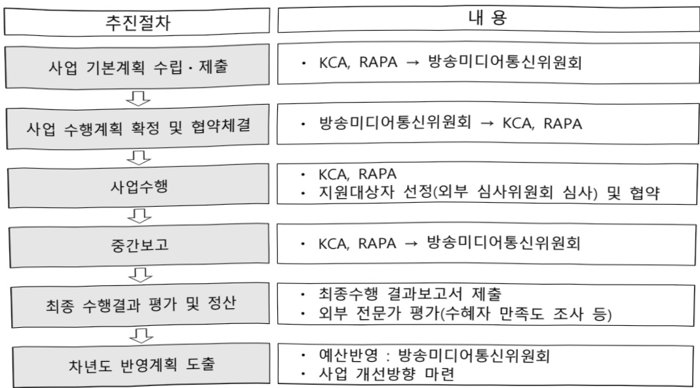

# 방송콘텐츠 진흥

**해당 페이지**: PDF 3254 ~ 3266 쪽 해당

**부처**: 방송미디어통신위원회
**분야**: 문화 및 관광
**회계유형**: 기금
**2026 확정예산**: 16792.0 백만원
**전년대비 증감률**: -13.4%
**AI 도메인**: 디지털전환(AX)

---

<table border=1 style='margin: auto; word-wrap: break-word;'><tr><td style='text-align: center; word-wrap: break-word;'>사 엽 명</td></tr><tr><td style='text-align: center; word-wrap: break-word;'>(1) 방송콘텐츠 진흥 (1131-301)</td></tr></table>

□ 사업 코드 정보

<table border=1 style='margin: auto; word-wrap: break-word;'><tr><td style='text-align: center; word-wrap: break-word;'>구분</td><td style='text-align: center; word-wrap: break-word;'>기금</td><td style='text-align: center; word-wrap: break-word;'>소관</td><td style='text-align: center; word-wrap: break-word;'>실국(기관)</td><td style='text-align: center; word-wrap: break-word;'>계정</td><td style='text-align: center; word-wrap: break-word;'>분야</td><td style='text-align: center; word-wrap: break-word;'>부문</td></tr><tr><td style='text-align: center; word-wrap: break-word;'>코드</td><td rowspan="2">방송통신발전기금</td><td rowspan="2">방송미디어통신위원회</td><td rowspan="2">방송미디어진흥국</td><td rowspan="2"></td><td style='text-align: center; word-wrap: break-word;'>060</td><td style='text-align: center; word-wrap: break-word;'>061</td></tr><tr><td style='text-align: center; word-wrap: break-word;'>명칭</td><td style='text-align: center; word-wrap: break-word;'>문화 및 관광</td><td style='text-align: center; word-wrap: break-word;'>문화예술</td></tr></table>

<table border=1 style='margin: auto; word-wrap: break-word;'><tr><td style='text-align: center; word-wrap: break-word;'>구분</td><td style='text-align: center; word-wrap: break-word;'>프로그램</td><td style='text-align: center; word-wrap: break-word;'>단위사업</td><td style='text-align: center; word-wrap: break-word;'>세부사업</td></tr><tr><td style='text-align: center; word-wrap: break-word;'>코드</td><td style='text-align: center; word-wrap: break-word;'>1100</td><td style='text-align: center; word-wrap: break-word;'>1131</td><td style='text-align: center; word-wrap: break-word;'>301</td></tr><tr><td style='text-align: center; word-wrap: break-word;'>명칭</td><td style='text-align: center; word-wrap: break-word;'>콘텐츠방송산업육성</td><td style='text-align: center; word-wrap: break-word;'>방송통신콘텐츠진흥</td><td style='text-align: center; word-wrap: break-word;'>방송콘텐츠 진흥</td></tr></table>

□ 사업 성격 (공통요구자료 Ⅱ-1 작성유의사항 4. 참조, 해당하는 사항에 “○” 표시)

<table border=1 style='margin: auto; word-wrap: break-word;'><tr><td rowspan="2">신규</td><td rowspan="2">계속</td><td rowspan="2">완료</td><td rowspan="2">예비타당성 실시여부</td><td rowspan="2">총사업비 관리대상</td><td rowspan="2">총액계상 예산사업</td><td style='text-align: center; word-wrap: break-word;'>사업소관 변경정보</td></tr><tr><td style='text-align: center; word-wrap: break-word;'>2025예산 시 소관</td></tr><tr><td style='text-align: center; word-wrap: break-word;'></td><td style='text-align: center; word-wrap: break-word;'>○</td><td style='text-align: center; word-wrap: break-word;'></td><td style='text-align: center; word-wrap: break-word;'></td><td style='text-align: center; word-wrap: break-word;'></td><td style='text-align: center; word-wrap: break-word;'></td><td style='text-align: center; word-wrap: break-word;'>과학기술정보통신부</td></tr></table>

사업 지원 형태 및 지원을 (최소한 한 개는 반드시 선택하시오. 해당사항에 O 표시)

<table border=1 style='margin: auto; word-wrap: break-word;'><tr><td style='text-align: center; word-wrap: break-word;'>직접</td><td style='text-align: center; word-wrap: break-word;'>출자</td><td style='text-align: center; word-wrap: break-word;'>출연</td><td style='text-align: center; word-wrap: break-word;'>보조</td><td style='text-align: center; word-wrap: break-word;'>융자</td><td style='text-align: center; word-wrap: break-word;'>국고보조율(%)</td><td style='text-align: center; word-wrap: break-word;'>융자율(%)</td></tr><tr><td style='text-align: center; word-wrap: break-word;'></td><td style='text-align: center; word-wrap: break-word;'></td><td style='text-align: center; word-wrap: break-word;'></td><td style='text-align: center; word-wrap: break-word;'>○</td><td style='text-align: center; word-wrap: break-word;'></td><td style='text-align: center; word-wrap: break-word;'>100</td><td style='text-align: center; word-wrap: break-word;'></td></tr></table>

## □사업 소관부처 및 시행주체

<table border=1 style='margin: auto; word-wrap: break-word;'><tr><td style='text-align: center; word-wrap: break-word;'>사업명</td><td colspan="2">구분</td></tr><tr><td rowspan="2">AI·디지털 기반 방송프로그램 제작지원</td><td style='text-align: center; word-wrap: break-word;'>소관부처</td><td style='text-align: center; word-wrap: break-word;'>방송미디어진흥국 디지털방송미디어정책과</td></tr><tr><td style='text-align: center; word-wrap: break-word;'>사업시행주체</td><td style='text-align: center; word-wrap: break-word;'>한국방송통신전과진흥원</td></tr><tr><td rowspan="2">크리에이터 미디어 산업 기반 조성</td><td style='text-align: center; word-wrap: break-word;'>소관부처</td><td style='text-align: center; word-wrap: break-word;'>방송미디어진흥국 디지털방송미디어정책과</td></tr><tr><td style='text-align: center; word-wrap: break-word;'>사업시행주체</td><td style='text-align: center; word-wrap: break-word;'>한국전과진흥협회</td></tr><tr><td rowspan="2">지역 방송 제작역량 강화</td><td style='text-align: center; word-wrap: break-word;'>소관부처</td><td style='text-align: center; word-wrap: break-word;'>방송미디어진흥국 디지털방송미디어정책과</td></tr><tr><td style='text-align: center; word-wrap: break-word;'>사업시행주체</td><td style='text-align: center; word-wrap: break-word;'>한국전과진흥협회</td></tr><tr><td rowspan="2">AI·디지털 기반 미디어 융합인재</td><td style='text-align: center; word-wrap: break-word;'>소관부처</td><td style='text-align: center; word-wrap: break-word;'>방송미디어진흥국 디지털방송미디어정책과</td></tr><tr><td style='text-align: center; word-wrap: break-word;'>사업시행주체</td><td style='text-align: center; word-wrap: break-word;'>한국전과진흥협회</td></tr></table>

---

### 가.지출계획 총괄표

(단위: 백만원, %)

<table border=1 style='margin: auto; word-wrap: break-word;'><tr><td rowspan="2">사업명</td><td rowspan="2">2024년 결산</td><td colspan="2">2025년 예산</td><td colspan="2">2026년 예산</td><td rowspan="2">중감 (B-A)</td><td rowspan="2">(B-A)/A</td></tr><tr><td style='text-align: center; word-wrap: break-word;'>본예산</td><td style='text-align: center; word-wrap: break-word;'>추경(A)</td><td style='text-align: center; word-wrap: break-word;'>요구안</td><td style='text-align: center; word-wrap: break-word;'>본예산(B)</td></tr><tr><td style='text-align: center; word-wrap: break-word;'>방송콘텐츠 진흥</td><td style='text-align: center; word-wrap: break-word;'>17,914</td><td style='text-align: center; word-wrap: break-word;'>19,397</td><td style='text-align: center; word-wrap: break-word;'>19,397</td><td style='text-align: center; word-wrap: break-word;'>16,792</td><td style='text-align: center; word-wrap: break-word;'>16,792</td><td style='text-align: center; word-wrap: break-word;'>△2,605</td><td style='text-align: center; word-wrap: break-word;'>△13.4</td></tr></table>

□ 기능별(내역사업별) 계획 내역

(단위:백만원)

<table border=1 style='margin: auto; word-wrap: break-word;'><tr><td rowspan="2"></td><td colspan="5">2024</td><td colspan="5">2025</td><td rowspan="2">2026 계획</td></tr><tr><td style='text-align: center; word-wrap: break-word;'>계획액(추정)</td><td style='text-align: center; word-wrap: break-word;'>계획현액</td><td style='text-align: center; word-wrap: break-word;'>집행액</td><td style='text-align: center; word-wrap: break-word;'>이월액</td><td style='text-align: center; word-wrap: break-word;'>불용액</td><td style='text-align: center; word-wrap: break-word;'>계획액(추정)</td><td style='text-align: center; word-wrap: break-word;'>계획현액</td><td style='text-align: center; word-wrap: break-word;'>집행액</td><td style='text-align: center; word-wrap: break-word;'>이월액</td><td style='text-align: center; word-wrap: break-word;'>불용액</td></tr><tr><td style='text-align: center; word-wrap: break-word;'>○ 기능별 분류(합계)</td><td style='text-align: center; word-wrap: break-word;'>17,914</td><td style='text-align: center; word-wrap: break-word;'>17,914</td><td style='text-align: center; word-wrap: break-word;'>17,914</td><td style='text-align: center; word-wrap: break-word;'>-</td><td style='text-align: center; word-wrap: break-word;'>-</td><td style='text-align: center; word-wrap: break-word;'>19,397</td><td style='text-align: center; word-wrap: break-word;'>19,397</td><td style='text-align: center; word-wrap: break-word;'>19,397</td><td style='text-align: center; word-wrap: break-word;'>-</td><td style='text-align: center; word-wrap: break-word;'>-</td><td style='text-align: center; word-wrap: break-word;'>16,792</td></tr><tr><td style='text-align: center; word-wrap: break-word;'>· AI·디지털 기반 방송 프로그램 제작지원</td><td style='text-align: center; word-wrap: break-word;'>12,714</td><td style='text-align: center; word-wrap: break-word;'>12,714</td><td style='text-align: center; word-wrap: break-word;'>12,714</td><td style='text-align: center; word-wrap: break-word;'>-</td><td style='text-align: center; word-wrap: break-word;'>-</td><td style='text-align: center; word-wrap: break-word;'>12,247</td><td style='text-align: center; word-wrap: break-word;'>12,247</td><td style='text-align: center; word-wrap: break-word;'>12,247</td><td style='text-align: center; word-wrap: break-word;'>-</td><td style='text-align: center; word-wrap: break-word;'>-</td><td style='text-align: center; word-wrap: break-word;'>9,880</td></tr><tr><td style='text-align: center; word-wrap: break-word;'>· 크리에이터미디어 산업기반 조성</td><td style='text-align: center; word-wrap: break-word;'>5,200</td><td style='text-align: center; word-wrap: break-word;'>5,200</td><td style='text-align: center; word-wrap: break-word;'>5,200</td><td style='text-align: center; word-wrap: break-word;'>-</td><td style='text-align: center; word-wrap: break-word;'>-</td><td style='text-align: center; word-wrap: break-word;'>5,150</td><td style='text-align: center; word-wrap: break-word;'>5,150</td><td style='text-align: center; word-wrap: break-word;'>5,150</td><td style='text-align: center; word-wrap: break-word;'>-</td><td style='text-align: center; word-wrap: break-word;'>-</td><td style='text-align: center; word-wrap: break-word;'>4,320</td></tr><tr><td style='text-align: center; word-wrap: break-word;'>· AI·디지털 기반 해외 한국여방송사 지원</td><td style='text-align: center; word-wrap: break-word;'>-</td><td style='text-align: center; word-wrap: break-word;'>-</td><td style='text-align: center; word-wrap: break-word;'>-</td><td style='text-align: center; word-wrap: break-word;'>-</td><td style='text-align: center; word-wrap: break-word;'>-</td><td style='text-align: center; word-wrap: break-word;'>1,000</td><td style='text-align: center; word-wrap: break-word;'>1,000</td><td style='text-align: center; word-wrap: break-word;'>1,000</td><td style='text-align: center; word-wrap: break-word;'>-</td><td style='text-align: center; word-wrap: break-word;'>-</td><td style='text-align: center; word-wrap: break-word;'>-</td></tr><tr><td style='text-align: center; word-wrap: break-word;'>· 지역 방송 제작 역량 강화</td><td style='text-align: center; word-wrap: break-word;'>-</td><td style='text-align: center; word-wrap: break-word;'>-</td><td style='text-align: center; word-wrap: break-word;'>-</td><td style='text-align: center; word-wrap: break-word;'>-</td><td style='text-align: center; word-wrap: break-word;'>-</td><td style='text-align: center; word-wrap: break-word;'>1,000</td><td style='text-align: center; word-wrap: break-word;'>1,000</td><td style='text-align: center; word-wrap: break-word;'>1,000</td><td style='text-align: center; word-wrap: break-word;'>-</td><td style='text-align: center; word-wrap: break-word;'>-</td><td style='text-align: center; word-wrap: break-word;'>800</td></tr><tr><td style='text-align: center; word-wrap: break-word;'>· AI·디지털 기반 미디어 융합인재</td><td style='text-align: center; word-wrap: break-word;'>-</td><td style='text-align: center; word-wrap: break-word;'>-</td><td style='text-align: center; word-wrap: break-word;'>-</td><td style='text-align: center; word-wrap: break-word;'>-</td><td style='text-align: center; word-wrap: break-word;'>-</td><td style='text-align: center; word-wrap: break-word;'>-</td><td style='text-align: center; word-wrap: break-word;'>-</td><td style='text-align: center; word-wrap: break-word;'>-</td><td style='text-align: center; word-wrap: break-word;'>-</td><td style='text-align: center; word-wrap: break-word;'>-</td><td style='text-align: center; word-wrap: break-word;'>1,792</td></tr></table>

### 나. 사업설명자료

## 1 ) 사업목적·내용

- (AI·디지털 기반 방송프로그램 제작지원) 국내 방송 산업의 글로벌 경쟁력 강화를 위해 AI·디지털 기반의 방송 순단계(기획·제작·송출·수신) 지원

- (크리에이터미디어 산업기반 조성) 창작자 육성→콘텐츠 제작→해외진출에 이르는

전주기 지원을 통한 청년 일자리 창출 및 '크리에이터 이코노미' 실현

- (지역 방송 제작역량 강화) 지역 융합인재 양성 및 AI 제작 환경 기반 조성을 위해

검증된 AI 솔루션을 활용한 AI제작 기술교육 및 실증 지원

- (AI·디지털 기반 미디어 융합인재) 전주기 방송인력 대상 AI·신기술 기반의 수요

맞춤형 교육을 통한 핵심 AI 융합인재 양성

---

## 2 ) 사업개요

## 사업근거 및 추진경위

① 법령상 근거

## ○ AI·디지털 기반 방송프로그램 제작지원

- 방송통신발전기본법 제12조(방송통신콘텐츠의 제작·유통 등 지원) 제1항

- 방송통신발전기본법 제26조(기금의 용도) 제1항, 제2항

## ○ 크리에이터미디어 산업기반 조성

- 방송통신발전 기본법 제12조(방송통신콘텐츠의 제작·유통 등 지원) 제1항

- 정보통신 진흥 및 융합활성화 등에 관한 특별법 제21조(디지털콘텐츠의 진흥 및 활성화)

- 방송통신발전기본법 제26조(기금의 용도) 제1항, 제2항

- 콘텐츠산업 진흥법 제9조(콘텐츠제작의 활성화) 제1항, 제2항

## ○ 지역 방송 제작역량 강화

- 방송법 제94조(방송전문인력의 양성 등)

- 방송통신발전기본법 제21조(방송통신 전문인력의 양성 등)

- 방송통신발전기본법 제12조제1항(방송통신콘텐츠의 제작·유통 등 지원)

- 방송통신발전기본법 제26조(기금의 용도) 제1항제6호

- 정보통신 진흥 및 융합활성화 등에 관한 특별법 제21조(디지털콘텐츠의 진흥 및 활성화)

## ○ AI·디지털 기반 미디어 융합인재

- 방송법 제94조(방송전문인력의 양성 등)

- 방송통신발전기본법 제21조(방송통신 전문인력의 양성 등)

- 방송통신발전기본법 제12조제1항(방송통신콘텐츠의 제작·유통 등 지원)

- 방송통신발전기본법 제26조(기금의 용도) 제1항제6호

- 정보통신 진흥 및 융합활성화 등에 관한 특별법 제21조(디지털콘텐츠의 진흥 및 활성화)

## ② 추진경위

## ○ AI·디지털 기반 방송프로그램 제작지원

- 2004년 : '우수프로그램' 및 '방송PP콘텐츠 제작지원'으로 시작

- 2005년 : '방송콘텐츠 제작지원 사업'으로 사업 변경

- 2006년 : '공익성 방송분야 콘텐츠 제작지원 사업' 신설

- 2007년 : 자유무역협정 및 국가간 방송협력협정에서 합의된 방송분야 협력사항

이행을 위해 '07년도 신규사업으로 편성

- 2010년 : 수출전략형 글로벌 프로그램 지원사업 신설

---

• ‘창의·실용적 양방향 방송콘텐츠’ 및 ‘양방향 다국어자막 서비스 추진(10년~13년)

- 2011년 : '3D 프로그램' 및 'TV 단막극 프로그램' 지원분야 신설

2012년 방송통신 핵심과제(EBS의 공교육보완 기능 강화, 콘텐츠 제작·유통기반 강화) 실천 및 VIP 보고 실행과제(스마트교육 추진전략, 콘텐츠산업 진흥추진계획) 실행 준비, 융합 콘텐츠의 개발 및 확보

- 2013년 : 방송프로그램 제작지원 사업 이관(방통위→미래부), ‘지역성·다양성강화 프로그램’, ‘해외우수프로그램 우리말제작지원 프로그램’, ‘크리에이티비티 랩’ 분야 신설

· 미래부·방통위·문체부 공동으로 '창조경제 시대의 방송산업발전 종합계획('13~17)' 반영

-2014년:글로벌 경쟁력 강화를 위해 해외심사 추진 및 글로벌 포맷 공동제작 부문 신설

• 문화융성위원회·관계부처 합동 '콘텐츠산업 발전 전략' 반영

· 미래부·방통위·중기청 스마트미디어산업 육성계획 발표('14.12월)

- 2017년 : 방송프로그램 제작지원 분야 중 ‘크로스미디어 방송콘텐츠’, ‘포맷형 방송 프로그램’ 분야 신설

- 2020년 : 방송프로그램 제작지원 분야 중 ‘솟폼형 방송콘텐츠’ 분야 신설 / 관계부처 합동 ‘디지털미디어 생태계 발전방안’ 발표(6.22, OTT특화 콘텐츠 제작지원 과제 등 포함) / 한국판 뉴딜(디지털뉴딜) 계획 중 DNA 생태계 강화(1·2·3차 손산업으로 5G AI 융합 확산) 과제에 포함

- 2021년 : 솟폼, 크로스미디어 분야의 상위부문으로 OTT특화형 부문 신설

-2022년 : 기획개발, 국제공동제작 분야의 상위부문으로 다큐멘터리 부문 신설

- 2023년 : 국내외 민간투자와 연계한 해외진출형(일반형) 지원 신설

- 2024년 : AI 기반 제작환경 개선 실증 부문 및 AI 기술 활용 방송·OTT콘텐츠 기획개발 분야 신설

- 2025년 : AI·디지털 기반 방송프로그램 제작지원 사업 전면 개편

## ○ 크리에이터미디어 산업기반 조성

- 2012년 : 경쟁력 강화 우수프로그램 분야의 '크리에이티브 랩 사업' 신설

- 2013년 : 미래부 · 방통위 · 문체부 공동으로 ‘창조경제 시대의 방송산업 발전 종합 계획(‘13~’17)’ ‘TV창조채널 시범사업’ 반영

- 2015년 : 신직업 추진현황 및 육성계획(관계부처합동, 12.5, 국무회의 보고), 신직업으로 미디어 콘텐츠 크리에이터 선정(고용노동부 주관)

- 2019년 : 1인 미디어 활성화 방안 발표(제5차 물가관계차관회의 및 제8차 혁신성장 전략

점검회의 검 정책점검회의, 8.30)

- 2020년 : 디지털미디어 생태계 발전 방안 발표(관계부처합동, 6.22, 제12차 정보통신전략위원회),

- 청년 크리에이터 및 1인 미디어 제작자를 위한 미디어 클러스터 조성

- 2021년 : 미래유망 신직업 발굴 및 활성화 방안 발표, 신기술 융합 분야 신직업으로

메타버스 크리레이터 선정(관계부처합동, 비상경제 중앙대책본부회의, 12.30)

- 2022년 : 디지털미디어·콘텐츠 산업혁신 및 글로벌전략 발표(관계부처합동, 11.18.)

정책목표 ‘크리에이터 미디어 지원으로 탄탄한 일자리 창출’

---

- 2023년 : 디지털크리에이터미디어산업실태조사 국가승인통계(통계청) 승인 및 발표

- 2024년 : 청년친화 서비스 발전방안 발표(관계부처합동, 3.13.), 크리에이터 표준계약서 마련 및 멘토링 지원 등 웹 콘텐츠 창작서비스 분야 포함

- 2024년 : 미디어·콘텐츠 산업융합 발전방안(안) 발표(미디어·콘텐츠산업융합 발전위원회, 3.13.)

크리에이터 단계별 지원 및 권리보호 등 주요과제 선정

- 2025년 : '크리에이터미디어 산업기반 조성'으로 사업명 변경

- 2025년 : 국정과제「기본이 튼튼한 사회 - 전략 8 : 함께 누리는 창의적 문화국가 -108. 미래지향적 디지털·미디어 생태계 구축」

## ○ 지역 방송 제작역량 강화

- 2023년 : 「AI와 디지털 기반의 미래 미디어 계획」 발표(과학기술정보통신부, 9.13.), 정책과제 AI 및 디지털 미디어 인재 양성

- 2025년 : 지역 방송 제작역량 강화 내역사업 신설

## ○ AI·디지털 기반 미디어 융합인재

- 2024년 : 「미디어 · 콘텐츠 산업융합 발전방안」 수립·발표(미디어·콘텐츠산업융합발전위원회, 3.13.), 산업 혁신을 이끌 창의 · 융합형 인재양성

- 2024년 : 「K-OTT 산업 글로벌 경쟁력 강화」 수립·발표(과학기술정보통신부, 12.19.)

- 2024년 : 「K-OTT 산업 글로벌 경쟁력 강화」 수립·발표(과학기술정보통신부, 12.19.)

디지털미디어 기술 인력 체계적 양성

- 2026년 : AI·디지털기반 미디어융합인재 양성 내역사업 신설

## 주요내용

① 사업규모

- 총사업비(해당되는 경우에만 기재) : 해당없음

- 사업기간 : '04년 ~ 계속

- 최근 5년 간 투입된 사업비(예산액기준, 추경편성한 연도에는 추경포함)

<table border=1 style='margin: auto; word-wrap: break-word;'><tr><td style='text-align: center; word-wrap: break-word;'>$ \underline{\text{焼}} $</td><td style='text-align: center; word-wrap: break-word;'>2022</td><td style='text-align: center; word-wrap: break-word;'>2023</td><td style='text-align: center; word-wrap: break-word;'>2024</td><td style='text-align: center; word-wrap: break-word;'>2025</td><td style='text-align: center; word-wrap: break-word;'>2026</td></tr><tr><td style='text-align: center; word-wrap: break-word;'>$ \underline{\text{사업비}} $</td><td style='text-align: center; word-wrap: break-word;'>27,373</td><td style='text-align: center; word-wrap: break-word;'>29,753</td><td style='text-align: center; word-wrap: break-word;'>17,914</td><td style='text-align: center; word-wrap: break-word;'>19,397</td><td style='text-align: center; word-wrap: break-word;'>16,792</td></tr></table>

## ② 사업추진체계

- 사업시행방법 : 민간경상보조

-사업시행주체:한국방송통신전과진흥원(KCA),한국전과진흥협회(RAPA)

- 사업 수혜자 : 국내 방송사업자, 중소방송사, OTT사, 크리에이터, 일반 국민 등

- 보조, 융자, 출연, 출자 등의 경우 보조·융자 등 지원 비율 및 법적근거

---

<table border=1 style='margin: auto; word-wrap: break-word;'><tr><td style='text-align: center; word-wrap: break-word;'>내역사업명</td><td style='text-align: center; word-wrap: break-word;'>구분</td><td style='text-align: center; word-wrap: break-word;'>피보조·피출연 등 기관명</td><td style='text-align: center; word-wrap: break-word;'>지원 금액 (2026계획)</td><td style='text-align: center; word-wrap: break-word;'>지원 비율(%)</td><td style='text-align: center; word-wrap: break-word;'>보조율 법적근거 (해당 조항)</td></tr><tr><td style='text-align: center; word-wrap: break-word;'>AI·디지털 기반 방송프로그램 제작지원</td><td style='text-align: center; word-wrap: break-word;'>보조</td><td style='text-align: center; word-wrap: break-word;'>한국방송 통신전과 진흥원</td><td style='text-align: center; word-wrap: break-word;'>9,880</td><td style='text-align: center; word-wrap: break-word;'>100</td><td style='text-align: center; word-wrap: break-word;'>전파법 제66조 제4항</td></tr><tr><td style='text-align: center; word-wrap: break-word;'>크리에이터 미디어산업 기반조성</td><td style='text-align: center; word-wrap: break-word;'>보조</td><td style='text-align: center; word-wrap: break-word;'>한국전과 진흥협회</td><td style='text-align: center; word-wrap: break-word;'>4,320</td><td style='text-align: center; word-wrap: break-word;'>100</td><td style='text-align: center; word-wrap: break-word;'>전파법 제66조의2 제1항</td></tr><tr><td style='text-align: center; word-wrap: break-word;'>지역 방송 제작역량 강화</td><td style='text-align: center; word-wrap: break-word;'>보조</td><td style='text-align: center; word-wrap: break-word;'>한국전과 진흥협회</td><td style='text-align: center; word-wrap: break-word;'>800</td><td style='text-align: center; word-wrap: break-word;'>100</td><td style='text-align: center; word-wrap: break-word;'>전파법 제66조의2 제1항</td></tr><tr><td style='text-align: center; word-wrap: break-word;'>AI·디지털 기반 미디어 융합인재</td><td style='text-align: center; word-wrap: break-word;'>보조</td><td style='text-align: center; word-wrap: break-word;'>한국전과 진흥협회</td><td style='text-align: center; word-wrap: break-word;'>1,792</td><td style='text-align: center; word-wrap: break-word;'>100</td><td style='text-align: center; word-wrap: break-word;'>전파법 제66조의2 제1항</td></tr></table>

3) 2026년도 계획 산출 근거

① AI·디지털 기반 방송프로그램 제작지원 : (25) 12,247백만원 → (26) 9,880백만원, △2,367백만원

② 크리에이터미디어 산업기반 조성 : (25) 5,150백만원 → (26) 4,320백만원, △830백만원

③ 지역 방송 제작역량 강화 : (25) 1,000백만원 → (26) 800백만원, △200백만원

④ AI·디지털 기반 미디어 융합인재 : ('25) 0 → ('26) 1,792백만원, 신규

## 4 ) 사업효과

☐ 사업영향, 산출물 성과지표 등

①2022~2026년도 성과계획서 상 성과지표 및 최근 5년간 성과 달성도

<table border=1 style='margin: auto; word-wrap: break-word;'><tr><td style='text-align: center; word-wrap: break-word;'>성과지표</td><td style='text-align: center; word-wrap: break-word;'>구분</td><td style='text-align: center; word-wrap: break-word;'>2022</td><td style='text-align: center; word-wrap: break-word;'>2023</td><td style='text-align: center; word-wrap: break-word;'>2024</td><td style='text-align: center; word-wrap: break-word;'>2025</td><td style='text-align: center; word-wrap: break-word;'>2026</td><td style='text-align: center; word-wrap: break-word;'>2026 목표치산출근거</td><td style='text-align: center; word-wrap: break-word;'>측정산식(또는 측정방법)</td><td style='text-align: center; word-wrap: break-word;'>자료수집방법(또는 자료출처)</td></tr><tr><td rowspan="3">중소콘텐츠제작사의 해외투자유치 비율(단위: %)</td><td style='text-align: center; word-wrap: break-word;'>목표</td><td style='text-align: center; word-wrap: break-word;'>38</td><td style='text-align: center; word-wrap: break-word;'>38</td><td style='text-align: center; word-wrap: break-word;'>-</td><td style='text-align: center; word-wrap: break-word;'>-</td><td style='text-align: center; word-wrap: break-word;'>-</td><td rowspan="3">-</td><td rowspan="3">해외투자유치실적/국제공동제작 지원예산</td><td rowspan="3">사업결과보고서</td></tr><tr><td style='text-align: center; word-wrap: break-word;'>실적</td><td style='text-align: center; word-wrap: break-word;'>68.96</td><td style='text-align: center; word-wrap: break-word;'>325</td><td style='text-align: center; word-wrap: break-word;'>-</td><td style='text-align: center; word-wrap: break-word;'>-</td><td style='text-align: center; word-wrap: break-word;'>-</td></tr><tr><td style='text-align: center; word-wrap: break-word;'>달성도</td><td style='text-align: center; word-wrap: break-word;'>181</td><td style='text-align: center; word-wrap: break-word;'>855</td><td style='text-align: center; word-wrap: break-word;'>-</td><td style='text-align: center; word-wrap: break-word;'>-</td><td style='text-align: center; word-wrap: break-word;'>-</td></tr><tr><td rowspan="3">방송·OTT콘텐츠투자유치율(단위: %)</td><td style='text-align: center; word-wrap: break-word;'>목표</td><td style='text-align: center; word-wrap: break-word;'>신규</td><td style='text-align: center; word-wrap: break-word;'>신규</td><td style='text-align: center; word-wrap: break-word;'>100</td><td style='text-align: center; word-wrap: break-word;'>100</td><td style='text-align: center; word-wrap: break-word;'>-</td><td rowspan="3">-</td><td rowspan="3">(국내외 투자유치실적/방송·OTT콘텐츠 지원예산)×100</td><td rowspan="3">사업결과보고서</td></tr><tr><td style='text-align: center; word-wrap: break-word;'>실적</td><td style='text-align: center; word-wrap: break-word;'>신규</td><td style='text-align: center; word-wrap: break-word;'>신규</td><td style='text-align: center; word-wrap: break-word;'>544.3</td><td style='text-align: center; word-wrap: break-word;'>484.2</td><td style='text-align: center; word-wrap: break-word;'>-</td></tr><tr><td style='text-align: center; word-wrap: break-word;'>달성도</td><td style='text-align: center; word-wrap: break-word;'>신규</td><td style='text-align: center; word-wrap: break-word;'>신규</td><td style='text-align: center; word-wrap: break-word;'>544.3</td><td style='text-align: center; word-wrap: break-word;'>484.2</td><td style='text-align: center; word-wrap: break-word;'>-</td></tr><tr><td rowspan="3">방송·OTT콘텐츠제작 시 AI·디지털기술 투입비율(단위: %)</td><td style='text-align: center; word-wrap: break-word;'>목표</td><td style='text-align: center; word-wrap: break-word;'>신규</td><td style='text-align: center; word-wrap: break-word;'>신규</td><td style='text-align: center; word-wrap: break-word;'>신규</td><td style='text-align: center; word-wrap: break-word;'>신규</td><td style='text-align: center; word-wrap: break-word;'>20</td><td rowspan="3">방송콘텐츠의 AI·디지털 확산을 위해 적극적인 목표치 설정</td><td rowspan="3">(AI디지털 기술 투입비용/방송·OTT콘텐츠 지원예산)×100</td><td rowspan="3">사업결과보고서</td></tr><tr><td style='text-align: center; word-wrap: break-word;'>실적</td><td style='text-align: center; word-wrap: break-word;'>신규</td><td style='text-align: center; word-wrap: break-word;'>신규</td><td style='text-align: center; word-wrap: break-word;'>신규</td><td style='text-align: center; word-wrap: break-word;'>신규</td><td style='text-align: center; word-wrap: break-word;'>-</td></tr><tr><td style='text-align: center; word-wrap: break-word;'>달성도</td><td style='text-align: center; word-wrap: break-word;'>신규</td><td style='text-align: center; word-wrap: break-word;'>신규</td><td style='text-align: center; word-wrap: break-word;'>신규</td><td style='text-align: center; word-wrap: break-word;'>신규</td><td style='text-align: center; word-wrap: break-word;'>-</td></tr><tr><td rowspan="3">1인 미디어콘텐츠 유통 건수(단위: 편)</td><td style='text-align: center; word-wrap: break-word;'>목표</td><td style='text-align: center; word-wrap: break-word;'>220</td><td style='text-align: center; word-wrap: break-word;'>220</td><td style='text-align: center; word-wrap: break-word;'>220</td><td style='text-align: center; word-wrap: break-word;'>233</td><td style='text-align: center; word-wrap: break-word;'>233</td><td rowspan="3">최근 지원실적 및 예산안 규모를 고려하여 목표치 설정</td><td rowspan="3">크리에이티미디어 제작지원 콘텐츠 동영상 플랫폼 콘텐츠 유통 서비스 건수</td><td rowspan="3">사업결과보고서</td></tr><tr><td style='text-align: center; word-wrap: break-word;'>실적</td><td style='text-align: center; word-wrap: break-word;'>224</td><td style='text-align: center; word-wrap: break-word;'>220</td><td style='text-align: center; word-wrap: break-word;'>228</td><td style='text-align: center; word-wrap: break-word;'>233</td><td style='text-align: center; word-wrap: break-word;'>-</td></tr><tr><td style='text-align: center; word-wrap: break-word;'>달성도</td><td style='text-align: center; word-wrap: break-word;'>102</td><td style='text-align: center; word-wrap: break-word;'>100</td><td style='text-align: center; word-wrap: break-word;'>104</td><td style='text-align: center; word-wrap: break-word;'>100</td><td style='text-align: center; word-wrap: break-word;'>-</td></tr></table>

---

② 성과지표 이외의 연도별 사업추진 경과 및 실적

<table border=1 style='margin: auto; word-wrap: break-word;'><tr><td style='text-align: center; word-wrap: break-word;'>2022</td><td style='text-align: center; word-wrap: break-word;'>- AI·디지털 기반 방송프로그램 제작지원
· 국제공동제작, OTT콘텐츠, 공공·공익 우수 프로그램, 해외 프로그램 우리말 더빙 등
  우수한 국내 방송프로그램 제작 지원
· 국내 OTT콘텐츠·다류멘터리의 경쟁력 강화를 위한 창의적인 방송기획안 발굴 및 국내
  외 투자설명회·상담회 개최로 국내 우수 방송콘텐츠의 해외진출 지원
- 크리에이터미디어 산업기반 조성
· 국내 중소 1인 미디어 창작자 전업 창작팀을 발굴하여 인프라, 컨설팅, 네트워킹,
  사업화 프로젝트 등 제공을 통한 IP 기반 사업화 지원
· 1인 미디어 콘텐츠 IP확보 및 경쟁력 강화를 위해 메타버스·VR 등을 활용한 ‘융합
  콘텐츠’ 분야를 신설하여 1인 미디어 제작사 대상 오리지널 콘텐츠 제작 지원
· 국내 1인 미디어 콘텐츠의 글로벌 진출 및 해외 동영상 플랫폼으로의 유통·확장
  지원을 위해 콘텐츠 자막·더빙 등 제재작 지원
· 해외 견분시 행사(VidCon) 내 국내 1인 미디어 산업 홍보 부스 운영(체험 프로그램,
  비즈니스 미팅 등)하여 국내 1인 미디어 산업의 해외 진출 기반 마련
· 국내 최대 1인 미디어 대전 행사 개최를 통해 지속 가능한 산업 활성화 여건 조성
· 국내 1인 미디어 산업 현황 및 규모 파악, 산업 DB 구축을 위한 1인 미디어 산업
  실태조사 및 특수분류체계 연구 실시
· 건강한 콘텐츠 환경 조성을 위한 클린 콘텐츠 캠페인 진행, 해외 정책 및 정보
  공유를 위한 1인 미디어 글로벌 산업동향 보고서 발간 등</td></tr><tr><td style='text-align: center; word-wrap: break-word;'>2023</td><td style='text-align: center; word-wrap: break-word;'>- AI·디지털 기반 방송프로그램 제작지원
· 국내 OTT의 경쟁력 강화 및 해외진출 활성화를 위해 창의적인 OTT 콘텐츠 기획
  개발·제작·현지화·해외유통 전주기 지원
· 다류멘터리, 드라마 등 국내 방송사·제작사·투자사로부터 투자를 받은 고품질 대형
  방송콘텐츠 선정 및 디지털 미디어·콘텐츠 투자 활성화를 위한 유관기관 업무협약
(MOU) 체결
· 해외 우수 프로그램 우리말 더빙 프로그램 5편 발굴·지원
· 제작지원한 공공·공익 프로그램 방영권을 중소 방송사 및 비영리 기관에 제공하여
  국내 방송콘텐츠의 다양성 및 시청 접근성 향상에 기여
- 크리에이터미디어 산업기반 조성
· 국내 중소 1인 미디어 창작자 전업 창작팀을 발굴하여 인프라, 컨설팅, 네트워킹,
  사업화 프로젝트 등 제공을 통한 IP 기반 사업화 지원
· 크리에이터 미디어 성장에 따른 신직군을 발굴하고 이론·실무·현장교육 및 취업
  지원을 추진하여 취·창업 달성
· 우수 창작자의 해외 견분시(Vidcon) 참가 및 국내 1인 미디어 산업 홍보 부스 운영,
  글로벌 협업, 비즈니스 미팅 등을 통해 해외 진출 기반 마련
· 국내 중소 1인 미디어 제작사 대상 우수 콘텐츠 제작지원, 해외진출용 재제작
  지원을 통해 콘텐츠 IP 확보 및 글로벌 시장 진출 활성화</td></tr></table>

---

<table border=1 style='margin: auto; word-wrap: break-word;'><tr><td style='text-align: center; word-wrap: break-word;'></td><td style='text-align: center; word-wrap: break-word;'>· 민·관 합동「크리에이터 미디어대전」개최를 통해 산업의 지속가능한 성장 발판 마련 · 「디지털크리에이터미디어산업실태조사」국가통계 승인 등을 통해 국내 디지털 크리에이터 미디어 산업 생태계 전반에 대한 신뢰성 있는 종합정보 제공 · 뉴테크 융합지원을 통해 다양한 미디어 플랫폼 기반의 창작 미디어 콘텐츠 제작 활성화 및 크리에이터 미디어 산업 영역 확장</td></tr><tr><td style='text-align: center; word-wrap: break-word;'>2024</td><td style='text-align: center; word-wrap: break-word;'>· AI·디지털 기반 방송프로그램 제작지원 · (방송·OTT콘텐츠 제작지원) 국내 방송·OTT콘텐츠의 경쟁력 강화를 위해 민간 투자와 연계한 방송·OTT콘텐츠 지원 · (공공·공익 프로그램 제작지원) 장편 팩츠얼 프로그램, 단편 교양프로그램 등 공공·공익적 주제에 대한 프로그램 제작 지원 · (다큐멘터리 해외진출 지원(K-DOCS)) 국내 다큐멘터리 산업 활성화 및 해외시장 진출 기반 마련을 위해 국내 우수 기획안을 발굴 · (AI 기반 제작환경 개선 실증) 국내 AI 기술을 제작 프로세스에 적용하여 제작 환경을 개선하는 AI 신기술 융합 제작·편집 실증 지원 · (방송·OTT 해외유통 지원) 칸 시리즈·ATF 연계 방송·OTT 콘텐츠 홍보행사(상영회, 투자설명회, 홍보부스 운영 등)를 개최하여 국내 방송·OTT콘텐츠 및 미디어 테크 기술 해외유통 지원 · 크리에이터미디어 산업기반 조성 · 국내 중소 1인 미디어 창작자 전업 창작팀을 발굴하여 인프라, 컨설팅, 네트워킹, 사업화 프로젝트 등 제공을 통한 IP 기반 사업화 지원 · 크리에이터 미디어 성장에 따른 신직군을 발굴하고 이론·실습교육 및 취업 지원을 추진하여 취·창업 달성 · 우수 창작자의 해외 견본시(VidCon) 참가 및 국내 1인 미디어 산업 홍보 부스 운영, 글로벌 협업, 비즈니스 미팅 등을 통해 해외 진출 기반 마련 · 국내 중소 1인 미디어 제작사 대상 우수 콘텐츠 제작지원, 해외진출용 재제작지원을 통해 콘텐츠 IP 확보 및 글로벌 시장 진출 활성화 · 민·관 합동「크리에이터 미디어대전」개최를 통해 산업의 지속가능한 성장 발판 마련 · 「디지털크리에이터미디어산업실태조사」를 통해 산업 데이터를 확보하고, 관계자 대상 정보 접근성을 제고하여 국가통계 우수사례 선정 · 뉴테크 융합지원을 통해 다양한 미디어 플랫폼 기반의 창작 미디어 콘텐츠 제작 활성화 및 크리에이터 미디어 산업 영역 확장</td></tr><tr><td style='text-align: center; word-wrap: break-word;'>2025</td><td style='text-align: center; word-wrap: break-word;'>· AI·디지털 기반 방송프로그램 제작지원 · (AI 기반 해외진출형 방송콘텐츠) AI 기반 방송콘텐츠 해외진출 지원을 위한 제작 지원 및 우수 방송콘텐츠 기획안 발굴 · (AI 기반 공익형 방송콘텐츠) 글로벌 공동제작 지원 분야 신설, ‘광복 80주년’,</td></tr></table>

---

<table border=1 style='margin: auto; word-wrap: break-word;'><tr><td style='text-align: center; word-wrap: break-word;'></td><td style='text-align: center; word-wrap: break-word;'>&#x27;2025 APEC 경주&#x27; 지정주제 분야 등 공공·공익 방송콘텐츠 제작 지원·(다큐멘터리 해외진출 지원(K-DOCS)) 국내 다큐멘터리 산업 활성화 및 해외시장 진출 기반 마련을 위한 우수 다큐 기획안 발굴·(방송콘텐츠 해외유통 지원) 해외 콘텐츠 마켓(잔시리즈 10개사, ATF 11개사) 연계 홍보행사(상영회, 투자설명회, 홍보부스 운영 등) 개최 등 국내 방송콘텐츠 및 미디어 테크 기술 해외유통 지원- 크리에이터미디어 산업기반 조성·국내 성장 단계 크리에이터 발굴하여 전문가 컨설팅, 유관 기업 네트워킹, 채널 사업화 프로젝트 등 IP 기반 전업화를 위한 맞춤형 지원·크리에이터 미디어 기업 수요를 기반으로 한 신직업 실무 교육 운영 및 취업 지원 프로그램을 통해 교육생 취·창업 달성·국내 우수 디지털 크리에이터 대상 글로벌 기업·브랜드 박람회 참가 및 현지 프로젝트를 지원하여 해외 진출 및 협업 기회 제공·국내 중소 1인 미디어 제작사 대상 우수 콘텐츠 제작지원, 해외진출용 재제작지원을 통해 콘텐츠 IP 확보 및 글로벌 시장 진출 활성화·민·관 합동「크리에이터 미디어대전」개최를 통해 산업의 지속가능한 성장 발판 마련·「디지털크리에이터미디어산업실태조사」를 통해 산업 생태계 전반에 대한 신뢰성 있는 종합정보 제공, 국가데이터처 특수분류* 개발 대상 선정* 신산업 별도 분류를 위한 제도로, 개발 시 공식 통계 활용 및 정책 근거 확보 가능·뉴테크 융합지원을 통해 다양한 미디어 플랫폼 기반의 창작 미디어 콘텐츠 제작 활성화 및 크리에이터 미디어 산업 영역 확장- 지역 방송 제작역량 강화·4개지역 대상으로 AI 제작 교육 수료·지역방송사의 경쟁력 강화와 고비용·저효율 제작 환경 조성 목적의 AI 미디어 솔루션 실증을 위해 8개사 선정</td></tr></table>

③ 향후(2026년도 이후) 기대효과 :

## ○ AI·디지털 기반 방송프로그램 제작지원

- AI 기반 글로벌向 방송 전주기지원을 통해 AI·디지털 융합 방송과 국내 ICT 전략 기술의 동반 성장 기대

- 시청률 경쟁으로 편성에 소외된 공공·공익 방송콘텐츠에 AI기술을 적용하여 제작

효율성을 높이고 방송의 공익성·다양성 강화

## ○ 크리에이터미디어 산업기반 조성

- 크리에이터 미디어의 지속 가능한 생태계 조성을 위해 핵심인재 육성(전업 크리에이터 60팀 내외), 콘텐츠 제작 지원(총 20개 사 내외), 해외진출 지원 등 체계적이고 선도적인 육성 환경 마련

---

5) 타당성조사 및 예비타당성조사 시행여부 및 결과 요지 : 해당 없음

- 수요 맞춤형 교육을 통해 현장에 즉각적으로 투입이 가능한 AI 방송융합 인력

양성 및 글로벌 미래 인력 양성으로 AI 기반의 방송산업 혁신(비용↓, 품질↑)에 기여

○ AI·디지털 기반 미디어 융합인재

6) 총사업비 대상사업 정보 : 해당 없음

인재 양성을 통한 지역 미디어 균등발전 도모

- 지역 방송 제작역량 강화

- 지역 방송사/SO 등의 AI기반 저비용 고효율 콘텐츠 제작 환경 조성 및 기술휴합

---

## 7 ) 사업 집행절차

- AI·디지털 기반 방송프로그램 제작지원

<table border=1 style='margin: auto; word-wrap: break-word;'><tr><td style='text-align: center; word-wrap: break-word;'>부처</td><td style='text-align: center; word-wrap: break-word;'></td><td style='text-align: center; word-wrap: break-word;'>피줄연·피보조기관</td><td style='text-align: center; word-wrap: break-word;'></td><td style='text-align: center; word-wrap: break-word;'>간접보조사업자사업수행자</td></tr><tr><td style='text-align: center; word-wrap: break-word;'>방송미디어통신위원회(9,880백만원)</td><td style='text-align: center; word-wrap: break-word;'>=&gt;(9,880백만원)</td><td style='text-align: center; word-wrap: break-word;'>한국방송통신전파진흥원(2,800백만원)</td><td style='text-align: center; word-wrap: break-word;'>=&gt;(7,080백만원)</td><td style='text-align: center; word-wrap: break-word;'>국내 방송사,OTT사 등</td></tr></table>

-크리에이터미디어 산업기반 조성

<table border=1 style='margin: auto; word-wrap: break-word;'><tr><td style='text-align: center; word-wrap: break-word;'>부처</td><td style='text-align: center; word-wrap: break-word;'></td><td style='text-align: center; word-wrap: break-word;'>피출연·피보조기관</td><td style='text-align: center; word-wrap: break-word;'></td><td style='text-align: center; word-wrap: break-word;'>간접보조사업자·사업수행자</td></tr><tr><td style='text-align: center; word-wrap: break-word;'>방송마다어통신위원회(4,320백만원)</td><td style='text-align: center; word-wrap: break-word;'>=&gt;(4,320백만원)</td><td style='text-align: center; word-wrap: break-word;'>한국전파진흥협회(3,420백만원)</td><td style='text-align: center; word-wrap: break-word;'>=&gt;(900백만원)</td><td style='text-align: center; word-wrap: break-word;'>크리에이터미디어사업자 등</td></tr></table>

-지역 방송 제작역량 강화

<table border=1 style='margin: auto; word-wrap: break-word;'><tr><td style='text-align: center; word-wrap: break-word;'>부처</td><td style='text-align: center; word-wrap: break-word;'></td><td style='text-align: center; word-wrap: break-word;'>피출연·피보조기관</td><td style='text-align: center; word-wrap: break-word;'></td><td style='text-align: center; word-wrap: break-word;'>간접보조사업자·사업수행자</td></tr><tr><td style='text-align: center; word-wrap: break-word;'>방송마다어통신위원회(800백만원)</td><td style='text-align: center; word-wrap: break-word;'>=&gt;(800백만원)</td><td style='text-align: center; word-wrap: break-word;'>한국전파진흥협회(480백만원)</td><td style='text-align: center; word-wrap: break-word;'>=&gt;(320백만원)</td><td style='text-align: center; word-wrap: break-word;'>지역방송사, SO 등</td></tr></table>

- AI·디지털 기반 미디어 융합인재

<table border=1 style='margin: auto; word-wrap: break-word;'><tr><td style='text-align: center; word-wrap: break-word;'>부처</td><td style='text-align: center; word-wrap: break-word;'></td><td style='text-align: center; word-wrap: break-word;'>피출연·피보조기관</td><td style='text-align: center; word-wrap: break-word;'></td><td style='text-align: center; word-wrap: break-word;'>간접보조사업자·사업수행자</td></tr><tr><td style='text-align: center; word-wrap: break-word;'>방송미디어통신위원회(1,792백만원)</td><td style='text-align: center; word-wrap: break-word;'>=&gt;(1,792백만원)</td><td style='text-align: center; word-wrap: break-word;'>한국전파진흥협회(1,282백만원)</td><td style='text-align: center; word-wrap: break-word;'>=&gt;(510백만원)</td><td style='text-align: center; word-wrap: break-word;'>방송미디어 단체</td></tr></table>

---

## 8 ) 각종 평가

<table border=1 style='margin: auto; word-wrap: break-word;'><tr><td style='text-align: center; word-wrap: break-word;'>1) 국회(예결위, 상임위, 예정처, 국정감사 포함) 지적- 크리에이터미디어 산업기반 조성 사업의 제작지원을 위해 중복 수혜 및 조회수 실적 저조 등 사업 관리와 성과 제고 방안 마련 필요(국정감사, &#x27;25.10월) - 한국방송통신전과진흥원은 방송콘텐츠 진흥을 위한 K-컬처 확산 예산 등 확보 필요, 사업평가를 서울이 아닌 지방이전 지역에서 할 수 있도록 개선할 필요(국정감사, &#x27;24.10월) - OTT콘텐츠 보조금 교부 요건 강화 등 사업 관리 강화 필요(2023회계연도 과학기술정보통신부 소관 결산 검토보고서, &#x27;24.8월)</td></tr><tr><td style='text-align: center; word-wrap: break-word;'>2) 대외공개 평가 : 해당 없음</td></tr><tr><td style='text-align: center; word-wrap: break-word;'>3) 자체평가- 2025년도 부처 재정사업 자율평가 결과: 보통(84.4점) - 2024년도 부처 재정사업 자율평가 결과: 보통(86.1점) - 2023년도 부처 재정사업 자율평가 결과: 우수(94.7점)</td></tr></table>

### 다. 최근 4년간 결산내역

## 1 ) 결산표

☐ 부처 결산내역

(단위: 백만원, %)

<table border=1 style='margin: auto; word-wrap: break-word;'><tr><td rowspan="2">연도</td><td colspan="3">계획액</td><td rowspan="2">계획현액(A)</td><td rowspan="2">집행액(B)</td><td rowspan="2">집행률(B/A)</td><td rowspan="2">다음연도이월액</td><td rowspan="2">불용액</td></tr><tr><td style='text-align: center; word-wrap: break-word;'>본예산</td><td style='text-align: center; word-wrap: break-word;'>주경중감액</td><td style='text-align: center; word-wrap: break-word;'>추경</td></tr><tr><td style='text-align: center; word-wrap: break-word;'>2022</td><td style='text-align: center; word-wrap: break-word;'>27,373</td><td style='text-align: center; word-wrap: break-word;'>-</td><td style='text-align: center; word-wrap: break-word;'>27,373</td><td style='text-align: center; word-wrap: break-word;'>27,373</td><td style='text-align: center; word-wrap: break-word;'>27,373</td><td style='text-align: center; word-wrap: break-word;'>100</td><td style='text-align: center; word-wrap: break-word;'>100</td><td style='text-align: center; word-wrap: break-word;'>-</td></tr><tr><td style='text-align: center; word-wrap: break-word;'>2023</td><td style='text-align: center; word-wrap: break-word;'>29,953</td><td style='text-align: center; word-wrap: break-word;'>-</td><td style='text-align: center; word-wrap: break-word;'>29,953</td><td style='text-align: center; word-wrap: break-word;'>29,953</td><td style='text-align: center; word-wrap: break-word;'>29,753</td><td style='text-align: center; word-wrap: break-word;'>99.3</td><td style='text-align: center; word-wrap: break-word;'>99.3</td><td style='text-align: center; word-wrap: break-word;'>-</td></tr><tr><td style='text-align: center; word-wrap: break-word;'>2024</td><td style='text-align: center; word-wrap: break-word;'>17,914</td><td style='text-align: center; word-wrap: break-word;'>-</td><td style='text-align: center; word-wrap: break-word;'>17,914</td><td style='text-align: center; word-wrap: break-word;'>17,914</td><td style='text-align: center; word-wrap: break-word;'>17,914</td><td style='text-align: center; word-wrap: break-word;'>100</td><td style='text-align: center; word-wrap: break-word;'>100</td><td style='text-align: center; word-wrap: break-word;'>-</td></tr><tr><td style='text-align: center; word-wrap: break-word;'>2025</td><td style='text-align: center; word-wrap: break-word;'>19,397</td><td style='text-align: center; word-wrap: break-word;'>-</td><td style='text-align: center; word-wrap: break-word;'>19,397</td><td style='text-align: center; word-wrap: break-word;'>19,397</td><td style='text-align: center; word-wrap: break-word;'>19,397</td><td style='text-align: center; word-wrap: break-word;'>100</td><td style='text-align: center; word-wrap: break-word;'>100</td><td style='text-align: center; word-wrap: break-word;'>-</td></tr></table>

* 기재부 수시배정사업 지출전 사전협의 결과에 따라 200백만원 감액 배정

---

## 2 ) 주요 결산사항

□2022~2025년 결산 주요사항

<table border=1 style='margin: auto; word-wrap: break-word;'><tr><td style='text-align: center; word-wrap: break-word;'>2022</td><td style='text-align: center; word-wrap: break-word;'>해당 없음</td></tr><tr><td style='text-align: center; word-wrap: break-word;'>2023</td><td style='text-align: center; word-wrap: break-word;'>(내역사업_크리에이터미디어 산업기반 조성) 기재부 지출전 사전협의로 200백만원 감액 배정</td></tr><tr><td style='text-align: center; word-wrap: break-word;'>2024</td><td style='text-align: center; word-wrap: break-word;'>해당 없음</td></tr><tr><td style='text-align: center; word-wrap: break-word;'>2025</td><td style='text-align: center; word-wrap: break-word;'>해당 없음</td></tr></table>

□ 2025년 계획변경 세부내역 : 해당 없음

---

### 원본 PDF 크롭 이미지

