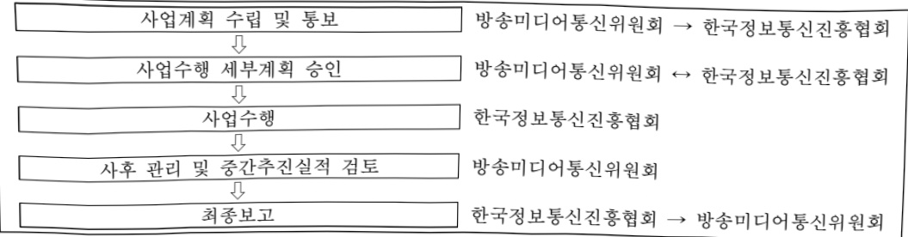

# 안전한 AI 활용 기반 조성

**해당 페이지**: PDF 3267 ~ 3275 쪽 해당

**부처**: 방송미디어통신위원회
**분야**: 통신
**회계유형**: 기금
**2026 확정예산**: 278.0 백만원
**전년대비 증감률**: None%
**AI 도메인**: LLM/언어모델, 디지털전환(AX)

---

### 가.지출계획 총괄표

(단위: 백만원, %)

<table border=1 style='margin: auto; word-wrap: break-word;'><tr><td rowspan="2">사업명</td><td rowspan="2">2024년 결산</td><td colspan="2">2025년 계획</td><td colspan="2">2026년</td><td rowspan="2">중감 (B-A)</td><td rowspan="2">(B-A)/A</td></tr><tr><td style='text-align: center; word-wrap: break-word;'>본예산</td><td style='text-align: center; word-wrap: break-word;'>추경(A)</td><td style='text-align: center; word-wrap: break-word;'>요구안</td><td style='text-align: center; word-wrap: break-word;'>본예산(B)</td></tr><tr><td style='text-align: center; word-wrap: break-word;'>안전한 AI 활용기반 조성</td><td style='text-align: center; word-wrap: break-word;'>-</td><td style='text-align: center; word-wrap: break-word;'>278</td><td style='text-align: center; word-wrap: break-word;'>-</td><td style='text-align: center; word-wrap: break-word;'>278</td><td style='text-align: center; word-wrap: break-word;'>278</td><td style='text-align: center; word-wrap: break-word;'>-</td><td style='text-align: center; word-wrap: break-word;'>-</td></tr></table>

□ 기능별(내역사업별) 계획 내역

(단위:백만원)

<table border=1 style='margin: auto; word-wrap: break-word;'><tr><td rowspan="3"></td><td colspan="5">2024</td><td colspan="8">2025(2025.12 말기 준)</td></tr><tr><td rowspan="2">계획액(수정)</td><td rowspan="2">계획현액</td><td rowspan="2">집행액[실집행액]</td><td rowspan="2">이월액</td><td rowspan="2">불용액</td><td colspan="2">계획액</td><td rowspan="2">계획현액</td><td rowspan="2">집행액[실집행액]</td><td colspan="2">전년도 이월액제외</td><td rowspan="2">이월액</td><td rowspan="2">불용액</td></tr><tr><td style='text-align: center; word-wrap: break-word;'>당초</td><td style='text-align: center; word-wrap: break-word;'>수정</td><td style='text-align: center; word-wrap: break-word;'>계획현액</td><td style='text-align: center; word-wrap: break-word;'>집행액[실집행액]</td></tr><tr><td style='text-align: center; word-wrap: break-word;'>○ 기능별 분류(합계)</td><td style='text-align: center; word-wrap: break-word;'>-</td><td style='text-align: center; word-wrap: break-word;'>-</td><td style='text-align: center; word-wrap: break-word;'>-</td><td style='text-align: center; word-wrap: break-word;'>-</td><td style='text-align: center; word-wrap: break-word;'>-</td><td style='text-align: center; word-wrap: break-word;'>278</td><td style='text-align: center; word-wrap: break-word;'>278</td><td style='text-align: center; word-wrap: break-word;'>278</td><td style='text-align: center; word-wrap: break-word;'>278[268]</td><td style='text-align: center; word-wrap: break-word;'>278</td><td style='text-align: center; word-wrap: break-word;'>278[268]</td><td style='text-align: center; word-wrap: break-word;'></td><td style='text-align: center; word-wrap: break-word;'></td></tr><tr><td style='text-align: center; word-wrap: break-word;'>• 생성형 AI 이용자 참여 플랫폼</td><td style='text-align: center; word-wrap: break-word;'>-</td><td style='text-align: center; word-wrap: break-word;'>-</td><td style='text-align: center; word-wrap: break-word;'>-</td><td style='text-align: center; word-wrap: break-word;'>-</td><td style='text-align: center; word-wrap: break-word;'>-</td><td style='text-align: center; word-wrap: break-word;'>278</td><td style='text-align: center; word-wrap: break-word;'>278</td><td style='text-align: center; word-wrap: break-word;'>278</td><td style='text-align: center; word-wrap: break-word;'>278[268]</td><td style='text-align: center; word-wrap: break-word;'>278</td><td style='text-align: center; word-wrap: break-word;'>278[268]</td><td style='text-align: center; word-wrap: break-word;'></td><td style='text-align: center; word-wrap: break-word;'></td></tr></table>

### 나. 사업설명자료

## 1 ) 사업목적·내용

- (안전한 AI 활용 기반조성) 많은 국민이 이용하는 인공지능 서비스(AI)의 환각, 비윤리성, 권리 침해, 범죄 악용 등 위험성·역기능을 제보받는 플랫폼을 운영해 안전한 AI 활용 기반 조성

- (생성형 AI 이용자 참여 플랫폼) AI 위험성에 대한 이용자 참여 플랫폼을 운영하여 위험성에 대해 제보받아 사업자와 이용자 간 리스크 커뮤니케이션으로의 정책적 교두보 역할을 통해 이용자의 권익을 강화하고 인공지능 서비스 역기능 피해 방지

## 2 ) 사업개요

☐ 사업근거 및 추진경위

① 법령상 근거 및 조항 적시

- 방송통신발전 기본법 제3조(방송통신의 공익성·공공성 등)

---

제3조(방송통신의 공익성·공공성 등) ① 국가와 지방자치단체는 방송통신의 공익성·공공성에 기반한 공적 책임을 완수하기 위하여 다음 각호의 사항을 달성하도록 노력하여야 한다.

2. 건전한 방송통신문화 창달 및 올바른 방송통신 이용환경 조성

- 방송통신발전 기본법 제7조(방송통신의 발전을 위한 시책 수립)

제7조(방송통신의 발전을 위한 시책 수립) ⑤ 과학기술정보통신부장관 또는 방송미디어통신위원회는 방송통신을 통한 국민의 명예 훼손과 권리 침해를 방지하고 정보보호를 위하여 필요한 시책을 수립·시행하여야 한다.

⑥ 과학기술정보통신부장관 또는 방송미디어통신위원회는 모든 국민이 방송통신서비스를 효율적이고 안전하게 이용할 수 있도록 관련 서비스의 품질 평가, 교육 및 홍보 활동 등에 관한 시책을 수립·시행하여야 한다.

- 방송통신발전 기본법 제9조(전담기관의 지정)

제9조(전담기관의 지정) ① 과학기술정보통신부장관과 방송미디어통신위원회는 기본계획의 효율적인 추진·집행을 위하여 필요한 때에는 해당 업무를 전담할 기관(이하 "전담기관"이라 한다)을 분야별로 지정할 수 있으며 이에 소요되는 비용을 지원할 수 있다.

② 전담기관의 지정대상과 지정절차 등에 관한 구체적 사항은 대통령령으로 정한다.

-방송통신발전 기본법 제15조(한국정보통신진흥협회)

제15조(한국정보통신진흥협회) ① 정보통신서비스 제공자 및 정보통신망과 관련된 사업을 경영하는 자는 정보통신의 발전을 위하여 대통령령으로 정하는 바에 따라 과학기술정보통신부장관의 인가를 받아 한국 정보통신진흥협회(이하 "진흥협회"라 한다)를 설립할 수 있다.

④ 정부는 진흥협회의 사업수행을 위하여 필요하면 예산의 범위에서 보조금을 지급할 수 있다.

-방송통신발전 기본법 시행령 제5조(한국정보통신진흥협회)

제5조(한국정보통신진흥협회의 설립 및 사업 등) ① 과학기술정보통신부장관은 법 제15조제1항에 따른 한국정보통신진흥협회(이하 "진흥협회"라 한다)의 설립을 인가한 경우에는 그 사실을 관보 및 인터넷 홈페이지에 공고하여야 한다.

5.정보통신서비스 등과 관련된 이용자 보호 및 편익활동

-지능정보화기본법 제56조(지능정보서비스 등의 사회적 영향평가)

제56조(지능정보서비스 등의 사회적 영향평가) ① 국가 및 지방자치단체는 국민의 생활에 파급력이 큰 지능정보서비스 등의 활용과 확산이 사회·경제·문화 및 국민의 일상생활 등에 미치는 영향에 대하여 다음 각 호의 사항을 조사·평가(이하 "사회적 영향평가"라 한다) 할 수 있다. 다만, 지능정보기술의 경우에는「과학기술기본법」제14조제1항의 기술영향평가로 대신한다.

1. 지능정보서비스 등의 안전성 및 신뢰성

3. 고용·노동, 공정거래, 산업 구조, 이용자 권익 등 사회·경제에 미치는 영향

-지능정보화기본법 제63조(이용자의 권익보호)

제63조(이용자의 권익보호) ① 국가기관과 지방자치단체는 지능정보사회 시책을 추진할 때 지능정보기술 및 지능정보서비스 등을 이용하는 이용자의 권익보호를 위하여 다음 각 호의 시책을 마련하여야 한다.

1. 이용자의 생명 · 신체 · 명예 및 재산상의 위해 방지

2. 이용자의 불만 및 피해에 대한 신속 · 공정한 구제

4. 이용자의 권익보호를 위한 교육 · 홍보 및 연구

---

-정보통신망법 제44조의4(자율규제)

<table border=1 style='margin: auto; word-wrap: break-word;'><tr><td style='text-align: center; word-wrap: break-word;'>제44조의4(자율규제) ① 정보통신서비스 제공자단체는 이용자를 보호하고 안전하며 신뢰할 수 있는 정보통신서비스를 제공하기 위하여 정보통신서비스 제공자 행동강령을 정하여 시행할 수 있다. ② 정보통신서비스 제공자단체는 다음 각 호의 어느 하나에 해당하는 정보가 정보통신망에 유통되지 아니하도록 모니터링 등 자율규제 가이드라인을 정하여 시행할 수 있다. 1. 청소년유해정보 2. 제44조의7에 따른 불법정보 ③ 정부는 제1항 및 제2항에 따른 정보통신서비스 제공자단체의 자율규제를 위한 활동을 지원할 수 있다.</td></tr></table>

- 정보통신망법 제44조의7(불법정보의 유통금지 등)

<table border=1 style='margin: auto; word-wrap: break-word;'><tr><td style='text-align: center; word-wrap: break-word;'>제44조의7(불법정보의 유통금지 등) ① 누구든지 정보통신망을 통하여 다음 각 호의 어느 하나에 해당하는 정보를 유통하여서는 아니 된다.</td></tr><tr><td style='text-align: center; word-wrap: break-word;'>1. 음란한 부호·문언·음향·화상 또는 영상을 배포·판매·임대하거나 공공연하게 전시하는 내용의 정보</td></tr><tr><td style='text-align: center; word-wrap: break-word;'>2. 사람을 비방할 목적으로 공공연하게 사실이나 거짓의 사실을 드러내어 타인의 명예를 훼손하는 내용의 정보</td></tr><tr><td style='text-align: center; word-wrap: break-word;'>3. 공포심이나 불안감을 유발하는 부호·문언·음향·화상 또는 영상을 반복적으로 상대방에게 도달하도록 하는 내용의 정보</td></tr><tr><td style='text-align: center; word-wrap: break-word;'>4. 정당한 사유 없이 정보통신시스템, 데이터 또는 프로그램 등을 훼손·멸실·변경·위조하거나 그 운용을 방해하는 내용의 정보</td></tr><tr><td style='text-align: center; word-wrap: break-word;'>5. 「청소년 보호법」에 따른 청소년유해매체물로서 상대방의 연령 확인, 표시의무 등 법령에 따른 의무를 이행하지 아니하고 영리를 목적으로 제공하는 내용의 정보</td></tr><tr><td style='text-align: center; word-wrap: break-word;'>6. 법령에 따라 금지되는 사행행위에 해당하는 내용의 정보</td></tr><tr><td style='text-align: center; word-wrap: break-word;'>6의2. 이 법 또는 개인정보 보호에 관한 법령을 위반하여 개인정보를 거래하는 내용의 정보</td></tr><tr><td style='text-align: center; word-wrap: break-word;'>6의3. 총포·화약류(생명·신체에 위해를 끼칠 수 있는 폭발력을 가진 물건을 포함한다)를 제조할 수 있는 방법이나 설계도 등의 정보</td></tr><tr><td style='text-align: center; word-wrap: break-word;'>7. 법령에 따라 분류된 비밀 등 국가기밀을 누설하는 내용의 정보</td></tr><tr><td style='text-align: center; word-wrap: break-word;'>8. 「국가보안법」에서 금지하는 행위를 수행하는 내용의 정보</td></tr><tr><td style='text-align: center; word-wrap: break-word;'>9. 그 밖에 범죄를 목적으로 하거나 교사(教唆) 또는 방조하는 내용의 정보</td></tr></table>

② 추진경위 - 사업 시작년도, 추진배경, 부처별 중점과제, 대통령 공약사항 등

- '22. 7월, 120대 국정과제

※ 국정과제 59-4(디지털 신산업 이용자 보호) 디지털 플랫폼·메타버스·모빌리티 등 신산업 분야에서의 이용자 보호 기반 마련 명시

- '23. 9월, 디지털 권리장전

제3조 (안전과 신뢰의 확보) 디지털 사회에서 디지털 기술과 서비스는 개인과 사회의 안전에 위협이 되지 않도록 신뢰할 수 있어야 하고, 디지털 위험에 대비하는 수단과 절차가 마련되어야 한다.

제8조(디지털 다양성 존중) 모든 사람은 디지털 기술로 인한 불합리한 차별과 편견으로부터 보호받으며 사회적문화적 다양성을 존중받아야 한다.

제17조(디지털 기술의 윤리적 개발과 사용) 디지털 기술의 개발과 사용은 안전과 신뢰를 확보할 수 있도록 윤리적인 방식으로 책임있게 이루어져야 한다.

제18조(디지털 위험 대응) 디지털 위험은 적정한 조치가 이루어질 수 있는 수단과 절차를 통해 예방 관리되어야 하며, 그 위험에 관한 정보는 알기 쉽고 투명하게 공개되어야 한다.

---

제20조 (건전한 디지털 환경 조성) 허위조작 및 불법·유해정보의 생산·유통이 방지되는 등 건전한 디지털 환경이 조성되어야 하고, 디지털 환경에서 발생하는 범죄로부터 피해자를 보호하기 위한 실효적인 수단과 절차가 마련되어야 한다.

제21조(아동·청소년의 보호)아동·청소년은 연령에 적합하게 설계된 디지털 공간을 선택하여 자유롭게 활동할 수 있어야 하며, 디지털 기술로 발생가능한 범죄로부터 특별히 보호받아야 한다.

제23조(디지털 규제 개선) 디지털 혁신의 촉진을 위해 민간의 자율을 존중하는 합리적인 규제체계가 형성되어야 한다.

### - '24. 3월, 2024년 방송통신위원회 업무 계획

※ 인공지능서비스의 신뢰성을 보장하고, 위험성 관리 및 역기능으로부터 이용자를 보호하기 위해 '인공지능서비스 이용자보호에 관한 법률'(가칭) 제정 추진

※ 인공지능 서비스 이용자 보호 강화(인공지능 생성물 표시제 도입, 생성형 AI 피해예방 등)

### - '25. 3월, 2025년 방송통신위원회 업무 계획

※ AI 이용자 권익 보호 및 AI 산업의 조화로운 발전을 위한 AI 이용자보호 종합계획 수립 추진

※ '인공지능서비스 이용자보호에 관한 법률'(가칭) 제정 추진

※ 인공지능 서비스 이용자 보호 강화(AI 활용 컨텐츠제작 실태조사 및 활용 지원 가이드라인 마련 추진 생성형 AI 피해구제 체계 확립 등)

### - '25. 2월, 생성형 AI 이용자 보호 가이드라인 발표

※ 생성형 인공지능 서비스 이용자 보호를 위한 6개의 실행 방식 발표

- '25. 3월, 생성형 AI 이용자 참여 플랫폼 연구반 운영

※ 생성형 AI 위험성 분류체계 및 위험성 제보 프로세스 정립 등

- '25. 7월, 생성형 AI 이용자 참여 플랫폼 사업자 간담회

※제보내역처리방안논의등

- '25. 10월, 생성형 AI 이용자 참여 플랫폼 시스템 오픈

※ ai.wiseuser.go.kr

- '25. 11월, 생성형 AI 이용자 참여 플랫폼 정부혁신 우수사례 선정

---

## □ 주요내용

① 사업규모

- 총사업비 : 해당없음

- 사업기간 : '25년 ~ (계속)

- 최근 5년 간 투입된 사업비(예산액기준, 추경편성한 연도에는 추경포함)

<table border=1 style='margin: auto; word-wrap: break-word;'><tr><td style='text-align: center; word-wrap: break-word;'>연도</td><td style='text-align: center; word-wrap: break-word;'>2022</td><td style='text-align: center; word-wrap: break-word;'>2023</td><td style='text-align: center; word-wrap: break-word;'>2024</td><td style='text-align: center; word-wrap: break-word;'>2025</td><td style='text-align: center; word-wrap: break-word;'>2026</td></tr><tr><td style='text-align: center; word-wrap: break-word;'>사업비</td><td style='text-align: center; word-wrap: break-word;'>-</td><td style='text-align: center; word-wrap: break-word;'>-</td><td style='text-align: center; word-wrap: break-word;'>-</td><td style='text-align: center; word-wrap: break-word;'>278</td><td style='text-align: center; word-wrap: break-word;'>278</td></tr></table>

② 사업추진체계

- 사업시행방법 : 민간경상보조(보조율 100%)

- 사업시행주체 : 한국정보통신진흥협회

-사업 수혜자 : 전 국민

- 보조, 융자, 출연, 출자 등의 경우 보조·융자 등 지원 비율 및 법적근거

<table border=1 style='margin: auto; word-wrap: break-word;'><tr><td style='text-align: center; word-wrap: break-word;'>내역사업명</td><td style='text-align: center; word-wrap: break-word;'>구분</td><td style='text-align: center; word-wrap: break-word;'>피보조·피출연 등 기관명</td><td style='text-align: center; word-wrap: break-word;'>지원 금액 (2026 계획)</td><td style='text-align: center; word-wrap: break-word;'>지원 비율(%)</td><td style='text-align: center; word-wrap: break-word;'>보조율 법적근거 (해당 조항)</td></tr><tr><td style='text-align: center; word-wrap: break-word;'>생성형 AI 이용자 참여 플랫폼</td><td style='text-align: center; word-wrap: break-word;'>민간 경상 보조</td><td style='text-align: center; word-wrap: break-word;'>한국정보 통신진흥 협회</td><td style='text-align: center; word-wrap: break-word;'>278</td><td style='text-align: center; word-wrap: break-word;'>100</td><td style='text-align: center; word-wrap: break-word;'>방송통신발전기본법 제15조 제4항</td></tr></table>

## 3 ) 2026년도 계획 산출 근거

☐ 생성형 AI 이용자 참여 플랫폼 : (2025) 278백만원 → (2026 계획안) 278백만원, 전년동

·생성형 AI 이용자 참여 플랫폼 : (2025) 278백만원 → (2026 계획안) 278백만원, 전년동

- (요구) 생성형 AI 이용자 참여 플랫폼 운영을 위해 전년도 수준으로 예산 요구

- (산출) ① 이용자 제보내역 확인 및 정보제공 197.4백만원, ② 이용자 참여 플랫폼 운영 45.6백만원, ③ 시스템 유지보수 5백만원, ④ 시스템 보안강화 30백만원

① 이용자 제보내역 확인 및 정보제공 197.4백만원

제보내역 확인 및 자료구매 112.2백만원, 정보제공 콘텐츠 제작 30백만원, 대국민 인식제고 30백만원, 전문가 자문 사례비 25.2백만원

② 이용자 참여 플랫폼 운영 45.6백만원

③ 시스템 유지보수 5백만원

④ 시스템 보안강화 30백만원

---

## 4 ) 사업효과

☐ 사업영향, 산출물 성과지표 등

①2022~2026년도 성과계획서 상 성과지표 및 최근 5년간 성과 달성도

<table border=1 style='margin: auto; word-wrap: break-word;'><tr><td style='text-align: center; word-wrap: break-word;'>성과지표</td><td style='text-align: center; word-wrap: break-word;'>구분</td><td style='text-align: center; word-wrap: break-word;'>2022</td><td style='text-align: center; word-wrap: break-word;'>2023</td><td style='text-align: center; word-wrap: break-word;'>2024</td><td style='text-align: center; word-wrap: break-word;'>2025</td><td style='text-align: center; word-wrap: break-word;'>2026</td><td style='text-align: center; word-wrap: break-word;'>&#x27;26목표치산출근거</td><td style='text-align: center; word-wrap: break-word;'>측정산식(또는 측정방법)</td><td style='text-align: center; word-wrap: break-word;'>자료수집방법(또는 자료출처)</td></tr><tr><td rowspan="3">생성형 AI 이용자 참여 플랫폼 활성화율(%)</td><td style='text-align: center; word-wrap: break-word;'>목표</td><td style='text-align: center; word-wrap: break-word;'>-</td><td style='text-align: center; word-wrap: break-word;'>-</td><td style='text-align: center; word-wrap: break-word;'>-</td><td style='text-align: center; word-wrap: break-word;'>80</td><td style='text-align: center; word-wrap: break-word;'>82</td><td rowspan="3">목표 정보제공 건수 상향</td><td rowspan="3">[(위험성 신고 내용 검증 건수/위험성신고건수)×50%]+[(정보제공건수/목표 정보제공건수)×50%]</td><td rowspan="3">사업 결과보고서</td></tr><tr><td style='text-align: center; word-wrap: break-word;'>실적</td><td style='text-align: center; word-wrap: break-word;'>-</td><td style='text-align: center; word-wrap: break-word;'>-</td><td style='text-align: center; word-wrap: break-word;'>-</td><td style='text-align: center; word-wrap: break-word;'>90</td><td style='text-align: center; word-wrap: break-word;'>-</td></tr><tr><td style='text-align: center; word-wrap: break-word;'>달성도</td><td style='text-align: center; word-wrap: break-word;'>-</td><td style='text-align: center; word-wrap: break-word;'>-</td><td style='text-align: center; word-wrap: break-word;'>-</td><td style='text-align: center; word-wrap: break-word;'>1125%</td><td style='text-align: center; word-wrap: break-word;'>-</td></tr></table>

② 성과지표 이외의 연도별 사업추진 경과 및 실적

<table border=1 style='margin: auto; word-wrap: break-word;'><tr><td style='text-align: center; word-wrap: break-word;'>2025</td><td style='text-align: center; word-wrap: break-word;'>o 생성형 AI 이용자 참여 플랫폼 연구반 운영 (5회) - 생성형 AI 위험성 분류 체계 마련 등 o 생성형 AI 사업자 간담회 (2회) o 생성형 AI 대학생 간담회 (1회) o 생성형 AI 이용자 참여 플랫폼 시스템 구축(10월 오픈)</td></tr></table>

③ 향후(26년도 이후) 기대효과 :

<table border=1 style='margin: auto; word-wrap: break-word;'><tr><td style='text-align: center; word-wrap: break-word;'>☐ 생성형AI 서비스 이용자가 제보한 위험요소를 확인하고 관련 정보를 제공함으로써 이용자 피해 최소화 및 생성형 AI 서비스의 올바른 사용 등 인식 제고</td></tr></table>

5) 타당성조사 및 예비타당성조사 시행여부 및 결과 요지: 해당 없음

6) 총사업비 대상사업 정보: 해당 없음

---

## 7 ) 사업 집행절차

## 8 ) 각종 평가

1) 국회(예결위, 상임위, 예정처, 국정감사 포함) 지적

- 해당 사업은 지침상의 정보화 사업으로 분류되어야 함에도 일반재정사업으로 분류된 바, 정보화 사업 수준의 사업계획 수립하여 추진 필요(예정처, 25예산)

- 예산 지침 상 시스템 도입 후 1년은 무상 하자보수 기간이므로 유지보수 비용 삭감(예정처, 25예산)

- 한국정보통신진흥협회(KAIT)로 보조사업자를 지정하였으나, 원칙적으로 공모로 결정하도록 하는「보조금법」취지 등을 감안하여 재검토할 필요(과방위, 25예산)

2) 대외공개 평가 : 해당 없음

3) 자체평가 : 해당 없음

### 다.최근 4년간 결산내역

## 1 ) 결산표

☐ 부처 결산내역

(단위: 백만원, %)

<table border=1 style='margin: auto; word-wrap: break-word;'><tr><td rowspan="2">연도</td><td colspan="3">계획액</td><td rowspan="2">계획현액(A)</td><td rowspan="2">집행액(B)</td><td rowspan="2">집행률(B/A)</td><td rowspan="2">다음연도이월액</td><td rowspan="2">불용액</td></tr><tr><td style='text-align: center; word-wrap: break-word;'>본예산</td><td style='text-align: center; word-wrap: break-word;'>추경증감액</td><td style='text-align: center; word-wrap: break-word;'>추경</td></tr><tr><td style='text-align: center; word-wrap: break-word;'>2022</td><td style='text-align: center; word-wrap: break-word;'>-</td><td style='text-align: center; word-wrap: break-word;'>-</td><td style='text-align: center; word-wrap: break-word;'>-</td><td style='text-align: center; word-wrap: break-word;'>-</td><td style='text-align: center; word-wrap: break-word;'>-</td><td style='text-align: center; word-wrap: break-word;'>-</td><td style='text-align: center; word-wrap: break-word;'>-</td><td style='text-align: center; word-wrap: break-word;'>-</td></tr><tr><td style='text-align: center; word-wrap: break-word;'>2023</td><td style='text-align: center; word-wrap: break-word;'>-</td><td style='text-align: center; word-wrap: break-word;'>-</td><td style='text-align: center; word-wrap: break-word;'>-</td><td style='text-align: center; word-wrap: break-word;'>-</td><td style='text-align: center; word-wrap: break-word;'>-</td><td style='text-align: center; word-wrap: break-word;'>-</td><td style='text-align: center; word-wrap: break-word;'>-</td><td style='text-align: center; word-wrap: break-word;'>-</td></tr><tr><td style='text-align: center; word-wrap: break-word;'>2024</td><td style='text-align: center; word-wrap: break-word;'>-</td><td style='text-align: center; word-wrap: break-word;'>-</td><td style='text-align: center; word-wrap: break-word;'>-</td><td style='text-align: center; word-wrap: break-word;'>-</td><td style='text-align: center; word-wrap: break-word;'>-</td><td style='text-align: center; word-wrap: break-word;'>-</td><td style='text-align: center; word-wrap: break-word;'>-</td><td style='text-align: center; word-wrap: break-word;'>-</td></tr><tr><td style='text-align: center; word-wrap: break-word;'>2025</td><td style='text-align: center; word-wrap: break-word;'>278</td><td style='text-align: center; word-wrap: break-word;'>-</td><td style='text-align: center; word-wrap: break-word;'>-</td><td style='text-align: center; word-wrap: break-word;'>278</td><td style='text-align: center; word-wrap: break-word;'>278</td><td style='text-align: center; word-wrap: break-word;'>100</td><td style='text-align: center; word-wrap: break-word;'>-</td><td style='text-align: center; word-wrap: break-word;'>-</td></tr></table>

---

## 2 ) 주요 결산사항

□2022~2025년 결산 주요사항

<table border=1 style='margin: auto; word-wrap: break-word;'><tr><td style='text-align: center; word-wrap: break-word;'>2022</td><td style='text-align: center; word-wrap: break-word;'>- 해당사항 없음</td></tr><tr><td style='text-align: center; word-wrap: break-word;'>2023</td><td style='text-align: center; word-wrap: break-word;'>- 해당사항 없음</td></tr><tr><td style='text-align: center; word-wrap: break-word;'>2024</td><td style='text-align: center; word-wrap: break-word;'>- 해당사항 없음</td></tr><tr><td style='text-align: center; word-wrap: break-word;'>2025</td><td style='text-align: center; word-wrap: break-word;'>- 해당사항 없음</td></tr></table>

2025년 계획변경 세부내역: 해당 없음

---

<table border=1 style='margin: auto; word-wrap: break-word;'><tr><td style='text-align: center; word-wrap: break-word;'>사 업 명</td></tr><tr><td style='text-align: center; word-wrap: break-word;'>(37) 지능정보사회 이용자 보호 환경조성 (3251-308)</td></tr></table>

☐ 사업 코드 정보

<table border=1 style='margin: auto; word-wrap: break-word;'><tr><td style='text-align: center; word-wrap: break-word;'>구분</td><td style='text-align: center; word-wrap: break-word;'>기금</td><td style='text-align: center; word-wrap: break-word;'>소관</td><td style='text-align: center; word-wrap: break-word;'>실국(기관)</td><td style='text-align: center; word-wrap: break-word;'>계정</td><td style='text-align: center; word-wrap: break-word;'>분야</td><td style='text-align: center; word-wrap: break-word;'>부문</td></tr><tr><td style='text-align: center; word-wrap: break-word;'>코드</td><td style='text-align: center; word-wrap: break-word;'>방송통신</td><td style='text-align: center; word-wrap: break-word;'>방송미디어</td><td style='text-align: center; word-wrap: break-word;'>방송통신</td><td rowspan="2"></td><td style='text-align: center; word-wrap: break-word;'>130</td><td style='text-align: center; word-wrap: break-word;'>131</td></tr><tr><td style='text-align: center; word-wrap: break-word;'>명칭</td><td style='text-align: center; word-wrap: break-word;'>발전기금</td><td style='text-align: center; word-wrap: break-word;'>통신위원회</td><td style='text-align: center; word-wrap: break-word;'>이용자정책국</td><td style='text-align: center; word-wrap: break-word;'>통신</td><td style='text-align: center; word-wrap: break-word;'>방송통신</td></tr></table>

<table border=1 style='margin: auto; word-wrap: break-word;'><tr><td style='text-align: center; word-wrap: break-word;'>구분</td><td style='text-align: center; word-wrap: break-word;'>프로그램</td><td style='text-align: center; word-wrap: break-word;'>단위사업</td><td style='text-align: center; word-wrap: break-word;'>세부사업</td></tr><tr><td style='text-align: center; word-wrap: break-word;'>코드</td><td style='text-align: center; word-wrap: break-word;'>3200</td><td style='text-align: center; word-wrap: break-word;'>3251</td><td style='text-align: center; word-wrap: break-word;'>308</td></tr><tr><td style='text-align: center; word-wrap: break-word;'>명칭</td><td style='text-align: center; word-wrap: break-word;'>안전한 인터넷 활용기반 구축(KCC)</td><td style='text-align: center; word-wrap: break-word;'>안전한 인터넷 정보활용 기반구축</td><td style='text-align: center; word-wrap: break-word;'>지능정보사회 이용자 보호 환경조성</td></tr></table>

<table border=1 style='margin: auto; word-wrap: break-word;'><tr><td colspan="6">☐ 사업 성격 (공통요구자료 II-1 작성유의사항 4. 참조, 해당하는 사항에 “○” 표시)</td></tr><tr><td style='text-align: center; word-wrap: break-word;'>신규 계속</td><td style='text-align: center; word-wrap: break-word;'>완료</td><td style='text-align: center; word-wrap: break-word;'>예비타당성 실시여부</td><td style='text-align: center; word-wrap: break-word;'>총사업비 관리대상</td><td style='text-align: center; word-wrap: break-word;'>총액계상 예산사업</td><td style='text-align: center; word-wrap: break-word;'>사업소관 변경정보 2025예산 시 소관</td></tr><tr><td style='text-align: center; word-wrap: break-word;'></td><td style='text-align: center; word-wrap: break-word;'></td><td style='text-align: center; word-wrap: break-word;'></td><td style='text-align: center; word-wrap: break-word;'></td><td style='text-align: center; word-wrap: break-word;'></td><td style='text-align: center; word-wrap: break-word;'></td></tr></table>

□ 사업 지원 형태 및 지원을 (최소한 한 개는 반드시 선택하시오. 해당사항에 0 표시)

<table border=1 style='margin: auto; word-wrap: break-word;'><tr><td style='text-align: center; word-wrap: break-word;'>직접</td><td style='text-align: center; word-wrap: break-word;'>출자</td><td style='text-align: center; word-wrap: break-word;'>출연</td><td style='text-align: center; word-wrap: break-word;'>보조</td><td style='text-align: center; word-wrap: break-word;'>융자</td><td style='text-align: center; word-wrap: break-word;'>국고보조율(%)</td><td style='text-align: center; word-wrap: break-word;'>융자율(%)</td></tr><tr><td style='text-align: center; word-wrap: break-word;'></td><td style='text-align: center; word-wrap: break-word;'></td><td style='text-align: center; word-wrap: break-word;'></td><td style='text-align: center; word-wrap: break-word;'>○</td><td style='text-align: center; word-wrap: break-word;'></td><td style='text-align: center; word-wrap: break-word;'></td><td style='text-align: center; word-wrap: break-word;'></td></tr></table>

## □ 사업 소관부처 및 시행주체

<table border=1 style='margin: auto; word-wrap: break-word;'><tr><td style='text-align: center; word-wrap: break-word;'>사업명</td><td colspan="2">구분</td></tr><tr><td rowspan="6">경험적근거마련을위한조사·연구,정책네트워크구성·운영,지능정보사회이용자보호정책개발</td><td style='text-align: center; word-wrap: break-word;'>소관부처</td><td style='text-align: center; word-wrap: break-word;'>방송통신이용자정책국인공지능이용자보호과</td></tr><tr><td style='text-align: center; word-wrap: break-word;'>사업시행주체</td><td style='text-align: center; word-wrap: break-word;'>정보통신정책연구원</td></tr><tr><td style='text-align: center; word-wrap: break-word;'>소관부처</td><td style='text-align: center; word-wrap: break-word;'>방송통신이용자정책국인공지능이용자보호과</td></tr><tr><td style='text-align: center; word-wrap: break-word;'>사업시행주체</td><td style='text-align: center; word-wrap: break-word;'>정보통신정책연구원</td></tr><tr><td style='text-align: center; word-wrap: break-word;'>소관부처</td><td style='text-align: center; word-wrap: break-word;'>방송통신이용자정책국인공지능이용자보호과</td></tr><tr><td style='text-align: center; word-wrap: break-word;'>사업시행주체</td><td style='text-align: center; word-wrap: break-word;'>정보통신정책연구원</td></tr><tr><td rowspan="2">신기술환경메타버스이용자보호실태조사</td><td style='text-align: center; word-wrap: break-word;'>소관부처</td><td style='text-align: center; word-wrap: break-word;'>방송통신이용자정책국인공지능이용자보호과</td></tr><tr><td style='text-align: center; word-wrap: break-word;'>사업시행주체</td><td style='text-align: center; word-wrap: break-word;'>한국가상융합디지털산업협회</td></tr></table>

---

### 원본 PDF 크롭 이미지

