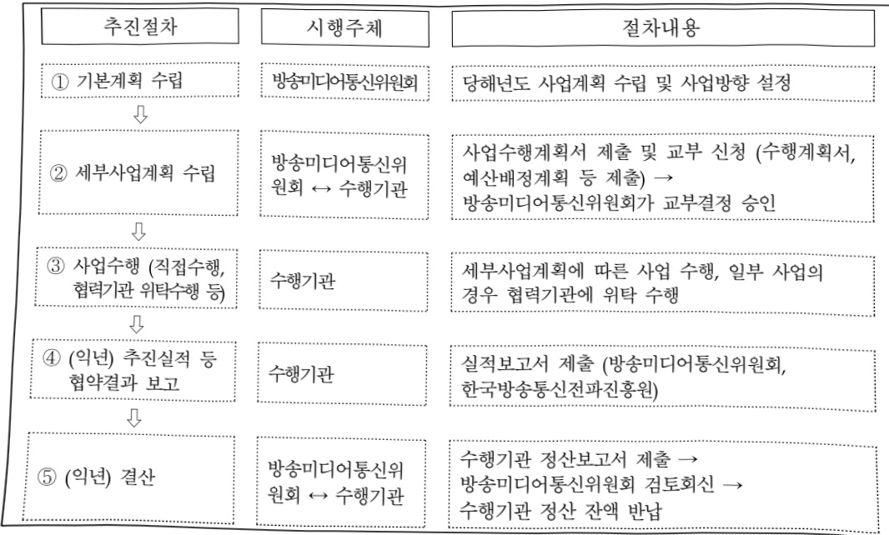

# 지능정보사회 이용자보호 환경조성

**해당 페이지**: PDF 3276 ~ 3284 쪽 해당

**부처**: 방송미디어통신위원회
**분야**: 통신
**회계유형**: 기금
**2026 확정예산**: 1141.0 백만원
**전년대비 증감률**: 44.1%
**AI 도메인**: 문화/콘텐츠, 통신/네트워크

---

<table border=1 style='margin: auto; word-wrap: break-word;'><tr><td style='text-align: center; word-wrap: break-word;'>사 업 명</td></tr><tr><td style='text-align: center; word-wrap: break-word;'>(37) 지능정보사회 이용자 보호 환경조성 (3251-308)</td></tr></table>

☐ 사업 코드 정보

<table border=1 style='margin: auto; word-wrap: break-word;'><tr><td style='text-align: center; word-wrap: break-word;'>구분</td><td style='text-align: center; word-wrap: break-word;'>기금</td><td style='text-align: center; word-wrap: break-word;'>소관</td><td style='text-align: center; word-wrap: break-word;'>실국(기관)</td><td style='text-align: center; word-wrap: break-word;'>계정</td><td style='text-align: center; word-wrap: break-word;'>분야</td><td style='text-align: center; word-wrap: break-word;'>부문</td></tr><tr><td style='text-align: center; word-wrap: break-word;'>코드</td><td style='text-align: center; word-wrap: break-word;'>방송통신</td><td style='text-align: center; word-wrap: break-word;'>방송미디어</td><td style='text-align: center; word-wrap: break-word;'>방송통신</td><td rowspan="2"></td><td style='text-align: center; word-wrap: break-word;'>130</td><td style='text-align: center; word-wrap: break-word;'>131</td></tr><tr><td style='text-align: center; word-wrap: break-word;'>명칭</td><td style='text-align: center; word-wrap: break-word;'>발전기금</td><td style='text-align: center; word-wrap: break-word;'>통신위원회</td><td style='text-align: center; word-wrap: break-word;'>이용자정책국</td><td style='text-align: center; word-wrap: break-word;'>통신</td><td style='text-align: center; word-wrap: break-word;'>방송통신</td></tr></table>

<table border=1 style='margin: auto; word-wrap: break-word;'><tr><td style='text-align: center; word-wrap: break-word;'>구분</td><td style='text-align: center; word-wrap: break-word;'>프로그램</td><td style='text-align: center; word-wrap: break-word;'>단위사업</td><td style='text-align: center; word-wrap: break-word;'>세부사업</td></tr><tr><td style='text-align: center; word-wrap: break-word;'>코드</td><td style='text-align: center; word-wrap: break-word;'>3200</td><td style='text-align: center; word-wrap: break-word;'>3251</td><td style='text-align: center; word-wrap: break-word;'>308</td></tr><tr><td style='text-align: center; word-wrap: break-word;'>명칭</td><td style='text-align: center; word-wrap: break-word;'>안전한 인터넷 활용기반 구축(KCC)</td><td style='text-align: center; word-wrap: break-word;'>안전한 인터넷 정보활용 기반구축</td><td style='text-align: center; word-wrap: break-word;'>지능정보사회 이용자 보호 환경조성</td></tr></table>

<table border=1 style='margin: auto; word-wrap: break-word;'><tr><td colspan="6">☐ 사업 성격 (공통요구자료 II-1 작성유의사항 4. 참조, 해당하는 사항에 “○” 표시)</td></tr><tr><td style='text-align: center; word-wrap: break-word;'>신규 계속</td><td style='text-align: center; word-wrap: break-word;'>완료</td><td style='text-align: center; word-wrap: break-word;'>예비타당성 실시여부</td><td style='text-align: center; word-wrap: break-word;'>총사업비 관리대상</td><td style='text-align: center; word-wrap: break-word;'>총액계상 예산사업</td><td style='text-align: center; word-wrap: break-word;'>사업소관 변경정보 2025예산 시 소관</td></tr><tr><td style='text-align: center; word-wrap: break-word;'></td><td style='text-align: center; word-wrap: break-word;'></td><td style='text-align: center; word-wrap: break-word;'></td><td style='text-align: center; word-wrap: break-word;'></td><td style='text-align: center; word-wrap: break-word;'></td><td style='text-align: center; word-wrap: break-word;'></td></tr></table>

□ 사업 지원 형태 및 지원을 (최소한 한 개는 반드시 선택하시오. 해당사항에 0 표시)

<table border=1 style='margin: auto; word-wrap: break-word;'><tr><td style='text-align: center; word-wrap: break-word;'>직접</td><td style='text-align: center; word-wrap: break-word;'>출자</td><td style='text-align: center; word-wrap: break-word;'>출연</td><td style='text-align: center; word-wrap: break-word;'>보조</td><td style='text-align: center; word-wrap: break-word;'>융자</td><td style='text-align: center; word-wrap: break-word;'>국고보조율(%)</td><td style='text-align: center; word-wrap: break-word;'>융자율(%)</td></tr><tr><td style='text-align: center; word-wrap: break-word;'></td><td style='text-align: center; word-wrap: break-word;'></td><td style='text-align: center; word-wrap: break-word;'></td><td style='text-align: center; word-wrap: break-word;'>○</td><td style='text-align: center; word-wrap: break-word;'></td><td style='text-align: center; word-wrap: break-word;'></td><td style='text-align: center; word-wrap: break-word;'></td></tr></table>

## □ 사업 소관부처 및 시행주체

<table border=1 style='margin: auto; word-wrap: break-word;'><tr><td style='text-align: center; word-wrap: break-word;'>사업명</td><td colspan="2">구분</td></tr><tr><td rowspan="6">경험적근거마련을위한조사·연구,정책네트워크구성·운영,지능정보사회이용자보호정책개발</td><td style='text-align: center; word-wrap: break-word;'>소관부처</td><td style='text-align: center; word-wrap: break-word;'>방송통신이용자정책국인공지능이용자보호과</td></tr><tr><td style='text-align: center; word-wrap: break-word;'>사업시행주체</td><td style='text-align: center; word-wrap: break-word;'>정보통신정책연구원</td></tr><tr><td style='text-align: center; word-wrap: break-word;'>소관부처</td><td style='text-align: center; word-wrap: break-word;'>방송통신이용자정책국인공지능이용자보호과</td></tr><tr><td style='text-align: center; word-wrap: break-word;'>사업시행주체</td><td style='text-align: center; word-wrap: break-word;'>정보통신정책연구원</td></tr><tr><td style='text-align: center; word-wrap: break-word;'>소관부처</td><td style='text-align: center; word-wrap: break-word;'>방송통신이용자정책국인공지능이용자보호과</td></tr><tr><td style='text-align: center; word-wrap: break-word;'>사업시행주체</td><td style='text-align: center; word-wrap: break-word;'>정보통신정책연구원</td></tr><tr><td rowspan="2">신기술환경메타버스이용자보호실태조사</td><td style='text-align: center; word-wrap: break-word;'>소관부처</td><td style='text-align: center; word-wrap: break-word;'>방송통신이용자정책국인공지능이용자보호과</td></tr><tr><td style='text-align: center; word-wrap: break-word;'>사업시행주체</td><td style='text-align: center; word-wrap: break-word;'>한국가상융합디지털산업협회</td></tr></table>

---

### 가.지출계획 총괄표

(단위: 백만원, %)

<table border=1 style='margin: auto; word-wrap: break-word;'><tr><td rowspan="2">사업명</td><td rowspan="2">2024년 결산</td><td colspan="2">2025년 예산</td><td colspan="2">2026년 예산</td><td rowspan="2">중감(B-A)</td><td rowspan="2">(B-A)/A</td></tr><tr><td style='text-align: center; word-wrap: break-word;'>본예산</td><td style='text-align: center; word-wrap: break-word;'>추경(A)</td><td style='text-align: center; word-wrap: break-word;'>요구안</td><td style='text-align: center; word-wrap: break-word;'>본예산(B)</td></tr><tr><td style='text-align: center; word-wrap: break-word;'>지능정보사회이용자보호환경조성</td><td style='text-align: center; word-wrap: break-word;'>830</td><td style='text-align: center; word-wrap: break-word;'>792</td><td style='text-align: center; word-wrap: break-word;'>792</td><td style='text-align: center; word-wrap: break-word;'>781</td><td style='text-align: center; word-wrap: break-word;'>1,141</td><td style='text-align: center; word-wrap: break-word;'>349</td><td style='text-align: center; word-wrap: break-word;'>44.1</td></tr></table>

□ 기능별(내역사업별) 계획 내역

(단위:백만원)

<table border=1 style='margin: auto; word-wrap: break-word;'><tr><td rowspan="2"></td><td colspan="5">2024</td><td colspan="5">2025</td><td rowspan="2">2026 계획</td></tr><tr><td style='text-align: center; word-wrap: break-word;'>계획액(추경)</td><td style='text-align: center; word-wrap: break-word;'>계획현액</td><td style='text-align: center; word-wrap: break-word;'>집행액</td><td style='text-align: center; word-wrap: break-word;'>이월액</td><td style='text-align: center; word-wrap: break-word;'>불용액</td><td style='text-align: center; word-wrap: break-word;'>계획액(추경)</td><td style='text-align: center; word-wrap: break-word;'>계획현액</td><td style='text-align: center; word-wrap: break-word;'>집행액</td><td style='text-align: center; word-wrap: break-word;'>이월액</td><td style='text-align: center; word-wrap: break-word;'>불용액</td></tr><tr><td style='text-align: center; word-wrap: break-word;'>○ 기능별 분류(합계)</td><td style='text-align: center; word-wrap: break-word;'>830</td><td style='text-align: center; word-wrap: break-word;'>830</td><td style='text-align: center; word-wrap: break-word;'>830[819.5]</td><td style='text-align: center; word-wrap: break-word;'>-</td><td style='text-align: center; word-wrap: break-word;'>-</td><td style='text-align: center; word-wrap: break-word;'>792</td><td style='text-align: center; word-wrap: break-word;'>792</td><td style='text-align: center; word-wrap: break-word;'>792</td><td style='text-align: center; word-wrap: break-word;'>-</td><td style='text-align: center; word-wrap: break-word;'>-</td><td style='text-align: center; word-wrap: break-word;'>1,141</td></tr><tr><td style='text-align: center; word-wrap: break-word;'>· 경험적 근거미련을 위한 조사연구</td><td style='text-align: center; word-wrap: break-word;'>470</td><td style='text-align: center; word-wrap: break-word;'>470</td><td style='text-align: center; word-wrap: break-word;'>470[467.4]</td><td style='text-align: center; word-wrap: break-word;'>-</td><td style='text-align: center; word-wrap: break-word;'>-</td><td style='text-align: center; word-wrap: break-word;'>440</td><td style='text-align: center; word-wrap: break-word;'>440</td><td style='text-align: center; word-wrap: break-word;'>440</td><td style='text-align: center; word-wrap: break-word;'>-</td><td style='text-align: center; word-wrap: break-word;'>-</td><td style='text-align: center; word-wrap: break-word;'>501</td></tr><tr><td style='text-align: center; word-wrap: break-word;'>· 정책네트워크 구성·운영</td><td style='text-align: center; word-wrap: break-word;'>184</td><td style='text-align: center; word-wrap: break-word;'>184</td><td style='text-align: center; word-wrap: break-word;'>184[181.5]</td><td style='text-align: center; word-wrap: break-word;'>-</td><td style='text-align: center; word-wrap: break-word;'>-</td><td style='text-align: center; word-wrap: break-word;'>184</td><td style='text-align: center; word-wrap: break-word;'>184</td><td style='text-align: center; word-wrap: break-word;'>184</td><td style='text-align: center; word-wrap: break-word;'>-</td><td style='text-align: center; word-wrap: break-word;'>-</td><td style='text-align: center; word-wrap: break-word;'>184</td></tr><tr><td style='text-align: center; word-wrap: break-word;'>· 지능정보사회 이용자 보호 정책개발</td><td style='text-align: center; word-wrap: break-word;'>96</td><td style='text-align: center; word-wrap: break-word;'>96</td><td style='text-align: center; word-wrap: break-word;'>96[95.6]</td><td style='text-align: center; word-wrap: break-word;'>-</td><td style='text-align: center; word-wrap: break-word;'>-</td><td style='text-align: center; word-wrap: break-word;'>96</td><td style='text-align: center; word-wrap: break-word;'>96</td><td style='text-align: center; word-wrap: break-word;'>96</td><td style='text-align: center; word-wrap: break-word;'>-</td><td style='text-align: center; word-wrap: break-word;'>-</td><td style='text-align: center; word-wrap: break-word;'>96</td></tr><tr><td style='text-align: center; word-wrap: break-word;'>· 지능정보사회플랫폼 자율구체 활성화</td><td style='text-align: center; word-wrap: break-word;'>80</td><td style='text-align: center; word-wrap: break-word;'>80</td><td style='text-align: center; word-wrap: break-word;'>80[75]</td><td style='text-align: center; word-wrap: break-word;'>-</td><td style='text-align: center; word-wrap: break-word;'>-</td><td style='text-align: center; word-wrap: break-word;'>72</td><td style='text-align: center; word-wrap: break-word;'>72</td><td style='text-align: center; word-wrap: break-word;'>72</td><td style='text-align: center; word-wrap: break-word;'>-</td><td style='text-align: center; word-wrap: break-word;'>-</td><td style='text-align: center; word-wrap: break-word;'>0</td></tr><tr><td style='text-align: center; word-wrap: break-word;'>· 신기술환경 메타버스 이용자보호 실태조사</td><td style='text-align: center; word-wrap: break-word;'>-</td><td style='text-align: center; word-wrap: break-word;'>-</td><td style='text-align: center; word-wrap: break-word;'>-</td><td style='text-align: center; word-wrap: break-word;'>-</td><td style='text-align: center; word-wrap: break-word;'>-</td><td style='text-align: center; word-wrap: break-word;'>-</td><td style='text-align: center; word-wrap: break-word;'>-</td><td style='text-align: center; word-wrap: break-word;'>-</td><td style='text-align: center; word-wrap: break-word;'>-</td><td style='text-align: center; word-wrap: break-word;'>-</td><td style='text-align: center; word-wrap: break-word;'>360</td></tr></table>

### 나. 사업설명자료

## 1 ) 사업목적·내용

- (지능정보사회 이용자보호 환경조성) 인공지능, 메타버스 등 지능정보기술과의 융합으로 방송통신망의 적용 범위가 확장·다변화됨에 따라 변화하는 이용자 범위를 예측하고, 선제적인 이용자 보호 정책 방안 마련

- (성험적 근거마련을 위한 조사·연구) 신기술의 사회적 위험과 기회, 이용자 권리 침해

가능성과 정부 개입의 필요성 등에 대한 경험적 근거 마련

·다년간에 걸친 전국 규모 패널조사 및 분석을 통해 지능정보서비스에 대한 이용자의

---

사용경험과 권리에 대한 인식 조사

- (정책네트워크 구성·운영) 다양한 이해당사자(사업자·이용자·국제사회 등)와의 지속적인 협의를 통해 의견수렴 및 정책의 현장 적용을 위한 네트워크 구축

·학계·산업계·시민·공공부문이 참여하는 민관협의회를 구성·운영하여 지능정보사회

이용자 보호 방안에 관한 논의 활성화 및 실효적인 이용자 정책 수립의 토대 마련

· 컨퍼런스를 개최하여 인공지능 서비스 일상화에 따른 역기능 대응 방안과 이용자 보호 정책 성과를 대외에 공유하고 시민 토론의 장을 마련하는 등 공론화 기능 수행

·경험적데이터를민간에공유하여지식재생산및활성을촉진하고,의견제시를

위한 환류 창구로서 국민참여·지식공유 플랫폼 운영

- (지능정보사회 이용자 보호 정책개발) 인공지능 시대 방송·통신 환경의 변화상 및

변인을 분석하여 이를 토대로 이용자 정책 패러다임을 설정하고 시의적인 이용자

정책 수립 및 법·제도 정비 추진

· 인공지능 서비스의 보편화 단계에서 사각지대 없이 이용자 권리를 보호하는 정책

수립을 위해 지능정보기술 활용에 따른 다면적 파급력을 실증적으로 검토하고, 이를

토대로 이용자 정책 패러다임의 방향성 제시

· 인공지능 서비스의 다변화된 기능과 영향에 따른 이용자 보호 현안을 검토하고,

이용자 권익 보호와 서비스 혁신을 조화롭게 달성하기 위한 선도적 이용자 정책

수립 및 법적·자율적 규율 방안 도출

- (신기술환경 메타버스 이용자보호 실태조사) 인공지능, 공간 컴퓨팅 등 가상융합기술 발전으로 다양해진 메타버스 서비스 및 콘텐츠 내 이용자 권익 침해를 방지하고, 안전한 서비스 이용 환경을 조성하기 위한 메타버스 사업자·이용자 실태조사 실시

## 2 ) 사업개요

## 사업근거 및 추진경위

① 법령상 근거 및 조항 적시 : 해당되는 모든 조항의 전체 조문을 기재

② 추진경위 - 사업 시작년도, 추진배경, 부처별 중점과제, 대통령 공약사항 등

---

## 주요내용

① 사업규모

- 총사업비 : 해당 없음

- 사업기간 : '18 ~ (계속)

- 최근 5년 간 투입된 사업비(예산액기준, 추경편성한 연도에는 추경포함)

<table border=1 style='margin: auto; word-wrap: break-word;'><tr><td style='text-align: center; word-wrap: break-word;'>$ \underline{\text{연도}} $</td><td style='text-align: center; word-wrap: break-word;'>2022</td><td style='text-align: center; word-wrap: break-word;'>2023</td><td style='text-align: center; word-wrap: break-word;'>2024</td><td style='text-align: center; word-wrap: break-word;'>2025</td><td style='text-align: center; word-wrap: break-word;'>2026</td></tr><tr><td style='text-align: center; word-wrap: break-word;'>$ \underline{\text{사업비}} $</td><td style='text-align: center; word-wrap: break-word;'>1,100</td><td style='text-align: center; word-wrap: break-word;'>1,100</td><td style='text-align: center; word-wrap: break-word;'>830</td><td style='text-align: center; word-wrap: break-word;'>792</td><td style='text-align: center; word-wrap: break-word;'>1,141</td></tr></table>

- 기타: 건설 사업의 경우 건설규모, 보조 사업의 경우 수혜자 규모 등 사업 규모를 파악할 수 있는 정보

② 사업추진체계

- 사업시행방법 : 민간경상보조

- 사업시행주체 : 정보통신정책연구원

- 사업 수혜자 : 방송통신 이용자·전국민

- 보조, 융자, 출연, 출자 등의 경우 보조·융자 등 지원 비율 및 법적근거

<table border=1 style='margin: auto; word-wrap: break-word;'><tr><td style='text-align: center; word-wrap: break-word;'>내역사업명</td><td style='text-align: center; word-wrap: break-word;'>구분</td><td style='text-align: center; word-wrap: break-word;'>피보조·피출연 등 기관명</td><td style='text-align: center; word-wrap: break-word;'>지원 금액 (2026계획)</td><td style='text-align: center; word-wrap: break-word;'>지원 비율(%)</td><td style='text-align: center; word-wrap: break-word;'>보조율 법적근거 (해당 조항)</td></tr><tr><td style='text-align: center; word-wrap: break-word;'>경험적 근거미련을 위한 조사·연구</td><td rowspan="4">민간 경상 보조</td><td rowspan="3">정보통신 정책연구원</td><td style='text-align: center; word-wrap: break-word;'>501 백만원</td><td style='text-align: center; word-wrap: break-word;'>100</td><td rowspan="4">보조금 관리에 관한 법률 제9조</td></tr><tr><td style='text-align: center; word-wrap: break-word;'>정책네트워크 구성·운영</td><td style='text-align: center; word-wrap: break-word;'>184 백만원</td><td style='text-align: center; word-wrap: break-word;'>100</td></tr><tr><td style='text-align: center; word-wrap: break-word;'>지능정보회의용자 보호 정책개발</td><td style='text-align: center; word-wrap: break-word;'>96 백만원</td><td style='text-align: center; word-wrap: break-word;'>100</td></tr><tr><td style='text-align: center; word-wrap: break-word;'>산갈환경 매체스 이용자보호 살펴보자</td><td style='text-align: center; word-wrap: break-word;'>(공모)</td><td style='text-align: center; word-wrap: break-word;'>360 백만원</td><td style='text-align: center; word-wrap: break-word;'>100</td></tr></table>

## 3 ) 2026년도 계획 산출 근거

지능정보사회 이용자보호 환경조성 : (25) 792백만원 → (26) 1,141백만원, +349백만원

① 경험적 근거마련을 위한 조사·연구 : ('25) 440백만원 → ('26) 501백만원, +61백만원

- (요구) 사연마보, 패널이날 능 패널네이너 보완을 위해 전년 대비 61백만원 증액 수준의 예산 요구

- (산출) 패널데이터 조사·분석 및 결과보고서 작성 440백만원

패널 마모율·이탈율 보존 0 → 61백만원

② 정책네트워크 구성·운영 : (25) 184백만원 → (26) 184백만원, 전년동

- (요구) 민관협의회, 컨퍼런스 개최 및 지식공유 플랫폼 운영 등을 위해 전년도 수준으로 예산 요구

- (산

- (산출) 민관협의회 구성 및 운영 40백만원

---

컨퍼런스 개최 및 대외적 정책 네트워크 형성 72백만원

국민참여·지식공유 플랫폼 구축 및 운영 72백만원

③ 지능정보사회 이용자 보호 정책개발 : (25) 96백만원 → (26) 96백만원, 전년동

- (요구) 지능정보사회 이용자 보호 정책 수립 지원을 위해 전년도 수준으로 예산 요구

- (산출) 지능정보사회 이용자 보호 정책 개발 지원 96백만원

④ 지능정보사회 플랫폼 자율규제 활성화 : (25) 72백만원 → (26) 0원, △72백만원

- (요구) 사업 우선순위 조정

- (산출) 플랫폼 자율규제기구 운영 지원 32 → 0백만원

플랫폼 해외동향 모니터링 40 → 0백만원

⑤ 신기술환경 메타버스 이용자보호 실태조사 : (25) 0백만원 → (26) 360백만원, +360백만원(신규)

- (요구) 가상용합서비스(메타버스) 이용자 보호 및 건전한 생태계 조성을 위한 메타버스 이용자 보호 실태조사를 위해 360백만원 신규 예산 요구

- (산출) 메타버스 사업자 실태조사 230백만원

메타버스 이용자 실태조사 100백만원

정책자문 연구반 운영 30백만원

---

## 4 ) 사업효과

사업영향, 산출물 성과지표 등

① 2022~2026년도 성과계획서 상 성과지표 및 최근 5년간 성과 달성도

<table border=1 style='margin: auto; word-wrap: break-word;'><tr><td style='text-align: center; word-wrap: break-word;'>성과지표</td><td style='text-align: center; word-wrap: break-word;'>구분</td><td style='text-align: center; word-wrap: break-word;'>2022</td><td style='text-align: center; word-wrap: break-word;'>2023</td><td style='text-align: center; word-wrap: break-word;'>2024</td><td style='text-align: center; word-wrap: break-word;'>2025</td><td style='text-align: center; word-wrap: break-word;'>2026</td><td style='text-align: center; word-wrap: break-word;'>2026 목표치산출근거</td><td style='text-align: center; word-wrap: break-word;'>측정산식(또는 측정방법)</td><td style='text-align: center; word-wrap: break-word;'>자료수집방법(또는 자료출처)</td></tr><tr><td rowspan="3">지능정보사회이용자보호환경조성 지원(단위: 건)</td><td style='text-align: center; word-wrap: break-word;'>목표</td><td style='text-align: center; word-wrap: break-word;'>3</td><td style='text-align: center; word-wrap: break-word;'>3</td><td style='text-align: center; word-wrap: break-word;'>3</td><td style='text-align: center; word-wrap: break-word;'>지표변경</td><td style='text-align: center; word-wrap: break-word;'>-</td><td rowspan="3">정령적 지표로서‘지능정보사회이용자보호환경조성 지원’건수를 삼자’표로 설정</td><td rowspan="3">지능정보사회 이용자보호 환경조성을 위한 정책 지원 및 자료 발간 건수</td><td rowspan="3">발표자료 및 발간보고서</td></tr><tr><td style='text-align: center; word-wrap: break-word;'>실적</td><td style='text-align: center; word-wrap: break-word;'>3</td><td style='text-align: center; word-wrap: break-word;'>3</td><td style='text-align: center; word-wrap: break-word;'>3</td><td style='text-align: center; word-wrap: break-word;'>-</td><td style='text-align: center; word-wrap: break-word;'>-</td></tr><tr><td style='text-align: center; word-wrap: break-word;'>달성도</td><td style='text-align: center; word-wrap: break-word;'>100</td><td style='text-align: center; word-wrap: break-word;'>100</td><td style='text-align: center; word-wrap: break-word;'>100</td><td style='text-align: center; word-wrap: break-word;'>-</td><td style='text-align: center; word-wrap: break-word;'>-</td></tr><tr><td rowspan="3">이용자보호정책·법제기여도(단위: 건)</td><td style='text-align: center; word-wrap: break-word;'>목표</td><td style='text-align: center; word-wrap: break-word;'>-</td><td style='text-align: center; word-wrap: break-word;'>-</td><td style='text-align: center; word-wrap: break-word;'>-</td><td style='text-align: center; word-wrap: break-word;'>1</td><td style='text-align: center; word-wrap: break-word;'>1</td><td rowspan="3">‘25년 산구지표로 정책수립 지원 과정에서 1건 이상을 목표치료 산정</td><td rowspan="3">지능정보사회 이용자보호 관련 정책, 법안, 지침 등에 반영된 건수(실질적 반영 건수)</td><td rowspan="3">방통위정책, 법안 등 발표자료</td></tr><tr><td style='text-align: center; word-wrap: break-word;'>실적</td><td style='text-align: center; word-wrap: break-word;'>-</td><td style='text-align: center; word-wrap: break-word;'>-</td><td style='text-align: center; word-wrap: break-word;'>-</td><td style='text-align: center; word-wrap: break-word;'>1</td><td style='text-align: center; word-wrap: break-word;'>-</td></tr><tr><td style='text-align: center; word-wrap: break-word;'>달성도</td><td style='text-align: center; word-wrap: break-word;'>-</td><td style='text-align: center; word-wrap: break-word;'>-</td><td style='text-align: center; word-wrap: break-word;'>-</td><td style='text-align: center; word-wrap: break-word;'>100</td><td style='text-align: center; word-wrap: break-word;'>-</td></tr><tr><td rowspan="3">안전한 메타버스이용환경조성(%)</td><td style='text-align: center; word-wrap: break-word;'>목표</td><td style='text-align: center; word-wrap: break-word;'>-</td><td style='text-align: center; word-wrap: break-word;'>-</td><td style='text-align: center; word-wrap: break-word;'>-</td><td style='text-align: center; word-wrap: break-word;'>-</td><td style='text-align: center; word-wrap: break-word;'>100</td><td rowspan="3">안전한 메타버스이용환경 조성을 위한 서비스 모범·개선사례 발굴 건수를 지표로 설정</td><td rowspan="3">사업자 운영 정책 모범 개선사례 발굴 건수/목표 건수(2)×0.4+분쟁조정 체계 모범개선사례 발굴 건수/목표 건수(2)×0.4+사업자 대상 설명회 개최 건수/목표 건수(1)×0.2</td><td rowspan="3">실태조사 보고서 및 최종보고서</td></tr><tr><td style='text-align: center; word-wrap: break-word;'>실적</td><td style='text-align: center; word-wrap: break-word;'>-</td><td style='text-align: center; word-wrap: break-word;'>-</td><td style='text-align: center; word-wrap: break-word;'>-</td><td style='text-align: center; word-wrap: break-word;'>-</td><td style='text-align: center; word-wrap: break-word;'>-</td></tr><tr><td style='text-align: center; word-wrap: break-word;'>달성도</td><td style='text-align: center; word-wrap: break-word;'>-</td><td style='text-align: center; word-wrap: break-word;'>-</td><td style='text-align: center; word-wrap: break-word;'>-</td><td style='text-align: center; word-wrap: break-word;'>-</td><td style='text-align: center; word-wrap: break-word;'>-</td></tr></table>

② 성과지표 이외의 연도별 사업추진 경과 및 실적

<table border=1 style='margin: auto; word-wrap: break-word;'><tr><td style='text-align: center; word-wrap: break-word;'>2022</td><td style='text-align: center; word-wrap: break-word;'>○ 국가승인통계화 지정을 위한 통계청 통계작성 컨설팅으로 국가승인통계작성 승인(9.30), 지능정보 이용자 패널조사 본조사 실시(10.24~12.23)○ 가상인간의 순기능·역기능 관련 연구를 위한 사전준비반 구성 및 운영(2~4월)○ 지능정보사회 이용자 보호 민관협의회 개최(4~12월, 5회 개최)○ 지능정보사회 이용자 정책 패러다임 연구 의제 설정을 위한 논의 및 연구 진행(4~5월)○ 인공지능 기반 미디어 추천 서비스 이용자 보호 기본원칙 해설서 발간(4월)○ 인공지능 기반 미디어 추천 서비스 이용자 보호 기본원칙 실행방안 마련을 위한 정책 간담회(5월) 및 기업간담회(6월) 개최○ 추천 서비스 이용자 보호 방안 연구반 구성·운영(7~12월)○ ‘AI, Culture &amp; Society’ 이용자 보호 국제 컨퍼런스 개최(12/1)○ 알고리즘 추천 서비스에 대한 비판적 정보판별을 위한 학습자 프로그램 개발(2종) 및 교육 운영을 위한 강사 모집(~7월) 및 운영○ 초 고학년·중학생 대상 AI알고리즘을 통한 정보편향 교육 추진(101개 학급, 2,252명 교육)</td></tr><tr><td style='text-align: center; word-wrap: break-word;'>2023</td><td style='text-align: center; word-wrap: break-word;'>○ 2022년 지능정보사회 이용자 패널조사 결과 보도자료, 승인통계 보고서, 승인통계 핸드북 발간○ 알고리즘 인식 및 효과 실험연구(연구주제: “생성형 AI의 가능성과 한계에 관한 이용자 실험연구”) 운영○ 생성형 AI와 이용자 상호작용을 검증하기 위한 시나리오 작성, 연구모형 및</td></tr></table>

---

<table border=1 style='margin: auto; word-wrap: break-word;'><tr><td style='text-align: center; word-wrap: break-word;'></td><td style='text-align: center; word-wrap: break-word;'>분석 방법론 개발○ 지능정보사회 이용자 보호 민관협의회 개최(3~9월, 4회 개최)○ 지능정보사회 이용자 보호 패널조사 보급형 통계DB 전환(6월) 및 통계DB 관리시스템 설치 · 점검○ 2023년 지능정보사회 이용자 패널조사 본조사 실시(10월~)○ 제5회 지능정보사회 이용자 보호 국제 전파런스 개최(12.1)○ 지능정보사회 이용자 정책 패러다임 연구 의제 설정을 위한 논의 및 연구 진행○ 인공지능 이용자 보호 법제 연구반 및 자문단 운영(총 10회 개최)</td></tr><tr><td style='text-align: center; word-wrap: break-word;'>2024</td><td style='text-align: center; word-wrap: break-word;'>○ 패널조사 보고서 품질 개선반 구성 및 운영(1차 3/11, 2차 4/22, 3차 5/31)○ 패널데이터 활용률 증진 목적의 세미나 개최(4.6)○ 2023년 지능정보사회 이용자 패널조사 공표 및 조사결과 보도자료 배포(6월)○ 2023년 국가승인통계 최종보고서 발간(7월)○ 2024년 조사표 기준, 1차 pilot test 실시 및 결과 반영 후, 2차 pilot test 실시 및 결과 반영 후 최종 조사표 확정(8월)○ 지능정보사회 이용자정책 아카이브 운영관리·유지보수 공모(5월)○ 메타버스 및 알고리즘 사업자별 실태 점검 조사표 작성 및 협동연구기관 공모(7월)○ 지능정보사회 이용자 패널조사 결과 아카이브 계시(7월)○ 메타버스 및 알고리즘 사업자 실태 점검 및 결과 분석(9월~11월)○ 2024년 아카이브 운영관리 및 유지보수 종합점검(11월)○ 인공지능서비스 이용자 보호 민관협의회 운영 및 개최(총 2회)○ 인공지능서비스 이용자 보호 컨퍼런스 개최(10월)○ 생성형 인공지능 이용자 보호 가이드라인 연구반 구성 및 운영(전체회의 총 5회, 실무회의 총 7회 개최)○ 생성형 인공지능 이용자 보호 가이드라인 마련을 위한 기업 간담회 개최(총 4회 개최)○ 생성형 인공지능 이용자 보호 가이드라인 마련</td></tr><tr><td style='text-align: center; word-wrap: break-word;'>2025</td><td style='text-align: center; word-wrap: break-word;'>○ 2024년 국가승인통계 최종보고서 발간 및 패널조사결과 아카이브 계시(5월)○ 2024년 지능정보사회 이용자 패널조사 마이크로데이터 정비 및 MDIS 제출(6월)○ 2024년 이용자 패널조사데이터 국가통계포털 입력(6월)○ 2025년 패널조사 변경승인 신청 및 확정(7월)○ 2025년 지능정보사회 이용자 패널조사 실시(7월~)○ 인공지능서비스 이용자정책 아카이브 용역사업자 공모(3월)○ 용역사업자 선정(4월) 및 착수보고(5월)○ 아카이브 홍보 및 이용 확산을 위한 의견 수렴 이벤트(총 4회)○ 2025년 아카이브 운영관리 및 유지보수 종합점검(11월 예정)○ 인공지능서비스 이용자정책 아카이브 운영 결과 정리 및 차년도 운영 방향 수립(12월 예정)○ 인공지능서비스 이용자보호 민관협의회 운영 및 개최(총 2회 예정)○ 인공지능서비스 이용자보호 컨퍼런스 개최(11월 예정)○ 인공지능서비스 사업자를 위한 법령 안내서 개발 연구반 구성 및 운영(총 4회 개최)○ 인공지능서비스 사업자를 위한 법령 안내서 발간(11월 예정)</td></tr></table>

---

양후(2026년도 이후) 기대효과 : 개조식으로 작성, 건 별로 계량적 수치 제시

- 인공지능 서비스를 비롯한 방송·통신 신기술이 이용자의 사고, 행태, 생활에 미치는 영향을 분석하고 주요 이슈에 대한 이용자 보호 방안을 도출하여 새로운 유형의 부작용에 선제적으로 대응할 수 있는 이용자 중심의 새로운 ICT 정책 수립을 지원

- 민·관·학 및 시민단체 등 전문가·이해관계자와의 정책협의체 운영(연 2회) 및 컨퍼런스 개최(연 1회), 아카이브 운영 등을 통해 이용자 정책 추진의 사회 합의와 대외 홍보의 기능을 수행하여 정책 수립 과정의 타당성 제고

- 디지털 전환이 심화되고 지능정보사회가 본격화됨에 따라 지능정보서비스 이용자들의 인식과 태도, 이용 방식에 나타나는 변화를 실증적으로 분석하고, 이를 근거로 이용자 보호를 위한 실질적인 정책 방향을 제시(2025년 패널조사 결과 발표)

- 메타버스 사업자·이용자 측면을 함께 고려한 실태조사를 통해 공급자와 수요자 모두 수용 가능한 이용자 보호 정책 수립 및 안전한 메타버스 이용 환경 조성

## 5 ) 타당성조사 및 예비타당성조사 시행여부 및 결과 요지 : 해당없음

## 6 ) 총사업비 대상사업 여부 및 내역 : 해당없음

## 7 ) 사업 집행절차

---

## 8 ) 각종 평가

1) 재정사업 자율평가('22.4.) 결과 보통(87.9점)

2) 보조사업 연장평가('23.5.) 결과 감축(69.4점, 사업방식 변경)

### 다.최근 4년간 결산내역

## 1 ) 결산표

☐ 부처 결산내역

(단위: 백만원, %)

<table border=1 style='margin: auto; word-wrap: break-word;'><tr><td rowspan="2">연도</td><td colspan="3">계획액</td><td rowspan="2">계획현액(A)</td><td rowspan="2">집행액(B)</td><td rowspan="2">집행률(B/A)</td><td rowspan="2">다음연도이월액</td><td rowspan="2">불용액</td></tr><tr><td style='text-align: center; word-wrap: break-word;'>본예산</td><td style='text-align: center; word-wrap: break-word;'>추경중감액</td><td style='text-align: center; word-wrap: break-word;'>추경</td></tr><tr><td style='text-align: center; word-wrap: break-word;'>2022</td><td style='text-align: center; word-wrap: break-word;'>1,100</td><td style='text-align: center; word-wrap: break-word;'>-</td><td style='text-align: center; word-wrap: break-word;'>1,100</td><td style='text-align: center; word-wrap: break-word;'>1,100</td><td style='text-align: center; word-wrap: break-word;'>1,100</td><td style='text-align: center; word-wrap: break-word;'>100.0</td><td style='text-align: center; word-wrap: break-word;'>-</td><td style='text-align: center; word-wrap: break-word;'>-</td></tr><tr><td style='text-align: center; word-wrap: break-word;'>2023</td><td style='text-align: center; word-wrap: break-word;'>1,100</td><td style='text-align: center; word-wrap: break-word;'>-</td><td style='text-align: center; word-wrap: break-word;'>1,100</td><td style='text-align: center; word-wrap: break-word;'>1,100</td><td style='text-align: center; word-wrap: break-word;'>1,100</td><td style='text-align: center; word-wrap: break-word;'>100.0</td><td style='text-align: center; word-wrap: break-word;'>-</td><td style='text-align: center; word-wrap: break-word;'>-</td></tr><tr><td style='text-align: center; word-wrap: break-word;'>2024</td><td style='text-align: center; word-wrap: break-word;'>830</td><td style='text-align: center; word-wrap: break-word;'>-</td><td style='text-align: center; word-wrap: break-word;'>830</td><td style='text-align: center; word-wrap: break-word;'>830</td><td style='text-align: center; word-wrap: break-word;'>830</td><td style='text-align: center; word-wrap: break-word;'>100.0</td><td style='text-align: center; word-wrap: break-word;'>-</td><td style='text-align: center; word-wrap: break-word;'>-</td></tr><tr><td style='text-align: center; word-wrap: break-word;'>2025</td><td style='text-align: center; word-wrap: break-word;'>792</td><td style='text-align: center; word-wrap: break-word;'>-</td><td style='text-align: center; word-wrap: break-word;'>792</td><td style='text-align: center; word-wrap: break-word;'>792</td><td style='text-align: center; word-wrap: break-word;'>792</td><td style='text-align: center; word-wrap: break-word;'>100.0</td><td style='text-align: center; word-wrap: break-word;'>-</td><td style='text-align: center; word-wrap: break-word;'>-</td></tr></table>

## 2 ) 주요 결산사항

□ 2022~2025년 결산 주요사항 : 해당사항 없음

□ 2025년 계획변경 세부내역 : 해당사항 없음

---

### 원본 PDF 크롭 이미지

