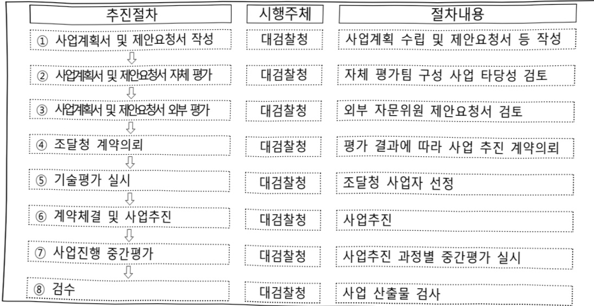

# 검찰업무정보화(정보화)

**해당 페이지**: PDF 3286 ~ 3297 쪽 해당

**부처**: 법무부
**분야**: 공공질서 및 안전
**회계유형**: 일반회계
**2026 확정예산**: 29633.0 백만원
**전년대비 증감률**: -11.1%
**AI 도메인**: 보안/사이버, 법률/치안

---

<table border=1 style='margin: auto; word-wrap: break-word;'><tr><td style='text-align: center; word-wrap: break-word;'>사 업 명</td></tr><tr><td style='text-align: center; word-wrap: break-word;'>검찰업무정보화(정보화) (1334-500)</td></tr></table>

□ 사업 코드 정보

<table border=1 style='margin: auto; word-wrap: break-word;'><tr><td style='text-align: center; word-wrap: break-word;'>구분</td><td style='text-align: center; word-wrap: break-word;'>회계</td><td style='text-align: center; word-wrap: break-word;'>소관</td><td style='text-align: center; word-wrap: break-word;'>실국(기관)</td><td style='text-align: center; word-wrap: break-word;'>계정</td><td style='text-align: center; word-wrap: break-word;'>분야</td><td style='text-align: center; word-wrap: break-word;'>부문</td></tr><tr><td style='text-align: center; word-wrap: break-word;'>코드</td><td rowspan="2">일반회계</td><td rowspan="2">법무부</td><td rowspan="2">검찰국</td><td rowspan="2"></td><td style='text-align: center; word-wrap: break-word;'>020</td><td style='text-align: center; word-wrap: break-word;'>022</td></tr><tr><td style='text-align: center; word-wrap: break-word;'>명칭</td><td style='text-align: center; word-wrap: break-word;'>공공질서및안전</td><td style='text-align: center; word-wrap: break-word;'>법무및검찰</td></tr></table>

<table border=1 style='margin: auto; word-wrap: break-word;'><tr><td style='text-align: center; word-wrap: break-word;'>구분</td><td style='text-align: center; word-wrap: break-word;'>프로그램</td><td style='text-align: center; word-wrap: break-word;'>단위사업</td><td style='text-align: center; word-wrap: break-word;'>세부사업</td></tr><tr><td style='text-align: center; word-wrap: break-word;'>코드</td><td style='text-align: center; word-wrap: break-word;'>1300</td><td style='text-align: center; word-wrap: break-word;'>1334</td><td style='text-align: center; word-wrap: break-word;'>500</td></tr><tr><td style='text-align: center; word-wrap: break-word;'>명칭</td><td style='text-align: center; word-wrap: break-word;'>검찰활동</td><td style='text-align: center; word-wrap: break-word;'>검찰업무정보화</td><td style='text-align: center; word-wrap: break-word;'>검찰업무정보화(정보화)</td></tr></table>

□ 사업 성격 (공통요구자료 Ⅱ-1 작성유의사항 4. 참조, 해당하는 사항에 “○” 표시)

<table border=1 style='margin: auto; word-wrap: break-word;'><tr><td rowspan="2">신규</td><td rowspan="2">계속</td><td rowspan="2">완료</td><td rowspan="2">예비타당성실시여부</td><td rowspan="2">총사업비관리대상</td><td rowspan="2">총액계상예산사업</td><td style='text-align: center; word-wrap: break-word;'>사업소관 변경정보</td></tr><tr><td style='text-align: center; word-wrap: break-word;'>2025예산 시 소관</td></tr><tr><td style='text-align: center; word-wrap: break-word;'></td><td style='text-align: center; word-wrap: break-word;'></td><td style='text-align: center; word-wrap: break-word;'></td><td style='text-align: center; word-wrap: break-word;'></td><td style='text-align: center; word-wrap: break-word;'></td><td style='text-align: center; word-wrap: break-word;'></td><td style='text-align: center; word-wrap: break-word;'></td></tr></table>

□ 사업 지원 형태 및 지원을 (최소한 한 개는 반드시 선택하시오. 해당사항에 O 표시)

<table border=1 style='margin: auto; word-wrap: break-word;'><tr><td style='text-align: center; word-wrap: break-word;'>직접</td><td style='text-align: center; word-wrap: break-word;'>출자</td><td style='text-align: center; word-wrap: break-word;'>출연</td><td style='text-align: center; word-wrap: break-word;'>보조</td><td style='text-align: center; word-wrap: break-word;'>융자</td><td style='text-align: center; word-wrap: break-word;'>국고보조율(%)</td><td style='text-align: center; word-wrap: break-word;'>융자율(%)</td></tr><tr><td style='text-align: center; word-wrap: break-word;'>0</td><td style='text-align: center; word-wrap: break-word;'></td><td style='text-align: center; word-wrap: break-word;'></td><td style='text-align: center; word-wrap: break-word;'></td><td style='text-align: center; word-wrap: break-word;'></td><td style='text-align: center; word-wrap: break-word;'></td><td style='text-align: center; word-wrap: break-word;'></td></tr></table>

□ 사업 담당자

<table border=1 style='margin: auto; word-wrap: break-word;'><tr><td style='text-align: center; word-wrap: break-word;'>사업명</td><td colspan="5">구분</td></tr><tr><td rowspan="4">검찰업무정보화(정보화)</td><td rowspan="3">소관부처</td><td style='text-align: center; word-wrap: break-word;'>실·국·과(팀)</td><td style='text-align: center; word-wrap: break-word;'>과 장</td><td style='text-align: center; word-wrap: break-word;'>사무관</td><td style='text-align: center; word-wrap: break-word;'>주무관</td></tr><tr><td style='text-align: center; word-wrap: break-word;'>검찰국</td><td style='text-align: center; word-wrap: break-word;'>김수홍</td><td style='text-align: center; word-wrap: break-word;'>검사 홍석원</td><td style='text-align: center; word-wrap: break-word;'>수사관 백재호</td></tr><tr><td style='text-align: center; word-wrap: break-word;'>검찰과</td><td style='text-align: center; word-wrap: break-word;'>02-2110-4190</td><td style='text-align: center; word-wrap: break-word;'>02-2110-4194</td><td style='text-align: center; word-wrap: break-word;'>02-2110-3686</td></tr><tr><td style='text-align: center; word-wrap: break-word;'>사업시행주체</td><td style='text-align: center; word-wrap: break-word;'>법무부</td><td style='text-align: center; word-wrap: break-word;'></td><td style='text-align: center; word-wrap: break-word;'></td><td style='text-align: center; word-wrap: break-word;'></td></tr></table>

### 가. 예산 총괄표

(단위: 백만원, %)

<table border=1 style='margin: auto; word-wrap: break-word;'><tr><td rowspan="2">사업명</td><td rowspan="2">2024년 결산</td><td colspan="2">2025년 예산</td><td colspan="2">2026년</td><td rowspan="2">증감(B-A)</td><td rowspan="2">(B-A)/A</td></tr><tr><td style='text-align: center; word-wrap: break-word;'>본예산(A)</td><td style='text-align: center; word-wrap: break-word;'>추경</td><td style='text-align: center; word-wrap: break-word;'>요구</td><td style='text-align: center; word-wrap: break-word;'>조정(B)</td></tr><tr><td style='text-align: center; word-wrap: break-word;'>검찰업무정보화(정보화)</td><td style='text-align: center; word-wrap: break-word;'>36,312</td><td style='text-align: center; word-wrap: break-word;'>33,339</td><td style='text-align: center; word-wrap: break-word;'>33,339</td><td style='text-align: center; word-wrap: break-word;'>33,314</td><td style='text-align: center; word-wrap: break-word;'>29,633</td><td style='text-align: center; word-wrap: break-word;'>△3,706</td><td style='text-align: center; word-wrap: break-word;'>△11.1</td></tr></table>

---

□ 기능별(내역사업별), 목별 예산 내역

(단위:백만원)

<table border=1 style='margin: auto; word-wrap: break-word;'><tr><td rowspan="3"></td><td colspan="5">2024</td><td colspan="7">2025</td><td rowspan="3">2026예산</td></tr><tr><td rowspan="2">예산액(추경)</td><td rowspan="2">예산현액</td><td rowspan="2">집행해[실집행액]</td><td rowspan="2">이일액</td><td rowspan="2">불용액</td><td rowspan="2">본예산</td><td rowspan="2">예산현액</td><td rowspan="2">집행액[실집행액]</td><td colspan="2">전년도이일액제외</td><td rowspan="2">이일액</td><td rowspan="2">불용액</td></tr><tr><td style='text-align: center; word-wrap: break-word;'>예산현액</td><td style='text-align: center; word-wrap: break-word;'>집행액[실집행액]</td></tr><tr><td style='text-align: center; word-wrap: break-word;'>○ 기능별 분류(합계)</td><td style='text-align: center; word-wrap: break-word;'>36,839</td><td style='text-align: center; word-wrap: break-word;'>36,839</td><td style='text-align: center; word-wrap: break-word;'>36,312</td><td style='text-align: center; word-wrap: break-word;'>-</td><td style='text-align: center; word-wrap: break-word;'>527</td><td style='text-align: center; word-wrap: break-word;'>33,339</td><td style='text-align: center; word-wrap: break-word;'>33,339</td><td style='text-align: center; word-wrap: break-word;'>32,786</td><td style='text-align: center; word-wrap: break-word;'>33,339</td><td style='text-align: center; word-wrap: break-word;'>32,786</td><td style='text-align: center; word-wrap: break-word;'>-</td><td style='text-align: center; word-wrap: break-word;'>553</td><td style='text-align: center; word-wrap: break-word;'>29,633</td></tr><tr><td style='text-align: center; word-wrap: break-word;'>·형사사법절차전자화</td><td style='text-align: center; word-wrap: break-word;'>6,172</td><td style='text-align: center; word-wrap: break-word;'>6,172</td><td style='text-align: center; word-wrap: break-word;'>6,142</td><td style='text-align: center; word-wrap: break-word;'>-</td><td style='text-align: center; word-wrap: break-word;'>30</td><td style='text-align: center; word-wrap: break-word;'>1,564</td><td style='text-align: center; word-wrap: break-word;'>1,564</td><td style='text-align: center; word-wrap: break-word;'>1,561</td><td style='text-align: center; word-wrap: break-word;'>1,564</td><td style='text-align: center; word-wrap: break-word;'>1,561</td><td style='text-align: center; word-wrap: break-word;'>-</td><td style='text-align: center; word-wrap: break-word;'>3</td><td style='text-align: center; word-wrap: break-word;'>468</td></tr><tr><td style='text-align: center; word-wrap: break-word;'>·검찰업무정보시스템 구축</td><td style='text-align: center; word-wrap: break-word;'>9,862</td><td style='text-align: center; word-wrap: break-word;'>9,862</td><td style='text-align: center; word-wrap: break-word;'>9,631</td><td style='text-align: center; word-wrap: break-word;'>-</td><td style='text-align: center; word-wrap: break-word;'>231</td><td style='text-align: center; word-wrap: break-word;'>9,561</td><td style='text-align: center; word-wrap: break-word;'>9,561</td><td style='text-align: center; word-wrap: break-word;'>9,343</td><td style='text-align: center; word-wrap: break-word;'>9,561</td><td style='text-align: center; word-wrap: break-word;'>9,343</td><td style='text-align: center; word-wrap: break-word;'>-</td><td style='text-align: center; word-wrap: break-word;'>218</td><td style='text-align: center; word-wrap: break-word;'>7,425</td></tr><tr><td style='text-align: center; word-wrap: break-word;'>·검찰 정보보안체계 강화</td><td style='text-align: center; word-wrap: break-word;'>3,520</td><td style='text-align: center; word-wrap: break-word;'>3,520</td><td style='text-align: center; word-wrap: break-word;'>3,365</td><td style='text-align: center; word-wrap: break-word;'>-</td><td style='text-align: center; word-wrap: break-word;'>155</td><td style='text-align: center; word-wrap: break-word;'>3,774</td><td style='text-align: center; word-wrap: break-word;'>3,774</td><td style='text-align: center; word-wrap: break-word;'>3,567</td><td style='text-align: center; word-wrap: break-word;'>3,774</td><td style='text-align: center; word-wrap: break-word;'>3,567</td><td style='text-align: center; word-wrap: break-word;'>-</td><td style='text-align: center; word-wrap: break-word;'>207</td><td style='text-align: center; word-wrap: break-word;'>1,973</td></tr><tr><td style='text-align: center; word-wrap: break-word;'>·검찰업무 기반정보화</td><td style='text-align: center; word-wrap: break-word;'>17,285</td><td style='text-align: center; word-wrap: break-word;'>17,285</td><td style='text-align: center; word-wrap: break-word;'>17,174</td><td style='text-align: center; word-wrap: break-word;'>-</td><td style='text-align: center; word-wrap: break-word;'>111</td><td style='text-align: center; word-wrap: break-word;'>18,440</td><td style='text-align: center; word-wrap: break-word;'>18,440</td><td style='text-align: center; word-wrap: break-word;'>18,315</td><td style='text-align: center; word-wrap: break-word;'>18,440</td><td style='text-align: center; word-wrap: break-word;'>18,316</td><td style='text-align: center; word-wrap: break-word;'>-</td><td style='text-align: center; word-wrap: break-word;'>125</td><td style='text-align: center; word-wrap: break-word;'>20,093</td></tr><tr><td style='text-align: center; word-wrap: break-word;'>○ 비목별 분류(합계)</td><td style='text-align: center; word-wrap: break-word;'>36,839</td><td style='text-align: center; word-wrap: break-word;'>36,839</td><td style='text-align: center; word-wrap: break-word;'>36,312</td><td style='text-align: center; word-wrap: break-word;'>-</td><td style='text-align: center; word-wrap: break-word;'>527</td><td style='text-align: center; word-wrap: break-word;'>33,339</td><td style='text-align: center; word-wrap: break-word;'>33,339</td><td style='text-align: center; word-wrap: break-word;'>32,786</td><td style='text-align: center; word-wrap: break-word;'>33,339</td><td style='text-align: center; word-wrap: break-word;'>32,786</td><td style='text-align: center; word-wrap: break-word;'>-</td><td style='text-align: center; word-wrap: break-word;'>553</td><td style='text-align: center; word-wrap: break-word;'>29,633</td></tr><tr><td style='text-align: center; word-wrap: break-word;'>·상용임금(110-03)</td><td style='text-align: center; word-wrap: break-word;'>3,798</td><td style='text-align: center; word-wrap: break-word;'>3,798</td><td style='text-align: center; word-wrap: break-word;'>3,798</td><td style='text-align: center; word-wrap: break-word;'>-</td><td style='text-align: center; word-wrap: break-word;'>-</td><td style='text-align: center; word-wrap: break-word;'>3,917</td><td style='text-align: center; word-wrap: break-word;'>3,517</td><td style='text-align: center; word-wrap: break-word;'>3,517</td><td style='text-align: center; word-wrap: break-word;'>3,517</td><td style='text-align: center; word-wrap: break-word;'>3,517</td><td style='text-align: center; word-wrap: break-word;'>-</td><td style='text-align: center; word-wrap: break-word;'>-</td><td style='text-align: center; word-wrap: break-word;'>4,405</td></tr><tr><td style='text-align: center; word-wrap: break-word;'>·일반수용비(210-01)</td><td style='text-align: center; word-wrap: break-word;'>189</td><td style='text-align: center; word-wrap: break-word;'>189</td><td style='text-align: center; word-wrap: break-word;'>188</td><td style='text-align: center; word-wrap: break-word;'>-</td><td style='text-align: center; word-wrap: break-word;'>1</td><td style='text-align: center; word-wrap: break-word;'>246</td><td style='text-align: center; word-wrap: break-word;'>246</td><td style='text-align: center; word-wrap: break-word;'>243</td><td style='text-align: center; word-wrap: break-word;'>246</td><td style='text-align: center; word-wrap: break-word;'>243</td><td style='text-align: center; word-wrap: break-word;'>-</td><td style='text-align: center; word-wrap: break-word;'>3</td><td style='text-align: center; word-wrap: break-word;'>225</td></tr><tr><td style='text-align: center; word-wrap: break-word;'>·공공요금및제세(210-02)</td><td style='text-align: center; word-wrap: break-word;'>4,997</td><td style='text-align: center; word-wrap: break-word;'>4,997</td><td style='text-align: center; word-wrap: break-word;'>4,997</td><td style='text-align: center; word-wrap: break-word;'>-</td><td style='text-align: center; word-wrap: break-word;'>-</td><td style='text-align: center; word-wrap: break-word;'>5,442</td><td style='text-align: center; word-wrap: break-word;'>5,842</td><td style='text-align: center; word-wrap: break-word;'>5,831</td><td style='text-align: center; word-wrap: break-word;'>5,842</td><td style='text-align: center; word-wrap: break-word;'>5,831</td><td style='text-align: center; word-wrap: break-word;'>-</td><td style='text-align: center; word-wrap: break-word;'>11</td><td style='text-align: center; word-wrap: break-word;'>5,442</td></tr><tr><td style='text-align: center; word-wrap: break-word;'>·특근매식비(210-05)</td><td style='text-align: center; word-wrap: break-word;'>12</td><td style='text-align: center; word-wrap: break-word;'>12</td><td style='text-align: center; word-wrap: break-word;'>12</td><td style='text-align: center; word-wrap: break-word;'>-</td><td style='text-align: center; word-wrap: break-word;'>-</td><td style='text-align: center; word-wrap: break-word;'>12</td><td style='text-align: center; word-wrap: break-word;'>12</td><td style='text-align: center; word-wrap: break-word;'>12</td><td style='text-align: center; word-wrap: break-word;'>12</td><td style='text-align: center; word-wrap: break-word;'>12</td><td style='text-align: center; word-wrap: break-word;'>-</td><td style='text-align: center; word-wrap: break-word;'>-</td><td style='text-align: center; word-wrap: break-word;'>12</td></tr><tr><td style='text-align: center; word-wrap: break-word;'>·임차료(210-07)</td><td style='text-align: center; word-wrap: break-word;'>5,553</td><td style='text-align: center; word-wrap: break-word;'>5,553</td><td style='text-align: center; word-wrap: break-word;'>5,481</td><td style='text-align: center; word-wrap: break-word;'>-</td><td style='text-align: center; word-wrap: break-word;'>72</td><td style='text-align: center; word-wrap: break-word;'>6,078</td><td style='text-align: center; word-wrap: break-word;'>6,078</td><td style='text-align: center; word-wrap: break-word;'>5,969</td><td style='text-align: center; word-wrap: break-word;'>6,078</td><td style='text-align: center; word-wrap: break-word;'>5,969</td><td style='text-align: center; word-wrap: break-word;'>-</td><td style='text-align: center; word-wrap: break-word;'>109</td><td style='text-align: center; word-wrap: break-word;'>6,815</td></tr><tr><td style='text-align: center; word-wrap: break-word;'>·시설장비유지비(210-09)</td><td style='text-align: center; word-wrap: break-word;'>6,323</td><td style='text-align: center; word-wrap: break-word;'>6,323</td><td style='text-align: center; word-wrap: break-word;'>6,178</td><td style='text-align: center; word-wrap: break-word;'>-</td><td style='text-align: center; word-wrap: break-word;'>145</td><td style='text-align: center; word-wrap: break-word;'>6,323</td><td style='text-align: center; word-wrap: break-word;'>6,323</td><td style='text-align: center; word-wrap: break-word;'>6,293</td><td style='text-align: center; word-wrap: break-word;'>6,323</td><td style='text-align: center; word-wrap: break-word;'>6,293</td><td style='text-align: center; word-wrap: break-word;'>-</td><td style='text-align: center; word-wrap: break-word;'>30</td><td style='text-align: center; word-wrap: break-word;'>5,127</td></tr><tr><td style='text-align: center; word-wrap: break-word;'>·복리후생비(210-12)</td><td style='text-align: center; word-wrap: break-word;'>65</td><td style='text-align: center; word-wrap: break-word;'>65</td><td style='text-align: center; word-wrap: break-word;'>65</td><td style='text-align: center; word-wrap: break-word;'>-</td><td style='text-align: center; word-wrap: break-word;'>-</td><td style='text-align: center; word-wrap: break-word;'>65</td><td style='text-align: center; word-wrap: break-word;'>65</td><td style='text-align: center; word-wrap: break-word;'>65</td><td style='text-align: center; word-wrap: break-word;'>65</td><td style='text-align: center; word-wrap: break-word;'>65</td><td style='text-align: center; word-wrap: break-word;'>-</td><td style='text-align: center; word-wrap: break-word;'>-</td><td style='text-align: center; word-wrap: break-word;'>65</td></tr><tr><td style='text-align: center; word-wrap: break-word;'>·관리용역비(210-15)</td><td style='text-align: center; word-wrap: break-word;'>4,574</td><td style='text-align: center; word-wrap: break-word;'>4,574</td><td style='text-align: center; word-wrap: break-word;'>4,570</td><td style='text-align: center; word-wrap: break-word;'>-</td><td style='text-align: center; word-wrap: break-word;'>4</td><td style='text-align: center; word-wrap: break-word;'>1,337</td><td style='text-align: center; word-wrap: break-word;'>1,337</td><td style='text-align: center; word-wrap: break-word;'>1,190</td><td style='text-align: center; word-wrap: break-word;'>1,337</td><td style='text-align: center; word-wrap: break-word;'>1,190</td><td style='text-align: center; word-wrap: break-word;'>-</td><td style='text-align: center; word-wrap: break-word;'>147</td><td style='text-align: center; word-wrap: break-word;'>3,585</td></tr><tr><td style='text-align: center; word-wrap: break-word;'>·국내여비(220-01)</td><td style='text-align: center; word-wrap: break-word;'>12</td><td style='text-align: center; word-wrap: break-word;'>12</td><td style='text-align: center; word-wrap: break-word;'>12</td><td style='text-align: center; word-wrap: break-word;'>-</td><td style='text-align: center; word-wrap: break-word;'>-</td><td style='text-align: center; word-wrap: break-word;'>12</td><td style='text-align: center; word-wrap: break-word;'>12</td><td style='text-align: center; word-wrap: break-word;'>12</td><td style='text-align: center; word-wrap: break-word;'>12</td><td style='text-align: center; word-wrap: break-word;'>12</td><td style='text-align: center; word-wrap: break-word;'>-</td><td style='text-align: center; word-wrap: break-word;'>-</td><td style='text-align: center; word-wrap: break-word;'>9</td></tr><tr><td style='text-align: center; word-wrap: break-word;'>·일반연구비(260-01)</td><td style='text-align: center; word-wrap: break-word;'>3,028</td><td style='text-align: center; word-wrap: break-word;'>3,028</td><td style='text-align: center; word-wrap: break-word;'>2,919</td><td style='text-align: center; word-wrap: break-word;'>-</td><td style='text-align: center; word-wrap: break-word;'>109</td><td style='text-align: center; word-wrap: break-word;'>2,482</td><td style='text-align: center; word-wrap: break-word;'>2,482</td><td style='text-align: center; word-wrap: break-word;'>2,427</td><td style='text-align: center; word-wrap: break-word;'>2,482</td><td style='text-align: center; word-wrap: break-word;'>2,427</td><td style='text-align: center; word-wrap: break-word;'>-</td><td style='text-align: center; word-wrap: break-word;'>55</td><td style='text-align: center; word-wrap: break-word;'>1,429</td></tr><tr><td style='text-align: center; word-wrap: break-word;'>·고용부담금(320-09)</td><td style='text-align: center; word-wrap: break-word;'>736</td><td style='text-align: center; word-wrap: break-word;'>736</td><td style='text-align: center; word-wrap: break-word;'>735</td><td style='text-align: center; word-wrap: break-word;'>-</td><td style='text-align: center; word-wrap: break-word;'>1</td><td style='text-align: center; word-wrap: break-word;'>766</td><td style='text-align: center; word-wrap: break-word;'>766</td><td style='text-align: center; word-wrap: break-word;'>765</td><td style='text-align: center; word-wrap: break-word;'>766</td><td style='text-align: center; word-wrap: break-word;'>765</td><td style='text-align: center; word-wrap: break-word;'>-</td><td style='text-align: center; word-wrap: break-word;'>1</td><td style='text-align: center; word-wrap: break-word;'>872</td></tr><tr><td style='text-align: center; word-wrap: break-word;'>·공사비(420-03)</td><td style='text-align: center; word-wrap: break-word;'>1,670</td><td style='text-align: center; word-wrap: break-word;'>1,670</td><td style='text-align: center; word-wrap: break-word;'>1,530</td><td style='text-align: center; word-wrap: break-word;'>-</td><td style='text-align: center; word-wrap: break-word;'>140</td><td style='text-align: center; word-wrap: break-word;'>890</td><td style='text-align: center; word-wrap: break-word;'>890</td><td style='text-align: center; word-wrap: break-word;'>838</td><td style='text-align: center; word-wrap: break-word;'>890</td><td style='text-align: center; word-wrap: break-word;'>838</td><td style='text-align: center; word-wrap: break-word;'>-</td><td style='text-align: center; word-wrap: break-word;'>52</td><td style='text-align: center; word-wrap: break-word;'>-</td></tr><tr><td style='text-align: center; word-wrap: break-word;'>·자산취득비(430-01)</td><td style='text-align: center; word-wrap: break-word;'>5,882</td><td style='text-align: center; word-wrap: break-word;'>5,882</td><td style='text-align: center; word-wrap: break-word;'>5,827</td><td style='text-align: center; word-wrap: break-word;'>-</td><td style='text-align: center; word-wrap: break-word;'>55</td><td style='text-align: center; word-wrap: break-word;'>5,769</td><td style='text-align: center; word-wrap: break-word;'>5,769</td><td style='text-align: center; word-wrap: break-word;'>5,624</td><td style='text-align: center; word-wrap: break-word;'>5,769</td><td style='text-align: center; word-wrap: break-word;'>5,624</td><td style='text-align: center; word-wrap: break-word;'>-</td><td style='text-align: center; word-wrap: break-word;'>145</td><td style='text-align: center; word-wrap: break-word;'>1,647</td></tr><tr><td style='text-align: center; word-wrap: break-word;'>○ 기능·비목별 분류(합계)</td><td style='text-align: center; word-wrap: break-word;'>36,839</td><td style='text-align: center; word-wrap: break-word;'>36,839</td><td style='text-align: center; word-wrap: break-word;'>36,312</td><td style='text-align: center; word-wrap: break-word;'></td><td style='text-align: center; word-wrap: break-word;'>527</td><td style='text-align: center; word-wrap: break-word;'>33,339</td><td style='text-align: center; word-wrap: break-word;'>33,339</td><td style='text-align: center; word-wrap: break-word;'>32,786</td><td style='text-align: center; word-wrap: break-word;'>33,339</td><td style='text-align: center; word-wrap: break-word;'>32,786</td><td style='text-align: center; word-wrap: break-word;'>-</td><td style='text-align: center; word-wrap: break-word;'>553</td><td style='text-align: center; word-wrap: break-word;'>29,633</td></tr><tr><td style='text-align: center; word-wrap: break-word;'>·형사사법절차 전자화</td><td style='text-align: center; word-wrap: break-word;'>6,172</td><td style='text-align: center; word-wrap: break-word;'>6,172</td><td style='text-align: center; word-wrap: break-word;'>6,142</td><td style='text-align: center; word-wrap: break-word;'></td><td style='text-align: center; word-wrap: break-word;'>30</td><td style='text-align: center; word-wrap: break-word;'>1,564</td><td style='text-align: center; word-wrap: break-word;'>1,564</td><td style='text-align: center; word-wrap: break-word;'>1,561</td><td style='text-align: center; word-wrap: break-word;'>1,564</td><td style='text-align: center; word-wrap: break-word;'>1,561</td><td style='text-align: center; word-wrap: break-word;'>-</td><td style='text-align: center; word-wrap: break-word;'>3</td><td style='text-align: center; word-wrap: break-word;'>142</td></tr><tr><td style='text-align: center; word-wrap: break-word;'>·임차료(210-07)</td><td style='text-align: center; word-wrap: break-word;'>73</td><td style='text-align: center; word-wrap: break-word;'>73</td><td style='text-align: center; word-wrap: break-word;'>57</td><td style='text-align: center; word-wrap: break-word;'></td><td style='text-align: center; word-wrap: break-word;'>16</td><td style='text-align: center; word-wrap: break-word;'>-</td><td style='text-align: center; word-wrap: break-word;'>-</td><td style='text-align: center; word-wrap: break-word;'>-</td><td style='text-align: center; word-wrap: break-word;'>-</td><td style='text-align: center; word-wrap: break-word;'>-</td><td style='text-align: center; word-wrap: break-word;'>-</td><td style='text-align: center; word-wrap: break-word;'>-</td><td style='text-align: center; word-wrap: break-word;'>-</td></tr><tr><td style='text-align: center; word-wrap: break-word;'>·관리용역비(210-15)</td><td style='text-align: center; word-wrap: break-word;'>3,520</td><td style='text-align: center; word-wrap: break-word;'>3,520</td><td style='text-align: center; word-wrap: break-word;'>3,520</td><td style='text-align: center; word-wrap: break-word;'></td><td style='text-align: center; word-wrap: break-word;'>-</td><td style='text-align: center; word-wrap: break-word;'>-</td><td style='text-align: center; word-wrap: break-word;'>-</td><td style='text-align: center; word-wrap: break-word;'>-</td><td style='text-align: center; word-wrap: break-word;'>-</td><td style='text-align: center; word-wrap: break-word;'>-</td><td style='text-align: center; word-wrap: break-word;'>-</td><td style='text-align: center; word-wrap: break-word;'>-</td><td style='text-align: center; word-wrap: break-word;'>-</td></tr><tr><td style='text-align: center; word-wrap: break-word;'>·일반연구비(260-01)</td><td style='text-align: center; word-wrap: break-word;'>66</td><td style='text-align: center; word-wrap: break-word;'>66</td><td style='text-align: center; word-wrap: break-word;'>64</td><td style='text-align: center; word-wrap: break-word;'></td><td style='text-align: center; word-wrap: break-word;'>2</td><td style='text-align: center; word-wrap: break-word;'>-</td><td style='text-align: center; word-wrap: break-word;'>-</td><td style='text-align: center; word-wrap: break-word;'>-</td><td style='text-align: center; word-wrap: break-word;'>-</td><td style='text-align: center; word-wrap: break-word;'>-</td><td style='text-align: center; word-wrap: break-word;'>-</td><td style='text-align: center; word-wrap: break-word;'>-</td><td style='text-align: center; word-wrap: break-word;'>-</td></tr><tr><td style='text-align: center; word-wrap: break-word;'>·자산취득비(430-01)</td><td style='text-align: center; word-wrap: break-word;'>2,513</td><td style='text-align: center; word-wrap: break-word;'>2,513</td><td style='text-align: center; word-wrap: break-word;'>2,501</td><td style='text-align: center; word-wrap: break-word;'></td><td style='text-align: center; word-wrap: break-word;'>12</td><td style='text-align: center; word-wrap: break-word;'>1,564</td><td style='text-align: center; word-wrap: break-word;'>1,564</td><td style='text-align: center; word-wrap: break-word;'>1,561</td><td style='text-align: center; word-wrap: break-word;'>1,564</td><td style='text-align: center; word-wrap: break-word;'>1,561</td><td style='text-align: center; word-wrap: break-word;'>-</td><td style='text-align: center; word-wrap: break-word;'>3</td><td style='text-align: center; word-wrap: break-word;'>142</td></tr><tr><td style='text-align: center; word-wrap: break-word;'>·검찰업무 정보시스템 구축</td><td style='text-align: center; word-wrap: break-word;'>9,862</td><td style='text-align: center; word-wrap: break-word;'>9,862</td><td style='text-align: center; word-wrap: break-word;'>9,631</td><td style='text-align: center; word-wrap: break-word;'></td><td style='text-align: center; word-wrap: break-word;'>231</td><td style='text-align: center; word-wrap: break-word;'>9,561</td><td style='text-align: center; word-wrap: break-word;'>9,561</td><td style='text-align: center; word-wrap: break-word;'>9,343</td><td style='text-align: center; word-wrap: break-word;'>9,561</td><td style='text-align: center; word-wrap: break-word;'>9,343</td><td style='text-align: center; word-wrap: break-word;'>-</td><td style='text-align: center; word-wrap: break-word;'>219</td><td style='text-align: center; word-wrap: break-word;'>7,425</td></tr><tr><td style='text-align: center; word-wrap: break-word;'>·시설장비유지비(210-09)</td><td style='text-align: center; word-wrap: break-word;'>4,790</td><td style='text-align: center; word-wrap: break-word;'>4,790</td><td style='text-align: center; word-wrap: break-word;'>4,645</td><td style='text-align: center; word-wrap: break-word;'></td><td style='text-align: center; word-wrap: break-word;'>145</td><td style='text-align: center; word-wrap: break-word;'>4,790</td><td style='text-align: center; word-wrap: break-word;'>4,790</td><td style='text-align: center; word-wrap: break-word;'>4,761</td><td style='text-align: center; word-wrap: break-word;'>4,790</td><td style='text-align: center; word-wrap: break-word;'>4,761</td><td style='text-align: center; word-wrap: break-word;'>-</td><td style='text-align: center; word-wrap: break-word;'>29</td><td style='text-align: center; word-wrap: break-word;'>5,127</td></tr><tr><td style='text-align: center; word-wrap: break-word;'>·관리용역비(210-15)</td><td style='text-align: center; word-wrap: break-word;'>126</td><td style='text-align: center; word-wrap: break-word;'>126</td><td style='text-align: center; word-wrap: break-word;'>125</td><td style='text-align: center; word-wrap: break-word;'></td><td style='text-align: center; word-wrap: break-word;'>1</td><td style='text-align: center; word-wrap: break-word;'>126</td><td style='text-align: center; word-wrap: break-word;'>126</td><td style='text-align: center; word-wrap: break-word;'>118</td><td style='text-align: center; word-wrap: break-word;'>126</td><td style='text-align: center; word-wrap: break-word;'>118</td><td style='text-align: center; word-wrap: break-word;'>-</td><td style='text-align: center; word-wrap: break-word;'>8</td><td style='text-align: center; word-wrap: break-word;'>126</td></tr></table>

---

<table border=1 style='margin: auto; word-wrap: break-word;'><tr><td rowspan="3"></td><td colspan="5">2024</td><td colspan="7">2025</td><td rowspan="3">2026예산</td></tr><tr><td rowspan="2">예산액(추경)</td><td rowspan="2">예산현액</td><td rowspan="2">집행액[실집행액]</td><td rowspan="2">이월액</td><td rowspan="2">불용액</td><td rowspan="2">본예산</td><td rowspan="2">예산현액</td><td rowspan="2">집행액[실집행액]</td><td colspan="2">전년도 이월액제의</td><td rowspan="2">이월액</td><td rowspan="2">불용액</td></tr><tr><td style='text-align: center; word-wrap: break-word;'>예산현액</td><td style='text-align: center; word-wrap: break-word;'>집행액[실집행액]</td></tr><tr><td style='text-align: center; word-wrap: break-word;'>- 일반연구비(260-01)</td><td style='text-align: center; word-wrap: break-word;'>2,375</td><td style='text-align: center; word-wrap: break-word;'>2,375</td><td style='text-align: center; word-wrap: break-word;'>2,325</td><td style='text-align: center; word-wrap: break-word;'></td><td style='text-align: center; word-wrap: break-word;'>50</td><td style='text-align: center; word-wrap: break-word;'>1,875</td><td style='text-align: center; word-wrap: break-word;'>1,875</td><td style='text-align: center; word-wrap: break-word;'>1,821</td><td style='text-align: center; word-wrap: break-word;'>1,875</td><td style='text-align: center; word-wrap: break-word;'>1,821</td><td style='text-align: center; word-wrap: break-word;'>-</td><td style='text-align: center; word-wrap: break-word;'>54</td><td style='text-align: center; word-wrap: break-word;'>1,429</td></tr><tr><td style='text-align: center; word-wrap: break-word;'>- 자산취득비(430-01)</td><td style='text-align: center; word-wrap: break-word;'>2,571</td><td style='text-align: center; word-wrap: break-word;'>2,571</td><td style='text-align: center; word-wrap: break-word;'>2,536</td><td style='text-align: center; word-wrap: break-word;'></td><td style='text-align: center; word-wrap: break-word;'>35</td><td style='text-align: center; word-wrap: break-word;'>2,770</td><td style='text-align: center; word-wrap: break-word;'>2,770</td><td style='text-align: center; word-wrap: break-word;'>2,643</td><td style='text-align: center; word-wrap: break-word;'>2,770</td><td style='text-align: center; word-wrap: break-word;'>2,643</td><td style='text-align: center; word-wrap: break-word;'>-</td><td style='text-align: center; word-wrap: break-word;'>127</td><td style='text-align: center; word-wrap: break-word;'>743</td></tr><tr><td style='text-align: center; word-wrap: break-word;'>- 검찰 정보보안체계 강화</td><td style='text-align: center; word-wrap: break-word;'>3,520</td><td style='text-align: center; word-wrap: break-word;'>3,520</td><td style='text-align: center; word-wrap: break-word;'>3,365</td><td style='text-align: center; word-wrap: break-word;'></td><td style='text-align: center; word-wrap: break-word;'>155</td><td style='text-align: center; word-wrap: break-word;'>3,774</td><td style='text-align: center; word-wrap: break-word;'>3,774</td><td style='text-align: center; word-wrap: break-word;'>3,567</td><td style='text-align: center; word-wrap: break-word;'>3,774</td><td style='text-align: center; word-wrap: break-word;'>3,567</td><td style='text-align: center; word-wrap: break-word;'>-</td><td style='text-align: center; word-wrap: break-word;'>207</td><td style='text-align: center; word-wrap: break-word;'>1,973</td></tr><tr><td style='text-align: center; word-wrap: break-word;'>- 입차료(210-07)</td><td style='text-align: center; word-wrap: break-word;'>57</td><td style='text-align: center; word-wrap: break-word;'>57</td><td style='text-align: center; word-wrap: break-word;'>56</td><td style='text-align: center; word-wrap: break-word;'></td><td style='text-align: center; word-wrap: break-word;'>1</td><td style='text-align: center; word-wrap: break-word;'>151</td><td style='text-align: center; word-wrap: break-word;'>151</td><td style='text-align: center; word-wrap: break-word;'>151</td><td style='text-align: center; word-wrap: break-word;'>151</td><td style='text-align: center; word-wrap: break-word;'>151</td><td style='text-align: center; word-wrap: break-word;'>-</td><td style='text-align: center; word-wrap: break-word;'>-</td><td style='text-align: center; word-wrap: break-word;'>-</td></tr><tr><td style='text-align: center; word-wrap: break-word;'>- 핀리용역비(210-15)</td><td style='text-align: center; word-wrap: break-word;'>928</td><td style='text-align: center; word-wrap: break-word;'>928</td><td style='text-align: center; word-wrap: break-word;'>925</td><td style='text-align: center; word-wrap: break-word;'></td><td style='text-align: center; word-wrap: break-word;'>3</td><td style='text-align: center; word-wrap: break-word;'>1,211</td><td style='text-align: center; word-wrap: break-word;'>1,211</td><td style='text-align: center; word-wrap: break-word;'>1,072</td><td style='text-align: center; word-wrap: break-word;'>1,211</td><td style='text-align: center; word-wrap: break-word;'>1,072</td><td style='text-align: center; word-wrap: break-word;'>-</td><td style='text-align: center; word-wrap: break-word;'>139</td><td style='text-align: center; word-wrap: break-word;'>1,211</td></tr><tr><td style='text-align: center; word-wrap: break-word;'>- 일반연구비(260-01)</td><td style='text-align: center; word-wrap: break-word;'>67</td><td style='text-align: center; word-wrap: break-word;'>67</td><td style='text-align: center; word-wrap: break-word;'>64</td><td style='text-align: center; word-wrap: break-word;'></td><td style='text-align: center; word-wrap: break-word;'>3</td><td style='text-align: center; word-wrap: break-word;'>87</td><td style='text-align: center; word-wrap: break-word;'>87</td><td style='text-align: center; word-wrap: break-word;'>86</td><td style='text-align: center; word-wrap: break-word;'>87</td><td style='text-align: center; word-wrap: break-word;'>86</td><td style='text-align: center; word-wrap: break-word;'>-</td><td style='text-align: center; word-wrap: break-word;'>1</td><td style='text-align: center; word-wrap: break-word;'>-</td></tr><tr><td style='text-align: center; word-wrap: break-word;'>- 공사비(420-03)</td><td style='text-align: center; word-wrap: break-word;'>1,670</td><td style='text-align: center; word-wrap: break-word;'>1,670</td><td style='text-align: center; word-wrap: break-word;'>1,530</td><td style='text-align: center; word-wrap: break-word;'></td><td style='text-align: center; word-wrap: break-word;'>140</td><td style='text-align: center; word-wrap: break-word;'>890</td><td style='text-align: center; word-wrap: break-word;'>890</td><td style='text-align: center; word-wrap: break-word;'>838</td><td style='text-align: center; word-wrap: break-word;'>890</td><td style='text-align: center; word-wrap: break-word;'>838</td><td style='text-align: center; word-wrap: break-word;'>-</td><td style='text-align: center; word-wrap: break-word;'>52</td><td style='text-align: center; word-wrap: break-word;'>-</td></tr><tr><td style='text-align: center; word-wrap: break-word;'>- 자산취득비(430-01)</td><td style='text-align: center; word-wrap: break-word;'>798</td><td style='text-align: center; word-wrap: break-word;'>798</td><td style='text-align: center; word-wrap: break-word;'>790</td><td style='text-align: center; word-wrap: break-word;'></td><td style='text-align: center; word-wrap: break-word;'>8</td><td style='text-align: center; word-wrap: break-word;'>1,435</td><td style='text-align: center; word-wrap: break-word;'>1,435</td><td style='text-align: center; word-wrap: break-word;'>1,420</td><td style='text-align: center; word-wrap: break-word;'>1,435</td><td style='text-align: center; word-wrap: break-word;'>1,420</td><td style='text-align: center; word-wrap: break-word;'>-</td><td style='text-align: center; word-wrap: break-word;'>15</td><td style='text-align: center; word-wrap: break-word;'>762</td></tr><tr><td style='text-align: center; word-wrap: break-word;'>- 검찰업무 기반정보화</td><td style='text-align: center; word-wrap: break-word;'>17,285</td><td style='text-align: center; word-wrap: break-word;'>17,285</td><td style='text-align: center; word-wrap: break-word;'>17,174</td><td style='text-align: center; word-wrap: break-word;'></td><td style='text-align: center; word-wrap: break-word;'>111</td><td style='text-align: center; word-wrap: break-word;'>18,440</td><td style='text-align: center; word-wrap: break-word;'>18,440</td><td style='text-align: center; word-wrap: break-word;'>18,315</td><td style='text-align: center; word-wrap: break-word;'>18,440</td><td style='text-align: center; word-wrap: break-word;'>18,315</td><td style='text-align: center; word-wrap: break-word;'>-</td><td style='text-align: center; word-wrap: break-word;'>125</td><td style='text-align: center; word-wrap: break-word;'>20,093</td></tr><tr><td style='text-align: center; word-wrap: break-word;'>- 상용입금(110-03)</td><td style='text-align: center; word-wrap: break-word;'>3,798</td><td style='text-align: center; word-wrap: break-word;'>3,798</td><td style='text-align: center; word-wrap: break-word;'>3,798</td><td style='text-align: center; word-wrap: break-word;'></td><td style='text-align: center; word-wrap: break-word;'>-</td><td style='text-align: center; word-wrap: break-word;'>3,917</td><td style='text-align: center; word-wrap: break-word;'>3,517</td><td style='text-align: center; word-wrap: break-word;'>3,517</td><td style='text-align: center; word-wrap: break-word;'>3,517</td><td style='text-align: center; word-wrap: break-word;'>3,517</td><td style='text-align: center; word-wrap: break-word;'>-</td><td style='text-align: center; word-wrap: break-word;'>-</td><td style='text-align: center; word-wrap: break-word;'>4,405</td></tr><tr><td style='text-align: center; word-wrap: break-word;'>- 일반수용비(210-01)</td><td style='text-align: center; word-wrap: break-word;'>189</td><td style='text-align: center; word-wrap: break-word;'>189</td><td style='text-align: center; word-wrap: break-word;'>188</td><td style='text-align: center; word-wrap: break-word;'></td><td style='text-align: center; word-wrap: break-word;'>1</td><td style='text-align: center; word-wrap: break-word;'>246</td><td style='text-align: center; word-wrap: break-word;'>246</td><td style='text-align: center; word-wrap: break-word;'>243</td><td style='text-align: center; word-wrap: break-word;'>246</td><td style='text-align: center; word-wrap: break-word;'>243</td><td style='text-align: center; word-wrap: break-word;'>-</td><td style='text-align: center; word-wrap: break-word;'>3</td><td style='text-align: center; word-wrap: break-word;'>225</td></tr><tr><td style='text-align: center; word-wrap: break-word;'>- 공공요금 및 제세(210-02)</td><td style='text-align: center; word-wrap: break-word;'>4,997</td><td style='text-align: center; word-wrap: break-word;'>4,997</td><td style='text-align: center; word-wrap: break-word;'>4,997</td><td style='text-align: center; word-wrap: break-word;'></td><td style='text-align: center; word-wrap: break-word;'>-</td><td style='text-align: center; word-wrap: break-word;'>5,442</td><td style='text-align: center; word-wrap: break-word;'>5,842</td><td style='text-align: center; word-wrap: break-word;'>5,831</td><td style='text-align: center; word-wrap: break-word;'>5,842</td><td style='text-align: center; word-wrap: break-word;'>5,831</td><td style='text-align: center; word-wrap: break-word;'>-</td><td style='text-align: center; word-wrap: break-word;'>11</td><td style='text-align: center; word-wrap: break-word;'>5,442</td></tr><tr><td style='text-align: center; word-wrap: break-word;'>- 특근매식비(210-05)</td><td style='text-align: center; word-wrap: break-word;'>12</td><td style='text-align: center; word-wrap: break-word;'>12</td><td style='text-align: center; word-wrap: break-word;'>12</td><td style='text-align: center; word-wrap: break-word;'></td><td style='text-align: center; word-wrap: break-word;'>-</td><td style='text-align: center; word-wrap: break-word;'>12</td><td style='text-align: center; word-wrap: break-word;'>12</td><td style='text-align: center; word-wrap: break-word;'>12</td><td style='text-align: center; word-wrap: break-word;'>12</td><td style='text-align: center; word-wrap: break-word;'>12</td><td style='text-align: center; word-wrap: break-word;'>-</td><td style='text-align: center; word-wrap: break-word;'>-</td><td style='text-align: center; word-wrap: break-word;'>12</td></tr><tr><td style='text-align: center; word-wrap: break-word;'>- 입차료(210-07)</td><td style='text-align: center; word-wrap: break-word;'>5,423</td><td style='text-align: center; word-wrap: break-word;'>5,423</td><td style='text-align: center; word-wrap: break-word;'>5,368</td><td style='text-align: center; word-wrap: break-word;'></td><td style='text-align: center; word-wrap: break-word;'>55</td><td style='text-align: center; word-wrap: break-word;'>5,927</td><td style='text-align: center; word-wrap: break-word;'>5,927</td><td style='text-align: center; word-wrap: break-word;'>5,817</td><td style='text-align: center; word-wrap: break-word;'>5,927</td><td style='text-align: center; word-wrap: break-word;'>5,817</td><td style='text-align: center; word-wrap: break-word;'>-</td><td style='text-align: center; word-wrap: break-word;'>110</td><td style='text-align: center; word-wrap: break-word;'>6,815</td></tr><tr><td style='text-align: center; word-wrap: break-word;'>- 시설장비유지비(210-09)</td><td style='text-align: center; word-wrap: break-word;'>1,533</td><td style='text-align: center; word-wrap: break-word;'>1,533</td><td style='text-align: center; word-wrap: break-word;'>1,533</td><td style='text-align: center; word-wrap: break-word;'></td><td style='text-align: center; word-wrap: break-word;'>-</td><td style='text-align: center; word-wrap: break-word;'>1,533</td><td style='text-align: center; word-wrap: break-word;'>1,533</td><td style='text-align: center; word-wrap: break-word;'>1,533</td><td style='text-align: center; word-wrap: break-word;'>1,533</td><td style='text-align: center; word-wrap: break-word;'>1,533</td><td style='text-align: center; word-wrap: break-word;'>-</td><td style='text-align: center; word-wrap: break-word;'>-</td><td style='text-align: center; word-wrap: break-word;'>-</td></tr><tr><td style='text-align: center; word-wrap: break-word;'>- 복리후생비(210-12)</td><td style='text-align: center; word-wrap: break-word;'>65</td><td style='text-align: center; word-wrap: break-word;'>65</td><td style='text-align: center; word-wrap: break-word;'>65</td><td style='text-align: center; word-wrap: break-word;'></td><td style='text-align: center; word-wrap: break-word;'>-</td><td style='text-align: center; word-wrap: break-word;'>65</td><td style='text-align: center; word-wrap: break-word;'>65</td><td style='text-align: center; word-wrap: break-word;'>65</td><td style='text-align: center; word-wrap: break-word;'>65</td><td style='text-align: center; word-wrap: break-word;'>65</td><td style='text-align: center; word-wrap: break-word;'>-</td><td style='text-align: center; word-wrap: break-word;'>-</td><td style='text-align: center; word-wrap: break-word;'>65</td></tr><tr><td style='text-align: center; word-wrap: break-word;'>- 관리용역비(210-15)</td><td style='text-align: center; word-wrap: break-word;'>-</td><td style='text-align: center; word-wrap: break-word;'>-</td><td style='text-align: center; word-wrap: break-word;'>-</td><td style='text-align: center; word-wrap: break-word;'></td><td style='text-align: center; word-wrap: break-word;'>-</td><td style='text-align: center; word-wrap: break-word;'>-</td><td style='text-align: center; word-wrap: break-word;'>-</td><td style='text-align: center; word-wrap: break-word;'>-</td><td style='text-align: center; word-wrap: break-word;'>-</td><td style='text-align: center; word-wrap: break-word;'>-</td><td style='text-align: center; word-wrap: break-word;'>-</td><td style='text-align: center; word-wrap: break-word;'>-</td><td style='text-align: center; word-wrap: break-word;'>2,248</td></tr><tr><td style='text-align: center; word-wrap: break-word;'>- 국내여비(220-01)</td><td style='text-align: center; word-wrap: break-word;'>12</td><td style='text-align: center; word-wrap: break-word;'>12</td><td style='text-align: center; word-wrap: break-word;'>12</td><td style='text-align: center; word-wrap: break-word;'></td><td style='text-align: center; word-wrap: break-word;'>-</td><td style='text-align: center; word-wrap: break-word;'>12</td><td style='text-align: center; word-wrap: break-word;'>12</td><td style='text-align: center; word-wrap: break-word;'>12</td><td style='text-align: center; word-wrap: break-word;'>12</td><td style='text-align: center; word-wrap: break-word;'>12</td><td style='text-align: center; word-wrap: break-word;'>-</td><td style='text-align: center; word-wrap: break-word;'>-</td><td style='text-align: center; word-wrap: break-word;'>9</td></tr><tr><td style='text-align: center; word-wrap: break-word;'>- 일반연구비(260-01)</td><td style='text-align: center; word-wrap: break-word;'>520</td><td style='text-align: center; word-wrap: break-word;'>520</td><td style='text-align: center; word-wrap: break-word;'>466</td><td style='text-align: center; word-wrap: break-word;'></td><td style='text-align: center; word-wrap: break-word;'>54</td><td style='text-align: center; word-wrap: break-word;'>520</td><td style='text-align: center; word-wrap: break-word;'>520</td><td style='text-align: center; word-wrap: break-word;'>520</td><td style='text-align: center; word-wrap: break-word;'>520</td><td style='text-align: center; word-wrap: break-word;'>520</td><td style='text-align: center; word-wrap: break-word;'>-</td><td style='text-align: center; word-wrap: break-word;'>-</td><td style='text-align: center; word-wrap: break-word;'>-</td></tr><tr><td style='text-align: center; word-wrap: break-word;'>- 고용부담금(320-09)</td><td style='text-align: center; word-wrap: break-word;'>736</td><td style='text-align: center; word-wrap: break-word;'>736</td><td style='text-align: center; word-wrap: break-word;'>735</td><td style='text-align: center; word-wrap: break-word;'></td><td style='text-align: center; word-wrap: break-word;'>1</td><td style='text-align: center; word-wrap: break-word;'>766</td><td style='text-align: center; word-wrap: break-word;'>766</td><td style='text-align: center; word-wrap: break-word;'>765</td><td style='text-align: center; word-wrap: break-word;'>766</td><td style='text-align: center; word-wrap: break-word;'>765</td><td style='text-align: center; word-wrap: break-word;'>-</td><td style='text-align: center; word-wrap: break-word;'>1</td><td style='text-align: center; word-wrap: break-word;'>872</td></tr></table>

### 나. 사업설명자료

## 1 ) 사업목적·내용

□ 검찰업무정보화(정보화)

- (형사사법절차 전자화) 형사사법절차 전자화 촉진으로 수사역량 강화, 신속하고 공정한 수사를 통한 국가 형벌권 강화 지원

---

(검찰업무 정보시스템 구축) 검찰업무를 정보시스템으로 구축하여 업무 효율성 및 편의성을 제고하고, 검찰 정보시스템 유지 관리 및 운영 지원

- (검찰 정보보안체계 강화) 검찰 정보보안체계 강화 지원

- (검찰업무 기반정보화) 안정적인 정보화 서비스를 제공하고 지속 가능한 성장 기반마련

## 2 ) 사업개요

## □ 사업근거 및 추진경위

사업

- 전자정부법(법률 제20654호)

- 정보통신기반 보호법(법률 제20068호)

- 지능정보화 기본법(법률 제20410호)

- 형사사법절차 전자화 촉진법(법률 제18653호)

- 형사사법절차에서의 전자문서 이용 등에 관한 법률(법률 제18485호)

- 형사사법절차에서의 전자문서 이용 등에 관한 규칙(대법원규칙 제3164호)

- 개인정보보호법(법률 제19234, 제20897호)

- 공공기록물관리에 관한 법률(법률 제20809호)

② 추진경위 - 사업 시작년도, 추진배경, 부처별 중점과제, 대통령 공약사항 등

- 1985. ~ 1999. 사건사무 등 검찰업무전산화 사업 추진

- 2000. 수사정보, 전자결재, 통계시스템 구축

- 2001. 지식관리, 정보보호, 도서관리, 선거사범, 송무시스템 등 구축

- 2002. 주전산기 교체 및 형사사법정보망, 형집행시스템 등 구축

- 2003. 행정전자서명 인증시스템, 전자 민원시스템 등 구축

- 2004. 마약사범, 조직폭력사범, 출입국사범 등 WEB 방식 재구축

- 2005. 압수물관리, 출국금지 구축 및 지식관리, 홈페이지 재구축

- 2006. 주전산기 교체 통합사건 웹기반 조회 · 검색시스템 구축

- 2007. 정부업무관리, 국가기록관리 및 정보시스템 보안 강화

- 2008. 영상물관리시스템, RFID 기반 형사사건기록관리시스템 등 구축

- 2009. RFID 기반 형사사건기록관리시스템, 사건처리정보시스템 등 구축

- 2010. 지식관리시스템 구축, 전자문서관리 및 전자결재시스템

- 2011. 형사사법정보시스템 고도화, 정보시스템 보안 강화

- 2012. 검찰 사이버안전센터 구축, 형사사법정보시스템 고도화, EA시스템 개선

- 2013. 형사사법정보시스템 고도화, 메신저 재구축사업, 양형시스템 개선사업, RFID 기반 형사사건기록관리시스템 확산 등

- 2014. 형사사법정보시스템 고도화, 차세대 검찰지식포털 구축, 정보시스템 보안 강화 등

- 2015. 형사사법정보시스템 고도화, RFID 기반 형사사건기록관리시스템 확산, 전화 녹취시스템 고도화, 정보보호 기반 강화 등

---

- 2016. 형사사법정보시스템 고도화, RFID 기반 형사사건기록관리시스템 확산, 보안 강화를 위한 검찰네트워크 분리 사업 등

- 2017. 형사사법정보시스템 고도화, 검찰 특수기록관 운영시스템 개발, 보안강화를 위한 검찰네트워크 분리 사업 등

- 2018. 형사사법정보시스템 고도화, 검찰 홈페이지 및 전자우편 재개발, 검찰 국가 형사사법기록관 구축, 보안강화를 위한 검찰네트워크 분리 사업 등

- 2019. 검찰 형사사법정보시스템 고도화, 검찰업무 정보시스템 원도우10 호환성 확보, 일선 검찰청 보안강화를 위한 검찰네트워크 분리 사업 등

- 2020. 형사소송법 개정에 따른 형사사법정보시스템 기능개선, 일선 검찰청 보안강화를 위한 검찰네트워크 분리 사업, 검찰 정보통신 노후 네트워크 장비 교체 등

2021. 형사사법정보시스템 고도화, 검찰 양형시스템 개선, 기록물관리시스템 기능 개선, 원격화상조사시스템 고도화 등

- 2022. 형사사법정보시스템 고도화, 원격화상조사시스템 고도화, 기록물관리시스템 개선, 일선 검찰청 업무망·인터넷망 분리, 검찰 정보통신 인프라 고도화 등

2023. 검찰 전자결재시스템 재구축, 업무포털시스템 호환성 확보 및 이관, 일선 검찰청 업무망·인터넷망 분리, 검찰 정보통신 인프라 고도화 등

- 2024. 형사절차전자문서법 시행에 따른 종이기록 전자화 추진 및 일선 검찰청 전자화 장비 도입, 차세대 검찰통계시스템 구축, 전국 미설치 검찰청 화상회의시스템 확대, 일선 검찰청 업무망·인터넷망 분리 등

## □ 주요내용

① 사업규모

- 총사업비(해당되는 경우에만 기재) : 해당없음

- 사업기간 : 계속

-최근 5년 간 투입된 사업비(예산액기준, 추경편성한 연도에는 추경포함)

<table border=1 style='margin: auto; word-wrap: break-word;'><tr><td style='text-align: center; word-wrap: break-word;'>연도</td><td style='text-align: center; word-wrap: break-word;'>2022</td><td style='text-align: center; word-wrap: break-word;'>2023</td><td style='text-align: center; word-wrap: break-word;'>2024</td><td style='text-align: center; word-wrap: break-word;'>2025</td><td style='text-align: center; word-wrap: break-word;'>2026</td></tr><tr><td style='text-align: center; word-wrap: break-word;'>사업비</td><td style='text-align: center; word-wrap: break-word;'>32,778</td><td style='text-align: center; word-wrap: break-word;'>31,164</td><td style='text-align: center; word-wrap: break-word;'>36,839</td><td style='text-align: center; word-wrap: break-word;'>33,339</td><td style='text-align: center; word-wrap: break-word;'>29,633</td></tr></table>

- 기타: 해당없음

② 사업추진체계

- 사업시행방법 : 직접수행

- 사업시행주체 : 법무부(대검찰청)

-사업 수혜자 : 국민

- 보조, 융자, 출연, 출자 등의 경우 보조·융자 등 지원 비율 및 법적근거 : 해당없음

- 기타: 해당없음

---

3) 2026년도 예산 산출 근거

①형사사법절차 전자화:('25)1,564백만원→('26)142백만원,△1,422백만원 감액

- (요구) 형사사법절차를 전자화하여 급변하는 형사사법 환경에 유연·신속하게 대응하고,

- (산출) 검찰 차세대KICS 서버 계정관리 솔루션 도입 142백만원

2025년도 예산 및 2026년도 예산 산출 세부내역 비교

<table border=1 style='margin: auto; word-wrap: break-word;'><tr><td colspan="2">&#x27;25년 예산</td><td colspan="2">&#x27;26년 예산</td></tr><tr><td style='text-align: center; word-wrap: break-word;'>예산</td><td style='text-align: center; word-wrap: break-word;'>산출내역</td><td style='text-align: center; word-wrap: break-word;'>예산</td><td style='text-align: center; word-wrap: break-word;'>산출내역</td></tr><tr><td style='text-align: center; word-wrap: break-word;'>1,564</td><td style='text-align: center; word-wrap: break-word;'>○ 자산취득비(430-01) : 1,564,298천원 가. 형사절차전자문서법 시행에 따른 일선 청 전자화 장비 등 도입 · 터치모니터 등 : 3,254식×481천원=1,564,298천원</td><td style='text-align: center; word-wrap: break-word;'>142</td><td style='text-align: center; word-wrap: break-word;'>○ 자산취득비(430-01) : 142,010천원 가. 검찰 차세대KICS 서버 계정관리 솔루션 도입 · 서버 174식 × 81.6만원 =142,010천원</td></tr></table>

② 검찰업무 정보시스템 구축 : (25) 9,561백만원 → (26) 7,425백만원, △2,136백만원 감액

- (요구) KICS외 검찰 업무 지원을 위한 정보시스템을 구축하여 업무 효율성 및 편의성을 제고하고, 국민 편의 증진 및 신속.정확한 수사업무 지원

→ 검경간 연계 데이터 송수신 협의에 의한 범죄분석 통계 원표 개선

→ 시스템 노후화 등에 따른 재구축, 기능개선 및 이중화 구성 변경 필요

국가정보자원관리 유지관리를 위한 라이선스 구매 요구

→ 기 구축된 각종 검찰 업무시스템의 안정적인 운영을 위한 유지관리비, 검찰 정보시스템 사용자의 안정적인 서비스 제공을 위한 업무 지원센터 위탁운영 등 편성

- (산출) 형사사법정보시스템 AI모델 개발 ISP사업 326백만원

오라클 라이선스 구매 490백만원

범죄통계원표 입력작업체계 개선 사업 499백만원

범죄통계원표 입력작업체계 개선 감리용역 63백만원

검찰공무원 인재개발관리시스템 구축 706백만원

검찰공무원 인재개발관리시스템 구축 감리용역 88백만원

검찰 정보시스템 및 통신장비 등 통합유지관리 4,581백만원

검찰 IT지원센터 위탁운영 126백만원

국가형사사법기록관시스템 유지관리 546백만원

<table border=1 style='margin: auto; word-wrap: break-word;'><tr><td colspan="2">25년 예산</td><td colspan="2">26년 예산</td></tr><tr><td style='text-align: center; word-wrap: break-word;'>예산</td><td style='text-align: center; word-wrap: break-word;'>산출내역</td><td style='text-align: center; word-wrap: break-word;'>예산</td><td style='text-align: center; word-wrap: break-word;'>산출내역</td></tr><tr><td style='text-align: center; word-wrap: break-word;'>9,561</td><td style='text-align: center; word-wrap: break-word;'>○ 시설장비유지(210-09): 4,789,667천원가. 검찰 정보시스템 및 통신장비 등 통합유지관리(4,259,541천원) • 정보시스템 등 59종x72,196천원=4,259,541천원나. 국가형사사법기록관 시스템 유지관리(530,126천원) • 국가형사법기록관 시스템 1종x530,126천원○ 관리용역비(210-15): 126,000천원가. 검찰 IT지원센터 위탁운영 • 3명x42,000천원 = 126,000천원○ 일반연구비(260-01): 1,875,136천원가. 감리 및 컨설팅(64,435천원) • 졸업통제시스템 고도화사업 개인정보영향평가: 13,952천원 • 불법대행동선수위원장사스템공공수사관리사스템 고도화를 위한 IS사업: 50,483천원나. 정보시스템 기능 개선(1,810,701천원) • 검찰 예산저 업그레이드(교체) 사업: 132,388천원 • 검찰양형시스템 기능개선 사업: 100,384천원 • 정사졸업통제시스템 고도화 사업: 213,799천원 • 형사절차 원전 전자화에 따른 국가형사사법기록관시스템 고도화 사업: 416,801천원 • 내부여론파악시스템(설문조사) 구축: 22,739천원 • 기록물관시스템(CATS) 개인정보관리 강화 및 노후 스토리지 교체 사업: 112,056천원 • 완도우아 보안 지원 중단에 따른 기록보수사스템(CATS) 고도화 사업: 244,808천원 • 클린 콜 및 정렬인식조사시스템 고도화 사업: 175,124천원</td><td style='text-align: center; word-wrap: break-word;'>7,099</td><td style='text-align: center; word-wrap: break-word;'>○ 시설장비유지비(210-09): 5,126,845천원가. 검찰 정보시스템 및 통신장비 등 통합유지관리(4,580,845천원) • 정보시스템 등 59종x77,641천원=4,580,845천원나. 국가형사사법기록관 시스템 유지관리(546,000천원) • 국가형사법기록관 시스템 1종x546,000천원○ 관리용역비(210-15): 126,000천원가. 검찰업무 사용자지원센터 위탁운영 • 3명x42,000천원 = 126,000천원○ 일반연구비(260-01): 1,103,613천원가. 감리 및 컨설팅(151,848천원) • 범죄통계원표 입력작업체계 개선 감리용역 : 63,378천원 • 검찰공무원 인재개발관리시스템 구축 감리용역 : 88,470천원나. 정보시스템 기능 개선(951,765천원) • 범죄통계원표 입력작업체계 개선 사업 : 499,139천원 • 검찰공무원 인재개발관리시스템 구축 사업 : 452,626천원다. 형사사법정보시스템 AI모델 개발 ISP(326,000천원)</td></tr></table>

---

<table border=1 style='margin: auto; word-wrap: break-word;'><tr><td colspan="2">&#x27;25년 예산</td><td colspan="2">&#x27;26년 예산</td></tr><tr><td style='text-align: center; word-wrap: break-word;'>예산</td><td style='text-align: center; word-wrap: break-word;'>산출내역</td><td style='text-align: center; word-wrap: break-word;'>예산</td><td style='text-align: center; word-wrap: break-word;'>산출내역</td></tr><tr><td style='text-align: center; word-wrap: break-word;'></td><td style='text-align: center; word-wrap: break-word;'>·복지·장검·다리 시스템 기능 유지를 위한 개선 사업: 392,602천원○ 자산취득비(430-01): 2,770,070천원가. 검찰 매신저 업그레이드(교체) 사업: 215,600천원나. 청사출입통제시스템 고도화 사업: 30,140천원다. 웹기안기 라이선스 구매: 485,100천원· 웹기안기 구동 서버 60core x 8,085,000원=485,100천원라. 검찰 이프로스 스토리지 용량 증설: 800,000천원· 스토리지 4식x200,000,000원=800,000천원마. 노후 DNS시스템 재구축 사업: 68,360천원· 2식x34,180,000원=68,360천원바. 청사절차 원전 전지화에 따른 국가행사사법기록관시스템 고도화 사업: 511,090천원· 스토리지 증설 및 뷰어등 15식x34,073,000원=511,090천원사 국가행사사법기록관시스템 원도위1호환성 확보를 위한 SW교체 사업: 57,618천원· 뷰어 2식x28,809,000원=57,618천원아. 내부여론파악시스템(설문조사) 구축: 100,100천원자. 기록물관시스템(CATS) 개인정보관리 강화 및 노후 스토리지 교체 사업: 94,710천원· 스토리지 50TBx1,894,200원=94,710천원자. 원도위0 보안 지원 중단에 따른 기록보존시스템(CATS) 고도화 사업: 228,470천원· 60개청x3,807,833원=228,470,000원카. 클린 클 및 정령인식조사시스템 고도화 사업: 178,882천원· 스토리지 등 4식x44,720,500원=178,882,000원</td><td style='text-align: center; word-wrap: break-word;'>예산</td><td style='text-align: center; word-wrap: break-word;'>O 자산취득비(430-01): 743,054천원가. 오라를 라이선스 구매: 490,372천원· 오라를 8core x 61,296,500원=490,372천원나. 검찰공무원 인재개발관리시스템 구축 사업: 252,682천원· DB암호화SW 등 6종 x 42,113,600원=252,682천원</td></tr></table>

③ 검찰 정보보안체계 강화 : (25) 3,774백만원 → (26) 1,973백만원, △1,801백만원 감액

- (요구) 점차 지능화고도화되는 사이버 위협에 능동적이고 효율적으로 대응하고, 개인정보가 포함된 다량의 사건정보 유출사고 등 보안사고 예방을 위한 검찰 정보보안체계 강화

- (산출) 검찰 사이버안전센터 보안관제 위탁운영 1,211백만원

KICS개인정보접속기록관리시스템 고도화 385백만원

바이러스 백신 연간 사용권 구매 289백만원

차세대KICS 백신등 프로그램 연간 사용권 구매 50백만원

차세대 검찰통계 가상화솔루션 유지관리 연간 구독권 구매 38백만원

<table border=1 style='margin: auto; word-wrap: break-word;'><tr><td colspan="2">&#x27;25년 예산</td><td colspan="2">&#x27;26년 예산</td></tr><tr><td style='text-align: center; word-wrap: break-word;'>예산</td><td style='text-align: center; word-wrap: break-word;'>산출내역</td><td style='text-align: center; word-wrap: break-word;'>예산</td><td style='text-align: center; word-wrap: break-word;'>산출내역</td></tr><tr><td style='text-align: center; word-wrap: break-word;'>3,774</td><td style='text-align: center; word-wrap: break-word;'>○ 임차료(210-07): 151,294천원
• 검찰 보안 장비 9종 x 2,801,741원 x 6개월=151,294,000원
○ 관리용역비(210-15): 1,210,997천원
• 검찰 사이버안전센터 보안관제 13명 x 93,153,627원 = 1,210,997,150원
○ 일반연구비(260-01): 86,369천원
가. 망 분리 감리 1개 사업 x 52,563천원 = 52,563천원
나. 검찰 개인정보보호 관리수준 진단: 33,806천원
○ 공사비(420-03): 890,070천원
• 망 분리 1개 청 x 890,070천원 = 890,070천원
○ 자산취득비(430-01): 1,875,976천원
가. 검찰 사이버안전센터 자동분석대응시스템 구축: 170,488천원
나. 검찰 정보보안체계 강화(해킹메일차단): 171,600천원
• 12,000명 x 14,300원 = 171,600,000원
다. 일선 청 업무망, 인터넷망 분리 사업(448,872천원)
• 분리 1개 청 x 448,872천원 = 448,872천원
라. 바이러스백신 연간 사용권(289,003천원)
• PC 및 서버용 등 백신 10,010익 10,010익 = 172,183천원
• 홈페이지 및 메일 등 백신 9익 x 12,980,000원 = 116,820천원
마. 차세대KICS 백신 등 프로그램 구매 연간 사용권 구매(354,815천원)
• 차세대KICS 백신 등 8종 x 44,351,875원=354,815천원</td><td style='text-align: center; word-wrap: break-word;'>1,973</td><td style='text-align: center; word-wrap: break-word;'>○ 관리용역비(210-15): 1,210,997천원
• 검찰 사이버안전센터 보안관제 13명 x 93,153,627원 = 1,210,997,150원
○ 자산취득비(430-01): 762,476천원
가. 차세대 검찰통계 가상화솔루션148코어 구독권 38,000천원
나. KICS개인정보접속기록관리시스템 고도화: 385,000천원
• 라이선스 등 SW 2종 x 192,500,000원 = 385,000,000원
다. 바이러스백신 연간 사용권(289,003천원)
• PC 및 서버용 등 백신 10,010익 x 17,201원 = 172,183천원
• 홈페이지 및 메일 등 백신 9익 x 12,980,000원 = 116,820천원
라. 차세대KICS 백신 등 프로그램 구매 연간 사용권 구매 50,473천원
• 차세대KICS 앱위변조탐지 등 3종</td></tr></table>

④ 검찰업무 기반정보화 : (25) 18,440백만원 → (26) 20,093백만원, 1,653백만원 증액

- (요구) 안정적인 정보화 서비스를 제공하고 지속 가능한 성장 기반 마련을 위한 검찰

업무 기반 정보화 예산

- (산출) 업무용 노후 전산장비 교체 1,359백만원

사무용 소프트웨어 연간 사용권 구매 69백만원

---

전국 검찰청 사무용PC 등 유지관리 용역 2,248백만원

기존 도입 정보시스템 임차료 5,387백만원

전국 검찰청 정보통신망 전용회선 사용료 5,442백만원

비정규직 보수 및 소모품 구입 등 경상경비 5,588백만원

<table border=1 style='margin: auto; word-wrap: break-word;'><tr><td colspan="2">25년 예산</td><td colspan="2">26년 예산</td><td style='text-align: center; word-wrap: break-word;'></td><td style='text-align: center; word-wrap: break-word;'></td></tr><tr><td style='text-align: center; word-wrap: break-word;'>예산</td><td style='text-align: center; word-wrap: break-word;'>산출내역</td><td style='text-align: center; word-wrap: break-word;'>예산</td><td style='text-align: center; word-wrap: break-word;'>산출내역</td><td style='text-align: center; word-wrap: break-word;'></td><td style='text-align: center; word-wrap: break-word;'></td></tr><tr><td style='text-align: center; word-wrap: break-word;'>18,440</td><td style='text-align: center; word-wrap: break-word;'>· 130명x12개월x2,511천원 = 3,917,829천원
· 일반수용비(210-01) : 245,528천원
· 67개정x3,665천원 = 245,528천원
· 공공요금 및 제세(210-02) : 5,442,481천원
· 67개정x81,231천원 = 5,442,481천원
· 특근매식비(210-05) : 1,760천원
· 6,000원x1,960회 = 11,760천원
· 일차료(210-07) : 5,926,969천원
· 5년x1,185,394천원 = 5,926,969천원
· 시설장비유지비(210-09) : 1,533,334천원
· 67개정x22,885천원 = 1,533,334천원
· 복리후생비(210-12) : 65,000천원
· 130명x500천원 = 65,000천원
· 국내여비(220-01) : 12,006천원
· 12개월x1,005천원 = 12,006천원
· 일반연구비(260-01) : 520,000천원
· 7명x74,286천원 = 520,000천원
· 고용부담금(320-09) : 765,935천원
· 130명x5,892천원 = 765,935천원</td><td style='text-align: center; word-wrap: break-word;'>20,093</td><td style='text-align: center; word-wrap: break-word;'>· 130명x12개월x2,824천원 = 4,405,075천원
· 일반수용비(210-01) : 224,986천원
· 67개정x3,358천원 = 224,986천원
· 공공요금 및 제세(210-02) : 5,441,513천원
· 67개정x81,217천원 = 5,441,513천원
· 특근매식비(210-05) : 11,880천원
· 9,000원x1,320회 = 11,880천원
· 일차료(210-07) : 6,815,459천원
· 5년x1,363,091천원 = 6,815,459천원
· 복리후생비(210-12) : 65,000천원
· 130명x500천원 = 65,000천원
· 관리용역비(210-15) : 2,248,368천원
· 31명x12개월x6,044천원 = 2,248,368천원
· 국내여비(220-01) : 8,680천원
· 12개월x723천원 = 8,680천원
· 고용부담금(320-09) : 872,205천원
· 130명x6,709천원 = 872,205천원</td><td style='text-align: center; word-wrap: break-word;'>20,093</td><td style='text-align: center; word-wrap: break-word;'>· 130명x5,892천원 = 765,935천원</td></tr></table>

## 4 ) 사업효과

□ 사업영향, 산출물 성과지표 등

①2022~2026년도 성과계획서 상 성과지표 및 최근 5년간 성과 달성도

<table border=1 style='margin: auto; word-wrap: break-word;'><tr><td style='text-align: center; word-wrap: break-word;'>성과지표</td><td style='text-align: center; word-wrap: break-word;'>구분</td><td style='text-align: center; word-wrap: break-word;'>2022</td><td style='text-align: center; word-wrap: break-word;'>2023</td><td style='text-align: center; word-wrap: break-word;'>2024</td><td style='text-align: center; word-wrap: break-word;'>2025</td><td style='text-align: center; word-wrap: break-word;'>2026</td><td style='text-align: center; word-wrap: break-word;'>2026 목표치산출근거</td><td rowspan="4">측정산식(또는 측정방법)</td><td rowspan="4">자료수집방법(또는 자료출처)</td></tr><tr><td rowspan="3">사건의 구공관처리율(%)</td><td style='text-align: center; word-wrap: break-word;'>목표</td><td style='text-align: center; word-wrap: break-word;'>12.0</td><td style='text-align: center; word-wrap: break-word;'>13.0</td><td rowspan="3">삭제</td><td rowspan="3">삭제</td><td rowspan="3">삭제</td><td rowspan="3" colspan="3">해당없음</td></tr><tr><td style='text-align: center; word-wrap: break-word;'>실적</td><td style='text-align: center; word-wrap: break-word;'>14.7</td><td style='text-align: center; word-wrap: break-word;'>15.0</td></tr><tr><td style='text-align: center; word-wrap: break-word;'>달성도</td><td style='text-align: center; word-wrap: break-word;'>122.5</td><td style='text-align: center; word-wrap: break-word;'>115.4</td></tr><tr><td rowspan="3">자유형 및 재산형 집행률(%)</td><td style='text-align: center; word-wrap: break-word;'>목표</td><td style='text-align: center; word-wrap: break-word;'>80.07</td><td style='text-align: center; word-wrap: break-word;'>80.12</td><td style='text-align: center; word-wrap: break-word;'>80.7</td><td style='text-align: center; word-wrap: break-word;'>80.2</td><td style='text-align: center; word-wrap: break-word;'>-</td><td rowspan="3">-</td><td rowspan="3">\{(자유형 집행인원 / 자유형 접수인원 × 100) + (재산형 집행건수 / 재산형 접수×100) / 2\}</td><td rowspan="3">형 사사 법 정 보시스템 (KICS) 및 검찰통계시스템</td></tr><tr><td style='text-align: center; word-wrap: break-word;'>실적</td><td style='text-align: center; word-wrap: break-word;'>79.30</td><td style='text-align: center; word-wrap: break-word;'>80.25</td><td style='text-align: center; word-wrap: break-word;'>79.3</td><td style='text-align: center; word-wrap: break-word;'>-</td><td style='text-align: center; word-wrap: break-word;'>-</td></tr><tr><td style='text-align: center; word-wrap: break-word;'>달성도</td><td style='text-align: center; word-wrap: break-word;'>99.0</td><td style='text-align: center; word-wrap: break-word;'>100.2</td><td style='text-align: center; word-wrap: break-word;'>98.3</td><td style='text-align: center; word-wrap: break-word;'>-</td><td style='text-align: center; word-wrap: break-word;'>-</td></tr></table>

---

② 성과지표 이외의 연도별 사업추진 경과 및 실적

<table border=1 style='margin: auto; word-wrap: break-word;'><tr><td style='text-align: center; word-wrap: break-word;'>2022</td><td style='text-align: center; word-wrap: break-word;'>○ 형사사법정보시스템 고도화 - 벌금미납자 소환절차 개선 등 기능 고도화 ○ 원격화상조사시스템 고도화 - 라이선스 추가 도입, 녹화영상 서버 저장 기능 구현 등 ○ 업무·인터넷망 분리 - 부산고검 등 3개척의 업무·인터넷망 네트워크를 분리하여 검찰 정보보안체계 강화 ○ 검찰 정보통신 네트워크 인프라 고도화 - 대구서부지청 등 5개척의 노후 네트워크 장비 및 아날로그 교환기를 교체하여 정보통신 인프라 안정성 확보</td></tr><tr><td style='text-align: center; word-wrap: break-word;'>2023</td><td style='text-align: center; word-wrap: break-word;'>○ 검찰 전자결재시스템 재구축 및 검찰업무포탈시스템 호환성 확보 - ActiveX 제거 및 다양한 브라우저의 호환성을 확보 ○ 업무·인터넷망 분리 - 울산지검 등 5개척의 업무·인터넷망 네트워크를 분리하여 검찰 정보보안체계 강화</td></tr><tr><td style='text-align: center; word-wrap: break-word;'>2024</td><td style='text-align: center; word-wrap: break-word;'>○ 차세대 형사사법정보시스템 운용에 필요한 전자화 장비 등을 도입하여 형사절차 완전 전자화에 따른 업무환경 변화 대응, 원활한 업무처리 및 대국민 서비스 제공 ○ 검찰업무 정보시스템 구축·개선을 통한 업무 효율성 향상 및 편의성 제고 - 검찰통계시스템 재구축하여 실효성 있는 검찰 통계 체계 마련, 안정적인 서비스 제공 - 화상회의시스템 미설치청 중 5개척에 화상회의시스템 설치하여 원활한 화상회의 진행 지원, 보안 지원이 종료된 노후 검찰방송시스템을 교체하여 보안성을 강화 - ITSM(서비스관리) 노후장비를 교체하여 사용자 요청사항 및 문의에 대하여 통합 서비스 제공</td></tr><tr><td style='text-align: center; word-wrap: break-word;'>2025</td><td style='text-align: center; word-wrap: break-word;'>○ 차세대 형사사법정보시스템 운용에 필요한 전자화 장비 등을 도입하여 형사절차 완전 전자화에 따른 업무환경 변화에 대응하고, 원활한 업무처리 및 대국민 서비스 제공 ○ 검찰업무 정보시스템 구축·개선을 통한 업무 효율성 향상 및 편의성 제고 - ‘25년 10월 MS사의 원도우10 보안 지원 중단 대비 원도우11 전환 작업을 통해 노후 시스템 호환성을 확보함으로써 업무 효율성 향상 ○ 전국 검찰청 업무·인터넷 네트워크를 분리, 검찰 개인정보와 정보자산을 위협하는 지능적이고 고도화된 해킹메일을 차단하여 외부 사이버 공격으로부터 수사 중요자료 및 개인정보 유출을 방지하고, 내부 정보자원의 안전성을 보장</td></tr></table>

③ 향후(2026년도 이후) 기대효과

○형사절차 완전 전자화에 따른 업무환경 변화에 대응하고, 원활한 업무처리 및 대국민 서비스 제공

○ 검찰업무 정보시스템 구축 · 개선을 통한 업무효율성 향상 및 편의성 제고

- 검·경간 범죄통계원표 항목 개선안 반영하여「범죄 분석」의 기초 자료로 활용,

검찰 데이터 정확성 확보하여 대국민 신뢰도 향상

- 검찰공무원의 다양한 인사정보와 독자적인 평가제도를 종합적으로 관리하기 위하여 인재개발관리시스템 구축

○ 전국 검찰청 업무·인터넷 네트워크를 분리하여 외부 사이버 공격으로부터 중요

자료 유출을 방지하고, 내부 정보자원의 안전성을 보장

---

5) 타당성조사 및 예비타당성조사 시행여부 및 결과 요지 해당없음

6) 총사업비 대상사업 여부 및 내역 해당없음

7) 사업 집행절차

8) 중기재정계획 상 연도별 투자계획 및 추진경과

(단위:백만원)

<table border=1 style='margin: auto; word-wrap: break-word;'><tr><td rowspan="3">2024~20282025~2029</td><td style='text-align: center; word-wrap: break-word;'>2024</td><td style='text-align: center; word-wrap: break-word;'>2025</td><td style='text-align: center; word-wrap: break-word;'>2026</td><td style='text-align: center; word-wrap: break-word;'>2027</td><td style='text-align: center; word-wrap: break-word;'>2028</td><td style='text-align: center; word-wrap: break-word;'>2029</td></tr><tr><td style='text-align: center; word-wrap: break-word;'>36,839</td><td style='text-align: center; word-wrap: break-word;'>53,632</td><td style='text-align: center; word-wrap: break-word;'>49,469</td><td style='text-align: center; word-wrap: break-word;'>45,893</td><td style='text-align: center; word-wrap: break-word;'>45,075</td><td style='text-align: center; word-wrap: break-word;'>☑</td></tr><tr><td style='text-align: center; word-wrap: break-word;'>☑</td><td style='text-align: center; word-wrap: break-word;'>33,339</td><td style='text-align: center; word-wrap: break-word;'>58,251</td><td style='text-align: center; word-wrap: break-word;'>42,543</td><td style='text-align: center; word-wrap: break-word;'>41,506</td><td style='text-align: center; word-wrap: break-word;'>38,595</td></tr></table>

9) 최근 3년간 동 사업에 대한 주요 외부지적사항 및 평가, 문제점 및 대책

1) 국회(예결위, 상임위, 예정처, 국정감사 포함) 지적 : 해당없음

2) 감사원 감사 또는 국무총리실 지적 : 해당없음

3) 자체평가 : 재정사업자율평가 결과

<table border=1 style='margin: auto; word-wrap: break-word;'><tr><td style='text-align: center; word-wrap: break-word;'>평가사업명</td><td style='text-align: center; word-wrap: break-word;'>평가년도</td><td style='text-align: center; word-wrap: break-word;'>예산 (억원)</td><td style='text-align: center; word-wrap: break-word;'>평가점수(평가등급)</td><td style='text-align: center; word-wrap: break-word;'>비 고</td></tr><tr><td rowspan="2">검찰업무정보화(정보화)</td><td style='text-align: center; word-wrap: break-word;'>2023</td><td style='text-align: center; word-wrap: break-word;'>311.6</td><td style='text-align: center; word-wrap: break-word;'>92.1(보통)</td><td style='text-align: center; word-wrap: break-word;'></td></tr><tr><td style='text-align: center; word-wrap: break-word;'>2024</td><td style='text-align: center; word-wrap: break-word;'>368.3</td><td style='text-align: center; word-wrap: break-word;'>96.7(보통)</td><td style='text-align: center; word-wrap: break-word;'></td></tr></table>

4) 기타 시민단체, 언론 및 민원: 해당없음

---

## 10 ) 향후 추진방향 및 추진계획

<table border=1 style='margin: auto; word-wrap: break-word;'><tr><td style='text-align: center; word-wrap: break-word;'>- 업무 효율성 증진을 위한 검찰업무 정보화 기반구조 확립</td></tr><tr><td style='text-align: center; word-wrap: break-word;'>- 행정업무의 정보화를 통한 행정의 신속성, 효율성 제고</td></tr><tr><td style='text-align: center; word-wrap: break-word;'>- 검찰 수사자료 유출 방지체계 구축 및 개인정보 보호 강화를 통한 사건 민감정보 및 개인정보보호 향상</td></tr><tr><td style='text-align: center; word-wrap: break-word;'>- 인터넷을 통한 외부 위협 및 해킹으로부터 내부 정보자원의 안전성 보장과 중요자료 유출 차단을 위해 전국 청 업무망·인터넷망 분리</td></tr></table>

## 11 ) 해당사업에 대한 각종 사업평가의 결과 : 해당없음

## 12 ) 해당사업에 대한 부처 자체평가의 결과

<table border=1 style='margin: auto; word-wrap: break-word;'><tr><td style='text-align: center; word-wrap: break-word;'>1) 2023년도 부처 재정사업 자율평가 결과: 94.6 우수</td></tr><tr><td style='text-align: center; word-wrap: break-word;'>: 본 사업은 명확한 목적 아래 계획된 목표를 달성하고, 인권 보호에 기여함으로써 사회적 가치 반영된 사업으로 인정 받음</td></tr><tr><td style='text-align: center; word-wrap: break-word;'>2) 2024년도 부처 재정사업 자율평가 결과: 92.1 보통</td></tr><tr><td style='text-align: center; word-wrap: break-word;'>: 계획된 목표를 달성하였으며, 사업성과가 우수하고, 계획된 예산이 적정하게 집행됨</td></tr><tr><td style='text-align: center; word-wrap: break-word;'>3) 2025년도 부처 재정사업 자율평가 결과: 96.7 보통</td></tr><tr><td style='text-align: center; word-wrap: break-word;'>: 본 사업은 명확한 목적 아래 계획된 목표를 달성하고 예산 절감 및 집행률 제고에 기여하였으며, 제3자 평가에서도 우수성 인정 받음</td></tr></table>

## 13 ) 부처 건의사항

## 0 지원 필요성

- '26년에는 형사절차 완전 전자화(종이기록 대신 전자기록)가 정작되어야 하는 시점으로 법원의 형사전자소송시스템과 검찰 차세대 KICS와 연계('25년 10월)되어, 검찰 업무에 큰 변화가 예상되므로 변화된 검찰업무 환경에 맞춰, 업무를 원활하게 수행할 수 있도록 형사사법절차 전자화 및 검찰업무 정보시스템 개선을 위한 예산지원 필요

- 사건관계인의 개인정보 및 사건 민감정보를 대량으로 보유하고 있는 검찰시스템의 정보보안 및 개인정보보호 강화 필요

- 외무 사이버 공격으로부터 중요 자료 유출을 방지하고, 내부 정보자원의 안정성을 보장하기 위해 전국 청 업무망·인터넷망 분리 필요

- 전국 통신망 운영 및 정보화 인프라 확충을 위한 공사비, 회선 사용료, 시설운영

유지관리를 위한 예산 필요

---

### 다. 최근 4년간 결산내역

## 1 ) 결산표

☐ 부처 결산내역

(단위: 백만원, %)

<table border=1 style='margin: auto; word-wrap: break-word;'><tr><td rowspan="2">연도</td><td colspan="3">예산액</td><td rowspan="2">전년도 이월액</td><td rowspan="2">이·전용 등</td><td rowspan="2">예비비</td><td rowspan="2">예산 현액(B)</td><td rowspan="2">집행액(C)</td><td rowspan="2">집행률(C/A)</td><td rowspan="2">집행률(C/B)</td><td rowspan="2">다음연도 이월액</td><td rowspan="2">불용액</td></tr><tr><td style='text-align: center; word-wrap: break-word;'>본예산 중감액</td><td style='text-align: center; word-wrap: break-word;'>추경 중감액</td><td style='text-align: center; word-wrap: break-word;'>추경(A)</td></tr><tr><td style='text-align: center; word-wrap: break-word;'>2022</td><td style='text-align: center; word-wrap: break-word;'>32,778</td><td style='text-align: center; word-wrap: break-word;'>-</td><td style='text-align: center; word-wrap: break-word;'>32,778</td><td style='text-align: center; word-wrap: break-word;'>340</td><td style='text-align: center; word-wrap: break-word;'>-</td><td style='text-align: center; word-wrap: break-word;'>-</td><td style='text-align: center; word-wrap: break-word;'>33,118</td><td style='text-align: center; word-wrap: break-word;'>32,496</td><td style='text-align: center; word-wrap: break-word;'>99.1</td><td style='text-align: center; word-wrap: break-word;'>98.1</td><td style='text-align: center; word-wrap: break-word;'>-</td><td style='text-align: center; word-wrap: break-word;'>622</td></tr><tr><td style='text-align: center; word-wrap: break-word;'>2023</td><td style='text-align: center; word-wrap: break-word;'>31,164</td><td style='text-align: center; word-wrap: break-word;'>-</td><td style='text-align: center; word-wrap: break-word;'>31,164</td><td style='text-align: center; word-wrap: break-word;'>-</td><td style='text-align: center; word-wrap: break-word;'>-</td><td style='text-align: center; word-wrap: break-word;'>-</td><td style='text-align: center; word-wrap: break-word;'>31,164</td><td style='text-align: center; word-wrap: break-word;'>30,811</td><td style='text-align: center; word-wrap: break-word;'>98.9</td><td style='text-align: center; word-wrap: break-word;'>98.9</td><td style='text-align: center; word-wrap: break-word;'>-</td><td style='text-align: center; word-wrap: break-word;'>353</td></tr><tr><td style='text-align: center; word-wrap: break-word;'>2024</td><td style='text-align: center; word-wrap: break-word;'>36,839</td><td style='text-align: center; word-wrap: break-word;'></td><td style='text-align: center; word-wrap: break-word;'>36,839</td><td style='text-align: center; word-wrap: break-word;'>-</td><td style='text-align: center; word-wrap: break-word;'>-</td><td style='text-align: center; word-wrap: break-word;'>-</td><td style='text-align: center; word-wrap: break-word;'>36,839</td><td style='text-align: center; word-wrap: break-word;'>36,312</td><td style='text-align: center; word-wrap: break-word;'>98.6</td><td style='text-align: center; word-wrap: break-word;'>98.6</td><td style='text-align: center; word-wrap: break-word;'>-</td><td style='text-align: center; word-wrap: break-word;'>527</td></tr><tr><td style='text-align: center; word-wrap: break-word;'>2025</td><td style='text-align: center; word-wrap: break-word;'>33,339</td><td style='text-align: center; word-wrap: break-word;'></td><td style='text-align: center; word-wrap: break-word;'>33,339</td><td style='text-align: center; word-wrap: break-word;'>-</td><td style='text-align: center; word-wrap: break-word;'>-</td><td style='text-align: center; word-wrap: break-word;'>-</td><td style='text-align: center; word-wrap: break-word;'>33,339</td><td style='text-align: center; word-wrap: break-word;'>32,786</td><td style='text-align: center; word-wrap: break-word;'>98.3</td><td style='text-align: center; word-wrap: break-word;'>98.3</td><td style='text-align: center; word-wrap: break-word;'>-</td><td style='text-align: center; word-wrap: break-word;'>553</td></tr></table>

□출연·보조사업 등 실집행내역 : 해당없음

## 2 ) 주요 결산사항

□ 2022~2025년 결산 주요 지적사항 및 시정요구사항

<table border=1 style='margin: auto; word-wrap: break-word;'><tr><td style='text-align: center; word-wrap: break-word;'>2022</td><td style='text-align: center; word-wrap: break-word;'>- 불용 및 이 · 전용 내역 및 사유 : 검찰 네트워크 분리 사업 및 검찰 정보통신 인프라 고도화 사업의 자산취득비, 공사비를 사업 내 전용. 비목 조정 시, 사업대상 추가 가능하여 전용 진행, 정보화사업 낙찰차액 및 인건비 등 집행잔액 622백만원 불용</td></tr><tr><td style='text-align: center; word-wrap: break-word;'>2023</td><td style='text-align: center; word-wrap: break-word;'>- 불용내역 :일반연구비, 시설장비유지비, 관리용역비 및 공사비 낙찰차액 등 353백만원 불용</td></tr><tr><td style='text-align: center; word-wrap: break-word;'>2024</td><td style='text-align: center; word-wrap: break-word;'>- 불용내역 :일반연구비, 시설장비유지비, 관리용역비 및 공사비 낙찰차액 등 527백만원 불용</td></tr><tr><td style='text-align: center; word-wrap: break-word;'>2025</td><td style='text-align: center; word-wrap: break-word;'>- 일반연구비 및 공사비 낙찰차액 등 553백만원 불용</td></tr></table>

□ 2025년 이·전용 등 세부내역 : 해당없음

□ 2025년 예비비 배정 세부내역 : 해당없음

### 라. 기타 추가자료 : 해당없음

---

### 원본 PDF 크롭 이미지

