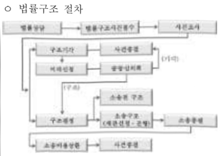
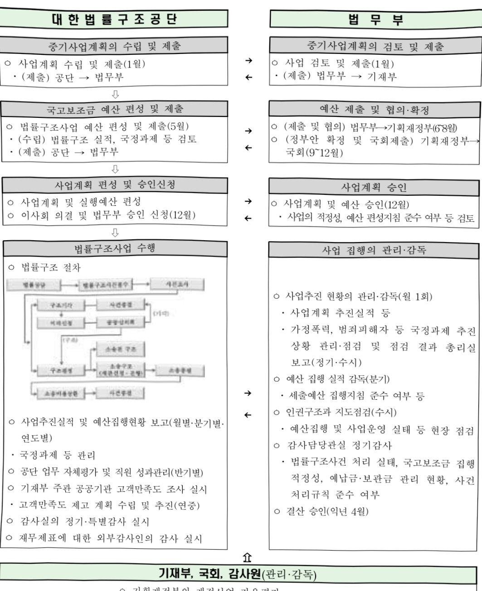

# 법률구조

**해당 페이지**: PDF 3298 ~ 3318 쪽 해당

**부처**: 법무부
**분야**: 공공질서 및 안전
**회계유형**: 일반회계
**2026 확정예산**: 66602.0 백만원
**전년대비 증감률**: -1.1%
**AI 도메인**: 법률/치안

---

<table border=1 style='margin: auto; word-wrap: break-word;'><tr><td style='text-align: center; word-wrap: break-word;'>사 엽 명</td></tr><tr><td style='text-align: center; word-wrap: break-word;'>법률구조 (1131-300)</td></tr></table>

□ 사업 코드 정보

<table border=1 style='margin: auto; word-wrap: break-word;'><tr><td style='text-align: center; word-wrap: break-word;'>구분</td><td style='text-align: center; word-wrap: break-word;'>회계</td><td style='text-align: center; word-wrap: break-word;'>소관</td><td style='text-align: center; word-wrap: break-word;'>실국(기관)</td><td style='text-align: center; word-wrap: break-word;'>계정</td><td style='text-align: center; word-wrap: break-word;'>분야</td><td style='text-align: center; word-wrap: break-word;'>부문</td></tr><tr><td style='text-align: center; word-wrap: break-word;'>코드</td><td rowspan="2">일반회계</td><td rowspan="2">법무부</td><td rowspan="2">인권국</td><td rowspan="2">일반회계</td><td style='text-align: center; word-wrap: break-word;'>020</td><td style='text-align: center; word-wrap: break-word;'>022</td></tr><tr><td style='text-align: center; word-wrap: break-word;'>명칭</td><td style='text-align: center; word-wrap: break-word;'>공공질서및안전</td><td style='text-align: center; word-wrap: break-word;'>법무및검찰</td></tr></table>

<table border=1 style='margin: auto; word-wrap: break-word;'><tr><td style='text-align: center; word-wrap: break-word;'>구분</td><td style='text-align: center; word-wrap: break-word;'>프로그램</td><td style='text-align: center; word-wrap: break-word;'>단위사업</td><td style='text-align: center; word-wrap: break-word;'>세부사업</td></tr><tr><td style='text-align: center; word-wrap: break-word;'>코드</td><td style='text-align: center; word-wrap: break-word;'>1100</td><td style='text-align: center; word-wrap: break-word;'>1131</td><td style='text-align: center; word-wrap: break-word;'>300</td></tr><tr><td style='text-align: center; word-wrap: break-word;'>명칭</td><td style='text-align: center; word-wrap: break-word;'>인권활동</td><td style='text-align: center; word-wrap: break-word;'>법률구조</td><td style='text-align: center; word-wrap: break-word;'>법률구조</td></tr></table>

□ 사업 성격 (공통요구자료 Ⅱ-1 작성유의사항 4. 참조, 해당하는 사항에 “0” 표시)

<table border=1 style='margin: auto; word-wrap: break-word;'><tr><td rowspan="2">신규</td><td rowspan="2">계속</td><td rowspan="2">완료</td><td rowspan="2">예비타당성 실시여부</td><td rowspan="2">총사업비 관리대상</td><td rowspan="2">총액계상 예산사업</td><td style='text-align: center; word-wrap: break-word;'>사업소관 변경정보</td></tr><tr><td style='text-align: center; word-wrap: break-word;'>2025예산 시 소관</td></tr><tr><td style='text-align: center; word-wrap: break-word;'></td><td style='text-align: center; word-wrap: break-word;'>0</td><td style='text-align: center; word-wrap: break-word;'></td><td style='text-align: center; word-wrap: break-word;'></td><td style='text-align: center; word-wrap: break-word;'></td><td style='text-align: center; word-wrap: break-word;'></td><td style='text-align: center; word-wrap: break-word;'></td></tr></table>

□ 사업 지원 형태 및 지원을 (최소한 한 개는 반드시 선택하시오. 해당사항에 0 표시)

<table border=1 style='margin: auto; word-wrap: break-word;'><tr><td style='text-align: center; word-wrap: break-word;'>직접</td><td style='text-align: center; word-wrap: break-word;'>출자</td><td style='text-align: center; word-wrap: break-word;'>출연</td><td style='text-align: center; word-wrap: break-word;'>보조</td><td style='text-align: center; word-wrap: break-word;'>융자</td><td style='text-align: center; word-wrap: break-word;'>국고보조율(%)</td><td style='text-align: center; word-wrap: break-word;'>융자율(%)</td></tr><tr><td style='text-align: center; word-wrap: break-word;'>0</td><td style='text-align: center; word-wrap: break-word;'></td><td style='text-align: center; word-wrap: break-word;'></td><td style='text-align: center; word-wrap: break-word;'>0</td><td style='text-align: center; word-wrap: break-word;'></td><td style='text-align: center; word-wrap: break-word;'></td><td style='text-align: center; word-wrap: break-word;'></td></tr></table>

## □ 사업 담당자

<table border=1 style='margin: auto; word-wrap: break-word;'><tr><td style='text-align: center; word-wrap: break-word;'>사업명</td><td colspan="5">구분</td></tr><tr><td rowspan="2">법률구조기구 관리 및 연계강화</td><td style='text-align: center; word-wrap: break-word;'>소관부처</td><td style='text-align: center; word-wrap: break-word;'>실·국·과(팀) 인권국 인권구조과 기관명</td><td style='text-align: center; word-wrap: break-word;'>과 장 정유선 02-2110-3641 조직명</td><td style='text-align: center; word-wrap: break-word;'>사무관 이병주 02-2110-3643 이 름</td><td style='text-align: center; word-wrap: break-word;'>주무관 김영현 02-2110-3646 연락처 주무관 김영현 02-2110-3646</td></tr><tr><td rowspan="2">사업시행주체</td><td rowspan="5">실·국·과(팀) 인권국 인권구조과 대한법률구조공단 대한가정법률상담소 대한법률부장원 대한법률구조제한</td><td rowspan="5">과 장 정유선 02-2110-3641 예산정책부 재무·회계 상담부서 총무과</td><td rowspan="5">사무관 이병주 02-2110-3643 김신 과장 김현옥 과장 고은지 상담위원 김상우 부장</td><td rowspan="5">02-2110-3646 054-810-1143 02-782-3427 02-2697-0155 02-3476-6515</td></tr><tr><td rowspan="4">법률구조</td></tr><tr><td rowspan="3">사업시행주체</td></tr><tr></tr><tr></tr></table>

---

가. 예산 총괄표

(단위: 백만원, %)

<table border=1 style='margin: auto; word-wrap: break-word;'><tr><td rowspan="2">사업명</td><td rowspan="2">2024년 결산</td><td colspan="2">2025년 예산</td><td colspan="2">2026년</td><td rowspan="2">중감 (B-A)</td><td rowspan="2">(B-A)/A</td></tr><tr><td style='text-align: center; word-wrap: break-word;'>본예산(A)</td><td style='text-align: center; word-wrap: break-word;'>추경</td><td style='text-align: center; word-wrap: break-word;'>요구</td><td style='text-align: center; word-wrap: break-word;'>조정(B)</td></tr><tr><td style='text-align: center; word-wrap: break-word;'>법률구조</td><td style='text-align: center; word-wrap: break-word;'>64,815</td><td style='text-align: center; word-wrap: break-word;'>67,337</td><td style='text-align: center; word-wrap: break-word;'>67,337</td><td style='text-align: center; word-wrap: break-word;'>71,759</td><td style='text-align: center; word-wrap: break-word;'>66,602</td><td style='text-align: center; word-wrap: break-word;'>△735</td><td style='text-align: center; word-wrap: break-word;'>△1.1</td></tr></table>

□ 기능별(내역사업별), 목별 예산 내역

(단위:백만원)

<table border=1 style='margin: auto; word-wrap: break-word;'><tr><td rowspan="3"></td><td colspan="5">2024</td><td colspan="7">2025</td><td rowspan="3">2026예산</td></tr><tr><td rowspan="2">예산액(추경)</td><td rowspan="2">예산현액</td><td rowspan="2">집행액[실집행액]</td><td rowspan="2">이익액</td><td rowspan="2">불용액</td><td rowspan="2">본예산</td><td rowspan="2">예산현액</td><td rowspan="2">집행액[실집행액]</td><td colspan="2">전년도 이익액제외</td><td rowspan="2">이익액</td><td rowspan="2">불용액</td></tr><tr><td style='text-align: center; word-wrap: break-word;'>예산현액</td><td style='text-align: center; word-wrap: break-word;'>집행액[실집행액]</td></tr><tr><td style='text-align: center; word-wrap: break-word;'>○ 기능별 분류(합계)</td><td style='text-align: center; word-wrap: break-word;'>64,817</td><td style='text-align: center; word-wrap: break-word;'>64,817</td><td style='text-align: center; word-wrap: break-word;'>64,815(64,815)</td><td style='text-align: center; word-wrap: break-word;'>-</td><td style='text-align: center; word-wrap: break-word;'>2</td><td style='text-align: center; word-wrap: break-word;'>67,337</td><td style='text-align: center; word-wrap: break-word;'>67,337</td><td style='text-align: center; word-wrap: break-word;'>67,336(67,336)</td><td style='text-align: center; word-wrap: break-word;'>64,337</td><td style='text-align: center; word-wrap: break-word;'>67,336(67,336)</td><td style='text-align: center; word-wrap: break-word;'>-</td><td style='text-align: center; word-wrap: break-word;'>1</td><td style='text-align: center; word-wrap: break-word;'>66,602</td></tr><tr><td style='text-align: center; word-wrap: break-word;'>· 법률구조기구 관리 및 연계강화</td><td style='text-align: center; word-wrap: break-word;'>50</td><td style='text-align: center; word-wrap: break-word;'>50</td><td style='text-align: center; word-wrap: break-word;'>48(48)</td><td style='text-align: center; word-wrap: break-word;'>-</td><td style='text-align: center; word-wrap: break-word;'>2</td><td style='text-align: center; word-wrap: break-word;'>50</td><td style='text-align: center; word-wrap: break-word;'>50</td><td style='text-align: center; word-wrap: break-word;'>49(49)</td><td style='text-align: center; word-wrap: break-word;'>50</td><td style='text-align: center; word-wrap: break-word;'>49(49)</td><td style='text-align: center; word-wrap: break-word;'>-</td><td style='text-align: center; word-wrap: break-word;'>1</td><td style='text-align: center; word-wrap: break-word;'>238</td></tr><tr><td style='text-align: center; word-wrap: break-word;'>· 대한법률구조공단</td><td style='text-align: center; word-wrap: break-word;'>62,897</td><td style='text-align: center; word-wrap: break-word;'>62,897</td><td style='text-align: center; word-wrap: break-word;'>62,897(62,897)</td><td style='text-align: center; word-wrap: break-word;'>-</td><td style='text-align: center; word-wrap: break-word;'>-</td><td style='text-align: center; word-wrap: break-word;'>65,370</td><td style='text-align: center; word-wrap: break-word;'>65,370</td><td style='text-align: center; word-wrap: break-word;'>65,370(65,370)</td><td style='text-align: center; word-wrap: break-word;'>65,370</td><td style='text-align: center; word-wrap: break-word;'>65,370(65,370)</td><td style='text-align: center; word-wrap: break-word;'>-</td><td style='text-align: center; word-wrap: break-word;'>-</td><td style='text-align: center; word-wrap: break-word;'>63,888</td></tr><tr><td style='text-align: center; word-wrap: break-word;'>· 인건비</td><td style='text-align: center; word-wrap: break-word;'>64,572</td><td style='text-align: center; word-wrap: break-word;'>64,572</td><td style='text-align: center; word-wrap: break-word;'>64,572(64,572)</td><td style='text-align: center; word-wrap: break-word;'>-</td><td style='text-align: center; word-wrap: break-word;'>-</td><td style='text-align: center; word-wrap: break-word;'>66,457</td><td style='text-align: center; word-wrap: break-word;'>66,457</td><td style='text-align: center; word-wrap: break-word;'>66,457(66,457)</td><td style='text-align: center; word-wrap: break-word;'>66,457</td><td style='text-align: center; word-wrap: break-word;'>66,457(66,457)</td><td style='text-align: center; word-wrap: break-word;'>-</td><td style='text-align: center; word-wrap: break-word;'>-</td><td style='text-align: center; word-wrap: break-word;'>66,470</td></tr><tr><td style='text-align: center; word-wrap: break-word;'>· 경상비</td><td style='text-align: center; word-wrap: break-word;'>2,705</td><td style='text-align: center; word-wrap: break-word;'>2,705</td><td style='text-align: center; word-wrap: break-word;'>2,646(2,646)</td><td style='text-align: center; word-wrap: break-word;'>-</td><td style='text-align: center; word-wrap: break-word;'>-</td><td style='text-align: center; word-wrap: break-word;'>2,574</td><td style='text-align: center; word-wrap: break-word;'>2,574</td><td style='text-align: center; word-wrap: break-word;'>2,425(2,425)</td><td style='text-align: center; word-wrap: break-word;'>2,574</td><td style='text-align: center; word-wrap: break-word;'>2,425(2,425)</td><td style='text-align: center; word-wrap: break-word;'>-</td><td style='text-align: center; word-wrap: break-word;'>-</td><td style='text-align: center; word-wrap: break-word;'>2,501</td></tr><tr><td style='text-align: center; word-wrap: break-word;'>· 사업비</td><td style='text-align: center; word-wrap: break-word;'>44,479</td><td style='text-align: center; word-wrap: break-word;'>44,479</td><td style='text-align: center; word-wrap: break-word;'>37,771(37,771)</td><td style='text-align: center; word-wrap: break-word;'>-</td><td style='text-align: center; word-wrap: break-word;'>-</td><td style='text-align: center; word-wrap: break-word;'>48,307</td><td style='text-align: center; word-wrap: break-word;'>48,307</td><td style='text-align: center; word-wrap: break-word;'>42,045(42,045)</td><td style='text-align: center; word-wrap: break-word;'>48,307</td><td style='text-align: center; word-wrap: break-word;'>42,045(42,045)</td><td style='text-align: center; word-wrap: break-word;'>-</td><td style='text-align: center; word-wrap: break-word;'>-</td><td style='text-align: center; word-wrap: break-word;'>38,935</td></tr><tr><td style='text-align: center; word-wrap: break-word;'>· 국고보조</td><td style='text-align: center; word-wrap: break-word;'>62,897</td><td style='text-align: center; word-wrap: break-word;'>62,897</td><td style='text-align: center; word-wrap: break-word;'>62,897(62,897)</td><td style='text-align: center; word-wrap: break-word;'>-</td><td style='text-align: center; word-wrap: break-word;'>-</td><td style='text-align: center; word-wrap: break-word;'>65,370</td><td style='text-align: center; word-wrap: break-word;'>65,370</td><td style='text-align: center; word-wrap: break-word;'>65,370(65,370)</td><td style='text-align: center; word-wrap: break-word;'>65,370</td><td style='text-align: center; word-wrap: break-word;'>65,370(65,370)</td><td style='text-align: center; word-wrap: break-word;'>-</td><td style='text-align: center; word-wrap: break-word;'>-</td><td style='text-align: center; word-wrap: break-word;'>63,888</td></tr><tr><td style='text-align: center; word-wrap: break-word;'>· 자체수입</td><td style='text-align: center; word-wrap: break-word;'>48,959</td><td style='text-align: center; word-wrap: break-word;'>48,959</td><td style='text-align: center; word-wrap: break-word;'>42,092(42,092)</td><td style='text-align: center; word-wrap: break-word;'>-</td><td style='text-align: center; word-wrap: break-word;'>-</td><td style='text-align: center; word-wrap: break-word;'>51,968</td><td style='text-align: center; word-wrap: break-word;'>51,968</td><td style='text-align: center; word-wrap: break-word;'>45,557(45,557)</td><td style='text-align: center; word-wrap: break-word;'>51,968</td><td style='text-align: center; word-wrap: break-word;'>45,557(45,557)</td><td style='text-align: center; word-wrap: break-word;'>-</td><td style='text-align: center; word-wrap: break-word;'>-</td><td style='text-align: center; word-wrap: break-word;'>44,018</td></tr><tr><td style='text-align: center; word-wrap: break-word;'>· 가정복지관련 법률구조</td><td style='text-align: center; word-wrap: break-word;'>1,870</td><td style='text-align: center; word-wrap: break-word;'>1,870</td><td style='text-align: center; word-wrap: break-word;'>1,870(1,870)</td><td style='text-align: center; word-wrap: break-word;'>-</td><td style='text-align: center; word-wrap: break-word;'>-</td><td style='text-align: center; word-wrap: break-word;'>1,917</td><td style='text-align: center; word-wrap: break-word;'>1,917</td><td style='text-align: center; word-wrap: break-word;'>1,917(1,917)</td><td style='text-align: center; word-wrap: break-word;'>1,917</td><td style='text-align: center; word-wrap: break-word;'>1,917(1,917)</td><td style='text-align: center; word-wrap: break-word;'>-</td><td style='text-align: center; word-wrap: break-word;'>-</td><td style='text-align: center; word-wrap: break-word;'>1,976</td></tr><tr><td style='text-align: center; word-wrap: break-word;'>· 인건비</td><td style='text-align: center; word-wrap: break-word;'>1,760</td><td style='text-align: center; word-wrap: break-word;'>1,760</td><td style='text-align: center; word-wrap: break-word;'>1,517(1,517)</td><td style='text-align: center; word-wrap: break-word;'>-</td><td style='text-align: center; word-wrap: break-word;'>-</td><td style='text-align: center; word-wrap: break-word;'>1,812</td><td style='text-align: center; word-wrap: break-word;'>1,812</td><td style='text-align: center; word-wrap: break-word;'>1,600(1,600)</td><td style='text-align: center; word-wrap: break-word;'>1,812</td><td style='text-align: center; word-wrap: break-word;'>1,600(1,600)</td><td style='text-align: center; word-wrap: break-word;'>-</td><td style='text-align: center; word-wrap: break-word;'>-</td><td style='text-align: center; word-wrap: break-word;'>1,875</td></tr><tr><td style='text-align: center; word-wrap: break-word;'>· 경상비</td><td style='text-align: center; word-wrap: break-word;'>179</td><td style='text-align: center; word-wrap: break-word;'>179</td><td style='text-align: center; word-wrap: break-word;'>123(123)</td><td style='text-align: center; word-wrap: break-word;'>-</td><td style='text-align: center; word-wrap: break-word;'>-</td><td style='text-align: center; word-wrap: break-word;'>174</td><td style='text-align: center; word-wrap: break-word;'>174</td><td style='text-align: center; word-wrap: break-word;'>126(126)</td><td style='text-align: center; word-wrap: break-word;'>174</td><td style='text-align: center; word-wrap: break-word;'>126(126)</td><td style='text-align: center; word-wrap: break-word;'>-</td><td style='text-align: center; word-wrap: break-word;'>-</td><td style='text-align: center; word-wrap: break-word;'>170</td></tr><tr><td style='text-align: center; word-wrap: break-word;'>· 사업비</td><td style='text-align: center; word-wrap: break-word;'>1,914</td><td style='text-align: center; word-wrap: break-word;'>1,914</td><td style='text-align: center; word-wrap: break-word;'>1,791(1,791)</td><td style='text-align: center; word-wrap: break-word;'>-</td><td style='text-align: center; word-wrap: break-word;'>-</td><td style='text-align: center; word-wrap: break-word;'>1,914</td><td style='text-align: center; word-wrap: break-word;'>1,914</td><td style='text-align: center; word-wrap: break-word;'>1,683(1,683)</td><td style='text-align: center; word-wrap: break-word;'>1,914</td><td style='text-align: center; word-wrap: break-word;'>1,683(1,683)</td><td style='text-align: center; word-wrap: break-word;'>-</td><td style='text-align: center; word-wrap: break-word;'>-</td><td style='text-align: center; word-wrap: break-word;'>1,914</td></tr><tr><td style='text-align: center; word-wrap: break-word;'>· 국고보조</td><td style='text-align: center; word-wrap: break-word;'>1,870</td><td style='text-align: center; word-wrap: break-word;'>1,870</td><td style='text-align: center; word-wrap: break-word;'>1,870(1,870)</td><td style='text-align: center; word-wrap: break-word;'>-</td><td style='text-align: center; word-wrap: break-word;'>-</td><td style='text-align: center; word-wrap: break-word;'>1,917</td><td style='text-align: center; word-wrap: break-word;'>1,917</td><td style='text-align: center; word-wrap: break-word;'>1,917(1,917)</td><td style='text-align: center; word-wrap: break-word;'>1,917</td><td style='text-align: center; word-wrap: break-word;'>1,917(1,917)</td><td style='text-align: center; word-wrap: break-word;'>-</td><td style='text-align: center; word-wrap: break-word;'>-</td><td style='text-align: center; word-wrap: break-word;'>1,976</td></tr><tr><td style='text-align: center; word-wrap: break-word;'>· 자체수입</td><td style='text-align: center; word-wrap: break-word;'>1,983</td><td style='text-align: center; word-wrap: break-word;'>1,983</td><td style='text-align: center; word-wrap: break-word;'>1,561(1,561)</td><td style='text-align: center; word-wrap: break-word;'>-</td><td style='text-align: center; word-wrap: break-word;'>-</td><td style='text-align: center; word-wrap: break-word;'>1,983</td><td style='text-align: center; word-wrap: break-word;'>1,983</td><td style='text-align: center; word-wrap: break-word;'>1,492(1,492)</td><td style='text-align: center; word-wrap: break-word;'>1,983</td><td style='text-align: center; word-wrap: break-word;'>1,492(1,492)</td><td style='text-align: center; word-wrap: break-word;'>-</td><td style='text-align: center; word-wrap: break-word;'>-</td><td style='text-align: center; word-wrap: break-word;'>1,983</td></tr><tr><td style='text-align: center; word-wrap: break-word;'>· 기타 법률구조 기구</td><td style='text-align: center; word-wrap: break-word;'>-</td><td style='text-align: center; word-wrap: break-word;'>-</td><td style='text-align: center; word-wrap: break-word;'>-</td><td style='text-align: center; word-wrap: break-word;'>-</td><td style='text-align: center; word-wrap: break-word;'>-</td><td style='text-align: center; word-wrap: break-word;'>-</td><td style='text-align: center; word-wrap: break-word;'>-</td><td style='text-align: center; word-wrap: break-word;'>-</td><td style='text-align: center; word-wrap: break-word;'>-</td><td style='text-align: center; word-wrap: break-word;'>-</td><td style='text-align: center; word-wrap: break-word;'>-</td><td style='text-align: center; word-wrap: break-word;'>-</td><td style='text-align: center; word-wrap: break-word;'>500</td></tr><tr><td style='text-align: center; word-wrap: break-word;'>· 인건비</td><td style='text-align: center; word-wrap: break-word;'>-</td><td style='text-align: center; word-wrap: break-word;'>-</td><td style='text-align: center; word-wrap: break-word;'>-</td><td style='text-align: center; word-wrap: break-word;'>-</td><td style='text-align: center; word-wrap: break-word;'>-</td><td style='text-align: center; word-wrap: break-word;'>-</td><td style='text-align: center; word-wrap: break-word;'>-</td><td style='text-align: center; word-wrap: break-word;'>-</td><td style='text-align: center; word-wrap: break-word;'>-</td><td style='text-align: center; word-wrap: break-word;'>-</td><td style='text-align: center; word-wrap: break-word;'>-</td><td style='text-align: center; word-wrap: break-word;'>-</td><td style='text-align: center; word-wrap: break-word;'>330</td></tr><tr><td style='text-align: center; word-wrap: break-word;'>· 경상비</td><td style='text-align: center; word-wrap: break-word;'>-</td><td style='text-align: center; word-wrap: break-word;'>-</td><td style='text-align: center; word-wrap: break-word;'>-</td><td style='text-align: center; word-wrap: break-word;'>-</td><td style='text-align: center; word-wrap: break-word;'>-</td><td style='text-align: center; word-wrap: break-word;'>-</td><td style='text-align: center; word-wrap: break-word;'>-</td><td style='text-align: center; word-wrap: break-word;'>-</td><td style='text-align: center; word-wrap: break-word;'>-</td><td style='text-align: center; word-wrap: break-word;'>-</td><td style='text-align: center; word-wrap: break-word;'>-</td><td style='text-align: center; word-wrap: break-word;'>-</td><td style='text-align: center; word-wrap: break-word;'>18</td></tr></table>

---

<table border=1 style='margin: auto; word-wrap: break-word;'><tr><td rowspan="3"></td><td colspan="5">2024</td><td colspan="7">2025</td><td rowspan="3">2026예산</td></tr><tr><td rowspan="2">예산의(추정)</td><td rowspan="2">예산현액</td><td rowspan="2">집행의[실집행액]</td><td rowspan="2">이일액</td><td rowspan="2">불용액</td><td rowspan="2">본예산</td><td rowspan="2">예산현액</td><td rowspan="2">집행의[실집행액]</td><td colspan="2">전년도아일액제외</td><td rowspan="2">이일액</td><td rowspan="2">불용액</td></tr><tr><td style='text-align: center; word-wrap: break-word;'>예산현액</td><td style='text-align: center; word-wrap: break-word;'>집행의[실집행액]</td></tr><tr><td style='text-align: center; word-wrap: break-word;'>-사업비</td><td style='text-align: center; word-wrap: break-word;'>-</td><td style='text-align: center; word-wrap: break-word;'>-</td><td style='text-align: center; word-wrap: break-word;'>-</td><td style='text-align: center; word-wrap: break-word;'>-</td><td style='text-align: center; word-wrap: break-word;'>-</td><td style='text-align: center; word-wrap: break-word;'>-</td><td style='text-align: center; word-wrap: break-word;'>-</td><td style='text-align: center; word-wrap: break-word;'>-</td><td style='text-align: center; word-wrap: break-word;'>-</td><td style='text-align: center; word-wrap: break-word;'>-</td><td style='text-align: center; word-wrap: break-word;'>-</td><td style='text-align: center; word-wrap: break-word;'>-</td><td style='text-align: center; word-wrap: break-word;'>1,353</td></tr><tr><td style='text-align: center; word-wrap: break-word;'>-국고보조</td><td style='text-align: center; word-wrap: break-word;'>-</td><td style='text-align: center; word-wrap: break-word;'>-</td><td style='text-align: center; word-wrap: break-word;'>-</td><td style='text-align: center; word-wrap: break-word;'>-</td><td style='text-align: center; word-wrap: break-word;'>-</td><td style='text-align: center; word-wrap: break-word;'>-</td><td style='text-align: center; word-wrap: break-word;'>-</td><td style='text-align: center; word-wrap: break-word;'>-</td><td style='text-align: center; word-wrap: break-word;'>-</td><td style='text-align: center; word-wrap: break-word;'>-</td><td style='text-align: center; word-wrap: break-word;'>-</td><td style='text-align: center; word-wrap: break-word;'>-</td><td style='text-align: center; word-wrap: break-word;'>500</td></tr><tr><td style='text-align: center; word-wrap: break-word;'>-자체수입</td><td style='text-align: center; word-wrap: break-word;'>-</td><td style='text-align: center; word-wrap: break-word;'>-</td><td style='text-align: center; word-wrap: break-word;'>-</td><td style='text-align: center; word-wrap: break-word;'>-</td><td style='text-align: center; word-wrap: break-word;'>-</td><td style='text-align: center; word-wrap: break-word;'>-</td><td style='text-align: center; word-wrap: break-word;'>-</td><td style='text-align: center; word-wrap: break-word;'>-</td><td style='text-align: center; word-wrap: break-word;'>-</td><td style='text-align: center; word-wrap: break-word;'>-</td><td style='text-align: center; word-wrap: break-word;'>-</td><td style='text-align: center; word-wrap: break-word;'>-</td><td style='text-align: center; word-wrap: break-word;'>1,201</td></tr><tr><td style='text-align: center; word-wrap: break-word;'>○비목별분류(합계)</td><td style='text-align: center; word-wrap: break-word;'>64,817</td><td style='text-align: center; word-wrap: break-word;'>64,817</td><td style='text-align: center; word-wrap: break-word;'>64,815(64,815)</td><td style='text-align: center; word-wrap: break-word;'>-</td><td style='text-align: center; word-wrap: break-word;'>2</td><td style='text-align: center; word-wrap: break-word;'>67,337</td><td style='text-align: center; word-wrap: break-word;'>67,337</td><td style='text-align: center; word-wrap: break-word;'>67,336(67,336)</td><td style='text-align: center; word-wrap: break-word;'>67,337</td><td style='text-align: center; word-wrap: break-word;'>67,336(67,336)</td><td style='text-align: center; word-wrap: break-word;'>-</td><td style='text-align: center; word-wrap: break-word;'>1</td><td style='text-align: center; word-wrap: break-word;'>66,602</td></tr><tr><td style='text-align: center; word-wrap: break-word;'>·일반수용비(210-01)</td><td style='text-align: center; word-wrap: break-word;'>17</td><td style='text-align: center; word-wrap: break-word;'>18</td><td style='text-align: center; word-wrap: break-word;'>18(18)</td><td style='text-align: center; word-wrap: break-word;'>1</td><td style='text-align: center; word-wrap: break-word;'>-</td><td style='text-align: center; word-wrap: break-word;'>17</td><td style='text-align: center; word-wrap: break-word;'>17</td><td style='text-align: center; word-wrap: break-word;'>17(17)</td><td style='text-align: center; word-wrap: break-word;'>17</td><td style='text-align: center; word-wrap: break-word;'>17(17)</td><td style='text-align: center; word-wrap: break-word;'>-</td><td style='text-align: center; word-wrap: break-word;'>-</td><td style='text-align: center; word-wrap: break-word;'>173</td></tr><tr><td style='text-align: center; word-wrap: break-word;'>·임차료(210-07)</td><td style='text-align: center; word-wrap: break-word;'>3</td><td style='text-align: center; word-wrap: break-word;'>2</td><td style='text-align: center; word-wrap: break-word;'>2(2)</td><td style='text-align: center; word-wrap: break-word;'>△1</td><td style='text-align: center; word-wrap: break-word;'>-</td><td style='text-align: center; word-wrap: break-word;'>3</td><td style='text-align: center; word-wrap: break-word;'>3</td><td style='text-align: center; word-wrap: break-word;'>3(3)</td><td style='text-align: center; word-wrap: break-word;'>3</td><td style='text-align: center; word-wrap: break-word;'>3(3)</td><td style='text-align: center; word-wrap: break-word;'>-</td><td style='text-align: center; word-wrap: break-word;'>-</td><td style='text-align: center; word-wrap: break-word;'>5</td></tr><tr><td style='text-align: center; word-wrap: break-word;'>·국내여비(220-01)</td><td style='text-align: center; word-wrap: break-word;'>10</td><td style='text-align: center; word-wrap: break-word;'>10</td><td style='text-align: center; word-wrap: break-word;'>9(9)</td><td style='text-align: center; word-wrap: break-word;'>-</td><td style='text-align: center; word-wrap: break-word;'>1</td><td style='text-align: center; word-wrap: break-word;'>10</td><td style='text-align: center; word-wrap: break-word;'>10</td><td style='text-align: center; word-wrap: break-word;'>10(10)</td><td style='text-align: center; word-wrap: break-word;'>10</td><td style='text-align: center; word-wrap: break-word;'>10(10)</td><td style='text-align: center; word-wrap: break-word;'>-</td><td style='text-align: center; word-wrap: break-word;'>-</td><td style='text-align: center; word-wrap: break-word;'>10</td></tr><tr><td style='text-align: center; word-wrap: break-word;'>·일반연구비(260-01)</td><td style='text-align: center; word-wrap: break-word;'>20</td><td style='text-align: center; word-wrap: break-word;'>20</td><td style='text-align: center; word-wrap: break-word;'>20(20)</td><td style='text-align: center; word-wrap: break-word;'>-</td><td style='text-align: center; word-wrap: break-word;'>-</td><td style='text-align: center; word-wrap: break-word;'>20</td><td style='text-align: center; word-wrap: break-word;'>20</td><td style='text-align: center; word-wrap: break-word;'>20(20)</td><td style='text-align: center; word-wrap: break-word;'>20</td><td style='text-align: center; word-wrap: break-word;'>20(20)</td><td style='text-align: center; word-wrap: break-word;'>-</td><td style='text-align: center; word-wrap: break-word;'>-</td><td style='text-align: center; word-wrap: break-word;'>40</td></tr><tr><td style='text-align: center; word-wrap: break-word;'>·사업추진비(240-01)</td><td style='text-align: center; word-wrap: break-word;'>-</td><td style='text-align: center; word-wrap: break-word;'>-</td><td style='text-align: center; word-wrap: break-word;'>-</td><td style='text-align: center; word-wrap: break-word;'>-</td><td style='text-align: center; word-wrap: break-word;'>-</td><td style='text-align: center; word-wrap: break-word;'>-</td><td style='text-align: center; word-wrap: break-word;'>-</td><td style='text-align: center; word-wrap: break-word;'>-</td><td style='text-align: center; word-wrap: break-word;'>-</td><td style='text-align: center; word-wrap: break-word;'>-</td><td style='text-align: center; word-wrap: break-word;'>-</td><td style='text-align: center; word-wrap: break-word;'>-</td><td style='text-align: center; word-wrap: break-word;'>10</td></tr><tr><td style='text-align: center; word-wrap: break-word;'>·민간경상보조(320-01)</td><td style='text-align: center; word-wrap: break-word;'>64,767</td><td style='text-align: center; word-wrap: break-word;'>64,767</td><td style='text-align: center; word-wrap: break-word;'>64,767(64,767)</td><td style='text-align: center; word-wrap: break-word;'>-</td><td style='text-align: center; word-wrap: break-word;'>-</td><td style='text-align: center; word-wrap: break-word;'>67,287</td><td style='text-align: center; word-wrap: break-word;'>67,287</td><td style='text-align: center; word-wrap: break-word;'>67,287(67,287)</td><td style='text-align: center; word-wrap: break-word;'>67,287</td><td style='text-align: center; word-wrap: break-word;'>67,287(67,287)</td><td style='text-align: center; word-wrap: break-word;'>-</td><td style='text-align: center; word-wrap: break-word;'>-</td><td style='text-align: center; word-wrap: break-word;'>66,364</td></tr><tr><td style='text-align: center; word-wrap: break-word;'>○기능비목별분류(합계)</td><td style='text-align: center; word-wrap: break-word;'>64,817</td><td style='text-align: center; word-wrap: break-word;'>64,817</td><td style='text-align: center; word-wrap: break-word;'>64,815(64,815)</td><td style='text-align: center; word-wrap: break-word;'>-</td><td style='text-align: center; word-wrap: break-word;'>2</td><td style='text-align: center; word-wrap: break-word;'>67,337</td><td style='text-align: center; word-wrap: break-word;'>67,337</td><td style='text-align: center; word-wrap: break-word;'>67,337</td><td style='text-align: center; word-wrap: break-word;'>67,337</td><td style='text-align: center; word-wrap: break-word;'>67,337</td><td style='text-align: center; word-wrap: break-word;'>-</td><td style='text-align: center; word-wrap: break-word;'>-</td><td style='text-align: center; word-wrap: break-word;'>66,602</td></tr><tr><td style='text-align: center; word-wrap: break-word;'>·법률구조기구관리 및 연계강화</td><td style='text-align: center; word-wrap: break-word;'>50</td><td style='text-align: center; word-wrap: break-word;'>50</td><td style='text-align: center; word-wrap: break-word;'>48(48)</td><td style='text-align: center; word-wrap: break-word;'>-</td><td style='text-align: center; word-wrap: break-word;'>2</td><td style='text-align: center; word-wrap: break-word;'>50</td><td style='text-align: center; word-wrap: break-word;'>50</td><td style='text-align: center; word-wrap: break-word;'>49(49)</td><td style='text-align: center; word-wrap: break-word;'>50</td><td style='text-align: center; word-wrap: break-word;'>49(49)</td><td style='text-align: center; word-wrap: break-word;'>-</td><td style='text-align: center; word-wrap: break-word;'>-</td><td style='text-align: center; word-wrap: break-word;'>238</td></tr><tr><td style='text-align: center; word-wrap: break-word;'>-일반수용비(210-01)</td><td style='text-align: center; word-wrap: break-word;'>17</td><td style='text-align: center; word-wrap: break-word;'>18</td><td style='text-align: center; word-wrap: break-word;'>18(18)</td><td style='text-align: center; word-wrap: break-word;'>1</td><td style='text-align: center; word-wrap: break-word;'>-</td><td style='text-align: center; word-wrap: break-word;'>17</td><td style='text-align: center; word-wrap: break-word;'>17</td><td style='text-align: center; word-wrap: break-word;'>17(17)</td><td style='text-align: center; word-wrap: break-word;'>17</td><td style='text-align: center; word-wrap: break-word;'>17(17)</td><td style='text-align: center; word-wrap: break-word;'>-</td><td style='text-align: center; word-wrap: break-word;'>-</td><td style='text-align: center; word-wrap: break-word;'>173</td></tr><tr><td style='text-align: center; word-wrap: break-word;'>-임차료(210-07)</td><td style='text-align: center; word-wrap: break-word;'>3</td><td style='text-align: center; word-wrap: break-word;'>2</td><td style='text-align: center; word-wrap: break-word;'>2(2)</td><td style='text-align: center; word-wrap: break-word;'>△1</td><td style='text-align: center; word-wrap: break-word;'>-</td><td style='text-align: center; word-wrap: break-word;'>3</td><td style='text-align: center; word-wrap: break-word;'>3</td><td style='text-align: center; word-wrap: break-word;'>3(3)</td><td style='text-align: center; word-wrap: break-word;'>3</td><td style='text-align: center; word-wrap: break-word;'>3(3)</td><td style='text-align: center; word-wrap: break-word;'>-</td><td style='text-align: center; word-wrap: break-word;'>-</td><td style='text-align: center; word-wrap: break-word;'>5</td></tr><tr><td style='text-align: center; word-wrap: break-word;'>-국내여비(220-01)</td><td style='text-align: center; word-wrap: break-word;'>10</td><td style='text-align: center; word-wrap: break-word;'>10</td><td style='text-align: center; word-wrap: break-word;'>9(9)</td><td style='text-align: center; word-wrap: break-word;'>-</td><td style='text-align: center; word-wrap: break-word;'>1</td><td style='text-align: center; word-wrap: break-word;'>10</td><td style='text-align: center; word-wrap: break-word;'>10</td><td style='text-align: center; word-wrap: break-word;'>10(10)</td><td style='text-align: center; word-wrap: break-word;'>10</td><td style='text-align: center; word-wrap: break-word;'>10(10)</td><td style='text-align: center; word-wrap: break-word;'>-</td><td style='text-align: center; word-wrap: break-word;'>-</td><td style='text-align: center; word-wrap: break-word;'>10</td></tr><tr><td style='text-align: center; word-wrap: break-word;'>-일반연구비(260-01)</td><td style='text-align: center; word-wrap: break-word;'>20</td><td style='text-align: center; word-wrap: break-word;'>20</td><td style='text-align: center; word-wrap: break-word;'>20(20)</td><td style='text-align: center; word-wrap: break-word;'>-</td><td style='text-align: center; word-wrap: break-word;'>-</td><td style='text-align: center; word-wrap: break-word;'>20</td><td style='text-align: center; word-wrap: break-word;'>20</td><td style='text-align: center; word-wrap: break-word;'>20(20)</td><td style='text-align: center; word-wrap: break-word;'>20</td><td style='text-align: center; word-wrap: break-word;'>20(20)</td><td style='text-align: center; word-wrap: break-word;'>-</td><td style='text-align: center; word-wrap: break-word;'>-</td><td style='text-align: center; word-wrap: break-word;'>40</td></tr><tr><td style='text-align: center; word-wrap: break-word;'>-사업추진비(240-01)</td><td style='text-align: center; word-wrap: break-word;'>-</td><td style='text-align: center; word-wrap: break-word;'>-</td><td style='text-align: center; word-wrap: break-word;'>-</td><td style='text-align: center; word-wrap: break-word;'>-</td><td style='text-align: center; word-wrap: break-word;'>-</td><td style='text-align: center; word-wrap: break-word;'>-</td><td style='text-align: center; word-wrap: break-word;'>-</td><td style='text-align: center; word-wrap: break-word;'>-</td><td style='text-align: center; word-wrap: break-word;'>-</td><td style='text-align: center; word-wrap: break-word;'>-</td><td style='text-align: center; word-wrap: break-word;'>-</td><td style='text-align: center; word-wrap: break-word;'>-</td><td style='text-align: center; word-wrap: break-word;'>10</td></tr><tr><td style='text-align: center; word-wrap: break-word;'>·대한법률구조공단</td><td style='text-align: center; word-wrap: break-word;'>62,897</td><td style='text-align: center; word-wrap: break-word;'>62,897</td><td style='text-align: center; word-wrap: break-word;'>62,897(62,897)</td><td style='text-align: center; word-wrap: break-word;'>-</td><td style='text-align: center; word-wrap: break-word;'>-</td><td style='text-align: center; word-wrap: break-word;'>65,370</td><td style='text-align: center; word-wrap: break-word;'>65,370</td><td style='text-align: center; word-wrap: break-word;'>65,370(65,370)</td><td style='text-align: center; word-wrap: break-word;'>65,370</td><td style='text-align: center; word-wrap: break-word;'>65,370(65,370)</td><td style='text-align: center; word-wrap: break-word;'>-</td><td style='text-align: center; word-wrap: break-word;'>-</td><td style='text-align: center; word-wrap: break-word;'>63,888</td></tr><tr><td style='text-align: center; word-wrap: break-word;'>-민간경상보조(320-01)</td><td style='text-align: center; word-wrap: break-word;'>62,897</td><td style='text-align: center; word-wrap: break-word;'>62,897</td><td style='text-align: center; word-wrap: break-word;'>62,897(62,897)</td><td style='text-align: center; word-wrap: break-word;'>-</td><td style='text-align: center; word-wrap: break-word;'>-</td><td style='text-align: center; word-wrap: break-word;'>65,370</td><td style='text-align: center; word-wrap: break-word;'>65,370</td><td style='text-align: center; word-wrap: break-word;'>65,370(65,370)</td><td style='text-align: center; word-wrap: break-word;'>65,370</td><td style='text-align: center; word-wrap: break-word;'>65,370(65,370)</td><td style='text-align: center; word-wrap: break-word;'>-</td><td style='text-align: center; word-wrap: break-word;'>-</td><td style='text-align: center; word-wrap: break-word;'>63,888</td></tr><tr><td style='text-align: center; word-wrap: break-word;'>·가정복지관련법률구조</td><td style='text-align: center; word-wrap: break-word;'>1,870</td><td style='text-align: center; word-wrap: break-word;'>1,870</td><td style='text-align: center; word-wrap: break-word;'>1,870(1,870)</td><td style='text-align: center; word-wrap: break-word;'>-</td><td style='text-align: center; word-wrap: break-word;'>-</td><td style='text-align: center; word-wrap: break-word;'>1,917</td><td style='text-align: center; word-wrap: break-word;'>1,917</td><td style='text-align: center; word-wrap: break-word;'>1,917(1,917)</td><td style='text-align: center; word-wrap: break-word;'>1,917</td><td style='text-align: center; word-wrap: break-word;'>1,917(1,917)</td><td style='text-align: center; word-wrap: break-word;'>-</td><td style='text-align: center; word-wrap: break-word;'>-</td><td style='text-align: center; word-wrap: break-word;'>1,976</td></tr><tr><td style='text-align: center; word-wrap: break-word;'>-민간경상보조(320-01)</td><td style='text-align: center; word-wrap: break-word;'>1,870</td><td style='text-align: center; word-wrap: break-word;'>1,870</td><td style='text-align: center; word-wrap: break-word;'>1,870(1,870)</td><td style='text-align: center; word-wrap: break-word;'>-</td><td style='text-align: center; word-wrap: break-word;'>-</td><td style='text-align: center; word-wrap: break-word;'>1,917</td><td style='text-align: center; word-wrap: break-word;'>1,917</td><td style='text-align: center; word-wrap: break-word;'>1,917(1,917)</td><td style='text-align: center; word-wrap: break-word;'>1,917</td><td style='text-align: center; word-wrap: break-word;'>1,917(1,917)</td><td style='text-align: center; word-wrap: break-word;'>-</td><td style='text-align: center; word-wrap: break-word;'>-</td><td style='text-align: center; word-wrap: break-word;'>1,976</td></tr><tr><td style='text-align: center; word-wrap: break-word;'>·기타법률구조기구</td><td style='text-align: center; word-wrap: break-word;'>-</td><td style='text-align: center; word-wrap: break-word;'>-</td><td style='text-align: center; word-wrap: break-word;'>-</td><td style='text-align: center; word-wrap: break-word;'>-</td><td style='text-align: center; word-wrap: break-word;'>-</td><td style='text-align: center; word-wrap: break-word;'>-</td><td style='text-align: center; word-wrap: break-word;'>-</td><td style='text-align: center; word-wrap: break-word;'>-</td><td style='text-align: center; word-wrap: break-word;'>-</td><td style='text-align: center; word-wrap: break-word;'>-</td><td style='text-align: center; word-wrap: break-word;'>-</td><td style='text-align: center; word-wrap: break-word;'>-</td><td style='text-align: center; word-wrap: break-word;'>500</td></tr><tr><td style='text-align: center; word-wrap: break-word;'>-민간경상보조(320-01)</td><td style='text-align: center; word-wrap: break-word;'>-</td><td style='text-align: center; word-wrap: break-word;'>-</td><td style='text-align: center; word-wrap: break-word;'>-</td><td style='text-align: center; word-wrap: break-word;'>-</td><td style='text-align: center; word-wrap: break-word;'>-</td><td style='text-align: center; word-wrap: break-word;'>-</td><td style='text-align: center; word-wrap: break-word;'>-</td><td style='text-align: center; word-wrap: break-word;'>-</td><td style='text-align: center; word-wrap: break-word;'>-</td><td style='text-align: center; word-wrap: break-word;'>-</td><td style='text-align: center; word-wrap: break-word;'>-</td><td style='text-align: center; word-wrap: break-word;'>-</td><td style='text-align: center; word-wrap: break-word;'>500</td></tr></table>

---

### 나. 사업설명자료

## 1 ) 사업목적·내용

- (법률구조기구 관리 및 연계강화) 국민들이 법률구조 서비스 혜택을 보다 쉽고 편리하게 받을 수 있도록 다양한 법률구조 기구·제도들을 체계적으로 관리하고 기구·제도간 유기적인 연계를 강화

- (대한법률구조공단) 경제적 어려움 및 법률지식의 부족으로 법의 보호를 충분히 받지

못하는 사람에게 법률상담, 소송대리, 기타 법률사무(법계공 및 법교육사업 등)에

관한 지원을 함으로써 기본적 인권 옹호 및 법률복지 증진

- (가정복지관련 법률구조) 사회적 소외계층을 위하여 가정법률 분야의 법률상담, 조정화해, 대서 및 소송구조 등의 법률구조 서비스를 무료로 제공하여 약자의 인권옹호와 국민의 법률복지 증진에 이바지함

- (기타 법률구조 기구) 대한법률구조공단, 법원 소송구조 및 기타 유관기관이 담당하지

못하는 사각지대의 사건에 대해 보완적 역할을 수행함으로써 다양한 계층과 사건에

법률구조 서비스 제공하여 법률복지 증진에 이바지함

## 2 ) 사업개요

□ 사업근거 및 추진경위

① 법령상 근거 및 조항 적시

-헌법

제11조[법 앞의 평등]

① 모든 국민은 법 앞에 평등하다. 누구든지 성별·종교 또는 사회적 신분에 의하여 정치적

·경제적·사회적·문화적 생활의 모든 영역에 있어서 차별을 받지 아니한다.

② 사회적 특수계급의 제도는 인정되지 아니하며, 어떠한 형태로도 이를 창설할 수 없다.

③ 훈장등의 영전은 이를 받은 자에게만 효력이 있고, 어떠한 특권도 이에 따르지 아니한다.

제12조【변호인의 조력을 받을 권리】

④ 누구든지 체포 또는 구속을 당한 때에는 즉시 변호인의 조력을 받을 권리를 가진다. 다만, 형사피고인이 스스로 변호인을 구할 수 없을 때에는 법률이 정하는 바에 의하여 국가가 변호인을 붙인다.

⑤ 누구든지 체포 또는 구속의 이유와 변호인의 조력을 받을 권리가 있음을 고지받지 아니하고는 체포 또는 구속을 당하지 아니한다. 체포 또는 구속을 당한 자의 가족등 법률이 정하는 자에게는 그 이유와 일시·장소가 지체없이 통지되어야 한다.

## 제27조【재판받을 권리】

① 모든 국민은 헌법과 법률이 정한 법관에 의하여 법률에 의한 재판을 받을 권리를 가진다.

③ 모든 국민은 신속한 재판을 받을 권리를 가진다. 형사피고인은 상당한 이유가 없는 한 지체 없이 공개재판을 받을 권리를 가진다.

---

## - 법률구조법

## 제1조(목적)

- 이 법은 경제적으로 어렵거나 법을 몰라서 법의 보호를 충분히 받지 못하는 자에게 법률구조(法律救助)를 함으로써 기본적 인권을 옹호하고 나아가 법률 복지를 증진하는 데에 이바지함을 목적으로 한다.

## 제2조의2 제1항 (국가와 지방자치단체의 책무)

- 국가는 국민의 법률복지 증진을 위하여 법률구조 체제를 구축·운영하고, 법률구조 관련 법령의 정비와 각종 정책을 수립·시행하며, 이에 필요한 재원을 조달할 책무를 진다.

## 제4조(보조금의 지급)

- 정부는 제3조에 따라 등록된 법인과 제8조에 따른 대한법률구조공단(이하 “법률구조법인”이라 한다)의 건전한 육성·발전을 위하여 필요하다고 인정하면 예산의 범위에서 보조금을 지급할 수 있다.

## 제7조 제2항【소송비용, 변호사보수 국가부담의무】

- 보훈대상자(국가유공자, 독립유공자, 5.18민주유공자, 참전유공자, 고엽제후유의증환자, 특수임무유공자), 보호대상아동, 기초연금수급자, 장애인, 한부모가족, 북한이탈주민, 범죄피해자 등에 해당하는 자에 대하여는 국가가 소송비용과 변호사보수를 부담할 수 있다.

## 제8조(대한법률구조공단의 설립)

- 법률구조를 효율적으로 추진하기 위하여 대한법률구조공단(이하 "공단"이라 한다)을 설립한다.

## 제21조(사업)

-공단은 제1조의 목적을 달성하기 위하여 다음 각 호의 사업을 한다.

1.법률구조 2.법률구조제도에 관한 조사·연구

3. 준법정신을 드높이기 위한 계몽사업 4. 그 밖에 공단의 목적 달성에 필요한 사업

## ② 추진경위

- '56. 8. 여성법률상담소 창설

- '72. 7. 대한법률구조협회 발족, 법률구조사업 추진

- '87. 7. 법률구조법 제정

- '87. 9. 대한법률구조공단 설립

- '88. 7. 한국가정법를상담소 법률구조법인 등록

- '94.12. 법률구조법 개정(공익법무관 법률구조 업무 종사)

- '96. 6. 대한법률구조공단 형사사건 법률구조

- '00. 7. 대한법률구조공단 행정소송, 헌법소원 사건 법률구조 실시

- '02. 5. 대한가정법률복지상담원 법률구조법인 등록

- '08. 3. 법률구조법 개정

【국가의 법률구조사업 재원 조달 책무, 법 제2조의 2】

【소송비용과 변호사비용 국가 부담의무, 법 제7조 2항】

【범죄피해자 보호·지원, 법 제21조2】

【시·군법원 소재지 공단 지소설치, 법 제10조 2항】

---

- 대한법률구조공단 개인회생·파산 종합지원센터 개소

'09. 1. 서울 개인회생 · 파산 종합지원센터 개소

'10. 6. 대구 개인회생·파산종합지원센터 개소

'11. 5. 부산 개인회생·파산종합지원센터 개소

'12. 광주 개인회생 · 파산 종합지원센터 개소

'13. 7. 대전 개인회생·파산 종합지원센터 개소

'14. 6. 수원, 울산 개인회생·파산 종합지원센터 개소

25.7.인천 개인회생·파산종합지원센터 구축

-대한법률구조공단 지소 설치

'09. 7. (1차) 동해·삼척·태백·보령·서천·부여·영주·예천·문경·사천·하동·남해·완도·강진·진도

10. 7. (2차) 양구·인제·화천·무주·진안·장수·철원·가평·포천·울진·청송·영양·괴산·진천·음성

'11. 7. (3차) 정선·평창·횡성·김제·부안·고창·칠곡·성주·고령·합천·함양·산청·고흥·보성·화순

'12. 7. (4차) 당진·청양·예산·영암·나주·무안·함안·의령·고성

'13. 7. (5차) 용인·연천·남양주·창녕·영천·청도·영광·보은·서귀포

· '14. 7. (6차) 오산·안성·김해·익산

15. 7. (7차) 강화·김포·아산·곡성·함평

· '19. 3. (8차) 구미

20.7. (9) 斗

21.7. (10차) 경기 광주

- '21. 12. 중대재해 피해 법률지원체계 구축 및 미성년자의 부모 및 대물림 방지를 위한 원스톱 법률지원서비스 실시

- '22. 7. 전세사기피해자 법률지원 실시(국토교통부, 주택도시보증공사와 협업)

- 법률구조 플랫폼 구축 추진

23. 법률구조 플랫폼 구축 정보화전략계획(ISP) 수립

24. 7. 법률구조 플랫폼 구축 사업 계약체결

24. 10. 법률구조 플랫폼 협의체 구성 및 업무협약 체결

25. 12. 법률구조 플랫폼 구축 완료, 서비스 개시('26. 1.)

-법률구조 취약계층에 대한 무료법률지원 확대

---

23. 1., 5. 인천·광주광역시 아동청소년(24세 이하)을 위한 부모 및 대물림 방지

무료법률구조 실시

23. 4. 저소득 재해근로자의 피해지역 범위를 영남지역에서 전국으로 확대

23. 10. 금융취약계층의 개인회생·파산 면책 신청 등 법률지원 강화

23. 11. 취약계층 전기통신 금융사기 피해자 법률지원 강화

23. 12. 불법대부계약 무효소송 등 불법사금을 피해자 법률지원 확대

24. 5. 화물차 운전자 법률지원 확대

24. 7. 불법사금을 피해자의 관계인에게 법률지원 확대

24. 10. 소상공인 대상자 확대 (중위소득 125%, 매출액 2억이하 → 150%, 3억원)

25.7.중대재해 피해자의 유족에게 법률지원 확대

채무상속위기 아동청소년(24세 이하) 법률지원 확대

## □ 주요내용

① 사업규모

- 총사업비(해당되는 경우에만 기재) : 해당없음

- 사업기간 : 계속 사업

- 최근 5년 간 투입된 사업비(예산액기준, 추경편성한 연도에는 추경포함)

<table border=1 style='margin: auto; word-wrap: break-word;'><tr><td style='text-align: center; word-wrap: break-word;'>연도</td><td style='text-align: center; word-wrap: break-word;'>2022</td><td style='text-align: center; word-wrap: break-word;'>2023</td><td style='text-align: center; word-wrap: break-word;'>2024</td><td style='text-align: center; word-wrap: break-word;'>2025</td><td style='text-align: center; word-wrap: break-word;'>2026</td></tr><tr><td style='text-align: center; word-wrap: break-word;'>사업비</td><td style='text-align: center; word-wrap: break-word;'>62,402</td><td style='text-align: center; word-wrap: break-word;'>59,795</td><td style='text-align: center; word-wrap: break-word;'>64,817</td><td style='text-align: center; word-wrap: break-word;'>67,337</td><td style='text-align: center; word-wrap: break-word;'>66,602</td></tr></table>

-기타: 해당없음

② 사업추진체계

- 사업시행방법 : 직접수행, 보조

- 사업시행주체 : 법무부·대한법률구조공단·한국가정법률상담소·대한가정법률복지

상담원·대한변협법률구조재단

- 사업 수혜자 :

국민기초생활보장법에 따라 보건복지부장관이 고시하는 기준 중위소득의 125%

이하 국민 및 국내거주 외국인 등 사회·경제적 약자

개인회생·파산신청자 범죄피해자, 전세사기피해자, 성폭력·가정폭력피해자, 국가보훈대상자, 장애인, 기초생활수급자, 농·어업인, 임금체불피해근로자, 다문화가족, 차상위계층 등

- 보조, 융자, 출연, 출자 등의 경우 보조·융자 등 지원 비율 및 법적근거

---

<table border=1 style='margin: auto; word-wrap: break-word;'><tr><td style='text-align: center; word-wrap: break-word;'>내역사업명</td><td style='text-align: center; word-wrap: break-word;'>구분</td><td style='text-align: center; word-wrap: break-word;'>피보조·피출연 등 기관명</td><td style='text-align: center; word-wrap: break-word;'>지원 금액 (2026예산)</td><td style='text-align: center; word-wrap: break-word;'>지원 비율(%)</td><td style='text-align: center; word-wrap: break-word;'>보조율 법적근거 (해당 조항)</td></tr><tr><td style='text-align: center; word-wrap: break-word;'>대한법률 구조공단</td><td style='text-align: center; word-wrap: break-word;'>보조</td><td style='text-align: center; word-wrap: break-word;'>대한법률구조공단</td><td style='text-align: center; word-wrap: break-word;'>63,888</td><td style='text-align: center; word-wrap: break-word;'>59.2% (수지차보전)</td><td style='text-align: center; word-wrap: break-word;'>법률구조법 제4조</td></tr><tr><td style='text-align: center; word-wrap: break-word;'>가정복지관련 법률구조</td><td style='text-align: center; word-wrap: break-word;'>보조</td><td style='text-align: center; word-wrap: break-word;'>한국가정법률상담소, 대한가정법률복지상담원</td><td style='text-align: center; word-wrap: break-word;'>1,976</td><td style='text-align: center; word-wrap: break-word;'>49.9% (수지차보전)</td><td style='text-align: center; word-wrap: break-word;'>법률구조법 제4조</td></tr><tr><td style='text-align: center; word-wrap: break-word;'>기타 법률구조 기구</td><td style='text-align: center; word-wrap: break-word;'>보조</td><td style='text-align: center; word-wrap: break-word;'>대한변협법률구조재단</td><td style='text-align: center; word-wrap: break-word;'>500</td><td style='text-align: center; word-wrap: break-word;'>29.4% (수지차보전)</td><td style='text-align: center; word-wrap: break-word;'>법률구조법 제4조</td></tr></table>

3) 2026년도 예산 산출 근거

①법률구조기구 관리 및 연계강화

: (2025 본예산) 50백만원 → (2026 예산) 238백만원, 188백만원 증액

- (요구) '26. 1. AI 법률구조 통합 시스템(국정과제 6-4) 서비스 개시에 따른 대국민 홍보 및 35개 참여기관의 협의체 운영 등 법률구조기구 관리·연계 강화를 위한 예산 요구

- (산출) 법률구조기구 회의 및 중대재해 법률지원 매뉴얼 인쇄비, 법률구조제도 및 AI 법률구조 통합 시스템

홍보자료 제작 등 173백만원

법률구조기구 간 간담회 및 회의장소 임차비용 5백만원

법률구조기구 지도점검 및 업무협의 출장 등 20백만원

법률구조제도 개선방안 등 연구 40백만원

o 2025년도 예산 및 2026년도 예산 산출 세부내역 비교

<table border=1 style='margin: auto; word-wrap: break-word;'><tr><td colspan="2">2025년 본예산</td><td colspan="2">2026년 예산</td></tr><tr><td style='text-align: center; word-wrap: break-word;'>예산</td><td style='text-align: center; word-wrap: break-word;'>산출내역</td><td style='text-align: center; word-wrap: break-word;'>예산</td><td style='text-align: center; word-wrap: break-word;'>산출내역</td></tr><tr><td style='text-align: center; word-wrap: break-word;'>50,000 전원</td><td style='text-align: center; word-wrap: break-word;'>○ 일반수용비(210-01): 17,000천원
가. 법률구조기구 간 회의 및 자료 인쇄비 등 (7,000천원)
• 회의 개최 경비 및 인쇄비 등: 500천원×6회=3,000천원
• 회의 자료집 인쇄: 20천원×200권=4,000천원
나. 법률구조제도 통합 홍보 (10,000천원)
• 홍보물 제작: 1회×10,000천원=10,000천원
○ 임차료(210-07): 3,000천원
가. 법률구조 회의장 임차 (3,000천원)
• 법률구조 회의장 임차: 500천원×6회=3,000천원
○ 국내여비(220-01): 10,000천원
가. 법률구조기구 지도점검 및 업무협의 출장 등 (10,000천원)
• 현지 지도점검 및 업무협의: 250천원×40회=10,000천원
○ 일반연구비(260-01): 20,000천원
가. 법률구조 서비스 대상·범위 조정의 효과 분석 연구용역 (20,000천원)</td><td style='text-align: center; word-wrap: break-word;'>238,000 전원</td><td style='text-align: center; word-wrap: break-word;'>○ 일반수용비(210-01): 173,000천원
가. 법률구조기구 간 회의 및 자료 인쇄비 등 (13,000천원)
• 회의 개최 경비 및 인쇄비 등: 500천원×6회=3,000천원
• 회의 자료집 인쇄: 20천원×500권=10,000천원
나. 법률구조제도 및 통합 시스템 홍보 (160,000천원)
• 홍보물 제작: 2회×10,000천원=20,000천원
• 대국민 홍보 포스터·리플릿 제작: 50,000천원
• 광고 집행 및 기념품 제작: 90,000천원
○ 임차료(210-07): 5,000천원
가. 법률구조 회의장 임차 (5,000천원)
• 법률구조 회의장 임차: 500천원×10회=5,000천원
○ 국내여비(220-01): 10,000천원
가. 법률구조기구 지도점검 및 업무협의 출장 등 (10,000천원)
• 현지 지도점검 및 업무협의: 250천원×40회=10,000천원
○ 일반연구비(260-01): 40,000천원
가. 법률구조 효율적 운영 및 합리적 방향 검토 연구용역 (40,000천원)
○ 사업추진비(240-01): 10,000천원
가. 법률지원단 운영 및 유관기관 협의 (10,000천원)
• 17명(법률구조팀 및 관계자 등)×20천원×31회=10,000천원</td></tr></table>

---

## ② 대한법률구조공단

(2025 본예산) 65,370백만원 → (2026 예산) 63,888백만원, 1,482백만원 감액

- (요구) 내진평가, 파산센터 운영비, 이동법률상담버스 등 법률구조 사업의 효율적 수행을 위한 예산 증액 요구

- (산출) 인건비 66,470백만원, 경상비 2,501백만원, 사업비 38,935백만원

°2025년도 예산 및 2026년도 예산 산출 세부내역 비교

<table border=1 style='margin: auto; word-wrap: break-word;'><tr><td colspan="2">2025년 분예산</td><td colspan="2">2026년 예산</td></tr><tr><td style='text-align: center; word-wrap: break-word;'>예산</td><td style='text-align: center; word-wrap: break-word;'>산출내역</td><td style='text-align: center; word-wrap: break-word;'>예산</td><td style='text-align: center; word-wrap: break-word;'>산출내역</td></tr><tr><td rowspan="24">65,370 백만원</td><td style='text-align: center; word-wrap: break-word;'>☐ 민간경상보조(320-01) 65,370,000천원</td><td colspan="2">☐ 민간경상보조(320-01) 63,888,000천원</td></tr><tr><td style='text-align: center; word-wrap: break-word;'>가. 인건비 (66,457,000천원)</td><td colspan="2">가. 인건비 (66,470,000천원)</td></tr><tr><td style='text-align: center; word-wrap: break-word;'>• 법률구조 수행 인력의 기본급, 수당, 퇴직금</td><td colspan="2">• 법률구조 수행 인력의 기본급, 수당, 퇴직금</td></tr><tr><td style='text-align: center; word-wrap: break-word;'>• 778명*85,420천원</td><td colspan="2">• 740명*89,824천원</td></tr><tr><td style='text-align: center; word-wrap: break-word;'>나. 경상비 (2,574,000천원)</td><td colspan="2">나. 경상비 (2,501,000천원)</td></tr><tr><td style='text-align: center; word-wrap: break-word;'>• 직무수행경비 등 경상비</td><td colspan="2">• 직무수행경비 등 경상비</td></tr><tr><td style='text-align: center; word-wrap: break-word;'>• 778명*3,308천원</td><td colspan="2">• 740명*3,380천원</td></tr><tr><td style='text-align: center; word-wrap: break-word;'>다. 사업비 (48,307,000천원)</td><td colspan="2">다. 사업비 (38,935,000천원)</td></tr><tr><td style='text-align: center; word-wrap: break-word;'>• 법률구조활동비 : 25,742,000천원</td><td colspan="2">• 법률구조활동비 : 22,786,000천원</td></tr><tr><td style='text-align: center; word-wrap: break-word;'>135개 기관 x 190,681천원</td><td colspan="2">135개 기관 x 168,785천원</td></tr><tr><td style='text-align: center; word-wrap: break-word;'>• 정·관사취득 및 관리 : 6,894,000천원</td><td colspan="2">• 정·관사취득 및 관리 : 7,049,000천원</td></tr><tr><td style='text-align: center; word-wrap: break-word;'>135개 기관 x 51,067천원</td><td colspan="2">135개 기관 x 52,215천원</td></tr><tr><td style='text-align: center; word-wrap: break-word;'>• 업무전산화 : 11,807,000천원</td><td style='text-align: center; word-wrap: break-word;'>63,888</td><td style='text-align: center; word-wrap: break-word;'>• 업무전산화 : 4,873,000천원</td></tr><tr><td style='text-align: center; word-wrap: break-word;'>135개 기관 x 87,459천원</td><td style='text-align: center; word-wrap: break-word;'>백만원</td><td style='text-align: center; word-wrap: break-word;'>135개 기관 x 36,096천원</td></tr><tr><td style='text-align: center; word-wrap: break-word;'>• 기관운영비 : 2,906,000천원</td><td colspan="2">• 기관운영비 : 3,014,000천원</td></tr><tr><td style='text-align: center; word-wrap: break-word;'>135개 기관 x 21,526천원</td><td colspan="2">135개 기관 x 22,326천원</td></tr><tr><td style='text-align: center; word-wrap: break-word;'>• 법률구조제도:조사연구 : 53,000천원</td><td colspan="2">• 법률구조제도:조사연구 : 53,000천원</td></tr><tr><td style='text-align: center; word-wrap: break-word;'>135개 기관 x 393천원</td><td colspan="2">135개 기관 x 393천원</td></tr><tr><td style='text-align: center; word-wrap: break-word;'>• 홍보활동비 : 483,000천원</td><td colspan="2">• 홍보활동비 : 1,038,000천원</td></tr><tr><td style='text-align: center; word-wrap: break-word;'>135개 기관 x 3,578천원</td><td colspan="2">135개 기관 x 7,689천원</td></tr><tr><td style='text-align: center; word-wrap: break-word;'>• 기타배상금 : 22,000천원</td><td colspan="2">• 기타배상금 : 22,000천원</td></tr><tr><td style='text-align: center; word-wrap: break-word;'>135개 기관 x 163천원</td><td colspan="2">135개 기관 x 163천원</td></tr><tr><td style='text-align: center; word-wrap: break-word;'>• 법문화특별회계 전출금 : 400,000천원</td><td colspan="2">• 법문화특별회계 전출금 : 100,000천원</td></tr><tr><td style='text-align: center; word-wrap: break-word;'>135개 기관 x 2,963천원</td><td colspan="2">135개 기관 x 741천원</td></tr><tr><td style='text-align: center; word-wrap: break-word;'>☐ 총지출 : 117,338,000천원</td><td colspan="3">☐ 총지출 : 107,906,000천원</td></tr><tr><td style='text-align: center; word-wrap: break-word;'>☐ 자체수입 : 51,968,000천원</td><td colspan="3">☐ 자체수입 : 44,018,000천원</td></tr></table>

③ 가정복지관련 법률구조

: (2025 본예산) 1,917백만원 → (2026 예산) 1,976백만원, 59백만원 증액

- (요구) 사회적·경제적 취약계층의 법률상담 및 무료소송대리 등 법률구조 지원을 위한 전년 수준 예산 요구

- (산출) 인건비 1,875백만원, 경상비 170백만원, 사업비 1,914백만원

ㅇ 2025년도 예산 및 2026년도 예산 산출 세부내역 비교

<table border=1 style='margin: auto; word-wrap: break-word;'><tr><td colspan="2">2025년 본예산</td><td colspan="2">2026년 예산</td></tr><tr><td style='text-align: center; word-wrap: break-word;'>예산</td><td style='text-align: center; word-wrap: break-word;'>산출내역</td><td style='text-align: center; word-wrap: break-word;'>예산</td><td style='text-align: center; word-wrap: break-word;'>산출내역</td></tr><tr><td style='text-align: center; word-wrap: break-word;'>1,917 백만원</td><td style='text-align: center; word-wrap: break-word;'>○ 민간경상보조(320-01) 1,917,000천원 가. 인건비(1,812,000천원) • 법률구조 수행 인력의 기본급, 수당, 퇴직금(22명 × 69,318천원) + (9명×31,889천원) 나. 경상비(174,000천원) • 일반수용비, 공공요금및제세 등 기본운영경비(22명 × 7,273천원) + (9명×1,556천원) 다. 사업비(1,914,000천원)</td><td style='text-align: center; word-wrap: break-word;'>1,976 백만원</td><td style='text-align: center; word-wrap: break-word;'>○ 민간경상보조(320-01) 1,976,000천원 가. 인건비(1,875,000천원) • 법률구조 수행 인력의 기본급, 수당, 퇴직금(22명 × 71,727천원) + (9명×33,000천원) 나. 경상비(170,000천원) • 일반수용비, 공공요금및제세 등 기본운영경비(22명 × 7,045천원) + (9명×1,667천원) 다. 사업비(1,914,000천원)</td></tr></table>

---

<table border=1 style='margin: auto; word-wrap: break-word;'><tr><td colspan="2">2025년 본예산</td><td colspan="2">2026년 예산</td><td style='text-align: center; word-wrap: break-word;'></td></tr><tr><td style='text-align: center; word-wrap: break-word;'>예산</td><td style='text-align: center; word-wrap: break-word;'>산출내역</td><td style='text-align: center; word-wrap: break-word;'>예산</td><td style='text-align: center; word-wrap: break-word;'>산출내역</td><td style='text-align: center; word-wrap: break-word;'></td></tr><tr><td style='text-align: center; word-wrap: break-word;'></td><td style='text-align: center; word-wrap: break-word;'>· 구조비: 587,000천원
소송구조비, 야간상담비, 법률계몽비, 수탁사건구조비 등
400,000천원 + 187,000천원
· 예방·교육프로그램: 47,000천원
가정문제예방 및 교육프로그램 실시, 심포지엄개최 등
5,000천원 + 42,000천원
· 프로젝트사업비: 1,172,000천원
생명보험사회공헌위원회 등의 프로젝트지원사업
5개 × 234,400천원 = 1,172,000천원
· 청사유지비: 12월×7,400천원=88,000천원
· 기타사업비: 20,000천원 = 2,000천원 + 18,000천원</td><td style='text-align: center; word-wrap: break-word;'>· 구조비: 587,000천원
소송구조비, 야간상담비, 법률계몽비, 수탁사건구조비 등
400,000천원 + 187,000천원
· 예방·교육프로그램: 47,000천원
가정문제예방 및 교육프로그램 실시, 심포지엄개최 등
5,000천원 + 42,000천원
· 프로젝트사업비: 1,172,000천원
생명보험사회공헌위원회 등의 프로젝트지원사업
5개 × 234,400천원 = 1,172,000천원
· 청사유지비: 12월×7,400천원=88,000천원
· 기타사업비: 20,000천원 = 2,000천원 + 18,000천원</td><td style='text-align: center; word-wrap: break-word;'>· 구조비: 587,000천원
소송구조비, 야간상담비, 법률계몽비, 수탁사건구조비 등
400,000천원 + 187,000천원
· 예방·교육프로그램: 47,000천원
가정문제예방 및 교육프로그램 실시, 심포지엄개최 등
5,000천원 + 42,000천원
· 프로젝트사업비: 1,172,000천원
생명보험사회공헌위원회 등의 프로젝트지원사업
5개 × 234,400천원 = 1,172,000천원
· 청사유지비: 12월×7,400천원=88,000천원
· 기타사업비: 20,000천원 = 2,000천원 + 18,000천원</td><td style='text-align: center; word-wrap: break-word;'>· 기타사업비: 20,000천원 = 2,000천원 + 18,000천원</td></tr><tr><td colspan="2">○ 총지출: 3,900,000천원
○ 자체수입: 1,983,000천원</td><td colspan="2">○ 총지출: 3,959,000천원
○ 자체수입: 1,983,000천원</td><td style='text-align: center; word-wrap: break-word;'></td></tr></table>

## ④ 기타 법률구조 기구

:(2025 본예산) 0백만원 → (2026 예산) 500백만원, 순증

- (요구) 법의 사각지대에 놓인 소외계층에 다양한 법률구조 확대를 위한 대한변협법률구조재단 신규 예산 요구

- (산출) 인건비 330백만원, 경상비 18백만원, 사업비 1,353백만원

0 2025년도 예산 및 2026년도 예산 산출 세부내역 비교

<table border=1 style='margin: auto; word-wrap: break-word;'><tr><td colspan="2">2025년 본예산</td><td colspan="2">2026년 예산</td></tr><tr><td style='text-align: center; word-wrap: break-word;'>예산</td><td style='text-align: center; word-wrap: break-word;'>산출내역</td><td style='text-align: center; word-wrap: break-word;'>예산</td><td style='text-align: center; word-wrap: break-word;'>산출내역</td></tr><tr><td style='text-align: center; word-wrap: break-word;'>0</td><td style='text-align: center; word-wrap: break-word;'></td><td style='text-align: center; word-wrap: break-word;'>500백만원</td><td style='text-align: center; word-wrap: break-word;'>○ 민간경상보조(320-01) 500,000천원가. 인건비(330,000천원) • 정규직 총 5명 × 48,000천원 = 240,000천원 • 계약직 3명 × 30,000천원 = 90,000천원 나. 경상비(18,000천원) • 공공요금 3,000천원 • 회의 및 소모품비 등 15,000천원 다. 사업비(1,353,000천원) • 구조비: 1,198,000천원 916건 × 약1,3078,860원(변호사보수+인지대·송달료 등 소송실비) • 법률상담비: 80,000천원 160회(회당5시간) × 500,000원(변호사상담비) • 법률교육비: 20,000천원 강사비, 교재제작 등 • 홍보비: 7,000천원 리플릿 제작, 홈페이지 관리 등 • 임차료: 48,000천원 12개월 × 4,000천원 = 480,000천원</td></tr></table>

---

## 4 ) 사업효과

☐ 사업영향, 산출물 성과지표 등

① 2022~2026년도 성과계획서 상 성과지표 및 최근 5년간 성과 달성도

<table border=1 style='margin: auto; word-wrap: break-word;'><tr><td style='text-align: center; word-wrap: break-word;'>성과지표</td><td style='text-align: center; word-wrap: break-word;'>구분</td><td style='text-align: center; word-wrap: break-word;'>2022</td><td style='text-align: center; word-wrap: break-word;'>2023</td><td style='text-align: center; word-wrap: break-word;'>2024</td><td style='text-align: center; word-wrap: break-word;'>2025</td><td style='text-align: center; word-wrap: break-word;'>2026</td><td style='text-align: center; word-wrap: break-word;'>2026 목표치산출근거</td><td style='text-align: center; word-wrap: break-word;'>측정산시(또는 측정방법)</td><td style='text-align: center; word-wrap: break-word;'>자료수집방법(또는 자료출처)</td></tr><tr><td rowspan="3">법률지원 서비스 수혜자 수 (단위: 명)</td><td style='text-align: center; word-wrap: break-word;'>목표</td><td style='text-align: center; word-wrap: break-word;'>1,671,620</td><td style='text-align: center; word-wrap: break-word;'>1,476,334</td><td style='text-align: center; word-wrap: break-word;'>-</td><td style='text-align: center; word-wrap: break-word;'>-</td><td style='text-align: center; word-wrap: break-word;'>-</td><td rowspan="3">-</td><td rowspan="3">당해 연도 법률상담 + 만가둥 법률검 (단 분안건 승소율 적용) + 행사법률규조</td><td rowspan="3">대한법률 구조공단 전산통계 프로그램</td></tr><tr><td style='text-align: center; word-wrap: break-word;'>실적</td><td style='text-align: center; word-wrap: break-word;'>1,306,307</td><td style='text-align: center; word-wrap: break-word;'>1,213,730</td><td style='text-align: center; word-wrap: break-word;'>-</td><td style='text-align: center; word-wrap: break-word;'>-</td><td style='text-align: center; word-wrap: break-word;'>-</td></tr><tr><td style='text-align: center; word-wrap: break-word;'>달성도</td><td style='text-align: center; word-wrap: break-word;'>78.1</td><td style='text-align: center; word-wrap: break-word;'>82.2</td><td style='text-align: center; word-wrap: break-word;'>-</td><td style='text-align: center; word-wrap: break-word;'>-</td><td style='text-align: center; word-wrap: break-word;'>-</td></tr><tr><td rowspan="3">사회적 취약계층 법률지원 실적 (단위: 건)</td><td style='text-align: center; word-wrap: break-word;'>목표</td><td style='text-align: center; word-wrap: break-word;'>-</td><td style='text-align: center; word-wrap: break-word;'>-</td><td style='text-align: center; word-wrap: break-word;'>16,195</td><td style='text-align: center; word-wrap: break-word;'>17,550</td><td style='text-align: center; word-wrap: break-word;'>18,076</td><td rowspan="3">&#x27;25년 목표치에 3% 가산산출</td><td rowspan="3">주요 사회적 취약계층(장애인) 한부모 가족 법률채취소액 양육) 북한이탈수민 등) 법률구조 건수</td><td rowspan="3">대한법률 구조공단 전산통계 프로그램</td></tr><tr><td style='text-align: center; word-wrap: break-word;'>실적</td><td style='text-align: center; word-wrap: break-word;'>-</td><td style='text-align: center; word-wrap: break-word;'>-</td><td style='text-align: center; word-wrap: break-word;'>18,002</td><td style='text-align: center; word-wrap: break-word;'>-</td><td style='text-align: center; word-wrap: break-word;'></td></tr><tr><td style='text-align: center; word-wrap: break-word;'>달성도</td><td style='text-align: center; word-wrap: break-word;'>-</td><td style='text-align: center; word-wrap: break-word;'>-</td><td style='text-align: center; word-wrap: break-word;'>111.2</td><td style='text-align: center; word-wrap: break-word;'>-</td><td style='text-align: center; word-wrap: break-word;'></td></tr></table>

* 국가의 법률적 도움이 절실한 주요 사회적 취약계층(장애인·한부모가족·범죄피해자 등)을 대상으로 법률구조 역량 집중 및 강화를 위해 성과지표 변경

---

## ② 성과지표 이외의 연도별 사업추진 경과 및 실적

## <대한법률구조공단>

<table border=1 style='margin: auto; word-wrap: break-word;'><tr><td style='text-align: center; word-wrap: break-word;'>2022</td><td style='text-align: center; word-wrap: break-word;'>○ 집단피해자 공익공동소송(전세사기) 법률구조사업 실시 ○ 법률구조 전자접수시스템(1차년도) 구축</td></tr><tr><td style='text-align: center; word-wrap: break-word;'>2023</td><td style='text-align: center; word-wrap: break-word;'>○ 법률구조서비스 플랫폼 구축 정보화전략계획(ISP)수립 ○ 청소년 법문화교육사업 실시</td></tr><tr><td style='text-align: center; word-wrap: break-word;'>2024</td><td style='text-align: center; word-wrap: break-word;'>○ 화물차 운전자 법률지원 확대 ○ 불법사금융 피해자의 관계인에게 법률지원 확대</td></tr><tr><td style='text-align: center; word-wrap: break-word;'>2025</td><td style='text-align: center; word-wrap: break-word;'>○ 인천 개인회생·파산종합지원센터 구축 ○ 소상공인, 채무상속위기 아동청소년 법률지원 확대</td></tr></table>

## <가정복지관련 법률구조>

<table border=1 style='margin: auto; word-wrap: break-word;'><tr><td style='text-align: center; word-wrap: break-word;'>2022</td><td style='text-align: center; word-wrap: break-word;'>(한국가정법를상담소)○ 서울가정법원 및 비혼모시설, 노숙인보호시설 등 출장상담: 5,936명○ 화상상담 실시: 388건○ 가정폭력행위자 성행교정교육 및 프로그램 운영: 총10종/104회/연인원 1,136명(대한가정법를복지상담원)○ 종로노인종합복지관, 서울재활병원, 서울50플러스재단 서부캠퍼스 정기 출장상담○ 서울금융복지상담센터와 업무 협조하여 요구조자 법률구조 실시</td></tr><tr><td style='text-align: center; word-wrap: break-word;'>2023</td><td style='text-align: center; word-wrap: break-word;'>(한국가정법률상담소)○ 서울가정법원 및 비혼모시설, 노숙인보호시설 등 출장상담: 5,836명○ 화상상담 실시: 793건○ 위탁가정 미성년후견인선임 사업: 71건(대한가정법률복지상담원)○ UN인권정책센터 베트남 귀환여성 및 서울이주여성디딤터 이주여성 법률구조○ 노숙인모자자활섭터 환돌회와 업무 연계, 요구조자 법률상담 실시</td></tr><tr><td style='text-align: center; word-wrap: break-word;'>2024</td><td style='text-align: center; word-wrap: break-word;'>(한국가정법률상담소)○ 서울가정법원 및 비혼모시설, 노숙인보호시설 등 출장상담: 5,801명○ 화상상담 실시: 870건○ 위탁가정 미성년후견인선임 사업: 68건(대한가정법률복지상담원)○ UN인권정책섭터 베트남 귀환여성 및 서울이주여성디딤터 이주여성 법률구조○ 노숙인모자자활섭터 환돌회와 업무 연계, 요구조자 법률상담 실시</td></tr></table>

③ 향후(2026년도 이후) 기대효과 :

0 여러 기관(대한법률구조공단, 고용노동부, 금융위원회, 한국가정법률상담소 등 35개 기관)에 산재되어 있는 법률구조 서비스를 하나의 플랫폼으로 연계하고, AI를 통해 최적의 서비스를 매칭·제공하는 법률구조 통합 시스템 대국민 서비스 개시('26. 1.)를 통해 사회적 취약계층의 법률지원 강화

° 코로나19 이후 소상공인 경영위기와 폐업 위험 상승, 금융취약계층의 개인회생·과산사건 증가, 전국적인 전세사기 피해자 등 등 사회적 취약계층 대상 법률구조 강화

※ (23) 25,226건 → (24) 25,484건 → (25.6) 12,978건 사회적 취약계층(소상공인·전세사기피해자·개인회생 피산신청자)에 대한 법률구조 강화

---

이동법률상담버스를 통해 중대재해현장, 농어촌·산간지역 등에 찾아가는 법률구조서비스를 제공함으로써 법률보호 사각지대 해소 및 국민 법률복지 증진

※ (23) 출장 127회, 법률상담 774건 → (24) 출장 107회, 법률상담 625건 → (25.6) 출장 54회, 법률상담 296건

## <가정복지관련 법률구조>

°급변하는 사회구조와 가정문제의 다양화에 따른 한국가정법률상담소 및 대한가정법률

복지상담원의 소송구조 강화 및 법률분쟁 예방교육 확대

※ ▲찾아가는 법률구조서비스 확대, ▲온라인과 유튜브 동영상을 통한 법교육 활성화, ▲미성년후견선임, 비혼부 출생신고, 위탁가정, 가정폭력 피해자 등에 대한 소송구조 확대

° 국내·외 위기가정 및 귀환이주여성, 코피노 등 우리나라와 연관 있는 국외 거주

외국인에 대한 법률구조와 가정문제의 화해·조정을 통한 인권옹호 및 법률복지 증진

0 무변지역, 도서지역 및 소외 지역의 가정법률 관련 법률구조 확산 지속

## <기타 법률구조 기구>

0 비영리 민간법인 지원 확대를 통해 소외·취약계층의 신규 발굴 및 새로운 법률구조 사업의

화대를 촉진하고 민간 부문의 사회적 역할 강화

0 대한법률구조공단, 법원 소송구조 및 기타 유관기관이 담당하지 못하는 사각지대의 사건에 대해 보완적 역할을 수행함으로써 다양한 계층과 사건에 법률구조 서비스 제공

0 경제적 약자(기초생활수급권자, 차상위계층), 사회적 약자(장애인, 자립준비청년, 다문화가정, 한부모가정, 범죄피해자, 한부모가정, 북한이탈주민 등) 대상 법률구조 확대

5) 타당성조사 및 예비타당성조사 시행여부 및 결과 요지 : 해당없음

6) 총사업비 대상사업 여부 및 내역 : 해당없음

---

## 7 ) 사업 집행절차

## 대 한 법 률 구 조 공 단

○ 법률구조사업 예산 편성 및 제출(5월)

· (수립) 법률구조 실적, 국정과제 등 검토

· (제출) 공단 → 법무부

사업계획 편성 및 승인신청

○ 사업계획 및 실행예산 편성

○ 이사회 의결 및 법무부 승인 신청(12월)

중기사업계획의 검토 및 제출

# 법무부

사업추진실적 및 예산집행현황 보고(월별·분기별·연도별)

○ 공단 업무 자체평가 및 직원 성과관리(반기별)

○ 기재부 주관 공공기관 고객만족도 조사 실시

○ 사업 검토 및 제출(1월)

· (제출) 법무부 → 기재부

· 고객만족도 제고 계획 수립 및 추진(연중)

○ 재무제표에 대한 외부감사인의 감사 실시

예산 제출 및 협의·확정

○ (제출 및 협의) 법무부→기획재정부(68월)

○ (정부안 확정 및 국회제출) 기획재정부 국회(9~12월)

사업계획 승인

사업계획 및 예산 승인(12월)

· 사업의 적정성, 예산 편성지침 준수 여부 등 검토

## 사업 집행의 관리·감독

○ 사업추진 현황의 관리·감독(월 1회)

· 사업계획 추진실적 등

· 가정폭력, 범죄피해자 등 국정과제 추진

상황 관리·점검 및 점검 결과 총리실

보고(정기·수시)

○ 예산 집행 실적 감독(분기)

·세출예산 집행지침 준수 여부 등

0 인권구조과 지도점검(수시)

○ 감사담당관실 정기감사

·법률구조사건 처리 실태, 국고보조금 집행

적정성, 예납금·보관금 관리 현황, 사건

처리규칙 준수 여부

0 결산 승인(익년 4월)

## 기재부,국회,감사원(관리·감독)

○ 기획재정부의 재정사업 자율평가

○ 국회의 예산·결산 심의 및 국정감사

o 감사원 감사

---

## 8 ) 중기재정계획 상 연도별 투자계획 및 추진경과

(단위:백만원)

<table border=1 style='margin: auto; word-wrap: break-word;'><tr><td style='text-align: center; word-wrap: break-word;'>$ \underset{\cdot}{客} $ $ \underset{\cdot}{机} $ 2024</td><td style='text-align: center; word-wrap: break-word;'>2025</td><td style='text-align: center; word-wrap: break-word;'>2026</td><td style='text-align: center; word-wrap: break-word;'>2027</td><td style='text-align: center; word-wrap: break-word;'>2028</td><td style='text-align: center; word-wrap: break-word;'>2029</td></tr><tr><td style='text-align: center; word-wrap: break-word;'>2024~2028</td><td style='text-align: center; word-wrap: break-word;'>64,817</td><td style='text-align: center; word-wrap: break-word;'>67,697</td><td style='text-align: center; word-wrap: break-word;'>67,697</td><td style='text-align: center; word-wrap: break-word;'>57,697</td><td style='text-align: center; word-wrap: break-word;'>37,697</td></tr><tr><td style='text-align: center; word-wrap: break-word;'>2025~2029</td><td style='text-align: center; word-wrap: break-word;'>67,337</td><td style='text-align: center; word-wrap: break-word;'>71,759</td><td style='text-align: center; word-wrap: break-word;'>77,006</td><td style='text-align: center; word-wrap: break-word;'>82,758</td><td style='text-align: center; word-wrap: break-word;'>88,944</td></tr></table>

## 9 ) 최근 3년간 동 사업에 대한 주요 외부지적사항 및 평가, 문제점 및 대책

<table border=1 style='margin: auto; word-wrap: break-word;'><tr><td colspan="2">1) 국회(예결위, 상임위, 예정처, 국정감사 포함) 지적 5) 문제점 지적에 대한 후속조치</td></tr><tr><td rowspan="4">예결위 부대의견(예결위,23예산)</td><td style='text-align: center; word-wrap: break-word;'>○ (지적) 법문화교육 사업의 추진 및 지원방식에 대한 개선방안 마련 필요○ (조치) 법문화교육 관련 회계가 ‘일반회계’와 ‘법문화교육 특별회계’로 이원화된 문제를 해소하라는 지적에 따라 ‘23년도 예산 편성시 ‘일반회계’에 편성되었던 법문화교육을 ‘법문화교육 특별회계’로 일원화하여 편성하였음</td></tr><tr><td style='text-align: center; word-wrap: break-word;'>○ (지적) ‘사업비’ 관의 소송성과급을 ‘인건비’ 관으로 이전할 것○ (조치) ‘24년도 예산 편성시 변호사 소송과급을 인건비로 이관 완료</td></tr><tr><td style='text-align: center; word-wrap: break-word;'>○ (지적) 변호사 소송성과급 지급 재검토 및 관련 규정 정비 필요○ (조치) 소송성과급 지급기준 관련 규정을 정비하라는 지적에 따라 ‘23.11.28. ‘소송성과급 지급업무 처리지침’을 개정하여 객관화된 지표를 마련하였음</td></tr><tr><td style='text-align: center; word-wrap: break-word;'>○ (지적) 주택·상가건물임대차분쟁조정위원회 운영 사업비를 인권활동(1100) 프로그램에서 법무활동(1000) 프로그램으로 이관하고 비목을 민간경상보조사업비(320-01)가 아닌 법정민간 대행사업비(320-08)로 변경할 것○ (조치) ‘23년부터 법무활동(1000) 프로그램으로 이관 및 법정민간대행사업비(320-08)로 비목 변경 완료</td></tr><tr><td style='text-align: center; word-wrap: break-word;'>예결위 부대의견(예결위,24예산)</td><td style='text-align: center; word-wrap: break-word;'>○ (지적) 구조적인 인건비 문제로 인한 재무건전성 악화에 대한 해결방안 강구○ (조치) 임원 및 간부직의 ‘23년, ‘24년 처우개선 동결 시행 및 인건비 절감노사협의안 마련 중</td></tr><tr><td rowspan="2">예결위 부대의견(예결위,25예산)</td><td style='text-align: center; word-wrap: break-word;'>○ (지적) 법률구조제도 조사연구비 및 사생활 보호형 상담실 구축 예산 감액 조정 필요○ (조치) 법률구조제도 조사연구비를 목적 적합성 및 집행률 등을 고려하여 7,100만원, 사생활 보호형 상담실 구축비는 상담직원의 안전보호 및 상담관리의 효율성 등을 고려하여 2억 8,900만원 각 감액 조정함</td></tr><tr><td style='text-align: center; word-wrap: break-word;'>○ (지적) 인건비와 퇴직적립금 예산 조정 및 편성 구체화 필요○ (조치) 결원율을 반영한 실소요분에 맞추어 인건비 세부내역을 편성하고 결원만큼의 인건비 차액은 모두 퇴직적립금 예산으로 편성하였으며, 각목명세서에 실소요분 인건비와 퇴직적립금을 명확히 표시하여 각 편성액을 확인할 수 있도록 함</td></tr><tr><td rowspan="4">예결위 결산 시정요구(예결위,23결산)</td><td style='text-align: center; word-wrap: break-word;'>○ (지적) 자체수입 산정의 정확성을 제고함으로써 보조금 지원 규모를 합리적으로 산정할 필요○ (조치) 기획재정부와 긴밀한 협의를 통해 제도 변화 등의 외부 영향을 적절하게 반영한 자체수입 및 지출액을 편성함으로써 적정한 보조금이 산정될 수 있도록 노력하겠음</td></tr><tr><td style='text-align: center; word-wrap: break-word;'>○ (지적) 퇴직적립금 전용 지양으로 과소적립 문제 해결 필요○ (조치) 인건비 개선안(절감방안)에 대한 협의를 노동조합과 진행함과 동시에 직무급적 연봉제를 도입하여 합리적인 보수체계를 마련할 예정임</td></tr><tr><td style='text-align: center; word-wrap: break-word;'>○ (지적) 생활안정자금 대부제도 축소 운영 할 필요○ (조치) ‘23년부터 퇴직기금 대부를 시행하지 않고, ‘25년 예산안에도 대부금액을 편성하지 않음’</td></tr><tr><td style='text-align: center; word-wrap: break-word;'>○ (지적) 공단 퇴직금 적립률 산정시 생활안정자금 대부에 사용한 장단기대여금을 제외하고, 실제 보유한 가용자금으로 적립률을 산정하여 회계정보의 투명성과 재무건전성을 제고할 필요</td></tr></table>

---

<table border=1 style='margin: auto; word-wrap: break-word;'><tr><td style='text-align: center; word-wrap: break-word;'></td><td style='text-align: center; word-wrap: break-word;'>○ (조치) 퇴직급여 적립률 산정시 퇴직기금 대부액을 포함한 기존 방식과 함께 실제로 보유하고 있는 가용자산 기준의 적립률을 병기하여 회계정보의 투명성과 재무건전성을 제고할 수 있도록 하겠음</td></tr><tr><td style='text-align: center; word-wrap: break-word;'>예결위 결산 시정요구 (예결위,24결산)</td><td style='text-align: center; word-wrap: break-word;'>○ (지적) 대한법률구조공단은 &#x27;법률구조서비스 플랫폼 구축&#x27; 사업에서 정보화 용역계약 항목 중 감리비의 낙찰차액 6,000만원을 데이터베이스 구축 개발비로 사용하였는데, 이는「2024년 예산 및 기금운용계획 집행지침」에서 규정한 낙찰차액의 활용 범위를 벗어난 것으로 향후 이와 같은 사례가 재발하지 않도록 주의할 필요가 있음○ (조치) 예산 및 기금운용계획 집행지침에서 규정한 낙찰차액의 활용 범위를 벗어나서 사용하는 사례가 재발하지 않도록 하겠음</td></tr><tr><td style='text-align: center; word-wrap: break-word;'>국정감사 (국정감사,24)</td><td style='text-align: center; word-wrap: break-word;'>○ (지적) 대한법률구조공단의 높은 결원율을 고려하여 인력 누수 보완 방안을 마련하고, &#x27;132콜센터&#x27;의 전담인력 확충을 위해 노력할 것○ (조치) 법무부와 협의하여 결원 감소 및 인력 보강을 위해 노력하겠음. 현재 추진 중인 &#x27;인공지능 법률구조 서비스&#x27; 및 &#x27;법률구조 서비스 플랫폼&#x27;이 구축되면 기존 상담인력 대체 및 법률구조 수요를 분산함으로써 132유선상담은 취약계층에 집중적으로 대응할 수 있게 되므로, 법률상담의 내실화 제고가 예상됨. 시스템 구축 후 효과를 반영하여 검토하겠음</td></tr></table>

2) 감사원 감사 또는 국무총리실 지적 : 해당없음

## 3 ) 자체평가·감사

<table border=1 style='margin: auto; word-wrap: break-word;'><tr><td style='text-align: center; word-wrap: break-word;'>재정사업자율평가(&#x27;23.)</td><td style='text-align: center; word-wrap: break-word;'>o (최종의견 및 점수) 97.1점o (결과 요약) - 사업 목적이 명확하고 특수성을 감안할 때 국가 재정 투입은 반드시 필요한 사업 - 예산 조기 집행 70.0% 달성, 예산 집행 관리 적정, 집행률 제고 노력 인정, 보조사업 기관의 자체수입 증대 및 예산절감 실적 우수 - 사회적 약자에 대한 기회제공과 사회통합의 사회적 가치 인정</td></tr><tr><td style='text-align: center; word-wrap: break-word;'>보조사업연장평가(&#x27;25.)</td><td style='text-align: center; word-wrap: break-word;'>o (평가결과) 2026년 일정수준 감축o (개선사항) - 사회양극화 심화 및 경제 여건 약화로 새롭게 등장하는 사회적 취약계층을 발굴하는 한편, 법률구조 수요 및 보조사업자 실적 변화를 체계적으로 분석하여 한정된 자원을 보다 도움이 절실한 취약계층에게 집중적으로 제공할 필요 - 법률구조 보조사업 기관별 총지출 규모를 적정하게 추산함으로써 합리적인 자체수입 및 국고보조금 규모를 산정할 필요</td></tr></table>

4) 기타 시민단체, 언론 및 민원 : 해당없음

---

## 10 ) 향후 추진방향 및 추진계획

## <대한법률구조공단>

0 산재된 법률구조 서비스를 하나의 플랫폼을 통하여 적합한 법률구조 서비스 매칭·상담·접수 등을 모두 가능하게 하고, 진행과정 및 결과 알림·확인까지 One-Stop으로 해결하여 국민 편익증진에 이바지하여 실질적이고 체감적인 법률복지 실현에 기여

° 코로나 이후 소상공인, 전세사기피해자, 개인회생·파산신청자 등 경제적 회생가능성이 희박한 금융취약계층에 대한 법률지원 강화로 새 출발의 기회 제공 및 민생안정 기여

이동법를상담버스를 통해 중대재해현장, 농어촌·산간지역 등에 찾아가는 법률구조서비스를 제공함으로써 법률보호 사각지대 해소 및 국민 법률복지 증진

## <가정복지관련 법률구조>

0 한국가정법률상담소 및 대한가정법률복지상담원은 가사사건을 중심으로 한 화상상담 및 출장상담의 확대로 저소득 소외계층의 상담 접근성을 높이는 한편, 경제적으로 어렵고 법에 대해 이는 것이 없어서 무료소송대리가 필요한 국민들에 대한 소송구조를 확대하여 인권보호와 법률복지를 구현

Post코로나 취약계층, 특히 비대면 접근 취약계층(장애인·노인·중증환자)을 대상으로 한 상담 등 대한가정법률복지상담원의 종합적인 법률구조서비스 강화

0 무변지역, 오지 등 지리적으로 소외된 계층을 위한 종합 법률구조 서비스 제공

0 코피노 등 우리나라와 연관 있는 국외 거주 외국인에 대한 법률구조 확대

## <기타 법률구조 기구>

비영리 민간법인 지원 확대를 통해 소외·취약계층의 신규 발굴 및 새로운 법률구조 사업의 확대를 촉진하고 민간 부문의 사회적 역할 강화 필요성에 따라, 대한변협법률구조재단에 수지차 신규 지원 실시

0 대한법률구조공단, 법원 소송구조 및 기타 유관기관이 담당하지 못하는 사각지대의 사건에 대해 보완적 역할을 수행함으로써 다양한 계층과 사건에 법률구조 서비스를 제공 예정

0 경제적 약자(기초생활수급권자, 차상위계층), 사회적 약자(장애인, 자립준비청년, 다문화 가정, 한부모가정, 범죄피해자, 한부모가정, 북한이탈주민 등) 대상 법률구조 확대

---

## 11 ) 해당사업에 대한 각종 사업평가의 결과

1) 「국가재정법」제85조의8제1항에 따른 재정사업자율평가 (2023회계연도)
·최종의견 및 점수 : 우수, 97.1점
·사업관리 및 예산집행 적정, 예산절감 및 효율성 인정, 사회적 가치 실현
2) 「보조금 관리에 관한 법률」 제15조에 따른 국고보조사업 연장평가 (2025년)
·2026년 일정수준 감축
- 한정된 자원을 보다 도움이 절실한 취약계층에게 집중적으로 제공하고, 합리
적인 자체수입 및 국고보조금 규모를 산정할 필요

## 12 ) 해당사업에 대한 부처 자체평가의 결과

1) 2023회계연도 재정사업 자율평가 결과
·최종의견 및 점수 : 우수, 97.1점
·사업관리 및 예산집행 적정, 예산절감 및 효율성 인정, 사회적 가치 실현
2) 2024회계연도 재정사업 자율평가 결과
·최종의견 및 점수 : 우수, 98.4점
·예산집행 적정 및 집행 노력 우수, 성과지표 목표치 달성, 사회적 가치 실현

## 13 ) 부처 건의사항 : 해당없음

---

### 다. 최근 4년간 결산내역

## 1 ) 결산표

☐ 부처 결산내역

(단위:백만원,%)

<table border=1 style='margin: auto; word-wrap: break-word;'><tr><td rowspan="2">연도</td><td colspan="3">예산액</td><td rowspan="2">전년도 이월액</td><td rowspan="2">이·전용 등</td><td rowspan="2">예비비</td><td rowspan="2">예산 현액(B)</td><td rowspan="2">집행액(C)</td><td rowspan="2">집행률(C/A)</td><td rowspan="2">집행률(C/B)</td><td rowspan="2">다음연도 이월액</td><td rowspan="2">불용액</td></tr><tr><td style='text-align: center; word-wrap: break-word;'>본예산</td><td style='text-align: center; word-wrap: break-word;'>추경증감액</td><td style='text-align: center; word-wrap: break-word;'>추경(A)</td></tr><tr><td style='text-align: center; word-wrap: break-word;'>2022</td><td style='text-align: center; word-wrap: break-word;'>62,402</td><td style='text-align: center; word-wrap: break-word;'>-</td><td style='text-align: center; word-wrap: break-word;'>62,402</td><td style='text-align: center; word-wrap: break-word;'>-</td><td style='text-align: center; word-wrap: break-word;'>-</td><td style='text-align: center; word-wrap: break-word;'>-</td><td style='text-align: center; word-wrap: break-word;'>62,402</td><td style='text-align: center; word-wrap: break-word;'>62,402</td><td style='text-align: center; word-wrap: break-word;'>100.0</td><td style='text-align: center; word-wrap: break-word;'>100.0</td><td style='text-align: center; word-wrap: break-word;'>-</td><td style='text-align: center; word-wrap: break-word;'>-</td></tr><tr><td style='text-align: center; word-wrap: break-word;'>2023</td><td style='text-align: center; word-wrap: break-word;'>59,795</td><td style='text-align: center; word-wrap: break-word;'>-</td><td style='text-align: center; word-wrap: break-word;'>59,795</td><td style='text-align: center; word-wrap: break-word;'>-</td><td style='text-align: center; word-wrap: break-word;'>-</td><td style='text-align: center; word-wrap: break-word;'>-</td><td style='text-align: center; word-wrap: break-word;'>59,795</td><td style='text-align: center; word-wrap: break-word;'>59,795</td><td style='text-align: center; word-wrap: break-word;'>100.0</td><td style='text-align: center; word-wrap: break-word;'>100.0</td><td style='text-align: center; word-wrap: break-word;'>-</td><td style='text-align: center; word-wrap: break-word;'>-</td></tr><tr><td style='text-align: center; word-wrap: break-word;'>2024</td><td style='text-align: center; word-wrap: break-word;'>64,817</td><td style='text-align: center; word-wrap: break-word;'>-</td><td style='text-align: center; word-wrap: break-word;'>64,817</td><td style='text-align: center; word-wrap: break-word;'>-</td><td style='text-align: center; word-wrap: break-word;'>-</td><td style='text-align: center; word-wrap: break-word;'>-</td><td style='text-align: center; word-wrap: break-word;'>64,817</td><td style='text-align: center; word-wrap: break-word;'>64,815</td><td style='text-align: center; word-wrap: break-word;'>100.0</td><td style='text-align: center; word-wrap: break-word;'>100.0</td><td style='text-align: center; word-wrap: break-word;'>-</td><td style='text-align: center; word-wrap: break-word;'>2</td></tr><tr><td style='text-align: center; word-wrap: break-word;'>2025</td><td style='text-align: center; word-wrap: break-word;'>67,337</td><td style='text-align: center; word-wrap: break-word;'>-</td><td style='text-align: center; word-wrap: break-word;'>67,337</td><td style='text-align: center; word-wrap: break-word;'>-</td><td style='text-align: center; word-wrap: break-word;'>-</td><td style='text-align: center; word-wrap: break-word;'>-</td><td style='text-align: center; word-wrap: break-word;'>67,337</td><td style='text-align: center; word-wrap: break-word;'>44,590</td><td style='text-align: center; word-wrap: break-word;'>66.2</td><td style='text-align: center; word-wrap: break-word;'>66.2</td><td style='text-align: center; word-wrap: break-word;'>-</td><td style='text-align: center; word-wrap: break-word;'>-</td></tr></table>

□ 출연·보조사업 등 실집행내역

(단위: 백만원, %)

<table border=1 style='margin: auto; word-wrap: break-word;'><tr><td rowspan="3">구분</td><td colspan="3">부처</td><td colspan="6">사업시행주체(피출연·피보조 기관 등)</td></tr><tr><td colspan="2">예산액</td><td rowspan="2">집행액</td><td rowspan="2">교부액</td><td rowspan="2">전년도 이월액</td><td rowspan="2">교부 현액</td><td rowspan="2">집행액 (B)</td><td rowspan="2">이월액</td><td rowspan="2">불용액 (B/A)</td></tr><tr><td style='text-align: center; word-wrap: break-word;'>본예산</td><td style='text-align: center; word-wrap: break-word;'>추경(A)</td></tr><tr><td style='text-align: center; word-wrap: break-word;'>2022</td><td style='text-align: center; word-wrap: break-word;'>62,402</td><td style='text-align: center; word-wrap: break-word;'>62,402</td><td style='text-align: center; word-wrap: break-word;'>62,402</td><td style='text-align: center; word-wrap: break-word;'>62,402</td><td style='text-align: center; word-wrap: break-word;'>-</td><td style='text-align: center; word-wrap: break-word;'>60,429</td><td style='text-align: center; word-wrap: break-word;'>60,429</td><td style='text-align: center; word-wrap: break-word;'>-</td><td style='text-align: center; word-wrap: break-word;'>-</td></tr><tr><td style='text-align: center; word-wrap: break-word;'>2023</td><td style='text-align: center; word-wrap: break-word;'>59,795</td><td style='text-align: center; word-wrap: break-word;'>59,795</td><td style='text-align: center; word-wrap: break-word;'>59,795</td><td style='text-align: center; word-wrap: break-word;'>59,795</td><td style='text-align: center; word-wrap: break-word;'>-</td><td style='text-align: center; word-wrap: break-word;'>57,827</td><td style='text-align: center; word-wrap: break-word;'>57,827</td><td style='text-align: center; word-wrap: break-word;'>-</td><td style='text-align: center; word-wrap: break-word;'>-</td></tr><tr><td style='text-align: center; word-wrap: break-word;'>2024</td><td style='text-align: center; word-wrap: break-word;'>64,817</td><td style='text-align: center; word-wrap: break-word;'>64,817</td><td style='text-align: center; word-wrap: break-word;'>64,817</td><td style='text-align: center; word-wrap: break-word;'>64,817</td><td style='text-align: center; word-wrap: break-word;'>-</td><td style='text-align: center; word-wrap: break-word;'>62,897</td><td style='text-align: center; word-wrap: break-word;'>62,897</td><td style='text-align: center; word-wrap: break-word;'>-</td><td style='text-align: center; word-wrap: break-word;'>2</td></tr><tr><td style='text-align: center; word-wrap: break-word;'>2025</td><td style='text-align: center; word-wrap: break-word;'>67,337</td><td style='text-align: center; word-wrap: break-word;'>67,337</td><td style='text-align: center; word-wrap: break-word;'>67,336</td><td style='text-align: center; word-wrap: break-word;'>67,337</td><td style='text-align: center; word-wrap: break-word;'>-</td><td style='text-align: center; word-wrap: break-word;'>67,337</td><td style='text-align: center; word-wrap: break-word;'>67,336</td><td style='text-align: center; word-wrap: break-word;'>-</td><td style='text-align: center; word-wrap: break-word;'>1</td></tr></table>

---

## 2 ) 주요 결산사항

□ 2022~2025년 결산 주요 지적사항 및 시정요구사항

<table border=1 style='margin: auto; word-wrap: break-word;'><tr><td style='text-align: center; word-wrap: break-word;'>2022</td><td style='text-align: center; word-wrap: break-word;'>○ 법사위 결산 시정요구(법사위,22결산) - (지적) 임차보증금 회수액의 세입 편성 필요 - (조치) 실제 발생할 임차보증금 회수액·지출액을 세입·세출에 적절하게 반영하라는 지적사항에 대해, &#x27;24년도 예산 편성시 임차보증금 회수액 및 지출액 전부를 세입과 세출로 반영하여 편성</td></tr><tr><td rowspan="4">2023</td><td style='text-align: center; word-wrap: break-word;'>○ 예결위 결산 시정요구(예결위,23결산) - (지적) 자체수입 산정의 정확성을 제고함으로써 보조금 지원 규모를 합리적으로 산정할 필요 - (조치) 기획재정부와 긴밀한 협의를 통해 제도 변화 등의 외부 영향을 적절하게 반영한 자체수입 및 지출액을 편성함으로써 적정한 보조금이 산정될 수 있도록 노력하겠음</td></tr><tr><td style='text-align: center; word-wrap: break-word;'>- (지적) 퇴직적립금 전용 지양으로 과소적립 문제 해결 필요 - (조치) 인건비 개선안(절감방안)에 대한 협의를 노동조합과 진행함과 동시에 직무급적 연봉제를 도입하여 합리적인 보수체계를 마련할 예정임</td></tr><tr><td style='text-align: center; word-wrap: break-word;'>- (지적) 생활안정자금 대부제도 축소 운영 할 필요 - (조치) &#x27;23년부터 퇴직기금 대부를 시행하지 않고, &#x27;25년 예산안에도 대부금액을 편성하지 않음</td></tr><tr><td style='text-align: center; word-wrap: break-word;'>- (지적) 공단 퇴직금 적립률 산정시 생활안정자금 대부에 사용한 장단기대여금을 제외하고, 실제 보유한 가용자금으로 적립률을 산정하여 회계정보의 투명성과 재무건전성을 제고할 필요 - (조치) 퇴직금에 적립률 산정시 퇴직기금 대부액을 포함한 기존 방식과 함께 실제로 보유하고 있는 가용자산 기준의 적립률을 병기하여 회계정보의 투명성과 재무건전성을 제고할 수 있도록 하겠음</td></tr><tr><td style='text-align: center; word-wrap: break-word;'>2024</td><td style='text-align: center; word-wrap: break-word;'>○ 예결위 결산 시정요구(예결위,24결산) - (지적) 대한법률구조공단은 &#x27;법률구조서비스 플랫폼 구축&#x27; 사업에서 정보화 용역계약 항목 중 감리비의 낙찰차액 6,000만원을 데이터베이스 구축 개발비로 사용하였는데, 이는 &#x27;2024년 예산 및 기금운용계획 집행지침&#x27;에서 규정한 낙찰차액의 활용 범위를 벗어난 것으로 향후 이와 같은 사례가 재발하지 않도록 주의할 필요가 있음 - (조치) 예산 및 기금운용계획 집행지침에서 규정한 낙찰차액의 활용 범위를 벗어나서 사용하는 사례가 재발하지 않도록 하겠음</td></tr><tr><td style='text-align: center; word-wrap: break-word;'>2025</td><td style='text-align: center; word-wrap: break-word;'>-</td></tr></table>

□ 2025년 이·전용 등 세부내역

(단위:백만원)

<table border=1 style='margin: auto; word-wrap: break-word;'><tr><td rowspan="2">구분(날짜)</td><td colspan="2">~에서</td><td rowspan="2">금액</td><td colspan="2">~으로</td><td rowspan="2">이·전용 등 사유</td></tr><tr><td style='text-align: center; word-wrap: break-word;'>세부사업 명(사업코드)</td><td style='text-align: center; word-wrap: break-word;'>목-세목 코드</td><td style='text-align: center; word-wrap: break-word;'>세부사업 명(사업코드)</td><td style='text-align: center; word-wrap: break-word;'>목-세목 코드</td></tr><tr><td style='text-align: center; word-wrap: break-word;'>세목조정(2024.12.5)</td><td style='text-align: center; word-wrap: break-word;'>법률구조(1131-300)</td><td style='text-align: center; word-wrap: break-word;'>210-07</td><td style='text-align: center; word-wrap: break-word;'>1</td><td style='text-align: center; word-wrap: break-word;'>법률구조(1131-300)</td><td style='text-align: center; word-wrap: break-word;'>210-01</td><td style='text-align: center; word-wrap: break-word;'>국회 지적사항인 대한법률구조공단 재무건전성 제고 방안 검토를 위해 &#x27;24년 예산에 포함되지 못했던 인사·회계 지문 등을 수행함에 따라 당초 계획된 일반수용비 예산 부족</td></tr></table>

□ 2025년 예비비 배정 세부내역 : 해당없음

---

(4) 신규 세부사업 및 신규 내역사업의 경우 추가자료를 반드시 첨부할 것

(3) 기타 구체적인 사업계획을 알 수 있는 자료 첨부

(2) 부처 내 사업 계획 첨부(필수 제출)

(1) 기재부에 제출한 사업 계획서 및 설명자료 첨부(필수 제출)

# 라.기타 추가자료

---

### 원본 PDF 크롭 이미지

