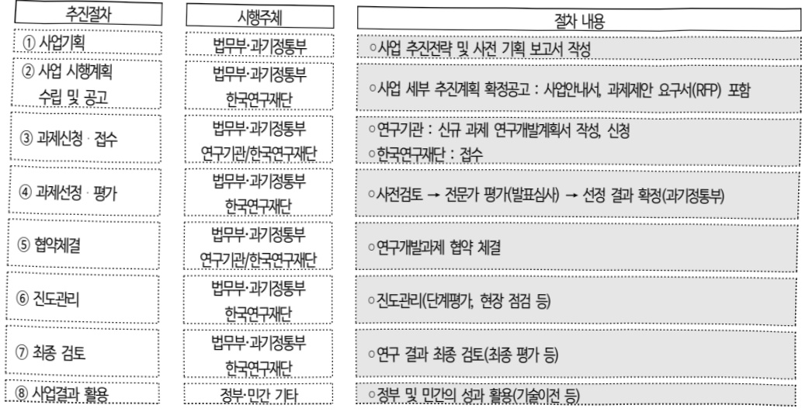
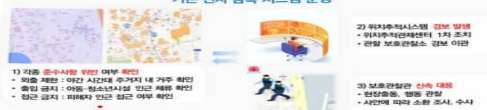
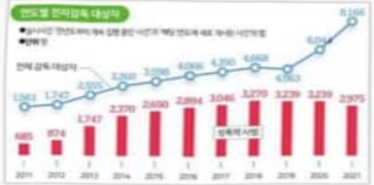
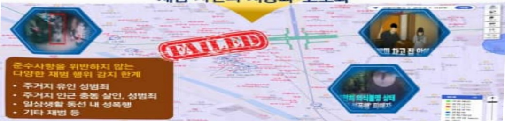
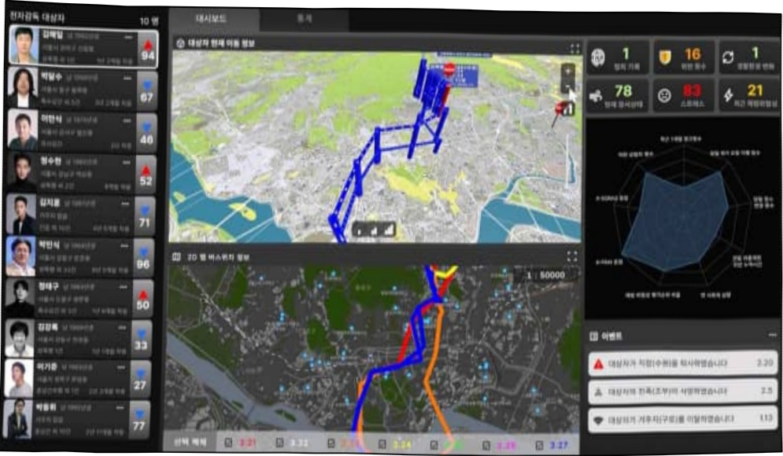

# 재범징후의 선제적 감지 및 대응력 강화기술 연구개발사업(R&D)

**해당 페이지**: PDF 3335 ~ 3351 쪽 해당

**부처**: 법무부
**분야**: 공공질서 및 안전
**회계유형**: 일반회계
**2026 확정예산**: 3000.0 백만원
**전년대비 증감률**: 50.0%
**AI 도메인**: 법률/치안

---

### 가.예산 총괄표

(단위: 백만원, %)

<table border=1 style='margin: auto; word-wrap: break-word;'><tr><td rowspan="2">사업명</td><td rowspan="2">2024년 결산</td><td colspan="2">2025년 예산</td><td colspan="2">2026년</td><td rowspan="2">증감(B-A)</td><td rowspan="2">(B-A)/A</td></tr><tr><td style='text-align: center; word-wrap: break-word;'>본예산(A)</td><td style='text-align: center; word-wrap: break-word;'>추경</td><td style='text-align: center; word-wrap: break-word;'>요구</td><td style='text-align: center; word-wrap: break-word;'>조정(B)</td></tr><tr><td style='text-align: center; word-wrap: break-word;'>재범징후의 선제적 감지 및 대응력 강화(R&amp;D)</td><td style='text-align: center; word-wrap: break-word;'>877</td><td style='text-align: center; word-wrap: break-word;'>2,000</td><td style='text-align: center; word-wrap: break-word;'>2,000</td><td style='text-align: center; word-wrap: break-word;'>3,000</td><td style='text-align: center; word-wrap: break-word;'>3,000</td><td style='text-align: center; word-wrap: break-word;'>1,000</td><td style='text-align: center; word-wrap: break-word;'>50.0</td></tr></table>

□ 기능별(내역사업별), 목별 예산 내역

(단위:백만원)

<table border=1 style='margin: auto; word-wrap: break-word;'><tr><td rowspan="3"></td><td colspan="5">2024</td><td colspan="7">2025</td><td rowspan="3">2026예산</td></tr><tr><td rowspan="2">예산액(추정)</td><td rowspan="2">예산현액</td><td rowspan="2">집행액[실집행액]</td><td rowspan="2">이월액</td><td rowspan="2">불용액</td><td rowspan="2">본예산</td><td rowspan="2">예산현액</td><td rowspan="2">집행액[실집행액]</td><td colspan="2">전년도아월액제외</td><td rowspan="2">이월액</td><td rowspan="2">불용액</td></tr><tr><td style='text-align: center; word-wrap: break-word;'>예산현액</td><td style='text-align: center; word-wrap: break-word;'>집행액[실집행액]</td></tr><tr><td style='text-align: center; word-wrap: break-word;'>ㅇ기능별 분류(합계)</td><td style='text-align: center; word-wrap: break-word;'>877</td><td style='text-align: center; word-wrap: break-word;'>877</td><td style='text-align: center; word-wrap: break-word;'>877</td><td style='text-align: center; word-wrap: break-word;'>-</td><td style='text-align: center; word-wrap: break-word;'>-</td><td style='text-align: center; word-wrap: break-word;'>2,000</td><td style='text-align: center; word-wrap: break-word;'>2,000</td><td style='text-align: center; word-wrap: break-word;'>2,000</td><td style='text-align: center; word-wrap: break-word;'>2,000</td><td style='text-align: center; word-wrap: break-word;'>2,000</td><td style='text-align: center; word-wrap: break-word;'>-</td><td style='text-align: center; word-wrap: break-word;'>-</td><td style='text-align: center; word-wrap: break-word;'>3,000</td></tr><tr><td style='text-align: center; word-wrap: break-word;'>-강력범죄 재벌예측대응 신기술 개발</td><td style='text-align: center; word-wrap: break-word;'>745</td><td style='text-align: center; word-wrap: break-word;'>745</td><td style='text-align: center; word-wrap: break-word;'>745</td><td style='text-align: center; word-wrap: break-word;'>-</td><td style='text-align: center; word-wrap: break-word;'>-</td><td style='text-align: center; word-wrap: break-word;'>1,600</td><td style='text-align: center; word-wrap: break-word;'>1,600</td><td style='text-align: center; word-wrap: break-word;'>1,600</td><td style='text-align: center; word-wrap: break-word;'>1,600</td><td style='text-align: center; word-wrap: break-word;'>1,600</td><td style='text-align: center; word-wrap: break-word;'>-</td><td style='text-align: center; word-wrap: break-word;'>-</td><td style='text-align: center; word-wrap: break-word;'>2,600</td></tr><tr><td style='text-align: center; word-wrap: break-word;'>-AI 기반 전자감독통합시스템 개발</td><td style='text-align: center; word-wrap: break-word;'>132</td><td style='text-align: center; word-wrap: break-word;'>132</td><td style='text-align: center; word-wrap: break-word;'>132</td><td style='text-align: center; word-wrap: break-word;'>-</td><td style='text-align: center; word-wrap: break-word;'>-</td><td style='text-align: center; word-wrap: break-word;'>400</td><td style='text-align: center; word-wrap: break-word;'>400</td><td style='text-align: center; word-wrap: break-word;'>400</td><td style='text-align: center; word-wrap: break-word;'>400</td><td style='text-align: center; word-wrap: break-word;'>400</td><td style='text-align: center; word-wrap: break-word;'>-</td><td style='text-align: center; word-wrap: break-word;'>-</td><td style='text-align: center; word-wrap: break-word;'>400</td></tr><tr><td style='text-align: center; word-wrap: break-word;'>ㅇ비목별 분류(합계)</td><td style='text-align: center; word-wrap: break-word;'>877</td><td style='text-align: center; word-wrap: break-word;'>877</td><td style='text-align: center; word-wrap: break-word;'>877</td><td style='text-align: center; word-wrap: break-word;'>-</td><td style='text-align: center; word-wrap: break-word;'>-</td><td style='text-align: center; word-wrap: break-word;'>2,000</td><td style='text-align: center; word-wrap: break-word;'>2,000</td><td style='text-align: center; word-wrap: break-word;'>2,000</td><td style='text-align: center; word-wrap: break-word;'>2,000</td><td style='text-align: center; word-wrap: break-word;'>2,000</td><td style='text-align: center; word-wrap: break-word;'>-</td><td style='text-align: center; word-wrap: break-word;'>-</td><td style='text-align: center; word-wrap: break-word;'>3,000</td></tr><tr><td style='text-align: center; word-wrap: break-word;'>·연구개발활동비등(360-05)</td><td style='text-align: center; word-wrap: break-word;'>877</td><td style='text-align: center; word-wrap: break-word;'>877</td><td style='text-align: center; word-wrap: break-word;'>877</td><td style='text-align: center; word-wrap: break-word;'>-</td><td style='text-align: center; word-wrap: break-word;'>-</td><td style='text-align: center; word-wrap: break-word;'>2,000</td><td style='text-align: center; word-wrap: break-word;'>2,000</td><td style='text-align: center; word-wrap: break-word;'>2,000</td><td style='text-align: center; word-wrap: break-word;'>2,000</td><td style='text-align: center; word-wrap: break-word;'>2,000</td><td style='text-align: center; word-wrap: break-word;'>-</td><td style='text-align: center; word-wrap: break-word;'>-</td><td style='text-align: center; word-wrap: break-word;'>3,000</td></tr><tr><td style='text-align: center; word-wrap: break-word;'>ㅇ기능·비목별 분류(합계)</td><td style='text-align: center; word-wrap: break-word;'>877</td><td style='text-align: center; word-wrap: break-word;'>877</td><td style='text-align: center; word-wrap: break-word;'>877</td><td style='text-align: center; word-wrap: break-word;'>-</td><td style='text-align: center; word-wrap: break-word;'>-</td><td style='text-align: center; word-wrap: break-word;'>2,000</td><td style='text-align: center; word-wrap: break-word;'>2,000</td><td style='text-align: center; word-wrap: break-word;'>2,000</td><td style='text-align: center; word-wrap: break-word;'>2,000</td><td style='text-align: center; word-wrap: break-word;'>2,000</td><td style='text-align: center; word-wrap: break-word;'>-</td><td style='text-align: center; word-wrap: break-word;'>-</td><td style='text-align: center; word-wrap: break-word;'>3,000</td></tr><tr><td style='text-align: center; word-wrap: break-word;'>-강력범죄 재벌예측대응 신기술 개발</td><td style='text-align: center; word-wrap: break-word;'>745</td><td style='text-align: center; word-wrap: break-word;'>745</td><td style='text-align: center; word-wrap: break-word;'>745</td><td style='text-align: center; word-wrap: break-word;'>-</td><td style='text-align: center; word-wrap: break-word;'>-</td><td style='text-align: center; word-wrap: break-word;'>1,600</td><td style='text-align: center; word-wrap: break-word;'>1,600</td><td style='text-align: center; word-wrap: break-word;'>1,600</td><td style='text-align: center; word-wrap: break-word;'>1,600</td><td style='text-align: center; word-wrap: break-word;'>1,600</td><td style='text-align: center; word-wrap: break-word;'>-</td><td style='text-align: center; word-wrap: break-word;'>-</td><td style='text-align: center; word-wrap: break-word;'>2,600</td></tr><tr><td style='text-align: center; word-wrap: break-word;'>·연구개발활동비등(360-05)</td><td style='text-align: center; word-wrap: break-word;'>745</td><td style='text-align: center; word-wrap: break-word;'>745</td><td style='text-align: center; word-wrap: break-word;'>745</td><td style='text-align: center; word-wrap: break-word;'>-</td><td style='text-align: center; word-wrap: break-word;'>-</td><td style='text-align: center; word-wrap: break-word;'>1,600</td><td style='text-align: center; word-wrap: break-word;'>1,600</td><td style='text-align: center; word-wrap: break-word;'>1,600</td><td style='text-align: center; word-wrap: break-word;'>1,600</td><td style='text-align: center; word-wrap: break-word;'>1,600</td><td style='text-align: center; word-wrap: break-word;'>-</td><td style='text-align: center; word-wrap: break-word;'>-</td><td style='text-align: center; word-wrap: break-word;'>2,600</td></tr><tr><td style='text-align: center; word-wrap: break-word;'>-AI 기반 전자감독통합시스템 개발</td><td style='text-align: center; word-wrap: break-word;'>132</td><td style='text-align: center; word-wrap: break-word;'>132</td><td style='text-align: center; word-wrap: break-word;'>132</td><td style='text-align: center; word-wrap: break-word;'>-</td><td style='text-align: center; word-wrap: break-word;'>-</td><td style='text-align: center; word-wrap: break-word;'>400</td><td style='text-align: center; word-wrap: break-word;'>400</td><td style='text-align: center; word-wrap: break-word;'>400</td><td style='text-align: center; word-wrap: break-word;'>400</td><td style='text-align: center; word-wrap: break-word;'>400</td><td style='text-align: center; word-wrap: break-word;'>-</td><td style='text-align: center; word-wrap: break-word;'>-</td><td style='text-align: center; word-wrap: break-word;'>400</td></tr><tr><td style='text-align: center; word-wrap: break-word;'>·연구개발활동비등(360-05)</td><td style='text-align: center; word-wrap: break-word;'>132</td><td style='text-align: center; word-wrap: break-word;'>132</td><td style='text-align: center; word-wrap: break-word;'>132</td><td style='text-align: center; word-wrap: break-word;'>-</td><td style='text-align: center; word-wrap: break-word;'>-</td><td style='text-align: center; word-wrap: break-word;'>400</td><td style='text-align: center; word-wrap: break-word;'>400</td><td style='text-align: center; word-wrap: break-word;'>400</td><td style='text-align: center; word-wrap: break-word;'>400</td><td style='text-align: center; word-wrap: break-word;'>400</td><td style='text-align: center; word-wrap: break-word;'>-</td><td style='text-align: center; word-wrap: break-word;'>-</td><td style='text-align: center; word-wrap: break-word;'>400</td></tr></table>

---

### 나. 사업설명자료

## 1 ) 사업목적·내용

☐ 재범징후의 선제적 감지 및 대응력 강화사업(R&D)

- (목적) 전자감독 대상자의 재범위험으로부터 국민의 불안을 해소하고 사회 안전을 강화하기 위해, AI를 활용한 재범 예측 시스템 개발

- (내용) 2개 내역사업으로 구성, 4년간(2024~2027년) 개발 계획

(강력범죄 재범 예측·대응 신기술 개발) 전자감독 대상자에 대한 각종 데이터의

융합·분석을 통해 대상자의 재범 위험도를 실시간 예측하여 보호관찰관의 신속한

대응을 돕는 AI 기술을 개발

(AI 기반 전자감독 통합시스템 개발) 재범 예측 AI의 정확성을 높일 수 있도록 여러 전자감독 시스템에 분산되어있는 전자감독 대상자의 데이터를 체계적으로 연계·관리하여 AI의 학습을 돕는 통합시스템(DB)을 구축

## 2 ) 사업개요

## ☐ 사업근거 및 추진경위

① 법령상 근거 및 조항 적시

- 「과학기술기본법」제11조(국가연구개발사업의 추진) ① 중앙행정기관의 장은 기본계획에 따라 맡은 분야의 국가연구개발사업과 그 시책을 세워 추진하여야 한다.

- 「과학기술기본법」제16조의6(과학기술활용 사회문제해결) ① 정부는 과학기술을 활용한 삶의 질 향상, 경제적·사회적 현안 및 범지구적 문제 등의 해결을 위하여 필요한 시책을 세우고 추진하여야 한다. ② 제1항에 따른 시책을 세우고 추진하는 데 필요한 사항은 대통령령으로 정한다.

「전자장치 부착 등에 관한 법률」제3조의 2(연구개발사업의 추진) ① 법무부장관은 제1조의 목적을 달성하기 위하여 필요한 연구·실험·조사·기술개발(이하“연구개발사업”이라 한다) 및 전문인력 양성 등 소관 분야의 과학기술진흥을 위한 시책을 마련하여 시행할 수 있다. ② 제1항에 따른 연구개발사업은 단계별·분야별 연구개발과제를 선정하여「국가연구개발혁신법」제2조제3호의 기관 또는 단체와 협약을 맺어 실시하게 할 수 있다. ③ 법무부장관은 제2항에 따라 협약을 맺은 기관 또는 단체에 연구개발사업을 실시하는 데 필요한 자금의 전부 또는 일부를 출연하거나 보조할 수 있다. ④ 제3항에 따른 출연금 및 보조금의 지급·사용 및 관리 등에 필요한 사항은 대통령령으로 정한다.

---

② 추진 경위

- 범죄로부터 안전한 사회를 구현하고, 세계 최고 수준의 전자감독제 운영을 위해 R&D 주무 부처인 과기정통부와의 협업을 통해 AI 등 혁신 ICT 기술을 활용한 지능형 전자감독 시스템 구축 추진

(새정부 공약) B-1-3-2 범죄로부터 모두가 안전한 사회를 만들겠습니다.

(국정과제) 정행-12 국민안전을 위한 법질서 확립 및 민생치안 역량 강화

(법무부 주요 핵심 추진과제) 범죄로부터 안전한 사회를 위한 법·제도 개선(재범 방지 체계구축)

## - 주요 추진 내역

· 범죄예방정책 분야 국가R&D사업 추진기획 및 중장기 추진전략 수립('22. 4. ~ 9.)

과기정통부(거대공연구정책과)와 1:1 매칭 사업추진('22. 11. ~)

· 사업 공동 기획 및 예산 확보('22. 11. ~ '23. 12.)

· '24년 신규 연구과제 공모 및 선정평가('24. 2. ~ 4.)

· '24년 신규 연구과제 협약체결 및 1차년도 연구 개시('24. 4. ~ 12.)

· 1차년도 연구결과 보고서 제출('24. 12.)

## □ 주요내용

① 사업규모

- 사업기간 : 2024년~2027년 기획

- 최근 5년 간 투입된 사업비(예산액기준, 추경편성한 연도에는 추경포함)

<table border=1 style='margin: auto; word-wrap: break-word;'><tr><td style='text-align: center; word-wrap: break-word;'>연도</td><td style='text-align: center; word-wrap: break-word;'>2022</td><td style='text-align: center; word-wrap: break-word;'>2023</td><td style='text-align: center; word-wrap: break-word;'>2024</td><td style='text-align: center; word-wrap: break-word;'>2025</td><td style='text-align: center; word-wrap: break-word;'>2026</td></tr><tr><td style='text-align: center; word-wrap: break-word;'>사업비</td><td style='text-align: center; word-wrap: break-word;'>-</td><td style='text-align: center; word-wrap: break-word;'>-</td><td style='text-align: center; word-wrap: break-word;'>877</td><td style='text-align: center; word-wrap: break-word;'>2,000</td><td style='text-align: center; word-wrap: break-word;'>3,000</td></tr></table>

② 사업추진체계

- 사업시행방법 : 출연

- 사업시행주체 : (주관) 법무부·과기정통부 공동 추진 → (관리) 한국연구재단 → (참여) 한국전자통신연구원, 한국형사·법무정책연구원 등 4개 기관

- 사업 수혜자 : 국민

- 보조, 융자, 출연, 출자 등의 경우 보조 · 융자 등 지원 비율 및 법적근거

<table border=1 style='margin: auto; word-wrap: break-word;'><tr><td style='text-align: center; word-wrap: break-word;'>내역사업명</td><td style='text-align: center; word-wrap: break-word;'>구분</td><td style='text-align: center; word-wrap: break-word;'>피보조·피출연 등 기관명</td><td style='text-align: center; word-wrap: break-word;'>지원 금액 (2026예산안)</td><td style='text-align: center; word-wrap: break-word;'>지원 비율(%)</td><td style='text-align: center; word-wrap: break-word;'>보조율 법적근거 (해당 조항)</td></tr><tr><td style='text-align: center; word-wrap: break-word;'>강력범죄 재벌 예측/대응 신기술 개발</td><td style='text-align: center; word-wrap: break-word;'>출연</td><td style='text-align: center; word-wrap: break-word;'>-</td><td style='text-align: center; word-wrap: break-word;'>2,600</td><td style='text-align: center; word-wrap: break-word;'>100</td><td rowspan="2">「국가재정법」 제12조(출연금), 「전자장치 부착 등에 관한 법률」 제3조의2(연구개발사업의 추진)</td></tr><tr><td style='text-align: center; word-wrap: break-word;'>AI 기반 전자감독 통합시스템 개발</td><td style='text-align: center; word-wrap: break-word;'>출연</td><td style='text-align: center; word-wrap: break-word;'>-</td><td style='text-align: center; word-wrap: break-word;'>400</td><td style='text-align: center; word-wrap: break-word;'>100</td></tr></table>

---

3) 2026년도 예산 산출 근거

① 강력범죄 재범 예측 대응 신기술 개발

:(2025)1,600→(2026)2,600백만원,+1,000백만원 증액

- (요구) 재범 예측 AI의 안정적인 성능 구현을 위한 3차 년도 핵심 과업 개발비 2,600백만원 편성

- (산출) 1개 과제(계속) × 2,600백만 × 12/12월 = 2,600백만원

02025년도 예산 및 2026년도 예산 산출 세부내역 비교

<table border=1 style='margin: auto; word-wrap: break-word;'><tr><td colspan="2">2025년 본예산</td><td colspan="2">2026년 예산</td></tr><tr><td style='text-align: center; word-wrap: break-word;'>예산</td><td style='text-align: center; word-wrap: break-word;'>산출내역</td><td style='text-align: center; word-wrap: break-word;'>예산</td><td style='text-align: center; word-wrap: break-word;'>산출내역</td></tr><tr><td style='text-align: center; word-wrap: break-word;'>1,600</td><td style='text-align: center; word-wrap: break-word;'>○ 연구개발활동비등(360-05): 1,600백만원 가. ‘개인 일상모델’ 기반 일탈탐지 AI 전자감독 기술 개발 (1,600백만원) - 1,600백만원 = 1과제×1,600백만원×12/12개월</td><td style='text-align: center; word-wrap: break-word;'>2,600</td><td style='text-align: center; word-wrap: break-word;'>○ 연구개발활동비등(360-05): 2,600백만원 가. ‘개인 일상모델’ 기반 일탈탐지 AI 전자감독 기술 개발 (2,600백만원) - 2,600백만원 = 1과제×2,600백만원×12/12개월</td></tr></table>

② AI 기반 전자감독 통합시스템 개발

:(2025)400→(2026)400백만원,전년동

- (요구) 전자감독 데이터 통합관리 시스템 성능 검증 등을 위해 3차 년도 핵심 과업 개발비 400백만원 편성

- (산출) 1개 과제(계속) × 400백만 × 12/12월 = 400백만원

02025년도 예산 및 2026년도 예산 산출 세부내역 비교

<table border=1 style='margin: auto; word-wrap: break-word;'><tr><td colspan="2">2025년 본예산</td><td colspan="2">2026년 예산</td></tr><tr><td style='text-align: center; word-wrap: break-word;'>예산</td><td style='text-align: center; word-wrap: break-word;'>산출내역</td><td style='text-align: center; word-wrap: break-word;'>예산</td><td style='text-align: center; word-wrap: break-word;'>산출내역</td></tr><tr><td style='text-align: center; word-wrap: break-word;'>400</td><td style='text-align: center; word-wrap: break-word;'>○ 연구개발활동비등(360-05): 400백만원 가. 전자감독 데이터 자동정형화 AI 기술 개발 및 통합 DB 구축 (400백만원) - 400백만원 = 1과제×400백만원×12/12개월</td><td style='text-align: center; word-wrap: break-word;'>400</td><td style='text-align: center; word-wrap: break-word;'>○ 연구개발활동비등(360-05): 400백만원 가. 전자감독 데이터 자동정형화 AI 기술 개발 및 통합 DB 구축 (400백만원) - 400백만원 = 1과제×400백만원×12/12개월</td></tr></table>

---

## 4 ) 사업효과

☐ 사업영향, 산출물 성과지표 등

① 2022~2026년도 성과계획서 상 성과지표 및 최근 5년간 성과 달성도

<table border=1 style='margin: auto; word-wrap: break-word;'><tr><td style='text-align: center; word-wrap: break-word;'>성과지표</td><td style='text-align: center; word-wrap: break-word;'>구분</td><td style='text-align: center; word-wrap: break-word;'>2022</td><td style='text-align: center; word-wrap: break-word;'>2023</td><td style='text-align: center; word-wrap: break-word;'>2024</td><td style='text-align: center; word-wrap: break-word;'>2025</td><td style='text-align: center; word-wrap: break-word;'>2026</td><td style='text-align: center; word-wrap: break-word;'>2026 목표치산출근거</td><td style='text-align: center; word-wrap: break-word;'>측정산식(또는 측정방법)</td><td style='text-align: center; word-wrap: break-word;'>자료수집방법(또는 자료출처)</td></tr><tr><td rowspan="3">전자감독대상자 수(명)</td><td style='text-align: center; word-wrap: break-word;'>목표</td><td style='text-align: center; word-wrap: break-word;'>-</td><td style='text-align: center; word-wrap: break-word;'>-</td><td style='text-align: center; word-wrap: break-word;'>신규</td><td style='text-align: center; word-wrap: break-word;'>10</td><td style='text-align: center; word-wrap: break-word;'>50</td><td rowspan="3">·재범위협도 분석을 위해 3년 아내 재범자 기준 고위험군 선정·재범시나리오에 근거(유형범)하여 연차별 목표치 설정</td><td rowspan="3">·측정산식: 고위험군 대상자 수의 합·측정방법: 평가위원 적정성 검토</td><td rowspan="3">연차 보고서, 제3자 전문가평가</td></tr><tr><td style='text-align: center; word-wrap: break-word;'>실적</td><td style='text-align: center; word-wrap: break-word;'>-</td><td style='text-align: center; word-wrap: break-word;'>-</td><td style='text-align: center; word-wrap: break-word;'>-</td><td style='text-align: center; word-wrap: break-word;'>-</td><td style='text-align: center; word-wrap: break-word;'>-</td></tr><tr><td style='text-align: center; word-wrap: break-word;'>달성도</td><td style='text-align: center; word-wrap: break-word;'>-</td><td style='text-align: center; word-wrap: break-word;'>-</td><td style='text-align: center; word-wrap: break-word;'>-</td><td style='text-align: center; word-wrap: break-word;'>-</td><td style='text-align: center; word-wrap: break-word;'>-</td></tr><tr><td rowspan="3">일탈탐지 및 재범위협 인식률(%)</td><td style='text-align: center; word-wrap: break-word;'>목표</td><td style='text-align: center; word-wrap: break-word;'>-</td><td style='text-align: center; word-wrap: break-word;'>-</td><td style='text-align: center; word-wrap: break-word;'>신규</td><td style='text-align: center; word-wrap: break-word;'>80</td><td style='text-align: center; word-wrap: break-word;'>85</td><td rowspan="3">·전자감독 데이터의 특수성 및 실증 DB를 고려하여 성능 목표 순차 상향※ 교정 재범 예측지표의 재범 위험성 예측력: 75.4%</td><td rowspan="3">·측정산식: 성능평가 지표(F1-score) 활용·측정방법: 자체 DB(24년)·실증 DB(25년) 활용하여 시험</td><td rowspan="3">연차 보고서 시험 결과서</td></tr><tr><td style='text-align: center; word-wrap: break-word;'>실적</td><td style='text-align: center; word-wrap: break-word;'>-</td><td style='text-align: center; word-wrap: break-word;'>-</td><td style='text-align: center; word-wrap: break-word;'>-</td><td style='text-align: center; word-wrap: break-word;'>-</td><td style='text-align: center; word-wrap: break-word;'>-</td></tr><tr><td style='text-align: center; word-wrap: break-word;'>달성도</td><td style='text-align: center; word-wrap: break-word;'>-</td><td style='text-align: center; word-wrap: break-word;'>-</td><td style='text-align: center; word-wrap: break-word;'>-</td><td style='text-align: center; word-wrap: break-word;'>-</td><td style='text-align: center; word-wrap: break-word;'>-</td></tr><tr><td rowspan="3">전자감독 정형화 DB 규모(%)</td><td style='text-align: center; word-wrap: break-word;'>목표</td><td style='text-align: center; word-wrap: break-word;'>-</td><td style='text-align: center; word-wrap: break-word;'>-</td><td style='text-align: center; word-wrap: break-word;'>신규</td><td style='text-align: center; word-wrap: break-word;'>50</td><td style='text-align: center; word-wrap: break-word;'>100</td><td rowspan="3">·전체 감독대상자 수를 기준으로, AI 모델 개발단계에 따라서 정형화 DB 구축 목표 순차 설정·26년이 정형화 최종 연도이므로 100%로 목표치 설정</td><td rowspan="3">·측정산식: 정형화 목표 건수 대 완료 건수의 비율</td><td rowspan="3">연차 보고서, 수집 DB</td></tr><tr><td style='text-align: center; word-wrap: break-word;'>실적</td><td style='text-align: center; word-wrap: break-word;'>-</td><td style='text-align: center; word-wrap: break-word;'>-</td><td style='text-align: center; word-wrap: break-word;'>-</td><td style='text-align: center; word-wrap: break-word;'>-</td><td style='text-align: center; word-wrap: break-word;'>-</td></tr><tr><td style='text-align: center; word-wrap: break-word;'>달성도</td><td style='text-align: center; word-wrap: break-word;'>-</td><td style='text-align: center; word-wrap: break-word;'>-</td><td style='text-align: center; word-wrap: break-word;'>-</td><td style='text-align: center; word-wrap: break-word;'>-</td><td style='text-align: center; word-wrap: break-word;'>-</td></tr><tr><td rowspan="3">현장 만족도(점)</td><td style='text-align: center; word-wrap: break-word;'>목표</td><td style='text-align: center; word-wrap: break-word;'>-</td><td style='text-align: center; word-wrap: break-word;'>-</td><td style='text-align: center; word-wrap: break-word;'>신규</td><td style='text-align: center; word-wrap: break-word;'>-</td><td style='text-align: center; word-wrap: break-word;'>85</td><td rowspan="3">·실증 단계/(26년)에서 실체 서비스 수요자인 실무자 대상으로 만족도 평가·실증 적용 시기 및 활용성을 고려, 연차범 목표 설정</td><td rowspan="3">·측정산식: =∑(응답자의 항목별 100점 만점 환산값/응답자수)/조사항목수·측정 방법: 실무자 대상 만족도 조사 실시(20명 이상)</td><td rowspan="3">만족도 조사 결과보고서</td></tr><tr><td style='text-align: center; word-wrap: break-word;'>실적</td><td style='text-align: center; word-wrap: break-word;'>-</td><td style='text-align: center; word-wrap: break-word;'>-</td><td style='text-align: center; word-wrap: break-word;'>-</td><td style='text-align: center; word-wrap: break-word;'>-</td><td style='text-align: center; word-wrap: break-word;'>-</td></tr><tr><td style='text-align: center; word-wrap: break-word;'>달성도</td><td style='text-align: center; word-wrap: break-word;'>-</td><td style='text-align: center; word-wrap: break-word;'>-</td><td style='text-align: center; word-wrap: break-word;'>-</td><td style='text-align: center; word-wrap: break-word;'>-</td><td style='text-align: center; word-wrap: break-word;'>-</td></tr><tr><td rowspan="3">현장 적용도(%)</td><td style='text-align: center; word-wrap: break-word;'>목표</td><td style='text-align: center; word-wrap: break-word;'>-</td><td style='text-align: center; word-wrap: break-word;'>-</td><td style='text-align: center; word-wrap: break-word;'>신규</td><td style='text-align: center; word-wrap: break-word;'>-</td><td style='text-align: center; word-wrap: break-word;'>80</td><td rowspan="3">·기존의 시스템(전자감독)과 연동 및 현장 적용 점검·실 환경 적용 수준을 고려하여, 연차범 목표 설정</td><td rowspan="3">·측정산식: =∑(U-Guard 시스템 적용 기술 건수)/기술 개발 건수)*100·측정방법: U-Guard 시스템과 연동하여 실체 적용되는 기술 수준 측정</td><td rowspan="3">연차 보고서, 시험 결과서</td></tr><tr><td style='text-align: center; word-wrap: break-word;'>실적</td><td style='text-align: center; word-wrap: break-word;'>-</td><td style='text-align: center; word-wrap: break-word;'>-</td><td style='text-align: center; word-wrap: break-word;'>-</td><td style='text-align: center; word-wrap: break-word;'>-</td><td style='text-align: center; word-wrap: break-word;'>-</td></tr><tr><td style='text-align: center; word-wrap: break-word;'>달성도</td><td style='text-align: center; word-wrap: break-word;'>-</td><td style='text-align: center; word-wrap: break-word;'>-</td><td style='text-align: center; word-wrap: break-word;'>-</td><td style='text-align: center; word-wrap: break-word;'>-</td><td style='text-align: center; word-wrap: break-word;'>-</td></tr></table>

---

② 성과지표 이외의 연도별 사업추진 경과 및 실적

<table border=1 style='margin: auto; word-wrap: break-word;'><tr><td style='text-align: center; word-wrap: break-word;'>2022</td><td style='text-align: center; word-wrap: break-word;'>해당없음</td></tr><tr><td style='text-align: center; word-wrap: break-word;'>2023</td><td style='text-align: center; word-wrap: break-word;'>해당없음</td></tr><tr><td style='text-align: center; word-wrap: break-word;'>2024</td><td style='text-align: center; word-wrap: break-word;'>· &#x27;24년 신규 연구과제 공모 및 선정평가(&#x27;24. 2. ~ 4.) · &#x27;24년 신규 연구과제 협약 체결 및 연구 개시(&#x27;24. 4.~) · 1차년도 연구결과 보고서 제출(&#x27;24. 12.)</td></tr><tr><td style='text-align: center; word-wrap: break-word;'>2025</td><td style='text-align: center; word-wrap: break-word;'>· 2차년도 연구결과 중간보고(&#x27;25. 6.)</td></tr></table>

③향후(2026년도 이후)기대효과

<table border=1 style='margin: auto; word-wrap: break-word;'><tr><td style='text-align: center; word-wrap: break-word;'>☐ 전자감독지능화가 전면적으로 적용되는 2029년 이후부터, 30%의 재범감소를 통해 연간 545억원의 사회적 비용 저감효과 기대</td></tr><tr><td style='text-align: center; word-wrap: break-word;'>○ 2019년 전자감독대상자의 특정범죄 재범건수는 90건(성폭력 80건, 유괴 1건, 살인 3건, 강도 7건)으로 총 1,818억원의 사회적 비용 발생 추정</td></tr><tr><td style='text-align: center; word-wrap: break-word;'>* 특정범죄별 사회적 비용은 성폭력(5.7억원), 미성년자 유괴(848.6억원), 살인(170억원), 강도(0.5억원)으로, 범죄별 사회적 비용을 실제 발생한 재범건수와 곱하여 총계 산출</td></tr><tr><td style='text-align: center; word-wrap: break-word;'>* 미국 HunchLab(시카고) 범죄예측시스템의 강력범죄(총기, 살인) 감소 효과인 30% 기준</td></tr><tr><td style='text-align: center; word-wrap: break-word;'>○ AI 예측을 통해 재범을 억제하고 인명·재산 피해를 감소시킴으로써 국민이 일상속에서 직접 효과를 체감할 수 있는 사회안전체계 확립</td></tr></table>

5) 타당성조사 및 예비타당성조사 시행여부 및 결과 요지 : 해당 없음

6) 총사업비 대상사업 여부 및 내역 : 해당 없음

7) 사업 집행절차

---

## 8 ) 중기재정계획 상 연도별 투자계획 및 추진경과

(단위: 백만원)

<table border=1 style='margin: auto; word-wrap: break-word;'><tr><td style='text-align: center; word-wrap: break-word;'>$ 중기 $ 재정계획</td><td style='text-align: center; word-wrap: break-word;'>2024</td><td style='text-align: center; word-wrap: break-word;'>2025</td><td style='text-align: center; word-wrap: break-word;'>2026</td><td style='text-align: center; word-wrap: break-word;'>2027</td><td style='text-align: center; word-wrap: break-word;'>2028</td><td style='text-align: center; word-wrap: break-word;'>2029</td></tr><tr><td style='text-align: center; word-wrap: break-word;'>2024~2028</td><td style='text-align: center; word-wrap: break-word;'>877</td><td style='text-align: center; word-wrap: break-word;'>2,000</td><td style='text-align: center; word-wrap: break-word;'>2,000</td><td style='text-align: center; word-wrap: break-word;'>2,000</td><td style='text-align: center; word-wrap: break-word;'>-</td><td style='text-align: center; word-wrap: break-word;'>☑</td></tr><tr><td style='text-align: center; word-wrap: break-word;'>2025~2029</td><td style='text-align: center; word-wrap: break-word;'>☑</td><td style='text-align: center; word-wrap: break-word;'>2,000</td><td style='text-align: center; word-wrap: break-word;'>5,350</td><td style='text-align: center; word-wrap: break-word;'>4,462</td><td style='text-align: center; word-wrap: break-word;'>750</td><td style='text-align: center; word-wrap: break-word;'>750</td></tr></table>

9) 최근 3년간 동 사업에 대한 주요 외부지적사항 및 평가, 문제점 및 대책 : 해당없음

10) 향후 추진방향 및 추진계획

<table border=1 style='margin: auto; word-wrap: break-word;'><tr><td style='text-align: center; word-wrap: break-word;'>2024년</td><td style='text-align: center; word-wrap: break-word;'>2025년</td><td style='text-align: center; word-wrap: break-word;'>2026년</td><td style='text-align: center; word-wrap: break-word;'>2027년</td></tr><tr><td colspan="4">개인 일상모델 기반 일탈탐지 AI 전자감독 기술 개발</td></tr><tr><td style='text-align: center; word-wrap: break-word;'>개인일상기반 공통일탈탐지모델개발</td><td style='text-align: center; word-wrap: break-word;'>개인특화형 일탈탐지모델개발</td><td style='text-align: center; word-wrap: break-word;'>고위험전자감독대상자 실시간재범위험정도분석</td><td style='text-align: center; word-wrap: break-word;'>시스템시범운용및실증</td></tr><tr><td colspan="4">전자감독 데이터 자동정형화 AI 기술개발 및 통합 DB 구축</td></tr><tr><td style='text-align: center; word-wrap: break-word;'>정형화DB생성 시스템 프로토타입개발</td><td style='text-align: center; word-wrap: break-word;'>정형화DB생성 시스템 핵심기술개발</td><td colspan="2">대규모학습데이터구축 전자감독시스템연동</td></tr></table>

11) 해당사업에 대한 각종 사업평가의 결과 : 해당없음

12) 해당사업에 대한 부처 자체평가의 결과 : 해당없음

13) 부처 건의사항 : 해당없음

---

### 다. 최근 4년간 결산내역

## 1 ) 결산표

☐ 부처 결산내역

(단위: 백만원, %)

<table border=1 style='margin: auto; word-wrap: break-word;'><tr><td rowspan="2">遅成</td><td colspan="3">예산액</td><td rowspan="2">전년도 이월액</td><td rowspan="2">이·전용 등</td><td rowspan="2">예비비</td><td rowspan="2">예산 현액(B)</td><td rowspan="2">집행액(C)</td><td rowspan="2">집행률(C/A)</td><td rowspan="2">집행률(C/B)</td><td rowspan="2">다음덴도 이월액</td><td rowspan="2">불용액</td></tr><tr><td style='text-align: center; word-wrap: break-word;'>본예산</td><td style='text-align: center; word-wrap: break-word;'>추경 중감액</td><td style='text-align: center; word-wrap: break-word;'>추경(A)</td></tr><tr><td style='text-align: center; word-wrap: break-word;'>2022</td><td style='text-align: center; word-wrap: break-word;'>-</td><td style='text-align: center; word-wrap: break-word;'>-</td><td style='text-align: center; word-wrap: break-word;'>-</td><td style='text-align: center; word-wrap: break-word;'>-</td><td style='text-align: center; word-wrap: break-word;'>-</td><td style='text-align: center; word-wrap: break-word;'>-</td><td style='text-align: center; word-wrap: break-word;'>-</td><td style='text-align: center; word-wrap: break-word;'>-</td><td style='text-align: center; word-wrap: break-word;'>-</td><td style='text-align: center; word-wrap: break-word;'>-</td><td style='text-align: center; word-wrap: break-word;'>-</td><td style='text-align: center; word-wrap: break-word;'>-</td></tr><tr><td style='text-align: center; word-wrap: break-word;'>2023</td><td style='text-align: center; word-wrap: break-word;'>-</td><td style='text-align: center; word-wrap: break-word;'>-</td><td style='text-align: center; word-wrap: break-word;'>-</td><td style='text-align: center; word-wrap: break-word;'>-</td><td style='text-align: center; word-wrap: break-word;'>-</td><td style='text-align: center; word-wrap: break-word;'>-</td><td style='text-align: center; word-wrap: break-word;'>-</td><td style='text-align: center; word-wrap: break-word;'>-</td><td style='text-align: center; word-wrap: break-word;'>-</td><td style='text-align: center; word-wrap: break-word;'>-</td><td style='text-align: center; word-wrap: break-word;'>-</td><td style='text-align: center; word-wrap: break-word;'>-</td></tr><tr><td style='text-align: center; word-wrap: break-word;'>2024</td><td style='text-align: center; word-wrap: break-word;'>877</td><td style='text-align: center; word-wrap: break-word;'>-</td><td style='text-align: center; word-wrap: break-word;'>877</td><td style='text-align: center; word-wrap: break-word;'>-</td><td style='text-align: center; word-wrap: break-word;'>-</td><td style='text-align: center; word-wrap: break-word;'>-</td><td style='text-align: center; word-wrap: break-word;'>877</td><td style='text-align: center; word-wrap: break-word;'>877</td><td style='text-align: center; word-wrap: break-word;'>100.0</td><td style='text-align: center; word-wrap: break-word;'>100.0</td><td style='text-align: center; word-wrap: break-word;'>-</td><td style='text-align: center; word-wrap: break-word;'>-</td></tr><tr><td style='text-align: center; word-wrap: break-word;'>2025</td><td style='text-align: center; word-wrap: break-word;'>2,000</td><td style='text-align: center; word-wrap: break-word;'>-</td><td style='text-align: center; word-wrap: break-word;'>2,000</td><td style='text-align: center; word-wrap: break-word;'>-</td><td style='text-align: center; word-wrap: break-word;'>-</td><td style='text-align: center; word-wrap: break-word;'>-</td><td style='text-align: center; word-wrap: break-word;'>2,000</td><td style='text-align: center; word-wrap: break-word;'>2,000</td><td style='text-align: center; word-wrap: break-word;'>100.0</td><td style='text-align: center; word-wrap: break-word;'>100.0</td><td style='text-align: center; word-wrap: break-word;'>-</td><td style='text-align: center; word-wrap: break-word;'>-</td></tr></table>

□출연·보조사업 등 실집행내역

(단위: 백만원, %)

<table border=1 style='margin: auto; word-wrap: break-word;'><tr><td rowspan="3">구분</td><td colspan="3">부처</td><td colspan="6">사업시행주체(피출연·피보조 기관 등)</td></tr><tr><td colspan="2">예산액</td><td rowspan="2">집행액</td><td rowspan="2">교부액</td><td rowspan="2">전년도 이월액</td><td rowspan="2">교부 현액</td><td rowspan="2">집행액 (B)</td><td rowspan="2">이월액</td><td rowspan="2">불용액</td></tr><tr><td style='text-align: center; word-wrap: break-word;'>본예산</td><td style='text-align: center; word-wrap: break-word;'>추경(A)</td></tr><tr><td style='text-align: center; word-wrap: break-word;'>2022</td><td style='text-align: center; word-wrap: break-word;'>-</td><td style='text-align: center; word-wrap: break-word;'>-</td><td style='text-align: center; word-wrap: break-word;'>-</td><td style='text-align: center; word-wrap: break-word;'>-</td><td style='text-align: center; word-wrap: break-word;'>-</td><td style='text-align: center; word-wrap: break-word;'>-</td><td style='text-align: center; word-wrap: break-word;'>-</td><td style='text-align: center; word-wrap: break-word;'>-</td><td style='text-align: center; word-wrap: break-word;'>-</td></tr><tr><td style='text-align: center; word-wrap: break-word;'>2023</td><td style='text-align: center; word-wrap: break-word;'>-</td><td style='text-align: center; word-wrap: break-word;'>-</td><td style='text-align: center; word-wrap: break-word;'>-</td><td style='text-align: center; word-wrap: break-word;'>-</td><td style='text-align: center; word-wrap: break-word;'>-</td><td style='text-align: center; word-wrap: break-word;'>-</td><td style='text-align: center; word-wrap: break-word;'>-</td><td style='text-align: center; word-wrap: break-word;'>-</td><td style='text-align: center; word-wrap: break-word;'>-</td></tr><tr><td style='text-align: center; word-wrap: break-word;'>2024</td><td style='text-align: center; word-wrap: break-word;'>877</td><td style='text-align: center; word-wrap: break-word;'>-</td><td style='text-align: center; word-wrap: break-word;'>877</td><td style='text-align: center; word-wrap: break-word;'>877</td><td style='text-align: center; word-wrap: break-word;'>-</td><td style='text-align: center; word-wrap: break-word;'>877</td><td style='text-align: center; word-wrap: break-word;'>877</td><td style='text-align: center; word-wrap: break-word;'>-</td><td style='text-align: center; word-wrap: break-word;'>-</td></tr><tr><td style='text-align: center; word-wrap: break-word;'>2025</td><td style='text-align: center; word-wrap: break-word;'>2,000</td><td style='text-align: center; word-wrap: break-word;'>-</td><td style='text-align: center; word-wrap: break-word;'>2,000</td><td style='text-align: center; word-wrap: break-word;'>2,000</td><td style='text-align: center; word-wrap: break-word;'>-</td><td style='text-align: center; word-wrap: break-word;'>2,000</td><td style='text-align: center; word-wrap: break-word;'>2,000</td><td style='text-align: center; word-wrap: break-word;'>-</td><td style='text-align: center; word-wrap: break-word;'>-</td></tr></table>

2) 주요 결산사항 : 해당없음

### 라. 기타 추가자료

(1) 기재부에 제출한 사업 계획서 및 설명자료 첨부(필수 제출)

(2) 부처 내 사업 계획 첨부(필수 제출)

---

## 참고1

### 1. 사업목적 및 필요성

o (목 적) 전자감독 대상자의 재범위협으로부터 국민의 불안을 해소하고 사회안전을 강화하기 위해, AI 등 첨단기술을 활용한 재범 예측 시스템 개발

o (필요성) ① 전자감독 대상자의 지속적인 증가와, ② 재범사건의 고도·지능화로 발생하는 전자감독 사각지대 해소를 위해 기존의 인력 중심 전자감독 관리 체계에서 지능형 전자감독으로의 패러다임 전환 필요

- 전자감독 제도 시행(2008년) 이후 대상 사범의 지속적인 확대*로 사건 규모 및 인적·물적 관리비용이 꾸준히 증가

* 성폭력('08년), 유괴('09년), 살인('10년), 강도('14년), 전자장치 부착 조건부 보석·가석방('20년), 스토킹('24년)

전자감독제도 시행 이후 사건 규모 지속 증가

'16년 4,066명 → '24년 7,430명, +82.7%

고위험군(650여명) 밀착 관리를 위한

인적·물적 비용증가

위치정보 및 준수사항 위반경보를 기반으로 운영되는 기존 시스템은 주거지

인근, 출퇴근길 등 일상 경로에서 발생하는 다양한 재벌상황 감지에 한계

※ 성폭력 재벌의 55.3%가 주거지 1km 이내에서 발생

1) 각종 준수사항 위반 여부 확인

· 외출 제한 : 야간 시간대 주거지 내 거주 확인

· 출입 금지 : 아동·청소년시설 인근 체류 확인

· 척근 금지 : 피해자 인근 접근 여부 확인

재범 사건의 지능화·고도화

준수사항을 위반하지 않는 다양한 재벌 행위 감지 한계

· 주거지 유인 성범죄

· 주거지 인근 충동 실인, 성범죄

· 일상생활 통신 내 성목행

· 기타 재벌 등

---

### 2. 사업내용

o (개요) 전자감독 대상자의 일상 상황, 위치 패턴의 변화와 재범 발생 간의 연관성을 확률적으로 계산하여 재범 위험도를 예측하는 기술개발

<table border=1 style='margin: auto; word-wrap: break-word;'><tr><td style='text-align: center; word-wrap: break-word;'>내역사업</td><td style='text-align: center; word-wrap: break-word;'>내용</td></tr><tr><td style='text-align: center; word-wrap: break-word;'>강력범죄 재범 예측·대응 신기술 개발</td><td style='text-align: center; word-wrap: break-word;'>전자감독 대상자 데이터 $ ^{[1]} $의 융합·분석을 통해 대상자의 재범 위험도를 실시간 예측하여 보호관찰관의 신속한 대응을 돕는 AI 기술을 개발</td></tr><tr><td style='text-align: center; word-wrap: break-word;'>AI 기반 전자감독 통합시스템 개발</td><td style='text-align: center; word-wrap: break-word;'>재범 예측 AI의 정확성을 높일 수 있도록 여러 시스템에 분산되어 있는 전자감독 데이터를 체계적으로 연계·관리하여 AI의 학습을 돕는 통합시스템(DB)을 구축</td></tr></table>

[1] 위치, 범죄정보, 일상변화를 알 수 있는 면담 기록 등 보호관찰관을 통해 수집된 다양한 정보

o (규모) 2024~2027년, 총 283억 기획(법무부·과기정통부 예산 공동 분담)

<table border=1 style='margin: auto; word-wrap: break-word;'><tr><td style='text-align: center; word-wrap: break-word;'>구분</td><td style='text-align: center; word-wrap: break-word;'>2024 예산</td><td style='text-align: center; word-wrap: break-word;'>2025 예산</td><td style='text-align: center; word-wrap: break-word;'>2026 정부안</td></tr><tr><td style='text-align: center; word-wrap: break-word;'>법무부</td><td style='text-align: center; word-wrap: break-word;'>8.77억 원</td><td style='text-align: center; word-wrap: break-word;'>20억 원</td><td style='text-align: center; word-wrap: break-word;'>30억 원</td></tr><tr><td style='text-align: center; word-wrap: break-word;'>과기정통부</td><td style='text-align: center; word-wrap: break-word;'>8억 원</td><td style='text-align: center; word-wrap: break-word;'>20억 원</td><td style='text-align: center; word-wrap: break-word;'>20억 원</td></tr></table>

o (개발 계획) 연구개발4개년 계획에 따라 AI 핵심기술 순차 개발

<table border=1 style='margin: auto; word-wrap: break-word;'><tr><td style='text-align: center; word-wrap: break-word;'>구분</td><td style='text-align: center; word-wrap: break-word;'>연도</td><td style='text-align: center; word-wrap: break-word;'>내용</td></tr><tr><td style='text-align: center; word-wrap: break-word;'>기반 마련</td><td style='text-align: center; word-wrap: break-word;'>2024</td><td style='text-align: center; word-wrap: break-word;'>재범요인 선정, 이상 상황 탐지 초기모델 개발</td></tr><tr><td rowspan="2">고도화</td><td style='text-align: center; word-wrap: break-word;'>2025</td><td style='text-align: center; word-wrap: break-word;'>이상 상황 및 이상 위치 복합추론 기술 개발</td></tr><tr><td style='text-align: center; word-wrap: break-word;'>2026</td><td style='text-align: center; word-wrap: break-word;'>재범 예측 AI 모델 개발, 기존 시스템과 연동</td></tr><tr><td style='text-align: center; word-wrap: break-word;'>검증</td><td style='text-align: center; word-wrap: break-word;'>2027</td><td style='text-align: center; word-wrap: break-word;'>실제 현장에서의 시범 운용, 성능 보완 및 평가</td></tr></table>

o (수행주체) 공동주관 법무부·과기정통부 → 사업관리 한국연구재단 → 연구개발 한국 전자통신연구원(ETRI), 한국형사·법무정책연구원 등 4개 기관

<table border=1 style='margin: auto; word-wrap: break-word;'><tr><td style='text-align: center; word-wrap: break-word;'>연구기관</td><td style='text-align: center; word-wrap: break-word;'>내용</td></tr><tr><td style='text-align: center; word-wrap: break-word;'>한국전자통신연구원(ETRI)</td><td style='text-align: center; word-wrap: break-word;'>연구개발 총괄, 재범 예측 AI 모델 개발</td></tr><tr><td style='text-align: center; word-wrap: break-word;'>한국형사·법무정책연구원</td><td style='text-align: center; word-wrap: break-word;'>전자감독 대상자의 재범요인 선정, 데이터 분석</td></tr><tr><td style='text-align: center; word-wrap: break-word;'>(쥐)엔텔스</td><td style='text-align: center; word-wrap: break-word;'>AI 모델을 기존 전자감독 시스템과 연계·통합</td></tr><tr><td style='text-align: center; word-wrap: break-word;'>(쥐)YM-나을텍</td><td style='text-align: center; word-wrap: break-word;'>AI의 학습을 위한 전자감독 데이터 관리 시스템 개발</td></tr></table>

---

### 3. 활용방안

o (실무 운용 방안) 위치추적시스템과 연동, 재범위협도가 높은 것으로 예측된 대상자에 대해 AI가 실시간 경보 알림 → 보호관찰관 조기 대응(연락, 출동)

<기술 적용 예시>

공장 근로자였던 전자감독 대상자가 평소 집과 공장을 오가는 생활을 반복하다가, 실직 후 며칠간 야간에 유흥가를 거쳐 다세대주택 밀집 지역을 배회함

재범 예측 AI가 대상자의 위치 패턴, 범죄정보, 일상 변화를 알 수 있는 면담 기록 등 각종 정보를 실시간 분석하여 재범 위험성 증가를 알림 → 조기 개입으로 범죄 예방

※ 시스템 운영 화면 개발 예시

---

## 참고2

### 1. 추진 배경

## 필요성

☐ 전자감독 대상자 급증*으로 인력 중심 감시·대응체계의 한계 도달

* 매년 300명 수준 증가(연평균 11.32%), 재범건수도 연평균 4.5% 증가

0 지능·다양화된 재범상황*의 예방 및 국민의 범죄 불안 해소를 위한 획기적 범죄예방 기술 필요

* 성폭력 재범의 55.3%가 주거지 1km 이내에서 발생하는 등 단순 위치정보 수집

만으로는 재범 상황(시도) 감지에 한계

→ 고정밀 분석이 가능한 선제적 예방 중심의 AI 전자감독 시스템으로 전환 추진

## □추진근거

o「과학기술기본법」제16조

과학기술기본법 제16조의6(과학기술을 활용한 사회문제 해결)

## □추진경과

o 과학기술 기반 범죄예방정책 분야 R&D 추진기획(2022.4.)

°범죄예방정책 분야 R&D 중장기 추진전략 수립(2022.9.)

o 과기정통부(거대공공연구정책과)와 공동사업 추진(2022.11.)

○ '재범징후의 선제적 감지 및 대응력 강화사업' 기획추진(법무부·과기정통부 공동, 2022.11.~2023.4.)

2024년 사업예산 1,677백만원(과기정통부 800백만원, 법무부 877백만원) 확정(2023.12.)

o 2024년 신규과제 선정 및 연구개시(2024.4~)

---

### ||. 사업 개요

## 사업 목적

○ AI, 빅데이터 등 첨단과학기술을 활용하여 전자감독 대상자의 재범 시도를 사전에 차단·대응하고 사회안전망을 두텁게 구축

## 사업 규모 및 추진 방식

° (기간) 총 4년(2024.~2027.)

° (규모) 2개 단위과제, 총 283억원 기획(2025년 : 40억원 반영)

<table border=1 style='margin: auto; word-wrap: break-word;'><tr><td colspan="2">구분</td><td rowspan="2">2025년 예산 (백만원)</td></tr><tr><td style='text-align: center; word-wrap: break-word;'>세부</td><td style='text-align: center; word-wrap: break-word;'>내역</td></tr><tr><td rowspan="2">재범징후의 선제적 감지 및 대응력 강화</td><td style='text-align: center; word-wrap: break-word;'>강력범죄 재범 예측/대응 신기술 개발 (RFP : 개인일상모델 기반 일탈탐지 AI 전자감독 기술개발)</td><td style='text-align: center; word-wrap: break-word;'>3,200 (과기부 1,600, 법무부 1,600)</td></tr><tr><td style='text-align: center; word-wrap: break-word;'>AI 기반 전자감독 통합시스템 개발 (RFP : 전자감독 데이터의 과학적 분석을 위한 자동정형화 AI 기술 개발 및 통합 DB 구축)</td><td style='text-align: center; word-wrap: break-word;'>800 (과기부 400, 법무부 400)</td></tr><tr><td colspan="2">합계</td><td style='text-align: center; word-wrap: break-word;'>4,000</td></tr></table>

0 강력범죄 재범 예측/대응 신기술을 개발하고, 전자감독 데이터의 분석과 그에 따른 통합 DB 구축을 위한 2개 연구과제 지원

## □ 사업추진 주체별 주요 역할

o (법무부/과기정통부) 사업 총괄 : 계획 수립, 예산 확보·지원 등

(전문기관/한국연구재단) 사업기획·공고, 연구기관 선정, 협약 및 연구비 지급, 사업 및 성과 관리 등

° (주관 연구기관) 세부 연구내용 중 외부 전문 연구 분야의 공동

연구가 필요한 경우 산·학·연과 공동으로 연구추진

---

### Ⅲ. 사업 세부 추진계획

## 목표 및 비전

◦ 선제적 예방 중심의 예측적 전자감독 시스템 개발(Preemptive Electronic Monitoring) 및 실증을 통한 사회안전망 구축

0 지능형 전자감독으로의 패러다임 전환

## □ 추진전략 및 내용

(재범 예측·대응 신기술) 측위 정보, 개인 특성, 생활상 범죄 유발

요인 변화, 이전 범죄 수법의 특성 등의 융합분석을 통해 개인별

재범위험도를 평가하는 AI 기반 개인 일상모델 개발

o (AI 기반 전자감독 통합시스템) 전자감독 비정형 데이터를 자동

정형화하는 AI 기술을 개발하고, 측위 데이터를 연계하여 개인별

전자감독 데이터로 관리하는 통합 정형 DB를 구축

## 기대효과

o (기술) 수동 감시 한계 극복으로 보호관찰관이 미처 인지하지

못하는 재범칭을 감시 예측 및 판단 근거 확보

(사회) AI 예측을 통해 재벌을 억제하고 인명·재산 피해를 감소시킴으로써 국민이 일상에서 직접 효과를 체감할 수 있는 사회안전 체계 확립

o (경제) 재범 억제 강화로 인한 피해 감소, 전자감독 대상자 확대에 따른 수감 비용 감소 등 사회적 비용 저감효과 기대

※ 기술 적용 전후 전자감독 업무 비교

---

### IV. 2024년 주요 실적

## 법무부 국가 R&D 수행체계 마련

0 전자감독 분야의 첨단과학기술 적용을 위한 법무부-과기정통부 간

협력 프로세스 구축

- 기획 단계부터 숲 이해관계자가 사업 추진 주체로 적극 참여하는

수요자 중심 협업체계 구축

※ 관계부처 협의를 통한 사업 추진 기본계획 수립 및 이행(법무부+과기정통부)

## 범죄예측 분석 플랫폼 개발 추진

재범 방지 전자감독 플랫폼 개발을 위해 2개 신규 과제 선정 및 R&D 추진

- 3개 영역(연구 계획, 역량, 성과 활용) 평가로 2과제 선정(2024.4)

<table border=1 style='margin: auto; word-wrap: break-word;'><tr><td style='text-align: center; word-wrap: break-word;'>과제명</td><td style='text-align: center; word-wrap: break-word;'>주관기관</td><td style='text-align: center; word-wrap: break-word;'>참여기관</td></tr><tr><td style='text-align: center; word-wrap: break-word;'>개인 일상모델 기반 일탈탐지 AI 전자감독 기술개발</td><td style='text-align: center; word-wrap: break-word;'>한국전자통신 연구원</td><td style='text-align: center; word-wrap: break-word;'>한국형사·법무정책 연구원, (주)엔텔스</td></tr><tr><td style='text-align: center; word-wrap: break-word;'>전자감독 데이터의 과학적 분석을 위한 자동정형화 AI 기술 개발 및 통합 DB 구축</td><td style='text-align: center; word-wrap: break-word;'>YM-나을텍</td><td style='text-align: center; word-wrap: break-word;'></td></tr></table>

○ 과제 선정 앞 연구진-수요 부처 간 성과 목표 검토회의 개최

※ 연구진과 수요부처 간 성과목표 협의 · 조정(수요부처 의견 반영) 후 협약체결

0 연구성과의 성공적 도출을 위한 착수보고회 개최

- 연구진-수요 부처 간 향후 연구추진 방식 및 성과 활용계획 논의 후

과제 수행 반영

---

### V. 2025년 추진 계획

## 계속 과제 지원 및 성과 관리 추진

°(계속 과제 지원) 선정 과제 1차 년도(2024년) 개발 종료에 따른 2차 년도(2025년) 연구비 지급

° (성과 관리) 목표 달성과 현장 실증 제고를 위한 연구개발기관-

수요처 간 지속적 소통 강화 및 연구성과 확산

- (소통 강화) 연구개발기관과 수요 부처(법무부) 간 정기회의를

실시하여 연구성과 현장 실증 및 활용 제고

## □ 단계평가 실시

° 2024년 선정 과제 1단계 종료(2024.~2025.)에 따른 평가 실시

- 2025년 연말 실시 예정으로 2개 과제에 대한 2024~2025년 개발 내용 평가

---

<table border=1 style='margin: auto; word-wrap: break-word;'><tr><td style='text-align: center; word-wrap: break-word;'>사 업 명</td></tr><tr><td style='text-align: center; word-wrap: break-word;'>첨단범죄 및 디지털수사(정보화) (1334-501)</td></tr></table>

□ 사업 코드 정보

<table border=1 style='margin: auto; word-wrap: break-word;'><tr><td style='text-align: center; word-wrap: break-word;'>구분</td><td style='text-align: center; word-wrap: break-word;'>회계</td><td style='text-align: center; word-wrap: break-word;'>소관</td><td style='text-align: center; word-wrap: break-word;'>실국(기관)</td><td style='text-align: center; word-wrap: break-word;'>계정</td><td style='text-align: center; word-wrap: break-word;'>분야</td><td style='text-align: center; word-wrap: break-word;'>부문</td></tr><tr><td style='text-align: center; word-wrap: break-word;'>코드</td><td style='text-align: center; word-wrap: break-word;'>11</td><td style='text-align: center; word-wrap: break-word;'>16</td><td style='text-align: center; word-wrap: break-word;'></td><td style='text-align: center; word-wrap: break-word;'></td><td style='text-align: center; word-wrap: break-word;'>020</td><td style='text-align: center; word-wrap: break-word;'>022</td></tr><tr><td style='text-align: center; word-wrap: break-word;'>명칭</td><td style='text-align: center; word-wrap: break-word;'>일반회계</td><td style='text-align: center; word-wrap: break-word;'>법무부</td><td style='text-align: center; word-wrap: break-word;'></td><td style='text-align: center; word-wrap: break-word;'></td><td style='text-align: center; word-wrap: break-word;'>공공질서 및 안전</td><td style='text-align: center; word-wrap: break-word;'>법무 및 검찰</td></tr></table>

<table border=1 style='margin: auto; word-wrap: break-word;'><tr><td style='text-align: center; word-wrap: break-word;'>구분</td><td style='text-align: center; word-wrap: break-word;'>프로그램</td><td style='text-align: center; word-wrap: break-word;'>단위사업</td><td style='text-align: center; word-wrap: break-word;'>세부사업</td></tr><tr><td style='text-align: center; word-wrap: break-word;'>코드</td><td style='text-align: center; word-wrap: break-word;'>1300</td><td style='text-align: center; word-wrap: break-word;'>1334</td><td style='text-align: center; word-wrap: break-word;'>501</td></tr><tr><td style='text-align: center; word-wrap: break-word;'>명칭</td><td style='text-align: center; word-wrap: break-word;'>검찰활동</td><td style='text-align: center; word-wrap: break-word;'>검찰업무정보화</td><td style='text-align: center; word-wrap: break-word;'>첨단범죄및디지털수사(정보화)</td></tr></table>

□ 사업 성격 (공통요구자료 Ⅱ-1 작성유의사항 4. 참조, 해당하는 사항에 “○” 표시)

<table border=1 style='margin: auto; word-wrap: break-word;'><tr><td rowspan="2">신규</td><td rowspan="2">계속</td><td rowspan="2">완료</td><td rowspan="2">예비타당성실시여부</td><td rowspan="2">총사업비관리대상</td><td rowspan="2">총액계상예산사업</td><td style='text-align: center; word-wrap: break-word;'>사업소관 변경정보</td></tr><tr><td style='text-align: center; word-wrap: break-word;'>2025예산 시 소관</td></tr><tr><td style='text-align: center; word-wrap: break-word;'></td><td style='text-align: center; word-wrap: break-word;'>O</td><td style='text-align: center; word-wrap: break-word;'></td><td style='text-align: center; word-wrap: break-word;'></td><td style='text-align: center; word-wrap: break-word;'></td><td style='text-align: center; word-wrap: break-word;'></td><td style='text-align: center; word-wrap: break-word;'></td></tr></table>

□ 사업 지원 형태 및 지원을 (최소한 한 개는 반드시 선택하시오. 해당사항에 0 표시)

<table border=1 style='margin: auto; word-wrap: break-word;'><tr><td style='text-align: center; word-wrap: break-word;'>직접</td><td style='text-align: center; word-wrap: break-word;'>출자</td><td style='text-align: center; word-wrap: break-word;'>출연</td><td style='text-align: center; word-wrap: break-word;'>보조</td><td style='text-align: center; word-wrap: break-word;'>융자</td><td style='text-align: center; word-wrap: break-word;'>국고보조율(%)</td><td style='text-align: center; word-wrap: break-word;'>융자율(%)</td></tr><tr><td style='text-align: center; word-wrap: break-word;'>0</td><td style='text-align: center; word-wrap: break-word;'></td><td style='text-align: center; word-wrap: break-word;'></td><td style='text-align: center; word-wrap: break-word;'></td><td style='text-align: center; word-wrap: break-word;'></td><td style='text-align: center; word-wrap: break-word;'></td><td style='text-align: center; word-wrap: break-word;'></td></tr></table>

□ 사업 담당자

<table border=1 style='margin: auto; word-wrap: break-word;'><tr><td style='text-align: center; word-wrap: break-word;'>사업명</td><td colspan="5">구분</td></tr><tr><td rowspan="4">첨단범죄및디지털수사(정보화)</td><td rowspan="3">소관부처</td><td style='text-align: center; word-wrap: break-word;'>실·국·과(팀)</td><td style='text-align: center; word-wrap: break-word;'>과 장</td><td style='text-align: center; word-wrap: break-word;'>사무관</td><td style='text-align: center; word-wrap: break-word;'>주무관</td></tr><tr><td style='text-align: center; word-wrap: break-word;'>검찰국</td><td style='text-align: center; word-wrap: break-word;'>김수홍</td><td style='text-align: center; word-wrap: break-word;'>검사 홍석원</td><td style='text-align: center; word-wrap: break-word;'>수사관 백재호</td></tr><tr><td style='text-align: center; word-wrap: break-word;'>검찰과</td><td style='text-align: center; word-wrap: break-word;'>02-2110-4190</td><td style='text-align: center; word-wrap: break-word;'>02-2110-4194</td><td style='text-align: center; word-wrap: break-word;'>02-2110-3686</td></tr><tr><td style='text-align: center; word-wrap: break-word;'>사업시행주체</td><td style='text-align: center; word-wrap: break-word;'>-</td><td style='text-align: center; word-wrap: break-word;'>-</td><td style='text-align: center; word-wrap: break-word;'>-</td><td style='text-align: center; word-wrap: break-word;'>-</td></tr></table>

### 가. 예산 총괄표

(단위: 백만원, %)

<table border=1 style='margin: auto; word-wrap: break-word;'><tr><td rowspan="2">사업명</td><td rowspan="2">2024년 결산</td><td colspan="2">2025년 예산</td><td colspan="2">2026년</td><td rowspan="2">증감(B-A)</td><td rowspan="2">(B-A)/A</td></tr><tr><td style='text-align: center; word-wrap: break-word;'>본예산(A)</td><td style='text-align: center; word-wrap: break-word;'>추경</td><td style='text-align: center; word-wrap: break-word;'>요구</td><td style='text-align: center; word-wrap: break-word;'>조정(B)</td></tr><tr><td style='text-align: center; word-wrap: break-word;'>첨단범죄및디지털 수사(정보화)</td><td style='text-align: center; word-wrap: break-word;'>10,070</td><td style='text-align: center; word-wrap: break-word;'>9,861</td><td style='text-align: center; word-wrap: break-word;'>143</td><td style='text-align: center; word-wrap: break-word;'>12,580</td><td style='text-align: center; word-wrap: break-word;'>12,285</td><td style='text-align: center; word-wrap: break-word;'>2,424</td><td style='text-align: center; word-wrap: break-word;'>24.6</td></tr></table>

---

### 원본 PDF 크롭 이미지

