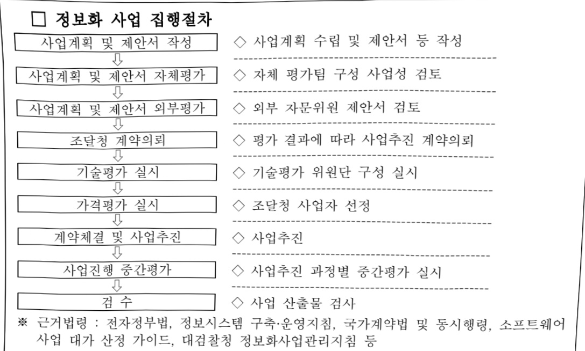

# 첨단범죄및디지털수사(정보화)

**해당 페이지**: PDF 3352 ~ 3365 쪽 해당

**부처**: 법무부
**분야**: 공공질서 및 안전
**회계유형**: 일반회계
**2026 확정예산**: 12285.0 백만원
**전년대비 증감률**: 24.6%
**AI 도메인**: 보안/사이버, 법률/치안

---

<table border=1 style='margin: auto; word-wrap: break-word;'><tr><td style='text-align: center; word-wrap: break-word;'>사 업 명</td></tr><tr><td style='text-align: center; word-wrap: break-word;'>첨단범죄 및 디지털수사(정보화) (1334-501)</td></tr></table>

□ 사업 코드 정보

<table border=1 style='margin: auto; word-wrap: break-word;'><tr><td style='text-align: center; word-wrap: break-word;'>구분</td><td style='text-align: center; word-wrap: break-word;'>회계</td><td style='text-align: center; word-wrap: break-word;'>소관</td><td style='text-align: center; word-wrap: break-word;'>실국(기관)</td><td style='text-align: center; word-wrap: break-word;'>계정</td><td style='text-align: center; word-wrap: break-word;'>분야</td><td style='text-align: center; word-wrap: break-word;'>부문</td></tr><tr><td style='text-align: center; word-wrap: break-word;'>코드</td><td style='text-align: center; word-wrap: break-word;'>11</td><td style='text-align: center; word-wrap: break-word;'>16</td><td style='text-align: center; word-wrap: break-word;'></td><td style='text-align: center; word-wrap: break-word;'></td><td style='text-align: center; word-wrap: break-word;'>020</td><td style='text-align: center; word-wrap: break-word;'>022</td></tr><tr><td style='text-align: center; word-wrap: break-word;'>명칭</td><td style='text-align: center; word-wrap: break-word;'>일반회계</td><td style='text-align: center; word-wrap: break-word;'>법무부</td><td style='text-align: center; word-wrap: break-word;'></td><td style='text-align: center; word-wrap: break-word;'></td><td style='text-align: center; word-wrap: break-word;'>공공질서 및 안전</td><td style='text-align: center; word-wrap: break-word;'>법무 및 검찰</td></tr></table>

<table border=1 style='margin: auto; word-wrap: break-word;'><tr><td style='text-align: center; word-wrap: break-word;'>구분</td><td style='text-align: center; word-wrap: break-word;'>프로그램</td><td style='text-align: center; word-wrap: break-word;'>단위사업</td><td style='text-align: center; word-wrap: break-word;'>세부사업</td></tr><tr><td style='text-align: center; word-wrap: break-word;'>코드</td><td style='text-align: center; word-wrap: break-word;'>1300</td><td style='text-align: center; word-wrap: break-word;'>1334</td><td style='text-align: center; word-wrap: break-word;'>501</td></tr><tr><td style='text-align: center; word-wrap: break-word;'>명칭</td><td style='text-align: center; word-wrap: break-word;'>검찰활동</td><td style='text-align: center; word-wrap: break-word;'>검찰업무정보화</td><td style='text-align: center; word-wrap: break-word;'>첨단범죄및디지털수사(정보화)</td></tr></table>

□ 사업 성격 (공통요구자료 Ⅱ-1 작성유의사항 4. 참조, 해당하는 사항에 “○” 표시)

<table border=1 style='margin: auto; word-wrap: break-word;'><tr><td rowspan="2">신규</td><td rowspan="2">계속</td><td rowspan="2">완료</td><td rowspan="2">예비타당성실시여부</td><td rowspan="2">총사업비관리대상</td><td rowspan="2">총액계상예산사업</td><td style='text-align: center; word-wrap: break-word;'>사업소관 변경정보</td></tr><tr><td style='text-align: center; word-wrap: break-word;'>2025예산 시 소관</td></tr><tr><td style='text-align: center; word-wrap: break-word;'></td><td style='text-align: center; word-wrap: break-word;'>O</td><td style='text-align: center; word-wrap: break-word;'></td><td style='text-align: center; word-wrap: break-word;'></td><td style='text-align: center; word-wrap: break-word;'></td><td style='text-align: center; word-wrap: break-word;'></td><td style='text-align: center; word-wrap: break-word;'></td></tr></table>

□ 사업 지원 형태 및 지원을 (최소한 한 개는 반드시 선택하시오. 해당사항에 0 표시)

<table border=1 style='margin: auto; word-wrap: break-word;'><tr><td style='text-align: center; word-wrap: break-word;'>직접</td><td style='text-align: center; word-wrap: break-word;'>출자</td><td style='text-align: center; word-wrap: break-word;'>출연</td><td style='text-align: center; word-wrap: break-word;'>보조</td><td style='text-align: center; word-wrap: break-word;'>융자</td><td style='text-align: center; word-wrap: break-word;'>국고보조율(%)</td><td style='text-align: center; word-wrap: break-word;'>융자율(%)</td></tr><tr><td style='text-align: center; word-wrap: break-word;'>0</td><td style='text-align: center; word-wrap: break-word;'></td><td style='text-align: center; word-wrap: break-word;'></td><td style='text-align: center; word-wrap: break-word;'></td><td style='text-align: center; word-wrap: break-word;'></td><td style='text-align: center; word-wrap: break-word;'></td><td style='text-align: center; word-wrap: break-word;'></td></tr></table>

□ 사업 담당자

<table border=1 style='margin: auto; word-wrap: break-word;'><tr><td style='text-align: center; word-wrap: break-word;'>사업명</td><td colspan="5">구분</td></tr><tr><td rowspan="4">첨단범죄및디지털수사(정보화)</td><td rowspan="3">소관부처</td><td style='text-align: center; word-wrap: break-word;'>실·국·과(팀)</td><td style='text-align: center; word-wrap: break-word;'>과 장</td><td style='text-align: center; word-wrap: break-word;'>사무관</td><td style='text-align: center; word-wrap: break-word;'>주무관</td></tr><tr><td style='text-align: center; word-wrap: break-word;'>검찰국</td><td style='text-align: center; word-wrap: break-word;'>김수홍</td><td style='text-align: center; word-wrap: break-word;'>검사 홍석원</td><td style='text-align: center; word-wrap: break-word;'>수사관 백재호</td></tr><tr><td style='text-align: center; word-wrap: break-word;'>검찰과</td><td style='text-align: center; word-wrap: break-word;'>02-2110-4190</td><td style='text-align: center; word-wrap: break-word;'>02-2110-4194</td><td style='text-align: center; word-wrap: break-word;'>02-2110-3686</td></tr><tr><td style='text-align: center; word-wrap: break-word;'>사업시행주체</td><td style='text-align: center; word-wrap: break-word;'>-</td><td style='text-align: center; word-wrap: break-word;'>-</td><td style='text-align: center; word-wrap: break-word;'>-</td><td style='text-align: center; word-wrap: break-word;'>-</td></tr></table>

### 가. 예산 총괄표

(단위: 백만원, %)

<table border=1 style='margin: auto; word-wrap: break-word;'><tr><td rowspan="2">사업명</td><td rowspan="2">2024년 결산</td><td colspan="2">2025년 예산</td><td colspan="2">2026년</td><td rowspan="2">증감(B-A)</td><td rowspan="2">(B-A)/A</td></tr><tr><td style='text-align: center; word-wrap: break-word;'>본예산(A)</td><td style='text-align: center; word-wrap: break-word;'>추경</td><td style='text-align: center; word-wrap: break-word;'>요구</td><td style='text-align: center; word-wrap: break-word;'>조정(B)</td></tr><tr><td style='text-align: center; word-wrap: break-word;'>첨단범죄및디지털 수사(정보화)</td><td style='text-align: center; word-wrap: break-word;'>10,070</td><td style='text-align: center; word-wrap: break-word;'>9,861</td><td style='text-align: center; word-wrap: break-word;'>143</td><td style='text-align: center; word-wrap: break-word;'>12,580</td><td style='text-align: center; word-wrap: break-word;'>12,285</td><td style='text-align: center; word-wrap: break-word;'>2,424</td><td style='text-align: center; word-wrap: break-word;'>24.6</td></tr></table>

---

□ 기능별(내역사업별), 목별 예산 내역

(단위:백만원)

<table border=1 style='margin: auto; word-wrap: break-word;'><tr><td rowspan="3"></td><td colspan="5">2024</td><td colspan="7">2025</td><td rowspan="3">2026예산</td></tr><tr><td rowspan="2">예산액(추정)</td><td rowspan="2">예산현액</td><td rowspan="2">집행액[실집행액]</td><td rowspan="2">이월액</td><td rowspan="2">불용액</td><td rowspan="2">본예산</td><td rowspan="2">예산현액</td><td rowspan="2">집행액[실집행액]</td><td colspan="2">전년도이월액제외</td><td rowspan="2">이월액</td><td rowspan="2">불용액</td></tr><tr><td style='text-align: center; word-wrap: break-word;'>예산현액</td><td style='text-align: center; word-wrap: break-word;'>집행액[실집행액]</td></tr><tr><td style='text-align: center; word-wrap: break-word;'>ㅇ기능별분류(함께)</td><td style='text-align: center; word-wrap: break-word;'>10,419</td><td style='text-align: center; word-wrap: break-word;'>10,419</td><td style='text-align: center; word-wrap: break-word;'>10,070</td><td style='text-align: center; word-wrap: break-word;'>-</td><td style='text-align: center; word-wrap: break-word;'>349</td><td style='text-align: center; word-wrap: break-word;'>9,861</td><td style='text-align: center; word-wrap: break-word;'>10,004</td><td style='text-align: center; word-wrap: break-word;'>9,766</td><td style='text-align: center; word-wrap: break-word;'>10,004</td><td style='text-align: center; word-wrap: break-word;'>9,766</td><td style='text-align: center; word-wrap: break-word;'>-</td><td style='text-align: center; word-wrap: break-word;'>239</td><td style='text-align: center; word-wrap: break-word;'>12,287</td></tr><tr><td style='text-align: center; word-wrap: break-word;'>·인건비(110)</td><td style='text-align: center; word-wrap: break-word;'>135</td><td style='text-align: center; word-wrap: break-word;'>135</td><td style='text-align: center; word-wrap: break-word;'>62</td><td style='text-align: center; word-wrap: break-word;'>-</td><td style='text-align: center; word-wrap: break-word;'>73</td><td style='text-align: center; word-wrap: break-word;'>139</td><td style='text-align: center; word-wrap: break-word;'>85</td><td style='text-align: center; word-wrap: break-word;'>81</td><td style='text-align: center; word-wrap: break-word;'>85</td><td style='text-align: center; word-wrap: break-word;'>81</td><td style='text-align: center; word-wrap: break-word;'>-</td><td style='text-align: center; word-wrap: break-word;'>4</td><td style='text-align: center; word-wrap: break-word;'>152</td></tr><tr><td style='text-align: center; word-wrap: break-word;'>·운영비(210)</td><td style='text-align: center; word-wrap: break-word;'>6,384</td><td style='text-align: center; word-wrap: break-word;'>6,384</td><td style='text-align: center; word-wrap: break-word;'>6,327</td><td style='text-align: center; word-wrap: break-word;'>-</td><td style='text-align: center; word-wrap: break-word;'>57</td><td style='text-align: center; word-wrap: break-word;'>6,671</td><td style='text-align: center; word-wrap: break-word;'>6,781</td><td style='text-align: center; word-wrap: break-word;'>6,736</td><td style='text-align: center; word-wrap: break-word;'>6,781</td><td style='text-align: center; word-wrap: break-word;'>6,736</td><td style='text-align: center; word-wrap: break-word;'>-</td><td style='text-align: center; word-wrap: break-word;'>45</td><td style='text-align: center; word-wrap: break-word;'>6,638</td></tr><tr><td style='text-align: center; word-wrap: break-word;'>·여비(220)</td><td style='text-align: center; word-wrap: break-word;'>54</td><td style='text-align: center; word-wrap: break-word;'>54</td><td style='text-align: center; word-wrap: break-word;'>54</td><td style='text-align: center; word-wrap: break-word;'>-</td><td style='text-align: center; word-wrap: break-word;'>-</td><td style='text-align: center; word-wrap: break-word;'>54</td><td style='text-align: center; word-wrap: break-word;'>54</td><td style='text-align: center; word-wrap: break-word;'>53</td><td style='text-align: center; word-wrap: break-word;'>54</td><td style='text-align: center; word-wrap: break-word;'>53</td><td style='text-align: center; word-wrap: break-word;'>-</td><td style='text-align: center; word-wrap: break-word;'>1</td><td style='text-align: center; word-wrap: break-word;'>54</td></tr><tr><td style='text-align: center; word-wrap: break-word;'>·특수활동비(230)</td><td style='text-align: center; word-wrap: break-word;'>110</td><td style='text-align: center; word-wrap: break-word;'>110</td><td style='text-align: center; word-wrap: break-word;'>110</td><td style='text-align: center; word-wrap: break-word;'>-</td><td style='text-align: center; word-wrap: break-word;'>-</td><td style='text-align: center; word-wrap: break-word;'>-</td><td style='text-align: center; word-wrap: break-word;'>55</td><td style='text-align: center; word-wrap: break-word;'>-</td><td style='text-align: center; word-wrap: break-word;'>55</td><td style='text-align: center; word-wrap: break-word;'>-</td><td style='text-align: center; word-wrap: break-word;'>-</td><td style='text-align: center; word-wrap: break-word;'>55</td><td style='text-align: center; word-wrap: break-word;'>44</td></tr><tr><td style='text-align: center; word-wrap: break-word;'>·업무추진비(240)</td><td style='text-align: center; word-wrap: break-word;'>9</td><td style='text-align: center; word-wrap: break-word;'>9</td><td style='text-align: center; word-wrap: break-word;'>9</td><td style='text-align: center; word-wrap: break-word;'>-</td><td style='text-align: center; word-wrap: break-word;'>-</td><td style='text-align: center; word-wrap: break-word;'>9</td><td style='text-align: center; word-wrap: break-word;'>9</td><td style='text-align: center; word-wrap: break-word;'>9</td><td style='text-align: center; word-wrap: break-word;'>9</td><td style='text-align: center; word-wrap: break-word;'>9</td><td style='text-align: center; word-wrap: break-word;'>-</td><td style='text-align: center; word-wrap: break-word;'>-</td><td style='text-align: center; word-wrap: break-word;'>14</td></tr><tr><td style='text-align: center; word-wrap: break-word;'>·직무수행경비(250)</td><td style='text-align: center; word-wrap: break-word;'>88</td><td style='text-align: center; word-wrap: break-word;'>88</td><td style='text-align: center; word-wrap: break-word;'>88</td><td style='text-align: center; word-wrap: break-word;'>-</td><td style='text-align: center; word-wrap: break-word;'>-</td><td style='text-align: center; word-wrap: break-word;'>-</td><td style='text-align: center; word-wrap: break-word;'>88</td><td style='text-align: center; word-wrap: break-word;'>88</td><td style='text-align: center; word-wrap: break-word;'>88</td><td style='text-align: center; word-wrap: break-word;'>88</td><td style='text-align: center; word-wrap: break-word;'>-</td><td style='text-align: center; word-wrap: break-word;'>-</td><td style='text-align: center; word-wrap: break-word;'>-</td></tr><tr><td style='text-align: center; word-wrap: break-word;'>·연구용역비(260)</td><td style='text-align: center; word-wrap: break-word;'>845</td><td style='text-align: center; word-wrap: break-word;'>845</td><td style='text-align: center; word-wrap: break-word;'>820</td><td style='text-align: center; word-wrap: break-word;'>-</td><td style='text-align: center; word-wrap: break-word;'>25</td><td style='text-align: center; word-wrap: break-word;'>740</td><td style='text-align: center; word-wrap: break-word;'>740</td><td style='text-align: center; word-wrap: break-word;'>726</td><td style='text-align: center; word-wrap: break-word;'>740</td><td style='text-align: center; word-wrap: break-word;'>726</td><td style='text-align: center; word-wrap: break-word;'>-</td><td style='text-align: center; word-wrap: break-word;'>14</td><td style='text-align: center; word-wrap: break-word;'>967</td></tr><tr><td style='text-align: center; word-wrap: break-word;'>·민간이전(320)</td><td style='text-align: center; word-wrap: break-word;'>27</td><td style='text-align: center; word-wrap: break-word;'>27</td><td style='text-align: center; word-wrap: break-word;'>27</td><td style='text-align: center; word-wrap: break-word;'>-</td><td style='text-align: center; word-wrap: break-word;'>-</td><td style='text-align: center; word-wrap: break-word;'>28</td><td style='text-align: center; word-wrap: break-word;'>27</td><td style='text-align: center; word-wrap: break-word;'>27</td><td style='text-align: center; word-wrap: break-word;'>27</td><td style='text-align: center; word-wrap: break-word;'>27</td><td style='text-align: center; word-wrap: break-word;'>-</td><td style='text-align: center; word-wrap: break-word;'>-</td><td style='text-align: center; word-wrap: break-word;'>30</td></tr><tr><td style='text-align: center; word-wrap: break-word;'>·유형자산(430)</td><td style='text-align: center; word-wrap: break-word;'>2,767</td><td style='text-align: center; word-wrap: break-word;'>2,767</td><td style='text-align: center; word-wrap: break-word;'>2,573</td><td style='text-align: center; word-wrap: break-word;'>-</td><td style='text-align: center; word-wrap: break-word;'>194</td><td style='text-align: center; word-wrap: break-word;'>2,220</td><td style='text-align: center; word-wrap: break-word;'>2,165</td><td style='text-align: center; word-wrap: break-word;'>2,046</td><td style='text-align: center; word-wrap: break-word;'>2,165</td><td style='text-align: center; word-wrap: break-word;'>2,046</td><td style='text-align: center; word-wrap: break-word;'>-</td><td style='text-align: center; word-wrap: break-word;'>119</td><td style='text-align: center; word-wrap: break-word;'>4,388</td></tr><tr><td style='text-align: center; word-wrap: break-word;'>ㅇ비목별분류(함께)</td><td style='text-align: center; word-wrap: break-word;'>10,419</td><td style='text-align: center; word-wrap: break-word;'>10,419</td><td style='text-align: center; word-wrap: break-word;'>10,070</td><td style='text-align: center; word-wrap: break-word;'>-</td><td style='text-align: center; word-wrap: break-word;'>349</td><td style='text-align: center; word-wrap: break-word;'>9,861</td><td style='text-align: center; word-wrap: break-word;'>10,004</td><td style='text-align: center; word-wrap: break-word;'>9,766</td><td style='text-align: center; word-wrap: break-word;'>10,004</td><td style='text-align: center; word-wrap: break-word;'>9,766</td><td style='text-align: center; word-wrap: break-word;'>-</td><td style='text-align: center; word-wrap: break-word;'>239</td><td style='text-align: center; word-wrap: break-word;'>12,287</td></tr><tr><td style='text-align: center; word-wrap: break-word;'>·상용임금(110-03)</td><td style='text-align: center; word-wrap: break-word;'>135</td><td style='text-align: center; word-wrap: break-word;'>135</td><td style='text-align: center; word-wrap: break-word;'>62</td><td style='text-align: center; word-wrap: break-word;'>-</td><td style='text-align: center; word-wrap: break-word;'>73</td><td style='text-align: center; word-wrap: break-word;'>139</td><td style='text-align: center; word-wrap: break-word;'>85</td><td style='text-align: center; word-wrap: break-word;'>81</td><td style='text-align: center; word-wrap: break-word;'>85</td><td style='text-align: center; word-wrap: break-word;'>81</td><td style='text-align: center; word-wrap: break-word;'>-</td><td style='text-align: center; word-wrap: break-word;'>4</td><td style='text-align: center; word-wrap: break-word;'>152</td></tr><tr><td style='text-align: center; word-wrap: break-word;'>·일반수용비(210-01)</td><td style='text-align: center; word-wrap: break-word;'>850</td><td style='text-align: center; word-wrap: break-word;'>850</td><td style='text-align: center; word-wrap: break-word;'>850</td><td style='text-align: center; word-wrap: break-word;'>-</td><td style='text-align: center; word-wrap: break-word;'>-</td><td style='text-align: center; word-wrap: break-word;'>850</td><td style='text-align: center; word-wrap: break-word;'>850</td><td style='text-align: center; word-wrap: break-word;'>833</td><td style='text-align: center; word-wrap: break-word;'>850</td><td style='text-align: center; word-wrap: break-word;'>833</td><td style='text-align: center; word-wrap: break-word;'>-</td><td style='text-align: center; word-wrap: break-word;'>17</td><td style='text-align: center; word-wrap: break-word;'>840</td></tr><tr><td style='text-align: center; word-wrap: break-word;'>·공공요금및제세(210-02)</td><td style='text-align: center; word-wrap: break-word;'>1,467</td><td style='text-align: center; word-wrap: break-word;'>1,467</td><td style='text-align: center; word-wrap: break-word;'>1,467</td><td style='text-align: center; word-wrap: break-word;'>-</td><td style='text-align: center; word-wrap: break-word;'>-</td><td style='text-align: center; word-wrap: break-word;'>1,467</td><td style='text-align: center; word-wrap: break-word;'>1,577</td><td style='text-align: center; word-wrap: break-word;'>1,575</td><td style='text-align: center; word-wrap: break-word;'>1,577</td><td style='text-align: center; word-wrap: break-word;'>1,575</td><td style='text-align: center; word-wrap: break-word;'>-</td><td style='text-align: center; word-wrap: break-word;'>2</td><td style='text-align: center; word-wrap: break-word;'>1,444</td></tr><tr><td style='text-align: center; word-wrap: break-word;'>·특근매식비(210-05)</td><td style='text-align: center; word-wrap: break-word;'>58</td><td style='text-align: center; word-wrap: break-word;'>58</td><td style='text-align: center; word-wrap: break-word;'>58</td><td style='text-align: center; word-wrap: break-word;'>-</td><td style='text-align: center; word-wrap: break-word;'>-</td><td style='text-align: center; word-wrap: break-word;'>58</td><td style='text-align: center; word-wrap: break-word;'>58</td><td style='text-align: center; word-wrap: break-word;'>58</td><td style='text-align: center; word-wrap: break-word;'>58</td><td style='text-align: center; word-wrap: break-word;'>58</td><td style='text-align: center; word-wrap: break-word;'>-</td><td style='text-align: center; word-wrap: break-word;'>-</td><td style='text-align: center; word-wrap: break-word;'>58</td></tr><tr><td style='text-align: center; word-wrap: break-word;'>·사설장비유지비(210-09)</td><td style='text-align: center; word-wrap: break-word;'>312</td><td style='text-align: center; word-wrap: break-word;'>312</td><td style='text-align: center; word-wrap: break-word;'>267</td><td style='text-align: center; word-wrap: break-word;'>-</td><td style='text-align: center; word-wrap: break-word;'>45</td><td style='text-align: center; word-wrap: break-word;'>309</td><td style='text-align: center; word-wrap: break-word;'>309</td><td style='text-align: center; word-wrap: break-word;'>306</td><td style='text-align: center; word-wrap: break-word;'>309</td><td style='text-align: center; word-wrap: break-word;'>306</td><td style='text-align: center; word-wrap: break-word;'>-</td><td style='text-align: center; word-wrap: break-word;'>3</td><td style='text-align: center; word-wrap: break-word;'>309</td></tr><tr><td style='text-align: center; word-wrap: break-word;'>·복리후생비(210-12)</td><td style='text-align: center; word-wrap: break-word;'>3</td><td style='text-align: center; word-wrap: break-word;'>3</td><td style='text-align: center; word-wrap: break-word;'>3</td><td style='text-align: center; word-wrap: break-word;'>-</td><td style='text-align: center; word-wrap: break-word;'>-</td><td style='text-align: center; word-wrap: break-word;'>3</td><td style='text-align: center; word-wrap: break-word;'>3</td><td style='text-align: center; word-wrap: break-word;'>3</td><td style='text-align: center; word-wrap: break-word;'>3</td><td style='text-align: center; word-wrap: break-word;'>3</td><td style='text-align: center; word-wrap: break-word;'>-</td><td style='text-align: center; word-wrap: break-word;'>0</td><td style='text-align: center; word-wrap: break-word;'>3</td></tr><tr><td style='text-align: center; word-wrap: break-word;'>·관리용역비(210-15)</td><td style='text-align: center; word-wrap: break-word;'>3,694</td><td style='text-align: center; word-wrap: break-word;'>3,694</td><td style='text-align: center; word-wrap: break-word;'>3,682</td><td style='text-align: center; word-wrap: break-word;'>-</td><td style='text-align: center; word-wrap: break-word;'>12</td><td style='text-align: center; word-wrap: break-word;'>3,984</td><td style='text-align: center; word-wrap: break-word;'>3,984</td><td style='text-align: center; word-wrap: break-word;'>3,961</td><td style='text-align: center; word-wrap: break-word;'>3,984</td><td style='text-align: center; word-wrap: break-word;'>3,961</td><td style='text-align: center; word-wrap: break-word;'>-</td><td style='text-align: center; word-wrap: break-word;'>23</td><td style='text-align: center; word-wrap: break-word;'>3,984</td></tr><tr><td style='text-align: center; word-wrap: break-word;'>·국내여비(220-01)</td><td style='text-align: center; word-wrap: break-word;'>8</td><td style='text-align: center; word-wrap: break-word;'>8</td><td style='text-align: center; word-wrap: break-word;'>8</td><td style='text-align: center; word-wrap: break-word;'>-</td><td style='text-align: center; word-wrap: break-word;'>-</td><td style='text-align: center; word-wrap: break-word;'>8</td><td style='text-align: center; word-wrap: break-word;'>8</td><td style='text-align: center; word-wrap: break-word;'>8</td><td style='text-align: center; word-wrap: break-word;'>8</td><td style='text-align: center; word-wrap: break-word;'>8</td><td style='text-align: center; word-wrap: break-word;'>-</td><td style='text-align: center; word-wrap: break-word;'>-</td><td style='text-align: center; word-wrap: break-word;'>8</td></tr><tr><td style='text-align: center; word-wrap: break-word;'>·국외업무여비(220-02)</td><td style='text-align: center; word-wrap: break-word;'>46</td><td style='text-align: center; word-wrap: break-word;'>46</td><td style='text-align: center; word-wrap: break-word;'>46</td><td style='text-align: center; word-wrap: break-word;'>-</td><td style='text-align: center; word-wrap: break-word;'>-</td><td style='text-align: center; word-wrap: break-word;'>46</td><td style='text-align: center; word-wrap: break-word;'>46</td><td style='text-align: center; word-wrap: break-word;'>45</td><td style='text-align: center; word-wrap: break-word;'>46</td><td style='text-align: center; word-wrap: break-word;'>45</td><td style='text-align: center; word-wrap: break-word;'>-</td><td style='text-align: center; word-wrap: break-word;'>1</td><td style='text-align: center; word-wrap: break-word;'>46</td></tr><tr><td style='text-align: center; word-wrap: break-word;'>·특수활동비(230-00)</td><td style='text-align: center; word-wrap: break-word;'>110</td><td style='text-align: center; word-wrap: break-word;'>110</td><td style='text-align: center; word-wrap: break-word;'>110</td><td style='text-align: center; word-wrap: break-word;'>-</td><td style='text-align: center; word-wrap: break-word;'>-</td><td style='text-align: center; word-wrap: break-word;'>-</td><td style='text-align: center; word-wrap: break-word;'>55</td><td style='text-align: center; word-wrap: break-word;'></td><td style='text-align: center; word-wrap: break-word;'>55</td><td style='text-align: center; word-wrap: break-word;'></td><td style='text-align: center; word-wrap: break-word;'>-</td><td style='text-align: center; word-wrap: break-word;'>55</td><td style='text-align: center; word-wrap: break-word;'>44</td></tr><tr><td style='text-align: center; word-wrap: break-word;'>·사업추진비(240-01)</td><td style='text-align: center; word-wrap: break-word;'>9</td><td style='text-align: center; word-wrap: break-word;'>9</td><td style='text-align: center; word-wrap: break-word;'>9</td><td style='text-align: center; word-wrap: break-word;'>-</td><td style='text-align: center; word-wrap: break-word;'>-</td><td style='text-align: center; word-wrap: break-word;'>9</td><td style='text-align: center; word-wrap: break-word;'>9</td><td style='text-align: center; word-wrap: break-word;'>9</td><td style='text-align: center; word-wrap: break-word;'>9</td><td style='text-align: center; word-wrap: break-word;'>9</td><td style='text-align: center; word-wrap: break-word;'>-</td><td style='text-align: center; word-wrap: break-word;'>-</td><td style='text-align: center; word-wrap: break-word;'>14</td></tr><tr><td style='text-align: center; word-wrap: break-word;'>·특정업무경비(250-03)</td><td style='text-align: center; word-wrap: break-word;'>88</td><td style='text-align: center; word-wrap: break-word;'>88</td><td style='text-align: center; word-wrap: break-word;'>88</td><td style='text-align: center; word-wrap: break-word;'>-</td><td style='text-align: center; word-wrap: break-word;'>-</td><td style='text-align: center; word-wrap: break-word;'>-</td><td style='text-align: center; word-wrap: break-word;'>88</td><td style='text-align: center; word-wrap: break-word;'>88</td><td style='text-align: center; word-wrap: break-word;'>88</td><td style='text-align: center; word-wrap: break-word;'>88</td><td style='text-align: center; word-wrap: break-word;'>-</td><td style='text-align: center; word-wrap: break-word;'>-</td><td style='text-align: center; word-wrap: break-word;'>-</td></tr><tr><td style='text-align: center; word-wrap: break-word;'>·일반연구비(260-01)</td><td style='text-align: center; word-wrap: break-word;'>845</td><td style='text-align: center; word-wrap: break-word;'>845</td><td style='text-align: center; word-wrap: break-word;'>820</td><td style='text-align: center; word-wrap: break-word;'>-</td><td style='text-align: center; word-wrap: break-word;'>25</td><td style='text-align: center; word-wrap: break-word;'>740</td><td style='text-align: center; word-wrap: break-word;'>740</td><td style='text-align: center; word-wrap: break-word;'>726</td><td style='text-align: center; word-wrap: break-word;'>740</td><td style='text-align: center; word-wrap: break-word;'>726</td><td style='text-align: center; word-wrap: break-word;'>-</td><td style='text-align: center; word-wrap: break-word;'>14</td><td style='text-align: center; word-wrap: break-word;'>967</td></tr><tr><td style='text-align: center; word-wrap: break-word;'>·고용부담금(320-09)</td><td style='text-align: center; word-wrap: break-word;'>27</td><td style='text-align: center; word-wrap: break-word;'>27</td><td style='text-align: center; word-wrap: break-word;'>27</td><td style='text-align: center; word-wrap: break-word;'>-</td><td style='text-align: center; word-wrap: break-word;'>-</td><td style='text-align: center; word-wrap: break-word;'>28</td><td style='text-align: center; word-wrap: break-word;'>27</td><td style='text-align: center; word-wrap: break-word;'>27</td><td style='text-align: center; word-wrap: break-word;'>27</td><td style='text-align: center; word-wrap: break-word;'>27</td><td style='text-align: center; word-wrap: break-word;'>-</td><td style='text-align: center; word-wrap: break-word;'>-</td><td style='text-align: center; word-wrap: break-word;'>30</td></tr><tr><td style='text-align: center; word-wrap: break-word;'>·자산취득비(430-01)</td><td style='text-align: center; word-wrap: break-word;'>2,767</td><td style='text-align: center; word-wrap: break-word;'>2,767</td><td style='text-align: center; word-wrap: break-word;'>2,573</td><td style='text-align: center; word-wrap: break-word;'>-</td><td style='text-align: center; word-wrap: break-word;'>194</td><td style='text-align: center; word-wrap: break-word;'>2,220</td><td style='text-align: center; word-wrap: break-word;'>2,165</td><td style='text-align: center; word-wrap: break-word;'>2,046</td><td style='text-align: center; word-wrap: break-word;'>2,165</td><td style='text-align: center; word-wrap: break-word;'>2,046</td><td style='text-align: center; word-wrap: break-word;'>-</td><td style='text-align: center; word-wrap: break-word;'>119</td><td style='text-align: center; word-wrap: break-word;'>4,388</td></tr><tr><td style='text-align: center; word-wrap: break-word;'>ㅇ기능비목별분류(함께)</td><td style='text-align: center; word-wrap: break-word;'>10,419</td><td style='text-align: center; word-wrap: break-word;'>10,419</td><td style='text-align: center; word-wrap: break-word;'>10,070</td><td style='text-align: center; word-wrap: break-word;'>-</td><td style='text-align: center; word-wrap: break-word;'>349</td><td style='text-align: center; word-wrap: break-word;'>9,861</td><td style='text-align: center; word-wrap: break-word;'>10,004</td><td style='text-align: center; word-wrap: break-word;'>9,766</td><td style='text-align: center; word-wrap: break-word;'>10,004</td><td style='text-align: center; word-wrap: break-word;'>9,766</td><td style='text-align: center; word-wrap: break-word;'>-</td><td style='text-align: center; word-wrap: break-word;'>239</td><td style='text-align: center; word-wrap: break-word;'>12,287</td></tr><tr><td style='text-align: center; word-wrap: break-word;'>·인건비(110)</td><td style='text-align: center; word-wrap: break-word;'>135</td><td style='text-align: center; word-wrap: break-word;'>135</td><td style='text-align: center; word-wrap: break-word;'>62</td><td style='text-align: center; word-wrap: break-word;'>-</td><td style='text-align: center; word-wrap: break-word;'>73</td><td style='text-align: center; word-wrap: break-word;'>139</td><td style='text-align: center; word-wrap: break-word;'>85</td><td style='text-align: center; word-wrap: break-word;'>81</td><td style='text-align: center; word-wrap: break-word;'>85</td><td style='text-align: center; word-wrap: break-word;'>81</td><td style='text-align: center; word-wrap: break-word;'>-</td><td style='text-align: center; word-wrap: break-word;'>4</td><td style='text-align: center; word-wrap: break-word;'>152</td></tr><tr><td style='text-align: center; word-wrap: break-word;'>·상용임금(110-03)</td><td style='text-align: center; word-wrap: break-word;'>135</td><td style='text-align: center; word-wrap: break-word;'>135</td><td style='text-align: center; word-wrap: break-word;'>62</td><td style='text-align: center; word-wrap: break-word;'>-</td><td style='text-align: center; word-wrap: break-word;'>73</td><td style='text-align: center; word-wrap: break-word;'>139</td><td style='text-align: center; word-wrap: break-word;'>85</td><td style='text-align: center; word-wrap: break-word;'>81</td><td style='text-align: center; word-wrap: break-word;'>85</td><td style='text-align: center; word-wrap: break-word;'>81</td><td style='text-align: center; word-wrap: break-word;'>-</td><td style='text-align: center; word-wrap: break-word;'>4</td><td style='text-align: center; word-wrap: break-word;'>152</td></tr><tr><td style='text-align: center; word-wrap: break-word;'>·운영비(210)</td><td style='text-align: center; word-wrap: break-word;'>6,384</td><td style='text-align: center; word-wrap: break-word;'>6,384</td><td style='text-align: center; word-wrap: break-word;'>6,327</td><td style='text-align: center; word-wrap: break-word;'>-</td><td style='text-align: center; word-wrap: break-word;'>57</td><td style='text-align: center; word-wrap: break-word;'>6,671</td><td style='text-align: center; word-wrap: break-word;'>6,781</td><td style='text-align: center; word-wrap: break-word;'>6,736</td><td style='text-align: center; word-wrap: break-word;'>6,781</td><td style='text-align: center; word-wrap: break-word;'>6,736</td><td style='text-align: center; word-wrap: break-word;'>-</td><td style='text-align: center; word-wrap: break-word;'>45</td><td style='text-align: center; word-wrap: break-word;'>6,638</td></tr><tr><td style='text-align: center; word-wrap: break-word;'>·일반수용비(210-01)</td><td style='text-align: center; word-wrap: break-word;'>850</td><td style='text-align: center; word-wrap: break-word;'>850</td><td style='text-align: center; word-wrap: break-word;'>850</td><td style='text-align: center; word-wrap: break-word;'>-</td><td style='text-align: center; word-wrap: break-word;'>-</td><td style='text-align: center; word-wrap: break-word;'>850</td><td style='text-align: center; word-wrap: break-word;'>850</td><td style='text-align: center; word-wrap: break-word;'>833</td><td style='text-align: center; word-wrap: break-word;'>850</td><td style='text-align: center; word-wrap: break-word;'>833</td><td style='text-align: center; word-wrap: break-word;'>-</td><td style='text-align: center; word-wrap: break-word;'>17</td><td style='text-align: center; word-wrap: break-word;'>840</td></tr><tr><td style='text-align: center; word-wrap: break-word;'>·공공요금및제세(210-02)</td><td style='text-align: center; word-wrap: break-word;'>1,467</td><td style='text-align: center; word-wrap: break-word;'>1,467</td><td style='text-align: center; word-wrap: break-word;'>1,467</td><td style='text-align: center; word-wrap: break-word;'>-</td><td style='text-align: center; word-wrap: break-word;'>-</td><td style='text-align: center; word-wrap: break-word;'>1,467</td><td style='text-align: center; word-wrap: break-word;'>1,577</td><td style='text-align: center; word-wrap: break-word;'>1,575</td><td style='text-align: center; word-wrap: break-word;'>1,577</td><td style='text-align: center; word-wrap: break-word;'>1,575</td><td style='text-align: center; word-wrap: break-word;'>-</td><td style='text-align: center; word-wrap: break-word;'>2</td><td style='text-align: center; word-wrap: break-word;'>1,444</td></tr><tr><td style='text-align: center; word-wrap: break-word;'>·특근매식비(210-05)</td><td style='text-align: center; word-wrap: break-word;'>58</td><td style='text-align: center; word-wrap: break-word;'>58</td><td style='text-align: center; word-wrap: break-word;'>58</td><td style='text-align: center; word-wrap: break-word;'>-</td><td style='text-align: center; word-wrap: break-word;'>-</td><td style='text-align: center; word-wrap: break-word;'>58</td><td style='text-align: center; word-wrap: break-word;'>58</td><td style='text-align: center; word-wrap: break-word;'>58</td><td style='text-align: center; word-wrap: break-word;'>58</td><td style='text-align: center; word-wrap: break-word;'>58</td><td style='text-align: center; word-wrap: break-word;'>-</td><td style='text-align: center; word-wrap: break-word;'>-</td><td style='text-align: center; word-wrap: break-word;'>58</td></tr><tr><td style='text-align: center; word-wrap: break-word;'>·사설장비유지비(210-09)</td><td style='text-align: center; word-wrap: break-word;'>312</td><td style='text-align: center; word-wrap: break-word;'>312</td><td style='text-align: center; word-wrap: break-word;'>267</td><td style='text-align: center; word-wrap: break-word;'>-</td><td style='text-align: center; word-wrap: break-word;'>45</td><td style='text-align: center; word-wrap: break-word;'>309</td><td style='text-align: center; word-wrap: break-word;'>309</td><td style='text-align: center; word-wrap: break-word;'>306</td><td style='text-align: center; word-wrap: break-word;'>309</td><td style='text-align: center; word-wrap: break-word;'>306</td><td style='text-align: center; word-wrap: break-word;'>-</td><td style='text-align: center; word-wrap: break-word;'>3</td><td style='text-align: center; word-wrap: break-word;'>309</td></tr><tr><td style='text-align: center; word-wrap: break-word;'>·복리후생비(210-12)</td><td style='text-align: center; word-wrap: break-word;'>3</td><td style='text-align: center; word-wrap: break-word;'>3</td><td style='text-align: center; word-wrap: break-word;'>3</td><td style='text-align: center; word-wrap: break-word;'>-</td><td style='text-align: center; word-wrap: break-word;'>-</td><td style='text-align: center; word-wrap: break-word;'>3</td><td style='text-align: center; word-wrap: break-word;'>3</td><td style='text-align: center; word-wrap: break-word;'>3</td><td style='text-align: center; word-wrap: break-word;'>3</td><td style='text-align: center; word-wrap: break-word;'>3</td><td style='text-align: center; word-wrap: break-word;'>-</td><td style='text-align: center; word-wrap: break-word;'>-</td><td style='text-align: center; word-wrap: break-word;'>3</td></tr><tr><td style='text-align: center; word-wrap: break-word;'>·관리용역비(210-15)</td><td style='text-align: center; word-wrap: break-word;'>3,694</td><td style='text-align: center; word-wrap: break-word;'>3,694</td><td style='text-align: center; word-wrap: break-word;'>3,682</td><td style='text-align: center; word-wrap: break-word;'>-</td><td style='text-align: center; word-wrap: break-word;'>12</td><td style='text-align: center; word-wrap: break-word;'>3,984</td><td style='text-align: center; word-wrap: break-word;'>3,984</td><td style='text-align: center; word-wrap: break-word;'>3,961</td><td style='text-align: center; word-wrap: break-word;'>3,984</td><td style='text-align: center; word-wrap: break-word;'>3,961</td><td style='text-align: center; word-wrap: break-word;'>-</td><td style='text-align: center; word-wrap: break-word;'>23</td><td style='text-align: center; word-wrap: break-word;'>3,984</td></tr></table>

---

<table border=1 style='margin: auto; word-wrap: break-word;'><tr><td rowspan="3"></td><td colspan="5">2024</td><td colspan="7">2025</td><td rowspan="3">2026예산</td></tr><tr><td rowspan="2">예산액(추경)</td><td rowspan="2">예산현액</td><td rowspan="2">집행액[실집행액]</td><td rowspan="2">이월액</td><td rowspan="2">불용액</td><td rowspan="2">본예산</td><td rowspan="2">예산현액</td><td rowspan="2">집행액[실집행액]</td><td colspan="2">전년도 이월액제외</td><td rowspan="2">이월액</td><td rowspan="2">불용액</td></tr><tr><td style='text-align: center; word-wrap: break-word;'>예산현액</td><td style='text-align: center; word-wrap: break-word;'>집행액[실집행액]</td></tr><tr><td style='text-align: center; word-wrap: break-word;'>· 여비(220)</td><td style='text-align: center; word-wrap: break-word;'>54</td><td style='text-align: center; word-wrap: break-word;'>54</td><td style='text-align: center; word-wrap: break-word;'>54</td><td style='text-align: center; word-wrap: break-word;'>-</td><td style='text-align: center; word-wrap: break-word;'>-</td><td style='text-align: center; word-wrap: break-word;'>54</td><td style='text-align: center; word-wrap: break-word;'>54</td><td style='text-align: center; word-wrap: break-word;'>53</td><td style='text-align: center; word-wrap: break-word;'>54</td><td style='text-align: center; word-wrap: break-word;'>53</td><td style='text-align: center; word-wrap: break-word;'>-</td><td style='text-align: center; word-wrap: break-word;'>1</td><td style='text-align: center; word-wrap: break-word;'>54</td></tr><tr><td style='text-align: center; word-wrap: break-word;'>· 국내여비(220-01)</td><td style='text-align: center; word-wrap: break-word;'>8</td><td style='text-align: center; word-wrap: break-word;'>8</td><td style='text-align: center; word-wrap: break-word;'>8</td><td style='text-align: center; word-wrap: break-word;'>-</td><td style='text-align: center; word-wrap: break-word;'>-</td><td style='text-align: center; word-wrap: break-word;'>8</td><td style='text-align: center; word-wrap: break-word;'>8</td><td style='text-align: center; word-wrap: break-word;'>8</td><td style='text-align: center; word-wrap: break-word;'>8</td><td style='text-align: center; word-wrap: break-word;'>8</td><td style='text-align: center; word-wrap: break-word;'>-</td><td style='text-align: center; word-wrap: break-word;'>-</td><td style='text-align: center; word-wrap: break-word;'>8</td></tr><tr><td style='text-align: center; word-wrap: break-word;'>· 국외업무여비(220-02)</td><td style='text-align: center; word-wrap: break-word;'>46</td><td style='text-align: center; word-wrap: break-word;'>46</td><td style='text-align: center; word-wrap: break-word;'>46</td><td style='text-align: center; word-wrap: break-word;'>-</td><td style='text-align: center; word-wrap: break-word;'>-</td><td style='text-align: center; word-wrap: break-word;'>46</td><td style='text-align: center; word-wrap: break-word;'>46</td><td style='text-align: center; word-wrap: break-word;'>45</td><td style='text-align: center; word-wrap: break-word;'>46</td><td style='text-align: center; word-wrap: break-word;'>45</td><td style='text-align: center; word-wrap: break-word;'>-</td><td style='text-align: center; word-wrap: break-word;'>1</td><td style='text-align: center; word-wrap: break-word;'>46</td></tr><tr><td style='text-align: center; word-wrap: break-word;'>· 특수활동비(230)</td><td style='text-align: center; word-wrap: break-word;'>110</td><td style='text-align: center; word-wrap: break-word;'>110</td><td style='text-align: center; word-wrap: break-word;'>110</td><td style='text-align: center; word-wrap: break-word;'>-</td><td style='text-align: center; word-wrap: break-word;'>-</td><td style='text-align: center; word-wrap: break-word;'>-</td><td style='text-align: center; word-wrap: break-word;'>55</td><td style='text-align: center; word-wrap: break-word;'></td><td style='text-align: center; word-wrap: break-word;'>55</td><td style='text-align: center; word-wrap: break-word;'></td><td style='text-align: center; word-wrap: break-word;'>-</td><td style='text-align: center; word-wrap: break-word;'>55</td><td style='text-align: center; word-wrap: break-word;'>44</td></tr><tr><td style='text-align: center; word-wrap: break-word;'>· 특수활동비(230-00)</td><td style='text-align: center; word-wrap: break-word;'>110</td><td style='text-align: center; word-wrap: break-word;'>110</td><td style='text-align: center; word-wrap: break-word;'>110</td><td style='text-align: center; word-wrap: break-word;'>-</td><td style='text-align: center; word-wrap: break-word;'>-</td><td style='text-align: center; word-wrap: break-word;'>-</td><td style='text-align: center; word-wrap: break-word;'>55</td><td style='text-align: center; word-wrap: break-word;'></td><td style='text-align: center; word-wrap: break-word;'>55</td><td style='text-align: center; word-wrap: break-word;'></td><td style='text-align: center; word-wrap: break-word;'>-</td><td style='text-align: center; word-wrap: break-word;'>55</td><td style='text-align: center; word-wrap: break-word;'>44</td></tr><tr><td style='text-align: center; word-wrap: break-word;'>· 업무추진비(240)</td><td style='text-align: center; word-wrap: break-word;'>9</td><td style='text-align: center; word-wrap: break-word;'>9</td><td style='text-align: center; word-wrap: break-word;'>9</td><td style='text-align: center; word-wrap: break-word;'>-</td><td style='text-align: center; word-wrap: break-word;'>-</td><td style='text-align: center; word-wrap: break-word;'>9</td><td style='text-align: center; word-wrap: break-word;'>9</td><td style='text-align: center; word-wrap: break-word;'>9</td><td style='text-align: center; word-wrap: break-word;'>9</td><td style='text-align: center; word-wrap: break-word;'>9</td><td style='text-align: center; word-wrap: break-word;'>-</td><td style='text-align: center; word-wrap: break-word;'>-</td><td style='text-align: center; word-wrap: break-word;'>14</td></tr><tr><td style='text-align: center; word-wrap: break-word;'>· 사업추진비(240-01)</td><td style='text-align: center; word-wrap: break-word;'>9</td><td style='text-align: center; word-wrap: break-word;'>9</td><td style='text-align: center; word-wrap: break-word;'>9</td><td style='text-align: center; word-wrap: break-word;'>-</td><td style='text-align: center; word-wrap: break-word;'>-</td><td style='text-align: center; word-wrap: break-word;'>9</td><td style='text-align: center; word-wrap: break-word;'>9</td><td style='text-align: center; word-wrap: break-word;'>9</td><td style='text-align: center; word-wrap: break-word;'>9</td><td style='text-align: center; word-wrap: break-word;'>9</td><td style='text-align: center; word-wrap: break-word;'>-</td><td style='text-align: center; word-wrap: break-word;'>-</td><td style='text-align: center; word-wrap: break-word;'>14</td></tr><tr><td style='text-align: center; word-wrap: break-word;'>· 직무수행경비(250)</td><td style='text-align: center; word-wrap: break-word;'>88</td><td style='text-align: center; word-wrap: break-word;'>88</td><td style='text-align: center; word-wrap: break-word;'>88</td><td style='text-align: center; word-wrap: break-word;'>-</td><td style='text-align: center; word-wrap: break-word;'>-</td><td style='text-align: center; word-wrap: break-word;'>-</td><td style='text-align: center; word-wrap: break-word;'>88</td><td style='text-align: center; word-wrap: break-word;'>88</td><td style='text-align: center; word-wrap: break-word;'>88</td><td style='text-align: center; word-wrap: break-word;'>88</td><td style='text-align: center; word-wrap: break-word;'>-</td><td style='text-align: center; word-wrap: break-word;'>-</td><td style='text-align: center; word-wrap: break-word;'>-</td></tr><tr><td style='text-align: center; word-wrap: break-word;'>· 특정업무경비(250-03)</td><td style='text-align: center; word-wrap: break-word;'>88</td><td style='text-align: center; word-wrap: break-word;'>88</td><td style='text-align: center; word-wrap: break-word;'>88</td><td style='text-align: center; word-wrap: break-word;'>-</td><td style='text-align: center; word-wrap: break-word;'>-</td><td style='text-align: center; word-wrap: break-word;'>-</td><td style='text-align: center; word-wrap: break-word;'>88</td><td style='text-align: center; word-wrap: break-word;'>88</td><td style='text-align: center; word-wrap: break-word;'>88</td><td style='text-align: center; word-wrap: break-word;'>88</td><td style='text-align: center; word-wrap: break-word;'>-</td><td style='text-align: center; word-wrap: break-word;'>-</td><td style='text-align: center; word-wrap: break-word;'>-</td></tr><tr><td style='text-align: center; word-wrap: break-word;'>· 연구용역비(260)</td><td style='text-align: center; word-wrap: break-word;'>845</td><td style='text-align: center; word-wrap: break-word;'>845</td><td style='text-align: center; word-wrap: break-word;'>820</td><td style='text-align: center; word-wrap: break-word;'>-</td><td style='text-align: center; word-wrap: break-word;'>25</td><td style='text-align: center; word-wrap: break-word;'>740</td><td style='text-align: center; word-wrap: break-word;'>740</td><td style='text-align: center; word-wrap: break-word;'>726</td><td style='text-align: center; word-wrap: break-word;'>740</td><td style='text-align: center; word-wrap: break-word;'>726</td><td style='text-align: center; word-wrap: break-word;'>-</td><td style='text-align: center; word-wrap: break-word;'>14</td><td style='text-align: center; word-wrap: break-word;'>967</td></tr><tr><td style='text-align: center; word-wrap: break-word;'>· 일반연구비(260-01)</td><td style='text-align: center; word-wrap: break-word;'>845</td><td style='text-align: center; word-wrap: break-word;'>845</td><td style='text-align: center; word-wrap: break-word;'>820</td><td style='text-align: center; word-wrap: break-word;'>-</td><td style='text-align: center; word-wrap: break-word;'>25</td><td style='text-align: center; word-wrap: break-word;'>740</td><td style='text-align: center; word-wrap: break-word;'>740</td><td style='text-align: center; word-wrap: break-word;'>726</td><td style='text-align: center; word-wrap: break-word;'>740</td><td style='text-align: center; word-wrap: break-word;'>726</td><td style='text-align: center; word-wrap: break-word;'>-</td><td style='text-align: center; word-wrap: break-word;'>14</td><td style='text-align: center; word-wrap: break-word;'>967</td></tr><tr><td style='text-align: center; word-wrap: break-word;'>· 민간이전(320)</td><td style='text-align: center; word-wrap: break-word;'>27</td><td style='text-align: center; word-wrap: break-word;'>27</td><td style='text-align: center; word-wrap: break-word;'>27</td><td style='text-align: center; word-wrap: break-word;'>-</td><td style='text-align: center; word-wrap: break-word;'>-</td><td style='text-align: center; word-wrap: break-word;'>28</td><td style='text-align: center; word-wrap: break-word;'>27</td><td style='text-align: center; word-wrap: break-word;'>27</td><td style='text-align: center; word-wrap: break-word;'>27</td><td style='text-align: center; word-wrap: break-word;'>27</td><td style='text-align: center; word-wrap: break-word;'>-</td><td style='text-align: center; word-wrap: break-word;'>-</td><td style='text-align: center; word-wrap: break-word;'>30</td></tr><tr><td style='text-align: center; word-wrap: break-word;'>· 고용부담금(320-09)</td><td style='text-align: center; word-wrap: break-word;'>27</td><td style='text-align: center; word-wrap: break-word;'>27</td><td style='text-align: center; word-wrap: break-word;'>27</td><td style='text-align: center; word-wrap: break-word;'>-</td><td style='text-align: center; word-wrap: break-word;'>-</td><td style='text-align: center; word-wrap: break-word;'>28</td><td style='text-align: center; word-wrap: break-word;'>27</td><td style='text-align: center; word-wrap: break-word;'>27</td><td style='text-align: center; word-wrap: break-word;'>27</td><td style='text-align: center; word-wrap: break-word;'>27</td><td style='text-align: center; word-wrap: break-word;'>-</td><td style='text-align: center; word-wrap: break-word;'>-</td><td style='text-align: center; word-wrap: break-word;'>30</td></tr><tr><td style='text-align: center; word-wrap: break-word;'>· 유형자산(430)</td><td style='text-align: center; word-wrap: break-word;'>2,767</td><td style='text-align: center; word-wrap: break-word;'>2,767</td><td style='text-align: center; word-wrap: break-word;'>2,573</td><td style='text-align: center; word-wrap: break-word;'>-</td><td style='text-align: center; word-wrap: break-word;'>194</td><td style='text-align: center; word-wrap: break-word;'>2,220</td><td style='text-align: center; word-wrap: break-word;'>2,165</td><td style='text-align: center; word-wrap: break-word;'>2,046</td><td style='text-align: center; word-wrap: break-word;'>2,165</td><td style='text-align: center; word-wrap: break-word;'>2,046</td><td style='text-align: center; word-wrap: break-word;'>-</td><td style='text-align: center; word-wrap: break-word;'>119</td><td style='text-align: center; word-wrap: break-word;'>4,388</td></tr><tr><td style='text-align: center; word-wrap: break-word;'>· 자산취득비(430-01)</td><td style='text-align: center; word-wrap: break-word;'>2,767</td><td style='text-align: center; word-wrap: break-word;'>2,767</td><td style='text-align: center; word-wrap: break-word;'>2,573</td><td style='text-align: center; word-wrap: break-word;'>-</td><td style='text-align: center; word-wrap: break-word;'>194</td><td style='text-align: center; word-wrap: break-word;'>2,220</td><td style='text-align: center; word-wrap: break-word;'>2,165</td><td style='text-align: center; word-wrap: break-word;'>2,046</td><td style='text-align: center; word-wrap: break-word;'>2,165</td><td style='text-align: center; word-wrap: break-word;'>2,046</td><td style='text-align: center; word-wrap: break-word;'>-</td><td style='text-align: center; word-wrap: break-word;'>119</td><td style='text-align: center; word-wrap: break-word;'>4,388</td></tr></table>

### 나. 사업설명자료

## 1 ) 사업목적·내용

- 첨단범죄및디지털수사(정보화)

- (첨단범죄수사 운영 및 지원) 범죄증거의 디지털화 및 사이버범죄의 증가에 신속·효율적으로 대처하기 위하여 국내 수사·조사기관을 대상으로 첨단범죄 관련 수사 활동을 위해 필요한 제반경비를 지원하는 것임

- (첨단범죄수사 및 분석시스템 유지관리 및 관리용역) 수사 및 공판에서 디지털증거의 증거능력 확보를 위한 원본성·무결성 등 유지를 도모하고, 아울러 피고인의 방어권 보장을 위하여 국내 수사·조사기관을 대상으로 수사 및 재판확정 시까지 디지털 수사지원 절차관리, 증거관리, 증거분석을 지원하는 인프라 시스템의 안정적 운용을 지원하는 것임

- (첨단범죄수사 및 분석시스템 구축) 디지털 증거의 다양화, 대량화 추세에 따라 다종·대량 디지털증거 통합분석의 필요성이 날로 증가하고 있어 이러한 새로운 디지털 매체·기술 발전에 따른 국내 수사·조사기관의 신속·능동적인 대응, 인권 보호를 위한 디지털포렌식 도구 및 분석기법 연구개발 등에 필요한 제반경비를

---

## 지원하는 것임

- (국가 디지털포렌식클라우드 서비스 개선) 급속하게 지능화 되고 있는 신중 범죄 등에 대응하기 위해, 법 집행기관에서 공동 활용이 가능한 AI기반의 디지털증거 통합분석 플랫폼 개발 및 구축에 필요한 제반경비를 지원하는 것임

(사이버범죄 대응 체계 구축) 사이버범죄에 사용되는 다양한 정보를 체계적으로 관리하여 신속하게 관련 범죄에 대응하는 등 고도화되고 있는 사이버범죄에 대응하고자 이에 따른 장비 증설 및 노후화된 장비의 교체, 솔루션 사용에 대한 라이선스 연장 지원

## 2 ) 사업개요

## ☐ 사업근거 및 추진경위

-형법(법률 제17511호)

-형사소송법(법률 제16850호)

- 검찰청법(법률 제15522호)

## ② 추진경위

- 1996. 7. 1.자 '개정형법' 시행에 따라 2개척(대검찰청 및 서울중앙지방검찰청) 컴퓨터 전담수사반 설치

- 1997. 4. 4개정(대전, 대구, 부산, 광주지방검찰청) 컴퓨터전담수사반 설치, 컴퓨터증거자료 분석시스템 연구개발(1차) 사업완료

- 1998. 5개칭(인천,수원,청주,전주,창원지방검찰청) 컴퓨터전담수사반 설치

- 1999. '컴퓨터 데이터 복구 · 분석시스템' 개발

- 2000. 디지털포렌식 수사관 양성 교육 개설·운영

- 2001. '기업회계자료 분석을 위한 수사지원시스템' 개발

-2002-2003.‘디지털 증거분석 시스템’ 개발

- 2003-2004. '자금추적 보조프로그램', '음성인식 수사문서 작성프로그램', '수사자료 관리 시스템', '인터넷이용범죄혐의자 추적시스템' 개발

- 2005. '인터넷이용 범죄혐의자 추적시스템', '청정기법을 활용한 손상된 하드디스크 복구 기술', '디지털포렌식분석물 관리시스템' 개발

- 2006. '수사질의어시스템', '손상된 한글 파일의 복구기술', '디지털증거분석시스템 (DEAS2) 1차 개발

---

2007. 서울중앙지검 디지털수사팀 설치, ‘디지털증거분석시스템(DEAS2) 2차’, ‘디지털포렌식 수사정보지원시스템 1차(DFIS)’ 개발

2008. 디지털포렌식센터(DFC) 신설, 부산고검 디지털수사팀 설치, ‘전자금융거래로그분석’, ‘자금추적 보조프로그램(Tracer) 고도화’ 연구

- 2009. 대구고검 디지털수사팀 설치, '상용프로그램 암호해독 기법', 'ERP 데이터 베이스 압수분석체계' 연구 등

- 2010. 광주고검 및 대전고검 디지털수사팀 설치, 'CFT10'(국가보안기술연구소 공동), 'DB Log 분석도구'(KIST 공동) 개발

- 2011. 인천지검 디지털수사팀 설치, 전국 검찰 디지털수사망 1단계 구축, 디지털 수사지원시스템(D-Net망) 기능 강화

- 2011. 국가안보, 국민안전을 위협하는 사이버범죄 척결을 위한 사이버범죄수사단 창설

- 2012. 피압수자의 참관권 보장을 위한 참관인실 설치, 수원지검 디지털수사팀 설치

- 2012. 6. 사이버범죄수사단 악성코드분석 시스템 구축

- 2012. 디지털수사지원시스템 2차 2단계 사업, 국가 디지털증거 송치체계 시범 구축

- 2013. 전국디지털수사망시스템 개통, 서울대 융합과학기술대학원 디지털포렌식

석사과정 위탁교육 실시, 국가 디지털증거 송치체계 1차 구축

- 2013.12. 사이버범죄수사단 악성코드분석시스템 2차 고도화사업 완료

- 2014. 국가 디지털증거 송치체계(1차), 안티포렌식대응 고성능병렬처리시스템 구축(1차), 디지털증거데이터팩 국가표준(KSX1220) 제정

- 2014. 12. 사이버범죄수사단 악성코드분석시스템 3차 고도화사업 완료

- 2015. 12. 사이버수사과 악성코드분석시스템 4차 고도화사업 완료

- 2014. 서울고검, 서울남부지검, 창원지검 디지털포렌식팀 설치, 국가 디지털증거 송치체계(2차) 구축

- 2015. 국가 디지털증거 확보체계(2차), ASIC기반 고성능병혈처리시스템(BEYOND A) 구축

- 2016. '상용 응용프로그램의 암호화 방식 연구', 'IoT사용정보 수집방법 및 사건증거 활용방안 연구', 모바일포렌식도구(MFA), 디지털증거분석시스템(IDEAS v3.0) 개발, 국가 디지털증거 확보체계(3차) 구축, 고성능병렬처리시스템 도입 완료

- 2016. 12. 사이버수사과 악성코드분석시스템 5차 고도화사업 완료

2017. '응용프로그램 과일시스템 연구', 'Secure Boot Chain연구' 등 연구, 모바일 포렌식도구(MFA) 기능개선, 국가 디지털증거 확보체계(4차) 구축, 서울북부지검, 춘천지검 디지털포렌식팀 신설

---

- 2017. 12. 사이버수사과 악성코드분석시스템 6차 고도화사업 완료

- 2018. 12. 사이버수사과 악성코드분석시스템 7차 고도화사업 완료

- 2019. 12. 사이버수사과 AI기반 불법촬영물 유포탐지 및 피해자 지원 시스템 개발

1차 사업 완료

- 2018. '안드로이드 기기 내부의 취약점 연구' 등 연구, 모바일포렌식도구(MFA4.0) 기능개선 및 통합분석시스템 개발, 국가형사사법기록관 백업센터 구축 및 노후장비 교체, 디지털수사시스템 정보보호 강화

- 2019. '제1기 유관기관 디지털포렌식 조사관 양성과정' 개설, '디지털포렌식 관점에서의 플래싱 도구 활용 방안 등 연구, '모바일포렌식도구(MFA4.5)기능개선 및 고도화, 주요포털 이메일압수도구(eFA) 개발, 고성능병렬처리시스템 확장

- 2020. 사물인터넷과 클라우드 컴퓨팅 기술을 접목한 인공지능(AI)비서 서비스에 대한 디지털포렌식 수행방법 특허 등록, 한국인정기구(KOLAS)로부터 디지털포렌식 분야 국제공인시험기관으로 인증 취득

-2020. 악성코드분석시스템 고도화(동적분석 및 시각화 사업)

- 2021. 'Vehicle AVN 동기화 데이터 수집 및 EDR 분석기법 연구', 'Surface Web 기반 공개정보 수집 및 활용방안 확대 연구' 등 연구, 모바일포렌식도구(MFA5.1) 기능 개선, 주요 포털 이메일포렌식도구(eFA) 분석기능 개선, 안티포렌식 기술 대응 목적 암호해독용 장비 추가 구축

- 2022. 'dm-crypt' 뷰 암호화 기법 연구', '공개정보 수집 대상 확장 및 방법 다각화 연구', '스마트홈 시스템 모델링 및 획득 데이터 분류 연구', '고성능병혈 처리시스템 구조개선 방안 연구', '모바일포렌식 및 일선용 디지털포렌식 도구 기능 개선'

- 2022. 12. 사이버수사과 AI기반 불법촬영물 유포탐지 및 피해자 지원 시스템 고도화 사업 완료

- 2023. 'PC기반 인스턴트 메신저 데이터 획득 분석 복호화 기법 연구', 'PC기반 협업 툴 데이터 구조 분석 및 획득 기법 연구', 'macOS 아티팩트 분석을 통한 Live Forensic 기법 연구', '휘발성 데이터 중심의 사용자 행위 연관 데이터 획득 및 분석기법 연구', '압축파일 암호탐지기법 고도화 방안 연구', '모바일포렌식 및 일선용 디지털포렌식 도구 기능 개선'

- 2023. 7. 서울동부지검 디지털포렌식팀 신설

- 2023. 11. 국가디지털포렌식클라우드서비스(NDFaaS) 시스템 구축 · 운영

- 2023. 12. 사이버기술범죄수사과 불법촬영물 유포 탐지 시스템 불법 영상 수집기능

---

및 동영상 동일성 비교 기능 고도화 완료

- 2024. 'Sonoma 기반 macOS 분석기법에 관한 연구', '이종 OS 기반 인스턴트 메신저 및 협업 플랫폼 분석기술 연구', '경량 및 직렬화 DB에 대한 구조분석 및 복원기법 연구', '디지털포렌식 관련 용어 표준화 연구 및 교재 개발', '이미지식별 및 분류를 위한 AI 적용방안 연구', '자체 개발 모바일포렌식 도구(MFA) 구조개선 및 메신저분석 기능 고도화'

- 2024. 7. 제주지검 디지털포렌식팀 신설

- 2024. 12. 사이버기술범죄수사과 불법촬영물 유포 탐지 시스템 불법 영상 수집기능 강화 및 가상자산 주소조회 시스템 고도화 완료

□ 주요내용

① 사업규모

- 총사업비(해당되는 경우에만 기재) : 해당없음

- 사업기간 :

- 최근 5년 간 투입된 사업비(예산액기준, 추경편성한 연도에는 추경포함)

<table border=1 style='margin: auto; word-wrap: break-word;'><tr><td style='text-align: center; word-wrap: break-word;'>연도</td><td style='text-align: center; word-wrap: break-word;'>2022</td><td style='text-align: center; word-wrap: break-word;'>2023</td><td style='text-align: center; word-wrap: break-word;'>2024</td><td style='text-align: center; word-wrap: break-word;'>2025</td><td style='text-align: center; word-wrap: break-word;'>2026</td></tr><tr><td style='text-align: center; word-wrap: break-word;'>사업비</td><td style='text-align: center; word-wrap: break-word;'>10,901</td><td style='text-align: center; word-wrap: break-word;'>9,774</td><td style='text-align: center; word-wrap: break-word;'>10,419</td><td style='text-align: center; word-wrap: break-word;'>10,004</td><td style='text-align: center; word-wrap: break-word;'>12,287</td></tr></table>

-기타: 해당없음

② 사업추진체계

- 사업시행방법 : 직접수행

- 사업시행주체 : 법무부

- 사업수혜자 : 국민

- 보조, 융자, 출연, 출자 등의 경우 보조·융자 등 지원 비율 및 법적근거 : 해당없음

## 3 ) 2026년도 예산 산출 근거

☐ 첨단범죄및디지털수사(정보화) : (2025 추경) 10,004백만원 → (2026 예산) 12,285백만원, 2,281백만원 증액 (2025 본예산 9,861백만원 → 제1회 추경 88백만원 → 제2회 추경 55백만원)

① 첨단범죄수사 운영 및 지원 : (2025 추경) 2,751백만원 → (2026 예산) 2,637백만원, 114백만원 감액

- (요구) 지출구조조정을 위해 전용선 임대비용 및 시료용 스마트기기 구매 등 감액 요구, 특활·특경비 감액

- (산출) 상용임금

- (산출) 상용임금 및 일반수용비 992백만원, 전용선 임대비용 등 공공요금 1,444백만원, 그 외 운영비 201백만원

<table border=1 style='margin: auto; word-wrap: break-word;'><tr><td colspan="2">2025년 제2회 추가경정예산</td><td colspan="2">2026년 예산</td></tr><tr><td style='text-align: center; word-wrap: break-word;'>예산</td><td style='text-align: center; word-wrap: break-word;'>산출내역</td><td style='text-align: center; word-wrap: break-word;'>예산</td><td style='text-align: center; word-wrap: break-word;'>산출내역</td></tr><tr><td style='text-align: center; word-wrap: break-word;'>2,751</td><td style='text-align: center; word-wrap: break-word;'>○ 상용임금(110-03): 139,525천원
• 5명×2,325천원×12월 = 139,525천원
○ 일반수용비(210-01): 850,673천원
• 24개정×35,445천원 = 850,673천원</td><td style='text-align: center; word-wrap: break-word;'>2,779</td><td style='text-align: center; word-wrap: break-word;'>○ 상용임금(110-03): 152,035천원
• 5명×2,534천원×12월 = 152,035천원
○ 일반수용비(210-01): 839,732천원
• 24개정×34,989천원 = 839,732천원</td></tr></table>

---

<table border=1 style='margin: auto; word-wrap: break-word;'><tr><td rowspan="2">예산</td><td colspan="2">2025년 제2회 추가경정예산</td><td colspan="2">2026년 예산</td><td style='text-align: center; word-wrap: break-word;'></td></tr><tr><td style='text-align: center; word-wrap: break-word;'>산출내역</td><td style='text-align: center; word-wrap: break-word;'>예산</td><td colspan="2">산출내역</td><td style='text-align: center; word-wrap: break-word;'></td></tr><tr><td style='text-align: center; word-wrap: break-word;'></td><td style='text-align: center; word-wrap: break-word;'>○ 특수활동비(230-00): 55,000천원• 67개청×821천원 = 55,000천원○ 특정업무경비(250-03): 88,226천원• 67개청×1,316천원 = 88,226천원○ 고용부담금(320-09): 27,277천원• 5명×455천원×12월 = 27,277천원○ 공공요금 및 제세(210-02): 1,466,717천원• 국가디지털포렌식 클라우드센터 회선비3,000천원×20개 회선×12월 = 720,000천원• 통신·전기료 등 공공요금 및 제세 746,717천원○ 특근매식비(210-05): 58,320천원• 5명×7천원×69일×24정 = 58,320천원○ 특리후생비(210-12): 2,500천원• 5명×500천원 = 2,500천원○ 국내여비(220-01): 7,920천원○ 국외업무여비(220-02): 45,600천원○ 업무추진비(240-01): 9,000천원</td><td style='text-align: center; word-wrap: break-word;'>예산</td><td style='text-align: center; word-wrap: break-word;'>○ 특수활동비(230-00): 44,081천원• 67개청×658천원 = 44,081천원○ 고용부담금(320-09): 30,103천원• 5명×502천원×12월 = 27,277천원○ 공공요금 및 제세(210-02): 1,443,717천원• 국가디지털포렌식 클라우드센터 회선비2,904천원×20개 회선×12월 = 697,000천원• 통신·전기료 등 공공요금 및 제세 746,717천원○ 특근매식비(210-05): 58,320천원• 5명×7천원×69일×24정 = 58,320천원○ 특리후생비(210-12): 2,500천원• 5명×500천원 = 2,500천원○ 국내여비(220-01): 7,920천원○ 국외업무여비(220-02): 45,600천원○ 업무추진비(240-01): 13,500천원</td><td style='text-align: center; word-wrap: break-word;'>예산</td><td style='text-align: center; word-wrap: break-word;'>○ 특수활동비(230-00): 44,081천원• 67개청×658천원 = 44,081천원○ 고용부담금(320-09): 30,103천원• 5명×502천원×12월 = 27,277천원○ 공공요금 및 제세(210-02): 1,443,717천원• 국가디지털포렌식 클라우드센터 회선비2,904천원×20개 회선×12월 = 697,000천원• 통신·전기료 등 공공요금 및 제세 746,717천원○ 특근매식비(210-05): 58,320천원○ 국가디지털포렌식 클라우드센터 회선비2,904천원×20개 회선×12월 = 697,000천원• 통신·전기료 등 공공요금 및 제세 746,717천원○ 특근매식비(210-05): 58,320천원○ 국가디지털포렌식 클라우드센터 회선비2,904천원×20개 회선×12월 = 697,000천원○ 특리후생비(210-12): 2,500천원• 5명×500천원 = 2,500천원○ 국내여비(220-01): 7,920천원○ 국외업무여비(220-02): 45,600천원○ 업무추진비(240-01): 13,500천원</td></tr></table>

## ② 첨단범죄수사 및 분석시스템 유지보수 및 관리용역

:(2025)4,035백만원→(2026예산)6,323백만원,2,288백만원증액

- (요구) 노후 디지털증거저장소 교체가 시급하여 증액 요구

- (산출) 디지털수사지원시스템 통합유지관리 위탁운영비 6,272백만원, 서버실 UPS 및 항온항습기 등 유지보수 51백만원

<table border=1 style='margin: auto; word-wrap: break-word;'><tr><td colspan="2">2025년 제2회 추가경쟁예산</td><td colspan="2">2026년 예산</td></tr><tr><td style='text-align: center; word-wrap: break-word;'>예산</td><td style='text-align: center; word-wrap: break-word;'>산출내역</td><td style='text-align: center; word-wrap: break-word;'>예산</td><td style='text-align: center; word-wrap: break-word;'>산출내역</td></tr><tr><td rowspan="3">4,035</td><td style='text-align: center; word-wrap: break-word;'>○ 관리용역비(210-15): 3,984,000천원
• 디지털수사지원시스템 유지관리 2,359,000천원
• 국가디지털포렌식클라우드시스템(NDFaaS) 유지관리 1,112,000천원
• 고성능 병렬처리시스템 유지관리 513,000천원</td><td rowspan="2">6,323</td><td style='text-align: center; word-wrap: break-word;'>○ 관리용역비(210-15): 3,984,000천원
• 디지털수사지원시스템 유지관리 2,359,000천원
• 국가디지털포렌식클라우드시스템(NDFaaS) 유지관리 1,112,000천원
• 고성능 병렬처리시스템 유지관리 513,000천원</td></tr><tr><td rowspan="2">○ 시설장비유지비(210-09): 51,000천원
• 서버실 UPS, 항온향습기 등 유지보수
4,250천원×12월 = 51,000천원</td><td rowspan="2">○ 자산취득비(430-01): 2,288,000천원
• 노후 디지털증거저장소 교체 2,288,000천원</td></tr><tr><td style='text-align: center; word-wrap: break-word;'>○ 시설장비유지비(210-09): 51,000천원
• 서버실 UPS, 항온향습기 등 유지보수
4,250천원×12월 = 51,000천원</td></tr></table>

## ③ 첨단범죄 수사 및 분석시스템 구축 : (2025) 2,855백만원 → (2026 예산) 2,513백만원, 342백만원 감액

- (요구) 지출구조정을 위해 연례적 연구개발비 30%(222백만원) 감액

- (산출) 노후 디지털수사시스템(D-NET) 교체비 314백만원, 전국청 포렌식장비 교체 등 자산취득비 1,681백만원, 일반연구비 518백만원

<table border=1 style='margin: auto; word-wrap: break-word;'><tr><td colspan="2">2025년 제2회 추가경정예산</td><td colspan="2">2026년 예산</td></tr><tr><td style='text-align: center; word-wrap: break-word;'>예산</td><td style='text-align: center; word-wrap: break-word;'>산출내역</td><td style='text-align: center; word-wrap: break-word;'>예산</td><td style='text-align: center; word-wrap: break-word;'>산출내역</td></tr><tr><td style='text-align: center; word-wrap: break-word;'>2,855</td><td rowspan="2">○ 일반연구비(260-01): 740,000천원
• 모바일포렌식도구 획득분석 대상 확대개발 250,000천원
• 디지털증거 획득분석 기법 등 연구개발 300,000천원
• 암호탐지 및 암호해독 기법 연구개발 120,000천원
• (일선용)디지털포렌식 도구 개발 및 개선사업 70,000천원</td><td rowspan="2">2,513</td><td rowspan="2">○ 일반연구비(260-01): 518,000천원
• 모바일포렌식도구 획득분석 대상 확대개발 250,000천원
• 디지털증거 획득분석 기법 등 연구개발 268,000천원
○ 자산취득비(430-01): 1,995,000천원
• 노후 디지털수사시스템(D-NET) 교체
4식×78,500천원 = 314,000천원
• 대검 및 전국정 포렌식장비 교체/증설 1,681,000천원</td></tr><tr><td style='text-align: center; word-wrap: break-word;'>○ 자산취득비(430-01): 2,115,000천원
• 노후 디지털수사시스템(D-NET) 교체</td></tr></table>

---

<table border=1 style='margin: auto; word-wrap: break-word;'><tr><td colspan="2">2025년 제2회 추가경쟁예산</td><td colspan="2">2026년 예산</td></tr><tr><td style='text-align: center; word-wrap: break-word;'>예산</td><td style='text-align: center; word-wrap: break-word;'>산출내역</td><td style='text-align: center; word-wrap: break-word;'>예산</td><td style='text-align: center; word-wrap: break-word;'>산출내역</td></tr><tr><td style='text-align: center; word-wrap: break-word;'></td><td style='text-align: center; word-wrap: break-word;'>4식×78,500전원 = 314,000전원
• 대검 및 전국청 포렌식장비 교체/증설 1,681,000전원
• 디지털포렌식 참관실 구축 120,000전원</td><td style='text-align: center; word-wrap: break-word;'></td><td style='text-align: center; word-wrap: break-word;'></td></tr></table>

④ 국가 디지털포렌식 클라우드서비스 개선 : (2025) 0백만원 → (2026 예산) 449백만원, 449백만원 순증 - (요구) AI기반의 디지털증거 통합분석 플랫폼 개발 및 구축에 필요한 제반경비를 신규 요구 - (산출) AI기반 국가디지털수사지원시스템 개선을 위한 ISMP 449백만원

<table border=1 style='margin: auto; word-wrap: break-word;'><tr><td colspan="2">2025년 제2회 추가경쟁예산</td><td colspan="2">2026년 예산</td></tr><tr><td style='text-align: center; word-wrap: break-word;'>예산</td><td style='text-align: center; word-wrap: break-word;'>산출내역</td><td style='text-align: center; word-wrap: break-word;'>예산</td><td style='text-align: center; word-wrap: break-word;'>산출내역</td></tr><tr><td style='text-align: center; word-wrap: break-word;'></td><td style='text-align: center; word-wrap: break-word;'></td><td style='text-align: center; word-wrap: break-word;'>449</td><td style='text-align: center; word-wrap: break-word;'>○ 일반연구비(260-01): 449,000천원
• AI기반 국가디지털수사지원시스템 개선을 위한 ISMP 449,000천원</td></tr></table>

⑤ 사이버범죄 대응 체계 구축 : (2025) 363백만원 → (2026 예산) 363백만원, 전년동

- (요구) 사이버수사 분석시스템 유지보수 비용 및 노후 분석장비 교체 등 전년동 요구

- (산출) 사이버수사 분석시스템 유지보수 258백만원, 사이버수사 노후 분석장비 교체/사이버수사지원 시스템 라이선스 연장 105백만원

<table border=1 style='margin: auto; word-wrap: break-word;'><tr><td colspan="2">2025년 제2회 추가경쟁예산</td><td colspan="2">2026년 예산</td></tr><tr><td style='text-align: center; word-wrap: break-word;'>예산</td><td style='text-align: center; word-wrap: break-word;'>산출내역</td><td style='text-align: center; word-wrap: break-word;'>예산</td><td style='text-align: center; word-wrap: break-word;'>산출내역</td></tr><tr><td rowspan="2">363</td><td style='text-align: center; word-wrap: break-word;'>○ 시설관리유지비(210-09) : 258,000천원
• 사이버수사 분석시스템 유지보수 258,000천원</td><td style='text-align: center; word-wrap: break-word;'>363</td><td style='text-align: center; word-wrap: break-word;'>○ 시설관리유지비(210-09) : 258,000천원
• 사이버수사 분석시스템 유지보수 258,000천원</td></tr><tr><td style='text-align: center; word-wrap: break-word;'>○ 자산취득비(430-01) : 105,000천원
• 사이버수사 노후 분석장비 교체 및 라이선스 연장
5식 X 21,000천원 = 105,000천원</td><td style='text-align: center; word-wrap: break-word;'>363</td><td style='text-align: center; word-wrap: break-word;'>○ 자산취득비(430-01) : 105,000천원
• 사이버수사 노후 분석장비 교체 및 라이선스 연장
5식 X 21,000천원 = 105,000천원</td></tr></table>

## 4 ) 사업효과

☐ 사업영향, 산출물 성과지표 등

① 2022~2026년도 성과계획서 상 성과지표 및 최근 5년간 성과 달성도

<table border=1 style='margin: auto; word-wrap: break-word;'><tr><td style='text-align: center; word-wrap: break-word;'>성과지표</td><td style='text-align: center; word-wrap: break-word;'>구분</td><td style='text-align: center; word-wrap: break-word;'>2022</td><td style='text-align: center; word-wrap: break-word;'>2023</td><td style='text-align: center; word-wrap: break-word;'>2024</td><td rowspan="4">2025</td><td rowspan="4">2026</td><td style='text-align: center; word-wrap: break-word;'>2026 목표치산출근거</td><td style='text-align: center; word-wrap: break-word;'>측정산식(또는 측정방법)</td><td style='text-align: center; word-wrap: break-word;'>자료수집방법(또는 자료출처)</td></tr><tr><td rowspan="3">사건의 구공관처리율(%)</td><td style='text-align: center; word-wrap: break-word;'>목표</td><td style='text-align: center; word-wrap: break-word;'>12.0</td><td style='text-align: center; word-wrap: break-word;'>13.0</td><td rowspan="3" colspan="3">삭제</td><td rowspan="3">2024년부터 성과계획서상 성과지표에서 제외</td><td rowspan="3">(구공관 건수/전체처분 건수) × 100</td><td rowspan="3">형사사법정보시스템(KICS) 및 검찰통계시스템</td></tr><tr><td style='text-align: center; word-wrap: break-word;'>실적</td><td style='text-align: center; word-wrap: break-word;'>14.7</td><td style='text-align: center; word-wrap: break-word;'>15.0</td></tr><tr><td style='text-align: center; word-wrap: break-word;'>달성도</td><td style='text-align: center; word-wrap: break-word;'>122.5</td><td style='text-align: center; word-wrap: break-word;'>115.4</td></tr><tr><td rowspan="3">자유형 및 재산형 집행률(%)</td><td style='text-align: center; word-wrap: break-word;'>목표</td><td style='text-align: center; word-wrap: break-word;'>80.07</td><td style='text-align: center; word-wrap: break-word;'>80.12</td><td style='text-align: center; word-wrap: break-word;'>80.7</td><td style='text-align: center; word-wrap: break-word;'>80.2</td><td style='text-align: center; word-wrap: break-word;'>-</td><td rowspan="3">-</td><td rowspan="3">{(자유형 집행인원/자유형 접수인원 × 100) + (재산형 집행건수/재산형 처리건수 × 100)} / 2</td><td rowspan="3">형사사법정보시스템(KICS) 및 검찰통계시스템</td></tr><tr><td style='text-align: center; word-wrap: break-word;'>실적</td><td style='text-align: center; word-wrap: break-word;'>79.3</td><td style='text-align: center; word-wrap: break-word;'>80.25</td><td style='text-align: center; word-wrap: break-word;'>79.3</td><td style='text-align: center; word-wrap: break-word;'>-</td><td style='text-align: center; word-wrap: break-word;'>-</td></tr><tr><td style='text-align: center; word-wrap: break-word;'>달성도</td><td style='text-align: center; word-wrap: break-word;'>99.0</td><td style='text-align: center; word-wrap: break-word;'>100.2</td><td style='text-align: center; word-wrap: break-word;'>98.3</td><td style='text-align: center; word-wrap: break-word;'>-</td><td style='text-align: center; word-wrap: break-word;'>-</td></tr></table>

---

② 성과지표 이외의 연도별 사업추진 경과 및 실적

<table border=1 style='margin: auto; word-wrap: break-word;'><tr><td style='text-align: center; word-wrap: break-word;'>2022</td><td style='text-align: center; word-wrap: break-word;'>○ dm-crypt 류 기반 암호화 기법 연구○ 공개정보 수집 대상 확장 및 방법 다각화 연구○ 스마트홈 시스템 모델링 및 획득 데이터 분류 연구○ 고성능 병렬처리 구조 개선 방안 연구○ 모바일포렌식 및 일선용 디지털포렌식 도구 기능 개선○ 디지털포렌식 수사관 특화교육 국내 87명, 국외 10명○ AI기반 불법촬영물 유포 탐지 및 피해자 지원 시스템 고도화(독자서버 구축 및 안면인식을 통한 탐지기능 고도화)</td></tr><tr><td style='text-align: center; word-wrap: break-word;'>2023</td><td style='text-align: center; word-wrap: break-word;'>○ PC기반 협업 틀 데이터 구조 분석 및 획득 기법 연구○ macOS 아티팩트 분석을 통한 Live Forensic 기법 연구○ 휘발성 데이터 중심의 사용자 행위 연관 데이터 획득 및 분석 기법 연구○ 압축파일 암호탐지기법 고도화 방안 연구○ PC기반 인스턴트 메신저 데이터 획득, 분석, 복호화 기법 연구○ 가상자산 부정거래 분석 및 추적 플랫폼 구축 ISP 진행○ 불법촬영물 유포 탐지 시스템 고도화(탐지 기능 향상을 위한 시스템 고도화)</td></tr><tr><td style='text-align: center; word-wrap: break-word;'>2024</td><td style='text-align: center; word-wrap: break-word;'>○ Sonoma 기반 macOS 분석기법에 관한 연구○ 이종 OS 기반 인스턴트 메신저 및 협업 플랫폼 분석기술 연구○ 경량 및 직렬화 DB에 대한 구조분석 및 복원기법 연구○ 디지털포렌식 관련 용어 표준화 연구○ 이미지 식별 및 분류를 위한 AI 적용방안 연구</td></tr></table>

## ③향후(2026년도 이후)기대효과

## -디지털포렌식 지원 역량 강화

· '22. 하반기부터 디지털포렌식 현장지원 수요가 폭증함에 따라 포렌식 거점청을 신설하여 현장지원의 적시성을 확보하고 신속한 증거수집을 통한 사건처리 기대

· 전자정보의 선별 압수 및 참여 확대로 인해 폭증한 참관수요에 대응하여 참관실을 추가 설치하여 참관이 지연되는 현상을 방지하고, 참여권 보장을 통해 인권강화에 기여

·디지털수사시스템의 노후장비교체 및 고도화를 통한 디지털증거관리 역량 안정적 유지

·지속적인 디지털포렌식 도구 및 분석기법 연구개발, 시스템 개선을 통한 디지털 증거 수집 및 분석 역량 강화

·신기술 습득 및 대응 교육 등을 통한 디지털포렌식 감정, 정밀분석 역량 유지·

강화

## 5 ) 타당성조사 및 예비타당성조사 시행여부 및 결과 요지 : 해당없음

6) 총사업비 대상사업 여부 및 내역 : 해당없음

---

## 7 ) 사업 집행절차

## 8 ) 중기재정계획 상 연도별 투자계획 및 추진경과

(단위: 백만원)

<table border=1 style='margin: auto; word-wrap: break-word;'><tr><td style='text-align: center; word-wrap: break-word;'>2024~2028</td><td style='text-align: center; word-wrap: break-word;'>2024</td><td style='text-align: center; word-wrap: break-word;'>2025</td><td style='text-align: center; word-wrap: break-word;'>2026</td><td style='text-align: center; word-wrap: break-word;'>2027</td><td style='text-align: center; word-wrap: break-word;'>2028</td><td style='text-align: center; word-wrap: break-word;'>2029</td></tr><tr><td style='text-align: center; word-wrap: break-word;'>2025~2029</td><td style='text-align: center; word-wrap: break-word;'></td><td style='text-align: center; word-wrap: break-word;'>9,861</td><td style='text-align: center; word-wrap: break-word;'>10,916</td><td style='text-align: center; word-wrap: break-word;'>10,916</td><td style='text-align: center; word-wrap: break-word;'>10,916</td><td style='text-align: center; word-wrap: break-word;'></td></tr></table>

---

## 9 ) 최근 3년간 동 사업에 대한 주요 외부지적사항 및 평가, 문제점 및 대책

- (지적사항) 디지털수사지원시스템 통합유지관리 사업 추진시 과업심의·타당성 검토 등 준비 기간을 최대한 단축하는 등 조속한 계약 추진이 이루어지도록 함으로써, 전년도 계약업체가 당해연도 사업을 수행하게 되는 기간을 최소화하고, 디지털수사지원시스템 통합유지관리 사업을 다년 계약 방식으로 추진하는 방안을 검토할 것('23회계연도 국회 결산심사)

- (조치사항) 2025년 ‘디지털수사지원시스템 통합유지관리’ 용역 사업은 과업 심의·타당성 검토 등 사업 준비기간을 최대한 단축하는 등 조속한 계약 체결 완료(2025. 4. 21.)하였으며, ‘디지털수사지원시스템 통합유지관리’ 용역 사업을 다년 계약 방식으로 추진하기 위해서는 적정한 예산확보가 전제되므로 ‘26년도 예산 확보 추진 등 대안 마련 예정

## 10 ) 향후 추진방향 및 추진계획

-향후 추진방향과 세부 추진계획 기술

- 사업의 전체 계획 및 중장기 재정소요와 재원조달계획 등의 예산조치 가능성

---

## 11 ) 해당사업에 대한 각종 사업평가의 결과

<table border=1 style='margin: auto; word-wrap: break-word;'><tr><td style='text-align: center; word-wrap: break-word;'>1) 「국가재정법」제85조의8제1항에 따른 재정사업자율평가 결과에 대한 기획재정부의 상위평가(심충평가) 결과</td></tr><tr><td style='text-align: center; word-wrap: break-word;'>2) R&amp;D사업의 경우「국가연구개발사업 등의 성과평가 및 성과관리에 관한 법률」제7조제3항에 따른 부처의 R&amp;D사업 자체성과평가에 대한 과학기술정보통신부 상위평가 결과</td></tr><tr><td style='text-align: center; word-wrap: break-word;'>3) 그 외 보조사업 연장평가, 재정지원 일자리사업 평가 등 개별 법률에 규정된 평가 시행 결과</td></tr><tr><td style='text-align: center; word-wrap: break-word;'>** 상세히 작성요망** 부처 자체평가 결과를 기재하는 것이 아니라 상위평가 결과를 기재하는 것임.</td></tr></table>

## 12 ) 해당사업에 대한 부처 자체평가의 결과

<table border=1 style='margin: auto; word-wrap: break-word;'><tr><td style='text-align: center; word-wrap: break-word;'>1) 2023년도 부처 재정사업 자율평가 결과: 미흡 (설명 3~4줄)</td></tr><tr><td style='text-align: center; word-wrap: break-word;'>2) 2024년도 부처 재정사업 자율평가 결과: 우수 (설명 3~4줄)</td></tr><tr><td style='text-align: center; word-wrap: break-word;'>3) 2025년도 부처 재정사업 자율평가 결과: 보통 (설명 3~4줄)</td></tr></table>

## 13 ) 부처 건의사항

- 해당 사업 예산과 관련한 부처 건의사항 및 희망사항 상술

---

### 다. 최근 4년간 결산내역

## 1 ) 결산표

☐ 부처 결산내역

(단위: 백만원, %)

<table border=1 style='margin: auto; word-wrap: break-word;'><tr><td rowspan="2">연도</td><td colspan="3">예산액</td><td rowspan="2">전년도</td><td rowspan="2">이·전용</td><td rowspan="2">예비비</td><td rowspan="2">예산현액(B)</td><td rowspan="2">집행액(C)</td><td rowspan="2">집행률(C/A)</td><td rowspan="2">집행률(C/B)</td><td rowspan="2">다음연도이월액</td><td rowspan="2">불용액</td></tr><tr><td style='text-align: center; word-wrap: break-word;'>본예산</td><td style='text-align: center; word-wrap: break-word;'>추경중감액</td><td style='text-align: center; word-wrap: break-word;'>추경(A)</td></tr><tr><td style='text-align: center; word-wrap: break-word;'>2022</td><td style='text-align: center; word-wrap: break-word;'>10,919</td><td style='text-align: center; word-wrap: break-word;'>△18</td><td style='text-align: center; word-wrap: break-word;'>10,901</td><td style='text-align: center; word-wrap: break-word;'>118</td><td style='text-align: center; word-wrap: break-word;'>-</td><td style='text-align: center; word-wrap: break-word;'>-</td><td style='text-align: center; word-wrap: break-word;'>11,019</td><td style='text-align: center; word-wrap: break-word;'>10,547</td><td style='text-align: center; word-wrap: break-word;'>96.8</td><td style='text-align: center; word-wrap: break-word;'>95.7</td><td style='text-align: center; word-wrap: break-word;'>81</td><td style='text-align: center; word-wrap: break-word;'>391</td></tr><tr><td style='text-align: center; word-wrap: break-word;'>2023</td><td style='text-align: center; word-wrap: break-word;'>9,774</td><td style='text-align: center; word-wrap: break-word;'>-</td><td style='text-align: center; word-wrap: break-word;'>9,774</td><td style='text-align: center; word-wrap: break-word;'>81</td><td style='text-align: center; word-wrap: break-word;'>-</td><td style='text-align: center; word-wrap: break-word;'>-</td><td style='text-align: center; word-wrap: break-word;'>9,855</td><td style='text-align: center; word-wrap: break-word;'>9,524</td><td style='text-align: center; word-wrap: break-word;'>97.4</td><td style='text-align: center; word-wrap: break-word;'>96.6</td><td style='text-align: center; word-wrap: break-word;'>-</td><td style='text-align: center; word-wrap: break-word;'>249</td></tr><tr><td style='text-align: center; word-wrap: break-word;'>2024</td><td style='text-align: center; word-wrap: break-word;'>10,419</td><td style='text-align: center; word-wrap: break-word;'>-</td><td style='text-align: center; word-wrap: break-word;'>10,419</td><td style='text-align: center; word-wrap: break-word;'>-</td><td style='text-align: center; word-wrap: break-word;'>-</td><td style='text-align: center; word-wrap: break-word;'>-</td><td style='text-align: center; word-wrap: break-word;'>10,419</td><td style='text-align: center; word-wrap: break-word;'>10,070</td><td style='text-align: center; word-wrap: break-word;'>96.7</td><td style='text-align: center; word-wrap: break-word;'>96.7</td><td style='text-align: center; word-wrap: break-word;'>-</td><td style='text-align: center; word-wrap: break-word;'>349</td></tr><tr><td style='text-align: center; word-wrap: break-word;'>2025</td><td style='text-align: center; word-wrap: break-word;'>9,861</td><td style='text-align: center; word-wrap: break-word;'>143</td><td style='text-align: center; word-wrap: break-word;'>10,004</td><td style='text-align: center; word-wrap: break-word;'>-</td><td style='text-align: center; word-wrap: break-word;'>-</td><td style='text-align: center; word-wrap: break-word;'>-</td><td style='text-align: center; word-wrap: break-word;'>10,004</td><td style='text-align: center; word-wrap: break-word;'>9,765</td><td style='text-align: center; word-wrap: break-word;'>97.6</td><td style='text-align: center; word-wrap: break-word;'>97.6</td><td style='text-align: center; word-wrap: break-word;'>-</td><td style='text-align: center; word-wrap: break-word;'>239</td></tr></table>

□출연·보조사업 등 실집행내역 : 해당없음

## 2 ) 주요 결산사항

□ 2022~2025년 결산 주요 지적사항 및 시정요구사항

<table border=1 style='margin: auto; word-wrap: break-word;'><tr><td style='text-align: center; word-wrap: break-word;'>2022</td><td style='text-align: center; word-wrap: break-word;'>- 이 · 전용 및 불용 내역 및 사유 · COVID 19 팬데믹의 영향으로 해외 생산 차질 및 해당 장비의 소요 시점 및 수급 상황을 종합적으로 고려하여 부득이 연말에 구매계약을 체결하여 118백만원 이월, 낙찰차액 및 집행액 391백만원 불용</td></tr><tr><td style='text-align: center; word-wrap: break-word;'>2023</td><td style='text-align: center; word-wrap: break-word;'>- 이 · 전용 및 불용 내역 및 사유 · 사이버범죄 증거분석 하드웨어 도구 구매와 관련하여, 조달청 1차 공고시 25개 업체의 순차적 입찰 포기로 인해 재공고 및 계약 체결이 지연되었으며, PC 원자재 수입 및 제조에 시일이 소요됨에 따라 81백만원 이월, 낙찰차액 및 집행액 249백만원 불용</td></tr><tr><td style='text-align: center; word-wrap: break-word;'>2024</td><td style='text-align: center; word-wrap: break-word;'>- 이 · 전용 및 불용 내역 및 사유 · 낙찰차액 및 집행액 349백만원 불용</td></tr><tr><td style='text-align: center; word-wrap: break-word;'>2025</td><td style='text-align: center; word-wrap: break-word;'>- 이 · 전용 및 불용 내역 및 사유 · 낙찰차액 및 집행액 239백만원 불용</td></tr></table>

□ 2025년 이·전용 등 세부내역 : 해당없음

□ 2025년 예비비 배정 세부내역 : 해당없음

---

### 원본 PDF 크롭 이미지

