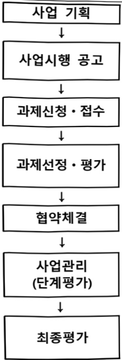

# AI기반수술로봇이노베이션랩구축및활용사업(R&D)

**해당 페이지**: PDF 3395 ~ 3399 쪽 해당

**부처**: 보건복지부
**분야**: 보건
**회계유형**: 일반회계
**2026 확정예산**: 3200.0 백만원
**전년대비 증감률**: None%
**AI 도메인**: 의료/바이오, 로봇

---

### 가. 예산 총괄표

(단위:백만원,%)

<table border=1 style='margin: auto; word-wrap: break-word;'><tr><td rowspan="2">사업명</td><td rowspan="2">2024년 결산</td><td colspan="2">2025년 예산</td><td colspan="2">2026년</td><td rowspan="2">중감(B-A)</td><td rowspan="2">(B-A)/A</td></tr><tr><td style='text-align: center; word-wrap: break-word;'>본예산(A)</td><td style='text-align: center; word-wrap: break-word;'>추경</td><td style='text-align: center; word-wrap: break-word;'>정부안</td><td style='text-align: center; word-wrap: break-word;'>확정(B)</td></tr><tr><td style='text-align: center; word-wrap: break-word;'>AI기반수술로봇이노베이션랩구축및활용사업(R&amp;D)</td><td style='text-align: center; word-wrap: break-word;'>-</td><td style='text-align: center; word-wrap: break-word;'>-</td><td style='text-align: center; word-wrap: break-word;'>-</td><td style='text-align: center; word-wrap: break-word;'>3,200</td><td style='text-align: center; word-wrap: break-word;'>3,200</td><td style='text-align: center; word-wrap: break-word;'>3,200</td><td style='text-align: center; word-wrap: break-word;'>순증</td></tr></table>

□ 기능별(내역사업별), 목별 예산 내역

(단위:백만원)

<table border=1 style='margin: auto; word-wrap: break-word;'><tr><td rowspan="2"></td><td colspan="5">2024</td><td colspan="7">2025(2025.12월말)</td><td rowspan="2">2026예산</td></tr><tr><td style='text-align: center; word-wrap: break-word;'>예산액(추경)</td><td style='text-align: center; word-wrap: break-word;'>예산현액</td><td style='text-align: center; word-wrap: break-word;'>집행액[실집행액]</td><td style='text-align: center; word-wrap: break-word;'>이월액</td><td style='text-align: center; word-wrap: break-word;'>불용액</td><td style='text-align: center; word-wrap: break-word;'>본예산</td><td style='text-align: center; word-wrap: break-word;'>예산현액</td><td style='text-align: center; word-wrap: break-word;'>집행액[실집행액]</td><td colspan="2">전년도 이월액제외</td><td style='text-align: center; word-wrap: break-word;'>이월예산액</td><td style='text-align: center; word-wrap: break-word;'>불용예산액</td></tr><tr><td style='text-align: center; word-wrap: break-word;'>○ 기능별 분류(합계)</td><td style='text-align: center; word-wrap: break-word;'>-</td><td style='text-align: center; word-wrap: break-word;'>-</td><td style='text-align: center; word-wrap: break-word;'>-</td><td style='text-align: center; word-wrap: break-word;'>-</td><td style='text-align: center; word-wrap: break-word;'>-</td><td style='text-align: center; word-wrap: break-word;'>-</td><td style='text-align: center; word-wrap: break-word;'>-</td><td style='text-align: center; word-wrap: break-word;'>-</td><td style='text-align: center; word-wrap: break-word;'>-</td><td style='text-align: center; word-wrap: break-word;'>-</td><td style='text-align: center; word-wrap: break-word;'>-</td><td style='text-align: center; word-wrap: break-word;'>-</td><td style='text-align: center; word-wrap: break-word;'>3,200</td></tr><tr><td style='text-align: center; word-wrap: break-word;'>·수술로봇 이념배센립 구축 및 활용</td><td style='text-align: center; word-wrap: break-word;'>-</td><td style='text-align: center; word-wrap: break-word;'>-</td><td style='text-align: center; word-wrap: break-word;'>-</td><td style='text-align: center; word-wrap: break-word;'>-</td><td style='text-align: center; word-wrap: break-word;'>-</td><td style='text-align: center; word-wrap: break-word;'>-</td><td style='text-align: center; word-wrap: break-word;'>-</td><td style='text-align: center; word-wrap: break-word;'>-</td><td style='text-align: center; word-wrap: break-word;'>-</td><td style='text-align: center; word-wrap: break-word;'>-</td><td style='text-align: center; word-wrap: break-word;'>-</td><td style='text-align: center; word-wrap: break-word;'>-</td><td style='text-align: center; word-wrap: break-word;'>3,200</td></tr></table>

### 나. 사업설명자료

## 1 ) 사업목적·내용

- (AI기반 수술로봇 이노베이션랩 구축 및 활용 사업) AI기반 수술로봇 기술 고도화를 위한 수요

처 중심(의료기관) 임상의-로봇기업-의료기기기업 간 상시 협력연구 인프라 조성 및 활용 지원

## 2 ) 사업개요

사업근거 및 추진경위

①법령상 근거 및 조항 적시

<table border=1 style='margin: auto; word-wrap: break-word;'><tr><td style='text-align: center; word-wrap: break-word;'>법령 및 상위계획</td><td style='text-align: center; word-wrap: break-word;'>주요내용</td></tr><tr><td style='text-align: center; word-wrap: break-word;'>과학기술기본법</td><td style='text-align: center; word-wrap: break-word;'>제11조(국가연구개발사업의 추진) ① 중앙행정기관의 장은 기본계획에 따라 맡은 분야의 국가연구개발사업과 그 시책을 세워 추진하여야 한다.</td></tr><tr><td style='text-align: center; word-wrap: break-word;'>보건의료기술 진흥법</td><td style='text-align: center; word-wrap: break-word;'>제3조(기술개발의 보호·육성) 정부는 보건의료기술의 진흥을 위한 연구개발 활동과 보건신기술을 장려하고 보호·육성하기 위한 정책을 마련하여 시행하여야 하며, 이에 필요한 비용을 지원할 수 있다. 제5조(연구개발사업의 추진) ① 정부는 기본계획을 효율적으로 추진하기 위하여 보건의료기술 연구개발사업을 수행한다.</td></tr><tr><td style='text-align: center; word-wrap: break-word;'>의료기기산업 육성 및 혁신의료기기 지원법</td><td style='text-align: center; word-wrap: break-word;'>제25조(연구개발사업 추진 및 지원) 정부는 의료기기 품질평가 기반 구축, 의료기기 기준 규격화사업 지원, 그 밖에 의료기기산업의 발전을 위한 연구개발사업을 추진할 수 있다.</td></tr></table>

---

② 추진경위

ㅇ 사업 시작연도 : 2026년

ㅇ 추진배경

- 최근 수술로 봤은 AI 기반의 수술계획 수립, 자율 수술, 핵탁 기술 등 개발을 위한 관련 기업 및 전문가 협력 수요가 증대

- 수술로봇의 개발 이후 시장 진출을 위해 ‘기술개발 → 현장사용 → 개선사항 도출 → 기술 고도화’로 연결되는 수요처(병원) 중심 연구개발 선순환 체계 구축 필요

0 추진경과

- 제1차 의료기기산업 육성 · 지원 종합계획(23~27) 수립(23.9.)

* 의료기기산업 8대 전략 기술분야(수술로봇 포함) 를 중점으로 연구개발-임상-시장진출-

규제 범부처 협력 지원

- 신규사업 기획('24.~'25.) 및 추진('26.~)

□ 주요내용

① 사업규모

- 총사업비(해당되는 경우에만 기재) : 247.6억원(국비 기준)

- 사업기간 : 2026 ~ 2030

- 최근 5년 간 투입된 사업비(예산액기준, 추경편성한 연도에는 추경포함)

(단위:백만원)

<table border=1 style='margin: auto; word-wrap: break-word;'><tr><td style='text-align: center; word-wrap: break-word;'>$ \underline{\text{연도}} $</td><td style='text-align: center; word-wrap: break-word;'>2022</td><td style='text-align: center; word-wrap: break-word;'>2023</td><td style='text-align: center; word-wrap: break-word;'>2024</td><td style='text-align: center; word-wrap: break-word;'>2025</td><td style='text-align: center; word-wrap: break-word;'>2026</td></tr><tr><td style='text-align: center; word-wrap: break-word;'>사업비</td><td style='text-align: center; word-wrap: break-word;'>-</td><td style='text-align: center; word-wrap: break-word;'>-</td><td style='text-align: center; word-wrap: break-word;'>-</td><td style='text-align: center; word-wrap: break-word;'>-</td><td style='text-align: center; word-wrap: break-word;'>3,200</td></tr></table>

-기타: 해당 없음

② 사업추진체계

-사업시행방법 : 출연(민간 참여시 Matching)

- 사업시행주체 : 한국보건산업진흥원

- 사업 수혜자 : 산 · 학 · 연 · 병 등

- 보조, 융자, 출연, 출자 등의 경우 보조.융자 등 지원 비율 및 법적근거

<table border=1 style='margin: auto; word-wrap: break-word;'><tr><td style='text-align: center; word-wrap: break-word;'>내역사업명</td><td style='text-align: center; word-wrap: break-word;'>구분</td><td style='text-align: center; word-wrap: break-word;'>피보조.피출연 등 기관명</td><td style='text-align: center; word-wrap: break-word;'>지원 금액 (2026예산)</td><td style='text-align: center; word-wrap: break-word;'>지원 비율(%)</td><td style='text-align: center; word-wrap: break-word;'>보조율 법적근거 (해당 조항)</td></tr><tr><td style='text-align: center; word-wrap: break-word;'>수술로봇이노베이션랩구축 및 활용</td><td style='text-align: center; word-wrap: break-word;'>출연</td><td style='text-align: center; word-wrap: break-word;'>한국보건산업진흥원</td><td style='text-align: center; word-wrap: break-word;'>3,200</td><td style='text-align: center; word-wrap: break-word;'>100</td><td style='text-align: center; word-wrap: break-word;'>보건의료기술진흥법 제3조, 제5조</td></tr></table>

---

## 3 ) 2026년도 예산 산출 근거

① AI기반 수술로봇 이노베이션랩 구축 및 활용 사업

: (2025 본예산) 0백만원 → (2026 요구) 3,200백만원, 순증

- (요구) 국내 수술로봇 분야 기술협력 연구 기반 조성을 위한 수술로봇 이노베이션랩 구축운영 '26년 신규예산 요구

- (산출) (신규) 2개×2,133백만원×9/12개월 = 3,200백만원

## 4 ) 사업효과

□ 사업영향, 산출물 성과지표 등

① 2022~2026년도 성과계획서 상 성과지표 및 최근 5년간 성과 달성도 : 해당 없음

② 성과지표 이외의 연도별 사업추진 경과 및 실적 : 해당 없음

③ 향후(2026년도 이후) 기대효과

- 수술로 봇 분야 협력 연구 생태계를 구축하여 수술로 봇 기술을 고도화하고, 추후 시장 진출지원 사업과 연계하여 국내외 보급 확산 도모

5) 타당성조사 및 예비타당성조사 시행여부 및 결과 요지 : 해당 없음

6) 총사업비 대상사업 여부 및 내역 : 해당 없음

---

## 7 ) 사업 집행절차

○ 보건복지부, 한국보건산업진흥원

○보건복지부 : 세부추진계획 확정 • 공고

* 사업안내서, 사업제안요구서(RFP) 포함

°연구기관 : 신규과제 사업계획서 작성 · 신청

°한국보건산업진흥원 : 접수

○ 사전선별평가 → 가감점부여 → 과제선정평가

○ 보건의료기술정책심의위원회 심의

○ 보건복지부 연구개발과제 확정

ㅇ협약 : 보건복지부 ↔ 한국보건산업진흥원

한국보건산업진흥원 ↔ 주관·공동·위탁연구기관

○ 단계보고서 평가(분야별 연구개발과제평가단)

○ 보건의료기술정책심의위원회 심의

○ 보건복지부 연구개발과제 확정

○최종보고서 평가(연구개발과제평가단)

○보건의료기술정책심의위원회 심의

○보건복지부 확정

- AI기반 수술로봇 이노베이션랩 구축 및 활용 사업

<table border=1 style='margin: auto; word-wrap: break-word;'><tr><td style='text-align: center; word-wrap: break-word;'>부처</td><td style='text-align: center; word-wrap: break-word;'></td><td style='text-align: center; word-wrap: break-word;'>피출연·피보조기관</td><td style='text-align: center; word-wrap: break-word;'></td><td style='text-align: center; word-wrap: break-word;'>간접보조사업자·사업수행자</td></tr><tr><td style='text-align: center; word-wrap: break-word;'>보건복지부(3,200백만원)</td><td style='text-align: center; word-wrap: break-word;'>=&gt;(3,200백만원)</td><td style='text-align: center; word-wrap: break-word;'>한국보건산업진흥원(3,200백만원)</td><td style='text-align: center; word-wrap: break-word;'>=&gt;(3,200백만원)</td><td style='text-align: center; word-wrap: break-word;'>연구개발수행기관</td></tr></table>

8) 각종 평가: 해당 없음

다.최근 4년간 결산내역 : 해당 없음('26년 신규)

라. 기타 추가자료 : 해당없음

---

<table border=1 style='margin: auto; word-wrap: break-word;'><tr><td style='text-align: center; word-wrap: break-word;'>사 업 명</td></tr><tr><td style='text-align: center; word-wrap: break-word;'>(260) AI응용제품 신속 상용화 지원(보건) (3033-513)</td></tr></table>

□ 사업 코드 정보

<table border=1 style='margin: auto; word-wrap: break-word;'><tr><td style='text-align: center; word-wrap: break-word;'>구분</td><td style='text-align: center; word-wrap: break-word;'>회계</td><td style='text-align: center; word-wrap: break-word;'>소관</td><td style='text-align: center; word-wrap: break-word;'>실국(기관)</td><td style='text-align: center; word-wrap: break-word;'>계정</td><td style='text-align: center; word-wrap: break-word;'>분야</td><td style='text-align: center; word-wrap: break-word;'>부문</td></tr><tr><td style='text-align: center; word-wrap: break-word;'>코드</td><td style='text-align: center; word-wrap: break-word;'>11</td><td style='text-align: center; word-wrap: break-word;'>23</td><td rowspan="2">보건의료정책실</td><td rowspan="2">보건산업정책국</td><td style='text-align: center; word-wrap: break-word;'>090</td><td style='text-align: center; word-wrap: break-word;'>091</td></tr><tr><td style='text-align: center; word-wrap: break-word;'>명칭</td><td style='text-align: center; word-wrap: break-word;'>일반회계</td><td style='text-align: center; word-wrap: break-word;'>보건복지부</td><td style='text-align: center; word-wrap: break-word;'>보건</td><td style='text-align: center; word-wrap: break-word;'>보건의료</td></tr></table>

<table border=1 style='margin: auto; word-wrap: break-word;'><tr><td style='text-align: center; word-wrap: break-word;'>구분</td><td style='text-align: center; word-wrap: break-word;'>프로그램</td><td style='text-align: center; word-wrap: break-word;'>단위사업</td><td style='text-align: center; word-wrap: break-word;'>세부사업</td></tr><tr><td style='text-align: center; word-wrap: break-word;'>코드</td><td style='text-align: center; word-wrap: break-word;'>3000</td><td style='text-align: center; word-wrap: break-word;'>3033</td><td style='text-align: center; word-wrap: break-word;'>513</td></tr><tr><td style='text-align: center; word-wrap: break-word;'>명칭</td><td style='text-align: center; word-wrap: break-word;'>보건산업육성</td><td style='text-align: center; word-wrap: break-word;'>보건산업정책</td><td style='text-align: center; word-wrap: break-word;'>AI응용제품 신속 상용화 지원(보건)</td></tr></table>

☐ 사업 성격

<table border=1 style='margin: auto; word-wrap: break-word;'><tr><td style='text-align: center; word-wrap: break-word;'>신규</td><td style='text-align: center; word-wrap: break-word;'>계속</td><td style='text-align: center; word-wrap: break-word;'>완료</td><td style='text-align: center; word-wrap: break-word;'>예비타당성 실시여부</td><td style='text-align: center; word-wrap: break-word;'>총사업비 관리대상</td><td style='text-align: center; word-wrap: break-word;'>총액계상 예산사업</td><td style='text-align: center; word-wrap: break-word;'>사업소관 변경정보 2025예산 시 소관</td></tr><tr><td style='text-align: center; word-wrap: break-word;'>○</td><td style='text-align: center; word-wrap: break-word;'></td><td style='text-align: center; word-wrap: break-word;'></td><td style='text-align: center; word-wrap: break-word;'></td><td style='text-align: center; word-wrap: break-word;'></td><td style='text-align: center; word-wrap: break-word;'></td><td style='text-align: center; word-wrap: break-word;'></td></tr></table>

□ 사업 지원 형태 및 지원율

<table border=1 style='margin: auto; word-wrap: break-word;'><tr><td style='text-align: center; word-wrap: break-word;'>직접</td><td style='text-align: center; word-wrap: break-word;'>출자</td><td style='text-align: center; word-wrap: break-word;'>출연</td><td style='text-align: center; word-wrap: break-word;'>보조</td><td style='text-align: center; word-wrap: break-word;'>융자</td><td style='text-align: center; word-wrap: break-word;'>국고보조율(%)</td><td style='text-align: center; word-wrap: break-word;'>융자율(%)</td></tr><tr><td style='text-align: center; word-wrap: break-word;'></td><td style='text-align: center; word-wrap: break-word;'></td><td style='text-align: center; word-wrap: break-word;'></td><td style='text-align: center; word-wrap: break-word;'>○</td><td style='text-align: center; word-wrap: break-word;'></td><td style='text-align: center; word-wrap: break-word;'>100</td><td style='text-align: center; word-wrap: break-word;'></td></tr></table>

□ 사업 소관부처 및 시행주체

<table border=1 style='margin: auto; word-wrap: break-word;'><tr><td style='text-align: center; word-wrap: break-word;'>사업명</td><td colspan="2">구분</td></tr><tr><td rowspan="3">AI응용제품신속 상용화지원(보건)</td><td rowspan="2">소관부처</td><td style='text-align: center; word-wrap: break-word;'>보건복지부 보건산업정책국</td></tr><tr><td style='text-align: center; word-wrap: break-word;'>의료기기화장품산업과</td></tr><tr><td style='text-align: center; word-wrap: break-word;'>사업시행주체</td><td style='text-align: center; word-wrap: break-word;'>한국보건산업진흥원</td></tr></table>

---

### 원본 PDF 크롭 이미지

