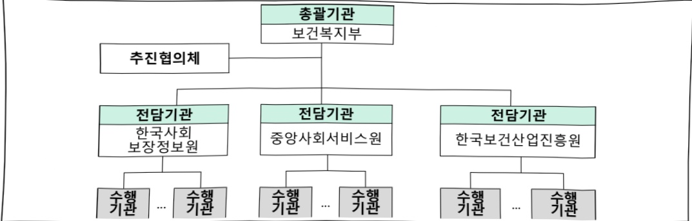

# AI응용제품 신속 상용화 지원(복지)

**해당 페이지**: PDF 3406 ~ 3411 쪽 해당

**부처**: 보건복지부
**분야**: 사회복지
**회계유형**: 일반회계
**2026 확정예산**: 20000.0 백만원
**전년대비 증감률**: 100.0%
**AI 도메인**: 로봇, 디지털전환(AX), 피지컬AI/디바이스

---

<table border=1 style='margin: auto; word-wrap: break-word;'><tr><td style='text-align: center; word-wrap: break-word;'>사 업 명</td></tr><tr><td style='text-align: center; word-wrap: break-word;'>(74) AI응용제품 신속 상용화 지원(복지) (2631-340)</td></tr></table>

사업 코드 정보

<table border=1 style='margin: auto; word-wrap: break-word;'><tr><td style='text-align: center; word-wrap: break-word;'>구분</td><td style='text-align: center; word-wrap: break-word;'>회계</td><td style='text-align: center; word-wrap: break-word;'>소관</td><td style='text-align: center; word-wrap: break-word;'>실국(기관)</td><td style='text-align: center; word-wrap: break-word;'>계정</td><td style='text-align: center; word-wrap: break-word;'>분야</td><td style='text-align: center; word-wrap: break-word;'>부문</td></tr><tr><td style='text-align: center; word-wrap: break-word;'>코드</td><td style='text-align: center; word-wrap: break-word;'>11</td><td style='text-align: center; word-wrap: break-word;'>23</td><td style='text-align: center; word-wrap: break-word;'>사회복지정책실</td><td rowspan="2"></td><td style='text-align: center; word-wrap: break-word;'>080</td><td style='text-align: center; word-wrap: break-word;'>089</td></tr><tr><td style='text-align: center; word-wrap: break-word;'>명칭</td><td style='text-align: center; word-wrap: break-word;'>일반회계</td><td style='text-align: center; word-wrap: break-word;'>보건복지부</td><td style='text-align: center; word-wrap: break-word;'>복지정책관</td><td style='text-align: center; word-wrap: break-word;'>사회복지</td><td style='text-align: center; word-wrap: break-word;'>사회복지일반</td></tr></table>

<table border=1 style='margin: auto; word-wrap: break-word;'><tr><td style='text-align: center; word-wrap: break-word;'>구분</td><td style='text-align: center; word-wrap: break-word;'>프로그램</td><td style='text-align: center; word-wrap: break-word;'>단위사업</td><td style='text-align: center; word-wrap: break-word;'>세부사업</td></tr><tr><td style='text-align: center; word-wrap: break-word;'>코드</td><td style='text-align: center; word-wrap: break-word;'>2600</td><td style='text-align: center; word-wrap: break-word;'>2631</td><td style='text-align: center; word-wrap: break-word;'>340</td></tr><tr><td style='text-align: center; word-wrap: break-word;'>명칭</td><td style='text-align: center; word-wrap: break-word;'>사회복지기반조성</td><td style='text-align: center; word-wrap: break-word;'>사회복지사업지원</td><td style='text-align: center; word-wrap: break-word;'>AI응용제품 신속 상용화 지원(복지)</td></tr></table>

□ 사업 성격 (공통요구자료 Ⅱ-1 작성유의사항 4. 참조, 해당하는 사항에 “○” 표시)

<table border=1 style='margin: auto; word-wrap: break-word;'><tr><td style='text-align: center; word-wrap: break-word;'>신규</td><td style='text-align: center; word-wrap: break-word;'>계속</td><td style='text-align: center; word-wrap: break-word;'>완료</td><td style='text-align: center; word-wrap: break-word;'>예비타당성 실시여부</td><td style='text-align: center; word-wrap: break-word;'>총사업비 관리대상</td><td style='text-align: center; word-wrap: break-word;'>총액계상 예산사업</td><td style='text-align: center; word-wrap: break-word;'>사업소관 변경정보 2025예산 시 소관</td></tr><tr><td style='text-align: center; word-wrap: break-word;'></td><td style='text-align: center; word-wrap: break-word;'></td><td style='text-align: center; word-wrap: break-word;'></td><td style='text-align: center; word-wrap: break-word;'></td><td style='text-align: center; word-wrap: break-word;'></td><td style='text-align: center; word-wrap: break-word;'></td><td style='text-align: center; word-wrap: break-word;'></td></tr></table>

□ 사업 지원 형태 및 지원을 (최소한 한 개는 반드시 선택하시오. 해당사항에 0 표시)

<table border=1 style='margin: auto; word-wrap: break-word;'><tr><td style='text-align: center; word-wrap: break-word;'>직접</td><td style='text-align: center; word-wrap: break-word;'>출자</td><td style='text-align: center; word-wrap: break-word;'>출연</td><td style='text-align: center; word-wrap: break-word;'>보조</td><td style='text-align: center; word-wrap: break-word;'>융자</td><td style='text-align: center; word-wrap: break-word;'>국고보조율(%)</td><td style='text-align: center; word-wrap: break-word;'>융자율(%)</td></tr><tr><td style='text-align: center; word-wrap: break-word;'></td><td style='text-align: center; word-wrap: break-word;'></td><td style='text-align: center; word-wrap: break-word;'></td><td style='text-align: center; word-wrap: break-word;'>○</td><td style='text-align: center; word-wrap: break-word;'></td><td style='text-align: center; word-wrap: break-word;'></td><td style='text-align: center; word-wrap: break-word;'></td></tr></table>

□ 사업 소관부처 및 시행주체

<table border=1 style='margin: auto; word-wrap: break-word;'><tr><td style='text-align: center; word-wrap: break-word;'>사업명</td><td colspan="2">구분</td></tr><tr><td rowspan="2">AI응용제품신속 상용화지원(총괄)</td><td rowspan="2">소관부처</td><td style='text-align: center; word-wrap: break-word;'>보건복지부 사회복지정책실 복지정책관</td></tr><tr><td style='text-align: center; word-wrap: break-word;'>복지정책과</td></tr><tr><td rowspan="9">AI응용제품신속 상용화지원(복지)</td><td rowspan="2">소관부처</td><td style='text-align: center; word-wrap: break-word;'>보건복지부 사회복지정책실 복지행정지원관</td></tr><tr><td style='text-align: center; word-wrap: break-word;'>복지정보운영과</td></tr><tr><td style='text-align: center; word-wrap: break-word;'>사업시행주체</td><td style='text-align: center; word-wrap: break-word;'>한국사회보장정보원</td></tr><tr><td rowspan="2">소관부처</td><td style='text-align: center; word-wrap: break-word;'>보건복지부 인구사회서비스정책실 사회서비스정책관</td></tr><tr><td style='text-align: center; word-wrap: break-word;'>돌봄기술혁신반</td></tr><tr><td style='text-align: center; word-wrap: break-word;'>사업시행주체</td><td style='text-align: center; word-wrap: break-word;'>중앙사회서비스원</td></tr><tr><td rowspan="2">소관부처</td><td style='text-align: center; word-wrap: break-word;'>보건복지부 인구사회서비스정책실 노인정책관</td></tr><tr><td style='text-align: center; word-wrap: break-word;'>노인정책과</td></tr><tr><td style='text-align: center; word-wrap: break-word;'>사업시행주체</td><td style='text-align: center; word-wrap: break-word;'>한국보건산업진흥원</td></tr></table>

---

### 가. 예산 총괄표

(단위:백만원,%)

<table border=1 style='margin: auto; word-wrap: break-word;'><tr><td rowspan="2">사업명</td><td rowspan="2">2024년 결산</td><td colspan="2">2025년 예산</td><td colspan="2">2026년 예산</td><td rowspan="2">증감(B-A)</td><td rowspan="2">(B-A)/A</td></tr><tr><td style='text-align: center; word-wrap: break-word;'>본예산</td><td style='text-align: center; word-wrap: break-word;'>추경*(A)</td><td style='text-align: center; word-wrap: break-word;'>요구안</td><td style='text-align: center; word-wrap: break-word;'>본예산(B)</td></tr><tr><td style='text-align: center; word-wrap: break-word;'>AI응용제품 신속 상용화 지원(복지)</td><td style='text-align: center; word-wrap: break-word;'>-</td><td style='text-align: center; word-wrap: break-word;'>-</td><td style='text-align: center; word-wrap: break-word;'>-</td><td style='text-align: center; word-wrap: break-word;'>30,000</td><td style='text-align: center; word-wrap: break-word;'>20,000</td><td style='text-align: center; word-wrap: break-word;'>20,000</td><td style='text-align: center; word-wrap: break-word;'>100</td></tr></table>

□ 기능별(내역사업별) 예산 내역

(단위:백만원)

<table border=1 style='margin: auto; word-wrap: break-word;'><tr><td rowspan="2"></td><td colspan="5">2024</td><td colspan="5">2025</td><td rowspan="2">2026 예산</td></tr><tr><td style='text-align: center; word-wrap: break-word;'>예산액 (추경)</td><td style='text-align: center; word-wrap: break-word;'>예산 현액</td><td style='text-align: center; word-wrap: break-word;'>집행액</td><td style='text-align: center; word-wrap: break-word;'>이월액</td><td style='text-align: center; word-wrap: break-word;'>불용액</td><td style='text-align: center; word-wrap: break-word;'>예산액 (추경)</td><td style='text-align: center; word-wrap: break-word;'>예산 현액</td><td style='text-align: center; word-wrap: break-word;'>집행액</td><td style='text-align: center; word-wrap: break-word;'>이월액</td><td style='text-align: center; word-wrap: break-word;'>불용액</td></tr><tr><td style='text-align: center; word-wrap: break-word;'>○ 기능별 분류(합계)</td><td style='text-align: center; word-wrap: break-word;'>-</td><td style='text-align: center; word-wrap: break-word;'>-</td><td style='text-align: center; word-wrap: break-word;'>-</td><td style='text-align: center; word-wrap: break-word;'>-</td><td style='text-align: center; word-wrap: break-word;'>-</td><td style='text-align: center; word-wrap: break-word;'>-</td><td style='text-align: center; word-wrap: break-word;'>-</td><td style='text-align: center; word-wrap: break-word;'>-</td><td style='text-align: center; word-wrap: break-word;'>-</td><td style='text-align: center; word-wrap: break-word;'>-</td><td style='text-align: center; word-wrap: break-word;'>20,000</td></tr><tr><td style='text-align: center; word-wrap: break-word;'>.AI응용제품 신속 상용화 지원(복지)</td><td style='text-align: center; word-wrap: break-word;'>-</td><td style='text-align: center; word-wrap: break-word;'>-</td><td style='text-align: center; word-wrap: break-word;'>-</td><td style='text-align: center; word-wrap: break-word;'>-</td><td style='text-align: center; word-wrap: break-word;'>-</td><td style='text-align: center; word-wrap: break-word;'>-</td><td style='text-align: center; word-wrap: break-word;'>-</td><td style='text-align: center; word-wrap: break-word;'>-</td><td style='text-align: center; word-wrap: break-word;'>-</td><td style='text-align: center; word-wrap: break-word;'>-</td><td style='text-align: center; word-wrap: break-word;'>20,000</td></tr></table>

### 나.사업설명자료

## 1 ) 사업목적·내용

○ 고령화, 사회적 고립 등 완 사회적 위기 대응을 위해, AI 기술을 기존 복지서비스에 접목하거나 AI 기반의 신규 복지서비스를 개발하여, 국민이 체감할 수 있는 복지·돌봄서비스 생태계 조성

- 고령화, 1인가구 증가에 따른 고독사 등 문제 해결을 위한 AI·IoT 기반 심리케어 및 고립 예방 솔루션 개발

- 지역별 인구·수요·환경을 고려한 맞춤형 복지서비스를 안내할 수 있도록 RAG 기술 기반의 상담 솔루션 개발

- 보행, 보청, 수면 등 노인의 일상생활을 지원하기 위한 보행보조차, 수면모니터링 매트 등 고령자 지원기기 개발

- AI 스마트홈 기술을 통해 안전·건강·정서지원 등 서비스를 제공하여 독거노인·장애인의 자립생활 지원

- AI·로보틱스 등 기술을 활용하여 시설 업무를 재설계하고 돌봄 인력 업무부담 경감 및 돌봄 질 향상

---

## 2 ) 사업개요

사업근거 및 추진경위

①법령상 근거 및 조항 적시

## 인공지능 발전과 신뢰 기반 조성 등에 관한 기본법 제13조(인공지능기술 개발 및 안전한 이용 지원)

① 정부는 인공지능기술 개발 활성화를 위하여 다음 각 호의 사업을 지원할 수 있다.

1. 국내 삼성 삼성 삼성 삼성 삼성 삼성 삼성 삼성 삼성 삼성 삼성 삼성 삼성 삼성 삼성 삼성 삼성 삼성 삼성 삼성 삼성 삼성 삼성 삼성 삼성 삼성 삼성 삼성 삼성 삼성 삼성 삼성 삼성 삼성 삼성 삼성 삼성 삼성 삼성 삼성 삼성 삼성 삼성 삼성 삼성 삼성 삼성 삼성 삼성 삼성 삼성 삼성 삼성 삼성 삼성 삼성 삼성 삼성 삼성 삼성 삼성 삼성 삼성 삼성 삼성 삼성 삼성 삼성 삼성 삼성 삼성 삼성 삼성 삼성 삼성 삼성 삼성 삼성 삼성 삼성 삼성 삼성 삼성 삼성 삼성 삼성 삼성 삼성 삼성 삼성 삼성 삼성 삼성 삼성 삼성 삼성 삼성 삼성 삼성 삼성 삼성 삼성 삼성 삼성 삼성 삼성 삼성 삼성 삼성 삼성 삼성 삼성 삼성 삼성 삼성 삼성 삼성 삼성 삼성 삼성 삼성 삼성 삼성 삼성 삼성 삼성 삼성 삼성 삼성 삼성 삼성 삼성 삼성 삼성 삼성 삼성 삼성 삼성 삼성 삼성 삼성 삼성 삼성 삼성 삼성 삼성 삼성 삼성 삼성 삼성 삼성 삼성 삼성 삼성 삼성 삼성 삼성 삼성 삼성 삼성 삼성 삼성 삼성 삼성 삼성 삼성 삼성 삼성 삼성 삼성 삼성 삼성 삼성 삼성 삼성 삼성 삼성 삼성 삼성 삼성 삼성 삼성 삼성 삼성 삼성 삼성 삼성 삼성 삼성 삼성 삼성 삼성 삼성 삼성 삼성 삼성 삼성 삼성 삼성 삼성 삼성 삼성 삼성 삼성 삼성 삼성 삼성 삼성 삼성 삼성 삼성 삼성 삼성 삼성 삼성 삼성 삼성 삼성 삼성 삼성 삼성 삼성 삼성 삼성 삼성 삼성 삼성 삼성 삼성 삼성 삼성 삼성 삼성 삼성 삼성 삼성 삼성 삼성 삼성 삼성 삼성 삼성 삼성 삼성 삼성 삼성 삼성 삼성 삼성 삼성 삼성 삼성 삼성 삼성 삼성 삼성 삼성 삼성 삼성 삼성 삼성 삼성 삼성 삼성 삼성 삼성 삼성 삼성 삼성 삼성 삼성 삼성 삼성 삼성 삼성 삼성 삼성 삼성 삼성 삼성 삼성 삼성 삼성 삼성 삼성 삼성 삼성 삼성 삼성 삼성 삼성 삼성 삼성 삼성 삼성 삼성 삼성 삼성 삼성 삼성 삼성 삼성 삼성 삼성 삼성 삼성 삼성 삼성 삼성 삼성 삼성 삼성 삼성 삼성 삼성 삼성 삼성 삼성 삼성 삼성 삼성 삼성 삼성 삼성 삼성 삼성 삼성 삼성 삼성 삼성 삼성 삼성 삼성 삼성 삼성 삼성 삼성 삼성 삼성 삼성 삼성 삼성 삼성 삼성 삼성 삼성 삼성 삼성 삼성 삼성 삼성 삼성 삼성 삼성 삼성 삼성 삼성 삼성 삼성 삼성 삼성 삼성 삼성 삼성 삼성 삼성 삼성 삼성 삼성 삼성 삼성 삼성 삼성 삼성 삼성 삼성 삼성 삼성 삼성 삼성 삼성 삼성 삼성 삼성 삼성 삼성 삼성 삼성 삼성 삼성 삼성 삼성 삼성 삼성 삼성 삼성 삼성 삼성 삼성 삼성 삼성 삼성 삼성 삼성 삼성 삼성 삼성 삼성 삼성 삼성 삼성 삼성 삼성 삼성 삼성 삼성 삼성 삼성 삼성 삼성 삼성 삼성 삼성 삼성 삼성 삼성 삼성 삼성 삼성 삼성 삼성 삼성 삼성 삼성 삼성 삼성 삼성 삼성 삼성 삼성 삼성 삼성 삼성 삼성 삼성 삼성 삼성 삼성 삼성 삼성 삼성 삼성 삼성 삼성 삼성 삼성 삼성 삼성 삼성 삼성 삼성 삼성 삼성 삼성 삼성 삼성 삼성 삼성 삼성 삼성 삼성 삼성 삼성 삼성 삼성 삼성 삼성 삼성 삼성 삼성 삼성 삼성 삼성 삼성 삼성 삼성 삼성 삼성 삼성 삼성 삼성 삼성 삼성 삼성 삼성 삼성 삼성 삼성 삼성 삼성 삼성 삼성 삼성 삼성 삼성 삼성 삼성 삼성 삼성 삼성 삼성 삼성 삼성 삼성 삼성 삼성 삼성 삼성 삼성 삼성 삼성 삼성 삼성 삼성 삼성 삼성 삼성 삼성 삼성 삼성 삼성 삼성 삼성 삼성 삼성 삼성 삼성 삼성 삼성 삼성 삼성 삼성 삼성 삼성 삼성 삼성 삼성 삼성 삼성 삼성 삼성 삼성 삼성 삼성 삼성 삼성 삼성 삼성 삼성 삼성 삼성 삼성 삼성 삼성 삼성 삼성 삼성 삼성 삼성 삼성 삼성 삼성 삼성 삼성 삼성 삼성 삼성 삼성 삼성 삼성 삼성 삼성 삼성 삼성 삼성 삼성 삼성 삼성 삼성 삼성 삼성 삼성 삼성 삼성 삼성 삼성 삼성 삼성 삼성 삼성 삼성 삼성 삼성 삼성 삼성 삼성 삼성 삼성 삼성 삼성 삼성 삼성 삼성 삼성 삼성 삼성 삼성 삼성 삼성 삼성 삼성 삼성 삼성 삼성 삼성 삼성 삼성 삼성 삼성 삼성 삼성 삼성 삼성 삼성 삼성 삼성 삼성 삼성 삼성 삼성 삼성 삼성 삼성 삼성 삼성 삼성 삼성 삼성 삼성 삼성 삼성 삼성 삼성 삼성 삼성 삼성 삼성 삼성 삼성 삼성 삼성 삼성 삼성 삼성 삼성 삼성 삼성 삼성 삼성 삼성 삼성 삼성 삼성 삼성 삼성 삼성 삼성 삼성 삼성 삼성 삼성 삼성 삼성 삼성 삼성 삼성 삼성 삼성 삼성 삼성 삼성 삼성 삼성 삼성 삼성 삼성 삼성 삼성 삼성 삼성 삼성 삼성 삼성 삼성 삼성 삼성 삼성 삼성 삼성 삼성 삼성 삼성 삼성 삼성 삼성 삼성 삼성 삼성 삼성 삼성 삼성 삼성 삼성 삼성 삼성 삼성 삼성 삼성 삼성 삼성 삼성 삼성 삼성 삼성 삼성 삼성 삼성 삼성 삼성 삼성 삼성 삼성 삼성 삼성 삼성 삼성 삼성 삼성 삼성 삼성 삼성 삼성 삼성 삼성 삼성 삼성 삼성 삼성 삼성 삼성 삼성 삼성 삼성 삼성 삼성 삼성 삼성 삼성 삼성 삼성 삼성 삼성 삼성 삼성 삼성 삼성 삼성 삼성 삼성 삼성 삼성 삼성 삼성 삼성 삼성 삼성 삼성 삼성 삼성 삼성 삼성 삼성 삼성 삼성 삼성 삼성 삼성 삼성 삼성 삼성 삼성 삼성 삼성 삼성 삼성 삼성 삼성 삼성 삼성 삼성 삼성 

1. 국내외 인공지능기술 동향·수준 및 관련 제도의 조사

2. 인공지능기술의 연구 개발, 시험 및 평가 또는 개발된 기술의 활용

3. 인공지능기술 확산, 인공지능기술 협력 · 이전 등 기술의 실용화 및 사업화 지원

4. 인공지능기술의 구현을 위한 정보의 원활한 유통 및 산학협력

5. 그 밖에 인공지능기술의 개발 및 연구·조사와 관련하여 대통령령으로 정하는 사업

노인복지법 제27조의2(홀로 사는 노인에 대한 지원) ①국가 또는 지방자치단체는 홀로 사는 노인에 대하여 방문요양과 돌봄 등의 서비스와 안전확인 등의 보호조치를 취하여야 한다. ② 국가 또는 지방자치단체는 제1항에 따른 사업을 노인 관련 기관 · 단체에 위탁할 수 있으며, 예산의 범위에서 그 사업 및 운영에 필요한 비용을 지원할 수 있다

장애인복지법 제24조(안전대책 강구) 국가와 지방자치단체는 추락사고 등 장애로 인하여 일어날 수 있는 안전사고와 비상재해 등에 대비하여 시각·청각 장애인과 이동이 불편한 장애인을 위하여 피난용 통로를 확보하고, 점자·음성·문자 안내관을 설치하며, 긴급 통보체계를 마련하는 등 장애인의 특성을 배려한 안전대책 등 필요한 조치를 강구하여야 한다.

사회복지사업법 제42조(보조금 등) ① 국가나 지방자치단체는 사회복지사업을 하는 자 중 대통령령으로 정하는 자에게 운영비 등 필요한 비용의 전부 또는 일부를 보조할 수 있다.

사회보장기본법 제37조(사회보장정보시스템의 구축·운영 등) ① 국가와 지방자치단체는 국민편익의 증진과 사회보장업무의 효율성 향상을 위하여 사회보장업무를 전자적으로 관리하도록 노력하여야 한다.

사회보장급여법 제23조(사회보장정보의 처리 등) ① 보건복지부장관은 보장기관이 수급권자의 선정 및 급여관리 등에 관한 업무를 효율적으로 수행할 수 있도록 사회보장정보시스템을 통하여 다음 각 호에 해당하는 자료 또는 정보(이하 “사회보장정보”라 한다)를 처리할 수 있다.

② 추진경위

- 최근 AI 기술의 급속한 발전으로 복지·돌봄 분야에서 신청주의 한계 극복, 돌봄 위기 완화 등 혁신이 기대되며, 정부 차원의 체계적 지원 필요성 제기

- AI대전환 공약, 지시사항, 국정과제 등에 반영('25.6~7월)

## °(V 지시사항) AI 기반의 행정서비스 전달

- 복지, 금융지원 등 사회적 안전망에서 빠져나가는 사람이 없도록 인공지능을 활용한 시스템을 만들 것

- 관계부처(과기정통부, 행안부, 복지부, 금융위 등), 민간전문가와 함께 AI 활용

복지서비스 등 공공서비스 혁신 사례를 만들 것

°(국정과제 77-2) AI 기반 복지사각지대 발굴·지원

- AI 복지·돌봄 혁신 로드맵에 기반하여 AI 기술 활용 위기가구 발굴·지원 확대 및 선별의 정확도 제고

## °(국정과제 91-2) 고령친화산업 활성화

- 돌봄인력 부족 대응과 서비스 질 향상을 위해 AI·IoT 기술 활용 스마트돌봄 서비스 확충 및 리빙랩 등 R&D·사업화 기반 마련

- AI를 접목한 제품의 조기 상용화 지원을 위한 'AI 응용제품 신속 상용화 지원사업' 관계부처 간 사업구조 및 세부 내용 합의('25.8월)

- 'AI 응용제품 신속 상용화 지원사업' 사업계획 및 예비타당성 조사 면제 국무

회의 의결('25.8월)

---

주요내용

① 사업규모

- 사업기간 : 2026~2027년

- 최근 5년 간 투입된 사업비(예산액기준, 추경편성한 연도에는 추경포함)

<table border=1 style='margin: auto; word-wrap: break-word;'><tr><td style='text-align: center; word-wrap: break-word;'>연도</td><td style='text-align: center; word-wrap: break-word;'>2022</td><td style='text-align: center; word-wrap: break-word;'>2023</td><td style='text-align: center; word-wrap: break-word;'>2024</td><td style='text-align: center; word-wrap: break-word;'>2025</td><td style='text-align: center; word-wrap: break-word;'>2026</td></tr><tr><td style='text-align: center; word-wrap: break-word;'>사업비</td><td style='text-align: center; word-wrap: break-word;'>-</td><td style='text-align: center; word-wrap: break-word;'>-</td><td style='text-align: center; word-wrap: break-word;'>-</td><td style='text-align: center; word-wrap: break-word;'>-</td><td style='text-align: center; word-wrap: break-word;'>20,000</td></tr></table>

- 기타: AI·IoT 등 분야의 민간기업 10개 ~ 20개 등 지원

② 사업추진체계

- 사업시행방법 : 민간경상보조 100%

- 사업시행주체 : 한국사회보장정보원, 한국보건산업진흥원, 중앙사회서비스원

- 사업 수혜자 : 전 국민

- 보조, 융자, 출연, 출자 등의 경우 보조·융자 등 지원 비율 및 법적근거

<table border=1 style='margin: auto; word-wrap: break-word;'><tr><td style='text-align: center; word-wrap: break-word;'>내역사업명</td><td style='text-align: center; word-wrap: break-word;'>구분</td><td style='text-align: center; word-wrap: break-word;'>피보조·피출연 등 기관명</td><td style='text-align: center; word-wrap: break-word;'>지원 금액 (2026예산)</td><td style='text-align: center; word-wrap: break-word;'>지원 비율(%)</td><td style='text-align: center; word-wrap: break-word;'>보조율 법적근거 (해당 조항)</td></tr><tr><td rowspan="3">AI응용제품 신속 상용화 지원</td><td style='text-align: center; word-wrap: break-word;'>보조</td><td style='text-align: center; word-wrap: break-word;'>한국사회 보장정보원</td><td style='text-align: center; word-wrap: break-word;'>15,000</td><td style='text-align: center; word-wrap: break-word;'>100</td><td style='text-align: center; word-wrap: break-word;'>「보조금 관리에 관한 법률」 제4조, 제9조</td></tr><tr><td style='text-align: center; word-wrap: break-word;'>보조</td><td style='text-align: center; word-wrap: break-word;'>한국보건 산업진흥원</td><td style='text-align: center; word-wrap: break-word;'>1,000</td><td style='text-align: center; word-wrap: break-word;'>100</td><td style='text-align: center; word-wrap: break-word;'>「보조금 관리에 관한 법률」 제4조, 제9조, 고령친화산업 진흥법 제10조</td></tr><tr><td style='text-align: center; word-wrap: break-word;'>보조</td><td style='text-align: center; word-wrap: break-word;'>중앙사회 서비스원</td><td style='text-align: center; word-wrap: break-word;'>4,000</td><td style='text-align: center; word-wrap: break-word;'>100</td><td style='text-align: center; word-wrap: break-word;'>「보조금 관리에 관한 법률」 제4조, 제9조, 사회서비스원법 제31조, 32조</td></tr></table>

## 3 ) 2026년도 예산 산출 근거

□ AI응용제품 신속 상용화 지원 : (26) 20,000백만원(순증)

- 초고령사회, 돌봄부담 급증, 사회적 고립 등 새 사회적 위기 해결을 위해 AI 기반

복지·돌봄 서비스 개발·실증 등 신속 상용화 지원

① 고독사 등 Ai 심리케어 서비스 개발 지원 (65억)

- 고령화, 1인가구 증가에 따른 고독사 등 문제 해결을 위해, AI·IoT 기반 심리케어 및 고립 예방 솔루션 개발

② RAG 기반 지역특화 복지서비스 안내 AI 개발지원 (20억)

- 지역별 인구·수요·환경을 고려한 맞춤형 복지서비스를 안내할 수 있도록, RAG

기술기반의상담솔루션개발

---

③에이지테크기반고령친화사업지원(10억)

- AI 맞춤형 보행보조차 개발·보급을 통한 고령자 지원 기기 개발

④ 스마트홈 및 AI 기술과 재가돌봄서비스 융합 기술 상용화 (65억)

- AI 스마트홈 기술을 통해 안전·건강·정서지원 등 서비스를 제공하여 독거노인·

장애인 등의 자립생활 지원

⑤ 돌봄 시설 종사자 업무부담 경감을 위한 AX 활용기술 상용화 (40억)

- AI·IoT·로보틱스 등 기술 활용, 시설 업무를 재설계하여 돌봄인력 업무부담 경감 및 돌봄의 질 향상 추진

## 4 ) 사업효과

□ 사업영향, 산출물 성과지표 등

① 2022~2026년도 성과계획서 상 성과지표 및 최근 5년간 성과 달성도

<table border=1 style='margin: auto; word-wrap: break-word;'><tr><td style='text-align: center; word-wrap: break-word;'>성과지표</td><td style='text-align: center; word-wrap: break-word;'>구분</td><td style='text-align: center; word-wrap: break-word;'>2022</td><td style='text-align: center; word-wrap: break-word;'>2023</td><td style='text-align: center; word-wrap: break-word;'>2024</td><td style='text-align: center; word-wrap: break-word;'>2025</td><td style='text-align: center; word-wrap: break-word;'>2026</td><td style='text-align: center; word-wrap: break-word;'>2026 목표치산출근거</td><td style='text-align: center; word-wrap: break-word;'>측정산식(또는 측정방법)</td><td style='text-align: center; word-wrap: break-word;'>자료수집방법(또는 자료출처)</td></tr><tr><td rowspan="3">AI 응용제품개발·설계 건수</td><td style='text-align: center; word-wrap: break-word;'>목표</td><td style='text-align: center; word-wrap: break-word;'>-</td><td style='text-align: center; word-wrap: break-word;'>-</td><td style='text-align: center; word-wrap: break-word;'>-</td><td style='text-align: center; word-wrap: break-word;'>-</td><td style='text-align: center; word-wrap: break-word;'>18</td><td rowspan="3">단기(&#x27;26) 및 장기(&#x27;26~&#x27;27) 공모과제 수</td><td rowspan="3">개발보고서제출 건수 + 설계보고서제출 건수</td><td rowspan="3">공모과제중간(완료) 보고</td></tr><tr><td style='text-align: center; word-wrap: break-word;'>실적</td><td style='text-align: center; word-wrap: break-word;'>-</td><td style='text-align: center; word-wrap: break-word;'>-</td><td style='text-align: center; word-wrap: break-word;'>-</td><td style='text-align: center; word-wrap: break-word;'>-</td><td style='text-align: center; word-wrap: break-word;'>-</td></tr><tr><td style='text-align: center; word-wrap: break-word;'>달성도</td><td style='text-align: center; word-wrap: break-word;'>-</td><td style='text-align: center; word-wrap: break-word;'>-</td><td style='text-align: center; word-wrap: break-word;'>-</td><td style='text-align: center; word-wrap: break-word;'>-</td><td style='text-align: center; word-wrap: break-word;'>-</td></tr></table>

② 성과지표 이외의 연도별 사업추진 경과 및 실적 : '26년 신규 사업으로 해당없음

③ 향후(2026년도 이후) 기대효과

- 복지·돌봄 분야별 서비스를 연계한 복지기술 생태계 조성

- 개발한 기술, 솔루션 간 연계·확장을 통한 통합 기반 마련, 기관·시설·현장 등 실증을 통해 AI 복지·돌봄서비스 고도화

## 5 ) 타당성조사 및 예비타당성조사 시행여부 및 결과 요지

- 민간의 AI 서비스·상품 개발 촉진을 통해, 고령화·고독사·고립 예방 및 돌봄 수요 급증 등 사회적 문제를 적시에 대응하기 위해 추진하는 사업이며,

- 제10호의 '긴급한 사회적 상황을 국가 정책적으로 추진하는 사업'으로 예비타당성

면제 대상 사업임 (국무회의('25.8.19.)를 거쳐 확정)

6) 총사업비 대상사업 여부 및 내역 : 해당 사항 없음

---

## 7 ) 사업 집행절차

8) 각종평가 : 해당없음

다. 최근 4년간 결산내역 : 해당사항 없음(26년 신규사업)

---

### 원본 PDF 크롭 이미지

