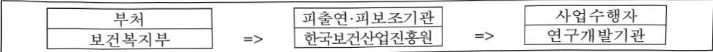

# 구조기반 AI신약개발지원(R&D)

**해당 페이지**: PDF 3418 ~ 3421 쪽 해당

**부처**: 보건복지부
**분야**: 보건
**회계유형**: 일반회계
**2026 확정예산**: 2400.0 백만원
**전년대비 증감률**: None%
**AI 도메인**: LLM/언어모델, 의료/바이오

---

<table border=1 style='margin: auto; word-wrap: break-word;'><tr><td style='text-align: center; word-wrap: break-word;'>사 업 명</td></tr><tr><td style='text-align: center; word-wrap: break-word;'>(244) 구조기반 AI신약개발지원(R&amp;D) (3031-618)</td></tr></table>

☐ 사업 코드 정보

<table border=1 style='margin: auto; word-wrap: break-word;'><tr><td style='text-align: center; word-wrap: break-word;'>구분</td><td style='text-align: center; word-wrap: break-word;'>회계</td><td style='text-align: center; word-wrap: break-word;'>소관</td><td style='text-align: center; word-wrap: break-word;'>실국(기관)</td><td style='text-align: center; word-wrap: break-word;'>계정</td><td style='text-align: center; word-wrap: break-word;'>분야</td><td style='text-align: center; word-wrap: break-word;'>부문</td></tr><tr><td style='text-align: center; word-wrap: break-word;'>코드</td><td style='text-align: center; word-wrap: break-word;'>11</td><td style='text-align: center; word-wrap: break-word;'>23</td><td rowspan="2">보건산업정책국</td><td rowspan="2"></td><td style='text-align: center; word-wrap: break-word;'>090</td><td style='text-align: center; word-wrap: break-word;'>091</td></tr><tr><td style='text-align: center; word-wrap: break-word;'>명칭</td><td style='text-align: center; word-wrap: break-word;'>일반회계</td><td style='text-align: center; word-wrap: break-word;'>보건복지부</td><td style='text-align: center; word-wrap: break-word;'>보건</td><td style='text-align: center; word-wrap: break-word;'>보건의료</td></tr></table>

<table border=1 style='margin: auto; word-wrap: break-word;'><tr><td style='text-align: center; word-wrap: break-word;'>구분</td><td style='text-align: center; word-wrap: break-word;'>프로그램</td><td style='text-align: center; word-wrap: break-word;'>단위사업</td><td style='text-align: center; word-wrap: break-word;'>세부사업</td></tr><tr><td style='text-align: center; word-wrap: break-word;'>코드</td><td style='text-align: center; word-wrap: break-word;'>3000</td><td style='text-align: center; word-wrap: break-word;'>3031</td><td style='text-align: center; word-wrap: break-word;'>618</td></tr><tr><td style='text-align: center; word-wrap: break-word;'>명칭</td><td style='text-align: center; word-wrap: break-word;'>보건산업육성</td><td style='text-align: center; word-wrap: break-word;'>보건의료연구개발</td><td style='text-align: center; word-wrap: break-word;'>구조기반 AI신약개발 지원(R&amp;D)</td></tr></table>

☐ 사업 성격

<table border=1 style='margin: auto; word-wrap: break-word;'><tr><td style='text-align: center; word-wrap: break-word;'>신규</td><td style='text-align: center; word-wrap: break-word;'>계속</td><td style='text-align: center; word-wrap: break-word;'>완료</td><td style='text-align: center; word-wrap: break-word;'>예비타당성 실시여부</td><td style='text-align: center; word-wrap: break-word;'>총사업비 관리대상</td><td style='text-align: center; word-wrap: break-word;'>총액계상 예산사업</td><td style='text-align: center; word-wrap: break-word;'>사업소관 변경정보 2025예산 시 소관</td></tr><tr><td style='text-align: center; word-wrap: break-word;'>☐</td><td style='text-align: center; word-wrap: break-word;'></td><td style='text-align: center; word-wrap: break-word;'></td><td style='text-align: center; word-wrap: break-word;'></td><td style='text-align: center; word-wrap: break-word;'></td><td style='text-align: center; word-wrap: break-word;'></td><td style='text-align: center; word-wrap: break-word;'></td></tr></table>

사업 지원 형태 및 지원을 (최소한 한 개는 반드시 선택하시오. 해당사항에 0 표시)

<table border=1 style='margin: auto; word-wrap: break-word;'><tr><td style='text-align: center; word-wrap: break-word;'>직접</td><td style='text-align: center; word-wrap: break-word;'>출자</td><td style='text-align: center; word-wrap: break-word;'>출연</td><td style='text-align: center; word-wrap: break-word;'>보조</td><td style='text-align: center; word-wrap: break-word;'>융자</td><td style='text-align: center; word-wrap: break-word;'>국고보조율(%)</td><td style='text-align: center; word-wrap: break-word;'>융자율(%)</td></tr><tr><td style='text-align: center; word-wrap: break-word;'></td><td style='text-align: center; word-wrap: break-word;'></td><td style='text-align: center; word-wrap: break-word;'>○</td><td style='text-align: center; word-wrap: break-word;'></td><td style='text-align: center; word-wrap: break-word;'></td><td style='text-align: center; word-wrap: break-word;'></td><td style='text-align: center; word-wrap: break-word;'></td></tr></table>

## □ 사업 소관부처 및 시행주체

<table border=1 style='margin: auto; word-wrap: break-word;'><tr><td style='text-align: center; word-wrap: break-word;'>사업명</td><td colspan="2">구분</td></tr><tr><td rowspan="3">구조기반 AI신약개발 지원(R&amp;D)</td><td rowspan="2">소관부처</td><td style='text-align: center; word-wrap: break-word;'>보건산업정책국</td></tr><tr><td style='text-align: center; word-wrap: break-word;'>제약비이요산업과</td></tr><tr><td style='text-align: center; word-wrap: break-word;'>사업시행주체</td><td style='text-align: center; word-wrap: break-word;'>한국보건산업진흥원</td></tr></table>

---

### 가. 예산 총괄표

(단위:백만원,%)

<table border=1 style='margin: auto; word-wrap: break-word;'><tr><td rowspan="2">사업명</td><td rowspan="2">2024년 결산</td><td colspan="2">2025년 예산</td><td colspan="2">2026년 예산</td><td rowspan="2">증감 (B-A)</td><td rowspan="2">(B-A)/A</td></tr><tr><td style='text-align: center; word-wrap: break-word;'>본예산</td><td style='text-align: center; word-wrap: break-word;'>추경*(A)</td><td style='text-align: center; word-wrap: break-word;'>요구안</td><td style='text-align: center; word-wrap: break-word;'>본예산(B)</td></tr><tr><td style='text-align: center; word-wrap: break-word;'>구조기반 AI신약개발지원</td><td style='text-align: center; word-wrap: break-word;'>-</td><td style='text-align: center; word-wrap: break-word;'>-</td><td style='text-align: center; word-wrap: break-word;'>-</td><td style='text-align: center; word-wrap: break-word;'>2,400</td><td style='text-align: center; word-wrap: break-word;'>2,400</td><td style='text-align: center; word-wrap: break-word;'>2,400</td><td style='text-align: center; word-wrap: break-word;'>순증</td></tr></table>

* 추경: 추경증감액을 포함한 최종 예산액을 기재

## □ 기능별(내역사업별) 예산 내역

(단위:백만원)

<table border=1 style='margin: auto; word-wrap: break-word;'><tr><td rowspan="2"></td><td colspan="5">2024</td><td colspan="5">2025</td><td rowspan="2">2026 예산</td></tr><tr><td style='text-align: center; word-wrap: break-word;'>예산액 (추경)</td><td style='text-align: center; word-wrap: break-word;'>예산 현액</td><td style='text-align: center; word-wrap: break-word;'>집행액</td><td style='text-align: center; word-wrap: break-word;'>이월액</td><td style='text-align: center; word-wrap: break-word;'>불용액</td><td style='text-align: center; word-wrap: break-word;'>예산액 (추경)</td><td style='text-align: center; word-wrap: break-word;'>예산 현액</td><td style='text-align: center; word-wrap: break-word;'>집행액</td><td style='text-align: center; word-wrap: break-word;'>이월액</td><td style='text-align: center; word-wrap: break-word;'>불용액</td></tr><tr><td style='text-align: center; word-wrap: break-word;'>○ 기능별 분류(합계)</td><td style='text-align: center; word-wrap: break-word;'>-</td><td style='text-align: center; word-wrap: break-word;'>-</td><td style='text-align: center; word-wrap: break-word;'>-</td><td style='text-align: center; word-wrap: break-word;'>-</td><td style='text-align: center; word-wrap: break-word;'>-</td><td style='text-align: center; word-wrap: break-word;'>-</td><td style='text-align: center; word-wrap: break-word;'>-</td><td style='text-align: center; word-wrap: break-word;'>-</td><td style='text-align: center; word-wrap: break-word;'>-</td><td style='text-align: center; word-wrap: break-word;'>-</td><td style='text-align: center; word-wrap: break-word;'>2,400</td></tr><tr><td style='text-align: center; word-wrap: break-word;'>.AI 저분자 신약 후 보물질발굴 기술 개발</td><td style='text-align: center; word-wrap: break-word;'>-</td><td style='text-align: center; word-wrap: break-word;'>-</td><td style='text-align: center; word-wrap: break-word;'>-</td><td style='text-align: center; word-wrap: break-word;'>-</td><td style='text-align: center; word-wrap: break-word;'>-</td><td style='text-align: center; word-wrap: break-word;'>-</td><td style='text-align: center; word-wrap: break-word;'>-</td><td style='text-align: center; word-wrap: break-word;'>-</td><td style='text-align: center; word-wrap: break-word;'>-</td><td style='text-align: center; word-wrap: break-word;'>-</td><td style='text-align: center; word-wrap: break-word;'>2,400</td></tr></table>

### 나. 사업설명자료

## 1 ) 사업목적·내용

- (구조기반 AI신약개발 지원) AI 기반 단백질 구조기반 약물 발굴*, 생성형 AI 기술, AI 에

이전트 기술 등을 적용하여 구조기반 약물 발굴 기술개발 및 후보 물질 확보 지원

* 구소기반 약물발굴(Structure Based Drug Discovery): 약물발견, 개발과정에서 특정 생물학적 표적의 3차원 구조를 사용하는 방법

## 2 ) 사업개요

☐ 사업근거 및 추진경위

① 법령상 근거 및 조항 적시

---

<table border=1 style='margin: auto; word-wrap: break-word;'><tr><td style='text-align: center; word-wrap: break-word;'>법령 및 상위계획</td><td style='text-align: center; word-wrap: break-word;'>주요내용</td></tr><tr><td style='text-align: center; word-wrap: break-word;'>과학기술기본법</td><td style='text-align: center; word-wrap: break-word;'>제11조(국가연구개발사업의 추진) ① 중앙행정기관의 장은 기본계획에 따라 맡은 분야의 국가연구개발사업과 그 시책을 세워 추진하여야 한다.</td></tr><tr><td style='text-align: center; word-wrap: break-word;'>보건의료기술 진흥법</td><td style='text-align: center; word-wrap: break-word;'>제3조(기술개발의 보호·육성) 정부는 보건의료기술의 진흥을 위한 연구개발 활동과 보건신기술을 장려하고 보호·육성하기 위한 정책을 마련하여 시행하여야 하며, 이에 필요한 비용을 지원할 수 있다. 제5조(연구개발사업의 추진) ① 정부는 기본계획을 효율적으로 추진하기 위하여 보건의료기술 연구개발사업을 수행한다.</td></tr><tr><td style='text-align: center; word-wrap: break-word;'>제약산업 육성 및 지원에 관한 특별법</td><td style='text-align: center; word-wrap: break-word;'>제18조(연구개발투자의 확대) 국가 및 지방자치단체는 제약기업의 연구개발에 관한 투자 확대와 외국계좌의 확대를 위하여 적극 노력하여야 한다. 제약기업의 신약 연구개발과 관련된 국내 투자유치를 위하여 적극 노력하여야 한다.</td></tr></table>

②추진경위

ㅇ 사업 시작연도 : 2026년

ㅇ 추진배경

- 분자모델링을 활용한 CADD (Computer Aided Drug Design)에 AI 기술을 활용하여 신약개발에 활용하는 사례가 늘고 있음

- 최근 고도화된 단백질 구조분석예측 기술과 생성형 AI 에이전트 기술을 활용한 AI 신약개발 플랫폼 고도화를 통하여 신약개발의 효율성이 극대화되고 있음

o 추진경과

- 제5차 과학기술 기본계획(23~27) 수립(22.12.), 제5차 보건의료기술육성 기본계획(23~27) 수립(23.4.)

- 신규사업 기획 추진('24.~)

## □ 주요내용

① 사업규모

- 총사업비(해당되는 경우에만 기재) : 총 220억원(국비 기준)

- 사업기간 : '26 ~ '30

- 최근 5년 간 투입된 사업비(예산액기준, 추경편성한 연도에는 추경포함)

(단위:백만원)

<table border=1 style='margin: auto; word-wrap: break-word;'><tr><td style='text-align: center; word-wrap: break-word;'>연도</td><td style='text-align: center; word-wrap: break-word;'>2022</td><td style='text-align: center; word-wrap: break-word;'>2023</td><td style='text-align: center; word-wrap: break-word;'>2024</td><td style='text-align: center; word-wrap: break-word;'>2025</td><td style='text-align: center; word-wrap: break-word;'>2026</td></tr><tr><td style='text-align: center; word-wrap: break-word;'>사업비</td><td style='text-align: center; word-wrap: break-word;'>-</td><td style='text-align: center; word-wrap: break-word;'>-</td><td style='text-align: center; word-wrap: break-word;'>-</td><td style='text-align: center; word-wrap: break-word;'>-</td><td style='text-align: center; word-wrap: break-word;'>2,400</td></tr></table>

② 사업추진체계

- 사업시행방법 : 출연(민간 참여 시 Matching)

- 사업시행주체 : 한국보건산업진흥원

---

- 사업 수혜자 : 산·학·연·병 등

- 보조, 융자, 출연, 출자 등의 경우 보조·융자 등 지원 비율 및 법적근거

<table border=1 style='margin: auto; word-wrap: break-word;'><tr><td style='text-align: center; word-wrap: break-word;'>내역사업명</td><td style='text-align: center; word-wrap: break-word;'>구분</td><td style='text-align: center; word-wrap: break-word;'>피보조.피출연 등 기관명</td><td style='text-align: center; word-wrap: break-word;'>지원 금액 (2026예산)</td><td style='text-align: center; word-wrap: break-word;'>지원 비율(%)</td><td style='text-align: center; word-wrap: break-word;'>보조율 법적근거 (해당 조항)</td></tr><tr><td style='text-align: center; word-wrap: break-word;'>AI 저분자 신약후보물질 발굴기술개발</td><td style='text-align: center; word-wrap: break-word;'>출연</td><td style='text-align: center; word-wrap: break-word;'>한국보건 신약진흥원</td><td style='text-align: center; word-wrap: break-word;'>2,400백민원</td><td style='text-align: center; word-wrap: break-word;'>100</td><td style='text-align: center; word-wrap: break-word;'>보건의료기술진흥법 제3조, 제5조</td></tr></table>

3) 2026년도 예산 산출 근거

○ AI 저분자 신약후보물질 발굴기술개발 : (2025 본예산) 0백만원 → (2026 예산) 2,400백만원, 순증

- (요구) 저분자 화합물 분야 AI 플랫폼 고도화와 신약 후보물질 발굴 지원을 위해 '26년 신규예산 요구

- (산출) (신규) 4개×800백만원×9/12개월 = 2,400백만원

4) 사업효과

☐ 사업영향, 산출물 성과지표 등

①2022~2026년도 성과계획서 상 성과지표 및 최근 5년간 성과 달성도 : 해당없음

② 성과지표 이외의 연도별 사업추진 경과 및 실적 : 해당없음

③향후(2026년도 이후)기대효과:

- AI 활용 신약개발기간 단축으로 글로벌 AI신약개발 시장에서 국내 제약바이오사의 신약개발 경쟁력 확보

5) 타당성조사 및 예비타당성조사 시행여부 및 결과 요지 : 해당 없음

6) 총사업비 대상사업 여부 및 내역 : 해당 없음

7) 사업 집행절차

8) 각종 평가: 해당없음

다. 최근 4년간 결산내역: 해당없음('26년 신규)

---

### 원본 PDF 크롭 이미지

