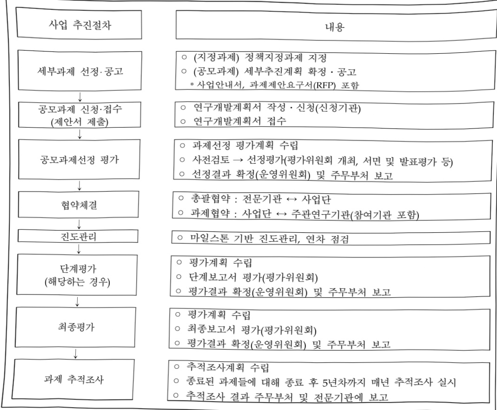
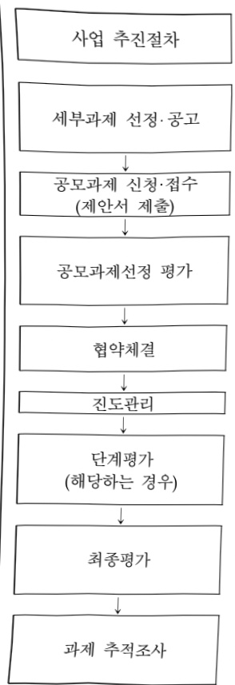

# 국가 통합 바이오 빅데이터 구축(R&D)

**해당 페이지**: PDF 3422 ~ 3429 쪽 해당

**부처**: 보건복지부
**분야**: 보건
**회계유형**: 일반회계
**2026 확정예산**: 52123.0 백만원
**전년대비 증감률**: 56.1%
**AI 도메인**: 데이터, 의료/바이오

---

<table border=1 style='margin: auto; word-wrap: break-word;'><tr><td style='text-align: center; word-wrap: break-word;'>사업명</td><td colspan="2">구분</td></tr><tr><td rowspan="3">국가통합바이오 빅데이터구축 (R&amp;D)</td><td rowspan="2">소관부처</td><td style='text-align: center; word-wrap: break-word;'>보건산업정책국 첨단의료지원관</td></tr><tr><td style='text-align: center; word-wrap: break-word;'>보건의료데이터진흥과</td></tr><tr><td style='text-align: center; word-wrap: break-word;'>사업시행주체</td><td style='text-align: center; word-wrap: break-word;'>한국보건산업진흥원</td></tr></table>

사업 소관부처 및 시행주체

<table border=1 style='margin: auto; word-wrap: break-word;'><tr><td style='text-align: center; word-wrap: break-word;'>직접</td><td style='text-align: center; word-wrap: break-word;'>출자</td><td style='text-align: center; word-wrap: break-word;'>출연</td><td style='text-align: center; word-wrap: break-word;'>보조</td><td style='text-align: center; word-wrap: break-word;'>응자</td><td style='text-align: center; word-wrap: break-word;'>국고보조율(%)</td><td style='text-align: center; word-wrap: break-word;'>응자율(%)</td></tr><tr><td style='text-align: center; word-wrap: break-word;'></td><td style='text-align: center; word-wrap: break-word;'></td><td style='text-align: center; word-wrap: break-word;'>○</td><td style='text-align: center; word-wrap: break-word;'></td><td style='text-align: center; word-wrap: break-word;'></td><td style='text-align: center; word-wrap: break-word;'></td><td style='text-align: center; word-wrap: break-word;'></td></tr></table>

사업 지원 형태 및 지원을 (최소한 한 개는 반드시 선택하시오. 해당사항에 0 표시)

<table border=1 style='margin: auto; word-wrap: break-word;'><tr><td colspan="6">☐ 사업 성격 (공통요구자료 Ⅱ-1 작성유의사항 4. 참조, 해당하는 사항에 “○” 표시)</td></tr><tr><td rowspan="5">신규 계속</td><td rowspan="5">☐</td><td rowspan="5">☐</td><td rowspan="5">☐</td><td rowspan="4">☐</td><td rowspan="4">☐</td></tr><tr></tr><tr></tr><tr></tr><tr><td style='text-align: center; word-wrap: break-word;'></td><td style='text-align: center; word-wrap: break-word;'></td></tr></table>

<table border=1 style='margin: auto; word-wrap: break-word;'><tr><td style='text-align: center; word-wrap: break-word;'>구분</td><td style='text-align: center; word-wrap: break-word;'>프로그램</td><td style='text-align: center; word-wrap: break-word;'>단위사업</td><td style='text-align: center; word-wrap: break-word;'>세부사업</td></tr><tr><td style='text-align: center; word-wrap: break-word;'>코드</td><td style='text-align: center; word-wrap: break-word;'>3000</td><td style='text-align: center; word-wrap: break-word;'>3031</td><td style='text-align: center; word-wrap: break-word;'>520</td></tr><tr><td style='text-align: center; word-wrap: break-word;'>명칭</td><td style='text-align: center; word-wrap: break-word;'>보건산업육성</td><td style='text-align: center; word-wrap: break-word;'>보건의료연구개발</td><td style='text-align: center; word-wrap: break-word;'>국가통합바이오박대이타구척(R&amp;D)</td></tr></table>

<table border=1 style='margin: auto; word-wrap: break-word;'><tr><td style='text-align: center; word-wrap: break-word;'>구분</td><td style='text-align: center; word-wrap: break-word;'>회계</td><td style='text-align: center; word-wrap: break-word;'>소관</td><td style='text-align: center; word-wrap: break-word;'>실국(기관)</td><td style='text-align: center; word-wrap: break-word;'>계정</td><td style='text-align: center; word-wrap: break-word;'>분야</td><td style='text-align: center; word-wrap: break-word;'>부문</td></tr><tr><td style='text-align: center; word-wrap: break-word;'>코드</td><td style='text-align: center; word-wrap: break-word;'>11</td><td style='text-align: center; word-wrap: break-word;'>23</td><td style='text-align: center; word-wrap: break-word;'>보건의료정책실</td><td rowspan="2"></td><td style='text-align: center; word-wrap: break-word;'>090</td><td style='text-align: center; word-wrap: break-word;'>091</td></tr><tr><td style='text-align: center; word-wrap: break-word;'>명칭</td><td style='text-align: center; word-wrap: break-word;'>일반회계</td><td style='text-align: center; word-wrap: break-word;'>보건복지부</td><td style='text-align: center; word-wrap: break-word;'>첨단의료지원관</td><td style='text-align: center; word-wrap: break-word;'>보건</td><td style='text-align: center; word-wrap: break-word;'>보건의료</td></tr></table>

□사업코드정보

<table border=1 style='margin: auto; word-wrap: break-word;'><tr><td style='text-align: center; word-wrap: break-word;'>사 업 명</td></tr><tr><td style='text-align: center; word-wrap: break-word;'>(211) 국가 통합 바이오 빅데이터 구축(R&amp;D) (3031-520)</td></tr></table>

---

### 가.예산 총괄표

(단위:백만원,%)

<table border=1 style='margin: auto; word-wrap: break-word;'><tr><td rowspan="2">사업명</td><td rowspan="2">2024년 결산</td><td colspan="2">2025년 예산</td><td colspan="2">2026년 예산</td><td rowspan="2">증감 (B-A)</td><td rowspan="2">(B-A)/A</td></tr><tr><td style='text-align: center; word-wrap: break-word;'>본예산</td><td style='text-align: center; word-wrap: break-word;'>추경*(A)</td><td style='text-align: center; word-wrap: break-word;'>요구안</td><td style='text-align: center; word-wrap: break-word;'>본예산(B)</td></tr><tr><td style='text-align: center; word-wrap: break-word;'>국가통합바이오 빅데이터구축 (R&amp;D)</td><td style='text-align: center; word-wrap: break-word;'>17,052</td><td style='text-align: center; word-wrap: break-word;'>33,397</td><td style='text-align: center; word-wrap: break-word;'>33,397</td><td style='text-align: center; word-wrap: break-word;'>52,123</td><td style='text-align: center; word-wrap: break-word;'>52,123</td><td style='text-align: center; word-wrap: break-word;'>18,726</td><td style='text-align: center; word-wrap: break-word;'>56.1</td></tr></table>

*추경: 추경증감액을 포함한 최종 예산액을 기재

## □ 기능별(내역사업별) 예산 내역

(단위:백만원)

<table border=1 style='margin: auto; word-wrap: break-word;'><tr><td rowspan="2"></td><td colspan="5">2024</td><td colspan="5">2025</td><td rowspan="2">2026예산</td></tr><tr><td style='text-align: center; word-wrap: break-word;'>예산액(추경)</td><td style='text-align: center; word-wrap: break-word;'>예산현액</td><td style='text-align: center; word-wrap: break-word;'>집행액</td><td style='text-align: center; word-wrap: break-word;'>이월액</td><td style='text-align: center; word-wrap: break-word;'>불용액</td><td style='text-align: center; word-wrap: break-word;'>예산액(추경)</td><td style='text-align: center; word-wrap: break-word;'>예산현액</td><td style='text-align: center; word-wrap: break-word;'>집행액</td><td style='text-align: center; word-wrap: break-word;'>이월액</td><td style='text-align: center; word-wrap: break-word;'>불용액</td></tr><tr><td style='text-align: center; word-wrap: break-word;'>○ 기능별 분류(합계)</td><td style='text-align: center; word-wrap: break-word;'>17,052</td><td style='text-align: center; word-wrap: break-word;'>17,052</td><td style='text-align: center; word-wrap: break-word;'>17,052</td><td style='text-align: center; word-wrap: break-word;'>-</td><td style='text-align: center; word-wrap: break-word;'>-</td><td style='text-align: center; word-wrap: break-word;'>33,397</td><td style='text-align: center; word-wrap: break-word;'>33,397</td><td style='text-align: center; word-wrap: break-word;'>33,397</td><td style='text-align: center; word-wrap: break-word;'>-</td><td style='text-align: center; word-wrap: break-word;'>-</td><td style='text-align: center; word-wrap: break-word;'>52,123</td></tr><tr><td style='text-align: center; word-wrap: break-word;'>·바이오  데이터뱅크 구축·운영</td><td style='text-align: center; word-wrap: break-word;'>14,893</td><td style='text-align: center; word-wrap: break-word;'>14,893</td><td style='text-align: center; word-wrap: break-word;'>14,893</td><td style='text-align: center; word-wrap: break-word;'>-</td><td style='text-align: center; word-wrap: break-word;'>-</td><td style='text-align: center; word-wrap: break-word;'>31,716</td><td style='text-align: center; word-wrap: break-word;'>31,716</td><td style='text-align: center; word-wrap: break-word;'>31,716</td><td style='text-align: center; word-wrap: break-word;'>-</td><td style='text-align: center; word-wrap: break-word;'>-</td><td style='text-align: center; word-wrap: break-word;'>49,739</td></tr><tr><td style='text-align: center; word-wrap: break-word;'>·사업단  운영</td><td style='text-align: center; word-wrap: break-word;'>2,159</td><td style='text-align: center; word-wrap: break-word;'>2,159</td><td style='text-align: center; word-wrap: break-word;'>2,159</td><td style='text-align: center; word-wrap: break-word;'>-</td><td style='text-align: center; word-wrap: break-word;'>-</td><td style='text-align: center; word-wrap: break-word;'>1,681</td><td style='text-align: center; word-wrap: break-word;'>1,681</td><td style='text-align: center; word-wrap: break-word;'>1,681</td><td style='text-align: center; word-wrap: break-word;'>-</td><td style='text-align: center; word-wrap: break-word;'>-</td><td style='text-align: center; word-wrap: break-word;'>2,384</td></tr></table>

### 나. 사업설명자료

## 1 ) 사업목적·내용

°(국가 통합 바이오 빅데이터 구축) 참여자 동의 기반 검체(혈액·소변 등)를 확보*하고, 임

상·유전체 및 공공데이터 등을 통합·개방하기 위한 R&D 인프라 구축

* 1단계('24~'28년) 77.2만명 모집(예타 기준 6,065.8억원)

- (내역① 바이오 데이터뱅크 구축·운영) 개인 중심으로 통합된 바이오 빅데이터 구축 및 동의·수집·보호·활용체계 마련

- (내역② 사업단 운영) 사업 기획, 평가 및 성과관리 등 사업 운영 관리

---

## 2 ) 사업개요

□ 사업근거 및 추진경위

①법령상 근거 및 조항 적시

과학기술기본법 제11조(국가연구개발사업의 추진)

제11조(국가연구개발사업의 추진) ① 중앙행정기관의 장은 기본계획에 따라 맡은 분야의 국가연구개발사업과 그 시책을 세워 추진하여야 한다. <개정 2014. 5. 28.>

② 추진경위 - 사업 시작년도, 추진배경, 부처별 중점과제, 대통령 공약사항 등

○ 국정과제 32-2

- 의료 AI·제약·바이오헬스 강국 실현 / 의료AI 등 디지털 헬스케어 혁신성장 체계 구축

0 제5차 과학기술기본계획('23~'27), IV. 중점 육성기술(전략기술)

2 12대 국가전략기술 분야 및 50개 세부 중점기술

-한국인 특유 유전체·바이오 빅데이터 구축

## 5 첨단바이오

단기(-5년)

·수개월차 개발 가능한 mRNA 백신플랫폼 확보

·한국인 특유 유전체·바이오 빅데이터 구축

중장기(5~10년)

·선도국 수준 유전자·세포치료 파이프라인 확보

·합성생물학 기반 바이오제조·생산 고도화

▶ 합성생물학

유전자·세포 치료

감염병백신치료

디지털헬스데이터분석·활용

o 제1차 국가전략기술 육성 기본계획('24~,28)

중점기술 4 디지털·헬스 데이터 분석·활용

□ 기술개발, 핵심R&D

신약의료기개발,정밀의료실현을위한AI활용촉진및바이오빅데이터구축지원

° 신약:의료기기 개발, 정밀의료 실현을 위한 AI 총

- 참여자의 동의를 기반으로 검체(혈액, 소변 등)를 확보, 임상·유전체 데이터를 생산, 공공데이터와 라이프로그를 수집·연계하여 R&D 인프라인 한국형 바이오 빅데이터 및 데이터뱅크 구축

* 국가 통합 바이오 빅데이터 구축 ('24~, '28, '24년 171억원)

° 신성장 4.0프로젝트('23.1. 기재부)

- [2] (바이오 혁신) 바이오 파운드리, 바이오 데이터뱅크 구축

### ※'25년 추진계획('25.3월)

° 네이터뱅크 대국민 홍보 등을 통한 국가 통합 바이오 빅데이터 구축 사업 참여자 모집 본격화('25), 양질의 연구자원* 축적 및 내실화

*유전체 및 오믹스 데이터 생산, 공공데이터 등 2차 자료 연계 등

---

<table border=1 style='margin: auto; word-wrap: break-word;'><tr><td style='text-align: center; word-wrap: break-word;'></td><td style='text-align: center; word-wrap: break-word;'>○ 바이오헬스 신시장창출전략(&#x27;23.2.) - ③ (데이터뱅크) 국가 통합 바이오 빅데이터 구축 및 개방 : 임상정보·유전체 데이터, 공공데이터 및 라이프로그 등을 통합한 바이오 빅데이터 구축개방○「데이터경제 활성화 방안」(&#x27;23.11., 기재부) - &#x27;공공-임상-유전체-라이프로그&#x27; 데이터를 개인단위로 연결하여 구축</td></tr><tr><td style='text-align: center; word-wrap: break-word;'>추진경위</td><td style='text-align: center; word-wrap: break-word;'>○ (시범사업) 2.5만 명 규모 시범사업 추진(&#x27;20~22), 임상·유전체 데이터 구축·개방(&#x27;23.6월~) → 연구재단의 시범사업 평가 결과 &quot;우수&quot;○ (예타 추진) 예비타당성조사 신청 및 통과(&#x27;23.6월)○ (본사업 전환) 사업단 구성 및 정책지정·지정공모과제 수행기관 등 거버넌스 구축(&#x27;24.4월~), 참여자 모집 개시(&#x27;24.12월~)○ (특정평가) 예타 계획변경을 위하여 총사업비 약 515억원(범부처, &#x27;26~&#x27;28)* 증액(&#x27;25.5월)* 참여자 인센티브 364억, 모집기관 인건비 현실화 등 86억, 홍보비 65억</td></tr></table>

## □ 주요내용

① 사업규모

- 총사업비(해당되는 경우에만 기재) : 해당없음

- 사업기간 : '24~'28년

- 최근 5년 간 투입된 사업비(예산액기준, 추경편성한 연도에는 추경포함)

<table border=1 style='margin: auto; word-wrap: break-word;'><tr><td style='text-align: center; word-wrap: break-word;'>연도</td><td style='text-align: center; word-wrap: break-word;'>2022</td><td style='text-align: center; word-wrap: break-word;'>2023</td><td style='text-align: center; word-wrap: break-word;'>2024</td><td style='text-align: center; word-wrap: break-word;'>2025</td><td style='text-align: center; word-wrap: break-word;'>2026</td></tr><tr><td style='text-align: center; word-wrap: break-word;'>사업비</td><td style='text-align: center; word-wrap: break-word;'>-</td><td style='text-align: center; word-wrap: break-word;'>-</td><td style='text-align: center; word-wrap: break-word;'>17,052</td><td style='text-align: center; word-wrap: break-word;'>33,397</td><td style='text-align: center; word-wrap: break-word;'>52,123</td></tr></table>

- 기타: 해당없음

② 사업추진체계

- 사업시행방법 : 출연

- 사업시행주체 : (주관부처) 보건복지부

(참여부처) 과학기술정보통신부, 산업통상자원부, 질병관리청

(전문기관) 한국보건산업진흥원

(사 업 단) 국가통합바이오빅데이터구축사업단

- 사업 수혜자 : 희귀·중증질환자, 참여자, 연구자, 기업 등

- 보조, 융자, 출연, 출자 등의 경우 보조·융자 등 지원 비율 및 법적근거

<table border=1 style='margin: auto; word-wrap: break-word;'><tr><td style='text-align: center; word-wrap: break-word;'>내역사업명</td><td style='text-align: center; word-wrap: break-word;'>구분</td><td style='text-align: center; word-wrap: break-word;'>피보조·피출연 등 기관명</td><td style='text-align: center; word-wrap: break-word;'>지원 금액 (2026예산)</td><td style='text-align: center; word-wrap: break-word;'>지원 비율(%)</td><td style='text-align: center; word-wrap: break-word;'>보조율 법적근거 (해당 조항)</td></tr><tr><td style='text-align: center; word-wrap: break-word;'>바이오 데이터뱅크 구축·운영</td><td rowspan="2">출연</td><td rowspan="2">한국 보건산업 진흥원</td><td style='text-align: center; word-wrap: break-word;'>49,739</td><td style='text-align: center; word-wrap: break-word;'>100</td><td rowspan="2">「보건의료기술진흥법」 제3조(기술개발의 보호·육성) 및 제7조(연구개발사업 전문기관의 지정) 등 「국가연구개발혁신법」 사업단 운영 제22조(연구개발사업 전문기관의 지정)</td></tr><tr><td style='text-align: center; word-wrap: break-word;'>사업단 운영</td><td style='text-align: center; word-wrap: break-word;'>2,384</td><td style='text-align: center; word-wrap: break-word;'>100</td></tr></table>

---

## 3 ) 2026년도 예산 산출 근거

<table border=1 style='margin: auto; word-wrap: break-word;'><tr><td style='text-align: center; word-wrap: break-word;'>① 바이오 데이터뱅크 구축·운영 : (&#x27;25) 31,716백만원 → (&#x27;26) 49,739백만원, +18,023백만원 - 개인 중심으로 통합된 바이오 빅데이터 구축 및 동의·수집·보호·활용체계 마련 - (산출) 총 44개 과제(계속) × 2,668백만원 × 12/12개월 × 42.37%(복지부 지원 비율) ※ 부처별 지원비율 : (복지부) 42.37%, (과기부) 34.25%, (산업부) 13.51%, (질병청) 9.87%</td></tr><tr><td style='text-align: center; word-wrap: break-word;'>② 사업단 운영 : (&#x27;25) 1,681백만원 → (&#x27;26) 2,384백만원, +703백만원 - 사업 기획, 평가 및 성과관리 등 사업 운영 관리를 위한 사업단 운영비 - (산출) 총 1개 과제(계속) × 5,626백만원 × 12/12개월 × 42.37%(복지부 지원 비율) ※ 부처별 지원비율 : (복지부) 42.37%, (과기부) 34.25%, (산업부) 13.51%, (질병청) 9.87%</td></tr></table>

## 4 ) 사업효과

## ☐ 사업영향, 산출물 성과지표 등

①2022~2026년도 성과계획서 상 성과지표 및 최근 5년간 성과 달성도

<table border=1 style='margin: auto; word-wrap: break-word;'><tr><td style='text-align: center; word-wrap: break-word;'>성과지표</td><td style='text-align: center; word-wrap: break-word;'>구분</td><td style='text-align: center; word-wrap: break-word;'>2022</td><td style='text-align: center; word-wrap: break-word;'>2023</td><td style='text-align: center; word-wrap: break-word;'>2024</td><td style='text-align: center; word-wrap: break-word;'>2025</td><td style='text-align: center; word-wrap: break-word;'>2026</td><td style='text-align: center; word-wrap: break-word;'>2026 목표치산출근거</td><td style='text-align: center; word-wrap: break-word;'>측정산식(또는 측정방법)</td><td style='text-align: center; word-wrap: break-word;'>자료수집방법(또는 자료출처)</td></tr><tr><td rowspan="3">참여자 모집 건수 (단위: 천진)</td><td style='text-align: center; word-wrap: break-word;'>목표</td><td style='text-align: center; word-wrap: break-word;'>-</td><td style='text-align: center; word-wrap: break-word;'>-</td><td style='text-align: center; word-wrap: break-word;'>-</td><td style='text-align: center; word-wrap: break-word;'>206</td><td style='text-align: center; word-wrap: break-word;'>398</td><td rowspan="3">참여자 개인 중심의 통합 데이터가 구축되므로 당해온도 참여자 누적 모집실적을 목표치로 설정</td><td rowspan="3">∑(검체 수집을 완료한 참여자 수(누적))</td><td rowspan="3">바이오 빅데이터 플랫폼 상에 등재 완료된 참여자 수 측정</td></tr><tr><td style='text-align: center; word-wrap: break-word;'>실적</td><td style='text-align: center; word-wrap: break-word;'>-</td><td style='text-align: center; word-wrap: break-word;'>-</td><td style='text-align: center; word-wrap: break-word;'>-</td><td style='text-align: center; word-wrap: break-word;'>110</td><td style='text-align: center; word-wrap: break-word;'>-</td></tr><tr><td style='text-align: center; word-wrap: break-word;'>달성도</td><td style='text-align: center; word-wrap: break-word;'>-</td><td style='text-align: center; word-wrap: break-word;'>-</td><td style='text-align: center; word-wrap: break-word;'>-</td><td style='text-align: center; word-wrap: break-word;'>53.4</td><td style='text-align: center; word-wrap: break-word;'>-</td></tr><tr><td rowspan="3">통합 바이오데이터 구축률 (단위: %)</td><td style='text-align: center; word-wrap: break-word;'>목표</td><td style='text-align: center; word-wrap: break-word;'>-</td><td style='text-align: center; word-wrap: break-word;'>-</td><td style='text-align: center; word-wrap: break-word;'>-</td><td style='text-align: center; word-wrap: break-word;'>70</td><td style='text-align: center; word-wrap: break-word;'>73</td><td rowspan="3">임상, 공공데이터, 유전체·오믹스테이터 등 다양한 바이오 데이터 중 2종 이상의 데이터 연계</td><td rowspan="3">(∑연계데이터 생성 참여자 수) / (∑사업 동의 참여자 수)×100</td><td rowspan="3">데이터뱅크 시스템상의 동의 유지 참여자 통계치 측정</td></tr><tr><td style='text-align: center; word-wrap: break-word;'>실적</td><td style='text-align: center; word-wrap: break-word;'>-</td><td style='text-align: center; word-wrap: break-word;'>-</td><td style='text-align: center; word-wrap: break-word;'>-</td><td style='text-align: center; word-wrap: break-word;'>63.4</td><td style='text-align: center; word-wrap: break-word;'>-</td></tr><tr><td style='text-align: center; word-wrap: break-word;'>달성도</td><td style='text-align: center; word-wrap: break-word;'>-</td><td style='text-align: center; word-wrap: break-word;'>-</td><td style='text-align: center; word-wrap: break-word;'>-</td><td style='text-align: center; word-wrap: break-word;'>90.6</td><td style='text-align: center; word-wrap: break-word;'>-</td></tr><tr><td rowspan="3">참여자 관리 시스템 구축 공정률 (단위: %)</td><td style='text-align: center; word-wrap: break-word;'>목표</td><td style='text-align: center; word-wrap: break-word;'>-</td><td style='text-align: center; word-wrap: break-word;'>-</td><td style='text-align: center; word-wrap: break-word;'>38</td><td style='text-align: center; word-wrap: break-word;'>60</td><td style='text-align: center; word-wrap: break-word;'>100</td><td rowspan="3">인프라 구축(HW), 시스템 개발(SW) &#x27;25년 누적 구축 계획 (36%, 24%)에 대한 가중치(0.6, 0.4) 부여</td><td rowspan="3">(참여자 관리 시스템 인프라 구축(HW) 누적 공정률)×(인프라 구축 가중치) + (참여자 관리 시스템 시스템 개발(SW) 누적 공정률)×(시스템 개발 가중치)</td><td rowspan="3">감리수행 결과보고서 등 HW/SW 공정별 예산 투입 및 성과 달성도를 측정할 수 있는 문서</td></tr><tr><td style='text-align: center; word-wrap: break-word;'>실적</td><td style='text-align: center; word-wrap: break-word;'>-</td><td style='text-align: center; word-wrap: break-word;'>-</td><td style='text-align: center; word-wrap: break-word;'>38</td><td style='text-align: center; word-wrap: break-word;'>59.9</td><td style='text-align: center; word-wrap: break-word;'>-</td></tr><tr><td style='text-align: center; word-wrap: break-word;'>달성도</td><td style='text-align: center; word-wrap: break-word;'>-</td><td style='text-align: center; word-wrap: break-word;'>-</td><td style='text-align: center; word-wrap: break-word;'>100</td><td style='text-align: center; word-wrap: break-word;'>99.9</td><td style='text-align: center; word-wrap: break-word;'>-</td></tr><tr><td rowspan="3">바이오 빅데이터 플랫폼 구축 공정률 (단위: %)</td><td style='text-align: center; word-wrap: break-word;'>목표</td><td style='text-align: center; word-wrap: break-word;'>-</td><td style='text-align: center; word-wrap: break-word;'>-</td><td style='text-align: center; word-wrap: break-word;'>24</td><td style='text-align: center; word-wrap: break-word;'>62</td><td style='text-align: center; word-wrap: break-word;'>100</td><td rowspan="3">인프라 구축(HW), 시스템 개발(SW) &#x27;25년 누적 구축 계획 (42%, 20%)에 대한 가중치(0.7, 0.3) 부여</td><td rowspan="3">(바이오 빅데이터 플랫폼 인프라 구축(HW) 누적 공정률)×(인프라 구축 가중치) + (바이오 빅데이터 플랫폼 개발(SW)×(플랫폼 개발 가중치)</td><td rowspan="3">감리수행 결과보고서 등 HW/SW 공정별 예산 투입 및 성과 달성도를 측정할 수 있는 문서</td></tr><tr><td style='text-align: center; word-wrap: break-word;'>실적</td><td style='text-align: center; word-wrap: break-word;'>-</td><td style='text-align: center; word-wrap: break-word;'>-</td><td style='text-align: center; word-wrap: break-word;'>23.9</td><td style='text-align: center; word-wrap: break-word;'>62</td><td style='text-align: center; word-wrap: break-word;'>-</td></tr><tr><td style='text-align: center; word-wrap: break-word;'>달성도</td><td style='text-align: center; word-wrap: break-word;'>-</td><td style='text-align: center; word-wrap: break-word;'>-</td><td style='text-align: center; word-wrap: break-word;'>99.7</td><td style='text-align: center; word-wrap: break-word;'>100</td><td style='text-align: center; word-wrap: break-word;'>-</td></tr></table>

---

② 성과지표 이외의 연도별 사업추진 경과 및 실적

<table border=1 style='margin: auto; word-wrap: break-word;'><tr><td style='text-align: center; word-wrap: break-word;'>2024</td><td style='text-align: center; word-wrap: break-word;'>· 사업단 개소 및 정책지정과제 수행기관* 선정(&#x27;24.4월&#x27;)
* (데이터뱅크) 한국보건의료정보원 / (바이오빅데이터 플랫폼) 한국과학기술정보연구원 / (유전체 등 데이터 생산 분석) 한국생명공학연구원 국가생명연구자원정보센터
· 공모과제 선정 완료(&#x27;24.12월&#x27;)
* 참여자 모집 및 임상정보·검체 수집 38개 과제, 인체자원 제작 및 검체 운송(1개 과제)</td></tr><tr><td style='text-align: center; word-wrap: break-word;'>2025</td><td style='text-align: center; word-wrap: break-word;'>· 국가 통합 바이오 빅데이터 구축사업 공동사업관리지침 배포(&#x27;25.3월&#x27;)
· 예타 계획 변경을 위한 특정평가를 통한 추가 예산(범부처 515억, &#x27;26~&#x27;28) 확보(&#x27;25.5월&#x27;)</td></tr></table>

③ 향후(2026년도 이후) 기대효과

• 한국형 통합 바이오 빅데이터 구축('24~32)을 통한 맞춤의료 실현
- 77.2만명(질환자 18.7만명 일반인 58.5만명)의 바이오 분야 핵심 연구자원 확보('24~28)
- 임상정보·유전체 데이터, 공공데이터 등을 통합한 바이오 빅데이터 개방('26~')

## 5 ) 타당성조사 및 예비타당성조사 시행여부 및 결과 요지

□ 예비타당성조사 통과('23.6월) → 특정평가를 통한 사업계획 변경('25.5월)

- 조사기관 : 한국과학기술기획평가원(KISTEP)

- 조사결과 : 대안시행(B/C 비율 : 0.69)

* 예비타당성조사 결과 100만 명 규모의 9년 사업을 2단계(5년+4년)로 분할하여 1단계 사업을 5년간('24~'28년) 6,065.8억 77.2만명 규모로 우선 추진

- 사업기간 : '24년 ~ '28년(5년)

- 총사업비 : 6,580.6억원

## 6 ) 총사업비 대상사업 여부 및 내역 : 해당없음

---

## 7 ) 사업 집행절차

○ (지정과제) 정책지정과제 지정

○ (공모과제) 세부추진계획 확정 · 공고

*사업안내서, 과제제안요구서(RFP) 포함

☐ 연구개발계획서 작성 · 신청(신청기관)

☐ 연구개발계획서 접수

☐ 과제선정 평가계획 수립

☐ 사전검토 → 선정평가(평가위원회 개최, 서면 및 발표평가 등)

☐ 선정결과 확정(운영위원회) 및 주무부처 보고

☐ 총괄협약 : 전문기관 ↔ 사업단

☐ 과제협약 : 사업단 ↔ 주관연구기관(참여기관 포함)

평가계획 수립

단계보고서평가(평가위원회)

평가결과 확정(운영위원회) 및 주무부처 보고

○ 평가계획 수립

○ 최종보고서 평가(평가위원회)

○ 평가결과 확정(운영위원회) 및 주무부처 보고

○ 추적조사계획 수립

○ 종료된 과제들에 대해 종료 후 5년차까지 매년 추적조사 실시

○ 추적조사 결과 주무부처 및 전문기관에 보고

## 8 ) 각종 평가 : 해당없음

---

### 다. 최근 4년간 결산내역

## 1 ) 결산표

☐ 부처 결산내역

(단위: 백만원, %)

<table border=1 style='margin: auto; word-wrap: break-word;'><tr><td rowspan="2">연도</td><td colspan="3">예산액</td><td rowspan="2">예산현액(A)</td><td rowspan="2">집행액(B)</td><td rowspan="2">집행률(B/A)</td><td rowspan="2">다음연도이월액</td><td rowspan="2">불용액</td></tr><tr><td style='text-align: center; word-wrap: break-word;'>본예산</td><td style='text-align: center; word-wrap: break-word;'>추경증감액</td><td style='text-align: center; word-wrap: break-word;'>추경</td></tr><tr><td style='text-align: center; word-wrap: break-word;'>2022</td><td style='text-align: center; word-wrap: break-word;'>-</td><td style='text-align: center; word-wrap: break-word;'>-</td><td style='text-align: center; word-wrap: break-word;'>-</td><td style='text-align: center; word-wrap: break-word;'>-</td><td style='text-align: center; word-wrap: break-word;'>-</td><td style='text-align: center; word-wrap: break-word;'>-</td><td style='text-align: center; word-wrap: break-word;'>-</td><td style='text-align: center; word-wrap: break-word;'>-</td></tr><tr><td style='text-align: center; word-wrap: break-word;'>2023</td><td style='text-align: center; word-wrap: break-word;'>-</td><td style='text-align: center; word-wrap: break-word;'>-</td><td style='text-align: center; word-wrap: break-word;'>-</td><td style='text-align: center; word-wrap: break-word;'>-</td><td style='text-align: center; word-wrap: break-word;'>-</td><td style='text-align: center; word-wrap: break-word;'>-</td><td style='text-align: center; word-wrap: break-word;'>-</td><td style='text-align: center; word-wrap: break-word;'>-</td></tr><tr><td style='text-align: center; word-wrap: break-word;'>2024</td><td style='text-align: center; word-wrap: break-word;'>17,052</td><td style='text-align: center; word-wrap: break-word;'>-</td><td style='text-align: center; word-wrap: break-word;'>17,052</td><td style='text-align: center; word-wrap: break-word;'>17,052</td><td style='text-align: center; word-wrap: break-word;'>17,052</td><td style='text-align: center; word-wrap: break-word;'>100.0</td><td style='text-align: center; word-wrap: break-word;'>-</td><td style='text-align: center; word-wrap: break-word;'>-</td></tr><tr><td style='text-align: center; word-wrap: break-word;'>2025</td><td style='text-align: center; word-wrap: break-word;'>33,397</td><td style='text-align: center; word-wrap: break-word;'>-</td><td style='text-align: center; word-wrap: break-word;'>33,397</td><td style='text-align: center; word-wrap: break-word;'>33,397</td><td style='text-align: center; word-wrap: break-word;'>33,397</td><td style='text-align: center; word-wrap: break-word;'>100.0</td><td style='text-align: center; word-wrap: break-word;'>-</td><td style='text-align: center; word-wrap: break-word;'>-</td></tr></table>

## 2 ) 주요 결산사항

2022~2025년 결산 주요사항 : 해당사항 없음

2025년 이·전용 등 세부내역 : 해당사항 없음

---

### 원본 PDF 크롭 이미지

