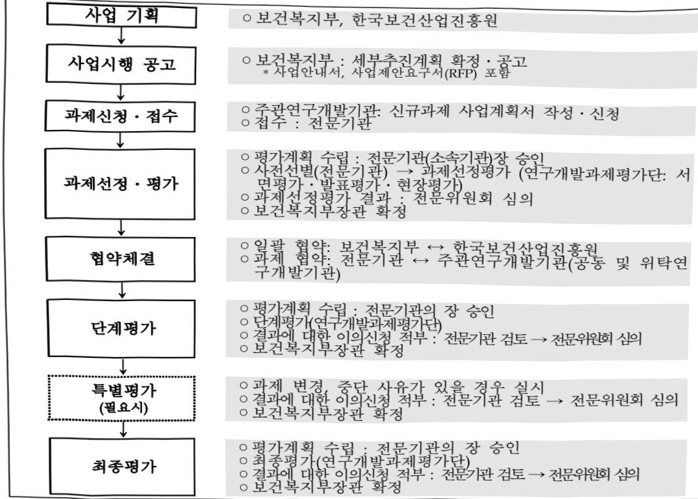

# 다기관-멀티모달 연합학습 기반 의료 인공지능 기술 시범모델…

**해당 페이지**: PDF 3430 ~ 3436 쪽 해당

**부처**: 보건복지부
**분야**: 보건
**회계유형**: 일반회계
**2026 확정예산**: 9000.0 백만원
**전년대비 증감률**: 33.3%
**AI 도메인**: LLM/언어모델, 의료/바이오, 교육/인재

---

### 가.예산 총괄표

(단위:백만원,%)

<table border=1 style='margin: auto; word-wrap: break-word;'><tr><td rowspan="2">사업명</td><td rowspan="2">2024년 결산</td><td colspan="2">2025년 예산</td><td colspan="2">2026년 예산</td><td rowspan="2">증감 (B-A)</td><td rowspan="2">(B-A)/A</td></tr><tr><td style='text-align: center; word-wrap: break-word;'>본예산</td><td style='text-align: center; word-wrap: break-word;'>추경*(A)</td><td style='text-align: center; word-wrap: break-word;'>요구안</td><td style='text-align: center; word-wrap: break-word;'>본예산(B)</td></tr><tr><td style='text-align: center; word-wrap: break-word;'>다기관-멀티모달 연합학습 기반 의료 인공지능 기술 시범모델 개발(R&amp;D)</td><td style='text-align: center; word-wrap: break-word;'>-</td><td style='text-align: center; word-wrap: break-word;'>6,750</td><td style='text-align: center; word-wrap: break-word;'>6,750</td><td style='text-align: center; word-wrap: break-word;'>9,000</td><td style='text-align: center; word-wrap: break-word;'>9,000</td><td style='text-align: center; word-wrap: break-word;'>2,250</td><td style='text-align: center; word-wrap: break-word;'>33.3</td></tr></table>

*추경: 추경증감액을 포함한 최종 예산액을 기재

## □ 기능별(내역사업별) 예산 내역

(단위:백만원)

<table border=1 style='margin: auto; word-wrap: break-word;'><tr><td rowspan="2"></td><td colspan="5">2024</td><td colspan="5">2025</td><td rowspan="2">2026 예산</td></tr><tr><td style='text-align: center; word-wrap: break-word;'>예산액 (추경)</td><td style='text-align: center; word-wrap: break-word;'>예산 현액</td><td style='text-align: center; word-wrap: break-word;'>집행액</td><td style='text-align: center; word-wrap: break-word;'>이월액</td><td style='text-align: center; word-wrap: break-word;'>불용액</td><td style='text-align: center; word-wrap: break-word;'>예산액 (추경)</td><td style='text-align: center; word-wrap: break-word;'>예산 현액</td><td style='text-align: center; word-wrap: break-word;'>집행액</td><td style='text-align: center; word-wrap: break-word;'>이월액</td><td style='text-align: center; word-wrap: break-word;'>불용액</td></tr><tr><td style='text-align: center; word-wrap: break-word;'>○ 기능별 분류(합계)</td><td style='text-align: center; word-wrap: break-word;'>-</td><td style='text-align: center; word-wrap: break-word;'>-</td><td style='text-align: center; word-wrap: break-word;'>-</td><td style='text-align: center; word-wrap: break-word;'>-</td><td style='text-align: center; word-wrap: break-word;'>-</td><td style='text-align: center; word-wrap: break-word;'>6,750</td><td style='text-align: center; word-wrap: break-word;'>6,750</td><td style='text-align: center; word-wrap: break-word;'>6,750</td><td style='text-align: center; word-wrap: break-word;'>-</td><td style='text-align: center; word-wrap: break-word;'>-</td><td style='text-align: center; word-wrap: break-word;'>9,000</td></tr><tr><td style='text-align: center; word-wrap: break-word;'>· 다기관-멀티모달 연합학습 기반 의료 인공지능 기술 시범모델 개발</td><td style='text-align: center; word-wrap: break-word;'>-</td><td style='text-align: center; word-wrap: break-word;'>-</td><td style='text-align: center; word-wrap: break-word;'>-</td><td style='text-align: center; word-wrap: break-word;'>-</td><td style='text-align: center; word-wrap: break-word;'>-</td><td style='text-align: center; word-wrap: break-word;'>6,750</td><td style='text-align: center; word-wrap: break-word;'>6,750</td><td style='text-align: center; word-wrap: break-word;'>6,750</td><td style='text-align: center; word-wrap: break-word;'>-</td><td style='text-align: center; word-wrap: break-word;'>-</td><td style='text-align: center; word-wrap: break-word;'>9,000</td></tr></table>

### 나. 사업설명자료

## 1 ) 사업목적·내용

(사업목적) 환자, 의료진 모두가 체감할 수 있고, 현장 수용도가 높은 생성형 AI 기반 의료서비스 모델 개발 및 다기관 공동 임상현장 적용

(사업내용) 생성형 AI 기반 환자-의료진간 상호작용을 제고할 수 있는 의료서비스 지원 기술개발 및 다기관 공동활용 임상현장 실증 제고

① 다기관-멀티모달 연합학습 기반 의료서비스 지원 플랫폼 개발

- 환자-의료진간 상호작용을 통해 획득한 다양한 의료데이터를 기반으로 종합적 의료서비스 지원을 위한 멀티모달 파운데이션 모델 기술개발

---

- 의료기관간 데이터 공유 없이 안전하게 AI 학습 및 참여 가능한 연합학습 기반

플랫폼 개발

② 의료서비스 지원 AI 솔루션 개발 및 임상 검증·활용평가

- 의료서비스 지원이 가능한 AI 솔루션 시범모델을 선정 및 멀티모달 파운데이션

모델을 기반으로 AI SW 솔루션 시범모델 개발

- 개발된 AI 솔루션은 다양한 임상현장에서 검증·실증 수행

## 2 ) 사업개요

사업근거 및 추진경위

① 법령상 근거 및 조항 적시

- 과학기술기본법 제11조(국가연구개발사업의 추진)

① 중앙행정기관의 장은 기본계획에 따라 맡은 분야의 국가연구개발사업과 그 시책을 세워 추진하여야 한다.

- 보건의료기술진흥법 제3조, 제5조 및 제10조

·제3조(기술개발의 보호·육성) 정부는 보건의료기술의 진흥을 위한 연구개발

활동과 보건신기술을 장려하고 보호·육성하기 위한 정책을 마련하여 시행하여야 하며

이에 필요한 비용을 지원할 수 있다.

·제5조(보건의료기술 연구개발사업의 추진) 정부는 기본계획을 효율적으로 추진하기 위하여 보건의료기술 연구개발사업을 수행한다.

·제10조(보건의료정보의 진흥) 보건복지부장관은 보건의료정보의 생산·유통 및 활용을 위하여 다음 각 호의 사업을 추진한다.

② 추진경위 - 사업 시작년도, 추진배경, 부처별 중점과제, 대통령 공약사항 등

- '22.05 윤석열 정부 11대 국정과제 발표, "국정과제 25, 바이오 헬스·디지털 헬스 글로벌 중심국가 도약(복지부)"

- '23.03

  '제1차 국가연구개발 중장기 투자전략 발표', [전략1]선택과 집중으로 혁신 역량강화: AI·통신 등 혁신기술 기반 디지털 전환

- '23.04 제3차 보건의료기술육성기본계획, '[전략3]비용 효과적인 환자 중심 보건의료기술개발', [전략7]데이터·AI를 활용한 디지털 헬스케어 혁신

- '24.12 2025년도 보건의료기술연구개발사업 신규지원 대상과제 공고

- '25.04 신규지원 대상과제 선정 및 연구개시

---

□ 주요내용

① 사업규모

- 총사업비(해당되는 경우에만 기재) : 해당없음

- 사업기간 : '25 ~ '29년

- 최근 5년 간 투입된 사업비(예산액기준, 추경편성한 연도에는 추경포함)

<table border=1 style='margin: auto; word-wrap: break-word;'><tr><td style='text-align: center; word-wrap: break-word;'>$ \underline{\text{연도}} $</td><td style='text-align: center; word-wrap: break-word;'>2022</td><td style='text-align: center; word-wrap: break-word;'>2023</td><td style='text-align: center; word-wrap: break-word;'>2024</td><td style='text-align: center; word-wrap: break-word;'>2025</td><td style='text-align: center; word-wrap: break-word;'>2026</td></tr><tr><td style='text-align: center; word-wrap: break-word;'>$ \underline{\text{사업비}} $</td><td style='text-align: center; word-wrap: break-word;'>-</td><td style='text-align: center; word-wrap: break-word;'>-</td><td style='text-align: center; word-wrap: break-word;'>-</td><td style='text-align: center; word-wrap: break-word;'>6,750</td><td style='text-align: center; word-wrap: break-word;'>9,000</td></tr></table>

- 기타: 해당없음

② 사업추진체계

- 사업시행방법 : 출연(기업 참여 시 Matching)

- 사업시행주체 : 보건복지부, 한국보건산업진흥원, (주관기관 및 참여기관) 산·학·연·병

- 사업 수혜자 : 산·학·연·병 연구자

- 보조, 융자, 출연, 출자 등의 경우 보조.융자 등 지원 비율 및 법적근거

<table border=1 style='margin: auto; word-wrap: break-word;'><tr><td style='text-align: center; word-wrap: break-word;'>내역사업명</td><td style='text-align: center; word-wrap: break-word;'>구분</td><td style='text-align: center; word-wrap: break-word;'>피보조.피출연 등 기관명</td><td style='text-align: center; word-wrap: break-word;'>지원 금액 (2026예산)</td><td style='text-align: center; word-wrap: break-word;'>지원 비율(%)</td><td style='text-align: center; word-wrap: break-word;'>보조율 법적근거 (해당 조항)</td></tr><tr><td style='text-align: center; word-wrap: break-word;'>다기관-멀티모달 연합학습 기반 의료 인공지능 기술 시범모델 개발</td><td style='text-align: center; word-wrap: break-word;'>출연</td><td style='text-align: center; word-wrap: break-word;'>한국 보건산업 진흥원</td><td style='text-align: center; word-wrap: break-word;'>9,000</td><td style='text-align: center; word-wrap: break-word;'>100</td><td style='text-align: center; word-wrap: break-word;'>보건의료기술진흥법 제7조</td></tr></table>

## 3 ) 2026년도 예산 산출 근거

①다기관-멀티모달 연합학습 기반 의료인공지능 기술 시범모델 개발

:(2025 본예산) 6,750백만원 → (25) 9,000백만원, +33.3%

- (요구) 현장 수용도가 높은 혁신적 AI 의료 서비스 지원 솔루션 시범모델 개발·실증을 위한 9,000백만원 요구

- (산출) 2개 컨소시엄 지원을 위한 10개 과제 회계연도 일치(9개월 → 12개월)로 인한 9,000백만원 산출

<1개 컨소시엄 內 세부과제 수 및 단가 >

■다기관-멀티모달 연합학습 기반 의료 서비스 지원 플랫폼 개발

- (계속) 1개 × 2,500백만 × 12/12개월 = 2,500백만원

의료 서비스 지원 AI 솔루션 개발 및 임상 검증·활용 평가

- (계속) 4개 × 500백만 × 12/12개월 = 2,000백만원

---

## 4 ) 사업효과

사업영향, 산출물 성과지표 등

① 2022~2026년도 성과계획서 상 성과지표 및 최근 5년간 성과 달성도

<table border=1 style='margin: auto; word-wrap: break-word;'><tr><td style='text-align: center; word-wrap: break-word;'>성과지표</td><td style='text-align: center; word-wrap: break-word;'>구분</td><td style='text-align: center; word-wrap: break-word;'>2022</td><td style='text-align: center; word-wrap: break-word;'>2023</td><td style='text-align: center; word-wrap: break-word;'>2024</td><td style='text-align: center; word-wrap: break-word;'>2025</td><td style='text-align: center; word-wrap: break-word;'>2026</td><td style='text-align: center; word-wrap: break-word;'>2026 목표치산출근거</td><td style='text-align: center; word-wrap: break-word;'>측정산식(또는 측정방법)</td><td style='text-align: center; word-wrap: break-word;'>자료수집방법(또는 자료출처)</td></tr><tr><td rowspan="3">보건의료실용화지수(점)</td><td style='text-align: center; word-wrap: break-word;'>목표</td><td style='text-align: center; word-wrap: break-word;'>86.0</td><td style='text-align: center; word-wrap: break-word;'>104</td><td style='text-align: center; word-wrap: break-word;'>105</td><td style='text-align: center; word-wrap: break-word;'>106</td><td style='text-align: center; word-wrap: break-word;'>107</td><td rowspan="3">최근 3년실적치 등을 고려하여 목표치 설정</td><td rowspan="3">(임상시험 승인수 × 07) + (기술이전 건수 × 1.0) + (품목 화가건수 × 1.3) *실용화를 위한 TRL단체를 고려하여 지표별 가정치 부여</td><td rowspan="3">범부처통합연구시스템 (IRIS) 활용</td></tr><tr><td style='text-align: center; word-wrap: break-word;'>실적</td><td style='text-align: center; word-wrap: break-word;'>93.2</td><td style='text-align: center; word-wrap: break-word;'>104.3</td><td style='text-align: center; word-wrap: break-word;'>107.6</td><td style='text-align: center; word-wrap: break-word;'>-</td><td style='text-align: center; word-wrap: break-word;'>-</td></tr><tr><td style='text-align: center; word-wrap: break-word;'>달성도</td><td style='text-align: center; word-wrap: break-word;'>108.4</td><td style='text-align: center; word-wrap: break-word;'>102.9</td><td style='text-align: center; word-wrap: break-word;'>102.5</td><td style='text-align: center; word-wrap: break-word;'>-</td><td style='text-align: center; word-wrap: break-word;'>-</td></tr></table>

② 성과지표 이외의 연도별 사업추진 경과 및 실적

<table border=1 style='margin: auto; word-wrap: break-word;'><tr><td style='text-align: center; word-wrap: break-word;'>2022</td><td style='text-align: center; word-wrap: break-word;'>-</td></tr><tr><td style='text-align: center; word-wrap: break-word;'>2023</td><td style='text-align: center; word-wrap: break-word;'>-</td></tr><tr><td style='text-align: center; word-wrap: break-word;'>2024</td><td style='text-align: center; word-wrap: break-word;'>-</td></tr><tr><td style='text-align: center; word-wrap: break-word;'>2025</td><td style='text-align: center; word-wrap: break-word;'>- ‘25년도 신규지원 대상과제 선정 및 연구개시</td></tr></table>

③향후(2026년도 이후)기대효과

- (범용성·확장성) 범용성·확장성이 확보된 시범모델로서 의료서비스 숲 영역의 AI 기반 병원

환경 구축 모델로 파생 가능

- (의료서비스 향상) 적정한 진료시간 보장과 함께 환자-의료진간 커뮤니케이션 능력을 향

상하고, 양질의 진료를 담보할 수 있는 혁신적인 의료 환경 구축

- (비용절감) 병원 진료·환자관리·행정업무 등 의료 전반의 프로세스 개선을 통한 비용 절감 및 수익증대 효과 창출

- (정보보호와 활용) 연합학습을 통해 각 의료기관간의 데이터를 안전하게 보호하면서 공

유·활용 가능한 생태계 마련

5) 타당성조사 및 예비타당성조사 시행여부 및 결과 요지 : 해당없음

6) 총사업비 대상사업 정보 : 해당없음

---

7) 사업 집행절차

8) 각종 평가 : 해당없음

### 다.최근 4년간 결산내역

1) 결산표

☐ 부처 결산내역

(단위:백만원,%)

<table border=1 style='margin: auto; word-wrap: break-word;'><tr><td rowspan="2">연도</td><td colspan="3">예산액</td><td rowspan="2">전년도 이월액</td><td rowspan="2">이.전용 등</td><td rowspan="2">예비비</td><td rowspan="2">예산 현액(B)</td><td rowspan="2">집행액(C)</td><td rowspan="2">집행률(C/A)</td><td rowspan="2">집행률(C/B)</td><td rowspan="2">다음연도 이월액</td><td rowspan="2">불용액</td></tr><tr><td style='text-align: center; word-wrap: break-word;'>본예산</td><td style='text-align: center; word-wrap: break-word;'>추경 증감액</td><td style='text-align: center; word-wrap: break-word;'>추경(A)</td></tr><tr><td style='text-align: center; word-wrap: break-word;'>2022</td><td style='text-align: center; word-wrap: break-word;'>-</td><td style='text-align: center; word-wrap: break-word;'>-</td><td style='text-align: center; word-wrap: break-word;'>-</td><td style='text-align: center; word-wrap: break-word;'>-</td><td style='text-align: center; word-wrap: break-word;'>-</td><td style='text-align: center; word-wrap: break-word;'>-</td><td style='text-align: center; word-wrap: break-word;'>-</td><td style='text-align: center; word-wrap: break-word;'>-</td><td style='text-align: center; word-wrap: break-word;'>-</td><td style='text-align: center; word-wrap: break-word;'>-</td><td style='text-align: center; word-wrap: break-word;'>-</td><td style='text-align: center; word-wrap: break-word;'>-</td></tr><tr><td style='text-align: center; word-wrap: break-word;'>2023</td><td style='text-align: center; word-wrap: break-word;'>-</td><td style='text-align: center; word-wrap: break-word;'>-</td><td style='text-align: center; word-wrap: break-word;'>-</td><td style='text-align: center; word-wrap: break-word;'>-</td><td style='text-align: center; word-wrap: break-word;'>-</td><td style='text-align: center; word-wrap: break-word;'>-</td><td style='text-align: center; word-wrap: break-word;'>-</td><td style='text-align: center; word-wrap: break-word;'>-</td><td style='text-align: center; word-wrap: break-word;'>-</td><td style='text-align: center; word-wrap: break-word;'>-</td><td style='text-align: center; word-wrap: break-word;'>-</td><td style='text-align: center; word-wrap: break-word;'>-</td></tr><tr><td style='text-align: center; word-wrap: break-word;'>2024</td><td style='text-align: center; word-wrap: break-word;'>-</td><td style='text-align: center; word-wrap: break-word;'>-</td><td style='text-align: center; word-wrap: break-word;'>-</td><td style='text-align: center; word-wrap: break-word;'>-</td><td style='text-align: center; word-wrap: break-word;'>-</td><td style='text-align: center; word-wrap: break-word;'>-</td><td style='text-align: center; word-wrap: break-word;'>-</td><td style='text-align: center; word-wrap: break-word;'>-</td><td style='text-align: center; word-wrap: break-word;'>-</td><td style='text-align: center; word-wrap: break-word;'>-</td><td style='text-align: center; word-wrap: break-word;'>-</td><td style='text-align: center; word-wrap: break-word;'>-</td></tr><tr><td style='text-align: center; word-wrap: break-word;'>2025</td><td style='text-align: center; word-wrap: break-word;'>6,750</td><td style='text-align: center; word-wrap: break-word;'>-</td><td style='text-align: center; word-wrap: break-word;'>6,750</td><td style='text-align: center; word-wrap: break-word;'>-</td><td style='text-align: center; word-wrap: break-word;'>-</td><td style='text-align: center; word-wrap: break-word;'>-</td><td style='text-align: center; word-wrap: break-word;'>6,750</td><td style='text-align: center; word-wrap: break-word;'>6,750</td><td style='text-align: center; word-wrap: break-word;'>100</td><td style='text-align: center; word-wrap: break-word;'>100</td><td style='text-align: center; word-wrap: break-word;'>-</td><td style='text-align: center; word-wrap: break-word;'>-</td></tr></table>

---

## 2 ) 주요 결산사항

□2022~2025년 결산 주요사항

<table border=1 style='margin: auto; word-wrap: break-word;'><tr><td style='text-align: center; word-wrap: break-word;'>2022</td><td style='text-align: center; word-wrap: break-word;'>해당없음</td></tr><tr><td style='text-align: center; word-wrap: break-word;'>2023</td><td style='text-align: center; word-wrap: break-word;'>해당없음</td></tr><tr><td style='text-align: center; word-wrap: break-word;'>2024</td><td style='text-align: center; word-wrap: break-word;'>해당없음</td></tr><tr><td style='text-align: center; word-wrap: break-word;'>2025</td><td style='text-align: center; word-wrap: break-word;'>- 집행률 100%</td></tr></table>

□2025년 이.전용 등 세부내역 : 해당없음

---

<table border=1 style='margin: auto; word-wrap: break-word;'><tr><td style='text-align: center; word-wrap: break-word;'>사업명</td><td colspan="2">구분</td></tr><tr><td rowspan="3">제약산업경쟁력 강화</td><td rowspan="2">소관부처</td><td style='text-align: center; word-wrap: break-word;'>보건산업책국</td></tr><tr><td style='text-align: center; word-wrap: break-word;'>제약바이오산업과</td></tr><tr><td style='text-align: center; word-wrap: break-word;'>사업시행주체</td><td style='text-align: center; word-wrap: break-word;'>한국보건산업진흥원, 국가임상시험지원재단, 한국존슨앤드존슨메디칼(주)</td></tr><tr><td rowspan="3">의료기기산업경쟁력 강화</td><td rowspan="2">소관부처</td><td style='text-align: center; word-wrap: break-word;'>보건산업책국</td></tr><tr><td style='text-align: center; word-wrap: break-word;'>의료기기화장품산업과</td></tr><tr><td style='text-align: center; word-wrap: break-word;'>사업시행주체</td><td style='text-align: center; word-wrap: break-word;'>한국보건산업진흥원</td></tr><tr><td rowspan="3">화장품산업경쟁력 강화</td><td rowspan="2">소관부처</td><td style='text-align: center; word-wrap: break-word;'>보건산업책국</td></tr><tr><td style='text-align: center; word-wrap: break-word;'>의료기기화장품산업과</td></tr><tr><td style='text-align: center; word-wrap: break-word;'>사업시행주체</td><td style='text-align: center; word-wrap: break-word;'>한국보건산업진흥원, 대한화장품산업연구원</td></tr></table>

사업 소관부처 및 시행주체

<table border=1 style='margin: auto; word-wrap: break-word;'><tr><td style='text-align: center; word-wrap: break-word;'>$ \underline{\text{직접}} $</td><td style='text-align: center; word-wrap: break-word;'>$ \underline{\text{줄자}} $</td><td style='text-align: center; word-wrap: break-word;'>$ \underline{\text{줄연}} $</td><td style='text-align: center; word-wrap: break-word;'>$ \underline{\text{보조}} $</td><td style='text-align: center; word-wrap: break-word;'>$ \underline{\text{읍자}} $</td><td style='text-align: center; word-wrap: break-word;'>$ \underline{\text{국고보조율(%)}} $</td><td style='text-align: center; word-wrap: break-word;'>$ \underline{\text{읍자율(%)}} $</td></tr><tr><td style='text-align: center; word-wrap: break-word;'>0</td><td style='text-align: center; word-wrap: break-word;'></td><td style='text-align: center; word-wrap: break-word;'></td><td style='text-align: center; word-wrap: break-word;'>0</td><td style='text-align: center; word-wrap: break-word;'></td><td style='text-align: center; word-wrap: break-word;'></td><td style='text-align: center; word-wrap: break-word;'></td></tr></table>

□사업지원형태 및지원을(최소한한개는반드시선택하시오.해당사항에O표시)

<table border=1 style='margin: auto; word-wrap: break-word;'><tr><td colspan="6">☐ 사업 성격 (공통요구자료 Ⅱ-1 작성유의사항 4. 참조, 해당하는 사항에 “○” 표시)</td></tr><tr><td style='text-align: center; word-wrap: break-word;'>신규 계속</td><td style='text-align: center; word-wrap: break-word;'>☐ 완료</td><td style='text-align: center; word-wrap: break-word;'>예비타당성 실시여부</td><td style='text-align: center; word-wrap: break-word;'>☐ 총사업비 관리대상</td><td style='text-align: center; word-wrap: break-word;'>☐ 총액계상 예산사업</td><td style='text-align: center; word-wrap: break-word;'>☐ 사업소관 변경정보 ☐ 2025예산 시 소관</td></tr><tr><td style='text-align: center; word-wrap: break-word;'></td><td style='text-align: center; word-wrap: break-word;'>☐</td><td style='text-align: center; word-wrap: break-word;'></td><td style='text-align: center; word-wrap: break-word;'>☐</td><td style='text-align: center; word-wrap: break-word;'></td><td style='text-align: center; word-wrap: break-word;'></td></tr></table>

<table border=1 style='margin: auto; word-wrap: break-word;'><tr><td style='text-align: center; word-wrap: break-word;'>구분</td><td style='text-align: center; word-wrap: break-word;'>프로그램</td><td style='text-align: center; word-wrap: break-word;'>단위사업</td><td style='text-align: center; word-wrap: break-word;'>세부사업</td></tr><tr><td style='text-align: center; word-wrap: break-word;'>코드</td><td style='text-align: center; word-wrap: break-word;'>3000</td><td style='text-align: center; word-wrap: break-word;'>3039</td><td style='text-align: center; word-wrap: break-word;'>300</td></tr><tr><td style='text-align: center; word-wrap: break-word;'>명칭</td><td style='text-align: center; word-wrap: break-word;'>보건산업육성</td><td style='text-align: center; word-wrap: break-word;'>보건산업진흥</td><td style='text-align: center; word-wrap: break-word;'>바이오헬스산업 육성 지원</td></tr></table>

<table border=1 style='margin: auto; word-wrap: break-word;'><tr><td style='text-align: center; word-wrap: break-word;'>구분</td><td style='text-align: center; word-wrap: break-word;'>회계</td><td style='text-align: center; word-wrap: break-word;'>소관</td><td style='text-align: center; word-wrap: break-word;'>실국(기관)</td><td rowspan="3">계정</td><td style='text-align: center; word-wrap: break-word;'>분야</td><td style='text-align: center; word-wrap: break-word;'>부문</td></tr><tr><td style='text-align: center; word-wrap: break-word;'>코드</td><td style='text-align: center; word-wrap: break-word;'>11</td><td style='text-align: center; word-wrap: break-word;'>23</td><td rowspan="2">보건의료정책실 보건산업정책국</td><td style='text-align: center; word-wrap: break-word;'>090</td><td style='text-align: center; word-wrap: break-word;'>091</td></tr><tr><td style='text-align: center; word-wrap: break-word;'>명칭</td><td style='text-align: center; word-wrap: break-word;'>일반회계</td><td style='text-align: center; word-wrap: break-word;'>보건복지부</td><td style='text-align: center; word-wrap: break-word;'>보건</td><td style='text-align: center; word-wrap: break-word;'>보건의료</td></tr></table>

<table border=1 style='margin: auto; word-wrap: break-word;'><tr><td style='text-align: center; word-wrap: break-word;'>사 업 명</td></tr><tr><td style='text-align: center; word-wrap: break-word;'>(271) 바이오헬스산업 육성 지원 (3039-300)</td></tr></table>

---

### 원본 PDF 크롭 이미지

