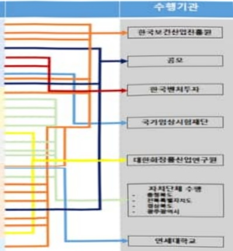

# 바이오헬스산업 육성 지원

**해당 페이지**: PDF 3437 ~ 3466 쪽 해당

**부처**: 보건복지부
**분야**: 보건
**회계유형**: 일반회계
**2026 확정예산**: 233770.0 백만원
**전년대비 증감률**: 226.6%
**AI 도메인**: 의료/바이오, 교육/인재

---

<table border=1 style='margin: auto; word-wrap: break-word;'><tr><td style='text-align: center; word-wrap: break-word;'>사업명</td><td colspan="2">구분</td></tr><tr><td rowspan="3">제약산업경쟁력 강화</td><td rowspan="2">소관부처</td><td style='text-align: center; word-wrap: break-word;'>보건산업책국</td></tr><tr><td style='text-align: center; word-wrap: break-word;'>제약바이오산업과</td></tr><tr><td style='text-align: center; word-wrap: break-word;'>사업시행주체</td><td style='text-align: center; word-wrap: break-word;'>한국보건산업진흥원, 국가임상시험지원재단, 한국존슨앤드존슨메디칼(주)</td></tr><tr><td rowspan="3">의료기기산업경쟁력 강화</td><td rowspan="2">소관부처</td><td style='text-align: center; word-wrap: break-word;'>보건산업책국</td></tr><tr><td style='text-align: center; word-wrap: break-word;'>의료기기화장품산업과</td></tr><tr><td style='text-align: center; word-wrap: break-word;'>사업시행주체</td><td style='text-align: center; word-wrap: break-word;'>한국보건산업진흥원</td></tr><tr><td rowspan="3">화장품산업경쟁력 강화</td><td rowspan="2">소관부처</td><td style='text-align: center; word-wrap: break-word;'>보건산업책국</td></tr><tr><td style='text-align: center; word-wrap: break-word;'>의료기기화장품산업과</td></tr><tr><td style='text-align: center; word-wrap: break-word;'>사업시행주체</td><td style='text-align: center; word-wrap: break-word;'>한국보건산업진흥원, 대한화장품산업연구원</td></tr></table>

사업 소관부처 및 시행주체

<table border=1 style='margin: auto; word-wrap: break-word;'><tr><td style='text-align: center; word-wrap: break-word;'>$ \underline{\text{직접}} $</td><td style='text-align: center; word-wrap: break-word;'>$ \underline{\text{줄자}} $</td><td style='text-align: center; word-wrap: break-word;'>$ \underline{\text{줄연}} $</td><td style='text-align: center; word-wrap: break-word;'>$ \underline{\text{보조}} $</td><td style='text-align: center; word-wrap: break-word;'>$ \underline{\text{읍자}} $</td><td style='text-align: center; word-wrap: break-word;'>$ \underline{\text{국고보조율(%)}} $</td><td style='text-align: center; word-wrap: break-word;'>$ \underline{\text{읍자율(%)}} $</td></tr><tr><td style='text-align: center; word-wrap: break-word;'>0</td><td style='text-align: center; word-wrap: break-word;'></td><td style='text-align: center; word-wrap: break-word;'></td><td style='text-align: center; word-wrap: break-word;'>0</td><td style='text-align: center; word-wrap: break-word;'></td><td style='text-align: center; word-wrap: break-word;'></td><td style='text-align: center; word-wrap: break-word;'></td></tr></table>

□사업지원형태 및지원을(최소한한개는반드시선택하시오.해당사항에O표시)

<table border=1 style='margin: auto; word-wrap: break-word;'><tr><td colspan="6">☐ 사업 성격 (공통요구자료 Ⅱ-1 작성유의사항 4. 참조, 해당하는 사항에 “○” 표시)</td></tr><tr><td style='text-align: center; word-wrap: break-word;'>신규 계속</td><td style='text-align: center; word-wrap: break-word;'>☐ 완료</td><td style='text-align: center; word-wrap: break-word;'>예비타당성 실시여부</td><td style='text-align: center; word-wrap: break-word;'>☐ 총사업비 관리대상</td><td style='text-align: center; word-wrap: break-word;'>☐ 총액계상 예산사업</td><td style='text-align: center; word-wrap: break-word;'>☐ 사업소관 변경정보 ☐ 2025예산 시 소관</td></tr><tr><td style='text-align: center; word-wrap: break-word;'></td><td style='text-align: center; word-wrap: break-word;'>☐</td><td style='text-align: center; word-wrap: break-word;'></td><td style='text-align: center; word-wrap: break-word;'>☐</td><td style='text-align: center; word-wrap: break-word;'></td><td style='text-align: center; word-wrap: break-word;'></td></tr></table>

<table border=1 style='margin: auto; word-wrap: break-word;'><tr><td style='text-align: center; word-wrap: break-word;'>구분</td><td style='text-align: center; word-wrap: break-word;'>프로그램</td><td style='text-align: center; word-wrap: break-word;'>단위사업</td><td style='text-align: center; word-wrap: break-word;'>세부사업</td></tr><tr><td style='text-align: center; word-wrap: break-word;'>코드</td><td style='text-align: center; word-wrap: break-word;'>3000</td><td style='text-align: center; word-wrap: break-word;'>3039</td><td style='text-align: center; word-wrap: break-word;'>300</td></tr><tr><td style='text-align: center; word-wrap: break-word;'>명칭</td><td style='text-align: center; word-wrap: break-word;'>보건산업육성</td><td style='text-align: center; word-wrap: break-word;'>보건산업진흥</td><td style='text-align: center; word-wrap: break-word;'>바이오헬스산업 육성 지원</td></tr></table>

<table border=1 style='margin: auto; word-wrap: break-word;'><tr><td style='text-align: center; word-wrap: break-word;'>구분</td><td style='text-align: center; word-wrap: break-word;'>회계</td><td style='text-align: center; word-wrap: break-word;'>소관</td><td style='text-align: center; word-wrap: break-word;'>실국(기관)</td><td rowspan="3">계정</td><td style='text-align: center; word-wrap: break-word;'>분야</td><td style='text-align: center; word-wrap: break-word;'>부문</td></tr><tr><td style='text-align: center; word-wrap: break-word;'>코드</td><td style='text-align: center; word-wrap: break-word;'>11</td><td style='text-align: center; word-wrap: break-word;'>23</td><td rowspan="2">보건의료정책실 보건산업정책국</td><td style='text-align: center; word-wrap: break-word;'>090</td><td style='text-align: center; word-wrap: break-word;'>091</td></tr><tr><td style='text-align: center; word-wrap: break-word;'>명칭</td><td style='text-align: center; word-wrap: break-word;'>일반회계</td><td style='text-align: center; word-wrap: break-word;'>보건복지부</td><td style='text-align: center; word-wrap: break-word;'>보건</td><td style='text-align: center; word-wrap: break-word;'>보건의료</td></tr></table>

<table border=1 style='margin: auto; word-wrap: break-word;'><tr><td style='text-align: center; word-wrap: break-word;'>사 업 명</td></tr><tr><td style='text-align: center; word-wrap: break-word;'>(271) 바이오헬스산업 육성 지원 (3039-300)</td></tr></table>

---

<table border=1 style='margin: auto; word-wrap: break-word;'><tr><td rowspan="3">바이오헬스산업전문인력양성</td><td rowspan="2">소관부처</td><td style='text-align: center; word-wrap: break-word;'>보건산업정책국</td></tr><tr><td style='text-align: center; word-wrap: break-word;'>의료기기화장품산업과</td></tr><tr><td style='text-align: center; word-wrap: break-word;'>사업시행주체</td><td style='text-align: center; word-wrap: break-word;'>한국보건산업진흥원, 오송첨단의료진흥재단</td></tr><tr><td rowspan="3">바이오헬스산업 글로벌진출 지원</td><td rowspan="2">소관부처</td><td style='text-align: center; word-wrap: break-word;'>보건산업정책국</td></tr><tr><td style='text-align: center; word-wrap: break-word;'>제약바이오산업과</td></tr><tr><td style='text-align: center; word-wrap: break-word;'>사업시행주체</td><td style='text-align: center; word-wrap: break-word;'>한국보건산업진흥원,</td></tr></table>

### 가.예산 총괄표

(단위: 백만원, %)

<table border=1 style='margin: auto; word-wrap: break-word;'><tr><td rowspan="2">사업명</td><td rowspan="2">2024년 결산</td><td colspan="2">2025년 예산</td><td colspan="2">2026년 예산</td><td rowspan="2">증감 (B-A)</td><td rowspan="2">(B-A)/A</td></tr><tr><td style='text-align: center; word-wrap: break-word;'>본예산</td><td style='text-align: center; word-wrap: break-word;'>추경*(A)</td><td style='text-align: center; word-wrap: break-word;'>요구안</td><td style='text-align: center; word-wrap: break-word;'>본예산(B)</td></tr><tr><td style='text-align: center; word-wrap: break-word;'>바이오헬스산업 육성지원</td><td style='text-align: center; word-wrap: break-word;'>67,720</td><td style='text-align: center; word-wrap: break-word;'>68,500</td><td style='text-align: center; word-wrap: break-word;'>71,582</td><td style='text-align: center; word-wrap: break-word;'>241,435</td><td style='text-align: center; word-wrap: break-word;'>233,770</td><td style='text-align: center; word-wrap: break-word;'>162,188</td><td style='text-align: center; word-wrap: break-word;'>226.6</td></tr></table>

*추경: 추경증감액을 포함한 최종 예산액을 기재

## □ 기능별(내역사업별) 예산 내역

(단위:백만원)

<table border=1 style='margin: auto; word-wrap: break-word;'><tr><td rowspan="2"></td><td colspan="5">2024</td><td colspan="5">2025</td><td rowspan="2">2026예산</td></tr><tr><td style='text-align: center; word-wrap: break-word;'>예산액(추경)</td><td style='text-align: center; word-wrap: break-word;'>예산현액</td><td style='text-align: center; word-wrap: break-word;'>집행액</td><td style='text-align: center; word-wrap: break-word;'>이월액</td><td style='text-align: center; word-wrap: break-word;'>불용액</td><td style='text-align: center; word-wrap: break-word;'>예산액(추경)</td><td style='text-align: center; word-wrap: break-word;'>예산현액</td><td style='text-align: center; word-wrap: break-word;'>집행액</td><td style='text-align: center; word-wrap: break-word;'>이월액</td><td style='text-align: center; word-wrap: break-word;'>불용액</td></tr><tr><td style='text-align: center; word-wrap: break-word;'>○ 바이오헬스산업 육성지원</td><td style='text-align: center; word-wrap: break-word;'>67,737</td><td style='text-align: center; word-wrap: break-word;'>67,737</td><td style='text-align: center; word-wrap: break-word;'>67,720</td><td style='text-align: center; word-wrap: break-word;'>-</td><td style='text-align: center; word-wrap: break-word;'>3</td><td style='text-align: center; word-wrap: break-word;'>68,500</td><td style='text-align: center; word-wrap: break-word;'>74,615</td><td style='text-align: center; word-wrap: break-word;'>74,615</td><td style='text-align: center; word-wrap: break-word;'>-</td><td style='text-align: center; word-wrap: break-word;'>-</td><td style='text-align: center; word-wrap: break-word;'>233,770</td></tr><tr><td style='text-align: center; word-wrap: break-word;'>· 제약산업 경쟁력 강화</td><td style='text-align: center; word-wrap: break-word;'>16,066</td><td style='text-align: center; word-wrap: break-word;'>16,066</td><td style='text-align: center; word-wrap: break-word;'>16,058</td><td style='text-align: center; word-wrap: break-word;'>-</td><td style='text-align: center; word-wrap: break-word;'>7</td><td style='text-align: center; word-wrap: break-word;'>17,716</td><td style='text-align: center; word-wrap: break-word;'>17,716</td><td style='text-align: center; word-wrap: break-word;'>17,716</td><td style='text-align: center; word-wrap: break-word;'>-</td><td style='text-align: center; word-wrap: break-word;'>-</td><td style='text-align: center; word-wrap: break-word;'>119,418</td></tr><tr><td style='text-align: center; word-wrap: break-word;'>· 의료기산업 경쟁력 강화</td><td style='text-align: center; word-wrap: break-word;'>15,855</td><td style='text-align: center; word-wrap: break-word;'>15,855</td><td style='text-align: center; word-wrap: break-word;'>15,855</td><td style='text-align: center; word-wrap: break-word;'>-</td><td style='text-align: center; word-wrap: break-word;'>-</td><td style='text-align: center; word-wrap: break-word;'>12,404</td><td style='text-align: center; word-wrap: break-word;'>12,404</td><td style='text-align: center; word-wrap: break-word;'>12,404</td><td style='text-align: center; word-wrap: break-word;'>-</td><td style='text-align: center; word-wrap: break-word;'>-</td><td style='text-align: center; word-wrap: break-word;'>13,703</td></tr><tr><td style='text-align: center; word-wrap: break-word;'>· 화장품산업 경쟁력 강화</td><td style='text-align: center; word-wrap: break-word;'>13,106</td><td style='text-align: center; word-wrap: break-word;'>13,106</td><td style='text-align: center; word-wrap: break-word;'>13,106</td><td style='text-align: center; word-wrap: break-word;'>-</td><td style='text-align: center; word-wrap: break-word;'>-</td><td style='text-align: center; word-wrap: break-word;'>13,277</td><td style='text-align: center; word-wrap: break-word;'>13,277</td><td style='text-align: center; word-wrap: break-word;'>13,227</td><td style='text-align: center; word-wrap: break-word;'>-</td><td style='text-align: center; word-wrap: break-word;'>-</td><td style='text-align: center; word-wrap: break-word;'>44,138</td></tr><tr><td style='text-align: center; word-wrap: break-word;'>· 바이오헬스산업 전문인력 양성</td><td style='text-align: center; word-wrap: break-word;'>17,300</td><td style='text-align: center; word-wrap: break-word;'>17,300</td><td style='text-align: center; word-wrap: break-word;'>17,281</td><td style='text-align: center; word-wrap: break-word;'>-</td><td style='text-align: center; word-wrap: break-word;'>5</td><td style='text-align: center; word-wrap: break-word;'>19,766</td><td style='text-align: center; word-wrap: break-word;'>25,876</td><td style='text-align: center; word-wrap: break-word;'>25,876</td><td style='text-align: center; word-wrap: break-word;'>-</td><td style='text-align: center; word-wrap: break-word;'>-</td><td style='text-align: center; word-wrap: break-word;'>21,508</td></tr><tr><td style='text-align: center; word-wrap: break-word;'>· 바이오헬스산업 글로벌 진출 지원</td><td style='text-align: center; word-wrap: break-word;'>5,303</td><td style='text-align: center; word-wrap: break-word;'>5,303</td><td style='text-align: center; word-wrap: break-word;'>5,303</td><td style='text-align: center; word-wrap: break-word;'>-</td><td style='text-align: center; word-wrap: break-word;'></td><td style='text-align: center; word-wrap: break-word;'>5,233</td><td style='text-align: center; word-wrap: break-word;'>5,233</td><td style='text-align: center; word-wrap: break-word;'>5,233</td><td style='text-align: center; word-wrap: break-word;'>-</td><td style='text-align: center; word-wrap: break-word;'>-</td><td style='text-align: center; word-wrap: break-word;'>34,923</td></tr><tr><td style='text-align: center; word-wrap: break-word;'>· 운영비</td><td style='text-align: center; word-wrap: break-word;'>107</td><td style='text-align: center; word-wrap: break-word;'>107</td><td style='text-align: center; word-wrap: break-word;'>117</td><td style='text-align: center; word-wrap: break-word;'>-</td><td style='text-align: center; word-wrap: break-word;'>-</td><td style='text-align: center; word-wrap: break-word;'>104</td><td style='text-align: center; word-wrap: break-word;'>109</td><td style='text-align: center; word-wrap: break-word;'>109</td><td style='text-align: center; word-wrap: break-word;'>-</td><td style='text-align: center; word-wrap: break-word;'>-</td><td style='text-align: center; word-wrap: break-word;'>80</td></tr></table>

---

### 나. 사업설명자료

## 1 ) 사업목적·내용

°(바이오헬스산업 육성지원)

- (의료기기산업 경쟁력 강화)

- (화장품 산업 경쟁력 강화)

- (바이오헬스산업 전문인력 양성)

- (바이오헬스산업 글로벌진출 지원)

## 2 ) 사업개요

## 사업근거 및 추진경위

- 제약산업 競爭力강화 방안('10.2, 위기관리대책회의, 기획재정부등 9개부처)

- 제약기업의 혁신 촉진을 위해서는 각종 규제, 세제 및 제도 개선 등 비재정지출 지원외에도 인프라 구축 등 재정지출이 필요하여 국회, 정부, 기업 등의 의견수렴을 거쳐 ‘제약산업 육성 및 지원에 관한 특별법’(12.3.31시행) 제정

- 의료기기 산업 경쟁력강화: 의료기기산업육성 및 혁신의료기기 지원법(19.4 제정, 20.5 시행)

- 제33조(화장품산업의 지원) 보건복지부장관과 식품의약품안전처장은 화장품산업의 진흥을 위한 기반조성 및 경쟁력 강화에 필요한 시책을 수립·시행하여야 하며 이를 위한 재원을 마련하고 기술개발, 조사·연구 사업, 해외 정보의 제공, 국제 협력체계의 구축 등에 필요한 지원을 하여야 한다.

## ② 추진경위

- '08.12월 : BH 주재 한·EU FTA 화장품산업 대책 협의 및 '09년도 VIP 업무 보고시 화장품산업 지원대책 보고

- 제76차 대외경제장관회의에서 한·EU FTA 추진상황 보고

- 제16차 위기관리대책회의에 화장품산업 육성 및 R&D 지원확대 등에 관하여 안건보고

- '10.11월 : 한-EU FTA체결에 따른 국내산업 경쟁력 강화대책 발표

- '09.2월 : VIP, 방송통신 장비 및 의료장비의 국산화 대책 수립 지시

- '09.2월 : 화장품산업 선진화(글로벌화) 지원계획 발표

- '09.3월 : 바이오제약, 의료기기 분야 신성장동력 세부 추진계획 발표(관계부처 합동)

- '09.3 월 : 화장품 글로벌화 지원센터 기획위원회 구성·운영(~'09.5 월 2차회의)

- '09.4 월 : 신성장동력 비전 및 발전전략(의료기기산업 발전 육성방안) 발표(복지부)

- '09.4' : 그런코스메틱 수출지원대책 보고, 중장기 사업계획 수립 연구용역 추진('09.4~7월)

- '09.6월 : 「한-EU FTA 체결 보완대책」 IT융합 첨단의료기기 개발계획 발표, 유망 치료재료 국산화 개발 R&D기획

---

- '10.1월 : 화장품산업 글로벌 경쟁력 강화위한 화장품산업 육성협의회 구성·운영

- '10.3' : 2010년도 화장품산업이 녹색성장평가대상사업으로 선정

- '10.11월 : 「의료기기산업 육성방안」마련(제32차 위기관리대책회의)

- '10.11월 : 「한-EU FTA 체결에 따른 국내 산업(의료기기 산업 포함) 경쟁력 강화 대책」마련(관계부처 합동)

- '11.3월 : 「제약산업 육성 및 지원에 관한 특별법」 공포(시행 '12.3.31.)

- '12.1 월 : 제약산업 경쟁력 제고 방안 발표(보건복지부)

- '12.3월 : 제약산업 육성 및 지원에 관한 특별법 시행

- '12.5월 : 관계부처 합동 제약/의료기기산업 투자활성화 방안(위기관리대책회의)

- '12.6월 : 제약산업 육성·지원 위원회 구성

- '12.8 월 : 제132차 비상경제대책회의 VIP 보고

* 2020년 세 7대 제약강국 진입을 위한 5대 추진 과제 제시(복지부 장관)

- '12.9월~'13.2월 : 제약산업 육성·지원 종합계획 TF 운영

* 총괄, R&D 지원, 투자·금융, 전문인력 양성, 수출 지원, 인프라·제도 6개 분과 40인의 산업계·학계·연구기관 전문가로 구성

- '13.7월 : 제약산업 육성·지원 종합계획 발표(보건복지부)

- '14.3월 : 관계부처 합동 「의료기기산업 중장기 발전계획」 마련(경제관계장관회

- '15.3월 : 바이오헬스 미래 新산업 육성 전략(관계부처합동)

- '16.9월 : 관계부처 합동「보건산업 종합발전 전략」수립('16.9.8, 제88회 국가정책조정회의)

- '17.12월 : 의료기기산업 5개년('18년~22년) 종합발전 계획 발표

- '18.3월 : 2018년 의료기기산업 종합발전 시행계획 발표

- '18.7월 : 의료기기 규제혁신 및 산업육성 방안 발표(관계부처 합동)

- '19.4 월 : 「의료기기산업육성 및 혁신의료기기 지원법」 제정

- '19.5월 : 바이오헬스산업 혁신전략(관계부처 합동)

- '20.5' : 「의료기기산업육성 및 혁신의료기기 지원법」 시행

- '21.1~5월 : 혁신성장 BIG3 주요 추진과제 발표(국산 의료기기 활용·지원체계 구축, 포스트코로나 의료기기 산업 혁신전략)

- 제2차 제약산업 육성·지원 종합 5개년 계획 발표('17.12)

- 제3차 제약산업 육성·지원 종합 5개년 계획 발표('23.4)

- '23. 3월 : 바이오헬스 산업 수출 활성화 전략 방안 발표(관계부처 합동)

- 제3차 제약산업 육성·지원 종합 5개년 계획 발표('23.4)

- '23.4 월 : 「제1차 의료기기산업 육성·지원 종합계획('23~'27)」 발표

- '23.9월 : [2023년 의료기기산업 육성·지원 시행계획] 수립

- '24.6' : 「2024년 의료기기산업 육성·지원 시행계획」 수립

- '24.9월 : 바이오헬스혁신위원회(제4차) 하반기 보건의료산업 수출 확대 방안 발표

- '25.5' : 「2025년 의료기기산업 육성·지원 시행계획」 수립

---

## 주요내용

① 사업규모

- 총사업비(해당되는 경우에만 기재) :

- 사업기간 : 02~계속

- 최근 5년 간 투입된 사업비(예산액기준, 추경편성한 연도에는 추경포함)

<table border=1 style='margin: auto; word-wrap: break-word;'><tr><td style='text-align: center; word-wrap: break-word;'>연도</td><td style='text-align: center; word-wrap: break-word;'>2022</td><td style='text-align: center; word-wrap: break-word;'>2023</td><td style='text-align: center; word-wrap: break-word;'>2024</td><td style='text-align: center; word-wrap: break-word;'>2025</td><td style='text-align: center; word-wrap: break-word;'>2026</td></tr><tr><td style='text-align: center; word-wrap: break-word;'>사업비</td><td style='text-align: center; word-wrap: break-word;'>114,484</td><td style='text-align: center; word-wrap: break-word;'>81,972</td><td style='text-align: center; word-wrap: break-word;'>67,737</td><td style='text-align: center; word-wrap: break-word;'>68,500</td><td style='text-align: center; word-wrap: break-word;'>233,770</td></tr></table>

- 기타: 해당 없음

② 사업추진체계

- 사업시행방법 : 직접수행, 보조,

- 사업시행주체 : 한국보건산업진흥원, 국가임상시험지원재단, 대구광역시, 충청북도, 전라북도, 광주광역시, 한국존슨앤드존슨메디칼(주), 대한화장품산업연구원

- 사업 수혜자 : 제약기업 및 제약산업 종사자, 임상시험 관련 기관 및 종사자, 화장품

중소기업 등

- 보조, 융자, 출연, 출자 등의 경우 보조 · 융자 등 지원 비율 및 법적근거

<table border=1 style='margin: auto; word-wrap: break-word;'><tr><td style='text-align: center; word-wrap: break-word;'>내역사업명</td><td style='text-align: center; word-wrap: break-word;'>구분</td><td style='text-align: center; word-wrap: break-word;'>피보조·피출연 등 기관명</td><td style='text-align: center; word-wrap: break-word;'>지원 금액 (2026예산)</td><td style='text-align: center; word-wrap: break-word;'>지원 비율(%)</td><td style='text-align: center; word-wrap: break-word;'>보조율 법적근거 (해당 조항)</td></tr><tr><td style='text-align: center; word-wrap: break-word;'>제약산업 경쟁력 강화</td><td style='text-align: center; word-wrap: break-word;'>보조, 출자</td><td style='text-align: center; word-wrap: break-word;'>한국보건산업진흥원, 국가임상시험지원재단, 한국준손엔드존슨메디칼(주)</td><td style='text-align: center; word-wrap: break-word;'>119,418</td><td style='text-align: center; word-wrap: break-word;'>100</td><td style='text-align: center; word-wrap: break-word;'>제약산업법 제4조, 제18조의2, 제21조, 제22조</td></tr><tr><td style='text-align: center; word-wrap: break-word;'>의료기기산업 경쟁력 강화</td><td style='text-align: center; word-wrap: break-word;'>보조</td><td style='text-align: center; word-wrap: break-word;'>한국보건산업진흥원, 지자체 보조</td><td style='text-align: center; word-wrap: break-word;'>13,703</td><td style='text-align: center; word-wrap: break-word;'>100</td><td style='text-align: center; word-wrap: break-word;'>의료기기육성 및 혁신의료기기 지원법 제33조, 제39조, 보조금의 예산 및 관리에 관한 법률 제9조</td></tr><tr><td style='text-align: center; word-wrap: break-word;'>화장품산업 경쟁력 강화</td><td style='text-align: center; word-wrap: break-word;'>보조</td><td style='text-align: center; word-wrap: break-word;'>대한화장품산업연구원</td><td style='text-align: center; word-wrap: break-word;'>44,138</td><td style='text-align: center; word-wrap: break-word;'>100, 60, 50</td><td style='text-align: center; word-wrap: break-word;'>화장품법 제33조(화장품산업의 지원) 보조금의 예산 및 관리에 관한 법률</td></tr><tr><td style='text-align: center; word-wrap: break-word;'>바이오헬스산업 전문인력 양성</td><td style='text-align: center; word-wrap: break-word;'>보조</td><td style='text-align: center; word-wrap: break-word;'>한국보건산업진흥원, 지자체 보조, 대한화장품산업연구원</td><td style='text-align: center; word-wrap: break-word;'>21,508</td><td style='text-align: center; word-wrap: break-word;'>100, 60, 50</td><td style='text-align: center; word-wrap: break-word;'>제약산업법 제4조, 제21조, 보조금 관리에 관한 법률 제9조 및 같은 법 시행령 제4조, 화장품법 제33조</td></tr><tr><td style='text-align: center; word-wrap: break-word;'>바이오헬스산업 글로벌 진출 지원</td><td style='text-align: center; word-wrap: break-word;'>보조</td><td style='text-align: center; word-wrap: break-word;'>한국보건산업진흥원</td><td style='text-align: center; word-wrap: break-word;'>34,923</td><td style='text-align: center; word-wrap: break-word;'>100</td><td style='text-align: center; word-wrap: break-word;'>제약산업법 제4조</td></tr></table>

---

① 제약산업 경쟁력 강화: (25) 17,716백만원 → (26) 119,418백만원, 101,702백만원 증

① 혁신형 제약기업 육성지원

: (25) 280백만원 → (26) 190백만원, 90백만원 감

② 국내외 제약산업 정보수집 및 제공

: (25) 222백만원 → (26) 152백만원, 70백만원 감

③ 바이오헬스산업 공급망 안정 지원

: (25) 0백만원 → (26) 15,780백만원, 순증

④ 수출유망 의약품 제조 선진화 지원

: (25) 0백만원 → (26) 4,100백만원, 순증

⑤ 글로벌 액셀러레이터 플랫폼 구축

: (25) 7,669백만원 → (26) 7,669백만원, 전년동

⑥ K-글로벌 백신 펀드

: ('25) 0백만원 → ('26) 20,000백만원, 순증

⑦ 임상3상 특화편드

: ('25) 0백만원 → ('26) 60,000백만원, 순증

⑧ 성공불융자 도입 연구

: (25) 0백만원 → (26) 500백만원, 순증

⑨ 글로벌 임상시험 허브 구축

: (25) 5,140백만원 → (26) 7,027백만원, 1,887백만원 증

② 의료기기산업 경쟁력 강화: (25) 17,716백만원 → (26) 119,418백만원, 1,299백만원 증

① 의료기기산업 종합지원센터

: (25) 988백만원 → (26) 988백만원, 전년동

② 국산의료기기 사용활성화 지원

: ('25) 9,716백만원 → ('26) 10,016백만원, 300백만원 증

③ 경산 ICT 융복합 어린이 재활기기 실증센터 구축

: ('25) 1,000백만원 → ('26) 1,099백만원, 99백만원 증

④ 광주 AI 디지털 노화산업 실증연구센터 구축

: ('25) 00백만원 → ('26) 1,600백만원, 1,600백만원 증

## ③ 화장품 산업 경쟁력 강화 : ('25) 14,577백만원 → ('26) 44,138백만원, 29,561백만원 증

① 화장품산업 글로벌 경쟁력 강화

: ('25) 0 → ('26) 44,138백만원, 순증

② 남원 천연물 화장품 시험검사임상센터 구축

: ('25) 2,800백만원 → ('26) 2,192백만원, 608백만원 감

③ 오송 국제 K-뷰티스클 설립

---

:(25)1,400백만원→(26)3,851백만원,2,451백만원증

⑤ 충북 글로벌 클린화장품 산업화 기반 구축

: ('25) 500백만원 → ('26) 4,820백만원, 4,320백만원 증

⑥ 오송 국제 K-뷰티스클 내외부 시설 정비 : ('25) 0 → ('26) 900백만원, 순증

## 4 바이오헬스산업 전문인력 양성: (25) 19,766백만원 → (26) 21,508백만원, 1,742백만원 증

① 한국형 NIBRT 프로그램 운영

: (25) 7,200백만원 → (26) 2,304백만원, 4,896백만원 감

② 바이오헬스산업 특성화대학원 지원

: ('25) 3,000백만원 → ('26) 2,500백만원, 500백만원 감

③ 바이오의약품생산전문인력양성센터 건립

: (25) 5,825백만원 → (26) 825백만원, 5,000백만원 감

④ 제약산업 미래인력 양성센터 건립

: (25) 1,920백만원 → (26) 3,287백만원, 1,367백만원 증

⑤ AI활용 신약개발 교육 및 홍보

: (25) 884백만원 → (26) 6,116백만원, 5,232백만원 증

⑥ AI첨단바이오 미래인재 양성

: ('25) 1,000백만원 → ('26) 1,000백만원, 전년동

⑦ 바이오헬스 아카데미

: (25) 2,000백만원 → (26) 2,000백만원, 전년동

⑧ 바이오헬스 전문인력 양성 기반 구축

: (25) 628백만원 → (26) 3,013백만원, 2,385백만원 증

⑨ 화장품산업 전문인력 양성

: (25) 309백만원 → (26) 463백만원, 154백만원 증

## 5 바이오헬스산업 글로벌 진출 지원: (25) 3,933백만원 → (26) 34,923백만원, 30,990백만원 증

① K-바이오헬스 글로벌 진출 및 수출 다변화 지원 : (26) 26년 신규, 24,523백만원, 24,523백만원 증

② 글로벌 오픈이노베이션 활성화 지원

: (26) 26년 신규, 10,400백만원, 10,400백만원 증

---

## 4 ) 사업효과

☐ 사업영향, 산출물 성과지표 등

① 2022~2026년도 성과계획서 상 성과지표 및 최근 5년간 성과 달성도

<table border=1 style='margin: auto; word-wrap: break-word;'><tr><td style='text-align: center; word-wrap: break-word;'>성과지표</td><td style='text-align: center; word-wrap: break-word;'>구분</td><td style='text-align: center; word-wrap: break-word;'>2022</td><td style='text-align: center; word-wrap: break-word;'>2023</td><td style='text-align: center; word-wrap: break-word;'>2024</td><td style='text-align: center; word-wrap: break-word;'>2025</td><td style='text-align: center; word-wrap: break-word;'>2026</td><td style='text-align: center; word-wrap: break-word;'>2026 목표치산출근거</td><td style='text-align: center; word-wrap: break-word;'>측정산식(또는 측정방법)</td><td style='text-align: center; word-wrap: break-word;'>자료수집방법(또는 자료출처)</td></tr><tr><td rowspan="3">혁신형제약기업들의연간기술수출(전수)</td><td style='text-align: center; word-wrap: break-word;'>목표</td><td style='text-align: center; word-wrap: break-word;'>8</td><td style='text-align: center; word-wrap: break-word;'>8</td><td style='text-align: center; word-wrap: break-word;'>-</td><td style='text-align: center; word-wrap: break-word;'>-</td><td style='text-align: center; word-wrap: break-word;'></td><td rowspan="3">제약산업 육성지원 시책에 따른 산업의 성장추세에 따른 기술수출 실적의 최근 연평균 성장률을 고려</td><td rowspan="3">정부 R&amp;D 또는 세계 지원을 담은 혁신형 제약기업들의 연간 기술수출 전수</td><td rowspan="3">한국보건산업 진흥원 R&amp;D 세계지원 기술수출 규모</td></tr><tr><td style='text-align: center; word-wrap: break-word;'>실적</td><td style='text-align: center; word-wrap: break-word;'>12</td><td style='text-align: center; word-wrap: break-word;'>5</td><td style='text-align: center; word-wrap: break-word;'>-</td><td style='text-align: center; word-wrap: break-word;'>-</td><td style='text-align: center; word-wrap: break-word;'>-</td></tr><tr><td style='text-align: center; word-wrap: break-word;'>달성도</td><td style='text-align: center; word-wrap: break-word;'>150</td><td style='text-align: center; word-wrap: break-word;'>62.5</td><td style='text-align: center; word-wrap: break-word;'>-</td><td style='text-align: center; word-wrap: break-word;'>-</td><td style='text-align: center; word-wrap: break-word;'>-</td></tr><tr><td rowspan="3">제약바이오수출액(억불)</td><td style='text-align: center; word-wrap: break-word;'>목표</td><td style='text-align: center; word-wrap: break-word;'>-</td><td style='text-align: center; word-wrap: break-word;'>-</td><td style='text-align: center; word-wrap: break-word;'>77.9</td><td style='text-align: center; word-wrap: break-word;'>99.3</td><td style='text-align: center; word-wrap: break-word;'>106.3</td><td rowspan="3">&#x27;25년 제약바이오 수출액(목표치)에 &#x27;22~24년 수출액 평균증가율 7%을 적용</td><td rowspan="3">제약바이오 분야 수출액 통계</td><td rowspan="3">한국보건산업 진흥원 통계자료</td></tr><tr><td style='text-align: center; word-wrap: break-word;'>실적</td><td style='text-align: center; word-wrap: break-word;'>-</td><td style='text-align: center; word-wrap: break-word;'>-</td><td style='text-align: center; word-wrap: break-word;'>92.7</td><td style='text-align: center; word-wrap: break-word;'>-</td><td style='text-align: center; word-wrap: break-word;'>-</td></tr><tr><td style='text-align: center; word-wrap: break-word;'>달성도</td><td style='text-align: center; word-wrap: break-word;'>-</td><td style='text-align: center; word-wrap: break-word;'>-</td><td style='text-align: center; word-wrap: break-word;'>119.0</td><td style='text-align: center; word-wrap: break-word;'>-</td><td style='text-align: center; word-wrap: break-word;'>-</td></tr><tr><td rowspan="3">국산의료기기신제품 테스트 지원과제의 매출액 증가율(단위: %)</td><td style='text-align: center; word-wrap: break-word;'>목표</td><td style='text-align: center; word-wrap: break-word;'>40</td><td style='text-align: center; word-wrap: break-word;'>40</td><td style='text-align: center; word-wrap: break-word;'>40</td><td style='text-align: center; word-wrap: break-word;'>40</td><td style='text-align: center; word-wrap: break-word;'>40</td><td rowspan="3">한국의료기기산업의 국내 매출액 증가율은 연평균 10%라고 참고되고 있어 행복 매출액 증가율은 현 목표치서 1-2% 내류로 상환하며 반영하는 것이 타당한 것으로 시표나 조체상환 완료하면 협동 취득 3년 평균 실적 140%라는 도전적 목표를 설정</td><td rowspan="3">당해연도 테스트 지원 제품의 전년대비 매출액 증가율 * 매출액 증가율이 40%이상일 경우, 40%로 처리</td><td rowspan="3">당해연도 지원과제에 대한 최종 결과보고서 및 기업담당자 설문조사 통한 성과 수집</td></tr><tr><td style='text-align: center; word-wrap: break-word;'>실적</td><td style='text-align: center; word-wrap: break-word;'>40</td><td style='text-align: center; word-wrap: break-word;'>40</td><td style='text-align: center; word-wrap: break-word;'>40</td><td style='text-align: center; word-wrap: break-word;'>-</td><td style='text-align: center; word-wrap: break-word;'>-</td></tr><tr><td style='text-align: center; word-wrap: break-word;'>달성도</td><td style='text-align: center; word-wrap: break-word;'>100</td><td style='text-align: center; word-wrap: break-word;'>100</td><td style='text-align: center; word-wrap: break-word;'>100</td><td style='text-align: center; word-wrap: break-word;'>-</td><td style='text-align: center; word-wrap: break-word;'>-</td></tr><tr><td rowspan="3">화장품 안전성 평가 보고서 활용 건수(건)</td><td style='text-align: center; word-wrap: break-word;'>목표</td><td style='text-align: center; word-wrap: break-word;'></td><td style='text-align: center; word-wrap: break-word;'></td><td style='text-align: center; word-wrap: break-word;'>2,000</td><td style='text-align: center; word-wrap: break-word;'>2,000</td><td style='text-align: center; word-wrap: break-word;'>2,000</td><td rowspan="3">화장품 성분 안전성 평가 결과 보고서를 기업이 활용한 건수를 목표로 설정</td><td rowspan="3">화장품 성분 안전성 평가 결과 보고서 다운로드 건수</td><td rowspan="3">화장품 안전성 통합정보 통계 시스템 및 결과보고서</td></tr><tr><td style='text-align: center; word-wrap: break-word;'>실적</td><td style='text-align: center; word-wrap: break-word;'></td><td style='text-align: center; word-wrap: break-word;'></td><td style='text-align: center; word-wrap: break-word;'>2,288</td><td style='text-align: center; word-wrap: break-word;'>2,243</td><td style='text-align: center; word-wrap: break-word;'>-</td></tr><tr><td style='text-align: center; word-wrap: break-word;'>달성도</td><td style='text-align: center; word-wrap: break-word;'></td><td style='text-align: center; word-wrap: break-word;'></td><td style='text-align: center; word-wrap: break-word;'>114.4</td><td style='text-align: center; word-wrap: break-word;'>112.2</td><td style='text-align: center; word-wrap: break-word;'>-</td></tr><tr><td rowspan="3">현장수요 맞춤 프로그램 개발 실적(단위: 건)</td><td style='text-align: center; word-wrap: break-word;'>목표</td><td style='text-align: center; word-wrap: break-word;'>-</td><td style='text-align: center; word-wrap: break-word;'>-</td><td style='text-align: center; word-wrap: break-word;'>-</td><td style='text-align: center; word-wrap: break-word;'>5</td><td style='text-align: center; word-wrap: break-word;'>5</td><td rowspan="3">지원기관당 최소 1개 이상의 프로그램 개발</td><td rowspan="3">기관별 개발된 프로그램 과정 건수의 합(동일 과정 중복 운영 실적 제외)</td><td rowspan="3">실적보고서 등</td></tr><tr><td style='text-align: center; word-wrap: break-word;'>실적</td><td style='text-align: center; word-wrap: break-word;'>-</td><td style='text-align: center; word-wrap: break-word;'>-</td><td style='text-align: center; word-wrap: break-word;'>-</td><td style='text-align: center; word-wrap: break-word;'>-</td><td style='text-align: center; word-wrap: break-word;'>-</td></tr><tr><td style='text-align: center; word-wrap: break-word;'>달성도</td><td style='text-align: center; word-wrap: break-word;'>-</td><td style='text-align: center; word-wrap: break-word;'>-</td><td style='text-align: center; word-wrap: break-word;'>-</td><td style='text-align: center; word-wrap: break-word;'>-</td><td style='text-align: center; word-wrap: break-word;'>-</td></tr><tr><td rowspan="3">바이오헬스 아카데미 만족도(단위: 점)</td><td style='text-align: center; word-wrap: break-word;'>목표</td><td style='text-align: center; word-wrap: break-word;'>-</td><td style='text-align: center; word-wrap: break-word;'>-</td><td style='text-align: center; word-wrap: break-word;'>-</td><td style='text-align: center; word-wrap: break-word;'>70</td><td style='text-align: center; word-wrap: break-word;'>70</td><td rowspan="3">100점 만점 기준 5점 척도 측정시, 60점 이상이 &#x27;만족으로 측정됨에 따라 최소 60점 대비 목표치 상향 설정</td><td rowspan="3">프로그램 참가자 만족도 설문 조사 결과 적용</td><td rowspan="3">설문조사 등</td></tr><tr><td style='text-align: center; word-wrap: break-word;'>실적</td><td style='text-align: center; word-wrap: break-word;'>-</td><td style='text-align: center; word-wrap: break-word;'>-</td><td style='text-align: center; word-wrap: break-word;'>-</td><td style='text-align: center; word-wrap: break-word;'>-</td><td style='text-align: center; word-wrap: break-word;'>-</td></tr><tr><td style='text-align: center; word-wrap: break-word;'>달성도</td><td style='text-align: center; word-wrap: break-word;'>-</td><td style='text-align: center; word-wrap: break-word;'>-</td><td style='text-align: center; word-wrap: break-word;'>-</td><td style='text-align: center; word-wrap: break-word;'>-</td><td style='text-align: center; word-wrap: break-word;'>-</td></tr><tr><td rowspan="3">바이오헬스 교육 만족도(단위: 점)</td><td style='text-align: center; word-wrap: break-word;'>목표</td><td style='text-align: center; word-wrap: break-word;'>-</td><td style='text-align: center; word-wrap: break-word;'>89.5</td><td style='text-align: center; word-wrap: break-word;'>89.6</td><td style='text-align: center; word-wrap: break-word;'>89.5</td><td style='text-align: center; word-wrap: break-word;'>89.5</td><td rowspan="3">신규지표임을 감안하여 직전 3개년 평균</td><td rowspan="3">5점 만점 만족도를 100점으로 환산</td><td rowspan="3">교육종료 후 교육만족도 평가 진행</td></tr><tr><td style='text-align: center; word-wrap: break-word;'>실적</td><td style='text-align: center; word-wrap: break-word;'>-</td><td style='text-align: center; word-wrap: break-word;'>89.7</td><td style='text-align: center; word-wrap: break-word;'>-</td><td style='text-align: center; word-wrap: break-word;'>-</td><td style='text-align: center; word-wrap: break-word;'></td></tr><tr><td style='text-align: center; word-wrap: break-word;'>달성도</td><td style='text-align: center; word-wrap: break-word;'>-</td><td style='text-align: center; word-wrap: break-word;'>100</td><td style='text-align: center; word-wrap: break-word;'>-</td><td style='text-align: center; word-wrap: break-word;'>-</td><td style='text-align: center; word-wrap: break-word;'></td></tr></table>

---

② 성과지표 이외의 연도별 사업추진 경과 및 실적

## <혁신형 제약기업 육성지원 >

- 제2차 제약산업 육성지원 5개년('18~, '22) 종합계획 수립에 따른 2022년 제약산업 육성지원 시행계획 수립('22.5)

- '16년 최초인증 된 3개社 인증연장('22.6), 제6차 4개社 신규인증('23.1) 및 「혁신형 제약기업 인증현황」 고시 개정

* '22.12 월 기준 총 43개 기업 인증

## <임상시험 선진화 기반 구축>

(임상시험 전문인력 육성) 전문인력 체계적 육성을 위한 국가 직무

능력 표준 기준에 맞춘 표준직무, 교육과정, 경력개발경로 개발

- 12개 전문직무* 정립, 표준화된 개별 직무기술서 및 교육 로드맵 개발

* 의약품 임상시험 기획, 임상시험 프로젝트 관리, 임상시험 모니터링, 임상시험 품질보증, 임상시험용 의약품 제조 관리, 의약품 임상시험 수행, 의약품 임상시험 심사위원회 운영 관리, 의약품 임상시험 데이터 관리, 의약품 임상시험 통계분석, 의약품 임상시험 인허가, 의약품 임상시험 안전성·위해성 관리, 의약품 임상시험 결과보고서 작성

(임상시험 전문기관 육성 및 전문인력 자격제 운영) 임상시험 전문

인력 인증제의 민간자격제 전환(10.22.)

* 4개 직능 6단계(시험책임자(PI), 임상시험코디네이터(CCRC, QCRC), 임상시험모니터요원(CCRA, QCRA), 관리약사(CRP)에 대한 민간자격증 발부 권한 부여(한국직업능력연구원)

○ (임상시험 통계 생산 및 정보 제공) 국내·외 산업정책 및 임상시험 관련 국내·외 법규범, 가이드라인 정보 수시 제공

*국내 법규범 및 가이드라인·해설설명서 30건, 글로벌 임상시험 동향 3건, 코로나19 백신·치료제 개발·승인 현황, EU·영국 임상시험 동향 등

## <글로벌 임상시험 지원센터>

(국내기업 해외진출 및 임상시험 유치 활성화) 글로벌 교류·협력 및

임상시험 네트워크 강화, 임상시험 국가 브랜드 홍보

- 미국임상종양학회(ASCO)·유럽종양학회(ESMO) 한국 임상시험 대표 사절단

- 미국임상종양학회(ASCO)·유럽종양학회(ESMO) 한국 임상시험 대표 사절단

과견 및 대한임상약리학회·CRC협회 공동 추계학술대회 개최

*연간 29개사 54명 사절단 통해 88건 파트너링 및 35개국 158개사 이상 교류

○ (임상시험 연구역량 강화) 공의적 임상시험 활성화를 위한 연구비,

e-CRF 플랫폼(My trial) 및 직능별 교육(온라인) 제공 등 연구자 임

상연구 지원 지속

* 암 치료법 2건, 보조치료항암요법 1건, 암진단 마커 발굴 1건 등 4개 과제

* IND 승인 1건, IRB 승인 완료 1건, IRB 신청 완료 2건

(개방형 혁신 글로벌 파트너십 구축) 아시아 최대 임상시험 컨퍼런스 (KIC) 개최(10.12.~10.14.)

---

- 신약개발 전주기(신약개발·임상시험·커머셜 등)에 대한 임상시험 이슈를 다루고,

- 전퍼런스 개시 이후 최다 등록자 기록

* 등록자 1,443명(컨퍼런스 1,276명, 잡폐어 167명), 국내외 연·좌장 130명

* 등록자 1,443명(컨퍼런스 1,276명, 잡폐어 167명), 국내외 연·좌장 130명

○ (임상시험 정보자원 통합 관리) 코로나19 임상시험 포털 연계 임상 시험 참여자 편의 강화 및 정부지원 임상시험 과제 참여자 지원

* 연간 상담 건수 17,299건 및 참여의향서 제출자 11,562명(누적)

* 국내 1호 코로나19 백신 및 치료제 임상시험에 참여자 6,188명 연계

## < K-글로벌 백신 편드 >

○ 혁신 신약 개발과 백신 자주권 확보를 위해「K-바이오 백신 펀드」 조성 추진

- 공공출자 40%(복지부 1,000억 원, 국책은행 1,000억 원), 민간출자 60%

○ 사업공고('22.8.4~8.26) 및 2개 운용사* 선정('22.9.27)하여 조성 추진 중

* ①미래에셋투자+미래에셋캐피탈, ②유안타 인베스트

## <AI 활용 신약개발 교육 및 홍보>

- (일반교육) 제약산업계 일반재직자의 AI 기술 이해도 향상

* 교육시간: 362시간

* (21년) LAIDD 1.0 구축 → (22년) LAIDD 2.0 개편(통계 및 강의 관리 기능 강화)

- (심화교육) 현장 중심 협력교육 프로그램 PharmColab(Pharmaceutical Collaborate Laboratory) 개발 및 운영

* 교육기간 : (계절학교) 최대 32시간 / (실무교육) 최대 4개월

- 해외 신약개발 인공지능 플랫폼 구축을 위한 국제컨퍼런스 개최

* 인공지능 신약개발 - 기술진보와 미래전망 컨퍼런스(오프라인 총 227명 참석)

## < 한국형 NIBRT 프로그램 운영 >

- K-NIBRT 백신 특화과정 및 항체의약품 교육 운영(총 196명/193명)

- K-NIBRT ADB 백신 특화과정 교육 운영(총 13개국 59명)

- K-NIBRT 실습교육 센터 개소('22.4)

- 바이오코리아 K-NIBRT 홍보 부스 운영('22.5)

- 1,2차 K-NIBRT 공동 운영위원회 개최('22.6,9)

- 한국 제약바이오 채용박람회 K-NIBRT 홍보 부스 운영('22.10)

## < 제약바이오산업 특성화대학원 운영·지원 >

- 제약바이오산업 특성화대학원 지원 관련 사업운영회의 실시('22.4)

- 제약바이오산업 특성화대학원 지원 사업 2차 운영회의 실시('22.7) 국고보조금 집행점검을 위한 서면 점검('22.10)

## < 제약산업 미래인력 양성센터 구축 >

-한국생명공학연구원(전북분원),안전성평가연구소(전북분소),한국원자력

---

<table border=1 style='margin: auto; word-wrap: break-word;'><tr><td style='text-align: center; word-wrap: break-word;'></td><td style='text-align: center; word-wrap: break-word;'>연구원 첨단방사선 연구소와 각각MOU 체결(&#x27;21.3) - 제약산업 미래인력 양성센터 구축사업 공모 선정(&#x27;22.5) - 제약산업 미래인력 양성센터 구축 실무협의체 구성 및 설계 절차 이행(&#x27;22.6~) &lt; 바이오의약품생산 전문인력 양성 &gt; - 바이오의약품 전문인력양성 기초교육과정 개설(9회) - 바이오의약품 전문인력양성 중급교육과정 개설(5회) - 바이오의약품 전문인력양성 고급교육과정 개발 및 운영(2회) - 수요자 맞춤 교강사 보수교육과정 개설(2회) - 바이오분야 교육생 취업률(일자리 창출) 83.8% - 고용노동부 직업능력심사평가원 ‘실적보유 훈련기관 인증유지(3년) 유지’ - 교육과정 고도화를 통한 교육콘텐츠 1건 개발(GMP모의실사) - 국비지원 교육과정 개설 및 운영 (2회, 36명) - VR교육과정 시범운영(GMP제조소 투어 등) &lt; 제약산업 전주기 글로벌 진출 강화 지원 &gt; - 글로벌 시장 진출 역량을 갖춘 국내 제약기업 해외진출 전문 컨설팅 지원(9개사) * 해외 인허가, 라이선싱 등 글로벌 컨설팅 지원 - 해외 GMP 인증 등 생산기반 선진화 지원(1개사) - 바이오벤처 위탁생산 지원(3개사) * 비임상/임상용 시료 생산 등 지원 - 성과교류회 개최(&#x27;22.11.) &lt; 제약산업 정보포털 운영 &gt; - 제약산업정보포털 운영 및 유지보수 용역업체 계약체결(&#x27;22.1월~12월) - SNS(카카오톡) 채널 운영 - 제약산업 뉴스레터 총 210회 발간(&#x27;22.12월 기준) - 매주 카카오톡 메시지 제작 및 배포 - 한국 제약산업 소개, 국내·외 제약산업 최신 뉴스 업데이트 * 누적정보구축건수 121,471건, 누적정보제공건수 10,805,262건 &lt; 해외제약전문가 초빙 및 활용 &gt; - 해외제약전문가 초빙(3명) * (&#x27;13) 5명 → (&#x27;14) 6명 → (&#x27;15) 8명 → (&#x27;16) 8명 → (&#x27;17) 7명→ (&#x27;18) 7명→ (&#x27;19) 6명 → (&#x27;20) 5명 → (&#x27;21) 4명 → (&#x27;22) 3명 - 해외제약전문가 활용 제약기업 대상의 교육·컨설팅 지원 * 국내 기업 대상 컨설팅 총 242건, 교육 및 기고문 15건, 해외제약전문가 Insight 세미나 3회 * 해외제약전문가 컨설팅 지원을 통한 해외 진출 성과 총 4건(수출계약) - 글로벌 제약산업핵심전문가(GPKOL) 네트워크 구축(30개국 257명) * (&#x27;16) 194명 → (&#x27;17) 214명→ (&#x27;18) 229명→ (&#x27;19) 245명 → (&#x27;20) 261명→ (&#x27;21) 244명</td></tr></table>

---

(위원 Pool 정리)→(22) 257명(13명 신규 초빙)

- GPKOL 네트워크 활용하여 국내기업과의 온라인 컨설팅 시행

* GPKOL 온라인 컨설팅(226건) 및 기고문 게재(8건)

- 2022 GPKOL 국제 심포지엄 개최

* 선진&신흥 제약 시장 트렌드 및 한국 기업 진출 기회 주제 심포지엄 개최 및 비즈니스 미팅 제공(9.22~23, 비즈니스 미팅 총 22건)

* 세포GPKOL 미국 GMP 웨비나 및 현장 컨설팅 제공(7.11, 비즈니스 미팅 4건)

* 2022 KHIDI-KASBP eSymposium 온라인 개최(8.9~11)

* GPKOL 2022 신규 웨비나(11.16~19)

* 첨단바이오의약품 개발 전략 및 품질관리 세미나(11.23~24)

## <국제협력기술교류>

- 'BIO-Europe 2021' 참가 지원을 통한 한-유럽 기술 네트워킹 확대

*통합 홍보관 운영(안전성평가연구소·제약바이오협회 협업), 국내 기업 39 차 참여

(기술발표 6건, 파트너링 478건 지원)

- 제약바이오 국제 협력 기술교류 세미나 및 파트너링 개최(11월)

* 오픈이노베이션 활성화를 위한 기술 파트너링(총 66 취소 87件) 지원

- 진흥원-암젠 사이언스 아카데미 바이오 데이 개최(11월)

* KHIDI-AMGEN 피칭데이(9.2) 및 우승기업 시상식 개최(11.4) 암젠 글로벌 연구자 대상 국내 기업(8社)의 온라인 기술 소개, 우승기업(3社)에 대하여 상금(총 8천만원) 및 멘토십(1년) 제공

- 종양학 정밀의료 임상연구 파트너십 계약 체결(8.11)

* KHIDI·NCC·KSMO·KCSG 간 임상·유전체정보 통합 데이터베이스 구축·운영 계약

(진흥원은 국내·외 참가기업 모집 및 운영 지원. 홍보 등 역할)

## <글로벌 진출 및 해외마케팅 지원 >

- 해외 정부·유관 기관과의 협력을 통한 정보 공유 및 교류 활성화 등 글로벌 진출 기반 마련

* 글로벌 제약바이오 오픈이노베이션 포럼 개최('22.5, VOD 시청 170건)

* 중국 시장 진출을 위한 투자설명회 및 IR 총 4회 개최('22.4~9월)

* 한-UAE 보건산업협력 설명회 개최('22.8월, 65개 사 참여)

* 주요 시장 및 인허가 정보 제공을 위한 DB 구축

- 온라인 해외 마케팅 및 비즈니스 파트너링 기회 마련을 통한 제약 신흥 시장 개척 지원

* 온라인 다국어 서비스 지원('22.6~10월, 총 17건 지원)

* 온라인 글로벌 비즈니스 파트너링('22.9~10월, 29개사 개별 홍보페이지 구축)

- 한국 제약바이오 산업 브랜드 가치 제고

* CPHI SEA 한국관 운영 및 기업 지원(22.10월, 7개사 참가 및 상담 305건 지원)

## < K-블록버스터 미국 진출 지원 >

- 글로벌 시장정보 제공 및 제약바이오 컨설팅 기능 강화

* 미국 진출 제약바이오 기업 대상 전문가 컨설팅 제공(76회)

---

<table border=1 style='margin: auto; word-wrap: break-word;'><tr><td style='text-align: center; word-wrap: break-word;'>* 사업 홍보 및 정보제공을 위한 뉴저지 특파원 간담회 개최(뉴욕·뉴저지 주재 7개 언론사 참석, 각 언론사별 보도자료 배포) * 미국 현지 학계·산업계·협업 및 시장정보·트렌트 파악을 위한 세미나 개최(4건) - 글로벌 협력 네트워크 강화를 통한 미국 진출 전략 수립 * 진흥원, 주보스턴총영사관, 한국제약바이오협회 3자간 업무 협약 체결(국내 기업의 미국진출을 위한 협력 시스템 구축, 1.25) * 보스턴 제약바이오 네트워킹 및 기업 IR 행사 개최(4.27, 59명 참석) * Korea Bio Innovation Center 개소식 개최(6.8, 120여명 참석) * ASCO(미국임상종양학회) 한국관 부스 참가 및 파트너링 지원(8개사, 파트너링 46건) * 2022 BIO International Convention 한국관 홍보 및 파트너링 지원(23건) &lt; 첨단실증지원사업 &gt; - 사업화 가능성이 높은 현장수요형 과제 발굴, 기업의 시장에 대한 안정적 정착을 위한 기술실증 및 사업화 실증지원(2개 기업) &lt; 의료기기산업 종합지원센터 &gt; - 의료기기산업 종합지원센터 운영(상담지원 377건) - 의료기기 전문가 자문위원회 구성(123명), KIMES 연계 찾아가는 상담 (1회) 및 테마가 있는 상담 개최(4회) - 혁신의료기기·군 지정 제도 운영 및 제도개선 협의체 운영 * 혁신의료기기 군 지정: 33건, 혁신의료기기 지정: 11건 - 혁신의료기기군 재평가 및 분류체계 개정* 연구(1건) * 의료기기산업법 제20조제2항에 따른 3년마다 재평가 - 인공지능(AI)·디지털 혁신의료기기 규제개선* 발표(22.7.27) 및 시행(22.10.31) * 혁신의료기기 통합심사·평가 제도(복지부, 식약처, 진흥원, 보의연, 심평원 합동) * 혁신의료기기 통합심사 3개 제품 지정 - 의료기기산업 정보관리기관 플랫폼 구축 * 유관기관 협의 완료, &#x27;23년 초 시스템 운영 예정 - 의료기기산업 분야별 전문정보 제공 * 정보제공 5,128건 및 주간 뉴스레터 발송 52회 &lt; 국산의료기기 사용·활성화 지원 &gt; - 국산의료기기 신제품 사용자(의료기관) 테스트 지원 34건 - 국산의료기기 교육훈련센터 계속 운영(서울아산병원, 연세의료원) 및 광역형 센터 신규 구축(인천, 성남) - 지역인프라 연계 디지털헬스케어 의료기기 실증지원 운영 1개소(대구 경북첨단의료산업진흥재단) - 의료기기 사용적합성 인프라 운영 3건(양산부산대병원, 삼성서울병원, 분당서울대병원)</td></tr></table>

---

## <혁신형 제약기업 육성지원>

- 제3차 제약바이오산업 육성지원 5개년('18~'22) 종합계획 수립('23.3.)

- '14년 최초 인증된 1개社,' 20년 최초 인증된 4개社 대상 혁신형 제약기업 인증연장 평가 및 「혁신형 제약기업 인증현황」 고시 개정('23.12)

* '23.12월 기준 총 46개 기업 인증

## <임상시험 선진화 기반 구축>

○ (임상시험 전문인력 육성) 임상시험 관련 24개 과정 운영 중

- '23년 신규 집체 과정 6개 개발 및 4,747명 수료

○ (스마트 임상시험 체계 구축) 국가 CTMS 보급* 및 데이터 기반 임상시험 지원서비스 구축을 통한 임상시험 연구환경 개선, ‘한국임상시험 참여포털’ 운영을 통한 임상시험 참여자 모집 지원**

*8개 병원 대상 보급, **연간 상담 건수 19,054건 및 참여의향서 제출자 11,595명(누적)

## (임상시험 전문기관 육성 및 전문인력 자격제 운영)

- CRO 기관인증 및 컨설팅 : 2개社 인증 취득 및 4개社 컨설팅 지원

* (혁신형 CRO 인증) 씨엔알리서치, (강소형 CRO 인증) 디투에스

- CRO 인턴십 : 13개 기관 47명 대상 2억 원 지원

*대한항암요법연구회, 디투에스, 리서치멘토, 사이넥스, 서울CRO, 세이프소프트,

씨엔알리서치, 올리브헬스케어, 움트, 지씨씨엔, 클립스비엔씨, 프로메디스, 헬프트라이알

- 임상시험 전문인력 자격제 하반기 최초 운영(자격보유인원 344명)

- 임상시험 정보(심평원 공공데이터, 임상시험 수행 타당성(Feasibility), 식약처 승인현황,

임상시험 대상자 안전성) 관리·제공

(임상시험 통계분석 및 전문정보 제공) 정기 현황분석 및 정기·수시 맞춤형

전문정보 제공을 통한 누적 자료활용 3만 1천건

- 국내외 임상시험 수행현황 분석(2회), 임상시험 산업 실태조사(1회), 영문 임상시험 산업 통계집(1건), KoNECT 브리프, 뉴스레터, 규제정보 등

## <글로벌 임상시험 지원센터>

(국내기업 해외진출 및 임상시험 유치 활성화) 국내 기업 해외진출 및 임상시험 유치 지원

- 미국임상종양학회(ASCO) 15개 참여기업 150건 임상시험 파트너링(6.2~6)

- 국내 미진출 제약사 임상시험 6백억 원 규모(14개사) 유치지원

## (임상시험 연구역량 강화)

- 전국 21개 임상시험센터(CTC) 간담회(4.25.)를 통한 이해관계자 의견수렴

- 공익적 임상시험 지원: 지원 범위 확대(임상 연구 단계 확대*, 다국가 연구자 주도

임상시험 신규 지원). 지원성과세(스케일업 1건, 해외논문계재 1건)

* RWD를 활용한 임상시험 설계 단계부터 지원 확장, ** 2021년 지원과제

---

○ (개방형 혁신 글로벌 파트너십 구축) 아시아 최대 임상시험 컨퍼런스 (KIC) 개최(10.10.~10.12.)

- 임상시험의 규제 변화, 최신 글로벌 신약개발 및 임상시험 트렌드를 다루고,

2년 연속 1,000명 이상의 참석 기록

*등록자1,300명,비즈니스파트너링17건,37개사45개부스운영,5개기업채용설명회

맞 6개 직무설명회 개최

## < K-글로벌 백신 편드 >

○ 정부출자금(100억 원) 전액 집행 완료('23.5일), 펀드 조성 공고 등 절차 추진중

## <AI 활용 신약개발 교육 및 홍보>

- (일반교육) 제약산업계 일반재직자의 AI 기술 이해도 향상

* 교육시간: 139시간

- (심화교육) 멘토링 프로젝트 운영

* 교육 기간 : 12주(38명)

- 해외 신약개발 인공지능 플랫폼 구축을 위한 국제컨퍼런스 개최

* AI Pharma Korea 2023 개최(오프라인 총 133명 참석)

* 과기부 공동으로 신약개발 AI 경진대회(1,254팀 지원 → 5팀 수상)

## < 한국형 NIBRT 프로그램 운영 >

- K-NIBRT 백신 특화과정 및 항체의약품, 재직자, 고교생 교육 운영(220명 /252명 /117명 /40명)

- K-NIBRT ADB 백신 특화과정 교육 운영(7개국 34명)

- 바이오코리아 한국형 바이오의약품 인재양성 컨퍼런스 운영('23.5)

- 1,2,3차 K-NIBRT 공동 운영위원회 개최('23.3,7,9)

- 한국 제약바이오 채용박람회 K-NIBRT 홍보 부스 운영('23.9)

## < 제약바이오산업 특성화대학원 운영·지원 >

- 제약바이오산업 특성화대학원 지원 관련 사업운영회의 실시('23.5)

- 제약바이오산업 특성화대학원 지원 사업 2차 운영회의 실시('23.7)

- 제약바이오산업 특성화대학원 신규지원대상 공고 및 선정('23.11)

## < 바이오의약품생산 전문인력양성 센터 건립 >

- 건축기획용역 실시('23.7~8)

- 공공건축물 사전심의('23.8~9)

- 공공건축심의위원회 심의('23.10)

- 센터 설계 제안 공모 완료(~23.12)

- 설계 용역 계약 및 착수('23.12~)

---

## <제약산업 미래인력 양성센터 구축 >

- 공공건축기획 용역 계약 체결(~23.3)

- 부지매입(23.6) / 기재부로부터 10월까지 이전절차 완료(예정)

- 국가공공건축심의위원회 심의(~23.7)

- 센터 건축설계 제안 공모 완료('23.8)

## <바이오의약품생산 전문인력양성 >

-바이오의약품 전문인력양성 기초교육과정 개설(9회)

- 수요자 맞춤 교강사 보수교육과정 개설(1회)

- 바이오분야 교육생 취업률(일자리 창출) 누적취업률 85.8%

- 고용노동부 직업능력심사평가원 '실적보유 훈련기관 인증유지(3년) 유지'

- VR 교육과정 고도화 추진 (웹버전의 VR 교육과정 개발)

## <제약바이오 정보 제공 및 국제 협력>

* '23년부터 '국제 협력 기술교류'와 '글로벌 진출 및 해외마케팅 지원

'사업이'제약바이오 정보 제공 및 국제 협력'으로 통합 운영됨

- 진흥원-암젠 국내 바이오헬스 역량 강화 위한 오픈이노베이션 협약(3월, 1건)

* 새인큐베이션센터 입주기업 20차 대상 암젠글로벌 멘토링 제공, 피칭 및 바이오

데이 공동 개최 등 협약

- 제약바이오 정보제공 10건(글로벌 동향보고서 7건, 중국·남미·동남아시장 진출보고서 3건)

-동남아·유럽의약품분야해외전시회참가지원

*CPHI SEA(태국, 7월) 한국관 8개사 참여, 상담 456건, 상담약 $635만

바이오유럽(독일, 11월) 한국관 37개사 참여, 상담 577건

## -일본·중국 시장진출 파트너링 개최 현지 제약·투자사에 국내 기술소개

## - KHIDI-MSD 리서치데이 개최(8월, 1건)

* 휴제약바이오기업 관계자 190여명 참가, 글로벌MSD와 국내제약바이오기업 6社

기술협력 파트너링

- KHIDI-AMGEN 피칭 및 바이오데이 개최(9월, 1건)

* 피칭 8 친 7 친 3 친 3 친 3 친 3 친 3 친 3 친 3 친 3 친 3 친 3 친 3 친 3 친 3 친 3 친 3 친 3 친 3 친 3 친 3 친 3 친 3 친 3 친 3 친 3 친 3 친 3 친 3 친 3 친 3 친 3 친 3 친 3 친 3 친 3 친 3 친 3 친 3 친 3 친 3 친 3 친 3 친 3 친 3 친 3 친 3 친 3 친 3 친 3 친 3 친 3 친 3 친 3 친 3 친 3 친 3 친 3 친 3 친 3 친 3 친 3 친 3 친 3 친 3 친 3 친 3 친 3 친 3 친 3 친 3 친 3 친 3 친 3 친 3 친 3 친 3 친 3 친 3 친 3 친 3 친 3 친 3 친 3 친 3 친 3 친 3 친 3 친 3 친 3 친 3 친 3 친 3 친 3 친 3 친 3 친 3 친 3 친 3 친 3 친 3 친 3 친 3 친 3 친 3 친 3 친 3 친 3 친 3 친 3 친 3 친 3 친 3 친 3 친 3 친 3 친 3 친 3 친 3 친 3 친 3 친 3 친 3 친 3 친 3 친 3 친 3 친 3 친 3 친 3 친 3 친 3 친 3 친 3 친 3 친 3 친 3 친 3 친 3 친 3 친 3 친 3 친 3 친 3 친 3 친 3 친 3 친 3 친 3 친 3 친 3 친 3 친 3 친 3 친 3 친 3 친 3 친 3 친 3 친 3 친 3 친 3 친 3 친 3 친 3 친 3 친 3 친 3 친 3 친 3 친 3 친 3 친 3 친 3 친 3 친 3 친 3 친 3 친 3 친 3 친 3 친 3 친 3 친 3 친 3 친 3 친 3 친 3 친 3 친 3 친 3 친 3 친 3 친 3 친 3 친 3 친 3 친 3 친 3 친 3 친 3 친 3 친 3 친 3 친 3 친 3 친 3 친 3 친 3 친 3 친 3 친 3 친 3 친 3 친 3 친 3 친 3 친 3 친 3 친 3 친 3 친 3 친 3 친 3 친 3 친 3 친 3 친 3 친 3 친 3 친 3 친 3 친 3 친 3 친 3 친 3 친 3 친 3 친 3 친 3 친 3 친 3 친 3 친 3 친 3 친 3 친 3 친 3 친 3 친 3 친 3 친 3 친 3 친 3 친 3 친 3 친 3 친 3 친 3 친 3 친 3 친 3 친 3 친 3 친 3 친 3 친 3 친 3 친 3 친 3 친 3 친 3 친 3 친 3 친 3 친 3 친 3 친 3 친 3 친 3 친 3 친 3 친 3 친 3 친 3 친 3 친 3 친 3 친 3 친 3 친 3 친 3 친 3 친 3 친 3 친 3 친 3 친 3 친 3 친 3 친 3 친 3 친 3 친 3 친 3 친 3 친 3 친 3 친 3 친 3 친 3 친 3 친 3 친 3 친 3 친 3 친 3 친 3 친 3 친 3 친 3 친 3 친 3 친 3 친 3 친 3 친 3 친 3 친 3 친 3 친 3 친 3 친 3 친 3 친 3 친 3 친 3 친 3 친 3 친 3 친 3 친 3 친 3 친 3 친 3 친 3 친 3 친 3 친 3 친 3 친 3 친 3 친 3 친 3 친 3 친 3 친 3 친 3 친 3 친 3 친 3 친 3 친 3 친 3 친 3 친 3 친 3 친 3 친 3 친 3 친 3 친 3 친 3 친 3 친 3 친 3 친 3 친 3 친 3 친 3 친 3 친 3 친 3 친 3 친 3 친 3 친 3 친 3 친 3 친 3 친 3 친 3 친 3 친 3 친 3 친 3 친 3 친 3 친 3 친 3 친 3 친 3 친 3 친 3 친 3 친 3 친 3 친 3 친 3 친 3 친 3 친 3 친 3 친 3 친 3 친 3 친 3 친 3 친 3 친 3 친 3 친 3 친 3 친 3 친 3 친 3 친 3 친 3 친 3 친 3 친 3 친 3 친 3 친 3 친 3 친 3 친 3 친 3 친 3 친 3 친 3 친 3 친 3 친 3 친 3 친 3 친 3 친 3 친 3 친 3 친 3 친 3 친 3 친 3 친 3 친 3 친 3 친 3 친 3 친 3 친 3 친 3 친 3 친 3 친 3 친 3 친 3 친 3 친 3 친 3 친 3 친 3 친 3 친 3 친 3 친 3 친 3 친 3 친 3 친 3 친 3 친 3 친 3 친 3 친 3 친 3 친 3 친 3 친 3 친 3 친 3 친 3 친 3 친 3 친 3 친 3 친 3 친 3 친 3 친 3 친 3 친 3 친 3 친 3 친 3 친 3 친 3 친 3 친 3 친 3 친 3 친 3 친 3 친 3 친 3 친 3 친 3 친 3 친 3 친 3 친 3 친 3 친 3 친 3 친 3 친 3 친 3 친 3 친 3 친 3 친 3 친 3 친 3 친 3 친 3 친 3 친 3 친 3 친 3 친 3 친 3 친 3 친 3 친 3 친 3 친 3 친 3 친 3 친 3 친 3 친 3 친 3 친 3 친 3 친 3 친 3 친 3 친 3 친 3 친 3 친 3 친 3 친 3 친 3 친 3 친 3 친 3 친 3 친 3 친 3 친 3 친 3 친 3 친 3 친 3 친 3 친 3 친 3 친 3 친 3 친 3 친 3 친 3 친 3 친 3 친 3 친 3 친 3 친 3 친 3 친 3 친 3 친 3 친 3 친 3 친 3 친 3 친 3 친 3 친 3 친 3 친 3 친 3 친 3 친 3 친 3 친 3 친 3 친 3 친 3 친 3 친 3 친 3 친 3 친 3 친 3 친 3 친 3 친 3 친 3 친 3 친 3 친 3 친 3 친 3 친 3 친 3 친 3 친 3 친 3 친 3 친 3 친 3 친 3 친 3 친 3 친 3 친 3 친 3 친 3 친 3 친 3 친 3 친 3 친 3 친 3 친 3 친 3 친 3 친 3 친 3 친 3 친 3 친 3 친 3 친 3 친 3 친 3 친 3 친 3 친 3 친 3 친 3 친 3 친 3 친 3 친 3 친 3 친 3 친 3 친 3 친 3 친 3 친 3 친 3 친 3 친 3 

- 글로벌 오픈이노베이션 세미나 및 파트너링 개최(11월15-17일)

* 글로벌제약사 13사(BMS, 암젠, MSD, 다케다, 로슈, J&J 등)와 국내기업 간 기술교류

지원(세미나 216명 참석, 국내 87개사와 파트너링 126건)

## <해외제약전문가 초빙 및 활용>

- 해외제약전문가 초빙(3명)

* ('13) 5명 → ('14) 6명 → ('15) 8명 → ('16) 8명 → ('17) 7명 → ('18) 7명 → ('19) 6명

---

<table border=1 style='margin: auto; word-wrap: break-word;'><tr><td style='text-align: center; word-wrap: break-word;'>→(&#x27;20) 5명 →(&#x27;21) 4명 →(&#x27;22) 3명 →(&#x27;23) 3명- 해외제약전문가 활용 제약기업 대상의 교육·컨설팅 지원* 국내 기업 대상 컨설팅 총 264건, 교육 및 기고문 16건, 해외제약전문가 Insight 세미나 2회* 해외제약전문가 컨설팅 지원을 통한 해외 진출 성과 총 3건(수출계약), 해외 인허가 1건(EU-GMP) - 글로벌 제약산업핵심전문가(GPKOL) 네트워크 구축(30개국 266명)* (&#x27;16) 194명 → (&#x27;17) 214명→ (&#x27;18) 229명→ (&#x27;19) 245명 → (&#x27;20) 261명→ (&#x27;21) 244명(위원 Pool 정리)→ (&#x27;22) 257명→ (&#x27;23) 266명(9명 신규 초빙)- GPKOL 네트워크 활용하여 국내기업과의 온라인 컨설팅 시행* GPKOL 온라인 컨설팅(145건) 및 기고문 게재(10건)- 2023 GPKOL 국제 심포지엄 개최* 유전자치료제 글로벌 시장 진출 전략 모색 주제 BK 연계 GPKOL 심포지엄 개최 및 비즈니스 미팅 제공(5.10~11, 비즈니스 미팅 총 4건)* 글로벌 의약품 개발 및 미FDA 인허가 규제 전략 주제 GPKOL 국제 심포지엄 개최 및 현장 컨설팅 제공(9.7~8, 컨설팅 총 8건)* 글로벌 규제 동향 및 해외진출 전략 주제 유럽·인허가 GPKOL 위원 활용 세미나 개최 및 현장 컨설팅 제공(10.25~27, 컨설팅 총 8건)&lt; 제약산업 전주기 글로벌 진출 지원&gt; - 해외진출 전주기 컨설팅(6개사), 해외 생산품질 선진화(2개사), 바이오벤처 위탁생산(1개사) 지원&lt; K-블록버스터 미국 진출 지원&gt; - 법인설립, 연구개발(R&amp;D), 임상, 인허가, 기술이전, 투자 등 분야별 기업수요에 맞춘 컨설팅 지원(&#x27;23년 100건)- 보스턴 CIC 국내 기업 사무공간 입주지원((&#x27;22) 10개사 → (&#x27;23) 20개사)- &#x27;한미 디지털·바이오헬스 비즈니스 포럼&#x27; 개최* 한미 기업 간 신약 후보물질 기술 수출 계약(대응제약, 약 6,353억 원) 및 디지털 헬스케어, 제약바이오, 의료기기 분야 등 MOU 9건 체결- 바이오 USA* 연계 리셉션 개최 등 기업 교류의 장 마련(약 750명 참석)* 2023 BIO International Convention(세계 최대 규모 바이오 컨벤션, 6.5-6.8, 보스턴)&lt; 제약산업 정보포털 운영&gt;- 바이오산업 실증 인프라 디렉토리북 제작(&#x27;21.5)- 제약산업 뉴스레터 총 228회 발간(&#x27;23.12월 기준)- 제약산업 전주기 정보, 인허가 정보, 시장정보 등 정보구축* 누적정보구축건수 약 131,971건, 누적정보제공건수 약 11,661,501건(&#x27;23년 11월 기준)&lt; 제약 스마트팩토리 플랫폼&gt; - 기본설계 및 중간설계 완료(&#x27;23.6)- 실시설계 완료 (&#x27;23.12)</td></tr></table>

---

<table border=1 style='margin: auto; word-wrap: break-word;'><tr><td style='text-align: center; word-wrap: break-word;'></td><td style='text-align: center; word-wrap: break-word;'>&lt;의료기기산업 종합지원센터 &gt; - 의료기기산업 종합지원센터 운영(상담지원 395건) - 의료기기 전문가 자문위원회 신규위촉(45명, 총 168명 운영), 찾아가는 상담(2회) 및 테마가 있는 상담 개최(4회) - 의료기기산업 종합지원센터 상담 연계 시장 진입 지원(10건) - 혁신의료기기·군 지정 제도 운영 및 제도개선 협의체 운영 * 혁신의료기기 군 지정: 74건, 혁신의료기기 지정: 30건 - 혁신의료기기군 재평가 * 의료기기산업육성·지원위원회 심의(&#x27;23.7월) - 혁신의료기기 통합심사 제도 운영(복지부, 식약처, 진흥원, 보의연, 심평원 합동) * 혁신의료기기 통합심사 9개 제품 지정 - 의료기기산업 통합정보제공 플랫폼 개소(&#x27;23.4) - 의료기기산업 통합정보제공 플랫폼 사용자 기능개선 등 고도화 수행 - 의료기기산업 분야별 전문정보 제공 * 정보제공 4,210건 및 주간 뉴스레터 발송 52회 &lt;국산의료기기 사용활성화 지원 &gt; - 의료기기 사용적합성 인프라 운영 3건(양산부산대병원, 삼성서울병원, 분당서울대병원) - 국산의료기기 신제품 사용자(의료기관) 테스트 지원 35건 - 지역인프라 연계 디지털헬스케어 의료기기 실증지원 운영 1건(대구 경북첨단의료산업진흥재단) - 국산의료기기 교육훈련센터(서울아산병원, 연세의료원) 및 광역형 센터(인천, 성남) 계속 운영</td></tr><tr><td style='text-align: center; word-wrap: break-word;'>2024</td><td style='text-align: center; word-wrap: break-word;'>&lt;혁신형 제약기업 육성지원 &gt; - 제3차 제약산업 육성지원 5개년(&#x27;23~27) 종합계획 수립에 따른 2024년 제약산업 육성지원 시행계획 수립(&#x27;24.6) - &#x27;12년 최초인증 된 24개社 인증연장(&#x27;24.6), 제7차 신규인증 및 &#x27;18년 최초 인증 된 5개社 인증연장(&#x27;24.12) 및 &#x27;혁신형 제약기업 인증현황&#x27;, 고시 개정 * &#x27;24.7월 기준 총 42개 기업 인증 &lt;임상시험 선진화 기반 구축 &gt; ○ (임상시험 전문인력 육성) 임상시험 관련 30개 과정 운영 중 - &#x27;24년 신규 실습 과정 20개 개발(완료 14, 진행 6) 및 399명 수료(&#x27;24.7월 기준) - 30개 교육 과정 운영 및 교육 누적 인원 2,046명/3,500명(&#x27;24.7월 기준) ○ (임상시험 전문기관 육성 및 전문인력 자격제 운영) - CRO 기관인증 및 전설팅 : 총 5개社 지원 * 한국의약연구소, 제이앤피메디, 케일럼밀티랩, 뉴로핏, 코랩</td></tr></table>

---

## - 제2회 임상시험 전문인력 자격제 하반기 운영

- 임상시험 정보(심평원 공공데이터, 임상시험 수행 타당성(Feasibility)) 관리·제공

(임상시험 통계분석 및 전문정보 제공) 정기 현황분석 및 정기·수시 맞춤형 전문정보 제공을 통한 누적 자료활용 8만 3천건('24.7월 기준)

- 국내외 임상시험 수행현황 분석(2회), 임상시험 산업 실태조사(1회), 한국 임상시험 백서 3호(1건), KoNECT 브리프, 뉴스레터, 규제정보, 해외 연구자 정보 제공 등

## <글로벌 임상시험 지원센터 >

○ (국내기업 해외진출 및 임상시험 유치 활성화) 국내 기업 해외진출 및 임상시험 유치 지원

- 미국임상종양학회(ASCO) 11개 참여기업 88건 임상시험 파트너링(5.31~6.4)

- 국내 미진출 제약사 임상시험 약 4천억 원 추정(17개사) 유치지원(누적)

## (임상시험 연구역량 강화)

- 연구자 주도 임상시험 활성화를 위한 신진연구자 발굴·연계 및 연구자 지원

* GlobalData社 임상시험 레지스트리를 활용하여 국내 연구자 4,615명에 대한 DB 구축

- 신진연구자 대상 연구자 주도 임상시험 사례 공유·성과 확산을 위크숍 개최(6,28)

- 임상시험계획서 작성 부담 경감을 위한 연구자 주도 임상시험계획 시놉시스

개발 및 산출물을 활용한 신진연구자 교육 위크솜 개최('24.11월)

(개방형 혁신 글로벌 파트너십 구축) 아시아 최대 임상시험 컨퍼런스 (KIC) 개최 예정(10.29.~10.31.)

- 신약개발 최근 동향과 글로벌 이슈를 다루고 임상시험 현안과 발전 방향을 논의

* 등록자 537명('24.7월 기준), 5개 기조강연, 21개 세션, 국내외 연·좌장 145명,

90개 토픽, 50개 전시부스

○ (임상시험 정보자원 통합 관리) 한국임상시험참여포털 및 참여지원

상담센터 운영을 통한 임상시험 참여자 모집 지원

* 상담 건수 19,359건 및 참여의향서 제출자 12,697명, 참여후보자 연계 4,389명

(24.7월 기준, 누적)

## <제약산업 정보포털 운영 >

- 제약산업 뉴스레터 총 242회 발간('24.7월 기준)

## <美제약·바이오정책동향파악 및대웅컨설팅>

- 미국 내 주요 정책 이슈별 상시 모니터링 및 정보체계 구축

* 생물보안법, 인플레이션 감축법, 핵심기술 표준화 전략 등

- 국내 제약바이오 기업 미국 시장 진출을 위한 정책동향 자료집 발간(12회)

* 전자 자료집 11회, 보고서 발간 1회

---

## <AI 활용 신약개발 교육 및 홍보>

· AI 및 빅데이터 기술 활용을 위한 교육 커리클럼 개발 및 우리인 교육플랫폼 구축

- (교육 수료 인원) (20) 213 → (21) 331 → (22) 366 → (23) 567 → (24) 1,887명 (누적 3,364명)

- (LAIDD 가입자 수)(21) 1,243 → (22) 1,802 → (23) 2,542 → (24) 2,177명(누적 7,764명)

## <한국형 NIBRT 프로그램 운영 >

- K-NIBRT 라이트펀드 해외위탁 교육 운영(41명)

- 1차 K-NIBRT 공동 운영위원회 개최('24.1)

## <제약바이오산업 특성화대학원 운영·지원 >

- 제약바이오산업 특성화대학원 지원 관련 사업운영회의 실시('24.1)

- 회계정산 교육 시행('24.5)

## <바이오의약품생산 전문인력양성 센터 건립 >

- 설계 용역 수행 및 완료('24.1~10)

-교통영향평가 변경 완료,건축허가 접수,설계적정성 검토 내용 사전 협의(24.7)

## <제약산업 미래인력 양성센터 구축 >

- 중간설계('24.2) 완료 및 설계적정성 검토 보완 완료('24.7))

- 실시설계 완료('24.8)

## <제약바이오 시장진출 및 국제협력>

- 노보 노디스크 파트너링 데이 개최 (4월)

* 심장·대사질환, 디지털 헬스케어 등 혁신기술 분야 오픈이노베이션 및 투자유치

(피칭 우승기업 '사이키바이오텍' 선정, 파트너링 22건, BD·투자 교육 140명 참석)

## - 제약바이오 오픈이노베이션 데이 개최(5월, 바이오코리아 연계)

* 바이오코리아 메인세션 '제약바이오 오픈이노베이션 동향 및 협업 전략' 개최

* 진흥원-암젠 한국형 골든티켓 도입을 위한 협약 체결 및 골든티켓 센터 개소

* '암젠 바이오데이' 개최, 항암·면역질환 최신 연구성과 공유 및 협업 전략 논의

* '암젠 골든티켓 피칭' 통해 유망기업 발굴(1위 PB이문테라퓨틱스, 2위 FNCT바이오텍)

* 향암제 전문기업 글로벌기업 베이진과 국내기업 간 파트너링 지원(미팅 11건)

* ‘다케다 엑셀러레이션’ 연구비지원 우수기업 선정 및 시상식(EPD테라퓨틱스(종양학),

뉴로그린(신경과학))

## - 동남아·유럽 의약품 분야 해외전시회 참가지원

* CPhl SEA(태국, 7월) 한국관 9개사 참여, 상담 328건, 상담액 약 $536.2만 달성

바이오유럽(스웨덴 11월) 한국과 유영 및 참가기업 모집 (예정)

## - 2024 제약바이오 글로벌 오픈이노베이션 위크 개최(11월 예정)

* 글로벌제약사 주요 관심 협업분야 공유 및 국내 바이오기업과 기술 파트너링

---

## <K-블록버스터 글로벌 진출 지원 >

<table border=1 style='margin: auto; word-wrap: break-word;'><tr><td style='text-align: center; word-wrap: break-word;'>스웰 진출 지원 &gt; _ 클 심화 컨설팅 지원 -내 기업의 미국·유럽 등 주요 글로벌 시장 진출에 필요한 기술거래, 임상, 인허가 등을 위한 심화컨설팅 지원(5천만원×6개사 = 300백만원) - 제약바이오 C&amp;D 네트워크 구축 역량 강화 * 2024 BIO USA 행사와 연계, 공동홍보관, 기업IR(4개사), 공동리셉션(약 600명) 개최 성료 ** 한국보건산업진흥원, 한국제약바이오협회, 대구경북첨단의료산업진흥재단, 범부처 재생의료기술개발사업단, 안전성평가연구소, 오송첨단의료산업진흥재단, 첨단재생 의료산업협회, 한국바이오의약품협회(8개 협력 기관) - C&amp;D 인큐베이션 센터 운영 * (기업현황) (&#x27;22) 10개사 → (&#x27;23) 20개사 → (&#x27;24) 30개사 입주중 ** (진출성과) 오토텔릭바이오·맥시코 치노인社(복합제 개량신약 독점 라이센스·공급계약, &#x27;24.6.5), 오름테라퓨틱·美버텍스社(표적단백질분해기술, 약 1.3조원, &#x27;24.7.16) &lt; 의료기기산업 종합지원센터 &gt; - 의료기기산업 종합지원센터 운영(상담지원 365건) - 의료기기 전문가 자문위원회 신규위촉(81명, 총 237명 운영), KHIDI 컨설팅데이(5회) - 의료기기산업 종합지원센터 상담 연계 시장 진입 지원(10건) - 혁신의료기기·군 지정 제도 운영 및 제도개선 협의체 운영 * 혁신의료기기 군 지정: 64건, 혁신의료기기 지정: 20건 - 혁신의료기기 통합심사 제도 운영(복지부, 식약처, 진흥원, 보의연, 심평원 합동) * 혁신의료기기 통합심사 7개 제품 지정 - 의료기기산업 통합정보제공 플랫폼 운영 및 All-in-One 플랫폼 구축 - 의료기기산업 분야별 전문정보 제공 * 정보제공 5,804건 및 주간 뉴스레터 발송 52회 &lt; 국산의료기기 사용활성화 지원 &gt; - 국산의료기기 신제품 사용자(의료기관) 테스트 지원 36건 - 지역인프라 연계 디지털헬스케어 의료기기 실증지원 운영 1건(대구 경북첨단의료산업진흥재단) - 국산의료기기 교육훈련센터(서울아산병원, 연세의료원) 및 광역형 센터(인천, 성남) 계속 운영 - 의료기기 사용적합성 인프라 운영 3건(양산부산대병원, 삼성서울병원, 분당서울대병원)</td><td style='text-align: center; word-wrap: break-word;'></td></tr><tr><td style='text-align: center; word-wrap: break-word;'>2025</td><td style='text-align: center; word-wrap: break-word;'>&lt;제약산업 경쟁력 강화&gt; (국내의 제약산업 정보수집 및 제공) - 제약산업 뉴스레터 총 267회 발간(&#x27;25.8월 기준) (수급불안정의약품 생산 지원) - 공급중단 필수의약품 &#x27;보령퀘스트란현탁용산&#x27; 공급재개 지원(6월)</td></tr></table>

---

## -‘수급불안정의약품 동향 분석 및 안정화 정책 고찰 연구 수행(8월~)

<table border=1 style='margin: auto; word-wrap: break-word;'><tr><td style='text-align: center; word-wrap: break-word;'>(글로벌 액셀러레이터 플랫폼 구축) - JLABS 특별 프로그램 운영 * 선정된 혁신 스타트업 기업 현황 17개(&#x27;24), 25개(&#x27;25) * 스타트업 기업의 투자 유치 금액 415억(&#x27;24), 1,047억(&#x27;25) * 투자 유치 전략. 투자 조건 자문 등 컨설팅 횟수 301건 (글로벌 임상시험 허브 구축) ○ (임상시험 전문인력 육성) 국내 임상시험 전문인력 글로벌 역량 강화 추진 및 신규 인력 양성 - &#x27;25년 교육과정 56개 운영 및 교육 누적 인원 2,903명/3,500명(&#x27;25.7일 기준) * 신규 교육 과정 19개 개발 및 실습과정 425명. 신규자 과정 425명(&#x27;25.7일 기준) - 제3회 임상시험 전문인력 자격제 하반기 운영 예정(&#x27;25.10.18.) * CRC 및 CRA 2개 분야 Q고숙련자) 등급 194명 C(숙련자)등급 29명 응시 접수(&#x27;25.8.22. 기준) ○ (임상시험 선진화 기반구축) 임상시험 현장 적용 지원을 위한 디지털 임상시험 인프라 구축 및 제도개선 연구, 연구자 지원 활성화 - 국내 CRO 76개 사 지원*, 제단 연간 정보활용도 제공 262,290건*, 국내 임상시험 연구자 277명 수행 지원 및 성과 확산**, 한국임상시험참여포털을 통한 6개 연구 지원*** * CRO 자율등록 72개 사, 인증 4개 사(&#x27;25.8.22. 기준) ** 국내외 법령 및 규제정보 23건. 국내외 임상시험 수행현황 분석 1회, 임상시험 산업 실태조사 1회, 한국임상시험 국문 통계집 1권. 영문 통계집 1권. 뉴스레터 6회 정보제공 *** 임상시험 유공자 포상 15점, 연구자 임상시험 표준안 2건 개발. 신진연구자 12명 발굴 **** 포털 내 참여자 친화 정보 465건 등록. 연계 참여자 수 400명 - 국가 임상시험 허브 플랫폼 신규 구축 추진(&#x27;1건) * 임상시험 타당성 조사 참여기관 46개 기관(&#x27;25.8.22. 기준) ○ (임상시험 글로벌 교류 지원) 한국 임상시험 역량 홍보 및 국내 기업 글로벌 네트워킹 지원 - 아시아 최대 임상시험 컨퍼런스(KIC) 개최 예정(&#x27;25.9.22.~9.24.) * 등록자 538명(&#x27;25.8월 기준), 기조강연 3개, 세션 2개. 국내외 연·좌장 135명. 토픽 21개. 부대행사 2개. 전시부스 56개. 조직위원회 및 후원기관 31개 사 &lt; 의료기기산업 종합지원센터 &gt; - 의료기기산업 종합지원센터 운영(상담지원 376건, &#x27;25년 12월기준) - KHIDI 컨설팅데이(총 5회운영) - 의료기기 전문가 자문위원회(MDCC) 신규위촉(*35명, 214명) - 의료기기산업 종합지원센터 상담 연계 시장 진입 지원(10건) - 혁신의료기기(군) 일반심사 제도 운영 * 일반 혁신의료기기 군 해당여부 판단: 53건, 일반 혁신의료기기 지정: 30건 - 혁신의료기기 통합심사 제도 운영(복지부, 식약처, 진흥원, 보의연, 심평원 합동) * 혁신의료기기 통합심사 10개 제품 지정 - 의료기기산업 종합정보시스템 기능개선 수행 - 의료기기산업 분야별 전문정보 제공</td></tr></table>

---

<table border=1 style='margin: auto; word-wrap: break-word;'><tr><td style='text-align: center; word-wrap: break-word;'>* 정보제공 5,154건 및 주간 뉴스레터 발송 50회</td></tr><tr><td style='text-align: center; word-wrap: break-word;'>&lt; 국산의료기기 사용활성화 지원 &gt;</td></tr><tr><td style='text-align: center; word-wrap: break-word;'>- 국산의료기기 신제품 사용자(의료기관) 테스트 지원 37건</td></tr><tr><td style='text-align: center; word-wrap: break-word;'>- 지역인프라 연계 디지털헬스케어 의료기기 실증지원 운영 1건(대구 경북첨단의료산업진흥재단)</td></tr><tr><td style='text-align: center; word-wrap: break-word;'>- 국산의료기기 교육훈련센터(서울아산병원, 연세의료원) 및 광역형 센터(인천, 성남) 계속 운영</td></tr><tr><td style='text-align: center; word-wrap: break-word;'>- 의료기기 사용적합성 인프라 운영 3건(양산부산대병원, 삼성서울병원, 분당서울대병원)</td></tr><tr><td style='text-align: center; word-wrap: break-word;'>- 혁신의료기기 시범보급 지원 2건(경북대병원, 길의료재단)</td></tr><tr><td style='text-align: center; word-wrap: break-word;'>&lt;화장품산업 글로벌 경쟁력 강화&gt;</td></tr><tr><td style='text-align: center; word-wrap: break-word;'>- 국가별 화장품 시장 및 인허가 정보 제공, 규제 성분 DB 구축 업데이트, 피부특성정보 세마나 개최(4월)</td></tr><tr><td style='text-align: center; word-wrap: break-word;'>- 다빈도 화학성분 및 천연성분 안전성 평가 등 제공, 해외 국가별 안전성 평가 가이드라인 등 배포</td></tr><tr><td style='text-align: center; word-wrap: break-word;'>- K-브랜드 해외 홍보관 운영 지원(인도네시아(자카르타), UAE(두바이))</td></tr><tr><td style='text-align: center; word-wrap: break-word;'>- 해외 화장품 판매장 4개소 및 팝업부스 4개소 운영</td></tr><tr><td style='text-align: center; word-wrap: break-word;'>- 해외 한류 박람회 3회(캐나다, 스페인, UAE) 및 국내 문화축제 1회 운영</td></tr><tr><td style='text-align: center; word-wrap: break-word;'>&lt;화장품 기업남원 천연물 화장품 시험검사 임상센터 구축&gt;</td></tr><tr><td style='text-align: center; word-wrap: break-word;'>- &#x27;25년 공사 공정률 약 90%(25.12월) 진행, 센터 운영기관(피부임상) 공모 준비 &lt;오송 국제 K뷰티스룰 설립&gt;</td></tr><tr><td style='text-align: center; word-wrap: break-word;'>- &#x27;25년 공사 공정률 약 65%(25.12월) 진행</td></tr><tr><td style='text-align: center; word-wrap: break-word;'>&lt;충북 글로벌 클린화장품 산업화 기반 구축&gt;</td></tr><tr><td style='text-align: center; word-wrap: break-word;'>- 클린화장품 단체표준 준비 및 시험 장비 8종 도입완료(~12월)</td></tr><tr><td style='text-align: center; word-wrap: break-word;'>&lt; 한국형 NIBRT 프로그램 운영 &gt;</td></tr><tr><td style='text-align: center; word-wrap: break-word;'>- 항제공정 2회, 세포치료제 2회, RA 1회 교육 운영 및 온라인 강좌 6기 모집</td></tr><tr><td style='text-align: center; word-wrap: break-word;'>- 의약품 규제 등 기술 세미나 2회 개최(&#x27;25.3월 5월)</td></tr><tr><td style='text-align: center; word-wrap: break-word;'>- 세포 및 유전자체료제(CGT) 구축 완료(64종 106대, &#x27;25.6월)</td></tr><tr><td style='text-align: center; word-wrap: break-word;'>- 아일랜드 NIBRT 항체의약품 분야 인정 획득(&#x27;25.8~10월)</td></tr><tr><td style='text-align: center; word-wrap: break-word;'>- 오의약품 제조공정 디지털화(Biopharma 4.0) 장비 구축(12종 12대, &#x27;25.12월)</td></tr><tr><td style='text-align: center; word-wrap: break-word;'>&lt;바이오의약품생산 전문인력양성 센터 건립 &gt;</td></tr><tr><td style='text-align: center; word-wrap: break-word;'>- 장비 도입을 위한 심의위원회 1회 개최(&#x27;25.5월)</td></tr><tr><td style='text-align: center; word-wrap: break-word;'>- 지반 강화를 위한 건축 공정(어스 앵커) 변경(&#x27;25.6월)</td></tr><tr><td style='text-align: center; word-wrap: break-word;'>&lt;제약산업 미래인력 양성센터 구축 &gt;</td></tr><tr><td style='text-align: center; word-wrap: break-word;'>- 교육계획 변경에 따른 구매 장비 변경(44종59대→57종73대)</td></tr><tr><td style='text-align: center; word-wrap: break-word;'>- 외부 장비심의위원회 개최(&#x27;25.8월, 55종 71대)</td></tr><tr><td style='text-align: center; word-wrap: break-word;'>&lt; AI 활용 신약개발 교육 및 홍보 &gt;</td></tr><tr><td style='text-align: center; word-wrap: break-word;'>- (일반교육) 제약산업계 일반재직자의 AI 기술 이해도 향상을 위한 온라인 교육 플랫폼 LAIDD 운영</td></tr></table>

---

#### *교육과정 148강좌 개설, 총 가입자 10,972명('25.8.21기준)

- (실습교육 지원) 부트캠프(3일과정, 56명 선발), 멘토링 프로젝트 운영(12주과정, 51명 선발)

## <AI·첨단바이오 미래인재 양성>

- 인재양성 교육기관(보조사업자) 공모(2회) 및 선정 완료('25.9월)

- AI 및 첨단바이오 이론 및 실무 12개 과정 운영 294명 교육('25.11월)

## <바이오헬스 전문인력양성 기반 구축>

- 바이오헬스 인재양성 정책연구 1건 진행(~25.12월)

## <화장품산업 전문인력 양성>

- GMP 및 산업전문과 과정 등 45회, 안전성평가 17회 총 1,988명 수료

<글로벌 오픈이노베이션 및 해외판로 개척>

## - 'K-바이오 익스프레스 웨이' 해외시장 진출 지원

* 'K-바이오 익스프레스 웨이'(24.11) 후속조치로 피칭 우승기업 2개사 포함 총 8개

사 대상 CHINA BIO Partnering Forum 및 아스트라제네카 우시 혁신캠퍼스

(iCampus) 거점기반 해외진출 지원

## - 2025 암젠 바이오데이 및 골든티켓

* BIO KOREA 연계 ‘암젠 바이오데이’ 개최, 암젠의 최신 연구성과 및 협업사례 공유

* 2025 골든티켓 2기 선정을 위한 피칭 개최 통해 2개사 선정(BIO KOREA 연계)

* 2025 골든티켓 2기 선정기업 대상 투자유치 기회 제공(K-Bic Round IR 연계)

- 동남아 의약품 시장 진출을 위한 CPHI SEA(South East) 참가지원

* 공동홍보관 참가지원(메디카코리아, 삼오제약, 신신제약, 아주약품, 엠에프씨, 우신라보타치, 케어플러스원, 휴온스 총 8개사)

* 총 1,203명 방문객 방문, 상담건수 569건, 상담액 1,260만 달러 달성

## - 2025 바이오헬스 글로벌 오픈이노베이션 위크 개최 (11월 예정)

* 글로벌 제약·의료기기사 및 국내 대형제약사와 국내 제약바이오 간 오픈이노베이션 협업 기회 제공 (컨퍼런스 및 1:1 파트너링)

## <K-블록버스터 글로벌 진출 지원 >

- 글로벌 진출 심화 컨설팅 지원

* 국내 기업의 미국·유럽 등 주요 글로벌 시장 진출에 필요한 기술거래, 임상, 인허가 등을 위한 심화컨설팅 지원(기업당 최대 5천만원 × 6개사 = 285백만원)

## - 제약바이오 C&D 네트워크 구축 역량 강화

2025 BIO USA 유관기관 공동 홍보관 운영, 입주기업 IR 및 임상 세미나(6개사), 공동 리셉션(1,000여명 참석), CIC 벤처카페 협력 기업피칭 및 네트워킹(630여명 참석)

** (10개 유관기관) 한국보건산업진흥원, 한국제약바이오협회, 대구경북첨단의료산업진흥재단, 범부처재생의료기술개발사업단, 국가독성과학연구소, 오송첨단의료산업진흥재단, 첨단재생의료산업협회, 한국바이오의약품협회, 전북테크노파크(신규), 충북경제자유구역청(신규)

## - C&D 인큐베이션 센터 운영

* (기업현황) ('22) 10개사 → ('23) 20개사 → ('24, '25) 30개사 입주 중

** (진출성과) 오토텔릭바이오(브라질 아세찬와 고혈압·당뇨 동시 치료제 독점 실시권 및 기술 이전 계약, '25.6월), 이뮤노포지(촌 FDA 임상 2상 승인, DMD심근병 치료제, '25.1월)

---

## ③ 향후(2026년도 이후) 기대효과 : 개조식으로 작성, 건 별로 계량적 수치 제시

## 1 제약산업 경쟁력 강화

ㅇ 혁신형 제약기업 육성지원

- 혁신형 제약기업 인증제도 지속 운영으로 연구개발 지원

○ 국내외 제약산업 정보수집 및 제공

- 제약관계자 대상 뉴스레터 발간(1만명 이상) 및 제약산업 전텐츠 확대(5,000건 이상 구축)

## ○ 바이오헬스산업 공급망 안정 지원

- (바이오 원부자재 공급 안정화 지원) 국산 원부자재 기업 매출 및 제조 역량 향상을 통한 국내 바이오의약품 생산 공급 안정화(사용자 테스트 5개 과제, 5개 기업 제조 지원)

- (원료구매 다변화 지원) 글로벌 공급망 변화에도 국내 생산 기반 유지 가능하여, 생산 차질 및 의약품 품절 예방, 국산 원료 전환에 따른 시설·장비 및 변경 지원(5개사)

- (수급불안정의약품 생산 지원) 수급불안정의약품 긴급 공급 및 안정적 공급망 구축, 수급불안정의약품 제조기업 설비 투자 지원(4개사)

- (핵심의약품 비축 지원) 원료의약품 공급망 불안정 대응을 통해 원료·완제 의약품 공급 지속성 강화, 의약품 원료·완제 보관시설 운영비 지원(5개소)

## ○ 수출 유망 의약품 제조 선진화 지원

- 전세계적으로 국내 제네릭의약품 수출 확대, 시장확대를 통한 수익성 개선으로 국내 안정적 제조·공급 기반 마련, 10개 기업 의약품 생산시설 글로벌 GMP 인증 지원

○ 글로벌 액셀러레이터 플랫폼 구축

- 국내 유망 스타트업 다수 발굴(연간 12개사 이상)하여, 해외 진출 및 투자 유치 지원,

 글로벌 파트너 구축, 비임상 및 임상 데이터 구축 지원

○ K-글로벌 백신 펀드

- K-바이오·백신 펀드 지속 조성 추진(1,000억원 규모 이상)

○ 임상3상 특화 펀드

- 임상3상 진행 중인 기업에 투자하는 전용 펀드 조성(1,500억원 규모)하여, 제약바이오 산업

민간투자 활력 제고 및 글로벌 경쟁력 강화

○ 성공불융자 도입 연구

- 국내 제약산업 특성을 고려한 성공불융자 도입 가능성 및 융자모델 설계

## ○ 글로벌 임상시험 허브 구축

- 임상시험 글로벌 전문인력 육성(연간 4000명 이상), 임상시험 전문인력 자격제 확대(700명 이상) CRO 인증 및 컨설팅 지원 확대(5개사 이상), 임상시험 전문정보 제공, 임상시험 계획서 표준안 개발(2건 이상), 국가 임상시험 DB 구축 및 운영, 한국임상시험참여포털 운영(50건 이상), 국제 임상시험 콘퍼런스 개최, 해외 전문가 유치 통해 신약개발 자문 제공하여 글로벌 수준 인재와 기술 확보

---

## 2 의료기기산업 경쟁력 강화

O 국산의료기기 시장점유 확대 및 글로벌 진출 지원 등을 통한 국내외 의료기기산업 경쟁력 강화

- 의료기기산업 종합지원센터(1개소) 및 교육훈련 지원센터(4개소)를 구축·운영하고, 국산의료기기 사용자 임상평가지원(과제 지원) 등을 통해 국내 의료기기 산업의 경쟁력 제고

- 국제인증지원센터(1개소), 사용적합성 평가센터(3개소), 해외종합지원센터(3개소) 등 해외 진출 지원을 위한 인프라 구축·운영하여 글로벌 진출 지원 강화

- MDR 등 해외규제 전문컨설팅 및 현지 의학회 연계 술기 시연을 통한 제품 홍보 등 글로벌 시장 진출을 위한 전주기 기업맞춤형 지원 확대로 국가 경쟁력 강화

## 3 화장품산업 경쟁력 강화

## ☐ 화장품산업 글로벌 경쟁력 강화

- 화장품 수출 세계 3대 강국으로 도약(수출액 120억달러 달성)

- 국내 기업의 수출시장 다변화 및 글로벌 경쟁력 강화

- 수출 유망국가 대상 해외 화장품 홍보 판매장 및 팝업부스 운영을 통해 국내 중소화장품 기업 수출지원을 확대하여 참여 국수출의 존도 완화 및 수출국 다변화 추진

- 남원 천연물 화장품 시험검사 임상센터 구축

- 센터 구축을 통한 화장품 시험검사 및 피부임상 지원과 소개/기술개발 추진

○ 오송 국제 K뷰티스쿨 설립

- 화장품산업 전주기 인력양성(헤어,메이크업,피부,네일 등) 및 창업지원

○ 충북 글로벌 클린화장품 산업화 기반 구축

- 클린화장품 단체표준 제정 및 화장품 시험검사(라벨링, 포장 등) 지원

## 4 바이오헬스산업 전문인력 양성

○ 한국협 NIBRT 프로그램 운영

- 제약·바이오분야 국내외 2,000여명 교육생 배출

○ 제약바이오산업 특성화대학원 지원

- 매년 200명 이상의 석사급 인재 양성 및 50명 이상의 졸업생 배출

## ○ 전문인력 양성센터 2개소 운영

- '26년 정식 개소 후 연간 국·내외 2,400명 교육생 배출

* 바이오의약품생산 전문인력 양성센터(오송) : 1,200명, 제약산업 미래인력 양성센터(정읍) : 1,200명

## ○ AI 활용 신약개발 교육 및 홍보

- AI 신약개발 초급·중급·고급 단계별 교육(온·오프라인), 실험자율화(SDL) 실습 인프라 구축을 통한 이론·실습 교육 등을 통해 AI 신약개발 산업형 실무 인재양성

* 인재양성 인원: '25년 530명 → '26년 630명

---

## ○ AI·첨단바이오 미래인재 양성

- AI·첨단바이오 융합형 인재, AI·현장형 바이오의약품 생산 실무형 전문인력, 첨단바이오의약품 인재를 교육 및 배출('26년 250명 이상, '27년 500명)

## ○ 바이오헬스 아카데미

- 바이오헬스 아카데미 : 바이오헬스 산업 미스매치 완화를 위한 수요맞춤형(산업계, 지역)

실습/실무 교육프로그램 발굴·지원 및 인력양성*

* 실습/실무 교육프로그램 발굴: 매년 5건 (교육인원 400명 내외)

○ 바이오헬스 전문인력양성 기반 구축

- 보건산업 전문인력 양성기반 구축: 보건산업 교육사업 교육성과 측정을 통한 품질 제고, 교육수요 과악 및 사각지대 발굴을 통한 인재양성 계획 수립을 위한 기초 자료로 활용, 인재양성 기관 간 협력 증진 및 사업 효율성 제고

- 바이오헬스 인재양성 정책연구: : 바이오헬스 산업 인재 수요- 공급 현황을 구체적으로 과악하고 디렉토리북 시범사업을 통해 인재양성 정책 수립에 반영 정책 추진의 실효성 확보

○ 화장품산업 전문인력 양성

- 화장품 안전성 규제 강화 대응을 위한 분야별 교육 운영

* 화장품 GMP전문인력 500명, 화장품산업 전문가 60명, 화장품 마케팅 240명, 화장품 안전성 및 규제(일반화장품, 할랄화장품) 1,000명)

## 5 바이오헬스산업 글로벌진출 지원

○ K-바이오헬스 글로벌 진출 및 수출 다변화 지원

- 연간 300여 개 바이오헬스 기업을 대상으로 글로벌 진출·규제대응·마케팅·교육·수출입

비용을 지원하여, 해외 인허가·계약·투자유치·원가절감 등의 실질적 성과 창출

- 인허가, 임상, CMC, 사업개발 등 전문가를 활용한 시장 수요 기반 개발 및 사업화

지원을 통한 블록버스터급 신약 창출 및 의료기기 개발 가속화

- 인공지능(AI) 등 4차 신업혁명 핵심기술과 융합된 첨단의료기기 개발 및 시장진입, 관료확대, 사업화·

인프라 지원, 해외진출 지원 등 의료기기산업 발전 및 국가 경쟁력 강화 기여

○ 글로벌 오픈이노베이션 활성화 지원

- 먼간 글로벌 수요가 있는 기술을 보유한 국내 기업 30여개의 글로벌 기업과의 기술

협력(기술이전, 공동연구 등) 성과 도출 및 상업적 가치 제고

## 5 ) 타당성조사 및 예비타당성조사 시행여부 및 결과 요지 : 해당 없음

---

## 6 ) 총사업비 대상사업 정보

- 총사업비 관리 대상 사업인 경우 작성

(단위: 억원)

<table border=1 style='margin: auto; word-wrap: break-word;'><tr><td style='text-align: center; word-wrap: break-word;'>$ \underline{\text{연도}} $</td><td style='text-align: center; word-wrap: break-word;'>사업기간</td><td style='text-align: center; word-wrap: break-word;'>2022까지 기틀자액</td><td style='text-align: center; word-wrap: break-word;'>2023</td><td style='text-align: center; word-wrap: break-word;'>2024</td><td style='text-align: center; word-wrap: break-word;'>2025</td><td style='text-align: center; word-wrap: break-word;'>2026</td><td style='text-align: center; word-wrap: break-word;'>2027이후 투자계획</td><td style='text-align: center; word-wrap: break-word;'>계</td></tr><tr><td style='text-align: center; word-wrap: break-word;'>사업비</td><td style='text-align: center; word-wrap: break-word;'>&#x27;21~&#x27;25</td><td style='text-align: center; word-wrap: break-word;'>11</td><td style='text-align: center; word-wrap: break-word;'>75</td><td style='text-align: center; word-wrap: break-word;'>73</td><td style='text-align: center; word-wrap: break-word;'>34</td><td style='text-align: center; word-wrap: break-word;'>33</td><td style='text-align: center; word-wrap: break-word;'>60</td><td style='text-align: center; word-wrap: break-word;'>286</td></tr></table>

* 기재부 총사업비관리과와 사업기간 연장('21~'26) 협의 예정

## 7 ) 사업 집행절차

<table border=1 style='margin: auto; word-wrap: break-word;'><tr><td style='text-align: center; word-wrap: break-word;'>세부사업</td><td style='text-align: center; word-wrap: break-word;'>내역사업</td><td style='text-align: center; word-wrap: break-word;'>내내역사업</td></tr><tr><td style='text-align: center; word-wrap: break-word;'>바이오헬스산업 육성 지원</td><td style='text-align: center; word-wrap: break-word;'>제약산업 경영력 강화</td><td style='text-align: center; word-wrap: break-word;'>혁신형 제약기업 육성지원 국내외 제약산업 정보수입 및 제품 바이오헬스산업 준급망 안정 지원 육성혁신혁명제어택 육성혁신혁명제어택 육성혁신혁명제어택 육성혁신혁명제어택 육성혁신혁명제어택 육성혁신혁명제어택 육성혁신혁명제어택 육성혁신혁명제어택 육성혁신혁명제어택 육성혁신혁명제어택 육성혁신혁명제어택 육성혁신혁명제어택 육성혁신혁명제어택 육성혁신혁명제어택 육성혁신혁명제어택 육성혁신혁명제어택 육성혁신혁명제어택 육성혁신혁명제어택 육성혁신혁명제어택 육성혁신혁명제어택 육성혁신혁명제어택 육성혁신혁명제어택 육성혁신혁명제어택 육성혁신혁명제어택 육성혁신혁명제어택 육성혁신혁명제어택 육성혁신혁명제어택 육성혁신혁명제어택 육성혁신혁명제어택 육성혁신혁명제어택 육성혁신혁명제어택 육성혁신혁명제어택 육성혁신혁명제어택 육성혁신혁명제어택 육성혁신혁명제어택 육성혁신혁명제어택 육성혁신혁명제어택 육성혁신혁명제어택 육성혁신혁명제어택 육성혁신혁명제어택 육성혁신혁명제어택 육성혁신혁명제어택 육성혁신혁명제어택 육성혁신혁명제어택 육성혁신혁명제어택 육성혁신혁명제어택 육성혁신혁명제어택 육성혁신혁명제어택 육성혁신혁명제어택 육성혁신혁명제어택 육성혁신혁명제어택 육성혁신혁명제어택 육성혁신혁명제어택 육성혁신혁명제어택 육성혁신혁명제어택 육성혁신혁명제어택 육성혁신혁명제어택 육성혁신혁명제어택 육성혁신혁명제어택 육성혁신혁명제어택 육성혁신혁명제어택 육성혁신혁명제어택 육성혁신혁명제어택 육성혁신혁명제어택 육성혁신혁명제어택 육성혁신혁명제어택 육성혁신혁명제어택 육성혁신혁명제어택 육성혁신혁명제어택 육성혁신혁명제어택 육성혁신혁명제어택 육성혁신혁명제어택 육성혁신혁명제어택 육성혁신혁명제어택 육성혁신혁명제어택 육성혁신혁명제어택 육성혁신혁명제어택 육성혁신혁명제어택 육성혁신혁명제어택 육성혁신혁명제어택 육성혁신혁명제어택 육성혁신혁명제어택 육성혁신혁명제어택 육성혁신혁명제어택 육성혁신혁명제어택 육성혁신혁명제어택 육성혁신혁명제어택 육성혁신혁명제어택 육성혁신혁명제어택 육성혁신혁명제어택 육성혁신혁명제어택 육성혁신혁명제어택 육성혁신혁명제어택 육성혁신혁명제어택 육성혁신혁명제어택 육성혁신혁명제어택 육성혁신혁명제어택 육성혁신혁명제어택 육성혁신혁명제어택 육성혁신혁명제어택 육성혁신혁명제어택 육성혁신혁명제어택 육성혁신혁명제어택 육성혁신혁명제어택 육성혁신혁명제어택 육성혁신혁명제어택 육성혁신혁명제어택 육성혁신혁명제어택 육성혁신혁명제어택 육성혁신혁명제어택 육성혁신혁명제어택 육성혁신혁명제어택 육성혁신혁명제어택 육성혁신혁명제어택 육성혁신혁명제어택 육성혁신혁명제어택 육성혁신혁명제어택 육성혁신혁명제어택 육성혁신혁명제어택 육성혁신혁명제어택 육성혁신혁명제어택 육성혁신혁명제어택 육성혁신혁명제어택 육성혁신혁명제어택 육성혁신혁명제어택 육성혁신혁명제어택 육성혁신혁명제어택 육성혁신혁명제어택 육성혁신혁명제어택 육성혁신혁명제어택 육성혁신혁명제어택 육성혁신혁명제어택 육성혁신혁명제어택 육성혁신혁명제어택 육성혁신혁명제어택 육성혁신혁명제어택 육성혁신혁명제어택 육성혁신혁명제어택 육성혁신혁명제어택 육성혁신혁명제어택 육성혁신혁명제어택 육성혁신혁명제어택 육성혁신혁명제어택 육성혁신혁명제어택 육성혁신혁명제어택 육성혁신혁명제어택 육성혁신혁명제어택 육성혁신혁명제어택 육성혁신혁명제어택 육성혁신혁명제어택 육성혁신혁명제어택 육성혁신혁명제어택 육성혁신혁명제어택 육성혁신혁명제어택 육성혁신혁명제어택 육성혁신혁명제어택 육성혁신혁명제어택 육성혁신혁명제어택 육성혁신혁명제어택 육성혁신혁명제어택 육성혁신혁명제어택 육성혁신혁명제어택 육성혁신혁명제어택 육성혁신혁명제어택 육성혁신혁명제어택 육성혁신혁명제어택 육성혁신혁명제어택 육성혁신혁명제어택 육성혁신혁명제어택 육성혁신혁명제어택 육성혁신혁명제어택 육성혁신혁명제어택 육성혁신혁명제어택 육성혁신혁명제어택 육성혁신혁명제어택 육성혁신혁명제어택 육성혁신혁명제어택 육성혁신혁명제어택 육성혁신혁명제어택 육성혁신혁명제어택 육성혁신혁명제어택 육성혁신혁명제어택 육성혁신혁명제어택 육성혁신혁명제어택 육성혁신혁명제어택 육성혁신혁명제어택 육성혁신혁명제어택 육성혁신혁명제어택 육성혁신혁명제어택 육성혁신혁명제어택 육성혁신혁명제어택 육성혁신혁명제어택 육성혁신혁명제어택 육성혁신혁명제어택 육성혁신혁명제어택 육성혁신혁명제어택 육성혁신혁명제어택 육성혁신혁명제어택 육성혁신혁명제어택 육성혁신혁명제어택 육성혁신혁명제어택 육성혁신혁명제어택 육성혁신혁명제어택 육성혁신혁명제어택 육성혁신혁명제어택 육성혁신혁명제어택 육성혁신혁명제어택 육성혁신혁명제어택 육성혁신혁명제어택 육성혁신혁명제어택 육성혁신혁명제어택 육성혁신혁명제어택 육성혁신혁명제어택 육성혁신혁명제어택 육성혁신혁명제어택 육성혁신혁명제어택 육성혁신혁명제어택 육성혁신혁명제어택 육성혁신혁명제어택 육성혁신혁명제어택 육성혁신혁명제어택 육성혁신혁명제어택 육성</td></tr></table>

## 8 ) 각종 평가

### < 보조사업 연장평가('23.5) >

☐화장품산업 글로벌 경쟁력 강화

0 지자체자본보조 예산 사업들은 종료 이후 신규 추진할 경우, 기존 내역사업들과 사업특성이 상이하여 별도의 보조사업 예산단위로 운영하는 것이 적절할 것으로 판단됨

0 사업명칭과 내용, 성과 관리체계 등 재정립할 필요가 있으며, 수혜기업들의 자부담 분

담을 통해 프로그램의 효율성과 성과 책임성 향상 필요

### < 보조사업 연장평가('24.5) >

☐제약산업 육성 지원

o (최종의견 및 점수) 감축(71.5점)

o (결과 요약)

- 제약산업 미래인력 양성센터, 바이오의약품 생산전문인력 양성센터 건립, 제약스마트 팩토리플랫폼 구축 등 지자체자본보조 내역사업 3개는 25년말로 종료함

- 혁신형제약기업육성지원 내역사업은 24년 대비 25년 예산을 일정수준 감축함

- 지자체 자본보조사업의 이월이 계속 발생하므로, 주기적인 집행 관리가 필요함.

---

<table border=1 style='margin: auto; word-wrap: break-word;'><tr><td style='text-align: center; word-wrap: break-word;'>☐ 의료기기산업 경쟁력 강화○ (최종의견 및 점수) 감축(62점) - 의료기기산업종합지원센터 내역사업은 25년 예산부터 민간위탁 비목으로 전환함. - 한국보건산업진흥원으로 민간위탁한 후 보건의료산업에 대한 전주기적 지원의 효율성을 의료기기 산업과 통합적으로 운영할 필요가 있음. - 마이크로의료로봇개발지원센터구축 내역사업은 24년말로 종료함. - 경산ICT융복합 어린이 재활기기 실증센터 구축 내역사업은 26년말로 종료함.○ (결과 요약) - 한국보건산업진흥원으로 민간위탁한 후 보건의료산업에 대한 전주기적 지원의 효율성을 의료기기 산업과 통합적으로 운영할 필요가 있음. ☐바이오헬스산업 전문인력 양성○ (최종의견 및 점수) 감축(71.5점)○ (결과 요약) - 제약산업 미래인력 양성센터, 바이오의약품 생산전문인력 양성센터 건립, 제약스마트 팩토리플랫폼 구축 등 지자체자본보조 내역사업 3개는 25년말로 종료함 - 혁신형제약기업육성지원 내역사업은 24년 대비 25년 예산을 일정수준 감축함 - 지자체 자본보조사업의 이월이 계속 발생하므로, 주기적인 집행 관리가 필요함.</td></tr></table>

### 다. 최근 4년간 결산내역

## 1 ) 결산표

☐ 부처 결산내역

(단위: 백만원, %)

<table border=1 style='margin: auto; word-wrap: break-word;'><tr><td rowspan="2">연도</td><td colspan="3">예산액</td><td rowspan="2">예산원액(A)</td><td rowspan="2">집행액(B)</td><td rowspan="2">집행률(B/A)</td><td rowspan="2">다음연도이월액</td><td rowspan="2">불용액</td></tr><tr><td style='text-align: center; word-wrap: break-word;'>본예산</td><td style='text-align: center; word-wrap: break-word;'>추경증감액</td><td style='text-align: center; word-wrap: break-word;'>추경</td></tr><tr><td style='text-align: center; word-wrap: break-word;'>2022</td><td style='text-align: center; word-wrap: break-word;'>114,484</td><td style='text-align: center; word-wrap: break-word;'>-</td><td style='text-align: center; word-wrap: break-word;'>114,484</td><td style='text-align: center; word-wrap: break-word;'>114,472</td><td style='text-align: center; word-wrap: break-word;'>113,956</td><td style='text-align: center; word-wrap: break-word;'>100.0</td><td style='text-align: center; word-wrap: break-word;'>-</td><td style='text-align: center; word-wrap: break-word;'>516</td></tr><tr><td style='text-align: center; word-wrap: break-word;'>2023</td><td style='text-align: center; word-wrap: break-word;'>81,972</td><td style='text-align: center; word-wrap: break-word;'>-</td><td style='text-align: center; word-wrap: break-word;'>81,972</td><td style='text-align: center; word-wrap: break-word;'>82,711</td><td style='text-align: center; word-wrap: break-word;'>82,670</td><td style='text-align: center; word-wrap: break-word;'>100.9</td><td style='text-align: center; word-wrap: break-word;'>-</td><td style='text-align: center; word-wrap: break-word;'>41</td></tr><tr><td style='text-align: center; word-wrap: break-word;'>2024</td><td style='text-align: center; word-wrap: break-word;'>67,737</td><td style='text-align: center; word-wrap: break-word;'>-</td><td style='text-align: center; word-wrap: break-word;'>67,737</td><td style='text-align: center; word-wrap: break-word;'>67,743</td><td style='text-align: center; word-wrap: break-word;'>67,720</td><td style='text-align: center; word-wrap: break-word;'>100.0</td><td style='text-align: center; word-wrap: break-word;'>-</td><td style='text-align: center; word-wrap: break-word;'>9</td></tr><tr><td style='text-align: center; word-wrap: break-word;'>2025</td><td style='text-align: center; word-wrap: break-word;'>68,500</td><td style='text-align: center; word-wrap: break-word;'>6,110</td><td style='text-align: center; word-wrap: break-word;'>74,610</td><td style='text-align: center; word-wrap: break-word;'>74,610</td><td style='text-align: center; word-wrap: break-word;'>74,360</td><td style='text-align: center; word-wrap: break-word;'>99.7</td><td style='text-align: center; word-wrap: break-word;'>-</td><td style='text-align: center; word-wrap: break-word;'>-</td></tr></table>

---

## 2 ) 주요 결산사항

□ 2022~2025년 결산 주요사항

<table border=1 style='margin: auto; word-wrap: break-word;'><tr><td style='text-align: center; word-wrap: break-word;'>2022</td><td style='text-align: center; word-wrap: break-word;'>· 전용(△12백만원) : 세계 바이오서밋 예산 부족분 일부 충당을 위한 자체전용 · 불용(516백만원) : 집행잔액 및 첨단실증지원사업 대상기업 지원 중단에 따른 불용</td></tr><tr><td style='text-align: center; word-wrap: break-word;'>2023</td><td style='text-align: center; word-wrap: break-word;'>· 전용(△25백만원) : 보건산업 정책사업관리 국외여비 부족분 일부 충당 · 불용(41백만원) : 집행잔액</td></tr><tr><td style='text-align: center; word-wrap: break-word;'>2024</td><td style='text-align: center; word-wrap: break-word;'>· 전용(6백만원) : 국외여비 부족분 충당을 위해 의료시스템 수출지원에서 자체전용 · 전용(6백만원) : 국내 K-뷰티 체험홍보관 2호점 구축을 위해 필요한 예산 부족분 충당(764백만원) · 세목조정(12백만원) : 임차료 부족분 확보를 위해 일반수용비에서 세목조정 · 불용(9백만원) : 집행잔액</td></tr><tr><td style='text-align: center; word-wrap: break-word;'>2025</td><td style='text-align: center; word-wrap: break-word;'>· 세목조정(31백만원) : 임차료 및 바이오헬스 전문인력양성 기반 구축 사업 안내서 인쇄비 부족 등으로으로 세목조정 · 세목조정(10백만원) : 제약산업 육성지원 관련 업무 추진을 위한 국내여비 부족분 충당 · 추경 편성 사유 : AI·바이오 인재양성을 위한 2개 사업 신설(AI·첨단바이오 미래인재 양성 1,000백만원, 바이오헬스 아카데미 2,000백만원) 및 2개 사업 확대(바이오헬스 전문인력양성 기반 구축 2,400백만원, AI활용 신약개발 교육 및 홍보 2,710백만원)</td></tr></table>

□ 2025년 이·전용 등 세부내역

(단위:백만원)

<table border=1 style='margin: auto; word-wrap: break-word;'><tr><td rowspan="2">구분(날짜)</td><td colspan="2">~에서</td><td rowspan="2">금액</td><td colspan="2">~으로</td><td rowspan="2">이·전용 등 사유</td></tr><tr><td style='text-align: center; word-wrap: break-word;'>세부사업 명(사업코드)</td><td style='text-align: center; word-wrap: break-word;'>목-세목 코드</td><td style='text-align: center; word-wrap: break-word;'>세부사업 명(사업코드)</td><td style='text-align: center; word-wrap: break-word;'>목-세목 코드</td></tr><tr><td style='text-align: center; word-wrap: break-word;'>조정(25.9.17.)</td><td style='text-align: center; word-wrap: break-word;'>제약산업 육성지원(3039-300)</td><td style='text-align: center; word-wrap: break-word;'>220-02</td><td style='text-align: center; word-wrap: break-word;'>10</td><td style='text-align: center; word-wrap: break-word;'>제약산업 육성지원(3039-300)</td><td style='text-align: center; word-wrap: break-word;'>220-01</td><td style='text-align: center; word-wrap: break-word;'>제약산업 육성지원 관련업무 추진을 위한 국내여비부족분 충당</td></tr><tr><td style='text-align: center; word-wrap: break-word;'>자체전용(2025.12.11.)</td><td style='text-align: center; word-wrap: break-word;'>의료시스템 수출지원(3037-301)</td><td style='text-align: center; word-wrap: break-word;'>220-02</td><td style='text-align: center; word-wrap: break-word;'>5</td><td style='text-align: center; word-wrap: break-word;'>제약산업 육성지원(3039-300)</td><td style='text-align: center; word-wrap: break-word;'>220-02</td><td style='text-align: center; word-wrap: break-word;'>국내 바이오헬스 기업들의기술홍보와 파트너링 지원,최신 동향 파악을 통한 정책 환류를 위하여 북미영상의학회(RSNA) 참석에 필요한 국외업무여비 소요</td></tr></table>

---

### 원본 PDF 크롭 이미지

