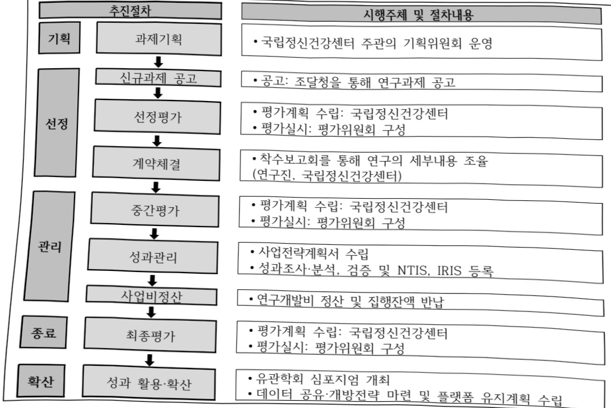

# 발달장애디지털치료제개발(R&D)

**해당 페이지**: PDF 3467 ~ 3472 쪽 해당

**부처**: 보건복지부
**분야**: 보건
**회계유형**: 일반회계
**2026 확정예산**: 9360.0 백만원
**전년대비 증감률**: 18.5%
**AI 도메인**: 의료/바이오

---

### 가. 예산 총괄표

(단위:백만원,%)

<table border=1 style='margin: auto; word-wrap: break-word;'><tr><td rowspan="2">사업명</td><td rowspan="2">2024년 결산</td><td colspan="2">2025년 예산</td><td colspan="2">2026년 예산</td><td rowspan="2">증감 (B-A)</td><td rowspan="2">(B-A)/A</td></tr><tr><td style='text-align: center; word-wrap: break-word;'>본예산</td><td style='text-align: center; word-wrap: break-word;'>추경(A)</td><td style='text-align: center; word-wrap: break-word;'>요구안</td><td style='text-align: center; word-wrap: break-word;'>본예산(B)</td></tr><tr><td style='text-align: center; word-wrap: break-word;'>발달장애디지털 치료제개발(R&amp;D)</td><td style='text-align: center; word-wrap: break-word;'>-</td><td style='text-align: center; word-wrap: break-word;'>7,900</td><td style='text-align: center; word-wrap: break-word;'>7,900</td><td style='text-align: center; word-wrap: break-word;'>9,360</td><td style='text-align: center; word-wrap: break-word;'>9,360</td><td style='text-align: center; word-wrap: break-word;'>1,460</td><td style='text-align: center; word-wrap: break-word;'>18.5</td></tr></table>

□ 기능별(내역사업별) 예산 내역

(단위:백만원)

<table border=1 style='margin: auto; word-wrap: break-word;'><tr><td rowspan="2"></td><td colspan="5">2024</td><td colspan="5">2025</td><td rowspan="2">2026 叁</td></tr><tr><td style='text-align: center; word-wrap: break-word;'>叁</td><td style='text-align: center; word-wrap: break-word;'>叁</td><td style='text-align: center; word-wrap: break-word;'>叁</td><td style='text-align: center; word-wrap: break-word;'>叁</td><td style='text-align: center; word-wrap: break-word;'>叁</td><td style='text-align: center; word-wrap: break-word;'>叁</td><td style='text-align: center; word-wrap: break-word;'>叁</td><td style='text-align: center; word-wrap: break-word;'>叁</td><td style='text-align: center; word-wrap: break-word;'>叁</td><td style='text-align: center; word-wrap: break-word;'>叁</td></tr><tr><td style='text-align: center; word-wrap: break-word;'>○ 기능별 분류(합계)</td><td style='text-align: center; word-wrap: break-word;'>-</td><td style='text-align: center; word-wrap: break-word;'>-</td><td style='text-align: center; word-wrap: break-word;'>-</td><td style='text-align: center; word-wrap: break-word;'>-</td><td style='text-align: center; word-wrap: break-word;'>-</td><td style='text-align: center; word-wrap: break-word;'>7,900</td><td style='text-align: center; word-wrap: break-word;'>7,900</td><td style='text-align: center; word-wrap: break-word;'>7,508</td><td style='text-align: center; word-wrap: break-word;'>-</td><td style='text-align: center; word-wrap: break-word;'>392</td><td style='text-align: center; word-wrap: break-word;'>9,360</td></tr><tr><td style='text-align: center; word-wrap: break-word;'>.디지털치료제개발</td><td style='text-align: center; word-wrap: break-word;'>-</td><td style='text-align: center; word-wrap: break-word;'>-</td><td style='text-align: center; word-wrap: break-word;'>-</td><td style='text-align: center; word-wrap: break-word;'>-</td><td style='text-align: center; word-wrap: break-word;'>-</td><td style='text-align: center; word-wrap: break-word;'>7,500</td><td style='text-align: center; word-wrap: break-word;'>7,500</td><td style='text-align: center; word-wrap: break-word;'>7,128</td><td style='text-align: center; word-wrap: break-word;'>-</td><td style='text-align: center; word-wrap: break-word;'>372</td><td style='text-align: center; word-wrap: break-word;'>9,000</td></tr><tr><td style='text-align: center; word-wrap: break-word;'>.사업운영비</td><td style='text-align: center; word-wrap: break-word;'>-</td><td style='text-align: center; word-wrap: break-word;'>-</td><td style='text-align: center; word-wrap: break-word;'>-</td><td style='text-align: center; word-wrap: break-word;'>-</td><td style='text-align: center; word-wrap: break-word;'>-</td><td style='text-align: center; word-wrap: break-word;'>400</td><td style='text-align: center; word-wrap: break-word;'>400</td><td style='text-align: center; word-wrap: break-word;'>380</td><td style='text-align: center; word-wrap: break-word;'>-</td><td style='text-align: center; word-wrap: break-word;'>20</td><td style='text-align: center; word-wrap: break-word;'>360</td></tr></table>

### 나. 사업설명자료

## 1 ) 사업목적·내용

- (발달장애디지털치료제개발) 주관보건복지부-과학기술정보통신부 다부처 사업으로 추진한 ‘자폐혼합형디지털치료제개발’(22~24) 사업의 후속사업으로 적용대상 확대 및 상용화 기술개발을 위한 2단계 연구사업

- (디지털치료제개발) 발달장애의 전주기적 개입을 위한 AI SW(선별, 진단보조, 경과 예측) 및 디지털치료제(ASD, ADHD, 운동장애) 상용화 기술개발

- (사업운영비) ▲인건비, ▲연구과제 기획·평가, ▲성과관리 등 사업운영비

---

## 2 ) 사업개요

사업근거 및 추진경위

① 법령상 근거 및 조항

-「정신건강증진 및 정신질환자 복지서비스 지원에 관한 법률」 제4조 및 제16조

## 제4조(국가와 지방자치단체의 책무)

① 국가와 지방자치단체는 국민의 성신건강을 증진시키고, 정신질환을 예방·치료하며, 정신질환자의 재활 및 장애 극복과 사회적응 촉진을 위한 연구·조사와 지도·상담 등 필요한 조치를 하여야 한다.

② 국가와 지방자치단체는 성신실환의 예방·치료와 정신질환자의 재활을 위하여 정신건강복지센터와 정신건강증진시설, 사회복지시설, 학교 및 사업장 등을 연계하는 정신건강서비스 전달체계를 확립하여야 한다.

③ 국가와 지방자치단체는 정신질환자등과 그 가족에 대한 권익향상, 인권보호 및 지원 서비스 등에 관한 종합적인 시책을 수립하고 그 추진을 위하여 노력하여야 한다.

④ 국가와 지방자치단체는 정신질환자등과 그 가족에 대한 모든 차별 및 편견을 해소하고 차별받은 정신질환자등과 그 가족의 권리를 구제할 책임이 있으며, 정신질환자등과 그 가족에 대한 차별 및 편견을 해소하기 위하여 적극적인 조치를 하여야 한다.

## 제16조(정신건강연구기관 설치·운영)

보건복지부장관은 다음 각 호의 업무 수행을 위하여 국립정신건강연구기관을 둘 수 있다.

1. 뇌(빨)신경 과학에 관한 연구

2. 정신질환 치료 및 재활을 위한 중개(仲介)·임상 연구

3. 정신건강증진 서비스 전달체계 개선에 관한 연구

4. 정신질환과 관련된 정보·통계의 수집·분석 및 제공

5. 정신건강증진 전문가 양성 및 정신건강증진시설 종사자 훈련

6. 국가계획의 수립 및 실태조사의 지원

7. 국가정신건강정책의 수행을 위한 국립정신병원의 지원

8. 그 밖에 대통령령으로 정하는 업무

## -「보건의료기술진흥법」제3조 및 제5조

제3조(기술개발의 보호·육성) 정부는 보건의료기술의 진흥을 위한 연구개발 활동과 보건신기술을 장려하고 보호·

육성하기 위한 정책을 마련하여 시행하여야 하며, 이에 필요한 비용을 지원할 수 있다.

## 제5조(연구개발사업의 추진)

① 정부는 중장기계획을 효율적으로 추진하기 위하여 보건의료기술 연구개발사업(이하 "연구개발사업"이라 한다)을 수행한다.

② 보건복지부장관은 연구개발사업으로 연도별·분야별 연구과제를 선정하여 다음 각 호의 기관이나 단체 등과 협약을 맺어 연구하게 할 수 있다.

② 추진경위 - 사업 시작년도, 추진배경, 부처별 중점과제, 대통령 공약사항 등

(추진배경) 당초 2단계 사업으로 기획된 ‘발달장애디지털치료제개발’은 1단계(자폐혼합형디지털치료제개발) 사업의 종료에 따라 적용대상을 발달장애로 확대하고 디지털 치료제에 대한 인허가 및 상용화 기술개발을 위한 2단계 연구사업 추진

* (1단계) 데이터플랫폼 및 디지털치료제 개발, 실증(인허가 전단계)

(2단계) 디지털치료제 임상시험 및 인허가, 실사용 근거 마련 등 상용화 연구

○ (국정과제) 사회1-4 : 국민·환자 건강 증진, 사회1-5 : AI 기반 제약·바이오헬스 강국 실현

---

○ (관련대책) 「디지털 헬스케어 서비스 산업 육성 전략」(관계부처 합동), 「제3차 보건의료기술육성기본계획('23~'27)」(보건복지부), 「제4차 생명공학육성기본계획 및 '제4차 뇌연구촉진 기본계획」(과학기술정보통신부)

(중점과제) '발달장애인과 장애아동 돌봄서비스 확대 추진'(보건복지부, '23.), '신기술 맞춤형 규제체계로 혁신'(식품의약품안전처, '23.)

□ 주요내용

① 사업규모

- 총사업비 : 해당없음

- 사업기간 : 2025~2028

- 최근 5년 간 투입된 사업비(예산액기준, 추경편성한 연도에는 추경포함)

<table border=1 style='margin: auto; word-wrap: break-word;'><tr><td style='text-align: center; word-wrap: break-word;'>연도</td><td style='text-align: center; word-wrap: break-word;'>2022</td><td style='text-align: center; word-wrap: break-word;'>2023</td><td style='text-align: center; word-wrap: break-word;'>2024</td><td style='text-align: center; word-wrap: break-word;'>2025</td><td style='text-align: center; word-wrap: break-word;'>2026</td></tr><tr><td style='text-align: center; word-wrap: break-word;'>사업비</td><td style='text-align: center; word-wrap: break-word;'>-</td><td style='text-align: center; word-wrap: break-word;'>-</td><td style='text-align: center; word-wrap: break-word;'>-</td><td style='text-align: center; word-wrap: break-word;'>7,900</td><td style='text-align: center; word-wrap: break-word;'>9,360</td></tr></table>

- 기타: 4년간 약 380억원 연구 지원 및 관리

② 사업추진체계

- 사업시행방법 : 직접수행

- 사업시행주체 : (주관기관) 국립정신건강센터, (참여기관) 대학, 병원, 기관 등

- 사업 수혜자 : 발달장애 환자 및 가족

- 보조, 융자, 출연, 출자 등의 경우 보조.융자 등 지원 비율 및 법적근거 : 해당없음

## 3 ) 2026년도 예산 산출 근거

### □ 발달장애디지털치료제개발사업: (26) 9,360만원 (전년대비 +1,460백만원, +18.5%)

ㅇ 디지털치료제개발 : (25) 7,500백만원 → (26) 9,000백만원 (+1,500백만원, +20.0%)

- (내용) 발달장애의 전주기적 개입을 위한 AI SW 및 디지털치료제 상용화 기술개발 9,000백만원

- (산출) (계속) 6개* × 1,500백만원 ×12/12개월 = 9,000백만원

*디지털의료기기(4종) 및 바이오타입 군집화 기술개발 : 5과제×1,350백만원×12/12개월 = 6,750백만원

*자폐성 발달장애 빅데이터 고도화 및 DTx 개발 : 1과제×2,250백만원×12/12개월 = 2,250백만원

사업운영비 : ('25) 400백만원 → ('26) 360백만원 (전년대비 △40백만원, △10.0%)

- (내용) 사업운영을 위한 인건비, 연구과제 기획·평가, 성과관리 등을 위한 운영비 360백만원

- (산출) (계속) 360백만원 ×12/12개월 = 360백만원

---

## 4 ) 사업효과

사업영향, 산출물 성과지표 등

①2022~2026년도 성과계획서 상 성과지표 및 최근 5년간 성과 달성도

-연구성과평가법에 따른 전략계획수립을 통해 '25년 12월 성과목표·지표 수립예정

② 성과지표 이외의 연도별 사업추진 경과 및 실적

<table border=1 style='margin: auto; word-wrap: break-word;'><tr><td style='text-align: center; word-wrap: break-word;'>2022</td><td style='text-align: center; word-wrap: break-word;'>- 해당없음(2025년 신규사업)</td></tr><tr><td style='text-align: center; word-wrap: break-word;'>2023</td><td style='text-align: center; word-wrap: break-word;'>- 해당없음(2025년 신규사업)</td></tr><tr><td style='text-align: center; word-wrap: break-word;'>2024</td><td style='text-align: center; word-wrap: break-word;'>- 해당없음(2025년 신규사업)</td></tr><tr><td style='text-align: center; word-wrap: break-word;'>2025</td><td style='text-align: center; word-wrap: break-word;'>- 사업공고 및 연구과제 선정, 연구협의체 1, 2차 회의, 1차년도 연차평가, 식약처 구제정합성 검토 추진</td></tr></table>

③향후(2026년도 이후)기대효과

- 디지털치료제(ASD, ADHD, 운동장애) 4종 개발, AI 알고리즘(선별, 진단보조, 경과 예측) 3종 개발

5) 타당성조사 및 예비타당성조사 시행여부 및 결과 요지 : 해당없음

6) 총사업비 대상사업 정보 : 해당없음

7) 사업 집행절차

---

## 8 ) 각종 평가 : 해당없음

### 다. 최근 4년간 결산내역

## 1 ) 결산표

☐ 부처 결산내역

(단위:백만원,%)

<table border=1 style='margin: auto; word-wrap: break-word;'><tr><td rowspan="2">연도</td><td colspan="3">예산액</td><td rowspan="2">예산현액(A)</td><td rowspan="2">집행액(B)</td><td rowspan="2">집행률(B/A)</td><td rowspan="2">다음연도이월액</td><td rowspan="2">불용액</td></tr><tr><td style='text-align: center; word-wrap: break-word;'>본예산</td><td style='text-align: center; word-wrap: break-word;'>추경증감액</td><td style='text-align: center; word-wrap: break-word;'>추경</td></tr><tr><td style='text-align: center; word-wrap: break-word;'>2022</td><td style='text-align: center; word-wrap: break-word;'>-</td><td style='text-align: center; word-wrap: break-word;'>-</td><td style='text-align: center; word-wrap: break-word;'>-</td><td style='text-align: center; word-wrap: break-word;'>-</td><td style='text-align: center; word-wrap: break-word;'>-</td><td style='text-align: center; word-wrap: break-word;'>-</td><td style='text-align: center; word-wrap: break-word;'>-</td><td style='text-align: center; word-wrap: break-word;'>-</td></tr><tr><td style='text-align: center; word-wrap: break-word;'>2023</td><td style='text-align: center; word-wrap: break-word;'>-</td><td style='text-align: center; word-wrap: break-word;'>-</td><td style='text-align: center; word-wrap: break-word;'>-</td><td style='text-align: center; word-wrap: break-word;'>-</td><td style='text-align: center; word-wrap: break-word;'>-</td><td style='text-align: center; word-wrap: break-word;'>-</td><td style='text-align: center; word-wrap: break-word;'>-</td><td style='text-align: center; word-wrap: break-word;'>-</td></tr><tr><td style='text-align: center; word-wrap: break-word;'>2024</td><td style='text-align: center; word-wrap: break-word;'>-</td><td style='text-align: center; word-wrap: break-word;'>-</td><td style='text-align: center; word-wrap: break-word;'>-</td><td style='text-align: center; word-wrap: break-word;'>-</td><td style='text-align: center; word-wrap: break-word;'>-</td><td style='text-align: center; word-wrap: break-word;'>-</td><td style='text-align: center; word-wrap: break-word;'>-</td><td style='text-align: center; word-wrap: break-word;'>-</td></tr><tr><td style='text-align: center; word-wrap: break-word;'>2025</td><td style='text-align: center; word-wrap: break-word;'>7,900</td><td style='text-align: center; word-wrap: break-word;'>-</td><td style='text-align: center; word-wrap: break-word;'>7,900</td><td style='text-align: center; word-wrap: break-word;'>7,900</td><td style='text-align: center; word-wrap: break-word;'>7,508</td><td style='text-align: center; word-wrap: break-word;'>95.0</td><td style='text-align: center; word-wrap: break-word;'>-</td><td style='text-align: center; word-wrap: break-word;'>392</td></tr></table>

## 2 ) 주요 결산사항

□ 2022~2025년 결산 주요사항

<table border=1 style='margin: auto; word-wrap: break-word;'><tr><td style='text-align: center; word-wrap: break-word;'>2022</td><td style='text-align: center; word-wrap: break-word;'>해당없음</td></tr><tr><td style='text-align: center; word-wrap: break-word;'>2023</td><td style='text-align: center; word-wrap: break-word;'>해당없음</td></tr><tr><td style='text-align: center; word-wrap: break-word;'>2024</td><td style='text-align: center; word-wrap: break-word;'>해당없음</td></tr><tr><td style='text-align: center; word-wrap: break-word;'>2025</td><td style='text-align: center; word-wrap: break-word;'>불용사유 : 연구용역 낙찰차액 및 정산잔액</td></tr></table>

□ 2025년 이.전용 등 세부내역 : 해당없음

---

<table border=1 style='margin: auto; word-wrap: break-word;'><tr><td style='text-align: center; word-wrap: break-word;'>사 업 명</td></tr><tr><td style='text-align: center; word-wrap: break-word;'>(228) 보건의료데이터 상호운용성 지원 기술개발(R&amp;D) (3031-578)</td></tr></table>

□ 사업 코드 정보

<table border=1 style='margin: auto; word-wrap: break-word;'><tr><td style='text-align: center; word-wrap: break-word;'>구분</td><td style='text-align: center; word-wrap: break-word;'>회계</td><td style='text-align: center; word-wrap: break-word;'>소관</td><td style='text-align: center; word-wrap: break-word;'>실국(기관)</td><td style='text-align: center; word-wrap: break-word;'>계정</td><td style='text-align: center; word-wrap: break-word;'>분야</td><td style='text-align: center; word-wrap: break-word;'>부문</td></tr><tr><td style='text-align: center; word-wrap: break-word;'>코드</td><td style='text-align: center; word-wrap: break-word;'>11</td><td style='text-align: center; word-wrap: break-word;'>23</td><td style='text-align: center; word-wrap: break-word;'>보건의료정책실</td><td rowspan="2"></td><td style='text-align: center; word-wrap: break-word;'>090</td><td style='text-align: center; word-wrap: break-word;'>091</td></tr><tr><td style='text-align: center; word-wrap: break-word;'>명칭</td><td style='text-align: center; word-wrap: break-word;'>일반회계</td><td style='text-align: center; word-wrap: break-word;'>보건복지부</td><td style='text-align: center; word-wrap: break-word;'>첨단의료지원관</td><td style='text-align: center; word-wrap: break-word;'>보건</td><td style='text-align: center; word-wrap: break-word;'>보건의료</td></tr></table>

<table border=1 style='margin: auto; word-wrap: break-word;'><tr><td style='text-align: center; word-wrap: break-word;'>구분</td><td style='text-align: center; word-wrap: break-word;'>프로그램</td><td style='text-align: center; word-wrap: break-word;'>단위사업</td><td style='text-align: center; word-wrap: break-word;'>세부사업</td></tr><tr><td style='text-align: center; word-wrap: break-word;'>코드</td><td style='text-align: center; word-wrap: break-word;'>3000</td><td style='text-align: center; word-wrap: break-word;'>3031</td><td style='text-align: center; word-wrap: break-word;'>578</td></tr><tr><td style='text-align: center; word-wrap: break-word;'>명칭</td><td style='text-align: center; word-wrap: break-word;'>보건산업육성</td><td style='text-align: center; word-wrap: break-word;'>보건의료연구개발(R&amp;D)</td><td style='text-align: center; word-wrap: break-word;'>보건의료데이터 상호운용성 지원 기술개발(R&amp;D)</td></tr></table>

□ 사업 성격 (공통요구자료 Ⅱ-1 작성유의사항 4. 참조, 해당하는 사항에 “〇” 표시)

<table border=1 style='margin: auto; word-wrap: break-word;'><tr><td rowspan="2">신규</td><td rowspan="2">계속</td><td rowspan="2">완료</td><td rowspan="2">예비타당성 실시여부</td><td rowspan="2">총사업비 관리대상</td><td rowspan="2">총액계상 예산사업</td><td style='text-align: center; word-wrap: break-word;'>사업소관 변경정보</td></tr><tr><td style='text-align: center; word-wrap: break-word;'>2025예산 시 소관</td></tr><tr><td style='text-align: center; word-wrap: break-word;'></td><td style='text-align: center; word-wrap: break-word;'>O</td><td style='text-align: center; word-wrap: break-word;'></td><td style='text-align: center; word-wrap: break-word;'></td><td style='text-align: center; word-wrap: break-word;'></td><td style='text-align: center; word-wrap: break-word;'></td><td style='text-align: center; word-wrap: break-word;'></td></tr></table>

□ 사업 지원 형태 및 지원을 (최소한 한 개는 반드시 선택하시오. 해당사항에 0 표시)

<table border=1 style='margin: auto; word-wrap: break-word;'><tr><td style='text-align: center; word-wrap: break-word;'>직접</td><td style='text-align: center; word-wrap: break-word;'>출자</td><td style='text-align: center; word-wrap: break-word;'>출연</td><td style='text-align: center; word-wrap: break-word;'>보조</td><td style='text-align: center; word-wrap: break-word;'>융자</td><td style='text-align: center; word-wrap: break-word;'>국고보조율(%)</td><td style='text-align: center; word-wrap: break-word;'>융자율(%)</td></tr><tr><td style='text-align: center; word-wrap: break-word;'></td><td style='text-align: center; word-wrap: break-word;'></td><td style='text-align: center; word-wrap: break-word;'>0</td><td style='text-align: center; word-wrap: break-word;'></td><td style='text-align: center; word-wrap: break-word;'></td><td style='text-align: center; word-wrap: break-word;'></td><td style='text-align: center; word-wrap: break-word;'></td></tr></table>

## □ 사업 담당자

<table border=1 style='margin: auto; word-wrap: break-word;'><tr><td style='text-align: center; word-wrap: break-word;'>사업명</td><td colspan="2">구분</td></tr><tr><td rowspan="4">보건의료데이터 상호운용성 지원 기술개발(R&amp;D)</td><td rowspan="3">소관부처</td><td style='text-align: center; word-wrap: break-word;'>실·국·과(팀)</td></tr><tr><td style='text-align: center; word-wrap: break-word;'>보건의료정책실 첨단의료지원관</td></tr><tr><td style='text-align: center; word-wrap: break-word;'>보건의료데이터진흥과</td></tr><tr><td style='text-align: center; word-wrap: break-word;'>사업시행주체</td><td style='text-align: center; word-wrap: break-word;'>한국보건산업진흥원</td></tr></table>

---

### 원본 PDF 크롭 이미지

