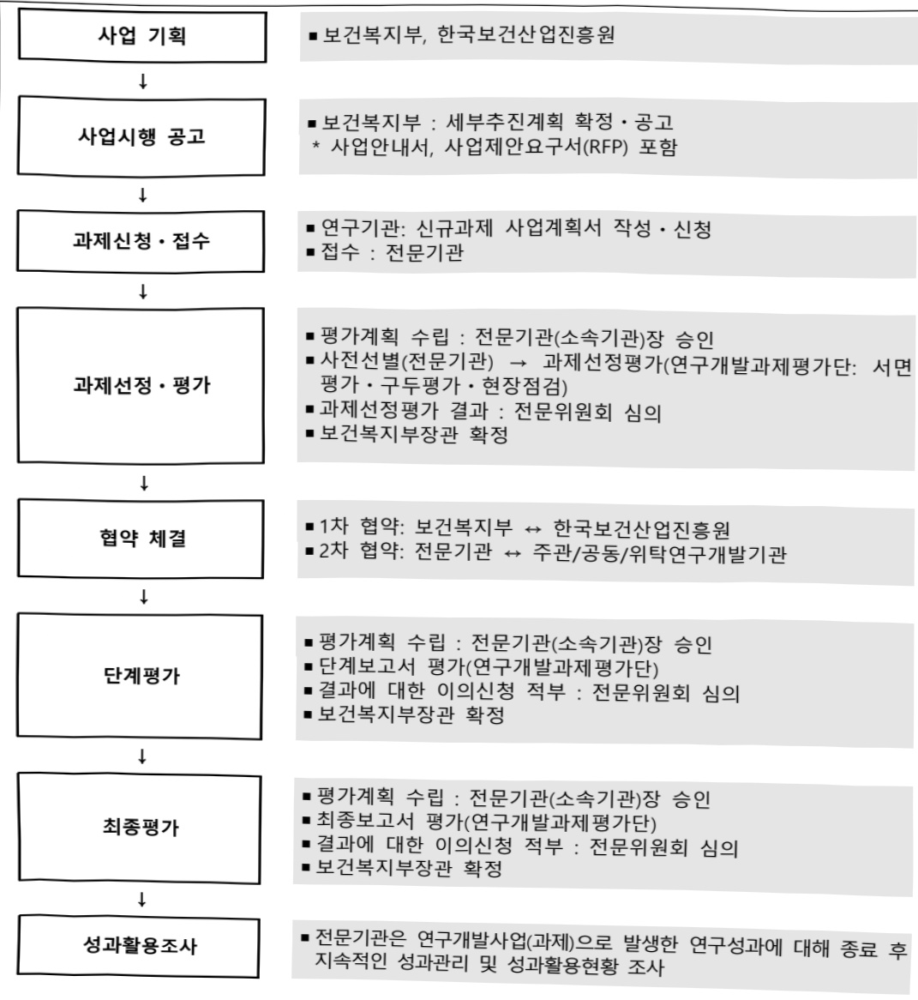

# 보건의료데이터 상호운용성 지원 기술개발(R&D)

**해당 페이지**: PDF 3473 ~ 3480 쪽 해당

**부처**: 보건복지부
**분야**: 보건
**회계유형**: 일반회계
**2026 확정예산**: 7600.0 백만원
**전년대비 증감률**: 33.3%
**AI 도메인**: 데이터, 의료/바이오

---

<table border=1 style='margin: auto; word-wrap: break-word;'><tr><td style='text-align: center; word-wrap: break-word;'>사 업 명</td></tr><tr><td style='text-align: center; word-wrap: break-word;'>(228) 보건의료데이터 상호운용성 지원 기술개발(R&amp;D) (3031-578)</td></tr></table>

□ 사업 코드 정보

<table border=1 style='margin: auto; word-wrap: break-word;'><tr><td style='text-align: center; word-wrap: break-word;'>구분</td><td style='text-align: center; word-wrap: break-word;'>회계</td><td style='text-align: center; word-wrap: break-word;'>소관</td><td style='text-align: center; word-wrap: break-word;'>실국(기관)</td><td style='text-align: center; word-wrap: break-word;'>계정</td><td style='text-align: center; word-wrap: break-word;'>분야</td><td style='text-align: center; word-wrap: break-word;'>부문</td></tr><tr><td style='text-align: center; word-wrap: break-word;'>코드</td><td style='text-align: center; word-wrap: break-word;'>11</td><td style='text-align: center; word-wrap: break-word;'>23</td><td style='text-align: center; word-wrap: break-word;'>보건의료정책실</td><td rowspan="2"></td><td style='text-align: center; word-wrap: break-word;'>090</td><td style='text-align: center; word-wrap: break-word;'>091</td></tr><tr><td style='text-align: center; word-wrap: break-word;'>명칭</td><td style='text-align: center; word-wrap: break-word;'>일반회계</td><td style='text-align: center; word-wrap: break-word;'>보건복지부</td><td style='text-align: center; word-wrap: break-word;'>첨단의료지원관</td><td style='text-align: center; word-wrap: break-word;'>보건</td><td style='text-align: center; word-wrap: break-word;'>보건의료</td></tr></table>

<table border=1 style='margin: auto; word-wrap: break-word;'><tr><td style='text-align: center; word-wrap: break-word;'>구분</td><td style='text-align: center; word-wrap: break-word;'>프로그램</td><td style='text-align: center; word-wrap: break-word;'>단위사업</td><td style='text-align: center; word-wrap: break-word;'>세부사업</td></tr><tr><td style='text-align: center; word-wrap: break-word;'>코드</td><td style='text-align: center; word-wrap: break-word;'>3000</td><td style='text-align: center; word-wrap: break-word;'>3031</td><td style='text-align: center; word-wrap: break-word;'>578</td></tr><tr><td style='text-align: center; word-wrap: break-word;'>명칭</td><td style='text-align: center; word-wrap: break-word;'>보건산업육성</td><td style='text-align: center; word-wrap: break-word;'>보건의료연구개발(R&amp;D)</td><td style='text-align: center; word-wrap: break-word;'>보건의료데이터 상호운용성 지원 기술개발(R&amp;D)</td></tr></table>

□ 사업 성격 (공통요구자료 Ⅱ-1 작성유의사항 4. 참조, 해당하는 사항에 “〇” 표시)

<table border=1 style='margin: auto; word-wrap: break-word;'><tr><td rowspan="2">신규</td><td rowspan="2">계속</td><td rowspan="2">완료</td><td rowspan="2">예비타당성 실시여부</td><td rowspan="2">총사업비 관리대상</td><td rowspan="2">총액계상 예산사업</td><td style='text-align: center; word-wrap: break-word;'>사업소관 변경정보</td></tr><tr><td style='text-align: center; word-wrap: break-word;'>2025예산 시 소관</td></tr><tr><td style='text-align: center; word-wrap: break-word;'></td><td style='text-align: center; word-wrap: break-word;'>O</td><td style='text-align: center; word-wrap: break-word;'></td><td style='text-align: center; word-wrap: break-word;'></td><td style='text-align: center; word-wrap: break-word;'></td><td style='text-align: center; word-wrap: break-word;'></td><td style='text-align: center; word-wrap: break-word;'></td></tr></table>

□ 사업 지원 형태 및 지원을 (최소한 한 개는 반드시 선택하시오. 해당사항에 0 표시)

<table border=1 style='margin: auto; word-wrap: break-word;'><tr><td style='text-align: center; word-wrap: break-word;'>직접</td><td style='text-align: center; word-wrap: break-word;'>출자</td><td style='text-align: center; word-wrap: break-word;'>출연</td><td style='text-align: center; word-wrap: break-word;'>보조</td><td style='text-align: center; word-wrap: break-word;'>융자</td><td style='text-align: center; word-wrap: break-word;'>국고보조율(%)</td><td style='text-align: center; word-wrap: break-word;'>융자율(%)</td></tr><tr><td style='text-align: center; word-wrap: break-word;'></td><td style='text-align: center; word-wrap: break-word;'></td><td style='text-align: center; word-wrap: break-word;'>0</td><td style='text-align: center; word-wrap: break-word;'></td><td style='text-align: center; word-wrap: break-word;'></td><td style='text-align: center; word-wrap: break-word;'></td><td style='text-align: center; word-wrap: break-word;'></td></tr></table>

## □ 사업 담당자

<table border=1 style='margin: auto; word-wrap: break-word;'><tr><td style='text-align: center; word-wrap: break-word;'>사업명</td><td colspan="2">구분</td></tr><tr><td rowspan="4">보건의료데이터 상호운용성 지원 기술개발(R&amp;D)</td><td rowspan="3">소관부처</td><td style='text-align: center; word-wrap: break-word;'>실·국·과(팀)</td></tr><tr><td style='text-align: center; word-wrap: break-word;'>보건의료정책실 첨단의료지원관</td></tr><tr><td style='text-align: center; word-wrap: break-word;'>보건의료데이터진흥과</td></tr><tr><td style='text-align: center; word-wrap: break-word;'>사업시행주체</td><td style='text-align: center; word-wrap: break-word;'>한국보건산업진흥원</td></tr></table>

---

### 가. 예산안 총괄표

(단위:백만원,%)

<table border=1 style='margin: auto; word-wrap: break-word;'><tr><td rowspan="2">사업명</td><td rowspan="2">2024년 결산</td><td colspan="2">2025년 예산</td><td colspan="2">2026년 예산</td><td rowspan="2">증감 (B-A)</td><td rowspan="2">(B-A)/A</td></tr><tr><td style='text-align: center; word-wrap: break-word;'>본예산</td><td style='text-align: center; word-wrap: break-word;'>추경*(A)</td><td style='text-align: center; word-wrap: break-word;'>요구안</td><td style='text-align: center; word-wrap: break-word;'>본예산(B)</td></tr><tr><td style='text-align: center; word-wrap: break-word;'>보건의료데이터 상호운용성 지원 기술개발(R&amp;D)</td><td style='text-align: center; word-wrap: break-word;'>-</td><td style='text-align: center; word-wrap: break-word;'>5,700</td><td style='text-align: center; word-wrap: break-word;'>5,700</td><td style='text-align: center; word-wrap: break-word;'>7,600</td><td style='text-align: center; word-wrap: break-word;'>7,600</td><td style='text-align: center; word-wrap: break-word;'>1,900</td><td style='text-align: center; word-wrap: break-word;'>33.3</td></tr></table>

* 추경: 추경증감액을 포함한 최종 예산액을 기재

## □ 기능별(내역사업별), 목별 예산안 내역

(단위:백만원)

<table border=1 style='margin: auto; word-wrap: break-word;'><tr><td rowspan="2"></td><td colspan="5">2024</td><td colspan="5">2025</td><td rowspan="2">2026예산</td></tr><tr><td style='text-align: center; word-wrap: break-word;'>예산액(주경)</td><td style='text-align: center; word-wrap: break-word;'>예산현액</td><td style='text-align: center; word-wrap: break-word;'>집행액</td><td style='text-align: center; word-wrap: break-word;'>이월액</td><td style='text-align: center; word-wrap: break-word;'>불용액</td><td style='text-align: center; word-wrap: break-word;'>예산액(주경)</td><td style='text-align: center; word-wrap: break-word;'>예산현액</td><td style='text-align: center; word-wrap: break-word;'>집행액</td><td style='text-align: center; word-wrap: break-word;'>이월액</td><td style='text-align: center; word-wrap: break-word;'>불용액</td></tr><tr><td style='text-align: center; word-wrap: break-word;'>○ 기능별 분류(합계)</td><td style='text-align: center; word-wrap: break-word;'>-</td><td style='text-align: center; word-wrap: break-word;'>-</td><td style='text-align: center; word-wrap: break-word;'>-</td><td style='text-align: center; word-wrap: break-word;'>-</td><td style='text-align: center; word-wrap: break-word;'>-</td><td style='text-align: center; word-wrap: break-word;'>5,700</td><td style='text-align: center; word-wrap: break-word;'>5,700</td><td style='text-align: center; word-wrap: break-word;'>5,700</td><td style='text-align: center; word-wrap: break-word;'>-</td><td style='text-align: center; word-wrap: break-word;'>-</td><td style='text-align: center; word-wrap: break-word;'>7,600</td></tr><tr><td rowspan="3">·보건의료데이터 상호운용성 총괄 코디네이션 센터 ·보건의료데이터 표준 통합운영 체계 개발 및 실증 ·보건의료데이터 표준스칙 적용 자동화 기술개발 및 실증</td><td style='text-align: center; word-wrap: break-word;'>-</td><td style='text-align: center; word-wrap: break-word;'>-</td><td style='text-align: center; word-wrap: break-word;'>-</td><td style='text-align: center; word-wrap: break-word;'>-</td><td style='text-align: center; word-wrap: break-word;'>-</td><td style='text-align: center; word-wrap: break-word;'>450</td><td style='text-align: center; word-wrap: break-word;'>450</td><td style='text-align: center; word-wrap: break-word;'>450</td><td style='text-align: center; word-wrap: break-word;'>-</td><td style='text-align: center; word-wrap: break-word;'>-</td><td style='text-align: center; word-wrap: break-word;'>600</td></tr><tr><td style='text-align: center; word-wrap: break-word;'>-</td><td style='text-align: center; word-wrap: break-word;'>-</td><td style='text-align: center; word-wrap: break-word;'>-</td><td style='text-align: center; word-wrap: break-word;'>-</td><td style='text-align: center; word-wrap: break-word;'>-</td><td style='text-align: center; word-wrap: break-word;'>1,875</td><td style='text-align: center; word-wrap: break-word;'>1,875</td><td style='text-align: center; word-wrap: break-word;'>1,875</td><td style='text-align: center; word-wrap: break-word;'>-</td><td style='text-align: center; word-wrap: break-word;'>-</td><td style='text-align: center; word-wrap: break-word;'>2,500</td></tr><tr><td style='text-align: center; word-wrap: break-word;'>-</td><td style='text-align: center; word-wrap: break-word;'>-</td><td style='text-align: center; word-wrap: break-word;'>-</td><td style='text-align: center; word-wrap: break-word;'>-</td><td style='text-align: center; word-wrap: break-word;'>-</td><td style='text-align: center; word-wrap: break-word;'>3,375</td><td style='text-align: center; word-wrap: break-word;'>3,375</td><td style='text-align: center; word-wrap: break-word;'>3,375</td><td style='text-align: center; word-wrap: break-word;'>-</td><td style='text-align: center; word-wrap: break-word;'>-</td><td style='text-align: center; word-wrap: break-word;'>4,500</td></tr></table>

### 나. 사업설명자료

## 1 ) 사업목적·내용

(사업목적) 보건의료데이터의 교류·활용을 위한 AI기반의 상호운용성 지원 기술개발을 통해 데이터 활용도 제고 및 의료서비스 질 향상

(사업내용) AI 등 최신 기술을 활용한 상호운용성 지원기술 개발을 통해 보건의료데이터 교류·활용 활성화 기반 마련

---

① 보건의료데이터 상호운용성 총괄 코디네이션 센터

- 내역사업간 기술개발 연계방안 마련, 협의체 구성·운영, 성과 분석 및 성과물의 활용·확산 방안 마련

② 보건의료데이터 표준 통합 운영체계 개발 및 실증

- 확장·변경되는 용어 및 전송 표준을 통합 관리하고 의료기관에 관련 변경사항을

자동으로 전달·업데이트 해주는 표준 통합운영체계 설계·개발

- AI 기반의 FHIR(국제전송표준) 교류지원 모듈 개발을 통해 정보교류 기반 구축 지원

- 기술개발 결과물을 현장에서 직접 체감하고 다양한 의견들이 환류될 수 있도록 현장 검증 및 종별·EMR 유형별 다각도 실증 수행

③ 보건의료데이터 표준 스펙 적용 자동화 기술개발

-데이터의교류·활용을위해AI등첨단기술을활용하여표준용어자동변환및

가명 처리 등 기술 개발 및 실증

## 2 ) 사업개요

☐ 사업근거 및 추진경위

① 법령상 근거 및 조항 적시

o 과학기술기본법

- 제11조(국가연구개발사업의 추진) ① 중앙행정기관의 장은 기본계획에 따라 맡은 분야의 국가연구개발사업과 그 시책을 세워 추진하여야 한다.

o 보건의료기본법

-제57조(보건의료정보의 표준화 추진) 보건복지부장관은 보건의료정보의 효율적 운영과 호환성(互換性) 확보 등을 위하여 보건의료정보의 표준화를 위한 시책을 강구하여야 한다.

o 보건의료기술진흥법

- 제3조(기술개발의 보호·육성) 정부는 보건의료기술의 진흥을 위한 연구개발 활동과 보건신기술을 장려하고 보호·육성하기 위한 정책을 마련하여 시행하여야 하며, 이에 필요한 비용을 지원할 수 있다.

- 제10조(보건의료정보의 진흥) 보건복지부장관은 보건의료정보의 생산·유통 및 활용을 위하여 다음 각 호의 사업을 추진한다.

1. 보건의료정보를 관리하기 위한 전문연구기관의 육성

2. 보건의료·복지 분야의 전산화를 촉진하기 위한 업무의 표준에 관한 연구·개발 및 관리

3. 보건의료정보의 공동이용 활성화

4. 그 밖에 보건복지부령으로 정하는 보건의료정보의 진흥에 관한 중요 사업

---

② 추진경위 - 사업 시작년도, 추진배경, 부처별 중점과제, 대통령 공약사항 등

°(국정과제,'13)1-1-9-3:신의료·융합서비스발전을위한제도 및정보화기반조성

- 국가보건의료정보 표준화를 추진, 융·복합, 정보공유 기반 조성

° (대통령 지시사항, '15) 제4기 저출산·고령사회위원회 3차 회의

- 진료정보 표준화 및 의료기관간 정보시스템 공유 체계 구축 차질 없이 추진

° (첨단바이오 이니셔티브 전략, '24.4월) 1-1. 첨단바이오의 패러다임을 바꾸는 디지털 바이오

ㅇ (데이터 고도화) 확보된 데이터로부터 연구에 유용한 데이터셋을 도출하고 데이터 표준화 등을 통해 데이터 고도화 추진

- AI 기반 보건의료 데이터 교류·활용을 위한 표준도구 기술을 개발하여 데이터의 상호운용성 제고 및 품질 향상

o (AI·디지털 혁신 성장 전략, '24.4월)

(Use Case) 의료데이터 구축·활용지원

· 제각각인 여러 의료기관의 데이터를 표준화하고 연동하여 의료기관,

산업계의 데이터 활용 편의성 제고

°(국정과제 및 관련공약, '25) 사회1-5-2 의료AI 등 디지털 헬스케어 혁신성장 체계 구축

- 2-1-11 디지털 헬스케어 혁신성장 체계를 구축하고, 전문인력 양성과 신뢰성 확보에 집중하겠습니다.

□ 주요내용

① 사업규모

- 총사업비(해당되는 경우에만 기재) : 해당없음

- 사업기간 : '25~'29년

- 최근 5년 간 투입된 사업비(예산액기준, 추경편성한 연도에는 추경포함)

<table border=1 style='margin: auto; word-wrap: break-word;'><tr><td style='text-align: center; word-wrap: break-word;'>연도</td><td style='text-align: center; word-wrap: break-word;'>2022</td><td style='text-align: center; word-wrap: break-word;'>2023</td><td style='text-align: center; word-wrap: break-word;'>2024</td><td style='text-align: center; word-wrap: break-word;'>2025</td><td style='text-align: center; word-wrap: break-word;'>2026</td></tr><tr><td style='text-align: center; word-wrap: break-word;'>사업비</td><td style='text-align: center; word-wrap: break-word;'>-</td><td style='text-align: center; word-wrap: break-word;'>-</td><td style='text-align: center; word-wrap: break-word;'>-</td><td style='text-align: center; word-wrap: break-word;'>5,700</td><td style='text-align: center; word-wrap: break-word;'>7,600</td></tr></table>

- 기타: 해당없음

② 사업추진체계

- 사업시행방법 : 출연(기업 참여 시 Matching)

- 사업시행주체 : 보건복지부, 한국보건산업진흥원, (참여기관) 산·학·연·병

- 사업 수혜자 : 산·학·연·병 연구자

---

- 보조, 융자, 출연, 출자 등의 경우 보조.융자 등 지원 비율 및 법적근거

<table border=1 style='margin: auto; word-wrap: break-word;'><tr><td style='text-align: center; word-wrap: break-word;'>내역사업명</td><td style='text-align: center; word-wrap: break-word;'>구분</td><td style='text-align: center; word-wrap: break-word;'>피보조.피출연 등 기관명</td><td style='text-align: center; word-wrap: break-word;'>지원 금액 (2026예산안)</td><td style='text-align: center; word-wrap: break-word;'>지원 비율(%)</td><td style='text-align: center; word-wrap: break-word;'>보조율 법적근거 (해당 조항)</td></tr><tr><td style='text-align: center; word-wrap: break-word;'>보건의료데이터 상호운용성 총괄 코디네이션센터</td><td style='text-align: center; word-wrap: break-word;'>출연</td><td style='text-align: center; word-wrap: break-word;'>한국보건산업진흥원</td><td style='text-align: center; word-wrap: break-word;'>600</td><td style='text-align: center; word-wrap: break-word;'>100</td><td style='text-align: center; word-wrap: break-word;'>보건의료기술진흥법 제7조</td></tr><tr><td style='text-align: center; word-wrap: break-word;'>보건의료데이터 표준통합운영체계 개발 및 실증</td><td style='text-align: center; word-wrap: break-word;'>출연</td><td style='text-align: center; word-wrap: break-word;'>한국보건산업진흥원</td><td style='text-align: center; word-wrap: break-word;'>2,500</td><td style='text-align: center; word-wrap: break-word;'>100</td><td style='text-align: center; word-wrap: break-word;'>보건의료기술진흥법 제7조</td></tr><tr><td style='text-align: center; word-wrap: break-word;'>보건의료데이터 표준스펙 적용 자동화 기술개발 및 실증</td><td style='text-align: center; word-wrap: break-word;'>출연</td><td style='text-align: center; word-wrap: break-word;'>한국보건산업진흥원</td><td style='text-align: center; word-wrap: break-word;'>4,500</td><td style='text-align: center; word-wrap: break-word;'>100</td><td style='text-align: center; word-wrap: break-word;'>보건의료기술진흥법 제7조</td></tr></table>

## 3 ) 2026년도 예산안 산출 근거

① 보건의료데이터 상호운용성 총괄 코디네이션 센터

: (2025 본예산) 450백만원 → (2026 요구) 600백만원, 150백만원 증액

- (요구) '25년 선정된 신규과제의 회계연도 일치로 인한 자연증가분 증액 필요

- (산출) (계속) 600백만원 = 1개 과제 x 600백만원 x 12개월

② 보건의료데이터 표준 통합 운영체계 개발 및 실증

: (2025 본예산) 1,875백만원 → (2026 요구) 2,500백만원, 625백만원

- (요구) '25년 선정된 신규과제의 회계연도 일치로 인한 자연증가분 증액 필요

- (산출) (계속) 2,500백만원 = 1개 과제 x 2,500백만원 x 12개월

③ 보건의료데이터 표준스펙 적용 자동화 기술개발 및 실증

: (2025 본예산) 3,375백만원 → (2026 요구) 4,500백만원, 1,125백만원

- (요구) '25년 선정된 신규과제의 회계연도 일치로 인한 자연증가분 증액 필요

- (산출) (계속) 4,500백만원 = 3개 과제 x 1,500백만원 x 12개월

---

## 4 ) 사업효과

사업영향, 산출물 성과지표 등

① 2022~2026년도 성과계획서 상 성과지표 및 최근 5년간 성과 달성도

<table border=1 style='margin: auto; word-wrap: break-word;'><tr><td style='text-align: center; word-wrap: break-word;'>성과지표</td><td style='text-align: center; word-wrap: break-word;'>구분</td><td style='text-align: center; word-wrap: break-word;'>2022</td><td style='text-align: center; word-wrap: break-word;'>2023</td><td style='text-align: center; word-wrap: break-word;'>2024</td><td style='text-align: center; word-wrap: break-word;'>2025</td><td style='text-align: center; word-wrap: break-word;'>2026</td><td style='text-align: center; word-wrap: break-word;'>2026 목표치산출근거</td><td style='text-align: center; word-wrap: break-word;'>측정산식(또는 측정방법)</td><td style='text-align: center; word-wrap: break-word;'>자료수집방법(또는 자료출처)</td></tr><tr><td rowspan="3">보건의료실용화지수(점)</td><td style='text-align: center; word-wrap: break-word;'>목표</td><td style='text-align: center; word-wrap: break-word;'>86.0</td><td style='text-align: center; word-wrap: break-word;'>104</td><td style='text-align: center; word-wrap: break-word;'>105</td><td style='text-align: center; word-wrap: break-word;'>106</td><td style='text-align: center; word-wrap: break-word;'>107</td><td rowspan="3">최근 3년 실적치 등을 고려하여 목표치 설정</td><td rowspan="3">(임상시험 승인건수 × 07) + (기술이전 건수 × 10) + (품목 하기전수 × 13) *실용화를 위한 TRI닫체를 고려하여 지표별 가중치 부여</td><td rowspan="3">범부처 통합연구 시스템 (IRIS) 활용</td></tr><tr><td style='text-align: center; word-wrap: break-word;'>실적</td><td style='text-align: center; word-wrap: break-word;'>93.2</td><td style='text-align: center; word-wrap: break-word;'>104.3</td><td style='text-align: center; word-wrap: break-word;'>107.6</td><td style='text-align: center; word-wrap: break-word;'>-</td><td style='text-align: center; word-wrap: break-word;'>-</td></tr><tr><td style='text-align: center; word-wrap: break-word;'>달성도</td><td style='text-align: center; word-wrap: break-word;'>108.4</td><td style='text-align: center; word-wrap: break-word;'>102.9</td><td style='text-align: center; word-wrap: break-word;'>102.5</td><td style='text-align: center; word-wrap: break-word;'>-</td><td style='text-align: center; word-wrap: break-word;'>-</td></tr></table>

② 성과지표 이외의 연도별 사업추진 경과 및 실적

<table border=1 style='margin: auto; word-wrap: break-word;'><tr><td style='text-align: center; word-wrap: break-word;'>2022</td><td style='text-align: center; word-wrap: break-word;'>해당없음</td></tr><tr><td style='text-align: center; word-wrap: break-word;'>2023</td><td style='text-align: center; word-wrap: break-word;'>해당없음</td></tr><tr><td style='text-align: center; word-wrap: break-word;'>2024</td><td style='text-align: center; word-wrap: break-word;'>해당없음</td></tr><tr><td style='text-align: center; word-wrap: break-word;'>2025</td><td style='text-align: center; word-wrap: break-word;'>신규과제 선정 및 연구개시</td></tr></table>

## ③향후(2026년도 이후)기대효과

- AI 등 최신기술을 활용한 보건의료데이터 상호운용성 확대를 통해 전반적인 의료환경 개선이 가능하며, 의료기술의 발전으로 인한 국가 의료서비스 혁신

- 국가 차원의 보건의료데이터 활용 생태계를 마련하여 공공보건의료 정책의 연계·통합 가능, 국가적 보건의료 위기상황 예방 및 효율적 대응

- 디지털 헬스케어 등 산업계 기술 발전 및 경제 가치 창출로 첨단 바이오 글로벌강국으로 도약

5) 타당성조사 및 예비타당성조사 시행여부 및 결과 요지 : 해당없음

6) 총사업비 대상사업 정보: 해당없음

---

## 7 ) 사업 집행절차

- 보건의료데이터 상호운용성 총괄 코디네이션 센터

<table border=1 style='margin: auto; word-wrap: break-word;'><tr><td style='text-align: center; word-wrap: break-word;'>부처</td><td style='text-align: center; word-wrap: break-word;'></td><td style='text-align: center; word-wrap: break-word;'>피출연·피보조기관</td><td style='text-align: center; word-wrap: break-word;'></td><td style='text-align: center; word-wrap: break-word;'>간접보조사업자·사업수행자</td></tr><tr><td style='text-align: center; word-wrap: break-word;'>보건복지부(600백만원)</td><td style='text-align: center; word-wrap: break-word;'>=&gt;(600백만원)</td><td style='text-align: center; word-wrap: break-word;'>한국보건산업진흥원(600백만원)</td><td style='text-align: center; word-wrap: break-word;'>=&gt;(600백만원)</td><td style='text-align: center; word-wrap: break-word;'>한국보건의료정보원(지정)</td></tr></table>

---

- 보건의료데이터 표준 통합 운영체계 개발 및 실증

<table border=1 style='margin: auto; word-wrap: break-word;'><tr><td style='text-align: center; word-wrap: break-word;'>부처</td><td style='text-align: center; word-wrap: break-word;'></td><td style='text-align: center; word-wrap: break-word;'>피출연·피보조기관</td><td style='text-align: center; word-wrap: break-word;'></td><td style='text-align: center; word-wrap: break-word;'>간접보조사업자·사업수행자</td></tr><tr><td style='text-align: center; word-wrap: break-word;'>보건복지부(2,500백만원)</td><td style='text-align: center; word-wrap: break-word;'>=&gt;(2,500백만원)</td><td style='text-align: center; word-wrap: break-word;'>한국보건산업진흥원(2,500백만원)</td><td style='text-align: center; word-wrap: break-word;'>=&gt;(2,500백만원)</td><td style='text-align: center; word-wrap: break-word;'>선정기관①</td></tr></table>

- 보건의료데이터 표준스펙 적용 자동화 기술개발 및 실증

<table border=1 style='margin: auto; word-wrap: break-word;'><tr><td style='text-align: center; word-wrap: break-word;'>부처</td><td style='text-align: center; word-wrap: break-word;'></td><td style='text-align: center; word-wrap: break-word;'>피출연·피보조기관</td><td style='text-align: center; word-wrap: break-word;'></td><td style='text-align: center; word-wrap: break-word;'>간접보조사업자·사업수행자</td></tr><tr><td rowspan="3">보건복지부(4,500백만원)</td><td rowspan="3">=&gt;(4,500백만원)</td><td rowspan="3">한국보건산업진흥원(4,500백만원)</td><td style='text-align: center; word-wrap: break-word;'>=&gt;(1,500백만원)</td><td rowspan="2">선정기관①선정기관②</td></tr><tr><td style='text-align: center; word-wrap: break-word;'>=&gt;(1,500백만원)</td></tr><tr><td style='text-align: center; word-wrap: break-word;'>=&gt;(1,500백만원)</td><td style='text-align: center; word-wrap: break-word;'>선정기관③</td></tr></table>

8)각종평가:해당없음

### 다.최근 4년간 결산내역

## 1 ) 결산표

☐ 부처 결산내역

(단위:백만원,%)

<table border=1 style='margin: auto; word-wrap: break-word;'><tr><td rowspan="2">연도</td><td colspan="3">예산액</td><td rowspan="2">예산현액(A)</td><td rowspan="2">집행액(B)</td><td rowspan="2">집행률(B/A)</td><td rowspan="2">다음연도이월액</td><td rowspan="2">불용액</td></tr><tr><td style='text-align: center; word-wrap: break-word;'>본예산</td><td style='text-align: center; word-wrap: break-word;'>추경증감액</td><td style='text-align: center; word-wrap: break-word;'>추경</td></tr><tr><td style='text-align: center; word-wrap: break-word;'>2022</td><td style='text-align: center; word-wrap: break-word;'>-</td><td style='text-align: center; word-wrap: break-word;'>-</td><td style='text-align: center; word-wrap: break-word;'>-</td><td style='text-align: center; word-wrap: break-word;'>-</td><td style='text-align: center; word-wrap: break-word;'>-</td><td style='text-align: center; word-wrap: break-word;'>-</td><td style='text-align: center; word-wrap: break-word;'>-</td><td style='text-align: center; word-wrap: break-word;'>-</td></tr><tr><td style='text-align: center; word-wrap: break-word;'>2023</td><td style='text-align: center; word-wrap: break-word;'>-</td><td style='text-align: center; word-wrap: break-word;'>-</td><td style='text-align: center; word-wrap: break-word;'>-</td><td style='text-align: center; word-wrap: break-word;'>-</td><td style='text-align: center; word-wrap: break-word;'>-</td><td style='text-align: center; word-wrap: break-word;'>-</td><td style='text-align: center; word-wrap: break-word;'>-</td><td style='text-align: center; word-wrap: break-word;'>-</td></tr><tr><td style='text-align: center; word-wrap: break-word;'>2024</td><td style='text-align: center; word-wrap: break-word;'>-</td><td style='text-align: center; word-wrap: break-word;'>-</td><td style='text-align: center; word-wrap: break-word;'>-</td><td style='text-align: center; word-wrap: break-word;'>-</td><td style='text-align: center; word-wrap: break-word;'>-</td><td style='text-align: center; word-wrap: break-word;'>-</td><td style='text-align: center; word-wrap: break-word;'>-</td><td style='text-align: center; word-wrap: break-word;'>-</td></tr><tr><td style='text-align: center; word-wrap: break-word;'>2025</td><td style='text-align: center; word-wrap: break-word;'>5,700</td><td style='text-align: center; word-wrap: break-word;'>-</td><td style='text-align: center; word-wrap: break-word;'>5,700</td><td style='text-align: center; word-wrap: break-word;'>5,700</td><td style='text-align: center; word-wrap: break-word;'>5,700</td><td style='text-align: center; word-wrap: break-word;'>100</td><td style='text-align: center; word-wrap: break-word;'>-</td><td style='text-align: center; word-wrap: break-word;'>-</td></tr></table>

2) 주요 결산사항

2022~2025년 결산 주요 지적사항 및 시정요구사항 : 해당없음

□2025년 이.전용 등 세부내역 : 해당없음

---

### 원본 PDF 크롭 이미지

