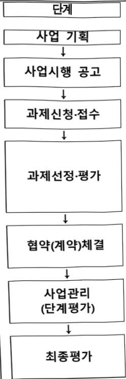

# 지역거점AX혁신기술개발(R&D)

**해당 페이지**: PDF 3510 ~ 3515 쪽 해당

**부처**: 보건복지부
**분야**: 보건
**회계유형**: 지역균형발전 특별회계
**2026 확정예산**: 5120.0 백만원
**전년대비 증감률**: None%
**AI 도메인**: 로봇, 디지털전환(AX)

---

### 가.예산 총괄표

(단위:백만원,%)

<table border=1 style='margin: auto; word-wrap: break-word;'><tr><td rowspan="2">사업명</td><td rowspan="2">2024년 결산</td><td colspan="2">2025년 예산</td><td colspan="2">2026년</td><td rowspan="2">중감(B-A)</td><td rowspan="2">(B-A)/A</td></tr><tr><td style='text-align: center; word-wrap: break-word;'>본예산(A)</td><td style='text-align: center; word-wrap: break-word;'>추경</td><td style='text-align: center; word-wrap: break-word;'>정부안</td><td style='text-align: center; word-wrap: break-word;'>확정(B)</td></tr><tr><td style='text-align: center; word-wrap: break-word;'>지역거점 AX혁신 기술개발(R&amp;D)</td><td style='text-align: center; word-wrap: break-word;'>-</td><td style='text-align: center; word-wrap: break-word;'>-</td><td style='text-align: center; word-wrap: break-word;'>-</td><td style='text-align: center; word-wrap: break-word;'>5,120</td><td style='text-align: center; word-wrap: break-word;'>5,120</td><td style='text-align: center; word-wrap: break-word;'>5,120</td><td style='text-align: center; word-wrap: break-word;'>순증</td></tr></table>

□ 기능별(내역사업별), 목별 예산 내역

(단위:백만원)

<table border=1 style='margin: auto; word-wrap: break-word;'><tr><td rowspan="3"></td><td colspan="5">2024</td><td colspan="7">2025(2025.12월말)</td><td rowspan="3">2026예산</td></tr><tr><td rowspan="2">예산액(주정)</td><td rowspan="2">예산현액</td><td rowspan="2">집행액[실집행액]</td><td rowspan="2">이월액</td><td rowspan="2">불용액</td><td rowspan="2">본예산</td><td rowspan="2">예산현액</td><td rowspan="2">집행액[실집행액]</td><td colspan="2">전년도 이월액제외</td><td rowspan="2">이월예상액</td><td rowspan="2">불용예상액</td></tr><tr><td style='text-align: center; word-wrap: break-word;'>예산현액</td><td style='text-align: center; word-wrap: break-word;'>집행액[실집행액]</td></tr><tr><td style='text-align: center; word-wrap: break-word;'>○ 지역거점 AX혁신기술개발</td><td style='text-align: center; word-wrap: break-word;'>-</td><td style='text-align: center; word-wrap: break-word;'>-</td><td style='text-align: center; word-wrap: break-word;'>-</td><td style='text-align: center; word-wrap: break-word;'>-</td><td style='text-align: center; word-wrap: break-word;'>-</td><td style='text-align: center; word-wrap: break-word;'>-</td><td style='text-align: center; word-wrap: break-word;'>-</td><td style='text-align: center; word-wrap: break-word;'>-</td><td style='text-align: center; word-wrap: break-word;'>-</td><td style='text-align: center; word-wrap: break-word;'>-</td><td style='text-align: center; word-wrap: break-word;'>-</td><td style='text-align: center; word-wrap: break-word;'>-</td><td style='text-align: center; word-wrap: break-word;'>5,120</td></tr><tr><td style='text-align: center; word-wrap: break-word;'>·공정·응용  솔루션AX R&amp;D</td><td style='text-align: center; word-wrap: break-word;'>-</td><td style='text-align: center; word-wrap: break-word;'>-</td><td style='text-align: center; word-wrap: break-word;'>-</td><td style='text-align: center; word-wrap: break-word;'>-</td><td style='text-align: center; word-wrap: break-word;'>-</td><td style='text-align: center; word-wrap: break-word;'>-</td><td style='text-align: center; word-wrap: break-word;'>-</td><td style='text-align: center; word-wrap: break-word;'>-</td><td style='text-align: center; word-wrap: break-word;'>-</td><td style='text-align: center; word-wrap: break-word;'>-</td><td style='text-align: center; word-wrap: break-word;'>-</td><td style='text-align: center; word-wrap: break-word;'>-</td><td style='text-align: center; word-wrap: break-word;'>2,508</td></tr><tr><td style='text-align: center; word-wrap: break-word;'>·응용제품AX R&amp;D</td><td style='text-align: center; word-wrap: break-word;'>-</td><td style='text-align: center; word-wrap: break-word;'>-</td><td style='text-align: center; word-wrap: break-word;'>-</td><td style='text-align: center; word-wrap: break-word;'>-</td><td style='text-align: center; word-wrap: break-word;'>-</td><td style='text-align: center; word-wrap: break-word;'>-</td><td style='text-align: center; word-wrap: break-word;'>-</td><td style='text-align: center; word-wrap: break-word;'>-</td><td style='text-align: center; word-wrap: break-word;'>-</td><td style='text-align: center; word-wrap: break-word;'>-</td><td style='text-align: center; word-wrap: break-word;'>-</td><td style='text-align: center; word-wrap: break-word;'>-</td><td style='text-align: center; word-wrap: break-word;'>2,612</td></tr></table>

---

### 나. 사업설명자료

## 1 ) 사업목적·내용

- (지역거점 AX혁신 기술개발사업) 지역 AX 연구 거점 조성으로 지역 특화산업(바이오, 로봇 등)과 연계한 AX 산업화 촉진 및 AX 기술 공급기지 구축

## 2 ) 사업개요

☐ 사업근거 및 추진경위

①법령상 근거 및 조항 적시

<table border=1 style='margin: auto; word-wrap: break-word;'><tr><td style='text-align: center; word-wrap: break-word;'>법령 및 상위계획</td><td style='text-align: center; word-wrap: break-word;'>주요내용</td></tr><tr><td style='text-align: center; word-wrap: break-word;'>과학기술기본법</td><td style='text-align: center; word-wrap: break-word;'>제11조(국가연구개발사업의 추진) ① 중앙행정기관의 장은 기본계획에 따라 맡은 분야의 국가연구개발사업과 그 시책을 세워 추진하여야 한다.</td></tr><tr><td style='text-align: center; word-wrap: break-word;'>보건의료기술 진흥법</td><td style='text-align: center; word-wrap: break-word;'>제3조(기술개발의 보호·육성) 정부는 보건의료기술의 진흥을 위한 연구개발 활동과 보건신기술을 장려하고 보호·육성하기 위한 정책을 마련하여 시행하여야 하며, 이에 필요한 비용을 지원할 수 있다. 제5조(연구개발사업의 추진) ① 정부는 기본계획을 효율적으로 추진하기 위하여 보건의료기술 연구개발사업을 수행한다.</td></tr><tr><td style='text-align: center; word-wrap: break-word;'>지방자치분권 및 지역 균형발전에 관한 특별법</td><td style='text-align: center; word-wrap: break-word;'>제14조(지역산업 육성 및 일자리 창출 등 지역경제 활성화 촉진) 시·도지사는 관계 중앙행정기관의 장 및 관할 구역의 시·군·구의 시장·군수·구청장과 협의하여 해당 시·도의 지역특화산업을 선정할 수 있다. 제15조(지역 교육여건 개선과 인재 양성) 국가와 지방자치단체는 지역의 교육여건 개선과 지역균형발전에 필요한 우수인력의 양성을 위하여 다음 각 호의 사항에 관한 시책을 추진하여야 한다. 제16조(지역과학기술의 진흥) 국가와 지방자치단체는 지역균형발전에 필요한 과학기술 및 정보통신의 진흥을 위하여 지역의 과학기술연구·교육기관 육성, 지역의 연구개발인력 및 정보통신인력의 확충, 지역균형발전을 위한 연구개발 촉진, 연구개발정보 유통체계 및 시설·장비 등 혁신기반 조성, 과학기술혁신 성과의 확산 및산업화 촉진 등에 관한 시책을 추진하여야 한다.</td></tr><tr><td style='text-align: center; word-wrap: break-word;'>의료기기산업 육성 및 혁신의료기기 지원법</td><td style='text-align: center; word-wrap: break-word;'>제3조(국가와 지방자치단체의 책무) 국가와 지방자치단체는 의료기기의 개발 및 제품화 촉진 등 의료기기 산업의 기반조성 및 경쟁력 강화의 필요한 시책을 수립·시행하여야 한다. 제25조(연구개발사업 추진 및 지원) 정부는 의료기기 품질평가 기반 구축, 의료기기 기준 규격화 사업 지원, 그밖의 의료기기산업의 발전을 위한 연구개발사업을 추진할 수 있다.</td></tr></table>

## ② 추진경위

ㅇ 사업 시작연도 : 2026년

0 추진경과

- 사전 자문회의(예비타당성 사업 컨셉 및 추진내용 논의)(23.)

- 기술기획위원회(4회), 총괄기획위원회(3차), 타당성검토위원회(3차) 개최('23.5 ~ '24.7.)

- 국가연구개발사업 총괄위원회(예비타당성조사 면제) 통과('25. 08.)

## □ 주요내용

---

## ① 사업규모

- 총사업비(해당되는 경우에만 기재) : 5,510억원

* (부처별) 과기부 1,980억원, 산업부 1,700억원, 복지부 1,280억원, 대구시 550억원

- 사업기간 : '26~'30년(총 5년)

- 최근 5년 간 투입된 사업비(예산액기준, 추경편성한 연도에는 추경포함)

(단위: 백만원)

<table border=1 style='margin: auto; word-wrap: break-word;'><tr><td style='text-align: center; word-wrap: break-word;'>연도</td><td style='text-align: center; word-wrap: break-word;'>2022</td><td style='text-align: center; word-wrap: break-word;'>2023</td><td style='text-align: center; word-wrap: break-word;'>2024</td><td style='text-align: center; word-wrap: break-word;'>2025</td><td style='text-align: center; word-wrap: break-word;'>2026</td></tr><tr><td style='text-align: center; word-wrap: break-word;'>사업비</td><td style='text-align: center; word-wrap: break-word;'>-</td><td style='text-align: center; word-wrap: break-word;'>-</td><td style='text-align: center; word-wrap: break-word;'>-</td><td style='text-align: center; word-wrap: break-word;'>-</td><td style='text-align: center; word-wrap: break-word;'>5,120</td></tr></table>

## ② 사업추진체계

- 사업시행방법 : 출연(국비 · 지방비 출연, 민간 참여 시 Matching)

- 사업시행주체 : 한국보건산업진흥원, 대구광역시, (가칭)지역거점 AX기술개발사업단

- 사업 수혜자 : 산·학·연·병 등

- 보조, 융자, 출연, 출자 등의 경우 보조·융자 등 지원 비율 및 법적근거

<table border=1 style='margin: auto; word-wrap: break-word;'><tr><td style='text-align: center; word-wrap: break-word;'>내역사업명</td><td style='text-align: center; word-wrap: break-word;'>구분</td><td style='text-align: center; word-wrap: break-word;'>피보조·피출연 등 기관명</td><td style='text-align: center; word-wrap: break-word;'>지원 금액 (2026예산)</td><td style='text-align: center; word-wrap: break-word;'>지원 비율(%)</td><td style='text-align: center; word-wrap: break-word;'>보조율 법적근거 (해당 조항)</td></tr><tr><td style='text-align: center; word-wrap: break-word;'>공정·응용 솔루션 AX R&amp;D</td><td style='text-align: center; word-wrap: break-word;'>출연</td><td style='text-align: center; word-wrap: break-word;'>한국보건산업진흥원</td><td style='text-align: center; word-wrap: break-word;'>2,508백만원</td><td style='text-align: center; word-wrap: break-word;'>100</td><td style='text-align: center; word-wrap: break-word;'>· 보건의료기술진흥법 제3조 및 제5조</td></tr><tr><td style='text-align: center; word-wrap: break-word;'>응용제품 AX R&amp;D</td><td style='text-align: center; word-wrap: break-word;'>출연</td><td style='text-align: center; word-wrap: break-word;'>한국보건산업진흥원</td><td style='text-align: center; word-wrap: break-word;'>2,612백만원</td><td style='text-align: center; word-wrap: break-word;'>100</td><td style='text-align: center; word-wrap: break-word;'>· 보건의료기술진흥법 제3조 및 제5조</td></tr></table>

---

## 3 ) 2026년도 예산 산출 근거

□ 지역거점 AX 혁신 기술개발 사업(R&D)
 : (2025 본예산) 0 백만원 → (2026 요구) 5,120백만원, 5,120백만원 증액(신규)

① 공정·응용 솔루션 AX R&D: (2025) - → (2026 요구) 2,508백만원, 순증
 - (요구) 바이오분야 표준 AX모델을 활용하여 공정·응용 솔루션을 개발하기 위한 신규예산 요청
 - (산출) (신규) 3개 과제 × 3,344백만원 × 3/12개월 = 2,508백만원

② 응용 제품 AX R&D: (2025) - → (2026 요구) 2,612백만원, 순증
 - (요구) 바이오·헬스케어 분야 산업현장의 글로벌 타겟 대응형 수요 기반 AI·SW 융합 및 AX 응용제품 개발을 위한 신규예산 요청
 - (산출) (신규) 4개 과제 × 2,612백만원 × 3/12개월 = 2,612백만원

## 4 ) 사업효과

☐ 사업영향, 산출물 성과지표 등

① 2022~2026년도 성과계획서 상 성과지표 및 최근 5년간 성과 달성도 : 해당없음

② 성과지표 이외의 연도별 사업추진 경과 및 실적 : 해당없음

③ 향후(2026년도 이후) 기대효과 :

- 의료·바이오, 산업현장의 기술현안 난제 해결을 위한 맞춤형 AI·SW 응용 기술개발 및 공정솔루션 확보

## 5 ) 타당성조사 및 예비타당성조사 시행여부 및 결과 요지

☐ 예비타당성조사 면제 대상으로 결정('25.8.)

° 예타면제 근거 조항

- (국가재정법 제38조제2항제10호) 지역군형발전, 긴급한 경제·사회적 상황 대응 등을 위하여 국가 정책적으로 추진이 필요한 경우 국무회의 심의·의결을 거쳐 예비타당성조사 면제 가능

## 6 ) 종사업비 대상사업 여부 및 내역 : 해당없음

## 7 ) 사업 집행절차

---

# 주요 추진내용

○ 보건복지부, 한국보건산업진흥원

○ 보건복지부 : 세부추진계획 확정 · 공고

* 사업안내서, 사업제안요구서(RFP) 포함

○연구기관 : 신규과제 사업계획서 작성·신청

°접수:지역거점AX기술개발사업단

평가계획수립:보건복지부장관 승인

○ 사전선별평가(한국보건산업진흥원) → 과제선정평가(연구개발과제평가단 : 서면평가 · 구두평가 · 현장평가)

o 전문위원회 심의

○ 보건복지부장관 연구개발과제 확정

○ 1차 협약 : 보건복지부 ↔ (가칭)지역거점AX기술개발사업단

○ 2차 협약 : 지역거점 AX기술개발 사업단 ↔ 주관/공동/위탁연구 개발기관

·단계보고서 평가(분야별 연구개발과제평가단)

°결과에 대한 이의신정 적부 : 전문위원회 심의

○ 보건복지부장관 연구개발과제 확정

○최종보고서 평가(연구개발과제평가단)

○보건의료기술정책심의위원회 심의

○보건복지부 확정

## <공정·응용 솔루션 AX R&D>

<table border=1 style='margin: auto; word-wrap: break-word;'><tr><td style='text-align: center; word-wrap: break-word;'>부처</td><td style='text-align: center; word-wrap: break-word;'></td><td style='text-align: center; word-wrap: break-word;'>피출연·피보조기관</td><td style='text-align: center; word-wrap: break-word;'></td><td style='text-align: center; word-wrap: break-word;'>간접보조사업자·사업수행자</td></tr><tr><td style='text-align: center; word-wrap: break-word;'>보건복지부(2,508백만원)</td><td style='text-align: center; word-wrap: break-word;'>→(2,508백만원)</td><td style='text-align: center; word-wrap: break-word;'>한국보건산업진흥원(2,508백만원)</td><td style='text-align: center; word-wrap: break-word;'>→(2,508백만원)</td><td style='text-align: center; word-wrap: break-word;'>연구개발수행기관</td></tr></table>

<응용제품 AX R&D>

<table border=1 style='margin: auto; word-wrap: break-word;'><tr><td style='text-align: center; word-wrap: break-word;'>부처</td><td style='text-align: center; word-wrap: break-word;'></td><td style='text-align: center; word-wrap: break-word;'>피출연·피보조기관</td><td style='text-align: center; word-wrap: break-word;'></td><td style='text-align: center; word-wrap: break-word;'>간접보조사업자·사업수행자</td></tr><tr><td style='text-align: center; word-wrap: break-word;'>보건복지부(2,612백만원)</td><td style='text-align: center; word-wrap: break-word;'>→(2,612백만원)</td><td style='text-align: center; word-wrap: break-word;'>한국보건산업진흥원(2,612백만원)</td><td style='text-align: center; word-wrap: break-word;'>→(2,612백만원)</td><td style='text-align: center; word-wrap: break-word;'>연구개발수행기관</td></tr></table>

## 8 ) 각종 평가: 해당 없음

### 다. 최근 4년간 결산내역 : 해당 없음('26년 신규사업)

---

<table border=1 style='margin: auto; word-wrap: break-word;'><tr><td style='text-align: center; word-wrap: break-word;'>사 업 명</td></tr><tr><td style='text-align: center; word-wrap: break-word;'>(248) 치매의료기술연구개발사업(R&amp;D) (3031-623)</td></tr></table>

☐ 사업 코드 정보

<table border=1 style='margin: auto; word-wrap: break-word;'><tr><td style='text-align: center; word-wrap: break-word;'>구분</td><td style='text-align: center; word-wrap: break-word;'>회계</td><td style='text-align: center; word-wrap: break-word;'>소관</td><td style='text-align: center; word-wrap: break-word;'>실국(기관)</td><td style='text-align: center; word-wrap: break-word;'>계정</td><td style='text-align: center; word-wrap: break-word;'>분야</td><td style='text-align: center; word-wrap: break-word;'>부문</td></tr><tr><td style='text-align: center; word-wrap: break-word;'>코드</td><td style='text-align: center; word-wrap: break-word;'>11</td><td style='text-align: center; word-wrap: break-word;'>23</td><td rowspan="2">보건산업정책국</td><td rowspan="2">-</td><td style='text-align: center; word-wrap: break-word;'>090</td><td style='text-align: center; word-wrap: break-word;'>091</td></tr><tr><td style='text-align: center; word-wrap: break-word;'>명칭</td><td style='text-align: center; word-wrap: break-word;'>일반회계</td><td style='text-align: center; word-wrap: break-word;'>보건복지부</td><td style='text-align: center; word-wrap: break-word;'>보건</td><td style='text-align: center; word-wrap: break-word;'>보건의료</td></tr></table>

<table border=1 style='margin: auto; word-wrap: break-word;'><tr><td style='text-align: center; word-wrap: break-word;'>구분</td><td style='text-align: center; word-wrap: break-word;'>프로그램</td><td style='text-align: center; word-wrap: break-word;'>단위사업</td><td style='text-align: center; word-wrap: break-word;'>세부사업</td></tr><tr><td style='text-align: center; word-wrap: break-word;'>코드</td><td style='text-align: center; word-wrap: break-word;'>3000</td><td style='text-align: center; word-wrap: break-word;'>3031</td><td style='text-align: center; word-wrap: break-word;'>623</td></tr><tr><td style='text-align: center; word-wrap: break-word;'>명칭</td><td style='text-align: center; word-wrap: break-word;'>보건산업육성</td><td style='text-align: center; word-wrap: break-word;'>보건의료연구개발(R&amp;D)</td><td style='text-align: center; word-wrap: break-word;'>치매의료기술연구개발사업</td></tr></table>

□ 사업 성격 (공통요구자료 Ⅱ-1 작성유의사항 4. 참조, 해당하는 사항에 “〇” 표시)

<table border=1 style='margin: auto; word-wrap: break-word;'><tr><td rowspan="2">신규</td><td rowspan="2">계속</td><td rowspan="2">완료</td><td rowspan="2">예비타당성 실시여부</td><td rowspan="2">총사업비 관리대상</td><td rowspan="2">총액계상 예산사업</td><td style='text-align: center; word-wrap: break-word;'>사업소관 변경정보</td></tr><tr><td style='text-align: center; word-wrap: break-word;'>2025예산 시 소관</td></tr><tr><td style='text-align: center; word-wrap: break-word;'>☑</td><td style='text-align: center; word-wrap: break-word;'></td><td style='text-align: center; word-wrap: break-word;'></td><td style='text-align: center; word-wrap: break-word;'></td><td style='text-align: center; word-wrap: break-word;'></td><td style='text-align: center; word-wrap: break-word;'></td><td style='text-align: center; word-wrap: break-word;'></td></tr></table>

□ 사업 지원 형태 및 지원을 (최소한 한 개는 반드시 선택하시오. 해당사항에 0 표시)

<table border=1 style='margin: auto; word-wrap: break-word;'><tr><td style='text-align: center; word-wrap: break-word;'>직접</td><td style='text-align: center; word-wrap: break-word;'>출자</td><td style='text-align: center; word-wrap: break-word;'>출연</td><td style='text-align: center; word-wrap: break-word;'>보조</td><td style='text-align: center; word-wrap: break-word;'>융자</td><td style='text-align: center; word-wrap: break-word;'>국고보조율(%)</td><td style='text-align: center; word-wrap: break-word;'>융자율(%)</td></tr><tr><td style='text-align: center; word-wrap: break-word;'></td><td style='text-align: center; word-wrap: break-word;'></td><td style='text-align: center; word-wrap: break-word;'>○</td><td style='text-align: center; word-wrap: break-word;'></td><td style='text-align: center; word-wrap: break-word;'></td><td style='text-align: center; word-wrap: break-word;'></td><td style='text-align: center; word-wrap: break-word;'></td></tr></table>

## □ 사업 소관부처 및 시행주체

<table border=1 style='margin: auto; word-wrap: break-word;'><tr><td style='text-align: center; word-wrap: break-word;'>사업명</td><td colspan="2">구분</td></tr><tr><td rowspan="3">치매의료기술연구개발사업(R&amp;D)</td><td rowspan="2">소관부처</td><td style='text-align: center; word-wrap: break-word;'>보건산업정책국</td></tr><tr><td style='text-align: center; word-wrap: break-word;'>보건의료기술개발과</td></tr><tr><td style='text-align: center; word-wrap: break-word;'>사업시행주체</td><td style='text-align: center; word-wrap: break-word;'>한국보건산업진흥원</td></tr></table>

---

### 원본 PDF 크롭 이미지

