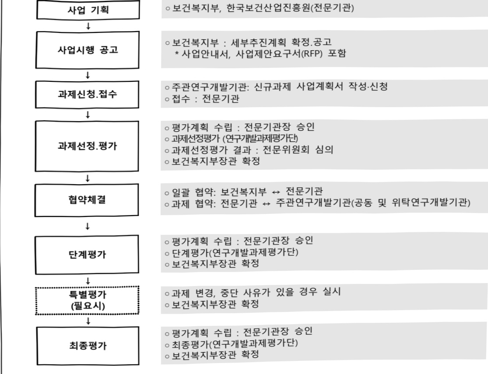
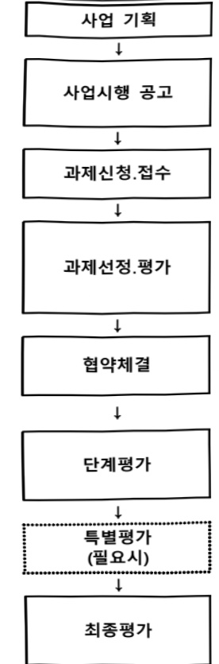

# 치매전주기 데이터수집 및 빅데이터 통합시스템 구축사업(R&D)

**해당 페이지**: PDF 3522 ~ 3527 쪽 해당

**부처**: 보건복지부
**분야**: 
**회계유형**: 일반회계
**2026 확정예산**: 3150.0 백만원
**전년대비 증감률**: 20.0%
**AI 도메인**: 데이터, 의료/바이오

---

### 가. 예산 총괄표

(단위:백만원,%)

<table border=1 style='margin: auto; word-wrap: break-word;'><tr><td rowspan="2">사업명</td><td rowspan="2">2024년 결산</td><td colspan="2">2025년 예산</td><td colspan="2">2026년 예산</td><td rowspan="2">증감(B-A)</td><td rowspan="2">(B-A)/A</td></tr><tr><td style='text-align: center; word-wrap: break-word;'>본예산</td><td style='text-align: center; word-wrap: break-word;'>추경*(A)</td><td style='text-align: center; word-wrap: break-word;'>요구안</td><td style='text-align: center; word-wrap: break-word;'>본예산(B)</td></tr><tr><td style='text-align: center; word-wrap: break-word;'>치매전주기 데이터수집 및 빅데이터 통합시스템 구축사업(R&amp;D)(3031-588)</td><td style='text-align: center; word-wrap: break-word;'>-</td><td style='text-align: center; word-wrap: break-word;'>2,625</td><td style='text-align: center; word-wrap: break-word;'>2,625</td><td style='text-align: center; word-wrap: break-word;'>3,150</td><td style='text-align: center; word-wrap: break-word;'>3,150</td><td style='text-align: center; word-wrap: break-word;'>525</td><td style='text-align: center; word-wrap: break-word;'>20.0</td></tr></table>

□ 기능별(내역사업별) 예산 내역

(단위:백만원)

<table border=1 style='margin: auto; word-wrap: break-word;'><tr><td rowspan="2"></td><td colspan="5">2024</td><td colspan="5">2025</td><td rowspan="2">2026 倉塲</td></tr><tr><td style='text-align: center; word-wrap: break-word;'>倉塲(専倉)</td><td style='text-align: center; word-wrap: break-word;'>倉塲(専倉)</td><td style='text-align: center; word-wrap: break-word;'>倉塲(専倉)</td><td style='text-align: center; word-wrap: break-word;'>倉塲(専倉)</td><td style='text-align: center; word-wrap: break-word;'>倉塲(専倉)</td><td style='text-align: center; word-wrap: break-word;'>倉塲(専倉)</td><td style='text-align: center; word-wrap: break-word;'>倉塲(専倉)</td><td style='text-align: center; word-wrap: break-word;'>倉塲(専倉)</td><td style='text-align: center; word-wrap: break-word;'>倉塲(専倉)</td><td style='text-align: center; word-wrap: break-word;'>倉塲(専倉)</td></tr><tr><td style='text-align: center; word-wrap: break-word;'>○ 기능별 분류(합계)</td><td style='text-align: center; word-wrap: break-word;'>-</td><td style='text-align: center; word-wrap: break-word;'>-</td><td style='text-align: center; word-wrap: break-word;'>-</td><td style='text-align: center; word-wrap: break-word;'>-</td><td style='text-align: center; word-wrap: break-word;'>-</td><td style='text-align: center; word-wrap: break-word;'>2,625</td><td style='text-align: center; word-wrap: break-word;'>2,625</td><td style='text-align: center; word-wrap: break-word;'>2,625</td><td style='text-align: center; word-wrap: break-word;'>-</td><td style='text-align: center; word-wrap: break-word;'>-</td><td style='text-align: center; word-wrap: break-word;'>3,150</td></tr><tr><td style='text-align: center; word-wrap: break-word;'>• 치매 종적데이터 및 시료수집</td><td style='text-align: center; word-wrap: break-word;'>-</td><td style='text-align: center; word-wrap: break-word;'>-</td><td style='text-align: center; word-wrap: break-word;'>-</td><td style='text-align: center; word-wrap: break-word;'>-</td><td style='text-align: center; word-wrap: break-word;'>-</td><td style='text-align: center; word-wrap: break-word;'>2,625</td><td style='text-align: center; word-wrap: break-word;'>2,625</td><td style='text-align: center; word-wrap: break-word;'>2,625</td><td style='text-align: center; word-wrap: break-word;'>-</td><td style='text-align: center; word-wrap: break-word;'>-</td><td style='text-align: center; word-wrap: break-word;'>3,150</td></tr></table>

### 나. 사업설명자료

## 1 ) 사업목적·내용

(치매전주기 데이터 수집 및 빅데이터 통합시스템 구축사업) 국가 치매연구 인프라 고도화를 위한 치매 중적 데이터 수집·통합

- (치매 중적데이터 및 시료수집) 치매극복연구개발사업의 기초·임상연구레지스트리 등록 환자를 대상으로

2년 간격의 추적 데이터 확보 및 시료수집·분양

## 2 ) 사업개요

사업근거 및 추진경위

① 법령상 근거 및 조항 적시

- (과학기술기본법 제11조) ① 중앙행정기관의 장은 기본계획에 따라 맡은 분야의 국가연구개발사업과 그 시책을 세워 추진하여야 한다.

- (치매관리법 제10조) ① 보건복지부장관은 치매의 예방과 진료기술의 발전을 위

---

하여 치매 연구·개발 사업(이하 “치매연구사업”이라 한다)을 시행한다.

- (뇌연구촉진법 제9조) ① 정부는 제5조제3항제2호의 투자재원의 확대 방안 및 추진계획에 따라 예산의 범위에서 뇌연구 투자를 확대하기 위하여 최대한 노력하여야 한다.

- (보건의료기술진흥법 5조) 정부는 기본계획을 효율적으로 추진하기 위하여 보건의료기술 연구개발사업을 수행한다.

- (제4차 치매관리 종합계획('21~25)) 초고령사회에 대응한 치매연구 및 기술개발 지원확대

- (제3차 국가생명연구자원 관리·활용 기본계획(20~25)) 데이터 기반 바이오 연구 환경 구축

② 추진경위

- 국제공동치매연구데이터구축 및 활용체계마련사업 추진('22~'24)

* 3년간 총 7,283백만원 (복지부77%, 과기정통부 23%)]

- 치매 코호트 유관 과제 간 연구협력 방안에 대한 관계부처* 논의('23.7.)

* 과기부, 복지부, 질병청

- 국제공동치매연구데이터구축 및 활용체계마련 후속사업 기획('23.9~12.)

- 치매 뇌연구협의체(데이터 협의)개최를 통한 현장 의견 수렴('23.12.)

## 주요내용

① 사업규모

- 총사업비 : 해당없음

- 사업기간 : '25~'28년

- 최근 5년 간 투입된 사업비(예산액기준, 추경편성한 연도에는 추경포함)

(단위:백만원)

<table border=1 style='margin: auto; word-wrap: break-word;'><tr><td style='text-align: center; word-wrap: break-word;'>연도</td><td style='text-align: center; word-wrap: break-word;'>2022</td><td style='text-align: center; word-wrap: break-word;'>2023</td><td style='text-align: center; word-wrap: break-word;'>2024</td><td style='text-align: center; word-wrap: break-word;'>2025</td><td style='text-align: center; word-wrap: break-word;'>2026</td></tr><tr><td style='text-align: center; word-wrap: break-word;'>사업비</td><td style='text-align: center; word-wrap: break-word;'>-</td><td style='text-align: center; word-wrap: break-word;'>-</td><td style='text-align: center; word-wrap: break-word;'>-</td><td style='text-align: center; word-wrap: break-word;'>2,625</td><td style='text-align: center; word-wrap: break-word;'>3,150</td></tr></table>

- 기타: 해당없음

② 사업추진체계

- 사업시행방법 : 출연(기업 참여시 매칭)

- 사업시행주체 : 보건복지부(전문기관: 한국보건산업진흥원)

- 사업 수혜자 : 산·학·연·병

- 보조, 융자, 출연, 출자 등의 경우 보조·융자 등 지원 비율 및 법적근거

(단위: 백만원)

---

<table border=1 style='margin: auto; word-wrap: break-word;'><tr><td style='text-align: center; word-wrap: break-word;'>내역사업명</td><td style='text-align: center; word-wrap: break-word;'>구분</td><td style='text-align: center; word-wrap: break-word;'>피보조·피출연 등 기관명</td><td style='text-align: center; word-wrap: break-word;'>지원 금액 (2026예산)</td><td style='text-align: center; word-wrap: break-word;'>지원 비율(%)</td><td style='text-align: center; word-wrap: break-word;'>보조율 법적근거 (해당 조항)</td></tr><tr><td style='text-align: center; word-wrap: break-word;'>치매전주기 데이터 수집 및 빅데이터 통합시스템 구축사업 (R&amp;D)</td><td style='text-align: center; word-wrap: break-word;'>출연</td><td style='text-align: center; word-wrap: break-word;'>한국보건산업진흥원</td><td style='text-align: center; word-wrap: break-word;'>3,150백만원</td><td style='text-align: center; word-wrap: break-word;'>100</td><td style='text-align: center; word-wrap: break-word;'>- 보건의료기술진흥법 제3조</td></tr></table>

## 3 ) 2026년도 예산 산출 근거

□ 치매전주기 데이터 수집 및 빅데이터 통합시스템 구축사업(R&D) : (2025) 2,625백만원 → (2026) 3,150백만원, 전년 대비 525백만원 증액

① 치매 종적데이터 및 시료수집

:(2025)2,625→(2026)3,150백만원,525백만원 증액

- 치매극복연구개발사업의 기초·임상연구레지스트리 등록 환자를 대상으로 2년 간격의 추적 데이터 확보 및 시료수집·분양 지원을 위한 사업비 3,150백만원

- (산출) (계속) 1개 × 3,150백만원 × 12/12개월 = 3,150백만원

## 4 ) 사업효과

☐ 사업영향, 산출물 성과지표 등

① 2022~2026년도 성과계획서 상 성과지표 및 최근 5년간 성과 달성도

<table border=1 style='margin: auto; word-wrap: break-word;'><tr><td style='text-align: center; word-wrap: break-word;'>성과지표</td><td style='text-align: center; word-wrap: break-word;'>구분</td><td style='text-align: center; word-wrap: break-word;'>2022</td><td style='text-align: center; word-wrap: break-word;'>2023</td><td style='text-align: center; word-wrap: break-word;'>2024</td><td style='text-align: center; word-wrap: break-word;'>2025</td><td style='text-align: center; word-wrap: break-word;'>2026</td><td style='text-align: center; word-wrap: break-word;'>2026 목표치산출근거</td><td style='text-align: center; word-wrap: break-word;'>측정산식(또는 측정방법)</td><td style='text-align: center; word-wrap: break-word;'>자료수집방법(또는 자료출처)</td></tr><tr><td rowspan="3">보건의료실용화지수(점)</td><td style='text-align: center; word-wrap: break-word;'>목표</td><td style='text-align: center; word-wrap: break-word;'>86.0</td><td style='text-align: center; word-wrap: break-word;'>104</td><td style='text-align: center; word-wrap: break-word;'>105</td><td style='text-align: center; word-wrap: break-word;'>106</td><td style='text-align: center; word-wrap: break-word;'>107</td><td rowspan="3">최근 3년실적치 등을 고려하여</td><td rowspan="3">(임상시험 승인건수×07) + (기술이전 건수×10) + (품목 하기건수×13) *실용화를 위한 TRI단계를 고려하여 지표별 가중치 부여</td><td rowspan="3">범부처통합연구시스템 (IRIS) 활용</td></tr><tr><td style='text-align: center; word-wrap: break-word;'>실적</td><td style='text-align: center; word-wrap: break-word;'>93.2</td><td style='text-align: center; word-wrap: break-word;'>104.3</td><td style='text-align: center; word-wrap: break-word;'>107.6</td><td style='text-align: center; word-wrap: break-word;'>-</td><td style='text-align: center; word-wrap: break-word;'>-</td></tr><tr><td style='text-align: center; word-wrap: break-word;'>달성도</td><td style='text-align: center; word-wrap: break-word;'>108.4</td><td style='text-align: center; word-wrap: break-word;'>102.9</td><td style='text-align: center; word-wrap: break-word;'>102.5</td><td style='text-align: center; word-wrap: break-word;'>-</td><td style='text-align: center; word-wrap: break-word;'>-</td></tr></table>

② 성과지표 이외의 연도별 사업추진 경과 및 실적 : 해당없음

③ 향후(2026년도 이후) 기대효과

- 주적대상을 바탕으로 연간 400명 규모의 종적 추적 대상자 데이터를 확보하여 사업기간 내 약 1,600명 규모의 양질의 치매 종적 추적 연구데이터 추가확보

* 치매극복연구개발사업 TRR 등록자(1차, baseline data) 및 선행사업(국제공동치매 연구데이터 구축 및 활용체계 마련사업) 추적 환자(2차 추적데이터)

- 치매 연구자 친화적 검증된 높은 가치의 연구 데이터를 생성하고 정밀 의료 기반을 마련하여 근거 기반의 치매 환자 맞춤형 진단·치료 실현에 기여

---

5) 타당성조사 및 예비타당성조사 시행여부 및 결과 요지 : 해당없음

6) 총사업비 대상사업 정보 : 해당없음

7) 사업 집행절차

○보건복지부 : 세부추진계획 확정.공고

* 사업안내서, 사업제안요구서(RFP) 포함

○ 주관연구개발기관: 신규과제 사업계획서 작성·신청

○ 접수 : 전문기관

○ 평가계획 수립 : 전문기관장 승인

○ 과제선정평가 (연구개발과제평가단)

○ 과제선정평가 결과 : 전문위원회 심의

○ 보건복지부장관 확정

○ 일괄 협약: 보건복지부 ↔ 전문기관

○ 과제 협약: 전문기관 ↔ 주관연구개발기관(공동 및 위탁연구개발기관)

평가계획 수립 : 전문기관장 승인

단계평가(연구개발과제평가단)

보건복지부장관 확정

과제 변경, 중단 사유가 있을 경우 실시

보건복지부장관 확정

평가계획 수립 : 전문기관장 승인

최종평가(연구개발과제평가단)

보건복지부장관 확정

- 치매 종적데이터 및 시료수집

<table border=1 style='margin: auto; word-wrap: break-word;'><tr><td style='text-align: center; word-wrap: break-word;'>부처</td><td style='text-align: center; word-wrap: break-word;'></td><td style='text-align: center; word-wrap: break-word;'>피출연·피보조기관</td><td style='text-align: center; word-wrap: break-word;'></td><td style='text-align: center; word-wrap: break-word;'>간접보조사업자·사업수행자</td></tr><tr><td style='text-align: center; word-wrap: break-word;'>보건복지부(3,150백만원)</td><td style='text-align: center; word-wrap: break-word;'>$ \Rightarrow $(3,150백만원)</td><td style='text-align: center; word-wrap: break-word;'>한국보건산업진흥원(3,150백만원)</td><td style='text-align: center; word-wrap: break-word;'>$ \Rightarrow $(3,150백만원)</td><td style='text-align: center; word-wrap: break-word;'>삼성서울병원</td></tr></table>

8) 각종 평가 : 해당없음

다. 최근 4년간 결산내역

## 1 ) 결산표

---

☐ 부처 결산내역

(단위: 백만원, %)

<table border=1 style='margin: auto; word-wrap: break-word;'><tr><td rowspan="2">연도</td><td colspan="3">예산액</td><td rowspan="2">예산현액(A)</td><td rowspan="2">집행액(B)</td><td rowspan="2">집행률(B/A)</td><td rowspan="2">다음연도이월액</td><td rowspan="2">불용액</td></tr><tr><td style='text-align: center; word-wrap: break-word;'>본예산</td><td style='text-align: center; word-wrap: break-word;'>추경중감액</td><td style='text-align: center; word-wrap: break-word;'>추경</td></tr><tr><td style='text-align: center; word-wrap: break-word;'>2022</td><td style='text-align: center; word-wrap: break-word;'>-</td><td style='text-align: center; word-wrap: break-word;'>-</td><td style='text-align: center; word-wrap: break-word;'>-</td><td style='text-align: center; word-wrap: break-word;'>-</td><td style='text-align: center; word-wrap: break-word;'>-</td><td style='text-align: center; word-wrap: break-word;'>-</td><td style='text-align: center; word-wrap: break-word;'>-</td><td style='text-align: center; word-wrap: break-word;'>-</td></tr><tr><td style='text-align: center; word-wrap: break-word;'>2023</td><td style='text-align: center; word-wrap: break-word;'>-</td><td style='text-align: center; word-wrap: break-word;'>-</td><td style='text-align: center; word-wrap: break-word;'>-</td><td style='text-align: center; word-wrap: break-word;'>-</td><td style='text-align: center; word-wrap: break-word;'>-</td><td style='text-align: center; word-wrap: break-word;'>-</td><td style='text-align: center; word-wrap: break-word;'>-</td><td style='text-align: center; word-wrap: break-word;'>-</td></tr><tr><td style='text-align: center; word-wrap: break-word;'>2024</td><td style='text-align: center; word-wrap: break-word;'>-</td><td style='text-align: center; word-wrap: break-word;'>-</td><td style='text-align: center; word-wrap: break-word;'>-</td><td style='text-align: center; word-wrap: break-word;'>-</td><td style='text-align: center; word-wrap: break-word;'>-</td><td style='text-align: center; word-wrap: break-word;'>-</td><td style='text-align: center; word-wrap: break-word;'>-</td><td style='text-align: center; word-wrap: break-word;'>-</td></tr><tr><td style='text-align: center; word-wrap: break-word;'>2025</td><td style='text-align: center; word-wrap: break-word;'>2,625</td><td style='text-align: center; word-wrap: break-word;'>-</td><td style='text-align: center; word-wrap: break-word;'>2,625</td><td style='text-align: center; word-wrap: break-word;'>2,625</td><td style='text-align: center; word-wrap: break-word;'>2,625</td><td style='text-align: center; word-wrap: break-word;'>100</td><td style='text-align: center; word-wrap: break-word;'>-</td><td style='text-align: center; word-wrap: break-word;'>-</td></tr></table>

2) 주요 결산사항 : 해당없음

---

<table border=1 style='margin: auto; word-wrap: break-word;'><tr><td style='text-align: center; word-wrap: break-word;'>사 업 명</td></tr><tr><td style='text-align: center; word-wrap: break-word;'>(16) 한국형 수술질향상 프로젝트(K-NSQIP)(R&amp;D) (3040-309)</td></tr></table>

□ 사업 코드 정보

<table border=1 style='margin: auto; word-wrap: break-word;'><tr><td style='text-align: center; word-wrap: break-word;'>구분</td><td style='text-align: center; word-wrap: break-word;'>기금</td><td style='text-align: center; word-wrap: break-word;'>소관</td><td style='text-align: center; word-wrap: break-word;'>실국(기관)</td><td style='text-align: center; word-wrap: break-word;'>계정</td><td style='text-align: center; word-wrap: break-word;'>분야</td><td style='text-align: center; word-wrap: break-word;'>부문</td></tr><tr><td style='text-align: center; word-wrap: break-word;'>코드</td><td rowspan="2">국민건강증진기금</td><td rowspan="2">보건복지부</td><td rowspan="2">보건산업정책국</td><td rowspan="2">국민건강증진계정</td><td style='text-align: center; word-wrap: break-word;'>090</td><td style='text-align: center; word-wrap: break-word;'>091</td></tr><tr><td style='text-align: center; word-wrap: break-word;'>명칭</td><td style='text-align: center; word-wrap: break-word;'>보건</td><td style='text-align: center; word-wrap: break-word;'>보건의료</td></tr></table>

<table border=1 style='margin: auto; word-wrap: break-word;'><tr><td style='text-align: center; word-wrap: break-word;'>구분</td><td style='text-align: center; word-wrap: break-word;'>프로그램</td><td style='text-align: center; word-wrap: break-word;'>단위사업</td><td style='text-align: center; word-wrap: break-word;'>세부사업</td></tr><tr><td style='text-align: center; word-wrap: break-word;'>코드</td><td style='text-align: center; word-wrap: break-word;'>3000</td><td style='text-align: center; word-wrap: break-word;'>3040</td><td style='text-align: center; word-wrap: break-word;'>309</td></tr><tr><td style='text-align: center; word-wrap: break-word;'>명칭</td><td style='text-align: center; word-wrap: break-word;'>보건산업육성</td><td style='text-align: center; word-wrap: break-word;'>보건의료연구개발</td><td style='text-align: center; word-wrap: break-word;'>한국형 수술질향상 프로젝트(K-NSQIP)</td></tr></table>

□ 사업 성격 (공통요구자료 Ⅱ-1 작성유의사항 4. 참조, 해당하는 사항에 “〇” 표시)

<table border=1 style='margin: auto; word-wrap: break-word;'><tr><td style='text-align: center; word-wrap: break-word;'>신규</td><td style='text-align: center; word-wrap: break-word;'>계속</td><td style='text-align: center; word-wrap: break-word;'>완료</td><td style='text-align: center; word-wrap: break-word;'>예비타당성 실시여부</td><td style='text-align: center; word-wrap: break-word;'>총사업비 관리대상</td><td style='text-align: center; word-wrap: break-word;'>총액계상 예산사업</td><td style='text-align: center; word-wrap: break-word;'>사업소관 변경정보 2025예산 시 소관</td></tr><tr><td style='text-align: center; word-wrap: break-word;'></td><td style='text-align: center; word-wrap: break-word;'>○</td><td style='text-align: center; word-wrap: break-word;'></td><td style='text-align: center; word-wrap: break-word;'></td><td style='text-align: center; word-wrap: break-word;'></td><td style='text-align: center; word-wrap: break-word;'></td><td style='text-align: center; word-wrap: break-word;'></td></tr></table>

□ 사업 지원 형태 및 지원을 (최소한 한 개는 반드시 선택하시오. 해당사항에 0 표시)

<table border=1 style='margin: auto; word-wrap: break-word;'><tr><td style='text-align: center; word-wrap: break-word;'>직접</td><td style='text-align: center; word-wrap: break-word;'>출자</td><td style='text-align: center; word-wrap: break-word;'>출연</td><td style='text-align: center; word-wrap: break-word;'>보조</td><td style='text-align: center; word-wrap: break-word;'>융자</td><td style='text-align: center; word-wrap: break-word;'>국고보조율(%)</td><td style='text-align: center; word-wrap: break-word;'>융자율(%)</td></tr><tr><td style='text-align: center; word-wrap: break-word;'></td><td style='text-align: center; word-wrap: break-word;'></td><td style='text-align: center; word-wrap: break-word;'>○</td><td style='text-align: center; word-wrap: break-word;'></td><td style='text-align: center; word-wrap: break-word;'></td><td style='text-align: center; word-wrap: break-word;'></td><td style='text-align: center; word-wrap: break-word;'></td></tr></table>

□ 사업 소관부처 및 시행주체

<table border=1 style='margin: auto; word-wrap: break-word;'><tr><td style='text-align: center; word-wrap: break-word;'>사업명</td><td colspan="2">구분</td></tr><tr><td rowspan="3">한국형 수술질향상 프로젝트 (K-NSQIP) (R&amp;D)</td><td rowspan="2">소관부처</td><td style='text-align: center; word-wrap: break-word;'>보건산업정책국</td></tr><tr><td style='text-align: center; word-wrap: break-word;'>보건의료기술개발과</td></tr><tr><td style='text-align: center; word-wrap: break-word;'>사업시행주체</td><td style='text-align: center; word-wrap: break-word;'>한국보건산업진흥원</td></tr></table>

---

### 원본 PDF 크롭 이미지

