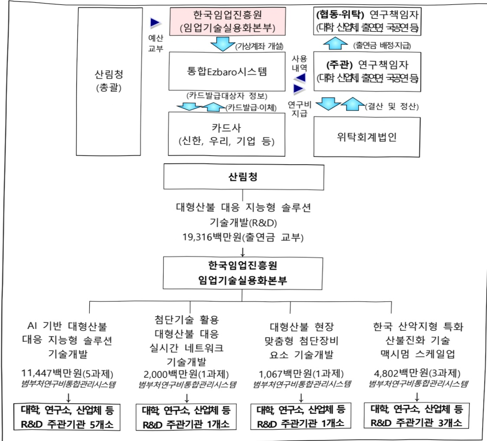

# 대형산불 대응 지능형 솔루션 기술개발(R&D)

**해당 페이지**: PDF 3558 ~ 3567 쪽 해당

**부처**: 산림청
**분야**: 농림수산
**회계유형**: 일반회계
**2026 확정예산**: 19316.0 백만원
**전년대비 증감률**: None%
**AI 도메인**: 로봇, 재난/안전, 디지털전환(AX)

---

<table border=1 style='margin: auto; word-wrap: break-word;'><tr><td style='text-align: center; word-wrap: break-word;'>사 업 명</td></tr><tr><td style='text-align: center; word-wrap: break-word;'>대형산불 대응 지능형 솔루션 기술개발(R&amp;D) (1544-327)</td></tr></table>

□ 사업 코드 정보

<table border=1 style='margin: auto; word-wrap: break-word;'><tr><td style='text-align: center; word-wrap: break-word;'>구분</td><td style='text-align: center; word-wrap: break-word;'>회계</td><td style='text-align: center; word-wrap: break-word;'>소관</td><td style='text-align: center; word-wrap: break-word;'>실국(기관)</td><td style='text-align: center; word-wrap: break-word;'>계정</td><td style='text-align: center; word-wrap: break-word;'>분야</td><td style='text-align: center; word-wrap: break-word;'>부문</td></tr><tr><td style='text-align: center; word-wrap: break-word;'>코드</td><td rowspan="2">일반회계</td><td rowspan="2">산림청</td><td rowspan="2">산림산업정책국산림정책과</td><td rowspan="2">-</td><td style='text-align: center; word-wrap: break-word;'>100</td><td style='text-align: center; word-wrap: break-word;'>102</td></tr><tr><td style='text-align: center; word-wrap: break-word;'>명칭</td><td style='text-align: center; word-wrap: break-word;'>농림수산</td><td style='text-align: center; word-wrap: break-word;'>임업·산촌</td></tr></table>

<table border=1 style='margin: auto; word-wrap: break-word;'><tr><td style='text-align: center; word-wrap: break-word;'>구분</td><td style='text-align: center; word-wrap: break-word;'>프로그램</td><td style='text-align: center; word-wrap: break-word;'>단위사업</td><td style='text-align: center; word-wrap: break-word;'>세부사업</td></tr><tr><td style='text-align: center; word-wrap: break-word;'>코드</td><td style='text-align: center; word-wrap: break-word;'>1500</td><td style='text-align: center; word-wrap: break-word;'>1544</td><td style='text-align: center; word-wrap: break-word;'>327</td></tr><tr><td style='text-align: center; word-wrap: break-word;'>명칭</td><td style='text-align: center; word-wrap: break-word;'>산림자원 및 산업육성</td><td style='text-align: center; word-wrap: break-word;'>신기후체제 산림자원관리 기술개발</td><td style='text-align: center; word-wrap: break-word;'>대형산불 대응 지능형 솔루션 기술개발(R&amp;D)</td></tr></table>

☐ 사업 성격

<table border=1 style='margin: auto; word-wrap: break-word;'><tr><td rowspan="2">신규</td><td rowspan="2">계속</td><td rowspan="2">완료</td><td rowspan="2">예비타당성 실시여부</td><td rowspan="2">총사업비 관리대상</td><td rowspan="2">총액계상 예산사업</td><td style='text-align: center; word-wrap: break-word;'>사업소관 변경정보</td></tr><tr><td style='text-align: center; word-wrap: break-word;'>2025예산 시 소관</td></tr><tr><td style='text-align: center; word-wrap: break-word;'></td><td style='text-align: center; word-wrap: break-word;'>☐</td><td style='text-align: center; word-wrap: break-word;'></td><td style='text-align: center; word-wrap: break-word;'></td><td style='text-align: center; word-wrap: break-word;'></td><td style='text-align: center; word-wrap: break-word;'></td><td style='text-align: center; word-wrap: break-word;'></td></tr></table>

□ 사업 지원 형태 및 지원율

<table border=1 style='margin: auto; word-wrap: break-word;'><tr><td style='text-align: center; word-wrap: break-word;'>직접</td><td style='text-align: center; word-wrap: break-word;'>출자</td><td style='text-align: center; word-wrap: break-word;'>출연</td><td style='text-align: center; word-wrap: break-word;'>보조</td><td style='text-align: center; word-wrap: break-word;'>융자</td><td style='text-align: center; word-wrap: break-word;'>국고보조율(%)</td><td style='text-align: center; word-wrap: break-word;'>융자율(%)</td></tr><tr><td style='text-align: center; word-wrap: break-word;'></td><td style='text-align: center; word-wrap: break-word;'></td><td style='text-align: center; word-wrap: break-word;'>0</td><td style='text-align: center; word-wrap: break-word;'></td><td style='text-align: center; word-wrap: break-word;'></td><td style='text-align: center; word-wrap: break-word;'>100%</td><td style='text-align: center; word-wrap: break-word;'></td></tr></table>

## 사업담당자

<table border=1 style='margin: auto; word-wrap: break-word;'><tr><td style='text-align: center; word-wrap: break-word;'>사업명</td><td colspan="5">구분</td></tr><tr><td rowspan="2">대형산불대응 지능형솔루션기술개발(R&amp;D)</td><td style='text-align: center; word-wrap: break-word;'>소관부처</td><td style='text-align: center; word-wrap: break-word;'>실·국·과(팀)산림산업정책국산림정책과</td><td style='text-align: center; word-wrap: break-word;'>과 장김관호042-481-4130</td><td style='text-align: center; word-wrap: break-word;'>사무관김동관042-481-4137</td><td style='text-align: center; word-wrap: break-word;'>주무관노동문042-481-4138</td></tr><tr><td style='text-align: center; word-wrap: break-word;'>사업시행주체</td><td style='text-align: center; word-wrap: break-word;'>한국임업진흥원</td><td style='text-align: center; word-wrap: break-word;'>임업기술실용화본부</td><td style='text-align: center; word-wrap: break-word;'>전향미 본부장</td><td style='text-align: center; word-wrap: break-word;'>042-719-1401</td></tr></table>

---

### 가.예산 총괄표

(단위: 백만원, %)

<table border=1 style='margin: auto; word-wrap: break-word;'><tr><td rowspan="2">사업명</td><td rowspan="2">2024년 결산</td><td colspan="2">2025년 예산</td><td colspan="2">2026년</td><td rowspan="2">증감(B-A)</td><td rowspan="2">(B-A)/A</td></tr><tr><td style='text-align: center; word-wrap: break-word;'>본예산(A)</td><td style='text-align: center; word-wrap: break-word;'>추경</td><td style='text-align: center; word-wrap: break-word;'>요구</td><td style='text-align: center; word-wrap: break-word;'>확정(B)</td></tr><tr><td style='text-align: center; word-wrap: break-word;'>대형산불 대응 지능형 솔루션 기술개발(R&amp;D)</td><td style='text-align: center; word-wrap: break-word;'>-</td><td style='text-align: center; word-wrap: break-word;'>-</td><td style='text-align: center; word-wrap: break-word;'>11,657</td><td style='text-align: center; word-wrap: break-word;'>19,316</td><td style='text-align: center; word-wrap: break-word;'>19,316</td><td style='text-align: center; word-wrap: break-word;'>19,316</td><td style='text-align: center; word-wrap: break-word;'>순증</td></tr></table>

□ 기능별(내역사업별), 목별 예산 내역

(단위:백만원)

<table border=1 style='margin: auto; word-wrap: break-word;'><tr><td rowspan="3"></td><td colspan="5">2024</td><td colspan="6">2025(2025.12월말)</td><td style='text-align: center; word-wrap: break-word;'>2026예산</td></tr><tr><td rowspan="2">예산액(추정)</td><td rowspan="2">예산현액</td><td rowspan="2">집행액[실집행액]</td><td rowspan="2">아일액</td><td rowspan="2">불용액</td><td rowspan="2">분예산</td><td rowspan="2">예산현액</td><td rowspan="2">집행액[실집행액]</td><td colspan="2">전년도이월액제외</td><td rowspan="2">이월액</td><td rowspan="2">불용액</td></tr><tr><td style='text-align: center; word-wrap: break-word;'>예산현액</td><td style='text-align: center; word-wrap: break-word;'>집행액[실집행액]</td></tr><tr><td style='text-align: center; word-wrap: break-word;'>○ 기능별 분류(함께)</td><td style='text-align: center; word-wrap: break-word;'>-</td><td style='text-align: center; word-wrap: break-word;'>-</td><td style='text-align: center; word-wrap: break-word;'>-</td><td style='text-align: center; word-wrap: break-word;'>-</td><td style='text-align: center; word-wrap: break-word;'>-</td><td style='text-align: center; word-wrap: break-word;'>-</td><td style='text-align: center; word-wrap: break-word;'>11,657</td><td style='text-align: center; word-wrap: break-word;'>11,657</td><td style='text-align: center; word-wrap: break-word;'>11,657</td><td style='text-align: center; word-wrap: break-word;'>11,657</td><td style='text-align: center; word-wrap: break-word;'>-</td><td style='text-align: center; word-wrap: break-word;'>-</td></tr><tr><td style='text-align: center; word-wrap: break-word;'>· AI 기반 대형산불대응 지능형 솔루션기술개발</td><td style='text-align: center; word-wrap: break-word;'>-</td><td style='text-align: center; word-wrap: break-word;'>-</td><td style='text-align: center; word-wrap: break-word;'>-</td><td style='text-align: center; word-wrap: break-word;'>-</td><td style='text-align: center; word-wrap: break-word;'>-</td><td style='text-align: center; word-wrap: break-word;'>-</td><td style='text-align: center; word-wrap: break-word;'>5,724</td><td style='text-align: center; word-wrap: break-word;'>5,724</td><td style='text-align: center; word-wrap: break-word;'>5,724</td><td style='text-align: center; word-wrap: break-word;'>5,724</td><td style='text-align: center; word-wrap: break-word;'>-</td><td style='text-align: center; word-wrap: break-word;'>-</td></tr><tr><td style='text-align: center; word-wrap: break-word;'>· 첨단기술 활용 대형산불 대응 실시간네트워크 기술개발</td><td style='text-align: center; word-wrap: break-word;'>-</td><td style='text-align: center; word-wrap: break-word;'>-</td><td style='text-align: center; word-wrap: break-word;'>-</td><td style='text-align: center; word-wrap: break-word;'>-</td><td style='text-align: center; word-wrap: break-word;'>-</td><td style='text-align: center; word-wrap: break-word;'>-</td><td style='text-align: center; word-wrap: break-word;'>1,000</td><td style='text-align: center; word-wrap: break-word;'>1,000</td><td style='text-align: center; word-wrap: break-word;'>1,000</td><td style='text-align: center; word-wrap: break-word;'>1,000</td><td style='text-align: center; word-wrap: break-word;'>-</td><td style='text-align: center; word-wrap: break-word;'>-</td></tr><tr><td style='text-align: center; word-wrap: break-word;'>· 대형산불 현장 맞춤형첨단장비 요소 기술개발</td><td style='text-align: center; word-wrap: break-word;'>-</td><td style='text-align: center; word-wrap: break-word;'>-</td><td style='text-align: center; word-wrap: break-word;'>-</td><td style='text-align: center; word-wrap: break-word;'>-</td><td style='text-align: center; word-wrap: break-word;'>-</td><td style='text-align: center; word-wrap: break-word;'>-</td><td style='text-align: center; word-wrap: break-word;'>533</td><td style='text-align: center; word-wrap: break-word;'>533</td><td style='text-align: center; word-wrap: break-word;'>533</td><td style='text-align: center; word-wrap: break-word;'>533</td><td style='text-align: center; word-wrap: break-word;'>-</td><td style='text-align: center; word-wrap: break-word;'>-</td></tr><tr><td style='text-align: center; word-wrap: break-word;'>· 한국 신약지형 특화산불전화기술 맥사범(Maximum)스케일업(Scale-up)</td><td style='text-align: center; word-wrap: break-word;'>-</td><td style='text-align: center; word-wrap: break-word;'>-</td><td style='text-align: center; word-wrap: break-word;'>-</td><td style='text-align: center; word-wrap: break-word;'>-</td><td style='text-align: center; word-wrap: break-word;'>-</td><td style='text-align: center; word-wrap: break-word;'>-</td><td style='text-align: center; word-wrap: break-word;'>4,400</td><td style='text-align: center; word-wrap: break-word;'>4,400</td><td style='text-align: center; word-wrap: break-word;'>4,400</td><td style='text-align: center; word-wrap: break-word;'>4,400</td><td style='text-align: center; word-wrap: break-word;'>-</td><td style='text-align: center; word-wrap: break-word;'>-</td></tr><tr><td style='text-align: center; word-wrap: break-word;'>○ 비목별 분류(합계)</td><td style='text-align: center; word-wrap: break-word;'>-</td><td style='text-align: center; word-wrap: break-word;'>-</td><td style='text-align: center; word-wrap: break-word;'>-</td><td style='text-align: center; word-wrap: break-word;'>-</td><td style='text-align: center; word-wrap: break-word;'>-</td><td style='text-align: center; word-wrap: break-word;'>-</td><td style='text-align: center; word-wrap: break-word;'>11,657</td><td style='text-align: center; word-wrap: break-word;'>11,657</td><td style='text-align: center; word-wrap: break-word;'>11,657</td><td style='text-align: center; word-wrap: break-word;'>11,657</td><td style='text-align: center; word-wrap: break-word;'>-</td><td style='text-align: center; word-wrap: break-word;'>-</td></tr><tr><td style='text-align: center; word-wrap: break-word;'>· 연구개발활동비 등(360-05)</td><td style='text-align: center; word-wrap: break-word;'>-</td><td style='text-align: center; word-wrap: break-word;'>-</td><td style='text-align: center; word-wrap: break-word;'>-</td><td style='text-align: center; word-wrap: break-word;'>-</td><td style='text-align: center; word-wrap: break-word;'>-</td><td style='text-align: center; word-wrap: break-word;'>-</td><td style='text-align: center; word-wrap: break-word;'>11,657</td><td style='text-align: center; word-wrap: break-word;'>11,657</td><td style='text-align: center; word-wrap: break-word;'>11,657</td><td style='text-align: center; word-wrap: break-word;'>11,657</td><td style='text-align: center; word-wrap: break-word;'>-</td><td style='text-align: center; word-wrap: break-word;'>-</td></tr><tr><td style='text-align: center; word-wrap: break-word;'>○ 기능비목별 분류(합계)</td><td style='text-align: center; word-wrap: break-word;'>-</td><td style='text-align: center; word-wrap: break-word;'>-</td><td style='text-align: center; word-wrap: break-word;'>-</td><td style='text-align: center; word-wrap: break-word;'>-</td><td style='text-align: center; word-wrap: break-word;'>-</td><td style='text-align: center; word-wrap: break-word;'>-</td><td style='text-align: center; word-wrap: break-word;'>11,657</td><td style='text-align: center; word-wrap: break-word;'>11,657</td><td style='text-align: center; word-wrap: break-word;'>11,657</td><td style='text-align: center; word-wrap: break-word;'>11,657</td><td style='text-align: center; word-wrap: break-word;'>-</td><td style='text-align: center; word-wrap: break-word;'>-</td></tr><tr><td style='text-align: center; word-wrap: break-word;'>· AI 기반 대형산불대응 지능형 솔루션기술개발</td><td style='text-align: center; word-wrap: break-word;'>-</td><td style='text-align: center; word-wrap: break-word;'>-</td><td style='text-align: center; word-wrap: break-word;'>-</td><td style='text-align: center; word-wrap: break-word;'>-</td><td style='text-align: center; word-wrap: break-word;'>-</td><td style='text-align: center; word-wrap: break-word;'>-</td><td style='text-align: center; word-wrap: break-word;'>5,724</td><td style='text-align: center; word-wrap: break-word;'>5,724</td><td style='text-align: center; word-wrap: break-word;'>5,724</td><td style='text-align: center; word-wrap: break-word;'>5,724</td><td style='text-align: center; word-wrap: break-word;'>-</td><td style='text-align: center; word-wrap: break-word;'>-</td></tr><tr><td style='text-align: center; word-wrap: break-word;'>· 연구개발활동비 등(360-05)</td><td style='text-align: center; word-wrap: break-word;'>-</td><td style='text-align: center; word-wrap: break-word;'>-</td><td style='text-align: center; word-wrap: break-word;'>-</td><td style='text-align: center; word-wrap: break-word;'>-</td><td style='text-align: center; word-wrap: break-word;'>-</td><td style='text-align: center; word-wrap: break-word;'>-</td><td style='text-align: center; word-wrap: break-word;'>5,724</td><td style='text-align: center; word-wrap: break-word;'>5,724</td><td style='text-align: center; word-wrap: break-word;'>5,724</td><td style='text-align: center; word-wrap: break-word;'>5,724</td><td style='text-align: center; word-wrap: break-word;'>-</td><td style='text-align: center; word-wrap: break-word;'>-</td></tr></table>

---

<table border=1 style='margin: auto; word-wrap: break-word;'><tr><td rowspan="3"></td><td colspan="5">2024</td><td colspan="7">2025(2025.12월말)</td><td rowspan="3">2026예산</td></tr><tr><td rowspan="2">예산액(추경)</td><td rowspan="2">예산현액</td><td rowspan="2">집행액[실집행액]</td><td rowspan="2">이월액</td><td rowspan="2">불용액</td><td rowspan="2">분예산</td><td rowspan="2">예산현액</td><td rowspan="2">집행액[실집행액]</td><td colspan="2">전년도이월액제외</td><td rowspan="2">이월액</td><td rowspan="2">불용액</td></tr><tr><td style='text-align: center; word-wrap: break-word;'>예산현액</td><td style='text-align: center; word-wrap: break-word;'>집행액[실집행액]</td></tr><tr><td rowspan="6">·첨단기술 활용 대형산불 대용 실시간네트워크 기술개발-연구개발활동비 등(360-05)·대형산불 현장 맞춤형첨단장비 요소 기술개발·연구개발활동비 등(360-05)·한국 산약지형 특화산불전화 기술 맥사범(Maximum)스케일업(Scale-up)·연구개발활동비 등(360-05)</td><td rowspan="6">-</td><td rowspan="6">-</td><td rowspan="6">-[-]</td><td rowspan="6">-</td><td rowspan="6">-</td><td rowspan="6">-</td><td rowspan="6">1,000</td><td style='text-align: center; word-wrap: break-word;'>1,000[1,000]</td><td style='text-align: center; word-wrap: break-word;'>1,000</td><td style='text-align: center; word-wrap: break-word;'>1,000[1,000]</td><td style='text-align: center; word-wrap: break-word;'>-</td><td style='text-align: center; word-wrap: break-word;'>-</td><td style='text-align: center; word-wrap: break-word;'>2,000</td></tr><tr><td style='text-align: center; word-wrap: break-word;'>1,000[1,000]</td><td style='text-align: center; word-wrap: break-word;'>1,000[1,000]</td><td style='text-align: center; word-wrap: break-word;'>1,000[1,000]</td><td style='text-align: center; word-wrap: break-word;'>-</td><td style='text-align: center; word-wrap: break-word;'>-</td><td style='text-align: center; word-wrap: break-word;'>2,000</td></tr><tr><td style='text-align: center; word-wrap: break-word;'>533[533]</td><td style='text-align: center; word-wrap: break-word;'>533[533]</td><td style='text-align: center; word-wrap: break-word;'>533[533]</td><td style='text-align: center; word-wrap: break-word;'>-</td><td style='text-align: center; word-wrap: break-word;'>-</td><td style='text-align: center; word-wrap: break-word;'>1,067</td></tr><tr><td style='text-align: center; word-wrap: break-word;'>533[533]</td><td style='text-align: center; word-wrap: break-word;'>533[533]</td><td style='text-align: center; word-wrap: break-word;'>533[533]</td><td style='text-align: center; word-wrap: break-word;'>-</td><td style='text-align: center; word-wrap: break-word;'>-</td><td style='text-align: center; word-wrap: break-word;'>1,067</td></tr><tr><td style='text-align: center; word-wrap: break-word;'>4,400[4,400]</td><td style='text-align: center; word-wrap: break-word;'>4,400[4,400]</td><td style='text-align: center; word-wrap: break-word;'>4,400[4,400]</td><td style='text-align: center; word-wrap: break-word;'>-</td><td style='text-align: center; word-wrap: break-word;'>-</td><td style='text-align: center; word-wrap: break-word;'>4,802</td></tr><tr><td style='text-align: center; word-wrap: break-word;'>4,400[4,400]</td><td style='text-align: center; word-wrap: break-word;'>4,400[4,400]</td><td style='text-align: center; word-wrap: break-word;'>4,400[4,400]</td><td style='text-align: center; word-wrap: break-word;'>-</td><td style='text-align: center; word-wrap: break-word;'>-</td><td style='text-align: center; word-wrap: break-word;'>4,802</td></tr></table>

### 나. 사업설명자료

## 1 ) 사업목적·내용

- (대형산불 대응 지능형 솔루션 기술개발(R&D)) 기후변화에 따른 산불 연중화·대형화 문제를 해결하기 위해 첨단기술(AI·로봇 등)을 활용한 대형산불 현장대응력 혁신 기술개발

- (AI 기반 대형산불 대응 지능형 솔루션 기술개발) AI 기반 실시간 예측·분석과 의사 결정 솔루션 제공으로 초기 대형산불 긴급 대응 및 인명피해 예방

- (침단기술 활용 대형산불 대응 실시간 네트워크 기술개발) 산불 현장의 통신 음영

지역 내 진화자원의 실시간 통신 및 위치 정보 공유를 통한 안전 확보 및 산불 대응

속도 향상

- (대형산불 현장 맞춤형 첨단장비 요소 기술개발) 다목적 산불 진화 차량에 AI 기능

탑재 고도화 및 산불 현장과 재난안전망 실시간 연계를 통한 의사결정 지원 기술 구축

- (한국 산악지형 특화 산불진화 기술 맥시멍 스케일업) 로봇을 통한 협력 진화, 친

환경 방제약제 및 산불 진화 대원의 인명 보호 기술개발로 진화자원 부족 및 인명

피해 저감 기여

## 2 ) 사업개요

---

## □ 사업근거 및 추진경위

①법적근거

- 「산림재난방지법」제9조제1항(산림재난 위험도평가·위험지도), 제11조제1항의제1호(산림재난정보시스템 구축), 제57조(연구개발사업 및 국제협력)

- [산림기본법] 제11조제1항제5호(산사태 · 산불 · 산림병해충 등 산림재해의 대응 및 복구 등에 관한 사항)

- 「산림보호법」제32조(산불경보의 발령 및 조치), 제43조(산불피해지의 복구 등)

-「산림자원법」제34조제1항(산림과학기술의 연구개발을 촉진을 위해 산림과학기술 기본계획의 10년 단위의 수립·시행 의무)

-「재난안전법」제4조(재난에 대한 국가의 책무)

② 추진경위

○ 사업기획 경과

- (24.12) 대형산불 대응 지능형 솔루션 기술개발(R&D) 신규사업 기획착수

- (‘24.12~’25.1) 산불관련 전문가 자문회의(4회)

- (25.1~2) 범부처통합연구지원시스템을 통한 수요조사 진행

- (25.2.14.) 제1차 전문가 기획위원회 개최 및 관계자 의견수렴

- (25.2.25.) 대형산불 피해지역 관계관 현장 간담회(1회)

- (25.3.6.) 2026년도 인공지능 분야 부처협업 회의(1회)

* 행정안전부, 과학기술정보통신부와 인공지능분야 협업방안 도출

- (25.3.19.) 제2차 전문가 기획위원회 개최 및 관계자 의견수렴

- (25.3.27.) 바이오제조·농림수산 '25년 신규사업 컨설팅(1회)

- (25.4.1.) '26년 R&D 신규사업 기획(대형산불) 제1차 부처협의회(1회)

• 추진배경: 기후변화에 따른 산불 연중화·대형화 문제를 해결하기 위해 첨단기술을

활용한 대형산불 현장대응력 혁신 기술개발

ㅇ 대통령 공약사항

- 1. 회복 - 3. 국민생활안전 및 재난대응 - 9. 재난안전산업을 육성하고 재난 예측 및

감시시스템을 보강하겠습니다.

*빅데이터·AI를 기반으로 한 산불·호우 싱크홀 등 재난 예측 및 감시시스템 도입

- 2. 성장 - 5. 기후위기 대응 - 7. 임업·산촌을 탄소중립과 균형발전의 주요산업이자

거점으로 육성하겠습니다

① 지속가능한 '백년숲' 산림순환 경영과 임업 활성화

---

* '배고-쓰고-심고-가꾸는' 산림순환경영, 국산목재 생산·유통 생태계 구축

② 탄소흡수력이 큰 건강한 산림 조성

* 환경 친화적 숲가꾸기 및 선진국 수준으로 입도 개선, 임업 기계 고성능화, 수종전환

□ 주요내용

① 사업규모

- 사업기간 : 2025 ~ 2029

- 최근 5년 간 투입된 사업비(예산액기준, 추경편성한 연도에는 추경포함)

<table border=1 style='margin: auto; word-wrap: break-word;'><tr><td style='text-align: center; word-wrap: break-word;'>연도</td><td style='text-align: center; word-wrap: break-word;'>2022</td><td style='text-align: center; word-wrap: break-word;'>2023</td><td style='text-align: center; word-wrap: break-word;'>2024</td><td style='text-align: center; word-wrap: break-word;'>2025</td><td style='text-align: center; word-wrap: break-word;'>2026</td></tr><tr><td style='text-align: center; word-wrap: break-word;'>사업비</td><td style='text-align: center; word-wrap: break-word;'>-</td><td style='text-align: center; word-wrap: break-word;'>-</td><td style='text-align: center; word-wrap: break-word;'>-</td><td style='text-align: center; word-wrap: break-word;'>11,657</td><td style='text-align: center; word-wrap: break-word;'>19,316</td></tr></table>

② 사업추진체계

- 사업시행방법 : 출연(국고 100%)

- 사업시행주체 : 한국임업진흥원(연구관리 전문기관)

- 사업 수혜자 : 국민, 임업인, 산업체, 연구소

- 보조, 융자, 출연, 출자 등의 경우 보조·융자 등 지원 비율 및 법적근거

<table border=1 style='margin: auto; word-wrap: break-word;'><tr><td style='text-align: center; word-wrap: break-word;'>내역사업명</td><td style='text-align: center; word-wrap: break-word;'>구분</td><td style='text-align: center; word-wrap: break-word;'>피보조·피출연 등 기관명</td><td style='text-align: center; word-wrap: break-word;'>지원 금액 (2026예산)</td><td style='text-align: center; word-wrap: break-word;'>지원 비율(%)</td><td style='text-align: center; word-wrap: break-word;'>보조율 법적근거 (해당 조항)</td></tr><tr><td style='text-align: center; word-wrap: break-word;'>AI 기반 대형산불 대응 지능형 솔루션 기술개발</td><td style='text-align: center; word-wrap: break-word;'>출연</td><td style='text-align: center; word-wrap: break-word;'>한국임업 진흥원</td><td style='text-align: center; word-wrap: break-word;'>11,447</td><td style='text-align: center; word-wrap: break-word;'>100</td><td style='text-align: center; word-wrap: break-word;'>「산림자원의 조성 및 관리에 관한 법률」 제34조 제6항</td></tr><tr><td style='text-align: center; word-wrap: break-word;'>첨단기술 활용 대형산불 대응 실시간 네트워크 기술개발</td><td style='text-align: center; word-wrap: break-word;'>출연</td><td style='text-align: center; word-wrap: break-word;'>한국임업 진흥원</td><td style='text-align: center; word-wrap: break-word;'>2,000</td><td style='text-align: center; word-wrap: break-word;'>100</td><td style='text-align: center; word-wrap: break-word;'>「산림자원의 조성 및 관리에 관한 법률」 제34조 제6항</td></tr><tr><td style='text-align: center; word-wrap: break-word;'>대형산불 현장 맞춤형 첨단장비 요소 기술개발</td><td style='text-align: center; word-wrap: break-word;'>출연</td><td style='text-align: center; word-wrap: break-word;'>한국임업 진흥원</td><td style='text-align: center; word-wrap: break-word;'>1,067</td><td style='text-align: center; word-wrap: break-word;'>100</td><td style='text-align: center; word-wrap: break-word;'>「산림자원의 조성 및 관리에 관한 법률」 제34조 제6항</td></tr><tr><td style='text-align: center; word-wrap: break-word;'>한국 산악지형 특화 산불진화 기술 맥시멍 스케일업</td><td style='text-align: center; word-wrap: break-word;'>출연</td><td style='text-align: center; word-wrap: break-word;'>한국임업 진흥원</td><td style='text-align: center; word-wrap: break-word;'>4,802</td><td style='text-align: center; word-wrap: break-word;'>100</td><td style='text-align: center; word-wrap: break-word;'>「산림자원의 조성 및 관리에 관한 법률」 제34조 제6항</td></tr></table>

---

□ 대형산불 대응 지능형 솔루션 기술개발 : (2025년 제1회 추경) 11,657백만원 → (2026 예산) 19,316백만원, +7,659 (2025 본예산 -백만원 → 제1회 추경 11,657백만원 → 제2회 추경 -백만원)

① AI 기반 대형산불 대응 지능형 솔루션 기술개발 : (2025 추경) 5,724백만원 → (2026 예산) 11,447백만원, +5,723 (2025 본예산 -백만원 → 제1회 추경 5,724백만원 → 제2회 추경 -백만원)

- (내용) AI 기반 실시간 예측·분석과 의사결정 솔루션 제공으로 초기 대형산불 긴급 대응 및 인명피해 예방 및 회계일치를 위한 예산 11,447백만원

(산술) ①님러닝 기반 산물·연무 확산속도 예측 알고리즘 개발 4,333백만원, ②대형산불 대응 최적 진화자원 진입로·대피로 분석과 이해관계자 맞춤형 정보공유 2,000백만원, ③군집드론을 활용한 대형산불 초기 긴급 대응 기술개발 2,667백만원, ④산불화선 자동탐지 연계 기술개발 890백만원, ⑤AI기반 공중·지상 산불진화 자원 통합배치 및 의사결정 체계 개발 1,557백만원

② 첨단기술 활용 대형산불 대응 실시간 네트워크 기술개발 : (2025 추경) 1,000백만원 → (2026 예산) 2,000백만원, +1,000 (2025 본예산 -백만원 → 제1회 추경 1,000백만원 → 제2회 추경 -백만원)

- (내용) 산불 현장의 통신 음영지역 내 진화자원의 실시간 통신 및 위치 정보 공유를 통한 안전 확보 및 산불 대응 속도 향상 및 회계일치를 위한 계속 과제 예산 2,000백만원

- (산출) 첨단기술 활용 대형산불 대응 실시간 네트워크 기술개발 2,000백만원

③ 내영산물 현상 맞춤형 섬단상미 요소 기술개발 : (2025 주경) 533백만원 → (2026 예산) 1,067백만원, +534 (2025 본예산 -백만원 → 제1회 추경 533백만원 → 제2회 추경 -백만원)

- (내용) 나복석 산불신와 사당의 임부 수행 능력 고도화 및 회계일지를 위한 예산 1,067백만원

- (산출) 대형산불 현장 맞춤형 첨단장비 요소기술 개발 1,067백만원

④ 한국 산악지형 특화 산불진화 기술 맥시멈 스케일업 : (2025 추경) 4,400백만원 → (2026 예산) 4,802백만원, +402 (2025 본예산 -백만원 → 제1회 추경 4,400백만원 → 제2회 추경 -백만원)

- (내용) 로봇을 통한 협력 진화, 친환경 방제약제 및 산불 진화 대원의 인명 보호 기술개발로 진화자원 부족 및 인명피해 저감에 기여 및 회계일치를 위한 예산 4,802백만원

- (산출) ①비정형 산지 특화 산불대응 로봇 기술 개발 3,335백만원, ②친환경 다기능 산불 진화 약제 및 대용량 압축 에어로즐 개발, ③산불진화대원 인명피해 방지를 위한 신규 기술개발 400백만원

ㅇ2025년도 추가경정예산 및 2026년도 예산 산출 세부내역 비교

<table border=1 style='margin: auto; word-wrap: break-word;'><tr><td colspan="2">2025년 제1회 추가경정예산</td><td colspan="2">2026년 예산</td></tr><tr><td style='text-align: center; word-wrap: break-word;'>예산</td><td style='text-align: center; word-wrap: break-word;'>산출내역</td><td style='text-align: center; word-wrap: break-word;'>예산</td><td style='text-align: center; word-wrap: break-word;'>산출내역</td></tr><tr><td style='text-align: center; word-wrap: break-word;'>AI 기반 대형산불 대응 지능형 솔루션 솔루션 솔루션 솔루션 솔루션 솔루션 솔루션 솔루션 솔루션 솔루션 솔루션 솔루션 솔루션 솔루션 솔루션 솔루션 솔루션 솔루션 솔루션 솔루션 솔루션 솔루션 솔루션 솔루션 솔루션 솔루션 솔루션 솔루션 솔루션 솔루션 솔루션 솔루션 솔루션 솔루션 솔루션 솔루션 솔루션 솔루션 솔루션 솔루션 솔루션 솔루션 솔루션 솔루션 솔루션 솔루션 솔루션 솔루션 솔루션 솔루션 솔루션 솔루션 솔루션 솔루션 솔루션 솔루션 솔루션 솔루션 솔루션 솔루션 솔루션 솔루션 솔루션 솔루션 솔루션 솔루션 솔루션 솔루션 솔루션 솔루션 솔루션 솔루션 솔루션 솔루션 솔루션 솔루션 솔루션 솔루션 솔루션 솔루션 솔루션 솔루션 솔루션 솔루션 솔루션 솔루션 솔루션 솔루션 솔루션 솔루션 솔루션 솔루션 솔루션 솔루션 솔루션 솔루션 솔루션 솔루션 솔루션 솔루션 솔루션 솔루션 솔루션 솔루션 솔루션 솔루션 솔루션 솔루션 솔루션 솔루션 솔루션 솔루션 솔루션 솔루션 솔루션 솔루션 솔루션 솔루션 솔루션 솔루션 솔루션 솔루션 솔루션 솔루션 솔루션 솔루션 솔루션 솔루션 솔루션 솔루션 솔루션 솔루션 솔루션 솔루션 솔루션 솔루션 솔루션 솔루션 솔루션 솔루션 솔루션 솔루션 솔루션 솔루션 솔루션 솔루션 솔루션 솔루션 솔루션 솔루션 솔루션 솔루션 솔루션 솔루션 솔루션 솔루션 솔루션 솔루션 솔루션 솔루션 솔루션 솔루션 솔루션 솔루션 솔루션 솔루션 솔루션 솔루션 솔루션 솔루션 솔루션 솔루션 솔루션 솔루션 솔루션 솔루션 솔루션 솔루션 솔루션 솔루션 솔루션 솔루션 솔루션 솔루션 솔루션 솔루션 솔루션 솔루션 솔루션 솔루션 솔루션 솔루션 솔루션 솔루션 솔루션 솔루션 솔루션 솔루션 솔루션 솔루션 솔루션 솔루션 솔루션 솔루션 솔루션 솔루션 솔루션 솔루션 솔루션 솔루션 솔루션 솔루션 솔루션 솔루션 솔루션 솔루션 솔루션 솔루션 솔루션 솔루션 솔루션 솔루션 솔루션 솔루션 솔루션 솔루션 솔루션 솔루션 솔루션 솔루션 솔루션 솔루션 솔루션 솔루션 솔루션 솔루션 솔루션 솔루션 솔루션 솔루션 솔루션 솔루션 솔루션 솔루션 솔루션 솔루션 솔루션 솔루션 솔루션 솔루션 솔루션 솔루션 솔루션 솔루션 솔루션 솔루션 솔루션 솔루션 솔루션 솔루션 솔루션 솔루션 솔루션 솔루션 솔루션 솔루션 솔루션 솔루션 솔루션 솔루션 솔루션 솔루션 솔루션 솔루션 솔루션 솔루션 솔루션 솔루션 솔루션 솔루션 솔루션 솔루션 솔루션 솔루션 솔루션 솔루션 솔루션 솔루션 솔루션 솔루션 솔루션 솔루션 솔루션 솔루션 솔루션 솔루션 솔루션 솔루션 솔루션 솔루션 솔루션 솔루션 솔루션 솔루션 솔루션 솔루션 솔루션 솔루션 솔루션 솔루션 솔루션 솔루션 솔루션 솔루션 솔루션 솔루션 솔루션 솔루션 솔루션 솔루션 솔루션 솔루션 솔루션 솔루션 솔루션 솔루션 솔루션 솔루션 솔루션 솔루션 솔루션 솔루션 솔루션 솔루션 솔루션 솔루션 솔루션 솔루션 솔루션 솔루션 솔루션 솔루션 솔루션 솔루션 솔루션 솔루션 솔루션 솔루션 솔루션 솔루션 솔루션 솔루션 솔루션 솔루션 솔루션 솔루션 솔루션 솔루션 솔루션 솔루션 솔루션 솔루션 솔루션 솔루션 솔루션 솔루션 솔루션 솔루션 솔루션 솔루션 솔루션 솔루션 솔루션 솔루션 솔루션 솔루션 솔루션 솔루션 솔루션 솔루션 솔루션 솔루션 솔루션 솔루션 솔루션 솔루션 솔루션 솔루션 솔루션 솔루션 솔루션 솔루션 솔루션 솔루션 솔루션 솔루션 솔루션 솔루션 솔루션 솔루션 솔루션 솔루션 솔루션 솔루션 솔루션 솔루션 솔루션 솔루션 솔루션 솔루션 솔루션 솔루션 솔루션 솔루션 솔루션 솔루션 솔루션 솔루션 솔루션 솔루션 솔루션 솔루션 솔루션 솔루션 솔루션 솔루션 솔루션 솔루션 솔루션 솔루션 솔루션 솔루션 솔루션 솔루션 솔루션 솔루션 솔루션 솔루션 솔루션 솔루션 솔루션 솔루션 솔루션 솔루션 솔루션 솔루션 솔루션 솔루션 솔루션 솔루션 솔루션 솔루션 솔루션 솔루션 솔루션 솔루션 솔루션 솔루션 솔루션 솔루션 솔루션 솔루션 솔루션 솔루션 솔루션 솔루션 솔루션 솔루션 솔루션 솔루션 솔루션 솔루션 솔루션 솔루션 솔루션 솔루션 솔루션 솔루션 솔루션 솔루션 솔루션 솔루션 솔루션 솔루션 솔루션 솔루션 솔루션 솔루션 솔루션 솔루션 솔루션 솔루션 솔루션 솔루션 솔루션 솔루션 솔루션 솔루션 솔루션 솔루션 솔루션 솔루션 솔루션 솔루션 솔루</td><td style='text-align: center; word-wrap: break-word;'></td><td style='text-align: center; word-wrap: break-word;'></td><td style='text-align: center; word-wrap: break-word;'></td></tr></table>

---

<table border=1 style='margin: auto; word-wrap: break-word;'><tr><td colspan="2">2025년 제1회 추가경쟁예산</td><td colspan="2">2026년 예산</td></tr><tr><td style='text-align: center; word-wrap: break-word;'>예산</td><td style='text-align: center; word-wrap: break-word;'>산출내역</td><td style='text-align: center; word-wrap: break-word;'>예산</td><td style='text-align: center; word-wrap: break-word;'>산출내역</td></tr><tr><td style='text-align: center; word-wrap: break-word;'>대응</td><td rowspan="5">(1회 주경) 1개 x 2,000백만 x 6/12 = 1,000백만원</td><td style='text-align: center; word-wrap: break-word;'>대응</td><td rowspan="5">(계속) 1개 x 2,000백만 x 12/12 = 2,000백만원</td></tr><tr><td style='text-align: center; word-wrap: break-word;'>실시간</td><td style='text-align: center; word-wrap: break-word;'>실시간</td></tr><tr><td style='text-align: center; word-wrap: break-word;'>네트워크</td><td style='text-align: center; word-wrap: break-word;'>네트워크</td></tr><tr><td style='text-align: center; word-wrap: break-word;'>기술개발</td><td style='text-align: center; word-wrap: break-word;'>기술개발</td></tr><tr><td style='text-align: center; word-wrap: break-word;'>1,000</td><td style='text-align: center; word-wrap: break-word;'>2,000</td></tr><tr><td style='text-align: center; word-wrap: break-word;'>대형산불</td><td rowspan="5">&lt; 대형산불 현장 맞춤형 첨단장비 요소 기술개발 533백만원 &gt;</td><td style='text-align: center; word-wrap: break-word;'>대형산불 현장 맞춤형 첨단장비 요소 기술개발 1,067백만원 &gt;</td><td rowspan="5">&lt; 대형산불 현장 맞춤형 첨단장비 요소 기술개발 533백만원 &gt;</td></tr><tr><td style='text-align: center; word-wrap: break-word;'>첨단장비</td><td style='text-align: center; word-wrap: break-word;'>첨단장비</td></tr><tr><td style='text-align: center; word-wrap: break-word;'>요소</td><td style='text-align: center; word-wrap: break-word;'>요소</td></tr><tr><td style='text-align: center; word-wrap: break-word;'>기술개발</td><td style='text-align: center; word-wrap: break-word;'>기술개발</td></tr><tr><td style='text-align: center; word-wrap: break-word;'>533</td><td style='text-align: center; word-wrap: break-word;'>1,067</td></tr><tr><td style='text-align: center; word-wrap: break-word;'>한국산악지형 특화 산불진화 기술 맥시범 스케일업 4,400백만원 &gt;</td><td rowspan="4">한국산악지형 특화 산불진화 기술 맥시범 스케일업 4,802백만원 &gt;</td><td style='text-align: center; word-wrap: break-word;'>한국산악지형 특화 산불진화 기술 맥시범 스케일업 4,802백만원 &gt;</td><td rowspan="4">&lt; 한국 산악지형 특화 산불진화 기술 맥시범 스케일업 4,802백만원 &gt;</td></tr><tr><td style='text-align: center; word-wrap: break-word;'>산불진화 기술</td><td style='text-align: center; word-wrap: break-word;'>산불진화 기술</td></tr><tr><td style='text-align: center; word-wrap: break-word;'>맥시범 스케일업 4,400</td><td style='text-align: center; word-wrap: break-word;'>맥시범 스케일업 4,802</td></tr><tr><td style='text-align: center; word-wrap: break-word;'>라. 산불진화대원 인명피해 방지를 위한 신규 기술개발 (1회 주경) 1개 x 2,400백만 x 6/12 = 1,200백만원</td><td style='text-align: center; word-wrap: break-word;'>라. 산불진화대원 인명피해 방지를 위한 신규 기술개발 (1회 주경) 1개 x 2,400백만 x 6/12 = 1,200백만원</td></tr></table>

## 4 ) 사업효과

□ 사업영향, 산출물 성과지표 등

① '21~'25년도 성과계획서 상 성과지표 및 최근 5년간 성과 달성도 : 해당없음

② 성과지표 이외의 연도별 사업추진 경과 및 실적

<table border=1 style='margin: auto; word-wrap: break-word;'><tr><td style='text-align: center; word-wrap: break-word;'>2022</td><td style='text-align: center; word-wrap: break-word;'>-</td></tr><tr><td style='text-align: center; word-wrap: break-word;'>2023</td><td style='text-align: center; word-wrap: break-word;'>-</td></tr><tr><td style='text-align: center; word-wrap: break-word;'>2024</td><td style='text-align: center; word-wrap: break-word;'>-</td></tr><tr><td style='text-align: center; word-wrap: break-word;'>2025</td><td style='text-align: center; word-wrap: break-word;'>·신규과제 11개 연구 수행</td></tr></table>

③향후(2025년도 이후)기대효과

<table border=1 style='margin: auto; word-wrap: break-word;'><tr><td style='text-align: center; word-wrap: break-word;'>○ AI 산불 진화자원 통합 배치 및 의사결정 기술과 산불 발생 초기 긴급 대응 기술개발을 통한 대형산불 확대 조기 방지와 피해 최소화</td></tr><tr><td style='text-align: center; word-wrap: break-word;'>○ 산불 피해지 통신음영지역 해소 및 상황실-현장대원, 현장대원간 정보공유 진화 자원의 안전 확보 및 산불 대응력 향상</td></tr><tr><td style='text-align: center; word-wrap: break-word;'>○ 산불진화차량의 첨단화로 산불확산 방지 및 진화 효율성 향상</td></tr><tr><td style='text-align: center; word-wrap: break-word;'>○ 세계 최초 산불진화 로봇 개발을 통한 현장 대응 효율성 강화와 진화 대원의 인명사고 감소 및 친환경 다기능 산불 진화 약제 기술 확보</td></tr></table>

5)타당성조사 및 예비타당성조사 시행여부 및 결과 요지: 해당없음

---

## 6 ) 총사업비 대상사업 여부 및 내역: 해당없음

## 7 ) 사업 집행절차

---

8) 중기재정계획 상 연도별 투자계획 및 추진경과

(단위:백만원)

<table border=1 style='margin: auto; word-wrap: break-word;'><tr><td style='text-align: center; word-wrap: break-word;'>2024 재정계획</td><td style='text-align: center; word-wrap: break-word;'>2025</td><td style='text-align: center; word-wrap: break-word;'>2026</td><td style='text-align: center; word-wrap: break-word;'>2027</td><td style='text-align: center; word-wrap: break-word;'>2028</td><td style='text-align: center; word-wrap: break-word;'>2029</td></tr><tr><td style='text-align: center; word-wrap: break-word;'>2024~2028</td><td style='text-align: center; word-wrap: break-word;'>11,657</td><td style='text-align: center; word-wrap: break-word;'>19,316</td><td style='text-align: center; word-wrap: break-word;'>6,979</td><td style='text-align: center; word-wrap: break-word;'>5,774</td><td rowspan="2">5,774</td></tr><tr><td style='text-align: center; word-wrap: break-word;'>2025~2029</td><td style='text-align: center; word-wrap: break-word;'>11,657</td><td style='text-align: center; word-wrap: break-word;'>19,316</td><td style='text-align: center; word-wrap: break-word;'>6,979</td><td style='text-align: center; word-wrap: break-word;'>5,774</td></tr></table>

9) 최근 3년간 동 사업에 대한 주요 외부지적사항 및 평가, 문제점 및 대책 : 해당없음

10) 향후 추진방향 및 추진계획

<table border=1 style='margin: auto; word-wrap: break-word;'><tr><td style='text-align: center; word-wrap: break-word;'>- AI 기반 대형산불 예측 및 확산 시뮬레이션 기술 고도화로 산불 대응의 정확성·신속성 향상</td></tr><tr><td style='text-align: center; word-wrap: break-word;'>- 대형산불 피해 최소화를 통해 산림 및 인명 피해를 저감하고 복구 비용 절감 효과 창출</td></tr></table>

11) 해당사업에 대한 각종 사업평가의 결과: 해당없음

12) 해당사업에 대한 부처 자체평가의 결과: 해당없음

13) 부처 건의사항: 해당없음

### 다. 최근 4년간 결산내역

1) 결산표

☐ 부처 결산내역

(단위: 백만원, %)

<table border=1 style='margin: auto; word-wrap: break-word;'><tr><td rowspan="2">違反</td><td colspan="3">예산액</td><td rowspan="2">전년도이월액</td><td rowspan="2">이·전용등</td><td rowspan="2">예비비</td><td rowspan="2">예산현액(B)</td><td rowspan="2">집행액(C)</td><td rowspan="2">집행률(C/A)</td><td rowspan="2">집행률(C/B)</td><td rowspan="2">다음연도이월액</td><td rowspan="2">불용액</td></tr><tr><td style='text-align: center; word-wrap: break-word;'>본예산</td><td style='text-align: center; word-wrap: break-word;'>추경중감액</td><td style='text-align: center; word-wrap: break-word;'>추경(A)</td></tr><tr><td style='text-align: center; word-wrap: break-word;'>2022</td><td style='text-align: center; word-wrap: break-word;'>-</td><td style='text-align: center; word-wrap: break-word;'>-</td><td style='text-align: center; word-wrap: break-word;'>-</td><td style='text-align: center; word-wrap: break-word;'>-</td><td style='text-align: center; word-wrap: break-word;'>-</td><td style='text-align: center; word-wrap: break-word;'>-</td><td style='text-align: center; word-wrap: break-word;'>-</td><td style='text-align: center; word-wrap: break-word;'>-</td><td style='text-align: center; word-wrap: break-word;'>-</td><td style='text-align: center; word-wrap: break-word;'>-</td><td style='text-align: center; word-wrap: break-word;'>-</td><td style='text-align: center; word-wrap: break-word;'>-</td></tr><tr><td style='text-align: center; word-wrap: break-word;'>2023</td><td style='text-align: center; word-wrap: break-word;'>-</td><td style='text-align: center; word-wrap: break-word;'>-</td><td style='text-align: center; word-wrap: break-word;'>-</td><td style='text-align: center; word-wrap: break-word;'>-</td><td style='text-align: center; word-wrap: break-word;'>-</td><td style='text-align: center; word-wrap: break-word;'>-</td><td style='text-align: center; word-wrap: break-word;'>-</td><td style='text-align: center; word-wrap: break-word;'>-</td><td style='text-align: center; word-wrap: break-word;'>-</td><td style='text-align: center; word-wrap: break-word;'>-</td><td style='text-align: center; word-wrap: break-word;'>-</td><td style='text-align: center; word-wrap: break-word;'>-</td></tr><tr><td style='text-align: center; word-wrap: break-word;'>2024</td><td style='text-align: center; word-wrap: break-word;'>-</td><td style='text-align: center; word-wrap: break-word;'>-</td><td style='text-align: center; word-wrap: break-word;'>-</td><td style='text-align: center; word-wrap: break-word;'>-</td><td style='text-align: center; word-wrap: break-word;'>-</td><td style='text-align: center; word-wrap: break-word;'>-</td><td style='text-align: center; word-wrap: break-word;'>-</td><td style='text-align: center; word-wrap: break-word;'>-</td><td style='text-align: center; word-wrap: break-word;'>-</td><td style='text-align: center; word-wrap: break-word;'>-</td><td style='text-align: center; word-wrap: break-word;'>-</td><td style='text-align: center; word-wrap: break-word;'>-</td></tr><tr><td style='text-align: center; word-wrap: break-word;'>2025</td><td style='text-align: center; word-wrap: break-word;'>-</td><td style='text-align: center; word-wrap: break-word;'>11,657</td><td style='text-align: center; word-wrap: break-word;'>11,657</td><td style='text-align: center; word-wrap: break-word;'>-</td><td style='text-align: center; word-wrap: break-word;'>-</td><td style='text-align: center; word-wrap: break-word;'>-</td><td style='text-align: center; word-wrap: break-word;'>11,657</td><td style='text-align: center; word-wrap: break-word;'>11,657</td><td style='text-align: center; word-wrap: break-word;'>100.0</td><td style='text-align: center; word-wrap: break-word;'>100.0</td><td style='text-align: center; word-wrap: break-word;'>-</td><td style='text-align: center; word-wrap: break-word;'>-</td></tr></table>

---

□출연·보조사업 등 실집행내역

(단위: 백만원, %)

<table border=1 style='margin: auto; word-wrap: break-word;'><tr><td rowspan="3">구분</td><td colspan="3">부처</td><td colspan="6">사업시행주체(피출연·피보조 기관 등)</td></tr><tr><td colspan="2">예산액</td><td rowspan="2">집행액</td><td rowspan="2">교부액</td><td rowspan="2">전년도 이월액</td><td rowspan="2">교부 현액</td><td rowspan="2">집행액(B)</td><td rowspan="2">이월액</td><td rowspan="2">불용액(B/A)</td></tr><tr><td style='text-align: center; word-wrap: break-word;'>본예산</td><td style='text-align: center; word-wrap: break-word;'>추경(A)</td></tr><tr><td style='text-align: center; word-wrap: break-word;'>2022</td><td style='text-align: center; word-wrap: break-word;'>-</td><td style='text-align: center; word-wrap: break-word;'>-</td><td style='text-align: center; word-wrap: break-word;'>-</td><td style='text-align: center; word-wrap: break-word;'>-</td><td style='text-align: center; word-wrap: break-word;'>-</td><td style='text-align: center; word-wrap: break-word;'>-</td><td style='text-align: center; word-wrap: break-word;'>-</td><td style='text-align: center; word-wrap: break-word;'>-</td><td style='text-align: center; word-wrap: break-word;'>-</td></tr><tr><td style='text-align: center; word-wrap: break-word;'>2023</td><td style='text-align: center; word-wrap: break-word;'>-</td><td style='text-align: center; word-wrap: break-word;'>-</td><td style='text-align: center; word-wrap: break-word;'>-</td><td style='text-align: center; word-wrap: break-word;'>-</td><td style='text-align: center; word-wrap: break-word;'>-</td><td style='text-align: center; word-wrap: break-word;'>-</td><td style='text-align: center; word-wrap: break-word;'>-</td><td style='text-align: center; word-wrap: break-word;'>-</td><td style='text-align: center; word-wrap: break-word;'>-</td></tr><tr><td style='text-align: center; word-wrap: break-word;'>2024</td><td style='text-align: center; word-wrap: break-word;'>-</td><td style='text-align: center; word-wrap: break-word;'>-</td><td style='text-align: center; word-wrap: break-word;'>-</td><td style='text-align: center; word-wrap: break-word;'>-</td><td style='text-align: center; word-wrap: break-word;'>-</td><td style='text-align: center; word-wrap: break-word;'>-</td><td style='text-align: center; word-wrap: break-word;'>-</td><td style='text-align: center; word-wrap: break-word;'>-</td><td style='text-align: center; word-wrap: break-word;'>-</td></tr><tr><td style='text-align: center; word-wrap: break-word;'>2025</td><td style='text-align: center; word-wrap: break-word;'>-</td><td style='text-align: center; word-wrap: break-word;'>11,657</td><td style='text-align: center; word-wrap: break-word;'>11,657</td><td style='text-align: center; word-wrap: break-word;'>11,657</td><td style='text-align: center; word-wrap: break-word;'>-</td><td style='text-align: center; word-wrap: break-word;'>11,657</td><td style='text-align: center; word-wrap: break-word;'>11,657</td><td style='text-align: center; word-wrap: break-word;'>-</td><td style='text-align: center; word-wrap: break-word;'>-</td></tr></table>

2) 주요 결산사항 : 해당없음

라. 기타 추가자료: 해당없음

---

### 원본 PDF 크롭 이미지

