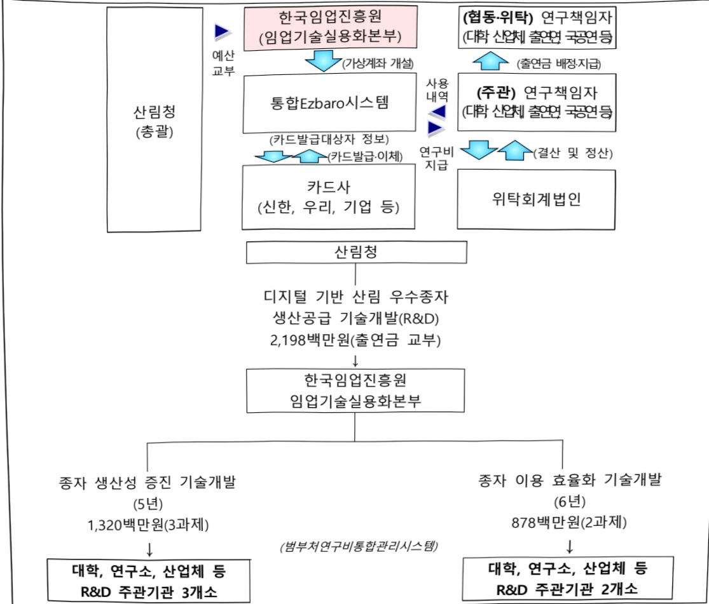

# 디지털 기반 산림 우수종자 생산공급 기술개발(R&D)

**해당 페이지**: PDF 3568 ~ 3574 쪽 해당

**부처**: 산림청
**분야**: 농림수산
**회계유형**: 농어촌구조 개선특별회계
**2026 확정예산**: 2198.0 백만원
**전년대비 증감률**: 33.3%
**AI 도메인**: 산림/생태, 디지털전환(AX)

---

### 가. 예산 총괄표

(단위: 백만원, %)

<table border=1 style='margin: auto; word-wrap: break-word;'><tr><td rowspan="2">사업명</td><td rowspan="2">2024년 결산</td><td colspan="2">2025년 예산</td><td colspan="2">2026년</td><td rowspan="2">중감(B-A)</td><td rowspan="2">(B-A)/A</td></tr><tr><td style='text-align: center; word-wrap: break-word;'>본예산(A)</td><td style='text-align: center; word-wrap: break-word;'>추경</td><td style='text-align: center; word-wrap: break-word;'>요구</td><td style='text-align: center; word-wrap: break-word;'>확정(B)</td></tr><tr><td style='text-align: center; word-wrap: break-word;'>디지털 기반산림우수종자생산공급기술개발(R&amp;D)</td><td style='text-align: center; word-wrap: break-word;'></td><td style='text-align: center; word-wrap: break-word;'>1,649</td><td style='text-align: center; word-wrap: break-word;'>1,649</td><td style='text-align: center; word-wrap: break-word;'>2,198</td><td style='text-align: center; word-wrap: break-word;'>2,198</td><td style='text-align: center; word-wrap: break-word;'>549</td><td style='text-align: center; word-wrap: break-word;'>33.3</td></tr></table>

□ 기능별(내역사업별), 목별 예산 내역

(단위:백만원)

<table border=1 style='margin: auto; word-wrap: break-word;'><tr><td rowspan="3"></td><td colspan="5">2024</td><td colspan="7">2025(2025.12월말)</td><td rowspan="3">2026예산</td></tr><tr><td rowspan="2">예산액(추경)</td><td rowspan="2">예산현액</td><td rowspan="2">집행액[실집행액]</td><td rowspan="2">이월액</td><td rowspan="2">불용액</td><td rowspan="2">분예산</td><td rowspan="2">예산현액</td><td rowspan="2">집행액[실집행액]</td><td colspan="2">전년도 이월액제외</td><td rowspan="2">이월액</td><td rowspan="2">불용액</td></tr><tr><td style='text-align: center; word-wrap: break-word;'>예산현액</td><td style='text-align: center; word-wrap: break-word;'>집행액[실집행액]</td></tr><tr><td style='text-align: center; word-wrap: break-word;'>○ 기능별 분류(합계)</td><td style='text-align: center; word-wrap: break-word;'>-</td><td style='text-align: center; word-wrap: break-word;'>-</td><td style='text-align: center; word-wrap: break-word;'>-</td><td style='text-align: center; word-wrap: break-word;'>-</td><td style='text-align: center; word-wrap: break-word;'>-</td><td style='text-align: center; word-wrap: break-word;'>1,649</td><td style='text-align: center; word-wrap: break-word;'>1,649</td><td style='text-align: center; word-wrap: break-word;'>1,649</td><td style='text-align: center; word-wrap: break-word;'>1,649</td><td style='text-align: center; word-wrap: break-word;'>1,649</td><td style='text-align: center; word-wrap: break-word;'>-</td><td style='text-align: center; word-wrap: break-word;'>-</td><td style='text-align: center; word-wrap: break-word;'>2,198</td></tr><tr><td style='text-align: center; word-wrap: break-word;'>· 종자 생산성 증진기술개발</td><td style='text-align: center; word-wrap: break-word;'>-</td><td style='text-align: center; word-wrap: break-word;'>-</td><td style='text-align: center; word-wrap: break-word;'>-</td><td style='text-align: center; word-wrap: break-word;'>-</td><td style='text-align: center; word-wrap: break-word;'>-</td><td style='text-align: center; word-wrap: break-word;'>990</td><td style='text-align: center; word-wrap: break-word;'>990</td><td style='text-align: center; word-wrap: break-word;'>990</td><td style='text-align: center; word-wrap: break-word;'>990</td><td style='text-align: center; word-wrap: break-word;'>990</td><td style='text-align: center; word-wrap: break-word;'>-</td><td style='text-align: center; word-wrap: break-word;'>-</td><td style='text-align: center; word-wrap: break-word;'>1,320</td></tr><tr><td style='text-align: center; word-wrap: break-word;'>· 신림중자 이용 효율화기술개발</td><td style='text-align: center; word-wrap: break-word;'>-</td><td style='text-align: center; word-wrap: break-word;'>-</td><td style='text-align: center; word-wrap: break-word;'>-</td><td style='text-align: center; word-wrap: break-word;'>-</td><td style='text-align: center; word-wrap: break-word;'>-</td><td style='text-align: center; word-wrap: break-word;'>659</td><td style='text-align: center; word-wrap: break-word;'>659</td><td style='text-align: center; word-wrap: break-word;'>659</td><td style='text-align: center; word-wrap: break-word;'>659</td><td style='text-align: center; word-wrap: break-word;'>659</td><td style='text-align: center; word-wrap: break-word;'>-</td><td style='text-align: center; word-wrap: break-word;'>-</td><td style='text-align: center; word-wrap: break-word;'>878</td></tr><tr><td style='text-align: center; word-wrap: break-word;'>○ 비목별 분류(합계)</td><td style='text-align: center; word-wrap: break-word;'>-</td><td style='text-align: center; word-wrap: break-word;'>-</td><td style='text-align: center; word-wrap: break-word;'>-</td><td style='text-align: center; word-wrap: break-word;'>-</td><td style='text-align: center; word-wrap: break-word;'>-</td><td style='text-align: center; word-wrap: break-word;'>1,649</td><td style='text-align: center; word-wrap: break-word;'>1,649</td><td style='text-align: center; word-wrap: break-word;'>1,649</td><td style='text-align: center; word-wrap: break-word;'>1,649</td><td style='text-align: center; word-wrap: break-word;'>1,649</td><td style='text-align: center; word-wrap: break-word;'>-</td><td style='text-align: center; word-wrap: break-word;'>-</td><td style='text-align: center; word-wrap: break-word;'>2,198</td></tr><tr><td style='text-align: center; word-wrap: break-word;'>· 연구개발활동비등(360-05)</td><td style='text-align: center; word-wrap: break-word;'>-</td><td style='text-align: center; word-wrap: break-word;'>-</td><td style='text-align: center; word-wrap: break-word;'>-</td><td style='text-align: center; word-wrap: break-word;'>-</td><td style='text-align: center; word-wrap: break-word;'>-</td><td style='text-align: center; word-wrap: break-word;'>1,649</td><td style='text-align: center; word-wrap: break-word;'>1,649</td><td style='text-align: center; word-wrap: break-word;'>1,649</td><td style='text-align: center; word-wrap: break-word;'>1,649</td><td style='text-align: center; word-wrap: break-word;'>1,649</td><td style='text-align: center; word-wrap: break-word;'>-</td><td style='text-align: center; word-wrap: break-word;'>-</td><td style='text-align: center; word-wrap: break-word;'>2,198</td></tr><tr><td style='text-align: center; word-wrap: break-word;'>○ 기능비목별 분류(합계)</td><td style='text-align: center; word-wrap: break-word;'>-</td><td style='text-align: center; word-wrap: break-word;'>-</td><td style='text-align: center; word-wrap: break-word;'>-</td><td style='text-align: center; word-wrap: break-word;'>-</td><td style='text-align: center; word-wrap: break-word;'>-</td><td style='text-align: center; word-wrap: break-word;'>1649</td><td style='text-align: center; word-wrap: break-word;'>1649</td><td style='text-align: center; word-wrap: break-word;'>1,649[1,649]</td><td style='text-align: center; word-wrap: break-word;'>1649</td><td style='text-align: center; word-wrap: break-word;'>1,649[1,649]</td><td style='text-align: center; word-wrap: break-word;'>-</td><td style='text-align: center; word-wrap: break-word;'>-</td><td style='text-align: center; word-wrap: break-word;'>2,198</td></tr><tr><td style='text-align: center; word-wrap: break-word;'>· 종자 생산성 증진기술개발</td><td style='text-align: center; word-wrap: break-word;'>-</td><td style='text-align: center; word-wrap: break-word;'>-</td><td style='text-align: center; word-wrap: break-word;'>-</td><td style='text-align: center; word-wrap: break-word;'>-</td><td style='text-align: center; word-wrap: break-word;'>-</td><td style='text-align: center; word-wrap: break-word;'>990</td><td style='text-align: center; word-wrap: break-word;'>990</td><td style='text-align: center; word-wrap: break-word;'>990</td><td style='text-align: center; word-wrap: break-word;'>990</td><td style='text-align: center; word-wrap: break-word;'>990</td><td style='text-align: center; word-wrap: break-word;'>-</td><td style='text-align: center; word-wrap: break-word;'>-</td><td style='text-align: center; word-wrap: break-word;'>1,320</td></tr><tr><td style='text-align: center; word-wrap: break-word;'>· 연구개발활동비등(360-05)</td><td style='text-align: center; word-wrap: break-word;'>-</td><td style='text-align: center; word-wrap: break-word;'>-</td><td style='text-align: center; word-wrap: break-word;'>-</td><td style='text-align: center; word-wrap: break-word;'>-</td><td style='text-align: center; word-wrap: break-word;'>-</td><td style='text-align: center; word-wrap: break-word;'>990</td><td style='text-align: center; word-wrap: break-word;'>990</td><td style='text-align: center; word-wrap: break-word;'>990</td><td style='text-align: center; word-wrap: break-word;'>990</td><td style='text-align: center; word-wrap: break-word;'>990</td><td style='text-align: center; word-wrap: break-word;'>-</td><td style='text-align: center; word-wrap: break-word;'>-</td><td style='text-align: center; word-wrap: break-word;'>1,320</td></tr><tr><td style='text-align: center; word-wrap: break-word;'>· 신림중자 이용 효율화기술개발</td><td style='text-align: center; word-wrap: break-word;'>-</td><td style='text-align: center; word-wrap: break-word;'>-</td><td style='text-align: center; word-wrap: break-word;'>-</td><td style='text-align: center; word-wrap: break-word;'>-</td><td style='text-align: center; word-wrap: break-word;'>-</td><td style='text-align: center; word-wrap: break-word;'>659</td><td style='text-align: center; word-wrap: break-word;'>659</td><td style='text-align: center; word-wrap: break-word;'>659</td><td style='text-align: center; word-wrap: break-word;'>659</td><td style='text-align: center; word-wrap: break-word;'>659</td><td style='text-align: center; word-wrap: break-word;'>-</td><td style='text-align: center; word-wrap: break-word;'>-</td><td style='text-align: center; word-wrap: break-word;'>878</td></tr><tr><td style='text-align: center; word-wrap: break-word;'>· 연구개발활동비등(360-05)</td><td style='text-align: center; word-wrap: break-word;'>-</td><td style='text-align: center; word-wrap: break-word;'>-</td><td style='text-align: center; word-wrap: break-word;'>-</td><td style='text-align: center; word-wrap: break-word;'>-</td><td style='text-align: center; word-wrap: break-word;'>-</td><td style='text-align: center; word-wrap: break-word;'>659</td><td style='text-align: center; word-wrap: break-word;'>659</td><td style='text-align: center; word-wrap: break-word;'>659</td><td style='text-align: center; word-wrap: break-word;'>659</td><td style='text-align: center; word-wrap: break-word;'>659</td><td style='text-align: center; word-wrap: break-word;'>-</td><td style='text-align: center; word-wrap: break-word;'>-</td><td style='text-align: center; word-wrap: break-word;'>878</td></tr></table>

---

### 나. 사업설명자료

## 1 ) 사업목적·내용

- (디지털 기반 산림우수종자 생산공급 기술개발(R&D)) 혁신적인 차세대 산림종자 기술을 활용하여 산림 종자산업의 디지털 전환을 통해 고품질 산림 종자 생산 및 공급을 위한 기술개발 구축

- (중자 생산성 증진) 혁신 디지털 기술의 개발 및 통합을 통한 산림 종자 생산성

증진을 위하여 수종별 묘목 생산, 제초, 해충 모니터링, 종자 채집 기술 개발

- (종자 이용 효율화) 산림 종자의 이용 및 관리 효율성과 효과성을 향상시키기 위하여 AI 도구를 사용한 종자 품질 분류, 수종별 및 종자 발아 향상, 종자 가공 및 저장 기술 개발

## 2 ) 사업개요

## □ 사업근거 및 추진경위

① 법령상 근거 및 조항

-「산림기본법」제7조(임업의 육성): 국가 및 지방자치단체는 임업의 균형적인 성장 및 임업인의 건전한 육성을 위하여 임업의 경쟁력을 높이고 임업인의 소득이 향상될 수 있도록 노력하여야 한다.

-「산림기본법」제24조(임업기술의 진흥): 국가 및 지방자치단체는 임업의 경쟁력을 높이고 임산물의 부가 가치를 높이기 위하여 임업기술의 연구·개발·보급 등 필요한 시책을 수립·시행하여야 한다.

- 「산림자원의 조성 및 관리에 관한 법률」제34조(산림과학기술 기본계획의 수립 등):

산림청장은 산림자원의 조성·육성, 산림자원의 이용, 산림자원의 공익기능 증진 등과 관련된 산림과학기술의 연구개발을 촉진하기 위하여 대통령령으로 정하는 바에 따라 산림과학기술 기본계획을 10년 단위로 수립·시행하여야 한다.

-「종자산업법」제7조(종자산업 관련 기술 개발의 촉진) : 국가와 지방자치단체는

종자산업 관련 기술의 개발을 촉진하기 위하여 다음 각 호의 사항을 추진하여야 한다.

② 추진경위 - 사업 시작년도, 추진배경, 부처별 중점과제, 대통령 공약사항 등

° 사업기획 경과

- (기획 착수) 신규사업 추진 필요성 및 방향성 의견 수렴(23.11)

- (현장 방문) 양묘 현장 기술수요 청취 및 컨설팅, 세미나를 통한 고도화

---

°추진배경

- 산림종자 산업은 노동력중심의 구조로 산림 종자 예찰 및 채취, 풀베기 등 핵심작업에 많은 인력과 예산이 소요되고 있음

- 기후변화로 인해 종자 생산량의 증감량이 상이하고, 폭염 및 경사지 등 고위험작업으로 인력운영에 어려움이 발생되고 있음

- 밭아울이 낮아 양묘장 공급시 발아사고가 발생되는 등 국가 주요 조립용 산림종자를 대상으로 발아울 향상을 위한 산업현장의 기술개발 수요가 높은 상황으로 종자의 품질 개선을 위한 연구가 시급

° 대통령 공약사항

- 2. 성장(균형발전): 스마트 데이터 농업 확산, 푸드테크 그린바이오 산업 육성, K-푸드 수출 확대, R&D 강화로 농업을 미래농산업으로 전환하겠습니다.

## □ 주요내용

① 사업규모

- 사업기간 : 2025 ~ 2030(총 6년)

- 최근 5년 간 투입된 사업비(예산액기준, 추경편성한 연도에는 추경포함)

<table border=1 style='margin: auto; word-wrap: break-word;'><tr><td style='text-align: center; word-wrap: break-word;'>$ H_{2}O $</td><td style='text-align: center; word-wrap: break-word;'>2022</td><td style='text-align: center; word-wrap: break-word;'>2023</td><td style='text-align: center; word-wrap: break-word;'>2024</td><td style='text-align: center; word-wrap: break-word;'>2025</td><td style='text-align: center; word-wrap: break-word;'>2026</td></tr><tr><td style='text-align: center; word-wrap: break-word;'>$ H_{2}O $</td><td style='text-align: center; word-wrap: break-word;'>-</td><td style='text-align: center; word-wrap: break-word;'>-</td><td style='text-align: center; word-wrap: break-word;'>-</td><td style='text-align: center; word-wrap: break-word;'>1,649</td><td style='text-align: center; word-wrap: break-word;'>2,198</td></tr></table>

② 사업추진체계

- 사업시행방법 : 출연(국고 100%)

- 사업시행주체 : 한국임업진흥원(연구관리 전문기관)

-사업 수혜자 : 국민, 임업인, 산업체, 연구소 등

- 보조, 융자, 출연, 출자 등의 경우 보조·융자 등 지원 비율 및 법적근거

<table border=1 style='margin: auto; word-wrap: break-word;'><tr><td style='text-align: center; word-wrap: break-word;'>내역사업명</td><td style='text-align: center; word-wrap: break-word;'>구분</td><td style='text-align: center; word-wrap: break-word;'>피보조·피출연 등 기관명</td><td style='text-align: center; word-wrap: break-word;'>지원 금액 (2026예산)</td><td style='text-align: center; word-wrap: break-word;'>지원 비율(%)</td><td style='text-align: center; word-wrap: break-word;'>보조율 법적근거 (해당 조항)</td></tr><tr><td style='text-align: center; word-wrap: break-word;'>종자 생산성 증진 기술개발</td><td style='text-align: center; word-wrap: break-word;'>출연</td><td style='text-align: center; word-wrap: break-word;'>한국임업 진흥원</td><td style='text-align: center; word-wrap: break-word;'>1,320</td><td style='text-align: center; word-wrap: break-word;'>100</td><td style='text-align: center; word-wrap: break-word;'>「산림자원의 조성 및 관리에 관한 법률」 제34조 제6항</td></tr><tr><td style='text-align: center; word-wrap: break-word;'>산림종자 이용 효율화 기술개발</td><td style='text-align: center; word-wrap: break-word;'>출연</td><td style='text-align: center; word-wrap: break-word;'>한국임업 진흥원</td><td style='text-align: center; word-wrap: break-word;'>878</td><td style='text-align: center; word-wrap: break-word;'>100</td><td style='text-align: center; word-wrap: break-word;'>「산림자원의 조성 및 관리에 관한 법률」 제34조 제6항</td></tr></table>

---

## 3 )2026년도 예산 산출 근거

① 종자 생산성 증진 기술개발

: (2025 본예산) 990백만원 → (2026 예산) 1,320백만원, 330백만원 증액

- (내용) 혁신 디지털 기술의 개발 및 통합을 통한 산림 종자 생산성 증진을 위하여 수종별 묘목 생산, 제초, 해충 모니터링, 종자 채집 기술 개발을 위한 연구비 1,320백만원 반영

- (산출)3개×440백만원×12/12개월=990백만원

ㅇ 2025년도 예산 및 2026년도 예산 산출 세부내역 비교

<table border=1 style='margin: auto; word-wrap: break-word;'><tr><td colspan="2">2025년 본예산</td><td colspan="2">2026년 예산</td></tr><tr><td style='text-align: center; word-wrap: break-word;'>예산</td><td style='text-align: center; word-wrap: break-word;'>산출내역</td><td style='text-align: center; word-wrap: break-word;'>예산</td><td style='text-align: center; word-wrap: break-word;'>산출내역</td></tr><tr><td style='text-align: center; word-wrap: break-word;'>990</td><td style='text-align: center; word-wrap: break-word;'>○ 연구개발활동비 등(360-05): 990백만원  - (신규) 3개 × 440백만원 × 9/12개월 = 990백만원</td><td style='text-align: center; word-wrap: break-word;'>1,320</td><td style='text-align: center; word-wrap: break-word;'>○ 연구개발활동비 등(360-05): 1,320백만원  - (계속) 3개 × 440백만원 × 12/12개월 = 1,320백만원</td></tr></table>

②산림종자 이용 효율화 기술개발

:(2025 본예산) 659백만원 → (2026 예산) 878백만원, 219백만원 증액

- (내용) 산림 종자의 이용 및 관리 효율성과 효과성을 향상시키기 위하여 AI 도구를 사용한 종자 품질 분류, 수 종별 및 종자 발아 향상, 종자 가공 및 저장 기술 개발을 위한 연구비 878백만원 반영

- (산출) (계속) 2개 × 439.3백만원 × 12/12개월 = 787백만원

°2025년도 예산 및 2026년도 예산 산출 세부내역 비교

<table border=1 style='margin: auto; word-wrap: break-word;'><tr><td colspan="2">2025년 본예산</td><td colspan="2">2026년 예산</td></tr><tr><td style='text-align: center; word-wrap: break-word;'>예산</td><td style='text-align: center; word-wrap: break-word;'>산출내역</td><td style='text-align: center; word-wrap: break-word;'>예산</td><td style='text-align: center; word-wrap: break-word;'>산출내역</td></tr><tr><td style='text-align: center; word-wrap: break-word;'>659</td><td style='text-align: center; word-wrap: break-word;'>○ 연구개발활동비 등(360-05): 659백만원 - (신규) 2개 × 439.3백만원 × 9/12개월 = 659백만원</td><td style='text-align: center; word-wrap: break-word;'>878</td><td style='text-align: center; word-wrap: break-word;'>○ 연구개발활동비 등(360-05): 878백만원 - (계속) 2개 × 439.3백만원 × 12/12개월 = 787백만원</td></tr></table>

## 4 ) 사업효과

□ 사업영향, 산출물 성과지표 등

① 2022~2026년도 성과계획서 상 성과지표 및 최근 5년간 성과 달성도

o 신규사업 성과지표(안) * 2025년 신규사업으로 전략계획서 작성 전임

② 성과지표 이외의 연도별 사업추진 경과 및 실적

<table border=1 style='margin: auto; word-wrap: break-word;'><tr><td style='text-align: center; word-wrap: break-word;'>2022</td><td style='text-align: center; word-wrap: break-word;'>-</td></tr><tr><td style='text-align: center; word-wrap: break-word;'>2023</td><td style='text-align: center; word-wrap: break-word;'>-</td></tr><tr><td style='text-align: center; word-wrap: break-word;'>2024</td><td style='text-align: center; word-wrap: break-word;'>-</td></tr><tr><td style='text-align: center; word-wrap: break-word;'>2025</td><td style='text-align: center; word-wrap: break-word;'>·신규과제 5개 연구 수행</td></tr></table>

③향후(2026년도 이후)기대효과

<table border=1 style='margin: auto; word-wrap: break-word;'><tr><td style='text-align: center; word-wrap: break-word;'>• 산림종자 생산업의 첨단화로 인력 대체, 효율성 증진 등 산업 발전</td></tr><tr><td style='text-align: center; word-wrap: break-word;'>• 산림종자 활용도 증가로 국가 조립사업 및 탄소중립에 기여</td></tr></table>

5) 타당성조사 및 예비타당성조사 시행여부 및 결과 요지: 해당없음

6) 총사업비 대상사업 여부 및 내역: 해당없음

---

## 7 ) 사업 집행절차

8) 중기재정계획 상 연도별 투자계획 및 추진경과

(단위:백만원)

<table border=1 style='margin: auto; word-wrap: break-word;'><tr><td style='text-align: center; word-wrap: break-word;'>$ 중기 $ 재정계획</td><td style='text-align: center; word-wrap: break-word;'>2024</td><td style='text-align: center; word-wrap: break-word;'>2025</td><td style='text-align: center; word-wrap: break-word;'>2026</td><td style='text-align: center; word-wrap: break-word;'>2027</td><td style='text-align: center; word-wrap: break-word;'>2028</td><td style='text-align: center; word-wrap: break-word;'>2029</td></tr><tr><td style='text-align: center; word-wrap: break-word;'>2024~2028</td><td style='text-align: center; word-wrap: break-word;'>-</td><td style='text-align: center; word-wrap: break-word;'>1,649</td><td style='text-align: center; word-wrap: break-word;'>2,198</td><td style='text-align: center; word-wrap: break-word;'>2,198</td><td style='text-align: center; word-wrap: break-word;'>2,198</td><td style='text-align: center; word-wrap: break-word;'>☑</td></tr><tr><td style='text-align: center; word-wrap: break-word;'>2025~2029</td><td style='text-align: center; word-wrap: break-word;'>☑</td><td style='text-align: center; word-wrap: break-word;'>1,649</td><td style='text-align: center; word-wrap: break-word;'>2,198</td><td style='text-align: center; word-wrap: break-word;'>2,198</td><td style='text-align: center; word-wrap: break-word;'>2,198</td><td style='text-align: center; word-wrap: break-word;'>2,198</td></tr></table>

9) 최근 3년간 동 사업에 대한 주요 외부지적사항 및 평가, 문제점 및 대책 : 해당없음

---

## 10 )향후 추진방향 및 추진계획

<table border=1 style='margin: auto; word-wrap: break-word;'><tr><td style='text-align: center; word-wrap: break-word;'>- 디지털 기반 종자 생산성 향상 및 스마트 종자 저장 시스템을 포함한 혁신 기술의 개발 및 기술 노하우의 축적을 통한 산림 종자묘목 관리 체계 고도화</td></tr><tr><td style='text-align: center; word-wrap: break-word;'>- 산림 종자 관리 시스템을 강화하고 효율성을 증가시켜 산림 산업의 비용 절감 및 수익성 개선 기대</td></tr></table>

11) 해당사업에 대한 각종 사업평가의 결과: 해당없음

12) 해당사업에 대한 부처 자체평가의 결과: 해당없음

13) 부처 건의사항: 해당없음

### 다.최근 4년간 결산내역

1) 결산표

☐ 부처 결산내역

(단위:백만원,%)

<table border=1 style='margin: auto; word-wrap: break-word;'><tr><td rowspan="2">闰도</td><td colspan="3">예산액</td><td rowspan="2">전년도이월액</td><td rowspan="2">이·전용등</td><td rowspan="2">예비비</td><td rowspan="2">예산현액(B)</td><td rowspan="2">집행액(C)</td><td rowspan="2">집행률(C/A)</td><td rowspan="2">집행률(C/B)</td><td rowspan="2">다음연도이월액</td><td rowspan="2">불용액</td></tr><tr><td style='text-align: center; word-wrap: break-word;'>본예산증감액</td><td style='text-align: center; word-wrap: break-word;'>추경증감액</td><td style='text-align: center; word-wrap: break-word;'>추경(A)</td></tr><tr><td style='text-align: center; word-wrap: break-word;'>2022</td><td style='text-align: center; word-wrap: break-word;'>-</td><td style='text-align: center; word-wrap: break-word;'>-</td><td style='text-align: center; word-wrap: break-word;'>-</td><td style='text-align: center; word-wrap: break-word;'>-</td><td style='text-align: center; word-wrap: break-word;'>-</td><td style='text-align: center; word-wrap: break-word;'>-</td><td style='text-align: center; word-wrap: break-word;'>-</td><td style='text-align: center; word-wrap: break-word;'>-</td><td style='text-align: center; word-wrap: break-word;'>-</td><td style='text-align: center; word-wrap: break-word;'>-</td><td style='text-align: center; word-wrap: break-word;'>-</td><td style='text-align: center; word-wrap: break-word;'>-</td></tr><tr><td style='text-align: center; word-wrap: break-word;'>2023</td><td style='text-align: center; word-wrap: break-word;'>-</td><td style='text-align: center; word-wrap: break-word;'>-</td><td style='text-align: center; word-wrap: break-word;'>-</td><td style='text-align: center; word-wrap: break-word;'>-</td><td style='text-align: center; word-wrap: break-word;'>-</td><td style='text-align: center; word-wrap: break-word;'>-</td><td style='text-align: center; word-wrap: break-word;'>-</td><td style='text-align: center; word-wrap: break-word;'>-</td><td style='text-align: center; word-wrap: break-word;'>-</td><td style='text-align: center; word-wrap: break-word;'>-</td><td style='text-align: center; word-wrap: break-word;'>-</td><td style='text-align: center; word-wrap: break-word;'>-</td></tr><tr><td style='text-align: center; word-wrap: break-word;'>2024</td><td style='text-align: center; word-wrap: break-word;'>-</td><td style='text-align: center; word-wrap: break-word;'>-</td><td style='text-align: center; word-wrap: break-word;'>-</td><td style='text-align: center; word-wrap: break-word;'>-</td><td style='text-align: center; word-wrap: break-word;'>-</td><td style='text-align: center; word-wrap: break-word;'>-</td><td style='text-align: center; word-wrap: break-word;'>-</td><td style='text-align: center; word-wrap: break-word;'>-</td><td style='text-align: center; word-wrap: break-word;'>-</td><td style='text-align: center; word-wrap: break-word;'>-</td><td style='text-align: center; word-wrap: break-word;'>-</td><td style='text-align: center; word-wrap: break-word;'>-</td></tr><tr><td style='text-align: center; word-wrap: break-word;'>2025</td><td style='text-align: center; word-wrap: break-word;'>1,649</td><td style='text-align: center; word-wrap: break-word;'>-</td><td style='text-align: center; word-wrap: break-word;'>1,649</td><td style='text-align: center; word-wrap: break-word;'>-</td><td style='text-align: center; word-wrap: break-word;'>-</td><td style='text-align: center; word-wrap: break-word;'>-</td><td style='text-align: center; word-wrap: break-word;'>1,649</td><td style='text-align: center; word-wrap: break-word;'>1,649</td><td style='text-align: center; word-wrap: break-word;'>100.0</td><td style='text-align: center; word-wrap: break-word;'>100.0</td><td style='text-align: center; word-wrap: break-word;'>-</td><td style='text-align: center; word-wrap: break-word;'>-</td></tr></table>

□출연·보조사업 등 실집행내역

(단위: 백만원, %)

<table border=1 style='margin: auto; word-wrap: break-word;'><tr><td rowspan="3">구분</td><td colspan="3">부처</td><td colspan="6">사업시행주체(피출연·피보조 기관 등)</td></tr><tr><td colspan="2">예산액</td><td rowspan="2">집행액</td><td rowspan="2">교부액</td><td rowspan="2">전년도이월액</td><td rowspan="2">교부현액</td><td rowspan="2">집행액(B)</td><td rowspan="2">이월액</td><td rowspan="2">불용액(B/A)</td></tr><tr><td style='text-align: center; word-wrap: break-word;'>본예산</td><td style='text-align: center; word-wrap: break-word;'>추경(A)</td></tr><tr><td style='text-align: center; word-wrap: break-word;'>2022</td><td style='text-align: center; word-wrap: break-word;'>-</td><td style='text-align: center; word-wrap: break-word;'>-</td><td style='text-align: center; word-wrap: break-word;'>-</td><td style='text-align: center; word-wrap: break-word;'>-</td><td style='text-align: center; word-wrap: break-word;'>-</td><td style='text-align: center; word-wrap: break-word;'>-</td><td style='text-align: center; word-wrap: break-word;'>-</td><td style='text-align: center; word-wrap: break-word;'>-</td><td style='text-align: center; word-wrap: break-word;'>-</td></tr><tr><td style='text-align: center; word-wrap: break-word;'>2023</td><td style='text-align: center; word-wrap: break-word;'>-</td><td style='text-align: center; word-wrap: break-word;'>-</td><td style='text-align: center; word-wrap: break-word;'>-</td><td style='text-align: center; word-wrap: break-word;'>-</td><td style='text-align: center; word-wrap: break-word;'>-</td><td style='text-align: center; word-wrap: break-word;'>-</td><td style='text-align: center; word-wrap: break-word;'>-</td><td style='text-align: center; word-wrap: break-word;'>-</td><td style='text-align: center; word-wrap: break-word;'>-</td></tr><tr><td style='text-align: center; word-wrap: break-word;'>2024</td><td style='text-align: center; word-wrap: break-word;'>-</td><td style='text-align: center; word-wrap: break-word;'>-</td><td style='text-align: center; word-wrap: break-word;'>-</td><td style='text-align: center; word-wrap: break-word;'>-</td><td style='text-align: center; word-wrap: break-word;'>-</td><td style='text-align: center; word-wrap: break-word;'>-</td><td style='text-align: center; word-wrap: break-word;'>-</td><td style='text-align: center; word-wrap: break-word;'>-</td><td style='text-align: center; word-wrap: break-word;'>-</td></tr><tr><td style='text-align: center; word-wrap: break-word;'>2025</td><td style='text-align: center; word-wrap: break-word;'>1,649</td><td style='text-align: center; word-wrap: break-word;'>1,649</td><td style='text-align: center; word-wrap: break-word;'>1,649</td><td style='text-align: center; word-wrap: break-word;'>1,649</td><td style='text-align: center; word-wrap: break-word;'>-</td><td style='text-align: center; word-wrap: break-word;'>1,649</td><td style='text-align: center; word-wrap: break-word;'>1,649</td><td style='text-align: center; word-wrap: break-word;'>-</td><td style='text-align: center; word-wrap: break-word;'>-</td></tr></table>

2) 주요 결산사항 : 해당없음

라. 기타 추가자료: 해당없음

---

<table border=1 style='margin: auto; word-wrap: break-word;'><tr><td style='text-align: center; word-wrap: break-word;'>사 업 명</td></tr><tr><td style='text-align: center; word-wrap: break-word;'>산림과학연구(R&amp;D) (1251-300)</td></tr></table>

사업 코드 정보

<table border=1 style='margin: auto; word-wrap: break-word;'><tr><td style='text-align: center; word-wrap: break-word;'>구분</td><td style='text-align: center; word-wrap: break-word;'>회계</td><td style='text-align: center; word-wrap: break-word;'>소관</td><td style='text-align: center; word-wrap: break-word;'>실국(기관)</td><td style='text-align: center; word-wrap: break-word;'>계정</td><td style='text-align: center; word-wrap: break-word;'>분야</td><td style='text-align: center; word-wrap: break-word;'>부문</td></tr><tr><td style='text-align: center; word-wrap: break-word;'>코드</td><td rowspan="2">일반회계</td><td rowspan="2">산림청</td><td rowspan="2">국립산림과학원</td><td rowspan="2"></td><td style='text-align: center; word-wrap: break-word;'>100</td><td style='text-align: center; word-wrap: break-word;'>102</td></tr><tr><td style='text-align: center; word-wrap: break-word;'>명칭</td><td style='text-align: center; word-wrap: break-word;'>농림수산</td><td style='text-align: center; word-wrap: break-word;'>임업·산촌</td></tr></table>

<table border=1 style='margin: auto; word-wrap: break-word;'><tr><td style='text-align: center; word-wrap: break-word;'>구분</td><td style='text-align: center; word-wrap: break-word;'>프로그램</td><td style='text-align: center; word-wrap: break-word;'>단위사업</td><td style='text-align: center; word-wrap: break-word;'>세부사업</td></tr><tr><td style='text-align: center; word-wrap: break-word;'>코드</td><td style='text-align: center; word-wrap: break-word;'>1200</td><td style='text-align: center; word-wrap: break-word;'>1251</td><td style='text-align: center; word-wrap: break-word;'>300</td></tr><tr><td style='text-align: center; word-wrap: break-word;'>명칭</td><td style='text-align: center; word-wrap: break-word;'>산림과학기술개발</td><td style='text-align: center; word-wrap: break-word;'>산림과학기술개발(일반)</td><td style='text-align: center; word-wrap: break-word;'>산림과학연구(R&amp;D)</td></tr></table>

□ 사업 성격

<table border=1 style='margin: auto; word-wrap: break-word;'><tr><td rowspan="2">신규</td><td rowspan="2">계속</td><td rowspan="2">완료</td><td rowspan="2">예비타당성 실시여부</td><td rowspan="2">총사업비 관리대상</td><td rowspan="2">총액계상 예산사업</td><td style='text-align: center; word-wrap: break-word;'>사업소관 변경정보</td></tr><tr><td style='text-align: center; word-wrap: break-word;'>2025예산 시 소관</td></tr><tr><td style='text-align: center; word-wrap: break-word;'></td><td style='text-align: center; word-wrap: break-word;'>○</td><td style='text-align: center; word-wrap: break-word;'></td><td style='text-align: center; word-wrap: break-word;'></td><td style='text-align: center; word-wrap: break-word;'></td><td style='text-align: center; word-wrap: break-word;'></td><td style='text-align: center; word-wrap: break-word;'></td></tr></table>

□ 사업 지원 형태 및 지원을

<table border=1 style='margin: auto; word-wrap: break-word;'><tr><td style='text-align: center; word-wrap: break-word;'>직접</td><td style='text-align: center; word-wrap: break-word;'>출자</td><td style='text-align: center; word-wrap: break-word;'>출연</td><td style='text-align: center; word-wrap: break-word;'>보조</td><td style='text-align: center; word-wrap: break-word;'>융자</td><td style='text-align: center; word-wrap: break-word;'>국고보조율(%)</td><td style='text-align: center; word-wrap: break-word;'>융자율(%)</td></tr><tr><td style='text-align: center; word-wrap: break-word;'>○</td><td style='text-align: center; word-wrap: break-word;'></td><td style='text-align: center; word-wrap: break-word;'></td><td style='text-align: center; word-wrap: break-word;'></td><td style='text-align: center; word-wrap: break-word;'></td><td style='text-align: center; word-wrap: break-word;'></td><td style='text-align: center; word-wrap: break-word;'></td></tr></table>

## 사업담당자

<table border=1 style='margin: auto; word-wrap: break-word;'><tr><td style='text-align: center; word-wrap: break-word;'>사업명</td><td colspan="5">구분</td></tr><tr><td rowspan="4">산림과학연구 (R&amp;D)</td><td rowspan="3">소관부처</td><td style='text-align: center; word-wrap: break-word;'>실·국·과(팀)</td><td style='text-align: center; word-wrap: break-word;'>과 장</td><td style='text-align: center; word-wrap: break-word;'>사무관</td><td style='text-align: center; word-wrap: break-word;'>주무관</td></tr><tr><td style='text-align: center; word-wrap: break-word;'>국립산림과학원</td><td style='text-align: center; word-wrap: break-word;'>김광모</td><td style='text-align: center; word-wrap: break-word;'>조민석 연구관</td><td style='text-align: center; word-wrap: break-word;'>장윤성 연구사</td></tr><tr><td style='text-align: center; word-wrap: break-word;'>연구기획과</td><td style='text-align: center; word-wrap: break-word;'>02-961-2561</td><td style='text-align: center; word-wrap: break-word;'>02-961-2571</td><td style='text-align: center; word-wrap: break-word;'>02-961-2572</td></tr><tr><td style='text-align: center; word-wrap: break-word;'>사업시행주체</td><td style='text-align: center; word-wrap: break-word;'>-</td><td style='text-align: center; word-wrap: break-word;'>-</td><td style='text-align: center; word-wrap: break-word;'>-</td><td style='text-align: center; word-wrap: break-word;'>-</td></tr></table>

---

### 원본 PDF 크롭 이미지

