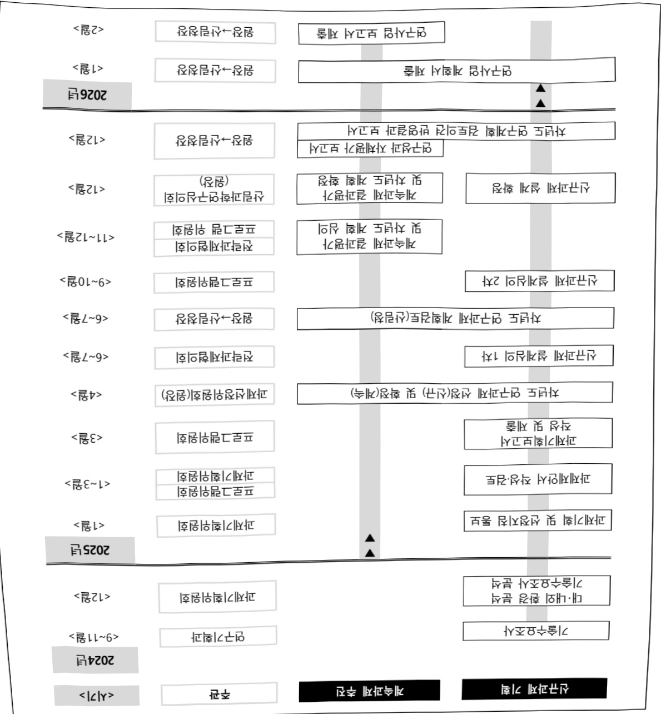

# 산림과학연구(R&D)

**해당 페이지**: PDF 3575 ~ 3592 쪽 해당

**부처**: 산림청
**분야**: 농림수산
**회계유형**: 일반회계
**2026 확정예산**: 52124.0 백만원
**전년대비 증감률**: 23.0%
**AI 도메인**: 환경/기후, 재난/안전, 산림/생태

---

<table border=1 style='margin: auto; word-wrap: break-word;'><tr><td style='text-align: center; word-wrap: break-word;'>사 업 명</td></tr><tr><td style='text-align: center; word-wrap: break-word;'>산림과학연구(R&amp;D) (1251-300)</td></tr></table>

사업 코드 정보

<table border=1 style='margin: auto; word-wrap: break-word;'><tr><td style='text-align: center; word-wrap: break-word;'>구분</td><td style='text-align: center; word-wrap: break-word;'>회계</td><td style='text-align: center; word-wrap: break-word;'>소관</td><td style='text-align: center; word-wrap: break-word;'>실국(기관)</td><td style='text-align: center; word-wrap: break-word;'>계정</td><td style='text-align: center; word-wrap: break-word;'>분야</td><td style='text-align: center; word-wrap: break-word;'>부문</td></tr><tr><td style='text-align: center; word-wrap: break-word;'>코드</td><td rowspan="2">일반회계</td><td rowspan="2">산림청</td><td rowspan="2">국립산림과학원</td><td rowspan="2"></td><td style='text-align: center; word-wrap: break-word;'>100</td><td style='text-align: center; word-wrap: break-word;'>102</td></tr><tr><td style='text-align: center; word-wrap: break-word;'>명칭</td><td style='text-align: center; word-wrap: break-word;'>농림수산</td><td style='text-align: center; word-wrap: break-word;'>임업·산촌</td></tr></table>

<table border=1 style='margin: auto; word-wrap: break-word;'><tr><td style='text-align: center; word-wrap: break-word;'>구분</td><td style='text-align: center; word-wrap: break-word;'>프로그램</td><td style='text-align: center; word-wrap: break-word;'>단위사업</td><td style='text-align: center; word-wrap: break-word;'>세부사업</td></tr><tr><td style='text-align: center; word-wrap: break-word;'>코드</td><td style='text-align: center; word-wrap: break-word;'>1200</td><td style='text-align: center; word-wrap: break-word;'>1251</td><td style='text-align: center; word-wrap: break-word;'>300</td></tr><tr><td style='text-align: center; word-wrap: break-word;'>명칭</td><td style='text-align: center; word-wrap: break-word;'>산림과학기술개발</td><td style='text-align: center; word-wrap: break-word;'>산림과학기술개발(일반)</td><td style='text-align: center; word-wrap: break-word;'>산림과학연구(R&amp;D)</td></tr></table>

□ 사업 성격

<table border=1 style='margin: auto; word-wrap: break-word;'><tr><td rowspan="2">신규</td><td rowspan="2">계속</td><td rowspan="2">완료</td><td rowspan="2">예비타당성 실시여부</td><td rowspan="2">총사업비 관리대상</td><td rowspan="2">총액계상 예산사업</td><td style='text-align: center; word-wrap: break-word;'>사업소관 변경정보</td></tr><tr><td style='text-align: center; word-wrap: break-word;'>2025예산 시 소관</td></tr><tr><td style='text-align: center; word-wrap: break-word;'></td><td style='text-align: center; word-wrap: break-word;'>○</td><td style='text-align: center; word-wrap: break-word;'></td><td style='text-align: center; word-wrap: break-word;'></td><td style='text-align: center; word-wrap: break-word;'></td><td style='text-align: center; word-wrap: break-word;'></td><td style='text-align: center; word-wrap: break-word;'></td></tr></table>

□ 사업 지원 형태 및 지원을

<table border=1 style='margin: auto; word-wrap: break-word;'><tr><td style='text-align: center; word-wrap: break-word;'>직접</td><td style='text-align: center; word-wrap: break-word;'>출자</td><td style='text-align: center; word-wrap: break-word;'>출연</td><td style='text-align: center; word-wrap: break-word;'>보조</td><td style='text-align: center; word-wrap: break-word;'>융자</td><td style='text-align: center; word-wrap: break-word;'>국고보조율(%)</td><td style='text-align: center; word-wrap: break-word;'>융자율(%)</td></tr><tr><td style='text-align: center; word-wrap: break-word;'>○</td><td style='text-align: center; word-wrap: break-word;'></td><td style='text-align: center; word-wrap: break-word;'></td><td style='text-align: center; word-wrap: break-word;'></td><td style='text-align: center; word-wrap: break-word;'></td><td style='text-align: center; word-wrap: break-word;'></td><td style='text-align: center; word-wrap: break-word;'></td></tr></table>

## 사업담당자

<table border=1 style='margin: auto; word-wrap: break-word;'><tr><td style='text-align: center; word-wrap: break-word;'>사업명</td><td colspan="5">구분</td></tr><tr><td rowspan="4">산림과학연구 (R&amp;D)</td><td rowspan="3">소관부처</td><td style='text-align: center; word-wrap: break-word;'>실·국·과(팀)</td><td style='text-align: center; word-wrap: break-word;'>과 장</td><td style='text-align: center; word-wrap: break-word;'>사무관</td><td style='text-align: center; word-wrap: break-word;'>주무관</td></tr><tr><td style='text-align: center; word-wrap: break-word;'>국립산림과학원</td><td style='text-align: center; word-wrap: break-word;'>김광모</td><td style='text-align: center; word-wrap: break-word;'>조민석 연구관</td><td style='text-align: center; word-wrap: break-word;'>장윤성 연구사</td></tr><tr><td style='text-align: center; word-wrap: break-word;'>연구기획과</td><td style='text-align: center; word-wrap: break-word;'>02-961-2561</td><td style='text-align: center; word-wrap: break-word;'>02-961-2571</td><td style='text-align: center; word-wrap: break-word;'>02-961-2572</td></tr><tr><td style='text-align: center; word-wrap: break-word;'>사업시행주체</td><td style='text-align: center; word-wrap: break-word;'>-</td><td style='text-align: center; word-wrap: break-word;'>-</td><td style='text-align: center; word-wrap: break-word;'>-</td><td style='text-align: center; word-wrap: break-word;'>-</td></tr></table>

---

### 가. 예산 총괄표

(단위: 백만원, %)

<table border=1 style='margin: auto; word-wrap: break-word;'><tr><td rowspan="2">사업명</td><td rowspan="2">2024년 결산</td><td colspan="2">2025년 예산</td><td colspan="2">2026년</td><td rowspan="2">중감 (B-A)</td><td rowspan="2">(B-A)/A</td></tr><tr><td style='text-align: center; word-wrap: break-word;'>본예산(A)</td><td style='text-align: center; word-wrap: break-word;'>추경</td><td style='text-align: center; word-wrap: break-word;'>요구</td><td style='text-align: center; word-wrap: break-word;'>확정(B)</td></tr><tr><td style='text-align: center; word-wrap: break-word;'>산림과학연구(R&amp;D)</td><td style='text-align: center; word-wrap: break-word;'>40,890</td><td style='text-align: center; word-wrap: break-word;'>42,368</td><td style='text-align: center; word-wrap: break-word;'>42,368</td><td style='text-align: center; word-wrap: break-word;'>51,508</td><td style='text-align: center; word-wrap: break-word;'>52,124</td><td style='text-align: center; word-wrap: break-word;'>9,756</td><td style='text-align: center; word-wrap: break-word;'>23.0</td></tr></table>

□ 기능별(내역사업별), 목별 예산 내역

(단위:백만원)

<table border=1 style='margin: auto; word-wrap: break-word;'><tr><td rowspan="3"></td><td colspan="5">2024</td><td colspan="7">2025(2025.12.월말)</td><td rowspan="3">2026예산</td></tr><tr><td rowspan="2">예산액(추정)</td><td rowspan="2">예산현액</td><td rowspan="2">집행액[실집행액]</td><td rowspan="2">이월액</td><td rowspan="2">불용액</td><td rowspan="2">분예산</td><td rowspan="2">예산현액</td><td rowspan="2">집행액[실집행액]</td><td colspan="2">전년도 이월액제외</td><td rowspan="2">이월액</td><td rowspan="2">불용액</td></tr><tr><td style='text-align: center; word-wrap: break-word;'>예산현액</td><td style='text-align: center; word-wrap: break-word;'>집행액[실집행액]</td></tr><tr><td style='text-align: center; word-wrap: break-word;'>○ 기능별 분류(합계)</td><td style='text-align: center; word-wrap: break-word;'>41,000</td><td style='text-align: center; word-wrap: break-word;'>41,351</td><td style='text-align: center; word-wrap: break-word;'>40,890[40,890]</td><td style='text-align: center; word-wrap: break-word;'>-</td><td style='text-align: center; word-wrap: break-word;'>461</td><td style='text-align: center; word-wrap: break-word;'>42,368</td><td style='text-align: center; word-wrap: break-word;'>42,368</td><td style='text-align: center; word-wrap: break-word;'>40,888[40,888]</td><td style='text-align: center; word-wrap: break-word;'>42,368</td><td style='text-align: center; word-wrap: break-word;'>40,888[40,888]</td><td style='text-align: center; word-wrap: break-word;'>1,329</td><td style='text-align: center; word-wrap: break-word;'>151</td><td style='text-align: center; word-wrap: break-word;'>52,124</td></tr><tr><td style='text-align: center; word-wrap: break-word;'>· 산림 생태계서비스 및 보전·복원연구</td><td style='text-align: center; word-wrap: break-word;'>9,125</td><td style='text-align: center; word-wrap: break-word;'>9,125</td><td style='text-align: center; word-wrap: break-word;'>9,051[9,051]</td><td style='text-align: center; word-wrap: break-word;'>-</td><td style='text-align: center; word-wrap: break-word;'>74</td><td style='text-align: center; word-wrap: break-word;'>9,577</td><td style='text-align: center; word-wrap: break-word;'>9,577</td><td style='text-align: center; word-wrap: break-word;'>9,556[9,556]</td><td style='text-align: center; word-wrap: break-word;'>9,577</td><td style='text-align: center; word-wrap: break-word;'>9,556[9,556]</td><td style='text-align: center; word-wrap: break-word;'>-</td><td style='text-align: center; word-wrap: break-word;'>21</td><td style='text-align: center; word-wrap: break-word;'>11,644</td></tr><tr><td style='text-align: center; word-wrap: break-word;'>· 숲 기반 산림복지연구</td><td style='text-align: center; word-wrap: break-word;'>2,906</td><td style='text-align: center; word-wrap: break-word;'>2,906</td><td style='text-align: center; word-wrap: break-word;'>2,889[2,889]</td><td style='text-align: center; word-wrap: break-word;'>-</td><td style='text-align: center; word-wrap: break-word;'>17</td><td style='text-align: center; word-wrap: break-word;'>3,137</td><td style='text-align: center; word-wrap: break-word;'>3,137</td><td style='text-align: center; word-wrap: break-word;'>3,123[3,123]</td><td style='text-align: center; word-wrap: break-word;'>3,137</td><td style='text-align: center; word-wrap: break-word;'>3,123[3,123]</td><td style='text-align: center; word-wrap: break-word;'>-</td><td style='text-align: center; word-wrap: break-word;'>14</td><td style='text-align: center; word-wrap: break-word;'>3,303</td></tr><tr><td style='text-align: center; word-wrap: break-word;'>· 국제 및 남북 산림협력연구</td><td style='text-align: center; word-wrap: break-word;'>2,978</td><td style='text-align: center; word-wrap: break-word;'>2,978</td><td style='text-align: center; word-wrap: break-word;'>2,960[2,960]</td><td style='text-align: center; word-wrap: break-word;'>-</td><td style='text-align: center; word-wrap: break-word;'>18</td><td style='text-align: center; word-wrap: break-word;'>2,789</td><td style='text-align: center; word-wrap: break-word;'>2,789</td><td style='text-align: center; word-wrap: break-word;'>2,784[2,784]</td><td style='text-align: center; word-wrap: break-word;'>2,789</td><td style='text-align: center; word-wrap: break-word;'>2,784[2,784]</td><td style='text-align: center; word-wrap: break-word;'>-</td><td style='text-align: center; word-wrap: break-word;'>5</td><td style='text-align: center; word-wrap: break-word;'>2,065</td></tr><tr><td style='text-align: center; word-wrap: break-word;'>· 산림생명자원 이용 임업소득증대연구</td><td style='text-align: center; word-wrap: break-word;'>11,129</td><td style='text-align: center; word-wrap: break-word;'>11,129</td><td style='text-align: center; word-wrap: break-word;'>11,006[11,006]</td><td style='text-align: center; word-wrap: break-word;'>-</td><td style='text-align: center; word-wrap: break-word;'>123</td><td style='text-align: center; word-wrap: break-word;'>9,522</td><td style='text-align: center; word-wrap: break-word;'>9,522</td><td style='text-align: center; word-wrap: break-word;'>9,504[9,504]</td><td style='text-align: center; word-wrap: break-word;'>9,522</td><td style='text-align: center; word-wrap: break-word;'>9,504[9,504]</td><td style='text-align: center; word-wrap: break-word;'>-</td><td style='text-align: center; word-wrap: break-word;'>18</td><td style='text-align: center; word-wrap: break-word;'>10,125</td></tr><tr><td style='text-align: center; word-wrap: break-word;'>· 목재 생산 및 이용 기술 연구</td><td style='text-align: center; word-wrap: break-word;'>7,698</td><td style='text-align: center; word-wrap: break-word;'>8,049</td><td style='text-align: center; word-wrap: break-word;'>7,961[7,961]</td><td style='text-align: center; word-wrap: break-word;'>-</td><td style='text-align: center; word-wrap: break-word;'>88</td><td style='text-align: center; word-wrap: break-word;'>10,051</td><td style='text-align: center; word-wrap: break-word;'>10,051</td><td style='text-align: center; word-wrap: break-word;'>8,689[8,689]</td><td style='text-align: center; word-wrap: break-word;'>10,051</td><td style='text-align: center; word-wrap: break-word;'>8,689[8,689]</td><td style='text-align: center; word-wrap: break-word;'>1,329</td><td style='text-align: center; word-wrap: break-word;'>33</td><td style='text-align: center; word-wrap: break-word;'>12,007</td></tr><tr><td style='text-align: center; word-wrap: break-word;'>· 산림방재연구</td><td style='text-align: center; word-wrap: break-word;'>3,564</td><td style='text-align: center; word-wrap: break-word;'>3,564</td><td style='text-align: center; word-wrap: break-word;'>3,506[3,506]</td><td style='text-align: center; word-wrap: break-word;'>-</td><td style='text-align: center; word-wrap: break-word;'>58</td><td style='text-align: center; word-wrap: break-word;'>3,607</td><td style='text-align: center; word-wrap: break-word;'>3,607</td><td style='text-align: center; word-wrap: break-word;'>3,596[3,596]</td><td style='text-align: center; word-wrap: break-word;'>3,607</td><td style='text-align: center; word-wrap: break-word;'>3,596[3,596]</td><td style='text-align: center; word-wrap: break-word;'>-</td><td style='text-align: center; word-wrap: break-word;'>11</td><td style='text-align: center; word-wrap: break-word;'>8,610</td></tr><tr><td style='text-align: center; word-wrap: break-word;'>· 시험됨 기반구축</td><td style='text-align: center; word-wrap: break-word;'>3,600</td><td style='text-align: center; word-wrap: break-word;'>3,600</td><td style='text-align: center; word-wrap: break-word;'>3,517[3,517]</td><td style='text-align: center; word-wrap: break-word;'>-</td><td style='text-align: center; word-wrap: break-word;'>83</td><td style='text-align: center; word-wrap: break-word;'>3,685</td><td style='text-align: center; word-wrap: break-word;'>3,685</td><td style='text-align: center; word-wrap: break-word;'>3,636[3,636]</td><td style='text-align: center; word-wrap: break-word;'>3,685</td><td style='text-align: center; word-wrap: break-word;'>3,636[3,636]</td><td style='text-align: center; word-wrap: break-word;'>-</td><td style='text-align: center; word-wrap: break-word;'>49</td><td style='text-align: center; word-wrap: break-word;'>4,370</td></tr><tr><td style='text-align: center; word-wrap: break-word;'>○ 비목별 분류(합계)</td><td style='text-align: center; word-wrap: break-word;'>41,000</td><td style='text-align: center; word-wrap: break-word;'>41,351</td><td style='text-align: center; word-wrap: break-word;'>40,890[40,890]</td><td style='text-align: center; word-wrap: break-word;'>-</td><td style='text-align: center; word-wrap: break-word;'>461</td><td style='text-align: center; word-wrap: break-word;'>42,368</td><td style='text-align: center; word-wrap: break-word;'>42,368</td><td style='text-align: center; word-wrap: break-word;'>40,888[40,888]</td><td style='text-align: center; word-wrap: break-word;'>42,368</td><td style='text-align: center; word-wrap: break-word;'>40,888[40,888]</td><td style='text-align: center; word-wrap: break-word;'>1,329</td><td style='text-align: center; word-wrap: break-word;'>151</td><td style='text-align: center; word-wrap: break-word;'>52,124</td></tr><tr><td style='text-align: center; word-wrap: break-word;'>· 상용임금(110-03)</td><td style='text-align: center; word-wrap: break-word;'>7,342</td><td style='text-align: center; word-wrap: break-word;'>6,945</td><td style='text-align: center; word-wrap: break-word;'>6,944[6,944]</td><td style='text-align: center; word-wrap: break-word;'>-</td><td style='text-align: center; word-wrap: break-word;'>1</td><td style='text-align: center; word-wrap: break-word;'>7,580</td><td style='text-align: center; word-wrap: break-word;'>7,344</td><td style='text-align: center; word-wrap: break-word;'>7,341[7,341]</td><td style='text-align: center; word-wrap: break-word;'>7,344</td><td style='text-align: center; word-wrap: break-word;'>7,341[7,341]</td><td style='text-align: center; word-wrap: break-word;'>-</td><td style='text-align: center; word-wrap: break-word;'>3</td><td style='text-align: center; word-wrap: break-word;'>8,358</td></tr><tr><td style='text-align: center; word-wrap: break-word;'>· 일용임금(110-04)</td><td style='text-align: center; word-wrap: break-word;'>1,921</td><td style='text-align: center; word-wrap: break-word;'>1,921</td><td style='text-align: center; word-wrap: break-word;'>1,870[1,870]</td><td style='text-align: center; word-wrap: break-word;'>-</td><td style='text-align: center; word-wrap: break-word;'>51</td><td style='text-align: center; word-wrap: break-word;'>1,997</td><td style='text-align: center; word-wrap: break-word;'>1,997</td><td style='text-align: center; word-wrap: break-word;'>1,950[1,950]</td><td style='text-align: center; word-wrap: break-word;'>1,997</td><td style='text-align: center; word-wrap: break-word;'>1,950[1,950]</td><td style='text-align: center; word-wrap: break-word;'>-</td><td style='text-align: center; word-wrap: break-word;'>47</td><td style='text-align: center; word-wrap: break-word;'>2,055</td></tr><tr><td style='text-align: center; word-wrap: break-word;'>· 일반수용비(210-01)</td><td style='text-align: center; word-wrap: break-word;'>240</td><td style='text-align: center; word-wrap: break-word;'>223</td><td style='text-align: center; word-wrap: break-word;'>222[222]</td><td style='text-align: center; word-wrap: break-word;'>-</td><td style='text-align: center; word-wrap: break-word;'>1</td><td style='text-align: center; word-wrap: break-word;'>241</td><td style='text-align: center; word-wrap: break-word;'>245</td><td style='text-align: center; word-wrap: break-word;'>245[245]</td><td style='text-align: center; word-wrap: break-word;'>245</td><td style='text-align: center; word-wrap: break-word;'>245[245]</td><td style='text-align: center; word-wrap: break-word;'>-</td><td style='text-align: center; word-wrap: break-word;'>0</td><td style='text-align: center; word-wrap: break-word;'>241</td></tr><tr><td style='text-align: center; word-wrap: break-word;'>· 공공요금 및 제세(210-02)</td><td style='text-align: center; word-wrap: break-word;'>560</td><td style='text-align: center; word-wrap: break-word;'>560</td><td style='text-align: center; word-wrap: break-word;'>557[557]</td><td style='text-align: center; word-wrap: break-word;'>-</td><td style='text-align: center; word-wrap: break-word;'>3</td><td style='text-align: center; word-wrap: break-word;'>560</td><td style='text-align: center; word-wrap: break-word;'>560</td><td style='text-align: center; word-wrap: break-word;'>560[560]</td><td style='text-align: center; word-wrap: break-word;'>560</td><td style='text-align: center; word-wrap: break-word;'>560[560]</td><td style='text-align: center; word-wrap: break-word;'>-</td><td style='text-align: center; word-wrap: break-word;'>0</td><td style='text-align: center; word-wrap: break-word;'>610</td></tr><tr><td style='text-align: center; word-wrap: break-word;'>· 임차료(210-07)</td><td style='text-align: center; word-wrap: break-word;'>40</td><td style='text-align: center; word-wrap: break-word;'>37</td><td style='text-align: center; word-wrap: break-word;'>35[35]</td><td style='text-align: center; word-wrap: break-word;'>-</td><td style='text-align: center; word-wrap: break-word;'>2</td><td style='text-align: center; word-wrap: break-word;'>40</td><td style='text-align: center; word-wrap: break-word;'>40</td><td style='text-align: center; word-wrap: break-word;'>39[39]</td><td style='text-align: center; word-wrap: break-word;'>40</td><td style='text-align: center; word-wrap: break-word;'>39[39]</td><td style='text-align: center; word-wrap: break-word;'>-</td><td style='text-align: center; word-wrap: break-word;'>1</td><td style='text-align: center; word-wrap: break-word;'>40</td></tr></table>

---

<table border=1 style='margin: auto; word-wrap: break-word;'><tr><td rowspan="3"></td><td colspan="5">2024</td><td colspan="7">2025(2025.12월말)</td><td rowspan="3">2026예산</td></tr><tr><td rowspan="2">예산의(추정)</td><td rowspan="2">예산현액</td><td rowspan="2">집행액[실집행액]</td><td rowspan="2">이월액</td><td rowspan="2">불용액</td><td rowspan="2">본예산</td><td rowspan="2">예산현액</td><td rowspan="2">집행액[실집행액]</td><td colspan="2">전년도이월액제외</td><td rowspan="2">이월액</td><td rowspan="2">불용액</td></tr><tr><td style='text-align: center; word-wrap: break-word;'>예산현액</td><td style='text-align: center; word-wrap: break-word;'>집행액[실집행액]</td></tr><tr><td style='text-align: center; word-wrap: break-word;'>·유튜비(210-08)</td><td style='text-align: center; word-wrap: break-word;'>52</td><td style='text-align: center; word-wrap: break-word;'>52</td><td style='text-align: center; word-wrap: break-word;'>48[48]</td><td style='text-align: center; word-wrap: break-word;'>-</td><td style='text-align: center; word-wrap: break-word;'>4</td><td style='text-align: center; word-wrap: break-word;'>52</td><td style='text-align: center; word-wrap: break-word;'>54</td><td style='text-align: center; word-wrap: break-word;'>52[52]</td><td style='text-align: center; word-wrap: break-word;'>54</td><td style='text-align: center; word-wrap: break-word;'>52[52]</td><td style='text-align: center; word-wrap: break-word;'>-</td><td style='text-align: center; word-wrap: break-word;'>2</td><td style='text-align: center; word-wrap: break-word;'>52</td></tr><tr><td style='text-align: center; word-wrap: break-word;'>·시설장비유지비(210-09)</td><td style='text-align: center; word-wrap: break-word;'>372</td><td style='text-align: center; word-wrap: break-word;'>401</td><td style='text-align: center; word-wrap: break-word;'>399[399]</td><td style='text-align: center; word-wrap: break-word;'>-</td><td style='text-align: center; word-wrap: break-word;'>2</td><td style='text-align: center; word-wrap: break-word;'>538</td><td style='text-align: center; word-wrap: break-word;'>606</td><td style='text-align: center; word-wrap: break-word;'>605[605]</td><td style='text-align: center; word-wrap: break-word;'>606</td><td style='text-align: center; word-wrap: break-word;'>605[605]</td><td style='text-align: center; word-wrap: break-word;'>-</td><td style='text-align: center; word-wrap: break-word;'>1</td><td style='text-align: center; word-wrap: break-word;'>372</td></tr><tr><td style='text-align: center; word-wrap: break-word;'>·재료비(210-11)</td><td style='text-align: center; word-wrap: break-word;'>224</td><td style='text-align: center; word-wrap: break-word;'>214</td><td style='text-align: center; word-wrap: break-word;'>214[214]</td><td style='text-align: center; word-wrap: break-word;'>-</td><td style='text-align: center; word-wrap: break-word;'>0</td><td style='text-align: center; word-wrap: break-word;'>224</td><td style='text-align: center; word-wrap: break-word;'>224</td><td style='text-align: center; word-wrap: break-word;'>224[224]</td><td style='text-align: center; word-wrap: break-word;'>224</td><td style='text-align: center; word-wrap: break-word;'>224[224]</td><td style='text-align: center; word-wrap: break-word;'>-</td><td style='text-align: center; word-wrap: break-word;'>0</td><td style='text-align: center; word-wrap: break-word;'>224</td></tr><tr><td style='text-align: center; word-wrap: break-word;'>·복리후생비(210-12)</td><td style='text-align: center; word-wrap: break-word;'>118</td><td style='text-align: center; word-wrap: break-word;'>118</td><td style='text-align: center; word-wrap: break-word;'>110[110]</td><td style='text-align: center; word-wrap: break-word;'>-</td><td style='text-align: center; word-wrap: break-word;'>8</td><td style='text-align: center; word-wrap: break-word;'>118</td><td style='text-align: center; word-wrap: break-word;'>114</td><td style='text-align: center; word-wrap: break-word;'>113[113]</td><td style='text-align: center; word-wrap: break-word;'>114</td><td style='text-align: center; word-wrap: break-word;'>113[113]</td><td style='text-align: center; word-wrap: break-word;'>-</td><td style='text-align: center; word-wrap: break-word;'>1</td><td style='text-align: center; word-wrap: break-word;'>119</td></tr><tr><td style='text-align: center; word-wrap: break-word;'>·시험연구비(210-13)</td><td style='text-align: center; word-wrap: break-word;'>17,868</td><td style='text-align: center; word-wrap: break-word;'>17,868</td><td style='text-align: center; word-wrap: break-word;'>17,719[17,719]</td><td style='text-align: center; word-wrap: break-word;'>-</td><td style='text-align: center; word-wrap: break-word;'>149</td><td style='text-align: center; word-wrap: break-word;'>18,471</td><td style='text-align: center; word-wrap: break-word;'>18,471</td><td style='text-align: center; word-wrap: break-word;'>18,429[18,429]</td><td style='text-align: center; word-wrap: break-word;'>18,471</td><td style='text-align: center; word-wrap: break-word;'>18,429[18,429]</td><td style='text-align: center; word-wrap: break-word;'>-</td><td style='text-align: center; word-wrap: break-word;'>42</td><td style='text-align: center; word-wrap: break-word;'>19,877</td></tr><tr><td style='text-align: center; word-wrap: break-word;'>·일반용역비(210-14)</td><td style='text-align: center; word-wrap: break-word;'>300</td><td style='text-align: center; word-wrap: break-word;'>300</td><td style='text-align: center; word-wrap: break-word;'>298[298]</td><td style='text-align: center; word-wrap: break-word;'>-</td><td style='text-align: center; word-wrap: break-word;'>2</td><td style='text-align: center; word-wrap: break-word;'>300</td><td style='text-align: center; word-wrap: break-word;'>230</td><td style='text-align: center; word-wrap: break-word;'>222[222]</td><td style='text-align: center; word-wrap: break-word;'>230</td><td style='text-align: center; word-wrap: break-word;'>222[222]</td><td style='text-align: center; word-wrap: break-word;'>-</td><td style='text-align: center; word-wrap: break-word;'>8</td><td style='text-align: center; word-wrap: break-word;'>530</td></tr><tr><td style='text-align: center; word-wrap: break-word;'>·관리용역비(210-15)</td><td style='text-align: center; word-wrap: break-word;'>740</td><td style='text-align: center; word-wrap: break-word;'>740</td><td style='text-align: center; word-wrap: break-word;'>740[740]</td><td style='text-align: center; word-wrap: break-word;'>-</td><td style='text-align: center; word-wrap: break-word;'>0</td><td style='text-align: center; word-wrap: break-word;'>740</td><td style='text-align: center; word-wrap: break-word;'>740</td><td style='text-align: center; word-wrap: break-word;'>728[728]</td><td style='text-align: center; word-wrap: break-word;'>740</td><td style='text-align: center; word-wrap: break-word;'>728[728]</td><td style='text-align: center; word-wrap: break-word;'>-</td><td style='text-align: center; word-wrap: break-word;'>12</td><td style='text-align: center; word-wrap: break-word;'>690</td></tr><tr><td style='text-align: center; word-wrap: break-word;'>·기타운영비(210-16)</td><td style='text-align: center; word-wrap: break-word;'>18</td><td style='text-align: center; word-wrap: break-word;'>18</td><td style='text-align: center; word-wrap: break-word;'>16[16]</td><td style='text-align: center; word-wrap: break-word;'>-</td><td style='text-align: center; word-wrap: break-word;'>2</td><td style='text-align: center; word-wrap: break-word;'>18</td><td style='text-align: center; word-wrap: break-word;'>18</td><td style='text-align: center; word-wrap: break-word;'>18[18]</td><td style='text-align: center; word-wrap: break-word;'>18</td><td style='text-align: center; word-wrap: break-word;'>18[18]</td><td style='text-align: center; word-wrap: break-word;'>-</td><td style='text-align: center; word-wrap: break-word;'>-</td><td style='text-align: center; word-wrap: break-word;'>18</td></tr><tr><td style='text-align: center; word-wrap: break-word;'>·국내여비(220-01)</td><td style='text-align: center; word-wrap: break-word;'>40</td><td style='text-align: center; word-wrap: break-word;'>40</td><td style='text-align: center; word-wrap: break-word;'>40[40]</td><td style='text-align: center; word-wrap: break-word;'>-</td><td style='text-align: center; word-wrap: break-word;'>0</td><td style='text-align: center; word-wrap: break-word;'>40</td><td style='text-align: center; word-wrap: break-word;'>40</td><td style='text-align: center; word-wrap: break-word;'>40[40]</td><td style='text-align: center; word-wrap: break-word;'>40</td><td style='text-align: center; word-wrap: break-word;'>40[40]</td><td style='text-align: center; word-wrap: break-word;'>-</td><td style='text-align: center; word-wrap: break-word;'>0</td><td style='text-align: center; word-wrap: break-word;'>40</td></tr><tr><td style='text-align: center; word-wrap: break-word;'>·사업추진비(240-01)</td><td style='text-align: center; word-wrap: break-word;'>4</td><td style='text-align: center; word-wrap: break-word;'>4</td><td style='text-align: center; word-wrap: break-word;'>4[4]</td><td style='text-align: center; word-wrap: break-word;'>-</td><td style='text-align: center; word-wrap: break-word;'>0</td><td style='text-align: center; word-wrap: break-word;'>4</td><td style='text-align: center; word-wrap: break-word;'>4</td><td style='text-align: center; word-wrap: break-word;'>4[4]</td><td style='text-align: center; word-wrap: break-word;'>4</td><td style='text-align: center; word-wrap: break-word;'>4[4]</td><td style='text-align: center; word-wrap: break-word;'>-</td><td style='text-align: center; word-wrap: break-word;'>-</td><td style='text-align: center; word-wrap: break-word;'>4</td></tr><tr><td style='text-align: center; word-wrap: break-word;'>·일반연구비(260-01)</td><td style='text-align: center; word-wrap: break-word;'>6,198</td><td style='text-align: center; word-wrap: break-word;'>6,198</td><td style='text-align: center; word-wrap: break-word;'>6,116[6,116]</td><td style='text-align: center; word-wrap: break-word;'>-</td><td style='text-align: center; word-wrap: break-word;'>82</td><td style='text-align: center; word-wrap: break-word;'>6,594</td><td style='text-align: center; word-wrap: break-word;'>6,594</td><td style='text-align: center; word-wrap: break-word;'>6,579[6,579]</td><td style='text-align: center; word-wrap: break-word;'>6,594</td><td style='text-align: center; word-wrap: break-word;'>6,579[6,579]</td><td style='text-align: center; word-wrap: break-word;'>-</td><td style='text-align: center; word-wrap: break-word;'>15</td><td style='text-align: center; word-wrap: break-word;'>9,461</td></tr><tr><td style='text-align: center; word-wrap: break-word;'>·고용부담금(320-09)</td><td style='text-align: center; word-wrap: break-word;'>1,653</td><td style='text-align: center; word-wrap: break-word;'>2,050</td><td style='text-align: center; word-wrap: break-word;'>2,050[2,050]</td><td style='text-align: center; word-wrap: break-word;'>-</td><td style='text-align: center; word-wrap: break-word;'>0</td><td style='text-align: center; word-wrap: break-word;'>1,706</td><td style='text-align: center; word-wrap: break-word;'>1,942</td><td style='text-align: center; word-wrap: break-word;'>1,942[1,942]</td><td style='text-align: center; word-wrap: break-word;'>1,942</td><td style='text-align: center; word-wrap: break-word;'>1,942[1,942]</td><td style='text-align: center; word-wrap: break-word;'>-</td><td style='text-align: center; word-wrap: break-word;'>0</td><td style='text-align: center; word-wrap: break-word;'>1,889</td></tr><tr><td style='text-align: center; word-wrap: break-word;'>·국제부담금(340-02)</td><td style='text-align: center; word-wrap: break-word;'>854</td><td style='text-align: center; word-wrap: break-word;'>854</td><td style='text-align: center; word-wrap: break-word;'>854[854]</td><td style='text-align: center; word-wrap: break-word;'>-</td><td style='text-align: center; word-wrap: break-word;'>0</td><td style='text-align: center; word-wrap: break-word;'>854</td><td style='text-align: center; word-wrap: break-word;'>854</td><td style='text-align: center; word-wrap: break-word;'>854[854]</td><td style='text-align: center; word-wrap: break-word;'>854</td><td style='text-align: center; word-wrap: break-word;'>854[854]</td><td style='text-align: center; word-wrap: break-word;'>-</td><td style='text-align: center; word-wrap: break-word;'>0</td><td style='text-align: center; word-wrap: break-word;'>854</td></tr><tr><td style='text-align: center; word-wrap: break-word;'>·기본조사설계비(420-01)</td><td style='text-align: center; word-wrap: break-word;'>-</td><td style='text-align: center; word-wrap: break-word;'>-</td><td style='text-align: center; word-wrap: break-word;'>-</td><td style='text-align: center; word-wrap: break-word;'>-</td><td style='text-align: center; word-wrap: break-word;'>-</td><td style='text-align: center; word-wrap: break-word;'>-</td><td style='text-align: center; word-wrap: break-word;'>-</td><td style='text-align: center; word-wrap: break-word;'>-</td><td style='text-align: center; word-wrap: break-word;'>-</td><td style='text-align: center; word-wrap: break-word;'>-</td><td style='text-align: center; word-wrap: break-word;'>-</td><td style='text-align: center; word-wrap: break-word;'>-</td><td style='text-align: center; word-wrap: break-word;'>22</td></tr><tr><td style='text-align: center; word-wrap: break-word;'>·실시설계비(420-02)</td><td style='text-align: center; word-wrap: break-word;'>23</td><td style='text-align: center; word-wrap: break-word;'>374</td><td style='text-align: center; word-wrap: break-word;'>374[374]</td><td style='text-align: center; word-wrap: break-word;'>-</td><td style='text-align: center; word-wrap: break-word;'>0</td><td style='text-align: center; word-wrap: break-word;'>-</td><td style='text-align: center; word-wrap: break-word;'>-</td><td style='text-align: center; word-wrap: break-word;'>-</td><td style='text-align: center; word-wrap: break-word;'>-</td><td style='text-align: center; word-wrap: break-word;'>-</td><td style='text-align: center; word-wrap: break-word;'>-</td><td style='text-align: center; word-wrap: break-word;'>-</td><td style='text-align: center; word-wrap: break-word;'>95</td></tr><tr><td style='text-align: center; word-wrap: break-word;'>·공사비(420-03)</td><td style='text-align: center; word-wrap: break-word;'>1,106</td><td style='text-align: center; word-wrap: break-word;'>1,094</td><td style='text-align: center; word-wrap: break-word;'>952[952]</td><td style='text-align: center; word-wrap: break-word;'>-</td><td style='text-align: center; word-wrap: break-word;'>143</td><td style='text-align: center; word-wrap: break-word;'>2,212</td><td style='text-align: center; word-wrap: break-word;'>2,212</td><td style='text-align: center; word-wrap: break-word;'>885[885]</td><td style='text-align: center; word-wrap: break-word;'>2,212</td><td style='text-align: center; word-wrap: break-word;'>885[885]</td><td style='text-align: center; word-wrap: break-word;'>1,327</td><td style='text-align: center; word-wrap: break-word;'>-</td><td style='text-align: center; word-wrap: break-word;'>4,772</td></tr><tr><td style='text-align: center; word-wrap: break-word;'>·감리비(420-04)</td><td style='text-align: center; word-wrap: break-word;'>11</td><td style='text-align: center; word-wrap: break-word;'>23</td><td style='text-align: center; word-wrap: break-word;'>20[20]</td><td style='text-align: center; word-wrap: break-word;'>-</td><td style='text-align: center; word-wrap: break-word;'>3</td><td style='text-align: center; word-wrap: break-word;'>23</td><td style='text-align: center; word-wrap: break-word;'>23</td><td style='text-align: center; word-wrap: break-word;'>6[6]</td><td style='text-align: center; word-wrap: break-word;'>23</td><td style='text-align: center; word-wrap: break-word;'>6[6]</td><td style='text-align: center; word-wrap: break-word;'>2</td><td style='text-align: center; word-wrap: break-word;'>15</td><td style='text-align: center; word-wrap: break-word;'>46</td></tr><tr><td style='text-align: center; word-wrap: break-word;'>·시설부대비(420-05)</td><td style='text-align: center; word-wrap: break-word;'>10</td><td style='text-align: center; word-wrap: break-word;'>10</td><td style='text-align: center; word-wrap: break-word;'>4[4]</td><td style='text-align: center; word-wrap: break-word;'>-</td><td style='text-align: center; word-wrap: break-word;'>7</td><td style='text-align: center; word-wrap: break-word;'>6</td><td style='text-align: center; word-wrap: break-word;'>6</td><td style='text-align: center; word-wrap: break-word;'>3[3]</td><td style='text-align: center; word-wrap: break-word;'>6</td><td style='text-align: center; word-wrap: break-word;'>3[3]</td><td style='text-align: center; word-wrap: break-word;'>-</td><td style='text-align: center; word-wrap: break-word;'>3</td><td style='text-align: center; word-wrap: break-word;'>14</td></tr><tr><td style='text-align: center; word-wrap: break-word;'>·자산취득비(430-01)</td><td style='text-align: center; word-wrap: break-word;'>1,307</td><td style='text-align: center; word-wrap: break-word;'>1,307</td><td style='text-align: center; word-wrap: break-word;'>1,305[1,305]</td><td style='text-align: center; word-wrap: break-word;'>-</td><td style='text-align: center; word-wrap: break-word;'>2</td><td style='text-align: center; word-wrap: break-word;'>50</td><td style='text-align: center; word-wrap: break-word;'>50</td><td style='text-align: center; word-wrap: break-word;'>50[50]</td><td style='text-align: center; word-wrap: break-word;'>50</td><td style='text-align: center; word-wrap: break-word;'>50[50]</td><td style='text-align: center; word-wrap: break-word;'>-</td><td style='text-align: center; word-wrap: break-word;'>-</td><td style='text-align: center; word-wrap: break-word;'>1,126</td></tr></table>

---

<table border=1 style='margin: auto; word-wrap: break-word;'><tr><td rowspan="3"></td><td colspan="4">2024</td><td colspan="7">2025(2025.12월달)</td><td style='text-align: center; word-wrap: break-word;'>2026예산</td><td style='text-align: center; word-wrap: break-word;'></td></tr><tr><td rowspan="2">예산액(추정)</td><td rowspan="2">예산현액</td><td rowspan="2">집행액[실집행액]</td><td rowspan="2">이월액</td><td rowspan="2">봄용액</td><td rowspan="2">본예산</td><td rowspan="2">예산현액</td><td rowspan="2">집행액[실집행액]</td><td colspan="2">전년도이월액제외</td><td rowspan="2">이월액</td><td rowspan="2">봄용액</td><td style='text-align: center; word-wrap: break-word;'></td></tr><tr><td style='text-align: center; word-wrap: break-word;'>예산현액</td><td style='text-align: center; word-wrap: break-word;'>집행액[실집행액]</td><td style='text-align: center; word-wrap: break-word;'></td></tr><tr><td style='text-align: center; word-wrap: break-word;'>○ 가능비목별 분류(합계)</td><td style='text-align: center; word-wrap: break-word;'>41,000</td><td style='text-align: center; word-wrap: break-word;'>41,351</td><td style='text-align: center; word-wrap: break-word;'>40,890[40,890]</td><td style='text-align: center; word-wrap: break-word;'>-</td><td style='text-align: center; word-wrap: break-word;'>461</td><td style='text-align: center; word-wrap: break-word;'>42,368</td><td style='text-align: center; word-wrap: break-word;'>42,368</td><td style='text-align: center; word-wrap: break-word;'>40,888[40,888]</td><td style='text-align: center; word-wrap: break-word;'>42,368</td><td style='text-align: center; word-wrap: break-word;'>40,888[40,888]</td><td style='text-align: center; word-wrap: break-word;'>1,329</td><td style='text-align: center; word-wrap: break-word;'>151</td><td style='text-align: center; word-wrap: break-word;'>52,124</td></tr><tr><td style='text-align: center; word-wrap: break-word;'>· 산림 생태계서비스 및 보전· 복원연구</td><td style='text-align: center; word-wrap: break-word;'>9,125</td><td style='text-align: center; word-wrap: break-word;'>9,125</td><td style='text-align: center; word-wrap: break-word;'>9,051[9,051]</td><td style='text-align: center; word-wrap: break-word;'>-</td><td style='text-align: center; word-wrap: break-word;'>74</td><td style='text-align: center; word-wrap: break-word;'>9,577</td><td style='text-align: center; word-wrap: break-word;'>9,577</td><td style='text-align: center; word-wrap: break-word;'>9,556[9,556]</td><td style='text-align: center; word-wrap: break-word;'>9,577</td><td style='text-align: center; word-wrap: break-word;'>9,556[9,556]</td><td style='text-align: center; word-wrap: break-word;'>-</td><td style='text-align: center; word-wrap: break-word;'>21</td><td style='text-align: center; word-wrap: break-word;'>11,644</td></tr><tr><td style='text-align: center; word-wrap: break-word;'>· 상용임금(110-03)</td><td style='text-align: center; word-wrap: break-word;'>1,362</td><td style='text-align: center; word-wrap: break-word;'>1,362</td><td style='text-align: center; word-wrap: break-word;'>1,362[1,362]</td><td style='text-align: center; word-wrap: break-word;'>-</td><td style='text-align: center; word-wrap: break-word;'>0</td><td style='text-align: center; word-wrap: break-word;'>1,412</td><td style='text-align: center; word-wrap: break-word;'>1,412[1,412]</td><td style='text-align: center; word-wrap: break-word;'>1,412[1,412]</td><td style='text-align: center; word-wrap: break-word;'>1,412[1,412]</td><td style='text-align: center; word-wrap: break-word;'>1,412[1,412]</td><td style='text-align: center; word-wrap: break-word;'>-</td><td style='text-align: center; word-wrap: break-word;'>0</td><td style='text-align: center; word-wrap: break-word;'>1,551</td></tr><tr><td style='text-align: center; word-wrap: break-word;'>· 복리후생비(210-12)</td><td style='text-align: center; word-wrap: break-word;'>22</td><td style='text-align: center; word-wrap: break-word;'>22</td><td style='text-align: center; word-wrap: break-word;'>21[21]</td><td style='text-align: center; word-wrap: break-word;'>-</td><td style='text-align: center; word-wrap: break-word;'>1</td><td style='text-align: center; word-wrap: break-word;'>22</td><td style='text-align: center; word-wrap: break-word;'>22[22]</td><td style='text-align: center; word-wrap: break-word;'>22[22]</td><td style='text-align: center; word-wrap: break-word;'>22[22]</td><td style='text-align: center; word-wrap: break-word;'>22[22]</td><td style='text-align: center; word-wrap: break-word;'>-</td><td style='text-align: center; word-wrap: break-word;'>0</td><td style='text-align: center; word-wrap: break-word;'>22</td></tr><tr><td style='text-align: center; word-wrap: break-word;'>· 시험연구비(210-13)</td><td style='text-align: center; word-wrap: break-word;'>5,447</td><td style='text-align: center; word-wrap: break-word;'>5,447</td><td style='text-align: center; word-wrap: break-word;'>5,402[5,402]</td><td style='text-align: center; word-wrap: break-word;'>-</td><td style='text-align: center; word-wrap: break-word;'>45</td><td style='text-align: center; word-wrap: break-word;'>5,666</td><td style='text-align: center; word-wrap: break-word;'>5,666[5,653]</td><td style='text-align: center; word-wrap: break-word;'>5,653[5,653]</td><td style='text-align: center; word-wrap: break-word;'>5,666[5,653]</td><td style='text-align: center; word-wrap: break-word;'>5,653[5,653]</td><td style='text-align: center; word-wrap: break-word;'>-</td><td style='text-align: center; word-wrap: break-word;'>13</td><td style='text-align: center; word-wrap: break-word;'>5,806</td></tr><tr><td style='text-align: center; word-wrap: break-word;'>· 일반용역비(210-14)</td><td style='text-align: center; word-wrap: break-word;'>50</td><td style='text-align: center; word-wrap: break-word;'>50</td><td style='text-align: center; word-wrap: break-word;'>50[50]</td><td style='text-align: center; word-wrap: break-word;'>-</td><td style='text-align: center; word-wrap: break-word;'>0</td><td style='text-align: center; word-wrap: break-word;'>50</td><td style='text-align: center; word-wrap: break-word;'>50[48]</td><td style='text-align: center; word-wrap: break-word;'>48[48]</td><td style='text-align: center; word-wrap: break-word;'>50[48]</td><td style='text-align: center; word-wrap: break-word;'>48[48]</td><td style='text-align: center; word-wrap: break-word;'>-</td><td style='text-align: center; word-wrap: break-word;'>2</td><td style='text-align: center; word-wrap: break-word;'>130</td></tr><tr><td style='text-align: center; word-wrap: break-word;'>· 기타운영비(210-16)</td><td style='text-align: center; word-wrap: break-word;'>3</td><td style='text-align: center; word-wrap: break-word;'>3</td><td style='text-align: center; word-wrap: break-word;'>3[3]</td><td style='text-align: center; word-wrap: break-word;'>-</td><td style='text-align: center; word-wrap: break-word;'>0</td><td style='text-align: center; word-wrap: break-word;'>3</td><td style='text-align: center; word-wrap: break-word;'>3[3]</td><td style='text-align: center; word-wrap: break-word;'>3[3]</td><td style='text-align: center; word-wrap: break-word;'>3[3]</td><td style='text-align: center; word-wrap: break-word;'>3[3]</td><td style='text-align: center; word-wrap: break-word;'>-</td><td style='text-align: center; word-wrap: break-word;'>-</td><td style='text-align: center; word-wrap: break-word;'>3</td></tr><tr><td style='text-align: center; word-wrap: break-word;'>· 일반연구비(260-01)</td><td style='text-align: center; word-wrap: break-word;'>1,974</td><td style='text-align: center; word-wrap: break-word;'>1,974</td><td style='text-align: center; word-wrap: break-word;'>1,948[1,948]</td><td style='text-align: center; word-wrap: break-word;'>-</td><td style='text-align: center; word-wrap: break-word;'>26</td><td style='text-align: center; word-wrap: break-word;'>2,148</td><td style='text-align: center; word-wrap: break-word;'>2,148[2,143]</td><td style='text-align: center; word-wrap: break-word;'>2,148[2,143]</td><td style='text-align: center; word-wrap: break-word;'>2,148[2,143]</td><td style='text-align: center; word-wrap: break-word;'>2,143[2,143]</td><td style='text-align: center; word-wrap: break-word;'>-</td><td style='text-align: center; word-wrap: break-word;'>5</td><td style='text-align: center; word-wrap: break-word;'>2,666</td></tr><tr><td style='text-align: center; word-wrap: break-word;'>· 고용부담금(320-09)</td><td style='text-align: center; word-wrap: break-word;'>267</td><td style='text-align: center; word-wrap: break-word;'>267</td><td style='text-align: center; word-wrap: break-word;'>267[267]</td><td style='text-align: center; word-wrap: break-word;'>-</td><td style='text-align: center; word-wrap: break-word;'>0</td><td style='text-align: center; word-wrap: break-word;'>276</td><td style='text-align: center; word-wrap: break-word;'>276[276]</td><td style='text-align: center; word-wrap: break-word;'>276[276]</td><td style='text-align: center; word-wrap: break-word;'>276[276]</td><td style='text-align: center; word-wrap: break-word;'>276[276]</td><td style='text-align: center; word-wrap: break-word;'>-</td><td style='text-align: center; word-wrap: break-word;'>0</td><td style='text-align: center; word-wrap: break-word;'>307</td></tr><tr><td style='text-align: center; word-wrap: break-word;'>· 기본조사설계비(420-01)</td><td style='text-align: center; word-wrap: break-word;'>-</td><td style='text-align: center; word-wrap: break-word;'>-</td><td style='text-align: center; word-wrap: break-word;'>-</td><td style='text-align: center; word-wrap: break-word;'>-</td><td style='text-align: center; word-wrap: break-word;'>-</td><td style='text-align: center; word-wrap: break-word;'>-</td><td style='text-align: center; word-wrap: break-word;'>-</td><td style='text-align: center; word-wrap: break-word;'>-</td><td style='text-align: center; word-wrap: break-word;'>-</td><td style='text-align: center; word-wrap: break-word;'>-</td><td style='text-align: center; word-wrap: break-word;'>-</td><td style='text-align: center; word-wrap: break-word;'>-</td><td style='text-align: center; word-wrap: break-word;'>22</td></tr><tr><td style='text-align: center; word-wrap: break-word;'>· 실시설계비(420-02)</td><td style='text-align: center; word-wrap: break-word;'>-</td><td style='text-align: center; word-wrap: break-word;'>-</td><td style='text-align: center; word-wrap: break-word;'>-</td><td style='text-align: center; word-wrap: break-word;'>-</td><td style='text-align: center; word-wrap: break-word;'>-</td><td style='text-align: center; word-wrap: break-word;'>-</td><td style='text-align: center; word-wrap: break-word;'>-</td><td style='text-align: center; word-wrap: break-word;'>-</td><td style='text-align: center; word-wrap: break-word;'>-</td><td style='text-align: center; word-wrap: break-word;'>-</td><td style='text-align: center; word-wrap: break-word;'>-</td><td style='text-align: center; word-wrap: break-word;'>-</td><td style='text-align: center; word-wrap: break-word;'>42</td></tr><tr><td style='text-align: center; word-wrap: break-word;'>· 공사비(420-03)</td><td style='text-align: center; word-wrap: break-word;'>-</td><td style='text-align: center; word-wrap: break-word;'>-</td><td style='text-align: center; word-wrap: break-word;'>-</td><td style='text-align: center; word-wrap: break-word;'>-</td><td style='text-align: center; word-wrap: break-word;'>-</td><td style='text-align: center; word-wrap: break-word;'>-</td><td style='text-align: center; word-wrap: break-word;'>-</td><td style='text-align: center; word-wrap: break-word;'>-</td><td style='text-align: center; word-wrap: break-word;'>-</td><td style='text-align: center; word-wrap: break-word;'>-</td><td style='text-align: center; word-wrap: break-word;'>-</td><td style='text-align: center; word-wrap: break-word;'>-</td><td style='text-align: center; word-wrap: break-word;'>701</td></tr><tr><td style='text-align: center; word-wrap: break-word;'>· 감리비(420-04)</td><td style='text-align: center; word-wrap: break-word;'>-</td><td style='text-align: center; word-wrap: break-word;'>-</td><td style='text-align: center; word-wrap: break-word;'>-</td><td style='text-align: center; word-wrap: break-word;'>-</td><td style='text-align: center; word-wrap: break-word;'>-</td><td style='text-align: center; word-wrap: break-word;'>-</td><td style='text-align: center; word-wrap: break-word;'>-</td><td style='text-align: center; word-wrap: break-word;'>-</td><td style='text-align: center; word-wrap: break-word;'>-</td><td style='text-align: center; word-wrap: break-word;'>-</td><td style='text-align: center; word-wrap: break-word;'>-</td><td style='text-align: center; word-wrap: break-word;'>-</td><td style='text-align: center; word-wrap: break-word;'>9</td></tr><tr><td style='text-align: center; word-wrap: break-word;'>· 시설부대비(420-05)</td><td style='text-align: center; word-wrap: break-word;'>-</td><td style='text-align: center; word-wrap: break-word;'>-</td><td style='text-align: center; word-wrap: break-word;'>-</td><td style='text-align: center; word-wrap: break-word;'>-</td><td style='text-align: center; word-wrap: break-word;'>-</td><td style='text-align: center; word-wrap: break-word;'>-</td><td style='text-align: center; word-wrap: break-word;'>-</td><td style='text-align: center; word-wrap: break-word;'>-</td><td style='text-align: center; word-wrap: break-word;'>-</td><td style='text-align: center; word-wrap: break-word;'>-</td><td style='text-align: center; word-wrap: break-word;'>-</td><td style='text-align: center; word-wrap: break-word;'>-</td><td style='text-align: center; word-wrap: break-word;'>5</td></tr><tr><td style='text-align: center; word-wrap: break-word;'>· 자산취득비(430-01)</td><td style='text-align: center; word-wrap: break-word;'>-</td><td style='text-align: center; word-wrap: break-word;'>-</td><td style='text-align: center; word-wrap: break-word;'>-</td><td style='text-align: center; word-wrap: break-word;'>-</td><td style='text-align: center; word-wrap: break-word;'>-</td><td style='text-align: center; word-wrap: break-word;'>-</td><td style='text-align: center; word-wrap: break-word;'>-</td><td style='text-align: center; word-wrap: break-word;'>-</td><td style='text-align: center; word-wrap: break-word;'>-</td><td style='text-align: center; word-wrap: break-word;'>-</td><td style='text-align: center; word-wrap: break-word;'>-</td><td style='text-align: center; word-wrap: break-word;'>-</td><td style='text-align: center; word-wrap: break-word;'>380</td></tr><tr><td style='text-align: center; word-wrap: break-word;'>· 숲 기반 산림복지연구</td><td style='text-align: center; word-wrap: break-word;'>2,906</td><td style='text-align: center; word-wrap: break-word;'>2,906</td><td style='text-align: center; word-wrap: break-word;'>2,889[2,889]</td><td style='text-align: center; word-wrap: break-word;'>-</td><td style='text-align: center; word-wrap: break-word;'>17</td><td style='text-align: center; word-wrap: break-word;'>3,137</td><td style='text-align: center; word-wrap: break-word;'>3,137[3,123]</td><td style='text-align: center; word-wrap: break-word;'>3,123[3,123]</td><td style='text-align: center; word-wrap: break-word;'>3,137[3,123]</td><td style='text-align: center; word-wrap: break-word;'>3,123[3,123]</td><td style='text-align: center; word-wrap: break-word;'>-</td><td style='text-align: center; word-wrap: break-word;'>14</td><td style='text-align: center; word-wrap: break-word;'>3,303</td></tr><tr><td style='text-align: center; word-wrap: break-word;'>· 상용임금(110-03)</td><td style='text-align: center; word-wrap: break-word;'>651</td><td style='text-align: center; word-wrap: break-word;'>651</td><td style='text-align: center; word-wrap: break-word;'>651[651]</td><td style='text-align: center; word-wrap: break-word;'>-</td><td style='text-align: center; word-wrap: break-word;'>0</td><td style='text-align: center; word-wrap: break-word;'>675</td><td style='text-align: center; word-wrap: break-word;'>675[675]</td><td style='text-align: center; word-wrap: break-word;'>675[675]</td><td style='text-align: center; word-wrap: break-word;'>675[675]</td><td style='text-align: center; word-wrap: break-word;'>675[675]</td><td style='text-align: center; word-wrap: break-word;'>-</td><td style='text-align: center; word-wrap: break-word;'>0</td><td style='text-align: center; word-wrap: break-word;'>742</td></tr><tr><td style='text-align: center; word-wrap: break-word;'>· 공공요금 및 제세(210-02)</td><td style='text-align: center; word-wrap: break-word;'>-</td><td style='text-align: center; word-wrap: break-word;'>-</td><td style='text-align: center; word-wrap: break-word;'>-</td><td style='text-align: center; word-wrap: break-word;'>-</td><td style='text-align: center; word-wrap: break-word;'>-</td><td style='text-align: center; word-wrap: break-word;'>-</td><td style='text-align: center; word-wrap: break-word;'>-</td><td style='text-align: center; word-wrap: break-word;'>-</td><td style='text-align: center; word-wrap: break-word;'>-</td><td style='text-align: center; word-wrap: break-word;'>-</td><td style='text-align: center; word-wrap: break-word;'>-</td><td style='text-align: center; word-wrap: break-word;'>-</td><td style='text-align: center; word-wrap: break-word;'>50</td></tr><tr><td style='text-align: center; word-wrap: break-word;'>· 복리후생비(210-12)</td><td style='text-align: center; word-wrap: break-word;'>11</td><td style='text-align: center; word-wrap: break-word;'>11</td><td style='text-align: center; word-wrap: break-word;'>10[10]</td><td style='text-align: center; word-wrap: break-word;'>-</td><td style='text-align: center; word-wrap: break-word;'>1</td><td style='text-align: center; word-wrap: break-word;'>11</td><td style='text-align: center; word-wrap: break-word;'>11[10]</td><td style='text-align: center; word-wrap: break-word;'>10[10]</td><td style='text-align: center; word-wrap: break-word;'>11[10]</td><td style='text-align: center; word-wrap: break-word;'>10[10]</td><td style='text-align: center; word-wrap: break-word;'>-</td><td style='text-align: center; word-wrap: break-word;'>0</td><td style='text-align: center; word-wrap: break-word;'>11</td></tr><tr><td style='text-align: center; word-wrap: break-word;'>· 시험연구비(210-13)</td><td style='text-align: center; word-wrap: break-word;'>1,029</td><td style='text-align: center; word-wrap: break-word;'>1,029</td><td style='text-align: center; word-wrap: break-word;'>1,021[1,021]</td><td style='text-align: center; word-wrap: break-word;'>-</td><td style='text-align: center; word-wrap: break-word;'>9</td><td style='text-align: center; word-wrap: break-word;'>1,248</td><td style='text-align: center; word-wrap: break-word;'>1,248[1,245]</td><td style='text-align: center; word-wrap: break-word;'>1,245[1,245]</td><td style='text-align: center; word-wrap: break-word;'>1,248[1,245]</td><td style='text-align: center; word-wrap: break-word;'>1,245[1,245]</td><td style='text-align: center; word-wrap: break-word;'>-</td><td style='text-align: center; word-wrap: break-word;'>3</td><td style='text-align: center; word-wrap: break-word;'>1,305</td></tr><tr><td style='text-align: center; word-wrap: break-word;'>· 일반용역비(210-14)</td><td style='text-align: center; word-wrap: break-word;'>50</td><td style='text-align: center; word-wrap: break-word;'>50</td><td style='text-align: center; word-wrap: break-word;'>50[50]</td><td style='text-align: center; word-wrap: break-word;'>-</td><td style='text-align: center; word-wrap: break-word;'>0</td><td style='text-align: center; word-wrap: break-word;'>50</td><td style='text-align: center; word-wrap: break-word;'>50[48]</td><td style='text-align: center; word-wrap: break-word;'>48[48]</td><td style='text-align: center; word-wrap: break-word;'>50[48]</td><td style='text-align: center; word-wrap: break-word;'>48[48]</td><td style='text-align: center; word-wrap: break-word;'>-</td><td style='text-align: center; word-wrap: break-word;'>2</td><td style='text-align: center; word-wrap: break-word;'>60</td></tr><tr><td style='text-align: center; word-wrap: break-word;'>· 관리용역비(210-15)</td><td style='text-align: center; word-wrap: break-word;'>500</td><td style='text-align: center; word-wrap: break-word;'>500</td><td style='text-align: center; word-wrap: break-word;'>500[500]</td><td style='text-align: center; word-wrap: break-word;'>-</td><td style='text-align: center; word-wrap: break-word;'>0</td><td style='text-align: center; word-wrap: break-word;'>500</td><td style='text-align: center; word-wrap: break-word;'>500[492]</td><td style='text-align: center; word-wrap: break-word;'>492[492]</td><td style='text-align: center; word-wrap: break-word;'>500[492]</td><td style='text-align: center; word-wrap: break-word;'>492[492]</td><td style='text-align: center; word-wrap: break-word;'>-</td><td style='text-align: center; word-wrap: break-word;'>8</td><td style='text-align: center; word-wrap: break-word;'>450</td></tr><tr><td style='text-align: center; word-wrap: break-word;'>· 기타운영비(210-16)</td><td style='text-align: center; word-wrap: break-word;'>3</td><td style='text-align: center; word-wrap: break-word;'>3</td><td style='text-align: center; word-wrap: break-word;'>3[3]</td><td style='text-align: center; word-wrap: break-word;'>-</td><td style='text-align: center; word-wrap: break-word;'>0</td><td style='text-align: center; word-wrap: break-word;'>3</td><td style='text-align: center; word-wrap: break-word;'>3[3]</td><td style='text-align: center; word-wrap: break-word;'>3[3]</td><td style='text-align: center; word-wrap: break-word;'>3[3]</td><td style='text-align: center; word-wrap: break-word;'>3[3]</td><td style='text-align: center; word-wrap: break-word;'>-</td><td style='text-align: center; word-wrap: break-word;'>-</td><td style='text-align: center; word-wrap: break-word;'>3</td></tr><tr><td style='text-align: center; word-wrap: break-word;'>· 사업추진비(240-01)</td><td style='text-align: center; word-wrap: break-word;'>4</td><td style='text-align: center; word-wrap: break-word;'>4</td><td style='text-align: center; word-wrap: break-word;'>4[4]</td><td style='text-align: center; word-wrap: break-word;'>-</td><td style='text-align: center; word-wrap: break-word;'>0</td><td style='text-align: center; word-wrap: break-word;'>4</td><td style='text-align: center; word-wrap: break-word;'>4[4]</td><td style='text-align: center; word-wrap: break-word;'>4[4]</td><td style='text-align: center; word-wrap: break-word;'>4[4]</td><td style='text-align: center; word-wrap: break-word;'>4[4]</td><td style='text-align: center; word-wrap: break-word;'>-</td><td style='text-align: center; word-wrap: break-word;'>-</td><td style='text-align: center; word-wrap: break-word;'>4</td></tr><tr><td style='text-align: center; word-wrap: break-word;'>· 일반연구비(260-01)</td><td style='text-align: center; word-wrap: break-word;'>483</td><td style='text-align: center; word-wrap: break-word;'>483</td><td style='text-align: center; word-wrap: break-word;'>477[477]</td><td style='text-align: center; word-wrap: break-word;'>-</td><td style='text-align: center; word-wrap: break-word;'>6</td><td style='text-align: center; word-wrap: break-word;'>514</td><td style='text-align: center; word-wrap: break-word;'>514[513]</td><td style='text-align: center; word-wrap: break-word;'>513[513]</td><td style='text-align: center; word-wrap: break-word;'>514[513]</td><td style='text-align: center; word-wrap: break-word;'>513[513]</td><td style='text-align: center; word-wrap: break-word;'>-</td><td style='text-align: center; word-wrap: break-word;'>1</td><td style='text-align: center; word-wrap: break-word;'>494</td></tr><tr><td style='text-align: center; word-wrap: break-word;'>· 고용부담금(320-09)</td><td style='text-align: center; word-wrap: break-word;'>128</td><td style='text-align: center; word-wrap: break-word;'>128</td><td style='text-align: center; word-wrap: break-word;'>128[128]</td><td style='text-align: center; word-wrap: break-word;'>-</td><td style='text-align: center; word-wrap: break-word;'>0</td><td style='text-align: center; word-wrap: break-word;'>132</td><td style='text-align: center; word-wrap: break-word;'>132[132]</td><td style='text-align: center; word-wrap: break-word;'>132[132]</td><td style='text-align: center; word-wrap: break-word;'>132[132]</td><td style='text-align: center; word-wrap: break-word;'>132[132]</td><td style='text-align: center; word-wrap: break-word;'>-</td><td style='text-align: center; word-wrap: break-word;'>0</td><td style='text-align: center; word-wrap: break-word;'>147</td></tr></table>

---

<table border=1 style='margin: auto; word-wrap: break-word;'><tr><td rowspan="3"></td><td colspan="5">2024</td><td colspan="7">2025(2025.12월말)</td><td rowspan="3">2026예산</td></tr><tr><td rowspan="2">예산의(추정)</td><td rowspan="2">예산현액</td><td rowspan="2">집행해[실집행액]</td><td rowspan="2">이월액</td><td rowspan="2">불용액</td><td rowspan="2">본예산</td><td rowspan="2">예산현액</td><td rowspan="2">집행해[실집행액]</td><td colspan="2">전년도이월액제외</td><td rowspan="2">이월액</td><td rowspan="2">불용액</td></tr><tr><td style='text-align: center; word-wrap: break-word;'>예산현액</td><td style='text-align: center; word-wrap: break-word;'>집행해[실집행액]</td></tr><tr><td style='text-align: center; word-wrap: break-word;'>-자산취득비(430-01)</td><td style='text-align: center; word-wrap: break-word;'>48</td><td style='text-align: center; word-wrap: break-word;'>48</td><td style='text-align: center; word-wrap: break-word;'>48[48]</td><td style='text-align: center; word-wrap: break-word;'>-</td><td style='text-align: center; word-wrap: break-word;'>0</td><td style='text-align: center; word-wrap: break-word;'>-</td><td style='text-align: center; word-wrap: break-word;'>-</td><td style='text-align: center; word-wrap: break-word;'>-</td><td style='text-align: center; word-wrap: break-word;'>-</td><td style='text-align: center; word-wrap: break-word;'>-</td><td style='text-align: center; word-wrap: break-word;'>-</td><td style='text-align: center; word-wrap: break-word;'>-</td><td style='text-align: center; word-wrap: break-word;'>30</td></tr><tr><td style='text-align: center; word-wrap: break-word;'>·국제 및 남북 산립협력연구</td><td style='text-align: center; word-wrap: break-word;'>2,978</td><td style='text-align: center; word-wrap: break-word;'>2,978</td><td style='text-align: center; word-wrap: break-word;'>2,960[2,960]</td><td style='text-align: center; word-wrap: break-word;'>-</td><td style='text-align: center; word-wrap: break-word;'>18</td><td style='text-align: center; word-wrap: break-word;'>2,789</td><td style='text-align: center; word-wrap: break-word;'>2,789</td><td style='text-align: center; word-wrap: break-word;'>2,784[2,784]</td><td style='text-align: center; word-wrap: break-word;'>2,789</td><td style='text-align: center; word-wrap: break-word;'>2,784[2,784]</td><td style='text-align: center; word-wrap: break-word;'>-</td><td style='text-align: center; word-wrap: break-word;'>5</td><td style='text-align: center; word-wrap: break-word;'>2,065</td></tr><tr><td style='text-align: center; word-wrap: break-word;'>-상용임금(110-03)</td><td style='text-align: center; word-wrap: break-word;'>373</td><td style='text-align: center; word-wrap: break-word;'>373</td><td style='text-align: center; word-wrap: break-word;'>373[373]</td><td style='text-align: center; word-wrap: break-word;'>-</td><td style='text-align: center; word-wrap: break-word;'>0</td><td style='text-align: center; word-wrap: break-word;'>386</td><td style='text-align: center; word-wrap: break-word;'>386</td><td style='text-align: center; word-wrap: break-word;'>386[386]</td><td style='text-align: center; word-wrap: break-word;'>386</td><td style='text-align: center; word-wrap: break-word;'>386[386]</td><td style='text-align: center; word-wrap: break-word;'>-</td><td style='text-align: center; word-wrap: break-word;'>0</td><td style='text-align: center; word-wrap: break-word;'>425</td></tr><tr><td style='text-align: center; word-wrap: break-word;'>-북리후생비(210-12)</td><td style='text-align: center; word-wrap: break-word;'>6</td><td style='text-align: center; word-wrap: break-word;'>6</td><td style='text-align: center; word-wrap: break-word;'>6[6]</td><td style='text-align: center; word-wrap: break-word;'>-</td><td style='text-align: center; word-wrap: break-word;'>0</td><td style='text-align: center; word-wrap: break-word;'>6</td><td style='text-align: center; word-wrap: break-word;'>6</td><td style='text-align: center; word-wrap: break-word;'>6[6]</td><td style='text-align: center; word-wrap: break-word;'>6</td><td style='text-align: center; word-wrap: break-word;'>6[6]</td><td style='text-align: center; word-wrap: break-word;'>-</td><td style='text-align: center; word-wrap: break-word;'>0</td><td style='text-align: center; word-wrap: break-word;'>6</td></tr><tr><td style='text-align: center; word-wrap: break-word;'>-시험연구비(210-13)</td><td style='text-align: center; word-wrap: break-word;'>908</td><td style='text-align: center; word-wrap: break-word;'>908</td><td style='text-align: center; word-wrap: break-word;'>900[900]</td><td style='text-align: center; word-wrap: break-word;'>-</td><td style='text-align: center; word-wrap: break-word;'>8</td><td style='text-align: center; word-wrap: break-word;'>778</td><td style='text-align: center; word-wrap: break-word;'>778</td><td style='text-align: center; word-wrap: break-word;'>776[776]</td><td style='text-align: center; word-wrap: break-word;'>778</td><td style='text-align: center; word-wrap: break-word;'>776[776]</td><td style='text-align: center; word-wrap: break-word;'>-</td><td style='text-align: center; word-wrap: break-word;'>2</td><td style='text-align: center; word-wrap: break-word;'>310</td></tr><tr><td style='text-align: center; word-wrap: break-word;'>-일반용역비(210-14)</td><td style='text-align: center; word-wrap: break-word;'>50</td><td style='text-align: center; word-wrap: break-word;'>50</td><td style='text-align: center; word-wrap: break-word;'>50[50]</td><td style='text-align: center; word-wrap: break-word;'>-</td><td style='text-align: center; word-wrap: break-word;'>0</td><td style='text-align: center; word-wrap: break-word;'>50</td><td style='text-align: center; word-wrap: break-word;'>50</td><td style='text-align: center; word-wrap: break-word;'>48[48]</td><td style='text-align: center; word-wrap: break-word;'>50</td><td style='text-align: center; word-wrap: break-word;'>48[48]</td><td style='text-align: center; word-wrap: break-word;'>-</td><td style='text-align: center; word-wrap: break-word;'>2</td><td style='text-align: center; word-wrap: break-word;'>60</td></tr><tr><td style='text-align: center; word-wrap: break-word;'>-기타운영비(210-16)</td><td style='text-align: center; word-wrap: break-word;'>3</td><td style='text-align: center; word-wrap: break-word;'>3</td><td style='text-align: center; word-wrap: break-word;'>3[3]</td><td style='text-align: center; word-wrap: break-word;'>-</td><td style='text-align: center; word-wrap: break-word;'>0</td><td style='text-align: center; word-wrap: break-word;'>3</td><td style='text-align: center; word-wrap: break-word;'>3</td><td style='text-align: center; word-wrap: break-word;'>3[3]</td><td style='text-align: center; word-wrap: break-word;'>3</td><td style='text-align: center; word-wrap: break-word;'>3[3]</td><td style='text-align: center; word-wrap: break-word;'>-</td><td style='text-align: center; word-wrap: break-word;'>0</td><td style='text-align: center; word-wrap: break-word;'>3</td></tr><tr><td style='text-align: center; word-wrap: break-word;'>-일반연구비(260-01)</td><td style='text-align: center; word-wrap: break-word;'>711</td><td style='text-align: center; word-wrap: break-word;'>711</td><td style='text-align: center; word-wrap: break-word;'>702[702]</td><td style='text-align: center; word-wrap: break-word;'>-</td><td style='text-align: center; word-wrap: break-word;'>9</td><td style='text-align: center; word-wrap: break-word;'>636</td><td style='text-align: center; word-wrap: break-word;'>636</td><td style='text-align: center; word-wrap: break-word;'>635[635]</td><td style='text-align: center; word-wrap: break-word;'>636</td><td style='text-align: center; word-wrap: break-word;'>635[635]</td><td style='text-align: center; word-wrap: break-word;'>-</td><td style='text-align: center; word-wrap: break-word;'>1</td><td style='text-align: center; word-wrap: break-word;'>324</td></tr><tr><td style='text-align: center; word-wrap: break-word;'>-고용부담금(320-09)</td><td style='text-align: center; word-wrap: break-word;'>73</td><td style='text-align: center; word-wrap: break-word;'>73</td><td style='text-align: center; word-wrap: break-word;'>73[73]</td><td style='text-align: center; word-wrap: break-word;'>-</td><td style='text-align: center; word-wrap: break-word;'>0</td><td style='text-align: center; word-wrap: break-word;'>76</td><td style='text-align: center; word-wrap: break-word;'>76</td><td style='text-align: center; word-wrap: break-word;'>76[76]</td><td style='text-align: center; word-wrap: break-word;'>76</td><td style='text-align: center; word-wrap: break-word;'>76[76]</td><td style='text-align: center; word-wrap: break-word;'>-</td><td style='text-align: center; word-wrap: break-word;'>0</td><td style='text-align: center; word-wrap: break-word;'>83</td></tr><tr><td style='text-align: center; word-wrap: break-word;'>-국제부담금(340-02)</td><td style='text-align: center; word-wrap: break-word;'>854</td><td style='text-align: center; word-wrap: break-word;'>854</td><td style='text-align: center; word-wrap: break-word;'>854[854]</td><td style='text-align: center; word-wrap: break-word;'>-</td><td style='text-align: center; word-wrap: break-word;'>0</td><td style='text-align: center; word-wrap: break-word;'>854</td><td style='text-align: center; word-wrap: break-word;'>854</td><td style='text-align: center; word-wrap: break-word;'>854[854]</td><td style='text-align: center; word-wrap: break-word;'>854</td><td style='text-align: center; word-wrap: break-word;'>854[854]</td><td style='text-align: center; word-wrap: break-word;'>-</td><td style='text-align: center; word-wrap: break-word;'>0</td><td style='text-align: center; word-wrap: break-word;'>854</td></tr><tr><td style='text-align: center; word-wrap: break-word;'>·산림생명자원 이용입업소득증대연구</td><td style='text-align: center; word-wrap: break-word;'>11,129</td><td style='text-align: center; word-wrap: break-word;'>11,129</td><td style='text-align: center; word-wrap: break-word;'>11,006[11,006]</td><td style='text-align: center; word-wrap: break-word;'>-</td><td style='text-align: center; word-wrap: break-word;'>123</td><td style='text-align: center; word-wrap: break-word;'>9,522</td><td style='text-align: center; word-wrap: break-word;'>9,522</td><td style='text-align: center; word-wrap: break-word;'>9,504[9,504]</td><td style='text-align: center; word-wrap: break-word;'>9,522</td><td style='text-align: center; word-wrap: break-word;'>9,504[9,504]</td><td style='text-align: center; word-wrap: break-word;'>-</td><td style='text-align: center; word-wrap: break-word;'>18</td><td style='text-align: center; word-wrap: break-word;'>10,125</td></tr><tr><td style='text-align: center; word-wrap: break-word;'>-상용임금(110-03)</td><td style='text-align: center; word-wrap: break-word;'>2,470</td><td style='text-align: center; word-wrap: break-word;'>2,073</td><td style='text-align: center; word-wrap: break-word;'>2,073[2,073]</td><td style='text-align: center; word-wrap: break-word;'>-</td><td style='text-align: center; word-wrap: break-word;'>0</td><td style='text-align: center; word-wrap: break-word;'>2,538</td><td style='text-align: center; word-wrap: break-word;'>2,301</td><td style='text-align: center; word-wrap: break-word;'>2,301[2,301]</td><td style='text-align: center; word-wrap: break-word;'>2,301</td><td style='text-align: center; word-wrap: break-word;'>2,301[2,301]</td><td style='text-align: center; word-wrap: break-word;'>-</td><td style='text-align: center; word-wrap: break-word;'>1</td><td style='text-align: center; word-wrap: break-word;'>2,788</td></tr><tr><td style='text-align: center; word-wrap: break-word;'>-복리후생비(210-12)</td><td style='text-align: center; word-wrap: break-word;'>40</td><td style='text-align: center; word-wrap: break-word;'>40</td><td style='text-align: center; word-wrap: break-word;'>37[37]</td><td style='text-align: center; word-wrap: break-word;'>-</td><td style='text-align: center; word-wrap: break-word;'>3</td><td style='text-align: center; word-wrap: break-word;'>40</td><td style='text-align: center; word-wrap: break-word;'>40</td><td style='text-align: center; word-wrap: break-word;'>39[39]</td><td style='text-align: center; word-wrap: break-word;'>40</td><td style='text-align: center; word-wrap: break-word;'>39[39]</td><td style='text-align: center; word-wrap: break-word;'>-</td><td style='text-align: center; word-wrap: break-word;'>1</td><td style='text-align: center; word-wrap: break-word;'>40</td></tr><tr><td style='text-align: center; word-wrap: break-word;'>-시험연구비(210-13)</td><td style='text-align: center; word-wrap: break-word;'>5,329</td><td style='text-align: center; word-wrap: break-word;'>5,329</td><td style='text-align: center; word-wrap: break-word;'>5,285[5,285]</td><td style='text-align: center; word-wrap: break-word;'>-</td><td style='text-align: center; word-wrap: break-word;'>44</td><td style='text-align: center; word-wrap: break-word;'>4,992</td><td style='text-align: center; word-wrap: break-word;'>4,992</td><td style='text-align: center; word-wrap: break-word;'>4,981[4,981]</td><td style='text-align: center; word-wrap: break-word;'>4,992</td><td style='text-align: center; word-wrap: break-word;'>4,981[4,981]</td><td style='text-align: center; word-wrap: break-word;'>-</td><td style='text-align: center; word-wrap: break-word;'>11</td><td style='text-align: center; word-wrap: break-word;'>4,969</td></tr><tr><td style='text-align: center; word-wrap: break-word;'>-일반용역비(210-14)</td><td style='text-align: center; word-wrap: break-word;'>50</td><td style='text-align: center; word-wrap: break-word;'>50</td><td style='text-align: center; word-wrap: break-word;'>50[50]</td><td style='text-align: center; word-wrap: break-word;'>-</td><td style='text-align: center; word-wrap: break-word;'>0</td><td style='text-align: center; word-wrap: break-word;'>50</td><td style='text-align: center; word-wrap: break-word;'>50</td><td style='text-align: center; word-wrap: break-word;'>48[48]</td><td style='text-align: center; word-wrap: break-word;'>50</td><td style='text-align: center; word-wrap: break-word;'>48[48]</td><td style='text-align: center; word-wrap: break-word;'>-</td><td style='text-align: center; word-wrap: break-word;'>2</td><td style='text-align: center; word-wrap: break-word;'>160</td></tr><tr><td style='text-align: center; word-wrap: break-word;'>-기타운영비(210-16)</td><td style='text-align: center; word-wrap: break-word;'>3</td><td style='text-align: center; word-wrap: break-word;'>3</td><td style='text-align: center; word-wrap: break-word;'>3[3]</td><td style='text-align: center; word-wrap: break-word;'>-</td><td style='text-align: center; word-wrap: break-word;'>0</td><td style='text-align: center; word-wrap: break-word;'>3</td><td style='text-align: center; word-wrap: break-word;'>3</td><td style='text-align: center; word-wrap: break-word;'>3[3]</td><td style='text-align: center; word-wrap: break-word;'>3</td><td style='text-align: center; word-wrap: break-word;'>3[3]</td><td style='text-align: center; word-wrap: break-word;'>-</td><td style='text-align: center; word-wrap: break-word;'>-</td><td style='text-align: center; word-wrap: break-word;'>3</td></tr><tr><td style='text-align: center; word-wrap: break-word;'>-일반연구비(260-01)</td><td style='text-align: center; word-wrap: break-word;'>1,436</td><td style='text-align: center; word-wrap: break-word;'>1,436</td><td style='text-align: center; word-wrap: break-word;'>1,417[1,417]</td><td style='text-align: center; word-wrap: break-word;'>-</td><td style='text-align: center; word-wrap: break-word;'>19</td><td style='text-align: center; word-wrap: break-word;'>1,403</td><td style='text-align: center; word-wrap: break-word;'>1,403</td><td style='text-align: center; word-wrap: break-word;'>1,400[1,400]</td><td style='text-align: center; word-wrap: break-word;'>1,403</td><td style='text-align: center; word-wrap: break-word;'>1,400[1,400]</td><td style='text-align: center; word-wrap: break-word;'>-</td><td style='text-align: center; word-wrap: break-word;'>3</td><td style='text-align: center; word-wrap: break-word;'>1,336</td></tr><tr><td style='text-align: center; word-wrap: break-word;'>-고용부담금(320-09)</td><td style='text-align: center; word-wrap: break-word;'>484</td><td style='text-align: center; word-wrap: break-word;'>881</td><td style='text-align: center; word-wrap: break-word;'>881[881]</td><td style='text-align: center; word-wrap: break-word;'>-</td><td style='text-align: center; word-wrap: break-word;'>0</td><td style='text-align: center; word-wrap: break-word;'>497</td><td style='text-align: center; word-wrap: break-word;'>733</td><td style='text-align: center; word-wrap: break-word;'>733[733]</td><td style='text-align: center; word-wrap: break-word;'>733</td><td style='text-align: center; word-wrap: break-word;'>733[733]</td><td style='text-align: center; word-wrap: break-word;'>-</td><td style='text-align: center; word-wrap: break-word;'>0</td><td style='text-align: center; word-wrap: break-word;'>551</td></tr><tr><td style='text-align: center; word-wrap: break-word;'>-공사비(420-03)</td><td style='text-align: center; word-wrap: break-word;'>400</td><td style='text-align: center; word-wrap: break-word;'>400</td><td style='text-align: center; word-wrap: break-word;'>348[348]</td><td style='text-align: center; word-wrap: break-word;'>-</td><td style='text-align: center; word-wrap: break-word;'>52</td><td style='text-align: center; word-wrap: break-word;'>-</td><td style='text-align: center; word-wrap: break-word;'>-</td><td style='text-align: center; word-wrap: break-word;'>-</td><td style='text-align: center; word-wrap: break-word;'>-</td><td style='text-align: center; word-wrap: break-word;'>-</td><td style='text-align: center; word-wrap: break-word;'>-</td><td style='text-align: center; word-wrap: break-word;'>-</td><td style='text-align: center; word-wrap: break-word;'>84</td></tr><tr><td style='text-align: center; word-wrap: break-word;'>-감리비(420-04)</td><td style='text-align: center; word-wrap: break-word;'>9</td><td style='text-align: center; word-wrap: break-word;'>9</td><td style='text-align: center; word-wrap: break-word;'>8[8]</td><td style='text-align: center; word-wrap: break-word;'>-</td><td style='text-align: center; word-wrap: break-word;'>1</td><td style='text-align: center; word-wrap: break-word;'>-</td><td style='text-align: center; word-wrap: break-word;'>-</td><td style='text-align: center; word-wrap: break-word;'>-</td><td style='text-align: center; word-wrap: break-word;'>-</td><td style='text-align: center; word-wrap: break-word;'>-</td><td style='text-align: center; word-wrap: break-word;'>-</td><td style='text-align: center; word-wrap: break-word;'>-</td><td style='text-align: center; word-wrap: break-word;'>-</td></tr><tr><td style='text-align: center; word-wrap: break-word;'>-시설부대비(420-05)</td><td style='text-align: center; word-wrap: break-word;'>3</td><td style='text-align: center; word-wrap: break-word;'>3</td><td style='text-align: center; word-wrap: break-word;'>1[1]</td><td style='text-align: center; word-wrap: break-word;'>-</td><td style='text-align: center; word-wrap: break-word;'>2</td><td style='text-align: center; word-wrap: break-word;'>-</td><td style='text-align: center; word-wrap: break-word;'>-</td><td style='text-align: center; word-wrap: break-word;'>-</td><td style='text-align: center; word-wrap: break-word;'>-</td><td style='text-align: center; word-wrap: break-word;'>-</td><td style='text-align: center; word-wrap: break-word;'>-</td><td style='text-align: center; word-wrap: break-word;'>-</td><td style='text-align: center; word-wrap: break-word;'>-</td></tr><tr><td style='text-align: center; word-wrap: break-word;'>-자산취득비(430-01)</td><td style='text-align: center; word-wrap: break-word;'>905</td><td style='text-align: center; word-wrap: break-word;'>905</td><td style='text-align: center; word-wrap: break-word;'>904[904]</td><td style='text-align: center; word-wrap: break-word;'>-</td><td style='text-align: center; word-wrap: break-word;'>1</td><td style='text-align: center; word-wrap: break-word;'>-</td><td style='text-align: center; word-wrap: break-word;'>-</td><td style='text-align: center; word-wrap: break-word;'>-</td><td style='text-align: center; word-wrap: break-word;'>-</td><td style='text-align: center; word-wrap: break-word;'>-</td><td style='text-align: center; word-wrap: break-word;'>-</td><td style='text-align: center; word-wrap: break-word;'>-</td><td style='text-align: center; word-wrap: break-word;'>194</td></tr><tr><td style='text-align: center; word-wrap: break-word;'>·목재 생산 및 이용기술 연구</td><td style='text-align: center; word-wrap: break-word;'>7,698</td><td style='text-align: center; word-wrap: break-word;'>8,049</td><td style='text-align: center; word-wrap: break-word;'>7,961[7,961]</td><td style='text-align: center; word-wrap: break-word;'>-</td><td style='text-align: center; word-wrap: break-word;'>88</td><td style='text-align: center; word-wrap: break-word;'>10,051</td><td style='text-align: center; word-wrap: break-word;'>10,051</td><td style='text-align: center; word-wrap: break-word;'>8,685[8,685]</td><td style='text-align: center; word-wrap: break-word;'>10,051</td><td style='text-align: center; word-wrap: break-word;'>8,685[8,685]</td><td style='text-align: center; word-wrap: break-word;'>1,329</td><td style='text-align: center; word-wrap: break-word;'>37</td><td style='text-align: center; word-wrap: break-word;'>12,007</td></tr><tr><td style='text-align: center; word-wrap: break-word;'>-상용임금(110-03)</td><td style='text-align: center; word-wrap: break-word;'>2,229</td><td style='text-align: center; word-wrap: break-word;'>2,229</td><td style='text-align: center; word-wrap: break-word;'>2,229[2,229]</td><td style='text-align: center; word-wrap: break-word;'>-</td><td style='text-align: center; word-wrap: break-word;'>0</td><td style='text-align: center; word-wrap: break-word;'>2,311</td><td style='text-align: center; word-wrap: break-word;'>2,311</td><td style='text-align: center; word-wrap: break-word;'>2,311[2,311]</td><td style='text-align: center; word-wrap: break-word;'>2,311</td><td style='text-align: center; word-wrap: break-word;'>2,311[2,311]</td><td style='text-align: center; word-wrap: break-word;'>-</td><td style='text-align: center; word-wrap: break-word;'>1</td><td style='text-align: center; word-wrap: break-word;'>2,539</td></tr></table>

---

<table border=1 style='margin: auto; word-wrap: break-word;'><tr><td rowspan="3"></td><td colspan="5">2024</td><td colspan="7">2025(2025.12월달)</td><td rowspan="3">2026예산</td></tr><tr><td rowspan="2">예산액(추경)</td><td rowspan="2">예산현액</td><td rowspan="2">집행액[실집행액]</td><td rowspan="2">이월액</td><td rowspan="2">불용액</td><td rowspan="2">본예산</td><td rowspan="2">예산현액</td><td rowspan="2">집행액[실집행액]</td><td colspan="2">전년도이월액제외</td><td rowspan="2">이월액</td><td rowspan="2">불용액</td></tr><tr><td style='text-align: center; word-wrap: break-word;'>예산현액</td><td style='text-align: center; word-wrap: break-word;'>집행액[실집행액]</td></tr><tr><td style='text-align: center; word-wrap: break-word;'>-복리후생비(210-12)</td><td style='text-align: center; word-wrap: break-word;'>36</td><td style='text-align: center; word-wrap: break-word;'>36</td><td style='text-align: center; word-wrap: break-word;'>34[34]</td><td style='text-align: center; word-wrap: break-word;'>-</td><td style='text-align: center; word-wrap: break-word;'>2</td><td style='text-align: center; word-wrap: break-word;'>36</td><td style='text-align: center; word-wrap: break-word;'>36</td><td style='text-align: center; word-wrap: break-word;'>36[36]</td><td style='text-align: center; word-wrap: break-word;'>36</td><td style='text-align: center; word-wrap: break-word;'>36[36]</td><td style='text-align: center; word-wrap: break-word;'>-</td><td style='text-align: center; word-wrap: break-word;'>0</td><td style='text-align: center; word-wrap: break-word;'>36</td></tr><tr><td style='text-align: center; word-wrap: break-word;'>-시험연구비(210-13)</td><td style='text-align: center; word-wrap: break-word;'>3,465</td><td style='text-align: center; word-wrap: break-word;'>3,465</td><td style='text-align: center; word-wrap: break-word;'>3,436[3,436]</td><td style='text-align: center; word-wrap: break-word;'>-</td><td style='text-align: center; word-wrap: break-word;'>29</td><td style='text-align: center; word-wrap: break-word;'>3,778</td><td style='text-align: center; word-wrap: break-word;'>3,778</td><td style='text-align: center; word-wrap: break-word;'>3,769[3,769]</td><td style='text-align: center; word-wrap: break-word;'>3,778</td><td style='text-align: center; word-wrap: break-word;'>3,769[3,769]</td><td style='text-align: center; word-wrap: break-word;'>-</td><td style='text-align: center; word-wrap: break-word;'>9</td><td style='text-align: center; word-wrap: break-word;'>3,519</td></tr><tr><td style='text-align: center; word-wrap: break-word;'>-일반용역비(210-14)</td><td style='text-align: center; word-wrap: break-word;'>50</td><td style='text-align: center; word-wrap: break-word;'>50</td><td style='text-align: center; word-wrap: break-word;'>50[50]</td><td style='text-align: center; word-wrap: break-word;'>-</td><td style='text-align: center; word-wrap: break-word;'>0</td><td style='text-align: center; word-wrap: break-word;'>50</td><td style='text-align: center; word-wrap: break-word;'>50</td><td style='text-align: center; word-wrap: break-word;'>48[48]</td><td style='text-align: center; word-wrap: break-word;'>50</td><td style='text-align: center; word-wrap: break-word;'>48[48]</td><td style='text-align: center; word-wrap: break-word;'>-</td><td style='text-align: center; word-wrap: break-word;'>2</td><td style='text-align: center; word-wrap: break-word;'>60</td></tr><tr><td style='text-align: center; word-wrap: break-word;'>-기타운영비(210-16)</td><td style='text-align: center; word-wrap: break-word;'>3</td><td style='text-align: center; word-wrap: break-word;'>3</td><td style='text-align: center; word-wrap: break-word;'>3[3]</td><td style='text-align: center; word-wrap: break-word;'>-</td><td style='text-align: center; word-wrap: break-word;'>0</td><td style='text-align: center; word-wrap: break-word;'>3</td><td style='text-align: center; word-wrap: break-word;'>3</td><td style='text-align: center; word-wrap: break-word;'>3[3]</td><td style='text-align: center; word-wrap: break-word;'>3</td><td style='text-align: center; word-wrap: break-word;'>3[3]</td><td style='text-align: center; word-wrap: break-word;'>-</td><td style='text-align: center; word-wrap: break-word;'>-</td><td style='text-align: center; word-wrap: break-word;'>3</td></tr><tr><td style='text-align: center; word-wrap: break-word;'>-일반연구비(260-01)</td><td style='text-align: center; word-wrap: break-word;'>1,101</td><td style='text-align: center; word-wrap: break-word;'>1,101</td><td style='text-align: center; word-wrap: break-word;'>1,086[1,086]</td><td style='text-align: center; word-wrap: break-word;'>-</td><td style='text-align: center; word-wrap: break-word;'>15</td><td style='text-align: center; word-wrap: break-word;'>1,180</td><td style='text-align: center; word-wrap: break-word;'>1,180</td><td style='text-align: center; word-wrap: break-word;'>1,177[1,177]</td><td style='text-align: center; word-wrap: break-word;'>1,180</td><td style='text-align: center; word-wrap: break-word;'>1,177[1,177]</td><td style='text-align: center; word-wrap: break-word;'>-</td><td style='text-align: center; word-wrap: break-word;'>3</td><td style='text-align: center; word-wrap: break-word;'>1,234</td></tr><tr><td style='text-align: center; word-wrap: break-word;'>-고용부담금(320-09)</td><td style='text-align: center; word-wrap: break-word;'>437</td><td style='text-align: center; word-wrap: break-word;'>437</td><td style='text-align: center; word-wrap: break-word;'>437[437]</td><td style='text-align: center; word-wrap: break-word;'>-</td><td style='text-align: center; word-wrap: break-word;'>0</td><td style='text-align: center; word-wrap: break-word;'>452</td><td style='text-align: center; word-wrap: break-word;'>452</td><td style='text-align: center; word-wrap: break-word;'>452[452]</td><td style='text-align: center; word-wrap: break-word;'>452</td><td style='text-align: center; word-wrap: break-word;'>452[452]</td><td style='text-align: center; word-wrap: break-word;'>-</td><td style='text-align: center; word-wrap: break-word;'>0</td><td style='text-align: center; word-wrap: break-word;'>501</td></tr><tr><td style='text-align: center; word-wrap: break-word;'>-실시설계비(420-02)</td><td style='text-align: center; word-wrap: break-word;'>15</td><td style='text-align: center; word-wrap: break-word;'>366</td><td style='text-align: center; word-wrap: break-word;'>366[366]</td><td style='text-align: center; word-wrap: break-word;'>-</td><td style='text-align: center; word-wrap: break-word;'>0</td><td style='text-align: center; word-wrap: break-word;'>-</td><td style='text-align: center; word-wrap: break-word;'>-</td><td style='text-align: center; word-wrap: break-word;'>-</td><td style='text-align: center; word-wrap: break-word;'>-</td><td style='text-align: center; word-wrap: break-word;'>-</td><td style='text-align: center; word-wrap: break-word;'>-</td><td style='text-align: center; word-wrap: break-word;'>-</td><td style='text-align: center; word-wrap: break-word;'>44</td></tr><tr><td style='text-align: center; word-wrap: break-word;'>-공사비(420-03)</td><td style='text-align: center; word-wrap: break-word;'>281</td><td style='text-align: center; word-wrap: break-word;'>269</td><td style='text-align: center; word-wrap: break-word;'>234[234]</td><td style='text-align: center; word-wrap: break-word;'>-</td><td style='text-align: center; word-wrap: break-word;'>35</td><td style='text-align: center; word-wrap: break-word;'>2,212</td><td style='text-align: center; word-wrap: break-word;'>2,212</td><td style='text-align: center; word-wrap: break-word;'>885[885]</td><td style='text-align: center; word-wrap: break-word;'>2,212</td><td style='text-align: center; word-wrap: break-word;'>885[885]</td><td style='text-align: center; word-wrap: break-word;'>1,327</td><td style='text-align: center; word-wrap: break-word;'>-</td><td style='text-align: center; word-wrap: break-word;'>3,886</td></tr><tr><td style='text-align: center; word-wrap: break-word;'>-감리비(420-04)</td><td style='text-align: center; word-wrap: break-word;'>2</td><td style='text-align: center; word-wrap: break-word;'>14</td><td style='text-align: center; word-wrap: break-word;'>12[12]</td><td style='text-align: center; word-wrap: break-word;'>-</td><td style='text-align: center; word-wrap: break-word;'>2</td><td style='text-align: center; word-wrap: break-word;'>23</td><td style='text-align: center; word-wrap: break-word;'>23</td><td style='text-align: center; word-wrap: break-word;'>6[6]</td><td style='text-align: center; word-wrap: break-word;'>23</td><td style='text-align: center; word-wrap: break-word;'>6[6]</td><td style='text-align: center; word-wrap: break-word;'>2</td><td style='text-align: center; word-wrap: break-word;'>15</td><td style='text-align: center; word-wrap: break-word;'>34</td></tr><tr><td style='text-align: center; word-wrap: break-word;'>-시설부대비(420-05)</td><td style='text-align: center; word-wrap: break-word;'>7</td><td style='text-align: center; word-wrap: break-word;'>7</td><td style='text-align: center; word-wrap: break-word;'>3[3]</td><td style='text-align: center; word-wrap: break-word;'>-</td><td style='text-align: center; word-wrap: break-word;'>5</td><td style='text-align: center; word-wrap: break-word;'>6</td><td style='text-align: center; word-wrap: break-word;'>6</td><td style='text-align: center; word-wrap: break-word;'>3[3]</td><td style='text-align: center; word-wrap: break-word;'>6</td><td style='text-align: center; word-wrap: break-word;'>3[3]</td><td style='text-align: center; word-wrap: break-word;'>-</td><td style='text-align: center; word-wrap: break-word;'>3</td><td style='text-align: center; word-wrap: break-word;'>9</td></tr><tr><td style='text-align: center; word-wrap: break-word;'>-자산취득비(430-01)</td><td style='text-align: center; word-wrap: break-word;'>72</td><td style='text-align: center; word-wrap: break-word;'>72</td><td style='text-align: center; word-wrap: break-word;'>72[72]</td><td style='text-align: center; word-wrap: break-word;'>-</td><td style='text-align: center; word-wrap: break-word;'>0</td><td style='text-align: center; word-wrap: break-word;'>-</td><td style='text-align: center; word-wrap: break-word;'>-</td><td style='text-align: center; word-wrap: break-word;'>-</td><td style='text-align: center; word-wrap: break-word;'>-</td><td style='text-align: center; word-wrap: break-word;'>-</td><td style='text-align: center; word-wrap: break-word;'>-</td><td style='text-align: center; word-wrap: break-word;'>-</td><td style='text-align: center; word-wrap: break-word;'>142</td></tr><tr><td style='text-align: center; word-wrap: break-word;'>·산림방재연구</td><td style='text-align: center; word-wrap: break-word;'>3,564</td><td style='text-align: center; word-wrap: break-word;'>3,564</td><td style='text-align: center; word-wrap: break-word;'>3,506[3,506]</td><td style='text-align: center; word-wrap: break-word;'>-</td><td style='text-align: center; word-wrap: break-word;'>58</td><td style='text-align: center; word-wrap: break-word;'>3,607</td><td style='text-align: center; word-wrap: break-word;'>3,607</td><td style='text-align: center; word-wrap: break-word;'>3,596[3,596]</td><td style='text-align: center; word-wrap: break-word;'>3,607</td><td style='text-align: center; word-wrap: break-word;'>3,596[3,596]</td><td style='text-align: center; word-wrap: break-word;'>-</td><td style='text-align: center; word-wrap: break-word;'>11</td><td style='text-align: center; word-wrap: break-word;'>8,610</td></tr><tr><td style='text-align: center; word-wrap: break-word;'>-상용임금(110-03)</td><td style='text-align: center; word-wrap: break-word;'>256</td><td style='text-align: center; word-wrap: break-word;'>256</td><td style='text-align: center; word-wrap: break-word;'>256[256]</td><td style='text-align: center; word-wrap: break-word;'>-</td><td style='text-align: center; word-wrap: break-word;'>0</td><td style='text-align: center; word-wrap: break-word;'>258</td><td style='text-align: center; word-wrap: break-word;'>258</td><td style='text-align: center; word-wrap: break-word;'>258[258]</td><td style='text-align: center; word-wrap: break-word;'>258</td><td style='text-align: center; word-wrap: break-word;'>258[258]</td><td style='text-align: center; word-wrap: break-word;'>-</td><td style='text-align: center; word-wrap: break-word;'>0</td><td style='text-align: center; word-wrap: break-word;'>313</td></tr><tr><td style='text-align: center; word-wrap: break-word;'>-공공요금 및 제세(210-02)</td><td style='text-align: center; word-wrap: break-word;'>560</td><td style='text-align: center; word-wrap: break-word;'>560</td><td style='text-align: center; word-wrap: break-word;'>557[557]</td><td style='text-align: center; word-wrap: break-word;'>-</td><td style='text-align: center; word-wrap: break-word;'>3</td><td style='text-align: center; word-wrap: break-word;'>560</td><td style='text-align: center; word-wrap: break-word;'>560</td><td style='text-align: center; word-wrap: break-word;'>560[560]</td><td style='text-align: center; word-wrap: break-word;'>560</td><td style='text-align: center; word-wrap: break-word;'>560[560]</td><td style='text-align: center; word-wrap: break-word;'>-</td><td style='text-align: center; word-wrap: break-word;'>0</td><td style='text-align: center; word-wrap: break-word;'>560</td></tr><tr><td style='text-align: center; word-wrap: break-word;'>-시설장비유지비(210-09)</td><td style='text-align: center; word-wrap: break-word;'>200</td><td style='text-align: center; word-wrap: break-word;'>200</td><td style='text-align: center; word-wrap: break-word;'>199[199]</td><td style='text-align: center; word-wrap: break-word;'>-</td><td style='text-align: center; word-wrap: break-word;'>1</td><td style='text-align: center; word-wrap: break-word;'>200</td><td style='text-align: center; word-wrap: break-word;'>200</td><td style='text-align: center; word-wrap: break-word;'>200[200]</td><td style='text-align: center; word-wrap: break-word;'>200</td><td style='text-align: center; word-wrap: break-word;'>200[200]</td><td style='text-align: center; word-wrap: break-word;'>-</td><td style='text-align: center; word-wrap: break-word;'>0</td><td style='text-align: center; word-wrap: break-word;'>200</td></tr><tr><td style='text-align: center; word-wrap: break-word;'>-복리후생비(210-12)</td><td style='text-align: center; word-wrap: break-word;'>4</td><td style='text-align: center; word-wrap: break-word;'>4</td><td style='text-align: center; word-wrap: break-word;'>4[4]</td><td style='text-align: center; word-wrap: break-word;'>-</td><td style='text-align: center; word-wrap: break-word;'>0</td><td style='text-align: center; word-wrap: break-word;'>4</td><td style='text-align: center; word-wrap: break-word;'>4</td><td style='text-align: center; word-wrap: break-word;'>4[4]</td><td style='text-align: center; word-wrap: break-word;'>4</td><td style='text-align: center; word-wrap: break-word;'>4[4]</td><td style='text-align: center; word-wrap: break-word;'>-</td><td style='text-align: center; word-wrap: break-word;'>0</td><td style='text-align: center; word-wrap: break-word;'>5</td></tr><tr><td style='text-align: center; word-wrap: break-word;'>-시험연구비(210-13)</td><td style='text-align: center; word-wrap: break-word;'>1,209</td><td style='text-align: center; word-wrap: break-word;'>1,209</td><td style='text-align: center; word-wrap: break-word;'>1,199[1,199]</td><td style='text-align: center; word-wrap: break-word;'>-</td><td style='text-align: center; word-wrap: break-word;'>10</td><td style='text-align: center; word-wrap: break-word;'>1,529</td><td style='text-align: center; word-wrap: break-word;'>1,529</td><td style='text-align: center; word-wrap: break-word;'>1,525[1,525]</td><td style='text-align: center; word-wrap: break-word;'>1,529</td><td style='text-align: center; word-wrap: break-word;'>1,525[1,525]</td><td style='text-align: center; word-wrap: break-word;'>-</td><td style='text-align: center; word-wrap: break-word;'>4</td><td style='text-align: center; word-wrap: break-word;'>3,608</td></tr><tr><td style='text-align: center; word-wrap: break-word;'>-일반용역비(210-14)</td><td style='text-align: center; word-wrap: break-word;'>50</td><td style='text-align: center; word-wrap: break-word;'>50</td><td style='text-align: center; word-wrap: break-word;'>50[50]</td><td style='text-align: center; word-wrap: break-word;'>-</td><td style='text-align: center; word-wrap: break-word;'>0</td><td style='text-align: center; word-wrap: break-word;'>50</td><td style='text-align: center; word-wrap: break-word;'>50</td><td style='text-align: center; word-wrap: break-word;'>48[48]</td><td style='text-align: center; word-wrap: break-word;'>50</td><td style='text-align: center; word-wrap: break-word;'>48[48]</td><td style='text-align: center; word-wrap: break-word;'>-</td><td style='text-align: center; word-wrap: break-word;'>2</td><td style='text-align: center; word-wrap: break-word;'>60</td></tr><tr><td style='text-align: center; word-wrap: break-word;'>-관리용역비(210-15)</td><td style='text-align: center; word-wrap: break-word;'>240</td><td style='text-align: center; word-wrap: break-word;'>240</td><td style='text-align: center; word-wrap: break-word;'>240[240]</td><td style='text-align: center; word-wrap: break-word;'>-</td><td style='text-align: center; word-wrap: break-word;'>0</td><td style='text-align: center; word-wrap: break-word;'>240</td><td style='text-align: center; word-wrap: break-word;'>240</td><td style='text-align: center; word-wrap: break-word;'>236[236]</td><td style='text-align: center; word-wrap: break-word;'>240</td><td style='text-align: center; word-wrap: break-word;'>236[236]</td><td style='text-align: center; word-wrap: break-word;'>-</td><td style='text-align: center; word-wrap: break-word;'>4</td><td style='text-align: center; word-wrap: break-word;'>240</td></tr><tr><td style='text-align: center; word-wrap: break-word;'>-기타운영비(210-16)</td><td style='text-align: center; word-wrap: break-word;'>3</td><td style='text-align: center; word-wrap: break-word;'>3</td><td style='text-align: center; word-wrap: break-word;'>3[3]</td><td style='text-align: center; word-wrap: break-word;'>-</td><td style='text-align: center; word-wrap: break-word;'>0</td><td style='text-align: center; word-wrap: break-word;'>3</td><td style='text-align: center; word-wrap: break-word;'>3</td><td style='text-align: center; word-wrap: break-word;'>3[3]</td><td style='text-align: center; word-wrap: break-word;'>3</td><td style='text-align: center; word-wrap: break-word;'>3[3]</td><td style='text-align: center; word-wrap: break-word;'>-</td><td style='text-align: center; word-wrap: break-word;'>-</td><td style='text-align: center; word-wrap: break-word;'>3</td></tr><tr><td style='text-align: center; word-wrap: break-word;'>-일반연구비(260-01)</td><td style='text-align: center; word-wrap: break-word;'>493</td><td style='text-align: center; word-wrap: break-word;'>493</td><td style='text-align: center; word-wrap: break-word;'>486[486]</td><td style='text-align: center; word-wrap: break-word;'>-</td><td style='text-align: center; word-wrap: break-word;'>7</td><td style='text-align: center; word-wrap: break-word;'>713</td><td style='text-align: center; word-wrap: break-word;'>713</td><td style='text-align: center; word-wrap: break-word;'>711[711]</td><td style='text-align: center; word-wrap: break-word;'>713</td><td style='text-align: center; word-wrap: break-word;'>711[711]</td><td style='text-align: center; word-wrap: break-word;'>-</td><td style='text-align: center; word-wrap: break-word;'>2</td><td style='text-align: center; word-wrap: break-word;'>3,287</td></tr><tr><td style='text-align: center; word-wrap: break-word;'>-고용부담금(320-09)</td><td style='text-align: center; word-wrap: break-word;'>50</td><td style='text-align: center; word-wrap: break-word;'>50</td><td style='text-align: center; word-wrap: break-word;'>50[50]</td><td style='text-align: center; word-wrap: break-word;'>-</td><td style='text-align: center; word-wrap: break-word;'>0</td><td style='text-align: center; word-wrap: break-word;'>50</td><td style='text-align: center; word-wrap: break-word;'>50</td><td style='text-align: center; word-wrap: break-word;'>50[50]</td><td style='text-align: center; word-wrap: break-word;'>50</td><td style='text-align: center; word-wrap: break-word;'>50[50]</td><td style='text-align: center; word-wrap: break-word;'>-</td><td style='text-align: center; word-wrap: break-word;'>0</td><td style='text-align: center; word-wrap: break-word;'>66</td></tr><tr><td style='text-align: center; word-wrap: break-word;'>-공사비(420-03)</td><td style='text-align: center; word-wrap: break-word;'>274</td><td style='text-align: center; word-wrap: break-word;'>274</td><td style='text-align: center; word-wrap: break-word;'>238[238]</td><td style='text-align: center; word-wrap: break-word;'>-</td><td style='text-align: center; word-wrap: break-word;'>36</td><td style='text-align: center; word-wrap: break-word;'>-</td><td style='text-align: center; word-wrap: break-word;'>-</td><td style='text-align: center; word-wrap: break-word;'>-</td><td style='text-align: center; word-wrap: break-word;'>-</td><td style='text-align: center; word-wrap: break-word;'>-</td><td style='text-align: center; word-wrap: break-word;'>-</td><td style='text-align: center; word-wrap: break-word;'>-</td><td style='text-align: center; word-wrap: break-word;'>-</td></tr><tr><td style='text-align: center; word-wrap: break-word;'>-자산취득비(430-01)</td><td style='text-align: center; word-wrap: break-word;'>225</td><td style='text-align: center; word-wrap: break-word;'>225</td><td style='text-align: center; word-wrap: break-word;'>225[225]</td><td style='text-align: center; word-wrap: break-word;'>-</td><td style='text-align: center; word-wrap: break-word;'>0</td><td style='text-align: center; word-wrap: break-word;'>-</td><td style='text-align: center; word-wrap: break-word;'>-</td><td style='text-align: center; word-wrap: break-word;'>-</td><td style='text-align: center; word-wrap: break-word;'>-</td><td style='text-align: center; word-wrap: break-word;'>-</td><td style='text-align: center; word-wrap: break-word;'>-</td><td style='text-align: center; word-wrap: break-word;'>-</td><td style='text-align: center; word-wrap: break-word;'>268</td></tr></table>

---

<table border=1 style='margin: auto; word-wrap: break-word;'><tr><td rowspan="3"></td><td colspan="4">2024</td><td colspan="7">2025(2025.12월말)</td><td style='text-align: center; word-wrap: break-word;'>2026예산</td><td style='text-align: center; word-wrap: break-word;'></td></tr><tr><td rowspan="2">예산액(추정)</td><td rowspan="2">예산현액</td><td rowspan="2">집행액[실집행액]</td><td rowspan="2">이월액</td><td rowspan="2">불용액</td><td rowspan="2">본예산</td><td rowspan="2">예산현액</td><td rowspan="2">집행액[실집행액]</td><td colspan="2">전년도이월액제외</td><td rowspan="2">이월액</td><td rowspan="2">불용액</td><td style='text-align: center; word-wrap: break-word;'></td></tr><tr><td style='text-align: center; word-wrap: break-word;'>예산현액</td><td style='text-align: center; word-wrap: break-word;'>집행액[실집행액]</td><td style='text-align: center; word-wrap: break-word;'></td></tr><tr><td style='text-align: center; word-wrap: break-word;'>·시험됨기반구축</td><td style='text-align: center; word-wrap: break-word;'>3,600</td><td style='text-align: center; word-wrap: break-word;'>3,600</td><td style='text-align: center; word-wrap: break-word;'>3,517[3,517]</td><td style='text-align: center; word-wrap: break-word;'>-</td><td style='text-align: center; word-wrap: break-word;'>83</td><td style='text-align: center; word-wrap: break-word;'>3,685</td><td style='text-align: center; word-wrap: break-word;'>3,685</td><td style='text-align: center; word-wrap: break-word;'>3,636[3,636]</td><td style='text-align: center; word-wrap: break-word;'>3,685</td><td style='text-align: center; word-wrap: break-word;'>3,636[3,636]</td><td style='text-align: center; word-wrap: break-word;'>-</td><td style='text-align: center; word-wrap: break-word;'>49</td><td style='text-align: center; word-wrap: break-word;'>4,370</td></tr><tr><td style='text-align: center; word-wrap: break-word;'>·일용입금(110-04)</td><td style='text-align: center; word-wrap: break-word;'>1,921</td><td style='text-align: center; word-wrap: break-word;'>1,921</td><td style='text-align: center; word-wrap: break-word;'>1,870[1,870]</td><td style='text-align: center; word-wrap: break-word;'>-</td><td style='text-align: center; word-wrap: break-word;'>51</td><td style='text-align: center; word-wrap: break-word;'>1,997</td><td style='text-align: center; word-wrap: break-word;'>1,997</td><td style='text-align: center; word-wrap: break-word;'>1,950[1,950]</td><td style='text-align: center; word-wrap: break-word;'>1,997</td><td style='text-align: center; word-wrap: break-word;'>1,950[1,950]</td><td style='text-align: center; word-wrap: break-word;'>-</td><td style='text-align: center; word-wrap: break-word;'>46</td><td style='text-align: center; word-wrap: break-word;'>2,055</td></tr><tr><td style='text-align: center; word-wrap: break-word;'>·일반수용비(210-01)</td><td style='text-align: center; word-wrap: break-word;'>240</td><td style='text-align: center; word-wrap: break-word;'>223</td><td style='text-align: center; word-wrap: break-word;'>222[222]</td><td style='text-align: center; word-wrap: break-word;'>-</td><td style='text-align: center; word-wrap: break-word;'>1</td><td style='text-align: center; word-wrap: break-word;'>241</td><td style='text-align: center; word-wrap: break-word;'>245</td><td style='text-align: center; word-wrap: break-word;'>1,950[1,950]</td><td style='text-align: center; word-wrap: break-word;'>245</td><td style='text-align: center; word-wrap: break-word;'>245[245]</td><td style='text-align: center; word-wrap: break-word;'>-</td><td style='text-align: center; word-wrap: break-word;'>0</td><td style='text-align: center; word-wrap: break-word;'>241</td></tr><tr><td style='text-align: center; word-wrap: break-word;'>·입차료(210-07)</td><td style='text-align: center; word-wrap: break-word;'>40</td><td style='text-align: center; word-wrap: break-word;'>37</td><td style='text-align: center; word-wrap: break-word;'>35[35]</td><td style='text-align: center; word-wrap: break-word;'>-</td><td style='text-align: center; word-wrap: break-word;'>2</td><td style='text-align: center; word-wrap: break-word;'>40</td><td style='text-align: center; word-wrap: break-word;'>40</td><td style='text-align: center; word-wrap: break-word;'>39[39]</td><td style='text-align: center; word-wrap: break-word;'>40</td><td style='text-align: center; word-wrap: break-word;'>39[39]</td><td style='text-align: center; word-wrap: break-word;'>-</td><td style='text-align: center; word-wrap: break-word;'>1</td><td style='text-align: center; word-wrap: break-word;'>40</td></tr><tr><td style='text-align: center; word-wrap: break-word;'>·유튜비(210-08)</td><td style='text-align: center; word-wrap: break-word;'>52</td><td style='text-align: center; word-wrap: break-word;'>52</td><td style='text-align: center; word-wrap: break-word;'>48[48]</td><td style='text-align: center; word-wrap: break-word;'>-</td><td style='text-align: center; word-wrap: break-word;'>4</td><td style='text-align: center; word-wrap: break-word;'>52</td><td style='text-align: center; word-wrap: break-word;'>54</td><td style='text-align: center; word-wrap: break-word;'>52[52]</td><td style='text-align: center; word-wrap: break-word;'>54</td><td style='text-align: center; word-wrap: break-word;'>52[52]</td><td style='text-align: center; word-wrap: break-word;'>-</td><td style='text-align: center; word-wrap: break-word;'>1</td><td style='text-align: center; word-wrap: break-word;'>52</td></tr><tr><td style='text-align: center; word-wrap: break-word;'>·시설장비유지비(210-09)</td><td style='text-align: center; word-wrap: break-word;'>172</td><td style='text-align: center; word-wrap: break-word;'>201</td><td style='text-align: center; word-wrap: break-word;'>200[200]</td><td style='text-align: center; word-wrap: break-word;'>-</td><td style='text-align: center; word-wrap: break-word;'>1</td><td style='text-align: center; word-wrap: break-word;'>338</td><td style='text-align: center; word-wrap: break-word;'>406</td><td style='text-align: center; word-wrap: break-word;'>405[405]</td><td style='text-align: center; word-wrap: break-word;'>406</td><td style='text-align: center; word-wrap: break-word;'>405[405]</td><td style='text-align: center; word-wrap: break-word;'>-</td><td style='text-align: center; word-wrap: break-word;'>0</td><td style='text-align: center; word-wrap: break-word;'>172</td></tr><tr><td style='text-align: center; word-wrap: break-word;'>·재료비(210-11)</td><td style='text-align: center; word-wrap: break-word;'>224</td><td style='text-align: center; word-wrap: break-word;'>214</td><td style='text-align: center; word-wrap: break-word;'>214[214]</td><td style='text-align: center; word-wrap: break-word;'>-</td><td style='text-align: center; word-wrap: break-word;'>0</td><td style='text-align: center; word-wrap: break-word;'>224</td><td style='text-align: center; word-wrap: break-word;'>224</td><td style='text-align: center; word-wrap: break-word;'>224[224]</td><td style='text-align: center; word-wrap: break-word;'>224</td><td style='text-align: center; word-wrap: break-word;'>224[224]</td><td style='text-align: center; word-wrap: break-word;'>-</td><td style='text-align: center; word-wrap: break-word;'>0</td><td style='text-align: center; word-wrap: break-word;'>224</td></tr><tr><td style='text-align: center; word-wrap: break-word;'>·시험연구비(210-13)</td><td style='text-align: center; word-wrap: break-word;'>480</td><td style='text-align: center; word-wrap: break-word;'>480</td><td style='text-align: center; word-wrap: break-word;'>476[476]</td><td style='text-align: center; word-wrap: break-word;'>-</td><td style='text-align: center; word-wrap: break-word;'>4</td><td style='text-align: center; word-wrap: break-word;'>480</td><td style='text-align: center; word-wrap: break-word;'>480</td><td style='text-align: center; word-wrap: break-word;'>479[479]</td><td style='text-align: center; word-wrap: break-word;'>480</td><td style='text-align: center; word-wrap: break-word;'>479[479]</td><td style='text-align: center; word-wrap: break-word;'>-</td><td style='text-align: center; word-wrap: break-word;'>1</td><td style='text-align: center; word-wrap: break-word;'>360</td></tr><tr><td style='text-align: center; word-wrap: break-word;'>·국내여비(220-01)</td><td style='text-align: center; word-wrap: break-word;'>40</td><td style='text-align: center; word-wrap: break-word;'>40</td><td style='text-align: center; word-wrap: break-word;'>40[40]</td><td style='text-align: center; word-wrap: break-word;'>-</td><td style='text-align: center; word-wrap: break-word;'>0</td><td style='text-align: center; word-wrap: break-word;'>40</td><td style='text-align: center; word-wrap: break-word;'>40</td><td style='text-align: center; word-wrap: break-word;'>40[40]</td><td style='text-align: center; word-wrap: break-word;'>40</td><td style='text-align: center; word-wrap: break-word;'>40[40]</td><td style='text-align: center; word-wrap: break-word;'>-</td><td style='text-align: center; word-wrap: break-word;'>0</td><td style='text-align: center; word-wrap: break-word;'>40</td></tr><tr><td style='text-align: center; word-wrap: break-word;'>·일반연구비(260-01)</td><td style='text-align: center; word-wrap: break-word;'>-</td><td style='text-align: center; word-wrap: break-word;'>-</td><td style='text-align: center; word-wrap: break-word;'>-</td><td style='text-align: center; word-wrap: break-word;'>-</td><td style='text-align: center; word-wrap: break-word;'>-</td><td style='text-align: center; word-wrap: break-word;'>-</td><td style='text-align: center; word-wrap: break-word;'>-</td><td style='text-align: center; word-wrap: break-word;'>-</td><td style='text-align: center; word-wrap: break-word;'>-</td><td style='text-align: center; word-wrap: break-word;'>-</td><td style='text-align: center; word-wrap: break-word;'>-</td><td style='text-align: center; word-wrap: break-word;'>-</td><td style='text-align: center; word-wrap: break-word;'>120</td></tr><tr><td style='text-align: center; word-wrap: break-word;'>·고용부담금(320-09)</td><td style='text-align: center; word-wrap: break-word;'>215</td><td style='text-align: center; word-wrap: break-word;'>215</td><td style='text-align: center; word-wrap: break-word;'>215[215]</td><td style='text-align: center; word-wrap: break-word;'>-</td><td style='text-align: center; word-wrap: break-word;'>0</td><td style='text-align: center; word-wrap: break-word;'>223</td><td style='text-align: center; word-wrap: break-word;'>223</td><td style='text-align: center; word-wrap: break-word;'>223[223]</td><td style='text-align: center; word-wrap: break-word;'>223</td><td style='text-align: center; word-wrap: break-word;'>223[223]</td><td style='text-align: center; word-wrap: break-word;'>-</td><td style='text-align: center; word-wrap: break-word;'>-</td><td style='text-align: center; word-wrap: break-word;'>234</td></tr><tr><td style='text-align: center; word-wrap: break-word;'>·실시설계비(420-02)</td><td style='text-align: center; word-wrap: break-word;'>8</td><td style='text-align: center; word-wrap: break-word;'>8</td><td style='text-align: center; word-wrap: break-word;'>8[8]</td><td style='text-align: center; word-wrap: break-word;'>-</td><td style='text-align: center; word-wrap: break-word;'>0</td><td style='text-align: center; word-wrap: break-word;'>-</td><td style='text-align: center; word-wrap: break-word;'>-</td><td style='text-align: center; word-wrap: break-word;'>-</td><td style='text-align: center; word-wrap: break-word;'>-</td><td style='text-align: center; word-wrap: break-word;'>-</td><td style='text-align: center; word-wrap: break-word;'>-</td><td style='text-align: center; word-wrap: break-word;'>-</td><td style='text-align: center; word-wrap: break-word;'>59</td></tr><tr><td style='text-align: center; word-wrap: break-word;'>·공사비(420-03)</td><td style='text-align: center; word-wrap: break-word;'>151</td><td style='text-align: center; word-wrap: break-word;'>151</td><td style='text-align: center; word-wrap: break-word;'>131[131]</td><td style='text-align: center; word-wrap: break-word;'>-</td><td style='text-align: center; word-wrap: break-word;'>20</td><td style='text-align: center; word-wrap: break-word;'>-</td><td style='text-align: center; word-wrap: break-word;'>-</td><td style='text-align: center; word-wrap: break-word;'>-</td><td style='text-align: center; word-wrap: break-word;'>-</td><td style='text-align: center; word-wrap: break-word;'>-</td><td style='text-align: center; word-wrap: break-word;'>-</td><td style='text-align: center; word-wrap: break-word;'>-</td><td style='text-align: center; word-wrap: break-word;'>600</td></tr><tr><td style='text-align: center; word-wrap: break-word;'>·감리비(420-04)</td><td style='text-align: center; word-wrap: break-word;'>-</td><td style='text-align: center; word-wrap: break-word;'>-</td><td style='text-align: center; word-wrap: break-word;'>-</td><td style='text-align: center; word-wrap: break-word;'>-</td><td style='text-align: center; word-wrap: break-word;'>-</td><td style='text-align: center; word-wrap: break-word;'>-</td><td style='text-align: center; word-wrap: break-word;'>-</td><td style='text-align: center; word-wrap: break-word;'>-</td><td style='text-align: center; word-wrap: break-word;'>-</td><td style='text-align: center; word-wrap: break-word;'>-</td><td style='text-align: center; word-wrap: break-word;'>-</td><td style='text-align: center; word-wrap: break-word;'>-</td><td style='text-align: center; word-wrap: break-word;'>51</td></tr><tr><td style='text-align: center; word-wrap: break-word;'>·시설부대비(420-05)</td><td style='text-align: center; word-wrap: break-word;'>-</td><td style='text-align: center; word-wrap: break-word;'>-</td><td style='text-align: center; word-wrap: break-word;'>-</td><td style='text-align: center; word-wrap: break-word;'>-</td><td style='text-align: center; word-wrap: break-word;'>-</td><td style='text-align: center; word-wrap: break-word;'>-</td><td style='text-align: center; word-wrap: break-word;'>-</td><td style='text-align: center; word-wrap: break-word;'>-</td><td style='text-align: center; word-wrap: break-word;'>-</td><td style='text-align: center; word-wrap: break-word;'>-</td><td style='text-align: center; word-wrap: break-word;'>-</td><td style='text-align: center; word-wrap: break-word;'>-</td><td style='text-align: center; word-wrap: break-word;'>19</td></tr><tr><td style='text-align: center; word-wrap: break-word;'>·자산취득비(430-01)</td><td style='text-align: center; word-wrap: break-word;'>57</td><td style='text-align: center; word-wrap: break-word;'>57</td><td style='text-align: center; word-wrap: break-word;'>57[57]</td><td style='text-align: center; word-wrap: break-word;'>-</td><td style='text-align: center; word-wrap: break-word;'>0</td><td style='text-align: center; word-wrap: break-word;'>50</td><td style='text-align: center; word-wrap: break-word;'>50</td><td style='text-align: center; word-wrap: break-word;'>50[50]</td><td style='text-align: center; word-wrap: break-word;'>50</td><td style='text-align: center; word-wrap: break-word;'>50[50]</td><td style='text-align: center; word-wrap: break-word;'>-</td><td style='text-align: center; word-wrap: break-word;'>0</td><td style='text-align: center; word-wrap: break-word;'>103</td></tr></table>

---

### 나. 사업설명자료

## 1 ) 사업목적·내용

- (산림과학연구(R&D)) 산림자원 조성·이용과 환경이 조화된 산림과학기술개발을 통해 세계 일류의 산림과학기술력을 확보하고 국민행복, 국토건강, 세계녹화를 선도하는 산림과학 지식·기술을 개발·보급

(산림 생태계서비스 및 보전·복원 연구) 동 내역사업은 산림생태계 서비스 기반을 구축하기 위해 산림생물다양성에 기반한 산림생태계 보전, 복원, 관리 등 핵심 산림생태계서비스 유지·증진기술 개발을 지원하는 것임

(숲 기반 산림복지 연구) 동 내역사업은 국민의 삶의 질 향상에 기여하기 위해 숲 기반의 공간을 조성하고 운영하며 기능을 증진하는 기술개발을 지원하는 것임

(국제 및 남북 산림협력 연구) 동 내역사업은 국제사회의 지속가능발전목표 (SDGs)의 국내 이행 및 국제 개발협력방안을 개발하고 남북한 산림협력 방안 구축 등 국제 북한 이슈에 대응하기 위한 정책 및 기술개발을 지원하는 것임

(산림생명자원 이용 임업소득 중대 연구) 동 내역사업은 산림분야 신성장동력을

창출하기 위해 산림생명자원을 산업소재로 활용할 수 있는 원천기술을 개발하고,

임업 소득 증대를 위해 소득자원으로 이용할 수 있는 신품종 육성 및 재배기술

개발을 지원하는 것임

(목재 생산 및 이용 기술 연구) 동 내역사업은 목재 산업의 경쟁력을 향상시키기 위해 목재 생산 및 공급 프로세스의 최적화와 목재이용기술의 고도화를 지원하는 것임

(산림방재연구) 동 내역사업은 국민의 생명과 재산을 위협하는 물리적 산림재해

(산불·산사태·땅밀림) 예방 및 관리를 위한 기술개발을 지원하는 것임

(시험림 기반구축) 동 내역사업은 시험림의 체계적 조성·관리·운영으로 산림과학

기술실용화 및현장실연연구기반구축을지원하는것임

## 2 ) 사업개요

## □ 사업근거 및 추진경위

① 법령상 근거 및 조항 적시

- 산림기본법 제24조(임업기술의 진흥)

- 산림자원의 조성 및 관리에 관한 법률 제34조 및 시행령 제32조(산림과학기술기본 계획의 수립 및 시행)

---

- 농업생명자원의 보존·관리 및 이용에 관한 법률 제21조의2(농업생명자원의 연구 개발 촉진 및 관련산업의 육성 등)

- 탄소흡수원 유지 및 증진에 관한 법률 제3조, 제5조(탄소흡수원 유지 증진을 위한 연구개발 활동에 대한 산림청의 책무)

- 목재의 지속가능한 이용에 관한 법률 제30조(목재산업 관련 기술개발의 촉진)

- 산림청과 그 소속기관 직제(대통령령 제22644호) 제28조(국립산림과학원의 직무 규정, 산림분야 「연구개발사업의 관리 등에 관한 규정」에서 산림과학연구에 관한 세부사항 규정)

- 과학기술정보통신부의 제5차 과학기술기본계획('23~'27)

- 농림축산식품부의 제4차 농림식품과학기술 육성 종합계획('25~'29)

- 산림청의 제6차 산림기본계획('18~'37) 및 제2차 산림과학기술 기본계획('18~'27)

-산림청과 그 소속기관 직제(대통령령 제22644호) 제28조(국립산림과학원 직무 규정, 연구개발사업의 관리 등에 관한 규정

② 추진경위 - 사업 시작년도, 추진배경, 부처별 중점과제, 대통령 공약사항 등

- 1922년 임업시험장으로 창설, 임업시험연구 시작

-1987년 임업연구원으로 개칭

- 1998년 임목육종연구소와 기관 통합

- 1999년 국립수목원 신설 및 기관 분리

- 2001년 책임운영기관 시행

- 2004년 국립산림과학원으로 명칭 변경

- 2008년 산림종자연구소를 국립산림품종관리센터로 분리

- 2012년 한국임업진흥원 창설 및 기관 분리

- 2016년 산림약용자원연구소 신설

(대통령 공약사항) 정책공약집「이제부터 진짜 대한민국」中 ‘국민생활안전 및 재난대응’, ‘AI 신산업 집중육성’, ‘국가균형발전’, ‘기후위기 대응’에 해당

(2026년 국가연구개발 중점투자방향) ‘지속 가능한 성장을 위한 국가적 임무 해결’과 ‘과학기술 혁신으로 새로운 성장동력 확보’에 해당

(산림청 중점과제) 산림청 산림과학기술 R&D 중장기 추진전략('25~'30)을 기반으로 국립산림과학원 제2차 중기 기술개발 실행계획('23~'27)에 따라 추진하는 기관 고유사업

□ 주요내용

① 사업규모

---

- 총사업비 : 해당없음

- 사업기간 : 1949 ~ 계속

- 최근 5년 간 투입된 사업비(예산액기준, 추경편성한 연도에는 추경포함)

<table border=1 style='margin: auto; word-wrap: break-word;'><tr><td style='text-align: center; word-wrap: break-word;'>$ \underline{\text{연도}} $</td><td style='text-align: center; word-wrap: break-word;'>2022</td><td style='text-align: center; word-wrap: break-word;'>2023</td><td style='text-align: center; word-wrap: break-word;'>2024</td><td style='text-align: center; word-wrap: break-word;'>2025</td><td style='text-align: center; word-wrap: break-word;'>2026</td></tr><tr><td style='text-align: center; word-wrap: break-word;'>사업비</td><td style='text-align: center; word-wrap: break-word;'>38,578</td><td style='text-align: center; word-wrap: break-word;'>44,628</td><td style='text-align: center; word-wrap: break-word;'>41,000</td><td style='text-align: center; word-wrap: break-word;'>42,368</td><td style='text-align: center; word-wrap: break-word;'>52,124</td></tr></table>

- 기타: 연구과제 78개, 상용임금 236명, 시설 1식, 국제분담금, 시험림 기반구축 등

② 사업추진체계

- 사업시행방법 : 직접수행

- 사업시행주체 : 국립산림과학원

- 사업 수혜자 : 산림청, 산주, 산림 및 환경분야 종사자, 일반 국민

- 보조, 융자, 출연, 출자 등의 경우 보조·융자 등 지원 비율 및 법적근거 : 해당없음

## 3 ) 2026년도 예산 산출 근거

□ 상세내용 및 산출근거 : (25년 예산) 42,368백만원 → (26년 예산) 52,124백만원

·산림생태계서비스 및 보전·복원 연구 : (25) 9,577 → (26) 11,644 백만원, +21.6%

- 연구과제 : (′25) 22과제 7,867백만원 → (′25) 22과제 8,605백만원(+9.4%)

- 상용임금 : (25) 44명 1,710백만원 → (25) 44명 1,880백만원(+9.9%)

- 연구시설 : (25) 0백만원 → (26) 5식 779백만원(순증)

- 연구장비 : (25) 0백만원 → (26) 19종 380백만원(순증)

· 숲 기반 산림복지 연구 : (25) 3,137 → (26) 3,303 백만원, +5.3%

- 연구과제 : (25) 9과제 1,819백만원 → (26) 8과제 1,866백만원(+2.6%)

- 상용임금 : (25) 21명 818백만원 → (26) 21명 899백만원(+9.9%)

연구장비 : (25) 0백만원 → (26) 2종 38백만원(순증)

- 연구시설장비운영 : (25) 1식 500백만원 → (26) 1식 500백만원(전년동)

국제 및 남북 산림협력 연구 : (25) 2,789 → (26) 2,065 백만원, △26.0%

- 연구과제 : (′25) 6과제 1,467백만원 → (′26) 5과제 697백만원(△52.5%)

- 상용임금 : (25) 12명 468백만원 → (26) 12명 514백만원(+9.8%)

- 국제부담금 : (25) 854백만원 → (26) 854백만원(전년동)

• 산림생명자원 이용 임업소득 중대 연구 : (25) 9,522 → (26) 10,125 백만원, +6.3%

- 연구과제 : (25) 20과제 6,448백만원 → (26) 19과제 6,468백만원(+0.3%)

---

<table border=1 style='margin: auto; word-wrap: break-word;'><tr><td style='text-align: center; word-wrap: break-word;'>- 상용임금: (25) 79명 3,074백만원 → (26) 79명 3,379백만원(+9.9%)</td></tr><tr><td style='text-align: center; word-wrap: break-word;'>- 연구시설: (25) 0백만원 → (26) 1식 84백만원(순증)</td></tr><tr><td style='text-align: center; word-wrap: break-word;'>- 연구장비: (25) 0백만원 → (26) 11종 194백만원(순증)</td></tr><tr><td style='text-align: center; word-wrap: break-word;'>- 목재 생산 및 이용 기술 연구: (25) 10,051 → (26) 12,007백만원, +19.5%</td></tr><tr><td style='text-align: center; word-wrap: break-word;'>- 연구과제: (25) 16과제 5,011백만원 → (26) 15과제 4,816백만원(△3.9%)</td></tr><tr><td style='text-align: center; word-wrap: break-word;'>- 상용임금: (25) 72명 2,799백만원 → (26) 72명 3,076백만원(+9.9%)</td></tr><tr><td style='text-align: center; word-wrap: break-word;'>- 연구시설: (25) 1식 2,241백만원 → (26) 5식 3,973백만원(+77.3%)</td></tr><tr><td style='text-align: center; word-wrap: break-word;'>- 연구장비: (25) 0백만원 → (26) 4종 142백만원(순감)</td></tr><tr><td style='text-align: center; word-wrap: break-word;'>- 산림방재연구: (25) 3,607 → (26) 8,610백만원, +138.7%</td></tr><tr><td style='text-align: center; word-wrap: break-word;'>- 연구과제: (25) 5과제 2,295백만원 → (26) 9과제 6,958백만원(+203.2%)</td></tr><tr><td style='text-align: center; word-wrap: break-word;'>- 상용임금: (25) 8명 312백만원 → (26) 9명 384백만원(+23.1%)</td></tr><tr><td style='text-align: center; word-wrap: break-word;'>- 연구장비: (25) 0백만원 → (26) 6종 268백만원(순증)</td></tr><tr><td style='text-align: center; word-wrap: break-word;'>- 연구시설장비운영: (25) 5식 1,000백만원 → (26) 5식 1,000백만원(전년동)</td></tr><tr><td style='text-align: center; word-wrap: break-word;'>- 시험림 기반구축: (25) 3,685 → (26) 4,370백만원, +18.6%</td></tr><tr><td style='text-align: center; word-wrap: break-word;'>- 시험림 기반구축: (25) 5,698ha 3,685백만원 → (26) 5,698ha 4,370백만원(+18.6%)</td></tr></table>

## 4 ) 사업효과

□ 사업영향, 산출물 성과지표 등

① '22~'26년도 성과계획서 상 성과지표 및 최근 5년간 성과 달성도

<table border=1 style='margin: auto; word-wrap: break-word;'><tr><td style='text-align: center; word-wrap: break-word;'>성과지표</td><td style='text-align: center; word-wrap: break-word;'>구분</td><td style='text-align: center; word-wrap: break-word;'>&#x27;22</td><td style='text-align: center; word-wrap: break-word;'>&#x27;23</td><td style='text-align: center; word-wrap: break-word;'>&#x27;24</td><td style='text-align: center; word-wrap: break-word;'>&#x27;25</td><td style='text-align: center; word-wrap: break-word;'>&#x27;26</td><td style='text-align: center; word-wrap: break-word;'>&#x27;26목표치산출근거</td><td style='text-align: center; word-wrap: break-word;'>측정산식(또는 측정방법)</td><td style='text-align: center; word-wrap: break-word;'>자료수집방법(또는 자료출처)</td></tr><tr><td rowspan="3">산림과학논문영향력 지수(단위: 점)</td><td style='text-align: center; word-wrap: break-word;'>목표</td><td style='text-align: center; word-wrap: break-word;'>620</td><td style='text-align: center; word-wrap: break-word;'>632</td><td style='text-align: center; word-wrap: break-word;'>394.2</td><td style='text-align: center; word-wrap: break-word;'>774.2</td><td style='text-align: center; word-wrap: break-word;'>789.6</td><td rowspan="3">최근 5년간의 실적치 변화양상을 추정하여 &#x27;26년 목표치를 설정(25년 성과지표 신식 재설정에 따른 실적추이 반영)&#x27;</td><td rowspan="3">SCI(B)(Q1 학술자 8 + Q2 학술자 ×6 + Q3 학술자 ×4 + Q4 학술자 ×2) + SCCPLS ×1.5 + KCI 등재학술지/기타 영문학술지×1 + KCI 등재학술지/기타학술지×0.5(25년 산식재설정)</td><td rowspan="3">연구정보통합관리시스템 실적 DB</td></tr><tr><td style='text-align: center; word-wrap: break-word;'>실적</td><td style='text-align: center; word-wrap: break-word;'>610</td><td style='text-align: center; word-wrap: break-word;'>554</td><td style='text-align: center; word-wrap: break-word;'>477.8</td><td style='text-align: center; word-wrap: break-word;'>-</td><td style='text-align: center; word-wrap: break-word;'>-</td></tr><tr><td style='text-align: center; word-wrap: break-word;'>달성도</td><td style='text-align: center; word-wrap: break-word;'>98.4</td><td style='text-align: center; word-wrap: break-word;'>87.7</td><td style='text-align: center; word-wrap: break-word;'>121.2</td><td style='text-align: center; word-wrap: break-word;'>-</td><td style='text-align: center; word-wrap: break-word;'>-</td></tr></table>

* '25년 성과지표 논문의 질적 수준 평가 기준을 mrnIF에서 국제적으로 통용되는 JCR 기반의 사분위 지표(Quartile)(상위 0~25%학술지(Q1), 25~50%학술지(Q2), 50~75%학술지(Q3), 75~100%학술지(Q4)로 변경 ② 성과지표 이외의 연도별 사업추진 경과 및 실적

---

<table border=1 style='margin: auto; word-wrap: break-word;'><tr><td style='text-align: center; word-wrap: break-word;'>2022</td><td style='text-align: center; word-wrap: break-word;'>100% 국산 목재 건축자재 생산기술 개발로 비용절감·탄소중립 K·목조건축 실현 * 전량 수입제품인 연간 1,000억원 규모의 구조용 합판 시장 대체 가능(기술이전 완료)</td></tr><tr><td style='text-align: center; word-wrap: break-word;'>2023</td><td style='text-align: center; word-wrap: break-word;'>책임운영기관 종합평가 최우수기관(S등급, 1등)으로 선정 * &#x27;20-&#x27;23년 책임운영기관 종합평가 4년 연속 우수기관(S등급) 강릉 산불대응(KBS 재난방송센터) 및 산불예측프로그램 활용으로 대국민 안전서비스 제공 * 산불재난 안전기술(드론, 인공지능, 네트워크)로 산불상황공유 플랫폼 구축</td></tr><tr><td style='text-align: center; word-wrap: break-word;'>2024</td><td style='text-align: center; word-wrap: break-word;'>도시숲의 미세먼지 및 폭염 저감 정보 실시간 제공 시스템 개발 * 전국 총 44개소 132지점 구축, 10분 간격 실시간 정보 제공(국가중점데이터)</td></tr><tr><td style='text-align: center; word-wrap: break-word;'>2025</td><td style='text-align: center; word-wrap: break-word;'>기상자료 및 관찰기록 기반 리브버그 등 외래돌발병해충 종료 전망</td></tr></table>

## ③향후('26년도 이후) 기대효과

○ 국민안전 강화를 위한 통합적 산림재난 관리기술 개발

- 대형산불 예방 및 진화 기술 고도화

- 산불피해지 복원 기술 개발

- 디지털 사면통합 산사태정보시스템 및 유역단위 재해안전기술 개발

- 산악지역 영향예보 및 맞춤형 산악기상·기후 활용체계 구축

- 국내 4대 산림병해충의 스마트 예찰 및 대응 기술 고도화

- 외래·돌발병해충 발생 특성 구명 및 진료 기술 고도화

- 산림병해충 방제용 약제의 생태계 영향 분석 및 평가 지침 개발

○ 탄소중립에 기여하는 디지털 기반 산림순환경영 체계 구축

- 탄소중립 달성을 위한 선진국형 산림경영연구 강화

- 국가 산림자원통계 및 산림분야 온실가스 통계 MRV 체계 강화

- 목재생산 기반시설의 지속적 확충 및 친환경 조성 기술 개발

- 안전하고 환경친화적인 목재수확 기술 개발

- 기후변화 대응 스마트 양묘 및 조림 기술 개발

- 지능형 산림정보 구축을 위한 ICT 및 IoT 활용 기술 개발

- 산림특화 농림위성 검보정·활용산출물 기술 개발 및 인프라 구축

- 쇠적 가용기술을 활용한 목재산업 활성화

- 산림자원정보 및 산업전망 기반 목재자원의 단계적 이용전략 수립

- 목재 순환이용을 위한 환경가치 및 탄소저장·대체효과 분석

- 탄소중립도시 실현을 위한 목조시설·건축물 시범모델 구현

- 목재이용서비스 고도화를 위한 목재특성 정보 구축

- 야외시설의 사용 안전성 확보를 위한 목재 친환경 장수명화

- 차세대 공학목재 제조기술 및 목조건축 고층화 핵심기술 개발

- 친환경 착화제 개발 및 연료형 목재제품 시험분석법 개선

- 에너지 저장 소재 개발 및 나노셀률로오스 에어필터 상용화

- 산림생명자원 가치 증진을 위한 산림바이오산업 활성화

---

- 산림수종 유전다양성 평가 및 보호구역 지정·관리 기술 연구

- 주요 용재수종 개량 및 소나무재선충병 내병성 자원 육성

- 산림과수 및 산채의 육성·재배·유통 관리 기술 개발

- 밀원자원 발굴·다목적 이용방안 모색 및 현장실증 연구

- 무궁화 디지털 정밀육종체계 구축 및 유통품종 식별 매뉴얼 개발

- 표고 분자 육종 기술, 복령 등 유용물질 탐색 및 산업화 소재 발굴

- 고기능성 산림자원 품종 육성 및 안정 생산을 위한 재배모델 개발

○ 건강한 산림생태계 보전 및 기능 증진

- 산림생태계 프로세스 구명 및 산림생태계서비스 증진 기술 개발

- 산림부문 기후변화 영향 평가 및 적응 기술 개발

- 고산 침엽수종 유전다양성 복원기술 및 산림복원 효과성 평가

- 도서산림 생태계 특성 구명 및 곳자완 유형별 산림관리 방안 구축

- 도시숲 CO₂ 이출입 모형 및 대기질 관측 및 예측 기술 개발

- 도시권역 산림생태계의 자연성 보전 및 증진 기술 개발

- 물환경 보전 및 재해 대응력 강화를 위한 산림 물관리 연구 강화

---

7) 사업 집행절차

6) 총사업비 대상사업 여부 및 내역 : 해당없음

---

(단위:백만원)

<table border=1 style='margin: auto; word-wrap: break-word;'><tr><td style='text-align: center; word-wrap: break-word;'>2024 재정계획</td><td style='text-align: center; word-wrap: break-word;'>2024</td><td style='text-align: center; word-wrap: break-word;'>2025</td><td style='text-align: center; word-wrap: break-word;'>2026</td><td style='text-align: center; word-wrap: break-word;'>2027</td><td style='text-align: center; word-wrap: break-word;'>2028</td><td style='text-align: center; word-wrap: break-word;'>2029</td></tr><tr><td style='text-align: center; word-wrap: break-word;'>2024~2028</td><td style='text-align: center; word-wrap: break-word;'>41,000</td><td style='text-align: center; word-wrap: break-word;'>49,648</td><td style='text-align: center; word-wrap: break-word;'>59,276</td><td style='text-align: center; word-wrap: break-word;'>59,370</td><td style='text-align: center; word-wrap: break-word;'>64,620</td><td style='text-align: center; word-wrap: break-word;'>☑</td></tr><tr><td style='text-align: center; word-wrap: break-word;'>2025~2029</td><td style='text-align: center; word-wrap: break-word;'>☑</td><td style='text-align: center; word-wrap: break-word;'>42,368</td><td style='text-align: center; word-wrap: break-word;'>42,368</td><td style='text-align: center; word-wrap: break-word;'>50,363</td><td style='text-align: center; word-wrap: break-word;'>51,787</td><td style='text-align: center; word-wrap: break-word;'>53,095</td></tr></table>

## 9 ) 최근 3년간 동 사업에 대한 주요 외부지적사항 및 평가, 문제점 및 대책

<table border=1 style='margin: auto; word-wrap: break-word;'><tr><td style='text-align: center; word-wrap: break-word;'>1) 국회(예결위, 상임위, 예정처, 국정감사 포함) 지적</td></tr><tr><td style='text-align: center; word-wrap: break-word;'>o 상임위(&#x27;22)</td></tr><tr><td style='text-align: center; word-wrap: break-word;'>① 국립산림과학원 연구인력의 외부강의 관리 필요 : 연구인력이 본연의 연구 업무에 매진할 수 있도록 점검·감독 및 관련 규정 마련 등 개선방안 마련</td></tr><tr><td style='text-align: center; word-wrap: break-word;'>② R&amp;D 사업의 질적 성과 제고 필요 : 성과지표상 특허성과지수 감소하는 문제가 있으므로 성과관리체계 재구축 등 개선방안 마련</td></tr><tr><td style='text-align: center; word-wrap: break-word;'>o 국정감사(&#x27;23) : 부정당업자와 수의계약 관련 유사사례 재발방지 대책을 마련할 것</td></tr><tr><td style='text-align: center; word-wrap: break-word;'>o 상임위(&#x27;24)</td></tr><tr><td style='text-align: center; word-wrap: break-word;'>① 예산집행지침을 준수하지 아니한 자의적 예산집행 주의 필요 : 예산의 이전용 절차를 거치지 않고 다른 사업의 재원을 집행하는 사례가 재발하지 않도록 주의할 것</td></tr><tr><td style='text-align: center; word-wrap: break-word;'>② &#x27;국제 및 남북산림협력 연구&#x27; 내역사업 집행 주의 : 사업목적에 부합하지 않거나 유사한 연구과제를 추진하지 않도록 과제발굴에 노력할 것</td></tr><tr><td style='text-align: center; word-wrap: break-word;'>③ 시험연구와 직접 관련 없는 목적외 집행 주의 : R&amp;D 연구과제와 직접적 관련이 없는 행사와 병행한 외빈초청경비 집행 사례가 재발하지 않도록 주의할 것</td></tr><tr><td style='text-align: center; word-wrap: break-word;'>④ 연구성과 개선 필요 : 논문 건수와 기술이전 계약건수 및 기술료 등의 실적이 하락 추세에 있으므로 정량적·정성적 성과의 제고를 위한 개선방안을 마련할 것</td></tr><tr><td style='text-align: center; word-wrap: break-word;'>o 상임위(&#x27;25) : 시험연구와 직접 관련된 사업에 시험연구비를 집행할 수 있도록 관리 철저</td></tr><tr><td style='text-align: center; word-wrap: break-word;'>2) 감사원 감사 또는 국무총리실 지적 ~ 4) 기타 언론 및 민원 : 해당사항 없음</td></tr><tr><td style='text-align: center; word-wrap: break-word;'>5) 문제점 지적에 대한 후속조치</td></tr><tr><td style='text-align: center; word-wrap: break-word;'>o &#x27;22년 상임위 지적사항에 대한 후속조치</td></tr><tr><td style='text-align: center; word-wrap: break-word;'>①-1 「산림청 공무원 행동강령」을 위반하여 기관장 승인 없이 월3회를 초과하여 외부 강의를 실시한 관련자에게 주의장 발부(&#x27;22.7.25.)</td></tr><tr><td style='text-align: center; word-wrap: break-word;'>①-2 외부강의 출강자 관리 철저를 위해 「국립산림과학원 외부강의 등 관리기준」수립(&#x27;22.9.22.)</td></tr><tr><td style='text-align: center; word-wrap: break-word;'>①-3 외부강의 · 회의 등의 신고현황 모니터링을 분기별에서 월별 모니터링 체계로 전환하여 지도 · 감독 강화(&#x27;22년10월부터)</td></tr><tr><td style='text-align: center; word-wrap: break-word;'>①-4 향후 유사사례 재발을 위해 출강자 및 관리자 대상 외부강의 직장교육 실시(&#x27;22.9.27., &#x27;22.10.26.)</td></tr><tr><td style='text-align: center; word-wrap: break-word;'>②-1 R&amp;D 사업의 성과관리 체계 재구축(&#x27;23. 4월 성과지표 개선 시 적용)</td></tr><tr><td style='text-align: center; word-wrap: break-word;'>- (당초) 특허 출원 관리 → (변경) 특허등록·기술이전 실적 종합 관리</td></tr><tr><td style='text-align: center; word-wrap: break-word;'>②-2 산업재산권 절차 안내와 특허성과지수 개선을 위한 매뉴얼 제작 배포(&#x27;22.12.29.)</td></tr><tr><td style='text-align: center; word-wrap: break-word;'>o &#x27;23년 국정감사 지적사항에 대한 후속조치 : 유사사례 재발방지를 위한 회계점검 및 직무교육 실시 - (점검) 소속기관 회계점검(&#x27;23.4.17.~5.18. &#x27;24.3.7.~4.4.)</td></tr></table>

---

- (교육) 회계업무 담당자 직무역량강화 교육('23.7.18. 97명) 및 감사 주요 반목 지적사례 활용 자체교육('23.12.19. 전직원)
o '24년 상임위 지적사항에 대한 후속조치
①-1 2025년 상용임금 연간 운영계획 수립('24.12.27.) 및 주기적 집행점검 실시('24.9.5., '24.12.18.)
①-2 업무담당자의 관련 교육 이수로 업무전문성 확보('24.10~12월)
②-1 연구과제 기획단계별 심의 강화('24.12.2., '24.12.30.)
- (당초) 과제제안위원회 → (변경) 과제기획위원회
②-2 '산림과학기술 국제협력위원회 운영규정' 제정을 통한 심의제도 신설 및 관리 강화('24.8.20.)
- 연구사업과 ODA사업의 차별성 확보를 위한 검토회의 실시('24.12.24.)
③-1 외빈 초청의 목적 등 검토를 위한 '제1차 산림과학기술 국제협력위원회' 개최('24.8.22.)
④-1 논문실적 주기 점검으로 성과지표 이행점검 추진('24.11월)
- SCI논문 게재 증가로 '24년 성과지표 달성
④-2 특허추진 성과의 산업화 가치 사전검토를 위한 '지식재산권 심의위원회' 신설·운영
  ('24.5월) 및 산업계 점점 확대를 위한 '인터비즈 바이오 투자포럼 추진('24.7.3.~7.5.)
o '25년 상임위 지적사항에 대한 후속조치 : 유사사례 재발방지를 위한 회계점검 및 직무교육 실시
- (점검) 시험연구비 집행 자체 점검 실시('25.10.14.~10.21./12.22.~12.31.)
- (교육) 결산 지적사항 전달 및 시험연구비 집행 유의 관련 담당자 교육 실시('25.9.11)
- (편성) 연구비 산출내역 분기별 편성 및 기본경비 예산 증액 추진(~'26년)

## 10 ) 향후 추진방향 및 추진계획

- '국립산림과학원 제2차 중기 기술개발 실행계획(2023~2027)'에 따라 문제해결형 6개 프로그램 체계로 지속적 연구사업 추진

## 11 ) 해당사업에 대한 각종 사업평가의 결과

- 「국가연구개발사업 등의 성과평가 및 성과관리에 관한 법률」제7조제3항에 따른

부처의 R&D사업 성과평가에 대한 과학기술정보통신부의 특정평가 결과(2018년)

· 현안대응 활동 유형화 및 안정적 예산 확보, 학술적 성과 및 정책적 성과 제고,

보상체계 강화를 위한 종합적인 성과관리 추진 권고

- 2025년 과학기술정보통신부 국가연구개발사업 중간평가 우수사업 선정

## 12 ) 해당사업에 대한 부처 자체평가의 결과

- '24년 회계연도 재정성과 자체평가 우수 프로그램(산림과학기술개발)으로 선정

## 13 ) 부처 건의사항 : 해당없음

---

### 다. 최근 4년간 결산내역

## 1 ) 결산표

☐ 부처 결산내역

(단위: 백만원, %)

<table border=1 style='margin: auto; word-wrap: break-word;'><tr><td rowspan="2">연도</td><td colspan="3">예산액</td><td rowspan="2">전년도 이월액</td><td rowspan="2">이·전용 등</td><td rowspan="2">예비비</td><td rowspan="2">예산 현액(B)</td><td rowspan="2">집행액(C)</td><td rowspan="2">집행률(C/A)</td><td rowspan="2">집행률(C/B)</td><td rowspan="2">디음연도 이월액</td><td rowspan="2">불용액</td></tr><tr><td style='text-align: center; word-wrap: break-word;'>본예산</td><td style='text-align: center; word-wrap: break-word;'>추경 중감액</td><td style='text-align: center; word-wrap: break-word;'>추경(A)</td></tr><tr><td style='text-align: center; word-wrap: break-word;'>2022</td><td style='text-align: center; word-wrap: break-word;'>39,316</td><td style='text-align: center; word-wrap: break-word;'>△738</td><td style='text-align: center; word-wrap: break-word;'>38,578</td><td style='text-align: center; word-wrap: break-word;'>142</td><td style='text-align: center; word-wrap: break-word;'>421 △521</td><td style='text-align: center; word-wrap: break-word;'>-</td><td style='text-align: center; word-wrap: break-word;'>38,620</td><td style='text-align: center; word-wrap: break-word;'>37,907</td><td style='text-align: center; word-wrap: break-word;'>98.3</td><td style='text-align: center; word-wrap: break-word;'>98.2</td><td style='text-align: center; word-wrap: break-word;'>23</td><td style='text-align: center; word-wrap: break-word;'>690</td></tr><tr><td style='text-align: center; word-wrap: break-word;'>2023</td><td style='text-align: center; word-wrap: break-word;'>44,628</td><td style='text-align: center; word-wrap: break-word;'>-</td><td style='text-align: center; word-wrap: break-word;'>44,628</td><td style='text-align: center; word-wrap: break-word;'>23</td><td style='text-align: center; word-wrap: break-word;'>311 △311</td><td style='text-align: center; word-wrap: break-word;'>-</td><td style='text-align: center; word-wrap: break-word;'>44,651</td><td style='text-align: center; word-wrap: break-word;'>43,632</td><td style='text-align: center; word-wrap: break-word;'>97.8</td><td style='text-align: center; word-wrap: break-word;'>97.7</td><td style='text-align: center; word-wrap: break-word;'>351</td><td style='text-align: center; word-wrap: break-word;'>667</td></tr><tr><td style='text-align: center; word-wrap: break-word;'>2024</td><td style='text-align: center; word-wrap: break-word;'>41,000</td><td style='text-align: center; word-wrap: break-word;'>-</td><td style='text-align: center; word-wrap: break-word;'>41,000</td><td style='text-align: center; word-wrap: break-word;'>351</td><td style='text-align: center; word-wrap: break-word;'>451 △451</td><td style='text-align: center; word-wrap: break-word;'>-</td><td style='text-align: center; word-wrap: break-word;'>41,351</td><td style='text-align: center; word-wrap: break-word;'>40,890</td><td style='text-align: center; word-wrap: break-word;'>99.7</td><td style='text-align: center; word-wrap: break-word;'>98.9</td><td style='text-align: center; word-wrap: break-word;'>-</td><td style='text-align: center; word-wrap: break-word;'>461</td></tr><tr><td style='text-align: center; word-wrap: break-word;'>2025</td><td style='text-align: center; word-wrap: break-word;'>42,368</td><td style='text-align: center; word-wrap: break-word;'>-</td><td style='text-align: center; word-wrap: break-word;'>42,368</td><td style='text-align: center; word-wrap: break-word;'>-</td><td style='text-align: center; word-wrap: break-word;'>317 △317</td><td style='text-align: center; word-wrap: break-word;'>-</td><td style='text-align: center; word-wrap: break-word;'>42,368</td><td style='text-align: center; word-wrap: break-word;'>40,888</td><td style='text-align: center; word-wrap: break-word;'>96.5</td><td style='text-align: center; word-wrap: break-word;'>96.5</td><td style='text-align: center; word-wrap: break-word;'>1,329</td><td style='text-align: center; word-wrap: break-word;'>151</td></tr></table>

□출연·보조사업 등 실집행내역 : 해당없음

## 2 ) 주요 결산사항

2022~2025년 결산 주요 지적사항 및 시정요구사항

<table border=1 style='margin: auto; word-wrap: break-word;'><tr><td style='text-align: center; word-wrap: break-word;'>2022</td><td style='text-align: center; word-wrap: break-word;'>- 추경 편성 사유: 제2차 추경 조정재원 마련(시험연구비 감액 △738백만원) - 전용사유: 산림자원통계정보 구축 용역비 재원마련(100백만원)  환율상승으로 발생한 외자 연구장비의 추가 필요예산 재원 마련(60백만원)  용역비 재원 및 연구장비 추가 필요예산 재원 마련(△160백만원) - 이월사유: 연구시설 공사지연으로 공사비 및 감리비 이월 (141백만원) - 불용사유: 집행잔액(690백만원)</td></tr><tr><td style='text-align: center; word-wrap: break-word;'>2023</td><td style='text-align: center; word-wrap: break-word;'>- 전용사유: 상용임금 근로자 고용부담금 지급(107백만원) - 이월사유: 건설발주 절차 변경 등 사업 지연에 따라 이월(351백만원) - 불용사유: 집행잔액(667백만원)</td></tr><tr><td style='text-align: center; word-wrap: break-word;'>2024</td><td style='text-align: center; word-wrap: break-word;'>- 전용사유: 상용임금 근로자 퇴직연금 적립금 납입을 위한 재원 마련(397백만원) - 불용사유: 집행잔액(461백만원)</td></tr><tr><td style='text-align: center; word-wrap: break-word;'>2025</td><td style='text-align: center; word-wrap: break-word;'>- 전용사유: 상용임금 근로자 퇴직연금 적립금 납입을 위한 재원 마련(237백만원) - 이월사유: 연구시설 공사지연으로 공사비 및 감리비 이월(1,329백만원) - 불용사유: 집행잔액(151백만원)</td></tr></table>

---

□ 2025년 이·전용 등 세부내역

<table border=1 style='margin: auto; word-wrap: break-word;'><tr><td rowspan="2">구분(날짜)</td><td colspan="2">~에서</td><td rowspan="2">금액</td><td colspan="2">~으로</td><td rowspan="2">이·전용 등 사유</td></tr><tr><td style='text-align: center; word-wrap: break-word;'>세부사업 명(사업코드)</td><td style='text-align: center; word-wrap: break-word;'>목-세목코드</td><td style='text-align: center; word-wrap: break-word;'>세부사업 명(사업코드)</td><td style='text-align: center; word-wrap: break-word;'>목-세목코드</td></tr><tr><td style='text-align: center; word-wrap: break-word;'>전용(25.1230.)</td><td style='text-align: center; word-wrap: break-word;'>산림과학연구(R&amp;D)(1251-300)</td><td style='text-align: center; word-wrap: break-word;'>110-03</td><td style='text-align: center; word-wrap: break-word;'>237</td><td style='text-align: center; word-wrap: break-word;'>산림과학연구(R&amp;D)(1251-300)</td><td style='text-align: center; word-wrap: break-word;'>320-09</td><td style='text-align: center; word-wrap: break-word;'>상용직 근로자 고용부담금 납부를 위한 재원 마련</td></tr><tr><td style='text-align: center; word-wrap: break-word;'>조정(25.11.12.)</td><td style='text-align: center; word-wrap: break-word;'>산림과학연구(R&amp;D)(1251-300)</td><td style='text-align: center; word-wrap: break-word;'>210-09</td><td style='text-align: center; word-wrap: break-word;'>2</td><td style='text-align: center; word-wrap: break-word;'>산림과학연구(R&amp;D)(1251-300)</td><td style='text-align: center; word-wrap: break-word;'>210-01</td><td style='text-align: center; word-wrap: break-word;'>시험림 소나무재선충병 나무주사 약제 구입 재원마련</td></tr><tr><td style='text-align: center; word-wrap: break-word;'>조정(25.11.18.)</td><td style='text-align: center; word-wrap: break-word;'>산림과학연구(R&amp;D)(1251-300)</td><td style='text-align: center; word-wrap: break-word;'>210-14</td><td style='text-align: center; word-wrap: break-word;'>70</td><td style='text-align: center; word-wrap: break-word;'>산림과학연구(R&amp;D)(1251-300)</td><td style='text-align: center; word-wrap: break-word;'>210-09</td><td style='text-align: center; word-wrap: break-word;'>동절기 시험림 관리시설 한파 대비 재원 마련</td></tr><tr><td style='text-align: center; word-wrap: break-word;'>조정(25.11.24.)</td><td style='text-align: center; word-wrap: break-word;'>산림과학연구(R&amp;D)(1251-300)</td><td style='text-align: center; word-wrap: break-word;'>210-12</td><td style='text-align: center; word-wrap: break-word;'>4</td><td style='text-align: center; word-wrap: break-word;'>산림과학연구(R&amp;D)(1251-300)</td><td style='text-align: center; word-wrap: break-word;'>210-01</td><td style='text-align: center; word-wrap: break-word;'>관리 운영관련 수용비 예산 재원 마련</td></tr><tr><td style='text-align: center; word-wrap: break-word;'>조정(25.12.18.)</td><td style='text-align: center; word-wrap: break-word;'>산림과학연구(R&amp;D)(1251-300)</td><td style='text-align: center; word-wrap: break-word;'>210-09</td><td style='text-align: center; word-wrap: break-word;'>2</td><td style='text-align: center; word-wrap: break-word;'>산림과학연구(R&amp;D)(1251-300)</td><td style='text-align: center; word-wrap: break-word;'>210-08</td><td style='text-align: center; word-wrap: break-word;'>연구시설 운영을 위한 재원 마련</td></tr><tr><td style='text-align: center; word-wrap: break-word;'>조정(25.12.24.)</td><td style='text-align: center; word-wrap: break-word;'>산림과학연구(R&amp;D)(1251-300)</td><td style='text-align: center; word-wrap: break-word;'>210-01</td><td style='text-align: center; word-wrap: break-word;'>2</td><td style='text-align: center; word-wrap: break-word;'>산림과학연구(R&amp;D)(1251-300)</td><td style='text-align: center; word-wrap: break-word;'>210-09</td><td style='text-align: center; word-wrap: break-word;'>연구시설 열교환기 유지보수 재원 마련</td></tr></table>

2025년 예비비 배정 세부내역 : 해당없음

라. 기타 추가자료 : 해당없음

---

### 원본 PDF 크롭 이미지

