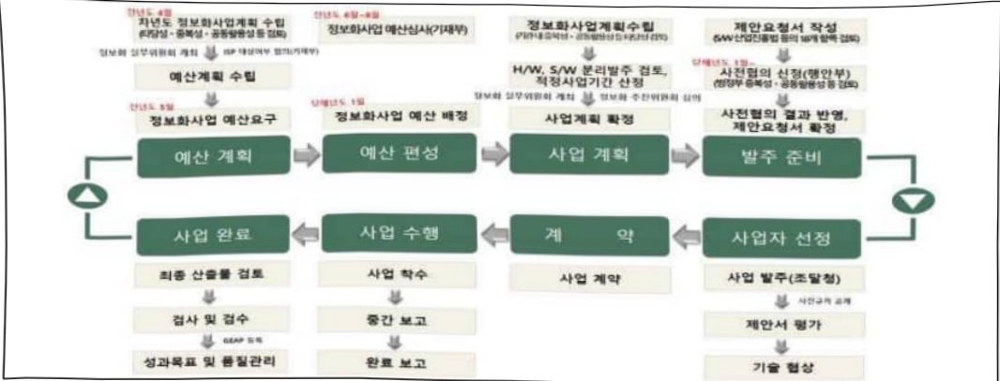

# 스마트 산림재해 대응(정보화)

**해당 페이지**: PDF 3644 ~ 3653 쪽 해당

**부처**: 산림청
**분야**: 농림수산
**회계유형**: 일반회계
**2026 확정예산**: 3865.0 백만원
**전년대비 증감률**: 308.1%
**AI 도메인**: 데이터, 농업/식품, 우주/위성, 재난/안전, 산림/생태

---

<table border=1 style='margin: auto; word-wrap: break-word;'><tr><td style='text-align: center; word-wrap: break-word;'>사 업 명</td></tr><tr><td style='text-align: center; word-wrap: break-word;'>스마트 산림재해 대응(정보화) (7035-507)</td></tr></table>

사업 코드 정보

<table border=1 style='margin: auto; word-wrap: break-word;'><tr><td style='text-align: center; word-wrap: break-word;'>구분</td><td style='text-align: center; word-wrap: break-word;'>회계</td><td style='text-align: center; word-wrap: break-word;'>소관</td><td style='text-align: center; word-wrap: break-word;'>실국(기관)</td><td style='text-align: center; word-wrap: break-word;'>계정</td><td style='text-align: center; word-wrap: break-word;'>분야</td><td style='text-align: center; word-wrap: break-word;'>부문</td></tr><tr><td style='text-align: center; word-wrap: break-word;'>코드</td><td rowspan="2">일반회계</td><td rowspan="2">산림청</td><td rowspan="2">산림재난통제관</td><td rowspan="2">-</td><td style='text-align: center; word-wrap: break-word;'>100</td><td style='text-align: center; word-wrap: break-word;'>102</td></tr><tr><td style='text-align: center; word-wrap: break-word;'>명칭</td><td style='text-align: center; word-wrap: break-word;'>농림·수산</td><td style='text-align: center; word-wrap: break-word;'>임업·산촌</td></tr></table>

<table border=1 style='margin: auto; word-wrap: break-word;'><tr><td style='text-align: center; word-wrap: break-word;'>구분</td><td style='text-align: center; word-wrap: break-word;'>프로그램</td><td style='text-align: center; word-wrap: break-word;'>단위사업</td><td style='text-align: center; word-wrap: break-word;'>세부사업</td></tr><tr><td style='text-align: center; word-wrap: break-word;'>코드</td><td style='text-align: center; word-wrap: break-word;'>7000</td><td style='text-align: center; word-wrap: break-word;'>7035</td><td style='text-align: center; word-wrap: break-word;'>507</td></tr><tr><td style='text-align: center; word-wrap: break-word;'>명칭</td><td style='text-align: center; word-wrap: break-word;'>산림행정지원</td><td style='text-align: center; word-wrap: break-word;'>산림자원정보화(일반)</td><td style='text-align: center; word-wrap: break-word;'>스마트 산림재해 대응(정보화)</td></tr></table>

□ 사업 성격

<table border=1 style='margin: auto; word-wrap: break-word;'><tr><td rowspan="2">신규</td><td rowspan="2">계속</td><td rowspan="2">완료</td><td rowspan="2">예비타당성 실시여부</td><td rowspan="2">총사업비 관리대상</td><td rowspan="2">총액계상 예산사업</td><td style='text-align: center; word-wrap: break-word;'>사업소관 변경정보</td></tr><tr><td style='text-align: center; word-wrap: break-word;'>2025예산 시 소관</td></tr><tr><td style='text-align: center; word-wrap: break-word;'></td><td style='text-align: center; word-wrap: break-word;'>○</td><td style='text-align: center; word-wrap: break-word;'></td><td style='text-align: center; word-wrap: break-word;'></td><td style='text-align: center; word-wrap: break-word;'></td><td style='text-align: center; word-wrap: break-word;'></td><td style='text-align: center; word-wrap: break-word;'></td></tr></table>

☐ 사업 지원 형태 및 지원을

<table border=1 style='margin: auto; word-wrap: break-word;'><tr><td style='text-align: center; word-wrap: break-word;'>직접</td><td style='text-align: center; word-wrap: break-word;'>출자</td><td style='text-align: center; word-wrap: break-word;'>출연</td><td style='text-align: center; word-wrap: break-word;'>보조</td><td style='text-align: center; word-wrap: break-word;'>융자</td><td style='text-align: center; word-wrap: break-word;'>국고보조율(%)</td><td style='text-align: center; word-wrap: break-word;'>융자율(%)</td></tr><tr><td style='text-align: center; word-wrap: break-word;'>○</td><td style='text-align: center; word-wrap: break-word;'></td><td style='text-align: center; word-wrap: break-word;'></td><td style='text-align: center; word-wrap: break-word;'></td><td style='text-align: center; word-wrap: break-word;'></td><td style='text-align: center; word-wrap: break-word;'></td><td style='text-align: center; word-wrap: break-word;'></td></tr></table>

## ☐ 사업 담당자

<table border=1 style='margin: auto; word-wrap: break-word;'><tr><td style='text-align: center; word-wrap: break-word;'>사업명</td><td colspan="5">구분</td></tr><tr><td rowspan="2">스마트산림재해대응(정보화)</td><td style='text-align: center; word-wrap: break-word;'>소관부처</td><td style='text-align: center; word-wrap: break-word;'>실·국·과(팀)산림재난통제관산불방지과</td><td style='text-align: center; word-wrap: break-word;'>과 장금시훈042-481-4250</td><td style='text-align: center; word-wrap: break-word;'>사무관안우진042-481-4257</td><td style='text-align: center; word-wrap: break-word;'>주무관이정열042-481-4258</td></tr><tr><td style='text-align: center; word-wrap: break-word;'>사업시행주체</td><td style='text-align: center; word-wrap: break-word;'>-</td><td style='text-align: center; word-wrap: break-word;'>-</td><td style='text-align: center; word-wrap: break-word;'>-</td><td style='text-align: center; word-wrap: break-word;'>-</td></tr></table>

---

### 가. 예산 총괄표

(단위: 백만원, %)

<table border=1 style='margin: auto; word-wrap: break-word;'><tr><td rowspan="2">사업명</td><td rowspan="2">2024년 결산</td><td colspan="2">2025년 예산</td><td colspan="2">2026년</td><td rowspan="2">중감(B-A)</td><td rowspan="2">(B-A)/A</td></tr><tr><td style='text-align: center; word-wrap: break-word;'>본예산(A)</td><td style='text-align: center; word-wrap: break-word;'>추경</td><td style='text-align: center; word-wrap: break-word;'>요구</td><td style='text-align: center; word-wrap: break-word;'>확정(B)</td></tr><tr><td style='text-align: center; word-wrap: break-word;'>스마트 산림재해 대응(정보화)</td><td style='text-align: center; word-wrap: break-word;'>939</td><td style='text-align: center; word-wrap: break-word;'>947</td><td style='text-align: center; word-wrap: break-word;'>947</td><td style='text-align: center; word-wrap: break-word;'>3,865</td><td style='text-align: center; word-wrap: break-word;'>3,865</td><td style='text-align: center; word-wrap: break-word;'>2,918</td><td style='text-align: center; word-wrap: break-word;'>308.1</td></tr></table>

□ 기능별(내역사업별), 목별 예산 내역

(단위:백만원)

<table border=1 style='margin: auto; word-wrap: break-word;'><tr><td rowspan="3"></td><td colspan="5">2024</td><td colspan="7">2025(2025.12.11)</td><td rowspan="3">2026</td></tr><tr><td rowspan="2">예산액(추경)</td><td rowspan="2">예산현액</td><td rowspan="2">집행액[실집행액]</td><td rowspan="2">이월액</td><td rowspan="2">불용액</td><td rowspan="2">본예산</td><td rowspan="2">예산현액</td><td rowspan="2">집행액[실집행액]</td><td colspan="2">전년도 이월액제외</td><td rowspan="2">이월액</td><td rowspan="2">불용액</td></tr><tr><td style='text-align: center; word-wrap: break-word;'>예산현액</td><td style='text-align: center; word-wrap: break-word;'>집행액[실집행액]</td></tr><tr><td style='text-align: center; word-wrap: break-word;'>○ 기능별 분류(합계)</td><td style='text-align: center; word-wrap: break-word;'>947</td><td style='text-align: center; word-wrap: break-word;'>947</td><td style='text-align: center; word-wrap: break-word;'>939[939]</td><td style='text-align: center; word-wrap: break-word;'>-</td><td style='text-align: center; word-wrap: break-word;'>8</td><td style='text-align: center; word-wrap: break-word;'>947</td><td style='text-align: center; word-wrap: break-word;'>947</td><td style='text-align: center; word-wrap: break-word;'>944[944]</td><td style='text-align: center; word-wrap: break-word;'>947</td><td style='text-align: center; word-wrap: break-word;'>944[944]</td><td style='text-align: center; word-wrap: break-word;'>-</td><td style='text-align: center; word-wrap: break-word;'>3</td><td style='text-align: center; word-wrap: break-word;'>3,865</td></tr><tr><td style='text-align: center; word-wrap: break-word;'>· 스마트 산림재해 대응체계 구축</td><td style='text-align: center; word-wrap: break-word;'>947</td><td style='text-align: center; word-wrap: break-word;'>947</td><td style='text-align: center; word-wrap: break-word;'>939[939]</td><td style='text-align: center; word-wrap: break-word;'>-</td><td style='text-align: center; word-wrap: break-word;'>8</td><td style='text-align: center; word-wrap: break-word;'>947</td><td style='text-align: center; word-wrap: break-word;'>947</td><td style='text-align: center; word-wrap: break-word;'>944[944]</td><td style='text-align: center; word-wrap: break-word;'>947</td><td style='text-align: center; word-wrap: break-word;'>944[944]</td><td style='text-align: center; word-wrap: break-word;'>-</td><td style='text-align: center; word-wrap: break-word;'>3</td><td style='text-align: center; word-wrap: break-word;'>947</td></tr><tr><td style='text-align: center; word-wrap: break-word;'>· 산불상황관제시 스템 서버 증설</td><td style='text-align: center; word-wrap: break-word;'>-</td><td style='text-align: center; word-wrap: break-word;'>-</td><td style='text-align: center; word-wrap: break-word;'>-</td><td style='text-align: center; word-wrap: break-word;'>-</td><td style='text-align: center; word-wrap: break-word;'>-</td><td style='text-align: center; word-wrap: break-word;'>-</td><td style='text-align: center; word-wrap: break-word;'>-</td><td style='text-align: center; word-wrap: break-word;'>-</td><td style='text-align: center; word-wrap: break-word;'>-</td><td style='text-align: center; word-wrap: break-word;'>-</td><td style='text-align: center; word-wrap: break-word;'>-</td><td style='text-align: center; word-wrap: break-word;'>-</td><td style='text-align: center; word-wrap: break-word;'>955</td></tr><tr><td style='text-align: center; word-wrap: break-word;'>· 산불상황관제시 스템 ISMP</td><td style='text-align: center; word-wrap: break-word;'>-</td><td style='text-align: center; word-wrap: break-word;'>-</td><td style='text-align: center; word-wrap: break-word;'>-</td><td style='text-align: center; word-wrap: break-word;'>-</td><td style='text-align: center; word-wrap: break-word;'>-</td><td style='text-align: center; word-wrap: break-word;'>-</td><td style='text-align: center; word-wrap: break-word;'>-</td><td style='text-align: center; word-wrap: break-word;'>-</td><td style='text-align: center; word-wrap: break-word;'>-</td><td style='text-align: center; word-wrap: break-word;'>-</td><td style='text-align: center; word-wrap: break-word;'>-</td><td style='text-align: center; word-wrap: break-word;'>-</td><td style='text-align: center; word-wrap: break-word;'>163</td></tr><tr><td style='text-align: center; word-wrap: break-word;'>· 저궤도 위성통신 장비 구입</td><td style='text-align: center; word-wrap: break-word;'>-</td><td style='text-align: center; word-wrap: break-word;'>-</td><td style='text-align: center; word-wrap: break-word;'>-</td><td style='text-align: center; word-wrap: break-word;'>-</td><td style='text-align: center; word-wrap: break-word;'>-</td><td style='text-align: center; word-wrap: break-word;'>-</td><td style='text-align: center; word-wrap: break-word;'>-</td><td style='text-align: center; word-wrap: break-word;'>-</td><td style='text-align: center; word-wrap: break-word;'>-</td><td style='text-align: center; word-wrap: break-word;'>-</td><td style='text-align: center; word-wrap: break-word;'>-</td><td style='text-align: center; word-wrap: break-word;'>-</td><td style='text-align: center; word-wrap: break-word;'>1,800</td></tr><tr><td style='text-align: center; word-wrap: break-word;'>○ 비목별 분류(합계)</td><td style='text-align: center; word-wrap: break-word;'>947</td><td style='text-align: center; word-wrap: break-word;'>947</td><td style='text-align: center; word-wrap: break-word;'>939[939]</td><td style='text-align: center; word-wrap: break-word;'>-</td><td style='text-align: center; word-wrap: break-word;'>8</td><td style='text-align: center; word-wrap: break-word;'>947</td><td style='text-align: center; word-wrap: break-word;'>947</td><td style='text-align: center; word-wrap: break-word;'>944[944]</td><td style='text-align: center; word-wrap: break-word;'>947</td><td style='text-align: center; word-wrap: break-word;'>944[944]</td><td style='text-align: center; word-wrap: break-word;'>-</td><td style='text-align: center; word-wrap: break-word;'>3</td><td style='text-align: center; word-wrap: break-word;'>3,865</td></tr><tr><td style='text-align: center; word-wrap: break-word;'>· 일 반 수 용 비 (210-01)</td><td style='text-align: center; word-wrap: break-word;'>11</td><td style='text-align: center; word-wrap: break-word;'>11</td><td style='text-align: center; word-wrap: break-word;'>11[11]</td><td style='text-align: center; word-wrap: break-word;'>-</td><td style='text-align: center; word-wrap: break-word;'>-</td><td style='text-align: center; word-wrap: break-word;'>11</td><td style='text-align: center; word-wrap: break-word;'>11</td><td style='text-align: center; word-wrap: break-word;'>11[11]</td><td style='text-align: center; word-wrap: break-word;'>11</td><td style='text-align: center; word-wrap: break-word;'>11[11]</td><td style='text-align: center; word-wrap: break-word;'>-</td><td style='text-align: center; word-wrap: break-word;'>-</td><td style='text-align: center; word-wrap: break-word;'>11</td></tr><tr><td style='text-align: center; word-wrap: break-word;'>· 관 리 용 역 비 (210-15)</td><td style='text-align: center; word-wrap: break-word;'>932</td><td style='text-align: center; word-wrap: break-word;'>932</td><td style='text-align: center; word-wrap: break-word;'>924[924]</td><td style='text-align: center; word-wrap: break-word;'>-</td><td style='text-align: center; word-wrap: break-word;'>8</td><td style='text-align: center; word-wrap: break-word;'>932</td><td style='text-align: center; word-wrap: break-word;'>932</td><td style='text-align: center; word-wrap: break-word;'>929[929]</td><td style='text-align: center; word-wrap: break-word;'>932</td><td style='text-align: center; word-wrap: break-word;'>929[929]</td><td style='text-align: center; word-wrap: break-word;'>-</td><td style='text-align: center; word-wrap: break-word;'>3</td><td style='text-align: center; word-wrap: break-word;'>932</td></tr><tr><td style='text-align: center; word-wrap: break-word;'>· 국내여비(220-01)</td><td style='text-align: center; word-wrap: break-word;'>4</td><td style='text-align: center; word-wrap: break-word;'>4</td><td style='text-align: center; word-wrap: break-word;'>4</td><td style='text-align: center; word-wrap: break-word;'>-</td><td style='text-align: center; word-wrap: break-word;'>-</td><td style='text-align: center; word-wrap: break-word;'>4</td><td style='text-align: center; word-wrap: break-word;'>4</td><td style='text-align: center; word-wrap: break-word;'>4[4]</td><td style='text-align: center; word-wrap: break-word;'>4</td><td style='text-align: center; word-wrap: break-word;'>4[4]</td><td style='text-align: center; word-wrap: break-word;'>-</td><td style='text-align: center; word-wrap: break-word;'>-</td><td style='text-align: center; word-wrap: break-word;'>4</td></tr><tr><td style='text-align: center; word-wrap: break-word;'>· 일 반 연 구 비 (260-01)</td><td style='text-align: center; word-wrap: break-word;'>-</td><td style='text-align: center; word-wrap: break-word;'>-</td><td style='text-align: center; word-wrap: break-word;'>-</td><td style='text-align: center; word-wrap: break-word;'>-</td><td style='text-align: center; word-wrap: break-word;'>-</td><td style='text-align: center; word-wrap: break-word;'>-</td><td style='text-align: center; word-wrap: break-word;'>-</td><td style='text-align: center; word-wrap: break-word;'>-</td><td style='text-align: center; word-wrap: break-word;'>-</td><td style='text-align: center; word-wrap: break-word;'>-</td><td style='text-align: center; word-wrap: break-word;'>-</td><td style='text-align: center; word-wrap: break-word;'>-</td><td style='text-align: center; word-wrap: break-word;'>1,118</td></tr><tr><td style='text-align: center; word-wrap: break-word;'>· 자 산 취 득 비 (430-01)</td><td style='text-align: center; word-wrap: break-word;'>-</td><td style='text-align: center; word-wrap: break-word;'>-</td><td style='text-align: center; word-wrap: break-word;'>-</td><td style='text-align: center; word-wrap: break-word;'>-</td><td style='text-align: center; word-wrap: break-word;'>-</td><td style='text-align: center; word-wrap: break-word;'>-</td><td style='text-align: center; word-wrap: break-word;'>-</td><td style='text-align: center; word-wrap: break-word;'>-</td><td style='text-align: center; word-wrap: break-word;'>-</td><td style='text-align: center; word-wrap: break-word;'>-</td><td style='text-align: center; word-wrap: break-word;'>-</td><td style='text-align: center; word-wrap: break-word;'>-</td><td style='text-align: center; word-wrap: break-word;'>1,800</td></tr><tr><td style='text-align: center; word-wrap: break-word;'>○ 기능비목별 분류(합계)</td><td style='text-align: center; word-wrap: break-word;'>947</td><td style='text-align: center; word-wrap: break-word;'>947</td><td style='text-align: center; word-wrap: break-word;'>939[939]</td><td style='text-align: center; word-wrap: break-word;'>-</td><td style='text-align: center; word-wrap: break-word;'>8</td><td style='text-align: center; word-wrap: break-word;'>947</td><td style='text-align: center; word-wrap: break-word;'>947</td><td style='text-align: center; word-wrap: break-word;'>944[944]</td><td style='text-align: center; word-wrap: break-word;'>947</td><td style='text-align: center; word-wrap: break-word;'>944[944]</td><td style='text-align: center; word-wrap: break-word;'>-</td><td style='text-align: center; word-wrap: break-word;'>3</td><td style='text-align: center; word-wrap: break-word;'>3,865</td></tr><tr><td style='text-align: center; word-wrap: break-word;'>· 스마트 산림재해 대응체계 구축</td><td style='text-align: center; word-wrap: break-word;'>947</td><td style='text-align: center; word-wrap: break-word;'>947</td><td style='text-align: center; word-wrap: break-word;'>939[939]</td><td style='text-align: center; word-wrap: break-word;'>-</td><td style='text-align: center; word-wrap: break-word;'>8</td><td style='text-align: center; word-wrap: break-word;'>947</td><td style='text-align: center; word-wrap: break-word;'>947</td><td style='text-align: center; word-wrap: break-word;'>944[944]</td><td style='text-align: center; word-wrap: break-word;'>947</td><td style='text-align: center; word-wrap: break-word;'>944[944]</td><td style='text-align: center; word-wrap: break-word;'>-</td><td style='text-align: center; word-wrap: break-word;'>3</td><td style='text-align: center; word-wrap: break-word;'>947</td></tr><tr><td style='text-align: center; word-wrap: break-word;'>· 일 반 수 용 비 (210-01)</td><td style='text-align: center; word-wrap: break-word;'>11</td><td style='text-align: center; word-wrap: break-word;'>11</td><td style='text-align: center; word-wrap: break-word;'>11[11]</td><td style='text-align: center; word-wrap: break-word;'>-</td><td style='text-align: center; word-wrap: break-word;'>-</td><td style='text-align: center; word-wrap: break-word;'>11</td><td style='text-align: center; word-wrap: break-word;'>11</td><td style='text-align: center; word-wrap: break-word;'>11[11]</td><td style='text-align: center; word-wrap: break-word;'>11</td><td style='text-align: center; word-wrap: break-word;'>11[11]</td><td style='text-align: center; word-wrap: break-word;'>-</td><td style='text-align: center; word-wrap: break-word;'>-</td><td style='text-align: center; word-wrap: break-word;'>11</td></tr><tr><td style='text-align: center; word-wrap: break-word;'>· 관 리 용 역 비 (210-15)</td><td style='text-align: center; word-wrap: break-word;'>932</td><td style='text-align: center; word-wrap: break-word;'>932</td><td style='text-align: center; word-wrap: break-word;'>924[924]</td><td style='text-align: center; word-wrap: break-word;'>-</td><td style='text-align: center; word-wrap: break-word;'>8</td><td style='text-align: center; word-wrap: break-word;'>932</td><td style='text-align: center; word-wrap: break-word;'>932</td><td style='text-align: center; word-wrap: break-word;'>929[929]</td><td style='text-align: center; word-wrap: break-word;'>932</td><td style='text-align: center; word-wrap: break-word;'>929[929]</td><td style='text-align: center; word-wrap: break-word;'>-</td><td style='text-align: center; word-wrap: break-word;'>3</td><td style='text-align: center; word-wrap: break-word;'>932</td></tr></table>

---

<table border=1 style='margin: auto; word-wrap: break-word;'><tr><td rowspan="3"></td><td colspan="5">2024</td><td colspan="7">2025(2025.12월말)</td><td rowspan="3">2026예산</td></tr><tr><td rowspan="2">예산액(추경)</td><td rowspan="2">예산현액</td><td rowspan="2">집행액[실집행액]</td><td rowspan="2">이일액</td><td rowspan="2">불용액</td><td rowspan="2">본예산</td><td rowspan="2">예산현액</td><td rowspan="2">집행액[실집행액]</td><td colspan="2">전년도 이월액제외</td><td rowspan="2">이월액</td><td rowspan="2">불용액</td></tr><tr><td style='text-align: center; word-wrap: break-word;'>예산현액</td><td style='text-align: center; word-wrap: break-word;'>집행액[실집행액]</td></tr><tr><td style='text-align: center; word-wrap: break-word;'>- 국 내 여 비(220-01)</td><td style='text-align: center; word-wrap: break-word;'>4</td><td style='text-align: center; word-wrap: break-word;'>4</td><td style='text-align: center; word-wrap: break-word;'>4[4]</td><td style='text-align: center; word-wrap: break-word;'>-</td><td style='text-align: center; word-wrap: break-word;'></td><td style='text-align: center; word-wrap: break-word;'>4</td><td style='text-align: center; word-wrap: break-word;'>4[4]</td><td style='text-align: center; word-wrap: break-word;'>4[4]</td><td style='text-align: center; word-wrap: break-word;'>4[4]</td><td style='text-align: center; word-wrap: break-word;'>-</td><td style='text-align: center; word-wrap: break-word;'>-</td><td style='text-align: center; word-wrap: break-word;'>4</td><td style='text-align: center; word-wrap: break-word;'>955</td></tr><tr><td rowspan="2">· 산불상황관제시스템 서버 증설- 일 반 연 구 비(260-01)· 산불상황관제시스템 ISMP- 일 반 연 구 비(260-01)· 저궤도 위성통신장비 구입- 자 산 쥐 득 비(430-01)</td><td style='text-align: center; word-wrap: break-word;'>-</td><td style='text-align: center; word-wrap: break-word;'>-</td><td style='text-align: center; word-wrap: break-word;'>-</td><td style='text-align: center; word-wrap: break-word;'>-</td><td style='text-align: center; word-wrap: break-word;'>-</td><td style='text-align: center; word-wrap: break-word;'>-</td><td style='text-align: center; word-wrap: break-word;'>-</td><td style='text-align: center; word-wrap: break-word;'>-</td><td style='text-align: center; word-wrap: break-word;'>-</td><td style='text-align: center; word-wrap: break-word;'>-</td><td style='text-align: center; word-wrap: break-word;'>-</td><td style='text-align: center; word-wrap: break-word;'>163</td><td style='text-align: center; word-wrap: break-word;'>1,800</td></tr><tr><td style='text-align: center; word-wrap: break-word;'>-</td><td style='text-align: center; word-wrap: break-word;'>-</td><td style='text-align: center; word-wrap: break-word;'>-</td><td style='text-align: center; word-wrap: break-word;'>-</td><td style='text-align: center; word-wrap: break-word;'>-</td><td style='text-align: center; word-wrap: break-word;'>-</td><td style='text-align: center; word-wrap: break-word;'>-</td><td style='text-align: center; word-wrap: break-word;'>-</td><td style='text-align: center; word-wrap: break-word;'>-</td><td style='text-align: center; word-wrap: break-word;'>-</td><td style='text-align: center; word-wrap: break-word;'>-</td><td style='text-align: center; word-wrap: break-word;'>-</td><td style='text-align: center; word-wrap: break-word;'>1,800</td></tr></table>

### 나. 사업설명자료

## 1 ) 사업목적·내용

- (스마트 산림재해 대응(정보화)) 최신 ICT 기술을 적용한 산불 · 산사태 · 산림병해충의 신속하고 과학적인 대응체계를 구축하여 산림재난으로부터 국민의 생명과 재산 보호

- (스마트 산림재해 대응체계 구축) ICT를 활용한 스마트 산림재난 통합관리체계의 무중단 운영 및 기관간 협업을 통한 정확한 판단·신속한 대응·안전한 진화를 지원하기 위해 24시간 365일 안정적인 운영과 상시적인 유지관리 필요

·ICT기반산림재난예측 및예방체계개선:기후변화등으로인한산림분야재해의발생

빈도와피해규모가점점증가함에따라선제적예측및예방체계등을구축

·현장중심산림재난대응체계구축:현장의상황을정확히파악하여신속한대응을지원할수있도록실시간및분석정보를제공하고의사결정을지원

·산림재난 정보기반 강화 : ICT 기술을 활용하여 산림재난 발생 시 신속한 진화전략의 수립을 위한 분석정보를 제공하고, 대국민 안전서비스를 강화

• 스마트 산림재난관리체계 인프라 개선(G-클라우드 전환) : 시스템 운영의 생산성 향상을 위해 가상화 기술과 분산처리 기술을 적용하여 선진 재난정보 인프라 체계 구축

• 스마트 산림재난 대응체계 운영 및 유지관리 : 스마트 산림재난 통합관리 체계의 24시간

× 365일 안정적인 서비스 운영 및 유지관리를 지원

·기타 운영비 : 산림재난 교육(업무별 산림청 및 지방자치단체, 유관기관 담당자) 및 업무 협의, 출장 등

---

(산불상황관제시스템 서버 증설) 초고속·대형화되는 산림재난에 대한 국민의 관심과 유관기관의 참여가 증가됨에 따라 이에 상응하는 안정적인 서버 자원의 증설

·클라우드기반서버자원도입을통한대용량데이터및접속자처리능력확보

·산불발생지점, 실시간 상황도 등 실시간 산불정보를 민간플랫폼을 통해 데이터 연계(네이버,

카카오 등)하여 대국민 산불정보 서비스 채널 확대 필요

(산불상황관제시스템 ISMP) 산불상황 관제 중심의 시스템을 빅데이터와 AI기술을 접목한

사전 예측과 전략 수립 지원체계로의 전환, 핵심 시스템의 업무 연속성 및 안정성 보장

·산불진화자원의 실시간 위치, 가용상태, 산불상황도 등을 DB화하고, 최적의 진화전략과 자원

배치 등 AI 자동 지원체계 마련

·산불현장의 교통 혼잡도, 지형(고도, 수종 등), 연기 확산 예측 등을 반영하여 AI가 실시간으로 대피 경로의 가변성을 분석하여 신속하고 안전한 주민대피 유도 체계 마련

• 산불상황관제시스템은 범정부정보시스템 등급제에 따라 ‘1등급’으로 지정된 핵심 시스템으로,

행정전산망 장애, 산림재난 발생 시에도 중단없이 운영될 수 있도록 DR 구축·운영 필요

- (저궤도 위성통신장비 구입) 재난 상황에서도 안정적인 통신이 가능한 '저궤도위성통신장비' 도입을 통해 통신 음영지역 해소, 실시간 응급대응 체계 구축, 산림재난 시지휘체계 유지, 산림작업자의 안전을 확보

## 2 ) 사업개요

## □ 사업근거 및 추진경위

① 법령상 근거 및 조항 적시

-산림보호법

제1조(목적) 이 법은 산림보호구역을 관리하고 산림병해충을 예찰(황척)·방제(防除)하며 산불을 예방·진화하고 산사태를 예방·복구하는 등 산림을 건강하고 체계적으로 보호함으로써 국토를 보전하고 국민의 삶의 질 향상에 이바지함을 목적으로 한다

제25조(산림병해충의 방제), 제31조(산불조심기간의 설정 등), 제37조(산불 진화 통합지휘), 제45조의5(산사태정보체계의 구축·운영), 제45조의6(산사태예측정보의 제공)

##### - 산림재난방지법('26.2.1. 시행)

제11조(산림재난정보시스템 구축·운영 및 산림재난정보 공동활용) ① 산림청장은 다음 각 호의 정보가 포함된 산림재난정보시스템을 구축·운영할 수 있다.

1. 산불위험예보, 산불상황관제, 산불확산예측 등 산불 관련 정보

2. 산사태 예측정보 등 산사태 등 관련 정보

3. 산림병해충의 발생 및 방제 정보 등 산림병해충 관련 정보

4. 산림재난 위험지도

5. 그 밖에 농림축산식품부령으로 정하는 산림재난 관련 정보

② 산림청장은 산림재난정보시스템 구축을 위하여 산림재난방지기관의 장 또는 산림재난방지유

<table border=1 style='margin: auto; word-wrap: break-word;'><tr><td style='text-align: center; word-wrap: break-word;'>제11조(산림재난정보시스템 구축·운영 및 산림재난정보 공동활용) ① 산림청장은 다음 각 호의 정보가 포함된 산림재난정보시스템을 구축·운영할 수 있다.</td></tr><tr><td style='text-align: center; word-wrap: break-word;'>1. 산불위험예보, 산불상황관제, 산불확산예측 등 산불 관련 정보</td></tr><tr><td style='text-align: center; word-wrap: break-word;'>2. 산사태 예측정보 등 산사태 등 관련 정보</td></tr><tr><td style='text-align: center; word-wrap: break-word;'>3. 산림병해충의 발생 및 방제 정보 등 산림병해충 관련 정보</td></tr><tr><td style='text-align: center; word-wrap: break-word;'>4. 산림재난 위험지도</td></tr><tr><td style='text-align: center; word-wrap: break-word;'>5. 그 밖에 농림축산식품부령으로 정하는 산림재난 관련 정보</td></tr><tr><td style='text-align: center; word-wrap: break-word;'>② 산림청장은 산림재난정보시스템 구축을 위하여 산림재난방지기관의 장 또는 산림재난방지유</td></tr></table>

---

관기관의 장에게 필요한 자료의 제출을 요청할 수 있다. 이 경우 자료의 제출을 요청받은 기관의 장은 특별한 사유가 없으면 이에 따라야 한다.

③ 산림청장은 제1항 각 호에 따른 정보를 산림재난방지기관의 장에게 제공하여 공동활용하여야 하고, 산림재난방지기관의 장은 이를 산림재난방지 등에 이용·활용하여야 한다.

④ 제1항부터 제3항까지에 따른 산림재난정보시스템의 구축·운영, 자료의 제출과 산림재난정보의 공동활용 등에 필요한 사항은 대통령령으로 정한다.

② 추진경위 - 사업 시작년도, 추진배경, 부처별 중점과제, 대통령 공약사항 등

- 봄철 건조한 기후 증가에 따른 산불(대형화 및 동시다발), 국지성 집중호우로 지역별 산사태, 산림병해충의 전국 확산 및 외래 병해충이 발생

- 선조·강릉일수승가와 국지성 집중호우 등 기후변화로 인한 산림재난(산불, 산사태, 돌발병해충 등) 증가로 산림재난 예방을 위한 선제적 대응체계 구축 필요

- 초고속·대형화되는 산림재난에 대한 국민의 관심과 유관기관의 참여가 증가됨에 따라 이에 상응하는 안정적인 서버 자원의 증설과 AI 기반의 국가 차원의 총력 산불대응체계 구축이 시급

- 우리나라 산림은 산악지형이 많고 통신 음영지역이 광범위하게 분포되어 있어,

벌목 등 산림작업 중 사고 발생 시 응급대응의 골든타임을 놓쳐 사망 등 중대 재해로

이어지는 사례가 반복되어 산림현장의 안전 확보와 대체통신수단 확보 시급

## □ 주요내용

① 사업규모

- 총사업비(해당되는 경우에만 기재) : 해당사항 없음

- 사업기간 : '19년~계속

- 최근 5년 간 투입된 사업비(예산액기준, 추경편성한 연도에는 추경포함)

<table border=1 style='margin: auto; word-wrap: break-word;'><tr><td style='text-align: center; word-wrap: break-word;'>연도</td><td style='text-align: center; word-wrap: break-word;'>2022</td><td style='text-align: center; word-wrap: break-word;'>2023</td><td style='text-align: center; word-wrap: break-word;'>2024</td><td style='text-align: center; word-wrap: break-word;'>2025</td><td style='text-align: center; word-wrap: break-word;'>2026</td></tr><tr><td style='text-align: center; word-wrap: break-word;'>사업비</td><td style='text-align: center; word-wrap: break-word;'>2,390</td><td style='text-align: center; word-wrap: break-word;'>635</td><td style='text-align: center; word-wrap: break-word;'>947</td><td style='text-align: center; word-wrap: break-word;'>947</td><td style='text-align: center; word-wrap: break-word;'>3,865</td></tr></table>

-기타: 해당사항 없음

② 사업추진체계

- 사업시행방법 : 직접수행

- 사업시행주체 : 산림청

-사업 수혜자 : 공무원 및 일반국민

- 보조, 융자, 출연, 출자 등의 경우 보조·융자 등 지원 비율 및 법적근거 : 해당사항 없음

---

## 3 ) 2026년도 예산 산출 근거

## ①스마트 산림재해 대응 체계 구축

: (2025 본예산) 947백만원 → (2026 예산) 947백만원, 전년동

- (내용) '20~22년도 구숙 완료한 스마트 산림재단 대응제계 운영 및 유지관리를 위해 전년 수준의 예산 반영

- (산출) '20년~'22년 개발시스템(응용SW) 운영 및 유지관리(505백만원) : 3,952백만원×12.78%

'22년~'22년 도입 상용SW 유지관리(116백만원) : 781백만원×14.87%

'20년~'22년 공간정보 현행화 및 헬프데스크 운영(311백만원) : 11.53백만원x27M/M

산림재난 교육 및 워크숍(10.737백만원) : 2회×5.369백만원

업무협의 등 국내출장(4.263백만원) : 3인×0.072백만원×19.8회

°2025년도 예산 및 2026년도 예산 산출 세부내역 비교

<table border=1 style='margin: auto; word-wrap: break-word;'><tr><td colspan="2">2025년 본예산</td><td colspan="2">2026년 예산</td></tr><tr><td style='text-align: center; word-wrap: break-word;'>예산</td><td style='text-align: center; word-wrap: break-word;'>산출내역</td><td style='text-align: center; word-wrap: break-word;'>예산</td><td style='text-align: center; word-wrap: break-word;'>산출내역</td></tr><tr><td rowspan="6">947,000</td><td style='text-align: center; word-wrap: break-word;'>○ 관리용역비(210-15): 932,000천원</td><td style='text-align: center; word-wrap: break-word;'>947,000</td><td style='text-align: center; word-wrap: break-word;'>○ 관리용역비(210-15): 932,000천원</td></tr><tr><td style='text-align: center; word-wrap: break-word;'>가. (20년~22년) 개발시스템(용용SW) 운영 및 유지관리 (505,066천원) • 운영 및 유지관리: 3,952,000,000원×12.78%=505,066천원 나. (20년~22년) 상용SW 운영 및 유지관리 (116,000천원) • 운영 및 유지관리: 781,000,000원×14.87%=116,135천원 다. (20년~22년) 공간정보 현행화 및 헬프데스크 운영 (311,310천원) • 공간정보 현행화 및 헬프데스크 운영: 11,530,000원×17M/M=311,310,천원</td><td rowspan="5">947,000</td><td style='text-align: center; word-wrap: break-word;'>가. (20년~22년) 개발시스템(용용SW) 운영 및 유지관리 (505,066천원) • 운영 및 유지관리: 3,952,000,000원×12.78%=505,066천원 나. (20년~22년) 상용SW 운영 및 유지관리 (116,000천원) • 운영 및 유지관리: 781,000,000원×14.87%=116,135천원 다. (20년~22년) 공간정보 현행화 및 헬프데스크 운영 (311,310천원) • 공간정보 현행화 및 헬프데스크 운영: 11,530,000원×17M/M=311,310,천원</td></tr><tr><td style='text-align: center; word-wrap: break-word;'>○ 일반수용비(210-01): 10,737천원</td><td style='text-align: center; word-wrap: break-word;'>○ 일반수용비(210-01): 10,737천원</td></tr><tr><td style='text-align: center; word-wrap: break-word;'>가. 스마트 산림재해 대응체계 워크숍 및 교육 (10,250천원) • 워크숍 및 교육 등: 5,125,000원×2회=10,250천원 나. 스마트 산림재해 대응체계 홍보 (487천원) • 홍보자료 제작 등: 487,000원×1회=487천원</td><td style='text-align: center; word-wrap: break-word;'>가. 스마트 산림재해 대응체계 워크숍 및 교육 (10,250천원) • 워크숍 및 교육 등: 5,125,000원×2회=10,250천원 나. 스마트 산림재해 대응체계 홍보 (487천원) • 홍보자료 제작 등: 487,000원×1회=487천원</td></tr><tr><td style='text-align: center; word-wrap: break-word;'>○ 국내여비(220-01): 4,263천원</td><td style='text-align: center; word-wrap: break-word;'>○ 국내여비(220-01): 4,263천원</td></tr><tr><td style='text-align: center; word-wrap: break-word;'>가. 스마트 산림재해 대응체계 운영 업무협의 등 (4,263천원) • 업무협의 및 교육 등: 3인×72,000원×19.8회=4,263천원</td><td style='text-align: center; word-wrap: break-word;'>가. 스마트 산림재해 대응체계 운영 업무협의 등 (4,263천원) • 업무협의 및 교육 등: 3인×72,000원×19.8회=4,263천원</td></tr></table>

## ②산불상황관제시스템 서버 증설

:(2025 본예산)→(2026 예산) 955백만원, 순증

- (내용) 산불상황관제시스템의 국민의 관심과 유관기관의 참여가 증가됨에 따라 이에 상응하는 서버 자원 증설 요구

- (산출) H/W, S/W 증설(863백만원) : (H/W) 10식×47.4백만원, (S/W) 67식×5.8백만원

AP개선(92백만원) : 1식×92백만원

o 2025년도 예산 및 2026년도 예산 산출 세부내역 비교

<table border=1 style='margin: auto; word-wrap: break-word;'><tr><td colspan="2">2025년 본예산</td><td colspan="2">2026년 예산</td></tr><tr><td style='text-align: center; word-wrap: break-word;'>예산</td><td style='text-align: center; word-wrap: break-word;'>산출내역</td><td style='text-align: center; word-wrap: break-word;'>예산</td><td style='text-align: center; word-wrap: break-word;'>산출내역</td></tr><tr><td style='text-align: center; word-wrap: break-word;'>-</td><td style='text-align: center; word-wrap: break-word;'>-</td><td style='text-align: center; word-wrap: break-word;'>955,000</td><td style='text-align: center; word-wrap: break-word;'>○ 일반연구비(260-01): 955,000천원가. H/W 증설 (474,000천원) • H/W 구입비: 10식×47,400,000=474,000천원나. 상용 S/W 증설 (389,000천원) • 상용 S/W 구입비: 67식×5,805,970원=389,000천원나. AP개선 (92,000천원) • AP개선 사업: 1식×92,000,000원=92,000천원</td></tr></table>

---

③산불상황관제시스템 ISMP

:(2025 본예산)→(2026 예산)163백만원,순증

- (내용) 상황관제 중심에서 사전 예측과 전략수집 지원체계로의 전환 및 업무 연속성을 위한 ISMP수립

- (산출) 산불상황관제시스템 ISMP사업(163백만원) : 1식×163백만원

0 2025년도 예산 및 2026년도 예산 산출 세부내역 비교

<table border=1 style='margin: auto; word-wrap: break-word;'><tr><td colspan="2">2025년 본예산</td><td colspan="2">2026년 예산</td></tr><tr><td style='text-align: center; word-wrap: break-word;'>예산</td><td style='text-align: center; word-wrap: break-word;'>산출내역</td><td style='text-align: center; word-wrap: break-word;'>예산</td><td style='text-align: center; word-wrap: break-word;'>산출내역</td></tr><tr><td style='text-align: center; word-wrap: break-word;'>-</td><td style='text-align: center; word-wrap: break-word;'>-</td><td style='text-align: center; word-wrap: break-word;'>163,000</td><td style='text-align: center; word-wrap: break-word;'>○ 일반연구비(260-01) : 163,000천원 가. ISMP 사업 추진 (163,000천원) • ISMP 사업 추진 : 1식x163,000,000=163,000천원</td></tr></table>

④ 저궤도 위성통신장비 구입

:(2025 본예산)→(2026 예산)1,800백만원,순증

- (내용) 통신 음영지역 내 산림재난 및 안전사고 신속 대응을 위한 대체통신수단인 저궤도위성 통신장비 구입

- (산출) 현장 업무 수행 관리소 및 지방청 보급(1,600백만원) : 1식×50백만원×32개소

°2025년도 예산 및 2026년도 예산 산출 세부내역 비교

<table border=1 style='margin: auto; word-wrap: break-word;'><tr><td colspan="2">2025년 본예산</td><td colspan="2">2026년 예산</td></tr><tr><td style='text-align: center; word-wrap: break-word;'>예산</td><td style='text-align: center; word-wrap: break-word;'>산출내역</td><td style='text-align: center; word-wrap: break-word;'>예산</td><td style='text-align: center; word-wrap: break-word;'>산출내역</td></tr><tr><td style='text-align: center; word-wrap: break-word;'>-</td><td style='text-align: center; word-wrap: break-word;'>-</td><td style='text-align: center; word-wrap: break-word;'>1,800,000</td><td style='text-align: center; word-wrap: break-word;'>○ 자산취득비(430-01): 1,800,000천원 가. 저궤도 위성통신장비 구입 (1,800,000천원) • 현장 업무 관리소 및 지방청 보급: 1식x50,000,000x32개소 =1,600,000천원 • 음영지역 관리소 추가 보급: 1식x20,000,000x10개소 =200,000천원</td></tr></table>

## 4 ) 사업효과

□ 사업영향,산출물 성과지표 등

①2022~2026년도 성과계획서 상 성과지표 및 최근 5년간 성과 달성도

<table border=1 style='margin: auto; word-wrap: break-word;'><tr><td style='text-align: center; word-wrap: break-word;'>성과지표</td><td style='text-align: center; word-wrap: break-word;'>구분</td><td style='text-align: center; word-wrap: break-word;'>2022</td><td style='text-align: center; word-wrap: break-word;'>2023</td><td style='text-align: center; word-wrap: break-word;'>2024</td><td style='text-align: center; word-wrap: break-word;'>2025</td><td style='text-align: center; word-wrap: break-word;'>2026</td><td style='text-align: center; word-wrap: break-word;'>2026 목표치산출근거</td><td style='text-align: center; word-wrap: break-word;'>측정산식(또는 측정방법)</td><td style='text-align: center; word-wrap: break-word;'>자료수집방법(또는 자료출처)</td></tr><tr><td rowspan="3">고객 만족도(단위:점)</td><td style='text-align: center; word-wrap: break-word;'>목표</td><td style='text-align: center; word-wrap: break-word;'>-</td><td style='text-align: center; word-wrap: break-word;'>-</td><td style='text-align: center; word-wrap: break-word;'>-</td><td style='text-align: center; word-wrap: break-word;'>-</td><td style='text-align: center; word-wrap: break-word;'>-</td><td rowspan="3">기본경비성비용으로2022년부터성과계획서 상성과관리비대상 사업임</td><td rowspan="3">대표 포털시스템 만족도조사</td><td rowspan="3">외부 전문기관을 통한설문 조사(웹사이트,이메일 등)실시</td></tr><tr><td style='text-align: center; word-wrap: break-word;'>실적</td><td style='text-align: center; word-wrap: break-word;'>-</td><td style='text-align: center; word-wrap: break-word;'>-</td><td style='text-align: center; word-wrap: break-word;'>-</td><td style='text-align: center; word-wrap: break-word;'>-</td><td style='text-align: center; word-wrap: break-word;'>-</td></tr><tr><td style='text-align: center; word-wrap: break-word;'>달성도</td><td style='text-align: center; word-wrap: break-word;'>-</td><td style='text-align: center; word-wrap: break-word;'>-</td><td style='text-align: center; word-wrap: break-word;'>-</td><td style='text-align: center; word-wrap: break-word;'>-</td><td style='text-align: center; word-wrap: break-word;'>-</td></tr></table>

---

② 성과지표 이외의 연도별 사업추진 경과 및 실적

<table border=1 style='margin: auto; word-wrap: break-word;'><tr><td style='text-align: center; word-wrap: break-word;'>2022</td><td style='text-align: center; word-wrap: break-word;'>o 스마트 산림재해 대응체계 구축(3차) 사업 추진 * 현장중심의 산림재난 대응체계 개선을 위한 산불 현장 영상정보 실시간 모니터링(공유) 체계 고도화와 산림재해업담당자 상시 교육서비스 구축 등으로 신속한 재해 대응 지원서비스 제공, 산림재난 피해지 관리체계 구축으로 2050 탄소중립 실현 지원 * 인터넷망 서버 노후화 및 산림재난 기간의 시스템의 안정성을 위해 G-클라우드 기반으로 인프라(H/W, S/W) 전환 및 구축 등</td></tr><tr><td style='text-align: center; word-wrap: break-word;'>2023</td><td style='text-align: center; word-wrap: break-word;'>o 기술발전 및 정책변화에 따른 산림재난 대응체계의 지속적인 고도화와 안정적인 운영 * 산림재난로부터 국민의 생명과 재산 보호를 위해 스마트 산림재난 대응체계의 24시간 365일 운영 및 연속성 보장(산림재난 업무의 특성상, 장애발생 시 긴급 처리 30분 이내) * 산림재해 발생 증가에 따른 신속하고 정확한 초기대응과 현장분석 및 상황관제를 위한 공간정보의 주기적인 갱신 및 현행화</td></tr><tr><td style='text-align: center; word-wrap: break-word;'>2024</td><td style='text-align: center; word-wrap: break-word;'>o ICT 기반 스마트 산림재해 대응체계 구축 및 유지관리 * 스마트 산림재난 대응체계의 24시간 365일 안정적인 무중단 운영, 주간 상주 과제, 야간 및 휴일 비상주 비상 연락체계 유지를 통한 대응 * 산림재해 현장분석을 위한 공간정보 현행화 및 산림피해지 조사자료 등록 지원, 산림재해 대피소 정보 및 과거 산불 발생위치도 현행화 서비스</td></tr><tr><td style='text-align: center; word-wrap: break-word;'>2025</td><td style='text-align: center; word-wrap: break-word;'>o ICT 기반 스마트 산림재해 대응체계 구축 및 유지관리 * 스마트 산림재난 대응체계의 24시간 365일 안정적인 무중단 운영, 주간 상주 과제, 야간 및 휴일 비상주 비상 연락체계 유지를 통한 대응 * 산림재해 현장분석을 위한 공간정보 현행화 및 산림피해지 조사자료 등록 지원, 산림재해 대피소 정보 및 과거 산불 발생위치도 현행화 서비스</td></tr></table>

③ 향후(2026년도 이후) 기대효과

- AI기술 기반의 산림재난 예방/대비, 대응, 복구 단계별 신속한 의사결정을 지원하여 '산림재난으로부터 안전한 국민행복 실현'

- 적근 산불이 역대급 초고속 산불로 확산됨에 따라 국민들에게 실시간 산불정보를

안정적으로 제공하여 대국민 만족도 제고

- 유관기관과의 협업 및 협력체계 구축으로 효과적인 현장대책과 대응전략 수립을 지원

- 재난 상황에서도 안정적인 통신이 가능한 장비 도입을 통해 통신 음영지역 해소,

 실시간 응급대응 체계 구축, 산림재난 시 지휘체계 유지, 산림작업자의 안전 확보

- 스마트 산림재난 대응체계 구축 및 운영으로 상시 재난상황관제(24시간) 기반 마련

5) 타당성조사 및 예비타당성조사 시행여부 및 결과 요지 : 해당사항 없음

6) 총사업비 대상사업 여부 및 내역 : 해당사항 없음

---

## 7 ) 사업 집행절차

## 8 ) 중기재정계획 상 연도별 투자계획 및 추진경과

(단위:백만원)

<table border=1 style='margin: auto; word-wrap: break-word;'><tr><td style='text-align: center; word-wrap: break-word;'>$ 중기 $ 재정계획</td><td style='text-align: center; word-wrap: break-word;'>2024</td><td style='text-align: center; word-wrap: break-word;'>2025</td><td style='text-align: center; word-wrap: break-word;'>2026</td><td style='text-align: center; word-wrap: break-word;'>2027</td><td style='text-align: center; word-wrap: break-word;'>2028</td><td style='text-align: center; word-wrap: break-word;'>2029</td></tr><tr><td style='text-align: center; word-wrap: break-word;'>2024~2028</td><td style='text-align: center; word-wrap: break-word;'>947</td><td style='text-align: center; word-wrap: break-word;'>947</td><td style='text-align: center; word-wrap: break-word;'>947</td><td style='text-align: center; word-wrap: break-word;'>947</td><td style='text-align: center; word-wrap: break-word;'>947</td><td style='text-align: center; word-wrap: break-word;'>☑</td></tr><tr><td style='text-align: center; word-wrap: break-word;'>2025~2029</td><td style='text-align: center; word-wrap: break-word;'>☑</td><td style='text-align: center; word-wrap: break-word;'>947</td><td style='text-align: center; word-wrap: break-word;'>947</td><td style='text-align: center; word-wrap: break-word;'>947</td><td style='text-align: center; word-wrap: break-word;'>947</td><td style='text-align: center; word-wrap: break-word;'>947</td></tr></table>

## 9 ) 최근 3년간 동 사업에 대한 주요 외부지적사항 및 평가, 문제점 및 대책

1) 국회(예결위, 상임위, 예정처, 국정감사 포함) 지적

스마트 산림재해 대응체계 시스템 장애 발생 원인 분석 필요(예결위, '23예산)

2) 문제점 지적에 대한 후속조치

o 장애 원인 분석(연계 모듈 오류)을 통해 근본적인 원인을 수정·조치하였고, 재발 방지 대비책 마련을 위해 모니터링 시스템 구축 및 메모리 증설하였음

- 시스템 모니터링 시스템 구축 : '23. 8월 (AP mate)

- 메모리 증설 : '24. 12월 (8Core, 48GB → 16Core, 128GB)

## 10 ) 향후 추진방향 및 추진계획

- AI 기술 기반의 산림재난 예방/대비, 대응, 복구 단계별 신속한 의사결정을 지원하여 ‘산림재난으로부터 안전한 국민행복 실현’

-산림재난로부터 국민의 생명 및 재산 보호를 위해 스마트 산림재해 대응체계의 지속 가능하고 안정적인 서비스 제공

-산불,산사태,산림병해충의 정확한 판단 및 신속한 대응으로 국민안전 강화 및 피해 최소화

---

11) 해당사업에 대한 각종 사업평가의 결과 : 해당사항 없음

12) 해당사업에 대한 부처 자체평가의 결과 : 해당사항 없음

13) 부처 건의사항 : 해당사항 없음

### 다. 최근 4년간 결산내역

1) 결산표

☐ 부처 결산내역

(단위: 백만원, %)

<table border=1 style='margin: auto; word-wrap: break-word;'><tr><td rowspan="2">연도</td><td colspan="3">예산액</td><td rowspan="2">전년도 이월액</td><td rowspan="2">이·전용 등</td><td rowspan="2">예비비</td><td rowspan="2">예산 현액(B)</td><td rowspan="2">집행액(C)</td><td rowspan="2">집행률(C/A)</td><td rowspan="2">집행률(C/B)</td><td rowspan="2">다음연도 이월액</td><td rowspan="2">불용액</td></tr><tr><td colspan="2">본예산 중감액</td><td style='text-align: center; word-wrap: break-word;'>추경(A)</td></tr><tr><td style='text-align: center; word-wrap: break-word;'>2022</td><td style='text-align: center; word-wrap: break-word;'>2,390</td><td style='text-align: center; word-wrap: break-word;'>-</td><td style='text-align: center; word-wrap: break-word;'>2,390</td><td style='text-align: center; word-wrap: break-word;'>-</td><td style='text-align: center; word-wrap: break-word;'>-</td><td style='text-align: center; word-wrap: break-word;'>-</td><td style='text-align: center; word-wrap: break-word;'>2,390</td><td style='text-align: center; word-wrap: break-word;'>2,377</td><td style='text-align: center; word-wrap: break-word;'>99.5</td><td style='text-align: center; word-wrap: break-word;'>99.5</td><td style='text-align: center; word-wrap: break-word;'>-</td><td style='text-align: center; word-wrap: break-word;'>13</td></tr><tr><td style='text-align: center; word-wrap: break-word;'>2023</td><td style='text-align: center; word-wrap: break-word;'>635</td><td style='text-align: center; word-wrap: break-word;'>-</td><td style='text-align: center; word-wrap: break-word;'>635</td><td style='text-align: center; word-wrap: break-word;'>-</td><td style='text-align: center; word-wrap: break-word;'>-</td><td style='text-align: center; word-wrap: break-word;'>-</td><td style='text-align: center; word-wrap: break-word;'>635</td><td style='text-align: center; word-wrap: break-word;'>630</td><td style='text-align: center; word-wrap: break-word;'>99.2</td><td style='text-align: center; word-wrap: break-word;'>99.2</td><td style='text-align: center; word-wrap: break-word;'>-</td><td style='text-align: center; word-wrap: break-word;'>5</td></tr><tr><td style='text-align: center; word-wrap: break-word;'>2024</td><td style='text-align: center; word-wrap: break-word;'>947</td><td style='text-align: center; word-wrap: break-word;'>-</td><td style='text-align: center; word-wrap: break-word;'>947</td><td style='text-align: center; word-wrap: break-word;'>-</td><td style='text-align: center; word-wrap: break-word;'>-</td><td style='text-align: center; word-wrap: break-word;'>-</td><td style='text-align: center; word-wrap: break-word;'>947</td><td style='text-align: center; word-wrap: break-word;'>939</td><td style='text-align: center; word-wrap: break-word;'>99.2</td><td style='text-align: center; word-wrap: break-word;'>99.2</td><td style='text-align: center; word-wrap: break-word;'>-</td><td style='text-align: center; word-wrap: break-word;'>8</td></tr><tr><td style='text-align: center; word-wrap: break-word;'>2025</td><td style='text-align: center; word-wrap: break-word;'>947</td><td style='text-align: center; word-wrap: break-word;'>-</td><td style='text-align: center; word-wrap: break-word;'>947</td><td style='text-align: center; word-wrap: break-word;'>-</td><td style='text-align: center; word-wrap: break-word;'>-</td><td style='text-align: center; word-wrap: break-word;'>-</td><td style='text-align: center; word-wrap: break-word;'>947</td><td style='text-align: center; word-wrap: break-word;'>944</td><td style='text-align: center; word-wrap: break-word;'>99.7</td><td style='text-align: center; word-wrap: break-word;'>99.7</td><td style='text-align: center; word-wrap: break-word;'>-</td><td style='text-align: center; word-wrap: break-word;'>3</td></tr></table>

□출연·보조사업 등 실집행내역 : 해당사항 없음

## 2 ) 주요 결산사항

□ 2022~2025년 결산 주요 지적사항 및 시정요구사항

<table border=1 style='margin: auto; word-wrap: break-word;'><tr><td style='text-align: center; word-wrap: break-word;'>2022</td><td style='text-align: center; word-wrap: break-word;'>- 불용 사유 : 정보화사업 낙찰차액(13백만원)</td></tr><tr><td style='text-align: center; word-wrap: break-word;'>2023</td><td style='text-align: center; word-wrap: break-word;'>- 불용 사유 : 정보화사업 낙찰차액(5백만원)</td></tr><tr><td style='text-align: center; word-wrap: break-word;'>2024</td><td style='text-align: center; word-wrap: break-word;'>- 불용 사유 : 정보화사업 낙찰차액(8백만원)</td></tr><tr><td style='text-align: center; word-wrap: break-word;'>2025</td><td style='text-align: center; word-wrap: break-word;'>- 불용 사유 : 정보화사업 낙찰차액(3백만원)</td></tr></table>

□ 2025년 이·전용 등 세부내역 : 해당사항 없음

□ 2025년 예비비 배정 세부내역 : 해당사항 없음

### 라. 기타 추가자료 : 해당사항 없음

---

### 원본 PDF 크롭 이미지

