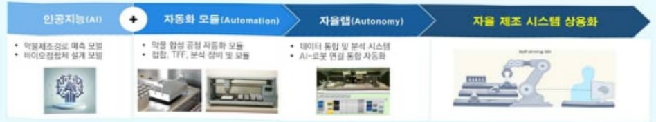
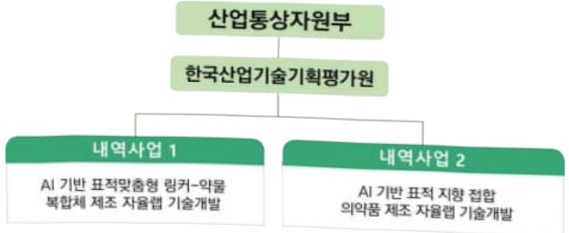

# AI기반표적맞춤형의약품제조자율랩기술개발사업(R&D)

**해당 페이지**: PDF 3662 ~ 3678 쪽 해당

**부처**: 산업통상부
**분야**: 산업·중소기업 및 에너지
**회계유형**: 일반회계
**2026 확정예산**: 8800.0 백만원
**전년대비 증감률**: None%
**AI 도메인**: 의료/바이오, 로봇

---

<table border=1 style='margin: auto; word-wrap: break-word;'><tr><td style='text-align: center; word-wrap: break-word;'>사 업 명</td></tr><tr><td style='text-align: center; word-wrap: break-word;'>(238) AI기반표적맞춤형의약품제조자율랩기술개발사업 (3651-321)</td></tr></table>

□ 사업 코드 정보

<table border=1 style='margin: auto; word-wrap: break-word;'><tr><td style='text-align: center; word-wrap: break-word;'>구분</td><td style='text-align: center; word-wrap: break-word;'>회계</td><td style='text-align: center; word-wrap: break-word;'>소관</td><td style='text-align: center; word-wrap: break-word;'>실국(기관)</td><td style='text-align: center; word-wrap: break-word;'>계정</td><td style='text-align: center; word-wrap: break-word;'>분야</td><td style='text-align: center; word-wrap: break-word;'>부문</td></tr><tr><td style='text-align: center; word-wrap: break-word;'>코드</td><td rowspan="2">일반회계</td><td rowspan="2">산업통상부</td><td rowspan="2">산업성장실산업인공지능정책관</td><td rowspan="2">[0]</td><td style='text-align: center; word-wrap: break-word;'>110</td><td style='text-align: center; word-wrap: break-word;'>117</td></tr><tr><td style='text-align: center; word-wrap: break-word;'>명칭</td><td style='text-align: center; word-wrap: break-word;'>산업 중소기업 및 에너지</td><td style='text-align: center; word-wrap: break-word;'>산업혁신지원</td></tr></table>

<table border=1 style='margin: auto; word-wrap: break-word;'><tr><td style='text-align: center; word-wrap: break-word;'>구분</td><td style='text-align: center; word-wrap: break-word;'>프로그램</td><td style='text-align: center; word-wrap: break-word;'>단위사업</td><td style='text-align: center; word-wrap: break-word;'>세부사업</td></tr><tr><td style='text-align: center; word-wrap: break-word;'>코드</td><td style='text-align: center; word-wrap: break-word;'>3600</td><td style='text-align: center; word-wrap: break-word;'>3651</td><td style='text-align: center; word-wrap: break-word;'>321</td></tr><tr><td style='text-align: center; word-wrap: break-word;'>명칭</td><td style='text-align: center; word-wrap: break-word;'>신산업진흥</td><td style='text-align: center; word-wrap: break-word;'>바이오헬스기술개발</td><td style='text-align: center; word-wrap: break-word;'>AI기반표적맞춤형의약품제조 자율랩기술개발사업</td></tr></table>

사업 성격 (공통요구자료 Ⅱ-1 작성유의사항 4. 참조, 해당하는 사항에 “0” 표시)

<table border=1 style='margin: auto; word-wrap: break-word;'><tr><td rowspan="2">신규</td><td rowspan="2">계속</td><td rowspan="2">완료</td><td rowspan="2">예비타당성 실시여부</td><td rowspan="2">총사업비 관리대상</td><td rowspan="2">총액계상 예산사업</td><td style='text-align: center; word-wrap: break-word;'>사업소관 변경정보</td></tr><tr><td style='text-align: center; word-wrap: break-word;'>2025예산 시 소관</td></tr><tr><td style='text-align: center; word-wrap: break-word;'></td><td style='text-align: center; word-wrap: break-word;'>○</td><td style='text-align: center; word-wrap: break-word;'></td><td style='text-align: center; word-wrap: break-word;'></td><td style='text-align: center; word-wrap: break-word;'></td><td style='text-align: center; word-wrap: break-word;'></td><td style='text-align: center; word-wrap: break-word;'></td></tr></table>

□ 사업 지원 형태 및 지원을 (최소한 한 개는 반드시 선택하시오. 해당사항에 O 표시)

<table border=1 style='margin: auto; word-wrap: break-word;'><tr><td style='text-align: center; word-wrap: break-word;'>직접</td><td style='text-align: center; word-wrap: break-word;'>출자</td><td style='text-align: center; word-wrap: break-word;'>출연</td><td style='text-align: center; word-wrap: break-word;'>보조</td><td style='text-align: center; word-wrap: break-word;'>융자</td><td style='text-align: center; word-wrap: break-word;'>국고보조율(%)</td><td style='text-align: center; word-wrap: break-word;'>융자율(%)</td></tr><tr><td style='text-align: center; word-wrap: break-word;'></td><td style='text-align: center; word-wrap: break-word;'></td><td style='text-align: center; word-wrap: break-word;'>○</td><td style='text-align: center; word-wrap: break-word;'></td><td style='text-align: center; word-wrap: break-word;'></td><td style='text-align: center; word-wrap: break-word;'></td><td style='text-align: center; word-wrap: break-word;'></td></tr></table>

## ☐ 사업 담당자

<table border=1 style='margin: auto; word-wrap: break-word;'><tr><td style='text-align: center; word-wrap: break-word;'>사업명</td><td colspan="5">구분</td></tr><tr><td rowspan="4">AI기반표적맞춤형의약품제조자율랩기술개발사업(R&amp;D)</td><td rowspan="3">소관부처</td><td style='text-align: center; word-wrap: break-word;'>실·국·과(팀)</td><td style='text-align: center; word-wrap: break-word;'>과 장</td><td style='text-align: center; word-wrap: break-word;'>사무관</td><td style='text-align: center; word-wrap: break-word;'>주무관</td></tr><tr><td style='text-align: center; word-wrap: break-word;'>산업성장실산업인공지능정책관</td><td style='text-align: center; word-wrap: break-word;'>최광준</td><td style='text-align: center; word-wrap: break-word;'>노진환</td><td style='text-align: center; word-wrap: break-word;'>-</td></tr><tr><td style='text-align: center; word-wrap: break-word;'>인공지능바이오융합산업과</td><td style='text-align: center; word-wrap: break-word;'>044-203-4290</td><td style='text-align: center; word-wrap: break-word;'>044-203-4292</td><td style='text-align: center; word-wrap: break-word;'>-</td></tr><tr><td style='text-align: center; word-wrap: break-word;'>사업시행주체</td><td style='text-align: center; word-wrap: break-word;'>한국산업기술기획평가원</td><td style='text-align: center; word-wrap: break-word;'>바이오헬스실</td><td style='text-align: center; word-wrap: break-word;'>차혜선 실장</td><td style='text-align: center; word-wrap: break-word;'>053-718-8420</td></tr></table>

---

### 가.예산 총괄표

(단위: 백만원, %)

<table border=1 style='margin: auto; word-wrap: break-word;'><tr><td rowspan="2">사업명</td><td rowspan="2">2024년 결산</td><td colspan="2">2025년 예산</td><td colspan="2">2026년</td><td rowspan="2">중감(B-A)</td><td rowspan="2">(B-A)/A</td></tr><tr><td style='text-align: center; word-wrap: break-word;'>본예산(A)</td><td style='text-align: center; word-wrap: break-word;'>추경</td><td style='text-align: center; word-wrap: break-word;'>요구안</td><td style='text-align: center; word-wrap: break-word;'>확정(B)</td></tr><tr><td style='text-align: center; word-wrap: break-word;'>AI기반표적맞춤형의약품제조자율랩기술개발사업(R&amp;D)</td><td style='text-align: center; word-wrap: break-word;'>-</td><td style='text-align: center; word-wrap: break-word;'>-</td><td style='text-align: center; word-wrap: break-word;'>2,200</td><td style='text-align: center; word-wrap: break-word;'>8,800</td><td style='text-align: center; word-wrap: break-word;'>8,800</td><td style='text-align: center; word-wrap: break-word;'>8,800</td><td style='text-align: center; word-wrap: break-word;'>순증</td></tr></table>

□ 기능별(내역사업별), 목별 예산 내역

(단위:백만원)

<table border=1 style='margin: auto; word-wrap: break-word;'><tr><td rowspan="3"></td><td colspan="5">2024</td><td colspan="6">2025(2025.12월말)</td><td style='text-align: center; word-wrap: break-word;'>2026예산</td></tr><tr><td rowspan="2">예산액(추경)</td><td rowspan="2">예산현액</td><td rowspan="2">집행액[실집행액]</td><td rowspan="2">이월액</td><td rowspan="2">불용액</td><td rowspan="2">본예산</td><td rowspan="2">예산현액</td><td rowspan="2">집행액[실집행액]</td><td colspan="2">전년도이월액제외</td><td rowspan="2">이월예산액</td><td rowspan="2">불용예산액</td></tr><tr><td style='text-align: center; word-wrap: break-word;'>예산현액</td><td style='text-align: center; word-wrap: break-word;'>집행액[실집행액]</td></tr><tr><td style='text-align: center; word-wrap: break-word;'>○ 기능별 분류(합계)</td><td style='text-align: center; word-wrap: break-word;'>-</td><td style='text-align: center; word-wrap: break-word;'>-</td><td style='text-align: center; word-wrap: break-word;'>-</td><td style='text-align: center; word-wrap: break-word;'>-</td><td style='text-align: center; word-wrap: break-word;'>-</td><td style='text-align: center; word-wrap: break-word;'>-</td><td style='text-align: center; word-wrap: break-word;'>2,200</td><td style='text-align: center; word-wrap: break-word;'>-</td><td style='text-align: center; word-wrap: break-word;'>2,200</td><td style='text-align: center; word-wrap: break-word;'>-</td><td style='text-align: center; word-wrap: break-word;'>-</td><td style='text-align: center; word-wrap: break-word;'>-</td></tr><tr><td style='text-align: center; word-wrap: break-word;'>· AI 기반 표적맞춤형 링커·약물복합체 제조 자율랩 기술개발 · AI 기반 표적 지향 바이오접합 의약품 제조 자율랩 기술개발</td><td style='text-align: center; word-wrap: break-word;'>-</td><td style='text-align: center; word-wrap: break-word;'>-</td><td style='text-align: center; word-wrap: break-word;'>-</td><td style='text-align: center; word-wrap: break-word;'>-</td><td style='text-align: center; word-wrap: break-word;'>-</td><td style='text-align: center; word-wrap: break-word;'>-</td><td style='text-align: center; word-wrap: break-word;'>1,130</td><td style='text-align: center; word-wrap: break-word;'>-</td><td style='text-align: center; word-wrap: break-word;'>1,130</td><td style='text-align: center; word-wrap: break-word;'>-</td><td style='text-align: center; word-wrap: break-word;'>-</td><td style='text-align: center; word-wrap: break-word;'>4,520</td></tr><tr><td style='text-align: center; word-wrap: break-word;'>○ 비목별 분류(합계)</td><td style='text-align: center; word-wrap: break-word;'>-</td><td style='text-align: center; word-wrap: break-word;'>-</td><td style='text-align: center; word-wrap: break-word;'>-</td><td style='text-align: center; word-wrap: break-word;'>-</td><td style='text-align: center; word-wrap: break-word;'>-</td><td style='text-align: center; word-wrap: break-word;'>-</td><td style='text-align: center; word-wrap: break-word;'>1,070</td><td style='text-align: center; word-wrap: break-word;'>-</td><td style='text-align: center; word-wrap: break-word;'>1,070</td><td style='text-align: center; word-wrap: break-word;'>-</td><td style='text-align: center; word-wrap: break-word;'>-</td><td style='text-align: center; word-wrap: break-word;'>-</td></tr><tr><td style='text-align: center; word-wrap: break-word;'>· 연구개발활동비등(360-05)</td><td style='text-align: center; word-wrap: break-word;'>-</td><td style='text-align: center; word-wrap: break-word;'>-</td><td style='text-align: center; word-wrap: break-word;'>-</td><td style='text-align: center; word-wrap: break-word;'>-</td><td style='text-align: center; word-wrap: break-word;'>-</td><td style='text-align: center; word-wrap: break-word;'>-</td><td style='text-align: center; word-wrap: break-word;'>2,200</td><td style='text-align: center; word-wrap: break-word;'>-</td><td style='text-align: center; word-wrap: break-word;'>2,200</td><td style='text-align: center; word-wrap: break-word;'>-</td><td style='text-align: center; word-wrap: break-word;'>-</td><td style='text-align: center; word-wrap: break-word;'>-</td></tr><tr><td style='text-align: center; word-wrap: break-word;'>○ 기능비목별 분류(합계)</td><td style='text-align: center; word-wrap: break-word;'>-</td><td style='text-align: center; word-wrap: break-word;'>-</td><td style='text-align: center; word-wrap: break-word;'>-</td><td style='text-align: center; word-wrap: break-word;'>-</td><td style='text-align: center; word-wrap: break-word;'>-</td><td style='text-align: center; word-wrap: break-word;'>-</td><td style='text-align: center; word-wrap: break-word;'>2,200</td><td style='text-align: center; word-wrap: break-word;'>-</td><td style='text-align: center; word-wrap: break-word;'>2,200</td><td style='text-align: center; word-wrap: break-word;'>-</td><td style='text-align: center; word-wrap: break-word;'>-</td><td style='text-align: center; word-wrap: break-word;'>-</td></tr><tr><td rowspan="3">· AI 기반 표적맞춤형 링커·약물복합체 제조 자율랩 기술개발 · 연구개발활동비등(360-05) · AI 기반 표적 지향 바이오접합 의약품 제조 자율랩 기술개발 · 연구개발활동비등(360-05)</td><td style='text-align: center; word-wrap: break-word;'>-</td><td style='text-align: center; word-wrap: break-word;'>-</td><td style='text-align: center; word-wrap: break-word;'>-</td><td style='text-align: center; word-wrap: break-word;'>-</td><td style='text-align: center; word-wrap: break-word;'>-</td><td style='text-align: center; word-wrap: break-word;'>-</td><td style='text-align: center; word-wrap: break-word;'>1,130</td><td style='text-align: center; word-wrap: break-word;'>-</td><td style='text-align: center; word-wrap: break-word;'>1,130</td><td style='text-align: center; word-wrap: break-word;'>-</td><td style='text-align: center; word-wrap: break-word;'>-</td><td style='text-align: center; word-wrap: break-word;'>4,520</td></tr><tr><td style='text-align: center; word-wrap: break-word;'>-</td><td style='text-align: center; word-wrap: break-word;'>-</td><td style='text-align: center; word-wrap: break-word;'>-</td><td style='text-align: center; word-wrap: break-word;'>-</td><td style='text-align: center; word-wrap: break-word;'>-</td><td style='text-align: center; word-wrap: break-word;'>-</td><td style='text-align: center; word-wrap: break-word;'>1,070</td><td style='text-align: center; word-wrap: break-word;'>-</td><td style='text-align: center; word-wrap: break-word;'>1,070</td><td style='text-align: center; word-wrap: break-word;'>-</td><td style='text-align: center; word-wrap: break-word;'>-</td><td style='text-align: center; word-wrap: break-word;'>-</td></tr><tr><td style='text-align: center; word-wrap: break-word;'>-</td><td style='text-align: center; word-wrap: break-word;'>-</td><td style='text-align: center; word-wrap: break-word;'>-</td><td style='text-align: center; word-wrap: break-word;'>-</td><td style='text-align: center; word-wrap: break-word;'>-</td><td style='text-align: center; word-wrap: break-word;'>-</td><td style='text-align: center; word-wrap: break-word;'>1,070</td><td style='text-align: center; word-wrap: break-word;'>-</td><td style='text-align: center; word-wrap: break-word;'>1,070</td><td style='text-align: center; word-wrap: break-word;'>-</td><td style='text-align: center; word-wrap: break-word;'>-</td><td style='text-align: center; word-wrap: break-word;'>4,280</td></tr></table>

---

### 나. 사업설명자료

## 1 ) 사업목적·내용

- (AI 기반 표적맞춤형 의약품 제조 자율랩 기술개발 사업) AI 및 로봇 기반 자동화 표적맞춤형 의약품 발굴 및 자율 제조랩 시스템 구현을 통한 국내 제약바이오 기업의 차세대 모달리티 신약 제조 경쟁력 확보

- (AI 기반 표적맞춤형 링커·약물 복합체 제조 자율랩 기술개발) AI 및 로봇 기반 자동화 표적맞춤형 의약품 개발 및 자율 제조랩 시스템 구현을 통한 국내 제약바이오기업의 차세대 모달리티 신약 제조 경쟁력 확보

- (AI 기반 표적지향 바이오접합 의약품 제조 자율랩 기술개발) AI 기반 표적지향

향체-약물접합체(ADC) 설계-합성-생산 전주기 자동화 플랫폼 구축을 통한 국내 바이오 기업의 글로벌 경쟁력 제고

## 2 ) 사업개요

## □ 사업근거 및 추진경위

① 법령상 근거 및 조항 적시

- |과학기술기본법| (제11조, 국가연구개발사업의 추진) 중앙행정기관의 장은 기본 계획에 따라 맡은 분야의 국가연구개발사업과 그 시책을 세워 추진하여야 한다.

- |산업기술혁신족진법」 (제11조, 산업기술개발사업) 산업통상부장관은 혁신계획 및 시행계획을 효율적으로 수행하기 위하여 관계 중앙행정기관의 장과 협의하여 다음 각 호의 산업기술분야에서 기술개발사업을 추진할 수 있다.

- 「생명공학육성법」 (제8조, 생명공학 육성시책 강구 등), (제11조, 연구개발사업의 추진) 정부는 이 법의 목적을 효율적으로 달성하기 위하여 생명공학 연구 및 기술개발을 위한 연구개발사업을 실시하여야 한다. (제15조, 생명공학 연구개발 활성화 및 산업적 응용촉진 추진) 정부는 생명공학 연구개발을 활성화하고 그 결과의 산업적 응용을 촉진하기 위하여 지원시책을 강구하여야 한다

---

## ② 추진경위

<table border=1 style='margin: auto; word-wrap: break-word;'><tr><td colspan="2">추진경과</td><td style='text-align: center; word-wrap: break-word;'>세부 내용</td></tr><tr><td style='text-align: center; word-wrap: break-word;'>사업 기획방향 설정</td><td style='text-align: center; word-wrap: break-word;'>&#x27;24.10~ &#x27;24.12</td><td style='text-align: center; word-wrap: break-word;'>·(정책·경제·사회·기술분석) 국내·외 AI 신약개발, 의약품제조 자동화, 차세대 모달리티 관련 정책적, 산업적, 사회적, 기술적 환경 분석 ·(전문가 의견수렴) 산업계, 학계, 연구계 종사자들로 구성된 전문가 자문위원회 운영 및 의견수렴 ·(기존 및 유사사업 분석) 기존 K-MELLODY 사업 등 유사사업의 추진내용, 성과를 분석</td></tr><tr><td colspan="3">↔</td></tr><tr><td style='text-align: center; word-wrap: break-word;'>추진전략 및 내역사업 도출</td><td style='text-align: center; word-wrap: break-word;'>&#x27;25.1~ &#x27;25.2</td><td style='text-align: center; word-wrap: break-word;'>·대내외 환경의 SWOT 분석기반 사업목표 및 추진전략 수립 ·사업 추진방향 기반의 내역사업(안) 도출</td></tr><tr><td colspan="3">↘</td></tr><tr><td style='text-align: center; word-wrap: break-word;'>수요조사</td><td style='text-align: center; word-wrap: break-word;'>&#x27;25.3.12~ &#x27;25.3.18</td><td style='text-align: center; word-wrap: break-word;'>·AI, 신약개발 등 관련 전문가, 관련 기업 대상 수요조사 실시</td></tr><tr><td colspan="3">↘</td></tr><tr><td style='text-align: center; word-wrap: break-word;'>전문가위원회</td><td style='text-align: center; word-wrap: break-word;'>&#x27;25.3~ &#x27;25.4</td><td style='text-align: center; word-wrap: break-word;'>·AI, 신약개발 등 관련 전문가, 관련 기업 대상 전문가 회의를 통해 세부과제 수요 발굴 및 세부내용 구성 ·전문위, 부처 및 전문기관에서 수요기술에 대해 검토</td></tr><tr><td colspan="3">↘</td></tr><tr><td style='text-align: center; word-wrap: break-word;'>내역사업 별 세부과제 도출</td><td style='text-align: center; word-wrap: break-word;'>&#x27;25.4</td><td style='text-align: center; word-wrap: break-word;'>·내역사업에 대한 세부과제 최종 도출 및 세부 내용 기획</td></tr></table>

## □ 주요내용

① 사업규모

- 총사업비(해당되는 경우에만 기재) : 해당없음

- 사업기간 : '25~'29년(5년)

- 최근 5년 간 투입된 사업비(예산액기준, 추경편성한 연도에는 추경포함)

<table border=1 style='margin: auto; word-wrap: break-word;'><tr><td style='text-align: center; word-wrap: break-word;'>연도</td><td style='text-align: center; word-wrap: break-word;'>2022</td><td style='text-align: center; word-wrap: break-word;'>2023</td><td style='text-align: center; word-wrap: break-word;'>2024</td><td style='text-align: center; word-wrap: break-word;'>2025</td><td style='text-align: center; word-wrap: break-word;'>2026</td></tr><tr><td style='text-align: center; word-wrap: break-word;'>사업비</td><td style='text-align: center; word-wrap: break-word;'>-</td><td style='text-align: center; word-wrap: break-word;'>-</td><td style='text-align: center; word-wrap: break-word;'>-</td><td style='text-align: center; word-wrap: break-word;'>2,200백만원</td><td style='text-align: center; word-wrap: break-word;'>8,800백만원</td></tr></table>

-기타: 해당없음

② 사업추진체계

- 사업시행방법 : 출연

- 사업시행주체 : 한국산업기술기획평가원

- 사업 수혜자 : 기업, 대학, 연구소 등

---

- 보조, 융자, 출연, 출자 등의 경우 보조·융자 등 지원 비율 및 법적근거

<table border=1 style='margin: auto; word-wrap: break-word;'><tr><td style='text-align: center; word-wrap: break-word;'>내역사업명</td><td style='text-align: center; word-wrap: break-word;'>구분</td><td style='text-align: center; word-wrap: break-word;'>피보조·피출연 등 기관명</td><td style='text-align: center; word-wrap: break-word;'>지원 금액 (2026예산)</td><td style='text-align: center; word-wrap: break-word;'>지원 비율(%)</td><td style='text-align: center; word-wrap: break-word;'>보조율 법적근거 (해당 조항)</td></tr><tr><td style='text-align: center; word-wrap: break-word;'>AI 기반 표적맞춤형 링커-약물 복합체 제조 자율랩 기술개발</td><td style='text-align: center; word-wrap: break-word;'>출연</td><td style='text-align: center; word-wrap: break-word;'>한국산업 기술기획 평가원</td><td style='text-align: center; word-wrap: break-word;'>4,520</td><td style='text-align: center; word-wrap: break-word;'>사업비 100%이내 정부매칭 (기관유형 별 매칭비율 상이)</td><td style='text-align: center; word-wrap: break-word;'>산업기술혁신촉진법 제11조(산업기술개발사업)</td></tr><tr><td style='text-align: center; word-wrap: break-word;'>AI 기반 표적지향 바이오접합 의약품 제조 자율랩 기술개발</td><td style='text-align: center; word-wrap: break-word;'>출연</td><td style='text-align: center; word-wrap: break-word;'>한국산업 기술기획 평가원</td><td style='text-align: center; word-wrap: break-word;'>4,280</td><td style='text-align: center; word-wrap: break-word;'>사업비 100%이내 정부매칭 (기관유형 별 매칭비율 상이)</td><td style='text-align: center; word-wrap: break-word;'>산업기술혁신촉진법 제11조(산업기술개발사업)</td></tr></table>

---

## 3 ) 2026년도 예산 산출 근거

① AI 기반 표적맞춤형 링커-약물 복합체 제조 자율랩 기술개발 : (2025 추경) 1,130백만원 → (2026 예산) 4,520 백만원, +3,390백만원

(2025 본예산 0백만원 → 제1회 추경 0백만원 → 제2회 추경 1,130백만원)

- (요구) AI 및 로봇 기반 자동화 표적맞춤형 링커-약물 복합체 개발 및 자율 제조랩 시스템 구현을 위해 총 4,520백만원 계속 지원 요구

- (산출) 표적맞춤형 링커·약물 복합체 제조 자율랩 통합 시스템 개발(AI 모델, 자동화 제조 플랫폼(장비, 소프트웨어 등), 통합시스템 등) 및 검증 등 총 4개 과제 지원

* 4개 과제 × 1,130백만원 × 12/12개월 = 4,520백만원

02025년도 추가경정예산 및 2026년도 예산 산출 세부내역 비교

<table border=1 style='margin: auto; word-wrap: break-word;'><tr><td colspan="2">2025년 제2회 추가경정예산</td><td colspan="2">2026년 예산</td></tr><tr><td style='text-align: center; word-wrap: break-word;'>예산</td><td style='text-align: center; word-wrap: break-word;'>산출내역</td><td style='text-align: center; word-wrap: break-word;'>예산</td><td style='text-align: center; word-wrap: break-word;'>산출내역</td></tr><tr><td style='text-align: center; word-wrap: break-word;'>AI 기반표적맞춤형링커-약물복합체제조자율렘기술개발1,130</td><td style='text-align: center; word-wrap: break-word;'>○ 연구개발활동비등(360-05): 1,130백만원(2회 추경안)가. AI 기반 표적맞춤형 링커-약물 복합체 제조 자율렘 기술개발(1,130백만원)• (신규) 4개 × 1,130백만원 × 3/12개월 = 1,130백만원</td><td style='text-align: center; word-wrap: break-word;'>AI 기반표적맞춤형링커-약물복합체제조자율렘기술개발4,520</td><td style='text-align: center; word-wrap: break-word;'>○ 연구개발활동비등(360-05): 4,520백만원가. AI 기반 표적맞춤형 링커-약물 복합체제조 자율렘 기술개발(1,130백만원)• (계속) 4개 × 1,130백만원 × 12/12개월 = 4,520백만원</td></tr></table>

② AI 기반 표적지향 바이오접합 의약품 제조 자율랩 기술개발 : (2025 추경) 1,070백만원 → (2026 예산) 4,280 백만원, +3,210백만원

(2025 본예산 0백만원 → 제1회 추경 0백만원 → 제2회 추경 1,070백만원)

- (요구) AI 기반 표적지향 항체-약물접합체(ADC) 설계-합성-생산 전주기 자동화 플랫폼 구축을 위해 총 4,280백만원 계속 지원 요구

- (산출) 표적지향 접합 약물 생산 자동화 제조 자율랩 통합 시스템 개발(AI 모델, 자동화 제조 플랫폼(장비, 소프트웨어 등), 통합시스템 등) 및 검증 등 총 4개 과제 지원

* 4개 과제 × 1,070백만원 × 12/12개월 = 4,280백만원

o 2025년도 추가경정예산 및 2026년도 예산 산출 세부내역 비교

<table border=1 style='margin: auto; word-wrap: break-word;'><tr><td colspan="2">2025년 제2회 추가경정예산</td><td colspan="2">2026년 예산</td></tr><tr><td style='text-align: center; word-wrap: break-word;'>예산</td><td style='text-align: center; word-wrap: break-word;'>산출내역</td><td style='text-align: center; word-wrap: break-word;'>예산</td><td style='text-align: center; word-wrap: break-word;'>산출내역</td></tr><tr><td style='text-align: center; word-wrap: break-word;'>AI 기반표적맞춤형링커-약물복합체제조자율램기술개발1,070</td><td style='text-align: center; word-wrap: break-word;'>○ 연구개발활동비등(360-05): 1,070백만원(2회 추경안)가 AI 기반표적지향 바이오접합 의약품 제조 자율램 기술개발(1,070백만원)• (신규) 4개 × 1,070백만원 × 3/12개월 = 1,070백만원</td><td style='text-align: center; word-wrap: break-word;'>AI 기반표적맞춤형링커-약물복합체제조자율램 기술개발4,280</td><td style='text-align: center; word-wrap: break-word;'>○ 연구개발활동비등(360-05): 4,280백만원가 AI 기반표적지향 바이오접합 의약품 제조 자율램 기술개발(1,070백만원)• (신규) 4개 × 4,280백만원 × 12/12개월 = 4,280백만원</td></tr></table>

---

## 4 ) 사업효과

☐ 사업영향, 산출물 성과지표 등

① 2022~2026년도 성과계획서 상 성과지표 및 최근 5년간 성과 달성도

<table border=1 style='margin: auto; word-wrap: break-word;'><tr><td style='text-align: center; word-wrap: break-word;'>성과지표</td><td style='text-align: center; word-wrap: break-word;'>구분</td><td style='text-align: center; word-wrap: break-word;'>2022</td><td style='text-align: center; word-wrap: break-word;'>2023</td><td style='text-align: center; word-wrap: break-word;'>2024</td><td style='text-align: center; word-wrap: break-word;'>2025</td><td style='text-align: center; word-wrap: break-word;'>2026</td><td style='text-align: center; word-wrap: break-word;'>‘25목표치산출근거</td><td style='text-align: center; word-wrap: break-word;'>측정산식(또는측정방법)</td><td style='text-align: center; word-wrap: break-word;'>자료수집방법(또는자료출처)</td></tr><tr><td rowspan="3">약물 설계 및 예측 시스템 개발</td><td style='text-align: center; word-wrap: break-word;'>목표</td><td style='text-align: center; word-wrap: break-word;'>-</td><td style='text-align: center; word-wrap: break-word;'>-</td><td style='text-align: center; word-wrap: break-word;'>-</td><td style='text-align: center; word-wrap: break-word;'>-</td><td style='text-align: center; word-wrap: break-word;'>-</td><td rowspan="3">신규지표</td><td rowspan="3">인공지능 모델 개발 건수</td><td rowspan="3">동 사업에 의한 등록 증빙자료</td></tr><tr><td style='text-align: center; word-wrap: break-word;'>실적</td><td style='text-align: center; word-wrap: break-word;'>-</td><td style='text-align: center; word-wrap: break-word;'>-</td><td style='text-align: center; word-wrap: break-word;'>-</td><td style='text-align: center; word-wrap: break-word;'>-</td><td style='text-align: center; word-wrap: break-word;'>-</td></tr><tr><td style='text-align: center; word-wrap: break-word;'>달성도</td><td style='text-align: center; word-wrap: break-word;'>-</td><td style='text-align: center; word-wrap: break-word;'>-</td><td style='text-align: center; word-wrap: break-word;'>-</td><td style='text-align: center; word-wrap: break-word;'>-</td><td style='text-align: center; word-wrap: break-word;'>-</td></tr><tr><td rowspan="3">데이터베이스 완성도(%)</td><td style='text-align: center; word-wrap: break-word;'>목표</td><td style='text-align: center; word-wrap: break-word;'>-</td><td style='text-align: center; word-wrap: break-word;'>-</td><td style='text-align: center; word-wrap: break-word;'>-</td><td style='text-align: center; word-wrap: break-word;'>10</td><td style='text-align: center; word-wrap: break-word;'>50</td><td rowspan="3">신규지표</td><td rowspan="3">목표 데이터 수집 및 정제율</td><td rowspan="3">동 사업에 의한 등록 증빙자료</td></tr><tr><td style='text-align: center; word-wrap: break-word;'>실적</td><td style='text-align: center; word-wrap: break-word;'>-</td><td style='text-align: center; word-wrap: break-word;'>-</td><td style='text-align: center; word-wrap: break-word;'>-</td><td style='text-align: center; word-wrap: break-word;'>-</td><td style='text-align: center; word-wrap: break-word;'>-</td></tr><tr><td style='text-align: center; word-wrap: break-word;'>달성도</td><td style='text-align: center; word-wrap: break-word;'>-</td><td style='text-align: center; word-wrap: break-word;'>-</td><td style='text-align: center; word-wrap: break-word;'>-</td><td style='text-align: center; word-wrap: break-word;'>-</td><td style='text-align: center; word-wrap: break-word;'>-</td></tr><tr><td rowspan="3">공정속도개선율(%)</td><td style='text-align: center; word-wrap: break-word;'>목표</td><td style='text-align: center; word-wrap: break-word;'>-</td><td style='text-align: center; word-wrap: break-word;'>-</td><td style='text-align: center; word-wrap: break-word;'>-</td><td style='text-align: center; word-wrap: break-word;'>0</td><td style='text-align: center; word-wrap: break-word;'>10</td><td rowspan="3">신규지표</td><td rowspan="3">기존 공정 시간대비 공정 소요 시간 개선율</td><td rowspan="3">동 사업에 의한 등록 증빙자료</td></tr><tr><td style='text-align: center; word-wrap: break-word;'>실적</td><td style='text-align: center; word-wrap: break-word;'>-</td><td style='text-align: center; word-wrap: break-word;'>-</td><td style='text-align: center; word-wrap: break-word;'>-</td><td style='text-align: center; word-wrap: break-word;'>-</td><td style='text-align: center; word-wrap: break-word;'>-</td></tr><tr><td style='text-align: center; word-wrap: break-word;'>달성도</td><td style='text-align: center; word-wrap: break-word;'>-</td><td style='text-align: center; word-wrap: break-word;'>-</td><td style='text-align: center; word-wrap: break-word;'>-</td><td style='text-align: center; word-wrap: break-word;'>-</td><td style='text-align: center; word-wrap: break-word;'>-</td></tr><tr><td rowspan="3">공정자동화율(%)</td><td style='text-align: center; word-wrap: break-word;'>목표</td><td style='text-align: center; word-wrap: break-word;'>-</td><td style='text-align: center; word-wrap: break-word;'>-</td><td style='text-align: center; word-wrap: break-word;'>-</td><td style='text-align: center; word-wrap: break-word;'>0</td><td style='text-align: center; word-wrap: break-word;'>15</td><td rowspan="3">신규지표</td><td rowspan="3">전체 공정 중 자동화된 공정의 비율</td><td rowspan="3">동 사업에 의한 등록 증빙자료</td></tr><tr><td style='text-align: center; word-wrap: break-word;'>실적</td><td style='text-align: center; word-wrap: break-word;'>-</td><td style='text-align: center; word-wrap: break-word;'>-</td><td style='text-align: center; word-wrap: break-word;'>-</td><td style='text-align: center; word-wrap: break-word;'>-</td><td style='text-align: center; word-wrap: break-word;'>-</td></tr><tr><td style='text-align: center; word-wrap: break-word;'>달성도</td><td style='text-align: center; word-wrap: break-word;'>-</td><td style='text-align: center; word-wrap: break-word;'>-</td><td style='text-align: center; word-wrap: break-word;'>-</td><td style='text-align: center; word-wrap: break-word;'>-</td><td style='text-align: center; word-wrap: break-word;'>-</td></tr><tr><td rowspan="3">약물 제조 실증</td><td style='text-align: center; word-wrap: break-word;'>목표</td><td style='text-align: center; word-wrap: break-word;'>-</td><td style='text-align: center; word-wrap: break-word;'>-</td><td style='text-align: center; word-wrap: break-word;'>-</td><td style='text-align: center; word-wrap: break-word;'>-</td><td style='text-align: center; word-wrap: break-word;'>-</td><td rowspan="3">신규지표</td><td rowspan="3">자율랩 활용 약물 제조 지원건수</td><td rowspan="3">동 사업에 의한 등록 증빙자료</td></tr><tr><td style='text-align: center; word-wrap: break-word;'>실적</td><td style='text-align: center; word-wrap: break-word;'>-</td><td style='text-align: center; word-wrap: break-word;'>-</td><td style='text-align: center; word-wrap: break-word;'>-</td><td style='text-align: center; word-wrap: break-word;'>-</td><td style='text-align: center; word-wrap: break-word;'>-</td></tr><tr><td style='text-align: center; word-wrap: break-word;'>달성도</td><td style='text-align: center; word-wrap: break-word;'>-</td><td style='text-align: center; word-wrap: break-word;'>-</td><td style='text-align: center; word-wrap: break-word;'>-</td><td style='text-align: center; word-wrap: break-word;'>-</td><td style='text-align: center; word-wrap: break-word;'>-</td></tr></table>

* 기획보고서 상 제시된 성과지표(안) 중 대표적인 성과지표 상기 제시 및 향후 예산반영 후 성과목표지표 신규수립 예정

② 성과지표 이외의 연도별 사업추진 경과 및 실적

<table border=1 style='margin: auto; word-wrap: break-word;'><tr><td style='text-align: center; word-wrap: break-word;'>2022</td><td style='text-align: center; word-wrap: break-word;'>해당없음</td></tr><tr><td style='text-align: center; word-wrap: break-word;'>2023</td><td style='text-align: center; word-wrap: break-word;'>해당없음</td></tr><tr><td style='text-align: center; word-wrap: break-word;'>2024</td><td style='text-align: center; word-wrap: break-word;'>해당없음</td></tr><tr><td style='text-align: center; word-wrap: break-word;'>2025</td><td style='text-align: center; word-wrap: break-word;'>신규과제 8개 지원</td></tr></table>

③향후(2026년도 이후)기대효과

- ①신약개발·제조분야 성공적인 디지털 전환 촉진 ②데이터 기반 고효율·고품질 표적맞춤형 의약품 생산을 통한 차세대 신약개발 시장 선점 및 국내 제약바이오 기업들의 제조경쟁력 확보

---

<table border=1 style='margin: auto; word-wrap: break-word;'><tr><td style='text-align: center; word-wrap: break-word;'>부처</td><td style='text-align: center; word-wrap: break-word;'></td><td style='text-align: center; word-wrap: break-word;'>피출연·피보조기관</td><td style='text-align: center; word-wrap: break-word;'>간접보조사업자·사업수행자</td></tr><tr><td style='text-align: center; word-wrap: break-word;'>산업통상부(8,800백만원)</td><td style='text-align: center; word-wrap: break-word;'>=&gt;(8,800백만원)</td><td style='text-align: center; word-wrap: break-word;'>한국산업기술기획평가원(8,800백만원)</td><td style='text-align: center; word-wrap: break-word;'>=&gt;(8,800백만원)</td></tr></table>

AI기반 표적맞춤형 의약품제조 자율랩 기술개발사업

성과평가위원회

전문기관(KEIT)

전문기관(KEIT)

성공평가과제는협약시정한

정액기술료 또는 경상기술료 적용

사업비 정산

추적 평가

위탁회계법인

평가위원회

기술료 정수관리

평가위원회

사업비 정산

전문기관(KEIT)

최종평가

전문기관(KEIT)

사업계획서 접수→신규선정평가 및

사업자 확정→협약체결

진도관리·중간평가

산업통상부

전문기관(KEIT)

기획결과평가→지원과제 및 예산안

확정→지원과제 공고

사업자 선정

로드맵/통합기술청사진 수립

산업통상부

수요조사→연구기획과제 선정→상세

과제기획

지원과제

선정

PD (KEIT)

산업통상부

과제기획

시행계획

7)사업 집행절차

6) 총사업비 대상사업 여부 및 내역 : 해당없음

---

8) 중기재정계획 상 연도별 투자계획 및 추진경과

(단위:백만원)

<table border=1 style='margin: auto; word-wrap: break-word;'><tr><td style='text-align: center; word-wrap: break-word;'>2024</td><td style='text-align: center; word-wrap: break-word;'>2025</td><td style='text-align: center; word-wrap: break-word;'>2026</td><td style='text-align: center; word-wrap: break-word;'>2027</td><td style='text-align: center; word-wrap: break-word;'>2028</td><td style='text-align: center; word-wrap: break-word;'>2029</td></tr><tr><td style='text-align: center; word-wrap: break-word;'>2024~2028</td><td style='text-align: center; word-wrap: break-word;'>-</td><td style='text-align: center; word-wrap: break-word;'>-</td><td style='text-align: center; word-wrap: break-word;'>-</td><td style='text-align: center; word-wrap: break-word;'>-</td><td style='text-align: center; word-wrap: break-word;'>-</td></tr><tr><td style='text-align: center; word-wrap: break-word;'>2025~2029</td><td style='text-align: center; word-wrap: break-word;'>2,200</td><td style='text-align: center; word-wrap: break-word;'>8,800</td><td style='text-align: center; word-wrap: break-word;'>8,800</td><td style='text-align: center; word-wrap: break-word;'>8,800</td><td style='text-align: center; word-wrap: break-word;'>8,800</td></tr></table>

9) 최근 3년간 동 사업에 대한 주요 외부지적사항 및 평가, 문제점 및 대책 : 해당없음

## 10 ) 향후 추진방향 및 추진계획

<table border=1 style='margin: auto; word-wrap: break-word;'><tr><td style='text-align: center; word-wrap: break-word;'>- 산·학·연 협력체계 기반의 시스템(장비, 모듈, S/W 등) 개발 및 통합을 통하여 국내 제약바이오기업들의 신속한 후보물질 제조 혁신 유도</td></tr><tr><td style='text-align: center; word-wrap: break-word;'>- 신약개발·제조분야 성공적인 디지털 트랜스포메이션 촉진과 데이터 중심 차세대 국가 성장동력 확보</td></tr></table>

11) 해당사업에 대한 각종 사업평가의 결과 : 해당없음

12) 해당사업에 대한 부처 자체평가의 결과 : 해당없음

13) 부처 건의사항 : 해당없음

---

### 다. 최근 4년간 결산내역

## 1 ) 결산표

☐ 부처 결산내역

(단위:백만원,%)

<table border=1 style='margin: auto; word-wrap: break-word;'><tr><td rowspan="2">闰五</td><td colspan="3">예산액</td><td rowspan="2">전년도이월액</td><td rowspan="2">이·전용등</td><td rowspan="2">예비비</td><td rowspan="2">예산현액(B)</td><td rowspan="2">집행액(C)</td><td rowspan="2">집행률(C/A)</td><td rowspan="2">집행률(C/B)</td><td rowspan="2">다음연도이월액</td><td rowspan="2">불용액</td></tr><tr><td style='text-align: center; word-wrap: break-word;'>본예산</td><td style='text-align: center; word-wrap: break-word;'>추경중감액</td><td style='text-align: center; word-wrap: break-word;'>추경(A)</td></tr><tr><td style='text-align: center; word-wrap: break-word;'>2022</td><td style='text-align: center; word-wrap: break-word;'>-</td><td style='text-align: center; word-wrap: break-word;'>-</td><td style='text-align: center; word-wrap: break-word;'>-</td><td style='text-align: center; word-wrap: break-word;'>-</td><td style='text-align: center; word-wrap: break-word;'>-</td><td style='text-align: center; word-wrap: break-word;'>-</td><td style='text-align: center; word-wrap: break-word;'>-</td><td style='text-align: center; word-wrap: break-word;'>-</td><td style='text-align: center; word-wrap: break-word;'>-</td><td style='text-align: center; word-wrap: break-word;'>-</td><td style='text-align: center; word-wrap: break-word;'>-</td><td style='text-align: center; word-wrap: break-word;'>-</td></tr><tr><td style='text-align: center; word-wrap: break-word;'>2023</td><td style='text-align: center; word-wrap: break-word;'>-</td><td style='text-align: center; word-wrap: break-word;'>-</td><td style='text-align: center; word-wrap: break-word;'>-</td><td style='text-align: center; word-wrap: break-word;'>-</td><td style='text-align: center; word-wrap: break-word;'>-</td><td style='text-align: center; word-wrap: break-word;'>-</td><td style='text-align: center; word-wrap: break-word;'>-</td><td style='text-align: center; word-wrap: break-word;'>-</td><td style='text-align: center; word-wrap: break-word;'>-</td><td style='text-align: center; word-wrap: break-word;'>-</td><td style='text-align: center; word-wrap: break-word;'>-</td><td style='text-align: center; word-wrap: break-word;'>-</td></tr><tr><td style='text-align: center; word-wrap: break-word;'>2024</td><td style='text-align: center; word-wrap: break-word;'>-</td><td style='text-align: center; word-wrap: break-word;'>-</td><td style='text-align: center; word-wrap: break-word;'>-</td><td style='text-align: center; word-wrap: break-word;'>-</td><td style='text-align: center; word-wrap: break-word;'>-</td><td style='text-align: center; word-wrap: break-word;'>-</td><td style='text-align: center; word-wrap: break-word;'>-</td><td style='text-align: center; word-wrap: break-word;'>-</td><td style='text-align: center; word-wrap: break-word;'>-</td><td style='text-align: center; word-wrap: break-word;'>-</td><td style='text-align: center; word-wrap: break-word;'>-</td><td style='text-align: center; word-wrap: break-word;'>-</td></tr><tr><td style='text-align: center; word-wrap: break-word;'>2025</td><td style='text-align: center; word-wrap: break-word;'>-</td><td style='text-align: center; word-wrap: break-word;'>2,200</td><td style='text-align: center; word-wrap: break-word;'>2,200</td><td style='text-align: center; word-wrap: break-word;'>-</td><td style='text-align: center; word-wrap: break-word;'>-</td><td style='text-align: center; word-wrap: break-word;'>-</td><td style='text-align: center; word-wrap: break-word;'>2,200</td><td style='text-align: center; word-wrap: break-word;'>2,200</td><td style='text-align: center; word-wrap: break-word;'>100</td><td style='text-align: center; word-wrap: break-word;'>100</td><td style='text-align: center; word-wrap: break-word;'>-</td><td style='text-align: center; word-wrap: break-word;'>-</td></tr></table>

* 2025년 2차 추경 시 증액된 사업으로, 수행기관 선정 이후 '25.9월 중 신속 집행 예정

□출연·보조사업 등 실집행내역

(단위: 백만원, %)

<table border=1 style='margin: auto; word-wrap: break-word;'><tr><td rowspan="3">구분</td><td colspan="3">부처</td><td colspan="7">사업시행주체(피출연·피보조 기관 등)</td></tr><tr><td colspan="2">예산액</td><td rowspan="2">집행액</td><td rowspan="2">교부액</td><td rowspan="2">전년도 이월액</td><td rowspan="2">교부 현액</td><td rowspan="2">집행액 (B)</td><td rowspan="2">이월액</td><td rowspan="2">불용액</td><td rowspan="2">실집행률 (B/A)</td></tr><tr><td style='text-align: center; word-wrap: break-word;'>본예산</td><td style='text-align: center; word-wrap: break-word;'>추경(A)</td></tr><tr><td style='text-align: center; word-wrap: break-word;'>2022</td><td style='text-align: center; word-wrap: break-word;'>-</td><td style='text-align: center; word-wrap: break-word;'>-</td><td style='text-align: center; word-wrap: break-word;'>-</td><td style='text-align: center; word-wrap: break-word;'>-</td><td style='text-align: center; word-wrap: break-word;'>-</td><td style='text-align: center; word-wrap: break-word;'>-</td><td style='text-align: center; word-wrap: break-word;'>-</td><td style='text-align: center; word-wrap: break-word;'>-</td><td style='text-align: center; word-wrap: break-word;'>-</td><td style='text-align: center; word-wrap: break-word;'>-</td></tr><tr><td style='text-align: center; word-wrap: break-word;'>2023</td><td style='text-align: center; word-wrap: break-word;'>-</td><td style='text-align: center; word-wrap: break-word;'>-</td><td style='text-align: center; word-wrap: break-word;'>-</td><td style='text-align: center; word-wrap: break-word;'>-</td><td style='text-align: center; word-wrap: break-word;'>-</td><td style='text-align: center; word-wrap: break-word;'>-</td><td style='text-align: center; word-wrap: break-word;'>-</td><td style='text-align: center; word-wrap: break-word;'>-</td><td style='text-align: center; word-wrap: break-word;'>-</td><td style='text-align: center; word-wrap: break-word;'>-</td></tr><tr><td style='text-align: center; word-wrap: break-word;'>2024</td><td style='text-align: center; word-wrap: break-word;'>-</td><td style='text-align: center; word-wrap: break-word;'>-</td><td style='text-align: center; word-wrap: break-word;'>-</td><td style='text-align: center; word-wrap: break-word;'>-</td><td style='text-align: center; word-wrap: break-word;'>-</td><td style='text-align: center; word-wrap: break-word;'>-</td><td style='text-align: center; word-wrap: break-word;'>-</td><td style='text-align: center; word-wrap: break-word;'>-</td><td style='text-align: center; word-wrap: break-word;'>-</td><td style='text-align: center; word-wrap: break-word;'>-</td></tr><tr><td style='text-align: center; word-wrap: break-word;'>2025. 12월기준</td><td style='text-align: center; word-wrap: break-word;'>-</td><td style='text-align: center; word-wrap: break-word;'>2,200</td><td style='text-align: center; word-wrap: break-word;'>2,200</td><td style='text-align: center; word-wrap: break-word;'>2,200</td><td style='text-align: center; word-wrap: break-word;'>-</td><td style='text-align: center; word-wrap: break-word;'>2,200</td><td style='text-align: center; word-wrap: break-word;'>2,200</td><td style='text-align: center; word-wrap: break-word;'>-</td><td style='text-align: center; word-wrap: break-word;'>-</td><td style='text-align: center; word-wrap: break-word;'>100</td></tr></table>

---

## 2 ) 주요 결산사항

□ 2022~2025년 결산 주요 지적사항 및 시정요구사항

<table border=1 style='margin: auto; word-wrap: break-word;'><tr><td style='text-align: center; word-wrap: break-word;'>2022</td><td style='text-align: center; word-wrap: break-word;'>- 해당없음</td></tr><tr><td style='text-align: center; word-wrap: break-word;'>2023</td><td style='text-align: center; word-wrap: break-word;'>- 해당없음</td></tr><tr><td style='text-align: center; word-wrap: break-word;'>2024</td><td style='text-align: center; word-wrap: break-word;'>- 해당없음</td></tr><tr><td style='text-align: center; word-wrap: break-word;'>2025</td><td style='text-align: center; word-wrap: break-word;'>- 해당없음</td></tr></table>

2025년 이·전용 등 세부내역 : 해당없음

2025년 예비비 배정 세부내역 : 해당없음

### 라. 기타 추가자료

(1) 신규사업 기획보고서 요약본

(2) 내역사업 설명자료

---

## 붙임1

신규사업 기획보고서 요약본

<table border=1 style='margin: auto; word-wrap: break-word;'><tr><td style='text-align: center; word-wrap: break-word;'>사업명</td><td colspan="11">AI 기반 표적맞춤형 의약품 제조 자율랩 기술개발사업</td></tr><tr><td style='text-align: center; word-wrap: break-word;'>총 사업비</td><td colspan="4">497.42억원 (국비: 374억원)</td><td colspan="3">사업기간</td><td colspan="4">&#x27;25년 ~ &#x27;29년(총 5년)</td></tr><tr><td rowspan="2">수행주체</td><td colspan="11">산업통상부/바이오용합산업과/ 노진환(채) (044-203-4292, sangsil11@korea.kr)</td></tr><tr><td colspan="11">한국산업기술기획평가원/바이오헬스실/김형철 PD(053-718-8562, hckim@keit.re.kr)</td></tr><tr><td colspan="12">[성과목표]
○ AI 및 로봇 기반 자동화 표적맞춤형 의약품 개발 및 자율 제조랩 시스템 구현을 통한 국내 제약바이오기업의 차세대 모달리티 신약 제조 경쟁력 확보</td></tr><tr><td colspan="12">[성과지표]
○ AI, 로봇 기반 의약품 제조 자율랩 기술개발 과정에서 산출되는 AI 모델, 데이터 베이스, 장비(모듈), SW, 약물제조 실증 실적을 성과지표로 설정</td></tr><tr><td rowspan="2">성과지표명</td><td colspan="7">목표치</td><td colspan="4">측정방법</td></tr><tr><td style='text-align: center; word-wrap: break-word;'>&#x27;25</td><td style='text-align: center; word-wrap: break-word;'>&#x27;26</td><td style='text-align: center; word-wrap: break-word;'>&#x27;27</td><td style='text-align: center; word-wrap: break-word;'>&#x27;28</td><td style='text-align: center; word-wrap: break-word;'>&#x27;29</td><td style='text-align: center; word-wrap: break-word;'>&#x27;30</td><td style='text-align: center; word-wrap: break-word;'></td><td style='text-align: center; word-wrap: break-word;'></td><td style='text-align: center; word-wrap: break-word;'></td><td style='text-align: center; word-wrap: break-word;'></td><td style='text-align: center; word-wrap: break-word;'></td></tr><tr><td style='text-align: center; word-wrap: break-word;'>약물 설계 및 예측 시스템 개발</td><td style='text-align: center; word-wrap: break-word;'>-</td><td style='text-align: center; word-wrap: break-word;'>1</td><td style='text-align: center; word-wrap: break-word;'>1</td><td style='text-align: center; word-wrap: break-word;'>-</td><td style='text-align: center; word-wrap: break-word;'>-</td><td style='text-align: center; word-wrap: break-word;'></td><td style='text-align: center; word-wrap: break-word;'></td><td colspan="4">인공지능 모델 개발 건수</td></tr><tr><td style='text-align: center; word-wrap: break-word;'>데이터베이스 완성도</td><td style='text-align: center; word-wrap: break-word;'>10</td><td style='text-align: center; word-wrap: break-word;'>50</td><td style='text-align: center; word-wrap: break-word;'>80</td><td style='text-align: center; word-wrap: break-word;'>100</td><td style='text-align: center; word-wrap: break-word;'>-</td><td style='text-align: center; word-wrap: break-word;'></td><td style='text-align: center; word-wrap: break-word;'></td><td colspan="4">목표 데이터 수집 및 정제율</td></tr><tr><td style='text-align: center; word-wrap: break-word;'>공정속도개선율</td><td style='text-align: center; word-wrap: break-word;'>-</td><td style='text-align: center; word-wrap: break-word;'>0</td><td style='text-align: center; word-wrap: break-word;'>10</td><td style='text-align: center; word-wrap: break-word;'>20</td><td style='text-align: center; word-wrap: break-word;'>30</td><td style='text-align: center; word-wrap: break-word;'></td><td style='text-align: center; word-wrap: break-word;'></td><td colspan="4">공정 소요 시간 개선율</td></tr><tr><td style='text-align: center; word-wrap: break-word;'>공정자동화율</td><td style='text-align: center; word-wrap: break-word;'>-</td><td style='text-align: center; word-wrap: break-word;'>0</td><td style='text-align: center; word-wrap: break-word;'>15</td><td style='text-align: center; word-wrap: break-word;'>30</td><td style='text-align: center; word-wrap: break-word;'>50</td><td style='text-align: center; word-wrap: break-word;'></td><td style='text-align: center; word-wrap: break-word;'></td><td colspan="4">자동화 공정의 비율</td></tr><tr><td style='text-align: center; word-wrap: break-word;'>약물 제조 실증</td><td style='text-align: center; word-wrap: break-word;'>-</td><td style='text-align: center; word-wrap: break-word;'>-</td><td style='text-align: center; word-wrap: break-word;'>-</td><td style='text-align: center; word-wrap: break-word;'>2</td><td style='text-align: center; word-wrap: break-word;'>2</td><td style='text-align: center; word-wrap: break-word;'></td><td style='text-align: center; word-wrap: break-word;'></td><td colspan="4">자율랩 활용 약물 제조 지원간수</td></tr><tr><td colspan="12">[정책적 연계성]
○(상위계획과의 부합성)</td></tr><tr><td style='text-align: center; word-wrap: break-word;'>근거 정책명</td><td colspan="11">관련 내용</td></tr><tr><td style='text-align: center; word-wrap: break-word;'>제8차 산업기술혁신계획
(24~28)</td><td colspan="11">· 11개 분야 임무지향 초격차 프로젝트 추진
- (첨단바이오) 글로벌 선도 차세대 의약품 개발 및 디지털 기반 제조 공정 고도화</td></tr><tr><td style='text-align: center; word-wrap: break-word;'>제4차 생명공학육성 기본계획
(23~30)</td><td colspan="11">· (전략1) 디지털 용합을 통한 바이오 기술·산업 혁신
- (신약) 인공지능 기반 신약개발 핵심기술 개발 및 활용 촉진
- (의약품제조) 의약품 순 주기 생산체계&#x27;의 디지털 전환
* 공정개발·설계·시제품생산·실증·모니터링·환류</td></tr><tr><td style='text-align: center; word-wrap: break-word;'>국가전략 임무중심 전략로드맵
(23.10)</td><td colspan="11">· (국가전략기술) 12대 전략기술 중 AI와 첨단바이오는 파괴적
혁신주도 분야로 신속한 기술추격이 필요
- (인공지능) 산업 악 AI 내재화·고도화로 산업전반 혁신역량 강화
- (첨단바이오) 바이오·의료·AI 용합을 통해 신약후보 도출 등 바이오
난제해결 도전</td></tr><tr><td style='text-align: center; word-wrap: break-word;'>첨단바이오이니셔티브
(24.4)</td><td colspan="11">· 바이오 대전환을 이끄는 디지털바이오를 주력분야로 육성
- (AI 플랫폼) 바이오 분야에 AI·디지털 기술을 융합한 혁신플랫폼
(예: AI 신약개발 플랫폼 등) 개발로 연구개발의 한계 극복</td></tr><tr><td style='text-align: center; word-wrap: break-word;'>AI+R&amp;DI 추진전략
(24.10)</td><td colspan="11">· (추진과제) AI 자율실험실 보급(4대 핵심기술 확보 및 500개 자율실험실 보급)
- 핵심기술 AI 자율실험실 활성화를 위해 필요한 ①모듈형 연구
로봇, ②AI적용 분석장비 등 기술확보</td></tr></table>

---

## [중점투자 분야 및 기술]

AI, 로봇 기반 표적맞춤형약물(링커-약물 복합체 및 표적지향 바이오접합약물) 자율 제조 시스템 확보 및 산업적 제조 실증 및 제품화

## AI 기반 표적맞춤형 의약품제조 자율랩 기술개발사업

AI 및 로봇 기반 자동화 의약품 개발 및 자율제조 시스템 구현을 통한 표적맞춤형 신약개발 및 국내 제약바이오기업 제조 경쟁력 확보

° (내역1) AI 기반 표적맞춤형 링커-약물 복합체 제조 자율랩 기술개발

- 인공지능(AI) 기반 표적맞춤형 링커-약물 복합체 제조 분석 및 예측 설계 시스템 개발

- 로봇 기반 표적맞춤형 링커-약물 복합체 합성 자동화 모듈 개발 및 검증

- 표적맞춤형 링커-약물 복합체 모듈 연계 통합 자동화 제조 시스템 개발 및 검증

(내역2) AI 기반 표적 지향 접합 의약품 제조 자율랩 기술개발

- 바이오접합의약품의 제조 공정 설계 핵심 기술 및 접합 데이터 및 데이터 라이브러리 구축,

  머신러닝 기반 설계 및 최적화 시스템 구축

자율 합성 로봇을 활용한 바이오접합체 자동 제조 시스템 및 실시간 공정 모니터링 및 품질 분석 시스템 구축

- 실시간 품질분석 및 자율 제조, 제어 시스템 및 인공지능 공정 최적화 기술 등을 통합한 자율 제조 체계 구축

## [사업 추진체계 및 추진방식]

°(주관)산업통상부(전문기관)한국산업기술기획평가원(KEIT)

°(수행주체)기구축된 빅데이터 기반 AI 분석 및 예측 기술 활용하여 산학연 공동연구개발 및 서비스 지원 체계 구축

## o (추진방식)

-품목지정(100%)형 과제 공모 후 선정평가를 통해 과제 수행 연구기관 선정

---

## [연도별 사업 추진계획]

(단위 : 억원)

<table border=1 style='margin: auto; word-wrap: break-word;'><tr><td colspan="8">(단위 : 억원)</td></tr><tr><td style='text-align: center; word-wrap: break-word;'>내역사업명</td><td style='text-align: center; word-wrap: break-word;'>구분</td><td style='text-align: center; word-wrap: break-word;'>&#x27;25</td><td style='text-align: center; word-wrap: break-word;'>&#x27;26</td><td style='text-align: center; word-wrap: break-word;'>&#x27;27</td><td style='text-align: center; word-wrap: break-word;'>&#x27;28</td><td style='text-align: center; word-wrap: break-word;'>&#x27;29</td><td style='text-align: center; word-wrap: break-word;'>합계</td></tr><tr><td rowspan="3">AI 기반 표적맞춤형 링커-약물 복합체 제조 자율랩 기술개발</td><td style='text-align: center; word-wrap: break-word;'>국비</td><td style='text-align: center; word-wrap: break-word;'>11.3</td><td style='text-align: center; word-wrap: break-word;'>45.2</td><td style='text-align: center; word-wrap: break-word;'>45.2</td><td style='text-align: center; word-wrap: break-word;'>45.2</td><td style='text-align: center; word-wrap: break-word;'>45.2</td><td style='text-align: center; word-wrap: break-word;'>192.1</td></tr><tr><td style='text-align: center; word-wrap: break-word;'>지방비</td><td style='text-align: center; word-wrap: break-word;'>-</td><td style='text-align: center; word-wrap: break-word;'>-</td><td style='text-align: center; word-wrap: break-word;'>-</td><td style='text-align: center; word-wrap: break-word;'>-</td><td style='text-align: center; word-wrap: break-word;'>-</td><td style='text-align: center; word-wrap: break-word;'>-</td></tr><tr><td style='text-align: center; word-wrap: break-word;'>민자</td><td style='text-align: center; word-wrap: break-word;'>3.73</td><td style='text-align: center; word-wrap: break-word;'>14.92</td><td style='text-align: center; word-wrap: break-word;'>14.92</td><td style='text-align: center; word-wrap: break-word;'>14.92</td><td style='text-align: center; word-wrap: break-word;'>14.92</td><td style='text-align: center; word-wrap: break-word;'>63.39</td></tr><tr><td rowspan="3">AI 기반 표적지향 바이오접합 의약품 제조 자율랩 개발</td><td style='text-align: center; word-wrap: break-word;'>국비</td><td style='text-align: center; word-wrap: break-word;'>10.7</td><td style='text-align: center; word-wrap: break-word;'>42.8</td><td style='text-align: center; word-wrap: break-word;'>42.8</td><td style='text-align: center; word-wrap: break-word;'>42.8</td><td style='text-align: center; word-wrap: break-word;'>42.8</td><td style='text-align: center; word-wrap: break-word;'>181.9</td></tr><tr><td style='text-align: center; word-wrap: break-word;'>지방비</td><td style='text-align: center; word-wrap: break-word;'>-</td><td style='text-align: center; word-wrap: break-word;'>-</td><td style='text-align: center; word-wrap: break-word;'>-</td><td style='text-align: center; word-wrap: break-word;'>-</td><td style='text-align: center; word-wrap: break-word;'>-</td><td style='text-align: center; word-wrap: break-word;'>-</td></tr><tr><td style='text-align: center; word-wrap: break-word;'>민자</td><td style='text-align: center; word-wrap: break-word;'>3.53</td><td style='text-align: center; word-wrap: break-word;'>14.12</td><td style='text-align: center; word-wrap: break-word;'>14.12</td><td style='text-align: center; word-wrap: break-word;'>14.12</td><td style='text-align: center; word-wrap: break-word;'>14.12</td><td style='text-align: center; word-wrap: break-word;'>60.03</td></tr><tr><td rowspan="4">합계</td><td style='text-align: center; word-wrap: break-word;'>국비</td><td style='text-align: center; word-wrap: break-word;'>22</td><td style='text-align: center; word-wrap: break-word;'>88</td><td style='text-align: center; word-wrap: break-word;'>88</td><td style='text-align: center; word-wrap: break-word;'>88</td><td style='text-align: center; word-wrap: break-word;'>88</td><td style='text-align: center; word-wrap: break-word;'>374</td></tr><tr><td style='text-align: center; word-wrap: break-word;'>지방비</td><td style='text-align: center; word-wrap: break-word;'>-</td><td style='text-align: center; word-wrap: break-word;'>-</td><td style='text-align: center; word-wrap: break-word;'>-</td><td style='text-align: center; word-wrap: break-word;'>-</td><td style='text-align: center; word-wrap: break-word;'>-</td><td style='text-align: center; word-wrap: break-word;'>-</td></tr><tr><td style='text-align: center; word-wrap: break-word;'>민자</td><td style='text-align: center; word-wrap: break-word;'>7.26</td><td style='text-align: center; word-wrap: break-word;'>29.04</td><td style='text-align: center; word-wrap: break-word;'>29.04</td><td style='text-align: center; word-wrap: break-word;'>29.04</td><td style='text-align: center; word-wrap: break-word;'>29.04</td><td style='text-align: center; word-wrap: break-word;'>123.42</td></tr><tr><td style='text-align: center; word-wrap: break-word;'>계</td><td style='text-align: center; word-wrap: break-word;'>29.26</td><td style='text-align: center; word-wrap: break-word;'>117.04</td><td style='text-align: center; word-wrap: break-word;'>117.04</td><td style='text-align: center; word-wrap: break-word;'>117.04</td><td style='text-align: center; word-wrap: break-word;'>117.04</td><td style='text-align: center; word-wrap: break-word;'>497.42</td></tr><tr><td colspan="8">[재원조달 방안]</td></tr><tr><td colspan="8">○ (국가재정운용계획, &#x27;23~&#x27;27) 국가재정운용계획 및 동 사업 예산투입을 계획하는 주관부처의 R&amp;D예산 투입 변화를 검토한 결과 안정적으로 재원조달이 가능하고 민간재원 조달도 충분히 달성 가능 - 산업·중소기업·에너지, R&amp;D분야 등 본 사업 관련 재정의 확대를 계획하고 있어 재원 조달 위험성은 낮을 것으로 판단 - 사업의 중기재정계획에 따라 신규예산 요구 및 과제유형에 따른 민간부담금 매칭을 통해 재원조달</td></tr><tr><td colspan="8">[기존 사업과 차별성 및 연계방안]</td></tr><tr><td colspan="8">○(차별성)</td></tr><tr><td colspan="8">- 기존 사업이 AI 신약개발 또는 제조·생산 자동화 중 하나에 집중하였다면, 동 사업은 AI와 로봇 기술 기반의 신약개발부터 제조까지 연속적인 AI 기반 자동화 시스템 구축을 목표로 함</td></tr><tr><td colspan="8">- 기존 사업에서 지원하지 않았던 차세대 모달리티인 TDC(ADC) 약물 자율제조를 통해 국내 제약바이오 기업의 경쟁력 확보 가능</td></tr><tr><td colspan="8">○(연계방안)</td></tr><tr><td colspan="8">- (연합학습 기반 신약개발 가속화 프로젝트) ADMET 데이터와 AI 모델 활용 하여 제시한 약물 구조를 의약품제조 자율랩을 통해 자율 합성 및 제조 가능 - (디지털전환 의약품 지능형 공정혁신 기술개발) 의약품 제조 자율랩을 통해 합성 및 제조한 TDC(ADC) 약물의 연속공정을 통한 대량 생산 및 품질 향상</td></tr><tr><td style='text-align: center; word-wrap: break-word;'>구분</td><td style='text-align: center; word-wrap: break-word;'>연합학습 기반 신약개발 가속화 프로젝트 사업(K-MELLODDY)</td><td colspan="2">디지털전환 의약품 지능형 공정혁신 기술개발</td><td colspan="4">AI 기반 표적맞춤형 의약품제조 자율랩 기술개발</td></tr><tr><td style='text-align: center; word-wrap: break-word;'>사업 기간 및 규모</td><td style='text-align: center; word-wrap: break-word;'>&#x27;24~&#x27;28 (5년) / 총 348억원</td><td colspan="2">&#x27;23~&#x27;27(5년) / 총 398억원</td><td colspan="4">&#x27;25~&#x27;29(5년) / 총 497억원</td></tr></table>

---

<table border=1 style='margin: auto; word-wrap: break-word;'><tr><td style='text-align: center; word-wrap: break-word;'>주관부처</td><td style='text-align: center; word-wrap: break-word;'>보건복지부, 과기정통부</td><td style='text-align: center; word-wrap: break-word;'>산업통상부</td><td style='text-align: center; word-wrap: break-word;'>산업통상부</td></tr><tr><td style='text-align: center; word-wrap: break-word;'>사업내용</td><td style='text-align: center; word-wrap: break-word;'>기업 및 기관의 민감데이터를 안전하게활용하는 연합학습 기반신약개발 가속화플랫폼, FDD(Federated Drug Discovery)를 구축하여 신약개발 가속화 지원</td><td style='text-align: center; word-wrap: break-word;'>의약품 제조경쟁력 및 생산/품질고도화를 위한 빅데이터와 ICT 융복합디지털전환 기술 기반의약품 공정혁신기술 개발</td><td style='text-align: center; word-wrap: break-word;'>AI 및 로봇 기반표적맞춤형의약품 제조 및 유효성 검증 자율랩기술개발을 통한 제약·바이오기업 제조 경쟁력 확보</td></tr><tr><td style='text-align: center; word-wrap: break-word;'>차별성</td><td style='text-align: center; word-wrap: break-word;'>신약개발에서 발생한약물의 안전성 및 안정성을 검증한 ADMET 데이터 활용제약사의 비공개데이터를 AI 학습에 활용할 수 있는 방법을 제시 (연합학습)</td><td style='text-align: center; word-wrap: break-word;'>의약품 생산과정에서데이터와 ICT 기술을 적용한 연속공정 기술개발을 바탕으로 의약품 품질확보 및 생산고도화 기반확충 및 인력양성 추진</td><td style='text-align: center; word-wrap: break-word;'>정밀성과 일관성이 요구되는 표적맞춤형 첨단 모달리티약물(TDC, ADC) 합성 및 제조, 유효성평가 자동화 AI 활용 제조 자동화, 순환형 데이터학습, 유효성평가 자동화</td></tr><tr><td colspan="4">[성과 활용방안]○ 비영리기관 및 민간기업 연계 운영- 비영리 공공연구기관에 공공자율랩을 구축하고 개방형 연구 인프라로 활용 또는 국내 제약바이오 기업 대상 기술서비스 제공- 동 사업의 2단계(&#x27;29~&#x27;30)에서 개발 기술은 주관기관(민간기업)에 이전하여 시스템의 실증 검증을 수행할 수 있으며, 민간기업이 연구개발 및 상용화 주도○ 참여기관의 비즈니스 모델 확장 및 기술상용화- 연구개발과정에서 개발된 기술을 활용하여 참여 기업(AI, 로봇기업, 제약기업 등)의 비즈니스 모델 확장 및 기술상용화 가능</td></tr><tr><td colspan="4">[파급효과]○ (경제/사회적 파급효과)- 인건비 절감 및 제조비용 효율화로 산업 전반 생산성 증대- 고품질 의약품 생산으로 글로벌 시장 경쟁력 확보- 민간 투자 유치 및 기술 수출을 통한 국가 경제 성장 기여- 실험실 내 유해물질 노출 최소화로 실험자 건강과 안전 확보- 팬데믹 대응 등 긴급 상황에 신속한 의약품 개발 지원 체계 구축 가능○ (직·간접적 고용, 일자리 창출, 인력양성 파급효과)- AI, 로봇, 신약개발 산업의 확장으로 인한 일자리 창출 효과</td></tr></table>

## [성과 활용방안]

## [파급효과]

---

## 붙임2 내역사업 세부 설명자료

### 1. AI 기반 표적맞춤형 링카익몰 복합체 제조 지울랩 기술개발 시업2510~2912]

## □ 사업개요

<table border=1 style='margin: auto; word-wrap: break-word;'><tr><td style='text-align: center; word-wrap: break-word;'>사업기간</td><td style='text-align: center; word-wrap: break-word;'>2025 ~ 2029</td><td style='text-align: center; word-wrap: break-word;'>총사업비</td><td style='text-align: center; word-wrap: break-word;'>255.49억원(국비: 192.1, 민간: 63.39)</td></tr><tr><td style='text-align: center; word-wrap: break-word;'>주관기관</td><td colspan="3">기업, 대학, 연구소, 출연연 등</td></tr><tr><td style='text-align: center; word-wrap: break-word;'>담당자</td><td colspan="3">인공지능바이오융합산업과 노진환 사무관(ㅈ 044-203-4292)</td></tr></table>

## 사업내용(지원내용)

○ AI 및 로봇 기반 자동화 표적맞춤형 의약품 개발 및 자율 제조랩 시스템 구현을 통한 국내 제약바이오기업의 차세대 모달리티 신약 제조 경쟁력 확보

- 약물 합성·제조·생산 연계 순환형 AI 데이터 학습 모델 구축 및 표적맞춤형 약물의 조합, 자율제조, 합성공정 시스템 개발

- 표적맞춤형 약물 자율제조 시스템 활용 저비용·고효율 기술서비스를 제공하고 국내 제약·바이오 기업의 차세대 약물 파이프라인 공급을 지원

## □ '26년 요구내역 : 4,520백만원

○ 표적맞춤형 링커-약물 복합체 제조 자율랩 통합 시스템 개발을 위한 4개 과제 총 4,520백만원 요구

* (계속) 4개 × 1,130백만원 × 12/12개월 = 4,520백만원

- 표적맞춤형 링커-약물 복합체 제조 자율랩 통합 시스템 개발 지원 체계 구축

-인공지능(AI) 기반 표적맞춤형 링커악물 복합체 제조 분석 및 예측 설계 시스템 개발

-로봇기반표적맞춤형링커악물복합체합성자동화모듈개발

- AI-로봇 융합 표적맞춤형 링커-약물 복합체 자율 제조 시스템 개발 및 검증

< 연차별 투자 현황 및 계획 >

(단위:백만원)

<table border=1 style='margin: auto; word-wrap: break-word;'><tr><td rowspan="2">구분(사업기간)</td><td rowspan="2">총예산</td><td colspan="5">연차별 투자 계획</td><td rowspan="2">비고</td></tr><tr><td style='text-align: center; word-wrap: break-word;'>&#x27;25</td><td style='text-align: center; word-wrap: break-word;'>&#x27;26</td><td style='text-align: center; word-wrap: break-word;'>&#x27;27</td><td style='text-align: center; word-wrap: break-word;'>&#x27;28</td><td style='text-align: center; word-wrap: break-word;'>&#x27;29</td></tr><tr><td style='text-align: center; word-wrap: break-word;'>°(1년) A기반표적류형 량가압물 복합체 제조지원렵(25~29)</td><td style='text-align: center; word-wrap: break-word;'>25,549(국고:19,210)</td><td style='text-align: center; word-wrap: break-word;'>1,503(국고:1,130)</td><td style='text-align: center; word-wrap: break-word;'>6,012(국고:4,520)</td><td style='text-align: center; word-wrap: break-word;'>6,012(국고:4,520)</td><td style='text-align: center; word-wrap: break-word;'>6,012(국고:4,520)</td><td style='text-align: center; word-wrap: break-word;'>6,012(국고:4,520)</td><td style='text-align: center; word-wrap: break-word;'></td></tr></table>

---

####### 2. AI기반표적지향비이오잡합의악품저조지율랩기술개발사업25.10.~29.12.1

□ 사업개요

<table border=1 style='margin: auto; word-wrap: break-word;'><tr><td style='text-align: center; word-wrap: break-word;'>사업기간</td><td style='text-align: center; word-wrap: break-word;'>2025 ~ 2029</td><td style='text-align: center; word-wrap: break-word;'>총사업비</td><td style='text-align: center; word-wrap: break-word;'>241.93억원(국비: 181.9 민간: 60.03억원)</td></tr><tr><td style='text-align: center; word-wrap: break-word;'>주관기관</td><td colspan="3">기업, 대학, 연구소, 출연연 등</td></tr><tr><td style='text-align: center; word-wrap: break-word;'>담당자</td><td colspan="3">인공지능바이오융합산업과 노진환 사무관(⑧ 044-203-4292)</td></tr></table>

## 사업내용(지원내용)

○ AI 기반 표적지향 항체-약물접합체(ADC) 설계-합성-생산 전주기 자동화 플랫폼 구축을 통한 국내 바이오 기업의 글로벌 경쟁력 제고

- 표적 지향 바이오접합 의약품 발굴, 제조 공정 설계 핵심 기술 및 접합 데이터의 수집, 가공을 통한 빅데이터 구축과 인공지능 모델 개발

- 초정밀 액체 처리 시스템이 결합된 타겟-링커-페이로드 핵심 물질의 초고속

자율 제조 기구 설계 및 제어 시스템을 포함한 장치 제작, 시뮬레이션

기술을 적용한 실시간 데이터 분석 및 AI 품질 관리 시스템 개발

## □ '26년 요구내역 : 4,280백만원

○ AI 기반 표적지향 바이오접합 의약품 제조 자율랩 개발을 위한 4개 과제 총 4,280백만원 요구

* (계속) 4개 × 1,070백만원 × 12/12개월 = 4,280백만원

- 표적지향 접합 약물 생산 자동화 제조 자율랩 개발 지원 체계 구축

- 인공지능(AI) 기반 표적지향 접합 약물 제조를 위한 디지털 공정 설계 및 지능화 평가 시스템 개발

-로봇기반 표적지향 접합 약물 제조용 자동화 모듈 개발

- AI-로봇 융합 기술 구축을 통한 스마트 자율 제조 공정 플랫폼 개발 및 검증

< 연차별 투자 현황 및 계획 >

(단위:백만원)

<table border=1 style='margin: auto; word-wrap: break-word;'><tr><td rowspan="2">구분(사업기간)</td><td rowspan="2">총예산</td><td colspan="5">연차별 투자 계획</td><td rowspan="2">비고</td></tr><tr><td style='text-align: center; word-wrap: break-word;'>&#x27;25</td><td style='text-align: center; word-wrap: break-word;'>&#x27;26</td><td style='text-align: center; word-wrap: break-word;'>&#x27;27</td><td style='text-align: center; word-wrap: break-word;'>&#x27;28</td><td style='text-align: center; word-wrap: break-word;'>&#x27;29</td></tr><tr><td style='text-align: center; word-wrap: break-word;'>°(24)억 AI기반 표적지 향 비오잡함 의약품 제조사월(25~29)</td><td style='text-align: center; word-wrap: break-word;'>24,193 (국고: 18,190)</td><td style='text-align: center; word-wrap: break-word;'>1,423 (국고: 1,070)</td><td style='text-align: center; word-wrap: break-word;'>5,692 (국고: 4,280)</td><td style='text-align: center; word-wrap: break-word;'>5,692 (국고: 4,280)</td><td style='text-align: center; word-wrap: break-word;'>5,692 (국고: 4,280)</td><td style='text-align: center; word-wrap: break-word;'>5,692 (국고: 4,280)</td><td style='text-align: center; word-wrap: break-word;'></td></tr></table>

---

### 원본 PDF 크롭 이미지

