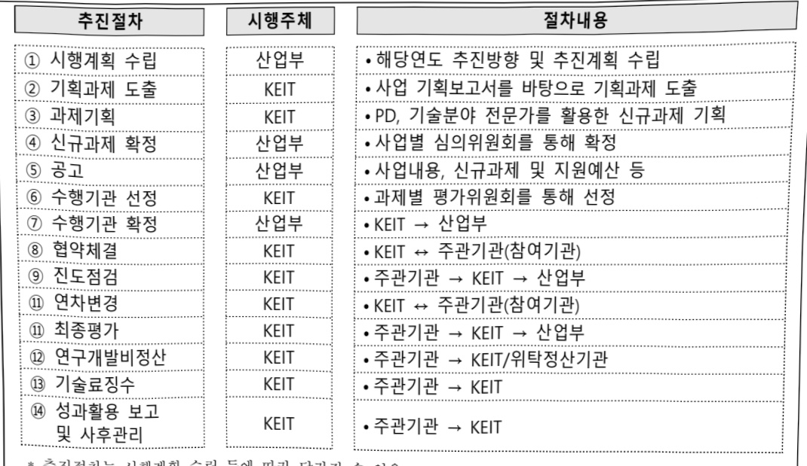
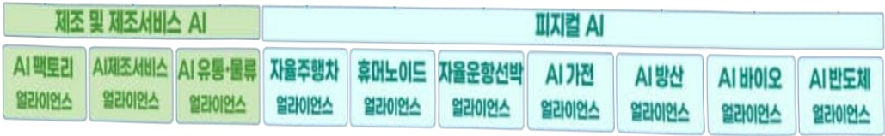

# AI응용제품 신속 상용화 지원사업(제조)

**해당 페이지**: PDF 3679 ~ 3688 쪽 해당

**부처**: 산업통상부
**분야**: 산업·중소기업 및 에너지
**회계유형**: 일반회계
**2026 확정예산**: 130000.0 백만원
**전년대비 증감률**: None%
**AI 도메인**: 제조/스마트팩토리, 디지털전환(AX)

---

<table border=1 style='margin: auto; word-wrap: break-word;'><tr><td style='text-align: center; word-wrap: break-word;'>사 업 명</td></tr><tr><td style='text-align: center; word-wrap: break-word;'>(1) AI응용제품신속상용화지원사업 (3174-421)</td></tr></table>

□ 사업 코드 정보

<table border=1 style='margin: auto; word-wrap: break-word;'><tr><td style='text-align: center; word-wrap: break-word;'>구분</td><td style='text-align: center; word-wrap: break-word;'>회계</td><td style='text-align: center; word-wrap: break-word;'>소관</td><td style='text-align: center; word-wrap: break-word;'>실국(기관)</td><td style='text-align: center; word-wrap: break-word;'>계정</td><td style='text-align: center; word-wrap: break-word;'>분야</td><td style='text-align: center; word-wrap: break-word;'>부문</td></tr><tr><td style='text-align: center; word-wrap: break-word;'>코드</td><td rowspan="2">일반회계</td><td rowspan="2">산업통상부</td><td rowspan="2">산업성장실산업인공지능정책관</td><td rowspan="2">지역지원계정</td><td style='text-align: center; word-wrap: break-word;'>110</td><td style='text-align: center; word-wrap: break-word;'>117</td></tr><tr><td style='text-align: center; word-wrap: break-word;'>명칭</td><td style='text-align: center; word-wrap: break-word;'>산업·중소기업및에너지</td><td style='text-align: center; word-wrap: break-word;'>산업혁신지원</td></tr></table>

<table border=1 style='margin: auto; word-wrap: break-word;'><tr><td style='text-align: center; word-wrap: break-word;'>구분</td><td style='text-align: center; word-wrap: break-word;'>프로그램</td><td style='text-align: center; word-wrap: break-word;'>단위사업</td><td style='text-align: center; word-wrap: break-word;'>세부사업</td></tr><tr><td style='text-align: center; word-wrap: break-word;'>코드</td><td style='text-align: center; word-wrap: break-word;'>3100</td><td style='text-align: center; word-wrap: break-word;'>3174</td><td style='text-align: center; word-wrap: break-word;'>421</td></tr><tr><td style='text-align: center; word-wrap: break-word;'>명칭</td><td style='text-align: center; word-wrap: break-word;'>산업경쟁력기반구축</td><td style='text-align: center; word-wrap: break-word;'>우수기술역량강화</td><td style='text-align: center; word-wrap: break-word;'>AI응용제품신속상용화지원사업</td></tr></table>

□ 사업 성격 (공통요구자료 II-1 작성유의사항 4. 참조, 해당하는 사항에 “○” 표시)

<table border=1 style='margin: auto; word-wrap: break-word;'><tr><td rowspan="2">신규</td><td rowspan="2">계속</td><td rowspan="2">완료</td><td rowspan="2">예비타당성 실시여부</td><td rowspan="2">총사업비 관리대상</td><td rowspan="2">총액계상 예산사업</td><td style='text-align: center; word-wrap: break-word;'>사업소관 변경정보</td></tr><tr><td style='text-align: center; word-wrap: break-word;'>2025예산 시 소관</td></tr><tr><td style='text-align: center; word-wrap: break-word;'>O</td><td style='text-align: center; word-wrap: break-word;'></td><td style='text-align: center; word-wrap: break-word;'></td><td style='text-align: center; word-wrap: break-word;'></td><td style='text-align: center; word-wrap: break-word;'></td><td style='text-align: center; word-wrap: break-word;'></td><td style='text-align: center; word-wrap: break-word;'></td></tr></table>

□ 사업 지원 형태 및 지원을 (최소한 한 개는 반드시 선택하시오. 해당사항에 0 표시)

<table border=1 style='margin: auto; word-wrap: break-word;'><tr><td style='text-align: center; word-wrap: break-word;'>직접</td><td style='text-align: center; word-wrap: break-word;'>출자</td><td style='text-align: center; word-wrap: break-word;'>출연</td><td style='text-align: center; word-wrap: break-word;'>보조</td><td style='text-align: center; word-wrap: break-word;'>융자</td><td style='text-align: center; word-wrap: break-word;'>국고보조율(%)</td><td style='text-align: center; word-wrap: break-word;'>융자율(%)</td></tr><tr><td style='text-align: center; word-wrap: break-word;'></td><td style='text-align: center; word-wrap: break-word;'></td><td style='text-align: center; word-wrap: break-word;'>O</td><td style='text-align: center; word-wrap: break-word;'></td><td style='text-align: center; word-wrap: break-word;'></td><td style='text-align: center; word-wrap: break-word;'></td><td style='text-align: center; word-wrap: break-word;'></td></tr></table>

## □ 사업 담당자

<table border=1 style='margin: auto; word-wrap: break-word;'><tr><td style='text-align: center; word-wrap: break-word;'>사업명</td><td colspan="5">구분</td></tr><tr><td rowspan="4">AI응용제품신속상용화지원사업</td><td rowspan="3">소관부처</td><td style='text-align: center; word-wrap: break-word;'>실·국·과(팀)</td><td style='text-align: center; word-wrap: break-word;'>과 장</td><td style='text-align: center; word-wrap: break-word;'>사무관</td><td style='text-align: center; word-wrap: break-word;'>주무관</td></tr><tr><td style='text-align: center; word-wrap: break-word;'>산업성장실산업인공지능정책관</td><td style='text-align: center; word-wrap: break-word;'>-</td><td style='text-align: center; word-wrap: break-word;'>팽기득 사무관</td><td style='text-align: center; word-wrap: break-word;'>박한솔 주무관</td></tr><tr><td style='text-align: center; word-wrap: break-word;'>제조인공지능전환협력과</td><td style='text-align: center; word-wrap: break-word;'>044-203-3840</td><td style='text-align: center; word-wrap: break-word;'>044-203-3844</td><td style='text-align: center; word-wrap: break-word;'>044-203-3847</td></tr><tr><td style='text-align: center; word-wrap: break-word;'>사업시행주체</td><td style='text-align: center; word-wrap: break-word;'>한국산업기술기획평가원</td><td style='text-align: center; word-wrap: break-word;'>기계로봇장비실</td><td style='text-align: center; word-wrap: break-word;'>박용수 실장 윤정환 책임</td><td style='text-align: center; word-wrap: break-word;'>053-718-8220 053-718-8469</td></tr></table>

---

### 가. 예산 총괄표

(단위: 백만원, %)

<table border=1 style='margin: auto; word-wrap: break-word;'><tr><td rowspan="2">사업명</td><td rowspan="2">2024년 결산</td><td colspan="2">2025년 예산</td><td colspan="2">2026년</td><td rowspan="2">증감(B-A)</td><td rowspan="2">(B-A)/A</td></tr><tr><td style='text-align: center; word-wrap: break-word;'>본예산(A)</td><td style='text-align: center; word-wrap: break-word;'>추경</td><td style='text-align: center; word-wrap: break-word;'>요구안</td><td style='text-align: center; word-wrap: break-word;'>확정(B)</td></tr><tr><td style='text-align: center; word-wrap: break-word;'>AI응용제품신속 상용화지원사업</td><td style='text-align: center; word-wrap: break-word;'>-</td><td style='text-align: center; word-wrap: break-word;'>-</td><td style='text-align: center; word-wrap: break-word;'>-</td><td style='text-align: center; word-wrap: break-word;'>157,500</td><td style='text-align: center; word-wrap: break-word;'>130,000</td><td style='text-align: center; word-wrap: break-word;'>130,000</td><td style='text-align: center; word-wrap: break-word;'>순증</td></tr></table>

□ 기능별(내역사업별), 목별 예산안 내역

(단위:백만원)

<table border=1 style='margin: auto; word-wrap: break-word;'><tr><td rowspan="3"></td><td colspan="5">2024</td><td colspan="7">2025(2025.12월말)</td><td rowspan="3">2026예산</td></tr><tr><td rowspan="2">예산액(추경)</td><td rowspan="2">예산현액</td><td rowspan="2">집행액[실집행액]</td><td rowspan="2">이월액</td><td rowspan="2">불용액</td><td rowspan="2">본예산</td><td rowspan="2">예산현액</td><td rowspan="2">집행액[실집행액]</td><td colspan="2">전년도이월액제외</td><td rowspan="2">이월예상액</td><td rowspan="2">불용예상액</td></tr><tr><td style='text-align: center; word-wrap: break-word;'>예산현액</td><td style='text-align: center; word-wrap: break-word;'>집행액[실집행액]</td></tr><tr><td style='text-align: center; word-wrap: break-word;'>○ 기능별 분류(합계)</td><td style='text-align: center; word-wrap: break-word;'>-</td><td style='text-align: center; word-wrap: break-word;'>-</td><td style='text-align: center; word-wrap: break-word;'>-</td><td style='text-align: center; word-wrap: break-word;'>-</td><td style='text-align: center; word-wrap: break-word;'>-</td><td style='text-align: center; word-wrap: break-word;'>-</td><td style='text-align: center; word-wrap: break-word;'>-</td><td style='text-align: center; word-wrap: break-word;'>-</td><td style='text-align: center; word-wrap: break-word;'>-</td><td style='text-align: center; word-wrap: break-word;'>-</td><td style='text-align: center; word-wrap: break-word;'>-</td><td style='text-align: center; word-wrap: break-word;'>-</td><td style='text-align: center; word-wrap: break-word;'>130,000</td></tr><tr><td style='text-align: center; word-wrap: break-word;'>· AI응용제품신속상용화지원사업</td><td style='text-align: center; word-wrap: break-word;'>-</td><td style='text-align: center; word-wrap: break-word;'>-</td><td style='text-align: center; word-wrap: break-word;'>-</td><td style='text-align: center; word-wrap: break-word;'>-</td><td style='text-align: center; word-wrap: break-word;'>-</td><td style='text-align: center; word-wrap: break-word;'>-</td><td style='text-align: center; word-wrap: break-word;'>-</td><td style='text-align: center; word-wrap: break-word;'>-</td><td style='text-align: center; word-wrap: break-word;'>-</td><td style='text-align: center; word-wrap: break-word;'>-</td><td style='text-align: center; word-wrap: break-word;'>-</td><td style='text-align: center; word-wrap: break-word;'>-</td><td style='text-align: center; word-wrap: break-word;'>124,150</td></tr><tr><td style='text-align: center; word-wrap: break-word;'>· 기획평가관리비</td><td style='text-align: center; word-wrap: break-word;'>-</td><td style='text-align: center; word-wrap: break-word;'>-</td><td style='text-align: center; word-wrap: break-word;'>-</td><td style='text-align: center; word-wrap: break-word;'>-</td><td style='text-align: center; word-wrap: break-word;'>-</td><td style='text-align: center; word-wrap: break-word;'>-</td><td style='text-align: center; word-wrap: break-word;'>-</td><td style='text-align: center; word-wrap: break-word;'>-</td><td style='text-align: center; word-wrap: break-word;'>-</td><td style='text-align: center; word-wrap: break-word;'>-</td><td style='text-align: center; word-wrap: break-word;'>-</td><td style='text-align: center; word-wrap: break-word;'>-</td><td style='text-align: center; word-wrap: break-word;'>5,850</td></tr><tr><td style='text-align: center; word-wrap: break-word;'>○ 비목별 분류(합계)</td><td style='text-align: center; word-wrap: break-word;'>-</td><td style='text-align: center; word-wrap: break-word;'>-</td><td style='text-align: center; word-wrap: break-word;'>-</td><td style='text-align: center; word-wrap: break-word;'>-</td><td style='text-align: center; word-wrap: break-word;'>-</td><td style='text-align: center; word-wrap: break-word;'>-</td><td style='text-align: center; word-wrap: break-word;'>-</td><td style='text-align: center; word-wrap: break-word;'>-</td><td style='text-align: center; word-wrap: break-word;'>-</td><td style='text-align: center; word-wrap: break-word;'>-</td><td style='text-align: center; word-wrap: break-word;'>-</td><td style='text-align: center; word-wrap: break-word;'>-</td><td style='text-align: center; word-wrap: break-word;'>130,000</td></tr><tr><td style='text-align: center; word-wrap: break-word;'>· 사업출연금(350-02)</td><td style='text-align: center; word-wrap: break-word;'>-</td><td style='text-align: center; word-wrap: break-word;'>-</td><td style='text-align: center; word-wrap: break-word;'>-</td><td style='text-align: center; word-wrap: break-word;'>-</td><td style='text-align: center; word-wrap: break-word;'>-</td><td style='text-align: center; word-wrap: break-word;'>-</td><td style='text-align: center; word-wrap: break-word;'>-</td><td style='text-align: center; word-wrap: break-word;'>-</td><td style='text-align: center; word-wrap: break-word;'>-</td><td style='text-align: center; word-wrap: break-word;'>-</td><td style='text-align: center; word-wrap: break-word;'>-</td><td style='text-align: center; word-wrap: break-word;'>-</td><td style='text-align: center; word-wrap: break-word;'>130,000</td></tr><tr><td style='text-align: center; word-wrap: break-word;'>○ 기능비목별 분류(합계)</td><td style='text-align: center; word-wrap: break-word;'>-</td><td style='text-align: center; word-wrap: break-word;'>-</td><td style='text-align: center; word-wrap: break-word;'>-</td><td style='text-align: center; word-wrap: break-word;'>-</td><td style='text-align: center; word-wrap: break-word;'>-</td><td style='text-align: center; word-wrap: break-word;'>-</td><td style='text-align: center; word-wrap: break-word;'>-</td><td style='text-align: center; word-wrap: break-word;'>-</td><td style='text-align: center; word-wrap: break-word;'>-</td><td style='text-align: center; word-wrap: break-word;'>-</td><td style='text-align: center; word-wrap: break-word;'>-</td><td style='text-align: center; word-wrap: break-word;'>-</td><td style='text-align: center; word-wrap: break-word;'>130,000</td></tr><tr><td style='text-align: center; word-wrap: break-word;'>· AI응용제품신속상용화지원사업</td><td style='text-align: center; word-wrap: break-word;'>-</td><td style='text-align: center; word-wrap: break-word;'>-</td><td style='text-align: center; word-wrap: break-word;'>-</td><td style='text-align: center; word-wrap: break-word;'>-</td><td style='text-align: center; word-wrap: break-word;'>-</td><td style='text-align: center; word-wrap: break-word;'>-</td><td style='text-align: center; word-wrap: break-word;'>-</td><td style='text-align: center; word-wrap: break-word;'>-</td><td style='text-align: center; word-wrap: break-word;'>-</td><td style='text-align: center; word-wrap: break-word;'>-</td><td style='text-align: center; word-wrap: break-word;'>-</td><td style='text-align: center; word-wrap: break-word;'>-</td><td style='text-align: center; word-wrap: break-word;'>124,150</td></tr><tr><td style='text-align: center; word-wrap: break-word;'>-사업출연금(350-02)</td><td style='text-align: center; word-wrap: break-word;'>-</td><td style='text-align: center; word-wrap: break-word;'>-</td><td style='text-align: center; word-wrap: break-word;'>-</td><td style='text-align: center; word-wrap: break-word;'>-</td><td style='text-align: center; word-wrap: break-word;'>-</td><td style='text-align: center; word-wrap: break-word;'>-</td><td style='text-align: center; word-wrap: break-word;'>-</td><td style='text-align: center; word-wrap: break-word;'>-</td><td style='text-align: center; word-wrap: break-word;'>-</td><td style='text-align: center; word-wrap: break-word;'>-</td><td style='text-align: center; word-wrap: break-word;'>-</td><td style='text-align: center; word-wrap: break-word;'>-</td><td style='text-align: center; word-wrap: break-word;'>124,150</td></tr><tr><td style='text-align: center; word-wrap: break-word;'>· 기획평가관리비-사업출연금(350-02)</td><td style='text-align: center; word-wrap: break-word;'>-</td><td style='text-align: center; word-wrap: break-word;'>-</td><td style='text-align: center; word-wrap: break-word;'>-</td><td style='text-align: center; word-wrap: break-word;'>-</td><td style='text-align: center; word-wrap: break-word;'>-</td><td style='text-align: center; word-wrap: break-word;'>-</td><td style='text-align: center; word-wrap: break-word;'>-</td><td style='text-align: center; word-wrap: break-word;'>-</td><td style='text-align: center; word-wrap: break-word;'>-</td><td style='text-align: center; word-wrap: break-word;'>-</td><td style='text-align: center; word-wrap: break-word;'>-</td><td style='text-align: center; word-wrap: break-word;'>-</td><td style='text-align: center; word-wrap: break-word;'>5,850</td></tr></table>

---

### 나. 사업설명자료

## 1 ) 사업 추진배경

0 인공지능 관련 글로벌 경쟁이 심화되는 가운데, AGI 등 원천기술 개발만큼 인공지능 전환(AX)과 적용이 매우 중요해진 상황

- 제조·식품·의료 등의 순산업에서 AI를 적용한 제품·서비스의 개발과 출시가 활발히 진행되고 있으나, 아직은 초기 단계*

* 국내 69%의 대기업은 여전히 AI를 효율 개선, 업무 간소화 등 기초적인 수준에만 사용, 10%만 AI 기반 신제품·서비스 활용(AWS, 25년)

AI 융합산업 중 단기 내 성과 창출이 가능한 유망분야를 선정하여, 이를 집중지원하는 'AX-Sprint(전력질주)' 프로젝트 추진

## 2 ) 사업목적·내용

° (목적) ①AI 관련 제품·서비스 신시장을 빠르게 창출, ②기존 제조·서비스 기업들의 AX를 가속화, ③새로운 AI 전문기업 육성, ④AI 관련 국민 체감도와 인식 제고

° (내용) AI응용제품 상용화를 위한 컨설팅 → 기술지원 → 판로개척 등 3단계 지원

< AI 응용제품 신속 상용화 지원 내용(예시) >

<table border=1 style='margin: auto; word-wrap: break-word;'><tr><td colspan="2">구분</td><td style='text-align: center; word-wrap: break-word;'>지원내용</td></tr><tr><td rowspan="2">컨설팅</td><td style='text-align: center; word-wrap: break-word;'>BM 개발</td><td style='text-align: center; word-wrap: break-word;'>타겟분석, 가격전략, 시장진출 전략 수립 등</td></tr><tr><td style='text-align: center; word-wrap: break-word;'>공정 개선</td><td style='text-align: center; word-wrap: break-word;'>AI 솔루션 적용, 수율향상, 원가절감 등</td></tr><tr><td rowspan="6">기술 지원</td><td style='text-align: center; word-wrap: break-word;'>시제품 제작 패키지</td><td style='text-align: center; word-wrap: break-word;'>설계, 디자인 목업, 제품 형상 구현(샘플금형, 비금형, 정밀 미세가공 등), 양산용 초도제품 제작</td></tr><tr><td style='text-align: center; word-wrap: break-word;'>양산체계 구축</td><td style='text-align: center; word-wrap: break-word;'>생산설비 및 시설 설계 및 부지 확보, 생산관리 정보화, 기술유출방지 시스템 구축 등</td></tr><tr><td style='text-align: center; word-wrap: break-word;'>기술이전 및 지재권 획득</td><td style='text-align: center; word-wrap: break-word;'>기술이전에 필요한 기술료 지원, 지식재산권(IP) 획득 지원 (분쟁대응 포함), 특허 및 상표권 등 출원비용 지원</td></tr><tr><td style='text-align: center; word-wrap: break-word;'>AI모델 확보</td><td style='text-align: center; word-wrap: break-word;'>학습 데이터 확보 및 AI 모델 개발 지원, GPU 활용 및 임대 지원</td></tr><tr><td style='text-align: center; word-wrap: break-word;'>시험·인증</td><td style='text-align: center; word-wrap: break-word;'>제품 또는 품질 관련 국내인증 취득을 위한 컨설팅 비용 등 지원, 해외 인증·시험·평가 비용 지원</td></tr><tr><td style='text-align: center; word-wrap: break-word;'>리빙랩 실증지원</td><td style='text-align: center; word-wrap: break-word;'>사용자 피드백 점검, 실환경 테스트 및 성능 검증</td></tr><tr><td rowspan="3">판로 개척</td><td style='text-align: center; word-wrap: break-word;'>브랜드 지원</td><td style='text-align: center; word-wrap: break-word;'>CI 디자인 개발, BI 개발, 브랜드스토리, 브랜드슬로건 등</td></tr><tr><td style='text-align: center; word-wrap: break-word;'>전시회 참가</td><td style='text-align: center; word-wrap: break-word;'>국내 AX Spirnt 공동 전시회 개최 및 해외 전시회 참가 지원</td></tr><tr><td style='text-align: center; word-wrap: break-word;'>홍보지원</td><td style='text-align: center; word-wrap: break-word;'>온라인(온라인 광고, 홍보영상, 홈페이지 등) 및 오프라인 매체(방송, 신문, 옥외광고, 교통매체, 홍보물 제작 등)를 활용한 제품 홍보</td></tr></table>

---

## 2 ) 사업개요

## □ 사업근거 및 추진경위

① 법령상 근거 및 조항 적시 : 산업기술혁신촉진법 제11조 및 제15조

제11조(산업기술개발사업) ① 산업통상부장관은 혁신계획 및 시행계획을 효율적으로 수행하기 위하여 관계 중앙행정기관의 장과 협의하여 다음 각 호의 산업기술 분야에서 기술개발사업(산업기술개발을 위하여 필요한 기획 및 조사를 포함한다. 이하 “산업기술개발사업”이라 한다)을 추진할 수 있다.

제15조 (개발기술사업화 촉진사업) ② 산업통상부장관은 개발된 기술의 사업화를 촉진하기 위하여 대통령령으로 정하는 바에 따라 다음 각 호의 사업(이하“개발기술사업화촉진사업”이라 한다)을 실시할 수 있다.

1. 신기술의 사업화 및 보육

2. 사업화를 지원하는 전문기관 및 전문인력의 양성

3. 사업화에 의하여 생산되는 제품의 판매 촉진

4. 산업기술개발사업의 후속개발 및 기술금융의 활성화

5. 기술력평가에 따른 기술담보대출의 활성화

6. 그 밖에 개발된 기술의 사업화를 촉진하기 위한 사업으로서 대통령령으로

정하는 사업

② 추진경위 - 사업 시작년도, 추진배경, 부처별 중점과제 등

- '25.2월 AX스프린트 기획 착수

- '25.7월 새정부 경제성장전략 포함

- '25.9월 예비수요조사 추진(대국민·연구소·투자사 등을 통한 2,032건 접수)

- '25.10 월 품목발굴 본 수요조사 추진(832건 접수)

- '25.11월 M.AX 얼라이언스 10개 분과별 검토 착수

□ 주요내용

① 사업규모

- 총사업비 : 해당없음

- 사업기간 : '26년~'27년

- 최근 5년 간 투입된 사업비(예산액기준, 추경편성한 연도에는 추경포함)

<table border=1 style='margin: auto; word-wrap: break-word;'><tr><td style='text-align: center; word-wrap: break-word;'>2022</td><td style='text-align: center; word-wrap: break-word;'>2023</td><td style='text-align: center; word-wrap: break-word;'>2024</td><td style='text-align: center; word-wrap: break-word;'>2025</td><td style='text-align: center; word-wrap: break-word;'>2026</td></tr><tr><td style='text-align: center; word-wrap: break-word;'>130,000</td><td style='text-align: center; word-wrap: break-word;'>-</td><td style='text-align: center; word-wrap: break-word;'>-</td><td style='text-align: center; word-wrap: break-word;'>-</td><td style='text-align: center; word-wrap: break-word;'>130,000</td></tr></table>

-기타: 해당없음

---

## ② 사업추진체계

- 사업시행방법 : 출연

- 사업시행주체 : 한국산업기술기획평가원

- 사업 수혜자 : 기업, 대학, 연구소 등

- 보조, 융자, 출연, 출자 등의 경우 보조 · 융자 등 지원 비율 및 법적근거

<table border=1 style='margin: auto; word-wrap: break-word;'><tr><td style='text-align: center; word-wrap: break-word;'>내역사업명</td><td style='text-align: center; word-wrap: break-word;'>구분</td><td style='text-align: center; word-wrap: break-word;'>피보조·피출연 등 기관명</td><td style='text-align: center; word-wrap: break-word;'>지원 금액 (2026예산)</td><td style='text-align: center; word-wrap: break-word;'>지원 비율(%)</td><td style='text-align: center; word-wrap: break-word;'>보조율 법적근거 (해당 조항)</td></tr><tr><td style='text-align: center; word-wrap: break-word;'>AI응용제품 신속상용화 지원사업</td><td style='text-align: center; word-wrap: break-word;'>출연</td><td style='text-align: center; word-wrap: break-word;'>한국산업 기술기획 평가원</td><td style='text-align: center; word-wrap: break-word;'>130,000</td><td style='text-align: center; word-wrap: break-word;'>70%</td><td style='text-align: center; word-wrap: break-word;'>산업기술혁신사업 공통운영요령 제24조</td></tr></table>

3) 2026년도 예산 산출 근거

① AI 응용제품 신속 상용화 지원사업

: (2026 반영, 신규) 124,150백만원, 124,150백만원 증액

- 가. Type1 : 85,950백만원 = 30개 품목 × 2,865백만원 = 85,950백만원

- 나. Type2 : 38,200백만원 = 20개 품목 × 1,910백만원 = 38,200백만원

② 기획평가관리비 : 5,850백만원

2025년도 예산 및 2026년도 예산안 산출 세부내역 비교

<table border=1 style='margin: auto; word-wrap: break-word;'><tr><td colspan="2">2025년 본예산</td><td colspan="2">2026년 예산</td></tr><tr><td style='text-align: center; word-wrap: break-word;'>예산</td><td style='text-align: center; word-wrap: break-word;'>산출내역</td><td style='text-align: center; word-wrap: break-word;'>예산</td><td style='text-align: center; word-wrap: break-word;'>산출내역</td></tr><tr><td style='text-align: center; word-wrap: break-word;'>-</td><td style='text-align: center; word-wrap: break-word;'>-</td><td style='text-align: center; word-wrap: break-word;'>130,000</td><td style='text-align: center; word-wrap: break-word;'>○ AI응용제품신속상용화지원사업: 124,150백만원 가. Type1: 85,950백만원 • 30개 품목 × 2,865백만원 = 85,950백만원 나. Type2: 38,200백만원 • 20개 품목 × 1,910백만원 = 38,200백만원 ○ 기획평가관리비: 5,850백만원</td></tr></table>

---

## 4 ) 사업효과

## □ 사업영향, 산출물 성과지표 등

① 2022~2026년도 성과계획서 상 성과지표 및 최근 5년간 성과 달성도 : 해당없음

- '25년 신규사업으로 성과지표 수립예정

② 성과지표 이외의 연도별 사업추진 경과 및 실적 : 해당없음

③ 향후(2026년도 이후) 기대효과

- 유망기술에 대한 상용화 지원, 수요 창출 등으로 국내 신산업을 육성하고, 이를

바탕으로 글로벌 시장을 선점

- AI 응용제품 상용화에 필요한 제조기업 - AI 기업간 매칭 등을 통해 AI 전문기업을

육성하고 협업 생태계 조성

- 일반 국민들이 제조현장, 일상 등에서 체감할 수 있는 제품을 확산하여 AI 전환 등에 대한 국민들의 인식 제고

- AI 응용제품을 활용하는 기업·소비자 확대 등을 통해 우리 산업의 생산성 증대 및 사회 전반의 편의성 향상

## 5 ) 타당성조사 및 예비타당성조사 시행여부 및 결과 요지

### □ '25.8월 국무회의를 거쳐 예비타당성 조사를 면제하기로 결정

o 국가재정법 제38조제2항제10호에 따라 긴급합 경제 상황 대응* 등을 위해 국가

정책적으로 추진이 필요하다고 판단되어 예비타당성조사 면제

* AI관련 제품·서비스 신시장의 빠른 창출과 기존 제조·서비스 기업들의 AX 가속화를 통해 국내 신산업을 육성하고 이를 바탕으로 글로벌 시장 선점 필요성 인정

## 6 ) 총사업비 대상사업 여부 및 내역 : 해당없음

## 7 ) 사업 집행절차

<table border=1 style='margin: auto; word-wrap: break-word;'><tr><td style='text-align: center; word-wrap: break-word;'>부처</td><td style='text-align: center; word-wrap: break-word;'></td><td style='text-align: center; word-wrap: break-word;'>피출연·피보조기관</td><td style='text-align: center; word-wrap: break-word;'></td><td style='text-align: center; word-wrap: break-word;'>간접보조사업자·사업수행자</td></tr><tr><td style='text-align: center; word-wrap: break-word;'>산업부(130,000백만원)</td><td style='text-align: center; word-wrap: break-word;'>=&gt;(130,000백만원)</td><td style='text-align: center; word-wrap: break-word;'>한국산업기술기획평가원(130,000백만원)</td><td style='text-align: center; word-wrap: break-word;'>=&gt;</td><td style='text-align: center; word-wrap: break-word;'>기업, 대학, 연구소 등</td></tr></table>

---

*추진절차는 시행계획 수립 등에 따라 달라질 수 있음

## 8 ) 중기재정계획 상 연도별 투자계획 및 추진경과

(단위: 백만원)

<table border=1 style='margin: auto; word-wrap: break-word;'><tr><td style='text-align: center; word-wrap: break-word;'>2024 재정계획</td><td style='text-align: center; word-wrap: break-word;'>2024</td><td style='text-align: center; word-wrap: break-word;'>2025</td><td style='text-align: center; word-wrap: break-word;'>2026</td><td style='text-align: center; word-wrap: break-word;'>2027</td><td style='text-align: center; word-wrap: break-word;'>2028</td><td style='text-align: center; word-wrap: break-word;'>2029</td></tr><tr><td style='text-align: center; word-wrap: break-word;'>2024~2028</td><td style='text-align: center; word-wrap: break-word;'>-</td><td style='text-align: center; word-wrap: break-word;'>-</td><td style='text-align: center; word-wrap: break-word;'>130,000</td><td style='text-align: center; word-wrap: break-word;'>40,000</td><td style='text-align: center; word-wrap: break-word;'>-</td><td style='text-align: center; word-wrap: break-word;'>-</td></tr><tr><td style='text-align: center; word-wrap: break-word;'>2025~2029</td><td style='text-align: center; word-wrap: break-word;'>-</td><td style='text-align: center; word-wrap: break-word;'>-</td><td style='text-align: center; word-wrap: break-word;'>130,000</td><td style='text-align: center; word-wrap: break-word;'>40,000</td><td style='text-align: center; word-wrap: break-word;'>-</td><td style='text-align: center; word-wrap: break-word;'>-</td></tr></table>

9) 최근 3년간 동 사업에 대한 주요 외부지적사항 및 평가, 문제점 및 대책 - 해당없음

10) 향후 추진방향 및 추진계획

<table border=1 style='margin: auto; word-wrap: break-word;'><tr><td style='text-align: center; word-wrap: break-word;'>☐ (추진방향) 품목 발굴 → 상용화 지원 → 성과 홍보 → 투자 연계 등 단계적 지원</td></tr><tr><td style='text-align: center; word-wrap: break-word;'>○ (품목발굴) 업계 수요 기반으로 M.AX 얼라이언스 검토를 거쳐 지원 대상 품목 도출</td></tr><tr><td style='text-align: center; word-wrap: break-word;'>○ (상용화) 컨설팅 → 기술지원 → 판로개척 등 기업 지원수요를 토대로 지원</td></tr><tr><td style='text-align: center; word-wrap: break-word;'>○ (성과홍보) 국내·외 전시회, 언론홍보(온라인·방송매체 등) 등을 통해 성과 홍보</td></tr><tr><td style='text-align: center; word-wrap: break-word;'>○ (투자연계) 투자설명회를 통한 투자사 연계프로그램 추진으로 B2B 매칭을 지원하고, 우수기업의 성과를 홍보하여 민간 중심의 자생구조 마련 추진</td></tr></table>

(품목발굴) 업계 수요 기반으로 M.AX 얼라이언스 검토를 거쳐 지원 대상 품목 도출

(상용화) 컨설팅 → 기술지원 → 판로개척 등 기업 지원수요를 토대로 지원

(성과홍보) 국내외 전시회, 언론홍보(온라인·방송매체 등) 등을 통해 성과 홍보

(투자연계) 투자설명회를 통한 투자사 연계프로그램 추진으로 B2B 매칭을 지원하고,

우수기업의 성과를 홍보하여 민간 중심의 자생구조 마련 추진

---

11) 해당사업에 대한 각종 사업평가의 결과:해당없음

12) 해당사업에 대한 부처 자체평가의 결과 : 해당없음

13) 부처 건의사항 : 해당없음

### 다. 최근 4년간 결산내역

1) 결산표 : 해당없음

2) 주요 결산사항 : 해당없음

### 라. 기타 추가자료

(1) AI 응용제품 신속 상용화 지원 사업설명자료 (참고)

---

## 참고

□ (추진배경) 인공지능 관련 글로벌 경쟁이 심화되는 가운데, AGI 등 원천기술 개발만큼 인공지능전환(AX)과 적용이 매우 중요해진 상황

AI를 활용해 기업의 의사결정, 제품개발, 제조공정 등을 혁신하는

AX 전략은 모든 산업에서 생존을 위한 필수

* 조주완 LG전자 : 인공지능전환(AX) 속도가 사업 성패를 좌우하게 될 것

* 손정의 SoftBank : AI 채택 여부가 기업 경쟁력을 가를 것

○ 제조·식품·의료 등의 순산업에서 AI를 적용한 제품·서비스의 개발과 출시가 활발히 진행되고 있으나, 아직은 초기 단계

* 국내 69%의 대기업은 여전히 AI를 효율 개선, 업무 간소화 등 기초적인 수준에만 사용, 10%만 AI 기반 신제품·서비스 활용(AWS, 25년)

- 이에 정부는 자율주행차·휴머노이드 등 핵심기술 중심으로 대규모 투자 예정이나, 사업화 등의 성과 창출에는 상당 시간 소요 예상

• AI 융합산업 중 단기내 성과창출이 가능한 유망분야를 선정하여, 이

를 집중지원하는 'AX-Sprint(전력질주)' 프로젝트 추진

- 이를 통해 AI 관련 제품·서비스 신시장을 빠르게 창출

②기존 제조·서비스 기업들의 AX를 가속화

③새로운 AI 전문기업 육성

4AI 관련 국민 체감도와 인식 제고

□ (선정 방안) M.AX 얼라이언스 10개 분과를 통해 검토

□ (사업내용) 컨설팅 → 기술지원 → 판로개척 등 3단계 지원

---

< AI 응용제품 신속 상용화 지원 내용(예시) >

<table border=1 style='margin: auto; word-wrap: break-word;'><tr><td colspan="2">구분</td><td style='text-align: center; word-wrap: break-word;'>지원내용</td></tr><tr><td rowspan="2">컨설팅</td><td style='text-align: center; word-wrap: break-word;'>BM 개발</td><td style='text-align: center; word-wrap: break-word;'>타겟분석, 가격전략, 시장진출 전략 수립 등</td></tr><tr><td style='text-align: center; word-wrap: break-word;'>공정 개선</td><td style='text-align: center; word-wrap: break-word;'>AI 솔루션 적용, 수율향상, 원가절감 등</td></tr><tr><td rowspan="6">기술 지원</td><td style='text-align: center; word-wrap: break-word;'>시제품 제작 패키지</td><td style='text-align: center; word-wrap: break-word;'>설계, 디자인 목업, 제품 형상 구현(샘플금형, 비금형, 정밀 미세가공 등), 양산용 초도제품 제작</td></tr><tr><td style='text-align: center; word-wrap: break-word;'>양산체계 구축</td><td style='text-align: center; word-wrap: break-word;'>생산설비 및 시설 설계 및 부지 확보, 생산관리 정보화, 기술유출방지 시스템 구축 등</td></tr><tr><td style='text-align: center; word-wrap: break-word;'>기술이전 및 지재권 획득</td><td style='text-align: center; word-wrap: break-word;'>기술이전에 필요한 기술료 지원, 지식재산권(IP) 획득 지원(분쟁대응 포함), 특허 및 상표권 등 출원비용 지원</td></tr><tr><td style='text-align: center; word-wrap: break-word;'>AI모델 확보</td><td style='text-align: center; word-wrap: break-word;'>학습 데이터 확보 및 AI 모델 개발 지원, GPU 활용 및 임대 지원</td></tr><tr><td style='text-align: center; word-wrap: break-word;'>시험·인증</td><td style='text-align: center; word-wrap: break-word;'>제품 또는 품질 관련 국내인증 취득을 위한 컨설팅 비용 등 지원, 해외 인증·시험·평가 비용 지원</td></tr><tr><td style='text-align: center; word-wrap: break-word;'>리빙랩 실증지원</td><td style='text-align: center; word-wrap: break-word;'>사용자 피드백 점검, 실환경 테스트 및 성능 검증</td></tr><tr><td rowspan="3">판로 개척</td><td style='text-align: center; word-wrap: break-word;'>브랜드 지원</td><td style='text-align: center; word-wrap: break-word;'>CI 디자인 개발, BI 개발, 브랜드스토리, 브랜드슬로건 등</td></tr><tr><td style='text-align: center; word-wrap: break-word;'>전시회 참가</td><td style='text-align: center; word-wrap: break-word;'>국내 AX Spirit 공동 전시회 개최 및 해외 전시회 참가 지원</td></tr><tr><td style='text-align: center; word-wrap: break-word;'>홍보지원</td><td style='text-align: center; word-wrap: break-word;'>온라인(온라인 광고, 홍보영상, 홈페이지 등) 및 오프라인 매체(방송, 신문, 옥외광고, 교통매체, 홍보물 제작 등)를 활용한 제품 홍보</td></tr></table>

□ (지원조건) 출연 * 국비 70%, 민간매칭 30%

□ (수행체계) 전담 KEIT(한국산업기술기획평가원)

□ (사업기간/전체사업비) '26년~'27년 / 국비 1,700억원

□ (26년 예산) 1,300억원

o Type1(1년 지원) : 859.5억 * 산출내역 : 30개 품목 × 28.7억원 = 895.5억원

o Type2(2년 지원) : 382억원 * 산출내역 : 20개 품목 × 19.1억원 = 382억원

---

### 원본 PDF 크롭 이미지

