# AI자율제조SDM플랫폼기술개발사업(R&D)

**해당 페이지**: PDF 3689 ~ 3703 쪽 해당

**부처**: 산업통상부
**분야**: 산업·중소기업 및 에너지
**회계유형**: 일반회계
**2026 확정예산**: 7500.0 백만원
**전년대비 증감률**: None%
**AI 도메인**: 로봇, 제조/스마트팩토리

---

<table border=1 style='margin: auto; word-wrap: break-word;'><tr><td style='text-align: center; word-wrap: break-word;'>사 업 명</td></tr><tr><td style='text-align: center; word-wrap: break-word;'>(192) AI자율제조SDM플랫폼기술개발(R&amp;D) (3541-414)</td></tr></table>

## □ 사업 코드 정보

<table border=1 style='margin: auto; word-wrap: break-word;'><tr><td style='text-align: center; word-wrap: break-word;'>구분</td><td style='text-align: center; word-wrap: break-word;'>회계</td><td style='text-align: center; word-wrap: break-word;'>소관</td><td style='text-align: center; word-wrap: break-word;'>실국(기관)</td><td style='text-align: center; word-wrap: break-word;'>계정</td><td style='text-align: center; word-wrap: break-word;'>분야</td><td style='text-align: center; word-wrap: break-word;'>부문</td></tr><tr><td style='text-align: center; word-wrap: break-word;'>코드</td><td rowspan="2">일반회계</td><td rowspan="2">산업통상부</td><td rowspan="2">산업성장실산업인공지능정책관</td><td rowspan="2"></td><td style='text-align: center; word-wrap: break-word;'>110</td><td style='text-align: center; word-wrap: break-word;'>117</td></tr><tr><td style='text-align: center; word-wrap: break-word;'>명칭</td><td style='text-align: center; word-wrap: break-word;'>산업·중소기업및에너지</td><td style='text-align: center; word-wrap: break-word;'>산업혁신지원</td></tr></table>

<table border=1 style='margin: auto; word-wrap: break-word;'><tr><td style='text-align: center; word-wrap: break-word;'>구분</td><td style='text-align: center; word-wrap: break-word;'>프로그램</td><td style='text-align: center; word-wrap: break-word;'>단위사업</td><td style='text-align: center; word-wrap: break-word;'>세부사업</td></tr><tr><td style='text-align: center; word-wrap: break-word;'>코드</td><td style='text-align: center; word-wrap: break-word;'>3500</td><td style='text-align: center; word-wrap: break-word;'>3541</td><td style='text-align: center; word-wrap: break-word;'>414</td></tr><tr><td style='text-align: center; word-wrap: break-word;'>명칭</td><td style='text-align: center; word-wrap: break-word;'>주력산업진흥</td><td style='text-align: center; word-wrap: break-word;'>제조기반기술개발</td><td style='text-align: center; word-wrap: break-word;'>AI자율제조SDM플랫폼기술개발(R&amp;D)</td></tr></table>

□ 사업 성격 (공통요구자료 Ⅱ-1 작성유의사항 4. 참조, 해당하는 사항에 “○” 표시)

<table border=1 style='margin: auto; word-wrap: break-word;'><tr><td rowspan="2">신규</td><td rowspan="2">계속</td><td rowspan="2">완료</td><td style='text-align: center; word-wrap: break-word;'>예비타당성</td><td style='text-align: center; word-wrap: break-word;'>총사업비</td><td style='text-align: center; word-wrap: break-word;'>총액계상</td><td style='text-align: center; word-wrap: break-word;'>사업소관 변경정보</td></tr><tr><td style='text-align: center; word-wrap: break-word;'>실시여부</td><td style='text-align: center; word-wrap: break-word;'>관리대상</td><td style='text-align: center; word-wrap: break-word;'>예산사업</td><td style='text-align: center; word-wrap: break-word;'>2025예산 시 소관</td></tr><tr><td style='text-align: center; word-wrap: break-word;'></td><td style='text-align: center; word-wrap: break-word;'>O</td><td style='text-align: center; word-wrap: break-word;'></td><td style='text-align: center; word-wrap: break-word;'></td><td style='text-align: center; word-wrap: break-word;'></td><td style='text-align: center; word-wrap: break-word;'></td><td style='text-align: center; word-wrap: break-word;'></td></tr></table>

□ 사업 지원 형태 및 지원을 (최소한 한 개는 반드시 선택하시오. 해당사항에 O 표시)

<table border=1 style='margin: auto; word-wrap: break-word;'><tr><td style='text-align: center; word-wrap: break-word;'>직접</td><td style='text-align: center; word-wrap: break-word;'>출자</td><td style='text-align: center; word-wrap: break-word;'>출연</td><td style='text-align: center; word-wrap: break-word;'>보조</td><td style='text-align: center; word-wrap: break-word;'>융자</td><td style='text-align: center; word-wrap: break-word;'>국고보조율(%)</td><td style='text-align: center; word-wrap: break-word;'>융자율(%)</td></tr><tr><td style='text-align: center; word-wrap: break-word;'></td><td style='text-align: center; word-wrap: break-word;'></td><td style='text-align: center; word-wrap: break-word;'>O</td><td style='text-align: center; word-wrap: break-word;'></td><td style='text-align: center; word-wrap: break-word;'></td><td style='text-align: center; word-wrap: break-word;'></td><td style='text-align: center; word-wrap: break-word;'></td></tr></table>

## ☐ 사업 담당자

<table border=1 style='margin: auto; word-wrap: break-word;'><tr><td style='text-align: center; word-wrap: break-word;'>사업명</td><td colspan="5">구분</td></tr><tr><td rowspan="4">AI자율제조SDM플랫폼기술개발(R&amp;D)</td><td rowspan="3">소관부처</td><td style='text-align: center; word-wrap: break-word;'>실·국·과(팀)</td><td style='text-align: center; word-wrap: break-word;'>과 장</td><td style='text-align: center; word-wrap: break-word;'>사무관</td><td style='text-align: center; word-wrap: break-word;'>주무관</td></tr><tr><td style='text-align: center; word-wrap: break-word;'>산업성장실산업인공지능정책관</td><td style='text-align: center; word-wrap: break-word;'>신용민</td><td style='text-align: center; word-wrap: break-word;'>안용열</td><td style='text-align: center; word-wrap: break-word;'>안용관</td></tr><tr><td style='text-align: center; word-wrap: break-word;'>인공지능기계로봇과</td><td style='text-align: center; word-wrap: break-word;'>044)203-4310</td><td style='text-align: center; word-wrap: break-word;'>044)203-4311</td><td style='text-align: center; word-wrap: break-word;'>044)203-4319</td></tr><tr><td style='text-align: center; word-wrap: break-word;'>사업시행주체</td><td style='text-align: center; word-wrap: break-word;'>한국산업기술기획평가원</td><td style='text-align: center; word-wrap: break-word;'>기계로봇장비실</td><td style='text-align: center; word-wrap: break-word;'>윤정환 책임</td><td style='text-align: center; word-wrap: break-word;'>053)718-8469</td></tr></table>

---

### 가.예산 총괄표

(단위: 백만원, %)

<table border=1 style='margin: auto; word-wrap: break-word;'><tr><td rowspan="2">사업명</td><td rowspan="2">2024년 결산</td><td colspan="2">2025년 예산</td><td colspan="2">2026년</td><td rowspan="2">중감 (B-A)</td><td rowspan="2">(B-A)/A</td></tr><tr><td style='text-align: center; word-wrap: break-word;'>본예산(A)</td><td style='text-align: center; word-wrap: break-word;'>추경</td><td style='text-align: center; word-wrap: break-word;'>요구안</td><td style='text-align: center; word-wrap: break-word;'>확정(B)</td></tr><tr><td style='text-align: center; word-wrap: break-word;'>AI자율제조SDM 플랫폼기술개발</td><td style='text-align: center; word-wrap: break-word;'>-</td><td style='text-align: center; word-wrap: break-word;'>9,200</td><td style='text-align: center; word-wrap: break-word;'>9,200</td><td style='text-align: center; word-wrap: break-word;'>10,000</td><td style='text-align: center; word-wrap: break-word;'>7,500</td><td style='text-align: center; word-wrap: break-word;'>△1,700</td><td style='text-align: center; word-wrap: break-word;'>△18.5</td></tr></table>

□ 기능별(내역사업별), 목별 예산안 내역

(단위:백만원)

<table border=1 style='margin: auto; word-wrap: break-word;'><tr><td rowspan="3"></td><td colspan="5">2024</td><td colspan="7">2025(2025.12월말)</td><td rowspan="3">2026예산</td></tr><tr><td rowspan="2">예산액(추경)</td><td rowspan="2">예산현액</td><td rowspan="2">집행액[실집행액]</td><td rowspan="2">이월액</td><td rowspan="2">불용액</td><td rowspan="2">분예산</td><td rowspan="2">예산현액</td><td rowspan="2">집행액[실집행액]</td><td colspan="2">전년도 이월액제외</td><td rowspan="2">이월예상액</td><td rowspan="2">불용예상액</td></tr><tr><td style='text-align: center; word-wrap: break-word;'>예산현액</td><td style='text-align: center; word-wrap: break-word;'>집행액[실집행액]</td></tr><tr><td style='text-align: center; word-wrap: break-word;'>○ 기능별 분류(함께)</td><td style='text-align: center; word-wrap: break-word;'>-</td><td style='text-align: center; word-wrap: break-word;'>-</td><td style='text-align: center; word-wrap: break-word;'>-</td><td style='text-align: center; word-wrap: break-word;'>-</td><td style='text-align: center; word-wrap: break-word;'>-</td><td style='text-align: center; word-wrap: break-word;'>9,200</td><td style='text-align: center; word-wrap: break-word;'>9,200</td><td style='text-align: center; word-wrap: break-word;'>9,200[9,200]</td><td style='text-align: center; word-wrap: break-word;'>-</td><td style='text-align: center; word-wrap: break-word;'>-</td><td style='text-align: center; word-wrap: break-word;'>-</td><td style='text-align: center; word-wrap: break-word;'>-</td><td style='text-align: center; word-wrap: break-word;'>7,500</td></tr><tr><td style='text-align: center; word-wrap: break-word;'>· AI자율제조SDM 플랫폼기술개발</td><td style='text-align: center; word-wrap: break-word;'>-</td><td style='text-align: center; word-wrap: break-word;'>-</td><td style='text-align: center; word-wrap: break-word;'>-</td><td style='text-align: center; word-wrap: break-word;'>-</td><td style='text-align: center; word-wrap: break-word;'>-</td><td style='text-align: center; word-wrap: break-word;'>9,200</td><td style='text-align: center; word-wrap: break-word;'>9,200</td><td style='text-align: center; word-wrap: break-word;'>9,200[9,200]</td><td style='text-align: center; word-wrap: break-word;'>-</td><td style='text-align: center; word-wrap: break-word;'>-</td><td style='text-align: center; word-wrap: break-word;'>-</td><td style='text-align: center; word-wrap: break-word;'>-</td><td style='text-align: center; word-wrap: break-word;'>7,500</td></tr><tr><td style='text-align: center; word-wrap: break-word;'>○ 비목별 분류(함께)</td><td style='text-align: center; word-wrap: break-word;'>-</td><td style='text-align: center; word-wrap: break-word;'>-</td><td style='text-align: center; word-wrap: break-word;'>-</td><td style='text-align: center; word-wrap: break-word;'>-</td><td style='text-align: center; word-wrap: break-word;'>-</td><td style='text-align: center; word-wrap: break-word;'>9,200</td><td style='text-align: center; word-wrap: break-word;'>9,200</td><td style='text-align: center; word-wrap: break-word;'>9,200[9,200]</td><td style='text-align: center; word-wrap: break-word;'>-</td><td style='text-align: center; word-wrap: break-word;'>-</td><td style='text-align: center; word-wrap: break-word;'>-</td><td style='text-align: center; word-wrap: break-word;'>-</td><td style='text-align: center; word-wrap: break-word;'>7,500</td></tr><tr><td style='text-align: center; word-wrap: break-word;'>· 연구개발출연금(360-05)</td><td style='text-align: center; word-wrap: break-word;'>-</td><td style='text-align: center; word-wrap: break-word;'>-</td><td style='text-align: center; word-wrap: break-word;'>-</td><td style='text-align: center; word-wrap: break-word;'>-</td><td style='text-align: center; word-wrap: break-word;'>-</td><td style='text-align: center; word-wrap: break-word;'>9,200</td><td style='text-align: center; word-wrap: break-word;'>9,200</td><td style='text-align: center; word-wrap: break-word;'>9,200[9,200]</td><td style='text-align: center; word-wrap: break-word;'>-</td><td style='text-align: center; word-wrap: break-word;'>-</td><td style='text-align: center; word-wrap: break-word;'>-</td><td style='text-align: center; word-wrap: break-word;'>-</td><td style='text-align: center; word-wrap: break-word;'>7,500</td></tr><tr><td style='text-align: center; word-wrap: break-word;'>○ 기능비목별 분류(함께)</td><td style='text-align: center; word-wrap: break-word;'>-</td><td style='text-align: center; word-wrap: break-word;'>-</td><td style='text-align: center; word-wrap: break-word;'>-</td><td style='text-align: center; word-wrap: break-word;'>-</td><td style='text-align: center; word-wrap: break-word;'>-</td><td style='text-align: center; word-wrap: break-word;'>9,200</td><td style='text-align: center; word-wrap: break-word;'>9,200</td><td style='text-align: center; word-wrap: break-word;'>9,200[9,200]</td><td style='text-align: center; word-wrap: break-word;'>-</td><td style='text-align: center; word-wrap: break-word;'>-</td><td style='text-align: center; word-wrap: break-word;'>-</td><td style='text-align: center; word-wrap: break-word;'>-</td><td style='text-align: center; word-wrap: break-word;'>7,500</td></tr><tr><td style='text-align: center; word-wrap: break-word;'>· AI자율제조SDM 플랫폼기술개발 - 연구개발출연금(360-05)</td><td style='text-align: center; word-wrap: break-word;'>-</td><td style='text-align: center; word-wrap: break-word;'>-</td><td style='text-align: center; word-wrap: break-word;'>-</td><td style='text-align: center; word-wrap: break-word;'>-</td><td style='text-align: center; word-wrap: break-word;'>-</td><td style='text-align: center; word-wrap: break-word;'>9,200</td><td style='text-align: center; word-wrap: break-word;'>9,200</td><td style='text-align: center; word-wrap: break-word;'>9,200[9,200]</td><td style='text-align: center; word-wrap: break-word;'>-</td><td style='text-align: center; word-wrap: break-word;'>-</td><td style='text-align: center; word-wrap: break-word;'>-</td><td style='text-align: center; word-wrap: break-word;'>-</td><td style='text-align: center; word-wrap: break-word;'>7,500</td></tr></table>

---

### 나. 사업설명자료

## 1 ) 사업목적·내용

□ (사업목적) 제조 손 과정에서 산업 AI 기반의 로봇·장비·시스템 등이 자율적으로 협업하기 위해 기업 내 혹은 기업 간 이기종 IT·OT 제조데이터를 연계하는「자율제조 SDM 플랫폼」기술개발

□ (사업내용) 산업 AI 기반의 로봇·장비·시스템 등이 제조 손 과정에서 자율적으로 협업

하기 위해 IT·OT 제조데이터를 연계하는 기술을 개발

① (1세부)SDM 플랫폼, 공통기술 개발 : ▲작업장 내 장비·로봇과 제조 솔루션(가상제조시스템 등) 간 데이터 연계, ▲맞춤형 작업지시, ▲작업별 장비·로봇 제구성, ▲장비·로봇 원격 업데이트 등 공통기술 개발

② (2-4)공통기술 기반 업종 특화 플랫폼 개발 : ▲이산공정(자동차, 조선, 기계 등), ▲연속공정(철강, 정유, 석화), ▲하이브리드공정(반도체, 디스플레이, 이차전지 등)으로 구분하여 각 공정 특성별 특화된 플랫폼 개발

③ (5세부)「SDM 플랫폼」기능·성능 검증 기술 개발 : 플랫폼의 ▲데이터 처리 속도, ▲장비·로 봇 동시접속 수, ▲데이터 무결성 등 성능 검증

## 2 ) 사업개요

## □ 사업근거 및 추진경위

① 법령상 근거 및 조항 적시 : 산업기술혁신촉진법 제11조(산업기술개발사업)

① 산업통상부장관은 혁신계획 및 시행계획을 효율적으로 수행하기 위하여 관계 중앙행정기관의 장과 협의하여 다음 각 호의 산업기술분야에서 기술개발사업(산업기술개발을 위하여 필요한 기획 및 조사를포함한다. 이하 "산업기술개발사업"이라 한다)을 추진할 수 있다.

1. 산업의 공통적인 기반이 되는 생산기반 기술, 부품·소재 및 장비·설비(플랜트를 포함한다) 기술

2. 산업기술 분야의 미래 유망 기술

3.산업의 고부가가치화를 위한 공정혁신, 청정생산 및 환경설비 등에 관련된 기술 등

4. 기술이전·사업화 촉진사업을 추진하는 경우 그 촉진사업의 관리 등에 필요한 사항은 대통령령으로 정한다.

## ② 추진경위

-「제조업 혁신 3.0 전략」 수립('14.6월)

* IT·SW·사물인터넷 융합으로 '20년까지 1만 개 공장의 스마트화 추진, 엔지니어링, 디자인, 임베디드 SW 등 제조업 3대 소프트파워 강화 추진 등

-「제조업 르네상스 비전 및 전략」 수립('19.6월)

* 혁신·선도형 제조 강국 실현을 위한 정책 중 IT 연계 정책 다수 포함

-「산업 AI 내재화 전략」수립('23.1월)

---

*▲수요-공급기업 간 협력 모델을 통해 AI 내재화 및 공급 산업육성, ▲잠재력을 갖춘 수요기업의 AI 활용역량 강화, ▲민간주도의 지속 가능한 DX 생태계 조성

-「AI 자율제조 전략 1.0」 수립(24.5월)

*▲AI 자율제조 본격 확산,▲통합적 관점에서 기술개발 등 핵심역량 확보,▲AI 자율제조 Eco System 구축,▲협력 네트워크 구축

□ 주요내용

① 사업규모

- 총사업비 : 383억원(국고: 292억원, '25년까지 기투자액: 92억원)

- 사업기간 : '25~'27

- 최근 5년 간 투입된 사업비(예산액기준, 추경편성한 연도에는 추경포함)

<table border=1 style='margin: auto; word-wrap: break-word;'><tr><td style='text-align: center; word-wrap: break-word;'>연도</td><td style='text-align: center; word-wrap: break-word;'>2022</td><td style='text-align: center; word-wrap: break-word;'>2023</td><td style='text-align: center; word-wrap: break-word;'>2024</td><td style='text-align: center; word-wrap: break-word;'>2025</td><td style='text-align: center; word-wrap: break-word;'>2026</td></tr><tr><td style='text-align: center; word-wrap: break-word;'>사업비</td><td style='text-align: center; word-wrap: break-word;'>-</td><td style='text-align: center; word-wrap: break-word;'>-</td><td style='text-align: center; word-wrap: break-word;'>-</td><td style='text-align: center; word-wrap: break-word;'>9,200</td><td style='text-align: center; word-wrap: break-word;'>7,500</td></tr></table>

-기타: 해당없음

② 사업추진체계

- 사업시행방법 : 출연

- 사업시행주체 : 한국산업기술기획평가원

- 사업 수혜자 : 기업, 대학, 연구소 등

- 보조, 융자, 출연, 출자 등의 경우 보조·융자 등 지원 비율 및 법적근거

<table border=1 style='margin: auto; word-wrap: break-word;'><tr><td style='text-align: center; word-wrap: break-word;'>내역사업명</td><td style='text-align: center; word-wrap: break-word;'>구분</td><td style='text-align: center; word-wrap: break-word;'>피보조·피출연 등 기관명</td><td style='text-align: center; word-wrap: break-word;'>지원 금액 (2026예산)</td><td style='text-align: center; word-wrap: break-word;'>지원 비율(%)</td><td style='text-align: center; word-wrap: break-word;'>보조율 법적근거 (해당 조항)</td></tr><tr><td style='text-align: center; word-wrap: break-word;'>AI자율제조 SDM플랫폼 기술개발</td><td style='text-align: center; word-wrap: break-word;'>출연</td><td style='text-align: center; word-wrap: break-word;'>한국산업 기술기획 평가원</td><td style='text-align: center; word-wrap: break-word;'>7,500</td><td style='text-align: center; word-wrap: break-word;'>수행기관별 차등지원</td><td style='text-align: center; word-wrap: break-word;'>산업기술혁신촉진법 제11조</td></tr></table>

---

## 3 ) 2026년도 예산 산출 근거

## ① AI자율제조SDM플랫폼기술개발

:(25)9,200백만원→(26)7,500백만원,△1,700백만원

- 제조AI고도화를 위한 SDM플랫폼 핵심기술 개발 및 업종별 데이터 확보 및 실증테스트 구축 지원과제 7,500백 만원 반영

- (산출) 계속과제 6건 × 1,500백만원 × 10/12개월 = 7,500백만원

①(총괄)제조AI고도화를 위한 SDM플랫폼 핵심기술개발 및 성과확산(200백만원)

② (1세부) SDM플랫폼을 위한 MFM 핵심기술개발 (2,500백만원)

③(2세부)자동차·조선·기계 업종 데이터 확보 및 SDM 실증 테스트베드 구축 (400백만원)

④(3세부)철강·정유·석유화학 업종 데이터 확보 및 SDM 실증 테스트베드 구축 (400백만원)

⑤(4세부)반도체·디스플레이·이차전지·가전 업종 데이터 연계기술개발 및 테스트베드 구축(400백만원)

⑥(5세부)자율제조 운영을 위한 SDM플랫폼 기술개발 (3,600백만원)

02025년도 예산 및 2026년도 예산 산출 세부내역 비교

<table border=1 style='margin: auto; word-wrap: break-word;'><tr><td colspan="3">2025년 본예산</td><td colspan="3">2026년 예산</td><td style='text-align: center; word-wrap: break-word;'></td><td style='text-align: center; word-wrap: break-word;'></td></tr><tr><td style='text-align: center; word-wrap: break-word;'>예산</td><td colspan="2">산출내역</td><td style='text-align: center; word-wrap: break-word;'>예산</td><td colspan="2">산출내역</td><td style='text-align: center; word-wrap: break-word;'></td><td style='text-align: center; word-wrap: break-word;'></td></tr><tr><td rowspan="6">9,200</td><td rowspan="6">○ 연구개발출연금(360-05) : 9,200액만원
- 총 6전 신규과제 추진 (총괄과제 1건, 세부과제 5건)
(총괄) AI 자율제조 SDM 플랫폼 글로벌 협력체계 구축 운영
(1세부) AI 자율제조 SDM 플랫폼 기술 개발
(2세부) 자동차 조선·기계 가전 업종 데이터 연계 기술 개발 및 테스트베드 구축
(3세부) 철강·정유·섬유·석유화학 업종 데이터 연계 기술 개발 및 테스트베드 구축
(4세부) 반도체·디스플레이·이자전지 업종 데이터 연계 기술 개발 및 테스트베드 구축
(5세부) 표준 기반 자율 제조 솔루션 및 데이터 상호운용성 검증체계 기술
합계</td><td style='text-align: center; word-wrap: break-word;'>예산</td><td style='text-align: center; word-wrap: break-word;'>300</td><td style='text-align: center; word-wrap: break-word;'>○ 연구개발출연금(360-05) : 7,500액만원
- 총 6전 계속과제 추진 (총괄과제 1건, 세부과제 5건)
(총괄) 제조AI고도화를 위한 SDM플랫폼 핵심 기술개발 및 성과확산
(1세부) SDM플랫폼을 위한 MFM 핵심기술개발
(2세부) 자동차·조선·기계 업종 데이터 확보 및 SDM 실증 테스트베드 구축
(3세부) 철강·정유·석유화학 업종 데이터 확보 및 SDM 실증 테스트베드 구축
(4세부) 반도체·디스플레이·이자전지·가전 업종 데이터 연계기술개발 및 테스트베드 구축
(5세부) 자율제조 운영을 위한 SDM플랫폼 기술개발
합계</td><td style='text-align: center; word-wrap: break-word;'>예산</td><td style='text-align: center; word-wrap: break-word;'>200</td><td style='text-align: center; word-wrap: break-word;'>2,500</td></tr><tr><td style='text-align: center; word-wrap: break-word;'>1,800</td><td rowspan="5">7,500</td><td style='text-align: center; word-wrap: break-word;'>400</td><td style='text-align: center; word-wrap: break-word;'></td><td style='text-align: center; word-wrap: break-word;'></td><td style='text-align: center; word-wrap: break-word;'></td></tr><tr><td style='text-align: center; word-wrap: break-word;'>1,800</td><td style='text-align: center; word-wrap: break-word;'>400</td><td style='text-align: center; word-wrap: break-word;'></td><td style='text-align: center; word-wrap: break-word;'></td><td style='text-align: center; word-wrap: break-word;'></td></tr><tr><td style='text-align: center; word-wrap: break-word;'>1,800</td><td style='text-align: center; word-wrap: break-word;'>400</td><td style='text-align: center; word-wrap: break-word;'></td><td style='text-align: center; word-wrap: break-word;'></td><td style='text-align: center; word-wrap: break-word;'></td></tr><tr><td style='text-align: center; word-wrap: break-word;'>500</td><td style='text-align: center; word-wrap: break-word;'>3,600</td><td style='text-align: center; word-wrap: break-word;'></td><td style='text-align: center; word-wrap: break-word;'></td><td style='text-align: center; word-wrap: break-word;'></td></tr><tr><td style='text-align: center; word-wrap: break-word;'>9,200</td><td style='text-align: center; word-wrap: break-word;'>7,500</td><td style='text-align: center; word-wrap: break-word;'></td><td style='text-align: center; word-wrap: break-word;'></td><td style='text-align: center; word-wrap: break-word;'></td></tr></table>

## 4 ) 사업효과

□ 사업영향, 산출물 성과지표 등

① 2022~2026년도 성과계획서 상 성과지표 및 최근 5년간 성과 달성도

<table border=1 style='margin: auto; word-wrap: break-word;'><tr><td style='text-align: center; word-wrap: break-word;'>성과지표</td><td style='text-align: center; word-wrap: break-word;'>구분</td><td style='text-align: center; word-wrap: break-word;'>2022</td><td style='text-align: center; word-wrap: break-word;'>2023</td><td style='text-align: center; word-wrap: break-word;'>2024</td><td style='text-align: center; word-wrap: break-word;'>2025</td><td style='text-align: center; word-wrap: break-word;'>2026</td><td style='text-align: center; word-wrap: break-word;'>2026 목표치산출근거</td><td style='text-align: center; word-wrap: break-word;'>측정산식(또는 측정방법)</td><td style='text-align: center; word-wrap: break-word;'>자료수집방법(또는 자료출처)</td></tr><tr><td rowspan="3">표준 SDM 플랫폼 구축(단위: 식)</td><td style='text-align: center; word-wrap: break-word;'>목표</td><td style='text-align: center; word-wrap: break-word;'>-</td><td style='text-align: center; word-wrap: break-word;'>-</td><td style='text-align: center; word-wrap: break-word;'>-</td><td style='text-align: center; word-wrap: break-word;'>신규</td><td style='text-align: center; word-wrap: break-word;'>1</td><td rowspan="3">신규지표 및 사업연구개발기간 고려</td><td rowspan="3">공통 활용 가능한표준 SDM플랫폼 구축 건수</td><td rowspan="3">단계보고서,최종보고서 등</td></tr><tr><td style='text-align: center; word-wrap: break-word;'>실적</td><td style='text-align: center; word-wrap: break-word;'>-</td><td style='text-align: center; word-wrap: break-word;'>-</td><td style='text-align: center; word-wrap: break-word;'>-</td><td style='text-align: center; word-wrap: break-word;'>-</td><td style='text-align: center; word-wrap: break-word;'>-</td></tr><tr><td style='text-align: center; word-wrap: break-word;'>달성도</td><td style='text-align: center; word-wrap: break-word;'>-</td><td style='text-align: center; word-wrap: break-word;'>-</td><td style='text-align: center; word-wrap: break-word;'>-</td><td style='text-align: center; word-wrap: break-word;'>-</td><td style='text-align: center; word-wrap: break-word;'>-</td></tr><tr><td rowspan="3">업종별 특화 플랫폼 개발(단위: 식)</td><td style='text-align: center; word-wrap: break-word;'>목표</td><td style='text-align: center; word-wrap: break-word;'>-</td><td style='text-align: center; word-wrap: break-word;'>-</td><td style='text-align: center; word-wrap: break-word;'>-</td><td style='text-align: center; word-wrap: break-word;'>신규</td><td style='text-align: center; word-wrap: break-word;'>3</td><td rowspan="3">신규지표 및 사업연구개발기간 고려</td><td rowspan="3">주력 업종 특화자율제조 테스트환경 구축 건수</td><td rowspan="3">단계보고서,최종보고서 등</td></tr><tr><td style='text-align: center; word-wrap: break-word;'>실적</td><td style='text-align: center; word-wrap: break-word;'>-</td><td style='text-align: center; word-wrap: break-word;'>-</td><td style='text-align: center; word-wrap: break-word;'>-</td><td style='text-align: center; word-wrap: break-word;'>-</td><td style='text-align: center; word-wrap: break-word;'>-</td></tr><tr><td style='text-align: center; word-wrap: break-word;'>달성도</td><td style='text-align: center; word-wrap: break-word;'>-</td><td style='text-align: center; word-wrap: break-word;'>-</td><td style='text-align: center; word-wrap: break-word;'>-</td><td style='text-align: center; word-wrap: break-word;'>-</td><td style='text-align: center; word-wrap: break-word;'>-</td></tr></table>

※ 전략계획서 작성 전 사업으로 추후 전략계획서 수립내용 반영 예정

---

② 성과지표 이외의 연도별 사업추진 경과 및 실적

<table border=1 style='margin: auto; word-wrap: break-word;'><tr><td style='text-align: center; word-wrap: break-word;'>2025</td><td style='text-align: center; word-wrap: break-word;'>- AI자율제조SDM플랫폼기술개발 총괄-세부(1~5세부) 선정 및 지원(6개, 9,200백만)</td></tr></table>

③향후(2026년도 이후)기대효과

- 제조 기능의 구성/재구성을 지원하는 공통 업종 표준 플랫폼 구축

-업종별 데이터 연계 및 공동 활용을 위한 테스트환경 구축

5) 타당성조사 및 예비타당성조사 시행여부 및 결과 요지 : 해당없음

6) 총사업비 대상사업 여부 및 내역 : 해당없음

7) 사업 집행절차

<table border=1 style='margin: auto; word-wrap: break-word;'><tr><td style='text-align: center; word-wrap: break-word;'>추진절차</td><td style='text-align: center; word-wrap: break-word;'>시행주체</td><td style='text-align: center; word-wrap: break-word;'>절차내용</td></tr><tr><td style='text-align: center; word-wrap: break-word;'>① 시행계획 수립</td><td style='text-align: center; word-wrap: break-word;'>산업부</td><td style='text-align: center; word-wrap: break-word;'>• 해당연도 추진방향 및 추진계획 수립</td></tr><tr><td style='text-align: center; word-wrap: break-word;'>② 기획과제 도출</td><td style='text-align: center; word-wrap: break-word;'>KEIT</td><td style='text-align: center; word-wrap: break-word;'>• 사업 기획보고서를 바탕으로 기획과제 도출</td></tr><tr><td style='text-align: center; word-wrap: break-word;'>③ 과제기획</td><td style='text-align: center; word-wrap: break-word;'>KEIT</td><td style='text-align: center; word-wrap: break-word;'>• PD, 기술분야 전문가를 활용한 신규과제 기획</td></tr><tr><td style='text-align: center; word-wrap: break-word;'>④ 신규과제 확정</td><td style='text-align: center; word-wrap: break-word;'>산업부</td><td style='text-align: center; word-wrap: break-word;'>• 사업별 심의위원회를 통해 확정</td></tr><tr><td style='text-align: center; word-wrap: break-word;'>⑤ 공고</td><td style='text-align: center; word-wrap: break-word;'>산업부</td><td style='text-align: center; word-wrap: break-word;'>• 사업내용, 신규과제 및 지원예산 등</td></tr><tr><td style='text-align: center; word-wrap: break-word;'>⑥ 수행기관 선정</td><td style='text-align: center; word-wrap: break-word;'>KEIT</td><td style='text-align: center; word-wrap: break-word;'>• 과제별 평가위원회를 통해 선정</td></tr><tr><td style='text-align: center; word-wrap: break-word;'>⑦ 수행기관 확정</td><td style='text-align: center; word-wrap: break-word;'>산업부</td><td style='text-align: center; word-wrap: break-word;'>• KEIT → 산업부</td></tr><tr><td style='text-align: center; word-wrap: break-word;'>⑧ 협약체결</td><td style='text-align: center; word-wrap: break-word;'>KEIT</td><td style='text-align: center; word-wrap: break-word;'>• KEIT ↔ 주관기관(참여기관)</td></tr><tr><td style='text-align: center; word-wrap: break-word;'>⑨ 진도점검</td><td style='text-align: center; word-wrap: break-word;'>KEIT</td><td style='text-align: center; word-wrap: break-word;'>• 주관기관 → KEIT → 산업부</td></tr><tr><td style='text-align: center; word-wrap: break-word;'>⑩ 연차변경</td><td style='text-align: center; word-wrap: break-word;'>KEIT</td><td style='text-align: center; word-wrap: break-word;'>• KEIT ↔ 주관기관(참여기관)</td></tr><tr><td style='text-align: center; word-wrap: break-word;'>⑪ 최종평가</td><td style='text-align: center; word-wrap: break-word;'>KEIT</td><td style='text-align: center; word-wrap: break-word;'>• 주관기관 → KEIT → 산업부</td></tr><tr><td style='text-align: center; word-wrap: break-word;'>⑫ 연구개발비정산</td><td style='text-align: center; word-wrap: break-word;'>KEIT</td><td style='text-align: center; word-wrap: break-word;'>• 주관기관 → KEIT/위탁정산기관</td></tr><tr><td style='text-align: center; word-wrap: break-word;'>⑬ 기술료정수</td><td style='text-align: center; word-wrap: break-word;'>KEIT</td><td style='text-align: center; word-wrap: break-word;'>• 주관기관 → KEIT</td></tr><tr><td style='text-align: center; word-wrap: break-word;'>⑭ 성과활용 보고 및 사후관리</td><td style='text-align: center; word-wrap: break-word;'>KEIT</td><td style='text-align: center; word-wrap: break-word;'>• 주관기관 → KEIT</td></tr></table>

---

8) 중기재정계획 상 연도별 투자계획 및 추진경과

(단위: 백만원)

<table border=1 style='margin: auto; word-wrap: break-word;'><tr><td style='text-align: center; word-wrap: break-word;'>중기 재정계획</td><td style='text-align: center; word-wrap: break-word;'>2024</td><td style='text-align: center; word-wrap: break-word;'>2025</td><td style='text-align: center; word-wrap: break-word;'>2026</td><td style='text-align: center; word-wrap: break-word;'>2027</td><td style='text-align: center; word-wrap: break-word;'>2028</td><td style='text-align: center; word-wrap: break-word;'>2029</td></tr><tr><td style='text-align: center; word-wrap: break-word;'>2024~2028</td><td style='text-align: center; word-wrap: break-word;'>-</td><td style='text-align: center; word-wrap: break-word;'>9,200</td><td style='text-align: center; word-wrap: break-word;'>7,500</td><td style='text-align: center; word-wrap: break-word;'>10,000</td><td style='text-align: center; word-wrap: break-word;'>-</td><td style='text-align: center; word-wrap: break-word;'>-</td></tr><tr><td style='text-align: center; word-wrap: break-word;'>2025~2029</td><td style='text-align: center; word-wrap: break-word;'>-</td><td style='text-align: center; word-wrap: break-word;'>9,200</td><td style='text-align: center; word-wrap: break-word;'>7,500</td><td style='text-align: center; word-wrap: break-word;'>12,500</td><td style='text-align: center; word-wrap: break-word;'>-</td><td style='text-align: center; word-wrap: break-word;'>-</td></tr></table>

9) 최근 3년간 동 사업에 대한 주요 외부지적사항 및 평가, 문제점 및 대책 : 해당없음

10) 향후 추진방향 및 추진계획

<table border=1 style='margin: auto; word-wrap: break-word;'><tr><td colspan="2">☐ 제조산업 육성 정책 추진을 위한 기술 지원</td></tr><tr><td colspan="2">☐ AI 자율제조 본격 확산을 위한 데이터 통합○ 제조 전 과정에서의 공정혁신을 위해 업종·기업별 공정 분석 추진○ AI, SW, 기계·장비 등 3대 분야 고도화를 위한 핵심기술 식별 및 기술개발 추진</td></tr><tr><td colspan="2">○ (데이터 통합) AI 팩토리 선도프로젝트를 통해 발생되는 제조AI 데이터 수집 및 공통모델 개발 추진을 위한 데이터 통합 추진○ (공통모델개발) 제조AI 공통 모델 개발을 통해 국내 중소·중견기업의 생산인력 감소, 생산성 향상 등 제조역량 강화를 위한 AI 분수효과 확산○ (핵심기술개발) 제조산업에 AI 기술을 적용하기 위한 업종별 핵심기술 도출 및 개발을 추진하고, 지역산업 육성 프로젝트 적극 리딩○ (업종별 공통모델 개발 지원) 업종별(이산공정, 연속공정, 하이브리드 공정) 테스트베드 및 제조업에 특화된 AI 파운데이션 모델 개발 지원</td></tr><tr><td colspan="2">- &#x27;AI 자율제조 전략 1.0&#x27;에 따른 제조산업 육성정책 추진- 제조산업에 AI기술을 적용하기 위한 업종별 핵심기술 도출 및 개발- AI 자율제조 선도프로젝트 등 지역산업 육성 프로젝트 추진</td></tr></table>

11) 해당사업에 대한 각종 사업평가의 결과 : 해당없음

12) 해당사업에 대한 부처 자체평가의 결과 : 해당없음

---

## 13 ) 부처 건의사항 : 해당없음

### 다. 최근 4년간 결산내역

## 1 ) 결산표

☐ 부처 결산내역

(단위: 백만원, %)

<table border=1 style='margin: auto; word-wrap: break-word;'><tr><td rowspan="2">闰五</td><td colspan="3">예산액</td><td rowspan="2">전년도이월액</td><td rowspan="2">이·전용등</td><td rowspan="2">예비비</td><td rowspan="2">예산현액(B)</td><td rowspan="2">집행액(C)</td><td rowspan="2">집행률(C/A)</td><td rowspan="2">집행률(C/B)</td><td rowspan="2">다음연도이월액</td><td rowspan="2">불용액</td></tr><tr><td style='text-align: center; word-wrap: break-word;'>본예산</td><td style='text-align: center; word-wrap: break-word;'>추경증감액</td><td style='text-align: center; word-wrap: break-word;'>추경(A)</td></tr><tr><td style='text-align: center; word-wrap: break-word;'>2022</td><td style='text-align: center; word-wrap: break-word;'>-</td><td style='text-align: center; word-wrap: break-word;'>-</td><td style='text-align: center; word-wrap: break-word;'>-</td><td style='text-align: center; word-wrap: break-word;'>-</td><td style='text-align: center; word-wrap: break-word;'>-</td><td style='text-align: center; word-wrap: break-word;'>-</td><td style='text-align: center; word-wrap: break-word;'>-</td><td style='text-align: center; word-wrap: break-word;'>-</td><td style='text-align: center; word-wrap: break-word;'>-</td><td style='text-align: center; word-wrap: break-word;'>-</td><td style='text-align: center; word-wrap: break-word;'>-</td><td style='text-align: center; word-wrap: break-word;'>-</td></tr><tr><td style='text-align: center; word-wrap: break-word;'>2023</td><td style='text-align: center; word-wrap: break-word;'>-</td><td style='text-align: center; word-wrap: break-word;'>-</td><td style='text-align: center; word-wrap: break-word;'>-</td><td style='text-align: center; word-wrap: break-word;'>-</td><td style='text-align: center; word-wrap: break-word;'>-</td><td style='text-align: center; word-wrap: break-word;'>-</td><td style='text-align: center; word-wrap: break-word;'>-</td><td style='text-align: center; word-wrap: break-word;'>-</td><td style='text-align: center; word-wrap: break-word;'>-</td><td style='text-align: center; word-wrap: break-word;'>-</td><td style='text-align: center; word-wrap: break-word;'>-</td><td style='text-align: center; word-wrap: break-word;'>-</td></tr><tr><td style='text-align: center; word-wrap: break-word;'>2024</td><td style='text-align: center; word-wrap: break-word;'>-</td><td style='text-align: center; word-wrap: break-word;'>-</td><td style='text-align: center; word-wrap: break-word;'>-</td><td style='text-align: center; word-wrap: break-word;'>-</td><td style='text-align: center; word-wrap: break-word;'>-</td><td style='text-align: center; word-wrap: break-word;'>-</td><td style='text-align: center; word-wrap: break-word;'>-</td><td style='text-align: center; word-wrap: break-word;'>-</td><td style='text-align: center; word-wrap: break-word;'>-</td><td style='text-align: center; word-wrap: break-word;'>-</td><td style='text-align: center; word-wrap: break-word;'>-</td><td style='text-align: center; word-wrap: break-word;'>-</td></tr><tr><td style='text-align: center; word-wrap: break-word;'>2025</td><td style='text-align: center; word-wrap: break-word;'>9,200</td><td style='text-align: center; word-wrap: break-word;'>-</td><td style='text-align: center; word-wrap: break-word;'>9,200</td><td style='text-align: center; word-wrap: break-word;'>-</td><td style='text-align: center; word-wrap: break-word;'>-</td><td style='text-align: center; word-wrap: break-word;'>-</td><td style='text-align: center; word-wrap: break-word;'>9,200</td><td style='text-align: center; word-wrap: break-word;'>9,200</td><td style='text-align: center; word-wrap: break-word;'>100.0</td><td style='text-align: center; word-wrap: break-word;'>100.0</td><td style='text-align: center; word-wrap: break-word;'>-</td><td style='text-align: center; word-wrap: break-word;'>-</td></tr></table>

□출연·보조사업 등 실집행내역

(단위: 백만원, %)

<table border=1 style='margin: auto; word-wrap: break-word;'><tr><td rowspan="2">구분</td><td colspan="3">부처</td><td colspan="6">사업시행주체(피출연·피보조 기관 등)</td></tr><tr><td colspan="2">예산액</td><td style='text-align: center; word-wrap: break-word;'>집행액</td><td style='text-align: center; word-wrap: break-word;'>교부액</td><td style='text-align: center; word-wrap: break-word;'>전년도 이월액</td><td style='text-align: center; word-wrap: break-word;'>교부 현액</td><td style='text-align: center; word-wrap: break-word;'>집행액 (B)</td><td style='text-align: center; word-wrap: break-word;'>이월액</td><td style='text-align: center; word-wrap: break-word;'>불용액 (B/A)</td></tr><tr><td style='text-align: center; word-wrap: break-word;'>2022</td><td style='text-align: center; word-wrap: break-word;'>-</td><td style='text-align: center; word-wrap: break-word;'>-</td><td style='text-align: center; word-wrap: break-word;'>-</td><td style='text-align: center; word-wrap: break-word;'>-</td><td style='text-align: center; word-wrap: break-word;'>-</td><td style='text-align: center; word-wrap: break-word;'>-</td><td style='text-align: center; word-wrap: break-word;'>-</td><td style='text-align: center; word-wrap: break-word;'>-</td><td style='text-align: center; word-wrap: break-word;'>-</td></tr><tr><td style='text-align: center; word-wrap: break-word;'>2023</td><td style='text-align: center; word-wrap: break-word;'>-</td><td style='text-align: center; word-wrap: break-word;'>-</td><td style='text-align: center; word-wrap: break-word;'>-</td><td style='text-align: center; word-wrap: break-word;'>-</td><td style='text-align: center; word-wrap: break-word;'>-</td><td style='text-align: center; word-wrap: break-word;'>-</td><td style='text-align: center; word-wrap: break-word;'>-</td><td style='text-align: center; word-wrap: break-word;'>-</td><td style='text-align: center; word-wrap: break-word;'>-</td></tr><tr><td style='text-align: center; word-wrap: break-word;'>2024</td><td style='text-align: center; word-wrap: break-word;'>-</td><td style='text-align: center; word-wrap: break-word;'>-</td><td style='text-align: center; word-wrap: break-word;'>-</td><td style='text-align: center; word-wrap: break-word;'>-</td><td style='text-align: center; word-wrap: break-word;'>-</td><td style='text-align: center; word-wrap: break-word;'>-</td><td style='text-align: center; word-wrap: break-word;'>-</td><td style='text-align: center; word-wrap: break-word;'>-</td><td style='text-align: center; word-wrap: break-word;'>-</td></tr><tr><td style='text-align: center; word-wrap: break-word;'>2025. 12월 말 기준</td><td style='text-align: center; word-wrap: break-word;'>9,200</td><td style='text-align: center; word-wrap: break-word;'>9,200</td><td style='text-align: center; word-wrap: break-word;'>9,200</td><td style='text-align: center; word-wrap: break-word;'>9,200</td><td style='text-align: center; word-wrap: break-word;'>-</td><td style='text-align: center; word-wrap: break-word;'>9,200</td><td style='text-align: center; word-wrap: break-word;'>9,200</td><td style='text-align: center; word-wrap: break-word;'>-</td><td style='text-align: center; word-wrap: break-word;'>-</td></tr></table>

2) 주요 결산사항 : 해당없음

라. 기타 추가자료

(1) 관련사업 추진을 위한 정부 발표대책, 중장기 계획: 참고1

(2) 사업을 통한 기술개발 지원범위: 참고2

(3) 내역사업 세부 설명자료: 붙임1

---

## 참고1

## 11 관련사업 추진을 위한 정부 발표대책, 중장기 계획

## □초격차 로드맵(첨단제조)

## 국내전압

## 위원

---

## 미선 1

## 산업대전환 대응을 위한 제조시스템 지능화

## 프로젝트1

## 현재 수준(24)

①제품 설계·공급망 관리

삼성SDS, 타리유

## 단기(-27)

## 중장기(-32)

## 산업 AI 핵심 기술 개발

③생산 최적화

(NBS슬루션, 다양리사채)

(제품설계) CAD 종성 설계

(암담량 관리) 감비 기반 잘몰입 개혁 수립

수요 예측 정책도 82%

⑦ 설비 운영 기술

(라카니크스, 인터뷰스)

(당정학(례) 고정 설비에 비실시간으로 작업 배정(정직 스케줄) 등)

(근접제어) 1000대 이상의 동종 설비 제어

(제품설계) 여산러닝 기반 도면 추천 AI 설계

(금급양 관리) 과거 데이터 분석 기반

금급양 계획 수혈수요 예측 정확도 90%)

(제품설계) 딥러닝 기반 생성형 AI 설계

(금급양 관리) 실시간 데이터 활용

금급양 계획 수혈수요 예측 정확도 99%)

기반 구축

-(고장진단) 고장 험인 분류(정확도 85%) 이상 신호 감지(정확도 90%)

-(물질검사) 제품 갱향 검출(정확도 95%)

(공정확정화) 고장 설비에 실시간으로 작업 백장 등적 스케줄링 (완성성20%) !

(단접제어) 1000대 이상의 이기증 설비 제어

-(공정확정화) 이동 설비에 실시간으로 작업 백장(생산성 35%) !

(단접제어) 2000대 이상의 이기증 설비 제어

(고정전단) 고정 원인 분류(정책도90%)

이상 신호 김지(정책도 90%)

(통찰검사) 제품 검찰 검출(정책도 98%)

(인문) 삼업 데이터 표준화 혈산 기반구축(24-28), (인문) AI 자율제조 실증개발 지원센터 기반구축(25-29), (인문) 글로벌 수요 연계형 산업AI 국제인증 생태계 혈산 사업(25-29), 산업민공지능 제조혁신 전문인력 양성

(고정진단) 고정 컴퓨터 분류(정확도 97%)

이상 신호 감지(정확도 95%)

(품질검사) 제품 갱신 검사(정확도 99%)

## 미선 2

## 무인공장 실현을 위한 제조장비의 지능화

## 프로젝트 2

## 디지털 제조장비 및 부품 핵심기술개발

① 디지털 부품 개발

디지털 장비 개발

대출우선즈 현대위

·(CNC)3측 동시 제어 CNC

·(부분) 물리학 측정 센서 내장

·볼 스크롬, LM가이드, 스펜팀 등

기반 구축

·(CNC)5측 제어 및 로봇 종합 CNC

·(부물) 메지보전 진단 센서 내장

(진단 참패도 80% 이상)

·멍멍도 행성 가공 오차 개별 측정 및 보장

·(CNC)디지털 트럼 기반 지능형 CNC

·(부품)공정 후 점검도 예측 센서 내장

(예측 점압도 80% 이상)

- (정비 디지털 트럼 총론정치를 위한 기획 디지털 트럼 (모델 정책도 50%))

- (정임도 행성) 가공 오차 자동 측정 및 보정

- (정비 디지털 트럼 가상에서 가공이 가능한 블러 디지털 트럼(모델 정책도 60%)

- (정밀도 행성) 만공지는 기반 가공 오차 폐축 및 자율 보장

-영비디지험트런살측데이터십시간연맹가

가능한디지험트런(오밀정책도80%)

(인문과) 부각산업 제조공정혁신 지원을 위한 DX 센터 구축(23-27), (인문과) 금융 기반 핵심부를 생산기술 DX 기반 구축(24-28), (인문과) 철학공구가공 혁명이터를 활용한 협단제조 혈액을 기반구축 및 실증(24-28)

## 미선 3

## 기기·공장간 연결을 통한 자율제조 실현

## 프로젝트1

① 대이터 수집 및 분석 솔루션 (LG CNS 위전문에)

## AI 자율제조 핵심 기술 통합 솔루션 개발

⑦시스템 연결

LSNNEU, BHOOS

기반 구축

가상 시뮬레이션

(대이터표준) 제조대이터 비표준 상태

(대이터를 찾음) 공장 내 개별 설비

심시간 데이터 관리

·동시집속산업병 무선 네트워크

40개 동시 법속 수준

(연동방식) 중앙 서버에 여러개의 설비 면품, 설비 제조사 간 데이터 통신 불가

(데이터표준) 설비 300통 대상 데이터 표준화

(데이터를 맺을) 단일 공장 내 다층 설비

(10종)의 실시간 데이터 관리

(공정 디지털 트런)

살비 심시간 정보 수집을 통한 기동 중단

파악, 공정 트롭 모니터링 수준

(동시집속) 산업 loT 기술 개발

(200개 이상 동시 접속 수준)

(연동방식) 설비 제조사 간 표준 데이터

통신 기술 개발

데이터를 통한 실시간 작업배정 고도화 및 설비 군집체어 가능 수준

(데이터표준) 설비 1000종대상데이터표준(데이터를 맞춰) 여러 공장간 다중 설비(10종)의 실시간 데이터 관리

(동시집속) 동신 재날 재구성” 네트워크

(200개 이상)

* 재구성 소요 시간 1분 이하

(연동광식)NCN 표준 데이터 통신

(멘트과) 산업 대이적 표준화 육선 기벤구속(24-28)

(공정 디지털 프랭)

고장 사전 예측 및 공정 회전화 가능한

수준

---

### 주력산업의 대전환을 위한 AI 자율제조 전략 1.0

## 제조업은 우리 경제의 성장과 혁신을 주도하는 핵심기둥입니다

## 높은 경제성장 기여도

## OECD 국가 중 제조업 비중 2위

<table border=1 style='margin: auto; width: max-content;'>
  <thead><tr><th style='text-align: center;'>叶绿体</th><th style='text-align: center;'>21</th></tr></thead>
  <tbody>
  </tbody>
</table>

수출의 84%, 투자의 54% 차지

## 세계 최고의 업종 포트폴리오

## 세계TOP3의주택산업경쟁력

반도체 | 세계 최고의기술력 및 컴유용

자동차

최근 수출 세계 3위 검진일

조션

세계 1위의 수주 전고

이차전지 | 비중국 시장 참유율 1위

## ⊕지역 군형발전에도 기여

## 산업 혁신 활동의 중심

## ⊕산업 혁신 자표 주도

국내 R&D

총자

68%

특허

실용산안

58%

대자인

권리 출범

68%

## ☑ 클돌버그 혁선지수 1위(21년)

2위

스퀴스

3위

놀 제조법령,R&D 지출규모통풍가

스케슘

5위

## AI+제조가 세계적 차원에서 제조업 경쟁력의 새로운 원천으로 부각되고 있습니다

## 글로벌 차원에서 AI+제조업 융합 융직임 가시화

## 투자

글로벌 VC 투자 10년간 50배 증가

## 글로벌기업

T 온돌녀옥 | 산업 AI, 로봇, 디지털폰 압충 활용하며 공정 취직을

## 국내는 DX를 추진 중이나 보다 과감한 투자가 필요

SIEMENS | 폐조 균형 전년에 선법 시품 도입해 다음층 대응병원 주전

Mamou thea|지봉령댜신통참좌시스템

BOSCH

## 미래 전망

## AI+재조로 금문팔 GDP 25%↑전망(백진지)

AI+제조의 투자 성장률

24%(Fortune)

## 보글 사열

## 스마트공장수 100배 증가

## ♡로봇 보급품 세계 1위

## DANJIN

지능 차출법과제구속

## pensando

## 대기업 중심 투자

디지털폰 25년

## на

지눌볼 온철사스텔 구획

## 2017 

선업을 로보움스멘트갑창론 노동

## 제조 자능화

## 스마트공장 대부분이 기초단계 기술 수준

76%

20% 40% 60% 80%

기초단계(12期)

고도화단계(10期)

▪ 제조업 AI 도입 비론(9.3%)은 전 산업 평균(14.3%) 하피

## 아직 AI와 제조업의 용함은 선점자가 없는 초기 단계

글로벌 산업 AI 도입품

제품개발

---

# AI 자율제조 추진 방향

## 금년부터 1천억원 이상 투자('28년까지 1조원+a 목표)

## 1 AI 자율제조 본격 확산

Diffusion

200대 AI자율제조 선도 프로젝트 추진

업종별 최첨단 테스트베드 + 산단 적용 확산

## 2 AI 자율제조 핵심 역량 확보

AI자울제조

얼라이언스

Core Competence

정부연구소협단체

10개여상의

업종별주요기업

업종별특화기술에1조이상R&D부자

♡ 공통 핵심요소 기술 예타 추진(3찬의원)

## 생태계 진흥

↑전문인력13,000명+전문기업250개

Eco System

AI자율제조관련법제도정비

## AI 자율제조 200개 선도 프로젝트를 본격 추진하겠습니다

## 1단계 금년 중 10개 프로젝트 시작 (24-)

지역 특화산업, 지자체 수요 등을 감안해 금년내 10대 프로젝트를 선정(광역시·도별 1~2개)

* 선정 기준: 사업의 효과성(산업 AI 공정 효율 가능성 등), 지역경제 기여도(특화산업의 지역 내 위상 등) 등

## 24 년 하반기부터 프로펙트벨로 공정 상세 분석→AI와 결합할 수 있는 공정 식별→맞춤형 적용모델 마련(100억원)

자동차 멀리 풍경 부품 상품 예보전 등

기계경일 절수 가공 부품 물류 등

전자정말Test,자동이손데이터,고장에지등

자동 직조, 오류 검사, AI 대자인 등

## 10 개 프로젝트별로 전담 TF(SW,산업 AI,도메인 knowledge 등 전문가)를 구성해 밀작 지원

## 2단계 업종별 프로젝트확산 (20000 이상 ~ 28)

1단계 성과를 기초로 28년까지 200개 기업 학산을 목표로 추진(멜도 예산 확보 추진)

♡ 매년 선도 프로젝트 중 우수사례를 선별하여 공유하는 등 best practice를 확산

## 3단계 최첨단 자율공장 구축 (5개 이상, ~30)

♠ 흑적한 데이터·기술을 종합한 업종별 첨단 AI 자율제조 공장 모델 구축

2030년까지 5개 이상 목표로 주력 업종 중 AI 도입 효과성, 산업 성장성 등을 고려

## 업종별로 특화된 산업 AI 융합 기술에 5년간 5천억원 이상을 투자하겠습니다

·자가 인지, 핀단, 제어가 가능한 제조 장비·로봇

·첨단제조공정솔루션및

유연생산시스템개발

1,700

조선

·대형구조를용접부지능형

가공검사시스템개발

•선박소부제,소조림4단계생산

통합관리(배제,취부,용접,김사)

이차

전지

·산업AI기반의디지털트런 및

가상시류레이션

공정조건될제조모호세스취적화

· 베터리 제조 공정에서 발생하는 데이터 수집·저장

## 반도체

·AI기반의생산공정

진단분석시스템

·미세공정에서의결합탐지

분류 및 자동조정

디스

플레이

·AI기반제조공정변수통제

(재료 공급 속도, 병목현상 등)

·이미지대이터 및 A를 활용한

픽셀결함담지

자동차

·원성차·부품업계 모두 사용하는 국제표준 기반 AI 플랫폼

·산업 AI 학산을 위한

테스트베드 구축

---

## 사업을 통한 기술개발 지원범위

□ (기술 정의) 제조 공장의 생산 품목, 수량 등이 변경되었을 때 이에 대응하기 위해 제조에 필요한 설비 운영, 공정 순서, 작업 방식 등을 소프트웨어로 변경·최적화하여 유연 제조 환경을 구현하기 위한 기술

* 공장 핵심 생산요소(로봇, 장비 등)의 데이터 연동을 통해 변경된 생산 상황(생산품목·수량·순서 등)에 맞는 AI 기능을 빠르게 생성·배포·관리하여 최적화된 제조 환경의 유지

[AI 자율제조 SDM 플랫폼 기술개발 범위]

<table border=1 style='margin: auto; word-wrap: break-word;'><tr><td colspan="2">구분</td><td style='text-align: center; word-wrap: break-word;'>주요내역</td></tr><tr><td style='text-align: center; word-wrap: break-word;'>총괄</td><td style='text-align: center; word-wrap: break-word;'>AI 자율제조 SDM 플랫폼 글로벌 협력체계 구축 ·운영</td><td style='text-align: center; word-wrap: break-word;'>○자율제조 SDM 플랫폼 데이터 연결 가이드 개발 ○SDM 플랫폼 구축·운영을 위한 글로벌 기술협력 체계 구축 ○사업 총괄운영 및 AI 자율제조 플랫폼 교육·홍보·정보공유</td></tr><tr><td style='text-align: center; word-wrap: break-word;'>1세부</td><td style='text-align: center; word-wrap: break-word;'>AI 자율제조 SDM 플랫폼 기술 개발</td><td style='text-align: center; word-wrap: break-word;'>○공장의 전체적인 기능을 소프트웨어를 통해 운영·관리하기 위한 AI 기술 - 소프트웨어 기반 제조 기능 구성/재구성 기술 : 변경된 제조 환경에 맞추어 생산 요소를 변경하는 기술 - 데이터 파이프라인 기술 : 제조 현장의 로봇, 장비, 시스템 등의 데이터를 체계적으로 수집하고 로봇/설비 등에 필요한 프로그램 기능(레시피, 공법 등)을 업데이트하는 기술 - AI 운영·관리 기술 : 공장 제조 상황에 적합한 AI 기능(예지보전, 품질 검사, 공정최적화 등)을 생성하고 배포 및 관리하는 기술 - AI 에이전트 기술 : 제조 현장의 작업자가 AI 기능을 쉽게 사용할 수 있도록 AI가 자동으로 제조 현장에서 필요한 기능</td></tr><tr><td style='text-align: center; word-wrap: break-word;'>2세부</td><td style='text-align: center; word-wrap: break-word;'>자동차·조선·기계·가전 업종 테스트베드 구축</td><td rowspan="3">○업종별 데이터 연결·전처리 기술 개발 및 SDM 플랫폼 제조기업 실증 - 이산공정에서 공통적으로 활용되는 장비, 공정 등의 특성을 반영한 데이터 연결·전처리 기술 개발 및 SDM 플랫폼을 제조 현장에 실증 - 연속공정에서 공통적으로 활용되는 장비, 공정 등의 특성을 반영한 데이터 연결·전처리 기술 개발 및 SDM 플랫폼을 제조 현장에 실증 - 하이브리드공정에서 공통적으로 활용되는 장비, 공정 등의 특성을 반영한 데이터 연결·전처리 기술 개발 및 SDM 플랫폼을 제조 현장에 실증</td></tr><tr><td style='text-align: center; word-wrap: break-word;'>3세부</td><td style='text-align: center; word-wrap: break-word;'>철강정유·섬유·석유·화학 업종 테스트베드 구축</td></tr><tr><td style='text-align: center; word-wrap: break-word;'>4세부</td><td style='text-align: center; word-wrap: break-word;'>반도체다스풀레이셔젯 업종 테스트베드 구축</td></tr><tr><td style='text-align: center; word-wrap: break-word;'>5세부</td><td style='text-align: center; word-wrap: break-word;'>자율제조 솔루션 및 데이터 상호운용성 검증체계 기술</td><td style='text-align: center; word-wrap: break-word;'>○SDM 플랫폼 기반 AI 자율제조 솔루션 및의 상호운용성 검증체계 기술 - AI 자율제조 솔루션의 요구사항 분석 및 신뢰성 검증 체계 개발 - AI 자율제조 솔루션의 검증 자동화를 위한 통합 도구 개발 - SDM 플랫폼의 데이터 연계 및 품질 검증 기술 개발</td></tr></table>

□ (데이터 연결 법위) 업종별 핵심공정의 분석을 통해 파악된 공통 활용

설비와 제어기(PLC 등)를 중심으로 제조 데이터를 연결할 계획

2~4세부에서는 수행할 예정인 업종별 제조현장의 데이터 수집 및 SDM

플랫폼 실증을 수행하면서 업종 공통 설비, 제어기 등을 파악

* (2세부 : 이산공정_자동차·기계 등) 절삭가공기, 용접기, 산업용로봇 등

(3세부 : 연속공정_석유화학·정유 등) 분해기, 증류기, 탈황기 등

(4세부 : 하이브리드공정_반도체·디스플레이 등) 포토, 식각, 증착 등

---

## 붙임1

####### 1. AI 자율제조 SDM 플랫폼 기술개발 사업[25.6.~27.12.]

## □ 사업개요

<table border=1 style='margin: auto; word-wrap: break-word;'><tr><td style='text-align: center; word-wrap: break-word;'>사업기간</td><td style='text-align: center; word-wrap: break-word;'>2025 ~ 2027</td><td style='text-align: center; word-wrap: break-word;'>총사업비</td><td style='text-align: center; word-wrap: break-word;'>383억원(국비: 292, 민간: 91)</td></tr><tr><td style='text-align: center; word-wrap: break-word;'>주관기관</td><td colspan="3">기업, 대학, 연구소 등</td></tr><tr><td style='text-align: center; word-wrap: break-word;'>담당자</td><td colspan="3">제조AI확산TF 안용열 사무관(⑧ 044-203-4312, 010-6818-2855)</td></tr></table>

## □ 사업내용(지원내용)

o (사업개요) 산업 AI 기반의 로봇·장비·시스템 등이 제조 순 과정에서 자율적으로 협업하기 위해 IT·OT 제조데이터를 연계하는 기술을 개발

① (1세부)「SDM 플랫폼」 공통기술 개발 : ▲작업장 내 장비·로봇과 제조 솔루션

(가상제조시스템 등) 간 데이터 연계, ▲맞춤형 작업지시, ▲작업별 장비·로봇 재구성, ▲장비·로봇 원격 업데이트 등 공통기술 개발

② (2~4세부)공통기술 기반 업종 특화 플랫폼 개발 : ▲이산공정(자동차, 조선, 기계 등), ▲연속공정(철강, 정유, 석화), ▲하이브리드공정(반도체, 디스플레이, 이차전지 등)으로 구분하여 각 공정 특성별 특화된 플랫폼 개발

③ (5세부)SDM 플랫폼 기능·성능 검증 기술 개발 : 플랫폼의 ▲데이터 처리 속도, ▲장비·로봇 동시접속 수, ▲데이터 무결성 등 성능 검증

## □ '26년 반영내역 : 7,500백만원

① AI 자율제조 SDM 플랫폼 기술개발 : 산업 AI 기반의 로봇·장비·시스템 등이 제조 손 과정에서 자율적으로 협업하기 위해 IT·OT 제조데이터를 연계하는「AI 자율제조 SDM 플랫폼」기술개발을 위한 사업비 7,500백만원

- (총괄과제) AI 자율제조 SDM 플랫폼 운영총괄 및 성과확산 : 200백만원

- (세부과제1) SDM플랫폼을 위한 MFM 핵심기술개발 : 2500백만원

- (세부과제2) 자동차·조선·기계 업종 데이터 확보 및 SDM 실증 테스트

베드 구축 : 400백만원

- (세부과제3) 철강·정유·섬유·석유화학 업종 데이터 확보 및 SDM 실증

테스트베드 구축 : 400백만원

---

- (세부과제4) 반도체·디스플레이·이차전지·가전 업종 데이터 연계 기술개발 및 테스트베드 구축 : 400백만원

- (세부과제5) 자율제조 운영을 위한 SDM플랫폼 기술개발: 3,600백만원

## □ 기대효과 및 활용방안

0 제조기능의 구성/재구성을 지원하는 공통 업종 표준 플랫폼과 업종별 데이터 연계 및 공동 활용을 위한 테스트환경 구축으로 국내 제조경쟁력 강화

o 장비, 시스템, 작업자를 연결하는 SDM 플랫폼 기술을 통해 제조과정을 최적화하고 사람 개입을 최소화하는 자율화 공정을 국내 제조공장에 도입 가능

- 기계·장비는 SDM 플랫폼을 통해 주기적으로 SW 업데이트(업그레이드)

- 제조 솔루션은 네트워크 센서와 데이터 분석을 기반으로 각 공정의 성능을

실시간으로 개선해 생산 흐름을 지속적으로 최적화

* 가상 제조(디지털트윈) 솔루션은 제조 전 과정 데이터가 유기적으로 연결되어 실제와 동일한 가상 모델 기반 시뮬레이션을 통해 최적화된 의사결정을 지원

o AI 자율제조 SDM 플랫폼 기술개발을 통해 우리나라 주력 제조산업의 기술 경쟁력 강화 및 AI 자율제조 생태계 기반 조성

[AI 자율제조 SDM 플랫폼 개념]

---

### 원본 PDF 크롭 이미지

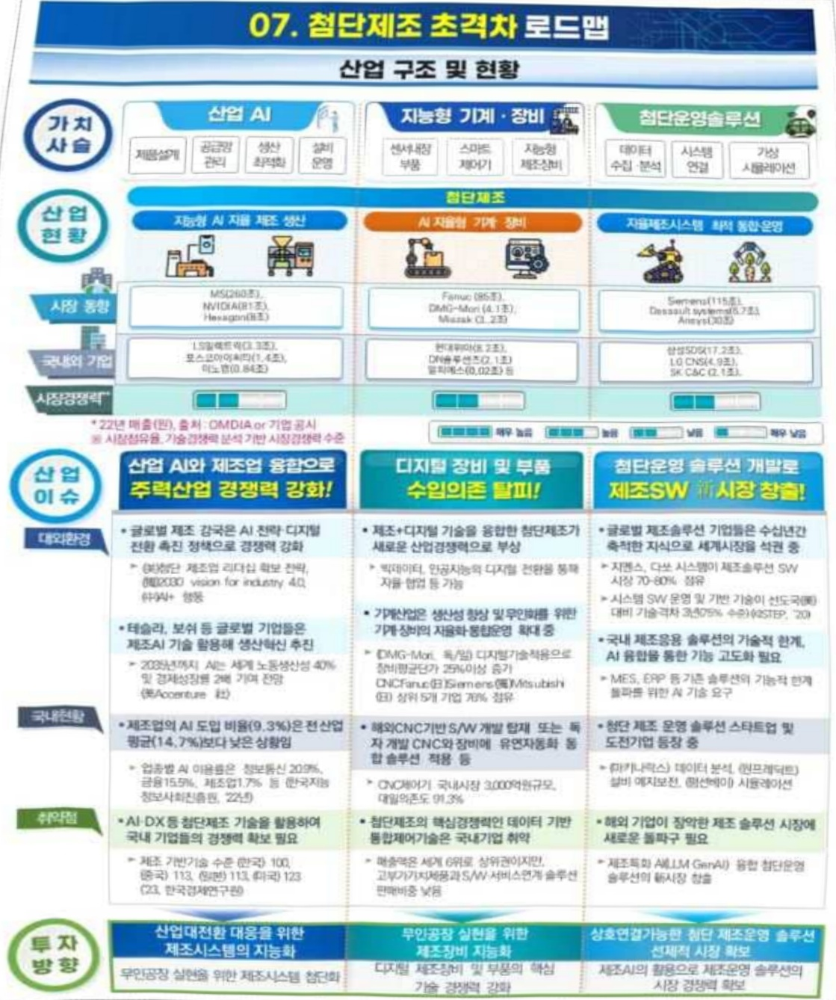

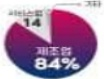

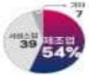

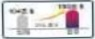

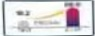

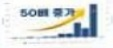

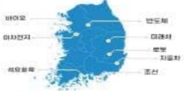

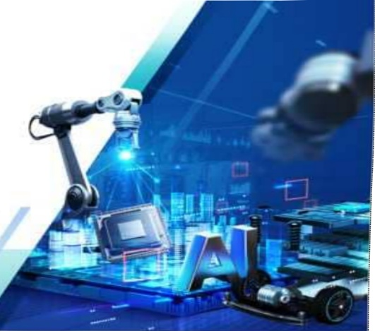

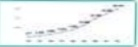

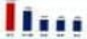

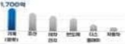

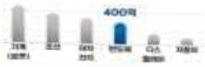

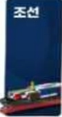

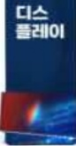

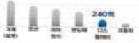

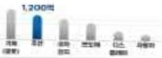

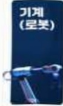

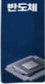

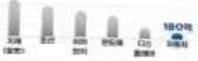

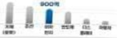

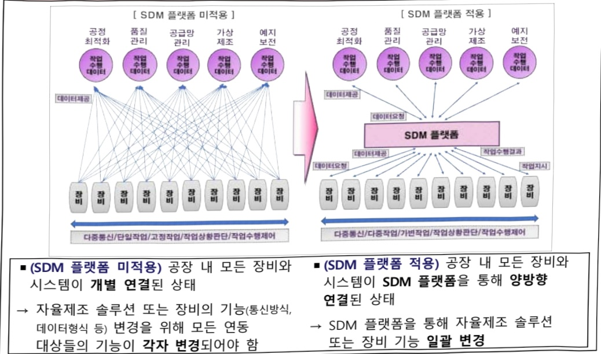

