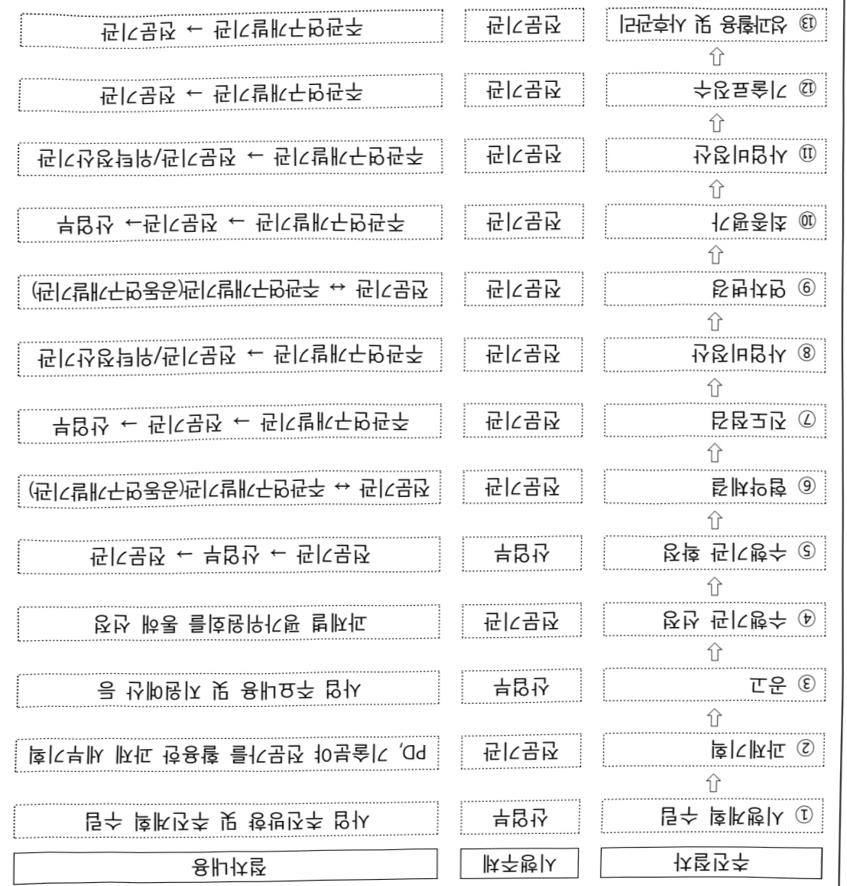

# AX실증밸리조성(R&D)

**해당 페이지**: PDF 3704 ~ 3720 쪽 해당

**부처**: 산업통상부
**분야**: 산업·중소기업 및 에너지
**회계유형**: 지역균형발전 특별회계
**2026 확정예산**: 2110.0 백만원
**전년대비 증감률**: None%
**AI 도메인**: 교통/모빌리티, 디지털전환(AX)

---

<table border=1 style='margin: auto; word-wrap: break-word;'><tr><td style='text-align: center; word-wrap: break-word;'>사 업 명</td></tr><tr><td style='text-align: center; word-wrap: break-word;'>(1) AX실증밸리조성(R&amp;D) (3541-301)</td></tr></table>

## □ 사업 코드 정보

<table border=1 style='margin: auto; word-wrap: break-word;'><tr><td style='text-align: center; word-wrap: break-word;'>구분</td><td style='text-align: center; word-wrap: break-word;'>회계</td><td style='text-align: center; word-wrap: break-word;'>소관</td><td style='text-align: center; word-wrap: break-word;'>실국(기관)</td><td style='text-align: center; word-wrap: break-word;'>계정</td><td style='text-align: center; word-wrap: break-word;'>분야</td><td style='text-align: center; word-wrap: break-word;'>부문</td></tr><tr><td style='text-align: center; word-wrap: break-word;'>코드</td><td style='text-align: center; word-wrap: break-word;'>39</td><td style='text-align: center; word-wrap: break-word;'>22</td><td style='text-align: center; word-wrap: break-word;'>산업성장실</td><td style='text-align: center; word-wrap: break-word;'>2</td><td style='text-align: center; word-wrap: break-word;'>110</td><td style='text-align: center; word-wrap: break-word;'>117</td></tr><tr><td style='text-align: center; word-wrap: break-word;'>명칭</td><td style='text-align: center; word-wrap: break-word;'>지역군형발전 특별회계</td><td style='text-align: center; word-wrap: break-word;'>산업통상부</td><td style='text-align: center; word-wrap: break-word;'>산업인공지능 정책관</td><td style='text-align: center; word-wrap: break-word;'>지역지원 계정</td><td style='text-align: center; word-wrap: break-word;'>산업·중소기업 및에너지</td><td style='text-align: center; word-wrap: break-word;'>산업혁신지원</td></tr></table>

<table border=1 style='margin: auto; word-wrap: break-word;'><tr><td style='text-align: center; word-wrap: break-word;'>구분</td><td style='text-align: center; word-wrap: break-word;'>프로그램</td><td style='text-align: center; word-wrap: break-word;'>단위사업</td><td style='text-align: center; word-wrap: break-word;'>세부사업</td></tr><tr><td style='text-align: center; word-wrap: break-word;'>코드</td><td style='text-align: center; word-wrap: break-word;'>3500</td><td style='text-align: center; word-wrap: break-word;'>3541</td><td style='text-align: center; word-wrap: break-word;'>301</td></tr><tr><td style='text-align: center; word-wrap: break-word;'>명칭</td><td style='text-align: center; word-wrap: break-word;'>주력산업진흥</td><td style='text-align: center; word-wrap: break-word;'>제조기반기술개발</td><td style='text-align: center; word-wrap: break-word;'>AX실증벨리조성기술개발</td></tr></table>

<table border=1 style='margin: auto; word-wrap: break-word;'><tr><td colspan="6">☐ 사업 성격 (공통요구자료 Ⅱ-1 작성유의사항 4. 참조, 해당하는 사항에 “○” 표시)</td></tr><tr><td style='text-align: center; word-wrap: break-word;'>신규 계속 완료</td><td style='text-align: center; word-wrap: break-word;'>예비타당성 실시여부</td><td style='text-align: center; word-wrap: break-word;'>총사업비 관리대상</td><td style='text-align: center; word-wrap: break-word;'>총액계상 예산사업</td><td style='text-align: center; word-wrap: break-word;'>사업소관 변경정보 2025예산 시 소관</td><td style='text-align: center; word-wrap: break-word;'></td></tr><tr><td style='text-align: center; word-wrap: break-word;'>O</td><td style='text-align: center; word-wrap: break-word;'></td><td style='text-align: center; word-wrap: break-word;'></td><td style='text-align: center; word-wrap: break-word;'></td><td style='text-align: center; word-wrap: break-word;'></td><td style='text-align: center; word-wrap: break-word;'></td></tr></table>

□ 사업 지원 형태 및 지원을 (최소한 한 개는 반드시 선택하시오. 해당사항에 O 표시)

<table border=1 style='margin: auto; word-wrap: break-word;'><tr><td style='text-align: center; word-wrap: break-word;'>직접</td><td style='text-align: center; word-wrap: break-word;'>출자</td><td style='text-align: center; word-wrap: break-word;'>출연</td><td style='text-align: center; word-wrap: break-word;'>보조</td><td style='text-align: center; word-wrap: break-word;'>융자</td><td style='text-align: center; word-wrap: break-word;'>국고보조율(%)</td><td style='text-align: center; word-wrap: break-word;'>융자율(%)</td></tr><tr><td style='text-align: center; word-wrap: break-word;'></td><td style='text-align: center; word-wrap: break-word;'></td><td style='text-align: center; word-wrap: break-word;'>O</td><td style='text-align: center; word-wrap: break-word;'></td><td style='text-align: center; word-wrap: break-word;'></td><td style='text-align: center; word-wrap: break-word;'></td><td style='text-align: center; word-wrap: break-word;'></td></tr></table>

## □ 사업 담당자

<table border=1 style='margin: auto; word-wrap: break-word;'><tr><td style='text-align: center; word-wrap: break-word;'>사업명</td><td colspan="5">구분</td></tr><tr><td rowspan="4">AX실증벨리 조성 (R&amp;D)</td><td rowspan="3">소관부처</td><td style='text-align: center; word-wrap: break-word;'>실·국·과(팀) 산업성장실 산업인공지능 정책관</td><td style='text-align: center; word-wrap: break-word;'>과 장 신용민</td><td style='text-align: center; word-wrap: break-word;'>사무관 안용열</td><td style='text-align: center; word-wrap: break-word;'>주무관 안용관</td></tr><tr><td style='text-align: center; word-wrap: break-word;'>인공지능기계로봇과 산업정책실 제조산업정책관</td><td style='text-align: center; word-wrap: break-word;'>044-203-4310</td><td style='text-align: center; word-wrap: break-word;'>044-203-4311</td><td style='text-align: center; word-wrap: break-word;'>044-203-4319</td></tr><tr><td style='text-align: center; word-wrap: break-word;'>자동차과</td><td style='text-align: center; word-wrap: break-word;'>044-203-4320</td><td style='text-align: center; word-wrap: break-word;'>044-203-4396</td><td style='text-align: center; word-wrap: break-word;'></td></tr><tr><td style='text-align: center; word-wrap: break-word;'>사업시행주체</td><td style='text-align: center; word-wrap: break-word;'>한국산업기술 기획평가원</td><td style='text-align: center; word-wrap: break-word;'>기계로봇장비실</td><td style='text-align: center; word-wrap: break-word;'>박용수 실장 윤정환 책임</td><td style='text-align: center; word-wrap: break-word;'>053-718-8220 053-718-8469</td></tr></table>

---

### 가.예산 총괄표

(단위: 백만원, %)

<table border=1 style='margin: auto; word-wrap: break-word;'><tr><td rowspan="2">사업명</td><td rowspan="2">2024년 결산</td><td colspan="2">2025년 예산</td><td colspan="2">2026년</td><td rowspan="2">증감(B-A)</td><td rowspan="2">(B-A)/A</td></tr><tr><td style='text-align: center; word-wrap: break-word;'>본예산(A)</td><td style='text-align: center; word-wrap: break-word;'>추경</td><td style='text-align: center; word-wrap: break-word;'>요구안</td><td style='text-align: center; word-wrap: break-word;'>확정(B)</td></tr><tr><td style='text-align: center; word-wrap: break-word;'>AX실증벨리조성(R&amp;D)</td><td style='text-align: center; word-wrap: break-word;'>-</td><td style='text-align: center; word-wrap: break-word;'>-</td><td style='text-align: center; word-wrap: break-word;'>-</td><td style='text-align: center; word-wrap: break-word;'>31,400</td><td style='text-align: center; word-wrap: break-word;'>2,110</td><td style='text-align: center; word-wrap: break-word;'>2,110</td><td style='text-align: center; word-wrap: break-word;'>순증</td></tr></table>

□ 기능별(내역사업별), 목별 예산안 내역

(단위:백만원)

<table border=1 style='margin: auto; word-wrap: break-word;'><tr><td rowspan="3"></td><td colspan="5">2024</td><td colspan="7">2025(2025.12월말)</td><td rowspan="3">2026예산</td></tr><tr><td rowspan="2">예산액(추경)</td><td rowspan="2">예산현액</td><td rowspan="2">집행액[실집행액]</td><td rowspan="2">이월액</td><td rowspan="2">불용액</td><td rowspan="2">본예산</td><td rowspan="2">예산현액</td><td rowspan="2">집행액[실집행액]</td><td colspan="2">전년도이월액제외</td><td rowspan="2">이월예산액</td><td rowspan="2">불용예산액</td></tr><tr><td style='text-align: center; word-wrap: break-word;'>예산현액</td><td style='text-align: center; word-wrap: break-word;'>집행액[실집행액]</td></tr><tr><td style='text-align: center; word-wrap: break-word;'>○ 기능별 분류(함께)</td><td style='text-align: center; word-wrap: break-word;'>-</td><td style='text-align: center; word-wrap: break-word;'>-</td><td style='text-align: center; word-wrap: break-word;'>-</td><td style='text-align: center; word-wrap: break-word;'>-</td><td style='text-align: center; word-wrap: break-word;'>-</td><td style='text-align: center; word-wrap: break-word;'>-</td><td style='text-align: center; word-wrap: break-word;'>-</td><td style='text-align: center; word-wrap: break-word;'>-</td><td style='text-align: center; word-wrap: break-word;'>-</td><td style='text-align: center; word-wrap: break-word;'>-</td><td style='text-align: center; word-wrap: break-word;'>-</td><td style='text-align: center; word-wrap: break-word;'>-</td><td style='text-align: center; word-wrap: break-word;'>2,110</td></tr><tr><td style='text-align: center; word-wrap: break-word;'>· 자율주행모빌리티플랫폼개발</td><td style='text-align: center; word-wrap: break-word;'>-</td><td style='text-align: center; word-wrap: break-word;'>-</td><td style='text-align: center; word-wrap: break-word;'>-</td><td style='text-align: center; word-wrap: break-word;'>-</td><td style='text-align: center; word-wrap: break-word;'>-</td><td style='text-align: center; word-wrap: break-word;'>-</td><td style='text-align: center; word-wrap: break-word;'>-</td><td style='text-align: center; word-wrap: break-word;'>-</td><td style='text-align: center; word-wrap: break-word;'>-</td><td style='text-align: center; word-wrap: break-word;'>-</td><td style='text-align: center; word-wrap: break-word;'>-</td><td style='text-align: center; word-wrap: break-word;'>-</td><td style='text-align: center; word-wrap: break-word;'>2,110</td></tr><tr><td style='text-align: center; word-wrap: break-word;'>○ 비목별 분류(함께)</td><td style='text-align: center; word-wrap: break-word;'>-</td><td style='text-align: center; word-wrap: break-word;'>-</td><td style='text-align: center; word-wrap: break-word;'>-</td><td style='text-align: center; word-wrap: break-word;'>-</td><td style='text-align: center; word-wrap: break-word;'>-</td><td style='text-align: center; word-wrap: break-word;'>-</td><td style='text-align: center; word-wrap: break-word;'>-</td><td style='text-align: center; word-wrap: break-word;'>-</td><td style='text-align: center; word-wrap: break-word;'>-</td><td style='text-align: center; word-wrap: break-word;'>-</td><td style='text-align: center; word-wrap: break-word;'>-</td><td style='text-align: center; word-wrap: break-word;'>-</td><td style='text-align: center; word-wrap: break-word;'>2,110</td></tr><tr><td style='text-align: center; word-wrap: break-word;'>· 연구개발출연금(360-05)</td><td style='text-align: center; word-wrap: break-word;'>-</td><td style='text-align: center; word-wrap: break-word;'>-</td><td style='text-align: center; word-wrap: break-word;'>-</td><td style='text-align: center; word-wrap: break-word;'>-</td><td style='text-align: center; word-wrap: break-word;'>-</td><td style='text-align: center; word-wrap: break-word;'>-</td><td style='text-align: center; word-wrap: break-word;'>-</td><td style='text-align: center; word-wrap: break-word;'>-</td><td style='text-align: center; word-wrap: break-word;'>-</td><td style='text-align: center; word-wrap: break-word;'>-</td><td style='text-align: center; word-wrap: break-word;'>-</td><td style='text-align: center; word-wrap: break-word;'>-</td><td style='text-align: center; word-wrap: break-word;'>2,110</td></tr><tr><td style='text-align: center; word-wrap: break-word;'>○ 기능비목별 분류(함께)</td><td style='text-align: center; word-wrap: break-word;'>-</td><td style='text-align: center; word-wrap: break-word;'>-</td><td style='text-align: center; word-wrap: break-word;'>-</td><td style='text-align: center; word-wrap: break-word;'>-</td><td style='text-align: center; word-wrap: break-word;'>-</td><td style='text-align: center; word-wrap: break-word;'>-</td><td style='text-align: center; word-wrap: break-word;'>-</td><td style='text-align: center; word-wrap: break-word;'>-</td><td style='text-align: center; word-wrap: break-word;'>-</td><td style='text-align: center; word-wrap: break-word;'>-</td><td style='text-align: center; word-wrap: break-word;'>-</td><td style='text-align: center; word-wrap: break-word;'>-</td><td style='text-align: center; word-wrap: break-word;'>2,110</td></tr><tr><td style='text-align: center; word-wrap: break-word;'>· 자율주행모빌리티플랫폼개발-연구개발출연금(360-05)</td><td style='text-align: center; word-wrap: break-word;'>-</td><td style='text-align: center; word-wrap: break-word;'>-</td><td style='text-align: center; word-wrap: break-word;'>-</td><td style='text-align: center; word-wrap: break-word;'>-</td><td style='text-align: center; word-wrap: break-word;'>-</td><td style='text-align: center; word-wrap: break-word;'>-</td><td style='text-align: center; word-wrap: break-word;'>-</td><td style='text-align: center; word-wrap: break-word;'>-</td><td style='text-align: center; word-wrap: break-word;'>-</td><td style='text-align: center; word-wrap: break-word;'>-</td><td style='text-align: center; word-wrap: break-word;'>-</td><td style='text-align: center; word-wrap: break-word;'>-</td><td style='text-align: center; word-wrap: break-word;'>2,110</td></tr></table>

---

### 나. 사업설명자료

## 1 ) 사업목적·내용

□ (AX실증벨리조성기술개발) AI기반 산업 패러다임 변화에 대응하여, 자율주행

모빌리티 플랫폼 및 제조 고도화기술 등 지원

※ 지역 강점 분야를 기반으로 Physical AI 기술을 적용하여 실환경 및 산업에 적용이 가능하도록 실증환경을 조성하고, 산업 전반에 걸친 혁신 촉진을 위한 대규모 연구개발 추진

(자율주행모빌리티플랫폼개발) Physical AI 기반 PBV 플랫폼 등 자율형 모빌리티의 제품서비스 전환 구현 및 시스템 구축

※ 사용자 수요예측을 통해 유연·맞춤·자율 제조가 가능한 Physical AI 기반 PBV 제조 SDF 플랫폼 및 서비스 상용화

※ 자기 학습형 자율주행 시스템과 차량 플랫폼 등 모빌리티 AX 핵심기술을 개발하고, 다양한 도심 환경 대응 가능 자율주행 플랫폼 및 맞춤형 모빌리티 제조 AX 기술 확보 지원

## 2 ) 사업개요

□ 사업근거 및 추진경위

① 법령상 근거 및 조항 적시 : 산업기술혁신촉진법 제11조

## o산업기술혁신촉진법 제11조

제11조(산업기술개발사업)

② 산업통상부장관은 연구기관, 대학, 그 밖에 대통령령으로 정하는 기관·단체 또는 기업 등으로 하여금 산업기술개발사업을 수행하게 할 수 있다. 이 경우 산업통상부장관은 다음 각 호의 자와 산업기술개발사업에 관한 협약을 체결하고 해당 사업의 수행에 드는 비용의 전부 또는 일부를 출연 또는 보조할 수 있다

---

② 추진경위 - 사업 시작년도, 추진배경, 부처별 중점과제항 등

° '24~'28 제8차 산업기술혁신계획('24.11월, 국가과학기술자문회의)

중점 과제로 '산업 AI 내재화 등 산업전환 대응 강화', 'AI 활용 차로봇 등 초격차 도전혁신기술 확대' 등 추진

○「자동차산업 글로벌 3강 전략」(22.9월)

생태계 전반의 유연한 전환, 자율주행 및 모빌리티 신산업 창출 등

○「자율제조 전략 1.0」(24.5월)

AI 자율제조 도입 확산, 핵심역량 확보, 생태계 진흥 3개 전략을 축으로, 테스트베드 확대, 제조 AI 전문기업 육성 등 추진

□ 주요내용

① 사업규모

- 총사업비 : 600억원(국비 360억원, 지방비 120억원, 민간 120억원)

- 사업기간 : '26~'28년

- 최근 5년 간 투입된 사업비(예산액기준, 추경편성한 연도에는 추경포함)

<table border=1 style='margin: auto; word-wrap: break-word;'><tr><td style='text-align: center; word-wrap: break-word;'>연도</td><td style='text-align: center; word-wrap: break-word;'>2022</td><td style='text-align: center; word-wrap: break-word;'>2023</td><td style='text-align: center; word-wrap: break-word;'>2024</td><td style='text-align: center; word-wrap: break-word;'>2025</td><td style='text-align: center; word-wrap: break-word;'>2026</td></tr><tr><td style='text-align: center; word-wrap: break-word;'>사업비</td><td style='text-align: center; word-wrap: break-word;'>-</td><td style='text-align: center; word-wrap: break-word;'>-</td><td style='text-align: center; word-wrap: break-word;'>-</td><td style='text-align: center; word-wrap: break-word;'>-</td><td style='text-align: center; word-wrap: break-word;'>2,110</td></tr></table>

- 기타: 해당없음

② 사업추진체계

- 사업시행방법 : 출연

- 사업시행주체 : 한국산업기술기획평가원

- 사업 수혜자 : 기업, 대학, 연구소 등

- 보조, 융자, 출연, 출자 등의 경우 보조·융자 등 지원 비율 및 법적근거

<table border=1 style='margin: auto; word-wrap: break-word;'><tr><td style='text-align: center; word-wrap: break-word;'>내역사업명</td><td style='text-align: center; word-wrap: break-word;'>구분</td><td style='text-align: center; word-wrap: break-word;'>피보조·피출연 등 기관명</td><td style='text-align: center; word-wrap: break-word;'>지원 금액 (2026예산)</td><td style='text-align: center; word-wrap: break-word;'>지원 비율(%)</td><td style='text-align: center; word-wrap: break-word;'>보조율 법적근거 (해당 조항)</td></tr><tr><td style='text-align: center; word-wrap: break-word;'>자율주행모빌리티플랫폼개발</td><td style='text-align: center; word-wrap: break-word;'>출연</td><td style='text-align: center; word-wrap: break-word;'>한국산업기술기획평가원</td><td style='text-align: center; word-wrap: break-word;'>2,110</td><td style='text-align: center; word-wrap: break-word;'>수행기관별 차등지원</td><td style='text-align: center; word-wrap: break-word;'>산업기술혁신촉진법 제11조</td></tr></table>

---

## 3 ) 2026년도 예산 산출 근거

□ AX실증밸리조성기술개발 : (26) 2,110백만원, 순증(신규사업)

자율주행모빌리티플랫폼개발 : (26) 2,110백만원, 순증(신규사업)

- 도못작업자 협업을 통한 완전 지능형 SDF 및 서비타이제이션 통합기술과 AI기반 차세대 SDV플랫폼을 위한 차량 통합제어핵심기술 확보를 위한 예산 2,110백만원 반영

- (산출)

1) (지능형 SDF 및 서비타이제이션) 신규 3개 x 538.67백만원 x 9/12개월 = 1,212백만원

2) (차세대SDV플랫폼) 신규 4개 x 299.33백만원 x 9/12개월 = 898백만원

<table border=1 style='margin: auto; word-wrap: break-word;'><tr><td colspan="2">2025년 본예산</td><td colspan="3">2026년 예산안</td></tr><tr><td style='text-align: center; word-wrap: break-word;'>예산</td><td style='text-align: center; word-wrap: break-word;'>산출내역</td><td style='text-align: center; word-wrap: break-word;'>예산</td><td colspan="2">산출내역</td></tr><tr><td rowspan="10">-</td><td rowspan="10">-</td><td rowspan="10">2,110</td><td style='text-align: center; word-wrap: break-word;'>○ 연구개발출연금(360-05): 2,110백만원
- 자율주행모빌리티플랫폼개발: 2,110백만원</td><td style='text-align: center; word-wrap: break-word;'>예산</td></tr><tr><td style='text-align: center; word-wrap: break-word;'>구분</td><td style='text-align: center; word-wrap: break-word;'>예산</td></tr><tr><td style='text-align: center; word-wrap: break-word;'>- (자율형 SDF 플랫폼) 글로벌 DX 솔루션 융합 AI 기반 소프트웨어 정의 브레인 공장 운영 플랫폼 기술 개발</td><td style='text-align: center; word-wrap: break-word;'>539</td></tr><tr><td style='text-align: center; word-wrap: break-word;'>- (서비타이제이선1) SDF 플랫폼을 활용한 설계 모델 기반 시스템 엔지니어링 기술 개발</td><td style='text-align: center; word-wrap: break-word;'>314</td></tr><tr><td style='text-align: center; word-wrap: break-word;'>- (서비타이제이선2) SDF 플랫폼을 활용한 로봇 적업자 협업 AI 자율제조 조립공정 기술 개발</td><td style='text-align: center; word-wrap: break-word;'>359</td></tr><tr><td style='text-align: center; word-wrap: break-word;'>- (총괄) Cross-Domain 기능통합형 제어 플랫폼 상용화 기술 개발</td><td style='text-align: center; word-wrap: break-word;'>23</td></tr><tr><td style='text-align: center; word-wrap: break-word;'>- (1세부) SDV 지원을 위한 Cross-Domain 기반 기능통합형 제어 플랫폼 개발</td><td style='text-align: center; word-wrap: break-word;'>337</td></tr><tr><td style='text-align: center; word-wrap: break-word;'>- (2세부) AI 기반 개인 맞춤형 제어 최적화 기술 및 Fail-Operation 기술 개발</td><td style='text-align: center; word-wrap: break-word;'>269</td></tr><tr><td style='text-align: center; word-wrap: break-word;'>- (3세부) SDV 기반 기능통합형 제어 플랫폼 검증 및 실증</td><td style='text-align: center; word-wrap: break-word;'>269</td></tr><tr><td style='text-align: center; word-wrap: break-word;'>합계</td><td style='text-align: center; word-wrap: break-word;'>2,110</td></tr></table>

## 4 ) 사업효과

□ 사업영향, 산출물 성과지표 등

① 2022~2026년도 성과계획서 상 성과지표 및 최근 5년간 성과 달성도 : 해당없음

- '26년 신규사업으로 성과지표 수립 예정

② 성과지표 이외의 연도별 사업추진 경과 및 실적 : 해당없음

③향후(2026년도 이후)기대효과

o 지능형 SDF 플랫폼

- SDF 플랫폼 기술을 통해 자동차 산업 제조분야의 AI 기술 확산을 위한 AI 자

- 율제조 기반 핵심 기술의 확보

- 현장데이터 통합 및 내장된 AI 플랫폼 기능 활용을 통한 제조AI 분석기능 수행

- 제조데이터 활용도의 증가 및 AI의 의사결정 고도화로 산업에서의 불확실성 요소인 비용 상승, 일정 지연 관련 한계 극복을 통한 생산성 개선에 기여

---

- 제조현장의 AI 로봇을 활용한 작업자의 노동 강도 경감 및 작업자 피로도 증가

에 따른 불량를 감소, 균일한 제품 품질 유지

- 차세대 SDV 플랫폼

- 차세대 EE 아키텍쳐 기반 차량 제어시스템 표준화를 구현하여 개별적으로 동작

하는 기능을 통합, 제어 효율성 향상

- e-샤시, e-구동 제어 시스템을 통합한 VMHC 구현을 통해 차량 주행 안정성 및

반응속도 향상으로 보다 안전한 모빌리티 서비스 구현

- 자율주행 레벨 3-4 실현을 위한 핵심 기술 확보 및 글로벌 표준화 대응

- 수입 의존도가 높은 차량 제어 핵심기술 내재화로 국내 자동차 부품업체들의

기술 자립 기회 확대

5) 타당성조사 및 예비타당성조사 시행여부 및 결과 요지 : 해당없음

6) 총사업비 대상사업 여부 및 내역 : 해당없음

---

○(기술개발)한국산업기술기획평가원

---

8) 중기재정계획 상 연도별 투자계획 및 추진경과

(단위:백만원)

<table border=1 style='margin: auto; word-wrap: break-word;'><tr><td style='text-align: center; word-wrap: break-word;'>$ 중기 $ 재정계획</td><td style='text-align: center; word-wrap: break-word;'>2024</td><td style='text-align: center; word-wrap: break-word;'>2025</td><td style='text-align: center; word-wrap: break-word;'>2026</td><td style='text-align: center; word-wrap: break-word;'>2027</td><td style='text-align: center; word-wrap: break-word;'>2028</td><td style='text-align: center; word-wrap: break-word;'>2029</td></tr><tr><td style='text-align: center; word-wrap: break-word;'>2024~2028</td><td style='text-align: center; word-wrap: break-word;'>-</td><td style='text-align: center; word-wrap: break-word;'>-</td><td style='text-align: center; word-wrap: break-word;'>2,110</td><td style='text-align: center; word-wrap: break-word;'>20,590</td><td style='text-align: center; word-wrap: break-word;'>13,300</td><td style='text-align: center; word-wrap: break-word;'>-</td></tr><tr><td style='text-align: center; word-wrap: break-word;'>2025~2029</td><td style='text-align: center; word-wrap: break-word;'></td><td style='text-align: center; word-wrap: break-word;'>-</td><td style='text-align: center; word-wrap: break-word;'>2,110</td><td style='text-align: center; word-wrap: break-word;'>20,590</td><td style='text-align: center; word-wrap: break-word;'>13,300</td><td style='text-align: center; word-wrap: break-word;'>-</td></tr></table>

9) 최근 3년간 동 사업에 대한 주요 외부지적사항 및 평가, 문제점 및 대책 : 해당없음

10) 향후 추진방향 및 추진계획

□ AX모빌리티 실증 거점 확보를 위한 기술혁신 지원으로 거점인프라 구축

○ SDF 플랫폼 기술 지원으로 자동차 산업 제조분야의 AI 기술 확산 및 AI자율제조 기반 핵심기술 확보 추진

0 차세대 EE 아키텍쳐 기반 차량 제어 시스템 표준화 구현, 개별 동작 기능의 통합을 통해 제어 효율성 향상

ㅇ 디지털전환(DX)과 인공지능 전환(AX) 등 미래산업 환경 및 잠재력 제고

11) 해당사업에 대한 각종 사업평가의 결과 : 해당없음

12) 해당사업에 대한 부처 자체평가의 결과 : 해당없음

13) 부처 건의사항 : 해당없음

다. 최근 4년간 결산내역

1) 결산표 : 해당없음

2) 주요 결산사항 : 해당없음

---

### 라. 기타 추가자료

(1) 관련사업 추진을 위한 정부 발표대책, 중장기 계획: 참고1

(2) 모빌리티 분야 사업 세부 설명자료: 참고2

(3) 자율주행모빌리티플랫폼개발 신규사업 기획보고서 요약본: 참고3

---

## 참고 1

## 사업 관련 정부 발표대책, 중장기 계획

□ 산업 전반에 AI 활용 경쟁력 강화 및 민간 주도의 AI 생태계 조성을 위한 「산업 AI 확산을 위한 10대 전략」 발표('25.1월, 산업부)

※ 10대 과제: ①AI 선도 프로젝트, ②AI 에이전트와 피지컬 AI, ③산업 AI 컴퓨팅 인프라, ④산업 데이터, ⑤AI 반도체, ⑥AI 인재, ⑦전력 인프라, ⑧산업 AI 자본, ⑨AI 생태계, ⑩산업 AI 제도

< 산업 AI 10대 과제 예시 >

☐ 제조지원 선도 프로젝트 추진(과제0-1): R&D·디자인·유통·에너지·공급망 등

o 민·관 컨소시엄 구성을 통해 자율제조 등 기업의 생산활동 전반 지원

☐ 피지컬 AI 확산(과제②-2 및 ②-3): AI 모델을 로봇·모빌리티 등

물리적 제품에 탑재·진화

ㅇ 휴머노이드 로봇 개발 및 실증·양산 인프라 조성

o 자율주행차, 자율선박 등 모빌리티 AI 실증 인프라·기술개발 지원

□ 산업 데이터 축적·활용 강화(과제④-2) : 데이터 前처리 지원 확대

ㅇ 기업의 데이터 활용을 촉진하고, AI 학습에 필요한 고품질 데이터 생성

□ AI 산업 활용을 위한 범정부 대응 방안인 「AI컴퓨팅 인프라 확충을 통한 국가AI 역량 강화방안」 발표('25.2월 의결, 관계 부처 합동)

°산업계가 요구하는 AI 활용 확대 위한 업종, 지역 연계형 AI 인프라 강화 추진, 이를 통한 산업 AX 가속화

□ AI 전환 가속화를 통한 기회 극대화

○ 산업 AI 활용을 위한 '산업 전문지식 + AI 활용 역량 강화' 동시 추진 가능한 융합형 AI 인프라로 기반 전환 가속화

- 기업 + 비영리법인 등이 연합하여 업종·산업별 AX 추진

○산·학·연이 힘을 합쳐, 제조·에너지 산업의 AI 융합 성과 확산

---

## 참고 2

## □추진배경

"AI 기반 완전자율 능동진화형 모빌리티" 기술은 물리세계와 실시간 상호작용을 통해 미지 공간 적응 주행 가능

글로벌 국가·기업 주도로 완전 자율주행 관련 기술 확보 경쟁이 심화*

됨에 따라, 선제적 R&D를 통한 기술 주도권 확보가 필요한 상황

* 글로벌 자율주행 시장은 2030년까지 연평균 22.7% 성장하여, 4,780억달러에 이를 전망(Statista Market Data, 2024)

- 우리나라는 레벨3 일부 상용화와 함께, 자율주행 핵심 기술 R&D와 실증 인프라 구축을 병행 추진 중이나 글로벌 대비 상대적으로 더딘 수준

## 【자율주행 AX 경쟁력 현황】

(자율주행차) 글로벌 리서치 기관에 따르면, 자율주행차 경쟁력에서 웨이모와 바이두가 Top2를 차지, 우리는 Top10 진입에 실패

* 상위 20개 기업 중 미국(10개), 중국(8개)기업이 18개로 90%를 차지, 현대자동차가 합작

투자한 콜회사인 모셔널은 15위를 차지(출처 : Guidehouse Insights)

기업들은 AI 활용 방법에 대한 지식과 경험이 부족하여, 국내

기업의 AI 활용수준이 매우 낮은 상황

* AI 기술 미활용 기업의 91.2%가 "기술활용 방안을 몰라서" (KPC, '24)

AI 기술을 실제 기술에 적용하고 상용화 제품을 개발하기 위해서는 R&D 뿐 아니라 실증이 필수적이나 관련 인프라 부족

* 중국 등은 이미 국가 주도로 관련 실증·지원센터를 신속히 구축하여 지원 중

→ 지역별로 AI 융합 기술을 위한 중합지원 거점 인프라를 구축하여

기술혁신 지원이 필요한 상황

광주는 AI 집적 단지, 차량주행 시뮬레이터 등 실증 기본 인프라 및 자동차

산업 기반을 보유 → AX 모빌리티 실증 거점으로 매우 적합한 환경 보유

---

## □지원내용

0 자기 학습형 자율주행 시스템과 차량 플랫폼 등 모빌리티 AX 핵심 기술을 개발하고, 다양한 도심 환경 대응 가능 자율주행 플랫폼 및 맞춤형 모빌리티 제조 AX 기술 확보지원

* 광주 지역 특화 강점 분야 기반, 피지컬 AI 기술을 적용하여, 실환경 및 모빌리티 산업 적용이 가능하도록 실증환경을 조성하고 산업 전반에 걸친 혁신 촉진을 위한 대규모 연구개발 추진

## ① 로봇-작업자 협업을 위한 완전 지능형 SDF 및 서비타이제이션 통합기술 개발

- 미래차 수요 다변화 대응을 위한 유연 생산 체계 구축 필요에 따라, 인간-로봇 협업 기반의 AX 스마트 팩토리 전환 필요

- 자동차 산업의 공정 운영 유연성 확보 및 작업 생산성 향상을 위한 로봇

-작업자 협업 기술 개발를 통해 제조 품질 및 효율 동시 개선 도모

<table border=1 style='margin: auto; word-wrap: break-word;'><tr><td style='text-align: center; word-wrap: break-word;'>세부과제</td><td style='text-align: center; word-wrap: break-word;'>내용</td></tr><tr><td style='text-align: center; word-wrap: break-word;'>글로벌 DX 솔루션 융합 AI 기반 소프트웨어 정의 브레인 공장 운영 플랫폼 기술 개발</td><td style='text-align: center; word-wrap: break-word;'>▶ 자동차 산업의 지능형 유연생산을 위해 데이터 기반 AI 플랫폼, 디지털 트런 연계 공정 검증 및 최적화, 제어시스템 연계 유연 공정 구성 등의 기능이 통합된 플랫폼</td></tr><tr><td style='text-align: center; word-wrap: break-word;'>SDF 플랫폼을 활용한 설계 모델 기반 시스템 엔지니어링</td><td style='text-align: center; word-wrap: break-word;'>▶ 자동차 제조 전 공정 데이터 저장·관리 기술과 시뮬레이터 운영 기술이 통합된 전사적 개발 협업 기술 및 실증</td></tr><tr><td style='text-align: center; word-wrap: break-word;'>로봇·작업자 협업을 위한 AI 자율제조 조립공정 기술개발</td><td style='text-align: center; word-wrap: break-word;'>▶ 고정밀·고복잡도 수준의 조립 공정을 작업자·모빌리티 AI 로봇간 협업을 통해 공정 유연성과 생산성을 확보하는 기술</td></tr></table>

## ② AI기반 차세대 SDV플랫폼을 위한 차량 통합제어 핵심기술개발

- SDV 중심의 미래차 전환의 성공적인 가속화를 위해 AI, 클라우드 및 차세대 EE 이키텍쳐 기반 차량모션 통합제어(VMHC $ ^{1} $) 핵심기술 확보

1) Vehicle Motion Holistic Control : e-구동, e-샤시(조향, 제동, 현가), 정보 등을 융합한 차량 모션 기반 통합 제어

---

<table border=1 style='margin: auto; word-wrap: break-word;'><tr><td style='text-align: center; word-wrap: break-word;'>세부과제</td><td style='text-align: center; word-wrap: break-word;'>내용</td></tr><tr><td style='text-align: center; word-wrap: break-word;'>SDV 지원을 위한 Cross-Domain 기반 기능통합형 제어 플랫폼</td><td style='text-align: center; word-wrap: break-word;'>▶ 세부목표 : 현재 수준 대비 조종안정성 30% 이상 향상▶ Cross-Domain 기반 EE 아키텍쳐 기술 개발▶ x-by-Wire 기반 e-샤시, e-구동 시스템 기술 고도화▶ 차량 모션 기반 e-샤시, e-구동 통합 제어 기술 개발</td></tr><tr><td style='text-align: center; word-wrap: break-word;'>AI 기반 개인 맞춤형 제어 최적화 기술 및 Fail-Operation 기술</td><td style='text-align: center; word-wrap: break-word;'>▶ 세부목표 : 현재 수준 대비 주행안전성 20% 이상 향상▶ AI 기반 주행 패턴 분석을 통한 개인 맞춤형 주행 모드 개발▶ 다양한 주행환경 및 주행모드 적용을 통한 DX 기술 개발▶ VMHC 플랫폼 적용 In-Lab, On-Field 검증 기술 개발▶ 도메인별 고장 발생에도 상시 구동 가능한 고장대응 제어 (Fail-Operation) 기술 개발* 고장 예지를 통해 도메인 통합제어를 통한 Brake-by-X Steer-by-X 기술</td></tr></table>

## □ 연차별 소요예산

°(전체 정부출연 사업비)36,000백만원

°(사업기간) '26년 ~ '28년(총 3년)

(단위:억원)

<table border=1 style='margin: auto; word-wrap: break-word;'><tr><td style='text-align: center; word-wrap: break-word;'>구분</td><td style='text-align: center; word-wrap: break-word;'>26년</td><td style='text-align: center; word-wrap: break-word;'>27년</td><td style='text-align: center; word-wrap: break-word;'>28년</td><td style='text-align: center; word-wrap: break-word;'>계</td></tr><tr><td style='text-align: center; word-wrap: break-word;'>국비</td><td style='text-align: center; word-wrap: break-word;'>21.10</td><td style='text-align: center; word-wrap: break-word;'>205.9</td><td style='text-align: center; word-wrap: break-word;'>133</td><td style='text-align: center; word-wrap: break-word;'>360</td></tr><tr><td style='text-align: center; word-wrap: break-word;'>지방비</td><td style='text-align: center; word-wrap: break-word;'>7.03</td><td style='text-align: center; word-wrap: break-word;'>68.63</td><td style='text-align: center; word-wrap: break-word;'>44.34</td><td style='text-align: center; word-wrap: break-word;'>120</td></tr><tr><td style='text-align: center; word-wrap: break-word;'>민간</td><td style='text-align: center; word-wrap: break-word;'>7.03</td><td style='text-align: center; word-wrap: break-word;'>68.64</td><td style='text-align: center; word-wrap: break-word;'>44.33</td><td style='text-align: center; word-wrap: break-word;'>120</td></tr><tr><td style='text-align: center; word-wrap: break-word;'>총사업비</td><td style='text-align: center; word-wrap: break-word;'>35.16</td><td style='text-align: center; word-wrap: break-word;'>343.17</td><td style='text-align: center; word-wrap: break-word;'>221.67</td><td style='text-align: center; word-wrap: break-word;'>600</td></tr></table>

<연도별 세부 산출내역(국비)>

<table border=1 style='margin: auto; word-wrap: break-word;'><tr><td style='text-align: center; word-wrap: break-word;'>연도</td><td style='text-align: center; word-wrap: break-word;'>소요예산</td><td style='text-align: center; word-wrap: break-word;'>산출근거</td></tr><tr><td style='text-align: center; word-wrap: break-word;'>2026</td><td style='text-align: center; word-wrap: break-word;'>2,110</td><td style='text-align: center; word-wrap: break-word;'>① 자율주행 모빌리티 플랫폼 개발 : 2,110백만원 - 로봇-작업자 협업을 통한 완전 지능형 SDF 및 서비타이제이션 통합기술 개발 * (신규) 3개×538.67백만원×9/12개월=1,212백만원 - AI기반 차세대 SDV플랫폼을 위한 차량 통합제어 핵심기술개발 * (신규) 4개×299.33백만원×9/12개월=898백만원</td></tr><tr><td style='text-align: center; word-wrap: break-word;'>2027</td><td style='text-align: center; word-wrap: break-word;'>20,590</td><td style='text-align: center; word-wrap: break-word;'>① 자율주행 모빌리티 플랫폼 개발 : 20,590백만원 - 로봇-작업자 협업을 통한 완전 지능형 SDF 및 서비타이제이션 통합기술 개발 * (계속) 3개×3,942.3백만원×12개월=11,827백만원 - AI기반 차세대 SDV플랫폼을 위한 차량 통합제어 핵심기술개발 * (계속) 4개×2,190.8백만원×12개월=8,763백만원</td></tr><tr><td style='text-align: center; word-wrap: break-word;'>2028</td><td style='text-align: center; word-wrap: break-word;'>13,300</td><td style='text-align: center; word-wrap: break-word;'>① 자율주행 모빌리티 플랫폼 개발 : 13,300백만원 - 로봇-작업자 협업을 통한 완전 지능형 SDF 및 서비타이제이션 통합기술 개발 * (계속) 3개×2,600백만원×12개월=7,800백만원 - AI기반 차세대 SDV플랫폼을 위한 차량 통합제어 핵심기술개발 * (계속) 4개×1,833백만원×12개월=5,500백만원</td></tr><tr><td style='text-align: center; word-wrap: break-word;'>합계</td><td style='text-align: center; word-wrap: break-word;'>36,000</td><td style='text-align: center; word-wrap: break-word;'></td></tr></table>

---

## 0 연도별 사업비(국비) 계획

(단위:백만원)

<table border=1 style='margin: auto; word-wrap: break-word;'><tr><td style='text-align: center; word-wrap: break-word;'>핵심기술-세부과제명</td><td style='text-align: center; word-wrap: break-word;'>2026</td><td style='text-align: center; word-wrap: break-word;'>2027</td><td style='text-align: center; word-wrap: break-word;'>2028</td><td style='text-align: center; word-wrap: break-word;'>2029</td><td style='text-align: center; word-wrap: break-word;'>2030</td><td style='text-align: center; word-wrap: break-word;'>합계</td></tr><tr><td style='text-align: center; word-wrap: break-word;'>자율주행 모빌리티 플랫폼 개발</td><td style='text-align: center; word-wrap: break-word;'>2,110</td><td style='text-align: center; word-wrap: break-word;'>20,590</td><td style='text-align: center; word-wrap: break-word;'>13,300</td><td style='text-align: center; word-wrap: break-word;'>-</td><td style='text-align: center; word-wrap: break-word;'>-</td><td style='text-align: center; word-wrap: break-word;'>36,000</td></tr><tr><td style='text-align: center; word-wrap: break-word;'>1. 로봇-작업자 협업을 통한 완전 지능형 SDF 및 서비타이제이션 통합기술 개발</td><td style='text-align: center; word-wrap: break-word;'>1,212</td><td style='text-align: center; word-wrap: break-word;'>11,827</td><td style='text-align: center; word-wrap: break-word;'>7,800</td><td style='text-align: center; word-wrap: break-word;'>-</td><td style='text-align: center; word-wrap: break-word;'>-</td><td style='text-align: center; word-wrap: break-word;'>20,839</td></tr><tr><td style='text-align: center; word-wrap: break-word;'>2. AI기반 차세대 SDV플랫폼을 위한 차량 통합제어 핵심기술개발</td><td style='text-align: center; word-wrap: break-word;'>898</td><td style='text-align: center; word-wrap: break-word;'>8,763</td><td style='text-align: center; word-wrap: break-word;'>5,500</td><td style='text-align: center; word-wrap: break-word;'>-</td><td style='text-align: center; word-wrap: break-word;'>-</td><td style='text-align: center; word-wrap: break-word;'>15,161</td></tr></table>

---

## 참고 3

자율주행모빌리티플랫폼개발 신규사업 기획보고서 요약본

<table border=1 style='margin: auto; word-wrap: break-word;'><tr><td style='text-align: center; word-wrap: break-word;'>사업명</td><td colspan="4">자율주행모빌리티플랫폼개발</td></tr><tr><td style='text-align: center; word-wrap: break-word;'>총 사업비</td><td style='text-align: center; word-wrap: break-word;'>600억원 (국비: 360억원)</td><td style='text-align: center; word-wrap: break-word;'>사업기간</td><td colspan="2">2026년 ~ 2028년(총 3년)</td></tr><tr><td rowspan="2">수행주체</td><td colspan="4">산업통상자원부/제조AI확산TF/안용열(044-203-4316)</td></tr><tr><td colspan="4">한국산업기술기획평가원기계로봇장비실/박용수 실장/053-718-8220/yspark042@keit.re.kr)</td></tr><tr><td colspan="5">[성과목표]
○ Physical AI 기반 PBV 플랫폼 등 자율형 모빌리티의 제품-서비스 전환을 구현 및 시스템 구축</td></tr><tr><td colspan="5">[성과지표]</td></tr><tr><td rowspan="2">성과지표명</td><td colspan="3">목표치</td><td rowspan="2">측정방법</td></tr><tr><td style='text-align: center; word-wrap: break-word;'>&#x27;26</td><td style='text-align: center; word-wrap: break-word;'>&#x27;27</td><td style='text-align: center; word-wrap: break-word;'>&#x27;28</td></tr><tr><td style='text-align: center; word-wrap: break-word;'>AI기술사업화 성공률</td><td style='text-align: center; word-wrap: break-word;'>-</td><td style='text-align: center; word-wrap: break-word;'>-</td><td style='text-align: center; word-wrap: break-word;'>7%</td><td style='text-align: center; word-wrap: break-word;'>AX실증밸리 조성사업의 각 내역사업을 통해 지원한 과제 건수 대비 사업화 성공 건수 조사(AI 기술개발 실증을 통해 매출액 수입대체 기술이전 생산비 절감 등이 발생한 과제를 사업화 성공 과제로 인정)</td></tr><tr><td style='text-align: center; word-wrap: break-word;'>AI융복합 기업 매출액
증가율</td><td style='text-align: center; word-wrap: break-word;'>-</td><td style='text-align: center; word-wrap: break-word;'>14%</td><td style='text-align: center; word-wrap: break-word;'>16%</td><td style='text-align: center; word-wrap: break-word;'>입주기업 전수 설문조사를 통해 매출액 현황 자료를 수집, 회계법인 자문을 통해 기업 활동 결과 검증</td></tr><tr><td style='text-align: center; word-wrap: break-word;'>AI융복합 기업 집적 수</td><td style='text-align: center; word-wrap: break-word;'>100</td><td style='text-align: center; word-wrap: break-word;'>100</td><td style='text-align: center; word-wrap: break-word;'>250</td><td style='text-align: center; word-wrap: break-word;'>입주기업 전수조사를 통해 AI 융복합 사업 매출액 발생 여부 및 관련 투자액이 있는 기업을 회계사 검증을 통해 AI 기업 및 AI 융복합 기업으로 인정</td></tr><tr><td style='text-align: center; word-wrap: break-word;'>AI 데이터센터 서비스 가동률</td><td style='text-align: center; word-wrap: break-word;'>95%</td><td style='text-align: center; word-wrap: break-word;'>95%</td><td style='text-align: center; word-wrap: break-word;'>95%</td><td style='text-align: center; word-wrap: break-word;'>사업계획서에서 목표한 AI 데이터센터 서비스 컴퓨팅 자원(GPU) 제공시간 대비 정상 운영시간 측정</td></tr><tr><td colspan="5">※ AX실증밸리 조성사업 내 타 사업과의 성과를 종합하여 측정</td></tr><tr><td colspan="5">[정책적 연계성]
○ (상위계획과의 부합성)
- 인공지능 대전환(AX)을 통한 AI 3강 도약
- 산업 전반의 디지털화와 신산업 육성 등 디지털 전환의 조속한 확산을 위한 선제적 대응
○ 공정유연성 확대, 노동생산성 저하 등 시대적 변환에 대응하는 R&amp;D
- 제조업의 노동생산성 및 평균 가동률 하락추세로 인한 돌파구 마련: 2021년 이후 잠시적인 증가세 이후 둔화 추세(노동 생산성: &#x27;21년, 108.1 → &#x27;22년, 108.3 → &#x27;23년, 108.2)
- 공정 유연성 확대: 자동차 공장의 기존 컨베이어 생산방식에서 제조 셀(Cell)과 AMR 등을 활용한 제조공정 유연성 강화로의 전환 필요</td></tr></table>

---

<table border=1 style='margin: auto; word-wrap: break-word;'><tr><td colspan="5">○ &#x27;26년 신규사업 기획방향 연관성- 인공지능 등 첨단기술 활용 및 산업전환(AX)의 자동차 산업 패러다임 변화에 대한 대응 필요로 &#x27;26년 신규사업 기획방향에 부합</td></tr><tr><td colspan="5">[중점투자 분야 및 기술]○ (자율형 SDF 플랫폼) 자동차 산업의 지능형 유연생산을 위해 데이터 기반 AI 플랫폼, 디지털 트윈 연계 공정 검증 및 최적화, 제어시스템 연계 유연공정 구성 등의 기능이 통합된 플랫폼과 복잡한 조립공정 협업 기술 개발○ (차세대 SDV 플랫폼) SDV 중심의 미래차 전환의 성공적인 가속화를 위해 AI, 클라우드 및 차세대 EE 아키텍쳐 기반 차량모션 통합제어(VMHC) 핵심기술 확보</td></tr><tr><td colspan="5">[사업 추진체계 및 추진방식]○ (추진체계) - 洞 사업의 추진체계는 시행기관(산업통상자원부), 전문기관(에너지기술평가원), 주관기관 및 참여기관(기업, 연구소, 대학 등)으로 구성* 정부는 기술정책 및 중장기 계획 수립과 예산 배분·조정 등 수행* 전문기관(한국산업기술기획평가원)은 사업 기획·관리, 예산 운영계획 및 사업 추진계획 수립 지원, 사업 선정·관리, 성과 확산 등 국가연구개발사업 관리·지원* 수행기관(기업, 대학, 연구소)은 연구개발을 수행○ (추진방식) - 성과 달성의 효율성 극대화를 위해 수행 주체 간 핵심 역할 수행과 상호 교류로 자동차 공장 자율운영을 위한 기반데이터 관리 및 플랫폼 핵심기술, AI 기반 자동차 공정 운영관리를 위한 플랫폼 구현, 실제조 자동차 공장 대상 플랫폼 실증, SDV용 EE 아키텍쳐 적용 Cross-Domain 통합제어기술, AI 기반 개인 맞춤형 제어 및 고장 대응 제어기술 개발* (과제1) 로봇·작업자 협업을 통한 완전 지능형 SDF 및 서비타이제이션 통합기술 개발* (과제2) AI 기반 차세대 SDV 플랫폼을 위한 차량 통합 제어 핵심 기술 개발</td></tr><tr><td colspan="5">[연도별 사업 추진계획] (단위 : 억원)</td></tr><tr><td style='text-align: center; word-wrap: break-word;'>내역사업명</td><td style='text-align: center; word-wrap: break-word;'>구분</td><td style='text-align: center; word-wrap: break-word;'>&#x27;26</td><td style='text-align: center; word-wrap: break-word;'>&#x27;27</td><td style='text-align: center; word-wrap: break-word;'>&#x27;28</td></tr><tr><td rowspan="3">자율주행모빌리티플랫폼개발</td><td style='text-align: center; word-wrap: break-word;'>국비</td><td style='text-align: center; word-wrap: break-word;'>21.10</td><td style='text-align: center; word-wrap: break-word;'>205.9</td><td style='text-align: center; word-wrap: break-word;'>133</td></tr><tr><td style='text-align: center; word-wrap: break-word;'>민간</td><td style='text-align: center; word-wrap: break-word;'>7.03</td><td style='text-align: center; word-wrap: break-word;'>68.63</td><td style='text-align: center; word-wrap: break-word;'>44.34</td></tr><tr><td style='text-align: center; word-wrap: break-word;'>지방</td><td style='text-align: center; word-wrap: break-word;'>7.03</td><td style='text-align: center; word-wrap: break-word;'>68.64</td><td style='text-align: center; word-wrap: break-word;'>44.33</td></tr><tr><td rowspan="2">합계</td><td style='text-align: center; word-wrap: break-word;'>국비</td><td style='text-align: center; word-wrap: break-word;'>21.10</td><td style='text-align: center; word-wrap: break-word;'>205.9</td><td style='text-align: center; word-wrap: break-word;'>133</td></tr><tr><td style='text-align: center; word-wrap: break-word;'>계</td><td style='text-align: center; word-wrap: break-word;'>35.16</td><td style='text-align: center; word-wrap: break-word;'>343.17</td><td style='text-align: center; word-wrap: break-word;'>221.67</td></tr><tr><td colspan="5">[재원조달 방안]○ 국고 중심 초기 투자</td></tr><tr><td colspan="5">[기존 사업과 차별성 및 연계방안]○ (차별성) - (AI 공동 활용모델 확보) 모빌리티의 제조 현장 AI 내재화 및 전 제조공정의 연결 - (데이터 관리) 제조공정 중심의 SDF 플랫폼 개발을 위해 데이터 수집 및 제어환경 구축, AI 에이전트의 지속적인 운영관리 추진</td></tr></table>

---

<table border=1 style='margin: auto; word-wrap: break-word;'><tr><td style='text-align: center; word-wrap: break-word;'>- (AI모델) 제조공정에서의 고장, 모니터링, 상태진단 등 복합진단이 가능한 AI 모델 개발- (맞춤형 모델) 차량 모션 기반 통합제어 연구와 개인 맞춤형 제어 상용화○(연계방안)- 피지컬AI 기반 모빌리티 산업의 다품종 생산체계 대응을 위해 전사적 협업 및 통합플랫폼 개발로 디지털트윈, 5G통신 등과 연계- 로봇첨단장비 하드웨어 기술 기반 피지컬AI 및 자율제어 기술과의 통합- 차량용 도메인이 적용된 통합제어기와 동 사업의 VMHC 통합제어 로직 통합으로 연산능력과 통합 제어로직 극대화 연계</td></tr><tr><td style='text-align: center; word-wrap: break-word;'>[성과 활용방안]○ (개발 결과물) SDF플랫폼을 활용한 로봇·작업자 협업 AI 자율제조 조립공정 기술- 자율SDF 모빌리티 플랫폼과 AI 에이전트 기반 생산·운영 제어로 자동차 산업의 생산 효율성과 유연성 확보- AI 기반 자동화·자율화를 통해 생산 비용을 절감 및 품질 향상하고, 고장진단·예방정비 등 데이터 기반 유지보수·생산운영 서비스를 통한 모빌리티 산업 신시장 창출○ (개발 결과물) SDV 플랫폼을 위한 차량 통합제어 핵심 기술- 국내 중소·중견기업의 SDV 기반 부품 전환 및 상용화를 통해, 완성차·부품사 간 제어 플랫폼 공유·연동 체계 마련하고, 글로벌 공급망에서의 플랫폼 채택 증가로 시장 지배력 강화- 차량 상태의 실시간 분석 및 예측 제어를 통해 보다 안전한 차량 서비스 제공, SDV 기반 모빌리티 서비스 확대로 이동약자의 이동권 확대, 에너지 효율 향상과 사회적 비용 절감으로 지속적인 서비스 업데이트를 통해 소비자 신뢰도 제고</td></tr><tr><td style='text-align: center; word-wrap: break-word;'>[파급효과]○ SDF플랫폼 기술을 통해 자동차 산업 제조 분야의 AI 기술 확산을 위한 AI 자율제조 기반 핵심기술 확보○ 자율제조 기술의 개발 및 적용을 통한 최소한의 작업자가 개입하는 제조환경 구축, 인력문제에 부딪힌 제조기업에 돌파구 제시○ 제조현장의 AI 로봇을 활용한 작업자의 노동 강도 경감 및 작업자 피로도 증가에 따른 불량률 감소, 균일한 제품 품질 유지○ 센서용합 기반 통합 상태 추정 및 실시간 모션 제어기술 확보를 통해 SDV 구현을 위한 핵심기술 선점○ e·사시, e·구동 제어 시스템을 통합한 VMHC 구현을 통해 차량 주행 안정성 및 반응속도 향상으로 보다 안전한 모빌리티 서비스 구현○ 차량 모션 통합제어 및 엣지·AI 기반 제어 플랫폼 상용화를 통해 고부가가치 제어기 및 핵심부품의 국산화율 향상○ 기존의 수입 의존도가 높은 차량 제어 핵심기술을 내재화함으로써, 국내 자동차 부품 업체들의 기술 자립 기회 확대○ VMHC 기술의 확장성을 활용하여 건설기계, 농기계, 특장차, 로봇 모빌리티 등 다양한 산업에 적용 가능○ 글로벌 OEM들의 SDV 플랫폼 채택이 증가하는 흐름에 맞춰 수출 확대 및 수입 대체 효과 기대</td></tr></table>

---

### 원본 PDF 크롭 이미지

