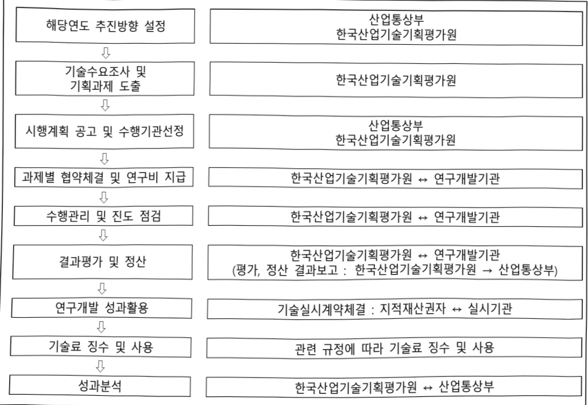

# K-온디바이스AI반도체기술개발(R&D)

**해당 페이지**: PDF 3721 ~ 3729 쪽 해당

**부처**: 산업통상부
**분야**: 산업·중소기업 및 에너지
**회계유형**: 일반회계
**2026 확정예산**: 166554.0 백만원
**전년대비 증감률**: None%
**AI 도메인**: AI반도체, 로봇, 피지컬AI/디바이스

---

<table border=1 style='margin: auto; word-wrap: break-word;'><tr><td style='text-align: center; word-wrap: break-word;'>사 업 명</td></tr><tr><td style='text-align: center; word-wrap: break-word;'>(160) K-온디바이스AI반도체기술개발(R&amp;D) (3561-324)</td></tr></table>

사업 코드 정보

<table border=1 style='margin: auto; word-wrap: break-word;'><tr><td style='text-align: center; word-wrap: break-word;'>구분</td><td style='text-align: center; word-wrap: break-word;'>회계</td><td style='text-align: center; word-wrap: break-word;'>소관</td><td style='text-align: center; word-wrap: break-word;'>실국(기관)</td><td style='text-align: center; word-wrap: break-word;'>계정</td><td style='text-align: center; word-wrap: break-word;'>분야</td><td style='text-align: center; word-wrap: break-word;'>부문</td></tr><tr><td style='text-align: center; word-wrap: break-word;'>코드</td><td rowspan="2">일반회계</td><td rowspan="2">산업통상부</td><td rowspan="2">산업성장실참신업정책관</td><td rowspan="2">-</td><td style='text-align: center; word-wrap: break-word;'>110</td><td style='text-align: center; word-wrap: break-word;'>117</td></tr><tr><td style='text-align: center; word-wrap: break-word;'>명칭</td><td style='text-align: center; word-wrap: break-word;'>산업·중소기업 및 에너지</td><td style='text-align: center; word-wrap: break-word;'>산업혁신지원</td></tr></table>

<table border=1 style='margin: auto; word-wrap: break-word;'><tr><td style='text-align: center; word-wrap: break-word;'>구분</td><td style='text-align: center; word-wrap: break-word;'>프로그램</td><td style='text-align: center; word-wrap: break-word;'>단위사업</td><td style='text-align: center; word-wrap: break-word;'>세부사업</td></tr><tr><td style='text-align: center; word-wrap: break-word;'>코드</td><td style='text-align: center; word-wrap: break-word;'>3500</td><td style='text-align: center; word-wrap: break-word;'>3561</td><td style='text-align: center; word-wrap: break-word;'>324</td></tr><tr><td style='text-align: center; word-wrap: break-word;'>명칭</td><td style='text-align: center; word-wrap: break-word;'>주력산업진흥</td><td style='text-align: center; word-wrap: break-word;'>스마트전자기술개발</td><td style='text-align: center; word-wrap: break-word;'>K-온디바이스AI반도체 기술개발(R&amp;D)</td></tr></table>

□ 사업 성격 (공통요구자료 Ⅱ-1 작성유의사항 4. 참조, 해당하는 사항에 “○” 표시)

<table border=1 style='margin: auto; word-wrap: break-word;'><tr><td rowspan="2">신규</td><td rowspan="2">계속</td><td rowspan="2">완료</td><td style='text-align: center; word-wrap: break-word;'>예비타당성</td><td style='text-align: center; word-wrap: break-word;'>총사업비</td><td style='text-align: center; word-wrap: break-word;'>총액계상</td><td style='text-align: center; word-wrap: break-word;'>사업소관 변경정보</td></tr><tr><td style='text-align: center; word-wrap: break-word;'>실시여부</td><td style='text-align: center; word-wrap: break-word;'>관리대상</td><td style='text-align: center; word-wrap: break-word;'>예산사업</td><td style='text-align: center; word-wrap: break-word;'>2025예산 시 소관</td></tr><tr><td style='text-align: center; word-wrap: break-word;'>O</td><td style='text-align: center; word-wrap: break-word;'></td><td style='text-align: center; word-wrap: break-word;'></td><td style='text-align: center; word-wrap: break-word;'>O</td><td style='text-align: center; word-wrap: break-word;'></td><td style='text-align: center; word-wrap: break-word;'></td><td style='text-align: center; word-wrap: break-word;'></td></tr></table>

□ 사업 지원 형태 및 지원을 (최소한 한 개는 반드시 선택하시오. 해당사항에 0 표시)

<table border=1 style='margin: auto; word-wrap: break-word;'><tr><td style='text-align: center; word-wrap: break-word;'>직접</td><td style='text-align: center; word-wrap: break-word;'>출자</td><td style='text-align: center; word-wrap: break-word;'>출연</td><td style='text-align: center; word-wrap: break-word;'>보조</td><td style='text-align: center; word-wrap: break-word;'>융자</td><td style='text-align: center; word-wrap: break-word;'>국고보조율(%)</td><td style='text-align: center; word-wrap: break-word;'>융자율(%)</td></tr><tr><td style='text-align: center; word-wrap: break-word;'></td><td style='text-align: center; word-wrap: break-word;'></td><td style='text-align: center; word-wrap: break-word;'>O</td><td style='text-align: center; word-wrap: break-word;'></td><td style='text-align: center; word-wrap: break-word;'></td><td style='text-align: center; word-wrap: break-word;'></td><td style='text-align: center; word-wrap: break-word;'></td></tr></table>

## 사업 담당자

<table border=1 style='margin: auto; word-wrap: break-word;'><tr><td style='text-align: center; word-wrap: break-word;'>사업명</td><td colspan="5">구분</td></tr><tr><td rowspan="4">K·온디바이스 AI반도체 기술개발 (R&amp;D)</td><td rowspan="3">소관부처</td><td style='text-align: center; word-wrap: break-word;'>실·국·과(팀)</td><td style='text-align: center; word-wrap: break-word;'>과 장</td><td style='text-align: center; word-wrap: break-word;'>사무관</td><td style='text-align: center; word-wrap: break-word;'>주무관</td></tr><tr><td style='text-align: center; word-wrap: break-word;'>산업성장실 첨단산업정책관</td><td style='text-align: center; word-wrap: break-word;'>이규봉</td><td style='text-align: center; word-wrap: break-word;'>전성철</td><td style='text-align: center; word-wrap: break-word;'>-</td></tr><tr><td style='text-align: center; word-wrap: break-word;'>반도체과</td><td style='text-align: center; word-wrap: break-word;'>044-203-4270</td><td style='text-align: center; word-wrap: break-word;'>044-203-4274</td><td style='text-align: center; word-wrap: break-word;'>-</td></tr><tr><td style='text-align: center; word-wrap: break-word;'>사업시행주체</td><td style='text-align: center; word-wrap: break-word;'>한국산업기술 기획평가원</td><td style='text-align: center; word-wrap: break-word;'>미래반도체실</td><td style='text-align: center; word-wrap: break-word;'>조영인 선임</td><td style='text-align: center; word-wrap: break-word;'>053-718-8573</td></tr></table>

---

### 가. 예산 총괄표

(단위: 백만원, %)

<table border=1 style='margin: auto; word-wrap: break-word;'><tr><td rowspan="2">사업명</td><td rowspan="2">2024년 결산</td><td colspan="2">2025년 예산</td><td colspan="2">2026년</td><td rowspan="2">증감(B-A)</td><td rowspan="2">(B-A)/A</td></tr><tr><td style='text-align: center; word-wrap: break-word;'>본예산(A)</td><td style='text-align: center; word-wrap: break-word;'>추경</td><td style='text-align: center; word-wrap: break-word;'>요구안</td><td style='text-align: center; word-wrap: break-word;'>확정(B)</td></tr><tr><td style='text-align: center; word-wrap: break-word;'>K-온디바이스AI반도체 기술개발(R&amp;D)</td><td style='text-align: center; word-wrap: break-word;'>-</td><td style='text-align: center; word-wrap: break-word;'>-</td><td style='text-align: center; word-wrap: break-word;'>-</td><td style='text-align: center; word-wrap: break-word;'>185,060</td><td style='text-align: center; word-wrap: break-word;'>166,554</td><td style='text-align: center; word-wrap: break-word;'>166,554</td><td style='text-align: center; word-wrap: break-word;'>순증</td></tr></table>

□ 기능별(내역사업별), 목별 예산 내역

(단위:백만원)

<table border=1 style='margin: auto; word-wrap: break-word;'><tr><td rowspan="2"></td><td colspan="5">2024</td><td colspan="7">2025(2025.12월말)</td><td rowspan="2">2026예산</td></tr><tr><td style='text-align: center; word-wrap: break-word;'>예산액(추정)</td><td style='text-align: center; word-wrap: break-word;'>예산현액</td><td style='text-align: center; word-wrap: break-word;'>집행액[실집행액]</td><td style='text-align: center; word-wrap: break-word;'>이월액</td><td style='text-align: center; word-wrap: break-word;'>불용액</td><td style='text-align: center; word-wrap: break-word;'>본예산</td><td style='text-align: center; word-wrap: break-word;'>예산현액</td><td style='text-align: center; word-wrap: break-word;'>집행액[실집행액]</td><td colspan="2">전년도아월액제외</td><td style='text-align: center; word-wrap: break-word;'>이월예상액</td><td style='text-align: center; word-wrap: break-word;'>불용예상액</td></tr><tr><td style='text-align: center; word-wrap: break-word;'>○기능별분류(합계)</td><td style='text-align: center; word-wrap: break-word;'>-</td><td style='text-align: center; word-wrap: break-word;'>-</td><td style='text-align: center; word-wrap: break-word;'>-</td><td style='text-align: center; word-wrap: break-word;'>-</td><td style='text-align: center; word-wrap: break-word;'>-</td><td style='text-align: center; word-wrap: break-word;'>-</td><td style='text-align: center; word-wrap: break-word;'>-</td><td style='text-align: center; word-wrap: break-word;'>-</td><td style='text-align: center; word-wrap: break-word;'>-</td><td style='text-align: center; word-wrap: break-word;'>-</td><td style='text-align: center; word-wrap: break-word;'>-</td><td style='text-align: center; word-wrap: break-word;'>-</td><td style='text-align: center; word-wrap: break-word;'>166,554</td></tr><tr><td style='text-align: center; word-wrap: break-word;'>·K-온디바이스AI반도체기술개발</td><td style='text-align: center; word-wrap: break-word;'>-</td><td style='text-align: center; word-wrap: break-word;'>-</td><td style='text-align: center; word-wrap: break-word;'>-</td><td style='text-align: center; word-wrap: break-word;'>-</td><td style='text-align: center; word-wrap: break-word;'>-</td><td style='text-align: center; word-wrap: break-word;'>-</td><td style='text-align: center; word-wrap: break-word;'>-</td><td style='text-align: center; word-wrap: break-word;'>-</td><td style='text-align: center; word-wrap: break-word;'>-</td><td style='text-align: center; word-wrap: break-word;'>-</td><td style='text-align: center; word-wrap: break-word;'>-</td><td style='text-align: center; word-wrap: break-word;'>-</td><td style='text-align: center; word-wrap: break-word;'>166,554</td></tr><tr><td style='text-align: center; word-wrap: break-word;'>○비목별분류(합계)</td><td style='text-align: center; word-wrap: break-word;'>-</td><td style='text-align: center; word-wrap: break-word;'>-</td><td style='text-align: center; word-wrap: break-word;'>-</td><td style='text-align: center; word-wrap: break-word;'>-</td><td style='text-align: center; word-wrap: break-word;'>-</td><td style='text-align: center; word-wrap: break-word;'>-</td><td style='text-align: center; word-wrap: break-word;'>-</td><td style='text-align: center; word-wrap: break-word;'>-</td><td style='text-align: center; word-wrap: break-word;'>-</td><td style='text-align: center; word-wrap: break-word;'>-</td><td style='text-align: center; word-wrap: break-word;'>-</td><td style='text-align: center; word-wrap: break-word;'>-</td><td style='text-align: center; word-wrap: break-word;'>166,554</td></tr><tr><td style='text-align: center; word-wrap: break-word;'>·연구개발활동비등(360-05)</td><td style='text-align: center; word-wrap: break-word;'>-</td><td style='text-align: center; word-wrap: break-word;'>-</td><td style='text-align: center; word-wrap: break-word;'>-</td><td style='text-align: center; word-wrap: break-word;'>-</td><td style='text-align: center; word-wrap: break-word;'>-</td><td style='text-align: center; word-wrap: break-word;'>-</td><td style='text-align: center; word-wrap: break-word;'>-</td><td style='text-align: center; word-wrap: break-word;'>-</td><td style='text-align: center; word-wrap: break-word;'>-</td><td style='text-align: center; word-wrap: break-word;'>-</td><td style='text-align: center; word-wrap: break-word;'>-</td><td style='text-align: center; word-wrap: break-word;'>-</td><td style='text-align: center; word-wrap: break-word;'>166,554</td></tr><tr><td style='text-align: center; word-wrap: break-word;'>○기능비목별분류(합계)</td><td style='text-align: center; word-wrap: break-word;'>-</td><td style='text-align: center; word-wrap: break-word;'>-</td><td style='text-align: center; word-wrap: break-word;'>-</td><td style='text-align: center; word-wrap: break-word;'>-</td><td style='text-align: center; word-wrap: break-word;'>-</td><td style='text-align: center; word-wrap: break-word;'>-</td><td style='text-align: center; word-wrap: break-word;'>-</td><td style='text-align: center; word-wrap: break-word;'>-</td><td style='text-align: center; word-wrap: break-word;'>-</td><td style='text-align: center; word-wrap: break-word;'>-</td><td style='text-align: center; word-wrap: break-word;'>-</td><td style='text-align: center; word-wrap: break-word;'>-</td><td style='text-align: center; word-wrap: break-word;'>166,554</td></tr><tr><td style='text-align: center; word-wrap: break-word;'>·K-온디바이스AI반도체기술개발·연구개발활동비등(360-05)</td><td style='text-align: center; word-wrap: break-word;'>-</td><td style='text-align: center; word-wrap: break-word;'>-</td><td style='text-align: center; word-wrap: break-word;'>-</td><td style='text-align: center; word-wrap: break-word;'>-</td><td style='text-align: center; word-wrap: break-word;'>-</td><td style='text-align: center; word-wrap: break-word;'>-</td><td style='text-align: center; word-wrap: break-word;'>-</td><td style='text-align: center; word-wrap: break-word;'>-</td><td style='text-align: center; word-wrap: break-word;'>-</td><td style='text-align: center; word-wrap: break-word;'>-</td><td style='text-align: center; word-wrap: break-word;'>-</td><td style='text-align: center; word-wrap: break-word;'>-</td><td style='text-align: center; word-wrap: break-word;'>166,554</td></tr></table>

---

### 4. 사업설명자료

## 1 ) 사업목적·내용

° 주력산업·펩리스 협력 기반 K-온디바이스 AI생태계 구축으로 주력산업 제품 첨단화 및 펩리스 역량 강화

- 외산 반도체 의존도가 높은 주력산업(자동차, 가전, 기계·로봇, 방산 등)의 AI반도체 공급망 내재화와 차별화된 주력산업 제품 개발로 글로벌 시장의 지배적 우위 확보를 위한 수요·공급기업 연계 기반 온디바이스 AI반도체 풀스택* 및 첨단제품 공동 개발

* AI반도체 칩, 모듈, AI 모델, AI S/W

## 2 ) 사업개요

## □ 사업근거 및 추진경위

①법령상근거

-산업기술혁신촉진법 제11조(산업기술개발사업)

① 산업통상부장관은 혁신계획 및 시행계획을 효율적으로 수행하기 위하여 관계 중앙행정기관의 장과 협의하여 다음 각 호의 산업기술분야에서 기술개발사업(산업기술개발을 위하여 필요한 기획 및 조사를 포함한다. 이하 "산업기술개발사업"이라 한다)을 추진할 수 있다

…

2. 산업기술 분야의 미래 유망 기술

## ② 추진경위

- '24.4 : 주력산업-반도체기업간 생태계 경쟁력 제고를 위한 AI반도체 협업포럼 추진

- '25.2 : 온디바이스 AI반도체 신규R&D 추진을 위한 수요조사 및 기업간담회

- '25.5 : K-온디바이스AI반도체기술개발사업 기획 및 민·관협력 MoU* 추진

* 시업기획 및 성과확산을 위한 업무협력 (산업부, 주력산업 수요기업, 반도체·팝리스협회, 전문기관)

- '25.7~8 : K-온디바이스AI반도체기술개발사업 예비타당성조사 면제 신청 및 의결

- '25.9 : 제조업 AI 대전환 성공을 위한 AI반도체 M.AX얼라이언스 MOU 체결

* 신업부, 수요기업, 팬리스(설계기업), 파운드리(제조기업), 글로벌 IP기업 참여

---

## □ 주요내용

① 사업규모

- 총사업비 : 해당 없음

- 사업기간 : '26~'30

- 최근 5년 간 투입된 사업비(예산액기준, 추경편성한 연도에는 추경포함)

<table border=1 style='margin: auto; word-wrap: break-word;'><tr><td style='text-align: center; word-wrap: break-word;'>연도</td><td style='text-align: center; word-wrap: break-word;'>2022</td><td style='text-align: center; word-wrap: break-word;'>2023</td><td style='text-align: center; word-wrap: break-word;'>2024</td><td style='text-align: center; word-wrap: break-word;'>2025</td><td style='text-align: center; word-wrap: break-word;'>2026</td></tr><tr><td style='text-align: center; word-wrap: break-word;'>사업비</td><td style='text-align: center; word-wrap: break-word;'>-</td><td style='text-align: center; word-wrap: break-word;'>-</td><td style='text-align: center; word-wrap: break-word;'>-</td><td style='text-align: center; word-wrap: break-word;'>-</td><td style='text-align: center; word-wrap: break-word;'>166,554</td></tr></table>

② 사업추진체계

- 사업시행방법 : 출연

- 사업시행주체 : 한국산업기술기획평가원

- 사업 수혜자 : 기업, 대학, 연구기관 등

- 보조, 융자, 출연, 출자 등의 경우 보조·융자 등 지원 비율 및 법적근거

<table border=1 style='margin: auto; word-wrap: break-word;'><tr><td style='text-align: center; word-wrap: break-word;'>내역사업명</td><td style='text-align: center; word-wrap: break-word;'>구분</td><td style='text-align: center; word-wrap: break-word;'>피보조·피출연 등 기관명</td><td style='text-align: center; word-wrap: break-word;'>지원 금액 (2026예산)</td><td style='text-align: center; word-wrap: break-word;'>지원 비율(%)</td><td style='text-align: center; word-wrap: break-word;'>보조율 법적근거 (해당 조항)</td></tr><tr><td style='text-align: center; word-wrap: break-word;'>K-온디바이스 AI반도체 기술개발</td><td style='text-align: center; word-wrap: break-word;'>출연</td><td style='text-align: center; word-wrap: break-word;'>기업, 연구소, 대학 등</td><td style='text-align: center; word-wrap: break-word;'>166,554</td><td style='text-align: center; word-wrap: break-word;'>지원 대상에 따라 차등지원</td><td style='text-align: center; word-wrap: break-word;'>산업기술혁신사업 공통운영요령 제24조(정부지원연구개발비의 지원기준)</td></tr></table>

## 3 ) 2026년도 예산 산출 근거

□ K-온디바이스 AI반도체기술개발 : (2025) 0 → (2026 예산) 166,554백만원, 순증

- (요구) 주력산업 맞춤형 온디바이스 AI반도체 칩, 모듈, AI모델, SW, SDK 등 포함한 풀스택 R&D 신규과제 지원을 위한 166,554백만원

- (산출) 신규과제 7개 (7개×35,690백만원×8/12) = 166,554백만원(순증)

2025년도 예산 및 2026년도 예산안 산출 세부내역 비교

<table border=1 style='margin: auto; word-wrap: break-word;'><tr><td colspan="2">2025년 본예산</td><td colspan="2">2026년 예산</td></tr><tr><td style='text-align: center; word-wrap: break-word;'>예산</td><td style='text-align: center; word-wrap: break-word;'>산출내역</td><td style='text-align: center; word-wrap: break-word;'>예산</td><td style='text-align: center; word-wrap: break-word;'>산출내역</td></tr><tr><td style='text-align: center; word-wrap: break-word;'>-</td><td style='text-align: center; word-wrap: break-word;'>-</td><td style='text-align: center; word-wrap: break-word;'>185,060</td><td style='text-align: center; word-wrap: break-word;'>&lt;K-온디바이스AI반도체기술개발 : 166,554백만원&gt; · 신규과제 7개 (7개×35,690백만원×8/12) = 166,554백만원</td></tr></table>

---

## 4 ) 사업효과

☐ 사업영향, 산출물 성과지표 등

① 2022~2026년도 성과계획서 상 성과지표 및 적은 5년간 성과 달성도

<table border=1 style='margin: auto; word-wrap: break-word;'><tr><td style='text-align: center; word-wrap: break-word;'>성과지표</td><td style='text-align: center; word-wrap: break-word;'>구분</td><td style='text-align: center; word-wrap: break-word;'>2022</td><td style='text-align: center; word-wrap: break-word;'>2023</td><td style='text-align: center; word-wrap: break-word;'>2024</td><td style='text-align: center; word-wrap: break-word;'>2025</td><td style='text-align: center; word-wrap: break-word;'>2026</td><td style='text-align: center; word-wrap: break-word;'>2026 목표치산출근거</td><td style='text-align: center; word-wrap: break-word;'>측정산식(또는 측정방법)</td><td style='text-align: center; word-wrap: break-word;'>자료수집방법(또는 자료출처)</td></tr><tr><td rowspan="3">성능목표달성도(단위:%)</td><td style='text-align: center; word-wrap: break-word;'>목표</td><td style='text-align: center; word-wrap: break-word;'>-</td><td style='text-align: center; word-wrap: break-word;'>-</td><td style='text-align: center; word-wrap: break-word;'>-</td><td style='text-align: center; word-wrap: break-word;'>-</td><td style='text-align: center; word-wrap: break-word;'>-</td><td rowspan="3">당해연도목표없음(&#x27;30년도 측정&#x27;)</td><td rowspan="3">(과제별 해당연도 산출물실적)/(과제별 해당연도 산출물 목표) × 100%</td><td rowspan="3">과제별 매년 연구 종료 이후 과제별 점검위원을 구성하여 점검</td></tr><tr><td style='text-align: center; word-wrap: break-word;'>실적</td><td style='text-align: center; word-wrap: break-word;'>-</td><td style='text-align: center; word-wrap: break-word;'>-</td><td style='text-align: center; word-wrap: break-word;'>-</td><td style='text-align: center; word-wrap: break-word;'>-</td><td style='text-align: center; word-wrap: break-word;'>-</td></tr><tr><td style='text-align: center; word-wrap: break-word;'>달성도</td><td style='text-align: center; word-wrap: break-word;'>-</td><td style='text-align: center; word-wrap: break-word;'>-</td><td style='text-align: center; word-wrap: break-word;'>-</td><td style='text-align: center; word-wrap: break-word;'>-</td><td style='text-align: center; word-wrap: break-word;'>-</td></tr><tr><td rowspan="3">맞춤형 온디바이스AI반도체시제품확보(단위: 건)</td><td style='text-align: center; word-wrap: break-word;'>목표</td><td style='text-align: center; word-wrap: break-word;'>-</td><td style='text-align: center; word-wrap: break-word;'>-</td><td style='text-align: center; word-wrap: break-word;'>-</td><td style='text-align: center; word-wrap: break-word;'>-</td><td style='text-align: center; word-wrap: break-word;'>당해연도목표없음(&#x27;30년도 측정&#x27;)</td><td rowspan="3">사업 종료연도기준으로 4대 우선지원 분야 세부주제별 시제품 확보 건수 측정</td><td rowspan="3">시험검증 결과서, MPW 및 상글런 등 협약·계약서 등을 통해 시제품 확보 건수 입증</td><td rowspan="3"></td></tr><tr><td style='text-align: center; word-wrap: break-word;'>실적</td><td style='text-align: center; word-wrap: break-word;'>-</td><td style='text-align: center; word-wrap: break-word;'>-</td><td style='text-align: center; word-wrap: break-word;'>-</td><td style='text-align: center; word-wrap: break-word;'>-</td><td style='text-align: center; word-wrap: break-word;'>-</td></tr><tr><td style='text-align: center; word-wrap: break-word;'>달성도</td><td style='text-align: center; word-wrap: break-word;'>-</td><td style='text-align: center; word-wrap: break-word;'>-</td><td style='text-align: center; word-wrap: break-word;'>-</td><td style='text-align: center; word-wrap: break-word;'>-</td><td style='text-align: center; word-wrap: break-word;'>-</td></tr><tr><td rowspan="3">우수특허비중(단위:%)</td><td style='text-align: center; word-wrap: break-word;'>목표</td><td style='text-align: center; word-wrap: break-word;'>-</td><td style='text-align: center; word-wrap: break-word;'>-</td><td style='text-align: center; word-wrap: break-word;'>-</td><td style='text-align: center; word-wrap: break-word;'>-</td><td style='text-align: center; word-wrap: break-word;'>당해연도목표없음(&#x27;28~30년도 측정&#x27;)</td><td rowspan="3">(BBB 등급 특허수)/(연도별 특허등록 수)</td><td rowspan="3">당해 연구기간 종료 후 차년도 2월에 사업성과 보고서 및 특허등록증 등을 통해 측정</td><td rowspan="3"></td></tr><tr><td style='text-align: center; word-wrap: break-word;'>실적</td><td style='text-align: center; word-wrap: break-word;'>-</td><td style='text-align: center; word-wrap: break-word;'>-</td><td style='text-align: center; word-wrap: break-word;'>-</td><td style='text-align: center; word-wrap: break-word;'>-</td><td style='text-align: center; word-wrap: break-word;'>-</td></tr><tr><td style='text-align: center; word-wrap: break-word;'>달성도</td><td style='text-align: center; word-wrap: break-word;'>-</td><td style='text-align: center; word-wrap: break-word;'>-</td><td style='text-align: center; word-wrap: break-word;'>-</td><td style='text-align: center; word-wrap: break-word;'>-</td><td style='text-align: center; word-wrap: break-word;'>-</td></tr><tr><td rowspan="3">상용화건수(단위: 건)</td><td style='text-align: center; word-wrap: break-word;'>목표</td><td style='text-align: center; word-wrap: break-word;'>-</td><td style='text-align: center; word-wrap: break-word;'>-</td><td style='text-align: center; word-wrap: break-word;'>-</td><td style='text-align: center; word-wrap: break-word;'>-</td><td style='text-align: center; word-wrap: break-word;'>당해연도목표없음(&#x27;30년도 측정&#x27;)</td><td rowspan="3">∑(상용화 건수)</td><td rowspan="3">펩리스 협력을 통해 개발한 온디바이스 AI 반도체를 수요가업 제품에 적용 및 구매 등 의하서로 상용화 건수 측정</td><td rowspan="3"></td></tr><tr><td style='text-align: center; word-wrap: break-word;'>실적</td><td style='text-align: center; word-wrap: break-word;'>-</td><td style='text-align: center; word-wrap: break-word;'>-</td><td style='text-align: center; word-wrap: break-word;'>-</td><td style='text-align: center; word-wrap: break-word;'>-</td><td style='text-align: center; word-wrap: break-word;'>-</td></tr><tr><td style='text-align: center; word-wrap: break-word;'>달성도</td><td style='text-align: center; word-wrap: break-word;'>-</td><td style='text-align: center; word-wrap: break-word;'>-</td><td style='text-align: center; word-wrap: break-word;'>-</td><td style='text-align: center; word-wrap: break-word;'>-</td><td style='text-align: center; word-wrap: break-word;'>-</td></tr></table>

* '26년 신규사업으로 '전략계획서 수립'을 통해 성과지표 별도 수립 예정

② 성과지표 이외의 연도별 사업추진 경과 및 실적 : 해당 없음

③ 향후(2026년도 이후) 기대효과

- 수요-팸리스 연계로 온디바이스 AI반도체 제품화 촉진*, 팸리스의 트렉데코드

확보로 국내 AI바드체 설계역량 강화

* '30년까지 수요·공급기업 연계 기반 온디바이스 AI반도체 풀스택 기술 및 첨단제품 6건 개발 목표

- "AI 반도체 강국" 정책목표 달성을 위한 주요 수단으로, AI반도체 글로벌 공급망

리스크 등 대외 불확실성 해소에 기여

* 우리나라 시스템반도체 세계시장 점유율은 '24년도 2.4%에서 '27년 1.6%로 하락 전망으로 수요기업의 외산 반도체 의존도 심화 및 팬리스의 수요처 확보 어려움 지속 예상

---

## 5 ) 타당성조사 및 예비타당성조사 시행여부 및 결과 요지

□ 예비타당성조사 면제 의결('25.8) 되었으며, 사업계획 적정성 검토 진행중('25.10~)

## 6 ) 총사업비 대상사업 여부 및 내역 : 해당없음

## 7 ) 사업 집행절차

## 8 ) 중기재정계획 상 연도별 투자계획 및 추진경과

(단위:백만원)

<table border=1 style='margin: auto; word-wrap: break-word;'><tr><td style='text-align: center; word-wrap: break-word;'>2024 재정계획</td><td style='text-align: center; word-wrap: break-word;'>2024</td><td style='text-align: center; word-wrap: break-word;'>2025</td><td style='text-align: center; word-wrap: break-word;'>2026</td><td style='text-align: center; word-wrap: break-word;'>2027</td><td style='text-align: center; word-wrap: break-word;'>2028</td><td style='text-align: center; word-wrap: break-word;'>2029</td></tr><tr><td style='text-align: center; word-wrap: break-word;'>2024~2028</td><td style='text-align: center; word-wrap: break-word;'>-</td><td style='text-align: center; word-wrap: break-word;'>-</td><td style='text-align: center; word-wrap: break-word;'>-</td><td style='text-align: center; word-wrap: break-word;'>-</td><td style='text-align: center; word-wrap: break-word;'>-</td><td style='text-align: center; word-wrap: break-word;'>☑</td></tr><tr><td style='text-align: center; word-wrap: break-word;'>2025~2029</td><td style='text-align: center; word-wrap: break-word;'>-</td><td style='text-align: center; word-wrap: break-word;'>-</td><td style='text-align: center; word-wrap: break-word;'>166,554</td><td style='text-align: center; word-wrap: break-word;'>150,600</td><td style='text-align: center; word-wrap: break-word;'>144,940</td><td style='text-align: center; word-wrap: break-word;'>135,860</td></tr></table>

---

9) 최근 3년간 동 사업에 대한 주요 외부지적사항 및 평가, 문제점 및 대책

1) 2025년 국회(예결위, 예정처) 지적

- (지적사항) 예타면제 의결 이후 사업계획 적정성 검토 이전에 예산이 편성되어,

사업이 차질 없이 진행될 수 있도록 조속히 검토 완료 필요

- (조치사항) 사업이 계획된 규모와 일정으로 추진되도록 예산 당국과 협의를 강화하고, 사업계획 적정성 검토와 상세 기획을 병행하여 추진

2) 감사원 감사 또는 국무총리실 지적 : 해당없음

3) 자체평가·감사 : 해당없음

4) 기타 시민단체, 언론 및 민원 : 해당없음

5) 문제점 지적에 대한 후속조치 : 해당없음

## 10 ) 향후 추진방향 및 추진계획

## ☐ 사업운영 기본방향

° 각산 AI 반도체(산업별 특화 AI 칩)가 탑재된 주력산업 4대 우선지원 분야별 (자동차, IoT·가전, 기계·로봇, 방산) 온디바이스 AI 첨단제품 개발 지원

## □ 사업추진 계획

° [민간수요 주도 양산향 개발] 각 산업별 수요기업이 참여하여 국내 AI반도체가 탑재된 양산 적용 가능한 첨단제품* 개발이 가능하도록 사업 기획 및 지원

* 온디바이스 AI반도체 칩, 모듈, SW 등 플스택 및 시제품까지 기획

° [팩리스 역량 강화] 설계 단계에서부터 팩리스-수요연계 협력을 통한 맞춤형 칩 개발 및 팩리스 트랙레코드 축적 지원

° [성과 활용 확산] 맞춤형 온디바이스 AI반도체 성과 확산을 위한 공통기술 및 전략적 사업화 지원

° [4대 우선지원 분야 중심 단계형 추진] 4대 우선지원 분야 중심 양산향 제품개발 (1단계)을 우선 추진 및 국산 IP 등 AI 반도체 전반의 국산화 및 역량 확보는 지속 가능성(2단계) 중심으로 중장기 로드맵 수립

11) 해당사업에 대한 각종 사업평가의 결과 : 해당 없음

12) 해당사업에 대한 부처 자체평가의 결과 : 해당 없음

---

13) 부처 건의사항 : 해당 없음

다.최근 4년간 결산내역

1) 결산표 : 해당 없음

2) 주요 결산사항 : 해당 없음

라. 기타 추가자료 : 사업 설명자료

---

# K-온디바이스AI반도체기술개발사업

□ 사업개요

<table border=1 style='margin: auto; word-wrap: break-word;'><tr><td style='text-align: center; word-wrap: break-word;'>사업기간</td><td style='text-align: center; word-wrap: break-word;'>2026 ~ 2030</td><td style='text-align: center; word-wrap: break-word;'>총사업비</td><td style='text-align: center; word-wrap: break-word;'>해당 없음</td></tr><tr><td style='text-align: center; word-wrap: break-word;'>주관기관</td><td colspan="3">기업, 대학, 연구소 등</td></tr><tr><td style='text-align: center; word-wrap: break-word;'>담당자</td><td colspan="3">반도체과 전성철 사무관(ㅈ 044-203-4274)</td></tr></table>

## □ 사업내용(지원내용)

o 자동차, IoT·가전, 기계·로봇 및 방산 분야 대표 수요기업 중심으로 국내 팸리스, 파운드리와 드림팀을 구성, 글로벌 시장 우위 확보 가능한 제품 개발을 위해 주력산업 맞춤형 온디바이스 AI반도체 풀스텍과 첨단제품 공동 개발

## □ '26년 예산 : 166,554백만원

○ 주력산업 맞춤형 온디바이스 AI반도체 칩, 모듈, AI모델, SW, SDK 등 포함한 풀스택 R&D 신규과제 지원을 위한 사업비 166,554백만원

- 신규과제 7개 × 35,690백만원 × 8/12개월 = 166,554백만원

※ 과제별 세부 추진(안)

<table border=1 style='margin: auto; word-wrap: break-word;'><tr><td style='text-align: center; word-wrap: break-word;'>분야</td><td style='text-align: center; word-wrap: break-word;'>개발 내용</td></tr><tr><td style='text-align: center; word-wrap: break-word;'>자동차</td><td style='text-align: center; word-wrap: break-word;'>▶ SDV(Software Defined Vehicle) 기반 자율주행을 위한 온-디바이스 AI 반도체 풀스택 개발
* 예시 : 통신이 불안정한 터널, 재난 상황에서 예측 불가한 사고 상황을 외부 정보 없이도 자체적으로 실시간 학습하여 자율주행</td></tr><tr><td style='text-align: center; word-wrap: break-word;'>IoT·가전</td><td style='text-align: center; word-wrap: break-word;'>▶ 스마트 홈을 위한 온-디바이스 AI 반도체 풀스택 개발
* 예시 : 가족 구성원별로 음성·행동패턴 등을 스스로 학습·인지해 연결된 가전의 볼륨·조도·습도를 조절하는 등 사용자 맞춤 최적 실내 환경 조성</td></tr><tr><td rowspan="3">기계·로봇</td><td style='text-align: center; word-wrap: break-word;'>▶ 협동 로봇을 위한 온-디바이스 AI 반도체 풀스택 개발
* 예시 : 작업환경 변화 학습 기반 협동 로봇의 정밀작업, 효율적인 협업 지원</td></tr><tr><td style='text-align: center; word-wrap: break-word;'>▶ 휴머노이드를 위한 온-디바이스 AI 반도체 풀스택 개발
* 예시 : 사용자의 습관과 감정을 실시간 인지해 맞춤형 돌봄 서비스 제공</td></tr><tr><td style='text-align: center; word-wrap: break-word;'>▶ 무인 농기계를 위한 온-디바이스 AI 반도체 풀스택 개발
* 예시 : 무인 트랙터가 실시간 토지 상태, 파종, 작물 성장 고려해 수확</td></tr><tr><td style='text-align: center; word-wrap: break-word;'>방산</td><td style='text-align: center; word-wrap: break-word;'>▶ 공중 무인플랫폼(드론, 무인기 등) 온-디바이스 AI 반도체 풀스택 개발
* 예시 : 전시에 무인기가 통신 연결 없이 자체 판단해 목표물을 정밀 타격</td></tr><tr><td style='text-align: center; word-wrap: break-word;'>활용·확산</td><td style='text-align: center; word-wrap: break-word;'>▶ 수요 중심 맞춤형 IP기술개발, 시장선도를 위한 표준화, 글로벌 시장 확산 지원</td></tr></table>

---

### 원본 PDF 크롭 이미지

