# K-치안수요기반피지컬AI조명핵심기술개발및실증(R&D)

**해당 페이지**: PDF 3730 ~ 3738 쪽 해당

**부처**: 산업통상부
**분야**: 산업·중소기업 및 에너지
**회계유형**: 일반회계
**2026 확정예산**: 5000.0 백만원
**전년대비 증감률**: None%
**AI 도메인**: 피지컬AI/디바이스

---

### 가.예산 총괄표

(단위:백만원,%)

<table border=1 style='margin: auto; word-wrap: break-word;'><tr><td rowspan="2">사업명</td><td rowspan="2">2024년 결산</td><td colspan="2">2025년 예산</td><td colspan="2">2026년</td><td rowspan="2">중감(B-A)</td><td rowspan="2">(B-A)/A</td></tr><tr><td style='text-align: center; word-wrap: break-word;'>본예산(A)</td><td style='text-align: center; word-wrap: break-word;'>추경</td><td style='text-align: center; word-wrap: break-word;'>요구안</td><td style='text-align: center; word-wrap: break-word;'>확정(B)</td></tr><tr><td style='text-align: center; word-wrap: break-word;'>K-치안수요기반 피지컬AI조명 핵심기술개발및 실증</td><td style='text-align: center; word-wrap: break-word;'>-</td><td style='text-align: center; word-wrap: break-word;'>-</td><td style='text-align: center; word-wrap: break-word;'>-</td><td style='text-align: center; word-wrap: break-word;'>5,000</td><td style='text-align: center; word-wrap: break-word;'>5,000</td><td style='text-align: center; word-wrap: break-word;'>+5,000</td><td style='text-align: center; word-wrap: break-word;'>순증</td></tr></table>

<이관 내역>

해당없음

□ 기능별(내역사업별), 목별 예산 내역

(단위:백만원)

<table border=1 style='margin: auto; word-wrap: break-word;'><tr><td rowspan="3"></td><td colspan="5">2024</td><td colspan="7">2025(2025.12월말)</td><td rowspan="3">2026예산</td></tr><tr><td rowspan="2">예산액(추정)</td><td rowspan="2">예산현액</td><td rowspan="2">집행액[실집행액]</td><td rowspan="2">이월액</td><td rowspan="2">불용액</td><td rowspan="2">본예산</td><td rowspan="2">예산현액</td><td rowspan="2">집행액[실집행액]</td><td colspan="2">전년도이월액제외</td><td rowspan="2">이월예상액</td><td rowspan="2">불용예상액</td></tr><tr><td style='text-align: center; word-wrap: break-word;'>예산현액</td><td style='text-align: center; word-wrap: break-word;'>집행액[실집행액]</td></tr><tr><td style='text-align: center; word-wrap: break-word;'>○ 기능별 분류(합계)</td><td style='text-align: center; word-wrap: break-word;'>-</td><td style='text-align: center; word-wrap: break-word;'>-</td><td style='text-align: center; word-wrap: break-word;'>-</td><td style='text-align: center; word-wrap: break-word;'>-</td><td style='text-align: center; word-wrap: break-word;'>-</td><td style='text-align: center; word-wrap: break-word;'>-</td><td style='text-align: center; word-wrap: break-word;'>-</td><td style='text-align: center; word-wrap: break-word;'>-</td><td style='text-align: center; word-wrap: break-word;'>-</td><td style='text-align: center; word-wrap: break-word;'>-</td><td style='text-align: center; word-wrap: break-word;'>-</td><td style='text-align: center; word-wrap: break-word;'>-</td><td style='text-align: center; word-wrap: break-word;'>5,000</td></tr><tr><td style='text-align: center; word-wrap: break-word;'>· K·치안수요기반피지컬AI조명핵심기술개발및실증</td><td style='text-align: center; word-wrap: break-word;'>-</td><td style='text-align: center; word-wrap: break-word;'>-</td><td style='text-align: center; word-wrap: break-word;'>-</td><td style='text-align: center; word-wrap: break-word;'>-</td><td style='text-align: center; word-wrap: break-word;'>-</td><td style='text-align: center; word-wrap: break-word;'>-</td><td style='text-align: center; word-wrap: break-word;'>-</td><td style='text-align: center; word-wrap: break-word;'>-</td><td style='text-align: center; word-wrap: break-word;'>-</td><td style='text-align: center; word-wrap: break-word;'>-</td><td style='text-align: center; word-wrap: break-word;'>-</td><td style='text-align: center; word-wrap: break-word;'>-</td><td style='text-align: center; word-wrap: break-word;'>5,000</td></tr><tr><td style='text-align: center; word-wrap: break-word;'>○ 비목별 분류(합계)</td><td style='text-align: center; word-wrap: break-word;'>-</td><td style='text-align: center; word-wrap: break-word;'>-</td><td style='text-align: center; word-wrap: break-word;'>-</td><td style='text-align: center; word-wrap: break-word;'>-</td><td style='text-align: center; word-wrap: break-word;'>-</td><td style='text-align: center; word-wrap: break-word;'>-</td><td style='text-align: center; word-wrap: break-word;'>-</td><td style='text-align: center; word-wrap: break-word;'>-</td><td style='text-align: center; word-wrap: break-word;'>-</td><td style='text-align: center; word-wrap: break-word;'>-</td><td style='text-align: center; word-wrap: break-word;'>-</td><td style='text-align: center; word-wrap: break-word;'>-</td><td style='text-align: center; word-wrap: break-word;'>5,000</td></tr><tr><td style='text-align: center; word-wrap: break-word;'>· 연구개발활동 비 등(360-05)</td><td style='text-align: center; word-wrap: break-word;'>-</td><td style='text-align: center; word-wrap: break-word;'>-</td><td style='text-align: center; word-wrap: break-word;'>-</td><td style='text-align: center; word-wrap: break-word;'>-</td><td style='text-align: center; word-wrap: break-word;'>-</td><td style='text-align: center; word-wrap: break-word;'>-</td><td style='text-align: center; word-wrap: break-word;'>-</td><td style='text-align: center; word-wrap: break-word;'>-</td><td style='text-align: center; word-wrap: break-word;'>-</td><td style='text-align: center; word-wrap: break-word;'>-</td><td style='text-align: center; word-wrap: break-word;'>-</td><td style='text-align: center; word-wrap: break-word;'>-</td><td style='text-align: center; word-wrap: break-word;'>5,000</td></tr></table>

### 나.사업설명자료

## 1 ) 사업목적·내용

- 치안, 안전 등 공공수요가 높은 드론용 조명에 인공지능 기술을 접목한 피지컬 AI조명 핵심기술개발 및 실증 추진

---

## 2 ) 사업개요

## □ 사업근거 및 추진경위

① 법령상 근거 및 조항 적시 : 산업기술혁신촉진법, 광용합기술개발 및 기반조성에 관한 법률, 드론활용의 촉진 및 기반조성에 관한 법률, 치안분야 과학기술 진흥에 관한 규정 등

② 추진경위

기술수요조사 :

· 광ICT 신규사업기획을 위한 수요조사('23. 2. 21. ~ 3. 7.)

· 조명조합사 대상 기술수요조사('24. 1. 2.~11.)

ㅇ 기업간담회 :

(국회) '22년 11월 11일, 김성원 의원실 주최

(부천시) '24년 6월 17일, 조용익 시장실 주최

0 드론용 조명에 대한 공공수요 :

·경찰청, KIPoT 과학치안진흥센터

·국방부, 드론작전사령부

## □ 주요내용

① 사업규모

- 총사업비(해당되는 경우에만 기재) : 110억원

- 사업기간 : '26년 ~ '28년

- 최근 5년 간 투입된 사업비(예산액기준, 추경편성한 연도에는 추경포함)

<table border=1 style='margin: auto; word-wrap: break-word;'><tr><td style='text-align: center; word-wrap: break-word;'>연도</td><td style='text-align: center; word-wrap: break-word;'>2022</td><td style='text-align: center; word-wrap: break-word;'>2023</td><td style='text-align: center; word-wrap: break-word;'>2024</td><td style='text-align: center; word-wrap: break-word;'>2025</td><td style='text-align: center; word-wrap: break-word;'>2026</td></tr><tr><td style='text-align: center; word-wrap: break-word;'>사업비</td><td style='text-align: center; word-wrap: break-word;'>-</td><td style='text-align: center; word-wrap: break-word;'>-</td><td style='text-align: center; word-wrap: break-word;'>-</td><td style='text-align: center; word-wrap: break-word;'>-</td><td style='text-align: center; word-wrap: break-word;'>5,000 백만 원</td></tr></table>

-기타: 해당없음

② 사업추진체계

- 사업시행주체 : 한국산업기술기획평가원

- 사업 수혜자 : (주관기관) 중소·중견기업, (참여기관) 기업, 대학, 연구소 등

- 보조, 융자, 출연, 출자 등의 경우 보조·융자 등 지원 비율 및 법적근거

<table border=1 style='margin: auto; word-wrap: break-word;'><tr><td style='text-align: center; word-wrap: break-word;'>내역사업명</td><td style='text-align: center; word-wrap: break-word;'>구분</td><td style='text-align: center; word-wrap: break-word;'>피보조·피출연 등 기관명</td><td style='text-align: center; word-wrap: break-word;'>지원 금액 (2026예산)</td><td style='text-align: center; word-wrap: break-word;'>지원 비율(%)</td><td style='text-align: center; word-wrap: break-word;'>보조율 법적근거 (해당 조항)</td></tr><tr><td style='text-align: center; word-wrap: break-word;'>K-치안수요기 반피지컬AI조 명핵심기술개 발및실증</td><td style='text-align: center; word-wrap: break-word;'>출연</td><td style='text-align: center; word-wrap: break-word;'>산학연 등</td><td style='text-align: center; word-wrap: break-word;'>50억원</td><td style='text-align: center; word-wrap: break-word;'>총사업비의 3/4 이내 정부 매칭</td><td style='text-align: center; word-wrap: break-word;'>해당없음</td></tr></table>

---

## 3 ) 2026년도 예산 산출 근거

○ K-치안 수요기반 피지컬AI조명 핵심기술개발 및 실증 : (2026요구)

5,000백만원, 순증

- (요구) 피지컬AI 조명 시스템, 피지컬AI 조명 부품, 피지컬 AI 조명 제어기술 등 5,000백만원 요구

- (산출) 1,666백만원 × 4개과제 × 9/12개월 = 5,000

2025년도 계획 및 2026년도 계획안 산출 세부내역 비교

<table border=1 style='margin: auto; word-wrap: break-word;'><tr><td colspan="2">2025년 계획</td><td colspan="2">2026년 계획안</td></tr><tr><td style='text-align: center; word-wrap: break-word;'>예산</td><td style='text-align: center; word-wrap: break-word;'>산출내역</td><td style='text-align: center; word-wrap: break-word;'>예산</td><td style='text-align: center; word-wrap: break-word;'>산출내역</td></tr><tr><td style='text-align: center; word-wrap: break-word;'>-</td><td style='text-align: center; word-wrap: break-word;'>-</td><td style='text-align: center; word-wrap: break-word;'>5,000</td><td style='text-align: center; word-wrap: break-word;'>&lt; K·치안 수요기반 피지컬AI조명 핵심기술개발 및 실증 5,000백만원 &gt; 가. (과제) 4개 × 1,666백만 × 9/12개월 = 5,000백만원</td></tr></table>

## 4 ) 사업효과

☐ 사업영향, 산출물 성과지표 등

① 2022~2026년도 성과계획서 상 성과지표 및 최근 5년간 성과 달성도

<table border=1 style='margin: auto; word-wrap: break-word;'><tr><td style='text-align: center; word-wrap: break-word;'>성과지표</td><td style='text-align: center; word-wrap: break-word;'>구분</td><td style='text-align: center; word-wrap: break-word;'>2022</td><td style='text-align: center; word-wrap: break-word;'>2023</td><td style='text-align: center; word-wrap: break-word;'>2024</td><td style='text-align: center; word-wrap: break-word;'>2025</td><td style='text-align: center; word-wrap: break-word;'>2026</td><td style='text-align: center; word-wrap: break-word;'>2026 목표치산출근거</td><td style='text-align: center; word-wrap: break-word;'>측정산식(또는 측정방법)</td><td style='text-align: center; word-wrap: break-word;'>자료수집방법(또는 자료출처)</td></tr><tr><td rowspan="3">특허건수:(단위: 건)</td><td style='text-align: center; word-wrap: break-word;'>목표</td><td style='text-align: center; word-wrap: break-word;'>-</td><td style='text-align: center; word-wrap: break-word;'>-</td><td style='text-align: center; word-wrap: break-word;'>-</td><td style='text-align: center; word-wrap: break-word;'>-</td><td style='text-align: center; word-wrap: break-word;'>3</td><td rowspan="3">기획보고서</td><td rowspan="3">∑ 특허 출원·등록건수 / 당해연도 예산(10억원)</td><td rowspan="3">ntis 등 성과</td></tr><tr><td style='text-align: center; word-wrap: break-word;'>실적</td><td style='text-align: center; word-wrap: break-word;'>-</td><td style='text-align: center; word-wrap: break-word;'>-</td><td style='text-align: center; word-wrap: break-word;'>-</td><td style='text-align: center; word-wrap: break-word;'>-</td><td style='text-align: center; word-wrap: break-word;'>-</td></tr><tr><td style='text-align: center; word-wrap: break-word;'>달성도</td><td style='text-align: center; word-wrap: break-word;'>-</td><td style='text-align: center; word-wrap: break-word;'>-</td><td style='text-align: center; word-wrap: break-word;'>-</td><td style='text-align: center; word-wrap: break-word;'>-</td><td style='text-align: center; word-wrap: break-word;'>-</td></tr><tr><td rowspan="3">특허 SMART 지수:(단위: 점)</td><td style='text-align: center; word-wrap: break-word;'>목표</td><td style='text-align: center; word-wrap: break-word;'>-</td><td style='text-align: center; word-wrap: break-word;'>-</td><td style='text-align: center; word-wrap: break-word;'>-</td><td style='text-align: center; word-wrap: break-word;'>-</td><td style='text-align: center; word-wrap: break-word;'>3.88</td><td rowspan="3">기획보고서</td><td rowspan="3">∑ 등록특허 별SMART지수 / 등록특허 건수</td><td rowspan="3">ntis 등 성과</td></tr><tr><td style='text-align: center; word-wrap: break-word;'>실적</td><td style='text-align: center; word-wrap: break-word;'>-</td><td style='text-align: center; word-wrap: break-word;'>-</td><td style='text-align: center; word-wrap: break-word;'>-</td><td style='text-align: center; word-wrap: break-word;'>-</td><td style='text-align: center; word-wrap: break-word;'>-</td></tr><tr><td style='text-align: center; word-wrap: break-word;'>달성도</td><td style='text-align: center; word-wrap: break-word;'>-</td><td style='text-align: center; word-wrap: break-word;'>-</td><td style='text-align: center; word-wrap: break-word;'>-</td><td style='text-align: center; word-wrap: break-word;'>-</td><td style='text-align: center; word-wrap: break-word;'>-</td></tr><tr><td rowspan="3">시작품 제작 건수:(단위: 건)</td><td style='text-align: center; word-wrap: break-word;'>목표</td><td style='text-align: center; word-wrap: break-word;'>-</td><td style='text-align: center; word-wrap: break-word;'>-</td><td style='text-align: center; word-wrap: break-word;'>-</td><td style='text-align: center; word-wrap: break-word;'>-</td><td style='text-align: center; word-wrap: break-word;'>1</td><td rowspan="3">기획보고서</td><td rowspan="3">∑ 시작품 제작건수</td><td rowspan="3">ntis 등 성과</td></tr><tr><td style='text-align: center; word-wrap: break-word;'>실적</td><td style='text-align: center; word-wrap: break-word;'>-</td><td style='text-align: center; word-wrap: break-word;'>-</td><td style='text-align: center; word-wrap: break-word;'>-</td><td style='text-align: center; word-wrap: break-word;'>-</td><td style='text-align: center; word-wrap: break-word;'>-</td></tr><tr><td style='text-align: center; word-wrap: break-word;'>달성도</td><td style='text-align: center; word-wrap: break-word;'>-</td><td style='text-align: center; word-wrap: break-word;'>-</td><td style='text-align: center; word-wrap: break-word;'>-</td><td style='text-align: center; word-wrap: break-word;'>-</td><td style='text-align: center; word-wrap: break-word;'>-</td></tr><tr><td rowspan="3">실증적용 건수:(단위: 건)</td><td style='text-align: center; word-wrap: break-word;'>목표</td><td style='text-align: center; word-wrap: break-word;'>-</td><td style='text-align: center; word-wrap: break-word;'>-</td><td style='text-align: center; word-wrap: break-word;'>-</td><td style='text-align: center; word-wrap: break-word;'>-</td><td style='text-align: center; word-wrap: break-word;'>-</td><td rowspan="3">기획보고서</td><td rowspan="3">∑ 실증적용 건수</td><td rowspan="3">ntis 등 성과</td></tr><tr><td style='text-align: center; word-wrap: break-word;'>실적</td><td style='text-align: center; word-wrap: break-word;'>-</td><td style='text-align: center; word-wrap: break-word;'>-</td><td style='text-align: center; word-wrap: break-word;'>-</td><td style='text-align: center; word-wrap: break-word;'>-</td><td style='text-align: center; word-wrap: break-word;'>-</td></tr><tr><td style='text-align: center; word-wrap: break-word;'>달성도</td><td style='text-align: center; word-wrap: break-word;'>-</td><td style='text-align: center; word-wrap: break-word;'>-</td><td style='text-align: center; word-wrap: break-word;'>-</td><td style='text-align: center; word-wrap: break-word;'>-</td><td style='text-align: center; word-wrap: break-word;'>-</td></tr><tr><td rowspan="3">사업화:(단위:억원/1억원 지원)</td><td style='text-align: center; word-wrap: break-word;'>목표</td><td style='text-align: center; word-wrap: break-word;'>-</td><td style='text-align: center; word-wrap: break-word;'>-</td><td style='text-align: center; word-wrap: break-word;'>-</td><td style='text-align: center; word-wrap: break-word;'>-</td><td style='text-align: center; word-wrap: break-word;'>-</td><td rowspan="3">기획보고서</td><td rowspan="3">∑(매출액+기술이전) / 1억원</td><td rowspan="3">ntis 등 성과</td></tr><tr><td style='text-align: center; word-wrap: break-word;'>실적</td><td style='text-align: center; word-wrap: break-word;'>-</td><td style='text-align: center; word-wrap: break-word;'>-</td><td style='text-align: center; word-wrap: break-word;'>-</td><td style='text-align: center; word-wrap: break-word;'>-</td><td style='text-align: center; word-wrap: break-word;'>-</td></tr><tr><td style='text-align: center; word-wrap: break-word;'>달성도</td><td style='text-align: center; word-wrap: break-word;'>-</td><td style='text-align: center; word-wrap: break-word;'>-</td><td style='text-align: center; word-wrap: break-word;'>-</td><td style='text-align: center; word-wrap: break-word;'>-</td><td style='text-align: center; word-wrap: break-word;'>-</td></tr></table>

---

② 성과지표 이외의 연도별 사업추진 경과 및 실적 : 해당없음

<table border=1 style='margin: auto; word-wrap: break-word;'><tr><td style='text-align: center; word-wrap: break-word;'>2022</td><td style='text-align: center; word-wrap: break-word;'>-</td></tr><tr><td style='text-align: center; word-wrap: break-word;'>2023</td><td style='text-align: center; word-wrap: break-word;'>-</td></tr><tr><td style='text-align: center; word-wrap: break-word;'>2024</td><td style='text-align: center; word-wrap: break-word;'>-</td></tr><tr><td style='text-align: center; word-wrap: break-word;'>2025</td><td style='text-align: center; word-wrap: break-word;'>-</td></tr></table>

③ 향후(2026년도 이후) 기대효과

국내외 반도체기업의 AI칩 개발 및 출시가 확대되는 상황에서 해외 경쟁자들보다 빠르게 AI기술을 조명에 접목한 혁신 기술을 확보

- 드론조명 페이로드에 온칩 AI 디바이스 모듈을 장착하고 드론조명용 학습AI모델 생성, 데이터전송 등 하드웨어와 소프트웨어가 결합된 시스템 기술을 선점

- 다양한 사용환경에 자율적 드론조명 기능이 구현되는 언어(LLM), 비전(LVM), 동작(LAM) 생성형 AI데이터 셋, 인공지능 학습 모델 및 시나리오 기술을 선점

° 군·공공의 수요와 밀착하여 임무상황에 특화된 고효율, 고광량, 고광각의 드론조명

핵심부품 요소기술 및 첨단 제조기술을 확보

0 네트워크 부재에서도 임무수행이 가능한 최초 피지컬AI조명시스템으로 드론, 로봇 제조 및 활용산업에 적용 가능한 초격차 기술을 확보

0 성장정체 상태에서 먹거리시장 탐색에 애로를 겪는 조명기업에게 드론, AI기술이

융합된 고부가가치 창고시장 선점의 기회 제공

- 군·공공수요가 높고 대형시장으로 성장전망되는 드론 및 모빌리티 시장의 혁신

AI기술이 적용된 신개념 AI조명 시장을 선점

0 중국 DJI가 글로벌시장 70%를 점유하고 있는 상황에서 국내 드론기업들의 시장 확대 여건과 노력이 기대되며, 국내 드론기업의 글로벌 진출과 협업하여 동반성장 기대

5) 타당성조사 및 예비타당성조사 시행여부 및 결과 요지 : 해당없음

6) 총사업비 대상사업 여부 및 내역 : 해당없음

---

## 7 ) 사업 집행절차

## 8 ) 중기재정계획 상 연도별 투자계획 및 추진경과

(단위: 백만원)

<table border=1 style='margin: auto; word-wrap: break-word;'><tr><td style='text-align: center; word-wrap: break-word;'>중기 재정계획</td><td style='text-align: center; word-wrap: break-word;'>2024</td><td style='text-align: center; word-wrap: break-word;'>2025</td><td style='text-align: center; word-wrap: break-word;'>2026</td><td style='text-align: center; word-wrap: break-word;'>2027</td><td style='text-align: center; word-wrap: break-word;'>2028</td><td style='text-align: center; word-wrap: break-word;'>2029</td></tr><tr><td style='text-align: center; word-wrap: break-word;'>2024~2028</td><td style='text-align: center; word-wrap: break-word;'>-</td><td style='text-align: center; word-wrap: break-word;'>-</td><td style='text-align: center; word-wrap: break-word;'>5,000</td><td style='text-align: center; word-wrap: break-word;'>3,000</td><td style='text-align: center; word-wrap: break-word;'>2,000</td><td style='text-align: center; word-wrap: break-word;'>☑</td></tr><tr><td style='text-align: center; word-wrap: break-word;'>2025~2029</td><td style='text-align: center; word-wrap: break-word;'></td><td style='text-align: center; word-wrap: break-word;'></td><td style='text-align: center; word-wrap: break-word;'></td><td style='text-align: center; word-wrap: break-word;'></td><td style='text-align: center; word-wrap: break-word;'></td><td style='text-align: center; word-wrap: break-word;'></td></tr></table>

---

9) 최근 3년간 동 사업에 대한 주요 외부지적사항 및 평가, 문제점 및 대책 (해당없음)

## 10 ) 향후 추진방향 및 추진계획

<table border=1 style='margin: auto; word-wrap: break-word;'><tr><td style='text-align: center; word-wrap: break-word;'>① (피지컬AI 조명시스템기술) 세계 최고·최초 수준의 드론 탑재에 최적화된 페이로드 함체와 복합소재 기반의 고방열·경량 냉각구조 기술 및 드론 연동 피지컬 AI 조명 운용기술을 확보- 드론의 임무수행 비행환경과 일체화 되는 조명의 기계적 요소 기술을 확보하여 페이로드 함체와 클램핑, 레치 등 접속·체결 부품 및 온디바이스 AI 칩 일체화 구조 개발- 장시간 고광도로 플라잉 상태 임무수행이 가능할 수 있도록 초경량 고방열 소재, 최적화 방열구조, 능동형 냉각 기술확보와 지능형 피지컬 조명 구동 시스템 개발 ② (피지컬AI 조명 핵심부품기술) 세계 최고·최초 객체 인식을 위한 광대역 다층 광학계 기술과 다양한 환경에서 동적 배광이 가능한 스위칭 제어 드라이브 IC 기반 피지컬 제어부품 기술 확보- 이동상황별 지능형 배광 가변이 가능한 다층 광학계 기술과 비전 객체 탐지연동 VIS, IR 대역별 광학계 및 광출력에 대한 온디바이스 AI 기반 제어 기술 확보- 열악한 임무상황 별 객체인식 및 가시성 극대화를 위해 10만 루멘급 능동 배광형 광원모듈과 50만 루멘 이상급 고광도 응동 PCB 모듈화 광필터, 렌즈기술확보 ③ (피지컬AI 조명 개발환경) 중소 조명기업의 시장진출 가시화를 위한 공용화 개발 환경(SDK)구축과 피지컬AI조명 디바이스의 제어 및 성능을 검증할 수 있는 평가 기술을 개발- 국내 AI집 제조사와 협업하여 드론조명에 최적화된 경량·저전력 AI칩셋 활용 및 개발환경 구축</td></tr></table>

11) 해당사업에 대한 각종 사업평가의 결과 : 해당없음

12) 해당사업에 대한 부처 자체평가의 결과 : 해당없음

## 13 ) 부처 건의사항

- 조명산업의 고부가가치화, AI 적용을 통한 신사업발굴을 위해 지원 필요

---

다. 최근 4년간 결산내역 : 해당없음

라. 기타 추가자료

---

## 참고

## 세부사업 설명자료

## ☐ 사업개요

<table border=1 style='margin: auto; word-wrap: break-word;'><tr><td style='text-align: center; word-wrap: break-word;'>사업기간</td><td style='text-align: center; word-wrap: break-word;'>2026 ~ 2028(3년)</td><td style='text-align: center; word-wrap: break-word;'>총사업비</td><td style='text-align: center; word-wrap: break-word;'>140억원(국비: 100, 민자: 40), ‘26년 국비 50억원</td></tr><tr><td style='text-align: center; word-wrap: break-word;'>주관기관</td><td colspan="3">중소중견기업(대학, 연구기관, 기업 참여)</td></tr></table>

## □추진배경

°(목적) 치안, 안전 등 공공수요가 높은 드론용 조명에 인공지능 기술을 접목한 피지컬AI조명 핵심기술개발 및 상용화실증 추진(세계최초 드론용 AI조명)

- 치안·안전 등 드론용 조명 수요는 높으나 현재 단순히 드론에 조명체를 장착하는 수준으로, 에너지 최적화 및 상황별 최적조명의 AI제어기능*은 전무

* 최소무게·면적의 최대광원모듈, 객체인식 다파장 광학계, 드론운용 최적AI제어 등

- 드론용 피지컬AI조명기술 확보 후 경(KIPoT과학치안센터), 군(드론작전사령부)등의 수요기반

실증을 통해 로봇, 자율차 등 임무이동체용 특화 조명으로 확산·환류 예정

## ☐ 사업내용 및 AI 관련 기술개발 내용

① (피지컬AI 조명시스템기술) 기상상황 등에 따른 드론의 움직임에도 일정한 조명환경을 만들 수 있는 피지컬AI 조명함체(고방열·초경량) 제어시스템

② (피지컬AI 조명 핵심부품기술) 최적의 조명환경을 만들기 위해 비전센서 등과 연동하여 광원(VIS, IR 등), 출력 등을 제어하는 온디바이스 피지컬AI 기술

③ (피지컬AI 조명 개발환경) 중소 조명기업의 시장진출 가시화를 위한 공용화 AI 개발환경(SDK)구축과 피지컬AI조명 디바이스의 검증/평가기술

<table border=1 style='margin: auto; word-wrap: break-word;'><tr><td style='text-align: center; word-wrap: break-word;'>드론용 피지컬 AI조명시스템 기술</td><td style='text-align: center; word-wrap: break-word;'>피지컬 AI조명 핵심부품</td><td style='text-align: center; word-wrap: break-word;'>피지컬AI 조명 제어 및 평가기술</td></tr><tr><td style='text-align: center; word-wrap: break-word;'>·페이로드 조명함체 ·복합소재 기반 고방열·경량 냉각장치 ·온디바이스AI 함체 구동 시스템</td><td style='text-align: center; word-wrap: break-word;'>·객체인식 연동형 광대역 광원모듈 ·멀티모델센서 연동 AI 스위칭 광제어 ·온디바이스AI 파장제어</td><td style='text-align: center; word-wrap: break-word;'>·배광커버리지 최적화 알고리즘 ·개발환경 SDK, AI 광학 시뮬레이터 ·SW, HW 평가방법/기법/장비</td></tr><tr><td style='text-align: center; word-wrap: break-word;'> </td><td style='text-align: center; word-wrap: break-word;'>  </td><td style='text-align: center; word-wrap: break-word;'> </td></tr><tr><td style='text-align: center; word-wrap: break-word;'>  [F22]</td><td style='text-align: center; word-wrap: break-word;'></td><td style='text-align: center; word-wrap: break-word;'></td></tr></table>

---

<table border=1 style='margin: auto; word-wrap: break-word;'><tr><td style='text-align: center; word-wrap: break-word;'>사 업 명</td></tr><tr><td style='text-align: center; word-wrap: break-word;'>(1) No-Code제조기술혁신생태계구축 (3174-496)</td></tr></table>

□ 사업 코드 정보

<table border=1 style='margin: auto; word-wrap: break-word;'><tr><td style='text-align: center; word-wrap: break-word;'>구분</td><td style='text-align: center; word-wrap: break-word;'>회계</td><td style='text-align: center; word-wrap: break-word;'>소관</td><td style='text-align: center; word-wrap: break-word;'>실국(기관)</td><td style='text-align: center; word-wrap: break-word;'>계정</td><td style='text-align: center; word-wrap: break-word;'>분야</td><td style='text-align: center; word-wrap: break-word;'>부문</td></tr><tr><td style='text-align: center; word-wrap: break-word;'>코드</td><td rowspan="2">일반회계</td><td rowspan="2">산업통상부</td><td rowspan="2">산업성장실산업인공지능정책국</td><td rowspan="2">-</td><td style='text-align: center; word-wrap: break-word;'>110</td><td style='text-align: center; word-wrap: break-word;'>117</td></tr><tr><td style='text-align: center; word-wrap: break-word;'>명칭</td><td style='text-align: center; word-wrap: break-word;'>산업·중소기업 및 에너지</td><td style='text-align: center; word-wrap: break-word;'>산업혁신지원</td></tr></table>

<table border=1 style='margin: auto; word-wrap: break-word;'><tr><td style='text-align: center; word-wrap: break-word;'>구분</td><td style='text-align: center; word-wrap: break-word;'>프로그램</td><td style='text-align: center; word-wrap: break-word;'>단위사업</td><td style='text-align: center; word-wrap: break-word;'>세부사업</td></tr><tr><td style='text-align: center; word-wrap: break-word;'>코드</td><td style='text-align: center; word-wrap: break-word;'>3100</td><td style='text-align: center; word-wrap: break-word;'>3174</td><td style='text-align: center; word-wrap: break-word;'>496</td></tr><tr><td style='text-align: center; word-wrap: break-word;'>명칭</td><td style='text-align: center; word-wrap: break-word;'>산업경쟁력기반구축</td><td style='text-align: center; word-wrap: break-word;'>우수기술역량강화</td><td style='text-align: center; word-wrap: break-word;'>No-Code 제조기술 혁신 생태계 구축</td></tr></table>

<table border=1 style='margin: auto; word-wrap: break-word;'><tr><td colspan="2">☐ 사업 성격</td><td colspan="4">(공통요구자료 II-1 작성유의사항 4. 참조, 해당하는 사항에 “〇” 표시)</td></tr><tr><td rowspan="2">신규 계속</td><td rowspan="2">완료</td><td rowspan="2">예비타당성 실시여부</td><td rowspan="2">총사업비 관리대상</td><td rowspan="2">총액계상 예산사업</td><td style='text-align: center; word-wrap: break-word;'>사업소관 변경정보</td></tr><tr><td style='text-align: center; word-wrap: break-word;'>2025예산 시 소관</td></tr><tr><td style='text-align: center; word-wrap: break-word;'></td><td style='text-align: center; word-wrap: break-word;'>○</td><td style='text-align: center; word-wrap: break-word;'></td><td style='text-align: center; word-wrap: break-word;'></td><td style='text-align: center; word-wrap: break-word;'></td><td style='text-align: center; word-wrap: break-word;'></td></tr></table>

□ 사업 지원 형태 및 지원을 (최소한 한 개는 반드시 선택하시오. 해당사항에 0 표시)

<table border=1 style='margin: auto; word-wrap: break-word;'><tr><td style='text-align: center; word-wrap: break-word;'>직접</td><td style='text-align: center; word-wrap: break-word;'>출자</td><td style='text-align: center; word-wrap: break-word;'>출연</td><td style='text-align: center; word-wrap: break-word;'>보조</td><td style='text-align: center; word-wrap: break-word;'>융자</td><td style='text-align: center; word-wrap: break-word;'>국고보조율(%)</td><td style='text-align: center; word-wrap: break-word;'>융자율(%)</td></tr><tr><td style='text-align: center; word-wrap: break-word;'></td><td style='text-align: center; word-wrap: break-word;'></td><td style='text-align: center; word-wrap: break-word;'>○</td><td style='text-align: center; word-wrap: break-word;'></td><td style='text-align: center; word-wrap: break-word;'></td><td style='text-align: center; word-wrap: break-word;'></td><td style='text-align: center; word-wrap: break-word;'></td></tr></table>

사업담당자

<table border=1 style='margin: auto; word-wrap: break-word;'><tr><td style='text-align: center; word-wrap: break-word;'>사업명</td><td colspan="5">구분</td></tr><tr><td rowspan="2">No-Code 제조기술 혁신 생태계 구축</td><td style='text-align: center; word-wrap: break-word;'>소관부처</td><td style='text-align: center; word-wrap: break-word;'>실·국·과(팀) 산업성장실 산업인공지능정책국 산업인공지능정책과</td><td rowspan="2">과 장 송영진 044-203-3830</td><td style='text-align: center; word-wrap: break-word;'>사무관 조은형 044-203-3832</td><td rowspan="2">주무관 조용우 044-203-3834</td></tr><tr><td style='text-align: center; word-wrap: break-word;'>사업시행주체</td><td style='text-align: center; word-wrap: break-word;'>한국산업기술진흥원 산업인공지능혁신실</td><td style='text-align: center; word-wrap: break-word;'>주소명 실장 02-6009-3640</td></tr></table>

---

### 원본 PDF 크롭 이미지

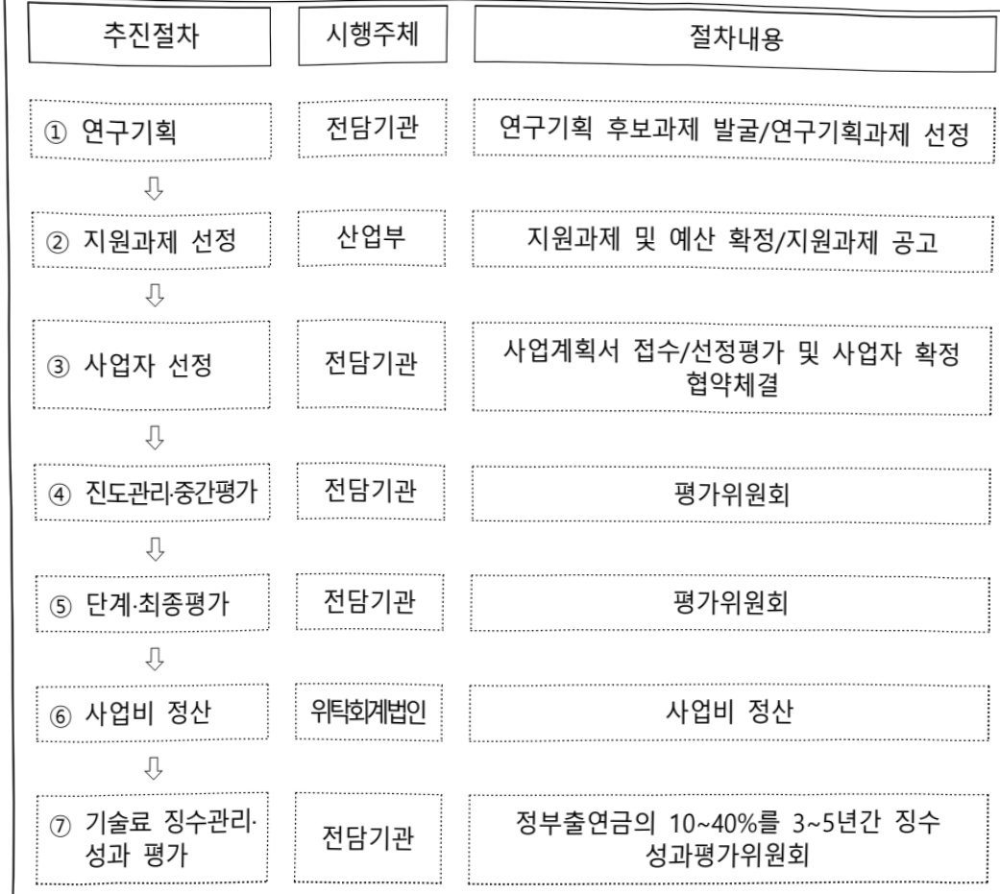

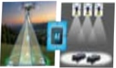

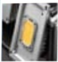

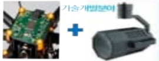

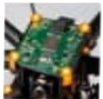

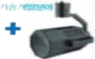

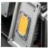

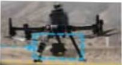

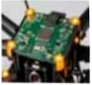

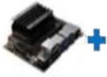

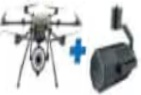

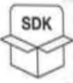

