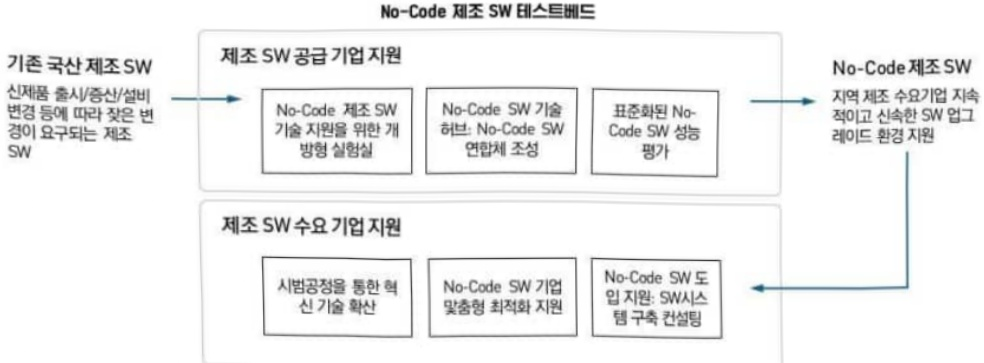
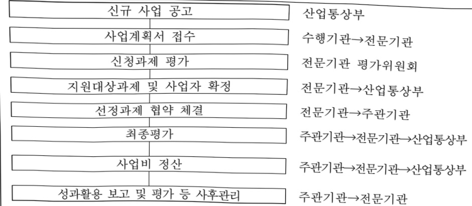
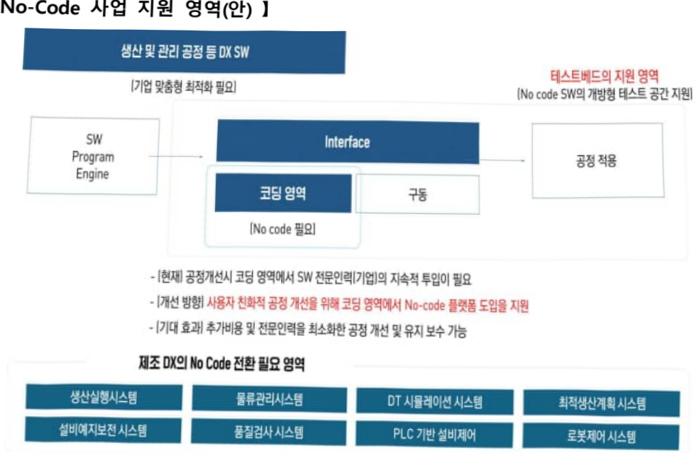

# No-Code 제조기술 혁신 생태계 구축

**해당 페이지**: PDF 3739 ~ 3751 쪽 해당

**부처**: 산업통상부
**분야**: 산업·중소기업 및 에너지
**회계유형**: 일반회계
**2026 확정예산**: 3000.0 백만원
**전년대비 증감률**: 33.3%
**AI 도메인**: 디지털전환(AX)

---

### 가.예산안 총괄표

(단위: 백만원, %)

<table border=1 style='margin: auto; word-wrap: break-word;'><tr><td rowspan="2">사업명</td><td rowspan="2">2024년 결산</td><td colspan="2">2025년 예산</td><td colspan="2">2026년</td><td rowspan="2">중감(B-A)</td><td rowspan="2">(B-A)/A</td></tr><tr><td style='text-align: center; word-wrap: break-word;'>본예산(A)</td><td style='text-align: center; word-wrap: break-word;'>추경</td><td style='text-align: center; word-wrap: break-word;'>요구안</td><td style='text-align: center; word-wrap: break-word;'>확정(B)</td></tr><tr><td style='text-align: center; word-wrap: break-word;'>No-Code제조기술혁신생태계구축</td><td style='text-align: center; word-wrap: break-word;'>-</td><td style='text-align: center; word-wrap: break-word;'>2,250</td><td style='text-align: center; word-wrap: break-word;'>-</td><td style='text-align: center; word-wrap: break-word;'>3,000</td><td style='text-align: center; word-wrap: break-word;'>3,000</td><td style='text-align: center; word-wrap: break-word;'>750</td><td style='text-align: center; word-wrap: break-word;'>33.3</td></tr></table>

□ 기능별(내역사업별), 목별 예산안 내역

(단위:백만원)

<table border=1 style='margin: auto; word-wrap: break-word;'><tr><td rowspan="3"></td><td colspan="5">2024</td><td colspan="7">2025(2025.12월말)</td><td rowspan="3">2026예산</td></tr><tr><td rowspan="2">예산액(추경)</td><td rowspan="2">예산현액</td><td rowspan="2">집행액[실집행액]</td><td rowspan="2">이월액</td><td rowspan="2">불용액</td><td rowspan="2">본예산</td><td rowspan="2">예산현액</td><td rowspan="2">집행액[실집행액]</td><td colspan="2">전년도제외</td><td rowspan="2">이월예상액</td><td rowspan="2">불용예상액</td></tr><tr><td style='text-align: center; word-wrap: break-word;'>예산현액</td><td style='text-align: center; word-wrap: break-word;'>집행액[실집행액]</td></tr><tr><td style='text-align: center; word-wrap: break-word;'>○ 기능별 분류(합계)</td><td style='text-align: center; word-wrap: break-word;'>-</td><td style='text-align: center; word-wrap: break-word;'>-</td><td style='text-align: center; word-wrap: break-word;'>-</td><td style='text-align: center; word-wrap: break-word;'>-</td><td style='text-align: center; word-wrap: break-word;'>-</td><td style='text-align: center; word-wrap: break-word;'>2,250</td><td style='text-align: center; word-wrap: break-word;'>2,250</td><td style='text-align: center; word-wrap: break-word;'>2,250[2,250]</td><td style='text-align: center; word-wrap: break-word;'>2,250</td><td style='text-align: center; word-wrap: break-word;'>2,250[2,250]</td><td style='text-align: center; word-wrap: break-word;'>-</td><td style='text-align: center; word-wrap: break-word;'>-</td><td style='text-align: center; word-wrap: break-word;'>3,000</td></tr><tr><td style='text-align: center; word-wrap: break-word;'>· No-Code제조기술혁신생태계구축·기획평가관리비</td><td style='text-align: center; word-wrap: break-word;'>-</td><td style='text-align: center; word-wrap: break-word;'>-</td><td style='text-align: center; word-wrap: break-word;'>-</td><td style='text-align: center; word-wrap: break-word;'>-</td><td style='text-align: center; word-wrap: break-word;'>-</td><td style='text-align: center; word-wrap: break-word;'>2,250</td><td style='text-align: center; word-wrap: break-word;'>2,250[2,250]</td><td style='text-align: center; word-wrap: break-word;'>2,250[2,250]</td><td style='text-align: center; word-wrap: break-word;'>2,250[2,250]</td><td style='text-align: center; word-wrap: break-word;'>-</td><td style='text-align: center; word-wrap: break-word;'>-</td><td style='text-align: center; word-wrap: break-word;'>2,910</td><td style='text-align: center; word-wrap: break-word;'>90</td></tr><tr><td style='text-align: center; word-wrap: break-word;'>○ 비목별 분류(합계)</td><td style='text-align: center; word-wrap: break-word;'>-</td><td style='text-align: center; word-wrap: break-word;'>-</td><td style='text-align: center; word-wrap: break-word;'>-</td><td style='text-align: center; word-wrap: break-word;'>-</td><td style='text-align: center; word-wrap: break-word;'>-</td><td style='text-align: center; word-wrap: break-word;'>2,250</td><td style='text-align: center; word-wrap: break-word;'>2,250[2,250]</td><td style='text-align: center; word-wrap: break-word;'>2,250[2,250]</td><td style='text-align: center; word-wrap: break-word;'>2,250[2,250]</td><td style='text-align: center; word-wrap: break-word;'>-</td><td style='text-align: center; word-wrap: break-word;'>-</td><td style='text-align: center; word-wrap: break-word;'>3,000</td><td style='text-align: center; word-wrap: break-word;'>90</td></tr><tr><td style='text-align: center; word-wrap: break-word;'>· 사 업 출 연 금(350-02)·기관운영출연금(350-01)</td><td style='text-align: center; word-wrap: break-word;'>-</td><td style='text-align: center; word-wrap: break-word;'>-</td><td style='text-align: center; word-wrap: break-word;'>-</td><td style='text-align: center; word-wrap: break-word;'>-</td><td style='text-align: center; word-wrap: break-word;'>-</td><td style='text-align: center; word-wrap: break-word;'>2,250</td><td style='text-align: center; word-wrap: break-word;'>2,250[2,250]</td><td style='text-align: center; word-wrap: break-word;'>2,250[2,250]</td><td style='text-align: center; word-wrap: break-word;'>2,250[2,250]</td><td style='text-align: center; word-wrap: break-word;'>-</td><td style='text-align: center; word-wrap: break-word;'>-</td><td style='text-align: center; word-wrap: break-word;'>2,910</td><td style='text-align: center; word-wrap: break-word;'>90</td></tr><tr><td style='text-align: center; word-wrap: break-word;'>○ 기능비목별 분류(합계)</td><td style='text-align: center; word-wrap: break-word;'>-</td><td style='text-align: center; word-wrap: break-word;'>-</td><td style='text-align: center; word-wrap: break-word;'>-</td><td style='text-align: center; word-wrap: break-word;'>-</td><td style='text-align: center; word-wrap: break-word;'>-</td><td style='text-align: center; word-wrap: break-word;'>2,250</td><td style='text-align: center; word-wrap: break-word;'>2,250[2,250]</td><td style='text-align: center; word-wrap: break-word;'>2,250[2,250]</td><td style='text-align: center; word-wrap: break-word;'>2,250[2,250]</td><td style='text-align: center; word-wrap: break-word;'>-</td><td style='text-align: center; word-wrap: break-word;'>-</td><td style='text-align: center; word-wrap: break-word;'>3,000</td><td style='text-align: center; word-wrap: break-word;'>90</td></tr><tr><td style='text-align: center; word-wrap: break-word;'>· No-Code제조기술혁신생태계구축·사 업 출 연 금(350-02)·기획평가관리비·기관운영출연금(350-01)</td><td style='text-align: center; word-wrap: break-word;'>-</td><td style='text-align: center; word-wrap: break-word;'>-</td><td style='text-align: center; word-wrap: break-word;'>-</td><td style='text-align: center; word-wrap: break-word;'>-</td><td style='text-align: center; word-wrap: break-word;'>-</td><td style='text-align: center; word-wrap: break-word;'>2,250</td><td style='text-align: center; word-wrap: break-word;'>2,250[2,250]</td><td style='text-align: center; word-wrap: break-word;'>2,250[2,250]</td><td style='text-align: center; word-wrap: break-word;'>2,250[2,250]</td><td style='text-align: center; word-wrap: break-word;'>-</td><td style='text-align: center; word-wrap: break-word;'>-</td><td style='text-align: center; word-wrap: break-word;'>2,910</td><td style='text-align: center; word-wrap: break-word;'>90</td></tr></table>

---

나. 사업설명자료

1) 사업목적·내용

(목적) 제조기업의 非전문 인력도 현장 시스템을 변경·개선할 수 있도록, No-Code 기술 적용 SW를 제조현장에 구현

(내용) 산학협력을 통한 노코드 기반 SW 솔루션을 제조기업에 지원, 전통제조산업 기업의 디지털 역량 강화 및 DX 생태계 구축

- (No-Code 실증 테스트베드 구축) 기술 전시, 기술검증 및 표준화, 교육 등 No-Code 기술 선도를 위한 테스트베드 구축

- (No-Code 실증 테스트베드 운영) No-Code 기술개발 및 성능평가 등 실증 테스트 수행, 수요-공급 기업 기술매칭 등 기업 No-Code SW 기술허브 제공

- (No-Code SW 도입 지원) 신제품 개발, 신기술 도입 등 잦은 공정 변경이 필요한 제조 중소기업을 대상으로 맞춤형 No-Code 제조 SW 기술 도입 지원

## 2 ) 사업개요

□ 사업근거 및 추진경위

① 법령상 근거 및 조항 적시

-「산업기술혁신촉진법」제19조(산업기술기반조성사업)

제19조(산업기술기반조성사업) ① 산업통상부장관은 산업기술혁신의 기반 및 환경조성에 관한 다음 각 호의 사업(이하 “산업기술기반조성사업”이라 한다)을 추진할 수 있다.

1. 산업기술인력의 활용 및 공급

2. 산업기술 연구장비 · 시설 등의 확충 및 활용촉진

3. 연구장비 · 시설 · 연구인력 및 정보 등 산업기술혁신 요소의 집적화(集積化) 촉진

4. 산업기술혁신을 위하여 필요한 기술 · 산업 등에 관한 각종 정보의 생산 · 관리 및 활용의 촉진

5. 산업기술의 표준화, 디자인 · 브랜드 선진화 등을 위한 기반구축

6. 산업기술문화공간의 설치 · 운영 등 산업기술저변의 확충

7. 그 밖에 산업기술혁신 기반 조성을 위하여 대통령령으로 정하는 사업

② 산업통상부장관은 연구기관, 대학, 그 밖에 대통령령으로 정하는 기관 · 단체로 하여금 산업기술기반조성사업을 실시하게 할 수 있으며, 산업기술기반조성사업을 주관하여 실시하는 자(이하 “주관기관”이라 한다)와 산업기술기반조성사업에 관한 협약을 체결하고, 주관기관에 해당 사업의 수행에 드는 비용의 전부 또는 일부를 출연 또는 보조할 수 있다.

③ 산업기술기반조성사업에 관하여는 제11조(제1항은 제외한다) · 제11조의2 및 제11조의3을 준용한다. 이 경우 “주관연구기관”은 “주관기관”으로, “산업기술개발사업”은 “산업기술기반조성사업”으로 본다.

---

## -「산업기술혁신촉진법」제21조(연구장비·시설 등의 확충 및 활용촉진)

제21조(연구장비·시설 등의 확충 및 활용촉진) ① 산업통상부장관은 주관기관이 연구장비·시설, 시험·평가장비 등(이하 “연구장비등”이라 한다) 연구기반을 확충할 수 있도록 지원하거나 그 밖에 필요한 방안을 마련하여야 한다.

② 제1항에 따라 연구장비등을 지원받은 주관기관과 주관연구기관 중 대통령령으로 정하는 기관(이하 이 조에서 “주관기관등”이라 한다)은 무상 또는 연구장비등의 유지·보수·운영에 드는 비용 등을 고려하여 산업통상부장관이 고시하는 기준에 따라 산정한 사용료를 받는 것을 조건으로 다른 기술혁신주체가 해당 연구장비등을 활용할 수 있도록 연구장비등의 활용촉진을 위한 방안을 마련하여 추진하여야 한다. 이 경우 산업통상부장관은 연구장비등의 활용촉진에 드는 비용의 전부 또는 일부를 주관기관들에 지원할 수 있다.

③ 주관기관등은 대통령령으로 정하는 바에 따라 연구장비등의 연도별 활용촉진 계획 및 활용실적을 산업통상부장관에게 제출하여야 한다.

④ 산업통상부장관은 주관기관들이 보유하고 있는 연구장비등의 효과적인 관리 및 활용촉진을 위하여 대통령령으로 정하는 기준에 따라 연구장비관리 전문기관을 지정하여 관련 업무를 수행하게 할 수 있다. 이 경우 산업통상부장관은 해당 전문기관에 연구장비등의 관리 및 활용촉진을 위하여 드는 비용의 전부 또는 일부를 지원할 수 있다.

## ② 추진경위

ㅇ 디지털기반 산업 혁신성장전략 ('20.8월, 관계부처)

- 대-중견-중소 협업에 기초해 산업 전반에 DNA 기술을 접목하여 산업 밸류체인을 혁신하고,

고부가가치화를 추진

○ 산업 디지털전환 확산전략(디지털 BIG-PUSH) ('21.4월, 산업통상자원부)

- 산업 디지털 전환을 준비 ▶ 도입 ▶ 정착 ▶ 확산 ▶ 고도화 5단계로 구분하고, '25년까지 10개 업종 평균은 도입, 선도 30%는 확산 단계 진입 추진

○ 산업 디지털 전환 촉진법 시행 ('22.7월)

- 산업데이터 및 지능정보기술을 활용한 산업의 디지털 전환 촉진

- (주요내용) 종합계획 표준화 선도사업지원 기술개발 인력양성 금융세제 지원 등

- 산업 AI 내재화 전략-제1차 산업 디지털 전환 종합계획 ('23.1월)

- AI내재화 공급산업 육성, 수요기업 AI 활용 역량 강화, 민간 주도 DX 생태계 조성

- (주요내용) 수요기업의 AI 활용을 용이하게 하고, 공급기업의 기술 역량 강화할 수 있는 주요 AI 기반 기술 확산 추진

---

□ 주요내용

① 사업규모

- 총사업비 : 150억

- 사업기간 : 2025년~2029년

- 최근 5년 간 투입된 사업비(예산액기준, 추경편성한 연도에는 추경포함)

<table border=1 style='margin: auto; word-wrap: break-word;'><tr><td style='text-align: center; word-wrap: break-word;'>연도</td><td style='text-align: center; word-wrap: break-word;'>2022</td><td style='text-align: center; word-wrap: break-word;'>2023</td><td style='text-align: center; word-wrap: break-word;'>2024</td><td style='text-align: center; word-wrap: break-word;'>2025</td><td style='text-align: center; word-wrap: break-word;'>2026</td></tr><tr><td style='text-align: center; word-wrap: break-word;'>사업비</td><td style='text-align: center; word-wrap: break-word;'>-</td><td style='text-align: center; word-wrap: break-word;'>-</td><td style='text-align: center; word-wrap: break-word;'>-</td><td style='text-align: center; word-wrap: break-word;'>2,250</td><td style='text-align: center; word-wrap: break-word;'>3,000</td></tr></table>

- 기타: 360m² 규모 개방형 실험실 및 테스트베드 구축

② 사업추진체계

- 사업시행방법 : 출연

- 사업시행주체 : 한국산업기술진흥원

- 사업 수혜자 : 산업 디지털전환 관련 중소·중견기업

- 보조, 융자, 출연, 출자 등의 경우 보조·융자 등 지원 비율 및 법적근거

<table border=1 style='margin: auto; word-wrap: break-word;'><tr><td style='text-align: center; word-wrap: break-word;'>내역사업명</td><td style='text-align: center; word-wrap: break-word;'>구분</td><td style='text-align: center; word-wrap: break-word;'>피보조·피출연 등 기관명</td><td style='text-align: center; word-wrap: break-word;'>지원 금액 (2026예산)</td><td style='text-align: center; word-wrap: break-word;'>지원 비율(%)</td><td style='text-align: center; word-wrap: break-word;'>보조율 법적근거 (해당 조항)</td></tr><tr><td style='text-align: center; word-wrap: break-word;'>No-Code 제조기술 혁신 생태계 구축</td><td style='text-align: center; word-wrap: break-word;'>출연</td><td style='text-align: center; word-wrap: break-word;'>한국산업기술 진흥원</td><td style='text-align: center; word-wrap: break-word;'>3,000백만원</td><td style='text-align: center; word-wrap: break-word;'>100% 이내</td><td style='text-align: center; word-wrap: break-word;'>• 산업기술혁신 촉진법 19조 (산업기술기반조성사업)</td></tr></table>

---

## 3 ) 2026년도 예산안 산출 근거

□ No-Code 제조기술 혁신 생태계 구축 : (2025 본예산) 2,250백만원 → (2026 요구) 3,000백만원, 750백만원 증액 - (산출) No-Code 제조기술 혁신 생태계 구축 1개 x 3,000백만원 x 9/12개월(2025년) → 1개 x 3,00백만원 x 12/12개월(2026년)

① No-Code 제조기술 혁신 생태계 구축 : (2025 본예산) 2,250백만원 → (2026 요구) 2,910백만원 660백만원 증액 - (요구) SW 전문인력 없이 공정 변경이 가능하도록, 제조기업 맞춤형 노코드 SW 도입지원 및 실증 테스트베드 구축·운영을 위해 사업 기획 목적 달성을 위한 예산 요구

- (산출) No-Code 제조기술 혁신 생태계 구축 1개 2,910백만원 x 12/12개월 = 2,910백만원

② 기획평가관리비 : (2025 본예산) 0백만원 → (2026 요구) 90백만원, 90백만원 증액

- (요구) 전담기관 기획평가관리비 90백만원

- (산출) 3,000백만원 x 3% = 90백만원

*사업 공고 및 선정 협약 및 사업비 지급, 진도점검 등 사업 추진 전 과정에 대한 모니터링 및 평가관리

0 2025년도 예산 및 2026년도 예산 산출 세부내역 비교

<table border=1 style='margin: auto; word-wrap: break-word;'><tr><td colspan="2">2025년 본예산</td><td colspan="2">2026년 예산</td><td style='text-align: center; word-wrap: break-word;'></td></tr><tr><td style='text-align: center; word-wrap: break-word;'>예산</td><td style='text-align: center; word-wrap: break-word;'>산출내역</td><td style='text-align: center; word-wrap: break-word;'>예산</td><td style='text-align: center; word-wrap: break-word;'>산출내역</td><td style='text-align: center; word-wrap: break-word;'></td></tr><tr><td style='text-align: center; word-wrap: break-word;'>2,250</td><td style='text-align: center; word-wrap: break-word;'>○ 사업출연금(350-02) : 2,250백만원 - No-Code 제조기술 혁신 생태계 구축: 2,250백만원</td><td style='text-align: center; word-wrap: break-word;'>3,000</td><td style='text-align: center; word-wrap: break-word;'>○ 사업출연금(350-02) : 2,910백만원 - No-Code 제조기술 혁신 생태계 구축: 2,910백만원 • (계속) 1개 × 2,910백만 × 12/12개월 • (신규) 1개 × 3,000백만 × 9/12개월</td><td style='text-align: center; word-wrap: break-word;'>○ 기관운영출연금(350-01) : 90백만원 • 전문기관 기획평가관리비 90백만원</td></tr></table>

## 4 ) 사업효과

☐ 사업영향, 산출물 성과지표 등

① 2022~2026년도 성과계획서 상 성과지표 및 최근 5년간 성과 달성도

<table border=1 style='margin: auto; word-wrap: break-word;'><tr><td style='text-align: center; word-wrap: break-word;'>성과지표</td><td style='text-align: center; word-wrap: break-word;'>구분</td><td style='text-align: center; word-wrap: break-word;'>2022</td><td style='text-align: center; word-wrap: break-word;'>2023</td><td style='text-align: center; word-wrap: break-word;'>2024</td><td style='text-align: center; word-wrap: break-word;'>2025</td><td style='text-align: center; word-wrap: break-word;'>2026</td><td style='text-align: center; word-wrap: break-word;'>2026 목표치산출근거</td><td style='text-align: center; word-wrap: break-word;'>측정산식(또는 측정방법)</td><td style='text-align: center; word-wrap: break-word;'>자료수집방법(또는 자료출처)</td></tr><tr><td rowspan="3">No-Code 도입기업 실증 지원(단위: 개)</td><td style='text-align: center; word-wrap: break-word;'>목표</td><td style='text-align: center; word-wrap: break-word;'>-</td><td style='text-align: center; word-wrap: break-word;'>-</td><td style='text-align: center; word-wrap: break-word;'>-</td><td style='text-align: center; word-wrap: break-word;'>8</td><td style='text-align: center; word-wrap: break-word;'>8</td><td rowspan="3">관련 산업 동향 분석 등을 통한 수요예측</td><td rowspan="3">제조기업 No-Code 도입 지원 기업수합계</td><td rowspan="3">사업 결과보고서</td></tr><tr><td style='text-align: center; word-wrap: break-word;'>실적</td><td style='text-align: center; word-wrap: break-word;'>-</td><td style='text-align: center; word-wrap: break-word;'>-</td><td style='text-align: center; word-wrap: break-word;'>-</td><td style='text-align: center; word-wrap: break-word;'>-</td><td style='text-align: center; word-wrap: break-word;'>-</td></tr><tr><td style='text-align: center; word-wrap: break-word;'>달성도</td><td style='text-align: center; word-wrap: break-word;'>-</td><td style='text-align: center; word-wrap: break-word;'>-</td><td style='text-align: center; word-wrap: break-word;'>-</td><td style='text-align: center; word-wrap: break-word;'>-</td><td style='text-align: center; word-wrap: break-word;'>-</td></tr></table>

② 성과지표 이외의 연도별 사업추진 경과 및 실적

<table border=1 style='margin: auto; word-wrap: break-word;'><tr><td style='text-align: center; word-wrap: break-word;'>2022</td><td style='text-align: center; word-wrap: break-word;'>해당 없음</td></tr><tr><td style='text-align: center; word-wrap: break-word;'>2023</td><td style='text-align: center; word-wrap: break-word;'>해당 없음</td></tr><tr><td style='text-align: center; word-wrap: break-word;'>2024</td><td style='text-align: center; word-wrap: break-word;'>해당 없음</td></tr><tr><td style='text-align: center; word-wrap: break-word;'>2025</td><td style='text-align: center; word-wrap: break-word;'>&#x27;25년 8개 솔루션 참여 기업(수요-공급 매칭 컨소시엄) 선정</td></tr></table>

---

## ③향후(2026년도 이후)기대효과

- No-Code 테스트베드를 통한 No Code 기술 도입 지원으로 디지털전환 지역·기업

간 격차 해소(기업 실증 테스트를 위한 개방형 실험실 1개소 운영)

IT 전문개발인력이 부족한 지방 제조 산업의 단점을 보완하여, 지속가능한 디지털 전환을 도모하고, 이를 통한 제조기업의 자생적인 경쟁력 강화를 유도하는 선순환 산업생태계 구축

5) 타당성조사 및 예비타당성조사 시행여부 및 결과 요지 : 해당 없음

6) 총사업비 대상사업 여부 및 내역 : 해당 없음

---

## 7 ) 사업 집행절차

o No-Code 제조기술 혁신 생태계 구축

<table border=1 style='margin: auto; word-wrap: break-word;'><tr><td style='text-align: center; word-wrap: break-word;'>부처</td><td style='text-align: center; word-wrap: break-word;'></td><td style='text-align: center; word-wrap: break-word;'>피출연·피보조기관</td><td style='text-align: center; word-wrap: break-word;'></td><td style='text-align: center; word-wrap: break-word;'>간접보조사업자·사업수행자</td></tr><tr><td style='text-align: center; word-wrap: break-word;'>산업통상부(3,000백만원)</td><td style='text-align: center; word-wrap: break-word;'>=&gt;(3,000백만원)</td><td style='text-align: center; word-wrap: break-word;'>한국산업기술진흥원(90백만원)</td><td style='text-align: center; word-wrap: break-word;'>=&gt;(2,910백만원)</td><td style='text-align: center; word-wrap: break-word;'>포항공과대학교외 2개 기관</td></tr></table>

## 8 ) 중기재정계획 상 연도별 투자계획 및 추진경과

(단위:백만원)

<table border=1 style='margin: auto; word-wrap: break-word;'><tr><td style='text-align: center; word-wrap: break-word;'>2024 2025 2026 2027 2028 2029</td><td style='text-align: center; word-wrap: break-word;'>2024</td><td style='text-align: center; word-wrap: break-word;'>2025</td><td style='text-align: center; word-wrap: break-word;'>2026</td><td style='text-align: center; word-wrap: break-word;'>2027</td><td style='text-align: center; word-wrap: break-word;'>2028</td><td style='text-align: center; word-wrap: break-word;'>2029</td></tr><tr><td style='text-align: center; word-wrap: break-word;'>2024~2028</td><td style='text-align: center; word-wrap: break-word;'>-</td><td style='text-align: center; word-wrap: break-word;'>-</td><td style='text-align: center; word-wrap: break-word;'>-</td><td style='text-align: center; word-wrap: break-word;'>-</td><td style='text-align: center; word-wrap: break-word;'>-</td><td style='text-align: center; word-wrap: break-word;'>☑</td></tr><tr><td style='text-align: center; word-wrap: break-word;'>2025~2029</td><td style='text-align: center; word-wrap: break-word;'>☑</td><td style='text-align: center; word-wrap: break-word;'>2,250</td><td style='text-align: center; word-wrap: break-word;'>3,000</td><td style='text-align: center; word-wrap: break-word;'>3,250</td><td style='text-align: center; word-wrap: break-word;'>3,250</td><td style='text-align: center; word-wrap: break-word;'>3,250</td></tr></table>

## 9) 최근 3년간 동 사업에 대한 주요 외부지적사항 및 평가, 문제점 및 대책 해당 없음

## 10 ) 향후 추진방향 및 추진계획

<table border=1 style='margin: auto; word-wrap: break-word;'><tr><td style='text-align: center; word-wrap: break-word;'>○ No-Code 도입 실증을 위한 공간 확보 및 장비 구축 추진</td></tr><tr><td style='text-align: center; word-wrap: break-word;'>○ 개방형 실험실을 포함한 오픈 테스트베드 구축 및 운영</td></tr><tr><td style='text-align: center; word-wrap: break-word;'>○ 기업 제조 데이터 수집 및 이에 기반한 가상실증공장 인프라를 구축하고, 특화 플랫폼 개발을 통한 기업 활용 확대 추진</td></tr><tr><td style='text-align: center; word-wrap: break-word;'>○ No-Code SW 보급을 위한 디지털 제조현장 맞춤 인력양성지원 및 기업 내재화 추진</td></tr></table>

---

11) 해당사업에 대한 각종 사업평가의 결과 : 해당 없음

12) 해당사업에 대한 부처 자체평가의 결과 : 해당 없음

13) 부처 건의사항 : 해당 없음

### 다.최근 4년간 결산내역

1) 결산표

☐ 부처 결산내역

(단위: 백만원, %)

<table border=1 style='margin: auto; word-wrap: break-word;'><tr><td rowspan="2">闰도</td><td colspan="3">예산액</td><td rowspan="2">전년도이월액</td><td rowspan="2">이·전용등</td><td rowspan="2">예비비</td><td rowspan="2">예산현액(B)</td><td rowspan="2">집행액(C)</td><td rowspan="2">집행률(C/A)</td><td rowspan="2">집행률(C/B)</td><td rowspan="2">다음연도이월액</td><td rowspan="2">불용액</td></tr><tr><td style='text-align: center; word-wrap: break-word;'>본예산</td><td style='text-align: center; word-wrap: break-word;'>추경중감액</td><td style='text-align: center; word-wrap: break-word;'>추경(A)</td></tr><tr><td style='text-align: center; word-wrap: break-word;'>2022</td><td style='text-align: center; word-wrap: break-word;'>-</td><td style='text-align: center; word-wrap: break-word;'>-</td><td style='text-align: center; word-wrap: break-word;'>-</td><td style='text-align: center; word-wrap: break-word;'>-</td><td style='text-align: center; word-wrap: break-word;'>-</td><td style='text-align: center; word-wrap: break-word;'>-</td><td style='text-align: center; word-wrap: break-word;'>-</td><td style='text-align: center; word-wrap: break-word;'>-</td><td style='text-align: center; word-wrap: break-word;'>-</td><td style='text-align: center; word-wrap: break-word;'>-</td><td style='text-align: center; word-wrap: break-word;'>-</td><td style='text-align: center; word-wrap: break-word;'>-</td></tr><tr><td style='text-align: center; word-wrap: break-word;'>2023</td><td style='text-align: center; word-wrap: break-word;'>-</td><td style='text-align: center; word-wrap: break-word;'>-</td><td style='text-align: center; word-wrap: break-word;'>-</td><td style='text-align: center; word-wrap: break-word;'>-</td><td style='text-align: center; word-wrap: break-word;'>-</td><td style='text-align: center; word-wrap: break-word;'>-</td><td style='text-align: center; word-wrap: break-word;'>-</td><td style='text-align: center; word-wrap: break-word;'>-</td><td style='text-align: center; word-wrap: break-word;'>-</td><td style='text-align: center; word-wrap: break-word;'>-</td><td style='text-align: center; word-wrap: break-word;'>-</td><td style='text-align: center; word-wrap: break-word;'>-</td></tr><tr><td style='text-align: center; word-wrap: break-word;'>2024</td><td style='text-align: center; word-wrap: break-word;'>-</td><td style='text-align: center; word-wrap: break-word;'>-</td><td style='text-align: center; word-wrap: break-word;'>-</td><td style='text-align: center; word-wrap: break-word;'>-</td><td style='text-align: center; word-wrap: break-word;'>-</td><td style='text-align: center; word-wrap: break-word;'>-</td><td style='text-align: center; word-wrap: break-word;'>-</td><td style='text-align: center; word-wrap: break-word;'>-</td><td style='text-align: center; word-wrap: break-word;'>-</td><td style='text-align: center; word-wrap: break-word;'>-</td><td style='text-align: center; word-wrap: break-word;'>-</td><td style='text-align: center; word-wrap: break-word;'>-</td></tr><tr><td style='text-align: center; word-wrap: break-word;'>2025</td><td style='text-align: center; word-wrap: break-word;'>2,250</td><td style='text-align: center; word-wrap: break-word;'>-</td><td style='text-align: center; word-wrap: break-word;'>-</td><td style='text-align: center; word-wrap: break-word;'>-</td><td style='text-align: center; word-wrap: break-word;'>-</td><td style='text-align: center; word-wrap: break-word;'>-</td><td style='text-align: center; word-wrap: break-word;'>2,250</td><td style='text-align: center; word-wrap: break-word;'>2,250</td><td style='text-align: center; word-wrap: break-word;'>100.0</td><td style='text-align: center; word-wrap: break-word;'>100.0</td><td style='text-align: center; word-wrap: break-word;'>-</td><td style='text-align: center; word-wrap: break-word;'>-</td></tr></table>

□출연·보조사업 등 실집행내역

(단위: 백만원, %)

<table border=1 style='margin: auto; word-wrap: break-word;'><tr><td rowspan="3">구분</td><td colspan="3">부처</td><td colspan="6">사업시행주체(피출연·피보조 기관 등)</td></tr><tr><td colspan="2">예산액</td><td rowspan="2">집행액</td><td rowspan="2">교부액</td><td rowspan="2">전년도 이월액</td><td rowspan="2">교부 현액</td><td rowspan="2">집행액 (B)</td><td rowspan="2">이월액</td><td rowspan="2">불용액 (B/A)</td></tr><tr><td style='text-align: center; word-wrap: break-word;'>본예산</td><td style='text-align: center; word-wrap: break-word;'>추경(A)</td></tr><tr><td style='text-align: center; word-wrap: break-word;'>2022</td><td style='text-align: center; word-wrap: break-word;'>-</td><td style='text-align: center; word-wrap: break-word;'>-</td><td style='text-align: center; word-wrap: break-word;'>-</td><td style='text-align: center; word-wrap: break-word;'>-</td><td style='text-align: center; word-wrap: break-word;'>-</td><td style='text-align: center; word-wrap: break-word;'>-</td><td style='text-align: center; word-wrap: break-word;'>-</td><td style='text-align: center; word-wrap: break-word;'>-</td><td style='text-align: center; word-wrap: break-word;'>-</td></tr><tr><td style='text-align: center; word-wrap: break-word;'>2023</td><td style='text-align: center; word-wrap: break-word;'>-</td><td style='text-align: center; word-wrap: break-word;'>-</td><td style='text-align: center; word-wrap: break-word;'>-</td><td style='text-align: center; word-wrap: break-word;'>-</td><td style='text-align: center; word-wrap: break-word;'>-</td><td style='text-align: center; word-wrap: break-word;'>-</td><td style='text-align: center; word-wrap: break-word;'>-</td><td style='text-align: center; word-wrap: break-word;'>-</td><td style='text-align: center; word-wrap: break-word;'>-</td></tr><tr><td style='text-align: center; word-wrap: break-word;'>2024</td><td style='text-align: center; word-wrap: break-word;'>-</td><td style='text-align: center; word-wrap: break-word;'>-</td><td style='text-align: center; word-wrap: break-word;'>-</td><td style='text-align: center; word-wrap: break-word;'>-</td><td style='text-align: center; word-wrap: break-word;'>-</td><td style='text-align: center; word-wrap: break-word;'>-</td><td style='text-align: center; word-wrap: break-word;'>-</td><td style='text-align: center; word-wrap: break-word;'>-</td><td style='text-align: center; word-wrap: break-word;'>-</td></tr><tr><td style='text-align: center; word-wrap: break-word;'>2025. 12월기준</td><td style='text-align: center; word-wrap: break-word;'>2,250</td><td style='text-align: center; word-wrap: break-word;'>-</td><td style='text-align: center; word-wrap: break-word;'>2,250</td><td style='text-align: center; word-wrap: break-word;'>2,250</td><td style='text-align: center; word-wrap: break-word;'>-</td><td style='text-align: center; word-wrap: break-word;'>2,250</td><td style='text-align: center; word-wrap: break-word;'>2,250</td><td style='text-align: center; word-wrap: break-word;'>-</td><td style='text-align: center; word-wrap: break-word;'>-</td></tr></table>

2) 주요 결산사항 : 해당 없음

### 라.기타 추가자료

(1) 사업계획서 및 설명자료

(2) 사업 기획보고서 요약본

(3) No-Code 제조기술의 정의 및 특징

---

## 첨부1 No-Code'제조기술 혁신 생태계 구축 사업

* 노-코드(No-Code) : 중소제조기업 현장의 프로그래밍 캐전문 인력도 제조시스템을 신속하고 경제적이며 지속해서 변경·개선 할 수 있도록 프로그래밍 환경을 사용자 친화형으로 제공하는 플랫폼을 의미

## · 필요성 및 목적

- (필요성) No-Code 기술을 도입하여, 지방 제조 중소기업이 SW전문인력 없이

SW시스템을 신속하게 변경·개선할 수 있는 환경 조성

* 전통제조기업의 지속가능한 디지털 전환을 위한 핵심수단으로 'No-code' 기술 부상 중으로,

지방 중소제조기업의 기술도입 및 혁신을 위해서는 정부지원 필요

## - (목적) No-Code 기술을 검증하고 지원하는 테스트베드 구축

* 대학과 SW 기업 컨소시엄을 통해 No-Code 솔루션을 개발 및 적용하여 지역 중소 제조

기업에 제공하여, 기업 경쟁력 강화를 도모

- (타당성) 대학 연구인프라 활용, 제조기업-연구소와 협업 등을 통한 지역

제조혁신 가능, 기반 조성 희망지역에 No-Code 테스트베드 구축 필요

## ○ 사업내용

- (No-Code SW 도입 지원) 신제품 개발, 도입 등 갖은 공정 변경이 필요한 제조

중소기업을 대상으로 맞춤형 No-Code 제조 SW 도입 지원

* 설계, 개발-테스트, 검증-시스템구축-유지보수 등

- (실증 테스트베드 운영) 기술검증 등을 위한 중소기업 개방형 실험실 마련 및 운영, 수요·공급기업 기술매칭, 기술·기업 전시, 홍보 등 No-Code SW 기술허브 공간 지원

## ○ 예산

- 충국비 : 15,000백만원

- 사업기간 : 2025~2029(총 5년)

---

## 첨부2

<table border=1 style='margin: auto; word-wrap: break-word;'><tr><td style='text-align: center; word-wrap: break-word;'>사업기간</td><td style='text-align: center; word-wrap: break-word;'>2025 ~ 2029</td><td style='text-align: center; word-wrap: break-word;'>총국비</td><td style='text-align: center; word-wrap: break-word;'>150억원</td></tr><tr><td style='text-align: center; word-wrap: break-word;'>주관기관</td><td colspan="3">기업, 대학 연구소 등</td></tr><tr><td style='text-align: center; word-wrap: break-word;'>담당자</td><td colspan="3">산업인공지능정책과 조용우 주무관(⑧ 044-203-4136)</td></tr></table>

## 사업 필요성

° 지방 중소기업의 자생적 산업 디지털 전환 환경조성 필요

- (제조기업) 중소기업 현장의 SW비전문 인력도 SW시스템을 신속하게

변경·개선 할 수 있어 비용 절감 및 생산성 향상, 공정효율성 증대

- (SW기업) 외산기업에 의존하던 디지털전환 SW프로그램을 No-Code를 통해 개발함으로써 SW기업의 경쟁력 강화

° No-Code 기술을 검증하고 표준화 지원을 할 수 있는 테스트베드 필요

## □ 사업 개요

No-Code 제조기술혁신생태계구축 사업은 지방 지역 중소기업의 핵심적 문제점을 해결하고, 실질적인 디지털 전환을 지원 및 촉진을 목적으로 하는 사업

- 기업의 디지털 전환 및 AI 도입 등에 필요한 SW를 사용자 친화적으로 변경하여,

개발자가 부족한 지방지역의 중소기업이 빠르게 변화하는 기술에 대응하도록 지원

As-is

▶공정 개선시 SW전문인력의

지속적 투입 필요

▶중소제조기업의 경우 SW

전문인력 절대적 부족(지방

지역은 SW 기업도 절대 부족

→

개선방향

▶사용자 친회적 공정개선을

위한 No-Code 플랫폼 도입

대학의 기술지원을 통해 SW

전문인력 없이 개선 변경

가능한 제조 환경 구축 및

기업역량강화

To-be

▶ 비용 및 전문인력을 최소화

한 공정 개선 및 유지보수

비용 최소화를 통한 제조

기업경쟁력강화

▶SW기업역량강화 및민간

중심의 자생적 생태계 구현

---

## 주요 내용

(No-Code 실증 테스트베드 구축) 제조기업 참여 독려를 위한 기술 전시, 기술검증 및 표준화, 교육 등 No-Code 기술 선도를 위한 테스트베드 구축

° (No-Code 실증 테스트베드 운영) No-Code 기술개발 및 성능평가 등

실증 테스트 수행 및 기업 데이터 수집 및 활용

°(No-Code SW 도입 지원) 신제품 개발 신기술 도입 등 찾은 공정 변경이 필요한 제조 중소중간기업을 대상으로 맞춤형 No-Code 제조 SW 기술 도입 지원

【No-Code 사업 지원 영역(안)】

## ☐ 연차별 투자계획

○ 충국비 : 15,000백만원

(백만원)

<table border=1 style='margin: auto; word-wrap: break-word;'><tr><td rowspan="2" colspan="2">층 예산</td><td colspan="5">연차별 투자계획</td></tr><tr><td style='text-align: center; word-wrap: break-word;'>25</td><td style='text-align: center; word-wrap: break-word;'>26</td><td style='text-align: center; word-wrap: break-word;'>27</td><td style='text-align: center; word-wrap: break-word;'>28</td><td style='text-align: center; word-wrap: break-word;'>29</td></tr><tr><td style='text-align: center; word-wrap: break-word;'>15,000</td><td style='text-align: center; word-wrap: break-word;'>국비</td><td style='text-align: center; word-wrap: break-word;'>2,250</td><td style='text-align: center; word-wrap: break-word;'>3,000</td><td style='text-align: center; word-wrap: break-word;'>3,250</td><td style='text-align: center; word-wrap: break-word;'>3,250</td><td style='text-align: center; word-wrap: break-word;'>3,250</td></tr></table>

---

## 첨부3 No-Code 제조기술의 정의 및 특징

## No-Code 제조기술의 정의 및 범위

°(기술 정의) 코딩 지식이 없는 사용자가 시각적 인터페이스를 통해 손쉽게 기능을 추가하거나 맞춤형 서비스를 구현할 수 있도록 설계된

°(제조 분야) 제조기업의 非전문 인력도 현장 시스템을 변경·개선할 수 있도록, No-Code 기술 적용 SW를 제조현장에 구현

- 공정 개선, 데이터 수집·분석, 설비 연동 등 제조 현장 업무를 직관적 방식으로 구현하여, 신속하고 간편하게 유지·관리 가능

*프로그래밍 전문 지식 없이도 사용자가 시각적 인터페이스(UI)와 사전 구축된 모듈을 활용해 제조 현장의 업무 자동화, 데이터 분석, 설비 제어 등 기능을 직접 개선·운영

## <No-Code 제조기술 도입의 산업적 의의>

·제조 현장에서 SW 적용 및 유지 관리가 가능하여, 신속하고 경제적이며, 지속가능

· IT 인프라와 전문 인력 부족 문제를 해소할 수 있는 현실적인 대안으로, 지방·영세 제조 기업의 디지털 전환 진입장벽을 낮춤

·기존 시스템과 호환성 제공을 통해 현장 업무의 연속성과 확장성을 확보

·SW의 자율화를 바탕으로 제조 현장에서의 실시간 대응성과 자율성을 대폭 향상

## No-Code 제조기술 사업의 주요 특징

°(전통 제조업 디지털 혁신 촉진) 낮은 도입비용, 유지보수 비용 절감, 신속한 프로토타입 적용이 가능하여, 제조 중소기업에 최적화

- 자동차부품, 전기전자, 소재 등 산업군별 솔루션 제공이 가능하며,

공정 규모와 기업 역량에 따라 단계적·모듈형 적용 가능

## °(지속가능성 확보) 저비용·고효율의 지속가능한 지원 체계 구현

- 개방형 실험실, 검증 공간을 지원을 통해 사전 테스트 및 제조 현장 적용 시 비용 부담 및 리스크 최소화

- 직관적 UI/UX 기반 플랫폼 제공 및 기존 시스템과 연계 가능한 인터페이스 확보로 도입 부담 최소화

---

<table border=1 style='margin: auto; word-wrap: break-word;'><tr><td style='text-align: center; word-wrap: break-word;'>사 업 명</td></tr><tr><td style='text-align: center; word-wrap: break-word;'>(1) PIM인공지능반도체핵심기술개발(R&amp;D) (3561-302)</td></tr></table>

## □ 사업 코드 정보

<table border=1 style='margin: auto; word-wrap: break-word;'><tr><td style='text-align: center; word-wrap: break-word;'>구분</td><td style='text-align: center; word-wrap: break-word;'>회계</td><td style='text-align: center; word-wrap: break-word;'>소관</td><td style='text-align: center; word-wrap: break-word;'>실국(기관)</td><td style='text-align: center; word-wrap: break-word;'>계정</td><td style='text-align: center; word-wrap: break-word;'>분야</td><td style='text-align: center; word-wrap: break-word;'>부문</td></tr><tr><td style='text-align: center; word-wrap: break-word;'>코드</td><td rowspan="2">일반회계</td><td rowspan="2">산업통상부</td><td rowspan="2">산업성장실 첨단산업정책관</td><td rowspan="2">-</td><td style='text-align: center; word-wrap: break-word;'>110</td><td style='text-align: center; word-wrap: break-word;'>117</td></tr><tr><td style='text-align: center; word-wrap: break-word;'>명칭</td><td style='text-align: center; word-wrap: break-word;'>산업·중소기업 및 에너지</td><td style='text-align: center; word-wrap: break-word;'>산업 혁신지원</td></tr></table>

<table border=1 style='margin: auto; word-wrap: break-word;'><tr><td style='text-align: center; word-wrap: break-word;'>구분</td><td style='text-align: center; word-wrap: break-word;'>프로그램</td><td style='text-align: center; word-wrap: break-word;'>단위사업</td><td style='text-align: center; word-wrap: break-word;'>세부사업</td></tr><tr><td style='text-align: center; word-wrap: break-word;'>코드</td><td style='text-align: center; word-wrap: break-word;'>3500</td><td style='text-align: center; word-wrap: break-word;'>3561</td><td style='text-align: center; word-wrap: break-word;'>302</td></tr><tr><td style='text-align: center; word-wrap: break-word;'>명칭</td><td style='text-align: center; word-wrap: break-word;'>주력산업진흥</td><td style='text-align: center; word-wrap: break-word;'>스마트전자기술개발</td><td style='text-align: center; word-wrap: break-word;'>PIM인공지능반도체핵심기술개발(R&amp;D)</td></tr></table>

사업 성격 (공통요구자료 II-1 작성유의사항 4. 참조, 해당하는 사항에 “O” 표시)

<table border=1 style='margin: auto; word-wrap: break-word;'><tr><td rowspan="2">신규</td><td rowspan="2">계속</td><td rowspan="2">완료</td><td style='text-align: center; word-wrap: break-word;'>예비타당성</td><td style='text-align: center; word-wrap: break-word;'>총사업비</td><td style='text-align: center; word-wrap: break-word;'>총액계상</td><td style='text-align: center; word-wrap: break-word;'>사업소관 변경정보</td></tr><tr><td style='text-align: center; word-wrap: break-word;'>실시여부</td><td style='text-align: center; word-wrap: break-word;'>관리대상</td><td style='text-align: center; word-wrap: break-word;'>예산사업</td><td style='text-align: center; word-wrap: break-word;'>2025예산 시 소관</td></tr><tr><td style='text-align: center; word-wrap: break-word;'></td><td style='text-align: center; word-wrap: break-word;'>O</td><td style='text-align: center; word-wrap: break-word;'></td><td style='text-align: center; word-wrap: break-word;'>O</td><td style='text-align: center; word-wrap: break-word;'></td><td style='text-align: center; word-wrap: break-word;'></td><td style='text-align: center; word-wrap: break-word;'></td></tr></table>

사업 지원 형태 및 지원을 (최소한 한 개는 반드시 선택하시오. 해당사항에 O 표시)

<table border=1 style='margin: auto; word-wrap: break-word;'><tr><td style='text-align: center; word-wrap: break-word;'>직접</td><td style='text-align: center; word-wrap: break-word;'>출자</td><td style='text-align: center; word-wrap: break-word;'>출연</td><td style='text-align: center; word-wrap: break-word;'>보조</td><td style='text-align: center; word-wrap: break-word;'>융자</td><td style='text-align: center; word-wrap: break-word;'>국고보조율(%)</td><td style='text-align: center; word-wrap: break-word;'>융자율(%)</td></tr><tr><td style='text-align: center; word-wrap: break-word;'></td><td style='text-align: center; word-wrap: break-word;'></td><td style='text-align: center; word-wrap: break-word;'>O</td><td style='text-align: center; word-wrap: break-word;'></td><td style='text-align: center; word-wrap: break-word;'></td><td style='text-align: center; word-wrap: break-word;'></td><td style='text-align: center; word-wrap: break-word;'></td></tr></table>

## □ 사업 담당자

<table border=1 style='margin: auto; word-wrap: break-word;'><tr><td style='text-align: center; word-wrap: break-word;'>사업명</td><td colspan="5">구분</td></tr><tr><td rowspan="2">PIM인공지능반도체핵심기술개발(R&amp;D)</td><td style='text-align: center; word-wrap: break-word;'>소관부처</td><td style='text-align: center; word-wrap: break-word;'>실·국·과(팀)산업성장실 첨단산업정책관반도체과</td><td style='text-align: center; word-wrap: break-word;'>과 장이규봉</td><td style='text-align: center; word-wrap: break-word;'>사무관배재형</td><td style='text-align: center; word-wrap: break-word;'>주무관</td></tr><tr><td style='text-align: center; word-wrap: break-word;'>사업시행주체</td><td style='text-align: center; word-wrap: break-word;'>한국산업기술기획평가원</td><td style='text-align: center; word-wrap: break-word;'>044-203-4270</td><td style='text-align: center; word-wrap: break-word;'>044-203-4141</td><td style='text-align: center; word-wrap: break-word;'>053-718-8650</td></tr></table>

---

### 원본 PDF 크롭 이미지

