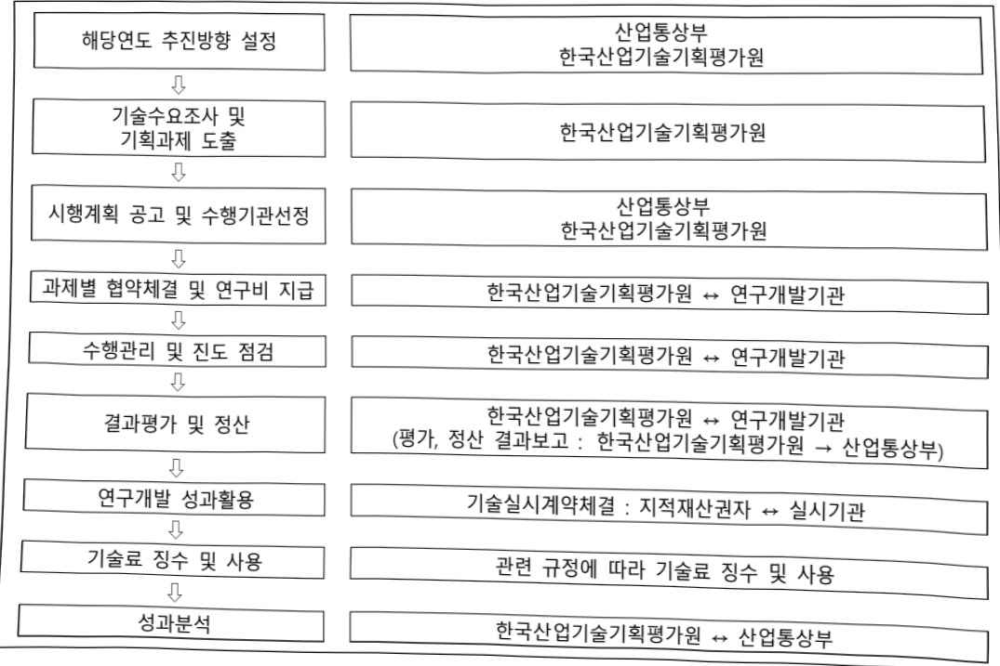

# PIM인공지능반도체핵심기술개발(R&D)

**해당 페이지**: PDF 3752 ~ 3760 쪽 해당

**부처**: 산업통상부
**분야**: 산업·중소기업 및 에너지
**회계유형**: 일반회계
**2026 확정예산**: 7800.0 백만원
**전년대비 증감률**: -56.4%
**AI 도메인**: AI반도체

---

<table border=1 style='margin: auto; word-wrap: break-word;'><tr><td style='text-align: center; word-wrap: break-word;'>사 업 명</td></tr><tr><td style='text-align: center; word-wrap: break-word;'>(1) PIM인공지능반도체핵심기술개발(R&amp;D) (3561-302)</td></tr></table>

## □ 사업 코드 정보

<table border=1 style='margin: auto; word-wrap: break-word;'><tr><td style='text-align: center; word-wrap: break-word;'>구분</td><td style='text-align: center; word-wrap: break-word;'>회계</td><td style='text-align: center; word-wrap: break-word;'>소관</td><td style='text-align: center; word-wrap: break-word;'>실국(기관)</td><td style='text-align: center; word-wrap: break-word;'>계정</td><td style='text-align: center; word-wrap: break-word;'>분야</td><td style='text-align: center; word-wrap: break-word;'>부문</td></tr><tr><td style='text-align: center; word-wrap: break-word;'>코드</td><td rowspan="2">일반회계</td><td rowspan="2">산업통상부</td><td rowspan="2">산업성장실 첨단산업정책관</td><td rowspan="2">-</td><td style='text-align: center; word-wrap: break-word;'>110</td><td style='text-align: center; word-wrap: break-word;'>117</td></tr><tr><td style='text-align: center; word-wrap: break-word;'>명칭</td><td style='text-align: center; word-wrap: break-word;'>산업·중소기업 및 에너지</td><td style='text-align: center; word-wrap: break-word;'>산업 혁신지원</td></tr></table>

<table border=1 style='margin: auto; word-wrap: break-word;'><tr><td style='text-align: center; word-wrap: break-word;'>구분</td><td style='text-align: center; word-wrap: break-word;'>프로그램</td><td style='text-align: center; word-wrap: break-word;'>단위사업</td><td style='text-align: center; word-wrap: break-word;'>세부사업</td></tr><tr><td style='text-align: center; word-wrap: break-word;'>코드</td><td style='text-align: center; word-wrap: break-word;'>3500</td><td style='text-align: center; word-wrap: break-word;'>3561</td><td style='text-align: center; word-wrap: break-word;'>302</td></tr><tr><td style='text-align: center; word-wrap: break-word;'>명칭</td><td style='text-align: center; word-wrap: break-word;'>주력산업진흥</td><td style='text-align: center; word-wrap: break-word;'>스마트전자기술개발</td><td style='text-align: center; word-wrap: break-word;'>PIM인공지능반도체핵심기술개발(R&amp;D)</td></tr></table>

사업 성격 (공통요구자료 II-1 작성유의사항 4. 참조, 해당하는 사항에 “O” 표시)

<table border=1 style='margin: auto; word-wrap: break-word;'><tr><td rowspan="2">신규</td><td rowspan="2">계속</td><td rowspan="2">완료</td><td style='text-align: center; word-wrap: break-word;'>예비타당성</td><td style='text-align: center; word-wrap: break-word;'>총사업비</td><td style='text-align: center; word-wrap: break-word;'>총액계상</td><td style='text-align: center; word-wrap: break-word;'>사업소관 변경정보</td></tr><tr><td style='text-align: center; word-wrap: break-word;'>실시여부</td><td style='text-align: center; word-wrap: break-word;'>관리대상</td><td style='text-align: center; word-wrap: break-word;'>예산사업</td><td style='text-align: center; word-wrap: break-word;'>2025예산 시 소관</td></tr><tr><td style='text-align: center; word-wrap: break-word;'></td><td style='text-align: center; word-wrap: break-word;'>O</td><td style='text-align: center; word-wrap: break-word;'></td><td style='text-align: center; word-wrap: break-word;'>O</td><td style='text-align: center; word-wrap: break-word;'></td><td style='text-align: center; word-wrap: break-word;'></td><td style='text-align: center; word-wrap: break-word;'></td></tr></table>

사업 지원 형태 및 지원을 (최소한 한 개는 반드시 선택하시오. 해당사항에 O 표시)

<table border=1 style='margin: auto; word-wrap: break-word;'><tr><td style='text-align: center; word-wrap: break-word;'>직접</td><td style='text-align: center; word-wrap: break-word;'>출자</td><td style='text-align: center; word-wrap: break-word;'>출연</td><td style='text-align: center; word-wrap: break-word;'>보조</td><td style='text-align: center; word-wrap: break-word;'>융자</td><td style='text-align: center; word-wrap: break-word;'>국고보조율(%)</td><td style='text-align: center; word-wrap: break-word;'>융자율(%)</td></tr><tr><td style='text-align: center; word-wrap: break-word;'></td><td style='text-align: center; word-wrap: break-word;'></td><td style='text-align: center; word-wrap: break-word;'>O</td><td style='text-align: center; word-wrap: break-word;'></td><td style='text-align: center; word-wrap: break-word;'></td><td style='text-align: center; word-wrap: break-word;'></td><td style='text-align: center; word-wrap: break-word;'></td></tr></table>

## □ 사업 담당자

<table border=1 style='margin: auto; word-wrap: break-word;'><tr><td style='text-align: center; word-wrap: break-word;'>사업명</td><td colspan="5">구분</td></tr><tr><td rowspan="2">PIM인공지능반도체핵심기술개발(R&amp;D)</td><td style='text-align: center; word-wrap: break-word;'>소관부처</td><td style='text-align: center; word-wrap: break-word;'>실·국·과(팀)산업성장실 첨단산업정책관반도체과</td><td style='text-align: center; word-wrap: break-word;'>과 장이규봉</td><td style='text-align: center; word-wrap: break-word;'>사무관배재형</td><td style='text-align: center; word-wrap: break-word;'>주무관</td></tr><tr><td style='text-align: center; word-wrap: break-word;'>사업시행주체</td><td style='text-align: center; word-wrap: break-word;'>한국산업기술기획평가원</td><td style='text-align: center; word-wrap: break-word;'>044-203-4270</td><td style='text-align: center; word-wrap: break-word;'>044-203-4141</td><td style='text-align: center; word-wrap: break-word;'>053-718-8650</td></tr></table>

---

### 가.예산 총괄표

(단위: 백만원, %)

<table border=1 style='margin: auto; word-wrap: break-word;'><tr><td rowspan="2">사업명</td><td rowspan="2">2024년 결산</td><td colspan="2">2025년 예산</td><td colspan="2">2026년</td><td rowspan="2">증감(B-A)</td><td rowspan="2">(B-A)/A</td></tr><tr><td style='text-align: center; word-wrap: break-word;'>본예산(A)</td><td style='text-align: center; word-wrap: break-word;'>추경</td><td style='text-align: center; word-wrap: break-word;'>요구안</td><td style='text-align: center; word-wrap: break-word;'>확정(B)</td></tr><tr><td style='text-align: center; word-wrap: break-word;'>PIM인공지능반도체핵심기술개발(R&amp;D)</td><td style='text-align: center; word-wrap: break-word;'>18,360</td><td style='text-align: center; word-wrap: break-word;'>17,900</td><td style='text-align: center; word-wrap: break-word;'>17,900</td><td style='text-align: center; word-wrap: break-word;'>7,800</td><td style='text-align: center; word-wrap: break-word;'>7,800</td><td style='text-align: center; word-wrap: break-word;'>△10,100</td><td style='text-align: center; word-wrap: break-word;'>△56.4</td></tr></table>

□ 기능별(내역사업별), 목별 예산 내역

(단위:백만원)

<table border=1 style='margin: auto; word-wrap: break-word;'><tr><td rowspan="3"></td><td colspan="4">2024</td><td colspan="7">2025(2025.12월말)</td><td style='text-align: center; word-wrap: break-word;'>2026예산</td></tr><tr><td rowspan="2">예산액(추경)</td><td rowspan="2">예산현액</td><td rowspan="2">집행액[실집행액]</td><td rowspan="2">이월액</td><td rowspan="2">불용액</td><td rowspan="2">본예산</td><td rowspan="2">예산현액</td><td rowspan="2">집행액[실집행액]</td><td colspan="2">전년도이월액제외</td><td rowspan="2">이월예산액</td><td rowspan="2">불용예산</td></tr><tr><td style='text-align: center; word-wrap: break-word;'>예산현액</td><td style='text-align: center; word-wrap: break-word;'>집행액[실집행액]</td></tr><tr><td rowspan="2">○ 기능별 분류(합계)</td><td rowspan="2">18,360</td><td rowspan="2">18,360</td><td style='text-align: center; word-wrap: break-word;'>18,360</td><td rowspan="2">-</td><td rowspan="2">-</td><td rowspan="2">17,900</td><td style='text-align: center; word-wrap: break-word;'>17,900</td><td rowspan="2">17,900</td><td style='text-align: center; word-wrap: break-word;'>17,900</td><td rowspan="2">17,900</td><td rowspan="2">-</td><td rowspan="2">700</td></tr><tr><td style='text-align: center; word-wrap: break-word;'>[18,360]</td><td style='text-align: center; word-wrap: break-word;'>[17,200]</td><td style='text-align: center; word-wrap: break-word;'>[17,200]</td></tr><tr><td rowspan="2">·PIM인공지능반도체핵심기술개발</td><td rowspan="2">18,360</td><td rowspan="2">18,360</td><td style='text-align: center; word-wrap: break-word;'>18,360</td><td rowspan="2">-</td><td rowspan="2">-</td><td rowspan="2">17,900</td><td style='text-align: center; word-wrap: break-word;'>17,900</td><td rowspan="2">17,900</td><td style='text-align: center; word-wrap: break-word;'>17,900</td><td rowspan="2">17,900</td><td rowspan="2">-</td><td rowspan="2">700</td></tr><tr><td style='text-align: center; word-wrap: break-word;'>[18,360]</td><td style='text-align: center; word-wrap: break-word;'>[17,200]</td><td style='text-align: center; word-wrap: break-word;'>[17,200]</td></tr><tr><td rowspan="2">○ 비목별 분류(합계)</td><td rowspan="2">18,360</td><td rowspan="2">18,360</td><td style='text-align: center; word-wrap: break-word;'>18,360</td><td rowspan="2">-</td><td rowspan="2">-</td><td rowspan="2">17,900</td><td style='text-align: center; word-wrap: break-word;'>17,900</td><td rowspan="2">17,900</td><td style='text-align: center; word-wrap: break-word;'>17,900</td><td rowspan="2">17,900</td><td rowspan="2">-</td><td rowspan="2">700</td></tr><tr><td style='text-align: center; word-wrap: break-word;'>[18,360]</td><td style='text-align: center; word-wrap: break-word;'>[17,200]</td><td style='text-align: center; word-wrap: break-word;'>[17,200]</td></tr><tr><td rowspan="2">·연구개발활동비등(360-05)</td><td rowspan="2">18,360</td><td rowspan="2">18,360</td><td style='text-align: center; word-wrap: break-word;'>18,360</td><td rowspan="2">-</td><td rowspan="2">-</td><td rowspan="2">17,900</td><td style='text-align: center; word-wrap: break-word;'>17,900</td><td rowspan="2">17,900</td><td style='text-align: center; word-wrap: break-word;'>17,900</td><td rowspan="2">17,900</td><td rowspan="2">-</td><td rowspan="2">700</td></tr><tr><td style='text-align: center; word-wrap: break-word;'>[18,360]</td><td style='text-align: center; word-wrap: break-word;'>[17,200]</td><td style='text-align: center; word-wrap: break-word;'>[17,200]</td></tr><tr><td rowspan="2">○ 기능비목별 분류(합계)</td><td rowspan="2">18,360</td><td rowspan="2">18,360</td><td style='text-align: center; word-wrap: break-word;'>18,360</td><td rowspan="2">-</td><td rowspan="2">-</td><td rowspan="2">17,900</td><td style='text-align: center; word-wrap: break-word;'>17,900</td><td rowspan="2">17,900</td><td style='text-align: center; word-wrap: break-word;'>17,900</td><td rowspan="2">17,900</td><td rowspan="2">-</td><td rowspan="2">700</td></tr><tr><td style='text-align: center; word-wrap: break-word;'>[18,360]</td><td style='text-align: center; word-wrap: break-word;'>[17,200]</td><td style='text-align: center; word-wrap: break-word;'>[17,200]</td></tr><tr><td rowspan="2">·PIM인공지능반도체핵심기술개발-연구개발활동비등(360-05)</td><td rowspan="2">18,360</td><td rowspan="2">18,360</td><td style='text-align: center; word-wrap: break-word;'>18,360</td><td rowspan="2">-</td><td rowspan="2">-</td><td rowspan="2">17,900</td><td style='text-align: center; word-wrap: break-word;'>17,900</td><td rowspan="2">17,900</td><td style='text-align: center; word-wrap: break-word;'>17,900</td><td rowspan="2">17,900</td><td rowspan="2">-</td><td rowspan="2">700</td></tr><tr><td style='text-align: center; word-wrap: break-word;'>[18,360]</td><td style='text-align: center; word-wrap: break-word;'>[17,200]</td><td style='text-align: center; word-wrap: break-word;'>[17,200]</td></tr></table>

---

### 나. 사업설명자료

## 1 ) 사업목적·내용

(PIM인공지능반도체핵심기술개발) DRAM 제조 공정 기술 고도화, PIM*용 차세대 비휘발성 메모리(MRAM, PRAM) 제어 기술 및 공정·소재·장비 상용화 기술 개발을 통한 PIM용 메모리 기술 고도화

* Processing-In-Memory(PIM) : 프로세서의 연산기능 일부를 메모리에 담당하게 하여 연산의 병목현상을 개선

## 2 ) 사업개요

## □ 사업근거 및 추진경위

①법령상근거

-산업기술혁신촉진법 제11조(산업기술개발사업)

① 산업통상부장관은 혁신계획 및 시행계획을 효율적으로 수행하기 위하여 관계 중앙행정기관의 장과 협의하여 다음 각 호의 산업기술분야에서 기술개발사업(산업기술개발을 위하여 필요한 기획 및 조사를 포함한다. 이하 "산업기술개발사업"이라 한다)을 추진할 수 있다

…

2. 산업기술 분야의 미래 유망 기술

## ② 추진경위

- '19.04 : 시스템반도체 비전과 전략(관계부처합동)을 통해 AI 반도체 등 미래 반도체시장을

좌우할 Next-Generation 반도체 개발 발표

- '19.10. : PIM 인공지능 반도체 신규R&D 추진을 위한 산업계 간담회 실시

- '19.12. : PIM 인공지능 반도체 신규R&D 사전 기획 회의 시작

- '20.11. : 'PIM인공지능반도체 핵심기술개발' 기획보고서

- '20.12 ~ '21.06 : 예비타당성조사 진행

- '22.01 : 사업 착수 및 연구개발 과제 공고

---

□ 주요내용

① 사업규모

- 총사업비 : 해당 없음

- 사업기간 : '22~'28

- 최근 5년 간 투입된 사업비(예산액기준, 추경편성한 연도에는 추경포함)

<table border=1 style='margin: auto; word-wrap: break-word;'><tr><td style='text-align: center; word-wrap: break-word;'>$ \underline{\text{笹}} $</td><td style='text-align: center; word-wrap: break-word;'>2022</td><td style='text-align: center; word-wrap: break-word;'>2023</td><td style='text-align: center; word-wrap: break-word;'>2024</td><td style='text-align: center; word-wrap: break-word;'>2025</td><td style='text-align: center; word-wrap: break-word;'>2026</td></tr><tr><td style='text-align: center; word-wrap: break-word;'>$ \underline{\text{사업비}} $</td><td style='text-align: center; word-wrap: break-word;'>19,994</td><td style='text-align: center; word-wrap: break-word;'>19,700</td><td style='text-align: center; word-wrap: break-word;'>18,360</td><td style='text-align: center; word-wrap: break-word;'>17,900</td><td style='text-align: center; word-wrap: break-word;'>7,800</td></tr></table>

② 사업추진체계

- 사업시행방법 : 출연

- 사업시행주체 : 한국산업기술기획평가원

- 사업 수혜자 : 기업, 대학, 연구기관 등

- 보조, 융자, 출연, 출자 등의 경우 보조·융자 등 지원 비율 및 법적근거

<table border=1 style='margin: auto; word-wrap: break-word;'><tr><td style='text-align: center; word-wrap: break-word;'>내역사업명</td><td style='text-align: center; word-wrap: break-word;'>구분</td><td style='text-align: center; word-wrap: break-word;'>피보조·피출연 등 기관명</td><td style='text-align: center; word-wrap: break-word;'>지원 금액 (2026예산)</td><td style='text-align: center; word-wrap: break-word;'>지원 비율(%)</td><td style='text-align: center; word-wrap: break-word;'>보조율 법적근거 (해당 조항)</td></tr><tr><td style='text-align: center; word-wrap: break-word;'>PIM인공지능반도체핵심기술개발</td><td style='text-align: center; word-wrap: break-word;'>출연</td><td style='text-align: center; word-wrap: break-word;'>기업, 대학, 연구소 등</td><td style='text-align: center; word-wrap: break-word;'>7,800</td><td style='text-align: center; word-wrap: break-word;'>지원 대상에 따라 차등지원</td><td style='text-align: center; word-wrap: break-word;'>산업기술혁신사업 공통운영요령 제24조(정부지원연구개발비의 지원기준)</td></tr></table>

## 3 ) 2026년도 예산 산출 근거

① PIM인공지능반도체핵심기술개발 : (2025 본예산) 17,900백만원 → (2026) 7,800백만원, 10,100백만원 감액

- (요구) PIM 설계기술 개발, PIM 반도체 수직적증 구조에 대응 가능한 계측 분석기술 및 방열 패키지 공정 기술 개발 등 계속과제 지원을 위해 7,800백만원 요구

- (산출) 계속 9개x867백만x12/12 = 7,800백만원

2025년도 예산 및 2026년도 예산 산출 세부내역 비교

<table border=1 style='margin: auto; word-wrap: break-word;'><tr><td colspan="2">2025년 분예산</td><td colspan="2">2026년 예산</td></tr><tr><td style='text-align: center; word-wrap: break-word;'>예산</td><td style='text-align: center; word-wrap: break-word;'>산출내역</td><td style='text-align: center; word-wrap: break-word;'>예산</td><td style='text-align: center; word-wrap: break-word;'>산출내역</td></tr><tr><td style='text-align: center; word-wrap: break-word;'>17,900</td><td style='text-align: center; word-wrap: break-word;'>○ 연구개발활동비등(360-05): 17,900백만원  가. PIM 인공지능 반도체 핵심기술개발 (17,900백만원)  • (계속) 21개 × 757백만 × 12/12 = 15,900백만원  • (신규) 2개 × 1333.3백만 × 9/12 = 2,000백만원</td><td style='text-align: center; word-wrap: break-word;'>7,800</td><td style='text-align: center; word-wrap: break-word;'>○ 연구개발활동비등(360-05): 7,800백만원  가. PIM 인공지능 반도체 핵심기술개발 (7,800백만원)  • (계속) 9개 × 867백만 × 12/12 = 7,800백만원</td></tr></table>

---

## 4 ) 사업효과

☐ 사업영향, 산출물 성과지표 등

① 2022~2026년도 성과계획서 상 성과지표 및 최근 5년간 성과 달성도

<table border=1 style='margin: auto; word-wrap: break-word;'><tr><td style='text-align: center; word-wrap: break-word;'>성과지표</td><td style='text-align: center; word-wrap: break-word;'>구분</td><td style='text-align: center; word-wrap: break-word;'>2022</td><td style='text-align: center; word-wrap: break-word;'>2023</td><td style='text-align: center; word-wrap: break-word;'>2024</td><td style='text-align: center; word-wrap: break-word;'>2025</td><td style='text-align: center; word-wrap: break-word;'>2026</td><td style='text-align: center; word-wrap: break-word;'>2026 목표치산출근거</td><td style='text-align: center; word-wrap: break-word;'>측정산식(또는 측정방법)</td><td style='text-align: center; word-wrap: break-word;'>자료수집방법(또는 자료출처)</td></tr><tr><td rowspan="3">[공통] 논문 mrnIF(단위:점)</td><td style='text-align: center; word-wrap: break-word;'>목표</td><td style='text-align: center; word-wrap: break-word;'>신규</td><td style='text-align: center; word-wrap: break-word;'>59.82</td><td style='text-align: center; word-wrap: break-word;'>61.02</td><td style='text-align: center; word-wrap: break-word;'>62.24</td><td style='text-align: center; word-wrap: break-word;'>66.05</td><td rowspan="3">ICT R&amp;D 사업의 과거 4개년(14~18)* 논문 mrnIF 평균값 57.5 점 기준 매년 2% 증가치를 설정</td><td rowspan="3">mrnIF =  $  \frac{(N \times r_{nIF_j} - 1)}{N - 1} \times 100  $</td><td rowspan="3">·NTIS ·성과조사결과 (NRF,IITP,KEIT)</td></tr><tr><td style='text-align: center; word-wrap: break-word;'>실적</td><td style='text-align: center; word-wrap: break-word;'>-</td><td style='text-align: center; word-wrap: break-word;'>69.19</td><td style='text-align: center; word-wrap: break-word;'>66.48</td><td style='text-align: center; word-wrap: break-word;'>-</td><td style='text-align: center; word-wrap: break-word;'>-</td></tr><tr><td style='text-align: center; word-wrap: break-word;'>달성도</td><td style='text-align: center; word-wrap: break-word;'>-</td><td style='text-align: center; word-wrap: break-word;'>100</td><td style='text-align: center; word-wrap: break-word;'>100</td><td style='text-align: center; word-wrap: break-word;'>-</td><td style='text-align: center; word-wrap: break-word;'>-</td></tr><tr><td rowspan="3">[공통] 우수특허비율(단위:%)</td><td style='text-align: center; word-wrap: break-word;'>목표</td><td style='text-align: center; word-wrap: break-word;'>신규</td><td style='text-align: center; word-wrap: break-word;'>-</td><td style='text-align: center; word-wrap: break-word;'>2.10</td><td style='text-align: center; word-wrap: break-word;'>2.38</td><td style='text-align: center; word-wrap: break-word;'>3.2</td><td rowspan="3">ICT R&amp;D 사업의 과거 3개년(18~20) 우수특허 비율 평균치를 설정, 전년 목표치 대비 0.28%적 증가 설정</td><td rowspan="3">SMART AAA~A등급 특허건수 / SMART 등록특허 분석대상 건수</td><td rowspan="3">·NTIS ·한국발명진흥회 (SMART)</td></tr><tr><td style='text-align: center; word-wrap: break-word;'>실적</td><td style='text-align: center; word-wrap: break-word;'>-</td><td style='text-align: center; word-wrap: break-word;'>-</td><td style='text-align: center; word-wrap: break-word;'>12.50</td><td style='text-align: center; word-wrap: break-word;'>-</td><td style='text-align: center; word-wrap: break-word;'>-</td></tr><tr><td style='text-align: center; word-wrap: break-word;'>달성도</td><td style='text-align: center; word-wrap: break-word;'>-</td><td style='text-align: center; word-wrap: break-word;'>-</td><td style='text-align: center; word-wrap: break-word;'>100</td><td style='text-align: center; word-wrap: break-word;'>-</td><td style='text-align: center; word-wrap: break-word;'>-</td></tr><tr><td rowspan="3">사업화 성공률(단위:%)</td><td style='text-align: center; word-wrap: break-word;'>목표</td><td style='text-align: center; word-wrap: break-word;'>신규</td><td style='text-align: center; word-wrap: break-word;'>12.78</td><td style='text-align: center; word-wrap: break-word;'>12.91</td><td style='text-align: center; word-wrap: break-word;'>13.04</td><td style='text-align: center; word-wrap: break-word;'>-</td><td rowspan="3">해당 단위사업의 척수 2차년도 과제의 사업화 성공률을 기준으로 매년 1% 상향하여 목표치 설정</td><td rowspan="3">(사업화성과발생과제 / 대상과제) × 100</td><td rowspan="3">·NTIS ·KEIT 성과조사 시스템</td></tr><tr><td style='text-align: center; word-wrap: break-word;'>실적</td><td style='text-align: center; word-wrap: break-word;'>-</td><td style='text-align: center; word-wrap: break-word;'>12.00</td><td style='text-align: center; word-wrap: break-word;'>24.00</td><td style='text-align: center; word-wrap: break-word;'>-</td><td style='text-align: center; word-wrap: break-word;'>-</td></tr><tr><td style='text-align: center; word-wrap: break-word;'>달성도</td><td style='text-align: center; word-wrap: break-word;'>-</td><td style='text-align: center; word-wrap: break-word;'>100</td><td style='text-align: center; word-wrap: break-word;'>100</td><td style='text-align: center; word-wrap: break-word;'>-</td><td style='text-align: center; word-wrap: break-word;'>-</td></tr><tr><td rowspan="3">사업화 매출액(단위:억원/10억원)</td><td style='text-align: center; word-wrap: break-word;'>목표</td><td style='text-align: center; word-wrap: break-word;'>-</td><td style='text-align: center; word-wrap: break-word;'>-</td><td style='text-align: center; word-wrap: break-word;'>-</td><td style='text-align: center; word-wrap: break-word;'>-</td><td style='text-align: center; word-wrap: break-word;'>2.46</td><td rowspan="3">2018년도 정보통신·방송연구개발협상결과사·분석 보고서 ICT R&amp;D 사업 10억원 매출액 22억원을 기준으로 매년 10% 증가</td><td rowspan="3">∑사업화 매출액 * 기여율 / 기업대상 정부출연금(10억원)</td><td rowspan="3">·NTIS ·KEIT 성과조사 시스템</td></tr><tr><td style='text-align: center; word-wrap: break-word;'>실적</td><td style='text-align: center; word-wrap: break-word;'>-</td><td style='text-align: center; word-wrap: break-word;'>-</td><td style='text-align: center; word-wrap: break-word;'>-</td><td style='text-align: center; word-wrap: break-word;'>-</td><td style='text-align: center; word-wrap: break-word;'>-</td></tr><tr><td style='text-align: center; word-wrap: break-word;'>달성도</td><td style='text-align: center; word-wrap: break-word;'>-</td><td style='text-align: center; word-wrap: break-word;'>-</td><td style='text-align: center; word-wrap: break-word;'>-</td><td style='text-align: center; word-wrap: break-word;'>-</td><td style='text-align: center; word-wrap: break-word;'>-</td></tr><tr><td rowspan="3">추가 고용 순증(단위:명/10억원)</td><td style='text-align: center; word-wrap: break-word;'>목표</td><td style='text-align: center; word-wrap: break-word;'>-</td><td style='text-align: center; word-wrap: break-word;'>-</td><td style='text-align: center; word-wrap: break-word;'>-</td><td style='text-align: center; word-wrap: break-word;'>-</td><td style='text-align: center; word-wrap: break-word;'>3.02</td><td rowspan="3">해당 단위사업의 척수 3개년 추가 고용 순증(10억원) 평균율 기준으로 매년 1% 상향하여 목표치를 설정</td><td rowspan="3">(당해연도 신규고용인원·퇴사 인원)/지원예산(10억원)</td><td rowspan="3">·NTIS ·KEIT 성과조사 시스템</td></tr><tr><td style='text-align: center; word-wrap: break-word;'>실적</td><td style='text-align: center; word-wrap: break-word;'>-</td><td style='text-align: center; word-wrap: break-word;'>-</td><td style='text-align: center; word-wrap: break-word;'>-</td><td style='text-align: center; word-wrap: break-word;'>-</td><td style='text-align: center; word-wrap: break-word;'>-</td></tr><tr><td style='text-align: center; word-wrap: break-word;'>달성도</td><td style='text-align: center; word-wrap: break-word;'>-</td><td style='text-align: center; word-wrap: break-word;'>-</td><td style='text-align: center; word-wrap: break-word;'>-</td><td style='text-align: center; word-wrap: break-word;'>-</td><td style='text-align: center; word-wrap: break-word;'>-</td></tr></table>

② 성과지표 이외의 연도별 사업주진 경과 및 실적

<table border=1 style='margin: auto; word-wrap: break-word;'><tr><td style='text-align: center; word-wrap: break-word;'>2022</td><td style='text-align: center; word-wrap: break-word;'>o 사업 착수 및 PIM 설계기술 개발과 차세대 비휘발성 메모리인 PRAM, MRAM 집적공정 기술개발 및 관련 장비 개발 신규과제 25개 지원 완료</td></tr><tr><td style='text-align: center; word-wrap: break-word;'>2023</td><td style='text-align: center; word-wrap: break-word;'>o PIM인공지능반도체핵심기술개발 계속과제 25개 지원 및 성과확산을 위한 성과교류회 개최</td></tr><tr><td style='text-align: center; word-wrap: break-word;'>2024</td><td style='text-align: center; word-wrap: break-word;'>o PIM인공지능반도체핵심기술개발 계속과제 25개 지원 및 원활한 사업 목표 달성을 위한 현장방문 과제전설팅 4건 진행</td></tr><tr><td style='text-align: center; word-wrap: break-word;'>2025</td><td style='text-align: center; word-wrap: break-word;'>o PIM인공지능반도체핵심기술개발 계속과제 21개 및 신규과제 2개 지원 완료</td></tr></table>

---

③향후(2026년도 이후) 기대효과

- (PIM용 메모리 기술) PIM 반도체 관련 PIM 구조 상용화를 위한 메모리 설계·공정·장비 및 응용 플랫폼 기술 고도화로 PIM인공지능 반도체 제조기술 선점 추진

- (PIM인공지능반도체) 세계 최고 수준의 인공지능 반도체 기술 경쟁력 확보를 통한 인공지능 반도체 초격차 기술확보 및 산업 생태계 구축을 통한 글로벌 기술·시장 주도권 확보

## 5 ) 타당성조사 및 예비타당성조사 시행여부 및 결과 요지

☐ 예비타당성조사 결과, B/C가 0.76으로 경제성 및 타당성을 인정하여 PIM인공지능 핵심기술개발 총 국비지원은 7년간 3,517억원으로 선정(PIM인공지능반도체 핵심기술개발, 한국과학기술기획평가원, ‘21.5.)

☐ 총사업비 4,027억원으로 예비타당성조사 시행결과 국비 3,517억원* 지원 예정

* 과학기술정보통신부 2,547억원, 산업통상부 970억원

## 6 ) 총사업비 대상사업 여부 및 내역 : 해당없음

## 7 ) 사업 집행절차

---

8) 중기재정계획 상 연도별 투자계획 및 추진경과

(단위: 백만원)

<table border=1 style='margin: auto; word-wrap: break-word;'><tr><td style='text-align: center; word-wrap: break-word;'>중기 재정계획</td><td style='text-align: center; word-wrap: break-word;'>2024</td><td style='text-align: center; word-wrap: break-word;'>2025</td><td style='text-align: center; word-wrap: break-word;'>2026</td><td style='text-align: center; word-wrap: break-word;'>2027</td><td style='text-align: center; word-wrap: break-word;'>2028</td><td style='text-align: center; word-wrap: break-word;'>2029</td></tr><tr><td style='text-align: center; word-wrap: break-word;'>2024~2028</td><td style='text-align: center; word-wrap: break-word;'>18,360</td><td style='text-align: center; word-wrap: break-word;'>17,900</td><td style='text-align: center; word-wrap: break-word;'>7,800</td><td style='text-align: center; word-wrap: break-word;'>5,500</td><td style='text-align: center; word-wrap: break-word;'>1,300</td><td style='text-align: center; word-wrap: break-word;'>-</td></tr><tr><td style='text-align: center; word-wrap: break-word;'>2025~2029</td><td style='text-align: center; word-wrap: break-word;'>-</td><td style='text-align: center; word-wrap: break-word;'>17,900</td><td style='text-align: center; word-wrap: break-word;'>7,800</td><td style='text-align: center; word-wrap: break-word;'>4,700</td><td style='text-align: center; word-wrap: break-word;'>1,700</td><td style='text-align: center; word-wrap: break-word;'>-</td></tr></table>

9) 최근 3년간 동 사업에 대한 주요 외부지적사항 및 평가, 문제점 및 대책

해당 없음

## 10 ) 향후 추진방향 및 추진계획

<table border=1 style='margin: auto; word-wrap: break-word;'><tr><td style='text-align: center; word-wrap: break-word;'>○ 차세대 비휘발성 메모리인 PRAM과 MRAM 기반 PIM 메모리 집적 공정·장비개발 * PIM 제조를 위한 후공정 조립 및 검사 소재·부품·장비, 전공정용 증착 소재·부품·장비 기술에 집중 - (전공정) 초미세화 저전력구동 PIM 메모리 제조를 위한 MRAM 및 PRAM용 증착 공정 소재·부품·장비기술 개발 지원 - (후공정) 고집적·이종적층 패키징을 위한 본당·디본딩 기술, 메모리·로직 융합형 반도체를 위한 비전 및 광학 기반의 검사장비 기술 개발 지원</td></tr></table>

11) 해당사업에 대한 각종 사업평가의 결과 : 해당 없음

12) 해당사업에 대한 부처 자체평가의 결과 : 해당 없음

13) 부처 건의사항 : 해당 없음

---

### 다. 최근 4년간 결산내역

## 1 ) 결산표

☐ 부처 결산내역

(단위: 백만원, %)

<table border=1 style='margin: auto; word-wrap: break-word;'><tr><td rowspan="2">연도</td><td colspan="3">예산액</td><td rowspan="2">전년도 이월액</td><td rowspan="2">이·전용 등</td><td rowspan="2">예비비</td><td rowspan="2">예산 현액(B)</td><td rowspan="2">집행액 (C)</td><td rowspan="2">집행률 (C/A)</td><td rowspan="2">집행률 (C/B)</td><td rowspan="2">다음연도 이월액</td><td rowspan="2">불용액</td></tr><tr><td style='text-align: center; word-wrap: break-word;'>본예산 중감액</td><td style='text-align: center; word-wrap: break-word;'>추경</td><td style='text-align: center; word-wrap: break-word;'>추경(A)</td></tr><tr><td style='text-align: center; word-wrap: break-word;'>2022</td><td style='text-align: center; word-wrap: break-word;'>19,994</td><td style='text-align: center; word-wrap: break-word;'>-</td><td style='text-align: center; word-wrap: break-word;'>19,994</td><td style='text-align: center; word-wrap: break-word;'>-</td><td style='text-align: center; word-wrap: break-word;'>-</td><td style='text-align: center; word-wrap: break-word;'>-</td><td style='text-align: center; word-wrap: break-word;'>19,994</td><td style='text-align: center; word-wrap: break-word;'>19,994</td><td style='text-align: center; word-wrap: break-word;'>100</td><td style='text-align: center; word-wrap: break-word;'>100</td><td style='text-align: center; word-wrap: break-word;'>-</td><td style='text-align: center; word-wrap: break-word;'>-</td></tr><tr><td style='text-align: center; word-wrap: break-word;'>2023</td><td style='text-align: center; word-wrap: break-word;'>19,700</td><td style='text-align: center; word-wrap: break-word;'>-</td><td style='text-align: center; word-wrap: break-word;'>19,700</td><td style='text-align: center; word-wrap: break-word;'>-</td><td style='text-align: center; word-wrap: break-word;'>-</td><td style='text-align: center; word-wrap: break-word;'>-</td><td style='text-align: center; word-wrap: break-word;'>19,700</td><td style='text-align: center; word-wrap: break-word;'>19,700</td><td style='text-align: center; word-wrap: break-word;'>100</td><td style='text-align: center; word-wrap: break-word;'>100</td><td style='text-align: center; word-wrap: break-word;'>-</td><td style='text-align: center; word-wrap: break-word;'>-</td></tr><tr><td style='text-align: center; word-wrap: break-word;'>2024</td><td style='text-align: center; word-wrap: break-word;'>18,360</td><td style='text-align: center; word-wrap: break-word;'>-</td><td style='text-align: center; word-wrap: break-word;'>18,360</td><td style='text-align: center; word-wrap: break-word;'>-</td><td style='text-align: center; word-wrap: break-word;'>-</td><td style='text-align: center; word-wrap: break-word;'>-</td><td style='text-align: center; word-wrap: break-word;'>18,360</td><td style='text-align: center; word-wrap: break-word;'>18,360</td><td style='text-align: center; word-wrap: break-word;'>100</td><td style='text-align: center; word-wrap: break-word;'>100</td><td style='text-align: center; word-wrap: break-word;'>-</td><td style='text-align: center; word-wrap: break-word;'>-</td></tr><tr><td style='text-align: center; word-wrap: break-word;'>2025</td><td style='text-align: center; word-wrap: break-word;'>17,900</td><td style='text-align: center; word-wrap: break-word;'>-</td><td style='text-align: center; word-wrap: break-word;'>17,900</td><td style='text-align: center; word-wrap: break-word;'>-</td><td style='text-align: center; word-wrap: break-word;'>-</td><td style='text-align: center; word-wrap: break-word;'>-</td><td style='text-align: center; word-wrap: break-word;'>17,900</td><td style='text-align: center; word-wrap: break-word;'>17,900</td><td style='text-align: center; word-wrap: break-word;'>100</td><td style='text-align: center; word-wrap: break-word;'>100</td><td style='text-align: center; word-wrap: break-word;'>-</td><td style='text-align: center; word-wrap: break-word;'>-</td></tr></table>

□출연·보조사업 등 실집행내역

(단위:백만원,%)

<table border=1 style='margin: auto; word-wrap: break-word;'><tr><td rowspan="2">구분</td><td colspan="3">부처</td><td colspan="6">사업시행주체(피출연·피보조 기관 등)</td></tr><tr><td colspan="2">예산액</td><td style='text-align: center; word-wrap: break-word;'>집행액</td><td style='text-align: center; word-wrap: break-word;'>교부액</td><td style='text-align: center; word-wrap: break-word;'>전년도 이월액</td><td style='text-align: center; word-wrap: break-word;'>교부 현액</td><td style='text-align: center; word-wrap: break-word;'>집행액(B)</td><td style='text-align: center; word-wrap: break-word;'>이월액</td><td style='text-align: center; word-wrap: break-word;'>불용액(B/A)</td></tr><tr><td style='text-align: center; word-wrap: break-word;'>2022</td><td style='text-align: center; word-wrap: break-word;'>19,994</td><td style='text-align: center; word-wrap: break-word;'>19,994</td><td style='text-align: center; word-wrap: break-word;'>19,994</td><td style='text-align: center; word-wrap: break-word;'>19,994</td><td style='text-align: center; word-wrap: break-word;'>-</td><td style='text-align: center; word-wrap: break-word;'>19,994</td><td style='text-align: center; word-wrap: break-word;'>19,994</td><td style='text-align: center; word-wrap: break-word;'>-</td><td style='text-align: center; word-wrap: break-word;'>-</td></tr><tr><td style='text-align: center; word-wrap: break-word;'>2023</td><td style='text-align: center; word-wrap: break-word;'>19,700</td><td style='text-align: center; word-wrap: break-word;'>19,700</td><td style='text-align: center; word-wrap: break-word;'>19,700</td><td style='text-align: center; word-wrap: break-word;'>19,700</td><td style='text-align: center; word-wrap: break-word;'>-</td><td style='text-align: center; word-wrap: break-word;'>19,700</td><td style='text-align: center; word-wrap: break-word;'>19,700</td><td style='text-align: center; word-wrap: break-word;'>-</td><td style='text-align: center; word-wrap: break-word;'>-</td></tr><tr><td style='text-align: center; word-wrap: break-word;'>2024</td><td style='text-align: center; word-wrap: break-word;'>18,360</td><td style='text-align: center; word-wrap: break-word;'>18,360</td><td style='text-align: center; word-wrap: break-word;'>18,360</td><td style='text-align: center; word-wrap: break-word;'>18,360</td><td style='text-align: center; word-wrap: break-word;'>-</td><td style='text-align: center; word-wrap: break-word;'>18,360</td><td style='text-align: center; word-wrap: break-word;'>18,360</td><td style='text-align: center; word-wrap: break-word;'>-</td><td style='text-align: center; word-wrap: break-word;'>-</td></tr><tr><td style='text-align: center; word-wrap: break-word;'>2025. 12월기준</td><td style='text-align: center; word-wrap: break-word;'>17,900</td><td style='text-align: center; word-wrap: break-word;'>17,900</td><td style='text-align: center; word-wrap: break-word;'>17,900</td><td style='text-align: center; word-wrap: break-word;'>17,200</td><td style='text-align: center; word-wrap: break-word;'>-</td><td style='text-align: center; word-wrap: break-word;'>17,200</td><td style='text-align: center; word-wrap: break-word;'>17,200</td><td style='text-align: center; word-wrap: break-word;'>-</td><td style='text-align: center; word-wrap: break-word;'>700</td></tr></table>

## 2 ) 주요 결산사항

□ 2022~2025년 결산 주요 지적사항 및 시정요구사항: 해당 없음

□ 2025년 이·전용 등 세부내역: 해당 없음

2025년 예비비 배정 세부내역: 해당 없음

### 라. 기타 추가자료

(1) 사업 세부 설명자료

---

## 붙임

## PIM인공지능반도체핵심기술개발

## □ 사업개요

<table border=1 style='margin: auto; word-wrap: break-word;'><tr><td style='text-align: center; word-wrap: break-word;'>사업기간</td><td style='text-align: center; word-wrap: break-word;'>2022 ~ 2028</td><td style='text-align: center; word-wrap: break-word;'>총사업비</td><td style='text-align: center; word-wrap: break-word;'>총 1,118억원(국비 957억원)</td></tr><tr><td style='text-align: center; word-wrap: break-word;'>주관기관</td><td colspan="3">기업, 대학, 연구기관 등</td></tr><tr><td style='text-align: center; word-wrap: break-word;'>담당자</td><td colspan="3">반도체과 배재형 사무관(⑧ 044-203-4141)</td></tr></table>

## □ 사업내용(지원내용)

○ PIM용 차세대 상용메모리 아키텍처 기술개발, PIM 제조를 위한 전공정용 중착 소재·부품·장비 및 후공정 조립·검사 소재·부품·장비 기술개발 지원

- (주변회로) PIM 컴퓨팅 구조 적용을 위한 메모리 인터페이스 기술 및

PIM 컴퓨팅 시스템용 SCM 제어 반도체 기술

- (전공정) 초미세화 저전력구동 PIM 메모리 제조를 위한 MRAM 및

PRAM용 중착공정 소재·부품·장비기술

- (후공정) 고집적·이종적층 패키징을 위한 본당·디본당 기술, 메모리·로직

융합형 반도체를 위한 비전 및 광학 기반의 검사장비 기술

## □ '26년 요구내역 : 7,800백만원

○ PIM인공지능반도체핵심기술개발 : PIM용 메모리 설계기술 개발과 수직

적층 구조 공정 변화에 대응 가능한 계측 분석기술, 박막 공정 및 방열

패키지 소재 기술개발 계속과제 지원을 위한 예산 요구

- (계속) 9개 x 867백만원 x 12/12개월 = 7,800백만원

## □ 기대효과

○ PIM용 PRAM, MRAM 등 차세대 메모리 소자 공정 기술 확보를 통한 반도체 기술의 해외 기술 의존도를 낮추고 반도체 산업 생태계 구축에 기여

○ PIM 제조를 위한 차세대 반도체 공정장비 핵심기술 개발을 통한 글로벌 기술 경쟁력 확보

---

### 원본 PDF 크롭 이미지

