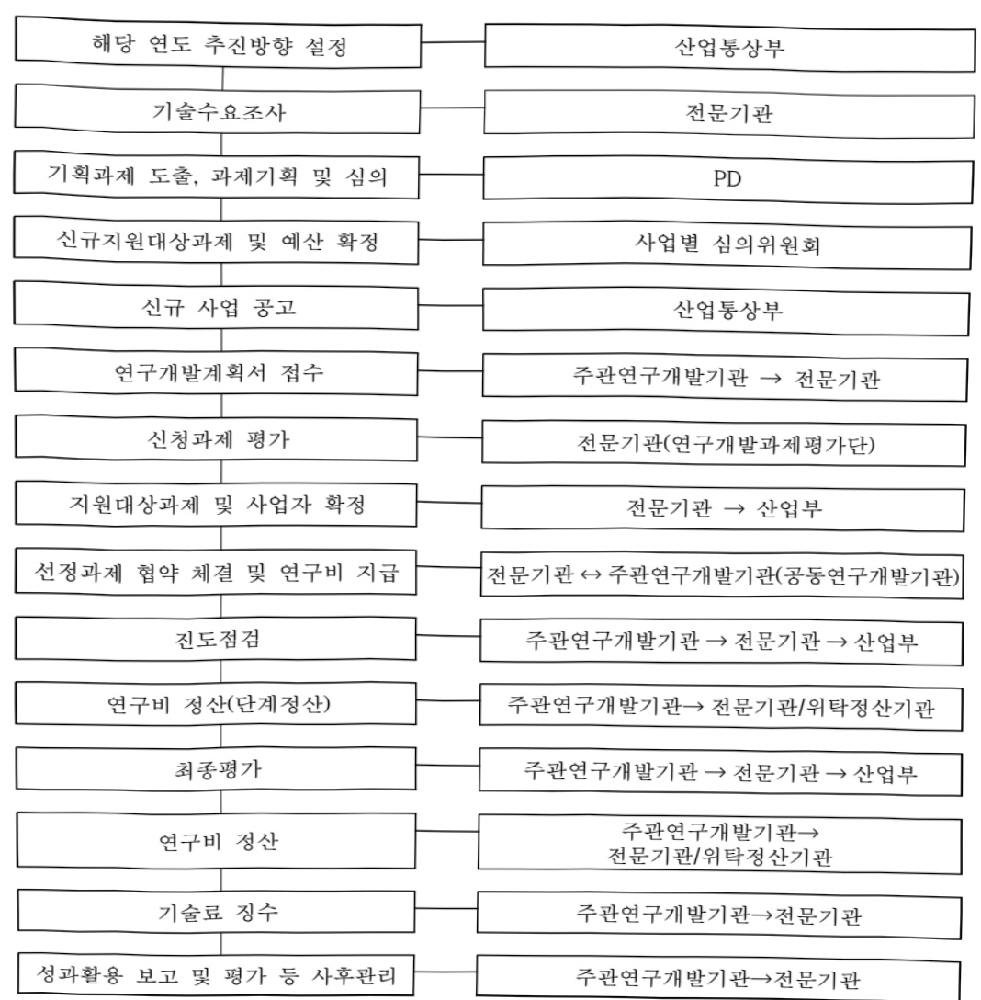
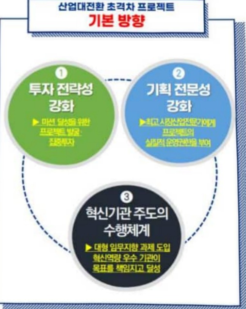
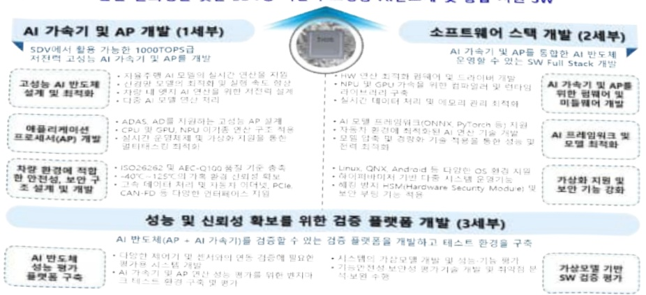

# SDV용AI가속기반도체기술개발(R&D)

**해당 페이지**: PDF 3761 ~ 3774 쪽 해당

**부처**: 산업통상부
**분야**: 산업·중소기업 및 에너지
**회계유형**: 일반회계
**2026 확정예산**: 6188.0 백만원
**전년대비 증감률**: 45.6%
**AI 도메인**: 교통/모빌리티

---

### 가.예산 총괄표

(단위: 백만원, %)

<table border=1 style='margin: auto; word-wrap: break-word;'><tr><td rowspan="2">사업명</td><td rowspan="2">2024년 결산</td><td colspan="2">2025년 예산</td><td colspan="2">2026년</td><td rowspan="2">중감(B-A)</td><td rowspan="2">(B-A)/A</td></tr><tr><td style='text-align: center; word-wrap: break-word;'>본예산(A)</td><td style='text-align: center; word-wrap: break-word;'>추경</td><td style='text-align: center; word-wrap: break-word;'>요구안</td><td style='text-align: center; word-wrap: break-word;'>확정(B)</td></tr><tr><td style='text-align: center; word-wrap: break-word;'>SDV용AI가속기 반드체기술개발 (R&amp;D)</td><td style='text-align: center; word-wrap: break-word;'>-</td><td style='text-align: center; word-wrap: break-word;'>4,250</td><td style='text-align: center; word-wrap: break-word;'>4,250</td><td style='text-align: center; word-wrap: break-word;'>6,188</td><td style='text-align: center; word-wrap: break-word;'>6,188</td><td style='text-align: center; word-wrap: break-word;'>1,938</td><td style='text-align: center; word-wrap: break-word;'>45.6</td></tr></table>

□ 기능별(내역사업별), 목별 예산 내역

(단위:백만원)

<table border=1 style='margin: auto; word-wrap: break-word;'><tr><td rowspan="3"></td><td colspan="5">2024</td><td colspan="7">2025(2025.12월말)</td><td rowspan="3">2026예산</td></tr><tr><td rowspan="2">예산액(추경)</td><td rowspan="2">예산현액</td><td rowspan="2">집행액[실집행액]</td><td rowspan="2">이월액</td><td rowspan="2">불용액</td><td rowspan="2">본예산</td><td rowspan="2">예산현액</td><td rowspan="2">집행액[실집행액]</td><td colspan="2">전년도이월액제외</td><td rowspan="2">이월예상액</td><td rowspan="2">불용예상액</td></tr><tr><td style='text-align: center; word-wrap: break-word;'>예산현액</td><td style='text-align: center; word-wrap: break-word;'>집행액[실집행액]</td></tr><tr><td style='text-align: center; word-wrap: break-word;'>○ 기능별 분류(합계)</td><td style='text-align: center; word-wrap: break-word;'>-</td><td style='text-align: center; word-wrap: break-word;'>-</td><td style='text-align: center; word-wrap: break-word;'>-</td><td style='text-align: center; word-wrap: break-word;'>-</td><td style='text-align: center; word-wrap: break-word;'>-</td><td style='text-align: center; word-wrap: break-word;'>4,250</td><td style='text-align: center; word-wrap: break-word;'>4,250</td><td style='text-align: center; word-wrap: break-word;'>4,250[4,250]</td><td style='text-align: center; word-wrap: break-word;'>4,250</td><td style='text-align: center; word-wrap: break-word;'>4,250[4,250]</td><td style='text-align: center; word-wrap: break-word;'>-</td><td style='text-align: center; word-wrap: break-word;'>-</td><td style='text-align: center; word-wrap: break-word;'>6,188</td></tr><tr><td style='text-align: center; word-wrap: break-word;'>· SDV용AI가속기반도체기술개발(R&amp;D)</td><td style='text-align: center; word-wrap: break-word;'>-</td><td style='text-align: center; word-wrap: break-word;'>-</td><td style='text-align: center; word-wrap: break-word;'>-</td><td style='text-align: center; word-wrap: break-word;'>-</td><td style='text-align: center; word-wrap: break-word;'>-</td><td style='text-align: center; word-wrap: break-word;'>4,250</td><td style='text-align: center; word-wrap: break-word;'>4,250</td><td style='text-align: center; word-wrap: break-word;'>4,250[4,250]</td><td style='text-align: center; word-wrap: break-word;'>4,250</td><td style='text-align: center; word-wrap: break-word;'>4,250[4,250]</td><td style='text-align: center; word-wrap: break-word;'>-</td><td style='text-align: center; word-wrap: break-word;'>-</td><td style='text-align: center; word-wrap: break-word;'>6,188</td></tr><tr><td style='text-align: center; word-wrap: break-word;'>○ 비목별 분류(합계)</td><td style='text-align: center; word-wrap: break-word;'>-</td><td style='text-align: center; word-wrap: break-word;'>-</td><td style='text-align: center; word-wrap: break-word;'>-</td><td style='text-align: center; word-wrap: break-word;'>-</td><td style='text-align: center; word-wrap: break-word;'>-</td><td style='text-align: center; word-wrap: break-word;'>4,250</td><td style='text-align: center; word-wrap: break-word;'>4,250</td><td style='text-align: center; word-wrap: break-word;'>4,250[4,250]</td><td style='text-align: center; word-wrap: break-word;'>4,250</td><td style='text-align: center; word-wrap: break-word;'>4,250[4,250]</td><td style='text-align: center; word-wrap: break-word;'>-</td><td style='text-align: center; word-wrap: break-word;'>-</td><td style='text-align: center; word-wrap: break-word;'>6,188</td></tr><tr><td style='text-align: center; word-wrap: break-word;'>· 연구개발활동비등(360-05)</td><td style='text-align: center; word-wrap: break-word;'>-</td><td style='text-align: center; word-wrap: break-word;'>-</td><td style='text-align: center; word-wrap: break-word;'>-</td><td style='text-align: center; word-wrap: break-word;'>-</td><td style='text-align: center; word-wrap: break-word;'>-</td><td style='text-align: center; word-wrap: break-word;'>4,250</td><td style='text-align: center; word-wrap: break-word;'>4,250</td><td style='text-align: center; word-wrap: break-word;'>4,250[4,250]</td><td style='text-align: center; word-wrap: break-word;'>4,250</td><td style='text-align: center; word-wrap: break-word;'>4,250[4,250]</td><td style='text-align: center; word-wrap: break-word;'>-</td><td style='text-align: center; word-wrap: break-word;'>-</td><td style='text-align: center; word-wrap: break-word;'>6,188</td></tr><tr><td style='text-align: center; word-wrap: break-word;'>○ 기능비목별 분류(합계)</td><td style='text-align: center; word-wrap: break-word;'>-</td><td style='text-align: center; word-wrap: break-word;'>-</td><td style='text-align: center; word-wrap: break-word;'>-</td><td style='text-align: center; word-wrap: break-word;'>-</td><td style='text-align: center; word-wrap: break-word;'>-</td><td style='text-align: center; word-wrap: break-word;'>4,250</td><td style='text-align: center; word-wrap: break-word;'>4,250</td><td style='text-align: center; word-wrap: break-word;'>4,250[4,250]</td><td style='text-align: center; word-wrap: break-word;'>4,250</td><td style='text-align: center; word-wrap: break-word;'>4,250[4,250]</td><td style='text-align: center; word-wrap: break-word;'>-</td><td style='text-align: center; word-wrap: break-word;'>-</td><td style='text-align: center; word-wrap: break-word;'>6,188</td></tr><tr><td style='text-align: center; word-wrap: break-word;'>· SDV용AI가속기반도체기술개발(R&amp;D)</td><td style='text-align: center; word-wrap: break-word;'>-</td><td style='text-align: center; word-wrap: break-word;'>-</td><td style='text-align: center; word-wrap: break-word;'>-</td><td style='text-align: center; word-wrap: break-word;'>-</td><td style='text-align: center; word-wrap: break-word;'>-</td><td style='text-align: center; word-wrap: break-word;'>4,250</td><td style='text-align: center; word-wrap: break-word;'>4,250</td><td style='text-align: center; word-wrap: break-word;'>4,250[4,250]</td><td style='text-align: center; word-wrap: break-word;'>4,250</td><td style='text-align: center; word-wrap: break-word;'>4,250[4,250]</td><td style='text-align: center; word-wrap: break-word;'>-</td><td style='text-align: center; word-wrap: break-word;'>-</td><td style='text-align: center; word-wrap: break-word;'>6,188</td></tr><tr><td style='text-align: center; word-wrap: break-word;'>· 연구개발활동비등(360-05)</td><td style='text-align: center; word-wrap: break-word;'>-</td><td style='text-align: center; word-wrap: break-word;'>-</td><td style='text-align: center; word-wrap: break-word;'>-</td><td style='text-align: center; word-wrap: break-word;'>-</td><td style='text-align: center; word-wrap: break-word;'>-</td><td style='text-align: center; word-wrap: break-word;'>4,250</td><td style='text-align: center; word-wrap: break-word;'>4,250</td><td style='text-align: center; word-wrap: break-word;'>4,250[4,250]</td><td style='text-align: center; word-wrap: break-word;'>4,250</td><td style='text-align: center; word-wrap: break-word;'>4,250[4,250]</td><td style='text-align: center; word-wrap: break-word;'>-</td><td style='text-align: center; word-wrap: break-word;'>-</td><td style='text-align: center; word-wrap: break-word;'>6,188</td></tr></table>

---

### 나. 사업설명자료

## 1 ) 사업목적·내용

o 사업목적

- 세계 최고 수준의 차세대 SDV向 AI가속기 반도체 기술개발을 통한 국내 자동차

산업의 기술 주도권 및 글로벌 성능·가격 경쟁력 확보

0 주요내용

- 탑티어 AI 가속기술 보유 해외싸와의 협력 개발을 통한 세계 최고 동등 이상 수준 (1,000TOPS급)의 자율주행 차량용 핵심 반도체 및 SW 국산화 개발 등 총괄과제 1개 및 세부과제 3개로 구성

## 2 ) 사업개요

## □ 사업근거 및 추진경위

① 법령상 근거 및 조항 적시

-산업기술혁신촉진법 제11조(산업기술개발사업)

제11조 (산업기술개발사업) ① 산업통상부장관은 혁신계획 및 시행계획을 효율적으로 수행하기 위하여 관계 중앙행정기관의 장과 협의하여 다음 각 호의 산업기술분야에서 기술개발사업을 추진할 수 있다.

1. 산업의 공통적인 기반이 되는 생산기반 기술, 부품·소재 및 장비·설비(플랜트를 포함한다) 기술

2. 산업기술 분야의 미래 유망 기술

4. 산업의 핵심기술의 집약에 필요한 엔지니어링·시스템 기술

12. 제1호부터 제10호까지의 기술 간 결합을 통한 시장지향형 융합기술

## ② 추진경위

0 사업이력

- 산업부, 사업심의위원회 개최('25.06.02) 및 신규 과제 선정('25.07.31)

- 산업부, '24년 과기부 및 기재부 예산 공통요구자료 제출('24.05)

- 산업부, '25년 산업기술개발사업 신규사업 타당성 평가('24.04)

- '25년 신규 산업기술개발사업 기획 및 보고서 완성 ('24.03)

---

## 0 부처 중점과제

- “국가전략기술 육성 방안”(22.10, 국가과학기술자문회의) “12대 국가전략기술 및 50개 세부 중점기술” 中『1. 반도체·디스플레이(고성능·저전력 인공지능 반도체),

3. 첨단모빌리티(전기수소차, 자율주행차), 9. 인공지능(산업 활용·혁신AI)에 해당

- “산업대전환 초격차 프로젝트”(24.05, 산업부) Ⅳ자율주행(레벨4이상) 차량용반도체(AP,제어기,센서) 기술 개발에 해당

- 국정과제 30. 주력산업 혁신으로 4대 제조강국 실현('25)

* (실천과제 30-1) 반도체 · 이차전지 · 자동차 등 첨단 전략산업 혁신생태계 조성

## □ 주요내용

① 사업규모

- 총사업비(해당되는 경우에만 기재) : 해당 없음

- 사업기간 : 2025 ~ 2028

- 최근 5년 간 투입된 사업비(예산액기준, 추경편성한 연도에는 추경포함)

<table border=1 style='margin: auto; word-wrap: break-word;'><tr><td style='text-align: center; word-wrap: break-word;'>$ \underline{\text{연도}} $</td><td style='text-align: center; word-wrap: break-word;'>2022</td><td style='text-align: center; word-wrap: break-word;'>2023</td><td style='text-align: center; word-wrap: break-word;'>2024</td><td style='text-align: center; word-wrap: break-word;'>2025</td><td style='text-align: center; word-wrap: break-word;'>2026</td></tr><tr><td style='text-align: center; word-wrap: break-word;'>사업비</td><td style='text-align: center; word-wrap: break-word;'>-</td><td style='text-align: center; word-wrap: break-word;'>-</td><td style='text-align: center; word-wrap: break-word;'>-</td><td style='text-align: center; word-wrap: break-word;'>4,250</td><td style='text-align: center; word-wrap: break-word;'>6,188</td></tr></table>

-기타: 해당없음

② 사업추진체계

- 사업시행방법 : 출연

- 사업시행주체 : 한국산업기술기획평가원

- 사업 수혜자 : 기업, 대학, 연구소 등

- 보조, 융자, 출연, 출자 등의 경우 보조·융자 등 지원 비율 및 법적근거

<table border=1 style='margin: auto; word-wrap: break-word;'><tr><td style='text-align: center; word-wrap: break-word;'>내역사업명</td><td style='text-align: center; word-wrap: break-word;'>구분</td><td style='text-align: center; word-wrap: break-word;'>피보조·피출연 등 기관명</td><td style='text-align: center; word-wrap: break-word;'>지원 금액 (2026예산)</td><td style='text-align: center; word-wrap: break-word;'>지원 비율(%)</td><td style='text-align: center; word-wrap: break-word;'>보조율 법적근거 (해당 조항)</td></tr><tr><td style='text-align: center; word-wrap: break-word;'>SDV용AI 가속기반도체기술개발 (R&amp;D)</td><td style='text-align: center; word-wrap: break-word;'>출연</td><td style='text-align: center; word-wrap: break-word;'>기업, 대학, 연구소 등</td><td style='text-align: center; word-wrap: break-word;'>6,188</td><td style='text-align: center; word-wrap: break-word;'>총 사업비의 100%</td><td style='text-align: center; word-wrap: break-word;'>산업기술혁신촉진법 제11조(산업기술개발사업)</td></tr></table>

---

## 3 ) 2026년도 예산 산출 근거

## □ SDV용AI가속기반도체기술개발(R&D)

:(2025 본예산) 4,250백만원 → (2026 예산) 6,188백만원, 1,938백만원 증액

- (요구) '26년 연차별 개발 기간 증가(6→12개월), AI 가속기 시작품 제작 등 차세대 SDV 대응 1,000TOPS급 AI 가속기 국산화 개발 및 AI 알고리즘 가속 기술 선점을 위한 계속과제 4개(총괄 1개, 세부 3개) 6,188백만원 요구 - (산출) 1,547백만원 × 계속과제 4개 × 12개월/12개월 = 6,188백만원

①(총괄)SDV용 AI가속기 및 AP 개발

* 과제 총괄 관리 및 최종 수요의 요구사항·사양 개발 및 검토

②(1세부)SDV용 1000 TOPS급 차량용 AI 가속기 및 AP 개발

* 1,000TOPS급 추론성능 구현 AI 반도체 아키텍쳐 개발

* SDV용 전장구조 대응 고성능 AI 가속기 AP 개발

③ (2세부) AI 가속기 및 AP 구동을 위한 SW 개발

* AI 가속기 및 AP 전용 SW 펌웨어, 미들웨어, 드라이버 개발

* 보안성·안전성·호환성 대응 차량용 SW 아키텍쳐 설계

④(3세부)AI 가속기 기반 제어기 개발 및 검증

* AI 가속기 및 AP 기반 SDV용 제어기(HPC모듈) 개발

* AI 가속기, AP 및 SW 검증 가상모델 및 시나리오 기반 평가 기술개발

2025년도 예산 및 2026년도 예산 산출 세부내역 비교

<table border=1 style='margin: auto; word-wrap: break-word;'><tr><td colspan="2">2025년 본예산</td><td colspan="2">2026년 예산</td></tr><tr><td style='text-align: center; word-wrap: break-word;'>예산</td><td style='text-align: center; word-wrap: break-word;'>산출내역</td><td style='text-align: center; word-wrap: break-word;'>예산</td><td style='text-align: center; word-wrap: break-word;'>산출내역</td></tr><tr><td style='text-align: center; word-wrap: break-word;'>4,250</td><td style='text-align: center; word-wrap: break-word;'>○ 연구개발활동비(360-05): 4,250백만가. 신규과제 4개 x 2,125백만원 x 6/12개월 = 4,250백만원 - (총괄) 신규 1개 x 100백만 × 6/12 = 50백만원 * 세부과제 개발 진행상황 및 성과물 관리 - (1세부) 신규 1개 x 5,000백만 × 6/12 = 2,500백만원 * 수요기관 요구사항 기반 SDV용 1,000 TOPS급 AI 반도체 연계 AP Front-End(전공정) 설계 - (2세부) 신규 1개 x 2,000백만 × 6/12 = 1,000백만원 * 수요기관 요구사항 기반 AI 반도체 구동 SW System 설계 및 AI 모델 최적화 기법 개발 - (3세부) 신규 1개 x 1,400백만 × 6/12 = 700백만원 * LT(Loosely-Timed) 수준의 가상모델 개발 및 AI 가속기, AP 성능평가 환경 구축</td><td style='text-align: center; word-wrap: break-word;'>6,188</td><td style='text-align: center; word-wrap: break-word;'>○ 연구개발활동비(360-05): 6,188백만가. 계속과제 4개 x 1,547백만원 x 12/12개월 = 6,188백만원 - (총괄) 계속 1개 x 50백만 × 12/12 = 50백만원 * 세부과제 개발 진행상황 및 성과물 관리 - (1세부) 계속 1개 x 3,370백만 × 12/12 = 3,370백만원 * SDV용 1,000 TOPS급 AI 반도체 연계 AP의 Back-End (후공정) 설계 및 1차 시제품 제작 - (2세부) 계속 1개 x 1,500백만 × 12/12 = 1,500백만원 * 자율주행 AI 다중 알고리즘의 안전 요구사항 도출, AI 가속기 SW 검증을 위한 벤치마크 AI 모델 및 SW 환경개발 - (3세부) 계속 1개 x 1,268백만 × 12/12 = 1,268백만원 * LT 모델 AI가속기 성능 평가, AT(Approximately-Timed) 모델 구축 및 HPC 초기 설계 상세화 및 검증</td></tr></table>

---

## 4 ) 사업효과

☐ 사업영향, 산출물 성과지표 등

①2022~2026년도 성과계획서 상 성과지표 및 최근 5년간 성과 달성도

<table border=1 style='margin: auto; word-wrap: break-word;'><tr><td style='text-align: center; word-wrap: break-word;'>성과지표</td><td style='text-align: center; word-wrap: break-word;'>구분</td><td style='text-align: center; word-wrap: break-word;'>2022</td><td style='text-align: center; word-wrap: break-word;'>2023</td><td style='text-align: center; word-wrap: break-word;'>2024</td><td style='text-align: center; word-wrap: break-word;'>2025</td><td style='text-align: center; word-wrap: break-word;'>2026</td><td style='text-align: center; word-wrap: break-word;'>2026 목표치산출근거</td><td style='text-align: center; word-wrap: break-word;'>측정산식(또는 측정방법)</td><td style='text-align: center; word-wrap: break-word;'>자료수집방법(또는 자료출처)</td></tr><tr><td rowspan="3">AI가속성능(단위:TOPS)</td><td style='text-align: center; word-wrap: break-word;'>목표</td><td style='text-align: center; word-wrap: break-word;'>-</td><td style='text-align: center; word-wrap: break-word;'>-</td><td style='text-align: center; word-wrap: break-word;'>-</td><td style='text-align: center; word-wrap: break-word;'>-</td><td style='text-align: center; word-wrap: break-word;'>180</td><td rowspan="3">2차년도(26년) AI 반도체 연계 AP 설계 완료에 따른 가속 성능 검증 평가 예정으로 180 TOPS를 기준치로 설정하고, 최종 연차에 글로벌 탑터이 성능(1,000 TOPS)을 달성하는 목표 설정</td><td rowspan="3">{콜럭 속도(Hz) * 연산단위(ops/cycle) * 코어 수} /  $ 10^{12} $ (zops/s) (INT8 연산기준)</td><td rowspan="3">전문기관 성과조사시스템 (S-ROME)을 통해 등록된 결과보고서 또는 공인기관 시험성적서</td></tr><tr><td style='text-align: center; word-wrap: break-word;'>실적</td><td style='text-align: center; word-wrap: break-word;'>-</td><td style='text-align: center; word-wrap: break-word;'>-</td><td style='text-align: center; word-wrap: break-word;'>-</td><td style='text-align: center; word-wrap: break-word;'>-</td><td style='text-align: center; word-wrap: break-word;'>-</td></tr><tr><td style='text-align: center; word-wrap: break-word;'>달성도</td><td style='text-align: center; word-wrap: break-word;'>-</td><td style='text-align: center; word-wrap: break-word;'>-</td><td style='text-align: center; word-wrap: break-word;'>-</td><td style='text-align: center; word-wrap: break-word;'>-</td><td style='text-align: center; word-wrap: break-word;'>-</td></tr><tr><td rowspan="3">AI 알고리즘병렬 수행 지원(단위:수)</td><td style='text-align: center; word-wrap: break-word;'>목표</td><td style='text-align: center; word-wrap: break-word;'>-</td><td style='text-align: center; word-wrap: break-word;'>-</td><td style='text-align: center; word-wrap: break-word;'>-</td><td style='text-align: center; word-wrap: break-word;'>-</td><td style='text-align: center; word-wrap: break-word;'>-</td><td rowspan="3">현재 글로벌 기술 수준인 2개(美 SiH)를 AI 병렬 수행 통합 SW 개발반도 (27년) 기준치로 설정하고, 최종 4개의 병렬 수행을 지원하는 목표 설정</td><td rowspan="3">AI 반도체 및 AP 시제품 평가 보드 환경에서 N7의 모델이 각각의 메모리에 탑재 및 타 모델과 스위컨 닦이 리드링(자연) 없이 정상 실험을 측정함</td><td rowspan="3">전문기관 성과조사시스템 (S-ROME)을 통해 등록된 결과보고서 또는 공인기관 시험성적서</td></tr><tr><td style='text-align: center; word-wrap: break-word;'>실적</td><td style='text-align: center; word-wrap: break-word;'>-</td><td style='text-align: center; word-wrap: break-word;'>-</td><td style='text-align: center; word-wrap: break-word;'>-</td><td style='text-align: center; word-wrap: break-word;'>-</td><td style='text-align: center; word-wrap: break-word;'>-</td></tr><tr><td style='text-align: center; word-wrap: break-word;'>달성도</td><td style='text-align: center; word-wrap: break-word;'>-</td><td style='text-align: center; word-wrap: break-word;'>-</td><td style='text-align: center; word-wrap: break-word;'>-</td><td style='text-align: center; word-wrap: break-word;'>-</td><td style='text-align: center; word-wrap: break-word;'>-</td></tr><tr><td rowspan="3">AI 가속기성능 평가 모델(단위:개)</td><td style='text-align: center; word-wrap: break-word;'>목표</td><td style='text-align: center; word-wrap: break-word;'>-</td><td style='text-align: center; word-wrap: break-word;'>-</td><td style='text-align: center; word-wrap: break-word;'>-</td><td style='text-align: center; word-wrap: break-word;'>-</td><td style='text-align: center; word-wrap: break-word;'>3</td><td rowspan="3">수요기간 요구 사나 라오 기반의 성능 평가 확대를 위해 1차 시제품(26년) 대상 3개를 기준치로 설정하고, 최종 5개의 평가 모델을 달성하는 목표 설정</td><td rowspan="3">∑수요기간 INF의 성능 평가를 위해 사용하는 AI 가속기관 런 상승 평가 모델 + BMI(백차닌 테스크를 통해 산규 발문선정한 성능 평가 모델)</td><td rowspan="3">전문기관 성과조사시스템 (S-ROME)을 통해 등록된 결과보고서 또는 공인기관 시험성적서</td></tr><tr><td style='text-align: center; word-wrap: break-word;'>실적</td><td style='text-align: center; word-wrap: break-word;'>-</td><td style='text-align: center; word-wrap: break-word;'>-</td><td style='text-align: center; word-wrap: break-word;'>-</td><td style='text-align: center; word-wrap: break-word;'>-</td><td style='text-align: center; word-wrap: break-word;'>-</td></tr><tr><td style='text-align: center; word-wrap: break-word;'>달성도</td><td style='text-align: center; word-wrap: break-word;'>-</td><td style='text-align: center; word-wrap: break-word;'>-</td><td style='text-align: center; word-wrap: break-word;'>-</td><td style='text-align: center; word-wrap: break-word;'>-</td><td style='text-align: center; word-wrap: break-word;'>-</td></tr><tr><td rowspan="3">등록특허SMART 점수(등급)(단위:점)</td><td style='text-align: center; word-wrap: break-word;'>목표</td><td style='text-align: center; word-wrap: break-word;'>-</td><td style='text-align: center; word-wrap: break-word;'>-</td><td style='text-align: center; word-wrap: break-word;'>-</td><td style='text-align: center; word-wrap: break-word;'>-</td><td style='text-align: center; word-wrap: break-word;'>-</td><td rowspan="3">유사 사업(자동차 산업기술개발)의 3개년(21-23) 등록 특허 SMART 평균 점수(3,86)을 최종 유형적 성과물이 발생하는 &#x27;28년 기준치로 설정</td><td rowspan="3">(∑특허 SMART3 등급점수 계) / (국내 등록특허 수)</td><td rowspan="3">국가과학기술 지식정보서비스 (NTIS)를 통해 검증된 등록 특허와 한국 발명 진흥회의 SMART 분석 SYSTEM</td></tr><tr><td style='text-align: center; word-wrap: break-word;'>실적</td><td style='text-align: center; word-wrap: break-word;'>-</td><td style='text-align: center; word-wrap: break-word;'>-</td><td style='text-align: center; word-wrap: break-word;'>-</td><td style='text-align: center; word-wrap: break-word;'>-</td><td style='text-align: center; word-wrap: break-word;'>-</td></tr><tr><td style='text-align: center; word-wrap: break-word;'>달성도</td><td style='text-align: center; word-wrap: break-word;'>-</td><td style='text-align: center; word-wrap: break-word;'>-</td><td style='text-align: center; word-wrap: break-word;'>-</td><td style='text-align: center; word-wrap: break-word;'>-</td><td style='text-align: center; word-wrap: break-word;'>-</td></tr><tr><td rowspan="3">순 고용인력수(10억원당)(단위:명)</td><td style='text-align: center; word-wrap: break-word;'>목표</td><td style='text-align: center; word-wrap: break-word;'>-</td><td style='text-align: center; word-wrap: break-word;'>-</td><td style='text-align: center; word-wrap: break-word;'>-</td><td style='text-align: center; word-wrap: break-word;'>2.45</td><td style='text-align: center; word-wrap: break-word;'>2.52</td><td rowspan="3">유사사업(자동차 산업기술개발)의 3개년(21-23) 순 고용인력수 평균(2.45명)을 &#x27;25년 기준치로 설정하고 매년 3% 상향하여 목표 설정</td><td rowspan="3">∑당해연도 신규 고용 인력 수∑ (당해연도 퇴사 인력 수) ≠ ∑해당 연도 정부지원금 (10억원)</td><td rowspan="3">전문기관 성과조사시스템(S-ROME)을 통해 등록된 사업화 성과 정보 및 관련 증빙서류* 제출 * 4대보험 확인서, 국민연금 사업장 가입자 명부 등</td></tr><tr><td style='text-align: center; word-wrap: break-word;'>실적</td><td style='text-align: center; word-wrap: break-word;'>-</td><td style='text-align: center; word-wrap: break-word;'>-</td><td style='text-align: center; word-wrap: break-word;'>-</td><td style='text-align: center; word-wrap: break-word;'>-</td><td style='text-align: center; word-wrap: break-word;'>-</td></tr><tr><td style='text-align: center; word-wrap: break-word;'>달성도</td><td style='text-align: center; word-wrap: break-word;'>-</td><td style='text-align: center; word-wrap: break-word;'>-</td><td style='text-align: center; word-wrap: break-word;'>-</td><td style='text-align: center; word-wrap: break-word;'>-</td><td style='text-align: center; word-wrap: break-word;'>-</td></tr><tr><td rowspan="3">구매의향서(단위:건)</td><td style='text-align: center; word-wrap: break-word;'>목표</td><td style='text-align: center; word-wrap: break-word;'>-</td><td style='text-align: center; word-wrap: break-word;'>-</td><td style='text-align: center; word-wrap: break-word;'>-</td><td style='text-align: center; word-wrap: break-word;'>-</td><td style='text-align: center; word-wrap: break-word;'>-</td><td rowspan="3">4차년도(28년) 차량용 AI 반도체 Customer Sample 제작 및 수요처 검증 완료에 따라 국내외 OEM 또는 Tier-1 등 수요기업을 통한 구매의향서 (LOI) 1건 확보를 &#x27;28년 기준치로 설정</td><td rowspan="3">AI 반도체 개발 제품 관련 수요 기관 구매의향서 건수 측정</td><td rowspan="3">전문기관 성과조사시스템(S-ROME)을 통해 등록된 수요기관 구매 의향서 및 증빙서류 제출</td></tr><tr><td style='text-align: center; word-wrap: break-word;'>실적</td><td style='text-align: center; word-wrap: break-word;'>-</td><td style='text-align: center; word-wrap: break-word;'>-</td><td style='text-align: center; word-wrap: break-word;'>-</td><td style='text-align: center; word-wrap: break-word;'>-</td><td style='text-align: center; word-wrap: break-word;'>-</td></tr><tr><td style='text-align: center; word-wrap: break-word;'>달성도</td><td style='text-align: center; word-wrap: break-word;'>-</td><td style='text-align: center; word-wrap: break-word;'>-</td><td style='text-align: center; word-wrap: break-word;'>-</td><td style='text-align: center; word-wrap: break-word;'>-</td><td style='text-align: center; word-wrap: break-word;'>-</td></tr></table>

---

② 성과지표 이외의 연도별 사업추진 경과 및 실적

<table border=1 style='margin: auto; word-wrap: break-word;'><tr><td style='text-align: center; word-wrap: break-word;'>2022</td><td style='text-align: center; word-wrap: break-word;'>-</td></tr><tr><td style='text-align: center; word-wrap: break-word;'>2023</td><td style='text-align: center; word-wrap: break-word;'>-</td></tr><tr><td style='text-align: center; word-wrap: break-word;'>2024</td><td style='text-align: center; word-wrap: break-word;'>-</td></tr><tr><td style='text-align: center; word-wrap: break-word;'>2025</td><td style='text-align: center; word-wrap: break-word;'>○ (신규과제 공고) &#x27;25.6.4 ⇔ (신규과제 선정) &#x27;25.7.31 ⇔ (협약체결) &#x27;25.8月 - 수요처 요구사항 분석, AI 가속기 및 AP 설계, AI 모델 최적화 개발 등 추진 - AI 반도체 요구사양서 2건, 시장분석 조사서 1건, 수요처 업무협의 1건 등 달성 목표</td></tr></table>

## ③ 향후(2026년도 이후) 기대효과

° 1,000TOPS급 AI 반도체 국산화로 국내 자동차 산업의 해외 빅테크 기업 의존 탈피

- 첨단기술化 추세의 견제 방안 및 대체 기술 확보로 글로벌 업체로부터의 기술

부품공급 종속 리스크 감소 및 자동차 산업 차세대 기술 협상력 확보 기대

0 차량용 반도체 전용 국산 SW 개발·검증·생산 생태계 확보로 공급 주도권 기반 구축

- AI 알고리즘 4개 병렬 수행 가능한 SW, AI 가속기 성능평가 모델 5개 개발 등

국내 팽리스-SW-자동차 캐블류체인 협력모델 구축 기대

## 5 ) 타당성조사 및 예비타당성조사 시행여부 및 결과 요지 : 해당없음

□ 시행하지 않은 경우 그 이유를 적시

° 예비타당성조사 규모(국비 300억원, 총 500억원) 미만의 사업에 해당

## 6 ) 총사업비 대상사업 여부 및 내역 : 해당없음

---

## 7 ) 사업 집행절차

## - SDV용AI가속기반도체기술개발

<table border=1 style='margin: auto; word-wrap: break-word;'><tr><td style='text-align: center; word-wrap: break-word;'>부처</td><td style='text-align: center; word-wrap: break-word;'></td><td style='text-align: center; word-wrap: break-word;'>피출연·피보조기관</td><td style='text-align: center; word-wrap: break-word;'></td><td style='text-align: center; word-wrap: break-word;'>간접보조사업자·사업수행자</td></tr><tr><td style='text-align: center; word-wrap: break-word;'>산업통상부(6,188)</td><td style='text-align: center; word-wrap: break-word;'>=&gt;(6,188)</td><td style='text-align: center; word-wrap: break-word;'>한국산업기술기획평가원(6,188)</td><td style='text-align: center; word-wrap: break-word;'>=&gt;(6,188)</td><td style='text-align: center; word-wrap: break-word;'>기업, 대학, 연구소 등</td></tr></table>

---

8) 중기재정계획 상 연도별 투자계획 및 추진경과

(단위: 백만원)

<table border=1 style='margin: auto; word-wrap: break-word;'><tr><td colspan="6">$  \text{중기}  $ 2024 2025 2026 2027 2028 2029</td></tr><tr><td style='text-align: center; word-wrap: break-word;'>2024~2028</td><td style='text-align: center; word-wrap: break-word;'></td><td style='text-align: center; word-wrap: break-word;'>4,250</td><td style='text-align: center; word-wrap: break-word;'>6,188</td><td style='text-align: center; word-wrap: break-word;'>8,250</td><td style='text-align: center; word-wrap: break-word;'>8,250</td></tr><tr><td style='text-align: center; word-wrap: break-word;'>2025~2029</td><td style='text-align: center; word-wrap: break-word;'></td><td style='text-align: center; word-wrap: break-word;'>4,250</td><td style='text-align: center; word-wrap: break-word;'>6,188</td><td style='text-align: center; word-wrap: break-word;'>8,250</td><td style='text-align: center; word-wrap: break-word;'>8,250</td></tr></table>

9) 최근 3년간 동 사업에 대한 주요 외부지적사항 및 평가, 문제점 및 대책

<table border=1 style='margin: auto; word-wrap: break-word;'><tr><td style='text-align: center; word-wrap: break-word;'>1) 국회(예결위, 상임위, 예정처, 국정감사 포함) 지적 : 해당없음</td></tr><tr><td style='text-align: center; word-wrap: break-word;'>2) 감사원 감사 또는 국무총리실 지적 : 해당없음</td></tr><tr><td style='text-align: center; word-wrap: break-word;'>3) 자체평가·감사 : 해당없음</td></tr><tr><td style='text-align: center; word-wrap: break-word;'>4) 기타 시민단체, 언론 및 민원 : 해당없음</td></tr><tr><td style='text-align: center; word-wrap: break-word;'>5) 문제점 지적에 대한 후속조치 : 해당없음</td></tr></table>

## 10 ) 향후 추진방향 및 추진계획

<table border=1 style='margin: auto; word-wrap: break-word;'><tr><td style='text-align: center; word-wrap: break-word;'>ㅇ 사업 추진방향</td></tr><tr><td style='text-align: center; word-wrap: break-word;'>- 차세대 SDV(SW-Defined Vehicle)대응 1,000TOPS급 AI 가속기 개발 및 실증을 통한 다양한 AI 알고리즘 가속 기술 선점 및 글로벌 성능·가격 경쟁력 확보</td></tr><tr><td style='text-align: center; word-wrap: break-word;'>*(1세부) SDV용 1000 TOPS급 차량용 AI 가속기 및 AP 개발</td></tr><tr><td style='text-align: center; word-wrap: break-word;'>*(2세부) AI 가속기 및 AP 구동을 위한 SW 개발</td></tr><tr><td style='text-align: center; word-wrap: break-word;'>*(3세부) AI 가속기 기반 제어기 개발 및 검증</td></tr><tr><td style='text-align: center; word-wrap: break-word;'>ㅇ 사업 중장기 재정소요(안)</td></tr><tr><td style='text-align: center; word-wrap: break-word;'>- 사업 기간 : 2025년 ~ 2028년 (4년)</td></tr><tr><td style='text-align: center; word-wrap: break-word;'>- 총사업비 : 330 억원 (국비 269.38 억원)</td></tr></table>

<table border=1 style='margin: auto; word-wrap: break-word;'><tr><td style='text-align: center; word-wrap: break-word;'>구분</td><td style='text-align: center; word-wrap: break-word;'>1차년도(25)</td><td style='text-align: center; word-wrap: break-word;'>2차년도(26)</td><td style='text-align: center; word-wrap: break-word;'>3차년도(27)</td><td style='text-align: center; word-wrap: break-word;'>4차년도(28)</td><td style='text-align: center; word-wrap: break-word;'>계</td></tr><tr><td style='text-align: center; word-wrap: break-word;'>*국비기준(백만)</td><td style='text-align: center; word-wrap: break-word;'>4,250</td><td style='text-align: center; word-wrap: break-word;'>6,188</td><td style='text-align: center; word-wrap: break-word;'>8,250</td><td style='text-align: center; word-wrap: break-word;'>8,250</td><td style='text-align: center; word-wrap: break-word;'>26,938</td></tr></table>

---

11) 해당사업에 대한 각종 사업평가의 결과 : 해당없음

12) 해당사업에 대한 부처 자체평가의 결과 : 해당없음

## 13 ) 부처 건의사항

<table border=1 style='margin: auto; word-wrap: break-word;'><tr><td style='text-align: center; word-wrap: break-word;'>- 미래모빌리티 프로세서 반도체 수요의 급성장 대응, 해외 기업 독과점 회피를 위한 국내 공급망 확보와 기술선점 시급</td></tr><tr><td style='text-align: center; word-wrap: break-word;'>* 차량 1대당 프로세서 반도체의 부품비용은 약 $180(19)→$542(25)로 급격히 증가 추세이며, 전체 반도체 부품비용의 약 25% 비중 전망 (OMDIA, 2022)</td></tr><tr><td style='text-align: center; word-wrap: break-word;'>- 車 반도체는 高신뢰성 요구로 개발 난이도가 높은 반면, 다품종 소량생산으로 수익률은 낮아 민간 자발적 생산·투자 어려움</td></tr><tr><td style='text-align: center; word-wrap: break-word;'>* &#x27;차량용 반도체 산업 실태조사&#x27;(23년, 한국자동차연구원) 결과 차량용 반도체 산업발전을 위해 필요한 정부 지원으로 &#x27;투자 비용의 지원&#x27;이 45%로 가장 높음</td></tr><tr><td style='text-align: center; word-wrap: break-word;'>- 글로벌 공급망의 견제 위험으로 국내 OEM/Tier-1의 직접적 투자·지원 제한</td></tr><tr><td style='text-align: center; word-wrap: break-word;'>* 국내 OEM의 반도체 공급 이원화 시도에 대한 해외 공급社의 물량단가 조절 Risk 존재</td></tr></table>

---

### 다. 최근 4년간 결산내역

## 1 ) 결산표

☐ 부처 결산내역

(단위: 백만원, %)

<table border=1 style='margin: auto; word-wrap: break-word;'><tr><td rowspan="2">闰五</td><td colspan="3">예산액</td><td rowspan="2">전년도 이월액</td><td rowspan="2">이·전용 등</td><td rowspan="2">예비비</td><td rowspan="2">예산 현액(B)</td><td rowspan="2">집행액 (C)</td><td rowspan="2">집행률 (C/A)</td><td rowspan="2">집행률 (C/B)</td><td rowspan="2">다음언도 이월액</td><td rowspan="2">불용액</td></tr><tr><td style='text-align: center; word-wrap: break-word;'>본예산</td><td style='text-align: center; word-wrap: break-word;'>추경 중감액</td><td style='text-align: center; word-wrap: break-word;'>추경(A)</td></tr><tr><td style='text-align: center; word-wrap: break-word;'>2022</td><td style='text-align: center; word-wrap: break-word;'>-</td><td style='text-align: center; word-wrap: break-word;'>-</td><td style='text-align: center; word-wrap: break-word;'>-</td><td style='text-align: center; word-wrap: break-word;'>-</td><td style='text-align: center; word-wrap: break-word;'>-</td><td style='text-align: center; word-wrap: break-word;'>-</td><td style='text-align: center; word-wrap: break-word;'>-</td><td style='text-align: center; word-wrap: break-word;'>-</td><td style='text-align: center; word-wrap: break-word;'>-</td><td style='text-align: center; word-wrap: break-word;'>-</td><td style='text-align: center; word-wrap: break-word;'>-</td><td style='text-align: center; word-wrap: break-word;'>-</td></tr><tr><td style='text-align: center; word-wrap: break-word;'>2023</td><td style='text-align: center; word-wrap: break-word;'>-</td><td style='text-align: center; word-wrap: break-word;'>-</td><td style='text-align: center; word-wrap: break-word;'>-</td><td style='text-align: center; word-wrap: break-word;'>-</td><td style='text-align: center; word-wrap: break-word;'>-</td><td style='text-align: center; word-wrap: break-word;'>-</td><td style='text-align: center; word-wrap: break-word;'>-</td><td style='text-align: center; word-wrap: break-word;'>-</td><td style='text-align: center; word-wrap: break-word;'>-</td><td style='text-align: center; word-wrap: break-word;'>-</td><td style='text-align: center; word-wrap: break-word;'>-</td><td style='text-align: center; word-wrap: break-word;'>-</td></tr><tr><td style='text-align: center; word-wrap: break-word;'>2024</td><td style='text-align: center; word-wrap: break-word;'>-</td><td style='text-align: center; word-wrap: break-word;'>-</td><td style='text-align: center; word-wrap: break-word;'>-</td><td style='text-align: center; word-wrap: break-word;'>-</td><td style='text-align: center; word-wrap: break-word;'>-</td><td style='text-align: center; word-wrap: break-word;'>-</td><td style='text-align: center; word-wrap: break-word;'>-</td><td style='text-align: center; word-wrap: break-word;'>-</td><td style='text-align: center; word-wrap: break-word;'>-</td><td style='text-align: center; word-wrap: break-word;'>-</td><td style='text-align: center; word-wrap: break-word;'>-</td><td style='text-align: center; word-wrap: break-word;'>-</td></tr><tr><td style='text-align: center; word-wrap: break-word;'>2025</td><td style='text-align: center; word-wrap: break-word;'>4,250</td><td style='text-align: center; word-wrap: break-word;'>-</td><td style='text-align: center; word-wrap: break-word;'>4,250</td><td style='text-align: center; word-wrap: break-word;'>-</td><td style='text-align: center; word-wrap: break-word;'>-</td><td style='text-align: center; word-wrap: break-word;'>-</td><td style='text-align: center; word-wrap: break-word;'>4,250</td><td style='text-align: center; word-wrap: break-word;'>4,250</td><td style='text-align: center; word-wrap: break-word;'>100.0</td><td style='text-align: center; word-wrap: break-word;'>100.0</td><td style='text-align: center; word-wrap: break-word;'>-</td><td style='text-align: center; word-wrap: break-word;'>-</td></tr></table>

□출연·보조사업 등 실집행내역

(단위: 백만원, %)

<table border=1 style='margin: auto; word-wrap: break-word;'><tr><td rowspan="3">구분</td><td colspan="3">부처</td><td colspan="6">사업시행주체(피출연·피보조 기관 등)</td></tr><tr><td colspan="2">예산액</td><td rowspan="2">집행액</td><td rowspan="2">교부액</td><td rowspan="2">전년도 이월액</td><td rowspan="2">교부 현액</td><td rowspan="2">집행액 (B)</td><td rowspan="2">이월액</td><td rowspan="2">불용액 (B/A)</td></tr><tr><td style='text-align: center; word-wrap: break-word;'>본예산</td><td style='text-align: center; word-wrap: break-word;'>추경(A)</td></tr><tr><td style='text-align: center; word-wrap: break-word;'>2022</td><td style='text-align: center; word-wrap: break-word;'>-</td><td style='text-align: center; word-wrap: break-word;'>-</td><td style='text-align: center; word-wrap: break-word;'>-</td><td style='text-align: center; word-wrap: break-word;'>-</td><td style='text-align: center; word-wrap: break-word;'>-</td><td style='text-align: center; word-wrap: break-word;'>-</td><td style='text-align: center; word-wrap: break-word;'>-</td><td style='text-align: center; word-wrap: break-word;'>-</td><td style='text-align: center; word-wrap: break-word;'>-</td></tr><tr><td style='text-align: center; word-wrap: break-word;'>2023</td><td style='text-align: center; word-wrap: break-word;'>-</td><td style='text-align: center; word-wrap: break-word;'>-</td><td style='text-align: center; word-wrap: break-word;'>-</td><td style='text-align: center; word-wrap: break-word;'>-</td><td style='text-align: center; word-wrap: break-word;'>-</td><td style='text-align: center; word-wrap: break-word;'>-</td><td style='text-align: center; word-wrap: break-word;'>-</td><td style='text-align: center; word-wrap: break-word;'>-</td><td style='text-align: center; word-wrap: break-word;'>-</td></tr><tr><td style='text-align: center; word-wrap: break-word;'>2024</td><td style='text-align: center; word-wrap: break-word;'>-</td><td style='text-align: center; word-wrap: break-word;'>-</td><td style='text-align: center; word-wrap: break-word;'>-</td><td style='text-align: center; word-wrap: break-word;'>-</td><td style='text-align: center; word-wrap: break-word;'>-</td><td style='text-align: center; word-wrap: break-word;'>-</td><td style='text-align: center; word-wrap: break-word;'>-</td><td style='text-align: center; word-wrap: break-word;'>-</td><td style='text-align: center; word-wrap: break-word;'>-</td></tr><tr><td style='text-align: center; word-wrap: break-word;'>2025. 12월기준</td><td style='text-align: center; word-wrap: break-word;'>4,250</td><td style='text-align: center; word-wrap: break-word;'>4,250</td><td style='text-align: center; word-wrap: break-word;'>4,250</td><td style='text-align: center; word-wrap: break-word;'>4,250</td><td style='text-align: center; word-wrap: break-word;'>-</td><td style='text-align: center; word-wrap: break-word;'>4,250</td><td style='text-align: center; word-wrap: break-word;'>4,250</td><td style='text-align: center; word-wrap: break-word;'>-</td><td style='text-align: center; word-wrap: break-word;'>-</td></tr></table>

2) 주요 결산사항 : 해당없음

### 라. 기타 추가자료

(1) 사업 추진을 위한 정부 발표대책, 중장기 계획

(2) 사업 세부 설명자료

---

## 참고1

## □산업대전환초격차프로젝트

° 11대 핵심투자분야, 34개 미션, 40대 프로젝트 선정

- ‘반도체’ 핵심투자분야 ‘자율주행(레벨4이상) 차량용 반도체(AP, 제어기, 센서) 기술’에 해당

## 산업대전환을 선도하기 위해‘초격차’개념 유형화와 기본방향 설정

산업대전환초격차프로젝트

개념

정의 산업대전환 선도를 위해 핵심투자분야별 초격차 성장연한기 위한 혁신 프로젝트

기술격차확대

첨단·주력산업에서경쟁국과의

기술격차를혁신적으로확대할수있는프로젝트

## 흑성장시장선점

성장기의 미래시장을 선점하거나

첨단기술로서 일부 기업이 독점하는

시장에 진입할 수 있는 프로젝트

산업대전환초격차프로젝트

기본방향

新비즈니스 기반구축

새로운 비즈니스 활성화를 위해

필요하나 흐비용·흐위험 등으로 민간이

단독으로 투자하기 어려운 프로젝트

## 01 반도체

01 첨단 시스템 반도체 강국 도약

미선

02 글로벌 Top 10 첨단 후공정 기업 육성

03 초격차 경쟁력 유지를 위한 반도체 공급망 강건화

01 모빌리티·에너지·가전용(초고전압(10kV급)·초고속충전)

화합물 전력반도체 개발

24

02 자율주행(레벨4이상) 차량용 반도체(AP,제어기,센서) 기술 '25 개발

03 반도체 첨단 패키징(1μm이하)용 핵심기반기술 (적층, 이종접합, 23

재배선등)개발

04 첨단 반도체(12인치급) 웨이퍼 소재·부품·장비 조기상용화 실증 미니팝 구축

---

## □ 12대 국가전략기술 분야 및 50개 세부 중점기술

12대 국가전략기술 중 '반도체디스플레이', '첨단모빌리티', '인공지능 분야 해당

12대 국가전략기술 분야 중 정책투자지원을 집중할 50개 세부 중점기술 도출

※ 관계부처 실무협의 및 기술분야별 전문가WG을 구성하여 집중 검토('22.7~8, 총 36회)

<table border=1 style='margin: auto; word-wrap: break-word;'><tr><td style='text-align: center; word-wrap: break-word;'>중점기술 도출 원칙</td><td style='text-align: center; word-wrap: break-word;'>글로벌 산업경쟁력 및 공급망 內 높은 중요성</td><td style='text-align: center; word-wrap: break-word;'>신산업 파급효과 및 외교·안보적 가치</td><td style='text-align: center; word-wrap: break-word;'>임무지향 기술개발 및 5~10년 섬과창출 가능성</td></tr><tr><td rowspan="8">반도체 디스플레이</td><td style='text-align: center; word-wrap: break-word;'>· 고집적·저항기반 메모리</td><td rowspan="4">수소</td><td style='text-align: center; word-wrap: break-word;'>· 수전해 수소생산</td></tr><tr><td style='text-align: center; word-wrap: break-word;'>· 고성능·저전력 인공지능 반도체</td><td style='text-align: center; word-wrap: break-word;'>· 수소 저장·운송</td></tr><tr><td style='text-align: center; word-wrap: break-word;'>· 전력반도체</td><td style='text-align: center; word-wrap: break-word;'>· 수소연료전지 및 발전</td></tr><tr><td style='text-align: center; word-wrap: break-word;'>· 반도체 첨단패키징</td><td style='text-align: center; word-wrap: break-word;'></td></tr><tr><td style='text-align: center; word-wrap: break-word;'>· 차세대 고성능 센서</td><td rowspan="4">사이버 보안</td><td style='text-align: center; word-wrap: break-word;'>· 데이터·AI 보안</td></tr><tr><td style='text-align: center; word-wrap: break-word;'>· 프리폼 디스플레이</td><td style='text-align: center; word-wrap: break-word;'>· 디지털 취약점 분석·대응</td></tr><tr><td style='text-align: center; word-wrap: break-word;'>· 무기발광 디스플레이</td><td style='text-align: center; word-wrap: break-word;'>· 네트워크·클라우드 보안</td></tr><tr><td style='text-align: center; word-wrap: break-word;'>· 반도체·디스플레이 소재·부품·장비</td><td style='text-align: center; word-wrap: break-word;'>· 산업·가상융합 보안</td></tr><tr><td rowspan="4">이차전지</td><td style='text-align: center; word-wrap: break-word;'>· 리튬이온전지 및 핵심소재</td><td rowspan="4">인공지능</td><td style='text-align: center; word-wrap: break-word;'>· 효율적 학습 및 AI인프라 고도화</td></tr><tr><td style='text-align: center; word-wrap: break-word;'>· 차세대 이차전지 소재·셀</td><td style='text-align: center; word-wrap: break-word;'>· 첨단 AI모델링·의사결정</td></tr><tr><td style='text-align: center; word-wrap: break-word;'>· 이차전지 모듈·시스템</td><td style='text-align: center; word-wrap: break-word;'>· 안전·신뢰 AI</td></tr><tr><td style='text-align: center; word-wrap: break-word;'>· 이차전지 재사용·재활용</td><td style='text-align: center; word-wrap: break-word;'>· 산업 활용·혁신 AI</td></tr><tr><td rowspan="3">첨단 모빌리티</td><td style='text-align: center; word-wrap: break-word;'>· 자율주행시스템</td><td rowspan="3">차세대 통신</td><td style='text-align: center; word-wrap: break-word;'>· 5G 고도화(5G-Adv)</td></tr><tr><td style='text-align: center; word-wrap: break-word;'>· 수소·전기차</td><td style='text-align: center; word-wrap: break-word;'>· 6G</td></tr><tr><td style='text-align: center; word-wrap: break-word;'>· 도심항공교통(UAM)</td><td style='text-align: center; word-wrap: break-word;'>· 오픈랜(Open-RAN)</td></tr><tr><td rowspan="2">차세대 원자력</td><td style='text-align: center; word-wrap: break-word;'>· 소형모듈형원자로(SMR)</td><td rowspan="2">첨단 로봇·제조</td><td style='text-align: center; word-wrap: break-word;'>· 5G·6G 고효율 통신부품</td></tr><tr><td style='text-align: center; word-wrap: break-word;'>· 선진원자력시스템·폐기물관리</td><td style='text-align: center; word-wrap: break-word;'>· 5G·6G 위성통신</td></tr><tr><td rowspan="4">첨단 바이오</td><td style='text-align: center; word-wrap: break-word;'>· 합성생물학</td><td rowspan="4">첨단 로봇·제조</td><td style='text-align: center; word-wrap: break-word;'>· 로봇 정밀제어·구동 부품·SW</td></tr><tr><td style='text-align: center; word-wrap: break-word;'>· 감염병 백신·치료</td><td style='text-align: center; word-wrap: break-word;'>· 로봇 자율이동</td></tr><tr><td style='text-align: center; word-wrap: break-word;'>· 유전자·세포 치료</td><td style='text-align: center; word-wrap: break-word;'>· 고난도 자율조작</td></tr><tr><td style='text-align: center; word-wrap: break-word;'>· 디지털 헬스데이터 분석·활용</td><td style='text-align: center; word-wrap: break-word;'>· 인간·로봇 상호작용</td></tr><tr><td rowspan="5">우주항공·해양</td><td style='text-align: center; word-wrap: break-word;'>· 대형 다단연소사이클 엔진</td><td rowspan="5">양자</td><td style='text-align: center; word-wrap: break-word;'>· 가상제조</td></tr><tr><td style='text-align: center; word-wrap: break-word;'>· 우주관측·센싱</td><td style='text-align: center; word-wrap: break-word;'></td></tr><tr><td style='text-align: center; word-wrap: break-word;'>· 달착륙·표면탐사</td><td style='text-align: center; word-wrap: break-word;'>· 양자컴퓨팅</td></tr><tr><td style='text-align: center; word-wrap: break-word;'>· 첨단 항공가스터빈 엔진·부품</td><td style='text-align: center; word-wrap: break-word;'>· 양자통신</td></tr><tr><td style='text-align: center; word-wrap: break-word;'>· 해양자원탐사</td><td style='text-align: center; word-wrap: break-word;'>· 양자센싱</td></tr></table>

---

###### 1. SDV용AI가속기반도체기술개발('25.7~28.12.)

## □ 사업개요

<table border=1 style='margin: auto; word-wrap: break-word;'><tr><td style='text-align: center; word-wrap: break-word;'>사업기간</td><td style='text-align: center; word-wrap: break-word;'>2025.7 ~ 2028.12</td><td style='text-align: center; word-wrap: break-word;'>총사업비</td><td style='text-align: center; word-wrap: break-word;'>330억원(국비: 269.38억원)</td></tr><tr><td style='text-align: center; word-wrap: break-word;'>주관기관</td><td colspan="3">(주)보스만도체, (주)코아시아넥셀, 한국자동차연구원</td></tr><tr><td style='text-align: center; word-wrap: break-word;'>담당자</td><td colspan="3">자동차과 김웅수 사무관(⑳ 042-203-4396)</td></tr></table>

## □ 사업내용(지원내용)

° 세계 최고 수준의 차세대 SDV向 AI가속기 반도체 기술개발을 통한 국내 자동차 산업의 기술 주도권 및 글로벌 성능·가격 경쟁력 확보

- 글로벌 기술선도윤의 AI 가속기술 협력 개발로 세계 최고 수준(1,000TOPS급)의 SDV용 AI가속기 반도체 및 SW, 제어기 기술의 국산화 개발·검증 지원

## □ 세부 개발 내용

① (AI 반도체1세부) SDV용 1,000TOPS급 차량용 AI 가속기 및 AP 개발

- 1,000TOPS급 이상의 추론성능을 갖는 AI 반도체(AI 가속기 + AP),

기능안전·고성능·저전력 등 차량용 특화 AI 기술 국산화 개발

## ② (최적화 SW²세부) AI 가속기 및 AP 구동을 위한 SW 개발

- AI 반도체 전용 폼웨어, 미들웨어, 드라이버 기반 다중 AI 알고리즘의 병렬 수행, 보안성·안전성·호환성 대응 가능한 소프트웨어 개발

## ③(제어기·검증3세부) AI 가속기 기반 제어기 개발 및 검증

- 차량용 AI 반도체 고성능 제어기(HPC모듈) 개발 및 시나리오 기반 성능·신뢰성 검증 가상모델 및 평가 기술개발

## “높은 신뢰성을 갖는 SDV용 저전력 고성능 AI반도체 및 통합 지원 SW”

## AI 가속기 및 AP 개발 (1세부)

고성능 AI 반도체 설계 및 최적화

매를 먹게 이런

프로세(AP) 개발

## 소프트웨어 스택 개발 (2세부)

차량 환경에 적합한 안전성, 보안 구조 설계 및 개발

## 성능 및 신뢰성 확보를 위한 검증 플랫폼 개발 (3세부)

---

<table border=1 style='margin: auto; word-wrap: break-word;'><tr><td style='text-align: center; word-wrap: break-word;'>사 업 명</td></tr><tr><td style='text-align: center; word-wrap: break-word;'>(1) 가전산업AX전환을위한AI핵심모듈및혁신제품화기술개발(R&amp;D) (3171-483)</td></tr></table>

□ 사업 코드 정보

<table border=1 style='margin: auto; word-wrap: break-word;'><tr><td style='text-align: center; word-wrap: break-word;'>구분</td><td style='text-align: center; word-wrap: break-word;'>회계</td><td style='text-align: center; word-wrap: break-word;'>소관</td><td style='text-align: center; word-wrap: break-word;'>실국(기관)</td><td style='text-align: center; word-wrap: break-word;'>계정</td><td style='text-align: center; word-wrap: break-word;'>분야</td><td style='text-align: center; word-wrap: break-word;'>부문</td></tr><tr><td style='text-align: center; word-wrap: break-word;'>코드</td><td rowspan="2">일반회계</td><td rowspan="2">산업통상부</td><td rowspan="2">산업성장실첩단산업정책관</td><td rowspan="2">0</td><td style='text-align: center; word-wrap: break-word;'>110</td><td style='text-align: center; word-wrap: break-word;'>117</td></tr><tr><td style='text-align: center; word-wrap: break-word;'>명칭</td><td style='text-align: center; word-wrap: break-word;'>산업·중소기업 및에너지</td><td style='text-align: center; word-wrap: break-word;'>산업혁신지원</td></tr></table>

<table border=1 style='margin: auto; word-wrap: break-word;'><tr><td style='text-align: center; word-wrap: break-word;'>구분</td><td style='text-align: center; word-wrap: break-word;'>프로그램</td><td style='text-align: center; word-wrap: break-word;'>단위사업</td><td style='text-align: center; word-wrap: break-word;'>세부사업</td></tr><tr><td style='text-align: center; word-wrap: break-word;'>코드</td><td style='text-align: center; word-wrap: break-word;'>3100</td><td style='text-align: center; word-wrap: break-word;'>3171</td><td style='text-align: center; word-wrap: break-word;'>483</td></tr><tr><td style='text-align: center; word-wrap: break-word;'>명칭</td><td style='text-align: center; word-wrap: break-word;'>산업경쟁력기반구축</td><td style='text-align: center; word-wrap: break-word;'>산업기술기반구축</td><td style='text-align: center; word-wrap: break-word;'>가전산업AX전환을위한AI핵심 모듈및혁신제품화기술개발</td></tr></table>

사업 성격 (공통요구자료 Ⅱ-1 작성유의사항 4. 참조, 해당하는 사항에 “○” 표시)

<table border=1 style='margin: auto; word-wrap: break-word;'><tr><td rowspan="2">신규</td><td rowspan="2">계속</td><td rowspan="2">완료</td><td style='text-align: center; word-wrap: break-word;'>예비타당성</td><td style='text-align: center; word-wrap: break-word;'>총사업비</td><td style='text-align: center; word-wrap: break-word;'>총액계상</td><td style='text-align: center; word-wrap: break-word;'>사업소관 변경정보</td></tr><tr><td style='text-align: center; word-wrap: break-word;'>실시여부</td><td style='text-align: center; word-wrap: break-word;'>관리대상</td><td style='text-align: center; word-wrap: break-word;'>예산사업</td><td style='text-align: center; word-wrap: break-word;'>2025예산 시 소관</td></tr><tr><td style='text-align: center; word-wrap: break-word;'>○</td><td style='text-align: center; word-wrap: break-word;'></td><td style='text-align: center; word-wrap: break-word;'></td><td style='text-align: center; word-wrap: break-word;'></td><td style='text-align: center; word-wrap: break-word;'></td><td style='text-align: center; word-wrap: break-word;'></td><td style='text-align: center; word-wrap: break-word;'></td></tr></table>

사업 지원 형태 및 지원을 (최소한 한 개는 반드시 선택하시오. 해당사항에 O 표시)

<table border=1 style='margin: auto; word-wrap: break-word;'><tr><td style='text-align: center; word-wrap: break-word;'>직접</td><td style='text-align: center; word-wrap: break-word;'>출자</td><td style='text-align: center; word-wrap: break-word;'>출연</td><td style='text-align: center; word-wrap: break-word;'>보조</td><td style='text-align: center; word-wrap: break-word;'>융자</td><td style='text-align: center; word-wrap: break-word;'>국고보조율(%)</td><td style='text-align: center; word-wrap: break-word;'>융자율(%)</td></tr><tr><td style='text-align: center; word-wrap: break-word;'></td><td style='text-align: center; word-wrap: break-word;'></td><td style='text-align: center; word-wrap: break-word;'>○</td><td style='text-align: center; word-wrap: break-word;'></td><td style='text-align: center; word-wrap: break-word;'></td><td style='text-align: center; word-wrap: break-word;'></td><td style='text-align: center; word-wrap: break-word;'></td></tr></table>

## 사업 담당자

<table border=1 style='margin: auto; word-wrap: break-word;'><tr><td style='text-align: center; word-wrap: break-word;'>사업명</td><td colspan="5">구분</td></tr><tr><td rowspan="4">가전산업AX 전환을위한AI 핵심모듈및혁신제품화기술개발</td><td rowspan="3">소관부처</td><td style='text-align: center; word-wrap: break-word;'>실·국·과(팀)</td><td style='text-align: center; word-wrap: break-word;'>과 장</td><td style='text-align: center; word-wrap: break-word;'>사무관</td><td style='text-align: center; word-wrap: break-word;'>주무관</td></tr><tr><td rowspan="2">산업성장실 첨단산업정책관 디스플레이가전팀</td><td style='text-align: center; word-wrap: break-word;'>유재호</td><td style='text-align: center; word-wrap: break-word;'>전호언</td><td style='text-align: center; word-wrap: break-word;'></td></tr><tr><td style='text-align: center; word-wrap: break-word;'>044-203-4255</td><td style='text-align: center; word-wrap: break-word;'>044-203-4257</td><td style='text-align: center; word-wrap: break-word;'></td></tr><tr><td style='text-align: center; word-wrap: break-word;'>사업시행주체</td><td style='text-align: center; word-wrap: break-word;'>한국산업기술기획 평가위</td><td style='text-align: center; word-wrap: break-word;'>배터리디스플레이실</td><td style='text-align: center; word-wrap: break-word;'>신은정 선임</td><td style='text-align: center; word-wrap: break-word;'>053-718-8588</td></tr></table>

---

### 원본 PDF 크롭 이미지

