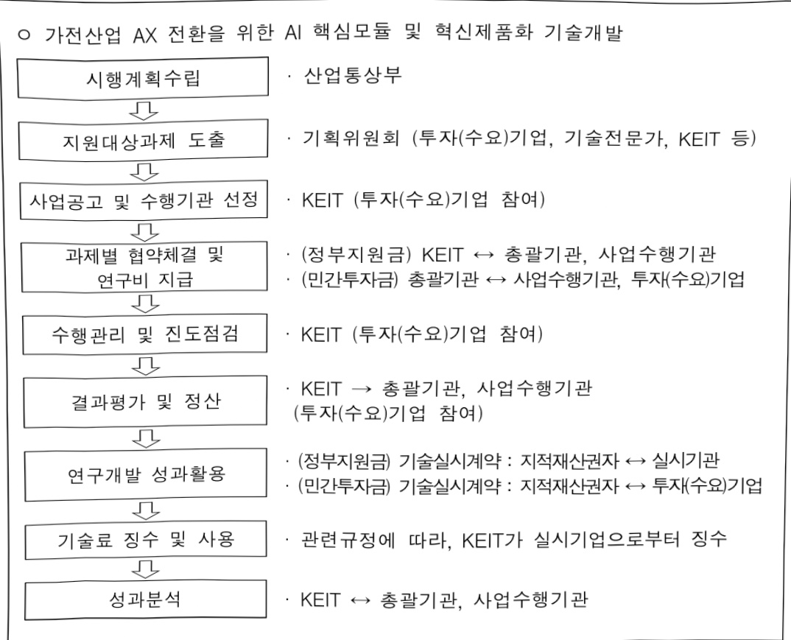
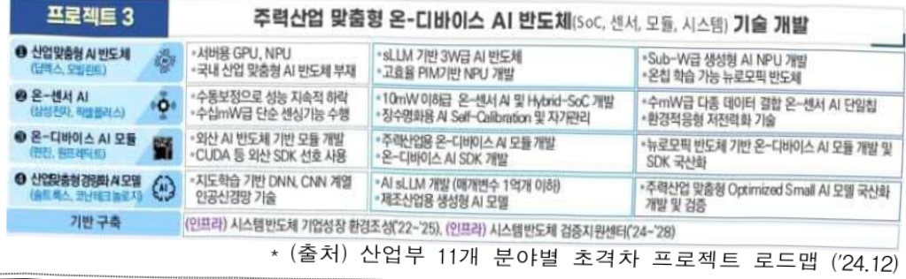
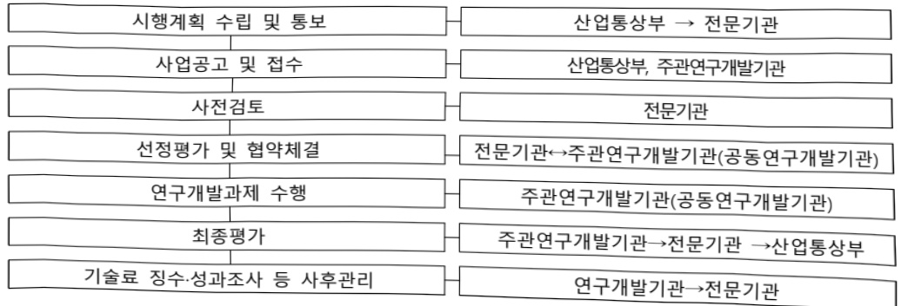

# 가전산업AX전환을위한AI핵심모듈및혁신제품화기술개발(R&…

**해당 페이지**: PDF 3775 ~ 3788 쪽 해당

**부처**: 산업통상부
**분야**: 산업·중소기업 및 에너지
**회계유형**: 일반회계
**2026 확정예산**: 4000.0 백만원
**전년대비 증감률**: None%
**AI 도메인**: AI반도체, 디지털전환(AX), 피지컬AI/디바이스

---

### 가.예산 총괄표

(단위: 백만원, %)

<table border=1 style='margin: auto; word-wrap: break-word;'><tr><td rowspan="2">사업명</td><td rowspan="2">2024년 결산</td><td colspan="2">2025년 예산</td><td colspan="2">2026년</td><td rowspan="2">증감(B-A)</td><td rowspan="2">(B-A)/A</td></tr><tr><td style='text-align: center; word-wrap: break-word;'>본예산(A)</td><td style='text-align: center; word-wrap: break-word;'>추경</td><td style='text-align: center; word-wrap: break-word;'>요구안</td><td style='text-align: center; word-wrap: break-word;'>확정(B)</td></tr><tr><td style='text-align: center; word-wrap: break-word;'>가전산업AX전환을위한AI핵심모듈및혁신제품화기술개발</td><td style='text-align: center; word-wrap: break-word;'>-</td><td style='text-align: center; word-wrap: break-word;'>-</td><td style='text-align: center; word-wrap: break-word;'>-</td><td style='text-align: center; word-wrap: break-word;'>4,000</td><td style='text-align: center; word-wrap: break-word;'>4,000</td><td style='text-align: center; word-wrap: break-word;'>순증</td><td style='text-align: center; word-wrap: break-word;'>신규</td></tr></table>

□ 기능별(내역사업별), 목별 예산 내역

(단위:백만원)

<table border=1 style='margin: auto; word-wrap: break-word;'><tr><td rowspan="3"></td><td colspan="5">2024</td><td colspan="7">2025(2025.12월말)</td><td rowspan="3">2026예산</td></tr><tr><td rowspan="2">예산액(추정)</td><td rowspan="2">예산현액</td><td rowspan="2">집행액[실질행액]</td><td rowspan="2">이월액</td><td rowspan="2">불용액</td><td rowspan="2">본예산</td><td rowspan="2">예산현액</td><td rowspan="2">집행액[실질행액]</td><td colspan="2">전년도아월액제외</td><td rowspan="2">이월예상액</td><td rowspan="2">불용예상액</td></tr><tr><td style='text-align: center; word-wrap: break-word;'>예산현액</td><td style='text-align: center; word-wrap: break-word;'>집행액[실질행액]</td></tr><tr><td style='text-align: center; word-wrap: break-word;'>○ 기능별 분류(합계)</td><td style='text-align: center; word-wrap: break-word;'>-</td><td style='text-align: center; word-wrap: break-word;'>-</td><td style='text-align: center; word-wrap: break-word;'>-</td><td style='text-align: center; word-wrap: break-word;'>-</td><td style='text-align: center; word-wrap: break-word;'>-</td><td style='text-align: center; word-wrap: break-word;'>-</td><td style='text-align: center; word-wrap: break-word;'>-</td><td style='text-align: center; word-wrap: break-word;'>-</td><td style='text-align: center; word-wrap: break-word;'>-</td><td style='text-align: center; word-wrap: break-word;'>-</td><td style='text-align: center; word-wrap: break-word;'>-</td><td style='text-align: center; word-wrap: break-word;'>-</td><td style='text-align: center; word-wrap: break-word;'>4,000</td></tr><tr><td style='text-align: center; word-wrap: break-word;'>· 가전산업AX전환을위한AI핵심모듈및혁신제품화기술개발</td><td style='text-align: center; word-wrap: break-word;'>-</td><td style='text-align: center; word-wrap: break-word;'>-</td><td style='text-align: center; word-wrap: break-word;'>-</td><td style='text-align: center; word-wrap: break-word;'>-</td><td style='text-align: center; word-wrap: break-word;'>-</td><td style='text-align: center; word-wrap: break-word;'>-</td><td style='text-align: center; word-wrap: break-word;'>-</td><td style='text-align: center; word-wrap: break-word;'>-</td><td style='text-align: center; word-wrap: break-word;'>-</td><td style='text-align: center; word-wrap: break-word;'>-</td><td style='text-align: center; word-wrap: break-word;'>-</td><td style='text-align: center; word-wrap: break-word;'>-</td><td style='text-align: center; word-wrap: break-word;'>4,000</td></tr><tr><td style='text-align: center; word-wrap: break-word;'>○ 비목별 분류(합계)</td><td style='text-align: center; word-wrap: break-word;'>-</td><td style='text-align: center; word-wrap: break-word;'>-</td><td style='text-align: center; word-wrap: break-word;'>-</td><td style='text-align: center; word-wrap: break-word;'>-</td><td style='text-align: center; word-wrap: break-word;'>-</td><td style='text-align: center; word-wrap: break-word;'>-</td><td style='text-align: center; word-wrap: break-word;'>-</td><td style='text-align: center; word-wrap: break-word;'>-</td><td style='text-align: center; word-wrap: break-word;'>-</td><td style='text-align: center; word-wrap: break-word;'>-</td><td style='text-align: center; word-wrap: break-word;'>-</td><td style='text-align: center; word-wrap: break-word;'>-</td><td style='text-align: center; word-wrap: break-word;'>4,000</td></tr><tr><td style='text-align: center; word-wrap: break-word;'>· 연구개발활동비등(360-05)</td><td style='text-align: center; word-wrap: break-word;'>-</td><td style='text-align: center; word-wrap: break-word;'>-</td><td style='text-align: center; word-wrap: break-word;'>-</td><td style='text-align: center; word-wrap: break-word;'>-</td><td style='text-align: center; word-wrap: break-word;'>-</td><td style='text-align: center; word-wrap: break-word;'>-</td><td style='text-align: center; word-wrap: break-word;'>-</td><td style='text-align: center; word-wrap: break-word;'>-</td><td style='text-align: center; word-wrap: break-word;'>-</td><td style='text-align: center; word-wrap: break-word;'>-</td><td style='text-align: center; word-wrap: break-word;'>-</td><td style='text-align: center; word-wrap: break-word;'>-</td><td style='text-align: center; word-wrap: break-word;'>4,000</td></tr><tr><td style='text-align: center; word-wrap: break-word;'>○ 기능비목별 분류(합계)</td><td style='text-align: center; word-wrap: break-word;'>-</td><td style='text-align: center; word-wrap: break-word;'>-</td><td style='text-align: center; word-wrap: break-word;'>-</td><td style='text-align: center; word-wrap: break-word;'>-</td><td style='text-align: center; word-wrap: break-word;'>-</td><td style='text-align: center; word-wrap: break-word;'>-</td><td style='text-align: center; word-wrap: break-word;'>-</td><td style='text-align: center; word-wrap: break-word;'>-</td><td style='text-align: center; word-wrap: break-word;'>-</td><td style='text-align: center; word-wrap: break-word;'>-</td><td style='text-align: center; word-wrap: break-word;'>-</td><td style='text-align: center; word-wrap: break-word;'>-</td><td style='text-align: center; word-wrap: break-word;'>4,000</td></tr><tr><td style='text-align: center; word-wrap: break-word;'>· 가전산업AX전환을위한AI핵심모듈및혁신제품화기술개발·연구개발활동비등(360-05)</td><td style='text-align: center; word-wrap: break-word;'>-</td><td style='text-align: center; word-wrap: break-word;'>-</td><td style='text-align: center; word-wrap: break-word;'>-</td><td style='text-align: center; word-wrap: break-word;'>-</td><td style='text-align: center; word-wrap: break-word;'>-</td><td style='text-align: center; word-wrap: break-word;'>-</td><td style='text-align: center; word-wrap: break-word;'>-</td><td style='text-align: center; word-wrap: break-word;'>-</td><td style='text-align: center; word-wrap: break-word;'>-</td><td style='text-align: center; word-wrap: break-word;'>-</td><td style='text-align: center; word-wrap: break-word;'>-</td><td style='text-align: center; word-wrap: break-word;'>-</td><td style='text-align: center; word-wrap: break-word;'>4,000</td></tr></table>

---

### 나. 사업설명자료

## 1 ) 사업목적·내용

- 가전산업 분야의 AI 핵심 모듈기술 개발을 통해 가전산업 AX 전환 및 융복합 기술 개발을 통한 미래 신산업 육성

- 국산 AI반도체를 적용한 개방형 온디바이스 AI통합시스템(HW, SW, 가전용AI모델)

개발 및 세계최고 수준의 AI가전 제품화 기술 확보

* 국내 가전기업의 AI제품 기술경쟁력 강화 및 국산 AI반도체의 대형수요시장(가전) 개화 촉진

## 2 ) 사업개요

## □ 사업근거 및 추진경위

① 법령상 근거 및 조항 적시

-산업기술혁신촉진법 제11조(산업기술개발사업)

① 산업통상부장관은 혁신계획 및 시행계획을 효율적으로 수행하기 위하여 관계 중앙행정기관의 장과 협의하여 다음 각 호의 산업기술분야에서 기술개발사업(산업기술개발을 위하여 필요한 기획 및 조사를 포함한다. 이하 "산업기술개발사업"이라 한다)을 추진할 수 있다.

2.산업기술 분야의 미래 유망 기술

- 국가첨단전략산업 경쟁력 강화 및 보호에 관한 특별조치법 제25조(국가첨단전략 기술개발사업의 추진)

① 정부는 전략산업등의 기술 확보와 경쟁력 강화를 위하여 「국가과학기술자문회의법」에 따른 국가과학기술자문회의의 심의를 거쳐 다음 각 호의 사업을 포함하는 국가첨단전략기술개발 사업(이하 "기술개발사업"이라 한다)을 추진할 수 있다.

1. 전략산업등 분야의 연구개발사업

## ② 추진경위

- 2019년 ‘데이터·AI경제 활성화 계획’(19.1), ‘AI 국가전략’(19.12) 수립으로 AI 혁신생태계 조성 및 데이터와 인공지능 간 융합 촉진

- 2022년 국정과제(24. 반도체·AI·배터리 등 미래전략산업 초격차 확보) 반영

- 2023년 지능형홈(AI@Home) 추진과제 발표

- 2025년 산업AI 확산 10대과제 발표

- 2025년 가전산업AX전환을위한AI핵심모듈및혁신제품화기술개발 신규사업 발굴

---

## □ 주요내용

① 사업규모

- 총사업비(해당되는 경우에만 기재) : 해당 없음

- 사업기간 : '26 ~ '30

- 적근 5년 간 투입된 사업비(예산액기준, 추경편성한 연도에는 추경포함)

<table border=1 style='margin: auto; word-wrap: break-word;'><tr><td style='text-align: center; word-wrap: break-word;'>$ \underline{\text{笹}} $ 2022</td><td style='text-align: center; word-wrap: break-word;'>2023</td><td style='text-align: center; word-wrap: break-word;'>2024</td><td style='text-align: center; word-wrap: break-word;'>2025</td><td style='text-align: center; word-wrap: break-word;'>2026</td></tr><tr><td style='text-align: center; word-wrap: break-word;'>$ \underline{\text{人}} $ 2023</td><td style='text-align: center; word-wrap: break-word;'>-</td><td style='text-align: center; word-wrap: break-word;'>-</td><td style='text-align: center; word-wrap: break-word;'>-</td><td style='text-align: center; word-wrap: break-word;'>4,000</td></tr></table>

② 사업추진체계

- 사업시행방법 : 출연(사업수행자별 유형에 따라 출연금 매칭)

- 사업시행주체 : 한국산업기술기획평가원

- 사업 수혜자 : 기업, 대학, 연구소 등

- 보조, 융자, 출연, 출자 등의 경우 보조·융자 등 지원 비율 및 법적근거

<table border=1 style='margin: auto; word-wrap: break-word;'><tr><td style='text-align: center; word-wrap: break-word;'>내역사업명</td><td style='text-align: center; word-wrap: break-word;'>구분</td><td style='text-align: center; word-wrap: break-word;'>피보조·피출연 등 기관명</td><td style='text-align: center; word-wrap: break-word;'>지원 금액 (2026예산)</td><td style='text-align: center; word-wrap: break-word;'>지원 비율(%)</td><td style='text-align: center; word-wrap: break-word;'>보조율 법적근거 (해당 조항)</td></tr><tr><td style='text-align: center; word-wrap: break-word;'>가전산업AX전환을위한AI핵심모듈및혁신제품화기술개발</td><td style='text-align: center; word-wrap: break-word;'>출연</td><td style='text-align: center; word-wrap: break-word;'>기업, 대학, 연구소 등</td><td style='text-align: center; word-wrap: break-word;'>4,000</td><td style='text-align: center; word-wrap: break-word;'>33~100%</td><td style='text-align: center; word-wrap: break-word;'>산업기술혁신 촉진법 제11조 산업기술혁신사업 공통운영요령 제25조</td></tr></table>

## 3 ) 2026년도 예산안 산출 근거

(1) 가전산업AX전환을위한AI핵심모듈및혁신제품화기술개발 : (2026) 4,000백만원, 순증

- 국산 AI반도체를 적용한 개방형 온디바이스 AI통합시스템개발 신규 지원을 위해 4,000백만원 지원

- (산출) 1,333백만원 (1년차 사업비) × 9/12개월 × 신규과제 4개 = 4,000백만원

2025년도 및 2026년도 예산 산출 세부내역 비교

<table border=1 style='margin: auto; word-wrap: break-word;'><tr><td colspan="2">&#x27;25년 예산</td><td colspan="2">&#x27;26년 예산</td></tr><tr><td style='text-align: center; word-wrap: break-word;'>예산</td><td style='text-align: center; word-wrap: break-word;'>산출내역</td><td style='text-align: center; word-wrap: break-word;'>예산</td><td style='text-align: center; word-wrap: break-word;'>산출내역</td></tr><tr><td style='text-align: center; word-wrap: break-word;'>-</td><td style='text-align: center; word-wrap: break-word;'>-</td><td style='text-align: center; word-wrap: break-word;'>-</td><td style='text-align: center; word-wrap: break-word;'>○ 연구개발활동비등(360-05): 4,000백만원가. 신규과제 4건 지원 (4,000백만원) • 1,333백만원×9/12개월×4건</td></tr></table>

---

## 4 ) 사업효과

□ 사업영향, 산출물 성과지표 등

① 2022~2026년도 성과계획서 상 성과지표 및 최근 5년간 성과 달성도

<table border=1 style='margin: auto; word-wrap: break-word;'><tr><td style='text-align: center; word-wrap: break-word;'>성과지표</td><td style='text-align: center; word-wrap: break-word;'>구분</td><td style='text-align: center; word-wrap: break-word;'>2022</td><td style='text-align: center; word-wrap: break-word;'>2023</td><td style='text-align: center; word-wrap: break-word;'>2024</td><td style='text-align: center; word-wrap: break-word;'>2025</td><td style='text-align: center; word-wrap: break-word;'>2026</td><td style='text-align: center; word-wrap: break-word;'>2026 목표치산출근거</td><td style='text-align: center; word-wrap: break-word;'>측정산식(또는 측정방법)</td><td style='text-align: center; word-wrap: break-word;'>자료수집방법(또는 자료출처)</td></tr><tr><td rowspan="3">수립예정</td><td style='text-align: center; word-wrap: break-word;'>목표</td><td style='text-align: center; word-wrap: break-word;'>-</td><td style='text-align: center; word-wrap: break-word;'>-</td><td style='text-align: center; word-wrap: break-word;'>-</td><td style='text-align: center; word-wrap: break-word;'>-</td><td style='text-align: center; word-wrap: break-word;'>신규</td><td rowspan="3">수립예정</td><td rowspan="3">수립예정</td><td rowspan="3">수립예정</td></tr><tr><td style='text-align: center; word-wrap: break-word;'>실적</td><td style='text-align: center; word-wrap: break-word;'>-</td><td style='text-align: center; word-wrap: break-word;'>-</td><td style='text-align: center; word-wrap: break-word;'>-</td><td style='text-align: center; word-wrap: break-word;'>-</td><td style='text-align: center; word-wrap: break-word;'>-</td></tr><tr><td style='text-align: center; word-wrap: break-word;'>달성도</td><td style='text-align: center; word-wrap: break-word;'>-</td><td style='text-align: center; word-wrap: break-word;'>-</td><td style='text-align: center; word-wrap: break-word;'>-</td><td style='text-align: center; word-wrap: break-word;'>-</td><td style='text-align: center; word-wrap: break-word;'>-</td></tr><tr><td rowspan="3">수립예정</td><td style='text-align: center; word-wrap: break-word;'>목표</td><td style='text-align: center; word-wrap: break-word;'>-</td><td style='text-align: center; word-wrap: break-word;'>-</td><td style='text-align: center; word-wrap: break-word;'>-</td><td style='text-align: center; word-wrap: break-word;'>-</td><td style='text-align: center; word-wrap: break-word;'>신규</td><td rowspan="3">수립예정</td><td rowspan="3">수립예정</td><td rowspan="3">수립예정</td></tr><tr><td style='text-align: center; word-wrap: break-word;'>실적</td><td style='text-align: center; word-wrap: break-word;'>-</td><td style='text-align: center; word-wrap: break-word;'>-</td><td style='text-align: center; word-wrap: break-word;'>-</td><td style='text-align: center; word-wrap: break-word;'>-</td><td style='text-align: center; word-wrap: break-word;'>-</td></tr><tr><td style='text-align: center; word-wrap: break-word;'>달성도</td><td style='text-align: center; word-wrap: break-word;'>-</td><td style='text-align: center; word-wrap: break-word;'>-</td><td style='text-align: center; word-wrap: break-word;'>-</td><td style='text-align: center; word-wrap: break-word;'>-</td><td style='text-align: center; word-wrap: break-word;'>-</td></tr></table>

② 성과지표 이외의 연도별 사업추진 경과 및 실적

<table border=1 style='margin: auto; word-wrap: break-word;'><tr><td style='text-align: center; word-wrap: break-word;'>2022</td><td style='text-align: center; word-wrap: break-word;'>-</td></tr><tr><td style='text-align: center; word-wrap: break-word;'>2023</td><td style='text-align: center; word-wrap: break-word;'>-</td></tr><tr><td style='text-align: center; word-wrap: break-word;'>2024</td><td style='text-align: center; word-wrap: break-word;'>-</td></tr><tr><td style='text-align: center; word-wrap: break-word;'>2025</td><td style='text-align: center; word-wrap: break-word;'>-</td></tr></table>

③ 향후(2026년도 이후) 기대효과

- (기술적 기대효과) 가전산업 분야의 AI 핵심 모듈기술 개발을 통해 가전산업

AX 전환 및 융복합 기술개발 및 미래 신산업 육성

- (경제적 기대효과) 국산 AI반도체를 대형시장(가전)에 빠르게 접목·확산하여 가전(수요)

- 반도체(공급) 산업 간 시너지 창출 및 세계최고 수준의 AI가전 시장 선도

- (사회적 기대효과) 온디바이스 AI 기반 가전, 반도체, 센서, 미들웨어, 지능형 서비스 등 전후방 산업으로의 확산을 통해 AI 핵심부품 설계인력, 서비스 모델 개발, 제품화 및 실증 등 인력 수요에 기반한 고급 일자리 창출 기대

5) 타당성조사 및 예비타당성조사 시행여부 및 결과 요지 : 해당 없음

6) 총사업비 대상사업 여부 및 내역 : 해당 없음

---

## 7 ) 사업 집행절차

## 8 ) 중기재정계획 상 연도별 투자계획 및 추진경과

(단위: 백만원)

<table border=1 style='margin: auto; word-wrap: break-word;'><tr><td style='text-align: center; word-wrap: break-word;'>$ 중기 $ 재정계획</td><td style='text-align: center; word-wrap: break-word;'>2024</td><td style='text-align: center; word-wrap: break-word;'>2025</td><td style='text-align: center; word-wrap: break-word;'>2026</td><td style='text-align: center; word-wrap: break-word;'>2027</td><td style='text-align: center; word-wrap: break-word;'>2028</td><td style='text-align: center; word-wrap: break-word;'>2029</td></tr><tr><td style='text-align: center; word-wrap: break-word;'>2024~2028</td><td style='text-align: center; word-wrap: break-word;'>-</td><td style='text-align: center; word-wrap: break-word;'>-</td><td style='text-align: center; word-wrap: break-word;'>4,000</td><td style='text-align: center; word-wrap: break-word;'>7,850</td><td style='text-align: center; word-wrap: break-word;'>8,600</td><td style='text-align: center; word-wrap: break-word;'>5,400</td></tr><tr><td style='text-align: center; word-wrap: break-word;'>2025~2029</td><td style='text-align: center; word-wrap: break-word;'></td><td style='text-align: center; word-wrap: break-word;'>-</td><td style='text-align: center; word-wrap: break-word;'>4,000</td><td style='text-align: center; word-wrap: break-word;'>7,850</td><td style='text-align: center; word-wrap: break-word;'>8,600</td><td style='text-align: center; word-wrap: break-word;'>5,400</td></tr></table>

9) 최근 3년간 동 사업에 대한 주요 외부지적사항 및 평가, 문제점 및 대책

해당없음

---

## 10 ) 향후 추진방향 및 추진계획

0 향후 추진방향과 세부 추진계획

·(추진체계) 세부사업 추진역할별 생태계 주체

- (연구개발 주체) 연구개발 사업은 사업의 성격에 따라 기업 또는 대학·연구기관 주도로 하며 산학연관 공동으로 사업 추진

- (인프라 주체) 거점센터를 지정하여 지방정부와 산학연관 공동으로 사업을 추진

<table border=1 style='margin: auto; word-wrap: break-word;'><tr><td colspan="2">세부사업</td><td style='text-align: center; word-wrap: break-word;'>수행주체</td><td style='text-align: center; word-wrap: break-word;'>공동·참여 수행</td></tr><tr><td rowspan="3">연구개발</td><td style='text-align: center; word-wrap: break-word;'>상용화 기술</td><td style='text-align: center; word-wrap: break-word;'>중소·중견기업</td><td style='text-align: center; word-wrap: break-word;'>학계·연구소 등</td></tr><tr><td style='text-align: center; word-wrap: break-word;'>원천기술</td><td style='text-align: center; word-wrap: break-word;'>학계·연구소</td><td style='text-align: center; word-wrap: break-word;'>중소·중견기업 등</td></tr><tr><td style='text-align: center; word-wrap: break-word;'>패키지형</td><td style='text-align: center; word-wrap: break-word;'>대기업, 중소·중견기업</td><td style='text-align: center; word-wrap: break-word;'>학계·연구소, 협회, 단체 등</td></tr></table>

(추진방식) 전문기관에서 품목지정형 과제공모를 통해 연구개발 계획서를 평가하여 수행기관 선정

- '26년 신규 4개 과제(통합형 총괄, 1세부, 2세부, 3세부) 선정 예정

0 사업의 전체 계획 및 중장기 재정소요와 재원조달계획

- 사업 수행기간('26~30) 동안 국비 총 283억원이 소요되며, 영리기관의 경우 정부 출연금에 매칭하여 민간에서 민간부담금 부담 예정

(단위 : 억원)

<table border=1 style='margin: auto; word-wrap: break-word;'><tr><td style='text-align: center; word-wrap: break-word;'>내역사업명</td><td style='text-align: center; word-wrap: break-word;'>구분</td><td style='text-align: center; word-wrap: break-word;'>&#x27;25</td><td style='text-align: center; word-wrap: break-word;'>&#x27;26</td><td style='text-align: center; word-wrap: break-word;'>&#x27;27</td><td style='text-align: center; word-wrap: break-word;'>&#x27;28</td><td style='text-align: center; word-wrap: break-word;'>&#x27;29</td><td style='text-align: center; word-wrap: break-word;'>&#x27;30</td><td style='text-align: center; word-wrap: break-word;'>합계</td></tr><tr><td rowspan="2">가전산업AX전환을위한AI</td><td style='text-align: center; word-wrap: break-word;'>국비</td><td style='text-align: center; word-wrap: break-word;'>-</td><td style='text-align: center; word-wrap: break-word;'>40</td><td style='text-align: center; word-wrap: break-word;'>78.5</td><td style='text-align: center; word-wrap: break-word;'>86</td><td style='text-align: center; word-wrap: break-word;'>54</td><td style='text-align: center; word-wrap: break-word;'>24</td><td style='text-align: center; word-wrap: break-word;'>282.5</td></tr><tr><td style='text-align: center; word-wrap: break-word;'>지방비</td><td style='text-align: center; word-wrap: break-word;'>-</td><td style='text-align: center; word-wrap: break-word;'>-</td><td style='text-align: center; word-wrap: break-word;'>-</td><td style='text-align: center; word-wrap: break-word;'>-</td><td style='text-align: center; word-wrap: break-word;'>-</td><td style='text-align: center; word-wrap: break-word;'>-</td><td style='text-align: center; word-wrap: break-word;'>-</td></tr><tr><td style='text-align: center; word-wrap: break-word;'>핵심모듈및혁신제품화</td><td style='text-align: center; word-wrap: break-word;'>민자</td><td style='text-align: center; word-wrap: break-word;'>-</td><td style='text-align: center; word-wrap: break-word;'>17.14</td><td style='text-align: center; word-wrap: break-word;'>33.64</td><td style='text-align: center; word-wrap: break-word;'>36.86</td><td style='text-align: center; word-wrap: break-word;'>23.14</td><td style='text-align: center; word-wrap: break-word;'>10.29</td><td style='text-align: center; word-wrap: break-word;'>121.07</td></tr><tr><td style='text-align: center; word-wrap: break-word;'>기술개발</td><td style='text-align: center; word-wrap: break-word;'>계</td><td style='text-align: center; word-wrap: break-word;'>-</td><td style='text-align: center; word-wrap: break-word;'>57.14</td><td style='text-align: center; word-wrap: break-word;'>112.1</td><td style='text-align: center; word-wrap: break-word;'>122.9</td><td style='text-align: center; word-wrap: break-word;'>77.14</td><td style='text-align: center; word-wrap: break-word;'>34.29</td><td style='text-align: center; word-wrap: break-word;'>403.57</td></tr></table>

* 26년 신규사업으로, 국비7:민자3으로 추정

11) 해당사업에 대한 각종 사업평가의 결과 : 해당 없음

12) 해당사업에 대한 부처 자체평가의 결과 : 해당 없음

13) 부처 건의사항 : 해당 없음

---

다. 최근 4년간 결산내역 : 해당 없음 (26년 신규사업)

### 라. 기타 추가자료

(1) 내역사업 세부 설명자료

(2) 신규사업 기획보고서 요약본

---

## ☐ 사업개요

<table border=1 style='margin: auto; word-wrap: break-word;'><tr><td style='text-align: center; word-wrap: break-word;'>사업기간</td><td style='text-align: center; word-wrap: break-word;'>2026~2030</td><td style='text-align: center; word-wrap: break-word;'>총사업비</td><td style='text-align: center; word-wrap: break-word;'>해당없음</td></tr><tr><td style='text-align: center; word-wrap: break-word;'>주관기관</td><td colspan="3">기업, 대학, 연구소 등</td></tr><tr><td style='text-align: center; word-wrap: break-word;'>담당자</td><td colspan="3">디스플레이가전팀 전호연 사무관(⑧ 044-203-4257)</td></tr></table>

## ☐ 사업내용(지원내용)

글로벌시장 정체와 중국 AI가전 확대에 대응하여, 가전산업 AX전환을 위한 온디바이스 AI 핵심모듈 및 혁신 제품화 기술개발 추진

- 국산 AI반도체를 적용한 온디바이스 AI통합시스템(개방형 하드웨어·소프트웨어·AI모델)을 개발하고 AI가전 개발에 적용

- 라이프케어, 스마트홈, 홈로봇 등 시장수요가 높은 유망품목의 세계 최고 수준의 AI가 전 제품화 기술 확보

## □ '26년 세부 과제 현황 및 소요 예산 : 4,000백만원

° (총괄) 가전산업 AX전환을 위한 AI 핵심모듈 기술개발 총괄

- 130백만원×9/12개월 = 100 백만원

° (1세부) 온디바이스 AI 통합(CPU+가속기 등)하드웨어 시스템 기술

- 1,730백만원×9/12개월 = 1,300 백만원 (HDK 400백만원, 멀티모달 인터페이스 500 백만원, 제품분야별 HW개발 400백만원)

° (2세부) 온디바이스 AI 개발자 지원 미들웨어 기술

- 1,730백만원× 9/12개월 = 1,300 백만원 (가속기반 미들웨어 400백만원, 오픈 인터페이스 500백만원, OS 확장기술 개발 400백만원)

° (3세부) 온디바이스 AI기반 모델 경량화 라이브러리 기술

- 1,730백만원× 9/12개월 = 1,300 백만원 (분야별 AI모델개발 500백만원, AI모델 경량화기술개발 400백만원, AI모델 변환 기술개발 400백만원)

---

## 붙임2

신규사업 기획보고서 요약본

<table border=1 style='margin: auto; word-wrap: break-word;'><tr><td style='text-align: center; word-wrap: break-word;'>사업명</td><td colspan="10">가전산업 AX전환을 위한 AI핵심모듈 기술 개발</td></tr><tr><td style='text-align: center; word-wrap: break-word;'>총 사업비</td><td colspan="4">404억원 (국비: 283억원)</td><td colspan="3">사업기간</td><td colspan="3">26년～30년(총 5년)</td></tr><tr><td rowspan="2">수행주체</td><td colspan="10">산업통상부 / 디스플레이가전팀 / 전호언(044-203-4257, jslh0508@korea.kr)</td></tr><tr><td colspan="10">한국산업기술기획평가원 / 배터리디스플레이실 / (변기영/053-718-8711/gybyun@keit.re.kr)</td></tr><tr><td colspan="11">[성과목표]
○ (목적) 대기업중심 AI가전 기술격차를 극복하고, 중소·중견기업도 주도할 수 있는
‘온디바이스 AI’기반 세계최초 앰비언트 가전 플랫폼 및 핵심모듈기술 확보
○ (사업목표) 국산 온디바이스 AI 반도체를 활용해, 중소·중견 가전제품도 빠르고
쉽게 적용가능한 국산 AI 시스템(하드웨어+소프트웨어+모델)개발 및 제품화</td></tr><tr><td colspan="11">[성과지표]
○ (정량적목표) 사업수행의 성과지표 Smart특허, 사업화 매출 목표를 설정
- (총괄) 가전산업 AX전환을 위한 AI 핵심모듈 기술개발 총괄</td></tr><tr><td rowspan="2">성과지표명</td><td colspan="7">목표치</td><td colspan="3">측정방법</td></tr><tr><td style='text-align: center; word-wrap: break-word;'>&#x27;26</td><td style='text-align: center; word-wrap: break-word;'>&#x27;27</td><td style='text-align: center; word-wrap: break-word;'>&#x27;28</td><td style='text-align: center; word-wrap: break-word;'>&#x27;29</td><td style='text-align: center; word-wrap: break-word;'>&#x27;30</td><td style='text-align: center; word-wrap: break-word;'></td><td style='text-align: center; word-wrap: break-word;'></td><td style='text-align: center; word-wrap: break-word;'></td><td style='text-align: center; word-wrap: break-word;'></td><td style='text-align: center; word-wrap: break-word;'></td></tr><tr><td style='text-align: center; word-wrap: break-word;'>특허건수</td><td style='text-align: center; word-wrap: break-word;'>-</td><td style='text-align: center; word-wrap: break-word;'>1</td><td style='text-align: center; word-wrap: break-word;'>2</td><td style='text-align: center; word-wrap: break-word;'>2</td><td style='text-align: center; word-wrap: break-word;'>3</td><td style='text-align: center; word-wrap: break-word;'></td><td style='text-align: center; word-wrap: break-word;'></td><td style='text-align: center; word-wrap: break-word;'></td><td style='text-align: center; word-wrap: break-word;'></td><td style='text-align: center; word-wrap: break-word;'></td></tr><tr><td style='text-align: center; word-wrap: break-word;'>특허 경쟁력 SMART지수</td><td style='text-align: center; word-wrap: break-word;'>-</td><td style='text-align: center; word-wrap: break-word;'>-</td><td style='text-align: center; word-wrap: break-word;'>3.18</td><td style='text-align: center; word-wrap: break-word;'>3.18</td><td style='text-align: center; word-wrap: break-word;'>-</td><td style='text-align: center; word-wrap: break-word;'></td><td style='text-align: center; word-wrap: break-word;'></td><td style='text-align: center; word-wrap: break-word;'></td><td style='text-align: center; word-wrap: break-word;'></td><td style='text-align: center; word-wrap: break-word;'></td></tr><tr><td style='text-align: center; word-wrap: break-word;'>시작품 제작</td><td style='text-align: center; word-wrap: break-word;'>1</td><td style='text-align: center; word-wrap: break-word;'>3</td><td style='text-align: center; word-wrap: break-word;'>3</td><td style='text-align: center; word-wrap: break-word;'>6</td><td style='text-align: center; word-wrap: break-word;'>3</td><td style='text-align: center; word-wrap: break-word;'></td><td style='text-align: center; word-wrap: break-word;'></td><td style='text-align: center; word-wrap: break-word;'></td><td style='text-align: center; word-wrap: break-word;'></td><td style='text-align: center; word-wrap: break-word;'></td></tr><tr><td style='text-align: center; word-wrap: break-word;'>실증적용 건수</td><td style='text-align: center; word-wrap: break-word;'>-</td><td style='text-align: center; word-wrap: break-word;'>1</td><td style='text-align: center; word-wrap: break-word;'>4</td><td style='text-align: center; word-wrap: break-word;'>8</td><td style='text-align: center; word-wrap: break-word;'>8</td><td style='text-align: center; word-wrap: break-word;'></td><td style='text-align: center; word-wrap: break-word;'></td><td style='text-align: center; word-wrap: break-word;'></td><td style='text-align: center; word-wrap: break-word;'></td><td style='text-align: center; word-wrap: break-word;'></td></tr><tr><td style='text-align: center; word-wrap: break-word;'>사업화</td><td style='text-align: center; word-wrap: break-word;'>-</td><td style='text-align: center; word-wrap: break-word;'>-</td><td style='text-align: center; word-wrap: break-word;'>-</td><td style='text-align: center; word-wrap: break-word;'>15</td><td style='text-align: center; word-wrap: break-word;'>30</td><td style='text-align: center; word-wrap: break-word;'></td><td style='text-align: center; word-wrap: break-word;'></td><td style='text-align: center; word-wrap: break-word;'></td><td style='text-align: center; word-wrap: break-word;'></td><td style='text-align: center; word-wrap: break-word;'></td></tr><tr><td colspan="11">○ (정성적 목표)
- 온디바이스 AI기반 개방형 하드웨어 개발 : 국산 AI 가속기 반도체 기반 모듈
개발 및 소프트웨어 개발지원도구(SDK) 개발로 반도체, 가전 산업의 중소기업 경
쟁력 강화
- 온디바이스 AI기반 라이프케어 가전 개발(생체신호, 환경) : 생체신호, 환경 데이
터기반 온디바이스 AI를 활용한 제품 개발로 다양한 센서 연동을 통해 라이프
케어 가전 글로벌 혁신 제품화 및 실증
- 온디바이스 AI기반 초개인화 가전 개발(영상 시스템) : 초저전력 영상 특화 AI
모듈을 활용한 초개인화 스마트홈 환경 제공 및 생활편의성 강화 가전 글로벌
혁신 제품화 및 실증
- 온디바이스 AI기반 지능형 홈 가전 개발(홈 로봇) : 차세대 로봇시장을 선도하
기 위한 실시간 환경 적응 및 자율판단 기능의 온디바이스 AI 지능형 홈로봇
가전 제품화 및 실증</td></tr></table>

---

## [정책적 연계성]

°(국정과제) 국정목표 2. 민간이 끌고 정부가 미는 역동적 경제

- 경상시양형산업전략추진 : 우리 스마트홈, 가전 기업을 세계 기업으로 성장촉진

- 수요자 지향 산업기술 R&D 및 반도체·AI·배터리 등 미래전략산업 초격차 확보

- 산업경쟁력과 공급망강화 : 온디바이스AI기반 스마트홈 서비스 및 핵심부품확보

스마트홈 및 인공지능관련 주요정책에 해당

- IoT가전산업 발전전략(산업부, '18.3), AI국가전략(관계부처, '19.12), 디지털포용추진계획(관계부처, '20.6), 한국판뉴딜(관계부처, '20.7), 반도체 초강국 달성전략(산업부, '22.7), 지능형 홈(AI@Home, '23.2)

- '25.1월 산업AI확산을 위한 10대과제 : ②AI에이전트와피지컬AI, ④산업데이터, ⑤AI반도체, ⑥AI인재, ⑩산업AI제도에 해당

° (국가전략기술로드맵) 22년 지정된 국가전략기술 육성방안 초격차프로젝트 12 대 국가전략기술 중 ①반도체의 대형수요산업, ⑥지능형로봇의 다중지능 인간생활지원, ⑦인공지능의 산업활용·혁신AI에 해당

° (초격차프로젝트 로드맵) 11대 분야중 '①반도체'에 해당

- ①-03 주력산업 맞춤형 온-디바이스 AI반도체(SoC, 센서, 모듈, 시스템) 기술 개발

## [동 사업의 초격차프로젝트 해당 항목]

## [중점투자 분야 및 기술]

ㅇ 기술개발의 예상성과, 산출물

① (과제1: 온디바이스 AI기반 개방형 하드웨어 개발) 국내 기업의 AI혁신역량 제고 및 AX전환 가속화를 위한 개방형 AI 시스템 개발 및 중소-중견기업에 제공

- 가전 제품의 AI적용을 위한 HDK, SDK, 생성형 AI 모델, 데이터 처리 등 하드웨어와 소프트웨어가 결합된 개방형 시스템 개발

<table border=1 style='margin: auto; word-wrap: break-word;'><tr><td style='text-align: center; word-wrap: break-word;'>가전용 AI HDK 기술</td><td style='text-align: center; word-wrap: break-word;'>AI 개발지원 SDK 기술</td><td style='text-align: center; word-wrap: break-word;'>AI 경량화, 라이브러리 기술</td></tr><tr><td style='text-align: center; word-wrap: break-word;'>· AI 부품 모듈화, 온보드 개발· 다중인터페이스, 저전력화 개발· 특화 가전별 최적 모듈 개발</td><td style='text-align: center; word-wrap: break-word;'>· O/S 미들웨어, 펌웨어 개발· 에플리케이션 프레임워크 개발· 오픈소스, 샘플코드 개발</td><td style='text-align: center; word-wrap: break-word;'>· 기전용 생성형 AI 모델 개발· 경량AI모델 라이브러리 개발· AI모델 성능검증, 평가기술</td></tr></table>

② (일반형 과제 3개) 생체신호분석, 스마트홈, 홈로봇 특화 제품화 기술개발

---

(과제2: 온디바이스 AI 기반 라이프케어 가전 기술) 생체신호, 환경 데이터를 실시간 인지하고 제어하는 저전력 고효율 AI 시스템 개발 및 초개인화 기술 확보

<table border=1 style='margin: auto; word-wrap: break-word;'><tr><td style='text-align: center; word-wrap: break-word;'>라이프케어 가전용 AI 기술</td><td style='text-align: center; word-wrap: break-word;'>경량화 AI 모델 기술</td><td style='text-align: center; word-wrap: break-word;'>사용자 맞춤형 관리 자동화 기술</td></tr><tr><td style='text-align: center; word-wrap: break-word;'>· 저전력, 고효율 AI 모듈 개발 · 선서 데이터 처리 모듈 개발 · 실시간연산 보안성 강화 개발</td><td style='text-align: center; word-wrap: break-word;'>· 상태예측 머신러닝 모델 개발 · 경량 AI 모델 개발 · 저전력환경 동작 모델 개발</td><td style='text-align: center; word-wrap: break-word;'>· 실시간 데이터 연동 기술 · 패턴 자동 업데이트 기술 · AI모델 성능검증, 평가기술</td></tr></table>

- (과제3: 온디바이스 AI 기반 초개인화 영상가전 기술) 초저전력 AI 모듈과 SLLM 기반 에이전트를 활용한 스마트홈 특화 지능형 영상가전 기술 확보

<table border=1 style='margin: auto; word-wrap: break-word;'><tr><td style='text-align: center; word-wrap: break-word;'>초저전력 NPU 기반 AI 모듈</td><td style='text-align: center; word-wrap: break-word;'>AI 에이전트 및 사용자 행동 예측</td><td style='text-align: center; word-wrap: break-word;'>AI 기반 상황 분석 및 자동화</td></tr><tr><td style='text-align: center; word-wrap: break-word;'>· 초저전력 AI 영상처리 모듈개발 · AI 연산 최적화 알고리즘 개발 · 스마트가전 연동을 위한 플러그 인형 AI 모듈 개발</td><td style='text-align: center; word-wrap: break-word;'>· 스마트홈 가전 연동을 위한 sLLM 기반 AI 어시스턴트 개발 · 실내 환경·건강 모니터링·에너지 관리 최적화 알고리즘 개발 · AI 모델 경량화 기술 개발</td><td style='text-align: center; word-wrap: break-word;'>· 실시간 모니터링 기술 개발 · AI 기반 스마트가전 제어 모델 구축 · 저전력 AI 연산 최적화 알고리즘 개발</td></tr></table>

- (과제4: 온디바이스 AI기반 지능형 홈 로봇 개발) 초저전력 AI모듈, 객체인식 AI 모델을 통한 정밀환경 대응 로봇가전 기술개발

<table border=1 style='margin: auto; word-wrap: break-word;'><tr><td style='text-align: center; word-wrap: break-word;'>온디바이스 AI 탑재 모듈 기술</td><td style='text-align: center; word-wrap: break-word;'>경량화 AI 모델 기술</td><td style='text-align: center; word-wrap: break-word;'>객체 환경 분석 로봇 가전 기술</td></tr><tr><td style='text-align: center; word-wrap: break-word;'>· 로봇가전 특화 제어모듈 개발 · 로컬 프로세싱 기반 고성능 모듈 개발 · 초저전력 AI 모듈 개발</td><td style='text-align: center; word-wrap: break-word;'>· 머신러닝 객체인식 모델 개발 · 경량 객체인식 AI 모델 개발 · 실시간 환경 분석 알고리즘 개발</td><td style='text-align: center; word-wrap: break-word;'>· 실시간 데이터 연동 기술 개발 · 센서융합기반지능형환경분석기술 · OTA 자동 업데이트 기술</td></tr></table>

## [사업 추진체계 및 추진방식]

°(추진체계) 3p 참고

°(추진방식)

- 연차별 투자 계획 : 국비 총 200억, 대형통합형1개, 일반형3

---

<table border=1 style='margin: auto; word-wrap: break-word;'><tr><td colspan="8">사업 추진계획</td></tr><tr><td colspan="8">(단위: 억원)</td></tr><tr><td style='text-align: center; word-wrap: break-word;'>내역사업명</td><td style='text-align: center; word-wrap: break-word;'>구분</td><td style='text-align: center; word-wrap: break-word;'>&#x27;26</td><td style='text-align: center; word-wrap: break-word;'>&#x27;27</td><td style='text-align: center; word-wrap: break-word;'>&#x27;28</td><td style='text-align: center; word-wrap: break-word;'>&#x27;29</td><td style='text-align: center; word-wrap: break-word;'>&#x27;30</td><td style='text-align: center; word-wrap: break-word;'>합계</td></tr><tr><td rowspan="3">가전산업 AX전환을 위한 AI핵심 모듈 및 혁신 제품화 기술 개발</td><td style='text-align: center; word-wrap: break-word;'>국비</td><td style='text-align: center; word-wrap: break-word;'>40</td><td style='text-align: center; word-wrap: break-word;'>78.5</td><td style='text-align: center; word-wrap: break-word;'>86</td><td style='text-align: center; word-wrap: break-word;'>54</td><td style='text-align: center; word-wrap: break-word;'>24</td><td style='text-align: center; word-wrap: break-word;'>282.5</td></tr><tr><td style='text-align: center; word-wrap: break-word;'>지방비</td><td style='text-align: center; word-wrap: break-word;'>-</td><td style='text-align: center; word-wrap: break-word;'>-</td><td style='text-align: center; word-wrap: break-word;'>-</td><td style='text-align: center; word-wrap: break-word;'>-</td><td style='text-align: center; word-wrap: break-word;'>-</td><td style='text-align: center; word-wrap: break-word;'>-</td></tr><tr><td style='text-align: center; word-wrap: break-word;'>민자</td><td style='text-align: center; word-wrap: break-word;'>17.14</td><td style='text-align: center; word-wrap: break-word;'>33.64</td><td style='text-align: center; word-wrap: break-word;'>36.86</td><td style='text-align: center; word-wrap: break-word;'>23.14</td><td style='text-align: center; word-wrap: break-word;'>10.29</td><td style='text-align: center; word-wrap: break-word;'>121.07</td></tr><tr><td colspan="2">합계</td><td style='text-align: center; word-wrap: break-word;'>57.14</td><td style='text-align: center; word-wrap: break-word;'>112.1</td><td style='text-align: center; word-wrap: break-word;'>122.9</td><td style='text-align: center; word-wrap: break-word;'>77.14</td><td style='text-align: center; word-wrap: break-word;'>34.29</td><td style='text-align: center; word-wrap: break-word;'>403.57</td></tr><tr><td colspan="8">* 민자금액은 기업 참여 비중에 따라 유동적</td></tr><tr><td colspan="8">[재원조달 방안]
○ 지원형태 : 출연
○ 재원분담율 : 국고(약80%), 민자(약 20%)
- 국고 : 정부출연금
- 민자 : 중소·중견기업 등의 참여에 따른 민자 확보(비율 변동 가능)</td></tr><tr><td colspan="8">[기존 사업과 차별성 및 연계방안]
○(차별성)</td></tr><tr><td style='text-align: center; word-wrap: break-word;'>구분</td><td style='text-align: center; word-wrap: break-word;'>본사업</td><td colspan="3">기존사업1</td><td colspan="3">기존사업2</td></tr><tr><td style='text-align: center; word-wrap: break-word;'>사업명</td><td style='text-align: center; word-wrap: break-word;'>가전산업 AX전환을 위한 AI핵심 모듈 및 혁신 제품화 기술 개발</td><td colspan="3">차세대지능형반도체기술개발</td><td colspan="3">인공지능 기반 환경 감지 IoT 융합센서 시스템 개발</td></tr><tr><td style='text-align: center; word-wrap: break-word;'>사업기간</td><td style='text-align: center; word-wrap: break-word;'>&#x27;26~&#x27;30(5년)</td><td colspan="3">&#x27;20~&#x27;24</td><td colspan="3">&#x27;17~&#x27;19</td></tr><tr><td style='text-align: center; word-wrap: break-word;'>기술분야</td><td style='text-align: center; word-wrap: break-word;'>전기전자</td><td colspan="3">ICT(반도체, 전기전자)</td><td colspan="3">ICT(반도체, 전기전자)</td></tr><tr><td style='text-align: center; word-wrap: break-word;'>사업목적</td><td style='text-align: center; word-wrap: break-word;'>- 온디바이스AI 기술에 대한 국산 기술 경쟁력확보 및 응용제품 실증</td><td colspan="3">- 차량용 FPGA플랫폼 기반 옛지 AI SoC개발</td><td colspan="3">- 인공지능 기반 멀티모달 IoT플랫폼 개발 - 알고리즘 실증을 위한 APP연동</td></tr><tr><td style='text-align: center; word-wrap: break-word;'>키워드 (핵심기술)</td><td style='text-align: center; word-wrap: break-word;'>온디바이스AI, NPU, 경량화AI모델, 멀티모달센서,</td><td colspan="3">SoC, 반도체소자, 시스템 보드</td><td colspan="3">센서 인공지능, IoT 센서 네트워크</td></tr><tr><td style='text-align: center; word-wrap: break-word;'>차별성</td><td style='text-align: center; word-wrap: break-word;'>초저전력 NPU가 탑재된 국산 AI부품 개발로 가전에 특화된 모델경량화, 맞춤형 서비스 제공</td><td colspan="3">차량전용 엣지 AI SoC 개발과 IP개발 과제</td><td colspan="3">클라우드 기반의 AI기술 개발 및 APP연동 서비스</td></tr><tr><td style='text-align: center; word-wrap: break-word;'>총사업비</td><td style='text-align: center; word-wrap: break-word;'>256억원</td><td colspan="3">177억원</td><td colspan="3">16.15억원</td></tr><tr><td colspan="8">○(연계방안) 기준 기반구축사업 및 협·단체를 연계하여 성과창출 극대화
- 국내 온디바이스AI기반 전자제조분야 산업확산을 위한 기업지원 및 테스트, 실증기반 구축 사업 연계 검토중(&#x27;26년 산업기술혁신기반구축사업 추진 예정) - 기술개발 이후 통합 보드시스템(국산 NPU임배딩), 분야별 특화 AI모델 기술과 상호연계 및 실증사업화 추진</td></tr></table>

---

<table border=1 style='margin: auto; word-wrap: break-word;'><tr><td style='text-align: center; word-wrap: break-word;'>[성과 활용방안]○ &#x27;온디바이스(OnDevice) AI&#x27;는 네트워크나 클라우드 의존 없이 기기 자체에서 실시간 추론이 가능한 기술로 글로벌 AI가전 시장에서 기술 경쟁력 확보에 기여- 중소·중견기업이 활용가능한 ①AI통합보드 시스템, ②임베디드 개발키트(HDK·SDK), ③생체·영상·로봇용 경량화 AI모델 등 개별 기술로 사업화가 가능하며 다양한 분야(가전, 로봇, 헬스케어)에 적용을 통한 사업화 가능</td></tr><tr><td style='text-align: center; word-wrap: break-word;'>[파급효과]① 기술적 파급효과○ 유망 가전 분야에 AI 개발환경 제공으로 성능·효율성 극대화○ 생체신호, 영상, 객체 등 주요 AI 모델 기술 적용 제품 개발 활성화② 산업적 파급효과○ 온디바이스 AI 기반 스마트 가전 산업 혁신○ 데이터 기반 서비스 산업 성장 및 AI 기술 활용 확장③ 사회적 파급효과○ 개인 맞춤형 관리 및 삶의 질 향상○ 에너지 절감 및 친환경 기술 도입④ 경제적 기대효과○ 중국 AI 가전 기업과의 경쟁에서 차별화된 AI 기술 확보 및 글로벌 시장 확장○ AI 반도체 및 스마트 가전의 부가가치 증가○ 기업의 생산성 향상 및 비용 절감 효과</td></tr><tr><td style='text-align: center; word-wrap: break-word;'>[5] (직·간접적 고용, 일자리 창출, 인력양성 파급효과)○ 중소, 중견기업을 중심으로 한 상생의 산업 생태계 조성을 통해, 차별화된 기술 및 서비스 인프라 확보가 가능하며 이러한 산업 환경은 다양한 분야에서 양질의 일자리 창출로 이어줄 수 있을 것으로 기대○ 특히, 온디바이스 AI 기반 가전, 반도체, 센서, 미들웨어, 지능형 서비스 등 전후방 산업으로의 확산을 통해 AI 핵심부품 설계인력, 서비스 모델 개발, 제품화 및 실증 등 인력 수요에 기반한 고급 일자리 창출 기대</td></tr></table>

---

<table border=1 style='margin: auto; word-wrap: break-word;'><tr><td style='text-align: center; word-wrap: break-word;'>사 업 명</td></tr><tr><td style='text-align: center; word-wrap: break-word;'>(171) 국가로봇테스트필드(R&amp;D) (3541-351)</td></tr></table>

사업 코드 정보

<table border=1 style='margin: auto; word-wrap: break-word;'><tr><td style='text-align: center; word-wrap: break-word;'>구분</td><td style='text-align: center; word-wrap: break-word;'>회계</td><td style='text-align: center; word-wrap: break-word;'>소관</td><td style='text-align: center; word-wrap: break-word;'>실국(기관)</td><td style='text-align: center; word-wrap: break-word;'>계정</td><td style='text-align: center; word-wrap: break-word;'>분야</td><td style='text-align: center; word-wrap: break-word;'>부문</td></tr><tr><td style='text-align: center; word-wrap: break-word;'>코드</td><td rowspan="2">일반회계</td><td rowspan="2">산업통상부</td><td rowspan="2">산업성장실산업인공지능정책관</td><td rowspan="2"></td><td style='text-align: center; word-wrap: break-word;'>110</td><td style='text-align: center; word-wrap: break-word;'>117</td></tr><tr><td style='text-align: center; word-wrap: break-word;'>명칭</td><td style='text-align: center; word-wrap: break-word;'>산업·중소기업및에너지</td><td style='text-align: center; word-wrap: break-word;'>산업혁신지원</td></tr></table>

<table border=1 style='margin: auto; word-wrap: break-word;'><tr><td style='text-align: center; word-wrap: break-word;'>구분</td><td style='text-align: center; word-wrap: break-word;'>프로그램</td><td style='text-align: center; word-wrap: break-word;'>단위사업</td><td style='text-align: center; word-wrap: break-word;'>세부사업</td></tr><tr><td style='text-align: center; word-wrap: break-word;'>코드</td><td style='text-align: center; word-wrap: break-word;'>3500</td><td style='text-align: center; word-wrap: break-word;'>3541</td><td style='text-align: center; word-wrap: break-word;'>351</td></tr><tr><td style='text-align: center; word-wrap: break-word;'>명칭</td><td style='text-align: center; word-wrap: break-word;'>주력산업진흥</td><td style='text-align: center; word-wrap: break-word;'>제조기반기술개발</td><td style='text-align: center; word-wrap: break-word;'>국가로봇테스트필드사업(R&amp;D)</td></tr></table>

□ 사업 성격 (공통요구자료 Ⅱ-1 작성유의사항 4. 참조, 해당하는 사항에 “○” 표시)

<table border=1 style='margin: auto; word-wrap: break-word;'><tr><td rowspan="2">신규</td><td rowspan="2">계속</td><td rowspan="2">완료</td><td rowspan="2">예비타당성 실시여부</td><td rowspan="2">총사업비 관리대상</td><td rowspan="2">총액계상 예산사업</td><td style='text-align: center; word-wrap: break-word;'>사업소관 변경정보</td></tr><tr><td style='text-align: center; word-wrap: break-word;'>2025예산 시 소관</td></tr><tr><td style='text-align: center; word-wrap: break-word;'>☐</td><td style='text-align: center; word-wrap: break-word;'></td><td style='text-align: center; word-wrap: break-word;'></td><td style='text-align: center; word-wrap: break-word;'>☐</td><td style='text-align: center; word-wrap: break-word;'>☐</td><td style='text-align: center; word-wrap: break-word;'></td><td style='text-align: center; word-wrap: break-word;'></td></tr></table>

사업 지원 형태 및 지원을 (최소한 한 개는 반드시 선택하시오. 해당사항에 0 표시)

<table border=1 style='margin: auto; word-wrap: break-word;'><tr><td style='text-align: center; word-wrap: break-word;'>직접</td><td style='text-align: center; word-wrap: break-word;'>출자</td><td style='text-align: center; word-wrap: break-word;'>출연</td><td style='text-align: center; word-wrap: break-word;'>보조</td><td style='text-align: center; word-wrap: break-word;'>융자</td><td style='text-align: center; word-wrap: break-word;'>국고보조율(%)</td><td style='text-align: center; word-wrap: break-word;'>융자율(%)</td></tr><tr><td style='text-align: center; word-wrap: break-word;'></td><td style='text-align: center; word-wrap: break-word;'></td><td style='text-align: center; word-wrap: break-word;'>○</td><td style='text-align: center; word-wrap: break-word;'></td><td style='text-align: center; word-wrap: break-word;'></td><td style='text-align: center; word-wrap: break-word;'></td><td style='text-align: center; word-wrap: break-word;'></td></tr></table>

## □ 사업 담당자

<table border=1 style='margin: auto; word-wrap: break-word;'><tr><td style='text-align: center; word-wrap: break-word;'>사업명</td><td colspan="5">구분</td></tr><tr><td rowspan="4">국가로봇테스트필드</td><td rowspan="3">소관부처</td><td style='text-align: center; word-wrap: break-word;'>실·국·과(팀)</td><td style='text-align: center; word-wrap: break-word;'>과 장</td><td style='text-align: center; word-wrap: break-word;'>사무관</td><td style='text-align: center; word-wrap: break-word;'>주무관</td></tr><tr><td style='text-align: center; word-wrap: break-word;'>산업성장실산업인공지능정책관</td><td style='text-align: center; word-wrap: break-word;'>신용민</td><td style='text-align: center; word-wrap: break-word;'>안용열</td><td style='text-align: center; word-wrap: break-word;'>류재훈</td></tr><tr><td style='text-align: center; word-wrap: break-word;'>인공지능계로봇과</td><td style='text-align: center; word-wrap: break-word;'>044-203-4310</td><td style='text-align: center; word-wrap: break-word;'>044-203-4311</td><td style='text-align: center; word-wrap: break-word;'>044-203-4315</td></tr><tr><td style='text-align: center; word-wrap: break-word;'>사업시행주체</td><td style='text-align: center; word-wrap: break-word;'>한국산업기술기획평가원</td><td style='text-align: center; word-wrap: break-word;'>기계로봇장비실</td><td style='text-align: center; word-wrap: break-word;'>박용수 실장</td><td style='text-align: center; word-wrap: break-word;'>053-718-8220</td></tr></table>

---

### 원본 PDF 크롭 이미지

