# 국가로봇테스트필드사업(R&D)

**해당 페이지**: PDF 3789 ~ 3802 쪽 해당

**부처**: 산업통상부
**분야**: 산업·중소기업 및 에너지
**회계유형**: 일반회계
**2026 확정예산**: 57655.0 백만원
**전년대비 증감률**: 51.2%
**AI 도메인**: 로봇, 건설/스마트시티

---

### 가. 예산 총괄표

(단위: 백만원, %)

<table border=1 style='margin: auto; word-wrap: break-word;'><tr><td rowspan="2">사업명</td><td rowspan="2">2024년 결산</td><td colspan="2">2025년 예산</td><td colspan="2">2026년</td><td rowspan="2">증감(B-A)</td><td rowspan="2">(B-A)/A</td></tr><tr><td style='text-align: center; word-wrap: break-word;'>본예산(A)</td><td style='text-align: center; word-wrap: break-word;'>추경</td><td style='text-align: center; word-wrap: break-word;'>요구안</td><td style='text-align: center; word-wrap: break-word;'>확정(B)</td></tr><tr><td style='text-align: center; word-wrap: break-word;'>국가로봇테스트필드</td><td style='text-align: center; word-wrap: break-word;'>5,600</td><td style='text-align: center; word-wrap: break-word;'>38,131</td><td style='text-align: center; word-wrap: break-word;'>38,131</td><td style='text-align: center; word-wrap: break-word;'>57,655</td><td style='text-align: center; word-wrap: break-word;'>57,655</td><td style='text-align: center; word-wrap: break-word;'>19,524</td><td style='text-align: center; word-wrap: break-word;'>51.2</td></tr></table>

□ 기능별(내역사업별), 목별 예산 내역

(단위:백만원)

<table border=1 style='margin: auto; word-wrap: break-word;'><tr><td rowspan="3"></td><td colspan="5">2024</td><td colspan="7">2025(2025.12월말)</td><td rowspan="3">2026예산</td></tr><tr><td rowspan="2">예산액(추경)</td><td rowspan="2">예산현액</td><td rowspan="2">집행액[실집행액]</td><td rowspan="2">이월액</td><td rowspan="2">불용액</td><td rowspan="2">본예산</td><td rowspan="2">예산현액</td><td rowspan="2">집행액[실집행액]</td><td colspan="2">전년도이월액제외</td><td rowspan="2">이월예상액</td><td rowspan="2">불용예상액</td></tr><tr><td style='text-align: center; word-wrap: break-word;'>예산현액</td><td style='text-align: center; word-wrap: break-word;'>집행액[실집행액]</td></tr><tr><td style='text-align: center; word-wrap: break-word;'>○ 기능별 분류(함께)</td><td style='text-align: center; word-wrap: break-word;'>5,600</td><td style='text-align: center; word-wrap: break-word;'>5,600</td><td style='text-align: center; word-wrap: break-word;'>5,600</td><td style='text-align: center; word-wrap: break-word;'>-</td><td style='text-align: center; word-wrap: break-word;'>-</td><td style='text-align: center; word-wrap: break-word;'>38,131</td><td style='text-align: center; word-wrap: break-word;'>38,131</td><td style='text-align: center; word-wrap: break-word;'>38,131</td><td style='text-align: center; word-wrap: break-word;'>38,131</td><td style='text-align: center; word-wrap: break-word;'>38,131</td><td style='text-align: center; word-wrap: break-word;'>-</td><td style='text-align: center; word-wrap: break-word;'>-</td><td style='text-align: center; word-wrap: break-word;'>57,655</td></tr><tr><td rowspan="2">· 로봇층증평가기술개발· 실증인프라구축 및운영</td><td style='text-align: center; word-wrap: break-word;'>1,900</td><td style='text-align: center; word-wrap: break-word;'>1,900</td><td style='text-align: center; word-wrap: break-word;'>1,900</td><td style='text-align: center; word-wrap: break-word;'>-</td><td style='text-align: center; word-wrap: break-word;'>-</td><td style='text-align: center; word-wrap: break-word;'>9,981</td><td style='text-align: center; word-wrap: break-word;'>9,981</td><td style='text-align: center; word-wrap: break-word;'>9,981</td><td style='text-align: center; word-wrap: break-word;'>9,981</td><td style='text-align: center; word-wrap: break-word;'>9,981</td><td style='text-align: center; word-wrap: break-word;'>-</td><td style='text-align: center; word-wrap: break-word;'>-</td><td style='text-align: center; word-wrap: break-word;'>11,448</td></tr><tr><td style='text-align: center; word-wrap: break-word;'>3,700</td><td style='text-align: center; word-wrap: break-word;'>3,700</td><td style='text-align: center; word-wrap: break-word;'>3,700</td><td style='text-align: center; word-wrap: break-word;'>-</td><td style='text-align: center; word-wrap: break-word;'>-</td><td style='text-align: center; word-wrap: break-word;'>28,150</td><td style='text-align: center; word-wrap: break-word;'>28,150</td><td style='text-align: center; word-wrap: break-word;'>28,150</td><td style='text-align: center; word-wrap: break-word;'>28,150</td><td style='text-align: center; word-wrap: break-word;'>28,150</td><td style='text-align: center; word-wrap: break-word;'>-</td><td style='text-align: center; word-wrap: break-word;'>-</td><td style='text-align: center; word-wrap: break-word;'>46,207</td></tr><tr><td style='text-align: center; word-wrap: break-word;'>○ 비목별 분류(함께)</td><td style='text-align: center; word-wrap: break-word;'>5,600</td><td style='text-align: center; word-wrap: break-word;'>5,600</td><td style='text-align: center; word-wrap: break-word;'>5,600</td><td style='text-align: center; word-wrap: break-word;'>-</td><td style='text-align: center; word-wrap: break-word;'>-</td><td style='text-align: center; word-wrap: break-word;'>38,131</td><td style='text-align: center; word-wrap: break-word;'>38,131</td><td style='text-align: center; word-wrap: break-word;'>38,131</td><td style='text-align: center; word-wrap: break-word;'>38,131</td><td style='text-align: center; word-wrap: break-word;'>38,131</td><td style='text-align: center; word-wrap: break-word;'>-</td><td style='text-align: center; word-wrap: break-word;'>-</td><td style='text-align: center; word-wrap: break-word;'>57,655</td></tr><tr><td style='text-align: center; word-wrap: break-word;'>· 연구개발출연금(360-05)</td><td style='text-align: center; word-wrap: break-word;'>5,600</td><td style='text-align: center; word-wrap: break-word;'>5,600</td><td style='text-align: center; word-wrap: break-word;'>5,600</td><td style='text-align: center; word-wrap: break-word;'>-</td><td style='text-align: center; word-wrap: break-word;'>-</td><td style='text-align: center; word-wrap: break-word;'>38,131</td><td style='text-align: center; word-wrap: break-word;'>38,131</td><td style='text-align: center; word-wrap: break-word;'>38,131</td><td style='text-align: center; word-wrap: break-word;'>38,131</td><td style='text-align: center; word-wrap: break-word;'>38,131</td><td style='text-align: center; word-wrap: break-word;'>-</td><td style='text-align: center; word-wrap: break-word;'>-</td><td style='text-align: center; word-wrap: break-word;'>57,655</td></tr><tr><td style='text-align: center; word-wrap: break-word;'>○ 기능비목별 분류(함께)</td><td style='text-align: center; word-wrap: break-word;'>5,600</td><td style='text-align: center; word-wrap: break-word;'>5,600</td><td style='text-align: center; word-wrap: break-word;'>5,600</td><td style='text-align: center; word-wrap: break-word;'>-</td><td style='text-align: center; word-wrap: break-word;'>-</td><td style='text-align: center; word-wrap: break-word;'>38,131</td><td style='text-align: center; word-wrap: break-word;'>38,131</td><td style='text-align: center; word-wrap: break-word;'>38,131</td><td style='text-align: center; word-wrap: break-word;'>38,131</td><td style='text-align: center; word-wrap: break-word;'>38,131</td><td style='text-align: center; word-wrap: break-word;'>-</td><td style='text-align: center; word-wrap: break-word;'>-</td><td style='text-align: center; word-wrap: break-word;'>57,655</td></tr><tr><td rowspan="4">· 로봇실증평가기술개발· 연구개발출연금(360-05)· 실증인프라구축 및운영· 연구개발출연금(360-05)</td><td style='text-align: center; word-wrap: break-word;'>1,900</td><td style='text-align: center; word-wrap: break-word;'>1,900</td><td style='text-align: center; word-wrap: break-word;'>1,900</td><td style='text-align: center; word-wrap: break-word;'>-</td><td style='text-align: center; word-wrap: break-word;'>-</td><td style='text-align: center; word-wrap: break-word;'>9,981</td><td style='text-align: center; word-wrap: break-word;'>9,981</td><td style='text-align: center; word-wrap: break-word;'>9,981</td><td style='text-align: center; word-wrap: break-word;'>9,981</td><td style='text-align: center; word-wrap: break-word;'>9,981</td><td style='text-align: center; word-wrap: break-word;'>-</td><td style='text-align: center; word-wrap: break-word;'>-</td><td style='text-align: center; word-wrap: break-word;'>11,448</td></tr><tr><td style='text-align: center; word-wrap: break-word;'>1,900</td><td style='text-align: center; word-wrap: break-word;'>1,900</td><td style='text-align: center; word-wrap: break-word;'>1,900</td><td style='text-align: center; word-wrap: break-word;'>-</td><td style='text-align: center; word-wrap: break-word;'>-</td><td style='text-align: center; word-wrap: break-word;'>9,981</td><td style='text-align: center; word-wrap: break-word;'>9,981</td><td style='text-align: center; word-wrap: break-word;'>9,981</td><td style='text-align: center; word-wrap: break-word;'>9,981</td><td style='text-align: center; word-wrap: break-word;'>9,981</td><td style='text-align: center; word-wrap: break-word;'>-</td><td style='text-align: center; word-wrap: break-word;'>-</td><td style='text-align: center; word-wrap: break-word;'>11,448</td></tr><tr><td style='text-align: center; word-wrap: break-word;'>3,700</td><td style='text-align: center; word-wrap: break-word;'>3,700</td><td style='text-align: center; word-wrap: break-word;'>3,700</td><td style='text-align: center; word-wrap: break-word;'>-</td><td style='text-align: center; word-wrap: break-word;'>-</td><td style='text-align: center; word-wrap: break-word;'>28,150</td><td style='text-align: center; word-wrap: break-word;'>28,150</td><td style='text-align: center; word-wrap: break-word;'>28,150</td><td style='text-align: center; word-wrap: break-word;'>28,150</td><td style='text-align: center; word-wrap: break-word;'>28,150</td><td style='text-align: center; word-wrap: break-word;'>-</td><td style='text-align: center; word-wrap: break-word;'>-</td><td style='text-align: center; word-wrap: break-word;'>46,207</td></tr><tr><td style='text-align: center; word-wrap: break-word;'>3,700</td><td style='text-align: center; word-wrap: break-word;'>3,700</td><td style='text-align: center; word-wrap: break-word;'>3,700</td><td style='text-align: center; word-wrap: break-word;'>-</td><td style='text-align: center; word-wrap: break-word;'>-</td><td style='text-align: center; word-wrap: break-word;'>28,150</td><td style='text-align: center; word-wrap: break-word;'>28,150</td><td style='text-align: center; word-wrap: break-word;'>28,150</td><td style='text-align: center; word-wrap: break-word;'>28,150</td><td style='text-align: center; word-wrap: break-word;'>28,150</td><td style='text-align: center; word-wrap: break-word;'>-</td><td style='text-align: center; word-wrap: break-word;'>-</td><td style='text-align: center; word-wrap: break-word;'>46,207</td></tr></table>

---

### 나. 사업설명자료

## 1 ) 사업목적·내용

° 로봇 제품의 개발·실증·인증을 포괄적으로 지원하는 가상환경/실환경 기반 국가로봇 테스트필드를 구축하여 로봇기술의 사업화 촉진

- (로봇실증평가기술개발) 로봇 제품/서비스의 유효성 및 신뢰성 실증을 위한 가상환경 기반 디지털 트런 실증평가 기술개발 및 실환경 시나리오 기반 실증평가 기술개발

- (실증인프라구축및운영) 유망 로봇서비스 대상 실가상환경 양방향 연동 실증 인프라 구축

## 2 ) 사업개요

□ 사업근거 및 추진경위

① 법령상 근거 및 조항 적시

- 지능형 로봇 개발 및 보급 촉진법 제3조, 산업기술혁신촉진법 제11조 및 제 19조

<table border=1 style='margin: auto; word-wrap: break-word;'><tr><td style='text-align: center; word-wrap: break-word;'>제3조(국가 및 지방자치단체의 책무), 제9조(지능형 로봇제품 지원시책의 수립) (제3조제2항) 국가 및 지방자치단체는 지능형 로봇의 개발 및 보급을 촉진하기 위하여 필요한 예산을 확보하고 관련 시책을 종합적이고 효과적으로 수립·추진하여야 한다. (제9조) 산업통상부장관은 지능형 로봇제품의 품질확보 및 보급·확산을 촉진하기 위하여 관련 전문인력의 양성, 로봇기술의 개발 및 사업화 촉진 등 필요한 지원시책을 수립할 수 있으며, 시책 추진에 필요한 지원을 할 수 있다.</td></tr><tr><td style='text-align: center; word-wrap: break-word;'>제11조 (산업기술개발사업) ① 산업통상부장관은 혁신계획 및 시행계획을 효율적으로 수행하기 위하여 관계 중앙행정기관의 장과 협의하여 다음 각 호의 산업기술분야에서 기술개발사업(산업기술개발을 위하여 필요한 기획 및 조사를 포함한다. 이하 &quot;산업기술개발사업&quot;이라 한다)을 추진할 수 있다. 1. 산업의 공통적인 기반이 되는 생산기반 기술, 부품·소재 및 장비·설비 (플랜트를 포함한다) 기술 2. 산업기술 분야의 미래 유망 기술 3. 산업의 고부가가치화를 위한 공정혁신, 청정생산 및 환경설비 등에 관련된 기술 4. 산업의 핵심기술의 집약에 필요한 엔지니어링·시스템 기술 5. 에너지 절약 및 신·재생에너지 개발 등 에너지·자원기술 6. 항공우주산업기술 및 「민·군겸용기술사업 촉진법」 제2조제1호가목에 따른 민·군겸용기술 7. 디자인·표준 관련 기술, 유통·전자거래 및 마케팅 등 지식기반서비스 산업 관련 기술 8~13. (중략) 제19조(산업기술기반조성사업) ① 산업통상부장관은 산업기술혁신의 기반 및 환경조성에 관한 다음 각 호의 사업(이하 &quot;산업기술기반조성사업&quot;이라 한다)을 추진할 수 있다. 1. 산업기술인력의 활용 및 공급</td></tr></table>

---

2.산업기술 연구장비·시설 등의 확충 및 활용촉진

3. 연구장비 · 시설 · 연구인력 및 정보 등 산업기술혁신 요소의 집적화(集積化) 촉진

4~7. (중략)

제22조(산업기술혁신 요소의 집적화 지원) 정부는 기술혁신주체들이 상호 지리적으로 인접한 장소에 위치하거나 한 건축물에 입주하여 산업기술의 공동개발과 사업화 등을 촉진할 수 있도록 상호 인력교류, 연구장비등의 확충 및 공동이용, 정보의 공동활용 등을 위한 기반 구축을 지원할 수 있다.

② 추진경위 - 사업 시작년도, 추진배경, 부처별 중점과제 등

- 2022. 국가로봇테스트필드 사업 2차 기획 추진

- 2023. 3. 「첨단로봇 규제혁신 방안」(관계부처 합동)

- 2023. 8. 국가로봇테스트필드사업 예타 시행

- 2023. 12. 첨단로봇 사업 비전과 전략 발표(관계부처 합동)

- 2024. 1. 제4차 지능형로봇 기본계획(관계부처 합동)

## □ 주요내용

① 사업규모

- 총사업비 : 1,997.5억원(국고 1,305억원, 지방비 520억원)

- 사업기간 : 2024 ~ 2028(5년)

- 최근 5년 간 투입된 사업비(예산액기준, 추경편성한 연도에는 추경포함)

<table border=1 style='margin: auto; word-wrap: break-word;'><tr><td style='text-align: center; word-wrap: break-word;'>연도</td><td style='text-align: center; word-wrap: break-word;'>2022</td><td style='text-align: center; word-wrap: break-word;'>2023</td><td style='text-align: center; word-wrap: break-word;'>2024</td><td style='text-align: center; word-wrap: break-word;'>2025</td><td style='text-align: center; word-wrap: break-word;'>2026</td></tr><tr><td style='text-align: center; word-wrap: break-word;'>사업비</td><td style='text-align: center; word-wrap: break-word;'>-</td><td style='text-align: center; word-wrap: break-word;'>-</td><td style='text-align: center; word-wrap: break-word;'>5,600</td><td style='text-align: center; word-wrap: break-word;'>38,131</td><td style='text-align: center; word-wrap: break-word;'>57,655</td></tr></table>

## ② 사업추진체계

- 사업시행방법 : 출연

- 사업시행주체 : 한국산업기술기획평가원

- 사업 수혜자 : 기업, 대학, 연구소 등

- 보조, 융자, 출연, 출자 등의 경우 보조·융자 등 지원 비율 및 법적근거

<table border=1 style='margin: auto; word-wrap: break-word;'><tr><td style='text-align: center; word-wrap: break-word;'>내역사업명</td><td style='text-align: center; word-wrap: break-word;'>구분</td><td style='text-align: center; word-wrap: break-word;'>피보조·피출연 등 기관명</td><td style='text-align: center; word-wrap: break-word;'>지원 금액 (2026예산)</td><td style='text-align: center; word-wrap: break-word;'>지원 비율(%)</td><td style='text-align: center; word-wrap: break-word;'>보조율 법적근거 (해당 조항)</td></tr><tr><td style='text-align: center; word-wrap: break-word;'>로봇실증평 가기술개발</td><td style='text-align: center; word-wrap: break-word;'>출연</td><td style='text-align: center; word-wrap: break-word;'>기업, 대학, 연구소 등</td><td style='text-align: center; word-wrap: break-word;'>11,448</td><td style='text-align: center; word-wrap: break-word;'>총사업비 100%이내</td><td style='text-align: center; word-wrap: break-word;'>지능형 로봇 개발 및 보급 촉진법 제3조, 산업기술혁신촉진법 제 11조</td></tr><tr><td style='text-align: center; word-wrap: break-word;'>실증인프라 구축및운영</td><td style='text-align: center; word-wrap: break-word;'>출연</td><td style='text-align: center; word-wrap: break-word;'>기업, 대학, 연구소, 지자체</td><td style='text-align: center; word-wrap: break-word;'>46,207</td><td style='text-align: center; word-wrap: break-word;'>총사업비 100%이내</td><td style='text-align: center; word-wrap: break-word;'>지능형 로봇 개발 및 보급 촉진법 제3조, 산업기술혁신촉진법 제 11조 및 제 19조</td></tr></table>

---

## 3 ) 2026년도 예산 산출 근거

## ① 로봇실증평가기술개발

: (2025 본예산) 9,981백만원 → (2026) 11,448백만원, 1,467백만원 증액

- 로봇 제품·서비스의 실증을 위해 필요한 요소기술 실증 및 평가기술개발을 위한 과제 지원

- (산출) 9,981백만원 반영

② 실증인프라구축및운영

:(2025 본예산) 28,150백만원 → (2026) 46,207백만원, 18,057백만원 증액

-로봇 실증 인프라 구축 지원을 위한 계속 및 신규과제 지원

- (산출) 28,150백만원 반영

02025년도 예산 및 2026년도 예산 산출 세부내역 비교

<table border=1 style='margin: auto; word-wrap: break-word;'><tr><td colspan="2">2025년 본예산</td><td colspan="2">2026년 예산</td></tr><tr><td style='text-align: center; word-wrap: break-word;'>예산</td><td style='text-align: center; word-wrap: break-word;'>산출내역</td><td style='text-align: center; word-wrap: break-word;'>예산</td><td style='text-align: center; word-wrap: break-word;'>산출내역</td></tr><tr><td colspan="2">○ 연구개발활동비등(360-05): 38,131백만원</td><td colspan="2">○ 연구개발활동비등(360-05): 57,655백만원</td></tr><tr><td colspan="2">가. 로봇실증평가기술개발 (9,981백만원)</td><td colspan="2">가. 로봇실증평가기술개발 (11,448백만원)</td></tr><tr><td style='text-align: center; word-wrap: break-word;'>38,131</td><td style='text-align: center; word-wrap: break-word;'>· 신규 5개×2,155백만원×9/12 = 8,081백만원· 계속 2개×950백만원×12/12 = 1,900백만원</td><td style='text-align: center; word-wrap: break-word;'>57,655</td><td style='text-align: center; word-wrap: break-word;'>· 계속 6개×1,698백만원×12/12 = 10,188백만원· 계속 1개×1,512백만원×10/12 = 1,260백만원</td></tr><tr><td colspan="2">나. 실증인프라구축맛운영 (28,150백만원)</td><td colspan="2">나. 실증인프라구축맛운영 (46,207백만원)</td></tr><tr><td colspan="2">· 신규 2개×103.3백만원×9/12 = 155백만원· 계속 5개×5,599백만원×12/12 = 27,995백만원</td><td colspan="2">· 계속 7개×6,601백만원×12/12 = 46,207백만원</td></tr></table>

## 4 ) 사업효과

☐ 사업영향, 산출물 성과지표 등

① 2022~2026년도 성과계획서 상 성과지표 및 최근 5년간 성과 달성도

<table border=1 style='margin: auto; word-wrap: break-word;'><tr><td style='text-align: center; word-wrap: break-word;'>성과지표</td><td style='text-align: center; word-wrap: break-word;'>구분</td><td style='text-align: center; word-wrap: break-word;'>&#x27;21</td><td style='text-align: center; word-wrap: break-word;'>&#x27;22</td><td style='text-align: center; word-wrap: break-word;'>&#x27;23</td><td style='text-align: center; word-wrap: break-word;'>&#x27;24</td><td style='text-align: center; word-wrap: break-word;'>&#x27;25</td><td style='text-align: center; word-wrap: break-word;'>&#x27;25목표치산출근거</td><td style='text-align: center; word-wrap: break-word;'>측정산식(또는 측정방법)</td><td style='text-align: center; word-wrap: break-word;'>자료수집방법(또는 자료출처)</td></tr><tr><td rowspan="3">주력산업 R&amp;D 사업화 매출액(단위: 억원)</td><td style='text-align: center; word-wrap: break-word;'>목표</td><td style='text-align: center; word-wrap: break-word;'>신규</td><td style='text-align: center; word-wrap: break-word;'>신규</td><td style='text-align: center; word-wrap: break-word;'>신규</td><td style='text-align: center; word-wrap: break-word;'>3,560</td><td style='text-align: center; word-wrap: break-word;'>3,667</td><td rowspan="3">주력산업 R&amp;D의 최근 3년간 R&amp;D 사업화매출액 실적 평균에서 3%를 상향한 매출액을 2024년의 목표치로 설정 후 매년 3%씩 상향</td><td rowspan="3">∑ 당해년도 지원 R&amp;D의 사업화 매출액</td><td rowspan="3">주력산업 R&amp;D 지원과제 전수조사 / 한국산업기술기획평가원 및 국가과학기술지식정보서비스</td></tr><tr><td style='text-align: center; word-wrap: break-word;'>실적</td><td style='text-align: center; word-wrap: break-word;'>신규</td><td style='text-align: center; word-wrap: break-word;'>신규</td><td style='text-align: center; word-wrap: break-word;'>신규</td><td style='text-align: center; word-wrap: break-word;'>3,560</td><td style='text-align: center; word-wrap: break-word;'>-</td></tr><tr><td style='text-align: center; word-wrap: break-word;'>달성도</td><td style='text-align: center; word-wrap: break-word;'>-</td><td style='text-align: center; word-wrap: break-word;'>-</td><td style='text-align: center; word-wrap: break-word;'>-</td><td style='text-align: center; word-wrap: break-word;'>100</td><td style='text-align: center; word-wrap: break-word;'>-</td></tr></table>

② 성과지표 이외의 연도별 사업추진 경과 및 실적

<table border=1 style='margin: auto; word-wrap: break-word;'><tr><td style='text-align: center; word-wrap: break-word;'>2024</td><td style='text-align: center; word-wrap: break-word;'>국가로봇테스트필드 실행계획 발표, 신규과제 공고 및 협약 추진</td></tr><tr><td style='text-align: center; word-wrap: break-word;'>2025</td><td style='text-align: center; word-wrap: break-word;'>계속과제 진도점검, 신규과제 공고 및 협약 추진</td></tr></table>

③향후(2026년도 이후)기대효과

---

°(기술적) 지속적인 로봇 제품·서비스 품질 고도화, 실증 데이터 수집/분석/활용을 통한 기술혁신을 추진하여 기술수준 향상 및 격차 단축 기대

° (산업적) 기업의 실증부담 감소 및 기술 병목구간 해소가 가능하며, 이를 바탕으로 2020년 기준 글로벌 시장 점유율 상승 예상

(사회적) 실증을 통해 조기에 성능·안전·신뢰성에 대한 객관적인 결과를 제공하여 로봇에 대한 국민의 사회적 수용성을 확대하고 관련 시장의 활성화 촉진 기대

## 5 ) 타당성조사 및 예비타당성조사 시행여부 및 결과 요지

□ 최적비용에 대한 B/C ratio 0.64으로 경제성 확보(AHP = 0.623)

(2022년도 예비타당성조사 보고서 국가로봇테스트필드 구축 사업, KISTEP, 2023. 10.)

## 6 ) 총사업비 대상사업 여부 및 내역

- 총사업비 관리 대상 사업인 경우 작성

☐ 총사업비 정보

(단위: 억원)

<table border=1 style='margin: auto; word-wrap: break-word;'><tr><td style='text-align: center; word-wrap: break-word;'>연도</td><td style='text-align: center; word-wrap: break-word;'>사업기간</td><td style='text-align: center; word-wrap: break-word;'>2022까지 기틀자액</td><td style='text-align: center; word-wrap: break-word;'>2023</td><td style='text-align: center; word-wrap: break-word;'>2024</td><td style='text-align: center; word-wrap: break-word;'>2025</td><td style='text-align: center; word-wrap: break-word;'>2026</td><td style='text-align: center; word-wrap: break-word;'>2027이후 투자계획</td><td style='text-align: center; word-wrap: break-word;'>계</td></tr><tr><td style='text-align: center; word-wrap: break-word;'>사업비</td><td style='text-align: center; word-wrap: break-word;'>2024~2028</td><td style='text-align: center; word-wrap: break-word;'>-</td><td style='text-align: center; word-wrap: break-word;'>-</td><td style='text-align: center; word-wrap: break-word;'>56</td><td style='text-align: center; word-wrap: break-word;'>381.31</td><td style='text-align: center; word-wrap: break-word;'>576.55</td><td style='text-align: center; word-wrap: break-word;'>291.14</td><td style='text-align: center; word-wrap: break-word;'>1,305</td></tr></table>

□ 총사업비 변경내역 : 해당없음

---

## 7 ) 사업 집행절차

## 8 ) 중기재정계획 상 연도별 투자계획 및 추진경과

(단위:백만원)

<table border=1 style='margin: auto; word-wrap: break-word;'><tr><td style='text-align: center; word-wrap: break-word;'>2024 재정계획</td><td style='text-align: center; word-wrap: break-word;'>2024</td><td style='text-align: center; word-wrap: break-word;'>2025</td><td style='text-align: center; word-wrap: break-word;'>2026</td><td style='text-align: center; word-wrap: break-word;'>2027</td><td style='text-align: center; word-wrap: break-word;'>2028</td><td style='text-align: center; word-wrap: break-word;'>2029</td></tr><tr><td style='text-align: center; word-wrap: break-word;'>2024~2028</td><td style='text-align: center; word-wrap: break-word;'>5,600</td><td style='text-align: center; word-wrap: break-word;'>38,131</td><td style='text-align: center; word-wrap: break-word;'>57,655</td><td style='text-align: center; word-wrap: break-word;'>16,300</td><td style='text-align: center; word-wrap: break-word;'>12,800</td><td style='text-align: center; word-wrap: break-word;'></td></tr><tr><td style='text-align: center; word-wrap: break-word;'>2025~2029</td><td style='text-align: center; word-wrap: break-word;'></td><td style='text-align: center; word-wrap: break-word;'>38,131</td><td style='text-align: center; word-wrap: break-word;'>57,655</td><td style='text-align: center; word-wrap: break-word;'>16,300</td><td style='text-align: center; word-wrap: break-word;'>12,800</td><td style='text-align: center; word-wrap: break-word;'></td></tr></table>

---

9) 최근 3년간 동 사업에 대한 주요 외부지적사항 및 평가, 문제점 및 대책 - 해당없음

## 10 ) 향후 추진방향 및 추진계획

- (로봇기술의 사업화 촉진) 로봇 제품 성능·신뢰성 제고, 제품개선 및 실증·인증 지원

- (로봇산업 선순환 생태계) 실증데이터 인프라 구축, 협업 기반 신사업 창출, 첨단로봇 제조기지화

11) 해당사업에 대한 각종 사업평가의 결과 : 해당없음

12) 해당사업에 대한 부처 자체평가의 결과 : 해당없음

13) 부처 건의사항 : 해당없음

---

### 다. 최근 4년간 결산내역

## 1 ) 결산표

☐ 부처 결산내역

(단위: 백만원, %)

<table border=1 style='margin: auto; word-wrap: break-word;'><tr><td rowspan="2">闰도</td><td colspan="3">예산액</td><td rowspan="2">전년도 이월액</td><td rowspan="2">이·전용 등</td><td rowspan="2">예비비</td><td rowspan="2">예산 현액(B)</td><td rowspan="2">집행액(C)</td><td rowspan="2">집행률(C/A)</td><td rowspan="2">집행률(C/B)</td><td rowspan="2">다음연도 이월액</td><td rowspan="2">불용액</td></tr><tr><td style='text-align: center; word-wrap: break-word;'>본예산 중감액</td><td style='text-align: center; word-wrap: break-word;'>추경 주경(A)</td><td style='text-align: center; word-wrap: break-word;'></td></tr><tr><td style='text-align: center; word-wrap: break-word;'>2024</td><td style='text-align: center; word-wrap: break-word;'>5,600</td><td style='text-align: center; word-wrap: break-word;'>-</td><td style='text-align: center; word-wrap: break-word;'>5,600</td><td style='text-align: center; word-wrap: break-word;'>-</td><td style='text-align: center; word-wrap: break-word;'>-</td><td style='text-align: center; word-wrap: break-word;'>-</td><td style='text-align: center; word-wrap: break-word;'>5,600</td><td style='text-align: center; word-wrap: break-word;'>5,600</td><td style='text-align: center; word-wrap: break-word;'>100</td><td style='text-align: center; word-wrap: break-word;'>100</td><td style='text-align: center; word-wrap: break-word;'>-</td><td style='text-align: center; word-wrap: break-word;'>-</td></tr><tr><td style='text-align: center; word-wrap: break-word;'>2025</td><td style='text-align: center; word-wrap: break-word;'>38,131</td><td style='text-align: center; word-wrap: break-word;'>-</td><td style='text-align: center; word-wrap: break-word;'>38,131</td><td style='text-align: center; word-wrap: break-word;'>-</td><td style='text-align: center; word-wrap: break-word;'>-</td><td style='text-align: center; word-wrap: break-word;'>-</td><td style='text-align: center; word-wrap: break-word;'>38,131</td><td style='text-align: center; word-wrap: break-word;'>18,131</td><td style='text-align: center; word-wrap: break-word;'>100</td><td style='text-align: center; word-wrap: break-word;'>100</td><td style='text-align: center; word-wrap: break-word;'>-</td><td style='text-align: center; word-wrap: break-word;'>-</td></tr></table>

□출연·보조사업 등 실집행내역

(단위: 백만원, %)

<table border=1 style='margin: auto; word-wrap: break-word;'><tr><td rowspan="3">구분</td><td colspan="3">부처</td><td colspan="7">사업시행주체(피출연·피보조 기관 등)</td></tr><tr><td colspan="2">예산액</td><td rowspan="2">집행액</td><td rowspan="2">교부액</td><td rowspan="2">전년도 이월액</td><td rowspan="2">교부 현액</td><td rowspan="2">집행액 (B)</td><td rowspan="2">이월액</td><td rowspan="2">불용액</td><td rowspan="2">실집행률 (B/A)</td></tr><tr><td style='text-align: center; word-wrap: break-word;'>본예산</td><td style='text-align: center; word-wrap: break-word;'>추정(A)</td></tr><tr><td style='text-align: center; word-wrap: break-word;'>2024</td><td style='text-align: center; word-wrap: break-word;'>5,600</td><td style='text-align: center; word-wrap: break-word;'>5,600</td><td style='text-align: center; word-wrap: break-word;'>5,600</td><td style='text-align: center; word-wrap: break-word;'>5,600</td><td style='text-align: center; word-wrap: break-word;'>-</td><td style='text-align: center; word-wrap: break-word;'>5,600</td><td style='text-align: center; word-wrap: break-word;'>5,600</td><td style='text-align: center; word-wrap: break-word;'>-</td><td style='text-align: center; word-wrap: break-word;'>-</td><td style='text-align: center; word-wrap: break-word;'>100</td></tr><tr><td style='text-align: center; word-wrap: break-word;'>2025.12월말 기준</td><td style='text-align: center; word-wrap: break-word;'>38,131</td><td style='text-align: center; word-wrap: break-word;'>38,131</td><td style='text-align: center; word-wrap: break-word;'>38,131</td><td style='text-align: center; word-wrap: break-word;'>38,131</td><td style='text-align: center; word-wrap: break-word;'>-</td><td style='text-align: center; word-wrap: break-word;'>38,131</td><td style='text-align: center; word-wrap: break-word;'>38,131</td><td style='text-align: center; word-wrap: break-word;'>-</td><td style='text-align: center; word-wrap: break-word;'>-</td><td style='text-align: center; word-wrap: break-word;'>100</td></tr></table>

2) 주요 결산사항 : 해당없음

### 라. 기타 추가자료

(1) 예타사업 개요

(2) 내역사업 세부 설명자료

---

철도역사플랫폼,

공항 출국장,

지하터널 등

주거공간

(원룸·32평),

사무실, 화장실 등

실외

실외 노면환경,

도심환경,

경사로환경 및

악의조건터널 등

생활

조리실,로바프론트,

병원 진료실,

도시농업 재배실 등

공공편의

상업

하역장, 선별분류

장소, 포장,

상·하차 구역 등

블룸

구체적인 세부시설계획 수립

## 일상환경에서 접하는 모든 로봇 BM 대상 실증 시설 구축

♡일반물류 ♡특수품물류

♡중앙동 ♡랩/가상 실증 지원

상업생활공편의

<국가로봇테스트필드사업 조감도>

SILS&HILS, 안전/보안,

상호운용성 실증평가 기술개발

제품 및 환경 변화·확장,

돌발상황 실증평가 시스템 개발

시나리오별 BM 유효성, 환경 평가 등

실증평가 기술개발

다양한환경에서의실증평가기술개발및

실증데이터확보

지능형로봇보급 및 확산사업을 통해

제조로봇 및 서비스로봇

보급·확산지원

로봇을 활용한 BM 실증평가 방법론이 없어,

검증되지 않은 BM의 사업화 애로

로봇산업핵심기술

개발사업을 통해

부품·제품 개발 지원

제품개발

<국가로봇테스트필드사업 사업영역>

---

◇ 사업 개요

(총사업비) 1,997.5억(국비 1,305억, 대구시 520억, 민자 172.5억)

* 로봇산업 기술혁신센터 사업 비용 별도(320억원, 대구시, 달성군)

(사업기간) '24~'28년(총 5년)

(부지규모) 166,973m²(약 50,509평), 대구시 달성군

(사업내용) 가상·실 실증환경, 데이터센터 구축 및 실증평가 기술개발

(관계기관)산업통상부,대구시,산업기술기획평가원,로봇산업진흥원

구축 인프라

▶ 실증연구·평가 인프라(8,660m²)

▶ 실외 환경(30,000m²)

▶ 데이터 저장·활용 인프라(2.44TB)

▶ 충돌압력측정센서 등 13종 장비

실환경 기반

실증평가 인프라

가상화 기반

실증평가 인프라

개발·실증·인증

지원기반 구축

실·가상환경 시나리오

기반 실증개발 지원

## ◇ 인프라 구축 로드맵

<table border=1 style='margin: auto; word-wrap: break-word;'><tr><td style='text-align: center; word-wrap: break-word;'>기간</td><td style='text-align: center; word-wrap: break-word;'>&#x27;24년</td><td style='text-align: center; word-wrap: break-word;'>&#x27;25년</td><td style='text-align: center; word-wrap: break-word;'>&#x27;26년</td><td style='text-align: center; word-wrap: break-word;'>&#x27;27년</td><td style='text-align: center; word-wrap: break-word;'>&#x27;28년</td></tr><tr><td style='text-align: center; word-wrap: break-word;'>사진</td><td style='text-align: center; word-wrap: break-word;'></td><td style='text-align: center; word-wrap: break-word;'></td><td style='text-align: center; word-wrap: break-word;'></td><td style='text-align: center; word-wrap: break-word;'></td><td style='text-align: center; word-wrap: break-word;'></td></tr><tr><td style='text-align: center; word-wrap: break-word;'>계획</td><td style='text-align: center; word-wrap: break-word;'>기본·중간설계</td><td style='text-align: center; word-wrap: break-word;'>실시설계</td><td style='text-align: center; word-wrap: break-word;'>인프라구축</td><td style='text-align: center; word-wrap: break-word;'>시범운용</td><td style='text-align: center; word-wrap: break-word;'>고도화</td></tr></table>

## ◇ 서비스 지원 시점

▶ 실환경 : 시범지원('27) → 본격지원('28) → 신규환경 구축('29~)

▶ 가상환경 : 환경제공('27) → 무한·고속 실증('28) → 신규환경 구축('29~)

▶ 데이터 : 데이터 저장·처리('27), 데이터 활용 서비스('29~)

▶ 실증장비 : 연차별 구축 일정에 따라 활용 가능('27~)

---

가상환경에서 위험부담 없이 많은

데이터를 빠르게 확보 가능

로봇서비스 품질 인증서와 실증결과 분석

데이터를 수요처 요구에 제공

규제 없는 실·가상 실증환경에서

다양한 조건으로 즉시 실증

장기간 실증을 위한 인력, 시제품,

시간 등 경제적 소요 불가피

To-Be

수요처가 서비스 품질 수준, 데이터를

요구하나 객관적 자료 제공 어려움

규제에 저촉된 경우, 규제샌드박스 신청

절차를 통해 제한된 조건 내 실증

AS-IS

<참고> 국가로봇테스트필드로 달리지는 실증평가의 모습

---

## 참고2

####### 1. 로봇실증평가기술개발('24.4.~28.12.)

## □ 사업개요

<table border=1 style='margin: auto; word-wrap: break-word;'><tr><td style='text-align: center; word-wrap: break-word;'>사업기간</td><td style='text-align: center; word-wrap: break-word;'>2024 ~ 2028</td><td style='text-align: center; word-wrap: break-word;'>총사업비</td><td style='text-align: center; word-wrap: break-word;'>569.7억원(국비 : 439.9억원, 민자 : 129.8억원)</td></tr><tr><td style='text-align: center; word-wrap: break-word;'>주관기관</td><td colspan="3">기업, 대학, 연구소 등</td></tr><tr><td style='text-align: center; word-wrap: break-word;'>담당자</td><td colspan="3">제조AI확산TF 안용열 사무관(⑧ 044-203-4312, 010-6818-2855)</td></tr></table>

## ☐ 사업내용(지원내용)

°(로봇실증평가 기술개발) 로봇 제품/서비스의 유효성 및 신뢰성 실증을 위한 가상

환경 기반 실증평가 기술개발 및 실환경 시나리오 기반 실증평가 기술개발

- (가상환경 기반 디지털 트런 실증개발 지원) 디지털 트런 가상 환경에서 로봇과 로봇 서비스의 객관적인 실증 및 평가가 가능하도록 하는 기술개발

- (실환경 시나리오 기반 실증개발 지원) 도심환경, 실내환경, 악의조건 등을 모사한 실환경 시나리오 기반에서 로봇과 로봇서비스의 객관적인 성능 실증 및 성능 평가가 가능하도록 하는 기술개발

## □ '26년 반영내역(예타계획) : 11,448백만원

°(충사업비) 56,980백만원 <국비:지방비:민자 = 77:0:23>

(단위:백만원)

<table border=1 style='margin: auto; word-wrap: break-word;'><tr><td rowspan="2" colspan="2">구분</td><td colspan="5">연도별(1차연도부터 기재)</td><td colspan="6">분야별</td><td rowspan="2">합계</td></tr><tr><td style='text-align: center; word-wrap: break-word;'>&#x27;24</td><td style='text-align: center; word-wrap: break-word;'>&#x27;25</td><td style='text-align: center; word-wrap: break-word;'>&#x27;26</td><td style='text-align: center; word-wrap: break-word;'>&#x27;27</td><td style='text-align: center; word-wrap: break-word;'>&#x27;28</td><td style='text-align: center; word-wrap: break-word;'>부지, 건축</td><td style='text-align: center; word-wrap: break-word;'>장비</td><td style='text-align: center; word-wrap: break-word;'>R&amp;D</td><td style='text-align: center; word-wrap: break-word;'>기업 지원</td><td style='text-align: center; word-wrap: break-word;'>운영</td><td style='text-align: center; word-wrap: break-word;'>기타</td></tr><tr><td style='text-align: center; word-wrap: break-word;'>국비</td><td style='text-align: center; word-wrap: break-word;'>현금</td><td style='text-align: center; word-wrap: break-word;'>1,900</td><td style='text-align: center; word-wrap: break-word;'>9,981</td><td style='text-align: center; word-wrap: break-word;'>11,448</td><td style='text-align: center; word-wrap: break-word;'>10,581</td><td style='text-align: center; word-wrap: break-word;'>10,075</td><td style='text-align: center; word-wrap: break-word;'>-</td><td style='text-align: center; word-wrap: break-word;'>7,530</td><td style='text-align: center; word-wrap: break-word;'>36,455</td><td style='text-align: center; word-wrap: break-word;'>-</td><td style='text-align: center; word-wrap: break-word;'>-</td><td style='text-align: center; word-wrap: break-word;'>-</td><td style='text-align: center; word-wrap: break-word;'>43,985</td></tr><tr><td rowspan="2">지방비</td><td style='text-align: center; word-wrap: break-word;'>현금</td><td style='text-align: center; word-wrap: break-word;'>-</td><td style='text-align: center; word-wrap: break-word;'>-</td><td style='text-align: center; word-wrap: break-word;'>-</td><td style='text-align: center; word-wrap: break-word;'>-</td><td style='text-align: center; word-wrap: break-word;'>-</td><td style='text-align: center; word-wrap: break-word;'>-</td><td style='text-align: center; word-wrap: break-word;'>-</td><td style='text-align: center; word-wrap: break-word;'></td><td style='text-align: center; word-wrap: break-word;'>-</td><td style='text-align: center; word-wrap: break-word;'>-</td><td style='text-align: center; word-wrap: break-word;'>-</td><td style='text-align: center; word-wrap: break-word;'>-</td></tr><tr><td style='text-align: center; word-wrap: break-word;'>현물</td><td style='text-align: center; word-wrap: break-word;'>-</td><td style='text-align: center; word-wrap: break-word;'>-</td><td style='text-align: center; word-wrap: break-word;'>-</td><td style='text-align: center; word-wrap: break-word;'>-</td><td style='text-align: center; word-wrap: break-word;'>-</td><td style='text-align: center; word-wrap: break-word;'>-</td><td style='text-align: center; word-wrap: break-word;'>-</td><td style='text-align: center; word-wrap: break-word;'></td><td style='text-align: center; word-wrap: break-word;'>-</td><td style='text-align: center; word-wrap: break-word;'>-</td><td style='text-align: center; word-wrap: break-word;'>-</td><td style='text-align: center; word-wrap: break-word;'>-</td></tr><tr><td rowspan="2">민자</td><td style='text-align: center; word-wrap: break-word;'>현금</td><td style='text-align: center; word-wrap: break-word;'>300</td><td style='text-align: center; word-wrap: break-word;'>2,994</td><td style='text-align: center; word-wrap: break-word;'>3,482</td><td style='text-align: center; word-wrap: break-word;'>3,194</td><td style='text-align: center; word-wrap: break-word;'>3,025</td><td style='text-align: center; word-wrap: break-word;'></td><td style='text-align: center; word-wrap: break-word;'>969</td><td style='text-align: center; word-wrap: break-word;'>12,226</td><td style='text-align: center; word-wrap: break-word;'></td><td style='text-align: center; word-wrap: break-word;'></td><td style='text-align: center; word-wrap: break-word;'></td><td style='text-align: center; word-wrap: break-word;'>12,995</td></tr><tr><td style='text-align: center; word-wrap: break-word;'>현물</td><td style='text-align: center; word-wrap: break-word;'>-</td><td style='text-align: center; word-wrap: break-word;'>-</td><td style='text-align: center; word-wrap: break-word;'>-</td><td style='text-align: center; word-wrap: break-word;'>-</td><td style='text-align: center; word-wrap: break-word;'>-</td><td style='text-align: center; word-wrap: break-word;'>-</td><td style='text-align: center; word-wrap: break-word;'>-</td><td style='text-align: center; word-wrap: break-word;'></td><td style='text-align: center; word-wrap: break-word;'>-</td><td style='text-align: center; word-wrap: break-word;'>-</td><td style='text-align: center; word-wrap: break-word;'>-</td><td style='text-align: center; word-wrap: break-word;'>-</td></tr><tr><td colspan="2">합계</td><td style='text-align: center; word-wrap: break-word;'>2,200</td><td style='text-align: center; word-wrap: break-word;'>12,975</td><td style='text-align: center; word-wrap: break-word;'>14,930</td><td style='text-align: center; word-wrap: break-word;'>13,775</td><td style='text-align: center; word-wrap: break-word;'>13,100</td><td style='text-align: center; word-wrap: break-word;'>-</td><td style='text-align: center; word-wrap: break-word;'>8499</td><td style='text-align: center; word-wrap: break-word;'>48,681</td><td style='text-align: center; word-wrap: break-word;'>-</td><td style='text-align: center; word-wrap: break-word;'>-</td><td style='text-align: center; word-wrap: break-word;'>-</td><td style='text-align: center; word-wrap: break-word;'>56,980</td></tr></table>

---

####### 2. 실증인프라구축 및 운영[24.4.~28.12.]

□ 사업개요

<table border=1 style='margin: auto; word-wrap: break-word;'><tr><td style='text-align: center; word-wrap: break-word;'>사업기간</td><td style='text-align: center; word-wrap: break-word;'>2024 ~ 2028</td><td style='text-align: center; word-wrap: break-word;'>총사업비</td><td style='text-align: center; word-wrap: break-word;'>1,427.5억원(국비: 865.1억원 지방비: 520억원 민자: 42.4억원)</td></tr><tr><td style='text-align: center; word-wrap: break-word;'>주관기관</td><td colspan="3">기업, 대학, 연구소 등</td></tr><tr><td style='text-align: center; word-wrap: break-word;'>담당자</td><td colspan="3">제조AI확산TF 안용열 사무관(⑧ 044-203-4312, 010-6818-2855)</td></tr></table>

## □ 사업내용(지원내용)

°(실증 인프라 구축 및 운영) 실-가상 환경 실증 인프라 구축 및 운영

- (실환경기반실증평가인프라구축) 물류, 상업등실내외실환경테스트베드구축

- (가상화기반실증평가인프라구축) 가상화구현시스템 및 데이터수집-저장

-분석-활용기반시설구축

## □ '26년 반영내역(예타계획) : 46,207백만원

° (총사업비) 142,765백만원 <국비:지방비:민자 = 61:36:3>

(단위:백만원)

<table border=1 style='margin: auto; word-wrap: break-word;'><tr><td rowspan="2" colspan="2">구분</td><td colspan="5">연도별(1차연도부터 기재)</td><td colspan="6">분야별</td><td rowspan="2">합계</td></tr><tr><td style='text-align: center; word-wrap: break-word;'>&#x27;24</td><td style='text-align: center; word-wrap: break-word;'>&#x27;25</td><td style='text-align: center; word-wrap: break-word;'>&#x27;26</td><td style='text-align: center; word-wrap: break-word;'>&#x27;27</td><td style='text-align: center; word-wrap: break-word;'>&#x27;28</td><td style='text-align: center; word-wrap: break-word;'>부지, 건축</td><td style='text-align: center; word-wrap: break-word;'>장비</td><td style='text-align: center; word-wrap: break-word;'>R&amp;D</td><td style='text-align: center; word-wrap: break-word;'>기업지원</td><td style='text-align: center; word-wrap: break-word;'>운영</td><td style='text-align: center; word-wrap: break-word;'>기타</td></tr><tr><td style='text-align: center; word-wrap: break-word;'>국비</td><td style='text-align: center; word-wrap: break-word;'>현금</td><td style='text-align: center; word-wrap: break-word;'>3,700</td><td style='text-align: center; word-wrap: break-word;'>28,150</td><td style='text-align: center; word-wrap: break-word;'>46,207</td><td style='text-align: center; word-wrap: break-word;'>5,723</td><td style='text-align: center; word-wrap: break-word;'>2,731</td><td style='text-align: center; word-wrap: break-word;'>47,170</td><td style='text-align: center; word-wrap: break-word;'>29,674</td><td style='text-align: center; word-wrap: break-word;'>9,667</td><td style='text-align: center; word-wrap: break-word;'>-</td><td style='text-align: center; word-wrap: break-word;'>-</td><td style='text-align: center; word-wrap: break-word;'>-</td><td style='text-align: center; word-wrap: break-word;'>86,511</td></tr><tr><td rowspan="2">지방비</td><td style='text-align: center; word-wrap: break-word;'>현금</td><td style='text-align: center; word-wrap: break-word;'>25,000</td><td style='text-align: center; word-wrap: break-word;'>27,000</td><td style='text-align: center; word-wrap: break-word;'>-</td><td style='text-align: center; word-wrap: break-word;'>-</td><td style='text-align: center; word-wrap: break-word;'>-</td><td style='text-align: center; word-wrap: break-word;'>52,000</td><td style='text-align: center; word-wrap: break-word;'>-</td><td style='text-align: center; word-wrap: break-word;'>-</td><td style='text-align: center; word-wrap: break-word;'>-</td><td style='text-align: center; word-wrap: break-word;'>-</td><td style='text-align: center; word-wrap: break-word;'>-</td><td style='text-align: center; word-wrap: break-word;'>52,000</td></tr><tr><td style='text-align: center; word-wrap: break-word;'>현물</td><td style='text-align: center; word-wrap: break-word;'>-</td><td style='text-align: center; word-wrap: break-word;'>-</td><td style='text-align: center; word-wrap: break-word;'>-</td><td style='text-align: center; word-wrap: break-word;'>-</td><td style='text-align: center; word-wrap: break-word;'>-</td><td style='text-align: center; word-wrap: break-word;'>-</td><td style='text-align: center; word-wrap: break-word;'>-</td><td style='text-align: center; word-wrap: break-word;'>-</td><td style='text-align: center; word-wrap: break-word;'>-</td><td style='text-align: center; word-wrap: break-word;'>-</td><td style='text-align: center; word-wrap: break-word;'>-</td><td style='text-align: center; word-wrap: break-word;'></td></tr><tr><td rowspan="2">민자</td><td style='text-align: center; word-wrap: break-word;'>현금</td><td style='text-align: center; word-wrap: break-word;'>207</td><td style='text-align: center; word-wrap: break-word;'>437</td><td style='text-align: center; word-wrap: break-word;'>494</td><td style='text-align: center; word-wrap: break-word;'>1,689</td><td style='text-align: center; word-wrap: break-word;'>1,427</td><td style='text-align: center; word-wrap: break-word;'>-</td><td style='text-align: center; word-wrap: break-word;'>3,817</td><td style='text-align: center; word-wrap: break-word;'>437</td><td style='text-align: center; word-wrap: break-word;'>-</td><td style='text-align: center; word-wrap: break-word;'>-</td><td style='text-align: center; word-wrap: break-word;'>-</td><td style='text-align: center; word-wrap: break-word;'>4,254</td></tr><tr><td style='text-align: center; word-wrap: break-word;'>현물</td><td style='text-align: center; word-wrap: break-word;'>-</td><td style='text-align: center; word-wrap: break-word;'>-</td><td style='text-align: center; word-wrap: break-word;'>-</td><td style='text-align: center; word-wrap: break-word;'>-</td><td style='text-align: center; word-wrap: break-word;'>-</td><td style='text-align: center; word-wrap: break-word;'>-</td><td style='text-align: center; word-wrap: break-word;'>-</td><td style='text-align: center; word-wrap: break-word;'>-</td><td style='text-align: center; word-wrap: break-word;'>-</td><td style='text-align: center; word-wrap: break-word;'>-</td><td style='text-align: center; word-wrap: break-word;'>-</td><td style='text-align: center; word-wrap: break-word;'>-</td></tr><tr><td colspan="2">합계</td><td style='text-align: center; word-wrap: break-word;'>28,907</td><td style='text-align: center; word-wrap: break-word;'>55,587</td><td style='text-align: center; word-wrap: break-word;'>46,701</td><td style='text-align: center; word-wrap: break-word;'>7,412</td><td style='text-align: center; word-wrap: break-word;'>4,158</td><td style='text-align: center; word-wrap: break-word;'>99,170</td><td style='text-align: center; word-wrap: break-word;'>33,491</td><td style='text-align: center; word-wrap: break-word;'>10,104</td><td style='text-align: center; word-wrap: break-word;'>-</td><td style='text-align: center; word-wrap: break-word;'>-</td><td style='text-align: center; word-wrap: break-word;'>-</td><td style='text-align: center; word-wrap: break-word;'>142,765</td></tr></table>

---

<table border=1 style='margin: auto; word-wrap: break-word;'><tr><td style='text-align: center; word-wrap: break-word;'>사 업 명</td></tr><tr><td style='text-align: center; word-wrap: break-word;'>(238) 국가 통합 바이오 빅데이터 구축(R&amp;D) (3651-442)</td></tr></table>

□ 사업 코드 정보

<table border=1 style='margin: auto; word-wrap: break-word;'><tr><td style='text-align: center; word-wrap: break-word;'>구분</td><td style='text-align: center; word-wrap: break-word;'>회계</td><td style='text-align: center; word-wrap: break-word;'>소관</td><td style='text-align: center; word-wrap: break-word;'>실국(기관)</td><td style='text-align: center; word-wrap: break-word;'>계정</td><td style='text-align: center; word-wrap: break-word;'>분야</td><td style='text-align: center; word-wrap: break-word;'>부문</td></tr><tr><td style='text-align: center; word-wrap: break-word;'>코드</td><td rowspan="2">일반회계</td><td rowspan="2">산업통상부</td><td rowspan="2">산업성장실산업인공지능정책관</td><td rowspan="2"></td><td style='text-align: center; word-wrap: break-word;'>110</td><td style='text-align: center; word-wrap: break-word;'>117</td></tr><tr><td style='text-align: center; word-wrap: break-word;'>명칭</td><td style='text-align: center; word-wrap: break-word;'>산업·중소기업 및에너지</td><td style='text-align: center; word-wrap: break-word;'>산업혁신지원</td></tr></table>

<table border=1 style='margin: auto; word-wrap: break-word;'><tr><td style='text-align: center; word-wrap: break-word;'>구분</td><td style='text-align: center; word-wrap: break-word;'>프로그램</td><td style='text-align: center; word-wrap: break-word;'>단위사업</td><td style='text-align: center; word-wrap: break-word;'>세부사업</td></tr><tr><td style='text-align: center; word-wrap: break-word;'>코드</td><td style='text-align: center; word-wrap: break-word;'>3600</td><td style='text-align: center; word-wrap: break-word;'>3651</td><td style='text-align: center; word-wrap: break-word;'>442</td></tr><tr><td style='text-align: center; word-wrap: break-word;'>명칭</td><td style='text-align: center; word-wrap: break-word;'>신산업진흥</td><td style='text-align: center; word-wrap: break-word;'>바이오헬스기술개발</td><td style='text-align: center; word-wrap: break-word;'>국가통합바이오빅데이터구축사업(R&amp;D)</td></tr></table>

<table border=1 style='margin: auto; word-wrap: break-word;'><tr><td colspan="6">☐ 사업 성격 (공통요구자료 Ⅱ-1 작성유의사항 4. 참조, 해당하는 사항에 “○” 표시)</td></tr><tr><td style='text-align: center; word-wrap: break-word;'>신규 계속</td><td style='text-align: center; word-wrap: break-word;'>완료</td><td style='text-align: center; word-wrap: break-word;'>예비타당성 실시여부</td><td style='text-align: center; word-wrap: break-word;'>총사업비 관리대상</td><td style='text-align: center; word-wrap: break-word;'>총액계상 예산사업</td><td style='text-align: center; word-wrap: break-word;'>사업소관 변경정보 2025예산 시 소관</td></tr><tr><td style='text-align: center; word-wrap: break-word;'></td><td style='text-align: center; word-wrap: break-word;'>○</td><td style='text-align: center; word-wrap: break-word;'></td><td style='text-align: center; word-wrap: break-word;'>○</td><td style='text-align: center; word-wrap: break-word;'></td><td style='text-align: center; word-wrap: break-word;'></td></tr></table>

사업지원형태 및 지원을(최소한 한 개는 반드시 선택하시오. 해당사항에 O 표시)

<table border=1 style='margin: auto; word-wrap: break-word;'><tr><td style='text-align: center; word-wrap: break-word;'>직접</td><td style='text-align: center; word-wrap: break-word;'>출자</td><td style='text-align: center; word-wrap: break-word;'>출연</td><td style='text-align: center; word-wrap: break-word;'>보조</td><td style='text-align: center; word-wrap: break-word;'>융자</td><td style='text-align: center; word-wrap: break-word;'>국고보조율(%)</td><td style='text-align: center; word-wrap: break-word;'>융자율(%)</td></tr><tr><td style='text-align: center; word-wrap: break-word;'></td><td style='text-align: center; word-wrap: break-word;'></td><td style='text-align: center; word-wrap: break-word;'>○</td><td style='text-align: center; word-wrap: break-word;'></td><td style='text-align: center; word-wrap: break-word;'></td><td style='text-align: center; word-wrap: break-word;'>100</td><td style='text-align: center; word-wrap: break-word;'></td></tr></table>

□ 사업 담당자

<table border=1 style='margin: auto; word-wrap: break-word;'><tr><td style='text-align: center; word-wrap: break-word;'>사업명</td><td colspan="5">구분</td></tr><tr><td rowspan="4">국가 통합 바이오 빅데이터 구축</td><td rowspan="3">소관부처</td><td style='text-align: center; word-wrap: break-word;'>실·국·과(팀)</td><td style='text-align: center; word-wrap: break-word;'>과 장</td><td style='text-align: center; word-wrap: break-word;'>사무관</td><td style='text-align: center; word-wrap: break-word;'>주무관</td></tr><tr><td style='text-align: center; word-wrap: break-word;'>산업성장실산업인공지능정책관</td><td style='text-align: center; word-wrap: break-word;'>최광준</td><td style='text-align: center; word-wrap: break-word;'>임성관</td><td style='text-align: center; word-wrap: break-word;'>고영준</td></tr><tr><td style='text-align: center; word-wrap: break-word;'>인공지능바이오융합산업과</td><td style='text-align: center; word-wrap: break-word;'>044-203-4290</td><td style='text-align: center; word-wrap: break-word;'>044-203-4296</td><td style='text-align: center; word-wrap: break-word;'>044-203-4298</td></tr><tr><td style='text-align: center; word-wrap: break-word;'>사업시행주체</td><td style='text-align: center; word-wrap: break-word;'>한국보건산업진흥원</td><td style='text-align: center; word-wrap: break-word;'>국가통합바이오빅데이터구축사업단</td><td style='text-align: center; word-wrap: break-word;'>백룡민</td><td style='text-align: center; word-wrap: break-word;'>02-789-9701</td></tr></table>

---

### 원본 PDF 크롭 이미지

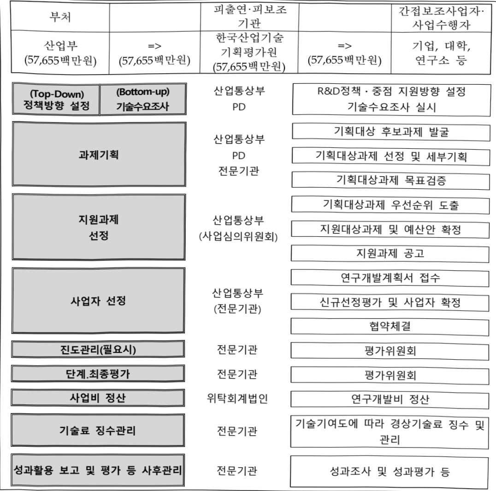

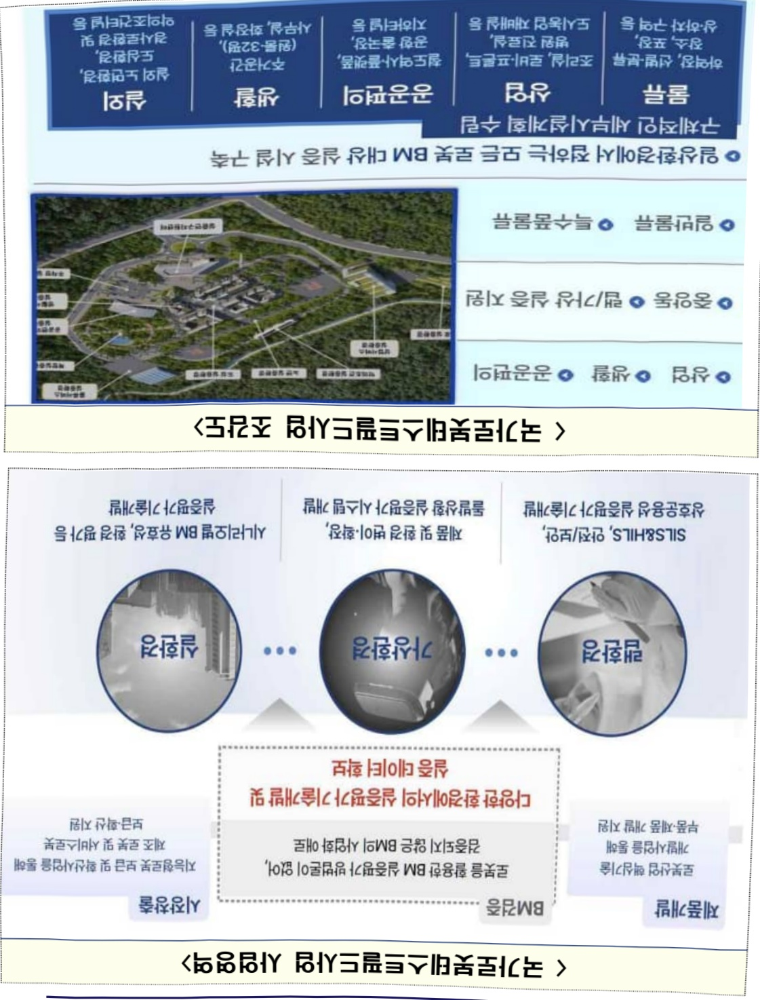

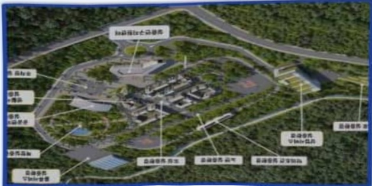

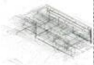

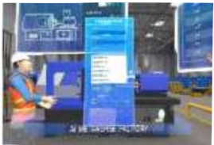

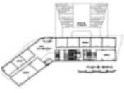

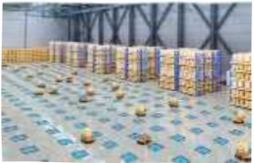

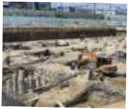

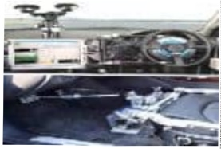

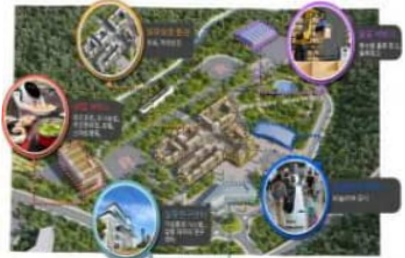

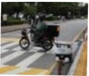

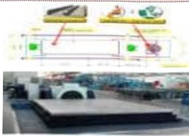

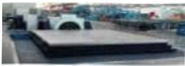

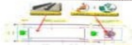

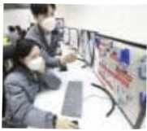

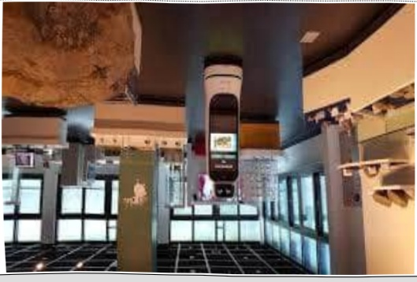

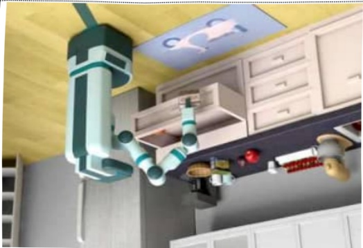

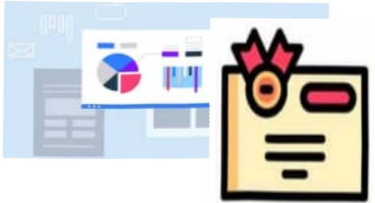

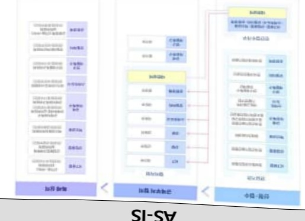

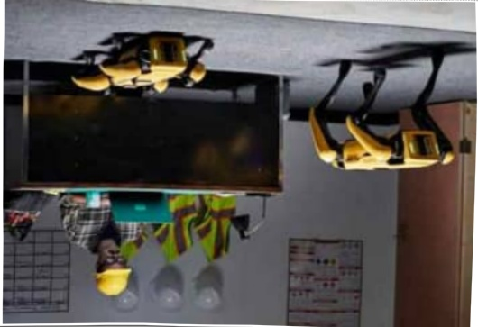

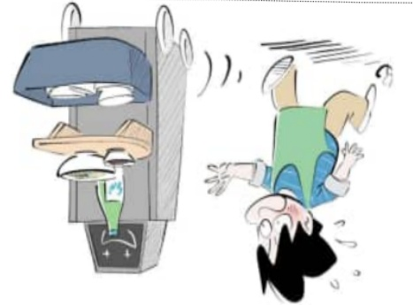

