# 기계장비산업기술개발(R&D)

**해당 페이지**: PDF 3815 ~ 3857 쪽 해당

**부처**: 산업통상부
**분야**: 산업·중소기업 및 에너지
**회계유형**: 소재부품장비 경쟁력강화 특별회계
**2026 확정예산**: 219989.0 백만원
**전년대비 증감률**: None%
**AI 도메인**: 로봇, 제조/스마트팩토리

---

### 가.예산 총괄표

(단위: 백만원, %)

<table border=1 style='margin: auto; word-wrap: break-word;'><tr><td rowspan="2">사업명</td><td rowspan="2">2024년 결산</td><td colspan="2">2025년 예산</td><td colspan="2">2026년</td><td rowspan="2">중감 (B-A)</td><td rowspan="2">(B-A)/A</td></tr><tr><td style='text-align: center; word-wrap: break-word;'>본예산(A)</td><td style='text-align: center; word-wrap: break-word;'>추경</td><td style='text-align: center; word-wrap: break-word;'>요구안</td><td style='text-align: center; word-wrap: break-word;'>확정(B)</td></tr><tr><td style='text-align: center; word-wrap: break-word;'>기계장비산업기술개발</td><td style='text-align: center; word-wrap: break-word;'>158,854</td><td style='text-align: center; word-wrap: break-word;'>158,244</td><td style='text-align: center; word-wrap: break-word;'>158,244</td><td style='text-align: center; word-wrap: break-word;'>219,989</td><td style='text-align: center; word-wrap: break-word;'>219,989</td><td style='text-align: center; word-wrap: break-word;'>61,745</td><td style='text-align: center; word-wrap: break-word;'>39.0%</td></tr></table>

□ 기능별(내역사업별), 목별 예산안 내역

(단위:백만원)

<table border=1 style='margin: auto; word-wrap: break-word;'><tr><td rowspan="2"></td><td colspan="4">2024</td><td colspan="7">2025(2025.12.월말)</td><td style='text-align: center; word-wrap: break-word;'>2026예산</td></tr><tr><td style='text-align: center; word-wrap: break-word;'>예산액(추정)</td><td style='text-align: center; word-wrap: break-word;'>예산현액</td><td style='text-align: center; word-wrap: break-word;'>집행액[실집행액]</td><td style='text-align: center; word-wrap: break-word;'>이월액</td><td style='text-align: center; word-wrap: break-word;'>불용액</td><td style='text-align: center; word-wrap: break-word;'>분예산</td><td style='text-align: center; word-wrap: break-word;'>예산현액</td><td style='text-align: center; word-wrap: break-word;'>집행액[실집행액]</td><td style='text-align: center; word-wrap: break-word;'>예산현액</td><td style='text-align: center; word-wrap: break-word;'>집행액[실집행액]</td><td style='text-align: center; word-wrap: break-word;'>이월예산액</td><td style='text-align: center; word-wrap: break-word;'>불용예산액</td></tr><tr><td style='text-align: center; word-wrap: break-word;'>○ 기능별 분류(합계)</td><td style='text-align: center; word-wrap: break-word;'>158,854</td><td style='text-align: center; word-wrap: break-word;'>158,854</td><td style='text-align: center; word-wrap: break-word;'>158,854</td><td style='text-align: center; word-wrap: break-word;'>-</td><td style='text-align: center; word-wrap: break-word;'>-</td><td style='text-align: center; word-wrap: break-word;'>158,244</td><td style='text-align: center; word-wrap: break-word;'>158,244</td><td style='text-align: center; word-wrap: break-word;'>158,244</td><td style='text-align: center; word-wrap: break-word;'>158,244</td><td style='text-align: center; word-wrap: break-word;'>158,244</td><td style='text-align: center; word-wrap: break-word;'>-</td><td style='text-align: center; word-wrap: break-word;'>-219,989</td></tr><tr><td style='text-align: center; word-wrap: break-word;'>· 제조기반생산시스템</td><td style='text-align: center; word-wrap: break-word;'>125,565</td><td style='text-align: center; word-wrap: break-word;'>125,565</td><td style='text-align: center; word-wrap: break-word;'>125,565</td><td style='text-align: center; word-wrap: break-word;'>-</td><td style='text-align: center; word-wrap: break-word;'>-</td><td style='text-align: center; word-wrap: break-word;'>135,044</td><td style='text-align: center; word-wrap: break-word;'>135,044</td><td style='text-align: center; word-wrap: break-word;'>135,044</td><td style='text-align: center; word-wrap: break-word;'>135,044</td><td style='text-align: center; word-wrap: break-word;'>135,044</td><td style='text-align: center; word-wrap: break-word;'>-</td><td style='text-align: center; word-wrap: break-word;'>-199,989</td></tr><tr><td style='text-align: center; word-wrap: break-word;'>· 제조장비실증</td><td style='text-align: center; word-wrap: break-word;'>20,000</td><td style='text-align: center; word-wrap: break-word;'>20,000</td><td style='text-align: center; word-wrap: break-word;'>20,000</td><td style='text-align: center; word-wrap: break-word;'>-</td><td style='text-align: center; word-wrap: break-word;'>-</td><td style='text-align: center; word-wrap: break-word;'>20,000</td><td style='text-align: center; word-wrap: break-word;'>20,000</td><td style='text-align: center; word-wrap: break-word;'>20,000</td><td style='text-align: center; word-wrap: break-word;'>20,000</td><td style='text-align: center; word-wrap: break-word;'>20,000</td><td style='text-align: center; word-wrap: break-word;'>-</td><td style='text-align: center; word-wrap: break-word;'>-20,000</td></tr><tr><td style='text-align: center; word-wrap: break-word;'>· 제조장비산업전주기기술개발</td><td style='text-align: center; word-wrap: break-word;'>3,200</td><td style='text-align: center; word-wrap: break-word;'>3,200</td><td style='text-align: center; word-wrap: break-word;'>[20,000]</td><td style='text-align: center; word-wrap: break-word;'>-</td><td style='text-align: center; word-wrap: break-word;'>-</td><td style='text-align: center; word-wrap: break-word;'>3,200</td><td style='text-align: center; word-wrap: break-word;'>3,200</td><td style='text-align: center; word-wrap: break-word;'>[20,000]</td><td style='text-align: center; word-wrap: break-word;'>3,200</td><td style='text-align: center; word-wrap: break-word;'>[20,000]</td><td style='text-align: center; word-wrap: break-word;'>-</td><td style='text-align: center; word-wrap: break-word;'>-</td></tr><tr><td style='text-align: center; word-wrap: break-word;'>· 제조장비스마트제어기기술개발</td><td style='text-align: center; word-wrap: break-word;'>10,089</td><td style='text-align: center; word-wrap: break-word;'>10,089</td><td style='text-align: center; word-wrap: break-word;'>10,089</td><td style='text-align: center; word-wrap: break-word;'>-</td><td style='text-align: center; word-wrap: break-word;'>-</td><td style='text-align: center; word-wrap: break-word;'>-</td><td style='text-align: center; word-wrap: break-word;'>-</td><td style='text-align: center; word-wrap: break-word;'>[3,200]</td><td style='text-align: center; word-wrap: break-word;'>-</td><td style='text-align: center; word-wrap: break-word;'>[3,200]</td><td style='text-align: center; word-wrap: break-word;'>-</td><td style='text-align: center; word-wrap: break-word;'>-</td></tr><tr><td style='text-align: center; word-wrap: break-word;'>○ 비목별 분류(합계)</td><td style='text-align: center; word-wrap: break-word;'>158,854</td><td style='text-align: center; word-wrap: break-word;'>158,854</td><td style='text-align: center; word-wrap: break-word;'>158,854</td><td style='text-align: center; word-wrap: break-word;'>-</td><td style='text-align: center; word-wrap: break-word;'>-</td><td style='text-align: center; word-wrap: break-word;'>158,244</td><td style='text-align: center; word-wrap: break-word;'>158,244</td><td style='text-align: center; word-wrap: break-word;'>158,244</td><td style='text-align: center; word-wrap: break-word;'>158,244</td><td style='text-align: center; word-wrap: break-word;'>107,672</td><td style='text-align: center; word-wrap: break-word;'>-</td><td style='text-align: center; word-wrap: break-word;'>-219,989</td></tr><tr><td style='text-align: center; word-wrap: break-word;'>· 연구개발출연금(360-05)</td><td style='text-align: center; word-wrap: break-word;'>158,854</td><td style='text-align: center; word-wrap: break-word;'>158,854</td><td style='text-align: center; word-wrap: break-word;'>158,854</td><td style='text-align: center; word-wrap: break-word;'>-</td><td style='text-align: center; word-wrap: break-word;'>-</td><td style='text-align: center; word-wrap: break-word;'>158,244</td><td style='text-align: center; word-wrap: break-word;'>158,244</td><td style='text-align: center; word-wrap: break-word;'>158,244</td><td style='text-align: center; word-wrap: break-word;'>158,244</td><td style='text-align: center; word-wrap: break-word;'>107,672</td><td style='text-align: center; word-wrap: break-word;'>-</td><td style='text-align: center; word-wrap: break-word;'>-219,989</td></tr><tr><td style='text-align: center; word-wrap: break-word;'>○ 기능비목별 분류(합계)</td><td style='text-align: center; word-wrap: break-word;'>158,854</td><td style='text-align: center; word-wrap: break-word;'>158,854</td><td style='text-align: center; word-wrap: break-word;'>158,854</td><td style='text-align: center; word-wrap: break-word;'>-</td><td style='text-align: center; word-wrap: break-word;'>-</td><td style='text-align: center; word-wrap: break-word;'>158,244</td><td style='text-align: center; word-wrap: break-word;'>158,244</td><td style='text-align: center; word-wrap: break-word;'>158,244</td><td style='text-align: center; word-wrap: break-word;'>158,244</td><td style='text-align: center; word-wrap: break-word;'>158,244</td><td style='text-align: center; word-wrap: break-word;'>-</td><td style='text-align: center; word-wrap: break-word;'>-219,989</td></tr><tr><td style='text-align: center; word-wrap: break-word;'>· 제조기반생산시스템</td><td style='text-align: center; word-wrap: break-word;'>125,565</td><td style='text-align: center; word-wrap: break-word;'>125,565</td><td style='text-align: center; word-wrap: break-word;'>125,565</td><td style='text-align: center; word-wrap: break-word;'>-</td><td style='text-align: center; word-wrap: break-word;'>-</td><td style='text-align: center; word-wrap: break-word;'>135,044</td><td style='text-align: center; word-wrap: break-word;'>135,044</td><td style='text-align: center; word-wrap: break-word;'>135,044</td><td style='text-align: center; word-wrap: break-word;'>135,044</td><td style='text-align: center; word-wrap: break-word;'>135,044</td><td style='text-align: center; word-wrap: break-word;'>-</td><td style='text-align: center; word-wrap: break-word;'>-199,989</td></tr><tr><td style='text-align: center; word-wrap: break-word;'>· 연구개발출연금(360-05)</td><td style='text-align: center; word-wrap: break-word;'>125,565</td><td style='text-align: center; word-wrap: break-word;'>125,565</td><td style='text-align: center; word-wrap: break-word;'>125,565</td><td style='text-align: center; word-wrap: break-word;'>-</td><td style='text-align: center; word-wrap: break-word;'>-</td><td style='text-align: center; word-wrap: break-word;'>135,044</td><td style='text-align: center; word-wrap: break-word;'>135,044</td><td style='text-align: center; word-wrap: break-word;'>135,044</td><td style='text-align: center; word-wrap: break-word;'>135,044</td><td style='text-align: center; word-wrap: break-word;'>135,044</td><td style='text-align: center; word-wrap: break-word;'>-</td><td style='text-align: center; word-wrap: break-word;'>-199,989</td></tr><tr><td style='text-align: center; word-wrap: break-word;'>· 제조장비실증</td><td style='text-align: center; word-wrap: break-word;'>20,000</td><td style='text-align: center; word-wrap: break-word;'>20,000</td><td style='text-align: center; word-wrap: break-word;'>20,000</td><td style='text-align: center; word-wrap: break-word;'>-</td><td style='text-align: center; word-wrap: break-word;'>-</td><td style='text-align: center; word-wrap: break-word;'>20,000</td><td style='text-align: center; word-wrap: break-word;'>20,000</td><td style='text-align: center; word-wrap: break-word;'>20,000</td><td style='text-align: center; word-wrap: break-word;'>20,000</td><td style='text-align: center; word-wrap: break-word;'>20,000</td><td style='text-align: center; word-wrap: break-word;'>-</td><td style='text-align: center; word-wrap: break-word;'>-20,000</td></tr><tr><td style='text-align: center; word-wrap: break-word;'>· 연구개발출연금(360-05)</td><td style='text-align: center; word-wrap: break-word;'>20,000</td><td style='text-align: center; word-wrap: break-word;'>20,000</td><td style='text-align: center; word-wrap: break-word;'>20,000</td><td style='text-align: center; word-wrap: break-word;'>-</td><td style='text-align: center; word-wrap: break-word;'>-</td><td style='text-align: center; word-wrap: break-word;'>20,000</td><td style='text-align: center; word-wrap: break-word;'>20,000</td><td style='text-align: center; word-wrap: break-word;'>20,000</td><td style='text-align: center; word-wrap: break-word;'>20,000</td><td style='text-align: center; word-wrap: break-word;'>20,000</td><td style='text-align: center; word-wrap: break-word;'>-</td><td style='text-align: center; word-wrap: break-word;'>-20,000</td></tr><tr><td style='text-align: center; word-wrap: break-word;'>· 제조장비산업전주기기술개발</td><td style='text-align: center; word-wrap: break-word;'>3,200</td><td style='text-align: center; word-wrap: break-word;'>3,200</td><td style='text-align: center; word-wrap: break-word;'>3,200</td><td style='text-align: center; word-wrap: break-word;'>-</td><td style='text-align: center; word-wrap: break-word;'>-</td><td style='text-align: center; word-wrap: break-word;'>3,200</td><td style='text-align: center; word-wrap: break-word;'>3,200</td><td style='text-align: center; word-wrap: break-word;'>3,200</td><td style='text-align: center; word-wrap: break-word;'>3,200</td><td style='text-align: center; word-wrap: break-word;'>3,200</td><td style='text-align: center; word-wrap: break-word;'>-</td><td style='text-align: center; word-wrap: break-word;'>-</td></tr><tr><td style='text-align: center; word-wrap: break-word;'>· 연구개발출연금(360-05)</td><td style='text-align: center; word-wrap: break-word;'>3,200</td><td style='text-align: center; word-wrap: break-word;'>3,200</td><td style='text-align: center; word-wrap: break-word;'>3,200</td><td style='text-align: center; word-wrap: break-word;'>-</td><td style='text-align: center; word-wrap: break-word;'>-</td><td style='text-align: center; word-wrap: break-word;'>3,200</td><td style='text-align: center; word-wrap: break-word;'>3,200</td><td style='text-align: center; word-wrap: break-word;'>3,200</td><td style='text-align: center; word-wrap: break-word;'>3,200</td><td style='text-align: center; word-wrap: break-word;'>3,200</td><td style='text-align: center; word-wrap: break-word;'>-</td><td style='text-align: center; word-wrap: break-word;'>-</td></tr><tr><td style='text-align: center; word-wrap: break-word;'>· 제조장비스템쇼트제어기기술개발</td><td style='text-align: center; word-wrap: break-word;'>10,089</td><td style='text-align: center; word-wrap: break-word;'>10,089</td><td style='text-align: center; word-wrap: break-word;'>10,089</td><td style='text-align: center; word-wrap: break-word;'>-</td><td style='text-align: center; word-wrap: break-word;'>-</td><td style='text-align: center; word-wrap: break-word;'>-</td><td style='text-align: center; word-wrap: break-word;'>-</td><td style='text-align: center; word-wrap: break-word;'>-</td><td style='text-align: center; word-wrap: break-word;'>-</td><td style='text-align: center; word-wrap: break-word;'>-</td><td style='text-align: center; word-wrap: break-word;'>-</td><td style='text-align: center; word-wrap: break-word;'>-</td></tr><tr><td style='text-align: center; word-wrap: break-word;'>· 연구개발출연금</td><td style='text-align: center; word-wrap: break-word;'>10,089</td><td style='text-align: center; word-wrap: break-word;'>10,089</td><td style='text-align: center; word-wrap: break-word;'>10,089</td><td style='text-align: center; word-wrap: break-word;'>-</td><td style='text-align: center; word-wrap: break-word;'>-</td><td style='text-align: center; word-wrap: break-word;'>-</td><td style='text-align: center; word-wrap: break-word;'>-</td><td style='text-align: center; word-wrap: break-word;'>-</td><td style='text-align: center; word-wrap: break-word;'>-</td><td style='text-align: center; word-wrap: break-word;'>-</td><td style='text-align: center; word-wrap: break-word;'>-</td><td style='text-align: center; word-wrap: break-word;'>-</td></tr></table>

---

<table border=1 style='margin: auto; word-wrap: break-word;'><tr><td rowspan="2"></td><td colspan="5">2024</td><td colspan="7">2025(2025.12.11)</td><td rowspan="2">2026</td></tr><tr><td style='text-align: center; word-wrap: break-word;'>예산의(추정)</td><td style='text-align: center; word-wrap: break-word;'>예산현의</td><td style='text-align: center; word-wrap: break-word;'>집행의[실정]행위</td><td style='text-align: center; word-wrap: break-word;'>이일의</td><td style='text-align: center; word-wrap: break-word;'>불용의</td><td style='text-align: center; word-wrap: break-word;'>본예산</td><td style='text-align: center; word-wrap: break-word;'>예산현의</td><td style='text-align: center; word-wrap: break-word;'>집행의[실정]행위</td><td colspan="2">전념도이일의제의</td><td style='text-align: center; word-wrap: break-word;'>이일예상의</td><td style='text-align: center; word-wrap: break-word;'>불용예상의</td></tr><tr><td style='text-align: center; word-wrap: break-word;'>(360-05)</td><td style='text-align: center; word-wrap: break-word;'></td><td style='text-align: center; word-wrap: break-word;'></td><td style='text-align: center; word-wrap: break-word;'>[10,089]</td><td style='text-align: center; word-wrap: break-word;'></td><td style='text-align: center; word-wrap: break-word;'></td><td style='text-align: center; word-wrap: break-word;'></td><td style='text-align: center; word-wrap: break-word;'></td><td style='text-align: center; word-wrap: break-word;'></td><td style='text-align: center; word-wrap: break-word;'></td><td style='text-align: center; word-wrap: break-word;'></td><td style='text-align: center; word-wrap: break-word;'></td><td style='text-align: center; word-wrap: break-word;'></td><td style='text-align: center; word-wrap: break-word;'></td></tr></table>

### 나.사업설명자료

## 1 ) 사업목적·내용

□ (기계장비산업기술개발) 주력산업 경쟁력 제고를 위한 제조장비 및 산업용 기계·시스템의 고도화 및 제조기업이 직면한 난제 해결을 위해 업종별 특화 제조 AI 기술확보로 국내 기계·장비 기업의 산업경쟁력 확보

※ AI 자율제조 선도프로젝트는 제조업 경쟁력을 획기적으로 제고하기 위해 제조현장에 투입되는 로봇·기계·장비 등에 AI를 결합하는 프로젝트

- '기계장비산업기술개발'은 제조산업에 필요한 생산장비의 고도화를 지원 범위에 포함하고 있으며, 기계·장비에 대한 AI 접목도 이러한 지원의 일환

- (제조기반생산시스템) 반도체·자동차·조선 등 주력산업 경쟁력 제고를 위해 업종별 특화 제조AI 기술개발 및 기계·장비 핵심부품·시스템 기술개발을 통한 국내 기계 장비기업의 글로벌 경쟁력 강화

- (제조장비실증) 기개발된 기계·장비 핵심부품 및 제조AI 기술을 제조현장에 도입·실증하여 기술의 검증(PoC) 및 확산 생태계 구축

- (제조장비 전주기 기술개발-종료) 제조장비 핵심기술 사업화 촉진을 위해 전략품목에 대한 핵심품목의 설계 및 신뢰성 검증지원과 수요·공급 협력기반의 고부가장비 신뢰성 체계 구축 지원

## 2 ) 사업개요

## □ 사업근거 및 추진경위

① 법령상 근거 및 조항 : 산업기술혁신촉진법 제11조, 제19조, 제21조

제11조(산업기술개발사업) ① 산업통상부장관은 혁신계획 및 시행계획을 효율적으로 수행하기 위하여 관계 중앙행정기관의 장과 협의하여 다음 각 호의 산업기술분야에서 기술개발사업(산업기술개발을 위하여 필요한 기획 및 조사를포함한다. 이하 "산업기술개발사업"이라 한다)을 추진할 수 있다.

1. 산업의 공통적인 기반이 되는 생산기반 기술, 부품·소재 및 장비·설비(플랜트를 포함한다) 기술

2. 산업기술 분야의 미래 유망 기술

3.산업의 고부가가치화를 위한 공정혁신, 청정생산 및 환경설비 등에 관련된 기술 등

---

<table border=1 style='margin: auto; word-wrap: break-word;'><tr><td style='text-align: center; word-wrap: break-word;'>4. 기술이전 · 사업화 촉진사업을 추진하는 경우 그 촉진사업의 관리 등에 필요한 사항은 대통령령으로 정한다.</td></tr><tr><td style='text-align: center; word-wrap: break-word;'>제19조(산업기술기반조성사업) ① 산업통상부장관은 산업기술혁신의 기반 및 환경조성에 관한 다음 각 호의 사업(이하 &quot;산업기술기반조성사업&quot;이라 한다)을 추진할 수 있다.</td></tr><tr><td style='text-align: center; word-wrap: break-word;'>1. 산업기술인력의 활용 및 공급</td></tr><tr><td style='text-align: center; word-wrap: break-word;'>2. 산업기술 연구장비 · 시설 등의 확충 및 활용촉진</td></tr><tr><td style='text-align: center; word-wrap: break-word;'>3. 연구장비 · 시설 · 연구인력 및 정보 등 산업기술혁신 요소의 집적화(集積化) 촉진</td></tr><tr><td style='text-align: center; word-wrap: break-word;'>4. 산업기술혁신을 위하여 필요한 기술 · 산업 등에 관한 각종 정보의 생산 · 관리 및 활용의 촉진</td></tr><tr><td style='text-align: center; word-wrap: break-word;'>5. 산업기술의 표준화, 디자인 · 브랜드 선진화 등을 위한 기반구축</td></tr><tr><td style='text-align: center; word-wrap: break-word;'>6. 산업기술문화공간의 설치 · 운영 등 산업기술저변의 확충</td></tr><tr><td style='text-align: center; word-wrap: break-word;'>7. 그 밖에 산업기술혁신 기반 조성을 위하여 대통령령으로 정하는 사업</td></tr><tr><td style='text-align: center; word-wrap: break-word;'>제21조(연구장비 시설 등의 확충 및 활용촉진) ① 산업통상부장관은 주관기관이 연구장비 · 시설, 시험 · 평가장비 등(이하 &quot;연구장비등&quot;이라 한다) 연구기반을 확충할 수 있도록 지원하거나 그 밖에 필요한 방안을 마련하여야 한다.</td></tr></table>

② 추진경위 - 사업 시작년도, 추진배경, 부처별 중점과제 등

<table border=1 style='margin: auto; word-wrap: break-word;'><tr><td style='text-align: center; word-wrap: break-word;'>- 1990. 중기거점기술개발사업 착수</td></tr><tr><td style='text-align: center; word-wrap: break-word;'>- 1995. 산업기술기반구축사업 착수</td></tr><tr><td style='text-align: center; word-wrap: break-word;'>- 1999. 차세대신기술개발사업 착수</td></tr><tr><td style='text-align: center; word-wrap: break-word;'>- 2004. 성장동력기술개발사업 착수</td></tr><tr><td style='text-align: center; word-wrap: break-word;'>- 2008. 제조기반전략기술개발사업으로 통합</td></tr><tr><td style='text-align: center; word-wrap: break-word;'>- 2009. 청정제조기반산업원천기술개발사업으로 통합</td></tr><tr><td style='text-align: center; word-wrap: break-word;'>- 2010. 첨단연구장비경쟁력향상사업 시작</td></tr><tr><td style='text-align: center; word-wrap: break-word;'>- 2010. 산업융합원천기술개발사업으로 통합</td></tr><tr><td style='text-align: center; word-wrap: break-word;'>- 2015. 시스템산업핵심기술개발사업으로 통합(생산기반 분리, 연구장비 통합)</td></tr><tr><td style='text-align: center; word-wrap: break-word;'>- 2016. 시스템산업미래성장동력사업(내역: 탄소섬유가공시스템) 통합</td></tr><tr><td style='text-align: center; word-wrap: break-word;'>- 2017. 과기부 일몰연장 승인 (&#x27;20일몰)</td></tr><tr><td style='text-align: center; word-wrap: break-word;'>- 2018. 연구장비 내역사업 종료</td></tr><tr><td style='text-align: center; word-wrap: break-word;'>- 2019. 일몰관리혁신사업으로 지정, 제조장비실증 내역사업 신설</td></tr><tr><td style='text-align: center; word-wrap: break-word;'>- 2019. 소재 · 부품 · 장비 경쟁력 강화를 위한 특별조치법</td></tr><tr><td style='text-align: center; word-wrap: break-word;'>- 2019. ‘제조장비시스템스마트제어기기술개발사업’ 예타면제 확정</td></tr><tr><td style='text-align: center; word-wrap: break-word;'>- 2020. ‘기계산업핵심기술개발사업’과 ‘제조장비시스템스마트제어기기술개발사업’을 과목구조개편을 통하여 ‘기계장비산업기술개발사업’으로 통합</td></tr><tr><td style='text-align: center; word-wrap: break-word;'>- 2021. 제조장비산업전주기술개발, 스마트금형제조테이터혁신기반구축 내역사업 신설</td></tr><tr><td style='text-align: center; word-wrap: break-word;'>- 2023. ‘스마트금형제조테이터혁신기반구축’ 내역사업 종료</td></tr><tr><td style='text-align: center; word-wrap: break-word;'>- 2024. ‘제조산업전주기기술개발’ 내역사업 종료</td></tr></table>

---

## □ 주요내용

① 사업규모

- 총사업비(해당되는 경우에만 기재) : 해당없음

- 사업기간 : 09~계속(일몰관리혁신)

- 적근 5년 간 투입된 사업비(예산액기준, 추경편성한 연도에는 추경포함)

<table border=1 style='margin: auto; word-wrap: break-word;'><tr><td style='text-align: center; word-wrap: break-word;'>연도</td><td style='text-align: center; word-wrap: break-word;'>2022</td><td style='text-align: center; word-wrap: break-word;'>2023</td><td style='text-align: center; word-wrap: break-word;'>2024</td><td style='text-align: center; word-wrap: break-word;'>2025</td><td style='text-align: center; word-wrap: break-word;'>2026</td></tr><tr><td style='text-align: center; word-wrap: break-word;'>사업비</td><td style='text-align: center; word-wrap: break-word;'>151,141</td><td style='text-align: center; word-wrap: break-word;'>153,854</td><td style='text-align: center; word-wrap: break-word;'>158,854</td><td style='text-align: center; word-wrap: break-word;'>158,244</td><td style='text-align: center; word-wrap: break-word;'>219,989</td></tr></table>

## ② 사업추진체계

- 사업시행방법 : 출연

- 사업시행주체 : 한국산업기술기획평가원(전문기관)

- 사업 수혜자 : 기업, 대학, 연구소 등

- 보조, 융자, 출연, 출자 등의 경우 보조·융자 등 지원 비율 및 법적근거

<table border=1 style='margin: auto; word-wrap: break-word;'><tr><td style='text-align: center; word-wrap: break-word;'>내역사업명</td><td style='text-align: center; word-wrap: break-word;'>구분</td><td style='text-align: center; word-wrap: break-word;'>피보조·피출연 등 기관명</td><td style='text-align: center; word-wrap: break-word;'>지원 금액 (2026예산)</td><td style='text-align: center; word-wrap: break-word;'>지원 비율(%)</td><td style='text-align: center; word-wrap: break-word;'>보조율 법적근거 (해당 조항)</td></tr><tr><td style='text-align: center; word-wrap: break-word;'>제조기반생산 시스템</td><td style='text-align: center; word-wrap: break-word;'>출연</td><td style='text-align: center; word-wrap: break-word;'>한국산업 기술기획 평가원</td><td style='text-align: center; word-wrap: break-word;'>199,989</td><td style='text-align: center; word-wrap: break-word;'>수행기관별 차등지원</td><td style='text-align: center; word-wrap: break-word;'>산업기술혁신촉진법(제11조)</td></tr><tr><td style='text-align: center; word-wrap: break-word;'>제조장비실증</td><td style='text-align: center; word-wrap: break-word;'>출연</td><td style='text-align: center; word-wrap: break-word;'>한국산업 기술기획 평가원</td><td style='text-align: center; word-wrap: break-word;'>20,000</td><td style='text-align: center; word-wrap: break-word;'>수행기관별 차등지원</td><td style='text-align: center; word-wrap: break-word;'>산업기술혁신촉진법(제11조)</td></tr></table>

---

## 3 ) 2026년도 예산 산출 근거

□ 기계장비산업기술개발사업 : (25) 158,244 → (26) 219,989백만원 +39.0%

① 제조기반생산시스템 : (25) 135,044 → (26) 199.989백만원 +48.1%

- (요구) 부품·제품 생산의 기반인 제조장비 및 산업용 기계·시스템의 물리적 고도화와 AI(인지·판단·제어) 기반 로

봇·장비 등을 연계하여 산업환경의 생산고도화·자율화를 구현하는「AI 팩토리 선도사업 추진」

*세조공정에 AI를 적용하는 'AI팩토리' 선도프로젝트 사업 확산('24년 26개 → '30년 500개 이상)

* "AI 팩토리 얼라이언스"로 확대개편을 통해 모든 제조현상에 멈움으로 적용될 수 있는 '세소 AI 파운데이션 모델'과의 연계로 국내 제조 및 기계분야 기업의 글로벌 경쟁력 강화

※ 제조AI 도입생태계 구축 및 지속가능한 산업발전체계를 확보하기 위해 199,989백만원 요구

- (산출)

① 신규 40개 과제 x 2,000백만 x 9/12개월 = 60,000백만원

② 신규 12개 과제 x 1,482.9백만 x 9/12개월 = 13,346백만원

③ 계속 36개 과제 x 1,587.3백만 x 10/12개월 = 47,618백만원

④ 계속 27개 과제 x 1,288.7백만 x 12/12개월 = 34,795백만원

⑤ 종료 36개 과제 x 1,228.6백만 x 12/12개월 = 44,230백만원

② 제조장비실증 : ('25) 20,000 → ('26) 20,000 백만원

- (요구) 대외의존도가 높은 분야의 기계·장비와 핵심부품을 기개발된 R&D 성과물 실증을 통한 Track-record 확보 및 고도화 지원

※ (사업재편) AI 자율제조 생태계 확산을 위해 기개발된 R&D 성과물에 제조AI 기술을 접목하여 기술의 검증 (PoC) 및 확산 생태계 구축 지원

AI 제조기술은 핵심부품·제조장비와 결합한 지능화·정교화·자동화를 구현하기 위한 기술로 기술검증 및 실증을 통한 성능확보의 중요성이 매우 부각됨

* 기존 제조장비에 한하여 기개발된 R&D 성과물의 실증을 지원하였으나, 산업용기계 및 제조AI 실증에 대한 민간필요성 제기로 사업 재편

- (산출)

① 신규 16개 과제 x 1,250백만원 x 12/12개월 = 20,000백만원

③ 제조장비산업전주기기술개발 : ('25) 3,200 → ('26) 종료사업

2025년도 예산 및 2026년도 예산 산출 세부내역 비교

<table border=1 style='margin: auto; word-wrap: break-word;'><tr><td colspan="2">2025년 분예산</td><td colspan="2">2026년 예산</td></tr><tr><td style='text-align: center; word-wrap: break-word;'>예산</td><td style='text-align: center; word-wrap: break-word;'>산출내역</td><td style='text-align: center; word-wrap: break-word;'>예산</td><td style='text-align: center; word-wrap: break-word;'>산출내역</td></tr><tr><td style='text-align: center; word-wrap: break-word;'>158,244</td><td style='text-align: center; word-wrap: break-word;'>○ 연구개발출연금(360-05): 158,244백만원가. 제조기반생산시스템(125,565백만원)  · (신규) 18개 과제 × 1,436.3 × 9/12 = 19,390백만원  · (계속) 80개 과제 × 1,097.2 × 12/12 = 87,777백만원  · (종료) 24개 과제 × 1,161.5 × 12/12 = 27,877백만원나. 제조장비실증(20,000백만원)  · (신규) 16개 과제 × 1,250.0 × 12/12 = 20,000백만원다. 제조장비산업전주기기술개발(3,200백만원)  · (종료) 3개 과제 × 1,066.7 × 12/12 = 3,200백만원</td><td style='text-align: center; word-wrap: break-word;'>219,989</td><td style='text-align: center; word-wrap: break-word;'>○ 연구개발출연금(360-05): 219,989백만원가. 제조기반생산시스템(199,989백만원)  · (신규) 40개 과제 × 2,000 × 9/12개월 = 60,000백만원  · (신규) 12개 과제 × 1,482.9 × 9/12개월 = 13,346백만원  · (계속) 36개 과제 × 1,587.3 × 10/12개월 = 47,618백만원  · (계속) 27개 과제 × 1,288.7 × 12/12개월 = 34,795백만원  · (종료) 36개 과제 × 1,228.6 × 12/12개월 = 44,230백만원나. 제조장비실증(20,000백만원)  · (신규) 16개 과제 × 1,250.0 × 12/12 = 20,000백만원</td></tr></table>

---

## 4 ) 사업효과

□ 사업영향, 산출물 성과지표 등

① 2022~2026년도 성과계획서 상 성과지표 및 최근 5년간 성과 달성도

<table border=1 style='margin: auto; word-wrap: break-word;'><tr><td style='text-align: center; word-wrap: break-word;'>성과지표</td><td style='text-align: center; word-wrap: break-word;'>구분</td><td style='text-align: center; word-wrap: break-word;'>2022</td><td style='text-align: center; word-wrap: break-word;'>2023</td><td style='text-align: center; word-wrap: break-word;'>2024</td><td style='text-align: center; word-wrap: break-word;'>2025</td><td style='text-align: center; word-wrap: break-word;'>2026</td><td style='text-align: center; word-wrap: break-word;'>2026 목표치산출근거</td><td style='text-align: center; word-wrap: break-word;'>측정산식(또는 측정방법)</td><td style='text-align: center; word-wrap: break-word;'>자료수집방법(또는 자료출처)</td></tr><tr><td rowspan="3">주력산업 R&amp;D 사업화 매출액(단위: 억원)</td><td style='text-align: center; word-wrap: break-word;'>목표</td><td style='text-align: center; word-wrap: break-word;'>-</td><td style='text-align: center; word-wrap: break-word;'>-</td><td style='text-align: center; word-wrap: break-word;'>3,560</td><td style='text-align: center; word-wrap: break-word;'>3,667</td><td style='text-align: center; word-wrap: break-word;'>3,777</td><td rowspan="3">주력산업 R&amp;D(자동차, 기계장비, 로봇 및 조선해양 등)의 최근 3년간 R&amp;D 사업화매출액 실적 평균에서 3%를 상향한 매출액을 2024년의 목표치로 설정 후 매년 3%씩 상향</td><td rowspan="3">∑ 당해년도 지원 R&amp;D의 사업화 매출액</td><td rowspan="3">주력산업 R&amp;D 지원과제 전수조사 / 한국산업기술기획 평가원 및 국가과학기술지식 정보서비스</td></tr><tr><td style='text-align: center; word-wrap: break-word;'>실적</td><td style='text-align: center; word-wrap: break-word;'>-</td><td style='text-align: center; word-wrap: break-word;'>-</td><td style='text-align: center; word-wrap: break-word;'>3,760</td><td style='text-align: center; word-wrap: break-word;'>-</td><td style='text-align: center; word-wrap: break-word;'>-</td></tr><tr><td style='text-align: center; word-wrap: break-word;'>달성도</td><td style='text-align: center; word-wrap: break-word;'>-</td><td style='text-align: center; word-wrap: break-word;'>-</td><td style='text-align: center; word-wrap: break-word;'>100</td><td style='text-align: center; word-wrap: break-word;'>-</td><td style='text-align: center; word-wrap: break-word;'>-</td></tr></table>

※ '24년 프로그램 성과계획서 내용 반영

② 성과지표 이외의 연도별 사업추진 경과 및 실적

<table border=1 style='margin: auto; word-wrap: break-word;'><tr><td style='text-align: center; word-wrap: break-word;'>2022</td><td style='text-align: center; word-wrap: break-word;'>○ 제조기반생산시스템 분야 기술개발 지원(101개 과제, 1,189억원) - “14~21톤급 휠 굴착기용 트랜스미션 및 액슬 개발” 등 계속 과제 969억원 지원 - “Fanout 반도체 PR 패턴 고속 자동 검사장비 개발” 등 신규 과제 220억원 지원 ○ 제조장비실증 분야 기술개발 지원(11개 과제, 138.5억원) - “공작기계 운영 에너지 효율화를 위한 에너지 소비 평가기술 실증” 등 신규 과제 138.5억원 지원 ○ 제조장비시스템스마트제어기기 분야 기술개발 지원(4개 과제, 110억원) - “스마트 제조장비용 CNC 시스템 개발” 등 계속 과제 110억원 지원 ○ 제조장비산업전주기기술 분야 기술개발 지원(3개 과제, 40억원) - “수요공급 협력 기반 제조장비 전주기 신뢰성 향상 기술 개발” 등 계속 과제 40억원 지원 ○ 스마트금형제조테이터혁신기반구축 지원(1개 과제, 37억원) ○ ‘22년 신규 선정과제 협약설명회 및 수행기관 간담회 개최(‘22년 6월)</td></tr><tr><td style='text-align: center; word-wrap: break-word;'>2023</td><td style='text-align: center; word-wrap: break-word;'>○ 제조기반생산시스템 분야 기술개발 지원(101개 과제, 1,174억원) - “발 농업 솔루션용 농기계 및 스마트 운용시스템 개발” 등 계속 과제 943억원 지원 - “디지털 트랜·디지털 스레드 기반 공작기계 지능화 및 공정 최적화 기술 개발” 등 신규 과제 231억원 지원 ○ 제조장비실증 분야 기술개발 지원(12개 과제, 150억원) - “곡면 멀티 디스플레이 상압 본당 지능화 장비 실증” 등 신규 과제 150억원 지원 ○ 제조장비시스템스마트제어기기 분야 기술개발 지원(4개 과제, 144억원) - “스마트 제조장비용 CNC 시스템 개발” 등 계속 과제 144억원 지원 ○ 제조장비산업전주기기술 분야 기술개발 지원(3개 과제, 40억원) - “수요공급 협력 기반 제조장비 전주기 신뢰성 향상 기술 개발” 등 계속 과제 40억원 지원 ○ 스마트금형제조테이터혁신기반구축 지원(1개 과제, 30억원)</td></tr></table>

---

<table border=1 style='margin: auto; word-wrap: break-word;'><tr><td style='text-align: center; word-wrap: break-word;'></td><td style='text-align: center; word-wrap: break-word;'>○ ‘23년 신규 선정과제 협약설명회 및 수행기관 간담회 개최(‘23년 5월)</td></tr><tr><td style='text-align: center; word-wrap: break-word;'>2024</td><td style='text-align: center; word-wrap: break-word;'>○ 제조기반생산시스템 분야 기술개발 지원(124개 과제, 1,255억원) - “발 농업 솔루션용 농기계 및 스마트 운용시스템 개발” 등 계속 과제 1,031억원 지원 - “지능형 와이어 아크 적층 제조 시스템 기술 개발” 등 신규과제* 224억원 지원 * “AI 자율제조 선도프로젝트” 관련 15개 신규과제 지원 포함 ○ 제조장비실증 분야 기술개발 지원(16개 과제, 200억원) - “절삭공구 자동 체결 및 무인 전달이 가능한 자동화 시스템 실증” 등 신규 과제 200억원 지원 ○ 제조장비시스템스마트제어기기 분야 기술개발 지원(4개 과제, 100억원) - “스마트 제조장비용 CNC 시스템 개발” 등 계속 과제 100억원 지원 ○ 제조장비산업전주기기술 분야 기술개발 지원(3개 과제, 32억원) - “수요공급 협력 기반 제조장비 전주기 신뢰성 향상 기술 개발” 등 계속 과제 32억원 지원 ○ ‘24년 신규 선정과제 협약설명회 및 수행기관 간담회 개최(‘23년 5월) ○ ‘AI 자율제조 전략 1.0_ 발표(5.8), ‘AI 자율제조 얼라이언스’ 출범(7.19) 이후 국내 제조공장에 AI자율제조 도입 확산을 위한 “AI 자율제조 선도프로젝트” 사업을 추진 (‘24년)</td></tr><tr><td style='text-align: center; word-wrap: break-word;'>2025</td><td style='text-align: center; word-wrap: break-word;'>○ 제조기반생산시스템 분야 기술개발 지원(139개 과제) - “절삭가공 산업의 AI 자율제조 고도화를 위한 핵심 기술 개발” 등 계속 과제 1,062억원 지원 - “고발열 장비용 30kW급 친환경 스마트 냉각시스템 개발” 등 기계·장비 분야 6개 과제 1차공고 지원 - “가전 제조 산업의 판금 공정에서 AI 기반 밸류체인 협업기술 개발” 등 AI팩토리 선도프로젝트 신규과제 16개 과제 2차공고 지원 ○ 제조장비실증 분야 기술개발 지원(16개 과제) - “국산 CNC 시스템의 가공성능 고도화 및 내구성 실증” 등 신규 과제 200억원 지원 ○ 제조장비산업전주기기술 분야 기술개발 지원(3개 과제) - “수요공급 협력 기반 제조장비 전주기 신뢰성 향상 기술 개발” 등 계속 과제 32억원 지원(종료) ○ ‘25년 신규 선정과제 협약설명회 및 수행기관 간담회 개최(‘25년 9월)</td></tr></table>

## ③향후(2026년도 이후)기대효과

(AI자율제조) '26년 차세대 첨단 제조산업 대응 고부가 공정·장비 기술/시장 진입

- 세계시장 점유율 확대(공작기계): 6% ('17) → 7% ('26)

- AI팩토리 지원대상 확산 : 26개 (‘24) → 500개 (‘30)

- AI자율제조 확산률 : 3% (‘24) → 30% (‘30)

- '30년까지 제조생산성 20% 이상 향상

---

○ (산업용 기계·시스템) '25년 글로벌 찬사업형 스마트 산업기계 시장 진입

- 세계시장 점유율 확대 : 3.5% ('14) → 3.8% 6위 ('26)

- 생산·매출 : 285,000억원 ('17) → 454,000억원 ('26)

- 수출의 지속적인 증대 : 121.5억불 ('17) → 193.7억불 ('26)

- 산업고용확대 : 418,802만명 ('17) → 548,123만명 ('26)

- 선진국 대비 기술격차 : 82.5%(-2.1년) ('17) → 90.0%(-1.5년) ('26)

*기계산업진흥회 및 협회 통계 활용 (산업기계부문)

<table border=1 style='margin: auto; word-wrap: break-word;'><tr><td style='text-align: center; word-wrap: break-word;'>※ “AI 자율제조 선도프로젝트” 과제 기대효과 : 생산성 30% 향상, 제조비용 20% 절감, 제품결함 50% 감소 등 ☐ 생산성 관련 지표 (생산성 향상)</td></tr><tr><td style='text-align: center; word-wrap: break-word;'>○ 제조공정 기술 적용 전·후 비교를 통해 생산리드타임 감소, 단위시간당 생산량 증가, 설비 가동률 증가 등에 따른 생산성 향상 효과를 측정</td></tr><tr><td style='text-align: center; word-wrap: break-word;'>- (단위시간당 생산량 증가) 단위시간 동안 생산되는 제품의 양이 얼마나 증가되었는지 측정</td></tr><tr><td style='text-align: center; word-wrap: break-word;'>- (생산리드타임 감소) 생산 착수부터 생산 완료까지 걸리는 시간이 얼마나 단축되었는지 측정</td></tr><tr><td style='text-align: center; word-wrap: break-word;'>- (설비가동률 증가) 설비의 최대 생산능력 대비 실제 생산되는 수량이 얼마나 증가되었는지 측정</td></tr><tr><td style='text-align: center; word-wrap: break-word;'>☐ 품질 관련 지표 (불량률 감소)</td></tr><tr><td style='text-align: center; word-wrap: break-word;'>○ 결과물의 실 제조공정 적용 전·후 비교를 통해 공정 불량률 감소, 검사 불량률 감소 등에 따른 제품 결함 감소 효과를 측정</td></tr><tr><td style='text-align: center; word-wrap: break-word;'>- (공정 불량률 감소) 단위공정 내 생산제품 내 불량품의 비율이 얼마나 감소되었는지 측정</td></tr><tr><td style='text-align: center; word-wrap: break-word;'>- (검사 불량률 감소) 생산품에 대한 검사 오류 발생비율이 얼마나 감소되었는지 측정</td></tr><tr><td style='text-align: center; word-wrap: break-word;'>☐ 효율성 관련 지표 (에너지효율 증가)</td></tr><tr><td style='text-align: center; word-wrap: break-word;'>○ 결과물의 실 제조공정 적용 전·후 비교를 통해 에너지 소비량 감소, 제조원가 절감 등에 따른 효율성 향상 효과를 측정</td></tr><tr><td style='text-align: center; word-wrap: break-word;'>- (에너지 소비량 감소) 단위 생산량 당 소비되는 에너지의 양이 얼마나 감소되었는지 측정</td></tr><tr><td style='text-align: center; word-wrap: break-word;'>- (제조원가 절감) 제품 제조과정에 발생되는 비용이 얼마나 절감되었는지 측정</td></tr></table>

5) 타당성조사 및 예비타당성조사 시행여부 및 결과 요지 : 해당사항 없음

6) 총사업비 대상사업 여부 및 내역 : 해당사항 없음

---

## 7 ) 사업 집행절차

## ☐ 집행 절차도

---

8) 중기재정계획 상 연도별 투자계획 및 추진경과

(단위: 백만원)

<table border=1 style='margin: auto; word-wrap: break-word;'><tr><td style='text-align: center; word-wrap: break-word;'>2024</td><td style='text-align: center; word-wrap: break-word;'>2025</td><td style='text-align: center; word-wrap: break-word;'>2026</td><td style='text-align: center; word-wrap: break-word;'>2027</td><td style='text-align: center; word-wrap: break-word;'>2028</td><td style='text-align: center; word-wrap: break-word;'>2029</td></tr><tr><td style='text-align: center; word-wrap: break-word;'>2024~2028</td><td style='text-align: center; word-wrap: break-word;'>158,854</td><td style='text-align: center; word-wrap: break-word;'>158,244</td><td style='text-align: center; word-wrap: break-word;'>219,989</td><td style='text-align: center; word-wrap: break-word;'>223,057</td><td style='text-align: center; word-wrap: break-word;'>233,921</td></tr><tr><td style='text-align: center; word-wrap: break-word;'>2025~2029</td><td style='text-align: center; word-wrap: break-word;'></td><td style='text-align: center; word-wrap: break-word;'>158,244</td><td style='text-align: center; word-wrap: break-word;'>219,989</td><td style='text-align: center; word-wrap: break-word;'>223,057</td><td style='text-align: center; word-wrap: break-word;'>233,921</td></tr></table>

9) 최근 3년간 동 사업에 대한 주요 외부지적사항 및 평가, 문제점 및 대책

1) 국회(예결위, 상임위, 예정처, 국정감사 포함) 지적

□ 예결위 결산 시정요구('19.10)

(지적) 기술개발 완료 이후 기계장비의 수입대체로 연결된 실적이 미비하였다는

점을 고려하여, 수입대체 효과를 제고하기 위한 방안 마련 필요

→ (조치) 제조장비실증사업 추진과 적극적인 진도관리를 통해 R&D결과물의 사업화를 촉진하여 수입대체효과를 제고

o (지적) 여러 사업에서 동시에 지원 받는 경우가 많다는 점을 고려하여, 타 사업과 지원대상을 차별화하여 추진할 필요

→ (조치) 제조장비가 소재, 부품 등 산업과 연관성이 높음을 감안, 과제기획

시타사업과의중복성검토를강화

o (지적) 제조장비실증사업 관련 다양한 수요 충족필요

→ (조치) '20년 제조장비실증 과제기획 시, 수요조사를 통한 품목 발굴, 공청

회, 인터넷공시 등을 통해 다양한 의견을 반영

(지적) 제조장비시스템 스마트제어기 기술개발사업의 사업계획적정성 검토 결과를 반영하여 예산안 조정 필요

⇒ (조치) 사업계획적정성 검토결과에 따라 예산이 효과적으로 집행될 수 있도록 조정

※(반영 전) 총사업비: 855억원 → (반영 후) 총사업비: 818억원

°(지적) '21년 이후 제조장비 본 예타사업 추진시, 스마트 제어기 사업의 범위와 규모를 CNC 국산화에 집중하여 추진할 필요

→ (조치) 스마트제어기 사업은 제조장비 본 예타사업 중 스마트 제어기 부분만 예타면제로 우선 수행하고자 한 것으로 예산 중복 투자 없이 추진이 가능함. 국산화 추진을 위한 세부목표 수립

※ 국내시장 점유율(CNC) : ('18.) 2.3% → ('24.) 20%

※ 국산 CNC 부품 매출액 : ('17.) 12억원 → ('24.) 780억원

---

□예결위 결산 시정요구('20.09)

0 (지적) 제조장비실증사업에 다양한 수요기업이 참여할 수 있는 실증과제를 적극적으로 발굴하고 기업의 참여 유인책을 마련할 것

→(조치) 제조장비실증사업 지원과제 기획 시 다수의 수요기업 참여를 의무화

☐ 예결위 결산 시정요구('21.10)

0 (지적) 제조장비실증사업의 성과제고를 위한 사업화 성과관리 필요

$\Rightarrow$ (조치) 성과 제고를 위하여 수요기업 과제참여 확대 및 홍보 지원 강화 등

성과관리 노력 지속

□ 예결위 결산 시정요구('24.10)

0 (지적) 제조장비실증사업의 과제별 실증대상 소재·부품 국산화율 관리 필요

→ (조치) '25년 신규과제 접수 및 평가 시 국산화율에 대한 계획을 제시하도록 하고, 이를 평가요소에 반영하여 국산화율 관리 적극 추진

2) 감사원 또는 국무총리실 지적 : 해당 없음

3) 자체평가 : '17년 국가연구개발사업 통합재정사업평가(산업부) 결과 '보통'

4) 기타 시민단체, 언론 및 민원 : 해당 없음

5) 문제점 지적에 대한 후속조치 : 해당 없음

## 10 ) 향후 추진방향 및 추진계획

o 인공지능 대전환(AX)으로 혁신 생태계 구축 및 일자리 창출

- 제조 AI 등 융합 산업별 융합 촉진, 인공지능 활용 선도사업 추진 및 확산 기반 조성

- 대규모 AI 학습데이터를 통한 AX 신규 유망 비즈니스 발굴 및 지원

o 인공지능 생태계의 핵심기술 및 기반 확보

-산업 및 서비스 분야 Physical AI(사람을 닮은 로봇) 산업 육성

0 주력산업의 첨단화로 지속가능한 미래 산업경쟁력 강화

- 철강, 석유화학, 조선 등 주력산업의 구조고도화와 기술융합화 등을 통한 글로벌 경쟁 우위 강화

- 원천기술 활보 고부가가치화를 통해 주력산업의 성장잠재력 제고

- 글로벌 공급망 재편에 대한 적극 대응으로 첨단산업·주력산업의 혁신역량 제고

글로벌 공급과잉에 대한 선제적 사업재편 지원으로 우리경제의 활력 제고

자기산업별'K-주력산업발전비전 및 전략 수립'

* 디지털 전환(DX)과 인공지능 전환(AX), 탄소중립 에너지전환 등 미래산업 환경 및 잠재력 제고

---

## 11 ) 해당사업에 대한 각종 사업평가의 결과

2019년 국가연구개발사업 상위평가 결과

○ 상위평가 등급 : '우수'

○평가결과 반영현황

- 과학적, 기술적, 경제적 성과 전반적으로 질적 우수성 제고 방안 마련이 필요

→ 질적으로 우수한 특허 도출 및 Smart 점수 제고를 위해 과제기획 단계부터

특허조사를 실시하고, 연구수행자 대상으로 컨설팅 실시

- 향후 산업 발전에 따른 경제적 성과 지표의 가중치 상향에 대한 검토필요

→ 성과목표·지표 점검 시 경제지표 가중치를 상향 조정하고, 우수성과 발굴에 참여 확대

2023년 국가연구개발사업 중간평가 결과

○ 중간평가 등급 : '보통'

12) 해당사업에 대한 부처 자체평가의 결과 : 해당없음

13) 부처 건의사항 : 해당없음

---

### 다. 최근 4년간 결산내역

## 1 ) 결산표

☐ 부처 결산내역

(단위:백만원,%)

<table border=1 style='margin: auto; word-wrap: break-word;'><tr><td rowspan="2">연도</td><td colspan="3">예산액</td><td rowspan="2">전년도 이월액</td><td rowspan="2">이·전용 등</td><td rowspan="2">예비비</td><td rowspan="2">예산 현액(B)</td><td rowspan="2">집행액(C)</td><td rowspan="2">집행률(C/A)</td><td rowspan="2">집행률(C/B)</td><td rowspan="2">다음언도 이월액</td><td rowspan="2">불용액</td></tr><tr><td style='text-align: center; word-wrap: break-word;'>본예산</td><td style='text-align: center; word-wrap: break-word;'>추경 중감액</td><td style='text-align: center; word-wrap: break-word;'>추경(A)</td></tr><tr><td style='text-align: center; word-wrap: break-word;'>2022</td><td style='text-align: center; word-wrap: break-word;'>158,141</td><td style='text-align: center; word-wrap: break-word;'>△7,000</td><td style='text-align: center; word-wrap: break-word;'>151,141</td><td style='text-align: center; word-wrap: break-word;'>-</td><td style='text-align: center; word-wrap: break-word;'>-</td><td style='text-align: center; word-wrap: break-word;'>-</td><td style='text-align: center; word-wrap: break-word;'>151,141</td><td style='text-align: center; word-wrap: break-word;'>151,141</td><td style='text-align: center; word-wrap: break-word;'>100.0</td><td style='text-align: center; word-wrap: break-word;'>100.0</td><td style='text-align: center; word-wrap: break-word;'>-</td><td style='text-align: center; word-wrap: break-word;'>-</td></tr><tr><td style='text-align: center; word-wrap: break-word;'>2023</td><td style='text-align: center; word-wrap: break-word;'>153,854</td><td style='text-align: center; word-wrap: break-word;'>-</td><td style='text-align: center; word-wrap: break-word;'>153,854</td><td style='text-align: center; word-wrap: break-word;'>-</td><td style='text-align: center; word-wrap: break-word;'>-</td><td style='text-align: center; word-wrap: break-word;'>-</td><td style='text-align: center; word-wrap: break-word;'>153,854</td><td style='text-align: center; word-wrap: break-word;'>153,854</td><td style='text-align: center; word-wrap: break-word;'>100.0</td><td style='text-align: center; word-wrap: break-word;'>100.0</td><td style='text-align: center; word-wrap: break-word;'>-</td><td style='text-align: center; word-wrap: break-word;'>-</td></tr><tr><td style='text-align: center; word-wrap: break-word;'>2024</td><td style='text-align: center; word-wrap: break-word;'>158,854</td><td style='text-align: center; word-wrap: break-word;'>-</td><td style='text-align: center; word-wrap: break-word;'>158,854</td><td style='text-align: center; word-wrap: break-word;'>-</td><td style='text-align: center; word-wrap: break-word;'>-</td><td style='text-align: center; word-wrap: break-word;'>-</td><td style='text-align: center; word-wrap: break-word;'>158,854</td><td style='text-align: center; word-wrap: break-word;'>158,854</td><td style='text-align: center; word-wrap: break-word;'>100.0</td><td style='text-align: center; word-wrap: break-word;'>100.0</td><td style='text-align: center; word-wrap: break-word;'>-</td><td style='text-align: center; word-wrap: break-word;'>-</td></tr><tr><td style='text-align: center; word-wrap: break-word;'>2025</td><td style='text-align: center; word-wrap: break-word;'>158,244</td><td style='text-align: center; word-wrap: break-word;'>-</td><td style='text-align: center; word-wrap: break-word;'>158,244</td><td style='text-align: center; word-wrap: break-word;'>-</td><td style='text-align: center; word-wrap: break-word;'>-</td><td style='text-align: center; word-wrap: break-word;'>-</td><td style='text-align: center; word-wrap: break-word;'>158,244</td><td style='text-align: center; word-wrap: break-word;'>158,244</td><td style='text-align: center; word-wrap: break-word;'>100.0</td><td style='text-align: center; word-wrap: break-word;'>100.0</td><td style='text-align: center; word-wrap: break-word;'>-</td><td style='text-align: center; word-wrap: break-word;'>-</td></tr></table>

□출연·보조사업 등 실집행내역

(단위: 백만원, %)

<table border=1 style='margin: auto; word-wrap: break-word;'><tr><td rowspan="3">구분</td><td colspan="3">부처</td><td colspan="6">사업시행주체(피출연·피보조 기관 등)</td></tr><tr><td colspan="2">예산액</td><td rowspan="2">집행액</td><td rowspan="2">교부액</td><td rowspan="2">전년도 이월액</td><td rowspan="2">교부 현액</td><td rowspan="2">집행액 (B)</td><td rowspan="2">이월액</td><td rowspan="2">실집행률 (B/A)</td></tr><tr><td style='text-align: center; word-wrap: break-word;'>본예산</td><td style='text-align: center; word-wrap: break-word;'>추경(A)</td></tr><tr><td style='text-align: center; word-wrap: break-word;'>2022</td><td style='text-align: center; word-wrap: break-word;'>158,141</td><td style='text-align: center; word-wrap: break-word;'>151,141</td><td style='text-align: center; word-wrap: break-word;'>151,141</td><td style='text-align: center; word-wrap: break-word;'>151,141</td><td style='text-align: center; word-wrap: break-word;'>-</td><td style='text-align: center; word-wrap: break-word;'>151,141</td><td style='text-align: center; word-wrap: break-word;'>151,141</td><td style='text-align: center; word-wrap: break-word;'>-</td><td style='text-align: center; word-wrap: break-word;'>100.0</td></tr><tr><td style='text-align: center; word-wrap: break-word;'>2023</td><td style='text-align: center; word-wrap: break-word;'>153,854</td><td style='text-align: center; word-wrap: break-word;'>153,854</td><td style='text-align: center; word-wrap: break-word;'>153,854</td><td style='text-align: center; word-wrap: break-word;'>153,854</td><td style='text-align: center; word-wrap: break-word;'>-</td><td style='text-align: center; word-wrap: break-word;'>153,854</td><td style='text-align: center; word-wrap: break-word;'>153,854</td><td style='text-align: center; word-wrap: break-word;'>-</td><td style='text-align: center; word-wrap: break-word;'>100.0</td></tr><tr><td style='text-align: center; word-wrap: break-word;'>2024</td><td style='text-align: center; word-wrap: break-word;'>158,854</td><td style='text-align: center; word-wrap: break-word;'>158,854</td><td style='text-align: center; word-wrap: break-word;'>158,854</td><td style='text-align: center; word-wrap: break-word;'>158,854</td><td style='text-align: center; word-wrap: break-word;'>-</td><td style='text-align: center; word-wrap: break-word;'>158,854</td><td style='text-align: center; word-wrap: break-word;'>158,854</td><td style='text-align: center; word-wrap: break-word;'>-</td><td style='text-align: center; word-wrap: break-word;'>100.0</td></tr><tr><td style='text-align: center; word-wrap: break-word;'>2025. 12월말 기준</td><td style='text-align: center; word-wrap: break-word;'>158,244</td><td style='text-align: center; word-wrap: break-word;'>158,244</td><td style='text-align: center; word-wrap: break-word;'>158,244</td><td style='text-align: center; word-wrap: break-word;'>158,244</td><td style='text-align: center; word-wrap: break-word;'>-</td><td style='text-align: center; word-wrap: break-word;'>158,244</td><td style='text-align: center; word-wrap: break-word;'>158,244</td><td style='text-align: center; word-wrap: break-word;'>-</td><td style='text-align: center; word-wrap: break-word;'>100.0</td></tr></table>

## 2 ) 주요 결산사항

□ 2022~2025년 결산 주요 지적사항 및 시정요구사항

---

<table border=1 style='margin: auto; word-wrap: break-word;'><tr><td style='text-align: center; word-wrap: break-word;'>2022</td><td style='text-align: center; word-wrap: break-word;'>- 특이사항 없음</td></tr><tr><td style='text-align: center; word-wrap: break-word;'>2023</td><td style='text-align: center; word-wrap: break-word;'>- 특이사항 없음</td></tr><tr><td style='text-align: center; word-wrap: break-word;'>2024</td><td style='text-align: center; word-wrap: break-word;'>- 특이사항 없음</td></tr><tr><td style='text-align: center; word-wrap: break-word;'>2025</td><td style='text-align: center; word-wrap: break-word;'>- 특이사항 없음</td></tr></table>

□ 2025년 이·전용 등 세부내역 : 해당사항 없음

2025년 예비비 배정 세부내역 : 해당사항 없음

### 라. 기타 추가자료

(1) 관련사업 추진을 위한 정부 발표대책, 중장기 계획: 참고1

(2) 기계장비산업기술개발 연계 AI 팩토리 전략(3개년): 참고2

(3) 자율제조 AI 팩토리 사업 주요내용('24년 기준): 참고3

(4) AI 자율제조 추진계획('24년 산업부 업무보고): 붙임1

(5) 기계장비산업 지원 필요성(물리적 고도화): 붙임2

(6) 기계장비산업기술개발사업 주요 성과: 붙임3

(7) 제조기반생산시스템 - 제조장비실증 연계 사례: 붙임4

(8) 내역사업 세부 설명자료: 붙임5

---

## 참고1

## 관련사업 추진을 위한 정부 발표대책, 중장기 계획

## □초격차 로드맵(첨단제조)

## 국내전압

## 취우런

---

## 미선 1

## 산업대전환 대응을 위한 제조시스템 지능화

## 프로젝트1

## 현재 수준(24)

①제품 설계·공급망 관리

삼성SDS, 타리유

## 단기(-27)

## 중장기(-32)

③ 생산 최적화

(NCS슬루션, 다양리사채)

## 산업 AI 핵심 기술 개발

(제품설계) CAD 종성 설계

(암랄 관리) 감십 기반 잘못 개획 수립

수요 예측 정책도 82%

⑦ 설비 운영 기술

(라카이빈스, 인터뷰스)

· (당정화직후) 고정 설비에 비싯시간으로 작업 배정(정직 스케줄 광)

· (군집제어) 1000대 이상의 동종 설비 제어

· (제품설계) 여신러닝 기반 도면 추천 AI 설계

· (금급양 관리) 과거 데이터 분석 기반

공급양 계획 수행수요 예측 정확도 90%)

기반 구축

(제품설계) 탑적님 기반 생성형 AI 설계

·담급망 관리실시간 대이터 활용

공급망 계획 수행수요 예측 정확도 99%)

(고장진단) 고장 혐인 분류(정확도 85%) 이상 신호 김지(정확도 90%)

(물질검사) 제품 값함 검출(정확도 95%)

(공정칙적화) 고장 설비에 실시간으로 작업 폐정(행적 스케줄링) (완성성20%) !

(단접제어) 1000대 이상의 이기종 설비 제어

(공정칙적화) 이동 설비에 실시간으로 작업 폐정(생산성 35%) !

(단접제어) 2000대 이상의 이기종 설비 제어

(고정전단) 고정 권한 분류(정책도90%)

이상 신호 검지(정책도 90%)

(통찰검사) 제품 검함 검출(정책도 98%)

(민주화) 산업 데이터 표준화 혁신 기반구축(24-28), (민주화) AI 자율제조 실증개발 지원센터 기반구축(25-29), (민주) 글로벌 수요 연계형 산업AI 국제인증 생태계 혁신 사업(25-29), 산업민공지능 제조혁신 전문인력 양성

(고정진단) 고정 컴퓨터 분류(정확도 97%)

이상 신호 감지(정확도 95%)

(품질검사) 제품 갱신 검사(정확도 90%)

## 미선 2

## 무인공장 실현을 위한 제조장비의 지능화

## 프로젝트 2

## 디지털 제조장비 및 부품 핵심기술개발

① 디지털 부품 개발

디지털 장비 개발

(CNC) 3측 동시 제어 CNC

(부) 물리학 측정 센서 내장

* 블 스크롤, LM가이드, 스텔돌 등

기반 구축

·(CNC)5를 제어 및 로봇 종합 CNC

·(부물) 메지보전 진단 센서 내장

(진단 정확도 80% 이상)

·멍멍도 행성 가공 오차 개별 측정 및 보장

·(CNC)디지털 트럼 기반 지능형 CNC

·(부품)공정 후 점밀도 예측 센서 내장

(예측 점화도 80% 이상)

(정비디지털트런)총동정지를위한기획디지털트런(보통정책도50%)

(정밀도행성)가공오차자동측정 및 보정

(정비디지털트런)가상에서가공이가능한

물리디지털트런(오염정책도60%)

(정밀도행성)만공제능기반가공오차

예측될자를보정

-영비 디지털 트런 실측 데이터 실시간 연계가 가능한 디지털 트런 모델 정책도 80%

(인프라) 부각산업 제조공정혁신 지원을 위한 DX 센터 구축(23-27), (인프라) 금융 기반 핵심부를 생산기술 DX 기반 구축(24-28), (인프라) 철학공구가공 혁명이터를 활용한 협단제조 촬영품 기반구축 및 실증(24-28)

## 미선 3

## 기기·공장간 연결을 통한 자율제조 실현

## 프로젝트1

① 대이터 수집 및 분석 솔루션 (LG CHS, 위전문어)

## AI 자율제조 핵심 기술 통합 솔루션 개발

시스템 연결

기반 구축

LSD액폰,찬샘D9

가상 시뮬레이션

(대이터표준) 제조대이터 비표준 상태

(대이터를 찾음) 공장 내 개별 성비

심시간 데이터 관리

·동시집축산업병 무선 네트워크

40개 동시 법속 수준

(연동망식) 중앙 서벽에 여러개의 설비

면통, 설비 제조사 간 데이터 통신 불가

(데이터표준) 설비 300통 대상 데이터 표준화

(데이터를 맺을) 단일 공정 내 다층 설비

(10종)의 실시간 데이터 관리

(공정 디지털 트렌)

살비 심시간 정보 수집을 통한 기동 중단

파악, 공정 트렌 모니터링 수준

(동시집속) 산업 loT 기술 개발

(200개 이상 동시 접속 수준)

(연동방식) 설비 제조사 간 표준 데이터

통신 기술 개발

데이터를 통한 실시간 작업배정 고도화 및 설비 군집제어 가능 수준

(데이터표준) 실비 1000종대상데이터표준(데이터를 맺을) 여러 공장간 다중 설비(10종)의 실시간 데이터 관리

(동시접속) 통신 재날 재구성" 내용 뭐?

(200개 이상)

* 재구성 소요 시간 1분 이하

(연동광식)NCN 표준 데이터 통신

(멘트) 산업 데이터 표준화 촉선 기반구축(24-28)

(공정 디지털 프랭)

고장 사전 예측 및 공정 회적화 가능한

수준

---

### 주력산업의 대전환을 위한 AI 자율제조 전략 1.0

## 제조업은 우리 경제의 성장과 혁신을 주도하는 핵심기둥입니다

## 높은 경제성장 기여도

## OECD 국가 중 제조업 비중 2위

<table border=1 style='margin: auto; width: max-content;'>
  <thead><tr><th style='text-align: center;'>叶绿体</th><th style='text-align: center;'>21</th></tr></thead>
  <tbody>
  </tbody>
</table>

## 수출의 84%, 투자의 54% 차지

## 세계 최고의 업롱 포트폴리오

## 세계TOP3의주력산업경쟁력

반도패|세계 최고의기술력 및 참유용

자동차

최근 수출 세계 3위 검진업

조선

세계 1위의 수주잔고

이차편지|비중국 시장 참유율 1위

## ⊕지역 글형발전에도 기여

## 산업 혁신 활동의 중심

## ⊕산업 혁신 지표 주도

국내 R&D

책자

68%

특허

실용선안

58%

다자인

권리 송원

68%

## 블돌버그 혁선지수 1위(21년)

스팔링

5위

높 제조엘멜,R&D 제품군고통환가

## AI+제조가 세계적 차원에서 제조업 경쟁력의 새로운 원천으로 부각되고 있습니다

## 글로벌 차원에서 AI+제조업 융합 움직임 가시화

푸짜

글로벌 VC 투자 10년간

50배 증가

## 글로컬기업

## T 온돌논액 | 산업 AI 로봇 디지털트럼 돈을 줄을 잘해 공정 최적화

## 국내는 DX를 추진 중이나 보다 과감한 투자가 필요

SIEMENS | 폐 순향 전년에 선법 AI를 도입해 다툼층 대학생만 추진

Metrobu Bae |지능형 병선 통합관리 시스템

BOSCH

## 로봇 보급품 세계 1위

## BLOOM

AI+재조로 금융 협력 GDP 25%↑전량 (백전지)

미래 전망

## 보글 사열

## (1) 

## 스마트공장수 100배 증가

## 대기업 중심투자

AI+제조의 투자 성장률

디지발폰 앱 치료26년

지능 차율 법규담 제약 구속

24% (Fortune)

## un (cm)

## 2020 

지놀랄 글참사스텔·구속

산업을 운복을스마트길잡을해 보들

## 제조 자능화

## 스마트공장 대부분이 기초단계 기술 수준

기초단계다겔하)

를 고도화면계피백

## 아직 AI와 제조업의 몽함은

제조엽 AI 도입 비율(9.3%)은 전 산업 병골(14.3%) 하회

선점자가 없는 초기 단계

AI 도입물

---

# AI 자율제조 추진 방향

# 금년부터 1천억원 이상 투자('28년까지 1조원+a 목표)

## 1 AI 자율제조 본격 확산

Diffusion

200대 AI자율제조 선도 프로젝트 추진

업종별 최첨단 테스트베드 + 산단 적용 확산

## 2 AI 자율제조 핵심 역량 확보

AI자울제조

얼라이언스

Core Competence

정부연구소협단체

10개여상의

업종별주요기업

업종별특화기술에1조이상R&D투자

♡ 공통 핵심요소 기술 예타 추진(3천억원)

## 생태계 진흥

▶ 전문인력 13,000명 + 전문기업 250개

Eco System

AI자율제조관련법,제도정비

## AI 자율제조 200개 선도 프로젝트를 본격 추진하겠습니다

## 1단계 금년 중 10개 프로젝트 시작 (24-)

## 지역특화산업, 지자체 수요 등을 감안해 금년내 10대 프로젝트를 선정(광역시·도별 1~2개) *선정기준:사업의 효과성(사업 AI 공정 컴퓨터 기능성) 지역경제 기업(국제공업사업기업)

*선정기준:사업의효과성(산업AI공정효율기능성등),지역경제기여도(특희산업의지역내위상등)등

24년하반기부터프로펙트블로공정상세분석→AI와결합할수있는공정식별→맞춤형적용모델마련(100억원)

자동차 엘리지공정 부품 상황 예지보전 등

전자  정말 Test, 자동 이슬, 데이터, 고장예지 등

기계  정말 혈액 가공 부품 봉투 등

설유  자동 직조, 오류 검사, AI디자인등

## 10 개 프로젝트별로 전담 TF(SW,산업 AI,도메인 knowledge 등 전문가)를 구성해 밀작 지원

## 2단계 업종별 프로젝트확산 (200개 이상 ~28)

1단계 성과를 기초로 28년까지 200개 기업 학산을 목표로 추진(멜도 예산 확보 추진)

♡ 매년 선도 프로젝트 중 우수사례를 선별하여 공유하는 등 best practice를 확산

## 3단계 최첨단 자율공장 구축 (5개 이상 ~30)

♠ 축적한 데이터·기술을 종합한 업종별 첨단 AI 자율제조 공장 모델 구축

2030년까지 5개 이상 목표로 주력 업종 중 AI 도입 효과성, 산업 성장성 등을 고려

## 업종별로 특화된 산업 AI 융합 기술에 5년간 5천억원 이상을 투자하겠습니다

·자가 인지, 핀단, 제어가 가능한 제조 장비·로봇

·첨단제조공정솔루션및

유연생산시스템개발

1,700

조선

·대형구조를용접부지능형

가공검사시스템개발

•선박소부제,소조림4단계생산

통합관리(배제,취부,용접,김사)

이차

전지

·산업AI기반의디지털트런 및

가상시류레이션

공정조건일제조모호세스

·배터리 제조 공정에서 발생하는 데이터 수집·저장

## 반도체

·AI기반의생산공정

전단분석시스템

·미세공정에서의결합탐지

분류 및 자동조정

디스

클레이

·AI기반제조공정변수통제

(재료공급속도,병목현상등)

·이미지대이터 및 A를 활용한

픽셀 결함 답지

자동차

·완성차·부물업계 모두 사용하는 국제표준 기반 AI 플랫폼

·산업 AI 학산을 위한

테스트베드 구축

---

□ AI 팩토리 추진방향 및 주요내용(AI 자율제조 사업 개편)

2025 AI 팩토리 사업 설명회

## AI 팩토리 추진방향 및 주요 내용

-AI자율제조사업개편-

2025.05.26

## 산업통상자원부

## KeIT 한국산업기술기획평기원

## 2024 年1月1日4:30

01.사업개편방향

1.양적 화대

지원과제수↑

2.사업다각화

지원유형신설

3. 전문성 강화

협력체계 개편

24

1종

AI자율제조

일간이언스 재편

AI 잔뜰기업

함이 확대

## 3 대 개편방향과 함께

## "AI 자율제조"에서"AI 팩토리"로 전면 개편

#### 2023.2.14 

### 01.사업개편방향-(2)사업다각화

## 필요성

## 사업의 다각화 필요

기존 “AI 자동체조 선도프로젝트”는 대규모 공장을 중심으로 공장 전반에 AI 기술을 도입하는 과제

## 개편 방향

기존사업 소규모 공장, 일부 공장 등 지원 한계

이중염통 간 수령적 확대 중요

홈메노이드 제조현장 홈팀 현실화

다양한 지원 유형 신설

휴머노에드를 도입하는 프로젝트도 팔도 마련

휴머노이드 연계 프로젝트

---

## 참고2 기계장비산업기술개발 연계 AI 팩토리 개발전략 [3개년]

## □ AI팩토리 개발 전략

0 기계장비산업기술개발 연계한 AI팩토리 추진방향

자동차, 조선 등 12대 업종의 특성과 요구사항이 다르므로 첨단제조 기술을 기반으로 수요 맞춤형 기술 개발 필요

업종별 다양한 수요기업의 의견을 수렴하고 맞춤형 기술을 개발하여

산업현장에 즉시 활용될 수 있도록 추진

<산업별 요구 및 맞춤형 기술개발 방향(안)>

<table border=1 style='margin: auto; word-wrap: break-word;'><tr><td style='text-align: center; word-wrap: break-word;'>산업</td><td style='text-align: center; word-wrap: break-word;'>한계</td><td style='text-align: center; word-wrap: break-word;'>수요산업 맞춤형 기술</td></tr><tr><td style='text-align: center; word-wrap: break-word;'>반도체</td><td style='text-align: center; word-wrap: break-word;'>&quot;나노미터급 공정 정밀도 부족, 웨이퍼 불량률 증가, 공정 자동화·자율화 어려움&quot;</td><td style='text-align: center; word-wrap: break-word;'>&quot;웨이퍼 공정 최적화 AI, 반도체 생산 시뮬레이션 AI, 결함 감지 AI&quot;</td></tr><tr><td style='text-align: center; word-wrap: break-word;'>조선</td><td style='text-align: center; word-wrap: break-word;'>&quot;대형 구조물 조립 난이도 상승, 용접 품질 불안정, 유지보수 비용 증가&quot;</td><td style='text-align: center; word-wrap: break-word;'>&quot;자율 용접 AI, 디지털 트윈 기반 조립 최적화, 유지보수 예측 AI&quot;</td></tr></table>

- 제조 순 과정에서 지능화×유연화×자율화 지원을 위한 핵심 요소기술 개발 및 지원체계 구축으로 제조 산업생산성 제고

○ 첨단제조 초격치를 달성할 수 있는 기술로 전 신업의 제조과정(가치시설)에 적용가능한 제조 AI 모델개발과 최적으로 구동하는데 필요한 핵심 요소인 제조지원(기계·장비·로봇·시스템 등) 개발 내용을 포함

- (AI팩토리) AI(인지·판단·제어) 기반 기계·장비 등을 제조 전과정에 결합시켜 실제 제조환경의 생산고도화 및 자율화를 구현

<사업 범위 관련 주요 키워드>

<table border=1 style='margin: auto; word-wrap: break-word;'><tr><td rowspan="2">AI 팩토리 운용 관점</td><td rowspan="2">적용 기술 측면</td><td colspan="2">적용 범위</td></tr><tr><td style='text-align: center; word-wrap: break-word;'>가치사슬 측면</td><td style='text-align: center; word-wrap: break-word;'>산업 측면</td></tr><tr><td style='text-align: center; word-wrap: break-word;'>① AI 내재화 ② 수집·관리 및 연계 ③ 제조지원</td><td style='text-align: center; word-wrap: break-word;'>첨단제조 초격차 로드맵 세부기술</td><td style='text-align: center; word-wrap: break-word;'>파급효과 등 고려, 스마트 공장 5단계 이상</td><td style='text-align: center; word-wrap: break-word;'>숲 산업 적용 가능 공통 모델</td></tr></table>

※ 국내외 정책 자료, 보고서 등을 통해 키워드 도출

- (기술 범위) 첨단제조 초격차 로드맵의 3가지 미션 중 디지털 제조장비 및 부품 핵심기술개발과 AI 자율제조 핵심 기술 통합 솔루션 개발을 기술개발 범위로 설정

---

<첨단제조 초격차 프로젝트 기술로드맵 중 동 사업 범위>

<table border=1 style='margin: auto; word-wrap: break-word;'><tr><td style='text-align: center; word-wrap: break-word;'>프로젝트</td><td colspan="3">내용</td></tr><tr><td style='text-align: center; word-wrap: break-word;'>산업 AI 핵심기술개발</td><td style='text-align: center; word-wrap: break-word;'>제품설계공급관리</td><td style='text-align: center; word-wrap: break-word;'>생산 최적화</td><td style='text-align: center; word-wrap: break-word;'>설비 운영 기술</td></tr><tr><td style='text-align: center; word-wrap: break-word;'>디지털 제조장비 및 부품 핵심기술개발</td><td style='text-align: center; word-wrap: break-word;'>디지털 부품 개발</td><td colspan="2">디지털 장비 개발</td></tr><tr><td style='text-align: center; word-wrap: break-word;'>AI 자율제조 핵심 기술 통합 솔루션 개발</td><td style='text-align: center; word-wrap: break-word;'>데이터 수집 및 분석 솔루션</td><td style='text-align: center; word-wrap: break-word;'>시스템 연결</td><td style='text-align: center; word-wrap: break-word;'>가상 시뮬레이션</td></tr></table>

- 기계장비산업기술개발사업의 AI팩토리 선도프로젝트는 12대 업종별

맞춤형으로 제조 장비·시스템을 개발하고 실제 수요기업에서 실증에 참

여하여 성공 사례 도출 및 확산 촉진

* (예) (기계) 다품종 소량 생산, (조선/항공) 대형 부품 가공, (섬유) 연속공정 등

1단계 : 기계장비산업기술개발

2단계 : AI 자율제조 기술개발사업(예비타당성사업)

*예비타당성사업(AI 자율제조 기술개발)은 '제조 맞춤형' 파운데이션 모델을 구현함으로써 기업은 제조 현장에서 소량의 데이터만으로 파인튜닝을 통한 신속 AI 적용이 가능하며, 궁극적으로 제조 현장에서의 실효성 극대화 기대

o 동 사업은 그간 추진된 산업통상부의 '기계장비산업기술개발'와 연계하여 각

업종별 실증 및 적용을 추진하는 사업

- 따라서, 사업 전체의 성과를 측정할 수 있는 지표를 설정하되, '기계장비

산업기술개발사업'와 연계성을 고려하여 사업 목표를 설정

AI 팩토리 선도프로젝트는

- 제조업에 AI를 입혀 생산성을 획기적으로 높이고, 생산인구 감소, 탄소 감축 등 해소를 목표

<table border=1 style='margin: auto; word-wrap: break-word;'><tr><td style='text-align: center; word-wrap: break-word;'>생산성 향상</td><td style='text-align: center; word-wrap: break-word;'>제조비용 절감</td><td style='text-align: center; word-wrap: break-word;'>제품결함 감소</td><td style='text-align: center; word-wrap: break-word;'>리드타임 단축</td><td style='text-align: center; word-wrap: break-word;'>에너지 절감</td></tr><tr><td style='text-align: center; word-wrap: break-word;'>30% 이상</td><td style='text-align: center; word-wrap: break-word;'>20% 이상</td><td style='text-align: center; word-wrap: break-word;'>50% 이상</td><td style='text-align: center; word-wrap: break-word;'>50% 이상</td><td style='text-align: center; word-wrap: break-word;'>10% 이상</td></tr></table>

---

□ (목표) '30년까지 500개 이상' 자율제조 AI 팩토리 선도사업 지원을 추진하고, 이 과정에서 노하우 축적 등으로 전 산업에 제조 AI 확산**

*예산이나 기술수준, 업계 수요 등을 고려하여 확대해나갈 예정

** 제조 AI 관련 기술개발 확대 및 기술력 전파, 트렌드 형성, 비즈니스 활성화 등

○ AI 팩토리 얼라이언스 내 제조 AI 개발 파급효과가 높은 업종별 핵심공정 중심으로, 수직적·수평적 제조 AI 확산 ('24년~)

° 미니(단기) 프로젝트, 대중소 협력 프로젝트 등 다양한 AI 팩토리 프로젝트를 시범운영 후 확대 (‘25년~)

## 【 4대 AI 팩토리 프로젝트 】

▲대규모 제조공장 프로젝트 : 파급력이 높은 업종별 앵커기업 대표공정의 제조 AI 개발

▲미니(단기) 프로젝트 : 소규모 공장, 이종업종(요식업 등) 제조 AI 확산을 위한 단기 실증

▲대·중·소 협력 프로젝트 : 밸류체인 내 연계된 공정을 지원하여 제조 AI 수직적 확산

휴머노이드 연계 프로젝트 : 자율작업을 위한 AI 휴머노이드 생산현장 투입 및 실증

## □ 기본 방향

(자동차) 전기차용 고출력모터 회전자 AI 기반 조립기술 개발, AI 학습을 이용한 자동차 자율 폐차 해체 기술 등 6개

°(이차전지) AI 기반 전극 슬러리 믹싱 장비, AI 기반 레이저 공정 장비, 전고체전지 AI 기반 조립 장비 등 8개

°(반도체/디스플레이) EUV 블랭크 AI 파운딩 장비, AI 기반 Micro-LED 리페어 장비, AI 기반 하이브리드 본당 검사 장비 등 6개

°(기계장비) 고효을 AI 연삭 시스템, TGV공정 지능형 생산시스템, 다양한 부품 제조공정의 AI 자율제조 시스템 등 6개

° (조선) 선체외부 보조피스 절단/사상 자율화 시스템, 선체 데이저 전처리 자율장비, 조선소 선박용 강재 선별 및 이송 지능화 장비 등 8개

° (철강) 수소환원 기반 저탄소 제강 시스템, 초고강도 강판 정밀 성형 및

열처리 시스템, AI 기반 품질 예측 및 검사 플랫폼 등 6개

°(방산/항공) 친환경 난삭재 및 경량부품 대응 AI가공 시스템, 항공 부품 조립 플랫폼, 제조 전주기 대응 AI 기술 등 6개

---

°(석유화학) AI 기반 폐열 회수 및 에너지재활용 설비 운영 최적화, 플랜트 핵심 공정 예지보전 기반 자율 정비, 상황인지 기반 작업자 자율 안전 보호 시스템 등 9개

°(전자) AI 기반 장비 자율운영 및 레시피 셋팅, 셀 기반 유연생산을 위한 공정 최적화, 사전 학습 기반 AI 품질검사 시스템 등 9개

°(섬유) 재생 스팬텍스 방사 시스템, 나노·마이크로 복합 부직포 제조 시스템, 고정밀 특수지 다단 프레스 시스템 등 7개

°(바이오) 첨단/특수환경 바이오 AI 생산시스템, 3차원 세포배양 시스템 등 3개

°(나노소재) 그리핀 기반 방진 고무제품 제조 시스템, 염소화폴리염

화닐계 저비용 탄소섬유 제조 시스템 등 3개

<table border=1 style='margin: auto; word-wrap: break-word;'><tr><td rowspan="2">업종</td><td rowspan="2">분야</td><td colspan="6">기술명</td><td rowspan="2">기술목표</td></tr><tr><td style='text-align: center; word-wrap: break-word;'>2026년</td><td style='text-align: center; word-wrap: break-word;'>2027년</td><td style='text-align: center; word-wrap: break-word;'>2028년</td><td style='text-align: center; word-wrap: break-word;'>2029년</td><td style='text-align: center; word-wrap: break-word;'>2030년</td><td style='text-align: center; word-wrap: break-word;'>2031년</td></tr><tr><td rowspan="6">자동차</td><td rowspan="2">전기차</td><td colspan="6">전기차용 고출력모터 회전자 AI 기반 조립기술</td><td style='text-align: center; word-wrap: break-word;'>품질 향상 40%</td></tr><tr><td colspan="6">전기차 지능형 램프용 마이크로 렌즈 제조 장비</td><td style='text-align: center; word-wrap: break-word;'>생산성 향상 30%</td></tr><tr><td rowspan="2">자율차</td><td colspan="6">인공지능 기반 차체 부품 성형/용접 및 품질 모니터링 시스템</td><td style='text-align: center; word-wrap: break-word;'>공정무인화 90%</td></tr><tr><td colspan="6">자율주행 차량용 퓨전 센싱 카메라 자동 장렬장비</td><td style='text-align: center; word-wrap: break-word;'>생산성향상 20%</td></tr><tr><td rowspan="2">생산 고도화</td><td colspan="6">인공지능 기반 자동차 하네스/커넥터 부품 자율 생산 시스템</td><td style='text-align: center; word-wrap: break-word;'>공정무인화 90%</td></tr><tr><td colspan="6">AI 학습로봇을 이용한 자율 폐차 해체 기술</td><td style='text-align: center; word-wrap: break-word;'>공정무인화 80%</td></tr><tr><td rowspan="7">이차 전지</td><td rowspan="3">고품질</td><td colspan="6">AI 기반 전극 슬러리 믹싱 품질 예측 및 자율 제어 기술</td><td style='text-align: center; word-wrap: break-word;'>공정 에너지효율 20% 향상</td></tr><tr><td colspan="6">AI 기반 레이저 공정 품질 예측 및 보정 기술</td><td style='text-align: center; word-wrap: break-word;'>레이저 공정 불량률 30% 감소 분리막 제조 생산성 20% 향상</td></tr><tr><td colspan="6">AI 기반 고내열성 분리막 자율제조 기술</td><td style='text-align: center; word-wrap: break-word;'>에너지 20% 절감</td></tr><tr><td rowspan="2">공정 자율화</td><td colspan="6">AI 기반 활성화 공정 프로파일 자율 최적화 및 불량 추적 기술</td><td style='text-align: center; word-wrap: break-word;'>설비 다운타임 20% 감소</td></tr><tr><td colspan="6">기가팩토리 내 조립공정 스케줄링</td><td style='text-align: center; word-wrap: break-word;'>건식 공정 불량률 30% 감소 공정 불량률 30% 감소</td></tr><tr><td rowspan="2">차세대 전지</td><td colspan="6">AI 기반 건식전극 자율 제조 기술</td><td style='text-align: center; word-wrap: break-word;'>자동화율 향상 무인화</td></tr><tr><td colspan="6">AI 기반 리튬메탈 포일 자율 제조 기술</td><td style='text-align: center; word-wrap: break-word;'>에너지 50% 저감</td></tr><tr><td rowspan="5">반도체 디스플레이</td><td style='text-align: center; word-wrap: break-word;'>저전력</td><td colspan="6">전고체전지 AI 기반 조립공정 자율 제어 기술</td><td style='text-align: center; word-wrap: break-word;'>공정 불량률 20% 감소 공정 불량률 30% 감소</td></tr><tr><td rowspan="3">공정 미세화</td><td colspan="6">넷제로 팽용 AI기반 저에너지 소모형 대용량 무필터 공조 시스템</td><td style='text-align: center; word-wrap: break-word;'>설비 생산성 20% 향상</td></tr><tr><td colspan="6">EUV 블랭크 마스크 성막 공정 최적화 AI 파운딩 기술</td><td style='text-align: center; word-wrap: break-word;'>공정 불량률 20% 감소</td></tr><tr><td colspan="6">차세대 고밀도 재배선층용 디지털노광 공정 AI 자율 오차 보정 기술</td><td style='text-align: center; word-wrap: break-word;'>공정 불량률 30% 감소</td></tr><tr><td style='text-align: center; word-wrap: break-word;'>후공정</td><td colspan="6">AI 기반 Micro-LED 인터포저 고속 고효율 제조 장비 기술</td><td style='text-align: center; word-wrap: break-word;'>설비 생산성 20% 향상</td></tr></table>

---

<table border=1 style='margin: auto; word-wrap: break-word;'><tr><td rowspan="2">업종</td><td rowspan="2">분야</td><td colspan="6">기술명</td><td rowspan="2">기술목표</td></tr><tr><td style='text-align: center; word-wrap: break-word;'>2026년</td><td style='text-align: center; word-wrap: break-word;'>2027년</td><td style='text-align: center; word-wrap: break-word;'>2028년</td><td style='text-align: center; word-wrap: break-word;'>2029년</td><td style='text-align: center; word-wrap: break-word;'>2030년</td><td style='text-align: center; word-wrap: break-word;'>2031년</td></tr><tr><td rowspan="2"></td><td rowspan="2"></td><td colspan="6">AI 보정 계속 기반 하이브리드 본딩웅 디상 결합 전수 검사 기술</td><td style='text-align: center; word-wrap: break-word;'>공정 불량률 30% 감소</td></tr><tr><td colspan="6">AI 기반 Micro-LED 불량 모드 고속 리페어 장비 기술</td><td style='text-align: center; word-wrap: break-word;'>공정 불량률 30% 감소</td></tr><tr><td rowspan="6">기계 장비</td><td rowspan="2">고효율화</td><td colspan="6">대형 정밀부품 가공을 위한 AI 기반 적응형 폴금형 연상 기술</td><td style='text-align: center; word-wrap: break-word;'>생산성 30% 향상</td></tr><tr><td colspan="6">지능형 초갈공구 연상을 위한 AI기반 정밀연상 기술</td><td style='text-align: center; word-wrap: break-word;'>품질 25% 향상</td></tr><tr><td rowspan="4">자율화</td><td colspan="6">첨단 패키징용 애칭프리 TGV 공정의 AI 생산사례</td><td style='text-align: center; word-wrap: break-word;'>생산성 30% 향상</td></tr><tr><td colspan="6">다품종 플라스틱 부품생산을 위한 AI 기반 SaaS 제조 및 플랫폼 기술</td><td style='text-align: center; word-wrap: break-word;'>자율화 40% 향상</td></tr><tr><td colspan="6">베어링 제조공정의 AI 자율제조 핵심기술 및 통합 솔루션</td><td style='text-align: center; word-wrap: break-word;'>자율화 30% 향상</td></tr><tr><td colspan="6">중대형 공작물의 가공시스템을 위한 AI 자율제조 기술</td><td style='text-align: center; word-wrap: break-word;'>생산시간 60% 감소</td></tr><tr><td rowspan="8">조선</td><td rowspan="4">자율화</td><td colspan="6">선체외부 보조피스(용접피스, 측정피스, 리그룹) 절단/사상 자율화 시스템</td><td style='text-align: center; word-wrap: break-word;'>생산성 20% 향상</td></tr><tr><td colspan="6">선박 블록 외판 자율주행 용접 시스템</td><td style='text-align: center; word-wrap: break-word;'>용접 품질 30% 향상</td></tr><tr><td colspan="6">선체 레이저 전처리(블라스팅) 자율장비</td><td style='text-align: center; word-wrap: break-word;'>생산성 20% 향상</td></tr><tr><td colspan="6">선박 후행 공정 도장 자율 캐리지</td><td style='text-align: center; word-wrap: break-word;'>생산성 20% 향상</td></tr><tr><td rowspan="4">지능화</td><td colspan="6">조선소 선박용 강재 선별 및 이송 지능화 장비</td><td style='text-align: center; word-wrap: break-word;'>생산 리드타임 20% 절감</td></tr><tr><td colspan="6">대형중장비 이동체 주변 감지, 경고, 충돌 방지 시스템</td><td style='text-align: center; word-wrap: break-word;'>안전 사고 20% 감소</td></tr><tr><td colspan="6">선체 탑재 블록 품질 검사 지능화 시스템</td><td style='text-align: center; word-wrap: break-word;'>검사 정확도 30% 향상 물류 효율 30% 향상</td></tr><tr><td colspan="6">소조립 블록 이송 지능화 장비</td><td style='text-align: center; word-wrap: break-word;'>수소 환원 효율 60% 이상 전력 단마대비 생산 효율 10% 향상</td></tr><tr><td rowspan="5">철강</td><td rowspan="2">저탄소 ·친환경</td><td colspan="6">탄소중립 철강 생산을 위한 수소환원 제철공정 기술</td><td style='text-align: center; word-wrap: break-word;'>인장강도 1500MPa 이상 고내식 강판 수명 2배 연장</td></tr><tr><td colspan="6">고효율 녹색전환을 위한 전기로 기반 저탄소 제강 기술</td><td style='text-align: center; word-wrap: break-word;'>품질 예측 리드타임 30% 단축 공정기상시대이변 정돈도 45%</td></tr><tr><td rowspan="2">고강도 ·고기능 신소재</td><td colspan="6">차량 경량화 및 안전성 향상을 위한 초고강도 강판 제조 기술</td><td style='text-align: center; word-wrap: break-word;'>생산성(소재)날씨 25% 향상 불량률 및 CT감소 20% 감소</td></tr><tr><td colspan="6">극한 환경 대응을 위한 고기능 특수강 소재 기술</td><td style='text-align: center; word-wrap: break-word;'>불량률 20% 감소</td></tr><tr><td style='text-align: center; word-wrap: break-word;'>지능화</td><td colspan="6">품질 이상 선제 대응을 위한 AI 기반 철강 품질 예측 기술 생산 효율화를 위한 디지털 트윈 기반 공정 최적화 기술</td><td style='text-align: center; word-wrap: break-word;'>생산성 25% 향상</td></tr><tr><td rowspan="5">방산 / 항공</td><td rowspan="3">경량화</td><td colspan="6">친환경 난색채 가공을 위한 AI 기반 열/공정/장비 제어 기술</td><td style='text-align: center; word-wrap: break-word;'>생산성 25% 향상</td></tr><tr><td colspan="6">최벌 탄밀론이드 가공을 위한 친환경 친화화 기술</td><td style='text-align: center; word-wrap: break-word;'>불량률 20% 감소</td></tr><tr><td colspan="6">항공기 경량소재 부품 대응 AI 기반 변형 최소화 기술</td><td style='text-align: center; word-wrap: break-word;'>불량률 20% 감소</td></tr><tr><td rowspan="2">자율화</td><td colspan="6">다품종 대형물 죄압을 고한 SF 기반 고유연 항공부품 조립 플랫폼</td><td style='text-align: center; word-wrap: break-word;'>생산성 25% 향상</td></tr><tr><td colspan="6">복수 휴머노이드기반 대형부품 가공 및 조립기술</td><td style='text-align: center; word-wrap: break-word;'>자율화 30% 향상</td></tr></table>

---

<table border=1 style='margin: auto; word-wrap: break-word;'><tr><td rowspan="2">업종</td><td rowspan="2">분야</td><td colspan="5">기술명</td><td style='text-align: center; word-wrap: break-word;'>기술목표</td></tr><tr><td style='text-align: center; word-wrap: break-word;'>2026년</td><td style='text-align: center; word-wrap: break-word;'>2027년</td><td style='text-align: center; word-wrap: break-word;'>2028년</td><td style='text-align: center; word-wrap: break-word;'>2029년</td><td style='text-align: center; word-wrap: break-word;'>2030년</td><td style='text-align: center; word-wrap: break-word;'>2031년</td></tr><tr><td style='text-align: center; word-wrap: break-word;'></td><td style='text-align: center; word-wrap: break-word;'></td><td colspan="6">복합재 부품 제조 전주기 대응 AI 장비 및 설계 기술</td></tr><tr><td rowspan="7">석유화학</td><td rowspan="2">친환경</td><td colspan="5">실시간 석유화학 플랜트 서비 환경 데이터 모니터링 기술 AI 기반 폐열 회수 및 에너지 재활용 설비운영 최적화 시스템 기술</td><td style='text-align: center; word-wrap: break-word;'>자율화 50% 향상</td></tr><tr><td colspan="5">이산화탄소 포집 및 저탄소화 설비 최적화 AI 시스템 기술</td><td style='text-align: center; word-wrap: break-word;'>현황 파악 정확도 30% 향상 에너지 효율 20% 향상 탄소 사용량 20% 갑축</td></tr><tr><td rowspan="3">자율화</td><td colspan="5">석유화학 플랜트 고정밀 데이터 수집 센서 시스템 기술</td><td rowspan="2">현황 파악 정확도 30% 향상 공정 효율 15% 향상</td></tr><tr><td colspan="5">플랜트 핵심 공정 에지보전 기반 자율 정비 시스템 기술</td></tr><tr><td colspan="5">강화학습 기반 자율 튜닝 및 운전조건 최적화 시스템 기술</td><td style='text-align: center; word-wrap: break-word;'>공정 효율 20% 향상</td></tr><tr><td rowspan="2">안전</td><td colspan="5">AI 기반 사고 상황 재현 안전 시뮬레이터 기술</td><td rowspan="2">안전 사고 10% 감소 안전 사고 20% 감소</td></tr><tr><td colspan="5">상황인지 기반 작업자 자율 안전 보호 시스템 기술</td></tr><tr><td rowspan="9">전자</td><td rowspan="3">다품종</td><td colspan="5">AI 기반 금형 도면관리 시스템 기술</td><td style='text-align: center; word-wrap: break-word;'>설계 효율 20% 향상</td></tr><tr><td colspan="5">AI기반 장비 자율운영 및 레시피 셋팅 시스템 기술</td><td style='text-align: center; word-wrap: break-word;'>생산성 20% 향상</td></tr><tr><td colspan="5">지능형 사출 금형 전환 시스템 기술</td><td style='text-align: center; word-wrap: break-word;'>생산 속도 20% 향상</td></tr><tr><td rowspan="3">유연 생산</td><td colspan="5">셀 기반 유연생산을 위한 공정 최적화 시스템 기술</td><td rowspan="2">설계 정확도 20% 향상 생산성 20% 향상</td></tr><tr><td colspan="5">상황인지형 공정 물류 자율이송장비 최적화 시스템 기술</td></tr><tr><td colspan="5">다개체 자율이송장비 최적 제어 시스템 기술</td><td style='text-align: center; word-wrap: break-word;'>공정 효율 20% 향상</td></tr><tr><td rowspan="3">고품질</td><td colspan="5">사전 학습 기반 AI 품질검사 시스템 기술</td><td style='text-align: center; word-wrap: break-word;'>AI 개발 효율 20% 향상</td></tr><tr><td colspan="5">초고해상도 품질 이미지의 빠른 분석을 지원하는 AI 머신비전 시스템</td><td style='text-align: center; word-wrap: break-word;'>품질 20% 향상</td></tr><tr><td colspan="5">기계장비 융합 전자조립 품질검사 시스템 기술</td><td style='text-align: center; word-wrap: break-word;'>공정 효율 20% 향상</td></tr><tr><td rowspan="6">섬유</td><td rowspan="2">소재 리사이클링</td><td colspan="5">재생 스팬덱스 연속 방사장비 및 공정 자율화 제어 기술 재활용 소재 프리프레그 제조를 위한 AI 기반 품질관리 플랫폼</td><td style='text-align: center; word-wrap: break-word;'>품질 향상 20%</td></tr><tr><td colspan="5">고기능성 산업용 부직포 성형 시스템 및 AI 기반 제조 운영 플랫폼</td><td style='text-align: center; word-wrap: break-word;'>생산성 개선 30%</td></tr><tr><td rowspan="2">공정 자율화</td><td colspan="5">니들판청 부직포 제조장비 및 AloT 융합 자율운영 플랫폼</td><td style='text-align: center; word-wrap: break-word;'>공정무인화 50%</td></tr><tr><td colspan="5">맞춤형 나노·마이크로 복합 부직포 제조장비 및 AI 기반 적응형 생산 제어 플랫폼</td><td style='text-align: center; word-wrap: break-word;'>생산 단축 15%</td></tr><tr><td rowspan="2">제품 고부가 가치화</td><td colspan="5">고정밀 특수지 생산성 향상을 위한 AI 기반 다단 프레스 장치</td><td style='text-align: center; word-wrap: break-word;'>생산성 개선 20%</td></tr><tr><td colspan="5">특수지 제조용 정밀 제어 설비 및 실시간 자율 품질관리 시스템</td><td style='text-align: center; word-wrap: break-word;'>에너지효율 개선20%</td></tr><tr><td rowspan="2">바이오</td><td rowspan="2">자율화</td><td colspan="5">특수환경 대응 바이오 CDMO의 AI 생산 시스템</td><td style='text-align: center; word-wrap: break-word;'>생산성 향상 20%</td></tr><tr><td style='text-align: center; word-wrap: break-word;'>지능화</td><td colspan="4">첨단 바이오 의약품 배지 지능화 제조 기술</td><td style='text-align: center; word-wrap: break-word;'>생산성 30% 향상</td></tr></table>

---

<table border=1 style='margin: auto; word-wrap: break-word;'><tr><td rowspan="2">업종</td><td rowspan="2">분야</td><td colspan="6">기술명</td><td rowspan="2">기술목표</td></tr><tr><td style='text-align: center; word-wrap: break-word;'>2026년</td><td style='text-align: center; word-wrap: break-word;'>2027년</td><td style='text-align: center; word-wrap: break-word;'>2028년</td><td style='text-align: center; word-wrap: break-word;'>2029년</td><td style='text-align: center; word-wrap: break-word;'>2030년</td><td style='text-align: center; word-wrap: break-word;'>2031년</td></tr><tr><td style='text-align: center; word-wrap: break-word;'></td><td style='text-align: center; word-wrap: break-word;'></td><td colspan="6">3차원 세포배양 지능화 공정 및 시스템기술</td><td style='text-align: center; word-wrap: break-word;'>생산성 30% 향상</td></tr><tr><td rowspan="3">나노소재</td><td rowspan="3">자율화</td><td colspan="6">AI 기반 셀룰로스 나노소재 자율 제조 및 품질 제어 시스템 개발 그래픽 기반 방진 고무 제품의 제조·조립 통합시스템 및 AI 기반 품질 예측 기술</td><td style='text-align: center; word-wrap: break-word;'>생산성 개선 20%</td></tr><tr><td colspan="6">염소화폴리염화닐계 저비용 탄소섬유 제조공정 시스템</td><td rowspan="2">품질 향상 30%</td></tr><tr><td colspan="6">생산비용 절감 20%</td></tr></table>

---

## 참고3

자율제조 AI 팩토리 사업 주요내용[24년 기준]

<table border=1 style='margin: auto; word-wrap: break-word;'><tr><td style='text-align: center; word-wrap: break-word;'>업종</td><td style='text-align: center; word-wrap: break-word;'>주요 내용</td></tr><tr><td style='text-align: center; word-wrap: break-word;'>자동차(현대자동차,성우하이텍,한국알프스)</td><td style='text-align: center; word-wrap: break-word;'>● (내용) AI 기술을 적용해 수요 기반 훈류 생산 및 신모델 생산 시 제조공정 전환과 생산준비를 최소화하는 디지털트런 기반 SDF(소프트웨어 정의 공장) 개발● (기대효과) 다양한 AI 모델 활용으로 고객 요구 변화에 유연 대응하며 생산성 30% 향상</td></tr><tr><td style='text-align: center; word-wrap: break-word;'>기계장비(DN솔루션즈,티와이엠)</td><td style='text-align: center; word-wrap: break-word;'>● (내용) AI 기반으로 절삭가공기 생산 전 공정(물류→생산→품질 검사→창고)의 문제를 실시간 진단·해결하고 운영을 최적화하는 자율제조 시스템 개발● (기대효과) 숙련 인력 부족과 품질 편차 문제를 개선하여 생산성 20% 향상</td></tr><tr><td style='text-align: center; word-wrap: break-word;'>조선(삼성중공업,태진엔진어링,HD현대미포)</td><td style='text-align: center; word-wrap: break-word;'>● (내용) AI 기반 비전 인식으로 용접 부위를 정확히 파악하고, 부채 형상·간격에 따라 최적 용접 조건 설정 및 불량을 검출하는 선박 배관 제조공정 자율화 기술 개발● (기대효과) AI 기반 실시간 품질 진단으로 용접 품질 20% 향상 및 인명사고 30% 감소</td></tr><tr><td style='text-align: center; word-wrap: break-word;'>이차전지(코스모신소재,피엔티,에코프로비엠)</td><td style='text-align: center; word-wrap: break-word;'>● (내용) AI를 활용하여 양극재 생산을 위한 품질 예측, 설비 공정 조건 등을 정교하게 예측 및 품질 원인 추적하고 제어하는 AI 자율제조 시스템 개발● (기대효과) 양극재 공정의 AI 자율제조로 불량 원인 개선 및 품질 유지 비용 대폭 절감</td></tr><tr><td style='text-align: center; word-wrap: break-word;'>반도체/디플(에이치엔이루자,신한다이아몬드공업,디팜스테크)</td><td style='text-align: center; word-wrap: break-word;'>● (내용) AI를 활용하여 디스플레이 분야 증착 공정의 고장 예지보전 기술, 유지보수 및 물류 로봇을 활용한 공정 최적화 기술, 패널 결합 예측 기술 개발● (기대효과) 반도체 및 디스플레이스 분야에 AI 기반 실시간 공정 제어 기반 설비가동 개선을 5% 향상 및 연간 에너지 소비량 5% 감소</td></tr><tr><td style='text-align: center; word-wrap: break-word;'>전자(대덕전자,디에이치글로벌)</td><td style='text-align: center; word-wrap: break-word;'>● (내용) AI를 활용해 고객 요구 및 제조 공법 변화에 대응하고, 도금·회로 공정 최적화, 결합·품질 검사, 고장 예지를 통한 공정 운영 최적 조건 도출 및 생산 운영 지원 기술 개발● (기대효과) 자율제조 기술 도입으로 품질 향상 및 훈류생산 대응을 통한 생산성 20% 향상</td></tr><tr><td style='text-align: center; word-wrap: break-word;'>철강(포스코,쉬성원)</td><td style='text-align: center; word-wrap: break-word;'>● (내용) 고운·고분진 등 고위험 환경에서 저탄소·고효율 운영과 산업재해 최소화를 위한 벨트컨베이어 결합 감지 및 예지보전 기술 개발● (기대효과) 철강 품질 일관성 유지, 설비 장애 최소화, 작업자의 안전도 확보에도 기여</td></tr><tr><td style='text-align: center; word-wrap: break-word;'>석유화학(GS칼텍스)</td><td style='text-align: center; word-wrap: break-word;'>● (내용) AI를 활용해 공정 변수(온도·압력·유량)를 실시간 분석·제어하고, 시장가격에 맞춘 생산비율 조정 및 수소 투입량 예측, 가열로 화염 최적화, 수명 예측 기술 개발● (기대효과) AI 기반 공정 최적화로 생산성 10% 향상 및 온실가스 10,000톤/년 저감</td></tr><tr><td style='text-align: center; word-wrap: break-word;'>섬유(코오롱인더스트리)</td><td style='text-align: center; word-wrap: break-word;'>● (내용) 합성피혁 제조공정(배합~검사)에 제조 AI를 도입하여, 연속 생산 공정의 실시간 품질 및 소비 에너지 예측, 무인 대차 최적화가 가능한 자율제조 시스템 개발● (기대효과) AI 및 무인 대차 도입으로 합성피혁 공정의 생산성 30% 향상</td></tr><tr><td style='text-align: center; word-wrap: break-word;'>항공(대한항공)</td><td style='text-align: center; word-wrap: break-word;'>● (내용) 항공기의 수십만 개의 다양한 부품 조립을 위한 복수 로봇 동시 운영 기반 가공·접합 정밀 제어 기술, 자율 체결 공정 기술 개발● (기대효과) 항공기 부품·생산 공정에 AI를 적용하여 높은 품질 작업 효율성 제고로 생산성 20% 향상</td></tr><tr><td style='text-align: center; word-wrap: break-word;'>바이오(대성하이텍,바이오니아)</td><td style='text-align: center; word-wrap: break-word;'>● (내용) 유전자합성 공정 자동화를 위한 AI 기반 분주·이동 로봇암 제어 기술 및 대장군 콜로니 선별 및 자동 자동적재 이동 시스템 개발● (기대효과) 표준화된 자동화 기술로 제품 품질의 일관성과 신뢰성 확보 및 합성생물학 발전 촉진</td></tr><tr><td style='text-align: center; word-wrap: break-word;'>식품(JPDC,팝츠아)</td><td style='text-align: center; word-wrap: break-word;'>● (내용) AI 및 3D 비전 기반 원재료 불량 선별·이물 제거 자동화, 착충·능축·충전 공정 최적화 및 장애 예측, 다품종 소량 유연 포장·이송을 위한 자율 협업 로봇 시스템 개발● (기대효과) 식음료 산업에서 농축액 가공 및 다품종 포장 공정 내 AI 자율제조 기술 도입을 통한 생산성 30% 향상</td></tr><tr><td style='text-align: center; word-wrap: break-word;'>소재(삼표시멘트)</td><td style='text-align: center; word-wrap: break-word;'>● (내용) AI를 통해 시멘 밀(원료) 공정의 압력 부하, 조분량, 온도 등 주요 공정변수 및 소모전력을 분석·제어하는 공정 최적화 및 품질 예측 시스템 개발● (기대효과) AI 자율제조 도입을 통해 제품 품질수준을 높이고 수익성 증대 및 탄소 배출 저감(에너지 절감 10억원/년 이상)</td></tr></table>

---

## 롤임1 AI 자율제조 추진계획(2024년 산업부 업무보고)

◇「AI 자율 제조」실현을 위해 제조 공정 및 생산 시스템 혁신 추진

* 공정혁신(장비 혁신 + 산업 AI 융합) + 생산 시스템 혁신 → 제조업 자율화

## □「AI자율제조」제조공정분석및시범프로젝트

○ 제조 숲 과정에서의 공정혁신을 위해 업종·기업별 공정분석* 추진

* ①제조 장비(로봇) 혁신 + ②제조 현장(공장)에 산업 AI 융합 + ③제조데이터(SW) 연동

ㅇ 지역별 1~2개 업종 대상 시범프로젝트를 추진(24.上, 수요조사)하고 우리 제조업 특성에 맞는 장비 혁신, AI·SW 솔루션 개발 등 추진

## □「AI 자율 제조」핵심기술 개발

○「AI 자율 제조 기술로드맵」을 수립하여 AI, SW, 기계·장비 등 3

대 분야 고도화를 위한 핵심기술* 식별 및 기술개발 추진**

* AI 인지·제어, SW 기술, AI 자율 제조 데이터 표준, 메이터 플랫폼 구축 등

** AI 자율 제조 핵심기술 R&D 예비타당성조사 추진('24.下)

-산업부*뿐 아니라 과기부(AI, SW 기술 확보), 중기부(스마트공장 등) 등

유관 부처와 협업하여「AI 자율 제조 혁신 가속화

* (로봇) 보급(708억 원), 기술개발(1,230억 원), (기계·장비) 보급(82억 원), 기술개발(1,614억 원) 등

## □「AI 자율 제조」도입 확산을 위해 제도·인프라 정비

0 민·관, 범부처 협업을 위해「AI 자율 제조 추진단* 구성·가동(24.上)

* (주요 기능) ▲기술개발, ▲보조금, ▲인력양성 등 공동 기획 및 사업 연계·협력 추진

○「AI 자율 제조의 도입 및 확산을 위해 기술개발, 인력양성, 금융지원, 규제혁신 등을 패키지로 지원하기 위한 법적 근거 마련

## ◇「AI 자율 제조」는 제조업 공정과 산업 AI(Industrial AI)의 결합

→전통적 생산함수의 근본적 혁신을 통한 생산성 업그레이드 잠재력

---

° ① 지능형 AI 자율 생산(Intelligence), ② 첨단장비 융합(Integration), ③ 자율 제조 시스템 통합 등을 중심으로 제조 공정 혁신

→ 제조 공정 단계별로 ①(AI 지능형 생산) 디지털트런 등 산업 Data와 AI 결합

②(침단장비 결합)생산장비 일체화 및 Network 연결,

③(자율 제조 시스템 통합)SW 및 알고리즘 체계구축 등 추진

## ※ (참고) 공장 자동화 VS「AI 자율 제조」

구분

특징

공장 자동화 (As-is)

생산

시스템

반복적 공정의 자동화

(Automation)

독립형 분절적 생산장비

(Stand alone)

▶ 초기 단계 데이터 수집 · 활용

AI

장비

데이터

공정

제어

▶ 도입 없음

개별적 독립 장비

▶분절적·1차데이터

▶ 기존 생산공정 유지

생산유형

AI 자율 제조 (To-be)

소품종 대량생산(컨베이어 벨트)

지능형 자율 생산

(AI Deep-learning)

▶ 전 공정 단계의 데이터 센싱 필수

▶ 장비 간 + 장비와 SW 간을

AI로 네트워크 연결 (Integration)

→ AI 판단 + 장비 제어 연동

▶산업 AI와 데이터 결합

▶ 공정장비의 통합 및 일체화

▶ 데이터 센싱 자율화 · 복합 해석

생산공정의 모듈화 및 예지보전

• 물리적/공간적 제약 없이 원격 · 실시간 제어

▶ 다품종 유연 생산(로봇, 모듈화 등)

---

## 기계장비산업 지원 필요성(물리적 고도화)

□ 미국, 유럽 등 선진국과의 격차를 줄이고, 중국 등 후발국의 추격을 따

돌리기 위해 지속적인 기술지원 필요

<table border=1 style='margin: auto; word-wrap: break-word;'><tr><td style='text-align: center; word-wrap: break-word;'>분야</td><td style='text-align: center; word-wrap: break-word;'>기술 분류</td><td style='text-align: center; word-wrap: break-word;'>한국</td><td style='text-align: center; word-wrap: break-word;'>미국</td><td style='text-align: center; word-wrap: break-word;'>중국</td><td style='text-align: center; word-wrap: break-word;'>일본</td><td style='text-align: center; word-wrap: break-word;'>유럽</td></tr><tr><td rowspan="5">스마트 산업기계</td><td style='text-align: center; word-wrap: break-word;'>스마트 건설기계</td><td style='text-align: center; word-wrap: break-word;'>85</td><td style='text-align: center; word-wrap: break-word;'>100</td><td style='text-align: center; word-wrap: break-word;'>79.7</td><td style='text-align: center; word-wrap: break-word;'>95.3</td><td style='text-align: center; word-wrap: break-word;'>94.4</td></tr><tr><td style='text-align: center; word-wrap: break-word;'>친환경 건설기계</td><td style='text-align: center; word-wrap: break-word;'>89.6</td><td style='text-align: center; word-wrap: break-word;'>100</td><td style='text-align: center; word-wrap: break-word;'>82.5</td><td style='text-align: center; word-wrap: break-word;'>96</td><td style='text-align: center; word-wrap: break-word;'>97.4</td></tr><tr><td style='text-align: center; word-wrap: break-word;'>산업용 친환경 냉동공조기계</td><td style='text-align: center; word-wrap: break-word;'>88.7</td><td style='text-align: center; word-wrap: break-word;'>100</td><td style='text-align: center; word-wrap: break-word;'>81</td><td style='text-align: center; word-wrap: break-word;'>94.7</td><td style='text-align: center; word-wrap: break-word;'>97.1</td></tr><tr><td style='text-align: center; word-wrap: break-word;'>커넥티드 농기계</td><td style='text-align: center; word-wrap: break-word;'>80.7</td><td style='text-align: center; word-wrap: break-word;'>100</td><td style='text-align: center; word-wrap: break-word;'>75.5</td><td style='text-align: center; word-wrap: break-word;'>90</td><td style='text-align: center; word-wrap: break-word;'>92.9</td></tr><tr><td style='text-align: center; word-wrap: break-word;'>지능형 승강기 시스템</td><td style='text-align: center; word-wrap: break-word;'>93.9</td><td style='text-align: center; word-wrap: break-word;'>100</td><td style='text-align: center; word-wrap: break-word;'>84.3</td><td style='text-align: center; word-wrap: break-word;'>99.2</td><td style='text-align: center; word-wrap: break-word;'>97.3</td></tr><tr><td rowspan="5">첨단제조 공정장비</td><td style='text-align: center; word-wrap: break-word;'>정밀가공시스템</td><td style='text-align: center; word-wrap: break-word;'>86.6</td><td style='text-align: center; word-wrap: break-word;'>97.5</td><td style='text-align: center; word-wrap: break-word;'>79.2</td><td style='text-align: center; word-wrap: break-word;'>100</td><td style='text-align: center; word-wrap: break-word;'>99.5</td></tr><tr><td style='text-align: center; word-wrap: break-word;'>로봇용합 생산시스템</td><td style='text-align: center; word-wrap: break-word;'>88.4</td><td style='text-align: center; word-wrap: break-word;'>98</td><td style='text-align: center; word-wrap: break-word;'>81.8</td><td style='text-align: center; word-wrap: break-word;'>97.8</td><td style='text-align: center; word-wrap: break-word;'>100</td></tr><tr><td style='text-align: center; word-wrap: break-word;'>초정밀/미세가공 공정·장비</td><td style='text-align: center; word-wrap: break-word;'>88</td><td style='text-align: center; word-wrap: break-word;'>98.4</td><td style='text-align: center; word-wrap: break-word;'>79.7</td><td style='text-align: center; word-wrap: break-word;'>100</td><td style='text-align: center; word-wrap: break-word;'>97</td></tr><tr><td style='text-align: center; word-wrap: break-word;'>스마트전자소자 제조장비</td><td style='text-align: center; word-wrap: break-word;'>93.8</td><td style='text-align: center; word-wrap: break-word;'>100</td><td style='text-align: center; word-wrap: break-word;'>83.7</td><td style='text-align: center; word-wrap: break-word;'>97.4</td><td style='text-align: center; word-wrap: break-word;'>95.1</td></tr><tr><td style='text-align: center; word-wrap: break-word;'>스마트장비·시스템</td><td style='text-align: center; word-wrap: break-word;'>90.1</td><td style='text-align: center; word-wrap: break-word;'>99.2</td><td style='text-align: center; word-wrap: break-word;'>81</td><td style='text-align: center; word-wrap: break-word;'>96.6</td><td style='text-align: center; word-wrap: break-word;'>100</td></tr></table>

* 충처 : 2023년 산업기술수준조사 결과(한국산업기술기획평가원)

기계산업은 대규모 투자가 필요한 자본집약적 산업이나, 선도기업 역

량 부족,  

새 새 비중(99%) 등 고려시 민간의 노력만으로는 한계

* (건설기계) 국내섬(두산, 현대), 글로벌섬(고마츠, 캐터필러) 대비 1/10 이하

* (공작기계) 핵심부품인 CNC(전체가격의 25~35%)의 95% 이상을 수입(일본)에 의존

- 기계산업 기술수준이 뒤떨어질 경우, 외산기계 중속으로 인한 전방산업(자동차, 반도체 등) 경쟁력 약화 초래

* 선진국은 자국업체간 협력을 기반으로 모듈화(블랙박스), 플랫폼회를 통한 기술보호·독점 정책 추진

- 또한 단기간 내 수익창출이 어려운 4차 신업혁명, 융복합화, 친환경화 등

미래 신시장 창출을 위해서는 정부지원이 필요

ㅇ 미국, 일본 등 선진국들은 기계산업에 스마트(AI, Big Data, IoT) 기술을 접목 시키는 제조업 혁신에 대해 정책적으로 지원

* (미국) AMP 2.0(첨단제조파트너십) : 제조업 혁신을 위한 규모 혁신전략 수립

* (일본) Society 5.0 : 개별 IloT 플랫폼 연계로 제조업 가치사슬의 디지털화 정책추진

* (독일) Industry 4.0 : 제조업과 ICT간 결합을 통해 경제체질 개선 및 쇼지원

- 중국 등 후발국은 밀 끄 수 시장에 기반한 양적 성장과 자

국기업 우대정책 등을 통한 기업 성장 가속화

---

## 볼임3

## 기계장비산업기술개발사업 주요 성과

## ① 원천기술 분야 성과

0 세계 최초 디지털 농작업 성능예측 모델 개발로 미국농생물공학회 최우수 논문상 수상 및 기술이전을 통해 핵심원천기술 확보

* '50km/h 고속 Power shift 변속장치가 장착된 90kW급 속도부하 감응형 트랙터 개발」，「트랙터 부착형 농작업기의 지능화 기술 및 표준형 통합 제어기 개발」 등 수행(LS엠트론)

## ② 상용화기술 분야 성과

o 900blisters/min급 고속 블리스터(알약) 및 500 carton/min급 고속 카토너 개발로 매출 1,031억 달성(홍아기연, 자동포장기계 전문기업)

o 일본보다 앞서 Non-DPF TIER-4F급 엔진 개발 성공 및 밥캣(美)에 연 2,000억원 엔진 공급(HD현대인프라코어/DN솔루션즈)

- 최고난이도 부품을 일일 24시간 무인 연속가공이 가능한 고정밀 지그센터 및 자동화 생산시스템 개발을 통한 국산화 저변 마련

* 「건설기계용 저온연소 엔진시스템 개발」, 「24시간 이상 연속가공이 가능한 지그센터급 수평형 5축 가공시스템 개발」 수행

o 1리터급 2기통, 3기통 디젤 엔진 개발을 통해 트랙터 엔진 주요 부품의 국산화 달성으로 일본 수출규제 대응((주)대동)

- 국내, 중국, 동남아 등의 콩, 유채, 보리 등의 수확에 활용이 가능한 예취 폭 2m 이하 습지에서 작업이 가능한 55kW급 콤바인 국산화 개발(국내 최초 텔레매틱스 적용 트랙터 양산)

* 차세대 배기규제 만족을 위한 산업기계용 1L급 디젤엔진 개발, 「습전적응형 55kW급 Full Feed방식 콤바인 개발」 등 수행

## ③ 제조장비실중 분야 성과

o 12인치 웨이퍼 전자동 백그라인딩 장비 국내 최초 국산화 성공

- 전량 수입에 의존하던 고정밀 웨이퍼 연삭 장비를 선진사 동등 수준 성능

으로 개발 및 실증하여 사업화 매출 100억원 달성

* 반도체 웨이퍼 후면 Full Auto Backgrinding 장비 실증('20~'21)

o 머시닝센터 중 최고 정밀도를 요구하는 지그센터의 국내 최초 개발 및 실증

- 전량 수입에 의존하던 지그센터의 국산화 개발 및 실증 데이터 확보로 국내 고정밀 기계류 핵심부품의 자립생산 기반 확보

- 4축 수평형 지그센터의 수요기업 실증결과 양품률 99.6% 달성

* 1x1x1m3 이동 영역 내에서 오차 발생 10um 이내, 10kgf 기준 구조적 변형량 1um 이내

* 국가과학기술연구회 선정 소·부·장(출연연) 대표 우수사례 선정('20.09.22.)

---

## ④ AI 자율제조 분야 성과(24년 최초 지원)

o 배터리 전극소재 제조 공정 내 믹싱, 소성, 오더피더 등 대상 공정에 대한 데이터 확보 및 AI 모델 개발·학습을 위한 기반 마련(에코프로비엠)

- 수집된 데이터 77만건에 대해 데이터 3종 정규화, 2종의 인코딩, 19종의 보간법 활용('25년 성과), LSTM·YOLO 등 모델 활용을 통해 데이터 재학습, 도메인 학습 추진 예정('25년 이후 계획)

o 농기계 다품종 유연생산을 위해 생산라인과 테스트베드를 통한 도막검사, 누유검사, 외관검사 등 품질검사 학습기반 마련(티와이엠)

- 생산라인을 통한 학습용 데이터 2,868건 확보 및 AI모델(검사·조립·이송) 개발 진행중이며, 멀티모달데이터 학습을 통한 AI 고도화 추진

o 반도체 소자용 CMP 디스크의 불량을 실시간으로 감지할 수 있는 Object Detection AI 모델 개발(신한다이아몬드)

- CMP 디스크의 다이아몬드 불량(쌍정) 이미지 수집(약 7,000건) 및 학습으로 작업자가 수작업을 통해 검사하는 시간(10분) 대폭 단축(10초)

## □ 연차별 추진실적

<table border=1 style='margin: auto; word-wrap: break-word;'><tr><td style='text-align: center; word-wrap: break-word;'>연도</td><td style='text-align: center; word-wrap: break-word;'>주요 추진 실적</td><td style='text-align: center; word-wrap: break-word;'>대표사진</td></tr><tr><td style='text-align: center; word-wrap: break-word;'>2019(실적)</td><td style='text-align: center; word-wrap: break-word;'>ㅇ 산업기계용 100마력급 엔진 토크 Assist 전동화 지능화 일체형 파워트레인 기술개발 - 56kW급 엔진과 20kW급 모터 일체형 100마력급 파워트레인 Proto 개발 - 20kW급 모터/발전기 전동기 모듈 개발 ㅇ 형상정밀도 100nm급 차세대 모바일용 광학렌즈 고균질 제조를 위한 4축 초정밀 가공시스템 및 렌즈모듈 제조 원천기술개발 - 고품위 초소형 광학렌즈용 초정밀 첨단 가공시스템개발 - 초소형 광학렌즈 초정밀 사출성형 및 패키징 기술개발</td><td style='text-align: center; word-wrap: break-word;'>전동화 일체형 파워트레인 </td></tr></table>

---

<table border=1 style='margin: auto; word-wrap: break-word;'><tr><td style='text-align: center; word-wrap: break-word;'>연도</td><td style='text-align: center; word-wrap: break-word;'>주요 추진 실적</td><td style='text-align: center; word-wrap: break-word;'>대표사진</td></tr><tr><td style='text-align: center; word-wrap: break-word;'>2020 (실적)</td><td style='text-align: center; word-wrap: break-word;'>○ 중대형 굴착기용 전자식 메인 컨트롤밸브 개발 - 30~48톤급 굴착기용 MCV 설계 및 제작 - 전산해석을 통한 굴착기용 MCV 설계 검증 ○ 제조현장 적용을 위한 가공 공정 모니터링 기반 절삭공구 데이터 플랫폼 개발 - 절삭공구/피삭재 DB 구축 및 공정모니터링 기술개발 - 제조현장 생산성 향상을 위한 데이터 플랫폼 개발</td><td style='text-align: center; word-wrap: break-word;'>[F3]2[F4]</td></tr><tr><td style='text-align: center; word-wrap: break-word;'>2021 (실적)</td><td style='text-align: center; word-wrap: break-word;'>○ 1.8~3.5톤급 미니 굴착기용 통합 유압 핵심부품 개발 - 미니굴착기용 메인펌프, 컨트롤밸브, 선회 및 주행디바이스 개발 ○ 고유연 대형 경량 부품용 CFRP 적층가공 복합 공정시스템 개발 - 듀얼켄트리 방식 적층·가공 복합공정시스템 설계 및 제작 - 적층/후가공 경로생성 및 품질 모니터링 기술 개발</td><td style='text-align: center; word-wrap: break-word;'></td></tr><tr><td style='text-align: center; word-wrap: break-word;'>2022 (실적)</td><td style='text-align: center; word-wrap: break-word;'>○ 발 농업 솔루션용 농기계 및 스마트 운용시스템 개발 - 5대 작물(콩, 고추, 마늘, 배추, 양파)의 농작업을 위해 재구성이 가능하고 작업기 탈부착이 용이한 전기구동 기반(40kW급) 가변형 농기계 플랫폼 개발 ○ 곡면 입체형상 3D SiP 패키지 다축 조립시스템 개발 - 초박형칩 3차원 곡면 다이어태치 및 광기반 초소형 전사기술 공정장비 요소기술 설계/제작 - 디스펜싱 다축제어 조립기반 기술 확보 및 시스템 구현</td><td style='text-align: center; word-wrap: break-word;'></td></tr><tr><td style='text-align: center; word-wrap: break-word;'>2023 (실적)</td><td style='text-align: center; word-wrap: break-word;'>○ 55kW 전기트랙터 공용 플랫폼 개발 - 45~55kW급 전기 트랙터용 동력전달시스템 개발 - 전기 트랙터 차량제어기 및 전장시스템 개발 - 전력기반 동력 분배 및 열관리 시스템 개발 ○ 디지털 트윈·디지털 스레드 기반 공작기계 지능화 및 공정 최적화 기술개발 - 공작기계 디지털 트윈 및 지능화 기술 개발 - 절삭가공 전주기 데이터 기반 공정 최적화 기술 개발</td><td style='text-align: center; word-wrap: break-word;'></td></tr></table>

---

<table border=1 style='margin: auto; word-wrap: break-word;'><tr><td style='text-align: center; word-wrap: break-word;'>연도</td><td style='text-align: center; word-wrap: break-word;'>주요 추진 실적</td><td style='text-align: center; word-wrap: break-word;'>대표사진</td></tr><tr><td style='text-align: center; word-wrap: break-word;'>2024 (실적)</td><td style='text-align: center; word-wrap: break-word;'>ㅇ 배터리 전극소재 품질예측 및 생산성 향상을 위한 AI 자율제조 시스템 개발 - 제조데이터 3종의 정규화, 2종의 인코딩, 19종의 보간법 활용(데이터 77만건 확보)으로 제조AI 학습 기반 마련 ㅇ 반도체 소자용 CMP 부품의 AI 자율제조 기반 생산공정 및 시스템 개발 - CMP 디스크 다이아몬드 불량(쌍정) 이미지 수집 (약 7,000건) 및 학습으로 작업자가 수작업을 통해 검사하는 시간(10분) 대폭 단축(10초)</td><td style='text-align: center; word-wrap: break-word;'> </td></tr></table>

---

## 붙임4

## 제조기반생산시스템-제조장비실증 연계 사례

<table border=1 style='margin: auto; word-wrap: break-word;'><tr><td style='text-align: center; word-wrap: break-word;'>No</td><td style='text-align: center; word-wrap: break-word;'>연계 과제</td><td style='text-align: center; word-wrap: break-word;'>실증주요내용</td><td style='text-align: center; word-wrap: break-word;'>사진</td></tr><tr><td rowspan="2">1</td><td style='text-align: center; word-wrap: break-word;'>[제조기반생산시스템]
(15) 탄소섬유복합재(CFRP) 가공 시스템 개발</td><td rowspan="2">○수요부품가공을 위한 5측 갠트리타입 가공시스템 H/W 보완 및 작동 안정성 평가
○수요부품 가공 전용 라우팅 및 드릴링 공구 개발
○항공용 탄소섬유복합재 수요부품 가공 장비 인증 지원 및 시험 평가</td><td style='text-align: center; word-wrap: break-word;'></td></tr><tr><td style='text-align: center; word-wrap: break-word;'>[제조장비실증]
(20) 항공용 탄소섬유복합재 부품 드릴링라우팅 가공시스템 실증</td><td style='text-align: center; word-wrap: break-word;'></td></tr><tr><td rowspan="2">2</td><td style='text-align: center; word-wrap: break-word;'>[제조기반생산시스템]
(16) 고출력 전자범이용한 고세 장비 미세홀 가공장비 및 공정기술 개발</td><td rowspan="2">○메타필터 부품 미세홀 전자범 가공 실증
○웨이퍼 미세절단 전자범가공 실증
○고출력 전자범 기반 메달 필터 미세홀 및 웨이퍼 미세절단 공정 예측 연구를 통한 예측 프로그램 개발 및 안정화 기술</td><td style='text-align: center; word-wrap: break-word;'></td></tr><tr><td style='text-align: center; word-wrap: break-word;'>[제조장비실증]
(21) 고속 미세 홀 가공 및 절단 가공을 위한 전자범 장비 실증</td><td style='text-align: center; word-wrap: break-word;'>[F6][F5]</td></tr><tr><td rowspan="2">3</td><td style='text-align: center; word-wrap: break-word;'>[제조기반생산시스템]
(20) 길이 3000mm 이상 방산 부품용 대형 고정밀 회전 성형기 개발</td><td rowspan="2">○최대직경 100mm이상 성형률 다축제어 회전성형기 제작
○성형정밀도 및 표면조도 확보를 위한 설계DB 확보
○수소저장용기 알루미늄 튜브 시성형을 통한 실증 추진</td><td style='text-align: center; word-wrap: break-word;'></td></tr><tr><td style='text-align: center; word-wrap: break-word;'>[제조장비실증]
(23) 알루미늄 합금 적용 수소저 장용기 제작을 위한 최대 성형직경 100mm이상 회전성형기 실증 기술 개발</td><td style='text-align: center; word-wrap: break-word;'></td></tr><tr><td rowspan="2">4</td><td style='text-align: center; word-wrap: break-word;'>[제조기반생산시스템]
(20) 고정밀 밸런싱 머신 자동화 시스템 개발</td><td rowspan="2">○인공지능기반 불균형 계측 및 교정 알고리즘 개발
○인공지능기반 시스템 이상감지 알고리즘 개발
○정밀도 평가를 위한 자율 검교정 알고리즘 개발</td><td rowspan="2">[F21][F27]</td></tr><tr><td style='text-align: center; word-wrap: break-word;'>[제조장비실증]
(23) 데이터 기반 지능형 밸런싱 시스템 실증</td></tr></table>

---

## 붙임5

#### 1. 제조기반생산시스템('09.~계속)

## □ 사업개요

<table border=1 style='margin: auto; word-wrap: break-word;'><tr><td style='text-align: center; word-wrap: break-word;'>사업기간</td><td style='text-align: center; word-wrap: break-word;'>09~계속</td><td style='text-align: center; word-wrap: break-word;'>총사업비</td><td style='text-align: center; word-wrap: break-word;'>해당없음</td></tr><tr><td style='text-align: center; word-wrap: break-word;'>주관기관</td><td colspan="3">한국산업기술기획평가원</td></tr><tr><td style='text-align: center; word-wrap: break-word;'>담당자</td><td colspan="3">기계로봇제조정책과 이동윤 사무관(⑧ 044-202-4316, 010-5144-2057)</td></tr></table>

## ☐ 사업내용('25년 지원내용)

기간산업인 전통 기계·장비 산업의 기술경쟁력 강화, AI 자율제조 핵심요소인 제조 장비의 지능화·고도화 지원 등

① (제조장비 지능화) 자율제조의 기반이 되는 금속 성형·가공 시스템 등 제조업 마더머신(Mother Machine)인 제조장비 지능화 기술개발 지원

② (산업기계 고도화) 산업기계(건설기계·농기계 등)에 AI를 접목한 자율작업 기술, 친환경 동력장치 핵심기술 개발 지원

③ (에너지효율 향상) AI 데이터센터·제조설비에 활용되는 냉각시스템 기술개발을 지원하여 에너지 효율 향상 및 냉매규제 대응역량 마련

④ (AI 자율제조) 반도체, 자동차, 조선 등 주력산업 생산장비의 고도화 및 제조 AI와의 연계 기술개발 지원

## □ '26년 반영내역 : 199,989백만원

## 【일반사업】

① 부품·제품 생산의 기반인 제조장비 및 산업용 기계·시스템의 물리적 고도화와 AI(인지·판단·제어) 기반 로봇·장비 등을 연계하여 산업환경의 생산고도화·자율화를 구현하는「AI 팩토리 선도사업」 추진을 위해 199,989백만원

* 제조공정에 AI를 적용하는 'AI 팩토리' 선도프로젝트 사업 확산('24년 26개 → '30년 500개 이상)

* "AI 팩토리 얼라이언스"로 확대개편을 통해 모든 제조현장에 범용으로 적용될 수 있는 '제조 AI 파운데이션 모델'과의 연계로 국내 제조 및 기계분야 기업의 글로벌 경쟁력 강화

- (반영) 미래 첨단제조 환경에 대응하고, 주력산업 경쟁력 제고를 위한 예산 199,989백만원 반영

- (산출) ① 신규 40개 과제 x 2,000백만 x 9/12개월 = 60,000백만원

② 신규 12개 과제 x 1,482.9백만 x 9/12개월 = 13,346백만원

---

③ 계속 36개 과제 x 1,587.3백만 x 10/12개월 = 47,618백만원

④ 계속 27개 과제 x 1,288.7백만 x 12/12개월 = 34,795백만원

⑤ 종료 36개 과제 x 1,228.6백만 x 12/12개월 = 44,230백만원

## 【 4대 AI 팩토리 프로젝트 】

▲대규모 제조공장 프로젝트 : 파급력이 높은 업종별 앵커기업 대표공정의 제조 AI 개발

▲미니(단기) 프로젝트 : 소규모 공장, 이종업종(요식업 등) 제조 AI 확산을 위한 단기 실증

▲대중소협력 프로젝트 : 밸류체인 내 연계된 공정을 지원하여 제조 AI 수직적 확산

휴머노이드 연계 프로젝트 : 자율작업을 위한 AI 휴머노이드 생산현장 투입 및 실증

## 26 년 신규과제 지원(기획) 방향

o (목표) '30년까지 500개 이상' 자율제조 AI 팩토리 선도사업 지원을 추진하고, 이

과정에서 노하우 축적 등으로 전 산업에 제조 AI 확산**

*예산이나 기술수준, 업계 수요 등을 고려하여 확대해나갈 예정

**제조 AI 관련 기술개발 확대 및 기술력 전파, 트렌드 형성, 비즈니스 활성화 등

- AI 팩토리 얼라이언스 내 제조 AI 개발 파급효과가 높은 업종별 핵심공정 중심

으로, 수직적·수평적 제조 AI 확산

- 업종별 주요기업 참여를 통해 질 좋은 제조 데이터를 확보하고 이를 바탕으로

글로벌 최고 수준의 제조 AI 모델 개발

o 반도체·자동차·조선 등 주력산업 경쟁력 제고를 위한 업종별 특화 제조 AI 기술개발

- AI팩토리 선도프로젝트는 12대 업종별 맞춤형으로 제조 장비·시스템을 개발하고 실제 수요기업에서 실증에 참여하여 성공 사례 도출 및 확산 촉진

* (예) (기계) 다품종 소량 생산, (조선/항공) 대형 부품 가공, (섬유) 연속공정 등

**'24년 지원과제 26건 중 예시: 반도체/디스플레이 부품 자율제조, 자동차 산업 고도화를 위한 SDF 기반 AI 자율제조, 선박 조립공정 적용을 위한 협동로봇 기반 AI 자율제조

## □ 그간의 성과

° (정량 성과) 최근 3년(‘22~’24) 성과분석 결과, 매출액 1조 3,928억원, 특허출원 862건 등록 232건, 논문 141(SC1급)건 등의 성과 달성

o (정성 성과) 수입의 존도, 전방산업 파급효과 등이 큰 기계장비 핵심기술 확보 및

국산화 달성으로 핵심부품의 공급 안정성 강화

---

## ☐ 대표 성과

## ① 원천기술 분야 성과

0 세계 최초 디지털 농작업 성능예측 모델 개발로 미국농생물공학회 최우수 논문상 수상 및 기술이전을 통해 핵심원천기술 확보

* 「50km/h 고속 Power shift 변속장치가 장착된 90kW급 속도부하 감응형 트랙터 개발」, 「트랙터 부착형 농작업기의 지능화 기술 및 표준형 통합 제어기 개발」 등 수행(LS엠트론)

## ② 상용화기술 분야 성과

o 900blisters/min급 고속 블리스터(알약) 및 500 carton/min급 고속 카토너 개발로 매출 1,031억 달성(홍아기연, 자동포장기계 전문기업)

o 일본보다 앞서 Non-DPF TIER-4F급 엔진 개발 성공 및 밥캣(美)에 연 2,000억원 엔진 공급(HD현대인프라코어/DN솔루션즈)

- 최고난이도 부품을 일일 24시간 무인 연속가공이 가능한 고정밀 지그센터 및 자동화 생산시스템 개발을 통한 국산화 저변 마련

* 「건설기계용 저온연소 엔진시스템 개발」,「24시간 이상 연속가공이 가능한 지그센터급 수평형 5축 가공시스템 개발」 수행

o 1리터급 2기통, 3기통 디젤 엔진 개발을 통해 트랙터 엔진 주요 부품의 국산화 달성으로 일본 수출규제 대응(주)대동)

- 국내, 중국, 동남아 등의 콩, 유채, 보리 등의 수확에 활용이 가능한 예취폭 2m 이하 습지에서 작업이 가능한 55kW급 콤비인 국산화 개발국내 최초 탈레매틱스 적용 트랙터 양산

* 「차세대 배기계 민족을 위한 신업기계용 1L급 디질벌진 개발」、「습전적용형 55kW급 Full Feed백식 콤비이 개발」 등 수행

## ③ AI 자율제조 분야 성과(24년 최초 지원)

o 배터리 전극소재 제조 공정 내 믹싱, 소성, 오더피더 등 대상 공정에 대한 데이터 확보 및 AI 모델 개발·학습을 위한 기반 마련(에코프로비엠)

- 수집된 데이터 77만건에 대해 데이터 3종 정규화, 2종의 인코딩, 19종의 보간법 활용('25년 성과), LSTM·YOLO 등 모델 활용을 통해 데이터 재학습, 도메인 학습 추진 예정('25년 이후 계획)

o 농기계 다품종 유연생산을 위해 생산라인과 테스트베드를 통한 도막검사, 누 유검사, 외관검사 등 품질검사 학습기반 마련(티와이엠)

- 생산라인을 통한 학습용 데이터 2,868건 확보 및 AI모델(검사·조립·이송) 개발 진행중이며, 멀티모달데이터 학습을 통한 AI 고도화 추진

o 반도체 소자용 CMP 디스크의 불량을 실시간으로 감지할 수 있는 Object Detection AI 모델 개발(신한다이아몬드)

- CMP 디스크의 다이아몬드 불량(쌍정) 이미지 수집(약 7,000건) 및 학습으로 작업자가 수작업을 통해 검사하는 시간(10분) 대폭 단축(10초)

---

#### 2. 제조장비실증[19.~계속]

☐ 사업개요

<table border=1 style='margin: auto; word-wrap: break-word;'><tr><td style='text-align: center; word-wrap: break-word;'>사업기간</td><td style='text-align: center; word-wrap: break-word;'>09~계속</td><td style='text-align: center; word-wrap: break-word;'>총사업비</td><td style='text-align: center; word-wrap: break-word;'>해당없음</td></tr><tr><td style='text-align: center; word-wrap: break-word;'>주관기관</td><td colspan="3">한국산업기술기획평가원</td></tr><tr><td style='text-align: center; word-wrap: break-word;'>담당자</td><td colspan="3">기계로봇제조정책과 이동윤 사무관(☎ 044-202-4316, 010-5144-2057)</td></tr></table>

## □추진배경

0 對日 수출규제 이후 글로벌 보호무역주의 심화로, 제조장비 수급에 대한 불확실성이 증가 → 국내 제조기업의 안정적 생산을 위한 제조장비실증사업 추진('19~'24)

0 최근 불안한 수출여건 속에서, 제조장비는 물론 국내 기계산업 전반에 결친 핵심부품 상용화(국산화) 지원을 통한 경쟁력 확보 필요

→ '기계'분야로 확대하여 기계제조장비실증사업으로 추진('25~)

○ AI 자율제조 생태계 확산을 위해 기개발된 R&D 성과물에 제조AI 기술을 접목하여 기술의 검증(PoC) 및 확산 생태계 구축 지원

→ 'AI자율제조 기술검증' 지원분야 확대 재편 및 추진('26~)

## □ 사업내용(지원내용)

해외의존도가 높은 분야의 기계·장비와 핵심부품을 기개발된 R&D 성과를 실증

을 통한 Track-record 확보 및 고도화 지원

① (수요기업 실증) 범개발 기계·장비를 수요기업의 제조공정 및 실환경에 적용하여 생산성, 가공 품질, 실차 실증을 통해 기계·장비의 신뢰성 향상

② (핵심부품 실증) 택개발 부품을 완제품에 장착 후 기계·장비의 성능실증을 위해 핵심 부품의 신뢰성 향상

③ (제조AI 기술검증) 기개발된 R&D 성과물 또는 보유하고 있는 제조장비, 산업용 기계·시스템에 AI기술을 접목하여 기술의 검증(PoC) 및 AI 확산생태계 구축

---

## □ '26년 반영내역 : 20,000백만원

① AI 자율제조사업의 본격시작으로 실증이 추가로 필요한 제조AI기술 기술검증 및 기계·장비 핵심부품 성능실증 등 지원범위 확대에 따른 예산 20,000백만원

AI 제조기술은 핵심부품·제조장비와 결합한 지능화·정교화·자동화를 구현하기 위한 기술로 기술검증 및 실증을 통한 성능확보의 중요성이 매우 부각됨

**기존 제조장비에 한하여 기개발된 R&D 성과물의 실증을 지원하였으나, 산업용기계 및 제조AI 실증에 대한 민간필요성 제기로 사업 재편

- (요구) 기개발 기계·장비의 실차 실증, 핵심부품 성능실증 및 제조AI 기술

검증(PoC)을 통한 기술 성공가능성 확보를 위한 예산 요구

- (산출) 16개 과제(신규) x 1,250 x 12/12 = 20,000백만원

□ 그간의 성과

° (정량 성과) 최근 3년('22~'24) 성과분석 결과, 사업화 건수 190건, 매출액 1,926억원 달성

(정성 성과) 해외 의존도가 높은 제조장비의 국내 공급기업과 수요기업이 함께 1년간 실

중을 수행하여 확보한 신뢰성 데이터를 상용화로 연결

## □ 대표 성과

① 제이에스프리시젼 (초정밀공작기계 전문 생산업체)

0 전량 수입에 의존하던 초정밀 가공기술 개발 및 실증하여 국산화 가능성을 확보하고

사업화 매출 150억원 달성

② 에이엠솔루션즈 (적층제조기술 전문업체)

○ 생산성 및 적충 품질 향상을 위한 지능형 DED 장비 개발 및 실증세계취소 상용화

③ (주)삼화기계 (섬유제조장비 전문업체)

0 세계최초 80m/min급 단섬유 저중량 필터 생산용 크로스래퍼 장비 개발의산대비 50% 수준 가격 경쟁력 확보(국산화)

<table border=1 style='margin: auto; word-wrap: break-word;'><tr><td style='text-align: center; word-wrap: break-word;'>개발 대상 (기관)</td><td style='text-align: center; word-wrap: break-word;'>를금형가공기 (제이에스프리시젼)</td><td style='text-align: center; word-wrap: break-word;'>쿠비즈</td><td style='text-align: center; word-wrap: break-word;'>크로스레퍼 장비 (삼화기계)</td></tr><tr><td style='text-align: center; word-wrap: break-word;'>결과물</td><td colspan="3">  </td></tr></table>

---

### 3. 제조장비산업 전주기 기술개발 [21~25] (종료)

<table border=1 style='margin: auto; word-wrap: break-word;'><tr><td style='text-align: center; word-wrap: break-word;'>사업기간</td><td style='text-align: center; word-wrap: break-word;'>&#x27;20~&#x27;25</td><td style='text-align: center; word-wrap: break-word;'>총사업비</td><td style='text-align: center; word-wrap: break-word;'>172억원</td></tr><tr><td style='text-align: center; word-wrap: break-word;'>주관기관</td><td colspan="3">한국산업기술기획평가원</td></tr><tr><td style='text-align: center; word-wrap: break-word;'>담당자</td><td colspan="3">기계로봇제조정책과 이동윤 사무관(☎ 044-202-4316, 010-5144-2057)</td></tr></table>

## □추진배경

0 국산 장비의 신뢰성이 부족하다는 인식이 많고, 장비 관련 신뢰성 체계 자체가 현재 없는 상황으로 국산 장비의 신뢰성 향상을 통한 점유율 제고 필요

* 제1차 소재부품장비산업 경쟁력강화 기본계획(20.10) 후속조치

## □ 사업개요

°(기간/예산) '21~'25년(5년)/211.65억원(政 172억원, 民 39.65억원)

<table border=1 style='margin: auto; word-wrap: break-word;'><tr><td style='text-align: center; word-wrap: break-word;'>지원연도</td><td style='text-align: center; word-wrap: break-word;'>&#x27;21년</td><td style='text-align: center; word-wrap: break-word;'>&#x27;22년</td><td style='text-align: center; word-wrap: break-word;'>&#x27;23년</td><td style='text-align: center; word-wrap: break-word;'>&#x27;24년</td><td style='text-align: center; word-wrap: break-word;'>&#x27;25년</td></tr><tr><td style='text-align: center; word-wrap: break-word;'>예산·계획(억원)</td><td style='text-align: center; word-wrap: break-word;'>20.00</td><td style='text-align: center; word-wrap: break-word;'>40.00</td><td style='text-align: center; word-wrap: break-word;'>40.00</td><td style='text-align: center; word-wrap: break-word;'>32.00</td><td style='text-align: center; word-wrap: break-word;'>40.00</td></tr></table>

(사업내용) 국산 장비의 신뢰성 평가를 위한 객관적 기준 절차 마련 및 주요 장비 대상으로 장비·부품·수요기업 등이 협력하는 개발 지원

① 수요-공급 협력 기반 제조장비 전주기 신뢰성 향상 기술 개발

②국산 정밀기공장비 신뢰성 입증을 위한 장비 신뢰성 평가 기술기준 개발

③ 레이저 가공 장비 및 핵심부품 신뢰성 향상 기술 개발

## □ 그간의 성과

°(장비 신뢰성 평가 기준)『장비 전주기 신뢰성 평가체계 가이드라인』발간

* 제조장비 수명주기 단계 및 각 단계 별 수행해야 할 신뢰성 활동에 기반한 주기적 관리 활동 수행 체계 수립

*다양한산업분야로확대적용할수있도록장비전주기신뢰성평체계가이드라인개발

° (정밀가공장비) 국내 3축 머시닝센터 (MC) 대상『장비 전주기 신뢰성 평가

체계 가이드라인 적용 및 활용성 검증

- 수요자 요구조건 기반 정밀가공장비 전주기 신뢰성 평가 체계 검증 및 신뢰성 향상 기술 확보 (3층 MC 목표 신뢰도 MIBF 3,000시간 보증. 기준 2,500시간)

- 기존 대비 필드클레임 30% 이상 저감 가능한 고신뢰성 DNM 4세대 시리즈 24년

초 출시 (품질/신뢰성 경쟁력 확보를 통한 매출 증대)

---

- MC 핵심 서브유니트 및 부품 성능 및 신뢰성 개선 목표 실증

* 3축 범용 MC용 스핀들 및 이송계 유니트 목표 신뢰도(B₁₀ 수명) 6,000시간 입증

* (LM가이드) 정격수명 160km 및 주행평행도 6.5μm/m 목표 달성 (이론수명 120%) 및 국내외 매출 50억원 사업화 달성

* (볼스크류) 반복정밀도 5μm 및 열번위량 88μm/m 목표 달성

° (데이저 가공기) 데이저 용접 장비 및 서브시스템의 신뢰성 평가 안내서

4종과 성능향상 절차서 1종 개발 및 평가 테스트 베드 구축

- 레이저 용접 장비 (용접 장밀도) 와 데이저 및 광학계 서브시스템 (LIDT, 데이저 출력 및 광학계 초점 빔 위치 안정성) 연속 가동 테스트 수행 데이터 확보

* (용접 장비) 장비의 용접 정밀도 연속 8시간 평가 (변동률 ±1% 이내 달성)

* (핵심 부품) 1kW 레이저 출력 변동률과 광학계 초점 위치 변동률 연속 24시간 평가 (레이저 출력 변동률 ±1.5% 이내, 광학계 초점 위치 변동률 ±14.12μm 이내 달성)

* (사업화 성과) 1/2단계 사업화 누적 실적 124.5억(국내 102.2억, 해외 22.3억) 달성

## ☐ 향후 주요계획

°(장비 신뢰성 평가 기준) 전주기 장비 신뢰성 평가 체계 고도화 및 수요

-공급협력기반신뢰성동반증진체계수립

-수요자운용및피드백을통한장비전주기신뢰성관리체계실증

°(정밀가공장비) 5축 하이엔드 MC 장비 평균 무고장시간(MTBF) 3,000

시간 및 이송계/스핀들 시스템 B₁₀ 수명 각 6,000시간 달성

- 5축 머시닝센터 장비 및 핵심 유닛 성능 및 신뢰성 향상 체계 적용

- 해외 선진사 5축 머시닝센터 대비 국산 장비 신뢰성 비교 실증

°(레이저 가공기) 레이저 용접 정밀도 ±75μm 및 서브시스템 출력

변동률 ±2% 이내(연속 7일 기준) 달성

- 레이저 용접 정밀도 성능 향상 절차서 1종 개발

- 장비 테스트베드 구축 및 국내/외산 레이저 용접 장비 연속 7일 평가 실증

- 국내 광학업체 대상 고출력 레이저용 광학계 내구성 연속 평가 수요 대응

---

<table border=1 style='margin: auto; word-wrap: break-word;'><tr><td style='text-align: center; word-wrap: break-word;'>사 업 명</td></tr><tr><td style='text-align: center; word-wrap: break-word;'>(1) 대한무역투자진흥공사 (1139-310)</td></tr></table>

## 사업 코드 정보

<table border=1 style='margin: auto; word-wrap: break-word;'><tr><td style='text-align: center; word-wrap: break-word;'>구분</td><td style='text-align: center; word-wrap: break-word;'>회계</td><td style='text-align: center; word-wrap: break-word;'>소관</td><td style='text-align: center; word-wrap: break-word;'>실국(기관)</td><td style='text-align: center; word-wrap: break-word;'>계정</td><td style='text-align: center; word-wrap: break-word;'>분야</td><td style='text-align: center; word-wrap: break-word;'>부문</td></tr><tr><td style='text-align: center; word-wrap: break-word;'>코드</td><td rowspan="2">일반회계</td><td rowspan="2">산업통상부</td><td rowspan="2">무역투자실무역정책관</td><td rowspan="2">-</td><td style='text-align: center; word-wrap: break-word;'>110</td><td style='text-align: center; word-wrap: break-word;'>113</td></tr><tr><td style='text-align: center; word-wrap: break-word;'>명칭</td><td style='text-align: center; word-wrap: break-word;'>산업·중소기업 및 에너지</td><td style='text-align: center; word-wrap: break-word;'>무역 및 투자유치</td></tr></table>

<table border=1 style='margin: auto; word-wrap: break-word;'><tr><td style='text-align: center; word-wrap: break-word;'>구분</td><td style='text-align: center; word-wrap: break-word;'>프로그램</td><td style='text-align: center; word-wrap: break-word;'>단위사업</td><td style='text-align: center; word-wrap: break-word;'>세부사업</td></tr><tr><td style='text-align: center; word-wrap: break-word;'>코드</td><td style='text-align: center; word-wrap: break-word;'>1100</td><td style='text-align: center; word-wrap: break-word;'>1139</td><td style='text-align: center; word-wrap: break-word;'>310</td></tr><tr><td style='text-align: center; word-wrap: break-word;'>명칭</td><td style='text-align: center; word-wrap: break-word;'>무역진흥</td><td style='text-align: center; word-wrap: break-word;'>수출역량강화</td><td style='text-align: center; word-wrap: break-word;'>대한무역투자진흥공사</td></tr></table>

□ 사업 성격 (공통요구자료 Ⅱ-1 작성유의사항 4. 참조, 해당하는 사항에 “○” 표시)

<table border=1 style='margin: auto; word-wrap: break-word;'><tr><td rowspan="2">신규</td><td rowspan="2">계속</td><td rowspan="2">완료</td><td rowspan="2">예비타당성 실시여부</td><td rowspan="2">총사업비 관리대상</td><td rowspan="2">총액계상 예산사업</td><td style='text-align: center; word-wrap: break-word;'>사업소관 변경정보</td></tr><tr><td style='text-align: center; word-wrap: break-word;'>2025예산 시 소관</td></tr><tr><td style='text-align: center; word-wrap: break-word;'></td><td style='text-align: center; word-wrap: break-word;'>O</td><td style='text-align: center; word-wrap: break-word;'></td><td style='text-align: center; word-wrap: break-word;'></td><td style='text-align: center; word-wrap: break-word;'></td><td style='text-align: center; word-wrap: break-word;'></td><td style='text-align: center; word-wrap: break-word;'></td></tr></table>

☐ 사업 지원 형태 및 지원을 (최소한 한 개는 반드시 선택하시오. 해당사항에 O 표시)

<table border=1 style='margin: auto; word-wrap: break-word;'><tr><td style='text-align: center; word-wrap: break-word;'>직접</td><td style='text-align: center; word-wrap: break-word;'>출자</td><td style='text-align: center; word-wrap: break-word;'>출연</td><td style='text-align: center; word-wrap: break-word;'>보조</td><td style='text-align: center; word-wrap: break-word;'>융자</td><td style='text-align: center; word-wrap: break-word;'>국고보조율(%)</td><td style='text-align: center; word-wrap: break-word;'>융자율(%)</td></tr><tr><td style='text-align: center; word-wrap: break-word;'></td><td style='text-align: center; word-wrap: break-word;'></td><td style='text-align: center; word-wrap: break-word;'></td><td style='text-align: center; word-wrap: break-word;'>O</td><td style='text-align: center; word-wrap: break-word;'></td><td style='text-align: center; word-wrap: break-word;'>100</td><td style='text-align: center; word-wrap: break-word;'></td></tr></table>

## 사업담당자

<table border=1 style='margin: auto; word-wrap: break-word;'><tr><td style='text-align: center; word-wrap: break-word;'>사업명</td><td colspan="5">구분</td></tr><tr><td rowspan="4">대한무역투자 진흥공사</td><td rowspan="3">소관부처</td><td style='text-align: center; word-wrap: break-word;'>실·국·과(팀)</td><td style='text-align: center; word-wrap: break-word;'>과 장</td><td style='text-align: center; word-wrap: break-word;'>사무관</td><td style='text-align: center; word-wrap: break-word;'>주무관</td></tr><tr><td style='text-align: center; word-wrap: break-word;'>무역투자실 무역정책관</td><td style='text-align: center; word-wrap: break-word;'>정승혜</td><td style='text-align: center; word-wrap: break-word;'>오태준</td><td style='text-align: center; word-wrap: break-word;'>김진홍</td></tr><tr><td style='text-align: center; word-wrap: break-word;'>무역진흥과</td><td style='text-align: center; word-wrap: break-word;'>044)203-4030</td><td style='text-align: center; word-wrap: break-word;'>044)203-4035</td><td style='text-align: center; word-wrap: break-word;'>044)203-4037</td></tr><tr><td style='text-align: center; word-wrap: break-word;'>사업시행주체</td><td style='text-align: center; word-wrap: break-word;'>대한무역투자 진흥공사</td><td style='text-align: center; word-wrap: break-word;'>예산팀</td><td style='text-align: center; word-wrap: break-word;'>윤예찬 팀장</td><td style='text-align: center; word-wrap: break-word;'>02)3460-7080</td></tr></table>

---

### 원본 PDF 크롭 이미지

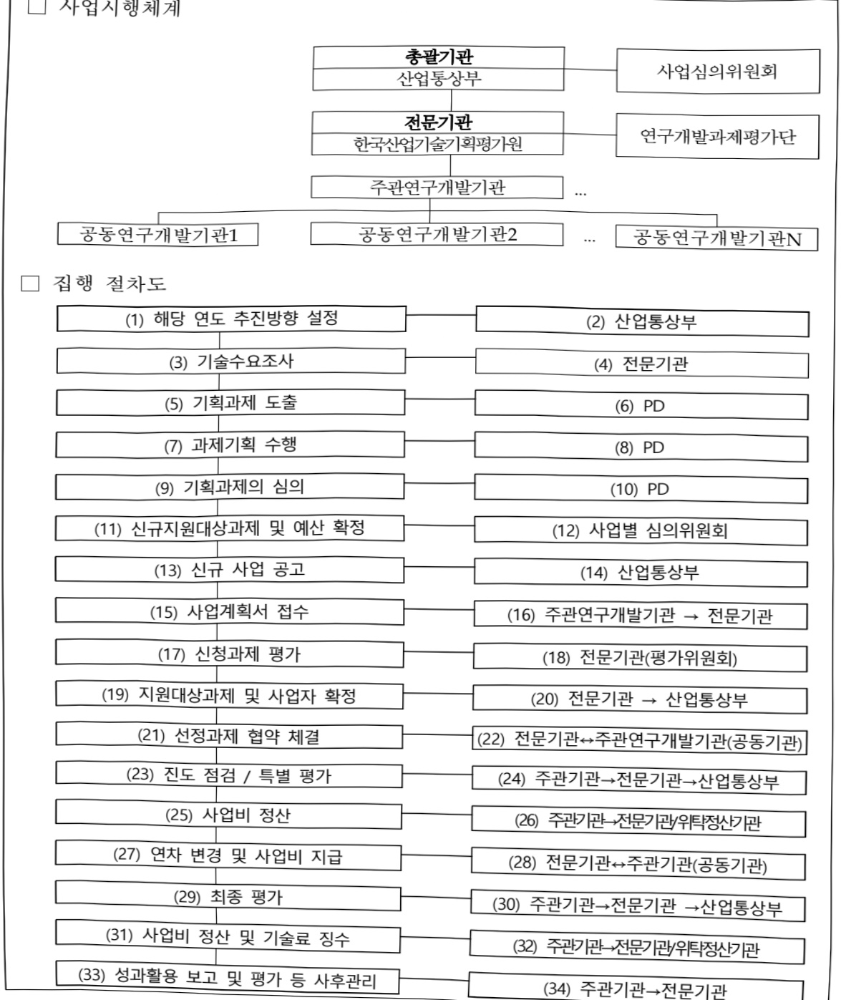

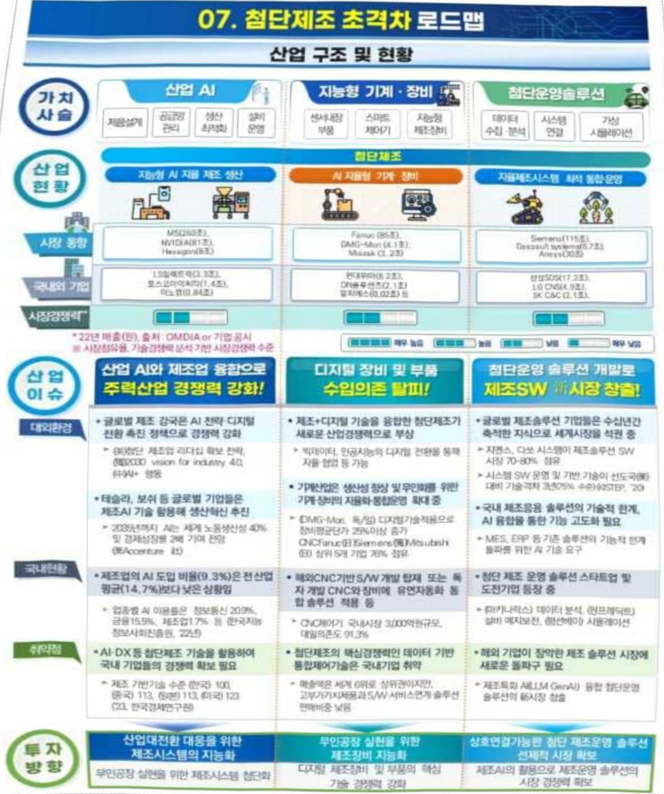

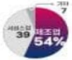

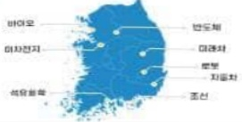

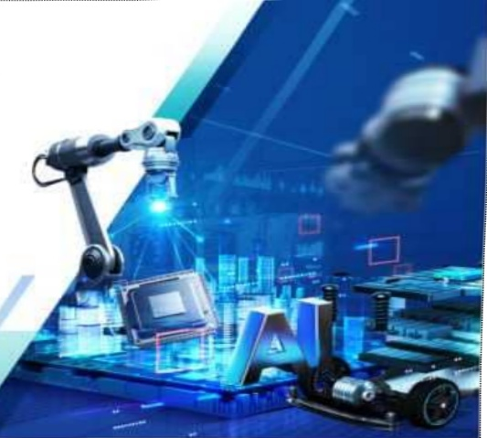

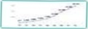

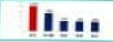

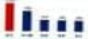

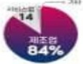

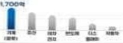

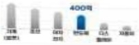

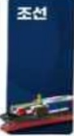

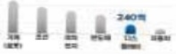

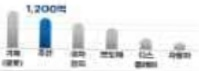

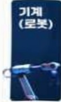

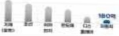

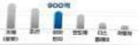

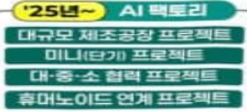

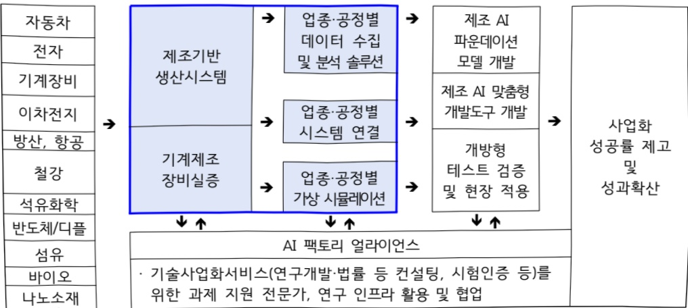

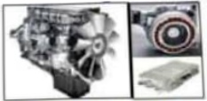

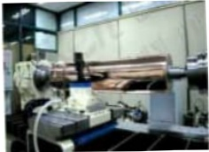

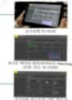

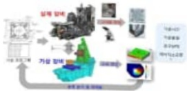

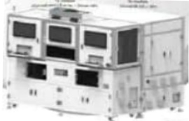

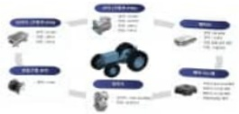

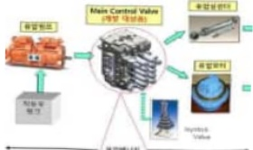

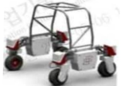

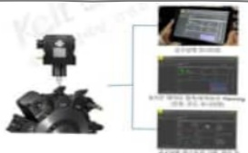

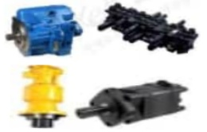

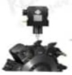

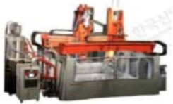

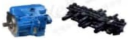

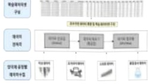

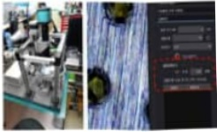

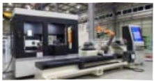

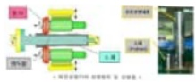

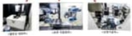

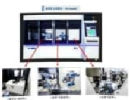

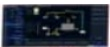

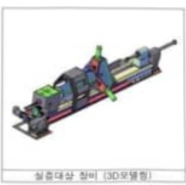

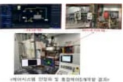

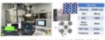

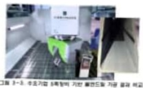

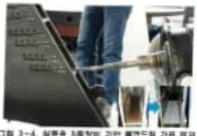

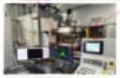

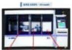

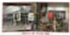

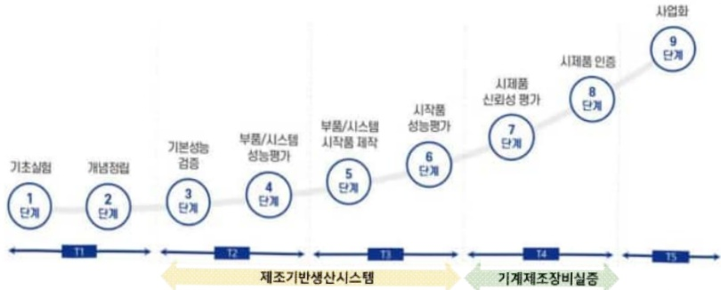

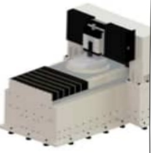

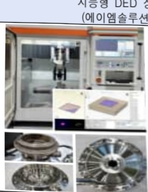

