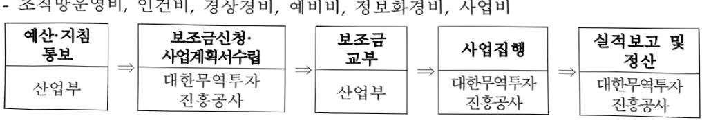

# 대한무역투자진흥공사

**해당 페이지**: PDF 3858 ~ 3871 쪽 해당

**부처**: 산업통상부
**분야**: 산업·중소기업 및 에너지
**회계유형**: 일반회계
**2026 확정예산**: 341429.0 백만원
**전년대비 증감률**: None%
**AI 도메인**: 기타

---

### 가. 예산 총괄표

(단위: 백만원, %)

<table border=1 style='margin: auto; word-wrap: break-word;'><tr><td rowspan="2">2024년 사업명</td><td style='text-align: center; word-wrap: break-word;'>2025년 예산</td><td style='text-align: center; word-wrap: break-word;'>2026년</td><td colspan="2">중감</td></tr><tr><td style='text-align: center; word-wrap: break-word;'>본예산(A)</td><td style='text-align: center; word-wrap: break-word;'>추경</td><td style='text-align: center; word-wrap: break-word;'>요구안</td><td style='text-align: center; word-wrap: break-word;'>(B-A)</td></tr><tr><td style='text-align: center; word-wrap: break-word;'>320,892</td><td style='text-align: center; word-wrap: break-word;'>329,290</td><td style='text-align: center; word-wrap: break-word;'>334,606</td><td style='text-align: center; word-wrap: break-word;'>340,129</td><td style='text-align: center; word-wrap: break-word;'>12,139</td></tr></table>

□ 기능별(내역사업별), 목별 예산 내역

(단위:백만원)

<table border=1 style='margin: auto; word-wrap: break-word;'><tr><td rowspan="3"></td><td colspan="5">2024</td><td colspan="7">2025(2025.12월말)</td><td rowspan="3">2026예산</td></tr><tr><td rowspan="2">예산의(추정)</td><td rowspan="2">예산현액</td><td rowspan="2">집행의[실정행해]</td><td rowspan="2">이월액</td><td rowspan="2">불용액</td><td rowspan="2">본예산</td><td rowspan="2">예산현액</td><td rowspan="2">집행의[실정행해]</td><td colspan="2">전년도이월액제외</td><td rowspan="2">이월액</td><td rowspan="2">불용액</td></tr><tr><td style='text-align: center; word-wrap: break-word;'>예산현액</td><td style='text-align: center; word-wrap: break-word;'>집행의[실정행해]</td></tr><tr><td style='text-align: center; word-wrap: break-word;'>○ 기능별 분류(함께)</td><td style='text-align: center; word-wrap: break-word;'>321,275</td><td style='text-align: center; word-wrap: break-word;'>321,275</td><td style='text-align: center; word-wrap: break-word;'>320,892[317,455]</td><td style='text-align: center; word-wrap: break-word;'>-</td><td style='text-align: center; word-wrap: break-word;'>383</td><td style='text-align: center; word-wrap: break-word;'>329,290</td><td style='text-align: center; word-wrap: break-word;'>342,972</td><td style='text-align: center; word-wrap: break-word;'>342,876[342,876]</td><td style='text-align: center; word-wrap: break-word;'>342,972</td><td style='text-align: center; word-wrap: break-word;'>342,876[342,876]</td><td style='text-align: center; word-wrap: break-word;'>-</td><td style='text-align: center; word-wrap: break-word;'>96</td><td style='text-align: center; word-wrap: break-word;'>341,429</td></tr><tr><td style='text-align: center; word-wrap: break-word;'>· 조직망운영비</td><td style='text-align: center; word-wrap: break-word;'>70,572</td><td style='text-align: center; word-wrap: break-word;'>70,572</td><td style='text-align: center; word-wrap: break-word;'>70,572[70,572]</td><td style='text-align: center; word-wrap: break-word;'>-</td><td style='text-align: center; word-wrap: break-word;'>-</td><td style='text-align: center; word-wrap: break-word;'>66,830</td><td style='text-align: center; word-wrap: break-word;'>75,196</td><td style='text-align: center; word-wrap: break-word;'>75,196[75,196]</td><td style='text-align: center; word-wrap: break-word;'>75,196</td><td style='text-align: center; word-wrap: break-word;'>75,196[75,196]</td><td style='text-align: center; word-wrap: break-word;'>-</td><td style='text-align: center; word-wrap: break-word;'>-</td><td style='text-align: center; word-wrap: break-word;'>73,122</td></tr><tr><td style='text-align: center; word-wrap: break-word;'>· 인건비</td><td style='text-align: center; word-wrap: break-word;'>153,721</td><td style='text-align: center; word-wrap: break-word;'>153,721</td><td style='text-align: center; word-wrap: break-word;'>153,721[153,721]</td><td style='text-align: center; word-wrap: break-word;'>-</td><td style='text-align: center; word-wrap: break-word;'>-</td><td style='text-align: center; word-wrap: break-word;'>165,251</td><td style='text-align: center; word-wrap: break-word;'>165,251</td><td style='text-align: center; word-wrap: break-word;'>165,251[165,251]</td><td style='text-align: center; word-wrap: break-word;'>165,251</td><td style='text-align: center; word-wrap: break-word;'>165,251[165,251]</td><td style='text-align: center; word-wrap: break-word;'>-</td><td style='text-align: center; word-wrap: break-word;'>-</td><td style='text-align: center; word-wrap: break-word;'>174,020</td></tr><tr><td style='text-align: center; word-wrap: break-word;'>· 경상경비</td><td style='text-align: center; word-wrap: break-word;'>2,657</td><td style='text-align: center; word-wrap: break-word;'>2,657</td><td style='text-align: center; word-wrap: break-word;'>2,657[2,657]</td><td style='text-align: center; word-wrap: break-word;'>-</td><td style='text-align: center; word-wrap: break-word;'>-</td><td style='text-align: center; word-wrap: break-word;'>2,556</td><td style='text-align: center; word-wrap: break-word;'>2,556</td><td style='text-align: center; word-wrap: break-word;'>2,556[2,556]</td><td style='text-align: center; word-wrap: break-word;'>2,556</td><td style='text-align: center; word-wrap: break-word;'>2,556[2,556]</td><td style='text-align: center; word-wrap: break-word;'>-</td><td style='text-align: center; word-wrap: break-word;'>-</td><td style='text-align: center; word-wrap: break-word;'>4,520</td></tr><tr><td style='text-align: center; word-wrap: break-word;'>· 예비비</td><td style='text-align: center; word-wrap: break-word;'>5,499</td><td style='text-align: center; word-wrap: break-word;'>5,499</td><td style='text-align: center; word-wrap: break-word;'>5,499[5,499]</td><td style='text-align: center; word-wrap: break-word;'>-</td><td style='text-align: center; word-wrap: break-word;'>-</td><td style='text-align: center; word-wrap: break-word;'>5,677</td><td style='text-align: center; word-wrap: break-word;'>5,677</td><td style='text-align: center; word-wrap: break-word;'>5,677[5,677]</td><td style='text-align: center; word-wrap: break-word;'>5,677</td><td style='text-align: center; word-wrap: break-word;'>5,677[5,677]</td><td style='text-align: center; word-wrap: break-word;'>-</td><td style='text-align: center; word-wrap: break-word;'>-</td><td style='text-align: center; word-wrap: break-word;'>5,893</td></tr><tr><td style='text-align: center; word-wrap: break-word;'>· 정보화경비</td><td style='text-align: center; word-wrap: break-word;'>8,816</td><td style='text-align: center; word-wrap: break-word;'>8,816</td><td style='text-align: center; word-wrap: break-word;'>8,816[6,398]</td><td style='text-align: center; word-wrap: break-word;'>-</td><td style='text-align: center; word-wrap: break-word;'>179</td><td style='text-align: center; word-wrap: break-word;'>5,542</td><td style='text-align: center; word-wrap: break-word;'>5,542</td><td style='text-align: center; word-wrap: break-word;'>5,470[5,470]</td><td style='text-align: center; word-wrap: break-word;'>5,542</td><td style='text-align: center; word-wrap: break-word;'>5,470[5,470]</td><td style='text-align: center; word-wrap: break-word;'>-</td><td style='text-align: center; word-wrap: break-word;'>72</td><td style='text-align: center; word-wrap: break-word;'>8,159</td></tr><tr><td style='text-align: center; word-wrap: break-word;'>· 사업비</td><td style='text-align: center; word-wrap: break-word;'>80,010</td><td style='text-align: center; word-wrap: break-word;'>80,010</td><td style='text-align: center; word-wrap: break-word;'>79,806[78,609]</td><td style='text-align: center; word-wrap: break-word;'>-</td><td style='text-align: center; word-wrap: break-word;'>204</td><td style='text-align: center; word-wrap: break-word;'>83,434</td><td style='text-align: center; word-wrap: break-word;'>88,750</td><td style='text-align: center; word-wrap: break-word;'>88,726[88,726]</td><td style='text-align: center; word-wrap: break-word;'>88,750</td><td style='text-align: center; word-wrap: break-word;'>88,726[88,726]</td><td style='text-align: center; word-wrap: break-word;'>-</td><td style='text-align: center; word-wrap: break-word;'>24</td><td style='text-align: center; word-wrap: break-word;'>75,715</td></tr><tr><td style='text-align: center; word-wrap: break-word;'>○ 비목별 분류(함께)</td><td style='text-align: center; word-wrap: break-word;'>321,275</td><td style='text-align: center; word-wrap: break-word;'>321,275</td><td style='text-align: center; word-wrap: break-word;'>320,892[317,455]</td><td style='text-align: center; word-wrap: break-word;'>-</td><td style='text-align: center; word-wrap: break-word;'>383</td><td style='text-align: center; word-wrap: break-word;'>329,290</td><td style='text-align: center; word-wrap: break-word;'>342,972</td><td style='text-align: center; word-wrap: break-word;'>342,876[342,876]</td><td style='text-align: center; word-wrap: break-word;'>342,972</td><td style='text-align: center; word-wrap: break-word;'>342,876[342,876]</td><td style='text-align: center; word-wrap: break-word;'>-</td><td style='text-align: center; word-wrap: break-word;'>96</td><td style='text-align: center; word-wrap: break-word;'>340,129</td></tr><tr><td style='text-align: center; word-wrap: break-word;'>· 민간경상보조(32001)</td><td style='text-align: center; word-wrap: break-word;'>321,275</td><td style='text-align: center; word-wrap: break-word;'>321,275</td><td style='text-align: center; word-wrap: break-word;'>320,892[317,455]</td><td style='text-align: center; word-wrap: break-word;'>-</td><td style='text-align: center; word-wrap: break-word;'>383</td><td style='text-align: center; word-wrap: break-word;'>329,290</td><td style='text-align: center; word-wrap: break-word;'>342,972</td><td style='text-align: center; word-wrap: break-word;'>342,876[342,876]</td><td style='text-align: center; word-wrap: break-word;'>342,972</td><td style='text-align: center; word-wrap: break-word;'>342,876[342,876]</td><td style='text-align: center; word-wrap: break-word;'>-</td><td style='text-align: center; word-wrap: break-word;'>96</td><td style='text-align: center; word-wrap: break-word;'>340,129</td></tr><tr><td style='text-align: center; word-wrap: break-word;'>○ 기능비목별 분류(함께)</td><td style='text-align: center; word-wrap: break-word;'>321,275</td><td style='text-align: center; word-wrap: break-word;'>321,275</td><td style='text-align: center; word-wrap: break-word;'>320,892[317,455]</td><td style='text-align: center; word-wrap: break-word;'>-</td><td style='text-align: center; word-wrap: break-word;'>383</td><td style='text-align: center; word-wrap: break-word;'>329,290</td><td style='text-align: center; word-wrap: break-word;'>342,972</td><td style='text-align: center; word-wrap: break-word;'>342,876[342,876]</td><td style='text-align: center; word-wrap: break-word;'>342,972</td><td style='text-align: center; word-wrap: break-word;'>342,876[342,876]</td><td style='text-align: center; word-wrap: break-word;'>-</td><td style='text-align: center; word-wrap: break-word;'>96</td><td style='text-align: center; word-wrap: break-word;'>340,129</td></tr><tr><td style='text-align: center; word-wrap: break-word;'>· 조직망운영비</td><td style='text-align: center; word-wrap: break-word;'>70,572</td><td style='text-align: center; word-wrap: break-word;'>70,572</td><td style='text-align: center; word-wrap: break-word;'>70,572[70,572]</td><td style='text-align: center; word-wrap: break-word;'>-</td><td style='text-align: center; word-wrap: break-word;'>-</td><td style='text-align: center; word-wrap: break-word;'>66,830</td><td style='text-align: center; word-wrap: break-word;'>75,196</td><td style='text-align: center; word-wrap: break-word;'>75,196[75,196]</td><td style='text-align: center; word-wrap: break-word;'>75,196</td><td style='text-align: center; word-wrap: break-word;'>75,196[75,196]</td><td style='text-align: center; word-wrap: break-word;'>-</td><td style='text-align: center; word-wrap: break-word;'>-</td><td style='text-align: center; word-wrap: break-word;'>73,122</td></tr><tr><td style='text-align: center; word-wrap: break-word;'>· 민건비</td><td style='text-align: center; word-wrap: break-word;'>153,721</td><td style='text-align: center; word-wrap: break-word;'>153,721</td><td style='text-align: center; word-wrap: break-word;'>153,721[153,721]</td><td style='text-align: center; word-wrap: break-word;'>-</td><td style='text-align: center; word-wrap: break-word;'>-</td><td style='text-align: center; word-wrap: break-word;'>165,251</td><td style='text-align: center; word-wrap: break-word;'>165,251</td><td style='text-align: center; word-wrap: break-word;'>165,251[165,251]</td><td style='text-align: center; word-wrap: break-word;'>165,251</td><td style='text-align: center; word-wrap: break-word;'>165,251[165,251]</td><td style='text-align: center; word-wrap: break-word;'>-</td><td style='text-align: center; word-wrap: break-word;'>-</td><td style='text-align: center; word-wrap: break-word;'>174,020</td></tr><tr><td style='text-align: center; word-wrap: break-word;'>· 민간경상보조(32001)</td><td style='text-align: center; word-wrap: break-word;'>2,657</td><td style='text-align: center; word-wrap: break-word;'>2,657</td><td style='text-align: center; word-wrap: break-word;'>2,657[2,657]</td><td style='text-align: center; word-wrap: break-word;'>-</td><td style='text-align: center; word-wrap: break-word;'>-</td><td style='text-align: center; word-wrap: break-word;'>2,556</td><td style='text-align: center; word-wrap: break-word;'>2,556</td><td style='text-align: center; word-wrap: break-word;'>2,556[2,556]</td><td style='text-align: center; word-wrap: break-word;'>2,556</td><td style='text-align: center; word-wrap: break-word;'>2,556[2,556]</td><td style='text-align: center; word-wrap: break-word;'>-</td><td style='text-align: center; word-wrap: break-word;'>-</td><td style='text-align: center; word-wrap: break-word;'>4,520</td></tr><tr><td style='text-align: center; word-wrap: break-word;'>· 예비비</td><td style='text-align: center; word-wrap: break-word;'>5,499</td><td style='text-align: center; word-wrap: break-word;'>5,499</td><td style='text-align: center; word-wrap: break-word;'>5,499[5,499]</td><td style='text-align: center; word-wrap: break-word;'>-</td><td style='text-align: center; word-wrap: break-word;'>-</td><td style='text-align: center; word-wrap: break-word;'>5,677</td><td style='text-align: center; word-wrap: break-word;'>5,677</td><td style='text-align: center; word-wrap: break-word;'>5,677[5,677]</td><td style='text-align: center; word-wrap: break-word;'>5,677</td><td style='text-align: center; word-wrap: break-word;'>5,677[5,677]</td><td style='text-align: center; word-wrap: break-word;'>-</td><td style='text-align: center; word-wrap: break-word;'>-</td><td style='text-align: center; word-wrap: break-word;'>5,893</td></tr><tr><td style='text-align: center; word-wrap: break-word;'>· 정보화경비</td><td style='text-align: center; word-wrap: break-word;'>8,816</td><td style='text-align: center; word-wrap: break-word;'>8,816</td><td style='text-align: center; word-wrap: break-word;'>8,816[6,398]</td><td style='text-align: center; word-wrap: break-word;'>-</td><td style='text-align: center; word-wrap: break-word;'>179</td><td style='text-align: center; word-wrap: break-word;'>5,542</td><td style='text-align: center; word-wrap: break-word;'>5,542</td><td style='text-align: center; word-wrap: break-word;'>5,470[5,470]</td><td style='text-align: center; word-wrap: break-word;'>5,542</td><td style='text-align: center; word-wrap: break-word;'>5,470[5,470]</td><td style='text-align: center; word-wrap: break-word;'>-</td><td style='text-align: center; word-wrap: break-word;'>72</td><td style='text-align: center; word-wrap: break-word;'>8,159</td></tr><tr><td style='text-align: center; word-wrap: break-word;'>· 민간경상보조(32001)</td><td style='text-align: center; word-wrap: break-word;'>80,010</td><td style='text-align: center; word-wrap: break-word;'>80,010</td><td style='text-align: center; word-wrap: break-word;'>79,806[78,609]</td><td style='text-align: center; word-wrap: break-word;'>-</td><td style='text-align: center; word-wrap: break-word;'>204</td><td style='text-align: center; word-wrap: break-word;'>83,434</td><td style='text-align: center; word-wrap: break-word;'>88,750</td><td style='text-align: center; word-wrap: break-word;'>88,726[88,726]</td><td style='text-align: center; word-wrap: break-word;'>88,750</td><td style='text-align: center; word-wrap: break-word;'>88,726[88,726]</td><td style='text-align: center; word-wrap: break-word;'>-</td><td style='text-align: center; word-wrap: break-word;'>24</td><td style='text-align: center; word-wrap: break-word;'>75,715</td></tr></table>

---

### 나. 사업설명자료

## 1 ) 사업목적·내용

(사업목적) 무역 진흥과 국내외 기업 간의 투자 및 산업 기술 협력의 지원, 해외 전문 인력의 유치 및 중소기업의 해외진출 지원 등을 통해 국민경제 발전에 이바지 (대한무역투자진흥공사법 제1조)

- (조직망운영비) 무역진흥 및 투자유치 업무 등을 수행하기 위한 코트라 해외 무역관

86개국 132개소 및 국내 조직망 1개소 관리·운영비 지원

- (인건비) 코트라 정규직, 무역관 현지직원, 무기계약직 등에 대한 급여, 법정복리 후생비, 내부평가 성과급 지원

- (경상경비) 코트라 사옥관리, 제세공과금 등 기관 운영 기본 경비 지원

- (예비비) 공공기관 경영평가 결과에 따른 코트라 성과급 지원

- (정보화경비) 코트라 대내외 무역투자 정보시스템 운영을 위한 경비 지원

- (사업비) 대한무역투자진흥공사법 제1조에 따른 코트라 고유업무 수행 사업비 지원

* 해외마케팅지원, 현지진출 기반조성, 글로벌 일자리 지원, 외국인 투자유치, 해외정보조사,

디지털무역플랫폼 구축·활용, 경제안보기반강화내역조정

## 2 ) 사업개요

## □ 사업근거 및 추진경위

① 법령상 근거 : 대한무역투자진흥공사법 제13조·제10조, 대외무역법 제4조·제8조

◇대한무역투자진흥공사법 제13조, 제10조

제13조(보조금) 정부는 공사의 사업에 대하여 예산의 범위에서 보조금을 지급할 수 있다.

제10조(사업) ① 공사는 제1조의 목적을 달성하기 위하여 다음 각 호의 사업을 한다.

1. 무역 진흥과 외국인투자 유치를 위한 해외시장의 조사·개척 및 정보의 수집과 그 성과의 보급

2.국내의산업·상품과외국인투자환경의해외홍보 및국가브랜드제고관련지원

3. 무역거래, 국내외 기업 간 투자 협력과 산업기술 교류의 알선 및 「국제개발협력기본법」 제2조 제1호에 따른 국제개발협력 지원

4. 무역 및 투자에 관한 박람회 · 전시회의 개최 또는 참가 및 참가의 알선

5.산업통상부장관이 정하는 수출 또는 수입

6. 외국인투자의 유치 및 국내기업의 해외투자(해외 자원·에너지 개발을 포함한다) 지원

7.국제 경쟁력 강화를 위한 해외 전문인력의 유치 지원 및 국내 전문인력의 해외 창업·취업 지원

8.「방위산업 발전 및 지원에 관한 법률」 제2조제1항 제1호에 따른 방위산업물자 등(이하 “방산물자 등”이라 한다)의 수출과 관련한 다음 각 목의 사업

가. 국내 기업을 대신한 구매국정부와의 방산물자 등 수출에 관한 계약 시 당사자지위 수행

나. 방산물자등과 산업·자원 및 투자 협력을 연계한 패키지 협상안의 작성과 금융지원방안 수립

다. 그 밖에 방산물자 등의 교역지원을 위하여 산업통상부장관 및 방위사업청장이 필요하다고 인정하는 업무

---

9.대외무역법제32조의3제2항에따른정부간수출계약관련사업

9의2.해외 한인경제인 네트워크 구축·관리 및 활용 지원

10. 시설의 운영, 전문인력의 교육·훈련 및 육성 등 제1호부터 제9호까지 및 제9호의 2의 사업에 딸린 사업

11. 머리 병류에 따라 공사가 할 수 있는 사업

② 공사는 제1항 제8호의 업무를 효과적으로 수행하기 위하여 방산물자교역지원센터를 둔다

## ◇ 대외무역법 제4조, 제8조

제4조(무역의 진흥을 위한 조치) ① 산업통상부장관은 무역의 진흥을 위하여 필요하다고 인정되면 대통령령으로 정하는 바에 따라 물품등의 수출과 수입을 지속적으로 증대하기 위한 조치를 할 수 있다.

② 산업통상부장관은 제1항에 따른 무역의 진흥을 위하여 필요하다고 인정되면 대통령령으로 정하는 바에 따라 다음 각 호의 어느 하나에 해당하는 자에게 필요한 지원을 할 수 있다

1.무역의 진흥을 위한 자문,지노,대외 홍보,선시,연수,상담 알선 등을 업(業)으로 하는 자

2. 무역전시장이나 무역연수원 등의 무역 관련 시설을 설치·운영하는 자

3. 과학적인 무역업무 처리기반을 구축·운영하는 자

제8조(민간 협력 활동의 지원 등) ①산업통상부장관은 무역·통상 관련 기관 또는 단체가 교역상대 국의 정부, 지방정부, 기관 또는 단체와 통상, 산업, 기술, 에너지 등에서 협력활동을 추진하는 경우 대통령령으로 정하는 바에 따라 필요한 지원을 할 수 있다.

②산업통상부장관은 기업의 해외 진출을 지원하기 위하여 무역·통상 관련 기관 또는 단체로부터 정보를 체계적으로 수집하고 분석하여 지방자치단체와 기업에 필요한 정보를 제공할 수 있다.

③산업통상부장관은 제2항에 따른 정보의 수집·분석 및 제공을 위하여 필요한 경우 관계

중앙행정기관의 장, 시·도지사, 무역·통상 및 기업의 해외 진출과 관련한 기관 또는 단체에 자료 및 통계의 제출을 요청할 수 있다.

④ 산업통상부장관은 기업의 해외 진출과 관련된 상담·안내·홍보·조사와 그 밖에 기업의 해외 진출에 대한 지원 업무를 종합적으로 수행하기 위하여 「대한무역투자진흥공사법」에 따른 대한무역투자진흥공사에 해외진출지원센터를 둔다.

## ② 추진경위

- '62년 무역진흥 등을 위해 '대한무역진흥공사' 설립 후 계속사업으로 추진

- '95년 '대한무역투자진흥공사'로 명칭 변경하고, 국가무역투자진흥기관(TPO)로 출범

- '03년 외국인투자유치를 위한 Invest KOREA 출범

* '98년 외국인투자지원센터 신설, '99년 외국인투자 옴부즈만 사무소 개설

- '08년 중기지원체제 일원화 방침에 따라 해외마케팅 지원활동을 코트라로 일원화

* VIP주재 무역투자진흥회의('08.5.16) 및 정부 방침 확정통보('09.5.30)에 따라 해외마케팅 지원 활동을 코트라로 일원화

- '09년 대한무역투자진흥공사에 '방산물자교역지원센터' 설치('09.10.)

- '14년 해외전문인력유치지원, 정부간 수출계약 업무 법제화('14.1.)

- '18년 '해외 한인경제인 네트워크 구축·관리 활용지원'을 신설

* 대한무역투자진흥공사법 제10조 9의2

- '22년 '온실가스 국제감축 사업' 위탁 수행기관으로 지정('22.3.)

* 기후위기 대응을 위한 탄소중립·녹색성장 기본법 시행령(22.3.)

- '24년 투자유치기반조성(4901-302)-투자유치활동비 내역사업 이관

---

## □ 주요내용

① 사업규모

- 총사업비(해당되는 경우에만 기재) : 해당 없음

- 사업기간 : '62년 ~ 계속

-최근 5년 간 투입된 사업비(예산액기준, 추경편성한 연도에는 추경포함)

(단위 : 백만원)

<table border=1 style='margin: auto; word-wrap: break-word;'><tr><td style='text-align: center; word-wrap: break-word;'>연도</td><td style='text-align: center; word-wrap: break-word;'>2022</td><td style='text-align: center; word-wrap: break-word;'>2023</td><td style='text-align: center; word-wrap: break-word;'>2024</td><td style='text-align: center; word-wrap: break-word;'>2025</td><td style='text-align: center; word-wrap: break-word;'>2026</td></tr><tr><td style='text-align: center; word-wrap: break-word;'>사업비</td><td style='text-align: center; word-wrap: break-word;'>308,170</td><td style='text-align: center; word-wrap: break-word;'>302,911</td><td style='text-align: center; word-wrap: break-word;'>321,275</td><td style='text-align: center; word-wrap: break-word;'>334,606</td><td style='text-align: center; word-wrap: break-word;'>341,429</td></tr></table>

② 사업추진체계

- 사업시행방법 : 보조

- 사업시행주체 : 대한무역투자진흥공사

-사업 수혜자 : 중소·중견기업

- 보조, 융자, 출연, 출자 등의 경우 보조·융자 등 지원 비율 및 법적근거

<table border=1 style='margin: auto; word-wrap: break-word;'><tr><td style='text-align: center; word-wrap: break-word;'>내역사업명</td><td style='text-align: center; word-wrap: break-word;'>구분</td><td style='text-align: center; word-wrap: break-word;'>피보조·피출연 등 기관명</td><td style='text-align: center; word-wrap: break-word;'>지원 금액 (2026예산)</td><td style='text-align: center; word-wrap: break-word;'>지원 비율(%)</td><td style='text-align: center; word-wrap: break-word;'>보조율 법적근거 (해당 조항)</td></tr><tr><td style='text-align: center; word-wrap: break-word;'>조직망운영비</td><td style='text-align: center; word-wrap: break-word;'>보조</td><td style='text-align: center; word-wrap: break-word;'>대한무역투자 진흥공사</td><td style='text-align: center; word-wrap: break-word;'>73,122</td><td style='text-align: center; word-wrap: break-word;'>100</td><td style='text-align: center; word-wrap: break-word;'>대한무역투자진흥공사법 제13조 대외무역법 제4조, 제8조</td></tr><tr><td style='text-align: center; word-wrap: break-word;'>인건비</td><td style='text-align: center; word-wrap: break-word;'>보조</td><td style='text-align: center; word-wrap: break-word;'>대한무역투자 진흥공사</td><td style='text-align: center; word-wrap: break-word;'>174,020</td><td style='text-align: center; word-wrap: break-word;'>100</td><td style='text-align: center; word-wrap: break-word;'>대한무역투자진흥공사법 제13조 대외무역법 제4조, 제8조</td></tr><tr><td style='text-align: center; word-wrap: break-word;'>경상경비</td><td style='text-align: center; word-wrap: break-word;'>보조</td><td style='text-align: center; word-wrap: break-word;'>대한무역투자 진흥공사</td><td style='text-align: center; word-wrap: break-word;'>4,520</td><td style='text-align: center; word-wrap: break-word;'>100</td><td style='text-align: center; word-wrap: break-word;'>대한무역투자진흥공사법 제13조 대외무역법 제4조, 제8조</td></tr><tr><td style='text-align: center; word-wrap: break-word;'>예비비</td><td style='text-align: center; word-wrap: break-word;'>보조</td><td style='text-align: center; word-wrap: break-word;'>대한무역투자 진흥공사</td><td style='text-align: center; word-wrap: break-word;'>5,893</td><td style='text-align: center; word-wrap: break-word;'>100</td><td style='text-align: center; word-wrap: break-word;'>대한무역투자진흥공사법 제13조 대외무역법 제4조, 제8조</td></tr><tr><td style='text-align: center; word-wrap: break-word;'>정보화경비</td><td style='text-align: center; word-wrap: break-word;'>보조</td><td style='text-align: center; word-wrap: break-word;'>대한무역투자 진흥공사</td><td style='text-align: center; word-wrap: break-word;'>8,159</td><td style='text-align: center; word-wrap: break-word;'>100</td><td style='text-align: center; word-wrap: break-word;'>대한무역투자진흥공사법 제13조 대외무역법 제4조, 제8조</td></tr><tr><td style='text-align: center; word-wrap: break-word;'>사업비</td><td style='text-align: center; word-wrap: break-word;'>보조</td><td style='text-align: center; word-wrap: break-word;'>대한무역투자 진흥공사</td><td style='text-align: center; word-wrap: break-word;'>75,715</td><td style='text-align: center; word-wrap: break-word;'>100</td><td style='text-align: center; word-wrap: break-word;'>대한무역투자진흥공사법 제13조 대외무역법 제4조, 제8조</td></tr></table>

## 3 ) 2026년도 예산 산출 근거

☐ 대한무역투자진흥공사: (2025 추경) 334,606백만원 → (2026 예산) 341,429백만원 6,823백만원 증액 (2025 본예산 329,290백만원 → 제2회 추경 334,606백만원)

① 조직망운영비 : (2025 본예산) 66,830백만원 → (2026) 73,122백만원, 6,292백만원 증액 - (요구) KOTRA 해외 무역관 132개소와 국내조직망 등 인프라 운영 지원 등 - (산출) 해외무역관 132개소 73,022백만원, 인천공항사무소 1개소 100백만원 * 국가무역투자 인프라인 해외무역관, 글로벌사우스 중심 보강

<table border=1 style='margin: auto; word-wrap: break-word;'><tr><td colspan="2">지역</td><td style='text-align: center; word-wrap: break-word;'>&#x27;20</td><td style='text-align: center; word-wrap: break-word;'>&#x27;21</td><td style='text-align: center; word-wrap: break-word;'>&#x27;22</td><td style='text-align: center; word-wrap: break-word;'>&#x27;23</td><td style='text-align: center; word-wrap: break-word;'>&#x27;24</td><td style='text-align: center; word-wrap: break-word;'>&#x27;25</td><td style='text-align: center; word-wrap: break-word;'>&#x27;26</td></tr><tr><td colspan="2">해외무역관</td><td colspan="5">129</td><td style='text-align: center; word-wrap: break-word;'>131(+2)</td><td style='text-align: center; word-wrap: break-word;'>132(+1)</td></tr><tr><td colspan="2">글로벌 사우스 소재</td><td colspan="5">61</td><td style='text-align: center; word-wrap: break-word;'>63(+2)</td><td style='text-align: center; word-wrap: break-word;'>64(+1)</td></tr></table>

---

o 2025년도 본예산 및 2026년도 예산 산출 세부내역 비교

<table border=1 style='margin: auto; word-wrap: break-word;'><tr><td colspan="2">2025년 본예산</td><td colspan="2">2026년 예산</td></tr><tr><td style='text-align: center; word-wrap: break-word;'>예산</td><td style='text-align: center; word-wrap: break-word;'>산출내역</td><td style='text-align: center; word-wrap: break-word;'>예산</td><td style='text-align: center; word-wrap: break-word;'>산출내역</td></tr><tr><td rowspan="3">조직망 운영비 66,830</td><td style='text-align: center; word-wrap: break-word;'>ㅇ 민간경상보조(320-01) : 66,830백만원</td><td colspan="2">ㅇ 민간경상보조(320-01) : 73,122백만원</td></tr><tr><td style='text-align: center; word-wrap: break-word;'>가. 해외무역관 운영 (66,730백만원) · 131개소×509백만원=66,730백만원</td><td style='text-align: center; word-wrap: break-word;'>조직망 운영비 73,122</td><td style='text-align: center; word-wrap: break-word;'>가. 해외무역관 운영 (73,022백만원) · 132개소×553백만원=73,022백만원</td></tr><tr><td style='text-align: center; word-wrap: break-word;'>나. 인천공항사무소 운영 (100백만원) · 1개소×100백만원=100백만원</td><td colspan="2">나. 인천공항사무소 운영 (100백만원) · 1개소×100백만원=100백만원</td></tr></table>

② 인건비 : (2025 본예산) 165,251백만원 → (2026) 174,020백만원, 8,769백만원 증액

- (서구) 정규직(1,073명), 현지직원(551명), 무기계약직(208명) 등에 대한 급여, 법정복리후생비, 내부평가성과급, 해외근무직원 자녀교육비(조직망운영비→인건비 이관)

- (산출) 국내급여 78,832백만원

해외수당 20,909백만원

해외현지직원 32,977백만원

무기계약직 9,419백만원

법정복리후생비 9,088백만원

내부평가성과급 17,701백만원

해외근무직원 자녀교육비 5,094백만원

2025년도 본예산 및 2026년도 예산 산출 세부내역 비교

<table border=1 style='margin: auto; word-wrap: break-word;'><tr><td colspan="2">2025년 본예산</td><td colspan="2">2026년 예산</td></tr><tr><td style='text-align: center; word-wrap: break-word;'>예산</td><td style='text-align: center; word-wrap: break-word;'>산출내역</td><td style='text-align: center; word-wrap: break-word;'>예산</td><td style='text-align: center; word-wrap: break-word;'>산출내역</td></tr><tr><td style='text-align: center; word-wrap: break-word;'>인건비165,251</td><td style='text-align: center; word-wrap: break-word;'>○ 민간경상보조(320-01) : 165,251백만원가. 국내급여(74,816백만원)  · 1,056명×70.8백만원=74,816백만원나. 해외수당(19,093백만원)  · 437명×43.7백만원=19,093백만원다. 해외현지직원(31,862백만원)  · 551명×57.8백만원=31,862백만원라. 무기계약직(9,100백만원)  · 208명×44백만원=9,100백만원마. 법정복리후생비(8,601백만원)  · 1,264명×6.8백만원=8,601백만원바. 내부평가성과급(16,931백만원)  · 1,031명×16.4백만원=16,931백만원사. 해외근무직원 자녀교육비(4,848백만원)  · 251명×19.3백만원=4,848백만원</td><td style='text-align: center; word-wrap: break-word;'>인건비174,020</td><td style='text-align: center; word-wrap: break-word;'>○ 민간경상보조(320-01) : 174,020백만원가. 국내급여(78,832백만원)  · 1,073명×73.5백만원=78,832백만원나. 해외수당(20,909백만원)  · 445명×47.0백만원=20,909백만원다. 해외현지직원(32,977백만원)  · 551명×59.8백만원=32,977백만원라. 무기계약직(9,419백만원)  · 208명×45.3백만원=9,419백만원마. 법정복리후생비(9,088백만원)  · 1,281명×7.1백만원=9,088백만원바. 내부평가성과급(17,701백만원)  · 1,066명×16.6백만원=17,701백만원사. 해외근무직원 자녀교육비(5,094백만원)  · 251명×20.3백만원=5,094백만원</td></tr></table>

③ 경상경비 : (2025 본예산) 2,556백만원 → (2026) 4,520백만원, 1,964백만원 증액 - (요구) 사옥관리, 제세공과금 등 기관운영 기본경비

- (산출) 시설운영비, 복리후생비, 제세공과금 등 4,520백만원

2025년도 본예산 및 2026년도 예산 산출 세부내역 비교

<table border=1 style='margin: auto; word-wrap: break-word;'><tr><td colspan="2">2025년 본예산</td><td colspan="2">2026년 예산</td></tr><tr><td style='text-align: center; word-wrap: break-word;'>예산</td><td style='text-align: center; word-wrap: break-word;'>산출내역</td><td style='text-align: center; word-wrap: break-word;'>예산</td><td style='text-align: center; word-wrap: break-word;'>산출내역</td></tr><tr><td style='text-align: center; word-wrap: break-word;'>경상경비</td><td style='text-align: center; word-wrap: break-word;'>○ 민간경상보조(320-01) : 2,556백만원</td><td style='text-align: center; word-wrap: break-word;'>경상경비</td><td style='text-align: center; word-wrap: break-word;'>○ 민간경상보조(320-01) : 4,520백만원</td></tr><tr><td style='text-align: center; word-wrap: break-word;'>2,556</td><td style='text-align: center; word-wrap: break-word;'>가. 시설운영비, 복리후생비, 제세공과금 등(2,556백만원)</td><td style='text-align: center; word-wrap: break-word;'>4,520</td><td style='text-align: center; word-wrap: break-word;'>가. 시설운영비, 복리후생비, 제세공과금 등(4,520백만원)</td></tr></table>

---

④ 예비비 : (2025 본예산) 5,677 백만원 → (2026) 5,893 백만원, 216 백만원 증액 - (요구) 공공기관 경영평가 결과에 따른 대한무역투자진흥공사 임직원 성과급 - (산출) 경영평가 성과급 5,893 백만원

02025년도 본예산 및 2026년도 예산 산출 세부내역 비교

<table border=1 style='margin: auto; word-wrap: break-word;'><tr><td colspan="2">2025년 분예산</td><td colspan="2">2026년 예산</td></tr><tr><td style='text-align: center; word-wrap: break-word;'>예산</td><td style='text-align: center; word-wrap: break-word;'>산출내역</td><td style='text-align: center; word-wrap: break-word;'>예산</td><td style='text-align: center; word-wrap: break-word;'>산출내역</td></tr><tr><td style='text-align: center; word-wrap: break-word;'>예비비</td><td style='text-align: center; word-wrap: break-word;'>○ 민간경상보조(320-01): 5,677백만원
가. 경영평가 성과급 (5,677백만원)</td><td style='text-align: center; word-wrap: break-word;'>예비비
5,893</td><td style='text-align: center; word-wrap: break-word;'>○ 민간경상보조(320-01): 5,893백만원
가. 경영평가 성과급 (5,893백만원)</td></tr></table>

⑤ 정보화경비 : (2025 본예산) 5,542백만원 → (2026) 8,159백만원, 2,617만원 증액

- (요구) AI 지능형 수출지원 플랫폼 ISP, 정보시스템 유지관리 등

- (산출) AI 지능형 수출지원 플랫폼 구축(3,905백만원), 정보시스템 유지관리 (+148백만원) 등 8,159백만원

02025년도 본예산 및 2026년도 예산 산출 세부내역 비교

<table border=1 style='margin: auto; word-wrap: break-word;'><tr><td colspan="2">2025년 본예산</td><td colspan="2">2026년 예산</td></tr><tr><td style='text-align: center; word-wrap: break-word;'>예산</td><td style='text-align: center; word-wrap: break-word;'>산출내역</td><td style='text-align: center; word-wrap: break-word;'>예산</td><td style='text-align: center; word-wrap: break-word;'>산출내역</td></tr><tr><td style='text-align: center; word-wrap: break-word;'>정보화 경비 5,542</td><td style='text-align: center; word-wrap: break-word;'>○ 민간경상보조(320-01) : 5,542백만원
가. 지능형 수출지원 플랫폼 ISP, 시스템 유지관리, 정보보안 등
• (ISP) 551백만원×1식=551백만원
• (한시소요) 대구클라우드이전(879)
• (운영) 시스템 운영/유지관리(1,935), 무역투자 정보시스템 유지관리비 (1,186)
• (정보보안) 정보보안 (991)</td><td style='text-align: center; word-wrap: break-word;'>정보화 경비 8,159</td><td style='text-align: center; word-wrap: break-word;'>○ 민간경상보조(320-01) : 8,159백만원
가. 지능형 수출지원 플랫폼 구축, 시스템 유지관리, 정보보안 등
• (시스템 구축) 3,905백만원×1식=3,905백만원
• (운영) 시스템 운영/유지관리(1,935), 무역투자 정보시스템 유지관리비 (1,328)
• (정보보안) 정보보안 (991)</td></tr></table>

⑥ 사업비 : (2025 추경) 88,750백만원 → (2026 예산) 75,715백만원, 13,035백만원 감액 (2025 본예산 83,434백만원 → 제2회 추경 88,750백만원)

- (요구) 해외마케팅 지원, 현지진출기반조성, 글로벌 일자리 지원, 외국인투자유치, 해외정보조사, 디지털무역플랫폼 구축·활용, 경제안보기반강화 내내역조정 등

- (산출) 해외마케팅 37,749백만원

현지진출기반조성 7,158백만원

글로벌 일자리지원 1,076백만원

외국인투자유치 9,373백만원

해외정보조사 1,369백만원

디지털 무역플랫폼 구축·활용 5,691백만원

경제안보기반강화내내역조정 13,299백만원

---

o 2025년도 추가경정예산 및 2026년도 예산 산출 세부내역 비교

<table border=1 style='margin: auto; word-wrap: break-word;'><tr><td colspan="2">2025년 제2회 추가경정예산</td><td colspan="2">2026년 예산</td></tr><tr><td style='text-align: center; word-wrap: break-word;'>예산</td><td style='text-align: center; word-wrap: break-word;'>산솔내역</td><td style='text-align: center; word-wrap: break-word;'>예산</td><td style='text-align: center; word-wrap: break-word;'>산솔내역</td></tr><tr><td style='text-align: center; word-wrap: break-word;'>사업비88,750</td><td style='text-align: center; word-wrap: break-word;'>ㅇ 민간경상보조(320-01) : 88,750백만원가. 해외마케팅(44,243백만원) • 내수기업수출기업화: 6,709개사×1.7백만원=11,406백만원 • 수출기업에로헤소 : 9,425개사×0.7백만원=6,598백만원 • 수요연계형 글로벌진솔지원 : 3,112개사×3.2백만원=9,960백만원 - (본예산) 2,456개사×3.2백만원=7,860백만원 + (2회 주경) 656개사×3.2백만원=2,100백만원 • 소비재 해외마케팅 : 1,654개사×6.5백만원=10,750백만원 - (본예산) 1,285개사×6.5백만원=8,350백만원 + (2회 주경) 369개사×6.5백만원=2,400백만원 • 서비스 해외마케팅 : 631개사×6.5백만원=4,109백만원 • 바이오의료 해외마케팅 : 218개사×6.5백만원=1,420백만원 나. 현지진솔기반조성(25,032백만원) • 수출시장다변화지원 : 10개 권역×358.6백만원=3,586백만원 - (본예산) 10개 권역×297백만원=2,970백만원 + (2회 주경) 10개 권역×61.6백만원=616백만원 • 해외프로젝트 수주지원 : 433개사×1.5백만원=650백만원 • 정부조달 : 275개사×4.4백만원=1,208백만원 • 세계일상품류센터 : 1,726개 사×7.8백만원=13,411백만원 • 무역종보기반조성 : 700개사×1.14백만원=800백만원 • 교포무역인 네트워크 : 6,400개사×0.5백만원 = 800백만원 - 수입상품전 및 해외구매상담회 : 이관 (ㅣ 내역경제안보기반강화) • 해외전문인력유치 : 이관 • 이관된 세부사업명: 해외인재유치(신규) (신규보조사업 적경성심사 검증결과: 적격) • 세계일류상품 육성 : 189개사×3.7백만원=700백만원 • 세계일상품 육성 : 189개사×3.7백만원=700백만원 다. 글로벌일자리지원(1,076백만원) • 글로벌 해외취업 지원 : 217명×7.6백만원=1,649백만원 라. 외국인투자유치(9,373백만원) • 산업별 투자유치 : 215개사×6.5백만원=1,400백만원 • 외국투자기업 사후지원 : 356개사×1.7백만원=606백만원 • 투자유치활동비 : 4개 분야×1,842백만원=7,367백만원 나. 투자유치 기반조성 환경개선 조사연구 등마. 해외정보조사(2,369백만원) • 해외시장 및 무역정보 수집 조사 전파 : 4,438건×0.53백만원=2,369백만원 바. 디지털무역플랫폼 구축·활용(6,084백만원) • 디지털무역플랫폼 구축·활용 : 6,084백만원 * (활용) 20,280건×0.3백만원=6,084백만원 사. 경제안보기반강화(13,299백만원) • 무역장벽대용 : 3,970백만원 수출시장다변화 : 10개 권역×297백만원=2,970백만원 - 경제협력통상대스크 : 4개소 ×250백만원=1,000백만원 • 해외공동류센터 : 1,093개사×7.8백만원=8,529백만원 • 수입상품전 및 해외구매상담회 : 16회×50백만원=800백만원</td><td style='text-align: center; word-wrap: break-word;'></td><td style='text-align: center; word-wrap: break-word;'></td></tr></table>

---

## 4 ) 사업효과

☐ 사업영향, 산출물 성과지표 등

① 2022~2026년도 성과계획서 상 성과지표 및 최근 5년간 성과 달성도

<table border=1 style='margin: auto; word-wrap: break-word;'><tr><td style='text-align: center; word-wrap: break-word;'>성과지표</td><td style='text-align: center; word-wrap: break-word;'>구분</td><td style='text-align: center; word-wrap: break-word;'>2022</td><td style='text-align: center; word-wrap: break-word;'>2023</td><td style='text-align: center; word-wrap: break-word;'>2024</td><td style='text-align: center; word-wrap: break-word;'>2025</td><td style='text-align: center; word-wrap: break-word;'>2026</td><td style='text-align: center; word-wrap: break-word;'>2026 목표치산출근거</td><td style='text-align: center; word-wrap: break-word;'>측정산식(또는 측정방법)</td><td style='text-align: center; word-wrap: break-word;'>자료수집방법(또는 자료출처)</td></tr><tr><td rowspan="3">신규시장개척지원실적(단위:개사)</td><td style='text-align: center; word-wrap: break-word;'>목표</td><td style='text-align: center; word-wrap: break-word;'>1,892</td><td style='text-align: center; word-wrap: break-word;'>-</td><td style='text-align: center; word-wrap: break-word;'>-</td><td style='text-align: center; word-wrap: break-word;'>-</td><td style='text-align: center; word-wrap: break-word;'>-</td><td rowspan="3">-</td><td rowspan="3">해외마케팅지원사업에 참가한 고객 중기존 수출 실적이 전무한 국가에 대한 당해연도 $10,000 이상 수출 실적을 달성한 기업수 합산</td><td rowspan="3">관세청 통계 기타 거래입증문서(수출 계약서, 신용장 등)</td></tr><tr><td style='text-align: center; word-wrap: break-word;'>실적</td><td style='text-align: center; word-wrap: break-word;'>1,991</td><td style='text-align: center; word-wrap: break-word;'>-</td><td style='text-align: center; word-wrap: break-word;'>-</td><td style='text-align: center; word-wrap: break-word;'>-</td><td style='text-align: center; word-wrap: break-word;'>-</td></tr><tr><td style='text-align: center; word-wrap: break-word;'>달성도</td><td style='text-align: center; word-wrap: break-word;'>105%</td><td style='text-align: center; word-wrap: break-word;'>-</td><td style='text-align: center; word-wrap: break-word;'>-</td><td style='text-align: center; word-wrap: break-word;'>-</td><td style='text-align: center; word-wrap: break-word;'>-</td></tr><tr><td rowspan="3">내수기업수출기업화(단위:개사)</td><td style='text-align: center; word-wrap: break-word;'>목표</td><td style='text-align: center; word-wrap: break-word;'>(신규)</td><td style='text-align: center; word-wrap: break-word;'>1,545</td><td style='text-align: center; word-wrap: break-word;'>1,567</td><td style='text-align: center; word-wrap: break-word;'>1,599</td><td style='text-align: center; word-wrap: break-word;'>1,633</td><td rowspan="3">과거 3개년 실적평균의 3% 상향조정</td><td rowspan="3">전년도 수출실적이 전무한 고객이 해외마케팅지원사업이용 후 수출 실적을 달성한 기업수 합산</td><td rowspan="3">관세청 통계, 기타 거래입증문서(용역/전자적 무체물 수출입 확인서 등)</td></tr><tr><td style='text-align: center; word-wrap: break-word;'>실적</td><td style='text-align: center; word-wrap: break-word;'>-</td><td style='text-align: center; word-wrap: break-word;'>1,556</td><td style='text-align: center; word-wrap: break-word;'>1,602</td><td style='text-align: center; word-wrap: break-word;'>-</td><td style='text-align: center; word-wrap: break-word;'>-</td></tr><tr><td style='text-align: center; word-wrap: break-word;'>달성도</td><td style='text-align: center; word-wrap: break-word;'>-</td><td style='text-align: center; word-wrap: break-word;'>100.7%</td><td style='text-align: center; word-wrap: break-word;'>102.2%</td><td style='text-align: center; word-wrap: break-word;'>-</td><td style='text-align: center; word-wrap: break-word;'>-</td></tr><tr><td rowspan="3">수출초보기업수출증가(단위:개사)</td><td style='text-align: center; word-wrap: break-word;'>목표</td><td style='text-align: center; word-wrap: break-word;'>(신규)</td><td style='text-align: center; word-wrap: break-word;'>2,589</td><td style='text-align: center; word-wrap: break-word;'>2,667</td><td style='text-align: center; word-wrap: break-word;'>2,722</td><td style='text-align: center; word-wrap: break-word;'>2,752</td><td rowspan="3">과거 3개년 실적평균의 3% 상향조정</td><td rowspan="3">해외마케팅 지원사업이용 수출초보기업(전년도 수출실적이 $100,000만) 중 전년대비 수출 실적이 증가한 기업수 합산</td><td rowspan="3">관세청 통계, 기타 거래입증문서(용역/전자적 무체물 수출입 확인서 등)</td></tr><tr><td style='text-align: center; word-wrap: break-word;'>실적</td><td style='text-align: center; word-wrap: break-word;'>-</td><td style='text-align: center; word-wrap: break-word;'>2,617</td><td style='text-align: center; word-wrap: break-word;'>2,676</td><td style='text-align: center; word-wrap: break-word;'>-</td><td style='text-align: center; word-wrap: break-word;'>-</td></tr><tr><td style='text-align: center; word-wrap: break-word;'>달성도</td><td style='text-align: center; word-wrap: break-word;'>(신규)</td><td style='text-align: center; word-wrap: break-word;'>101.1%</td><td style='text-align: center; word-wrap: break-word;'>100.3%</td><td style='text-align: center; word-wrap: break-word;'>-</td><td style='text-align: center; word-wrap: break-word;'>-</td></tr></table>

② 성과지표 이외의 연도별 사업추진 경과 및 실적

<table border=1 style='margin: auto; word-wrap: break-word;'><tr><td style='text-align: center; word-wrap: break-word;'>2022</td><td style='text-align: center; word-wrap: break-word;'>○ 수출기업애로해소를 위한 무역투자 상담 무역투자상담건수 51,085건○ 수요연계형 글로벌 진출지원 사업을 통한 우리기업의 수출지원 GP 프로젝트 성약 319건, GP 프로젝트 성약액 1.01억불○ 대한민국 소비재·서비스 수출대전 계약·MOU 1,323만불○ 서비스 맞춤형 현지화 지원사업 40개사 지원, 서비스계약 78건 달성○ 공공조달 프로젝트 발굴 165건, 성약창출 지원 38건○ 해외공동물류센터 1,719개사 지원, 수출 32.5억 달러 창출○ 글로벌 해외취업 지원사업 통해 해외구인수요 516명 발굴, 216명 채용지원○ 역대 최대 외국인 투자유치 304.5억 달러 달성○ 국내 외투기업 고충처리 387건(제도개선 17건, 행정처리 251건, 자체처리 119건)○ 통상정보 192건, 심층보고서4건, 정책지원 연구조사 14건, 무역투자정보 심층 보고서 22건 등○ 디지털 마케팅 통한 바이어 구매수요(인좌이어리) 44,582건 발굴</td></tr><tr><td style='text-align: center; word-wrap: break-word;'>2023</td><td style='text-align: center; word-wrap: break-word;'>○ 수출기업애로해소를 위한 무역투자 상담 무역투자상담건수 53,907건○ 수요연계형 글로벌 진출지원 사업을 통한 우리기업의 수출지원 GP 프로젝트 성약 223건,○ 상반기 붐업코리아 수출상담회 계약·MOU 15,200만불○ 서비스 맞춤형 현지화 지원사업 50개사 지원○ 공공조달 프로젝트 발굴 213건, 성약창출 지원 11건, 921만 달러○ 해외공동물류센터 1,555개사 지원, 수출 35억 달러 창출○ 글로벌 해외취업 지원사업 통해 해외구인수요 380명 발굴, 176명 채용지원○ 역대 최대 외국인 투자유치 327.2억 달러 달성○ 국내 외투기업 고충처리 406건(제도개선 18건, 행정처리 277건, 자체처리 111건)○ 통상정보 218건, 심층보고서 3건, 정책지원 연구조사 11건, 무역투자정보 심층 보고서 20건 등○ 디지털 마케팅 통한 리드바이어 15,161개사(유효 5,862개사) 발굴</td></tr></table>

---

<table border=1 style='margin: auto; word-wrap: break-word;'><tr><td style='text-align: center; word-wrap: break-word;'>2024</td><td style='text-align: center; word-wrap: break-word;'>○ 수출기업애로해소 위한 무역투자상담건수 42,989건, 이동 KOTRA·찾아가는 KOTRA 5,874건, 지자체 협력 사업 139회, 지자체 협력사업 4,419사 지원○ 수요연계형 글로벌 진출 지원사업 3,166개사 지원 수출 3,229억불 창출 원전기재 해외파트너 150개사 발굴○ 도쿄 한류박람회 판촉액 2,585백만원, 계약/MOU 24백만달러○ 서비스 맞춤형 현지화 지원사업 80개사 지원(199건). 1,650만달러 공급계약 지원○ 바이오의료 공급망 진입 수요 발굴 40건, 해외진출 성공 75건, K·바이오테스크 수출애로 대응 200건○ 수출시장다변화 371개사 지원, 계약, MOU 6백만달러○ 해외 프로젝트 발굴 436건, 프로젝트 지원 452건, 프로젝트 수주 성공 23건 창출○ 공공조달 프로젝트 발굴 191건, 성약창출 지원 13건, 1,200만 달러 성약 창출○ 해외공동물류센터 1,730개사 지원, 수출 47.2억 달러 창출○ 해외전문인력유치 사업 통해 글로벌 인재 105명 채용지원○ 세계일류상품 1,094개사 선정○ 글로벌 일자리 수요 277건 발굴, 184명 채용, 무역 해외인턴 111명 파견○ 역대 최대 외국인 투자유치 345.7억 달러 달성○ 국내 외투기업 고충처리 427건(제도개선 20건, 행정처리 264건, 자체처리 143건)○ 이슈보고서 267건, 심층보고서 17건, 국별/권역별 진출전략 80개국·10개권역, 지역·통상 설명회 26건○ 디지털 마케팅 통한 리드바이어 31,240개사(유효 11,945개사) 발굴</td></tr><tr><td style='text-align: center; word-wrap: break-word;'>2025</td><td style='text-align: center; word-wrap: break-word;'>○ 수출기업애로해소 위한 무역투자상담건수 33,395건(10月 기준), 이동 KOTRA·찾아가는 KOTRA 4,599건, 지자체 협력 사업 155회, 지자체 협력사업 6,824사 지원(12月)○ 수요연계형 글로벌 진출 지원사업 2,275개사 지원, 수출 1.06억불 창출(11月), 원전기자재 수출지원사업 11회, 해외시장뉴스 50건, 수출계약 및 MOU 9건 13만불(9月)○ 한류박람회 판촉액 130만불, 계약/MOU 20만불, 성약액 14.6만불(11月)○ 서비스 맞춤형 현지화 지원사업 80개사 지원(130건)(12月)○ 바이오의료 공급망 진입수요 발굴 45건, 해외진출 성공 81건, K·바이오테스크 수출애로 대응 200건(12月)○ 해외 프로젝트 발굴 322건, 프로젝트 지원 326건, 프로젝트 수주 성공 23건 창출(9月)○ 공공조달 프로젝트 발굴 176건, 성약창출 지원 25건, 1,700만 달러 성약 창출(11月)○ 해외공동물류센터 1,727개사 지원(12月), 수출 12.8억 달러 창출(9月)○ 해외전문인력유치 사업 통해 글로벌 인재 113명 채용지원(12月)○ 세계일류상품 1,098개사 선정(12月)○ 글로벌 일자리 수요 277건 발굴, 184명 채용, 무역 해외인턴 30명 파견(12月)○ 2025년 3분기 투자신고는 206.5억 달러 (3분기)○ 국내 외투기업 고충처리 334건(제도개선 19건, 행정처리 183건, 자체처리 132건) (11月)○ 바이어구매수요(인좌이어리) 51,473건 발굴 (디지털마케팅 바이어리드 3,446건)(12月)</td></tr></table>

---

③ 향후(26년도 이후) 기대효과

° 수출 다변화(제품, 국가, 기업)로 수출 1조 달러 시대 준비

- 글로벌사우스 지역 등 10대 해외 권역별 현지 시장기회를 포착한 맞춤형 수출지원 통해 수출시장 다변화

* 글로벌사우스 수출 비중 50%로 확대 : ('25) 47.9% → ('30) 50%

**수출 중소기업 11만 개사 육성 : ('25) 97,590 → ('30) 110,062

° 첨단산업 공급망 강화를 위한 전략적 외국인 투자 200억 달러 유치

- 글로벌 공급망 강화와 전략적 투자유치: (25) 122억 달러 → (30) 200억 달러

☐ 수출시장·품목 다변화를 통해 신 수출동력 확보

- K·콘텐츠·소비재·서비스·의료바이오·디지털플랫폼 정부분야 중소·중견기업 수출 지원 강화 통해 기존 제조업·중간재 중심의 수출품목 다변화 지원

* 중소기업 소비재 수출 400억 달러 : ('25) 285억 달러 → ('30) 400억 달러

5) 타당성조사 및 예비타당성조사 시행여부 및 결과 요지 : 해당없음

6) 총사업비 대상사업 여부 및 내역 : 해당없음

## 7 ) 사업 집행절차

- 조직망운영비, 인건비, 경상경비, 예비비, 정보화경비, 사업비

* 사업시행기관 : 대한무역투자진흥공사

* 관련법 : 보조금의 예산 및 관리에 관한 법률, 대한무역투자진흥공사법, 대외무역법

8) 중기재정계획 상 연도별 투자계획 및 추진경과

(단위:백만원)

<table border=1 style='margin: auto; word-wrap: break-word;'><tr><td style='text-align: center; word-wrap: break-word;'>중기 재정계획</td><td style='text-align: center; word-wrap: break-word;'>2024</td><td style='text-align: center; word-wrap: break-word;'>2025</td><td style='text-align: center; word-wrap: break-word;'>2026</td><td style='text-align: center; word-wrap: break-word;'>2027</td><td style='text-align: center; word-wrap: break-word;'>2028</td><td style='text-align: center; word-wrap: break-word;'>2029</td></tr><tr><td style='text-align: center; word-wrap: break-word;'>2024~2028</td><td style='text-align: center; word-wrap: break-word;'>321,275</td><td style='text-align: center; word-wrap: break-word;'>334,606</td><td style='text-align: center; word-wrap: break-word;'>341,429</td><td style='text-align: center; word-wrap: break-word;'>397,938</td><td style='text-align: center; word-wrap: break-word;'>429,072</td><td style='text-align: center; word-wrap: break-word;'>☑</td></tr><tr><td style='text-align: center; word-wrap: break-word;'>2025~2029</td><td style='text-align: center; word-wrap: break-word;'>☑</td><td style='text-align: center; word-wrap: break-word;'>334,606</td><td style='text-align: center; word-wrap: break-word;'>341,429</td><td style='text-align: center; word-wrap: break-word;'>377,656</td><td style='text-align: center; word-wrap: break-word;'>388,702</td><td style='text-align: center; word-wrap: break-word;'>398,417</td></tr></table>

---

9) 최근 3년간 동 사업에 대한 주요 외부지적사항 및 평가, 문제점 및 대책

1) 국회(예결위, 상임위, 예정처, 국정감사 포함) 지적

<table border=1 style='margin: auto; word-wrap: break-word;'><tr><td style='text-align: center; word-wrap: break-word;'>&#x27;24년 결산 시정요구&#x27; (25.12)</td><td style='text-align: center; word-wrap: break-word;'>○ (지적) 해외전문인력유치 사업의 신규 사업·제도 인지도 및 성과를 높일 수 있도록 홍보 강화가 필요하고 설계 적정성과 효과성 점검·보완 필요 (상임위) ○ (조치) 국내외 홍보·사업을 확대하고, 설문조사·간담회를 통해 설계 적정성 및 실제 효과성을 지속적으로 점검·보완 등 제도개선 완료</td></tr><tr><td rowspan="3">&#x27;23년 결산 시정요구&#x27; (24.12)</td><td style='text-align: center; word-wrap: break-word;'>○ (지적) 대한무역투자진흥공사의 정보화경비 예산 적정 금액 교부 필요 (상임위) ○ (조치) &#x27;23년 예산 실집행 이월액 집행완료. 시스템 통합발주, 시스템 통합 및 긴급 발주 등 제도개선 완료</td></tr><tr><td style='text-align: center; word-wrap: break-word;'>○ (지적) 해외공동물류센터 지원방식, 예산 산출방식 개선 필요 (상임위) ○ (조치) 지역별 물류비용 및 수요 차이 고려, 지원한도 차등화 통해 수혜기업 확대 제도개선 완료</td></tr><tr><td style='text-align: center; word-wrap: break-word;'>○ (지적) 해외무역관 운영비 집행관리 강화 필요 (예정처) ○ (조치) 관련 제도개선 완료 및 재발방지 교육 확대</td></tr><tr><td rowspan="2">&#x27;22년 결산 시정요구&#x27; (23.12)</td><td style='text-align: center; word-wrap: break-word;'>○ (지적) 산업통상부는 대한무역투자진흥공사의 국내외 인력을 균형 있게 운용할 것 (예결위) ○ (조치) 글로벌 공급망 재편 대응, 전후 재건 수요 등을 감안하여 국내 인력을 해외무역관에 추가 배치 * 바르샤바, 멕시코시티, 알마티 무역관 등</td></tr><tr><td style='text-align: center; word-wrap: break-word;'>○ (지적) 낙찰차액 등에 따른 예산 집행 가능성을 고려하여 대한무역투자 진흥공사에 보조금을 교부 (예정처, &#x27;22결산) ○ (조치) 대한무역투자진흥공사의 낙찰차액 발생 등에 따른 예산집행 가능성을 고려해, 보조금 5.8억원 미교부</td></tr></table>

## 10 ) 향후 추진방향 및 추진계획

<table border=1 style='margin: auto; word-wrap: break-word;'><tr><td style='text-align: center; word-wrap: break-word;'>○ AI 무역 인프라 구축, 무역구조 혁신 및 성장동력 확보 - “AI 수출비서”가 수출 필요 정보 제공, 의사 결정 지원, 마케팅 실행 → 더 쉽고, 빠르고, 낮은 비용으로 수출 프로세스 효율화</td></tr><tr><td style='text-align: center; word-wrap: break-word;'>○ 통상협력, 물류, 수입지원 등 통상 변화 대응, 경제안보기반 강화를 위한 주력시장 및 대체시장 발굴 사업 확대</td></tr><tr><td style='text-align: center; word-wrap: break-word;'>○ 붐엄코리아, 한류박람회 등 대형 수출상담회 지속 개최 통한 수출우상향 모멘팀 지속</td></tr><tr><td style='text-align: center; word-wrap: break-word;'>○ 대외경제 정보수집 역량 강화 통한 우리기업 해외시장정보 애로해소</td></tr></table>

---

11) 해당사업에 대한 각종 사업평가의 결과

<table border=1 style='margin: auto; word-wrap: break-word;'><tr><td colspan="2">&lt; 외부 평가 결과(&#x27;23~&#x27;25) &gt;</td></tr><tr><td style='text-align: center; word-wrap: break-word;'>연 도</td><td style='text-align: center; word-wrap: break-word;'>보조사업연장평가</td></tr><tr><td style='text-align: center; word-wrap: break-word;'>2023</td><td style='text-align: center; word-wrap: break-word;'>사업방식 변경</td></tr><tr><td style='text-align: center; word-wrap: break-word;'>2024</td><td style='text-align: center; word-wrap: break-word;'>-</td></tr><tr><td style='text-align: center; word-wrap: break-word;'>2025</td><td style='text-align: center; word-wrap: break-word;'>사업운영 개선</td></tr></table>

12) 해당사업에 대한 부처 자체평가의 결과

<table border=1 style='margin: auto; word-wrap: break-word;'><tr><td style='text-align: center; word-wrap: break-word;'>1) 2023 회계연도 부처 재정사업 자율평가 결과: 보통</td></tr><tr><td style='text-align: center; word-wrap: break-word;'>2) 2024 회계연도 부처 재정사업 자율평가 결과: 보통</td></tr></table>

13) 부처 건의사항 : 해당없음

### 다.최근 4년간 결산내역

1) 결산표

☐ 부처 결산내역

(단위: 백만원, %)

<table border=1 style='margin: auto; word-wrap: break-word;'><tr><td rowspan="2">연도</td><td colspan="3">예산액</td><td rowspan="2">전년도 이월액</td><td rowspan="2">이·전용 등</td><td rowspan="2">예비비</td><td rowspan="2">예산 현액(B)</td><td rowspan="2">집행액 (C)</td><td rowspan="2">집행률 (C/A)</td><td rowspan="2">집행률 (C/B)</td><td rowspan="2">다음연도 이월액</td><td rowspan="2">불용액</td></tr><tr><td style='text-align: center; word-wrap: break-word;'>본예산 중감액</td><td style='text-align: center; word-wrap: break-word;'>추경</td><td style='text-align: center; word-wrap: break-word;'>추경(A)</td></tr><tr><td style='text-align: center; word-wrap: break-word;'>2022</td><td style='text-align: center; word-wrap: break-word;'>299,070</td><td style='text-align: center; word-wrap: break-word;'>-</td><td style='text-align: center; word-wrap: break-word;'>299,070</td><td style='text-align: center; word-wrap: break-word;'>-</td><td style='text-align: center; word-wrap: break-word;'>5,100</td><td style='text-align: center; word-wrap: break-word;'>4,000</td><td style='text-align: center; word-wrap: break-word;'>308,170</td><td style='text-align: center; word-wrap: break-word;'>308,170</td><td style='text-align: center; word-wrap: break-word;'>103.0</td><td style='text-align: center; word-wrap: break-word;'>100.0</td><td style='text-align: center; word-wrap: break-word;'>-</td><td style='text-align: center; word-wrap: break-word;'>-</td></tr><tr><td style='text-align: center; word-wrap: break-word;'>2023</td><td style='text-align: center; word-wrap: break-word;'>302,911</td><td style='text-align: center; word-wrap: break-word;'>-</td><td style='text-align: center; word-wrap: break-word;'>302,911</td><td style='text-align: center; word-wrap: break-word;'>-</td><td style='text-align: center; word-wrap: break-word;'>-</td><td style='text-align: center; word-wrap: break-word;'>-</td><td style='text-align: center; word-wrap: break-word;'>302,911</td><td style='text-align: center; word-wrap: break-word;'>302,331</td><td style='text-align: center; word-wrap: break-word;'>99.8</td><td style='text-align: center; word-wrap: break-word;'>99.8</td><td style='text-align: center; word-wrap: break-word;'>-</td><td style='text-align: center; word-wrap: break-word;'>580</td></tr><tr><td style='text-align: center; word-wrap: break-word;'>2024</td><td style='text-align: center; word-wrap: break-word;'>321,275</td><td style='text-align: center; word-wrap: break-word;'>-</td><td style='text-align: center; word-wrap: break-word;'>321,275</td><td style='text-align: center; word-wrap: break-word;'>-</td><td style='text-align: center; word-wrap: break-word;'>-</td><td style='text-align: center; word-wrap: break-word;'>-</td><td style='text-align: center; word-wrap: break-word;'>321,275</td><td style='text-align: center; word-wrap: break-word;'>320,892</td><td style='text-align: center; word-wrap: break-word;'>99.9</td><td style='text-align: center; word-wrap: break-word;'>99.9</td><td style='text-align: center; word-wrap: break-word;'>-</td><td style='text-align: center; word-wrap: break-word;'>383</td></tr><tr><td style='text-align: center; word-wrap: break-word;'>2025</td><td style='text-align: center; word-wrap: break-word;'>329,290</td><td style='text-align: center; word-wrap: break-word;'>5,316</td><td style='text-align: center; word-wrap: break-word;'>334,606</td><td style='text-align: center; word-wrap: break-word;'>-</td><td style='text-align: center; word-wrap: break-word;'>8,366</td><td style='text-align: center; word-wrap: break-word;'>-</td><td style='text-align: center; word-wrap: break-word;'>342,972</td><td style='text-align: center; word-wrap: break-word;'>342,876</td><td style='text-align: center; word-wrap: break-word;'>99.9</td><td style='text-align: center; word-wrap: break-word;'>99.9</td><td style='text-align: center; word-wrap: break-word;'>-</td><td style='text-align: center; word-wrap: break-word;'>96</td></tr></table>

□출연·보조사업 등 실집행내역

(단위:백만원,%)

<table border=1 style='margin: auto; word-wrap: break-word;'><tr><td rowspan="2">구분</td><td colspan="3">부처</td><td colspan="6">사업시행주체(피출연·피보조기관 등)</td></tr><tr><td colspan="2">예산액</td><td style='text-align: center; word-wrap: break-word;'>집행액</td><td style='text-align: center; word-wrap: break-word;'>교부액</td><td style='text-align: center; word-wrap: break-word;'>전년도이월액</td><td style='text-align: center; word-wrap: break-word;'>교부현액</td><td style='text-align: center; word-wrap: break-word;'>집행액(B)</td><td style='text-align: center; word-wrap: break-word;'>이월액</td><td style='text-align: center; word-wrap: break-word;'>불용액(B/A)</td></tr><tr><td style='text-align: center; word-wrap: break-word;'>2022</td><td style='text-align: center; word-wrap: break-word;'>299,070</td><td style='text-align: center; word-wrap: break-word;'>299,070</td><td style='text-align: center; word-wrap: break-word;'>308,170</td><td style='text-align: center; word-wrap: break-word;'>308,170</td><td style='text-align: center; word-wrap: break-word;'>-</td><td style='text-align: center; word-wrap: break-word;'>308,170</td><td style='text-align: center; word-wrap: break-word;'>303,068</td><td style='text-align: center; word-wrap: break-word;'>4,159</td><td style='text-align: center; word-wrap: break-word;'>943</td></tr><tr><td style='text-align: center; word-wrap: break-word;'>2023</td><td style='text-align: center; word-wrap: break-word;'>302,911</td><td style='text-align: center; word-wrap: break-word;'>302,911</td><td style='text-align: center; word-wrap: break-word;'>302,331</td><td style='text-align: center; word-wrap: break-word;'>302,331</td><td style='text-align: center; word-wrap: break-word;'>4,159</td><td style='text-align: center; word-wrap: break-word;'>306,490</td><td style='text-align: center; word-wrap: break-word;'>300,194</td><td style='text-align: center; word-wrap: break-word;'>5,558</td><td style='text-align: center; word-wrap: break-word;'>738</td></tr><tr><td style='text-align: center; word-wrap: break-word;'>2024</td><td style='text-align: center; word-wrap: break-word;'>321,275</td><td style='text-align: center; word-wrap: break-word;'>321,275</td><td style='text-align: center; word-wrap: break-word;'>320,892</td><td style='text-align: center; word-wrap: break-word;'>320,892</td><td style='text-align: center; word-wrap: break-word;'>5,558</td><td style='text-align: center; word-wrap: break-word;'>326,450</td><td style='text-align: center; word-wrap: break-word;'>323,013</td><td style='text-align: center; word-wrap: break-word;'>3,437</td><td style='text-align: center; word-wrap: break-word;'>-</td></tr><tr><td style='text-align: center; word-wrap: break-word;'>2025.</td><td rowspan="2">329,290</td><td rowspan="2">334,606</td><td rowspan="2">342,876</td><td rowspan="2">342,876</td><td rowspan="2">3,437</td><td rowspan="2">346,409</td><td rowspan="2">346,409</td><td rowspan="2">-</td><td rowspan="2">-</td></tr><tr><td style='text-align: center; word-wrap: break-word;'>12월기준</td></tr></table>

---

## 2 ) 주요 결산사항

□ 2022~2025년 결산 주요 지적사항 및 시정요구사항

<table border=1 style='margin: auto; word-wrap: break-word;'><tr><td style='text-align: center; word-wrap: break-word;'>2022</td><td style='text-align: center; word-wrap: break-word;'>- 예비비 : 물류, 해외인증, 수출마케팅 지원 사업 확대 등 수출기업 애로해소 긴급 지원대책 시행을 통한 무역수지 개선을 위해 40억원 배정 (「수출경쟁력강화전략(‘22.8.31., 관계부처 합동)」 지원 대책 이행) - 전용 : 환율상승 등에 따른 원화경비 부족액(환차손) 지원을 위해 ‘킨텍스 3단계 건립’에서 51억원 전용</td></tr><tr><td style='text-align: center; word-wrap: break-word;'>2023</td><td style='text-align: center; word-wrap: break-word;'>- 불용 : 정보화사업 낙찰차액 4.7억원, 사업비 낙찰차액 1.1억원 총 5.8억원</td></tr><tr><td style='text-align: center; word-wrap: break-word;'>2024</td><td style='text-align: center; word-wrap: break-word;'>- 불용 : 정보화사업 낙찰차액 1.8억원, 사업비 낙찰차액 2.0억원 총 3.8억원</td></tr><tr><td style='text-align: center; word-wrap: break-word;'>2025</td><td style='text-align: center; word-wrap: break-word;'>- 해당사항 없음</td></tr></table>

□ 2025년 이·전용 등 세부내역

(단위:백만원)

<table border=1 style='margin: auto; word-wrap: break-word;'><tr><td rowspan="2">구분(날짜)</td><td colspan="2">~에서</td><td rowspan="2">금액</td><td colspan="2">~으로</td><td rowspan="2">이·전용 등 사유</td></tr><tr><td style='text-align: center; word-wrap: break-word;'>세부사업 명(사업코드)</td><td style='text-align: center; word-wrap: break-word;'>목-세목코드</td><td style='text-align: center; word-wrap: break-word;'>세부사업 명(사업코드)</td><td style='text-align: center; word-wrap: break-word;'>목-세목코드</td></tr><tr><td style='text-align: center; word-wrap: break-word;'>이용(2025.12月)</td><td style='text-align: center; word-wrap: break-word;'>첨단전략산업특화단지기반시설구축지원(3171-364)</td><td style='text-align: center; word-wrap: break-word;'>사업출연금(350-02)</td><td style='text-align: center; word-wrap: break-word;'>8,366</td><td style='text-align: center; word-wrap: break-word;'>대한무역투자진흥공사(1139-310)</td><td style='text-align: center; word-wrap: break-word;'>민간경상보조(320-01)</td><td style='text-align: center; word-wrap: break-word;'>환율상승으로 인한 이용</td></tr></table>

2025년 예비비 배정 세부내역 : 해당없음

라. 기타 추가자료 : 해당없음

---

<table border=1 style='margin: auto; word-wrap: break-word;'><tr><td style='text-align: center; word-wrap: break-word;'>사 업 명</td></tr><tr><td style='text-align: center; word-wrap: break-word;'>(1) 로봇산업기술개발(R&amp;D) (3541-301)</td></tr></table>

□ 사업 코드 정보

<table border=1 style='margin: auto; word-wrap: break-word;'><tr><td style='text-align: center; word-wrap: break-word;'>구분</td><td style='text-align: center; word-wrap: break-word;'>회계</td><td style='text-align: center; word-wrap: break-word;'>소관</td><td style='text-align: center; word-wrap: break-word;'>실국(기관)</td><td style='text-align: center; word-wrap: break-word;'>계정</td><td style='text-align: center; word-wrap: break-word;'>분야</td><td style='text-align: center; word-wrap: break-word;'>부문</td></tr><tr><td style='text-align: center; word-wrap: break-word;'>코드</td><td rowspan="2">일반회계</td><td rowspan="2">산업통상부</td><td rowspan="2">산업성장실산업인공지능정책관</td><td rowspan="2">-</td><td style='text-align: center; word-wrap: break-word;'>110</td><td style='text-align: center; word-wrap: break-word;'>117</td></tr><tr><td style='text-align: center; word-wrap: break-word;'>명칭</td><td style='text-align: center; word-wrap: break-word;'>산업·중소기업및에너지</td><td style='text-align: center; word-wrap: break-word;'>산업혁신지원</td></tr></table>

<table border=1 style='margin: auto; word-wrap: break-word;'><tr><td style='text-align: center; word-wrap: break-word;'>구분</td><td style='text-align: center; word-wrap: break-word;'>프로그램</td><td style='text-align: center; word-wrap: break-word;'>단위사업</td><td style='text-align: center; word-wrap: break-word;'>세부사업</td></tr><tr><td style='text-align: center; word-wrap: break-word;'>코드</td><td style='text-align: center; word-wrap: break-word;'>3500</td><td style='text-align: center; word-wrap: break-word;'>3541</td><td style='text-align: center; word-wrap: break-word;'>301</td></tr><tr><td style='text-align: center; word-wrap: break-word;'>명칭</td><td style='text-align: center; word-wrap: break-word;'>주력산업진흥</td><td style='text-align: center; word-wrap: break-word;'>제조기반기술개발</td><td style='text-align: center; word-wrap: break-word;'>로봇산업기술개발(R&amp;D)</td></tr></table>

□ 사업 성격 (공통요구자료 Ⅱ-1 작성유의사항 4. 참조, 해당하는 사항에 “○” 표시)

<table border=1 style='margin: auto; word-wrap: break-word;'><tr><td rowspan="2">신규</td><td rowspan="2">계속</td><td rowspan="2">완료</td><td rowspan="2">예비타당성 실시여부</td><td rowspan="2">총사업비 관리대상</td><td rowspan="2">총액계상 예산사업</td><td style='text-align: center; word-wrap: break-word;'>사업소관 변경정보</td></tr><tr><td style='text-align: center; word-wrap: break-word;'>2025예산 시 소관</td></tr><tr><td style='text-align: center; word-wrap: break-word;'></td><td style='text-align: center; word-wrap: break-word;'>○</td><td style='text-align: center; word-wrap: break-word;'></td><td style='text-align: center; word-wrap: break-word;'></td><td style='text-align: center; word-wrap: break-word;'></td><td style='text-align: center; word-wrap: break-word;'></td><td style='text-align: center; word-wrap: break-word;'></td></tr></table>

□ 사업 지원 형태 및 지원을 (최소한 한 개는 반드시 선택하시오. 해당사항에 0 표시)

<table border=1 style='margin: auto; word-wrap: break-word;'><tr><td style='text-align: center; word-wrap: break-word;'>직접</td><td style='text-align: center; word-wrap: break-word;'>출자</td><td style='text-align: center; word-wrap: break-word;'>출연</td><td style='text-align: center; word-wrap: break-word;'>보조</td><td style='text-align: center; word-wrap: break-word;'>융자</td><td style='text-align: center; word-wrap: break-word;'>국고보조율(%)</td><td style='text-align: center; word-wrap: break-word;'>융자율(%)</td></tr><tr><td style='text-align: center; word-wrap: break-word;'></td><td style='text-align: center; word-wrap: break-word;'></td><td style='text-align: center; word-wrap: break-word;'>O</td><td style='text-align: center; word-wrap: break-word;'></td><td style='text-align: center; word-wrap: break-word;'></td><td style='text-align: center; word-wrap: break-word;'></td><td style='text-align: center; word-wrap: break-word;'></td></tr></table>

## □ 사업 담당자

<table border=1 style='margin: auto; word-wrap: break-word;'><tr><td style='text-align: center; word-wrap: break-word;'>사업명</td><td colspan="5">구분</td></tr><tr><td rowspan="3">로봇산업기술개발</td><td rowspan="2">소관부처</td><td style='text-align: center; word-wrap: break-word;'>실·국·과(팀)산업성장실산업인공지능정책관</td><td style='text-align: center; word-wrap: break-word;'>과 장신용민</td><td style='text-align: center; word-wrap: break-word;'>사무관안용열</td><td style='text-align: center; word-wrap: break-word;'>주무관류재훈</td></tr><tr><td style='text-align: center; word-wrap: break-word;'>인공지능기계로봇과</td><td style='text-align: center; word-wrap: break-word;'>044-203-4310</td><td style='text-align: center; word-wrap: break-word;'>044-203-4312</td><td style='text-align: center; word-wrap: break-word;'>044-203-4315</td></tr><tr><td style='text-align: center; word-wrap: break-word;'>사업시행주체</td><td style='text-align: center; word-wrap: break-word;'>한국산업기술기획평가원</td><td style='text-align: center; word-wrap: break-word;'>기계로봇장비실</td><td style='text-align: center; word-wrap: break-word;'>박용수 실장</td><td style='text-align: center; word-wrap: break-word;'>053-718-8220</td></tr></table>

---

### 원본 PDF 크롭 이미지

