# 로봇산업기술개발(R&D)

**해당 페이지**: PDF 3872 ~ 3894 쪽 해당

**부처**: 산업통상부
**분야**: 산업·중소기업 및 에너지
**회계유형**: 일반회계
**2026 확정예산**: 173529.0 백만원
**전년대비 증감률**: 16.8%
**AI 도메인**: LLM/언어모델, 데이터, 로봇, 제조/스마트팩토리, 디지털전환(AX)

---

<table border=1 style='margin: auto; word-wrap: break-word;'><tr><td style='text-align: center; word-wrap: break-word;'>사 업 명</td></tr><tr><td style='text-align: center; word-wrap: break-word;'>(1) 로봇산업기술개발(R&amp;D) (3541-301)</td></tr></table>

□ 사업 코드 정보

<table border=1 style='margin: auto; word-wrap: break-word;'><tr><td style='text-align: center; word-wrap: break-word;'>구분</td><td style='text-align: center; word-wrap: break-word;'>회계</td><td style='text-align: center; word-wrap: break-word;'>소관</td><td style='text-align: center; word-wrap: break-word;'>실국(기관)</td><td style='text-align: center; word-wrap: break-word;'>계정</td><td style='text-align: center; word-wrap: break-word;'>분야</td><td style='text-align: center; word-wrap: break-word;'>부문</td></tr><tr><td style='text-align: center; word-wrap: break-word;'>코드</td><td rowspan="2">일반회계</td><td rowspan="2">산업통상부</td><td rowspan="2">산업성장실산업인공지능정책관</td><td rowspan="2">-</td><td style='text-align: center; word-wrap: break-word;'>110</td><td style='text-align: center; word-wrap: break-word;'>117</td></tr><tr><td style='text-align: center; word-wrap: break-word;'>명칭</td><td style='text-align: center; word-wrap: break-word;'>산업·중소기업및에너지</td><td style='text-align: center; word-wrap: break-word;'>산업혁신지원</td></tr></table>

<table border=1 style='margin: auto; word-wrap: break-word;'><tr><td style='text-align: center; word-wrap: break-word;'>구분</td><td style='text-align: center; word-wrap: break-word;'>프로그램</td><td style='text-align: center; word-wrap: break-word;'>단위사업</td><td style='text-align: center; word-wrap: break-word;'>세부사업</td></tr><tr><td style='text-align: center; word-wrap: break-word;'>코드</td><td style='text-align: center; word-wrap: break-word;'>3500</td><td style='text-align: center; word-wrap: break-word;'>3541</td><td style='text-align: center; word-wrap: break-word;'>301</td></tr><tr><td style='text-align: center; word-wrap: break-word;'>명칭</td><td style='text-align: center; word-wrap: break-word;'>주력산업진흥</td><td style='text-align: center; word-wrap: break-word;'>제조기반기술개발</td><td style='text-align: center; word-wrap: break-word;'>로봇산업기술개발(R&amp;D)</td></tr></table>

□ 사업 성격 (공통요구자료 Ⅱ-1 작성유의사항 4. 참조, 해당하는 사항에 “○” 표시)

<table border=1 style='margin: auto; word-wrap: break-word;'><tr><td rowspan="2">신규</td><td rowspan="2">계속</td><td rowspan="2">완료</td><td rowspan="2">예비타당성 실시여부</td><td rowspan="2">총사업비 관리대상</td><td rowspan="2">총액계상 예산사업</td><td style='text-align: center; word-wrap: break-word;'>사업소관 변경정보</td></tr><tr><td style='text-align: center; word-wrap: break-word;'>2025예산 시 소관</td></tr><tr><td style='text-align: center; word-wrap: break-word;'></td><td style='text-align: center; word-wrap: break-word;'>○</td><td style='text-align: center; word-wrap: break-word;'></td><td style='text-align: center; word-wrap: break-word;'></td><td style='text-align: center; word-wrap: break-word;'></td><td style='text-align: center; word-wrap: break-word;'></td><td style='text-align: center; word-wrap: break-word;'></td></tr></table>

□ 사업 지원 형태 및 지원을 (최소한 한 개는 반드시 선택하시오. 해당사항에 0 표시)

<table border=1 style='margin: auto; word-wrap: break-word;'><tr><td style='text-align: center; word-wrap: break-word;'>직접</td><td style='text-align: center; word-wrap: break-word;'>출자</td><td style='text-align: center; word-wrap: break-word;'>출연</td><td style='text-align: center; word-wrap: break-word;'>보조</td><td style='text-align: center; word-wrap: break-word;'>융자</td><td style='text-align: center; word-wrap: break-word;'>국고보조율(%)</td><td style='text-align: center; word-wrap: break-word;'>융자율(%)</td></tr><tr><td style='text-align: center; word-wrap: break-word;'></td><td style='text-align: center; word-wrap: break-word;'></td><td style='text-align: center; word-wrap: break-word;'>O</td><td style='text-align: center; word-wrap: break-word;'></td><td style='text-align: center; word-wrap: break-word;'></td><td style='text-align: center; word-wrap: break-word;'></td><td style='text-align: center; word-wrap: break-word;'></td></tr></table>

## □ 사업 담당자

<table border=1 style='margin: auto; word-wrap: break-word;'><tr><td style='text-align: center; word-wrap: break-word;'>사업명</td><td colspan="5">구분</td></tr><tr><td rowspan="3">로봇산업기술개발</td><td rowspan="2">소관부처</td><td style='text-align: center; word-wrap: break-word;'>실·국·과(팀)산업성장실산업인공지능정책관</td><td style='text-align: center; word-wrap: break-word;'>과 장신용민</td><td style='text-align: center; word-wrap: break-word;'>사무관안용열</td><td style='text-align: center; word-wrap: break-word;'>주무관류재훈</td></tr><tr><td style='text-align: center; word-wrap: break-word;'>인공지능기계로봇과</td><td style='text-align: center; word-wrap: break-word;'>044-203-4310</td><td style='text-align: center; word-wrap: break-word;'>044-203-4312</td><td style='text-align: center; word-wrap: break-word;'>044-203-4315</td></tr><tr><td style='text-align: center; word-wrap: break-word;'>사업시행주체</td><td style='text-align: center; word-wrap: break-word;'>한국산업기술기획평가원</td><td style='text-align: center; word-wrap: break-word;'>기계로봇장비실</td><td style='text-align: center; word-wrap: break-word;'>박용수 실장</td><td style='text-align: center; word-wrap: break-word;'>053-718-8220</td></tr></table>

---

### 가. 예산 총괄표

(단위: 백만원, %)

<table border=1 style='margin: auto; word-wrap: break-word;'><tr><td rowspan="2">사업명</td><td rowspan="2">2024년 결산</td><td colspan="2">2025년 예산</td><td colspan="2">2026년</td><td rowspan="2">중감(B-A)</td><td rowspan="2">(B-A)/A</td></tr><tr><td style='text-align: center; word-wrap: break-word;'>본예산(A)</td><td style='text-align: center; word-wrap: break-word;'>추경</td><td style='text-align: center; word-wrap: break-word;'>요구안</td><td style='text-align: center; word-wrap: break-word;'>확정(B)</td></tr><tr><td style='text-align: center; word-wrap: break-word;'>로봇산업기술개발</td><td style='text-align: center; word-wrap: break-word;'>117,442</td><td style='text-align: center; word-wrap: break-word;'>148,612</td><td style='text-align: center; word-wrap: break-word;'>148,612</td><td style='text-align: center; word-wrap: break-word;'>193,709</td><td style='text-align: center; word-wrap: break-word;'>173,529</td><td style='text-align: center; word-wrap: break-word;'>24,917</td><td style='text-align: center; word-wrap: break-word;'>16.8</td></tr></table>

□ 기능별(내역사업별), 목별 예산 내역

(단위:백만원)

<table border=1 style='margin: auto; word-wrap: break-word;'><tr><td rowspan="3"></td><td colspan="5">2024</td><td colspan="7">2025(2025.12.월말)</td><td rowspan="3">2026예산</td></tr><tr><td rowspan="2">예산의(추경)</td><td rowspan="2">예산현액</td><td rowspan="2">집행의[실집행액]</td><td rowspan="2">이월액</td><td rowspan="2">불용액</td><td rowspan="2">분예산</td><td rowspan="2">예산현액</td><td rowspan="2">집행의[실집행액]</td><td colspan="2">전년도이월액제외</td><td rowspan="2">이월예산액</td><td rowspan="2">불용예산액</td></tr><tr><td style='text-align: center; word-wrap: break-word;'>예산현액</td><td style='text-align: center; word-wrap: break-word;'>집행액[실집행액]</td></tr><tr><td style='text-align: center; word-wrap: break-word;'>○ 기능별 분류(함께)</td><td style='text-align: center; word-wrap: break-word;'>117,442</td><td style='text-align: center; word-wrap: break-word;'>117,442</td><td style='text-align: center; word-wrap: break-word;'>117,442</td><td style='text-align: center; word-wrap: break-word;'>-</td><td style='text-align: center; word-wrap: break-word;'>-</td><td style='text-align: center; word-wrap: break-word;'>148,612</td><td style='text-align: center; word-wrap: break-word;'>148,612</td><td style='text-align: center; word-wrap: break-word;'>148,612</td><td style='text-align: center; word-wrap: break-word;'>148,612</td><td style='text-align: center; word-wrap: break-word;'>148,612</td><td style='text-align: center; word-wrap: break-word;'>-</td><td style='text-align: center; word-wrap: break-word;'>-</td><td style='text-align: center; word-wrap: break-word;'>173,529</td></tr><tr><td style='text-align: center; word-wrap: break-word;'>· 로봇산업핵심기술개발</td><td style='text-align: center; word-wrap: break-word;'>105,426</td><td style='text-align: center; word-wrap: break-word;'>105,426</td><td style='text-align: center; word-wrap: break-word;'>105,426</td><td style='text-align: center; word-wrap: break-word;'>-</td><td style='text-align: center; word-wrap: break-word;'>-</td><td style='text-align: center; word-wrap: break-word;'>137,822</td><td style='text-align: center; word-wrap: break-word;'>137,822</td><td style='text-align: center; word-wrap: break-word;'>137,822</td><td style='text-align: center; word-wrap: break-word;'>137,822</td><td style='text-align: center; word-wrap: break-word;'>137,822</td><td style='text-align: center; word-wrap: break-word;'>-</td><td style='text-align: center; word-wrap: break-word;'>-</td><td style='text-align: center; word-wrap: break-word;'>162,629</td></tr><tr><td style='text-align: center; word-wrap: break-word;'>· 협업자능기반로봇플러스경쟁력지원사업</td><td style='text-align: center; word-wrap: break-word;'>2,817</td><td style='text-align: center; word-wrap: break-word;'>2,817</td><td style='text-align: center; word-wrap: break-word;'>2,817</td><td style='text-align: center; word-wrap: break-word;'>-</td><td style='text-align: center; word-wrap: break-word;'>-</td><td style='text-align: center; word-wrap: break-word;'>-</td><td style='text-align: center; word-wrap: break-word;'>-</td><td style='text-align: center; word-wrap: break-word;'>-</td><td style='text-align: center; word-wrap: break-word;'>-</td><td style='text-align: center; word-wrap: break-word;'>-</td><td style='text-align: center; word-wrap: break-word;'>-</td><td style='text-align: center; word-wrap: break-word;'>-</td><td style='text-align: center; word-wrap: break-word;'>-</td></tr><tr><td style='text-align: center; word-wrap: break-word;'>· 빅데이터활용마이스타로봇화기반구축</td><td style='text-align: center; word-wrap: break-word;'>4,999</td><td style='text-align: center; word-wrap: break-word;'>4,999</td><td style='text-align: center; word-wrap: break-word;'>4,999</td><td style='text-align: center; word-wrap: break-word;'>-</td><td style='text-align: center; word-wrap: break-word;'>-</td><td style='text-align: center; word-wrap: break-word;'>5,390</td><td style='text-align: center; word-wrap: break-word;'>5,390</td><td style='text-align: center; word-wrap: break-word;'>5,390</td><td style='text-align: center; word-wrap: break-word;'>5,390</td><td style='text-align: center; word-wrap: break-word;'>5,390</td><td style='text-align: center; word-wrap: break-word;'>-</td><td style='text-align: center; word-wrap: break-word;'>-</td><td style='text-align: center; word-wrap: break-word;'>-</td></tr><tr><td style='text-align: center; word-wrap: break-word;'>· 재낸링위험작업환경근로자의사고방지를위한전료봇기술개발</td><td style='text-align: center; word-wrap: break-word;'>1,800</td><td style='text-align: center; word-wrap: break-word;'>1,800</td><td style='text-align: center; word-wrap: break-word;'>1,800</td><td style='text-align: center; word-wrap: break-word;'>-</td><td style='text-align: center; word-wrap: break-word;'>-</td><td style='text-align: center; word-wrap: break-word;'>3,400</td><td style='text-align: center; word-wrap: break-word;'>3,400</td><td style='text-align: center; word-wrap: break-word;'>3,400</td><td style='text-align: center; word-wrap: break-word;'>3,400</td><td style='text-align: center; word-wrap: break-word;'>3,400</td><td style='text-align: center; word-wrap: break-word;'>-</td><td style='text-align: center; word-wrap: break-word;'>-</td><td style='text-align: center; word-wrap: break-word;'>3,000</td></tr><tr><td style='text-align: center; word-wrap: break-word;'>· 사회작약자자립지원로봇기술개발</td><td style='text-align: center; word-wrap: break-word;'>2,400</td><td style='text-align: center; word-wrap: break-word;'>2,400</td><td style='text-align: center; word-wrap: break-word;'>2,400</td><td style='text-align: center; word-wrap: break-word;'>-</td><td style='text-align: center; word-wrap: break-word;'>-</td><td style='text-align: center; word-wrap: break-word;'>2,000</td><td style='text-align: center; word-wrap: break-word;'>2,000</td><td style='text-align: center; word-wrap: break-word;'>2,000</td><td style='text-align: center; word-wrap: break-word;'>2,000</td><td style='text-align: center; word-wrap: break-word;'>2,000</td><td style='text-align: center; word-wrap: break-word;'>-</td><td style='text-align: center; word-wrap: break-word;'>-</td><td style='text-align: center; word-wrap: break-word;'>2,000</td></tr><tr><td style='text-align: center; word-wrap: break-word;'>· 휴머노이드로봇AX기술개발</td><td style='text-align: center; word-wrap: break-word;'>-</td><td style='text-align: center; word-wrap: break-word;'>-</td><td style='text-align: center; word-wrap: break-word;'>-</td><td style='text-align: center; word-wrap: break-word;'>-</td><td style='text-align: center; word-wrap: break-word;'>-</td><td style='text-align: center; word-wrap: break-word;'>-</td><td style='text-align: center; word-wrap: break-word;'>-</td><td style='text-align: center; word-wrap: break-word;'>-</td><td style='text-align: center; word-wrap: break-word;'>-</td><td style='text-align: center; word-wrap: break-word;'>-</td><td style='text-align: center; word-wrap: break-word;'>-</td><td style='text-align: center; word-wrap: break-word;'>-</td><td style='text-align: center; word-wrap: break-word;'>5,900</td></tr><tr><td style='text-align: center; word-wrap: break-word;'>○ 비목별 분류(함께)</td><td style='text-align: center; word-wrap: break-word;'>117,442</td><td style='text-align: center; word-wrap: break-word;'>117,442</td><td style='text-align: center; word-wrap: break-word;'>117,442</td><td style='text-align: center; word-wrap: break-word;'>-</td><td style='text-align: center; word-wrap: break-word;'>-</td><td style='text-align: center; word-wrap: break-word;'>148,612</td><td style='text-align: center; word-wrap: break-word;'>148,612</td><td style='text-align: center; word-wrap: break-word;'>148,612</td><td style='text-align: center; word-wrap: break-word;'>148,612</td><td style='text-align: center; word-wrap: break-word;'>148,612</td><td style='text-align: center; word-wrap: break-word;'>-</td><td style='text-align: center; word-wrap: break-word;'>-</td><td style='text-align: center; word-wrap: break-word;'>173,529</td></tr><tr><td style='text-align: center; word-wrap: break-word;'>· 연구개발연구활동비등(360-05)</td><td style='text-align: center; word-wrap: break-word;'>117,442</td><td style='text-align: center; word-wrap: break-word;'>117,442</td><td style='text-align: center; word-wrap: break-word;'>117,442</td><td style='text-align: center; word-wrap: break-word;'>-</td><td style='text-align: center; word-wrap: break-word;'>-</td><td style='text-align: center; word-wrap: break-word;'>148,612</td><td style='text-align: center; word-wrap: break-word;'>148,612</td><td style='text-align: center; word-wrap: break-word;'>148,612</td><td style='text-align: center; word-wrap: break-word;'>148,612</td><td style='text-align: center; word-wrap: break-word;'>148,612</td><td style='text-align: center; word-wrap: break-word;'>-</td><td style='text-align: center; word-wrap: break-word;'>-</td><td style='text-align: center; word-wrap: break-word;'>173,529</td></tr><tr><td style='text-align: center; word-wrap: break-word;'>○ 기능비목별 분류(함께)</td><td style='text-align: center; word-wrap: break-word;'>117,442</td><td style='text-align: center; word-wrap: break-word;'>117,442</td><td style='text-align: center; word-wrap: break-word;'>117,442</td><td style='text-align: center; word-wrap: break-word;'>-</td><td style='text-align: center; word-wrap: break-word;'>-</td><td style='text-align: center; word-wrap: break-word;'>148,612</td><td style='text-align: center; word-wrap: break-word;'>148,612</td><td style='text-align: center; word-wrap: break-word;'>148,612</td><td style='text-align: center; word-wrap: break-word;'>148,612</td><td style='text-align: center; word-wrap: break-word;'>148,612</td><td style='text-align: center; word-wrap: break-word;'>-</td><td style='text-align: center; word-wrap: break-word;'>-</td><td style='text-align: center; word-wrap: break-word;'>173,529</td></tr><tr><td style='text-align: center; word-wrap: break-word;'>· 로봇산업핵심기술개발</td><td style='text-align: center; word-wrap: break-word;'>105,426</td><td style='text-align: center; word-wrap: break-word;'>105,426</td><td style='text-align: center; word-wrap: break-word;'>105,426</td><td style='text-align: center; word-wrap: break-word;'>-</td><td style='text-align: center; word-wrap: break-word;'>-</td><td style='text-align: center; word-wrap: break-word;'>137,822</td><td style='text-align: center; word-wrap: break-word;'>137,822</td><td style='text-align: center; word-wrap: break-word;'>137,822</td><td style='text-align: center; word-wrap: break-word;'>137,822</td><td style='text-align: center; word-wrap: break-word;'>137,822</td><td style='text-align: center; word-wrap: break-word;'>-</td><td style='text-align: center; word-wrap: break-word;'>-</td><td style='text-align: center; word-wrap: break-word;'>162,629</td></tr><tr><td style='text-align: center; word-wrap: break-word;'>· 연구개발연구활동비등(360-05)</td><td style='text-align: center; word-wrap: break-word;'>105,426</td><td style='text-align: center; word-wrap: break-word;'>105,426</td><td style='text-align: center; word-wrap: break-word;'>105,426</td><td style='text-align: center; word-wrap: break-word;'>-</td><td style='text-align: center; word-wrap: break-word;'>-</td><td style='text-align: center; word-wrap: break-word;'>137,822</td><td style='text-align: center; word-wrap: break-word;'>137,822</td><td style='text-align: center; word-wrap: break-word;'>137,822</td><td style='text-align: center; word-wrap: break-word;'>137,822</td><td style='text-align: center; word-wrap: break-word;'>137,822</td><td style='text-align: center; word-wrap: break-word;'>-</td><td style='text-align: center; word-wrap: break-word;'>-</td><td style='text-align: center; word-wrap: break-word;'>162,629</td></tr><tr><td style='text-align: center; word-wrap: break-word;'>· 협업자능기반로봇플러스경쟁력지원사업</td><td style='text-align: center; word-wrap: break-word;'>2,817</td><td style='text-align: center; word-wrap: break-word;'>2,817</td><td style='text-align: center; word-wrap: break-word;'>2,817</td><td style='text-align: center; word-wrap: break-word;'>-</td><td style='text-align: center; word-wrap: break-word;'>-</td><td style='text-align: center; word-wrap: break-word;'>-</td><td style='text-align: center; word-wrap: break-word;'>-</td><td style='text-align: center; word-wrap: break-word;'>-</td><td style='text-align: center; word-wrap: break-word;'>-</td><td style='text-align: center; word-wrap: break-word;'>-</td><td style='text-align: center; word-wrap: break-word;'>-</td><td style='text-align: center; word-wrap: break-word;'>-</td><td style='text-align: center; word-wrap: break-word;'>-</td></tr><tr><td style='text-align: center; word-wrap: break-word;'>· 연구개발연구활동비등(360-05)</td><td style='text-align: center; word-wrap: break-word;'>2,817</td><td style='text-align: center; word-wrap: break-word;'>2,817</td><td style='text-align: center; word-wrap: break-word;'>2,817</td><td style='text-align: center; word-wrap: break-word;'>-</td><td style='text-align: center; word-wrap: break-word;'>-</td><td style='text-align: center; word-wrap: break-word;'>-</td><td style='text-align: center; word-wrap: break-word;'>-</td><td style='text-align: center; word-wrap: break-word;'>-</td><td style='text-align: center; word-wrap: break-word;'>-</td><td style='text-align: center; word-wrap: break-word;'>-</td><td style='text-align: center; word-wrap: break-word;'>-</td><td style='text-align: center; word-wrap: break-word;'>-</td><td style='text-align: center; word-wrap: break-word;'>-</td></tr><tr><td style='text-align: center; word-wrap: break-word;'>· 빅데이터활용마이스타로봇화기반구축</td><td style='text-align: center; word-wrap: break-word;'>4,999</td><td style='text-align: center; word-wrap: break-word;'>4,999</td><td style='text-align: center; word-wrap: break-word;'>4,999</td><td style='text-align: center; word-wrap: break-word;'>-</td><td style='text-align: center; word-wrap: break-word;'>-</td><td style='text-align: center; word-wrap: break-word;'>5,390</td><td style='text-align: center; word-wrap: break-word;'>5,390</td><td style='text-align: center; word-wrap: break-word;'>5,390</td><td style='text-align: center; word-wrap: break-word;'>5,390</td><td style='text-align: center; word-wrap: break-word;'>5,390</td><td style='text-align: center; word-wrap: break-word;'>-</td><td style='text-align: center; word-wrap: break-word;'>-</td><td style='text-align: center; word-wrap: break-word;'>-</td></tr></table>

---

<table border=1 style='margin: auto; word-wrap: break-word;'><tr><td rowspan="3"></td><td colspan="5">2024</td><td colspan="7">2025(2025.12월말)</td><td rowspan="3">2026예산</td></tr><tr><td rowspan="2">예산액(추경)</td><td rowspan="2">예산현액</td><td rowspan="2">집행액[실집행액]</td><td rowspan="2">이월액</td><td rowspan="2">불용액</td><td rowspan="2">본예산</td><td rowspan="2">예산현액</td><td rowspan="2">집행액[실집행액]</td><td colspan="2">전년도이월액제외</td><td rowspan="2">이월예상액</td><td rowspan="2">불용예상액</td></tr><tr><td style='text-align: center; word-wrap: break-word;'>예산현액</td><td style='text-align: center; word-wrap: break-word;'>집행액[실집행액]</td></tr><tr><td style='text-align: center; word-wrap: break-word;'>-연구개발연구활동비등(360-05)</td><td style='text-align: center; word-wrap: break-word;'>4,999</td><td style='text-align: center; word-wrap: break-word;'>4,999</td><td style='text-align: center; word-wrap: break-word;'>4,999</td><td style='text-align: center; word-wrap: break-word;'>-</td><td style='text-align: center; word-wrap: break-word;'>-</td><td style='text-align: center; word-wrap: break-word;'>5,390</td><td style='text-align: center; word-wrap: break-word;'>5,390</td><td style='text-align: center; word-wrap: break-word;'>5,390</td><td style='text-align: center; word-wrap: break-word;'>5,390</td><td style='text-align: center; word-wrap: break-word;'>5,390</td><td style='text-align: center; word-wrap: break-word;'>-</td><td style='text-align: center; word-wrap: break-word;'>-</td><td style='text-align: center; word-wrap: break-word;'>-</td></tr><tr><td style='text-align: center; word-wrap: break-word;'>·재난및위험작업현장근로자의사고방지를위한전료봉기술개발</td><td style='text-align: center; word-wrap: break-word;'>1,800</td><td style='text-align: center; word-wrap: break-word;'>1,800</td><td style='text-align: center; word-wrap: break-word;'>1,800</td><td style='text-align: center; word-wrap: break-word;'>-</td><td style='text-align: center; word-wrap: break-word;'>-</td><td style='text-align: center; word-wrap: break-word;'>3,400</td><td style='text-align: center; word-wrap: break-word;'>3,400</td><td style='text-align: center; word-wrap: break-word;'>3,400</td><td style='text-align: center; word-wrap: break-word;'>3,400</td><td style='text-align: center; word-wrap: break-word;'>3,400</td><td style='text-align: center; word-wrap: break-word;'>-</td><td style='text-align: center; word-wrap: break-word;'>-</td><td style='text-align: center; word-wrap: break-word;'>3,000</td></tr><tr><td style='text-align: center; word-wrap: break-word;'>-연구개발연구활동비등(360-05)</td><td style='text-align: center; word-wrap: break-word;'>1,800</td><td style='text-align: center; word-wrap: break-word;'>1,800</td><td style='text-align: center; word-wrap: break-word;'>1,800</td><td style='text-align: center; word-wrap: break-word;'>-</td><td style='text-align: center; word-wrap: break-word;'>-</td><td style='text-align: center; word-wrap: break-word;'>3,400</td><td style='text-align: center; word-wrap: break-word;'>3,400</td><td style='text-align: center; word-wrap: break-word;'>3,400</td><td style='text-align: center; word-wrap: break-word;'>3,400</td><td style='text-align: center; word-wrap: break-word;'>3,400</td><td style='text-align: center; word-wrap: break-word;'>-</td><td style='text-align: center; word-wrap: break-word;'>-</td><td style='text-align: center; word-wrap: break-word;'>3,000</td></tr><tr><td style='text-align: center; word-wrap: break-word;'>·사회적약자지립지원로봇기술개발</td><td style='text-align: center; word-wrap: break-word;'>2,400</td><td style='text-align: center; word-wrap: break-word;'>2,400</td><td style='text-align: center; word-wrap: break-word;'>2,400</td><td style='text-align: center; word-wrap: break-word;'>-</td><td style='text-align: center; word-wrap: break-word;'>-</td><td style='text-align: center; word-wrap: break-word;'>2,000</td><td style='text-align: center; word-wrap: break-word;'>2,000</td><td style='text-align: center; word-wrap: break-word;'>2,000</td><td style='text-align: center; word-wrap: break-word;'>2,000</td><td style='text-align: center; word-wrap: break-word;'>2,000</td><td style='text-align: center; word-wrap: break-word;'>-</td><td style='text-align: center; word-wrap: break-word;'>-</td><td style='text-align: center; word-wrap: break-word;'>2,000</td></tr><tr><td style='text-align: center; word-wrap: break-word;'>-연구개발연구활동비등(360-05)</td><td style='text-align: center; word-wrap: break-word;'>2,400</td><td style='text-align: center; word-wrap: break-word;'>2,400</td><td style='text-align: center; word-wrap: break-word;'>2,400</td><td style='text-align: center; word-wrap: break-word;'>-</td><td style='text-align: center; word-wrap: break-word;'>-</td><td style='text-align: center; word-wrap: break-word;'>2,000</td><td style='text-align: center; word-wrap: break-word;'>2,000</td><td style='text-align: center; word-wrap: break-word;'>2,000</td><td style='text-align: center; word-wrap: break-word;'>2,000</td><td style='text-align: center; word-wrap: break-word;'>2,000</td><td style='text-align: center; word-wrap: break-word;'>-</td><td style='text-align: center; word-wrap: break-word;'>-</td><td style='text-align: center; word-wrap: break-word;'>2,000</td></tr><tr><td style='text-align: center; word-wrap: break-word;'>·휴머노이드로봇AX기술개발</td><td style='text-align: center; word-wrap: break-word;'>-</td><td style='text-align: center; word-wrap: break-word;'>-</td><td style='text-align: center; word-wrap: break-word;'>-</td><td style='text-align: center; word-wrap: break-word;'>-</td><td style='text-align: center; word-wrap: break-word;'>-</td><td style='text-align: center; word-wrap: break-word;'>-</td><td style='text-align: center; word-wrap: break-word;'>-</td><td style='text-align: center; word-wrap: break-word;'>-</td><td style='text-align: center; word-wrap: break-word;'>-</td><td style='text-align: center; word-wrap: break-word;'>-</td><td style='text-align: center; word-wrap: break-word;'>-</td><td style='text-align: center; word-wrap: break-word;'>-</td><td style='text-align: center; word-wrap: break-word;'>5,900</td></tr><tr><td style='text-align: center; word-wrap: break-word;'>-연구개발연구활동비등(360-05)</td><td style='text-align: center; word-wrap: break-word;'>-</td><td style='text-align: center; word-wrap: break-word;'>-</td><td style='text-align: center; word-wrap: break-word;'>-</td><td style='text-align: center; word-wrap: break-word;'>-</td><td style='text-align: center; word-wrap: break-word;'>-</td><td style='text-align: center; word-wrap: break-word;'>-</td><td style='text-align: center; word-wrap: break-word;'>-</td><td style='text-align: center; word-wrap: break-word;'>-</td><td style='text-align: center; word-wrap: break-word;'>-</td><td style='text-align: center; word-wrap: break-word;'>-</td><td style='text-align: center; word-wrap: break-word;'>-</td><td style='text-align: center; word-wrap: break-word;'>-</td><td style='text-align: center; word-wrap: break-word;'>5,900</td></tr></table>

### 나. 사업설명자료

## 1 ) 사업목적·내용

° (로봇산업기술개발) 제조AI 기술개발 및 산업현장 활용 확산을 위해 휴머노이드, AI 팩토리, AI융합 산업용로봇 등 AI 중심의 로봇 핵심R&D 집중 지원

※ AI 자율제조 선도프로젝트는 제조업 경쟁력을 획기적으로 제고하기 위해 제조현장에 투입되는 로봇·기계·장비 등에 AI를 결합하는 프로젝트

- '기계장비산업기술개발'은 제조산업에 필요한 생산장비의 고도화를 지원 범위에 포함하고 있으며, 기계·장비에 대한 AI 접목도 이러한 지원의 일환

- (로봇산업핵심기술개발) 제조로봇, 서비스로봇 등 다양한 로봇 응용분야에서 성장이 유망한 핵심 로봇 제품 및 로봇용 핵심 부품·SW 등의 원천·공통 기술 개발 지원

- (재난및위험작업현장근로자의사고방지를위한안전로봇기술개발) 재난(화재) 및 위험한

산업현장 근로자의 사고 방지를 위한 안전로봇 기술개발 및 현장 실증

- (사회적약자자립지원로봇기술개발) 노인·장애인 등 사회적 약자 자립 지원을 목표로

일상생활에 필요한 보조 업무 지원 및 로봇 신시장 창출을 위한 로봇 제품 기술개발

- (휴머노이드로봇AX기술개발) 휴머노이드 로봇을 현장에 도입하려는 수요기업과 연결

하여 현장 중심으로 산업별 특화 휴머노이드 로봇 개발 및 핵심 부품 고도화

---

## 2 ) 사업개요

## □ 사업근거 및 추진경위

① 법령상 근거 및 조항 적시

- 산업기술혁신촉진법 제11조(산업기술개발사업), 제19조(산업기술기반조성사업), 제22조(산업기술혁신 요소의 집적화 지원)

제11조 (산업기술개발사업) ① 산업통상부장관은 혁신계획 및 시행계획을 효율적으로 수행하기 위하여 관계 중앙행정기관의 장과 협의하여 다음 각 호의 산업기술분야에서 기술개발사업(산업기술개발을 위하여 필요한 기획 및 조사를 포함한다. 이하 "산업기술개발사업"이라 한다)을 추진할 수 있다.

1. 산업의 공통적인 기반이 되는 생산기반 기술, 부품·소재 및 장비·설비(플랜트를 포함한다) 기술

2. 산업기술 분야의 미래 유망 기술

3.산업의 고부가가치화를 위한 공정혁신, 청정생산 및 환경설비 등에 관련된 기술

4.산업의 핵심기술의 집약에 필요한 엔지니어링·시스템 기술

5. 에너지 절약 및 신·재생에너지 개발 등 에너지·자원기술

6. 항공우주산업기술 및 「민 · 군검용기술사업 촉진법」 제2조제1호가목에 따른 민 · 군검용기술

7. 디자인·표준 관련 기술, 유통·전자거래 및 마케팅 등 지식기반서비스 산업 관련 기술

8~13. (중략)

제19조(산업기술기반조성사업) ① 산업통상부장관은 산업기술혁신의 기반 및 환경조성에 관한 다음 각 호의 사업(이하 "산업기술기반조성사업"이라 한다)을 추진할 수 있다.

1.산업기술인력의 활용 및 공급

2.산업기술 연구장비·시설 등의 확충 및 활용촉진

3. 연구장비·시설·연구인력 및 정보 등 산업기술혁신 요소의 집적화(集積化) 촉진 4~7. (중략)

제22조(산업기술혁신 요소의 집적화 지원) 정부는 기술혁신주체들이 상호 지리적으로 인접한 장소에 위치하거나 한 건축물에 입주하여 산업기술의 공동개발과 사업화 등을 촉진할 수 있도록 상호 인력교류, 연구장비등의 확충 및 공동이용, 정보의 공동활용 등을 위한 기반 구축을 지원할 수 있다.

## ② 추진경위

- 1990. 중기거점기술개발사업 착수

- 1995. 산업기술기반구축사업 착수

- 1999. 차세대신기술개발사업 착수

- 2004. 성장동력기술개발사업 착수

- 2008. 차세대융합전략기술개발사업으로 통합

- 2008.『지능형로봇 개발 및 보급 촉진법』 제정

- 2009. 로봇산업융합원천기술개발사업으로 통합

- 2009. 신성장동력 비전 및 발전전략 수립(로봇 포함)

- 2009. 제1차 지능형로봇 기본계획 수립

- 2012.『로봇 미래전략(2013~2022)』 수립(기술경쟁력 제고 등 포함)

---

- 2013. 로봇산업융합핵심기술개발사업으로 명칭변경

- 2014. 제2차 지능형로봇 기본계획 수립

- 2015. 로봇산업핵심기술개발사업으로 명칭 변경

- 2017. 과기부 13대 혁신성장동력 분야에 ‘지능형로봇’ 포함

-2018.「지능형 로봇 개발 및 보급 촉진법 개정

-2019. 제3차 지능형로봇 기본계획 수립

-2022. 국가전략기술 육성방안 12대 국가전략기술 내 10첨단로봇·제조

- 2023. 첨단로봇 규제혁신 방안 발표(관계부처 합동)

-2023.산업대전환11대초격차프로젝트6지능형로봇포함

- 2023. 첨단로봇 산업 비전과 전략 발표(관계부처 합동)

- 2024. 제4차 지능형로봇 기본계획 수립

## □ 주요내용

① 사업규모

- 총사업비 : 해당없음

- 사업기간 : '09 ~ 계속(일몰관리혁신)

- 최근 5년 간 투입된 사업비(예산액기준, 추경편성한 연도에는 추경포함)

<table border=1 style='margin: auto; word-wrap: break-word;'><tr><td style='text-align: center; word-wrap: break-word;'>$ \underline{\text{所}} $</td><td style='text-align: center; word-wrap: break-word;'>2022</td><td style='text-align: center; word-wrap: break-word;'>2023</td><td style='text-align: center; word-wrap: break-word;'>2024</td><td style='text-align: center; word-wrap: break-word;'>2025</td><td style='text-align: center; word-wrap: break-word;'>2026</td></tr><tr><td style='text-align: center; word-wrap: break-word;'>$ \underline{\text{사}} $</td><td style='text-align: center; word-wrap: break-word;'>105,478</td><td style='text-align: center; word-wrap: break-word;'>111,148</td><td style='text-align: center; word-wrap: break-word;'>117,442</td><td style='text-align: center; word-wrap: break-word;'>148,612</td><td style='text-align: center; word-wrap: break-word;'>173,529</td></tr></table>

## ② 사업추진체계

- 사업시행방법 : 출연

- 사업시행주체 : 한국산업기술기획평가원

- 사업 수혜자 : 기업, 대학, 연구소 등

- 보조, 융자, 출연, 출자 등의 경우 보조·융자 등 지원 비율 및 법적근거

<table border=1 style='margin: auto; word-wrap: break-word;'><tr><td style='text-align: center; word-wrap: break-word;'>내역사업명</td><td style='text-align: center; word-wrap: break-word;'>구분</td><td style='text-align: center; word-wrap: break-word;'>피보조·피출연 등 기관명</td><td style='text-align: center; word-wrap: break-word;'>지원 금액(2026예산)</td><td style='text-align: center; word-wrap: break-word;'>지원 비율(%)</td><td style='text-align: center; word-wrap: break-word;'>보조율 법적근거 (해당 조항)</td></tr><tr><td style='text-align: center; word-wrap: break-word;'>로봇산업핵심기술개발</td><td style='text-align: center; word-wrap: break-word;'>춤연</td><td style='text-align: center; word-wrap: break-word;'>기업, 대학, 연구소</td><td style='text-align: center; word-wrap: break-word;'>162,629</td><td style='text-align: center; word-wrap: break-word;'>충사업비 100%이내</td><td style='text-align: center; word-wrap: break-word;'>산업기술혁신촉진법 제11조</td></tr><tr><td style='text-align: center; word-wrap: break-word;'>재봉협의회장동포악방향협회장갱신</td><td style='text-align: center; word-wrap: break-word;'>춤연</td><td style='text-align: center; word-wrap: break-word;'>기업, 대학, 연구소</td><td style='text-align: center; word-wrap: break-word;'>3,000</td><td style='text-align: center; word-wrap: break-word;'>충사업비 100%이내</td><td style='text-align: center; word-wrap: break-word;'>산업기술혁신촉진법 제11조</td></tr><tr><td style='text-align: center; word-wrap: break-word;'>사회적악자립지원로봉기술개발</td><td style='text-align: center; word-wrap: break-word;'>춤연</td><td style='text-align: center; word-wrap: break-word;'>기업, 대학, 연구소</td><td style='text-align: center; word-wrap: break-word;'>2,000</td><td style='text-align: center; word-wrap: break-word;'>충사업비 100%이내</td><td style='text-align: center; word-wrap: break-word;'>산업기술혁신촉진법 제11조</td></tr><tr><td style='text-align: center; word-wrap: break-word;'>휴머노이드로봇AX기술개발</td><td style='text-align: center; word-wrap: break-word;'>춤연</td><td style='text-align: center; word-wrap: break-word;'>기업, 대학, 연구소</td><td style='text-align: center; word-wrap: break-word;'>5,900</td><td style='text-align: center; word-wrap: break-word;'>충사업비 100%이내</td><td style='text-align: center; word-wrap: break-word;'>산업기술혁신촉진법 제11조</td></tr></table>

---

## 3 ) 2026년도 예산 산출 근거

① 로봇산업핵심기술개발 : (25) 137,822→ (26예산) 162,629백만원

- (요구) 세계 최고 수준의 로봇 기술경쟁력 확보를 위해 로봇 5대 HW 및 3대 SW 관련 계속과제 및 신규과제 집중 지원, '25년 대비 증액 요구

- (산출) 162,629백만원

* (계속) 15개×1,310백만×12/12 = 19,650백만원

* (계속(조정)) 63개×1,541백만×10/12 = 80,901백만원

* (종료) 20개×1,258백만×12/12 = 25,160백만원

* (신규) 25개×1,969백만×9/12개월 = 36,918백만원

② 재난및위험작업현장근로자의사고방지를위한안전로봇기술개발:(25)3,400→(26예산)3,000백만원

- (요구) 소방안전로봇분야 기술개발 및 현장활용을 위한 계속과제 2개 지원

- (산출) 3,000백만원

* (계속) 2개×1,500.0백만원×12/12개월 = 3,000백만원

③ 사회적약자자립지원로봇기술개발 : (25) 2,000→ (26예산) 2,000백만원

- (요구) 노인·장애인의 자립 지원을 위한 기술개발 계속과제 2개 지원

- (산출) 2,000백만원

* (계속) 2개×1,000.0백만원×12/12개월 = 2,000백만원

④ 휴머노이드로봇AX기술개발 : ('25) 000→ ('26예산) 5,900백만원, 순증

- (요구) 수요기업 연계기반 현장 맞춤형 AI 및 휴머노이드 파운데이션 모델 개발 필요

- (산출) 5,900백만원

* (신규) 6개×1,311.1백만원×9/12개월 = 5,900백만원

ㅇ 2025년도 예산 및 2026년도 예산 산출 세부내역 비교

<table border=1 style='margin: auto; word-wrap: break-word;'><tr><td rowspan="2">예산</td><td colspan="2">2025년 본예산</td><td colspan="2">2026년 예산</td></tr><tr><td colspan="2">산출내역</td><td style='text-align: center; word-wrap: break-word;'>예산</td><td style='text-align: center; word-wrap: break-word;'>산출내역</td></tr><tr><td rowspan="12">148,612</td><td colspan="2">○ 연구개발활동비등(360-05): 148,612백만원</td><td colspan="2">○ 연구개발활동비등(360-05): 173,529백만원</td></tr><tr><td colspan="2">가. 로봇산업핵심기술개발(137,822백만원)</td><td colspan="2">가. 로봇산업핵심기술개발(162,629백만원)</td></tr><tr><td colspan="2">· 계속 63개×1,422백만원×12/12 = 89,596백만원</td><td colspan="2">· 계속 15개×1,310백만×12/12 = 19,650백만원</td></tr><tr><td colspan="2">· 종료 19개×1,262백만원×12/12 = 23,980백만원</td><td colspan="2">· 계속(조정) 63개×1,541백만×10/12 = 80,901백만원</td></tr><tr><td colspan="2">· 신규 27개×1,197.3백만원×9/12 = 24,246백만원</td><td colspan="2">· 종료 20개×1,258백만×12/12 = 25,160백만원</td></tr><tr><td colspan="2"></td><td colspan="2">· 신규 25개×1,969백만×9/12 = 36,918백만원</td></tr><tr><td colspan="2">나. 빅데이터 활용 마이스터 로봇화 기반구축(5,390백만원)</td><td rowspan="6">173,529</td><td style='text-align: center; word-wrap: break-word;'>나. 재난및위험작업협정근로자의사고방지를위한안전로봇기술개발(3,000백만원)</td></tr><tr><td colspan="2">· 계속 1개×5,390백만원×12/12 = 5,390백만원</td><td style='text-align: center; word-wrap: break-word;'>· 계속 2개×1,500백만원×12/12 = 3,000백만원</td></tr><tr><td colspan="2">다. 재난및위험작업협정근로자의사고방지를위한안전로봇기술개발(3,400백만원)</td><td style='text-align: center; word-wrap: break-word;'>다. 사회적약자자립지원로봇기술개발(2,000백만원)</td></tr><tr><td colspan="2">· 계속 2개×1,700백만원×12/12 = 3,400백만원</td><td style='text-align: center; word-wrap: break-word;'>· 계속 2개×1,000백만원×12/12 = 2,000백만원</td></tr><tr><td colspan="2">라. 사회적약자자립지원로봇기술개발(2,000백만원)</td><td style='text-align: center; word-wrap: break-word;'>라. 휴머노이드로봇AX기술개발(5,900백만원)</td></tr><tr><td colspan="2">· 계속 2개×1,000백만원×12/12 = 2,000백만원</td><td style='text-align: center; word-wrap: break-word;'>· 신규 6개×1,311백만원×9/12 = 5,900백만원</td></tr></table>

---

## 4 ) 사업효과

□ 사업영향, 산출물 성과지표 등

① 2022~2026년도 성과계획서 상 성과지표 및 최근 5년간 성과 달성도

<table border=1 style='margin: auto; word-wrap: break-word;'><tr><td style='text-align: center; word-wrap: break-word;'>성과지표</td><td style='text-align: center; word-wrap: break-word;'>구분</td><td style='text-align: center; word-wrap: break-word;'>2022</td><td style='text-align: center; word-wrap: break-word;'>2023</td><td style='text-align: center; word-wrap: break-word;'>2024</td><td style='text-align: center; word-wrap: break-word;'>2025</td><td style='text-align: center; word-wrap: break-word;'>2026</td><td style='text-align: center; word-wrap: break-word;'>2026 목표치산출근거</td><td style='text-align: center; word-wrap: break-word;'>측정산식(또는 측정방법)</td><td style='text-align: center; word-wrap: break-word;'>자료수집방법(또는 자료출처)</td></tr><tr><td rowspan="3">주력산업 R&amp;D 사업화 매출액 (단위: 억원)</td><td style='text-align: center; word-wrap: break-word;'>목표</td><td style='text-align: center; word-wrap: break-word;'>신규</td><td style='text-align: center; word-wrap: break-word;'>신규</td><td style='text-align: center; word-wrap: break-word;'>3,560</td><td style='text-align: center; word-wrap: break-word;'>3,667</td><td style='text-align: center; word-wrap: break-word;'>3,777</td><td rowspan="3">주력산업 R&amp;D(자동차기계장비, 로봇 및 조선해양 등의 최근 3년간 R&amp;D 사업화매출액 실적 평균에서 3%를 상향한 매출액을 2024년의 목표치로 설정 후 매년 3%씩 상향</td><td rowspan="3">∑ 당해년도 지원 R&amp;D의 사업화 매출액</td><td rowspan="3">주력산업 R&amp;D 지원과제 전수조사 / 한국산업기술기획평가원 및 국가과학기술지식정보서비스</td></tr><tr><td style='text-align: center; word-wrap: break-word;'>실적</td><td style='text-align: center; word-wrap: break-word;'>신규</td><td style='text-align: center; word-wrap: break-word;'>신규</td><td style='text-align: center; word-wrap: break-word;'>3,760</td><td style='text-align: center; word-wrap: break-word;'>-</td><td style='text-align: center; word-wrap: break-word;'>-</td></tr><tr><td style='text-align: center; word-wrap: break-word;'>달성도</td><td style='text-align: center; word-wrap: break-word;'>-</td><td style='text-align: center; word-wrap: break-word;'>-</td><td style='text-align: center; word-wrap: break-word;'>100</td><td style='text-align: center; word-wrap: break-word;'>-</td><td style='text-align: center; word-wrap: break-word;'>-</td></tr></table>

* 프로그램 성과계획서 내용 반영

② 성과지표 이외의 연도별 사업추진 경과 및 실적

<table border=1 style='margin: auto; word-wrap: break-word;'><tr><td style='text-align: center; word-wrap: break-word;'>2022</td><td style='text-align: center; word-wrap: break-word;'>○ (로봇산업핵심기술개발사업) 저출산·고령화 및 1인 가구의 증가에 따른 사회적 약자 지원, 공동체의 안전 강화를 위한 로봇 기술개발 및 로봇 시장 확대를 위한 현장 지향형 로봇 지원 확대○ (시스템산업미래성장동력) 통합운용시스템 통합 및 검증/실증을 통한 성능향상 및 사업화 기반 확보○ (5G기반첨단제조로봇실증기반구축) 실증지원 센터 실시설계 및 착공, 5G기반 첨단제조로봇 평가 · 인증 장비 구축, 기술사업화 기업지원 및 국내외 공인시험인증 지원○ (협업지능기반로봇플러스경쟁력지원사업) 협업지능 기반 4대 주요 공정 테스트베드 구성을 위한 장비구축 및 평가방법, 표준 개발, 실증인증 지원○ (빅데이터활용마이스터로봇화기반구축) 금속가공 데이터 취득 장비 고도화, 전기전자산업 빅데이터 활용 로봇 실증 테스트베드 구축, 빅데이터 활용 마이스터 로봇 성능평가 방법 개발 및 기업의 안전성 확보</td></tr><tr><td style='text-align: center; word-wrap: break-word;'>2023</td><td style='text-align: center; word-wrap: break-word;'>○ 로봇 기술의 타 산업 확산 및 시장지향형 로봇 시스템 개발로 서비스 · 제조 현장 적용 가능한 기술개발 지원, 로봇 선진국과 기술격차 해소를 위한 로봇 경쟁력 확보 - 국제 로봇 경진대회 2개 부문 우승을 통한 세계적인 로봇 원천기술 확보 입증○ (빅데이터활용마이스터로봇화기반구축) 금속가공 데이터 취득, 데이터 분석, 로봇화 장비 구축 및 고도화, 금속가공 및 전기전자산업 실증 데스트베드 구축, 재직자 대상 로봇화 전문 인력양성 교육 수행</td></tr><tr><td style='text-align: center; word-wrap: break-word;'>2024</td><td style='text-align: center; word-wrap: break-word;'>○ (로봇산업핵심) 제4차 지능형로봇 기본계획 원년으로 8대 핵심기술과 미래로봇기술</td></tr></table>

---

<table border=1 style='margin: auto; word-wrap: break-word;'><tr><td style='text-align: center; word-wrap: break-word;'></td><td style='text-align: center; word-wrap: break-word;'>개발 집중지원을 위해 102개 과제 지원하고, 첨단로봇 기술개발 로드맵 수립으로 각 분야별 로봇개발 지원을 위한 체계 마련 * &quot;AI 자율제조 선도프로젝트&quot; 관련 11개 신규과제 지원 포함 ○ (빅데이터활용마이스터로봇화기반구축) ‘사상공정 로보틱스 시스템’ 장비 1종 구축, 유즈케이스 발굴 4건 등 기업지원 및 교육과정 개발 ○ (재난및위험작업현장근로자의사고방지를위한안전로봇기술개발) 4족보행로봇 2종 개발 및 보행 알고리즘 통합, 로봇팔 제작 및 임무 수행 기술 개발 (모듈기술) ○ (사회적약자자립지원로봇기술개발) 생활지원, 이동지원 실증 모사환경 및 시나리오, 행동인식, 자율주행 개발 및 배설돌봄, 이승보조로봇 시제품 제작 성능/실증평가, 허가 추진 등 ○ ‘AI 자율제조 전략 1.0’ 발표(5.8), ‘AI 자율제조 얼라이언스’ 출범(7.19) 이후 국내 제조공장에 AI자율제조 도입 확산을 위한 “AI 자율제조 선도프로젝트” 사업을 추진 (‘24년’)</td></tr><tr><td style='text-align: center; word-wrap: break-word;'>2025</td><td style='text-align: center; word-wrap: break-word;'>○ (로봇산업핵심) 휴머노이드 HW, SW 기술 내재화를 통한 기술 주도권 확보 및 산업 활성화를 위해 “K-휴머노이드 연합”을 출범(‘25.4.10’)하고, 휴머노이드, AI팩토리 선도프로젝트 22개 신규과제 지원 ○ (사회적약자자립지원로봇기술개발) 배설돌봄 로봇의 실증 및 기능 개선을 통해 일본 보험사 제품 등록, 미국 의료기기인증 획득 등 상용화 개발 성공</td></tr></table>

③향후(2026년도 이후)기대효과

휴머노이드 개발에 필수적인 AI모델, 플랫폼, 핵심부품과 자율제조 R&D분야

집중 투자를 통해 다양한 분야의 기반이 되는 로봇기술 확보 기대

휴머노이드 관련 산업 생태계 내 개발·투자 협력 활성화를 위하여 “K-휴머노이드 연합”을 본격 가동하고, R&D 지원 후 실증 사업 연계

°로봇산업의 시장규모 확대, 제조업 위기업종의 일자리 창출, 해외 수출활성화로

로봇산업 글로벌 강국발전에 기여

<table border=1 style='margin: auto; word-wrap: break-word;'><tr><td style='text-align: center; word-wrap: break-word;'>※ “AI 자율제조 선도프로젝트” 과제 기대효과 : 생산성 30% 향상, 제조비용 20% 절감, 제품결함 50% 감소 등</td></tr><tr><td style='text-align: center; word-wrap: break-word;'>☐ 생산성 관련 지표 (생산성 향상)</td></tr><tr><td style='text-align: center; word-wrap: break-word;'>○ 제조공정 기술 적용 전·후 비교를 통해 생산리드타임 감소, 단위시간당 생산량 증가, 설비 가동 률 증가 등에 따른 생산성 향상 효과를 측정</td></tr><tr><td style='text-align: center; word-wrap: break-word;'>- (단위시간당 생산량 증가) 단위시간 동안 생산되는 제품의 양이 얼마나 증가되었는지 측정</td></tr><tr><td style='text-align: center; word-wrap: break-word;'>- (생산리드타임 감소) 생산 착수부터 생산 완료까지 걸리는 시간이 얼마나 단축되었는지 측정</td></tr><tr><td style='text-align: center; word-wrap: break-word;'>- (설비가동률 증가) 설비의 최대 생산능력 대비 실제 생산되는 수량이 얼마나 증가되었는지 측정</td></tr><tr><td style='text-align: center; word-wrap: break-word;'>☐ 품질 관련 지표 (불량률 감소)</td></tr><tr><td style='text-align: center; word-wrap: break-word;'>○ 결과물의 실 제조공정 적용 전·후 비교를 통해 공정 불량률 감소, 검사 불량률 감소 등에 따른 제품 결함 감소 효과를 측정</td></tr></table>

---

- (공정 불량률 감소) 단위공정 내 생산제품 내 불량품의 비율이 얼마나 감소되었는지 측정
- (검사 불량률 감소) 생산품에 대한 검사 오류 발생비율이 얼마나 감소되었는지 측정
- 효율성 관련 지표 (에너지효율 증가)
- 결과물의 실 제조공정 적용 전·후 비교를 통해 에너지 소비량 감소, 제조원가 절감 등에 따른 효율성 향상 효과를 측정
- (에너지 소비량 감소) 단위 생산량 당 소비되는 에너지의 양이 얼마나 감소되었는지 측정
- (제조원가 절감) 제품 제조과정에 발생되는 비용이 얼마나 절감되었는지 측정

5) 타당성조사 및 예비타당성조사 시행여부 및 결과 요지 : 해당없음

6) 총사업비 대상사업 여부 및 내역 : 해당없음

---

## 7 ) 사업 집행절차

## 8 ) 중기재정계획 상 연도별 투자계획 및 추진경과

(단위:백만원)

<table border=1 style='margin: auto; word-wrap: break-word;'><tr><td style='text-align: center; word-wrap: break-word;'>중기 재정계획</td><td style='text-align: center; word-wrap: break-word;'>2024</td><td style='text-align: center; word-wrap: break-word;'>2025</td><td style='text-align: center; word-wrap: break-word;'>2026</td><td style='text-align: center; word-wrap: break-word;'>2027</td><td style='text-align: center; word-wrap: break-word;'>2028</td><td style='text-align: center; word-wrap: break-word;'>2029</td></tr><tr><td style='text-align: center; word-wrap: break-word;'>2024~2028</td><td style='text-align: center; word-wrap: break-word;'>117,442</td><td style='text-align: center; word-wrap: break-word;'>148,612</td><td style='text-align: center; word-wrap: break-word;'>173,529</td><td style='text-align: center; word-wrap: break-word;'>128,300</td><td style='text-align: center; word-wrap: break-word;'>134,700</td><td style='text-align: center; word-wrap: break-word;'>☑</td></tr><tr><td style='text-align: center; word-wrap: break-word;'>2025~2029</td><td style='text-align: center; word-wrap: break-word;'>☑</td><td style='text-align: center; word-wrap: break-word;'>148,612</td><td style='text-align: center; word-wrap: break-word;'>173,529</td><td style='text-align: center; word-wrap: break-word;'>183,845</td><td style='text-align: center; word-wrap: break-word;'>202,037</td><td style='text-align: center; word-wrap: break-word;'>220,639</td></tr></table>

---

9) 최근 3년간 동 사업에 대한 주요 외부지적사항 및 평가, 문제점 및 대책

<table border=1 style='margin: auto; word-wrap: break-word;'><tr><td style='text-align: center; word-wrap: break-word;'>1) 국회(예결위, 상임위, 예정처, 국정감사 포함) 지적</td></tr><tr><td style='text-align: center; word-wrap: break-word;'>○ ‘22년도 예정처 결산보고서 지적</td></tr><tr><td style='text-align: center; word-wrap: break-word;'>- (지적사항) 종료과제의 정부출연금 대비 사업화 금액이 적은 수준으로 로봇사업 분야 중소기업 등의 사업화성과로 연계될 수 있도록 사업 관리할 필요</td></tr><tr><td style='text-align: center; word-wrap: break-word;'>- (후속조치) 과제기획시 사업화전 실증단계 개발 및 수요기업 연계과제 확대를 통해 사업화성과로 연계될 수 있는 과제지원 확대</td></tr><tr><td style='text-align: center; word-wrap: break-word;'>○ ‘24년도 산중위 결산보고서 지적</td></tr><tr><td style='text-align: center; word-wrap: break-word;'>- (지적사항) 장비도입 지연 등에 따라 연구시설장비비 집행이 부진하여 집행단계에서 절차를 정비하는 등 제도를 개선할 필요</td></tr><tr><td style='text-align: center; word-wrap: break-word;'>- (후속조치) 장비도입심의 등의 적기 시행으로 수행기관의 집행을 제고</td></tr><tr><td style='text-align: center; word-wrap: break-word;'>3) 자체평가</td></tr><tr><td style='text-align: center; word-wrap: break-word;'>○ (로봇산업핵심기술개발) ‘22년 국가연구개발사업평가 결과 : 보통(’22.12)</td></tr></table>

## 10 ) 향후 추진방향 및 추진계획

<table border=1 style='margin: auto; word-wrap: break-word;'><tr><td style='text-align: center; word-wrap: break-word;'>○ 물리적 AI 시장 개화와 선점을 견인할 핵심기술 개발 및 차세대 자율제조 현장 적용을 위한 로봇 기술개발·데이터 확보에 중점 투자</td></tr><tr><td style='text-align: center; word-wrap: break-word;'>- 휴머노이드, AI 팩토리, AI융합 산업용로봇 등 AI 중심의 로봇 핵심 R&amp;D 집중 지원 예정</td></tr><tr><td style='text-align: center; word-wrap: break-word;'>- (부품·SW) 5대 핵심부품 기술 자립화(‘21. 44% → ’30. 80%) 및 비정형 환경과 예외 상황에 강건한 3대 AI SW 개발 지원</td></tr><tr><td style='text-align: center; word-wrap: break-word;'>* (5대 HW) 감속기, 제어기, 서보모터, 그리퍼, 센서, (3대 SW) 자율이동, 자율조작, HRI</td></tr><tr><td style='text-align: center; word-wrap: break-word;'>- (분야별로봇) 제조, 개인서비스·돌봄, 국방, 우주, 안전, 물류, 농업, 의료 등 분야별 인간기능 생활지원 및 협동이 가능한 AI 융합로봇 기술개발 지원</td></tr></table>

---

11) 해당사업에 대한 각종 사업평가의 결과

1) 「국가재정법」제85조의8제1항에 따른 재정사업자율평가 결과에 대한 기획재정부의 상위평가(심층평가) 결과

- (로봇산업핵심기술개발) '17년 통합재정사업평가(메타평가) 결과 : 보통('17.05)

2) R&D사업의 경우「국가연구개발사업 등의 성과평가 및 성과관리에 관한 법률」제7조제3항에

따른 부처의 R&D사업 자체성과평가에 대한 과학기술정보통신부 상위평가 결과

- (로봇산업핵심기술개발)

· '13년 국가연구개발사업 미래부 상위평가 결과 : '우수'

· '17년 국가연구개발사업 미래부 상위평가 결과 : '보통'

· '20년 국가연구개발사업 과기부 상위평가 결과 : '보통'

· '23년 국가연구개발사업 과기부 상위평가 결과 : '보통'

12) 해당사업에 대한 부처 자체평가의 결과 : 해당없음

13) 부처 건의사항 : 해당없음

### 다. 최근 4년간 결산내역

1) 결산표

☐ 부처 결산내역

(단위: 백만원, %)

<table border=1 style='margin: auto; word-wrap: break-word;'><tr><td rowspan="2">연도</td><td colspan="3">예산액</td><td rowspan="2">전년도 이월액</td><td rowspan="2">이·전용 등</td><td rowspan="2">예비비</td><td rowspan="2">예산 현액(B)</td><td rowspan="2">집행액(C)</td><td rowspan="2">집행률(C/A)</td><td rowspan="2">집행률(C/B)</td><td rowspan="2">다음연도 이월액</td><td rowspan="2">불용액</td></tr><tr><td colspan="2">본예산 중감액</td><td style='text-align: center; word-wrap: break-word;'>추경(A)</td></tr><tr><td style='text-align: center; word-wrap: break-word;'>2022</td><td style='text-align: center; word-wrap: break-word;'>105,478</td><td style='text-align: center; word-wrap: break-word;'>-</td><td style='text-align: center; word-wrap: break-word;'>105,478</td><td style='text-align: center; word-wrap: break-word;'>-</td><td style='text-align: center; word-wrap: break-word;'>-</td><td style='text-align: center; word-wrap: break-word;'>-</td><td style='text-align: center; word-wrap: break-word;'>105,478</td><td style='text-align: center; word-wrap: break-word;'>105,478</td><td style='text-align: center; word-wrap: break-word;'>100</td><td style='text-align: center; word-wrap: break-word;'>100</td><td style='text-align: center; word-wrap: break-word;'>-</td><td style='text-align: center; word-wrap: break-word;'>-</td></tr><tr><td style='text-align: center; word-wrap: break-word;'>2023</td><td style='text-align: center; word-wrap: break-word;'>111,148</td><td style='text-align: center; word-wrap: break-word;'>-</td><td style='text-align: center; word-wrap: break-word;'>111,148</td><td style='text-align: center; word-wrap: break-word;'>-</td><td style='text-align: center; word-wrap: break-word;'>-</td><td style='text-align: center; word-wrap: break-word;'>-</td><td style='text-align: center; word-wrap: break-word;'>111,148</td><td style='text-align: center; word-wrap: break-word;'>111,148</td><td style='text-align: center; word-wrap: break-word;'>100</td><td style='text-align: center; word-wrap: break-word;'>100</td><td style='text-align: center; word-wrap: break-word;'>-</td><td style='text-align: center; word-wrap: break-word;'>-</td></tr><tr><td style='text-align: center; word-wrap: break-word;'>2024</td><td style='text-align: center; word-wrap: break-word;'>117,442</td><td style='text-align: center; word-wrap: break-word;'>-</td><td style='text-align: center; word-wrap: break-word;'>117,442</td><td style='text-align: center; word-wrap: break-word;'>-</td><td style='text-align: center; word-wrap: break-word;'>-</td><td style='text-align: center; word-wrap: break-word;'>-</td><td style='text-align: center; word-wrap: break-word;'>117,442</td><td style='text-align: center; word-wrap: break-word;'>117,442</td><td style='text-align: center; word-wrap: break-word;'>100</td><td style='text-align: center; word-wrap: break-word;'>100</td><td style='text-align: center; word-wrap: break-word;'>-</td><td style='text-align: center; word-wrap: break-word;'>-</td></tr><tr><td style='text-align: center; word-wrap: break-word;'>2025</td><td style='text-align: center; word-wrap: break-word;'>148,612</td><td style='text-align: center; word-wrap: break-word;'>-</td><td style='text-align: center; word-wrap: break-word;'>148,612</td><td style='text-align: center; word-wrap: break-word;'>-</td><td style='text-align: center; word-wrap: break-word;'>-</td><td style='text-align: center; word-wrap: break-word;'>-</td><td style='text-align: center; word-wrap: break-word;'>148,612</td><td style='text-align: center; word-wrap: break-word;'>148,612</td><td style='text-align: center; word-wrap: break-word;'>100</td><td style='text-align: center; word-wrap: break-word;'>100</td><td style='text-align: center; word-wrap: break-word;'>-</td><td style='text-align: center; word-wrap: break-word;'>-</td></tr></table>

---

□출연·보조사업 등 실집행내역

(단위: 백만원, %)

<table border=1 style='margin: auto; word-wrap: break-word;'><tr><td rowspan="2">구분</td><td colspan="3">부처</td><td colspan="6">사업시행주체(피출연·피보조기관 등)</td></tr><tr><td colspan="2">예산액</td><td style='text-align: center; word-wrap: break-word;'>집행액</td><td style='text-align: center; word-wrap: break-word;'>교부액</td><td style='text-align: center; word-wrap: break-word;'>전년도이월액</td><td style='text-align: center; word-wrap: break-word;'>교부현액</td><td style='text-align: center; word-wrap: break-word;'>집행액(B)</td><td style='text-align: center; word-wrap: break-word;'>이월액</td><td style='text-align: center; word-wrap: break-word;'>불용액(B/A)</td></tr><tr><td style='text-align: center; word-wrap: break-word;'>2022</td><td style='text-align: center; word-wrap: break-word;'>105,478</td><td style='text-align: center; word-wrap: break-word;'>105,478</td><td style='text-align: center; word-wrap: break-word;'>105,478</td><td style='text-align: center; word-wrap: break-word;'>105,478</td><td style='text-align: center; word-wrap: break-word;'>-</td><td style='text-align: center; word-wrap: break-word;'>105,478</td><td style='text-align: center; word-wrap: break-word;'>105,478</td><td style='text-align: center; word-wrap: break-word;'>-</td><td style='text-align: center; word-wrap: break-word;'>-</td></tr><tr><td style='text-align: center; word-wrap: break-word;'>2023</td><td style='text-align: center; word-wrap: break-word;'>111,148</td><td style='text-align: center; word-wrap: break-word;'>111,148</td><td style='text-align: center; word-wrap: break-word;'>111,148</td><td style='text-align: center; word-wrap: break-word;'>111,148</td><td style='text-align: center; word-wrap: break-word;'>-</td><td style='text-align: center; word-wrap: break-word;'>111,148</td><td style='text-align: center; word-wrap: break-word;'>111,148</td><td style='text-align: center; word-wrap: break-word;'>-</td><td style='text-align: center; word-wrap: break-word;'>-</td></tr><tr><td style='text-align: center; word-wrap: break-word;'>2024</td><td style='text-align: center; word-wrap: break-word;'>117,442</td><td style='text-align: center; word-wrap: break-word;'>117,442</td><td style='text-align: center; word-wrap: break-word;'>117,442</td><td style='text-align: center; word-wrap: break-word;'>117,442</td><td style='text-align: center; word-wrap: break-word;'>-</td><td style='text-align: center; word-wrap: break-word;'>117,442</td><td style='text-align: center; word-wrap: break-word;'>117,442</td><td style='text-align: center; word-wrap: break-word;'>-</td><td style='text-align: center; word-wrap: break-word;'>-</td></tr><tr><td style='text-align: center; word-wrap: break-word;'>2025.12월말기준</td><td style='text-align: center; word-wrap: break-word;'>148,612</td><td style='text-align: center; word-wrap: break-word;'>148,612</td><td style='text-align: center; word-wrap: break-word;'>148,612</td><td style='text-align: center; word-wrap: break-word;'>148,612</td><td style='text-align: center; word-wrap: break-word;'>-</td><td style='text-align: center; word-wrap: break-word;'>148,612</td><td style='text-align: center; word-wrap: break-word;'>148,612</td><td style='text-align: center; word-wrap: break-word;'>-</td><td style='text-align: center; word-wrap: break-word;'>-</td></tr></table>

## 2 ) 주요 결산사항

2022~2025년 결산 주요 지적사항 및 시정요구사항 : 해당없음

□ 2025년 이·전용 등 세부내역 : 해당없음

2025년 예비비 배정 세부내역 : 해당없음

### 라. 기타 추가자료

(1) 관련사업 추진을 위한 정부 발표대책, 중장기 계획

(2) 사업성과 및 관련 일반통계

(3) 내역사업 세부 설명자료

---

## 대외환경

## 국내현황

## 취약점

---

## 미션 1

## 스마트 제조로봇 강국 도약

## 프로젝트1

## 현재 수준('24)

단기(~27)

① 제조로봇 작업지능 고도화 기술 개발

## 중장기(~34)

## 고난이도 공정 완전자율화 제조로봇 개발

② 고난이도 작업 투입용

표준 제조로봇 개발

③ 제조로봇을 활용한

제조공정 완전

자율화 기술 개발

·대부분의 제조로봇은 프로그램에 따라 지정된 작업을 수행

·제조로봇 AI 도입 가숨은 기초단계

기반 구축

·정형화된(통제) 환경 내 이송, 용접, 도장 등 단순 공정 수행

·고난이도 공정, 비정형 환경 등에서는

작업자가 작업 수행

로봇 학습용 고정밀 가상환경 구축기술

개발

·작업자가 작업지시서를 토대로 로봇

프로그램을 작업 실계

·가상-실 제조환경 연계 로봇학습기술 개발

·양말 모바일 로봇 표준 HW 플랫폼 개발

·표준 HW 플랫폼 개발

·표준 HW 플랫폼 기반 운반, 조립 등

기초공정 자율이동, 자율조직 기술 개발

·다종 복합 공정 대상 가상-실 제조환경

학습 적용 및 자율작업 정확도 향상

·작업환경 및 작업 물체 3차원 정밀인식 기술 및 조립 및 분해기술 개발

·고난이도 공정의 완전자율 수행을 위한 정밀 자율조직 기술 개발

·로봇 기반 제조공정 자율계획 기술, 작업오류

자율 교정기술 개발

(기반)5G기반 첨단 제조로봇 실증센터(20-24)

공정 순서도, 작업 지시서 기반 고난도

복합 제조공정 완전 자율화 개발

## 미션 2

## 글로벌 히트 지능형 서비스 로봇 육성

## 프로젝트 2

① 사람과의 정서적 교감 기술(HRI) 개발

## 간병,일상생활 자율지원 서비스 로봇 개발

② 간병,일상생활 자율지원 서비스 로봇 개발

③ 차세대 로봇서비스 플랫폼 개발

기반 구축

·창각기반대화를주고받을수있는수준의HRI구현

·정형화된 일상생활 서비스 환경에서 단순 생활지원침소 등 서비스 제공

·다중감각(시각, 참각, 촉각 등)을 활용한

로봇 대화 및 행동 생성(자율이동, 조직) 기술

·다중감각 기반 비정형 물체의 적용형 파지 및 조작 추론 기술 개발

4족 보행 로봇 활용 순찰 서비스 실증 중

개별 로봇 단위로 필요한 서비스 제공

일상공간에서 단차 및 경사 극복 가능 자율

이동 기술 개발

다중감각을 활용해 사람과 정서를

교감하는 기술 개발

휴머노이드 기반 공통 플랫폼 개발

간병,일상생활 지원을 자율적으로

수행하는 복합작업 기술 개발

·로봇의 통합 관제, 클라우드 지능 적용 로봇

서비스 플랫폼 기술 개발

·미학습 생활공간에서 다양한 지형지물

극복이 가능한 이동기술 개발

·응용분야별 특화된 휴머노이드 개발

(인프라) 국기로봇테스트밀드 구축(24~28), (표준) 서비스로봇 BM 인증제도 마련(28)

다수로봇 작업계획 수립, 집단작업,

집단이동 구현 서비스 로봇 플랫폼 개발

## 미선 3

## 로봇 부품·SW 경쟁력 강화

## 프로젝트 3

## 8 대 로봇 차세대 핵심 기술 확보

구동기

① 5대 HW 부품

감속기

그리퍼

센서

해외선진기업대비효율과출력밀도등

경쟁력이다소부족

·사전 학습된 물체만 파지 가능한 수준.

·성세한 파지 기술은 다소 부족

·제조 로봇용 감속기 기반 기술은 확보,

·양산기술, 신뢰성 확보가 시급

제어기

② 3대 SW 기술

·고해상도 이미지/깊이 데이터 감지 고부가

센시AGB-D 등는 대체로 수입산에 의존

·로봇용 다축제어기 기술은 확보.

AI를 활용한 제어기 기술은 다소 부족

자율이동

자율조작

HRI

정형화된 환경(실내 등) 내 자율이동 기술은 상용화 단계

구동기 경량화, 고정밀 센서/재어기 개발, 도입 등 구동기 요소 기술 고도화

·정형화된 환경 내 학습을 통한

물체 구분, 파지 등 단순 조작 가능

기반 구축

·단순 언어처리 기술 적용 시나리오 기반

획일화된 로봇 표현 가능

·감속기 대량생산을 위한 생산기술, 품질

표준화 및 원가절감 기술 고도화

·미학습 물체에 대해 형상 착짓 파지 가능한 그리퍼 기술 개발

AI 내장 안전 라이다 및 RGB-D 센서 개발

다중감각(시각, 참각, 촉각 등) 센서 개발

·이동 및 조작 작업용 지능 알고리즘의 모듈화·통합 솔루션 기술 개발

혼잡/야간/우천 등 악천후 환경 극복

자율이동 기술 개발

·비학습 환경 내 복잡작업을 수행하기 위한 인간형 로봇팔·손 자율조작 기술 개발

·다중감각 기반 상황에 맞는 의미 기반 대화

·행동 자동 생성 기술 개발

(인프라)생활지원을 위한 서비스로봇 부품 기술지원 기반 구축(24-28)

·인공근육형,유연구동기 등 신개념

초경량·고성능 구동기 기술 개발

·신규 수요에 대응하는 초정밀 편핑 감속 모듈 등 신개념 감속기 기술 개발

·외란에 강인한 지능형 그리퍼 및 피부

센서 일체형 로봇 핸드 기술 개발

AI 기반 다중감각 센서의 반도체 내장 (SoC) 기술 개발

·소프트웨어 정의 로봇(SDR)을 구현하는 제어기 개발

·다수로봇 충돌회밀 및 자율이동 기술,

넘어짐 복원 기술 등 개발

•현장 사용자 복합(언어 및 동작) 교시 기반 자율조직 기술 개발

개성·스타일 등 개인 맞춤형 실감행동

표현 기술 개발

---

## 제4차 지능형 로봇 기본계획

## 1 첨단로봇 3대 핵심 경쟁력을 빠르게 확보하겠습니다(민관합동 3조원+a 투자)

## 8 대 핵심기술 확보

## 5 대 HW핵심부품 + 3대 차세대 SW

채움

감속기 서보모터

그리퍼 센서 제이기

300 SW

자율이동 SW

자율조직SW HRI

수요-공급기업간 기술협력모델 확산

국내 부품 SW 공동개발 공용부품 모듈화 등

새로운

## ·글로벌 공동 R&D 프로젝트 추진

AI기반 로봇률량

•로봇 전문 대학원 중심 융복합 인재 양성

공동연구 작업반

### 혁신인재 +1.5만명

Lighthouse Program

문삿R&D 프로젝트 등

사회적 로봇

·글로벌 연구 역량 배양

*글로벌 공동 F&D, 이공계 창업교류 등

## 첨단론봇 특화인재(+4,000명)

## AI-SW 로봇인재(+6,000명)

·기계·전자 등 타 분야 인력양성 과정에 로봇 교육 포함

·대학간 공유·협력 프로그램 강화

## 현장 실무인재(+5,000명)

·재직자 대상 Robot Boot Camp 신설 추진

·로봇 SI 전문교육 확대

## 로봇 전문기업 150개

·지능형 로봇 전문기업 지원제도 재설계

자정기준 완화, R&D, 사업화 실증 등 지원수단 확충

## 첨단로봇 스타트업 Boom-up

우수BM

사업화 지원

대·중소기업

매칭 지원

·로봇전문펀드 신규조성(23년,300억원)

•로봇산업을국가첨단전략산업'추가

## ◇ K-휴머노이드 연합 출범

## 「K-휴대노이드 연합」지원 방향

## 「K-휴머노이드 연합」협력체계 및 미션

## AI 전문기업 및 전문가

서울대 AI 연구향을 중심으로

국내 최고 도움링 구성 (창업기업 포함)

로봇플랫폼 제공

## 개발협력 및 과제 수행

시 모델 공급

## 로봇 HW기업

## 대학별 인재 연합

기존 휴머노이드 기업

Anosot Hilday WiRobotics

개발 협력 회

고객 수렴

blue robin

Robotics

## ◌ 선규 전일 대기업

Doosan Robotics

LG전자

남성현재

## ◌ 기타 로봇 플랫폼 기업

OWONIK ROBOTICS

灵芝智

HYUNDAI

개발 협력

양산부품 제공

## 로봇 부품기업

실증한경 제공

## 로봇 수요기업

휴메놀이드 등

로봇 공급

로봇 공용 AI 모델 & 시뮬레이터 개발

휴머노이드·부품 핵심기술 개발

수요·공급기업간 협업

미션 3

로봇HW기업&

대학연합 연계

---

## 참고2

## 0 내역사업별 평균 경쟁률(신규과제, 최근 5년)

<table border=1 style='margin: auto; word-wrap: break-word;'><tr><td rowspan="2">사업명</td><td rowspan="2">내역사업명</td><td colspan="5">신규과제 평균 경쟁률</td></tr><tr><td style='text-align: center; word-wrap: break-word;'>2021</td><td style='text-align: center; word-wrap: break-word;'>2022</td><td style='text-align: center; word-wrap: break-word;'>2023</td><td style='text-align: center; word-wrap: break-word;'>2024</td><td style='text-align: center; word-wrap: break-word;'>2025</td></tr><tr><td rowspan="3">로봇산업기술개발</td><td style='text-align: center; word-wrap: break-word;'>로봇산업핵심기술개발</td><td style='text-align: center; word-wrap: break-word;'>2.8:1</td><td style='text-align: center; word-wrap: break-word;'>2.24:1</td><td style='text-align: center; word-wrap: break-word;'>3.84:1</td><td style='text-align: center; word-wrap: break-word;'>2.76:1</td><td style='text-align: center; word-wrap: break-word;'>-</td></tr><tr><td style='text-align: center; word-wrap: break-word;'>재난및위험작업현장근로자의사고방지를위한안전로봇기술개발</td><td style='text-align: center; word-wrap: break-word;'>-</td><td style='text-align: center; word-wrap: break-word;'>-</td><td style='text-align: center; word-wrap: break-word;'>1:1</td><td style='text-align: center; word-wrap: break-word;'>-</td><td style='text-align: center; word-wrap: break-word;'>-</td></tr><tr><td style='text-align: center; word-wrap: break-word;'>사회적약자자립지원로봇기술개발</td><td style='text-align: center; word-wrap: break-word;'>-</td><td style='text-align: center; word-wrap: break-word;'>-</td><td style='text-align: center; word-wrap: break-word;'>5:1</td><td style='text-align: center; word-wrap: break-word;'>-</td><td style='text-align: center; word-wrap: break-word;'>-</td></tr></table>

## 0 내역사업별 과제당 평균 지원기간 평균지원액(최근 5년)

<table border=1 style='margin: auto; word-wrap: break-word;'><tr><td rowspan="2">사업명</td><td rowspan="2">내역사업명</td><td rowspan="2">평균 지원기간 (개월)</td><td colspan="5">평균지원액(백만원)</td></tr><tr><td style='text-align: center; word-wrap: break-word;'>2021</td><td style='text-align: center; word-wrap: break-word;'>2022</td><td style='text-align: center; word-wrap: break-word;'>2023</td><td style='text-align: center; word-wrap: break-word;'>2024</td><td style='text-align: center; word-wrap: break-word;'>2025</td></tr><tr><td rowspan="3">로봇산업기술개발</td><td style='text-align: center; word-wrap: break-word;'>로봇산업핵심기술개발</td><td style='text-align: center; word-wrap: break-word;'>45</td><td style='text-align: center; word-wrap: break-word;'>1,016</td><td style='text-align: center; word-wrap: break-word;'>1,139</td><td style='text-align: center; word-wrap: break-word;'>1,111.1</td><td style='text-align: center; word-wrap: break-word;'>983</td><td style='text-align: center; word-wrap: break-word;'>1,262</td></tr><tr><td style='text-align: center; word-wrap: break-word;'>재난및위험작업현장근로자의사고방지를위한안전로봇기술개발</td><td style='text-align: center; word-wrap: break-word;'>67</td><td style='text-align: center; word-wrap: break-word;'>-</td><td style='text-align: center; word-wrap: break-word;'>-</td><td style='text-align: center; word-wrap: break-word;'>1,100</td><td style='text-align: center; word-wrap: break-word;'>900</td><td style='text-align: center; word-wrap: break-word;'>900</td></tr><tr><td style='text-align: center; word-wrap: break-word;'>사회적약자자립지원로봇기술개발</td><td style='text-align: center; word-wrap: break-word;'>42</td><td style='text-align: center; word-wrap: break-word;'>-</td><td style='text-align: center; word-wrap: break-word;'>-</td><td style='text-align: center; word-wrap: break-word;'>500</td><td style='text-align: center; word-wrap: break-word;'>600</td><td style='text-align: center; word-wrap: break-word;'>800</td></tr></table>

## ㅇ 사업화 매출액/건수

(단위: 백만원, 건)

<table border=1 style='margin: auto; word-wrap: break-word;'><tr><td rowspan="2">사업명</td><td rowspan="2">내역사업명</td><td colspan="4">사업화 매출액</td><td colspan="4">사업화 건수</td></tr><tr><td style='text-align: center; word-wrap: break-word;'>&#x27;22</td><td style='text-align: center; word-wrap: break-word;'>&#x27;23</td><td style='text-align: center; word-wrap: break-word;'>&#x27;24</td><td style='text-align: center; word-wrap: break-word;'>&#x27;25</td><td style='text-align: center; word-wrap: break-word;'>&#x27;22</td><td style='text-align: center; word-wrap: break-word;'>&#x27;23</td><td style='text-align: center; word-wrap: break-word;'>&#x27;24</td><td style='text-align: center; word-wrap: break-word;'>&#x27;25</td></tr><tr><td rowspan="3">로봇산업기술개발</td><td style='text-align: center; word-wrap: break-word;'>로봇산업핵심기술개발</td><td style='text-align: center; word-wrap: break-word;'>51,268</td><td style='text-align: center; word-wrap: break-word;'>7,910</td><td style='text-align: center; word-wrap: break-word;'>235,139</td><td style='text-align: center; word-wrap: break-word;'>-</td><td style='text-align: center; word-wrap: break-word;'>46</td><td style='text-align: center; word-wrap: break-word;'>47</td><td style='text-align: center; word-wrap: break-word;'>83</td><td style='text-align: center; word-wrap: break-word;'>-</td></tr><tr><td style='text-align: center; word-wrap: break-word;'>재난및위험작업현장근로자의사고방지를위한안전로봇기술개발</td><td style='text-align: center; word-wrap: break-word;'>-</td><td style='text-align: center; word-wrap: break-word;'></td><td style='text-align: center; word-wrap: break-word;'></td><td style='text-align: center; word-wrap: break-word;'>-</td><td style='text-align: center; word-wrap: break-word;'>-</td><td style='text-align: center; word-wrap: break-word;'></td><td style='text-align: center; word-wrap: break-word;'>-</td><td style='text-align: center; word-wrap: break-word;'>-</td></tr><tr><td style='text-align: center; word-wrap: break-word;'>사회적약자자립지원로봇기술개발</td><td style='text-align: center; word-wrap: break-word;'>-</td><td style='text-align: center; word-wrap: break-word;'></td><td style='text-align: center; word-wrap: break-word;'></td><td style='text-align: center; word-wrap: break-word;'>-</td><td style='text-align: center; word-wrap: break-word;'>-</td><td style='text-align: center; word-wrap: break-word;'></td><td style='text-align: center; word-wrap: break-word;'>-</td><td style='text-align: center; word-wrap: break-word;'>-</td></tr></table>

---

## 참고3

#### 1. 로봇산업핵심기술개발사업('09.~계속)

## □ 사업개요

<table border=1 style='margin: auto; word-wrap: break-word;'><tr><td style='text-align: center; word-wrap: break-word;'>&#x27;25년 사업규모</td><td style='text-align: center; word-wrap: break-word;'>137,822백만원</td><td style='text-align: center; word-wrap: break-word;'>사업기간</td><td style='text-align: center; word-wrap: break-word;'>&#x27;09~계속(일률혁신관리)</td></tr><tr><td style='text-align: center; word-wrap: break-word;'>사업목적/내용</td><td colspan="3">제조로봇, 서비스로봇 등 다양한 로봇 응용분야에서 성장이 유망한 핵심 로봇 제품 및 로봇용 핵심 부품·SW 등의 원천·공통 기술 개발 지원</td></tr></table>

## □ 사업 핵심내용

휴머노이드, 제조·서비스로봇 등 다양한 로봇 응용분야에서 성장이 유망한 로봇 또는 핵심기술을 중심으로 차세대 기술, 세계 최초/최고 기술, 산업별 난제 해결 기술, 파급효과 큰 기술 등 개발 지원

## ☐ 정부정책 연계성

o (기본계획) 8대 핵심기술을 확보를 위해 원천·응용 기술개발에 집중

투자하고 부품 국산화율을 44%(21)에서 80%(30)으로 확대 추진

(제4차 지능형로봇 기본계획, '24.1월)

## < 5대 핵심부품 기술개발 과제(안) >

<table border=1 style='margin: auto; word-wrap: break-word;'><tr><td style='text-align: center; word-wrap: break-word;'>분야</td><td style='text-align: center; word-wrap: break-word;'>감속기</td><td style='text-align: center; word-wrap: break-word;'>서보모터</td><td style='text-align: center; word-wrap: break-word;'>그리퍼</td><td style='text-align: center; word-wrap: break-word;'>센서</td><td style='text-align: center; word-wrap: break-word;'>제어기</td></tr><tr><td style='text-align: center; word-wrap: break-word;'>원천</td><td style='text-align: center; word-wrap: break-word;'>· 내구성 소재 · 열처리 기술</td><td style='text-align: center; word-wrap: break-word;'>· 고출력 구조 · 저속 초고정밀</td><td style='text-align: center; word-wrap: break-word;'>· 동적환경 작업 · 유연 상호작용</td><td style='text-align: center; word-wrap: break-word;'>· 고화질 RGB · 저가 라이다</td><td style='text-align: center; word-wrap: break-word;'>· 빈피킹 작업 · 로봇장비 통합</td></tr><tr><td style='text-align: center; word-wrap: break-word;'>응용</td><td colspan="2">· 고출력 구동기(감속기+서보모터) · 지능형 제어기(센서+제어기) · 스마트 그리퍼(그리퍼+제어기)</td><td colspan="3">· 촉각 센서 통합 로봇손(센서+그리퍼) · 지능 주행 모듈(센서+감속기+서보모터) · 경량 고정밀 로봇(5대 부품 통합 연계)</td></tr></table>

## <3대 SW 기술개발 과제(안) >

자율이동 SW

·보행자 지도 기반 이동

·의미 정보 기반 공간인지

·비정형 환경 대응

·라스트 마일 배송로봇

## 자율조작 SW

·실내외 통합 순찰로봇

·유연공정 대응 인지

·비정형 물체 파지

·인간 수준 작업지능

↓新비즈니스 연계

HRI

·비정형 조립공정 제조로봇

·가사 서비스 지원 로봇

·초거대AI 활용 서비스

·대화맥락 반영 동작

·인간친화형 작업 교시

·독거노인 돌봄로봇

·장애인 재활로봇

---

° (휴머노이드) 휴머노이드 개발에 필수적인 AI 모델, 로봇 플랫폼, 핵심부품 3대 R&D 분야 집중 투자 (K휴머노이드 연합 출범, '25.4월')

AI 모델 : 휴머노이드 기업과 AI 전문기업 간 협력을 기반으로

휴머노이드에 탑재되는 범용 AI 모델 기술 확보

* AI 그룹은 AI 개발을 위해 로봇, 제조현장 데이터 등이 필요 → 로봇 기업은 AI 파운데이션 모델을 토대로 자사 로봇 AI 장착 → 제조기업은 로봇으로 생산성 향상

- 휴머노이드 플랫폼 : 무게, 정확성, 속도, 가반하중, 전력소비 등에

서 세계 최고 수준의 휴머노이드 구현을 목표로 개발

* 경량화(60kg↓), 높은 자유도(50 DOF↑), 높은 페이로드(20kg↑), 고속이동(3.3m/s↑) 등

- 핵심부품 : 지능형 그리피(로봇손), 촉각센서, 액추에이터 등을 국산화하여, 휴머노이드의 성능과 경제성을 제고

* 촉각센서는 손가락 등에 부착되어 시각이 제한되어도 작업을 가능케 하는 핵심부품, 액추

에이터(Actuator)는 사람의 관절·근육에 해당하는 구동부로서 정교한 동작 필요

(AI 패토리) 제조 공정 등에 AI 기반 로봇·장비 등을 적용하여 생산성을 획기적으로 제고하는 AI 패토리 확산

*반도체·자동차·조선 등 주력산업 경쟁력 제고를 위한 업종별 특화 제조 AI 기술개발

-업종별 주요기업 참여를 통해 양질의 제조 데이터를 확보하고 이를

바탕으로 세계 최고 수준의 제조 AI를 확보하여 산업에 확산

- '24년 연간 26개 신규사업 수준에서 '30년 100개 수준으로 확대

## 【제조업 당면과제별 제조 AI의 역할】

---

### 2. 재난및위험작업현장근로자의사고방지를위한안전로봇기술개발

## □ 사업추진 개요

0 동 사업은 다부처(산업부(총괄), 행안부, 소방청)사업이며 각 부처가 예산을 확보하여 기술개발 과제를 수행

(백만원)

<table border=1 style='margin: auto; word-wrap: break-word;'><tr><td style='text-align: center; word-wrap: break-word;'>구분</td><td style='text-align: center; word-wrap: break-word;'>부처명</td><td style='text-align: center; word-wrap: break-word;'>총사업비</td><td style='text-align: center; word-wrap: break-word;'>2023</td><td style='text-align: center; word-wrap: break-word;'>2024</td><td style='text-align: center; word-wrap: break-word;'>2025</td><td style='text-align: center; word-wrap: break-word;'>2026</td><td style='text-align: center; word-wrap: break-word;'>2027</td><td style='text-align: center; word-wrap: break-word;'>2028</td></tr><tr><td style='text-align: center; word-wrap: break-word;'>&lt;합계(①+②)&gt;</td><td style='text-align: center; word-wrap: break-word;'></td><td style='text-align: center; word-wrap: break-word;'>30,098</td><td style='text-align: center; word-wrap: break-word;'>4,300</td><td style='text-align: center; word-wrap: break-word;'>3,978</td><td style='text-align: center; word-wrap: break-word;'>6,320</td><td style='text-align: center; word-wrap: break-word;'>6,100</td><td style='text-align: center; word-wrap: break-word;'>6,000</td><td style='text-align: center; word-wrap: break-word;'>3,400</td></tr><tr><td style='text-align: center; word-wrap: break-word;'>① 소병한장 탐색진압 활동지원 선서 및 로봇기술개발</td><td style='text-align: center; word-wrap: break-word;'>산업부</td><td style='text-align: center; word-wrap: break-word;'>15,300</td><td style='text-align: center; word-wrap: break-word;'>2,200</td><td style='text-align: center; word-wrap: break-word;'>1,800</td><td style='text-align: center; word-wrap: break-word;'>3,400</td><td style='text-align: center; word-wrap: break-word;'>3,000</td><td style='text-align: center; word-wrap: break-word;'>3,000</td><td style='text-align: center; word-wrap: break-word;'>1,900</td></tr><tr><td style='text-align: center; word-wrap: break-word;'>② 타부처 소계-소병한장 탐색진압 활동지원 선서 및 로봇기술개발</td><td style='text-align: center; word-wrap: break-word;'>소방청</td><td style='text-align: center; word-wrap: break-word;'>9,468</td><td style='text-align: center; word-wrap: break-word;'>1,300</td><td style='text-align: center; word-wrap: break-word;'>1,268</td><td style='text-align: center; word-wrap: break-word;'>1,800</td><td style='text-align: center; word-wrap: break-word;'>1,800</td><td style='text-align: center; word-wrap: break-word;'>1,800</td><td style='text-align: center; word-wrap: break-word;'>1,500</td></tr><tr><td style='text-align: center; word-wrap: break-word;'>- 소병한장 탐색진압 활동지원 선서 및 로봇기술개발</td><td style='text-align: center; word-wrap: break-word;'>행안부</td><td style='text-align: center; word-wrap: break-word;'>5,330</td><td style='text-align: center; word-wrap: break-word;'>800</td><td style='text-align: center; word-wrap: break-word;'>910</td><td style='text-align: center; word-wrap: break-word;'>1,120</td><td style='text-align: center; word-wrap: break-word;'>1,300</td><td style='text-align: center; word-wrap: break-word;'>1,200</td><td style='text-align: center; word-wrap: break-word;'>-</td></tr></table>

## 필요성

0 화재 현장 등 위험한 환경에서 소방대원 등이 화재진압 과정 등에서

인명피해를 최소화하고 효과적인 소방활동을 수행할 수 있도록 첨단

로봇을 도입하여 소방현장 탐색 및 화재진압을 지원

## 사업 핵심내용

° (산업부) 4족보행로봇 기반 인명탐지용, 화재진압용 로봇 개발

° (소방청) 트랙형 화재진압 로봇 개발 및 로봇 실증 지원

(행안부) 화재현장에서 인명탐지를 위한 센서 개발

---

### 3. 사회적약자자립지원로봇기술개발

## 필요성

0 노인·장애인이 우선적으로 필요로 하는 이동권 보장을 위하여 그들의 이동 및 생활지원을 위한 자립 지원 보조 로봇을 개발하고, 추가 실증을 통하여 제품의 완성도 향상

## 사업 핵심내용

o 노인·장애인 등 사회적 약자 자립 지원을 목표로 일상생활에 필요한 보조

업무 지원 및 로봇 신시장 창출을 위한 로봇 제품 기술개발

- (실증지원) 돌봄로봇공통제품기술개발사업('19~'21)으로 개발된 로봇 중

사업화 가능성이 큰 2개 과제 실증지원

- (기술개발) 돌봄 수혜자의 이동 및 생활지원을 위한 자립 지원 보조

로봇을 개발하고, 추가 실증을 통하여 제품의 완성도 향상

*산업부/복지부 공동 기획·협력 추진

- 기술개발부터 사업화까지 전주기 통합 지원을 위해 의료·재활 로봇의 임상·사업화를 지원하는 복지부 사업과 연계 추진

- 양 부처 사업의 원활한 연계를 위해 부처별 사업 담당자가 참여하는 '스마트 돌봄

로봇 협의체'를 구성하여 기획 및 사업관리 협력

## ☐ 정부정책 연계성

ㅇ 중증 장애인 등 사회적 약자를 위해 돌봄 로봇 R&D 및 보급을 집중

지원(제3차 지능형로봇 기본계획)

사회적 약자 지원 확대를 통해 복지 사각지대 해소(제4차 지능형로봇기본계획)

---

### 4. 휴머노이드로봇AX기술개발(신규)

## □ 사업개요

<table border=1 style='margin: auto; word-wrap: break-word;'><tr><td style='text-align: center; word-wrap: break-word;'>총 사업규모</td><td colspan="3">295 억원 (국비 295억원)</td></tr><tr><td style='text-align: center; word-wrap: break-word;'>&#x27;26년 사업규모</td><td style='text-align: center; word-wrap: break-word;'>59억원 (국비 59억원)</td><td style='text-align: center; word-wrap: break-word;'>사업기간</td><td style='text-align: center; word-wrap: break-word;'>&#x27;26~&#x27;30</td></tr><tr><td style='text-align: center; word-wrap: break-word;'>사업목적/내용</td><td colspan="3">휴머노이드 로봇과 핵심부품 개발을 집중 지원하여 세계최고수준의 기술경쟁력을 확보하고 미래 신산업 육성</td></tr></table>

## □ 사업목적

0 제조현장 및 일상생활에서 활용 가능한 능숙 보행 및 행동이 가능한

휴머노이드 로봇(HW)와 핵심 부품 개발하고, 인간수준의 작업지능,

대화 맥락 이해 및 동작 구현, 인간친화형 작업 교시가 가능한 휴머

노이드 로봇 기술(SW) 내재화하여 관련 기술 주도권 확보

□ 정부정책 연계성(제4차 지능형로봇 기본계획 & 국가첨단전략기술)

ㅇ 기본계획 내 로봇은 국가 전략 산업화의 전략적 도구로 부각(241월)

휴머노이드 로봇 기술을 국가첨단전략기술로 신규 지정(24.12월)

## □추진방향

휴머노이드 로봇AI 모델, 핵심기술 개발, 핵심부품 등 집중 투자하고, 제조·물류·의료 현장 등 사람과 협업 가능한 서비스 개발

- 휴머노이드 관련 산업 생태계 내 개발·투자 협력 활성화를 위하여 "K-휴머노이드 연합"을 본격 가동하고 R&D 지원 후 실증 사업 연계

## □ 사업내용

휴머노이드 생태계 활성화를 위해 연합 내 참여기업·기관 간 협력 기반의

휴머노이드 플랫폼 개발과 제조·물류의료 현장 등 투입 및 실증(6개 과제)

---

* 수요기업을 중심으로 현장의 작업 데이터(영상, 모션캡쳐 등을 통한 데이터 추출 모방학습, 강화학습 등)를 확보하고, 산업 특화 로봇AI파운데이션모델 기반 수요처 현장 적용

# -로봇SW,핵심부품개발은로봇산업기술개발사업연계추진

[휴머노이드 과제 체계도(안)]

---

### 원본 PDF 크롭 이미지

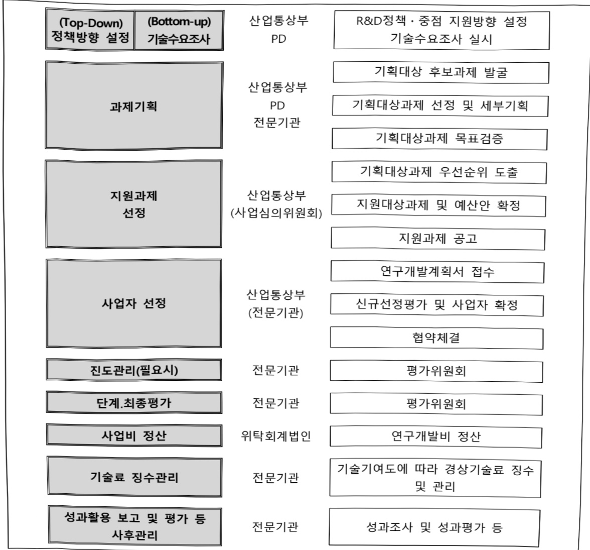

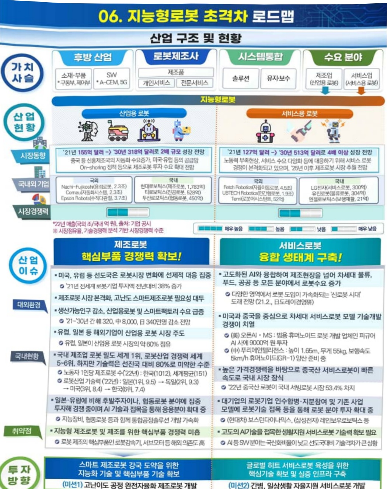

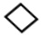

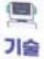

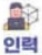

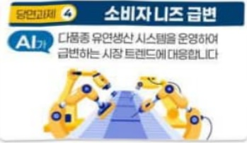

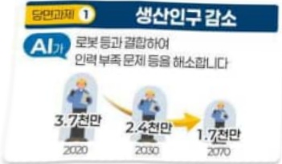

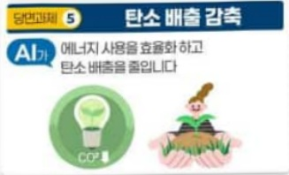

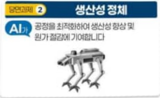

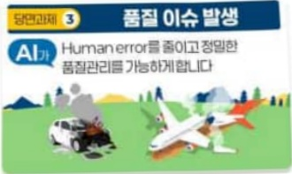

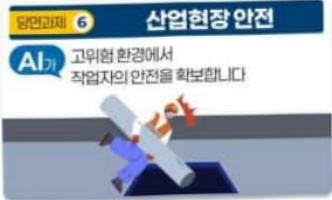

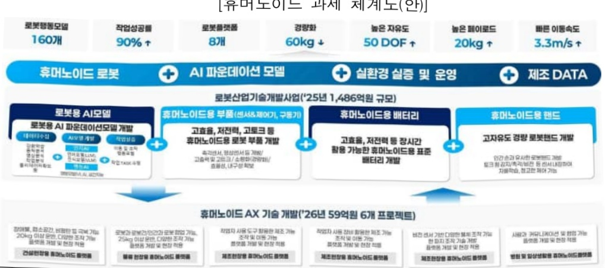

