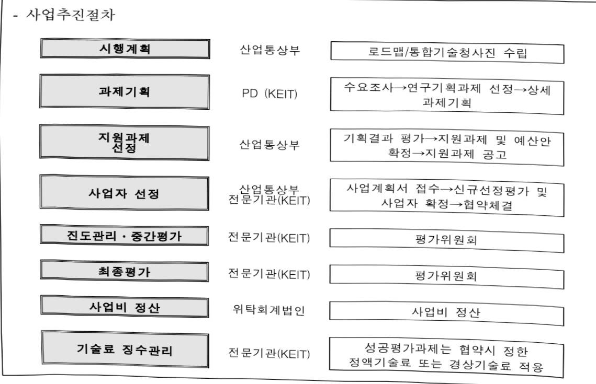
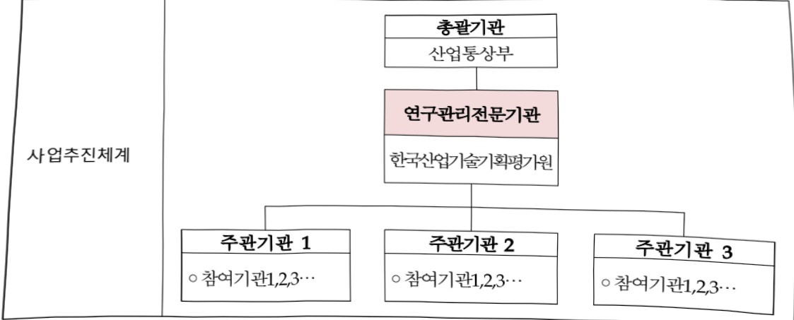

# 멀티오믹스기반난치암맞춤형진단치료상용화기술개발(R&D)

**해당 페이지**: PDF 3895 ~ 3907 쪽 해당

**부처**: 산업통상부
**분야**: 산업·중소기업 및 에너지
**회계유형**: 일반회계
**2026 확정예산**: 5900.0 백만원
**전년대비 증감률**: 9.2%
**AI 도메인**: 데이터, 의료/바이오

---

<table border=1 style='margin: auto; word-wrap: break-word;'><tr><td style='text-align: center; word-wrap: break-word;'>사 업 명</td></tr><tr><td style='text-align: center; word-wrap: break-word;'>(238) 멀티오믹스기반단치암맞춤형진단치료상용화기술개발(R&amp;D) (3651-333)</td></tr></table>

사업 코드 정보

<table border=1 style='margin: auto; word-wrap: break-word;'><tr><td style='text-align: center; word-wrap: break-word;'>구분</td><td style='text-align: center; word-wrap: break-word;'>회계</td><td style='text-align: center; word-wrap: break-word;'>소관</td><td style='text-align: center; word-wrap: break-word;'>실국(기관)</td><td style='text-align: center; word-wrap: break-word;'>계정</td><td style='text-align: center; word-wrap: break-word;'>분야</td><td style='text-align: center; word-wrap: break-word;'>부문</td></tr><tr><td style='text-align: center; word-wrap: break-word;'>코드</td><td rowspan="2">일반회계</td><td rowspan="2">산업통상부</td><td rowspan="2">산업성장실산업인공지능정책관</td><td rowspan="2"></td><td style='text-align: center; word-wrap: break-word;'>110</td><td style='text-align: center; word-wrap: break-word;'>117</td></tr><tr><td style='text-align: center; word-wrap: break-word;'>명칭</td><td style='text-align: center; word-wrap: break-word;'>산업·중소기업 및 에너지</td><td style='text-align: center; word-wrap: break-word;'>산업혁신지원</td></tr></table>

<table border=1 style='margin: auto; word-wrap: break-word;'><tr><td style='text-align: center; word-wrap: break-word;'>구분</td><td style='text-align: center; word-wrap: break-word;'>프로그램</td><td style='text-align: center; word-wrap: break-word;'>단위사업</td><td style='text-align: center; word-wrap: break-word;'>세부사업</td></tr><tr><td style='text-align: center; word-wrap: break-word;'>코드</td><td style='text-align: center; word-wrap: break-word;'>3600</td><td style='text-align: center; word-wrap: break-word;'>3651</td><td style='text-align: center; word-wrap: break-word;'>333</td></tr><tr><td style='text-align: center; word-wrap: break-word;'>명칭</td><td style='text-align: center; word-wrap: break-word;'>신산업진흥</td><td style='text-align: center; word-wrap: break-word;'>바이오헬스기술개발</td><td style='text-align: center; word-wrap: break-word;'>띨티오믹스기반단치암맞춤형 진단치료상용화기술개발(R&amp;D)</td></tr></table>

사업 성격 (공통요구자료 II-1 작성유의사항 4. 참조, 해당하는 사항에 “0” 표시)

<table border=1 style='margin: auto; word-wrap: break-word;'><tr><td rowspan="2">신규</td><td rowspan="2">계속</td><td rowspan="2">완료</td><td rowspan="2">예비타당성 실시여부</td><td rowspan="2">총사업비 관리대상</td><td rowspan="2">총액계상 예산사업</td><td style='text-align: center; word-wrap: break-word;'>사업소관 변경정보</td></tr><tr><td style='text-align: center; word-wrap: break-word;'>2025예산 시 소관</td></tr><tr><td style='text-align: center; word-wrap: break-word;'></td><td style='text-align: center; word-wrap: break-word;'>O</td><td style='text-align: center; word-wrap: break-word;'></td><td style='text-align: center; word-wrap: break-word;'></td><td style='text-align: center; word-wrap: break-word;'></td><td style='text-align: center; word-wrap: break-word;'></td><td style='text-align: center; word-wrap: break-word;'></td></tr></table>

□ 사업 지원 형태 및 지원을 (최소한 한 개는 반드시 선택하시오. 해당사항에 0 표시)

<table border=1 style='margin: auto; word-wrap: break-word;'><tr><td style='text-align: center; word-wrap: break-word;'>직접</td><td style='text-align: center; word-wrap: break-word;'>출자</td><td style='text-align: center; word-wrap: break-word;'>출연</td><td style='text-align: center; word-wrap: break-word;'>보조</td><td style='text-align: center; word-wrap: break-word;'>융자</td><td style='text-align: center; word-wrap: break-word;'>국고보조율(%)</td><td style='text-align: center; word-wrap: break-word;'>융자율(%)</td></tr><tr><td style='text-align: center; word-wrap: break-word;'></td><td style='text-align: center; word-wrap: break-word;'></td><td style='text-align: center; word-wrap: break-word;'>O</td><td style='text-align: center; word-wrap: break-word;'></td><td style='text-align: center; word-wrap: break-word;'></td><td style='text-align: center; word-wrap: break-word;'></td><td style='text-align: center; word-wrap: break-word;'></td></tr></table>

## 사업담당자

<table border=1 style='margin: auto; word-wrap: break-word;'><tr><td style='text-align: center; word-wrap: break-word;'>사업명</td><td colspan="5">구분</td></tr><tr><td rowspan="2">멀티오믹스 기반난치암 맞춤형 진단 치료상용화 기술개발</td><td style='text-align: center; word-wrap: break-word;'>소관부처</td><td style='text-align: center; word-wrap: break-word;'>실·국·과(팀) 산업성장실 산업인공지능정책관 인공지능바이오융 합산업과</td><td style='text-align: center; word-wrap: break-word;'>과 장 최광준</td><td style='text-align: center; word-wrap: break-word;'>사무관 노진환</td><td style='text-align: center; word-wrap: break-word;'>주무관</td></tr><tr><td style='text-align: center; word-wrap: break-word;'>사업시행주체</td><td style='text-align: center; word-wrap: break-word;'>한국산업기술 기획평가원</td><td style='text-align: center; word-wrap: break-word;'>바이오헬스실</td><td style='text-align: center; word-wrap: break-word;'>차혜선 실장</td><td style='text-align: center; word-wrap: break-word;'>053-718-8420</td></tr></table>

---

### 가.예산 총괄표

(단위: 백만원, %)

<table border=1 style='margin: auto; word-wrap: break-word;'><tr><td rowspan="2">사업명</td><td rowspan="2">2024년 결산</td><td colspan="2">2025년 예산</td><td colspan="2">2026년</td><td rowspan="2">증감(B-A)</td><td rowspan="2">(B-A)/A</td></tr><tr><td style='text-align: center; word-wrap: break-word;'>본예산(A)</td><td style='text-align: center; word-wrap: break-word;'>추경</td><td style='text-align: center; word-wrap: break-word;'>요구안</td><td style='text-align: center; word-wrap: break-word;'>확정(B)</td></tr><tr><td style='text-align: center; word-wrap: break-word;'>멀티오믹스기반 난치암맞춤형진단 치료상용화기술 개발(R&amp;D)</td><td style='text-align: center; word-wrap: break-word;'>4,500</td><td style='text-align: center; word-wrap: break-word;'>5,400</td><td style='text-align: center; word-wrap: break-word;'>-</td><td style='text-align: center; word-wrap: break-word;'>5,900</td><td style='text-align: center; word-wrap: break-word;'>5,900</td><td style='text-align: center; word-wrap: break-word;'>500</td><td style='text-align: center; word-wrap: break-word;'>9.2</td></tr></table>

□ 기능별(내역사업별), 목별 예산 내역

(단위:백만원)

<table border=1 style='margin: auto; word-wrap: break-word;'><tr><td rowspan="3"></td><td colspan="5">2024</td><td colspan="7">2025(2025.12월말)</td><td rowspan="3">2026예산</td></tr><tr><td rowspan="2">예산액(추정)</td><td rowspan="2">예산현액</td><td rowspan="2">집행액[실집행액]</td><td rowspan="2">이월액</td><td rowspan="2">불용액</td><td rowspan="2">분예산</td><td rowspan="2">예산현액</td><td rowspan="2">집행액[실집행액]</td><td colspan="2">전년도 이월액제외</td><td rowspan="2">이월예상액</td><td rowspan="2">불용예상액</td></tr><tr><td style='text-align: center; word-wrap: break-word;'>예산현액</td><td style='text-align: center; word-wrap: break-word;'>집행액[실집행액]</td></tr><tr><td style='text-align: center; word-wrap: break-word;'>○ 기능별 분류(합계)</td><td style='text-align: center; word-wrap: break-word;'>4,500</td><td style='text-align: center; word-wrap: break-word;'>4,500</td><td style='text-align: center; word-wrap: break-word;'>4,500[4,500]</td><td style='text-align: center; word-wrap: break-word;'>-</td><td style='text-align: center; word-wrap: break-word;'>-</td><td style='text-align: center; word-wrap: break-word;'>5,400</td><td style='text-align: center; word-wrap: break-word;'>5,400</td><td style='text-align: center; word-wrap: break-word;'>5,400[5,400]</td><td style='text-align: center; word-wrap: break-word;'>5,400</td><td style='text-align: center; word-wrap: break-word;'>5,400[5,400]</td><td style='text-align: center; word-wrap: break-word;'>-</td><td style='text-align: center; word-wrap: break-word;'>-</td><td style='text-align: center; word-wrap: break-word;'>5,900</td></tr><tr><td rowspan="2">· 멀티오믹스 빅데이터 기반 난치암&quot;Uindruggable&quot; 타겟연구 및 표적 치료제설계 기술개발· 멀티오믹스/디지털통합분석기반&quot;전단계암&quot; 정밀예측· 진단 플랫폼 개발 및 제품화</td><td style='text-align: center; word-wrap: break-word;'>2,175</td><td style='text-align: center; word-wrap: break-word;'>2,175</td><td style='text-align: center; word-wrap: break-word;'>2,175[2,175]</td><td style='text-align: center; word-wrap: break-word;'>-</td><td style='text-align: center; word-wrap: break-word;'>-</td><td style='text-align: center; word-wrap: break-word;'>2,612</td><td style='text-align: center; word-wrap: break-word;'>2,612</td><td style='text-align: center; word-wrap: break-word;'>2,612[2,612]</td><td style='text-align: center; word-wrap: break-word;'>2,612</td><td style='text-align: center; word-wrap: break-word;'>2,612[2,612]</td><td style='text-align: center; word-wrap: break-word;'>-</td><td style='text-align: center; word-wrap: break-word;'>-</td><td style='text-align: center; word-wrap: break-word;'>2,736</td></tr><tr><td style='text-align: center; word-wrap: break-word;'>2,325</td><td style='text-align: center; word-wrap: break-word;'>2,325</td><td style='text-align: center; word-wrap: break-word;'>2,325[2,325]</td><td style='text-align: center; word-wrap: break-word;'>-</td><td style='text-align: center; word-wrap: break-word;'>-</td><td style='text-align: center; word-wrap: break-word;'>2,788</td><td style='text-align: center; word-wrap: break-word;'>2,788</td><td style='text-align: center; word-wrap: break-word;'>2,788[2,788]</td><td style='text-align: center; word-wrap: break-word;'>2,788</td><td style='text-align: center; word-wrap: break-word;'>2,788[2,788]</td><td style='text-align: center; word-wrap: break-word;'>-</td><td style='text-align: center; word-wrap: break-word;'>-</td><td style='text-align: center; word-wrap: break-word;'>3,164</td></tr><tr><td style='text-align: center; word-wrap: break-word;'>○ 비목별 분류(합계)</td><td style='text-align: center; word-wrap: break-word;'>4,500</td><td style='text-align: center; word-wrap: break-word;'>4,500</td><td style='text-align: center; word-wrap: break-word;'>4,500[4,500]</td><td style='text-align: center; word-wrap: break-word;'>-</td><td style='text-align: center; word-wrap: break-word;'>-</td><td style='text-align: center; word-wrap: break-word;'>5,400</td><td style='text-align: center; word-wrap: break-word;'>5,400</td><td style='text-align: center; word-wrap: break-word;'>5,400[5,400]</td><td style='text-align: center; word-wrap: break-word;'>5,400</td><td style='text-align: center; word-wrap: break-word;'>5,400[5,400]</td><td style='text-align: center; word-wrap: break-word;'>-</td><td style='text-align: center; word-wrap: break-word;'>-</td><td style='text-align: center; word-wrap: break-word;'>5,900</td></tr><tr><td style='text-align: center; word-wrap: break-word;'>· 연구개발활동비등(360-05)</td><td style='text-align: center; word-wrap: break-word;'>4,500</td><td style='text-align: center; word-wrap: break-word;'>4,500</td><td style='text-align: center; word-wrap: break-word;'>4,500[4,500]</td><td style='text-align: center; word-wrap: break-word;'>-</td><td style='text-align: center; word-wrap: break-word;'>-</td><td style='text-align: center; word-wrap: break-word;'>5,400</td><td style='text-align: center; word-wrap: break-word;'>5,400</td><td style='text-align: center; word-wrap: break-word;'>5,400[5,400]</td><td style='text-align: center; word-wrap: break-word;'>5,400</td><td style='text-align: center; word-wrap: break-word;'>5,400[5,400]</td><td style='text-align: center; word-wrap: break-word;'>-</td><td style='text-align: center; word-wrap: break-word;'>-</td><td style='text-align: center; word-wrap: break-word;'>5,900</td></tr><tr><td style='text-align: center; word-wrap: break-word;'>○ 기능비목별 분류(합계)</td><td style='text-align: center; word-wrap: break-word;'>4,500</td><td style='text-align: center; word-wrap: break-word;'>4,500</td><td style='text-align: center; word-wrap: break-word;'>4,500[4,500]</td><td style='text-align: center; word-wrap: break-word;'>-</td><td style='text-align: center; word-wrap: break-word;'>-</td><td style='text-align: center; word-wrap: break-word;'>5,400</td><td style='text-align: center; word-wrap: break-word;'>5,400</td><td style='text-align: center; word-wrap: break-word;'>5,400[5,400]</td><td style='text-align: center; word-wrap: break-word;'>5,400</td><td style='text-align: center; word-wrap: break-word;'>5,400[5,400]</td><td style='text-align: center; word-wrap: break-word;'>-</td><td style='text-align: center; word-wrap: break-word;'>-</td><td style='text-align: center; word-wrap: break-word;'>5,900</td></tr><tr><td rowspan="4">· 멀티오믹스 빅데이터 기반 난치암&quot;Uindruggable&quot; 타겟연구 및 표적 치료제설계 기술개발· 연구개발활동비등(360-05)· 멀티오믹스/디지털통합분석기반&quot;전단계암&quot; 정밀예측· 진단 플랫폼 개발 및 제품화· 연구개발활동비등(360-05)</td><td style='text-align: center; word-wrap: break-word;'>2,175</td><td style='text-align: center; word-wrap: break-word;'>2,175</td><td style='text-align: center; word-wrap: break-word;'>2,175[2,175]</td><td style='text-align: center; word-wrap: break-word;'>-</td><td style='text-align: center; word-wrap: break-word;'>-</td><td style='text-align: center; word-wrap: break-word;'>2,612</td><td style='text-align: center; word-wrap: break-word;'>2,612</td><td style='text-align: center; word-wrap: break-word;'>2,612[2,612]</td><td style='text-align: center; word-wrap: break-word;'>2,612</td><td style='text-align: center; word-wrap: break-word;'>2,612[2,612]</td><td style='text-align: center; word-wrap: break-word;'>-</td><td style='text-align: center; word-wrap: break-word;'>-</td><td style='text-align: center; word-wrap: break-word;'>2,736</td></tr><tr><td style='text-align: center; word-wrap: break-word;'>2,175</td><td style='text-align: center; word-wrap: break-word;'>2,175</td><td style='text-align: center; word-wrap: break-word;'>2,175[2,175]</td><td style='text-align: center; word-wrap: break-word;'>-</td><td style='text-align: center; word-wrap: break-word;'>-</td><td style='text-align: center; word-wrap: break-word;'>2,612</td><td style='text-align: center; word-wrap: break-word;'>2,612</td><td style='text-align: center; word-wrap: break-word;'>2,612[2,612]</td><td style='text-align: center; word-wrap: break-word;'>2,612</td><td style='text-align: center; word-wrap: break-word;'>2,612[2,612]</td><td style='text-align: center; word-wrap: break-word;'>-</td><td style='text-align: center; word-wrap: break-word;'>-</td><td style='text-align: center; word-wrap: break-word;'>2,736</td></tr><tr><td style='text-align: center; word-wrap: break-word;'>2,325</td><td style='text-align: center; word-wrap: break-word;'>2,325</td><td style='text-align: center; word-wrap: break-word;'>2,325[2,325]</td><td style='text-align: center; word-wrap: break-word;'>-</td><td style='text-align: center; word-wrap: break-word;'>-</td><td style='text-align: center; word-wrap: break-word;'>2,788</td><td style='text-align: center; word-wrap: break-word;'>2,788</td><td style='text-align: center; word-wrap: break-word;'>2,788[2,788]</td><td style='text-align: center; word-wrap: break-word;'>2,788</td><td style='text-align: center; word-wrap: break-word;'>2,788[2,788]</td><td style='text-align: center; word-wrap: break-word;'>-</td><td style='text-align: center; word-wrap: break-word;'>-</td><td style='text-align: center; word-wrap: break-word;'>3,164</td></tr><tr><td style='text-align: center; word-wrap: break-word;'>2,325</td><td style='text-align: center; word-wrap: break-word;'>2,325</td><td style='text-align: center; word-wrap: break-word;'>2,325[2,325]</td><td style='text-align: center; word-wrap: break-word;'>-</td><td style='text-align: center; word-wrap: break-word;'>-</td><td style='text-align: center; word-wrap: break-word;'>2,788</td><td style='text-align: center; word-wrap: break-word;'>2,788</td><td style='text-align: center; word-wrap: break-word;'>2,788[2,788]</td><td style='text-align: center; word-wrap: break-word;'>2,788</td><td style='text-align: center; word-wrap: break-word;'>2,788[2,788]</td><td style='text-align: center; word-wrap: break-word;'>-</td><td style='text-align: center; word-wrap: break-word;'>-</td><td style='text-align: center; word-wrap: break-word;'>3,164</td></tr></table>

---

### 나. 사업설명자료

## 1 ) 사업목적·내용

- (멀티오믹스기반 난치암 맞춤형 진단치료 상용화 기술개발) 기획보된 대규모 난치암 멀티오믹스 빅데이터의 상용화 및 제품화를 위해 기초, 임상, 계놈, 인공지능, 나노기술을 융합한 다학제 통합 분석 및 활용기술 개발을 통해 난치암 맞춤형 진단·치료 기술을 개발하여 정밀의료산업 고도화 및 바이오 의료 분야 신산업 창출

- (내역1 : 멀티오믹스빅데이터 기반 난치암“Undruggable” 타겟 연구 및 표적치료제 설계 기술개발) 멀티오믹스 빅데이터 통합분석 기반 난치암 undruggable 타겟 발굴 및 타겟 대상 치료 후보물질 도출 시스템 개발을 통한 신개념 난치암 표적 치료제 상용화 기술 개발 지원

- (내역2 : 멀티오믹스/디지털 통합분석기반 “전단계암” 정밀예측·진단 플랫폼 개발 및 제품화) 기존 학술 연구 목적으로 대규모로 확보된 오믹스 멀티오믹스 데이터를 상업적으로 활용가능하도록 통합하고 분석 고도화와 더불어 기초, 임상, AI, 나노기술 포함한 다학적 접근법을 통해 무증상 전암 및 암 예측 초정밀 진단패널/키트 및 장비 상용화 기술 개발 지원

---

## 2 ) 사업개요

## □ 사업근거 및 추진경위

① 법령상 근거 및 조항 적시

-산업기술혁신촉진법 제11조(산업기술개발사업)

제11조(산업기술개발사업) ① 산업통상부장관은 혁신계획 및 시행계획을 효율적으로 수행하기 위하여 관계 중앙행정기관의 장과 협의하여 다음 각 호의 산업기술분야에서 기술개발사업(산업기술개발을 위하여 필요한 기획 및 조사를 포함한다. 이하 "산업기술개발사업"이라 한다)을 추진할 수 있다. (~생략~)

- 생명공학육성법 제11조(생명공학의 산업적 응용촉진에 대한 지원)

제11조(연구개발사업의 추진) ① 정부는 이 법의 목적을 효율적으로 달성하기 위하여 생명공학 연구 및 기술개발을 위한 연구개발사업을 실시하여야 한다.

② 추진경위 - 사업 시작년도, 추진배경, 부처별 중점과제, 대통령 공약사항 등

- 바이오경제 2.0 추진방향('23.7) 및 바이오헬스 신시장 창출전략('23.2)

- 新성장 4.0 전략 추진계획('22.12)

-「24년도 국가연구개발 투자방향 및 기준(23.3)」 따른 기획위원회 구성 및 운영

- 국정과제 경제2-8. 신성장동력 발굴·육성으로 첨단 산업국가 도약(실천과제 3. 바이오산업 육성 및 해외진출 지원)

## □ 주요내용

① 사업규모

- 총사업비(해당되는 경우에만 기재) : 해당없음

- 사업기간 : '24 ~ '28년 (5년)

- 최근 5년 간 투입된 사업비(예산액기준, 추경편성한 연도에는 주경포함)

<table border=1 style='margin: auto; word-wrap: break-word;'><tr><td style='text-align: center; word-wrap: break-word;'>闰五</td><td style='text-align: center; word-wrap: break-word;'>2022</td><td style='text-align: center; word-wrap: break-word;'>2023</td><td style='text-align: center; word-wrap: break-word;'>2024</td><td style='text-align: center; word-wrap: break-word;'>2025</td><td style='text-align: center; word-wrap: break-word;'>2026</td></tr><tr><td style='text-align: center; word-wrap: break-word;'>사업비</td><td style='text-align: center; word-wrap: break-word;'>-</td><td style='text-align: center; word-wrap: break-word;'>-</td><td style='text-align: center; word-wrap: break-word;'>4,500</td><td style='text-align: center; word-wrap: break-word;'>5,400</td><td style='text-align: center; word-wrap: break-word;'>5,900</td></tr></table>

- 기타: 해당없음

---

## ② 사업추진체계

- 사업시행방법 : 출연

- 사업시행주체 : 한국산업기술기획평가원

- 보조, 융자, 출연, 출자 등의 경우 보조·융자 등 지원 비율 및 법적근거

- 사업 수혜자 : 기업, 연구소, 대학 등

<table border=1 style='margin: auto; word-wrap: break-word;'><tr><td style='text-align: center; word-wrap: break-word;'>내역사업명</td><td style='text-align: center; word-wrap: break-word;'>구분</td><td style='text-align: center; word-wrap: break-word;'>피보조·피출연 등 기관명</td><td style='text-align: center; word-wrap: break-word;'>지원 금액 (2026예산)</td><td style='text-align: center; word-wrap: break-word;'>지원 비율(%)</td><td style='text-align: center; word-wrap: break-word;'>보조율 법적근거 (해당 조항)</td></tr><tr><td style='text-align: center; word-wrap: break-word;'>멀티오믹스 빅테이터 기반 난치암 &quot;Undruggable&quot; 타겟 연구 및 표적 치료제 설계 기술개발</td><td style='text-align: center; word-wrap: break-word;'>출연</td><td style='text-align: center; word-wrap: break-word;'>한국산업 기술기획 평가원</td><td style='text-align: center; word-wrap: break-word;'>2,736백만원</td><td style='text-align: center; word-wrap: break-word;'>총사업비의 75%이내</td><td style='text-align: center; word-wrap: break-word;'>산업기술혁신촉진법 제11조(산업기술개발사업)</td></tr><tr><td style='text-align: center; word-wrap: break-word;'>멀티오믹스/디지털 통합분석기반 &quot;전단계암&quot; 정밀예측 진단 플랫폼 개발 및 제품화</td><td style='text-align: center; word-wrap: break-word;'>출연</td><td style='text-align: center; word-wrap: break-word;'>한국산업 기술기획 평가원</td><td style='text-align: center; word-wrap: break-word;'>3,164백만원</td><td style='text-align: center; word-wrap: break-word;'>총사업비의 75%이내</td><td style='text-align: center; word-wrap: break-word;'>산업기술혁신촉진법 제11조(산업기술개발사업)</td></tr></table>

---

## 3 ) 2026년도 예산 산출 근거

① 멀티오믹스빅데이터 기반 난치암"Undruggable" 타겟 연구 및 표적치료제 설계 기술개발 내역 : ('25) 2,612 → ('26) 2,736백만원, +4.7%

- (반영) 신규 Undruggable 치료 표적 선정 및 효과 예측 통합분석 플랫폼 기술, 임상 병리학적 검증 등 신 개념 표적 치료제 상용화 기술개발을 위한, '25년 대비 + 4.7% 증액

- (산출) 4개(계속과제) x 684백만원 x 12/12개월 = 2,736백만원

②멀티오믹스/디지털 통합분석기반"전단계암" 정밀예측·진단 플랫폼 개발 및 제품화 내역

:(25)2,788→(26)3,164백만원,+13.5%

- (반영) 난치암 조기 진단 및 정밀 예후예측 마커 발굴, 임상 유효성 검증 시스템, 진단 키트 및 장비 제품화 및 상용화 기술개발을 위한, '25년 대비 + 13.5% 증액

- (산출) 4개(계속과제) x 791백만원 x 12/12개월 = 3,164백만원

2025년도 예산 및 2026년도 예산 산출 세부내역 비교

<table border=1 style='margin: auto; word-wrap: break-word;'><tr><td colspan="2">2025년 본예산</td><td colspan="2">2026년 예산</td></tr><tr><td style='text-align: center; word-wrap: break-word;'>예산</td><td style='text-align: center; word-wrap: break-word;'>산출내역</td><td style='text-align: center; word-wrap: break-word;'>예산</td><td style='text-align: center; word-wrap: break-word;'>산출내역</td></tr><tr><td style='text-align: center; word-wrap: break-word;'>5,400</td><td style='text-align: center; word-wrap: break-word;'>○ 연구개발활동비(360-05) : 5,400액만원○ 멀티오믹스 빅데이터 기반 난치암 &quot;Undruggable&quot; 타겟 연구 및 표적 치료제 설계 기술개발 : 2,612백만원- 653백만원 x 4개(계속) x 12/12개월○ 멀티오믹스/디지털 통합분석기반 &quot;전단계암&quot; 정밀예측 진단 플랫폼 개발 및 제품화 : 2,325백만원- 697백만원 x 4개(계속) x 12/12개월</td><td style='text-align: center; word-wrap: break-word;'>5,900</td><td style='text-align: center; word-wrap: break-word;'>○ 연구개발활동비(360-05) : 5,900백만원○ 멀티오믹스 빅데이터 기반 난치암 &quot;Undruggable&quot; 타겟 연구 및 표적 치료제 설계 기술개발 : 2,736백만원- 684백만원 x 4개(계속) x 12/12개월○ 멀티오믹스/디지털 통합분석기반 &quot;전단계암&quot; 정밀예측 진단 플랫폼 개발 및 제품화 : 3,164백만원- 791백만원 x 4개(계속) x 12/12개월</td></tr></table>

## 4 ) 사업효과

□ 사업영향, 산출물 성과지표 등

① 2022~2026년도 성과계획서 상 성과지표 및 최근 5년간 성과 달성도

* 성과지표 재수립 예정

<table border=1 style='margin: auto; word-wrap: break-word;'><tr><td style='text-align: center; word-wrap: break-word;'>성과지표</td><td style='text-align: center; word-wrap: break-word;'>구분</td><td style='text-align: center; word-wrap: break-word;'>2022</td><td style='text-align: center; word-wrap: break-word;'>2023</td><td style='text-align: center; word-wrap: break-word;'>2024</td><td style='text-align: center; word-wrap: break-word;'>2025</td><td style='text-align: center; word-wrap: break-word;'>2026</td><td style='text-align: center; word-wrap: break-word;'>2026목표치산출근거</td><td style='text-align: center; word-wrap: break-word;'>측정산식(또는 측정방법)</td><td style='text-align: center; word-wrap: break-word;'>자료수집방법(또는 자료출처)</td></tr><tr><td rowspan="3">멀티오믹스데이터확보(단위: 건수)</td><td style='text-align: center; word-wrap: break-word;'>목표</td><td style='text-align: center; word-wrap: break-word;'>-</td><td style='text-align: center; word-wrap: break-word;'>-</td><td style='text-align: center; word-wrap: break-word;'>신규</td><td style='text-align: center; word-wrap: break-word;'>1,250</td><td style='text-align: center; word-wrap: break-word;'>1,250</td><td rowspan="3">데이터 확보 수</td><td rowspan="3">데이터 확보 수</td><td rowspan="3">연구결과보고서</td></tr><tr><td style='text-align: center; word-wrap: break-word;'>실적</td><td style='text-align: center; word-wrap: break-word;'>-</td><td style='text-align: center; word-wrap: break-word;'>-</td><td style='text-align: center; word-wrap: break-word;'>-</td><td style='text-align: center; word-wrap: break-word;'>1,250</td><td style='text-align: center; word-wrap: break-word;'></td></tr><tr><td style='text-align: center; word-wrap: break-word;'>달성도</td><td style='text-align: center; word-wrap: break-word;'>-</td><td style='text-align: center; word-wrap: break-word;'>-</td><td style='text-align: center; word-wrap: break-word;'>-</td><td style='text-align: center; word-wrap: break-word;'>100</td><td style='text-align: center; word-wrap: break-word;'></td></tr><tr><td rowspan="3">난치암 타겟 발굴목표달성률(단위: %)</td><td style='text-align: center; word-wrap: break-word;'>목표</td><td style='text-align: center; word-wrap: break-word;'>-</td><td style='text-align: center; word-wrap: break-word;'>-</td><td style='text-align: center; word-wrap: break-word;'>신규</td><td style='text-align: center; word-wrap: break-word;'>100</td><td style='text-align: center; word-wrap: break-word;'>100</td><td rowspan="3">난치암 암종 별 타겟 목표달성률</td><td rowspan="3">실제 난치암 타겟발굴건수/목표한 난치암 타겟발굴 건수</td><td rowspan="3">연구결과보고서</td></tr><tr><td style='text-align: center; word-wrap: break-word;'>실적</td><td style='text-align: center; word-wrap: break-word;'>-</td><td style='text-align: center; word-wrap: break-word;'>-</td><td style='text-align: center; word-wrap: break-word;'>-</td><td style='text-align: center; word-wrap: break-word;'>100</td><td style='text-align: center; word-wrap: break-word;'></td></tr><tr><td style='text-align: center; word-wrap: break-word;'>달성도</td><td style='text-align: center; word-wrap: break-word;'>-</td><td style='text-align: center; word-wrap: break-word;'>-</td><td style='text-align: center; word-wrap: break-word;'>-</td><td style='text-align: center; word-wrap: break-word;'>-</td><td style='text-align: center; word-wrap: break-word;'></td></tr><tr><td rowspan="3">난치암 진단치료시제품(단위: 건수)</td><td style='text-align: center; word-wrap: break-word;'>목표</td><td style='text-align: center; word-wrap: break-word;'>-</td><td style='text-align: center; word-wrap: break-word;'>-</td><td style='text-align: center; word-wrap: break-word;'>신규</td><td style='text-align: center; word-wrap: break-word;'>-</td><td style='text-align: center; word-wrap: break-word;'>5</td><td rowspan="3">진단치료 시제품</td><td rowspan="3">진단기술 기반의 제품화 건수</td><td rowspan="3">연구결과보고서</td></tr><tr><td style='text-align: center; word-wrap: break-word;'>실적</td><td style='text-align: center; word-wrap: break-word;'>-</td><td style='text-align: center; word-wrap: break-word;'>-</td><td style='text-align: center; word-wrap: break-word;'>-</td><td style='text-align: center; word-wrap: break-word;'>-</td><td style='text-align: center; word-wrap: break-word;'></td></tr><tr><td style='text-align: center; word-wrap: break-word;'>달성도</td><td style='text-align: center; word-wrap: break-word;'>-</td><td style='text-align: center; word-wrap: break-word;'>-</td><td style='text-align: center; word-wrap: break-word;'>-</td><td style='text-align: center; word-wrap: break-word;'>-</td><td style='text-align: center; word-wrap: break-word;'></td></tr></table>

---

② 성과지표 이외의 연도별 사업추진 경과 및 실적

<table border=1 style='margin: auto; word-wrap: break-word;'><tr><td style='text-align: center; word-wrap: break-word;'>2022</td><td style='text-align: center; word-wrap: break-word;'></td></tr><tr><td style='text-align: center; word-wrap: break-word;'>2023</td><td style='text-align: center; word-wrap: break-word;'></td></tr><tr><td style='text-align: center; word-wrap: break-word;'>2024</td><td style='text-align: center; word-wrap: break-word;'>신규과제 8개 선정 및 협약</td></tr><tr><td style='text-align: center; word-wrap: break-word;'>2025</td><td style='text-align: center; word-wrap: break-word;'>진도점검(연차)을 통한 사업비 지급 및 계속과제 8개 수행중</td></tr></table>

③향후(2026년도 이후)기대효과

- 난치암 임상정보 빅데이터와 멀티오믹스 빅데이터의 생산·분석·검증·활용개발 전 과정에 대한 디지털 일체시스템 플랫폼을 개발/상용화하여 국내 정밀의료산업의 생산성 증대

## 5 ) 타당성조사 및 예비타당성조사 시행여부 및 결과 요지 : 해당없음

## 6 ) 총사업비 대상사업 여부 및 내역

## - 총사업비 관리 대상 사업인 경우 작성 : 해당없음

## 7 ) 사업 집행절차

-사업추진절차

산업통상부

과제기획

PD (KEIT)

로드맵/통합기술청사진 수립

지원과제

선정

수요조사→연구기획과제 선정→상세

과제기획

산업통상부

사업자 선정

기획결과 평가→지원과제 및 예산안

확정→지원과제 공고

산업통상부

전문기관(KEIT)

진도관리·중간평가

사업계획서 접수→신규선정평가 및

사업자 확정→협약체결

전문기관(KEIT)

평가위원회

사업비 정산

전문기관(KEIT)

기술료 징수관리

평가위원회

위탁회계법인

사업비 정산

전문기관(KEIT)

성공평가과제는 협약시 정한

정액기술료 또는 경상기술료 적용

---

- 사업 집행절차

<table border=1 style='margin: auto; word-wrap: break-word;'><tr><td style='text-align: center; word-wrap: break-word;'>부처</td><td style='text-align: center; word-wrap: break-word;'></td><td style='text-align: center; word-wrap: break-word;'>피출연·피보조기관</td><td style='text-align: center; word-wrap: break-word;'></td><td style='text-align: center; word-wrap: break-word;'>간접보조사업자·사업수행자</td></tr><tr><td style='text-align: center; word-wrap: break-word;'>산업부</td><td style='text-align: center; word-wrap: break-word;'>=&gt;</td><td style='text-align: center; word-wrap: break-word;'>한국산업기술기획평가원</td><td style='text-align: center; word-wrap: break-word;'>=&gt;</td><td style='text-align: center; word-wrap: break-word;'>기업, 연구소, 대학 등 연구개발기관</td></tr></table>

8) 중기재정계획 상 연도별 투자계획 및 추진경과

(단위: 백만원)

<table border=1 style='margin: auto; word-wrap: break-word;'><tr><td style='text-align: center; word-wrap: break-word;'>$  \text{중기}  $ 2024 재정계획</td><td style='text-align: center; word-wrap: break-word;'>2025</td><td style='text-align: center; word-wrap: break-word;'>2026</td><td style='text-align: center; word-wrap: break-word;'>2027</td><td style='text-align: center; word-wrap: break-word;'>2028</td><td style='text-align: center; word-wrap: break-word;'>2029</td></tr><tr><td style='text-align: center; word-wrap: break-word;'>2024~2028</td><td style='text-align: center; word-wrap: break-word;'>4,500</td><td style='text-align: center; word-wrap: break-word;'>5,400</td><td style='text-align: center; word-wrap: break-word;'>6,000</td><td style='text-align: center; word-wrap: break-word;'>6,000</td><td style='text-align: center; word-wrap: break-word;'>☑</td></tr><tr><td style='text-align: center; word-wrap: break-word;'>2025~2029</td><td style='text-align: center; word-wrap: break-word;'>☑</td><td style='text-align: center; word-wrap: break-word;'>5,400</td><td style='text-align: center; word-wrap: break-word;'>5,900</td><td style='text-align: center; word-wrap: break-word;'>6,000</td><td style='text-align: center; word-wrap: break-word;'>☑</td></tr></table>

9) 최근 3년간 동 사업에 대한 주요 외부지적사항 및 평가, 문제점 및 대책

해당없음

## 10 ) 향후 추진방향 및 추진계획

<table border=1 style='margin: auto; word-wrap: break-word;'><tr><td style='text-align: center; word-wrap: break-word;'>- 기존의 대규모 멀티오믹스 기반의 빅데이터를 생산, 분석하는 단계를 넘어 임상적 가치 분석 및 검증, 활용 개발 전과정에 대한 전주기 오믹스 일체 플랫폼 개발을 통해 난치암 진단 키트/장비 및 치료후보물질을 포함한 질병관리 서비스 플랫폼 등 상용화 가능한 제품을 개발하는 멀티오믹스 가치 극대화 및 상용화</td></tr><tr><td style='text-align: center; word-wrap: break-word;'>- 현재 충분히 기축적된 멀티오믹스 상용화에 대한 기술개발 플랫폼 제공</td></tr><tr><td style='text-align: center; word-wrap: break-word;'>- 난치암 환자에 대한 맞춤형 조기 진단, 치료여부를 제공하고 혁신적인 난치암 치료법 개발</td></tr><tr><td style='text-align: center; word-wrap: break-word;'>- 난치암 멀티오믹스 상용화를 통해 바이오융복합 신산업을 창출</td></tr></table>

11) 해당사업에 대한 각종 사업평가의 결과 : 해당없음

12) 해당사업에 대한 부처 자체평가의 결과 : 해당없음

13) 부처 건의사항 : 해당없음

---

### 다. 최근 4년간 결산내역

## 1 ) 결산표

☐ 부처 결산내역

(단위: 백만원, %)

<table border=1 style='margin: auto; word-wrap: break-word;'><tr><td rowspan="2">闰五</td><td colspan="3">예산액</td><td rowspan="2">전년도 이월액</td><td rowspan="2">이·전용 등</td><td rowspan="2">예비비</td><td rowspan="2">예산 현액(B)</td><td rowspan="2">집행액(C)</td><td rowspan="2">집행률(C/A)</td><td rowspan="2">집행률(C/B)</td><td rowspan="2">다음연도 이월액</td><td rowspan="2">불용액</td></tr><tr><td colspan="2">본예산 중감액</td><td style='text-align: center; word-wrap: break-word;'>추경(A)</td></tr><tr><td style='text-align: center; word-wrap: break-word;'>2022</td><td style='text-align: center; word-wrap: break-word;'></td><td style='text-align: center; word-wrap: break-word;'></td><td style='text-align: center; word-wrap: break-word;'></td><td style='text-align: center; word-wrap: break-word;'></td><td style='text-align: center; word-wrap: break-word;'></td><td style='text-align: center; word-wrap: break-word;'></td><td style='text-align: center; word-wrap: break-word;'></td><td style='text-align: center; word-wrap: break-word;'></td><td style='text-align: center; word-wrap: break-word;'></td><td style='text-align: center; word-wrap: break-word;'></td><td style='text-align: center; word-wrap: break-word;'></td><td style='text-align: center; word-wrap: break-word;'></td></tr><tr><td style='text-align: center; word-wrap: break-word;'>2023</td><td style='text-align: center; word-wrap: break-word;'></td><td style='text-align: center; word-wrap: break-word;'></td><td style='text-align: center; word-wrap: break-word;'></td><td style='text-align: center; word-wrap: break-word;'></td><td style='text-align: center; word-wrap: break-word;'></td><td style='text-align: center; word-wrap: break-word;'></td><td style='text-align: center; word-wrap: break-word;'></td><td style='text-align: center; word-wrap: break-word;'></td><td style='text-align: center; word-wrap: break-word;'></td><td style='text-align: center; word-wrap: break-word;'></td><td style='text-align: center; word-wrap: break-word;'></td><td style='text-align: center; word-wrap: break-word;'></td></tr><tr><td style='text-align: center; word-wrap: break-word;'>2024</td><td style='text-align: center; word-wrap: break-word;'>4,500</td><td style='text-align: center; word-wrap: break-word;'>-</td><td style='text-align: center; word-wrap: break-word;'>4,500</td><td style='text-align: center; word-wrap: break-word;'>-</td><td style='text-align: center; word-wrap: break-word;'>-</td><td style='text-align: center; word-wrap: break-word;'>-</td><td style='text-align: center; word-wrap: break-word;'>4,500</td><td style='text-align: center; word-wrap: break-word;'>4,500</td><td style='text-align: center; word-wrap: break-word;'>100</td><td style='text-align: center; word-wrap: break-word;'>100</td><td style='text-align: center; word-wrap: break-word;'>-</td><td style='text-align: center; word-wrap: break-word;'>-</td></tr><tr><td style='text-align: center; word-wrap: break-word;'>2025</td><td style='text-align: center; word-wrap: break-word;'>5,400</td><td style='text-align: center; word-wrap: break-word;'>-</td><td style='text-align: center; word-wrap: break-word;'>5,400</td><td style='text-align: center; word-wrap: break-word;'>-</td><td style='text-align: center; word-wrap: break-word;'>-</td><td style='text-align: center; word-wrap: break-word;'>-</td><td style='text-align: center; word-wrap: break-word;'>5,400</td><td style='text-align: center; word-wrap: break-word;'>5,400</td><td style='text-align: center; word-wrap: break-word;'>100</td><td style='text-align: center; word-wrap: break-word;'>100</td><td style='text-align: center; word-wrap: break-word;'>-</td><td style='text-align: center; word-wrap: break-word;'>-</td></tr></table>

□출연·보조사업 등 실집행내역

(단위: 백만원, %)

<table border=1 style='margin: auto; word-wrap: break-word;'><tr><td rowspan="3">구분</td><td colspan="3">부처</td><td colspan="6">사업시행주체(피출연·피보조 기관 등)</td></tr><tr><td colspan="2">예산액</td><td rowspan="2">집행액</td><td rowspan="2">교부액</td><td rowspan="2">전년도 이월액</td><td rowspan="2">교부 현액</td><td rowspan="2">집행액(B)</td><td rowspan="2">이월액</td><td rowspan="2">불용액(B/A)</td></tr><tr><td style='text-align: center; word-wrap: break-word;'>본예산</td><td style='text-align: center; word-wrap: break-word;'>추경(A)</td></tr><tr><td style='text-align: center; word-wrap: break-word;'>2022</td><td style='text-align: center; word-wrap: break-word;'></td><td style='text-align: center; word-wrap: break-word;'></td><td style='text-align: center; word-wrap: break-word;'></td><td style='text-align: center; word-wrap: break-word;'></td><td style='text-align: center; word-wrap: break-word;'></td><td style='text-align: center; word-wrap: break-word;'></td><td style='text-align: center; word-wrap: break-word;'></td><td style='text-align: center; word-wrap: break-word;'></td><td style='text-align: center; word-wrap: break-word;'></td></tr><tr><td style='text-align: center; word-wrap: break-word;'>2023</td><td style='text-align: center; word-wrap: break-word;'></td><td style='text-align: center; word-wrap: break-word;'></td><td style='text-align: center; word-wrap: break-word;'></td><td style='text-align: center; word-wrap: break-word;'></td><td style='text-align: center; word-wrap: break-word;'></td><td style='text-align: center; word-wrap: break-word;'></td><td style='text-align: center; word-wrap: break-word;'></td><td style='text-align: center; word-wrap: break-word;'></td><td style='text-align: center; word-wrap: break-word;'></td></tr><tr><td style='text-align: center; word-wrap: break-word;'>2024</td><td style='text-align: center; word-wrap: break-word;'>4,500</td><td style='text-align: center; word-wrap: break-word;'>4,500</td><td style='text-align: center; word-wrap: break-word;'>4,500</td><td style='text-align: center; word-wrap: break-word;'>4,500</td><td style='text-align: center; word-wrap: break-word;'>-</td><td style='text-align: center; word-wrap: break-word;'>4,500</td><td style='text-align: center; word-wrap: break-word;'>4,500</td><td style='text-align: center; word-wrap: break-word;'>-</td><td style='text-align: center; word-wrap: break-word;'>-</td></tr><tr><td style='text-align: center; word-wrap: break-word;'>2025. 12월기준</td><td style='text-align: center; word-wrap: break-word;'>5,400</td><td style='text-align: center; word-wrap: break-word;'>5,400</td><td style='text-align: center; word-wrap: break-word;'>5,400</td><td style='text-align: center; word-wrap: break-word;'>5,400</td><td style='text-align: center; word-wrap: break-word;'>-</td><td style='text-align: center; word-wrap: break-word;'>5,400</td><td style='text-align: center; word-wrap: break-word;'>5,400</td><td style='text-align: center; word-wrap: break-word;'>-</td><td style='text-align: center; word-wrap: break-word;'>-</td></tr></table>

---

## 2 ) 주요 결산사항

□ 2022~2025년 결산 주요 지적사항 및 시정요구사항 : 해당사항 없음

□ 2025년 이·전용 등 세부내역 : 해당사항 없음

2025년 예비비 배정 세부내역 : 해당사항 없음

### 라. 기타 추가자료

(1) 사업설명자료

(2) 내역사업 설명자료

---

## 참고 1사업설명서

<table border=1 style='margin: auto; word-wrap: break-word;'><tr><td style='text-align: center; word-wrap: break-word;'>구분</td><td colspan="4">내용</td></tr><tr><td rowspan="2">사업내용</td><td style='text-align: center; word-wrap: break-word;'>■ 기확보된 대규모 난치암 멀티오믹스 빅데이터의 상용화 및 제품화를 위해 기초, 임상, 게놈, 인공지능, 나노기술을 융합한 다학제 통합 분석 및 활용기술 개발을 통해 난치암 맞춤형 진단·치료 기술을 개발하여 정밀의료산업 고도화 및 바이오 의료 분야 신산업 창출 ■(계속사업) 최근 5년간 집행실적 : &#x27;24(100%)</td><td style='text-align: center; word-wrap: break-word;'></td><td style='text-align: center; word-wrap: break-word;'></td><td style='text-align: center; word-wrap: break-word;'></td></tr><tr><td colspan="4">○ 최근 4년간(&#x27;21~&#x27;24년) 평균 실집행률 : 100% - (부진사유) 해당없음</td></tr><tr><td style='text-align: center; word-wrap: break-word;'>사업기간</td><td colspan="4">· 2024~2028 (5년) · (최초반영사유) 신규 사업기획결과에 따른 사업기간 설정</td></tr><tr><td style='text-align: center; word-wrap: break-word;'>총사업비</td><td colspan="4">· 349.2억원 [국고 : 285억원, * 2024년까지 국고 기투자액 : 45억원]</td></tr><tr><td style='text-align: center; word-wrap: break-word;'>사업규모</td><td colspan="2">해당없음</td><td style='text-align: center; word-wrap: break-word;'>위치</td><td style='text-align: center; word-wrap: break-word;'></td></tr><tr><td style='text-align: center; word-wrap: break-word;'>지원조건</td><td style='text-align: center; word-wrap: break-word;'>· 출연</td><td colspan="3"></td></tr><tr><td style='text-align: center; word-wrap: break-word;'>수행주체</td><td colspan="4">· (주관기관) 기업, 대학, 연구소 등 (참여기관) 기업, 대학, 연구소 등</td></tr><tr><td style='text-align: center; word-wrap: break-word;'>기대효과</td><td colspan="4">■ 난치암 임상정보 빅데이터와 멀티오믹스 빅데이터의 생산·분석·검증·활용개발 전 과정에 대한 디지털 일체시스템 플랫폼을 개발/상용화하여 국내 정밀의료산업의 생산성 증대</td></tr></table>

---

## 참고 2

## 2 (내역설명)멀티오믹스 빅데이터 기반 난치암 Undruggable 타겟연구 및 표적치료제 설계기술 개발 사업

## 사업 개요

<table border=1 style='margin: auto; word-wrap: break-word;'><tr><td style='text-align: center; word-wrap: break-word;'>사업기간</td><td style='text-align: center; word-wrap: break-word;'>2024 ~ 2028 (5년)</td><td style='text-align: center; word-wrap: break-word;'>총사업비</td><td style='text-align: center; word-wrap: break-word;'>165.35억원(국비: 137.75억원 민간: 27.6억원)</td></tr><tr><td style='text-align: center; word-wrap: break-word;'>주관기관</td><td colspan="3">기업, 대학, 연구소, 병원 등</td></tr></table>

## 사업내용

0 멀티오믹스 빅데이터 통합분석 기반 난치암 undruggable 타겟 발굴 및 타겟 대상 치료 후보물질 도출 시스템 개발을 통한 신개념 난치암 표적 치료 제 상용화 기술 개발

## □'26년 요구내역 : 2,736백만원

- 기획보 난치암 멀티오믹스/임상정보 통합분석 고도화를 통한 치료표적선정

평가 플랫폼 개발

- 멀티오믹스 통합분석 기반 암종별 undruggable 타겟 대상 후보물질 신속 도출 분석 기술 개발

- 다학적 Cutting-edge 기술법을 통한 난치암 undruggable 타겟 연구

- 멀티오믹스 통합 분석 기반 undruggable 타겟 후보 물질의 임상병리학적 유용성 검증

(한도내) 계속과제 4개에 대한 사업비 2,736백만원 계속지원

<table border=1 style='margin: auto; word-wrap: break-word;'><tr><td style='text-align: center; word-wrap: break-word;'>유형</td><td style='text-align: center; word-wrap: break-word;'>과제 수</td><td style='text-align: center; word-wrap: break-word;'>단가</td><td style='text-align: center; word-wrap: break-word;'>지원 개월 수</td><td style='text-align: center; word-wrap: break-word;'>지원 비율</td><td style='text-align: center; word-wrap: break-word;'>합계</td></tr><tr><td style='text-align: center; word-wrap: break-word;'>계속</td><td style='text-align: center; word-wrap: break-word;'>4개</td><td style='text-align: center; word-wrap: break-word;'>684백만원</td><td style='text-align: center; word-wrap: break-word;'>12/12</td><td style='text-align: center; word-wrap: break-word;'>100%</td><td style='text-align: center; word-wrap: break-word;'>2,736백만원</td></tr></table>

---

## 참고 3

## 사업개요

<table border=1 style='margin: auto; word-wrap: break-word;'><tr><td style='text-align: center; word-wrap: break-word;'>사업기간</td><td style='text-align: center; word-wrap: break-word;'>2024 ~ 2028 (5년)</td><td style='text-align: center; word-wrap: break-word;'>총사업비</td><td style='text-align: center; word-wrap: break-word;'>183.85억원(국비: 147.25억원, 민간: 36.6억원)</td></tr><tr><td style='text-align: center; word-wrap: break-word;'>주관기관</td><td colspan="3">기업, 대학, 연구소, 병원 등</td></tr></table>

## 사업내용

기존 학술 연구 목적으로 대규모로 확보된 오믹스 멀티오믹스 데이터를 상업적으로 활용가능하도록 통합하고 분석 고도화와 더불어 기초, 임상, AI, 나노기술 포함한 다학적 접근법을 통해 무증상 전암 및 암 예측 초정밀 진단패널/키트 및 장비 상용화 기술 개발

## □ '26년 요구내역 : 3,164백만원

- 멀티오믹스/임상데이터 기반 전암 (Pre-Cancer) 및 암 예측 진단 통합 검증 일체시스템 개발

- 멀티오믹스 가치분석 기반 혈액암 초정밀 예측 진단기술 개발 및 리드물질 발굴

- 멀티오믹스 기반 위암 조기 진단시스템의 임상적용 및 의료 서비스 상용화

- 멀티오믹스 가치 기반 조기진단 발굴 타겟이 기전 규명 및 검증 시스템의 고도화 및 공정화

(한도내) 계속과제 4개에 대한 사업비 3,164백만원 계속지원

<table border=1 style='margin: auto; word-wrap: break-word;'><tr><td style='text-align: center; word-wrap: break-word;'>유형</td><td style='text-align: center; word-wrap: break-word;'>과제 수</td><td style='text-align: center; word-wrap: break-word;'>단가</td><td style='text-align: center; word-wrap: break-word;'>지원 개월 수</td><td style='text-align: center; word-wrap: break-word;'>지원 비율</td><td style='text-align: center; word-wrap: break-word;'>합계</td></tr><tr><td style='text-align: center; word-wrap: break-word;'>계속</td><td style='text-align: center; word-wrap: break-word;'>4개</td><td style='text-align: center; word-wrap: break-word;'>791백만원</td><td style='text-align: center; word-wrap: break-word;'>12/12</td><td style='text-align: center; word-wrap: break-word;'>100%</td><td style='text-align: center; word-wrap: break-word;'>3,164백만원</td></tr></table>

---

### 원본 PDF 크롭 이미지

