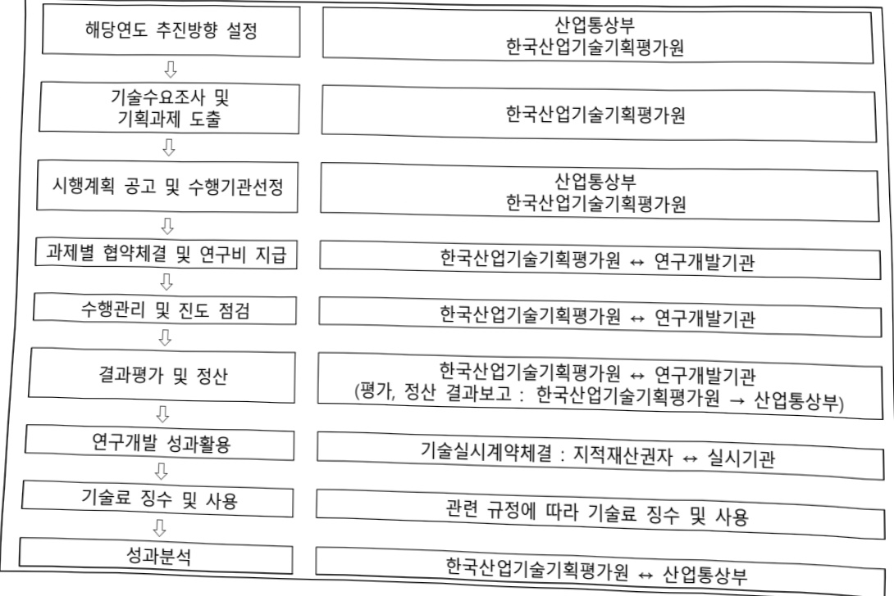

# 민관공동투자반도체고급인력양성(R&D)

**해당 페이지**: PDF 3918 ~ 3926 쪽 해당

**부처**: 산업통상부
**분야**: 산업·중소기업 및 에너지
**회계유형**: 일반회계
**2026 확정예산**: 17332.0 백만원
**전년대비 증감률**: 4.8%
**AI 도메인**: AI반도체, 교육/인재

---

<table border=1 style='margin: auto; word-wrap: break-word;'><tr><td style='text-align: center; word-wrap: break-word;'>사 업 명</td></tr><tr><td style='text-align: center; word-wrap: break-word;'>(1) 민관공동투자반도체고급인력양성(R&amp;D) (3161-416)</td></tr></table>

## ☐ 사업 코드 정보

<table border=1 style='margin: auto; word-wrap: break-word;'><tr><td style='text-align: center; word-wrap: break-word;'>구분</td><td style='text-align: center; word-wrap: break-word;'>회계</td><td style='text-align: center; word-wrap: break-word;'>소관</td><td style='text-align: center; word-wrap: break-word;'>실국(기관)</td><td style='text-align: center; word-wrap: break-word;'>계정</td><td style='text-align: center; word-wrap: break-word;'>분야</td><td style='text-align: center; word-wrap: break-word;'>부문</td></tr><tr><td style='text-align: center; word-wrap: break-word;'>코드</td><td rowspan="2">일반회계</td><td rowspan="2">산업통상부</td><td rowspan="2">산업성장실 첨단산업정책관</td><td rowspan="2">-</td><td style='text-align: center; word-wrap: break-word;'>110</td><td style='text-align: center; word-wrap: break-word;'>117</td></tr><tr><td style='text-align: center; word-wrap: break-word;'>명칭</td><td style='text-align: center; word-wrap: break-word;'>산업·중소기업 및 에너지</td><td style='text-align: center; word-wrap: break-word;'>산업혁신지원</td></tr></table>

<table border=1 style='margin: auto; word-wrap: break-word;'><tr><td style='text-align: center; word-wrap: break-word;'>구분</td><td style='text-align: center; word-wrap: break-word;'>프로그램</td><td style='text-align: center; word-wrap: break-word;'>단위사업</td><td style='text-align: center; word-wrap: break-word;'>세부사업</td></tr><tr><td style='text-align: center; word-wrap: break-word;'>코드</td><td style='text-align: center; word-wrap: break-word;'>3100</td><td style='text-align: center; word-wrap: break-word;'>3161</td><td style='text-align: center; word-wrap: break-word;'>416</td></tr><tr><td style='text-align: center; word-wrap: break-word;'>명칭</td><td style='text-align: center; word-wrap: break-word;'>산업경쟁력기반구축</td><td style='text-align: center; word-wrap: break-word;'>인력양성(일반회계)</td><td style='text-align: center; word-wrap: break-word;'>민관공동투자반도체고급인력양성(R&amp;D)</td></tr></table>

사업 성격 (공통요구자료 1-1 작성유의사항 4. 참조, 해당하는 사항에 “0” 표시)

<table border=1 style='margin: auto; word-wrap: break-word;'><tr><td rowspan="2">신규</td><td rowspan="2">계속</td><td rowspan="2">완료</td><td style='text-align: center; word-wrap: break-word;'>예비타당성</td><td style='text-align: center; word-wrap: break-word;'>총사업비</td><td style='text-align: center; word-wrap: break-word;'>총액계상</td><td style='text-align: center; word-wrap: break-word;'>사업소관 변경정보</td></tr><tr><td style='text-align: center; word-wrap: break-word;'>실시여부</td><td style='text-align: center; word-wrap: break-word;'>관리대상</td><td style='text-align: center; word-wrap: break-word;'>예산사업</td><td style='text-align: center; word-wrap: break-word;'>2025예산 시 소관</td></tr><tr><td style='text-align: center; word-wrap: break-word;'></td><td style='text-align: center; word-wrap: break-word;'>O</td><td style='text-align: center; word-wrap: break-word;'></td><td style='text-align: center; word-wrap: break-word;'>O</td><td style='text-align: center; word-wrap: break-word;'></td><td style='text-align: center; word-wrap: break-word;'></td><td style='text-align: center; word-wrap: break-word;'></td></tr></table>

사업지원형태 및 지원을(최소한 한 개는 반드시 선택하시오. 해당사항에 O 표시)

<table border=1 style='margin: auto; word-wrap: break-word;'><tr><td style='text-align: center; word-wrap: break-word;'>직접</td><td style='text-align: center; word-wrap: break-word;'>출자</td><td style='text-align: center; word-wrap: break-word;'>출연</td><td style='text-align: center; word-wrap: break-word;'>보조</td><td style='text-align: center; word-wrap: break-word;'>융자</td><td style='text-align: center; word-wrap: break-word;'>국고보조율(%)</td><td style='text-align: center; word-wrap: break-word;'>융자율(%)</td></tr><tr><td style='text-align: center; word-wrap: break-word;'></td><td style='text-align: center; word-wrap: break-word;'></td><td style='text-align: center; word-wrap: break-word;'>O</td><td style='text-align: center; word-wrap: break-word;'></td><td style='text-align: center; word-wrap: break-word;'></td><td style='text-align: center; word-wrap: break-word;'></td><td style='text-align: center; word-wrap: break-word;'></td></tr></table>

## 사업담당자

<table border=1 style='margin: auto; word-wrap: break-word;'><tr><td style='text-align: center; word-wrap: break-word;'>사업명</td><td colspan="5">구분</td></tr><tr><td rowspan="4">민관공동투자 반도체고급인력 양성(R&amp;D)</td><td rowspan="2">소관부처</td><td style='text-align: center; word-wrap: break-word;'>실·국·과(팀)</td><td style='text-align: center; word-wrap: break-word;'>과 장</td><td style='text-align: center; word-wrap: break-word;'>사무관</td><td style='text-align: center; word-wrap: break-word;'>주무관</td></tr><tr><td style='text-align: center; word-wrap: break-word;'>산업성장실 첨단산업정책관 반도체과</td><td style='text-align: center; word-wrap: break-word;'>이규봉</td><td style='text-align: center; word-wrap: break-word;'>-</td><td style='text-align: center; word-wrap: break-word;'>배재현</td></tr><tr><td rowspan="2">사업시행주체</td><td rowspan="2">한국산업기술기획평가원</td><td style='text-align: center; word-wrap: break-word;'>044-203-4270</td><td style='text-align: center; word-wrap: break-word;'>-</td><td style='text-align: center; word-wrap: break-word;'>044-203-4254</td></tr><tr><td style='text-align: center; word-wrap: break-word;'>미래반도체실</td><td style='text-align: center; word-wrap: break-word;'>윤은경 책임</td><td style='text-align: center; word-wrap: break-word;'>053-718-8582</td></tr></table>

---

### 가.예산 총괄표

(단위: 백만원, %)

<table border=1 style='margin: auto; word-wrap: break-word;'><tr><td rowspan="2">사업명</td><td rowspan="2">2024년 결산</td><td colspan="2">2025년 예산</td><td colspan="2">2026년</td><td rowspan="2">증감(B-A)</td><td rowspan="2">(B-A)/A</td></tr><tr><td style='text-align: center; word-wrap: break-word;'>본예산(A)</td><td style='text-align: center; word-wrap: break-word;'>추경</td><td style='text-align: center; word-wrap: break-word;'>요구안</td><td style='text-align: center; word-wrap: break-word;'>확정(B)</td></tr><tr><td style='text-align: center; word-wrap: break-word;'>민관공동투자반도체고급인력양성(R&amp;D)</td><td style='text-align: center; word-wrap: break-word;'>11,974</td><td style='text-align: center; word-wrap: break-word;'>16,529</td><td style='text-align: center; word-wrap: break-word;'>16,529</td><td style='text-align: center; word-wrap: break-word;'>17,332</td><td style='text-align: center; word-wrap: break-word;'>17,332</td><td style='text-align: center; word-wrap: break-word;'>803</td><td style='text-align: center; word-wrap: break-word;'>4.8</td></tr></table>

□ 기능별(내역사업별), 목별 예산 내역

(단위:백만원)

<table border=1 style='margin: auto; word-wrap: break-word;'><tr><td rowspan="3"></td><td colspan="5">2024</td><td colspan="7">2025(2025.12월말)</td><td rowspan="3">2026예산</td></tr><tr><td rowspan="2">예산액(추경)</td><td rowspan="2">예산현액</td><td rowspan="2">집행액[실집행액]</td><td rowspan="2">이월액</td><td rowspan="2">불용액</td><td rowspan="2">본예산</td><td rowspan="2">예산현액</td><td rowspan="2">집행액[실집행액]</td><td colspan="2">전년도이월액제외</td><td rowspan="2">이월예상액</td><td rowspan="2">불용예상액</td></tr><tr><td style='text-align: center; word-wrap: break-word;'>예산현액</td><td style='text-align: center; word-wrap: break-word;'>집행액[실집행액]</td></tr><tr><td rowspan="2">○ 기능별 분류(합계)</td><td rowspan="2">11,974</td><td rowspan="2">11,974</td><td style='text-align: center; word-wrap: break-word;'>11,974</td><td rowspan="2">-</td><td rowspan="2">-</td><td rowspan="2">16,529</td><td rowspan="2">16,529</td><td style='text-align: center; word-wrap: break-word;'>16,529</td><td rowspan="2">16,529</td><td style='text-align: center; word-wrap: break-word;'>16,529</td><td rowspan="2">-</td><td rowspan="2">-</td><td rowspan="2">17,332</td></tr><tr><td style='text-align: center; word-wrap: break-word;'>[11,974]</td><td style='text-align: center; word-wrap: break-word;'>[16,529]</td><td style='text-align: center; word-wrap: break-word;'>[16,529]</td></tr><tr><td rowspan="2">• 민관공동투자반도체고급인력양성</td><td rowspan="2">11,974</td><td rowspan="2">11,974</td><td style='text-align: center; word-wrap: break-word;'>11,974</td><td rowspan="2">-</td><td rowspan="2">-</td><td rowspan="2">16,529</td><td rowspan="2">16,529</td><td style='text-align: center; word-wrap: break-word;'>16,529</td><td rowspan="2">16,529</td><td style='text-align: center; word-wrap: break-word;'>16,529</td><td rowspan="2">-</td><td rowspan="2">-</td><td rowspan="2">17,332</td></tr><tr><td style='text-align: center; word-wrap: break-word;'>[11,974]</td><td style='text-align: center; word-wrap: break-word;'>[16,529]</td><td style='text-align: center; word-wrap: break-word;'>[16,529]</td></tr><tr><td rowspan="2">○ 비목별 분류(합계)</td><td rowspan="2">11,974</td><td rowspan="2">11,974</td><td style='text-align: center; word-wrap: break-word;'>11,974</td><td rowspan="2">-</td><td rowspan="2">-</td><td rowspan="2">16,529</td><td rowspan="2">16,529</td><td style='text-align: center; word-wrap: break-word;'>16,529</td><td rowspan="2">16,529</td><td style='text-align: center; word-wrap: break-word;'>16,529</td><td rowspan="2">-</td><td rowspan="2">-</td><td rowspan="2">17,332</td></tr><tr><td style='text-align: center; word-wrap: break-word;'>[11,974]</td><td style='text-align: center; word-wrap: break-word;'>[16,529]</td><td style='text-align: center; word-wrap: break-word;'>[16,529]</td></tr><tr><td rowspan="2">• 연구개발활동비 등(360-05)</td><td rowspan="2">11,974</td><td rowspan="2">11,974</td><td style='text-align: center; word-wrap: break-word;'>11,974</td><td rowspan="2">-</td><td rowspan="2">-</td><td rowspan="2">16,529</td><td rowspan="2">16,529</td><td style='text-align: center; word-wrap: break-word;'>16,529</td><td rowspan="2">16,529</td><td style='text-align: center; word-wrap: break-word;'>16,529</td><td rowspan="2">-</td><td rowspan="2">-</td><td rowspan="2">17,332</td></tr><tr><td style='text-align: center; word-wrap: break-word;'>[11,974]</td><td style='text-align: center; word-wrap: break-word;'>[16,529]</td><td style='text-align: center; word-wrap: break-word;'>[16,529]</td></tr><tr><td rowspan="2">○ 기능비목별 분류(합계)</td><td rowspan="2">11,974</td><td rowspan="2">11,974</td><td style='text-align: center; word-wrap: break-word;'>11,974</td><td rowspan="2">-</td><td rowspan="2">-</td><td rowspan="2">16,529</td><td rowspan="2">16,529</td><td style='text-align: center; word-wrap: break-word;'>16,529</td><td rowspan="2">16,529</td><td style='text-align: center; word-wrap: break-word;'>16,529</td><td rowspan="2">-</td><td rowspan="2">-</td><td rowspan="2">17,332</td></tr><tr><td style='text-align: center; word-wrap: break-word;'>[11,974]</td><td style='text-align: center; word-wrap: break-word;'>[16,529]</td><td style='text-align: center; word-wrap: break-word;'>[16,529]</td></tr><tr><td rowspan="2">• 민관공동투자반도체고급인력양성</td><td rowspan="2">11,974</td><td rowspan="2">11,974</td><td style='text-align: center; word-wrap: break-word;'>11,974</td><td rowspan="2">-</td><td rowspan="2">-</td><td rowspan="2">16,529</td><td rowspan="2">16,529</td><td style='text-align: center; word-wrap: break-word;'>16,529</td><td rowspan="2">16,529</td><td style='text-align: center; word-wrap: break-word;'>16,529</td><td rowspan="2">-</td><td rowspan="2">-</td><td rowspan="2">17,332</td></tr><tr><td style='text-align: center; word-wrap: break-word;'>[11,974]</td><td style='text-align: center; word-wrap: break-word;'>[16,529]</td><td style='text-align: center; word-wrap: break-word;'>[16,529]</td></tr><tr><td rowspan="2">• 연구개발활동비 등(360-05)</td><td rowspan="2">11,974</td><td rowspan="2">11,974</td><td style='text-align: center; word-wrap: break-word;'>11,974</td><td rowspan="2">-</td><td rowspan="2">-</td><td rowspan="2">16,529</td><td rowspan="2">16,529</td><td style='text-align: center; word-wrap: break-word;'>16,529</td><td rowspan="2">16,529</td><td style='text-align: center; word-wrap: break-word;'>16,529</td><td rowspan="2">-</td><td rowspan="2">-</td><td rowspan="2">17,332</td></tr><tr><td style='text-align: center; word-wrap: break-word;'>[11,974]</td><td style='text-align: center; word-wrap: break-word;'>[16,529]</td><td style='text-align: center; word-wrap: break-word;'>[16,529]</td></tr></table>

### 나.사업설명자료

## 1 ) 사업목적·내용

(민관공동투자반도체고급인력양성) 기업수요형 R&D 수행으로 고급전문 인력을

양성하여 반도체 글로벌 경쟁력 및 안정적 반도체 산업기반 확보

- 메모리와 시스템 반도체 개발 및 반도체 소재부터 장비까지 손 영역 원천기술 확보

 및 고급 인력 양성

---

## 2 ) 사업개요

□ 사업근거 및 추진경위

① 법령상 근거 및 조항

- 산업기술혁신촉진법 제11조(산업기술개발사업)

① 산업통상부장관은 혁신계획 및 시행계획을 효율적으로 수행하기 위하여 관계 중앙행정기관의 장과 협의하여 다음 각 호의 산업기술분야에서 기술개발사업(산업기술개발을 위하여 필요한 기획 및 조사를 포함한다. 이하 "산업기술개발사업"이라 한다)을 추진할 수 있다

2. 산업기술 분야의 미래 유망 기술

② 추진경위

° '18.10 : "차세대지능형반도체기술개발사업" 다부처 예타 제안

- 투자계획 약 1조원 승인('19.6), 동 프로그램(1,400억원)은 지원제외

°‘19.10 : “민관공동투자형 반도체원천기술개발사업” 예타 제안

- 기술성평가 부적합 판정('19.12) : 반도체 대규모 지원사업 추진예정, 중복 우려

° '20.5 : "민관협력 반도체산업생태계 고급전문연구인력 양성형 기술개발" 예타 제안

- 기술성 평가 부적합 판정(20.7) : 사유 : 반도체 인력통계의 객관성·근거 부족

°20.10 : “반도체 고급전문연구인력 양성연계 민관협력 산업원친기술개발사업” 예타 제안

- 기술성 평가 적합 판정('20.12)

° '22.5 : 예비타당성조사 통과('22.5 월, AHP 0.657)

°22.7 : 반도체 초강대국 달성전략(한국형 SRC : 정부·기업 공동투자 R&D로 석·박사 인재 양성)

□ 주요내용

① 사업규모

- 총사업비 : 해당 없음

- 사업기간 : '23~'32

- 최근 5년 간 투입된 사업비(예산액기준, 추경편성한 연도에는 추경포함)

<table border=1 style='margin: auto; word-wrap: break-word;'><tr><td style='text-align: center; word-wrap: break-word;'>연도</td><td style='text-align: center; word-wrap: break-word;'>2022</td><td style='text-align: center; word-wrap: break-word;'>2023</td><td style='text-align: center; word-wrap: break-word;'>2024</td><td style='text-align: center; word-wrap: break-word;'>2025</td><td style='text-align: center; word-wrap: break-word;'>2026</td></tr><tr><td style='text-align: center; word-wrap: break-word;'>사업비</td><td style='text-align: center; word-wrap: break-word;'>-</td><td style='text-align: center; word-wrap: break-word;'>10,046</td><td style='text-align: center; word-wrap: break-word;'>11,974</td><td style='text-align: center; word-wrap: break-word;'>16,529</td><td style='text-align: center; word-wrap: break-word;'>17,332</td></tr></table>

---

## ② 사업추진체계

- 사업시행방법 : 출연

- 사업시행주체 : 한국산업기술기획평가원

- 사업 수혜자 : 대학, 연구소 등

- 보조, 융자, 출연, 출자 등의 경우 보조 · 융자 등 지원 비율 및 법적근거

<table border=1 style='margin: auto; word-wrap: break-word;'><tr><td style='text-align: center; word-wrap: break-word;'>내역사업명</td><td style='text-align: center; word-wrap: break-word;'>구분</td><td style='text-align: center; word-wrap: break-word;'>피보조·피출연 등 기관명</td><td style='text-align: center; word-wrap: break-word;'>지원 금액 (2026예산)</td><td style='text-align: center; word-wrap: break-word;'>지원 비율(%)</td><td style='text-align: center; word-wrap: break-word;'>보조율 법적근거 (해당 조항)</td></tr><tr><td style='text-align: center; word-wrap: break-word;'>민관공동투자 반도체고급 인력양성</td><td style='text-align: center; word-wrap: break-word;'>출연</td><td style='text-align: center; word-wrap: break-word;'>대학, 연구소 등</td><td style='text-align: center; word-wrap: break-word;'>17,332</td><td style='text-align: center; word-wrap: break-word;'>지원 대상에 따라 차등지원</td><td style='text-align: center; word-wrap: break-word;'>산업기술혁신사업 공통운영요령 제24조(정부지원연구개발비의 지원기준)</td></tr></table>

## 3 ) 2026년도 예산 산출 근거

0 민관공동투자반도체고급인력양성 : (2025 본예산) 16,529백만원 → (2026 예산) 17,332백만원, 803백만원 증액

- (요구) 기업수요형 R&D 수행을 통한 반도체 고급전문인력 양성 및 원천기술 확보를 위한 계속 및 신규 과제 지원

* 예타사업 기획보고서 계획에 따른 연도별 지원예산 요구

- (산출) (계속) 68개 × 195.3백만 × 12/12 = 13,282백만원

(신규) 9개 × 600백만 × 9/12 = 4,050백만원

2025년도 예산 및 2026년도 예산 산출 세부내역 비교

<table border=1 style='margin: auto; word-wrap: break-word;'><tr><td colspan="2">2025년 본예산</td><td colspan="2">2026년 예산</td></tr><tr><td style='text-align: center; word-wrap: break-word;'>예산</td><td style='text-align: center; word-wrap: break-word;'>산출내역</td><td style='text-align: center; word-wrap: break-word;'>예산</td><td style='text-align: center; word-wrap: break-word;'>산출내역</td></tr><tr><td style='text-align: center; word-wrap: break-word;'>16,529</td><td style='text-align: center; word-wrap: break-word;'>○ 연구개발활동비등(360-05): 16,529백만원 - (계속) 60개× 198.8백만×12/12= 11,932백만원 - (신규) 22개× 278.6백만×9/12= 4,597백만원</td><td style='text-align: center; word-wrap: break-word;'>17,332</td><td style='text-align: center; word-wrap: break-word;'>○ 연구개발활동비등(360-05): 17,332백만원 - (계속) 68개× 195.3백만×12/12= 13,282백만원 - (신규) 9개× 600백만×9/12= 4,050백만원</td></tr></table>

---

## 4 ) 사업효과

☐ 사업영향, 산출물 성과지표 등

① 2022~2026년도 성과계획서 상 성과지표 및 최근 5년간 성과 달성도

<table border=1 style='margin: auto; word-wrap: break-word;'><tr><td style='text-align: center; word-wrap: break-word;'>성과지표</td><td style='text-align: center; word-wrap: break-word;'>구분</td><td style='text-align: center; word-wrap: break-word;'>2022</td><td style='text-align: center; word-wrap: break-word;'>2023</td><td style='text-align: center; word-wrap: break-word;'>2024</td><td style='text-align: center; word-wrap: break-word;'>2025</td><td style='text-align: center; word-wrap: break-word;'>2026</td><td style='text-align: center; word-wrap: break-word;'>2026 목표치산출근거</td><td style='text-align: center; word-wrap: break-word;'>측정산식(또는 측정방법)</td><td style='text-align: center; word-wrap: break-word;'>자료수집방법(또는 자료출처)</td></tr><tr><td rowspan="3">K-CHIPS 인증인력 수 (10억원당)</td><td style='text-align: center; word-wrap: break-word;'>목표</td><td style='text-align: center; word-wrap: break-word;'>-</td><td style='text-align: center; word-wrap: break-word;'>-</td><td style='text-align: center; word-wrap: break-word;'>1.57</td><td style='text-align: center; word-wrap: break-word;'>2.60</td><td style='text-align: center; word-wrap: break-word;'>7.58</td><td rowspan="3">사업기획보고서(예비타당성조사통과) 인계출목표근거하여 설정함.연체론과과제론추진현황에 따라 분배한 수치임</td><td rowspan="3">본 사업의 수혜인력 중 KCHIPS 인증서를 발급받은 학생수</td><td rowspan="3">수행기관이 제출한 K-CHIPS 인증서 발급 목록</td></tr><tr><td style='text-align: center; word-wrap: break-word;'>실적</td><td style='text-align: center; word-wrap: break-word;'>-</td><td style='text-align: center; word-wrap: break-word;'>-</td><td style='text-align: center; word-wrap: break-word;'>1.67</td><td style='text-align: center; word-wrap: break-word;'>-</td><td style='text-align: center; word-wrap: break-word;'>-</td></tr><tr><td style='text-align: center; word-wrap: break-word;'>달성도</td><td style='text-align: center; word-wrap: break-word;'>-</td><td style='text-align: center; word-wrap: break-word;'>-</td><td style='text-align: center; word-wrap: break-word;'>100</td><td style='text-align: center; word-wrap: break-word;'>-</td><td style='text-align: center; word-wrap: break-word;'>-</td></tr><tr><td rowspan="3">논문(SCI)의 표준화된 순위보정영향력 지수</td><td style='text-align: center; word-wrap: break-word;'>목표</td><td style='text-align: center; word-wrap: break-word;'>-</td><td style='text-align: center; word-wrap: break-word;'>63.45</td><td style='text-align: center; word-wrap: break-word;'>64.72</td><td style='text-align: center; word-wrap: break-word;'>66.01</td><td style='text-align: center; word-wrap: break-word;'>67.33</td><td rowspan="3">반도체 분야 기술 개발 사업의 &#x27;19~21년 창출 성과 평균&#x27; 64.5를 &#x27;23년 목표치로 설정, 매년 목표치는 2% 상향</td><td rowspan="3">∑(표준화된 영향 력 지 수 (mrnIF)]/전체 논문건수</td><td rowspan="3">NTIS를 통한 SCI, 비SCI 논문 검증 표준화된 IF 분석 결과 도출</td></tr><tr><td style='text-align: center; word-wrap: break-word;'>실적</td><td style='text-align: center; word-wrap: break-word;'>-</td><td style='text-align: center; word-wrap: break-word;'>63.89</td><td style='text-align: center; word-wrap: break-word;'>67.48</td><td style='text-align: center; word-wrap: break-word;'>-</td><td style='text-align: center; word-wrap: break-word;'>-</td></tr><tr><td style='text-align: center; word-wrap: break-word;'>달성도</td><td style='text-align: center; word-wrap: break-word;'>-</td><td style='text-align: center; word-wrap: break-word;'>100</td><td style='text-align: center; word-wrap: break-word;'>100</td><td style='text-align: center; word-wrap: break-word;'>-</td><td style='text-align: center; word-wrap: break-word;'>-</td></tr><tr><td rowspan="3">특허 SMART 등급지수</td><td style='text-align: center; word-wrap: break-word;'>목표</td><td style='text-align: center; word-wrap: break-word;'>-</td><td style='text-align: center; word-wrap: break-word;'>-</td><td style='text-align: center; word-wrap: break-word;'>3.57</td><td style='text-align: center; word-wrap: break-word;'>3.64</td><td style='text-align: center; word-wrap: break-word;'>3.71</td><td rowspan="3">반도체 분야 기술 개발 사업의 &#x27;19~21년 창출 성과 평균&#x27; 3.57을 &#x27;24년 목표치로 설정 매년 목표치는 2% 상향*사업 착수 이후 출원된 특허가 등록되는 기간을 고려하여, 목표설정을 &#x27;24년부터 목표치 설정</td><td rowspan="3">∑ 등록 특허 별 SMART 등급 점수/과제수행을 통해 발생한 등록 특허 수</td><td rowspan="3">NTIS를 통해 검증된 등록 특허와 한국발명진흥회의 SMART 분석 시스템</td></tr><tr><td style='text-align: center; word-wrap: break-word;'>실적</td><td style='text-align: center; word-wrap: break-word;'>-</td><td style='text-align: center; word-wrap: break-word;'>-</td><td style='text-align: center; word-wrap: break-word;'>4.0</td><td style='text-align: center; word-wrap: break-word;'>-</td><td style='text-align: center; word-wrap: break-word;'>-</td></tr><tr><td style='text-align: center; word-wrap: break-word;'>달성도</td><td style='text-align: center; word-wrap: break-word;'>-</td><td style='text-align: center; word-wrap: break-word;'>-</td><td style='text-align: center; word-wrap: break-word;'>100</td><td style='text-align: center; word-wrap: break-word;'>-</td><td style='text-align: center; word-wrap: break-word;'>-</td></tr></table>

② 성과지표 이외의 연도별 사업추진 경과 및 실적

<table border=1 style='margin: auto; word-wrap: break-word;'><tr><td style='text-align: center; word-wrap: break-word;'>2022</td><td style='text-align: center; word-wrap: break-word;'>-</td></tr><tr><td style='text-align: center; word-wrap: break-word;'>2023</td><td style='text-align: center; word-wrap: break-word;'>메모리, 시스템반도체, 공정장비, 소재 분야의 신규과제 47건 지원 완료</td></tr><tr><td style='text-align: center; word-wrap: break-word;'>2024</td><td style='text-align: center; word-wrap: break-word;'>메모리, 시스템반도체, 공정장비, 소재 분야의 신규과제 13건 지원 완료</td></tr><tr><td style='text-align: center; word-wrap: break-word;'>2025</td><td style='text-align: center; word-wrap: break-word;'>메모리, 시스템반도체, 공정장비, 소재 분야의 신규과제 22건 지원 완료</td></tr></table>

---

③ 향후(2026년도 이후) 기대효과 :

(기술개발) 대학·연구기관 석·박사 인력이 기업 필요기술 R&D 수행, 핵심 원천 기술(IP) 확보를 통한 글로벌 경쟁력 강화

(인력양성) 연구개발 과정에서 전문역량을 보유한 연구인력의 산업계 유입을 통한 반도체 인력부족 해소에 기여

* 기업 엔지니어의 기술멘토링을 통해 석박사 과정 학생이 연구를 수행하고, 연구 성과 및 기여도 검증을 통해 반도체 업계에서 즉시 활용할 수 있는 능력을 인정받은 전문인력

## 5 ) 타당성조사 및 예비타당성조사 시행여부 및 결과 요지

☐ 예비타당성조사 결과, AHP가 0.657으로 경제성 및 지원타당성을 인정하여 민관공동투자반도체고급인력양성 총 사업비 2,227.9억원(국비 1,149.5억원)으로 선정(과학기술정책연구원(STEPI), '22.5.)

## 6 ) 총사업비 대상사업 여부 및 내역: 해당 없음

7) 사업 집행절차

---

## 8 ) 중기재정계획 상 연도별 투자계획 및 추진경과

(단위: 백만원)

<table border=1 style='margin: auto; word-wrap: break-word;'><tr><td style='text-align: center; word-wrap: break-word;'>$ 2024 $</td><td style='text-align: center; word-wrap: break-word;'>2025</td><td style='text-align: center; word-wrap: break-word;'>2026</td><td style='text-align: center; word-wrap: break-word;'>2027</td><td style='text-align: center; word-wrap: break-word;'>2028</td><td style='text-align: center; word-wrap: break-word;'>2029</td></tr><tr><td style='text-align: center; word-wrap: break-word;'>2024~2028</td><td style='text-align: center; word-wrap: break-word;'>11,974</td><td style='text-align: center; word-wrap: break-word;'>16,529</td><td style='text-align: center; word-wrap: break-word;'>17,332</td><td style='text-align: center; word-wrap: break-word;'>18,799</td><td style='text-align: center; word-wrap: break-word;'>15,254</td></tr><tr><td style='text-align: center; word-wrap: break-word;'>2025~2029</td><td style='text-align: center; word-wrap: break-word;'></td><td style='text-align: center; word-wrap: break-word;'>16,529</td><td style='text-align: center; word-wrap: break-word;'>17,332</td><td style='text-align: center; word-wrap: break-word;'>18,799</td><td style='text-align: center; word-wrap: break-word;'>15,254</td></tr></table>

9) 최근 3년간 동 사업에 대한 주요 외부지적사항 및 평가, 문제점 및 대책

해당 없음

## 10 ) 향후 추진방향 및 추진계획

<table border=1 style='margin: auto; word-wrap: break-word;'><tr><td style='text-align: center; word-wrap: break-word;'>○ 기업수요형 R&amp;D를 통해 고급전문 인력을 양성하여 반도체 글로벌 경쟁력 강화 및 안정적 반도체 산업기반 확보를 위한 기술개발 추진</td></tr><tr><td style='text-align: center; word-wrap: break-word;'>- 5대* 기술군 19대 전략분야 과제 지원</td></tr><tr><td style='text-align: center; word-wrap: break-word;'>* ①미래반도체 소자 및 소재/공정 기술, ②극미세화 공정 및 소재부품장비 기술, ③다중복합 측정/분석 기술, ④패키지 공정 및 소재부품장비 기술, ⑤시스템반도체 설계 기술</td></tr></table>

11) 해당사업에 대한 각종 사업평가의 결과: 해당 없음

12) 해당사업에 대한 부처 자체평가의 결과: 해당 없음

13) 부처 건의사항: 해당 없음

---

### 다. 최근 4년간 결산내역

## 1 ) 결산표

☐ 부처 결산내역

(단위: 백만원, %)

<table border=1 style='margin: auto; word-wrap: break-word;'><tr><td rowspan="2">闰도</td><td colspan="3">예산액</td><td rowspan="2">전년도 이월액</td><td rowspan="2">이·전용 등</td><td rowspan="2">예비비</td><td rowspan="2">예산 현액(B)</td><td rowspan="2">집행액 (C)</td><td rowspan="2">집행률 (C/A)</td><td rowspan="2">집행률 (C/B)</td><td rowspan="2">다음엔도 이월액</td><td rowspan="2">불용액</td></tr><tr><td style='text-align: center; word-wrap: break-word;'>본예산</td><td style='text-align: center; word-wrap: break-word;'>추경 중감액</td><td style='text-align: center; word-wrap: break-word;'>추경(A)</td></tr><tr><td style='text-align: center; word-wrap: break-word;'>2022</td><td style='text-align: center; word-wrap: break-word;'>-</td><td style='text-align: center; word-wrap: break-word;'>-</td><td style='text-align: center; word-wrap: break-word;'>-</td><td style='text-align: center; word-wrap: break-word;'>-</td><td style='text-align: center; word-wrap: break-word;'>-</td><td style='text-align: center; word-wrap: break-word;'>-</td><td style='text-align: center; word-wrap: break-word;'>-</td><td style='text-align: center; word-wrap: break-word;'>-</td><td style='text-align: center; word-wrap: break-word;'>-</td><td style='text-align: center; word-wrap: break-word;'>-</td><td style='text-align: center; word-wrap: break-word;'>-</td><td style='text-align: center; word-wrap: break-word;'>-</td></tr><tr><td style='text-align: center; word-wrap: break-word;'>2023</td><td style='text-align: center; word-wrap: break-word;'>10,046</td><td style='text-align: center; word-wrap: break-word;'>-</td><td style='text-align: center; word-wrap: break-word;'>10,046</td><td style='text-align: center; word-wrap: break-word;'>-</td><td style='text-align: center; word-wrap: break-word;'>-</td><td style='text-align: center; word-wrap: break-word;'>-</td><td style='text-align: center; word-wrap: break-word;'>10,046</td><td style='text-align: center; word-wrap: break-word;'>10,046</td><td style='text-align: center; word-wrap: break-word;'>100</td><td style='text-align: center; word-wrap: break-word;'>100</td><td style='text-align: center; word-wrap: break-word;'>-</td><td style='text-align: center; word-wrap: break-word;'>-</td></tr><tr><td style='text-align: center; word-wrap: break-word;'>2024</td><td style='text-align: center; word-wrap: break-word;'>11,974</td><td style='text-align: center; word-wrap: break-word;'>-</td><td style='text-align: center; word-wrap: break-word;'>11,974</td><td style='text-align: center; word-wrap: break-word;'>-</td><td style='text-align: center; word-wrap: break-word;'>-</td><td style='text-align: center; word-wrap: break-word;'>-</td><td style='text-align: center; word-wrap: break-word;'>11,974</td><td style='text-align: center; word-wrap: break-word;'>11,974</td><td style='text-align: center; word-wrap: break-word;'>100</td><td style='text-align: center; word-wrap: break-word;'>100</td><td style='text-align: center; word-wrap: break-word;'>-</td><td style='text-align: center; word-wrap: break-word;'>-</td></tr><tr><td style='text-align: center; word-wrap: break-word;'>2025</td><td style='text-align: center; word-wrap: break-word;'>16,529</td><td style='text-align: center; word-wrap: break-word;'>-</td><td style='text-align: center; word-wrap: break-word;'>16,529</td><td style='text-align: center; word-wrap: break-word;'>-</td><td style='text-align: center; word-wrap: break-word;'>-</td><td style='text-align: center; word-wrap: break-word;'>-</td><td style='text-align: center; word-wrap: break-word;'>16,529</td><td style='text-align: center; word-wrap: break-word;'>16,529</td><td style='text-align: center; word-wrap: break-word;'>100</td><td style='text-align: center; word-wrap: break-word;'>100</td><td style='text-align: center; word-wrap: break-word;'>-</td><td style='text-align: center; word-wrap: break-word;'>-</td></tr></table>

□ 출연·보조사업 등 실집행내역

(단위: 백만원, %)

<table border=1 style='margin: auto; word-wrap: break-word;'><tr><td rowspan="3">구분</td><td colspan="3">부처</td><td colspan="7">사업시행주체(피출연·피보조 기관 등)</td></tr><tr><td colspan="2">예산액</td><td rowspan="2">집행액</td><td rowspan="2">교부액</td><td rowspan="2">전년도 이월액</td><td rowspan="2">교부 현액</td><td rowspan="2">집행액 (B)</td><td rowspan="2">이월액</td><td rowspan="2">불용액</td><td rowspan="2">실집행률 (B/A)</td></tr><tr><td style='text-align: center; word-wrap: break-word;'>본예산</td><td style='text-align: center; word-wrap: break-word;'>추경(A)</td></tr><tr><td style='text-align: center; word-wrap: break-word;'>2022</td><td style='text-align: center; word-wrap: break-word;'>-</td><td style='text-align: center; word-wrap: break-word;'>-</td><td style='text-align: center; word-wrap: break-word;'>-</td><td style='text-align: center; word-wrap: break-word;'>-</td><td style='text-align: center; word-wrap: break-word;'>-</td><td style='text-align: center; word-wrap: break-word;'>-</td><td style='text-align: center; word-wrap: break-word;'>-</td><td style='text-align: center; word-wrap: break-word;'>-</td><td style='text-align: center; word-wrap: break-word;'>-</td><td style='text-align: center; word-wrap: break-word;'>-</td></tr><tr><td style='text-align: center; word-wrap: break-word;'>2023</td><td style='text-align: center; word-wrap: break-word;'>10,046</td><td style='text-align: center; word-wrap: break-word;'>10,046</td><td style='text-align: center; word-wrap: break-word;'>10,046</td><td style='text-align: center; word-wrap: break-word;'>10,046</td><td style='text-align: center; word-wrap: break-word;'>-</td><td style='text-align: center; word-wrap: break-word;'>10,046</td><td style='text-align: center; word-wrap: break-word;'>10,046</td><td style='text-align: center; word-wrap: break-word;'>-</td><td style='text-align: center; word-wrap: break-word;'>-</td><td style='text-align: center; word-wrap: break-word;'>100</td></tr><tr><td style='text-align: center; word-wrap: break-word;'>2024</td><td style='text-align: center; word-wrap: break-word;'>11,974</td><td style='text-align: center; word-wrap: break-word;'>11,974</td><td style='text-align: center; word-wrap: break-word;'>11,974</td><td style='text-align: center; word-wrap: break-word;'>11,974</td><td style='text-align: center; word-wrap: break-word;'>-</td><td style='text-align: center; word-wrap: break-word;'>11,974</td><td style='text-align: center; word-wrap: break-word;'>11,974</td><td style='text-align: center; word-wrap: break-word;'>-</td><td style='text-align: center; word-wrap: break-word;'>-</td><td style='text-align: center; word-wrap: break-word;'>100</td></tr><tr><td style='text-align: center; word-wrap: break-word;'>2025. 12월기준</td><td style='text-align: center; word-wrap: break-word;'>16,529</td><td style='text-align: center; word-wrap: break-word;'>16,529</td><td style='text-align: center; word-wrap: break-word;'>16,529</td><td style='text-align: center; word-wrap: break-word;'>16,529</td><td style='text-align: center; word-wrap: break-word;'>-</td><td style='text-align: center; word-wrap: break-word;'>16,529</td><td style='text-align: center; word-wrap: break-word;'>16,529</td><td style='text-align: center; word-wrap: break-word;'>-</td><td style='text-align: center; word-wrap: break-word;'>-</td><td style='text-align: center; word-wrap: break-word;'>100</td></tr></table>

## 2 ) 주요 결산사항

2022~2025년 결산 주요 지적사항 및 시정요구사항: 해당 없음

2025년 이·전용 등 세부내역: 해당 없음

2025년 예비비 배정 세부내역: 해당 없음

라. 기타 추가자료 : 사업 설명자료

---

## 민관공동투자반도체고급인력양성사업

□ 사업개요

<table border=1 style='margin: auto; word-wrap: break-word;'><tr><td style='text-align: center; word-wrap: break-word;'>사업기간</td><td style='text-align: center; word-wrap: break-word;'>2023 ~ 2032</td><td style='text-align: center; word-wrap: break-word;'>총사업비</td><td style='text-align: center; word-wrap: break-word;'>총 2,227.9억원 (국비 1,149.55억원)</td></tr><tr><td style='text-align: center; word-wrap: break-word;'>주관기관</td><td colspan="3">대학 및 연구소 등 비영리기관</td></tr><tr><td style='text-align: center; word-wrap: break-word;'>담당자</td><td colspan="3">반도체과 배재현 주무관(⑰ 044-203-4254)</td></tr></table>

## □ 사업내용(지원내용)

① (기술개발) 대학·연구기관 석·박사 인력이 기업 필요기술 R&D 수행,

핵심 원천기술(IP) 확보를 통한 글로벌 경쟁력 강화

② (인력양성) 연구개발 과정에서 전문역량을 보유한 연구인력의 산업계

유입을 통한 반도체 인력부족 해소에 기여

* 기업 엔지니어의 기술멘토링을 통해 석박사 과정 학생이 연구를 수행하고 연구 성과 및 기여도

검증을 통해 반도체 업계에서 즉시 활용할 수 있는 능력을 인정받은 전문인력

## □ 26년 요구내역 : 17,332백만원

o 대학·연구기관 석·박사 인력이 기업 필요기술 R&D를 수행함으로써,

핵심 원천기술을 확보하고, 동시에 연구개발 과정을 통해 실무형

반도체 고급인력을 양성하기 위한 계속 및 신규과제 지원

- 계속과제 : 13,282백만원(68개×195.3백만원×12/12개월)

- 신규과제 : 4,050백만원(9개×600백만원×9/12개월)

*예타사업 기획보고서 계획에 따른 연도별 지원예산 요구

---

### 원본 PDF 크롭 이미지

