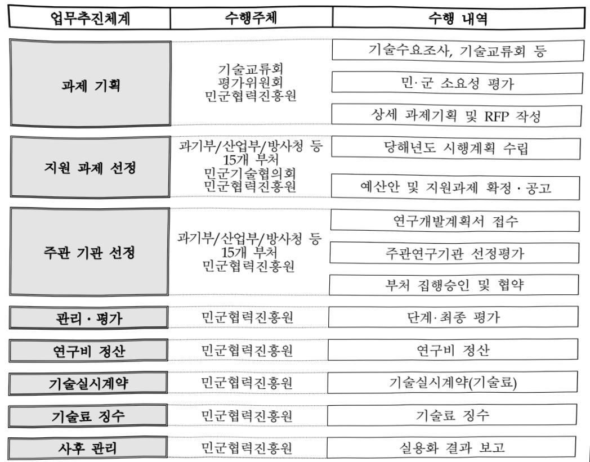
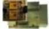

# 민군기술협력(R&D)(산업부)

**해당 페이지**: PDF 3927 ~ 3940 쪽 해당

**부처**: 산업통상부
**분야**: 산업·중소기업 및 에너지
**회계유형**: 일반회계
**2026 확정예산**: 18973.0 백만원
**전년대비 증감률**: 3.1%
**AI 도메인**: 국방/안보

---

<table border=1 style='margin: auto; word-wrap: break-word;'><tr><td style='text-align: center; word-wrap: break-word;'>사 업 명</td></tr><tr><td style='text-align: center; word-wrap: break-word;'>(1) 민군기술협력(R&amp;D) (3173-406)</td></tr></table>

□ 사업 코드 정보

<table border=1 style='margin: auto; word-wrap: break-word;'><tr><td style='text-align: center; word-wrap: break-word;'>구분</td><td style='text-align: center; word-wrap: break-word;'>회계</td><td style='text-align: center; word-wrap: break-word;'>소관</td><td style='text-align: center; word-wrap: break-word;'>실국(기관)</td><td style='text-align: center; word-wrap: break-word;'>계정</td><td style='text-align: center; word-wrap: break-word;'>분야</td><td style='text-align: center; word-wrap: break-word;'>부문</td></tr><tr><td style='text-align: center; word-wrap: break-word;'>코드</td><td rowspan="2">일반회계</td><td rowspan="2">산업통상부</td><td rowspan="2">산업정책실 제조산업정책관</td><td rowspan="2"></td><td style='text-align: center; word-wrap: break-word;'>110</td><td style='text-align: center; word-wrap: break-word;'>117</td></tr><tr><td style='text-align: center; word-wrap: break-word;'>명칭</td><td style='text-align: center; word-wrap: break-word;'>산업·중소기업 및에너지</td><td style='text-align: center; word-wrap: break-word;'>산업혁신지원</td></tr></table>

<table border=1 style='margin: auto; word-wrap: break-word;'><tr><td style='text-align: center; word-wrap: break-word;'>구분</td><td style='text-align: center; word-wrap: break-word;'>프로그램</td><td style='text-align: center; word-wrap: break-word;'>단위사업</td><td style='text-align: center; word-wrap: break-word;'>세부사업</td></tr><tr><td style='text-align: center; word-wrap: break-word;'>코드</td><td style='text-align: center; word-wrap: break-word;'>3100</td><td style='text-align: center; word-wrap: break-word;'>3173</td><td style='text-align: center; word-wrap: break-word;'>406</td></tr><tr><td style='text-align: center; word-wrap: break-word;'>명칭</td><td style='text-align: center; word-wrap: break-word;'>산업경쟁력기반구축</td><td style='text-align: center; word-wrap: break-word;'>공공기술개발</td><td style='text-align: center; word-wrap: break-word;'>민군기술협력(R&amp;D)(산업부)</td></tr></table>

□ 사업 성격 (공통요구자료 Ⅱ-1 작성유의사항 4. 참조, 해당하는 사항에 “0” 표시)

<table border=1 style='margin: auto; word-wrap: break-word;'><tr><td rowspan="2">신규</td><td rowspan="2">계속</td><td rowspan="2">완료</td><td rowspan="2">예비타당성 실시여부</td><td rowspan="2">총사업비 관리대상</td><td rowspan="2">총액계상 예산사업</td><td style='text-align: center; word-wrap: break-word;'>사업소관 변경정보</td></tr><tr><td style='text-align: center; word-wrap: break-word;'>2025예산 시 소관</td></tr><tr><td style='text-align: center; word-wrap: break-word;'></td><td style='text-align: center; word-wrap: break-word;'>○</td><td style='text-align: center; word-wrap: break-word;'></td><td style='text-align: center; word-wrap: break-word;'></td><td style='text-align: center; word-wrap: break-word;'></td><td style='text-align: center; word-wrap: break-word;'></td><td style='text-align: center; word-wrap: break-word;'></td></tr></table>

□ 사업 지원 형태 및 지원을 (최소한 한 개는 반드시 선택하시오. 해당사항에 O 표시)

<table border=1 style='margin: auto; word-wrap: break-word;'><tr><td style='text-align: center; word-wrap: break-word;'>직접</td><td style='text-align: center; word-wrap: break-word;'>출자</td><td style='text-align: center; word-wrap: break-word;'>출연</td><td style='text-align: center; word-wrap: break-word;'>보조</td><td style='text-align: center; word-wrap: break-word;'>융자</td><td style='text-align: center; word-wrap: break-word;'>국고보조율(%)</td><td style='text-align: center; word-wrap: break-word;'>융자율(%)</td></tr><tr><td style='text-align: center; word-wrap: break-word;'></td><td style='text-align: center; word-wrap: break-word;'></td><td style='text-align: center; word-wrap: break-word;'>○</td><td style='text-align: center; word-wrap: break-word;'></td><td style='text-align: center; word-wrap: break-word;'></td><td style='text-align: center; word-wrap: break-word;'></td><td style='text-align: center; word-wrap: break-word;'></td></tr></table>

## □ 사업 담당자

<table border=1 style='margin: auto; word-wrap: break-word;'><tr><td style='text-align: center; word-wrap: break-word;'>사업명</td><td colspan="5">구분</td></tr><tr><td rowspan="3">민군기술협력(R&amp;D)</td><td style='text-align: center; word-wrap: break-word;'>소관부처</td><td style='text-align: center; word-wrap: break-word;'>실·국·과(팀)산업정책실제조산업정책관협력과</td><td style='text-align: center; word-wrap: break-word;'>과 장이선혜</td><td style='text-align: center; word-wrap: break-word;'>사무관강진석</td><td style='text-align: center; word-wrap: break-word;'>주무관이도하</td></tr><tr><td rowspan="2">사업시행주체</td><td rowspan="2">국방과학연구소민군협력진흥원</td><td style='text-align: center; word-wrap: break-word;'>044-203-4150</td><td style='text-align: center; word-wrap: break-word;'>044-203-4154</td><td style='text-align: center; word-wrap: break-word;'>044-203-4156</td></tr><tr><td style='text-align: center; word-wrap: break-word;'>민군기술사업부민군정책기획팀</td><td style='text-align: center; word-wrap: break-word;'>정명원 팀장</td><td style='text-align: center; word-wrap: break-word;'>042-607-6020</td></tr></table>

---

### 가.예산 총괄표

(단위: 백만원, %)

<table border=1 style='margin: auto; word-wrap: break-word;'><tr><td rowspan="2">사업명</td><td rowspan="2">2024년 결산</td><td colspan="2">2025년 예산</td><td colspan="2">2026년</td><td rowspan="2">증감 (B-A)</td><td rowspan="2">(B-A)/A</td></tr><tr><td style='text-align: center; word-wrap: break-word;'>본예산(A)</td><td style='text-align: center; word-wrap: break-word;'>추경</td><td style='text-align: center; word-wrap: break-word;'>요구안</td><td style='text-align: center; word-wrap: break-word;'>확정(B)</td></tr><tr><td style='text-align: center; word-wrap: break-word;'>민군기술협력 (R&amp;D)</td><td style='text-align: center; word-wrap: break-word;'>7,055</td><td style='text-align: center; word-wrap: break-word;'>18,403</td><td style='text-align: center; word-wrap: break-word;'>18,403</td><td style='text-align: center; word-wrap: break-word;'>21,303</td><td style='text-align: center; word-wrap: break-word;'>18,973</td><td style='text-align: center; word-wrap: break-word;'>570</td><td style='text-align: center; word-wrap: break-word;'>3.1</td></tr></table>

□ 기능별(내역사업별), 목별 예산 내역

(단위:백만원)

<table border=1 style='margin: auto; word-wrap: break-word;'><tr><td rowspan="3"></td><td colspan="5">2024</td><td colspan="7">2025(2025.12월말)</td><td rowspan="3">2026예산</td></tr><tr><td rowspan="2">예산의(추정)</td><td rowspan="2">예산현액</td><td rowspan="2">집행의[실집행액]</td><td rowspan="2">이월액</td><td rowspan="2">불용액</td><td rowspan="2">본예산</td><td rowspan="2">예산현액</td><td rowspan="2">집행의[실집행액]</td><td colspan="2">전년도 이월액제의</td><td rowspan="2">이월예상액</td><td rowspan="2">불용예상액</td></tr><tr><td style='text-align: center; word-wrap: break-word;'>예산현액</td><td style='text-align: center; word-wrap: break-word;'>집행액[실집행액]</td></tr><tr><td style='text-align: center; word-wrap: break-word;'>○ 기능별 분류(합계)</td><td style='text-align: center; word-wrap: break-word;'>7,055</td><td style='text-align: center; word-wrap: break-word;'>7,055</td><td style='text-align: center; word-wrap: break-word;'>7,055[7,044]</td><td style='text-align: center; word-wrap: break-word;'>-</td><td style='text-align: center; word-wrap: break-word;'>-</td><td style='text-align: center; word-wrap: break-word;'>18,403</td><td style='text-align: center; word-wrap: break-word;'>18,403</td><td style='text-align: center; word-wrap: break-word;'>18,403[18,298]</td><td style='text-align: center; word-wrap: break-word;'>18,403</td><td style='text-align: center; word-wrap: break-word;'>18,403[18,298]</td><td style='text-align: center; word-wrap: break-word;'>-</td><td style='text-align: center; word-wrap: break-word;'>-</td><td style='text-align: center; word-wrap: break-word;'>18,973</td></tr><tr><td style='text-align: center; word-wrap: break-word;'>· 민군검용기술개발</td><td style='text-align: center; word-wrap: break-word;'>4,744</td><td style='text-align: center; word-wrap: break-word;'>4,744</td><td style='text-align: center; word-wrap: break-word;'>4,744[4,744]</td><td style='text-align: center; word-wrap: break-word;'>-</td><td style='text-align: center; word-wrap: break-word;'>-</td><td style='text-align: center; word-wrap: break-word;'>8,731</td><td style='text-align: center; word-wrap: break-word;'>8,731</td><td style='text-align: center; word-wrap: break-word;'>8,731[8,731]</td><td style='text-align: center; word-wrap: break-word;'>8,731</td><td style='text-align: center; word-wrap: break-word;'>8,731[8,731]</td><td style='text-align: center; word-wrap: break-word;'>-</td><td style='text-align: center; word-wrap: break-word;'>-</td><td style='text-align: center; word-wrap: break-word;'>8,397</td></tr><tr><td style='text-align: center; word-wrap: break-word;'>· 부처전체책기술개발</td><td style='text-align: center; word-wrap: break-word;'>-</td><td style='text-align: center; word-wrap: break-word;'>-</td><td style='text-align: center; word-wrap: break-word;'>-</td><td style='text-align: center; word-wrap: break-word;'>-</td><td style='text-align: center; word-wrap: break-word;'>-</td><td style='text-align: center; word-wrap: break-word;'>-</td><td style='text-align: center; word-wrap: break-word;'>-</td><td style='text-align: center; word-wrap: break-word;'>-</td><td style='text-align: center; word-wrap: break-word;'>-</td><td style='text-align: center; word-wrap: break-word;'>-</td><td style='text-align: center; word-wrap: break-word;'>-</td><td style='text-align: center; word-wrap: break-word;'>-</td><td style='text-align: center; word-wrap: break-word;'>1,000</td></tr><tr><td style='text-align: center; word-wrap: break-word;'>· 전력지원체계개발</td><td style='text-align: center; word-wrap: break-word;'>642</td><td style='text-align: center; word-wrap: break-word;'>642</td><td style='text-align: center; word-wrap: break-word;'>642[642]</td><td style='text-align: center; word-wrap: break-word;'>-</td><td style='text-align: center; word-wrap: break-word;'>-</td><td style='text-align: center; word-wrap: break-word;'>1,000</td><td style='text-align: center; word-wrap: break-word;'>1,000[1,000]</td><td style='text-align: center; word-wrap: break-word;'>1,000[1,000]</td><td style='text-align: center; word-wrap: break-word;'>1,000[1,000]</td><td style='text-align: center; word-wrap: break-word;'>1,000[1,000]</td><td style='text-align: center; word-wrap: break-word;'>-</td><td style='text-align: center; word-wrap: break-word;'>-</td><td style='text-align: center; word-wrap: break-word;'>500</td></tr><tr><td style='text-align: center; word-wrap: break-word;'>· 민군기술적용연구</td><td style='text-align: center; word-wrap: break-word;'>712</td><td style='text-align: center; word-wrap: break-word;'>712</td><td style='text-align: center; word-wrap: break-word;'>712[712]</td><td style='text-align: center; word-wrap: break-word;'>-</td><td style='text-align: center; word-wrap: break-word;'>-</td><td style='text-align: center; word-wrap: break-word;'>5,854</td><td style='text-align: center; word-wrap: break-word;'>5,854[5,854]</td><td style='text-align: center; word-wrap: break-word;'>5,854[5,854]</td><td style='text-align: center; word-wrap: break-word;'>5,854[5,854]</td><td style='text-align: center; word-wrap: break-word;'>5,854[5,854]</td><td style='text-align: center; word-wrap: break-word;'>-</td><td style='text-align: center; word-wrap: break-word;'>-</td><td style='text-align: center; word-wrap: break-word;'>5,885</td></tr><tr><td style='text-align: center; word-wrap: break-word;'>· 민군기술실용화연계</td><td style='text-align: center; word-wrap: break-word;'>328</td><td style='text-align: center; word-wrap: break-word;'>328</td><td style='text-align: center; word-wrap: break-word;'>328[328]</td><td style='text-align: center; word-wrap: break-word;'>-</td><td style='text-align: center; word-wrap: break-word;'>-</td><td style='text-align: center; word-wrap: break-word;'>994</td><td style='text-align: center; word-wrap: break-word;'>994[994]</td><td style='text-align: center; word-wrap: break-word;'>994[994]</td><td style='text-align: center; word-wrap: break-word;'>994[994]</td><td style='text-align: center; word-wrap: break-word;'>994[994]</td><td style='text-align: center; word-wrap: break-word;'>-</td><td style='text-align: center; word-wrap: break-word;'>-</td><td style='text-align: center; word-wrap: break-word;'>1,367</td></tr><tr><td style='text-align: center; word-wrap: break-word;'>· 민군기술정보교류</td><td style='text-align: center; word-wrap: break-word;'>500</td><td style='text-align: center; word-wrap: break-word;'>500</td><td style='text-align: center; word-wrap: break-word;'>500[489]</td><td style='text-align: center; word-wrap: break-word;'>-</td><td style='text-align: center; word-wrap: break-word;'>-</td><td style='text-align: center; word-wrap: break-word;'>1,500</td><td style='text-align: center; word-wrap: break-word;'>1,500[1,420]</td><td style='text-align: center; word-wrap: break-word;'>1,500[1,420]</td><td style='text-align: center; word-wrap: break-word;'>1,500[1,420]</td><td style='text-align: center; word-wrap: break-word;'>1,500[1,420]</td><td style='text-align: center; word-wrap: break-word;'>-</td><td style='text-align: center; word-wrap: break-word;'>-</td><td style='text-align: center; word-wrap: break-word;'>1,500</td></tr><tr><td style='text-align: center; word-wrap: break-word;'>· 기획평가관리비</td><td style='text-align: center; word-wrap: break-word;'>129</td><td style='text-align: center; word-wrap: break-word;'>129</td><td style='text-align: center; word-wrap: break-word;'>129[129]</td><td style='text-align: center; word-wrap: break-word;'>-</td><td style='text-align: center; word-wrap: break-word;'>-</td><td style='text-align: center; word-wrap: break-word;'>324</td><td style='text-align: center; word-wrap: break-word;'>324[299]</td><td style='text-align: center; word-wrap: break-word;'>324[299]</td><td style='text-align: center; word-wrap: break-word;'>324[299]</td><td style='text-align: center; word-wrap: break-word;'>324[299]</td><td style='text-align: center; word-wrap: break-word;'>-</td><td style='text-align: center; word-wrap: break-word;'>-</td><td style='text-align: center; word-wrap: break-word;'>324</td></tr><tr><td style='text-align: center; word-wrap: break-word;'>○ 비목별 분류(합계)</td><td style='text-align: center; word-wrap: break-word;'>7,055</td><td style='text-align: center; word-wrap: break-word;'>7,055</td><td style='text-align: center; word-wrap: break-word;'>7,055[7,044]</td><td style='text-align: center; word-wrap: break-word;'>-</td><td style='text-align: center; word-wrap: break-word;'>-</td><td style='text-align: center; word-wrap: break-word;'>18,403</td><td style='text-align: center; word-wrap: break-word;'>18,403[18,298]</td><td style='text-align: center; word-wrap: break-word;'>18,403[18,298]</td><td style='text-align: center; word-wrap: break-word;'>18,403[18,298]</td><td style='text-align: center; word-wrap: break-word;'>18,403[18,298]</td><td style='text-align: center; word-wrap: break-word;'>-</td><td style='text-align: center; word-wrap: break-word;'>-</td><td style='text-align: center; word-wrap: break-word;'>18,973</td></tr><tr><td style='text-align: center; word-wrap: break-word;'>· 연구개발활동비등(360-05)</td><td style='text-align: center; word-wrap: break-word;'>6,926</td><td style='text-align: center; word-wrap: break-word;'>6,926</td><td style='text-align: center; word-wrap: break-word;'>6,926[6,915]</td><td style='text-align: center; word-wrap: break-word;'>-</td><td style='text-align: center; word-wrap: break-word;'>-</td><td style='text-align: center; word-wrap: break-word;'>18,079</td><td style='text-align: center; word-wrap: break-word;'>18,079[17,999]</td><td style='text-align: center; word-wrap: break-word;'>18,079[17,999]</td><td style='text-align: center; word-wrap: break-word;'>18,079[17,999]</td><td style='text-align: center; word-wrap: break-word;'>18,079[17,999]</td><td style='text-align: center; word-wrap: break-word;'>-</td><td style='text-align: center; word-wrap: break-word;'>-</td><td style='text-align: center; word-wrap: break-word;'>18,649</td></tr><tr><td style='text-align: center; word-wrap: break-word;'>· 연구개발기획평가관리비(360-06)</td><td style='text-align: center; word-wrap: break-word;'>129</td><td style='text-align: center; word-wrap: break-word;'>129</td><td style='text-align: center; word-wrap: break-word;'>129[129]</td><td style='text-align: center; word-wrap: break-word;'>-</td><td style='text-align: center; word-wrap: break-word;'>-</td><td style='text-align: center; word-wrap: break-word;'>324</td><td style='text-align: center; word-wrap: break-word;'>324[299]</td><td style='text-align: center; word-wrap: break-word;'>324[299]</td><td style='text-align: center; word-wrap: break-word;'>324[299]</td><td style='text-align: center; word-wrap: break-word;'>324[299]</td><td style='text-align: center; word-wrap: break-word;'>-</td><td style='text-align: center; word-wrap: break-word;'>-</td><td style='text-align: center; word-wrap: break-word;'>324</td></tr><tr><td style='text-align: center; word-wrap: break-word;'>○ 기능비목별 분류(합계)</td><td style='text-align: center; word-wrap: break-word;'>7,055</td><td style='text-align: center; word-wrap: break-word;'>7,055</td><td style='text-align: center; word-wrap: break-word;'>7,055[7,044]</td><td style='text-align: center; word-wrap: break-word;'>-</td><td style='text-align: center; word-wrap: break-word;'>-</td><td style='text-align: center; word-wrap: break-word;'>18,403</td><td style='text-align: center; word-wrap: break-word;'>18,403[18,298]</td><td style='text-align: center; word-wrap: break-word;'>18,403[18,298]</td><td style='text-align: center; word-wrap: break-word;'>18,403[18,298]</td><td style='text-align: center; word-wrap: break-word;'>18,403[18,298]</td><td style='text-align: center; word-wrap: break-word;'>-</td><td style='text-align: center; word-wrap: break-word;'>-</td><td style='text-align: center; word-wrap: break-word;'>18,973</td></tr><tr><td style='text-align: center; word-wrap: break-word;'>· 민군검용기술개발</td><td style='text-align: center; word-wrap: break-word;'>4,744</td><td style='text-align: center; word-wrap: break-word;'>4,744</td><td style='text-align: center; word-wrap: break-word;'>4,744[4,744]</td><td style='text-align: center; word-wrap: break-word;'>-</td><td style='text-align: center; word-wrap: break-word;'>-</td><td style='text-align: center; word-wrap: break-word;'>8,731</td><td style='text-align: center; word-wrap: break-word;'>8,731[8,731]</td><td style='text-align: center; word-wrap: break-word;'>8,731[8,731]</td><td style='text-align: center; word-wrap: break-word;'>8,731[8,731]</td><td style='text-align: center; word-wrap: break-word;'>8,731[8,731]</td><td style='text-align: center; word-wrap: break-word;'>-</td><td style='text-align: center; word-wrap: break-word;'>-</td><td style='text-align: center; word-wrap: break-word;'>8,397</td></tr></table>

---

<table border=1 style='margin: auto; word-wrap: break-word;'><tr><td rowspan="3"></td><td colspan="5">2024</td><td colspan="6">2025(2025.12월말)</td><td style='text-align: center; word-wrap: break-word;'>2026예산</td></tr><tr><td rowspan="2">예산액(추경)</td><td rowspan="2">예산현액</td><td rowspan="2">집행액[실집행액]</td><td rowspan="2">이월액</td><td rowspan="2">불용액</td><td rowspan="2">본예산</td><td rowspan="2">예산현액</td><td rowspan="2">집행액[실집행액]</td><td colspan="2">전년도 이월액제외</td><td rowspan="2">이월예상액</td><td rowspan="2">불용예상액</td></tr><tr><td style='text-align: center; word-wrap: break-word;'>예산현액</td><td style='text-align: center; word-wrap: break-word;'>집행액[실집행액]</td></tr><tr><td style='text-align: center; word-wrap: break-word;'>-연구개발활동비등(360-05)</td><td style='text-align: center; word-wrap: break-word;'>4,744</td><td style='text-align: center; word-wrap: break-word;'>4,744</td><td style='text-align: center; word-wrap: break-word;'>4,744</td><td style='text-align: center; word-wrap: break-word;'>-</td><td style='text-align: center; word-wrap: break-word;'>-</td><td style='text-align: center; word-wrap: break-word;'>8,731</td><td style='text-align: center; word-wrap: break-word;'>8,731</td><td style='text-align: center; word-wrap: break-word;'>8,731</td><td style='text-align: center; word-wrap: break-word;'>8,731</td><td style='text-align: center; word-wrap: break-word;'>8,731</td><td style='text-align: center; word-wrap: break-word;'>-</td><td style='text-align: center; word-wrap: break-word;'>8,397</td></tr><tr><td style='text-align: center; word-wrap: break-word;'>·부처전체협력기술개발</td><td style='text-align: center; word-wrap: break-word;'>-</td><td style='text-align: center; word-wrap: break-word;'>-</td><td style='text-align: center; word-wrap: break-word;'>-</td><td style='text-align: center; word-wrap: break-word;'>-</td><td style='text-align: center; word-wrap: break-word;'>-</td><td style='text-align: center; word-wrap: break-word;'>-</td><td style='text-align: center; word-wrap: break-word;'>-</td><td style='text-align: center; word-wrap: break-word;'>-</td><td style='text-align: center; word-wrap: break-word;'>-</td><td style='text-align: center; word-wrap: break-word;'>-</td><td style='text-align: center; word-wrap: break-word;'>-</td><td style='text-align: center; word-wrap: break-word;'>1,000</td></tr><tr><td style='text-align: center; word-wrap: break-word;'>-연구개발활동비등(360-05)</td><td style='text-align: center; word-wrap: break-word;'>-</td><td style='text-align: center; word-wrap: break-word;'>-</td><td style='text-align: center; word-wrap: break-word;'>-</td><td style='text-align: center; word-wrap: break-word;'>-</td><td style='text-align: center; word-wrap: break-word;'>-</td><td style='text-align: center; word-wrap: break-word;'>-</td><td style='text-align: center; word-wrap: break-word;'>-</td><td style='text-align: center; word-wrap: break-word;'>-</td><td style='text-align: center; word-wrap: break-word;'>-</td><td style='text-align: center; word-wrap: break-word;'>-</td><td style='text-align: center; word-wrap: break-word;'>-</td><td style='text-align: center; word-wrap: break-word;'>1,000</td></tr><tr><td style='text-align: center; word-wrap: break-word;'>·전력지원체계개발</td><td style='text-align: center; word-wrap: break-word;'>642</td><td style='text-align: center; word-wrap: break-word;'>642</td><td style='text-align: center; word-wrap: break-word;'>642</td><td style='text-align: center; word-wrap: break-word;'>-</td><td style='text-align: center; word-wrap: break-word;'>-</td><td style='text-align: center; word-wrap: break-word;'>1,000</td><td style='text-align: center; word-wrap: break-word;'>1,000</td><td style='text-align: center; word-wrap: break-word;'>1,000</td><td style='text-align: center; word-wrap: break-word;'>1,000</td><td style='text-align: center; word-wrap: break-word;'>1,000</td><td style='text-align: center; word-wrap: break-word;'>-</td><td style='text-align: center; word-wrap: break-word;'>500</td></tr><tr><td style='text-align: center; word-wrap: break-word;'>-연구개발활동비등(360-05)</td><td style='text-align: center; word-wrap: break-word;'>642</td><td style='text-align: center; word-wrap: break-word;'>642</td><td style='text-align: center; word-wrap: break-word;'>642</td><td style='text-align: center; word-wrap: break-word;'>-</td><td style='text-align: center; word-wrap: break-word;'>-</td><td style='text-align: center; word-wrap: break-word;'>1,000</td><td style='text-align: center; word-wrap: break-word;'>1,000</td><td style='text-align: center; word-wrap: break-word;'>1,000</td><td style='text-align: center; word-wrap: break-word;'>1,000</td><td style='text-align: center; word-wrap: break-word;'>1,000</td><td style='text-align: center; word-wrap: break-word;'>-</td><td style='text-align: center; word-wrap: break-word;'>500</td></tr><tr><td style='text-align: center; word-wrap: break-word;'>·민군기술적용연구</td><td style='text-align: center; word-wrap: break-word;'>712</td><td style='text-align: center; word-wrap: break-word;'>712</td><td style='text-align: center; word-wrap: break-word;'>712</td><td style='text-align: center; word-wrap: break-word;'>-</td><td style='text-align: center; word-wrap: break-word;'>-</td><td style='text-align: center; word-wrap: break-word;'>5,854</td><td style='text-align: center; word-wrap: break-word;'>5,854</td><td style='text-align: center; word-wrap: break-word;'>5,854</td><td style='text-align: center; word-wrap: break-word;'>5,854</td><td style='text-align: center; word-wrap: break-word;'>5,854</td><td style='text-align: center; word-wrap: break-word;'>-</td><td style='text-align: center; word-wrap: break-word;'>5,885</td></tr><tr><td style='text-align: center; word-wrap: break-word;'>-연구개발활동비등(360-05)</td><td style='text-align: center; word-wrap: break-word;'>712</td><td style='text-align: center; word-wrap: break-word;'>712</td><td style='text-align: center; word-wrap: break-word;'>712</td><td style='text-align: center; word-wrap: break-word;'>-</td><td style='text-align: center; word-wrap: break-word;'>-</td><td style='text-align: center; word-wrap: break-word;'>5,854</td><td style='text-align: center; word-wrap: break-word;'>5,854</td><td style='text-align: center; word-wrap: break-word;'>5,854</td><td style='text-align: center; word-wrap: break-word;'>5,854</td><td style='text-align: center; word-wrap: break-word;'>5,854</td><td style='text-align: center; word-wrap: break-word;'>-</td><td style='text-align: center; word-wrap: break-word;'>5,885</td></tr><tr><td style='text-align: center; word-wrap: break-word;'>·민군기술실용화연계</td><td style='text-align: center; word-wrap: break-word;'>328</td><td style='text-align: center; word-wrap: break-word;'>328</td><td style='text-align: center; word-wrap: break-word;'>328</td><td style='text-align: center; word-wrap: break-word;'>-</td><td style='text-align: center; word-wrap: break-word;'>-</td><td style='text-align: center; word-wrap: break-word;'>994</td><td style='text-align: center; word-wrap: break-word;'>994</td><td style='text-align: center; word-wrap: break-word;'>994</td><td style='text-align: center; word-wrap: break-word;'>994</td><td style='text-align: center; word-wrap: break-word;'>994</td><td style='text-align: center; word-wrap: break-word;'>-</td><td style='text-align: center; word-wrap: break-word;'>1,367</td></tr><tr><td style='text-align: center; word-wrap: break-word;'>-연구개발활동비등(360-05)</td><td style='text-align: center; word-wrap: break-word;'>328</td><td style='text-align: center; word-wrap: break-word;'>328</td><td style='text-align: center; word-wrap: break-word;'>328</td><td style='text-align: center; word-wrap: break-word;'>-</td><td style='text-align: center; word-wrap: break-word;'>-</td><td style='text-align: center; word-wrap: break-word;'>994</td><td style='text-align: center; word-wrap: break-word;'>994</td><td style='text-align: center; word-wrap: break-word;'>994</td><td style='text-align: center; word-wrap: break-word;'>994</td><td style='text-align: center; word-wrap: break-word;'>994</td><td style='text-align: center; word-wrap: break-word;'>-</td><td style='text-align: center; word-wrap: break-word;'>1,367</td></tr><tr><td style='text-align: center; word-wrap: break-word;'>·민군기술정보교류</td><td style='text-align: center; word-wrap: break-word;'>500</td><td style='text-align: center; word-wrap: break-word;'>500</td><td style='text-align: center; word-wrap: break-word;'>500</td><td style='text-align: center; word-wrap: break-word;'>-</td><td style='text-align: center; word-wrap: break-word;'>-</td><td style='text-align: center; word-wrap: break-word;'>1,500</td><td style='text-align: center; word-wrap: break-word;'>1,500</td><td style='text-align: center; word-wrap: break-word;'>1,500</td><td style='text-align: center; word-wrap: break-word;'>1,500</td><td style='text-align: center; word-wrap: break-word;'>1,500</td><td style='text-align: center; word-wrap: break-word;'>-</td><td style='text-align: center; word-wrap: break-word;'>1,500</td></tr><tr><td style='text-align: center; word-wrap: break-word;'>-연구개발활동비등(360-05)</td><td style='text-align: center; word-wrap: break-word;'>500</td><td style='text-align: center; word-wrap: break-word;'>500</td><td style='text-align: center; word-wrap: break-word;'>500</td><td style='text-align: center; word-wrap: break-word;'>-</td><td style='text-align: center; word-wrap: break-word;'>-</td><td style='text-align: center; word-wrap: break-word;'>1,500</td><td style='text-align: center; word-wrap: break-word;'>1,500</td><td style='text-align: center; word-wrap: break-word;'>1,500</td><td style='text-align: center; word-wrap: break-word;'>1,500</td><td style='text-align: center; word-wrap: break-word;'>1,500</td><td style='text-align: center; word-wrap: break-word;'>-</td><td style='text-align: center; word-wrap: break-word;'>1,500</td></tr><tr><td style='text-align: center; word-wrap: break-word;'>·기획평가관리비</td><td style='text-align: center; word-wrap: break-word;'>129</td><td style='text-align: center; word-wrap: break-word;'>129</td><td style='text-align: center; word-wrap: break-word;'>129</td><td style='text-align: center; word-wrap: break-word;'>-</td><td style='text-align: center; word-wrap: break-word;'>-</td><td style='text-align: center; word-wrap: break-word;'>324</td><td style='text-align: center; word-wrap: break-word;'>324</td><td style='text-align: center; word-wrap: break-word;'>324</td><td style='text-align: center; word-wrap: break-word;'>324</td><td style='text-align: center; word-wrap: break-word;'>324</td><td style='text-align: center; word-wrap: break-word;'>-</td><td style='text-align: center; word-wrap: break-word;'>324</td></tr><tr><td style='text-align: center; word-wrap: break-word;'>-연구개발기획평가관리비(360-06)</td><td style='text-align: center; word-wrap: break-word;'>129</td><td style='text-align: center; word-wrap: break-word;'>129</td><td style='text-align: center; word-wrap: break-word;'>129</td><td style='text-align: center; word-wrap: break-word;'>-</td><td style='text-align: center; word-wrap: break-word;'>-</td><td style='text-align: center; word-wrap: break-word;'>324</td><td style='text-align: center; word-wrap: break-word;'>324</td><td style='text-align: center; word-wrap: break-word;'>324</td><td style='text-align: center; word-wrap: break-word;'>324</td><td style='text-align: center; word-wrap: break-word;'>324</td><td style='text-align: center; word-wrap: break-word;'>-</td><td style='text-align: center; word-wrap: break-word;'>324</td></tr></table>

---

### 나. 사업설명자료

## 1 ) 사업목적·내용

- (민군검용기술개발) 군사 부문과 비군사 부문의 기술협력을 촉진을 통한 정부 R&D 예산의 효과적 집행을 위해 민과 군에서 공통으로 활용 가능한 기술의 연구 개발을 지원

- (부처연계협력기술개발) 다부처 사업으로 민과 군의 협력을 통해 상호간 가장 우수한 기술능력을 활용하여 성과 창출을 지원

- (전력지원체계개발) 국방부에서 군 소요를 결정한 품목을 대상으로 민·군 공통으로 활용할 수 있는 비무기체계 개발 지원

- (민군기술적용연구) 민과 군이 보유하고 있는 기술을 상호 이전하여 민수 실용화 및 군 적용 가능성 연구 지원

- (민군기술실용화연계) 민·군기술협력사업으로 확보된 기술을 군사적 시범이나 민간의 수요검증을 통해 실용화

- (민군기술정보교류) 민·군기술협력사업으로 확보된 기술을 군사적 시범이나 민간의 수요검증을 통해 실용화

## 2 ) 사업개요

□ 사업근거 및 추진경위

① 법령상 근거 조항 적시

<table border=1 style='margin: auto; word-wrap: break-word;'><tr><td style='text-align: center; word-wrap: break-word;'>구분</td><td style='text-align: center; word-wrap: break-word;'>법령</td></tr><tr><td style='text-align: center; word-wrap: break-word;'>법</td><td style='text-align: center; word-wrap: break-word;'>· 민·군기술협력사업 촉진법(&#x27;24.07.10)</td></tr><tr><td style='text-align: center; word-wrap: break-word;'>시행령</td><td style='text-align: center; word-wrap: break-word;'>· 민·군기술협력사업 촉진법 시행령(&#x27;24.05.27.)</td></tr><tr><td style='text-align: center; word-wrap: break-word;'>행정규칙</td><td style='text-align: center; word-wrap: break-word;'>· 민·군기술협력사업 공동시행규정(산업부 등,&#x27;24.04.12.) · 민·군기술협력 전력지원체계개발사업 공동시행지침(국방부, &#x27;23.5.19)</td></tr></table>

-「민·군기술협력사업 촉진법」제5조제2항 및 동법 시행령 제3조제2항

(법 제5조제2항) 관계중앙행정기관의 장은 소관 업무와 관련된 기본계획을 시행하기 위한 계획을 산업통상부장관에게 제출하여야 한다. 이 경우 소관 연구개발사업 예산의 일정비율 이상을 민·군기술협력사업에 투자할 수 있도록 계획을 수립하여야 한다.

(법 시행령 제3조제2항) 법 제5조제2항 후단에 따라 관계중앙행정기관의 장은 다음 각 호에 해당하는 연구개발사업 예산의 1천분의 2 이상을 민·군기술협력사업에 투자하여야 한다.

---

1.산업통상부：「산업기술혁신 촉진법」 제2조제7호에 따른 산업기술혁신사업

2. 방위사업청: 「국방과학연구소법」 제7조제1항에 따른 사업 중 기술개발사업

3. 과학기술정보통신부: 「정보통신산업 진흥법」 제44조제1항제1호에 따른 정보통신에 관한 연구개발사업과 「기초연구진흥 및 기술개발지원에 관한 법률」 제14조제1항에 따른 국가 미래 유망기술과 융합기술에 관한 연구개발사업

4. 문화체육관광부: [문화산업신흥 기본법] 세1/소제1항에 따른 문화산업과 관련된 기술 및 문화콘텐츠의 개발사업

5. 보건복지부:「보건의료기술 진흥법」 제5조제1항에 따른 보건의료기술 연구개발사업

6. 국토교통부: 「건설기술 진흥법」 제7조제1항에 따른 건설기술 연구·개발사업

7. 해양수산부:「해양수산과학기술 육성법」 제8조제1항에 따른 해양수산과학기술 연구개발사업

8. 중소벤처기업부: 「중소기업 기술혁신 촉진법」 제9조제1항제3호에 따른 수요와 연계된 기술혁신 지원사업(상용화기술개발사업만 해당한다)

8의2. 우주항공청: [우주항공청의 설치 및 운영에 관한 특별법] 제7조제2호에 따른 우주항공 분야 연구개발 사업

9. 경찰청: 「국가경찰과 자치경찰의 조직 및 운영에 관한 법률」 제33조제1항에 따른 치안에 필요한 연구개발사업

10. 소방청:「소방기본법」제39조의6제1항에 따른 소방기술 연구·개발사업

11. 농촌진흥청: 「농촌진흥법」 제2조제2호에 따른 농업·농업인·농촌과 관련된 과학기술의 연구개발사업

12.기상청：「기상법」제32조제1항에 따른 기상업무에 관한 연구개발사업

## ② 추진경위

- '98.4 : 민·군검용기술사업촉진법 제정

※ 과기부, 국방부, 산자부, 정통부 등 4개 부처 참여

- '99.7 : 제1차('99~'03) 민·군검용기술사업 기본계획 수립

- '04.4 : 제2차('04~'08) 민·군검용기술사업 기본계획 수립

- '09.4 : 제3차('09~'13) 민·군검용기술사업 기본계획 수립

- '12.9 : 제1차 민·군기술협력 기본계획('13~'17) 수립

- '14.1 : 전담기구를 '민군협력진흥원'으로 확대 개편

- '14.2 : 민·군기술협력사업 촉진법 및 시행령 개정 시행

※ 참여부처 확대(4개 → 11개), 사업유형 확대(4개 → 8개) 등

- '15.4 : 전력지원체계개발사업 공동시행지침 제정/시행

- '18.2 : 제2차 민·군기술협력사업 기본계획('18~'22) 수립

- '18.7 : 민·군기술협력사업 촉진법 시행령 개정

※ 참여부처 확대(11개→14개, 경찰청, 해양경찰청, 농촌진흥청 신규 참여)

- '23.3 : 제3차 민·군기술협력사업 기본계획 수립

- '24.5 : 민·군기술협력사업 촉진법 시행령 개정

※ 참여부처 확대(14개→15개, 우주항공청 신규 참여)

---

## □ 주요내용

① 사업규모

- 총사업비 : 해당 없음

- 사업기간 : 1999년 ~ 계속

- 최근 5년 간 투입된 사업비(예산액기준, 추경편성한 연도에는 추경포함)

<table border=1 style='margin: auto; word-wrap: break-word;'><tr><td style='text-align: center; word-wrap: break-word;'>연도</td><td style='text-align: center; word-wrap: break-word;'>2022</td><td style='text-align: center; word-wrap: break-word;'>2023</td><td style='text-align: center; word-wrap: break-word;'>2024</td><td style='text-align: center; word-wrap: break-word;'>2025</td><td style='text-align: center; word-wrap: break-word;'>2026</td></tr><tr><td style='text-align: center; word-wrap: break-word;'>사업비</td><td style='text-align: center; word-wrap: break-word;'>18,298</td><td style='text-align: center; word-wrap: break-word;'>17,210</td><td style='text-align: center; word-wrap: break-word;'>7,055</td><td style='text-align: center; word-wrap: break-word;'>18,403</td><td style='text-align: center; word-wrap: break-word;'>18,973</td></tr></table>

- 기타 : 해당 없음

② 사업추진체계

- 사업시행방법 : 출연, 민간 Matching

※ 대기업 총연구비 50% 이내, 중견기업 70% 이내, 중소기업 75% 이내

- 사업시행주체 : 산업부, 방사청, 국방부, 과기부 등 15개 부처

※ 법적 전담기구 : 국방과학연구소 민군협력진흥원

- 사업 수혜자 : 중소/중견 기업, 대기업, 정부출연연구소, 국공립연구소, 대학 등

- 보조, 융자, 출연, 출자 등의 경우 보조·융자 등 지원 비율 및 법적근거

<table border=1 style='margin: auto; word-wrap: break-word;'><tr><td style='text-align: center; word-wrap: break-word;'>내역사업명</td><td style='text-align: center; word-wrap: break-word;'>구분</td><td style='text-align: center; word-wrap: break-word;'>피보조·피출연 등 기관명</td><td style='text-align: center; word-wrap: break-word;'>지원 금액 (2026예산)</td><td style='text-align: center; word-wrap: break-word;'>지원 비율(%)</td><td style='text-align: center; word-wrap: break-word;'>보조율 법적근거 (해당 조항)</td></tr><tr><td style='text-align: center; word-wrap: break-word;'>민군겸용기술개발</td><td rowspan="7">출연</td><td rowspan="7">국방과학 연구소 민군협력 진흥원</td><td style='text-align: center; word-wrap: break-word;'>8,397</td><td rowspan="7">해당 수행기관의 연구개발비의 50~100%</td><td rowspan="7">민군기술협력사업 촉진법 제5조</td></tr><tr><td style='text-align: center; word-wrap: break-word;'>부처연계협력기술개발</td><td style='text-align: center; word-wrap: break-word;'>1,000</td></tr><tr><td style='text-align: center; word-wrap: break-word;'>전력지원체계개발</td><td style='text-align: center; word-wrap: break-word;'>500</td></tr><tr><td style='text-align: center; word-wrap: break-word;'>민군기술적용연구</td><td style='text-align: center; word-wrap: break-word;'>5,885</td></tr><tr><td style='text-align: center; word-wrap: break-word;'>민군기술실용화연계</td><td style='text-align: center; word-wrap: break-word;'>1,367</td></tr><tr><td style='text-align: center; word-wrap: break-word;'>민군기술정보교류</td><td style='text-align: center; word-wrap: break-word;'>1,500</td></tr><tr><td style='text-align: center; word-wrap: break-word;'>기획평가관리비</td><td style='text-align: center; word-wrap: break-word;'>324</td></tr></table>

---

## 3 ) 2026년도 예산 산출 근거

① 민군겸용기술개발 : (2025) 8,731백만원 → (2026) 8,397백만원, 334백만원 감액
- (요구) 민·군 공통활용 가능한 소재/부품/SW 등 신규 기술개발 관련 계속과제 지속 추진 및 전략 기술 로드맵 기반 전략적 신규과제 기획을 위한 예산 반영
- (산출) (계속) 22과제 × 1,966백만원 × 12/12개월 × 13% = 5,442백만원
(종료) 18과제 × 1,847백만원 × 6/12개월 × 14% = 2,316백만원
(신규) 6과제 × 8,095백만원 × 6/12개월 × 3% = 639백만원

② 부처연계협력기술개발 : (2025) -백만원 → (2026) 1,000백만원, 1,000백만원 증액
- (요구) 민군 관계부처 간 가장 우수한 기술 능력을 활용하여 다부처 협력기반 개방·융합형 범부처 프로젝트를 추진하기 위한 신규과제 예산 반영
- (산출) (신규) 1과제 × 2,000백만원 × 6/12개월 = 1,000백만원

③ 전력지원체계개발 : (2025) 1,000백만원 → (2026) 500백만원, 500백만원 감액
- (요구) 전력지원체계 성능향상을 위한 계속과제 필수예산 반영
- (산출) (계속) 1과제 × 500백만원 × 12/12개월 = 500백만원

④ 민군기술적용연구 : (2025) 5,854백만원 → (2026) 5,885백만원, 31백만원 중액
- (요구) AI, 유무인체계, 우주, 반도체, 로봇 등 첨단 민간기술의 신속한 군 적용 및 사업화 지원을 통한 실용화 가능성 모색을 위해 계속과제 및 신규과제 예산 반영
- (산출) (계속) 3과제 × 100백만원 × 12/12개월 × 60% = 180백만원
(종료) 6과제 × 895백만원 × 6/12개월 × 14% = 370백만원
(신규) 4과제 × 4,643백만원 × 6/12개월 × 57% = 5,335백만원

⑤ 민군기술실용화연계 : (2025) 994백만원 → (2026) 1,367백만원, 373백만원 중액
- (요구) 민군사업으로 기 확보된 첨단기술의 군 실수요 기반 실증사업 추진으로 군소요 연계 및 성과 창출, 민수 사업화 지원을 위해 계속과제 및 신규과제 예산 반영
- (산출) (계속) 3과제 × 1,668백만원 × 12/12개월 × 20% = 1,025백만원
(종료) 1과제 × 570백만원 × 6/12개월 × 30% = 85백만원
(신규) 4과제 × 1,478백만원 × 6/12개월 × 9% = 257백만원

⑥ 민군기술정보교류 : (2025) 1,500백만원 → (2026) 1,500백만원, 전년동
- (요구) 민·군 기술정보 시스템 기능개선, 정보교류·협력의 장 마련, 방산 수출 촉진을 위한 기업 홍보 지원 등 최소예산 반영
- (산출) (계속) 1과제 × 1,500백만원 × 12/12개월 = 1,500백만원

⑦ 기획평가관리비 : (2025) 324백만원 → (2026) 324백만원, 전년동
- (요구) 군 실수요형 신규과제 기획, 협약 변경, 성과 추적조사 등 과제 기획·관리·평가 최소활동을 위한 예산 반영
- (산출) (계속) 1과제 × 324백만원 × 12/12개월 = 324백만원

---

°2025년도 예산 및 2026년도 예산 산출 세부내역 비교

<table border=1 style='margin: auto; word-wrap: break-word;'><tr><td colspan="2">2025년 본예산</td><td colspan="2">2026년 예산</td></tr><tr><td style='text-align: center; word-wrap: break-word;'>예산</td><td style='text-align: center; word-wrap: break-word;'>산출내역</td><td style='text-align: center; word-wrap: break-word;'>예산</td><td style='text-align: center; word-wrap: break-word;'>산출내역</td></tr><tr><td rowspan="22">18,403</td><td style='text-align: center; word-wrap: break-word;'>○ 연구개발활동비등(360-05): 18,079백만원</td><td rowspan="22">18,973</td><td style='text-align: center; word-wrap: break-word;'>○ 연구개발활동비등(360-05): 18,649백만원</td></tr><tr><td style='text-align: center; word-wrap: break-word;'>가. 민군검용기술개발(8,731백만원)</td><td style='text-align: center; word-wrap: break-word;'>가. 민군검용기술개발(8,397백만원)</td></tr><tr><td style='text-align: center; word-wrap: break-word;'>· (계속) 38개 × 1,069백만 × 12/12개월 × 14% = 5,786백만</td><td style='text-align: center; word-wrap: break-word;'>· (계속) 22개 × 1,966백만원 × 12/12개월 × 13% = 5,442백만원</td></tr><tr><td style='text-align: center; word-wrap: break-word;'>· (종료) 17개 × 1,378백만 × 6/12개월 × 14% = 1,667백만원</td><td style='text-align: center; word-wrap: break-word;'>· (종료) 18개 × 1,847백만원 × 6/12개월 × 14% = 2,316백만원</td></tr><tr><td style='text-align: center; word-wrap: break-word;'>· (신규) 3개 × 4,123백만 × 6/12개월 × 21% = 1,278백만원</td><td style='text-align: center; word-wrap: break-word;'>· (신규) 6개 × 8,095백만원 × 6/12개월 × 3% = 639백만원</td></tr><tr><td style='text-align: center; word-wrap: break-word;'>나. 부처연계협력기술개발(-백만원)</td><td style='text-align: center; word-wrap: break-word;'>나. 부처연계협력기술개발(1,000백만원)</td></tr><tr><td style='text-align: center; word-wrap: break-word;'>다. 전력지원체계개발(1,000백만원)</td><td style='text-align: center; word-wrap: break-word;'>· (신규) 1개 × 2,000백만원 × 6/12개월 = 1,000백만원</td></tr><tr><td style='text-align: center; word-wrap: break-word;'>· (계속) 2개 × 179백만 × 12/12개월 × 100% = 358백만원</td><td style='text-align: center; word-wrap: break-word;'>다. 전력지원체계개발(500백만원)</td></tr><tr><td style='text-align: center; word-wrap: break-word;'>· (신규) 2개 × 642백만 × 6/12개월 × 100% = 642백만원</td><td style='text-align: center; word-wrap: break-word;'>· (계속) 1개 × 500백만원 × 12/12개월 = 500백만원</td></tr><tr><td style='text-align: center; word-wrap: break-word;'>라. 민군기술적용연구(5,854백만원)</td><td style='text-align: center; word-wrap: break-word;'>라. 민군기술적용연구(5,885백만원)</td></tr><tr><td style='text-align: center; word-wrap: break-word;'>· (계속) 6개 × 468백만 × 12/12개월 × 14% = 400백만원</td><td style='text-align: center; word-wrap: break-word;'>· (계속) 3개 × 100백만원 × 12/12개월 × 60% = 180백만원</td></tr><tr><td style='text-align: center; word-wrap: break-word;'>· (종료) 14개 × 913백만 × 6/12개월 × 14% = 909백만원</td><td style='text-align: center; word-wrap: break-word;'>· (종료) 6개 × 895백만원 × 6/12개월 × 14% = 370백만원</td></tr><tr><td style='text-align: center; word-wrap: break-word;'>· (신규) 3개 × 5,270백만 × 6/12개월 × 57% = 4,545백만원</td><td style='text-align: center; word-wrap: break-word;'>· (신규) 4개 × 4,643백만원 × 6/12개월 × 57% = 5,335백만원</td></tr><tr><td style='text-align: center; word-wrap: break-word;'>마. 민군기술실용화연계(994백만원)</td><td style='text-align: center; word-wrap: break-word;'>마. 민군기술실용화연계(1,367백만원)</td></tr><tr><td style='text-align: center; word-wrap: break-word;'>· (계속) 2개 × 702백만 × 12/12개월 × 14% = 199백만원</td><td style='text-align: center; word-wrap: break-word;'>· (계속) 3개 × 1,668백만원 × 12/12개월 × 20% = 1,025백만원</td></tr><tr><td style='text-align: center; word-wrap: break-word;'>· (종료) 6개 × 47백만 × 6/12개월 × 14% = 20백만원</td><td style='text-align: center; word-wrap: break-word;'>· (종료) 1개 × 570백만원 × 6/12개월 × 30% = 85백만원</td></tr><tr><td style='text-align: center; word-wrap: break-word;'>· (신규) 2개 × 1,595백만 × 6/12개월 × 49% = 775백만원</td><td style='text-align: center; word-wrap: break-word;'>· (신규) 4개 × 1,478백만원 × 6/12개월 × 9% = 257백만원</td></tr><tr><td style='text-align: center; word-wrap: break-word;'>바. 민군기술정보교류(1,500백만원)</td><td style='text-align: center; word-wrap: break-word;'>바. 민군기술정보교류(1,500백만원)</td></tr><tr><td style='text-align: center; word-wrap: break-word;'>· (계속) 1개 × 1,500백만 × 12/12개월 = 1,500백만원</td><td style='text-align: center; word-wrap: break-word;'>· (계속) 1개 × 1,500백만원 × 12/12개월 = 1,500백만원</td></tr><tr><td style='text-align: center; word-wrap: break-word;'>○ 연구개발기획평가관리비(360-06): 324백만원</td><td style='text-align: center; word-wrap: break-word;'>○ 연구개발기획평가관리비(360-06): 324백만원</td></tr><tr><td style='text-align: center; word-wrap: break-word;'>가. 기획평가관리비(324백만원)</td><td style='text-align: center; word-wrap: break-word;'>가. 기획평가관리비(324백만원)</td></tr><tr><td style='text-align: center; word-wrap: break-word;'>· (계속) 1개 × 324백만 × 12/12개월 = 324백만원</td><td style='text-align: center; word-wrap: break-word;'>· (계속) 1개 × 324백만원 × 12/12개월 = 324백만원</td></tr></table>

---

## 4 ) 사업효과

☐ 사업영향, 산출물 성과지표 등

①2022~2026년도 성과계획서 상 성과지표 및 최근 5년간 성과 달성도

<table border=1 style='margin: auto; word-wrap: break-word;'><tr><td style='text-align: center; word-wrap: break-word;'>성과지표</td><td style='text-align: center; word-wrap: break-word;'>구분</td><td style='text-align: center; word-wrap: break-word;'>2022</td><td style='text-align: center; word-wrap: break-word;'>2023</td><td style='text-align: center; word-wrap: break-word;'>2024</td><td style='text-align: center; word-wrap: break-word;'>2025</td><td style='text-align: center; word-wrap: break-word;'>2026</td><td style='text-align: center; word-wrap: break-word;'>2026 목표치산출근거</td><td style='text-align: center; word-wrap: break-word;'>측정산시(또는 측정방법)</td><td style='text-align: center; word-wrap: break-word;'>자료수집방법(또는 자료출처)</td></tr><tr><td rowspan="3">민군기술개발실용화율(단위:%)</td><td style='text-align: center; word-wrap: break-word;'>목표</td><td style='text-align: center; word-wrap: break-word;'>71</td><td style='text-align: center; word-wrap: break-word;'>72</td><td style='text-align: center; word-wrap: break-word;'>73</td><td style='text-align: center; word-wrap: break-word;'>74</td><td style='text-align: center; word-wrap: break-word;'>75</td><td rowspan="3">타국기연구개발시엄대비 매우 도전적목표치설정(국가연구개발사업 전체사업화 성공률 20%, kbs 보도)</td><td style='text-align: center; word-wrap: break-word;'>∑실용화과제건수∑종료과제건수×100%</td><td rowspan="3">민군기술개발실용화결과보고서</td></tr><tr><td style='text-align: center; word-wrap: break-word;'>실적</td><td style='text-align: center; word-wrap: break-word;'>76.3</td><td style='text-align: center; word-wrap: break-word;'>73.4</td><td style='text-align: center; word-wrap: break-word;'>75.3</td><td style='text-align: center; word-wrap: break-word;'></td><td style='text-align: center; word-wrap: break-word;'></td><td rowspan="2">*최근5년간종료과제건수대비5년간실용화달성기준실용화체건수산출</td></tr><tr><td style='text-align: center; word-wrap: break-word;'>달성도</td><td style='text-align: center; word-wrap: break-word;'>100</td><td style='text-align: center; word-wrap: break-word;'>100</td><td style='text-align: center; word-wrap: break-word;'>100</td><td style='text-align: center; word-wrap: break-word;'></td><td style='text-align: center; word-wrap: break-word;'></td></tr></table>

② 성과지표 이외의 연도별 사업추진 경과 및 실적

<table border=1 style='margin: auto; word-wrap: break-word;'><tr><td style='text-align: center; word-wrap: break-word;'>2022</td><td style='text-align: center; word-wrap: break-word;'>특허 출원 : 117건, 특허 등록 : 88건, 논문 게재 : 120건</td></tr><tr><td style='text-align: center; word-wrap: break-word;'>2023</td><td style='text-align: center; word-wrap: break-word;'>특허 출원 : 172건, 특허 등록 : 51건, 논문 게재 : 119건</td></tr><tr><td style='text-align: center; word-wrap: break-word;'>2024</td><td style='text-align: center; word-wrap: break-word;'>특허 출원 : 147건, 특허 등록 : 42건, 논문 게재 : 112건</td></tr><tr><td style='text-align: center; word-wrap: break-word;'>2025</td><td style='text-align: center; word-wrap: break-word;'></td></tr></table>

③향후(2026년도 이후)기대효과

- (민·군기술협력R&D 기반확충) 민·군기술협력R&D 투자 확대, 4차 산업혁명 기술의 국방실증 프로그램 확대, 민·군기술협력 연구인프라 확충

- (민·군기술이전 및 기술교류 활성화) 민·군기술이전 네트워크 강화, 민·군기술교류 활성화, 국제기술교류·협력 활성화

- (민·군기술협력 제도정비 및 사업화 촉진) 국방R&D 개방성 강화, 사업화지원 체계 마련, 효율적 협업을 위한 범부처 거버넌스 강화

5) 타당성조사 및 예비타당성조사 시행여부 및 결과 요지 : 해당 없음

6) 총사업비 대상사업 여부 및 내역 : 해당 없음

---

## 7 ) 사업 집행절차

## 8 ) 중기재정계획 상 연도별 투자계획 및 추진경과

(단위:백만원)

<table border=1 style='margin: auto; word-wrap: break-word;'><tr><td style='text-align: center; word-wrap: break-word;'>$ 중기 $ 재정계획</td><td style='text-align: center; word-wrap: break-word;'>2024</td><td style='text-align: center; word-wrap: break-word;'>2025</td><td style='text-align: center; word-wrap: break-word;'>2026</td><td style='text-align: center; word-wrap: break-word;'>2027</td><td style='text-align: center; word-wrap: break-word;'>2028</td><td style='text-align: center; word-wrap: break-word;'>2029</td></tr><tr><td style='text-align: center; word-wrap: break-word;'>2024~2028</td><td style='text-align: center; word-wrap: break-word;'>7,055</td><td style='text-align: center; word-wrap: break-word;'>18,403</td><td style='text-align: center; word-wrap: break-word;'>18,973</td><td style='text-align: center; word-wrap: break-word;'>7,778</td><td style='text-align: center; word-wrap: break-word;'>8,167</td><td style='text-align: center; word-wrap: break-word;'>☑</td></tr><tr><td style='text-align: center; word-wrap: break-word;'>2025~2029</td><td style='text-align: center; word-wrap: break-word;'>☑</td><td style='text-align: center; word-wrap: break-word;'>18,403</td><td style='text-align: center; word-wrap: break-word;'>18,973</td><td style='text-align: center; word-wrap: break-word;'>39,954</td><td style='text-align: center; word-wrap: break-word;'>43,990</td><td style='text-align: center; word-wrap: break-word;'>45,902</td></tr></table>

---

9) 최근 3년간 동 사업에 대한 주요 외부지적사항 및 평가, 문제점 및 대책

1) 국회(예결위, 상임위, 예정처, 국정감사 포함) 지적
- 해당사항 없음

## 10 ) 향후 추진방향 및 추진계획

° 기본방향
- 민·군기술협력 연구개발 촉진, 민·군 상호간 기술이전 확대 및 규격 표준화를 통하여 산업경쟁력과 국방력 강화에 기여(촉진법 제 1조)
° 3대 추진전략 및 9대 세부추진 과제
- 민·군기술협력R&D 기반 확충(민·군기술협력 투자 확대, 4차 산업혁명 기술의 국방실증 프로그램 확대, 연구인프라 확충)
- 민·군기술이전 및 기술교류 활성화(기술이전 네트워크 강화, 민·군기술교류 활성화, 국제기술교류·협력 활성화)
- 민·군기술협력 제도정비 및 사업화 촉진(국방R&D 개방성 강화, 사업화지원 체계마련, 범부처 거버넌스 강화)

## 11 ) 해당사업에 대한 각종 사업평가의 결과

- '21년도 국가연구개발사업 성과평가(상위평가) 결과 '우수' 등급(86.7점) 획득

* '21년 대상사업 79개(우수 25개, 보통 45개, 미흡 9개) 중 점수기준 18위(상위 23%)

## 12 ) 해당사업에 대한 부처 자체평가의 결과 : 해당 없음

## 13 ) 부처 건의사항 : 해당 없음

---

### 다. 최근 4년간 결산내역

## 1 ) 결산표

☐ 부처 결산내역

(단위: 백만원, %)

<table border=1 style='margin: auto; word-wrap: break-word;'><tr><td rowspan="2">연도</td><td colspan="3">예산액</td><td rowspan="2">전년도 이월액</td><td rowspan="2">이·전용 등</td><td rowspan="2">예비비</td><td rowspan="2">예산 현액(B)</td><td rowspan="2">집행액(C)</td><td rowspan="2">집행률(C/A)</td><td rowspan="2">집행률(C/B)</td><td rowspan="2">다음연도 이월액</td><td rowspan="2">불용액</td></tr><tr><td style='text-align: center; word-wrap: break-word;'>본예산 중감액</td><td style='text-align: center; word-wrap: break-word;'>추경 중경(A)</td><td style='text-align: center; word-wrap: break-word;'>추경(A)</td></tr><tr><td style='text-align: center; word-wrap: break-word;'>2022</td><td style='text-align: center; word-wrap: break-word;'>18,298</td><td style='text-align: center; word-wrap: break-word;'>-</td><td style='text-align: center; word-wrap: break-word;'>18,298</td><td style='text-align: center; word-wrap: break-word;'>-</td><td style='text-align: center; word-wrap: break-word;'>-</td><td style='text-align: center; word-wrap: break-word;'>-</td><td style='text-align: center; word-wrap: break-word;'>18,298</td><td style='text-align: center; word-wrap: break-word;'>18,298</td><td style='text-align: center; word-wrap: break-word;'>100.0</td><td style='text-align: center; word-wrap: break-word;'>100.0</td><td style='text-align: center; word-wrap: break-word;'>-</td><td style='text-align: center; word-wrap: break-word;'>-</td></tr><tr><td style='text-align: center; word-wrap: break-word;'>2023</td><td style='text-align: center; word-wrap: break-word;'>17,210</td><td style='text-align: center; word-wrap: break-word;'>-</td><td style='text-align: center; word-wrap: break-word;'>17,210</td><td style='text-align: center; word-wrap: break-word;'>-</td><td style='text-align: center; word-wrap: break-word;'>-</td><td style='text-align: center; word-wrap: break-word;'>-</td><td style='text-align: center; word-wrap: break-word;'>17,210</td><td style='text-align: center; word-wrap: break-word;'>16,700</td><td style='text-align: center; word-wrap: break-word;'>97.0</td><td style='text-align: center; word-wrap: break-word;'>97.0</td><td style='text-align: center; word-wrap: break-word;'>-</td><td style='text-align: center; word-wrap: break-word;'>510</td></tr><tr><td style='text-align: center; word-wrap: break-word;'>2024</td><td style='text-align: center; word-wrap: break-word;'>7,055</td><td style='text-align: center; word-wrap: break-word;'>-</td><td style='text-align: center; word-wrap: break-word;'>7,055</td><td style='text-align: center; word-wrap: break-word;'>-</td><td style='text-align: center; word-wrap: break-word;'>-</td><td style='text-align: center; word-wrap: break-word;'>-</td><td style='text-align: center; word-wrap: break-word;'>7,055</td><td style='text-align: center; word-wrap: break-word;'>7,055</td><td style='text-align: center; word-wrap: break-word;'>100.0</td><td style='text-align: center; word-wrap: break-word;'>100.0</td><td style='text-align: center; word-wrap: break-word;'>-</td><td style='text-align: center; word-wrap: break-word;'>-</td></tr><tr><td style='text-align: center; word-wrap: break-word;'>2025</td><td style='text-align: center; word-wrap: break-word;'>18,403</td><td style='text-align: center; word-wrap: break-word;'>-</td><td style='text-align: center; word-wrap: break-word;'>18,403</td><td style='text-align: center; word-wrap: break-word;'>-</td><td style='text-align: center; word-wrap: break-word;'>-</td><td style='text-align: center; word-wrap: break-word;'>-</td><td style='text-align: center; word-wrap: break-word;'>18,403</td><td style='text-align: center; word-wrap: break-word;'>18,403</td><td style='text-align: center; word-wrap: break-word;'>100.0</td><td style='text-align: center; word-wrap: break-word;'>100.0</td><td style='text-align: center; word-wrap: break-word;'>-</td><td style='text-align: center; word-wrap: break-word;'>-</td></tr></table>

□ 출연·보조사업 등 실집행내역

(단위:백만원,%)

<table border=1 style='margin: auto; word-wrap: break-word;'><tr><td rowspan="3">구분</td><td colspan="3">부처</td><td colspan="7">사업시행주체(피출연·피보조기관 등)</td></tr><tr><td colspan="2">예산액</td><td rowspan="2">집행액</td><td rowspan="2">교부액</td><td rowspan="2">전년도이월액</td><td rowspan="2">교부현액</td><td rowspan="2">집행액(B)</td><td rowspan="2">이월액</td><td rowspan="2">불용액</td><td rowspan="2">실집행률(B/A)</td></tr><tr><td style='text-align: center; word-wrap: break-word;'>본예산</td><td style='text-align: center; word-wrap: break-word;'>추경(A)</td></tr><tr><td style='text-align: center; word-wrap: break-word;'>2022</td><td style='text-align: center; word-wrap: break-word;'>18,298</td><td style='text-align: center; word-wrap: break-word;'>18,298</td><td style='text-align: center; word-wrap: break-word;'>18,298</td><td style='text-align: center; word-wrap: break-word;'>18,298</td><td style='text-align: center; word-wrap: break-word;'>250</td><td style='text-align: center; word-wrap: break-word;'>18,548</td><td style='text-align: center; word-wrap: break-word;'>18,165</td><td style='text-align: center; word-wrap: break-word;'>334</td><td style='text-align: center; word-wrap: break-word;'>49</td><td style='text-align: center; word-wrap: break-word;'>99.3</td></tr><tr><td style='text-align: center; word-wrap: break-word;'>2023</td><td style='text-align: center; word-wrap: break-word;'>17,210</td><td style='text-align: center; word-wrap: break-word;'>17,210</td><td style='text-align: center; word-wrap: break-word;'>16,700</td><td style='text-align: center; word-wrap: break-word;'>16,700</td><td style='text-align: center; word-wrap: break-word;'>334</td><td style='text-align: center; word-wrap: break-word;'>17,034</td><td style='text-align: center; word-wrap: break-word;'>16,600</td><td style='text-align: center; word-wrap: break-word;'>414</td><td style='text-align: center; word-wrap: break-word;'>20</td><td style='text-align: center; word-wrap: break-word;'>96.5</td></tr><tr><td style='text-align: center; word-wrap: break-word;'>2024</td><td style='text-align: center; word-wrap: break-word;'>7,055</td><td style='text-align: center; word-wrap: break-word;'>7,055</td><td style='text-align: center; word-wrap: break-word;'>7,055</td><td style='text-align: center; word-wrap: break-word;'>7,055</td><td style='text-align: center; word-wrap: break-word;'>414</td><td style='text-align: center; word-wrap: break-word;'>7,469</td><td style='text-align: center; word-wrap: break-word;'>7,458</td><td style='text-align: center; word-wrap: break-word;'>-</td><td style='text-align: center; word-wrap: break-word;'>11</td><td style='text-align: center; word-wrap: break-word;'>105.7</td></tr><tr><td style='text-align: center; word-wrap: break-word;'>2025.12월기준</td><td style='text-align: center; word-wrap: break-word;'>18,403</td><td style='text-align: center; word-wrap: break-word;'>18,403</td><td style='text-align: center; word-wrap: break-word;'>18,403</td><td style='text-align: center; word-wrap: break-word;'>18,403</td><td style='text-align: center; word-wrap: break-word;'>-</td><td style='text-align: center; word-wrap: break-word;'>18,403</td><td style='text-align: center; word-wrap: break-word;'>18,298</td><td style='text-align: center; word-wrap: break-word;'>-</td><td style='text-align: center; word-wrap: break-word;'>105</td><td style='text-align: center; word-wrap: break-word;'>99.4</td></tr></table>

---

## 2 ) 주요 결산사항

2022~2025년 결산 주요 지적사항 및 시정요구사항

<table border=1 style='margin: auto; word-wrap: break-word;'><tr><td style='text-align: center; word-wrap: break-word;'>2022</td><td style='text-align: center; word-wrap: break-word;'>- 특이사항 없음</td></tr><tr><td style='text-align: center; word-wrap: break-word;'>2023</td><td style='text-align: center; word-wrap: break-word;'>- 특이사항 없음</td></tr><tr><td style='text-align: center; word-wrap: break-word;'>2024</td><td style='text-align: center; word-wrap: break-word;'>- 특이사항 없음</td></tr><tr><td style='text-align: center; word-wrap: break-word;'>2025</td><td style='text-align: center; word-wrap: break-word;'>- 특이사항 없음</td></tr></table>

□ 2025년 이·전용 등 세부내역 : 해당 없음

2025년 예비비 배정 세부내역 : 해당 없음

### 라. 기타 추가자료

---

## 사업 설명자료

○(목적) 군사(군)-비군사(민) 부문 간 연구개발 촉진 및 규격 표준화, 상호 기술이전을 통한 산업경쟁력과 국방력 강화에 기여

<table border=1 style='margin: auto; word-wrap: break-word;'><tr><td style='text-align: center; word-wrap: break-word;'>사업근거</td><td style='text-align: center; word-wrap: break-word;'>민·군기술협력사업 촉진법</td><td style='text-align: center; word-wrap: break-word;'>*(&#x27;98) &#x27;민·군겸용기술개발사업 촉진법&#x27; 제정</td></tr><tr><td style='text-align: center; word-wrap: break-word;'>의결기구</td><td style='text-align: center; word-wrap: break-word;'>민·군기술협의회</td><td style='text-align: center; word-wrap: break-word;'>* 위원장: 산업부 1차관, 부위원장: 방사청 차장, 위원: 각부처 국장급 등</td></tr><tr><td style='text-align: center; word-wrap: break-word;'>참여부처</td><td style='text-align: center; word-wrap: break-word;'>산업부/방사청 등 15개</td><td style='text-align: center; word-wrap: break-word;'>* 참여부처 증가: (&#x27;98)4개 → (&#x27;14)11개 → (&#x27;18)14개 → (&#x27;24)15개</td></tr><tr><td style='text-align: center; word-wrap: break-word;'>전담기구</td><td style='text-align: center; word-wrap: break-word;'>국방과학연구소 민군협력진흥원</td><td style='text-align: center; word-wrap: break-word;'>* 국기연(전력지원체계), 기품원(민군규격표준화)</td></tr></table>

(유형) 기술개발(Spin-up), 기술이전(Spin-on/off) 및 표준화·정보교류

※ 지정공모(부처/군/산학연 기술수요조사, 기술교류회 등), 자유공모(산학연) 활용

<table border=1 style='margin: auto; word-wrap: break-word;'><tr><td colspan="2">사업구분</td><td style='text-align: center; word-wrap: break-word;'>내용</td><td style='text-align: center; word-wrap: break-word;'>출연</td></tr><tr><td colspan="2">민·군기술개발(Spin-up)</td><td style='text-align: center; word-wrap: break-word;'>민군 공통활용 가능한 신규 기술개발</td><td style='text-align: center; word-wrap: break-word;'>-</td></tr><tr><td colspan="2">민·군검용기술개발</td><td style='text-align: center; word-wrap: break-word;'>민군 공통활용 첨단 신기술 개발</td><td style='text-align: center; word-wrap: break-word;'>산/방/과</td></tr><tr><td colspan="2">부처연계협력기술개발</td><td style='text-align: center; word-wrap: break-word;'>부처 간 상호 우수기술 공동 기획/개발</td><td style='text-align: center; word-wrap: break-word;'>각 부처</td></tr><tr><td colspan="2">전력지원체계개발(국기연)</td><td style='text-align: center; word-wrap: break-word;'>민군 공통활용 비무기체계 개발</td><td style='text-align: center; word-wrap: break-word;'>국/산</td></tr><tr><td colspan="2">민·군기술이전(Spin-on/off)</td><td style='text-align: center; word-wrap: break-word;'>민군 상호기술이전을 통한 실용화 연구</td><td style='text-align: center; word-wrap: break-word;'>-</td></tr><tr><td colspan="2">민·군기술적용연구</td><td style='text-align: center; word-wrap: break-word;'>민군 보유기술 상호이전 및 실용화 가능성 연구</td><td style='text-align: center; word-wrap: break-word;'>산/방</td></tr><tr><td colspan="2">민·군기술실용화연계</td><td style='text-align: center; word-wrap: break-word;'>민군사업 확보기술의 군사적 시범 또는 수요검증</td><td style='text-align: center; word-wrap: break-word;'>산/방</td></tr><tr><td colspan="2">민·군규격표준화(기품원)</td><td style='text-align: center; word-wrap: break-word;'>민수규격과 국방규격의 표준화</td><td style='text-align: center; word-wrap: break-word;'>방</td></tr><tr><td colspan="2">민·군기술정보교류</td><td style='text-align: center; word-wrap: break-word;'>연구개발성과, 인력 등 기술정보교류 촉진</td><td style='text-align: center; word-wrap: break-word;'>산</td></tr><tr><td colspan="2">민군용합핵심소재자립화기술개발</td><td style='text-align: center; word-wrap: break-word;'>방산 분야 등 민군 검용 핵심 소재 자립화</td><td style='text-align: center; word-wrap: break-word;'>산</td></tr></table>

*산(산업부), 방(방사청), 국(국방부), 과(과기정통부)

## ○(성과)우수한 정량적 성과 및 민군 적용 성과 사례 창출 중

※ 매출액: 283억('14) → 1,962억('23), 실용화율: 69%('15~'19) → 73%('19~'23)

<민>국산화를 통한 산업경쟁력 확보

• 반도체형 전력증폭기 국산화('20~23)로

EL극복 및 단가절감

• 세계최고수준 고강도 탄소섬유 국산화

(고강도 '07~'14, 초고강도 '17~'22)에 이어 고탄성 국산화 추진('22~'27)

* 고강도 T-7000급 누적매출 5,211억원

## <군> 사업 이어달리기를 통한 소요 연계

• 연안감시 무인경비정:

적용연구('15~17) → 실용화연계('19~21)

→ 해군 체계

60노트급 초고속정:

검용기술('16~21) →

신속시범 → 육군 체계 소요

---

### 원본 PDF 크롭 이미지

