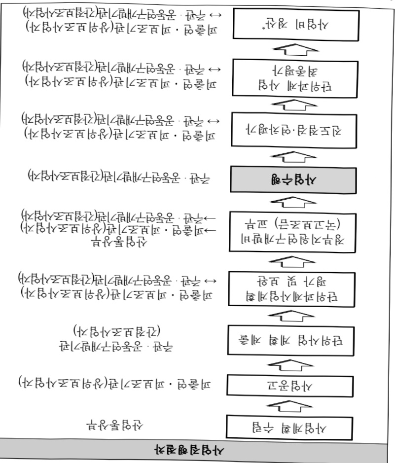

# 바이오산업개방형생태계조성촉진

**해당 페이지**: PDF 3941 ~ 3964 쪽 해당

**부처**: 산업통상부
**분야**: 산업·중소기업 및 에너지
**회계유형**: 일반회계
**2026 확정예산**: 55627.0 백만원
**전년대비 증감률**: 33.5%
**AI 도메인**: 교육/인재

---

<table border=1 style='margin: auto; word-wrap: break-word;'><tr><td rowspan="5">바이오 인력양성 지원</td><td rowspan="3">소관부처</td><td style='text-align: center; word-wrap: break-word;'>실·국·과(팀)</td><td style='text-align: center; word-wrap: break-word;'>과  장</td><td style='text-align: center; word-wrap: break-word;'>사무관</td><td style='text-align: center; word-wrap: break-word;'>주무관</td></tr><tr><td style='text-align: center; word-wrap: break-word;'>산업성장실산업인공지능정책관</td><td style='text-align: center; word-wrap: break-word;'>최광준</td><td style='text-align: center; word-wrap: break-word;'>-</td><td style='text-align: center; word-wrap: break-word;'>고영준</td></tr><tr><td style='text-align: center; word-wrap: break-word;'>인공지능바이오융합산업과</td><td style='text-align: center; word-wrap: break-word;'>044-203-4290</td><td style='text-align: center; word-wrap: break-word;'>-</td><td style='text-align: center; word-wrap: break-word;'>044-203-4298</td></tr><tr><td rowspan="2">사업시행주체</td><td style='text-align: center; word-wrap: break-word;'>한국산업기술진흥원</td><td style='text-align: center; word-wrap: break-word;'>산업인재사업실</td><td style='text-align: center; word-wrap: break-word;'>권유빈 연구원</td><td style='text-align: center; word-wrap: break-word;'>02-6009-3229</td></tr><tr><td style='text-align: center; word-wrap: break-word;'>한국산업기술진흥원</td><td style='text-align: center; word-wrap: break-word;'>산업공급망진흥실</td><td style='text-align: center; word-wrap: break-word;'>박선미 연구원</td><td style='text-align: center; word-wrap: break-word;'>02-6009-3913</td></tr><tr><td rowspan="4">바이오산업 기반구축</td><td rowspan="3">소관부처</td><td style='text-align: center; word-wrap: break-word;'>실·국·과(팀)</td><td style='text-align: center; word-wrap: break-word;'>과  장</td><td style='text-align: center; word-wrap: break-word;'>사무관</td><td style='text-align: center; word-wrap: break-word;'>주무관</td></tr><tr><td style='text-align: center; word-wrap: break-word;'>산업성장실산업인공지능정책관</td><td style='text-align: center; word-wrap: break-word;'>최광준</td><td style='text-align: center; word-wrap: break-word;'>오수만 서기관</td><td style='text-align: center; word-wrap: break-word;'>고영준</td></tr><tr><td style='text-align: center; word-wrap: break-word;'>인공지능바이오융합산업과</td><td style='text-align: center; word-wrap: break-word;'>044-203-4290</td><td style='text-align: center; word-wrap: break-word;'>044-203-4294</td><td style='text-align: center; word-wrap: break-word;'>044-203-4298</td></tr><tr><td style='text-align: center; word-wrap: break-word;'>사업시행주체</td><td style='text-align: center; word-wrap: break-word;'>한국산업기술진흥원</td><td style='text-align: center; word-wrap: break-word;'>산업공급망진흥실</td><td style='text-align: center; word-wrap: break-word;'>박선미 연구원</td><td style='text-align: center; word-wrap: break-word;'>02-6009-3913</td></tr></table>

### 가. 예산안 총괄표

(단위: 백만원, %)

<table border=1 style='margin: auto; word-wrap: break-word;'><tr><td rowspan="2">사업명</td><td rowspan="2">2024년 결산</td><td colspan="2">2025년 예산</td><td colspan="2">2026년</td><td rowspan="2">증감(B-A)</td><td rowspan="2">(B-A)/A</td></tr><tr><td style='text-align: center; word-wrap: break-word;'>본예산(A)</td><td style='text-align: center; word-wrap: break-word;'>추경</td><td style='text-align: center; word-wrap: break-word;'>요구안</td><td style='text-align: center; word-wrap: break-word;'>확정(B)</td></tr><tr><td style='text-align: center; word-wrap: break-word;'>바이오산업개방형 생태계조성 촉진</td><td style='text-align: center; word-wrap: break-word;'>40,574</td><td style='text-align: center; word-wrap: break-word;'>41,661</td><td style='text-align: center; word-wrap: break-word;'>41,661</td><td style='text-align: center; word-wrap: break-word;'>42,747</td><td style='text-align: center; word-wrap: break-word;'>55,627</td><td style='text-align: center; word-wrap: break-word;'>13,966</td><td style='text-align: center; word-wrap: break-word;'>33.5</td></tr></table>

□ 기능별(내역사업별), 목별 예산안 내역

<table border=1 style='margin: auto; word-wrap: break-word;'><tr><td rowspan="3"></td><td colspan="5">2024</td><td colspan="7">2025(25.12월 말)</td><td rowspan="3">2026예산</td></tr><tr><td rowspan="2">예산액(추정)</td><td rowspan="2">예산현액</td><td rowspan="2">집행액[실집행액]</td><td rowspan="2">이월액</td><td rowspan="2">불용액</td><td rowspan="2">분예산</td><td rowspan="2">예산현액</td><td rowspan="2">집행액[실집행액]</td><td colspan="2">전년도 이월액제외</td><td rowspan="2">이월예상액</td><td rowspan="2">불용예상액</td></tr><tr><td style='text-align: center; word-wrap: break-word;'>예산현액</td><td style='text-align: center; word-wrap: break-word;'>집행액[실집행액]</td></tr><tr><td style='text-align: center; word-wrap: break-word;'>○ 기능별 분류(합계)</td><td style='text-align: center; word-wrap: break-word;'>40,574</td><td style='text-align: center; word-wrap: break-word;'>40,574</td><td style='text-align: center; word-wrap: break-word;'>38,209[38,209]</td><td style='text-align: center; word-wrap: break-word;'>-</td><td style='text-align: center; word-wrap: break-word;'>-</td><td style='text-align: center; word-wrap: break-word;'>41,661</td><td style='text-align: center; word-wrap: break-word;'>41,661[41,661]</td><td style='text-align: center; word-wrap: break-word;'>41,661[41,661]</td><td style='text-align: center; word-wrap: break-word;'>41,661[41,661]</td><td style='text-align: center; word-wrap: break-word;'>41,661[41,661]</td><td style='text-align: center; word-wrap: break-word;'>-</td><td style='text-align: center; word-wrap: break-word;'>-</td><td style='text-align: center; word-wrap: break-word;'>55,627</td></tr><tr><td style='text-align: center; word-wrap: break-word;'>· 바이오사업화지원</td><td style='text-align: center; word-wrap: break-word;'>17,191</td><td style='text-align: center; word-wrap: break-word;'>17,191</td><td style='text-align: center; word-wrap: break-word;'>17,191[17,191]</td><td style='text-align: center; word-wrap: break-word;'>-</td><td style='text-align: center; word-wrap: break-word;'>-</td><td style='text-align: center; word-wrap: break-word;'>21,056</td><td style='text-align: center; word-wrap: break-word;'>21,056[21,056]</td><td style='text-align: center; word-wrap: break-word;'>21,056[21,056]</td><td style='text-align: center; word-wrap: break-word;'>21,056[21,056]</td><td style='text-align: center; word-wrap: break-word;'>21,056[21,056]</td><td style='text-align: center; word-wrap: break-word;'>-</td><td style='text-align: center; word-wrap: break-word;'>-</td><td style='text-align: center; word-wrap: break-word;'>16,244</td></tr><tr><td style='text-align: center; word-wrap: break-word;'>· 바이오인력양성지원</td><td style='text-align: center; word-wrap: break-word;'>6,725</td><td style='text-align: center; word-wrap: break-word;'>6,725</td><td style='text-align: center; word-wrap: break-word;'>4,360[4,360]</td><td style='text-align: center; word-wrap: break-word;'>-</td><td style='text-align: center; word-wrap: break-word;'>-</td><td style='text-align: center; word-wrap: break-word;'>4,978</td><td style='text-align: center; word-wrap: break-word;'>4,978[4,978]</td><td style='text-align: center; word-wrap: break-word;'>4,978[4,978]</td><td style='text-align: center; word-wrap: break-word;'>4,978[4,978]</td><td style='text-align: center; word-wrap: break-word;'>4,978[4,978]</td><td style='text-align: center; word-wrap: break-word;'>-</td><td style='text-align: center; word-wrap: break-word;'>-</td><td style='text-align: center; word-wrap: break-word;'>4,430</td></tr><tr><td style='text-align: center; word-wrap: break-word;'>· 바이오산업기반구축</td><td style='text-align: center; word-wrap: break-word;'>15,740</td><td style='text-align: center; word-wrap: break-word;'>15,740</td><td style='text-align: center; word-wrap: break-word;'>15,740[15,740]</td><td style='text-align: center; word-wrap: break-word;'>-</td><td style='text-align: center; word-wrap: break-word;'>-</td><td style='text-align: center; word-wrap: break-word;'>15,627</td><td style='text-align: center; word-wrap: break-word;'>15,627[15,627]</td><td style='text-align: center; word-wrap: break-word;'>15,627[15,627]</td><td style='text-align: center; word-wrap: break-word;'>15,627[15,627]</td><td style='text-align: center; word-wrap: break-word;'>15,627[15,627]</td><td style='text-align: center; word-wrap: break-word;'>-</td><td style='text-align: center; word-wrap: break-word;'>-</td><td style='text-align: center; word-wrap: break-word;'>34,953</td></tr><tr><td style='text-align: center; word-wrap: break-word;'>· 나노산업활성화지원</td><td style='text-align: center; word-wrap: break-word;'>918</td><td style='text-align: center; word-wrap: break-word;'>918</td><td style='text-align: center; word-wrap: break-word;'>918[918]</td><td style='text-align: center; word-wrap: break-word;'>-</td><td style='text-align: center; word-wrap: break-word;'>-</td><td style='text-align: center; word-wrap: break-word;'>-</td><td style='text-align: center; word-wrap: break-word;'>-</td><td style='text-align: center; word-wrap: break-word;'>-</td><td style='text-align: center; word-wrap: break-word;'>-</td><td style='text-align: center; word-wrap: break-word;'>-</td><td style='text-align: center; word-wrap: break-word;'>-</td><td style='text-align: center; word-wrap: break-word;'>-</td><td style='text-align: center; word-wrap: break-word;'>-</td></tr></table>

---

<table border=1 style='margin: auto; word-wrap: break-word;'><tr><td rowspan="3"></td><td colspan="4">2024</td><td colspan="7">2025(25.12월말)</td><td style='text-align: center; word-wrap: break-word;'>2026예산</td></tr><tr><td rowspan="2">예산액(추경)</td><td rowspan="2">예산현액</td><td rowspan="2">집행액[실집행액]</td><td rowspan="2">이월액</td><td rowspan="2">불용액</td><td rowspan="2">본예산</td><td rowspan="2">예산현액</td><td rowspan="2">집행액[실집행액]</td><td colspan="2">전년도 이월액제외</td><td rowspan="2">이월예상액</td><td rowspan="2">불용예상액</td></tr><tr><td style='text-align: center; word-wrap: break-word;'>예산현액</td><td style='text-align: center; word-wrap: break-word;'>집행액[실집행액]</td></tr><tr><td style='text-align: center; word-wrap: break-word;'>○ 비목별 분류(함께)</td><td style='text-align: center; word-wrap: break-word;'>40,574</td><td style='text-align: center; word-wrap: break-word;'>40,574</td><td style='text-align: center; word-wrap: break-word;'>38,209[38,209]</td><td style='text-align: center; word-wrap: break-word;'>-</td><td style='text-align: center; word-wrap: break-word;'>-</td><td style='text-align: center; word-wrap: break-word;'>41,661</td><td style='text-align: center; word-wrap: break-word;'>41,661</td><td style='text-align: center; word-wrap: break-word;'>41,661[41,661]</td><td style='text-align: center; word-wrap: break-word;'>41,661[41,661]</td><td style='text-align: center; word-wrap: break-word;'>-</td><td style='text-align: center; word-wrap: break-word;'>-</td><td style='text-align: center; word-wrap: break-word;'>55,627</td></tr><tr><td style='text-align: center; word-wrap: break-word;'>· 민 간 경 상 보 조(320-01)</td><td style='text-align: center; word-wrap: break-word;'>20,195</td><td style='text-align: center; word-wrap: break-word;'>20,195</td><td style='text-align: center; word-wrap: break-word;'>20,195[20,195]</td><td style='text-align: center; word-wrap: break-word;'>-</td><td style='text-align: center; word-wrap: break-word;'>-</td><td style='text-align: center; word-wrap: break-word;'>18,066</td><td style='text-align: center; word-wrap: break-word;'>18,066[18,066]</td><td style='text-align: center; word-wrap: break-word;'>18,066[18,066]</td><td style='text-align: center; word-wrap: break-word;'>18,066[18,066]</td><td style='text-align: center; word-wrap: break-word;'>-</td><td style='text-align: center; word-wrap: break-word;'>-</td><td style='text-align: center; word-wrap: break-word;'>14,794</td></tr><tr><td style='text-align: center; word-wrap: break-word;'>· 자치단체경상보조(330-01)</td><td style='text-align: center; word-wrap: break-word;'>974</td><td style='text-align: center; word-wrap: break-word;'>974</td><td style='text-align: center; word-wrap: break-word;'>974[974]</td><td style='text-align: center; word-wrap: break-word;'>-</td><td style='text-align: center; word-wrap: break-word;'>-</td><td style='text-align: center; word-wrap: break-word;'>2,314</td><td style='text-align: center; word-wrap: break-word;'>2,314[2,314]</td><td style='text-align: center; word-wrap: break-word;'>2,314[2,314]</td><td style='text-align: center; word-wrap: break-word;'>2,314[2,314]</td><td style='text-align: center; word-wrap: break-word;'>-</td><td style='text-align: center; word-wrap: break-word;'>-</td><td style='text-align: center; word-wrap: break-word;'>-</td></tr><tr><td style='text-align: center; word-wrap: break-word;'>· 자치단체자본보조(330-03)</td><td style='text-align: center; word-wrap: break-word;'>3,365</td><td style='text-align: center; word-wrap: break-word;'>3,365</td><td style='text-align: center; word-wrap: break-word;'>1,000[1,000]</td><td style='text-align: center; word-wrap: break-word;'>-</td><td style='text-align: center; word-wrap: break-word;'>-</td><td style='text-align: center; word-wrap: break-word;'>1,004</td><td style='text-align: center; word-wrap: break-word;'>1,004[1,004]</td><td style='text-align: center; word-wrap: break-word;'>1,004[1,004]</td><td style='text-align: center; word-wrap: break-word;'>1,004[1,004]</td><td style='text-align: center; word-wrap: break-word;'>-</td><td style='text-align: center; word-wrap: break-word;'>-</td><td style='text-align: center; word-wrap: break-word;'>-</td></tr><tr><td style='text-align: center; word-wrap: break-word;'>· 사업출연금(350-02)</td><td style='text-align: center; word-wrap: break-word;'>16,040</td><td style='text-align: center; word-wrap: break-word;'>16,040</td><td style='text-align: center; word-wrap: break-word;'>16,040[16,040]</td><td style='text-align: center; word-wrap: break-word;'>-</td><td style='text-align: center; word-wrap: break-word;'>-</td><td style='text-align: center; word-wrap: break-word;'>20,277</td><td style='text-align: center; word-wrap: break-word;'>20,277[20,277]</td><td style='text-align: center; word-wrap: break-word;'>20,277[20,277]</td><td style='text-align: center; word-wrap: break-word;'>20,277[20,277]</td><td style='text-align: center; word-wrap: break-word;'>-</td><td style='text-align: center; word-wrap: break-word;'>-</td><td style='text-align: center; word-wrap: break-word;'>40,833</td></tr><tr><td style='text-align: center; word-wrap: break-word;'>○ 가능비목별 분류(함께)</td><td style='text-align: center; word-wrap: break-word;'>40,574</td><td style='text-align: center; word-wrap: break-word;'>40,574</td><td style='text-align: center; word-wrap: break-word;'>38,209[38,209]</td><td style='text-align: center; word-wrap: break-word;'>-</td><td style='text-align: center; word-wrap: break-word;'>-</td><td style='text-align: center; word-wrap: break-word;'>41,661</td><td style='text-align: center; word-wrap: break-word;'>41,661[41,661]</td><td style='text-align: center; word-wrap: break-word;'>41,661[41,661]</td><td style='text-align: center; word-wrap: break-word;'>41,661[41,661]</td><td style='text-align: center; word-wrap: break-word;'>-</td><td style='text-align: center; word-wrap: break-word;'>-</td><td style='text-align: center; word-wrap: break-word;'>55,627</td></tr><tr><td style='text-align: center; word-wrap: break-word;'>· 바이오사업화지원</td><td style='text-align: center; word-wrap: break-word;'>17,191</td><td style='text-align: center; word-wrap: break-word;'>17,191</td><td style='text-align: center; word-wrap: break-word;'>17,191[17,191]</td><td style='text-align: center; word-wrap: break-word;'>-</td><td style='text-align: center; word-wrap: break-word;'>-</td><td style='text-align: center; word-wrap: break-word;'>21,056</td><td style='text-align: center; word-wrap: break-word;'>21,056[21,056]</td><td style='text-align: center; word-wrap: break-word;'>21,056[21,056]</td><td style='text-align: center; word-wrap: break-word;'>21,056[21,056]</td><td style='text-align: center; word-wrap: break-word;'>-</td><td style='text-align: center; word-wrap: break-word;'>-</td><td style='text-align: center; word-wrap: break-word;'>16,244</td></tr><tr><td style='text-align: center; word-wrap: break-word;'>· 민 간 경 상 보 조(320-01)</td><td style='text-align: center; word-wrap: break-word;'>16,217</td><td style='text-align: center; word-wrap: break-word;'>16,217</td><td style='text-align: center; word-wrap: break-word;'>16,217[16,217]</td><td style='text-align: center; word-wrap: break-word;'>-</td><td style='text-align: center; word-wrap: break-word;'>-</td><td style='text-align: center; word-wrap: break-word;'>14,742</td><td style='text-align: center; word-wrap: break-word;'>14,742[14,742]</td><td style='text-align: center; word-wrap: break-word;'>14,742[14,742]</td><td style='text-align: center; word-wrap: break-word;'>14,742[14,742]</td><td style='text-align: center; word-wrap: break-word;'>-</td><td style='text-align: center; word-wrap: break-word;'>-</td><td style='text-align: center; word-wrap: break-word;'>10,994</td></tr><tr><td style='text-align: center; word-wrap: break-word;'>· 자치단체경상보조(330-01)</td><td style='text-align: center; word-wrap: break-word;'>974</td><td style='text-align: center; word-wrap: break-word;'>974</td><td style='text-align: center; word-wrap: break-word;'>974[974]</td><td style='text-align: center; word-wrap: break-word;'>-</td><td style='text-align: center; word-wrap: break-word;'>-</td><td style='text-align: center; word-wrap: break-word;'>2,314</td><td style='text-align: center; word-wrap: break-word;'>2,314[2,314]</td><td style='text-align: center; word-wrap: break-word;'>2,314[2,314]</td><td style='text-align: center; word-wrap: break-word;'>2,314[2,314]</td><td style='text-align: center; word-wrap: break-word;'>-</td><td style='text-align: center; word-wrap: break-word;'>-</td><td style='text-align: center; word-wrap: break-word;'>-</td></tr><tr><td style='text-align: center; word-wrap: break-word;'>· 사업출연금(350-02)</td><td style='text-align: center; word-wrap: break-word;'>-</td><td style='text-align: center; word-wrap: break-word;'>-</td><td style='text-align: center; word-wrap: break-word;'>-</td><td style='text-align: center; word-wrap: break-word;'>-</td><td style='text-align: center; word-wrap: break-word;'>-</td><td style='text-align: center; word-wrap: break-word;'>4,000</td><td style='text-align: center; word-wrap: break-word;'>4,000[4,000]</td><td style='text-align: center; word-wrap: break-word;'>4,000[4,000]</td><td style='text-align: center; word-wrap: break-word;'>4,000[4,000]</td><td style='text-align: center; word-wrap: break-word;'>-</td><td style='text-align: center; word-wrap: break-word;'>-</td><td style='text-align: center; word-wrap: break-word;'>5,250</td></tr><tr><td style='text-align: center; word-wrap: break-word;'>· 바이오인력양성지원</td><td style='text-align: center; word-wrap: break-word;'>6,725</td><td style='text-align: center; word-wrap: break-word;'>6,725</td><td style='text-align: center; word-wrap: break-word;'>4,360[4,360]</td><td style='text-align: center; word-wrap: break-word;'>-</td><td style='text-align: center; word-wrap: break-word;'>-</td><td style='text-align: center; word-wrap: break-word;'>4,978</td><td style='text-align: center; word-wrap: break-word;'>4,978[4,978]</td><td style='text-align: center; word-wrap: break-word;'>4,978[4,978]</td><td style='text-align: center; word-wrap: break-word;'>4,978[4,978]</td><td style='text-align: center; word-wrap: break-word;'>-</td><td style='text-align: center; word-wrap: break-word;'>-</td><td style='text-align: center; word-wrap: break-word;'>4,430</td></tr><tr><td style='text-align: center; word-wrap: break-word;'>· 민 간 경 상 보 조(320-01)</td><td style='text-align: center; word-wrap: break-word;'>3,060</td><td style='text-align: center; word-wrap: break-word;'>3,060</td><td style='text-align: center; word-wrap: break-word;'>3,060[3,060]</td><td style='text-align: center; word-wrap: break-word;'>-</td><td style='text-align: center; word-wrap: break-word;'>-</td><td style='text-align: center; word-wrap: break-word;'>3,324</td><td style='text-align: center; word-wrap: break-word;'>3,324[3,324]</td><td style='text-align: center; word-wrap: break-word;'>3,324[3,324]</td><td style='text-align: center; word-wrap: break-word;'>3,324[3,324]</td><td style='text-align: center; word-wrap: break-word;'>-</td><td style='text-align: center; word-wrap: break-word;'>-</td><td style='text-align: center; word-wrap: break-word;'>3,800</td></tr><tr><td style='text-align: center; word-wrap: break-word;'>· 자치단체자본보조(330-03)</td><td style='text-align: center; word-wrap: break-word;'>3,365</td><td style='text-align: center; word-wrap: break-word;'>3,365</td><td style='text-align: center; word-wrap: break-word;'>1,000[1,000]</td><td style='text-align: center; word-wrap: break-word;'>-</td><td style='text-align: center; word-wrap: break-word;'>-</td><td style='text-align: center; word-wrap: break-word;'>1,004</td><td style='text-align: center; word-wrap: break-word;'>1,004[1,004]</td><td style='text-align: center; word-wrap: break-word;'>1,004[1,004]</td><td style='text-align: center; word-wrap: break-word;'>1,004[1,004]</td><td style='text-align: center; word-wrap: break-word;'>-</td><td style='text-align: center; word-wrap: break-word;'>-</td><td style='text-align: center; word-wrap: break-word;'>-</td></tr><tr><td style='text-align: center; word-wrap: break-word;'>· 사업출연금(350-02)</td><td style='text-align: center; word-wrap: break-word;'>300</td><td style='text-align: center; word-wrap: break-word;'>300</td><td style='text-align: center; word-wrap: break-word;'>300[300]</td><td style='text-align: center; word-wrap: break-word;'>-</td><td style='text-align: center; word-wrap: break-word;'>-</td><td style='text-align: center; word-wrap: break-word;'>650</td><td style='text-align: center; word-wrap: break-word;'>650[650]</td><td style='text-align: center; word-wrap: break-word;'>650[650]</td><td style='text-align: center; word-wrap: break-word;'>650[650]</td><td style='text-align: center; word-wrap: break-word;'>-</td><td style='text-align: center; word-wrap: break-word;'>-</td><td style='text-align: center; word-wrap: break-word;'>630</td></tr><tr><td style='text-align: center; word-wrap: break-word;'>· 바이오산업 기반주측</td><td style='text-align: center; word-wrap: break-word;'>15,740</td><td style='text-align: center; word-wrap: break-word;'>15,740</td><td style='text-align: center; word-wrap: break-word;'>15,740[15,740]</td><td style='text-align: center; word-wrap: break-word;'>-</td><td style='text-align: center; word-wrap: break-word;'>-</td><td style='text-align: center; word-wrap: break-word;'>15,627</td><td style='text-align: center; word-wrap: break-word;'>15,627[15,627]</td><td style='text-align: center; word-wrap: break-word;'>15,627[15,627]</td><td style='text-align: center; word-wrap: break-word;'>15,627[15,627]</td><td style='text-align: center; word-wrap: break-word;'>-</td><td style='text-align: center; word-wrap: break-word;'>-</td><td style='text-align: center; word-wrap: break-word;'>34,953</td></tr><tr><td style='text-align: center; word-wrap: break-word;'>· 사업출연금(350-02)</td><td style='text-align: center; word-wrap: break-word;'>15,740</td><td style='text-align: center; word-wrap: break-word;'>15,740</td><td style='text-align: center; word-wrap: break-word;'>15,740[15,740]</td><td style='text-align: center; word-wrap: break-word;'>-</td><td style='text-align: center; word-wrap: break-word;'>-</td><td style='text-align: center; word-wrap: break-word;'>15,627</td><td style='text-align: center; word-wrap: break-word;'>15,627[15,627]</td><td style='text-align: center; word-wrap: break-word;'>15,627[15,627]</td><td style='text-align: center; word-wrap: break-word;'>15,627[15,627]</td><td style='text-align: center; word-wrap: break-word;'>-</td><td style='text-align: center; word-wrap: break-word;'>-</td><td style='text-align: center; word-wrap: break-word;'>34,953</td></tr><tr><td style='text-align: center; word-wrap: break-word;'>· 나노산업 활성화지원</td><td style='text-align: center; word-wrap: break-word;'>918</td><td style='text-align: center; word-wrap: break-word;'>918</td><td style='text-align: center; word-wrap: break-word;'>918[918]</td><td style='text-align: center; word-wrap: break-word;'>-</td><td style='text-align: center; word-wrap: break-word;'>-</td><td style='text-align: center; word-wrap: break-word;'>-</td><td style='text-align: center; word-wrap: break-word;'>-</td><td style='text-align: center; word-wrap: break-word;'>-</td><td style='text-align: center; word-wrap: break-word;'>-</td><td style='text-align: center; word-wrap: break-word;'>-</td><td style='text-align: center; word-wrap: break-word;'>-</td><td style='text-align: center; word-wrap: break-word;'>-</td></tr><tr><td style='text-align: center; word-wrap: break-word;'>· 민 간 경 상 보 조(320-01)</td><td style='text-align: center; word-wrap: break-word;'>918</td><td style='text-align: center; word-wrap: break-word;'>918</td><td style='text-align: center; word-wrap: break-word;'>918[918]</td><td style='text-align: center; word-wrap: break-word;'>-</td><td style='text-align: center; word-wrap: break-word;'>-</td><td style='text-align: center; word-wrap: break-word;'>-</td><td style='text-align: center; word-wrap: break-word;'>-</td><td style='text-align: center; word-wrap: break-word;'>-</td><td style='text-align: center; word-wrap: break-word;'>-</td><td style='text-align: center; word-wrap: break-word;'>-</td><td style='text-align: center; word-wrap: break-word;'>-</td><td style='text-align: center; word-wrap: break-word;'>-</td></tr></table>

---

### 나. 사업설명자료

## 1 ) 사업목적·내용

(바이오산업개방형생태계조성촉진) 산업계의 바이오 산업분야 인력수요 증가에 대응한 현장중심의 인력양성, 기업의 산업화 장애요소 해소 지원을 통한 산업 경쟁력의 근간이 되는 산업 생태계 활성화 촉진

- (바이오 사업화 지원) 기업·시장수요를 반영한 비즈니스 역량강화 지원을 통해 국내 바이오산업의 생태계 조성·촉진 및 대부분이 중소·중견기업인 바이오 분야 기업의 성장 및 해외진출 지원

- (바이오 인력양성 지원) 바이오기업에 대한 민간 투자 확대 및 바이오 산업의 성장,

바이오벤처 창업 활성화에 따른 지속적 인력수요 증가가 전망됨에 따라 산업체

현장에 필요한 전문 실무인력 확대 공급 지원

- (바이오산업 기반구축) 첨단 바이오 산업 육성을 위한 사업화 지원, 제조 공정 혁신을 위한 실증 기반 조성 및 관련 인프라 구축 지원

## 2 ) 사업개요

□ 사업근거 및 추진경위

① 법령상 근거 및 조항 적시

0 산업융합촉진법 제17조(융합 신산업의 지원)

제17조(융합 신산업의 지원) ① 정부는 융합 신산업을 활성화하고 그 발전을 지원하기 위하여 다음 각 호의 사업을 할 수 있다.

1. 융합 신산업을 위한 전문인력 양성과 연구 활성화 지원

7. 융합 신산업 분야를 발굴하고 그 업무를 수행하는 자에 대한 출연 또는 보조 및 융자

o 산업발전법 제3조(산업발전시책), 제12조(기업경영자원의 개발 촉진 등)

제3조(산업발전시책) 산업통상부장관은 이 법의 목적을 달성하기 위하여 관계 중앙행정기관의 장과 협의하여 다음 각 호의 시책(이하 "산업발전시책"이라 한다)을 마련하여야 한다.

2. 산업의 경쟁력 강화

3. 지속가능한 산업발전의 기반 구축

6. 산업인력의 공급 및 그 효율적인 관리

7. 산업기반의 확충

제12조(기업경영자원의 개발 촉진 등) ① 정부는 인적 자원의 개발 등 기업의 경영능력 증진을 위한 사업에 대하여 필요한 지원을 할 수 있다.

o 산업기술혁신족진법 제15조 (개발기술사업화촉진사업), 제19조(산업기술기반조성사업), 제21조(연구장비·시설 등의 확충 및 활용촉진)

제15조(개발기술사업화촉진사업) ① 정부는 개발된 기술을 사업화하거나 이에 대한 출자를 주된 사업으로 하는 자의 지원·육성에 필요한 시책을 마련하여야 한다.

② 산업통상부장관은 개발된 기술의 사업화를 촉진하기 위하여 대통령령으로 정하는 바에 따라 다음 각 호의 사업(이하 "개발기술사업화촉진사업"이라 한다)을 실시할 수 있다.

---

<table border=1 style='margin: auto; word-wrap: break-word;'><tr><td style='text-align: center; word-wrap: break-word;'>1. 신기술의 사업화 및 보육2. 사업화를 지원하는 전문기관 및 전문인력의 양성3. 사업화에 의하여 생산되는 제품의 판매 촉진</td></tr><tr><td style='text-align: center; word-wrap: break-word;'>제19조(산업기술기반조성사업) ① 산업통상부장관은 산업기술혁신의 기반 및 환경조성에 관한 다음 각 호의 사업(이하 &quot;산업기술기반조성사업&quot;이라 한다)을 추진할 수 있다.1. 산업기술인력의 활용 및 공급2. 산업기술 연구장비·시설 등의 확충 및 활용촉진3. 연구장비·시설·연구인력 및 정보 등 산업기술혁신 요소의 집적화(集積化) 촉진4. 산업기술혁신을 위하여 필요한 기술·산업 등에 관한 각종 정보의 생산·관리 및 활용의 촉진2. 산업통상부장관은 연구기관, 대학, 그 밖에 대통령령으로 정하는 기관·단체로 하여금 산업기술기반조성사업을 실시하게 할 수 있으며, 산업기술기반조성사업을 주관하여 실시하는 자(이하 &quot;주관기관&quot;이라 한다)와 산업기술기반조성사업에 관한 협약을 체결하고, 주관기관에 해당 사업의 수행에 드는 비용의 전부 또는 일부를 출연 또는 보조할 수 있다.</td></tr><tr><td style='text-align: center; word-wrap: break-word;'>제21조(연구장비·시설 등의 확충 및 활용촉진) ① 산업통상부장관은 주관기관이 연구장비·시설, 시험·평가장비 등(이하 &quot;연구장비등&quot;이라 한다) 연구기반을 확충할 수 있도록 지원하거나 그 밖에 필요한 방안을 마련하여야 한다.② 제1항에 따라 연구장비등을 지원받은 주관기관과 주관연구기관 중 대통령령으로 정하는 기관(이하 이 조에서 &quot;주관기관등&quot;이라 한다)은 무상 또는 연구장비등의 유지·보수·운영에 드는 비용 등을 고려하여 산업통상부장관이 고시하는 기준에 따라 산정한 사용료를 받는 것을 조건으로 다른 기술혁신주체가 해당 연구장비등을 활용할 수 있도록 연구장비등의 활용촉진을 위한 방안을 마련하여 추진하여야 한다. 이 경우 산업통상부장관은 연구장비등의 활용촉진에 드는 비용의 전부 또는 일부를 주관기관등에 지원할 수 있다.③ 주관기관등은 대통령령으로 정하는 바에 따라 연구장비등의 연도별 활용촉진 계획 및 활용실적을 산업통상부장관에게 제출하여야 한다.④ 산업통상부장관은 주관기관등이 보유하고 있는 연구장비등의 효과적인 관리 및 활용촉진을 위하여 대통령령으로 정하는 기준에 따라 연구장비관리 전문기관을 지정하여 관련 업무를 수행하게 할 수 있다. 이 경우 산업통상부장관은 해당 전문기관에 연구장비등의 관리 및 활용촉진을 위하여 드는 비용의 전부 또는 일부를 지원할 수 있다.</td></tr></table>

## ② 추진경위

o 추진 배경

1. 바이오 사업화 지원('16~)

- 기업·시장수요를 반영한 비즈니스 역량 강화 지원을 통해 국내 바이오산업의 생태계를

조성·촉진함으로써 바이오산업의 지속적으로 성장할 수 있는 기반 조성

2. 바이오 인력양성 지원('14~)

-바이오기업에 대한 민간 투자 확대 및 바이오산업의 성장, 급속한 바이오벤처 창업 활성화에 따라 현장·융합·개발·미래 인력 수요에 대응한 전문인력 확대 공급 및 체계적인 교육시설 필요

3. 바이오산업 기반구축('23~)

- 의료·바이오 첨단기기, 디지털 헬스케어 등 첨단 바이오 산업 육성 지원을 위한 기반 조성 및 인프라 구축 필요

---

## □ 주요내용

① 사업규모

- 총사업비(해당되는 경우에만 기재) : 해당 없음

- 사업기간 : '16년~계속

- 최근 5년 간 투입된 사업비(예산액기준, 추경편성한 연도에는 추경포함)

<table border=1 style='margin: auto; word-wrap: break-word;'><tr><td style='text-align: center; word-wrap: break-word;'>$ \underline{\text{연도}} $</td><td style='text-align: center; word-wrap: break-word;'>2022</td><td style='text-align: center; word-wrap: break-word;'>2023</td><td style='text-align: center; word-wrap: break-word;'>2024</td><td style='text-align: center; word-wrap: break-word;'>2025</td><td style='text-align: center; word-wrap: break-word;'>2026</td></tr><tr><td style='text-align: center; word-wrap: break-word;'>$ \underline{\text{사업비}} $</td><td style='text-align: center; word-wrap: break-word;'>36,543</td><td style='text-align: center; word-wrap: break-word;'>31,591</td><td style='text-align: center; word-wrap: break-word;'>40,574</td><td style='text-align: center; word-wrap: break-word;'>41,661</td><td style='text-align: center; word-wrap: break-word;'>55,627</td></tr></table>

- 기타: 해당 없음

② 사업추진체계

- 사업시행방법 : 보조(민간), 출연

- 사업시행주체 : 한국산업기술진흥원, 한국산업기술시험원

- 사업 수혜자 : 대학, 중소기업, 병원, 연구소, 기업, 학생 등

- 보조, 융자, 출연, 출자 등의 경우 보조·융자 등 지원 비율 및 법적근거

<table border=1 style='margin: auto; word-wrap: break-word;'><tr><td style='text-align: center; word-wrap: break-word;'>내역사업명</td><td style='text-align: center; word-wrap: break-word;'>구분</td><td style='text-align: center; word-wrap: break-word;'>피보조·피출연 등 기관명</td><td style='text-align: center; word-wrap: break-word;'>지원 금액 (2026예산)</td><td style='text-align: center; word-wrap: break-word;'>지원 비율(%)</td><td style='text-align: center; word-wrap: break-word;'>보조율 법적근거 (해당 조항)</td></tr><tr><td rowspan="2">바이오 사업화 지원</td><td style='text-align: center; word-wrap: break-word;'>보조, 출연</td><td style='text-align: center; word-wrap: break-word;'>한국산업 기술진흥원</td><td style='text-align: center; word-wrap: break-word;'>8,274</td><td style='text-align: center; word-wrap: break-word;'>70</td><td style='text-align: center; word-wrap: break-word;'>보조금 관리에 관한 법률 제9조 산업기술혁신촉진법 제15조</td></tr><tr><td style='text-align: center; word-wrap: break-word;'>보조</td><td style='text-align: center; word-wrap: break-word;'>한국산업 기술지휘원</td><td style='text-align: center; word-wrap: break-word;'>7,970</td><td style='text-align: center; word-wrap: break-word;'>70</td><td style='text-align: center; word-wrap: break-word;'>보조금 관리에 관한 법률 제9조 산업기술혁신촉진법 제15조</td></tr><tr><td style='text-align: center; word-wrap: break-word;'>바이오 인력양성 지원</td><td style='text-align: center; word-wrap: break-word;'>보조, 출연</td><td style='text-align: center; word-wrap: break-word;'>한국산업 기술진흥원</td><td style='text-align: center; word-wrap: break-word;'>4,430</td><td style='text-align: center; word-wrap: break-word;'>70</td><td style='text-align: center; word-wrap: break-word;'>보조금 관리에 관한 법률 제9조 산업기술혁신촉진법 제15조</td></tr><tr><td style='text-align: center; word-wrap: break-word;'>바이오산업 기반구축</td><td style='text-align: center; word-wrap: break-word;'>출연</td><td style='text-align: center; word-wrap: break-word;'>한국산업 기술진흥원</td><td style='text-align: center; word-wrap: break-word;'>34,953</td><td style='text-align: center; word-wrap: break-word;'>70</td><td style='text-align: center; word-wrap: break-word;'>산업기술혁신촉진법 제15조</td></tr></table>

---

## 3 )2026년도 예산 산출 근거

## ①바이오사업화지원

:(25)21,056백만원→(26)16,244백만원,4,812백만원 감액

- (요구) 국내 바이오 기업의 투자 유치, 인허가 지원 등 글로벌 시장 경쟁력 강화 및 제품 생산기술 등

상용화 지원을 통한 바이오 산업 생태계 활성화 지원

- (산출)바이오사업화촉진 지원 1,934백만원

의료기기 사업화 촉진 3,650백만원

첨단바이오소재 사업화 지원 3,300백만원

첨단 기능성소재 기반 시기능 보조기기산업 육성 1,020백만원

디지털헬스케어서비스 상용화 지원 1,090백만원

스마트 디지털헬스케어제품 사업화 통합지원 3,250백만원

AI기반 슬립테크 국제협력 실증확산지원 2,000백만원

## °2025년도 예산 및 2026년도 예산 산출 세부내역 비교

<table border=1 style='margin: auto; word-wrap: break-word;'><tr><td colspan="2">2025년 본예산</td><td colspan="2">2026년 예산</td></tr><tr><td style='text-align: center; word-wrap: break-word;'>예산</td><td style='text-align: center; word-wrap: break-word;'>산출내역</td><td style='text-align: center; word-wrap: break-word;'>예산</td><td style='text-align: center; word-wrap: break-word;'>산출내역</td></tr><tr><td style='text-align: center; word-wrap: break-word;'>21,056</td><td style='text-align: center; word-wrap: break-word;'>○ 민간경상보조(320-01) : 14,742백만원
가. 바이오사업화촉진 (1,776백만원)
  · 바이오벤처장업지원 : 3건x86.3백만원x100%=259백만원
  · 국내외 네트워크 지원 : 3건x186.7백만원x100%=560백만원
  · 산업활성화전론조지원 : 1식x63백만원x100%=63백만원
  · 바이오헬스케어산업 통계조사 : 3건x88백만원x100%=264백만원
  · 바이오활성제글로벌경쟁력강화 : 1식x630백만원x100%=630백만원
나. 의료기기 사업화 촉진 (3,650백만원)
  · 의료기기 신뢰성 제고 : 33건x60.7백만원x70%=1,402백만원
  · 의료기기 해외 시장 진출 코징 : 16건x71.4백만원x70%=800백만원
  · 의료기기+의료교육 패키지화 : 15건x31.4백만원x70%=330백만원
  · 정형재활의료기기 사업화 인증 및 실증 지원 : 10건x69백만원x70%=608백만원
  · 커넥터드 의료산업 생태계 활성 촉진 : 17건x429백만원x70%=510백만원
다. 첨단바이오소재 사업화 지원 (3,300백만원)
  · 제품화 및 양산화 지원 : 12건x280.3백만원x70%=2,355백만원
  · 안전 및 성능 유효성 평가 : 15건x61.4백만원x70%=645백만원
  · 국내외 인증 및 마케팅 지원 : 12건x35.7백만원x70%=300백만원
라. 첨단기능성소재기반 시기능 보조기기산업 육성 (1,200백만원)
  · 기술정보 지원 : 3건x57백만원x70%=120백만원
  · 제품 상용화 지원 : 100건x10.3백만원x70%=720백만원
  · 해외진출 인증 지원 : 7건x43백만원x70%=210백만원
  · 판로개척 지원 : 2건x107백만원x70%=150백만원
마. 건강보험 빅데이터 기반 진료지원 플랫폼 개발 (271백만원)
  · 콘텐츠 개발 지원 : 2개사x21.5백만원x70%=30백만원
  · 플랫폼 개발 지원 : 5중x11.5백만원x70%=40백만원
  · 사업화 전설팀 : 22건x11.1백만원x70%=171백만원
  · 협력네트워크 지원 : 5건x8.6백만원x70%=30백만원
바. 임상데이터기반 근골격계 인체모사 용합기술 지원 (1,380백만원)
  · 제품화 공정 개선 : 4건x42.8백만원x70%=120백만원
  · 기술 컨설팅 : 20건x20백만원x70%=280백만원
  · 임상세일즈 지원 : 10건x38.6백만원x70%=270백만원
  · 해외 임상시험 컨설팅 : 4건x92.8백만원x70%=260백만원
  · 제품인증 지원 : 19건x33.8백만원x70%=450백만원
사. 진환경바이오플라스틱 상용화 지원 (175백만원)
  · 시제품 제작지원 : 4건x35.7백만원x70%=100백만원
  · 인증 지원 등 : 2건x14.3백만원x70%=20백만원
  · 기술정보 DB 구축 : 1건x29백만원x70%=20백만원
  · 네트워크 지원 : 1회x7백만원x70%=5백만원</td><td style='text-align: center; word-wrap: break-word;'>16,244</td><td style='text-align: center; word-wrap: break-word;'>○ 민간경상보조(320-01) : 10,994백만원
가. 바이오사업화촉진 (1,934백만원)
  · 바이오벤처장업지원 : 3건x86.3백만원x100%=259백만원
  · 국내외 네트워크 지원 : 4건x180백만원x100%=718백만원
  · 산업활성화컨트롤 조지원 : 1식x63백만원x100%=63백만원
  · 바이오헬스케어산업 통계조사 : 3건x88백만원x100%=264백만원
  · 바이오활성제글로벌경쟁력강화 : 1식x630백만원x100%=630백만원
나. 의료기기 사업화 촉진 (3,650백만원)
  · 의료기기 신뢰성 제고 : 33건x60.7백만원x70%=1,402백만원
  · 의료기기 해외 시장 진출 코징 : 16건x71.4백만원x70%=800백만원
  · 의료기기+의료교육 패키지화 : 15건x31.4백만원x70%=330백만원
  · 정형재활의료기기 사업화 인증 및 실증 지원 : 107669백만원x70%=608백만원
  · 커넥터드 의료산업 생태계 활성 촉진 : 17건x429백만원x70%=510백만원
다. 첨단바이오소재 사업화 지원 (3,300백만원)
  · 제품화 및 양산화 지원 : 12건x280.3백만원x70%=2,355백만원
  · 안전 및 성능 유효성 평가 : 15건x61.4백만원x70%=645백만원
  · 국내외 인증 및 마케팅 지원 : 12건x35.7백만원x70%=300백만원
라. 첨단기능성소재기반 시기능 보조기기산업 육성 (1,020백만원)
  · 기술정보 지원 : 1건x57.2백만원x70%=40백만원
  · 제품 상용화 지원 : 90건x10.3백만원x70%=650백만원
  · 해외진출 인증 지원 : 6건x42.9백만원x70%=180백만원
  · 판로개척 지원 : 2건x107백만원x70%=150백만원
마. 디지털헬스케어서비스 상용화 지원 (1,090백만원)
  · 온/오프라인 매치업 개최 : 2회x86백만원x70%=120백만원
  · 디지털헬스케어 실태조사 : 1회x214백만원x70%=150백만원
  · 수요공급간 마켓플레이스 : 1회x371백만원x70%=260백만원
  · 실증지원 프로그램 운영 : 2건x400백만원x70%=560백만원
○ 사업출연금(350-02) : 5,250백만원
가. 스마트 디지털헬스케어제품 사업화 통합지원 (3,250백만원)
  · 해외마케팅지원센터 설치·운영 : 1개x490백만원x100%=490백만원
  · 산업통계 종합시스템 구축·운영 : 1건x400백만원x100%=400백만원
  · AI용합신제품 개발지원 : 2건x75백만원x100%=150백만원
  · AI용합신제품 사업화지원 : 2건x125백만원x100%=250백만원
  · 해외 인하가 등 기술지원 : 2건x245백만원x100%=490백만원
  · 해외 인하가 및 마케팅교육 : 462.5건x0.8백만원x100%=370백만원
  · 국제수준 국내전시회 개최 : 1건x630백만원x100%=630백만원
  · 해외거점 국제전시회 참가 확대 : 3건x157백만원x100%=470백만원</td></tr></table>

---

<table border=1 style='margin: auto; word-wrap: break-word;'><tr><td colspan="2">2025년 본예산</td><td colspan="2">2026년 예산</td></tr><tr><td style='text-align: center; word-wrap: break-word;'>예산</td><td style='text-align: center; word-wrap: break-word;'>산출내역</td><td style='text-align: center; word-wrap: break-word;'>예산</td><td style='text-align: center; word-wrap: break-word;'>산출내역</td></tr><tr><td style='text-align: center; word-wrap: break-word;'></td><td style='text-align: center; word-wrap: break-word;'>· 마케팅 지원: 7건x2백만원x70%=10백만원
· 기술 컨설팅: 2건x14.3백만원x70%=20백만원
아. 바이오의약품 원부자재 상용화 지원(1,690백만원)
· 원부자재 품질 DB 구축: 12회x42.9백만원x70%=360백만원
· 국제전퍼런스 개최: 1회x371백만원x70%=260백만원
· 기술교육 컨설팅: 14개사x35.7백만원x70%=350백만원
· 수요공급기업간 협력지원: 6회x42.9백만원x70%=180백만원
· 성능평가 지원: 4건x64.3백만원x70%=180백만원
· 시제품 재작지원: 6건x42.9백만원x70%=180백만원
· 인허가 지원시스템 운영: 1건x257백만원x70%=180백만원
자. 디지털헬스케어서비스 상용화 지원(1,300백만원)
· 온/오프라인 매치업 개최: 2회x86백만원x70%=120백만원
· 디지털헬스케어 실태조사: 1회x214백만원x70%=150백만원
· 수요공급간 마켓플레이스: 1회x371백만원x70%=260백만원
· 실증지원 프로그램 운영: 2건x550백만원x70%=770백만원
○ 자치단체경상보조(330-01): 2,314백만원
가. 2025 제천국제한방 천연물 산업역 스포(2,314백만원)
· 학술행사유치: 1회x1,267백만원x30%=380백만원
· 행사운영: 1회x2,667백만원x30%=800백만원
· 유치·홍보: 1회x3,780백만원x30%=1,134백만원
○ 사업출연금(350-02): 4,000백만원
가. 스마트 디지털헬스케어제품 사업화 통합지원(2,000백만원)
· 해외마케팅지원선택 살자운영: 1개x320백만원x100%=9/12개월=240백만원
· 산업통계 종합시스템 구축운영: 1개x320백만원x100%=9/12개월=240백만원
· AI융합신제품 개발지원: 2건x207백만원x100%=9/12개월=310백만원
· AI융합신제품 사업화지원: 2건x167백만원x100%=9/12개월=250백만원
· 해외 인하가 등 기술지원: 2건x160백만원x100%=9/12개월=240백만원
· 해외 인하가 및 마케팅교육: 457건x0.35백만원x100%=9/12개월=120백만원
· 국제수준 국내전시회 개최: 1건x507백만원x100%=9/12개월=380백만원
· 해외가점 국제전시회 참가 확대: 3건x98백만원x100%=9/12개월=220백만원
나. AI기반 슬립테크 국제협력 실증확산지원(2,000백만원)
· 선전국 병원연구소 네트워크 구축: 3건x76백만원x70%=9/12개월=120백만원
· 내국인 수면데이터 확보: 4건x124백만원x70%=9/12개월=260백만원
· 국내 대형병원 연계 기술지원: 3건x76백만원x70%=9/12개월=120백만원
· 국산제품 사업화체계 마련: 6건x114백만원x70%=9/12개월=360백만원
· 와국인 수면데이터 확보: 1건x190.5백만원x70%=9/12개월=100백만원
· 다국적 임상시험: 1건x952백만원x70%=9/12개월=500백만원
· 인허가 획득 기술지원: 3건x152백만원x70%=9/12개월=240백만원
· 해외시장 진출지원: 47k107백만원x70%=9/12개월=25백만원
· 해외시장 분석지원: 47k35.7백만원x70%=9/12개월=75백만원</td><td style='text-align: center; word-wrap: break-word;'></td><td style='text-align: center; word-wrap: break-word;'></td></tr></table>

---

②바이오 인력양성 지원

:(25) 4,978백만원 → (26) 4,430백만원, 548백만원 감액

(보구) 바이오산업 생산·연구개발 전문인력 수급 불균형 해소 및 전문인력 수요 증가에 대응, 유럽 등 선진국 의료기기 규제 대응 의료기기 임상시험 전문인력, 국내외 체외진단기기 기업 대상 실무형 인력 등 바이오 산업 활성화를 위한 인재양성 기반 조성 지원

- (산출) 바이오 전문인력 양성 3,000백만원

의료기기 임상전문가 양성 800백만원

체외진단 현장맞춤형 전문인력 양성 630백만원

°2025년도 예산 및 2026년도 예산 산출 세부내역 비교

<table border=1 style='margin: auto; word-wrap: break-word;'><tr><td colspan="2">2025년 본예산</td><td colspan="2">2026년 예산</td></tr><tr><td style='text-align: center; word-wrap: break-word;'>예산</td><td style='text-align: center; word-wrap: break-word;'>산출내역</td><td style='text-align: center; word-wrap: break-word;'>예산</td><td style='text-align: center; word-wrap: break-word;'>산출내역</td></tr><tr><td style='text-align: center; word-wrap: break-word;'>4,978</td><td style='text-align: center; word-wrap: break-word;'>○ 민간경상보조(320-01): 3,324백만원가. 바이오 전문인력 양성 (2,524백만원) · 바이오전문인력 양성 프로그램 운영: 9기관x242.4백만원x100%=2,182백만원 · 인력양성 플랫폼 운영: 1식x342백만원x100%=342백만원 나. 의료기기 임상전문가 양성 (800백만원) · 임상계획서 작성 교육: 85개사x6.7백만원x70%=400백만원 · 임상계획서 VR콘텐츠: 3건x190.5백만원x70%=400백만원 ○ 자치단체자본보조(330-03): 1,004백만원 가. 바이오공정 인력양성센터 구축(K-NIBRT) (1,004백만원) · 센터건축 및 장비구축: 1식x1,004백만원=1,004백만원 * 센터 건축 및 장비구축비는 센터 준공 시까지 항목별 총액 범위 내에서 자율적으로 집행 ○ 사업출연금(350-02): 650백만원 가. 체외진단 현장맞춤형 전문인력 양성 (650백만원) · 전문인력 양성교육: 120명x6.2백만원x70%=520백만원 · 취업 연계 프로그램 운영: 1회x186백만원x70%=130백만원</td><td style='text-align: center; word-wrap: break-word;'>4,430</td><td style='text-align: center; word-wrap: break-word;'>○ 민간경상보조(320-01): 3,800백만원 가. 바이오 전문인력 양성 (3,000백만원) · 바이오전문인력 양성 프로그램 운영: 9기관x295.3백만원x100%=2,658백만원 · 인력양성 플랫폼 운영: 1식x342백만원x100%=342백만원 나. 의료기기 임상전문가 양성 (800백만원) · 임상계획서 작성 교육: 85개사x6.7백만원x70%=400백만원 · 임상계획서 VR콘텐츠: 3건x190.5백만원x70%=400백만원 ○ 사업출연금(350-02): 630백만원 가. 체외진단 현장맞춤형 전문인력 양성 (630백만원) · 전문인력 양성교육: 120명x6백만원x70%=500백만원 · 취업 연계 프로그램 운영: 1회x186백만원x70%=130백만원</td></tr></table>

③바이오산업 기반 구축

:(25)15,627백만원→(26)34,953백만원,19,326백만원증액

- (요구) 첨단 바이오 소재 및 의료기기 개발 실증 기반 조성 및 관련 인프라 구축 지원

- (산출) AI·빅데이터기반 의료 바이오첨단기기 연구제조센터 구축 3,400백만원

지능형헬스케어 제품 기반 실증·사업화 지원 1,480백만원

혁신신약소재물질 사업화 비임상 핵심 실증지원 1,250백만율

AI 기반 K-디지털헬스 시장진출 지원 플랫폼 구축 3,500백만원

디지털 바이오칩 실용화 플랫폼 3,730백만원

바이오생체활성제품 글로벌사업화지원 3,250백만원

차세대 마이크로바이옴 의약품 제조혁신공정 3,693백만원

바이오의료기기 해외진출지원 제로트러스트기반구축 2.450백만원

헬스케어제품 멀티모달형 AI 플랫폼 기반구축 1,000백만원

글로벌 진출 스마트 휴머니제이션 제품 AI기반 맞춤형 지원체계 구축 1,000백만원

AI 융합 에스테틱 의료기기 글로벌 사업화 기반구축 2,000백만원

인공지능 맞춤형 뷰티기기 고도화 글로벌화 지원 1,000백만원

맞춤형 제조 기반 근골격계 의료기기 실증센터 구축 1,000백만원

성남 Physical AI 기반 의료로봇 기술통합센터 구축 1.500백만원

춘천 체외진단의료기기 종합 성능평가센터 구축 3,000백만원

대구 AI 제조공정 기반 인체이식용 섬유 융합 의료기기 제조기반 구축 1.200백만원

양산 바이오메디컬 AI 상용화 기반구축 500백만원

---

2025년도 예산 및 2026년도 예산 산출 세부내역 비교

<table border=1 style='margin: auto; word-wrap: break-word;'><tr><td colspan="2">2025년 본예산</td><td colspan="2">2026년 예산</td></tr><tr><td style='text-align: center; word-wrap: break-word;'>예산</td><td style='text-align: center; word-wrap: break-word;'>산출내역</td><td style='text-align: center; word-wrap: break-word;'>예산</td><td style='text-align: center; word-wrap: break-word;'>산출내역</td></tr><tr><td rowspan="11">15,627</td><td rowspan="11">○ 사업출연금(350-02): 15,627백만원</td><td rowspan="11">34,953</td><td style='text-align: center; word-wrap: break-word;'>○ 사업출연금(350-02): 34,953백만원</td></tr><tr><td style='text-align: center; word-wrap: break-word;'>가. 사빅데이터기반 의료 바이오청단기기 연구제조센터 구축 (3,400백만원) - 의료연구개발장비 구입 : 5층x680백만원=3,400백만원 나. 지능형혈스케어 제품 기반 실증·사업화 지원 (1,480백만원) - 디지털의료기기 실증 진단장비 구입 : 4층x370백만원=1,480백만원 다. 혁신산악소재물질 사업화 비임삼 핵심 실증지원 (1,250백만원) - 장비구축 : 8층x91.3백만원=730백만원 - 신악소재 산업화 GLP 실증지원 : 6개x109.5백만원×70%=460백만원 - 인력양성 : 6회x14.3백만원×70%=60백만원</td></tr><tr><td style='text-align: center; word-wrap: break-word;'>라. AI 기반 K·디지털헬스 시장진출 지원 플랫폼 구축 (3,500백만원) - AI 시장진출 플랫폼 고도화 : 1식x500백만원=500백만원 - 시장진출 통합 DB 구축 : 5층x80백만원=400백만원 - 기술지원 장비 구축 : 2층x600백만원=1,200백만원 - 맞춤형 시장진출 지원 : 1회x1,300백만원×70%=910백만원 - 디지털헬스케어 분야 전문가 양성 : 52층x140백만원×70%=490백만원</td></tr><tr><td style='text-align: center; word-wrap: break-word;'>라. 지능형혈스케어 제품 기반 실증·사업화 지원 (1,640백만원) - 디지털의료기기 실증 진단장비 구입 : 6층x273.3백만원=1,640백만원 - 우수제조생산시설인프라 및 장비구축 : 4식x732백만원×70%=2,050백만원 - 협온어침 규제·인하가) 및 기술지원 : 10층x207백만원×70%=1,449백만원 - 국내외 전시회지원 : 42층30백만원×70%=84백만원 - 체외진단 디지털전환 역량 강화 : 3친x70백만원×70%=147백만원</td></tr><tr><td style='text-align: center; word-wrap: break-word;'>라. AI 기반 K·디지털헬스 시장진출 지원 플랫폼 구축 (2,000백만원) - AI 시장진출 플랫폼 구축 : 1식x260백만원=260백만원 - 시장진출 통합 DB 구축 : 5층x100백만원=500백만원 - 맞춤형 시장진출 지원 : 1회x1,000백만원×70%=700백만원 - 디지털헬스케어 분야 전문가 양성 : 4층x193백원×70%=540백만원</td></tr><tr><td style='text-align: center; word-wrap: break-word;'>라. AI 기반 마이크로바이움 의약품 제조혁신공정 (3,693백만원) - 마이크로바이움 제조공정 장비구축 : 1식x1,500백만원=1,500백만원 - 제조공정 및 실증 지원 : 11회x284.8백만원×70%=2,193백만원</td></tr><tr><td style='text-align: center; word-wrap: break-word;'>라. 디지털 바이오첨 연구 생산 설비 : 3층x450백만원=1,350백만원 - 제외진단 디지털전환 역량 강화 : 1칸x71.5백만원×70%=50백만원 - 의료기기 해외진출지원 장비 구축 : 3층x400백만원=1,200백만원 - 해외규제 분석 및 기술지원 : 1식x1,000백만원×70%=700백만원 - 글로벌 진출지원 : 1식x785.7백만원×70%=550백만원</td></tr><tr><td style='text-align: center; word-wrap: break-word;'>라. 바이오생체활성제품 글로벌사업화지원 (3,250백만원) - 바이오 생체활성제품 생산실증지원 플랫폼 구축 : 2식x700백만원=1,400백만원 - 해외규제분석 및 실증지원 : 7회x238.8백만원×70%=1,700백만원 - 글로벌 진출 지원 : 11회x248.1백만원×70%=1,700백만원</td></tr><tr><td style='text-align: center; word-wrap: break-word;'>라. 하이크로바이움 제조공정 장비구축 : 1식x1,500백만원=1,500백만원 - 제조공정 및 실증 지원 : 11회x238.5백만원×70%=2,193백만원</td></tr><tr><td style='text-align: center; word-wrap: break-word;'>라. 바이오생체활성제품 생산실증지원 플랫폼 구축 : 2식x700백만원=1,400백만원 - 해외규제분석 및 실증지원 : 7회x238백만원×70%=1,170백만원 - 글로벌 진출 및 비즈니스 지원 &quot;5회x190.5백만원×70%=680백만원 - 인하가 사업화 지원 : 5층x311.2백만원×70%=817백만원 - 국내기업 역량 강화 : 5층x41.1백만원×70%=912개월=108백만원 - 사업화 및 교육: 17층x28.6백만원×70%=912개월=125백만원 - 글로벌 진출 지원 : 1층x143백만원×70%=100백만원</td></tr><tr><td style='text-align: center; word-wrap: break-word;'>라. 차세대 마이크로바이움 의약품 제조혁신공정 (2,087백만원) - 마이크로바이움 제조공정 장비구축 : 1식x500백만원=500백만원 - 제조공정 및 실증 지원 : 11회x204.8백만원×70%=1,587백만원 - 제공고도화 : 5개x93.3백만원×70%=245백만원 - 실증체제 : 5개x155.8백만원×70%=12개월=409백만원 - 해외인증 : 5개x54.1백만원×70%=12개월=142백만원 - 사업화 및 교육: 17층x388.6백만원×70%=12개월=204백만원 - 기반구축 : 6개(인프라, 데이터)x312.6백만원×70%=12개월=985백만원 - 인하가시장진출 : 12개x127.7백만원×70%=805백만원 - 기업역량강화교육 : 30명x13.3백만원×70%=12개월=210백만원 - 맞춤형 뷰류 뷰류 뷰류 뷰류 뷰류 뷰류 뷰류 뷰류 뷰류 뷰류 뷰류 뷰류 뷰류 뷰류 뷰류 뷰류 뷰류 뷰류 뷰류 뷰류 뷰류 뷰류 뷰류 뷰류 뷰류 뷰류 뷰류 뷰류 뷰류 뷰류 뷰류 뷰류 뷰류 뷰류 뷰류 뷰류 뷰류 뷰류 뷰류 뷰류 뷰류 뷰류 뷰류 뷰류 뷰류 뷰류 뷰류 뷰류 뷰류 뷰류 뷰류 뷰류 뷰류 뷰류 뷰류 뷰류 뷰류 뷰류 뷰류 뷰류 뷰류 뷰류 뷰류 뷰류 뷰류 뷰류 뷰류 뷰류 뷰류 뷰류 뷰류 뷰류 뷰류 뷰류 뷰류 뷰류 뷰류 뷰류 뷰류 뷰류 뷰류 뷰류 뷰류 뷰류 뷰류 뷰류 뷰류 뷰류 뷰류 뷰류 뷰류 뷰류 뷰류 뷰류 뷰류 뷰류 뷰류 뷰류 뷰류 뷰류 뷰류 뷰류 뷰류 뷰류 뷰류 뷰류 뷰류 뷰류 뷰류 뷰류 뷰류 뷰류 뷰류 뷰류 뷰류 뷰류 뷰류 뷰류 뷰류 뷰류 뷰류 뷰류 뷰류 뷰류 뷰류 뷰류 뷰류 뷰류 뷰류 뷰류 뷰류 뷰류 뷰류 뷰류 뷰류 뷰류 뷰류 뷰류 뷰류 뷰류 뷰류 뷰류 뷰류 뷰류 뷰류 뷰류 뷰류 뷰류 뷰류 뷰류 뷰류 뷰류 뷰류 뷰류 뷰류 뷰류 뷰류 뷰류 뷰류 뷰류 뷰류 뷰류 뷰류 뷰류 뷰류 뷰류 뷰류 뷰류 뷰류 뷰류 뷰류 뷰류 뷰류 뷰류 뷰류 뷰류 뷰류 뷰류 뷰류 뷰류 뷰류 뷰류 뷰류 뷰류 뷰류 뷰류 뷰류 뷰류 뷰류 뷰류 뷰류 뷰류 뷰류 뷰류 뷰류 뷰류 뷰류 뷰류 뷰류 뷰류 뷰류 뷰류 뷰류 뷰류 뷰류 뷰류 뷰류 뷰류 뷰류 뷰류 뷰류 뷰류 뷰류 뷰류 뷰류 뷰류 뷰류 뷰류 뷰류 뷰류 뷰류 뷰류 뷰류 뷰류 뷰류 뷰류 뷰류 뷰</td></tr></table>

---

<table border=1 style='margin: auto; word-wrap: break-word;'><tr><td rowspan="2">예산</td><td style='text-align: center; word-wrap: break-word;'>2025년 분예산</td><td colspan="2">2026년 예산</td></tr><tr><td style='text-align: center; word-wrap: break-word;'>산출내역</td><td style='text-align: center; word-wrap: break-word;'>예산</td><td style='text-align: center; word-wrap: break-word;'>산출내역</td></tr><tr><td style='text-align: center; word-wrap: break-word;'></td><td style='text-align: center; word-wrap: break-word;'></td><td style='text-align: center; word-wrap: break-word;'></td><td style='text-align: center; word-wrap: break-word;'>- 기술지원: 12개x44.4백만원x70%x9/12개월=280백만원
- 인력양성: 1회x53백만원x70%x9/12개월=28백만원
- 성남Physical AI 기반 의료로봇 기술통합센터 구축(1,500백만원)
- 고도화 시제품제작 기반구축: 3종x476.2백만원x70%x6/12개월=500백만원
- 의료로봇 시험평가 기반구축: 5수x286백만원x70%x6/12개월=500백만원
- 의료로봇 의료현장 실증: 3건x238백만원x70%x6/12개월=250백만원
- 의료로봇 시장진출 지원: 3건x238백만원x70%x6/12개월=250백만원
- 춘천 체외진단의료기기 종합 성능평가센터 구축 3,000백만원
- 시험평가 기반구축: 6종x857백만원x70%x6/12개월=1,800백만원
- 표준검체 지원: 5종x285.7백만원x70%x6/12개월=500백만원
- 성능평가 기술개발: 5회x114.3백만원x70%x6/12개월=200백만원
- 사업화 및 기업지원: 10회x100백만원x70%x6/12개월=350백만원
- 교육 및 정보제공: 10회x43백만원x70%x6/12개월=150백만원
- 넥. 대구. AI 제조공정 기반 인체 이식용 섬유용합 의료기기 제조기반 구축(1,200백만원)
- 장비 구축: 2종x857백만원x70%x6/12개월=600백만원
- 클린룸 구축: 4eax357백만원x70%x6/12개월=500백만원
- AI DB 구축: 1종x285.7백만원x70%x6/12개월=100백만원
- 다. 양산 바이오메디컬 AI 상용화기반구축(500백만원)
- 사이버보안 검증 시스템(SW): 5종5대x74.3백만원x70%x6/12개월=130백만원
- 사이버보안 검증 시스템(HW): 6종6대x100백만원x70%x6/12개월=210백만원
- 기술실증기업지원비: 3건x152.5백만원x70%x6/12개월=160백만원</td></tr></table>

## 4 ) 사업효과

□ 사업영향, 산출물 성과지표 등

① 2022~2026년도 성과계획서 상 성과지표 및 최근 5년간 성과 달성도

<table border=1 style='margin: auto; word-wrap: break-word;'><tr><td style='text-align: center; word-wrap: break-word;'>성과지표</td><td style='text-align: center; word-wrap: break-word;'>구분</td><td style='text-align: center; word-wrap: break-word;'>2022</td><td style='text-align: center; word-wrap: break-word;'>2023</td><td style='text-align: center; word-wrap: break-word;'>2024</td><td style='text-align: center; word-wrap: break-word;'>2025</td><td style='text-align: center; word-wrap: break-word;'>2026</td><td style='text-align: center; word-wrap: break-word;'>‘25목표치산출근거</td><td style='text-align: center; word-wrap: break-word;'>측정산식(또는 측정방법)</td><td style='text-align: center; word-wrap: break-word;'>자료수집방법(또는 자료출처)</td></tr><tr><td rowspan="3">바이오분야국내외투자유치건수(단위:건)</td><td style='text-align: center; word-wrap: break-word;'>목표</td><td style='text-align: center; word-wrap: break-word;'>6</td><td style='text-align: center; word-wrap: break-word;'>6</td><td style='text-align: center; word-wrap: break-word;'>-</td><td style='text-align: center; word-wrap: break-word;'>-</td><td style='text-align: center; word-wrap: break-word;'>-</td><td rowspan="3">-</td><td rowspan="3">-</td><td rowspan="3">-</td></tr><tr><td style='text-align: center; word-wrap: break-word;'>실적</td><td style='text-align: center; word-wrap: break-word;'>6</td><td style='text-align: center; word-wrap: break-word;'>6</td><td style='text-align: center; word-wrap: break-word;'>-</td><td style='text-align: center; word-wrap: break-word;'>-</td><td style='text-align: center; word-wrap: break-word;'>-</td></tr><tr><td style='text-align: center; word-wrap: break-word;'>달성도</td><td style='text-align: center; word-wrap: break-word;'>100.0</td><td style='text-align: center; word-wrap: break-word;'>100.0</td><td style='text-align: center; word-wrap: break-word;'>-</td><td style='text-align: center; word-wrap: break-word;'>-</td><td style='text-align: center; word-wrap: break-word;'>-</td></tr><tr><td rowspan="3">바이오·나노인력양성사업취업률(단위:%)</td><td style='text-align: center; word-wrap: break-word;'>목표</td><td style='text-align: center; word-wrap: break-word;'>75.5</td><td style='text-align: center; word-wrap: break-word;'>75.5</td><td style='text-align: center; word-wrap: break-word;'>-</td><td style='text-align: center; word-wrap: break-word;'>-</td><td style='text-align: center; word-wrap: break-word;'>-</td><td rowspan="3">-</td><td rowspan="3">-</td><td rowspan="3">-</td></tr><tr><td style='text-align: center; word-wrap: break-word;'>실적</td><td style='text-align: center; word-wrap: break-word;'>75.6</td><td style='text-align: center; word-wrap: break-word;'>73.25</td><td style='text-align: center; word-wrap: break-word;'>-</td><td style='text-align: center; word-wrap: break-word;'>-</td><td style='text-align: center; word-wrap: break-word;'>-</td></tr><tr><td style='text-align: center; word-wrap: break-word;'>달성도</td><td style='text-align: center; word-wrap: break-word;'>100.1</td><td style='text-align: center; word-wrap: break-word;'>97.7</td><td style='text-align: center; word-wrap: break-word;'>-</td><td style='text-align: center; word-wrap: break-word;'>-</td><td style='text-align: center; word-wrap: break-word;'>-</td></tr><tr><td rowspan="3">바이오분야투자유치확정금액(단위:억원)</td><td style='text-align: center; word-wrap: break-word;'>목표</td><td style='text-align: center; word-wrap: break-word;'>-</td><td style='text-align: center; word-wrap: break-word;'>50</td><td style='text-align: center; word-wrap: break-word;'>80</td><td style='text-align: center; word-wrap: break-word;'>150</td><td style='text-align: center; word-wrap: break-word;'>150</td><td rowspan="3">사업제안서(RFP)</td><td rowspan="3">투자유치 확보금액 실측</td><td rowspan="3">투자확약서실측</td></tr><tr><td style='text-align: center; word-wrap: break-word;'>실적</td><td style='text-align: center; word-wrap: break-word;'>-</td><td style='text-align: center; word-wrap: break-word;'>295</td><td style='text-align: center; word-wrap: break-word;'>568</td><td style='text-align: center; word-wrap: break-word;'></td><td style='text-align: center; word-wrap: break-word;'></td></tr><tr><td style='text-align: center; word-wrap: break-word;'>달성도</td><td style='text-align: center; word-wrap: break-word;'>-</td><td style='text-align: center; word-wrap: break-word;'>590.0</td><td style='text-align: center; word-wrap: break-word;'>710.0</td><td style='text-align: center; word-wrap: break-word;'></td><td style='text-align: center; word-wrap: break-word;'></td></tr></table>

---

<table border=1 style='margin: auto; word-wrap: break-word;'><tr><td style='text-align: center; word-wrap: break-word;'>성과지표</td><td style='text-align: center; word-wrap: break-word;'>구분</td><td style='text-align: center; word-wrap: break-word;'>2022</td><td style='text-align: center; word-wrap: break-word;'>2023</td><td style='text-align: center; word-wrap: break-word;'>2024</td><td style='text-align: center; word-wrap: break-word;'>2025</td><td style='text-align: center; word-wrap: break-word;'>2026</td><td style='text-align: center; word-wrap: break-word;'>&#x27;25목표치산출근거</td><td style='text-align: center; word-wrap: break-word;'>측정산식(또는 측정방법)</td><td style='text-align: center; word-wrap: break-word;'>자료수집방법(또는 자료출처)</td></tr><tr><td rowspan="3">기업 맞춤형 전설팀 지원(단위:전)</td><td style='text-align: center; word-wrap: break-word;'>목표</td><td style='text-align: center; word-wrap: break-word;'>-</td><td style='text-align: center; word-wrap: break-word;'>-</td><td style='text-align: center; word-wrap: break-word;'>62</td><td style='text-align: center; word-wrap: break-word;'>62</td><td style='text-align: center; word-wrap: break-word;'>62</td><td rowspan="3">과제별 사업 수행기관의 사업목표 및 기업의 수요를 감안하여 목표치 설정</td><td rowspan="3">∑(기업 맞춤형 전설팀 지원) 건수</td><td rowspan="3">기업 전설팀 결과 보고서 등</td></tr><tr><td style='text-align: center; word-wrap: break-word;'>실적</td><td style='text-align: center; word-wrap: break-word;'>-</td><td style='text-align: center; word-wrap: break-word;'>-</td><td style='text-align: center; word-wrap: break-word;'>144</td><td style='text-align: center; word-wrap: break-word;'></td><td style='text-align: center; word-wrap: break-word;'></td></tr><tr><td style='text-align: center; word-wrap: break-word;'>달성도</td><td style='text-align: center; word-wrap: break-word;'>-</td><td style='text-align: center; word-wrap: break-word;'>-</td><td style='text-align: center; word-wrap: break-word;'>232.3</td><td style='text-align: center; word-wrap: break-word;'></td><td style='text-align: center; word-wrap: break-word;'></td></tr><tr><td rowspan="3">시제품 제작 지원(단위:전)</td><td style='text-align: center; word-wrap: break-word;'>목표</td><td style='text-align: center; word-wrap: break-word;'>-</td><td style='text-align: center; word-wrap: break-word;'>-</td><td style='text-align: center; word-wrap: break-word;'>41</td><td style='text-align: center; word-wrap: break-word;'>41</td><td style='text-align: center; word-wrap: break-word;'>41</td><td rowspan="3">과제별 사업 수행기관의 사업목표 및 기업의 수요를 감안하여 목표치 설정</td><td rowspan="3">∑(시제품 제작 지원) 건수</td><td rowspan="3">시제품 제작 완료한 기업 지원 건수 총계</td></tr><tr><td style='text-align: center; word-wrap: break-word;'>실적</td><td style='text-align: center; word-wrap: break-word;'>-</td><td style='text-align: center; word-wrap: break-word;'>-</td><td style='text-align: center; word-wrap: break-word;'>95</td><td style='text-align: center; word-wrap: break-word;'></td><td style='text-align: center; word-wrap: break-word;'></td></tr><tr><td style='text-align: center; word-wrap: break-word;'>달성도</td><td style='text-align: center; word-wrap: break-word;'>-</td><td style='text-align: center; word-wrap: break-word;'>-</td><td style='text-align: center; word-wrap: break-word;'>231.7</td><td style='text-align: center; word-wrap: break-word;'></td><td style='text-align: center; word-wrap: break-word;'></td></tr><tr><td rowspan="3">인하가 및 시험 인증 지원(단위:전)</td><td style='text-align: center; word-wrap: break-word;'>목표</td><td style='text-align: center; word-wrap: break-word;'>-</td><td style='text-align: center; word-wrap: break-word;'>-</td><td style='text-align: center; word-wrap: break-word;'>67</td><td style='text-align: center; word-wrap: break-word;'>67</td><td style='text-align: center; word-wrap: break-word;'>67</td><td rowspan="3">과제별 사업 수행기관의 사업목표 및 기업의 수요를 감안하여 목표치 설정</td><td rowspan="3">∑(인하가 및 시험 인증 지원) 건수</td><td rowspan="3">국내외 인증서·성적서 발급 건수 총계</td></tr><tr><td style='text-align: center; word-wrap: break-word;'>실적</td><td style='text-align: center; word-wrap: break-word;'>-</td><td style='text-align: center; word-wrap: break-word;'>-</td><td style='text-align: center; word-wrap: break-word;'>127</td><td style='text-align: center; word-wrap: break-word;'></td><td style='text-align: center; word-wrap: break-word;'></td></tr><tr><td style='text-align: center; word-wrap: break-word;'>달성도</td><td style='text-align: center; word-wrap: break-word;'>-</td><td style='text-align: center; word-wrap: break-word;'>-</td><td style='text-align: center; word-wrap: break-word;'>189.6</td><td style='text-align: center; word-wrap: break-word;'></td><td style='text-align: center; word-wrap: break-word;'></td></tr><tr><td rowspan="3">바이오 전문인력양성 인력양성사업 취업률(단위:%)</td><td style='text-align: center; word-wrap: break-word;'>목표</td><td style='text-align: center; word-wrap: break-word;'>-</td><td style='text-align: center; word-wrap: break-word;'>-</td><td style='text-align: center; word-wrap: break-word;'>75.5</td><td style='text-align: center; word-wrap: break-word;'>75.5</td><td style='text-align: center; word-wrap: break-word;'>75.5</td><td rowspan="3">종전 세부과제 사업목표치의 평균</td><td rowspan="3">취업률(%) = (취업연계인원 / 수료인원) * 100</td><td rowspan="3">연도별 사업결과보고서</td></tr><tr><td style='text-align: center; word-wrap: break-word;'>실적</td><td style='text-align: center; word-wrap: break-word;'>-</td><td style='text-align: center; word-wrap: break-word;'>-</td><td style='text-align: center; word-wrap: break-word;'>76.2</td><td style='text-align: center; word-wrap: break-word;'></td><td style='text-align: center; word-wrap: break-word;'></td></tr><tr><td style='text-align: center; word-wrap: break-word;'>달성도</td><td style='text-align: center; word-wrap: break-word;'>-</td><td style='text-align: center; word-wrap: break-word;'>-</td><td style='text-align: center; word-wrap: break-word;'>100.1</td><td style='text-align: center; word-wrap: break-word;'></td><td style='text-align: center; word-wrap: break-word;'></td></tr><tr><td rowspan="3">의료기기 입양전문가 양성사업 취업률(단위:%)</td><td style='text-align: center; word-wrap: break-word;'>목표</td><td style='text-align: center; word-wrap: break-word;'>-</td><td style='text-align: center; word-wrap: break-word;'>-</td><td style='text-align: center; word-wrap: break-word;'>60.0</td><td style='text-align: center; word-wrap: break-word;'>60.0</td><td style='text-align: center; word-wrap: break-word;'>60.0</td><td rowspan="3">전 부처 구직자훈련 평균 취업률 49.2% 대비 상향</td><td rowspan="3">취업률(%) = (취업연계인원 / 수료인원) * 100</td><td rowspan="3">연도별 사업결과보고서</td></tr><tr><td style='text-align: center; word-wrap: break-word;'>실적</td><td style='text-align: center; word-wrap: break-word;'>-</td><td style='text-align: center; word-wrap: break-word;'>-</td><td style='text-align: center; word-wrap: break-word;'>45.0</td><td style='text-align: center; word-wrap: break-word;'></td><td style='text-align: center; word-wrap: break-word;'></td></tr><tr><td style='text-align: center; word-wrap: break-word;'>달성도</td><td style='text-align: center; word-wrap: break-word;'>-</td><td style='text-align: center; word-wrap: break-word;'>-</td><td style='text-align: center; word-wrap: break-word;'>75</td><td style='text-align: center; word-wrap: break-word;'></td><td style='text-align: center; word-wrap: break-word;'></td></tr><tr><td rowspan="3">체외진단 현장맞춤형 인력양성사업 취업률(단위:%)</td><td style='text-align: center; word-wrap: break-word;'>목표</td><td style='text-align: center; word-wrap: break-word;'>-</td><td style='text-align: center; word-wrap: break-word;'>-</td><td style='text-align: center; word-wrap: break-word;'>60.0</td><td style='text-align: center; word-wrap: break-word;'>60.0</td><td style='text-align: center; word-wrap: break-word;'>60.0</td><td rowspan="3">전 부처 구직자훈련 평균 취업률 49.2% 대비 상향</td><td rowspan="3">취업률(%) = (취업연계인원 / 수료인원) * 100</td><td rowspan="3">연도별 사업결과보고서</td></tr><tr><td style='text-align: center; word-wrap: break-word;'>실적</td><td style='text-align: center; word-wrap: break-word;'>-</td><td style='text-align: center; word-wrap: break-word;'>-</td><td style='text-align: center; word-wrap: break-word;'>63.6</td><td style='text-align: center; word-wrap: break-word;'></td><td style='text-align: center; word-wrap: break-word;'></td></tr><tr><td style='text-align: center; word-wrap: break-word;'>달성도</td><td style='text-align: center; word-wrap: break-word;'>-</td><td style='text-align: center; word-wrap: break-word;'>-</td><td style='text-align: center; word-wrap: break-word;'>106</td><td style='text-align: center; word-wrap: break-word;'></td><td style='text-align: center; word-wrap: break-word;'></td></tr><tr><td rowspan="3">인력양성 인원(단위:명)</td><td style='text-align: center; word-wrap: break-word;'>목표</td><td style='text-align: center; word-wrap: break-word;'>-</td><td style='text-align: center; word-wrap: break-word;'>-</td><td style='text-align: center; word-wrap: break-word;'>675</td><td style='text-align: center; word-wrap: break-word;'>675</td><td style='text-align: center; word-wrap: break-word;'>675</td><td rowspan="3">과제별 사업 수행기관의 사업목표</td><td rowspan="3">∑(제직자 및 구직자 실무역량강화 교육인원)</td><td rowspan="3">연도별 사업결과보고서</td></tr><tr><td style='text-align: center; word-wrap: break-word;'>실적</td><td style='text-align: center; word-wrap: break-word;'>-</td><td style='text-align: center; word-wrap: break-word;'>-</td><td style='text-align: center; word-wrap: break-word;'>692</td><td style='text-align: center; word-wrap: break-word;'></td><td style='text-align: center; word-wrap: break-word;'></td></tr><tr><td style='text-align: center; word-wrap: break-word;'>달성도</td><td style='text-align: center; word-wrap: break-word;'>-</td><td style='text-align: center; word-wrap: break-word;'>-</td><td style='text-align: center; word-wrap: break-word;'>102.5</td><td style='text-align: center; word-wrap: break-word;'></td><td style='text-align: center; word-wrap: break-word;'></td></tr><tr><td rowspan="3">시험장비 등 인프라 구축(단위: 전)</td><td style='text-align: center; word-wrap: break-word;'>목표</td><td style='text-align: center; word-wrap: break-word;'>-</td><td style='text-align: center; word-wrap: break-word;'>-</td><td style='text-align: center; word-wrap: break-word;'>2</td><td style='text-align: center; word-wrap: break-word;'>2</td><td style='text-align: center; word-wrap: break-word;'>2</td><td rowspan="3">과제별 사업 수행기관의 사업목표</td><td rowspan="3">∑(과제별 인프라 구축 전수)</td><td rowspan="3">연도별 사업결과보고서</td></tr><tr><td style='text-align: center; word-wrap: break-word;'>실적</td><td style='text-align: center; word-wrap: break-word;'>-</td><td style='text-align: center; word-wrap: break-word;'>-</td><td style='text-align: center; word-wrap: break-word;'>12</td><td style='text-align: center; word-wrap: break-word;'></td><td style='text-align: center; word-wrap: break-word;'></td></tr><tr><td style='text-align: center; word-wrap: break-word;'>달성도</td><td style='text-align: center; word-wrap: break-word;'>-</td><td style='text-align: center; word-wrap: break-word;'>-</td><td style='text-align: center; word-wrap: break-word;'>600.0</td><td style='text-align: center; word-wrap: break-word;'></td><td style='text-align: center; word-wrap: break-word;'></td></tr></table>

---

<table border=1 style='margin: auto; word-wrap: break-word;'><tr><td style='text-align: center; word-wrap: break-word;'>성과지표</td><td style='text-align: center; word-wrap: break-word;'>구분</td><td style='text-align: center; word-wrap: break-word;'>2022</td><td style='text-align: center; word-wrap: break-word;'>2023</td><td style='text-align: center; word-wrap: break-word;'>2024</td><td style='text-align: center; word-wrap: break-word;'>2025</td><td style='text-align: center; word-wrap: break-word;'>2026</td><td style='text-align: center; word-wrap: break-word;'>‘25목표치산출근거</td><td style='text-align: center; word-wrap: break-word;'>측정산식(또는 측정방법)</td><td style='text-align: center; word-wrap: break-word;'>자료수집방법(또는 자료출처)</td></tr><tr><td rowspan="3">실증 지원(단위: 건)</td><td style='text-align: center; word-wrap: break-word;'>목표</td><td style='text-align: center; word-wrap: break-word;'>-</td><td style='text-align: center; word-wrap: break-word;'>-</td><td style='text-align: center; word-wrap: break-word;'>1</td><td style='text-align: center; word-wrap: break-word;'>1</td><td style='text-align: center; word-wrap: break-word;'>1</td><td rowspan="3">과제별 사업수행기관의 사업목표</td><td rowspan="3">∑(과제별 실증 지원 건수)</td><td rowspan="3">연도별 사업결과보고서</td></tr><tr><td style='text-align: center; word-wrap: break-word;'>실적</td><td style='text-align: center; word-wrap: break-word;'>-</td><td style='text-align: center; word-wrap: break-word;'>-</td><td style='text-align: center; word-wrap: break-word;'>5</td><td style='text-align: center; word-wrap: break-word;'></td><td style='text-align: center; word-wrap: break-word;'></td></tr><tr><td style='text-align: center; word-wrap: break-word;'>달성도</td><td style='text-align: center; word-wrap: break-word;'>-</td><td style='text-align: center; word-wrap: break-word;'>-</td><td style='text-align: center; word-wrap: break-word;'>500.0</td><td style='text-align: center; word-wrap: break-word;'></td><td style='text-align: center; word-wrap: break-word;'></td></tr><tr><td rowspan="3">취업률(단위: %)</td><td style='text-align: center; word-wrap: break-word;'>목표</td><td style='text-align: center; word-wrap: break-word;'>-</td><td style='text-align: center; word-wrap: break-word;'>-</td><td style='text-align: center; word-wrap: break-word;'>70</td><td style='text-align: center; word-wrap: break-word;'>70</td><td style='text-align: center; word-wrap: break-word;'>70</td><td rowspan="3">과제별 사업수행기관의 사업목표</td><td rowspan="3">취업률(%) = (취업연계인원/수료인원)*100</td><td rowspan="3">연도별 사업결과보고서</td></tr><tr><td style='text-align: center; word-wrap: break-word;'>실적</td><td style='text-align: center; word-wrap: break-word;'>-</td><td style='text-align: center; word-wrap: break-word;'>-</td><td style='text-align: center; word-wrap: break-word;'>62.7</td><td style='text-align: center; word-wrap: break-word;'></td><td style='text-align: center; word-wrap: break-word;'></td></tr><tr><td style='text-align: center; word-wrap: break-word;'>달성도</td><td style='text-align: center; word-wrap: break-word;'>-</td><td style='text-align: center; word-wrap: break-word;'>-</td><td style='text-align: center; word-wrap: break-word;'>89.6</td><td style='text-align: center; word-wrap: break-word;'></td><td style='text-align: center; word-wrap: break-word;'></td></tr></table>

② 성과지표 이외의 연도별 사업추진 경과 및 실적

<table border=1 style='margin: auto; word-wrap: break-word;'><tr><td style='text-align: center; word-wrap: break-word;'>2022</td><td style='text-align: center; word-wrap: break-word;'>o 바이오 사업화 지원- 바이오기업 투자유치 2건, 바이오 창업스쿨 20명, 다국적 글로벌 기업 초청 행사 시 국내 기업 참여 23개사, 바이오플러스 국제행사 1회, 산업정보 DB 구축 및 대국민 웹포털 개발 2건, 바이오민간투자 애로지원단 운영 등 네트워크 구축, 브리프·리포트 등 정기 발간 등- 의료기기 기업 국내외 전시회 참가 지원, 의료기기 시제품 시험 평가 지원, 국내외 마케팅 지원- 첨단바이오소재 제품 해외 인증 지원 및 전시회 참가 지원- 시기능 보조기기 시제품 시험 지원 6회 등- 국내 중소기업 생분해 플라스틱 제품화 컨설팅, 시험 분석 지원, 해외 인증 지원 등- 바이오의약품원부자재 상용화를 위한 품질 DB 구축, 제품 시험 평가 지원, 실무자 대상 컨퍼런스 개최, 제품화 컨설팅 등o 바이오 인력양성 지원- 바이오기업의 현장수요에 부합하는 기술인력 215명 양성- 매타버스기반 의료기기 임상분석 교육 프로그램 개발 및 의료기기 임상 전문가 20명 양성o 나노산업 활성화 지원- 나노용합기업의 성장기반 마련을 위한 기업 맞춤형 전문인력 양성(200명)</td></tr><tr><td style='text-align: center; word-wrap: break-word;'>2023</td><td style='text-align: center; word-wrap: break-word;'>o 수출 및 해외매출 470억, FDA, ISO 등 국제인증 82건 취득, 해외 지식재산권 29건, SCI 논문 3건, CES 혁신상 2건 수상o 식품의약품안전처 의료기기 글로벌인허가 진출지원센터, 의료기기 품질책임자 교육기관, 의료기기 RA전문가 교육기관 지정o 식품의약품안전처 국내 첫 디지털치료기기 허가 획득o 3D 프린팅 이용 수술 시물레이션 보건복지부 ‘신의료기술’ 선정o 시제품 · 분석지원 기업 중소벤처기업부 ‘글로벌 강소기업’ 지정o 바이오 · 의료기기 분야 종합지원을 위한 ‘AI빅데이터 기반 의료·바이오첨단기기 연구제조센터’ 착공</td></tr></table>

---

<table border=1 style='margin: auto; word-wrap: break-word;'><tr><td style='text-align: center; word-wrap: break-word;'>2024</td><td style='text-align: center; word-wrap: break-word;'>o 통계청 ‘디지털헬스케어산업 현황 및 실태조사’ 국가 승인통계 추진 o 재활의료기기 분야 해외제품 국산화 12건 및 논문 5건 발표 o 임상시험 및 유효성 평가 등 비임상시험, 기술문서 작성 등 단계별 맞춤형 지원을 통한 해외 인증 획득 지원 (FDA, CE MDR listing 완료) o 해외 전시회 참가 및 해외바이어 매칭 등을 통한 글로벌 시장진출 지원 o ‘AI빅데이터 기반 의료’ 바이오 첨단기기 연구제조센터’ 구축, ‘지능형 헬스케어 제품 실증’ 사업화 센터’ 착공 등 기업지원 실증 중합인프라 확보</td></tr><tr><td style='text-align: center; word-wrap: break-word;'>2025</td><td style='text-align: center; word-wrap: break-word;'>o KIMES 전시회 중 KTL-기업 공동관을 개최하여, 13억 확정계약 및 32억 가계약 달성 o REHA 전시회 중 해외바이어 초청 행사를 통해 수출 상담 329건 (상담금액 59,706천불, 계약추진가능액27,212천불), MOU 1건 달성</td></tr></table>

## ③ 향후(2026년도 이후) 기대효과

0 대중소 · 벤처간 비즈니스 협업 생태계 운영을 통한 시장규모 확대

- 기업군별 비즈니스 협업 시스템을 본격 활용하여 Global 성공사례 창출로 국내외 비즈니스 확대 기여

0 바이오벤처의 전략적 제휴 등 비즈니스 협력 촉진을 통한 고용창출 확대

- 대중소 상생협력 및 지역바이오 동반성장으로 벤처비즈니스 확대 및 고용창출 기여

0 시장 중심의 수출 다변화 지원과 선진시장 진출 촉진 지원을 통한 일자리 창출 확대

- 의료기기 전주기 시장진출 지원을 통한 북미, 유럽, 아시아 등 선진 의료시장 진출

확대로 양질의 일자리 창출에 기여

o 국내 의료기기에 대한 신뢰성 확보, 국내외 인허가 애로 해결, 신흥국 의료진의 의료기기의 패키지 지원 등 사업화 촉진으로 국내외 시장 진입

0 첨단 바이오 소재의 국산화와 자가유래 인공피부나 맞춤형 재건 치료물 적용 등 병원 및 치료 서비스 질 향상을 통해 환자편의 제고와 사회 의료비용 절감 기대

o 국산 AI융복합 의료기기 안전성·성능 및 신뢰성 제고를 통한 글로벌 진출 확대

0 디지털헬스케어 기업의 소비자 인식 개선 및 초기 시장진출 지원을 통한 디지털 헬스케어 산업의 중요성·성장가능성 확장에 대응

신시장 창출 분야인 AI기반 수면 의료산업의 시장 경쟁력 강화를 위한 선진국 병원·연구 기관과의 국제협력 추진으로 선진국 시장 개척, 비즈니스모델 개발 및 실증 확산 지원

ㅇ 데이터 기반 첨단 의료 · 건강관리 서비스에 적용되는 스마트 디지털헬스케어 제품의 시제품에서 마케팅까지 체계적 통합지원을 통한 신기술 적용 제품의 해외 시장진출 강화 및 국제 경쟁력 확보 지원

---

0 바이오 인력양성 시스템 구축

0 수출기업에 대한 임상전문가 양성을 통한 국내 바이오산업 활성화 기여

4차 산업혁명 기술을 접목한 한국 최초의「스마트 헬스케어 클러스터 조성」에 따른 지능형 헬스케어 산업 육성 기반 마련

°최근 시장 확대중인 체외진단 산업 분야의 실무형 전문인력 양성 및 국내 체외

진단분야 기업과의 일자리 미스매칭 해소

° 국내 제조기술 역량을 기반으로 의료·바이오 첨단기기 제조산업과의 연계를 통한 지역 바이오 산업 육성 및 관련 시장 확대 등 국내 중소 바이오 기업 경쟁력 강화 위한 인프라 조성

고령화 및 만성질환자 증가에 따른 디지털헬스케어 시장 확대로 이에 대응한 관련 산업 육성 위한 인프라 조성

국내 의료기기·헬스케어 기업의 글로벌 시장진출 확대를 위한 AI 기반의 K-디지털헬스 시장진출지원 플랫폼 구축을 통해 해외관로 개척 및 수출 활성화 도모

0 병원 의료자원 활용 혁신 신약소재물질 사업화 비임상 실증 거점 역할 수행을 통한 제품화 성공률 제고 및 산업 성장동력 확보

0 디지털 랩은어칩 실용화 플랫폼 등 체외진단 플랫폼 디지털 전환 촉진을 위한 기반시설 구축 및 기술사업화 활성화

0 바이오 생체활성제품 글로벌 사업화 지원 센터·플랫폼을 통한 제품 해외규격 대

0

0

0

0

0

0 차세대 마이크로바이옴 스케일업 플랫폼 구축 및 제조혁신 공정지원을 통한 국내 마이크로바이옴 기업 글로벌 선도

0 바이오 의료기기 제품 개발 초기단계부터 규제를 대비할 수 있도록 반복 검증 시스템 구축 및 해외 현지협업기관과 인증지원체계 구축을 통한 신속한 해외시장 진출 지원

o 멀티모달 AI 헬스케어 제품은 데이터 확보부터 알고리즘 개발, 인허가 대응, 시장 진출에 이르기까지 전주기에 걸친 지원이 요구되므로, 국내기업의 단계별 어려움을 해소할 수 있는 체계적인 기반 마련

0 바이오데이터 기반으로 스마트 펴 휴머니제이션 제품을 고도화하고, 이를 국가별 시장 특성에 맞춰 개발·인증·진출까지 전주기에 걸쳐 지원할 수 있는 체계를 구축함으로써, 글로벌 시장 선점을 위한 경쟁력 있는 제품 개발 및 사업화 기반 생태계 조성

---

<table border=1 style='margin: auto; word-wrap: break-word;'><tr><td style='text-align: center; word-wrap: break-word;'>○ AI 기술 및 피부 의료데이터를 활용한 AI 융합 에스테틱 의료기기 개발 지원, 시제품 제작 및 시험인증 인프라 구축과 해외시장 마케팅 지원을 통해 AI 융합 에스테틱 신산업의 국제 경쟁력 강화 지원</td></tr><tr><td style='text-align: center; word-wrap: break-word;'>○ 고령화, 디지털기기 사용 증가 등으로 상승하는 근골격계 질환 관련 국내 의료기기 기업 육성을 위해 ‘3D프린팅 활용 인체삽입형 의료기기’ 제조·적합성평가·성능평가 등 전주기 지원시설 구축</td></tr><tr><td style='text-align: center; word-wrap: break-word;'>○ AI 기술 및 의료데이터를 활용한 AI 맞춤형 뷰티기기 시제품 제작 및 시험인증 인프라 구축과 해외시장 마케팅 지원을 통해, AI 맞춤형 뷰티기기 신산업의 국제경쟁력 강화 지원</td></tr><tr><td style='text-align: center; word-wrap: break-word;'>○ 의료로봇의 설계·제작·실증 등에서 Physical AI 기술을 활용한 제품 고도화를 위한 기술통합 인프라 구축을 통해 의료 로봇산업의 고도화, 사업화 촉진으로 글로벌 기술경쟁력 강화 도모</td></tr><tr><td style='text-align: center; word-wrap: break-word;'>○ 체외진단의료기기 업체의 신속 제품개발, 사업화, WHO 납품을 돕는 종합 지원 체계을 마련하여 국내 체외진단의료기기산업의 글로벌 경쟁력 제고</td></tr><tr><td style='text-align: center; word-wrap: break-word;'>○ 의료 AI 기업이 데이터 확보·기술실증·인허가를 원스톱으로 지원받을 수 있는 환경을 조성하여 기업의 진입장벽을 낮추고 지역 산업 생태계 활성화</td></tr><tr><td style='text-align: center; word-wrap: break-word;'>○ AI기반 GMP 인증 인체 이식용 의료용 원사 제조 인프라 구축 및 상업화 기업지원</td></tr></table>

5) 타당성조사 및 예비타당성조사 시행여부 및 결과 요지 : 해당없음

6) 총사업비 대상사업 여부 및 내역 : 해당없음

---

<table border=1 style='margin: auto; word-wrap: break-word;'><tr><td style='text-align: center; word-wrap: break-word;'>부처</td><td style='text-align: center; word-wrap: break-word;'></td><td style='text-align: center; word-wrap: break-word;'>피출연·피보조기관</td><td style='text-align: center; word-wrap: break-word;'></td><td style='text-align: center; word-wrap: break-word;'>간접보조사업자·사업수행자</td></tr><tr><td rowspan="3">부처 (16,244백만원)</td><td style='text-align: center; word-wrap: break-word;'>=&gt; (8,274백만원)</td><td style='text-align: center; word-wrap: break-word;'>한국산업기술진흥원 (248백만원)</td><td style='text-align: center; word-wrap: break-word;'>=&gt; (8,026백만원)</td><td style='text-align: center; word-wrap: break-word;'>한국바이오협회 외 5개 집행기관</td></tr><tr><td style='text-align: center; word-wrap: break-word;'>=&gt; (7,970백만원)</td><td style='text-align: center; word-wrap: break-word;'>한국산업기술지협원 (7,970백만원)</td><td style='text-align: center; word-wrap: break-word;'>=&gt; (7,970백만원)</td><td style='text-align: center; word-wrap: break-word;'>한국산업기술지협원</td></tr><tr><td style='text-align: center; word-wrap: break-word;'></td><td style='text-align: center; word-wrap: break-word;'></td><td style='text-align: center; word-wrap: break-word;'></td><td style='text-align: center; word-wrap: break-word;'></td></tr></table>

0 바이오 사업화 지원

* 사업비 정산 등 사업비 사용의 경우「보조금 관리에 관한 법률」 및 동 법 시행령,

「산업통상부 국고보조금 통합관리지침」 및「산업기술혁신사업 공통운영요령」을 따름

사업집행절차

기반조성 평가관리지침을 준용

O 모든 사업 집행절차는 산업기술혁신사업 공통운영요령 및 산업기술혁신사업

---

0 바이오 인력양성 지원

<table border=1 style='margin: auto; word-wrap: break-word;'><tr><td style='text-align: center; word-wrap: break-word;'>부처</td><td style='text-align: center; word-wrap: break-word;'></td><td style='text-align: center; word-wrap: break-word;'>피출연·피보조기관</td><td style='text-align: center; word-wrap: break-word;'></td><td style='text-align: center; word-wrap: break-word;'>간접보조사업자·사업수행자</td></tr><tr><td style='text-align: center; word-wrap: break-word;'>부처(4,430백만원)</td><td style='text-align: center; word-wrap: break-word;'>=&gt;(4,430백만원)</td><td style='text-align: center; word-wrap: break-word;'>한국산업기술진흥원(174백만원)</td><td style='text-align: center; word-wrap: break-word;'>=&gt;(4,256백만원)</td><td style='text-align: center; word-wrap: break-word;'>한국바이오협회 외 3개 집행기관</td></tr></table>

0 바이오산업 기반 구축

<table border=1 style='margin: auto; word-wrap: break-word;'><tr><td style='text-align: center; word-wrap: break-word;'>부처</td><td style='text-align: center; word-wrap: break-word;'></td><td style='text-align: center; word-wrap: break-word;'>피출연·피보조기관</td><td style='text-align: center; word-wrap: break-word;'></td><td style='text-align: center; word-wrap: break-word;'>간접보조사업자·사업수행자</td></tr><tr><td style='text-align: center; word-wrap: break-word;'>부처(34,953백만원)</td><td style='text-align: center; word-wrap: break-word;'>=&gt;(34,953백만원)</td><td style='text-align: center; word-wrap: break-word;'>한국산업기술진흥원(1,049백만원)</td><td style='text-align: center; word-wrap: break-word;'>=&gt;(33,904백만원)</td><td style='text-align: center; word-wrap: break-word;'>한국전기연구원 외 17개 집행기관</td></tr></table>

## 8 ) 중기재정계획 상 연도별 투자계획 및 추진경과

(단위:백만원)

<table border=1 style='margin: auto; word-wrap: break-word;'><tr><td style='text-align: center; word-wrap: break-word;'>2024~2028</td><td style='text-align: center; word-wrap: break-word;'>2024</td><td style='text-align: center; word-wrap: break-word;'>2025</td><td style='text-align: center; word-wrap: break-word;'>2026</td><td style='text-align: center; word-wrap: break-word;'>2027</td><td style='text-align: center; word-wrap: break-word;'>2028</td><td style='text-align: center; word-wrap: break-word;'>2029</td></tr><tr><td rowspan="2">2025~2029</td><td style='text-align: center; word-wrap: break-word;'>40,574</td><td style='text-align: center; word-wrap: break-word;'>41,661</td><td style='text-align: center; word-wrap: break-word;'>55,627</td><td style='text-align: center; word-wrap: break-word;'>57,755</td><td style='text-align: center; word-wrap: break-word;'>53,655</td><td style='text-align: center; word-wrap: break-word;'>☑</td></tr><tr><td style='text-align: center; word-wrap: break-word;'>☑</td><td style='text-align: center; word-wrap: break-word;'>41,661</td><td style='text-align: center; word-wrap: break-word;'>55,627</td><td style='text-align: center; word-wrap: break-word;'>49,205</td><td style='text-align: center; word-wrap: break-word;'>49,205</td><td style='text-align: center; word-wrap: break-word;'>49,205</td></tr></table>

---

9) 최근 3년간 동 사업에 대한 주요 외부지적사항 및 평가, 문제점 및 대책

1) 국회(예결위, 상임위, 예정처, 국정감사 포함) 지적 : 해당없음

2) 감사원 감사 또는 국무총리실 지적 : 해당 없음

3) 자체평가·감사

  ○ (재정사업자율평가) 우수

  - 적절한 환류 및 개선 노력으로 높은 향상을 이루어 내며, 본 사업의 목표를 양호하게 완수하고 있음

  - 사업목적이 명확하고 추진체계가 적절하며 성과도 탁월함

4) 기타 시민단체, 언론 및 민원 : 해당 없음

5) 문제점 지적에 대한 후속조치

- ‘바이오공정 인력양성센터 구축’사업은 ‘23.5월 착공되어 상반기는 이월금액, 히

반기는 '23년 본예산 위주로 순차적 집행 예정(집행상황은 정기적으로 점검)

: 공동운영위원회 개최, 진행사항 및 향후 계획 월별 보고, 관리카드 작성 등의

노력을 통하여 실집행률 100% 달성('24.8 현재)

- 바이오 분야의 다양한 인력 수요 대응을 위해 복지부 등 관계부서와 함께 인력

수급에 차질 없도록 공동 대응

* '23.4. 범부처 합동으로 '바이오헬스 인재 양성 방안' 발표

## 10 ) 향후 추진방향 및 추진계획

o 바이오 사업화 지원 : 영세기업에 대한 사업화 지원

- 창업활성화 지원, 투자유치 확대 등을 통한 바이오벤처 사업화 지원 강화

- 국내 비즈니스 네트워크, 국외 파트너십 구축 등을 지원하여 국내 기업간 협력 및 글로벌 시장 확대 촉진

- 국내외 인증 및 특허/임상마케팅/사업화컨설팅/시제품 제작 및 공정/제품개발 지원 등 기업 역량 및 글로벌 경쟁력 강화

- AI기반 수면 의료산업 및 스마트 디지털헬스케어 사업화 지원을 통한 첨단 바이오 사업의 시장 진출 강화 및 산업 확산 지원

- AI융복합 의료기기 글로벌인허가 지원, 투자유치 프로그램 운영, 해외바이어 초청 행사 및 관련 세미나 개최 등을 통한 AI 의료기기 제품 사업화 지원

- AI 기반 바이오소재 신속 제품화를 위한 DB 구축, 안전성 관련 스크리닝, 양산화 시스템 구축 지원 등 사업화촉진 패키지 제공

o 바이오 전문인력 양성 : 분야별 실무인재 양성

- 바이오헬스산업 성장 및 인력수요 증가 추세에 맞추어 바이오의약품 제조공정, 의료기기 임상 시험 등 분야별 실무 인재 양성 기반 마련 및 전문 연구 인력양성 체계 구축

) 바이오산업 기반 구축 : 각종 공공지원 기반 구축

- 의료 · 바이오분야 첨단의료기기 개발 지원센터 구축, 신약 후보물질 개발 촉진 실증체계 마련, 국내 의료기기·헬스케어 기업의 글로벌 시장진출을 위한 AI 기반의 K-디지털헬스 시장진출지원 플랫폼 확보, 바이오 의료기기 해외 인허가 규제 강화에 따른 반복 규제 검증(제로트러스트) 플랫폼 구축. 멀티모달형 헬스케어 개방 인프라 조성 바이오

---

데이터 기반 빅데이터 플랫폼 구축, AI 융합 에스테틱 의료기기 및 AI 디지털 뷰티기기 산업의 글로벌 진출, 근골격계 의료기기 실증 센터 구축, 의료로봇 기술통합센터 구축, 체외진단의료기기 종합 성능평가센터 구축, 인체 이식용 섬유융합 의료기기 제조 기반구축, 바이오메디컬 AI 상용화 기반구축
* 기반구축사업(신규포함)은 해당 지자체의 지방비를 매칭(30%이하) 하여 시행

## 11 ) 해당사업에 대한 각종 사업평가의 결과

□ 보조사업 연장평가 결과 (‘22.5) : 높은수준 감축
○ 사업 기간이 종료되는 시점에 맞춰 내역사업 간 통폐합 및 상이한 목적별로 내역사업을 재분류하여 추진할 필요
□ 재정지원 일자리사업 평가 (‘24.5) : 개선필요
○ 취업성과가 비교적 우수하나 전체 취업률이 76.3%에 불과하고 기관별로 취업률 격차가 크므로 중소바이오기업 취업을 유도하기 위해 연계사업과 패키지화하거나 예산규모 및 교육기관을 늘려 중소기업의 인력난을 완화해 줄 필요 있음

## 12 ) 해당사업에 대한 부처 자체평가의 결과

<table border=1 style='margin: auto; word-wrap: break-word;'><tr><td style='text-align: center; word-wrap: break-word;'>1) 2023년도 부처 재정사업 자율평가 결과: 우수-4개 내역, 18개 과제로 이루어져 있고 적절한 환류 및 개선 노력으로 높은 향상을 이루어 내며 사업의 목표를 양호하게 완수하고 있으며, 사업목적이 명확하고 추진체계가 적절하며 성과가 탁월함</td></tr><tr><td style='text-align: center; word-wrap: break-word;'>2) 2024년도 부처 재정사업 자율평가 결과: 우수-바이오사업화지원, 바이오인력양성지원, 바이오산업기반구축 및 나노산업 활성화지원 등의 사업내용이 비교적 적절하게 수행되어져 있으며 지원기업의 매출액, 수출액 및 신규고용 창출 등의 계량적 성과지표 양호함</td></tr><tr><td style='text-align: center; word-wrap: break-word;'>3) 2025년도 부처 재정사업 자율평가 결과: 미실시 (2026년 실시)</td></tr></table>

## 13 ) 부처 건의사항 : 해당없음

---

### 다. 최근 4년간 결산내역

## 1 ) 결산표

☐ 부처 결산내역

(단위: 백만원, %)

<table border=1 style='margin: auto; word-wrap: break-word;'><tr><td rowspan="2">연도</td><td colspan="3">예산액</td><td rowspan="2">전년도 이월액</td><td rowspan="2">이·전용 등</td><td rowspan="2">예비비</td><td rowspan="2">예산 현액(B)</td><td rowspan="2">집행액(C)</td><td rowspan="2">집행률(C/A)</td><td rowspan="2">집행률(C/B)</td><td rowspan="2">다음엔도 이월액</td><td rowspan="2">불용액</td></tr><tr><td style='text-align: center; word-wrap: break-word;'>본예산 중감액</td><td style='text-align: center; word-wrap: break-word;'>추경</td><td style='text-align: center; word-wrap: break-word;'>추경(A)</td></tr><tr><td style='text-align: center; word-wrap: break-word;'>2022</td><td style='text-align: center; word-wrap: break-word;'>36,543</td><td style='text-align: center; word-wrap: break-word;'>36,543</td><td style='text-align: center; word-wrap: break-word;'>36,543</td><td style='text-align: center; word-wrap: break-word;'>-</td><td style='text-align: center; word-wrap: break-word;'>-</td><td style='text-align: center; word-wrap: break-word;'>-</td><td style='text-align: center; word-wrap: break-word;'>36,543</td><td style='text-align: center; word-wrap: break-word;'>36,543</td><td style='text-align: center; word-wrap: break-word;'>100.0</td><td style='text-align: center; word-wrap: break-word;'>100.0</td><td style='text-align: center; word-wrap: break-word;'>-</td><td style='text-align: center; word-wrap: break-word;'>-</td></tr><tr><td style='text-align: center; word-wrap: break-word;'>2023</td><td style='text-align: center; word-wrap: break-word;'>31,591</td><td style='text-align: center; word-wrap: break-word;'>31,591</td><td style='text-align: center; word-wrap: break-word;'>31,591</td><td style='text-align: center; word-wrap: break-word;'>-</td><td style='text-align: center; word-wrap: break-word;'>-</td><td style='text-align: center; word-wrap: break-word;'>-</td><td style='text-align: center; word-wrap: break-word;'>31,591</td><td style='text-align: center; word-wrap: break-word;'>31,591</td><td style='text-align: center; word-wrap: break-word;'>100.0</td><td style='text-align: center; word-wrap: break-word;'>100.0</td><td style='text-align: center; word-wrap: break-word;'>-</td><td style='text-align: center; word-wrap: break-word;'>-</td></tr><tr><td style='text-align: center; word-wrap: break-word;'>2024</td><td style='text-align: center; word-wrap: break-word;'>40,574</td><td style='text-align: center; word-wrap: break-word;'>40,574</td><td style='text-align: center; word-wrap: break-word;'>40,574</td><td style='text-align: center; word-wrap: break-word;'>-</td><td style='text-align: center; word-wrap: break-word;'>-</td><td style='text-align: center; word-wrap: break-word;'>-</td><td style='text-align: center; word-wrap: break-word;'>40,574</td><td style='text-align: center; word-wrap: break-word;'>40,574</td><td style='text-align: center; word-wrap: break-word;'>100.0</td><td style='text-align: center; word-wrap: break-word;'>100.0</td><td style='text-align: center; word-wrap: break-word;'>-</td><td style='text-align: center; word-wrap: break-word;'>-</td></tr><tr><td style='text-align: center; word-wrap: break-word;'>2025</td><td style='text-align: center; word-wrap: break-word;'>41,661</td><td style='text-align: center; word-wrap: break-word;'>41,661</td><td style='text-align: center; word-wrap: break-word;'>41,661</td><td style='text-align: center; word-wrap: break-word;'>-</td><td style='text-align: center; word-wrap: break-word;'>-</td><td style='text-align: center; word-wrap: break-word;'>-</td><td style='text-align: center; word-wrap: break-word;'>41,661</td><td style='text-align: center; word-wrap: break-word;'>41,661</td><td style='text-align: center; word-wrap: break-word;'>100.0</td><td style='text-align: center; word-wrap: break-word;'>100.0</td><td style='text-align: center; word-wrap: break-word;'>-</td><td style='text-align: center; word-wrap: break-word;'>-</td></tr></table>

□출연·보조사업 등 실집행내역

(단위:백만원,%)

<table border=1 style='margin: auto; word-wrap: break-word;'><tr><td rowspan="3">구분</td><td colspan="3">부처</td><td colspan="6">사업시행주체(피출연·피보조기관 등)</td></tr><tr><td colspan="2">예산액</td><td rowspan="2">집행액</td><td rowspan="2">교부액</td><td rowspan="2">전년도 이월액</td><td rowspan="2">교부 현액</td><td rowspan="2">집행액 (B)</td><td rowspan="2">이월액</td><td rowspan="2">불용액 (B/A)</td></tr><tr><td style='text-align: center; word-wrap: break-word;'>본예산</td><td style='text-align: center; word-wrap: break-word;'>추경(A)</td></tr><tr><td style='text-align: center; word-wrap: break-word;'>2022</td><td style='text-align: center; word-wrap: break-word;'>36,543</td><td style='text-align: center; word-wrap: break-word;'>36,543</td><td style='text-align: center; word-wrap: break-word;'>36,543</td><td style='text-align: center; word-wrap: break-word;'>36,543</td><td style='text-align: center; word-wrap: break-word;'>3,856</td><td style='text-align: center; word-wrap: break-word;'>40,399</td><td style='text-align: center; word-wrap: break-word;'>32,824</td><td style='text-align: center; word-wrap: break-word;'>7,575</td><td style='text-align: center; word-wrap: break-word;'>-</td></tr><tr><td style='text-align: center; word-wrap: break-word;'>2023</td><td style='text-align: center; word-wrap: break-word;'>31,591</td><td style='text-align: center; word-wrap: break-word;'>31,591</td><td style='text-align: center; word-wrap: break-word;'>31,591</td><td style='text-align: center; word-wrap: break-word;'>31,591</td><td style='text-align: center; word-wrap: break-word;'>7,575</td><td style='text-align: center; word-wrap: break-word;'>39,166</td><td style='text-align: center; word-wrap: break-word;'>39,166</td><td style='text-align: center; word-wrap: break-word;'>-</td><td style='text-align: center; word-wrap: break-word;'>-</td></tr><tr><td style='text-align: center; word-wrap: break-word;'>2024</td><td style='text-align: center; word-wrap: break-word;'>40,574</td><td style='text-align: center; word-wrap: break-word;'>40,574</td><td style='text-align: center; word-wrap: break-word;'>40,574</td><td style='text-align: center; word-wrap: break-word;'>40,574</td><td style='text-align: center; word-wrap: break-word;'>-</td><td style='text-align: center; word-wrap: break-word;'>40,574</td><td style='text-align: center; word-wrap: break-word;'>40,574</td><td style='text-align: center; word-wrap: break-word;'>-</td><td style='text-align: center; word-wrap: break-word;'>-</td></tr><tr><td style='text-align: center; word-wrap: break-word;'>2025.</td><td rowspan="2">41,661</td><td rowspan="2">41,661</td><td rowspan="2">41,661</td><td rowspan="2">41,661</td><td rowspan="2">-</td><td rowspan="2">41,661</td><td rowspan="2">41,661</td><td rowspan="2">-</td><td rowspan="2">-</td></tr><tr><td style='text-align: center; word-wrap: break-word;'>12월기준</td></tr></table>

---

## 2 ) 주요 결산사항

□ 2022~2025년 결산 주요 지적사항 및 시정요구사항

<table border=1 style='margin: auto; word-wrap: break-word;'><tr><td style='text-align: center; word-wrap: break-word;'>2022</td><td style='text-align: center; word-wrap: break-word;'>(사업수행기관에 대한 관리·감독 강화 주문) 바이오공정 인력양성센터 구축 사업 관련 각종 건축 관련 행정절차, 물가 상승 등에 따른 사업비 증액 문제 등으로 사업 지연이 지속되므로 철저한 집행 관리 필요(건축 공사 착공 시기를 앞당길 수 있도록 지속적인 관리가 필요함) =&gt; 산업부는 &#x27;21년에 이어 &#x27;22년에는 수행기관에 대한 현장점검 등 집행상황 점검 더욱 강화하였고 &#x27;22년 12월 공사 발주 등 건축공사가 본격적으로 추진됨</td></tr><tr><td style='text-align: center; word-wrap: break-word;'>2023</td><td style='text-align: center; word-wrap: break-word;'>해당 없음</td></tr><tr><td style='text-align: center; word-wrap: break-word;'>2024</td><td style='text-align: center; word-wrap: break-word;'>해당 없음</td></tr><tr><td style='text-align: center; word-wrap: break-word;'>2025</td><td style='text-align: center; word-wrap: break-word;'>해당 없음</td></tr></table>

□ 2025년 이·전용 등 세부내역 : 해당없음

2025년 예비비 배정 세부내역 : 해당없음

### 라. 기타 추가자료

□ 사업 개요 등 설명자료 : 붙임 참조

---

바이오산업 개방형 생태계 조성 촉진(계속, 비R&D)

<table border=1 style='margin: auto; word-wrap: break-word;'><tr><td colspan="2">소관부서</td><td colspan="3">인공지능바이오융합산업과</td><td style='text-align: center; word-wrap: break-word;'>회계명</td><td colspan="2">일반회계</td></tr><tr><td colspan="2">‘26년예산’(‘25.예산비교’)</td><td colspan="3">55,627백만원(‘25년 41,661백만원 대비 +33.5%’)</td><td style='text-align: center; word-wrap: break-word;'>사업기간</td><td colspan="2">‘16. ~ 계속</td></tr><tr><td colspan="2">지원유형</td><td colspan="6">민간경상보조, 출연</td></tr><tr><td rowspan="4">사업관리기관(전남·전문기관)</td><td rowspan="4">연도</td><td colspan="3">한국산업기술진흥원한국산업기술시험원</td><td style='text-align: center; word-wrap: break-word;'>사업시행주체(실질행주체)</td><td colspan="2">협회, 공공기관 등</td></tr><tr><td style='text-align: center; word-wrap: break-word;'>‘21년</td><td style='text-align: center; word-wrap: break-word;'>‘22년</td><td style='text-align: center; word-wrap: break-word;'>‘23년</td><td style='text-align: center; word-wrap: break-word;'>‘24년</td><td style='text-align: center; word-wrap: break-word;'>‘25년</td><td style='text-align: center; word-wrap: break-word;'>‘26년</td></tr><tr><td style='text-align: center; word-wrap: break-word;'>26,906</td><td style='text-align: center; word-wrap: break-word;'>36,543</td><td style='text-align: center; word-wrap: break-word;'>31,591</td><td style='text-align: center; word-wrap: break-word;'>40,574</td><td style='text-align: center; word-wrap: break-word;'>41,661</td><td style='text-align: center; word-wrap: break-word;'>55,627</td></tr><tr><td style='text-align: center; word-wrap: break-word;'>(12개 과제)</td><td style='text-align: center; word-wrap: break-word;'>(16개 과제)</td><td style='text-align: center; word-wrap: break-word;'>(18개 과제)</td><td style='text-align: center; word-wrap: break-word;'>(23개 과제)</td><td style='text-align: center; word-wrap: break-word;'>(25개 과제)</td><td style='text-align: center; word-wrap: break-word;'>(28개 과제)</td></tr></table>

※ 과목구조 개편으로 사업명 변경 (사유: 나노산업내역을 타 세부로 이관하여 사업명에서 나노 제거)

바이오나노산업개방형생태계조성촉진 → 바이오산업개방형생태계조성촉진

## ☐ 사업 현황

< '25년 기준 >

· 사업규모 : 3개 내역, 24개 내내역, 416.61억원

• 세부내내역 현황(25개) : 사업화 지원* 13개, 인력양성 4개, 기반구축 8개

• 계속/신규 과제 구분 : 계속과제는 22개(사업화 지원* 11, 인력양성 4, 기반구축 7), 신규

과제는 3개(사업화 지원 2, 기반구축 1)

* 바이오 사업화 촉진 내내내역 바이오활성제제 글로벌 경쟁력 강화 과제 1개 포함

o (사업내용) 바이오 영세기업 자립 위한 기업지원사업

(1) 바이오 산업 필요한 현장 실무 전문인력 양성

(2) 초기 개발제품 사업화 위한 기술 및 마케팅 자문

(3) 각종 소재 및 제품에 대한 국내외 시험 · 인증 지원 등

(4) 공공지원 시설 구축·활용을 통한 제품화 및 실증체계 지원

## °(분야별 주요내용)

• 인력양성 : 바이오제조공정, 의료기기 임상 분야 실무전문가 양성, 실습 교육센터 구축 등 4개 사업에서 2,720명 양성

사업화지원 : 바이오기업 투자유치, 안광학 등 각종 의료기기, 신약 후보물질

사업화 지원, 공동지원시설 구축 등 12개 사업

기반구축 : 바이오 산업 분야 인프라 조성, 검사 지원체계 구축, 랩은어칩 및

인공지능 시설·장비 구축 등 8개 사업

°(기대효과) 국내 바이오 분야 기업 자립화 기반 강화 및 글로벌 시장 대응력

향상을 통한 산업 생태계 고도화 및 국제 경쟁력 제고

## < '26년 >

·사업규모:3개 내역,2개 내내역,556.27억원

세부과제 현황(28개) : 사업화 지원* 8개, 인력양성 3개, 기반구축 17개

· 계속/신규 과제 구분 : 계속과제는 19개(사업화 지원* 8, 인력양성 3, 기반구축 8), 신규

과제는 9개(기반구축 9)

*바이오 사업화 촉진 내내내역 바이오활성제제 글로벌 경쟁력 강화 과제 1개 포함

---

「바이오산업 개방형 생태계 조성 촉진」'26년 예산

<table border=1 style='margin: auto; word-wrap: break-word;'><tr><td rowspan="2">내역사업명(26.3개 내역)</td><td rowspan="2">지역구분</td><td rowspan="2">사업 내용</td><td rowspan="2">사업 기간</td><td rowspan="2">예산세목</td><td colspan="2">예산(백만원)</td><td colspan="2">중감(B-A)</td><td style='text-align: center; word-wrap: break-word;'></td></tr><tr><td style='text-align: center; word-wrap: break-word;'>2025(A)</td><td style='text-align: center; word-wrap: break-word;'>2026(B)</td><td style='text-align: center; word-wrap: break-word;'>중감액(백만원)</td><td style='text-align: center; word-wrap: break-word;'>중감율(%)</td><td style='text-align: center; word-wrap: break-word;'>비고</td></tr><tr><td style='text-align: center; word-wrap: break-word;'>함계</td><td style='text-align: center; word-wrap: break-word;'></td><td style='text-align: center; word-wrap: break-word;'></td><td style='text-align: center; word-wrap: break-word;'></td><td style='text-align: center; word-wrap: break-word;'></td><td style='text-align: center; word-wrap: break-word;'>41,661</td><td style='text-align: center; word-wrap: break-word;'>55,627</td><td style='text-align: center; word-wrap: break-word;'>13,966</td><td style='text-align: center; word-wrap: break-word;'>33.5</td><td style='text-align: center; word-wrap: break-word;'></td></tr><tr><td style='text-align: center; word-wrap: break-word;'>1.바이오 사업화 지원</td><td style='text-align: center; word-wrap: break-word;'></td><td style='text-align: center; word-wrap: break-word;'>영세기업 사업지원</td><td style='text-align: center; word-wrap: break-word;'>&#x27;13-계속</td><td style='text-align: center; word-wrap: break-word;'>민경등</td><td style='text-align: center; word-wrap: break-word;'>21,056</td><td style='text-align: center; word-wrap: break-word;'>16,244</td><td style='text-align: center; word-wrap: break-word;'>△4,812</td><td style='text-align: center; word-wrap: break-word;'>△22.9</td><td style='text-align: center; word-wrap: break-word;'></td></tr><tr><td style='text-align: center; word-wrap: break-word;'>(1)바이오 사업화 촉진</td><td style='text-align: center; word-wrap: break-word;'>전국</td><td style='text-align: center; word-wrap: break-word;'>장업지원 투자유지</td><td style='text-align: center; word-wrap: break-word;'>&#x27;16-계속</td><td style='text-align: center; word-wrap: break-word;'>민경</td><td style='text-align: center; word-wrap: break-word;'>1,776</td><td style='text-align: center; word-wrap: break-word;'>1,934</td><td style='text-align: center; word-wrap: break-word;'>158</td><td style='text-align: center; word-wrap: break-word;'>8.9</td><td style='text-align: center; word-wrap: break-word;'></td></tr><tr><td style='text-align: center; word-wrap: break-word;'>(2)의료기기 사업화 촉진</td><td style='text-align: center; word-wrap: break-word;'>전국</td><td style='text-align: center; word-wrap: break-word;'>의료기기 인증 지원</td><td style='text-align: center; word-wrap: break-word;'>&#x27;20-계속</td><td style='text-align: center; word-wrap: break-word;'>민경</td><td style='text-align: center; word-wrap: break-word;'>3,650</td><td style='text-align: center; word-wrap: break-word;'>3,650</td><td style='text-align: center; word-wrap: break-word;'>전년동</td><td style='text-align: center; word-wrap: break-word;'>전년동</td><td style='text-align: center; word-wrap: break-word;'></td></tr><tr><td style='text-align: center; word-wrap: break-word;'>(3)첨단바이오소재 사업화 지원</td><td style='text-align: center; word-wrap: break-word;'>전국</td><td style='text-align: center; word-wrap: break-word;'>제품 사업화 책임링 등(회장품 기능심품 소재 등)</td><td style='text-align: center; word-wrap: break-word;'>&#x27;20-계속</td><td style='text-align: center; word-wrap: break-word;'>민경</td><td style='text-align: center; word-wrap: break-word;'>3,300</td><td style='text-align: center; word-wrap: break-word;'>3,300</td><td style='text-align: center; word-wrap: break-word;'>전년동</td><td style='text-align: center; word-wrap: break-word;'>전년동</td><td style='text-align: center; word-wrap: break-word;'></td></tr><tr><td style='text-align: center; word-wrap: break-word;'>(4)첨단기능성소재 기반 시기능 보조기기산업육성</td><td style='text-align: center; word-wrap: break-word;'>대구</td><td style='text-align: center; word-wrap: break-word;'>콘텐츠혁신 인공눈물 등 개발 지원</td><td style='text-align: center; word-wrap: break-word;'>&#x27;25-29</td><td style='text-align: center; word-wrap: break-word;'>민경</td><td style='text-align: center; word-wrap: break-word;'>1,200</td><td style='text-align: center; word-wrap: break-word;'>1,020</td><td style='text-align: center; word-wrap: break-word;'>△180</td><td style='text-align: center; word-wrap: break-word;'>△15.0</td><td style='text-align: center; word-wrap: break-word;'></td></tr><tr><td style='text-align: center; word-wrap: break-word;'>(5)건강보험 빅데이터 기반 전료지원 플랫폼 개발</td><td style='text-align: center; word-wrap: break-word;'>원주</td><td style='text-align: center; word-wrap: break-word;'>병원 진료보험 시스템 의료기기 개발 지원</td><td style='text-align: center; word-wrap: break-word;'>&#x27;21-25</td><td style='text-align: center; word-wrap: break-word;'>민경</td><td style='text-align: center; word-wrap: break-word;'>271</td><td style='text-align: center; word-wrap: break-word;'>-</td><td style='text-align: center; word-wrap: break-word;'>△271</td><td style='text-align: center; word-wrap: break-word;'>(순감)</td><td style='text-align: center; word-wrap: break-word;'></td></tr><tr><td style='text-align: center; word-wrap: break-word;'>(6)임상데이터기반 구공격계 인체모사 용합기술 지원</td><td style='text-align: center; word-wrap: break-word;'>광주</td><td style='text-align: center; word-wrap: break-word;'>골이식재 벌물 등 효과된다 활용 제품</td><td style='text-align: center; word-wrap: break-word;'>&#x27;20-25</td><td style='text-align: center; word-wrap: break-word;'>민경</td><td style='text-align: center; word-wrap: break-word;'>1,380</td><td style='text-align: center; word-wrap: break-word;'>-</td><td style='text-align: center; word-wrap: break-word;'>△1,380</td><td style='text-align: center; word-wrap: break-word;'>(순감)</td><td style='text-align: center; word-wrap: break-word;'></td></tr><tr><td style='text-align: center; word-wrap: break-word;'>(7)진찬형바이오플라스틱 상용화 지원</td><td style='text-align: center; word-wrap: break-word;'>대구</td><td style='text-align: center; word-wrap: break-word;'>생활해성 플라스틱 개발 지원 등</td><td style='text-align: center; word-wrap: break-word;'>&#x27;20-25</td><td style='text-align: center; word-wrap: break-word;'>민경</td><td style='text-align: center; word-wrap: break-word;'>175</td><td style='text-align: center; word-wrap: break-word;'>-</td><td style='text-align: center; word-wrap: break-word;'>△175</td><td style='text-align: center; word-wrap: break-word;'>(순감)</td><td style='text-align: center; word-wrap: break-word;'></td></tr><tr><td style='text-align: center; word-wrap: break-word;'>(8)바이오의약품 원부자재 상용화 지원</td><td style='text-align: center; word-wrap: break-word;'>인천</td><td style='text-align: center; word-wrap: break-word;'>의약품 용기 등 원부자재 국산화 개발 지원</td><td style='text-align: center; word-wrap: break-word;'>&#x27;20-25</td><td style='text-align: center; word-wrap: break-word;'>민경</td><td style='text-align: center; word-wrap: break-word;'>1,690</td><td style='text-align: center; word-wrap: break-word;'>-</td><td style='text-align: center; word-wrap: break-word;'>△1,690</td><td style='text-align: center; word-wrap: break-word;'>(순감)</td><td style='text-align: center; word-wrap: break-word;'></td></tr><tr><td style='text-align: center; word-wrap: break-word;'>(9)디지털헬스케어서비스 상용화 지원</td><td style='text-align: center; word-wrap: break-word;'>서울</td><td style='text-align: center; word-wrap: break-word;'>디지털헬스케어 서비스 소프트웨어 개발 지원</td><td style='text-align: center; word-wrap: break-word;'>&#x27;20-26</td><td style='text-align: center; word-wrap: break-word;'>민경</td><td style='text-align: center; word-wrap: break-word;'>1,300</td><td style='text-align: center; word-wrap: break-word;'>1,090</td><td style='text-align: center; word-wrap: break-word;'>△210</td><td style='text-align: center; word-wrap: break-word;'>△16.2</td><td style='text-align: center; word-wrap: break-word;'></td></tr><tr><td style='text-align: center; word-wrap: break-word;'>(10)2025제천국제한방전연물 산업액스모개최</td><td style='text-align: center; word-wrap: break-word;'>충북</td><td style='text-align: center; word-wrap: break-word;'>한방전연물산업 기술 용합 협력 교류 지원</td><td style='text-align: center; word-wrap: break-word;'>&#x27;24-25</td><td style='text-align: center; word-wrap: break-word;'>지경</td><td style='text-align: center; word-wrap: break-word;'>2,314</td><td style='text-align: center; word-wrap: break-word;'>-</td><td style='text-align: center; word-wrap: break-word;'>△2,314</td><td style='text-align: center; word-wrap: break-word;'>(순감)</td><td style='text-align: center; word-wrap: break-word;'></td></tr><tr><td style='text-align: center; word-wrap: break-word;'>(11)스마트디지털헬스케어제품 사업화통합지원</td><td style='text-align: center; word-wrap: break-word;'>전국</td><td style='text-align: center; word-wrap: break-word;'>디지털헬스케어 제품 사업화 및 글로벌 진출 지원</td><td style='text-align: center; word-wrap: break-word;'>&#x27;25-29</td><td style='text-align: center; word-wrap: break-word;'>출연</td><td style='text-align: center; word-wrap: break-word;'>2,000</td><td style='text-align: center; word-wrap: break-word;'>3,250</td><td style='text-align: center; word-wrap: break-word;'>1,250</td><td style='text-align: center; word-wrap: break-word;'>62.5</td><td style='text-align: center; word-wrap: break-word;'></td></tr><tr><td style='text-align: center; word-wrap: break-word;'>(12)AI기반슬립테크국제협력 실증확산지원</td><td style='text-align: center; word-wrap: break-word;'>서울</td><td style='text-align: center; word-wrap: break-word;'>AI기반 수면의료제품 실증 등 확산 지원</td><td style='text-align: center; word-wrap: break-word;'>&#x27;25-29</td><td style='text-align: center; word-wrap: break-word;'>출연</td><td style='text-align: center; word-wrap: break-word;'>2,000</td><td style='text-align: center; word-wrap: break-word;'>2,000</td><td style='text-align: center; word-wrap: break-word;'>전년동</td><td style='text-align: center; word-wrap: break-word;'>전년동</td><td style='text-align: center; word-wrap: break-word;'></td></tr><tr><td style='text-align: center; word-wrap: break-word;'>2.바이오 인력양성 지원</td><td style='text-align: center; word-wrap: break-word;'></td><td style='text-align: center; word-wrap: break-word;'>분야별 실무인재 양성</td><td style='text-align: center; word-wrap: break-word;'>&#x27;14-계속</td><td style='text-align: center; word-wrap: break-word;'>출연등</td><td style='text-align: center; word-wrap: break-word;'>4,978</td><td style='text-align: center; word-wrap: break-word;'>4,430</td><td style='text-align: center; word-wrap: break-word;'>△548</td><td style='text-align: center; word-wrap: break-word;'>△11.0</td><td style='text-align: center; word-wrap: break-word;'></td></tr><tr><td style='text-align: center; word-wrap: break-word;'>(1)바이오 전문인력 양성</td><td style='text-align: center; word-wrap: break-word;'>전국</td><td style='text-align: center; word-wrap: break-word;'>바이오의약품 제공 공정 현장인력 양성</td><td style='text-align: center; word-wrap: break-word;'>&#x27;14-계속</td><td style='text-align: center; word-wrap: break-word;'>민경</td><td style='text-align: center; word-wrap: break-word;'>2,524</td><td style='text-align: center; word-wrap: break-word;'>3,000</td><td style='text-align: center; word-wrap: break-word;'>476</td><td style='text-align: center; word-wrap: break-word;'>18.9</td><td style='text-align: center; word-wrap: break-word;'></td></tr><tr><td style='text-align: center; word-wrap: break-word;'>(2)바이오공정 인력양성 센터 구축(K-NIBRT)</td><td style='text-align: center; word-wrap: break-word;'>인천</td><td style='text-align: center; word-wrap: break-word;'>바이오제조 분야 교육용 시설 신축</td><td style='text-align: center; word-wrap: break-word;'>&#x27;20-25</td><td style='text-align: center; word-wrap: break-word;'>지자</td><td style='text-align: center; word-wrap: break-word;'>1,004</td><td style='text-align: center; word-wrap: break-word;'>-</td><td style='text-align: center; word-wrap: break-word;'>△2,361</td><td style='text-align: center; word-wrap: break-word;'>△70.2</td><td style='text-align: center; word-wrap: break-word;'></td></tr><tr><td style='text-align: center; word-wrap: break-word;'>(3)의료기기 임상전문가 양성</td><td style='text-align: center; word-wrap: break-word;'>원주</td><td style='text-align: center; word-wrap: break-word;'>의료기기 임상 분야 양성</td><td style='text-align: center; word-wrap: break-word;'>&#x27;22-26</td><td style='text-align: center; word-wrap: break-word;'>민경</td><td style='text-align: center; word-wrap: break-word;'>800</td><td style='text-align: center; word-wrap: break-word;'>800</td><td style='text-align: center; word-wrap: break-word;'>전년동</td><td style='text-align: center; word-wrap: break-word;'>전년동</td><td style='text-align: center; word-wrap: break-word;'></td></tr><tr><td style='text-align: center; word-wrap: break-word;'>(4)체외진단 현장맞춤형 전문인력 양성</td><td style='text-align: center; word-wrap: break-word;'>춘천</td><td style='text-align: center; word-wrap: break-word;'>진단키트 등 체외진단 기기 분야 의력 양성</td><td style='text-align: center; word-wrap: break-word;'>&#x27;23-27</td><td style='text-align: center; word-wrap: break-word;'>출연</td><td style='text-align: center; word-wrap: break-word;'>650</td><td style='text-align: center; word-wrap: break-word;'>630</td><td style='text-align: center; word-wrap: break-word;'>△20</td><td style='text-align: center; word-wrap: break-word;'>△3.1</td><td style='text-align: center; word-wrap: break-word;'></td></tr><tr><td style='text-align: center; word-wrap: break-word;'>3.바이오산업 기반구축</td><td style='text-align: center; word-wrap: break-word;'></td><td style='text-align: center; word-wrap: break-word;'>각종 공공지원시설</td><td style='text-align: center; word-wrap: break-word;'>&#x27;23-계속</td><td style='text-align: center; word-wrap: break-word;'>출연</td><td style='text-align: center; word-wrap: break-word;'>15,627</td><td style='text-align: center; word-wrap: break-word;'>34,953</td><td style='text-align: center; word-wrap: break-word;'>19,326</td><td style='text-align: center; word-wrap: break-word;'>123.7</td><td style='text-align: center; word-wrap: break-word;'></td></tr><tr><td style='text-align: center; word-wrap: break-word;'>(1)AI빅데이터기반 의료 바이오 접단기기 연구제조센터 구축</td><td style='text-align: center; word-wrap: break-word;'>창원</td><td style='text-align: center; word-wrap: break-word;'>창의로기기 개발 위한 지원센터 구축</td><td style='text-align: center; word-wrap: break-word;'>&#x27;23-27</td><td style='text-align: center; word-wrap: break-word;'>출연</td><td style='text-align: center; word-wrap: break-word;'>3,000</td><td style='text-align: center; word-wrap: break-word;'>3,400</td><td style='text-align: center; word-wrap: break-word;'>400</td><td style='text-align: center; word-wrap: break-word;'>13.3</td><td style='text-align: center; word-wrap: break-word;'></td></tr><tr><td style='text-align: center; word-wrap: break-word;'>(2)지능형혈액스케어제품 기반 실증 사업화 지원</td><td style='text-align: center; word-wrap: break-word;'>부산</td><td style='text-align: center; word-wrap: break-word;'>디지털헬스케어 제품 실증 지원 등 체용화</td><td style='text-align: center; word-wrap: break-word;'>&#x27;23-27</td><td style='text-align: center; word-wrap: break-word;'>출연</td><td style='text-align: center; word-wrap: break-word;'>1,640</td><td style='text-align: center; word-wrap: break-word;'>1,480</td><td style='text-align: center; word-wrap: break-word;'>△160</td><td style='text-align: center; word-wrap: break-word;'>△9.8</td><td style='text-align: center; word-wrap: break-word;'></td></tr><tr><td style='text-align: center; word-wrap: break-word;'>(3)혁신 시악스케뮤질 사업화 비밀상 핵심실증</td><td style='text-align: center; word-wrap: break-word;'>화순</td><td style='text-align: center; word-wrap: break-word;'>신앙 후보물질 개발 촉진 위한 실증재 마련</td><td style='text-align: center; word-wrap: break-word;'>&#x27;24-27</td><td style='text-align: center; word-wrap: break-word;'>출연</td><td style='text-align: center; word-wrap: break-word;'>1,250</td><td style='text-align: center; word-wrap: break-word;'>1,250</td><td style='text-align: center; word-wrap: break-word;'>전년동</td><td style='text-align: center; word-wrap: break-word;'>전년동</td><td style='text-align: center; word-wrap: break-word;'></td></tr><tr><td style='text-align: center; word-wrap: break-word;'>(4)AI기반 K-디지털헬스 시장 진출 지원 플랫폼 구축</td><td style='text-align: center; word-wrap: break-word;'>원주</td><td style='text-align: center; word-wrap: break-word;'>AI 활용개발 종합지원 인프라 구축</td><td style='text-align: center; word-wrap: break-word;'>&#x27;24-28</td><td style='text-align: center; word-wrap: break-word;'>출연</td><td style='text-align: center; word-wrap: break-word;'>2,000</td><td style='text-align: center; word-wrap: break-word;'>3,500</td><td style='text-align: center; word-wrap: break-word;'>1,500</td><td style='text-align: center; word-wrap: break-word;'>75</td><td style='text-align: center; word-wrap: break-word;'></td></tr><tr><td style='text-align: center; word-wrap: break-word;'>(5)디지털 바이오집 실용화 플랫폼 구축</td><td style='text-align: center; word-wrap: break-word;'>춘천</td><td style='text-align: center; word-wrap: break-word;'>디지털 바이오집 및 인공지능 시설 장비 구축</td><td style='text-align: center; word-wrap: break-word;'>&#x27;24-27</td><td style='text-align: center; word-wrap: break-word;'>출연</td><td style='text-align: center; word-wrap: break-word;'>1,400</td><td style='text-align: center; word-wrap: break-word;'>3,730</td><td style='text-align: center; word-wrap: break-word;'>2,330</td><td style='text-align: center; word-wrap: break-word;'>166.4</td><td style='text-align: center; word-wrap: break-word;'></td></tr><tr><td style='text-align: center; word-wrap: break-word;'>(6)바이오 생체활성제품 글로벌 사업화 지원</td><td style='text-align: center; word-wrap: break-word;'>예산</td><td style='text-align: center; word-wrap: break-word;'>생체활성제품 국제 표준인증 실증제 마련</td><td style='text-align: center; word-wrap: break-word;'>&#x27;24-28</td><td style='text-align: center; word-wrap: break-word;'>출연</td><td style='text-align: center; word-wrap: break-word;'>3,250</td><td style='text-align: center; word-wrap: break-word;'>3,250</td><td style='text-align: center; word-wrap: break-word;'>전년동</td><td style='text-align: center; word-wrap: break-word;'>전년동</td><td style='text-align: center; word-wrap: break-word;'></td></tr><tr><td style='text-align: center; word-wrap: break-word;'>(7)차세대 마이크로바이움 의약품 제조혁신공정 지원</td><td style='text-align: center; word-wrap: break-word;'>아산</td><td style='text-align: center; word-wrap: break-word;'>장내 마셔돌 등을 활용한 의약품 제조공정 개발</td><td style='text-align: center; word-wrap: break-word;'>&#x27;24-28</td><td style='text-align: center; word-wrap: break-word;'>출연</td><td style='text-align: center; word-wrap: break-word;'>2,087</td><td style='text-align: center; word-wrap: break-word;'>3,693</td><td style='text-align: center; word-wrap: break-word;'>1,606</td><td style='text-align: center; word-wrap: break-word;'>77.0</td><td style='text-align: center; word-wrap: break-word;'></td></tr><tr><td style='text-align: center; word-wrap: break-word;'>(8)바이오 의료기기 해외진출 지원 제로트 러스트 기반구축</td><td style='text-align: center; word-wrap: break-word;'>충남</td><td style='text-align: center; word-wrap: break-word;'>강원의 해외인하가 대용 지원 인프라 구축</td><td style='text-align: center; word-wrap: break-word;'>&#x27;25-29</td><td style='text-align: center; word-wrap: break-word;'>출연</td><td style='text-align: center; word-wrap: break-word;'>1,000</td><td style='text-align: center; word-wrap: break-word;'>2,450</td><td style='text-align: center; word-wrap: break-word;'>1,450</td><td style='text-align: center; word-wrap: break-word;'>145.0</td><td style='text-align: center; word-wrap: break-word;'></td></tr><tr><td style='text-align: center; word-wrap: break-word;'>(9)신규 헬스케어제품 멀티모달형 AI 플랫폼 기반구축</td><td style='text-align: center; word-wrap: break-word;'>경남</td><td style='text-align: center; word-wrap: break-word;'>멀티모달 의료 데이터 및 XW 플랫폼 구축</td><td style='text-align: center; word-wrap: break-word;'>&#x27;26-30</td><td style='text-align: center; word-wrap: break-word;'>출연</td><td style='text-align: center; word-wrap: break-word;'>-</td><td style='text-align: center; word-wrap: break-word;'>1,000</td><td style='text-align: center; word-wrap: break-word;'>1,000</td><td style='text-align: center; word-wrap: break-word;'>(순증)</td><td style='text-align: center; word-wrap: break-word;'>신규</td></tr><tr><td style='text-align: center; word-wrap: break-word;'>(10)신규 글로벌 진출 스마트 휴머니제이션 제품 AI기반 맞춤형 지원제제 구축</td><td style='text-align: center; word-wrap: break-word;'>충남</td><td style='text-align: center; word-wrap: break-word;'>휴대폐어제품 개발고와 뒷 기반구축</td><td style='text-align: center; word-wrap: break-word;'>&#x27;26-30</td><td style='text-align: center; word-wrap: break-word;'>출연</td><td style='text-align: center; word-wrap: break-word;'>-</td><td style='text-align: center; word-wrap: break-word;'>1,000</td><td style='text-align: center; word-wrap: break-word;'>1,000</td><td style='text-align: center; word-wrap: break-word;'>(순증)</td><td style='text-align: center; word-wrap: break-word;'>신규</td></tr><tr><td style='text-align: center; word-wrap: break-word;'>(11)신규 사용법 에스테틱 의료기기 글로벌 지원화 기반구축</td><td style='text-align: center; word-wrap: break-word;'>강원</td><td style='text-align: center; word-wrap: break-word;'>AI 용법 에스테틱의 육성 플랫폼 개조 혁</td><td style='text-align: center; word-wrap: break-word;'>&#x27;26-30</td><td style='text-align: center; word-wrap: break-word;'>출연</td><td style='text-align: center; word-wrap: break-word;'>-</td><td style='text-align: center; word-wrap: break-word;'>2,000</td><td style='text-align: center; word-wrap: break-word;'>2,000</td><td style='text-align: center; word-wrap: break-word;'>(순증)</td><td style='text-align: center; word-wrap: break-word;'>신규</td></tr><tr><td style='text-align: center; word-wrap: break-word;'>(12)신규 인공지능 맞춤형 뷰티기기 고도화 글로벌화 지원</td><td style='text-align: center; word-wrap: break-word;'>광주</td><td style='text-align: center; word-wrap: break-word;'>AI가 밖나잇임 육성 플랫폼 구축 및 생체 조성</td><td style='text-align: center; word-wrap: break-word;'>&#x27;26-30</td><td style='text-align: center; word-wrap: break-word;'>출연</td><td style='text-align: center; word-wrap: break-word;'>-</td><td style='text-align: center; word-wrap: break-word;'>1,000</td><td style='text-align: center; word-wrap: break-word;'>1,000</td><td style='text-align: center; word-wrap: break-word;'>(순증)</td><td style='text-align: center; word-wrap: break-word;'>신규</td></tr><tr><td style='text-align: center; word-wrap: break-word;'>(13)신규 맞춤형 제조 기반 근골격제 의료기기 실증센터 구축</td><td style='text-align: center; word-wrap: break-word;'>충북</td><td style='text-align: center; word-wrap: break-word;'>시설 인쇄구축 수요공급 플랫폼 구축</td><td style='text-align: center; word-wrap: break-word;'>&#x27;26-30</td><td style='text-align: center; word-wrap: break-word;'>출연</td><td style='text-align: center; word-wrap: break-word;'>-</td><td style='text-align: center; word-wrap: break-word;'>1,000</td><td style='text-align: center; word-wrap: break-word;'>1,000</td><td style='text-align: center; word-wrap: break-word;'>(순증)</td><td style='text-align: center; word-wrap: break-word;'>신규</td></tr><tr><td style='text-align: center; word-wrap: break-word;'>(14)신규 성남 Physical AI 기반 의료봇 기술통합센터 구축</td><td style='text-align: center; word-wrap: break-word;'>성남</td><td style='text-align: center; word-wrap: break-word;'>의료봇 기술통합센터 구축</td><td style='text-align: center; word-wrap: break-word;'>&#x27;26-30</td><td style='text-align: center; word-wrap: break-word;'>출연</td><td style='text-align: center; word-wrap: break-word;'>-</td><td style='text-align: center; word-wrap: break-word;'>1,500</td><td style='text-align: center; word-wrap: break-word;'>1,500</td><td style='text-align: center; word-wrap: break-word;'>(순증)</td><td style='text-align: center; word-wrap: break-word;'>신규</td></tr><tr><td style='text-align: center; word-wrap: break-word;'>(15)신규 춘천 체외진단의료기기 종합 성능평가센터 구축</td><td style='text-align: center; word-wrap: break-word;'>춘천</td><td style='text-align: center; word-wrap: break-word;'>체외진단의료기기 종합 성능평가센터 구축</td><td style='text-align: center; word-wrap: break-word;'>&#x27;26-30</td><td style='text-align: center; word-wrap: break-word;'>출연</td><td style='text-align: center; word-wrap: break-word;'>-</td><td style='text-align: center; word-wrap: break-word;'>3,000</td><td style='text-align: center; word-wrap: break-word;'>3,000</td><td style='text-align: center; word-wrap: break-word;'>(순증)</td><td style='text-align: center; word-wrap: break-word;'>신규</td></tr><tr><td style='text-align: center; word-wrap: break-word;'>(16)신규 대구 AI 제조공정 기반 안에 이식 용 심유종합 의료기기 제조 기반 구축</td><td style='text-align: center; word-wrap: break-word;'>대구</td><td style='text-align: center; word-wrap: break-word;'>인체 이식용 심유종합 의료기기 제조 기반 구축</td><td style='text-align: center; word-wrap: break-word;'>&#x27;26-30</td><td style='text-align: center; word-wrap: break-word;'>출연</td><td style='text-align: center; word-wrap: break-word;'>-</td><td style='text-align: center; word-wrap: break-word;'>1,200</td><td style='text-align: center; word-wrap: break-word;'>1,200</td><td style='text-align: center; word-wrap: break-word;'>(순증)</td><td style='text-align: center; word-wrap: break-word;'>신규</td></tr><tr><td style='text-align: center; word-wrap: break-word;'>(17)신규 양산 바이오매디컴 AI 상용화 기반구축</td><td style='text-align: center; word-wrap: break-word;'>양산</td><td style='text-align: center; word-wrap: break-word;'>바이오메디컴 AI 상용화 기반구축</td><td style='text-align: center; word-wrap: break-word;'>&#x27;26-30</td><td style='text-align: center; word-wrap: break-word;'>출연</td><td style='text-align: center; word-wrap: break-word;'>-</td><td style='text-align: center; word-wrap: break-word;'>500</td><td style='text-align: center; word-wrap: break-word;'>500</td><td style='text-align: center; word-wrap: break-word;'>(순증)</td><td style='text-align: center; word-wrap: break-word;'>신규</td></tr></table>

---

<table border=1 style='margin: auto; word-wrap: break-word;'><tr><td style='text-align: center; word-wrap: break-word;'>사 업 명</td></tr><tr><td style='text-align: center; word-wrap: break-word;'>(192) 반도체 침단패키징 선도기술개발사업(R&amp;D) (3561-432)</td></tr></table>

□ 사업 코드 정보

<table border=1 style='margin: auto; word-wrap: break-word;'><tr><td style='text-align: center; word-wrap: break-word;'>구분</td><td style='text-align: center; word-wrap: break-word;'>회계</td><td style='text-align: center; word-wrap: break-word;'>소관</td><td style='text-align: center; word-wrap: break-word;'>실국(기관)</td><td style='text-align: center; word-wrap: break-word;'>계정</td><td style='text-align: center; word-wrap: break-word;'>분야</td><td style='text-align: center; word-wrap: break-word;'>부문</td></tr><tr><td style='text-align: center; word-wrap: break-word;'>코드</td><td rowspan="2">일반회계</td><td rowspan="2">산업통상부</td><td rowspan="2">산업성장실첨단산업정책관</td><td rowspan="2">-</td><td style='text-align: center; word-wrap: break-word;'>110</td><td style='text-align: center; word-wrap: break-word;'>117</td></tr><tr><td style='text-align: center; word-wrap: break-word;'>명칭</td><td style='text-align: center; word-wrap: break-word;'>산업·중소기업 및에너지</td><td style='text-align: center; word-wrap: break-word;'>산업혁신지원</td></tr></table>

<table border=1 style='margin: auto; word-wrap: break-word;'><tr><td style='text-align: center; word-wrap: break-word;'>구분</td><td style='text-align: center; word-wrap: break-word;'>프로그램</td><td style='text-align: center; word-wrap: break-word;'>단위사업</td><td style='text-align: center; word-wrap: break-word;'>세부사업</td></tr><tr><td style='text-align: center; word-wrap: break-word;'>코드</td><td style='text-align: center; word-wrap: break-word;'>3500</td><td style='text-align: center; word-wrap: break-word;'>3561</td><td style='text-align: center; word-wrap: break-word;'>432</td></tr><tr><td style='text-align: center; word-wrap: break-word;'>명칭</td><td style='text-align: center; word-wrap: break-word;'>주력산업진흥</td><td style='text-align: center; word-wrap: break-word;'>스마트전자기술개발</td><td style='text-align: center; word-wrap: break-word;'>반도체첨단패키징선도기술개발사업(R&amp;D)</td></tr></table>

□ 사업 성격 (공통요구자료 Ⅱ-1 작성유의사항 4. 참조, 해당하는 사항에 “○” 표시)

<table border=1 style='margin: auto; word-wrap: break-word;'><tr><td style='text-align: center; word-wrap: break-word;'>신규</td><td style='text-align: center; word-wrap: break-word;'>계속</td><td style='text-align: center; word-wrap: break-word;'>완료</td><td style='text-align: center; word-wrap: break-word;'>예비타당성 실시여부</td><td style='text-align: center; word-wrap: break-word;'>총사업비 관리대상</td><td style='text-align: center; word-wrap: break-word;'>총액계상 예산사업</td><td style='text-align: center; word-wrap: break-word;'>사업소관 변경정보 2025예산 시 소관</td></tr><tr><td style='text-align: center; word-wrap: break-word;'></td><td style='text-align: center; word-wrap: break-word;'>☐</td><td style='text-align: center; word-wrap: break-word;'></td><td style='text-align: center; word-wrap: break-word;'>☐</td><td style='text-align: center; word-wrap: break-word;'></td><td style='text-align: center; word-wrap: break-word;'></td><td style='text-align: center; word-wrap: break-word;'></td></tr></table>

사업 지원 형태 및 지원을 (최소한 한 개는 반드시 선택하시오. 해당사항에 O 표시)

<table border=1 style='margin: auto; word-wrap: break-word;'><tr><td style='text-align: center; word-wrap: break-word;'>직접</td><td style='text-align: center; word-wrap: break-word;'>출자</td><td style='text-align: center; word-wrap: break-word;'>출연</td><td style='text-align: center; word-wrap: break-word;'>보조</td><td style='text-align: center; word-wrap: break-word;'>융자</td><td style='text-align: center; word-wrap: break-word;'>국고보조율(%)</td><td style='text-align: center; word-wrap: break-word;'>융자율(%)</td></tr><tr><td style='text-align: center; word-wrap: break-word;'></td><td style='text-align: center; word-wrap: break-word;'></td><td style='text-align: center; word-wrap: break-word;'>0</td><td style='text-align: center; word-wrap: break-word;'></td><td style='text-align: center; word-wrap: break-word;'></td><td style='text-align: center; word-wrap: break-word;'></td><td style='text-align: center; word-wrap: break-word;'></td></tr></table>

## 사업 담당자

<table border=1 style='margin: auto; word-wrap: break-word;'><tr><td style='text-align: center; word-wrap: break-word;'>사업명</td><td colspan="5">구분</td></tr><tr><td rowspan="4">반도체 첨단 패키 징선도 기술개발사업 (R&amp;D)</td><td rowspan="3">소관부처</td><td style='text-align: center; word-wrap: break-word;'>실·국·과(팀)</td><td style='text-align: center; word-wrap: break-word;'>과 장</td><td style='text-align: center; word-wrap: break-word;'>사무관</td><td style='text-align: center; word-wrap: break-word;'>주무관</td></tr><tr><td style='text-align: center; word-wrap: break-word;'>산업성장실 첨단산업정책관</td><td style='text-align: center; word-wrap: break-word;'>이규봉</td><td style='text-align: center; word-wrap: break-word;'>하영선</td><td style='text-align: center; word-wrap: break-word;'>-</td></tr><tr><td style='text-align: center; word-wrap: break-word;'>반도체과</td><td style='text-align: center; word-wrap: break-word;'>044-203-4270</td><td style='text-align: center; word-wrap: break-word;'>044-203-4276</td><td style='text-align: center; word-wrap: break-word;'>-</td></tr><tr><td style='text-align: center; word-wrap: break-word;'>사업시행주체</td><td style='text-align: center; word-wrap: break-word;'>한국산업기술기획 평가원</td><td style='text-align: center; word-wrap: break-word;'>미래반도체실</td><td style='text-align: center; word-wrap: break-word;'>이주상 책임</td><td style='text-align: center; word-wrap: break-word;'>053)718-8518</td></tr></table>

---

### 원본 PDF 크롭 이미지

