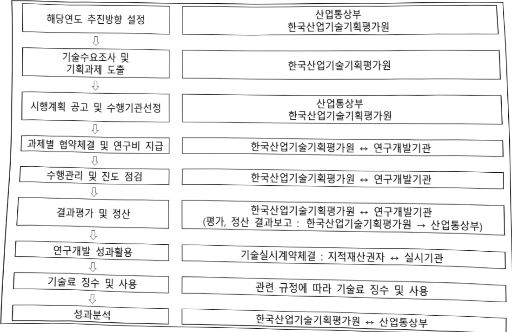

# 반도체 첨단 패키징 선도기술개발 사업(R&D)

**해당 페이지**: PDF 3965 ~ 3975 쪽 해당

**부처**: 산업통상부
**분야**: 산업·중소기업 및 에너지
**회계유형**: 일반회계
**2026 확정예산**: 39188.0 백만원
**전년대비 증감률**: 120.2%
**AI 도메인**: AI반도체

---

<table border=1 style='margin: auto; word-wrap: break-word;'><tr><td style='text-align: center; word-wrap: break-word;'>사 업 명</td></tr><tr><td style='text-align: center; word-wrap: break-word;'>(192) 반도체 침단패키징 선도기술개발사업(R&amp;D) (3561-432)</td></tr></table>

□ 사업 코드 정보

<table border=1 style='margin: auto; word-wrap: break-word;'><tr><td style='text-align: center; word-wrap: break-word;'>구분</td><td style='text-align: center; word-wrap: break-word;'>회계</td><td style='text-align: center; word-wrap: break-word;'>소관</td><td style='text-align: center; word-wrap: break-word;'>실국(기관)</td><td style='text-align: center; word-wrap: break-word;'>계정</td><td style='text-align: center; word-wrap: break-word;'>분야</td><td style='text-align: center; word-wrap: break-word;'>부문</td></tr><tr><td style='text-align: center; word-wrap: break-word;'>코드</td><td rowspan="2">일반회계</td><td rowspan="2">산업통상부</td><td rowspan="2">산업성장실첨단산업정책관</td><td rowspan="2">-</td><td style='text-align: center; word-wrap: break-word;'>110</td><td style='text-align: center; word-wrap: break-word;'>117</td></tr><tr><td style='text-align: center; word-wrap: break-word;'>명칭</td><td style='text-align: center; word-wrap: break-word;'>산업·중소기업 및에너지</td><td style='text-align: center; word-wrap: break-word;'>산업혁신지원</td></tr></table>

<table border=1 style='margin: auto; word-wrap: break-word;'><tr><td style='text-align: center; word-wrap: break-word;'>구분</td><td style='text-align: center; word-wrap: break-word;'>프로그램</td><td style='text-align: center; word-wrap: break-word;'>단위사업</td><td style='text-align: center; word-wrap: break-word;'>세부사업</td></tr><tr><td style='text-align: center; word-wrap: break-word;'>코드</td><td style='text-align: center; word-wrap: break-word;'>3500</td><td style='text-align: center; word-wrap: break-word;'>3561</td><td style='text-align: center; word-wrap: break-word;'>432</td></tr><tr><td style='text-align: center; word-wrap: break-word;'>명칭</td><td style='text-align: center; word-wrap: break-word;'>주력산업진흥</td><td style='text-align: center; word-wrap: break-word;'>스마트전자기술개발</td><td style='text-align: center; word-wrap: break-word;'>반도체첨단패키징선도기술개발사업(R&amp;D)</td></tr></table>

□ 사업 성격 (공통요구자료 Ⅱ-1 작성유의사항 4. 참조, 해당하는 사항에 “○” 표시)

<table border=1 style='margin: auto; word-wrap: break-word;'><tr><td style='text-align: center; word-wrap: break-word;'>신규</td><td style='text-align: center; word-wrap: break-word;'>계속</td><td style='text-align: center; word-wrap: break-word;'>완료</td><td style='text-align: center; word-wrap: break-word;'>예비타당성 실시여부</td><td style='text-align: center; word-wrap: break-word;'>총사업비 관리대상</td><td style='text-align: center; word-wrap: break-word;'>총액계상 예산사업</td><td style='text-align: center; word-wrap: break-word;'>사업소관 변경정보 2025예산 시 소관</td></tr><tr><td style='text-align: center; word-wrap: break-word;'></td><td style='text-align: center; word-wrap: break-word;'>☐</td><td style='text-align: center; word-wrap: break-word;'></td><td style='text-align: center; word-wrap: break-word;'>☐</td><td style='text-align: center; word-wrap: break-word;'></td><td style='text-align: center; word-wrap: break-word;'></td><td style='text-align: center; word-wrap: break-word;'></td></tr></table>

사업 지원 형태 및 지원을 (최소한 한 개는 반드시 선택하시오. 해당사항에 O 표시)

<table border=1 style='margin: auto; word-wrap: break-word;'><tr><td style='text-align: center; word-wrap: break-word;'>직접</td><td style='text-align: center; word-wrap: break-word;'>출자</td><td style='text-align: center; word-wrap: break-word;'>출연</td><td style='text-align: center; word-wrap: break-word;'>보조</td><td style='text-align: center; word-wrap: break-word;'>융자</td><td style='text-align: center; word-wrap: break-word;'>국고보조율(%)</td><td style='text-align: center; word-wrap: break-word;'>융자율(%)</td></tr><tr><td style='text-align: center; word-wrap: break-word;'></td><td style='text-align: center; word-wrap: break-word;'></td><td style='text-align: center; word-wrap: break-word;'>0</td><td style='text-align: center; word-wrap: break-word;'></td><td style='text-align: center; word-wrap: break-word;'></td><td style='text-align: center; word-wrap: break-word;'></td><td style='text-align: center; word-wrap: break-word;'></td></tr></table>

## 사업 담당자

<table border=1 style='margin: auto; word-wrap: break-word;'><tr><td style='text-align: center; word-wrap: break-word;'>사업명</td><td colspan="5">구분</td></tr><tr><td rowspan="4">반도체 첨단 패키 징선도 기술개발사업 (R&amp;D)</td><td rowspan="3">소관부처</td><td style='text-align: center; word-wrap: break-word;'>실·국·과(팀)</td><td style='text-align: center; word-wrap: break-word;'>과 장</td><td style='text-align: center; word-wrap: break-word;'>사무관</td><td style='text-align: center; word-wrap: break-word;'>주무관</td></tr><tr><td style='text-align: center; word-wrap: break-word;'>산업성장실 첨단산업정책관</td><td style='text-align: center; word-wrap: break-word;'>이규봉</td><td style='text-align: center; word-wrap: break-word;'>하영선</td><td style='text-align: center; word-wrap: break-word;'>-</td></tr><tr><td style='text-align: center; word-wrap: break-word;'>반도체과</td><td style='text-align: center; word-wrap: break-word;'>044-203-4270</td><td style='text-align: center; word-wrap: break-word;'>044-203-4276</td><td style='text-align: center; word-wrap: break-word;'>-</td></tr><tr><td style='text-align: center; word-wrap: break-word;'>사업시행주체</td><td style='text-align: center; word-wrap: break-word;'>한국산업기술기획 평가원</td><td style='text-align: center; word-wrap: break-word;'>미래반도체실</td><td style='text-align: center; word-wrap: break-word;'>이주상 책임</td><td style='text-align: center; word-wrap: break-word;'>053)718-8518</td></tr></table>

---

### 가.예산 총괄표

(단위: 백만원, %)

<table border=1 style='margin: auto; word-wrap: break-word;'><tr><td rowspan="2">사업명</td><td rowspan="2">2024년 결산</td><td colspan="2">2025년 예산</td><td colspan="2">2026년</td><td rowspan="2">중감(B-A)</td><td rowspan="2">(B-A)/A</td></tr><tr><td style='text-align: center; word-wrap: break-word;'>본예산(A)</td><td style='text-align: center; word-wrap: break-word;'>추경</td><td style='text-align: center; word-wrap: break-word;'>요구안</td><td style='text-align: center; word-wrap: break-word;'>확정(B)</td></tr><tr><td style='text-align: center; word-wrap: break-word;'>반도체첨단패키징선도기술개발사업(R&amp;D)</td><td style='text-align: center; word-wrap: break-word;'>-</td><td style='text-align: center; word-wrap: break-word;'>17,800</td><td style='text-align: center; word-wrap: break-word;'>17,800</td><td style='text-align: center; word-wrap: break-word;'>39,188</td><td style='text-align: center; word-wrap: break-word;'>39,188</td><td style='text-align: center; word-wrap: break-word;'>21,388</td><td style='text-align: center; word-wrap: break-word;'>120.2</td></tr></table>

□ 기능별(내역사업별), 목별 예산 내역

(단위:백만원)

<table border=1 style='margin: auto; word-wrap: break-word;'><tr><td rowspan="3"></td><td colspan="5">2024</td><td colspan="7">2025(2025.12.11)</td><td rowspan="3">2026</td></tr><tr><td rowspan="2">예산액(추정)</td><td rowspan="2">예산현액</td><td rowspan="2">집행액[실집행액]</td><td rowspan="2">이월액</td><td rowspan="2">불용액</td><td rowspan="2">본예산</td><td rowspan="2">예산현액</td><td rowspan="2">집행액[실집행액]</td><td colspan="2">전년도 이월액제외</td><td rowspan="2">이월예산액</td><td rowspan="2">불용예산액</td></tr><tr><td style='text-align: center; word-wrap: break-word;'>예산현액</td><td style='text-align: center; word-wrap: break-word;'>집행액[실집행액]</td></tr><tr><td style='text-align: center; word-wrap: break-word;'>○ 기능별 분류(함께)</td><td style='text-align: center; word-wrap: break-word;'>-</td><td style='text-align: center; word-wrap: break-word;'>-</td><td style='text-align: center; word-wrap: break-word;'>-</td><td style='text-align: center; word-wrap: break-word;'>-</td><td style='text-align: center; word-wrap: break-word;'>-</td><td style='text-align: center; word-wrap: break-word;'>17,800</td><td style='text-align: center; word-wrap: break-word;'>17,800</td><td style='text-align: center; word-wrap: break-word;'>17,800[17,800]</td><td style='text-align: center; word-wrap: break-word;'>17,800</td><td style='text-align: center; word-wrap: break-word;'>17,800[17,800]</td><td style='text-align: center; word-wrap: break-word;'>-</td><td style='text-align: center; word-wrap: break-word;'>-</td><td style='text-align: center; word-wrap: break-word;'>39,188</td></tr><tr><td rowspan="3">· 기술선도형 첨단폐기징기술개발· 기술자립형 첨단폐기징기술개발· 글로벌기술확보형 첨단폐기징기술개발</td><td style='text-align: center; word-wrap: break-word;'>-</td><td style='text-align: center; word-wrap: break-word;'>-</td><td style='text-align: center; word-wrap: break-word;'>-</td><td style='text-align: center; word-wrap: break-word;'>-</td><td style='text-align: center; word-wrap: break-word;'>-</td><td style='text-align: center; word-wrap: break-word;'>8,775</td><td style='text-align: center; word-wrap: break-word;'>8,775</td><td style='text-align: center; word-wrap: break-word;'>8,775[8,775]</td><td style='text-align: center; word-wrap: break-word;'>8,775</td><td style='text-align: center; word-wrap: break-word;'>8,775[8,775]</td><td style='text-align: center; word-wrap: break-word;'>-</td><td style='text-align: center; word-wrap: break-word;'>-</td><td style='text-align: center; word-wrap: break-word;'>18,700</td></tr><tr><td style='text-align: center; word-wrap: break-word;'>-</td><td style='text-align: center; word-wrap: break-word;'>-</td><td style='text-align: center; word-wrap: break-word;'>-</td><td style='text-align: center; word-wrap: break-word;'>-</td><td style='text-align: center; word-wrap: break-word;'>-</td><td style='text-align: center; word-wrap: break-word;'>6,000</td><td style='text-align: center; word-wrap: break-word;'>6,000</td><td style='text-align: center; word-wrap: break-word;'>6,000[6,000]</td><td style='text-align: center; word-wrap: break-word;'>6,000</td><td style='text-align: center; word-wrap: break-word;'>6,000[6,000]</td><td style='text-align: center; word-wrap: break-word;'>-</td><td style='text-align: center; word-wrap: break-word;'>-</td><td style='text-align: center; word-wrap: break-word;'>16,888</td></tr><tr><td style='text-align: center; word-wrap: break-word;'>-</td><td style='text-align: center; word-wrap: break-word;'>-</td><td style='text-align: center; word-wrap: break-word;'>-</td><td style='text-align: center; word-wrap: break-word;'>-</td><td style='text-align: center; word-wrap: break-word;'>-</td><td style='text-align: center; word-wrap: break-word;'>3,025</td><td style='text-align: center; word-wrap: break-word;'>3,025</td><td style='text-align: center; word-wrap: break-word;'>3,025[3,025]</td><td style='text-align: center; word-wrap: break-word;'>3,025</td><td style='text-align: center; word-wrap: break-word;'>3,025[3,025]</td><td style='text-align: center; word-wrap: break-word;'>-</td><td style='text-align: center; word-wrap: break-word;'>-</td><td style='text-align: center; word-wrap: break-word;'>3,600</td></tr><tr><td style='text-align: center; word-wrap: break-word;'>○ 비목별 분류(함께)</td><td style='text-align: center; word-wrap: break-word;'>-</td><td style='text-align: center; word-wrap: break-word;'>-</td><td style='text-align: center; word-wrap: break-word;'>-</td><td style='text-align: center; word-wrap: break-word;'>-</td><td style='text-align: center; word-wrap: break-word;'>-</td><td style='text-align: center; word-wrap: break-word;'>17,800</td><td style='text-align: center; word-wrap: break-word;'>17,800</td><td style='text-align: center; word-wrap: break-word;'>17,800[17,800]</td><td style='text-align: center; word-wrap: break-word;'>17,800</td><td style='text-align: center; word-wrap: break-word;'>17,800[17,800]</td><td style='text-align: center; word-wrap: break-word;'>-</td><td style='text-align: center; word-wrap: break-word;'>-</td><td style='text-align: center; word-wrap: break-word;'>39,188</td></tr><tr><td style='text-align: center; word-wrap: break-word;'>· 연구개발활동비등(360-05)</td><td style='text-align: center; word-wrap: break-word;'>-</td><td style='text-align: center; word-wrap: break-word;'>-</td><td style='text-align: center; word-wrap: break-word;'>-</td><td style='text-align: center; word-wrap: break-word;'>-</td><td style='text-align: center; word-wrap: break-word;'>-</td><td style='text-align: center; word-wrap: break-word;'>17,800</td><td style='text-align: center; word-wrap: break-word;'>17,800</td><td style='text-align: center; word-wrap: break-word;'>17,800[17,800]</td><td style='text-align: center; word-wrap: break-word;'>17,800</td><td style='text-align: center; word-wrap: break-word;'>17,800[17,800]</td><td style='text-align: center; word-wrap: break-word;'>-</td><td style='text-align: center; word-wrap: break-word;'>-</td><td style='text-align: center; word-wrap: break-word;'>39,188</td></tr><tr><td style='text-align: center; word-wrap: break-word;'>○ 기능비목별 분류(함께)</td><td style='text-align: center; word-wrap: break-word;'>-</td><td style='text-align: center; word-wrap: break-word;'>-</td><td style='text-align: center; word-wrap: break-word;'>-</td><td style='text-align: center; word-wrap: break-word;'>-</td><td style='text-align: center; word-wrap: break-word;'>-</td><td style='text-align: center; word-wrap: break-word;'>17,800</td><td style='text-align: center; word-wrap: break-word;'>17,800</td><td style='text-align: center; word-wrap: break-word;'>17,800[17,800]</td><td style='text-align: center; word-wrap: break-word;'>17,800</td><td style='text-align: center; word-wrap: break-word;'>17,800[17,800]</td><td style='text-align: center; word-wrap: break-word;'>-</td><td style='text-align: center; word-wrap: break-word;'>-</td><td style='text-align: center; word-wrap: break-word;'>39,188</td></tr><tr><td rowspan="6">· 기술선도형 첨단폐기징기술개발· 연구개발활동비등(360-05)· 기술자립형 첨단폐기징기술개발· 연구개발활동비등(360-05)· 글로벌기술확보형 첨단폐기징기술개발· 연구개발활동비등(360-05)</td><td style='text-align: center; word-wrap: break-word;'>-</td><td style='text-align: center; word-wrap: break-word;'>-</td><td style='text-align: center; word-wrap: break-word;'>-</td><td style='text-align: center; word-wrap: break-word;'>-</td><td style='text-align: center; word-wrap: break-word;'>-</td><td style='text-align: center; word-wrap: break-word;'>8,775</td><td style='text-align: center; word-wrap: break-word;'>8,775</td><td style='text-align: center; word-wrap: break-word;'>8,775[8,775]</td><td style='text-align: center; word-wrap: break-word;'>8,775[8,775]</td><td style='text-align: center; word-wrap: break-word;'>8,775[8,775]</td><td style='text-align: center; word-wrap: break-word;'>-</td><td style='text-align: center; word-wrap: break-word;'>-</td><td style='text-align: center; word-wrap: break-word;'>18,700</td></tr><tr><td style='text-align: center; word-wrap: break-word;'>-</td><td style='text-align: center; word-wrap: break-word;'>-</td><td style='text-align: center; word-wrap: break-word;'>-</td><td style='text-align: center; word-wrap: break-word;'>-</td><td style='text-align: center; word-wrap: break-word;'>-</td><td style='text-align: center; word-wrap: break-word;'>8,775</td><td style='text-align: center; word-wrap: break-word;'>8,775</td><td style='text-align: center; word-wrap: break-word;'>8,775[8,775]</td><td style='text-align: center; word-wrap: break-word;'>8,775[8,775]</td><td style='text-align: center; word-wrap: break-word;'>8,775[8,775]</td><td style='text-align: center; word-wrap: break-word;'>-</td><td style='text-align: center; word-wrap: break-word;'>-</td><td style='text-align: center; word-wrap: break-word;'>18,700</td></tr><tr><td style='text-align: center; word-wrap: break-word;'>-</td><td style='text-align: center; word-wrap: break-word;'>-</td><td style='text-align: center; word-wrap: break-word;'>-</td><td style='text-align: center; word-wrap: break-word;'>-</td><td style='text-align: center; word-wrap: break-word;'>-</td><td style='text-align: center; word-wrap: break-word;'>6,000</td><td style='text-align: center; word-wrap: break-word;'>6,000</td><td style='text-align: center; word-wrap: break-word;'>6,000[6,000]</td><td style='text-align: center; word-wrap: break-word;'>6,000[6,000]</td><td style='text-align: center; word-wrap: break-word;'>6,000[6,000]</td><td style='text-align: center; word-wrap: break-word;'>-</td><td style='text-align: center; word-wrap: break-word;'>-</td><td style='text-align: center; word-wrap: break-word;'>16,888</td></tr><tr><td style='text-align: center; word-wrap: break-word;'>-</td><td style='text-align: center; word-wrap: break-word;'>-</td><td style='text-align: center; word-wrap: break-word;'>-</td><td style='text-align: center; word-wrap: break-word;'>-</td><td style='text-align: center; word-wrap: break-word;'>-</td><td style='text-align: center; word-wrap: break-word;'>6,000</td><td style='text-align: center; word-wrap: break-word;'>6,000</td><td style='text-align: center; word-wrap: break-word;'>6,000[6,000]</td><td style='text-align: center; word-wrap: break-word;'>6,000[6,000]</td><td style='text-align: center; word-wrap: break-word;'>6,000[6,000]</td><td style='text-align: center; word-wrap: break-word;'>-</td><td style='text-align: center; word-wrap: break-word;'>-</td><td style='text-align: center; word-wrap: break-word;'>16,888</td></tr><tr><td style='text-align: center; word-wrap: break-word;'>-</td><td style='text-align: center; word-wrap: break-word;'>-</td><td style='text-align: center; word-wrap: break-word;'>-</td><td style='text-align: center; word-wrap: break-word;'>-</td><td style='text-align: center; word-wrap: break-word;'>-</td><td style='text-align: center; word-wrap: break-word;'>3,025</td><td style='text-align: center; word-wrap: break-word;'>3,025</td><td style='text-align: center; word-wrap: break-word;'>3,025[3,025]</td><td style='text-align: center; word-wrap: break-word;'>3,025[3,025]</td><td style='text-align: center; word-wrap: break-word;'>3,025[3,025]</td><td style='text-align: center; word-wrap: break-word;'>-</td><td style='text-align: center; word-wrap: break-word;'>-</td><td style='text-align: center; word-wrap: break-word;'>3,600</td></tr><tr><td style='text-align: center; word-wrap: break-word;'>-</td><td style='text-align: center; word-wrap: break-word;'>-</td><td style='text-align: center; word-wrap: break-word;'>-</td><td style='text-align: center; word-wrap: break-word;'>-</td><td style='text-align: center; word-wrap: break-word;'>-</td><td style='text-align: center; word-wrap: break-word;'>3,025</td><td style='text-align: center; word-wrap: break-word;'>3,025</td><td style='text-align: center; word-wrap: break-word;'>3,025[3,025]</td><td style='text-align: center; word-wrap: break-word;'>3,025[3,025]</td><td style='text-align: center; word-wrap: break-word;'>3,025[3,025]</td><td style='text-align: center; word-wrap: break-word;'>-</td><td style='text-align: center; word-wrap: break-word;'>-</td><td style='text-align: center; word-wrap: break-word;'>3,600</td></tr></table>

---

### 나. 사업설명자료

## 1 ) 사업목적·내용

o (사업목적) 차세대 반도체산업을 이끌어 갈 고집적, 고기능, 저전력화 첨단 패키징 초격차 전략기술 확보

- (기술선도형첩단패키징기술개발) 침략, 3D 등 주요 선진사에서 개발 중이거나 5년에서 10년 사이에 상용화될 가능성이 높은 선도기술개발

- (기술자립형첨단패키징기술개발) 2.5D, Fan-out 등 글로벌 반도체 기업이 양산 중인 고부가 모듈 구현에 필요한 첨단패키징 기술과 검사, 테스트 등의 소재, 부품, 장비 공급망 내재화를 위한 핵심기술개발

- (글로벌기술확보협정단패키칭기술개발) 글로벌 첨단기술과 인프라를 보유한 기관과의

협업을 통한 수요기술개발 및 로드맵 수립

## 2 ) 사업개요

## ☐ 사업근거 및 추진경위

① 법령상 근거 및 조항 : 산업기술혁신촉진법 제11조, 국가첨단전략산업 경쟁력 강화 및 보호에 관한 특별조치법 제25조

제11조(산업기술개발사업) ① 산업통상부장관은 혁신계획 및 시행계획을 효율적으로 수행하기 위하여 관계 중앙행정기관의 장과 협의하여 다음 각 호의 산업기술분야에서 기술개발사업(산업기술개발을 위하여 필요한 기획 및 조사를포함한다. 이하 "산업기술개발사업"이라 한다)을 추진할 수 있다.

2. 산업기술 분야의 미래 유망 기술

제25조(국가첨단전략기술개발사업의 추진) ① 정부는 전략산업등의 기술 확보와 경쟁력 강화를 위하여「국가과학기술자문회의법」에 따른 국가과학기술자문회의의 심의를 거쳐 다음 각 호의 사업을 포함하는 국가첨단전략기술개발사업(이하 “기술개발사업”이라 한다)을 추진할 수 있다.

1 전략산업등 분야의 연구개발사업

2. 기술개발의 효율화를 위한 국내외 특허 등 지식재산권에 대한 전략적 조사·분석

3. 기업, 대학, 연구기관 및 관련 기관·단체 간의 공동연구개발사업

## ② 추진경위

- '23.03 : 반도체 첨단패키징 신규R&D 추진을 위한 산학연 간담회 실시

- '23.04 : 제1차~2차 반도체 실무회의 및 R&D 기획위원회 Kick-off

- '23.05~08 : 총괄위원회, 분과별 기술기획위원회

- '23.06.15. : 수요기업간담회 개최

- '23.08 : 패키징 중소기업 간담회, 수요기업 MOU 체결

- '23.09 : '23년 3분기 예비타당성 조사 신청

- '24.06 : 예비타당성 조사 통과(AHP 0.745)

---

□ 주요내용

① 사업규모

- 총사업비 : 해당 없음

- 사업기간 : '25~'31

- 최근 5년 간 투입된 사업비(예산액기준, 추경편성한 연도에는 추경포함)

<table border=1 style='margin: auto; word-wrap: break-word;'><tr><td style='text-align: center; word-wrap: break-word;'>$ \underline{\text{연도}} $</td><td style='text-align: center; word-wrap: break-word;'>2022</td><td style='text-align: center; word-wrap: break-word;'>2023</td><td style='text-align: center; word-wrap: break-word;'>2024</td><td style='text-align: center; word-wrap: break-word;'>2025</td><td style='text-align: center; word-wrap: break-word;'>2026</td></tr><tr><td style='text-align: center; word-wrap: break-word;'>$ \underline{\text{사업비}} $</td><td style='text-align: center; word-wrap: break-word;'>-</td><td style='text-align: center; word-wrap: break-word;'>-</td><td style='text-align: center; word-wrap: break-word;'>-</td><td style='text-align: center; word-wrap: break-word;'>17,800</td><td style='text-align: center; word-wrap: break-word;'>39,188</td></tr></table>

- 기타: 해당없음

② 사업추진체계

- 사업시행방법 : 출연

- 사업시행주체 : 한국산업기술기획평가원

- 사업 수혜자 : 기업, 대학, 연구소 등

- 보조, 융자, 출연, 출자 등의 경우 보조 · 융자 등 지원 비율 및 법적근거

<table border=1 style='margin: auto; word-wrap: break-word;'><tr><td style='text-align: center; word-wrap: break-word;'>내역사업명</td><td style='text-align: center; word-wrap: break-word;'>구분</td><td style='text-align: center; word-wrap: break-word;'>피보조·피출연 등 기관명</td><td style='text-align: center; word-wrap: break-word;'>지원 금액 (2026예산)</td><td style='text-align: center; word-wrap: break-word;'>지원 비율(%)</td><td style='text-align: center; word-wrap: break-word;'>보조율 법적근거 (해당 조항)</td></tr><tr><td style='text-align: center; word-wrap: break-word;'>기술선도형첨단 패키징기술개발</td><td style='text-align: center; word-wrap: break-word;'>출연</td><td style='text-align: center; word-wrap: break-word;'>기업, 대학, 연구소 등</td><td style='text-align: center; word-wrap: break-word;'>18,700</td><td style='text-align: center; word-wrap: break-word;'>지원 대상에 따라 차등지원</td><td style='text-align: center; word-wrap: break-word;'>산업기술혁신사업 공통운영요령 제24조(정부지원연구개발비의 지원기준)</td></tr><tr><td style='text-align: center; word-wrap: break-word;'>기술자립형첨단 패키징기술개발</td><td style='text-align: center; word-wrap: break-word;'>출연</td><td style='text-align: center; word-wrap: break-word;'>기업, 대학, 연구소 등</td><td style='text-align: center; word-wrap: break-word;'>16,888</td><td style='text-align: center; word-wrap: break-word;'>지원 대상에 따라 차등지원</td><td style='text-align: center; word-wrap: break-word;'>산업기술혁신사업 공통운영요령 제24조(정부지원연구개발비의 지원기준)</td></tr><tr><td style='text-align: center; word-wrap: break-word;'>글로벌기술확보형 첨단폐기장기술개발</td><td style='text-align: center; word-wrap: break-word;'>출연</td><td style='text-align: center; word-wrap: break-word;'>기업, 대학, 연구소 등</td><td style='text-align: center; word-wrap: break-word;'>3,600</td><td style='text-align: center; word-wrap: break-word;'>지원 대상에 따라 차등지원</td><td style='text-align: center; word-wrap: break-word;'>산업기술혁신사업 공통운영요령 제24조(정부지원연구개발비의 지원기준)</td></tr></table>

---

## 3 ) 2026년도 예산 산출 근거

□ 반도체첨단패키징선도기술개발사업 : (2025 본예산) 17,800백만원 → (2026 예산) 39,188백만원, +21,388백만원(+120.2%)

① 기술선도형첨단패키징기술개발: (2025 본예산) 8,775백만원 → (2026 예산) 18,700백만원, +9,925백만원(+113.1%)

- (요구) 칩렛, 재배선 인터포저, 3D 패키지 등 차세대 패키지 핵심 기술 확보를 통해 차세대 고부가 시스템 반도체 소재, 공정, 장비 분야의 압도적 시장 경쟁력 확보를 위한 기술개발 지원을 위해 18,700백만원

 $$ -（산출）6개 계속과제 \times1,917 백만원 \times12/12개월 =11,500 백만원 $$ 

 $$ 6개 \  신규과제 \times1,600 백만원 \times9/12개월 \ =7,200 백만원 $$ 

② 기술자립형첨단패키징기술개발: (2025 본예산) 6,000백만원 → (2026 예산) 16,888백만원, +10,888백만원(+181.5%)

- (요구) 글로벌 선진 종합 반도체 기업이 양산 중인 고부가 모듈 구현에 필요한 첨단패키징 기술과 검사, 테스트 등의 소재, 부품, 장비 기술개발 지원을 위해 16,888백만원

 $$ \begin{aligned}-( 산출 )&5 개  계속과제 \times1,443 雊만원 \times12/12 개월 =7,212.5 雊만원 \\&3 개  신규과제 ^{\ast}\times4,300 雊만원 \times9/12 개월 =9,675.5 雊만원 \\&\ast 대형통합형  또는  병렬형  과제가 포함될  수 있음 \end{aligned} $$ 

③ 글로벌기술확보형첨단패키징기술개발: (2025 본예산) 3,025백만원 → (2026 예산) 3,600백만원, +575백만원(+19.0%)

- (요구) 글로벌 첨단기술과 인프라를 보유한 기관과의 협업을 통한 수요기술개발 및 로드맵 수립 반영에 필요한 계속과제 예산 3,600백만원

- (산출) 5개 계속과제×720백만원×12/12개월 = 3,600백만원

02025년도 예산 및 2026년도 예산 산출 세부내역 비교

<table border=1 style='margin: auto; word-wrap: break-word;'><tr><td colspan="2">2025년 본예산</td><td colspan="2">2026년 예산</td></tr><tr><td style='text-align: center; word-wrap: break-word;'>예산</td><td style='text-align: center; word-wrap: break-word;'>산출내역</td><td style='text-align: center; word-wrap: break-word;'>예산</td><td style='text-align: center; word-wrap: break-word;'>산출내역</td></tr><tr><td style='text-align: center; word-wrap: break-word;'>17,800</td><td style='text-align: center; word-wrap: break-word;'>○연구개발활동비 등(360-05): 17,800백만원① 기술선도형첨단패키징기술개발- (산출) 6개 신규과제 × 1,950백만원 × 9/12개월 = 8,775백만원② 기술자립형첨단패키징기술개발- (산출) 5개 신규과제 × 1,600백만원 × 9/12개월 = 6,000백만원③ 글로벌기술확보형첨단패키징기술개발- (산출) 5개 신규과제 × 807백만원 × 9/12개월 = 3,025백만원</td><td style='text-align: center; word-wrap: break-word;'>39,188</td><td style='text-align: center; word-wrap: break-word;'>① 기술선도형첨단패키징기술개발: 18,700백만원- (산출) 6개 계속과제 × 1,917백만원 × 12/12개월 = 11,500백만원 6개 신규과제 × 1,600백만원 × 9/12개월 = 7,200백만원② 기술자립형첨단패키징기술개발: 16,888백만원- (산출) 5개 계속과제 × 1,443백만원 × 12/12개월 = 7,212.5백만원 3개 신규과제 × 4,300백만원 × 9/12개월 = 9,675.5백만원 * 대형통합형 또는 병행형 과제가 포함될 수 있음③ 글로벌기술확보형첨단패키징기술개발: 3,600백만원- (산출) 5개 계속과제 × 720백만원 × 12/12개월 = 3,600백만원</td></tr></table>

---

## 4 ) 사업효과

□ 사업영향,산출물 성과지표 등

①2022~2026년도 성과계획서 상 성과지표 및 최근 5년간 성과 달성도

<table border=1 style='margin: auto; word-wrap: break-word;'><tr><td style='text-align: center; word-wrap: break-word;'>성과지표</td><td style='text-align: center; word-wrap: break-word;'>구분</td><td style='text-align: center; word-wrap: break-word;'>2022</td><td style='text-align: center; word-wrap: break-word;'>2023</td><td style='text-align: center; word-wrap: break-word;'>2024</td><td style='text-align: center; word-wrap: break-word;'>2025</td><td style='text-align: center; word-wrap: break-word;'>2026</td><td style='text-align: center; word-wrap: break-word;'>2026목표치산출근거</td><td style='text-align: center; word-wrap: break-word;'>측정산식(또는 측정방법)</td><td style='text-align: center; word-wrap: break-word;'>자료수집방법(또는 자료출처)</td></tr><tr><td rowspan="3">삼극특허(단위: 건)</td><td style='text-align: center; word-wrap: break-word;'>목표</td><td style='text-align: center; word-wrap: break-word;'></td><td style='text-align: center; word-wrap: break-word;'></td><td style='text-align: center; word-wrap: break-word;'></td><td style='text-align: center; word-wrap: break-word;'>-</td><td style='text-align: center; word-wrap: break-word;'>2</td><td rowspan="3">정부R&amp;D 삼극특허 1건당 소요금액 337억원(20년기준) 기준으로설정</td><td rowspan="3">매년 종료시점미국, 유럽, 일본특허청에 출원한특허를 조사</td><td rowspan="3">NTIS</td></tr><tr><td style='text-align: center; word-wrap: break-word;'>실적</td><td style='text-align: center; word-wrap: break-word;'></td><td style='text-align: center; word-wrap: break-word;'></td><td style='text-align: center; word-wrap: break-word;'></td><td style='text-align: center; word-wrap: break-word;'>-</td><td style='text-align: center; word-wrap: break-word;'>-</td></tr><tr><td style='text-align: center; word-wrap: break-word;'>달성도</td><td style='text-align: center; word-wrap: break-word;'></td><td style='text-align: center; word-wrap: break-word;'></td><td style='text-align: center; word-wrap: break-word;'></td><td style='text-align: center; word-wrap: break-word;'>-</td><td style='text-align: center; word-wrap: break-word;'>-</td></tr><tr><td rowspan="3">기술수준(단위: %)</td><td style='text-align: center; word-wrap: break-word;'>목표</td><td style='text-align: center; word-wrap: break-word;'></td><td style='text-align: center; word-wrap: break-word;'></td><td style='text-align: center; word-wrap: break-word;'></td><td style='text-align: center; word-wrap: break-word;'>84</td><td style='text-align: center; word-wrap: break-word;'>85.6</td><td rowspan="3">2020년도 기술 수준평가(KSIHP, 2021)에 명시된 ‘초고집적 반도체공정 및 장바스제 분야 최고기술보유국(2)대비 한국 기술 수준(94%)을 목표치로 설정</td><td rowspan="3">매년 종료시점첨단폐기정공정·소부장 등관련 산학연전문가 델파이조사</td><td rowspan="3">전문가 조사</td></tr><tr><td style='text-align: center; word-wrap: break-word;'>실적</td><td style='text-align: center; word-wrap: break-word;'></td><td style='text-align: center; word-wrap: break-word;'></td><td style='text-align: center; word-wrap: break-word;'></td><td style='text-align: center; word-wrap: break-word;'>-</td><td style='text-align: center; word-wrap: break-word;'>-</td></tr><tr><td style='text-align: center; word-wrap: break-word;'>달성도</td><td style='text-align: center; word-wrap: break-word;'></td><td style='text-align: center; word-wrap: break-word;'></td><td style='text-align: center; word-wrap: break-word;'></td><td style='text-align: center; word-wrap: break-word;'>-</td><td style='text-align: center; word-wrap: break-word;'>-</td></tr><tr><td rowspan="3">정부출연금10억원당사업화매출액(단위: 억원)</td><td style='text-align: center; word-wrap: break-word;'>목표</td><td style='text-align: center; word-wrap: break-word;'></td><td style='text-align: center; word-wrap: break-word;'></td><td style='text-align: center; word-wrap: break-word;'></td><td style='text-align: center; word-wrap: break-word;'>-</td><td style='text-align: center; word-wrap: break-word;'>-</td><td rowspan="3">‘16년/20년 한국산업기술기획평가원 과제의 평균 10억원 당시압화매출액 (혁신제품혁신11.6억 원을 초기 연도 목표치로 설정</td><td rowspan="3">2(제품별 개발기술적용매출액‘R&amp;D기여도)/정부투자액10억원 당</td><td rowspan="3">KEIT성과조사시스템</td></tr><tr><td style='text-align: center; word-wrap: break-word;'>실적</td><td style='text-align: center; word-wrap: break-word;'></td><td style='text-align: center; word-wrap: break-word;'></td><td style='text-align: center; word-wrap: break-word;'></td><td style='text-align: center; word-wrap: break-word;'>-</td><td style='text-align: center; word-wrap: break-word;'>-</td></tr><tr><td style='text-align: center; word-wrap: break-word;'>달성도</td><td style='text-align: center; word-wrap: break-word;'></td><td style='text-align: center; word-wrap: break-word;'></td><td style='text-align: center; word-wrap: break-word;'></td><td style='text-align: center; word-wrap: break-word;'>-</td><td style='text-align: center; word-wrap: break-word;'>-</td></tr><tr><td rowspan="3">사업화성공률(단위: %)</td><td style='text-align: center; word-wrap: break-word;'>목표</td><td style='text-align: center; word-wrap: break-word;'></td><td style='text-align: center; word-wrap: break-word;'></td><td style='text-align: center; word-wrap: break-word;'></td><td style='text-align: center; word-wrap: break-word;'>-</td><td style='text-align: center; word-wrap: break-word;'>-</td><td rowspan="3">‘16년/20년 한국산업기술기획평가원 과제의 평균 10억원 당시압화성공률(혁신제품혁신11.6억 원을 초기 연도 목표치로 설정</td><td rowspan="3">(해당년도 매출발생과제수/총지원과제수)×100</td><td rowspan="3">KEIT성과조사시스템</td></tr><tr><td style='text-align: center; word-wrap: break-word;'>실적</td><td style='text-align: center; word-wrap: break-word;'></td><td style='text-align: center; word-wrap: break-word;'></td><td style='text-align: center; word-wrap: break-word;'></td><td style='text-align: center; word-wrap: break-word;'>-</td><td style='text-align: center; word-wrap: break-word;'>-</td></tr><tr><td style='text-align: center; word-wrap: break-word;'>달성도</td><td style='text-align: center; word-wrap: break-word;'></td><td style='text-align: center; word-wrap: break-word;'></td><td style='text-align: center; word-wrap: break-word;'></td><td style='text-align: center; word-wrap: break-word;'>-</td><td style='text-align: center; word-wrap: break-word;'>-</td></tr><tr><td rowspan="3">해외수요기업기술성능인정비율(단위: %)</td><td style='text-align: center; word-wrap: break-word;'>목표</td><td style='text-align: center; word-wrap: break-word;'></td><td style='text-align: center; word-wrap: break-word;'></td><td style='text-align: center; word-wrap: break-word;'></td><td style='text-align: center; word-wrap: break-word;'>-</td><td style='text-align: center; word-wrap: break-word;'>-</td><td rowspan="3">AMKCR 및 ASE 등의 기술평가에 대한 기술성능합격이 완료 과제 대상중 최종 60%를 목표치로 설정</td><td rowspan="3">해외 수요기업기술성능평가를 진행하여요구되는 기술성능이 달성되어 합격된 과제</td><td rowspan="3">KEIT성과조사시스템</td></tr><tr><td style='text-align: center; word-wrap: break-word;'>실적</td><td style='text-align: center; word-wrap: break-word;'></td><td style='text-align: center; word-wrap: break-word;'></td><td style='text-align: center; word-wrap: break-word;'></td><td style='text-align: center; word-wrap: break-word;'>-</td><td style='text-align: center; word-wrap: break-word;'>-</td></tr><tr><td style='text-align: center; word-wrap: break-word;'>달성도</td><td style='text-align: center; word-wrap: break-word;'></td><td style='text-align: center; word-wrap: break-word;'></td><td style='text-align: center; word-wrap: break-word;'></td><td style='text-align: center; word-wrap: break-word;'>-</td><td style='text-align: center; word-wrap: break-word;'>-</td></tr></table>

*‘25년内 전략계획수립 및 확정 예정으로 변경될 수 있음

② 성과지표 이외의 연도별 사업추진 경과 및 실적

<table border=1 style='margin: auto; word-wrap: break-word;'><tr><td style='text-align: center; word-wrap: break-word;'>2022</td><td style='text-align: center; word-wrap: break-word;'>-</td></tr><tr><td style='text-align: center; word-wrap: break-word;'>2023</td><td style='text-align: center; word-wrap: break-word;'>-</td></tr><tr><td style='text-align: center; word-wrap: break-word;'>2024</td><td style='text-align: center; word-wrap: break-word;'>-</td></tr><tr><td style='text-align: center; word-wrap: break-word;'>2025</td><td style='text-align: center; word-wrap: break-word;'>사업 착수 및 신규과제 16개 지원</td></tr></table>

---

③ 향후(2026년도 이후) 기대효과

0 반도체 첨단화 패러다임으로 직면한 기술한계 극복 및 글로벌 시장판도를 전환하여 초격차 주도

- 글로벌 첨단 반도체 공급망 내 기술경쟁이 가능한 첨단패키징 선도기술을 확보

하여 국내 OSAT 기업의 글로벌 시장 진출 기회를 창출

* (现) 글로벌 매출액 순위에 국내 OSAT는 25위권 수준 → (未) 글로벌 Top10 진입 등

- 스마트폰, HPC, AI모듈 등 차세대 고수요 핵심제품에 부합한 첨단패키징 기술

내재화를 통한 시장 점유율 확대*

* 기술경쟁력을 확충하여 약 4% 수준에 불과한 패키징 시장 점유율 개선

## 5 ) 타당성조사 및 예비타당성조사 시행여부 및 결과 요지

☐ 예비타당성조사 결과, AHP가 0.745로 경제성 및 정부 지원 타당성을 인정하여 반도체첨단패키징선도기술개발사업 총 사업비 2,744억원(국비 2,068억원)으로 선정(한국과학기술기획평가원(KISTEP), '24.6.)

## 6 ) 총사업비 대상사업 여부 및 내역 : 해당없음

## 7 ) 사업 집행절차

---

## 8 ) 중기재정계획 상 연도별 투자계획 및 추진경과

(단위: 백만원)

<table border=1 style='margin: auto; word-wrap: break-word;'><tr><td style='text-align: center; word-wrap: break-word;'>$ 중기 $ 재정계획</td><td style='text-align: center; word-wrap: break-word;'>2024</td><td style='text-align: center; word-wrap: break-word;'>2025</td><td style='text-align: center; word-wrap: break-word;'>2026</td><td style='text-align: center; word-wrap: break-word;'>2027</td><td style='text-align: center; word-wrap: break-word;'>2028</td><td style='text-align: center; word-wrap: break-word;'>2029</td></tr><tr><td style='text-align: center; word-wrap: break-word;'>2024~2028</td><td style='text-align: center; word-wrap: break-word;'>-</td><td style='text-align: center; word-wrap: break-word;'>17,800</td><td style='text-align: center; word-wrap: break-word;'>39,188</td><td style='text-align: center; word-wrap: break-word;'>11,025</td><td style='text-align: center; word-wrap: break-word;'>11,567</td><td style='text-align: center; word-wrap: break-word;'>☑</td></tr><tr><td style='text-align: center; word-wrap: break-word;'>2025~2029</td><td style='text-align: center; word-wrap: break-word;'>☑</td><td style='text-align: center; word-wrap: break-word;'>17,800</td><td style='text-align: center; word-wrap: break-word;'>39,188</td><td style='text-align: center; word-wrap: break-word;'>44,363</td><td style='text-align: center; word-wrap: break-word;'>41,250</td><td style='text-align: center; word-wrap: break-word;'>34,950</td></tr></table>

9) 최근 3년간 동 사업에 대한 주요 외부지적사항 및 평가, 문제점 및 대책

<table border=1 style='margin: auto; word-wrap: break-word;'><tr><td style='text-align: center; word-wrap: break-word;'>1) 2024년 국회(예정처) 지적 : 과기정통부 추진 사업과의 중복 우려 및 각 부처간 역할분담 명확화 필요 → 예타 조사를 통해 유사·중복 과제는 제외되었으나, 추후 사업기획·운영 시에도 과기정통부 사업과의 중복이 발생하지 않도록 추진하겠음</td></tr></table>

## 10 ) 향후 추진방향 및 추진계획

<table border=1 style='margin: auto; word-wrap: break-word;'><tr><td style='text-align: center; word-wrap: break-word;'>☐ 차세대 반도체 패키지 핵심 기술의 선제적 개발과 글로벌 패키징 소부장 기술 내재화 및 글로벌 기술확보를 위한 국제공동R&amp;D를 통해 차세대 반도체 산업을 이끌어 갈 힘집적·高기능·低전력화 차세대 첨단 패키징 선도기술 확보를 위한 기술개발 추진</td></tr></table>

11) 해당사업에 대한 각종 사업평가의 결과 : 해당 없음

12) 해당사업에 대한 부처 자체평가의 결과 : 해당 없음

13) 부처 건의사항 : 해당 없음

---

### 다. 최근 4년간 결산내역

## 1 ) 결산표

☐ 부처 결산내역

(단위: 백만원, %)

<table border=1 style='margin: auto; word-wrap: break-word;'><tr><td rowspan="2">闰五</td><td colspan="3">예산액</td><td rowspan="2">전년도 이월액</td><td rowspan="2">이·전용 등</td><td rowspan="2">예비비</td><td rowspan="2">예산 현액(B)</td><td rowspan="2">집행액(C)</td><td rowspan="2">집행률(C/A)</td><td rowspan="2">집행률(C/B)</td><td rowspan="2">다음연도 이월액</td><td rowspan="2">불용액</td></tr><tr><td style='text-align: center; word-wrap: break-word;'>본예산</td><td style='text-align: center; word-wrap: break-word;'>추경 중감액</td><td style='text-align: center; word-wrap: break-word;'>추경(A)</td></tr><tr><td style='text-align: center; word-wrap: break-word;'>2022</td><td style='text-align: center; word-wrap: break-word;'>-</td><td style='text-align: center; word-wrap: break-word;'>-</td><td style='text-align: center; word-wrap: break-word;'>-</td><td style='text-align: center; word-wrap: break-word;'>-</td><td style='text-align: center; word-wrap: break-word;'>-</td><td style='text-align: center; word-wrap: break-word;'>-</td><td style='text-align: center; word-wrap: break-word;'>-</td><td style='text-align: center; word-wrap: break-word;'>-</td><td style='text-align: center; word-wrap: break-word;'>-</td><td style='text-align: center; word-wrap: break-word;'>-</td><td style='text-align: center; word-wrap: break-word;'>-</td><td style='text-align: center; word-wrap: break-word;'>-</td></tr><tr><td style='text-align: center; word-wrap: break-word;'>2023</td><td style='text-align: center; word-wrap: break-word;'>-</td><td style='text-align: center; word-wrap: break-word;'>-</td><td style='text-align: center; word-wrap: break-word;'>-</td><td style='text-align: center; word-wrap: break-word;'>-</td><td style='text-align: center; word-wrap: break-word;'>-</td><td style='text-align: center; word-wrap: break-word;'>-</td><td style='text-align: center; word-wrap: break-word;'>-</td><td style='text-align: center; word-wrap: break-word;'>-</td><td style='text-align: center; word-wrap: break-word;'>-</td><td style='text-align: center; word-wrap: break-word;'>-</td><td style='text-align: center; word-wrap: break-word;'>-</td><td style='text-align: center; word-wrap: break-word;'>-</td></tr><tr><td style='text-align: center; word-wrap: break-word;'>2024</td><td style='text-align: center; word-wrap: break-word;'>-</td><td style='text-align: center; word-wrap: break-word;'>-</td><td style='text-align: center; word-wrap: break-word;'>-</td><td style='text-align: center; word-wrap: break-word;'>-</td><td style='text-align: center; word-wrap: break-word;'>-</td><td style='text-align: center; word-wrap: break-word;'>-</td><td style='text-align: center; word-wrap: break-word;'>-</td><td style='text-align: center; word-wrap: break-word;'>-</td><td style='text-align: center; word-wrap: break-word;'>-</td><td style='text-align: center; word-wrap: break-word;'>-</td><td style='text-align: center; word-wrap: break-word;'>-</td><td style='text-align: center; word-wrap: break-word;'>-</td></tr><tr><td style='text-align: center; word-wrap: break-word;'>2025</td><td style='text-align: center; word-wrap: break-word;'>17,800</td><td style='text-align: center; word-wrap: break-word;'>-</td><td style='text-align: center; word-wrap: break-word;'>17,800</td><td style='text-align: center; word-wrap: break-word;'>-</td><td style='text-align: center; word-wrap: break-word;'>-</td><td style='text-align: center; word-wrap: break-word;'>-</td><td style='text-align: center; word-wrap: break-word;'>17,800</td><td style='text-align: center; word-wrap: break-word;'>17,800</td><td style='text-align: center; word-wrap: break-word;'>100</td><td style='text-align: center; word-wrap: break-word;'>100</td><td style='text-align: center; word-wrap: break-word;'>-</td><td style='text-align: center; word-wrap: break-word;'>-</td></tr></table>

□출연·보조사업 등 실집행내역

(단위: 백만원, %)

<table border=1 style='margin: auto; word-wrap: break-word;'><tr><td rowspan="3">구분</td><td colspan="3">부처</td><td colspan="6">사업시행주체(피출연·피보조 기관 등)</td></tr><tr><td colspan="2">예산액</td><td rowspan="2">집행액</td><td rowspan="2">교부액</td><td rowspan="2">전년도 이월액</td><td rowspan="2">교부 현액</td><td rowspan="2">집행액 (B)</td><td rowspan="2">이월액</td><td rowspan="2">불용액</td></tr><tr><td style='text-align: center; word-wrap: break-word;'>본예산</td><td style='text-align: center; word-wrap: break-word;'>추경(A)</td></tr><tr><td style='text-align: center; word-wrap: break-word;'>2022</td><td style='text-align: center; word-wrap: break-word;'>-</td><td style='text-align: center; word-wrap: break-word;'>-</td><td style='text-align: center; word-wrap: break-word;'>-</td><td style='text-align: center; word-wrap: break-word;'>-</td><td style='text-align: center; word-wrap: break-word;'>-</td><td style='text-align: center; word-wrap: break-word;'>-</td><td style='text-align: center; word-wrap: break-word;'>-</td><td style='text-align: center; word-wrap: break-word;'>-</td><td style='text-align: center; word-wrap: break-word;'>-</td></tr><tr><td style='text-align: center; word-wrap: break-word;'>2023</td><td style='text-align: center; word-wrap: break-word;'>-</td><td style='text-align: center; word-wrap: break-word;'>-</td><td style='text-align: center; word-wrap: break-word;'>-</td><td style='text-align: center; word-wrap: break-word;'>-</td><td style='text-align: center; word-wrap: break-word;'>-</td><td style='text-align: center; word-wrap: break-word;'>-</td><td style='text-align: center; word-wrap: break-word;'>-</td><td style='text-align: center; word-wrap: break-word;'>-</td><td style='text-align: center; word-wrap: break-word;'>-</td></tr><tr><td style='text-align: center; word-wrap: break-word;'>2024</td><td style='text-align: center; word-wrap: break-word;'>-</td><td style='text-align: center; word-wrap: break-word;'>-</td><td style='text-align: center; word-wrap: break-word;'>-</td><td style='text-align: center; word-wrap: break-word;'>-</td><td style='text-align: center; word-wrap: break-word;'>-</td><td style='text-align: center; word-wrap: break-word;'>-</td><td style='text-align: center; word-wrap: break-word;'>-</td><td style='text-align: center; word-wrap: break-word;'>-</td><td style='text-align: center; word-wrap: break-word;'>-</td></tr><tr><td style='text-align: center; word-wrap: break-word;'>2025. 12월기준</td><td style='text-align: center; word-wrap: break-word;'>17,800</td><td style='text-align: center; word-wrap: break-word;'>17,800</td><td style='text-align: center; word-wrap: break-word;'>17,800</td><td style='text-align: center; word-wrap: break-word;'>17,800</td><td style='text-align: center; word-wrap: break-word;'>-</td><td style='text-align: center; word-wrap: break-word;'>17,800</td><td style='text-align: center; word-wrap: break-word;'>17,800</td><td style='text-align: center; word-wrap: break-word;'>-</td><td style='text-align: center; word-wrap: break-word;'>-</td></tr></table>

2) 주요 결산사항

□ 2022~2025년 결산 주요 지적사항 및 시정요구사항 : 해당없음

□ 2025년 이·전용 등 세부내역 : 해당없음

□ 2025년 예비비 배정 세부내역 : 해당없음

라. 기타 추가자료 : 사업 설명자료

---

### 1. 기술선도형첨단패키징기술개발

□ 사업개요

<table border=1 style='margin: auto; word-wrap: break-word;'><tr><td style='text-align: center; word-wrap: break-word;'>사업기간</td><td style='text-align: center; word-wrap: break-word;'>2025 ~ 2031</td><td style='text-align: center; word-wrap: break-word;'>총사업비</td><td style='text-align: center; word-wrap: break-word;'>총 1,257억원(국비 942.75억원)</td></tr><tr><td style='text-align: center; word-wrap: break-word;'>주관기관</td><td colspan="3">기업, 대학, 연구기관 등</td></tr><tr><td style='text-align: center; word-wrap: break-word;'>담당자</td><td colspan="3">반도체과 하영선 사무관(ㅈ 044-203-4276)</td></tr></table>

## □ 사업내용(지원내용)

0 아직 상용화되지 않았으나 선진 경쟁사에서 개발 중이거나 5년에서 10년 사이에 상용화될 가능성이 높은 차세대 패키지 핵심 기술에 대한 선제적 기술개발

□ 26년 요구내역 : 18,700백만원

o 무결성 칩렉 패키지 설계, 고밀도 Si 브릿지 내장 인터포터 제조기술 개발 등 과제 지원을 위한 18,700백만원

- 7,200백만원 = 신규 6개 과제 x 1,600백만원 x 9/12개월

- 11,500백만원 = 계속 6개 과제 x 1,916.7백만원 x 12/12개월

### 2. 기술자립형첨단패키징기술개발

□ 사업개요

<table border=1 style='margin: auto; word-wrap: break-word;'><tr><td style='text-align: center; word-wrap: break-word;'>사업기간</td><td style='text-align: center; word-wrap: break-word;'>2025 ~ 2031</td><td style='text-align: center; word-wrap: break-word;'>총사업비</td><td style='text-align: center; word-wrap: break-word;'>총 1,167억원(국비 875.25억원)</td></tr><tr><td style='text-align: center; word-wrap: break-word;'>주관기관</td><td colspan="3">기업, 대학, 연구기관 등</td></tr><tr><td style='text-align: center; word-wrap: break-word;'>담당자</td><td colspan="3">반도체과 하영선 사무관(ㅇ 044-203-4276)</td></tr></table>

## □ 사업내용(지원내용)

0 글로벌 선진 종합 반도체 기업이 양산 중인 고부가 모듈 구현에 필요한 첨단 패키징 기술과 검사, 테스트 등의 소재, 부품, 장비 공급망 내재화 기술개발 지원

---

□ 26년 요구내역 : 16,888백만원

○ 미세피치 2.5D 침온웨이퍼 적층 접합 기술개발, 미세패턴 구현 가능한 RDL용 PID 소재기술개발 등 과제 지원을 위한 16,888백만원

- 9,675.5백만원 = 신규 3개 과제 x 4,300백만원 x 9/12개월

- 7,212.5백만원 = 계속 5개 과제 x 1,442.5백만원 x 12/12개월

3.글로벌기술확보형첨단패키징기술개발

□ 사업개요

<table border=1 style='margin: auto; word-wrap: break-word;'><tr><td style='text-align: center; word-wrap: break-word;'>사업기간</td><td style='text-align: center; word-wrap: break-word;'>2025 ~ 2031</td><td style='text-align: center; word-wrap: break-word;'>총사업비</td><td style='text-align: center; word-wrap: break-word;'>총 320억원(국비 250억원)</td></tr><tr><td style='text-align: center; word-wrap: break-word;'>주관기관</td><td colspan="3">기업, 대학, 연구기관 등</td></tr><tr><td style='text-align: center; word-wrap: break-word;'>담당자</td><td colspan="3">반도체과 하영선 사무관(⑳ 044-203-4276)</td></tr></table>

□ 사업내용(지원내용)

0 첨단패키징 시장 지배력을 위한 주요국(기관·기업)과 공동R&D, 국제 첨단패키징 로드맵 작업 등 기술협력 활동 지원

□ 26년 요구내역 : 3,600백만원

o 연구기관 연계 R&D 지원 및 로드맵 수립을 위한 3,600백만원 - 계속 5개 과제 x 720백만원 x 12/12개월

□ 글로벌 협력 현황

<table border=1 style='margin: auto; word-wrap: break-word;'><tr><td style='text-align: center; word-wrap: break-word;'>구분</td><td style='text-align: center; word-wrap: break-word;'>내용</td></tr><tr><td style='text-align: center; word-wrap: break-word;'>추진근거</td><td style='text-align: center; word-wrap: break-word;'>■ 한미 반도체 파트너십 대화(&#x27;21.12월), 한미 공급망 산업대화(&#x27;23.04월)</td></tr><tr><td style='text-align: center; word-wrap: break-word;'>협력유형</td><td style='text-align: center; word-wrap: break-word;'>■ 국제공동연구 ☐ 인력교류 ☐ 협력거점·플랫폼 ☐ 해외 사업화·실증·수출 ☐ 국제표준개발 ☐ 분담금 ☐ 기타</td></tr><tr><td style='text-align: center; word-wrap: break-word;'>협력내용</td><td style='text-align: center; word-wrap: break-word;'>■ 세계 최고 수준의 반도체 패키징 기술 신뢰성 확보를 위해 국외 반도체 패키징 선도기관과 국제공동연구개발을 통하여 첨단 패키징 선도기술 및 소부장 자립화 확보지원</td></tr><tr><td style='text-align: center; word-wrap: break-word;'>협력현황</td><td style='text-align: center; word-wrap: break-word;'>■ 기술 선도형 첨단패키징 기술 및 기술 자립형 첨단패키징 기술의 신뢰성 확보를 위한 최적의 국외 반도체 선도기관을 선정 (대상 기관을 특정하지 않고 공동연구 이슈에 따라 최적의 기관* 선정) * 단계구성(1단계 3년, 2단계 4년)을 통한 협력방안 고도화 추진</td></tr><tr><td style='text-align: center; word-wrap: break-word;'>기타</td><td style='text-align: center; word-wrap: break-word;'>-</td></tr></table>

---

### 원본 PDF 크롭 이미지

