# 범부처감염병방역체계고도화R&D사업(R&D)

**해당 페이지**: PDF 3976 ~ 4001 쪽 해당

**부처**: 산업통상부
**분야**: 산업·중소기업 및 에너지
**회계유형**: 일반회계
**2026 확정예산**: 1000.0 백만원
**전년대비 증감률**: 33.3%
**AI 도메인**: 의료/바이오

---

<table border=1 style='margin: auto; word-wrap: break-word;'><tr><td style='text-align: center; word-wrap: break-word;'>사 업 명</td></tr><tr><td style='text-align: center; word-wrap: break-word;'>(238) 범부처감염병방역체계고도화R&amp;D사업(R&amp;D) (3651-433)</td></tr></table>

사업 코드 정보

<table border=1 style='margin: auto; word-wrap: break-word;'><tr><td style='text-align: center; word-wrap: break-word;'>구분</td><td style='text-align: center; word-wrap: break-word;'>회계</td><td style='text-align: center; word-wrap: break-word;'>소관</td><td style='text-align: center; word-wrap: break-word;'>실국(기관)</td><td style='text-align: center; word-wrap: break-word;'>계정</td><td style='text-align: center; word-wrap: break-word;'>분야</td><td style='text-align: center; word-wrap: break-word;'>부문</td></tr><tr><td style='text-align: center; word-wrap: break-word;'>코드</td><td rowspan="2">일반회계</td><td rowspan="2">산업통상부</td><td rowspan="2">산업성장실산업인공지능정책관</td><td rowspan="2">-</td><td style='text-align: center; word-wrap: break-word;'>110</td><td style='text-align: center; word-wrap: break-word;'>117</td></tr><tr><td style='text-align: center; word-wrap: break-word;'>명칭</td><td style='text-align: center; word-wrap: break-word;'>산업·중소기업 및 에너지</td><td style='text-align: center; word-wrap: break-word;'>산업혁신지원</td></tr></table>

<table border=1 style='margin: auto; word-wrap: break-word;'><tr><td style='text-align: center; word-wrap: break-word;'>구분</td><td style='text-align: center; word-wrap: break-word;'>프로그램</td><td style='text-align: center; word-wrap: break-word;'>단위사업</td><td style='text-align: center; word-wrap: break-word;'>세부사업</td></tr><tr><td style='text-align: center; word-wrap: break-word;'>코드</td><td style='text-align: center; word-wrap: break-word;'>3600</td><td style='text-align: center; word-wrap: break-word;'>3651</td><td style='text-align: center; word-wrap: break-word;'>433</td></tr><tr><td style='text-align: center; word-wrap: break-word;'>명칭</td><td style='text-align: center; word-wrap: break-word;'>신산업진흥</td><td style='text-align: center; word-wrap: break-word;'>바이오헬스기술개발</td><td style='text-align: center; word-wrap: break-word;'>범부처감염병방역체계고도화 R&amp;D사업(R&amp;D)</td></tr></table>

□ 사업 성격 (공통요구자료 Ⅱ-1 작성유의사항 4. 참조, 해당하는 사항에 “○” 표시)

<table border=1 style='margin: auto; word-wrap: break-word;'><tr><td style='text-align: center; word-wrap: break-word;'>신규</td><td style='text-align: center; word-wrap: break-word;'>계속</td><td style='text-align: center; word-wrap: break-word;'>완료</td><td style='text-align: center; word-wrap: break-word;'>예비타당성 실시여부</td><td style='text-align: center; word-wrap: break-word;'>총사업비 관리대상</td><td style='text-align: center; word-wrap: break-word;'>총액계상 예산사업</td><td style='text-align: center; word-wrap: break-word;'>사업소관 변경정보</td></tr><tr><td style='text-align: center; word-wrap: break-word;'></td><td style='text-align: center; word-wrap: break-word;'>○</td><td style='text-align: center; word-wrap: break-word;'></td><td style='text-align: center; word-wrap: break-word;'></td><td style='text-align: center; word-wrap: break-word;'></td><td style='text-align: center; word-wrap: break-word;'></td><td style='text-align: center; word-wrap: break-word;'></td></tr></table>

□ 사업 지원 형태 및 지원을 (최소한 한 개는 반드시 선택하시오. 해당사항에 0 표시)

<table border=1 style='margin: auto; word-wrap: break-word;'><tr><td style='text-align: center; word-wrap: break-word;'>직접</td><td style='text-align: center; word-wrap: break-word;'>출자</td><td style='text-align: center; word-wrap: break-word;'>출연</td><td style='text-align: center; word-wrap: break-word;'>보조</td><td style='text-align: center; word-wrap: break-word;'>융자</td><td style='text-align: center; word-wrap: break-word;'>국고보조율(%)</td><td style='text-align: center; word-wrap: break-word;'>융자율(%)</td></tr><tr><td style='text-align: center; word-wrap: break-word;'></td><td style='text-align: center; word-wrap: break-word;'></td><td style='text-align: center; word-wrap: break-word;'>○</td><td style='text-align: center; word-wrap: break-word;'></td><td style='text-align: center; word-wrap: break-word;'></td><td style='text-align: center; word-wrap: break-word;'></td><td style='text-align: center; word-wrap: break-word;'></td></tr></table>

## □ 사업 담당자

<table border=1 style='margin: auto; word-wrap: break-word;'><tr><td style='text-align: center; word-wrap: break-word;'>사업명</td><td colspan="5">구분</td></tr><tr><td rowspan="2">범부처감염병방역체계고도화(R&amp;D)</td><td style='text-align: center; word-wrap: break-word;'>소관부처</td><td style='text-align: center; word-wrap: break-word;'>실·국·과(팀)산업성장실산업안공지능정책관인공지능바이오융합산업과</td><td style='text-align: center; word-wrap: break-word;'>과 장최광준</td><td style='text-align: center; word-wrap: break-word;'>사무관노진환</td><td style='text-align: center; word-wrap: break-word;'>주무관고영준</td></tr><tr><td style='text-align: center; word-wrap: break-word;'>사업시행주체</td><td style='text-align: center; word-wrap: break-word;'>한국보건산업진흥원</td><td style='text-align: center; word-wrap: break-word;'>질병청RnD팀</td><td style='text-align: center; word-wrap: break-word;'>박수정 팀장</td><td style='text-align: center; word-wrap: break-word;'>043-713-8710</td></tr></table>

---

### 가.예산 총괄표

(단위: 백만원, %)

<table border=1 style='margin: auto; word-wrap: break-word;'><tr><td rowspan="2">사업명</td><td rowspan="2">2024년 결산</td><td colspan="2">2025년 예산</td><td colspan="2">2026년</td><td rowspan="2">증감(B-A)</td><td rowspan="2">(B-A)/A</td></tr><tr><td style='text-align: center; word-wrap: break-word;'>본예산(A)</td><td style='text-align: center; word-wrap: break-word;'>추경</td><td style='text-align: center; word-wrap: break-word;'>요구안</td><td style='text-align: center; word-wrap: break-word;'>확정(B)</td></tr><tr><td style='text-align: center; word-wrap: break-word;'>범부처감염병방역체계고도화(R&amp;D)</td><td style='text-align: center; word-wrap: break-word;'>432</td><td style='text-align: center; word-wrap: break-word;'>750</td><td style='text-align: center; word-wrap: break-word;'>750</td><td style='text-align: center; word-wrap: break-word;'>1,000</td><td style='text-align: center; word-wrap: break-word;'>1,000</td><td style='text-align: center; word-wrap: break-word;'>250</td><td style='text-align: center; word-wrap: break-word;'>33.3</td></tr></table>

□ 기능별(내역사업별), 목별 예산 내역

(단위:백만원)

<table border=1 style='margin: auto; word-wrap: break-word;'><tr><td rowspan="3"></td><td colspan="5">2024</td><td colspan="7">2025(2025.12월말)</td><td rowspan="3">2026예산</td></tr><tr><td rowspan="2">예산액(추경)</td><td rowspan="2">예산현액</td><td rowspan="2">집행액[실집행액]</td><td rowspan="2">이월액</td><td rowspan="2">불용액</td><td rowspan="2">본예산</td><td rowspan="2">예산현액</td><td rowspan="2">집행액[실집행액]</td><td colspan="2">전년도 이월액제외</td><td rowspan="2">이월예산액</td><td rowspan="2">불용예산액</td></tr><tr><td style='text-align: center; word-wrap: break-word;'>예산현액</td><td style='text-align: center; word-wrap: break-word;'>집행액[실집행액]</td></tr><tr><td style='text-align: center; word-wrap: break-word;'>○ 기능별 분류(합계)</td><td style='text-align: center; word-wrap: break-word;'>432</td><td style='text-align: center; word-wrap: break-word;'>432</td><td style='text-align: center; word-wrap: break-word;'>432(432)</td><td style='text-align: center; word-wrap: break-word;'>-</td><td style='text-align: center; word-wrap: break-word;'>-</td><td style='text-align: center; word-wrap: break-word;'>750</td><td style='text-align: center; word-wrap: break-word;'>750</td><td style='text-align: center; word-wrap: break-word;'>750(750)</td><td style='text-align: center; word-wrap: break-word;'>750</td><td style='text-align: center; word-wrap: break-word;'>750(750)</td><td style='text-align: center; word-wrap: break-word;'>-</td><td style='text-align: center; word-wrap: break-word;'>-</td><td style='text-align: center; word-wrap: break-word;'>1,000</td></tr><tr><td style='text-align: center; word-wrap: break-word;'>• 범부처감염병방역체계고도화(R&amp;D)</td><td style='text-align: center; word-wrap: break-word;'>432</td><td style='text-align: center; word-wrap: break-word;'>432</td><td style='text-align: center; word-wrap: break-word;'>432(432)</td><td style='text-align: center; word-wrap: break-word;'>-</td><td style='text-align: center; word-wrap: break-word;'>-</td><td style='text-align: center; word-wrap: break-word;'>750</td><td style='text-align: center; word-wrap: break-word;'>750</td><td style='text-align: center; word-wrap: break-word;'>750(750)</td><td style='text-align: center; word-wrap: break-word;'>750</td><td style='text-align: center; word-wrap: break-word;'>750(750)</td><td style='text-align: center; word-wrap: break-word;'>-</td><td style='text-align: center; word-wrap: break-word;'>-</td><td style='text-align: center; word-wrap: break-word;'>1,000</td></tr><tr><td style='text-align: center; word-wrap: break-word;'>○ 비목별 분류(합계)</td><td style='text-align: center; word-wrap: break-word;'>432</td><td style='text-align: center; word-wrap: break-word;'>432</td><td style='text-align: center; word-wrap: break-word;'>432(432)</td><td style='text-align: center; word-wrap: break-word;'>-</td><td style='text-align: center; word-wrap: break-word;'>-</td><td style='text-align: center; word-wrap: break-word;'>750</td><td style='text-align: center; word-wrap: break-word;'>750</td><td style='text-align: center; word-wrap: break-word;'>750(750)</td><td style='text-align: center; word-wrap: break-word;'>750</td><td style='text-align: center; word-wrap: break-word;'>750(750)</td><td style='text-align: center; word-wrap: break-word;'>-</td><td style='text-align: center; word-wrap: break-word;'>-</td><td style='text-align: center; word-wrap: break-word;'>1,000</td></tr><tr><td style='text-align: center; word-wrap: break-word;'>• 연구개발활동비등(360-05)</td><td style='text-align: center; word-wrap: break-word;'>432</td><td style='text-align: center; word-wrap: break-word;'>432</td><td style='text-align: center; word-wrap: break-word;'>432(432)</td><td style='text-align: center; word-wrap: break-word;'>-</td><td style='text-align: center; word-wrap: break-word;'>-</td><td style='text-align: center; word-wrap: break-word;'>750</td><td style='text-align: center; word-wrap: break-word;'>750</td><td style='text-align: center; word-wrap: break-word;'>750(750)</td><td style='text-align: center; word-wrap: break-word;'>750</td><td style='text-align: center; word-wrap: break-word;'>750(750)</td><td style='text-align: center; word-wrap: break-word;'>-</td><td style='text-align: center; word-wrap: break-word;'>-</td><td style='text-align: center; word-wrap: break-word;'>1,000</td></tr><tr><td style='text-align: center; word-wrap: break-word;'>○ 기능비목별 분류(합계)</td><td style='text-align: center; word-wrap: break-word;'>432</td><td style='text-align: center; word-wrap: break-word;'>432</td><td style='text-align: center; word-wrap: break-word;'>432(432)</td><td style='text-align: center; word-wrap: break-word;'>-</td><td style='text-align: center; word-wrap: break-word;'>-</td><td style='text-align: center; word-wrap: break-word;'>750</td><td style='text-align: center; word-wrap: break-word;'>750</td><td style='text-align: center; word-wrap: break-word;'>750(750)</td><td style='text-align: center; word-wrap: break-word;'>750</td><td style='text-align: center; word-wrap: break-word;'>750(750)</td><td style='text-align: center; word-wrap: break-word;'>-</td><td style='text-align: center; word-wrap: break-word;'>-</td><td style='text-align: center; word-wrap: break-word;'>1,000</td></tr><tr><td style='text-align: center; word-wrap: break-word;'>• 범부처감염병방역체계고도화(R&amp;D)</td><td style='text-align: center; word-wrap: break-word;'>432</td><td style='text-align: center; word-wrap: break-word;'>432</td><td style='text-align: center; word-wrap: break-word;'>432(432)</td><td style='text-align: center; word-wrap: break-word;'>-</td><td style='text-align: center; word-wrap: break-word;'>-</td><td style='text-align: center; word-wrap: break-word;'>750</td><td style='text-align: center; word-wrap: break-word;'>750</td><td style='text-align: center; word-wrap: break-word;'>750(750)</td><td style='text-align: center; word-wrap: break-word;'>750</td><td style='text-align: center; word-wrap: break-word;'>750(750)</td><td style='text-align: center; word-wrap: break-word;'>-</td><td style='text-align: center; word-wrap: break-word;'>-</td><td style='text-align: center; word-wrap: break-word;'>1,000</td></tr><tr><td style='text-align: center; word-wrap: break-word;'>• 연구개발활동비등(360-05)</td><td style='text-align: center; word-wrap: break-word;'>432</td><td style='text-align: center; word-wrap: break-word;'>432</td><td style='text-align: center; word-wrap: break-word;'>432(432)</td><td style='text-align: center; word-wrap: break-word;'>-</td><td style='text-align: center; word-wrap: break-word;'>-</td><td style='text-align: center; word-wrap: break-word;'>750</td><td style='text-align: center; word-wrap: break-word;'>750</td><td style='text-align: center; word-wrap: break-word;'>750(750)</td><td style='text-align: center; word-wrap: break-word;'>750</td><td style='text-align: center; word-wrap: break-word;'>750(750)</td><td style='text-align: center; word-wrap: break-word;'>-</td><td style='text-align: center; word-wrap: break-word;'>-</td><td style='text-align: center; word-wrap: break-word;'>1,000</td></tr></table>

---

### 나. 사업설명자료

## 1 ) 사업목적·내용

- (사업목적) 미래 감염병 대유행에 효과적으로 대응 가능한 능동적인 범부처 협력

감염병 방역체계 고도화 기술 개발

- (사업내용) 방역 현장의 실질적 수요를 기반으로 미래 방역체계 구현을 위해 다양한 첨단바이오·AI 융복합 기술을 활용하여 왜 빠른 감시, ②지능적 예측·차단, ③신속 진단, ④효능이 입증된 방역물품 개발·검증

① (감시) 감염병 발생유입 감시, 원헬스 기반 병원체 감시기술 개발

② (예측차단) 감염병 확산예측 모델, 역학조사 자동화 등 예측차단 기술 고도화

③ (진단) 신변종 감염병 신속 현장진단기술 및 표준물질 신속 개발생산 플랫폼 개발

④ (방역물품) 방역물품 효능평가 기반 기술개발

## 2 ) 사업개요

## □ 사업근거 및 추진경위

① 법령상 근거 및 조항 적시

- 감염병 예방 및 관리에 관한 법률 제4조(국가 및 지방자치단체의 책무)

☐ 제4조(국가 및 지방자치단체의 책무)

① 국가 및 지방자치단체는 감염병환자등의 인간으로서의 존엄과 가치를 존중하고 그 기본적 권리를 보호하며 법률에 따르지

② 국가 및 지방자치단체는 감염병의 예방 및 관리를 위하여 다음 각 호의 사업을 수행하여야 한다.

③ 국가·지방자치단체(교육감을 포함한다)는 감염병의 효율적 치료 및 확산방지를 위하여 질병의 정보, 발생 및 전파 상황을 공유하고 상호 협력하여야 한다.

④ 국가 및 지방자치단체는「의료법」에 따른 의료기관 및 의료인단체와 감염병의 발생 감시·예방을 위하여 관련 정보를 공유하여야 한다.

-「보건의료기술진흥법」제3조(기술개발의 보호·육성) 및 제5조(연구개발사업의 추진)

☐ 제3조(기술개발의 보호·육성) 정부는 보건의료기술의 진흥을 위한 연구개발 활동과 보건신기술을 장려하고 보호·육성하기 위한 정책을 마련하여 시행하여야 하며, 이에 필요한 비용을 지원할 수 있다.

☐ 제5조(연구개발사업의 추진)

① 성부는 기본계획을 효율적으로 주진하기 위하여 보건의료기술 연구개발사업(이하"연구개발사업"이라 하다)을 수행하다

② 보건복지부장관은 연구개발사업으로 연도별·분야별 연구과제를 선정하여 다음 각 호의 기관이나 단제 능과 협약을 맺어 연구하게 할 수 있다. 이 경우 제4호의 기관 중 법인이 아닌 기관에 대하여는 그 기관이 속한 법인의 대표와 협약을 맺을 수 있다.

③ 제2항에 따른 연구에 필요한 비용은 정부 또는 정부 외의 자의 출연금이나 기업의 기술개발비로 충당한다.

④ 보건복지부장관은 연구개발사업을 추진하기 위하여 제2항에 따른 연구를 수행하는 기관이나 단체 등에 출연금을 지급할 수 있다.

⑤ 보건복지부장관은 제2항에 따라 연구과제를 선정하여 협약을 맺거나 제3항 및 제4항에 따른 출연금을 지급할 때 특정 기관 또는 단체 등에 편중되지 아니하도록 노력하여야 한다.

6 세2양에 낙는 연구과세의 선정 방법 및 협약의 제절 방법과 제3항 및 제4항에 따른 출연금의 지급·사용·관리에 필요한 사항은 대통령령으로 정한다.

---

-「과학기술기본법」제11조(국가연구개발사업의 추진) 및 제17조(협동융합연구 개발의 촉진)

제11조(국가연구개발사업의 추진) 중앙행정기관의 장은 기본계획에 따라 맡은 분야의 국가연구개발사업과 그 시책을 세워 추진하여야 한다.

제17조(현도운영과 개방이 초지)

## 제17조(협동융합연구 개발의 촉진)

① 정부는 기업, 교육기관, 연구기관 및 과학기술 관련 기관·단체 간 또는 이들 상호간의 협동연구개발을 촉진하고 북돋우기 위한 시책을 세우고 추진하여야 한다.

② 정부는 민·군 간의 협동연구개발을 장려하고 민·군 기술협력을 촉진하기 위한 시책을 세우고 추진하여야 한다.

③ 과학기술정보통신부장관은 국가적으로 중요한 연구개발과제의 협동·융합연구개발을 위하여 필요하다고 인정하면 관련 기관의 장의 요청에 따라 협동·융합연구개발 관련 기관 간에 과학기술인이 서로 교류하는 것을 권고하거나 알선할 수 있다.

④ 정부는 신기술 상호간 또는 신기술과 학문·문화·예술 및 산업 간의 융합연구개발을 촉진하기 위한 시책을 세우고 추진하여야 한다.

-「재난 및 안전관리 기본법」제71조(재난 및 안전관리에 필요한 과학기술의 진흥 등)

□제71조(재난 및 안전관리에 필요한 과학기술의 진흥 등)

① 정부는 재난 및 안전관리에 필요한 연구·실험·조사·기술개발(이하"연구개발사업"이라 한다) 및 전문인력 양성 등 재난 및 안전관리 분야의 과학기술 진흥시책을 마련하여 추진하여야 한다

②행정안전부장관은 연구개발사업을 하는 데에 드는 비용의 전부 또는 일부를 예산의 범위에서 출연금으로 지원할 수 있다.

③ 행정안전부장관은 연구개발사업을 효율적으로 추진하기 위하여 다음 각 호의 어느 하나에 해당하는 기관·단체 또는 사업자와 협약을 맺어 연구개발사업을 실시하게 할 수 있다.

## - (주요 정책)

·제5차 과학기술기본계획(2023~2027)

·제2차 공공보건의료 기본계획(안)(2021~2025)

· 제3차 감염병 예방·관리 기본계획(2023~2027)

· 제3차 국가 감염병 위기대응 기술개발 추진전략(2022~2026)

- (국가 연구개발 투자 방향)

·"2023년도 국가연구개발 투자방향 및 기준(안) 감염병 대응 역량 강화 및 바이오헬스 분야 중점 지원

·바이오헬스 연구개발(R&D) 투자전략Ⅱ(안)

"2025년도 국가연구개발 투자방향 및 기준(안)" 신흥위협에 맞서 국토와 국민을 보호하는 기술 확보

"2026년도 국가연구개발 투자방향 및 기준(안)" 과학기술 기반의 지역혁신과 국민안전 확보

② 추진경위 - 사업 시작년도, 추진배경, 부처별 중점과제 등

- (수요발굴) 산·학·연·병 전문가, 분과위원회(총괄/분과), 전문가 TF를 통해 현장의 수요 발굴('20.5월~'21.2월)

- (부처수요) 주관부처(복지부)를 통한 다부처공동기획사업 참여 의사 사전협의('20.4월)

※ (참여부처) 산업부, 과기정통부, 농식품부, 환경부, 행안부, 식약처, 질병청

- (기술교류회) 신변종 감염병 대응 기술(예측·감시, 진단, 방역물품)을 진단하고 미래 기술에 대한 수요 발굴을 위한 기술교류회 개최(2회, '21.7.15./ '21.9.13.~9.14.)

- (다부처공동기획연구) 「제11차 상향식 다부처공동기획연구」를 통한 연구개발사업에 대한 수요 발굴 및 세부기획(안) 마련('21.5월~'22.1월)

---

- (공청회) 다부처공동기획연구 추진 현황 및 세부기획 내용에 대해 관련 전문가 의견

수렴을 위한 공청회 개최('21.11.29.)

- (다부처공동사업 선정) “제1차 다부처공동기획사업추진위원회” 최종 심의에 따라 2023년도 상향식 다부처공동사업 대상 최종 선정('22.3월)

- (사업단장선임) 범부처감염병방역체계고도화R&D사업단장 선임('23.3월)

- (사업설명회) 사업 및 중점분야, 과제 RFP 설명회 개최('24.4.18.)

- (과제선정) 과제 공고, 접수 선정 및 협약('23.4월~'23.7월)

- (작수보고회) 과제별 연구 추진계획·방향에 대한 부처 및 전문가 자문, 연구수행을 위한 연구자·사업단 소통창구 마련('23.8월~23.9월)

- (연차점검) 23년 추진실적 및 추진계획 등 점검('23.12월)

- (부처회의) 제1차 8개부처 실무자 회의 개최 및 정례화('24.8.30.)

- (연구교류회) 부처협력연구교류회 추진('24.11.1.)

- (단계평가) 단계(2+2) 평가추진('24.11월)

- (연차점검) 24년 추진실적 및 추진계획 등 점검('24.11월)

- (부처회의) 제2차 8개부처 실무자 회의 개최('25.3.13.)

- (심포지엄) 범부처감염병방케계고도화 심포지엄 추진('25.6.11.)

-부처간 역할분담

<table border=1 style='margin: auto; word-wrap: break-word;'><tr><td rowspan="2">부처 (역할)</td><td colspan="4">범부처 감염병 방역체계 고도화 사업 연구분야</td><td rowspan="2">부처별 임무와 역할</td></tr><tr><td style='text-align: center; word-wrap: break-word;'>감시</td><td style='text-align: center; word-wrap: break-word;'>예측</td><td style='text-align: center; word-wrap: break-word;'>진단</td><td style='text-align: center; word-wrap: break-word;'>생활 방역</td></tr><tr><td style='text-align: center; word-wrap: break-word;'>과기정통부 (기초)</td><td style='text-align: center; word-wrap: break-word;'>●</td><td style='text-align: center; word-wrap: break-word;'>●</td><td style='text-align: center; word-wrap: break-word;'>●</td><td style='text-align: center; word-wrap: break-word;'>●</td><td style='text-align: center; word-wrap: break-word;'>• 팀 방역 현장의 기술적 한계를 극복하기 위한 핵심 원천 확보 • 감염병과 관련한 빅데이터, AI, IoT, ICT, AR, VR 등 첨단기술 및 혁신 기술 등에 대한 기초연구 지원</td></tr><tr><td style='text-align: center; word-wrap: break-word;'>복지부 (응용)</td><td style='text-align: center; word-wrap: break-word;'>●</td><td style='text-align: center; word-wrap: break-word;'>●</td><td style='text-align: center; word-wrap: break-word;'>●</td><td style='text-align: center; word-wrap: break-word;'>●</td><td style='text-align: center; word-wrap: break-word;'>• (인체) 기초 연구성과의 임상중개, 보건복지 분야부처 소관 세부 이행 사업 연계, 법·제도 등 관리부문 연계</td></tr><tr><td style='text-align: center; word-wrap: break-word;'>질병청 (기초·응용)</td><td style='text-align: center; word-wrap: break-word;'>●</td><td style='text-align: center; word-wrap: break-word;'>●</td><td style='text-align: center; word-wrap: break-word;'>●</td><td style='text-align: center; word-wrap: break-word;'>●</td><td style='text-align: center; word-wrap: break-word;'>• 국가 감염병 R&amp;D 전주기 컨트롤타워 및 감염병방역대책 총괄 • (인체) 방역현장 수요제기 → 현장적용을 위한연계방안 모색</td></tr><tr><td style='text-align: center; word-wrap: break-word;'>농식품부 (기초·응용)</td><td style='text-align: center; word-wrap: break-word;'>●</td><td style='text-align: center; word-wrap: break-word;'>●</td><td style='text-align: center; word-wrap: break-word;'>-</td><td style='text-align: center; word-wrap: break-word;'>●</td><td style='text-align: center; word-wrap: break-word;'>• 가축감염병 및 축산식품 R&amp;D 총괄 • (농림축산검역본부) 검역을 위한 감시, 관리, 대응역할 담당</td></tr><tr><td style='text-align: center; word-wrap: break-word;'>환경부 (기초·응용)</td><td style='text-align: center; word-wrap: break-word;'>●</td><td style='text-align: center; word-wrap: break-word;'>●</td><td style='text-align: center; word-wrap: break-word;'>-</td><td style='text-align: center; word-wrap: break-word;'>●</td><td style='text-align: center; word-wrap: break-word;'>• 야생동물, 환경적 영향의 감염병 확산 예방기술 개발(유행차단, 확산방지), 환경 방역 기술 효능분석(현장대응, 근거확보) 지원</td></tr><tr><td style='text-align: center; word-wrap: break-word;'>식약처 (인증)</td><td style='text-align: center; word-wrap: break-word;'>-</td><td style='text-align: center; word-wrap: break-word;'>-</td><td style='text-align: center; word-wrap: break-word;'>●</td><td style='text-align: center; word-wrap: break-word;'>●</td><td style='text-align: center; word-wrap: break-word;'>• 개발된 방역 기술, 물품·기기의 안전성 검토, 생산 인허가 기준 마련, 심사를 통한 제품 생산 허가 역할</td></tr><tr><td style='text-align: center; word-wrap: break-word;'>산업부 (제품화)</td><td style='text-align: center; word-wrap: break-word;'>-</td><td style='text-align: center; word-wrap: break-word;'>-</td><td style='text-align: center; word-wrap: break-word;'>●</td><td style='text-align: center; word-wrap: break-word;'>●</td><td style='text-align: center; word-wrap: break-word;'>• 식약체에서 허가된 방역물품·기기의 안전 생산시설(GMP) 확보, 방역관련 국가 주요 생산기업 공급망 관리 및 생산 지원</td></tr><tr><td style='text-align: center; word-wrap: break-word;'>행안부 (지자체 연계)</td><td style='text-align: center; word-wrap: break-word;'>●</td><td style='text-align: center; word-wrap: break-word;'>●</td><td style='text-align: center; word-wrap: break-word;'>-</td><td style='text-align: center; word-wrap: break-word;'>●</td><td style='text-align: center; word-wrap: break-word;'>• 지자체/지역사회와 연계하여, 국가적 재난사태에 따른 격리 기준 등 개발된 기술과 전략이 활용·확산 될 수 있도록 연계</td></tr></table>

---

□ 주요내용

① 사업규모

- 총사업비 : 해당없음

- 사업기간 : '23 ~ '27(5년)

- 최근 5년 간 투입된 사업비(예산액기준, 추경편성한 연도에는 추경포함)

<table border=1 style='margin: auto; word-wrap: break-word;'><tr><td style='text-align: center; word-wrap: break-word;'>$ \underline{\text{笹}} $</td><td style='text-align: center; word-wrap: break-word;'>2022</td><td style='text-align: center; word-wrap: break-word;'>2023</td><td style='text-align: center; word-wrap: break-word;'>2024</td><td style='text-align: center; word-wrap: break-word;'>2025</td><td style='text-align: center; word-wrap: break-word;'>2026</td></tr><tr><td style='text-align: center; word-wrap: break-word;'>$ \underline{\text{사업비}} $</td><td style='text-align: center; word-wrap: break-word;'>-</td><td style='text-align: center; word-wrap: break-word;'>700</td><td style='text-align: center; word-wrap: break-word;'>432</td><td style='text-align: center; word-wrap: break-word;'>750</td><td style='text-align: center; word-wrap: break-word;'>1,000</td></tr></table>

② 사업추진체계

- 사업시행방법 : 출연(기업 참여 시 Matching)

- 사업시행주체 : 한국보건산업진흥원((재)범부처방역연계감염병연구개발재단)

- 사업 수혜자 : 전 국민, 방역당국

- 보조, 융자, 출연, 출자 등의 경우 보조·융자 등 지원 비율 및 법적근거

<table border=1 style='margin: auto; word-wrap: break-word;'><tr><td style='text-align: center; word-wrap: break-word;'>내역사업명</td><td style='text-align: center; word-wrap: break-word;'>구분</td><td style='text-align: center; word-wrap: break-word;'>피보조·피출연 등 기관명</td><td style='text-align: center; word-wrap: break-word;'>지원 금액 (2026예산)</td><td style='text-align: center; word-wrap: break-word;'>지원 비율(%)</td><td style='text-align: center; word-wrap: break-word;'>보조율 법적근거 (해당 조항)</td></tr><tr><td style='text-align: center; word-wrap: break-word;'>범부처감염병 방역체계고도화 (R&amp;D)</td><td style='text-align: center; word-wrap: break-word;'>출연</td><td style='text-align: center; word-wrap: break-word;'>한국 보건산업 진흥원</td><td style='text-align: center; word-wrap: break-word;'>1,000 백만원</td><td style='text-align: center; word-wrap: break-word;'>100</td><td style='text-align: center; word-wrap: break-word;'>감염병 예방 및 관리에 관한 법률 제4조, 보건의료기술진흥법 제3조 및 제5조</td></tr></table>

3) 2026년도 예산 산출 근거

① 범부처감염병방역체계고도화R&D사업

:(2025 본예산) 750백만원 → (2026) 1,000백만원, 250백만원 증액

- (요구) 신변종 감염병 대비 관점에서 방역 전주기 단계별 방역 현장의 수요를 기반으로 감시, 예측·차단, 진단, 방역물품 검증 기반 지원을 위하여 부처간 칸막이 없는 범부처 연구개발 지속 추진을 위해 '25년 대비 +33.3% 증액 요구

- (산출) 12개과제(계속) × 833.3백만원(단가) × 0.1(부처투자비율) × 12/12개월 = 1,000백만원

*회계연도 일치:(25년) 10개월분 반영 →(26) 12개월분 반영

o 2025년도 예산 및 2026년도 예산 산출 세부내역 비교

<table border=1 style='margin: auto; word-wrap: break-word;'><tr><td colspan="2">2025년 본예산</td><td colspan="2">2026년 예산</td></tr><tr><td style='text-align: center; word-wrap: break-word;'>예산</td><td style='text-align: center; word-wrap: break-word;'>산출내역</td><td style='text-align: center; word-wrap: break-word;'>예산</td><td style='text-align: center; word-wrap: break-word;'>산출내역</td></tr><tr><td style='text-align: center; word-wrap: break-word;'>750 백만원</td><td style='text-align: center; word-wrap: break-word;'>○ 연구개발 연구활동비 등(360-05): 750백만원 ① 범부처 감염병 방역체계 고도화(R&amp;D) - (산출) 12개과제(계속) × 917백만원(단가) × 0.0909(부처투자비율) × 0.9(부처투자우선순위비중) × 10/12개월 = 750백만원</td><td style='text-align: center; word-wrap: break-word;'>1,000 백만원</td><td style='text-align: center; word-wrap: break-word;'>○ 연구개발 연구활동비 등(360-05): 1,000백만원 ① 범부처 감염병 방역체계 고도화(R&amp;D) - (산출) 12개과제(계속) × 833.3백만원(단가) × 0.1(투자비율) × 12/12개월 = 1,000백만원</td></tr></table>

---

<table border=1 style='margin: auto; word-wrap: break-word;'><tr><td style='text-align: center; word-wrap: break-word;'>성과지표</td><td style='text-align: center; word-wrap: break-word;'>구분</td><td style='text-align: center; word-wrap: break-word;'>2022</td><td style='text-align: center; word-wrap: break-word;'>2023</td><td style='text-align: center; word-wrap: break-word;'>2024</td><td style='text-align: center; word-wrap: break-word;'>2025</td><td style='text-align: center; word-wrap: break-word;'>2026</td><td style='text-align: center; word-wrap: break-word;'>2026 목표치산출근거</td><td style='text-align: center; word-wrap: break-word;'>측정산시(또는 측정방법)</td><td style='text-align: center; word-wrap: break-word;'>자료수집방법(또는 자료출처)</td></tr><tr><td rowspan="3">[과학적]논문의질적수준(mrnIF)</td><td style='text-align: center; word-wrap: break-word;'>목표</td><td style='text-align: center; word-wrap: break-word;'>/</td><td style='text-align: center; word-wrap: break-word;'>신규</td><td style='text-align: center; word-wrap: break-word;'>70.7</td><td style='text-align: center; word-wrap: break-word;'>71.41</td><td style='text-align: center; word-wrap: break-word;'>72.12</td><td rowspan="3">직년연도 목표치에 연1%씩 상향하여 적용</td><td rowspan="3">∑(표준화된순위보정영향력지수) / ∑(SCI 논문건수)</td><td rowspan="3">NTIS 연구성과 관리시스템</td></tr><tr><td style='text-align: center; word-wrap: break-word;'>실적</td><td style='text-align: center; word-wrap: break-word;'>/</td><td style='text-align: center; word-wrap: break-word;'>-</td><td style='text-align: center; word-wrap: break-word;'>88.68</td><td style='text-align: center; word-wrap: break-word;'>-</td><td style='text-align: center; word-wrap: break-word;'>-</td></tr><tr><td style='text-align: center; word-wrap: break-word;'>달성도</td><td style='text-align: center; word-wrap: break-word;'>/</td><td style='text-align: center; word-wrap: break-word;'>-</td><td style='text-align: center; word-wrap: break-word;'>127</td><td style='text-align: center; word-wrap: break-word;'>-</td><td style='text-align: center; word-wrap: break-word;'>-</td></tr><tr><td rowspan="3">[기술적]특허등급(SMART 지수)</td><td style='text-align: center; word-wrap: break-word;'>목표</td><td style='text-align: center; word-wrap: break-word;'>/</td><td style='text-align: center; word-wrap: break-word;'>신규</td><td style='text-align: center; word-wrap: break-word;'>4.46</td><td style='text-align: center; word-wrap: break-word;'>4.63</td><td style='text-align: center; word-wrap: break-word;'>4.81</td><td rowspan="3">1기사업 및 감염병 분야 R&amp;D 사업 목표/실적 값 인용</td><td rowspan="3">(∑국내특허SMART 점수 / ∑(특허등록건수))</td><td rowspan="3">NTIS 연구성과 관리시스템</td></tr><tr><td style='text-align: center; word-wrap: break-word;'>실적</td><td style='text-align: center; word-wrap: break-word;'>/</td><td style='text-align: center; word-wrap: break-word;'>-</td><td style='text-align: center; word-wrap: break-word;'>0</td><td style='text-align: center; word-wrap: break-word;'>-</td><td style='text-align: center; word-wrap: break-word;'>-</td></tr><tr><td style='text-align: center; word-wrap: break-word;'>달성도</td><td style='text-align: center; word-wrap: break-word;'>/</td><td style='text-align: center; word-wrap: break-word;'>-</td><td style='text-align: center; word-wrap: break-word;'>0</td><td style='text-align: center; word-wrap: break-word;'>-</td><td style='text-align: center; word-wrap: break-word;'>-</td></tr><tr><td rowspan="3">[기술적]방역기술 인증</td><td style='text-align: center; word-wrap: break-word;'>목표</td><td style='text-align: center; word-wrap: break-word;'>/</td><td style='text-align: center; word-wrap: break-word;'>신규</td><td style='text-align: center; word-wrap: break-word;'>-</td><td style='text-align: center; word-wrap: break-word;'>-</td><td style='text-align: center; word-wrap: break-word;'>1</td><td rowspan="3">-</td><td rowspan="3">방역기술인증 = 안전 및 성능인증 건 수</td><td rowspan="3">국제공인인증서, 한국인정기구인증서, NTIS 연구성과 관리시스템 등</td></tr><tr><td style='text-align: center; word-wrap: break-word;'>실적</td><td style='text-align: center; word-wrap: break-word;'>/</td><td style='text-align: center; word-wrap: break-word;'>-</td><td style='text-align: center; word-wrap: break-word;'>-</td><td style='text-align: center; word-wrap: break-word;'>-</td><td style='text-align: center; word-wrap: break-word;'>-</td></tr><tr><td style='text-align: center; word-wrap: break-word;'>달성도</td><td style='text-align: center; word-wrap: break-word;'>/</td><td style='text-align: center; word-wrap: break-word;'>-</td><td style='text-align: center; word-wrap: break-word;'>-</td><td style='text-align: center; word-wrap: break-word;'>-</td><td style='text-align: center; word-wrap: break-word;'>-</td></tr><tr><td rowspan="3">[기술적]제품개발 추진</td><td style='text-align: center; word-wrap: break-word;'>목표</td><td style='text-align: center; word-wrap: break-word;'>/</td><td style='text-align: center; word-wrap: break-word;'>신규</td><td style='text-align: center; word-wrap: break-word;'>5건</td><td style='text-align: center; word-wrap: break-word;'>9건</td><td style='text-align: center; word-wrap: break-word;'>10건</td><td rowspan="3">각 과제별 1단계 중료시점 및 연구목표 고려</td><td rowspan="3">∑(시작품 및 시계품 개발 건수) + SW(시스템/앱) 건수</td><td rowspan="3">시작품 명세서 및 공인시험 성적서, SW 저작권 등록증, 인증서, SOP 등</td></tr><tr><td style='text-align: center; word-wrap: break-word;'>실적</td><td style='text-align: center; word-wrap: break-word;'>/</td><td style='text-align: center; word-wrap: break-word;'>-</td><td style='text-align: center; word-wrap: break-word;'>4건</td><td style='text-align: center; word-wrap: break-word;'>-</td><td style='text-align: center; word-wrap: break-word;'>-</td></tr><tr><td style='text-align: center; word-wrap: break-word;'>달성도</td><td style='text-align: center; word-wrap: break-word;'>/</td><td style='text-align: center; word-wrap: break-word;'>-</td><td style='text-align: center; word-wrap: break-word;'>80</td><td style='text-align: center; word-wrap: break-word;'>-</td><td style='text-align: center; word-wrap: break-word;'>-</td></tr><tr><td rowspan="3">[사회적]현장 시범적용 및 실증</td><td style='text-align: center; word-wrap: break-word;'>목표</td><td style='text-align: center; word-wrap: break-word;'>/</td><td style='text-align: center; word-wrap: break-word;'>신규</td><td style='text-align: center; word-wrap: break-word;'>-</td><td style='text-align: center; word-wrap: break-word;'>-</td><td style='text-align: center; word-wrap: break-word;'>6</td><td rowspan="3">-</td><td rowspan="3">∑(현장시범 적용 및 실증 건수)</td><td rowspan="3">지침. 가이드라인, 표준화규정 제품보급 및 상용화 등</td></tr><tr><td style='text-align: center; word-wrap: break-word;'>실적</td><td style='text-align: center; word-wrap: break-word;'>/</td><td style='text-align: center; word-wrap: break-word;'>-</td><td style='text-align: center; word-wrap: break-word;'>-</td><td style='text-align: center; word-wrap: break-word;'>-</td><td style='text-align: center; word-wrap: break-word;'>-</td></tr><tr><td style='text-align: center; word-wrap: break-word;'>달성도</td><td style='text-align: center; word-wrap: break-word;'>/</td><td style='text-align: center; word-wrap: break-word;'>-</td><td style='text-align: center; word-wrap: break-word;'>-</td><td style='text-align: center; word-wrap: break-word;'>-</td><td style='text-align: center; word-wrap: break-word;'>-</td></tr><tr><td rowspan="3">[사회적]정책 제안 및 활용률</td><td style='text-align: center; word-wrap: break-word;'>목표</td><td style='text-align: center; word-wrap: break-word;'>/</td><td style='text-align: center; word-wrap: break-word;'>신규</td><td style='text-align: center; word-wrap: break-word;'>2.0</td><td style='text-align: center; word-wrap: break-word;'>3.1</td><td style='text-align: center; word-wrap: break-word;'>3.9</td><td rowspan="3">정책 활용 율은 연구결과가 정책 결정에 실질적으로 활용되는 비율을 의미</td><td rowspan="3">(∑당해연도 정부 정책반영건 수) / (∑당해연도 정부 정책 제안 건 수) × 1.0 + (∑당해연도 정부정책 반영건 수) / (∑직전년도 정부 정책 제안 건 수) × 0.6</td><td rowspan="3">방역정책 관련 정부 제출 정책보고서, 정부 공문, 정부입장의 공식보도자료, 보고자료, 법률 개정(안), 등 증빙자료</td></tr><tr><td style='text-align: center; word-wrap: break-word;'>실적</td><td style='text-align: center; word-wrap: break-word;'>/</td><td style='text-align: center; word-wrap: break-word;'>-</td><td style='text-align: center; word-wrap: break-word;'>1.0</td><td style='text-align: center; word-wrap: break-word;'>-</td><td style='text-align: center; word-wrap: break-word;'>-</td></tr><tr><td style='text-align: center; word-wrap: break-word;'>달성도</td><td style='text-align: center; word-wrap: break-word;'>/</td><td style='text-align: center; word-wrap: break-word;'>-</td><td style='text-align: center; word-wrap: break-word;'>50</td><td style='text-align: center; word-wrap: break-word;'>-</td><td style='text-align: center; word-wrap: break-word;'>-</td></tr></table>

4)사업효과

☐ 사업영향,산출물 성과지표 등

① 2022~2026년도 성과계획서 상 성과지표 및 최근 5년간 성과 달성도

---

② 성과지표 이외의 연도별 사업추진 경과 및 실적

<table border=1 style='margin: auto; word-wrap: break-word;'><tr><td style='text-align: center; word-wrap: break-word;'>2023</td><td style='text-align: center; word-wrap: break-word;'>- 질병데이터 및 시료 등 연구 기반 자료 확보 및 현황 분석- 하수 바이러스 모니터링을 위한 전처리 장비 설계- 코로나 19 데이터 기반 감염병 유행 가능성·위험도 분석 및 예측시스템 인프라 구축- 호흡기 질환 3종이상(SARS, CoV-2, 인플루엔자, RSV 등)에 대한 진단시약 제작- 고병원성 바이러스의 생물물리화학적 특성 분석</td></tr><tr><td style='text-align: center; word-wrap: break-word;'>2024</td><td style='text-align: center; word-wrap: break-word;'>- 질병데이터 A.I 학습용 데이터셋 생성- 숙주동물 병원체 단백질 및 항체 확보- 진단검사기반 상시 민관협력 모델 설계 및 병원체 감시 정보시스템 플랫폼 개발- 하수 내 병원체 감염능 평가법 및 모니터링 자동화 장비 구성 설계- 감염병 예측 역학조사 시스템 설계 및 프로토 타입 개발- 방역물품 시험 및 실증을 위한 기반 구축</td></tr><tr><td style='text-align: center; word-wrap: break-word;'>2025</td><td style='text-align: center; word-wrap: break-word;'>- 한·아세안 감시정보 공유 및 숙주동물 감염병 감시 통합 플랫폼 구축- 하수 내 바이러스 위해성 평가 및 하수 모니터링 자동화 시스템 개발- 감염병 진단기기 분석적 성능실험 및 임상적 유효성 검증- 비감염성 대체바이러스 기반 방역물품 성능평가, 방역제품 실증평가를 통한 항바이러스 평가 시스템 구축</td></tr></table>

③ 향후(2026년도 이후) 기대효과 : 개조식으로 작성, 건 별로 계량적 수치 제시

- (국내·외 신변종 감염병 감시체계 고도화) 감염병의 신속한 감시를 위한 과학적

활용가능성 검증 및 소관 부처 영역에서 실증·감시 체계 확대 모델로 활용

- (코로나19 데이터 기반 예측 시스템 지능화) 단계별 일상회복 및 확산을 차단하기 위한 추적감시 효율화, 정책적 근거 및 기반 시스템으로 활용

- (신속 진단개발 플랫폼 구축) 진단 시스템에 대한 객관적인 성능실증을 통해 방역현장에서 활용 및 평가·허가 관련 지원정책으로 활용

- (생활방역물품 효능 및 안전성 검증기반 확립) 방역물품 항바이러스 제품에 대한 효능·안전성 확립 및 지침을 통한 효과적 일상 방역 대응으로 활용

<table border=1 style='margin: auto; word-wrap: break-word;'><tr><td colspan="2">구분</td><td style='text-align: center; word-wrap: break-word;'>내용</td></tr><tr><td rowspan="4">감시</td><td style='text-align: center; word-wrap: break-word;'>핵외 신변증 감염병 유입감시</td><td style='text-align: center; word-wrap: break-word;'>• 신종 감염병의 조기 유입감시를 통한 국기 방역 위기 대응력 향상으로 국민 불안감 햇소
• 국제 정보 공유를 위한 국제 표준형 개발로 글로벌 협력 연구 역량 감찰를 위한 근거 활용</td></tr><tr><td style='text-align: center; word-wrap: break-word;'>원혈스인·수 전파 신변증 감염병 감시</td><td style='text-align: center; word-wrap: break-word;'>• 생태계 내 감염병 동향 감시시스템 구축을 동향 국가 방역관리 감찰</td></tr><tr><td style='text-align: center; word-wrap: break-word;'>하수 역학기반 조기·신속 감시</td><td style='text-align: center; word-wrap: break-word;'>• 현 감시체계를 보완하는 상사적인 감시체계 구축 및 신속 감시·진단을 통한 감찰병 국가 방역 위기대응력 향상 기여</td></tr><tr><td style='text-align: center; word-wrap: break-word;'>감사 기반 민·관 협력 병원체 감시</td><td style='text-align: center; word-wrap: break-word;'>• 국가 국내 감염질환 데이터 확보를 통한 질병 예방 및 진단 기술 개발을 위한 연구 학대</td></tr><tr><td rowspan="2">예측·차단</td><td style='text-align: center; word-wrap: break-word;'>감염병 예측 모델의 통합 분석 시스템 개발</td><td style='text-align: center; word-wrap: break-word;'>• 개발된 수리모델에 대한 신뢰성 및 수용력 재고에 따른 정책 의사결정 기여
• 다양한 연구자의 새로운 육병합 수리 모델 연구 접근성 및 활용성 확대 기여</td></tr><tr><td style='text-align: center; word-wrap: break-word;'>실시간 현장 중심 역학조사 대응 기술</td><td style='text-align: center; word-wrap: break-word;'>• 공간별 정책 반영으로 경제적 손실, 경제활동 위축, 사회 불안 등 경제·사회적 비용 감소
• 스마트시티 등과 연동하여 위기 상황 및 상사적인 역학조사 및 재난 상황 대비의 효율성 증진</td></tr><tr><td rowspan="3">진단</td><td style='text-align: center; word-wrap: break-word;'>흡신퇴도기반의 신속 진단기술 고도화</td><td style='text-align: center; word-wrap: break-word;'>• 현장 맞춤형 진단으로 확진자를 빠르게 선별하며 자가격리 기간 단축 등 사회·경제적 비용 감소</td></tr><tr><td style='text-align: center; word-wrap: break-word;'>고성능(고정일)-IT기술 활용 진단시스템 개발</td><td style='text-align: center; word-wrap: break-word;'>• 진단 분석 결과의 역학조사 시스템에 연동을 통한 정책적 근거 마련</td></tr><tr><td style='text-align: center; word-wrap: break-word;'>표준물질 생산 시스템 개발</td><td style='text-align: center; word-wrap: break-word;'>• 안정적인 국가표준물 공급·지급화로 체외진단 의료기기 개발 촉진유도</td></tr></table>

---

5) 타당성조사 및 예비타당성조사 시행여부 및 결과 요지

6) 총사업비 대상사업 여부 및 내역

7) 사업 집행절차

- (이사회) 사업 최고 의사결정기구로 사업계획 수립, 사업단장 확정 등 최종 의사결정

- (운영위원회) 주무부처 과장급, 민간전문가, 전문기관 등으로 구성하고 사업단장 선정

평가 계획 수립 등에 관한 사항 심의·조정

- (전문기관) 한국보건산업진흥원이 각 부처와 총괄협약을 체결하여 사업단 예산(출연금)

관리(정산) 및 평가 등 관리 총괄

- (사업단) 시업단 운영 및 R&D과제 총괄 관리, 시업화, 제도 개선사항 발굴 및 제안 등의 업무 수행

범부처감염병방역체계고도화(R&D)

<table border=1 style='margin: auto; word-wrap: break-word;'><tr><td style='text-align: center; word-wrap: break-word;'>부처</td><td style='text-align: center; word-wrap: break-word;'></td><td style='text-align: center; word-wrap: break-word;'>피출연·피보조기관</td><td style='text-align: center; word-wrap: break-word;'></td><td style='text-align: center; word-wrap: break-word;'>간접보조사업자·사업수행자</td></tr><tr><td style='text-align: center; word-wrap: break-word;'>산업통상부(1,000백만원)</td><td style='text-align: center; word-wrap: break-word;'>=&gt;(1,000백만원)</td><td style='text-align: center; word-wrap: break-word;'>한국보건산업진흥원(1,000백만원)</td><td style='text-align: center; word-wrap: break-word;'>=&gt;(1,000백만원)</td><td style='text-align: center; word-wrap: break-word;'>(재)범부처방역연계감염병연구개발재단(1,000백만원)</td></tr></table>

8) 중기재정계획 상 연도별 투자계획 및 추진경과

(단위:백만원)

<table border=1 style='margin: auto; word-wrap: break-word;'><tr><td style='text-align: center; word-wrap: break-word;'>2024 재정계획</td><td style='text-align: center; word-wrap: break-word;'>2025</td><td style='text-align: center; word-wrap: break-word;'>2026</td><td style='text-align: center; word-wrap: break-word;'>2027</td><td style='text-align: center; word-wrap: break-word;'>2028</td><td style='text-align: center; word-wrap: break-word;'>2029</td></tr><tr><td style='text-align: center; word-wrap: break-word;'>2024~2028</td><td style='text-align: center; word-wrap: break-word;'>432</td><td style='text-align: center; word-wrap: break-word;'>750</td><td style='text-align: center; word-wrap: break-word;'>1,000</td><td style='text-align: center; word-wrap: break-word;'>900</td><td style='text-align: center; word-wrap: break-word;'>-</td></tr><tr><td style='text-align: center; word-wrap: break-word;'>2025~2029</td><td style='text-align: center; word-wrap: break-word;'></td><td style='text-align: center; word-wrap: break-word;'>750</td><td style='text-align: center; word-wrap: break-word;'>1,000</td><td style='text-align: center; word-wrap: break-word;'>900</td><td style='text-align: center; word-wrap: break-word;'>-</td></tr></table>

9) 최근 3년간 동 사업에 대한 주요 외부지적사항 및 평가, 문제점 및 대책

---

## 10 ) 향후 추진방향 및 추진계획

- 방역 단계별 기술 고도화를 통해 감염병 대응에 필요한 사회적 비용을 절감하고,

과학적 기반 의사결정을 통해 효율적 방역으로 현장 대응 능력 강화

- 범부처감염병방역체계고도화R&D사업을 통해 감시, 예측·차단, 진단, 방역물품 분야의 기술 고도화 향후 신변종 감염병 발생 시, 신속하고 정확한 대응이 가능하도록 현장에 활용·원활한 재원조달을 위해 참여부처별 사전협의 및 중기사업계획서, 지원근거, 추진경위 마련을 통해 투입예산 확정

- 범부처감염병방역체계고도화R&D사업 연구로드맵(안)

---

11) 해당사업에 대한 각종 사업평가의 결과 : 해당사항 없음

12) 해당사업에 대한 부처 자체평가의 결과 : 해당사항 없음

13) 부처 건의사항 : 해당사항 없음

- 해당 사업 예산과 관련한 부처 건의사항 및 희망사항 상술

---

### 다. 최근 4년간 결산내역

## 1 ) 결산표

☐ 부처 결산내역

(단위: 백만원, %)

<table border=1 style='margin: auto; word-wrap: break-word;'><tr><td rowspan="2">闰도</td><td colspan="3">예산액</td><td rowspan="2">전년도이월액</td><td rowspan="2">이·전용등</td><td rowspan="2">예비비</td><td rowspan="2">예산현액(B)</td><td rowspan="2">집행액(C)</td><td rowspan="2">집행률(C/A)</td><td rowspan="2">집행률(C/B)</td><td rowspan="2">다음연도이월액</td><td rowspan="2">불용액</td></tr><tr><td colspan="2">본예산증감액</td><td style='text-align: center; word-wrap: break-word;'>추경(A)</td></tr><tr><td style='text-align: center; word-wrap: break-word;'>2022</td><td style='text-align: center; word-wrap: break-word;'>-</td><td style='text-align: center; word-wrap: break-word;'>-</td><td style='text-align: center; word-wrap: break-word;'>-</td><td style='text-align: center; word-wrap: break-word;'>-</td><td style='text-align: center; word-wrap: break-word;'>-</td><td style='text-align: center; word-wrap: break-word;'>-</td><td style='text-align: center; word-wrap: break-word;'>-</td><td style='text-align: center; word-wrap: break-word;'>-</td><td style='text-align: center; word-wrap: break-word;'>-</td><td style='text-align: center; word-wrap: break-word;'>-</td><td style='text-align: center; word-wrap: break-word;'>-</td><td style='text-align: center; word-wrap: break-word;'>-</td></tr><tr><td style='text-align: center; word-wrap: break-word;'>2023</td><td style='text-align: center; word-wrap: break-word;'>700</td><td style='text-align: center; word-wrap: break-word;'>-</td><td style='text-align: center; word-wrap: break-word;'>700</td><td style='text-align: center; word-wrap: break-word;'>-</td><td style='text-align: center; word-wrap: break-word;'>-</td><td style='text-align: center; word-wrap: break-word;'>-</td><td style='text-align: center; word-wrap: break-word;'>700</td><td style='text-align: center; word-wrap: break-word;'>700</td><td style='text-align: center; word-wrap: break-word;'>100</td><td style='text-align: center; word-wrap: break-word;'>100</td><td style='text-align: center; word-wrap: break-word;'>-</td><td style='text-align: center; word-wrap: break-word;'>-</td></tr><tr><td style='text-align: center; word-wrap: break-word;'>2024</td><td style='text-align: center; word-wrap: break-word;'>432</td><td style='text-align: center; word-wrap: break-word;'>-</td><td style='text-align: center; word-wrap: break-word;'>432</td><td style='text-align: center; word-wrap: break-word;'>-</td><td style='text-align: center; word-wrap: break-word;'>-</td><td style='text-align: center; word-wrap: break-word;'>-</td><td style='text-align: center; word-wrap: break-word;'>432</td><td style='text-align: center; word-wrap: break-word;'>432</td><td style='text-align: center; word-wrap: break-word;'>100</td><td style='text-align: center; word-wrap: break-word;'>100</td><td style='text-align: center; word-wrap: break-word;'>-</td><td style='text-align: center; word-wrap: break-word;'>-</td></tr><tr><td style='text-align: center; word-wrap: break-word;'>2025</td><td style='text-align: center; word-wrap: break-word;'>750</td><td style='text-align: center; word-wrap: break-word;'>-</td><td style='text-align: center; word-wrap: break-word;'>750</td><td style='text-align: center; word-wrap: break-word;'>-</td><td style='text-align: center; word-wrap: break-word;'>-</td><td style='text-align: center; word-wrap: break-word;'>-</td><td style='text-align: center; word-wrap: break-word;'>750</td><td style='text-align: center; word-wrap: break-word;'>750</td><td style='text-align: center; word-wrap: break-word;'>100</td><td style='text-align: center; word-wrap: break-word;'>100</td><td style='text-align: center; word-wrap: break-word;'>-</td><td style='text-align: center; word-wrap: break-word;'>-</td></tr></table>

□출연·보조사업 등 실집행내역

(단위: 백만원, %)

<table border=1 style='margin: auto; word-wrap: break-word;'><tr><td rowspan="3">구분</td><td colspan="3">부처</td><td colspan="6">사업시행주체(피출연·피보조 기관 등)</td></tr><tr><td colspan="2">예산액</td><td rowspan="2">집행액</td><td rowspan="2">교부액</td><td rowspan="2">전년도 이월액</td><td rowspan="2">교부 현액</td><td rowspan="2">집행액 (B)</td><td rowspan="2">이월액</td><td rowspan="2">불용액 (B/A)</td></tr><tr><td style='text-align: center; word-wrap: break-word;'>본예산</td><td style='text-align: center; word-wrap: break-word;'>추경(A)</td></tr><tr><td style='text-align: center; word-wrap: break-word;'>2022</td><td style='text-align: center; word-wrap: break-word;'>-</td><td style='text-align: center; word-wrap: break-word;'>-</td><td style='text-align: center; word-wrap: break-word;'>-</td><td style='text-align: center; word-wrap: break-word;'>-</td><td style='text-align: center; word-wrap: break-word;'>-</td><td style='text-align: center; word-wrap: break-word;'>-</td><td style='text-align: center; word-wrap: break-word;'>-</td><td style='text-align: center; word-wrap: break-word;'>-</td><td style='text-align: center; word-wrap: break-word;'>-</td></tr><tr><td style='text-align: center; word-wrap: break-word;'>2023</td><td style='text-align: center; word-wrap: break-word;'>700</td><td style='text-align: center; word-wrap: break-word;'>700</td><td style='text-align: center; word-wrap: break-word;'>700</td><td style='text-align: center; word-wrap: break-word;'>700</td><td style='text-align: center; word-wrap: break-word;'>-</td><td style='text-align: center; word-wrap: break-word;'>700</td><td style='text-align: center; word-wrap: break-word;'>700</td><td style='text-align: center; word-wrap: break-word;'>-</td><td style='text-align: center; word-wrap: break-word;'>-</td></tr><tr><td style='text-align: center; word-wrap: break-word;'>2024</td><td style='text-align: center; word-wrap: break-word;'>432</td><td style='text-align: center; word-wrap: break-word;'>432</td><td style='text-align: center; word-wrap: break-word;'>432</td><td style='text-align: center; word-wrap: break-word;'>432</td><td style='text-align: center; word-wrap: break-word;'>-</td><td style='text-align: center; word-wrap: break-word;'>432</td><td style='text-align: center; word-wrap: break-word;'>432</td><td style='text-align: center; word-wrap: break-word;'>-</td><td style='text-align: center; word-wrap: break-word;'>-</td></tr><tr><td style='text-align: center; word-wrap: break-word;'>2025. 12월기준</td><td style='text-align: center; word-wrap: break-word;'>750</td><td style='text-align: center; word-wrap: break-word;'>750</td><td style='text-align: center; word-wrap: break-word;'>750</td><td style='text-align: center; word-wrap: break-word;'>750</td><td style='text-align: center; word-wrap: break-word;'>-</td><td style='text-align: center; word-wrap: break-word;'>750</td><td style='text-align: center; word-wrap: break-word;'>750</td><td style='text-align: center; word-wrap: break-word;'>-</td><td style='text-align: center; word-wrap: break-word;'>-</td></tr></table>

2) 주요 결산사항 : 해당사항 없음

라. 기타 추가자료

---

## 참고 1 세부사업 설명자료

### 1. 배경 및 필요성

° 최근 신·변종 감염병 발생주기*가 짧아지고 지속적 발생하고 있으며 교통기술 발달 등으로 전 세계적으로 유행·확산이 빠르게 이루어지고 있음

*국내 유행주기: (03)사스→6년후 (09)신종플루→6년후 (15)메르스→4년후 (19)코로나19

0 김염병 대유행으로 인한 보건·사회·경제적 피해(확진자, 사망자 및 경제적 손실 등)가 점차

중가하는 양상

[국내 감염병 유행 기간 및 발생규모]

<table border=1 style='margin: auto; word-wrap: break-word;'><tr><td rowspan="2">감염병</td><td rowspan="2">치사율</td><td rowspan="2">기초감염 재생신수 (ROZ)</td><td rowspan="2">국내유행기간</td><td colspan="2">국제 피해 현황</td><td colspan="2">국내 피해 현황</td><td rowspan="2">경제적순실 (조원)</td></tr><tr><td style='text-align: center; word-wrap: break-word;'>확진자(명)</td><td style='text-align: center; word-wrap: break-word;'>사망자(명)</td><td style='text-align: center; word-wrap: break-word;'>확진자(명)</td><td style='text-align: center; word-wrap: break-word;'>사망자(명)</td></tr><tr><td style='text-align: center; word-wrap: break-word;'>SARS</td><td style='text-align: center; word-wrap: break-word;'>9.6%</td><td style='text-align: center; word-wrap: break-word;'>2-5</td><td style='text-align: center; word-wrap: break-word;'>3개월 (2003.3~5월)</td><td style='text-align: center; word-wrap: break-word;'>8,098</td><td style='text-align: center; word-wrap: break-word;'>774</td><td style='text-align: center; word-wrap: break-word;'>0 (음성3)</td><td style='text-align: center; word-wrap: break-word;'>0</td><td style='text-align: center; word-wrap: break-word;'>-</td></tr><tr><td style='text-align: center; word-wrap: break-word;'>신종 플루</td><td style='text-align: center; word-wrap: break-word;'>1%</td><td style='text-align: center; word-wrap: break-word;'>1.1-1.7</td><td style='text-align: center; word-wrap: break-word;'>12개월 (2009.5~2010.4월)</td><td style='text-align: center; word-wrap: break-word;'>-</td><td style='text-align: center; word-wrap: break-word;'>18,449</td><td style='text-align: center; word-wrap: break-word;'>763,752</td><td style='text-align: center; word-wrap: break-word;'>263</td><td style='text-align: center; word-wrap: break-word;'>8</td></tr><tr><td style='text-align: center; word-wrap: break-word;'>MERS</td><td style='text-align: center; word-wrap: break-word;'>40%(중등) 21%(국내)</td><td style='text-align: center; word-wrap: break-word;'>0.4-0.9</td><td style='text-align: center; word-wrap: break-word;'>8개월 (2015.5~12월)</td><td style='text-align: center; word-wrap: break-word;'>2,482</td><td style='text-align: center; word-wrap: break-word;'>854</td><td style='text-align: center; word-wrap: break-word;'>186</td><td style='text-align: center; word-wrap: break-word;'>39</td><td style='text-align: center; word-wrap: break-word;'>20</td></tr><tr><td style='text-align: center; word-wrap: break-word;'>COVID-19</td><td style='text-align: center; word-wrap: break-word;'>21%(전세계) 0.85%(국내)</td><td style='text-align: center; word-wrap: break-word;'>5-5.7</td><td style='text-align: center; word-wrap: break-word;'>3년 5개월 (2020.1.~2023.6월)</td><td style='text-align: center; word-wrap: break-word;'>7억 6천만</td><td style='text-align: center; word-wrap: break-word;'>7백만</td><td style='text-align: center; word-wrap: break-word;'>3천1백만</td><td style='text-align: center; word-wrap: break-word;'>3만4천</td><td style='text-align: center; word-wrap: break-word;'>추산중 (전세계: 17,000)</td></tr></table>

* 기초감염재생산수: 감염자 한 사람이 전염시킬 수 있는 인원을 수치화한 값

※ 출처: 질병관리청, 세계보건기구, CoronaBoard 웹보고시스템, 신종감염병 대유행 대비 중장기 계획(관계부처 합동, '23.5.11) 자료 등

2000년대 이후 발생한 감염병들은 전과속도가 빨라 치료제, 백신이 개발되기 전까지 유행, 확산을 차단할 수 있는 방역 및 방역 기술 연구개발의 중요성이 커지고 있음.

* 제1차 국가연구개발 중장기 투자전략(23~27) 과제 2-4-3. 임무지향적 연구를 통한 감염병 대응/대비 역량강화

ㅇ 코로나19 팬데믹 이후 제기된 문제점 등 방역체계 한계 극복을 위한 다양한 기술의 응용, 융·복합적 기술 접목 등 개선된 미래방역체계 구축 필요

---

김대비·대용 전략 수립,

민·관 협력 R&D 확대

:상시대비·대응 및 원천차단 가능형태로 전환

:판데믹 상황하 정부 차원의 긴급대비·대응 중요

E 국내 방역물품·기기 경쟁력 향상,

솔루션 제공 형태 보건의료서비스 성장

: 전세계적 자국 생산·공급망 강화

:디지털/무인화/소프트웨어 등 접목 서비스 성장

:감염병일상화,상시대비 및 지속가능성 중요

:비대면 확산,디지털 플랫폼 형성 가속화

:감염노출 저감을 위한 무인화 기술 서비스 중대

:4차 산업혁명 기반 정확도 개선,개발 가속화

0 향후 발생가능한 신·변종 감염병에 효과적으로 대응하기 위해서는 방역현장의 수요에 기반한 방역전주기 활동과 연계된 기술 고도화가 필요하나, 공공성이 높고 R&D 현장의 간극, 부처별 역할 구분 등의 한계가 존재하기 때문에 방역현장의 수요·이슈를 직접 해결할 수 있는 범부처 협력 R&D사업 추진 필요

- (국가 주도 연구개발) 방역 현장에서 필요로 하나, 민간에서 주도하기 어려운 분야(국가통합감시, 성능평가 등)의 경우 국가 주도의 정책적 지원 필요

- (범부처연계) 방역 현장의 개선과 기술 도입을 위해서는 방역 현장을 담당하는 부처와 개발된 기술이 현장까지 도달하기까지 필요한 정보, 자원, 인프라, 기술지원, 인허가 등의 고유 임무를 가진 부처가 공동 추진해야 문제해결 가능

·인체,야생동물,가축 등 부처별 감시망 운영,

신·변종 병원체 대상 인수공통 감시 부재

·환자발생 신고 중심의 수동적 감시 무증상/

집단 감염병에 대한 사각지대/비효율적 대응

·코로나 19 복기를 통한 신종 감염병 출현 시 확산자단 예측과 단계별 정책 활용 강화 필요

·다양한 진단기기가 개발 중 신뢰성 확보 필요

·편대막 대비 신속/대용량 처리 필요

·위기상황 발생시 신속한 진단제, 기기개발

·다양한 방역 소재, 도구, 장비가 개발 중이나,

효능, 안전성 평가 방법/기준, 인프라 부족에

따른 병곡 발생

위기대비상시화

원혈스 혈력, 국가 인프라 활용

새로운 감시체계 → 춤춤한 감시

데이터, 4차 산업혁명기술 활용

확산 예측을 통한 효과적 대비

위기상품 신축·철정대응

진단기술/표준품 개발-생산기반

현장에서 쉽고, 정확한 진단

평가기술→성능검사→신뢰

안심할 수 있는 방역제품활용

K·방역제품

성능확보

---

### 2. 범부처협력R&D 추진 필요성

° 범부처협력R&D를 통해 개발된 연구성과가 실제 방역현장에 적용되기 위해서는 부처별 고유 업무와 연계된 원천기술·정보 공유, 인프라 활용, 규정 및 지침, 현장 피드백 등이 필수

- 부처별 고유 역할에 맞는 R&D 추진만으로는 방역 전주기에서 공백 분야가 발생하기 때문에 현장 대응이 어려우며, 실제 방역현장에서 개발된 연구성과를 신속하게 적용하기 위해서는 범부처협력R&D 추진이 필요

※ 방역 현장의 개선과 기술 도입을 위해서는 방역 현장을 담당하는 부처와 개발된 기술이 현장까지 도달하기에 필요한 정보, 자원, 인프라, 기술지원, 인허가 등의 고유 임무를 가진 부처가 공동으로 추진해야 문제해결이 가능

° 범부처협력R&D 다부처 협력 필요성 및 시너지 효과

<table border=1 style='margin: auto; word-wrap: break-word;'><tr><td style='text-align: center; word-wrap: break-word;'>중점개발기술</td><td colspan="2">다부처 협력 필요성</td><td rowspan="7">▶</td><td style='text-align: center; word-wrap: break-word;'>시너지 효과</td></tr><tr><td rowspan="6">☑ 해외 신변종 감염병 발생·감시</td><td style='text-align: center; word-wrap: break-word;'>과기 정통부</td><td style='text-align: center; word-wrap: break-word;'>첨단기술을 활용한 감염병 발생 감사·예측 기술의 실질적인 활용을 위해서는 실제 발생 데이터 적용 등 타부처 수집 정보의 활용·연계를 통한 고도화 R&amp;D 추진 필요</td><td rowspan="6">각 부처별 R&amp;D를 통해 기 구축한 다양한 연구모델과 부처별 수집 데이터, 1기 사업 성과의 활용을 통한 고도화된 통합적 감시체계 구축 및 정보공유 가능</td></tr><tr><td style='text-align: center; word-wrap: break-word;'>복지부</td><td rowspan="3">예측정보를 활용한 정책 결정, 지자체 및 관련기관 정보 제공 등을 위해서는 첨단기술, 신기술 적용 등을 통한 정보의 신뢰도 향상 필요</td></tr><tr><td style='text-align: center; word-wrap: break-word;'>질병청</td></tr><tr><td style='text-align: center; word-wrap: break-word;'>행안부</td></tr><tr><td style='text-align: center; word-wrap: break-word;'>환경부</td><td rowspan="2">야생동물산업동물반려동물기인 인수공통 감염병 발생에 대한 통합적인 해외정보 공유 필요</td></tr><tr><td style='text-align: center; word-wrap: break-word;'>농식품부</td></tr></table>

---

<table border=1 style='margin: auto; word-wrap: break-word;'><tr><td style='text-align: center; word-wrap: break-word;'>중점개발기술</td><td colspan="3">다부처 협력 필요성</td><td rowspan="27">▶</td><td style='text-align: center; word-wrap: break-word;'>시너지 효과</td></tr><tr><td rowspan="6">② 원혈스 기반 병원체 감시</td><td style='text-align: center; word-wrap: break-word;'>과기 정통부</td><td colspan="2">다양한 핵심원천기술을 활용하여 방역 현장 부처의 수요에 기반한 감염병 대응 신기술(삼물음향 모니터링 시스템, 하수 내 바이러스 검출 바이오센서 개발 등) 확보 필요</td><td rowspan="6">각 부처별 감시 데이터, 시스템 연계를 통한 통합적이고 다양한 감시체계 구축으로 신속하고 정확한 발생전파경로를 파악, 이를 통한 국가 방역관리 강화</td></tr><tr><td style='text-align: center; word-wrap: break-word;'>복지부</td><td rowspan="4" colspan="2">기존 각 부처에서 운영되고 있는 감시체계와 연계하여 인체(복지부·질병청), 가축(농식품부), 야생동물(환경부) 로부터 발생가능한 통합적인 감염병 감시 필요</td></tr><tr><td style='text-align: center; word-wrap: break-word;'>질병청</td></tr><tr><td style='text-align: center; word-wrap: break-word;'>농식품부</td></tr><tr><td style='text-align: center; word-wrap: break-word;'>환경부</td></tr><tr><td style='text-align: center; word-wrap: break-word;'>행안부</td><td colspan="2">예측정보를 활용한 정책 결정, 지자체 및 관련기관 정보 제공 등을 위해서는 원혈스 기반 통합감시 정보 필요</td></tr><tr><td style='text-align: center; word-wrap: break-word;'>중점개발기술</td><td colspan="3">다부처 협력 필요성</td><td style='text-align: center; word-wrap: break-word;'>시너지 효과</td></tr><tr><td rowspan="6">③ 국내 감염병 확산 예측 모델</td><td style='text-align: center; word-wrap: break-word;'>과기 정통부</td><td colspan="2">기존의 다양한 감염병 수리, 확률, 통계모델의 현장적용을 위해서는 통합적 분석 및 실제 데이터 기반 모델 고도화 연구 필요</td><td rowspan="6">신변종 감염병 발생 시 통합적인 감염병 확산예측 정보 제공으로 과학적 근거에 기반한 정책적 의사결정 가능</td></tr><tr><td style='text-align: center; word-wrap: break-word;'>복지부</td><td rowspan="3" colspan="2">감염병 방역 단계별 정보제공 및 정책적 의사 결정을 위한 과학적 근거 수집을 위해서는 다양한 수리모델에 기반한 감염병 예측 정보 필요</td></tr><tr><td style='text-align: center; word-wrap: break-word;'>질병청</td></tr><tr><td style='text-align: center; word-wrap: break-word;'>행안부</td></tr><tr><td style='text-align: center; word-wrap: break-word;'>환경부</td><td rowspan="2" colspan="2">감염병 대응을 위해서는 계절, 환경요인, 감염병 전파 매개 동물 다양한 변수 등을 고려한 확산예측 연구가 필요</td></tr><tr><td style='text-align: center; word-wrap: break-word;'>농식품부</td></tr><tr><td style='text-align: center; word-wrap: break-word;'>중점개발기술</td><td colspan="3">다부처 협력 필요성</td><td style='text-align: center; word-wrap: break-word;'>시너지 효과</td></tr><tr><td rowspan="6">④ 역학조사 자동화 및 차단 고도화</td><td style='text-align: center; word-wrap: break-word;'>과기 정통부</td><td colspan="2">디지털 트윈, AI, 빅데이터 등 최신기술을 활용한 공간분석 결과의 활용을 통한 감염병 대응 강화기술과 역학조사 체계 연계협용 필요</td><td rowspan="6">3D 공간정보 기반 실시간, 자동화 역학 대응체계 구축으로 효과적인 역학조사 대응 및 관계부처간 정보 공유 가능</td></tr><tr><td style='text-align: center; word-wrap: break-word;'>복지부</td><td rowspan="2" colspan="2">현재 1차원적 내용 전달 중심의 역학 조사의 효율성, 정확성 확보를 위하여 최신기술을 활용한 차세대 역학조사 체계 개발 필요</td></tr><tr><td style='text-align: center; word-wrap: break-word;'>질병청</td></tr><tr><td style='text-align: center; word-wrap: break-word;'>행안부</td><td rowspan="3" colspan="2">신변종감염병의 경우 사람·동물 교차 감염에 대한 추적관리, 야생동물 등의 역학조사와 연계하여 감시 필요</td></tr><tr><td style='text-align: center; word-wrap: break-word;'>환경부</td></tr><tr><td style='text-align: center; word-wrap: break-word;'>농식품부</td></tr><tr><td style='text-align: center; word-wrap: break-word;'>중점개발기술</td><td colspan="3">다부처 협력 필요성</td><td style='text-align: center; word-wrap: break-word;'>시너지 효과</td></tr><tr><td rowspan="5">⑤ 신병종 감염병 신속 현장 진단 기술 개발</td><td style='text-align: center; word-wrap: break-word;'>과기 정통부</td><td colspan="2">다양한 신속진단기술의 현장적용을 위해 요구되는 현장의 요구(진단정보 연계, 감체체취부터 전처리 기술, 민감도 및 특이도 향상 등)를 지속적으로 반영한 고도화 R&amp;D 추진 필요</td><td rowspan="5">높은 정확도(감도 및 특이도), 짧은 검사시간, 대용량 검사 등 현장에서 활용 가능한 차세대 신속/고정밀 진단제 및 플랫폼 개발</td></tr><tr><td style='text-align: center; word-wrap: break-word;'>복지부</td><td rowspan="2" colspan="2">확진자의 빠른 선별을 위해서는 기존의 신속진단기기보다 높은 성능의 민감도/특이도, 경제성 있는 장비 개발 등이 요구됨</td></tr><tr><td style='text-align: center; word-wrap: break-word;'>질병청</td></tr><tr><td style='text-align: center; word-wrap: break-word;'>식약처</td><td colspan="2">신변종 감염병 진단기기의 경우 빠른 식약처 인하가를 위해 개발 단계 부터 임상평가를 위한 실종 테스트 기준 마련 필요</td></tr><tr><td style='text-align: center; word-wrap: break-word;'>산업부</td><td colspan="2">신변종 감염병에 대한 새로운 진단기기 개발, 국산화 등을 위해서는 새로운 기술 도입, 현장의 수요 반영, 인하가 기준 및 규제 등에 대한 연계검토 필요</td></tr></table>

---

<table border=1 style='margin: auto; word-wrap: break-word;'><tr><td style='text-align: center; word-wrap: break-word;'>중점개발기술</td><td colspan="2">다부처 협력 필요성</td><td rowspan="16">▶</td><td style='text-align: center; word-wrap: break-word;'>시너지 효과</td></tr><tr><td rowspan="5">☑ 표준물질 신속개발·생산 시스템 개발</td><td style='text-align: center; word-wrap: break-word;'>과기 정통부</td><td style='text-align: center; word-wrap: break-word;'>배양·합성, 인체유래물 기반 표준물질 개발기술의 활용확대 및 연계방안 마련 필요</td><td rowspan="5">새로운 신변종감염병 발생 시, 진단기기의 “신속한 개발-성능평가- 임상적 성능검증-현장적용” 이 가능하도록 범부처 활용기반 마련</td></tr><tr><td style='text-align: center; word-wrap: break-word;'>산업부</td><td style='text-align: center; word-wrap: break-word;'>신변종 감염병 발생에 따른 기업의 진단키트 개발을 위해 필요한 표준물질 생산 및 활용 기반 마련 필요</td></tr><tr><td style='text-align: center; word-wrap: break-word;'>복지부</td><td rowspan="2">개발된 신변종 감염병 진단기기의 현장활용을 위한 정도관리 물질 생산 필요</td></tr><tr><td style='text-align: center; word-wrap: break-word;'>질병청</td></tr><tr><td style='text-align: center; word-wrap: break-word;'>식약처</td><td style='text-align: center; word-wrap: break-word;'>국제적 수준의 고품질 표준품 확보 및 확대를 위한 다양한 기술 적용으로 및 신속생산 인프라 구축 필요</td></tr><tr><td colspan="3"></td><td style='text-align: center; word-wrap: break-word;'>시너지 효과</td></tr><tr><td style='text-align: center; word-wrap: break-word;'>중점개발기술</td><td colspan="2">다부처 협력 필요성</td><td rowspan="9">“현장수요-연구개발-효능평가- 검증-현장적용” 각 단계별 범부처 피드백(성능, 안정성 등)을 통한 안전하고 실효성 높은 생활방역물품 사용 가능</td></tr><tr><td rowspan="8">☑ 생활방역물품 효능평가 기반 기술개발</td><td style='text-align: center; word-wrap: break-word;'>과기 정통부</td><td style='text-align: center; word-wrap: break-word;'>혁신기술을 반영한 생활방역 물품의 현장적용, 활용확대를 위한 성능, 효능 검증 필요</td></tr><tr><td style='text-align: center; word-wrap: break-word;'>식약처</td><td rowspan="2">개발된 생활방역 물품의 인허가 기준, 시험인증 국가 표준 재정 등을 위한 성능 테스트 대체 물질 및 평가 기술, 기준개발 등이 필요하며 이를 위한 원천기술의 활용, 현장대응부처의 요구 기준 등에 대한 정보 공유 필요</td></tr><tr><td style='text-align: center; word-wrap: break-word;'>산업부</td></tr><tr><td style='text-align: center; word-wrap: break-word;'>복지부</td><td rowspan="5">방역물품 구입·사용을 위한 기준 및 현장 수요를 반영한 고성능 제품, 대응인력의 안정성 보장을 위한 다양한 기술, 검증, 평가 필요</td></tr><tr><td style='text-align: center; word-wrap: break-word;'>질병청</td></tr><tr><td style='text-align: center; word-wrap: break-word;'>농식품부</td></tr><tr><td style='text-align: center; word-wrap: break-word;'>환경부</td></tr><tr><td style='text-align: center; word-wrap: break-word;'>행안부</td></tr></table>

---

### 3. 사업 목표 및 비전체계도

코로나19가 남겨놓은 현장의 애로사항과 수요를 기반으로 미래 방역체계 구현에 필요한 1)감시 다양화, 2)예측·차단 지능화, 3)신뢰성 높은 신속 진단, 4)효능이 입증된 방역물품 개발·검증 기반 고도화

---

### 4. 사업추진 주요내용

미래 팬데믹 대비 관점에서 방역 전주기 단계별 방역현장의 수요를 기반으로 '감시-예측·차단·진단·방역물품' 4대 목표 및 7대 중점개발기술 추진

- RFP 목록

<table border=1 style='margin: auto; word-wrap: break-word;'><tr><td style='text-align: center; word-wrap: break-word;'>목표</td><td style='text-align: center; word-wrap: break-word;'>중점 개발기술</td><td style='text-align: center; word-wrap: break-word;'>RFP 주요내용</td></tr><tr><td rowspan="5">감시</td><td style='text-align: center; word-wrap: break-word;'>① 해외 신변종 감염병 발생·유입 감시 기술</td><td style='text-align: center; word-wrap: break-word;'>• 해외 감염병 조기 예측과 유입감시를 강화하기 위해 국내·외 감염병 관련 데이터 수집과 생성, 공유기술을 통한 통합솔루션 구축</td></tr><tr><td colspan="2">② 원헬스 기반 병원체 감시 기술</td></tr><tr><td style='text-align: center; word-wrap: break-word;'>인·수 전파 신변종 감염병 감시 기술</td><td style='text-align: center; word-wrap: break-word;'>• 야생동물의 생활사, 가축 동물, 인간 감염전파 등 인수공통감염병의 발생 전파경로 파악을 위한 정보 공유 및 원·헬스 감시체계 기술개발</td></tr><tr><td style='text-align: center; word-wrap: break-word;'>하수역학 기반 무증상/집단 감염 감시 기술</td><td style='text-align: center; word-wrap: break-word;'>• 하수 역학 기반의 병원체 검출·분석을 통한 자발적 선제 검사, 개인정보 관리, 잠복기·무증상 감염자 관리 기반의 보완적 감시체계 기술개발</td></tr><tr><td style='text-align: center; word-wrap: break-word;'>검사센터 기반 민·관 협력 병원체 감시체계 개발</td><td style='text-align: center; word-wrap: break-word;'>• 현재 운영되고 있는 민간 의료기관 및 임상검사 센터, 시도보건환경연구원 임상검사 이후, 수집된 대량의 진단 데이터를 기반으로 상시 병원체 감시체계로 고도화</td></tr><tr><td rowspan="2">예측 · 차단</td><td style='text-align: center; word-wrap: break-word;'>③ 국내 감염병 확산예측 모델 개발</td><td style='text-align: center; word-wrap: break-word;'>• 코로나19 데이터 복기 기반 네스트 팬데믹 감염병 예측 모델과 플랫폼 개발 * 수리모델 고도화 및 통합분석 플랫폼 개발 • 고위험 호흡기 바이러스 감염병 유행예측 및 위험도 연구, 예측 시뮬레이션</td></tr><tr><td style='text-align: center; word-wrap: break-word;'>④ 역학조사 자동화 및 차단 고도화</td><td style='text-align: center; word-wrap: break-word;'>• 현장 중심의 데이터 기반 실시간 역학 연동 대응체계 시뮬레이션 모델 개발 * 디지털 트윈 기술을 활용한 공간단위 확진자 발생 모니터링</td></tr><tr><td rowspan="2">진단</td><td style='text-align: center; word-wrap: break-word;'>⑤ 신변종 감염병 신속 현장진단 기술개발</td><td style='text-align: center; word-wrap: break-word;'>• 진단 및 스크리닝의 신뢰도를 높일 수 있도록 민감도와 특이도를 향상한 진단 기술개발 • 선별진료소 및 소규모 지역의료기관 등 현장에서 바로 결과를 확인할 수 있도록 빠른 시간 내에 검체 체취· 전처리·분석·진단 등 감염에 대한 신속진단 시스템 마련</td></tr><tr><td style='text-align: center; word-wrap: break-word;'>⑥ 표준물질 신속 개발·생산 시스템 개발</td><td style='text-align: center; word-wrap: break-word;'>• 고위험성 병원체 등의 체외진단 의료기기/시악의 개발 및 품질관리를 위해 자원/검체 수집 기반과 고품질 표준물질의 신속생산 기술개발</td></tr><tr><td rowspan="3">방역 물품</td><td colspan="2">⑦ 방역물품 효능평가 기반 기술 개발</td></tr><tr><td style='text-align: center; word-wrap: break-word;'>항바이러스 성능평가 비감염성 대체물질 개발</td><td style='text-align: center; word-wrap: break-word;'>• BSL-2급 이하의 일반 실험실에서도 분석 및 취급할 수 있는 감염 위험성을 제거한 대체물질(surrogate pathogen) 개발</td></tr><tr><td style='text-align: center; word-wrap: break-word;'>항바이러스 제품 효능 시험평가 및 검증 기술개발</td><td style='text-align: center; word-wrap: break-word;'>• 방역물품(소재장비·장비) 수요에 기반한 효능평가 기술, 시험방법 프로토콜 정립 등 국가 표준 및 검증 기반 마련 * 다양한 전염 수단에 대해 생활환경에서 성능 실증이 가능한 시뮬레이터 및 인증·검증 기술개발</td></tr></table>

---

(과제선정) 범부처감염병방역체계고도화R&D사업 신규과제 선정 및 협약 완료('23.6)

## - 선정 과제 목록

<table border=1 style='margin: auto; word-wrap: break-word;'><tr><td style='text-align: center; word-wrap: break-word;'>분과</td><td style='text-align: center; word-wrap: break-word;'>RFP</td><td style='text-align: center; word-wrap: break-word;'>연구과제명</td><td style='text-align: center; word-wrap: break-word;'>연구기간</td></tr><tr><td rowspan="4">감시</td><td style='text-align: center; word-wrap: break-word;'>1</td><td style='text-align: center; word-wrap: break-word;'>해외 신변종 감염병 유입감시 데이터 통합 기반 AI 감시 기술개발</td><td style='text-align: center; word-wrap: break-word;'>&#x27;23.06 ~&#x27;26.12</td></tr><tr><td style='text-align: center; word-wrap: break-word;'>2-1</td><td style='text-align: center; word-wrap: break-word;'>박쥐류 전주기 감시체계 기반 구축 및 차세대 탐색기술을 통한 신변종 감염병 정보공유체계 개발</td><td style='text-align: center; word-wrap: break-word;'>&#x27;23.06 ~&#x27;27.12</td></tr><tr><td style='text-align: center; word-wrap: break-word;'>2-2</td><td style='text-align: center; word-wrap: break-word;'>선제적 감염병 방역체계 구축을 위한 하수기반 병원체 감시 표준작업 지침 및 신속·고감도 현장 데이터 수집 · 모니터링</td><td style='text-align: center; word-wrap: break-word;'>&#x27;23.06 ~&#x27;27.12</td></tr><tr><td style='text-align: center; word-wrap: break-word;'>2-3</td><td style='text-align: center; word-wrap: break-word;'>검사기반 민관 협력 병원체 감시체계 개발</td><td style='text-align: center; word-wrap: break-word;'>&#x27;23.06 ~&#x27;26.12</td></tr><tr><td rowspan="2">예측·차단</td><td style='text-align: center; word-wrap: break-word;'>3</td><td style='text-align: center; word-wrap: break-word;'>다양한 감염병 모델 기반 통합 분석 예측 시스템 구축</td><td style='text-align: center; word-wrap: break-word;'>&#x27;23.07 ~&#x27;27.12</td></tr><tr><td style='text-align: center; word-wrap: break-word;'>4</td><td style='text-align: center; word-wrap: break-word;'>Digital Surveillance 기반 실시간 현장 중심 역학조사 대응 기술개발</td><td style='text-align: center; word-wrap: break-word;'>&#x27;23.06 ~&#x27;27.12</td></tr><tr><td rowspan="3">진단</td><td style='text-align: center; word-wrap: break-word;'>5-1</td><td style='text-align: center; word-wrap: break-word;'>3종 호흡기 바이러스의 현장 검출을 위한 500nm 이하급 나노웰 구조 기반 디지털 진단기기 개발</td><td style='text-align: center; word-wrap: break-word;'>&#x27;23.06 ~&#x27;26.12</td></tr><tr><td style='text-align: center; word-wrap: break-word;'>5-2</td><td style='text-align: center; word-wrap: break-word;'>신변종 감염병 현장 대응을 위한 이동식 모듈 통합형 자동화 분자진단 시스템 개발</td><td style='text-align: center; word-wrap: break-word;'>&#x27;23.06 ~&#x27;26.12</td></tr><tr><td style='text-align: center; word-wrap: break-word;'>6</td><td style='text-align: center; word-wrap: break-word;'>신속 임상검증·사용 기반을 위한 표준물질 생산시스템 개발</td><td style='text-align: center; word-wrap: break-word;'>&#x27;23.06 ~&#x27;27.12</td></tr><tr><td rowspan="2">방역물품</td><td style='text-align: center; word-wrap: break-word;'>7-1</td><td style='text-align: center; word-wrap: break-word;'>방역물품의 감염력 차단 효능 평가기술 효율화를 위한 비감염성 SARS-CoV-2 대체 바이러스 개발 및 실증</td><td style='text-align: center; word-wrap: break-word;'>&#x27;23.06 ~&#x27;26.12</td></tr><tr><td style='text-align: center; word-wrap: break-word;'>7-2</td><td style='text-align: center; word-wrap: break-word;'>방역체계 고도화를 위한 항바이러스 제품의 과학적 성능 검증과 실증 기반 구축</td><td style='text-align: center; word-wrap: break-word;'>&#x27;23.06 ~&#x27;27.12</td></tr><tr><td colspan="2">사업단 운영</td><td style='text-align: center; word-wrap: break-word;'>범부처감염병방역체계고도화R&amp;D사업단 운영</td><td style='text-align: center; word-wrap: break-word;'>&#x27;23.01 ~&#x27;27.12</td></tr></table>

---

### 5. 2024년 추진 성과

o 연구개발 정량적 성과

<table border=1 style='margin: auto; word-wrap: break-word;'><tr><td colspan="4">논문(건수)</td><td colspan="4">특허(건수)</td><td rowspan="2" colspan="2">품목승인(건수)</td><td rowspan="3">시제품개발</td></tr><tr><td colspan="2">국내</td><td colspan="2">국외</td><td colspan="2">국내</td><td colspan="4">국외</td></tr><tr><td style='text-align: center; word-wrap: break-word;'>SCI</td><td style='text-align: center; word-wrap: break-word;'>비SCI</td><td style='text-align: center; word-wrap: break-word;'>SCI</td><td style='text-align: center; word-wrap: break-word;'>비SCI</td><td style='text-align: center; word-wrap: break-word;'>출원</td><td style='text-align: center; word-wrap: break-word;'>등록</td><td style='text-align: center; word-wrap: break-word;'>출원</td><td style='text-align: center; word-wrap: break-word;'>등록</td><td style='text-align: center; word-wrap: break-word;'>인증</td><td style='text-align: center; word-wrap: break-word;'>허가</td></tr><tr><td style='text-align: center; word-wrap: break-word;'>-</td><td style='text-align: center; word-wrap: break-word;'>-</td><td style='text-align: center; word-wrap: break-word;'>21 $ ^{*} $</td><td style='text-align: center; word-wrap: break-word;'>1</td><td style='text-align: center; word-wrap: break-word;'>11</td><td style='text-align: center; word-wrap: break-word;'>-</td><td style='text-align: center; word-wrap: break-word;'>-</td><td style='text-align: center; word-wrap: break-word;'>-</td><td style='text-align: center; word-wrap: break-word;'>1</td><td style='text-align: center; word-wrap: break-word;'>-</td><td style='text-align: center; word-wrap: break-word;'>2</td></tr><tr><td colspan="4">소프트웨어</td><td colspan="4">프로토콜/표준절차서(SOP)</td><td colspan="3">보고서</td></tr><tr><td colspan="4">2</td><td colspan="4">1</td><td colspan="3">1 $ ^{*} $</td></tr></table>

* 진단검사기관 증후군 기반 다중 검사 실시현황 분석: 매월 법정감염병 병원체 검사 양성 현황

정보를 방역부처(질병청) 제공('24.6.~')

0 주요 성과

<table border=1 style='margin: auto; word-wrap: break-word;'><tr><td style='text-align: center; word-wrap: break-word;'>성과</td><td style='text-align: center; word-wrap: break-word;'>세부 내용</td><td style='text-align: center; word-wrap: break-word;'>참고</td></tr><tr><td style='text-align: center; word-wrap: break-word;'>신변종 감염병 현장 대응을 위한 모듈 통합형 올인원 실시간 유전자 증폭 장치 개발</td><td style='text-align: center; word-wrap: break-word;'>· (과제명) 신변종 감염병 현장 대응을 위한 이동식 모듈 통합형 자동화 분자진단 시스템 개발 · (내용) 핵산추출 및 분자진단이 동시 진행되는 카트리지·모듈 통합형 올인원 플랫폼 장비 시험제품 제작 및 DNA/RNA 추출과 유전자 증폭에 대한 기능· 성능평가 완료 ※ 식약처 의료기기 2등급 인증(24.12.)</td><td style='text-align: center; word-wrap: break-word;'></td></tr><tr><td style='text-align: center; word-wrap: break-word;'>항생제 내성 미생물 및 유전자분석을 위한 분석방법 정립</td><td style='text-align: center; word-wrap: break-word;'>· (과제명) 선제적 감염병 방역체계 구축을 위한 하수 기반 병원체 감시 표준작업 지침 및 신속 · 고감도 현장 데이터 수집 · 모니터링 · (내용) 하수 내 카바페넬 내성 장내세균 감염증을 모니터링하기 위한 비-배양법(유전자 농도 분석), 배양법에 대한 표준절차서(SOP) 정립,국가 하수기반 감염병 감시(KOWAS) 사업의 항생제 내성 유전체 분석 표준작업절차서(SOP)로 채택 ※ 채택된 표준절차서를 기반으로 작성된 질병관리청 실험실 감사법 표준절차서(KDCA-S-GN-CRE(WW)-24-00)를 전국 보건환경연구원에 배포</td><td style='text-align: center; word-wrap: break-word;'>[F6]</td></tr><tr><td style='text-align: center; word-wrap: break-word;'>법정감염병, 호흡기감염증 및 장관감염증 대시보드 개발</td><td style='text-align: center; word-wrap: break-word;'>· (과제명) 검사기반 민관 협력 병원체 감시체계 개발 · (내용) 연구기관 병원체 감시 자료를 활용한 병원체 (법정감염병, 호흡기감염증, 장관감염증) 감시정보 시스템 플랫폼 및 대시보드 개발</td><td style='text-align: center; word-wrap: break-word;'></td></tr><tr><td style='text-align: center; word-wrap: break-word;'>현실적인 데이터 분포를 반영한 감염병 확산 모형 구축</td><td style='text-align: center; word-wrap: break-word;'>· (과제명) 다양한 감염병 모델 기반 통합 분석 예측 시스템 구축 · (내용) 잠복기와 감염 기간이 감마 분포와 같은 보다 현실적인 분포를 따르도록 모델링하여 실제 감염 역학을 더 정확히 반영한 모델을 개발, 특정 사건에 따라 추정된 감염기간과 감염기간의 분포 비교를 통해 방역정책의 효과 분석 ※ Nature Communications 게재(24.10.), IF 14.7</td><td style='text-align: center; word-wrap: break-word;'></td></tr><tr><td style='text-align: center; word-wrap: break-word;'>한국 지역사회 내 지속적인 백일해 전파에서의 노인층의 역할분석</td><td style='text-align: center; word-wrap: break-word;'>· (과제명) Digital Surveillance 기반 실시간 현장 중심 역학조사 대응 기술개발 · (내용) 한국에서의 백일해 전파·유병환자 분포가 유아에서 노인으로 바뀌을 역학적 연구를 통해 분석, 백일해 전파에서의 노인 연령대 감시 및 관리에 대한 제안 ※ The Journal of infection 게재(24.9.), IF 14.3</td><td style='text-align: center; word-wrap: break-word;'></td></tr></table>

---

### 6. 성과활용방안 및 기대효과

## 0 성과활용방안

<table border=1 style='margin: auto; word-wrap: break-word;'><tr><td style='text-align: center; word-wrap: break-word;'>중점 분야</td><td colspan="5">성과활용 방안</td></tr></table>

---

## 0 기대효과

- (사회·경제적) 방역 단계별 기술 고도화를 통해 감염병 대응에 필요한 사회적 비용 절감, 과학적 기반 의사결정을 통해 효율적 방역 및 제2차 확산피해 저감 가능

※ 2020년 코로나19로 인해 전세계적으로 약 5조 달러 국내총생산(GDP) 감소, 인수공통감염병 예방활동에 연 220억-310억 달러를 투자할 경우 이를 예방할 수 있을 것으로 예측

<팬데믹 예방 비용과 코로나 19 손해액>

<table border=1 style='margin: auto; word-wrap: break-word;'><tr><td style='text-align: center; word-wrap: break-word;'>항목</td><td style='text-align: center; word-wrap: break-word;'>비용 (2020년 기준)</td></tr><tr><td colspan="2">예방활동 지출</td></tr><tr><td style='text-align: center; word-wrap: break-word;'>야생동물 거래 감시를 위한 연간 재정</td><td style='text-align: center; word-wrap: break-word;'>2억 5천만~7억 5천만 달러</td></tr><tr><td style='text-align: center; word-wrap: break-word;'>종간전파 예방 프로그램을 위한 연간 재정</td><td style='text-align: center; word-wrap: break-word;'>1억 2천만~3억 4천만 달러</td></tr><tr><td style='text-align: center; word-wrap: break-word;'>질병 사전 감지 및 통제 프로그램을 위한 연간 재정</td><td style='text-align: center; word-wrap: break-word;'>2억 1,700만~2억 7,900만 달러</td></tr><tr><td style='text-align: center; word-wrap: break-word;'>가축을 통한 종간전파 예방 프로그램을 위한 연간 재정</td><td style='text-align: center; word-wrap: break-word;'>4억 7,600만~8억 5,200만 달러</td></tr><tr><td style='text-align: center; word-wrap: break-word;'>삼림파괴를 절반까지 감소시키기 위한 연간 재정</td><td style='text-align: center; word-wrap: break-word;'>15억 3천만~95억 9천만 달러</td></tr><tr><td style='text-align: center; word-wrap: break-word;'>중국 식용 야생동물 거래를 중지시키기 위한 연간 재정</td><td style='text-align: center; word-wrap: break-word;'>194억 달러</td></tr><tr><td style='text-align: center; word-wrap: break-word;'>총 비용</td><td style='text-align: center; word-wrap: break-word;'>220억~312억 달러</td></tr><tr><td colspan="2">코로나19 손해</td></tr><tr><td style='text-align: center; word-wrap: break-word;'>코로나19로 인한 전 세계 GDP 손실</td><td style='text-align: center; word-wrap: break-word;'>5조 6천억 달러</td></tr><tr><td style='text-align: center; word-wrap: break-word;'>총 손해액 추정(확률별)</td><td style='text-align: center; word-wrap: break-word;'>8조 1천억 달러</td></tr><tr><td style='text-align: center; word-wrap: break-word;'>코로나19로 인한 사망 관련 비용 최저(534만 달러 × 2.5% 확률)</td><td style='text-align: center; word-wrap: break-word;'>11조 5천억 달러</td></tr><tr><td style='text-align: center; word-wrap: break-word;'>코로나19로 인한 사망 관련 비용 중위(1천만 달러 × 50% 확률)</td><td style='text-align: center; word-wrap: break-word;'>15조 8천억 달러</td></tr><tr><td style='text-align: center; word-wrap: break-word;'>코로나19로 인한 사망 관련 비용 최대(1천만 달러 × 95% 확률)</td><td style='text-align: center; word-wrap: break-word;'>15조 8천억 달러</td></tr></table>

출처 : 코로나19로 인한 경제적 영향 및 예방, 한국바이오협회, 21.2

- (과학기술적) 현존 방역 단계별 기술보다 뛰어난 기술 확보를 통해 국가 경쟁력 확보가 가능하며, 과학적 근거에 기반한 데이터, 국가 표준 및 지침 등을 활용한 향후 신·변종 감염병 발생 시, 신속하고 정확한 대응이 가능

## o 수혜자

- 방역 현장 종사자, 연구 및 개발 담당자, 보건 목지 문야 관계자(의료종사자 포함), 기축감염병 및 축산식품 분야 관계자, 환경 및 야생동물 보호 담당자, 방역 관련 제품 및 기기 제조업체, 일반 국민 등

---

### 7. 사업추진체계 및 전략

0 동 연구개발 사업의 성공적인 추진을 위하여 1기 사업에서 구축한 (재)범부처 방역연계감염병연구개발재단을 통해 8개 부처를 통합하여 관리하는 형태의 부처협업사업 관리체계 운영

- (통합관리) 단일 범부처협력사업의 성공적인 추진을 위하여 단일 사업단* 형태로 부처 칸막이 없이 추진과제에 대해 공동으로 예산 투자/연구개발을 수행하는 통합관리체계를 구축

- (이사회) 사업 최고 의사결정기구로 사업계획 수립, 사업단장 확정 등

최종 의사결정

- (운영위원회) 주무부처 과장급, 민간전문가, 전문기관 등으로 구성하고

사업단장 선정·평가 계획 수립 등에 관한 사항 심의·조정

- (전문기관) 한국보건산업진흥원이 각 부처와 총괄협약을 체결하여 사업단 예산(출연금) 관리(정산) 및 평가 등 관리 총괄

- (사업단) (재)범부처방역연계감염병연구개발재단이 사업단 운영 및 R&D과제 총괄 관리, 사업화, 제도 개선사항 발굴 및 제안 등의 업무 수행

---

### 8. 부처별 사업구조 및 투자예산

(억원)

<table border=1 style='margin: auto; word-wrap: break-word;'><tr><td rowspan="2">참여부처</td><td colspan="6">투자예산(당초계획)</td><td rowspan="2">예산편성 사업</td></tr><tr><td style='text-align: center; word-wrap: break-word;'>&#x27;23</td><td style='text-align: center; word-wrap: break-word;'>&#x27;24</td><td style='text-align: center; word-wrap: break-word;'>&#x27;25</td><td style='text-align: center; word-wrap: break-word;'>&#x27;26</td><td style='text-align: center; word-wrap: break-word;'>&#x27;27</td><td style='text-align: center; word-wrap: break-word;'>총액</td></tr><tr><td style='text-align: center; word-wrap: break-word;'>복지부</td><td style='text-align: center; word-wrap: break-word;'>16</td><td style='text-align: center; word-wrap: break-word;'>24</td><td style='text-align: center; word-wrap: break-word;'>24</td><td style='text-align: center; word-wrap: break-word;'>20</td><td style='text-align: center; word-wrap: break-word;'>12</td><td style='text-align: center; word-wrap: break-word;'>96</td><td style='text-align: center; word-wrap: break-word;'>(세부) 범부처감염병방역체계고도화R&amp;D</td></tr><tr><td style='text-align: center; word-wrap: break-word;'>질병청</td><td style='text-align: center; word-wrap: break-word;'>13</td><td style='text-align: center; word-wrap: break-word;'>19</td><td style='text-align: center; word-wrap: break-word;'>20</td><td style='text-align: center; word-wrap: break-word;'>19</td><td style='text-align: center; word-wrap: break-word;'>12</td><td style='text-align: center; word-wrap: break-word;'>83</td><td style='text-align: center; word-wrap: break-word;'>(세부) 범부처감염병방역체계고도화R&amp;D</td></tr><tr><td style='text-align: center; word-wrap: break-word;'>과기정통부</td><td style='text-align: center; word-wrap: break-word;'>10</td><td style='text-align: center; word-wrap: break-word;'>17</td><td style='text-align: center; word-wrap: break-word;'>17</td><td style='text-align: center; word-wrap: break-word;'>16</td><td style='text-align: center; word-wrap: break-word;'>10</td><td style='text-align: center; word-wrap: break-word;'>70</td><td style='text-align: center; word-wrap: break-word;'>(세부) 바이오의료기술개발(내역) 범부처감염병방역체계고도화R&amp;D</td></tr><tr><td style='text-align: center; word-wrap: break-word;'>농식품부</td><td style='text-align: center; word-wrap: break-word;'>5</td><td style='text-align: center; word-wrap: break-word;'>8</td><td style='text-align: center; word-wrap: break-word;'>8</td><td style='text-align: center; word-wrap: break-word;'>5</td><td style='text-align: center; word-wrap: break-word;'>4</td><td style='text-align: center; word-wrap: break-word;'>30</td><td style='text-align: center; word-wrap: break-word;'>(세부) 고위험동물감염병대응기술사업(내역) 범부처감염병방역체계고도화R&amp;D</td></tr><tr><td style='text-align: center; word-wrap: break-word;'>환경부</td><td style='text-align: center; word-wrap: break-word;'>7</td><td style='text-align: center; word-wrap: break-word;'>9</td><td style='text-align: center; word-wrap: break-word;'>9</td><td style='text-align: center; word-wrap: break-word;'>9</td><td style='text-align: center; word-wrap: break-word;'>5</td><td style='text-align: center; word-wrap: break-word;'>39</td><td style='text-align: center; word-wrap: break-word;'>(세부) 범부처감염병방역체계고도화R&amp;D</td></tr><tr><td style='text-align: center; word-wrap: break-word;'>행안부</td><td style='text-align: center; word-wrap: break-word;'>7</td><td style='text-align: center; word-wrap: break-word;'>9</td><td style='text-align: center; word-wrap: break-word;'>9</td><td style='text-align: center; word-wrap: break-word;'>9</td><td style='text-align: center; word-wrap: break-word;'>7</td><td style='text-align: center; word-wrap: break-word;'>41</td><td style='text-align: center; word-wrap: break-word;'>(세부) 재난안전부처협력기술개발(내역) 범부처감염병방역체계고도화R&amp;D</td></tr><tr><td style='text-align: center; word-wrap: break-word;'>산업부</td><td style='text-align: center; word-wrap: break-word;'>7</td><td style='text-align: center; word-wrap: break-word;'>9</td><td style='text-align: center; word-wrap: break-word;'>10</td><td style='text-align: center; word-wrap: break-word;'>10</td><td style='text-align: center; word-wrap: break-word;'>9</td><td style='text-align: center; word-wrap: break-word;'>45</td><td style='text-align: center; word-wrap: break-word;'>(세부) 범부처감염병방역체계고도화R&amp;D</td></tr><tr><td style='text-align: center; word-wrap: break-word;'>식약처</td><td style='text-align: center; word-wrap: break-word;'>7</td><td style='text-align: center; word-wrap: break-word;'>13</td><td style='text-align: center; word-wrap: break-word;'>13</td><td style='text-align: center; word-wrap: break-word;'>12</td><td style='text-align: center; word-wrap: break-word;'>11</td><td style='text-align: center; word-wrap: break-word;'>56</td><td style='text-align: center; word-wrap: break-word;'>(세부) 의료기기 등 안전관리(내역) 범부처감염병방역체계고도화R&amp;D</td></tr></table>

*다부처공동기획사업 추진위원회(다부처 특위) 계획 예산 기준으로 작성

·방역 현장 부처 Unmet needs의 최소화

·성과물을 현장으로 도달시키기 위해서는 연구-개발-활용 단계별 부처와 협력 필요

---

## 참고 2

<table border=1 style='margin: auto; word-wrap: break-word;'><tr><td style='text-align: center; word-wrap: break-word;'>구분</td><td style='text-align: center; word-wrap: break-word;'>주요내용</td></tr><tr><td style='text-align: center; word-wrap: break-word;'>과학기술기본법</td><td style='text-align: center; word-wrap: break-word;'>제11조(국가연구개발사업의 추진) ① 중앙행정기관의 장은 기본계획에 따라 맡은 분야의 국가연구개발사업과 그 시책을 세워 추진하여야 한다. 제17조(협동융합연구개발의 추진) ① 정부는 기업, 교육기관, 연구기관 및 과학기술 관련 기관·단체 간 또는 이들 상호간의 협동연구개발을 촉진하고 북돋우기 위한 시책을 세우고 추진하여야 한다.</td></tr><tr><td style='text-align: center; word-wrap: break-word;'>재난 및 안전관리기본법</td><td style='text-align: center; word-wrap: break-word;'>제71조(재난 및 안전관리에 필요한 과학기술의 진흥 등) ① 정부는 재난 및 안전관리에 필요한 연구·실험·조사·기술개발(이하 “연구개발사업”이라 한다) 및 전문인력 양성 등 재난 및 안전관리 분야의 과학기술 진흥시책을 마련하여 추진하여야 한다.</td></tr><tr><td style='text-align: center; word-wrap: break-word;'>감염병의 예방 및 관리에 관한 법률</td><td style='text-align: center; word-wrap: break-word;'>제4조(국가 및 지방자치단체의 책무) ② 국가 및 지방자치단체는 감염병의 예방 및 관리를 위하여 다음 각 호의 사업을 수행하여야 한다. 1. 감염병의 예방 및 방역대책 2. 감염병환자등의 진료 및 보호 5. 감염병에 관한 정보의 수집·분석 및 제공 6. 감염병에 관한 조사·연구 9. 감염병 관리정보 교류 등을 위한 국제협력 10. 감염병의 치료 및 예방을 위한 의료·방역 물품의 비축 11. 감염병 예방 및 관리사업의 평가 14. 감염병 예방 및 관리를 위한 정보시스템의 구축 및 운영 제8조의6(감염병 연구개발 지원 등) ① 질병관리청장은 감염병에 관한 조사·연구를 위하여 감염병 연구개발 기획 및 치료제·백신 등의 연구개발에 관한 사업을 추진할 수 있다.</td></tr><tr><td style='text-align: center; word-wrap: break-word;'>보건의료기술 진흥법</td><td style='text-align: center; word-wrap: break-word;'>제3조(기술개발의 보호·육성) 정부는 보건의료기술의 진흥을 위한 연구 개발 활동과 보건 신기술을 장려하고 보호·육성하기 위한 정책을 마련하여 시행하여야 하며, 이에 필요한 비용을 지원할 수 있다. 제5조(보건의료기술 연구개발사업의 추진) ① 정부는 기본계획을 효율적으로 추진하기 위하여 보건의료기술 연구개발사업(이하 “연구개발사업”이라 한다)을 수행한다.</td></tr></table>

---

### 원본 PDF 크롭 이미지

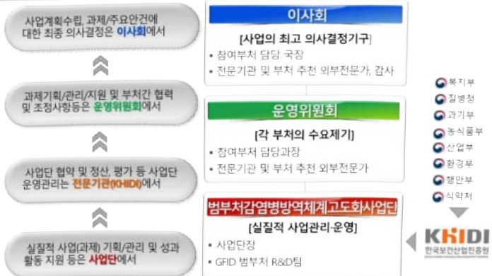

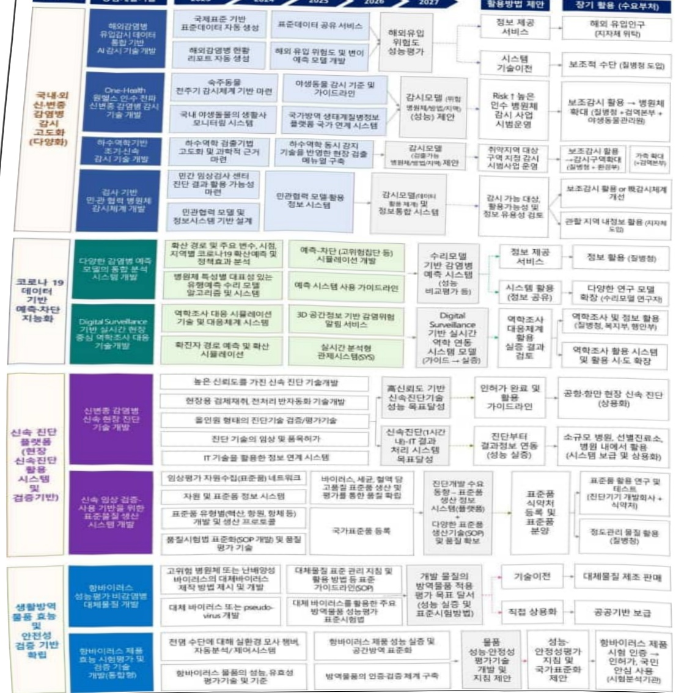

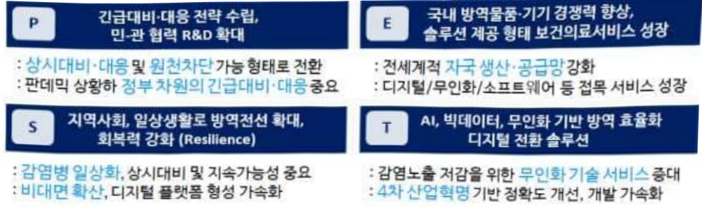

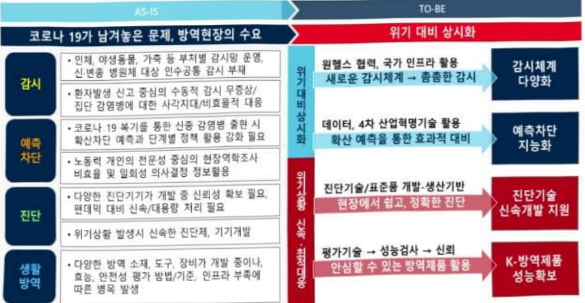

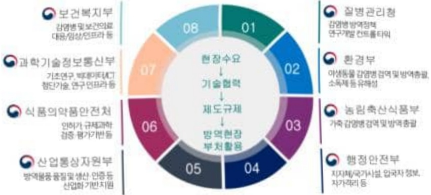

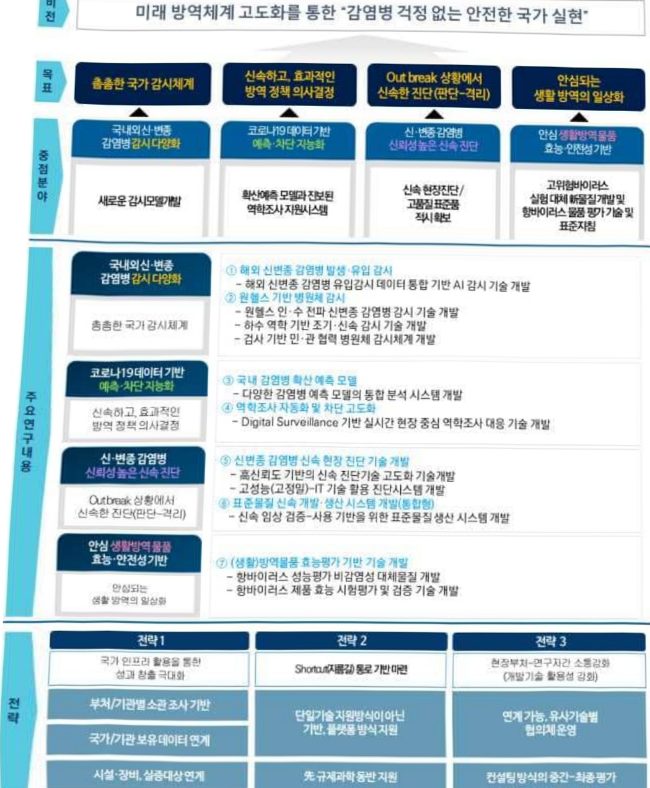

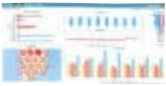

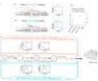

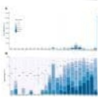

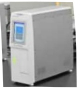

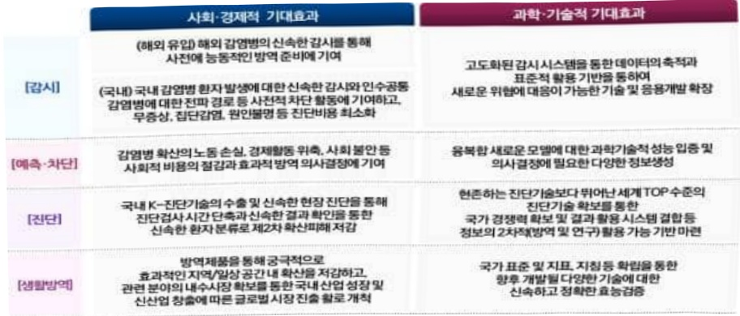

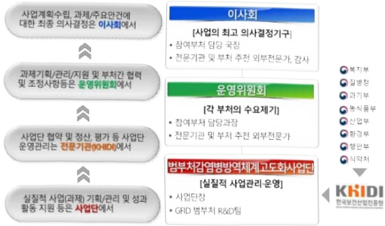

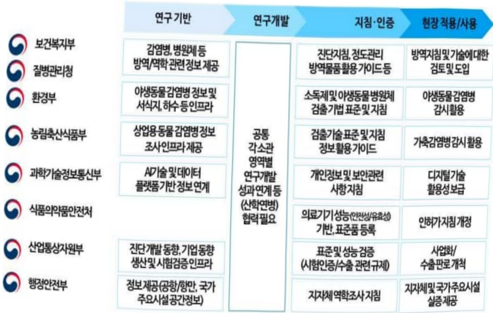

