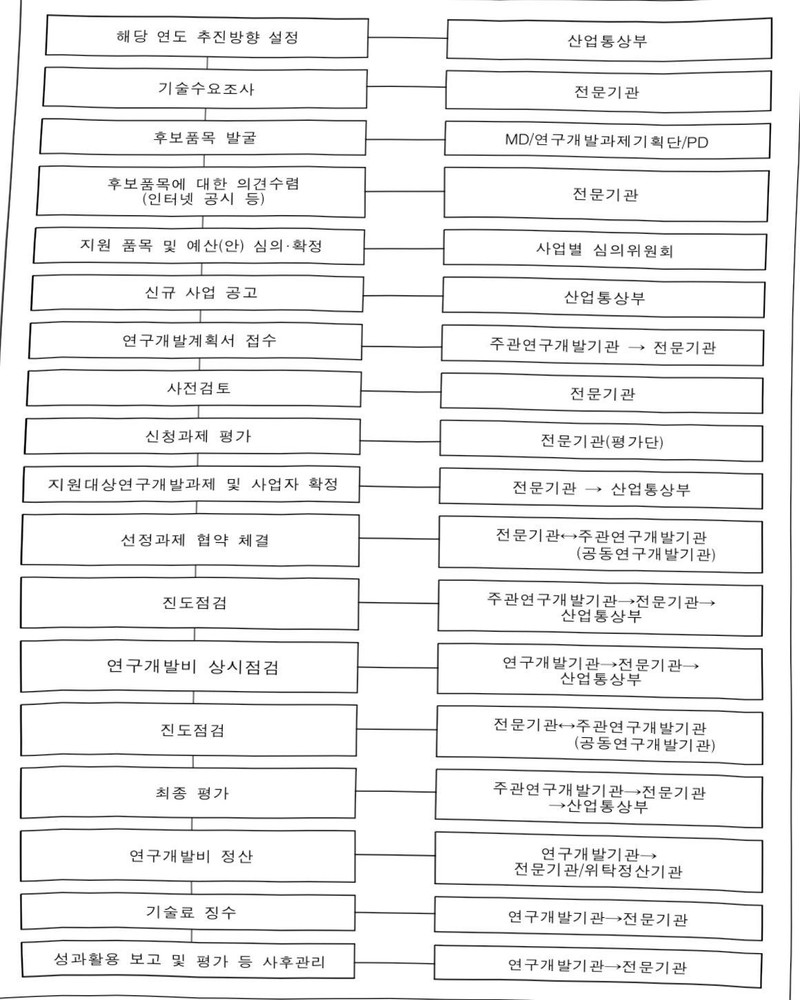
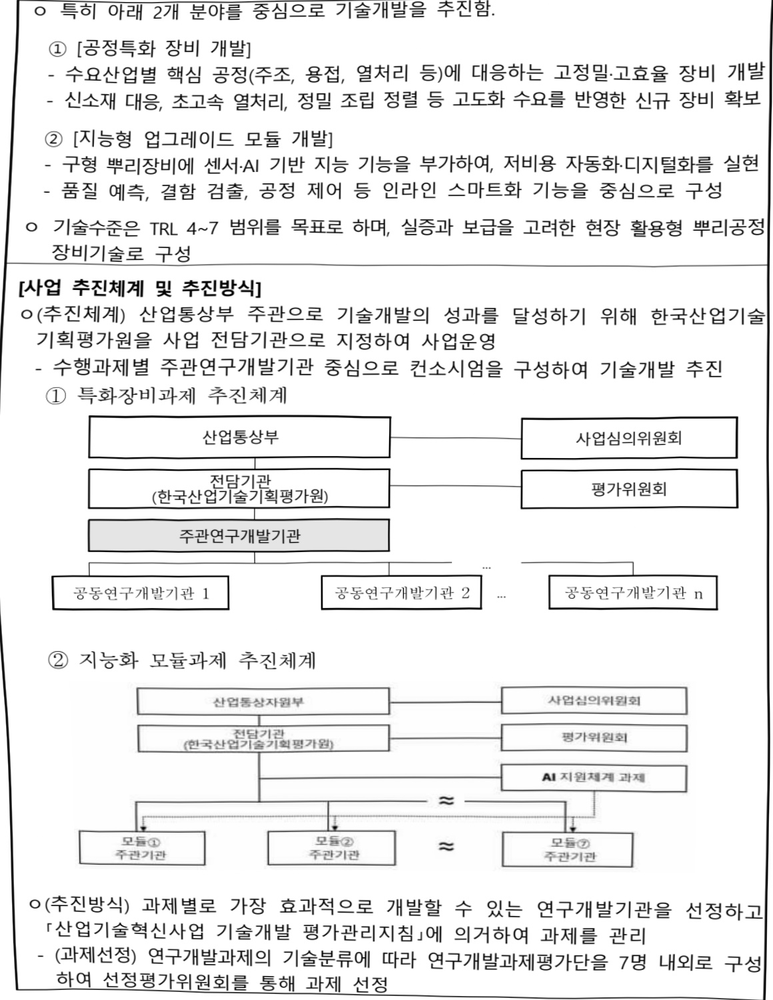
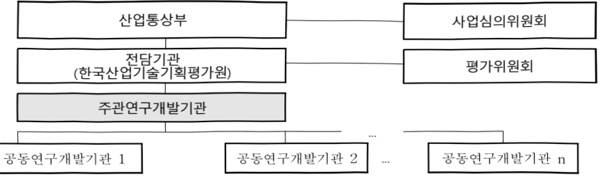
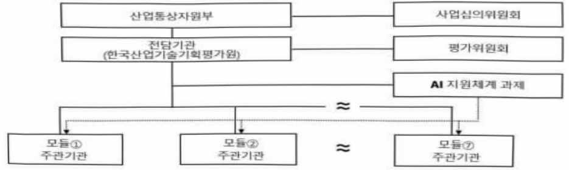

# 뿌리산업혁신공정장비개발사업(R&D)

**해당 페이지**: PDF 4014 ~ 4025 쪽 해당

**부처**: 산업통상부
**분야**: 산업·중소기업 및 에너지
**회계유형**: 일반회계
**2026 확정예산**: 6200.0 백만원
**전년대비 증감률**: None%
**AI 도메인**: 디지털전환(AX)

---

<table border=1 style='margin: auto; word-wrap: break-word;'><tr><td style='text-align: center; word-wrap: break-word;'>사 업 명</td></tr><tr><td style='text-align: center; word-wrap: break-word;'>(192) 뿌리산업 혁신공정장비 개발(R&amp;D) (3541-421)</td></tr></table>

☐ 사업 코드 정보

<table border=1 style='margin: auto; word-wrap: break-word;'><tr><td style='text-align: center; word-wrap: break-word;'>구분</td><td style='text-align: center; word-wrap: break-word;'>회계</td><td style='text-align: center; word-wrap: break-word;'>소관</td><td style='text-align: center; word-wrap: break-word;'>실국(기관)</td><td style='text-align: center; word-wrap: break-word;'>계정</td><td style='text-align: center; word-wrap: break-word;'>분야</td><td style='text-align: center; word-wrap: break-word;'>부문</td></tr><tr><td style='text-align: center; word-wrap: break-word;'>코드</td><td rowspan="2">일반회계</td><td rowspan="2">산업통상부</td><td rowspan="2">산업자원안보실산업공급망정책관</td><td rowspan="2">-</td><td style='text-align: center; word-wrap: break-word;'>110</td><td style='text-align: center; word-wrap: break-word;'>117</td></tr><tr><td style='text-align: center; word-wrap: break-word;'>명칭</td><td style='text-align: center; word-wrap: break-word;'>산업·중소기업 및 에너지</td><td style='text-align: center; word-wrap: break-word;'>산업혁신지원</td></tr></table>

<table border=1 style='margin: auto; word-wrap: break-word;'><tr><td style='text-align: center; word-wrap: break-word;'>구분</td><td style='text-align: center; word-wrap: break-word;'>프로그램</td><td style='text-align: center; word-wrap: break-word;'>단위사업</td><td style='text-align: center; word-wrap: break-word;'>세부사업</td></tr><tr><td style='text-align: center; word-wrap: break-word;'>코드</td><td style='text-align: center; word-wrap: break-word;'>3500</td><td style='text-align: center; word-wrap: break-word;'>3541</td><td style='text-align: center; word-wrap: break-word;'>421</td></tr><tr><td style='text-align: center; word-wrap: break-word;'>명칭</td><td style='text-align: center; word-wrap: break-word;'>주력산업진흥</td><td style='text-align: center; word-wrap: break-word;'>제조기반기술개발</td><td style='text-align: center; word-wrap: break-word;'>뿌리산업 혁신공정장비 개발</td></tr></table>

<table border=1 style='margin: auto; word-wrap: break-word;'><tr><td rowspan="2">신규</td><td rowspan="2">계속</td><td rowspan="2">완료</td><td rowspan="2">예비타당성 실시여부</td><td rowspan="2">총사업비 관리대상</td><td rowspan="2">총액계상 예산사업</td><td style='text-align: center; word-wrap: break-word;'>사업소관 변경정보</td></tr><tr><td style='text-align: center; word-wrap: break-word;'>2025예산 시 소관</td></tr><tr><td style='text-align: center; word-wrap: break-word;'>○</td><td style='text-align: center; word-wrap: break-word;'></td><td style='text-align: center; word-wrap: break-word;'></td><td style='text-align: center; word-wrap: break-word;'></td><td style='text-align: center; word-wrap: break-word;'></td><td style='text-align: center; word-wrap: break-word;'></td><td style='text-align: center; word-wrap: break-word;'></td></tr></table>

☐ 사업 지원 형태 및 지원을 (최소한 한 개는 반드시 선택하시오. 해당사항에 O 표시)

<table border=1 style='margin: auto; word-wrap: break-word;'><tr><td style='text-align: center; word-wrap: break-word;'>직접</td><td style='text-align: center; word-wrap: break-word;'>출자</td><td style='text-align: center; word-wrap: break-word;'>출연</td><td style='text-align: center; word-wrap: break-word;'>보조</td><td style='text-align: center; word-wrap: break-word;'>융자</td><td style='text-align: center; word-wrap: break-word;'>국고보조율(%)</td><td style='text-align: center; word-wrap: break-word;'>융자율(%)</td></tr><tr><td style='text-align: center; word-wrap: break-word;'></td><td style='text-align: center; word-wrap: break-word;'></td><td style='text-align: center; word-wrap: break-word;'>0</td><td style='text-align: center; word-wrap: break-word;'></td><td style='text-align: center; word-wrap: break-word;'></td><td style='text-align: center; word-wrap: break-word;'></td><td style='text-align: center; word-wrap: break-word;'></td></tr></table>

## □ 사업 담당자

<table border=1 style='margin: auto; word-wrap: break-word;'><tr><td style='text-align: center; word-wrap: break-word;'>사업명</td><td colspan="5">구분</td></tr><tr><td rowspan="4">뿌리산업혁신공정장비개발(R&amp;D)</td><td rowspan="3">소관부처</td><td style='text-align: center; word-wrap: break-word;'>실·국·과(팀)</td><td style='text-align: center; word-wrap: break-word;'>과 장</td><td style='text-align: center; word-wrap: break-word;'>사무관</td><td style='text-align: center; word-wrap: break-word;'>주무관</td></tr><tr><td style='text-align: center; word-wrap: break-word;'>산업자원안보실산업공급망정책관</td><td style='text-align: center; word-wrap: break-word;'>고승진</td><td style='text-align: center; word-wrap: break-word;'>심현준</td><td style='text-align: center; word-wrap: break-word;'>-</td></tr><tr><td style='text-align: center; word-wrap: break-word;'>산업공급망정책과(뿌리산업팀)</td><td style='text-align: center; word-wrap: break-word;'>044-203-4905</td><td style='text-align: center; word-wrap: break-word;'>044-203-4906</td><td style='text-align: center; word-wrap: break-word;'>-</td></tr><tr><td style='text-align: center; word-wrap: break-word;'>사업시행주체</td><td style='text-align: center; word-wrap: break-word;'>한국산업기술기획평가원</td><td style='text-align: center; word-wrap: break-word;'>화학산업실</td><td style='text-align: center; word-wrap: break-word;'>박용빈 책임</td><td style='text-align: center; word-wrap: break-word;'>053-718-8279</td></tr></table>

---

### 가.예산 총괄표

(단위: 백만원, %)

<table border=1 style='margin: auto; word-wrap: break-word;'><tr><td rowspan="2">사업명</td><td rowspan="2">2024년 결산</td><td colspan="2">2025년 예산</td><td colspan="2">2026년</td><td rowspan="2">중감(B-A)</td><td rowspan="2">(B-A)/A</td></tr><tr><td style='text-align: center; word-wrap: break-word;'>본예산(A)</td><td style='text-align: center; word-wrap: break-word;'>추경</td><td style='text-align: center; word-wrap: break-word;'>요구안</td><td style='text-align: center; word-wrap: break-word;'>확정(B)</td></tr><tr><td style='text-align: center; word-wrap: break-word;'>뿌리산업혁신공정장비개발(R&amp;D)</td><td style='text-align: center; word-wrap: break-word;'>-</td><td style='text-align: center; word-wrap: break-word;'>-</td><td style='text-align: center; word-wrap: break-word;'>-</td><td style='text-align: center; word-wrap: break-word;'>6,200</td><td style='text-align: center; word-wrap: break-word;'>6,200</td><td style='text-align: center; word-wrap: break-word;'>6,200</td><td style='text-align: center; word-wrap: break-word;'>순증</td></tr></table>

□ 기능별(내역사업별), 목별 예산 내역

(단위:백만원)

<table border=1 style='margin: auto; word-wrap: break-word;'><tr><td rowspan="2"></td><td colspan="5">2024</td><td colspan="7">2025(2025.12월말)</td><td rowspan="2">2026예산</td></tr><tr><td style='text-align: center; word-wrap: break-word;'>예산액(추경)</td><td style='text-align: center; word-wrap: break-word;'>예산현액</td><td style='text-align: center; word-wrap: break-word;'>집행액[실집행액]</td><td style='text-align: center; word-wrap: break-word;'>이월액</td><td style='text-align: center; word-wrap: break-word;'>불용액</td><td style='text-align: center; word-wrap: break-word;'>본예산</td><td style='text-align: center; word-wrap: break-word;'>예산현액</td><td style='text-align: center; word-wrap: break-word;'>집행액[실집행액]</td><td colspan="2">전년도이월액제외</td><td style='text-align: center; word-wrap: break-word;'>이월예상액</td><td style='text-align: center; word-wrap: break-word;'>불용예상액</td></tr><tr><td style='text-align: center; word-wrap: break-word;'>○ 기능별 분류(합계)</td><td style='text-align: center; word-wrap: break-word;'>-</td><td style='text-align: center; word-wrap: break-word;'>-</td><td style='text-align: center; word-wrap: break-word;'>-</td><td style='text-align: center; word-wrap: break-word;'>-</td><td style='text-align: center; word-wrap: break-word;'>-</td><td style='text-align: center; word-wrap: break-word;'>-</td><td style='text-align: center; word-wrap: break-word;'>-</td><td style='text-align: center; word-wrap: break-word;'>-</td><td style='text-align: center; word-wrap: break-word;'>-</td><td style='text-align: center; word-wrap: break-word;'>-</td><td style='text-align: center; word-wrap: break-word;'>-</td><td style='text-align: center; word-wrap: break-word;'>-</td><td style='text-align: center; word-wrap: break-word;'>6,200</td></tr><tr><td style='text-align: center; word-wrap: break-word;'>· 뿌리산업 혁신공정장비 개발(R&amp;D)</td><td style='text-align: center; word-wrap: break-word;'>-</td><td style='text-align: center; word-wrap: break-word;'>-</td><td style='text-align: center; word-wrap: break-word;'>-</td><td style='text-align: center; word-wrap: break-word;'>-</td><td style='text-align: center; word-wrap: break-word;'>-</td><td style='text-align: center; word-wrap: break-word;'>-</td><td style='text-align: center; word-wrap: break-word;'>-</td><td style='text-align: center; word-wrap: break-word;'>-</td><td style='text-align: center; word-wrap: break-word;'>-</td><td style='text-align: center; word-wrap: break-word;'>-</td><td style='text-align: center; word-wrap: break-word;'>-</td><td style='text-align: center; word-wrap: break-word;'>-</td><td style='text-align: center; word-wrap: break-word;'>6,200</td></tr><tr><td style='text-align: center; word-wrap: break-word;'>○ 비목별 분류(합계)</td><td style='text-align: center; word-wrap: break-word;'>-</td><td style='text-align: center; word-wrap: break-word;'>-</td><td style='text-align: center; word-wrap: break-word;'>-</td><td style='text-align: center; word-wrap: break-word;'>-</td><td style='text-align: center; word-wrap: break-word;'>-</td><td style='text-align: center; word-wrap: break-word;'>-</td><td style='text-align: center; word-wrap: break-word;'>-</td><td style='text-align: center; word-wrap: break-word;'>-</td><td style='text-align: center; word-wrap: break-word;'>-</td><td style='text-align: center; word-wrap: break-word;'>-</td><td style='text-align: center; word-wrap: break-word;'>-</td><td style='text-align: center; word-wrap: break-word;'>-</td><td style='text-align: center; word-wrap: break-word;'>6,200</td></tr><tr><td style='text-align: center; word-wrap: break-word;'>· 연구개발활동비등(360-05)</td><td style='text-align: center; word-wrap: break-word;'>-</td><td style='text-align: center; word-wrap: break-word;'>-</td><td style='text-align: center; word-wrap: break-word;'>-</td><td style='text-align: center; word-wrap: break-word;'>-</td><td style='text-align: center; word-wrap: break-word;'>-</td><td style='text-align: center; word-wrap: break-word;'>-</td><td style='text-align: center; word-wrap: break-word;'>-</td><td style='text-align: center; word-wrap: break-word;'>-</td><td style='text-align: center; word-wrap: break-word;'>-</td><td style='text-align: center; word-wrap: break-word;'>-</td><td style='text-align: center; word-wrap: break-word;'>-</td><td style='text-align: center; word-wrap: break-word;'>-</td><td style='text-align: center; word-wrap: break-word;'>6,200</td></tr><tr><td style='text-align: center; word-wrap: break-word;'>○ 기능비목별 분류(합계)</td><td style='text-align: center; word-wrap: break-word;'>-</td><td style='text-align: center; word-wrap: break-word;'>-</td><td style='text-align: center; word-wrap: break-word;'>-</td><td style='text-align: center; word-wrap: break-word;'>-</td><td style='text-align: center; word-wrap: break-word;'>-</td><td style='text-align: center; word-wrap: break-word;'>-</td><td style='text-align: center; word-wrap: break-word;'>-</td><td style='text-align: center; word-wrap: break-word;'>-</td><td style='text-align: center; word-wrap: break-word;'>-</td><td style='text-align: center; word-wrap: break-word;'>-</td><td style='text-align: center; word-wrap: break-word;'>-</td><td style='text-align: center; word-wrap: break-word;'>-</td><td style='text-align: center; word-wrap: break-word;'>6,200</td></tr><tr><td style='text-align: center; word-wrap: break-word;'>· 뿌리산업 혁신공정장비 개발(R&amp;D) -연구개발활동비등(360-05)</td><td style='text-align: center; word-wrap: break-word;'>-</td><td style='text-align: center; word-wrap: break-word;'>-</td><td style='text-align: center; word-wrap: break-word;'>-</td><td style='text-align: center; word-wrap: break-word;'>-</td><td style='text-align: center; word-wrap: break-word;'>-</td><td style='text-align: center; word-wrap: break-word;'>-</td><td style='text-align: center; word-wrap: break-word;'>-</td><td style='text-align: center; word-wrap: break-word;'>-</td><td style='text-align: center; word-wrap: break-word;'>-</td><td style='text-align: center; word-wrap: break-word;'>-</td><td style='text-align: center; word-wrap: break-word;'>-</td><td style='text-align: center; word-wrap: break-word;'>-</td><td style='text-align: center; word-wrap: break-word;'>6,200</td></tr></table>

---

### 나. 사업설명자료

## 1 ) 사업목적·내용

- (뿌리산업 혁신공정장비 개발(R&D)) 공정혁신 특화장비¹) 및 지능형 업그레이드 모듈² 개발을 통한 뿌리산업의 디지털 전환 및 공급망 대응력 강화로 고부가가치 제조업으로의 전환 실현

1) 고정밀·고효율 공정특화 장비 확보를 통한 생산성 및 품질 향상

→ 예시) 3D프린터를 사형주조에 도입, 공정단축, 인력감축 등 생산성 혁신 실현

2) 센서·AI 기반 업그레이드 모듈을 통한 구형장비의 저비용 디지털 전환

→ 예시) 센싱, 분석 및 제어가 가능한 AI모듈 적용으로 프레스공정 불량률 저감 및 생산성 향상

## 2 ) 사업개요

## □ 사업근거 및 추진경위

① 법령상 근거 및 조항 적시 : '산업기술혁신촉진법', '뿌리산업법'

## ○「산업기술혁신촉진법」제11조(산업기술개발사업)

① 산업통상부장관은 혁신계획 및 시행계획을 효율적으로 수행하기 위하여 관계 중앙행정기관의 장과 협의하여 다음 각 호의 산업기술분야에서 기술개발사업(산업기술개발을 위하여 필요한 기획 및 조사를 포함한다. 이하 "산업기술개발사업"이라 한다)을 추진할 수 있다.

1. 산업의 공통적인 기반이 되는 생산기반 기술, 부품·소재 및 장비·설비(플랜트를 포함한다) 기술

2. 산업기술 분야의 미래 유망 기술

3. 산업의 고부가가치화를 위한 공정혁신, 청정생산 및 환경설비 등에 관련된 기술 등

## °「뿌리산업법」제14조(핵심뿌리기술의 지정 및 연구개발지원)

① 산업통상부장관은 뿌리기술의 개발과 확산을 촉진하기 위하여 국가적으로 중요한 뿌리기술을 핵심 뿌리기술로 지정하고 이에 대한 연구개발, 기술지원 및 연구성과 확산 등을 지원할 수 있다.

② 정부는 제1항에 따른 핵심 뿌리기술의 연구개발을 수행하는 기관 또는 단체에 재정 지원을 할 수 있다.

③ 제1항에 따른 핵심 뿌리기술의 지정요건, 지정절차 및 연구개발 지원 등에 관한 구체적인 내용은 대통령령으로 정한다.

## ② 추진경위

° '24.06 뿌리산업 발전 라운드 테이블 운영 및 기술 발굴

°25.01 뿌리기업 간담회 개최 및 사업 추진 전략 수립

°25.03 뿌리산업 분야 공정혁신장비 개발사업 기획

---

## □ 주요내용

① 사업규모

- 종사업비 : 해당없음

- 사업기간 : 2026 - 2029

- 최근 5년 간 투입된 사업비(예산액기준, 추경편성한 연도에는 추경포함)

<table border=1 style='margin: auto; word-wrap: break-word;'><tr><td style='text-align: center; word-wrap: break-word;'>연도</td><td style='text-align: center; word-wrap: break-word;'>2022</td><td style='text-align: center; word-wrap: break-word;'>2023</td><td style='text-align: center; word-wrap: break-word;'>2024</td><td style='text-align: center; word-wrap: break-word;'>2025</td><td style='text-align: center; word-wrap: break-word;'>2026</td></tr><tr><td style='text-align: center; word-wrap: break-word;'>사업비</td><td style='text-align: center; word-wrap: break-word;'>-</td><td style='text-align: center; word-wrap: break-word;'>-</td><td style='text-align: center; word-wrap: break-word;'>-</td><td style='text-align: center; word-wrap: break-word;'>-</td><td style='text-align: center; word-wrap: break-word;'>6,200</td></tr></table>

- 기타: 과제당 25억원 내외, 4년 이내

② 사업추진체계

- 사업시행방법 : 출연(총사업비의 100% 이내 정부매칭)

- 사업시행주체 : 한국산업기술기획평가원

- 사업 수혜자 : 뿌리기업, 기업, 대학, 연구소 등

- 보조, 율자, 출연, 출자 등의 경우 보조·율자 등 지원 비율 및 법적근거

<table border=1 style='margin: auto; word-wrap: break-word;'><tr><td style='text-align: center; word-wrap: break-word;'>내역사업명</td><td style='text-align: center; word-wrap: break-word;'>구분</td><td style='text-align: center; word-wrap: break-word;'>피보조·피출연 등 기관명</td><td style='text-align: center; word-wrap: break-word;'>지원 금액 (2026예산)</td><td style='text-align: center; word-wrap: break-word;'>지원 비율(%)</td><td style='text-align: center; word-wrap: break-word;'>보조율 법적근거 (해당 조항)</td></tr><tr><td style='text-align: center; word-wrap: break-word;'>뿌리산업 혁신공정 장비개발 (R&amp;D)</td><td style='text-align: center; word-wrap: break-word;'>출연</td><td style='text-align: center; word-wrap: break-word;'>기업, 대학, 연구소 등</td><td style='text-align: center; word-wrap: break-word;'>6,200</td><td style='text-align: center; word-wrap: break-word;'>100</td><td style='text-align: center; word-wrap: break-word;'>산업기술혁신촉진법 제11조, 뿌리산업법 제14조</td></tr></table>

## 3 ) 2026년도 예산 산출 근거

① 뿌리산업 혁신공정장비 개발(R&D)

: (2025 본예산) 000 → (2026 요구) 6,200백만원, 순증

- (요구) 제조업의 근간인 뿌리산업의 생산성 향상 및 국내외 수요산업 대응 역량 강화를 위한 신규 과제 지원을 위해 6,200백만원 요구

- (산출) 신규과제 2개 × 1,967백만원 × 9/12개월 = 2,950백만원

신규과제 3개 × 1,340백만원 × 9/12개월 = 3,000백만원

신규과제 1개 × 334백만원 × 9/12개월 = 250백만원

2025년도 예산 및 2026년도 예산 산출 세부내역 비교

<table border=1 style='margin: auto; word-wrap: break-word;'><tr><td colspan="2">2025년 본예산</td><td colspan="2">2026년 예산</td></tr><tr><td style='text-align: center; word-wrap: break-word;'>예산</td><td style='text-align: center; word-wrap: break-word;'>산출내역</td><td style='text-align: center; word-wrap: break-word;'>예산</td><td style='text-align: center; word-wrap: break-word;'>산출내역</td></tr><tr><td style='text-align: center; word-wrap: break-word;'></td><td style='text-align: center; word-wrap: break-word;'></td><td colspan="2">&lt;뿌리산업 혁신공정장비 개발(R&amp;D): 6,200백만원&gt;</td></tr><tr><td style='text-align: center; word-wrap: break-word;'></td><td style='text-align: center; word-wrap: break-word;'></td><td colspan="2">가. 신규과제 6개 지원 (6,200백만원)</td></tr><tr><td style='text-align: center; word-wrap: break-word;'></td><td style='text-align: center; word-wrap: break-word;'></td><td style='text-align: center; word-wrap: break-word;'>6,200</td><td style='text-align: center; word-wrap: break-word;'>• 2개 과제 × 1,967백만원 × 9/12개월 = 2,950백만원</td></tr><tr><td style='text-align: center; word-wrap: break-word;'></td><td style='text-align: center; word-wrap: break-word;'></td><td style='text-align: center; word-wrap: break-word;'>• 3개 과제 × 1,340백만원 × 9/12개월 = 3,000백만원</td><td style='text-align: center; word-wrap: break-word;'></td></tr><tr><td style='text-align: center; word-wrap: break-word;'></td><td style='text-align: center; word-wrap: break-word;'></td><td colspan="2">• 1개 과제 × 334백만원 × 9/12개월 = 250백만원</td></tr></table>

---

## 4 ) 사업효과

☐ 사업영향, 산출물 성과지표 등

① 2022~2026년도 성과계획서 상 성과지표 및 최근 5년간 성과 달성도

<table border=1 style='margin: auto; word-wrap: break-word;'><tr><td style='text-align: center; word-wrap: break-word;'>성과지표</td><td style='text-align: center; word-wrap: break-word;'>구분</td><td style='text-align: center; word-wrap: break-word;'>2022</td><td style='text-align: center; word-wrap: break-word;'>2023</td><td style='text-align: center; word-wrap: break-word;'>2024</td><td style='text-align: center; word-wrap: break-word;'>2025</td><td style='text-align: center; word-wrap: break-word;'>2026</td><td style='text-align: center; word-wrap: break-word;'>2026 목표치산출근거</td><td style='text-align: center; word-wrap: break-word;'>측정산식(또는 측정방법)</td><td style='text-align: center; word-wrap: break-word;'>자료수집방법(또는 자료출처)</td></tr><tr><td rowspan="3">공정단축를(단위: % )</td><td style='text-align: center; word-wrap: break-word;'>목표</td><td style='text-align: center; word-wrap: break-word;'>-</td><td style='text-align: center; word-wrap: break-word;'>-</td><td style='text-align: center; word-wrap: break-word;'>-</td><td style='text-align: center; word-wrap: break-word;'>-</td><td style='text-align: center; word-wrap: break-word;'>15</td><td rowspan="6">신규지표임을감안하여유사사업수준으로 설정</td><td rowspan="3">공정단축를목표 평균달성률(%)</td><td rowspan="3">IRIS(범부처통합연구지원시스템)에제출된 연도별연차보고서 또는최종보고서</td></tr><tr><td style='text-align: center; word-wrap: break-word;'>실적</td><td style='text-align: center; word-wrap: break-word;'>-</td><td style='text-align: center; word-wrap: break-word;'>-</td><td style='text-align: center; word-wrap: break-word;'>-</td><td style='text-align: center; word-wrap: break-word;'>-</td><td style='text-align: center; word-wrap: break-word;'>-</td></tr><tr><td style='text-align: center; word-wrap: break-word;'>달성도</td><td style='text-align: center; word-wrap: break-word;'>-</td><td style='text-align: center; word-wrap: break-word;'>-</td><td style='text-align: center; word-wrap: break-word;'>-</td><td style='text-align: center; word-wrap: break-word;'>-</td><td style='text-align: center; word-wrap: break-word;'>-</td></tr><tr><td rowspan="3">AI모듈 탑재적용건 수(단위: 건 )</td><td style='text-align: center; word-wrap: break-word;'>목표</td><td style='text-align: center; word-wrap: break-word;'>-</td><td style='text-align: center; word-wrap: break-word;'>-</td><td style='text-align: center; word-wrap: break-word;'>-</td><td style='text-align: center; word-wrap: break-word;'>3</td><td style='text-align: center; word-wrap: break-word;'>모듈별 3건의실증목표 달성을고려하여 산출</td><td rowspan="3">모듈 개발 후실제 장비실증건 수</td><td rowspan="3">IRIS(범부처통합연구지원시스템)에제출된 연도별연차보고서 또는최종보고서</td></tr><tr><td style='text-align: center; word-wrap: break-word;'>실적</td><td style='text-align: center; word-wrap: break-word;'>-</td><td style='text-align: center; word-wrap: break-word;'>-</td><td style='text-align: center; word-wrap: break-word;'>-</td><td style='text-align: center; word-wrap: break-word;'>-</td><td style='text-align: center; word-wrap: break-word;'>-</td></tr><tr><td style='text-align: center; word-wrap: break-word;'>달성도</td><td style='text-align: center; word-wrap: break-word;'>-</td><td style='text-align: center; word-wrap: break-word;'>-</td><td style='text-align: center; word-wrap: break-word;'>-</td><td style='text-align: center; word-wrap: break-word;'>-</td><td style='text-align: center; word-wrap: break-word;'>-</td></tr><tr><td rowspan="3">AI 모듈 정확도(단위: % )</td><td style='text-align: center; word-wrap: break-word;'>목표</td><td style='text-align: center; word-wrap: break-word;'>-</td><td style='text-align: center; word-wrap: break-word;'>-</td><td style='text-align: center; word-wrap: break-word;'>-</td><td style='text-align: center; word-wrap: break-word;'>60</td><td style='text-align: center; word-wrap: break-word;'>신규지표임을감안하여유사사업수준으로 설정</td><td rowspan="3">품질·결합·물성예측 모델의정답률</td><td rowspan="3">IRIS(범부처통합연구지원시스템)에제출된 연도별연차보고서 또는최종보고서</td><td rowspan="3"></td></tr><tr><td style='text-align: center; word-wrap: break-word;'>실적</td><td style='text-align: center; word-wrap: break-word;'>-</td><td style='text-align: center; word-wrap: break-word;'>-</td><td style='text-align: center; word-wrap: break-word;'>-</td><td style='text-align: center; word-wrap: break-word;'>-</td><td style='text-align: center; word-wrap: break-word;'>-</td></tr><tr><td style='text-align: center; word-wrap: break-word;'>달성도</td><td style='text-align: center; word-wrap: break-word;'>-</td><td style='text-align: center; word-wrap: break-word;'>-</td><td style='text-align: center; word-wrap: break-word;'>-</td><td style='text-align: center; word-wrap: break-word;'>-</td><td style='text-align: center; word-wrap: break-word;'>-</td></tr></table>

② 성과지표 이외의 연도별 사업추진 경과 및 실적 : 해당없음

③ 향후(2026년도 이후) 기대효과

- 뿌리공정 특화장비 3종, 지능형 업그레이드 모듈 7개 개발 및 뿌리산업 전용 AI 지원체계 구축

- 공정시간 50% 단축, AI 예측 정확도 95% 달성, AI모듈 탑재 적용 21건 달성

5) 타당성조사 및 예비타당성조사 시행여부 및 결과 요지 : 해당없음

6) 총사업비 대상사업 여부 및 내역 : 해당없음

---

## 7 ) 사업 집행절차

---

8) 중기재정계획 상 연도별 투자계획 및 추진경과

(단위:백만원)

<table border=1 style='margin: auto; word-wrap: break-word;'><tr><td style='text-align: center; word-wrap: break-word;'>$ \underline{\text{冬}} $2024</td><td style='text-align: center; word-wrap: break-word;'>2025</td><td style='text-align: center; word-wrap: break-word;'>2026</td><td style='text-align: center; word-wrap: break-word;'>2027</td><td style='text-align: center; word-wrap: break-word;'>2028</td><td style='text-align: center; word-wrap: break-word;'>2029</td></tr><tr><td style='text-align: center; word-wrap: break-word;'>2024~2028</td><td style='text-align: center; word-wrap: break-word;'>-</td><td style='text-align: center; word-wrap: break-word;'>-</td><td style='text-align: center; word-wrap: break-word;'>-</td><td style='text-align: center; word-wrap: break-word;'>-</td><td style='text-align: center; word-wrap: break-word;'>-</td></tr><tr><td style='text-align: center; word-wrap: break-word;'>2025~2029</td><td style='text-align: center; word-wrap: break-word;'>-</td><td style='text-align: center; word-wrap: break-word;'>6,200</td><td style='text-align: center; word-wrap: break-word;'>9,800</td><td style='text-align: center; word-wrap: break-word;'>8,800</td><td style='text-align: center; word-wrap: break-word;'>3,600</td></tr></table>

9) 최근 3년간 동 사업에 대한 주요 외부지적사항 및 평가, 문제점 및 대책 : 해당없음

## 10 ) 향후 추진방향 및 추진계획

<table border=1 style='margin: auto; word-wrap: break-word;'><tr><td style='text-align: center; word-wrap: break-word;'>- 생산성 향상, 정밀제어, 에너지 효율화 등 실현 가능 공정장비 개발기술을 확보하고 기존 설비의 저비용·고효율 지능화를 위한 실용적 업그레이드 모듈을 개발할 예정 - 모듈 간 운영 편의성, 연계 가능성, 확장성을 보완적으로 지원하기 위한 공통 활용 기반체계(AI 지원체계) 구축할 예정 - 실증을 통한 기술 신뢰성 확보하고 지속적인 뿌리산업 확산 생태계 기반을 마련하기 위해 연차별 투자계획에 따라 차질 없는 과제 추진을 위한 지원 예정</td></tr></table>

11) 해당사업에 대한 각종 사업평가의 결과 : 해당없음

12) 해당사업에 대한 부처 자체평가의 결과 : 해당없음

13) 부처 건의사항 : 해당없음

다. 최근 4년간 결산내역 : '26년 신규사업으로 해당없음

라. 기타 추가자료

(1) 신규사업 기획보고서 요약본

(2) 사업 설명자료

---

## 참고 1

신규사업 기획보고서 요약본

<table border=1 style='margin: auto; word-wrap: break-word;'><tr><td style='text-align: center; word-wrap: break-word;'>사업명</td><td colspan="11">뿌리산업 혁신공정장비 개발(R&amp;D)</td></tr><tr><td style='text-align: center; word-wrap: break-word;'>총 사업비</td><td colspan="4">284억 원 (국비 기준)</td><td colspan="4">사업기간</td><td colspan="3">2026 ~ 2029년 (총 4년)</td></tr><tr><td rowspan="2">수행주체</td><td colspan="11">산업통상부/산업공급망정책과(뿌리산업팀)/심현준사무관(042-203-4906/jinha6788@korea.kr)</td></tr><tr><td colspan="11">한국산업기술기획평가원/화학산업실/박용빈책임(053-718-8279/ybpark@keit.re.kr)</td></tr><tr><td colspan="12">[성과목표]
○ 뿌리산업 공정혁신 특화장비 및 지능형 업그레이드 모듈 개발을 통한 뿌리산업의
디지털 전환 및 공급망 대응력 강화로 고부가가치 제조업으로의 전환 실현
- 고정밀·고효율 공정특화 장비 확보를 통한 생산성 및 품질 향상
- 센서·AI 기반 업그레이드 모듈을 통한 구형장비의 저비용 디지털 전환</td></tr><tr><td colspan="12">[성과지표]
○ 본 사업은 공정혁신형 장비 및 지능형 업그레이드 모듈을 통해, 공정시간 단축, 자동화율
제고, 불량률 감소 등의 실질적인 생산성 성과를 정량적으로 확보하고자 함</td></tr><tr><td rowspan="2">성과지표명</td><td colspan="8">목표치</td><td colspan="3">측정방법</td></tr><tr><td style='text-align: center; word-wrap: break-word;'>&#x27;25</td><td style='text-align: center; word-wrap: break-word;'>&#x27;26</td><td style='text-align: center; word-wrap: break-word;'>&#x27;27</td><td style='text-align: center; word-wrap: break-word;'>&#x27;28</td><td style='text-align: center; word-wrap: break-word;'>&#x27;29</td><td style='text-align: center; word-wrap: break-word;'>&#x27;30</td><td style='text-align: center; word-wrap: break-word;'></td><td style='text-align: center; word-wrap: break-word;'></td><td style='text-align: center; word-wrap: break-word;'></td><td style='text-align: center; word-wrap: break-word;'></td><td style='text-align: center; word-wrap: break-word;'></td></tr><tr><td style='text-align: center; word-wrap: break-word;'>공정단축률 (%)</td><td style='text-align: center; word-wrap: break-word;'>-</td><td style='text-align: center; word-wrap: break-word;'>15</td><td style='text-align: center; word-wrap: break-word;'>20</td><td style='text-align: center; word-wrap: break-word;'>25</td><td style='text-align: center; word-wrap: break-word;'>30</td><td style='text-align: center; word-wrap: break-word;'>-</td><td style='text-align: center; word-wrap: break-word;'></td><td style='text-align: center; word-wrap: break-word;'></td><td style='text-align: center; word-wrap: break-word;'></td><td style='text-align: center; word-wrap: break-word;'></td><td style='text-align: center; word-wrap: break-word;'></td></tr><tr><td style='text-align: center; word-wrap: break-word;'>AI모듈 탑재 적용건 수 (건)</td><td style='text-align: center; word-wrap: break-word;'>-</td><td style='text-align: center; word-wrap: break-word;'>3</td><td style='text-align: center; word-wrap: break-word;'>8</td><td style='text-align: center; word-wrap: break-word;'>6</td><td style='text-align: center; word-wrap: break-word;'>4</td><td style='text-align: center; word-wrap: break-word;'>-</td><td style='text-align: center; word-wrap: break-word;'></td><td style='text-align: center; word-wrap: break-word;'></td><td style='text-align: center; word-wrap: break-word;'></td><td style='text-align: center; word-wrap: break-word;'></td><td style='text-align: center; word-wrap: break-word;'></td></tr><tr><td style='text-align: center; word-wrap: break-word;'>AI 예측 정확도 (%)</td><td style='text-align: center; word-wrap: break-word;'>-</td><td style='text-align: center; word-wrap: break-word;'>60</td><td style='text-align: center; word-wrap: break-word;'>85</td><td style='text-align: center; word-wrap: break-word;'>90</td><td style='text-align: center; word-wrap: break-word;'>95</td><td style='text-align: center; word-wrap: break-word;'>-</td><td style='text-align: center; word-wrap: break-word;'></td><td style='text-align: center; word-wrap: break-word;'></td><td style='text-align: center; word-wrap: break-word;'></td><td style='text-align: center; word-wrap: break-word;'></td><td style='text-align: center; word-wrap: break-word;'></td></tr><tr><td colspan="12"></td></tr><tr><td colspan="12">[정책적 연계성]
○ (지원근거)
- 『뿌리산업 진흥과 첨단화에 관한 법률』 제14조(기술개발 지원)에 근거하여, 뿌리기술
고도화를 위한 국가적 기술개발 지원의 정당성과 정책적 타당성을 확보
○(상위계획과의 부합성)
- 뿌리산업 관련 주요 계획으로 과학기술기본계획, 제3차 뿌리산업 진흥 기본계획
(법정계획) 등과 부합
· 제5차 과학기술기본계획(2023~2027) : [전략 3] ‘과학기술 기반 국가적 현안 해결 및
미래 대응’ 및 ‘12대 국가전략기술’의 수요산업과 연관
· 제3차 뿌리산업 진흥 기본계획 : [뿌리전용 R&amp;D 확대] 차세대 핵심뿌리기술 확보를
위한 뿌리기술 개발사업 추진과 부합</td></tr><tr><td colspan="12">[중점투자 분야 및 기술]
○ 동 사업은 뿌리산업의 공정혁신 및 디지털 전환을 위한 전략형 장비·모듈 기술을 중점
개발 대상으로 설정함.</td></tr></table>

---

- 수요산업별 핵심 공정(주조, 용접, 열처리 등)에 대응하는 고정밀·고효율 장비 개발

- 신소재 대응, 초고속 열처리, 정밀 조립 정렬 등 고도화 수요를 반영한 신규 장비 확보

0 기술수준은 TRL 4~7 범위를 목표로 하며, 실증과 보급을 고려한 현장 활용형 뿌리공정 장비기술로 구성

°(추진방식) 과제별로 가장 효과적으로 개발할 수 있는 연구개발기관을 선정하고

「산업기술혁신사업 기술개발 평가관리지침」에 의거하여 과제를 관리

- (과제선정) 연구개발과제의 기술분류에 따라 연구개발과제평가단을 7명 내외로 구성하여 선정평가위원회를 통해 과제 선정

---

<table border=1 style='margin: auto; word-wrap: break-word;'><tr><td colspan="8">- (과제수행과정) 사업 및 성과목표의 달성도, 제도 및 환경변화에 따른 기술개발 추진 정도 등에 대해 연차별로 점검- (과제종료후) 해당 수요산업에서 이 기술을 효과적으로 활용하고 있는지 점검하고 피드백 수행○ 연도별 과제 선정규모: 총 4년간 특화 장비 3개, 지능화 모듈 7개, AI 지원체계 1개</td></tr><tr><td style='text-align: center; word-wrap: break-word;'>연도</td><td style='text-align: center; word-wrap: break-word;'>&#x27;26</td><td colspan="2">&#x27;27</td><td colspan="2">&#x27;28</td><td colspan="2">&#x27;29</td></tr><tr><td rowspan="4">목표 (누적)</td><td style='text-align: center; word-wrap: break-word;'>신규지원 6개</td><td colspan="2">신규지원 3개</td><td colspan="2">신규지원 2개</td><td rowspan="4" colspan="2">-</td></tr><tr><td style='text-align: center; word-wrap: break-word;'>- 뿌리스마트장비 2건</td><td colspan="2">- 뿌리스마트장비 1건</td><td colspan="4">-</td></tr><tr><td style='text-align: center; word-wrap: break-word;'>- 지능화모듈 3건</td><td colspan="2">- 지능화모듈 2건</td><td colspan="4">- 지능화모듈 2건</td></tr><tr><td style='text-align: center; word-wrap: break-word;'>- AI 지원체계 1건</td><td colspan="2">-</td><td colspan="4">-</td></tr><tr><td colspan="8"></td></tr><tr><td colspan="8">[연도별 사업 추진계획]</td></tr><tr><td colspan="8">(단위: 억원)</td></tr><tr><td colspan="2">내역사업명</td><td style='text-align: center; word-wrap: break-word;'>구분</td><td style='text-align: center; word-wrap: break-word;'>&#x27;26</td><td style='text-align: center; word-wrap: break-word;'>&#x27;27</td><td style='text-align: center; word-wrap: break-word;'>&#x27;28</td><td style='text-align: center; word-wrap: break-word;'>&#x27;29</td><td style='text-align: center; word-wrap: break-word;'>&#x27;30</td></tr><tr><td rowspan="3" colspan="2">뿌리산업 혁신공정장비 개발사업(R&amp;D)(신규)</td><td style='text-align: center; word-wrap: break-word;'>국비</td><td style='text-align: center; word-wrap: break-word;'>62</td><td style='text-align: center; word-wrap: break-word;'>98</td><td style='text-align: center; word-wrap: break-word;'>88</td><td style='text-align: center; word-wrap: break-word;'>36</td><td style='text-align: center; word-wrap: break-word;'>-</td></tr><tr><td style='text-align: center; word-wrap: break-word;'>지방비</td><td style='text-align: center; word-wrap: break-word;'>-</td><td style='text-align: center; word-wrap: break-word;'>-</td><td style='text-align: center; word-wrap: break-word;'>-</td><td style='text-align: center; word-wrap: break-word;'>-</td><td style='text-align: center; word-wrap: break-word;'>-</td></tr><tr><td style='text-align: center; word-wrap: break-word;'>민자</td><td style='text-align: center; word-wrap: break-word;'>20.7</td><td style='text-align: center; word-wrap: break-word;'>32.7</td><td style='text-align: center; word-wrap: break-word;'>29.3</td><td style='text-align: center; word-wrap: break-word;'>12.0</td><td style='text-align: center; word-wrap: break-word;'>-</td></tr><tr><td rowspan="4" colspan="2">합계</td><td style='text-align: center; word-wrap: break-word;'>국비</td><td style='text-align: center; word-wrap: break-word;'>62</td><td style='text-align: center; word-wrap: break-word;'>98</td><td style='text-align: center; word-wrap: break-word;'>88</td><td style='text-align: center; word-wrap: break-word;'>36</td><td style='text-align: center; word-wrap: break-word;'>-</td></tr><tr><td style='text-align: center; word-wrap: break-word;'>지방비</td><td style='text-align: center; word-wrap: break-word;'>-</td><td style='text-align: center; word-wrap: break-word;'>-</td><td style='text-align: center; word-wrap: break-word;'>-</td><td style='text-align: center; word-wrap: break-word;'>-</td><td style='text-align: center; word-wrap: break-word;'>-</td></tr><tr><td style='text-align: center; word-wrap: break-word;'>민자</td><td style='text-align: center; word-wrap: break-word;'>20.7</td><td style='text-align: center; word-wrap: break-word;'>32.7</td><td style='text-align: center; word-wrap: break-word;'>29.3</td><td style='text-align: center; word-wrap: break-word;'>12.0</td><td style='text-align: center; word-wrap: break-word;'>-</td></tr><tr><td style='text-align: center; word-wrap: break-word;'>계</td><td style='text-align: center; word-wrap: break-word;'>82.7</td><td style='text-align: center; word-wrap: break-word;'>130.7</td><td style='text-align: center; word-wrap: break-word;'>117.3</td><td style='text-align: center; word-wrap: break-word;'>48.0</td><td style='text-align: center; word-wrap: break-word;'>-</td></tr><tr><td colspan="8">[재원조달 방안]○ 국비, 민간 재원 분담주체별 매칭을 통한 재원 확보- (국비) 출연(총 사업비의 100%이내 정부매칭)  - (민간) 기업유형별(중소기업/중견기업/대기업) 비율에 따른 민간매칭</td></tr><tr><td colspan="8">[기존 사업과 차별성 및 연계방안]○ (차별성)  - 기존 뿌리기술개발사업(첨단뿌리, 글로벌품질대응 등)은 주로 단일 공정기술의 성능 개선이나 생산성 향상 등 현장 애로기술 해결형 R&amp;D에 집중되었음.  - 반면, 동 사업은 단순 기술 개선을 넘어 공정 단위의 구조적 혁신을 추구하며, 공정 단축, 인력감축 등 뿌리산업의 문제를 혁신적으로 해결할 수 있는 특화장비 개발과 지능형 업그레이드 모듈(HW) 및 AI 시스템(SW)의 동시 개발을 통해 장비-공정-품질의 통합 지능형공정 최적화를 실현○ (연계방안)  - 본 사업은 뿌리기업 대상으로 시행중인 보급사업「뿌리산업경쟁력강화지원사업」 등과 전략적으로 연계하여, 개발된 장비 및 모듈의 현장 적용과 보급을 확대할 예정임</td></tr></table>

---

<table border=1 style='margin: auto; word-wrap: break-word;'><tr><td style='text-align: center; word-wrap: break-word;'>→ 개발된 장비 및 모듈은 기술분야별 대표 뿌리기업 공정현장에 실증 적용되고, 이후 보급사업을 통해 향후 뿌리산업계에 확대 보급 예정 - 또한, 실증·확산 과정에서 기존 사업인「글로벌 주력산업품질대응 뿌리기술개발」사업을 통해 개발된 공정기술에 동사업의 지능형 업그레이드 모듈을 적용하는 방안도 일부 검토 중</td></tr><tr><td style='text-align: center; word-wrap: break-word;'>[성과 활용방안]○ 동 사업의 성과는 단순 기술개발에 그치지 않고, 기술개발·현장실증·보급·확산으로 이어지는 산업 생태계 활용 모델을 고려하여 설계됨.○ (뿌리기업 실증 확대) - 개발된 장비 및 모듈은 뿌리기업 현장에 직접 적용되어 운전 검증 및 품질 평가를 수행하며, 이를 통해 실질적인 생산성 개선과 품질 향상 효과를 입증 - 실증이 완료된 기술은 유사 공정기술을 적용하는 동종 뿌리기업으로 적용 확대 및 기술 확산○ (데이터 및 모델 자산화) - AI 기반 예측 모듈에서 생성된 학습 데이터셋, 공정 DB 등은 산업 AI 플랫폼 등과 연계하여 공유·재활용 가능 - 구축된 공정 알고리즘 및 품질 예측 모델은 유사 공정·타 산업군 확산의 기반 자산으로 활용</td></tr><tr><td style='text-align: center; word-wrap: break-word;'>[파급효과]5○ (경제/사회적 파급효과) - 공정단축 및 자동화를 통해 뿌리기업 생산성과 원가경쟁력을 근본적으로 개선 - 고부가 장비 및 모듈의 국산화를 통해 공급망 내재화와 수입 대체 효과 창출 - 고위험 작업 자동화로 산업안전이 향상되며, ESG 기반 친환경 전환이 촉진 - 전통형 지원에서 벗어나 실증·보급 연계형 전략 R&amp;D 모델로 정책 전환 사례 확보○ (직·간접적 고용, 일자리 창출, 인력양성 파급효과) - 스마트 제조와 AI 공정 설계 등 디지털기술 기반 신산업 직무 수요 증가 - 실증 기반 현장형 인재양성으로 중소제조업 내 고숙련 기술자 수요 창출</td></tr></table>

---

## 참고 2

## 사업 설명자료

### 1. 사업목적 및 필요성

o (사업목적) 공정혁신 특화장비¹ 및 지능형 업그레이드 모듈² 개발을 통한 뿌리 산업의 디지털 전환 및 공급망 대응력 강화로 고부가가치 제조업 전환 실현

1) 고정밀·고효율 공정특화 장비 확보를 통한 생산성 및 품질 향상

→ 예시) 3D프린터를 사형주조에 도입, 공정단축, 인력감축 등 생산성 혁신 실현

2) 센서·AI 기반 업그레이드 모듈을 통한 구형장비의 저비용 디지털 전환

→ 예시) 센싱, 분석 및 제어가 가능한 AI모듈 적용으로 프레스공정 불량률 저감 및 생산성 향상

o (지원 필요성) 최근 정부 차원의 AI 기술 확산 정책과 투자 확대 흐름에 맞추어, 국내 뿌리기업 현장에 AI를 적용할 수 있는 기반 모듈 개발이 시급

### 2. 사업내용

o (개요) 뿌리기술 공정혁신을 실제 구현할 수 있는 특화 장비 및 기존 설비에 공정 지능화 기능을 부가하는 업그레이드 모듈 개발

o (기간/총사업비) '26~'29년, 총 378.7억(국비 284억)

o (지원대상) 뿌리기업, 기업, 대학, 연구소 등

o (최종성과) 뿌리공정 특화장비 3종, 지능형 업그레이드 모듈 7종 개발

* 지능형 업그레이드 모듈 과제는 총 8개로 7개는 모듈 개발, 1개는 AI 지원체계구축으로 구성

- 공정시간 50% 단축, AI 예측 정확도 95% 달성, AI 모듈 탑재 적용 21건 등 도전

적인 정량적 지표를 목표치로 제시

### 3. 대표성과 및 활용방안

o [저항용접 공정 무인화를 위한 지능화 모듈] 저항용접 과정에서 발생하는 다양한 센서 신호(전류, 전압, 온도, 영상 등)를 AI가 실시간 분석하여 불량여부를 판정하고 불량품 발생 시 공정조건 자동제어를 통해 정상품 생산 공정조건 유지

※ 기존 샘플링 파괴검사를 통한 불량품 검사방식에서 → 인라인 전수검사 방식

※ 불량률 98% (5%→0.1%) 저감 예상 및 AI적용을 통한 검사인력난 해소에 기여

o 과제진행중 저항용접 공정을 적용하는 뿌리기업 실증을 통해 다양한 산업분야 (자동차 도어 등 차체 부품, 가전 외판 및 팬 가드, 이차전지 탭 및 버스바 연결 등)의 제품제조에 적용하고 이를 통해 보완·개선하여 동종 기업에 보급확산 예정

---

### 원본 PDF 크롭 이미지

