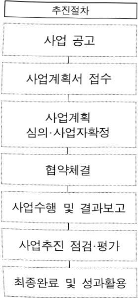
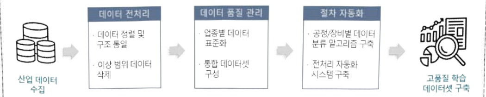

# 산업AI 솔루션 실증확산 지원

**해당 페이지**: PDF 4026 ~ 4034 쪽 해당

**부처**: 산업통상부
**분야**: 산업·중소기업 및 에너지
**회계유형**: 일반회계
**2026 확정예산**: 12800.0 백만원
**전년대비 증감률**: None%
**AI 도메인**: 제조/스마트팩토리

---

<table border=1 style='margin: auto; word-wrap: break-word;'><tr><td style='text-align: center; word-wrap: break-word;'>사 업 명</td></tr><tr><td style='text-align: center; word-wrap: break-word;'>(1) 산업AI솔루션실증·확산지원 (3171-390)</td></tr></table>

## □ 사업 코드 정보

<table border=1 style='margin: auto; word-wrap: break-word;'><tr><td style='text-align: center; word-wrap: break-word;'>구분</td><td style='text-align: center; word-wrap: break-word;'>회계</td><td style='text-align: center; word-wrap: break-word;'>소관</td><td style='text-align: center; word-wrap: break-word;'>실국(기관)</td><td style='text-align: center; word-wrap: break-word;'>계정</td><td style='text-align: center; word-wrap: break-word;'>분야</td><td style='text-align: center; word-wrap: break-word;'>부문</td></tr><tr><td style='text-align: center; word-wrap: break-word;'>코드</td><td rowspan="2">일반회계</td><td rowspan="2">산업통상부</td><td rowspan="2">산업성장실산업안공자능정책국</td><td rowspan="2">-</td><td style='text-align: center; word-wrap: break-word;'>110</td><td style='text-align: center; word-wrap: break-word;'>117</td></tr><tr><td style='text-align: center; word-wrap: break-word;'>명칭</td><td style='text-align: center; word-wrap: break-word;'>산업·중소기업 및 에너지</td><td style='text-align: center; word-wrap: break-word;'>산업혁신지원</td></tr></table>

<table border=1 style='margin: auto; word-wrap: break-word;'><tr><td style='text-align: center; word-wrap: break-word;'>구분</td><td style='text-align: center; word-wrap: break-word;'>프로그램</td><td style='text-align: center; word-wrap: break-word;'>단위사업</td><td style='text-align: center; word-wrap: break-word;'>세부사업</td></tr><tr><td style='text-align: center; word-wrap: break-word;'>코드</td><td style='text-align: center; word-wrap: break-word;'>3100</td><td style='text-align: center; word-wrap: break-word;'>3171</td><td style='text-align: center; word-wrap: break-word;'>390</td></tr><tr><td style='text-align: center; word-wrap: break-word;'>명칭</td><td style='text-align: center; word-wrap: break-word;'>산업경쟁력기반구축</td><td style='text-align: center; word-wrap: break-word;'>우수기술역량강화</td><td style='text-align: center; word-wrap: break-word;'>산업AI솔루션실증·확산지원</td></tr></table>

□ 사업 성격 (공통요구자료 Ⅱ-1 작성유의사항 4. 참조, 해당하는 사항에 “○” 표시)

<table border=1 style='margin: auto; word-wrap: break-word;'><tr><td rowspan="2">신규</td><td rowspan="2">계속</td><td rowspan="2">완료</td><td rowspan="2">예비타당성 실시여부</td><td rowspan="2">총사업비 관리대상</td><td rowspan="2">총액계상 예산사업</td><td style='text-align: center; word-wrap: break-word;'>사업소관 변경정보</td></tr><tr><td style='text-align: center; word-wrap: break-word;'>2025예산 시 소관</td></tr><tr><td style='text-align: center; word-wrap: break-word;'></td><td style='text-align: center; word-wrap: break-word;'>O</td><td style='text-align: center; word-wrap: break-word;'></td><td style='text-align: center; word-wrap: break-word;'></td><td style='text-align: center; word-wrap: break-word;'></td><td style='text-align: center; word-wrap: break-word;'></td><td style='text-align: center; word-wrap: break-word;'></td></tr></table>

□사업지원형태 및지원을(최소한개는반드시선택하시오.해당사항에O표시)

<table border=1 style='margin: auto; word-wrap: break-word;'><tr><td style='text-align: center; word-wrap: break-word;'>직접</td><td style='text-align: center; word-wrap: break-word;'>출자</td><td style='text-align: center; word-wrap: break-word;'>출연</td><td style='text-align: center; word-wrap: break-word;'>보조</td><td style='text-align: center; word-wrap: break-word;'>융자</td><td style='text-align: center; word-wrap: break-word;'>국고보조율(%)</td><td style='text-align: center; word-wrap: break-word;'>융자율(%)</td></tr><tr><td style='text-align: center; word-wrap: break-word;'></td><td style='text-align: center; word-wrap: break-word;'></td><td style='text-align: center; word-wrap: break-word;'>○</td><td style='text-align: center; word-wrap: break-word;'></td><td style='text-align: center; word-wrap: break-word;'></td><td style='text-align: center; word-wrap: break-word;'></td><td style='text-align: center; word-wrap: break-word;'></td></tr></table>

## □ 사업 담당자

<table border=1 style='margin: auto; word-wrap: break-word;'><tr><td style='text-align: center; word-wrap: break-word;'>사업명</td><td colspan="5">구분</td></tr><tr><td rowspan="3">산업AI솔루션실증·확산지원</td><td rowspan="2">소관부처</td><td style='text-align: center; word-wrap: break-word;'>실·국·과(팀)산업성장실산업인공지능정책국</td><td style='text-align: center; word-wrap: break-word;'>과 장 송영진</td><td style='text-align: center; word-wrap: break-word;'>사무관 조은형</td><td style='text-align: center; word-wrap: break-word;'>주무관</td></tr><tr><td style='text-align: center; word-wrap: break-word;'>산업인공지능정책과</td><td style='text-align: center; word-wrap: break-word;'>044-203-3830</td><td style='text-align: center; word-wrap: break-word;'>044-203-3832</td><td style='text-align: center; word-wrap: break-word;'>-</td></tr><tr><td style='text-align: center; word-wrap: break-word;'>사업시행주체</td><td style='text-align: center; word-wrap: break-word;'>한국산업기술진흥원</td><td style='text-align: center; word-wrap: break-word;'>산업인공지능혁신실</td><td style='text-align: center; word-wrap: break-word;'>주소영 실장</td><td style='text-align: center; word-wrap: break-word;'>02-6009-3640</td></tr></table>

### 가. 예산안 총괄표

(단위:백만원,%)

<table border=1 style='margin: auto; word-wrap: break-word;'><tr><td rowspan="2">사업명</td><td rowspan="2">2024년 결산</td><td colspan="2">2025년 예산</td><td colspan="2">2026년</td><td rowspan="2">중감 (B-A)</td><td rowspan="2">(B-A)/A</td></tr><tr><td style='text-align: center; word-wrap: break-word;'>본예산(A)</td><td style='text-align: center; word-wrap: break-word;'>추경</td><td style='text-align: center; word-wrap: break-word;'>요구안</td><td style='text-align: center; word-wrap: break-word;'>확정(B)</td></tr><tr><td style='text-align: center; word-wrap: break-word;'>산업AI솔루션 실증·확산지원</td><td style='text-align: center; word-wrap: break-word;'>-</td><td style='text-align: center; word-wrap: break-word;'>-</td><td style='text-align: center; word-wrap: break-word;'>12,800</td><td style='text-align: center; word-wrap: break-word;'>12,800</td><td style='text-align: center; word-wrap: break-word;'>12,800</td><td style='text-align: center; word-wrap: break-word;'>12,800</td><td style='text-align: center; word-wrap: break-word;'>-</td></tr></table>

---

□ 기능별(내역사업별), 목별 예산안 내역

(단위:백만원)

<table border=1 style='margin: auto; word-wrap: break-word;'><tr><td rowspan="3"></td><td colspan="5">2024</td><td colspan="7">2025(2025.12월말)</td><td rowspan="3">2026예산안</td></tr><tr><td rowspan="2">예산액(추경)</td><td rowspan="2">예산현액</td><td rowspan="2">집행액[실집행액]</td><td rowspan="2">이월액</td><td rowspan="2">불용액</td><td rowspan="2">본예산</td><td rowspan="2">예산현액</td><td rowspan="2">집행액[실집행액]</td><td colspan="2">전년도아월액제외</td><td rowspan="2">이월예산액</td><td rowspan="2">불용예산액</td></tr><tr><td style='text-align: center; word-wrap: break-word;'>예산현액</td><td style='text-align: center; word-wrap: break-word;'>집행액[실집행액]</td></tr><tr><td style='text-align: center; word-wrap: break-word;'>○ 기능별 분류(함께)</td><td style='text-align: center; word-wrap: break-word;'>-</td><td style='text-align: center; word-wrap: break-word;'>-</td><td style='text-align: center; word-wrap: break-word;'>-</td><td style='text-align: center; word-wrap: break-word;'>-</td><td style='text-align: center; word-wrap: break-word;'>-</td><td style='text-align: center; word-wrap: break-word;'>12,800</td><td style='text-align: center; word-wrap: break-word;'>12,800</td><td style='text-align: center; word-wrap: break-word;'>12,800[12,711]</td><td style='text-align: center; word-wrap: break-word;'>12,800</td><td style='text-align: center; word-wrap: break-word;'>12,800[12,711]</td><td style='text-align: center; word-wrap: break-word;'>-</td><td style='text-align: center; word-wrap: break-word;'>-</td><td style='text-align: center; word-wrap: break-word;'>12,800</td></tr><tr><td style='text-align: center; word-wrap: break-word;'>·산업AI솔루션실증확산지원</td><td style='text-align: center; word-wrap: break-word;'>-</td><td style='text-align: center; word-wrap: break-word;'>-</td><td style='text-align: center; word-wrap: break-word;'>-</td><td style='text-align: center; word-wrap: break-word;'>-</td><td style='text-align: center; word-wrap: break-word;'>-</td><td style='text-align: center; word-wrap: break-word;'>12,600</td><td style='text-align: center; word-wrap: break-word;'>12,600</td><td style='text-align: center; word-wrap: break-word;'>12,600[12,600]</td><td style='text-align: center; word-wrap: break-word;'>12,600</td><td style='text-align: center; word-wrap: break-word;'>12,600[12,600]</td><td style='text-align: center; word-wrap: break-word;'>-</td><td style='text-align: center; word-wrap: break-word;'>-</td><td style='text-align: center; word-wrap: break-word;'>12,600</td></tr><tr><td style='text-align: center; word-wrap: break-word;'>·기획평가관리비</td><td style='text-align: center; word-wrap: break-word;'>-</td><td style='text-align: center; word-wrap: break-word;'>-</td><td style='text-align: center; word-wrap: break-word;'>-</td><td style='text-align: center; word-wrap: break-word;'>-</td><td style='text-align: center; word-wrap: break-word;'>-</td><td style='text-align: center; word-wrap: break-word;'>200</td><td style='text-align: center; word-wrap: break-word;'>200</td><td style='text-align: center; word-wrap: break-word;'>200[111]</td><td style='text-align: center; word-wrap: break-word;'>200</td><td style='text-align: center; word-wrap: break-word;'>200[111]</td><td style='text-align: center; word-wrap: break-word;'>-</td><td style='text-align: center; word-wrap: break-word;'>-</td><td style='text-align: center; word-wrap: break-word;'>200</td></tr><tr><td style='text-align: center; word-wrap: break-word;'>○ 비목별 분류(함께)</td><td style='text-align: center; word-wrap: break-word;'>-</td><td style='text-align: center; word-wrap: break-word;'>-</td><td style='text-align: center; word-wrap: break-word;'>-</td><td style='text-align: center; word-wrap: break-word;'>-</td><td style='text-align: center; word-wrap: break-word;'>-</td><td style='text-align: center; word-wrap: break-word;'>12,800</td><td style='text-align: center; word-wrap: break-word;'>12,800</td><td style='text-align: center; word-wrap: break-word;'>12,800[12,800]</td><td style='text-align: center; word-wrap: break-word;'>12,800</td><td style='text-align: center; word-wrap: break-word;'>12,800[12,800]</td><td style='text-align: center; word-wrap: break-word;'>-</td><td style='text-align: center; word-wrap: break-word;'>-</td><td style='text-align: center; word-wrap: break-word;'>12,800</td></tr><tr><td style='text-align: center; word-wrap: break-word;'>·사업출연금(350-02)</td><td style='text-align: center; word-wrap: break-word;'>-</td><td style='text-align: center; word-wrap: break-word;'>-</td><td style='text-align: center; word-wrap: break-word;'>-</td><td style='text-align: center; word-wrap: break-word;'>-</td><td style='text-align: center; word-wrap: break-word;'>-</td><td style='text-align: center; word-wrap: break-word;'>12,600</td><td style='text-align: center; word-wrap: break-word;'>12,600</td><td style='text-align: center; word-wrap: break-word;'>12,600[12,600]</td><td style='text-align: center; word-wrap: break-word;'>12,600</td><td style='text-align: center; word-wrap: break-word;'>12,600[12,600]</td><td style='text-align: center; word-wrap: break-word;'>-</td><td style='text-align: center; word-wrap: break-word;'>-</td><td style='text-align: center; word-wrap: break-word;'>12,600</td></tr><tr><td style='text-align: center; word-wrap: break-word;'>·기관운영출연금(350-01)</td><td style='text-align: center; word-wrap: break-word;'>-</td><td style='text-align: center; word-wrap: break-word;'>-</td><td style='text-align: center; word-wrap: break-word;'>-</td><td style='text-align: center; word-wrap: break-word;'>-</td><td style='text-align: center; word-wrap: break-word;'>-</td><td style='text-align: center; word-wrap: break-word;'>200</td><td style='text-align: center; word-wrap: break-word;'>200</td><td style='text-align: center; word-wrap: break-word;'>200[111]</td><td style='text-align: center; word-wrap: break-word;'>200</td><td style='text-align: center; word-wrap: break-word;'>200[111]</td><td style='text-align: center; word-wrap: break-word;'>-</td><td style='text-align: center; word-wrap: break-word;'>-</td><td style='text-align: center; word-wrap: break-word;'>200</td></tr><tr><td style='text-align: center; word-wrap: break-word;'>○ 기능비목별 분류(함께)</td><td style='text-align: center; word-wrap: break-word;'>-</td><td style='text-align: center; word-wrap: break-word;'>-</td><td style='text-align: center; word-wrap: break-word;'>-</td><td style='text-align: center; word-wrap: break-word;'>-</td><td style='text-align: center; word-wrap: break-word;'>-</td><td style='text-align: center; word-wrap: break-word;'>12,800</td><td style='text-align: center; word-wrap: break-word;'>12,800</td><td style='text-align: center; word-wrap: break-word;'>12,800[12,800]</td><td style='text-align: center; word-wrap: break-word;'>12,800</td><td style='text-align: center; word-wrap: break-word;'>12,800[12,800]</td><td style='text-align: center; word-wrap: break-word;'>-</td><td style='text-align: center; word-wrap: break-word;'>-</td><td style='text-align: center; word-wrap: break-word;'>12,800</td></tr><tr><td style='text-align: center; word-wrap: break-word;'>·산업AI솔루션실증확산지원</td><td style='text-align: center; word-wrap: break-word;'>-</td><td style='text-align: center; word-wrap: break-word;'>-</td><td style='text-align: center; word-wrap: break-word;'>-</td><td style='text-align: center; word-wrap: break-word;'>-</td><td style='text-align: center; word-wrap: break-word;'>-</td><td style='text-align: center; word-wrap: break-word;'>12,600</td><td style='text-align: center; word-wrap: break-word;'>12,600</td><td style='text-align: center; word-wrap: break-word;'>12,600[12,600]</td><td style='text-align: center; word-wrap: break-word;'>12,600</td><td style='text-align: center; word-wrap: break-word;'>12,600[12,600]</td><td style='text-align: center; word-wrap: break-word;'>-</td><td style='text-align: center; word-wrap: break-word;'>-</td><td style='text-align: center; word-wrap: break-word;'>12,600</td></tr><tr><td style='text-align: center; word-wrap: break-word;'>·사업출연금(350-02)</td><td style='text-align: center; word-wrap: break-word;'>-</td><td style='text-align: center; word-wrap: break-word;'>-</td><td style='text-align: center; word-wrap: break-word;'>-</td><td style='text-align: center; word-wrap: break-word;'>-</td><td style='text-align: center; word-wrap: break-word;'>-</td><td style='text-align: center; word-wrap: break-word;'>12,600</td><td style='text-align: center; word-wrap: break-word;'>12,600</td><td style='text-align: center; word-wrap: break-word;'>12,600[12,600]</td><td style='text-align: center; word-wrap: break-word;'>12,600</td><td style='text-align: center; word-wrap: break-word;'>12,600[12,600]</td><td style='text-align: center; word-wrap: break-word;'>-</td><td style='text-align: center; word-wrap: break-word;'>-</td><td style='text-align: center; word-wrap: break-word;'>12,600</td></tr><tr><td style='text-align: center; word-wrap: break-word;'>·기획평가관리비</td><td style='text-align: center; word-wrap: break-word;'>-</td><td style='text-align: center; word-wrap: break-word;'>-</td><td style='text-align: center; word-wrap: break-word;'>-</td><td style='text-align: center; word-wrap: break-word;'>-</td><td style='text-align: center; word-wrap: break-word;'>-</td><td style='text-align: center; word-wrap: break-word;'>200</td><td style='text-align: center; word-wrap: break-word;'>200</td><td style='text-align: center; word-wrap: break-word;'>200[111]</td><td style='text-align: center; word-wrap: break-word;'>200</td><td style='text-align: center; word-wrap: break-word;'>200[111]</td><td style='text-align: center; word-wrap: break-word;'>-</td><td style='text-align: center; word-wrap: break-word;'>-</td><td style='text-align: center; word-wrap: break-word;'>200</td></tr><tr><td style='text-align: center; word-wrap: break-word;'>·기관운영출연금(350-01)</td><td style='text-align: center; word-wrap: break-word;'>-</td><td style='text-align: center; word-wrap: break-word;'>-</td><td style='text-align: center; word-wrap: break-word;'>-</td><td style='text-align: center; word-wrap: break-word;'>-</td><td style='text-align: center; word-wrap: break-word;'>-</td><td style='text-align: center; word-wrap: break-word;'>200</td><td style='text-align: center; word-wrap: break-word;'>200</td><td style='text-align: center; word-wrap: break-word;'>200[111]</td><td style='text-align: center; word-wrap: break-word;'>200</td><td style='text-align: center; word-wrap: break-word;'>200[111]</td><td style='text-align: center; word-wrap: break-word;'>-</td><td style='text-align: center; word-wrap: break-word;'>-</td><td style='text-align: center; word-wrap: break-word;'>200</td></tr></table>

### 나.사업설명자료

## 1 ) 사업목적·내용

°(목적) 제조기업(산업AI 수요기업)이 필요로 하는 산업AI 솔루션 실증·확산 및 산업AI 협업 생태계 구축

*산업AI 수요기업(제조기업) - 산업AI 공급기업(솔루션기업) - 연구기관·대학

°(내용) 공급기업이 보유한 AI 솔루션을 수요기업 현장에 적용·실증

(산업AI 솔루션 실증) 업종별 실증 시나리오 설계 슈요기업 현장에서 파인튜닝 (Fine-tuning)된 솔루션의 성능 검증 및 고도화

(전국 확산) 컨소시엄별 업종 협회, 전문연구기관 등 지원기관이 참여하여, 컨소시엄간 실증 성과 공유 및 확산을 뒷받침

---

## 2 ) 사업개요

□ 사업근거 및 추진경위

① 법령상 근거 및 조항 적시 : 산업기술혁신 촉진법 제19조

산업기술혁신 촉진법
제19조(산업기술기반조성사업) ① 산업통상부장관은 산업기술혁신의 기반 및 환경조성에 관한 다음 각 호의 사업(이하 "산업기술기반조성사업"이라 한다)을 추진할 수 있다.
1. 산업기술인력의 활용 및 공급
2. 산업기술 연구장비 · 시설 등의 확충 및 활용촉진
3. 연구장비 · 시설 · 연구인력 및 정보 등 산업기술혁신 요소의 집적화(集積化) 촉진
4. 산업기술혁신을 위하여 필요한 기술 · 산업 등에 관한 각종 정보의 생산 · 관리 및 활용의 촉진
5. 산업기술의 표준화, 디자인 · 브랜드 선진화 등을 위한 기반구축
6. 산업기술문화공간의 설치 · 운영 등 산업기술저변의 확충
7. 그 밖에 산업기술혁신 기반 조성을 위하여 대통령령으로 정하는 사업
② 산업통상부장관은 연구기관, 대학, 그 밖에 대통령령으로 정하는 기관 · 단체로 하여금 산업기술기반조성사업을 실시하게 할 수 있으며, 산업기술기반조성사업을 주관하여 실시하는 자(이하 "주관기관"이라 한다)와 산업기술기반조성사업에 관한 협약을 체결하고, 주관기관에 해당 사업의 수행에 드는 비용의 전부 또는 일부를 출연 또는 보조할 수 있다.
③ 산업기술기반조성사업에 관하여는 제11조(제1항은 제외한다) · 제11조의2 및 제11조의3을 준용한다. 이 경우 "주관연구기관"은 "주관기관"으로, "산업기술개발사업"은 "산업기술기반조성사업"으로 본다.

② 추진경위 - 사업 시작년도, 추진배경, 부처별 중점과제, 대통령 공약사항 등

°「산업 AI 확산을 위한 10대 과제」(25.1월)

- AI 선도 프로젝트(정부 주도적 선도 프로젝트 추진), AI 실증·인프라 구축 과제 이행 등

□ 주요내용

① 사업규모

- 총사업비(해당되는 경우에만 기재) : 해당없음

- 사업기간 : 2025년 ~ 2026년

- 최근 5년 간 투입된 사업비(예산액기준, 추경편성한 연도에는 추경포함)

<table border=1 style='margin: auto; word-wrap: break-word;'><tr><td style='text-align: center; word-wrap: break-word;'>연도</td><td style='text-align: center; word-wrap: break-word;'>2022</td><td style='text-align: center; word-wrap: break-word;'>2023</td><td style='text-align: center; word-wrap: break-word;'>2024</td><td style='text-align: center; word-wrap: break-word;'>2025</td><td style='text-align: center; word-wrap: break-word;'>2026</td></tr><tr><td style='text-align: center; word-wrap: break-word;'>사업비</td><td style='text-align: center; word-wrap: break-word;'>-</td><td style='text-align: center; word-wrap: break-word;'>-</td><td style='text-align: center; word-wrap: break-word;'>-</td><td style='text-align: center; word-wrap: break-word;'>12,800</td><td style='text-align: center; word-wrap: break-word;'>12,800</td></tr></table>

-기타: 해당 없음

---

## ② 사업추진체계

- 사업시행방법 : 출연(총사업비의 50% 이하)

-사업시행주체:한국산업기술진흥원

-사업 수혜자 : (주관) 해당 업종의 전문성을 보유한 비영리기관

(공동)산업AI 수요기업(중견기업),산업AI 공급기업,기타 비영리기관 등

- 보조, 융자, 출연, 출자 등의 경우 보조·융자 등 지원 비율 및 법적근거

<table border=1 style='margin: auto; word-wrap: break-word;'><tr><td style='text-align: center; word-wrap: break-word;'>내역사업명</td><td style='text-align: center; word-wrap: break-word;'>구분</td><td style='text-align: center; word-wrap: break-word;'>피보조·피출연 등 기관명</td><td style='text-align: center; word-wrap: break-word;'>지원 금액 (2025예산안)</td><td style='text-align: center; word-wrap: break-word;'>지원 비율(%)</td><td style='text-align: center; word-wrap: break-word;'>보조율 법적근거 (해당 조항)</td></tr><tr><td style='text-align: center; word-wrap: break-word;'>산업AI솔루션실증·확산지원</td><td style='text-align: center; word-wrap: break-word;'>출연</td><td style='text-align: center; word-wrap: break-word;'>한국산업 기술진흥원</td><td style='text-align: center; word-wrap: break-word;'>12,800 백만원</td><td style='text-align: center; word-wrap: break-word;'>50%이내</td><td style='text-align: center; word-wrap: break-word;'>산업기술혁신촉진법 제19조(산업기술기반조성사업)</td></tr></table>

## 3 ) 2026년도 예산 산출 근거

□ 산업AI솔루션실증·확산지원 : (2025 추경) 12,800백만원 → (2026 예산) 12,800백만원, 전년동 (2025 본예산 0백만원 → 제1회 추경 0백만원 → 제2회 추경 12,800백만원)

① 산업AI솔루션실증·확산지원 : (2025 추경) 12,800백만원 → (2026 예산) 12,800백만원, 전년동 (2025 본예산 0백만원 → 제1회 추경 0백만원 → 제2회 추경 12,800백만원)

(요구)산업AI 솔루션 실증·확산을 위해 전년도 추가경정예산 수준으로 예산 요구

- (산출) ① 산업AI솔루션실증·확산지원 12,600백만원, ② 기획평가관리비 200백만원

①산업AI솔루션실증·확산지원:신규과제 6개 x 2,100백만원 x 12/12개월 = 12,600백만원

② 기획평가관리비 : 전문기관 기획평가관리비 200백만원

02025년도 추가경정예산 및 2026년도 예산 산출 세부내역 비교

<table border=1 style='margin: auto; word-wrap: break-word;'><tr><td colspan="2">2025년 제2회 추가경쟁예산</td><td colspan="2">2026년 예산</td></tr><tr><td style='text-align: center; word-wrap: break-word;'>예산</td><td style='text-align: center; word-wrap: break-word;'>산출내역</td><td style='text-align: center; word-wrap: break-word;'>예산</td><td style='text-align: center; word-wrap: break-word;'>산출내역</td></tr><tr><td rowspan="3">산업AI 솔루션실증·확산지원（2000백만원）</td><td style='text-align: center; word-wrap: break-word;'>&lt;산업AI솔루션실증·확산지원 12,800백만원 &gt;</td><td style='text-align: center; word-wrap: break-word;'>&lt;산업AI솔루션실증·확산지원 12,800백만원 &gt;, 전년동산업AI 솔루션실증·확산지원（12,600백만원）</td><td style='text-align: center; word-wrap: break-word;'>&lt;산업AI솔루션실증·확산지원 12,800백만원&gt;</td></tr><tr><td style='text-align: center; word-wrap: break-word;'>가·산업AI솔루션실증·확산지원（12,600백만원）</td><td style='text-align: center; word-wrap: break-word;'>솔루션실증·확산지원（12,600백만원）</td><td style='text-align: center; word-wrap: break-word;'>가·산업AI솔루션실증·확산지원（12,600백만원）</td></tr><tr><td style='text-align: center; word-wrap: break-word;'>·(신규) 6개 과제 × 2,100백만원 = 12,600백만원</td><td style='text-align: center; word-wrap: break-word;'>·(신규) 6개 과제 × 2,100백만원 = 12,600백만원</td><td style='text-align: center; word-wrap: break-word;'>·(신규) 6개 과제 × 2,100백만원 = 12,600백만원</td></tr><tr><td rowspan="2">12,800</td><td style='text-align: center; word-wrap: break-word;'>나·기획평가관리비（200백만원）</td><td style='text-align: center; word-wrap: break-word;'>지원</td><td style='text-align: center; word-wrap: break-word;'>나·기획평가관리비（200백만원）</td></tr><tr><td style='text-align: center; word-wrap: break-word;'>·전문기관 기획평가관리비 = 200백만원</td><td style='text-align: center; word-wrap: break-word;'>12,800</td><td style='text-align: center; word-wrap: break-word;'>·전문기관 기획평가관리비 = 200백만원</td></tr></table>

## 4 ) 사업효과

☐ 사업영향, 산출물 성과지표 등

①2022~2026년도 성과계획서 상 성과지표 및 최근 5년간 성과 달성도

<table border=1 style='margin: auto; word-wrap: break-word;'><tr><td style='text-align: center; word-wrap: break-word;'>성과지표</td><td style='text-align: center; word-wrap: break-word;'>구분</td><td style='text-align: center; word-wrap: break-word;'>2022</td><td style='text-align: center; word-wrap: break-word;'>2023</td><td style='text-align: center; word-wrap: break-word;'>2024</td><td style='text-align: center; word-wrap: break-word;'>2025</td><td style='text-align: center; word-wrap: break-word;'>2026</td><td style='text-align: center; word-wrap: break-word;'>2026 목표치산출근거</td><td style='text-align: center; word-wrap: break-word;'>측정산식(또는 측정방법)</td><td style='text-align: center; word-wrap: break-word;'>자료수집방법(또는 자료출처)</td></tr><tr><td rowspan="3">수요기업 특화AI 모델 실증(단위: 건)</td><td style='text-align: center; word-wrap: break-word;'>목표</td><td style='text-align: center; word-wrap: break-word;'>-</td><td style='text-align: center; word-wrap: break-word;'>-</td><td style='text-align: center; word-wrap: break-word;'>-</td><td style='text-align: center; word-wrap: break-word;'>30</td><td style='text-align: center; word-wrap: break-word;'>30</td><td rowspan="3">업종별 5개수요-공급기업 컨소시엄 지원</td><td rowspan="3">수요기업 특화AI 모델 실증건수 합계</td><td rowspan="3">사업 결과보고서</td></tr><tr><td style='text-align: center; word-wrap: break-word;'>실적</td><td style='text-align: center; word-wrap: break-word;'>-</td><td style='text-align: center; word-wrap: break-word;'>-</td><td style='text-align: center; word-wrap: break-word;'>-</td><td style='text-align: center; word-wrap: break-word;'>-</td><td style='text-align: center; word-wrap: break-word;'>-</td></tr><tr><td style='text-align: center; word-wrap: break-word;'>달성도</td><td style='text-align: center; word-wrap: break-word;'>-</td><td style='text-align: center; word-wrap: break-word;'>-</td><td style='text-align: center; word-wrap: break-word;'>-</td><td style='text-align: center; word-wrap: break-word;'>-</td><td style='text-align: center; word-wrap: break-word;'>-</td></tr><tr><td rowspan="3">수요기업 만족도(단위: 점)</td><td style='text-align: center; word-wrap: break-word;'>목표</td><td style='text-align: center; word-wrap: break-word;'>-</td><td style='text-align: center; word-wrap: break-word;'>-</td><td style='text-align: center; word-wrap: break-word;'>-</td><td style='text-align: center; word-wrap: break-word;'>60</td><td style='text-align: center; word-wrap: break-word;'>66</td><td rowspan="3">전년도 만족도 목표의 10% 상향 달성 추진</td><td rowspan="3">수요기업 특화AI 모델 실증에 참여한 수요기업 만족도 조사</td><td rowspan="3">사업 결과보고서</td></tr><tr><td style='text-align: center; word-wrap: break-word;'>실적</td><td style='text-align: center; word-wrap: break-word;'>-</td><td style='text-align: center; word-wrap: break-word;'>-</td><td style='text-align: center; word-wrap: break-word;'>-</td><td style='text-align: center; word-wrap: break-word;'>-</td><td style='text-align: center; word-wrap: break-word;'>-</td></tr><tr><td style='text-align: center; word-wrap: break-word;'>달성도</td><td style='text-align: center; word-wrap: break-word;'>-</td><td style='text-align: center; word-wrap: break-word;'>-</td><td style='text-align: center; word-wrap: break-word;'>-</td><td style='text-align: center; word-wrap: break-word;'>-</td><td style='text-align: center; word-wrap: break-word;'>-</td></tr></table>

---

② 성과지표 이외의 연도별 사업추진 경과 및 실적

<table border=1 style='margin: auto; word-wrap: break-word;'><tr><td style='text-align: center; word-wrap: break-word;'>2025</td><td style='text-align: center; word-wrap: break-word;'>- 6개 업종별 컨소시엄 $ ^{*} $ 선정 및 사업 추진(25.10.1 ~ &#x27;26.6.30) * 반도체, 조선, 자동차, 이차전지, 화학, 철강</td></tr></table>

③ 향후(2026년도 이후) 기대효과 : 개조식으로 작성, 건 별로 계량적 수치 제시

- 중건기업 중심의 수요기업 특화 AI 모델 실증 : 수요기업별 1건 이상

## 5 ) 타당성조사 및 예비타당성조사 시행여부 및 결과 요지

□ 시행하지 않은 경우 그 이유를 적시 : 동 사업은 국가재정법 제38조, 동법 시행령 제13조의 예비타당성조사 대상(500억원 이상 신규사업) 조건에 해당되지 않음

## 6 ) 총사업비 대상사업 여부 및 내역 : 해당없음

## 7 ) 사업 집행절차

시행주체 및 절차내용

사업계획

심의·사업자확정

ㅇ 홈페이지 공고

o 전담기관

0 전담기관의 심사, 평가, 운영위원회의

심의를 거쳐 산업통상부장관이 주관기관

선정 확정

추진근거

0 전담기관 $\leftrightarrow$ 주관기관

산업기술혁신사업

공통운영요령

0 전담기관의 추진상황 정기점검 및 평가

0 최종 성과에 대한 평가 및 성과활용

계획 보고

○ 주관기관 → 전담기관

산업기술혁신사업

공통운영요령

산업기술혁신사업

공통운영요령

산업기술혁신사업

공통운영요령

산업기술혁신사업

공통운영요령

산업기술혁신사업

공통운영요령

산업기술혁신사업

공통운영요령

8) 중기재정계획 상 연도별 투자계획 및 추진경과

(단위:백만원)

<table border=1 style='margin: auto; word-wrap: break-word;'><tr><td style='text-align: center; word-wrap: break-word;'>중기 재정계획</td><td style='text-align: center; word-wrap: break-word;'>2024</td><td style='text-align: center; word-wrap: break-word;'>2025</td><td style='text-align: center; word-wrap: break-word;'>2026</td><td style='text-align: center; word-wrap: break-word;'>2027</td><td style='text-align: center; word-wrap: break-word;'>2028</td><td style='text-align: center; word-wrap: break-word;'>2029</td></tr><tr><td rowspan="2">2024~2028 2025~2029</td><td style='text-align: center; word-wrap: break-word;'>-</td><td style='text-align: center; word-wrap: break-word;'>-</td><td style='text-align: center; word-wrap: break-word;'>-</td><td style='text-align: center; word-wrap: break-word;'>-</td><td style='text-align: center; word-wrap: break-word;'>-</td><td style='text-align: center; word-wrap: break-word;'>-</td></tr><tr><td style='text-align: center; word-wrap: break-word;'>12,800</td><td style='text-align: center; word-wrap: break-word;'>12,800</td><td style='text-align: center; word-wrap: break-word;'>-</td><td style='text-align: center; word-wrap: break-word;'>-</td><td style='text-align: center; word-wrap: break-word;'>-</td><td style='text-align: center; word-wrap: break-word;'>-</td></tr></table>

---

9) 최근 3년간 동 사업에 대한 주요 외부지적사항 및 평가, 문제점 및 대책 : 해당없음

10) 향후 추진방향 및 추진계획

<table border=1 style='margin: auto; word-wrap: break-word;'><tr><td style='text-align: center; word-wrap: break-word;'>- 제조기업의 현장 수요에 맞는 산업 AI 솔루션 도입을 지원하여, 업종별 AI 도입 성공 사례 창출 및 산업 전반으로 확신 추진</td></tr></table>

11) 해당사업에 대한 각종 사업평가의 결과 : 해당없음

12) 해당사업에 대한 부처 자체평가의 결과 : 해당없음

13) 부처 건의사항 : 해당없음

### 다.최근 4년간 결산내역

1) 결산표

☐ 부처 결산내역 : 2차 추경 이후 사업 공고 진행중

(단위: 백만원, %)

<table border=1 style='margin: auto; word-wrap: break-word;'><tr><td rowspan="3">2025</td><td colspan="3">예산액</td><td rowspan="2">전년도 이월액</td><td rowspan="2">이·전용 등</td><td rowspan="2">예비비</td><td rowspan="2">예산 현액(B)</td><td rowspan="2">집행액(C)</td><td rowspan="2">집행률(C/A)</td><td rowspan="2">집행률(C/B)</td><td rowspan="2">다음연도 이월액</td><td rowspan="2">불용액</td></tr><tr><td style='text-align: center; word-wrap: break-word;'>본예산 중감액</td><td style='text-align: center; word-wrap: break-word;'>추경 중감액</td><td style='text-align: center; word-wrap: break-word;'>추경(A)</td></tr><tr><td style='text-align: center; word-wrap: break-word;'>-</td><td style='text-align: center; word-wrap: break-word;'>12,800</td><td style='text-align: center; word-wrap: break-word;'>12,800</td><td style='text-align: center; word-wrap: break-word;'>-</td><td style='text-align: center; word-wrap: break-word;'>-</td><td style='text-align: center; word-wrap: break-word;'>-</td><td style='text-align: center; word-wrap: break-word;'>12,800</td><td style='text-align: center; word-wrap: break-word;'>12,800</td><td style='text-align: center; word-wrap: break-word;'>100.0</td><td style='text-align: center; word-wrap: break-word;'>100.0</td><td style='text-align: center; word-wrap: break-word;'>-</td><td style='text-align: center; word-wrap: break-word;'>-</td></tr></table>

□출연·보조사업 등 실집행내역 : 2차 추경 이후 사업 공고 진행중

(단위:백만원,%)

<table border=1 style='margin: auto; word-wrap: break-word;'><tr><td rowspan="2">구분</td><td colspan="3">부처</td><td colspan="6">사업시행주체(피출연·피보조기관 등)</td></tr><tr><td colspan="2">예산액</td><td style='text-align: center; word-wrap: break-word;'>집행액</td><td style='text-align: center; word-wrap: break-word;'>교부액</td><td style='text-align: center; word-wrap: break-word;'>전년도이월액</td><td style='text-align: center; word-wrap: break-word;'>교부현액</td><td style='text-align: center; word-wrap: break-word;'>집행액(B)</td><td style='text-align: center; word-wrap: break-word;'>이월액</td><td style='text-align: center; word-wrap: break-word;'>불용액(B/A)</td></tr><tr><td style='text-align: center; word-wrap: break-word;'>2025.12월기준</td><td style='text-align: center; word-wrap: break-word;'>-</td><td style='text-align: center; word-wrap: break-word;'>12,800</td><td style='text-align: center; word-wrap: break-word;'>12,800</td><td style='text-align: center; word-wrap: break-word;'>12,800</td><td style='text-align: center; word-wrap: break-word;'>-</td><td style='text-align: center; word-wrap: break-word;'>-</td><td style='text-align: center; word-wrap: break-word;'>12,711</td><td style='text-align: center; word-wrap: break-word;'>-</td><td style='text-align: center; word-wrap: break-word;'>-</td></tr></table>

---

## 2 ) 주요 결산사항

□ 2022~2025년 결산 주요 지적사항 및 시정요구사항 : 해당없음

□ 2025년 이·전용 등 세부내역 : 해당없음

2025년 예비비 배정 세부내역 : 해당없음

### 라. 기타 추가자료

(1) 기재부에 제출한 사업 계획서 및 설명자료 첨부(필수 제출)

- (붙임1) 사업 설명자료

---

### 1. 추진 배경

□ 우리가 가진 제조업 강점을 살려 산업AI* 분야에 집중할 필요

○ 우리는 우수한 제조 인프라(산업 테이터, 테스트베드 등)를 보유하고 있어

‘산업AI’분야에 높은 잠재력 존재

* 국가별 총 GDP 중 제조업 비중(22, UN) : 중국(28.2%) > 한국(28) > 독일(20.4) > 일본(20.3)

□ 대부분의 제조 기업은 산업 현장의 어떤 부분에 AI를 어떻게 적용

해야하는지 파악이 어려운 상황

ㅇ 제조기업의 현장 문제를 ‘정의’하는 단계(Define Problem)부터 실증까지

공급(솔루션)기업과 함께 협업하여 해결해나갈 필요

### 2. 사업 개요

□ (목적) 제조기업(산업AI 수요기업)이 필요로 하는 산업AI 솔루션 실증·

학산 및 산업AI 협업 생태계* 구축

*산업AI 수요기업(제조기업) - 산업AI 공급기업(솔루션기업) - 연구기관·대학

□(지원규모)‘25년 국비 128억원,‘26년 국비 128억원*

* 민간 50% 매칭조건, KIAT 기평비 2억원 포함

○ 연도별 6개 업종별 컨소시엄 × 솔루션 도입21억원

□ (지원대상) 공급망 내 위치, 산업적 과급효과 등 고려하여 중견기업(주관)

□(지원내용) 공급기업이 보유한 AI 솔루션을 수요기업 현장에 적용·실증

<산업AI 솔루션 실증·확산 과정 >

◇ 공급기업의 AI 솔루션을 Fine-tuning → 기업 현장에 적용·실증 → 실증 과정에서 얻게

된 데이터(영업비밀 등 민감데이터 삭제) 및 솔루션 결과물을 비영리기관에 공유

---

(산업데이터 가공) 수집된 산업데이터를 활용 목적에 맞게 정제·

구조화함으로써, 고품질 학습 데이터셋 구축

## 【산업데이터 가공 단계】

°(산업AI 솔루션 실증) 업종별 실증 시나리오 설계 슈요기업

현장에서 파인튜닝(Fine-tuning)된 솔루션의 성능 검증 및 고도화

○ (전국 확산) 컨소시엄별 업종 협회, 전문연구기관 등 지원기관이

참여하여, 컨소시엄간 실증 성과 공유 및 확산을 뒷받침

### 4. 사업 기관별 주요 역할 및 추진체계

□(산업부)지원대상(컨소시엄)선정지침마련

□ (KIAT, 전담기관) ▲ 컨소시엄간 연계·협업 지원, ▲ 산업AI 성공사례 전국 확산

*산업지능화협회 협조 : 산업AI 얼라이언스 운영 등 기존 사업과 연계

□ (수요기업) ▲현장의 산업데이터 제공, ▲실증환경 구축

□ (공급기업) ▲AI 적용가능성 사전 컨설팅, ▲산업데이터 수집·처리·보안체계 구축, ▲산업AI 솔루션 Fine-tuning

※ (기타 컨소시엄 참여기관) 업종별 협회, 연구기관, 대학, 컨설팅社 등

---

### 원본 PDF 크롭 이미지

