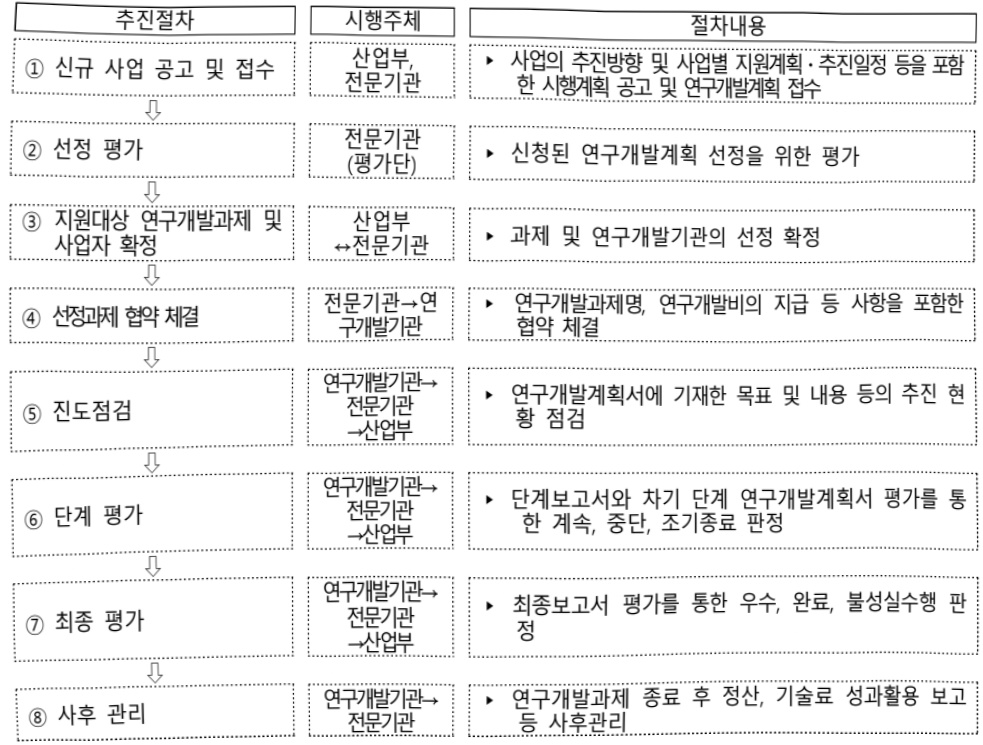

# 산업AI용데이터전처리자동화기술개발(R&D)

**해당 페이지**: PDF 4035 ~ 4043 쪽 해당

**부처**: 산업통상부
**분야**: 산업·중소기업 및 에너지
**회계유형**: 일반회계
**2026 확정예산**: 6325.0 백만원
**전년대비 증감률**: 97.7%
**AI 도메인**: 제조/스마트팩토리

---

<table border=1 style='margin: auto; word-wrap: break-word;'><tr><td style='text-align: center; word-wrap: break-word;'>사 업 명</td></tr><tr><td style='text-align: center; word-wrap: break-word;'>(1) 산업AI용데이터전처리자동화기술개발(R&amp;D) (3174-364)</td></tr></table>

## □ 사업 코드 정보

<table border=1 style='margin: auto; word-wrap: break-word;'><tr><td style='text-align: center; word-wrap: break-word;'>구분</td><td style='text-align: center; word-wrap: break-word;'>회계</td><td style='text-align: center; word-wrap: break-word;'>소관</td><td style='text-align: center; word-wrap: break-word;'>실국(기관)</td><td style='text-align: center; word-wrap: break-word;'>계정</td><td style='text-align: center; word-wrap: break-word;'>분야</td><td style='text-align: center; word-wrap: break-word;'>부문</td></tr><tr><td style='text-align: center; word-wrap: break-word;'>코드</td><td rowspan="2">일반회계</td><td rowspan="2">산업통상부</td><td rowspan="2">산업성장실산업인공지능정책국</td><td rowspan="2">-</td><td style='text-align: center; word-wrap: break-word;'>110</td><td style='text-align: center; word-wrap: break-word;'>117</td></tr><tr><td style='text-align: center; word-wrap: break-word;'>명칭</td><td style='text-align: center; word-wrap: break-word;'>산업·중소기업 및 에너지</td><td style='text-align: center; word-wrap: break-word;'>산업혁신지원</td></tr></table>

<table border=1 style='margin: auto; word-wrap: break-word;'><tr><td style='text-align: center; word-wrap: break-word;'>구분</td><td style='text-align: center; word-wrap: break-word;'>프로그램</td><td style='text-align: center; word-wrap: break-word;'>단위사업</td><td style='text-align: center; word-wrap: break-word;'>세부사업</td></tr><tr><td style='text-align: center; word-wrap: break-word;'>코드</td><td style='text-align: center; word-wrap: break-word;'>3100</td><td style='text-align: center; word-wrap: break-word;'>3174</td><td style='text-align: center; word-wrap: break-word;'>364</td></tr><tr><td style='text-align: center; word-wrap: break-word;'>명칭</td><td style='text-align: center; word-wrap: break-word;'>산업경쟁력기반구축</td><td style='text-align: center; word-wrap: break-word;'>우수기술역량강화</td><td style='text-align: center; word-wrap: break-word;'>산업AI용데이터전처리자동화기술개발(R&amp;D)</td></tr></table>

□ 사업 성격

<table border=1 style='margin: auto; word-wrap: break-word;'><tr><td rowspan="2">신규</td><td rowspan="2">계속</td><td rowspan="2">완료</td><td style='text-align: center; word-wrap: break-word;'>예비타당성</td><td style='text-align: center; word-wrap: break-word;'>총사업비</td><td style='text-align: center; word-wrap: break-word;'>총액계상</td><td style='text-align: center; word-wrap: break-word;'>사업소관 변경정보</td></tr><tr><td style='text-align: center; word-wrap: break-word;'>실시여부</td><td style='text-align: center; word-wrap: break-word;'>관리대상</td><td style='text-align: center; word-wrap: break-word;'>예산사업</td><td style='text-align: center; word-wrap: break-word;'>2025예산 시 소관</td></tr><tr><td style='text-align: center; word-wrap: break-word;'></td><td style='text-align: center; word-wrap: break-word;'>○</td><td style='text-align: center; word-wrap: break-word;'></td><td style='text-align: center; word-wrap: break-word;'></td><td style='text-align: center; word-wrap: break-word;'></td><td style='text-align: center; word-wrap: break-word;'></td><td style='text-align: center; word-wrap: break-word;'></td></tr></table>

□ 사업 지원 형태 및 지원을

<table border=1 style='margin: auto; word-wrap: break-word;'><tr><td style='text-align: center; word-wrap: break-word;'>직접</td><td style='text-align: center; word-wrap: break-word;'>출자</td><td style='text-align: center; word-wrap: break-word;'>출연</td><td style='text-align: center; word-wrap: break-word;'>보조</td><td style='text-align: center; word-wrap: break-word;'>융자</td><td style='text-align: center; word-wrap: break-word;'>국고보조율(%)</td><td style='text-align: center; word-wrap: break-word;'>융자율(%)</td></tr><tr><td style='text-align: center; word-wrap: break-word;'></td><td style='text-align: center; word-wrap: break-word;'></td><td style='text-align: center; word-wrap: break-word;'>○</td><td style='text-align: center; word-wrap: break-word;'></td><td style='text-align: center; word-wrap: break-word;'></td><td style='text-align: center; word-wrap: break-word;'></td><td style='text-align: center; word-wrap: break-word;'></td></tr></table>

## □ 사업 담당자

<table border=1 style='margin: auto; word-wrap: break-word;'><tr><td style='text-align: center; word-wrap: break-word;'>사업명</td><td colspan="5">구분</td></tr><tr><td rowspan="2">산업AI용데이터전처리자동화기술개발(R&amp;D)</td><td style='text-align: center; word-wrap: break-word;'>소관부처</td><td style='text-align: center; word-wrap: break-word;'>실·국·과(팀)산업성장실산업인공지능경책국제조인공지능전환협력과</td><td style='text-align: center; word-wrap: break-word;'>과 장임경섭</td><td style='text-align: center; word-wrap: break-word;'>사무관유지나</td><td style='text-align: center; word-wrap: break-word;'>주무관박수민</td></tr><tr><td style='text-align: center; word-wrap: break-word;'>사업시행주체</td><td style='text-align: center; word-wrap: break-word;'>한국산업기술진흥원</td><td style='text-align: center; word-wrap: break-word;'>산업인공지능혁신실</td><td style='text-align: center; word-wrap: break-word;'>주소영 실장</td><td style='text-align: center; word-wrap: break-word;'>02-6009-3640</td></tr></table>

---

### 가.예산 총괄표

(단위: 백만원, %)

<table border=1 style='margin: auto; word-wrap: break-word;'><tr><td rowspan="2">사업명</td><td style='text-align: center; word-wrap: break-word;'>2024년</td><td colspan="2">2025년 예산</td><td colspan="2">2026년</td><td rowspan="2">중감(B-A)</td><td rowspan="2">(B-A)/A</td></tr><tr><td style='text-align: center; word-wrap: break-word;'>결산</td><td style='text-align: center; word-wrap: break-word;'>본예산(A)</td><td style='text-align: center; word-wrap: break-word;'>추경</td><td style='text-align: center; word-wrap: break-word;'>요구안</td><td style='text-align: center; word-wrap: break-word;'>확정(B)</td></tr><tr><td style='text-align: center; word-wrap: break-word;'>산업AI용데이터전처리자동화기술개발(R&amp;D)</td><td style='text-align: center; word-wrap: break-word;'>-</td><td style='text-align: center; word-wrap: break-word;'>3,200</td><td style='text-align: center; word-wrap: break-word;'>-</td><td style='text-align: center; word-wrap: break-word;'>6,325</td><td style='text-align: center; word-wrap: break-word;'>6,325</td><td style='text-align: center; word-wrap: break-word;'>3,125</td><td style='text-align: center; word-wrap: break-word;'>97.7</td></tr></table>

□ 기능별(내역사업별), 목별 예산 내역

(단위:백만원)

<table border=1 style='margin: auto; word-wrap: break-word;'><tr><td rowspan="3"></td><td colspan="5">2024</td><td colspan="7">2025(2025.12월말)</td><td rowspan="3">2026예산</td></tr><tr><td rowspan="2">예산액(추경)</td><td rowspan="2">예산현액</td><td rowspan="2">집행액[실집행액]</td><td rowspan="2">이월액</td><td rowspan="2">불용액</td><td rowspan="2">본예산</td><td rowspan="2">예산현액</td><td rowspan="2">집행액[실집행액]</td><td colspan="2">전년도아월액제외</td><td rowspan="2">이월예상액</td><td rowspan="2">불용예상액</td></tr><tr><td style='text-align: center; word-wrap: break-word;'>예산현액</td><td style='text-align: center; word-wrap: break-word;'>집행액[실집행액]</td></tr><tr><td style='text-align: center; word-wrap: break-word;'>○ 기능별 분류(합계)</td><td style='text-align: center; word-wrap: break-word;'>-</td><td style='text-align: center; word-wrap: break-word;'>-</td><td style='text-align: center; word-wrap: break-word;'>-</td><td style='text-align: center; word-wrap: break-word;'>-</td><td style='text-align: center; word-wrap: break-word;'>-</td><td style='text-align: center; word-wrap: break-word;'>3,200</td><td style='text-align: center; word-wrap: break-word;'>3,200</td><td style='text-align: center; word-wrap: break-word;'>3,200[3,200]</td><td style='text-align: center; word-wrap: break-word;'>3,200</td><td style='text-align: center; word-wrap: break-word;'>3,200[3,200]</td><td style='text-align: center; word-wrap: break-word;'>-</td><td style='text-align: center; word-wrap: break-word;'>-</td><td style='text-align: center; word-wrap: break-word;'>6,325</td></tr><tr><td style='text-align: center; word-wrap: break-word;'>·산업사용데이터전처리자동화기술개발</td><td style='text-align: center; word-wrap: break-word;'>-</td><td style='text-align: center; word-wrap: break-word;'>-</td><td style='text-align: center; word-wrap: break-word;'>-</td><td style='text-align: center; word-wrap: break-word;'>-</td><td style='text-align: center; word-wrap: break-word;'>-</td><td style='text-align: center; word-wrap: break-word;'>3,200</td><td style='text-align: center; word-wrap: break-word;'>3,200</td><td style='text-align: center; word-wrap: break-word;'>3,200[3,200]</td><td style='text-align: center; word-wrap: break-word;'>3,200</td><td style='text-align: center; word-wrap: break-word;'>3,200[3,200]</td><td style='text-align: center; word-wrap: break-word;'>-</td><td style='text-align: center; word-wrap: break-word;'>-</td><td style='text-align: center; word-wrap: break-word;'>6,325</td></tr><tr><td style='text-align: center; word-wrap: break-word;'>○ 비목별 분류(합계)</td><td style='text-align: center; word-wrap: break-word;'>-</td><td style='text-align: center; word-wrap: break-word;'>-</td><td style='text-align: center; word-wrap: break-word;'>-</td><td style='text-align: center; word-wrap: break-word;'>-</td><td style='text-align: center; word-wrap: break-word;'>-</td><td style='text-align: center; word-wrap: break-word;'>3,200</td><td style='text-align: center; word-wrap: break-word;'>3,200</td><td style='text-align: center; word-wrap: break-word;'>3,200[3,200]</td><td style='text-align: center; word-wrap: break-word;'>3,200</td><td style='text-align: center; word-wrap: break-word;'>3,200[3,200]</td><td style='text-align: center; word-wrap: break-word;'>-</td><td style='text-align: center; word-wrap: break-word;'>-</td><td style='text-align: center; word-wrap: break-word;'>6,325</td></tr><tr><td style='text-align: center; word-wrap: break-word;'>·연구개발활동비등(360-05)</td><td style='text-align: center; word-wrap: break-word;'>-</td><td style='text-align: center; word-wrap: break-word;'>-</td><td style='text-align: center; word-wrap: break-word;'>-</td><td style='text-align: center; word-wrap: break-word;'>-</td><td style='text-align: center; word-wrap: break-word;'>-</td><td style='text-align: center; word-wrap: break-word;'>3,200</td><td style='text-align: center; word-wrap: break-word;'>3,200</td><td style='text-align: center; word-wrap: break-word;'>3,200[3,200]</td><td style='text-align: center; word-wrap: break-word;'>3,200</td><td style='text-align: center; word-wrap: break-word;'>3,200[3,200]</td><td style='text-align: center; word-wrap: break-word;'>-</td><td style='text-align: center; word-wrap: break-word;'>-</td><td style='text-align: center; word-wrap: break-word;'>6,325</td></tr><tr><td style='text-align: center; word-wrap: break-word;'>○ 기능비목별 분류(합계)</td><td style='text-align: center; word-wrap: break-word;'>-</td><td style='text-align: center; word-wrap: break-word;'>-</td><td style='text-align: center; word-wrap: break-word;'>-</td><td style='text-align: center; word-wrap: break-word;'>-</td><td style='text-align: center; word-wrap: break-word;'>-</td><td style='text-align: center; word-wrap: break-word;'>3,200</td><td style='text-align: center; word-wrap: break-word;'>3,200</td><td style='text-align: center; word-wrap: break-word;'>3,200[3,200]</td><td style='text-align: center; word-wrap: break-word;'>3,200</td><td style='text-align: center; word-wrap: break-word;'>3,200[3,200]</td><td style='text-align: center; word-wrap: break-word;'>-</td><td style='text-align: center; word-wrap: break-word;'>-</td><td style='text-align: center; word-wrap: break-word;'>6,325</td></tr><tr><td style='text-align: center; word-wrap: break-word;'>·산업사용데이터전처리자동화기술개발-연구개발활동비등(360-05)</td><td style='text-align: center; word-wrap: break-word;'>-</td><td style='text-align: center; word-wrap: break-word;'>-</td><td style='text-align: center; word-wrap: break-word;'>-</td><td style='text-align: center; word-wrap: break-word;'>-</td><td style='text-align: center; word-wrap: break-word;'>-</td><td style='text-align: center; word-wrap: break-word;'>3,200</td><td style='text-align: center; word-wrap: break-word;'>3,200</td><td style='text-align: center; word-wrap: break-word;'>3,200[3,200]</td><td style='text-align: center; word-wrap: break-word;'>3,200</td><td style='text-align: center; word-wrap: break-word;'>3,200[3,200]</td><td style='text-align: center; word-wrap: break-word;'>-</td><td style='text-align: center; word-wrap: break-word;'>-</td><td style='text-align: center; word-wrap: break-word;'>6,325</td></tr></table>

### 나.사업설명자료

## 1 ) 사업목적·내용

- (목적) 공정별 유형별 산업데이터를 인공지능(AI)이 학습 가능하도록 가공하는 전처리

자동화 기술 강화를 통한 AI 내재화 촉진

- (내용) 산업데이터를 인공지능이 학습 가능 하도록 가공하는 산업데이터 전처리 자동화

플랫폼 개발 및 기업이 참조 가능한 공종별 라이브러리 개발

(자동화 플랫폼 개발) 로코드, 노코드 기반으로 데이터 전처리 자동화를 위한 프로세스 모델러, 전처리 자동 수행기능 등 필요 기능 개발

(공중별 라이브러리 개발) 기업이 참조하여 활용 가능하도록 산업에 수요가 높은 공중별(안전, 설비, 품질, 에너지환경, 공정물류) 전처리 라이브러리 개발

(실증 및 확산) 산업데이터 전처리 자동화 솔루션을 신규 데이터를 통해 실증하고

유사 분야 AI를 필요로 하는 기업에 확산

---

## 2 ) 사업개요

□ 사업근거 및 추진경위

① 법령상 근거 및 조항 적시

o산업 디지털 전환 촉진법 제2조,제10조,제20조

## 산업 디지털 전환 촉진법

제2조(정의) 이 법에서 사용하는 용어의 뜻은 다음과 같다.

1. "산업데이터"란「산업발전법」제2조에 따른 산업,「광업법」제3조제2호에 따른 광업,「에너지법」제2조제1호에 따른 에너지 관련 산업 및「신에너지 및 재생에너지 개발·이용·보급 촉진법」제2조제1호 및 제2호에 따른 신에너지 및 재생에너지 관련 산업의 제품 또는 서비스 개발·생산·유통·소비 등 활동(이하 "산업활동"이라 한다)과정에서 생성 또는 활용되는 것으로서 광(光) 또는 전자적 방식으로 처리될 수 있는 모든 종류의 자료 또는 정보를 말한다.

2. "산업데이터 생성"이란 산업활동 과정에서 인적 또는 물적으로 상당한 투자와 노력을 통하여 기존에 존재하지 아니하였던 산업데이터가 새롭게 발생하는 것(산업데이터의 활용을 통하여 독자성을 인정할 수 있는 새로운 산업데이터가 발생하는 경우를 포함한다)을 말한다.

3. "산업데이터 활용"이란 산업데이터의 수집, 연계, 저장, 보유, 가공, 분석, 이용, 제공, 공개 및 그밖에 이와 유사한 행위를 말한다.

제10조(산업데이터 활용 촉진) ① 산업통상부장관은 산업데이터의 합리적 유통 및 공정한 거래 등 원활하고 안전한 산업데이터 생성·활용 환경을 보장하고 기업등의 산업데이터 생성·활용 활성화를 위하여 필요한 지원을 할 수 있다.

② 산업통상부장관은 제9조에 따른 산업데이터 활용 및 보호 원칙을 준수하도록 하고, 같은 조 제5항에 따른 계약의 체결을 촉진하기 위하여 관계 중앙행정기관의 장과 협의를 거쳐 산업데이터 활용 계약에 관한 지침을 마련할 수 있다.

제20조(기술·서비스 개발 등의 촉진) 산업통상부장관은 산업 디지털 전환에 관한 기술·장비·소프트웨어와 산업 디지털 전환을 통한 제품·서비스(이하 "기술등"이라 한다)의 개발을 촉진하기 위하여 다음 각 호의 사업을 추진할 수 있다.

1. 기술등에 관한 실태·통계 조사

2. 기술등의 개발 및 사업화

3. 개발된 기술등의 평가 및 활용

4. 기술등의 개발을 위한 기반 구축

5. 그 밖에 기술등의 개발을 위하여 필요한 사업

## o산업기술혁신 촉진법 제11조 산업기술혁신 촉진법

제11조(산업기술개발사업) 산업통상부장관은 혁신계획 및 시행계획을 효율적으로 수행하기 위하여 관계 중앙행정기관의 장과 협의하여 다음 각 호의 산업기술분야에서 기술개발사업(산업기술개발을 위하여 필요한 기획 및 조사를 포함한다. 이하 "산업기술개발사업"이라 한다)을 추진할 수 있다.

2.산업기술 분야의 미래 유망 기술

11.개발된산업기술의사업화에필요한연계기술

12. 제1호부터 제10호까지의 기술 간 결합을 통한 시장지향형 융합기술

13. 그 밖에 산업기술혁신을 위하여 우선적으로 개발이 필요한 기술로서 산업통상부장관이 정하는 기술

② 산업통상부장관은 연구기관, 대학, 그 밖에 대통령령으로 정하는 기관·단체 또는 기업 등으로 하여금 산업기술개발사업을 수행하게 할 수 있다. 이 경우 산업통상부장관은 다음 각 호의 자와 산업기술개발사업에 관한 협약을 체결하고 해당 사업의 수행에 드는 비용의 전부 또는 일부를 출연 또는 보조할 수 있다.

---

② 추진경위

°「제5차 과학기술기본계획('23~'27) 수립방향」(과기부,'21.8)

- 국가·사회 현안을 해결하는 과학기술 혁신정책의 추진방향으로 '과기혁신역량강화'의 혁신/도약 전략

- '디지털전환 이후 신시장을 개척하는 R&D 성과활용'에 부합

°「산업 디지털전환 확산 전략(디지털 Big-Push)」(산업부, '21.3)

- '기업 DX 촉진 지원기반 확충'을 위한 'DX 성과창출 체계 강화'의 선도사업 선정 및 사업화 기반 마련에 일치

- '산업 AI 내재화 전략(제1차 산업 디지털 전환 종합계획)(부처합동, '23.1)'

- ’(데이터 전처리) 업종별, 유형별(영상·음성·텍스트 등) 다양한 수요기업 Raw 데이터를 AI가 학습 가능하도록 가공하는 전처리 기술 강화

o 산업 AX를 위한 산업 데이터 활용 활성화 방안」(24.10)

- '기업의 산업 데이터 활용 역량 제고' 방안 중 첫 번째로 데이터 전처리 방안 제시 : AI 학습에 필요한 고품질 산업데이터 생성으로 전처리 부담 완화('25~'27)

°「산업 AI 확산을 위한 10대 과제」(25.1)

-산업 AI 확산을 위한 10대 과제 중 4번째 '산업 데이터' 내 기업의 데이터 활용 강화의 방안으로 자동화된 데이터 빛처리 기술 확대 제시

□ 주요내용

① 사업규모

- 총사업비 : 해당없음

- 사업기간 : 2025년 ~ 2028년

- 최근 5년 간 투입된 사업비(예산액기준, 추경편성한 연도에는 추경포함)

<table border=1 style='margin: auto; word-wrap: break-word;'><tr><td style='text-align: center; word-wrap: break-word;'>연도</td><td style='text-align: center; word-wrap: break-word;'>2022</td><td style='text-align: center; word-wrap: break-word;'>2023</td><td style='text-align: center; word-wrap: break-word;'>2024</td><td style='text-align: center; word-wrap: break-word;'>2025</td><td style='text-align: center; word-wrap: break-word;'>2026</td></tr><tr><td style='text-align: center; word-wrap: break-word;'>사업비</td><td style='text-align: center; word-wrap: break-word;'>-</td><td style='text-align: center; word-wrap: break-word;'>-</td><td style='text-align: center; word-wrap: break-word;'>-</td><td style='text-align: center; word-wrap: break-word;'>3,200</td><td style='text-align: center; word-wrap: break-word;'>6,325</td></tr></table>

-기타: 해당없음

② 사업추진체계

- 사업시행방법 : 출연(총사업비의 67% 이하(중소기업 기준))

- 사업시행주체 : 한국산업기술진흥원

- 사업 수혜자 : (주관) 해당 업종의 전문성을 보유한 비영리기관

(공동)산업데이터 전처리·AI 기술을 보유하고 있는 기업,대학,연구소 등

- 보조, 융자, 출연, 출자 등의 경우 보조·융자 등 지원 비율 및 법적근거

<table border=1 style='margin: auto; word-wrap: break-word;'><tr><td style='text-align: center; word-wrap: break-word;'>내역사업명</td><td style='text-align: center; word-wrap: break-word;'>구분</td><td style='text-align: center; word-wrap: break-word;'>피보조·피출연 등 기관명</td><td style='text-align: center; word-wrap: break-word;'>지원 금액 (2026예산)</td><td style='text-align: center; word-wrap: break-word;'>지원 비율(%)</td><td style='text-align: center; word-wrap: break-word;'>보조율 법적근거 (해당 조항)</td></tr><tr><td style='text-align: center; word-wrap: break-word;'>산업AI용데이터전처리자동화기술개발</td><td style='text-align: center; word-wrap: break-word;'>출연</td><td style='text-align: center; word-wrap: break-word;'>한국산업기술진흥원</td><td style='text-align: center; word-wrap: break-word;'>6,325백만원</td><td style='text-align: center; word-wrap: break-word;'>67%이내 (중소기업기준)</td><td style='text-align: center; word-wrap: break-word;'>산업기술혁신촉진법 제11조(산업기술개발사업)</td></tr></table>

---

## 3 ) 2026년도 예산 산출 근거

①산업AI용데이터전처리자동화기술개발(R&D):6,325백만원

:(2025 본예산) 3,200백만원 → (2026) 6,325백만원, 3,125백만원 증액

- (요구) 산업 인공지능(AI)가 학습 가능하도록 산업데이터 AI 모델 선정, AI 활용 방법론 수립, 라이브러리화 및 솔루션 개발을 통한 전처리 자동화 솔루션 기술개발의 지속 추진을 위해 6,325백만원 요구

- (산출) 계속과제 1개 x 6,325백만원 x 12/12개월 = 6,325백만원

°2025년도 예산 및 2026년도 예산 산출 세부내역 비교

<table border=1 style='margin: auto; word-wrap: break-word;'><tr><td colspan="2">2025년 본예산</td><td colspan="2">2026년 예산</td></tr><tr><td style='text-align: center; word-wrap: break-word;'>예산</td><td style='text-align: center; word-wrap: break-word;'>산출내역</td><td style='text-align: center; word-wrap: break-word;'>예산</td><td style='text-align: center; word-wrap: break-word;'>산출내역</td></tr><tr><td style='text-align: center; word-wrap: break-word;'>산업AI용데이터전처리</td><td style='text-align: center; word-wrap: break-word;'>○ 연구개발활동비 등(360-05): 3,200백만원</td><td style='text-align: center; word-wrap: break-word;'>산업AI용데이터전처리</td><td style='text-align: center; word-wrap: break-word;'>○ 연구개발활동비 등(360-05): 6,325백만원</td></tr><tr><td style='text-align: center; word-wrap: break-word;'>자동화기술개발3,200</td><td style='text-align: center; word-wrap: break-word;'>가. 산업AI용데이터전처리자동화기술개발(3,200백만원)·(신규) 1개 과제 × 4,266.7백만원 × 9/12개월</td><td style='text-align: center; word-wrap: break-word;'>자동화기술개발6,325</td><td style='text-align: center; word-wrap: break-word;'>가. 산업AI용데이터전처리자동화기술개발(6,325백만원)·(계속) 1개 과제 × 6,325백만원 × 12/12개월</td></tr></table>

## 4 ) 사업효과

□ 사업영향, 산출물 성과지표 등

① 2022~2026년도 성과계획서 상 성과지표 및 최근 5년간 성과 달성도

<table border=1 style='margin: auto; word-wrap: break-word;'><tr><td style='text-align: center; word-wrap: break-word;'>성과지표</td><td style='text-align: center; word-wrap: break-word;'>구분</td><td style='text-align: center; word-wrap: break-word;'>2022</td><td style='text-align: center; word-wrap: break-word;'>2023</td><td style='text-align: center; word-wrap: break-word;'>2024</td><td style='text-align: center; word-wrap: break-word;'>2025</td><td style='text-align: center; word-wrap: break-word;'>2026</td><td style='text-align: center; word-wrap: break-word;'>2026 목표치산출근거</td><td style='text-align: center; word-wrap: break-word;'>측정산식(또는 측정방법)</td><td style='text-align: center; word-wrap: break-word;'>자료수집방법(또는 자료출처)</td></tr><tr><td rowspan="3">산업AI용 데이터전처리 자동화라이브러리 개발(단위: 종)</td><td style='text-align: center; word-wrap: break-word;'>목표</td><td style='text-align: center; word-wrap: break-word;'>-</td><td style='text-align: center; word-wrap: break-word;'>-</td><td style='text-align: center; word-wrap: break-word;'>-</td><td style='text-align: center; word-wrap: break-word;'>-</td><td style='text-align: center; word-wrap: break-word;'>10</td><td rowspan="3">1차년도를 제외하고 2차년도부터 연차별 10개 이상 개발하는 것을 목표로 함</td><td rowspan="3">본 사업을 통해 개발되는 연차별 라이브러리의 개수</td><td rowspan="3">전처리 플랫폼 서비스 가능한 수준으로 고도화된 시나리오 기준으로 자체평가</td></tr><tr><td style='text-align: center; word-wrap: break-word;'>실적</td><td style='text-align: center; word-wrap: break-word;'>-</td><td style='text-align: center; word-wrap: break-word;'>-</td><td style='text-align: center; word-wrap: break-word;'>-</td><td style='text-align: center; word-wrap: break-word;'>-</td><td style='text-align: center; word-wrap: break-word;'>-</td></tr><tr><td style='text-align: center; word-wrap: break-word;'>달성도</td><td style='text-align: center; word-wrap: break-word;'>-</td><td style='text-align: center; word-wrap: break-word;'>-</td><td style='text-align: center; word-wrap: break-word;'>-</td><td style='text-align: center; word-wrap: break-word;'>-</td><td style='text-align: center; word-wrap: break-word;'>-</td></tr><tr><td rowspan="3">신규고용인원(단위: 명)</td><td style='text-align: center; word-wrap: break-word;'>목표</td><td style='text-align: center; word-wrap: break-word;'>-</td><td style='text-align: center; word-wrap: break-word;'>-</td><td style='text-align: center; word-wrap: break-word;'>-</td><td style='text-align: center; word-wrap: break-word;'>6.4</td><td style='text-align: center; word-wrap: break-word;'>11.85</td><td rowspan="3">사업 추진을 통해 신규 고용된 인력 수 * 국비 5억원당 1명 채용</td><td rowspan="3">연도별 과제 관련 신규 고용인력 합계</td><td rowspan="3">고용계약서(기업 자체양식) 또는 건강보험자격득실확인서, 건강보험 가입자 명부</td></tr><tr><td style='text-align: center; word-wrap: break-word;'>실적</td><td style='text-align: center; word-wrap: break-word;'>-</td><td style='text-align: center; word-wrap: break-word;'>-</td><td style='text-align: center; word-wrap: break-word;'>-</td><td style='text-align: center; word-wrap: break-word;'>-</td><td style='text-align: center; word-wrap: break-word;'>-</td></tr><tr><td style='text-align: center; word-wrap: break-word;'>달성도</td><td style='text-align: center; word-wrap: break-word;'>-</td><td style='text-align: center; word-wrap: break-word;'>-</td><td style='text-align: center; word-wrap: break-word;'>-</td><td style='text-align: center; word-wrap: break-word;'>-</td><td style='text-align: center; word-wrap: break-word;'>-</td></tr></table>

② 성과지표 이외의 연도별 사업추진 경과 및 실적

<table border=1 style='margin: auto; word-wrap: break-word;'><tr><td style='text-align: center; word-wrap: break-word;'>2025</td><td style='text-align: center; word-wrap: break-word;'>- AI 전처리와 전처리 자동화 플랫폼 및 자동화 대상인 라이브러리 AI모델의 요구사항을 상세 분석- 플랫폼 활용 세부 시나리오 도출 및 기술개발 요소 분석</td></tr></table>

③향후(2026년도 이후)기대효과

- 산업데이터 엔지니어와 SW 개발자가 부재한 주력산업, 신산업 분야의 산업 디지털 전환을 위한 AI 모델의 즉시 적용 가능

-산업 활용도가 높은 주요 영역별 현장 중심 산업데이터를 구축·확산하고 주요 전략 산업 분야의 체계적인 데이터 생태계 구축

- 제조데이터 등 산업 현장에서의 데이터를 기업 간 공유하여 공정간 리드타임 단축,

설계 최적화 등 제조공정 혁신 및 신BM 창출

---

## 5 ) 타당성조사 및 예비타당성조사 시행여부 및 결과 요지

□ 시행하지 않은 경우 그 이유를 적시 : 동 사업은 국가재정법 제38조, 동법 시행령 제13조의 예비타당성조사 대상(5년간 500억원 이상 신규사업) 조건에 해당되지 않음

## 6 ) 총사업비 대상사업 여부 및 내역 : 해당없음

## 7 ) 사업 집행절차

## 8 ) 중기재정계획 상 연도별 투자계획 및 추진경과

(단위: 백만원)

<table border=1 style='margin: auto; word-wrap: break-word;'><tr><td style='text-align: center; word-wrap: break-word;'>$  \text{중기}  $ 재정계획</td><td style='text-align: center; word-wrap: break-word;'>2024</td><td style='text-align: center; word-wrap: break-word;'>2025</td><td style='text-align: center; word-wrap: break-word;'>2026</td><td style='text-align: center; word-wrap: break-word;'>2027</td><td style='text-align: center; word-wrap: break-word;'>2028</td><td style='text-align: center; word-wrap: break-word;'>2029</td></tr><tr><td style='text-align: center; word-wrap: break-word;'>2024~2028</td><td style='text-align: center; word-wrap: break-word;'>-</td><td style='text-align: center; word-wrap: break-word;'>3,200</td><td style='text-align: center; word-wrap: break-word;'>6,325</td><td style='text-align: center; word-wrap: break-word;'>9,500</td><td style='text-align: center; word-wrap: break-word;'>7,000</td><td style='text-align: center; word-wrap: break-word;'></td></tr><tr><td style='text-align: center; word-wrap: break-word;'>2025~2029</td><td style='text-align: center; word-wrap: break-word;'></td><td style='text-align: center; word-wrap: break-word;'>3,200</td><td style='text-align: center; word-wrap: break-word;'>6,325</td><td style='text-align: center; word-wrap: break-word;'>5,347</td><td style='text-align: center; word-wrap: break-word;'>4,445</td><td style='text-align: center; word-wrap: break-word;'>-</td></tr></table>

---

9) 최근 3년간 동 사업에 대한 주요 외부지적사항 및 평가, 문제점 및 대책 : 해당없음

## 10 ) 향후 추진방향 및 추진계획

<table border=1 style='margin: auto; word-wrap: break-word;'><tr><td style='text-align: center; word-wrap: break-word;'>- 동 사업은「AI 자율제조 전략 1.0」로드맵상 목표 달성 등을 위해 필수적으로 선행되어야 하는 데이터 전처리 사업 시급 추진 필요</td></tr><tr><td style='text-align: center; word-wrap: break-word;'>- 산업 현장에 AI 적용을 위해서는 신뢰가능한 AI 솔루션을 확보해야 하나, AI 학습을 위한 산업데이터 전처리에 상당한 비용이 소모되며 전문기업 부재</td></tr><tr><td style='text-align: center; word-wrap: break-word;'>- 산업데이터 전처리 자동화 기술 개발이 필요하나 인력·자본이 부족한 AI 솔루션 수요·공급 기업이 추진하기 어려운 영역</td></tr><tr><td style='text-align: center; word-wrap: break-word;'>- 산업에 AI를 적용하고자 하는 수요기업 대상 산업 AI 활용기술(데이터 전처리 등)을 적용하여 신속하고 용이하게 수행할 수 있도록 지원이 시급</td></tr><tr><td style='text-align: center; word-wrap: break-word;'>- 동 사업은 중기재정계획에 반영된 예산사업으로 계획에 따라 예산 확보·집행 예정</td></tr></table>

11) 해당사업에 대한 각종 사업평가의 결과 : 해당없음

12) 해당사업에 대한 부처 자체평가의 결과 : 해당없음

## 13 ) 부처 건의사항 : 해당없음

### 다. 최근 4년간 결산내역

## 1 ) 결산표

☐ 부처 결산내역

(단위: 백만원, %)

<table border=1 style='margin: auto; word-wrap: break-word;'><tr><td style='text-align: center; word-wrap: break-word;'>2025</td><td style='text-align: center; word-wrap: break-word;'>3.200</td><td style='text-align: center; word-wrap: break-word;'>-</td><td style='text-align: center; word-wrap: break-word;'>3.200</td><td style='text-align: center; word-wrap: break-word;'>-</td><td style='text-align: center; word-wrap: break-word;'>-</td><td style='text-align: center; word-wrap: break-word;'>-</td><td style='text-align: center; word-wrap: break-word;'>3,200</td><td style='text-align: center; word-wrap: break-word;'>3,200</td><td style='text-align: center; word-wrap: break-word;'>100.0</td><td style='text-align: center; word-wrap: break-word;'>100.0</td><td style='text-align: center; word-wrap: break-word;'>-</td></tr><tr><td style='text-align: center; word-wrap: break-word;'>2025</td><td style='text-align: center; word-wrap: break-word;'>3.200</td><td style='text-align: center; word-wrap: break-word;'>-</td><td style='text-align: center; word-wrap: break-word;'>3.200</td><td style='text-align: center; word-wrap: break-word;'>-</td><td style='text-align: center; word-wrap: break-word;'>-</td><td style='text-align: center; word-wrap: break-word;'>-</td><td style='text-align: center; word-wrap: break-word;'>3,200</td><td style='text-align: center; word-wrap: break-word;'>3,200</td><td style='text-align: center; word-wrap: break-word;'>100.0</td><td style='text-align: center; word-wrap: break-word;'>100.0</td><td style='text-align: center; word-wrap: break-word;'>-</td></tr></table>

□출연·보조사업 등 실집행내역

(단위:백만원,%)

<table border=1 style='margin: auto; word-wrap: break-word;'><tr><td rowspan="2">구분</td><td colspan="3">부처</td><td colspan="6">사업시행주체(피출연·피보조 기관 등)</td></tr><tr><td colspan="2">예산액</td><td style='text-align: center; word-wrap: break-word;'>집행액</td><td style='text-align: center; word-wrap: break-word;'>교부액</td><td style='text-align: center; word-wrap: break-word;'>전년도이월액</td><td style='text-align: center; word-wrap: break-word;'>교부현액</td><td style='text-align: center; word-wrap: break-word;'>집행액(B)</td><td style='text-align: center; word-wrap: break-word;'>이월액</td><td style='text-align: center; word-wrap: break-word;'>실집행률(B/A)</td></tr><tr><td style='text-align: center; word-wrap: break-word;'>2025.12월기준</td><td style='text-align: center; word-wrap: break-word;'>3,200</td><td style='text-align: center; word-wrap: break-word;'>3,200</td><td style='text-align: center; word-wrap: break-word;'>3,200</td><td style='text-align: center; word-wrap: break-word;'>3,200</td><td style='text-align: center; word-wrap: break-word;'>-</td><td style='text-align: center; word-wrap: break-word;'>-</td><td style='text-align: center; word-wrap: break-word;'>3,200</td><td style='text-align: center; word-wrap: break-word;'>-</td><td style='text-align: center; word-wrap: break-word;'>100.0</td></tr></table>

---

## 2 ) 주요 결산사항

2022~2025년 결산 주요 지적사항 및 시정요구사항 : 해당없음

□ 2025년 이·전용 등 세부내역 : 해당없음

2025년 예비비 배정 세부내역 : 해당없음

### 라. 기타 추가자료

(1) 기재부에 제출한 사업 계획서 및 설명자료 첨부(필수 제출) : 참고1

---

## 참고1

□ (배경) 디지털 도입으로 HW-SW를 연결하여 현장의 데이터를 수집하고 데이터 기반의 기업 생산활동 강화를 추진하여 글로벌시장 선점을 추진

○ 산업 현장에 AI 적용을 위해서는 신뢰가능한 AI 솔루션을 확보해야 하나,

AI 학습을 위한 산업데이터 전처리에 상당한 비용이 소모되며 전문기업 부재

* 산업데이터 전처리 과정에 전체 솔루션 도입 비용의 80% 투입 필요

이에,산업데이터 전처리 자동화 기술 개발이 필요하나 인력·자본

이 부족한 AI 솔루션 수요·공급 기업이 추진하기 어려운 영역

- 정부에서 전처리 솔루션을 위한 라이브러리 개발 및 보급시 파급효과 지대

□ (목적) 산업 인공지능(AI) 활용 촉진을 위해 개별 기업이 보유한 산업 데이터를 염증으로 전처리 가능하도록 매뉴얼 및 라이브러리 개발·보급

□ (기간) '25년 ~ '28년 (4년)

□ (지원 조건) 출연(총사업비의 67% 이내(중소기업 기준))

□ (추진 절차) 산업부총괄 → 전문기관사업기획·평가 → 연구기관과제수행

□ (주요 내용) 산업 인공지능(AI)가 학습 가능하도록 산업데이터 AI 모델 선정, AI 활용 방법론 수립, 라이브러리화 및 솔루션 개발

이차전지·철강·반도체·로봇 등 산업 AI 활용 수요가 많고 유사 설비·공정에 대해 라이브러리 확산이 용이한 업종을 중심으로 AI 모델 선정 등 방법론 수립

수립한 방법론을 기반으로 로우코드·노코드 등 디지털 기술을 활용한

산업 AI 활용 라이브러리 개발 등 기술개발 추진

산업 AI 활용을 위한 라이브러리를 지속적으로 관리하고, 동일 업종

内 유사 분야 AI를 필요로 하는 기업이 활용하도록 확산

---

### 원본 PDF 크롭 이미지

