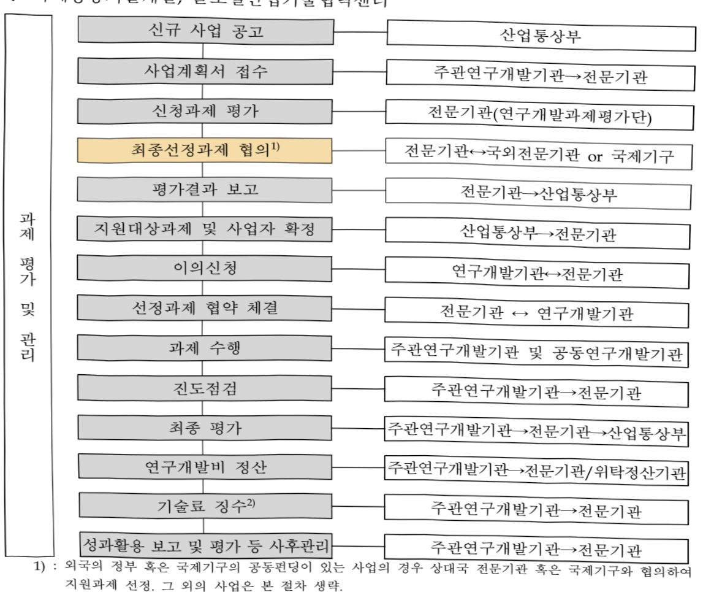
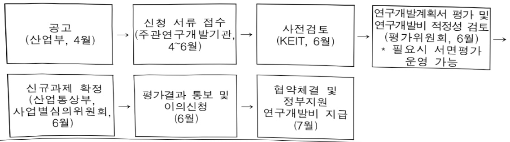
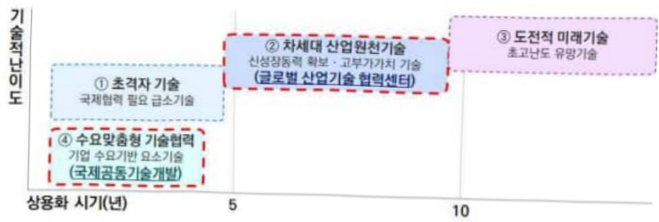
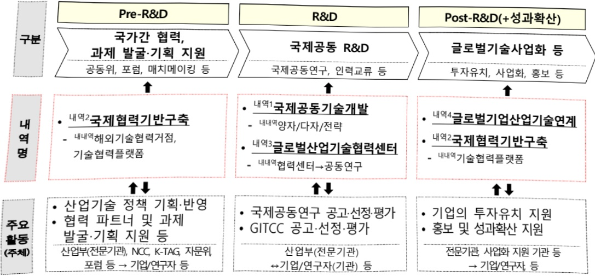

# 산업기술국제협력(R&D)

**해당 페이지**: PDF 4044 ~ 4064 쪽 해당

**부처**: 산업통상부
**분야**: 산업·중소기업 및 에너지
**회계유형**: 일반회계
**2026 확정예산**: 232178.0 백만원
**전년대비 증감률**: 11.2%
**AI 도메인**: 기타

---

<table border=1 style='margin: auto; word-wrap: break-word;'><tr><td style='text-align: center; word-wrap: break-word;'>사 업 명</td></tr><tr><td style='text-align: center; word-wrap: break-word;'>(1) 산업기술국제협력(R&amp;D) (3171-320)</td></tr></table>

□ 사업 코드 정보

<table border=1 style='margin: auto; word-wrap: break-word;'><tr><td style='text-align: center; word-wrap: break-word;'>구분</td><td style='text-align: center; word-wrap: break-word;'>회계</td><td style='text-align: center; word-wrap: break-word;'>소관</td><td style='text-align: center; word-wrap: break-word;'>실국(기관)</td><td style='text-align: center; word-wrap: break-word;'>계정</td><td style='text-align: center; word-wrap: break-word;'>분야</td><td style='text-align: center; word-wrap: break-word;'>부문</td></tr><tr><td style='text-align: center; word-wrap: break-word;'>코드</td><td rowspan="2">일반회계</td><td rowspan="2">산업통상부</td><td rowspan="2">산업성장실산업기술협정책관</td><td rowspan="2">-</td><td style='text-align: center; word-wrap: break-word;'>110</td><td style='text-align: center; word-wrap: break-word;'>117</td></tr><tr><td style='text-align: center; word-wrap: break-word;'>명칭</td><td style='text-align: center; word-wrap: break-word;'>산업·중소기업 및 에너지</td><td style='text-align: center; word-wrap: break-word;'>산업혁신지원</td></tr></table>

<table border=1 style='margin: auto; word-wrap: break-word;'><tr><td style='text-align: center; word-wrap: break-word;'>구분</td><td style='text-align: center; word-wrap: break-word;'>프로그램</td><td style='text-align: center; word-wrap: break-word;'>단위사업</td><td style='text-align: center; word-wrap: break-word;'>세부사업</td></tr><tr><td style='text-align: center; word-wrap: break-word;'>코드</td><td style='text-align: center; word-wrap: break-word;'>3100</td><td style='text-align: center; word-wrap: break-word;'>3171</td><td style='text-align: center; word-wrap: break-word;'>320</td></tr><tr><td style='text-align: center; word-wrap: break-word;'>명칭</td><td style='text-align: center; word-wrap: break-word;'>산업경쟁력기반구축</td><td style='text-align: center; word-wrap: break-word;'>산업기술기반구축</td><td style='text-align: center; word-wrap: break-word;'>산업기술국제협력(R&amp;D)</td></tr></table>

□ 사업 성격 (공통요구자료 1-1 작성유의사항 4. 참조, 해당하는 사항에 “0” 표시)

<table border=1 style='margin: auto; word-wrap: break-word;'><tr><td rowspan="2">신규</td><td rowspan="2">계속</td><td rowspan="2">완료</td><td rowspan="2">예비타당성 실시여부</td><td rowspan="2">총사업비 관리대상</td><td rowspan="2">총액계상 예산사업</td><td style='text-align: center; word-wrap: break-word;'>사업소관 변경정보</td></tr><tr><td style='text-align: center; word-wrap: break-word;'>2025예산 시 소관</td></tr><tr><td style='text-align: center; word-wrap: break-word;'></td><td style='text-align: center; word-wrap: break-word;'>○</td><td style='text-align: center; word-wrap: break-word;'></td><td style='text-align: center; word-wrap: break-word;'></td><td style='text-align: center; word-wrap: break-word;'></td><td style='text-align: center; word-wrap: break-word;'></td><td style='text-align: center; word-wrap: break-word;'></td></tr></table>

□ 사업 지원 형태 및 지원을 (최소한 한 개는 반드시 선택하시오. 해당사항에 0 표시)

<table border=1 style='margin: auto; word-wrap: break-word;'><tr><td style='text-align: center; word-wrap: break-word;'>직접</td><td style='text-align: center; word-wrap: break-word;'>출자</td><td style='text-align: center; word-wrap: break-word;'>출연</td><td style='text-align: center; word-wrap: break-word;'>보조</td><td style='text-align: center; word-wrap: break-word;'>융자</td><td style='text-align: center; word-wrap: break-word;'>국고보조율(%)</td><td style='text-align: center; word-wrap: break-word;'>융자율(%)</td></tr><tr><td style='text-align: center; word-wrap: break-word;'></td><td style='text-align: center; word-wrap: break-word;'></td><td style='text-align: center; word-wrap: break-word;'>○</td><td style='text-align: center; word-wrap: break-word;'></td><td style='text-align: center; word-wrap: break-word;'></td><td style='text-align: center; word-wrap: break-word;'></td><td style='text-align: center; word-wrap: break-word;'></td></tr></table>

## □ 사업 담당자

<table border=1 style='margin: auto; word-wrap: break-word;'><tr><td style='text-align: center; word-wrap: break-word;'>사업명</td><td colspan="5">구분</td></tr><tr><td rowspan="2">▶ 국제공동기술개발▶ 국제협력기반구축▶ 글로벌산업기술협력센터</td><td style='text-align: center; word-wrap: break-word;'>소관부처</td><td style='text-align: center; word-wrap: break-word;'>실·국·과(팀)산업기술협정책관산업기술시장과</td><td style='text-align: center; word-wrap: break-word;'>과 장이동철044-203-4530</td><td style='text-align: center; word-wrap: break-word;'>사무관지미란044-203-4532</td><td style='text-align: center; word-wrap: break-word;'></td></tr><tr><td style='text-align: center; word-wrap: break-word;'>사업시행주체</td><td style='text-align: center; word-wrap: break-word;'>한국산업기술진흥원</td><td style='text-align: center; word-wrap: break-word;'>국제협력전략실</td><td style='text-align: center; word-wrap: break-word;'>심기태 실장</td><td style='text-align: center; word-wrap: break-word;'>02-6009-3740</td></tr><tr><td rowspan="2">▶ 글로벌기업산업기술연계</td><td style='text-align: center; word-wrap: break-word;'>소관부처</td><td style='text-align: center; word-wrap: break-word;'>실·국·과(팀)무역투자실투자정책관</td><td style='text-align: center; word-wrap: break-word;'>과 장이동철044-203-4070</td><td style='text-align: center; word-wrap: break-word;'>사무관치민주044-203-4072</td><td style='text-align: center; word-wrap: break-word;'>주무관-</td></tr><tr><td style='text-align: center; word-wrap: break-word;'>사업시행주체</td><td style='text-align: center; word-wrap: break-word;'>한국산업기술기획병원</td><td style='text-align: center; word-wrap: break-word;'>도전혁신실</td><td style='text-align: center; word-wrap: break-word;'>박경진 실장</td><td style='text-align: center; word-wrap: break-word;'>053-718-8346</td></tr></table>

---

### 가. 예산 총괄표

(단위: 백만원, %)

<table border=1 style='margin: auto; word-wrap: break-word;'><tr><td rowspan="2">사업명</td><td rowspan="2">2024년 결산</td><td colspan="2">2025년 예산</td><td colspan="2">2026년</td><td colspan="2">중감</td></tr><tr><td style='text-align: center; word-wrap: break-word;'>본예산(A)</td><td style='text-align: center; word-wrap: break-word;'>추경</td><td style='text-align: center; word-wrap: break-word;'>요구안</td><td style='text-align: center; word-wrap: break-word;'>확정(B)</td><td style='text-align: center; word-wrap: break-word;'>(B-A)</td><td style='text-align: center; word-wrap: break-word;'>(B-A)/A</td></tr><tr><td style='text-align: center; word-wrap: break-word;'>산업기술국제협력(R&amp;D)</td><td style='text-align: center; word-wrap: break-word;'>165,819</td><td style='text-align: center; word-wrap: break-word;'>208,832</td><td style='text-align: center; word-wrap: break-word;'>209,832</td><td style='text-align: center; word-wrap: break-word;'>230,678</td><td style='text-align: center; word-wrap: break-word;'>232,178</td><td style='text-align: center; word-wrap: break-word;'>23,346</td><td style='text-align: center; word-wrap: break-word;'>11.2</td></tr></table>

□ 기능별(내역사업별), 목별 예산 내역

(단위:백만원)

<table border=1 style='margin: auto; word-wrap: break-word;'><tr><td rowspan="3"></td><td colspan="5">2024</td><td colspan="7">2025(2025.12월말)</td><td rowspan="3">2026예산</td></tr><tr><td rowspan="2">예산액(추정)</td><td rowspan="2">예산현액</td><td rowspan="2">집행액[실집행액]</td><td rowspan="2">이월액</td><td rowspan="2">불용액</td><td rowspan="2">분예산</td><td rowspan="2">예산현액</td><td rowspan="2">집행액[실집행액]</td><td colspan="2">전년도이월액제외</td><td rowspan="2">이월예상액</td><td rowspan="2">불용예상액</td></tr><tr><td style='text-align: center; word-wrap: break-word;'>예산현액</td><td style='text-align: center; word-wrap: break-word;'>집행액[실집행액]</td></tr><tr><td style='text-align: center; word-wrap: break-word;'>○ 기능별 분류(합계)</td><td style='text-align: center; word-wrap: break-word;'>165,819</td><td style='text-align: center; word-wrap: break-word;'>165,819</td><td style='text-align: center; word-wrap: break-word;'>165,819[165,819]</td><td style='text-align: center; word-wrap: break-word;'>-</td><td style='text-align: center; word-wrap: break-word;'>-</td><td style='text-align: center; word-wrap: break-word;'>208,832</td><td style='text-align: center; word-wrap: break-word;'>209,832</td><td style='text-align: center; word-wrap: break-word;'>209,832[209,832]</td><td style='text-align: center; word-wrap: break-word;'>209,832</td><td style='text-align: center; word-wrap: break-word;'>209,832[209,832]</td><td style='text-align: center; word-wrap: break-word;'>0</td><td style='text-align: center; word-wrap: break-word;'>0</td><td style='text-align: center; word-wrap: break-word;'>232,178</td></tr><tr><td style='text-align: center; word-wrap: break-word;'>· 국제공동기술개발</td><td style='text-align: center; word-wrap: break-word;'>103,594</td><td style='text-align: center; word-wrap: break-word;'>103,594</td><td style='text-align: center; word-wrap: break-word;'>103,594[103,594]</td><td style='text-align: center; word-wrap: break-word;'>-</td><td style='text-align: center; word-wrap: break-word;'>-</td><td style='text-align: center; word-wrap: break-word;'>94,224</td><td style='text-align: center; word-wrap: break-word;'>94,224</td><td style='text-align: center; word-wrap: break-word;'>94,224[94,224]</td><td style='text-align: center; word-wrap: break-word;'>94,224</td><td style='text-align: center; word-wrap: break-word;'>94,224[94,224]</td><td style='text-align: center; word-wrap: break-word;'>0</td><td style='text-align: center; word-wrap: break-word;'>0</td><td style='text-align: center; word-wrap: break-word;'>91,370</td></tr><tr><td style='text-align: center; word-wrap: break-word;'>· 국제협력기반구축</td><td style='text-align: center; word-wrap: break-word;'>4,725</td><td style='text-align: center; word-wrap: break-word;'>4,725</td><td style='text-align: center; word-wrap: break-word;'>4,725[4,725]</td><td style='text-align: center; word-wrap: break-word;'>-</td><td style='text-align: center; word-wrap: break-word;'>-</td><td style='text-align: center; word-wrap: break-word;'>5,908</td><td style='text-align: center; word-wrap: break-word;'>5,908</td><td style='text-align: center; word-wrap: break-word;'>5,908[5,908]</td><td style='text-align: center; word-wrap: break-word;'>5,908</td><td style='text-align: center; word-wrap: break-word;'>5,908[5,908]</td><td style='text-align: center; word-wrap: break-word;'>0</td><td style='text-align: center; word-wrap: break-word;'>0</td><td style='text-align: center; word-wrap: break-word;'>5908</td></tr><tr><td style='text-align: center; word-wrap: break-word;'>· 글로벌산업기술협력센터</td><td style='text-align: center; word-wrap: break-word;'>57,500</td><td style='text-align: center; word-wrap: break-word;'>57,500</td><td style='text-align: center; word-wrap: break-word;'>57,500[57,500]</td><td style='text-align: center; word-wrap: break-word;'>-</td><td style='text-align: center; word-wrap: break-word;'>-</td><td style='text-align: center; word-wrap: break-word;'>105,200</td><td style='text-align: center; word-wrap: break-word;'>105,200</td><td style='text-align: center; word-wrap: break-word;'>105,200[105,200]</td><td style='text-align: center; word-wrap: break-word;'>105,200</td><td style='text-align: center; word-wrap: break-word;'>105,200[105,200]</td><td style='text-align: center; word-wrap: break-word;'>0</td><td style='text-align: center; word-wrap: break-word;'>0</td><td style='text-align: center; word-wrap: break-word;'>127,400</td></tr><tr><td style='text-align: center; word-wrap: break-word;'>· 글로벌기업산업기술연계</td><td style='text-align: center; word-wrap: break-word;'>-</td><td style='text-align: center; word-wrap: break-word;'>-</td><td style='text-align: center; word-wrap: break-word;'>-</td><td style='text-align: center; word-wrap: break-word;'>-</td><td style='text-align: center; word-wrap: break-word;'>-</td><td style='text-align: center; word-wrap: break-word;'>3,500</td><td style='text-align: center; word-wrap: break-word;'>4,500</td><td style='text-align: center; word-wrap: break-word;'>4,500[4,500]</td><td style='text-align: center; word-wrap: break-word;'>4,500</td><td style='text-align: center; word-wrap: break-word;'>4,500[4,500]</td><td style='text-align: center; word-wrap: break-word;'>0</td><td style='text-align: center; word-wrap: break-word;'>0</td><td style='text-align: center; word-wrap: break-word;'>7,500</td></tr><tr><td style='text-align: center; word-wrap: break-word;'>○ 비목별 분류(합계)</td><td style='text-align: center; word-wrap: break-word;'>165,819</td><td style='text-align: center; word-wrap: break-word;'>165,819</td><td style='text-align: center; word-wrap: break-word;'>165,819[165,819]</td><td style='text-align: center; word-wrap: break-word;'>-</td><td style='text-align: center; word-wrap: break-word;'>-</td><td style='text-align: center; word-wrap: break-word;'>208,832</td><td style='text-align: center; word-wrap: break-word;'>209,832</td><td style='text-align: center; word-wrap: break-word;'>209,832[209,832]</td><td style='text-align: center; word-wrap: break-word;'>209,832</td><td style='text-align: center; word-wrap: break-word;'>209,832[209,832]</td><td style='text-align: center; word-wrap: break-word;'>0</td><td style='text-align: center; word-wrap: break-word;'>0</td><td style='text-align: center; word-wrap: break-word;'>232,178</td></tr><tr><td style='text-align: center; word-wrap: break-word;'>· 연구개발활동비등(360-05)</td><td style='text-align: center; word-wrap: break-word;'>165,755</td><td style='text-align: center; word-wrap: break-word;'>165,755</td><td style='text-align: center; word-wrap: break-word;'>165,755[165,755]</td><td style='text-align: center; word-wrap: break-word;'>-</td><td style='text-align: center; word-wrap: break-word;'>-</td><td style='text-align: center; word-wrap: break-word;'>208,768</td><td style='text-align: center; word-wrap: break-word;'>209,768</td><td style='text-align: center; word-wrap: break-word;'>209,768[209,768]</td><td style='text-align: center; word-wrap: break-word;'>209,768</td><td style='text-align: center; word-wrap: break-word;'>209,768[209,768]</td><td style='text-align: center; word-wrap: break-word;'>0</td><td style='text-align: center; word-wrap: break-word;'>0</td><td style='text-align: center; word-wrap: break-word;'>232,114</td></tr><tr><td style='text-align: center; word-wrap: break-word;'>· 국외업무여비(220-02)</td><td style='text-align: center; word-wrap: break-word;'>64</td><td style='text-align: center; word-wrap: break-word;'>64</td><td style='text-align: center; word-wrap: break-word;'>64[64]</td><td style='text-align: center; word-wrap: break-word;'>-</td><td style='text-align: center; word-wrap: break-word;'>-</td><td style='text-align: center; word-wrap: break-word;'>64</td><td style='text-align: center; word-wrap: break-word;'>64[64]</td><td style='text-align: center; word-wrap: break-word;'>64[64]</td><td style='text-align: center; word-wrap: break-word;'>64[64]</td><td style='text-align: center; word-wrap: break-word;'>64[64]</td><td style='text-align: center; word-wrap: break-word;'>0</td><td style='text-align: center; word-wrap: break-word;'>0</td><td style='text-align: center; word-wrap: break-word;'>64</td></tr><tr><td style='text-align: center; word-wrap: break-word;'>○ 기능비목별 분류(합계)</td><td style='text-align: center; word-wrap: break-word;'>165,819</td><td style='text-align: center; word-wrap: break-word;'>165,819</td><td style='text-align: center; word-wrap: break-word;'>118,092[101,697]</td><td style='text-align: center; word-wrap: break-word;'>-</td><td style='text-align: center; word-wrap: break-word;'>-</td><td style='text-align: center; word-wrap: break-word;'>208,832</td><td style='text-align: center; word-wrap: break-word;'>209,832</td><td style='text-align: center; word-wrap: break-word;'>209,832[209,832]</td><td style='text-align: center; word-wrap: break-word;'>209,832</td><td style='text-align: center; word-wrap: break-word;'>209,832[209,832]</td><td style='text-align: center; word-wrap: break-word;'>0</td><td style='text-align: center; word-wrap: break-word;'>0</td><td style='text-align: center; word-wrap: break-word;'>232,178</td></tr><tr><td style='text-align: center; word-wrap: break-word;'>· 국제공동기술개발</td><td style='text-align: center; word-wrap: break-word;'>103,594</td><td style='text-align: center; word-wrap: break-word;'>103,594</td><td style='text-align: center; word-wrap: break-word;'>103,594[103,594]</td><td style='text-align: center; word-wrap: break-word;'>-</td><td style='text-align: center; word-wrap: break-word;'>-</td><td style='text-align: center; word-wrap: break-word;'>94,224</td><td style='text-align: center; word-wrap: break-word;'>94,224</td><td style='text-align: center; word-wrap: break-word;'>94,224[94,224]</td><td style='text-align: center; word-wrap: break-word;'>94,224</td><td style='text-align: center; word-wrap: break-word;'>94,224[94,224]</td><td style='text-align: center; word-wrap: break-word;'>0</td><td style='text-align: center; word-wrap: break-word;'>0</td><td style='text-align: center; word-wrap: break-word;'>91,370</td></tr><tr><td style='text-align: center; word-wrap: break-word;'>· 연구개발활동비등(360-05)</td><td style='text-align: center; word-wrap: break-word;'>103,594</td><td style='text-align: center; word-wrap: break-word;'>103,594</td><td style='text-align: center; word-wrap: break-word;'>103,594[103,594]</td><td style='text-align: center; word-wrap: break-word;'>-</td><td style='text-align: center; word-wrap: break-word;'>-</td><td style='text-align: center; word-wrap: break-word;'>94,224</td><td style='text-align: center; word-wrap: break-word;'>94,224</td><td style='text-align: center; word-wrap: break-word;'>94,224[94,224]</td><td style='text-align: center; word-wrap: break-word;'>94,224</td><td style='text-align: center; word-wrap: break-word;'>94,224[94,224]</td><td style='text-align: center; word-wrap: break-word;'>0</td><td style='text-align: center; word-wrap: break-word;'>0</td><td style='text-align: center; word-wrap: break-word;'>91,370</td></tr><tr><td style='text-align: center; word-wrap: break-word;'>· 국제협력기반구축</td><td style='text-align: center; word-wrap: break-word;'>4,725</td><td style='text-align: center; word-wrap: break-word;'>4,725</td><td style='text-align: center; word-wrap: break-word;'>4,725[4,725]</td><td style='text-align: center; word-wrap: break-word;'>-</td><td style='text-align: center; word-wrap: break-word;'>-</td><td style='text-align: center; word-wrap: break-word;'>5,908</td><td style='text-align: center; word-wrap: break-word;'>5,908</td><td style='text-align: center; word-wrap: break-word;'>5,908[5,908]</td><td style='text-align: center; word-wrap: break-word;'>5,908</td><td style='text-align: center; word-wrap: break-word;'>5,908[5,908]</td><td style='text-align: center; word-wrap: break-word;'>0</td><td style='text-align: center; word-wrap: break-word;'>0</td><td style='text-align: center; word-wrap: break-word;'>5908</td></tr><tr><td style='text-align: center; word-wrap: break-word;'>· 연구개발활동비등(360-05)</td><td style='text-align: center; word-wrap: break-word;'>4,661</td><td style='text-align: center; word-wrap: break-word;'>4,661</td><td style='text-align: center; word-wrap: break-word;'>4,661[4,661]</td><td style='text-align: center; word-wrap: break-word;'>-</td><td style='text-align: center; word-wrap: break-word;'>-</td><td style='text-align: center; word-wrap: break-word;'>5,844</td><td style='text-align: center; word-wrap: break-word;'>5,844</td><td style='text-align: center; word-wrap: break-word;'>5,844[5,844]</td><td style='text-align: center; word-wrap: break-word;'>5,844</td><td style='text-align: center; word-wrap: break-word;'>5,844[5,844]</td><td style='text-align: center; word-wrap: break-word;'>0</td><td style='text-align: center; word-wrap: break-word;'>0</td><td style='text-align: center; word-wrap: break-word;'>5,844</td></tr><tr><td style='text-align: center; word-wrap: break-word;'>· 국외업무여비(220-02)</td><td style='text-align: center; word-wrap: break-word;'>64</td><td style='text-align: center; word-wrap: break-word;'>64</td><td style='text-align: center; word-wrap: break-word;'>64[64]</td><td style='text-align: center; word-wrap: break-word;'>-</td><td style='text-align: center; word-wrap: break-word;'>-</td><td style='text-align: center; word-wrap: break-word;'>64</td><td style='text-align: center; word-wrap: break-word;'>64[64]</td><td style='text-align: center; word-wrap: break-word;'>64[64]</td><td style='text-align: center; word-wrap: break-word;'>64[64]</td><td style='text-align: center; word-wrap: break-word;'>64[64]</td><td style='text-align: center; word-wrap: break-word;'>0</td><td style='text-align: center; word-wrap: break-word;'>0</td><td style='text-align: center; word-wrap: break-word;'>64</td></tr><tr><td style='text-align: center; word-wrap: break-word;'>· 글로벌산업기술협력센터</td><td style='text-align: center; word-wrap: break-word;'>57,500</td><td style='text-align: center; word-wrap: break-word;'>57,500</td><td style='text-align: center; word-wrap: break-word;'>57,500[57,500]</td><td style='text-align: center; word-wrap: break-word;'>-</td><td style='text-align: center; word-wrap: break-word;'>-</td><td style='text-align: center; word-wrap: break-word;'>105,200</td><td style='text-align: center; word-wrap: break-word;'>105,200</td><td style='text-align: center; word-wrap: break-word;'>105,200[105,200]</td><td style='text-align: center; word-wrap: break-word;'>105,200</td><td style='text-align: center; word-wrap: break-word;'>105,200[105,200]</td><td style='text-align: center; word-wrap: break-word;'>0</td><td style='text-align: center; word-wrap: break-word;'>0</td><td style='text-align: center; word-wrap: break-word;'>127,400</td></tr><tr><td style='text-align: center; word-wrap: break-word;'>· 연구개발활동비등(360-05)</td><td style='text-align: center; word-wrap: break-word;'>57,500</td><td style='text-align: center; word-wrap: break-word;'>57,500</td><td style='text-align: center; word-wrap: break-word;'>57,500[57,500]</td><td style='text-align: center; word-wrap: break-word;'>-</td><td style='text-align: center; word-wrap: break-word;'>-</td><td style='text-align: center; word-wrap: break-word;'>105,200</td><td style='text-align: center; word-wrap: break-word;'>105,200</td><td style='text-align: center; word-wrap: break-word;'>105,200[105,200]</td><td style='text-align: center; word-wrap: break-word;'>105,200</td><td style='text-align: center; word-wrap: break-word;'>105,200[105,200]</td><td style='text-align: center; word-wrap: break-word;'>0</td><td style='text-align: center; word-wrap: break-word;'>0</td><td style='text-align: center; word-wrap: break-word;'>127,400</td></tr><tr><td style='text-align: center; word-wrap: break-word;'>· 글로벌기업산업기술연계</td><td style='text-align: center; word-wrap: break-word;'>-</td><td style='text-align: center; word-wrap: break-word;'>-</td><td style='text-align: center; word-wrap: break-word;'>-</td><td style='text-align: center; word-wrap: break-word;'>-</td><td style='text-align: center; word-wrap: break-word;'>-</td><td style='text-align: center; word-wrap: break-word;'>3,500</td><td style='text-align: center; word-wrap: break-word;'>4,500</td><td style='text-align: center; word-wrap: break-word;'>4,500[4,500]</td><td style='text-align: center; word-wrap: break-word;'>4,500</td><td style='text-align: center; word-wrap: break-word;'>4,500[4,500]</td><td style='text-align: center; word-wrap: break-word;'>0</td><td style='text-align: center; word-wrap: break-word;'>0</td><td style='text-align: center; word-wrap: break-word;'>7,500</td></tr><tr><td style='text-align: center; word-wrap: break-word;'>· 연구개발활동비등(360-05)</td><td style='text-align: center; word-wrap: break-word;'>-</td><td style='text-align: center; word-wrap: break-word;'>-</td><td style='text-align: center; word-wrap: break-word;'>-</td><td style='text-align: center; word-wrap: break-word;'>-</td><td style='text-align: center; word-wrap: break-word;'>-</td><td style='text-align: center; word-wrap: break-word;'>3,500</td><td style='text-align: center; word-wrap: break-word;'>4,500</td><td style='text-align: center; word-wrap: break-word;'>4,500[4,500]</td><td style='text-align: center; word-wrap: break-word;'>4,500</td><td style='text-align: center; word-wrap: break-word;'>4,500[4,500]</td><td style='text-align: center; word-wrap: break-word;'>0</td><td style='text-align: center; word-wrap: break-word;'>0</td><td style='text-align: center; word-wrap: break-word;'>7,500</td></tr></table>

---

### 나. 사업설명자료

## 1 ) 사업목적·내용

□ (산업기술국제협력) 첨단기술을 보유한 해외 기관과의 공동연구, 기술인력·정보 교류 등 전략적 기술협력 기회를 제공하여 국내기업의 글로벌 혁신역량을 강화하고 기술리더십 확보 및 세계 시장 진출 지원

- (국제공동기술개발) 양자협력국과 중대형 프로그램 본격화 및 다자협력 플랫폼 내 위상 강화에 따른 우리주도의 전략적 분야 국제기술협력 활성화 안정적 운영

- (국제협력기반구축) 기업의 해외 파트너 발굴, 협력수요 확보, 연구기획, 글로벌 시장진출 등을 원활하게 지원할 수 있는 협력기반 지속 마련

- (글로벌산업기술협력센터) 초격차 급소기술 및 산업원천기술 확보를 위해 글로벌 연구기관에 협력센터 추가 설치 및 이를 활용한 국내기업의 글로벌 R&D 지원

- (글로벌기업산업기술연계) 외국인 투자기업 전용 R&D지원을 통해 국내 기술기반 및 혁신역량 부족으로 자체 개발이 어려운 첨단 선도기술의 유입 및 국내중소중 견기업의 R&D 역량 고도화

## 2 ) 사업개요

## ☐ 사업근거 및 추진경위

① 법령상 근거 및 조항 적시

## □ 산업기술혁신촉진법 제5장 제27조(국제산업기술협력사업)

① 산업통상부장관은 대한민국의 정부·기업·대학·연구기관 및 단체와 국제기구 또는 외국의 정부·기업·대학·연구기관 및 단체와의 기술협력을 촉진하기 위하여 다음 각 호의 사업(이하 "국제산업기술협력사업"이라 한다)을 추진할 수 있다.

1. 국제기술협력을 위한 조사

2. 기술인력 및 기술정보의 국제교류

3. 국제기술시장의 설치 및 운영

4. 국내외 기술의 활용 또는 도입의 촉진

5. 국제기술협력을 촉진하기 위한 재단의 설립 및 지원

6. 국내 기업연구소의 해외진출 또는 외국연구소의 국내 유치

7. 그 밖에 국제기술협력을 촉진하기 위하여 필요한 사업으로서 대통령령으로 정하는 사업

② 국제산업기술협력사업에 관하여는 제11조(제1항은 제외한다)· 제11조의 2 및 제11조의 3을 준용한다. 이 경우 "산업기술개발사업"은 "국제산업기술협력사업"으로 본다.

---

## □ 산업기술혁신촉진법 제5장 제29조(국제공동연구의 활성화)

① 산업통상부장관은 산업기술혁신사업 중 필요하다고 인정하는 사업에 대하여는 국제 공모를 실시하거나 국제공동연구과제에 대하여 지원하는 방식으로 사업을 추진할 수 있다.

② 산업통상부장관은 산업기술 분야의 국제공동연구 활성화를 위하여 다음 각 호의 사업을 추진할 수 있다.

1. 외국의 정부·지역공동체 및 국제기구 등이 추진하는 국제공동연구사업에 국내 기술혁신 주체가 참여하도록 촉진하기 위한 자금·인력 및 정보 등의 지원

2. 국가 간 국제공동연구 사업단의 구성

3. 국제공동연구자금의 조성 및 운용

4. 그 밖에 국제공동연구를 활성화하기 위한 것으로서 산업통상부장관이 필요하다고 인정하는 사업

## □ 국가전략기술 육성에 관한 특별법 제29조(국제협력의 추진)

① 정부는 국익증진 및 국가안전보장을 위하여 국가전략기술 관련 연구개발·인력·산업 등의 국제동향을 파악하고, 기술육성주체와 협력하여 국가전략기술 분야의 국제협력을 촉진하기 위한 시책을 추진하여야 한다.

② 중앙행정기관의 장은 제1항에 따른 국제협력 촉진을 위하여 산업계·학계·연구계가 외국의 정부, 관련 분야 국제기구 및 외국의 연구개발기관·단체 등과 협력하여 성과를 낼 수 있도록 다음 각 호의 사업을 할 수 있다.

1. 국가전략기술 관련 국제공동연구

2. 국가전략기술 관련 국내 연구자 등의 해외 과격, 연수 및 교육훈련

3. 국가전략기술 관련 해외 우수연구자의 유치 및 활용

4. 국가전략기술 분야 국제동향 파악

5. 외국 정부 및 단체 등과 국가전략기술과 관련된 정보교환, 공동조사, 공동행사 등의 교류 활동

6. 국가전략기술 분야 국내외 지식재산권 동향 파악

7. 그 밖에 관계 중앙행정기관의 장이 국제협력과 관련하여 필요하다고 인정하는 사항

③ 중앙행정기관의 장은 국제협력 등을 위하여 필요한 경우에는 관련 재원을 협력의 상대국과 공동으로 마련하여 해외 연구기관 등에 지원할 수 있다.

④ 제3항에 따른 재원의 마련 · 활용 등에 필요한 사항은 대통령령으로 정한다.

## □ 산업기술혁신촉진법 시행규칙 제9조(한국산업기술진흥원의 사업)

법 제38조제3항제5호에서 "산업통상부령으로 정하는 산업기술혁신에 관한 사업"이란 다음 각 호의 사업을 말한다.

1. 법 제11조제1항제8호에 따른 지역특화산업의 육성 및 지역산업의 혁신에 필요한 기술개발사업

2. 법 제27조에 따른 국제산업기술협력사업

☐ 조약 2152호(협정 개정의정서), 조약 1505호(대한민국정부와 이스라엘정부간의 민간부문산업의 연구 및 개발에 관한 양자협력 협정)

---

② 추진경위 - 사업 시작년도, 추진배경, 부처별 중점과제, 대통령 공약사항 등

<table border=1 style='margin: auto; word-wrap: break-word;'><tr><td style='text-align: center; word-wrap: break-word;'>☐ 사업추진 이력</td></tr><tr><td style='text-align: center; word-wrap: break-word;'>○ &#x27;90년 공업기반기술개발사업 내역사업으로 국제공동기술개발사업 시작</td></tr><tr><td style='text-align: center; word-wrap: break-word;'>○ &#x27;94년 공업 및 에너지기술기반조성에 관한 법률 제정을 근거로 국제기술협력기반구축사업 시작</td></tr><tr><td style='text-align: center; word-wrap: break-word;'>○ &#x27;00년 한-이스라엘 국가간 공동기술개발협약 체결</td></tr><tr><td style='text-align: center; word-wrap: break-word;'>○ &#x27;08년 국제기술협력사업 평가관리지침(12월) 제정</td></tr><tr><td style='text-align: center; word-wrap: break-word;'>○ &#x27;09년 유레카 준회원국 가입협정서 서명(&#x27;09.6)</td></tr><tr><td style='text-align: center; word-wrap: break-word;'>○ &#x27;13년 한-중 응용기술 연구개발 및 산업화협력강화에 관한 양해각서 체결(&#x27;13.6). 중소기업 혁신형 R&amp;D프로그램 유로스타2 회원국 가입 협정서 서명(&#x27;13.11)</td></tr><tr><td style='text-align: center; word-wrap: break-word;'>○ &#x27;14년 한-스위스 기술혁신파트너쉽 체결(&#x27;14.1). 한-프랑스 국제공동기술개발 합의(DOI) 체결(&#x27;14.1). 한-독 산업기술협력협정(MOU) 및 한-독 국제공동기술개발 합의(DOI) 체결(&#x27;14.3). 한-스페인 국제공동기술개발 합의(MOU) 체결(&#x27;14.10).</td></tr><tr><td style='text-align: center; word-wrap: break-word;'>○ &#x27;15년 유레카 준회원국 가입 협정서 2차 갱신(&#x27;15.5). 한미 제조기술혁신을 위한 협력 및 국제공동기술개발 합의 체결(&#x27;15.10). 한-체코 기술혁신파트너쉽(MOU) 및 한-체코 산업기술협력 국제공동기술개발 합의(MOU) 체결(&#x27;15.12)</td></tr><tr><td style='text-align: center; word-wrap: break-word;'>○ &#x27;16년 한-네덜란드 국제공동기술개발 합의(MOU) 체결(&#x27;16.9). 한-캐나다 협력 합의 체결(&#x27;16.12), 한-영 장관간 공동연구협력 합의(&#x27;16.12)</td></tr><tr><td style='text-align: center; word-wrap: break-word;'>○ &#x27;17년 한-캐나다 국제공동기술개발 합의(MOU) 체결(&#x27;17.6), 유레카 준회원국에서 파트너국으로 지위 격상(&#x27;17.10)</td></tr><tr><td style='text-align: center; word-wrap: break-word;'>○ &#x27;18년 한-덴마크 국제공동기술개발 합의(MOU) 체결(&#x27;18.5), 한-러시아 국제공동기술개발 합의(MOU) 체결(&#x27;18.6), 한-인도 국제공동기술개발 합의(MOU) 체결(&#x27;18.7), 한-싱가포르 국제공동기술개발 합의(MOU) 체결(&#x27;18.7)</td></tr><tr><td style='text-align: center; word-wrap: break-word;'>○ &#x27;19년 한-러시아, 한-인도, 한-싱가포르 공동기술개발 공고, 선정 및 지원</td></tr><tr><td style='text-align: center; word-wrap: break-word;'>○ &#x27;19년 한-아세안 특별정상회담 공동비전 성명 채택(&#x27;19.11)</td></tr><tr><td style='text-align: center; word-wrap: break-word;'>* 한-아세안 산업혁신기구 설립 합의</td></tr><tr><td style='text-align: center; word-wrap: break-word;'>○ &#x27;20년 한-아세안 산업혁신기구 설립을 위한 공동실무그룹 구성(&#x27;20.4) 및 &#x27;21년 내 산업혁신기구 설립목표 확인(&#x27;20.11)</td></tr><tr><td style='text-align: center; word-wrap: break-word;'>○ &#x27;21년 한-이스라엘 조약 개정으로 공동R&amp;D 예산 확대 (200만달러 → 400만달러) (&#x27;21.5)</td></tr><tr><td style='text-align: center; word-wrap: break-word;'>○ &#x27;22년 다자협력 플랫폼(유레카) 비유럽권 최초 대한민국 정회원국 승격 (&#x27;22.6)</td></tr><tr><td style='text-align: center; word-wrap: break-word;'>○ &#x27;23년 다자협력 플랫폼(유레카) 비유럽권 최초 이사국 지위 확보 (&#x27;23.6)</td></tr></table>

---

## 관련 계획

• 탄소중립 기술혁신 추진전략(안)(과기장관회의, '21.3월) : 5-1-3. 선진국과의 탄소중립 협력활동 다각화

• 미국, 영국, 독일 등 해외 주요국과 탄소중립 분야의 협력의제 지속 발굴 및 공동 연구사업* 추진 확대(유럽 공동연구플랫폼 EUREKA를 통한 다자협력 추진)

° 국가전략기술 육성방안(국과심, '22.10) : 2-4. 과학기술 국제협력 강화

(공동연구) 다수 국가가 참여하는 대형 전략기술 R&D 프로젝트 참여 확대

* 비유럽권 최초 연구개발 네트워크 '유레카(EUREKA)' 정회원국 승격('22.6.)

(협력거점) 해외 거점기관과 유기적 협업체계 조성, 인적 네트워크 구축 등

* 해외한인공학자 네트워크(미주·유럽 등 권역별 535명) 활용 등

제5차 과학기술 기본계획('23~'27)(국과심, '22.12) : 1-1-2. 기술주권 확보를 위한 전략기술 발굴·육성, 1-3-3. 국가 핵심 IP 창출 및 선제적 제도 기반 조성

(기술동맹 강화) 기술강국과 협력채널 확대·고도화하여 기술협력 강화

(과기외교 전략) 중점 협력국 선정 및 공동연구, 글로벌 협력 거점 지정·활용

(해외진출 IP) 국제공동연구 및 해외기술이전 협의 시 필요한 IP가이드 제공

0 제1차 국가연구개발 중장기 투자전략('23~27)(국과심, '23.2) : 과제 3-3-1.

국제협력의 전략성 강화

국가주도기술선점이필요한전략분야의중대형국제공동연구확대

협력국가를다변화,다자플랫폼참여및협력거점의역량강화등지원

글로벌 R&D 추진전략(국과심, '23.11월) : 1.세계 최고를 지향하는 글로벌 R&D 시스템 혁신, 2.국내 연구자의 글로벌 역량 강화

(1-2 글로벌 R&D 전략성) 플래그십 프로젝트 발굴, 전략 거점센터 운영 등

(2-3 재외한인연구자 활용) 재외한인연구자 유치 및 지원사업 고도화

° '25년 국가연구개발 투자방향 및 기준(국과심, '24.3월) : 2.혁신을 주도하는 글로벌 R&D 중추국가 도약, 4.신성장을 이끌 과학기술, 기술주권이 바로 선 국가

(2-3 선도국가) 글로벌 R&D를 정부 R&D 6~7% 수준에서 지속확대

(2-4 기술동맹) 전방위적 글로벌 협력 확대, 다자간 협력 투자 강화 등

(4-7 新성장) (미래기술) AI, 바이오, 양자 등에 전략적 투자 기반을 마련하고 (전략기술) 반도체, 이차전지 등 첨단산업 분야 초격차 확대

---

°26년 국가연구개발 투자방향 및 기준(국과심, '25.3월) : ② 첨단산업·안보를

지키는과학기술주권확립

• 전략기술차세대 전략기술 확보로 국가산업 경쟁력 제고

· ⑤ 글로벌·공급망전략적협력·진출로글로벌공급망주도

0 제4차 과학기술인재 육성·지원 기본계획('21~25) : 4-1. 국제협력 기반의

전략적 글로벌 인재 허브 구축

• 국내 인재의 국제협력 네트워크 고도화 (글로벌 산업기술 협력센터)

ㅇ 글로벌 기술협력 종합전략(산업부, '23.12월) : 국내 산업의 차세대 경쟁력

제고를 위한 R&D 국제협력 전략기술 도출 및 전략기술별 확보방안 마련

신성장동력 및 고부가가치 기술 확보를 위한 차세대 산업원천기술 개발

기업수요기반의요소기술개발지원을위한수요맞춤형기술협력

국가과학기술자문회의 제2차 글로벌 R&D 특별위원회('24.5.40)

(제2호) 제1차 글로벌 R&D 플래그십 프로젝트 선정(안) (글로벌 산업기술 협력센터-보스톤 프로젝트 연계)

(제3호) 글로벌 R&D 전략거점센터 구축·운영 방안(안) (해외기술협력거점)

국가과학기술자문회의 제4차 글로벌 R&D 특별위원회('24.12.6)

(제6호)산업부 글로벌 R&D 전략거점센터 운영방안(안)

---

## □주요내용

① 사업규모

- 총사업비(해당되는 경우에만 기재) : 해당 사항 없음

- 사업기간 : '90~ (계속)

- 최근 5년 간 투입된 사업비(예산액기준, 추경편성한 연도에는 추경포함)

<table border=1 style='margin: auto; word-wrap: break-word;'><tr><td style='text-align: center; word-wrap: break-word;'>연도</td><td style='text-align: center; word-wrap: break-word;'>2022</td><td style='text-align: center; word-wrap: break-word;'>2023</td><td style='text-align: center; word-wrap: break-word;'>2024</td><td style='text-align: center; word-wrap: break-word;'>2025</td><td style='text-align: center; word-wrap: break-word;'>2026</td></tr><tr><td style='text-align: center; word-wrap: break-word;'>사업비</td><td style='text-align: center; word-wrap: break-word;'>86,240</td><td style='text-align: center; word-wrap: break-word;'>106,052</td><td style='text-align: center; word-wrap: break-word;'>165,819</td><td style='text-align: center; word-wrap: break-word;'>209,832</td><td style='text-align: center; word-wrap: break-word;'>232,178</td></tr></table>

② 사업추진체계

- 사업시행방법 : 출연

- 사업시행주체 : 한국산업기술진흥원

- 사업 수혜자 : 국외기관과 기술협력을 수행할 수 있는 기업. 연구소, 대학, 단체 등

- 보조, 융자, 출연, 출자 등의 경우 보조·융자 등 지원 비율 및 법적근거

<table border=1 style='margin: auto; word-wrap: break-word;'><tr><td style='text-align: center; word-wrap: break-word;'>내역사업명</td><td style='text-align: center; word-wrap: break-word;'>구분</td><td style='text-align: center; word-wrap: break-word;'>피보조·피출연 등 기관명</td><td style='text-align: center; word-wrap: break-word;'>지원 금액 (2026예산)</td><td style='text-align: center; word-wrap: break-word;'>지원 비율(%)</td><td style='text-align: center; word-wrap: break-word;'>보조율 법적근거 (해당 조항)</td></tr><tr><td style='text-align: center; word-wrap: break-word;'>국제공동 기술개발</td><td style='text-align: center; word-wrap: break-word;'>출연</td><td style='text-align: center; word-wrap: break-word;'>산학연</td><td style='text-align: center; word-wrap: break-word;'>91,370 백만원</td><td style='text-align: center; word-wrap: break-word;'>대기업 50% 이하 중건기업 70% 이하 중소기업 75% 이하 그 외 100% 이하</td><td rowspan="4">o 국가연구개발혁신법 시행령 제19조(연구개발비의 지원과 부담) o 산업기술혁신사업 공통 운영요령 제24조 (정부지원연구개발비의 지원기준)</td></tr><tr><td style='text-align: center; word-wrap: break-word;'>국제협력 기반구축</td><td style='text-align: center; word-wrap: break-word;'>출연</td><td style='text-align: center; word-wrap: break-word;'>한국산업기술진흥원</td><td style='text-align: center; word-wrap: break-word;'>5,908 백만원</td><td style='text-align: center; word-wrap: break-word;'>100%</td></tr><tr><td style='text-align: center; word-wrap: break-word;'>글로벌산업 기술협력센터</td><td style='text-align: center; word-wrap: break-word;'>출연</td><td style='text-align: center; word-wrap: break-word;'>산학연</td><td style='text-align: center; word-wrap: break-word;'>127,400 백만원</td><td style='text-align: center; word-wrap: break-word;'>대기업 50% 이하 중건기업 70% 이하 중소기업 75% 이하 그 외 100% 이하</td></tr><tr><td style='text-align: center; word-wrap: break-word;'>글로벌기업 산업기술연계</td><td style='text-align: center; word-wrap: break-word;'>출연</td><td style='text-align: center; word-wrap: break-word;'>「외국인투자 촉진법」 제2조(정의) 1항에 따른 외국인 투자기업(주관기관)과 국내 산·학·연 (공동기관) 컨소시엄</td><td style='text-align: center; word-wrap: break-word;'>7,500 백만원</td><td style='text-align: center; word-wrap: break-word;'>대기업 50% 이하 중건기업 70% 이하 중소기업 75% 이하 그 외 100% 이하</td></tr></table>

---

① 국제기술공동개발 : (25) 94,224 → (26) 91,370백만원, △3.0%

- (요구) ▲국가간 합의기반 공동연구 지원, ▲다자플랫폼 기술위상 강화, ▲정부정책 이행을 위한 계속 및 신규과제 선정을 위해 91,370백만원 요구

- (산출) 91,370백만원 = 197개 x 464백만원(양자/다자/전략기술형 R&D)

* 신규과제 선정 9,600백만원 = 45개 x 213백만원

* 계속과제 추진 81,770백만원 = 152개 x 538백만원

(단가 : 백만원)

<table border=1 style='margin: auto; word-wrap: break-word;'><tr><td style='text-align: center; word-wrap: break-word;'>구분</td><td style='text-align: center; word-wrap: break-word;'>&#x27;25년</td><td style='text-align: center; word-wrap: break-word;'>&#x27;26년</td><td style='text-align: center; word-wrap: break-word;'>증 감</td></tr><tr><td style='text-align: center; word-wrap: break-word;'>신규</td><td style='text-align: center; word-wrap: break-word;'>11,310 (41개 x 276백만원)</td><td style='text-align: center; word-wrap: break-word;'>9,600 (45개 x 213백만원)</td><td style='text-align: center; word-wrap: break-word;'>△1,710</td></tr><tr><td style='text-align: center; word-wrap: break-word;'>계속</td><td style='text-align: center; word-wrap: break-word;'>82,914 (151개 x 549백만원)</td><td style='text-align: center; word-wrap: break-word;'>81,770 (152개 x 538백만원)</td><td style='text-align: center; word-wrap: break-word;'>△1,144</td></tr><tr><td style='text-align: center; word-wrap: break-word;'>합계</td><td style='text-align: center; word-wrap: break-word;'>94,224</td><td style='text-align: center; word-wrap: break-word;'>91,370</td><td style='text-align: center; word-wrap: break-word;'>△2,854</td></tr></table>

## ② 국제협력기반구축 : (25) 5,908 → (26) 5,908 백만원, 전년동

- (요구) 국내 기업/연구자의 국제공동연구 지원 및 활성화를 위한 국제협력활동(현지 거점 운영, 협력과트너 발굴 지원, 네트워킹, 포럼 등)을 위해 5,908백만원 요구

- (산출) 5,908백만원 = 2개 x 2,954백만원

* 해외기술협력거점구축(GT) 2,342백만원

* 기술협력플랫폼△ 3,566백만원

△산업기술국제협력지원단, 해외기술도입시원기관, 재외한인공학자활용, 글로벌기술협력포럼, 신흥국외협력채널

(단가:백만원)

<table border=1 style='margin: auto; word-wrap: break-word;'><tr><td style='text-align: center; word-wrap: break-word;'>구분</td><td style='text-align: center; word-wrap: break-word;'>&#x27;25년</td><td style='text-align: center; word-wrap: break-word;'>&#x27;26년</td><td style='text-align: center; word-wrap: break-word;'>증 감</td></tr><tr><td style='text-align: center; word-wrap: break-word;'>해외기술협력거점</td><td style='text-align: center; word-wrap: break-word;'>2,342</td><td style='text-align: center; word-wrap: break-word;'>2,342</td><td style='text-align: center; word-wrap: break-word;'>전년동</td></tr><tr><td style='text-align: center; word-wrap: break-word;'>기술협력플랫폼</td><td style='text-align: center; word-wrap: break-word;'>3,566</td><td style='text-align: center; word-wrap: break-word;'>3,566</td><td style='text-align: center; word-wrap: break-word;'>전년동</td></tr><tr><td style='text-align: center; word-wrap: break-word;'>합계</td><td style='text-align: center; word-wrap: break-word;'>5,908</td><td style='text-align: center; word-wrap: break-word;'>5,908</td><td style='text-align: center; word-wrap: break-word;'>전년동</td></tr></table>

---

### ③ 글로벌산업기술협력센터 : ('25) 105,200 → ('26) 127,400 백만원, +21.1%

- (요구) 차세대 산업원친기술 확보를 위해 폭 기업 및 글로벌 연구기관

간 공동 R&D 추진 중인 계속과제 및 신규과제 선정을 위한 지원

예산 127,400 백만 원 요구

- (산출) 협력센터 1,800백만원 = 3개 X 600백만원,

공동연구125,600백만원 = 75개 X 1,675백만원,

* 신규 협력센터 선정 600백만원 = 1개 x 600백만원

* 계속 협력센터 추진 1,200백만원 = 2개 x 600백만원

* 신규과제(공동연구) 선정 15,200백만원 = 19개 x 800백만원

* 계속과제(공동연구) 추진 110,400백만원 = 56개 x 1,971백만원

(단가:백만원)

<table border=1 style='margin: auto; word-wrap: break-word;'><tr><td colspan="2">구분</td><td style='text-align: center; word-wrap: break-word;'>&#x27;25년</td><td style='text-align: center; word-wrap: break-word;'>&#x27;26년</td><td style='text-align: center; word-wrap: break-word;'>증 감</td></tr><tr><td rowspan="2">협력 센터</td><td style='text-align: center; word-wrap: break-word;'>신규</td><td style='text-align: center; word-wrap: break-word;'>1,200(=27∗∗×600)</td><td style='text-align: center; word-wrap: break-word;'>600(=17∗∗×600)</td><td style='text-align: center; word-wrap: break-word;'>△600</td></tr><tr><td style='text-align: center; word-wrap: break-word;'>계속</td><td style='text-align: center; word-wrap: break-word;'>-</td><td style='text-align: center; word-wrap: break-word;'>1,200(=27∗∗×600)</td><td style='text-align: center; word-wrap: break-word;'>1,200</td></tr><tr><td rowspan="2">R&amp;D</td><td style='text-align: center; word-wrap: break-word;'>신규</td><td style='text-align: center; word-wrap: break-word;'>8,000(=87∗∗×1,000)</td><td style='text-align: center; word-wrap: break-word;'>15,200(=197∗∗×800)</td><td style='text-align: center; word-wrap: break-word;'>7,200</td></tr><tr><td style='text-align: center; word-wrap: break-word;'>계속</td><td style='text-align: center; word-wrap: break-word;'>96,000(=487∗∗×2,000)</td><td style='text-align: center; word-wrap: break-word;'>110,400(=567∗∗×1,971)</td><td style='text-align: center; word-wrap: break-word;'>14,400</td></tr><tr><td colspan="2">합계</td><td style='text-align: center; word-wrap: break-word;'>105,200</td><td style='text-align: center; word-wrap: break-word;'>127,400</td><td style='text-align: center; word-wrap: break-word;'>22,200</td></tr></table>

### ④ 글로벌기업산업기술연계 : (25 추경) 4,500 → (26) 7,500 백만원, +66.6%

- (요구) 글로벌 선도기술을 보유한 글로벌 기업의 초격차 프로젝트 참여를 촉진하기 위하여 외투기업의 국내 R&D 투자를 지원하기 위한 예산 7,500백만원 요구

- (산출) 7,500백만원 = 9개 X 833백만원

* 계속과제 추진 6,000백만원 = 6개 x 1,000백만원

* 신규과제 선정 1,500백만원 = 3개 x 500백만원

(단가:백만원)

<table border=1 style='margin: auto; word-wrap: break-word;'><tr><td style='text-align: center; word-wrap: break-word;'>구분</td><td style='text-align: center; word-wrap: break-word;'>&#x27;25년</td><td style='text-align: center; word-wrap: break-word;'>&#x27;26년</td><td style='text-align: center; word-wrap: break-word;'>증 감</td></tr><tr><td style='text-align: center; word-wrap: break-word;'>신규</td><td style='text-align: center; word-wrap: break-word;'>1,500(3개 x 500백만원)</td><td style='text-align: center; word-wrap: break-word;'>1,500(3개 x 500백만원)</td><td style='text-align: center; word-wrap: break-word;'>전년동</td></tr><tr><td style='text-align: center; word-wrap: break-word;'>계속</td><td style='text-align: center; word-wrap: break-word;'>3,000(3개 x 1,000백만원)</td><td style='text-align: center; word-wrap: break-word;'>6,000(6개 x 1,000백만원)</td><td style='text-align: center; word-wrap: break-word;'>3,000</td></tr><tr><td style='text-align: center; word-wrap: break-word;'>합계</td><td style='text-align: center; word-wrap: break-word;'>4,500</td><td style='text-align: center; word-wrap: break-word;'>7,500</td><td style='text-align: center; word-wrap: break-word;'>3,000</td></tr></table>

---

## 4 ) 사업효과

□ 사업영향, 산출물 성과지표 등

① 2022~2026년도 성과계획서 상 성과지표 및 최근 5년간 성과 달성도

<table border=1 style='margin: auto; word-wrap: break-word;'><tr><td style='text-align: center; word-wrap: break-word;'>성과지표</td><td style='text-align: center; word-wrap: break-word;'>구분</td><td style='text-align: center; word-wrap: break-word;'>2022</td><td style='text-align: center; word-wrap: break-word;'>2023</td><td style='text-align: center; word-wrap: break-word;'>2024</td><td style='text-align: center; word-wrap: break-word;'>2025</td><td style='text-align: center; word-wrap: break-word;'>2026</td><td style='text-align: center; word-wrap: break-word;'>2026 목표치산출근거</td><td style='text-align: center; word-wrap: break-word;'>측정산식(또는 측정방법)</td><td style='text-align: center; word-wrap: break-word;'>자료수집방법(또는 자료출처)</td></tr><tr><td rowspan="3">국내 우수 특허실적(단위: 스마트등급)</td><td style='text-align: center; word-wrap: break-word;'>목표</td><td style='text-align: center; word-wrap: break-word;'>4.35</td><td style='text-align: center; word-wrap: break-word;'>4.37</td><td style='text-align: center; word-wrap: break-word;'>4.39</td><td style='text-align: center; word-wrap: break-word;'>4.41</td><td style='text-align: center; word-wrap: break-word;'>목표점검중</td><td rowspan="3">최근 6개년 국내 등록특허 SMART 등급 실적을 기준으로 연평균 증가율만큼 상향된 값을 목표치로 설정</td><td rowspan="3">SMART평가시스템 활용한 특허의 잠재적 질적 가치평가</td><td rowspan="3">NTIS를 통해 검증된 등록특허</td></tr><tr><td style='text-align: center; word-wrap: break-word;'>실적</td><td style='text-align: center; word-wrap: break-word;'>4.40</td><td style='text-align: center; word-wrap: break-word;'>4.37</td><td style='text-align: center; word-wrap: break-word;'>4.41</td><td style='text-align: center; word-wrap: break-word;'>-</td><td style='text-align: center; word-wrap: break-word;'>-</td></tr><tr><td style='text-align: center; word-wrap: break-word;'>달성도</td><td style='text-align: center; word-wrap: break-word;'>101.1</td><td style='text-align: center; word-wrap: break-word;'>100.0</td><td style='text-align: center; word-wrap: break-word;'>100.5</td><td style='text-align: center; word-wrap: break-word;'>-</td><td style='text-align: center; word-wrap: break-word;'>-</td></tr><tr><td rowspan="3">해외핵심 특허확보(단위: 건수/10억원)</td><td style='text-align: center; word-wrap: break-word;'>목표</td><td style='text-align: center; word-wrap: break-word;'>0.61</td><td style='text-align: center; word-wrap: break-word;'>0.63</td><td style='text-align: center; word-wrap: break-word;'>0.66</td><td style='text-align: center; word-wrap: break-word;'>0.69</td><td style='text-align: center; word-wrap: break-word;'>목표점검중</td><td rowspan="3">최근 6개년 해외특허 출원/등록 평균실적 및 목표를 기준으로 연평균 증가율만큼 상향된 값을 목표치로 설정</td><td rowspan="3">{(등록×0.6)∣(출원×0.4)∣ 좌근 5개년 평균 정부지원금(10억원당)</td><td rowspan="3">NTIS를 통해 검증된 등록특허</td></tr><tr><td style='text-align: center; word-wrap: break-word;'>실적</td><td style='text-align: center; word-wrap: break-word;'>0.66</td><td style='text-align: center; word-wrap: break-word;'>0.65</td><td style='text-align: center; word-wrap: break-word;'>0.78</td><td style='text-align: center; word-wrap: break-word;'>-</td><td style='text-align: center; word-wrap: break-word;'>-</td></tr><tr><td style='text-align: center; word-wrap: break-word;'>달성도</td><td style='text-align: center; word-wrap: break-word;'>108.2</td><td style='text-align: center; word-wrap: break-word;'>103.2</td><td style='text-align: center; word-wrap: break-word;'>118.2</td><td style='text-align: center; word-wrap: break-word;'>-</td><td style='text-align: center; word-wrap: break-word;'>-</td></tr><tr><td rowspan="3">국제기술협력 사업화 성과(매출액)</td><td style='text-align: center; word-wrap: break-word;'>목표</td><td style='text-align: center; word-wrap: break-word;'>1.32</td><td style='text-align: center; word-wrap: break-word;'>1.38</td><td style='text-align: center; word-wrap: break-word;'>1.43</td><td style='text-align: center; word-wrap: break-word;'>1.49</td><td style='text-align: center; word-wrap: break-word;'>목표점검중</td><td rowspan="3">직전년도 사업화 매출지수 평균실적을 기준으로 연평균 증가율만큼 상향된 값을 목표치로 설정</td><td rowspan="3">{제품판매(억원) + 기술거래(억원) | 5개년 평균 정부지원금(10억원당)</td><td rowspan="3">NTIS를 통해 검증된 사업화 성과정보 또는 사업별 성과분석을 통해 취합된 정보</td></tr><tr><td style='text-align: center; word-wrap: break-word;'>실적</td><td style='text-align: center; word-wrap: break-word;'>1.33</td><td style='text-align: center; word-wrap: break-word;'>1.44</td><td style='text-align: center; word-wrap: break-word;'>1.50</td><td style='text-align: center; word-wrap: break-word;'>-</td><td style='text-align: center; word-wrap: break-word;'>-</td></tr><tr><td style='text-align: center; word-wrap: break-word;'>달성도</td><td style='text-align: center; word-wrap: break-word;'>100.8</td><td style='text-align: center; word-wrap: break-word;'>104.3</td><td style='text-align: center; word-wrap: break-word;'>104.9</td><td style='text-align: center; word-wrap: break-word;'>-</td><td style='text-align: center; word-wrap: break-word;'>-</td></tr><tr><td rowspan="3">글로벌 시장진출 성공률</td><td style='text-align: center; word-wrap: break-word;'>목표</td><td style='text-align: center; word-wrap: break-word;'>-</td><td style='text-align: center; word-wrap: break-word;'>3.57</td><td style='text-align: center; word-wrap: break-word;'>3.70</td><td style='text-align: center; word-wrap: break-word;'>3.84</td><td style='text-align: center; word-wrap: break-word;'>목표점검중</td><td rowspan="3">최근 5개년 중 수출실적을 기준으로 연평균 증가율(CAGR) 만큼 매년 상향하여 목표치 설정</td><td rowspan="3">(해당연도 수출계약 기업수칙은 3개년 지원기업 수) x100(%)</td><td rowspan="3">NTIS를 통해 검증된 사업화 성과정보 또는 사업별 성과분석을 통해 취합된 정보</td></tr><tr><td style='text-align: center; word-wrap: break-word;'>실적</td><td style='text-align: center; word-wrap: break-word;'>-</td><td style='text-align: center; word-wrap: break-word;'>4.89</td><td style='text-align: center; word-wrap: break-word;'>6.12</td><td style='text-align: center; word-wrap: break-word;'>-</td><td style='text-align: center; word-wrap: break-word;'>-</td></tr><tr><td style='text-align: center; word-wrap: break-word;'>달성도</td><td style='text-align: center; word-wrap: break-word;'>-</td><td style='text-align: center; word-wrap: break-word;'>137.0</td><td style='text-align: center; word-wrap: break-word;'>165.3</td><td style='text-align: center; word-wrap: break-word;'>-</td><td style='text-align: center; word-wrap: break-word;'>-</td></tr></table>

※ 국가연구개발사업 전략계획서 수립 후 26~28년도 성과목표 점검 중(과기부, '25.7~12월)

---

② 성과지표 이외의 연도별 사업추진 경과 및 실적

<table border=1 style='margin: auto; word-wrap: break-word;'><tr><td style='text-align: center; word-wrap: break-word;'>2022</td><td style='text-align: center; word-wrap: break-word;'>○ 비유럽권 최초 다자플랫폼 유레카 정회원국 승격(&#x27;22.06)○ 한-미 산업기술협력을 위한 협력채널 신설(반도체과트너십대화, 공동작업반)○ 한-스페인 중대형 과제 수행을 위한 MOU 체결○ 글로벌공급망(GVC) 연계 국제공동기술개발 지속추진 등 사업 활성화○ 한-이스라엘 공동펀드 확대(각국 200만불/년 → 400만불/년)</td></tr><tr><td style='text-align: center; word-wrap: break-word;'>2023</td><td style='text-align: center; word-wrap: break-word;'>○ 아시아 최초 다자R&amp;D플랫폼(유레카) 이사국 선임(&#x27;23.06)○ 한국주도의 채용됨 다자협력 전략분야 프로모션 공고(Call) 추진○ 한-미 기술협력포럼 정례화를 통한 중장기 협력채널 강화 (*(22) 1차 개최(위싱턴) → (&#x27;23) 2차 개최(서울)○ 글로벌 기술협력 종합전략 발표(&#x27;23.12)</td></tr><tr><td style='text-align: center; word-wrap: break-word;'>2024</td><td style='text-align: center; word-wrap: break-word;'>○ 글로벌산업기술협력센터사업 본격 추진- 우리산업의 채용됨 발굴을 위해, 해외 우수 연구기관이 보유한 혁신역량과 연계를 통한 원천기술 확보 기반 마련- 해외 우수기관 內 글로벌 산업기술 협력센터 설치(6개)○ 세계 최고·최초 수준의 중장기·중대형 연구과제 48개 발굴○ 국제협력 전략성 강화 및 다각적 산업기술 국제협력 지원 추진- 지원 분야 및 규모 조정 등으로 전략성 강화 및 신규사업 확대로 다각화</td></tr><tr><td style='text-align: center; word-wrap: break-word;'>2025</td><td style='text-align: center; word-wrap: break-word;'>○ 재외한인공학자(K-TAG) 활용 기술 전설팅 사업 공고(12대 전략기술 분야)○ 산업부 해외 협력허브*를 총괄하는 전략거점 2개소(美, EU) 개편* 미국(워싱턴, 실리콘밸리, 보스턴), 유럽(벨기에, 독일, 이스라엘), 아세안(하노이) 7개 거점○ 글로벌산업기술협력센터 확대(6→8개)* 케에일대, 존스홉킨스대, 퍼듀대, 조지아텍, MIT, 짧프라운호퍼, 加토론토대, 英UCL</td></tr></table>

③향후(2026년도 이후)기대효과

- (기술 역량 향상도 및 수준 격차감소) 우리 기업의 사업 참여를 통해 세계 최고기술 대비 기술수준 약 14%↑, 기술격차 1.8년↓ 기대(기존 수행사업 성과조사 기준)

- (사업화 실적 확대) 국제협력사업 참여를 통한 기업의 매출 연평균 증가 약 8.9%

향상 기대(기존 수행사업 성과조사 기준)

- (기업성장 지원) 동 사업 참여기업의 전반적 성장(연평균 기준 자본총계 5.5%↑,

종업원수 4.2↑등) 기대(기존 수행사업 성과조사 기준)

5) 타당성조사 및 예비타당성조사 시행여부 및 결과 요지

□ 일몰혁신 대상사업 지정되어 미시행

6) 총사업비 대상사업 여부 및 내역 : 해당없음

---

## 7 ) 사업 집행절차

국제공동기술개발,글로벌산업기술협력센터

1) : 외국의 정부 혹은 국제기구의 공동편덩이 있는 사업의 경우 상대국 전문기관 혹은 국제기구와 협의하여 지원과제 선정. 그 외의 사업은 본 절차 생략.

2) : 사업 공고 시 기술료 징수 대상과제에 한함

## 글로벌기업산업기술연계

---

8) 중기재정계획 상 연도별 투자계획 및 추진경과

(단위: 백만원)

<table border=1 style='margin: auto; word-wrap: break-word;'><tr><td style='text-align: center; word-wrap: break-word;'>중기 재정계획</td><td style='text-align: center; word-wrap: break-word;'>2024</td><td style='text-align: center; word-wrap: break-word;'>2025</td><td style='text-align: center; word-wrap: break-word;'>2026</td><td style='text-align: center; word-wrap: break-word;'>2027</td><td style='text-align: center; word-wrap: break-word;'>2028</td><td style='text-align: center; word-wrap: break-word;'>2029</td></tr><tr><td style='text-align: center; word-wrap: break-word;'>2024~2028</td><td style='text-align: center; word-wrap: break-word;'>165,819</td><td style='text-align: center; word-wrap: break-word;'>208,832</td><td style='text-align: center; word-wrap: break-word;'>232,758</td><td style='text-align: center; word-wrap: break-word;'>244,396</td><td style='text-align: center; word-wrap: break-word;'>256,615</td><td style='text-align: center; word-wrap: break-word;'>☑</td></tr><tr><td style='text-align: center; word-wrap: break-word;'>2025~2029</td><td style='text-align: center; word-wrap: break-word;'>☑</td><td style='text-align: center; word-wrap: break-word;'>208,832</td><td style='text-align: center; word-wrap: break-word;'>232,785</td><td style='text-align: center; word-wrap: break-word;'>244,425</td><td style='text-align: center; word-wrap: break-word;'>256,646</td><td style='text-align: center; word-wrap: break-word;'>269,478</td></tr></table>

9) 최근 3년간 동 사업에 대한 주요 외부지적사항 및 평가, 문제점 및 대책

<table border=1 style='margin: auto; word-wrap: break-word;'><tr><td colspan="2">1) 국회(예결위, 상임위, 예정처, 국정감사 포함) 지적</td></tr><tr><td style='text-align: center; word-wrap: break-word;'>예결위 (25예산)</td><td style='text-align: center; word-wrap: break-word;'>○ (지적) 신규 과제 추진 지연에 따른 연내 집행가능성을 고려한 예산 편성 필요○ (조치) 계획된 모든 신규과제 선정 및 연내 협약 웃</td></tr><tr><td style='text-align: center; word-wrap: break-word;'>산중위 (25예산)</td><td style='text-align: center; word-wrap: break-word;'>○ (지적) 조속한 사업계획 마련을 통한 근거있는 예산 편성 필요(해외기술협력거점)○ (조치) 국가과학기술자문회의 글로벌 R&amp;D 특위(&#x27;24.12.6)를 통해 &#x27;산업부 글로벌 전략거점(안)&#x27; 의결 웃</td></tr></table>

---

## 10 ) 향후 추진방향 및 추진계획

## 기업 주도형 글로벌 이노베이션을 통한 첨단 기술 경쟁력 확보

0 세계최고 수준의 연구역량을 보유한 '글로벌 산업기술 협력센터'를 활용하여 기업주

도의 첨단기술 과제 기획·연구 본격화

*지원과제는 기업주관, 협력센터 기획 과제 원칙 → 핵심기술의 신속한 상용화·활용 촉진

0 양자·다자 사업 협력분야를 우리기업 수요가 높은 핵심 분야 중심으로 재조정하고,

전략적 글로벌 시장진출 확대** 등 사업성과 가시화

* (스페인) AI·반도체, (체코) 미래모빌리티·정밀기계/광학·첨단소재, (독일) 반도체 추가

** 글로벌 기업 수요 연계 R&D(KOTRA 협업) 지원, K-TAG 활용 현지 진출 지원 등

## 국제협력 성과제고를 위한 글로벌 기술협력 플랫폼 개편 · 강화

산업부 해외 협력허브를 총괄하는 전략거점 2개소(美, EU)를 고도화하고, 협력허브

역할 개편·재조정을 통해 기업 수요대응 강화

* 미국(워싱턴, 실리콘밸리, 보스턴), 유럽(벨기에, 독일, 이스라엘), 아세안(하노이) 7개 거점

국외기관 참여에 대한 ①적정성, ②협력 모델, ③성과 활용 계획 등을 중점 검토하고 국내연구기관의 IP 확보를 강화하는 등 글로벌 R&D 지원 체계화

## ☐ 핵심기술 내재화, 해외인력 활용을 통한 기술의 소프트파워 강화

우리 연구자를 글로벌 연구기관에 직접 파견하여 기술역량 내재화

*‘글로벌산업기술협력센터’공동과제참여기업의수요기반,해외연구기관에연구자를파견하여현지공동연구를통한기술노하우및성과확보

재외한인공학자(K-TAG) 활용사업 활성화를 통해 국내외 국제협력 자원을 유기적으로 연계하고, 기업의 글로벌화 전주기 총력 지원

* (국내) 출연연(NCC), R&D 전담기관, KOTRA, (해외) 산업기술협력센터, 재외한인공학자 등

---

11) 해당사업에 대한 각종 사업평가의 결과

<table border=1 style='margin: auto; word-wrap: break-word;'><tr><td rowspan="2"></td><td style='text-align: center; word-wrap: break-word;'>국제협력 R&amp;D분야 특정평가 (&#x27;21.12, 과기본부)</td><td style='text-align: center; word-wrap: break-word;'>○ (최종의견) - 국제협력의 특성을 반영한 성과지표 발굴·마련이 필요하며, 연도별 성과 효율성의 변동성있는 지표의 개선필요 - 산업기술국제협력과 에너지국제공동연구 각 사업의 명확한 역할분담 필요○ (결과 요약) - (성과지표 개선) 국제협력사업의 목적(글로벌 시장진출 촉진)을 반영한 성과지표 발굴·반영(&#x27;22.05) - (차별성 확보) 각 사업별 지원영역/분야가 중복되지 않도록 역할분담을 면밀히 하여 사업계획 반영(&#x27;22.T)</td></tr><tr><td style='text-align: center; word-wrap: break-word;'>상위평가- 중간평가 (&#x27;23.05, 과기본부)</td><td style='text-align: center; word-wrap: break-word;'>○ (최종의견 및 점수) 보통, 83점 - 전략적 수행관점에서 &#x27;국내기업의 시장진출을 통한 기술사업화 성공사례 창출&#x27;을 가시화하기 위해 보완 필요 - GVC 등 국제협력 위험 요인 통제방안 강화 필요○ (결과 요약) - (전략성 확보) 글로벌 기술협력 종합전략을 수립(&#x27;23.12월)하여 기업의 글로벌 공급망 진입 및 현지 사업화 방안 마련 - (위험요인 통제) IP 가이드라인 수립, IP 전문가가 포함된 기업자문위 발족 등 글로벌 협력에 특화된 지원체계 구축</td></tr></table>

12) 해당사업에 대한 부처 자체평가의 결과 : 해당없음

13) 부처 건의사항 : 해당없음

---

### 다. 최근 4년간 결산내역

## 1 ) 결산표

☐ 부처 결산내역

(단위: 백만원, %)

<table border=1 style='margin: auto; word-wrap: break-word;'><tr><td rowspan="2">연도</td><td colspan="3">예산액</td><td rowspan="2">전년도 이월액</td><td rowspan="2">이·전용 등</td><td rowspan="2">예비비</td><td rowspan="2">예산 현액(B)</td><td rowspan="2">집행액 (C)</td><td rowspan="2">집행률 (C/A)</td><td rowspan="2">집행률 (C/B)</td><td rowspan="2">다음연도 이월액</td><td rowspan="2">불용액</td></tr><tr><td style='text-align: center; word-wrap: break-word;'>본예산 중감액</td><td style='text-align: center; word-wrap: break-word;'>추경 중감액</td><td style='text-align: center; word-wrap: break-word;'>추경(A)</td></tr><tr><td style='text-align: center; word-wrap: break-word;'>2022</td><td style='text-align: center; word-wrap: break-word;'>96,661</td><td style='text-align: center; word-wrap: break-word;'>△10,421</td><td style='text-align: center; word-wrap: break-word;'>86,240</td><td style='text-align: center; word-wrap: break-word;'>-</td><td style='text-align: center; word-wrap: break-word;'>-</td><td style='text-align: center; word-wrap: break-word;'>-</td><td style='text-align: center; word-wrap: break-word;'>86,240</td><td style='text-align: center; word-wrap: break-word;'>86,238</td><td style='text-align: center; word-wrap: break-word;'>99.9</td><td style='text-align: center; word-wrap: break-word;'>99.9</td><td style='text-align: center; word-wrap: break-word;'>-</td><td style='text-align: center; word-wrap: break-word;'>2</td></tr><tr><td style='text-align: center; word-wrap: break-word;'>2023</td><td style='text-align: center; word-wrap: break-word;'>106,052</td><td style='text-align: center; word-wrap: break-word;'>-</td><td style='text-align: center; word-wrap: break-word;'>106,052</td><td style='text-align: center; word-wrap: break-word;'>-</td><td style='text-align: center; word-wrap: break-word;'>-</td><td style='text-align: center; word-wrap: break-word;'>-</td><td style='text-align: center; word-wrap: break-word;'>106,052</td><td style='text-align: center; word-wrap: break-word;'>106,052</td><td style='text-align: center; word-wrap: break-word;'>100.0</td><td style='text-align: center; word-wrap: break-word;'>100.0</td><td style='text-align: center; word-wrap: break-word;'>-</td><td style='text-align: center; word-wrap: break-word;'>-</td></tr><tr><td style='text-align: center; word-wrap: break-word;'>2024</td><td style='text-align: center; word-wrap: break-word;'>165,819</td><td style='text-align: center; word-wrap: break-word;'>-</td><td style='text-align: center; word-wrap: break-word;'>165,819</td><td style='text-align: center; word-wrap: break-word;'>-</td><td style='text-align: center; word-wrap: break-word;'>-</td><td style='text-align: center; word-wrap: break-word;'>-</td><td style='text-align: center; word-wrap: break-word;'>165,819</td><td style='text-align: center; word-wrap: break-word;'>118,092</td><td style='text-align: center; word-wrap: break-word;'>100.0</td><td style='text-align: center; word-wrap: break-word;'>100.0</td><td style='text-align: center; word-wrap: break-word;'>-</td><td style='text-align: center; word-wrap: break-word;'>-</td></tr><tr><td style='text-align: center; word-wrap: break-word;'>2025</td><td style='text-align: center; word-wrap: break-word;'>208,832</td><td style='text-align: center; word-wrap: break-word;'>1,000</td><td style='text-align: center; word-wrap: break-word;'>209,832</td><td style='text-align: center; word-wrap: break-word;'>-</td><td style='text-align: center; word-wrap: break-word;'>-</td><td style='text-align: center; word-wrap: break-word;'>-</td><td style='text-align: center; word-wrap: break-word;'>209,832</td><td style='text-align: center; word-wrap: break-word;'>209,832</td><td style='text-align: center; word-wrap: break-word;'>100.0</td><td style='text-align: center; word-wrap: break-word;'>100.0</td><td style='text-align: center; word-wrap: break-word;'>-</td><td style='text-align: center; word-wrap: break-word;'>-</td></tr></table>

□출연·보조사업 등 실집행내역

(단위: 백만원, %)

<table border=1 style='margin: auto; word-wrap: break-word;'><tr><td rowspan="3">구분</td><td colspan="3">부처</td><td colspan="6">사업시행주체(피출연·피보조 기관 등)</td></tr><tr><td colspan="2">예산액</td><td rowspan="2">집행액</td><td rowspan="2">교부액</td><td rowspan="2">전년도 이월액</td><td rowspan="2">교부 현액</td><td rowspan="2">집행액 (B)</td><td rowspan="2">이월액</td><td rowspan="2">불용액 (B/A)</td></tr><tr><td style='text-align: center; word-wrap: break-word;'>본예산</td><td style='text-align: center; word-wrap: break-word;'>추경(A)</td></tr><tr><td style='text-align: center; word-wrap: break-word;'>2022</td><td style='text-align: center; word-wrap: break-word;'>96,661</td><td style='text-align: center; word-wrap: break-word;'>86,240</td><td style='text-align: center; word-wrap: break-word;'>86,238</td><td style='text-align: center; word-wrap: break-word;'>86,177</td><td style='text-align: center; word-wrap: break-word;'>-</td><td style='text-align: center; word-wrap: break-word;'>86,177</td><td style='text-align: center; word-wrap: break-word;'>86,177</td><td style='text-align: center; word-wrap: break-word;'>-</td><td style='text-align: center; word-wrap: break-word;'>-</td></tr><tr><td style='text-align: center; word-wrap: break-word;'>2023</td><td style='text-align: center; word-wrap: break-word;'>106,052</td><td style='text-align: center; word-wrap: break-word;'>106,052</td><td style='text-align: center; word-wrap: break-word;'>106,052</td><td style='text-align: center; word-wrap: break-word;'>106,052</td><td style='text-align: center; word-wrap: break-word;'>-</td><td style='text-align: center; word-wrap: break-word;'>106,052</td><td style='text-align: center; word-wrap: break-word;'>106,052</td><td style='text-align: center; word-wrap: break-word;'>-</td><td style='text-align: center; word-wrap: break-word;'>-</td></tr><tr><td style='text-align: center; word-wrap: break-word;'>2024</td><td style='text-align: center; word-wrap: break-word;'>165,819</td><td style='text-align: center; word-wrap: break-word;'>165,819</td><td style='text-align: center; word-wrap: break-word;'>165,819</td><td style='text-align: center; word-wrap: break-word;'>165,819</td><td style='text-align: center; word-wrap: break-word;'>-</td><td style='text-align: center; word-wrap: break-word;'>165,819</td><td style='text-align: center; word-wrap: break-word;'>165,819</td><td style='text-align: center; word-wrap: break-word;'>-</td><td style='text-align: center; word-wrap: break-word;'>-</td></tr><tr><td style='text-align: center; word-wrap: break-word;'>2025.12월기준</td><td style='text-align: center; word-wrap: break-word;'>208,832</td><td style='text-align: center; word-wrap: break-word;'>209,832</td><td style='text-align: center; word-wrap: break-word;'>209,832</td><td style='text-align: center; word-wrap: break-word;'>209,832</td><td style='text-align: center; word-wrap: break-word;'>-</td><td style='text-align: center; word-wrap: break-word;'>209,832</td><td style='text-align: center; word-wrap: break-word;'>209,832</td><td style='text-align: center; word-wrap: break-word;'>-</td><td style='text-align: center; word-wrap: break-word;'>-</td></tr></table>

## 2 ) 주요 결산사항

2022~2025년 결산 주요 지적사항 및 시정요구사항

<table border=1 style='margin: auto; word-wrap: break-word;'><tr><td style='text-align: center; word-wrap: break-word;'>2022</td><td style='text-align: center; word-wrap: break-word;'>- 추경 감액 : 계속과제의 상대국과 공동기술개발 일정조율로 인해 당초 예산서상 계획대비 협약체결이 지연됨에 따라 회계연도 불일치 기간만큼 감액 조정 - 불용 사유 : 글로벌 협력과트너 발굴 및 정부간 공동위원회 참석 등에 소요되는 국외여비 집행잔액 2백만원 불용</td></tr><tr><td style='text-align: center; word-wrap: break-word;'>2023</td><td style='text-align: center; word-wrap: break-word;'>- 특이사항 없음</td></tr><tr><td style='text-align: center; word-wrap: break-word;'>2024</td><td style='text-align: center; word-wrap: break-word;'>- 특이사항 없음</td></tr><tr><td style='text-align: center; word-wrap: break-word;'>2025</td><td style='text-align: center; word-wrap: break-word;'>- 특이사항 없음</td></tr></table>

□ 2025년 이 · 전용 등 세부내역 : 해당없음

□ 2025년 예비비 배정 세부내역 : 해당없음

### 라. 기타 추가자료 : 참고 1~3 참조

---

## 참고1

<table border=1 style='margin: auto; word-wrap: break-word;'><tr><td style='text-align: center; word-wrap: break-word;'>구분</td><td style='text-align: center; word-wrap: break-word;'>내용</td></tr><tr><td style='text-align: center; word-wrap: break-word;'>탄소중립 기술혁신 추진전략(안) (과기장관회의, &#x27;21.3월)</td><td style='text-align: center; word-wrap: break-word;'>5-1-3. 선진국과의 탄소중립 협력활동 다각화 • 미국, 영국, 독일 등 해외 주요국과 탄소중립 분야의 협력의제 지속 발굴 및 공동연구사업 추진 확대(유럽 공동연구플랫폼 EUREKA를 통한 다자협력 추진)</td></tr><tr><td style='text-align: center; word-wrap: break-word;'>국가전략기술 육성방안 (국과심, &#x27;22.10)</td><td style='text-align: center; word-wrap: break-word;'>2-4. 과학기술 국제협력 강화 • (공동연구) 다수 국가가 참여하는 대형 전략기술 R&amp;D 프로젝트 참여 확대 * 비유럽권 최초 연구개발 네트워크 &#x27;유레카(EUREKA)&#x27; 정회원국 승격(&#x27;22.6) • (협력거절) 해외 거점기관과 유기적 협업체계 조성, 인적 네트워크 구축 등 * 해외한인공학자 네트워크(미주유럽 등 권역별 535명) 활용 등</td></tr><tr><td style='text-align: center; word-wrap: break-word;'>제5차 과학기술 기본계획(&#x27;23~27&#x27;) (국과심, &#x27;22.12)</td><td style='text-align: center; word-wrap: break-word;'>1-1-2 기술주권 확보를 위한 전략기술 발굴·육성, 1-3-3. 국가 핵심 IP 창출 및 선제적 제도 기반 조성 • (기술동맹 강화) 기술강국과 협력채널 확대·고도화하여 기술협력 강화 • (과기외교 전략) 중점 협력국 선정 및 공동연구, 글로벌 협력 거점 지정활용 • (해외진출 IP) 국제공동연구 및 해외기술이전 협의 시 필요한 IP가이드 제공</td></tr><tr><td style='text-align: center; word-wrap: break-word;'>제1차 국가연구개발 중장기 투자전략 (&#x27;23~27&#x27;) (국과심, &#x27;23.2)</td><td style='text-align: center; word-wrap: break-word;'>과제 3-3-11. 국제협력의 전략성 강화 • 국가 주도 기술선점이 필요한 전략분야의 중대형 국제공동연구 확대 • 협력국가를 다변화, 다자플랫폼 참여 및 협력 거점의 역량강화 등 지원</td></tr><tr><td style='text-align: center; word-wrap: break-word;'>글로벌 R&amp;D 추진전략 (국과심, &#x27;23.11월)</td><td style='text-align: center; word-wrap: break-word;'>1. 세계 최고를 지향하는 글로벌 R&amp;D 시스템 혁신, 2. 국내 연구자의 글로벌 역량 강화 • (1-2 글로벌 R&amp;D 전략성) 플래그십 프로젝트 발굴, 전략 거점센터 운영 등 • (2-3 재외한인연구자 활용) 재외한인연구자 유치 및 지원사업 고도화</td></tr><tr><td style='text-align: center; word-wrap: break-word;'>제4차 과학기술인재 육성·지원 기본계획(&#x27;21~25&#x27;)</td><td style='text-align: center; word-wrap: break-word;'>4-1. 국제협력 기반의 전략적 글로벌 인재 허브 구축 • 국내 인재의 국제협력 네트워크 고도화 (글로벌 산업기술 협력센터)</td></tr><tr><td style='text-align: center; word-wrap: break-word;'>글로벌 기술협력 종합전략 (산업부, &#x27;23.12월)</td><td style='text-align: center; word-wrap: break-word;'>☐ 국내 산업의 차세대 경쟁력 제고를 위한 R&amp;D 국제협력 전략 기술 도출 및 전략기술별 확보방안 마련 • 신성장동력 및 고부가치 기술 확보를 위한 차세대 산업원천기술 개발 • 기업 수요기반의 요소기술 개발 지원을 위한 수요맞춤형 기술협력</td></tr><tr><td style='text-align: center; word-wrap: break-word;'>국가과학기술자문회의 글로벌 R&amp;D 특별위원회</td><td style='text-align: center; word-wrap: break-word;'>1. (제2호, &#x27;24.5 2차 특위) 제1차 글로벌 R&amp;D 플래그십 프로젝트 선정(안) (글로벌 산업기술 협력센터·보스톤 프로젝트 연계) 2. (제3호, &#x27;24.5 2차 특위) 글로벌 R&amp;D 전략거점센터 구축· 운영 방안(안) (해외기술협력거점) 3. (제6호, &#x27;24.12 4차 특위) 산업부 글로벌 R&amp;D 전략거점 센터 운영방안(안) (해외기술협력거점)</td></tr></table>

---

## 참고2

해당 법·시행령·시행규칙 등 조문내용을 첨부

<table border=1 style='margin: auto; word-wrap: break-word;'><tr><td style='text-align: center; word-wrap: break-word;'>구분</td><td style='text-align: center; word-wrap: break-word;'>내용</td></tr><tr><td style='text-align: center; word-wrap: break-word;'>산업기술혁신 촉진법</td><td style='text-align: center; word-wrap: break-word;'>제5장 국제산업기술협력 &lt;개정 2009. 1. 30.&gt;
제27조(국제산업기술협력사업) ① 산업통상부장관은 대한민국의 정부·기업·대학·연구기관 및 단체와 국제기구 또는 외국의 정부·기업·대학·연구기관 및 단체와의 기술협력을 촉진하기 위하여 다음 각 호의 사업(이하 &quot;국제산업기술협력 사업&quot;이라 한다)을 추진할 수 있다. &lt;개정 2013. 3. 23., 2025. 1. 21.&gt;
1. 국제기술협력을 위한 조사
2. 기술인력 및 기술정보의 국제교류
3. 국제기술시장의 설치 및 운영
4. 국내외 기술의 활용 또는 도입의 촉진
5. 국제기술협력을 촉진하기 위한 재단의 설립 및 지원
6. 국내 기업연구소의 해외진출 또는 외국연구소의 국내 유치
7. 「국제개발협력기본법」에 따른 국제개발협력 사업 중 산업기술 분야 관련 사업
8. 그 밖에 국제기술협력을 촉진하기 위하여 필요한 사업으로서 대통령령으로 정하는 사업
② 국제산업기술협력사업에 관하여는 제11조(제1항은 제외한다)·제11조의2 및 제11조의3을 준용한다. 이 경우 &quot;산업기술개발사업&quot;은 &quot;국제산업기술협력사업&quot;으로 본다. &lt;개정 2011. 5. 24., 2014. 5. 20.&gt;
③ 삭제 &lt;2011. 5. 24.&gt;
[전문개정 2009. 1. 30.]
제29조(국제공동연구의 활성화) ① 산업통상부장관은 산업기술협신사업 중 필요하다고 인정하는 사업에 대하여는 국제 공모를 실시하거나 국제공동연구과제에 대하여 지원하는 방식으로 사업을 추진할 수 있다. &lt;개정 2013. 3. 23.&gt;
② 산업통상부장관은 산업기술 분야의 국제공동연구 활성화를 위하여 다음 각 호의 사업을 추진할 수 있다. &lt;개정 2013. 3. 23.&gt;
1. 외국의 정부·지역공동체 및 국제기구 등이 추진하는 국제공동연구사업에 국내 기술협신주체가 참여하도록 촉진하기 위한 자금·인력 및 정보 등의 지원
2. 국가 간 국제공동연구 사업단의 구성
3. 국제공동연구자금의 조성 및 운용
4. 그 밖에 국제공동연구를 활성화하기 위한 것으로서 산업통상부장관이 필요하다고 인정하는 사업
[전문개정 2009. 1. 30.]
제30조(해외 우수기술인력의 활용촉진) 산업통상부장관은 국내 기술혁신주체가 해외 우수기술인력을 유치·활용하여 산업기술협신 활동이 활발히 수행될 수 있도록 관계 중앙행정기관의 장과 협의하여 다음 각 호의 시책을 수립·추진할 수 있다. &lt;개정 2013. 3. 23.&gt;
1. 해외 우수기술인력을 유치하는 국내 기술혁신주체에 대한 자금 지원
2. 해외 우수기술인력 출입국의 편의 제공
3. 그 밖에 해외 우수기술인력 유치·활용의 촉진을 위하여 대통령령으로 정하는 사항
[전문개정 2009. 1. 30.]</td></tr></table>

---

<table border=1 style='margin: auto; word-wrap: break-word;'><tr><td style='text-align: center; word-wrap: break-word;'></td><td style='text-align: center; word-wrap: break-word;'>제31조(해외 우수 연구개발센터의 유치 촉진) 산업통상부장관은「외국인투자 촉진 법」제14조의2제1항제4호에 따른 연구시설 또는 국내 산업기술 혁신에 대한 파급효과 등을 고려하여 산업통상부장관이 정하는 외국의 우수한 연구개발센터(이하 &quot;해외연구센터&quot;라 한다)의 유치를 위하여 다음 각 호의 사항을 지원할 수 있다. &lt;개정 2009.1.30., 2013.3.23.&gt; 1. 국내에 진출한 해외연구센터의 산업기술혁신사업에 대한 참여 2. 국내에 진출한 해외연구센터의 연구인력에 대한 연수·훈련 및 고용 3. 해외연구센터의 입지(立地) 지원 4. 그 밖에 해외연구센터 유치를 위하여 대통령령으로 정하는 사항 [전문개정 2009.1.30.]</td></tr><tr><td style='text-align: center; word-wrap: break-word;'>산업기술혁신 촉진법 시행규칙</td><td style='text-align: center; word-wrap: break-word;'>제9조(한국산업기술진흥원의 사업) 법 제38조제3항제5호에서 &quot;산업통상부령으로 정하는 산업기술혁신에 관한 사업&quot;이란 다음 각 호의 사업을 말한다. &lt;개정 2013.3.23.&gt; 1. 법 제11조제1항제8호에 따른 지역특화산업의 육성 및 지역산업의 혁신에 필요한 기술개발사업 2. 법 제27조에 따른 국제산업기술협력사업 3. 기술평가 및 기술에 대한 투자 촉진 사업 4. 특허권의 신탁관리사업 5. 그 밖에 법 제38조제1항에 따른 한국산업기술진흥원의 설립 목적을 달성하기 위하여 산업통상부장관이 필요하다고 인정하는 사업 [전문개정 2009.4.30.]</td></tr><tr><td style='text-align: center; word-wrap: break-word;'>국가전략기술 육성에관한 특별법</td><td style='text-align: center; word-wrap: break-word;'>제29조(국제협력의 추진) ① 정부는 국익증진 및 국가안전보장을 위하여 국가전략기술 관련 연구개발·인력·산업 등의 국제동향을 파악하고, 기술육성주체와 협력하여 국가전략기술 분야의 국제협력을 촉진하기 위한 시책을 추진하여야 한다. ② 중앙행정기관의 장은 제1항에 따른 국제협력 촉진을 위하여 산업계·학계·연구계가 외국의 정부, 관련 분야 국제기구 및 외국의 연구개발기관·단체 등과 협력하여 성과를 낼 수 있도록 다음 각 호의 사업을 할 수 있다. 1. 국가전략기술 관련 국제공동연구 2. 국가전략기술 관련 국내 연구자 등의 해외 파견, 연수 및 교육훈련 3. 국가전략기술 관련 해외 우수연구자의 유치 및 활용 4. 국가전략기술 분야 국제동향 파악 5. 외국 정부 및 단체 등과 국가전략기술과 관련된 정보교환, 공동조사, 공동행사 등의 교류활동 6. 국가전략기술 분야 국내외 지식재산권 동향 파악 7. 그 밖에 관계 중앙행정기관의 장이 국제협력과 관련하여 필요하다고 인정하는 사항 ③ 중앙행정기관의 장은 국제협력 등을 위하여 필요한 경우에는 관련 재원을 협력의 상대국과 공동으로 마련하여 해외 연구기관 등에 지원할 수 있다. ④ 제3항에 따른 재원의 마련·활용 등에 필요한 사항은 대통령령으로 정한다.</td></tr></table>

---

## 참고3

## 산업기술국제협력의 전략성

<산업통상자원부 글로벌 기술협력 종합전략(이하 종합전략), '23.12.5>

산업부는 글로벌 기술협력 패러다임 전환을 통해 글로벌 기술협력 지원체계의 전략성을 강화하는 종합전략 발표('23.12.5)

- 전략기술의 기술적 난이도와 상용화 시기에 따라 전략맵을 도출하고

이를 기반으로 기술패권 경쟁 심화에 전략적 대응 추진

-「산업기술국제협력」사업은 종합전략 내, ②차세대 산업원천기술, ④수요맞춤형 기술협력을 위한 지원 및 운영 체계를 구축

## 산업기술국제협력 내역 간 구조 및 운영 체계

o 국제협력을 통한 국제공동연구를 전주기로 지원하기 위해 3단계 구조화

---

### 원본 PDF 크롭 이미지

