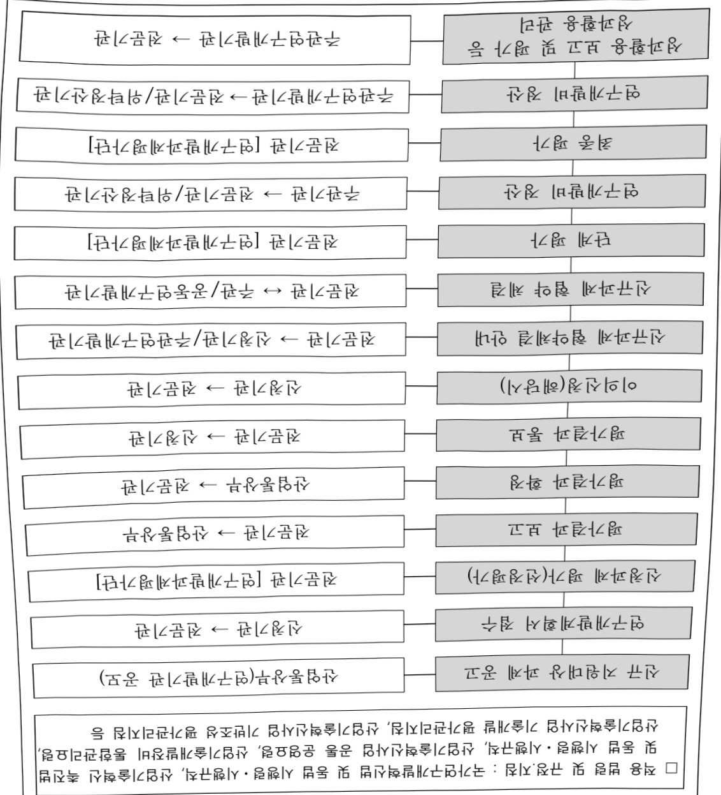
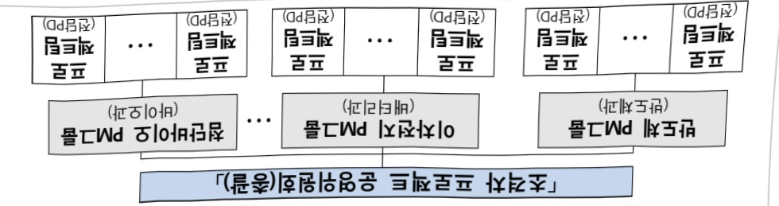
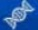

# 산업혁신기반구축(R&D)

**해당 페이지**: PDF 4099 ~ 4133 쪽 해당

**부처**: 산업통상부
**분야**: 산업·중소기업 및 에너지
**회계유형**: 일반회계
**2026 확정예산**: 268484.0 백만원
**전년대비 증감률**: None%
**AI 도메인**: R&D 지원

---

### 가.예산 총괄표

(단위: 백만원, %)

<table border=1 style='margin: auto; word-wrap: break-word;'><tr><td rowspan="2">사업명</td><td style='text-align: center; word-wrap: break-word;'>2024년</td><td colspan="2">2025년 예산</td><td colspan="2">2026년</td><td colspan="2">중감</td></tr><tr><td style='text-align: center; word-wrap: break-word;'>결산</td><td style='text-align: center; word-wrap: break-word;'>본예산(A)</td><td style='text-align: center; word-wrap: break-word;'>추경</td><td style='text-align: center; word-wrap: break-word;'>요구안</td><td style='text-align: center; word-wrap: break-word;'>확정(B)</td><td style='text-align: center; word-wrap: break-word;'>(B-A)</td><td style='text-align: center; word-wrap: break-word;'>(B-A)/A</td></tr><tr><td style='text-align: center; word-wrap: break-word;'>산업혁신기반구축</td><td style='text-align: center; word-wrap: break-word;'>190,992</td><td style='text-align: center; word-wrap: break-word;'>240,845</td><td style='text-align: center; word-wrap: break-word;'>240,845</td><td style='text-align: center; word-wrap: break-word;'>258,501</td><td style='text-align: center; word-wrap: break-word;'>268,484</td><td style='text-align: center; word-wrap: break-word;'>27,639</td><td style='text-align: center; word-wrap: break-word;'>11.5%</td></tr></table>

□ 기능별(내역사업별), 목별 예산 내역

(단위:백만원)

<table border=1 style='margin: auto; word-wrap: break-word;'><tr><td rowspan="3"></td><td colspan="5">2024</td><td colspan="7">2025(2025.12.11)</td><td rowspan="3">2026</td></tr><tr><td rowspan="2">예산의(추경)</td><td rowspan="2">예산현액</td><td rowspan="2">집행의[실집행액]</td><td rowspan="2">이월액</td><td rowspan="2">불용액</td><td rowspan="2">본예산</td><td rowspan="2">예산현액</td><td rowspan="2">집행의[실집행액]</td><td colspan="2">전년도 이월액제외</td><td rowspan="2">이월액예상액</td><td rowspan="2">불용예상액</td></tr><tr><td style='text-align: center; word-wrap: break-word;'>예산현액</td><td style='text-align: center; word-wrap: break-word;'>집행액[실집행액]</td></tr><tr><td style='text-align: center; word-wrap: break-word;'>○ 기능별 분류(함께)</td><td style='text-align: center; word-wrap: break-word;'>190,992</td><td style='text-align: center; word-wrap: break-word;'>190,992</td><td style='text-align: center; word-wrap: break-word;'>190,992[190,992]</td><td style='text-align: center; word-wrap: break-word;'>-</td><td style='text-align: center; word-wrap: break-word;'>-</td><td style='text-align: center; word-wrap: break-word;'>240,845</td><td style='text-align: center; word-wrap: break-word;'>240,845</td><td style='text-align: center; word-wrap: break-word;'>240,845[240,845]</td><td style='text-align: center; word-wrap: break-word;'>240,845</td><td style='text-align: center; word-wrap: break-word;'>240,845[240,845]</td><td style='text-align: center; word-wrap: break-word;'>-</td><td style='text-align: center; word-wrap: break-word;'>-</td><td style='text-align: center; word-wrap: break-word;'>268,484</td></tr><tr><td style='text-align: center; word-wrap: break-word;'>· 산업혁신기반구축</td><td style='text-align: center; word-wrap: break-word;'>181,392</td><td style='text-align: center; word-wrap: break-word;'>181,392</td><td style='text-align: center; word-wrap: break-word;'>181,392[181,392]</td><td style='text-align: center; word-wrap: break-word;'>-</td><td style='text-align: center; word-wrap: break-word;'>-</td><td style='text-align: center; word-wrap: break-word;'>235,445</td><td style='text-align: center; word-wrap: break-word;'>235,445</td><td style='text-align: center; word-wrap: break-word;'>235,445[235,445]</td><td style='text-align: center; word-wrap: break-word;'>235,445</td><td style='text-align: center; word-wrap: break-word;'>235,445[235,445]</td><td style='text-align: center; word-wrap: break-word;'>-</td><td style='text-align: center; word-wrap: break-word;'>-</td><td style='text-align: center; word-wrap: break-word;'>268,484</td></tr><tr><td style='text-align: center; word-wrap: break-word;'>· 대학혁신기반센터(UIC)</td><td style='text-align: center; word-wrap: break-word;'>5,280</td><td style='text-align: center; word-wrap: break-word;'>5,280</td><td style='text-align: center; word-wrap: break-word;'>5,280[5,280]</td><td style='text-align: center; word-wrap: break-word;'>-</td><td style='text-align: center; word-wrap: break-word;'>-</td><td style='text-align: center; word-wrap: break-word;'>-</td><td style='text-align: center; word-wrap: break-word;'>-</td><td style='text-align: center; word-wrap: break-word;'>-</td><td style='text-align: center; word-wrap: break-word;'>-</td><td style='text-align: center; word-wrap: break-word;'>-</td><td style='text-align: center; word-wrap: break-word;'>-</td><td style='text-align: center; word-wrap: break-word;'>-</td><td style='text-align: center; word-wrap: break-word;'>-</td></tr><tr><td style='text-align: center; word-wrap: break-word;'>· 산업혁신기술지원플랫폼구축</td><td style='text-align: center; word-wrap: break-word;'>4,320</td><td style='text-align: center; word-wrap: break-word;'>4,320</td><td style='text-align: center; word-wrap: break-word;'>4,320[4,320]</td><td style='text-align: center; word-wrap: break-word;'>-</td><td style='text-align: center; word-wrap: break-word;'>-</td><td style='text-align: center; word-wrap: break-word;'>5,400</td><td style='text-align: center; word-wrap: break-word;'>5,400</td><td style='text-align: center; word-wrap: break-word;'>5,400[5,400]</td><td style='text-align: center; word-wrap: break-word;'>5,400</td><td style='text-align: center; word-wrap: break-word;'>5,400[5,400]</td><td style='text-align: center; word-wrap: break-word;'>-</td><td style='text-align: center; word-wrap: break-word;'>-</td><td style='text-align: center; word-wrap: break-word;'>-</td></tr><tr><td style='text-align: center; word-wrap: break-word;'>○ 비목별 분류(함께)</td><td style='text-align: center; word-wrap: break-word;'>190,992</td><td style='text-align: center; word-wrap: break-word;'>190,992</td><td style='text-align: center; word-wrap: break-word;'>190,992[190,992]</td><td style='text-align: center; word-wrap: break-word;'>-</td><td style='text-align: center; word-wrap: break-word;'>-</td><td style='text-align: center; word-wrap: break-word;'>240,845</td><td style='text-align: center; word-wrap: break-word;'>240,845</td><td style='text-align: center; word-wrap: break-word;'>240,845[240,845]</td><td style='text-align: center; word-wrap: break-word;'>240,845</td><td style='text-align: center; word-wrap: break-word;'>240,845[240,845]</td><td style='text-align: center; word-wrap: break-word;'>-</td><td style='text-align: center; word-wrap: break-word;'>-</td><td style='text-align: center; word-wrap: break-word;'>268,484</td></tr><tr><td style='text-align: center; word-wrap: break-word;'>· 연구개발장비시스템구축비(360-04)</td><td style='text-align: center; word-wrap: break-word;'>189,224</td><td style='text-align: center; word-wrap: break-word;'>189,224</td><td style='text-align: center; word-wrap: break-word;'>189,224[189,224]</td><td style='text-align: center; word-wrap: break-word;'>-</td><td style='text-align: center; word-wrap: break-word;'>-</td><td style='text-align: center; word-wrap: break-word;'>240,845</td><td style='text-align: center; word-wrap: break-word;'>240,845</td><td style='text-align: center; word-wrap: break-word;'>240,845[240,845]</td><td style='text-align: center; word-wrap: break-word;'>240,845</td><td style='text-align: center; word-wrap: break-word;'>240,845[240,845]</td><td style='text-align: center; word-wrap: break-word;'>-</td><td style='text-align: center; word-wrap: break-word;'>-</td><td style='text-align: center; word-wrap: break-word;'>268,484</td></tr><tr><td style='text-align: center; word-wrap: break-word;'>· 연구개발활동비등(360-05)</td><td style='text-align: center; word-wrap: break-word;'>1,768</td><td style='text-align: center; word-wrap: break-word;'>1,768</td><td style='text-align: center; word-wrap: break-word;'>1,768[1,768]</td><td style='text-align: center; word-wrap: break-word;'>-</td><td style='text-align: center; word-wrap: break-word;'>-</td><td style='text-align: center; word-wrap: break-word;'>-</td><td style='text-align: center; word-wrap: break-word;'>-</td><td style='text-align: center; word-wrap: break-word;'>-</td><td style='text-align: center; word-wrap: break-word;'>-</td><td style='text-align: center; word-wrap: break-word;'>-</td><td style='text-align: center; word-wrap: break-word;'>-</td><td style='text-align: center; word-wrap: break-word;'>-</td><td style='text-align: center; word-wrap: break-word;'>-</td></tr><tr><td style='text-align: center; word-wrap: break-word;'>○ 기능비목별 분류(함께)</td><td style='text-align: center; word-wrap: break-word;'>190,992</td><td style='text-align: center; word-wrap: break-word;'>190,992</td><td style='text-align: center; word-wrap: break-word;'>190,992[190,992]</td><td style='text-align: center; word-wrap: break-word;'>-</td><td style='text-align: center; word-wrap: break-word;'>-</td><td style='text-align: center; word-wrap: break-word;'>240,845</td><td style='text-align: center; word-wrap: break-word;'>240,845</td><td style='text-align: center; word-wrap: break-word;'>240,845[240,845]</td><td style='text-align: center; word-wrap: break-word;'>240,845</td><td style='text-align: center; word-wrap: break-word;'>240,845[240,845]</td><td style='text-align: center; word-wrap: break-word;'>-</td><td style='text-align: center; word-wrap: break-word;'>-</td><td style='text-align: center; word-wrap: break-word;'>268,484</td></tr><tr><td style='text-align: center; word-wrap: break-word;'>· 산업혁신기반구축</td><td style='text-align: center; word-wrap: break-word;'>181,392</td><td style='text-align: center; word-wrap: break-word;'>181,392</td><td style='text-align: center; word-wrap: break-word;'>181,392[181,392]</td><td style='text-align: center; word-wrap: break-word;'>-</td><td style='text-align: center; word-wrap: break-word;'>-</td><td style='text-align: center; word-wrap: break-word;'>235,445</td><td style='text-align: center; word-wrap: break-word;'>235,445</td><td style='text-align: center; word-wrap: break-word;'>235,445[235,445]</td><td style='text-align: center; word-wrap: break-word;'>235,445</td><td style='text-align: center; word-wrap: break-word;'>235,445[235,445]</td><td style='text-align: center; word-wrap: break-word;'>-</td><td style='text-align: center; word-wrap: break-word;'>-</td><td style='text-align: center; word-wrap: break-word;'>268,484</td></tr><tr><td style='text-align: center; word-wrap: break-word;'>· 연구개발장비시스템구축비(360-04)</td><td style='text-align: center; word-wrap: break-word;'>179,624</td><td style='text-align: center; word-wrap: break-word;'>179,624</td><td style='text-align: center; word-wrap: break-word;'>179,624[179,624]</td><td style='text-align: center; word-wrap: break-word;'>-</td><td style='text-align: center; word-wrap: break-word;'>-</td><td style='text-align: center; word-wrap: break-word;'>235,445</td><td style='text-align: center; word-wrap: break-word;'>235,445</td><td style='text-align: center; word-wrap: break-word;'>235,445[235,445]</td><td style='text-align: center; word-wrap: break-word;'>235,445</td><td style='text-align: center; word-wrap: break-word;'>235,445[235,445]</td><td style='text-align: center; word-wrap: break-word;'>-</td><td style='text-align: center; word-wrap: break-word;'>-</td><td style='text-align: center; word-wrap: break-word;'>268,484</td></tr><tr><td style='text-align: center; word-wrap: break-word;'>· 연구개발활동비등(360-05)</td><td style='text-align: center; word-wrap: break-word;'>1,768</td><td style='text-align: center; word-wrap: break-word;'>1,768</td><td style='text-align: center; word-wrap: break-word;'>1,768[1,768]</td><td style='text-align: center; word-wrap: break-word;'>-</td><td style='text-align: center; word-wrap: break-word;'>-</td><td style='text-align: center; word-wrap: break-word;'>-</td><td style='text-align: center; word-wrap: break-word;'>-</td><td style='text-align: center; word-wrap: break-word;'>-</td><td style='text-align: center; word-wrap: break-word;'>-</td><td style='text-align: center; word-wrap: break-word;'>-</td><td style='text-align: center; word-wrap: break-word;'>-</td><td style='text-align: center; word-wrap: break-word;'>-</td><td style='text-align: center; word-wrap: break-word;'>-</td></tr><tr><td style='text-align: center; word-wrap: break-word;'>· 대학혁신기반센터(UIC)</td><td style='text-align: center; word-wrap: break-word;'>5,280</td><td style='text-align: center; word-wrap: break-word;'>5,280</td><td style='text-align: center; word-wrap: break-word;'>5,280[5,280]</td><td style='text-align: center; word-wrap: break-word;'>-</td><td style='text-align: center; word-wrap: break-word;'>-</td><td style='text-align: center; word-wrap: break-word;'>-</td><td style='text-align: center; word-wrap: break-word;'>-</td><td style='text-align: center; word-wrap: break-word;'>-</td><td style='text-align: center; word-wrap: break-word;'>-</td><td style='text-align: center; word-wrap: break-word;'>-</td><td style='text-align: center; word-wrap: break-word;'>-</td><td style='text-align: center; word-wrap: break-word;'>-</td><td style='text-align: center; word-wrap: break-word;'>-</td></tr><tr><td style='text-align: center; word-wrap: break-word;'>· 연구개발장비시스템구축비(360-04)</td><td style='text-align: center; word-wrap: break-word;'>5,280</td><td style='text-align: center; word-wrap: break-word;'>5,280</td><td style='text-align: center; word-wrap: break-word;'>5,280[5,280]</td><td style='text-align: center; word-wrap: break-word;'>-</td><td style='text-align: center; word-wrap: break-word;'>-</td><td style='text-align: center; word-wrap: break-word;'>-</td><td style='text-align: center; word-wrap: break-word;'>-</td><td style='text-align: center; word-wrap: break-word;'>-</td><td style='text-align: center; word-wrap: break-word;'>-</td><td style='text-align: center; word-wrap: break-word;'>-</td><td style='text-align: center; word-wrap: break-word;'>-</td><td style='text-align: center; word-wrap: break-word;'>-</td><td style='text-align: center; word-wrap: break-word;'>-</td></tr><tr><td style='text-align: center; word-wrap: break-word;'>· 산업혁신기술지원플랫폼구축</td><td style='text-align: center; word-wrap: break-word;'>4,320</td><td style='text-align: center; word-wrap: break-word;'>4,320</td><td style='text-align: center; word-wrap: break-word;'>4,320[4,320]</td><td style='text-align: center; word-wrap: break-word;'>-</td><td style='text-align: center; word-wrap: break-word;'>-</td><td style='text-align: center; word-wrap: break-word;'>5,400</td><td style='text-align: center; word-wrap: break-word;'>5,400[5,400]</td><td style='text-align: center; word-wrap: break-word;'>5,400[5,400]</td><td style='text-align: center; word-wrap: break-word;'>5,400[5,400]</td><td style='text-align: center; word-wrap: break-word;'>5,400[5,400]</td><td style='text-align: center; word-wrap: break-word;'>-</td><td style='text-align: center; word-wrap: break-word;'>-</td><td style='text-align: center; word-wrap: break-word;'>-</td></tr><tr><td style='text-align: center; word-wrap: break-word;'>· 연구개발장비시스템구축비(360-04)</td><td style='text-align: center; word-wrap: break-word;'>4,320</td><td style='text-align: center; word-wrap: break-word;'>4,320</td><td style='text-align: center; word-wrap: break-word;'>4,320[4,320]</td><td style='text-align: center; word-wrap: break-word;'>-</td><td style='text-align: center; word-wrap: break-word;'>-</td><td style='text-align: center; word-wrap: break-word;'>5,400</td><td style='text-align: center; word-wrap: break-word;'>5,400[5,400]</td><td style='text-align: center; word-wrap: break-word;'>5,400[5,400]</td><td style='text-align: center; word-wrap: break-word;'>5,400[5,400]</td><td style='text-align: center; word-wrap: break-word;'>5,400[5,400]</td><td style='text-align: center; word-wrap: break-word;'>-</td><td style='text-align: center; word-wrap: break-word;'>-</td><td style='text-align: center; word-wrap: break-word;'>-</td></tr></table>

---

### 나. 사업설명자료

## 1 ) 사업목적·내용

중소·중견 기업이 직접 구축하기 힘들지만 산업기술개발에 필수적인 공동활용 R&D 인프라를 연구소 · 대학 등 비영리 연구기관에 구축하여 기업의 기술혁신 활동을 지원

- 구축된 인프라(연구장비, SW, 집적화된 전문인력 등을 모두 포함)를 제품기획 · 설계부터 시제품 제작, 시험평가 · 인증 등 전주기 기술지원 목적으로 활용하여 수혜기업의 기술개발, 사업화 등의 혁신 활동을 직·간접적으로 지원

- (산업혁신기반구축) 첨단 산업기술 선도를 위한 국가주도 기반구축 및 기업수요 적시

지원을 위한 현장수요 공동활용 기반구축 추진

- (대학혁신기반센터(UIC)) 대학이 내부역량(교수, 전문인력, 장비 등)을 활용하여 중소·중견기업의 R&D 역량별 맞춤형 지원서비스를 제공할 수 있도록 대학에 기업지원 종합 플랫폼 구축

- (산업혁신기술지원플랫폼구축) 전국에 기구축된 연구장비를 기업이 효과적으로 활용할 수 있도록 기업지원 패키지서비스 구축 및 홍보, 노후화된 장비 업그레이드 지원

## 2 ) 사업개요

## □ 사업근거 및 추진경위

① 법령상 근거 및 조항 적시

-「산업기술혁신촉진법」제11조, 제19조, 제21조

제11조(산업기술개발사업) ① 산업통상부장관은 혁신계획 및 시행계획을 효율적으로 수행하기 위하여 관계 중앙행정기관의 장과 협의하여 다음 각 호의 산업기술분야에서 기술개발사업(산업기술개발을 위하여 필요한 기획 및 조사를 포함한다. 이하 "산업기술개발사업"이라 한다)을 추진할 수 있다.

1. 산업의 공통적인 기반이 되는 생산기반 기술, 부품·소재 및 장비·설비(플랜트를 포함한다) 기술

2. 산업기술 분야의 미래 유망 기술

3. 산업의 고부가가치화를 위한 공정혁신, 청정생산 및 환경설비 등에 관련된 기술

4. 산업의 핵심기술의 집약에 필요한 엔지니어링·시스템 기술

5. 에너지 절약 및 신·재생에너지 개발 등 에너지·자원기술

6. 항공우주산업기술 및 '민·군기술협력사업 촉진법' 제2조제1호의 군사 부문과 비군사 부문에서 공통으로 활용되는 기술

---

<table border=1 style='margin: auto; word-wrap: break-word;'><tr><td style='text-align: center; word-wrap: break-word;'>7. 디자인·브랜드·표준 관련 기술, 유통·전자거래 및 마케팅·비즈니스모델 등 지식기반서비스 산업 관련 기술8. 지역특화산업의 육성 및 지역산업의 혁신에 필요한 기술9. 「산업발전법」제5조에 따른 첨단기술·첨단제품의 개발 및 자본재의 시제품 개발10. 삭제11. 개발된 산업기술의 사업화에 필요한 연계기술12. 제1호부터 제10호까지의 기술 간 결합을 통한 시장지향형 융합기술13. 그 밖에 산업기술혁신을 위하여 우선적으로 개발이 필요한 기술로서 산업통상부장관이 정하는 기술② 산업통상부장관은 연구기관, 대학, 그 밖에 대통령령으로 정하는 기관·단체 또는 기업 등으로 하여금 산업기술개발사업을 수행하게 할 수 있다. 이 경우 산업통상부장관은 다음 각 호의 자와 산업기술개발사업에 관한 협약을 체결하고 해당 사업의 수행에 드는 비용의 전부 또는 일부를 출연 또는 보조할 수 있다.</td></tr><tr><td style='text-align: center; word-wrap: break-word;'>제19조(산업기술기반조성사업) ① 산업통상부장관은 산업기술혁신의 기반 및 환경조성에 관한 다음 각 호의 사업(이하 &quot;산업기술기반조성사업&quot;이라 한다)을 추진할 수 있다.1. 산업기술인력의 활용 및 공급2. 산업기술 연구장비·시설 등의 확충 및 활용촉진3. 연구장비·시설·연구인력 및 정보 등 산업기술혁신 요소의 집적화(集積化) 촉진4. 산업기술혁신을 위하여 필요한 기술·산업 등에 관한 각종 정보의 생산·관리 및 활용의 촉진5. 산업기술의 표준화, 디자인·브랜드 선진화 등을 위한 기반구축6. 산업기술문화공간의 설치·운영 등 산업기술저변의 확충7. 그 밖에 산업기술혁신 기반 조성을 위하여 대통령령으로 정하는 사업② 산업통상부장관은 연구기관, 대학, 그 밖에 대통령령으로 정하는 기관·단체로 하여금 산업기술기반조성사업을 실시하게 할 수 있으며, 산업기술기반조성사업을 주관하여 실시하는 자(이하 &quot;주관기관&quot;이라 한다)와 산업기술기반조성사업에 관한 협약을 체결하고, 주관기관에 해당 사업의 수행에 드는 비용의 전부 또는 일부를 출연 또는 보조할 수 있다.</td></tr><tr><td style='text-align: center; word-wrap: break-word;'>제21조(연구장비·시설 등의 확충 및 활용촉진) ① 산업통상부장관은 주관기관이 연구장비·시설, 시험·평가장비 등(이하 &quot;연구장비등&quot;이라 한다) 연구기반을 확충할 수 있도록 지원하거나 그 밖에 필요한 방안을 마련하여야 한다.② 제1항에 따라 연구장비등을 지원받은 주관기관과 주관연구기관 중 대통령령으로 정하는 기관(이하 이 조에서 &quot;주관기관등&quot;이라 한다)은 무상 또는 연구장비등의 유지·보수·운영에 드는 비용 등을 고려하여 산업통상부장관이 고시하는 기준에 따라 산정한 사용료를 받는 것을 조건으로 다른 기술혁신 주체가 해당 연구장비등을 활용할 수 있도록 연구장비등의 활용촉진을 위한 방안을 마련하여 추진하여야 한다. 이 경우 산업통상부장관은 연구장비등의 활용촉진에 드는 비용의 전부 또는 일부를 주관기관등에 지원할 수 있다.</td></tr></table>

---

## ② 추진경위

(2016년) 산재되어 운영되던 기반구축 성격의 사업을 '16년부터 산업기술국에서 관리하는 '산업기술공동기반구축*(1개)'과 산업별 소관과에서 관리하는 '산업별 기술개발기반구축(창의, 시스템, 소재 3개)' 4개 세부사업으로 재편

세부사업명 변경: 산업기술공동기반구축('16)→산업융합기반구축('17)→산업혁신기반구축('19)

- (2021년) 성격이 유사한 '산업별 산업기술개발기반구축(3개)' 및 '3D프린팅의료기기 산업기술실증'을 '산업혁신기반구축사업'으로 통합(4개 세부사업 → 1개 세부사업) * 산업혁신기반구축, 창의산업기술개발기반구축, 시스템산업기술개발기반구축

- 신규 구축 인프라 외에 기 구축된 연구장비의 효과적 활용 및 기업지원 서비스 발굴을 위한 산업혁신기술지원플랫폼구축(내역사업) 신설

- (2022년) 첨단 산업기술 선도를 위한 국가주도의 ①미래기술선도형 인프라 구축과 결과활용기관(기업) 수요 적시 지원을 위한 ②산업현장수요대응형으로 지원유형 세분화

- 대학이 내부역량(교수, 전문인력, 장비 등)을 활용하여 중소·중견 기업의 기술혁신 활동을 지원하는 대학혁신기반센터(UIC)(내역사업) 신설

- 공동활용 인프라의 효율성을 높이고 보다 전략적 예산 투자를 위한 「23~25 산업 혁신기반구축 로드맵」 발표(22.4월)

(2023년) 반도체·디스플레이, 미래모빌리티, 첨단바이오 등 초격차 기술분야를 중심으로 미래기술선도형 인프라 추진을 위한 산업혁신기반구축 로드맵 Rolling-Plan 수립

- (2024년) 산업부 초격차프로젝트 연계를 강화한 48개 신규과제 추진, 기구축 연구인프라 대상 장비 업그레이드, 신규 구축 등을 지원하는 “연구기반 고도화” 지원유형 세분화

- (2025년) AI 자율제조, 첨단바이오 등 초격차 연계성을 높인 16개 신규과제 추진, 산업 혁신기반구축 로드맵('26~'28) 수립

## □ 주요내용

① 사업규모

- 총사업비 : 해당없음

- 사업기간 : 2011~계속

- 최근 5년 간 투입된 사업비(예산액기준, 추경편성한 연도에는 추경포함)

<table border=1 style='margin: auto; word-wrap: break-word;'><tr><td style='text-align: center; word-wrap: break-word;'>연도</td><td style='text-align: center; word-wrap: break-word;'>2022</td><td style='text-align: center; word-wrap: break-word;'>2023</td><td style='text-align: center; word-wrap: break-word;'>2024</td><td style='text-align: center; word-wrap: break-word;'>2025</td><td style='text-align: center; word-wrap: break-word;'>2026</td></tr><tr><td style='text-align: center; word-wrap: break-word;'>사업비</td><td style='text-align: center; word-wrap: break-word;'>161,517</td><td style='text-align: center; word-wrap: break-word;'>196,920</td><td style='text-align: center; word-wrap: break-word;'>190,992</td><td style='text-align: center; word-wrap: break-word;'>240,845</td><td style='text-align: center; word-wrap: break-word;'>268,484</td></tr></table>

---

② 사업추진체계

- 사업시행방법 : 출연

- 사업시행주체 : (전문기관) 한국산업기술진흥원

(수행기관) 연구기관, 대학, 협회, 단체 등 비영리법인

-사업 수혜자 : 기업, 대학, 연구기관 등

- 보조, 융자, 출연, 출자 등의 경우 보조·융자 등 지원 비율 및 법적근거

<table border=1 style='margin: auto; word-wrap: break-word;'><tr><td style='text-align: center; word-wrap: break-word;'>내역사업명</td><td style='text-align: center; word-wrap: break-word;'>구분</td><td style='text-align: center; word-wrap: break-word;'>피보조·피출연 등 기관명</td><td style='text-align: center; word-wrap: break-word;'>지원 금액 (2026예산)</td><td style='text-align: center; word-wrap: break-word;'>지원 비율(%)</td><td style='text-align: center; word-wrap: break-word;'>보조율 법적근거 (해당 조항)</td></tr><tr><td style='text-align: center; word-wrap: break-word;'>산업혁신기반구축</td><td style='text-align: center; word-wrap: break-word;'>출연</td><td style='text-align: center; word-wrap: break-word;'>연구기관 등 비영리기관</td><td style='text-align: center; word-wrap: break-word;'>268,484</td><td style='text-align: center; word-wrap: break-word;'>70% 상한</td><td style='text-align: center; word-wrap: break-word;'>산업기술혁신촉진법 제11조, 제19조</td></tr><tr><td style='text-align: center; word-wrap: break-word;'>대학혁신기반센터 (UIC)</td><td style='text-align: center; word-wrap: break-word;'>출연</td><td style='text-align: center; word-wrap: break-word;'>대학</td><td style='text-align: center; word-wrap: break-word;'>- (24종료)</td><td style='text-align: center; word-wrap: break-word;'>70% 상한</td><td style='text-align: center; word-wrap: break-word;'>산업기술혁신촉진법 제19조</td></tr><tr><td style='text-align: center; word-wrap: break-word;'>산업혁신기술지원 플랫폼구축</td><td style='text-align: center; word-wrap: break-word;'>출연</td><td style='text-align: center; word-wrap: break-word;'>연구기관 등 비영리기관</td><td style='text-align: center; word-wrap: break-word;'>- (25종료)</td><td style='text-align: center; word-wrap: break-word;'>70% 상한</td><td style='text-align: center; word-wrap: break-word;'>산업기술혁신촉진법 제19조, 제21조</td></tr></table>

---

<table border=1 style='margin: auto; word-wrap: break-word;'><tr><td style='text-align: center; word-wrap: break-word;'>1. 비대면 의생명 의료기기 산업육성 플랫폼 기반구축사업 : (&#x27;25) 1,042백만원 → (&#x27;26) 714백만원, -328백만원 감액 - (내용) 비대면 환자 모니터링 · 관제 시스템 및 시험분석 평가센터 구축에 필요한 장비 도입, 비대면 의생명 의료기기 기업지원 운영 714백만원 - (산출) 714백만원(5년차 사업비) × 1개 과제 × 12/12개월 2. 친환경 대체냉매 적용 콜드체인 시스템 시험·평가 인프라 : (&#x27;25) 1,100백만원 → (&#x27;26) 741백만원, -359백만원 감액 - (내용) 친환경 대체냉매 적용 콜드체인 시스템 시험·평가 인프라 기반구축, 콜드체인 제품·시설 효율 및 성능평가, 시험분석, 기술자문 등 지원 741백만원 - (산출) 741백만원(5년차 사업비) × 1개 과제 × 12/12개월 3. 선박운항 중 에너지 저감을 위한 풍력추진 기술개발 인프라 : (&#x27;25) 1,106백만원 → (&#x27;26) 1,021백만원, -85백만원 감액 - (내용) 선박 에너지 저감을 위한 풍력 보조 추진 장치인 로터세일의 실스케일 시험 인증 장비 구축 및 운영 1,021백만원 - (산출) 1,021백만원(5년차 사업비) × 1개 과제 × 12/12개월 4. 리사이클 소재를 활용한 수송용 내외장재 개발 인프라 및 친환경 표준화/인증 체계 구축 : (&#x27;25) 937백만원 → (&#x27;26) 1,280백만원, 343백만원 증액 - (내용) 리사이클 소재를 활용한 수송용 부품 공정 개발에 필요한 장비 도입 및 리사이클 진위여부 분석법 개발 마무리 단계로 공정 개발 장비 구축 및 운영 1,280백만원 - (산출) 1,280백만원(5년차 사업비) × 1개 과제 × 12/12개월 5. 전기차용 배터리 모듈, 팩 시스템 시험평가센터 구축 : (&#x27;25) 1,155백만원 → (&#x27;26) 1,126백만원, -29백만원 감액 - (내용) 전기차 배터리 팩/모듈의 성능·인증을 위한 신뢰성 장비 구축과 전문시험인력 지원을 통한 중소·중견 배터리 팩 제조기업의 지원체계 구축 1,126백만원 - (산출) 1,126백만원(5년차 사업비) × 1개 과제 × 12/12개월 6. 경량소재 가공시스템 품질·신뢰성 평가기술 연구기반 구축 : (&#x27;25) 2,073백만원 → (&#x27;26) 1,227백만원, -846백만원 감액 - (내용) 경량부품 가공 시스템의 구동 및 측정/검사에 필요한 장비 도입 초기 단계로 장비 구축 및 운영 1,227백만원 - (산출) 1,227백만원(5년차 사업비) × 1개 과제 × 12/12개월 7. 친환경 선박 대체연료 추진시스템 기자재 실증 플랫폼 기반구축 : (&#x27;25) 1,901백만원 → (&#x27;26) 1,658백만원, -243백만원 감액 - (내용) 친환경 선박 대체연료 추진시스템 기자재의 상호 연계성과 성능, 안전, 내구성을 평가할 수 있는 장비구축 및 운영 1,658백만원 - (산출) 1,658백만원(5년차 사업비) × 1개 과제 × 12/12개월</td></tr></table>

---

<table border=1 style='margin: auto; word-wrap: break-word;'><tr><td style='text-align: center; word-wrap: break-word;'>8. 마이크로 비히클(Micro Vehicle) 및 응용제품 배터리 안전성 평가기반 구축 : (25) 2,249백만원 → (26) 1,352백만원, -897백만원 감액 - (내용) 마이크로 비히클급 배터리 화재/환경안전성 평가 장비 도입 마무리 단계로 평가장비 구축 및 운영 (MV용 배터리 안전신뢰성 평가 기준에 적합한 시험동 구축, MV용 배터리 환경신뢰성 및 화재안전성 시험 장비 구축 등) 1,352백만원 - (산출) 1,352백만원(5년차 사업비) x 1개 과제 x 12/12개월</td></tr><tr><td style='text-align: center; word-wrap: break-word;'>9. 자율주행 안정성 향상을 위한 커넥터드카 무선통신 기술개발 지원 및 인증·평가 시스템 구축 : (25) 1,780백만원 → (26) 2,195백만원, 415백만원 증액 - (내용) 커넥터드카 무선통신 기술 관련 안전성능, 적합성 인증·평가 시스템 및 기반구축을 통한 기업지원, 지역경제 활성화 및 미래 지향적 일자리 창출 2,195백만원 - (산출) 2,195백만원(5년차 사업비) x 1개 과제 x 12/12개월</td></tr><tr><td style='text-align: center; word-wrap: break-word;'>10. 마이크로LED 디스플레이 산업화 지원을 위한 인프라 및 기반 구축 : (25) 1,901백만원 → (26) 2,316백만원, 415백만원 증액 - (내용) 마이크로LED 디스플레이 산업 생태계 형성에 필요한 장비 도입, 연계확산/산업화 지원 서비스 운영 2,316백만원 - (산출) 2,316백만원(5년차 사업비) x 1개 과제 x 12/12개월</td></tr><tr><td style='text-align: center; word-wrap: break-word;'>11. 대형 전기·수소상용차 전기구동시스템 통합 성능평가 기반 구축 : (25) 2,081백만원 → (26) 2,228백만원, 147백만원 증액 - (내용) 대형 전기·수소상용차 전기구동시스템의 통합 성능평가 기반 구축 및 기업 기술 개발 지원 2,228백만원 - (산출) 2,228백만원(5년차 사업비) x 1개 과제 x 12/12개월</td></tr><tr><td style='text-align: center; word-wrap: break-word;'>12. XR 전방산업 선도형 핵심 광학 부품·모듈 시험제작 서비스 지원 : (25) 1,989백만원 → (26) 2,424백만원, 435백만원 증액 - (내용) XR 산업 활성화 및 관련 중강소기업 시장경쟁력 강화를 위한 XR 핵심 광학부품·모듈 시험생산/광특성측정용 전용 장비구축 및 사업화지원체계 구축 2,424백만원 - (산출) 2,424백만원(5년차 사업비) x 1개 과제 x 12/12개월</td></tr><tr><td style='text-align: center; word-wrap: break-word;'>13. 중고로봇 재제조 로봇리퍼브센터 기반구축 : (25) 2,225백만원 → (26) 2,244백만원, 19백만원 증액 - (내용) 모바일 로봇 시험분석측정 장비 도입 및 기업지원플랫폼 구체화 단계로, 모바일 로봇 시험 장비구축/기반서비스지원플랫폼/운영 2,244백만원 - (산출) 2,244백만원(5년차 사업비) x 1개 과제 x 12/12개월</td></tr><tr><td style='text-align: center; word-wrap: break-word;'>14. 플렉서블·스트레쳐블 산업 창출을 위한 부착형 디스플레이 기술 기반구축 : (25) 1,991백만원 → (26) 2,213백만원, 222백만원 증액 - (내용) 인체와 다양한 기기의 표면에 부착하여 정보표시가 가능한 부착형 디스플레이 모듈 제조 기술을 지원하고, 관련 시장 선점과 산업 생태계 조성을 위한 전주기적 지원 기반 구축 2,213백만원 - (산출) 2,213백만원(4년차 사업비) x 1개 과제 x 12/12개월</td></tr></table>

---

<table border=1 style='margin: auto; word-wrap: break-word;'><tr><td style='text-align: center; word-wrap: break-word;'>15. 고성능 전기차용 전동화시스템 성능평가 기반구축 : (&#x27;25) 3,860백만원 → (&#x27;26) 1,753백만원, -2,107백만원 감액 - (내용) 국내 중소·중건 부품기업의 고성능 전기차용 핵심부품 기술개발 및 사업화 지원을 위한 고성능 전동화시스템 성능평가 기반 구축 1,753백만원 - (산출) 1,753백만원(4년차 사업비) × 1개 과제 × 12/12개월</td></tr><tr><td style='text-align: center; word-wrap: break-word;'>16. 자율주행 인지 및 운행안전(SOTIF) 성능 검증 기반구축 : (&#x27;25) 2,053백만원 → (&#x27;26) 2,880백만원, 827백만원 증액 - (내용) 운행안전(SOTIF, ISO 21448) 국제표준 제정에 따른 국내 실정에 맞는 검증 지원 체계 구축 2,880백만원 - (산출) 2,880백만원(4년차 사업비) × 1개 과제 × 12/12개월</td></tr><tr><td style='text-align: center; word-wrap: break-word;'>17. 중소형 조선소 생산기술혁신(DX) 센터 구축 : (&#x27;25) 2,101백만원 → (&#x27;26) 2,228백만원, 127백만원 증액 - (내용) 생산 자동화 장비 Test-bed, 디지털 트렌/시뮬레이션 생산시스템, 첨단/특수 생산지원 공동활용장비, 품질평가 및 인증지원 기반 구축 및 운영 2,228백만원 - (산출) 2,228백만원(4년차 사업비) × 1개 과제 × 12/12개월</td></tr><tr><td style='text-align: center; word-wrap: break-word;'>18. 메디바이오 핵심소재 기술개발 및 메디컬 바이오 실용화 지원 기반구축 : (&#x27;25) 2,039백만원 → (&#x27;26) 2,263백만원, 224백만원 증액 - (내용) 이보디보 자가포식 비임상 평가지원을 위한 질환 모델 평가 시설 및 선택적 자가포식 평가 장비 구축 및 운영 2,263백만원 - (산출) 2,263백만원(4년차 사업비) × 1개 과제 × 12/12개월</td></tr><tr><td style='text-align: center; word-wrap: break-word;'>19. 생분해성 플라스틱 표준개발 및 평가 기반구축 : (&#x27;25) 2,061백만원 → (&#x27;26) 2,497백만원, 436백만원 증액 - (내용) 생분해도 시험장비 및 표준원(퇴비, 토양 등) 제조 시설 장비 구축 및 운영 2,497백만원 - (산출) 2,497백만원(4년차 사업비) × 1개 과제 × 12/12개월</td></tr><tr><td style='text-align: center; word-wrap: break-word;'>20. 물류영역 서비스 로봇 공통 플랫폼 구축 : (&#x27;25) 2,151백만원 → (&#x27;26) 2,195백만원, 44백만원 증액 - (내용) 전문 물류환경 모사 테스트베드 설비 구축, 물류 로봇 운영 환경 및 물류 로봇 연계 장비구축 및 운영 2,195백만원 - (산출) 2,195백만원(4년차 사업비) × 1개 과제 × 12/12개월</td></tr><tr><td style='text-align: center; word-wrap: break-word;'>21. 하이테크 룰(High-Tech Roll) 첨단화 지원 기반구축 : (&#x27;25) 2,285백만원 → (&#x27;26) 2,264백만원, -21백만원 감액 - (내용) 하이테크 룰의 성능/신뢰성 분석 시험환경 및 장비 구축, 적용 산업 분야에 따른 룰 요구 특성 분석 및 기술지원 및 운영 2,264백만원 - (산출) 2,264백만원(4년차 사업비) × 1개 과제 × 12/12개월</td></tr><tr><td style='text-align: center; word-wrap: break-word;'>22. 차세대 첨단소자 제조공정용 진공 소재·부품·장비 기초성능·평가 플랫폼 구축 : (&#x27;25) 2,039백만원 → (&#x27;26) 2,357백만원, 318백만원 증액 - (내용) 진공 소부장 자립화 대응 기초성능·평가 인프라 구축과 제품의 효율적인 검증을 위한 수요기업의 양산환경과 유사한 실증평가 지원체계 구축 및 운영 2,357백만원</td></tr></table>

---

<table border=1 style='margin: auto; word-wrap: break-word;'><tr><td style='text-align: center; word-wrap: break-word;'>- (산출) 2,357백만원(4년차 사업비) x 1개 과제 x 12/12개월</td></tr><tr><td style='text-align: center; word-wrap: break-word;'>23. 취약계층 친화적 지능형 홈케어 서비스 개발 및 실용화 기반구축</td></tr><tr><td style='text-align: center; word-wrap: break-word;'>: (&#x27;25) 2,039백만원 → (&#x27;26) 2,672백만원, 633백만원 증액</td></tr><tr><td style='text-align: center; word-wrap: break-word;'>- (내용) 대단위 실생활 데이터 확보 및 활용이 가능한 실증 테스트베드 구축 등을 위한 장비구축 및 운영 2,672백만원</td></tr><tr><td style='text-align: center; word-wrap: break-word;'>- (산출) 2,672백만원(4년차 사업비) x 1개 과제 x 12/12개월</td></tr><tr><td style='text-align: center; word-wrap: break-word;'>24. 광섬유 기반 고정밀 계측 센서 개발 및 실용화 기반구축</td></tr><tr><td style='text-align: center; word-wrap: break-word;'>: (&#x27;25) 2,285백만원 → (&#x27;26) 2,358백만원, 73백만원 증액</td></tr><tr><td style='text-align: center; word-wrap: break-word;'>- (내용) 광섬유 분포음향 측정시스템 등 성능시험 · 시제품 제작지원 장비구축 및 장비운영 2,358백만원</td></tr><tr><td style='text-align: center; word-wrap: break-word;'>- (산출) 2,358백만원(4년차 사업비) x 1개 과제 x 12/12개월</td></tr><tr><td style='text-align: center; word-wrap: break-word;'>25. 배터리 활용성 증대를 위한 BaaS(Battery as a Service) 실증 기반 구축</td></tr><tr><td style='text-align: center; word-wrap: break-word;'>: (&#x27;25) 1,443백만원 → (&#x27;26) 2,634백만원, 1,191백만원 증액</td></tr><tr><td style='text-align: center; word-wrap: break-word;'>- (내용) 배터리 정밀 상태진단 장비, 배터리 기본 성능 점검을 위한 충방전장비, 성능 평가 장비구축 및 장비운영 2,634백만원</td></tr><tr><td style='text-align: center; word-wrap: break-word;'>- (산출) 2,634백만원(4년차 사업비) x 1개 과제 x 12/12개월</td></tr><tr><td style='text-align: center; word-wrap: break-word;'>26. 뿌리산업 제조공정혁신 지원을 위한 DX 센터 구축</td></tr><tr><td style='text-align: center; word-wrap: break-word;'>: (&#x27;25) 3,075백만원 → (&#x27;26) 2,651백만원, -424백만원 감액</td></tr><tr><td style='text-align: center; word-wrap: break-word;'>- (내용) 뿌리생산공정 단계별 분석 플랫폼, AI기반 디지털 트뮤지웠 시스템, 공정최적화 시스템, 품질 검증 및 신뢰성 평가 장비 및 기술/사업화 지원 운영 2,651백만원</td></tr><tr><td style='text-align: center; word-wrap: break-word;'>- (산출) 2,651백만원(4년차 사업비) x 1개 과제 x 12/12개월</td></tr><tr><td style='text-align: center; word-wrap: break-word;'>27. 플라스틱 산업 제조공정혁신 지원을 위한 DX 기반구축</td></tr><tr><td style='text-align: center; word-wrap: break-word;'>: (&#x27;25) 1,289백만원 → (&#x27;26) 2,706백만원, 1,417백만원 증액</td></tr><tr><td style='text-align: center; word-wrap: break-word;'>- (내용) 플라스틱 성형 공정 디지털전환 표준모델 테스트베드 구축 및 플라스틱 제조기업 생산현장의 자동화/디지털화를 위한 기술자문 수행 및 시험·분석(시제품제작/해석) 지원 운영 2,706백만원</td></tr><tr><td style='text-align: center; word-wrap: break-word;'>- (산출) 2,706백만원(4년차 사업비) x 1개 과제 x 12/12개월</td></tr><tr><td style='text-align: center; word-wrap: break-word;'>28. 다공성 탄소소재기반 환경소재 및 부품개발 기반 구축</td></tr><tr><td style='text-align: center; word-wrap: break-word;'>: (&#x27;25) 2,207백만원 → (&#x27;26) 2,188백만원, -19백만원 감액</td></tr><tr><td style='text-align: center; word-wrap: break-word;'>- (내용) 고품질 다공성 탄소소재의 실증을 위한 장비구축 및 활성탄소 소재 시험/분석 지원 운영 등 2,188백만원</td></tr><tr><td style='text-align: center; word-wrap: break-word;'>- (산출) 2,188백만원(4년차 사업비) x 1개 과제 x 12/12개월</td></tr><tr><td style='text-align: center; word-wrap: break-word;'>29. 차세대 고효율 전력반도체 실증 인프라</td></tr><tr><td style='text-align: center; word-wrap: break-word;'>: (&#x27;25) 1,686백만원 → (&#x27;26) 2,609백만원, 923백만원 증액</td></tr><tr><td style='text-align: center; word-wrap: break-word;'>- (내용) 전자산업과 자동차 부품산업에 필요한 차세대 고효율 전력반도체 실증 지원인프라 구축 및 운영 2,609백만원</td></tr><tr><td style='text-align: center; word-wrap: break-word;'>- (산출) 2,609백만원(4년차 사업비) x 1개 과제 x 12/12개월</td></tr></table>

---

<table border=1 style='margin: auto; word-wrap: break-word;'><tr><td style='text-align: center; word-wrap: break-word;'>30. 자원순환형 셀룰로스 나노섬유소재 산업화센터 : (&#x27;25) 2,244백만원 → (&#x27;26) 2,301백만원, 57백만원 증액 - (내용) 융합형 셀룰로스 나노섬유(CNF) 대용량 공급체제 구축 및 산업분야별 셀룰로스 나노섬유 적용 친환경·저탄소 소재부품 산업화 지원 기반 구축 2,301백만원 - (산출) 2,301백만원(5년차 사업비) x 1개 과제 x 12/12개월</td></tr><tr><td style='text-align: center; word-wrap: break-word;'>31. 미래형 Wingless PAV 핵심부품 종합테스트베드 구축 및 상용화 지원 : (&#x27;25) 2,049백만원 → (&#x27;26) 2,497백만원, 448백만원 증액 - (내용) Wingless PAV 핵심부품 시험지원 기반 마련을 위한 필수 장비 구축 및 운영 2,497백만원 - (산출) 2,497백만원(5년차 사업비) x 1개 과제 x 12/12개월</td></tr><tr><td style='text-align: center; word-wrap: break-word;'>32. 소부장 전문기업 육성을 위한 산업 밸류체인 디지털 전환(IVDX) 지원센터 구축 : (&#x27;25) 1,852백만원 → (&#x27;26) 2,699백만원, 847백만원 증액 - (내용) 소부장 전문기업의 디지털 전환 및 첨단 제조기술 기반의 신제품·신서비스 개발을 지원하는 IVDX 지원센터 구축 및 운영 2,699백만원 - (산출) 2,699백만원(5년차 사업비) x 1개 과제 x 12/12개월</td></tr><tr><td style='text-align: center; word-wrap: break-word;'>33. 바이오매스 기반 친환경 자동차 소재부품 기술지원 기반 구축 : (&#x27;25) 2,392백만원 → (&#x27;26) 2,263백만원, -129백만원 감액 - (내용) 바이오화학 소재들을 활용한 친환경 자동차 소재부품 적용을 지원하는 기반구축을 통해 바이오화학 분야의 소재 발굴과 제품화 기술경쟁력 확보 2,263백만원 - (산출) 2,263백만원(5년차 사업비) x 1개 과제 x 12/12개월</td></tr><tr><td style='text-align: center; word-wrap: break-word;'>34. 친환경차 및 E-모빌리티 스타트업 기술지원 허브 클러스터 구축 : (&#x27;25) 2,099백만원 → (&#x27;26) 2,556백만원, 457백만원 증액 - (내용) 스마트 E-모빌리티 중심기업의 국내외경쟁력 확보를 위한 기술지원 및 평가·관리체계 구축 2,556백만원 - (산출) 2,556백만원(5년차 사업비) x 1개 과제 x 12/12개월</td></tr><tr><td style='text-align: center; word-wrap: break-word;'>35. 국가 재난 슈퍼박테리아·신종바이러스 대응 차세대 마이크로바이옴 의약품/진단기술 개발 기반구축 : (&#x27;25) 2,099백만원 → (&#x27;26) 2,556백만원, 457백만원 증액 - (내용) 마이크로바이옴 의약품 임상시료 생산 GMP 구축 및 상용화 기술 개발 지원 및 비임상·임상시험 진입 지원, 고위험성 감염질환 대응 마이크로바이옴 ABSL-3 실험 지원 센터 구축 2,556백만원 - (산출) 2,556백만원(5년차 사업비) x 1개 과제 x 12/12개월</td></tr><tr><td style='text-align: center; word-wrap: break-word;'>36. 자동차용 반도체 기능안전·신뢰성 산업혁신기반구축 : (&#x27;25) 2,729백만원 → (&#x27;26) 1,926백만원, -803백만원 감액 - (내용) 자동차 산업의 급속한 &#x27;전장화&#x27; 추세에 대응하기 위하여 자동차용 반도체의 국내개발 활성화 및 기술력 강화를 위한 기능안전·신뢰성 지원 기반구축 1,926백만원 - (산출) 1,926백만원(5년차 사업비) x 1개 과제 x 12/12개월</td></tr><tr><td style='text-align: center; word-wrap: break-word;'>37. 산업 공정부산물의 탄소중립 전환 재자원화 기술 실증지원센터 구축 : (&#x27;25) 2,212백만원 → (&#x27;26) 2,443백만원, 231백만원 증액 - (내용) 탄소중립 전환을 위한 스마트 산업 공정부산물 재자원화 전주기 실증지원 기반구축을 통해 전주기 실증지원 및 시험인증, 표준화 거점 구축 2,443백만원 - (산출) 2,443백만원(5년차 사업비) x 1개 과제 x 12/12개월</td></tr></table>

---

<table border=1 style='margin: auto; word-wrap: break-word;'><tr><td style='text-align: center; word-wrap: break-word;'>38. 메카노바이오활성소재 혁신 의료기기 실증 기반구축 : (&#x27;25) 2,108백만원 → (&#x27;26) 2,547백만원, 439백만원 증액 - (내용) 메카노바이오활성소재 혁신의료기기의 안전성·유효성·사용적합성 평가 및 개발지원 상용화 전주기 센터 구축 2,547백만원 - (산출) 2,547백만원(5년차 사업비) x 1개 과제 x 12/12개월</td></tr><tr><td style='text-align: center; word-wrap: break-word;'>39. mRNA/DNA 기반 의약품 개발·생산 지원센터 구축 : (&#x27;25) 2,114백만원 → (&#x27;26) 2,576백만원, 462백만원 증액 - (내용) mRNA/DNA 의약품 설계 및 전임상 시료 생산에 필요한 장비 도입과 기업지원 플랫폼 구축 및 운영 2,576백만원 - (산출) 2,576백만원(5년차 사업비) x 1개 과제 x 12/12개월</td></tr><tr><td style='text-align: center; word-wrap: break-word;'>40. 공공부문 산업데이터 통합 활용 기반구축 : (&#x27;25) 2,326백만원 → (&#x27;26) 2,426백만원, 100백만원 증액 - (내용) 공공/민간 부문 산업 데이터 통합·연계·활용 및 산업 데이터 관계지도, 데이터 큐레이션을 제공하는 디지털 플랫폼 구축 및 혁신 서비스 개발 2,426백만원 - (산출) 2,426백만원(4년차 사업비) x 1개 과제 x 12/12개월</td></tr><tr><td style='text-align: center; word-wrap: break-word;'>41. 디자인 산업데이터 통합 활용 기반구축 : (&#x27;25) 2,930백만원 → (&#x27;26) 1,822백만원, -1,108백만원 감액 - (내용) 디자인 산업데이터 통합 활용 플랫폼 구축 및 관련 서비스 제공을 통한 기업지원 1,822백만원 - (산출) 1,822백만원(4년차 사업비) x 1개 과제 x 12/12개월</td></tr><tr><td style='text-align: center; word-wrap: break-word;'>42. 바이오인터페이싱 인체이식형 생체흡수성 의료기기 실증기반구축 : (&#x27;25) 3,076백만원 → (&#x27;26) 3,138백만원, 62백만원 증액 - (내용) 의료기기 제조지원 특수목적 장비 및 생체흡수성 의료기기 특화 실증 신규 장비 구축 비용 및 운영 3,138백만원 - (산출) 3,138백만원(4년차 사업비) x 1개 과제 x 12/12개월</td></tr><tr><td style='text-align: center; word-wrap: break-word;'>43. xEV용 고전압 배터리 및 충전모듈 통합 성능평가 기반구축 : (&#x27;25) 1,916백만원 → (&#x27;26) 3,943백만원, 2,027백만원 증액 - (내용) xEV용 kV-MW급 전력전장부품의 국내/외 규격 대응기술 개발과 양산화 시제품 검증/평가 지원을 위한 배터리 및 충전모듈 연계 통합성능평가 기반구축 3,943백만원 - (산출) 3,943백만원(3년차 사업비) x 1개 과제 x 12/12개월</td></tr><tr><td style='text-align: center; word-wrap: break-word;'>44. 초안전 주행플랫폼 실용화를 위한 디지털트런 활용 가상환경시험 기반구축 : (&#x27;25) 1,916백만원 → (&#x27;26) 4,539백만원, 2,623백만원 증액 - (내용) 초안전 주행플랫폼 관련 핵심모듈과 시스템 제품개발 시 성능평가 및 인증 대응이 가능한 디지털트런 기반 가상환경시험 기술지원 및 인프라 구축 4,539백만원 - (산출) 4,539백만원(3년차 사업비) x 1개 과제 x 12/12개월</td></tr><tr><td style='text-align: center; word-wrap: break-word;'>45. 진환경 선박용 암모니아 연료공급장치 및 시스템 실증 기반구축 : (&#x27;25) 1,916백만원 → (&#x27;26) 2,590백만원, 674백만원 증액 - (내용) 암모니아 연료공급시스템 시험평가 설비기반 구축 및 시험평가 기자재 인증체계 구축 2,590 백만원</td></tr></table>

---

<table border=1 style='margin: auto; word-wrap: break-word;'><tr><td style='text-align: center; word-wrap: break-word;'>- (산출) 2,590백만원(3년차 사업비) × 1개 과제 × 12/12개월</td></tr><tr><td style='text-align: center; word-wrap: break-word;'>46. 친환경 항공기용 전기추진시스템 평가 기반구축 : (25) 1,916백만원 → (26) 2,682백만원, 766백만원 증액 - (내용) 그린에너지 생산기술, 항공전기추진시스템 원천기술 구축(친환경 항공기용 전기추진체 핵심 구성품 성능 및 신뢰성 검증 평가 장비, 통합검증 체계, 국제 인증 규정 대응을 위한 통합지원 플랫폼 구축) 2,682백만원 - (산출) 2,682백만원(3년차 사업비) × 1개 과제 × 12/12개월</td></tr><tr><td style='text-align: center; word-wrap: break-word;'>47. 디지털전환 기반 바이오헬스 소재·기기 유효성 및 안전성 검증을 위한 지능형 플랫폼 기반구축 : (25) 1,916백만원 → (26) 2,359백만원, 443백만원 증액 - (내용) AI 기반 바이오헬스 신소재 정보 예측 모델시스템, AI·빅데이터 활용 고속 바이오소재 후보 물질 스크리닝 플랫폼, 유효성 및 예비 안전성 평가를 위한 독성 고속 대량 스크리닝 시스템 구축 2,359백만원 - (산출) 2,359백만원(3년차 사업비) × 1개 과제 × 12/12개월</td></tr><tr><td style='text-align: center; word-wrap: break-word;'>48. 인공바이러스 벡터 개량 및 유전자 전달효율 고도화 기반구축 : (25) 1,916백만원 → (26) 1,932백만원, 16백만원 증액 - (내용) 기업 수요 기반 전임상·비임상 인증지원을 위한 장비 및 시스템 구축, 효능 분석 및 생산 필수 장비, 시제품 생산용 GMP 시설 구축 1,932백만원 - (산출) 1,932백만원(3년차 사업비) × 1개 과제 × 12/12개월</td></tr><tr><td style='text-align: center; word-wrap: break-word;'>49. 다중영상 용합 진단치료기기 개발 기반구축 : (25) 1,916백만원 → (26) 2,138백만원, 222백만원 증액 - (내용) 고해상도 다중의료영상 기반 인공지능 진단치료 의료플랫폼 S/W 전주기 통합 플랫폼 구축 2,138백만원 - (산출) 2,138백만원(3년차 사업비) × 1개 과제 × 12/12개월</td></tr><tr><td style='text-align: center; word-wrap: break-word;'>50. 홈로봇가전 산업육성 플랫폼 구축 : (25) 1,916백만원 → (26) 3,115백만원, 1,199백만원 증액 - (내용) 홈로봇가전의 핵심 부품 성능 분석 및 개발 지원 장비 구축 3,115백만원 - (산출) 3,115백만원(3년차 사업비) × 1개 과제 × 12/12개월</td></tr><tr><td style='text-align: center; word-wrap: break-word;'>51. 건설기계용 수소연소 파워트레인 기술개발을 위한 기반구축 : (25) 1,916백만원 → (26) 2,407백만원, 491백만원 증액 - (내용) 수소건설기계 핵심 부품·모듈(수소연료전지, 수소 엔진 등)의 상용화 지원에 필요한 시험 인프라 및 기술 지원 체계 구축 2,407백만원 - (산출) 2,407백만원(3년차 사업비) × 1개 과제 × 12/12개월</td></tr><tr><td style='text-align: center; word-wrap: break-word;'>52. E·모빌리티 레이저 활용기술 제조장비 기반고도화 : (25) 1,916백만원 → (26) 2,183백만원, 267백만원 증액 - (내용) 용접 생산성 향상 및 품질 모니터링을 위한 평가장비 구축 및 경량화 용접기기(차체 및 내외장재 등), 고품질 용접기기(배터리, 전장부품 등) 핵심기반 고도화를 위한 레이저 장비기술 고도화 인프라 구축 2,183백만원 - (산출) 2,183백만원(3년차 사업비) × 1개 과제 × 12/12개월</td></tr></table>

---

<table border=1 style='margin: auto; word-wrap: break-word;'><tr><td style='text-align: center; word-wrap: break-word;'>53. 가상·증강·혼합현실 영상제공을 위한 마이크로 디스플레이 실증 기반구축 : (&#x27;25) 1,916백만원 → (&#x27;26) 1,932백만원, 16백만원 증액 - (내용) OLEDoS 마이크로 디스플레이 소재·부품·장비 기술개발과 패널모듈 시제품 제작, 성능 검증·실증을 위한 기반구축 1,932백만원 - (산출) 1,932백만원(3년차 사업비) × 1개 과제 × 12/12개월</td></tr><tr><td style='text-align: center; word-wrap: break-word;'>54. Stand-alone 고출력 EUV 검사기 장비 기술 및 EUV 검사기 인프라 구축 : (&#x27;25) 1,916백만원 → (&#x27;26) 2,035백만원, 119백만원 증액 - (내용) 고출력 EUV 검사기 장비 인프라 구축 및 표준인증 체계 인프라 구축 (안정화된 고출력 EUV 광원 기술 장비 구축, EUV 광원 성능평가 장비 등) 2,035백만원 - (산출) 2,035백만원(3년차 사업비) × 1개 과제 × 12/12개월</td></tr><tr><td style='text-align: center; word-wrap: break-word;'>55. 디지털 데이터 기반 3D프린팅 스마트 제조시스템 기반구축 : (&#x27;25) 1,916백만원 → (&#x27;26) 2,319백만원, 403백만원 증액 - (내용) 경량화, 일체화, 복합화 등 고난이도/고신뢰 3D프린팅 전주기 제조기술 플랫폼 구축 2,319백만원 - (산출) 2,319백만원(3년차 사업비) × 1개 과제 × 12/12개월</td></tr><tr><td style='text-align: center; word-wrap: break-word;'>56. 전고체 전지용 차세대 소재 개발 및 제조 기반구축 : (&#x27;25) 1,916백만원 → (&#x27;26) 2,197백만원, 281백만원 증액 - (내용) 전고체 전지 실용화를 위한 핵심소재에 대한 기술 확보 목적의 황화물계 고체 전해질 및 고에너지밀도 활물질 제조 및 평가 장비 기반구축 2,197백만원 - (산출) 2,197백만원(3년차 사업비) × 1개 과제 × 12/12개월</td></tr><tr><td style='text-align: center; word-wrap: break-word;'>57. 섬유산업 지능형 마이크로팩토리 제조 플랫폼 실증 기반구축 : (&#x27;25) 1,916백만원 → (&#x27;26) 2,273백만원, 357백만원 증액 - (내용) 섬유소재, 염색, 봉제 공정별 지능형 마이크로 팩토리 제조 실증 장비 및 센터 운영에 필요한 인프라 구축을 통한 지능형 마이크로팩토리 첨단 제조혁신 모델의 산업계 보급확산 2,273백만원 - (산출) 2,273백만원(3년차 사업비) × 1개 과제 × 12/12개월</td></tr><tr><td style='text-align: center; word-wrap: break-word;'>58. 고강도·고방열 경량소재 개발 및 부품화 실증 기반구축 : (&#x27;25) 1,916백만원 → (&#x27;26) 2,190백만원, 274백만원 증액 - (내용) 고특성 경량금속 원천소재 및 부품화 기술개발을 위한 기반 및 경량소재 품질 검증 및 부품화 실증, 산업 적용 부품의 테스트베드 구축 2,190백만원 - (산출) 2,190백만원(3년차 사업비) × 1개 과제 × 12/12개월</td></tr><tr><td style='text-align: center; word-wrap: break-word;'>59. 핵심 희소금속 원료 시생산 및 품질인증 기반구축 : (&#x27;25) 1,916백만원 → (&#x27;26) 2,104백만원, 188백만원 증액 - (내용) 이차전지 소재, 희토류 영구자석, 특수목적용 희소금속 등 제품군에 대한 시생산 및 재활용 기술, 시험법 개발, 국제/국내 표준제정 및 인증기관 양성형 기반구축 2,104백만원 - (산출) 2,104백만원(3년차 사업비) × 1개 과제 × 12/12개월</td></tr><tr><td style='text-align: center; word-wrap: break-word;'>60. 선박용 액체수소 실증설비 구축 : (&#x27;25) 1,916백만원 → (&#x27;26) 2,590백만원, 674백만원 증액</td></tr></table>

---

<table border=1 style='margin: auto; word-wrap: break-word;'><tr><td style='text-align: center; word-wrap: break-word;'>- (내용) 액화수소 시스템 육상 실증 인프라 제공 및 해상용 장비 개발, 사업화 지원을 위한 실증 부지 관련 공사, 액화수소 공급, 저장 및 운영 설비 구축 및 운영 절차 수립 2,590백만원- (산출) 2,590백만원(3년차 사업비) x 1개 과제 x 12/12개월</td></tr><tr><td style='text-align: center; word-wrap: break-word;'>61. 선박용 스마트기자재 통합성능인증 플랫폼 조성: (&#x27;25) 1,916백만원 → (&#x27;26) 2,190백만원, 274백만원 증액- (내용) 선박용 스마트 기자재 분야의 통합전기추진체계, 자율운항시스템 기자재를 대상으로 전기전자 시험평가 인프라 구축 2,190백만원- (산출) 2,190백만원(3년차 사업비) x 1개 과제 x 12/12개월</td></tr><tr><td style='text-align: center; word-wrap: break-word;'>62. 비행시험장 안전성 향상 및 활용성 증대를 위한 비행모니터링 시스템 구축: (&#x27;25) 1,916백만원 → (&#x27;26) 3,234백만원, 1,318백만원 증액- (내용) 도심항공 모빌리티(UAM) 자율비행기술 구현을 위한 전기전자시스템, 항공기 기체, 지상설비 시스템 구축 (비행 모니터링 시스템 실증을 위한 기반구축, 운영 시나리오 설계 및 검증용비행체 확보 등) 3,234백만원- (산출) 3,234백만원(3년차 사업비) x 1개 과제 x 12/12개월</td></tr><tr><td style='text-align: center; word-wrap: break-word;'>63. 끝대체 융합의료기기 실증기반 구축: (&#x27;25) 1,916백만원 → (&#x27;26) 2,535백만원, 619백만원 증액- (내용) 끝대체 융합의료기기를 제조를 위한 골모델 및 임플란트 설계 S/W, 3D프린터, 열처리 및 후가공 등 장비 구축 2,535백만원- (산출) 2,535백만원(3년차 사업비) x 1개 과제 x 12/12개월</td></tr><tr><td style='text-align: center; word-wrap: break-word;'>64. 절삭공구/가공 빅데이터를 활용한 첨단제조 플랫폼 기반구축 및 실증: (&#x27;25) 1,916백만원 → (&#x27;26) 2,502백만원, 586백만원 증액- (내용) 센서융합 기계장비 및 데이터 처리 플랫폼, 설비 및 공정 통합관리 플랫폼 기술 구축 2,502백만원- (산출) 2,502백만원(3년차 사업비) x 1개 과제 x 12/12개월</td></tr><tr><td style='text-align: center; word-wrap: break-word;'>65. 생활지원을 위한 서비스로봇 부품 기술지원 기반구축: (&#x27;25) 1,916백만원 → (&#x27;26) 2,104백만원, 188백만원 증액- (내용) 차세대 로봇 핵심부품개발기술 관련 자동화 계측/센서 기술 지원 장비 구축 2,104백만원- (산출) 2,104백만원(3년차 사업비) x 1개 과제 x 12/12개월</td></tr><tr><td style='text-align: center; word-wrap: break-word;'>66. 고출력 이차전지 소재·부품 대응용 성능검증 플랫폼 기반구축: (&#x27;25) 1,916백만원 → (&#x27;26) 2,104백만원, 188백만원 증액- (내용) 원통형 배터리 CELL 조립장비, 원통형 배터리 PACK 충방전기 등 장비 및 에너지 밀도 극대화 테스트베드 구축 2,104백만원- (산출) 2,104백만원(3년차 사업비) x 1개 과제 x 12/12개월</td></tr><tr><td style='text-align: center; word-wrap: break-word;'>67. 디지털 융합 기술 활용 첨단정밀화학소재 성능고도화 지원: (&#x27;25) 1,916백만원 → (&#x27;26) 1,931백만원, 15백만원 증액- (내용) 디지털 융합 기술을 활용하여 첨단정밀화학소재 개발, 시제품 제작, 시험·평가 시스템 구축을 통해 중소·중견기업의 고성장 전방산업 핵심 첨단정밀화학소재 성능고도화 기술지원 제공 1,931백만원</td></tr></table>

---

<table border=1 style='margin: auto; word-wrap: break-word;'><tr><td style='text-align: center; word-wrap: break-word;'>- (산출) 1,931백만원(3년차 사업비) x 1개 과제 x 12/12개월</td></tr><tr><td style='text-align: center; word-wrap: break-word;'>68. 디지털 기반 첨단소재 개발지원 센터 구축</td></tr><tr><td style='text-align: center; word-wrap: break-word;'>: (25) 1,916백만원 → (26) 2,180백만원, 264백만원 증액</td></tr><tr><td style='text-align: center; word-wrap: break-word;'>- (내용) 첨단제조업의 핵심 경쟁력인 접착 소재, 부품 및 공정 관련 성능 시험 평가체계를 구축하고 관련 중소·중견기업 기술지원을 통한 기술경쟁력 강화를 위한 기반구축 2,180백만원</td></tr><tr><td style='text-align: center; word-wrap: break-word;'>- (산출) 2,180백만원(3년차 사업비) x 1개 과제 x 12/12개월</td></tr><tr><td style='text-align: center; word-wrap: break-word;'>69. 바이오 소재 시험평가센터 구축</td></tr><tr><td style='text-align: center; word-wrap: break-word;'>: (25) 1,916백만원 → (26) 3,260백만원, 1,344백만원 증액</td></tr><tr><td style='text-align: center; word-wrap: break-word;'>- (내용) 약물전달기술 기반으로 개발된 의약품, 의료기기의 사업화 촉진을 위하여 연구개발, 시험평가 및 규제대응 서비스를 통한 전주기 사업화 지원 기반구축 3,260백만원</td></tr><tr><td style='text-align: center; word-wrap: break-word;'>- (산출) 3,260백만원(3년차 사업비) x 1개 과제 x 12/12개월</td></tr><tr><td style='text-align: center; word-wrap: break-word;'>70. 수소차 폐연료전지 자원순환을 위한 시험인증 특화센터 구축</td></tr><tr><td style='text-align: center; word-wrap: break-word;'>: (25) 2,017백만원 → (26) 3,726백만원, 1,709백만원 증액</td></tr><tr><td style='text-align: center; word-wrap: break-word;'>- (내용) 수소차 연료전지 시험평가 기반 구축을 통해 폐연료전지 자원순환(재사용, 재활용 등)을 위한 기준 마련 및 기업의 응용제품 실증 지원을 통한 신산업 생태계 구축 지원 3,726백만원</td></tr><tr><td style='text-align: center; word-wrap: break-word;'>- (산출) 3,726백만원(3년차 사업비) x 1개 과제 x 12/12개월</td></tr><tr><td style='text-align: center; word-wrap: break-word;'>71. 모빌리티모터혁신기술육성</td></tr><tr><td style='text-align: center; word-wrap: break-word;'>: (25) 2,451백만원 → (26) 2,405백만원, -46백만원 감액</td></tr><tr><td style='text-align: center; word-wrap: break-word;'>- (내용) 국내 모터산업 기술격차 확보, 미래 모빌리티 산업 육성 및 생태계 확산을 위한 모빌리티 전동화 부품 관련 인프라 기반 구축 2,405백만원</td></tr><tr><td style='text-align: center; word-wrap: break-word;'>- (산출) 2,405백만원(3년차 사업비) x 1개 과제 x 12/12개월</td></tr><tr><td style='text-align: center; word-wrap: break-word;'>72. 에너지저장장치(ESS) 화재안전 실증 플랫폼 구축</td></tr><tr><td style='text-align: center; word-wrap: break-word;'>: (25) 1,758백만원 → (26) 2,365백만원, 607백만원 증액</td></tr><tr><td style='text-align: center; word-wrap: break-word;'>- (내용) 실화재 데이터 및 시뮬레이션 기반 ESS 전기/소방 국제 인증 시험장 및 교육시설 구축</td></tr><tr><td style='text-align: center; word-wrap: break-word;'>2,365백만원</td></tr><tr><td style='text-align: center; word-wrap: break-word;'>- (산출) 2,365백만원(3년차 사업비) x 1개 과제 x 12/12개월</td></tr><tr><td style='text-align: center; word-wrap: break-word;'>73. 첨단 방위산업용 고성능/고신뢰성 시스템반도체 부품 실증 기반구축</td></tr><tr><td style='text-align: center; word-wrap: break-word;'>: (25) 1,916백만원 → (26) 2,020백만원, 104백만원 증액</td></tr><tr><td style='text-align: center; word-wrap: break-word;'>- (내용) 방위산업의 부품 자립화와 활용 목적에 최적화된 반도체 설계 및 모듈 개발, 첨단 방위산업 목적 부합형 고지능 지원 및 전력반도체 개발 및 실증 2,020백만원</td></tr><tr><td style='text-align: center; word-wrap: break-word;'>- (산출) 2,020백만원(3년차 사업비) x 1개 과제 x 12/12개월</td></tr><tr><td style='text-align: center; word-wrap: break-word;'>74. 글로벌 초격차를 위한 XR용합산업 시험기반 구축</td></tr><tr><td style='text-align: center; word-wrap: break-word;'>: (25) 1,916백만원 → (26) 2,020백만원, 104백만원 증액</td></tr><tr><td style='text-align: center; word-wrap: break-word;'>- (내용) 글로벌 초격차를 위한 XR용합산업 시험기반 구축 및 운영 2,020백만원</td></tr><tr><td style='text-align: center; word-wrap: break-word;'>- (산출) 2,020백만원(3년차 사업비) x 1개 과제 x 12/12개월</td></tr><tr><td style='text-align: center; word-wrap: break-word;'>75. 금형 기반 생산기술 디지털전환 기반 구축</td></tr><tr><td style='text-align: center; word-wrap: break-word;'>: (25) 1,916백만원 → (26) 2,104백만원, 188백만원 증액</td></tr></table>

---

<table border=1 style='margin: auto; word-wrap: break-word;'><tr><td style='text-align: center; word-wrap: break-word;'>- (내용) 자율 생산을 제공하는 지능화 기술을 기반으로 금형 기반 미래차 등 핵심부품 제조의 지능형 생산 시스템 DX 기반 구축 2,104백만원- (산출) 2,104백만원(3년차 사업비) x 1개 과제 x 12/12개월</td></tr><tr><td style='text-align: center; word-wrap: break-word;'>76. 글로벌 시장진출을 위한 전기차 충전인프라 검증 및 실증형 시험인증 기반구축: (&#x27;25) 1,916백만원 → (&#x27;26) 1,778백만원, -138백만원 감액- (내용) 글로벌 시장진출을 위한 전기차 및 충전 인프라 해외시험인증 시스템 구축을 통한 국내 전기차 충전기 산업 역량 강화 및 생태계 활성화 1,778백만원- (산출) 1,778백만원(3년차 사업비) x 1개 과제 x 12/12개월</td></tr><tr><td style='text-align: center; word-wrap: break-word;'>77. 웨어러블 로봇 실증센터 구축: (&#x27;25) 1,916백만원 → (&#x27;26) 1,932백만원, 16백만원 증액- (내용) 웨어러블 로봇 관련 시험평가, 표준화, 인증 지원 등을 통한 국내 기업의 경쟁력 제고(웨어러블 로봇의 표준 제정, 인증 지원, 사업화 지원 등이 가능한 테스트베드 및 연계 장비) 1,932백만원- (산출) 1,932백만원(3년차 사업비) x 1개 과제 x 12/12개월</td></tr><tr><td style='text-align: center; word-wrap: break-word;'>78. 실외이동로봇 성능 및 안전성 평가 기반구축: (&#x27;25) 1,854백만원 → (&#x27;26) 2,115백만원, 261백만원 증액- (내용) 운행 전 단계에서 실외이동로봇 제품의 주행성능, 충돌특성 등을 시험하고 안전성을 평가하기 위한 인프라 구축 2,115백만원- (산출) 2,115백만원(3년차 사업비) x 1개 과제 x 12/12개월</td></tr><tr><td style='text-align: center; word-wrap: break-word;'>79. 제조산업 공정작업용 로봇 엔드이펙터 실증 기반 구축: (&#x27;25) 1,854백만원 → (&#x27;26) 2,075백만원, 221백만원 증액- (내용) 다양한 비정형 제조공정용(용접, 조립, 포장 등) 엔드이펙터 제품의 성능 및 신뢰성을 시험·검증하고 표준화 및 인증을 지원하는 기반 구축 2,075백만원- (산출) 2,075백만원(3년차 사업비) x 1개 과제 x 12/12개월</td></tr><tr><td style='text-align: center; word-wrap: break-word;'>80. 고중량물 이송 자율이동체 시험평가센터 기반구축사업: (&#x27;25) 1,854백만원 → (&#x27;26) 3,155백만원, 1,301백만원 증액- (내용) 톤급별 자율이동체 프레임(새시) 설계 및 가반하중 시험, 군집 자율주행 기술 검증 등 주요핵심기술에 대한 시험환경 구축 및 기업의 기술지원 등을 통한 공급망 기반 조성 3,155백만원- (산출) 3,155백만원(3년차 사업비) x 1개 과제 x 12/12개월</td></tr><tr><td style='text-align: center; word-wrap: break-word;'>81. Multi-QC 플랫폼 제작 및 QC 인프라 지원체계 구축: (&#x27;25) 1,854백만원 → (&#x27;26) 2,121백만원, 267백만원 증액- (내용) 양자컴퓨팅 또는 시율레이션을 사용할 수 있는 서비스 제공 인프라 구축, 문제 해결 지원 2,121백만원- (산출) 2,121백만원(3년차 사업비) x 1개 과제 x 12/12개월</td></tr><tr><td style='text-align: center; word-wrap: break-word;'>82. 산업데이터 표준 확산 기반 구축: (&#x27;25) 1,854백만원 → (&#x27;26) 2,121백만원, 267백만원 증액- (내용) 디지털전환 기술을 기반으로 공급망 기업 간 표준 규격 및 활용·공유 등을 위한 제조 데이터 표준 확산 기반 구축 2,121백만원</td></tr></table>

---

<table border=1 style='margin: auto; word-wrap: break-word;'><tr><td style='text-align: center; word-wrap: break-word;'>- (산출) 2,121백만원(3년차 사업비) x 1개 과제 x 12/12개월</td></tr><tr><td style='text-align: center; word-wrap: break-word;'>83. 글로벌 오픈이노베이션 측진을 위한 AI 활용 플랫폼 구축 : (&#x27;25) 1,854백만원 → (&#x27;26) 2,661백만원, 807백만원 증액- (내용) AI기반 대화형 기술 플랫폼(Tech-GPT) 구축을 통한 글로벌 오픈이노베이션(GOI) 촉진 2,661백만원- (산출) 2,661백만원(3년차 사업비) x 1개 과제 x 12/12개월</td></tr><tr><td style='text-align: center; word-wrap: break-word;'>84. 산업융합 신제품 글로벌 시장진출을 위한 시험·실증 인프라 기반 구축 : (&#x27;25) 1,854백만원 → (&#x27;26) 2,149백만원, 295백만원 증액- (내용) 산업융합 신제품 실증 및 적합성 장비, 시스템 등 관련 인프라 구축 2,149백만원- (산출) 2,149백만원(3년차 사업비) x 1개 과제 x 12/12개월</td></tr><tr><td style='text-align: center; word-wrap: break-word;'>85. 전기·전자 및 반도체 산업 소부장 기업 전후방 가치사슬 DX 혁신 라이브러리형 지원 플랫폼 구축 : (&#x27;25) 1,854백만원 → (&#x27;26) 1,949백만원, 95백만원 증액- (내용) 전기전자 및 반도체 산업의 수요대응 DX첨단서비스 개발 등 통합지원플랫폼 운영을 통한 현장문제 해결형 DX첨단서비스 기반 구축 1,949백만원- (산출) 1,949백만원(3년차 사업비) x 1개 과제 x 12/12개월</td></tr><tr><td style='text-align: center; word-wrap: break-word;'>86. 수소 전주기(생산·운송·활용) 계량 신뢰성 강화를 위한 소급성 기반 구축 : (&#x27;25) 1,854백만원 → (&#x27;26) 2,298백만원, 444백만원 증액- (내용) 수소경제 활성화, 공정한 수소 상거래 질서 확립을 위해 수소 유통 전주기(생산·운송·활용) 현장(on-site) 계량 평가 기반구축 2,298백만원- (산출) 2,298백만원(3년차 사업비) x 1개 과제 x 12/12개월</td></tr><tr><td style='text-align: center; word-wrap: break-word;'>87. 첨단 글로벌 유통물류를 위한 AI활용기술 실증 기반 구축 : (&#x27;25) 1,854백만원 → (&#x27;26) 2,238백만원, 384백만원 증액- (내용) 국내 유통·물류기업의 해외진출을 지원하기 위한 유통물류 특화AI 서비스 개발 및 풀필먼트 실증체계 구축 2,238백만원- (산출) 2,238백만원(3년차 사업비) x 1개 과제 x 12/12개월</td></tr><tr><td style='text-align: center; word-wrap: break-word;'>88. 미래 선도를 위한 차세대 융복합 소재·부품·장비 연구기반 고도화 : (&#x27;25) 2,750백만원 → (&#x27;26) 2,750백만원, 전년동일- (내용) 국가 첨단전략기술 분야 3대 주력산업(반도체·디스플레이·이차전지) 소재·부품·장비의 시험·평가·인증 시설장비 인프라 및 서비스 고도화, 기업지원 등 2,750백만원- (산출) 2,750백만원(3년차 사업비) x 1개 과제 x 12/12개월</td></tr><tr><td style='text-align: center; word-wrap: break-word;'>89. 차세대 광반도체 제조기반 기술고도화 : (&#x27;25) 2,750백만원 → (&#x27;26) 2,750백만원, 전년동일- (내용) 화합물반도체 미세 제조공정 고도화를 위한 장비구축 및 업그레이드, 기업의 사업화 및 연계- (산출) 2,750백만원(3년차 사업비) x 1개 과제 x 12/12개월</td></tr><tr><td style='text-align: center; word-wrap: break-word;'>90. 마이크로전자제조 대응 정밀분석기반 고도화 : (&#x27;25) 2,750백만원 → (&#x27;26) 2,750백만원, 전년동일</td></tr></table>

---

<table border=1 style='margin: auto; word-wrap: break-word;'><tr><td style='text-align: center; word-wrap: break-word;'>- (내용) 중소·중견 마이크로전자 제조기업에 특화된 정밀분석 인프라와 전주기 통합지원 플랫폼 구축, 기업지원 등 마이크로전자제조 대응 정밀분석 기반 고도화 2,750백만원- (산출) 2,750백만원(3년차 사업비) x 1개 과제 x 12/12개월</td></tr><tr><td style='text-align: center; word-wrap: break-word;'>91. 수소상용차용 액화수소 활용 전주기 지원 기반구축: (25) 1,500백만원 → (26) 1,946백만원, 446백만원 증액- (내용) 수소상용차용 액화수소저장시스템 및 수소파워트레인에 대한 전주기적 지원이 가능한 복합성능평가 기반구축 및 기술지원 체계구축 1,946백만원- (산출) 1,946백만원(2년차 사업비) x 1개 과제 x 12/12개월</td></tr><tr><td style='text-align: center; word-wrap: break-word;'>92. 자율주행차용 시스템반도체 보안성 평가 기반구축: (25) 1,500백만원 → (26) 1,946백만원, 446백만원 증액- (내용) 차세대 SDV 및 자율주행용 반도체 개발 활성화와 완성도 제고를 위한 차량용 반도체, 임베디드 SW, 통신의 보안(Security) 기술 설계·검증·평가를 지원하는 전주기 인프라 구축 1,946백만원- (산출) 1,946백만원(2년차 사업비) x 1개 과제 x 12/12개월</td></tr><tr><td style='text-align: center; word-wrap: break-word;'>93. 세포외소포체 기반 난치성질환 진단 및 치료제 개발 기반구축: (25) 1,500백만원 → (26) 1,946백만원, 446백만원 증액- (내용) 난치성질환 증가에 따른 신규 모달리티 기술로서 세포외소포체를 활용한 맞춤형 진단·치료·백신 제품 개발 기반 구축 및 사업화 지원을 통한 글로벌 기술 선도 1,946백만원- (산출) 1,946백만원(2년차 사업비) x 1개 과제 x 12/12개월</td></tr><tr><td style='text-align: center; word-wrap: break-word;'>94. 미래 치과이식형 디지털의료제품 개발 기반구축 사업: (25) 1,500백만원 → (26) 1,946백만원, 446백만원 증액- (내용) Age·Tech 산업 중심으로 바이오데이터를 활용한 인공지능 알고리즘 개발 및 성능평가를 지원을 통한 국내 의료기기 및 헬스케어 기업의 바이오데이터 활용 맞춤형 지원 체계 구축 1,946백만원- (산출) 1,946백만원(2년차 사업비) x 1개 과제 x 12/12개월</td></tr><tr><td style='text-align: center; word-wrap: break-word;'>95. 중대형급 친환경 농기계의 디지털·전동화 실증 기반 구축: (25) 1,500백만원 → (26) 1,946백만원, 446백만원 증액- (내용) 55kW 이상 중대형급 친환경 농기계·핵심부품 성능평가 및 디지털 활용 기술 지원체계 기반 구축 1,946백만원- (산출) 1,946백만원(2년차 사업비) x 1개 과제 x 12/12개월</td></tr><tr><td style='text-align: center; word-wrap: break-word;'>96. L150 탄소중립형 히트펌프 개발·실증 플랫폼 구축: (25) 1,500백만원 → (26) 1,946백만원, 446백만원 증액- (내용) 저탄소·친환경 그린 경제 달성을 위한 냉동공조 산업의 기존 High GWP(1,500 이상)에서 Low GWP(150 이하) 냉매 전환 측진의 목적으로 대체냉매 적용 히트펌프의 성능·안전·신뢰성 평가에 필요한 기반 구축 1,946백만원- (산출) 1,946백만원(2년차 사업비) x 1개 과제 x 12/12개월</td></tr><tr><td style='text-align: center; word-wrap: break-word;'>97. 적층제조 기반 맞춤형 유연생산 In-line 공유 팩토리 구축: (25) 1,500백만원 → (26) 1,946백만원, 446백만원 증액</td></tr></table>

---

<table border=1 style='margin: auto; word-wrap: break-word;'><tr><td style='text-align: center; word-wrap: break-word;'>- (내용) 글로벌 국가 중심으로 1미터급 대형 정밀 적층부품 수요가 증가함에 따라 1미터급 대형 수요부품 개발 및 유연 생산 대응에 필요한 적층제조 In-line 공유 제조시스템 기반 구축 1,946백만원- (산출) 1,946백만원(2년차 사업비) x 1개 과제 x 12/12개월</td></tr><tr><td style='text-align: center; word-wrap: break-word;'>98. AI 기반 사용후 배터리 평가 및 재사용 지원 기반구축: (25) 1,500백만원 → (26) 1,946백만원, 446백만원 증액- (내용) 산업, 농업, 물류 등 다양한 분야에서 대용량 배터리의 데이터 관리 및 진단을 위한 지원 기반을 구축하고, 이를 통해 산업 전반에서 배터리 재사용을 지원하기 위한 통합 플랫폼 마련 1,946백만원- (산출) 1,946백만원(2년차 사업비) x 1개 과제 x 12/12개월</td></tr><tr><td style='text-align: center; word-wrap: break-word;'>99. 의료용 섬유 신소재 개발 및 실증 기반구축: (25) 1,500백만원 → (26) 1,946백만원, 446백만원 증액- (내용) 생체적합성 섬유소재 기반의 맞춤형 상처관리와 인체삽입용 의료기기 및 코스메슈티컬 섬유제품 개발을 지원하고, 의료산업에서 요구하는 수준의 제조공정을 실증하기 위한 기반구축 1,946백만원- (산출) 1,946백만원(2년차 사업비) x 1개 과제 x 12/12개월</td></tr><tr><td style='text-align: center; word-wrap: break-word;'>100. 제조 AI 솔루션 개발 지원센터: (25) 1,500백만원 → (26) 1,946백만원, 446백만원 증액- (내용) 자율제조 인공지능 솔루션 기업의 경쟁력 강화를 위한 제조 전문가 수준의 공정 데이터셋 확보 및 연구개발 지원 위한 명장 AI 데이터센터 구축 1,946백만원- (산출) 2,335백만원(2년차 사업비) x 1개 과제 x 10/12개월</td></tr><tr><td style='text-align: center; word-wrap: break-word;'>101. 자이언트캐스팅 공용 센터 기반구축: (25) 1,500백만원 → (26) 1,946백만원, 446백만원 증액- (내용) 전기차 차체 플랫폼의 초대형 일체화 기술 대응 목적의 초대형 주조 성형기술 관련 핵심요소기술 개발을 위한 제조 기반 구축 1,946백만원- (산출) 1,946백만원(2년차 사업비) x 1개 과제 x 12/12개월</td></tr><tr><td style='text-align: center; word-wrap: break-word;'>102. AI 휴머노이드 로봇 기술혁신 센터 구축: (25) 1,500백만원 → (26) 1,946백만원, 446백만원 증액- (내용) AI기반의 휴머노이드 로봇 실증 지원체계 구축을 통해 휴머노이드 로봇 기술 내재화 및 주도권 확보 1,946백만원- (산출) 2,335백만원(2년차 사업비) x 1개 과제 x 10/12개월</td></tr><tr><td style='text-align: center; word-wrap: break-word;'>103. AI 기반 Age-Tech 산업 중심의 디지털의료제품 지원 바이오데이터 및 알고리즘 실증 기반구축: (25) 1,500백만원 → (26) 1,946백만원, 446백만원 증액- (내용) 미래 의료기술 선도를 위한 차세대 치과 이식 및 진단을 위한 디지털 의료제품 통합 실증 지원 기반 구축 1,946백만원- (산출) 1,946백만원(2년차 사업비) x 1개 과제 x 12/12개월</td></tr><tr><td style='text-align: center; word-wrap: break-word;'>104. 친환경 습식 표면처리 디지털 혁신 실증 플랫폼 구축: (25) 1,500백만원 → (26) 1,946백만원, 446백만원 증액</td></tr></table>

---

<table border=1 style='margin: auto; word-wrap: break-word;'><tr><td style='text-align: center; word-wrap: break-word;'>- (내용) 국산 도금액의 현장 적용을 가로막는 기술·제도적 제약을 해소하고, 산업 전반으로의 확산을 위한 디지털 실증 기반구축 (숨식 표면처리 스마트 실증 플랫폼 구축, 구축 실증라인 기반 도금액 개발 및 공정 최적화 지원 등) 1,946백만원 - (산출) 1,946백만원(2년차 사업비) x 1개 과제 x 12/12개월</td></tr><tr><td style='text-align: center; word-wrap: break-word;'>105. AI기반 조명산업의 자원순환 및 서비스화 실증 기반구축 : (&#x27;25) 1,500백만원 → (&#x27;26) 1,946백만원, 446백만원 증액 - (내용) 환경규제 대응을 위해 전기전자제품의 재제조 활성화와 재사용을 촉진하기 위한 전 과정 평가(LCA)의 자원순환 공동활용 실증 기반구축 1,946백만원 - (산출) 1,946백만원(2년차 사업비) x 1개 과제 x 12/12개월</td></tr><tr><td style='text-align: center; word-wrap: break-word;'>106. AI기반 화학공정 및 소재합성 최적화 : (&#x27;25) 1,500백만원 → (&#x27;26) 3,500백만원, 2,000백만원 증액 - (내용) AI를 활용하여 화학 혼합 및 소재 합성 공정의 신뢰도 높은 데이터를 효율적으로 생산하고 이를 활용하여 최적의 실험 수행과 최적의 공정 조건을 도출하는 자율실험실 기반구축 3,500백만원 - (산출) 4,200백만원(2년차 사업비) x 1개 과제 x 10/12개월</td></tr><tr><td style='text-align: center; word-wrap: break-word;'>107. 대면적 미세회로화 대응을 위한 평가 기반구축 : (&#x27;25) 0 → (&#x27;26) 1,000백만원, 1,000백만원 순증(신규) - (내용) 첨단전자산업(반도체 패키징, 디스플레이, 바이오센서 등)의 대면적 초미세회로 공정과 관련 소부장 기술 고도화를 위한 테스트 기반 구축 1,000백만원 - (산출) 2,000백만원(1년차 사업비) x 1개 과제 x 6/12개월</td></tr><tr><td style='text-align: center; word-wrap: break-word;'>108. 친환경 뿌리산업 생태계 구축을 위한 디지털 전환 기술고도화 기반 구축 : (&#x27;25) 0 → (&#x27;26) 1,000백만원, 1,000백만원 순증(신규) - (내용) 뿌리산업 제조공정혁신을 위한 기술고도화 지원센터 구축 및 친환경 산업생태계 육성 1,000백만원 - (산출) 2,000백만원(1년차 사업비) x 1개 과제 x 6/12개월</td></tr><tr><td style='text-align: center; word-wrap: break-word;'>109. 이차전지 제조공정 친환경 안전관리 기반구축 : (&#x27;25) 0 → (&#x27;26) 1,000백만원, 1,000백만원 순증(신규) - (내용) 이차전지 핵심소재 제조분야 친환경관리 인프라 구축을 통한 전구체·리사이클링 분야 집적 단지의 친환경적 제조역량 강화 지원체계 구축 1,000백만원 - (산출) 2,000백만원(1년차 사업비) x 1개 과제 x 6/12개월</td></tr><tr><td style='text-align: center; word-wrap: break-word;'>110. 미래모빌리티 전장부품 기능안전 확보를 위한 전자파잔향실 시험기반 구축 : (&#x27;25) 0 → (&#x27;26) 1,000백만원, 1,000백만원 순증(신규) - (내용) 미래모빌리티 전장부품의 전자파적합성 신뢰도 확보를 위한 전자파잔향실(RC) 시험평가 시스템 구축 1,000백만원 - (산출) 2,000백만원(1년차 사업비) x 1개 과제 x 6/12개월</td></tr><tr><td style='text-align: center; word-wrap: break-word;'>111. 조선해양 생산공정혁신(AX) 지원 기반구축 : (&#x27;25) 0 → (&#x27;26) 1,000백만원, 1,000백만원 순증(신규) - (내용) 조선·해양 산업에 인공지능(AI)과 로봇 기반의 자율형 제조기술을 도입·확산하기 위한 조선해양 AI 자율제조 기술지원센터 기반구축 1,000백만원 - (산출) 2,000백만원(1년차 사업비) x 1개 과제 x 6/12개월</td></tr></table>

---

<table border=1 style='margin: auto; word-wrap: break-word;'><tr><td style='text-align: center; word-wrap: break-word;'>112. 고기능성 특수고분자 중합 실증 기반구축 : (&#x27;25) 0 → (&#x27;26) 1,000백만원, 1,000백만원 순증(신규) - (내용) 고부가 플라스틱 소재·공정 원천 기술의 상업화 가능성 검증을 위한 인프라 구축 1,000백만원 - (산출) 2,000백만원(1년차 사업비) x 1개 과제 x 6/12개월</td></tr><tr><td style='text-align: center; word-wrap: break-word;'>113. 산업용 섬유 성능평가·인증 지원 기반구축 : (&#x27;25) 0 → (&#x27;26) 1,000백만원, 1,000백만원 순증(신규) - (내용) 산업용 섬유의 Tech섬유 수요연계 시제품 제작 및 실증 테스트, 성능 평가, 인증을 통합 지원하는 통합 허브 센터 구축 1,000백만원 - (산출) 2,000백만원(1년차 사업비) x 1개 과제 x 6/12개월</td></tr><tr><td style='text-align: center; word-wrap: break-word;'>114. AI 휴머노이드 안전성 및 보안 평가 기반구축 : (&#x27;25) 0 → (&#x27;26) 1,000백만원, 1,000백만원 순증(신규) - (내용) AI 휴머노이드 안전성 및 보안 평가를 위한 기반구축 1,000백만원 - (산출) 2,000백만원(1년차 사업비) x 1개 과제 x 6/12개월</td></tr><tr><td style='text-align: center; word-wrap: break-word;'>115. 제조 특화 온디바이스 AI 기반 자율제조 실증 기반구축 : (&#x27;25) 0 → (&#x27;26) 1,000백만원, 1,000백만원 순증(신규) - (내용) 온디바이스 AI 기반 장비·로봇의 자율제조 실증을 지원하는 인프라를 구축·활용하여 국내 공급 및 제조기업의 AI 기술 도입 종합 지원 1,000백만원 - (산출) 2,000백만원(1년차 사업비) x 1개 과제 x 6/12개월</td></tr><tr><td style='text-align: center; word-wrap: break-word;'>116. 방산우주용 발사체 첨단소재·부품 개발 지원을 위한 시험평가 기반 구축 : (&#x27;25) 0 → (&#x27;26) 1,000백만원, 1,000백만원 순증(신규) - (내용) 위성, 미사일 등 발사체에 활용되는 첨단 소재 및 부품 성능 검증 및 시험평가 지원을 위한 시설장비 인프라 구축 1,000백만원 - (산출) 2,000백만원(1년차 사업비) x 1개 과제 x 6/12개월</td></tr><tr><td style='text-align: center; word-wrap: break-word;'>117. 항체·약물 접합체(ADC) 후보 발굴지원 및 시생산 지원 기반구축 : (&#x27;25) 0 → (&#x27;26) 1,000백만원, 1,000백만원 순증(신규) - (내용) 항체·약물 접합체 신약개발 지원을 위한 통합형 기술지원 및 실증지원 시스템 구축 1,000백만원 - (산출) 2,000백만원(1년차 사업비) x 1개 과제 x 6/12개월</td></tr><tr><td style='text-align: center; word-wrap: break-word;'>118. 스마트전자 AI전환을 위한 온디바이스AI 기반구축 : (&#x27;25) 0 → (&#x27;26) 1,000백만원, 1,000백만원 순증(신규) - (내용) 국내 중소·중견기업의 온디바이스 AI 제품 개발 지원을 위한 제품화 지원 기반구축 1,000백만원 - (산출) 2,000백만원(1년차 사업비) x 1개 과제 x 6/12개월</td></tr><tr><td style='text-align: center; word-wrap: break-word;'>119. 광반도체 집적 인공지능 반도체 제조 기반구축 : (&#x27;25) 0 → (&#x27;26) 1,000백만원, 1,000백만원 순증(신규) - (내용) 인공지능용 광반도체를 위한 광전자 집적화 공정기술 지원 인프라 구축 1,000백만원 - (산출) 2,000백만원(1년차 사업비) x 1개 과제 x 6/12개월</td></tr></table>

---

<table border=1 style='margin: auto; word-wrap: break-word;'><tr><td style='text-align: center; word-wrap: break-word;'>120. 첨단 반도체 식각·증착 실증 플랫폼 구축 : (&#x27;25) 0 → (&#x27;26) 1,000백만원, 1,000백만원 순증(신규) - (내용) 반도체 식각·증착 장비의 소부장 기술 경쟁력 제고를 위한 차세대 공정 기술개발 및 소재·부품·장비 시험평가, 실증 기반 구축 1,000백만원 - (산출) 2,000백만원(1년차 사업비) x 1개 과제 x 6/12개월</td></tr><tr><td style='text-align: center; word-wrap: break-word;'>121. 의료 반도체 실증플랫폼 구축 : (&#x27;25) 0 → (&#x27;26) 1,000백만원, 1,000백만원 순증(신규) - (내용) 의료 반도체 실증플랫폼 기반구축 1,000백만원 - (산출) 2,000백만원(1년차 사업비) x 1개 과제 x 6/12개월</td></tr><tr><td style='text-align: center; word-wrap: break-word;'>122. 완전 정밀 분해 적용 친환경 미래차 부품산업 지원 : (&#x27;25) 0 → (&#x27;26) 1,000백만원, 1,000백만원 순증(신규) - (내용) 완전 정밀 분해 적용 친환경 미래차 부품산업 지원 기반구축 1,000백만원 - (산출) 2,000백만원(1년차 사업비) x 1개 과제 x 6/12개월</td></tr><tr><td style='text-align: center; word-wrap: break-word;'>123. AX기반 산업·세대 이음형 니트염색 자율제조센터 구축 : (&#x27;25) 0 → (&#x27;26) 1,000백만원, 1,000백만원 순증(신규) - (내용) AX기반 산업·세대 이음형 니트염색 자율제조센터 기반구축 1,000백만원 - (산출) 2,000백만원(1년차 사업비) x 1개 과제 x 6/12개월</td></tr><tr><td style='text-align: center; word-wrap: break-word;'>124. 그래핀 2차원 나노소재 AI 기반 소재·부품 실증 기반구축 : (&#x27;25) 0 → (&#x27;26) 1,000백만원, 1,000백만원 순증(신규) - (내용) 그래핀 2차원 나노소재 AI 기반 소재·부품 실증 기반구축 1,000백만원 - (산출) 2,000백만원(1년차 사업비) x 1개 과제 x 6/12개월</td></tr><tr><td style='text-align: center; word-wrap: break-word;'>125. 피지컬 AI 기반 휴머노이드 제조혁신 센터구축 : (&#x27;25) 0 → (&#x27;26) 1,000백만원, 1,000백만원 순증(신규) - (내용) 피지컬 AI 기반 휴머노이드 제조혁신 센터 기반구축 1,000백만원 - (산출) 2,000백만원(1년차 사업비) x 1개 과제 x 6/12개월</td></tr><tr><td style='text-align: center; word-wrap: break-word;'>126. 수출주도형강관 신뢰성평가 고도화 기반 구축 : (&#x27;25) 0 → (&#x27;26) 1,000백만원, 1,000백만원 순증(신규) - (내용) 수출주도형강관 신뢰성평가 고도화 기반 구축 1,000백만원 - (산출) 2,000백만원(1년차 사업비) x 1개 과제 x 6/12개월</td></tr><tr><td style='text-align: center; word-wrap: break-word;'>127. 대용량 ESS 복합 시험·인증 플랫폼 구축 : (&#x27;25) 0 → (&#x27;26) 1,000백만원, 1,000백만원 순증(신규) - (내용) 대용량 ESS 복합 시험·인증 플랫폼 기반구축 1,000백만원 - (산출) 2,000백만원(1년차 사업비) x 1개 과제 x 6/12개월</td></tr><tr><td style='text-align: center; word-wrap: break-word;'>128. 초정밀 나노기술 적용 전자유리 상용화 기반 구축 : (&#x27;25) 0 → (&#x27;26) 1,000백만원, 1,000백만원 순증(신규) - (내용) 초정밀 나노기술 적용 전자유리 상용화 기반 구축 1,000백만원 - (산출) 2,000백만원(1년차 사업비) x 1개 과제 x 6/12개월</td></tr></table>

---

129~134.산업현장수요대응형 26년 신규과제

:(25)0→(26)6,000백만원,6,000백만원 순증(신규)

내용) 초격차프로젝트, 혁신도전형, AI R&DI전략 등 정부 정책방향과 연계하고 연구 기반 고도회 등 산업현장수요에 부합하는 전략적 신규과제 투자 예산 요구 6,000백만원

- (산출) 2,000백만원(1년차 사업비) x 6개 과제 x 6/12개월

※ 상기 과제명 및 내용은 필요시 상세기획 단계에서 일부 변경될 수 있으며, 예산내역은 과제별 성과, 집행실적에 따라 조정될 수 있음

02025년도 예산 및 2026년도 예산 산출 세부내역 비교

<table border=1 style='margin: auto; word-wrap: break-word;'><tr><td colspan="2">2025년 본예산</td><td colspan="2">2026년 예산</td></tr><tr><td style='text-align: center; word-wrap: break-word;'>예산</td><td style='text-align: center; word-wrap: break-word;'>산출내역</td><td style='text-align: center; word-wrap: break-word;'>예산</td><td style='text-align: center; word-wrap: break-word;'>산출내역</td></tr><tr><td style='text-align: center; word-wrap: break-word;'>240,845</td><td style='text-align: center; word-wrap: break-word;'>○ 연구개발장비시스템구축비(360-04): 240,845백만원가. 산업혁신기반구축(235,445백만원) • (계속) 105개 과제 211,445백만원 • (신규) 16개 과제 24,000백만원 나. 산업혁신기술지원플랫폼구축(5,400백만원) • (계속) 6개 과제 5,400백만원</td><td style='text-align: center; word-wrap: break-word;'>268,484</td><td style='text-align: center; word-wrap: break-word;'>○ 연구개발장비시스템구축비(360-04): 268,484백만원가. 산업혁신기반구축(268,484백만원) • (계속) 106개 과제 240,484백만원 • (신규) 28개 과제 28,000백만원</td></tr></table>

---

성과목표 및 지표는 '25년 재설정 예정

(일정) '25.6월말 전략계획서 제출(산업부 → 과기부), '25.7월부터 전략계획서 점검(과기부)

*동사업은국가연구개발사업전략계획상'25년에단계종료되는사업으로'26년이후단계에대한

<table border=1 style='margin: auto; word-wrap: break-word;'><tr><td style='text-align: center; word-wrap: break-word;'>성과지표</td><td style='text-align: center; word-wrap: break-word;'>구분</td><td style='text-align: center; word-wrap: break-word;'>&#x27;21</td><td style='text-align: center; word-wrap: break-word;'>&#x27;22</td><td style='text-align: center; word-wrap: break-word;'>&#x27;23</td><td style='text-align: center; word-wrap: break-word;'>&#x27;24</td><td style='text-align: center; word-wrap: break-word;'>&#x27;25</td><td style='text-align: center; word-wrap: break-word;'>&#x27;25목표치산출근거</td><td style='text-align: center; word-wrap: break-word;'>측정산식(또는 측정방법)</td><td style='text-align: center; word-wrap: break-word;'>자료수집방법(또는 자료출처)</td></tr><tr><td rowspan="4">시설정비가동률(단위:%)</td><td style='text-align: center; word-wrap: break-word;'>목표</td><td style='text-align: center; word-wrap: break-word;'>46.5</td><td style='text-align: center; word-wrap: break-word;'>48.8</td><td style='text-align: center; word-wrap: break-word;'>50.8</td><td style='text-align: center; word-wrap: break-word;'>50.8</td><td style='text-align: center; word-wrap: break-word;'>50.8</td><td style='text-align: center; word-wrap: break-word;'>동사업인단위사업인</td><td style='text-align: center; word-wrap: break-word;'>(2)연간시설정비가동시간/2)시설정비가동시간-3천만원이상장비기준척수연도구축장비제외-가용시간=2,000시간</td><td style='text-align: center; word-wrap: break-word;'>사업결과보고서 및장비활용일지</td></tr><tr><td style='text-align: center; word-wrap: break-word;'>실적</td><td style='text-align: center; word-wrap: break-word;'>47.5</td><td style='text-align: center; word-wrap: break-word;'>52.36</td><td style='text-align: center; word-wrap: break-word;'>57.9</td><td style='text-align: center; word-wrap: break-word;'>58.0</td><td style='text-align: center; word-wrap: break-word;'>-</td><td rowspan="2">산업기술기반구축장비가동률중기장높았던50.8%를목표</td><td rowspan="2">-</td><td rowspan="2">사업결과보고서 및장비활용일지</td></tr><tr><td style='text-align: center; word-wrap: break-word;'>달성도</td><td style='text-align: center; word-wrap: break-word;'>102%</td><td style='text-align: center; word-wrap: break-word;'>107%</td><td style='text-align: center; word-wrap: break-word;'>114%</td><td style='text-align: center; word-wrap: break-word;'>114%</td><td style='text-align: center; word-wrap: break-word;'>-</td></tr><tr><td style='text-align: center; word-wrap: break-word;'>목표</td><td style='text-align: center; word-wrap: break-word;'>6.5</td><td style='text-align: center; word-wrap: break-word;'>6.8</td><td style='text-align: center; word-wrap: break-word;'>7.2</td><td style='text-align: center; word-wrap: break-word;'>7.5</td><td style='text-align: center; word-wrap: break-word;'>7.8</td><td rowspan="3">&#x27;17~21년 평균장비당공동활용기관수6.2개를기준으로 매년0.32개씩상향</td><td rowspan="3">(2)장비별공동활용기관수/2)구축장비수-3천만원이상장비기준척수연도구축장비제외-장비별중복된활용기관제거</td><td rowspan="3">사업결과보고서 및장비활용일지</td></tr><tr><td rowspan="2">장비당공동활용기관수(단위:%)</td><td style='text-align: center; word-wrap: break-word;'>실적</td><td style='text-align: center; word-wrap: break-word;'>6.5</td><td style='text-align: center; word-wrap: break-word;'>6.97</td><td style='text-align: center; word-wrap: break-word;'>7.2</td><td style='text-align: center; word-wrap: break-word;'>7.95</td><td style='text-align: center; word-wrap: break-word;'>-</td></tr><tr><td style='text-align: center; word-wrap: break-word;'>달성도</td><td style='text-align: center; word-wrap: break-word;'>100%</td><td style='text-align: center; word-wrap: break-word;'>103%</td><td style='text-align: center; word-wrap: break-word;'>100%</td><td style='text-align: center; word-wrap: break-word;'>106%</td><td style='text-align: center; word-wrap: break-word;'>-</td></tr><tr><td rowspan="3">구축장비연계서비스개발(단위:%)</td><td style='text-align: center; word-wrap: break-word;'>목표</td><td style='text-align: center; word-wrap: break-word;'>-</td><td style='text-align: center; word-wrap: break-word;'>3.3</td><td style='text-align: center; word-wrap: break-word;'>-</td><td style='text-align: center; word-wrap: break-word;'>-</td><td style='text-align: center; word-wrap: break-word;'>-</td><td rowspan="3">&#x27;23년부터 2단계목표로연계서비스이용기관증가율로연계</td><td rowspan="3">(2)산업혁신기술지원플랫폼구축내역사업의연계서비스개발간수/(산업혁신기술지원플랫폼구축내역사업의당해연도지원예산(10억원)</td><td rowspan="3">사업결과보고서</td></tr><tr><td style='text-align: center; word-wrap: break-word;'>실적</td><td style='text-align: center; word-wrap: break-word;'>-</td><td style='text-align: center; word-wrap: break-word;'>4.26</td><td style='text-align: center; word-wrap: break-word;'>-</td><td style='text-align: center; word-wrap: break-word;'>-</td><td style='text-align: center; word-wrap: break-word;'>-</td></tr><tr><td style='text-align: center; word-wrap: break-word;'>달성도</td><td style='text-align: center; word-wrap: break-word;'>-</td><td style='text-align: center; word-wrap: break-word;'>129%</td><td style='text-align: center; word-wrap: break-word;'>-</td><td style='text-align: center; word-wrap: break-word;'>-</td><td style='text-align: center; word-wrap: break-word;'>-</td></tr><tr><td rowspan="3">연계서비스이용기관증가율(단위:%)</td><td style='text-align: center; word-wrap: break-word;'>목표</td><td style='text-align: center; word-wrap: break-word;'>-</td><td style='text-align: center; word-wrap: break-word;'>-</td><td style='text-align: center; word-wrap: break-word;'>2.4</td><td style='text-align: center; word-wrap: break-word;'>3.5</td><td style='text-align: center; word-wrap: break-word;'>4.5</td><td rowspan="3">&#x27;22년 1.4%를기준으로 &#x27;25년4.5%를최종목표로설정</td><td rowspan="3">산업혁신기술지원플랫폼구축내역사업의전년도대비연계서비스이용기관수의증가율*2)과제별연계서비스이용기관수</td><td rowspan="3">사업결과보고서</td></tr><tr><td style='text-align: center; word-wrap: break-word;'>실적</td><td style='text-align: center; word-wrap: break-word;'>-</td><td style='text-align: center; word-wrap: break-word;'>-</td><td style='text-align: center; word-wrap: break-word;'>5.2</td><td style='text-align: center; word-wrap: break-word;'>23.3</td><td style='text-align: center; word-wrap: break-word;'>-</td></tr><tr><td style='text-align: center; word-wrap: break-word;'>달성도</td><td style='text-align: center; word-wrap: break-word;'>-</td><td style='text-align: center; word-wrap: break-word;'>-</td><td style='text-align: center; word-wrap: break-word;'>217%</td><td style='text-align: center; word-wrap: break-word;'>666%</td><td style='text-align: center; word-wrap: break-word;'>-</td></tr><tr><td rowspan="3">구체기업사업화지원건수(단위:%)</td><td style='text-align: center; word-wrap: break-word;'>목표</td><td style='text-align: center; word-wrap: break-word;'>-</td><td style='text-align: center; word-wrap: break-word;'>13.12</td><td style='text-align: center; word-wrap: break-word;'>14.12</td><td style='text-align: center; word-wrap: break-word;'>15.19</td><td style='text-align: center; word-wrap: break-word;'>16.35</td><td rowspan="3">&#x27;20년 11.33건을기준으로 &#x27;25년16.35건을목표로설정하여매년7.6%씩상향</td><td rowspan="3">(2)과제별당해년도사업화지원건수/(당해연도지원예산(10억원)·사업평가인증,시제품제작,기술지도등수해기업의사업화를위한동사업의지원건수</td><td rowspan="3">사업결과보고서</td></tr><tr><td style='text-align: center; word-wrap: break-word;'>실적</td><td style='text-align: center; word-wrap: break-word;'>-</td><td style='text-align: center; word-wrap: break-word;'>21.06</td><td style='text-align: center; word-wrap: break-word;'>24.40</td><td style='text-align: center; word-wrap: break-word;'>31.76</td><td style='text-align: center; word-wrap: break-word;'>-</td></tr><tr><td style='text-align: center; word-wrap: break-word;'>달성도</td><td style='text-align: center; word-wrap: break-word;'>-</td><td style='text-align: center; word-wrap: break-word;'>161%</td><td style='text-align: center; word-wrap: break-word;'>173%</td><td style='text-align: center; word-wrap: break-word;'>209%</td><td style='text-align: center; word-wrap: break-word;'>-</td></tr><tr><td rowspan="3">수혜기업사업화매출액(단위:억원)</td><td style='text-align: center; word-wrap: break-word;'>목표</td><td style='text-align: center; word-wrap: break-word;'>-</td><td style='text-align: center; word-wrap: break-word;'>37.3</td><td style='text-align: center; word-wrap: break-word;'>38.5</td><td style='text-align: center; word-wrap: break-word;'>39.8</td><td style='text-align: center; word-wrap: break-word;'>41.1</td><td rowspan="3">매년3.3%상향</td><td rowspan="3">(2)수혜기업사업화매출액×기여율)·지원사업의기여도를고려하여수혜기업의매출액측정</td><td rowspan="3">NIS 등록성과 및매출확인서</td></tr><tr><td style='text-align: center; word-wrap: break-word;'>실적</td><td style='text-align: center; word-wrap: break-word;'>-</td><td style='text-align: center; word-wrap: break-word;'>61.68</td><td style='text-align: center; word-wrap: break-word;'>143.4</td><td style='text-align: center; word-wrap: break-word;'>151.1</td><td style='text-align: center; word-wrap: break-word;'>-</td></tr><tr><td style='text-align: center; word-wrap: break-word;'>달성도</td><td style='text-align: center; word-wrap: break-word;'>-</td><td style='text-align: center; word-wrap: break-word;'>165%</td><td style='text-align: center; word-wrap: break-word;'>372%</td><td style='text-align: center; word-wrap: break-word;'>380%</td><td style='text-align: center; word-wrap: break-word;'>-</td></tr></table>

① 2021~2025년도 성과계획서* 상 성과지표 및 최근 5년간 성과 달성도

□사업영향,산출물성과지표등

4) 사업효과

---

② 성과지표 이외의 연도별 사업추진 경과 및 실적

<table border=1 style='margin: auto; word-wrap: break-word;'><tr><td style='text-align: center; word-wrap: break-word;'>2018</td><td style='text-align: center; word-wrap: break-word;'>○ 기반조성사업 성과제고를 위한 ‘산업기술기반 혁신지원단’ 운영 강화 - 기반조성사업으로 구축된 시설, 장비, 전문가 등 인프라 정보 확대 및 홍보 강화 - 수요발굴, 맞춤형 기업지원 및 모니터링 등 기업지원 시스템 체계화로 맞춤형 서비스 확대</td></tr><tr><td style='text-align: center; word-wrap: break-word;'>2019</td><td style='text-align: center; word-wrap: break-word;'>○ 연구장비 기능이관을 통한 관리체계 정비 - 사업성과 및 장비관리활용으로 분리·운영된 관리 기능을 통합하여 성과관리 효율 제고 - 연구장비관리시스템 고도화를 통한 사용자 편의성 개선 ○ 일몰관리혁신사업 대상 지정(~‘24년까지 일몰 연장)</td></tr><tr><td style='text-align: center; word-wrap: break-word;'>2021</td><td style='text-align: center; word-wrap: break-word;'>○ 기반구축사업의 전략성 강화를 위해 중장기 투자전략 수립 · 시행 - 산업환경 변화에 선제적 대응을 위한 차년도 투자 전략품목 · 핵심테마 발굴(&#x27;22년 18개) - 기구축 인프라 활용성 제고를 위한 산업혁신기술지원플랫폼구축(내역) 신설(&#x27;21년~) - 대학혁신기반센터(내역) 신설, 미래기술선도형 · 산업현장수요기반형 세분화(&#x27;22년~)</td></tr><tr><td style='text-align: center; word-wrap: break-word;'>2022</td><td style='text-align: center; word-wrap: break-word;'>○ 「산업혁신기반구축 로드맵(&#x27;23~’25)」 발표 - 국가 R&amp;D 전략과 연계, 전략수요 · 민간수요 · 정부수요를 종합 반영하고 정책성·기술성·경제성·공공성을 기준으로 연도별 추진 우선순위 설정 및 공정화 실시 ○ 일몰관리혁신사업 중간점검 완료(~‘29년까지 조건부 연장)</td></tr><tr><td style='text-align: center; word-wrap: break-word;'>2023</td><td style='text-align: center; word-wrap: break-word;'>○ 「산업혁신기반구축 로드맵(&#x27;23~’25)」 Rolling Plan 수립 - 정부 정책 변화를 반영하여, 초격차 분야(미래모빌리티, 첨단바이오, 반도체 · 디스플레이 등)를 중심으로 미래선도·임무지향형 인프라 구축을 위한 신규과제 선정 ○ 국가연구개발사업 중간평가 “우수”</td></tr><tr><td style='text-align: center; word-wrap: break-word;'>2024</td><td style='text-align: center; word-wrap: break-word;'>○ 산업부 초격차프로젝트 연계를 강화한 48개 신규과제 추진 ○ 기구축 연구인프라 대상 장비 업그레이드, 신규 구축 등을 지원하는 “연구기반고도화” 지원유형 세분화 ○ 일몰관리혁신사업 5년차 이행점검 완료(&#x27;29년까지 일몰연장)</td></tr><tr><td style='text-align: center; word-wrap: break-word;'>2025</td><td style='text-align: center; word-wrap: break-word;'>○ AI 자율제조, 첨단바이오 등 초격차 연계성을 높인 ‘25년 신규과제 추진 ○ 「산업혁신기반구축 로드맵(&#x27;26~’28)」 수립</td></tr></table>

## ③향후(2026년도 이후)기대효과

o (과학기술적 기대효과) 구축된 인프라(연구장비 및 시험생산설비 등)를 연구개발, 측정 및 시험분석, 시제품 개발 등의 목적으로 사용함으로써, 기업의 연구개발 활동을 직·간접 지원하고 기술개발 기반의 저변을 확대

(사회경제적 기대효과) 정부예산으로 구축된 연구장비의 활용도 제고를 통해 기업 지원 목적의 효과적 달성 및 기업 연구개발·사업화 지원 강화

---

7) 사업 집행절차

6) 총사업비 대상사업 여부 및 내역 : 해당 없음

---

-산업혁신기반구축사업(내역)

<table border=1 style='margin: auto; word-wrap: break-word;'><tr><td style='text-align: center; word-wrap: break-word;'>부처</td><td style='text-align: center; word-wrap: break-word;'></td><td style='text-align: center; word-wrap: break-word;'>피출연·피보조기관</td><td style='text-align: center; word-wrap: break-word;'></td><td style='text-align: center; word-wrap: break-word;'>간접보조사업자·사업수행자</td></tr><tr><td style='text-align: center; word-wrap: break-word;'>산업통상부(268,484백만원)</td><td style='text-align: center; word-wrap: break-word;'>=&gt;(268,484백만원)</td><td style='text-align: center; word-wrap: break-word;'>한국산업기술진흥원(-)</td><td style='text-align: center; word-wrap: break-word;'>=&gt;(268,484백만원)</td><td style='text-align: center; word-wrap: break-word;'>사업수행연구개발기관(268,484백만원)</td></tr></table>

## 8 ) 중기재정계획 상 연도별 투자계획 및 추진경과

<table border=1 style='margin: auto; word-wrap: break-word;'><tr><td style='text-align: center; word-wrap: break-word;'>2024~2028</td><td style='text-align: center; word-wrap: break-word;'>2024</td><td style='text-align: center; word-wrap: break-word;'>2025</td><td style='text-align: center; word-wrap: break-word;'>2026</td><td style='text-align: center; word-wrap: break-word;'>2027</td><td style='text-align: center; word-wrap: break-word;'>2028</td><td style='text-align: center; word-wrap: break-word;'>2029</td></tr><tr><td rowspan="2">2025~2029</td><td style='text-align: center; word-wrap: break-word;'>190,992</td><td style='text-align: center; word-wrap: break-word;'>240,845</td><td style='text-align: center; word-wrap: break-word;'>268,484</td><td style='text-align: center; word-wrap: break-word;'>264,814</td><td style='text-align: center; word-wrap: break-word;'>278,055</td><td style='text-align: center; word-wrap: break-word;'>☑</td></tr><tr><td style='text-align: center; word-wrap: break-word;'>☑</td><td style='text-align: center; word-wrap: break-word;'>240,845</td><td style='text-align: center; word-wrap: break-word;'>268,484</td><td style='text-align: center; word-wrap: break-word;'>278,463</td><td style='text-align: center; word-wrap: break-word;'>282,790</td><td style='text-align: center; word-wrap: break-word;'>253,375</td></tr></table>

(단위:백만원)

---

## 9 ) 최근 3년간 동 사업에 대한 주요 외부지적사항 및 평가, 문제점 및 대책

1) 국회
- (지적) 원활한 인프라 마련을 위해 장비구축 절차 이행 지원 필요(22년 결산, 산중위)
- (대책) 인·허가, 장비구매 절차 등의 원활히 진행을 위해 지자체·관계부처와 협의 지원

## 10 ) 향후 추진방향 및 추진계획

- 산업기술 R&D 투자전략을 반영한 기반구축 사업의 전략성 강화
* 초격차 분야 국가R&D 인프라 구축 수요 및 활용도를 중합적으로 분석하여 기반구축 투자가 필요한 전략품목 및 핵심테마 발굴
* 산업현황을 반영하여 매년 Rolling-Plan 운영

## 11 ) 해당사업에 대한 각종 사업평가의 결과

o 과학기술정보통신부 상위평가 (23.5월 : 우수)

o 기획재정부 심층평가 (22.4)

- 재정지출 효율화

* (조치) 일반 연구개발 성격의 신규과제는 지원 제외

- 연구시설·장비 도입시 체계적 사업기획 필요

* (조치) 산업혁신기반구축 로드맵 구성으로 전략적인 신규 인프라 추진 이행

## 12 ) 부처 건의사항

---

### 다. 최근 4년간 결산내역

## 1 ) 결산표

☐ 부처 결산내역

(단위: 백만원, %)

<table border=1 style='margin: auto; word-wrap: break-word;'><tr><td rowspan="2">闰도</td><td colspan="3">예산액</td><td rowspan="2">전년도 이월액</td><td rowspan="2">이·전용 등</td><td rowspan="2">예비비</td><td rowspan="2">예산 현액(B)</td><td rowspan="2">집행액 (C)</td><td rowspan="2">집행률 (C/A)</td><td rowspan="2">집행률 (C/B)</td><td rowspan="2">다음연도 이월액</td><td rowspan="2">불용액</td></tr><tr><td style='text-align: center; word-wrap: break-word;'>본예산 중감액</td><td style='text-align: center; word-wrap: break-word;'>추경</td><td style='text-align: center; word-wrap: break-word;'>추경(A)</td></tr><tr><td style='text-align: center; word-wrap: break-word;'>2022</td><td style='text-align: center; word-wrap: break-word;'>167,217</td><td style='text-align: center; word-wrap: break-word;'>△5,700</td><td style='text-align: center; word-wrap: break-word;'>161,517</td><td style='text-align: center; word-wrap: break-word;'>-</td><td style='text-align: center; word-wrap: break-word;'>-</td><td style='text-align: center; word-wrap: break-word;'>-</td><td style='text-align: center; word-wrap: break-word;'>161,517</td><td style='text-align: center; word-wrap: break-word;'>161,517</td><td style='text-align: center; word-wrap: break-word;'>100.0</td><td style='text-align: center; word-wrap: break-word;'>100.0</td><td style='text-align: center; word-wrap: break-word;'>-</td><td style='text-align: center; word-wrap: break-word;'>-</td></tr><tr><td style='text-align: center; word-wrap: break-word;'>2023</td><td style='text-align: center; word-wrap: break-word;'>196,920</td><td style='text-align: center; word-wrap: break-word;'>-</td><td style='text-align: center; word-wrap: break-word;'>196,920</td><td style='text-align: center; word-wrap: break-word;'>-</td><td style='text-align: center; word-wrap: break-word;'>-</td><td style='text-align: center; word-wrap: break-word;'>-</td><td style='text-align: center; word-wrap: break-word;'>196,920</td><td style='text-align: center; word-wrap: break-word;'>196,920</td><td style='text-align: center; word-wrap: break-word;'>100.0</td><td style='text-align: center; word-wrap: break-word;'>100.0</td><td style='text-align: center; word-wrap: break-word;'>-</td><td style='text-align: center; word-wrap: break-word;'>-</td></tr><tr><td style='text-align: center; word-wrap: break-word;'>2024</td><td style='text-align: center; word-wrap: break-word;'>190,992</td><td style='text-align: center; word-wrap: break-word;'>-</td><td style='text-align: center; word-wrap: break-word;'>190,992</td><td style='text-align: center; word-wrap: break-word;'>-</td><td style='text-align: center; word-wrap: break-word;'>-</td><td style='text-align: center; word-wrap: break-word;'>-</td><td style='text-align: center; word-wrap: break-word;'>190,992</td><td style='text-align: center; word-wrap: break-word;'>190,992</td><td style='text-align: center; word-wrap: break-word;'>100.0</td><td style='text-align: center; word-wrap: break-word;'>100.0</td><td style='text-align: center; word-wrap: break-word;'>-</td><td style='text-align: center; word-wrap: break-word;'>-</td></tr><tr><td style='text-align: center; word-wrap: break-word;'>2025</td><td style='text-align: center; word-wrap: break-word;'>240,845</td><td style='text-align: center; word-wrap: break-word;'>-</td><td style='text-align: center; word-wrap: break-word;'>240,845</td><td style='text-align: center; word-wrap: break-word;'>-</td><td style='text-align: center; word-wrap: break-word;'>-</td><td style='text-align: center; word-wrap: break-word;'>-</td><td style='text-align: center; word-wrap: break-word;'>240,845</td><td style='text-align: center; word-wrap: break-word;'>240,845</td><td style='text-align: center; word-wrap: break-word;'>100.0</td><td style='text-align: center; word-wrap: break-word;'>100.0</td><td style='text-align: center; word-wrap: break-word;'>-</td><td style='text-align: center; word-wrap: break-word;'>-</td></tr></table>

□출연·보조사업 등 실집행내역

(단위: 백만원, %)

<table border=1 style='margin: auto; word-wrap: break-word;'><tr><td rowspan="3">구분</td><td colspan="3">부처</td><td colspan="6">사업시행주체(피출연·피보조 기관 등)</td></tr><tr><td colspan="2">예산액</td><td rowspan="2">집행액</td><td rowspan="2">교부액</td><td rowspan="2">전년도 이월액</td><td rowspan="2">교부 현액</td><td rowspan="2">집행액 (B)</td><td rowspan="2">이월액</td><td rowspan="2">불용액 (B/A)</td></tr><tr><td style='text-align: center; word-wrap: break-word;'>본예산</td><td style='text-align: center; word-wrap: break-word;'>추경(A)</td></tr><tr><td style='text-align: center; word-wrap: break-word;'>2022</td><td style='text-align: center; word-wrap: break-word;'>167,217</td><td style='text-align: center; word-wrap: break-word;'>161,517</td><td style='text-align: center; word-wrap: break-word;'>161,517</td><td style='text-align: center; word-wrap: break-word;'>161,517</td><td style='text-align: center; word-wrap: break-word;'>-</td><td style='text-align: center; word-wrap: break-word;'>161,517</td><td style='text-align: center; word-wrap: break-word;'>161,517</td><td style='text-align: center; word-wrap: break-word;'>-</td><td style='text-align: center; word-wrap: break-word;'>-</td></tr><tr><td style='text-align: center; word-wrap: break-word;'>2023</td><td style='text-align: center; word-wrap: break-word;'>196,920</td><td style='text-align: center; word-wrap: break-word;'>196,920</td><td style='text-align: center; word-wrap: break-word;'>196,920</td><td style='text-align: center; word-wrap: break-word;'>196,920</td><td style='text-align: center; word-wrap: break-word;'>-</td><td style='text-align: center; word-wrap: break-word;'>196,920</td><td style='text-align: center; word-wrap: break-word;'>196,920</td><td style='text-align: center; word-wrap: break-word;'>-</td><td style='text-align: center; word-wrap: break-word;'>-</td></tr><tr><td style='text-align: center; word-wrap: break-word;'>2024</td><td style='text-align: center; word-wrap: break-word;'>190,992</td><td style='text-align: center; word-wrap: break-word;'>190,992</td><td style='text-align: center; word-wrap: break-word;'>190,992</td><td style='text-align: center; word-wrap: break-word;'>190,992</td><td style='text-align: center; word-wrap: break-word;'>-</td><td style='text-align: center; word-wrap: break-word;'>190,992</td><td style='text-align: center; word-wrap: break-word;'>190,992</td><td style='text-align: center; word-wrap: break-word;'>-</td><td style='text-align: center; word-wrap: break-word;'>-</td></tr><tr><td style='text-align: center; word-wrap: break-word;'>2025. 12월기준</td><td style='text-align: center; word-wrap: break-word;'>240,845</td><td style='text-align: center; word-wrap: break-word;'>240,845</td><td style='text-align: center; word-wrap: break-word;'>240,845</td><td style='text-align: center; word-wrap: break-word;'>240,845</td><td style='text-align: center; word-wrap: break-word;'></td><td style='text-align: center; word-wrap: break-word;'>240,845</td><td style='text-align: center; word-wrap: break-word;'>240,845</td><td style='text-align: center; word-wrap: break-word;'></td><td style='text-align: center; word-wrap: break-word;'></td></tr></table>

## 2 ) 주요 결산사항

□ 2022~2025년 결산 주요 지적사항 및 시정요구사항

<table border=1 style='margin: auto; word-wrap: break-word;'><tr><td style='text-align: center; word-wrap: break-word;'>2022</td><td style='text-align: center; word-wrap: break-word;'>- 추경 : 제2차 추경에서 신규과제 사업비 감액</td></tr><tr><td style='text-align: center; word-wrap: break-word;'>2023</td><td style='text-align: center; word-wrap: break-word;'>-</td></tr><tr><td style='text-align: center; word-wrap: break-word;'>2024</td><td style='text-align: center; word-wrap: break-word;'>-</td></tr><tr><td style='text-align: center; word-wrap: break-word;'>2025</td><td style='text-align: center; word-wrap: break-word;'>-</td></tr></table>

□ 2025년 이·전용 등 세부내역 : 해당없음

2025년 예비비 배정 세부내역 : 해당없음

### 라. 기타 추가자료 : 붙임 참조

---

산업혁신기반구축사업 로드맵 [26~28]

<table border=1 style='margin: auto; word-wrap: break-word;'><tr><td style='text-align: center; word-wrap: break-word;'>구분</td><td style='text-align: center; word-wrap: break-word;'>초격차 분야</td><td style='text-align: center; word-wrap: break-word;'>품목명</td><td style='text-align: center; word-wrap: break-word;'>사업 시작연도</td></tr><tr><td style='text-align: center; word-wrap: break-word;'>1</td><td rowspan="4">반도체</td><td style='text-align: center; word-wrap: break-word;'>대면적 미세회로화 대응을 위한 평가 기반구축</td><td style='text-align: center; word-wrap: break-word;'>&#x27;26</td></tr><tr><td style='text-align: center; word-wrap: break-word;'>2</td><td style='text-align: center; word-wrap: break-word;'>첨단 반도체 식각·증착 실증 플랫폼 구축</td><td style='text-align: center; word-wrap: break-word;'>&#x27;26</td></tr><tr><td style='text-align: center; word-wrap: break-word;'>3</td><td style='text-align: center; word-wrap: break-word;'>고감도 지능형 AI on 센서 제조공정 기반구축</td><td style='text-align: center; word-wrap: break-word;'>&#x27;27</td></tr><tr><td style='text-align: center; word-wrap: break-word;'>4</td><td style='text-align: center; word-wrap: break-word;'>AI 반도체 첨단패키칭 실증평가 기반구축</td><td style='text-align: center; word-wrap: break-word;'>&#x27;27</td></tr><tr><td style='text-align: center; word-wrap: break-word;'>5</td><td rowspan="2">디스플레이</td><td style='text-align: center; word-wrap: break-word;'>AI자율실험실을 이용한 디스플레이 초격차 소재 개발 플랫폼</td><td style='text-align: center; word-wrap: break-word;'>&#x27;28</td></tr><tr><td style='text-align: center; word-wrap: break-word;'>6</td><td style='text-align: center; word-wrap: break-word;'>OLEDoS 기업 맞춤형 디스플레이 연구개발 지원 플랫폼 구축</td><td style='text-align: center; word-wrap: break-word;'>&#x27;27</td></tr><tr><td style='text-align: center; word-wrap: break-word;'>7</td><td rowspan="3">이차 전지</td><td style='text-align: center; word-wrap: break-word;'>이차전지 제조공정 친환경 안전관리 기반구축</td><td style='text-align: center; word-wrap: break-word;'>&#x27;26</td></tr><tr><td style='text-align: center; word-wrap: break-word;'>8</td><td style='text-align: center; word-wrap: break-word;'>학습형 AI기반 차세대 이차전지 원료·소재 개발 및 실증 기반구축</td><td style='text-align: center; word-wrap: break-word;'>&#x27;28</td></tr><tr><td style='text-align: center; word-wrap: break-word;'>9</td><td style='text-align: center; word-wrap: break-word;'>차세대 배터리 전극제조 장비부품 테스트베드 구축</td><td style='text-align: center; word-wrap: break-word;'>&#x27;27</td></tr><tr><td style='text-align: center; word-wrap: break-word;'>10</td><td rowspan="2">미래 모빌리티 (자동차)</td><td style='text-align: center; word-wrap: break-word;'>미래모빌리티 전장부품 기능안전 확보를 위한 전자파전항실 시험기반 구축</td><td style='text-align: center; word-wrap: break-word;'>&#x27;26</td></tr><tr><td style='text-align: center; word-wrap: break-word;'>11</td><td style='text-align: center; word-wrap: break-word;'>자율주행차 종단간 인공지능 활용 자율 실험 및 검증 기반 구축</td><td style='text-align: center; word-wrap: break-word;'>&#x27;28</td></tr><tr><td style='text-align: center; word-wrap: break-word;'>12</td><td rowspan="3">미래 모빌리티 (차세대 선박)</td><td style='text-align: center; word-wrap: break-word;'>조선해양 생산공정혁신(AX) 지원 기반구축</td><td style='text-align: center; word-wrap: break-word;'>&#x27;26</td></tr><tr><td style='text-align: center; word-wrap: break-word;'>13</td><td style='text-align: center; word-wrap: break-word;'>탄소중립 이중연료 적용 선박 대형엔진 핵심기술 설계/시험 플랫폼 구축</td><td style='text-align: center; word-wrap: break-word;'>&#x27;27</td></tr><tr><td style='text-align: center; word-wrap: break-word;'>14</td><td style='text-align: center; word-wrap: break-word;'>함정 MRO 부품 품질성능 평가 플랫폼 구축</td><td style='text-align: center; word-wrap: break-word;'>&#x27;28</td></tr><tr><td style='text-align: center; word-wrap: break-word;'>15</td><td rowspan="9">핵심 소재</td><td style='text-align: center; word-wrap: break-word;'>고기능성 특수고분자 중합 실증 기반구축</td><td style='text-align: center; word-wrap: break-word;'>&#x27;26</td></tr><tr><td style='text-align: center; word-wrap: break-word;'>16</td><td style='text-align: center; word-wrap: break-word;'>고부가친환경 탄성소재 탄소중립센터 기반 구축</td><td style='text-align: center; word-wrap: break-word;'>&#x27;28</td></tr><tr><td style='text-align: center; word-wrap: break-word;'>17</td><td style='text-align: center; word-wrap: break-word;'>미래 산업 대응을 위한 AI기반 나노복합코팅 실증 플랫폼 구축</td><td style='text-align: center; word-wrap: break-word;'>&#x27;27</td></tr><tr><td style='text-align: center; word-wrap: break-word;'>18</td><td style='text-align: center; word-wrap: break-word;'>친환경 뿌리산업 생태계 구축을 위한 디지털 전환 기술고도화 기반 구축</td><td style='text-align: center; word-wrap: break-word;'>&#x27;26</td></tr><tr><td style='text-align: center; word-wrap: break-word;'>19</td><td style='text-align: center; word-wrap: break-word;'>탄소소재 기반 초격차 에너지 저장·변환 소재 및 부품개발 기반구축</td><td style='text-align: center; word-wrap: break-word;'>&#x27;28</td></tr><tr><td style='text-align: center; word-wrap: break-word;'>20</td><td style='text-align: center; word-wrap: break-word;'>산업용 섬유 성능평가·인증 지원 기반구축</td><td style='text-align: center; word-wrap: break-word;'>&#x27;26</td></tr><tr><td style='text-align: center; word-wrap: break-word;'>21</td><td style='text-align: center; word-wrap: break-word;'>셀룰로스 소재부품 고도화 및 실증 기반구축</td><td style='text-align: center; word-wrap: break-word;'>&#x27;27</td></tr><tr><td style='text-align: center; word-wrap: break-word;'>22</td><td style='text-align: center; word-wrap: break-word;'>저탄소 바이오소재 기반 식품화장품 산업 원료전환 실증 및 상용화 기반 구축</td><td style='text-align: center; word-wrap: break-word;'>&#x27;27</td></tr><tr><td style='text-align: center; word-wrap: break-word;'>23</td><td style='text-align: center; word-wrap: break-word;'>극자외선(EU) 극미세 공정용 광학소재부품 플랫폼 기반구축</td><td style='text-align: center; word-wrap: break-word;'>&#x27;28</td></tr><tr><td style='text-align: center; word-wrap: break-word;'>24</td><td rowspan="2">지능형 로봇</td><td style='text-align: center; word-wrap: break-word;'>AI 휴머노이드 안전성 및 보안 평가 기반구축</td><td style='text-align: center; word-wrap: break-word;'>&#x27;26</td></tr><tr><td style='text-align: center; word-wrap: break-word;'>25</td><td style='text-align: center; word-wrap: break-word;'>AI 휴머노이드 로봇 분할제어 성능·검증 기반구축</td><td style='text-align: center; word-wrap: break-word;'>&#x27;28</td></tr><tr><td style='text-align: center; word-wrap: break-word;'>26</td><td rowspan="4">첨단 제조</td><td style='text-align: center; word-wrap: break-word;'>제조 특화 온디바이스 AI 기반 자율제조 실증 기반구축</td><td style='text-align: center; word-wrap: break-word;'>&#x27;26</td></tr><tr><td style='text-align: center; word-wrap: break-word;'>27</td><td style='text-align: center; word-wrap: break-word;'>국산 CNC 탑재 공작기계 AI 기반 무인화 기반구축</td><td style='text-align: center; word-wrap: break-word;'>&#x27;28</td></tr><tr><td style='text-align: center; word-wrap: break-word;'>28</td><td style='text-align: center; word-wrap: break-word;'>자율 작업형 건설기계 통합 제어기 평가기술 개발 및 적합성 평가 기반 조성</td><td style='text-align: center; word-wrap: break-word;'>&#x27;27</td></tr><tr><td style='text-align: center; word-wrap: break-word;'>29</td><td style='text-align: center; word-wrap: break-word;'>모빌리티 부품 트라이블로지 기술 고도화 기반구축</td><td style='text-align: center; word-wrap: break-word;'>&#x27;27</td></tr><tr><td style='text-align: center; word-wrap: break-word;'>30</td><td rowspan="3">항공 ·방산</td><td style='text-align: center; word-wrap: break-word;'>방산우주용 발사체 첨단소재부품 개발 지원을 위한 시험평가 기반 구축</td><td style='text-align: center; word-wrap: break-word;'>&#x27;26</td></tr><tr><td style='text-align: center; word-wrap: break-word;'>31</td><td style='text-align: center; word-wrap: break-word;'>첨단 항공엔진용 소재부품 자립화를 위한 시제품 제조, 시험평가 기반 구축</td><td style='text-align: center; word-wrap: break-word;'>&#x27;28</td></tr><tr><td style='text-align: center; word-wrap: break-word;'>32</td><td style='text-align: center; word-wrap: break-word;'>극한 환경 지형을 모사한 모빌리티 주행성능 실내 평가기반 구축</td><td style='text-align: center; word-wrap: break-word;'>&#x27;27</td></tr><tr><td style='text-align: center; word-wrap: break-word;'>33</td><td rowspan="4">첨단 바이오</td><td style='text-align: center; word-wrap: break-word;'>항체·약물 접합체(ADO) 후보 발굴지원 및 시생산 지원 기반구축</td><td style='text-align: center; word-wrap: break-word;'>&#x27;26</td></tr><tr><td style='text-align: center; word-wrap: break-word;'>34</td><td style='text-align: center; word-wrap: break-word;'>마이크로RNA기반 바이오진단치료소재 개발 기반구축</td><td style='text-align: center; word-wrap: break-word;'>&#x27;27</td></tr><tr><td style='text-align: center; word-wrap: break-word;'>35</td><td style='text-align: center; word-wrap: break-word;'>AI기반 인체삽입형 의료기기 실증 기반구축</td><td style='text-align: center; word-wrap: break-word;'>&#x27;27</td></tr><tr><td style='text-align: center; word-wrap: break-word;'>36</td><td style='text-align: center; word-wrap: break-word;'>광학 기반 의료기기 개발 및 검증 기반 조성</td><td style='text-align: center; word-wrap: break-word;'>&#x27;28</td></tr><tr><td style='text-align: center; word-wrap: break-word;'>37</td><td rowspan="7">스마트 전자</td><td style='text-align: center; word-wrap: break-word;'>스마트전자 AI전환을 위한 온디바이스 AI 기반구축</td><td style='text-align: center; word-wrap: break-word;'>&#x27;26</td></tr><tr><td style='text-align: center; word-wrap: break-word;'>38</td><td style='text-align: center; word-wrap: break-word;'>AI기반 홈케어 및 헬스케어기 개발·인증 지원을 위한 기반구축</td><td style='text-align: center; word-wrap: break-word;'>&#x27;28</td></tr><tr><td style='text-align: center; word-wrap: break-word;'>39</td><td style='text-align: center; word-wrap: break-word;'>광반도체 집적 인공지능 반도체 제조 기반구축</td><td style='text-align: center; word-wrap: break-word;'>&#x27;26</td></tr><tr><td style='text-align: center; word-wrap: break-word;'>40</td><td style='text-align: center; word-wrap: break-word;'>적층기술 기반 디지털 인벤트리 플랫폼 구축</td><td style='text-align: center; word-wrap: break-word;'>&#x27;28</td></tr><tr><td style='text-align: center; word-wrap: break-word;'>41</td><td style='text-align: center; word-wrap: break-word;'>AI기반 오픈 플랫폼 기반 디자인 혁신 기반구축</td><td style='text-align: center; word-wrap: break-word;'>&#x27;27</td></tr><tr><td style='text-align: center; word-wrap: break-word;'>42</td><td style='text-align: center; word-wrap: break-word;'>AI기반 엔지니어링 가상설계 기반구축</td><td style='text-align: center; word-wrap: break-word;'>&#x27;28</td></tr><tr><td style='text-align: center; word-wrap: break-word;'>43</td><td style='text-align: center; word-wrap: break-word;'>산업AI 에이전트 기반 산업 공정·장비 지능화 기반구축</td><td style='text-align: center; word-wrap: break-word;'>&#x27;27</td></tr></table>

---

< 초격차 프로젝트 추진체계 >

0 120명 규모의 분야별 프로젝트 관리자그룹(PM그룹)을 통해 신규 프

로젝트 발굴과 함께 프로젝트별 진행상황 점검·관리

* (구성) 전담 PD를 중심으로 기업·기관 등 실무자 5명 내외

□미션달성을위해새다르파(DARPA)식초격차프로젝트추진체계구축

ㅇ각프로젝트이행을위해필요한사업·과제를기획부터평가까지전

담하는프로젝트팀운영(전담PD중심)

<table border=1 style='margin: auto; word-wrap: break-word;'><tr><td style='text-align: center; word-wrap: break-word;'>유형</td><td style='text-align: center; word-wrap: break-word;'>개 넘</td></tr><tr><td style='text-align: center; word-wrap: break-word;'>기술격차 확대</td><td style='text-align: center; word-wrap: break-word;'>첨단·주력산업에서 경쟁국과의 기술격차를 혁신적으로 확대할 수 있는 프로젝트</td></tr><tr><td style='text-align: center; word-wrap: break-word;'>흥성장시장 선점</td><td style='text-align: center; word-wrap: break-word;'>성장기의 미래시장을 선점하거나 첨단기술로서 일부 기업이 독점하는 시장에 진입할 수 있는 프로젝트</td></tr><tr><td style='text-align: center; word-wrap: break-word;'>新비즈니스 창출</td><td style='text-align: center; word-wrap: break-word;'>新비즈니스 활성화를 위해 필요하나 희끄럽히 듣으므로 민간이 단독으로 투자하기 어려운 프로젝트</td></tr></table>

< 초격차 유형 >

기술격차 확대, 흑성장시장 선점, 갑산업 창출 등으로 유형 세분화

* 11개 분야 45개 프로젝트 구체화 → 매년 신규 프로젝트 검토·반영

0 선택과 집중을 통해 분야별 미션 중심의 프로젝트를 선정하고 성과 창출을 위한 초격차 제품·기술개발, 요소기술간 연계 등 구체화

12대 국가전략기술을 포함하여 산업·경제적으로 파급효과가 크고 초격차 기술 확보가 중요한 분야를 중심으로 선정

* 11개 분야: 반도체, 디스플레이, 이차전지, 미래모빌리티, 핵심소재, 지능형로봇, 첨단제조, 항공·방산, 차세대 원자력, 첨단바이오, 에너지신산업(밀줄: 국가전략기술)

□ 산업대전환 선도 위해 11개 분야별* 45개 초격차 프로젝트 추진

---

## < 11개 분야 45개 초격차 프로젝트>

## 01 반도체

01 첨단 시스템 반도체 강국 도약

## 미선

02 차세대 첨단패키징 선도기술 확보

01 모빌리티·에너지·가전용 화합물 전력반도체 개발

02 자율주행 레벨4이상 차량용 반도체 기술 개발

03 주력산업 맞춤형 온-디바이스 AI 반도체 기술 개발

## 1 

03 초격차 경쟁력 유지를 위한 반도체 공급망 강건화

04 반도체 첨단 패키징용 핵심기반 기술개발

05 첨단 반도체 소재·부품·장비 조기상용화 실증 미니팝 구축

## 02디스플레이

## 미션

01 공격적 완품팩터 확대로 디스플레이 신시장 창출

02 무기발광 디스플레이 기술 표준·시장 선점

03 OLED 소부장 공급망 안전성 강화

## 푸로젝트

01 공간·유연·신축·투명 품팩터 특성의 맞춤형 디스플레이 개발

## 03 이차전지

02 초소형 고해상도, 대면적 고휘도 무기발광 디스플레이 개발

## 미션

03 8세대 OLED 상용화를 위한 소재·부품·장비 기술개발

01 상용 배터리 기술 초격차 확보 및 포트폴리오 다변화

02 차세대 배터리 시장 선점

03 사용후 배터리 재활용 기술 초격차 실현

01 상용 배터리 고에너지 밀도 소재부품 개발 및 공정 혁신

中国银行

02 미래 모빌리티용 고안전·고밀도·초경량 차세대 배터리 개발

03 재활용 핵심원료 제조 기술 고도화 및 공정 혁신

## 04미래모빌리티

## 자동차

## 미션

01 전기수소차 글로벌 탑티어 도약

02 미래 모빌리티 신시장 창출

## 프로젝트

01 전동화 시스템 초격차 선도기술 개발

02 차세대 배터리 및 수소연료전지 시스템 개발

## 차세대 선박

01 친환경선박 전주기 생태계 육성

03 미래 모빌리티용 통합 SW 개발

민선

04 자율주행(레벨40이상) 융합 기술개발 및 상용화 종합 연구기반 구축

02 조선산업 디지털·스마트 전환

## 1 

01 친환경 선박 추진연료 대전환 및 탄소저감 선도기술 개발

02 스마트 자율운항 레벨4 선박 핵심기술 개발 및 실증

03 선박설계 및 생산공정 디지털 전환을 통한 생산성 향상기술 개발

## 05 핵심소재

## 미선

01 미래 신산업 수요 맞춤형 유망소재 선제적 확보

02 탄소 중립 공정·소재 개발

## 2023 年1月1日

01 미래 모빌리티·에너지·IT산업 수요 맞춤형 신소재 개발

02 탄소 다배출 핵심소재 생산공정 친환경 전환 기술 개발

03 탄소중립형 친환경 소재 개발

---

## 06 지능형로봇

## 미션

01 스마트 제조로봇 강국 도약

02 글로벌 히트 지능형 서비스 로봇 육성

03 로봇 부품·SW 경쟁력 강화

## 四 

01 고난이도 공정 완전자율화 제조로봇 개발

02 간병, 일상생활 자율지원 서비스 로봇 개발

03 8대 로봇 차세대 핵심 기술 확보

## 07 첨단제조

## 민선

01 산업대전환 대응을 위한 제조시스템 지능화

02 무인공장 실현을 위한 제조장비의 지능화

03 기기·공장간 연결을 통한 자율제조 실현

## 1 

01산업AI핵심기술개발

02디지털제조장비및부품핵심기술개발

03AI자율제조핵심기술통합솔루션개발

## 08항공·방산

## 미선

01 민군 융합 기술 기반 미래 방산 시장 선점

02 글로벌 항공방산시장 개척을 위한 전략 기술 확보

03 항공방산 소재부품 글로벌Top-Tier 경쟁력 확보

## 큰 책을

01 유무인 복합체계용 수직이 착륙기 부품 개발

02 AI 기반 위협탐지 및 대응 무인로봇 개발

03 첨단 무기체계 적용 고성능 고신뢰성 반도체 개발

04 항공방산 구조체 기술 개발

## 09 차세대 원자력

## 민선

01 SMR 설계 및 활용 기술 확보

02 글로벌 SMR 파운드리 허브 도약

## 폐로젝트

01 i-SMR 표준설계 인가 획득을 위한 기술 개발

02 SMR 다목적 활용·연계 기술 개발

03 SMR 제작용 혁신제조 공정 및 소재·설비 개발

## 10 첨단바이오

## 민선

01 글로벌 제약·바이오 생산기지 구축

02 디지털 융합 첨단바이오 초격차 토대 구축

03 디지털헬스 기반기술 확보 및 생태계 조성

## 物

02 디지털바이오 기반 개인 맞춤형 진단·치료기술 및 융복합

바이오제품 개발

01 고품질, 고기능성, 고생산성 첨단의약품·의료제품

디지털 팩토리 개발

03 다중 생체정보 기반 디지털헬스 기기 및 바이오 빅데이터 융합 기술개발

## 11 에너지신산업

1수소

## 민선

01 수소산업 1등을 위한 청정수소 생산-

유통-저장 생태계 조성

02 차세대 수소발전시장 선도

## |에너지 효율

## 민선

01 건물·산업 효율 기술 세계 경쟁력 확보

02 디지털 기반 수요관리 시장 육성

## 三 星제품

## 1재생 에너지

## 미천

01 초대형화를 통해 현 풍력발전시스템의 기술 초격차 실현 및 시장 확대

02 ESS 기반 전력망 유연성 강화 기술 개발

01 수전해 수소 생산 시스템(10MW급) 기술 개발 및 실증

02 액회수소 해상 운송, 벙커링 및 운용 핵심기술 개발 및 실증

03 가스터빈 수소전환 핵심기술 및 복합발전효율 향상 기술 개발

자원

순환

## 2023 年1月1日

01 에너지자원 공급망 확보를 위한 핵심광물 선진기술 확립

## 미션

01 저탄소 고효율 전기기반 열공급 기술(히트멤프) 개발 및 실증

02 디지털 디바이스를 활용한 전력망 연동 양방향

수요관리 스마트 에너지 플랫폼 개발

## 제목

01 20MW급 극한풍속 적응형 초대형 풍력발전 기술개발

02 비리톱게/비전지 장주기 대용량(8시간,100MW이상) ESS 개발

## 프린팅

01 핵심광물(니켈,리튬) 저품위 원료 자원화 기술개발

---

## 참고3

목 표

#### AI+R&DI 추진전략 [24.10.산업부]

AI+R&DI로 기술혁신 가속화

기술혁신

소요기간·비용

30% 이상 감소

기술개발

사업화 매출성과

40% 이상 확대

산업부R&D

참여연구자 행정부담

50% 이상 절감

1. AI + 기술개발 산업현장 연구설계-실험수행에 AI 전면 적용

1 AI 기반 연구설계 솔루션 확산

★100대 선도 프로젝트 ★1,000만개 데이터생성 ★연산자원(GPU) 지원

2 AI 자율실험실 보급

★4대 핵심기술 확보 ★500개 자율실험실 보급

3 AI 융합 기술개발 확대를 위한 기반조성

★AI+R&D 특화제도 도입 ★2만명 연구인력 역량강화 ★협력포럼 운영

2. AI + 개방혁신 순세계 기술·인재를 AI로 연결

1세계 최초 대화형 개방혁신플랫폼(Tech-GPT) 구축

★특허(1.1억건)·논문(2.2억건) 등 글로벌 기술·인재 탐색·연결

2개방혁신서비스생태계활성화

★민간 심층분석 서비스 촉진★Tech-GPT 스토어 개설

### 3. AI + R&D행정 정부R&D 참여기업 편의성과 행정 효율성 제고

1연구자 연구몰입 지원 AI Assistant 도입

★보고서 작성,연구비 증빙,리스크 관리 등 연구자 부담 대폭 완화

2 전문기관 R&D관리 전문성·효율성 강화

★기획-평가-관리 R&D 프로세스에 AI 전면 적용

---

<table border=1 style='margin: auto; word-wrap: break-word;'><tr><td style='text-align: center; word-wrap: break-word;'>사 엽 명</td></tr><tr><td style='text-align: center; word-wrap: break-word;'>(1) 산업혁신인재성장지원(R&amp;D) (3161-315)</td></tr></table>

☐ 사업 코드 정보

<table border=1 style='margin: auto; word-wrap: break-word;'><tr><td style='text-align: center; word-wrap: break-word;'>구분</td><td style='text-align: center; word-wrap: break-word;'>회계</td><td style='text-align: center; word-wrap: break-word;'>소관</td><td style='text-align: center; word-wrap: break-word;'>실국(기관)</td><td style='text-align: center; word-wrap: break-word;'>계정</td><td style='text-align: center; word-wrap: break-word;'>분야</td><td style='text-align: center; word-wrap: break-word;'>부문</td></tr><tr><td style='text-align: center; word-wrap: break-word;'>코드</td><td rowspan="2">11 일반회계</td><td rowspan="2">21 산업통상부</td><td rowspan="2">산업정책실 산업정책관</td><td rowspan="2">-</td><td style='text-align: center; word-wrap: break-word;'>110</td><td style='text-align: center; word-wrap: break-word;'>117</td></tr><tr><td style='text-align: center; word-wrap: break-word;'>명칭</td><td style='text-align: center; word-wrap: break-word;'>산업·중소기업 및에너지</td><td style='text-align: center; word-wrap: break-word;'>산업혁신지원</td></tr></table>

<table border=1 style='margin: auto; word-wrap: break-word;'><tr><td style='text-align: center; word-wrap: break-word;'>구분</td><td style='text-align: center; word-wrap: break-word;'>프로그램</td><td style='text-align: center; word-wrap: break-word;'>단위사업</td><td style='text-align: center; word-wrap: break-word;'>세부사업</td></tr><tr><td style='text-align: center; word-wrap: break-word;'>코드</td><td style='text-align: center; word-wrap: break-word;'>3100</td><td style='text-align: center; word-wrap: break-word;'>3161</td><td style='text-align: center; word-wrap: break-word;'>315</td></tr><tr><td style='text-align: center; word-wrap: break-word;'>명칭</td><td style='text-align: center; word-wrap: break-word;'>산업경쟁력기반구축</td><td style='text-align: center; word-wrap: break-word;'>인력양성(일반회계)</td><td style='text-align: center; word-wrap: break-word;'>산업혁신인재성장지원(R&amp;D)</td></tr></table>

사업 성격 (공통요구자료 II-1 작성유의사항 4. 참조, 해당하는 사항에 “○” 표시)

<table border=1 style='margin: auto; word-wrap: break-word;'><tr><td rowspan="2">신규</td><td rowspan="2">계속</td><td rowspan="2">완료</td><td rowspan="2">예비타당성 실시여부</td><td rowspan="2">총사업비 관리대상</td><td rowspan="2">총액계상 예산사업</td><td style='text-align: center; word-wrap: break-word;'>사업소관 변경정보</td></tr><tr><td style='text-align: center; word-wrap: break-word;'>2025예산 시 소관</td></tr><tr><td style='text-align: center; word-wrap: break-word;'></td><td style='text-align: center; word-wrap: break-word;'>○</td><td style='text-align: center; word-wrap: break-word;'></td><td style='text-align: center; word-wrap: break-word;'></td><td style='text-align: center; word-wrap: break-word;'></td><td style='text-align: center; word-wrap: break-word;'></td><td style='text-align: center; word-wrap: break-word;'></td></tr></table>

☐ 사업 지원 형태 및 지원을 (최소한 한 개는 반드시 선택하시오. 해당사항에 0 표시)

<table border=1 style='margin: auto; word-wrap: break-word;'><tr><td style='text-align: center; word-wrap: break-word;'>직접</td><td style='text-align: center; word-wrap: break-word;'>출자</td><td style='text-align: center; word-wrap: break-word;'>출연</td><td style='text-align: center; word-wrap: break-word;'>보조</td><td style='text-align: center; word-wrap: break-word;'>융자</td><td style='text-align: center; word-wrap: break-word;'>국고보조율(%)</td><td style='text-align: center; word-wrap: break-word;'>융자율(%)</td></tr><tr><td style='text-align: center; word-wrap: break-word;'></td><td style='text-align: center; word-wrap: break-word;'></td><td style='text-align: center; word-wrap: break-word;'>○</td><td style='text-align: center; word-wrap: break-word;'></td><td style='text-align: center; word-wrap: break-word;'></td><td style='text-align: center; word-wrap: break-word;'></td><td style='text-align: center; word-wrap: break-word;'></td></tr></table>

## 사업 담당자

<table border=1 style='margin: auto; word-wrap: break-word;'><tr><td style='text-align: center; word-wrap: break-word;'>사업명</td><td colspan="5">구분</td></tr><tr><td rowspan="4">산업혁신인재성장지원(R&amp;D)</td><td rowspan="3">소관부처</td><td style='text-align: center; word-wrap: break-word;'>실·국·과(팀)</td><td style='text-align: center; word-wrap: break-word;'>과 장</td><td style='text-align: center; word-wrap: break-word;'>사무관</td><td style='text-align: center; word-wrap: break-word;'>주무관</td></tr><tr><td style='text-align: center; word-wrap: break-word;'>산업정책실산업정책관</td><td style='text-align: center; word-wrap: break-word;'>우성훈</td><td style='text-align: center; word-wrap: break-word;'>전찬우</td><td style='text-align: center; word-wrap: break-word;'>문채라</td></tr><tr><td style='text-align: center; word-wrap: break-word;'>산업일자리혁신과</td><td style='text-align: center; word-wrap: break-word;'>044-203-4220</td><td style='text-align: center; word-wrap: break-word;'>044-203-4223</td><td style='text-align: center; word-wrap: break-word;'>044-203-4228</td></tr><tr><td style='text-align: center; word-wrap: break-word;'>사업시행주체</td><td style='text-align: center; word-wrap: break-word;'>한국산업기술진흥원</td><td style='text-align: center; word-wrap: break-word;'>산업인재전략실</td><td style='text-align: center; word-wrap: break-word;'>정용욱 실장</td><td style='text-align: center; word-wrap: break-word;'>02-6009-3230</td></tr></table>

---

### 원본 PDF 크롭 이미지

