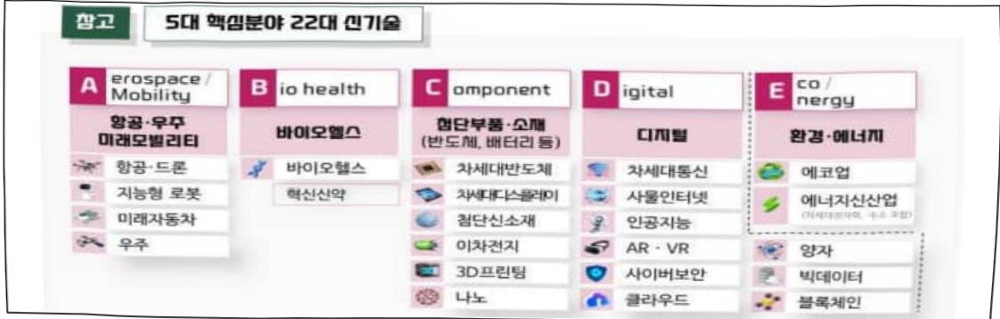
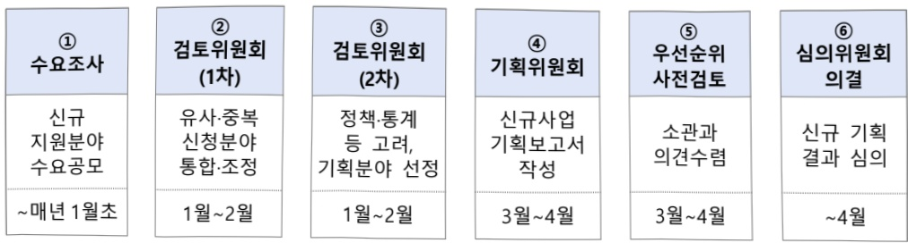

# 산업혁신인재성장지원(R&D)

**해당 페이지**: PDF 4134 ~ 4162 쪽 해당

**부처**: 산업통상부
**분야**: 산업·중소기업 및 에너지
**회계유형**: 일반회계
**2026 확정예산**: 201395.0 백만원
**전년대비 증감률**: 21.2%
**AI 도메인**: 교육/인재

---

### 가.예산 총괄표

(단위: 백만원, %)

<table border=1 style='margin: auto; word-wrap: break-word;'><tr><td rowspan="2">사업명</td><td rowspan="2">2024년 결산</td><td colspan="2">2025년 예산</td><td colspan="2">2026년</td><td rowspan="2">증감(B-A)</td><td rowspan="2">(B-A)/A</td></tr><tr><td style='text-align: center; word-wrap: break-word;'>본예산(A)</td><td style='text-align: center; word-wrap: break-word;'>추경</td><td style='text-align: center; word-wrap: break-word;'>요구안</td><td style='text-align: center; word-wrap: break-word;'>확정(B)</td></tr><tr><td style='text-align: center; word-wrap: break-word;'>산업혁신인재성장지원(R&amp;D)</td><td style='text-align: center; word-wrap: break-word;'>157,479</td><td style='text-align: center; word-wrap: break-word;'>166,145</td><td style='text-align: center; word-wrap: break-word;'>166,145</td><td style='text-align: center; word-wrap: break-word;'>201,395</td><td style='text-align: center; word-wrap: break-word;'>201,395</td><td style='text-align: center; word-wrap: break-word;'>35,250</td><td style='text-align: center; word-wrap: break-word;'>21.2</td></tr></table>

□ 기능별(내역사업별), 목별 예산 내역

(단위:백만원)

<table border=1 style='margin: auto; word-wrap: break-word;'><tr><td rowspan="3"></td><td colspan="4">2024</td><td colspan="7">2025(2025.12월말)</td><td style='text-align: center; word-wrap: break-word;'>2026예산</td></tr><tr><td rowspan="2">예산액(추경)</td><td rowspan="2">예산현액</td><td rowspan="2">집행액[실집행액]</td><td rowspan="2">이월액</td><td rowspan="2">불용액</td><td rowspan="2">본예산</td><td rowspan="2">예산현액</td><td rowspan="2">집행액[실집행액]</td><td colspan="2">전년도이월액제외</td><td rowspan="2">이월예상액</td><td rowspan="2">불용예상액</td></tr><tr><td style='text-align: center; word-wrap: break-word;'>예산현액</td><td style='text-align: center; word-wrap: break-word;'>집행액[실집행액]</td></tr><tr><td style='text-align: center; word-wrap: break-word;'>○ 기능별 분류(함께)</td><td style='text-align: center; word-wrap: break-word;'>157,479</td><td style='text-align: center; word-wrap: break-word;'>157,479</td><td style='text-align: center; word-wrap: break-word;'>157,479[157,479]</td><td style='text-align: center; word-wrap: break-word;'>-</td><td style='text-align: center; word-wrap: break-word;'>-</td><td style='text-align: center; word-wrap: break-word;'>166,145</td><td style='text-align: center; word-wrap: break-word;'>166,145</td><td style='text-align: center; word-wrap: break-word;'>166,145[166,145]</td><td style='text-align: center; word-wrap: break-word;'>166,145</td><td style='text-align: center; word-wrap: break-word;'>166,145[166,145]</td><td style='text-align: center; word-wrap: break-word;'>-</td><td style='text-align: center; word-wrap: break-word;'>-201,395</td></tr><tr><td style='text-align: center; word-wrap: break-word;'>· 교육훈련</td><td style='text-align: center; word-wrap: break-word;'>142,754</td><td style='text-align: center; word-wrap: break-word;'>142,754</td><td style='text-align: center; word-wrap: break-word;'>142,754[142,754]</td><td style='text-align: center; word-wrap: break-word;'>-</td><td style='text-align: center; word-wrap: break-word;'>-</td><td style='text-align: center; word-wrap: break-word;'>149,420</td><td style='text-align: center; word-wrap: break-word;'>149,420</td><td style='text-align: center; word-wrap: break-word;'>149,420[149,420]</td><td style='text-align: center; word-wrap: break-word;'>149,420</td><td style='text-align: center; word-wrap: break-word;'>149,420[149,420]</td><td style='text-align: center; word-wrap: break-word;'>-</td><td style='text-align: center; word-wrap: break-word;'>-177,070</td></tr><tr><td style='text-align: center; word-wrap: break-word;'>· 해외연계</td><td style='text-align: center; word-wrap: break-word;'>8,600</td><td style='text-align: center; word-wrap: break-word;'>8,600</td><td style='text-align: center; word-wrap: break-word;'>8,600[8,600]</td><td style='text-align: center; word-wrap: break-word;'>-</td><td style='text-align: center; word-wrap: break-word;'>-</td><td style='text-align: center; word-wrap: break-word;'>8,600</td><td style='text-align: center; word-wrap: break-word;'>8,600</td><td style='text-align: center; word-wrap: break-word;'>8,600[8,600]</td><td style='text-align: center; word-wrap: break-word;'>8,600</td><td style='text-align: center; word-wrap: break-word;'>8,600[8,600]</td><td style='text-align: center; word-wrap: break-word;'>-</td><td style='text-align: center; word-wrap: break-word;'>-16,200</td></tr><tr><td style='text-align: center; word-wrap: break-word;'>· 정책기반</td><td style='text-align: center; word-wrap: break-word;'>6,125</td><td style='text-align: center; word-wrap: break-word;'>6,125</td><td style='text-align: center; word-wrap: break-word;'>6,125[6,125]</td><td style='text-align: center; word-wrap: break-word;'>-</td><td style='text-align: center; word-wrap: break-word;'>-</td><td style='text-align: center; word-wrap: break-word;'>8,125</td><td style='text-align: center; word-wrap: break-word;'>8,125</td><td style='text-align: center; word-wrap: break-word;'>8,125[8,125]</td><td style='text-align: center; word-wrap: break-word;'>8,125</td><td style='text-align: center; word-wrap: break-word;'>8,125[8,125]</td><td style='text-align: center; word-wrap: break-word;'>-</td><td style='text-align: center; word-wrap: break-word;'>-8,125</td></tr><tr><td style='text-align: center; word-wrap: break-word;'>○ 비목별 분류(함께)</td><td style='text-align: center; word-wrap: break-word;'>157,479</td><td style='text-align: center; word-wrap: break-word;'>157,479</td><td style='text-align: center; word-wrap: break-word;'>157,479[157,479]</td><td style='text-align: center; word-wrap: break-word;'>-</td><td style='text-align: center; word-wrap: break-word;'>-</td><td style='text-align: center; word-wrap: break-word;'>166,145</td><td style='text-align: center; word-wrap: break-word;'>166,145</td><td style='text-align: center; word-wrap: break-word;'>166,145[166,145]</td><td style='text-align: center; word-wrap: break-word;'>166,145</td><td style='text-align: center; word-wrap: break-word;'>166,145[166,145]</td><td style='text-align: center; word-wrap: break-word;'>-</td><td style='text-align: center; word-wrap: break-word;'>-201,395</td></tr><tr><td style='text-align: center; word-wrap: break-word;'>· 연구개발연구활동비등(360-05)</td><td style='text-align: center; word-wrap: break-word;'>157,479</td><td style='text-align: center; word-wrap: break-word;'>157,479</td><td style='text-align: center; word-wrap: break-word;'>157,479[157,479]</td><td style='text-align: center; word-wrap: break-word;'>-</td><td style='text-align: center; word-wrap: break-word;'>-</td><td style='text-align: center; word-wrap: break-word;'>166,145</td><td style='text-align: center; word-wrap: break-word;'>166,145</td><td style='text-align: center; word-wrap: break-word;'>166,145[166,145]</td><td style='text-align: center; word-wrap: break-word;'>166,145</td><td style='text-align: center; word-wrap: break-word;'>166,145[166,145]</td><td style='text-align: center; word-wrap: break-word;'>-</td><td style='text-align: center; word-wrap: break-word;'>-201,395</td></tr><tr><td style='text-align: center; word-wrap: break-word;'>○ 기능비목별 분류(함께)</td><td style='text-align: center; word-wrap: break-word;'>157,479</td><td style='text-align: center; word-wrap: break-word;'>157,479</td><td style='text-align: center; word-wrap: break-word;'>157,479[157,479]</td><td style='text-align: center; word-wrap: break-word;'>-</td><td style='text-align: center; word-wrap: break-word;'>-</td><td style='text-align: center; word-wrap: break-word;'>166,145</td><td style='text-align: center; word-wrap: break-word;'>166,145</td><td style='text-align: center; word-wrap: break-word;'>166,145[166,145]</td><td style='text-align: center; word-wrap: break-word;'>166,145</td><td style='text-align: center; word-wrap: break-word;'>166,145[166,145]</td><td style='text-align: center; word-wrap: break-word;'>-</td><td style='text-align: center; word-wrap: break-word;'>-201,395</td></tr><tr><td style='text-align: center; word-wrap: break-word;'>· 교육훈련</td><td style='text-align: center; word-wrap: break-word;'>142,754</td><td style='text-align: center; word-wrap: break-word;'>142,754</td><td style='text-align: center; word-wrap: break-word;'>142,754[142,754]</td><td style='text-align: center; word-wrap: break-word;'>-</td><td style='text-align: center; word-wrap: break-word;'>-</td><td style='text-align: center; word-wrap: break-word;'>149,420</td><td style='text-align: center; word-wrap: break-word;'>149,420</td><td style='text-align: center; word-wrap: break-word;'>149,420[149,420]</td><td style='text-align: center; word-wrap: break-word;'>149,420</td><td style='text-align: center; word-wrap: break-word;'>149,420[149,420]</td><td style='text-align: center; word-wrap: break-word;'>-</td><td style='text-align: center; word-wrap: break-word;'>-177,070</td></tr><tr><td style='text-align: center; word-wrap: break-word;'>· 연구개발연구활동비등(360-05)</td><td style='text-align: center; word-wrap: break-word;'>142,754</td><td style='text-align: center; word-wrap: break-word;'>142,754</td><td style='text-align: center; word-wrap: break-word;'>142,754[142,754]</td><td style='text-align: center; word-wrap: break-word;'>-</td><td style='text-align: center; word-wrap: break-word;'>-</td><td style='text-align: center; word-wrap: break-word;'>149,420</td><td style='text-align: center; word-wrap: break-word;'>149,420</td><td style='text-align: center; word-wrap: break-word;'>149,420[149,420]</td><td style='text-align: center; word-wrap: break-word;'>149,420</td><td style='text-align: center; word-wrap: break-word;'>149,420[149,420]</td><td style='text-align: center; word-wrap: break-word;'>-</td><td style='text-align: center; word-wrap: break-word;'>-177,070</td></tr><tr><td style='text-align: center; word-wrap: break-word;'>· 해외연계</td><td style='text-align: center; word-wrap: break-word;'>8,600</td><td style='text-align: center; word-wrap: break-word;'>8,600</td><td style='text-align: center; word-wrap: break-word;'>8,600[8,600]</td><td style='text-align: center; word-wrap: break-word;'>-</td><td style='text-align: center; word-wrap: break-word;'>-</td><td style='text-align: center; word-wrap: break-word;'>8,600</td><td style='text-align: center; word-wrap: break-word;'>8,600</td><td style='text-align: center; word-wrap: break-word;'>8,600[8,600]</td><td style='text-align: center; word-wrap: break-word;'>8,600</td><td style='text-align: center; word-wrap: break-word;'>8,600[8,600]</td><td style='text-align: center; word-wrap: break-word;'>-</td><td style='text-align: center; word-wrap: break-word;'>-16,200</td></tr><tr><td style='text-align: center; word-wrap: break-word;'>· 연구개발연구활동비등(360-05)</td><td style='text-align: center; word-wrap: break-word;'>8,600</td><td style='text-align: center; word-wrap: break-word;'>8,600</td><td style='text-align: center; word-wrap: break-word;'>8,600[8,600]</td><td style='text-align: center; word-wrap: break-word;'>-</td><td style='text-align: center; word-wrap: break-word;'>-</td><td style='text-align: center; word-wrap: break-word;'>8,600</td><td style='text-align: center; word-wrap: break-word;'>8,600</td><td style='text-align: center; word-wrap: break-word;'>8,600[8,600]</td><td style='text-align: center; word-wrap: break-word;'>8,600</td><td style='text-align: center; word-wrap: break-word;'>8,600[8,600]</td><td style='text-align: center; word-wrap: break-word;'>-</td><td style='text-align: center; word-wrap: break-word;'>-16,200</td></tr><tr><td style='text-align: center; word-wrap: break-word;'>· 정책기반</td><td style='text-align: center; word-wrap: break-word;'>6,125</td><td style='text-align: center; word-wrap: break-word;'>6,125</td><td style='text-align: center; word-wrap: break-word;'>6,125[6,125]</td><td style='text-align: center; word-wrap: break-word;'>-</td><td style='text-align: center; word-wrap: break-word;'>-</td><td style='text-align: center; word-wrap: break-word;'>8,125</td><td style='text-align: center; word-wrap: break-word;'>8,125</td><td style='text-align: center; word-wrap: break-word;'>8,125[8,125]</td><td style='text-align: center; word-wrap: break-word;'>8,125</td><td style='text-align: center; word-wrap: break-word;'>8,125[8,125]</td><td style='text-align: center; word-wrap: break-word;'>-</td><td style='text-align: center; word-wrap: break-word;'>-8,125</td></tr><tr><td style='text-align: center; word-wrap: break-word;'>· 연구개발연구활동비등(360-05)</td><td style='text-align: center; word-wrap: break-word;'>6,125</td><td style='text-align: center; word-wrap: break-word;'>6,125</td><td style='text-align: center; word-wrap: break-word;'>6,125[6,125]</td><td style='text-align: center; word-wrap: break-word;'>-</td><td style='text-align: center; word-wrap: break-word;'>-</td><td style='text-align: center; word-wrap: break-word;'>8,125</td><td style='text-align: center; word-wrap: break-word;'>8,125</td><td style='text-align: center; word-wrap: break-word;'>8,125[8,125]</td><td style='text-align: center; word-wrap: break-word;'>8,125</td><td style='text-align: center; word-wrap: break-word;'>8,125[8,125]</td><td style='text-align: center; word-wrap: break-word;'>-</td><td style='text-align: center; word-wrap: break-word;'>-8,125</td></tr></table>

---

### 나. 사업설명자료

## 1 ) 사업목적·내용

- (산업혁신인재성장지원) 첨단전략산업 육성 및 주력산업 고도화를 위한 산업별

수요기반 석·박사 혁신인재 양성 및 활용 지원

- (①교육훈련) 첨단산업 및 주력산업의 업종별 대학원 교육과정(학위) 개발·운영, 산학

프로제트 수행 등을 통해 산업계가 필요로 하는 석·박사급 혁신인재 양성

- (②해외연계) ①신진연구자 해외 공동연구, ②우수 외국인 유학생 지역기업 연계, ③해외

석학 유치를 지원하여 국내 산업 경쟁력 강화 및 글로벌 인재 유치 촉진

- (③정책기반) 법정 승인통계(제115016호, 통계법 제18조)로 지정된 ①산업기술인력 수급 통계 조사, 산업발전법 제12조제2항에 따른 법정기능 이행을 위한 ②산업별 인적자원 협의체 운영, ‘첨단산업 인재혁신 특별법’ 시행(25.1.17.)에 따른 ③첨단산업 인재혁신 촉진을 위해 기업인재개발기관 지정제도 등 법정기능 수행

## 2 ) 사업개요

## □ 사업근거 및 추진경위

① 법령상 근거 및 조항 적시

-산업기술혁신촉진법 제19조(산업기술기반조성사업), 제20조의2(산업기술인력의 활용 및 공급)

- 국가첨단전략산업 경쟁력 강화 및 보호에 관한 특별조치법 제35조(전문인력양성 등), 제37조(국가첨단전략산업특성화대학의 지정 등)

-산업발전법 제4조(중·장기산업발전전망 등), 제12조의2(기업경영자원의 개발 촉진 등)

- 정부승인통계 제115016호, 통계법 제18조

- 첨단산업인재혁신특별법 제5조(기업인재개발기관등의 지정), 제7조(첨단아카데미의 지정 등), 제8조(인재혁신전문기업의 등록 등), 제10조(전문양성인의 등록 등), 제14조(인재혁신센터의 설치), 제23조(첨단산업 청년·여성인재의 양성·활용)

## ② 추진경위

- '09.7월『지식경제부 인력사업 통합관리 방안』수립

- '11.3월 지식경제부 2011년도 인력사업 종합시행계획 수립

- '13.2월 지식경제부 2013년도 인력사업 종합시행계획 수립

- '14.3월 산업통상자원부 2014년도 인력사업 종합시행계획 수립

- '15.4월 산업인력양성사업 개편

---

- '16.2월 산업부 인력사업 종합시행계획 수립

- '17.1월 산업부 인력사업 종합시행계획 수립

- '18.1월 2018년도 산업통상자원부 인력양성계획 수립

- '19.2월 제4차 과학기술기본계획

- '19.3월 제7차 산업기술혁신기본계획

- '19.6월 제조업 르네상스 비전 및 전략

- '19.8월 혁신성장 확산·가속화 전략

- '20.5월 엔지니어링산업 혁신전략

- '20.7월 뿌리 4.0 경쟁력 강화 마스터 플랜

- '20.7월 소재·부품·장비 2.0 전략

- '20.7월 한국판 뉴딜 종합계획

- '20.8월 디지털 기반 산업 혁신성장 전략

- '20.10월 미래자동차 확산 및 시장선점 전략

- '20.11월 섬유패션산업 한국판 뉴딜 실행전략

- '20.12월 혁신성장 BIG3 산업 집중육성 추진계획

- '20.12월 화이트바이오 산업 활성화 전략

- '20.12월 제1차 청년정책 기본계획

- '21.1월 시스템반도체 핵심인력양성

- '21.2월 제4차 과학기술인재 육성·지원 기본계획

- '21.2월 탄소소재 융복합 산업 종합 발전 전략

- '21.3월 디지털 유통 경쟁력강화 방안

- '21.4월 빅3+인공지능 인재양성 방안

- '21.5월 K-반도체 전략

- '21.7월 2030 이차전지 산업 발전 전략

- '22.2월 디지털 헬스케어 서비스 산업 육성 전략

- '22.7월 반도체 초강대국 달성전략

- '22.9월 자동차 산업 글로벌 3강

- '22.10월 조선산업 초격자 확보 전략

- '22.11월 이차전지 산업 혁신전략

- '22.11월 국가첨단전략산업 특성화대학원 추진계획

- '22.12월 신성장 4.0 전략 추진계획

- '22.12월 제5차 과학기술기본계획

- '23.02월 첨단분야 인재양성 전략

- '23.03월 국가첨단산업 육성전략

---

- '23.04월 바이오헬스 인재양성 방안

- '23.04월 산업대전환 초격차 프로젝트

- '23.05월 디스플레이 산업 혁신전략

- '23.05월 제1차 국가첨단전략산업 육성·보호 기본계획

- '24.01월 제4차 지능형로봇 기본계획

- '24.02월 신산업정책2.0 전략

- '24.04월 바이오제조 혁신전략

- '24.04월 AI-반도체 이니셔티브

- '24.06월 반도체 생태계 종합지원 추진방안

- '24.08월 제1차 국가전략기술 육성 기본계획

- '24.11 월 제8차 산업기술혁신계획

## □ 주요내용

① 사업규모

- 총사업비(해당되는 경우에만 기재) : 해당없음

- 사업기간 : 1995 ~ 계속

- 최근 5년 간 투입된 사업비(예산액기준, 추경편성한 연도에는 추경포함)

<table border=1 style='margin: auto; word-wrap: break-word;'><tr><td style='text-align: center; word-wrap: break-word;'>$ \underline{\text{所}} $</td><td style='text-align: center; word-wrap: break-word;'>2022</td><td style='text-align: center; word-wrap: break-word;'>2023</td><td style='text-align: center; word-wrap: break-word;'>2024</td><td style='text-align: center; word-wrap: break-word;'>2025</td><td style='text-align: center; word-wrap: break-word;'>2026</td></tr><tr><td style='text-align: center; word-wrap: break-word;'>$ \underline{\text{사}} $</td><td style='text-align: center; word-wrap: break-word;'>130,442</td><td style='text-align: center; word-wrap: break-word;'>135,658</td><td style='text-align: center; word-wrap: break-word;'>157,479</td><td style='text-align: center; word-wrap: break-word;'>166,145</td><td style='text-align: center; word-wrap: break-word;'>201,395</td></tr></table>

-기타:해당없음

② 사업추진체계

- 사업시행방법 : 출연(민간 매칭)

- 사업시행주체 : 대학, 연구소, 협회·단체 등 비영리기관

- 사업 수혜자 : 대학원생 등

- 보조, 융자, 출연, 출자 등의 경우 보조·융자 등 지원 비율 및 법적근거

<table border=1 style='margin: auto; word-wrap: break-word;'><tr><td style='text-align: center; word-wrap: break-word;'>내역사업명</td><td style='text-align: center; word-wrap: break-word;'>구분</td><td style='text-align: center; word-wrap: break-word;'>피보조·피출연 등 기관명</td><td style='text-align: center; word-wrap: break-word;'>지원 금액 (2026예산)</td><td style='text-align: center; word-wrap: break-word;'>지원 비율(%)</td><td style='text-align: center; word-wrap: break-word;'>보조율 법적근거 (해당 조항)</td></tr><tr><td style='text-align: center; word-wrap: break-word;'>교육훈련</td><td rowspan="3">출연</td><td rowspan="3">한국 산업기술 진흥원</td><td style='text-align: center; word-wrap: break-word;'>177,070</td><td rowspan="3">100% 이내</td><td rowspan="3">산업기술혁신촉진법 제19조 제1항, 제2항</td></tr><tr><td style='text-align: center; word-wrap: break-word;'>해외연계</td><td style='text-align: center; word-wrap: break-word;'>16,200</td></tr><tr><td style='text-align: center; word-wrap: break-word;'>정책기반</td><td style='text-align: center; word-wrap: break-word;'>8,125</td></tr></table>

---

3) 2026년도 예산 산출 근거

□ 산업혁신인재성장지원(R&D): (2025 본예산) 166,145 → (2026 예산) 201,395, +35,250백만원

① 교육훈련 : (2025 본예산) 149,420 → (2026 예산) 177,070, +27,650백만원

- (요구) 첨단·주력산업 분야 산업수요 기반 석·박사 인재양성 및 박사후연구원 성장지원을 위해 증액 요구

- (산출) 계속 : 47개 과제 × 2,614.6백만원 × 12/12개월 = 122,885백만원

신규 : 12개 과제 × 4,515.4백만원 × 12/12개월 = 54,185백만원

② 해외연계 : (2025 본예산) 8,600 → (2026 예산) 16,200, +7,600 백만원

- (요구) 신진연구자 해외 공동연구 지원, 우수 외국인 유학생 지역기업 연계, 해외석학 유치를 위해 증액 요구

- (산출) 계속 : (내국인) 112명 × 95.5백만원 × 10/12개월 = 9,000백만원

신규 : (외국인) 100명 × 30백만원 × 12/12개월 = 3,000백만원

신규 : (해외석학) 14명 × 600백만원 × 6/12개월 = 4,200백만원

③ 정책기반 : (2025 본예산) 8,125 → (2026 예산) 8,125, 전년동

- (요구) 산업기술인력 수급통계, 산업별 인적자원개발협의체(SC) 지원 등을 위해 전년 수준 요구

- (산출) 계속 : 3개 과제 × 2,708백만원 × 12/12개월 = 8,125백만원

## 0 2025년도 예산 및 2026년도 예산 산출 세부내역 비교

<table border=1 style='margin: auto; word-wrap: break-word;'><tr><td colspan="2">2025년 본예산</td><td colspan="2">2026년 예산</td></tr><tr><td style='text-align: center; word-wrap: break-word;'>예산</td><td style='text-align: center; word-wrap: break-word;'>산출내역</td><td style='text-align: center; word-wrap: break-word;'>예산</td><td style='text-align: center; word-wrap: break-word;'>산출내역</td></tr><tr><td style='text-align: center; word-wrap: break-word;'>166,145</td><td style='text-align: center; word-wrap: break-word;'>· 연구개발연구활동비등(360-05): 166,145백만원가. 교육훈련(149,420백만원) · 청단산업 특성화대학원 및 산업계 수요 기반의 업종별 석·박사혁신인재 양성을 위한 교육훈련 예산 149,420백만원 · (계속) 44개 과제 × 2,452.2백만원 × 12/12개월 = 107,898백만원 (신규) 14개 과제 × 2,965.9백만원 × 12/12개월 = 41,522백만원 나. 해외연계(8,600백만원) · 국내 석·박사급 신진연구자와 해외 우수 연구기관간 공동연구 수행을 위한 지원 예산 8,600백만원 · (계속) 107명 × 96.5백만원 × 10/12개월 = 8,600백만원 다. 정책기반(8,125백만원) · 산업기술인력 수급실태조사 및 유망신산업 인력전망 통계조사, 산업별 인적자원개발협의체 운영, 청단산업 인재혁신 특별법에 따른 제도운영 예산 8,125백만원 · (계속) 2개 과제 × 3,312.5백만원 × 12/12개월 = 6,625백만원 (신규) 1개 과제 × 1,500백만원 × 12/12개월 = 1,500백만원</td><td style='text-align: center; word-wrap: break-word;'>산업혁신 인재성장 지원 (R&amp;D) 201,395</td><td style='text-align: center; word-wrap: break-word;'>· 연구개발연구활동비등(360-05): 201,395백만원 가. 교육훈련(177,070백만원) · 청단산업 특성화대학원 및 산업계 수요 기반 석·박사휴연구원 양성을 위한 교육훈련 예산 177,070백만원 · (계속) 47개 과제 × 2,614.6백만원 × 12/12개월 = 122,885백만원 (신규) 12개 과제 × 4,515.4백만원 × 12/12개월 = 54,185백만원 나. 해외연계(16,200백만원) · 신진연구자 해외 공동연구 지원, 우수 외국인 유학생 지역기업 연계, 해외 석학 유치를 위한 지원 예산 16,200백만원 · (계속) (내국인) 112명 × 95.5백만원 × 10/12개월 = 9,000백만원 (신규) (외국인) 100명 × 30백만원 × 12/12개월 = 3,000백만원 (신규) (석학) 14명 × 600백만원 × 6/12개월 = 4,200백만원 다. 정책기반(8,125백만원) · 산업기술인력 수급실태조사 및 유망신산업 인력전망 통계조사, 산업별 인적자원개발협의체 운영, 청단산업 인재혁신 특별법에 따른 제도운영 예산 8,125백만원 · (계속) 3개 과제 × 2,708.3백만원 × 12/12개월 = 8,125백만원</td></tr></table>

---

## 4 ) 사업효과

## □ 사업영향, 산출물 성과지표 등

① 2022~2026년도 성과계획서 상 성과지표 및 최근 5년간 성과 달성도

<table border=1 style='margin: auto; word-wrap: break-word;'><tr><td style='text-align: center; word-wrap: break-word;'>성과지표</td><td style='text-align: center; word-wrap: break-word;'>구분</td><td style='text-align: center; word-wrap: break-word;'>2022</td><td style='text-align: center; word-wrap: break-word;'>2023</td><td style='text-align: center; word-wrap: break-word;'>2024</td><td style='text-align: center; word-wrap: break-word;'>2025</td><td style='text-align: center; word-wrap: break-word;'>2026</td><td style='text-align: center; word-wrap: break-word;'>2026 목표치산출근거</td><td style='text-align: center; word-wrap: break-word;'>측정산식(또는 측정방법)</td><td style='text-align: center; word-wrap: break-word;'>자료수집방법(또는 자료출처)</td></tr><tr><td rowspan="3">석박사배출인원수(단위: 명)</td><td style='text-align: center; word-wrap: break-word;'>목표</td><td style='text-align: center; word-wrap: break-word;'>850</td><td style='text-align: center; word-wrap: break-word;'>900</td><td style='text-align: center; word-wrap: break-word;'>1,350</td><td style='text-align: center; word-wrap: break-word;'>1,485</td><td style='text-align: center; word-wrap: break-word;'>1,541</td><td rowspan="3">&#x27;25년 수행기관사업목표(1,401)대비 10% 상향</td><td rowspan="3">∑석박사배출인원수</td><td rowspan="3">전문기관사업성과 자료</td></tr><tr><td style='text-align: center; word-wrap: break-word;'>실적</td><td style='text-align: center; word-wrap: break-word;'>1,223</td><td style='text-align: center; word-wrap: break-word;'>1,307</td><td style='text-align: center; word-wrap: break-word;'>1,535</td><td style='text-align: center; word-wrap: break-word;'>-</td><td style='text-align: center; word-wrap: break-word;'>-</td></tr><tr><td style='text-align: center; word-wrap: break-word;'>달성도</td><td style='text-align: center; word-wrap: break-word;'>143.8</td><td style='text-align: center; word-wrap: break-word;'>145.2</td><td style='text-align: center; word-wrap: break-word;'>113.7</td><td style='text-align: center; word-wrap: break-word;'>-</td><td style='text-align: center; word-wrap: break-word;'>-</td></tr><tr><td rowspan="3">글로벌 인재양성수혜인원(단위: 명)</td><td style='text-align: center; word-wrap: break-word;'>목표</td><td style='text-align: center; word-wrap: break-word;'>100</td><td style='text-align: center; word-wrap: break-word;'>100</td><td style='text-align: center; word-wrap: break-word;'>107</td><td style='text-align: center; word-wrap: break-word;'>107</td><td style='text-align: center; word-wrap: break-word;'>112</td><td rowspan="3">수행기관사업목표</td><td rowspan="3">해당년도 내출국을 완료한 파견연구자의 수</td><td rowspan="3">전문기관사업성과 자료</td></tr><tr><td style='text-align: center; word-wrap: break-word;'>실적</td><td style='text-align: center; word-wrap: break-word;'>110</td><td style='text-align: center; word-wrap: break-word;'>117</td><td style='text-align: center; word-wrap: break-word;'>115</td><td style='text-align: center; word-wrap: break-word;'>-</td><td style='text-align: center; word-wrap: break-word;'>-</td></tr><tr><td style='text-align: center; word-wrap: break-word;'>달성도</td><td style='text-align: center; word-wrap: break-word;'>110.0</td><td style='text-align: center; word-wrap: break-word;'>117.0</td><td style='text-align: center; word-wrap: break-word;'>107.5</td><td style='text-align: center; word-wrap: break-word;'>-</td><td style='text-align: center; word-wrap: break-word;'>-</td></tr><tr><td rowspan="3">첨단 신기술분야인력공급 기여도(단위: %)</td><td style='text-align: center; word-wrap: break-word;'>목표</td><td style='text-align: center; word-wrap: break-word;'>신규</td><td style='text-align: center; word-wrap: break-word;'>30.0</td><td style='text-align: center; word-wrap: break-word;'>30.0</td><td style='text-align: center; word-wrap: break-word;'>30.0</td><td style='text-align: center; word-wrap: break-word;'>34.87</td><td rowspan="3">최신통계 고려, 전년대비 4.8% 상향</td><td rowspan="3">∑(첨단 신기술 분야배출인원 수) ÷ ∑(첨단 신기술 분야연령균 석·박사 부족인원) × 100</td><td rowspan="3">인력수요 전망결과보고서 및 전문기관 관리배출인원수</td></tr><tr><td style='text-align: center; word-wrap: break-word;'>실적</td><td style='text-align: center; word-wrap: break-word;'>-</td><td style='text-align: center; word-wrap: break-word;'>37.9</td><td style='text-align: center; word-wrap: break-word;'>41.6</td><td style='text-align: center; word-wrap: break-word;'>-</td><td style='text-align: center; word-wrap: break-word;'>-</td></tr><tr><td style='text-align: center; word-wrap: break-word;'>달성도</td><td style='text-align: center; word-wrap: break-word;'>-</td><td style='text-align: center; word-wrap: break-word;'>126.3</td><td style='text-align: center; word-wrap: break-word;'>138.7</td><td style='text-align: center; word-wrap: break-word;'>-</td><td style='text-align: center; word-wrap: break-word;'>-</td></tr><tr><td rowspan="3">산학프로젝트기업도움도(단위: %)</td><td style='text-align: center; word-wrap: break-word;'>목표</td><td style='text-align: center; word-wrap: break-word;'>신규</td><td style='text-align: center; word-wrap: break-word;'>33.0</td><td style='text-align: center; word-wrap: break-word;'>33.6</td><td style='text-align: center; word-wrap: break-word;'>34.3</td><td style='text-align: center; word-wrap: break-word;'>44.84</td><td rowspan="3">&#x27;24년 실적 대비 0.1% 상향</td><td rowspan="3">∑(산학협력활동실무활용 가능성에 &quot;매우 그렇다&quot; (5점) 응답자수)÷∑(전소시엄 기업 만족도 응답자 수) × 100</td><td rowspan="3">전소시엄 기업 추적 만족도 조사결과</td></tr><tr><td style='text-align: center; word-wrap: break-word;'>실적</td><td style='text-align: center; word-wrap: break-word;'>-</td><td style='text-align: center; word-wrap: break-word;'>47.6</td><td style='text-align: center; word-wrap: break-word;'>44.8</td><td style='text-align: center; word-wrap: break-word;'>-</td><td style='text-align: center; word-wrap: break-word;'>-</td></tr><tr><td style='text-align: center; word-wrap: break-word;'>달성도</td><td style='text-align: center; word-wrap: break-word;'>-</td><td style='text-align: center; word-wrap: break-word;'>144.1</td><td style='text-align: center; word-wrap: break-word;'>133.3</td><td style='text-align: center; word-wrap: break-word;'>-</td><td style='text-align: center; word-wrap: break-word;'>-</td></tr><tr><td rowspan="3">교육내용의취업도움도(단위: 점)</td><td style='text-align: center; word-wrap: break-word;'>목표</td><td style='text-align: center; word-wrap: break-word;'>신규</td><td style='text-align: center; word-wrap: break-word;'>78.0</td><td style='text-align: center; word-wrap: break-word;'>79.0</td><td style='text-align: center; word-wrap: break-word;'>80.0</td><td style='text-align: center; word-wrap: break-word;'>87.5</td><td rowspan="3">&#x27;24년 실적 유지</td><td rowspan="3">수혜자 교육내용의취업도움도 점수 평균(5점 척도 측정 후 100점 환산)</td><td rowspan="3">수혜·배출인원 추적 만족도 조사결과</td></tr><tr><td style='text-align: center; word-wrap: break-word;'>실적</td><td style='text-align: center; word-wrap: break-word;'>-</td><td style='text-align: center; word-wrap: break-word;'>81.1</td><td style='text-align: center; word-wrap: break-word;'>87.5</td><td style='text-align: center; word-wrap: break-word;'>-</td><td style='text-align: center; word-wrap: break-word;'>-</td></tr><tr><td style='text-align: center; word-wrap: break-word;'>달성도</td><td style='text-align: center; word-wrap: break-word;'>-</td><td style='text-align: center; word-wrap: break-word;'>104.0</td><td style='text-align: center; word-wrap: break-word;'>110.8</td><td style='text-align: center; word-wrap: break-word;'>-</td><td style='text-align: center; word-wrap: break-word;'>-</td></tr><tr><td rowspan="3">교육내용의현업도움도(단위: 점)</td><td style='text-align: center; word-wrap: break-word;'>목표</td><td style='text-align: center; word-wrap: break-word;'>-</td><td style='text-align: center; word-wrap: break-word;'>-</td><td style='text-align: center; word-wrap: break-word;'>-</td><td style='text-align: center; word-wrap: break-word;'>신규</td><td style='text-align: center; word-wrap: break-word;'>81.93</td><td rowspan="3">&#x27;24년 실적 대비(별도 조사, 80.99) 1.16% 상향</td><td rowspan="3">수혜자의 직무기술기능수준 교육내용의 업무수행 도움도 점수 평균(5점 척도 측정 후 100점 환산)</td><td rowspan="3">수혜·배출인원 추적 만족도 조사결과</td></tr><tr><td style='text-align: center; word-wrap: break-word;'>실적</td><td style='text-align: center; word-wrap: break-word;'>-</td><td style='text-align: center; word-wrap: break-word;'>-</td><td style='text-align: center; word-wrap: break-word;'>-</td><td style='text-align: center; word-wrap: break-word;'>-</td><td style='text-align: center; word-wrap: break-word;'>-</td></tr><tr><td style='text-align: center; word-wrap: break-word;'>달성도</td><td style='text-align: center; word-wrap: break-word;'>-</td><td style='text-align: center; word-wrap: break-word;'>-</td><td style='text-align: center; word-wrap: break-word;'>-</td><td style='text-align: center; word-wrap: break-word;'>-</td><td style='text-align: center; word-wrap: break-word;'>-</td></tr><tr><td rowspan="3">취업자 역량비교우위(단위: %)</td><td style='text-align: center; word-wrap: break-word;'>목표</td><td style='text-align: center; word-wrap: break-word;'>신규</td><td style='text-align: center; word-wrap: break-word;'>19.30</td><td style='text-align: center; word-wrap: break-word;'>19.71</td><td style='text-align: center; word-wrap: break-word;'>20.39</td><td style='text-align: center; word-wrap: break-word;'>21.0</td><td rowspan="3">&#x27;24년 실적 대비 0.8% 상향</td><td rowspan="3">∑(취업자 역량만족도)÷∑(비교대상 일반직원 역량 만족도) × 100 - 100</td><td rowspan="3">채용기업 추적 만족도 조사결과</td></tr><tr><td style='text-align: center; word-wrap: break-word;'>실적</td><td style='text-align: center; word-wrap: break-word;'>-</td><td style='text-align: center; word-wrap: break-word;'>23.36</td><td style='text-align: center; word-wrap: break-word;'>20.2</td><td style='text-align: center; word-wrap: break-word;'>-</td><td style='text-align: center; word-wrap: break-word;'>-</td></tr><tr><td style='text-align: center; word-wrap: break-word;'>달성도</td><td style='text-align: center; word-wrap: break-word;'>-</td><td style='text-align: center; word-wrap: break-word;'>121.0</td><td style='text-align: center; word-wrap: break-word;'>102.5</td><td style='text-align: center; word-wrap: break-word;'>-</td><td style='text-align: center; word-wrap: break-word;'>-</td></tr></table>

---

② 성과지표 이외의 연도별 사업추진 경과 및 실적

<table border=1 style='margin: auto; word-wrap: break-word;'><tr><td style='text-align: center; word-wrap: break-word;'>2022</td><td style='text-align: center; word-wrap: break-word;'>○ (교육훈련) 미래전략산업 등 신산업 분야 및 주력산업 구조 변화에 대응할 수 있는 산업기술 인력을 선제적으로 양성·공급할 수 있도록 신규 및 기존과제 지속 추진 - (&#x27;22년 신규&#x27;) 미래형자동차핵심기술, 화이트바이오, 스마트센서, 도심항공모빌리티(UAM) 등 - (&#x27;23년 기획&#x27;) 반도체특성화대학원, 우주소재부품장비, 미래차보안시스템, 첨단나노소재 등 ○ (해외연계) 해외 우수 연구기관과의 공동 프로젝트 지속 추진 지원(&#x27;22년 100명 파견&#x27;) ○ (정책기반) 산업별 인적자원개발협의체(SC) 직무가이드 제작 및 협업 강화, 산업기술인력 수급 통계 및 미래 신산업 인력수요전망 조사 지속 추진 - (SC) 인력 수요 발굴을 위한 산업별 직무 가이드 제작·배포 및 3개 분과별 대표 SC 선발을 통한 실무위원회 운영, 공동 이슈브리프 발간 등 협업 강화 - (통계) 수급실태조사(&#x27;22.7~10월&#x27;, &#x27;22년 부품·장비 분야 4개 신산업(XR(AR·VR), 지능형로봇, 차세대디스플레이, 차세대반도체) 인력수요전망 추진</td></tr><tr><td style='text-align: center; word-wrap: break-word;'>2023</td><td style='text-align: center; word-wrap: break-word;'>○ (교육훈련) 국가첨단산업 등 미래전략산업 분야 및 주력산업 구조 변화에 대응할 수 있는 산업기술인력을 선제적으로 양성·공급할 수 있도록 신규 및 기존과제 지속 추진 - (&#x27;24년 기획&#x27;) 배터리·디스플레이·바이오특성화대학원, 첨단로봇산업, 미래형자동차융합SW 등 ○ (해외연계) 해외 우수 연구기관과의 공동 프로젝트 지속 추진 지원(&#x27;23년 100명 파견&#x27;) ○ (정책기반) 산업별 인적자원개발협의체(SC) 협업 강화를 통한 인력양성·공급 관련 기능 수행, 산업기술인력 수급통계 및 미래 신산업 인력수요전망 조사 지속 추진 - (SC) 인력 수요 발굴을 위한 실무위원회 운영, 업종별 인력수급조사 및 교육훈련 수요 분석 등 - (통계) 수급실태조사(&#x27;23.7~10월&#x27;, &#x27;23년 소재 분야 4개 신산업(신금속소재, 차세대세라믹소재, 첨단화하소재, 하이테크섬유소재&#x27;) 및 이차전지산업(신규 추가) 인력수요전망 추진</td></tr><tr><td style='text-align: center; word-wrap: break-word;'>2024</td><td style='text-align: center; word-wrap: break-word;'>○ (교육훈련) 국가첨단전략산업 육성 및 주력산업 고도화 대응에 필요한 산업기술인력을 선제적으로 양성·공급할 수 있도록 신규 및 기존과제 지속 추진 - (&#x27;25년 기획&#x27;) 화합물전력반도체, 바이오데이터, 하이테크섬유, XR산업 등 ○ (해외연계) 해외 우수 연구기관과의 공동 프로젝트 지속 추진 지원(&#x27;24년 107명 파견&#x27;) ○ (정책기반) 산업별 인적자원개발협의체(SC) 운영 및 산업기술인력 수급통계조사 등 지속 추진 - (SC) 산업정책과의 연계 강화 등을 위해 첨단전략산업·주력산업·에너지신산업 등 3개 분과 20개 산업분야로 개편 - (통계) 수급실태조사(&#x27;24.7~10월&#x27;, &#x27;24년 시스템 분야 5개 신산업(IoT가전, 디지털헬스케어, 미래형자동차, 스마트·친환경선박, 첨단항공) 인력수요전망 추진</td></tr><tr><td style='text-align: center; word-wrap: break-word;'>2025</td><td style='text-align: center; word-wrap: break-word;'>○ (교육훈련) 국가첨단전략산업 육성 및 주력산업 고도화 대응에 필요한 산업기술인력을 선제적으로 양성·공급할 수 있도록 신규 및 기존과제 지속 추진 - (&#x27;26년 기획&#x27;) 첨단분야AI제품응용기술, AX기반제조공정활용기술, 디지털조선소 등 ○ (해외연계) 해외 우수 연구기관과의 공동 프로젝트 지속 추진 지원(&#x27;25년 107명 파견&#x27;) ○ (정책기반) 산업별 인적자원개발협의체(SC) 운영 및 산업기술인력 수급통계조사 등 지속 추진 - (SC) 산업구조 변화 등에 대응하기 위해 2개 SC 신설(인공지능(AI), 석유화학) - (통계) 수급실태조사(&#x27;25.8~10월&#x27;, &#x27;25년 유망 신산업(IoT가전, 지능형로봇, XR) 인력수요전망, 첨단산업 청년·여성인재 활용현황 실태 시범조사 추진 - (특별법) 법 제2조제1호다목에 따라 인공지능, 첨단 모빌리티 분야를 첨단산업으로 확대 고시하도록 지원하고 첨단산업아카데미 등 지정 및 등록제도 추진</td></tr></table>

---

③ 향후(2026년도 이후) 기대효과

- 첨단·주력산업 육성·고도화를 위해 산업계 수요 맞춤형 석·박사 전문인력 지속 양성

* ('26년) 첨단 및 주력산업 58개 과제 운영을 통해 4,472명 이상의 석·박사 학생 교육 목표

- 글로벌 연구 네트워크 강화를 위한 신진연구자 과견, 외국인 유학생 지역기업 연계 지원

* ('26년) 첨단산업 분야 신진연구자 112명 해외 파견, 외국인 유학생 100명 지원 목표

- 첨단 제조융합 분야 박사후연구원 프로젝트 지원, 최고급 해외인재 유치 추진

* ('26년) 첨단 제조융합 분야 박사후연구원 100명, 해외 석학 유치 14명 규모 지원 목표

## 5 ) 타당성조사 및 예비타당성조사 시행여부 및 결과 요지 : 해당없음

## 6 ) 총사업비 대상사업 여부 및 내역 : 해당없음

## 7 ) 사업 집행절차

사업 공고

## < 사업 추진 절차(내역사업 공통) >

사업계획서 접수

사업계획 심의 및

사업자 확정

ㅇ 홈페이지 공고

협약체결

o 전문기관

사업수행 및 결과보고

사업추진 점검·평가

0 전문기관의 심사, 평가를 거쳐 산업통상부장관

이 연구개발기관 선정 확정

최종완료 및 성과활용

0 전문기관 ↔ 연구개발기관

o 연구개발기관 → 전문기관

o 전문기관의 추진상황 정기점검 및 평가

0 최종 성과에 대한 평가 및 성과활용 계획 보고

산업기술혁신사업

공통운영요령

산업기술혁신사업

공통운영요령

산업기술혁신사업

공통운영요령

산업기술혁신사업

공통운영요령

산업기술혁신사업

공통운영요령

산업기술혁신사업

공통운영요령

산업기술혁신사업

공통운영요령

## < 사업 집행절차('26년 예산 기준) >

산업통상부

201,395백만원

한국산업기술진흥원(KIAT)

201,395백만원

교육훈련·해외연계

(대학연구소·협단체등비영리기관)

193,270백만원

정책기반

(KIAT·비영리기관)

8,125백만원

---

## 8 ) 중기재정계획 상 연도별 투자계획 및 추진경과

(단위: 백만원)

<table border=1 style='margin: auto; word-wrap: break-word;'><tr><td style='text-align: center; word-wrap: break-word;'>$ \underset{\cdot}{会} $ $ \underset{\cdot}{刀} $ 2024</td><td style='text-align: center; word-wrap: break-word;'>2025</td><td style='text-align: center; word-wrap: break-word;'>2026</td><td style='text-align: center; word-wrap: break-word;'>2027</td><td style='text-align: center; word-wrap: break-word;'>2028</td><td style='text-align: center; word-wrap: break-word;'>2029</td></tr><tr><td style='text-align: center; word-wrap: break-word;'>2024~2028</td><td style='text-align: center; word-wrap: break-word;'>157,479</td><td style='text-align: center; word-wrap: break-word;'>166,145</td><td style='text-align: center; word-wrap: break-word;'>201,395</td><td style='text-align: center; word-wrap: break-word;'>184,177</td><td style='text-align: center; word-wrap: break-word;'>193,386</td></tr><tr><td style='text-align: center; word-wrap: break-word;'>2025~2029</td><td style='text-align: center; word-wrap: break-word;'>☑</td><td style='text-align: center; word-wrap: break-word;'>166,145</td><td style='text-align: center; word-wrap: break-word;'>201,395</td><td style='text-align: center; word-wrap: break-word;'>184,177</td><td style='text-align: center; word-wrap: break-word;'>193,386</td></tr></table>

## 9 ) 최근 3년간 동 사업에 대한 주요 외부지적사항 및 평가, 문제점 및 대책

<table border=1 style='margin: auto; word-wrap: break-word;'><tr><td style='text-align: center; word-wrap: break-word;'>1) 극회(예결위, 상임위, 예정처, 국정감사 포함) 지적 - ① 박사급 양성 확대방안 마련, 4대 첨단전략산업 교육프로그램 및 역량강화 프로그램 확대, 책임교수 실력·역량을 중요 평가지표로 삼는 등 관리체계 엄격히 할 것(&#x27;22년 예결위) - ② 목표인원 적정 수요 반영 및 한도비율 설정 검토 필요(&#x27;24년 산중위)</td></tr><tr><td style='text-align: center; word-wrap: break-word;'>2) 감사원 감사 또는 국무총리실 지적 : 해당없음</td></tr><tr><td style='text-align: center; word-wrap: break-word;'>3) 자체평가·감사 : 해당없음</td></tr><tr><td style='text-align: center; word-wrap: break-word;'>4) 기타 시민단체, 언론 및 민원 : 해당없음</td></tr><tr><td style='text-align: center; word-wrap: break-word;'>. 체관 후속조치</td></tr><tr><td style='text-align: center; word-wrap: break-word;'>① 4대 첨단전략산업 인재양성 확대 및 박사급 육성을 위한 특성화대학원 설치·운영 지원, 전담기관 진도점검 시, 책임교수 역량을 평가지표에 반영하여 관리 등 ② 사업 공고문 등을 통해 적정 수준의 양성 목표 설정 권고</td></tr></table>

5) 문제점 지적에 대한 후속조치

## 10 ) 향후 추진방향 및 추진계획

<table border=1 style='margin: auto; word-wrap: break-word;'><tr><td style='text-align: center; word-wrap: break-word;'>○ 첨단산업 육성, 주력산업 고도화를 위한 석·박사 혁신인재 육성 및 활용 시스템 구축 - 반도체, 이차전지 등 국가첨단전략산업, 미래차, 조선, 기계 등 주력산업 분야별 석·박사 인재 양성 및 공급을 통해 산업 인재 부족 문제 해소 및 경쟁력 강화 촉진 - 국정과제 등 정부 정책방향, 산업별 인력 현황 및 전망, 민간 수요조사 등을 종합적으로 고려하여 계속사업 확대 및 신규사업 기획 추진</td></tr><tr><td style='text-align: center; word-wrap: break-word;'>○ 국내·외 산학연 협력에 기반한 산업계 수요 맞춤형 석·박사 인재 양성 - 국제 공동연구 및 박사후연구원 역량 강화를 지원하여 기술 선도형 고급인재를 육성하고, 최고급 해외인재 유치 및 유학생 지원을 통해 글로벌 연구 네트워크 강화 촉진 - 산업별 인적자원협의체(SC) 등을 통해 현장 수요를 사업 기획 및 교육 프로그램에 반영하도록 유도하여 실무에 적합한 산업기술 인력 양성 - &lt;첨단산업 인재혁신 특별법&gt;에 기반한 기업인재개발기관, 첨단산업아카데미 등 새로운 제도를 운영하여 첨단산업 분야 인재혁신 생태계 구축</td></tr></table>

---

11) 해당사업에 대한 각종 사업평가의 결과

<table border=1 style='margin: auto; word-wrap: break-word;'><tr><td style='text-align: center; word-wrap: break-word;'>1) 「국가재정법」제85조의8제1항에 따른 재정사업자율평가 결과에 대한 기획재정부의 상위평가(심층평가) 결과: 해당없음</td></tr><tr><td style='text-align: center; word-wrap: break-word;'>2) R&amp;D사업의 경우 「국가연구개발사업 등의 성과평가 및 성과관리에 관한 법률」제7조제3항에 따른 부처의 R&amp;D사업 자체성과평가에 대한 과학기술정보통신부 상위평가 결과: ‘보통’ 등급 (22년도 평가, 23년 결과 통보)</td></tr><tr><td style='text-align: center; word-wrap: break-word;'>3) 그 의 보조사업 연장평가, 재정지원 일자리사업 평가 등 개별 법률에 규정된 평가 시행 결과</td></tr><tr><td style='text-align: center; word-wrap: break-word;'>→ ‘22년 청년정책종합평가 결과 ‘S’ 등급 * (관련근거) 청년기본법 제9조3항, 동법시행령 제5조3항 → ‘23년 자체통계 품질진단(통계청) 결과 ‘우수’ 등급</td></tr></table>

12) 해당사업에 대한 부처 자체평가의 결과 : 해당없음

13) 부처 건의사항 : 해당없음

---

### 다.최근 4년간 결산내역

## 1 ) 결산표

☐ 부처 결산내역

(단위: 백만원, %)

<table border=1 style='margin: auto; word-wrap: break-word;'><tr><td rowspan="2">연도</td><td colspan="3">예산액</td><td rowspan="2">전년도 이월액</td><td rowspan="2">이·전용 등</td><td rowspan="2">예비비</td><td rowspan="2">예산 현액(B)</td><td rowspan="2">집행액 (C)</td><td rowspan="2">집행률 (C/A)</td><td rowspan="2">집행률 (C/B)</td><td rowspan="2">다음연도 이월액</td><td rowspan="2">불용액</td></tr><tr><td style='text-align: center; word-wrap: break-word;'>본예산</td><td style='text-align: center; word-wrap: break-word;'>추경증감액</td><td style='text-align: center; word-wrap: break-word;'>추경(A)</td></tr><tr><td style='text-align: center; word-wrap: break-word;'>2022</td><td style='text-align: center; word-wrap: break-word;'>130,442</td><td style='text-align: center; word-wrap: break-word;'>-</td><td style='text-align: center; word-wrap: break-word;'>130,442</td><td style='text-align: center; word-wrap: break-word;'>-</td><td style='text-align: center; word-wrap: break-word;'>-</td><td style='text-align: center; word-wrap: break-word;'>-</td><td style='text-align: center; word-wrap: break-word;'>130,442</td><td style='text-align: center; word-wrap: break-word;'>130,442</td><td style='text-align: center; word-wrap: break-word;'>100</td><td style='text-align: center; word-wrap: break-word;'>100</td><td style='text-align: center; word-wrap: break-word;'>-</td><td style='text-align: center; word-wrap: break-word;'>-</td></tr><tr><td style='text-align: center; word-wrap: break-word;'>2023</td><td style='text-align: center; word-wrap: break-word;'>135,658</td><td style='text-align: center; word-wrap: break-word;'>-</td><td style='text-align: center; word-wrap: break-word;'>135,658</td><td style='text-align: center; word-wrap: break-word;'>-</td><td style='text-align: center; word-wrap: break-word;'>-</td><td style='text-align: center; word-wrap: break-word;'>-</td><td style='text-align: center; word-wrap: break-word;'>135,658</td><td style='text-align: center; word-wrap: break-word;'>135,658</td><td style='text-align: center; word-wrap: break-word;'>100</td><td style='text-align: center; word-wrap: break-word;'>100</td><td style='text-align: center; word-wrap: break-word;'>-</td><td style='text-align: center; word-wrap: break-word;'>-</td></tr><tr><td style='text-align: center; word-wrap: break-word;'>2024</td><td style='text-align: center; word-wrap: break-word;'>157,479</td><td style='text-align: center; word-wrap: break-word;'>-</td><td style='text-align: center; word-wrap: break-word;'>157,479</td><td style='text-align: center; word-wrap: break-word;'>-</td><td style='text-align: center; word-wrap: break-word;'>-</td><td style='text-align: center; word-wrap: break-word;'>-</td><td style='text-align: center; word-wrap: break-word;'>157,479</td><td style='text-align: center; word-wrap: break-word;'>157,479</td><td style='text-align: center; word-wrap: break-word;'>100</td><td style='text-align: center; word-wrap: break-word;'>100</td><td style='text-align: center; word-wrap: break-word;'>-</td><td style='text-align: center; word-wrap: break-word;'>-</td></tr><tr><td style='text-align: center; word-wrap: break-word;'>2025</td><td style='text-align: center; word-wrap: break-word;'>166,145</td><td style='text-align: center; word-wrap: break-word;'>-</td><td style='text-align: center; word-wrap: break-word;'>166,145</td><td style='text-align: center; word-wrap: break-word;'>-</td><td style='text-align: center; word-wrap: break-word;'>-</td><td style='text-align: center; word-wrap: break-word;'>-</td><td style='text-align: center; word-wrap: break-word;'>166,145</td><td style='text-align: center; word-wrap: break-word;'>166,145</td><td style='text-align: center; word-wrap: break-word;'>100</td><td style='text-align: center; word-wrap: break-word;'>100</td><td style='text-align: center; word-wrap: break-word;'>-</td><td style='text-align: center; word-wrap: break-word;'>-</td></tr></table>

□출연·보조사업 등 실집행내역

(단위: 백만원, %)

<table border=1 style='margin: auto; word-wrap: break-word;'><tr><td rowspan="2">구분</td><td colspan="3">부처</td><td colspan="6">사업시행주체(피출연·피보조 기관 등)</td></tr><tr><td colspan="2">예산액</td><td style='text-align: center; word-wrap: break-word;'>집행액</td><td style='text-align: center; word-wrap: break-word;'>교부액</td><td style='text-align: center; word-wrap: break-word;'>전년도 이월액</td><td style='text-align: center; word-wrap: break-word;'>교부 현액</td><td style='text-align: center; word-wrap: break-word;'>집행액 (B)</td><td style='text-align: center; word-wrap: break-word;'>이월액</td><td style='text-align: center; word-wrap: break-word;'>불용액 (B/A)</td></tr><tr><td style='text-align: center; word-wrap: break-word;'>2022</td><td style='text-align: center; word-wrap: break-word;'>130,442</td><td style='text-align: center; word-wrap: break-word;'>130,442</td><td style='text-align: center; word-wrap: break-word;'>130,442</td><td style='text-align: center; word-wrap: break-word;'>130,442</td><td style='text-align: center; word-wrap: break-word;'>-</td><td style='text-align: center; word-wrap: break-word;'>130,442</td><td style='text-align: center; word-wrap: break-word;'>130,442</td><td style='text-align: center; word-wrap: break-word;'>-</td><td style='text-align: center; word-wrap: break-word;'>- 100</td></tr><tr><td style='text-align: center; word-wrap: break-word;'>2023</td><td style='text-align: center; word-wrap: break-word;'>135,658</td><td style='text-align: center; word-wrap: break-word;'>135,658</td><td style='text-align: center; word-wrap: break-word;'>135,658</td><td style='text-align: center; word-wrap: break-word;'>135,658</td><td style='text-align: center; word-wrap: break-word;'>-</td><td style='text-align: center; word-wrap: break-word;'>135,658</td><td style='text-align: center; word-wrap: break-word;'>135,658</td><td style='text-align: center; word-wrap: break-word;'>-</td><td style='text-align: center; word-wrap: break-word;'>- 100</td></tr><tr><td style='text-align: center; word-wrap: break-word;'>2024</td><td style='text-align: center; word-wrap: break-word;'>157,479</td><td style='text-align: center; word-wrap: break-word;'>157,479</td><td style='text-align: center; word-wrap: break-word;'>157,479</td><td style='text-align: center; word-wrap: break-word;'>157,479</td><td style='text-align: center; word-wrap: break-word;'>-</td><td style='text-align: center; word-wrap: break-word;'>157,479</td><td style='text-align: center; word-wrap: break-word;'>157,479</td><td style='text-align: center; word-wrap: break-word;'>-</td><td style='text-align: center; word-wrap: break-word;'>- 100</td></tr><tr><td style='text-align: center; word-wrap: break-word;'>2025.12월기준</td><td style='text-align: center; word-wrap: break-word;'>166,145</td><td style='text-align: center; word-wrap: break-word;'>166,145</td><td style='text-align: center; word-wrap: break-word;'>166,145</td><td style='text-align: center; word-wrap: break-word;'>166,145</td><td style='text-align: center; word-wrap: break-word;'>-</td><td style='text-align: center; word-wrap: break-word;'>166,145</td><td style='text-align: center; word-wrap: break-word;'>166,145</td><td style='text-align: center; word-wrap: break-word;'>-</td><td style='text-align: center; word-wrap: break-word;'>- 100</td></tr></table>

## 2 ) 주요 결산사항

□ 2022~2025년 결산 주요 지적사항 및 시정요구사항

<table border=1 style='margin: auto; word-wrap: break-word;'><tr><td style='text-align: center; word-wrap: break-word;'>2022</td><td style='text-align: center; word-wrap: break-word;'>- 특이사항 없음</td></tr><tr><td style='text-align: center; word-wrap: break-word;'>2023</td><td style='text-align: center; word-wrap: break-word;'>- 특이사항 없음</td></tr><tr><td style='text-align: center; word-wrap: break-word;'>2024</td><td style='text-align: center; word-wrap: break-word;'>- 특이사항 없음</td></tr><tr><td style='text-align: center; word-wrap: break-word;'>2025</td><td style='text-align: center; word-wrap: break-word;'>- 특이사항 없음</td></tr></table>

□ 2025년 이·전용 등 세부내역 : 해당없음

□ 2025년 예비비 배정 세부내역 : 해당없음

---

(3) 내역사업 세부 설명자료 : 첨부3

(2) 해당 법 · 시행령 · 시행규칙 등 조문 내용 : 첨부2

(1) 사업 추진을 위한 정부 발표대책, 중장기 계획 : 첨부1

# 라.기타 추가자료

---

□ (추진근거) 산업기술혁신촉진법 제20조의2, 국가첨단전략산업법

제37조 등에 따라 산업계 수요 맞춤형 석·박사 인재 양성·공급

□ (정부정책 이행) 범부처가 협력하여 산업계 중심의 첨단주력산업

분야 특화인재 양성·공급 확대 추진

### 【 새정부 국정운영 5개년 계획(안) (25.8월)】

◇ 중점 전략과제⑧ : 「국가의 성장을 이끄는 인재 강국」
✓ 실행전략① : 사회 수요에 기반한 균형 있는 인재양성
✓ 실행전략② : 안정적 지원과 충분한 예우로 인재유출 방지
✓ 실행전략③ : 맞춤형 종합지원을 통한 전략적 해외 인재 유치
✓ 실행전략④ : 지원체계 강화로 세심한 인재관리 추진

## (인재양성전략회의) 산업중심의 첨단산업 5대 핵심분야, 22개 신기술(산업) 특화인재 양성 추진

* 추진체계 : 대통령을 의장으로 하고, 관계부처 장관이 참여

* 관련정책 : 첨단분야 인재양성 전략('23.2)

°(국가첨단전략산업위)반도체등첨단산업기술초격차확보 및

인재난 해소를 위해 첨단산업 특성화대학원을 지정·지원

* 추진체계 : 국무총리를 위원장으로 하고, 관계부처 장관 및 민간이 참여

* 관련정책 : 국가첨단전략산업 특성화대학원 추진계획('23.2)

---

° (신성장 4.0 전략회의) 미래산업 중심 성장 및 초일류국가 도약을 위한 3대 분야 15대 프로젝트 지원을 위해 첨단분야 인재양성 추진

* 추진체계 : 경제부총리를 의장으로 하고, 관계부처가 참여

* 관련정책 : 신성장 4.0 전략 추진계획('22.12)

○ (과기정책) 신산업 분야 석·박사 인재 확충을 위해 기업과 연계한

프로젝트 기반 인재양성 지원 강화

* 관련정책 : 제5차 과학기술기본계획('23 ~ '27), 1-4. 미래 핵심인재 양성·확보 반영

- 연구·산업 현장 수요진단을 토대로 AI 등 인력이 시급한 전략기술

중심으로 최고급 과학기술 인재 육성에 투자 확대

* 관련근거 : '26년도 국가연구개발 투자방향 및 기준(안)(과기정통부, '25.3.13.)

○ (인재정책) 산업계 수요 기반의 석·박사 산업혁신인재 양성 확대

* 관련정책 : 제4차 과학기술인재 육성·지원 기본계획('21 ~ '25), 제1차 청년정책 기본계획('21 ~ '25)

○ (산업정책) 반도체, 디스플레이, 이차전지, 바이오, 미래차, 로봇

등 첨단·주력산업 분야 인재양성 확대 추진

○ (지역정책) 지역 거점에 첨단산업 특성화대학원 추가 지정('26)

* 관련정책 : 5극3특 국가균형성장 추진전략 설계도(지방시대위원회, '25.9.30)

【산업 분야별 주요 정책】

<table border=1 style='margin: auto; word-wrap: break-word;'><tr><td style='text-align: center; word-wrap: break-word;'>구분</td><td style='text-align: center; word-wrap: break-word;'>주요정책</td></tr><tr><td style='text-align: center; word-wrap: break-word;'>첨단산업</td><td style='text-align: center; word-wrap: break-word;'>• 5극3특 국가균형성장 추진전략 설계도(안)(&#x27;25.09.) • 반도체 생태계 종합지원 추진방안(&#x27;24.06.) • AI-반도체 이니셔티브(안)(&#x27;24.04.) • 첨단바이오 이니셔티브(안)(&#x27;24.04.) • 제4차 지능형로봇 기본계획(&#x27;24~&#x27;28)(&#x27;24.01.) • 디스플레이산업 혁신전략(&#x27;23.05.)</td></tr><tr><td style='text-align: center; word-wrap: break-word;'>주력산업</td><td style='text-align: center; word-wrap: break-word;'>• 첨단소재 R&amp;D 발전전략(&#x27;24.12.) • 첨단 해양모빌리티 육성 전략(&#x27;23.11.) • K-조선 차세대 선도 전략(&#x27;23.11.) • 철강산업 발전전략(&#x27;23.02.) 등</td></tr></table>

---

## <산업기술혁신 촉진법>

제4장 산업기술 혁신기반 및 환경조성

제 19조(산업기술기반조성사업) ① 산업통상부장관은 산업기술혁신의 기반 및 환경조성에 관한 다음 각 호의 사업(이하 “산업기술기반조성사업”이라 한다)을 추진할 수 있다.

1.산업기술인력의 활용 및 공급

2. 산업기술 연구장비·시설 등의 확충 및 활용촉진

3. 연구장비·시설·연구인력 및 정보 등 산업기술혁신 요소의 집적화(集積化) 촉진

4. 산업기술혁신을 위하여 필요한 기술·산업 등에 관한 각종 정보의 생산·관리 및 활용의 촉진

5. 산업기술의 표준화, 디자인 · 브랜드 선진화 등을 위한 기반구축

6.산업기술문화공간의 설치·운영 등산업기술저변의 확충

7. 그 밖에 산업기술혁신 기반 조성을 위하여 대통령령으로 정하는 사업

② 산업통상부장관은 연구기관, 대학, 그 밖에 대통령령으로 정하는 기관·단체로 하여금 산업기술기반조성사업을 실시하게 할 수 있으며, 산업기술기반조성사업을 주관하여 실시하는 자(이하 “주관기관”이라 한다)와 산업기술기반조성사업에 관한 협약을 체결하고, 주관기관에 해당 사업의 수행에 드는 비용의 전부 또는 일부를 출연 또는 보조할 수 있다.

③ 산업기술기반조성사업에 관하여는 제11조(제1항은 제외한다)·제11조의2 및 제11조의3을 준용한다. 이 경우 “주관연구기관”은 “주관기관”으로, “산업기술개발사업”은 “산업기술기반조성사업”으로 본다.

## 제20조의2(산업기술인력의 활용 및 공급) 산업통상부장관은 산업기술인력의 활용 및 기업으로의 공급을 위한 다음 각 호의 시책을 수립·추진할 수 있다

1. 산업기술인력의 활용지원

2.산업별 인적자원 개발 협의체의 운영 지원

3.산업계 현장의 기술인력에 대한 재교육

4. 지역 및 여성기술인력의 활용을 위한 기업지원

5. 산업기술인력의 활용실태 조사분석

6. 그 밖에 산업기술인력의 활용 및 기업으로의 공급을 위하여 대통령령으로 정하는 사항

---

## <국가첨단전략산업 경쟁력 강화 및 보호에 관한 특별조치법>

제6장 전략산업등 전문인력의 양성

제35조(전문인력양성) ① 정부는 전략산업등의 원활한 인력 수급을 위하여 산업계

·대학·연구기관 등과 연계하여 다음 각 호의 사업을 추진할 수 있다.

1. 산업체 수요와 연계된 계약학과 및 이공계학과, 「초·중등교육법」 제2조제3호에 따른 고등학교 중 대통령령으로 정하는 고등학교 등 교육기관을 통한 인력양성사업

2.제1호에 따른 교육기관 외의 전문인력양성기관을 통한 인력양성사업

3. 전문인력의 양성에 필요한 연구시설·장비 및 전문교원 확충

4.「수도권정비계획법」제2조제1호에 따른 수도권 외의 지역에 대한 거점구축형 인력양성사업

5. 그 밖에 대통령령으로 정하는 인력양성사업

② 정부는 제1항에 따른 전문인력양성사업과 연계하여 전략산업등의 전문인력 확대 및 선순환 생태계 구축을 위하여 다음 각 호에 대한 행정적·재정적 지원을 할 수 있다.

1. 전략기술 관련 정부 기술개발사업 또는 인력양성프로그램에 참여하였거나 제

36조부터 제38조까지의 인력양성기관에서 교육과정을 거친 기술인력에 대한

취업지원

2. 제1호의 기술인력 또는 제14조제2항에 따라 지정된 전문인력등에 대한 기술개발 사업 우선 지원

3. 제36조부터 제38조까지의 인력양성기관에서 전략기술 관련 교육·실습을 하는 경우 전문인력등의 활용방안 마련

4. 전략산업등 관련 대학의 학생 정원 조정

제37조(국가첨단전략산업 특성화대학의 지정 등) ① 정부는 전략산업등에 필요한 전문인력양성을 위하여 다음 각 호에 해당하는 기관 중에서 대통령령으로 정하는 바에 따라 국가첨단전략산업 특성화대학, 특성화대학원 또는 산업수요 맞춤형 고등학교(이하 “특성화대학등”이라 한다)를 지정할 수 있다.

1.「고등교육법」제2조에 따른 학교, 같은 법 제29조에 따른 대학원 및 같은 법 제30조에 따른 대학원대학

2.「한국과학기술원법」에 따른 한국과학기술원

3.「광주과학기술원법」에 따른 광주과학기술원

4. 대구경북과학기술원법에 따른 대구경북과학기술원

5.「울산과학기술원법」에 따른 울산과학기술원

6. 「초·중등교육법」 제2조에 따른 학교로서 산업계의 수요에 직접 연계된 맞춤형 교육과정을 운영하는 고등학교

---

② 정부는 제1항에 따라 지정된 특성화대학등의 운영에 필요한 지원을 할 수 있다.

③ 제1항에 따라 지정된 특성화대학등의 지정 기준, 절차 및 제2항에 따른 지원 내용 등에 필요한 사항은 대통령령으로 정한다.

제38조(전략산업종합교육센터의 지정 등) ① 정부는 다음 각 호의 어느 하나에 해당하는 기관을 전략산업등의 전문인력양성을 위한 전략산업종합교육센터로 지정할 수 있다.

1. 「과학기술분야 정부출연연구기관 등의 설립·운영 및 육성에 관한 법률」 제

8조제1항에 따른 연구기관

2. 「산업기술혁신 촉진법」 제38조에 따른 한국산업기술진흥원

3. 전략산업등 관련 기업 또는 「민법」 제32조에 따라 설립한 사업자단체가 대통령

령으로 정하는 바에 따라 설립한 전략산업등의 교육훈련기관

4. 그 밖에 전략산업등과 관련된 기관으로서 대통령령으로 정하는 기관

② 정부는 제1항에 따라 지정된 자가 다음 각 호의 어느 하나에 해당하는 전문인력

양성사업을 실시하는 데 소요되는 비용을 출연 또는 보조할 수 있다.

1. 전략기술 현장전문인력의 양성

2. 전략산업등을 영위하는 사업자가 필요로 하는 현장전문인력의 위탁 교육

3. 전략기술과 관련한 교육·훈련

4. 국내외 전략기술 전문인력양성기관과의 양성시스템의 교류 및 협력사업

5. 그 밖에 전략산업등 전문인력양성과 관련하여 산업통상부령으로 정하는 사업

③ 제1항에 따라 지정된 자가 실시하는 전문인력양성사업이 「근로자직업능력 개발법」 제38조에 따른 훈련기준에 따라 실시되는 훈련과정으로 같은 법 제19조제1항 또는 제24조제1항에 따라 인정받은 경우 훈련비용의 지원 등에 있어서 이를 우대할 수 있다.

④ 제1항 및 제2항에 따른 지정 요건·절차, 출연금의 지급·사용·관리에 필요한

사항은 대통령령으로 정한다.

## <첨단산업 인재혁신 특별법>

제5조(기업인재개발기관등의 지정) ① 산업통상부장관은 첨단산업 관련 기업의 인재혁신 활동을 효율적으로 지원하고 관리하기 위하여 관계 중앙행정기관의 장과 협의하여 대통령령으로 정하는 기준을 충족하는 기업부설 교육훈련기관(여러 기업이 공동으로 운영하는 기관을 포함한다) 또는 기업의 교육훈련부서를 기업인재개발기관 또는 인재혁신전담부서(이하 “기업인재개발기관등”이라 한다)로 지정할 수 있다.

제7조(점단산업아카데미의 지정 등) ① 정부는 첨단산업인재 양성을 활성화하기 위하여 대통령령으로 정하는 기준을 충족하는 기관·단체 또는 사업체를 첨단산업아카데미(이하“첨단산업아카데미”라 한다)로 지정할 수 있다.

---

제8조(인재혁신전문기업의 등록 등) ① 첨단산업 분야에서 다음 각 호의 어느 하나에 해당하는 사업을 하려는 자로서 관계 중앙행정기관의 장과 협의하여 대통령령으로 정하는 일정한 요건을 갖춘 자는 산업통상부장관에게 첨단산업 인재혁신 전문기업(이하 “인재혁신전문기업”이라 한다)으로 등록할 수 있다.

제10조(전문양성인의 등록 등) ① 첨단산업 관련 전문지식과 경험이 풍부한 사람으로서 대통령령으로 정하는 일정한 요건을 갖춘 사람은 산업통상부장관에게 첨단산업인재 전문양성인(이하 “전문양성인”이라 한다)으로 등록할 수 있다.

제14조(인재혁신센터의 설치) ① 첨단산업 분야의 인재혁신 활성화를 위하여 「공공기관의 운영에 관한 법률」 제4조에 따른 공공기관(이하 “공공기관”이라 한다) 중 대통령령으로 정하는 공공기관에 첨단산업 인재혁신센터(이하 “인재혁신센터”라 한다)를 둔다.

② 인재혁신센터는 다음 각 호의 업무를 수행한다.

1. 기업인재개발기관등, 첨단산업아카데미, 인재혁신전문기업 등 산업계의 인재혁신

활동의 지원

2. 산업계 시설의 개방·공유, 생태계 활성화, 인재데이터의 관리·활용 등 기반 조성의 지원

3. 제19조에 따른 인력수급분석, 통계 작성 등 정부의 정책 검토 지원

4.「인적자원개발 기본법」 제12조에 따른 인적자원개발평가센터와의 협력에 관한 업무

5. 국내외 인재혁신 조사·연구 및 국제협력 사업

6. 그 밖에 첨단산업 인재혁신을 위하여 필요한 사업으로서 대통령령으로 정하는 사업

제23조(첨단산업 청년·여성인재의 양성·활용) ① 정부는 첨단산업 분야의 청년·여성인재의 활용 현황을 파악하기 위한 실태조사를 매년 실시하여 그 결과를 공표하여야 한다.

---

### 1. 교육훈련

## □ 사업개요

(사업목적) 첨단·주력산업 분야별 석·박사 학위과정 개발·운영,

산학 프로젝트 수행 등으로 산업계 맞춤형 전문인재 양성

°(지원근거)산업기술혁신촉진법 제20조의2, 국가첨단전략산업 경쟁력 강화 및 보호에 관한 특별조치법 제35조, 제37조 등

° (지원예산) '25년 기준 149,420백만원(과제 평균 2,576.2백만원)

° (지원분야) 반도체, 배터리, 미래차, 조선 등 58개 분야(과제)

○ (지원체계) 산업부→KIAT→수행기관*→석·박사 대학원생

* 비영리기관 컨소시엄(대학, 연구소, 협·단체 등)

(지원내용) 학생인건비, 산학 프로젝트, 교육과정 개발·운영비 등

- 분야별 교육과정 개발·개선, 기업 연계·협력에 기반한 프로젝트

수행, 성과 확산 및 채용 지원 프로그램 운영 지원 등

(주요성과) 첨단·주력산업 혁신을 선도할 석·박사 인재 양성을 통해

산업계 요구에 부합하는 우수인재 공급·활용체계 마련

□ '26년 내역 : 177,070백만원

° 국가첨단전략산업 및 주력산업 분야 현장 맞춤형 석·박사급 전문인력

양성 강화를 위한 사업비 177,070 백만원

- (계속) 47개 과제 x 2,614.6백만원 x 12/12개월 = 122,885백만원

- (신규) 12개 과제 x 4,515.4백만원 x 12/12개월(평균) = 54,185백만원

① 첨단산업 특성화대학원(1개 과제, 180억원), 산업AX 융합전공트랙 과제 등 지원 확대

② 고급인재 해외유출 방지, 신진 박사급 연구원 실전역량 강화를 위한 ‘박사후연구원(Post-doc)’ 대상 산학프로젝트 지원(첨단제조 융합인재육성, 1개 과제, 112.5억원)

---

※ 참고1 : 교육훈련 과제 현황

<table border=1 style='margin: auto; word-wrap: break-word;'><tr><td rowspan="2" colspan="2">구분</td><td colspan="2">예산(백만원)</td><td colspan="2">양성규모(명)</td></tr><tr><td style='text-align: center; word-wrap: break-word;'>&#x27;25년</td><td style='text-align: center; word-wrap: break-word;'>&#x27;26년</td><td style='text-align: center; word-wrap: break-word;'>&#x27;25년</td><td style='text-align: center; word-wrap: break-word;'>&#x27;26년</td></tr><tr><td rowspan="40">계속(47)</td><td style='text-align: center; word-wrap: break-word;'>미래형자동차핵심기술전문인력양성</td><td style='text-align: center; word-wrap: break-word;'>8,464</td><td style='text-align: center; word-wrap: break-word;'>8,464</td><td style='text-align: center; word-wrap: break-word;'>254</td><td style='text-align: center; word-wrap: break-word;'>254</td></tr><tr><td style='text-align: center; word-wrap: break-word;'>스마트센서전문인력양성</td><td style='text-align: center; word-wrap: break-word;'>2,000</td><td style='text-align: center; word-wrap: break-word;'>2,000</td><td style='text-align: center; word-wrap: break-word;'>60</td><td style='text-align: center; word-wrap: break-word;'>60</td></tr><tr><td style='text-align: center; word-wrap: break-word;'>화이트바이오산업전문인력양성</td><td style='text-align: center; word-wrap: break-word;'>1,000</td><td style='text-align: center; word-wrap: break-word;'>1,000</td><td style='text-align: center; word-wrap: break-word;'>30</td><td style='text-align: center; word-wrap: break-word;'>30</td></tr><tr><td style='text-align: center; word-wrap: break-word;'>디지털전환산업데이터전문인력양성</td><td style='text-align: center; word-wrap: break-word;'>1,310</td><td style='text-align: center; word-wrap: break-word;'>1,310</td><td style='text-align: center; word-wrap: break-word;'>40</td><td style='text-align: center; word-wrap: break-word;'>40</td></tr><tr><td style='text-align: center; word-wrap: break-word;'>차세대반도체불량분석및품질관리전문인력양성</td><td style='text-align: center; word-wrap: break-word;'>1,310</td><td style='text-align: center; word-wrap: break-word;'>1,310</td><td style='text-align: center; word-wrap: break-word;'>40</td><td style='text-align: center; word-wrap: break-word;'>40</td></tr><tr><td style='text-align: center; word-wrap: break-word;'>배터리재사용재활용산업전문인력양성</td><td style='text-align: center; word-wrap: break-word;'>1,000</td><td style='text-align: center; word-wrap: break-word;'>1,000</td><td style='text-align: center; word-wrap: break-word;'>30</td><td style='text-align: center; word-wrap: break-word;'>30</td></tr><tr><td style='text-align: center; word-wrap: break-word;'>친환경그린섬유전문인력양성</td><td style='text-align: center; word-wrap: break-word;'>1,479</td><td style='text-align: center; word-wrap: break-word;'>1,479</td><td style='text-align: center; word-wrap: break-word;'>45</td><td style='text-align: center; word-wrap: break-word;'>45</td></tr><tr><td style='text-align: center; word-wrap: break-word;'>도심항공모빌리티전문인력양성</td><td style='text-align: center; word-wrap: break-word;'>1,500</td><td style='text-align: center; word-wrap: break-word;'>1,500</td><td style='text-align: center; word-wrap: break-word;'>45</td><td style='text-align: center; word-wrap: break-word;'>45</td></tr><tr><td style='text-align: center; word-wrap: break-word;'>데이터기반유통물류산업전문인력양성</td><td style='text-align: center; word-wrap: break-word;'>700</td><td style='text-align: center; word-wrap: break-word;'>700</td><td style='text-align: center; word-wrap: break-word;'>20</td><td style='text-align: center; word-wrap: break-word;'>20</td></tr><tr><td style='text-align: center; word-wrap: break-word;'>3D기반건설기계설계해석전문인력양성</td><td style='text-align: center; word-wrap: break-word;'>700</td><td style='text-align: center; word-wrap: break-word;'>700</td><td style='text-align: center; word-wrap: break-word;'>20</td><td style='text-align: center; word-wrap: break-word;'>20</td></tr><tr><td style='text-align: center; word-wrap: break-word;'>스마트제조장비용CNC시스템전문인력양성</td><td style='text-align: center; word-wrap: break-word;'>700</td><td style='text-align: center; word-wrap: break-word;'>700</td><td style='text-align: center; word-wrap: break-word;'>20</td><td style='text-align: center; word-wrap: break-word;'>20</td></tr><tr><td style='text-align: center; word-wrap: break-word;'>(2023)반도체특성화대학원지원</td><td style='text-align: center; word-wrap: break-word;'>9,000</td><td style='text-align: center; word-wrap: break-word;'>9,000</td><td style='text-align: center; word-wrap: break-word;'>300</td><td style='text-align: center; word-wrap: break-word;'>330</td></tr><tr><td style='text-align: center; word-wrap: break-word;'>디지털헬스산업전문인력양성</td><td style='text-align: center; word-wrap: break-word;'>1,000</td><td style='text-align: center; word-wrap: break-word;'>1,000</td><td style='text-align: center; word-wrap: break-word;'>30</td><td style='text-align: center; word-wrap: break-word;'>30</td></tr><tr><td style='text-align: center; word-wrap: break-word;'>미래차보안시스템전문인력양성</td><td style='text-align: center; word-wrap: break-word;'>1,000</td><td style='text-align: center; word-wrap: break-word;'>1,000</td><td style='text-align: center; word-wrap: break-word;'>30</td><td style='text-align: center; word-wrap: break-word;'>30</td></tr><tr><td style='text-align: center; word-wrap: break-word;'>산업전환형무기발광디스플레이전문인력양성</td><td style='text-align: center; word-wrap: break-word;'>1,000</td><td style='text-align: center; word-wrap: break-word;'>1,000</td><td style='text-align: center; word-wrap: break-word;'>30</td><td style='text-align: center; word-wrap: break-word;'>30</td></tr><tr><td style='text-align: center; word-wrap: break-word;'>우주소재부품장비산업전문인력양성</td><td style='text-align: center; word-wrap: break-word;'>1,000</td><td style='text-align: center; word-wrap: break-word;'>1,000</td><td style='text-align: center; word-wrap: break-word;'>30</td><td style='text-align: center; word-wrap: break-word;'>30</td></tr><tr><td style='text-align: center; word-wrap: break-word;'>차세대친환경스마트선박전문인력양성</td><td style='text-align: center; word-wrap: break-word;'>1,500</td><td style='text-align: center; word-wrap: break-word;'>1,500</td><td style='text-align: center; word-wrap: break-word;'>45</td><td style='text-align: center; word-wrap: break-word;'>45</td></tr><tr><td style='text-align: center; word-wrap: break-word;'>첨단나노소재전문인력양성</td><td style='text-align: center; word-wrap: break-word;'>1,000</td><td style='text-align: center; word-wrap: break-word;'>1,000</td><td style='text-align: center; word-wrap: break-word;'>30</td><td style='text-align: center; word-wrap: break-word;'>30</td></tr><tr><td style='text-align: center; word-wrap: break-word;'>친환경금속소재산업전문인력양성</td><td style='text-align: center; word-wrap: break-word;'>1,500</td><td style='text-align: center; word-wrap: break-word;'>1,500</td><td style='text-align: center; word-wrap: break-word;'>45</td><td style='text-align: center; word-wrap: break-word;'>45</td></tr><tr><td style='text-align: center; word-wrap: break-word;'>(2024)첨단산업특성화대학원지원(반/배/디/바)</td><td style='text-align: center; word-wrap: break-word;'>24,000</td><td style='text-align: center; word-wrap: break-word;'>24,000</td><td style='text-align: center; word-wrap: break-word;'>720</td><td style='text-align: center; word-wrap: break-word;'>800</td></tr><tr><td style='text-align: center; word-wrap: break-word;'>차세대반도체소재부품장비후공정전문인력양성</td><td style='text-align: center; word-wrap: break-word;'>6,000</td><td style='text-align: center; word-wrap: break-word;'>6,000</td><td style='text-align: center; word-wrap: break-word;'>180</td><td style='text-align: center; word-wrap: break-word;'>180</td></tr><tr><td style='text-align: center; word-wrap: break-word;'>첨단로봇산업전문인력양성</td><td style='text-align: center; word-wrap: break-word;'>2,000</td><td style='text-align: center; word-wrap: break-word;'>2,000</td><td style='text-align: center; word-wrap: break-word;'>60</td><td style='text-align: center; word-wrap: break-word;'>60</td></tr><tr><td style='text-align: center; word-wrap: break-word;'>미래형자동차용합SW전문인력양성</td><td style='text-align: center; word-wrap: break-word;'>2,000</td><td style='text-align: center; word-wrap: break-word;'>2,000</td><td style='text-align: center; word-wrap: break-word;'>60</td><td style='text-align: center; word-wrap: break-word;'>60</td></tr><tr><td style='text-align: center; word-wrap: break-word;'>항공방산SW전문인력양성</td><td style='text-align: center; word-wrap: break-word;'>1,000</td><td style='text-align: center; word-wrap: break-word;'>1,000</td><td style='text-align: center; word-wrap: break-word;'>30</td><td style='text-align: center; word-wrap: break-word;'>30</td></tr><tr><td style='text-align: center; word-wrap: break-word;'>차세대엔지니어링산업전문인력양성</td><td style='text-align: center; word-wrap: break-word;'>1,000</td><td style='text-align: center; word-wrap: break-word;'>1,000</td><td style='text-align: center; word-wrap: break-word;'>30</td><td style='text-align: center; word-wrap: break-word;'>30</td></tr><tr><td style='text-align: center; word-wrap: break-word;'>산업인공지능제조혁신전문인력양성</td><td style='text-align: center; word-wrap: break-word;'>1,200</td><td style='text-align: center; word-wrap: break-word;'>1,200</td><td style='text-align: center; word-wrap: break-word;'>36</td><td style='text-align: center; word-wrap: break-word;'>36</td></tr><tr><td style='text-align: center; word-wrap: break-word;'>레이저기술전문인력양성</td><td style='text-align: center; word-wrap: break-word;'>1,000</td><td style='text-align: center; word-wrap: break-word;'>1,000</td><td style='text-align: center; word-wrap: break-word;'>30</td><td style='text-align: center; word-wrap: break-word;'>30</td></tr><tr><td style='text-align: center; word-wrap: break-word;'>첨단산업기술보호전문인력양성</td><td style='text-align: center; word-wrap: break-word;'>1,000</td><td style='text-align: center; word-wrap: break-word;'>1,000</td><td style='text-align: center; word-wrap: break-word;'>30</td><td style='text-align: center; word-wrap: break-word;'>30</td></tr><tr><td style='text-align: center; word-wrap: break-word;'>3D프린팅산업전문인력양성</td><td style='text-align: center; word-wrap: break-word;'>1,000</td><td style='text-align: center; word-wrap: break-word;'>1,000</td><td style='text-align: center; word-wrap: break-word;'>30</td><td style='text-align: center; word-wrap: break-word;'>30</td></tr><tr><td style='text-align: center; word-wrap: break-word;'>차세대뿌리산업전문인력양성</td><td style='text-align: center; word-wrap: break-word;'>1,000</td><td style='text-align: center; word-wrap: break-word;'>1,000</td><td style='text-align: center; word-wrap: break-word;'>30</td><td style='text-align: center; word-wrap: break-word;'>30</td></tr><tr><td style='text-align: center; word-wrap: break-word;'>친환경시멘트산업전문인력양성</td><td style='text-align: center; word-wrap: break-word;'>1,000</td><td style='text-align: center; word-wrap: break-word;'>1,000</td><td style='text-align: center; word-wrap: break-word;'>30</td><td style='text-align: center; word-wrap: break-word;'>30</td></tr><tr><td style='text-align: center; word-wrap: break-word;'>섬유패션산업DX전문인력양성</td><td style='text-align: center; word-wrap: break-word;'>1,000</td><td style='text-align: center; word-wrap: break-word;'>1,000</td><td style='text-align: center; word-wrap: break-word;'>30</td><td style='text-align: center; word-wrap: break-word;'>30</td></tr><tr><td style='text-align: center; word-wrap: break-word;'>디지털용합형무역전시전문인력양성</td><td style='text-align: center; word-wrap: break-word;'>1,000</td><td style='text-align: center; word-wrap: break-word;'>1,000</td><td style='text-align: center; word-wrap: break-word;'>30</td><td style='text-align: center; word-wrap: break-word;'>30</td></tr><tr><td style='text-align: center; word-wrap: break-word;'>(2025)첨단산업특성화대학원지원(배/디/바)</td><td style='text-align: center; word-wrap: break-word;'>9,000</td><td style='text-align: center; word-wrap: break-word;'>9,000</td><td style='text-align: center; word-wrap: break-word;'>135</td><td style='text-align: center; word-wrap: break-word;'>270</td></tr><tr><td style='text-align: center; word-wrap: break-word;'>이차전지소재·셀제조산업전문인력양성</td><td style='text-align: center; word-wrap: break-word;'>5,000</td><td style='text-align: center; word-wrap: break-word;'>5,000</td><td style='text-align: center; word-wrap: break-word;'>75</td><td style='text-align: center; word-wrap: break-word;'>150</td></tr><tr><td style='text-align: center; word-wrap: break-word;'>유기발광디스플레이전문인력양성</td><td style='text-align: center; word-wrap: break-word;'>5,000</td><td style='text-align: center; word-wrap: break-word;'>5,000</td><td style='text-align: center; word-wrap: break-word;'>75</td><td style='text-align: center; word-wrap: break-word;'>150</td></tr><tr><td style='text-align: center; word-wrap: break-word;'>화합물전력반도체전문인력양성</td><td style='text-align: center; word-wrap: break-word;'>5,000</td><td style='text-align: center; word-wrap: break-word;'>5,000</td><td style='text-align: center; word-wrap: break-word;'>75</td><td style='text-align: center; word-wrap: break-word;'>150</td></tr><tr><td style='text-align: center; word-wrap: break-word;'>바이오데이터산업전문인력양성</td><td style='text-align: center; word-wrap: break-word;'>3,000</td><td style='text-align: center; word-wrap: break-word;'>3,000</td><td style='text-align: center; word-wrap: break-word;'>45</td><td style='text-align: center; word-wrap: break-word;'>90</td></tr><tr><td style='text-align: center; word-wrap: break-word;'>글로벌첨단전략산업기술경영전문인력양성</td><td style='text-align: center; word-wrap: break-word;'>5,000</td><td style='text-align: center; word-wrap: break-word;'>5,000</td><td style='text-align: center; word-wrap: break-word;'>75</td><td style='text-align: center; word-wrap: break-word;'>150</td></tr><tr><td style='text-align: center; word-wrap: break-word;'>초격차조선산업전문인력양성</td><td style='text-align: center; word-wrap: break-word;'>2,000</td><td style='text-align: center; word-wrap: break-word;'>2,000</td><td style='text-align: center; word-wrap: break-word;'>30</td><td style='text-align: center; word-wrap: break-word;'>60</td></tr></table>

---

<table border=1 style='margin: auto; word-wrap: break-word;'><tr><td rowspan="2" colspan="2">구분</td><td colspan="2">예산(백만원)</td><td colspan="2">양성규모(명)</td></tr><tr><td style='text-align: center; word-wrap: break-word;'>&#x27;25년</td><td style='text-align: center; word-wrap: break-word;'>&#x27;26년</td><td style='text-align: center; word-wrap: break-word;'>&#x27;25년</td><td style='text-align: center; word-wrap: break-word;'>&#x27;26년</td></tr><tr><td rowspan="7"></td><td style='text-align: center; word-wrap: break-word;'>하이테크섬유전문인력양성</td><td style='text-align: center; word-wrap: break-word;'>1,000</td><td style='text-align: center; word-wrap: break-word;'>1,000</td><td style='text-align: center; word-wrap: break-word;'>15</td><td style='text-align: center; word-wrap: break-word;'>30</td></tr><tr><td style='text-align: center; word-wrap: break-word;'>XR산업전문인력양성</td><td style='text-align: center; word-wrap: break-word;'>1,000</td><td style='text-align: center; word-wrap: break-word;'>1,000</td><td style='text-align: center; word-wrap: break-word;'>15</td><td style='text-align: center; word-wrap: break-word;'>30</td></tr><tr><td style='text-align: center; word-wrap: break-word;'>첨단제조정밀기계부품장비전문인력양성</td><td style='text-align: center; word-wrap: break-word;'>1,000</td><td style='text-align: center; word-wrap: break-word;'>1,000</td><td style='text-align: center; word-wrap: break-word;'>15</td><td style='text-align: center; word-wrap: break-word;'>30</td></tr><tr><td style='text-align: center; word-wrap: break-word;'>건설기계미래융합기술전문인력양성</td><td style='text-align: center; word-wrap: break-word;'>937</td><td style='text-align: center; word-wrap: break-word;'>937</td><td style='text-align: center; word-wrap: break-word;'>14</td><td style='text-align: center; word-wrap: break-word;'>28</td></tr><tr><td style='text-align: center; word-wrap: break-word;'>디지털융합디자인전문인력양성</td><td style='text-align: center; word-wrap: break-word;'>1,000</td><td style='text-align: center; word-wrap: break-word;'>1,000</td><td style='text-align: center; word-wrap: break-word;'>15</td><td style='text-align: center; word-wrap: break-word;'>30</td></tr><tr><td style='text-align: center; word-wrap: break-word;'>순환경제및화학안전보건융합기술전문인력양성</td><td style='text-align: center; word-wrap: break-word;'>1,000</td><td style='text-align: center; word-wrap: break-word;'>1,000</td><td style='text-align: center; word-wrap: break-word;'>15</td><td style='text-align: center; word-wrap: break-word;'>30</td></tr><tr><td style='text-align: center; word-wrap: break-word;'>초격차산업기반표준전문인력양성</td><td style='text-align: center; word-wrap: break-word;'>1,585</td><td style='text-align: center; word-wrap: break-word;'>1,585</td><td style='text-align: center; word-wrap: break-word;'>24</td><td style='text-align: center; word-wrap: break-word;'>48</td></tr><tr><td rowspan="12">신규(12)</td><td style='text-align: center; word-wrap: break-word;'>(2026)첨단산업특성화대학원지원</td><td style='text-align: center; word-wrap: break-word;'>-</td><td style='text-align: center; word-wrap: break-word;'>18,000</td><td style='text-align: center; word-wrap: break-word;'>-</td><td style='text-align: center; word-wrap: break-word;'>270</td></tr><tr><td style='text-align: center; word-wrap: break-word;'>반도체핵심IP설계전문인력양성</td><td style='text-align: center; word-wrap: break-word;'>-</td><td style='text-align: center; word-wrap: break-word;'>6,735</td><td style='text-align: center; word-wrap: break-word;'>-</td><td style='text-align: center; word-wrap: break-word;'>101</td></tr><tr><td style='text-align: center; word-wrap: break-word;'>SDV기반AI융합기술전문인력양성</td><td style='text-align: center; word-wrap: break-word;'>-</td><td style='text-align: center; word-wrap: break-word;'>1,300</td><td style='text-align: center; word-wrap: break-word;'>-</td><td style='text-align: center; word-wrap: break-word;'>20</td></tr><tr><td style='text-align: center; word-wrap: break-word;'>고성능·고안전친환경자동차핵심부품R&amp;D전문인력양성</td><td style='text-align: center; word-wrap: break-word;'>-</td><td style='text-align: center; word-wrap: break-word;'>2,000</td><td style='text-align: center; word-wrap: break-word;'>-</td><td style='text-align: center; word-wrap: break-word;'>30</td></tr><tr><td style='text-align: center; word-wrap: break-word;'>디지털조선소(DigitalShipYard)전문인력양성</td><td style='text-align: center; word-wrap: break-word;'>-</td><td style='text-align: center; word-wrap: break-word;'>3,000</td><td style='text-align: center; word-wrap: break-word;'>-</td><td style='text-align: center; word-wrap: break-word;'>45</td></tr><tr><td style='text-align: center; word-wrap: break-word;'>고부가첨단석유화학소재전문인력양성</td><td style='text-align: center; word-wrap: break-word;'>-</td><td style='text-align: center; word-wrap: break-word;'>1,300</td><td style='text-align: center; word-wrap: break-word;'>-</td><td style='text-align: center; word-wrap: break-word;'>20</td></tr><tr><td style='text-align: center; word-wrap: break-word;'>탄소섬유복합재첨단제조및재활용기술전문인력양성</td><td style='text-align: center; word-wrap: break-word;'>-</td><td style='text-align: center; word-wrap: break-word;'>1,300</td><td style='text-align: center; word-wrap: break-word;'>-</td><td style='text-align: center; word-wrap: break-word;'>20</td></tr><tr><td style='text-align: center; word-wrap: break-word;'>첨단산업고내구성세라믹소재기술전문인력양성</td><td style='text-align: center; word-wrap: break-word;'>-</td><td style='text-align: center; word-wrap: break-word;'>1,300</td><td style='text-align: center; word-wrap: break-word;'>-</td><td style='text-align: center; word-wrap: break-word;'>20</td></tr><tr><td style='text-align: center; word-wrap: break-word;'>첨단분야AI제품응용기술전문인력양성</td><td style='text-align: center; word-wrap: break-word;'>-</td><td style='text-align: center; word-wrap: break-word;'>3,000</td><td style='text-align: center; word-wrap: break-word;'>-</td><td style='text-align: center; word-wrap: break-word;'>45</td></tr><tr><td style='text-align: center; word-wrap: break-word;'>AX기반제조공정활용기술전문인력양성</td><td style='text-align: center; word-wrap: break-word;'>-</td><td style='text-align: center; word-wrap: break-word;'>4,000</td><td style='text-align: center; word-wrap: break-word;'>-</td><td style='text-align: center; word-wrap: break-word;'>60</td></tr><tr><td style='text-align: center; word-wrap: break-word;'>GX·DX융합형공급망탄소관리전문인력양성</td><td style='text-align: center; word-wrap: break-word;'>-</td><td style='text-align: center; word-wrap: break-word;'>1,000</td><td style='text-align: center; word-wrap: break-word;'>-</td><td style='text-align: center; word-wrap: break-word;'>15</td></tr><tr><td style='text-align: center; word-wrap: break-word;'>첨단제조융합인재육성</td><td style='text-align: center; word-wrap: break-word;'>-</td><td style='text-align: center; word-wrap: break-word;'>11,250</td><td style='text-align: center; word-wrap: break-word;'>-</td><td style='text-align: center; word-wrap: break-word;'>100</td></tr><tr><td rowspan="11">종료(11)</td><td style='text-align: center; word-wrap: break-word;'>AI로봇기반인간기계협업기술전문인력양성</td><td style='text-align: center; word-wrap: break-word;'>1,660</td><td style='text-align: center; word-wrap: break-word;'>-</td><td style='text-align: center; word-wrap: break-word;'>50</td><td style='text-align: center; word-wrap: break-word;'>-</td></tr><tr><td style='text-align: center; word-wrap: break-word;'>기능성유무기복합소재실용화전문인력양성</td><td style='text-align: center; word-wrap: break-word;'>1,330</td><td style='text-align: center; word-wrap: break-word;'>-</td><td style='text-align: center; word-wrap: break-word;'>40</td><td style='text-align: center; word-wrap: break-word;'>-</td></tr><tr><td style='text-align: center; word-wrap: break-word;'>데이터분석기반의전자제조전문인력양성</td><td style='text-align: center; word-wrap: break-word;'>1,660</td><td style='text-align: center; word-wrap: break-word;'>-</td><td style='text-align: center; word-wrap: break-word;'>50</td><td style='text-align: center; word-wrap: break-word;'>-</td></tr><tr><td style='text-align: center; word-wrap: break-word;'>친환경자동차(xEV)부품개발R&amp;D전문인력양성</td><td style='text-align: center; word-wrap: break-word;'>2,160</td><td style='text-align: center; word-wrap: break-word;'>-</td><td style='text-align: center; word-wrap: break-word;'>65</td><td style='text-align: center; word-wrap: break-word;'>-</td></tr><tr><td style='text-align: center; word-wrap: break-word;'>바이오융복합기술전문인력양성</td><td style='text-align: center; word-wrap: break-word;'>1,870</td><td style='text-align: center; word-wrap: break-word;'>-</td><td style='text-align: center; word-wrap: break-word;'>53</td><td style='text-align: center; word-wrap: break-word;'>-</td></tr><tr><td style='text-align: center; word-wrap: break-word;'>신산업융합형임베디드시스템전문인력양성</td><td style='text-align: center; word-wrap: break-word;'>1,630</td><td style='text-align: center; word-wrap: break-word;'>-</td><td style='text-align: center; word-wrap: break-word;'>40</td><td style='text-align: center; word-wrap: break-word;'>-</td></tr><tr><td style='text-align: center; word-wrap: break-word;'>기능성세라믹소재혁신R&amp;D전문인력양성</td><td style='text-align: center; word-wrap: break-word;'>1,495</td><td style='text-align: center; word-wrap: break-word;'>-</td><td style='text-align: center; word-wrap: break-word;'>46</td><td style='text-align: center; word-wrap: break-word;'>-</td></tr><tr><td style='text-align: center; word-wrap: break-word;'>스마트야드전문인력양성</td><td style='text-align: center; word-wrap: break-word;'>2,995</td><td style='text-align: center; word-wrap: break-word;'>-</td><td style='text-align: center; word-wrap: break-word;'>90</td><td style='text-align: center; word-wrap: break-word;'>-</td></tr><tr><td style='text-align: center; word-wrap: break-word;'>적합성평가기술전문인력양성</td><td style='text-align: center; word-wrap: break-word;'>1,330</td><td style='text-align: center; word-wrap: break-word;'>-</td><td style='text-align: center; word-wrap: break-word;'>40</td><td style='text-align: center; word-wrap: break-word;'>-</td></tr><tr><td style='text-align: center; word-wrap: break-word;'>차세대시스템반도체설계전문인력양성</td><td style='text-align: center; word-wrap: break-word;'>8,910</td><td style='text-align: center; word-wrap: break-word;'>-</td><td style='text-align: center; word-wrap: break-word;'>270</td><td style='text-align: center; word-wrap: break-word;'>-</td></tr><tr><td style='text-align: center; word-wrap: break-word;'>탄소복합재산업전문인력양성</td><td style='text-align: center; word-wrap: break-word;'>1,495</td><td style='text-align: center; word-wrap: break-word;'>-</td><td style='text-align: center; word-wrap: break-word;'>46</td><td style='text-align: center; word-wrap: break-word;'>-</td></tr><tr><td colspan="2">계</td><td style='text-align: center; word-wrap: break-word;'>149,420</td><td style='text-align: center; word-wrap: break-word;'>177,070</td><td style='text-align: center; word-wrap: break-word;'>3,883</td><td style='text-align: center; word-wrap: break-word;'>4,572</td></tr></table>

---

### 1. 추진현황

□ 매년 산업계 수요, 국정과제 및 정부정책에 부합하는 인재 양성을

위해 차년도 신규 지원분야 발굴·기획 및 예산반영 추진

□ 최근 5년간 총 515건의 인재양성 수요 중 66건 기획 추진

< 최근 5년간 과제기획 및 신규사업 현황 >

<table border=1 style='margin: auto; word-wrap: break-word;'><tr><td style='text-align: center; word-wrap: break-word;'>구분</td><td style='text-align: center; word-wrap: break-word;'>&#x27;21년</td><td style='text-align: center; word-wrap: break-word;'>&#x27;22년</td><td style='text-align: center; word-wrap: break-word;'>&#x27;23년</td><td style='text-align: center; word-wrap: break-word;'>&#x27;24년</td><td style='text-align: center; word-wrap: break-word;'>&#x27;25년</td><td style='text-align: center; word-wrap: break-word;'>합계</td></tr><tr><td style='text-align: center; word-wrap: break-word;'>수요조사(건)</td><td style='text-align: center; word-wrap: break-word;'>71</td><td style='text-align: center; word-wrap: break-word;'>66</td><td style='text-align: center; word-wrap: break-word;'>96</td><td style='text-align: center; word-wrap: break-word;'>104</td><td style='text-align: center; word-wrap: break-word;'>178</td><td style='text-align: center; word-wrap: break-word;'>515</td></tr><tr><td style='text-align: center; word-wrap: break-word;'>과제기획(건)</td><td style='text-align: center; word-wrap: break-word;'>13</td><td style='text-align: center; word-wrap: break-word;'>13</td><td style='text-align: center; word-wrap: break-word;'>15</td><td style='text-align: center; word-wrap: break-word;'>13</td><td style='text-align: center; word-wrap: break-word;'>12</td><td style='text-align: center; word-wrap: break-word;'>66</td></tr><tr><td style='text-align: center; word-wrap: break-word;'>신규 내내역사업(개)</td><td style='text-align: center; word-wrap: break-word;'>11</td><td style='text-align: center; word-wrap: break-word;'>8</td><td style='text-align: center; word-wrap: break-word;'>13</td><td style='text-align: center; word-wrap: break-word;'>13</td><td style='text-align: center; word-wrap: break-word;'>12</td><td style='text-align: center; word-wrap: break-word;'>-</td></tr></table>

### 2. 추진절차

□ (수요조사) 산·학·연을 대상으로 인재의 양성·공급이 요구되는 산업

분야 조사 및 기획대상 후보과제 발굴

* (조사항목) 제안 산업분야, 산업계 수요 및 관련 산업 동향, 인재 양성 필요성, 정부

정책과의 부합성, 기대 및 파급효과 등

□(검토위원회)후보과제간중복·유사성을검토하고,산업별정책,

산업기술인력 통계, 인력 전망 등을 고려하여 기획대상과제 선정

□ (기획·심의위원회) 대상 과제별로 위원회를 구성·운영하여 기획과제

보고서 작성 및 지원 우선순위 검토

□ (예산반영) 과제별 기획 보고서를 기반으로 차년도 예산반영 추진

---

※ 참고3:교육훈련 과제별 수행기관 현황(25년)

<table border=1 style='margin: auto; word-wrap: break-word;'><tr><td rowspan="2" colspan="2">구분</td><td colspan="2">컨소시엄</td></tr><tr><td style='text-align: center; word-wrap: break-word;'>주관연구개발기관</td><td style='text-align: center; word-wrap: break-word;'>공동연구개발기관</td></tr><tr><td style='text-align: center; word-wrap: break-word;'>1</td><td style='text-align: center; word-wrap: break-word;'>AI로봇기반이기계협업기술천문인력양성</td><td style='text-align: center; word-wrap: break-word;'>한국로봇산업협회</td><td style='text-align: center; word-wrap: break-word;'>경희대학교, 단국대학교, 목원대학교, 성균관대학교, 숭실대학교, 인제대학교</td></tr><tr><td style='text-align: center; word-wrap: break-word;'>2</td><td style='text-align: center; word-wrap: break-word;'>기능성문무기복합소재실용화전문인력양성</td><td style='text-align: center; word-wrap: break-word;'>한국화학산업협회</td><td style='text-align: center; word-wrap: break-word;'>경희대학교, 성균관대학교, 인하대학교</td></tr><tr><td style='text-align: center; word-wrap: break-word;'>3</td><td style='text-align: center; word-wrap: break-word;'>데이터분석기반이전자제초전문인력양성</td><td style='text-align: center; word-wrap: break-word;'>숭실대학교</td><td style='text-align: center; word-wrap: break-word;'>숭명여자대학교, 서울과학기술대학교, 한국전자정보통신산업진흥회</td></tr><tr><td style='text-align: center; word-wrap: break-word;'>4</td><td style='text-align: center; word-wrap: break-word;'>친환경자동차(XEF)부품개발R&amp;D전문인력양성</td><td style='text-align: center; word-wrap: break-word;'>한국전자정보통신산업진흥회</td><td style='text-align: center; word-wrap: break-word;'>국민대학교, 단국대학교, 성균관대학교, 한양대학교, 한국과학기술원, 한국차동차연구원</td></tr><tr><td style='text-align: center; word-wrap: break-word;'>5</td><td style='text-align: center; word-wrap: break-word;'>바이오유복하기술전문인력양성</td><td style='text-align: center; word-wrap: break-word;'>한국바이오협회</td><td style='text-align: center; word-wrap: break-word;'>건양대학교, 아주대학교, 청주대학교, 동국대학교</td></tr><tr><td style='text-align: center; word-wrap: break-word;'>6</td><td style='text-align: center; word-wrap: break-word;'>시산업용협원비드시스템전문인력양성</td><td style='text-align: center; word-wrap: break-word;'>한국정보산업연합회</td><td style='text-align: center; word-wrap: break-word;'>광운대학교, 인하대학교, 한국항공대학교, 한국전자기술연구원</td></tr><tr><td style='text-align: center; word-wrap: break-word;'>7</td><td style='text-align: center; word-wrap: break-word;'>기능성세라민소재혁신R&amp;D전문인력양성</td><td style='text-align: center; word-wrap: break-word;'>경기대학교</td><td style='text-align: center; word-wrap: break-word;'>한양대학교, 공주대학교, 한국항공대학교, 창원대학교</td></tr><tr><td style='text-align: center; word-wrap: break-word;'>8</td><td style='text-align: center; word-wrap: break-word;'>스마트야드전문인력양성</td><td style='text-align: center; word-wrap: break-word;'>중소조선연구원</td><td style='text-align: center; word-wrap: break-word;'>목포대학교, 부산대학교, 울산대학교, 창원대학교, 한국과학기술원, 목포해양대학교, 한국해양대학교, 송남대학교</td></tr><tr><td style='text-align: center; word-wrap: break-word;'>9</td><td style='text-align: center; word-wrap: break-word;'>적합성평가기술전문인력양성</td><td style='text-align: center; word-wrap: break-word;'>한국시험인증산업협회</td><td style='text-align: center; word-wrap: break-word;'>고려대학교(세종), 아주대학교, 한국공학대학교</td></tr><tr><td style='text-align: center; word-wrap: break-word;'>10</td><td style='text-align: center; word-wrap: break-word;'>차세대시스템반도체설계전문인력양성</td><td style='text-align: center; word-wrap: break-word;'>한국반도체산업협회</td><td style='text-align: center; word-wrap: break-word;'>강원대학교, 건국대학교, 고려대학교, 금오공과대학교, 단국대학교, 서강대학교, 저울과학기술대학교, 서울시립대학교, 성균관대학교, 송실대학교, 영남대학교, 울산과학기술원, 전북대학교, 중앙대학교, 청주대학교, 한국과학기술원, 한양대학교</td></tr><tr><td style='text-align: center; word-wrap: break-word;'>11</td><td style='text-align: center; word-wrap: break-word;'>타소복합재사업천문인력양성</td><td style='text-align: center; word-wrap: break-word;'>전북대학교</td><td style='text-align: center; word-wrap: break-word;'>전주대학교, 금오공과대학교, 경북대학교, 한국타소용합기술원, 한국조선해양기자재연구원, 탄소용합산업연구조합, 구미신자정보기술원</td></tr><tr><td style='text-align: center; word-wrap: break-word;'>12</td><td style='text-align: center; word-wrap: break-word;'>미래형자동차핵심기술전문인력양성</td><td style='text-align: center; word-wrap: break-word;'>연세대학교, 한국전자정보통신산업진흥회</td><td style='text-align: center; word-wrap: break-word;'>(연세대고려대학교, 광주과학기술원, 서강대학교, (KEA)건국대학교, 경북대학교, 계영대학교, 국민대학교, 서울대학교, 이하대학교, 청주대학교, 충북대학교, 한양대학교, 지능형자동차부품진흥원, 한국자동차연구원</td></tr><tr><td style='text-align: center; word-wrap: break-word;'>13</td><td style='text-align: center; word-wrap: break-word;'>스마트센서전문인력양성</td><td style='text-align: center; word-wrap: break-word;'>한국반도체연구조합</td><td style='text-align: center; word-wrap: break-word;'>고려대학교, 중앙대학교, 인하대학교, 경상국립대학교, 광운대학교, 단국대학교, 한국전자기술연구원</td></tr><tr><td style='text-align: center; word-wrap: break-word;'>14</td><td style='text-align: center; word-wrap: break-word;'>화이트바이오산업전문인력양성</td><td style='text-align: center; word-wrap: break-word;'>한국고분자소재연구조합</td><td style='text-align: center; word-wrap: break-word;'>인하대, 인천대, (재)한국건설생활환경시험연구원</td></tr><tr><td style='text-align: center; word-wrap: break-word;'>15</td><td style='text-align: center; word-wrap: break-word;'>디지털전환사업데이터전문인력양성</td><td style='text-align: center; word-wrap: break-word;'>한국산업지능화협회</td><td style='text-align: center; word-wrap: break-word;'>아주대학교, 중앙대학교, 한국공학대학교</td></tr><tr><td style='text-align: center; word-wrap: break-word;'>16</td><td style='text-align: center; word-wrap: break-word;'>차세대반도체불량분석및품질관리전문인력양성</td><td style='text-align: center; word-wrap: break-word;'>한국반도체산업협회</td><td style='text-align: center; word-wrap: break-word;'>강원대학교, 단국대학교, 세종대학교, 중앙대학교, 홍익대학교, 부산터크노파크</td></tr><tr><td style='text-align: center; word-wrap: break-word;'>17</td><td style='text-align: center; word-wrap: break-word;'>배터리재사용재활용산업전문인력양성</td><td style='text-align: center; word-wrap: break-word;'>한국교통대학교</td><td style='text-align: center; word-wrap: break-word;'>울산대, 경기대, 한국전지연구조합</td></tr><tr><td style='text-align: center; word-wrap: break-word;'>18</td><td style='text-align: center; word-wrap: break-word;'>친환경그린성유천문인력양성</td><td style='text-align: center; word-wrap: break-word;'>한국섬유수출입협회</td><td style='text-align: center; word-wrap: break-word;'>한양대, 이화여대, 인하대, 부산대, 영남대, 섬유개발연구원</td></tr><tr><td style='text-align: center; word-wrap: break-word;'>19</td><td style='text-align: center; word-wrap: break-word;'>도시항공모빌리티전문인력양성</td><td style='text-align: center; word-wrap: break-word;'>한국항공우주산업진흥협회</td><td style='text-align: center; word-wrap: break-word;'>한국항공대학교, 건국대학교, 한국과학기술원</td></tr><tr><td style='text-align: center; word-wrap: break-word;'>20</td><td style='text-align: center; word-wrap: break-word;'>데이터기반유통,물류산업전문인력양성</td><td style='text-align: center; word-wrap: break-word;'>한국TB즈니스진흥협회</td><td style='text-align: center; word-wrap: break-word;'>중앙대학교, 고려대학교</td></tr><tr><td style='text-align: center; word-wrap: break-word;'>21</td><td style='text-align: center; word-wrap: break-word;'>3D기반건설기계설계해석전문인력양성</td><td style='text-align: center; word-wrap: break-word;'>한국건설기계산업협회</td><td style='text-align: center; word-wrap: break-word;'>가천대학교, 인하대학교</td></tr><tr><td style='text-align: center; word-wrap: break-word;'>22</td><td style='text-align: center; word-wrap: break-word;'>스마트제조작비용CNC시스템전문인력양성</td><td style='text-align: center; word-wrap: break-word;'>한국공작기계산업협회</td><td style='text-align: center; word-wrap: break-word;'>경북대학교, 강원대학교, 충남대학교</td></tr><tr><td style='text-align: center; word-wrap: break-word;'>23</td><td style='text-align: center; word-wrap: break-word;'>(2023)반도체특성화대학원지원</td><td colspan="2">성균관대학교, 울산과학기술원, 한국과학기술원</td></tr><tr><td style='text-align: center; word-wrap: break-word;'>24</td><td style='text-align: center; word-wrap: break-word;'>디지털헬스산업전문인력양성</td><td style='text-align: center; word-wrap: break-word;'>한국스마트의료기기산업진흥재단</td><td style='text-align: center; word-wrap: break-word;'>고려대학교, 단국대학교, 성균관대학교, 연세대학교</td></tr><tr><td style='text-align: center; word-wrap: break-word;'>25</td><td style='text-align: center; word-wrap: break-word;'>미래차보아시스템전문인력양성</td><td style='text-align: center; word-wrap: break-word;'>고려대학교</td><td style='text-align: center; word-wrap: break-word;'>단국대학교, 숭실대학교, 한국전자정보통신산업진흥회</td></tr><tr><td style='text-align: center; word-wrap: break-word;'>26</td><td style='text-align: center; word-wrap: break-word;'>사업전화형무기발과다스플레이전문인력양성</td><td style='text-align: center; word-wrap: break-word;'>한국디스플레이산업협회</td><td style='text-align: center; word-wrap: break-word;'>고려대학교, 중앙대학교, 한양대학교(에리카)</td></tr><tr><td style='text-align: center; word-wrap: break-word;'>27</td><td style='text-align: center; word-wrap: break-word;'>우주소재부품장비산업전문인력양성</td><td style='text-align: center; word-wrap: break-word;'>한국항공우주산업진흥협회</td><td style='text-align: center; word-wrap: break-word;'>세종대학교, 인하대학교, 조선대학교, 한국항공대학교, 한발대학교</td></tr></table>

---

<table border=1 style='margin: auto; word-wrap: break-word;'><tr><td rowspan="2" colspan="2">구분</td><td colspan="2">컨소시엄</td></tr><tr><td style='text-align: center; word-wrap: break-word;'>주관연구개발기관</td><td style='text-align: center; word-wrap: break-word;'>공동연구개발기관</td></tr><tr><td style='text-align: center; word-wrap: break-word;'>28</td><td style='text-align: center; word-wrap: break-word;'>차세대치환경스마트선박전문인혁양성</td><td style='text-align: center; word-wrap: break-word;'>한국조선해양플랜트협회</td><td style='text-align: center; word-wrap: break-word;'>부산대학교, 서울대학교, 충남대학교, 인하대학교</td></tr><tr><td style='text-align: center; word-wrap: break-word;'>29</td><td style='text-align: center; word-wrap: break-word;'>첨단나노재제문인혁양성</td><td style='text-align: center; word-wrap: break-word;'>한국탄소나노산업협회</td><td style='text-align: center; word-wrap: break-word;'>세종대학교, 성균관대학교, 한림대학교</td></tr><tr><td style='text-align: center; word-wrap: break-word;'>30</td><td style='text-align: center; word-wrap: break-word;'>치환경구속소재산업천문인혁양성</td><td style='text-align: center; word-wrap: break-word;'>한국철강협회</td><td style='text-align: center; word-wrap: break-word;'>부산대학교, 영남대학교, 한양대학교, 고려대학교, 연세대학교, 충남대학교, 순천대학교</td></tr><tr><td style='text-align: center; word-wrap: break-word;'>31</td><td style='text-align: center; word-wrap: break-word;'>(2024)첨단사업트성화대학원지원(탄/배/디/바)</td><td style='text-align: center; word-wrap: break-word;'>(반도체)경북대학교, 포항공과대학교, 한양대학교, (비례리)성균관대학교, (바이오)연세대학교</td><td style='text-align: center; word-wrap: break-word;'>(반도체)경북대학교, 포항공과대학교, 한양대학교, (비례리)성균관대학교, (바이오)연세대학교</td></tr><tr><td style='text-align: center; word-wrap: break-word;'>32</td><td style='text-align: center; word-wrap: break-word;'>차세대반도체재재공장비후공정전문인혁양성</td><td style='text-align: center; word-wrap: break-word;'>한국반도체산업협회</td><td style='text-align: center; word-wrap: break-word;'>이하대학교, 한남대학교, 금오공과대학교, 한국공학대학교, 명지대학교, 한국기술교육대학교, 한양대학교(ERICA), 서울과학기술대학교, 성균관대학교, 국립경국대학교</td></tr><tr><td style='text-align: center; word-wrap: break-word;'>33</td><td style='text-align: center; word-wrap: break-word;'>첨단공부사업천문인혁양성</td><td style='text-align: center; word-wrap: break-word;'>한국로봇산업진흥원</td><td style='text-align: center; word-wrap: break-word;'>부산대학교, 서울과학기술대학교, 광운대학교, 영남대학교, 전남대학교, 충남대학교</td></tr><tr><td style='text-align: center; word-wrap: break-word;'>34</td><td style='text-align: center; word-wrap: break-word;'>미래형자동차운항SW전문인혁양성</td><td style='text-align: center; word-wrap: break-word;'>한국전자정보통신산업천홍회</td><td style='text-align: center; word-wrap: break-word;'>국민대학교, 한양대학교, 한국공학대학교, 성균관대학교, 경북대학교</td></tr><tr><td style='text-align: center; word-wrap: break-word;'>35</td><td style='text-align: center; word-wrap: break-word;'>항공방사SW전문인혁양성</td><td style='text-align: center; word-wrap: break-word;'>한국항공우주산업진흥회</td><td style='text-align: center; word-wrap: break-word;'>한국항공대학교, 청주대학교</td></tr><tr><td style='text-align: center; word-wrap: break-word;'>36</td><td style='text-align: center; word-wrap: break-word;'>차세대에지니어링산업전문인혁양성</td><td style='text-align: center; word-wrap: break-word;'>한국생산기술연구원</td><td style='text-align: center; word-wrap: break-word;'>연세대학교, 한양대학교</td></tr><tr><td style='text-align: center; word-wrap: break-word;'>37</td><td style='text-align: center; word-wrap: break-word;'>사업인공지능제조혁신천문인혁양성</td><td style='text-align: center; word-wrap: break-word;'>한국전자기술연구원</td><td style='text-align: center; word-wrap: break-word;'>포항공과대학교, 서울대학교, 한양대학교(에리카), 한국생산성본부</td></tr><tr><td style='text-align: center; word-wrap: break-word;'>38</td><td style='text-align: center; word-wrap: break-word;'>레이저기술전문인혁양성</td><td style='text-align: center; word-wrap: break-word;'>한국광용합산업진흥회</td><td style='text-align: center; word-wrap: break-word;'>부산대학교, 인하대학교, 조선대학교</td></tr><tr><td style='text-align: center; word-wrap: break-word;'>39</td><td style='text-align: center; word-wrap: break-word;'>첨단사업기술보호전문인혁양성</td><td style='text-align: center; word-wrap: break-word;'>한국산업기술보호협회</td><td style='text-align: center; word-wrap: break-word;'>성신여자대학교, 중앙대학교, 덕성여자대학교</td></tr><tr><td style='text-align: center; word-wrap: break-word;'>40</td><td style='text-align: center; word-wrap: break-word;'>3D프린팅사업전문인혁양성</td><td style='text-align: center; word-wrap: break-word;'>한국전자기술연구원</td><td style='text-align: center; word-wrap: break-word;'>3D용합산업협회, 울산대학교, 인하대학교, 한발대학교</td></tr><tr><td style='text-align: center; word-wrap: break-word;'>41</td><td style='text-align: center; word-wrap: break-word;'>차세대뿌리사업전문인혁양성</td><td style='text-align: center; word-wrap: break-word;'>한국생산기술연구원</td><td style='text-align: center; word-wrap: break-word;'>한국공학대학교, 전북대학교, 동아대학교</td></tr><tr><td style='text-align: center; word-wrap: break-word;'>42</td><td style='text-align: center; word-wrap: break-word;'>치환경시멘트산업천문인혁양성</td><td style='text-align: center; word-wrap: break-word;'>한국시멘트협회</td><td style='text-align: center; word-wrap: break-word;'>부산대학교, 공주대학교, 한양대학교</td></tr><tr><td style='text-align: center; word-wrap: break-word;'>43</td><td style='text-align: center; word-wrap: break-word;'>섬유패션사업DX천문인혁양성</td><td style='text-align: center; word-wrap: break-word;'>한국섬유산업협회</td><td style='text-align: center; word-wrap: break-word;'>건국대학교, 경북대학교, 영남대학교, 한국섬유개발연구원</td></tr><tr><td style='text-align: center; word-wrap: break-word;'>44</td><td style='text-align: center; word-wrap: break-word;'>디지털융합문역전시천문인혁양성</td><td style='text-align: center; word-wrap: break-word;'>한국전시산업진흥회</td><td style='text-align: center; word-wrap: break-word;'>경희대학교, 세종대학교, 한림국제대학원대학교</td></tr><tr><td style='text-align: center; word-wrap: break-word;'>45</td><td style='text-align: center; word-wrap: break-word;'>(2025)첨단사업트성화대학원지원(배/디/바)</td><td colspan="2">(배터리)가천대학교, (디스플레이)연세대학교, (바이오)서울대학교</td></tr><tr><td style='text-align: center; word-wrap: break-word;'>46</td><td style='text-align: center; word-wrap: break-word;'>이처저지재셀제조산업전문인혁양성</td><td style='text-align: center; word-wrap: break-word;'>한국배터리산업협회</td><td style='text-align: center; word-wrap: break-word;'>강원대학교, 건국대학교, 경상국립대학교, 대구경북과학기술원, 성균관대학교, 인하대학교, 전남대학교, 충남대학교</td></tr><tr><td style='text-align: center; word-wrap: break-word;'>47</td><td style='text-align: center; word-wrap: break-word;'>우기발광디스플레이전문인혁양성</td><td style='text-align: center; word-wrap: break-word;'>한국디스플레이산업협회</td><td style='text-align: center; word-wrap: break-word;'>가천대학교, 단국대학교, 소천향대학교, 연세대학교, 중앙대학교, 한양대학교, 한양대학교, 한양대학교, 서울대학교, 서울대학교,</td></tr></table>

---

### 2. 해외연계

## □ 사업개요

(사업목적) 신진연구자 해외 공동연구 지원, 우수 외국인 유학생 및

해외 석학 유치 등을 통해 국내 산업 연구환경 및 수준 제고

° (지원근거) 산업기술혁신촉진법 제20조의2 등

° (지원예산) '25년 기준 8,600백만원(과제 평균 781.8백만원)

(지원분야) 초격차 프로젝트 7대 첨단산업 분야 등

* 차세대반도체, 차세대스플레이, 이차전지, 미래모빌리티, 핵심소재, 지능형로봇, 디지털헬스케어

(지원체계) 산업부 → KIAT → 연구개발기관 * → 석·박사 대학원생

* 공동연구 수행을 위해 글로벌 네트워크를 확보한 국내 대학·연구소·기업·협단체

(지원내용) 인건비 및 체재비, 연구활동비 등

- 해외 기관과 공동연구·프로젝트를 수행하는 국내기관 석·박사(박사후과정 포함) 연구자의 해외 과격 지원

- 연구장비·재료비 등 국내·외에서 사용하는 프로젝트 운영비 지원

°(주요성과) '24년 총 115명 파견연구자가 출국 완료 및 파견연구를 개시하여, 당초 수혜인원 목표 107명 초과 달성

□ '26년 내역 : 16,200백만원

° 국내 신진연구자 글로벌 연구역량 강화(계속), 우수 외국인 유학생 및 해외석학 유치(신규)를 통한 국내 산업경쟁력 강화

- (계속, 내국인) 112명(목표) x 95.5백만원 x 10/12개월(평균) = 9,000백만원

- (신규, 외국인) 100명(목표) x 30백만원 x 12/12개월(평균) = 3,000백만원

* 우수 외국인 유학생 대상 지역산업 연계 산학프로젝트 및 인턴십 지원

- (신규, 해외석학) 14명(목표) x 600백만원 x 6/12개월(평균) = 4,200백만원

* 첨단산업분야 최고급 해외 석학에 대한 유치 및 연구활동비 지원

---

## ※ 참고 : (신규) 우수외국인장학생지원 과제 개요

## □ 사업개요

(사업목적) 해외인재 유치를 통한 지역 기업의 인력난 완화를 위해,

우수 외국인 유학생*을 대상으로 한 산학프로그램 운영 지원

* 사업 1년차는 GKS 사업 수혜 외국인 석·박사생을 대상으로 시범 운영

- GKS(Global Korea Scholarship) : 전세계 160여개국 약 2,000여명의 우수인재를 초청하여

학위 취득에 필요한 학업 장려금 등을 지원하는 정부 초청 외국인 장학생 지원사업

°(지원근거)산업기술혁신촉진법 제20조의2 등

°(지원예산) '26년 신규, 3,000백만원

°(지원분야) 이공계 전분야

○ (지원체계) 산업부→KIAT→수행기관→외국인 유학생

* 비수도권 소재 4년제 대학

(지원내용) 프로젝트 및 인턴십 운영비, 학생인건비*, 연구활동비 등

* 「국가연구개발혁신법 제13조, 연구개발비 사용기준」에 따라 박사과정 월 3백만원

석사과정은 월 220만원이내 지원 가능(기존 GKS 장학금과 중복수혜처리 되지 않음)

- (산학프로젝트) 기업수요 기반 산학프로젝트 수행을 통해 외국인

유학생 역량 강화 및 학위취득 지원(4개월~10개월 내외)

- (지역기업 인턴십) 기업에서의 인턴십(2개월 이상) 활동을 지원하여

국내 지역기업과의 접견 확대

□ '26년 내역 : 3,000백만원

0 산학프로젝트, 인턴십 수행을 통해 외국인 유학생 역량 강화 및 지역기업의 연구개발 인력난 해소 지원

- (신규) 100명(목표) x 30백만원 x 12/12개월(평균) = 3,000백만원

---

## ※ 참고 : (신규) 최고급해외인재유치 과제 개요

## 사업개요

(사업목적) 첨단산업분야 해외 석학의 국내 기업 및 연구현장 유치

를 추진, 국내 산업 연구환경 및 개발기술의 글로벌 수준 제고

°(지원근거)산업기술혁신촉진법 제20조의2,

첨단산업인재혁신특별법 제27·28조 등

°(지원예산) '26년 신규, 4,200백만원

(지원분야) 전 산업분야

*반도체,디스플레이,배터리,바이오산업등국가첨단전략산업에해당하는경우우대(가점)

○ (지원체계) 산업부 → KIAT → 수행기관 * → 해외 석학

* 외국인과 근로계약 체결이 가능한 기업 및 기업부설연구소, 연구기관 등

(지원내용) 첨단 산업 연구현장의 경쟁력 강화에 필요한 기술을 보유하고 있는 해외 석학을 유치 및 연구개발 수행 지원

- (해외석학 유치) 연구개발기관이 영입하고자 하는 해외 거주 석

박사 학위자 또는 연구개발 경력자 유치 비용 지원(인건비, 체재비 등)

- (연구비 지원) 연구개발기관의 글로벌 네트워킹, 연구 및 혁신

활동에 소요되는 활동비 및 재료비 등 지원

□ '26년 내역 : 4,200백만원

o 국내 기업·기관의 해외 석학 유치를 위한 인건비, 체재비, 연구

활동비 등 지원

- (신규) 14명(목표) x 600백만원 x 6/12개월(평균) = 4,200백만원

* '26년 신규 사업으로 상반기 중 지원 대상을 선발하여, 하반기 6개월분 지원

---

### 3. 정책기반

## 사업개요

(사업목적) 산업기술인력수급 통계조사, 산업별 인적자원개발협의체 (SC) 운영 등을 통해 산업혁신인재 양성에 필요한 기반 구축

°(지원근거)산업기술혁신촉진법 제20조의2, 통계법 제18조, 산업발전법 제4조 및 제12조의2, 첨단산업 인재혁신 특별법 제14조 등

° (지원예산) '25년 기준 8,125백만원

(지원내용) ①산업기술인력 현원 및 부족인원 실태조사, ②산업별 협의체 활성화 유도, ③첨단산업 인재혁신 특별법 이행 등

- (인력수급 통계조사) 산업별·지역별 기술인력 현원·부족인력 등

실태조사, 미래 신산업별 인력 현황조사 및 수요 전망

- (SC 운영지원) 업종별 인력수급 실태조사 및 교육훈련 수요 분석

등 SC 법정 기능, 그 외 필요 기능 등 수행 지원

- (인재혁신 촉진) 특별법 필수 기능인 기업인재개발기관, 첨단산업

아카데미 지정 제도, 인재혁신전문기업 및 전문양성인 제도 등 운영

□ '26년 내역 : 8,125백만원

° 인력수급 통계조사, SC 운영지원, 인재혁신 특별법 이행 등 산업

혁신인재 양성 기반 구축을 위한 사업비 8,125 백만원

- (계속) 3개 과제 x 2,708.3백만원 x 12/12개월 = 8,125백만원

---

<table border=1 style='margin: auto; word-wrap: break-word;'><tr><td style='text-align: center; word-wrap: break-word;'>사 업 명</td></tr><tr><td style='text-align: center; word-wrap: break-word;'>(1) 산업현장문제해결형산업AI에이전트기술개발(R&amp;D) (3174-416)</td></tr></table>

## □ 사업 코드 정보

<table border=1 style='margin: auto; word-wrap: break-word;'><tr><td style='text-align: center; word-wrap: break-word;'>구분</td><td style='text-align: center; word-wrap: break-word;'>회계</td><td style='text-align: center; word-wrap: break-word;'>소관</td><td style='text-align: center; word-wrap: break-word;'>실국(기관)</td><td style='text-align: center; word-wrap: break-word;'>계정</td><td style='text-align: center; word-wrap: break-word;'>분야</td><td style='text-align: center; word-wrap: break-word;'>부문</td></tr><tr><td style='text-align: center; word-wrap: break-word;'>코드</td><td rowspan="2">일반회계</td><td rowspan="2">산업통상부</td><td rowspan="2">산업성장실산업인공지능정책국</td><td rowspan="2">-</td><td style='text-align: center; word-wrap: break-word;'>110</td><td style='text-align: center; word-wrap: break-word;'>117</td></tr><tr><td style='text-align: center; word-wrap: break-word;'>명칭</td><td style='text-align: center; word-wrap: break-word;'>산업·중소기업 및 에너지</td><td style='text-align: center; word-wrap: break-word;'>산업혁신지원</td></tr></table>

<table border=1 style='margin: auto; word-wrap: break-word;'><tr><td style='text-align: center; word-wrap: break-word;'>구분</td><td style='text-align: center; word-wrap: break-word;'>프로그램</td><td style='text-align: center; word-wrap: break-word;'>단위사업</td><td style='text-align: center; word-wrap: break-word;'>세부사업</td></tr><tr><td style='text-align: center; word-wrap: break-word;'>코드</td><td style='text-align: center; word-wrap: break-word;'>3100</td><td style='text-align: center; word-wrap: break-word;'>3174</td><td style='text-align: center; word-wrap: break-word;'>416</td></tr><tr><td style='text-align: center; word-wrap: break-word;'>명칭</td><td style='text-align: center; word-wrap: break-word;'>산업경쟁력기반구축</td><td style='text-align: center; word-wrap: break-word;'>우수기술역량강화</td><td style='text-align: center; word-wrap: break-word;'>산업현장문제해결형산업AI에이전트기술개발(R&amp;D)</td></tr></table>

사업 성격 (공통요구자료 II-1 작성유의사항 4. 참조, 해당하는 사항에 “〇” 표시)

<table border=1 style='margin: auto; word-wrap: break-word;'><tr><td style='text-align: center; word-wrap: break-word;'>신규</td><td style='text-align: center; word-wrap: break-word;'>계속</td><td style='text-align: center; word-wrap: break-word;'>완료</td><td style='text-align: center; word-wrap: break-word;'>예비타당성 실시여부</td><td style='text-align: center; word-wrap: break-word;'>총사업비 관리대상</td><td style='text-align: center; word-wrap: break-word;'>총액계상 예산사업</td><td style='text-align: center; word-wrap: break-word;'>사업소관 변경정보 2025예산 시 소관</td></tr><tr><td style='text-align: center; word-wrap: break-word;'>○</td><td style='text-align: center; word-wrap: break-word;'></td><td style='text-align: center; word-wrap: break-word;'></td><td style='text-align: center; word-wrap: break-word;'></td><td style='text-align: center; word-wrap: break-word;'></td><td style='text-align: center; word-wrap: break-word;'></td><td style='text-align: center; word-wrap: break-word;'></td></tr></table>

사업 지원 형태 및 지원을 (최소한 한 개는 반드시 선택하시오. 해당사항에 0 표시)

<table border=1 style='margin: auto; word-wrap: break-word;'><tr><td style='text-align: center; word-wrap: break-word;'>직접</td><td style='text-align: center; word-wrap: break-word;'>출자</td><td style='text-align: center; word-wrap: break-word;'>출연</td><td style='text-align: center; word-wrap: break-word;'>보조</td><td style='text-align: center; word-wrap: break-word;'>융자</td><td style='text-align: center; word-wrap: break-word;'>국고보조율(%)</td><td style='text-align: center; word-wrap: break-word;'>융자율(%)</td></tr><tr><td style='text-align: center; word-wrap: break-word;'></td><td style='text-align: center; word-wrap: break-word;'></td><td style='text-align: center; word-wrap: break-word;'>○</td><td style='text-align: center; word-wrap: break-word;'></td><td style='text-align: center; word-wrap: break-word;'></td><td style='text-align: center; word-wrap: break-word;'></td><td style='text-align: center; word-wrap: break-word;'></td></tr></table>

## □ 사업 담당자

<table border=1 style='margin: auto; word-wrap: break-word;'><tr><td style='text-align: center; word-wrap: break-word;'>사업명</td><td colspan="5">구분</td></tr><tr><td rowspan="2">산업현장문제 해결형산업 AI에이전트 기술개발(R&amp;D)</td><td style='text-align: center; word-wrap: break-word;'>소관부처</td><td style='text-align: center; word-wrap: break-word;'>실·국·과(팀) 산업성장실 산업인공지능정책과 산업인공지능정책과</td><td style='text-align: center; word-wrap: break-word;'>과 장 송영진 044-203-3830</td><td style='text-align: center; word-wrap: break-word;'>사무관 조은형 044-203-3832</td><td style='text-align: center; word-wrap: break-word;'>주무관 조용우 044-203-3834</td></tr><tr><td style='text-align: center; word-wrap: break-word;'>사업시행주체</td><td style='text-align: center; word-wrap: break-word;'>한국산업기술진흥원</td><td style='text-align: center; word-wrap: break-word;'>산업인공지능혁신실</td><td style='text-align: center; word-wrap: break-word;'>주소영 실장</td><td style='text-align: center; word-wrap: break-word;'>02-6009-3640</td></tr></table>

---

### 원본 PDF 크롭 이미지

