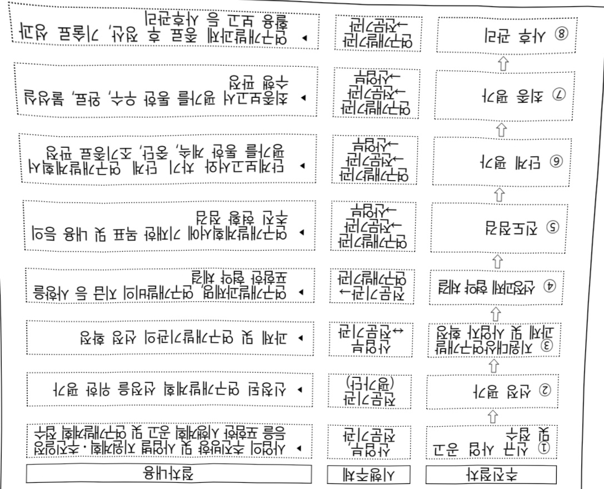

# 산업현장문제해결형산업AI에이전트기술개발(R&D)

**해당 페이지**: PDF 4163 ~ 4170 쪽 해당

**부처**: 산업통상부
**분야**: 산업·중소기업 및 에너지
**회계유형**: 일반회계
**2026 확정예산**: 6000.0 백만원
**전년대비 증감률**: None%
**AI 도메인**: 제조/스마트팩토리

---

### 가.예산 총괄표

(단위: 백만원, %)

<table border=1 style='margin: auto; word-wrap: break-word;'><tr><td rowspan="2">사업명</td><td rowspan="2">2024년 결산</td><td colspan="2">2025년 예산</td><td colspan="2">2026년</td><td rowspan="2">중감(B-A)</td><td rowspan="2">(B-A)/A</td></tr><tr><td style='text-align: center; word-wrap: break-word;'>본예산(A)</td><td style='text-align: center; word-wrap: break-word;'>추경</td><td style='text-align: center; word-wrap: break-word;'>요구안</td><td style='text-align: center; word-wrap: break-word;'>확정(B)</td></tr><tr><td style='text-align: center; word-wrap: break-word;'>산업현장문제해결형산업AI에이전트기술개발(R&amp;D)</td><td style='text-align: center; word-wrap: break-word;'>-</td><td style='text-align: center; word-wrap: break-word;'>-</td><td style='text-align: center; word-wrap: break-word;'>-</td><td style='text-align: center; word-wrap: break-word;'>6,000</td><td style='text-align: center; word-wrap: break-word;'>6,000</td><td style='text-align: center; word-wrap: break-word;'>순증</td><td style='text-align: center; word-wrap: break-word;'>-</td></tr></table>

□ 기능별(내역사업별), 목별 예산 내역

(단위:백만원)

<table border=1 style='margin: auto; word-wrap: break-word;'><tr><td rowspan="3"></td><td colspan="5">2024</td><td colspan="7">2025(2025.12월말)</td><td rowspan="3">2026예산</td></tr><tr><td rowspan="2">예산액(추경)</td><td rowspan="2">예산현액</td><td rowspan="2">집행액[실집행액]</td><td rowspan="2">이월액</td><td rowspan="2">불용액</td><td rowspan="2">분예산</td><td rowspan="2">예산현액</td><td rowspan="2">집행액[실집행액]</td><td colspan="2">전년도 이월액제외</td><td rowspan="2">이월예산액</td><td rowspan="2">불용예산액</td></tr><tr><td style='text-align: center; word-wrap: break-word;'>예산현액</td><td style='text-align: center; word-wrap: break-word;'>집행액[실집행액]</td></tr><tr><td style='text-align: center; word-wrap: break-word;'>○ 기능별 분류(함께)</td><td style='text-align: center; word-wrap: break-word;'>-</td><td style='text-align: center; word-wrap: break-word;'>-</td><td style='text-align: center; word-wrap: break-word;'>-</td><td style='text-align: center; word-wrap: break-word;'>-</td><td style='text-align: center; word-wrap: break-word;'>-</td><td style='text-align: center; word-wrap: break-word;'>-</td><td style='text-align: center; word-wrap: break-word;'>-</td><td style='text-align: center; word-wrap: break-word;'>-</td><td style='text-align: center; word-wrap: break-word;'>-</td><td style='text-align: center; word-wrap: break-word;'>-</td><td style='text-align: center; word-wrap: break-word;'>-</td><td style='text-align: center; word-wrap: break-word;'>-</td><td style='text-align: center; word-wrap: break-word;'>6,000</td></tr><tr><td style='text-align: center; word-wrap: break-word;'>· 산업 현장 문제해 결형 산업 AI에 이전 트기 술개발</td><td style='text-align: center; word-wrap: break-word;'>-</td><td style='text-align: center; word-wrap: break-word;'>-</td><td style='text-align: center; word-wrap: break-word;'>-</td><td style='text-align: center; word-wrap: break-word;'>-</td><td style='text-align: center; word-wrap: break-word;'>-</td><td style='text-align: center; word-wrap: break-word;'>-</td><td style='text-align: center; word-wrap: break-word;'>-</td><td style='text-align: center; word-wrap: break-word;'>-</td><td style='text-align: center; word-wrap: break-word;'>-</td><td style='text-align: center; word-wrap: break-word;'>-</td><td style='text-align: center; word-wrap: break-word;'>-</td><td style='text-align: center; word-wrap: break-word;'>-</td><td style='text-align: center; word-wrap: break-word;'>6,000</td></tr><tr><td style='text-align: center; word-wrap: break-word;'>○ 비목별 분류(함께)</td><td style='text-align: center; word-wrap: break-word;'>-</td><td style='text-align: center; word-wrap: break-word;'>-</td><td style='text-align: center; word-wrap: break-word;'>-</td><td style='text-align: center; word-wrap: break-word;'>-</td><td style='text-align: center; word-wrap: break-word;'>-</td><td style='text-align: center; word-wrap: break-word;'>-</td><td style='text-align: center; word-wrap: break-word;'>-</td><td style='text-align: center; word-wrap: break-word;'>-</td><td style='text-align: center; word-wrap: break-word;'>-</td><td style='text-align: center; word-wrap: break-word;'>-</td><td style='text-align: center; word-wrap: break-word;'>-</td><td style='text-align: center; word-wrap: break-word;'>-</td><td style='text-align: center; word-wrap: break-word;'>6,000</td></tr><tr><td style='text-align: center; word-wrap: break-word;'>· 연구개발활동비등(360-05)</td><td style='text-align: center; word-wrap: break-word;'>-</td><td style='text-align: center; word-wrap: break-word;'>-</td><td style='text-align: center; word-wrap: break-word;'>-</td><td style='text-align: center; word-wrap: break-word;'>-</td><td style='text-align: center; word-wrap: break-word;'>-</td><td style='text-align: center; word-wrap: break-word;'>-</td><td style='text-align: center; word-wrap: break-word;'>-</td><td style='text-align: center; word-wrap: break-word;'>-</td><td style='text-align: center; word-wrap: break-word;'>-</td><td style='text-align: center; word-wrap: break-word;'>-</td><td style='text-align: center; word-wrap: break-word;'>-</td><td style='text-align: center; word-wrap: break-word;'>-</td><td style='text-align: center; word-wrap: break-word;'>6,000</td></tr><tr><td style='text-align: center; word-wrap: break-word;'>○ 기능비목별 분류(함께)</td><td style='text-align: center; word-wrap: break-word;'>-</td><td style='text-align: center; word-wrap: break-word;'>-</td><td style='text-align: center; word-wrap: break-word;'>-</td><td style='text-align: center; word-wrap: break-word;'>-</td><td style='text-align: center; word-wrap: break-word;'>-</td><td style='text-align: center; word-wrap: break-word;'>-</td><td style='text-align: center; word-wrap: break-word;'>-</td><td style='text-align: center; word-wrap: break-word;'>-</td><td style='text-align: center; word-wrap: break-word;'>-</td><td style='text-align: center; word-wrap: break-word;'>-</td><td style='text-align: center; word-wrap: break-word;'>-</td><td style='text-align: center; word-wrap: break-word;'>-</td><td style='text-align: center; word-wrap: break-word;'>6,000</td></tr><tr><td style='text-align: center; word-wrap: break-word;'>· 산업 현장 문제해 결형 산업 AI에 이전 트기 술개발·연구개발활동비등(360-05)</td><td style='text-align: center; word-wrap: break-word;'>-</td><td style='text-align: center; word-wrap: break-word;'>-</td><td style='text-align: center; word-wrap: break-word;'>-</td><td style='text-align: center; word-wrap: break-word;'>-</td><td style='text-align: center; word-wrap: break-word;'>-</td><td style='text-align: center; word-wrap: break-word;'>-</td><td style='text-align: center; word-wrap: break-word;'>-</td><td style='text-align: center; word-wrap: break-word;'>-</td><td style='text-align: center; word-wrap: break-word;'>-</td><td style='text-align: center; word-wrap: break-word;'>-</td><td style='text-align: center; word-wrap: break-word;'>-</td><td style='text-align: center; word-wrap: break-word;'>-</td><td style='text-align: center; word-wrap: break-word;'>6,000</td></tr></table>

### 나.사업설명자료

## 1 ) 사업목적·내용

- (목적) 파급효과 높은 산업 공통 Task(시장예측, 공급망·구매효율화, 공정최적화, 품질관리, 생산 설계)의 문제 해결을 위한 산업특화 AI 에이전트 기술개발을 통해 글로벌 AI 기술 주도권 확보 및 산업경쟁력 강화

- (내용) 산업 현장의 복잡한 문제를 상황 인지하고 해결 계획을 자율적으로 수립 및 실행하는 AI에 전론 개발 및 실증

---

·산업별 Task기반 문제 정의 및 시스템 설계와 초기 절차추론 모델 개발

·추론모델 기반으로 의사결정·실행이 가능한 AI 에이전트 시스템 구축하고, 문제 해결에 필요한 도구(SW, 데이터 등)를 연동·실행하는 실행 SW 모델 개발

AI에이전트를 산업현장대상 지속반복적 실증을 통해 성능 최적화 및 상용화 기반 마련

## 2 ) 사업개요

사업근거 및 추진경위

① 법령상 근거 및 조항 적시

## o산업디지털전환촉진법제20조

## 산업 디지털 전환 촉진법

제20조(기술·서비스 개발 등의 촉진) 산업통상부장관은 산업 디지털 전환에 관한 기술·장비·소프트웨어와 산업 디지털 전환을 통한 제품·서비스(이하 "기술등"이라 한다)의 개발을 촉진하기 위하여 다음 각 호의 사업을 추진할 수 있다.

1. 기술등에 관한 실태·통계 조사

2. 기술등의 개발 및 사업화

3. 개발된 기술등의 평가 및 활용

4. 기술등의 개발을 위한 기반 구축

5. 그 밖에 기술등의 개발을 위하여 필요한 사업

## o산업기술혁신 촉진법 제11조

## 산업기술혁신 촉진법

제11조(산업기술개발사업) ① 산업통상부장관은 혁신계획 및 시행계획을 효율적으로 수행하기 위하여 관계 중앙행정기관의 장과 협의하여 다음 각 호의 산업기술분야에서 기술개발사업(산업기술개발을 위하여 필요한 기획 및 조사를 포함한다. 이하 "산업기술개발사업"이라 한다)을 추진할 수 있다.

1. 산업의 공통적인 기반이 되는 생산기반 기술, 부품·소재 및 장비·설비(플랜트를 포함한다) 기술

2. 산업기술 분야의 미래 유망 기술

3. 산업의 고부가가치화를 위한 공정혁신, 청정생산 및 환경설비 등에 관련된 기술

4.산업의 핵심기술의 집약에 필요한 엔지니어링·시스템 기술

## 중략

11. 개발된 산업기술의 사업화에 필요한 연계기술

12. 제1호부터 제10호까지의 기술 간 결합을 통한 시장지향형 융합기술

13. 그 밖에 산업기술혁신을 위하여 우선적으로 개발이 필요한 기술로서 산업통상부장관이 정하는 기술 ② 산업통상부장관은 연구기관, 대학, 그 밖에 대통령령으로 정하는 기관·단체 또는 기업 등으로 하여금 산업기술개발사업을 수행하게 할 수 있다. 이 경우 산업통상부장관은 다음 각 호의 자와 산업기술개발사업에 관한 협약을 체결하고 해당 사업의 수행에 드는 비용의 전부 또는 일부를 출연·보조 또는 융자할 수 있다.

---

② 추진경위 - 사업 시작년도, 추진배경, 부처별 중점과제, 대통령 공약사항 등

○ 산업 디지털 전환 촉진법 시행 ('22.7월)

- 산업데이터 및 지능정보기술을 활용한 산업의 디지털 전환 촉진

- (주요내용) 종합계획, 표준화, 선도사업지원, 기술개발, 인력양성, 금융세제 지원 등

ㅇ 산업 AI 내재화 전략-제1차 산업 디지털 전환 종합계획 ('23.1월)

- AI내재화 공급산업 육성, 수요기업 AI 활용 역량 강화, 민간 주도 DX 생태계 조성

- (주요내용) 수요기업의 AI 활용을 용이하게 하고, 공급기업의 기술 역량 강화할 수 있는 주요 AI 기반 기술 확산 추진

ㅇ 산업부「산업 AI 확산을 위한 10대 과제」발표 ('25.1월)

- (목표) ~'30년 기업 AI 활용률 70%, AI 성공모델 1,000개 창출

- (주요과제) ①AI 선도 프로젝트, ②AI 에이전트와 피지컬 AI ③산업 AI 컴퓨팅 인프라, ④산업데이터, ⑤AI 반도체, ⑥AI 인재, ⑦전력 인프라, ⑧산업AI 자본, ⑨AI 생태계, ⑩산업 AI 제도

ㅇ 산업AI정책위원회「산업 AI 기술 12대 Task」발표 ('25.1월)

- (12대 Task) ①시장예측, ②공급망·구매 효율화 ③연구개발, ④디자인, ⑤공정 최적화, ⑥자율제조, ⑦물류 및 유통 효율화, ⑧예지보전 및 품질관리, ⑨고객 케어, ⑩안전, ⑪인력교육 및 훈련, ⑫보안

°산업AI얼라이언스 대상 사업 수요조사 및 전문가 참여 기획추진('25.1~4월)

- 현장 문제, AI에 이전트 도입 기대 산업군, 도입의 향성 등 수요조사 및 경제적 파급 효과, 구현 가능성 등 검토를 통한 대상 Task 선정 및 기획

## □ 주요내용

① 사업규모

- 총사업비(해당되는 경우에만 기재) : 해당 없음

- 사업기간 : 2026년 ~ 2028년

- 최근 5년 간 투입된 사업비(예산액기준, 추경편성한 연도에는 추경포함)

<table border=1 style='margin: auto; word-wrap: break-word;'><tr><td style='text-align: center; word-wrap: break-word;'>연도</td><td style='text-align: center; word-wrap: break-word;'>2022</td><td style='text-align: center; word-wrap: break-word;'>2023</td><td style='text-align: center; word-wrap: break-word;'>2024</td><td style='text-align: center; word-wrap: break-word;'>2025</td><td style='text-align: center; word-wrap: break-word;'>2026</td></tr><tr><td style='text-align: center; word-wrap: break-word;'>사업비</td><td style='text-align: center; word-wrap: break-word;'>-</td><td style='text-align: center; word-wrap: break-word;'>-</td><td style='text-align: center; word-wrap: break-word;'>-</td><td style='text-align: center; word-wrap: break-word;'>-</td><td style='text-align: center; word-wrap: break-word;'>6,000</td></tr></table>

- 기타: 해당 없음

② 사업추진체계

- 사업시행방법 : 출연(총사업비의 67% 이하(중소기업 기준))

- 사업시행주체 : 한국산업기술진흥원

- 사업 수혜자 : (주관) AI 개발 전문성을 보유한 중소·중견기업 및 비영리법인

(공동) AI 에이전트 개발·도입의지가 있는 데이터 제공 및 협업이

가능한 기업, 대학, 비영리법인 등

---

- 보조, 융자, 출연, 출자 등의 경우 보조·융자 등 지원 비율 및 법적근거

<table border=1 style='margin: auto; word-wrap: break-word;'><tr><td style='text-align: center; word-wrap: break-word;'>내역사업명</td><td style='text-align: center; word-wrap: break-word;'>구분</td><td style='text-align: center; word-wrap: break-word;'>피보조·피출연 등 기관명</td><td style='text-align: center; word-wrap: break-word;'>지원 금액 (2026예산)</td><td style='text-align: center; word-wrap: break-word;'>지원 비율(%)</td><td style='text-align: center; word-wrap: break-word;'>보조율 법적근거 (해당 조항)</td></tr><tr><td style='text-align: center; word-wrap: break-word;'>산업현장문제해결형산업AI에이전트기술개발</td><td style='text-align: center; word-wrap: break-word;'>출연</td><td style='text-align: center; word-wrap: break-word;'>한국산업 기술진흥원</td><td style='text-align: center; word-wrap: break-word;'>6,000백만원</td><td style='text-align: center; word-wrap: break-word;'>67%이내 (중소기업 기준)</td><td style='text-align: center; word-wrap: break-word;'>산업지질전환촉진법 제11조(산업기술개발사업)</td></tr></table>

## 3 ) 2026년도 예산 산출 근거

☐ 산업현장문제해결형산업AI에이전트기술개발(R&D) : (2025) 00백만원 → (2026 예산) 6,000백만원

- (요구) 산업AI에이전트 기획 및 초기모델개발 10개 과제 지원을 위한 6,000백만원 요구

- (산출) (신규) 6,000백만원 = 10개 과제 × 800백만원 × 9/12개월

0 2025년도 예산 및 2026년도 예산 산출 세부내역 비교

<table border=1 style='margin: auto; word-wrap: break-word;'><tr><td colspan="2">2025년 분예산</td><td colspan="2">2026년 예산</td></tr><tr><td style='text-align: center; word-wrap: break-word;'>예산</td><td style='text-align: center; word-wrap: break-word;'>산출내역</td><td style='text-align: center; word-wrap: break-word;'>예산</td><td style='text-align: center; word-wrap: break-word;'>산출내역</td></tr><tr><td style='text-align: center; word-wrap: break-word;'>-</td><td style='text-align: center; word-wrap: break-word;'>-</td><td style='text-align: center; word-wrap: break-word;'>6,000 백만원</td><td style='text-align: center; word-wrap: break-word;'>☐ 연구개발활동비동(360-05): 6,000백만원
- 산업현장문제해결형산업AI에전트기술개발: 6,000백만원
• (신규) 10개 × 800백만 × 9/12개월</td></tr></table>

## 4 ) 사업효과

□ 사업영향, 산출물 성과지표 등

① 2022~2026년도 성과계획서 상 성과지표 및 최근 5년간 성과 달성도

<table border=1 style='margin: auto; word-wrap: break-word;'><tr><td style='text-align: center; word-wrap: break-word;'>성과지표</td><td style='text-align: center; word-wrap: break-word;'>구분</td><td style='text-align: center; word-wrap: break-word;'>2022</td><td style='text-align: center; word-wrap: break-word;'>2023</td><td style='text-align: center; word-wrap: break-word;'>2024</td><td style='text-align: center; word-wrap: break-word;'>2025</td><td style='text-align: center; word-wrap: break-word;'>2026</td><td style='text-align: center; word-wrap: break-word;'>2026 목표치산출근거</td><td style='text-align: center; word-wrap: break-word;'>측정산식(또는 측정방법)</td><td style='text-align: center; word-wrap: break-word;'>자료수집방법(또는 자료출처)</td></tr><tr><td rowspan="3">기술실현가능성(단위:점)</td><td style='text-align: center; word-wrap: break-word;'>목표</td><td style='text-align: center; word-wrap: break-word;'>-</td><td style='text-align: center; word-wrap: break-word;'>-</td><td style='text-align: center; word-wrap: break-word;'>-</td><td style='text-align: center; word-wrap: break-word;'>-</td><td style='text-align: center; word-wrap: break-word;'>70</td><td rowspan="3">‘28년까지 각과제별 솔루션의 AI 신뢰성 성능 80% 달성으로 설정</td><td rowspan="3">AI 신뢰성 성능평가(F1 Score, 모델적합도 등)</td><td rowspan="3">공인인증시험 등</td></tr><tr><td style='text-align: center; word-wrap: break-word;'>실적</td><td style='text-align: center; word-wrap: break-word;'>-</td><td style='text-align: center; word-wrap: break-word;'>-</td><td style='text-align: center; word-wrap: break-word;'>-</td><td style='text-align: center; word-wrap: break-word;'>-</td><td style='text-align: center; word-wrap: break-word;'>-</td></tr><tr><td style='text-align: center; word-wrap: break-word;'>달성도</td><td style='text-align: center; word-wrap: break-word;'>-</td><td style='text-align: center; word-wrap: break-word;'>-</td><td style='text-align: center; word-wrap: break-word;'>-</td><td style='text-align: center; word-wrap: break-word;'>-</td><td style='text-align: center; word-wrap: break-word;'>-</td></tr></table>

* 국가연구개발사업 전략계획서 검토 시 변경 가능

② 성과지표 이외의 연도별 사업추진 경과 및 실적 : 해당 없음(26년 신규사업)

③ 향후(2026년도 이후) 기대효과 : 산업 현장(시장예측, 공급망·구매효율화, 공정최적화, 품질관리, 생산 설계)의 복잡한 문제를 상황 인지하고 해결 계획을 자율적으로 수립하는 AI에이전트 개발 및 실증 추진을 통한 제조 경쟁력 제고 기반 마련

---

7)사업 집행절차

6) 총사업비 대상사업 여부 및 내역 : 해당 없음

□ 시행하지 않은 경우 그 이유를 적시 : 동 사업은 국가재정법 제38조, 동법 시행령

제13조의 예비타당성조사 대상(5년간 500억원 이상 신규사업) 조건에 해당되지 않음

□ 총사업비 500억원 이상인 경우 예비타당성조사 시행유무 및 그 결과요지 기재 : 해당 없음

☐ 타당성조사 보고서가 있는 경우는 편의/비용을 중심으로 내용을 요약제시(보고서

제목, 작성자(기관), 작성일 명시) : 해당 없음

5)타당성조사 및 예비타당성조사 시행여부 및 결과 요지

---

8) 중기재정계획 상 연도별 투자계획 및 추진경과

(단위: 백만원)

<table border=1 style='margin: auto; word-wrap: break-word;'><tr><td style='text-align: center; word-wrap: break-word;'>2024</td><td style='text-align: center; word-wrap: break-word;'>2025</td><td style='text-align: center; word-wrap: break-word;'>2026</td><td style='text-align: center; word-wrap: break-word;'>2027</td><td style='text-align: center; word-wrap: break-word;'>2028</td><td style='text-align: center; word-wrap: break-word;'>2029</td></tr><tr><td style='text-align: center; word-wrap: break-word;'>2024~2028</td><td style='text-align: center; word-wrap: break-word;'>-</td><td style='text-align: center; word-wrap: break-word;'>-</td><td style='text-align: center; word-wrap: break-word;'>-</td><td style='text-align: center; word-wrap: break-word;'>-</td><td style='text-align: center; word-wrap: break-word;'>☑</td></tr><tr><td style='text-align: center; word-wrap: break-word;'>2025~2029</td><td style='text-align: center; word-wrap: break-word;'>-</td><td style='text-align: center; word-wrap: break-word;'>6,000</td><td style='text-align: center; word-wrap: break-word;'>12,000</td><td style='text-align: center; word-wrap: break-word;'>10,000</td><td style='text-align: center; word-wrap: break-word;'>-</td></tr></table>

9) 최근 3년간 동 사업에 대한 주요 외부지적사항 및 평가, 문제점 및 대책 : 해당 없음

## 10 ) 향후 추진방향 및 추진계획

<table border=1 style='margin: auto; word-wrap: break-word;'><tr><td style='text-align: center; word-wrap: break-word;'>- 글로벌 트렌드인 피지컬 AI 흐름은 생성형 AI를 넘어 복잡한 문제를 자율적으로 해결하는 추론형 AI인 AI 에이전트 시대로 진입</td></tr><tr><td style='text-align: center; word-wrap: break-word;'>- 국내 AI 산업계는 분석 중심 및 범용 AI에 머물러, 산업 도메인의 현장 문제 해결과 자율 실행에는 한계 존재</td></tr><tr><td style='text-align: center; word-wrap: break-word;'>- AI 원천기술은 주요국이 주도하고 있으나, 산업 특화 및 현장 적용 영역에서는 국내 주도권 확보 가능성이 여전히 존재 → 파급효과 높은 산업 공통 Task의 문제 해결을 위한 산업특화 AI 에이전트 기술개발을 통해 글로벌 AI 기술 주도권 확보 및 산업경쟁력 강화 필요</td></tr><tr><td style='text-align: center; word-wrap: break-word;'>- 동 사업은 &#x27;26년부터 &#x27;28년까지 반영된 예산사업으로 계획에 따라 예산 확보·집행 예정</td></tr></table>

11) 해당사업에 대한 각종 사업평가의 결과 : 해당 없음

12) 해당사업에 대한 부처 자체평가의 결과 : 해당 없음

13) 부처 건의사항 : 해당 없음

다. 최근 4년간 결산내역 : 해당 없음

### 라. 기타 추가자료

(1) 기재부에 제출한 사업 계획서 및 설명자료 첨부(필수 제출)

- (참고1) 사업 설명자료

---

## 참고1

□ (배경) 국내 AI 산업계는 분석 중심 및 범용 AI에 머물러, 산업

도메인의 현장 문제 해결과 자율 실행에는 한계 존재

글로벌 트렌드인 피지컬 AI 흐름은 생성형 AI를 넘어 복잡한 문제를

자율적으로 해결하는 추론형 AI인 AI 에이전트 시대로 진입

AI 원천기술(범용 LLM 등)은 주요국이 주도하고 있으나, 산업 특화 및 현장 적용 영역에서는 국내 주도권 확보 가능성이 여전히 존재

□ (목적) 파급효과 높은 산업 공통 Task(시장예측, 공급망·구매효율화, 공정최적화, 품질 관리, 생산 설계)의 문제 해결을 위한 산업특화 AI 에이전트 기술개발을 통해

글로벌 AI 기술 주도권 확보 및 산업경쟁력 강화

□ (기간) '26년 ~ '28년 (2년 9개월)

□ (지원 조건) 출연(총사업비의 67% 이내(중소기업 기준))

□ (추진 절차) 산업부총괄 → 전문기관사업기획·평가 → 연구기관과제수행

□ (주요 내용) 산업 현장의 복잡한 문제를 상황 인지하고 해결 계획을

자율적으로 수립하는 AI에이전트 개발 및 실증

○ 산업별 Task기반 문제 정의 및 시스템 설계와 초기 절차추론 모델 개발

°추론모델 기반으로 의사결정·실행이 가능한 AI 에이전트 시스템 구축하고,

문제해결에 필요한 도구SW. 데이터 등을 연동·실행하는 실행 SW 모델 개발

○ AI에이전트를 산업현장대상 지속반복적 실증을 통해 성능 최적화 및 상용화 기반 마련

---

<table border=1 style='margin: auto; word-wrap: break-word;'><tr><td style='text-align: center; word-wrap: break-word;'>사 업 명</td></tr><tr><td style='text-align: center; word-wrap: break-word;'>(1) 섬유패션산업활성화기반마련 (3535-304)</td></tr></table>

## □ 사업 코드 정보

<table border=1 style='margin: auto; word-wrap: break-word;'><tr><td style='text-align: center; word-wrap: break-word;'>구분</td><td style='text-align: center; word-wrap: break-word;'>회계</td><td style='text-align: center; word-wrap: break-word;'>소관</td><td style='text-align: center; word-wrap: break-word;'>실국(기관)</td><td style='text-align: center; word-wrap: break-word;'>계정</td><td style='text-align: center; word-wrap: break-word;'>분야</td><td style='text-align: center; word-wrap: break-word;'>부문</td></tr><tr><td style='text-align: center; word-wrap: break-word;'>코드</td><td rowspan="2">일반</td><td rowspan="2">산업통상부</td><td rowspan="2">산업성장실 첨단산업정책관</td><td rowspan="2"></td><td style='text-align: center; word-wrap: break-word;'>110</td><td style='text-align: center; word-wrap: break-word;'>117</td></tr><tr><td style='text-align: center; word-wrap: break-word;'>명칭</td><td style='text-align: center; word-wrap: break-word;'>산업·중소기업 및 에너지</td><td style='text-align: center; word-wrap: break-word;'>산업혁신지원</td></tr></table>

<table border=1 style='margin: auto; word-wrap: break-word;'><tr><td style='text-align: center; word-wrap: break-word;'>구분</td><td style='text-align: center; word-wrap: break-word;'>프로그램</td><td style='text-align: center; word-wrap: break-word;'>단위사업</td><td style='text-align: center; word-wrap: break-word;'>세부사업</td></tr><tr><td style='text-align: center; word-wrap: break-word;'>코드</td><td style='text-align: center; word-wrap: break-word;'>3500</td><td style='text-align: center; word-wrap: break-word;'>3535</td><td style='text-align: center; word-wrap: break-word;'>304</td></tr><tr><td style='text-align: center; word-wrap: break-word;'>명칭</td><td style='text-align: center; word-wrap: break-word;'>주력산업진흥</td><td style='text-align: center; word-wrap: break-word;'>섬유패션생활용품산업육성</td><td style='text-align: center; word-wrap: break-word;'>섬유패션산업활성화기반마련</td></tr></table>

□ 사업 성격 (공통요구자료 Ⅱ-1 작성유의사항 4. 참조, 해당하는 사항에 “○” 표시)

<table border=1 style='margin: auto; word-wrap: break-word;'><tr><td rowspan="2">신규</td><td rowspan="2">계속</td><td rowspan="2">완료</td><td rowspan="2">예비타당성 실시여부</td><td rowspan="2">총사업비 관리대상</td><td rowspan="2">총액계상 예산사업</td><td style='text-align: center; word-wrap: break-word;'>사업소관 변경정보</td></tr><tr><td style='text-align: center; word-wrap: break-word;'>2025예산 시 소관</td></tr><tr><td style='text-align: center; word-wrap: break-word;'></td><td style='text-align: center; word-wrap: break-word;'>○</td><td style='text-align: center; word-wrap: break-word;'></td><td style='text-align: center; word-wrap: break-word;'></td><td style='text-align: center; word-wrap: break-word;'></td><td style='text-align: center; word-wrap: break-word;'></td><td style='text-align: center; word-wrap: break-word;'></td></tr></table>

□사업지원형태 및지원을(최소한한개는반드시선택하시오.해당사항에O표시)

<table border=1 style='margin: auto; word-wrap: break-word;'><tr><td style='text-align: center; word-wrap: break-word;'>직접</td><td style='text-align: center; word-wrap: break-word;'>출자</td><td style='text-align: center; word-wrap: break-word;'>출연</td><td style='text-align: center; word-wrap: break-word;'>보조</td><td style='text-align: center; word-wrap: break-word;'>응자</td><td style='text-align: center; word-wrap: break-word;'>국고보조율(%)</td><td style='text-align: center; word-wrap: break-word;'>융자율(%)</td></tr><tr><td style='text-align: center; word-wrap: break-word;'>○</td><td style='text-align: center; word-wrap: break-word;'></td><td style='text-align: center; word-wrap: break-word;'></td><td style='text-align: center; word-wrap: break-word;'>○</td><td style='text-align: center; word-wrap: break-word;'></td><td style='text-align: center; word-wrap: break-word;'></td><td style='text-align: center; word-wrap: break-word;'></td></tr></table>

## □ 사업 담당자

<table border=1 style='margin: auto; word-wrap: break-word;'><tr><td style='text-align: center; word-wrap: break-word;'>사업명</td><td colspan="5">구분</td></tr><tr><td rowspan="5">섬유패션산업 활성화기반미런</td><td rowspan="3">소관부처</td><td style='text-align: center; word-wrap: break-word;'>실·국·과(팀)</td><td style='text-align: center; word-wrap: break-word;'>과 장</td><td style='text-align: center; word-wrap: break-word;'>사무관</td><td style='text-align: center; word-wrap: break-word;'>주무관</td></tr><tr><td rowspan="2">산업성장실 첨단산업정책관 섬유탄소나노과</td><td style='text-align: center; word-wrap: break-word;'>조성경</td><td style='text-align: center; word-wrap: break-word;'>진정화</td><td style='text-align: center; word-wrap: break-word;'>오세정 손현수</td></tr><tr><td style='text-align: center; word-wrap: break-word;'>044-203-4280</td><td style='text-align: center; word-wrap: break-word;'>044-203-4289</td><td style='text-align: center; word-wrap: break-word;'>044-203-4284 044-203-4288</td></tr><tr><td rowspan="2">사업시행주체</td><td style='text-align: center; word-wrap: break-word;'>한국산업기술진흥원</td><td style='text-align: center; word-wrap: break-word;'>산업공급망진흥실</td><td style='text-align: center; word-wrap: break-word;'>이희석 실장</td><td style='text-align: center; word-wrap: break-word;'>02)6009-3900</td></tr><tr><td style='text-align: center; word-wrap: break-word;'>한국섬유산업연합회</td><td style='text-align: center; word-wrap: break-word;'>국제통상실</td><td style='text-align: center; word-wrap: break-word;'>주성호 실장</td><td style='text-align: center; word-wrap: break-word;'>02)528-4027</td></tr></table>

---

### 원본 PDF 크롭 이미지

