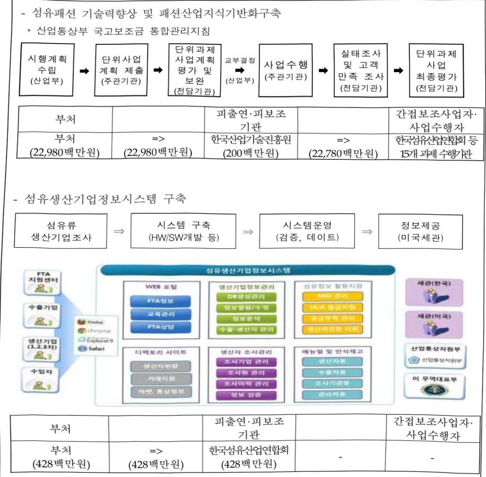

# 섬유패션산업활성화기반마련

**해당 페이지**: PDF 4171 ~ 4183 쪽 해당

**부처**: 산업통상부
**분야**: 산업·중소기업 및 에너지
**회계유형**: 일반
**2026 확정예산**: 23408.0 백만원
**전년대비 증감률**: 26.6%
**AI 도메인**: 교육/인재

---

<table border=1 style='margin: auto; word-wrap: break-word;'><tr><td style='text-align: center; word-wrap: break-word;'>사 업 명</td></tr><tr><td style='text-align: center; word-wrap: break-word;'>(1) 섬유패션산업활성화기반마련 (3535-304)</td></tr></table>

## □ 사업 코드 정보

<table border=1 style='margin: auto; word-wrap: break-word;'><tr><td style='text-align: center; word-wrap: break-word;'>구분</td><td style='text-align: center; word-wrap: break-word;'>회계</td><td style='text-align: center; word-wrap: break-word;'>소관</td><td style='text-align: center; word-wrap: break-word;'>실국(기관)</td><td style='text-align: center; word-wrap: break-word;'>계정</td><td style='text-align: center; word-wrap: break-word;'>분야</td><td style='text-align: center; word-wrap: break-word;'>부문</td></tr><tr><td style='text-align: center; word-wrap: break-word;'>코드</td><td rowspan="2">일반</td><td rowspan="2">산업통상부</td><td rowspan="2">산업성장실 첨단산업정책관</td><td rowspan="2"></td><td style='text-align: center; word-wrap: break-word;'>110</td><td style='text-align: center; word-wrap: break-word;'>117</td></tr><tr><td style='text-align: center; word-wrap: break-word;'>명칭</td><td style='text-align: center; word-wrap: break-word;'>산업·중소기업 및 에너지</td><td style='text-align: center; word-wrap: break-word;'>산업혁신지원</td></tr></table>

<table border=1 style='margin: auto; word-wrap: break-word;'><tr><td style='text-align: center; word-wrap: break-word;'>구분</td><td style='text-align: center; word-wrap: break-word;'>프로그램</td><td style='text-align: center; word-wrap: break-word;'>단위사업</td><td style='text-align: center; word-wrap: break-word;'>세부사업</td></tr><tr><td style='text-align: center; word-wrap: break-word;'>코드</td><td style='text-align: center; word-wrap: break-word;'>3500</td><td style='text-align: center; word-wrap: break-word;'>3535</td><td style='text-align: center; word-wrap: break-word;'>304</td></tr><tr><td style='text-align: center; word-wrap: break-word;'>명칭</td><td style='text-align: center; word-wrap: break-word;'>주력산업진흥</td><td style='text-align: center; word-wrap: break-word;'>섬유패션생활용품산업육성</td><td style='text-align: center; word-wrap: break-word;'>섬유패션산업활성화기반마련</td></tr></table>

□ 사업 성격 (공통요구자료 Ⅱ-1 작성유의사항 4. 참조, 해당하는 사항에 “○” 표시)

<table border=1 style='margin: auto; word-wrap: break-word;'><tr><td rowspan="2">신규</td><td rowspan="2">계속</td><td rowspan="2">완료</td><td rowspan="2">예비타당성 실시여부</td><td rowspan="2">총사업비 관리대상</td><td rowspan="2">총액계상 예산사업</td><td style='text-align: center; word-wrap: break-word;'>사업소관 변경정보</td></tr><tr><td style='text-align: center; word-wrap: break-word;'>2025예산 시 소관</td></tr><tr><td style='text-align: center; word-wrap: break-word;'></td><td style='text-align: center; word-wrap: break-word;'>○</td><td style='text-align: center; word-wrap: break-word;'></td><td style='text-align: center; word-wrap: break-word;'></td><td style='text-align: center; word-wrap: break-word;'></td><td style='text-align: center; word-wrap: break-word;'></td><td style='text-align: center; word-wrap: break-word;'></td></tr></table>

□사업지원형태 및지원을(최소한한개는반드시선택하시오.해당사항에O표시)

<table border=1 style='margin: auto; word-wrap: break-word;'><tr><td style='text-align: center; word-wrap: break-word;'>직접</td><td style='text-align: center; word-wrap: break-word;'>출자</td><td style='text-align: center; word-wrap: break-word;'>출연</td><td style='text-align: center; word-wrap: break-word;'>보조</td><td style='text-align: center; word-wrap: break-word;'>응자</td><td style='text-align: center; word-wrap: break-word;'>국고보조율(%)</td><td style='text-align: center; word-wrap: break-word;'>융자율(%)</td></tr><tr><td style='text-align: center; word-wrap: break-word;'>○</td><td style='text-align: center; word-wrap: break-word;'></td><td style='text-align: center; word-wrap: break-word;'></td><td style='text-align: center; word-wrap: break-word;'>○</td><td style='text-align: center; word-wrap: break-word;'></td><td style='text-align: center; word-wrap: break-word;'></td><td style='text-align: center; word-wrap: break-word;'></td></tr></table>

## □ 사업 담당자

<table border=1 style='margin: auto; word-wrap: break-word;'><tr><td style='text-align: center; word-wrap: break-word;'>사업명</td><td colspan="5">구분</td></tr><tr><td rowspan="5">섬유패션산업 활성화기반미런</td><td rowspan="3">소관부처</td><td style='text-align: center; word-wrap: break-word;'>실·국·과(팀)</td><td style='text-align: center; word-wrap: break-word;'>과 장</td><td style='text-align: center; word-wrap: break-word;'>사무관</td><td style='text-align: center; word-wrap: break-word;'>주무관</td></tr><tr><td rowspan="2">산업성장실 첨단산업정책관 섬유탄소나노과</td><td style='text-align: center; word-wrap: break-word;'>조성경</td><td style='text-align: center; word-wrap: break-word;'>진정화</td><td style='text-align: center; word-wrap: break-word;'>오세정 손현수</td></tr><tr><td style='text-align: center; word-wrap: break-word;'>044-203-4280</td><td style='text-align: center; word-wrap: break-word;'>044-203-4289</td><td style='text-align: center; word-wrap: break-word;'>044-203-4284 044-203-4288</td></tr><tr><td rowspan="2">사업시행주체</td><td style='text-align: center; word-wrap: break-word;'>한국산업기술진흥원</td><td style='text-align: center; word-wrap: break-word;'>산업공급망진흥실</td><td style='text-align: center; word-wrap: break-word;'>이희석 실장</td><td style='text-align: center; word-wrap: break-word;'>02)6009-3900</td></tr><tr><td style='text-align: center; word-wrap: break-word;'>한국섬유산업연합회</td><td style='text-align: center; word-wrap: break-word;'>국제통상실</td><td style='text-align: center; word-wrap: break-word;'>주성호 실장</td><td style='text-align: center; word-wrap: break-word;'>02)528-4027</td></tr></table>

---

<table border=1 style='margin: auto; word-wrap: break-word;'><tr><td rowspan="2"></td><td colspan="5">2024</td><td colspan="7">2025(2025.12.월말)</td><td rowspan="2">2026예산</td></tr><tr><td style='text-align: center; word-wrap: break-word;'>예산액(추정)</td><td style='text-align: center; word-wrap: break-word;'>예산현액</td><td style='text-align: center; word-wrap: break-word;'>집행액[실집행액]</td><td style='text-align: center; word-wrap: break-word;'>이월액</td><td style='text-align: center; word-wrap: break-word;'>불용액</td><td style='text-align: center; word-wrap: break-word;'>분예산</td><td style='text-align: center; word-wrap: break-word;'>예산현액</td><td style='text-align: center; word-wrap: break-word;'>집행액[실집행액]</td><td style='text-align: center; word-wrap: break-word;'>예산현액</td><td style='text-align: center; word-wrap: break-word;'>집행액[실집행액]</td><td style='text-align: center; word-wrap: break-word;'>이월예산액</td><td style='text-align: center; word-wrap: break-word;'>불용예산</td></tr><tr><td style='text-align: center; word-wrap: break-word;'>○ 기능별 분류(합계)</td><td style='text-align: center; word-wrap: break-word;'>21,232</td><td style='text-align: center; word-wrap: break-word;'>21,232</td><td style='text-align: center; word-wrap: break-word;'>21,193[21,193]</td><td style='text-align: center; word-wrap: break-word;'>-</td><td style='text-align: center; word-wrap: break-word;'>39</td><td style='text-align: center; word-wrap: break-word;'>18,490</td><td style='text-align: center; word-wrap: break-word;'>18,490</td><td style='text-align: center; word-wrap: break-word;'>18,451[18,451]</td><td style='text-align: center; word-wrap: break-word;'>18,490</td><td style='text-align: center; word-wrap: break-word;'>18,451[18,451]</td><td style='text-align: center; word-wrap: break-word;'>-</td><td style='text-align: center; word-wrap: break-word;'>39</td><td style='text-align: center; word-wrap: break-word;'>23,408</td></tr><tr><td style='text-align: center; word-wrap: break-word;'>· 섬유매출탈향상 및 폐충탈향상기법커측</td><td style='text-align: center; word-wrap: break-word;'>20,765</td><td style='text-align: center; word-wrap: break-word;'>20,765</td><td style='text-align: center; word-wrap: break-word;'>20,765[20,765]</td><td style='text-align: center; word-wrap: break-word;'>-</td><td style='text-align: center; word-wrap: break-word;'>-</td><td style='text-align: center; word-wrap: break-word;'>18,023</td><td style='text-align: center; word-wrap: break-word;'>18,023</td><td style='text-align: center; word-wrap: break-word;'>18,023[18,023]</td><td style='text-align: center; word-wrap: break-word;'>18,023</td><td style='text-align: center; word-wrap: break-word;'>18,023[18,023]</td><td style='text-align: center; word-wrap: break-word;'>-</td><td style='text-align: center; word-wrap: break-word;'>-</td><td style='text-align: center; word-wrap: break-word;'>22,980</td></tr><tr><td style='text-align: center; word-wrap: break-word;'>· 섬유생산기업정보 시스템구축</td><td style='text-align: center; word-wrap: break-word;'>467</td><td style='text-align: center; word-wrap: break-word;'>467</td><td style='text-align: center; word-wrap: break-word;'>428[428]</td><td style='text-align: center; word-wrap: break-word;'>-</td><td style='text-align: center; word-wrap: break-word;'>39</td><td style='text-align: center; word-wrap: break-word;'>467</td><td style='text-align: center; word-wrap: break-word;'>467</td><td style='text-align: center; word-wrap: break-word;'>428[428]</td><td style='text-align: center; word-wrap: break-word;'>467</td><td style='text-align: center; word-wrap: break-word;'>428[428]</td><td style='text-align: center; word-wrap: break-word;'>-</td><td style='text-align: center; word-wrap: break-word;'>39</td><td style='text-align: center; word-wrap: break-word;'>428</td></tr><tr><td style='text-align: center; word-wrap: break-word;'>○ 비목별 분류(합계)</td><td style='text-align: center; word-wrap: break-word;'>21,232</td><td style='text-align: center; word-wrap: break-word;'>21,232</td><td style='text-align: center; word-wrap: break-word;'>21,193[21,193]</td><td style='text-align: center; word-wrap: break-word;'>-</td><td style='text-align: center; word-wrap: break-word;'>39</td><td style='text-align: center; word-wrap: break-word;'>18,490</td><td style='text-align: center; word-wrap: break-word;'>18,490</td><td style='text-align: center; word-wrap: break-word;'>18,451[18,451]</td><td style='text-align: center; word-wrap: break-word;'>18,490</td><td style='text-align: center; word-wrap: break-word;'>18,451[18,451]</td><td style='text-align: center; word-wrap: break-word;'>-</td><td style='text-align: center; word-wrap: break-word;'>39</td><td style='text-align: center; word-wrap: break-word;'>23,408</td></tr><tr><td style='text-align: center; word-wrap: break-word;'>· 민 간 경 상 보 조(320-01)</td><td style='text-align: center; word-wrap: break-word;'>19,898</td><td style='text-align: center; word-wrap: break-word;'>19,898</td><td style='text-align: center; word-wrap: break-word;'>19,898[19,898]</td><td style='text-align: center; word-wrap: break-word;'>-</td><td style='text-align: center; word-wrap: break-word;'>-</td><td style='text-align: center; word-wrap: break-word;'>18,090</td><td style='text-align: center; word-wrap: break-word;'>18,090</td><td style='text-align: center; word-wrap: break-word;'>18,090[18,090]</td><td style='text-align: center; word-wrap: break-word;'>18,090</td><td style='text-align: center; word-wrap: break-word;'>18,090[18,090]</td><td style='text-align: center; word-wrap: break-word;'>-</td><td style='text-align: center; word-wrap: break-word;'>-</td><td style='text-align: center; word-wrap: break-word;'>23,047</td></tr><tr><td style='text-align: center; word-wrap: break-word;'>· 민간위탁사업비(320-02)</td><td style='text-align: center; word-wrap: break-word;'>400</td><td style='text-align: center; word-wrap: break-word;'>400</td><td style='text-align: center; word-wrap: break-word;'>361[361]</td><td style='text-align: center; word-wrap: break-word;'>-</td><td style='text-align: center; word-wrap: break-word;'>39</td><td style='text-align: center; word-wrap: break-word;'>400</td><td style='text-align: center; word-wrap: break-word;'>400</td><td style='text-align: center; word-wrap: break-word;'>361[361]</td><td style='text-align: center; word-wrap: break-word;'>400</td><td style='text-align: center; word-wrap: break-word;'>361[361]</td><td style='text-align: center; word-wrap: break-word;'>-</td><td style='text-align: center; word-wrap: break-word;'>39</td><td style='text-align: center; word-wrap: break-word;'>361</td></tr><tr><td style='text-align: center; word-wrap: break-word;'>· 민 간 자본 보 조(320-07)</td><td style='text-align: center; word-wrap: break-word;'>934</td><td style='text-align: center; word-wrap: break-word;'>934</td><td style='text-align: center; word-wrap: break-word;'>934[934]</td><td style='text-align: center; word-wrap: break-word;'>-</td><td style='text-align: center; word-wrap: break-word;'>-</td><td style='text-align: center; word-wrap: break-word;'>-</td><td style='text-align: center; word-wrap: break-word;'>-</td><td style='text-align: center; word-wrap: break-word;'>-</td><td style='text-align: center; word-wrap: break-word;'>-</td><td style='text-align: center; word-wrap: break-word;'>-</td><td style='text-align: center; word-wrap: break-word;'>-</td><td style='text-align: center; word-wrap: break-word;'>-</td><td style='text-align: center; word-wrap: break-word;'>-</td></tr><tr><td style='text-align: center; word-wrap: break-word;'>○ 기능비목별 분류(합계)</td><td style='text-align: center; word-wrap: break-word;'>21,232</td><td style='text-align: center; word-wrap: break-word;'>21,232</td><td style='text-align: center; word-wrap: break-word;'>21,193[21,193]</td><td style='text-align: center; word-wrap: break-word;'>-</td><td style='text-align: center; word-wrap: break-word;'>39</td><td style='text-align: center; word-wrap: break-word;'>18,490</td><td style='text-align: center; word-wrap: break-word;'>18,490</td><td style='text-align: center; word-wrap: break-word;'>18,451[18,451]</td><td style='text-align: center; word-wrap: break-word;'>18,490</td><td style='text-align: center; word-wrap: break-word;'>18,451[18,451]</td><td style='text-align: center; word-wrap: break-word;'>-</td><td style='text-align: center; word-wrap: break-word;'>39</td><td style='text-align: center; word-wrap: break-word;'>23,408</td></tr><tr><td style='text-align: center; word-wrap: break-word;'>· 섬유매출탈향상 및 폐충탈향상기법커측</td><td style='text-align: center; word-wrap: break-word;'>20,765</td><td style='text-align: center; word-wrap: break-word;'>20,765</td><td style='text-align: center; word-wrap: break-word;'>20,765[20,765]</td><td style='text-align: center; word-wrap: break-word;'>-</td><td style='text-align: center; word-wrap: break-word;'>-</td><td style='text-align: center; word-wrap: break-word;'>18,023</td><td style='text-align: center; word-wrap: break-word;'>18,023</td><td style='text-align: center; word-wrap: break-word;'>18,023[18,023]</td><td style='text-align: center; word-wrap: break-word;'>18,023</td><td style='text-align: center; word-wrap: break-word;'>18,023[18,023]</td><td style='text-align: center; word-wrap: break-word;'>-</td><td style='text-align: center; word-wrap: break-word;'>-</td><td style='text-align: center; word-wrap: break-word;'>22,980</td></tr><tr><td style='text-align: center; word-wrap: break-word;'>· 민 간 경 상 보 조(320-01)</td><td style='text-align: center; word-wrap: break-word;'>19,831</td><td style='text-align: center; word-wrap: break-word;'>19,831</td><td style='text-align: center; word-wrap: break-word;'>19,831[19,831]</td><td style='text-align: center; word-wrap: break-word;'>-</td><td style='text-align: center; word-wrap: break-word;'>-</td><td style='text-align: center; word-wrap: break-word;'>18,023</td><td style='text-align: center; word-wrap: break-word;'>18,023</td><td style='text-align: center; word-wrap: break-word;'>18,023[18,023]</td><td style='text-align: center; word-wrap: break-word;'>18,023</td><td style='text-align: center; word-wrap: break-word;'>18,023[18,023]</td><td style='text-align: center; word-wrap: break-word;'>-</td><td style='text-align: center; word-wrap: break-word;'>-</td><td style='text-align: center; word-wrap: break-word;'>22,980</td></tr><tr><td style='text-align: center; word-wrap: break-word;'>· 민 간 자본 보 조(320-07)</td><td style='text-align: center; word-wrap: break-word;'>934</td><td style='text-align: center; word-wrap: break-word;'>934</td><td style='text-align: center; word-wrap: break-word;'>934[934]</td><td style='text-align: center; word-wrap: break-word;'>-</td><td style='text-align: center; word-wrap: break-word;'>-</td><td style='text-align: center; word-wrap: break-word;'>-</td><td style='text-align: center; word-wrap: break-word;'>-</td><td style='text-align: center; word-wrap: break-word;'>-</td><td style='text-align: center; word-wrap: break-word;'>-</td><td style='text-align: center; word-wrap: break-word;'>-</td><td style='text-align: center; word-wrap: break-word;'>-</td><td style='text-align: center; word-wrap: break-word;'>-</td><td style='text-align: center; word-wrap: break-word;'>-</td></tr><tr><td style='text-align: center; word-wrap: break-word;'>· 섬유생산기업정보 시스템구축</td><td style='text-align: center; word-wrap: break-word;'>467</td><td style='text-align: center; word-wrap: break-word;'>467</td><td style='text-align: center; word-wrap: break-word;'>428[428]</td><td style='text-align: center; word-wrap: break-word;'>-</td><td style='text-align: center; word-wrap: break-word;'>39</td><td style='text-align: center; word-wrap: break-word;'>467</td><td style='text-align: center; word-wrap: break-word;'>467</td><td style='text-align: center; word-wrap: break-word;'>428[428]</td><td style='text-align: center; word-wrap: break-word;'>467</td><td style='text-align: center; word-wrap: break-word;'>428[428]</td><td style='text-align: center; word-wrap: break-word;'>-</td><td style='text-align: center; word-wrap: break-word;'>39</td><td style='text-align: center; word-wrap: break-word;'>428</td></tr><tr><td style='text-align: center; word-wrap: break-word;'>· 민 간 경 상 보 조(320-01)</td><td style='text-align: center; word-wrap: break-word;'>67</td><td style='text-align: center; word-wrap: break-word;'>67</td><td style='text-align: center; word-wrap: break-word;'>67[67]</td><td style='text-align: center; word-wrap: break-word;'>-</td><td style='text-align: center; word-wrap: break-word;'>-</td><td style='text-align: center; word-wrap: break-word;'>67</td><td style='text-align: center; word-wrap: break-word;'>67</td><td style='text-align: center; word-wrap: break-word;'>67[67]</td><td style='text-align: center; word-wrap: break-word;'>67</td><td style='text-align: center; word-wrap: break-word;'>67[67]</td><td style='text-align: center; word-wrap: break-word;'>-</td><td style='text-align: center; word-wrap: break-word;'>-</td><td style='text-align: center; word-wrap: break-word;'>67</td></tr><tr><td style='text-align: center; word-wrap: break-word;'>· 민간위탁사업비(320-02)</td><td style='text-align: center; word-wrap: break-word;'>400</td><td style='text-align: center; word-wrap: break-word;'>400</td><td style='text-align: center; word-wrap: break-word;'>361[361]</td><td style='text-align: center; word-wrap: break-word;'>-</td><td style='text-align: center; word-wrap: break-word;'>39</td><td style='text-align: center; word-wrap: break-word;'>400</td><td style='text-align: center; word-wrap: break-word;'>400</td><td style='text-align: center; word-wrap: break-word;'>361[361]</td><td style='text-align: center; word-wrap: break-word;'>400</td><td style='text-align: center; word-wrap: break-word;'>361[361]</td><td style='text-align: center; word-wrap: break-word;'>-</td><td style='text-align: center; word-wrap: break-word;'>39</td><td style='text-align: center; word-wrap: break-word;'>361</td></tr></table>

(단위: 백만원)

□ 기능별(대역사업별), 목별 예산 내역

<table border=1 style='margin: auto; word-wrap: break-word;'><tr><td rowspan="2">사업명</td><td rowspan="2">2024년 결산</td><td colspan="2">2025년 예산</td><td colspan="2">2026년</td><td rowspan="2">증감(B-A)</td><td rowspan="2">(B-A)/A</td></tr><tr><td style='text-align: center; word-wrap: break-word;'>본예산(A)</td><td style='text-align: center; word-wrap: break-word;'>추경</td><td style='text-align: center; word-wrap: break-word;'>요구안</td><td style='text-align: center; word-wrap: break-word;'>확정(B)</td></tr><tr><td style='text-align: center; word-wrap: break-word;'>섬유패선산업 활성화기반마련</td><td style='text-align: center; word-wrap: break-word;'>21,193</td><td style='text-align: center; word-wrap: break-word;'>18,490</td><td style='text-align: center; word-wrap: break-word;'>18,490</td><td style='text-align: center; word-wrap: break-word;'>22,008</td><td style='text-align: center; word-wrap: break-word;'>23,408</td><td style='text-align: center; word-wrap: break-word;'>4,918</td><td style='text-align: center; word-wrap: break-word;'>26.6</td></tr></table>

(단위: 빅링링, %)

가.예산 총괄표

---

### 나. 사업설명자료

## 1 ) 사업목적·내용

- (섬유패션산업활성화기반마련) 섬유패션 기업의 기술력 향상 및 패션산업 지식기반 구축, 섬유생산기업정보시스템 운영 등을 통한 섬유패션 산업육성 촉진 및 고부가가치화 지원

- (섬유패션기술력향상 및 패션산업지식기반화구축) 섬유패션기업의 기획, 디자인, 생산, 마케팅 역량 강화 지원을 통해 해외 수출기반을 강화하고, 섬유패션분야 인력 양성, 일자리 창출 등을 지원

- (섬유생산기업정보시스템구축) 한-미 FTA 협정상의 착용 수출 섬유 생산기업 정보 제출의무 이행 및 기업의 FTA 활용 증대를 위해 섬유생산정보시스템 구축·운영

## 2 ) 사업개요

## □ 사업근거 및 추진경위

① 법령상 근거 및 조항 적시

- (섬유패션기술력향상 및 패션산업지식기반화구축) 산업발전법 제3조, 제12조의2,

산업기술혁신촉진법 제15조, 제19조, 제20조의2

- (섬유생산기업정보시스템구축) 대외무역법 제9조, 한-미 FTA 협정문 제4.3조 2항

## <산업발전법>

제3조(산업발전시책) 산업통상부장관은 이 법의 목적을 달성하기 위하여 관계 중앙행정기관의 장과 협의하여 다음 각 호의 시책(이하 “산업발전시책”이라 한다)을 마련하여야 한다.

1. 지식기반경제로의 이행 촉진

2. 산업의 경쟁력 강화

3. 지속가능한 산업발전의 기반 구축

4. 기업의 구조조정 및 사업 전환 촉진

5. 산업기술 및 생산성 향상

6. 산업인력의 공급 및 그 효율적인 관리

7. 산업기반의 확충

제12조의2(산업인력의 재교육·재훈련) ① 국가와 지방자치단체는 산업인력이 디지털 전환, 신산업 진출, 주력산업 고도화 등 산업 환경의 변화에 적응하고 업무능력 등을 지속적으로 계발·향상할 수 있도록 제교육 또는 재훈련을 실시할 수 있다.

② 국가와 지방자치단체는 산업인력에 대하여 제1항에 따른 재교육 또는 재훈련을 실시하는 자에 대하여 행정적·재정적 지원을 할 수 있다.

③ 제1항에 따른 재교육 또는 재훈련의 실시기관, 실시방법 및 실시절차, 그 밖에 필요한 사항은 대통령령으로 정한다.

---

## <산업기술혁신 촉진법>

제15조(개발기술사업화촉진사업) ② 산업통상부장관은 개발된 기술의 사업화를 촉진하기 위하여 대통령령으로 정하는 바에 따라 다음 각 호의 사업(이하 “개발기술사업화촉진사업”이라 한다)을 실시할 수 있다.

1. 신기술의 사업화 및 보육

2. 사업화를 지원하는 전문기관 및 전문인력의 양성

3. 사업화에 의하여 생산되는 제품의 판매 촉진

4. 산업기술개발사업의 후속개발 및 기술금융의 활성화

5. 기술력평가에 따른 기술담보대출의 활성화

6. 그 밖에 개발된 기술의 사업화를 촉진하기 위한 사업으로서 대통령령으로 정하는 사업

제19조(산업기술기반조성사업) ② 산업통상부장관은 연구기관, 대학, 그 밖에 대통령령으로 정하는 기관

· 단체로 하여금 산업기술기반조성사업을 실시하게 할 수 있으며, 산업기술기반조성사업을 주관하여 실시하는 자(이하 “주관기관”이라 한다)와 산업기술기반조성사업에 관한 협약을 체결하고, 주관기관에 해당 사업의 수행에 드는 비용의 전부 또는 일부를 출연 또는 보조할 수 있다.

제20조의2(산업기술인력의 활용 및 공급) 산업통상부장관은 산업기술인력의 활용 및 기업으로의 공급을 위한 다음 각 호의 시책을 수립·추진할 수 있다.

1. 산업기술인력의 활용지원

2. 산업별 인적자원 개발 협의체의 운영 지원

3. 산업계 현장의 기술인력에 대한 재교육

4. 지역 및 여성기술인력의 활용을 위한 기업지원

5. 산업기술인력의 활용실태 조사분석

6. 그 밖에 산업기술인력의 활용 및 기업으로의 공급을 위하여 대통령령으로 정하는 사항

## < 대외무역법 >

9조(무역에 관한 조약의 이행을 위한 자료제출) ① 산업통상부장관은 우리나라가 체결한 무역에 관한 조약의 이행을 위하여 필요한 때에는 대통령령으로 정하는 바에 따라 관련 공공기관, 기업 및 단체 등으로부터 필요한 자료의 제출을 요구할 수 있다.

### < 한미FTA 협정문 제4.3조 2항 >

2. 가. 나호 및 다호에 규정된 경우를 제외하고, 대한민국은, 자국의 권한 있는 당국을 통하여, 자국의 영역에서 섬유 또는 의류의 생산에 종사하고 있는 각 인에 관한 다음의 정보를 획득하고 매년 갱신한다.

1) 대한민국의 영역에서 그 인이 소유하거나 운영하는 모든 섬유 또는 의류 설비의 소재지를 포함하여, 그 인의 성명 및 주소

2) 그 인의 전화번호·모사전송번호 및 전자우편주소

3) 기업의 경우, 그 소유자 · 관리자 및 회사 임원의 성명과 국적 그리고 그 기업 내의 직위

4) 그 인이 고용한 피고용인의 수 및 그들의 업무

5) 그 인이 생산하는 섬유 또는 의류 상품에 대한 일반적인 기술과 그 인의 생산능력

6) 섬유 또는 의류 상품을 생산하기 위하여 그 인이 사용하는 기계의 수 및 종류

7) 대략적인 주당 기계 가동 시간

8) 섬유 또는 의류 상품, 또는 그러한 상품을 생산하는 데에 사용되는 원단·원사 또는 섬유원료를 그인에게 공급하는 자의 신원, 그리고

9) 그 인의 미합중국 내 고객 각각의 성명 및 연락처

대한민국은 이 협정의 발효일로부터 1년 이내에 시작하여 미합중국에게 이 정보를 매년 제공한다.

라. 대한민국은 가호에 따라 요구되는 정보를 대표적인 업계단체로부터 획득할 수 있다. 다만, 대한민국은 그 정보의 정확성을 검증하기 위하여 적절한 조치를 취하여야 한다.

---

## ② 추진경위

섬유패션기술력향상('98년 계속) 및 패션산업지식기반화구축('08년 ~ 계속)  
  
'95. 5월 : 섬유산업 장기발전 비전 수립  
  
'03. 11월 : '패션디자인산업 발전을 위한 대책' 대통령 보고  
  
'04. 11월 : '대한민국 패션대전' 개최(제22회, 1983~계속)  
  
'05. 5월 : 대통령주재 중기특위 확대회의 시 '영세봉제업체 지원대책' 보고  
  
'06. 2월 : 한-미 FTA 추진 발표  
  
'07. 9월 : 패션산업의 지식기반화 전략 수립  
  
'10. 12월 : 숙련집약형 패션산업 육성방안 발표  
  
'11. 11월 : '인디트렌드페어(현. 트렌드페어)' 개최(2011~계속)  
  
'12. 10월 : 동대문 패션비즈센터 개관  
  
'12. 10월 : 'K-패션 프로젝트' 개최(2012~2018)  
  
'12. 11월 : 신발 제조경쟁력 강화방안 마련  
  
'13. 7월 : 4대 전략산업 전문인력 양성방안 마련  
  
'14. 11월 : '신소재 컬렉션' 개최(2014~계속)  
  
'15. 5월 : 대구 텍스타일 콤플렉스(Daegu Textile Complex, DTC) 개관  
  
'17. 8월 : 섬유산업 재도약 발전전략 수립  
  
'18. 3월 : 섬유패션산업 발전전략 수립  
  
'19. 4월 : 동대문 패션시장 활성화 방안 마련  
  
'19. 6월 : 섬유패션산업 활력제고 방안 마련  
  
'20. 2월 : 코로나19 확산으로 마스크 생산 증대를 위한 예비비 편성(70억원)  
  
'20. 6월 : '코리아패션마켓' 개최(2020~2021)  
  
'20. 11월 : 섬유패션산업 한국판 뉴딜 실행전략 수립  
  
'22. 2월 : 섬유패션의 디지털 전환 전략 수립  
  
'22. 3월 : 부산 패션비즈센터 개관  
  
'22. 6월 : '텍스타일 매칭데이' 개최  
  
'22. 9월 : 섬유패션 친환경 전환 전략 수립  
  
'22. 11월 : '메타패션 쇼케이스' 개최  
  
'24. 8월 : '섬유패션산업 경쟁력 강화 전략' 발표  
  
- 섬유생산기업정보시스템구축('12년 ~ 계속)  
  
'07. 12월 : 섬유생산기업정보시스템 구축을 위한 정보화전략계획(ISP) 수립  
  
'11. 11월 : 한-미 FTA 비준동의안 국회 통과  
  
'11. 12월 : 섬유생산기업정보시스템 구축을 위한 예산 확보  
  
'12. 12월 : 섬유생산기업정보시스템 구축  
  
'13. 3월 : 미국 무역대표국(USTR)에 섬유생산기업정보 제공(2013~계속)

---

## □ 주요내용

① 사업규모

- 총사업비(해당되는 경우에만 기재) : 해당없음

- 사업기간 : '98 ~ 계속

- 적근 5년 간 투입된 사업비(예산액기준, 추경편성한 연도에는 추경포함)

<table border=1 style='margin: auto; word-wrap: break-word;'><tr><td style='text-align: center; word-wrap: break-word;'>연도</td><td style='text-align: center; word-wrap: break-word;'>2022</td><td style='text-align: center; word-wrap: break-word;'>2023</td><td style='text-align: center; word-wrap: break-word;'>2024</td><td style='text-align: center; word-wrap: break-word;'>2025</td><td style='text-align: center; word-wrap: break-word;'>2026</td></tr><tr><td style='text-align: center; word-wrap: break-word;'>사업비</td><td style='text-align: center; word-wrap: break-word;'>18,091</td><td style='text-align: center; word-wrap: break-word;'>18,091</td><td style='text-align: center; word-wrap: break-word;'>21,232</td><td style='text-align: center; word-wrap: break-word;'>18,490</td><td style='text-align: center; word-wrap: break-word;'>23,408</td></tr></table>

- 기타: 섬유패션 및 신발 관련 기업의 컨설팅 및 시제품 제작 등 300건 내외 지원

② 사업추진체계

- 사업시행방법 : 직접수행, 보조

- 사업시행주체 : 한국산업기술진흥원, 한국섬유산업연합회

- 사업 수혜자 : 섬유패션·신발 산업 관련 기업 및 협·단체 등

- 보조, 융자, 출연, 출자 등의 경우 보조·융자 등 지원 비율 및 법적근거

<table border=1 style='margin: auto; word-wrap: break-word;'><tr><td style='text-align: center; word-wrap: break-word;'>내역사업명</td><td style='text-align: center; word-wrap: break-word;'>구분</td><td style='text-align: center; word-wrap: break-word;'>피보조·피출연 등 기관명</td><td style='text-align: center; word-wrap: break-word;'>지원 금액 (2026예산)</td><td style='text-align: center; word-wrap: break-word;'>지원 비율(%)</td><td style='text-align: center; word-wrap: break-word;'>보조율 법적근거 (해당 조항)</td></tr><tr><td style='text-align: center; word-wrap: break-word;'>섬유패션기술력 향상 및 패션산업지식 기반화구축</td><td style='text-align: center; word-wrap: break-word;'>보조</td><td style='text-align: center; word-wrap: break-word;'>한국산업 기술진흥원</td><td style='text-align: center; word-wrap: break-word;'>22,980</td><td style='text-align: center; word-wrap: break-word;'>85%이내</td><td style='text-align: center; word-wrap: break-word;'>보조금관리에 관한 법률 제4조, 제9조 산업기술혁신촉진법 제15조, 제19조, 제20조</td></tr><tr><td rowspan="2">섬유생산기업 정보시스템구축</td><td style='text-align: center; word-wrap: break-word;'>민간 위탁</td><td style='text-align: center; word-wrap: break-word;'>한국섬유 산업연합회</td><td style='text-align: center; word-wrap: break-word;'>361</td><td style='text-align: center; word-wrap: break-word;'>100%</td><td rowspan="2">한-미 자유무역협정(FTA) 제4.3.2조, 대외무역법 제9조, 보조금관리에 관한 법률 제16조</td></tr><tr><td style='text-align: center; word-wrap: break-word;'>보조</td><td style='text-align: center; word-wrap: break-word;'>한국섬유 산업연합회</td><td style='text-align: center; word-wrap: break-word;'>67</td><td style='text-align: center; word-wrap: break-word;'>100%</td></tr></table>

---

① 섬유패션기술력향상 및 패션산업지식기반화구축

: (2025 본예산) 18,023백만원 → (2026 예산) 22,980백만원, 4,957백만원 증액

- (요구) '섬유패션산업 경쟁력 강화 전략' 등 정책과제 이행 예산, '25년 대비 27.5% 증액 요구

- (산출) ①글로벌 선도 지원 8,460백만원, ②지속가능한 발전 추진 3,315백만원, ③균형잡힌 스트림 경쟁력 확보 2,845백만원, ④디지털전환 촉진 8,160백만원, ⑤사업관리비 200백만원

2025년도 예산 및 2026년도 예산안 산출 세부내역 비교

<table border=1 style='margin: auto; word-wrap: break-word;'><tr><td colspan="2">2025년 본예산</td><td colspan="2">2026년 예산</td></tr><tr><td style='text-align: center; word-wrap: break-word;'>예산</td><td style='text-align: center; word-wrap: break-word;'>산출내역</td><td style='text-align: center; word-wrap: break-word;'>예산</td><td style='text-align: center; word-wrap: break-word;'>산출내역</td></tr><tr><td style='text-align: center; word-wrap: break-word;'>글로벌선도지원8,050</td><td style='text-align: center; word-wrap: break-word;'>&lt;글로벌선도지원8,050백만원&gt;가.고부가 섬유소재 제작 및 수출지원·166개사 × 23.2백만 = 3,850백만원나.K섬유패션 협력강화 및 글로벌 브랜드 육성·245개사 × 17.1백만 = 4,200백만원</td><td style='text-align: center; word-wrap: break-word;'>글로벌선도지원8,460</td><td style='text-align: center; word-wrap: break-word;'>&lt;글로벌선도지원8,460백만원&gt;가.고부가 섬유소재 제작 및 수출지원·166개사 × 23.2백만 = 3,850백만원나.K섬유패션 협력강화 및 글로벌 브랜드 육성·280개사 × 16.46백만 = 4,610백만원</td></tr><tr><td style='text-align: center; word-wrap: break-word;'>지속가능한발전추진3,110</td><td style='text-align: center; word-wrap: break-word;'>&lt;지속가능한발전 추진 3,110백만원&gt;가.그린&amp;클린팩토리 전환지원·55개사 × 6.6백만 = 363백만원나.섬유제조 자동화 및 디지털 기반 마련·45개사 × 32.7백만 = 1,470백만원다.섬유패션 수요기업 인력양성·58명 × 11.7백만 = 677백만원라.지속가능한 순환 섬유패션 생태계지원·8식 × 75백만 = 600백만원</td><td style='text-align: center; word-wrap: break-word;'>지속가능한발전추진3,315</td><td style='text-align: center; word-wrap: break-word;'>&lt;지속가능한 발전 추진 3,315백만원&gt;가.그린&amp;클린팩토리 전환지원·90개사 × 6.7백만 = 602백만원나.섬유제조 자동화 및 디지털 기반 마련·45개사 × 31.6백만 = 1,420백만원다.섬유패션 수요기업 인력양성·63명 × 11백만 = 693백만원라.지속가능한 순환 섬유패션 생태계지원·8식 × 75백만 = 600백만원</td></tr><tr><td style='text-align: center; word-wrap: break-word;'>균형잡힌스트림경쟁력확보1,823</td><td style='text-align: center; word-wrap: break-word;'>&lt;균형잡힌스트림경쟁력 확보 1,823백만원&gt;가.방적산업 제조공정 안정화·35개사 × 10백만 = 350백만원나.생활용 섬유제품 제조역량 강화·41개사 × 17.1백만 = 700백만원다.의류제조 혁신기반조성·250개사 × 3.1백만 = 773백만원</td><td style='text-align: center; word-wrap: break-word;'>균형잡힌스트림경쟁력확보2,845</td><td style='text-align: center; word-wrap: break-word;'>&lt;균형잡힌스트림경쟁력 확보 2,845백만원&gt;가.방적산업 제조공정 안정화·35개사 × 10백만 = 350백만원나.생활용 섬유제품 제조역량 강화·41개사 × 17.1백만 = 700백만원다.의류제조 혁신기반조성·265개사 × 3백만 = 795백만원라.화섬사 수요대응 수출경쟁력 강화·20개사 × 50백만 = 1,000백만원</td></tr><tr><td style='text-align: center; word-wrap: break-word;'>디지털전환촉진4,840</td><td style='text-align: center; word-wrap: break-word;'>&lt;디지털전환 촉진 4,840백만원&gt;가.신속 신발제조 지원 시스템 구축·2식 × 350백만 = 700백만원나.패션 크리에이터 협업 플랫폼 구축·1식 × 800백만 = 800백만원다.섬유 전문지식 생생형AI 구축 및 활용·1식 × 1,700백만 = 1,700백만원라.섬유패션 수요예측 AI서비스 개발·1식 × 1,640백만 = 1,640백만원</td><td style='text-align: center; word-wrap: break-word;'>디지털전환촉진8,160</td><td style='text-align: center; word-wrap: break-word;'>&lt;디지털전환 촉진 8,160백만원&gt;가.신속 신발제조 지원 시스템 구축·2식 × 700백만 = 1,400백만원나.패션 크리에이터 협업 플랫폼 구축·1식 × 1,500백만 = 1,500백만원다.섬유 전문지식 생생형AI 구축 및 활용·1식 × 1,700백만 = 1,700백만원라.섬유패션 수요예측 AI서비스 개발·1식 × 1,560백만 = 1,560백만원마.AI기반 섬유패션 제조 공급망구축 및 역량강화·1식 × 2,000백만 = 2,000백만원</td></tr><tr><td style='text-align: center; word-wrap: break-word;'>사업관리비200</td><td style='text-align: center; word-wrap: break-word;'>&lt;사업관리비 200백만원&gt;가.사업관리비 : 200백만원(사업비의 1.1%)</td><td style='text-align: center; word-wrap: break-word;'>사업관리비200</td><td style='text-align: center; word-wrap: break-word;'>&lt;사업관리비 200백만원&gt;가.사업관리비 : 200백만원(사업비의 0.9%)</td></tr></table>

---

## ② 섬유생산기업정보시스템구축

:(2025 본예산) 467백만원 → (2026 예산) 428백만원, 39백만원 감액

- (요구) 한미 FTA 협정상의 대비 수출 섬유 생산기업 정보 제출의무 이행을 위한 섬유생산정보 시스템 구축·운영 예산, 전년 대비 -8.4% 감액 요구

- (산출) 1) 섬유생산기업정보시스템 운영 및 FTA 활용지원 428백만원

°2025년도 예산 및 2026년도 예산안 산출 세부내역 비교

<table border=1 style='margin: auto; word-wrap: break-word;'><tr><td colspan="2">2025년 본예산</td><td colspan="2">2026년 예산</td></tr><tr><td style='text-align: center; word-wrap: break-word;'>예산</td><td style='text-align: center; word-wrap: break-word;'>산출내역</td><td style='text-align: center; word-wrap: break-word;'>예산</td><td style='text-align: center; word-wrap: break-word;'>산출내역</td></tr><tr><td style='text-align: center; word-wrap: break-word;'>467</td><td style='text-align: center; word-wrap: break-word;'>&lt; 섬유생산기업정보시스템 구축·운영 467백만원 &gt;가. 섬유생산기업정보시스템 구축·운영 • 시스템 운영 및 활용지원 : 400백만원 • 운영비 : 67백만원</td><td style='text-align: center; word-wrap: break-word;'>428</td><td style='text-align: center; word-wrap: break-word;'>&lt; 섬유생산기업정보시스템 구축·운영 428백만원 &gt;가. 섬유생산기업정보시스템 구축·운영 • 시스템 운영 및 활용지원 : 361백만원 • 운영비 : 67백만원</td></tr></table>

## 4 ) 사업효과

□ 사업영향, 산출물 성과지표 등

① 2022~2026년도 성과계획서 상 성과지표 및 최근 5년간 성과 달성도

<table border=1 style='margin: auto; word-wrap: break-word;'><tr><td style='text-align: center; word-wrap: break-word;'>성과지표</td><td style='text-align: center; word-wrap: break-word;'>구분</td><td style='text-align: center; word-wrap: break-word;'>2022</td><td style='text-align: center; word-wrap: break-word;'>2023</td><td style='text-align: center; word-wrap: break-word;'>2024</td><td style='text-align: center; word-wrap: break-word;'>2025</td><td style='text-align: center; word-wrap: break-word;'>2026</td><td style='text-align: center; word-wrap: break-word;'>2026 목표치산출근거</td><td style='text-align: center; word-wrap: break-word;'>측정산식(또는 측정방법)</td><td style='text-align: center; word-wrap: break-word;'>자료수집방법(또는 자료출처)</td></tr><tr><td rowspan="3">기업지원 전설팅 및 시제품 제작지원을 통한 매출액(단위:억원)</td><td style='text-align: center; word-wrap: break-word;'>목표</td><td style='text-align: center; word-wrap: break-word;'>250</td><td style='text-align: center; word-wrap: break-word;'>250</td><td style='text-align: center; word-wrap: break-word;'>750</td><td style='text-align: center; word-wrap: break-word;'>700</td><td style='text-align: center; word-wrap: break-word;'>750</td><td rowspan="3">예산증액에 따른 성과목표치조정</td><td rowspan="3">매출액(억원) = \(\sum(기업지원 전설팅을 통한 매출액 + 시제품 제작지원을 통한 매출액)</td><td rowspan="3">사업결과보고서 또는 성과보고서</td></tr><tr><td style='text-align: center; word-wrap: break-word;'>실적</td><td style='text-align: center; word-wrap: break-word;'>774.7</td><td style='text-align: center; word-wrap: break-word;'>702</td><td style='text-align: center; word-wrap: break-word;'>781</td><td style='text-align: center; word-wrap: break-word;'>-</td><td style='text-align: center; word-wrap: break-word;'>-</td></tr><tr><td style='text-align: center; word-wrap: break-word;'>달성도</td><td style='text-align: center; word-wrap: break-word;'>309.9</td><td style='text-align: center; word-wrap: break-word;'>280.8</td><td style='text-align: center; word-wrap: break-word;'>104.1</td><td style='text-align: center; word-wrap: break-word;'>-</td><td style='text-align: center; word-wrap: break-word;'>-</td></tr><tr><td rowspan="3">인력양성사업 취업률 (단위:%)</td><td style='text-align: center; word-wrap: break-word;'>목표</td><td style='text-align: center; word-wrap: break-word;'>65</td><td style='text-align: center; word-wrap: break-word;'>72</td><td style='text-align: center; word-wrap: break-word;'>72</td><td style='text-align: center; word-wrap: break-word;'>68</td><td style='text-align: center; word-wrap: break-word;'>68</td><td rowspan="3">전년도 동일 성과목표 설정</td><td rowspan="3">취업율(%) = 취업연계인원(명) / 교육인원(명) × 100</td><td rowspan="3">사업결과보고서 또는 성과보고서</td></tr><tr><td style='text-align: center; word-wrap: break-word;'>실적</td><td style='text-align: center; word-wrap: break-word;'>71.8</td><td style='text-align: center; word-wrap: break-word;'>67.2</td><td style='text-align: center; word-wrap: break-word;'>65.3</td><td style='text-align: center; word-wrap: break-word;'>-</td><td style='text-align: center; word-wrap: break-word;'>-</td></tr><tr><td style='text-align: center; word-wrap: break-word;'>달성도</td><td style='text-align: center; word-wrap: break-word;'>110.5</td><td style='text-align: center; word-wrap: break-word;'>93.3</td><td style='text-align: center; word-wrap: break-word;'>90.7</td><td style='text-align: center; word-wrap: break-word;'>-</td><td style='text-align: center; word-wrap: break-word;'>-</td></tr><tr><td rowspan="3">FTA 활용 지원 DB이용자수 (단위:명)</td><td style='text-align: center; word-wrap: break-word;'>목표</td><td style='text-align: center; word-wrap: break-word;'>330,000</td><td style='text-align: center; word-wrap: break-word;'>335,000</td><td style='text-align: center; word-wrap: break-word;'>335,000</td><td style='text-align: center; word-wrap: break-word;'>335,000</td><td style='text-align: center; word-wrap: break-word;'>335,000</td><td rowspan="3">전년도 동일 성과목표 설정</td><td rowspan="3">웹사이트(FTA 지원센터 포털 (fatex.or.kr), 코리아텍스타일 (koreatextile.org) DB조회 연간이용자수 총합(명)</td><td rowspan="3">사업결과보고서 또는 성과보고서</td></tr><tr><td style='text-align: center; word-wrap: break-word;'>실적</td><td style='text-align: center; word-wrap: break-word;'>428,148</td><td style='text-align: center; word-wrap: break-word;'>611,684</td><td style='text-align: center; word-wrap: break-word;'>656,990</td><td style='text-align: center; word-wrap: break-word;'>-</td><td style='text-align: center; word-wrap: break-word;'>-</td></tr><tr><td style='text-align: center; word-wrap: break-word;'>달성도</td><td style='text-align: center; word-wrap: break-word;'>129.7</td><td style='text-align: center; word-wrap: break-word;'>182.6</td><td style='text-align: center; word-wrap: break-word;'>196.1</td><td style='text-align: center; word-wrap: break-word;'>-</td><td style='text-align: center; word-wrap: break-word;'>-</td></tr></table>

---

② 성과지표 이외의 연도별 사업추진 경과 및 실적

<table border=1 style='margin: auto; word-wrap: break-word;'><tr><td style='text-align: center; word-wrap: break-word;'>2022</td><td style='text-align: center; word-wrap: break-word;'>o 섬유패션의 디지털 전환 추진- 메타패션 제작발표회 및 쇼케이스를 통해 가상의류 30별 제작 (실물제작 9별)- 신진 디자이너 발굴을 위한 K-패션 오디션 및 패션대상 개최 (TOP10발표 및 시상)- 그린&amp;클린팩토리 전환을 위한 설비지원(10개사), 컨설팅지원(18건), 인증지원(44건)- 해외 판로 개척을 위한 수출 인증지원(54건)- 디지털 기술지원을 위한 ‘K-Textile Lab’ 조성 및 ‘K-Textile Library’ 구축</td></tr><tr><td style='text-align: center; word-wrap: break-word;'>2023</td><td style='text-align: center; word-wrap: break-word;'>o 국내 섬유소재 제품의 해외 수출 경쟁력 강화 지원- 해외수출 인증 획득·갱신 지원 139건, 지속가능 섬유 인증 획득 지원 76건 수행o 그린에너지 활용 및 자원 절감, 유해화학물질 배출저감을 위한 설비 개선 및 컨설팅 지원- 클린팩토리(청정제조기반) 시설개선 9사, 컨설팅 19건 지원을 통한 환경규제 부합도 증진- 오염물질 배출 저감(50~99%), 화학물질(원료) 절감 9.1~14.9%, 에너지 절감 3.9%, 매출액 24.9억원o 섬유패션 디지털 기반 산업생태계 조성- 섬유산업 집적지인 동대문 DDP패션물 내 메타패션 플레이그라운드 개소(2023.6)- 국가 참조 표준 섬유소재 데이터센터로 DYTEC연구원 지정(2023.11)</td></tr><tr><td style='text-align: center; word-wrap: break-word;'>2024</td><td style='text-align: center; word-wrap: break-word;'>o 국내 섬유소재 제품의 해외 수출 경쟁력 강화 지원- K-브랜드, K-소재, K-제조 등 77개사의 스트림간 협력 지원- 고부가 섬유소재 시제품 565종 제작 및 수출 인증 219건 획득 지원으로 수출확대 기여o 섬유산업 청정제조기반 전환 및 지속가능섬유 산업 육성 지원- 청정제조시설 개선 4개사(평균17.9% 개선), 컨설팅 15건, 글로벌 친환경 인증 68건 획득 지원을 통한 그린정책 부합도 증진- 방적산업 제조공정 안정화를 위한 방적부품정보 통합관리시스템 구축·활용o 섬유패션 디지털 기반 산업생태계 조성- 디지털기반의 신속신발 제조지원을 위한 신발정보시스템 구축·활용- 부산패션비즈센터 내 메타패션 플레이그라운드 ‘부산’ 개소(2024.9)- 섬유 전문지식 생성형 AI 구축 및 기술지원 시범 착수(2024.12)</td></tr><tr><td style='text-align: center; word-wrap: break-word;'>2025</td><td style='text-align: center; word-wrap: break-word;'>※ 사업 수행 중</td></tr></table>

③ 향후(2026년도 이후) 기대효과

- (섬유패션기술력향상 및 패션산업지식기반화구축) 섬유패션산업 경쟁력 강화 전략

('24.8)에 따라 글로벌 섬유패션산업의 친환경 전환 요구에 대응하고, 섬유산업의

디지털 전환, 첨단 산업용 섬유 등으로의 전환을 통한 경쟁력 회복을 지원할 예정

- (섬유생산기업정보시스템구축) 한-미 FTA 협정의무 이행 및 동 시스템을 활용한

기업들의 원산지 검증 대응 능력 제고로 대미수출 촉진에 기여

---

## 5 ) 타당성조사 및 예비타당성조사 시행여부 및 결과 요지 : 해당 없음

## 6 ) 총사업비 대상사업 여부 및 내역 : 해당 없음

## 7 ) 사업 집행절차

---

## 8 ) 중기재정계획 상 연도별 투자계획 및 추진경과

(단위: 백만원)

<table border=1 style='margin: auto; word-wrap: break-word;'><tr><td style='text-align: center; word-wrap: break-word;'>$ \underset{\cdot}{客} $ $ \underset{\cdot}{机} $</td><td style='text-align: center; word-wrap: break-word;'>2024</td><td style='text-align: center; word-wrap: break-word;'>2025</td><td style='text-align: center; word-wrap: break-word;'>2026</td><td style='text-align: center; word-wrap: break-word;'>2027</td><td style='text-align: center; word-wrap: break-word;'>2028</td><td style='text-align: center; word-wrap: break-word;'>2029</td></tr><tr><td style='text-align: center; word-wrap: break-word;'>2024~2028</td><td style='text-align: center; word-wrap: break-word;'>21,232</td><td style='text-align: center; word-wrap: break-word;'>18,490</td><td style='text-align: center; word-wrap: break-word;'>23,408</td><td style='text-align: center; word-wrap: break-word;'>25,000</td><td style='text-align: center; word-wrap: break-word;'>26,000</td><td style='text-align: center; word-wrap: break-word;'></td></tr><tr><td style='text-align: center; word-wrap: break-word;'>2025~2029</td><td style='text-align: center; word-wrap: break-word;'></td><td style='text-align: center; word-wrap: break-word;'>18,490</td><td style='text-align: center; word-wrap: break-word;'>23,408</td><td style='text-align: center; word-wrap: break-word;'>22,101</td><td style='text-align: center; word-wrap: break-word;'>23,303</td><td style='text-align: center; word-wrap: break-word;'>24,505</td></tr></table>

## 9 ) 최근 3년간 동 사업에 대한 주요 외부지적사항 및 평가, 문제점 및 대책

<table border=1 style='margin: auto; word-wrap: break-word;'><tr><td style='text-align: center; word-wrap: break-word;'>1) 국회(예결위, 상임위, 예정처, 국정감사 포함) 지적 : 해당 없음</td></tr><tr><td style='text-align: center; word-wrap: break-word;'>2) 감사원 감사 또는 국무총리실 지적 : 해당 없음</td></tr><tr><td style='text-align: center; word-wrap: break-word;'>3) 자체평가·감사 : 해당 없음</td></tr><tr><td style='text-align: center; word-wrap: break-word;'>4) 기타 시민단체, 언론 및 민원 : 해당 없음</td></tr><tr><td style='text-align: center; word-wrap: break-word;'>5) 문제점 지적에 대한 후속조치 : 해당 없음</td></tr></table>

## 10 ) 향후 추진방향 및 추진계획

- 동 사업은 섬유패션산업을 지원하는 사업으로 섬유패션업계 대부분이 영세중소기업

으로 정부 지원 없이 민간 주도로 사업을 수행하기는 많은 어려움이 있음

- 이에, 글로벌 섬유패션산업의 친환경 전환 요구에 대응하고, 섬유산업의 디지털 전환,

첨단 산업용 섬유 등으로의 전환을 통한 경쟁력 회복을 지원할 계획

<「섬유패션산업 경쟁력 강화 전략」 주요 내용(산업부, 24.8) >

① 첨단 산업용 섬유 육성 (의류용 섬유 위주 탈피 → 산업 구조 고도화)

② 섬유패션 밸류체인의 순환경제 전환 (글로벌 친환경 요구 대응)

3 섬유패션 산업의 AI·디지털 적용 확산 (기획·제조 경쟁력 제고)

④ 섬유패션 산업의 생태계 활성화 (인력 확보, 내수 확대 및 수출 지원)

---

## 11 ) 해당사업에 대한 각종 사업평가의 결과

1) 「국가재정법」제85조의8제1항에 따른 재정사업자율평가 결과에 대한 기획재정부의 상위평가(심층평가) 결과 : 재정사업자율평가('24.5) : 우수(90.1점)

2) R&D사업의 경우 「국가연구개발사업 등의 성과평가 및 성과관리에 관한 법률」 제7조제3항에 따른 부처의 R&D사업 자체성과평가에 대한 과학기술정보통신부 상위평가 결과: 해당 없음

3) 그 외 보조사업 연장평가, 재정지원 일자리사업 평가 등 개별 법률에 규정된 평가 시행 결과

○ 보조사업 연장평가('23.4) : 일정수준(10%미만) 감축 및 사업방식 변경

○ 재정지원 일자리사업평가('25.6) : 양호

## 12 ) 해당사업에 대한 부처 자체평가의 결과

<table border=1 style='margin: auto; word-wrap: break-word;'><tr><td style='text-align: center; word-wrap: break-word;'>1) 2023년도 부처 재정사업 자율평가 결과: 우수(94.점) (섬유패션 디지털전환 전략(22.2), 섬유패션 친환경 전환 전략(22.8) 등 범부처계획에 기반하는 사업으로, 섬유패션 및 신발산업의 활성화기반 마련을 위한 필요한 사업임)</td></tr><tr><td style='text-align: center; word-wrap: break-word;'>2) 2024년도 부처 재정사업 자율평가 결과: 우수(90.1점) (섬유패션산업의 생태계 강화를 위한 내내역사업 및 지원방식, 추진체계 개선을 통해 디지털혁신, 그린전환을 통한 섬유패션산업의 수출산업화와 산업기반 강화를 위하여 사업개선을 도모하고 있으며, 성과지표 이외에 다양한 성과가 나타나고 있음.)</td></tr><tr><td style='text-align: center; word-wrap: break-word;'>3) 2025년도 부처 재정사업 자율평가 결과: 제외(일자리사업)</td></tr></table>

## 13 ) 부처 건의사항

<table border=1 style='margin: auto; word-wrap: break-word;'><tr><td style='text-align: center; word-wrap: break-word;'>- 섬유패션산업분야는 인건비 상승에 따른 해외 생산기지 이전, 설비노후화 등으로 국내산업기반이 약화되었고, 최저임금 인상 및 근로시간 단축 등으로 경영여건이 더욱 악화되고 있어 중소 섬유패션기업이 자력으로 극복하기 어려운 상황</td></tr><tr><td style='text-align: center; word-wrap: break-word;'>- 특히, 시장 트렌드 정보, 수요자 니즈에 부합하는 제품기획, 후가공, 마케팅, 수출 등에 중소 영세 섬유패션기업들에 대한 정부지원이 절실</td></tr><tr><td style='text-align: center; word-wrap: break-word;'>- 국내 섬유산업의 생태계 및 글로벌 경쟁력 강화를 통해 섬유패션산업이 고부가가치 사업으로 전환할 수 있도록 정부지원이 반드시 필요</td></tr></table>

---

### 다. 최근 4년간 결산내역

## 1 ) 결산표

☐ 부처 결산내역

(단위: 백만원, %)

<table border=1 style='margin: auto; word-wrap: break-word;'><tr><td rowspan="2">연도</td><td colspan="3">예산액</td><td rowspan="2">전년도 이월액</td><td rowspan="2">이·전용 등</td><td rowspan="2">예비비</td><td rowspan="2">예산 현액(B)</td><td rowspan="2">집행액 (C)</td><td rowspan="2">집행률 (C/A)</td><td rowspan="2">집행률 (C/B)</td><td rowspan="2">다음연도 이월액</td><td rowspan="2">불용액</td></tr><tr><td style='text-align: center; word-wrap: break-word;'>본예산 중감액</td><td style='text-align: center; word-wrap: break-word;'>추경 중감액</td><td style='text-align: center; word-wrap: break-word;'>추경(A)</td></tr><tr><td style='text-align: center; word-wrap: break-word;'>2022</td><td style='text-align: center; word-wrap: break-word;'>18,091</td><td style='text-align: center; word-wrap: break-word;'>18,091</td><td style='text-align: center; word-wrap: break-word;'>18,091</td><td style='text-align: center; word-wrap: break-word;'>-</td><td style='text-align: center; word-wrap: break-word;'>-</td><td style='text-align: center; word-wrap: break-word;'>-</td><td style='text-align: center; word-wrap: break-word;'>18,091</td><td style='text-align: center; word-wrap: break-word;'>18,091</td><td style='text-align: center; word-wrap: break-word;'>100.0</td><td style='text-align: center; word-wrap: break-word;'>100.0</td><td style='text-align: center; word-wrap: break-word;'>-</td><td style='text-align: center; word-wrap: break-word;'>-</td></tr><tr><td style='text-align: center; word-wrap: break-word;'>2023</td><td style='text-align: center; word-wrap: break-word;'>18,091</td><td style='text-align: center; word-wrap: break-word;'>18,091</td><td style='text-align: center; word-wrap: break-word;'>18,091</td><td style='text-align: center; word-wrap: break-word;'>-</td><td style='text-align: center; word-wrap: break-word;'>-</td><td style='text-align: center; word-wrap: break-word;'>-</td><td style='text-align: center; word-wrap: break-word;'>18,091</td><td style='text-align: center; word-wrap: break-word;'>18,091</td><td style='text-align: center; word-wrap: break-word;'>100.0</td><td style='text-align: center; word-wrap: break-word;'>100.0</td><td style='text-align: center; word-wrap: break-word;'>-</td><td style='text-align: center; word-wrap: break-word;'>-</td></tr><tr><td style='text-align: center; word-wrap: break-word;'>2024</td><td style='text-align: center; word-wrap: break-word;'>21,232</td><td style='text-align: center; word-wrap: break-word;'>21,232</td><td style='text-align: center; word-wrap: break-word;'>21,232</td><td style='text-align: center; word-wrap: break-word;'>-</td><td style='text-align: center; word-wrap: break-word;'>-</td><td style='text-align: center; word-wrap: break-word;'>-</td><td style='text-align: center; word-wrap: break-word;'>21,232</td><td style='text-align: center; word-wrap: break-word;'>21,193</td><td style='text-align: center; word-wrap: break-word;'>99.8</td><td style='text-align: center; word-wrap: break-word;'>99.8</td><td style='text-align: center; word-wrap: break-word;'>-</td><td style='text-align: center; word-wrap: break-word;'>39</td></tr><tr><td style='text-align: center; word-wrap: break-word;'>2025</td><td style='text-align: center; word-wrap: break-word;'>18,490</td><td style='text-align: center; word-wrap: break-word;'>18,490</td><td style='text-align: center; word-wrap: break-word;'>18,490</td><td style='text-align: center; word-wrap: break-word;'>-</td><td style='text-align: center; word-wrap: break-word;'>-</td><td style='text-align: center; word-wrap: break-word;'>-</td><td style='text-align: center; word-wrap: break-word;'>18,490</td><td style='text-align: center; word-wrap: break-word;'>18,451</td><td style='text-align: center; word-wrap: break-word;'>99.8</td><td style='text-align: center; word-wrap: break-word;'>99.8</td><td style='text-align: center; word-wrap: break-word;'>-</td><td style='text-align: center; word-wrap: break-word;'>39</td></tr></table>

□출연·보조사업 등 실집행내역

(단위: 백만원, %)

<table border=1 style='margin: auto; word-wrap: break-word;'><tr><td rowspan="3">구분</td><td colspan="3">부처</td><td colspan="7">사업시행주체(피출연·피보조 기관 등)</td></tr><tr><td colspan="2">예산액</td><td rowspan="2">집행액</td><td rowspan="2">교부액</td><td rowspan="2">전년도 이월액</td><td rowspan="2">교부 현액</td><td rowspan="2">집행액 (B)</td><td rowspan="2">이월액</td><td rowspan="2">불용액</td><td rowspan="2">실집행률 (B/A)</td></tr><tr><td style='text-align: center; word-wrap: break-word;'>본예산</td><td style='text-align: center; word-wrap: break-word;'>추경(A)</td></tr><tr><td style='text-align: center; word-wrap: break-word;'>2022</td><td style='text-align: center; word-wrap: break-word;'>18,091</td><td style='text-align: center; word-wrap: break-word;'>18,091</td><td style='text-align: center; word-wrap: break-word;'>18,091</td><td style='text-align: center; word-wrap: break-word;'>18,091</td><td style='text-align: center; word-wrap: break-word;'>-</td><td style='text-align: center; word-wrap: break-word;'>18,091</td><td style='text-align: center; word-wrap: break-word;'>18,091</td><td style='text-align: center; word-wrap: break-word;'>-</td><td style='text-align: center; word-wrap: break-word;'>-</td><td style='text-align: center; word-wrap: break-word;'>100.0</td></tr><tr><td style='text-align: center; word-wrap: break-word;'>2023</td><td style='text-align: center; word-wrap: break-word;'>18,091</td><td style='text-align: center; word-wrap: break-word;'>18,091</td><td style='text-align: center; word-wrap: break-word;'>18,091</td><td style='text-align: center; word-wrap: break-word;'>18,091</td><td style='text-align: center; word-wrap: break-word;'>-</td><td style='text-align: center; word-wrap: break-word;'>18,091</td><td style='text-align: center; word-wrap: break-word;'>18,091</td><td style='text-align: center; word-wrap: break-word;'>-</td><td style='text-align: center; word-wrap: break-word;'>-</td><td style='text-align: center; word-wrap: break-word;'>100.0</td></tr><tr><td style='text-align: center; word-wrap: break-word;'>2024</td><td style='text-align: center; word-wrap: break-word;'>21,232</td><td style='text-align: center; word-wrap: break-word;'>21,232</td><td style='text-align: center; word-wrap: break-word;'>21,193</td><td style='text-align: center; word-wrap: break-word;'>21,193</td><td style='text-align: center; word-wrap: break-word;'>-</td><td style='text-align: center; word-wrap: break-word;'>21,193</td><td style='text-align: center; word-wrap: break-word;'>21,193</td><td style='text-align: center; word-wrap: break-word;'>-</td><td style='text-align: center; word-wrap: break-word;'>39</td><td style='text-align: center; word-wrap: break-word;'>99.8</td></tr><tr><td style='text-align: center; word-wrap: break-word;'>2025. 12월기준</td><td style='text-align: center; word-wrap: break-word;'>18,490</td><td style='text-align: center; word-wrap: break-word;'>18,490</td><td style='text-align: center; word-wrap: break-word;'>18,451</td><td style='text-align: center; word-wrap: break-word;'>18,451</td><td style='text-align: center; word-wrap: break-word;'>-</td><td style='text-align: center; word-wrap: break-word;'>18,451</td><td style='text-align: center; word-wrap: break-word;'>18,451</td><td style='text-align: center; word-wrap: break-word;'>-</td><td style='text-align: center; word-wrap: break-word;'>39</td><td style='text-align: center; word-wrap: break-word;'>99.8</td></tr></table>

## 2 ) 주요 결산사항

2022~2025년 결산 주요 지적사항 및 시정요구사항

<table border=1 style='margin: auto; word-wrap: break-word;'><tr><td style='text-align: center; word-wrap: break-word;'>2022</td><td style='text-align: center; word-wrap: break-word;'></td></tr><tr><td style='text-align: center; word-wrap: break-word;'>2023</td><td style='text-align: center; word-wrap: break-word;'></td></tr><tr><td style='text-align: center; word-wrap: break-word;'>2024</td><td style='text-align: center; word-wrap: break-word;'></td></tr><tr><td style='text-align: center; word-wrap: break-word;'>2025</td><td style='text-align: center; word-wrap: break-word;'></td></tr></table>

□ 2025년 이·전용 등 세부내역 : 해당없음

2025년 예비비 배정 세부내역 : 해당없음

### 라. 기타 추가자료

---

### 원본 PDF 크롭 이미지

